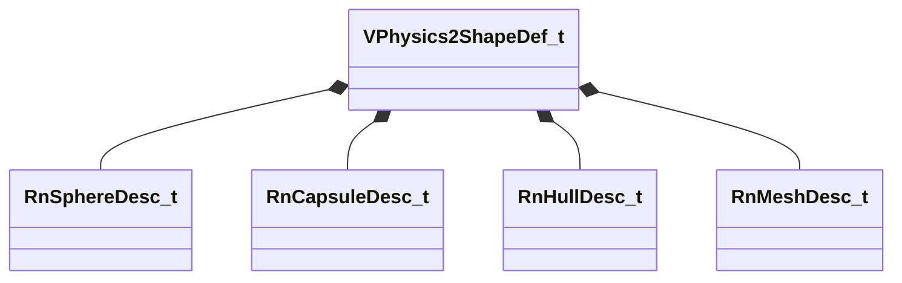

[Schemas](../../schemas.md) / [modellib](../modellib.md) / VPhysics2ShapeDef_t

# VPhysics2ShapeDef_t

> Source: **Build 25000182** · 2026-08-28 · `windows-x86_64` · schema `0.10.0`

**Kind:** class · **Size:** 120 bytes (`0x78`) · **Align:** 8 · **Module:** modellib

**Relationships:**

## Memory layout

5 fields (5 declared here, 0 inherited). Offsets are absolute from the object base.

| Offset | Field | Type | From | Annotations |
|--------|-------|------|------|-------------|
| `0x0` | `m_spheres` | CUtlVector< [RnSphereDesc_t](../physicslib/RnSphereDesc_t.md) > |  |  |
| `0x18` | `m_capsules` | CUtlVector< [RnCapsuleDesc_t](../physicslib/RnCapsuleDesc_t.md) > |  |  |
| `0x30` | `m_hulls` | CUtlVector< [RnHullDesc_t](../physicslib/RnHullDesc_t.md) > |  |  |
| `0x48` | `m_meshes` | CUtlVector< [RnMeshDesc_t](../physicslib/RnMeshDesc_t.md) > |  |  |
| `0x60` | `m_CollisionAttributeIndices` | CUtlVector< uint16 > |  |  |

KV3 class defaults

<pre>{
	&quot;m_spheres&quot;:
	[
	],
	&quot;m_capsules&quot;:
	[
	],
	&quot;m_hulls&quot;:
	[
	],
	&quot;m_meshes&quot;:
	[
	],
	&quot;m_CollisionAttributeIndices&quot;:
	[
	]
}</pre>

