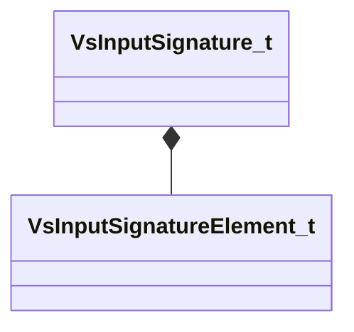

[Schemas](../../schemas.md) / [modellib](../modellib.md) / VsInputSignature_t

# VsInputSignature_t

> Source: **Build 25000182** · 2026-08-28 · `windows-x86_64` · schema `0.10.0`

**Kind:** class · **Size:** 48 bytes (`0x30`) · **Align:** n/a (unspecified) · **Module:** modellib

**Relationships:**

## Memory layout

2 fields (2 declared here, 0 inherited). Offsets are absolute from the object base.

| Offset | Field | Type | From | Annotations |
|--------|-------|------|------|-------------|
| `0x0` | `m_elems` | CUtlVector< [VsInputSignatureElement_t](../modellib/VsInputSignatureElement_t.md) > |  |  |
| `0x18` | `m_depth_elems` | CUtlVector< [VsInputSignatureElement_t](../modellib/VsInputSignatureElement_t.md) > |  |  |
