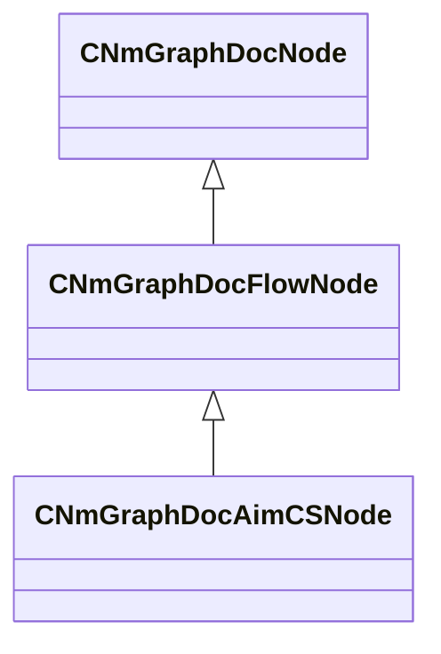
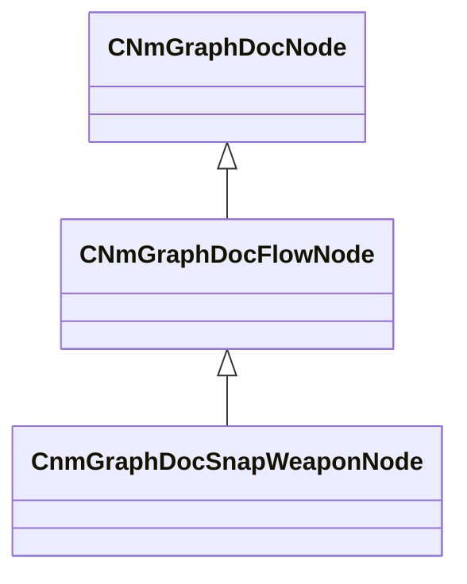

# Module: modtools

[📊 View UML Diagram](../diagrams/modtools.md)

| Name | Kind | Bases | Fields |
|------|------|-------|--------|
| [CNmGraphDocAimCSNode](#cnmgraphdocaimcsnode) | class | CNmGraphDocFlowNode | 3 |
| [CnmGraphDocSnapWeaponNode](#cnmgraphdocsnapweaponnode) | class | CNmGraphDocFlowNode | 0 |

---

### CNmGraphDocAimCSNode

**Inherits from:** [CNmGraphDocFlowNode](animdoclib.md#cnmgraphdocflownode)

**Metadata:** `MGetKV3ClassDefaults`

**Relationships:**

**Fields:**

| Name | Type | Annotations |
|------|------|-------------|
| `m_flActionBlendTimeSeconds` | float32 |  |
| `m_flHandIKBlendInTimeSeconds` | float32 |  |
| `m_flPlantingBlendTimeSeconds` | float32 |  |

### CnmGraphDocSnapWeaponNode

**Inherits from:** [CNmGraphDocFlowNode](animdoclib.md#cnmgraphdocflownode)

**Metadata:** `MGetKV3ClassDefaults`

**Relationships:**

