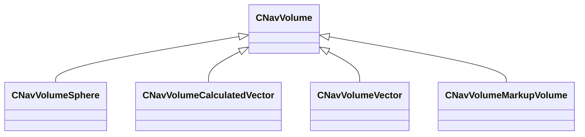
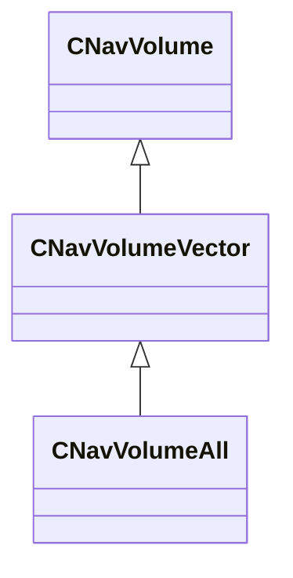
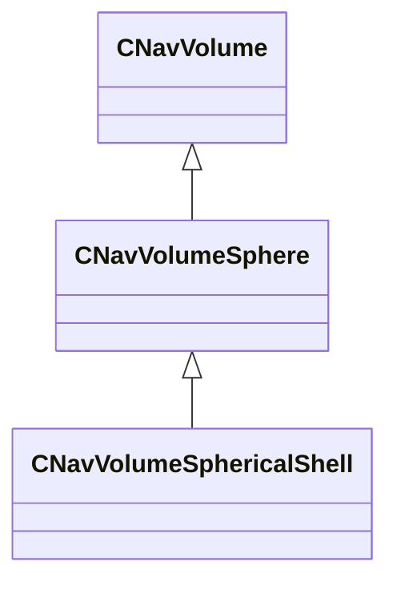

# Module: navlib

[📊 View UML Diagram](../diagrams/navlib.md)

| Name | Kind | Bases | Fields |
|------|------|-------|--------|
| [CNavHullPresetVData](#cnavhullpresetvdata) | class |  | 1 |
| [CNavHullVData](#cnavhullvdata) | class |  | 15 |
| [CNavVolume](#cnavvolume) | class |  | 0 |
| [CNavVolumeAll](#cnavvolumeall) | class | CNavVolumeVector | 0 |
| [CNavVolumeSphere](#cnavvolumesphere) | class | CNavVolume | 2 |
| [CNavVolumeSphericalShell](#cnavvolumesphericalshell) | class | CNavVolumeSphere | 1 |
| [CNavVolumeVector](#cnavvolumevector) | class | CNavVolume | 1 |
| [Extent](#extent) | class |  | 2 |
| [NavAttributeEnum](#navattributeenum) | enum |  | 20 |
| [NavDirType](#navdirtype) | enum |  | 5 |
| [NavGravity_t](#navgravity_t) | class |  | 2 |
| [NavHull_t](#navhull_t) | class |  | 1 |

---

### CNavHullPresetVData

**Metadata:** `MVDataRoot`, `MGetKV3ClassDefaults {
	"m_vecNavHulls":
	[
	]
}`

**Fields:**

| Name | Type | Annotations |
|------|------|-------------|
| `m_vecNavHulls` | CUtlVector<CUtlString> | `MPropertyFriendlyName "Nav Hulls"` `MPropertyDescription "List of nav hulls belonging to this preset."` `MPropertyAttributeEditor "VDataChoice( scripts/nav_hulls.vdata )"` |

### CNavHullVData

**Metadata:** `MVDataRoot`, `MGetKV3ClassDefaults {
	"m_bAgentEnabled": true,
	"m_agentRadius": 15.000000,
	"m_agentHeight": 71.000000,
	"m_agentShortHeightEnabled": false,
	"m_agentShortHeight": 35.500000,
	"m_agentCrawlEnabled": false,
	"m_agentCrawlHeight": 17.500000,
	"m_agentMaxClimb": 17.500000,
	"m_agentMaxSlope": 50,
	"m_agentMaxJumpDownDist": 240.000000,
	"m_agentMaxJumpHorizDistBase": 64.000000,
	"m_agentMaxJumpUpDist": 0.000000,
	"m_agentBorderErosion": -1,
	"m_flowMapGenerationEnabled": false,
	"m_flowMapNodeMaxRadius": 400.000000
}`

**Fields:**

| Name | Type | Annotations |
|------|------|-------------|
| `m_bAgentEnabled` | bool | `MPropertyFriendlyName "Enabled"` `MPropertyDescription "Is this agent enabled for generation? ( will result in 0 nav areas for this agent if not )."` |
| `m_agentRadius` | float32 | `MPropertyFriendlyName "Radius"` `MPropertyDescription "Radius of navigating agent capsule."` |
| `m_agentHeight` | float32 | `MPropertyFriendlyName "Height"` `MPropertyDescription "Height of navigating agent capsule."` |
| `m_agentShortHeightEnabled` | bool | `MPropertyFriendlyName "Enable Crouch Height"` `MPropertyDescription "Enable shorter navigating agent capsules ( crouch ) in addition to regular height capsules."` |
| `m_agentShortHeight` | float32 | `MPropertyFriendlyName "Crouch height"` `MPropertyDescription "Crouch height of navigating agent capsules if enabled."` |
| `m_agentCrawlEnabled` | bool | `MPropertyFriendlyName "Enable Crawl Height"` `MPropertyDescription "Enable even shorter navigating agent capsules ( crawl ) in addition to regular height capsules."` |
| `m_agentCrawlHeight` | float32 | `MPropertyFriendlyName "Crawl height"` `MPropertyDescription "Crawl height of navigating agent capsules if enabled."` |
| `m_agentMaxClimb` | float32 | `MPropertyFriendlyName "Max Climb"` `MPropertyDescription "Max vertical offset that the agent simply ignores and walks over."` |
| `m_agentMaxSlope` | int32 | `MPropertyFriendlyName "Max Slope"` `MPropertyDescription "Max ground slope to be considered walkable."` |
| `m_agentMaxJumpDownDist` | float32 | `MPropertyFriendlyName "Max Jump Down Distance"` `MPropertyDescription "Max vertical offset at which to create a jump connection ( possibly one-way )."` |
| `m_agentMaxJumpHorizDistBase` | float32 | `MPropertyFriendlyName "Max Horizontal Jump Distance"` `MPropertyDescription "Max horizontal offset over which to create a jump connection ( actually a parameter into the true threshold function )."` |
| `m_agentMaxJumpUpDist` | float32 | `MPropertyFriendlyName "Max Jump Up Distance"` `MPropertyDescription "Max vertical offset at which to make a jump connection two-way."` |
| `m_agentBorderErosion` | int32 | `MPropertyFriendlyName "Border Erosion"` `MPropertyDescription "Border erosion in voxel units ( -1 to use default value based on agent radius )."` |
| `m_flowMapGenerationEnabled` | bool | `MPropertyFriendlyName "Hierarchical Nav"` `MPropertyDescription "Enables super node nav information to be generated"` |
| `m_flowMapNodeMaxRadius` | float32 | `MPropertyFriendlyName "Hierarchical Nav Max Super Node radius"` `MPropertyDescription "Maximum radius of a super node - larger means lower resolution"` |

### CNavVolume

**Derived by:** [CNavVolumeCalculatedVector](server.md#cnavvolumecalculatedvector), [CNavVolumeMarkupVolume](server.md#cnavvolumemarkupvolume), [CNavVolumeSphere](navlib.md#cnavvolumesphere), [CNavVolumeVector](navlib.md#cnavvolumevector)

**Relationships:**

### CNavVolumeAll

**Inherits from:** [CNavVolumeVector](navlib.md#cnavvolumevector)

**Relationships:**

### CNavVolumeSphere

**Inherits from:** [CNavVolume](navlib.md#cnavvolume)

**Derived by:** [CNavVolumeSphericalShell](navlib.md#cnavvolumesphericalshell)

**Relationships:**

**Fields:**

| Name | Type | Annotations |
|------|------|-------------|
| `m_vCenter` | VectorWS |  |
| `m_flRadius` | float32 |  |

### CNavVolumeSphericalShell

**Inherits from:** [CNavVolumeSphere](navlib.md#cnavvolumesphere)

**Relationships:**

**Fields:**

| Name | Type | Annotations |
|------|------|-------------|
| `m_flRadiusInner` | float32 |  |

### CNavVolumeVector

**Inherits from:** [CNavVolume](navlib.md#cnavvolume)

**Derived by:** [CNavVolumeAll](navlib.md#cnavvolumeall)

**Relationships:**

**Fields:**

| Name | Type | Annotations |
|------|------|-------------|
| `m_bHasBeenPreFiltered` | bool |  |

### Extent

**Fields:**

| Name | Type | Annotations |
|------|------|-------------|
| `lo` | VectorWS |  |
| `hi` | VectorWS |  |

### NavAttributeEnum

**Values:**

| Name | Value | Description |
|------|-------|-------------|
| `NAV_MESH_AVOID` | 128 |  |
| `NAV_MESH_STAIRS` | 4096 |  |
| `NAV_MESH_NON_ZUP` | 32768 |  |
| `NAV_MESH_CROUCH_HEIGHT` | 65536 |  |
| `NAV_MESH_NON_ZUP_TRANSITION` | 131072 |  |
| `NAV_MESH_CRAWL_HEIGHT` | 262144 |  |
| `NAV_MESH_CROUCH` | 65536 |  |
| `NAV_MESH_JUMP` | 2 |  |
| `NAV_MESH_NO_JUMP` | 8 |  |
| `NAV_MESH_STOP` | 16 |  |
| `NAV_MESH_RUN` | 32 |  |
| `NAV_MESH_WALK` | 64 |  |
| `NAV_MESH_TRANSIENT` | 256 |  |
| `NAV_MESH_DONT_HIDE` | 512 |  |
| `NAV_MESH_STAND` | 1024 |  |
| `NAV_MESH_NO_HOSTAGES` | 2048 |  |
| `NAV_MESH_NO_MERGE` | 8192 |  |
| `NAV_MESH_OBSTACLE_TOP` | 16384 |  |
| `NAV_ATTR_FIRST_GAME_INDEX` | 19 |  |
| `NAV_ATTR_LAST_INDEX` | 63 |  |

### NavDirType

**Values:**

| Name | Value | Description |
|------|-------|-------------|
| `NORTH` | 0 |  |
| `EAST` | 1 |  |
| `SOUTH` | 2 |  |
| `WEST` | 3 |  |
| `NUM_NAV_DIR_TYPE_DIRECTIONS` | 4 |  |

### NavGravity_t

**Fields:**

| Name | Type | Annotations |
|------|------|-------------|
| `m_vGravity` | Vector |  |
| `m_bDefault` | bool |  |

### NavHull_t

**Metadata:** `MGetKV3ClassDefaults Could not parse KV3 Defaults`

**Fields:**

| Name | Type | Annotations |
|------|------|-------------|
| `m_nHullIdx` | int32 |  |
