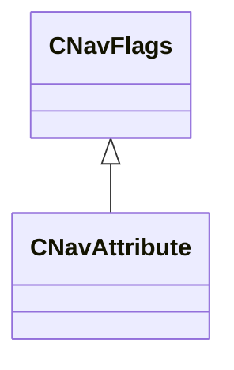
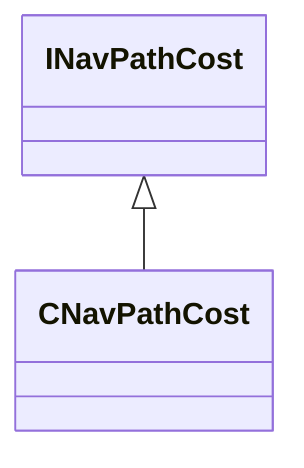
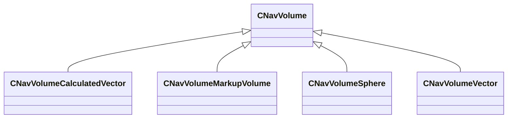
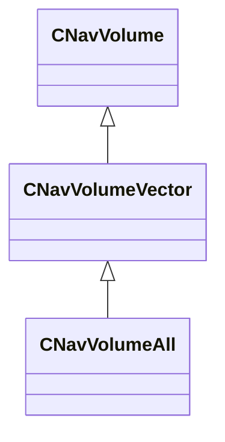
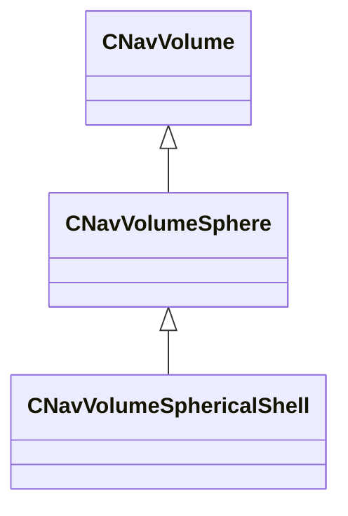
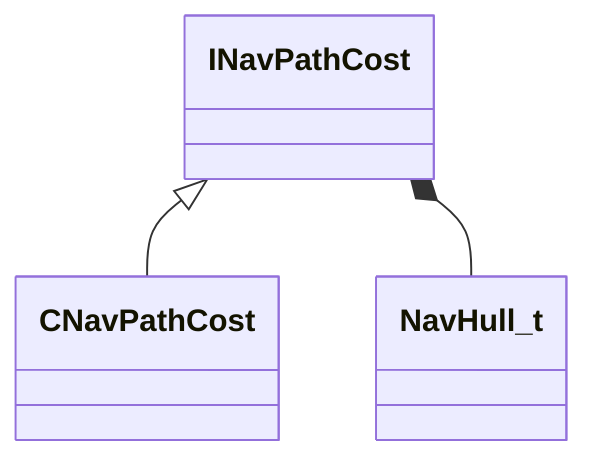

# Module: navlib

[📊 View UML Diagram](../diagrams/navlib.md)

| Name | Kind | Bases | Fields |
|------|------|-------|--------|
| [CNavAttribute](#cnavattribute) | class | CNavFlags | 0 |
| [CNavFlags](#cnavflags) | class |  | 1 |
| [CNavHullPresetVData](#cnavhullpresetvdata) | class |  | 1 |
| [CNavHullVData](#cnavhullvdata) | class |  | 15 |
| [CNavPathCost](#cnavpathcost) | class | INavPathCost | 12 |
| [CNavVolume](#cnavvolume) | class |  | 0 |
| [CNavVolumeAll](#cnavvolumeall) | class | CNavVolumeVector | 0 |
| [CNavVolumeSphere](#cnavvolumesphere) | class | CNavVolume | 2 |
| [CNavVolumeSphericalShell](#cnavvolumesphericalshell) | class | CNavVolumeSphere | 1 |
| [CNavVolumeVector](#cnavvolumevector) | class | CNavVolume | 1 |
| [Extent](#extent) | class |  | 2 |
| [INavPathCost](#inavpathcost) | class |  | 1 |
| [NavGravity_t](#navgravity_t) | class |  | 2 |
| [NavHull_t](#navhull_t) | class |  | 1 |

---

### CNavAttribute

**Inherits from:** [CNavFlags](navlib.md#cnavflags)

**Relationships:**

```mermaid
classDiagram
    CNavFlags <|-- CNavAttribute
```

### CNavFlags

**Derived by:** [CNavAttribute](navlib.md#cnavattribute)

**Relationships:**

```mermaid
classDiagram
    CNavFlags <|-- CNavAttribute
```

**Fields:**

| Name | Type | Annotations |
|------|------|-------------|
| `m_Flags` | uint64 |  |

### CNavHullPresetVData

**Metadata:** `MGetKV3ClassDefaults {
	"m_vecNavHulls":
	[
	]
}`, `MVDataRoot`

**Fields:**

| Name | Type | Annotations |
|------|------|-------------|
| `m_vecNavHulls` | CUtlVector< CUtlString > | `MPropertyAttributeEditor VDataChoice( scripts/nav_hulls.vdata )` `MPropertyDescription List of nav hulls belonging to this preset.` `MPropertyFriendlyName Nav Hulls` |

### CNavHullVData

**Metadata:** `MGetKV3ClassDefaults {
	"m_bAgentEnabled": true,
	"m_agentRadius": 15.000000,
	"m_agentHeight": 71.000000,
	"m_agentShortHeightEnabled": false,
	"m_agentShortHeight": 35.500000,
	"m_agentCrawlEnabled": false,
	"m_agentCrawlHeight": 17.500000,
	"m_agentMaxClimb": 17.500000,
	"m_agentMaxSlope": 50,
	"m_agentMaxJumpDownDist": 240.000000,
	"m_agentMaxJumpHorizDistBase": 64.000000,
	"m_agentMaxJumpUpDist": 0.000000,
	"m_agentBorderErosion": -1,
	"m_flowMapGenerationEnabled": false,
	"m_flowMapNodeMaxRadius": 400.000000
}`, `MVDataRoot`

**Fields:**

| Name | Type | Annotations |
|------|------|-------------|
| `m_bAgentEnabled` | bool | `MPropertyDescription Is this agent enabled for generation? ( will result in 0 nav areas for this agent if not ).` `MPropertyFriendlyName Enabled` |
| `m_agentRadius` | float32 | `MPropertyDescription Radius of navigating agent capsule.` `MPropertyFriendlyName Radius` |
| `m_agentHeight` | float32 | `MPropertyDescription Height of navigating agent capsule.` `MPropertyFriendlyName Height` |
| `m_agentShortHeightEnabled` | bool | `MPropertyDescription Enable shorter navigating agent capsules ( crouch ) in addition to regular height capsules.` `MPropertyFriendlyName Enable Crouch Height` |
| `m_agentShortHeight` | float32 | `MPropertyDescription Crouch height of navigating agent capsules if enabled.` `MPropertyFriendlyName Crouch height` |
| `m_agentCrawlEnabled` | bool | `MPropertyDescription Enable even shorter navigating agent capsules ( crawl ) in addition to regular height capsules.` `MPropertyFriendlyName Enable Crawl Height` |
| `m_agentCrawlHeight` | float32 | `MPropertyDescription Crawl height of navigating agent capsules if enabled.` `MPropertyFriendlyName Crawl height` |
| `m_agentMaxClimb` | float32 | `MPropertyDescription Max vertical offset that the agent simply ignores and walks over.` `MPropertyFriendlyName Max Climb` |
| `m_agentMaxSlope` | int32 | `MPropertyDescription Max ground slope to be considered walkable.` `MPropertyFriendlyName Max Slope` |
| `m_agentMaxJumpDownDist` | float32 | `MPropertyDescription Max vertical offset at which to create a jump connection ( possibly one-way ).` `MPropertyFriendlyName Max Jump Down Distance` |
| `m_agentMaxJumpHorizDistBase` | float32 | `MPropertyDescription Max horizontal offset over which to create a jump connection ( actually a parameter into the true threshold function ).` `MPropertyFriendlyName Max Horizontal Jump Distance` |
| `m_agentMaxJumpUpDist` | float32 | `MPropertyDescription Max vertical offset at which to make a jump connection two-way.` `MPropertyFriendlyName Max Jump Up Distance` |
| `m_agentBorderErosion` | int32 | `MPropertyDescription Border erosion in voxel units ( -1 to use default value based on agent radius ).` `MPropertyFriendlyName Border Erosion` |
| `m_flowMapGenerationEnabled` | bool | `MPropertyDescription Enables super node nav information to be generated` `MPropertyFriendlyName Hierarchical Nav` |
| `m_flowMapNodeMaxRadius` | float32 | `MPropertyDescription Maximum radius of a super node - larger means lower resolution` `MPropertyFriendlyName Hierarchical Nav Max Super Node radius` |

### CNavPathCost

**Inherits from:** [INavPathCost](navlib.md#inavpathcost)

**Metadata:** `MGetKV3ClassDefaults`

**Relationships:**

```mermaid
classDiagram
    INavPathCost <|-- CNavPathCost
```

**Fields:**

| Name | Type | Annotations |
|------|------|-------------|
| `m_bAllowLadders` | bool |  |
| `m_bCanFly` | bool |  |
| `m_bCanSwim` | bool |  |
| `m_flWaterToGroundMaxHeight` | float32 |  |
| `m_flGroundToWaterMaxHeight` | float32 |  |
| `m_flGroundToWaterTransitionDistance` | float32 |  |
| `m_flWaterToGroundTransitionDistance` | float32 |  |
| `m_flFlyingTransitionTolerance` | float32 |  |
| `m_bOptimizeFlySpacePathfinds` | bool |  |
| `m_bStringPullFlySpacePathfinds` | bool |  |
| `m_bSupportsTransitions` | bool |  |
| `m_flTransitionPenalty` | float32 |  |

### CNavVolume

**Derived by:** [CNavVolumeCalculatedVector](server.md#cnavvolumecalculatedvector), [CNavVolumeMarkupVolume](server.md#cnavvolumemarkupvolume), [CNavVolumeSphere](navlib.md#cnavvolumesphere), [CNavVolumeVector](navlib.md#cnavvolumevector)

**Relationships:**

```mermaid
classDiagram
    CNavVolume <|-- CNavVolumeCalculatedVector
    CNavVolume <|-- CNavVolumeMarkupVolume
    CNavVolume <|-- CNavVolumeSphere
    CNavVolume <|-- CNavVolumeVector
```

### CNavVolumeAll

**Inherits from:** [CNavVolumeVector](navlib.md#cnavvolumevector)

**Relationships:**

```mermaid
classDiagram
    CNavVolumeVector <|-- CNavVolumeAll
    CNavVolume <|-- CNavVolumeVector
```

### CNavVolumeSphere

**Inherits from:** [CNavVolume](navlib.md#cnavvolume)

**Derived by:** [CNavVolumeSphericalShell](navlib.md#cnavvolumesphericalshell)

**Relationships:**

```mermaid
classDiagram
    CNavVolume <|-- CNavVolumeSphere
    CNavVolumeSphere <|-- CNavVolumeSphericalShell
```

**Fields:**

| Name | Type | Annotations |
|------|------|-------------|
| `m_vCenter` | VectorWS |  |
| `m_flRadius` | float32 |  |

### CNavVolumeSphericalShell

**Inherits from:** [CNavVolumeSphere](navlib.md#cnavvolumesphere)

**Relationships:**

```mermaid
classDiagram
    CNavVolumeSphere <|-- CNavVolumeSphericalShell
    CNavVolume <|-- CNavVolumeSphere
```

**Fields:**

| Name | Type | Annotations |
|------|------|-------------|
| `m_flRadiusInner` | float32 |  |

### CNavVolumeVector

**Inherits from:** [CNavVolume](navlib.md#cnavvolume)

**Derived by:** [CNavVolumeAll](navlib.md#cnavvolumeall)

**Relationships:**

```mermaid
classDiagram
    CNavVolume <|-- CNavVolumeVector
    CNavVolumeVector <|-- CNavVolumeAll
```

**Fields:**

| Name | Type | Annotations |
|------|------|-------------|
| `m_bHasBeenPreFiltered` | bool |  |

### Extent

**Fields:**

| Name | Type | Annotations |
|------|------|-------------|
| `lo` | VectorWS |  |
| `hi` | VectorWS |  |

### INavPathCost

**Derived by:** [CNavPathCost](navlib.md#cnavpathcost)

**Metadata:** `MGetKV3ClassDefaults`

**Relationships:**

```mermaid
classDiagram
    INavPathCost <|-- CNavPathCost
    INavPathCost *-- NavHull_t
```

**Fields:**

| Name | Type | Annotations |
|------|------|-------------|
| `m_navHull` | [NavHull_t](../schemas/navlib.md#navhull_t) |  |

### NavGravity_t

**Metadata:** `MGetKV3ClassDefaults {
	"m_vGravity":
	[
		0.000000,
		0.000000,
		0.000000
	],
	"m_bDefault": true
}`

**Fields:**

| Name | Type | Annotations |
|------|------|-------------|
| `m_vGravity` | Vector |  |
| `m_bDefault` | bool |  |

### NavHull_t

**Metadata:** `MGetKV3ClassDefaults`

**Fields:**

| Name | Type | Annotations |
|------|------|-------------|
| `m_nHullIdx` | int32 |  |
