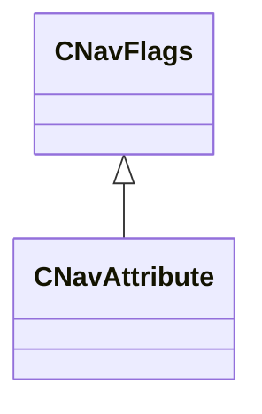

[Schemas](../../schemas.md) / [navlib](../navlib.md) / CNavAttribute

# CNavAttribute

**Kind:** class · **Size:** 8 bytes (`0x8`) · **Align:** 255 · **Module:** navlib

**Inherits from:** [CNavFlags](../navlib/CNavFlags.md)

**Relationships:**

## Memory layout

1 fields (0 declared here, 1 inherited). Offsets are absolute from the object base.

| Offset | Field | Type | From | Annotations |
|--------|-------|------|------|-------------|
| `0x0` | `m_Flags` | uint64 | [CNavFlags](../navlib/CNavFlags.md) |  |
