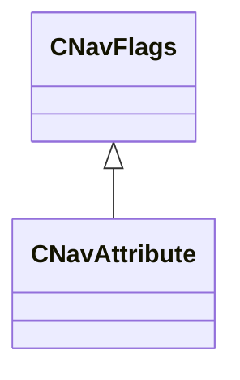

[Schemas](../../schemas.md) / [navlib](../navlib.md) / CNavFlags

# CNavFlags

**Kind:** class · **Size:** 8 bytes (`0x8`) · **Align:** 255 · **Module:** navlib

**Derived by:** [CNavAttribute](../navlib/CNavAttribute.md)

**Relationships:**

## Memory layout

1 fields (1 declared here, 0 inherited). Offsets are absolute from the object base.

| Offset | Field | Type | From | Annotations |
|--------|-------|------|------|-------------|
| `0x0` | `m_Flags` | uint64 |  |  |
