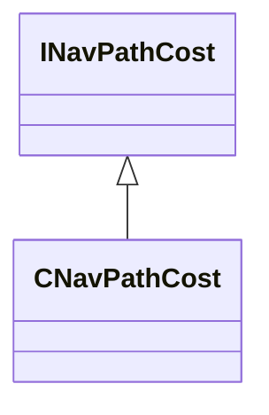

[Schemas](../../schemas.md) / [navlib](../navlib.md) / CNavPathCost

# CNavPathCost

> Source: **Build 25000182** · 2026-08-28 · `windows-x86_64` · schema `0.10.0`

**Kind:** class · **Size:** 48 bytes (`0x30`) · **Align:** n/a (unspecified) · **Module:** navlib

**Inherits from:** [INavPathCost](../navlib/INavPathCost.md)

**Relationships:**

## Memory layout

13 fields (12 declared here, 1 inherited). Offsets are absolute from the object base.

| Offset | Field | Type | From | Annotations |
|--------|-------|------|------|-------------|
| `0x8` | `m_navHull` | [NavHull_t](../navlib/NavHull_t.md) | [INavPathCost](../navlib/INavPathCost.md) |  |
| `0x10` | `m_bAllowLadders` | bool |  |  |
| `0x11` | `m_bCanFly` | bool |  |  |
| `0x12` | `m_bCanSwim` | bool |  |  |
| `0x14` | `m_flWaterToGroundMaxHeight` | float32 |  |  |
| `0x18` | `m_flGroundToWaterMaxHeight` | float32 |  |  |
| `0x1c` | `m_flGroundToWaterTransitionDistance` | float32 |  |  |
| `0x20` | `m_flWaterToGroundTransitionDistance` | float32 |  |  |
| `0x24` | `m_flFlyingTransitionTolerance` | float32 |  |  |
| `0x28` | `m_bOptimizeFlySpacePathfinds` | bool |  |  |
| `0x29` | `m_bStringPullFlySpacePathfinds` | bool |  |  |
| `0x2a` | `m_bSupportsTransitions` | bool |  |  |
| `0x2c` | `m_flTransitionPenalty` | float32 |  |  |
