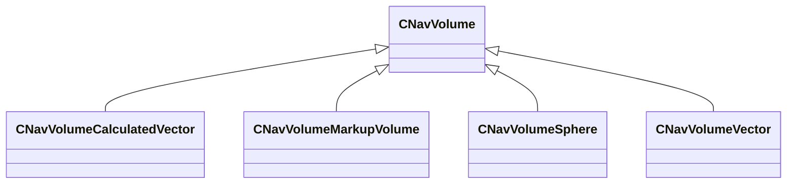

[Schemas](../../schemas.md) / [navlib](../navlib.md) / CNavVolume

# CNavVolume

> Source: **Build 25000182** · 2026-08-28 · `windows-x86_64` · schema `0.10.0`

**Kind:** class · **Size:** 120 bytes (`0x78`) · **Align:** n/a (unspecified) · **Module:** navlib

**Derived by:** [CNavVolumeCalculatedVector](../server/CNavVolumeCalculatedVector.md), [CNavVolumeMarkupVolume](../server/CNavVolumeMarkupVolume.md), [CNavVolumeSphere](../navlib/CNavVolumeSphere.md), [CNavVolumeVector](../navlib/CNavVolumeVector.md)

**Relationships:**

## Memory layout

No schema-visible fields (120 bytes of opaque storage).
