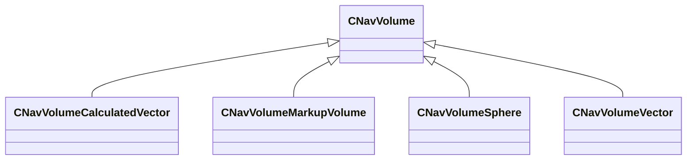

[Schemas](../../schemas.md) / [navlib](../navlib.md) / CNavVolume

# CNavVolume

**Kind:** class · **Size:** 120 bytes (`0x78`) · **Align:** 255 · **Module:** navlib

**Derived by:** [CNavVolumeCalculatedVector](../server/CNavVolumeCalculatedVector.md), [CNavVolumeMarkupVolume](../server/CNavVolumeMarkupVolume.md), [CNavVolumeSphere](../navlib/CNavVolumeSphere.md), [CNavVolumeVector](../navlib/CNavVolumeVector.md)

**Relationships:**

