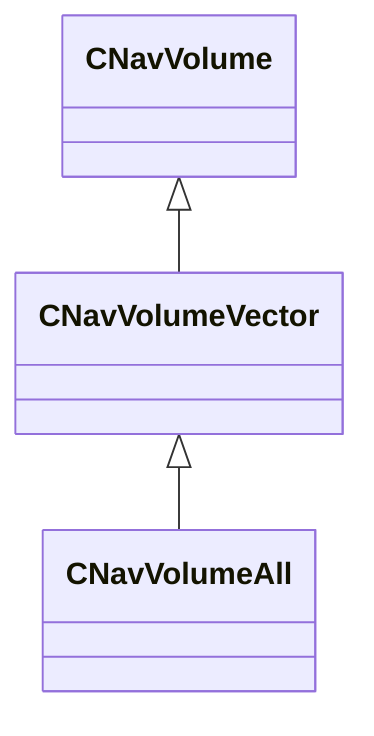

[Schemas](../../schemas.md) / [navlib](../navlib.md) / CNavVolumeAll

# CNavVolumeAll

**Kind:** class · **Size:** 160 bytes (`0xa0`) · **Align:** 255 · **Module:** navlib

**Inherits from:** [CNavVolumeVector](../navlib/CNavVolumeVector.md)

**Relationships:**

## Memory layout

1 fields (0 declared here, 1 inherited). Offsets are absolute from the object base.

| Offset | Field | Type | From | Annotations |
|--------|-------|------|------|-------------|
| `0x80` | `m_bHasBeenPreFiltered` | bool | [CNavVolumeVector](../navlib/CNavVolumeVector.md) |  |
