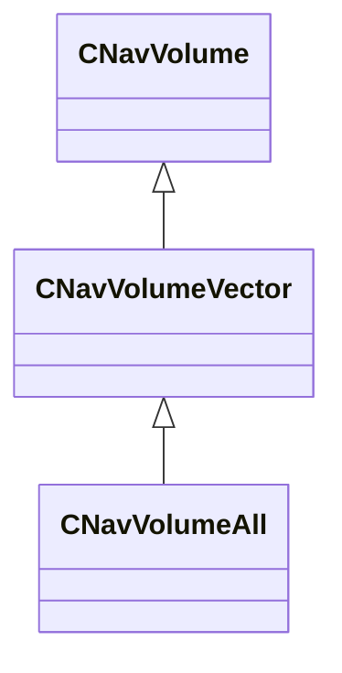

[Schemas](../../schemas.md) / [navlib](../navlib.md) / CNavVolumeAll

# CNavVolumeAll

> Source: **Build 25000182** · 2026-08-28 · `windows-x86_64` · schema `0.10.0`

**Kind:** class · **Size:** 160 bytes (`0xa0`) · **Align:** n/a (unspecified) · **Module:** navlib

**Inherits from:** [CNavVolumeVector](../navlib/CNavVolumeVector.md)

**Relationships:**

## Memory layout

1 field (0 declared here, 1 inherited). Offsets are absolute from the object base.

| Offset | Field | Type | From | Annotations |
|--------|-------|------|------|-------------|
| `0x80` | `m_bHasBeenPreFiltered` | bool | [CNavVolumeVector](../navlib/CNavVolumeVector.md) |  |
