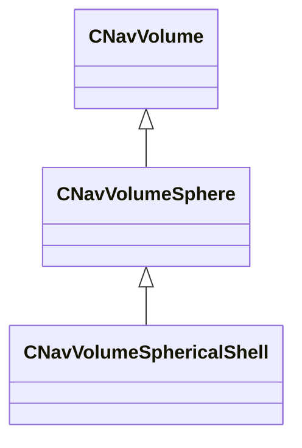

[Schemas](../../schemas.md) / [navlib](../navlib.md) / CNavVolumeSphere

# CNavVolumeSphere

> Source: **Build 25000182** · 2026-08-28 · `windows-x86_64` · schema `0.10.0`

**Kind:** class · **Size:** 136 bytes (`0x88`) · **Align:** n/a (unspecified) · **Module:** navlib

**Inherits from:** [CNavVolume](../navlib/CNavVolume.md)

**Derived by:** [CNavVolumeSphericalShell](../navlib/CNavVolumeSphericalShell.md)

**Relationships:**

## Memory layout

2 fields (2 declared here, 0 inherited). Offsets are absolute from the object base.

| Offset | Field | Type | From | Annotations |
|--------|-------|------|------|-------------|
| `0x78` | `m_vCenter` | VectorWS |  |  |
| `0x84` | `m_flRadius` | float32 |  |  |
