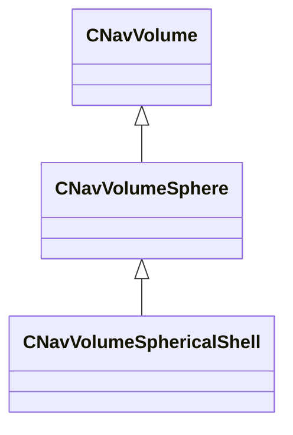

[Schemas](../../schemas.md) / [navlib](../navlib.md) / CNavVolumeSphericalShell

# CNavVolumeSphericalShell

**Kind:** class · **Size:** 144 bytes (`0x90`) · **Align:** 255 · **Module:** navlib

**Inherits from:** [CNavVolumeSphere](../navlib/CNavVolumeSphere.md)

**Relationships:**

## Memory layout

3 fields (1 declared here, 2 inherited). Offsets are absolute from the object base.

| Offset | Field | Type | From | Annotations |
|--------|-------|------|------|-------------|
| `0x78` | `m_vCenter` | VectorWS | [CNavVolumeSphere](../navlib/CNavVolumeSphere.md) |  |
| `0x84` | `m_flRadius` | float32 | [CNavVolumeSphere](../navlib/CNavVolumeSphere.md) |  |
| `0x88` | `m_flRadiusInner` | float32 |  |  |
