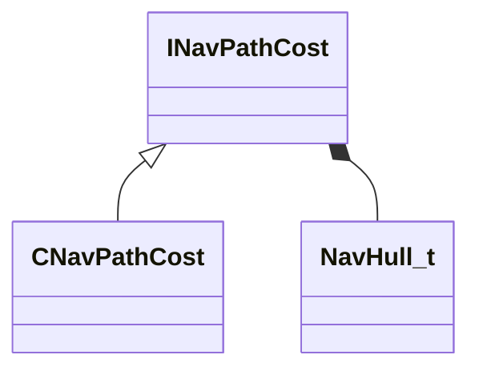

[Schemas](../../schemas.md) / [navlib](../navlib.md) / INavPathCost

# INavPathCost

> Source: **Build 25000182** · 2026-08-28 · `windows-x86_64` · schema `0.10.0`

**Kind:** class · **Size:** 16 bytes (`0x10`) · **Align:** n/a (unspecified) · **Module:** navlib

**Derived by:** [CNavPathCost](../navlib/CNavPathCost.md)

**Relationships:**

## Memory layout

1 field (1 declared here, 0 inherited). Offsets are absolute from the object base.

| Offset | Field | Type | From | Annotations |
|--------|-------|------|------|-------------|
| `0x8` | `m_navHull` | [NavHull_t](../navlib/NavHull_t.md) |  |  |
