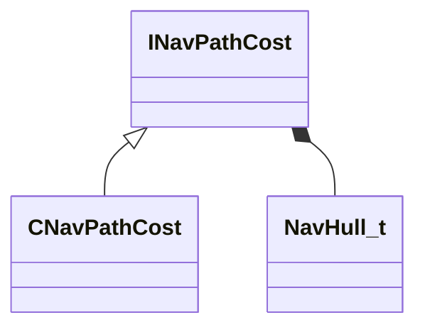

[Schemas](../../schemas.md) / [navlib](../navlib.md) / INavPathCost

# INavPathCost

**Kind:** class · **Size:** 16 bytes (`0x10`) · **Align:** 255 · **Module:** navlib

**Derived by:** [CNavPathCost](../navlib/CNavPathCost.md)

**Relationships:**

## Memory layout

1 fields (1 declared here, 0 inherited). Offsets are absolute from the object base.

| Offset | Field | Type | From | Annotations |
|--------|-------|------|------|-------------|
| `0x8` | `m_navHull` | [NavHull_t](../navlib/NavHull_t.md) |  |  |
