# Module: particles

[📊 View UML Diagram](../diagrams/particles.md)

| Name | Kind | Bases | Fields |
|------|------|-------|--------|
| [BBoxVolumeType_t](#bboxvolumetype_t) | enum |  | 4 |
| [BlurFilterType_t](#blurfiltertype_t) | enum |  | 2 |
| [CBaseRendererSource2](#cbaserenderersource2) | class | CParticleFunctionRenderer | 65 |
| [CBaseTrailRenderer](#cbasetrailrenderer) | class | CBaseRendererSource2 | 7 |
| [CGeneralRandomRotation](#cgeneralrandomrotation) | class | CParticleFunctionInitializer | 6 |
| [CGeneralSpin](#cgeneralspin) | class | CParticleFunctionOperator | 3 |
| [CPAssignment_t](#cpassignment_t) | class |  | 3 |
| [CParticleFunction](#cparticlefunction) | class |  | 17 |
| [CParticleFunctionConstraint](#cparticlefunctionconstraint) | class | CParticleFunction | 0 |
| [CParticleFunctionEmitter](#cparticlefunctionemitter) | class | CParticleFunction | 1 |
| [CParticleFunctionForce](#cparticlefunctionforce) | class | CParticleFunction | 0 |
| [CParticleFunctionInitializer](#cparticlefunctioninitializer) | class | CParticleFunction | 1 |
| [CParticleFunctionOperator](#cparticlefunctionoperator) | class | CParticleFunction | 0 |
| [CParticleFunctionPreEmission](#cparticlefunctionpreemission) | class | CParticleFunctionOperator | 1 |
| [CParticleFunctionRenderer](#cparticlefunctionrenderer) | class | CParticleFunction | 3 |
| [CParticleMassCalculationParameters](#cparticlemasscalculationparameters) | class |  | 4 |
| [CParticleSystemDefinition](#cparticlesystemdefinition) | class | IParticleSystemDefinition | 66 |
| [CParticleVisibilityInputs](#cparticlevisibilityinputs) | class |  | 19 |
| [CPathParameters](#cpathparameters) | class |  | 8 |
| [CRandomNumberGeneratorParameters](#crandomnumbergeneratorparameters) | class |  | 2 |
| [CReplicationParameters](#creplicationparameters) | class |  | 7 |
| [CSpinUpdateBase](#cspinupdatebase) | class | CParticleFunctionOperator | 0 |
| [C_INIT_AddVectorToVector](#c_init_addvectortovector) | class | CParticleFunctionInitializer | 6 |
| [C_INIT_AgeNoise](#c_init_agenoise) | class | CParticleFunctionInitializer | 8 |
| [C_INIT_ChaoticAttractor](#c_init_chaoticattractor) | class | CParticleFunctionInitializer | 9 |
| [C_INIT_CheckParticleForWater](#c_init_checkparticleforwater) | class | CParticleFunctionInitializer | 4 |
| [C_INIT_ColorLitPerParticle](#c_init_colorlitperparticle) | class | CParticleFunctionInitializer | 7 |
| [C_INIT_CreateAlongPath](#c_init_createalongpath) | class | CParticleFunctionInitializer | 5 |
| [C_INIT_CreateFromCPs](#c_init_createfromcps) | class | CParticleFunctionInitializer | 4 |
| [C_INIT_CreateFromParentParticles](#c_init_createfromparentparticles) | class | CParticleFunctionInitializer | 6 |
| [C_INIT_CreateFromPlaneCache](#c_init_createfromplanecache) | class | CParticleFunctionInitializer | 3 |
| [C_INIT_CreateInEpitrochoid](#c_init_createinepitrochoid) | class | CParticleFunctionInitializer | 10 |
| [C_INIT_CreateOnGrid](#c_init_createongrid) | class | CParticleFunctionInitializer | 10 |
| [C_INIT_CreateOnModel](#c_init_createonmodel) | class | CParticleFunctionInitializer | 16 |
| [C_INIT_CreateOnModelAtHeight](#c_init_createonmodelatheight) | class | CParticleFunctionInitializer | 14 |
| [C_INIT_CreateParticleImpulse](#c_init_createparticleimpulse) | class | CParticleFunctionInitializer | 5 |
| [C_INIT_CreatePhyllotaxis](#c_init_createphyllotaxis) | class | CParticleFunctionInitializer | 14 |
| [C_INIT_CreateSequentialPath](#c_init_createsequentialpath) | class | CParticleFunctionInitializer | 6 |
| [C_INIT_CreateSequentialPathV2](#c_init_createsequentialpathv2) | class | CParticleFunctionInitializer | 6 |
| [C_INIT_CreateSpiralSphere](#c_init_createspiralsphere) | class | CParticleFunctionInitializer | 6 |
| [C_INIT_CreateWithinBox](#c_init_createwithinbox) | class | CParticleFunctionInitializer | 6 |
| [C_INIT_CreateWithinCapsuleTransform](#c_init_createwithincapsuletransform) | class | CParticleFunctionInitializer | 11 |
| [C_INIT_CreateWithinSphereTransform](#c_init_createwithinspheretransform) | class | CParticleFunctionInitializer | 13 |
| [C_INIT_CreationNoise](#c_init_creationnoise) | class | CParticleFunctionInitializer | 10 |
| [C_INIT_DistanceCull](#c_init_distancecull) | class | CParticleFunctionInitializer | 3 |
| [C_INIT_DistanceToCPInit](#c_init_distancetocpinit) | class | CParticleFunctionInitializer | 15 |
| [C_INIT_DistanceToNeighborCull](#c_init_distancetoneighborcull) | class | CParticleFunctionInitializer | 7 |
| [C_INIT_GlobalScale](#c_init_globalscale) | class | CParticleFunctionInitializer | 6 |
| [C_INIT_InheritFromParentParticles](#c_init_inheritfromparentparticles) | class | CParticleFunctionInitializer | 5 |
| [C_INIT_InheritVelocity](#c_init_inheritvelocity) | class | CParticleFunctionInitializer | 2 |
| [C_INIT_InitFloat](#c_init_initfloat) | class | CParticleFunctionInitializer | 4 |
| [C_INIT_InitFloatCollection](#c_init_initfloatcollection) | class | CParticleFunctionInitializer | 2 |
| [C_INIT_InitFromCPSnapshot](#c_init_initfromcpsnapshot) | class | CParticleFunctionInitializer | 11 |
| [C_INIT_InitFromParentKilled](#c_init_initfromparentkilled) | class | CParticleFunctionInitializer | 2 |
| [C_INIT_InitFromVectorFieldSnapshot](#c_init_initfromvectorfieldsnapshot) | class | CParticleFunctionInitializer | 5 |
| [C_INIT_InitSkinnedPositionFromCPSnapshot](#c_init_initskinnedpositionfromcpsnapshot) | class | CParticleFunctionInitializer | 19 |
| [C_INIT_InitVec](#c_init_initvec) | class | CParticleFunctionInitializer | 5 |
| [C_INIT_InitVecCollection](#c_init_initveccollection) | class | CParticleFunctionInitializer | 2 |
| [C_INIT_InitialRepulsionVelocity](#c_init_initialrepulsionvelocity) | class | CParticleFunctionInitializer | 13 |
| [C_INIT_InitialSequenceFromModel](#c_init_initialsequencefrommodel) | class | CParticleFunctionInitializer | 8 |
| [C_INIT_InitialVelocityFromHitbox](#c_init_initialvelocityfromhitbox) | class | CParticleFunctionInitializer | 5 |
| [C_INIT_InitialVelocityNoise](#c_init_initialvelocitynoise) | class | CParticleFunctionInitializer | 10 |
| [C_INIT_LifespanFromVelocity](#c_init_lifespanfromvelocity) | class | CParticleFunctionInitializer | 8 |
| [C_INIT_ModelCull](#c_init_modelcull) | class | CParticleFunctionInitializer | 5 |
| [C_INIT_MoveBetweenPoints](#c_init_movebetweenpoints) | class | CParticleFunctionInitializer | 7 |
| [C_INIT_NormalAlignToCP](#c_init_normalaligntocp) | class | CParticleFunctionInitializer | 2 |
| [C_INIT_NormalOffset](#c_init_normaloffset) | class | CParticleFunctionInitializer | 5 |
| [C_INIT_OffsetVectorToVector](#c_init_offsetvectortovector) | class | CParticleFunctionInitializer | 5 |
| [C_INIT_Orient2DRelToCP](#c_init_orient2dreltocp) | class | CParticleFunctionInitializer | 3 |
| [C_INIT_PlaneCull](#c_init_planecull) | class | CParticleFunctionInitializer | 3 |
| [C_INIT_PointList](#c_init_pointlist) | class | CParticleFunctionInitializer | 5 |
| [C_INIT_PositionOffset](#c_init_positionoffset) | class | CParticleFunctionInitializer | 6 |
| [C_INIT_PositionOffsetToCP](#c_init_positionoffsettocp) | class | CParticleFunctionInitializer | 3 |
| [C_INIT_PositionPlaceOnGround](#c_init_positionplaceonground) | class | CParticleFunctionInitializer | 15 |
| [C_INIT_PositionWarp](#c_init_positionwarp) | class | CParticleFunctionInitializer | 10 |
| [C_INIT_PositionWarpScalar](#c_init_positionwarpscalar) | class | CParticleFunctionInitializer | 6 |
| [C_INIT_QuantizeFloat](#c_init_quantizefloat) | class | CParticleFunctionInitializer | 2 |
| [C_INIT_RadiusFromCPObject](#c_init_radiusfromcpobject) | class | CParticleFunctionInitializer | 1 |
| [C_INIT_RandomAlpha](#c_init_randomalpha) | class | CParticleFunctionInitializer | 4 |
| [C_INIT_RandomAlphaWindowThreshold](#c_init_randomalphawindowthreshold) | class | CParticleFunctionInitializer | 3 |
| [C_INIT_RandomColor](#c_init_randomcolor) | class | CParticleFunctionInitializer | 10 |
| [C_INIT_RandomLifeTime](#c_init_randomlifetime) | class | CParticleFunctionInitializer | 3 |
| [C_INIT_RandomModelSequence](#c_init_randommodelsequence) | class | CParticleFunctionInitializer | 3 |
| [C_INIT_RandomNamedModelBodyPart](#c_init_randomnamedmodelbodypart) | class | C_INIT_RandomNamedModelElement | 0 |
| [C_INIT_RandomNamedModelElement](#c_init_randomnamedmodelelement) | class | CParticleFunctionInitializer | 6 |
| [C_INIT_RandomNamedModelMeshGroup](#c_init_randomnamedmodelmeshgroup) | class | C_INIT_RandomNamedModelElement | 0 |
| [C_INIT_RandomNamedModelSequence](#c_init_randomnamedmodelsequence) | class | C_INIT_RandomNamedModelElement | 0 |
| [C_INIT_RandomRadius](#c_init_randomradius) | class | CParticleFunctionInitializer | 3 |
| [C_INIT_RandomRotation](#c_init_randomrotation) | class | CGeneralRandomRotation | 0 |
| [C_INIT_RandomRotationSpeed](#c_init_randomrotationspeed) | class | CGeneralRandomRotation | 0 |
| [C_INIT_RandomScalar](#c_init_randomscalar) | class | CParticleFunctionInitializer | 4 |
| [C_INIT_RandomSecondSequence](#c_init_randomsecondsequence) | class | CParticleFunctionInitializer | 2 |
| [C_INIT_RandomSequence](#c_init_randomsequence) | class | CParticleFunctionInitializer | 5 |
| [C_INIT_RandomTrailLength](#c_init_randomtraillength) | class | CParticleFunctionInitializer | 3 |
| [C_INIT_RandomVector](#c_init_randomvector) | class | CParticleFunctionInitializer | 4 |
| [C_INIT_RandomVectorComponent](#c_init_randomvectorcomponent) | class | CParticleFunctionInitializer | 4 |
| [C_INIT_RandomYaw](#c_init_randomyaw) | class | CGeneralRandomRotation | 0 |
| [C_INIT_RandomYawFlip](#c_init_randomyawflip) | class | CParticleFunctionInitializer | 1 |
| [C_INIT_RemapInitialDirectionToTransformToVector](#c_init_remapinitialdirectiontotransformtovector) | class | CParticleFunctionInitializer | 6 |
| [C_INIT_RemapInitialTransformDirectionToRotation](#c_init_remapinitialtransformdirectiontorotation) | class | CParticleFunctionInitializer | 4 |
| [C_INIT_RemapInitialVisibilityScalar](#c_init_remapinitialvisibilityscalar) | class | CParticleFunctionInitializer | 5 |
| [C_INIT_RemapNamedModelBodyPartToScalar](#c_init_remapnamedmodelbodyparttoscalar) | class | C_INIT_RemapNamedModelElementToScalar | 0 |
| [C_INIT_RemapNamedModelElementToScalar](#c_init_remapnamedmodelelementtoscalar) | class | CParticleFunctionInitializer | 7 |
| [C_INIT_RemapNamedModelMeshGroupToScalar](#c_init_remapnamedmodelmeshgrouptoscalar) | class | C_INIT_RemapNamedModelElementToScalar | 0 |
| [C_INIT_RemapNamedModelSequenceToScalar](#c_init_remapnamedmodelsequencetoscalar) | class | C_INIT_RemapNamedModelElementToScalar | 0 |
| [C_INIT_RemapParticleCountToNamedModelBodyPartScalar](#c_init_remapparticlecounttonamedmodelbodypartscalar) | class | C_INIT_RemapParticleCountToNamedModelElementScalar | 0 |
| [C_INIT_RemapParticleCountToNamedModelElementScalar](#c_init_remapparticlecounttonamedmodelelementscalar) | class | C_INIT_RemapParticleCountToScalar | 4 |
| [C_INIT_RemapParticleCountToNamedModelMeshGroupScalar](#c_init_remapparticlecounttonamedmodelmeshgroupscalar) | class | C_INIT_RemapParticleCountToNamedModelElementScalar | 0 |
| [C_INIT_RemapParticleCountToNamedModelSequenceScalar](#c_init_remapparticlecounttonamedmodelsequencescalar) | class | C_INIT_RemapParticleCountToNamedModelElementScalar | 0 |
| [C_INIT_RemapParticleCountToScalar](#c_init_remapparticlecounttoscalar) | class | CParticleFunctionInitializer | 12 |
| [C_INIT_RemapQAnglesToRotation](#c_init_remapqanglestorotation) | class | CParticleFunctionInitializer | 1 |
| [C_INIT_RemapScalarToVector](#c_init_remapscalartovector) | class | CParticleFunctionInitializer | 12 |
| [C_INIT_RemapTransformOrientationToRotations](#c_init_remaptransformorientationtorotations) | class | CParticleFunctionInitializer | 4 |
| [C_INIT_RemapTransformToVector](#c_init_remaptransformtovector) | class | CParticleFunctionInitializer | 13 |
| [C_INIT_RingWave](#c_init_ringwave) | class | CParticleFunctionInitializer | 11 |
| [C_INIT_RtEnvCull](#c_init_rtenvcull) | class | CParticleFunctionInitializer | 8 |
| [C_INIT_ScaleVelocity](#c_init_scalevelocity) | class | CParticleFunctionInitializer | 1 |
| [C_INIT_ScreenSpacePositionOfTarget](#c_init_screenspacepositionoftarget) | class | CParticleFunctionInitializer | 4 |
| [C_INIT_SequenceFromCP](#c_init_sequencefromcp) | class | CParticleFunctionInitializer | 4 |
| [C_INIT_SequenceLifeTime](#c_init_sequencelifetime) | class | CParticleFunctionInitializer | 1 |
| [C_INIT_SetAttributeToScalarExpression](#c_init_setattributetoscalarexpression) | class | CParticleFunctionInitializer | 6 |
| [C_INIT_SetFloatAttributeToVectorExpression](#c_init_setfloatattributetovectorexpression) | class | CParticleFunctionInitializer | 6 |
| [C_INIT_SetHitboxToClosest](#c_init_sethitboxtoclosest) | class | CParticleFunctionInitializer | 9 |
| [C_INIT_SetHitboxToModel](#c_init_sethitboxtomodel) | class | CParticleFunctionInitializer | 10 |
| [C_INIT_SetRigidAttachment](#c_init_setrigidattachment) | class | CParticleFunctionInitializer | 4 |
| [C_INIT_SetVectorAttributeToVectorExpression](#c_init_setvectorattributetovectorexpression) | class | CParticleFunctionInitializer | 7 |
| [C_INIT_StatusEffect](#c_init_statuseffect) | class | CParticleFunctionInitializer | 18 |
| [C_INIT_StatusEffectCitadel](#c_init_statuseffectcitadel) | class | CParticleFunctionInitializer | 19 |
| [C_INIT_VelocityFromCP](#c_init_velocityfromcp) | class | CParticleFunctionInitializer | 4 |
| [C_INIT_VelocityFromNormal](#c_init_velocityfromnormal) | class | CParticleFunctionInitializer | 3 |
| [C_INIT_VelocityRadialRandom](#c_init_velocityradialrandom) | class | CParticleFunctionInitializer | 8 |
| [C_INIT_VelocityRandom](#c_init_velocityrandom) | class | CParticleFunctionInitializer | 7 |
| [C_OP_AlphaDecay](#c_op_alphadecay) | class | CParticleFunctionOperator | 1 |
| [C_OP_AttractToControlPoint](#c_op_attracttocontrolpoint) | class | CParticleFunctionForce | 6 |
| [C_OP_BasicMovement](#c_op_basicmovement) | class | CParticleFunctionOperator | 5 |
| [C_OP_BoxConstraint](#c_op_boxconstraint) | class | CParticleFunctionConstraint | 5 |
| [C_OP_CPOffsetToPercentageBetweenCPs](#c_op_cpoffsettopercentagebetweencps) | class | CParticleFunctionOperator | 11 |
| [C_OP_CPVelocityForce](#c_op_cpvelocityforce) | class | CParticleFunctionForce | 2 |
| [C_OP_CalculateVectorAttribute](#c_op_calculatevectorattribute) | class | CParticleFunctionOperator | 11 |
| [C_OP_Callback](#c_op_callback) | class | CParticleFunctionRenderer | 0 |
| [C_OP_ChladniWave](#c_op_chladniwave) | class | CParticleFunctionOperator | 10 |
| [C_OP_ChooseRandomChildrenInGroup](#c_op_chooserandomchildreningroup) | class | CParticleFunctionPreEmission | 2 |
| [C_OP_ClampScalar](#c_op_clampscalar) | class | CParticleFunctionOperator | 3 |
| [C_OP_ClampVector](#c_op_clampvector) | class | CParticleFunctionOperator | 3 |
| [C_OP_ClientPhysics](#c_op_clientphysics) | class | CParticleFunctionRenderer | 13 |
| [C_OP_CollideWithParentParticles](#c_op_collidewithparentparticles) | class | CParticleFunctionConstraint | 2 |
| [C_OP_CollideWithSelf](#c_op_collidewithself) | class | CParticleFunctionConstraint | 2 |
| [C_OP_ColorAdjustHSL](#c_op_coloradjusthsl) | class | CParticleFunctionOperator | 3 |
| [C_OP_ColorInterpolate](#c_op_colorinterpolate) | class | CParticleFunctionOperator | 5 |
| [C_OP_ColorInterpolateRandom](#c_op_colorinterpolaterandom) | class | CParticleFunctionOperator | 6 |
| [C_OP_ConnectParentParticleToNearest](#c_op_connectparentparticletonearest) | class | CParticleFunctionOperator | 5 |
| [C_OP_ConstrainDistance](#c_op_constraindistance) | class | CParticleFunctionConstraint | 5 |
| [C_OP_ConstrainDistanceToPath](#c_op_constraindistancetopath) | class | CParticleFunctionConstraint | 8 |
| [C_OP_ConstrainDistanceToUserSpecifiedPath](#c_op_constraindistancetouserspecifiedpath) | class | CParticleFunctionConstraint | 5 |
| [C_OP_ConstrainLineLength](#c_op_constrainlinelength) | class | CParticleFunctionConstraint | 2 |
| [C_OP_ContinuousEmitter](#c_op_continuousemitter) | class | CParticleFunctionEmitter | 12 |
| [C_OP_ControlPointToRadialScreenSpace](#c_op_controlpointtoradialscreenspace) | class | CParticleFunctionPreEmission | 5 |
| [C_OP_ControlpointLight](#c_op_controlpointlight) | class | CParticleFunctionOperator | 33 |
| [C_OP_CreateParticleSystemRenderer](#c_op_createparticlesystemrenderer) | class | CParticleFunctionRenderer | 5 |
| [C_OP_Cull](#c_op_cull) | class | CParticleFunctionOperator | 4 |
| [C_OP_CurlNoiseForce](#c_op_curlnoiseforce) | class | CParticleFunctionForce | 7 |
| [C_OP_CycleScalar](#c_op_cyclescalar) | class | CParticleFunctionOperator | 10 |
| [C_OP_CylindricalDistanceToTransform](#c_op_cylindricaldistancetotransform) | class | CParticleFunctionOperator | 11 |
| [C_OP_DampenToCP](#c_op_dampentocp) | class | CParticleFunctionOperator | 3 |
| [C_OP_Decay](#c_op_decay) | class | CParticleFunctionOperator | 2 |
| [C_OP_DecayClampCount](#c_op_decayclampcount) | class | CParticleFunctionOperator | 1 |
| [C_OP_DecayMaintainCount](#c_op_decaymaintaincount) | class | CParticleFunctionOperator | 7 |
| [C_OP_DecayOffscreen](#c_op_decayoffscreen) | class | CParticleFunctionOperator | 1 |
| [C_OP_DensityForce](#c_op_densityforce) | class | CParticleFunctionForce | 3 |
| [C_OP_DifferencePreviousParticle](#c_op_differencepreviousparticle) | class | CParticleFunctionOperator | 9 |
| [C_OP_Diffusion](#c_op_diffusion) | class | CParticleFunctionOperator | 3 |
| [C_OP_DirectionBetweenVecsToVec](#c_op_directionbetweenvecstovec) | class | CParticleFunctionOperator | 3 |
| [C_OP_DistanceBetweenCPsToCP](#c_op_distancebetweencpstocp) | class | CParticleFunctionPreEmission | 15 |
| [C_OP_DistanceBetweenTransforms](#c_op_distancebetweentransforms) | class | CParticleFunctionOperator | 13 |
| [C_OP_DistanceBetweenVecs](#c_op_distancebetweenvecs) | class | CParticleFunctionOperator | 9 |
| [C_OP_DistanceCull](#c_op_distancecull) | class | CParticleFunctionOperator | 5 |
| [C_OP_DistanceToTransform](#c_op_distancetotransform) | class | CParticleFunctionOperator | 15 |
| [C_OP_DragRelativeToPlane](#c_op_dragrelativetoplane) | class | CParticleFunctionOperator | 5 |
| [C_OP_DriveCPFromGlobalSoundFloat](#c_op_drivecpfromglobalsoundfloat) | class | CParticleFunctionPreEmission | 9 |
| [C_OP_EnableChildrenFromParentParticleCount](#c_op_enablechildrenfromparentparticlecount) | class | CParticleFunctionPreEmission | 6 |
| [C_OP_EndCapDecay](#c_op_endcapdecay) | class | CParticleFunctionOperator | 0 |
| [C_OP_EndCapTimedDecay](#c_op_endcaptimeddecay) | class | CParticleFunctionOperator | 1 |
| [C_OP_EndCapTimedFreeze](#c_op_endcaptimedfreeze) | class | CParticleFunctionOperator | 1 |
| [C_OP_ExternalGameImpulseForce](#c_op_externalgameimpulseforce) | class | CParticleFunctionForce | 5 |
| [C_OP_ExternalWindForce](#c_op_externalwindforce) | class | CParticleFunctionForce | 11 |
| [C_OP_FadeAndKill](#c_op_fadeandkill) | class | CParticleFunctionOperator | 7 |
| [C_OP_FadeAndKillForTracers](#c_op_fadeandkillfortracers) | class | CParticleFunctionOperator | 6 |
| [C_OP_FadeIn](#c_op_fadein) | class | CParticleFunctionOperator | 4 |
| [C_OP_FadeInSimple](#c_op_fadeinsimple) | class | CParticleFunctionOperator | 2 |
| [C_OP_FadeOut](#c_op_fadeout) | class | CParticleFunctionOperator | 6 |
| [C_OP_FadeOutSimple](#c_op_fadeoutsimple) | class | CParticleFunctionOperator | 2 |
| [C_OP_ForceBasedOnDistanceToPlane](#c_op_forcebasedondistancetoplane) | class | CParticleFunctionForce | 7 |
| [C_OP_ForceControlPointStub](#c_op_forcecontrolpointstub) | class | CParticleFunctionPreEmission | 1 |
| [C_OP_GameDecalRenderer](#c_op_gamedecalrenderer) | class | CParticleFunctionRenderer | 16 |
| [C_OP_GameLiquidSpill](#c_op_gameliquidspill) | class | CParticleFunctionRenderer | 3 |
| [C_OP_GlobalLight](#c_op_globallight) | class | CParticleFunctionOperator | 3 |
| [C_OP_HSVShiftToCP](#c_op_hsvshifttocp) | class | CParticleFunctionPreEmission | 4 |
| [C_OP_InheritFromParentParticles](#c_op_inheritfromparentparticles) | class | CParticleFunctionOperator | 4 |
| [C_OP_InheritFromParentParticlesV2](#c_op_inheritfromparentparticlesv2) | class | CParticleFunctionOperator | 8 |
| [C_OP_InheritFromPeerSystem](#c_op_inheritfrompeersystem) | class | CParticleFunctionOperator | 4 |
| [C_OP_InstantaneousEmitter](#c_op_instantaneousemitter) | class | CParticleFunctionEmitter | 8 |
| [C_OP_InterpolateRadius](#c_op_interpolateradius) | class | CParticleFunctionOperator | 6 |
| [C_OP_IntraParticleForce](#c_op_intraparticleforce) | class | CParticleFunctionForce | 7 |
| [C_OP_LagCompensation](#c_op_lagcompensation) | class | CParticleFunctionOperator | 4 |
| [C_OP_LazyCullCompareFloat](#c_op_lazycullcomparefloat) | class | CParticleFunctionOperator | 3 |
| [C_OP_LerpEndCapScalar](#c_op_lerpendcapscalar) | class | CParticleFunctionOperator | 3 |
| [C_OP_LerpEndCapVector](#c_op_lerpendcapvector) | class | CParticleFunctionOperator | 3 |
| [C_OP_LerpScalar](#c_op_lerpscalar) | class | CParticleFunctionOperator | 4 |
| [C_OP_LerpToInitialPosition](#c_op_lerptoinitialposition) | class | CParticleFunctionOperator | 5 |
| [C_OP_LerpToOtherAttribute](#c_op_lerptootherattribute) | class | CParticleFunctionOperator | 4 |
| [C_OP_LerpVector](#c_op_lerpvector) | class | CParticleFunctionOperator | 5 |
| [C_OP_LightningSnapshotGenerator](#c_op_lightningsnapshotgenerator) | class | CParticleFunctionPreEmission | 15 |
| [C_OP_LocalAccelerationForce](#c_op_localaccelerationforce) | class | CParticleFunctionForce | 3 |
| [C_OP_LockPoints](#c_op_lockpoints) | class | CParticleFunctionOperator | 6 |
| [C_OP_LockToBone](#c_op_locktobone) | class | CParticleFunctionOperator | 15 |
| [C_OP_LockToPointList](#c_op_locktopointlist) | class | CParticleFunctionOperator | 5 |
| [C_OP_LockToSavedSequentialPath](#c_op_locktosavedsequentialpath) | class | CParticleFunctionOperator | 4 |
| [C_OP_LockToSavedSequentialPathV2](#c_op_locktosavedsequentialpathv2) | class | CParticleFunctionOperator | 4 |
| [C_OP_MaintainEmitter](#c_op_maintainemitter) | class | CParticleFunctionEmitter | 9 |
| [C_OP_MaintainSequentialPath](#c_op_maintainsequentialpath) | class | CParticleFunctionOperator | 7 |
| [C_OP_MaxVelocity](#c_op_maxvelocity) | class | CParticleFunctionOperator | 4 |
| [C_OP_ModelCull](#c_op_modelcull) | class | CParticleFunctionOperator | 5 |
| [C_OP_ModelDampenMovement](#c_op_modeldampenmovement) | class | CParticleFunctionOperator | 7 |
| [C_OP_ModelSurfaceSnapshotGenerator](#c_op_modelsurfacesnapshotgenerator) | class | CParticleFunctionPreEmission | 10 |
| [C_OP_MoveToHitbox](#c_op_movetohitbox) | class | CParticleFunctionOperator | 9 |
| [C_OP_MovementLoopInsideSphere](#c_op_movementloopinsidesphere) | class | CParticleFunctionOperator | 4 |
| [C_OP_MovementMaintainOffset](#c_op_movementmaintainoffset) | class | CParticleFunctionOperator | 3 |
| [C_OP_MovementMoveAlongSkinnedCPSnapshot](#c_op_movementmovealongskinnedcpsnapshot) | class | CParticleFunctionOperator | 6 |
| [C_OP_MovementPlaceOnGround](#c_op_movementplaceonground) | class | CParticleFunctionOperator | 18 |
| [C_OP_MovementRigidAttachToCP](#c_op_movementrigidattachtocp) | class | CParticleFunctionOperator | 6 |
| [C_OP_MovementRotateParticleAroundAxis](#c_op_movementrotateparticlearoundaxis) | class | CParticleFunctionOperator | 4 |
| [C_OP_MovementSkinnedPositionFromCPSnapshot](#c_op_movementskinnedpositionfromcpsnapshot) | class | CParticleFunctionOperator | 12 |
| [C_OP_MultiSegmentDisplaySnapshotGenerator](#c_op_multisegmentdisplaysnapshotgenerator) | class | CParticleFunctionPreEmission | 14 |
| [C_OP_Noise](#c_op_noise) | class | CParticleFunctionOperator | 6 |
| [C_OP_NoiseEmitter](#c_op_noiseemitter) | class | CParticleFunctionEmitter | 15 |
| [C_OP_NormalLock](#c_op_normallock) | class | CParticleFunctionOperator | 1 |
| [C_OP_NormalizeVector](#c_op_normalizevector) | class | CParticleFunctionOperator | 2 |
| [C_OP_Orient2DRelToCP](#c_op_orient2dreltocp) | class | CParticleFunctionOperator | 4 |
| [C_OP_OrientTo2dDirection](#c_op_orientto2ddirection) | class | CParticleFunctionOperator | 3 |
| [C_OP_OscillateScalar](#c_op_oscillatescalar) | class | CParticleFunctionOperator | 13 |
| [C_OP_OscillateScalarSimple](#c_op_oscillatescalarsimple) | class | CParticleFunctionOperator | 5 |
| [C_OP_OscillateVector](#c_op_oscillatevector) | class | CParticleFunctionOperator | 15 |
| [C_OP_OscillateVectorSimple](#c_op_oscillatevectorsimple) | class | CParticleFunctionOperator | 6 |
| [C_OP_ParentVortices](#c_op_parentvortices) | class | CParticleFunctionForce | 3 |
| [C_OP_PerParticleForce](#c_op_perparticleforce) | class | CParticleFunctionForce | 3 |
| [C_OP_PercentageBetweenTransformLerpCPs](#c_op_percentagebetweentransformlerpcps) | class | CParticleFunctionOperator | 12 |
| [C_OP_PercentageBetweenTransforms](#c_op_percentagebetweentransforms) | class | CParticleFunctionOperator | 10 |
| [C_OP_PercentageBetweenTransformsVector](#c_op_percentagebetweentransformsvector) | class | CParticleFunctionOperator | 10 |
| [C_OP_PinParticleToCP](#c_op_pinparticletocp) | class | CParticleFunctionOperator | 14 |
| [C_OP_PinRopeSegmentParticleToParent](#c_op_pinropesegmentparticletoparent) | class | CParticleFunctionOperator | 3 |
| [C_OP_PlanarConstraint](#c_op_planarconstraint) | class | CParticleFunctionConstraint | 8 |
| [C_OP_PlaneCull](#c_op_planecull) | class | CParticleFunctionOperator | 4 |
| [C_OP_PlayEndCapWhenFinished](#c_op_playendcapwhenfinished) | class | CParticleFunctionPreEmission | 2 |
| [C_OP_PointVectorAtNextParticle](#c_op_pointvectoratnextparticle) | class | CParticleFunctionOperator | 2 |
| [C_OP_PositionLock](#c_op_positionlock) | class | CParticleFunctionOperator | 15 |
| [C_OP_QuantizeCPComponent](#c_op_quantizecpcomponent) | class | CParticleFunctionPreEmission | 4 |
| [C_OP_QuantizeFloat](#c_op_quantizefloat) | class | CParticleFunctionOperator | 2 |
| [C_OP_RadiusDecay](#c_op_radiusdecay) | class | CParticleFunctionOperator | 1 |
| [C_OP_RampCPLinearRandom](#c_op_rampcplinearrandom) | class | CParticleFunctionPreEmission | 3 |
| [C_OP_RampScalarLinear](#c_op_rampscalarlinear) | class | CParticleFunctionOperator | 8 |
| [C_OP_RampScalarLinearSimple](#c_op_rampscalarlinearsimple) | class | CParticleFunctionOperator | 4 |
| [C_OP_RampScalarSpline](#c_op_rampscalarspline) | class | CParticleFunctionOperator | 10 |
| [C_OP_RampScalarSplineSimple](#c_op_rampscalarsplinesimple) | class | CParticleFunctionOperator | 5 |
| [C_OP_RandomForce](#c_op_randomforce) | class | CParticleFunctionForce | 2 |
| [C_OP_ReadFromNeighboringParticle](#c_op_readfromneighboringparticle) | class | CParticleFunctionOperator | 5 |
| [C_OP_ReinitializeScalarEndCap](#c_op_reinitializescalarendcap) | class | CParticleFunctionOperator | 3 |
| [C_OP_RemapAverageHitboxSpeedtoCP](#c_op_remapaveragehitboxspeedtocp) | class | CParticleFunctionPreEmission | 11 |
| [C_OP_RemapAverageScalarValuetoCP](#c_op_remapaveragescalarvaluetocp) | class | CParticleFunctionPreEmission | 6 |
| [C_OP_RemapBoundingVolumetoCP](#c_op_remapboundingvolumetocp) | class | CParticleFunctionPreEmission | 5 |
| [C_OP_RemapCPVelocityToVector](#c_op_remapcpvelocitytovector) | class | CParticleFunctionOperator | 4 |
| [C_OP_RemapCPtoCP](#c_op_remapcptocp) | class | CParticleFunctionPreEmission | 10 |
| [C_OP_RemapCPtoScalar](#c_op_remapcptoscalar) | class | CParticleFunctionOperator | 11 |
| [C_OP_RemapCPtoVector](#c_op_remapcptovector) | class | CParticleFunctionOperator | 13 |
| [C_OP_RemapControlPointDirectionToVector](#c_op_remapcontrolpointdirectiontovector) | class | CParticleFunctionOperator | 3 |
| [C_OP_RemapControlPointOrientationToRotation](#c_op_remapcontrolpointorientationtorotation) | class | CParticleFunctionOperator | 4 |
| [C_OP_RemapCrossProductOfTwoVectorsToVector](#c_op_remapcrossproductoftwovectorstovector) | class | CParticleFunctionOperator | 4 |
| [C_OP_RemapDensityGradientToVectorAttribute](#c_op_remapdensitygradienttovectorattribute) | class | CParticleFunctionOperator | 2 |
| [C_OP_RemapDensityToVector](#c_op_remapdensitytovector) | class | CParticleFunctionOperator | 8 |
| [C_OP_RemapDirectionToCPToVector](#c_op_remapdirectiontocptovector) | class | CParticleFunctionOperator | 7 |
| [C_OP_RemapDistanceToLineSegmentBase](#c_op_remapdistancetolinesegmentbase) | class | CParticleFunctionOperator | 5 |
| [C_OP_RemapDistanceToLineSegmentToScalar](#c_op_remapdistancetolinesegmenttoscalar) | class | C_OP_RemapDistanceToLineSegmentBase | 3 |
| [C_OP_RemapDistanceToLineSegmentToVector](#c_op_remapdistancetolinesegmenttovector) | class | C_OP_RemapDistanceToLineSegmentBase | 3 |
| [C_OP_RemapDotProductToCP](#c_op_remapdotproducttocp) | class | CParticleFunctionPreEmission | 8 |
| [C_OP_RemapDotProductToScalar](#c_op_remapdotproducttoscalar) | class | CParticleFunctionOperator | 11 |
| [C_OP_RemapExternalWindToCP](#c_op_remapexternalwindtocp) | class | CParticleFunctionPreEmission | 5 |
| [C_OP_RemapGravityToVector](#c_op_remapgravitytovector) | class | CParticleFunctionOperator | 4 |
| [C_OP_RemapModelVolumetoCP](#c_op_remapmodelvolumetocp) | class | CParticleFunctionPreEmission | 11 |
| [C_OP_RemapNamedModelBodyPartEndCap](#c_op_remapnamedmodelbodypartendcap) | class | C_OP_RemapNamedModelElementEndCap | 0 |
| [C_OP_RemapNamedModelBodyPartOnceTimed](#c_op_remapnamedmodelbodypartoncetimed) | class | C_OP_RemapNamedModelElementOnceTimed | 0 |
| [C_OP_RemapNamedModelElementEndCap](#c_op_remapnamedmodelelementendcap) | class | CParticleFunctionOperator | 7 |
| [C_OP_RemapNamedModelElementOnceTimed](#c_op_remapnamedmodelelementoncetimed) | class | CParticleFunctionOperator | 9 |
| [C_OP_RemapNamedModelMeshGroupEndCap](#c_op_remapnamedmodelmeshgroupendcap) | class | C_OP_RemapNamedModelElementEndCap | 0 |
| [C_OP_RemapNamedModelMeshGroupOnceTimed](#c_op_remapnamedmodelmeshgrouponcetimed) | class | C_OP_RemapNamedModelElementOnceTimed | 0 |
| [C_OP_RemapNamedModelSequenceEndCap](#c_op_remapnamedmodelsequenceendcap) | class | C_OP_RemapNamedModelElementEndCap | 0 |
| [C_OP_RemapNamedModelSequenceOnceTimed](#c_op_remapnamedmodelsequenceoncetimed) | class | C_OP_RemapNamedModelElementOnceTimed | 0 |
| [C_OP_RemapParticleCountOnScalarEndCap](#c_op_remapparticlecountonscalarendcap) | class | CParticleFunctionOperator | 7 |
| [C_OP_RemapParticleCountToScalar](#c_op_remapparticlecounttoscalar) | class | CParticleFunctionOperator | 7 |
| [C_OP_RemapScalar](#c_op_remapscalar) | class | CParticleFunctionOperator | 7 |
| [C_OP_RemapScalarEndCap](#c_op_remapscalarendcap) | class | CParticleFunctionOperator | 6 |
| [C_OP_RemapScalarOnceTimed](#c_op_remapscalaroncetimed) | class | CParticleFunctionOperator | 8 |
| [C_OP_RemapSpeed](#c_op_remapspeed) | class | CParticleFunctionOperator | 7 |
| [C_OP_RemapSpeedtoCP](#c_op_remapspeedtocp) | class | CParticleFunctionPreEmission | 8 |
| [C_OP_RemapTransformOrientationToRotations](#c_op_remaptransformorientationtorotations) | class | CParticleFunctionOperator | 4 |
| [C_OP_RemapTransformOrientationToYaw](#c_op_remaptransformorientationtoyaw) | class | CParticleFunctionOperator | 4 |
| [C_OP_RemapTransformToVelocity](#c_op_remaptransformtovelocity) | class | CParticleFunctionOperator | 1 |
| [C_OP_RemapTransformVisibilityToScalar](#c_op_remaptransformvisibilitytoscalar) | class | CParticleFunctionOperator | 8 |
| [C_OP_RemapTransformVisibilityToVector](#c_op_remaptransformvisibilitytovector) | class | CParticleFunctionOperator | 8 |
| [C_OP_RemapVectorComponentToScalar](#c_op_remapvectorcomponenttoscalar) | class | CParticleFunctionOperator | 3 |
| [C_OP_RemapVectorToRotations](#c_op_remapvectortorotations) | class | CParticleFunctionOperator | 2 |
| [C_OP_RemapVectortoCP](#c_op_remapvectortocp) | class | CParticleFunctionOperator | 3 |
| [C_OP_RemapVelocityToVector](#c_op_remapvelocitytovector) | class | CParticleFunctionOperator | 3 |
| [C_OP_RemapVisibilityScalar](#c_op_remapvisibilityscalar) | class | CParticleFunctionOperator | 7 |
| [C_OP_RenderAsModels](#c_op_renderasmodels) | class | CParticleFunctionRenderer | 8 |
| [C_OP_RenderBlobs](#c_op_renderblobs) | class | CParticleFunctionRenderer | 8 |
| [C_OP_RenderCables](#c_op_rendercables) | class | CParticleFunctionRenderer | 23 |
| [C_OP_RenderClientPhysicsImpulse](#c_op_renderclientphysicsimpulse) | class | CParticleFunctionRenderer | 3 |
| [C_OP_RenderClothForce](#c_op_renderclothforce) | class | CParticleFunctionRenderer | 0 |
| [C_OP_RenderDeferredLight](#c_op_renderdeferredlight) | class | CParticleFunctionRenderer | 16 |
| [C_OP_RenderFlattenGrass](#c_op_renderflattengrass) | class | CParticleFunctionRenderer | 3 |
| [C_OP_RenderGpuImplicit](#c_op_rendergpuimplicit) | class | CParticleFunctionRenderer | 8 |
| [C_OP_RenderLightBeam](#c_op_renderlightbeam) | class | CParticleFunctionRenderer | 10 |
| [C_OP_RenderLights](#c_op_renderlights) | class | C_OP_RenderPoints | 7 |
| [C_OP_RenderMaterialProxy](#c_op_rendermaterialproxy) | class | CParticleFunctionRenderer | 8 |
| [C_OP_RenderModels](#c_op_rendermodels) | class | CParticleFunctionRenderer | 56 |
| [C_OP_RenderOmni2Light](#c_op_renderomni2light) | class | CParticleFunctionRenderer | 19 |
| [C_OP_RenderPoints](#c_op_renderpoints) | class | CParticleFunctionRenderer | 1 |
| [C_OP_RenderPostProcessing](#c_op_renderpostprocessing) | class | CParticleFunctionRenderer | 3 |
| [C_OP_RenderProjected](#c_op_renderprojected) | class | CParticleFunctionRenderer | 18 |
| [C_OP_RenderRopes](#c_op_renderropes) | class | CBaseRendererSource2 | 32 |
| [C_OP_RenderScreenShake](#c_op_renderscreenshake) | class | CParticleFunctionRenderer | 9 |
| [C_OP_RenderScreenVelocityRotate](#c_op_renderscreenvelocityrotate) | class | CParticleFunctionRenderer | 2 |
| [C_OP_RenderSimpleModelCollection](#c_op_rendersimplemodelcollection) | class | CParticleFunctionRenderer | 9 |
| [C_OP_RenderSound](#c_op_rendersound) | class | CParticleFunctionRenderer | 12 |
| [C_OP_RenderSprites](#c_op_rendersprites) | class | CBaseRendererSource2 | 30 |
| [C_OP_RenderStandardLight](#c_op_renderstandardlight) | class | CParticleFunctionRenderer | 32 |
| [C_OP_RenderStatusEffect](#c_op_renderstatuseffect) | class | CParticleFunctionRenderer | 7 |
| [C_OP_RenderStatusEffectCitadel](#c_op_renderstatuseffectcitadel) | class | CParticleFunctionRenderer | 6 |
| [C_OP_RenderText](#c_op_rendertext) | class | CParticleFunctionRenderer | 2 |
| [C_OP_RenderTrails](#c_op_rendertrails) | class | CBaseTrailRenderer | 20 |
| [C_OP_RenderTreeShake](#c_op_rendertreeshake) | class | CParticleFunctionRenderer | 10 |
| [C_OP_RenderVRHapticEvent](#c_op_rendervrhapticevent) | class | CParticleFunctionRenderer | 4 |
| [C_OP_RenderVolumetricEmitter](#c_op_rendervolumetricemitter) | class | CParticleFunctionRenderer | 12 |
| [C_OP_RepeatedTriggerChildGroup](#c_op_repeatedtriggerchildgroup) | class | CParticleFunctionPreEmission | 5 |
| [C_OP_RestartAfterDuration](#c_op_restartafterduration) | class | CParticleFunctionOperator | 6 |
| [C_OP_RopeSpringConstraint](#c_op_ropespringconstraint) | class | CParticleFunctionConstraint | 5 |
| [C_OP_RotateVector](#c_op_rotatevector) | class | CParticleFunctionOperator | 7 |
| [C_OP_RtEnvCull](#c_op_rtenvcull) | class | CParticleFunctionOperator | 7 |
| [C_OP_ScreenSpaceDistanceToEdge](#c_op_screenspacedistancetoedge) | class | CParticleFunctionOperator | 4 |
| [C_OP_ScreenSpacePositionOfTarget](#c_op_screenspacepositionoftarget) | class | CParticleFunctionOperator | 5 |
| [C_OP_ScreenSpaceRotateTowardTarget](#c_op_screenspacerotatetowardtarget) | class | CParticleFunctionOperator | 4 |
| [C_OP_SelectivelyEnableChildren](#c_op_selectivelyenablechildren) | class | CParticleFunctionPreEmission | 5 |
| [C_OP_SequenceFromModel](#c_op_sequencefrommodel) | class | CParticleFunctionOperator | 8 |
| [C_OP_SetAttributeToScalarExpression](#c_op_setattributetoscalarexpression) | class | CParticleFunctionOperator | 6 |
| [C_OP_SetCPOrientationToDirection](#c_op_setcporientationtodirection) | class | CParticleFunctionOperator | 2 |
| [C_OP_SetCPOrientationToGroundNormal](#c_op_setcporientationtogroundnormal) | class | CParticleFunctionOperator | 9 |
| [C_OP_SetCPOrientationToPointAtCP](#c_op_setcporientationtopointatcp) | class | CParticleFunctionPreEmission | 6 |
| [C_OP_SetCPtoVector](#c_op_setcptovector) | class | CParticleFunctionOperator | 2 |
| [C_OP_SetChildControlPoints](#c_op_setchildcontrolpoints) | class | CParticleFunctionOperator | 7 |
| [C_OP_SetControlPointFieldFromVectorExpression](#c_op_setcontrolpointfieldfromvectorexpression) | class | CParticleFunctionPreEmission | 7 |
| [C_OP_SetControlPointFieldToScalarExpression](#c_op_setcontrolpointfieldtoscalarexpression) | class | CParticleFunctionPreEmission | 7 |
| [C_OP_SetControlPointFieldToWater](#c_op_setcontrolpointfieldtowater) | class | CParticleFunctionPreEmission | 3 |
| [C_OP_SetControlPointFromObjectScale](#c_op_setcontrolpointfromobjectscale) | class | CParticleFunctionPreEmission | 2 |
| [C_OP_SetControlPointOrientation](#c_op_setcontrolpointorientation) | class | CParticleFunctionPreEmission | 8 |
| [C_OP_SetControlPointOrientationToCPVelocity](#c_op_setcontrolpointorientationtocpvelocity) | class | CParticleFunctionPreEmission | 2 |
| [C_OP_SetControlPointPositionToRandomActiveCP](#c_op_setcontrolpointpositiontorandomactivecp) | class | CParticleFunctionPreEmission | 4 |
| [C_OP_SetControlPointPositionToTimeOfDayValue](#c_op_setcontrolpointpositiontotimeofdayvalue) | class | CParticleFunctionPreEmission | 3 |
| [C_OP_SetControlPointPositions](#c_op_setcontrolpointpositions) | class | CParticleFunctionPreEmission | 12 |
| [C_OP_SetControlPointRotation](#c_op_setcontrolpointrotation) | class | CParticleFunctionPreEmission | 4 |
| [C_OP_SetControlPointToCPVelocity](#c_op_setcontrolpointtocpvelocity) | class | CParticleFunctionPreEmission | 6 |
| [C_OP_SetControlPointToCenter](#c_op_setcontrolpointtocenter) | class | CParticleFunctionPreEmission | 4 |
| [C_OP_SetControlPointToHMD](#c_op_setcontrolpointtohmd) | class | CParticleFunctionPreEmission | 3 |
| [C_OP_SetControlPointToHand](#c_op_setcontrolpointtohand) | class | CParticleFunctionPreEmission | 4 |
| [C_OP_SetControlPointToImpactPoint](#c_op_setcontrolpointtoimpactpoint) | class | CParticleFunctionPreEmission | 12 |
| [C_OP_SetControlPointToPlayer](#c_op_setcontrolpointtoplayer) | class | CParticleFunctionPreEmission | 4 |
| [C_OP_SetControlPointToVectorExpression](#c_op_setcontrolpointtovectorexpression) | class | CParticleFunctionPreEmission | 6 |
| [C_OP_SetControlPointToWaterSurface](#c_op_setcontrolpointtowatersurface) | class | CParticleFunctionPreEmission | 7 |
| [C_OP_SetControlPointsToModelParticles](#c_op_setcontrolpointstomodelparticles) | class | CParticleFunctionOperator | 7 |
| [C_OP_SetControlPointsToParticle](#c_op_setcontrolpointstoparticle) | class | CParticleFunctionOperator | 8 |
| [C_OP_SetFloat](#c_op_setfloat) | class | CParticleFunctionOperator | 4 |
| [C_OP_SetFloatAttributeToVectorExpression](#c_op_setfloatattributetovectorexpression) | class | CParticleFunctionOperator | 6 |
| [C_OP_SetFloatCollection](#c_op_setfloatcollection) | class | CParticleFunctionOperator | 4 |
| [C_OP_SetFromCPSnapshot](#c_op_setfromcpsnapshot) | class | CParticleFunctionOperator | 13 |
| [C_OP_SetGravityToCP](#c_op_setgravitytocp) | class | CParticleFunctionPreEmission | 6 |
| [C_OP_SetParentControlPointsToChildCP](#c_op_setparentcontrolpointstochildcp) | class | CParticleFunctionPreEmission | 5 |
| [C_OP_SetPerChildControlPoint](#c_op_setperchildcontrolpoint) | class | CParticleFunctionOperator | 8 |
| [C_OP_SetPerChildControlPointFromAttribute](#c_op_setperchildcontrolpointfromattribute) | class | CParticleFunctionOperator | 8 |
| [C_OP_SetRandomControlPointPosition](#c_op_setrandomcontrolpointposition) | class | CParticleFunctionPreEmission | 8 |
| [C_OP_SetSimulationRate](#c_op_setsimulationrate) | class | CParticleFunctionPreEmission | 1 |
| [C_OP_SetSingleControlPointPosition](#c_op_setsinglecontrolpointposition) | class | CParticleFunctionPreEmission | 4 |
| [C_OP_SetToCP](#c_op_settocp) | class | CParticleFunctionOperator | 3 |
| [C_OP_SetUserEvent](#c_op_setuserevent) | class | CParticleFunctionOperator | 5 |
| [C_OP_SetVariable](#c_op_setvariable) | class | CParticleFunctionPreEmission | 6 |
| [C_OP_SetVec](#c_op_setvec) | class | CParticleFunctionOperator | 5 |
| [C_OP_SetVectorAttributeToVectorExpression](#c_op_setvectorattributetovectorexpression) | class | CParticleFunctionOperator | 7 |
| [C_OP_ShapeMatchingConstraint](#c_op_shapematchingconstraint) | class | CParticleFunctionConstraint | 1 |
| [C_OP_SnapshotRigidSkinToBones](#c_op_snapshotrigidskintobones) | class | CParticleFunctionOperator | 3 |
| [C_OP_SnapshotSkinToBones](#c_op_snapshotskintobones) | class | CParticleFunctionOperator | 7 |
| [C_OP_Spin](#c_op_spin) | class | CGeneralSpin | 0 |
| [C_OP_SpinUpdate](#c_op_spinupdate) | class | CSpinUpdateBase | 0 |
| [C_OP_SpinYaw](#c_op_spinyaw) | class | CGeneralSpin | 0 |
| [C_OP_SpringToVectorConstraint](#c_op_springtovectorconstraint) | class | CParticleFunctionConstraint | 5 |
| [C_OP_StopAfterCPDuration](#c_op_stopaftercpduration) | class | CParticleFunctionPreEmission | 3 |
| [C_OP_TeleportBeam](#c_op_teleportbeam) | class | CParticleFunctionOperator | 11 |
| [C_OP_TimeVaryingForce](#c_op_timevaryingforce) | class | CParticleFunctionForce | 4 |
| [C_OP_TurbulenceForce](#c_op_turbulenceforce) | class | CParticleFunctionForce | 8 |
| [C_OP_TwistAroundAxis](#c_op_twistaroundaxis) | class | CParticleFunctionForce | 4 |
| [C_OP_UpdateLightSource](#c_op_updatelightsource) | class | CParticleFunctionOperator | 6 |
| [C_OP_VectorFieldSnapshot](#c_op_vectorfieldsnapshot) | class | CParticleFunctionOperator | 9 |
| [C_OP_VectorNoise](#c_op_vectornoise) | class | CParticleFunctionOperator | 7 |
| [C_OP_VelocityDecay](#c_op_velocitydecay) | class | CParticleFunctionOperator | 1 |
| [C_OP_VelocityMatchingForce](#c_op_velocitymatchingforce) | class | CParticleFunctionOperator | 6 |
| [C_OP_WaterImpulseRenderer](#c_op_waterimpulserenderer) | class | CParticleFunctionRenderer | 8 |
| [C_OP_WindForce](#c_op_windforce) | class | CParticleFunctionForce | 1 |
| [C_OP_WorldCollideConstraint](#c_op_worldcollideconstraint) | class | CParticleFunctionConstraint | 0 |
| [C_OP_WorldTraceConstraint](#c_op_worldtraceconstraint) | class | CParticleFunctionConstraint | 27 |
| [ClosestPointTestType_t](#closestpointtesttype_t) | enum |  | 3 |
| [CollisionGroupContext_t](#collisiongroupcontext_t) | class |  | 1 |
| [ControlPointReference_t](#controlpointreference_t) | class |  | 3 |
| [Detail2Combo_t](#detail2combo_t) | enum |  | 7 |
| [DetailCombo_t](#detailcombo_t) | enum |  | 4 |
| [EventTypeSelection_t](#eventtypeselection_t) | enum |  | 11 |
| [FloatInputMaterialVariable_t](#floatinputmaterialvariable_t) | class |  | 2 |
| [HitboxLerpType_t](#hitboxlerptype_t) | enum |  | 2 |
| [IParticleCollection](#iparticlecollection) | class |  | 0 |
| [IParticleSystemDefinition](#iparticlesystemdefinition) | class |  | 0 |
| [InheritableBoolType_t](#inheritablebooltype_t) | enum |  | 3 |
| [MaterialProxyType_t](#materialproxytype_t) | enum |  | 2 |
| [MaterialVariable_t](#materialvariable_t) | class |  | 3 |
| [MissingParentInheritBehavior_t](#missingparentinheritbehavior_t) | enum |  | 4 |
| [ModelHitboxType_t](#modelhitboxtype_t) | enum |  | 4 |
| [ModelReference_t](#modelreference_t) | class |  | 2 |
| [PFuncVisualizationType_t](#pfuncvisualizationtype_t) | enum |  | 7 |
| [ParticleAlphaReferenceType_t](#particlealphareferencetype_t) | enum |  | 4 |
| [ParticleAttrBoxFlags_t](#particleattrboxflags_t) | enum |  | 7 |
| [ParticleAttributeIndex_t](#particleattributeindex_t) | class |  | 1 |
| [ParticleChildrenInfo_t](#particlechildreninfo_t) | class |  | 5 |
| [ParticleCollisionGroup_t](#particlecollisiongroup_t) | enum |  | 7 |
| [ParticleCollisionMask_t](#particlecollisionmask_t) | enum |  | 10 |
| [ParticleCollisionMode_t](#particlecollisionmode_t) | enum |  | 5 |
| [ParticleControlPointAxis_t](#particlecontrolpointaxis_t) | enum |  | 6 |
| [ParticleControlPointConfiguration_t](#particlecontrolpointconfiguration_t) | class |  | 3 |
| [ParticleControlPointDriver_t](#particlecontrolpointdriver_t) | class |  | 6 |
| [ParticleDepthFeatheringMode_t](#particledepthfeatheringmode_t) | enum |  | 3 |
| [ParticleDetailLevel_t](#particledetaillevel_t) | enum |  | 4 |
| [ParticleEndcapMode_t](#particleendcapmode_t) | enum |  | 3 |
| [ParticleEntityPos_t](#particleentitypos_t) | enum |  | 3 |
| [ParticleFalloffFunction_t](#particlefallofffunction_t) | enum |  | 3 |
| [ParticleFanType_t](#particlefantype_t) | enum |  | 3 |
| [ParticleFogType_t](#particlefogtype_t) | enum |  | 3 |
| [ParticleHitboxBiasType_t](#particlehitboxbiastype_t) | enum |  | 2 |
| [ParticleHitboxDataSelection_t](#particlehitboxdataselection_t) | enum |  | 2 |
| [ParticleImpulseType_t](#particleimpulsetype_t) | enum |  | 6 |
| [ParticleLightBehaviorChoiceList_t](#particlelightbehaviorchoicelist_t) | enum |  | 3 |
| [ParticleLightFogLightingMode_t](#particlelightfoglightingmode_t) | enum |  | 3 |
| [ParticleLightTypeChoiceList_t](#particlelighttypechoicelist_t) | enum |  | 4 |
| [ParticleLightUnitChoiceList_t](#particlelightunitchoicelist_t) | enum |  | 2 |
| [ParticleLightingQuality_t](#particlelightingquality_t) | enum |  | 6 |
| [ParticleLightnintBranchBehavior_t](#particlelightnintbranchbehavior_t) | enum |  | 2 |
| [ParticleLiquidContents_t](#particleliquidcontents_t) | enum |  | 3 |
| [ParticleMassMode_t](#particlemassmode_t) | enum |  | 2 |
| [ParticleMultiSegmentCountSelection_t](#particlemultisegmentcountselection_t) | enum |  | 3 |
| [ParticleMultiSegmentInputSelection_t](#particlemultisegmentinputselection_t) | enum |  | 2 |
| [ParticleMultiSegmentSpecialCharacter_t](#particlemultisegmentspecialcharacter_t) | enum |  | 4 |
| [ParticleOmni2LightTypeChoiceList_t](#particleomni2lighttypechoicelist_t) | enum |  | 2 |
| [ParticleOrientationChoiceList_t](#particleorientationchoicelist_t) | enum |  | 6 |
| [ParticleOrientationSetMode_t](#particleorientationsetmode_t) | enum |  | 4 |
| [ParticleOrientationType_t](#particleorientationtype_t) | enum |  | 4 |
| [ParticleOutputBlendMode_t](#particleoutputblendmode_t) | enum |  | 7 |
| [ParticleParentSetMode_t](#particleparentsetmode_t) | enum |  | 3 |
| [ParticlePinDistance_t](#particlepindistance_t) | enum |  | 12 |
| [ParticlePostProcessPriorityGroup_t](#particlepostprocessprioritygroup_t) | enum |  | 6 |
| [ParticlePreviewBodyGroup_t](#particlepreviewbodygroup_t) | class |  | 2 |
| [ParticlePreviewState_t](#particlepreviewstate_t) | class |  | 17 |
| [ParticleReplicationMode_t](#particlereplicationmode_t) | enum |  | 2 |
| [ParticleRotationLockType_t](#particlerotationlocktype_t) | enum |  | 3 |
| [ParticleSelection_t](#particleselection_t) | enum |  | 3 |
| [ParticleSequenceCropOverride_t](#particlesequencecropoverride_t) | enum |  | 3 |
| [ParticleSortingChoiceList_t](#particlesortingchoicelist_t) | enum |  | 2 |
| [ParticleTextureLayerBlendType_t](#particletexturelayerblendtype_t) | enum |  | 7 |
| [ParticleToolsState_t](#particletoolsstate_t) | enum |  | 3 |
| [ParticleTopology_t](#particletopology_t) | enum |  | 5 |
| [ParticleTraceMissBehavior_t](#particletracemissbehavior_t) | enum |  | 3 |
| [ParticleTraceSet_t](#particletraceset_t) | enum |  | 4 |
| [ParticleVRHandChoiceList_t](#particlevrhandchoicelist_t) | enum |  | 4 |
| [ParticleVolumetricSmokeCreationType_t](#particlevolumetricsmokecreationtype_t) | enum |  | 2 |
| [ParticleVolumetricSmokeType_t](#particlevolumetricsmoketype_t) | enum |  | 3 |
| [PetGroundType_t](#petgroundtype_t) | enum |  | 3 |
| [PointDefinitionWithTimeValues_t](#pointdefinitionwithtimevalues_t) | class | PointDefinition_t | 1 |
| [PointDefinition_t](#pointdefinition_t) | class |  | 3 |
| [RenderModelSubModelFieldType_t](#rendermodelsubmodelfieldtype_t) | enum |  | 4 |
| [RenderProjectedMaterial_t](#renderprojectedmaterial_t) | class |  | 1 |
| [ScalarExpressionType_t](#scalarexpressiontype_t) | enum |  | 12 |
| [SequenceWeightedList_t](#sequenceweightedlist_t) | class |  | 2 |
| [SetStatisticExpressionType_t](#setstatisticexpressiontype_t) | enum |  | 8 |
| [SnapshotIndexType_t](#snapshotindextype_t) | enum |  | 2 |
| [SpriteCardPerParticleScale_t](#spritecardperparticlescale_t) | enum |  | 14 |
| [SpriteCardShaderType_t](#spritecardshadertype_t) | enum |  | 2 |
| [SpriteCardTextureChannel_t](#spritecardtexturechannel_t) | enum |  | 15 |
| [SpriteCardTextureType_t](#spritecardtexturetype_t) | enum |  | 12 |
| [StandardLightingAttenuationStyle_t](#standardlightingattenuationstyle_t) | enum |  | 2 |
| [TextureControls_t](#texturecontrols_t) | class |  | 16 |
| [TextureGroup_t](#texturegroup_t) | class |  | 9 |
| [TextureRepetitionMode_t](#texturerepetitionmode_t) | enum |  | 2 |
| [VecInputMaterialVariable_t](#vecinputmaterialvariable_t) | class |  | 2 |
| [VectorExpressionType_t](#vectorexpressiontype_t) | enum |  | 10 |
| [VectorFloatExpressionType_t](#vectorfloatexpressiontype_t) | enum |  | 7 |

---

### BBoxVolumeType_t

**Values:**

| Name | Value | Description |
|------|-------|-------------|
| `BBOX_VOLUME` | 0 | Bounding Box Volume |
| `BBOX_DIMENSIONS` | 1 | Bounding Box Dimensions |
| `BBOX_MINS_MAXS` | 2 | Bounding Box Mins/Maxs |
| `BBOX_RADIUS` | 3 | Bounding Box Radius |

### BlurFilterType_t

**Values:**

| Name | Value | Description |
|------|-------|-------------|
| `BLURFILTER_GAUSSIAN` | 0 | Gaussian |
| `BLURFILTER_BOX` | 1 | Box |

### CBaseRendererSource2

**Inherits from:** [CParticleFunctionRenderer](particles.md#cparticlefunctionrenderer)

**Derived by:** [CBaseTrailRenderer](particles.md#cbasetrailrenderer), [C_OP_RenderRopes](particles.md#c_op_renderropes), [C_OP_RenderSprites](particles.md#c_op_rendersprites)

**Metadata:** `MGetKV3ClassDefaults Could not parse KV3 Defaults`

**Relationships:**

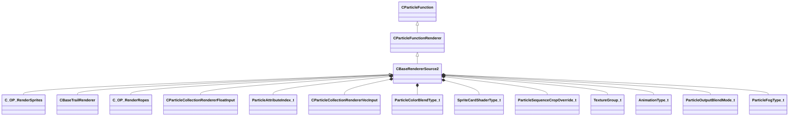

**Fields:**

| Name | Type | Annotations |
|------|------|-------------|
| `m_flRadiusScale` | [CParticleCollectionRendererFloatInput](../schemas/particleslib.md#cparticlecollectionrendererfloatinput) | `MPropertyStartGroup "+Renderer Modifiers"` `MPropertyFriendlyName "radius scale"` `MPropertySortPriority 700` |
| `m_flAlphaScale` | [CParticleCollectionRendererFloatInput](../schemas/particleslib.md#cparticlecollectionrendererfloatinput) | `MPropertyFriendlyName "alpha scale"` `MPropertySortPriority 700` |
| `m_flRollScale` | [CParticleCollectionRendererFloatInput](../schemas/particleslib.md#cparticlecollectionrendererfloatinput) | `MPropertyFriendlyName "rotation roll scale"` `MPropertySortPriority 700` |
| `m_nAlpha2Field` | [ParticleAttributeIndex_t](../schemas/particles.md#particleattributeindex_t) | `MPropertyFriendlyName "per-particle alpha scale attribute"` `MPropertyAttributeChoiceName "particlefield_scalar"` `MPropertySortPriority 700` |
| `m_vecColorScale` | [CParticleCollectionRendererVecInput](../schemas/particleslib.md#cparticlecollectionrenderervecinput) | `MPropertyFriendlyName "color blend"` `MPropertySortPriority 700` |
| `m_nColorBlendType` | [ParticleColorBlendType_t](../schemas/particleslib.md#particlecolorblendtype_t) | `MPropertyFriendlyName "color blend type"` `MPropertySortPriority 700` |
| `m_nShaderType` | [SpriteCardShaderType_t](../schemas/particles.md#spritecardshadertype_t) | `MPropertyStartGroup "+Material"` `MPropertyFriendlyName "Shader"` `MPropertySortPriority 600` |
| `m_strShaderOverride` | CUtlString | `MPropertyFriendlyName "Custom Shader"` `MPropertySuppressExpr "m_nShaderType != SPRITECARD_SHADER_CUSTOM"` `MPropertySortPriority 600` |
| `m_flCenterXOffset` | [CParticleCollectionRendererFloatInput](../schemas/particleslib.md#cparticlecollectionrendererfloatinput) | `MPropertyFriendlyName "X offset of center point"` `MPropertySortPriority 600` |
| `m_flCenterYOffset` | [CParticleCollectionRendererFloatInput](../schemas/particleslib.md#cparticlecollectionrendererfloatinput) | `MPropertyFriendlyName "Y offset of center point"` `MPropertySortPriority 600` |
| `m_flBumpStrength` | float32 | `MPropertyFriendlyName "Bump Strength"` `MPropertySortPriority 600` |
| `m_nCropTextureOverride` | [ParticleSequenceCropOverride_t](../schemas/particles.md#particlesequencecropoverride_t) | `MPropertyFriendlyName "Sheet Crop Behavior"` `MPropertySortPriority 600` |
| `m_vecTexturesInput` | CUtlLeanVector<[TextureGroup_t](../schemas/particles.md#texturegroup_t)> | `MPropertyFriendlyName "Textures"` `MParticleRequireDefaultArrayEntry` `MPropertyAutoExpandSelf` `MPropertySortPriority 600` |
| `m_flAnimationRate` | float32 | `MPropertyStartGroup "Animation"` `MPropertyFriendlyName "animation rate"` `MPropertyAttributeRange "0 5"` `MPropertySortPriority 500` |
| `m_nAnimationType` | [AnimationType_t](../schemas/particleslib.md#animationtype_t) | `MPropertyFriendlyName "animation type"` `MPropertySortPriority 500` |
| `m_bAnimateInFPS` | bool | `MPropertyFriendlyName "set animation value in FPS"` `MPropertySortPriority 500` |
| `m_flMotionVectorScaleU` | [CParticleCollectionRendererFloatInput](../schemas/particleslib.md#cparticlecollectionrendererfloatinput) | `MPropertyFriendlyName "motion vector scale U"` `MPropertySortPriority 500` |
| `m_flMotionVectorScaleV` | [CParticleCollectionRendererFloatInput](../schemas/particleslib.md#cparticlecollectionrendererfloatinput) | `MPropertyFriendlyName "motion vector scale V"` `MPropertySortPriority 500` |
| `m_flSelfIllumAmount` | [CParticleCollectionRendererFloatInput](../schemas/particleslib.md#cparticlecollectionrendererfloatinput) | `MPropertyStartGroup "Lighting and Shadows"` `MPropertyFriendlyName "self illum amount"` `MPropertyAttributeRange "0 2"` `MPropertySortPriority 400` |
| `m_flDiffuseAmount` | [CParticleCollectionRendererFloatInput](../schemas/particleslib.md#cparticlecollectionrendererfloatinput) | `MPropertyFriendlyName "diffuse lighting amount"` `MPropertyAttributeRange "0 1"` `MPropertySortPriority 400` |
| `m_flDiffuseClamp` | [CParticleCollectionRendererFloatInput](../schemas/particleslib.md#cparticlecollectionrendererfloatinput) | `MPropertyFriendlyName "diffuse max contribution clamp"` `MPropertyAttributeRange "0 1"` `MPropertySortPriority 400` `MPropertySuppressExpr "mod != hlx"` |
| `m_nLightingControlPoint` | int32 | `MPropertyFriendlyName "diffuse lighting origin Control Point"` `MPropertySortPriority 400` |
| `m_nOutputBlendMode` | [ParticleOutputBlendMode_t](../schemas/particles.md#particleoutputblendmode_t) | `MPropertyStartGroup "+Color and alpha adjustments"` `MPropertyFriendlyName "output blend mode"` `MPropertySortPriority 300` |
| `m_bGammaCorrectVertexColors` | bool | `MPropertyFriendlyName "Gamma-correct vertex colors"` `MPropertySortPriority 300` |
| `m_bSaturateColorPreAlphaBlend` | bool | `MPropertyFriendlyName "Saturate color pre alphablend"` `MPropertySortPriority 300` `MPropertySuppressExpr "mod != dota && mod != hlx"` |
| `m_flAddSelfAmount` | [CParticleCollectionRendererFloatInput](../schemas/particleslib.md#cparticlecollectionrendererfloatinput) | `MPropertyFriendlyName "add self amount over alphablend"` `MPropertySortPriority 300` |
| `m_flDesaturation` | [CParticleCollectionRendererFloatInput](../schemas/particleslib.md#cparticlecollectionrendererfloatinput) | `MPropertyFriendlyName "desaturation amount"` `MPropertyAttributeRange "0 1"` `MPropertySortPriority 300` |
| `m_flOverbrightFactor` | [CParticleCollectionRendererFloatInput](../schemas/particleslib.md#cparticlecollectionrendererfloatinput) | `MPropertyFriendlyName "overbright factor"` `MPropertySortPriority 300` |
| `m_nHSVShiftControlPoint` | int32 | `MPropertyFriendlyName "HSV Shift Control Point"` `MPropertySortPriority 300` |
| `m_nFogType` | [ParticleFogType_t](../schemas/particles.md#particlefogtype_t) | `MPropertyFriendlyName "Apply fog to particle"` `MPropertySortPriority 300` |
| `m_flFogAmount` | [CParticleCollectionRendererFloatInput](../schemas/particleslib.md#cparticlecollectionrendererfloatinput) | `MPropertyFriendlyName "Fog Scale"` `MPropertySortPriority 300` `MPropertySuppressExpr "mod != hlx"` |
| `m_bTintByFOW` | bool | `MPropertyFriendlyName "Apply fog of war to color"` `MPropertySortPriority 300` `MPropertySuppressExpr "mod != dota"` |
| `m_bTintByGlobalLight` | bool | `MPropertyFriendlyName "Apply global light to color"` `MPropertySortPriority 300` `MPropertySuppressExpr "mod != dota"` |
| `m_nPerParticleAlphaReference` | [SpriteCardPerParticleScale_t](../schemas/particles.md#spritecardperparticlescale_t) | `MPropertyStartGroup "Color and alpha adjustments/Alpha Reference"` `MPropertyFriendlyName "alpha reference"` `MPropertySortPriority 300` |
| `m_nPerParticleAlphaRefWindow` | [SpriteCardPerParticleScale_t](../schemas/particles.md#spritecardperparticlescale_t) | `MPropertyFriendlyName "alpha reference window size"` `MPropertySortPriority 300` |
| `m_nAlphaReferenceType` | [ParticleAlphaReferenceType_t](../schemas/particles.md#particlealphareferencetype_t) | `MPropertyFriendlyName "alpha reference type"` `MPropertySortPriority 300` |
| `m_flAlphaReferenceSoftness` | [CParticleCollectionRendererFloatInput](../schemas/particleslib.md#cparticlecollectionrendererfloatinput) | `MPropertyFriendlyName "alpha reference softness"` `MPropertyAttributeRange "0 1"` `MPropertySortPriority 300` |
| `m_flSourceAlphaValueToMapToZero` | [CParticleCollectionRendererFloatInput](../schemas/particleslib.md#cparticlecollectionrendererfloatinput) | `MPropertyFriendlyName "source alpha value to map to alpha of zero"` `MPropertyAttributeRange "0 1"` `MPropertySortPriority 300` |
| `m_flSourceAlphaValueToMapToOne` | [CParticleCollectionRendererFloatInput](../schemas/particleslib.md#cparticlecollectionrendererfloatinput) | `MPropertyFriendlyName "source alpha value to map to alpha of 1"` `MPropertyAttributeRange "0 1"` `MPropertySortPriority 300` |
| `m_bRefract` | bool | `MPropertyStartGroup "Refraction"` `MPropertyFriendlyName "refract background"` `MPropertySortPriority 200` |
| `m_bRefractSolid` | bool | `MPropertyFriendlyName "refract draws opaque - alpha scales refraction"` `MPropertySortPriority 200` `MPropertySuppressExpr "!m_bRefract"` |
| `m_bRefract2Passes` | bool | `MPropertyFriendlyName "refract in 2 passes - can refract particles behind, requires (MBOIT!)"` `MPropertySortPriority 200` `MPropertySuppressExpr "mod != hlx || !m_bRefract"` |
| `m_flRefractAmount` | [CParticleCollectionRendererFloatInput](../schemas/particleslib.md#cparticlecollectionrendererfloatinput) | `MPropertyFriendlyName "refract amount"` `MPropertyAttributeRange "-2 2"` `MPropertySortPriority 200` `MPropertySuppressExpr "!m_bRefract"` |
| `m_nRefractBlurRadius` | int32 | `MPropertyFriendlyName "refract blur radius"` `MPropertySortPriority 200` `MPropertySuppressExpr "!m_bRefract"` |
| `m_nRefractBlurType` | [BlurFilterType_t](../schemas/particles.md#blurfiltertype_t) | `MPropertyFriendlyName "refract blur type"` `MPropertySortPriority 200` `MPropertySuppressExpr "!m_bRefract"` |
| `m_bOnlyRenderInEffectsBloomPass` | bool | `MPropertyStartGroup ""` `MPropertyFriendlyName "Only Render in effects bloom pass"` `MPropertySortPriority 1100` |
| `m_bOnlyRenderInEffectsWaterPass` | bool | `MPropertyFriendlyName "Only Render in effects water pass"` `MPropertySortPriority 1050` `MPropertySuppressExpr "mod != csgo"` |
| `m_bUseMixedResolutionRendering` | bool | `MPropertyFriendlyName "Use Mixed Resolution Rendering"` `MPropertySortPriority 1200` |
| `m_bOnlyRenderInEffecsGameOverlay` | bool | `MPropertyFriendlyName "Only Render in effects game overlay pass"` `MPropertySortPriority 1210` `MPropertySuppressExpr "mod != csgo"` |
| `m_stencilTestID` | char[128] | `MPropertyStartGroup "Stencil"` `MPropertyFriendlyName "stencil test ID"` `MPropertySortPriority 0` |
| `m_bStencilTestExclude` | bool | `MPropertyFriendlyName "only write where stencil is NOT stencil test ID"` `MPropertySortPriority 0` |
| `m_stencilWriteID` | char[128] | `MPropertyFriendlyName "stencil write ID"` `MPropertySortPriority 0` |
| `m_bWriteStencilOnDepthPass` | bool | `MPropertyFriendlyName "write stencil on z-buffer test success"` `MPropertySortPriority 0` |
| `m_bWriteStencilOnDepthFail` | bool | `MPropertyFriendlyName "write stencil on z-buffer test failure"` `MPropertySortPriority 0` |
| `m_bReverseZBuffering` | bool | `MPropertyStartGroup "Depth buffer control and effects"` `MPropertyFriendlyName "reverse z-buffer test"` `MPropertySortPriority 900` |
| `m_bDisableZBuffering` | bool | `MPropertyFriendlyName "disable z-buffer test"` `MPropertySortPriority 900` |
| `m_nFeatheringMode` | [ParticleDepthFeatheringMode_t](../schemas/particles.md#particledepthfeatheringmode_t) | `MPropertyFriendlyName "Depth feathering mode"` `MPropertySortPriority 900` |
| `m_flFeatheringMinDist` | [CParticleCollectionRendererFloatInput](../schemas/particleslib.md#cparticlecollectionrendererfloatinput) | `MPropertyFriendlyName "particle feathering closest distance to surface"` `MPropertySortPriority 900` |
| `m_flFeatheringMaxDist` | [CParticleCollectionRendererFloatInput](../schemas/particleslib.md#cparticlecollectionrendererfloatinput) | `MPropertyFriendlyName "particle feathering farthest distance to surface"` `MPropertySortPriority 900` |
| `m_flFeatheringFilter` | [CParticleCollectionRendererFloatInput](../schemas/particleslib.md#cparticlecollectionrendererfloatinput) | `MPropertyFriendlyName "particle feathering alpha filter"` `MPropertySortPriority 900` |
| `m_flFeatheringDepthMapFilter` | [CParticleCollectionRendererFloatInput](../schemas/particleslib.md#cparticlecollectionrendererfloatinput) | `MPropertyFriendlyName "particle feathering depthmap layer filter"` `MPropertySortPriority 900` `MPropertySuppressExpr "mod != hlx"` |
| `m_flDepthBias` | [CParticleCollectionRendererFloatInput](../schemas/particleslib.md#cparticlecollectionrendererfloatinput) | `MPropertyFriendlyName "depth comparison bias"` `MPropertySortPriority 900` |
| `m_nSortMethod` | [ParticleSortingChoiceList_t](../schemas/particles.md#particlesortingchoicelist_t) | `MPropertyFriendlyName "Sort Method"` `MPropertySortPriority 900` |
| `m_bBlendFramesSeq0` | bool | `MPropertyStartGroup "Animation"` `MPropertyFriendlyName "blend sequence animation frames"` `MPropertySortPriority 500` |
| `m_bMaxLuminanceBlendingSequence0` | bool | `MPropertyFriendlyName "use max-luminance blending for sequence"` `MPropertySortPriority 500` `MPropertySuppressExpr "!m_bBlendFramesSeq0"` |

### CBaseTrailRenderer

**Inherits from:** [CBaseRendererSource2](particles.md#cbaserenderersource2)

**Derived by:** [C_OP_RenderTrails](particles.md#c_op_rendertrails)

**Metadata:** `MGetKV3ClassDefaults Could not parse KV3 Defaults`

**Relationships:**

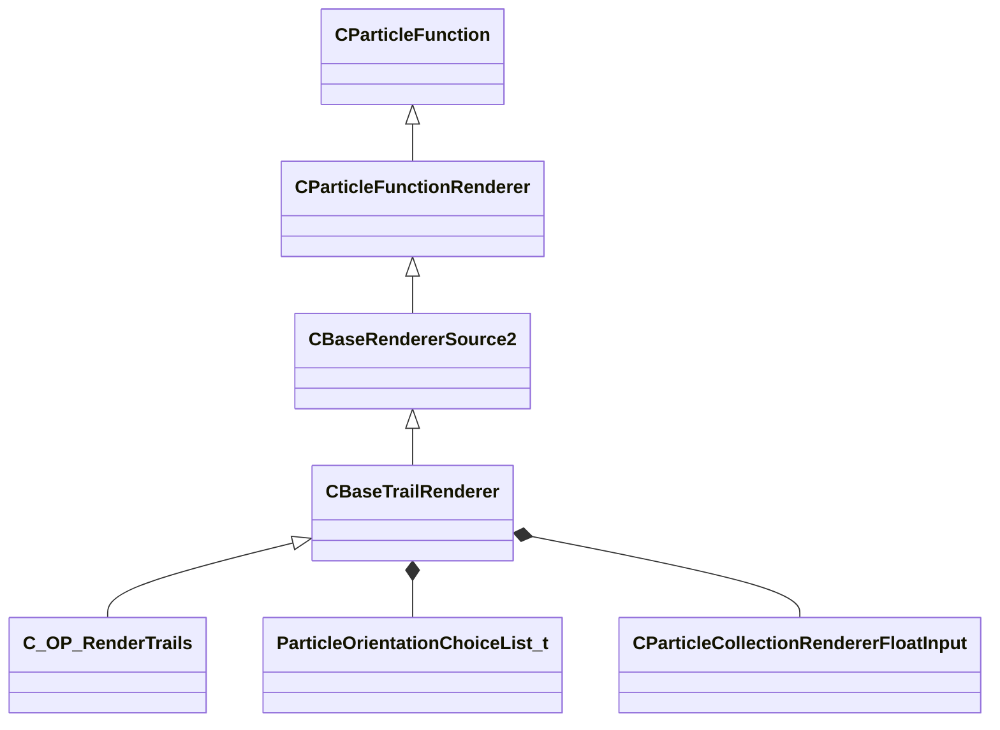

**Fields:**

| Name | Type | Annotations |
|------|------|-------------|
| `m_nOrientationType` | [ParticleOrientationChoiceList_t](../schemas/particles.md#particleorientationchoicelist_t) | `MPropertyStartGroup "Orientation"` `MPropertyFriendlyName "orientation type"` `MPropertySortPriority 750` |
| `m_nOrientationControlPoint` | int32 | `MPropertyFriendlyName "orientation control point"` `MPropertySortPriority 750` `MPropertySuppressExpr "m_nOrientationType != PARTICLE_ORIENTATION_ALIGN_TO_PARTICLE_NORMAL && m_nOrientationType != PARTICLE_ORIENTATION_SCREENALIGN_TO_PARTICLE_NORMAL"` |
| `m_flMinSize` | float32 | `MPropertyStartGroup "Screenspace Fading and culling"` `MPropertyFriendlyName "minimum visual screen-size"` `MPropertySortPriority 900` |
| `m_flMaxSize` | float32 | `MPropertyFriendlyName "maximum visual screen-size"` `MPropertySortPriority 900` |
| `m_flStartFadeSize` | [CParticleCollectionRendererFloatInput](../schemas/particleslib.md#cparticlecollectionrendererfloatinput) | `MPropertyFriendlyName "start fade screen-size"` `MPropertySortPriority 900` |
| `m_flEndFadeSize` | [CParticleCollectionRendererFloatInput](../schemas/particleslib.md#cparticlecollectionrendererfloatinput) | `MPropertyFriendlyName "end fade and cull screen-size"` `MPropertySortPriority 900` |
| `m_bClampV` | bool | `MPropertyStartGroup "Trail UV Controls"` `MPropertyFriendlyName "Clamp Non-Sheet texture V coords"` `MPropertySortPriority 800` |

### CGeneralRandomRotation

**Inherits from:** [CParticleFunctionInitializer](particles.md#cparticlefunctioninitializer)

**Derived by:** [C_INIT_RandomRotation](particles.md#c_init_randomrotation), [C_INIT_RandomRotationSpeed](particles.md#c_init_randomrotationspeed), [C_INIT_RandomYaw](particles.md#c_init_randomyaw)

**Metadata:** `MGetKV3ClassDefaults Could not parse KV3 Defaults`

**Relationships:**

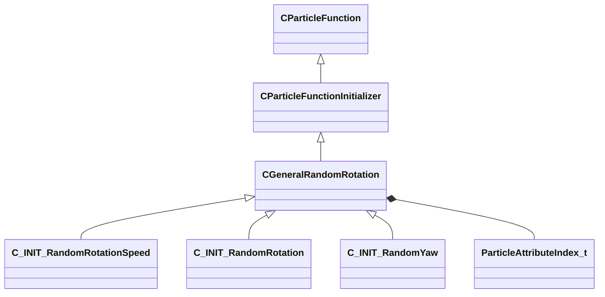

**Fields:**

| Name | Type | Annotations |
|------|------|-------------|
| `m_nFieldOutput` | [ParticleAttributeIndex_t](../schemas/particles.md#particleattributeindex_t) | `MPropertyFriendlyName "rotation field"` `MPropertyAttributeChoiceName "particlefield_rotation"` |
| `m_flDegrees` | float32 | `MPropertyFriendlyName "rotation initial"` |
| `m_flDegreesMin` | float32 | `MPropertyFriendlyName "rotation offset from initial min"` |
| `m_flDegreesMax` | float32 | `MPropertyFriendlyName "rotation offset from initial max"` |
| `m_flRotationRandExponent` | float32 | `MPropertyFriendlyName "rotation offset exponent"` |
| `m_bRandomlyFlipDirection` | bool | `MPropertyFriendlyName "randomly flip direction"` |

### CGeneralSpin

**Inherits from:** [CParticleFunctionOperator](particles.md#cparticlefunctionoperator)

**Derived by:** [C_OP_Spin](particles.md#c_op_spin), [C_OP_SpinYaw](particles.md#c_op_spinyaw)

**Metadata:** `MGetKV3ClassDefaults Could not parse KV3 Defaults`

**Relationships:**

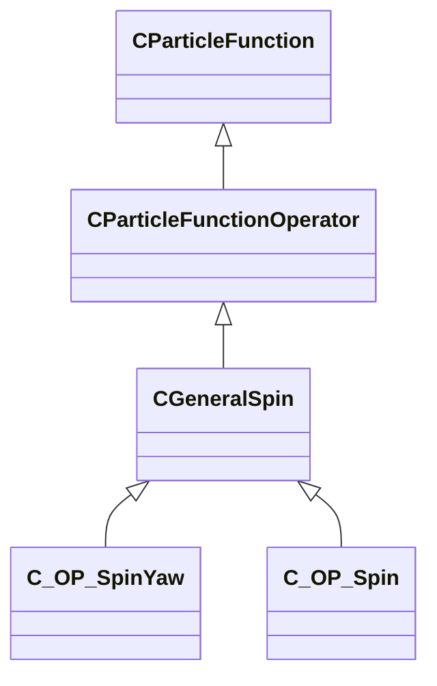

**Fields:**

| Name | Type | Annotations |
|------|------|-------------|
| `m_nSpinRateDegrees` | int32 | `MPropertyFriendlyName "spin rate degrees"` |
| `m_nSpinRateMinDegrees` | int32 | `MPropertyFriendlyName "spin rate min"` |
| `m_fSpinRateStopTime` | float32 | `MPropertyFriendlyName "spin stop time"` |

### CPAssignment_t

**Metadata:** `MGetKV3ClassDefaults {
	"m_nCPNumber": 0,
	"m_Pos":
	{
		"m_nType": "PVEC_TYPE_PARTICLE_VECTOR",
		"m_vLiteralValue":
		[
			0.000000,
			0.000000,
			0.000000
		],
		"m_LiteralColor":
		[
			0,
			0,
			0
		],
		"m_NamedValue": "",
		"m_bFollowNamedValue": false,
		"m_nVectorAttribute": 0,
		"m_vVectorAttributeScale":
		[
			1.000000,
			1.000000,
			1.000000
		],
		"m_nControlPoint": 0,
		"m_nDeltaControlPoint": 0,
		"m_vCPValueScale":
		[
			1.000000,
			1.000000,
			1.000000
		],
		"m_vCPRelativePosition":
		[
			0.000000,
			0.000000,
			0.000000
		],
		"m_vCPRelativeDir":
		[
			1.000000,
			0.000000,
			0.000000
		],
		"m_FloatComponentX":
		{
			"m_nType": "PF_TYPE_LITERAL",
			"m_nMapType": "PF_MAP_TYPE_DIRECT",
			"m_flLiteralValue": 0.000000,
			"m_NamedValue": "",
			"m_nControlPoint": 0,
			"m_nScalarAttribute": 3,
			"m_nVectorAttribute": 6,
			"m_nVectorComponent": 0,
			"m_bReverseOrder": false,
			"m_flRandomMin": 0.000000,
			"m_flRandomMax": 1.000000,
			"m_bHasRandomSignFlip": false,
			"m_nRandomSeed": <HIDDEN FOR DIFF>,
			"m_nRandomMode": "PF_RANDOM_MODE_CONSTANT",
			"m_strSnapshotSubset": "",
			"m_flLOD0": 0.000000,
			"m_flLOD1": 0.000000,
			"m_flLOD2": 0.000000,
			"m_flLOD3": 0.000000,
			"m_nNoiseInputVectorAttribute": 0,
			"m_flNoiseOutputMin": 0.000000,
			"m_flNoiseOutputMax": 1.000000,
			"m_flNoiseScale": 0.100000,
			"m_vecNoiseOffsetRate":
			[
				0.000000,
				0.000000,
				0.000000
			],
			"m_flNoiseOffset": 0.000000,
			"m_nNoiseOctaves": 1,
			"m_nNoiseTurbulence": "PF_NOISE_TURB_NONE",
			"m_nNoiseType": "PF_NOISE_TYPE_PERLIN",
			"m_nNoiseModifier": "PF_NOISE_MODIFIER_NONE",
			"m_flNoiseTurbulenceScale": 1.000000,
			"m_flNoiseTurbulenceMix": 0.500000,
			"m_flNoiseImgPreviewScale": 1.000000,
			"m_bNoiseImgPreviewLive": true,
			"m_flNoCameraFallback": 0.000000,
			"m_bUseBoundsCenter": false,
			"m_nInputMode": "PF_INPUT_MODE_CLAMPED",
			"m_flMultFactor": 1.000000,
			"m_flInput0": 0.000000,
			"m_flInput1": 1.000000,
			"m_flOutput0": 0.000000,
			"m_flOutput1": 1.000000,
			"m_flNotchedRangeMin": 0.000000,
			"m_flNotchedRangeMax": 1.000000,
			"m_flNotchedOutputOutside": 0.000000,
			"m_flNotchedOutputInside": 1.000000,
			"m_nRoundType": "PF_ROUND_TYPE_NEAREST",
			"m_nBiasType": "PF_BIAS_TYPE_STANDARD",
			"m_flBiasParameter": 0.000000,
			"m_Curve":
			{
				"m_spline":
				[
				],
				"m_tangents":
				[
				],
				"m_vDomainMins":
				[
					0.000000,
					0.000000
				],
				"m_vDomainMaxs":
				[
					0.000000,
					0.000000
				]
			}
		},
		"m_FloatComponentY":
		{
			"m_nType": "PF_TYPE_LITERAL",
			"m_nMapType": "PF_MAP_TYPE_DIRECT",
			"m_flLiteralValue": 0.000000,
			"m_NamedValue": "",
			"m_nControlPoint": 0,
			"m_nScalarAttribute": 3,
			"m_nVectorAttribute": 6,
			"m_nVectorComponent": 0,
			"m_bReverseOrder": false,
			"m_flRandomMin": 0.000000,
			"m_flRandomMax": 1.000000,
			"m_bHasRandomSignFlip": false,
			"m_nRandomSeed": <HIDDEN FOR DIFF>,
			"m_nRandomMode": "PF_RANDOM_MODE_CONSTANT",
			"m_strSnapshotSubset": "",
			"m_flLOD0": 0.000000,
			"m_flLOD1": 0.000000,
			"m_flLOD2": 0.000000,
			"m_flLOD3": 0.000000,
			"m_nNoiseInputVectorAttribute": 0,
			"m_flNoiseOutputMin": 0.000000,
			"m_flNoiseOutputMax": 1.000000,
			"m_flNoiseScale": 0.100000,
			"m_vecNoiseOffsetRate":
			[
				0.000000,
				0.000000,
				0.000000
			],
			"m_flNoiseOffset": 0.000000,
			"m_nNoiseOctaves": 1,
			"m_nNoiseTurbulence": "PF_NOISE_TURB_NONE",
			"m_nNoiseType": "PF_NOISE_TYPE_PERLIN",
			"m_nNoiseModifier": "PF_NOISE_MODIFIER_NONE",
			"m_flNoiseTurbulenceScale": 1.000000,
			"m_flNoiseTurbulenceMix": 0.500000,
			"m_flNoiseImgPreviewScale": 1.000000,
			"m_bNoiseImgPreviewLive": true,
			"m_flNoCameraFallback": 0.000000,
			"m_bUseBoundsCenter": false,
			"m_nInputMode": "PF_INPUT_MODE_CLAMPED",
			"m_flMultFactor": 1.000000,
			"m_flInput0": 0.000000,
			"m_flInput1": 1.000000,
			"m_flOutput0": 0.000000,
			"m_flOutput1": 1.000000,
			"m_flNotchedRangeMin": 0.000000,
			"m_flNotchedRangeMax": 1.000000,
			"m_flNotchedOutputOutside": 0.000000,
			"m_flNotchedOutputInside": 1.000000,
			"m_nRoundType": "PF_ROUND_TYPE_NEAREST",
			"m_nBiasType": "PF_BIAS_TYPE_STANDARD",
			"m_flBiasParameter": 0.000000,
			"m_Curve":
			{
				"m_spline":
				[
				],
				"m_tangents":
				[
				],
				"m_vDomainMins":
				[
					0.000000,
					0.000000
				],
				"m_vDomainMaxs":
				[
					0.000000,
					0.000000
				]
			}
		},
		"m_FloatComponentZ":
		{
			"m_nType": "PF_TYPE_LITERAL",
			"m_nMapType": "PF_MAP_TYPE_DIRECT",
			"m_flLiteralValue": 0.000000,
			"m_NamedValue": "",
			"m_nControlPoint": 0,
			"m_nScalarAttribute": 3,
			"m_nVectorAttribute": 6,
			"m_nVectorComponent": 0,
			"m_bReverseOrder": false,
			"m_flRandomMin": 0.000000,
			"m_flRandomMax": 1.000000,
			"m_bHasRandomSignFlip": false,
			"m_nRandomSeed": <HIDDEN FOR DIFF>,
			"m_nRandomMode": "PF_RANDOM_MODE_CONSTANT",
			"m_strSnapshotSubset": "",
			"m_flLOD0": 0.000000,
			"m_flLOD1": 0.000000,
			"m_flLOD2": 0.000000,
			"m_flLOD3": 0.000000,
			"m_nNoiseInputVectorAttribute": 0,
			"m_flNoiseOutputMin": 0.000000,
			"m_flNoiseOutputMax": 1.000000,
			"m_flNoiseScale": 0.100000,
			"m_vecNoiseOffsetRate":
			[
				0.000000,
				0.000000,
				0.000000
			],
			"m_flNoiseOffset": 0.000000,
			"m_nNoiseOctaves": 1,
			"m_nNoiseTurbulence": "PF_NOISE_TURB_NONE",
			"m_nNoiseType": "PF_NOISE_TYPE_PERLIN",
			"m_nNoiseModifier": "PF_NOISE_MODIFIER_NONE",
			"m_flNoiseTurbulenceScale": 1.000000,
			"m_flNoiseTurbulenceMix": 0.500000,
			"m_flNoiseImgPreviewScale": 1.000000,
			"m_bNoiseImgPreviewLive": true,
			"m_flNoCameraFallback": 0.000000,
			"m_bUseBoundsCenter": false,
			"m_nInputMode": "PF_INPUT_MODE_CLAMPED",
			"m_flMultFactor": 1.000000,
			"m_flInput0": 0.000000,
			"m_flInput1": 1.000000,
			"m_flOutput0": 0.000000,
			"m_flOutput1": 1.000000,
			"m_flNotchedRangeMin": 0.000000,
			"m_flNotchedRangeMax": 1.000000,
			"m_flNotchedOutputOutside": 0.000000,
			"m_flNotchedOutputInside": 1.000000,
			"m_nRoundType": "PF_ROUND_TYPE_NEAREST",
			"m_nBiasType": "PF_BIAS_TYPE_STANDARD",
			"m_flBiasParameter": 0.000000,
			"m_Curve":
			{
				"m_spline":
				[
				],
				"m_tangents":
				[
				],
				"m_vDomainMins":
				[
					0.000000,
					0.000000
				],
				"m_vDomainMaxs":
				[
					0.000000,
					0.000000
				]
			}
		},
		"m_FloatInterp":
		{
			"m_nType": "PF_TYPE_LITERAL",
			"m_nMapType": "PF_MAP_TYPE_DIRECT",
			"m_flLiteralValue": 0.000000,
			"m_NamedValue": "",
			"m_nControlPoint": 0,
			"m_nScalarAttribute": 3,
			"m_nVectorAttribute": 6,
			"m_nVectorComponent": 0,
			"m_bReverseOrder": false,
			"m_flRandomMin": 0.000000,
			"m_flRandomMax": 1.000000,
			"m_bHasRandomSignFlip": false,
			"m_nRandomSeed": <HIDDEN FOR DIFF>,
			"m_nRandomMode": "PF_RANDOM_MODE_CONSTANT",
			"m_strSnapshotSubset": "",
			"m_flLOD0": 0.000000,
			"m_flLOD1": 0.000000,
			"m_flLOD2": 0.000000,
			"m_flLOD3": 0.000000,
			"m_nNoiseInputVectorAttribute": 0,
			"m_flNoiseOutputMin": 0.000000,
			"m_flNoiseOutputMax": 1.000000,
			"m_flNoiseScale": 0.100000,
			"m_vecNoiseOffsetRate":
			[
				0.000000,
				0.000000,
				0.000000
			],
			"m_flNoiseOffset": 0.000000,
			"m_nNoiseOctaves": 1,
			"m_nNoiseTurbulence": "PF_NOISE_TURB_NONE",
			"m_nNoiseType": "PF_NOISE_TYPE_PERLIN",
			"m_nNoiseModifier": "PF_NOISE_MODIFIER_NONE",
			"m_flNoiseTurbulenceScale": 1.000000,
			"m_flNoiseTurbulenceMix": 0.500000,
			"m_flNoiseImgPreviewScale": 1.000000,
			"m_bNoiseImgPreviewLive": true,
			"m_flNoCameraFallback": 0.000000,
			"m_bUseBoundsCenter": false,
			"m_nInputMode": "PF_INPUT_MODE_CLAMPED",
			"m_flMultFactor": 1.000000,
			"m_flInput0": 0.000000,
			"m_flInput1": 1.000000,
			"m_flOutput0": 0.000000,
			"m_flOutput1": 1.000000,
			"m_flNotchedRangeMin": 0.000000,
			"m_flNotchedRangeMax": 1.000000,
			"m_flNotchedOutputOutside": 0.000000,
			"m_flNotchedOutputInside": 1.000000,
			"m_nRoundType": "PF_ROUND_TYPE_NEAREST",
			"m_nBiasType": "PF_BIAS_TYPE_STANDARD",
			"m_flBiasParameter": 0.000000,
			"m_Curve":
			{
				"m_spline":
				[
				],
				"m_tangents":
				[
				],
				"m_vDomainMins":
				[
					0.000000,
					0.000000
				],
				"m_vDomainMaxs":
				[
					0.000000,
					0.000000
				]
			}
		},
		"m_flInterpInput0": 0.000000,
		"m_flInterpInput1": 1.000000,
		"m_vInterpOutput0":
		[
			0.000000,
			0.000000,
			0.000000
		],
		"m_vInterpOutput1":
		[
			1.000000,
			1.000000,
			1.000000
		],
		"m_Gradient":
		{
			"m_Stops":
			[
			]
		},
		"m_vRandomMin":
		[
			0.000000,
			0.000000,
			0.000000
		],
		"m_vRandomMax":
		[
			0.000000,
			0.000000,
			0.000000
		]
	},
	"m_nOrientationMode": "PARTICLE_ORIENTATION_SET_NONE"
}`

**Relationships:**

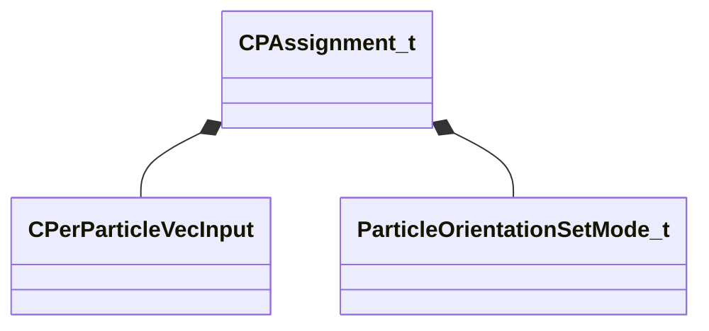

**Fields:**

| Name | Type | Annotations |
|------|------|-------------|
| `m_nCPNumber` | int32 | `MPropertyFriendlyName "Control Point Number"` |
| `m_Pos` | [CPerParticleVecInput](../schemas/particleslib.md#cperparticlevecinput) | `MPropertyFriendlyName "CP Position"` |
| `m_nOrientationMode` | [ParticleOrientationSetMode_t](../schemas/particles.md#particleorientationsetmode_t) | `MPropertyFriendlyName "CP Orientation Type"` |

### CParticleFunction

**Derived by:** [CParticleFunctionConstraint](particles.md#cparticlefunctionconstraint), [CParticleFunctionEmitter](particles.md#cparticlefunctionemitter), [CParticleFunctionForce](particles.md#cparticlefunctionforce), [CParticleFunctionInitializer](particles.md#cparticlefunctioninitializer), [CParticleFunctionOperator](particles.md#cparticlefunctionoperator), [CParticleFunctionRenderer](particles.md#cparticlefunctionrenderer)

**Metadata:** `MGetKV3ClassDefaults Could not parse KV3 Defaults`

**Relationships:**

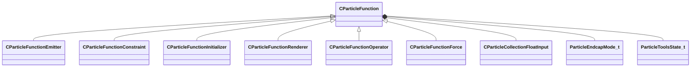

**Fields:**

| Name | Type | Annotations |
|------|------|-------------|
| `m_flOpStrength` | [CParticleCollectionFloatInput](../schemas/particleslib.md#cparticlecollectionfloatinput) | `MPropertyFriendlyName "operator strength"` `MPropertySortPriority -100` |
| `m_nOpEndCapState` | [ParticleEndcapMode_t](../schemas/particles.md#particleendcapmode_t) | `MPropertyFriendlyName "operator end cap state"` `MPropertySortPriority -100` |
| `m_nToolsState` | [ParticleToolsState_t](../schemas/particles.md#particletoolsstate_t) | `MPropertyFriendlyName "operator enabled in tools or game only"` `MPropertySortPriority -100` |
| `m_flOpStartFadeInTime` | float32 | `MPropertyStartGroup "Operator Fade"` `MPropertyFriendlyName "operator start fadein"` `MParticleAdvancedField` `MPropertySortPriority -100` |
| `m_flOpEndFadeInTime` | float32 | `MPropertyFriendlyName "operator end fadein"` `MParticleAdvancedField` `MPropertySortPriority -100` |
| `m_flOpStartFadeOutTime` | float32 | `MPropertyFriendlyName "operator start fadeout"` `MParticleAdvancedField` `MPropertySortPriority -100` |
| `m_flOpEndFadeOutTime` | float32 | `MPropertyFriendlyName "operator end fadeout"` `MParticleAdvancedField` `MPropertySortPriority -100` |
| `m_flOpFadeOscillatePeriod` | float32 | `MPropertyFriendlyName "operator fade oscillate"` `MParticleAdvancedField` `MPropertySortPriority -100` |
| `m_bNormalizeToStopTime` | bool | `MPropertyFriendlyName "normalize fade times to endcap"` `MParticleAdvancedField` `MPropertySortPriority -100` |
| `m_flOpTimeOffsetMin` | float32 | `MPropertyStartGroup "Operator Fade Time Offset"` `MPropertyFriendlyName "operator fade time offset min"` `MParticleAdvancedField` `MPropertySortPriority -100` |
| `m_flOpTimeOffsetMax` | float32 | `MPropertyFriendlyName "operator fade time offset max"` `MParticleAdvancedField` `MPropertySortPriority -100` |
| `m_nOpTimeOffsetSeed` | int32 | `MPropertyFriendlyName "operator fade time offset seed"` `MParticleAdvancedField` `MPropertySortPriority -100` |
| `m_nOpTimeScaleSeed` | int32 | `MPropertyStartGroup "Operator Fade Timescale Modifiers"` `MPropertyFriendlyName "operator fade time scale seed"` `MParticleAdvancedField` `MPropertySortPriority -100` |
| `m_flOpTimeScaleMin` | float32 | `MPropertyFriendlyName "operator fade time scale min"` `MParticleAdvancedField` `MPropertySortPriority -100` |
| `m_flOpTimeScaleMax` | float32 | `MPropertyFriendlyName "operator fade time scale max"` `MParticleAdvancedField` `MPropertySortPriority -100` |
| `m_bDisableOperator` | bool | `MPropertyStartGroup ""` `MPropertySuppressField` |
| `m_Notes` | CUtlString | `MPropertyFriendlyName "operator help and notes"` `MParticleHelpField` `MPropertySortPriority -100` |

### CParticleFunctionConstraint

**Inherits from:** [CParticleFunction](particles.md#cparticlefunction)

**Derived by:** [C_OP_BoxConstraint](particles.md#c_op_boxconstraint), [C_OP_CollideWithParentParticles](particles.md#c_op_collidewithparentparticles), [C_OP_CollideWithSelf](particles.md#c_op_collidewithself), [C_OP_ConstrainDistance](particles.md#c_op_constraindistance), [C_OP_ConstrainDistanceToPath](particles.md#c_op_constraindistancetopath), [C_OP_ConstrainDistanceToUserSpecifiedPath](particles.md#c_op_constraindistancetouserspecifiedpath), [C_OP_ConstrainLineLength](particles.md#c_op_constrainlinelength), [C_OP_PlanarConstraint](particles.md#c_op_planarconstraint), [C_OP_RopeSpringConstraint](particles.md#c_op_ropespringconstraint), [C_OP_ShapeMatchingConstraint](particles.md#c_op_shapematchingconstraint), [C_OP_SpringToVectorConstraint](particles.md#c_op_springtovectorconstraint), [C_OP_WorldCollideConstraint](particles.md#c_op_worldcollideconstraint), [C_OP_WorldTraceConstraint](particles.md#c_op_worldtraceconstraint)

**Metadata:** `MGetKV3ClassDefaults Could not parse KV3 Defaults`

**Relationships:**

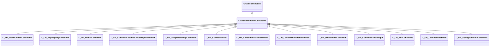

### CParticleFunctionEmitter

**Inherits from:** [CParticleFunction](particles.md#cparticlefunction)

**Derived by:** [C_OP_ContinuousEmitter](particles.md#c_op_continuousemitter), [C_OP_InstantaneousEmitter](particles.md#c_op_instantaneousemitter), [C_OP_MaintainEmitter](particles.md#c_op_maintainemitter), [C_OP_NoiseEmitter](particles.md#c_op_noiseemitter)

**Metadata:** `MGetKV3ClassDefaults Could not parse KV3 Defaults`

**Relationships:**

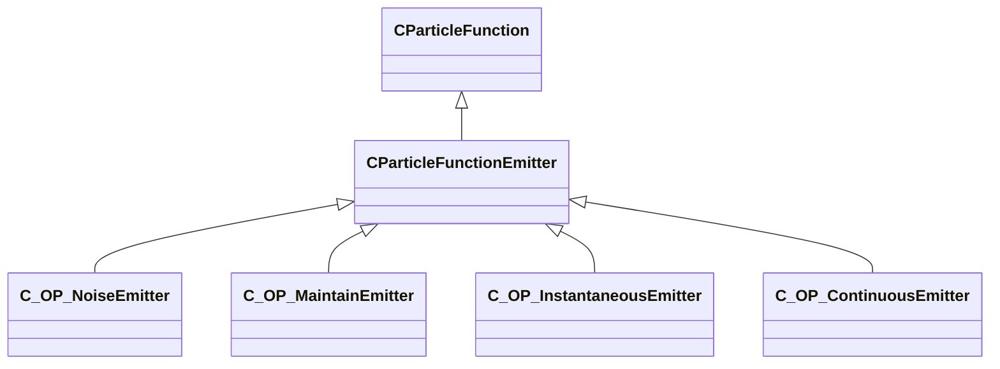

**Fields:**

| Name | Type | Annotations |
|------|------|-------------|
| `m_nEmitterIndex` | int32 | `MPropertyFriendlyName "Emitter Index"` |

### CParticleFunctionForce

**Inherits from:** [CParticleFunction](particles.md#cparticlefunction)

**Derived by:** [C_OP_AttractToControlPoint](particles.md#c_op_attracttocontrolpoint), [C_OP_CPVelocityForce](particles.md#c_op_cpvelocityforce), [C_OP_CurlNoiseForce](particles.md#c_op_curlnoiseforce), [C_OP_DensityForce](particles.md#c_op_densityforce), [C_OP_ExternalGameImpulseForce](particles.md#c_op_externalgameimpulseforce), [C_OP_ExternalWindForce](particles.md#c_op_externalwindforce), [C_OP_ForceBasedOnDistanceToPlane](particles.md#c_op_forcebasedondistancetoplane), [C_OP_IntraParticleForce](particles.md#c_op_intraparticleforce), [C_OP_LocalAccelerationForce](particles.md#c_op_localaccelerationforce), [C_OP_ParentVortices](particles.md#c_op_parentvortices), [C_OP_PerParticleForce](particles.md#c_op_perparticleforce), [C_OP_RandomForce](particles.md#c_op_randomforce), [C_OP_TimeVaryingForce](particles.md#c_op_timevaryingforce), [C_OP_TurbulenceForce](particles.md#c_op_turbulenceforce), [C_OP_TwistAroundAxis](particles.md#c_op_twistaroundaxis), [C_OP_WindForce](particles.md#c_op_windforce)

**Metadata:** `MGetKV3ClassDefaults Could not parse KV3 Defaults`

**Relationships:**

```mermaid
classDiagram
    CParticleFunction <|-- CParticleFunctionForce
    CParticleFunctionForce <|-- C_OP_ExternalWindForce
    CParticleFunctionForce <|-- C_OP_ParentVortices
    CParticleFunctionForce <|-- C_OP_ForceBasedOnDistanceToPlane
    CParticleFunctionForce <|-- C_OP_CPVelocityForce
    CParticleFunctionForce <|-- C_OP_TimeVaryingForce
    CParticleFunctionForce <|-- C_OP_CurlNoiseForce
    CParticleFunctionForce <|-- C_OP_WindForce
    CParticleFunctionForce <|-- C_OP_PerParticleForce
    CParticleFunctionForce <|-- C_OP_IntraParticleForce
    CParticleFunctionForce <|-- C_OP_DensityForce
    CParticleFunctionForce <|-- C_OP_LocalAccelerationForce
    CParticleFunctionForce <|-- C_OP_RandomForce
    CParticleFunctionForce <|-- C_OP_TurbulenceForce
    CParticleFunctionForce <|-- C_OP_AttractToControlPoint
    CParticleFunctionForce <|-- C_OP_ExternalGameImpulseForce
    CParticleFunctionForce <|-- C_OP_TwistAroundAxis
```

### CParticleFunctionInitializer

**Inherits from:** [CParticleFunction](particles.md#cparticlefunction)

**Derived by:** [CGeneralRandomRotation](particles.md#cgeneralrandomrotation), [C_INIT_AddVectorToVector](particles.md#c_init_addvectortovector), [C_INIT_AgeNoise](particles.md#c_init_agenoise), [C_INIT_ChaoticAttractor](particles.md#c_init_chaoticattractor), [C_INIT_CheckParticleForWater](particles.md#c_init_checkparticleforwater), [C_INIT_ColorLitPerParticle](particles.md#c_init_colorlitperparticle), [C_INIT_CreateAlongPath](particles.md#c_init_createalongpath), [C_INIT_CreateFromCPs](particles.md#c_init_createfromcps), [C_INIT_CreateFromParentParticles](particles.md#c_init_createfromparentparticles), [C_INIT_CreateFromPlaneCache](particles.md#c_init_createfromplanecache), [C_INIT_CreateInEpitrochoid](particles.md#c_init_createinepitrochoid), [C_INIT_CreateOnGrid](particles.md#c_init_createongrid), [C_INIT_CreateOnModel](particles.md#c_init_createonmodel), [C_INIT_CreateOnModelAtHeight](particles.md#c_init_createonmodelatheight), [C_INIT_CreateParticleImpulse](particles.md#c_init_createparticleimpulse), [C_INIT_CreatePhyllotaxis](particles.md#c_init_createphyllotaxis), [C_INIT_CreateSequentialPath](particles.md#c_init_createsequentialpath), [C_INIT_CreateSequentialPathV2](particles.md#c_init_createsequentialpathv2), [C_INIT_CreateSpiralSphere](particles.md#c_init_createspiralsphere), [C_INIT_CreateWithinBox](particles.md#c_init_createwithinbox), [C_INIT_CreateWithinCapsuleTransform](particles.md#c_init_createwithincapsuletransform), [C_INIT_CreateWithinSphereTransform](particles.md#c_init_createwithinspheretransform), [C_INIT_CreationNoise](particles.md#c_init_creationnoise), [C_INIT_DistanceCull](particles.md#c_init_distancecull), [C_INIT_DistanceToCPInit](particles.md#c_init_distancetocpinit), [C_INIT_DistanceToNeighborCull](particles.md#c_init_distancetoneighborcull), [C_INIT_GlobalScale](particles.md#c_init_globalscale), [C_INIT_InheritFromParentParticles](particles.md#c_init_inheritfromparentparticles), [C_INIT_InheritVelocity](particles.md#c_init_inheritvelocity), [C_INIT_InitFloat](particles.md#c_init_initfloat), [C_INIT_InitFloatCollection](particles.md#c_init_initfloatcollection), [C_INIT_InitFromCPSnapshot](particles.md#c_init_initfromcpsnapshot), [C_INIT_InitFromParentKilled](particles.md#c_init_initfromparentkilled), [C_INIT_InitFromVectorFieldSnapshot](particles.md#c_init_initfromvectorfieldsnapshot), [C_INIT_InitSkinnedPositionFromCPSnapshot](particles.md#c_init_initskinnedpositionfromcpsnapshot), [C_INIT_InitVec](particles.md#c_init_initvec), [C_INIT_InitVecCollection](particles.md#c_init_initveccollection), [C_INIT_InitialRepulsionVelocity](particles.md#c_init_initialrepulsionvelocity), [C_INIT_InitialSequenceFromModel](particles.md#c_init_initialsequencefrommodel), [C_INIT_InitialVelocityFromHitbox](particles.md#c_init_initialvelocityfromhitbox), [C_INIT_InitialVelocityNoise](particles.md#c_init_initialvelocitynoise), [C_INIT_LifespanFromVelocity](particles.md#c_init_lifespanfromvelocity), [C_INIT_ModelCull](particles.md#c_init_modelcull), [C_INIT_MoveBetweenPoints](particles.md#c_init_movebetweenpoints), [C_INIT_NormalAlignToCP](particles.md#c_init_normalaligntocp), [C_INIT_NormalOffset](particles.md#c_init_normaloffset), [C_INIT_OffsetVectorToVector](particles.md#c_init_offsetvectortovector), [C_INIT_Orient2DRelToCP](particles.md#c_init_orient2dreltocp), [C_INIT_PlaneCull](particles.md#c_init_planecull), [C_INIT_PointList](particles.md#c_init_pointlist), [C_INIT_PositionOffset](particles.md#c_init_positionoffset), [C_INIT_PositionOffsetToCP](particles.md#c_init_positionoffsettocp), [C_INIT_PositionPlaceOnGround](particles.md#c_init_positionplaceonground), [C_INIT_PositionWarp](particles.md#c_init_positionwarp), [C_INIT_PositionWarpScalar](particles.md#c_init_positionwarpscalar), [C_INIT_QuantizeFloat](particles.md#c_init_quantizefloat), [C_INIT_RadiusFromCPObject](particles.md#c_init_radiusfromcpobject), [C_INIT_RandomAlpha](particles.md#c_init_randomalpha), [C_INIT_RandomAlphaWindowThreshold](particles.md#c_init_randomalphawindowthreshold), [C_INIT_RandomColor](particles.md#c_init_randomcolor), [C_INIT_RandomLifeTime](particles.md#c_init_randomlifetime), [C_INIT_RandomModelSequence](particles.md#c_init_randommodelsequence), [C_INIT_RandomNamedModelElement](particles.md#c_init_randomnamedmodelelement), [C_INIT_RandomRadius](particles.md#c_init_randomradius), [C_INIT_RandomScalar](particles.md#c_init_randomscalar), [C_INIT_RandomSecondSequence](particles.md#c_init_randomsecondsequence), [C_INIT_RandomSequence](particles.md#c_init_randomsequence), [C_INIT_RandomTrailLength](particles.md#c_init_randomtraillength), [C_INIT_RandomVector](particles.md#c_init_randomvector), [C_INIT_RandomVectorComponent](particles.md#c_init_randomvectorcomponent), [C_INIT_RandomYawFlip](particles.md#c_init_randomyawflip), [C_INIT_RemapInitialDirectionToTransformToVector](particles.md#c_init_remapinitialdirectiontotransformtovector), [C_INIT_RemapInitialTransformDirectionToRotation](particles.md#c_init_remapinitialtransformdirectiontorotation), [C_INIT_RemapInitialVisibilityScalar](particles.md#c_init_remapinitialvisibilityscalar), [C_INIT_RemapNamedModelElementToScalar](particles.md#c_init_remapnamedmodelelementtoscalar), [C_INIT_RemapParticleCountToScalar](particles.md#c_init_remapparticlecounttoscalar), [C_INIT_RemapQAnglesToRotation](particles.md#c_init_remapqanglestorotation), [C_INIT_RemapScalarToVector](particles.md#c_init_remapscalartovector), [C_INIT_RemapTransformOrientationToRotations](particles.md#c_init_remaptransformorientationtorotations), [C_INIT_RemapTransformToVector](particles.md#c_init_remaptransformtovector), [C_INIT_RingWave](particles.md#c_init_ringwave), [C_INIT_RtEnvCull](particles.md#c_init_rtenvcull), [C_INIT_ScaleVelocity](particles.md#c_init_scalevelocity), [C_INIT_ScreenSpacePositionOfTarget](particles.md#c_init_screenspacepositionoftarget), [C_INIT_SequenceFromCP](particles.md#c_init_sequencefromcp), [C_INIT_SequenceLifeTime](particles.md#c_init_sequencelifetime), [C_INIT_SetAttributeToScalarExpression](particles.md#c_init_setattributetoscalarexpression), [C_INIT_SetFloatAttributeToVectorExpression](particles.md#c_init_setfloatattributetovectorexpression), [C_INIT_SetHitboxToClosest](particles.md#c_init_sethitboxtoclosest), [C_INIT_SetHitboxToModel](particles.md#c_init_sethitboxtomodel), [C_INIT_SetRigidAttachment](particles.md#c_init_setrigidattachment), [C_INIT_SetVectorAttributeToVectorExpression](particles.md#c_init_setvectorattributetovectorexpression), [C_INIT_StatusEffect](particles.md#c_init_statuseffect), [C_INIT_StatusEffectCitadel](particles.md#c_init_statuseffectcitadel), [C_INIT_VelocityFromCP](particles.md#c_init_velocityfromcp), [C_INIT_VelocityFromNormal](particles.md#c_init_velocityfromnormal), [C_INIT_VelocityRadialRandom](particles.md#c_init_velocityradialrandom), [C_INIT_VelocityRandom](particles.md#c_init_velocityrandom)

**Metadata:** `MGetKV3ClassDefaults Could not parse KV3 Defaults`

**Relationships:**


**Fields:**

| Name | Type | Annotations |
|------|------|-------------|
| `m_nAssociatedEmitterIndex` | int32 | `MPropertyFriendlyName "Associated emitter Index"` |

### CParticleFunctionOperator

**Inherits from:** [CParticleFunction](particles.md#cparticlefunction)

**Derived by:** [CGeneralSpin](particles.md#cgeneralspin), [CParticleFunctionPreEmission](particles.md#cparticlefunctionpreemission), [CSpinUpdateBase](particles.md#cspinupdatebase), [C_OP_AlphaDecay](particles.md#c_op_alphadecay), [C_OP_BasicMovement](particles.md#c_op_basicmovement), [C_OP_CPOffsetToPercentageBetweenCPs](particles.md#c_op_cpoffsettopercentagebetweencps), [C_OP_CalculateVectorAttribute](particles.md#c_op_calculatevectorattribute), [C_OP_ChladniWave](particles.md#c_op_chladniwave), [C_OP_ClampScalar](particles.md#c_op_clampscalar), [C_OP_ClampVector](particles.md#c_op_clampvector), [C_OP_ColorAdjustHSL](particles.md#c_op_coloradjusthsl), [C_OP_ColorInterpolate](particles.md#c_op_colorinterpolate), [C_OP_ColorInterpolateRandom](particles.md#c_op_colorinterpolaterandom), [C_OP_ConnectParentParticleToNearest](particles.md#c_op_connectparentparticletonearest), [C_OP_ControlpointLight](particles.md#c_op_controlpointlight), [C_OP_Cull](particles.md#c_op_cull), [C_OP_CycleScalar](particles.md#c_op_cyclescalar), [C_OP_CylindricalDistanceToTransform](particles.md#c_op_cylindricaldistancetotransform), [C_OP_DampenToCP](particles.md#c_op_dampentocp), [C_OP_Decay](particles.md#c_op_decay), [C_OP_DecayClampCount](particles.md#c_op_decayclampcount), [C_OP_DecayMaintainCount](particles.md#c_op_decaymaintaincount), [C_OP_DecayOffscreen](particles.md#c_op_decayoffscreen), [C_OP_DifferencePreviousParticle](particles.md#c_op_differencepreviousparticle), [C_OP_Diffusion](particles.md#c_op_diffusion), [C_OP_DirectionBetweenVecsToVec](particles.md#c_op_directionbetweenvecstovec), [C_OP_DistanceBetweenTransforms](particles.md#c_op_distancebetweentransforms), [C_OP_DistanceBetweenVecs](particles.md#c_op_distancebetweenvecs), [C_OP_DistanceCull](particles.md#c_op_distancecull), [C_OP_DistanceToTransform](particles.md#c_op_distancetotransform), [C_OP_DragRelativeToPlane](particles.md#c_op_dragrelativetoplane), [C_OP_EndCapDecay](particles.md#c_op_endcapdecay), [C_OP_EndCapTimedDecay](particles.md#c_op_endcaptimeddecay), [C_OP_EndCapTimedFreeze](particles.md#c_op_endcaptimedfreeze), [C_OP_FadeAndKill](particles.md#c_op_fadeandkill), [C_OP_FadeAndKillForTracers](particles.md#c_op_fadeandkillfortracers), [C_OP_FadeIn](particles.md#c_op_fadein), [C_OP_FadeInSimple](particles.md#c_op_fadeinsimple), [C_OP_FadeOut](particles.md#c_op_fadeout), [C_OP_FadeOutSimple](particles.md#c_op_fadeoutsimple), [C_OP_GlobalLight](particles.md#c_op_globallight), [C_OP_InheritFromParentParticles](particles.md#c_op_inheritfromparentparticles), [C_OP_InheritFromParentParticlesV2](particles.md#c_op_inheritfromparentparticlesv2), [C_OP_InheritFromPeerSystem](particles.md#c_op_inheritfrompeersystem), [C_OP_InterpolateRadius](particles.md#c_op_interpolateradius), [C_OP_LagCompensation](particles.md#c_op_lagcompensation), [C_OP_LazyCullCompareFloat](particles.md#c_op_lazycullcomparefloat), [C_OP_LerpEndCapScalar](particles.md#c_op_lerpendcapscalar), [C_OP_LerpEndCapVector](particles.md#c_op_lerpendcapvector), [C_OP_LerpScalar](particles.md#c_op_lerpscalar), [C_OP_LerpToInitialPosition](particles.md#c_op_lerptoinitialposition), [C_OP_LerpToOtherAttribute](particles.md#c_op_lerptootherattribute), [C_OP_LerpVector](particles.md#c_op_lerpvector), [C_OP_LockPoints](particles.md#c_op_lockpoints), [C_OP_LockToBone](particles.md#c_op_locktobone), [C_OP_LockToPointList](particles.md#c_op_locktopointlist), [C_OP_LockToSavedSequentialPath](particles.md#c_op_locktosavedsequentialpath), [C_OP_LockToSavedSequentialPathV2](particles.md#c_op_locktosavedsequentialpathv2), [C_OP_MaintainSequentialPath](particles.md#c_op_maintainsequentialpath), [C_OP_MaxVelocity](particles.md#c_op_maxvelocity), [C_OP_ModelCull](particles.md#c_op_modelcull), [C_OP_ModelDampenMovement](particles.md#c_op_modeldampenmovement), [C_OP_MoveToHitbox](particles.md#c_op_movetohitbox), [C_OP_MovementLoopInsideSphere](particles.md#c_op_movementloopinsidesphere), [C_OP_MovementMaintainOffset](particles.md#c_op_movementmaintainoffset), [C_OP_MovementMoveAlongSkinnedCPSnapshot](particles.md#c_op_movementmovealongskinnedcpsnapshot), [C_OP_MovementPlaceOnGround](particles.md#c_op_movementplaceonground), [C_OP_MovementRigidAttachToCP](particles.md#c_op_movementrigidattachtocp), [C_OP_MovementRotateParticleAroundAxis](particles.md#c_op_movementrotateparticlearoundaxis), [C_OP_MovementSkinnedPositionFromCPSnapshot](particles.md#c_op_movementskinnedpositionfromcpsnapshot), [C_OP_Noise](particles.md#c_op_noise), [C_OP_NormalLock](particles.md#c_op_normallock), [C_OP_NormalizeVector](particles.md#c_op_normalizevector), [C_OP_Orient2DRelToCP](particles.md#c_op_orient2dreltocp), [C_OP_OrientTo2dDirection](particles.md#c_op_orientto2ddirection), [C_OP_OscillateScalar](particles.md#c_op_oscillatescalar), [C_OP_OscillateScalarSimple](particles.md#c_op_oscillatescalarsimple), [C_OP_OscillateVector](particles.md#c_op_oscillatevector), [C_OP_OscillateVectorSimple](particles.md#c_op_oscillatevectorsimple), [C_OP_PercentageBetweenTransformLerpCPs](particles.md#c_op_percentagebetweentransformlerpcps), [C_OP_PercentageBetweenTransforms](particles.md#c_op_percentagebetweentransforms), [C_OP_PercentageBetweenTransformsVector](particles.md#c_op_percentagebetweentransformsvector), [C_OP_PinParticleToCP](particles.md#c_op_pinparticletocp), [C_OP_PinRopeSegmentParticleToParent](particles.md#c_op_pinropesegmentparticletoparent), [C_OP_PlaneCull](particles.md#c_op_planecull), [C_OP_PointVectorAtNextParticle](particles.md#c_op_pointvectoratnextparticle), [C_OP_PositionLock](particles.md#c_op_positionlock), [C_OP_QuantizeFloat](particles.md#c_op_quantizefloat), [C_OP_RadiusDecay](particles.md#c_op_radiusdecay), [C_OP_RampScalarLinear](particles.md#c_op_rampscalarlinear), [C_OP_RampScalarLinearSimple](particles.md#c_op_rampscalarlinearsimple), [C_OP_RampScalarSpline](particles.md#c_op_rampscalarspline), [C_OP_RampScalarSplineSimple](particles.md#c_op_rampscalarsplinesimple), [C_OP_ReadFromNeighboringParticle](particles.md#c_op_readfromneighboringparticle), [C_OP_ReinitializeScalarEndCap](particles.md#c_op_reinitializescalarendcap), [C_OP_RemapCPVelocityToVector](particles.md#c_op_remapcpvelocitytovector), [C_OP_RemapCPtoScalar](particles.md#c_op_remapcptoscalar), [C_OP_RemapCPtoVector](particles.md#c_op_remapcptovector), [C_OP_RemapControlPointDirectionToVector](particles.md#c_op_remapcontrolpointdirectiontovector), [C_OP_RemapControlPointOrientationToRotation](particles.md#c_op_remapcontrolpointorientationtorotation), [C_OP_RemapCrossProductOfTwoVectorsToVector](particles.md#c_op_remapcrossproductoftwovectorstovector), [C_OP_RemapDensityGradientToVectorAttribute](particles.md#c_op_remapdensitygradienttovectorattribute), [C_OP_RemapDensityToVector](particles.md#c_op_remapdensitytovector), [C_OP_RemapDirectionToCPToVector](particles.md#c_op_remapdirectiontocptovector), [C_OP_RemapDistanceToLineSegmentBase](particles.md#c_op_remapdistancetolinesegmentbase), [C_OP_RemapDotProductToScalar](particles.md#c_op_remapdotproducttoscalar), [C_OP_RemapGravityToVector](particles.md#c_op_remapgravitytovector), [C_OP_RemapNamedModelElementEndCap](particles.md#c_op_remapnamedmodelelementendcap), [C_OP_RemapNamedModelElementOnceTimed](particles.md#c_op_remapnamedmodelelementoncetimed), [C_OP_RemapParticleCountOnScalarEndCap](particles.md#c_op_remapparticlecountonscalarendcap), [C_OP_RemapParticleCountToScalar](particles.md#c_op_remapparticlecounttoscalar), [C_OP_RemapScalar](particles.md#c_op_remapscalar), [C_OP_RemapScalarEndCap](particles.md#c_op_remapscalarendcap), [C_OP_RemapScalarOnceTimed](particles.md#c_op_remapscalaroncetimed), [C_OP_RemapSpeed](particles.md#c_op_remapspeed), [C_OP_RemapTransformOrientationToRotations](particles.md#c_op_remaptransformorientationtorotations), [C_OP_RemapTransformOrientationToYaw](particles.md#c_op_remaptransformorientationtoyaw), [C_OP_RemapTransformToVelocity](particles.md#c_op_remaptransformtovelocity), [C_OP_RemapTransformVisibilityToScalar](particles.md#c_op_remaptransformvisibilitytoscalar), [C_OP_RemapTransformVisibilityToVector](particles.md#c_op_remaptransformvisibilitytovector), [C_OP_RemapVectorComponentToScalar](particles.md#c_op_remapvectorcomponenttoscalar), [C_OP_RemapVectorToRotations](particles.md#c_op_remapvectortorotations), [C_OP_RemapVectortoCP](particles.md#c_op_remapvectortocp), [C_OP_RemapVelocityToVector](particles.md#c_op_remapvelocitytovector), [C_OP_RemapVisibilityScalar](particles.md#c_op_remapvisibilityscalar), [C_OP_RestartAfterDuration](particles.md#c_op_restartafterduration), [C_OP_RotateVector](particles.md#c_op_rotatevector), [C_OP_RtEnvCull](particles.md#c_op_rtenvcull), [C_OP_ScreenSpaceDistanceToEdge](particles.md#c_op_screenspacedistancetoedge), [C_OP_ScreenSpacePositionOfTarget](particles.md#c_op_screenspacepositionoftarget), [C_OP_ScreenSpaceRotateTowardTarget](particles.md#c_op_screenspacerotatetowardtarget), [C_OP_SequenceFromModel](particles.md#c_op_sequencefrommodel), [C_OP_SetAttributeToScalarExpression](particles.md#c_op_setattributetoscalarexpression), [C_OP_SetCPOrientationToDirection](particles.md#c_op_setcporientationtodirection), [C_OP_SetCPOrientationToGroundNormal](particles.md#c_op_setcporientationtogroundnormal), [C_OP_SetCPtoVector](particles.md#c_op_setcptovector), [C_OP_SetChildControlPoints](particles.md#c_op_setchildcontrolpoints), [C_OP_SetControlPointsToModelParticles](particles.md#c_op_setcontrolpointstomodelparticles), [C_OP_SetControlPointsToParticle](particles.md#c_op_setcontrolpointstoparticle), [C_OP_SetFloat](particles.md#c_op_setfloat), [C_OP_SetFloatAttributeToVectorExpression](particles.md#c_op_setfloatattributetovectorexpression), [C_OP_SetFloatCollection](particles.md#c_op_setfloatcollection), [C_OP_SetFromCPSnapshot](particles.md#c_op_setfromcpsnapshot), [C_OP_SetPerChildControlPoint](particles.md#c_op_setperchildcontrolpoint), [C_OP_SetPerChildControlPointFromAttribute](particles.md#c_op_setperchildcontrolpointfromattribute), [C_OP_SetToCP](particles.md#c_op_settocp), [C_OP_SetUserEvent](particles.md#c_op_setuserevent), [C_OP_SetVec](particles.md#c_op_setvec), [C_OP_SetVectorAttributeToVectorExpression](particles.md#c_op_setvectorattributetovectorexpression), [C_OP_SnapshotRigidSkinToBones](particles.md#c_op_snapshotrigidskintobones), [C_OP_SnapshotSkinToBones](particles.md#c_op_snapshotskintobones), [C_OP_TeleportBeam](particles.md#c_op_teleportbeam), [C_OP_UpdateLightSource](particles.md#c_op_updatelightsource), [C_OP_VectorFieldSnapshot](particles.md#c_op_vectorfieldsnapshot), [C_OP_VectorNoise](particles.md#c_op_vectornoise), [C_OP_VelocityDecay](particles.md#c_op_velocitydecay), [C_OP_VelocityMatchingForce](particles.md#c_op_velocitymatchingforce)

**Metadata:** `MGetKV3ClassDefaults Could not parse KV3 Defaults`

**Relationships:**


### CParticleFunctionPreEmission

**Inherits from:** [CParticleFunctionOperator](particles.md#cparticlefunctionoperator)

**Derived by:** [C_OP_ChooseRandomChildrenInGroup](particles.md#c_op_chooserandomchildreningroup), [C_OP_ControlPointToRadialScreenSpace](particles.md#c_op_controlpointtoradialscreenspace), [C_OP_DistanceBetweenCPsToCP](particles.md#c_op_distancebetweencpstocp), [C_OP_DriveCPFromGlobalSoundFloat](particles.md#c_op_drivecpfromglobalsoundfloat), [C_OP_EnableChildrenFromParentParticleCount](particles.md#c_op_enablechildrenfromparentparticlecount), [C_OP_ForceControlPointStub](particles.md#c_op_forcecontrolpointstub), [C_OP_HSVShiftToCP](particles.md#c_op_hsvshifttocp), [C_OP_LightningSnapshotGenerator](particles.md#c_op_lightningsnapshotgenerator), [C_OP_ModelSurfaceSnapshotGenerator](particles.md#c_op_modelsurfacesnapshotgenerator), [C_OP_MultiSegmentDisplaySnapshotGenerator](particles.md#c_op_multisegmentdisplaysnapshotgenerator), [C_OP_PlayEndCapWhenFinished](particles.md#c_op_playendcapwhenfinished), [C_OP_QuantizeCPComponent](particles.md#c_op_quantizecpcomponent), [C_OP_RampCPLinearRandom](particles.md#c_op_rampcplinearrandom), [C_OP_RemapAverageHitboxSpeedtoCP](particles.md#c_op_remapaveragehitboxspeedtocp), [C_OP_RemapAverageScalarValuetoCP](particles.md#c_op_remapaveragescalarvaluetocp), [C_OP_RemapBoundingVolumetoCP](particles.md#c_op_remapboundingvolumetocp), [C_OP_RemapCPtoCP](particles.md#c_op_remapcptocp), [C_OP_RemapDotProductToCP](particles.md#c_op_remapdotproducttocp), [C_OP_RemapExternalWindToCP](particles.md#c_op_remapexternalwindtocp), [C_OP_RemapModelVolumetoCP](particles.md#c_op_remapmodelvolumetocp), [C_OP_RemapSpeedtoCP](particles.md#c_op_remapspeedtocp), [C_OP_RepeatedTriggerChildGroup](particles.md#c_op_repeatedtriggerchildgroup), [C_OP_SelectivelyEnableChildren](particles.md#c_op_selectivelyenablechildren), [C_OP_SetCPOrientationToPointAtCP](particles.md#c_op_setcporientationtopointatcp), [C_OP_SetControlPointFieldFromVectorExpression](particles.md#c_op_setcontrolpointfieldfromvectorexpression), [C_OP_SetControlPointFieldToScalarExpression](particles.md#c_op_setcontrolpointfieldtoscalarexpression), [C_OP_SetControlPointFieldToWater](particles.md#c_op_setcontrolpointfieldtowater), [C_OP_SetControlPointFromObjectScale](particles.md#c_op_setcontrolpointfromobjectscale), [C_OP_SetControlPointOrientation](particles.md#c_op_setcontrolpointorientation), [C_OP_SetControlPointOrientationToCPVelocity](particles.md#c_op_setcontrolpointorientationtocpvelocity), [C_OP_SetControlPointPositionToRandomActiveCP](particles.md#c_op_setcontrolpointpositiontorandomactivecp), [C_OP_SetControlPointPositionToTimeOfDayValue](particles.md#c_op_setcontrolpointpositiontotimeofdayvalue), [C_OP_SetControlPointPositions](particles.md#c_op_setcontrolpointpositions), [C_OP_SetControlPointRotation](particles.md#c_op_setcontrolpointrotation), [C_OP_SetControlPointToCPVelocity](particles.md#c_op_setcontrolpointtocpvelocity), [C_OP_SetControlPointToCenter](particles.md#c_op_setcontrolpointtocenter), [C_OP_SetControlPointToHMD](particles.md#c_op_setcontrolpointtohmd), [C_OP_SetControlPointToHand](particles.md#c_op_setcontrolpointtohand), [C_OP_SetControlPointToImpactPoint](particles.md#c_op_setcontrolpointtoimpactpoint), [C_OP_SetControlPointToPlayer](particles.md#c_op_setcontrolpointtoplayer), [C_OP_SetControlPointToVectorExpression](particles.md#c_op_setcontrolpointtovectorexpression), [C_OP_SetControlPointToWaterSurface](particles.md#c_op_setcontrolpointtowatersurface), [C_OP_SetGravityToCP](particles.md#c_op_setgravitytocp), [C_OP_SetParentControlPointsToChildCP](particles.md#c_op_setparentcontrolpointstochildcp), [C_OP_SetRandomControlPointPosition](particles.md#c_op_setrandomcontrolpointposition), [C_OP_SetSimulationRate](particles.md#c_op_setsimulationrate), [C_OP_SetSingleControlPointPosition](particles.md#c_op_setsinglecontrolpointposition), [C_OP_SetVariable](particles.md#c_op_setvariable), [C_OP_StopAfterCPDuration](particles.md#c_op_stopaftercpduration)

**Metadata:** `MGetKV3ClassDefaults Could not parse KV3 Defaults`

**Relationships:**

```mermaid
classDiagram
    CParticleFunctionOperator <|-- CParticleFunctionPreEmission
    CParticleFunction <|-- CParticleFunctionOperator
    CParticleFunctionPreEmission <|-- C_OP_SetControlPointToCPVelocity
    CParticleFunctionPreEmission <|-- C_OP_RemapModelVolumetoCP
    CParticleFunctionPreEmission <|-- C_OP_ForceControlPointStub
    CParticleFunctionPreEmission <|-- C_OP_SetControlPointOrientationToCPVelocity
    CParticleFunctionPreEmission <|-- C_OP_EnableChildrenFromParentParticleCount
    CParticleFunctionPreEmission <|-- C_OP_SetGravityToCP
    CParticleFunctionPreEmission <|-- C_OP_SelectivelyEnableChildren
    CParticleFunctionPreEmission <|-- C_OP_SetControlPointFieldToWater
    CParticleFunctionPreEmission <|-- C_OP_HSVShiftToCP
    CParticleFunctionPreEmission <|-- C_OP_RemapBoundingVolumetoCP
    CParticleFunctionPreEmission <|-- C_OP_SetSimulationRate
    CParticleFunctionPreEmission <|-- C_OP_SetControlPointRotation
    CParticleFunctionPreEmission <|-- C_OP_RemapCPtoCP
    CParticleFunctionPreEmission <|-- C_OP_RemapAverageScalarValuetoCP
    CParticleFunctionPreEmission <|-- C_OP_SetControlPointToCenter
    CParticleFunctionPreEmission <|-- C_OP_SetVariable
    CParticleFunctionPreEmission <|-- C_OP_StopAfterCPDuration
    CParticleFunctionPreEmission <|-- C_OP_SetControlPointFromObjectScale
    CParticleFunctionPreEmission <|-- C_OP_SetControlPointPositions
    CParticleFunctionPreEmission <|-- C_OP_DriveCPFromGlobalSoundFloat
    CParticleFunctionPreEmission <|-- C_OP_SetControlPointToWaterSurface
    CParticleFunctionPreEmission <|-- C_OP_SetControlPointFieldFromVectorExpression
    CParticleFunctionPreEmission <|-- C_OP_SetControlPointToHMD
    CParticleFunctionPreEmission <|-- C_OP_SetControlPointPositionToRandomActiveCP
    CParticleFunctionPreEmission <|-- C_OP_SetCPOrientationToPointAtCP
    CParticleFunctionPreEmission <|-- C_OP_ModelSurfaceSnapshotGenerator
    CParticleFunctionPreEmission <|-- C_OP_RampCPLinearRandom
    CParticleFunctionPreEmission <|-- C_OP_SetControlPointToHand
    CParticleFunctionPreEmission <|-- C_OP_DistanceBetweenCPsToCP
    CParticleFunctionPreEmission <|-- C_OP_ChooseRandomChildrenInGroup
    CParticleFunctionPreEmission <|-- C_OP_SetSingleControlPointPosition
    CParticleFunctionPreEmission <|-- C_OP_SetRandomControlPointPosition
    CParticleFunctionPreEmission <|-- C_OP_SetControlPointToPlayer
    CParticleFunctionPreEmission <|-- C_OP_SetControlPointToImpactPoint
    CParticleFunctionPreEmission <|-- C_OP_MultiSegmentDisplaySnapshotGenerator
    CParticleFunctionPreEmission <|-- C_OP_SetControlPointOrientation
    CParticleFunctionPreEmission <|-- C_OP_ControlPointToRadialScreenSpace
    CParticleFunctionPreEmission <|-- C_OP_PlayEndCapWhenFinished
    CParticleFunctionPreEmission <|-- C_OP_QuantizeCPComponent
    CParticleFunctionPreEmission <|-- C_OP_SetControlPointFieldToScalarExpression
    CParticleFunctionPreEmission <|-- C_OP_LightningSnapshotGenerator
    CParticleFunctionPreEmission <|-- C_OP_SetControlPointToVectorExpression
    CParticleFunctionPreEmission <|-- C_OP_SetParentControlPointsToChildCP
    CParticleFunctionPreEmission <|-- C_OP_RepeatedTriggerChildGroup
    CParticleFunctionPreEmission <|-- C_OP_RemapAverageHitboxSpeedtoCP
    CParticleFunctionPreEmission <|-- C_OP_SetControlPointPositionToTimeOfDayValue
    CParticleFunctionPreEmission <|-- C_OP_RemapDotProductToCP
    CParticleFunctionPreEmission <|-- C_OP_RemapExternalWindToCP
    CParticleFunctionPreEmission <|-- C_OP_RemapSpeedtoCP
```

**Fields:**

| Name | Type | Annotations |
|------|------|-------------|
| `m_bRunOnce` | bool | `MPropertyFriendlyName "Run Only Once"` |

### CParticleFunctionRenderer

**Inherits from:** [CParticleFunction](particles.md#cparticlefunction)

**Derived by:** [CBaseRendererSource2](particles.md#cbaserenderersource2), [C_OP_Callback](particles.md#c_op_callback), [C_OP_ClientPhysics](particles.md#c_op_clientphysics), [C_OP_CreateParticleSystemRenderer](particles.md#c_op_createparticlesystemrenderer), [C_OP_GameDecalRenderer](particles.md#c_op_gamedecalrenderer), [C_OP_GameLiquidSpill](particles.md#c_op_gameliquidspill), [C_OP_RenderAsModels](particles.md#c_op_renderasmodels), [C_OP_RenderBlobs](particles.md#c_op_renderblobs), [C_OP_RenderCables](particles.md#c_op_rendercables), [C_OP_RenderClientPhysicsImpulse](particles.md#c_op_renderclientphysicsimpulse), [C_OP_RenderClothForce](particles.md#c_op_renderclothforce), [C_OP_RenderDeferredLight](particles.md#c_op_renderdeferredlight), [C_OP_RenderFlattenGrass](particles.md#c_op_renderflattengrass), [C_OP_RenderGpuImplicit](particles.md#c_op_rendergpuimplicit), [C_OP_RenderLightBeam](particles.md#c_op_renderlightbeam), [C_OP_RenderMaterialProxy](particles.md#c_op_rendermaterialproxy), [C_OP_RenderModels](particles.md#c_op_rendermodels), [C_OP_RenderOmni2Light](particles.md#c_op_renderomni2light), [C_OP_RenderPoints](particles.md#c_op_renderpoints), [C_OP_RenderPostProcessing](particles.md#c_op_renderpostprocessing), [C_OP_RenderProjected](particles.md#c_op_renderprojected), [C_OP_RenderScreenShake](particles.md#c_op_renderscreenshake), [C_OP_RenderScreenVelocityRotate](particles.md#c_op_renderscreenvelocityrotate), [C_OP_RenderSimpleModelCollection](particles.md#c_op_rendersimplemodelcollection), [C_OP_RenderSound](particles.md#c_op_rendersound), [C_OP_RenderStandardLight](particles.md#c_op_renderstandardlight), [C_OP_RenderStatusEffect](particles.md#c_op_renderstatuseffect), [C_OP_RenderStatusEffectCitadel](particles.md#c_op_renderstatuseffectcitadel), [C_OP_RenderText](particles.md#c_op_rendertext), [C_OP_RenderTreeShake](particles.md#c_op_rendertreeshake), [C_OP_RenderVRHapticEvent](particles.md#c_op_rendervrhapticevent), [C_OP_RenderVolumetricEmitter](particles.md#c_op_rendervolumetricemitter), [C_OP_WaterImpulseRenderer](particles.md#c_op_waterimpulserenderer)

**Metadata:** `MGetKV3ClassDefaults Could not parse KV3 Defaults`

**Relationships:**

```mermaid
classDiagram
    CParticleFunction <|-- CParticleFunctionRenderer
    CParticleFunctionRenderer <|-- C_OP_RenderMaterialProxy
    CParticleFunctionRenderer <|-- C_OP_RenderTreeShake
    CParticleFunctionRenderer <|-- C_OP_ClientPhysics
    CParticleFunctionRenderer <|-- C_OP_RenderClientPhysicsImpulse
    CParticleFunctionRenderer <|-- C_OP_RenderModels
    CParticleFunctionRenderer <|-- C_OP_RenderLightBeam
    CParticleFunctionRenderer <|-- C_OP_RenderFlattenGrass
    CParticleFunctionRenderer <|-- C_OP_RenderScreenShake
    CParticleFunctionRenderer <|-- C_OP_RenderStandardLight
    CParticleFunctionRenderer <|-- C_OP_RenderStatusEffectCitadel
    CParticleFunctionRenderer <|-- C_OP_RenderProjected
    CParticleFunctionRenderer <|-- C_OP_RenderCables
    CParticleFunctionRenderer <|-- C_OP_RenderOmni2Light
    CParticleFunctionRenderer <|-- C_OP_RenderText
    CParticleFunctionRenderer <|-- C_OP_RenderClothForce
    CParticleFunctionRenderer <|-- C_OP_RenderPoints
    CParticleFunctionRenderer <|-- C_OP_GameDecalRenderer
    CParticleFunctionRenderer <|-- C_OP_RenderStatusEffect
    CParticleFunctionRenderer <|-- C_OP_WaterImpulseRenderer
    CParticleFunctionRenderer <|-- C_OP_RenderBlobs
    CParticleFunctionRenderer <|-- C_OP_RenderPostProcessing
    CParticleFunctionRenderer <|-- C_OP_RenderScreenVelocityRotate
    CParticleFunctionRenderer <|-- C_OP_RenderVolumetricEmitter
    CParticleFunctionRenderer <|-- C_OP_RenderGpuImplicit
    CParticleFunctionRenderer <|-- C_OP_RenderVRHapticEvent
    CParticleFunctionRenderer <|-- C_OP_GameLiquidSpill
    CParticleFunctionRenderer <|-- C_OP_RenderAsModels
    CParticleFunctionRenderer <|-- C_OP_RenderSimpleModelCollection
    CParticleFunctionRenderer <|-- C_OP_CreateParticleSystemRenderer
    CParticleFunctionRenderer <|-- C_OP_Callback
    CParticleFunctionRenderer <|-- CBaseRendererSource2
    CParticleFunctionRenderer <|-- C_OP_RenderSound
    CParticleFunctionRenderer <|-- C_OP_RenderDeferredLight
    CParticleFunctionRenderer *-- CParticleVisibilityInputs
```

**Fields:**

| Name | Type | Annotations |
|------|------|-------------|
| `VisibilityInputs` | [CParticleVisibilityInputs](../schemas/particles.md#cparticlevisibilityinputs) | `MPropertySortPriority -1` |
| `m_bCannotBeRefracted` | bool | `MPropertyStartGroup "Rendering filter"` `MPropertyFriendlyName "I cannot be refracted through refracting objects like water"` `MPropertySortPriority -1` |
| `m_bSkipRenderingOnMobile` | bool | `MPropertyFriendlyName "Skip rendering on mobile"` `MPropertySortPriority -1` |

### CParticleMassCalculationParameters

**Metadata:** `MGetKV3ClassDefaults {
	"m_nMassMode": "PARTICLE_MASSMODE_RADIUS_CUBED",
	"m_flRadius":
	{
		"m_nType": "PF_TYPE_LITERAL",
		"m_nMapType": "PF_MAP_TYPE_DIRECT",
		"m_flLiteralValue": 1.000000,
		"m_NamedValue": "",
		"m_nControlPoint": 0,
		"m_nScalarAttribute": 3,
		"m_nVectorAttribute": 6,
		"m_nVectorComponent": 0,
		"m_bReverseOrder": false,
		"m_flRandomMin": 0.000000,
		"m_flRandomMax": 1.000000,
		"m_bHasRandomSignFlip": false,
		"m_nRandomSeed": <HIDDEN FOR DIFF>,
		"m_nRandomMode": "PF_RANDOM_MODE_CONSTANT",
		"m_strSnapshotSubset": "",
		"m_flLOD0": 0.000000,
		"m_flLOD1": 0.000000,
		"m_flLOD2": 0.000000,
		"m_flLOD3": 0.000000,
		"m_nNoiseInputVectorAttribute": 0,
		"m_flNoiseOutputMin": 0.000000,
		"m_flNoiseOutputMax": 1.000000,
		"m_flNoiseScale": 0.100000,
		"m_vecNoiseOffsetRate":
		[
			0.000000,
			0.000000,
			0.000000
		],
		"m_flNoiseOffset": 0.000000,
		"m_nNoiseOctaves": 1,
		"m_nNoiseTurbulence": "PF_NOISE_TURB_NONE",
		"m_nNoiseType": "PF_NOISE_TYPE_PERLIN",
		"m_nNoiseModifier": "PF_NOISE_MODIFIER_NONE",
		"m_flNoiseTurbulenceScale": 1.000000,
		"m_flNoiseTurbulenceMix": 0.500000,
		"m_flNoiseImgPreviewScale": 1.000000,
		"m_bNoiseImgPreviewLive": true,
		"m_flNoCameraFallback": 0.000000,
		"m_bUseBoundsCenter": false,
		"m_nInputMode": "PF_INPUT_MODE_CLAMPED",
		"m_flMultFactor": 1.000000,
		"m_flInput0": 0.000000,
		"m_flInput1": 1.000000,
		"m_flOutput0": 0.000000,
		"m_flOutput1": 1.000000,
		"m_flNotchedRangeMin": 0.000000,
		"m_flNotchedRangeMax": 1.000000,
		"m_flNotchedOutputOutside": 0.000000,
		"m_flNotchedOutputInside": 1.000000,
		"m_nRoundType": "PF_ROUND_TYPE_NEAREST",
		"m_nBiasType": "PF_BIAS_TYPE_STANDARD",
		"m_flBiasParameter": 0.000000,
		"m_Curve":
		{
			"m_spline":
			[
			],
			"m_tangents":
			[
			],
			"m_vDomainMins":
			[
				0.000000,
				0.000000
			],
			"m_vDomainMaxs":
			[
				0.000000,
				0.000000
			]
		}
	},
	"m_flNominalRadius":
	{
		"m_nType": "PF_TYPE_LITERAL",
		"m_nMapType": "PF_MAP_TYPE_DIRECT",
		"m_flLiteralValue": 1.000000,
		"m_NamedValue": "",
		"m_nControlPoint": 0,
		"m_nScalarAttribute": 3,
		"m_nVectorAttribute": 6,
		"m_nVectorComponent": 0,
		"m_bReverseOrder": false,
		"m_flRandomMin": 0.000000,
		"m_flRandomMax": 1.000000,
		"m_bHasRandomSignFlip": false,
		"m_nRandomSeed": <HIDDEN FOR DIFF>,
		"m_nRandomMode": "PF_RANDOM_MODE_CONSTANT",
		"m_strSnapshotSubset": "",
		"m_flLOD0": 0.000000,
		"m_flLOD1": 0.000000,
		"m_flLOD2": 0.000000,
		"m_flLOD3": 0.000000,
		"m_nNoiseInputVectorAttribute": 0,
		"m_flNoiseOutputMin": 0.000000,
		"m_flNoiseOutputMax": 1.000000,
		"m_flNoiseScale": 0.100000,
		"m_vecNoiseOffsetRate":
		[
			0.000000,
			0.000000,
			0.000000
		],
		"m_flNoiseOffset": 0.000000,
		"m_nNoiseOctaves": 1,
		"m_nNoiseTurbulence": "PF_NOISE_TURB_NONE",
		"m_nNoiseType": "PF_NOISE_TYPE_PERLIN",
		"m_nNoiseModifier": "PF_NOISE_MODIFIER_NONE",
		"m_flNoiseTurbulenceScale": 1.000000,
		"m_flNoiseTurbulenceMix": 0.500000,
		"m_flNoiseImgPreviewScale": 1.000000,
		"m_bNoiseImgPreviewLive": true,
		"m_flNoCameraFallback": 0.000000,
		"m_bUseBoundsCenter": false,
		"m_nInputMode": "PF_INPUT_MODE_CLAMPED",
		"m_flMultFactor": 1.000000,
		"m_flInput0": 0.000000,
		"m_flInput1": 1.000000,
		"m_flOutput0": 0.000000,
		"m_flOutput1": 1.000000,
		"m_flNotchedRangeMin": 0.000000,
		"m_flNotchedRangeMax": 1.000000,
		"m_flNotchedOutputOutside": 0.000000,
		"m_flNotchedOutputInside": 1.000000,
		"m_nRoundType": "PF_ROUND_TYPE_NEAREST",
		"m_nBiasType": "PF_BIAS_TYPE_STANDARD",
		"m_flBiasParameter": 0.000000,
		"m_Curve":
		{
			"m_spline":
			[
			],
			"m_tangents":
			[
			],
			"m_vDomainMins":
			[
				0.000000,
				0.000000
			],
			"m_vDomainMaxs":
			[
				0.000000,
				0.000000
			]
		}
	},
	"m_flScale":
	{
		"m_nType": "PF_TYPE_LITERAL",
		"m_nMapType": "PF_MAP_TYPE_DIRECT",
		"m_flLiteralValue": 1.000000,
		"m_NamedValue": "",
		"m_nControlPoint": 0,
		"m_nScalarAttribute": 3,
		"m_nVectorAttribute": 6,
		"m_nVectorComponent": 0,
		"m_bReverseOrder": false,
		"m_flRandomMin": 0.000000,
		"m_flRandomMax": 1.000000,
		"m_bHasRandomSignFlip": false,
		"m_nRandomSeed": <HIDDEN FOR DIFF>,
		"m_nRandomMode": "PF_RANDOM_MODE_CONSTANT",
		"m_strSnapshotSubset": "",
		"m_flLOD0": 0.000000,
		"m_flLOD1": 0.000000,
		"m_flLOD2": 0.000000,
		"m_flLOD3": 0.000000,
		"m_nNoiseInputVectorAttribute": 0,
		"m_flNoiseOutputMin": 0.000000,
		"m_flNoiseOutputMax": 1.000000,
		"m_flNoiseScale": 0.100000,
		"m_vecNoiseOffsetRate":
		[
			0.000000,
			0.000000,
			0.000000
		],
		"m_flNoiseOffset": 0.000000,
		"m_nNoiseOctaves": 1,
		"m_nNoiseTurbulence": "PF_NOISE_TURB_NONE",
		"m_nNoiseType": "PF_NOISE_TYPE_PERLIN",
		"m_nNoiseModifier": "PF_NOISE_MODIFIER_NONE",
		"m_flNoiseTurbulenceScale": 1.000000,
		"m_flNoiseTurbulenceMix": 0.500000,
		"m_flNoiseImgPreviewScale": 1.000000,
		"m_bNoiseImgPreviewLive": true,
		"m_flNoCameraFallback": 0.000000,
		"m_bUseBoundsCenter": false,
		"m_nInputMode": "PF_INPUT_MODE_CLAMPED",
		"m_flMultFactor": 1.000000,
		"m_flInput0": 0.000000,
		"m_flInput1": 1.000000,
		"m_flOutput0": 0.000000,
		"m_flOutput1": 1.000000,
		"m_flNotchedRangeMin": 0.000000,
		"m_flNotchedRangeMax": 1.000000,
		"m_flNotchedOutputOutside": 0.000000,
		"m_flNotchedOutputInside": 1.000000,
		"m_nRoundType": "PF_ROUND_TYPE_NEAREST",
		"m_nBiasType": "PF_BIAS_TYPE_STANDARD",
		"m_flBiasParameter": 0.000000,
		"m_Curve":
		{
			"m_spline":
			[
			],
			"m_tangents":
			[
			],
			"m_vDomainMins":
			[
				0.000000,
				0.000000
			],
			"m_vDomainMaxs":
			[
				0.000000,
				0.000000
			]
		}
	}
}`

**Relationships:**

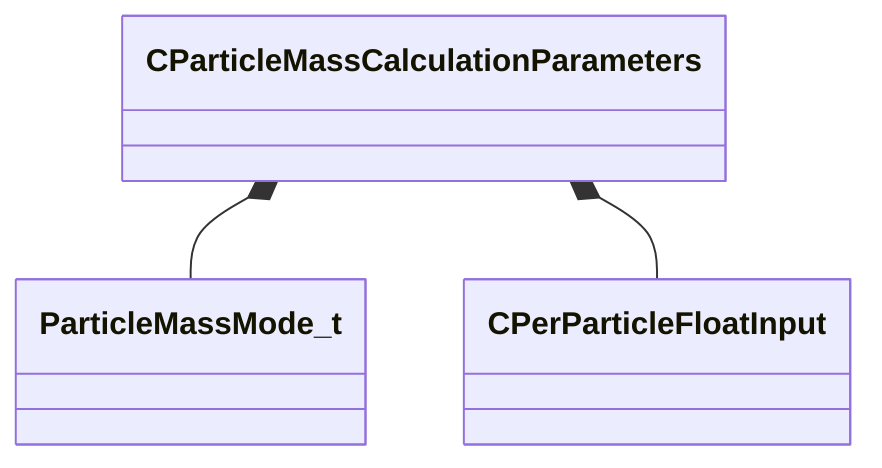

**Fields:**

| Name | Type | Annotations |
|------|------|-------------|
| `m_nMassMode` | [ParticleMassMode_t](../schemas/particles.md#particlemassmode_t) | `MPropertyFriendlyName "Radius calculation mode"` |
| `m_flRadius` | [CPerParticleFloatInput](../schemas/particleslib.md#cperparticlefloatinput) | `MPropertyFriendlyName "Radius input"` |
| `m_flNominalRadius` | [CPerParticleFloatInput](../schemas/particleslib.md#cperparticlefloatinput) | `MPropertyFriendlyName "Nominal radius value"` |
| `m_flScale` | [CPerParticleFloatInput](../schemas/particleslib.md#cperparticlefloatinput) | `MPropertyFriendlyName "Scale to apply to result"` |

### CParticleSystemDefinition

**Inherits from:** [IParticleSystemDefinition](particles.md#iparticlesystemdefinition)

**Metadata:** `MGetKV3ClassDefaults {
	"_class": "CParticleSystemDefinition",
	"m_nBehaviorVersion": 0,
	"m_PreEmissionOperators":
	[
	],
	"m_Emitters":
	[
	],
	"m_Initializers":
	[
	],
	"m_Operators":
	[
	],
	"m_ForceGenerators":
	[
	],
	"m_Constraints":
	[
	],
	"m_Renderers":
	[
	],
	"m_Children":
	[
	],
	"m_nFirstMultipleOverride_BackwardCompat": -1,
	"m_nInitialParticles": 0,
	"m_nMaxParticles": 1000,
	"m_nGroupID": 0,
	"m_BoundingBoxMin":
	[
		-10.000000,
		-10.000000,
		-10.000000
	],
	"m_BoundingBoxMax":
	[
		10.000000,
		10.000000,
		10.000000
	],
	"m_flDepthSortBias": 0.000000,
	"m_nSortOverridePositionCP": -1,
	"m_bInfiniteBounds": false,
	"m_bEnableNamedValues": false,
	"m_NamedValueDomain": "",
	"m_NamedValueLocals":
	[
	],
	"m_ConstantColor":
	[
		255,
		255,
		255
	],
	"m_ConstantNormal":
	[
		0.000000,
		0.000000,
		1.000000
	],
	"m_flConstantRadius": 5.000000,
	"m_flConstantRotation": 0.000000,
	"m_flConstantRotationSpeed": 0.000000,
	"m_flConstantLifespan": 1.000000,
	"m_nConstantSequenceNumber": 0,
	"m_nConstantSequenceNumber1": 0,
	"m_nSnapshotControlPoint": 0,
	"m_hSnapshot": "",
	"m_pszCullReplacementName": "",
	"m_flCullRadius": 0.000000,
	"m_flCullFillCost": 1.000000,
	"m_nCullControlPoint": 0,
	"m_hFallback": "",
	"m_nFallbackMaxCount": -1,
	"m_hLowViolenceDef": "",
	"m_hReferenceReplacement": "",
	"m_flPreSimulationTime": 0.000000,
	"m_flStopSimulationAfterTime": 1000000000.000000,
	"m_flMaximumTimeStep": 0.100000,
	"m_flMaximumSimTime": 0.000000,
	"m_flMinimumSimTime": 0.000000,
	"m_flMinimumTimeStep": 0.000000,
	"m_nMinimumFrames": 0,
	"m_bIsGPUParticleSystem": false,
	"m_nMinCPULevel": 0,
	"m_nMinGPULevel": 0,
	"m_flNoDrawTimeToGoToSleep": 8.000000,
	"m_flMaxDrawDistance": -1.000000,
	"m_flStartFadeDistance": 200000.000000,
	"m_flMaxCreationDistance": -1.000000,
	"m_nAggregationMinAvailableParticles": 1,
	"m_flAggregateRadius": 0.000000,
	"m_bShouldBatch": false,
	"m_bShouldHitboxesFallbackToRenderBounds": true,
	"m_bShouldHitboxesFallbackToSnapshot": true,
	"m_bShouldHitboxesFallbackToCollisionHulls": true,
	"m_nViewModelEffect": "INHERITABLE_BOOL_INHERIT",
	"m_bScreenSpaceEffect": false,
	"m_pszTargetLayerID": "",
	"m_nSkipRenderControlPoint": -1,
	"m_nAllowRenderControlPoint": -1,
	"m_bShouldSort": true,
	"m_controlPointConfigurations":
	[
	]
}`

**Relationships:**

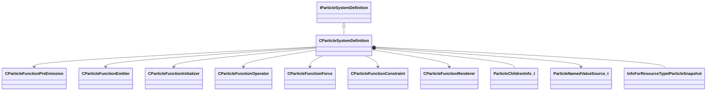

**Fields:**

| Name | Type | Annotations |
|------|------|-------------|
| `m_nBehaviorVersion` | int32 | `MPropertyFriendlyName "version"` `MPropertySuppressField` |
| `m_PreEmissionOperators` | CUtlVector<[CParticleFunctionPreEmission](../schemas/particles.md#cparticlefunctionpreemission)*> | `MPropertySuppressField` |
| `m_Emitters` | CUtlVector<[CParticleFunctionEmitter](../schemas/particles.md#cparticlefunctionemitter)*> | `MPropertySuppressField` |
| `m_Initializers` | CUtlVector<[CParticleFunctionInitializer](../schemas/particles.md#cparticlefunctioninitializer)*> | `MPropertySuppressField` |
| `m_Operators` | CUtlVector<[CParticleFunctionOperator](../schemas/particles.md#cparticlefunctionoperator)*> | `MPropertySuppressField` |
| `m_ForceGenerators` | CUtlVector<[CParticleFunctionForce](../schemas/particles.md#cparticlefunctionforce)*> | `MPropertySuppressField` |
| `m_Constraints` | CUtlVector<[CParticleFunctionConstraint](../schemas/particles.md#cparticlefunctionconstraint)*> | `MPropertySuppressField` |
| `m_Renderers` | CUtlVector<[CParticleFunctionRenderer](../schemas/particles.md#cparticlefunctionrenderer)*> | `MPropertySuppressField` |
| `m_Children` | CUtlVector<[ParticleChildrenInfo_t](../schemas/particles.md#particlechildreninfo_t)> | `MPropertySuppressField` |
| `m_nFirstMultipleOverride_BackwardCompat` | int32 | `MPropertySuppressField` |
| `m_nInitialParticles` | int32 | `MPropertyStartGroup "+Collection Options"` `MPropertyFriendlyName "initial particles"` |
| `m_nMaxParticles` | int32 | `MPropertyFriendlyName "max particles"` |
| `m_nGroupID` | int32 | `MPropertyFriendlyName "group id"` |
| `m_BoundingBoxMin` | Vector | `MPropertyStartGroup "Bounding Box"` `MPropertyFriendlyName "bounding box bloat min"` `MVectorIsCoordinate` |
| `m_BoundingBoxMax` | Vector | `MPropertyFriendlyName "bounding box bloat max"` `MVectorIsCoordinate` |
| `m_flDepthSortBias` | float32 | `MPropertyFriendlyName "bounding box depth sort bias"` |
| `m_nSortOverridePositionCP` | int32 | `MPropertyFriendlyName "sort override position CP"` |
| `m_bInfiniteBounds` | bool | `MPropertyFriendlyName "infinite bounds - don't cull"` |
| `m_bEnableNamedValues` | bool | `MPropertyStartGroup "Named Values"` `MPropertyFriendlyName "Enable Named Values (EXPERIMENTAL)"` |
| `m_NamedValueDomain` | CUtlString | `MPropertyFriendlyName "Domain Class"` `MPropertyAttributeChoiceName "particlefield_domain"` `MPropertyAutoRebuildOnChange` `MPropertySuppressExpr "!m_bEnableNamedValues"` |
| `m_NamedValueLocals` | CUtlVector<[ParticleNamedValueSource_t](../schemas/particleslib.md#particlenamedvaluesource_t)*> | `MPropertySuppressField` |
| `m_ConstantColor` | Color | `MPropertyStartGroup "+Base Properties"` `MPropertyFriendlyName "color"` `MPropertyColorPlusAlpha` |
| `m_ConstantNormal` | Vector | `MPropertyFriendlyName "normal"` `MVectorIsCoordinate` |
| `m_flConstantRadius` | float32 | `MPropertyFriendlyName "radius"` `MPropertyAttributeRange "biased 0 500"` |
| `m_flConstantRotation` | float32 | `MPropertyFriendlyName "rotation"` |
| `m_flConstantRotationSpeed` | float32 | `MPropertyFriendlyName "rotation speed"` |
| `m_flConstantLifespan` | float32 | `MPropertyFriendlyName "lifetime"` |
| `m_nConstantSequenceNumber` | int32 | `MPropertyFriendlyName "sequence number"` `MPropertyAttributeEditor "SequencePicker( 1 )"` |
| `m_nConstantSequenceNumber1` | int32 | `MPropertyFriendlyName "sequence number 1"` `MPropertyAttributeEditor "SequencePicker( 2 )"` |
| `m_nSnapshotControlPoint` | int32 | `MPropertyStartGroup "Snapshot Options"` |
| `m_hSnapshot` | CStrongHandle<[InfoForResourceTypeIParticleSnapshot](../schemas/resourcesystem.md#infoforresourcetypeiparticlesnapshot)> |  |
| `m_pszCullReplacementName` | CStrongHandle<[InfoForResourceTypeIParticleSystemDefinition](../schemas/resourcesystem.md#infoforresourcetypeiparticlesystemdefinition)> | `MPropertyStartGroup "Replacement Options"` `MPropertyFriendlyName "cull replacement definition"` |
| `m_flCullRadius` | float32 | `MPropertyFriendlyName "cull radius"` |
| `m_flCullFillCost` | float32 | `MPropertyFriendlyName "cull cost"` |
| `m_nCullControlPoint` | int32 | `MPropertyFriendlyName "cull control point"` |
| `m_hFallback` | CStrongHandle<[InfoForResourceTypeIParticleSystemDefinition](../schemas/resourcesystem.md#infoforresourcetypeiparticlesystemdefinition)> | `MPropertyFriendlyName "fallback replacement definition"` |
| `m_nFallbackMaxCount` | int32 | `MPropertyFriendlyName "fallback max count"` |
| `m_hLowViolenceDef` | CStrongHandle<[InfoForResourceTypeIParticleSystemDefinition](../schemas/resourcesystem.md#infoforresourcetypeiparticlesystemdefinition)> | `MPropertyFriendlyName "low violence definition"` |
| `m_hReferenceReplacement` | CStrongHandle<[InfoForResourceTypeIParticleSystemDefinition](../schemas/resourcesystem.md#infoforresourcetypeiparticlesystemdefinition)> | `MPropertyFriendlyName "reference replacement definition"` |
| `m_flPreSimulationTime` | float32 | `MPropertyStartGroup "Simulation Options"` `MPropertyFriendlyName "pre-simulation time"` |
| `m_flStopSimulationAfterTime` | float32 | `MPropertyFriendlyName "freeze simulation after time"` |
| `m_flMaximumTimeStep` | float32 | `MPropertyFriendlyName "maximum time step"` |
| `m_flMaximumSimTime` | float32 | `MPropertyFriendlyName "maximum sim tick rate"` |
| `m_flMinimumSimTime` | float32 | `MPropertyFriendlyName "minimum sim tick rate"` |
| `m_flMinimumTimeStep` | float32 | `MPropertyFriendlyName "minimum simulation time step"` |
| `m_nMinimumFrames` | int32 | `MPropertyFriendlyName "minimum required rendered frames"` |
| `m_bIsGPUParticleSystem` | bool | `MPropertyFriendlyName "simulated on the GPU"` `MPropertySuppressExpr "mod != hlx"` |
| `m_nMinCPULevel` | int32 | `MPropertyStartGroup "Performance Options"` `MPropertyFriendlyName "minimum CPU level"` |
| `m_nMinGPULevel` | int32 | `MPropertyFriendlyName "minimum GPU level"` |
| `m_flNoDrawTimeToGoToSleep` | float32 | `MPropertyFriendlyName "time to sleep when not drawn"` |
| `m_flMaxDrawDistance` | float32 | `MPropertyFriendlyName "maximum draw distance"` |
| `m_flStartFadeDistance` | float32 | `MPropertyFriendlyName "start fade distance"` |
| `m_flMaxCreationDistance` | float32 | `MPropertyFriendlyName "maximum creation distance"` |
| `m_nAggregationMinAvailableParticles` | int32 | `MPropertyFriendlyName "minimum free particles to aggregate"` |
| `m_flAggregateRadius` | float32 | `MPropertyFriendlyName "aggregation radius"` |
| `m_bShouldBatch` | bool | `MPropertyFriendlyName "batch particle systems (DO NOT USE)"` `MParticleAdvancedField` |
| `m_bShouldHitboxesFallbackToRenderBounds` | bool | `MPropertyFriendlyName "Hitboxes fall back to render bounds"` |
| `m_bShouldHitboxesFallbackToSnapshot` | bool | `MPropertyFriendlyName "Hitboxes fall back to snapshot"` |
| `m_bShouldHitboxesFallbackToCollisionHulls` | bool | `MPropertyFriendlyName "Hitboxes fall back to collision hulls"` |
| `m_nViewModelEffect` | [InheritableBoolType_t](../schemas/particles.md#inheritablebooltype_t) | `MPropertyStartGroup "Rendering Options"` `MPropertyFriendlyName "view model effect"` `MPropertySuppressExpr "m_bScreenSpaceEffect"` |
| `m_bScreenSpaceEffect` | bool | `MPropertyFriendlyName "screen space effect"` `MPropertySuppressExpr "m_nViewModelEffect == INHERITABLE_BOOL_TRUE"` |
| `m_pszTargetLayerID` | CUtlSymbolLarge | `MPropertyFriendlyName "target layer ID for rendering"` |
| `m_nSkipRenderControlPoint` | int32 | `MPropertyFriendlyName "control point to disable rendering if it is the camera"` |
| `m_nAllowRenderControlPoint` | int32 | `MPropertyFriendlyName "control point to only enable rendering if it is the camera"` |
| `m_bShouldSort` | bool | `MPropertyFriendlyName "sort particles (DEPRECATED - USE RENDERER OPTION)"` `MParticleAdvancedField` |
| `m_controlPointConfigurations` | CUtlVector<[ParticleControlPointConfiguration_t](../schemas/particles.md#particlecontrolpointconfiguration_t)> | `MPropertySuppressField` |

### CParticleVisibilityInputs

**Metadata:** `MGetKV3ClassDefaults {
	"m_flCameraBias": 0.000000,
	"m_nCPin": -1,
	"m_flProxyRadius": 1.000000,
	"m_flInputMin": 0.000000,
	"m_flInputMax": 1.000000,
	"m_flInputPixelVisFade": 0.250000,
	"m_flNoPixelVisibilityFallback": 1.000000,
	"m_flDistanceInputMin": 0.000000,
	"m_flDistanceInputMax": 0.000000,
	"m_flDotInputMin": 0.000000,
	"m_flDotInputMax": 0.000000,
	"m_bDotCPAngles": true,
	"m_bDotCameraAngles": false,
	"m_flAlphaScaleMin": 0.000000,
	"m_flAlphaScaleMax": 1.000000,
	"m_flRadiusScaleMin": 1.000000,
	"m_flRadiusScaleMax": 1.000000,
	"m_flRadiusScaleFOVBase": 0.000000,
	"m_bRightEye": false
}`

**Fields:**

| Name | Type | Annotations |
|------|------|-------------|
| `m_flCameraBias` | float32 | `MPropertyFriendlyName "camera depth bias"` |
| `m_nCPin` | int32 | `MPropertyFriendlyName "input control point number"` |
| `m_flProxyRadius` | float32 | `MPropertyFriendlyName "input proxy radius"` `MPropertySuppressExpr "m_nCPin == -1"` |
| `m_flInputMin` | float32 | `MPropertyFriendlyName "input proxy pixel visibility minimum"` `MPropertySuppressExpr "m_nCPin == -1"` |
| `m_flInputMax` | float32 | `MPropertyFriendlyName "input proxy pixel visibility maximum"` `MPropertySuppressExpr "m_nCPin == -1"` |
| `m_flInputPixelVisFade` | float32 | `MPropertyFriendlyName "input proxy pixel visibility fade out time"` `MPropertySuppressExpr "m_nCPin == -1"` |
| `m_flNoPixelVisibilityFallback` | float32 | `MPropertyFriendlyName "input proxy unsupported hardware fallback value"` `MPropertySuppressExpr "m_nCPin == -1"` |
| `m_flDistanceInputMin` | float32 | `MPropertyFriendlyName "input distance minimum"` `MPropertySuppressExpr "m_nCPin == -1"` |
| `m_flDistanceInputMax` | float32 | `MPropertyFriendlyName "input distance maximum"` `MPropertySuppressExpr "m_nCPin == -1"` |
| `m_flDotInputMin` | float32 | `MPropertyFriendlyName "input dot minimum"` `MPropertySuppressExpr "m_nCPin == -1"` |
| `m_flDotInputMax` | float32 | `MPropertyFriendlyName "input dot maximum"` `MPropertySuppressExpr "m_nCPin == -1"` |
| `m_bDotCPAngles` | bool | `MPropertyFriendlyName "input dot use CP angles"` `MPropertySuppressExpr "m_nCPin == -1"` |
| `m_bDotCameraAngles` | bool | `MPropertyFriendlyName "input dot use Camera angles"` `MPropertySuppressExpr "m_nCPin == -1"` |
| `m_flAlphaScaleMin` | float32 | `MPropertyFriendlyName "output alpha scale minimum"` `MPropertySuppressExpr "m_nCPin == -1"` |
| `m_flAlphaScaleMax` | float32 | `MPropertyFriendlyName "output alpha scale maximum"` `MPropertySuppressExpr "m_nCPin == -1"` |
| `m_flRadiusScaleMin` | float32 | `MPropertyFriendlyName "output radius scale minimum"` `MPropertySuppressExpr "m_nCPin == -1"` |
| `m_flRadiusScaleMax` | float32 | `MPropertyFriendlyName "output radius scale maximum"` `MPropertySuppressExpr "m_nCPin == -1"` |
| `m_flRadiusScaleFOVBase` | float32 | `MPropertyFriendlyName "output radius FOV scale base"` `MPropertySuppressExpr "m_nCPin == -1"` |
| `m_bRightEye` | bool | `MPropertyFriendlyName "vr camera right eye"` `MParticleAdvancedField` |

### CPathParameters

**Metadata:** `MGetKV3ClassDefaults {
	"m_nStartControlPointNumber": 0,
	"m_nEndControlPointNumber": 0,
	"m_nBulgeControl": 0,
	"m_flBulge": 0.000000,
	"m_flMidPoint": 0.500000,
	"m_vStartPointOffset":
	[
		0.000000,
		0.000000,
		0.000000
	],
	"m_vMidPointOffset":
	[
		0.000000,
		0.000000,
		0.000000
	],
	"m_vEndOffset":
	[
		0.000000,
		0.000000,
		0.000000
	]
}`

**Fields:**

| Name | Type | Annotations |
|------|------|-------------|
| `m_nStartControlPointNumber` | int32 | `MPropertyFriendlyName "start control point number"` |
| `m_nEndControlPointNumber` | int32 | `MPropertyFriendlyName "end control point number"` |
| `m_nBulgeControl` | int32 | `MPropertyFriendlyName "bulge control 0=random 1=orientation of start pnt 2=orientation of end point"` |
| `m_flBulge` | float32 | `MPropertyFriendlyName "random bulge"` |
| `m_flMidPoint` | float32 | `MPropertyFriendlyName "mid point position"` |
| `m_vStartPointOffset` | Vector | `MPropertyFriendlyName "Offset from curve start point for path start"` `MVectorIsCoordinate` |
| `m_vMidPointOffset` | Vector | `MPropertyFriendlyName "Offset from curve midpoint for curve center"` `MVectorIsCoordinate` |
| `m_vEndOffset` | Vector | `MPropertyFriendlyName "Offset from control point for path end"` `MVectorIsCoordinate` |

### CRandomNumberGeneratorParameters

**Metadata:** `MGetKV3ClassDefaults {
	"m_bDistributeEvenly": false,
	"m_nSeed": -1
}`

**Fields:**

| Name | Type | Annotations |
|------|------|-------------|
| `m_bDistributeEvenly` | bool | `MPropertyFriendlyName "Distribute evenly"` |
| `m_nSeed` | int32 | `MPropertyFriendlyName "Seed (negative values=randomize)"` `MPropertySuppressExpr "!m_bDistributeEvenly"` |

### CReplicationParameters

**Metadata:** `MGetKV3ClassDefaults {
	"m_nReplicationMode": "PARTICLE_REPLICATIONMODE_NONE",
	"m_bScaleChildParticleRadii": true,
	"m_flMinRandomRadiusScale":
	{
		"m_nType": "PF_TYPE_LITERAL",
		"m_nMapType": "PF_MAP_TYPE_DIRECT",
		"m_flLiteralValue": 1.000000,
		"m_NamedValue": "",
		"m_nControlPoint": 0,
		"m_nScalarAttribute": 3,
		"m_nVectorAttribute": 6,
		"m_nVectorComponent": 0,
		"m_bReverseOrder": false,
		"m_flRandomMin": 0.000000,
		"m_flRandomMax": 1.000000,
		"m_bHasRandomSignFlip": false,
		"m_nRandomSeed": <HIDDEN FOR DIFF>,
		"m_nRandomMode": "PF_RANDOM_MODE_CONSTANT",
		"m_strSnapshotSubset": "",
		"m_flLOD0": 0.000000,
		"m_flLOD1": 0.000000,
		"m_flLOD2": 0.000000,
		"m_flLOD3": 0.000000,
		"m_nNoiseInputVectorAttribute": 0,
		"m_flNoiseOutputMin": 0.000000,
		"m_flNoiseOutputMax": 1.000000,
		"m_flNoiseScale": 0.100000,
		"m_vecNoiseOffsetRate":
		[
			0.000000,
			0.000000,
			0.000000
		],
		"m_flNoiseOffset": 0.000000,
		"m_nNoiseOctaves": 1,
		"m_nNoiseTurbulence": "PF_NOISE_TURB_NONE",
		"m_nNoiseType": "PF_NOISE_TYPE_PERLIN",
		"m_nNoiseModifier": "PF_NOISE_MODIFIER_NONE",
		"m_flNoiseTurbulenceScale": 1.000000,
		"m_flNoiseTurbulenceMix": 0.500000,
		"m_flNoiseImgPreviewScale": 1.000000,
		"m_bNoiseImgPreviewLive": true,
		"m_flNoCameraFallback": 0.000000,
		"m_bUseBoundsCenter": false,
		"m_nInputMode": "PF_INPUT_MODE_CLAMPED",
		"m_flMultFactor": 1.000000,
		"m_flInput0": 0.000000,
		"m_flInput1": 1.000000,
		"m_flOutput0": 0.000000,
		"m_flOutput1": 1.000000,
		"m_flNotchedRangeMin": 0.000000,
		"m_flNotchedRangeMax": 1.000000,
		"m_flNotchedOutputOutside": 0.000000,
		"m_flNotchedOutputInside": 1.000000,
		"m_nRoundType": "PF_ROUND_TYPE_NEAREST",
		"m_nBiasType": "PF_BIAS_TYPE_STANDARD",
		"m_flBiasParameter": 0.000000,
		"m_Curve":
		{
			"m_spline":
			[
			],
			"m_tangents":
			[
			],
			"m_vDomainMins":
			[
				0.000000,
				0.000000
			],
			"m_vDomainMaxs":
			[
				0.000000,
				0.000000
			]
		}
	},
	"m_flMaxRandomRadiusScale":
	{
		"m_nType": "PF_TYPE_LITERAL",
		"m_nMapType": "PF_MAP_TYPE_DIRECT",
		"m_flLiteralValue": 1.000000,
		"m_NamedValue": "",
		"m_nControlPoint": 0,
		"m_nScalarAttribute": 3,
		"m_nVectorAttribute": 6,
		"m_nVectorComponent": 0,
		"m_bReverseOrder": false,
		"m_flRandomMin": 0.000000,
		"m_flRandomMax": 1.000000,
		"m_bHasRandomSignFlip": false,
		"m_nRandomSeed": <HIDDEN FOR DIFF>,
		"m_nRandomMode": "PF_RANDOM_MODE_CONSTANT",
		"m_strSnapshotSubset": "",
		"m_flLOD0": 0.000000,
		"m_flLOD1": 0.000000,
		"m_flLOD2": 0.000000,
		"m_flLOD3": 0.000000,
		"m_nNoiseInputVectorAttribute": 0,
		"m_flNoiseOutputMin": 0.000000,
		"m_flNoiseOutputMax": 1.000000,
		"m_flNoiseScale": 0.100000,
		"m_vecNoiseOffsetRate":
		[
			0.000000,
			0.000000,
			0.000000
		],
		"m_flNoiseOffset": 0.000000,
		"m_nNoiseOctaves": 1,
		"m_nNoiseTurbulence": "PF_NOISE_TURB_NONE",
		"m_nNoiseType": "PF_NOISE_TYPE_PERLIN",
		"m_nNoiseModifier": "PF_NOISE_MODIFIER_NONE",
		"m_flNoiseTurbulenceScale": 1.000000,
		"m_flNoiseTurbulenceMix": 0.500000,
		"m_flNoiseImgPreviewScale": 1.000000,
		"m_bNoiseImgPreviewLive": true,
		"m_flNoCameraFallback": 0.000000,
		"m_bUseBoundsCenter": false,
		"m_nInputMode": "PF_INPUT_MODE_CLAMPED",
		"m_flMultFactor": 1.000000,
		"m_flInput0": 0.000000,
		"m_flInput1": 1.000000,
		"m_flOutput0": 0.000000,
		"m_flOutput1": 1.000000,
		"m_flNotchedRangeMin": 0.000000,
		"m_flNotchedRangeMax": 1.000000,
		"m_flNotchedOutputOutside": 0.000000,
		"m_flNotchedOutputInside": 1.000000,
		"m_nRoundType": "PF_ROUND_TYPE_NEAREST",
		"m_nBiasType": "PF_BIAS_TYPE_STANDARD",
		"m_flBiasParameter": 0.000000,
		"m_Curve":
		{
			"m_spline":
			[
			],
			"m_tangents":
			[
			],
			"m_vDomainMins":
			[
				0.000000,
				0.000000
			],
			"m_vDomainMaxs":
			[
				0.000000,
				0.000000
			]
		}
	},
	"m_vMinRandomDisplacement":
	{
		"m_nType": "PVEC_TYPE_LITERAL",
		"m_vLiteralValue":
		[
			0.000000,
			0.000000,
			0.000000
		],
		"m_LiteralColor":
		[
			0,
			0,
			0
		],
		"m_NamedValue": "",
		"m_bFollowNamedValue": false,
		"m_nVectorAttribute": 6,
		"m_vVectorAttributeScale":
		[
			1.000000,
			1.000000,
			1.000000
		],
		"m_nControlPoint": 0,
		"m_nDeltaControlPoint": 0,
		"m_vCPValueScale":
		[
			1.000000,
			1.000000,
			1.000000
		],
		"m_vCPRelativePosition":
		[
			0.000000,
			0.000000,
			0.000000
		],
		"m_vCPRelativeDir":
		[
			1.000000,
			0.000000,
			0.000000
		],
		"m_FloatComponentX":
		{
			"m_nType": "PF_TYPE_LITERAL",
			"m_nMapType": "PF_MAP_TYPE_DIRECT",
			"m_flLiteralValue": 0.000000,
			"m_NamedValue": "",
			"m_nControlPoint": 0,
			"m_nScalarAttribute": 3,
			"m_nVectorAttribute": 6,
			"m_nVectorComponent": 0,
			"m_bReverseOrder": false,
			"m_flRandomMin": 0.000000,
			"m_flRandomMax": 1.000000,
			"m_bHasRandomSignFlip": false,
			"m_nRandomSeed": <HIDDEN FOR DIFF>,
			"m_nRandomMode": "PF_RANDOM_MODE_CONSTANT",
			"m_strSnapshotSubset": "",
			"m_flLOD0": 0.000000,
			"m_flLOD1": 0.000000,
			"m_flLOD2": 0.000000,
			"m_flLOD3": 0.000000,
			"m_nNoiseInputVectorAttribute": 0,
			"m_flNoiseOutputMin": 0.000000,
			"m_flNoiseOutputMax": 1.000000,
			"m_flNoiseScale": 0.100000,
			"m_vecNoiseOffsetRate":
			[
				0.000000,
				0.000000,
				0.000000
			],
			"m_flNoiseOffset": 0.000000,
			"m_nNoiseOctaves": 1,
			"m_nNoiseTurbulence": "PF_NOISE_TURB_NONE",
			"m_nNoiseType": "PF_NOISE_TYPE_PERLIN",
			"m_nNoiseModifier": "PF_NOISE_MODIFIER_NONE",
			"m_flNoiseTurbulenceScale": 1.000000,
			"m_flNoiseTurbulenceMix": 0.500000,
			"m_flNoiseImgPreviewScale": 1.000000,
			"m_bNoiseImgPreviewLive": true,
			"m_flNoCameraFallback": 0.000000,
			"m_bUseBoundsCenter": false,
			"m_nInputMode": "PF_INPUT_MODE_CLAMPED",
			"m_flMultFactor": 1.000000,
			"m_flInput0": 0.000000,
			"m_flInput1": 1.000000,
			"m_flOutput0": 0.000000,
			"m_flOutput1": 1.000000,
			"m_flNotchedRangeMin": 0.000000,
			"m_flNotchedRangeMax": 1.000000,
			"m_flNotchedOutputOutside": 0.000000,
			"m_flNotchedOutputInside": 1.000000,
			"m_nRoundType": "PF_ROUND_TYPE_NEAREST",
			"m_nBiasType": "PF_BIAS_TYPE_STANDARD",
			"m_flBiasParameter": 0.000000,
			"m_Curve":
			{
				"m_spline":
				[
				],
				"m_tangents":
				[
				],
				"m_vDomainMins":
				[
					0.000000,
					0.000000
				],
				"m_vDomainMaxs":
				[
					0.000000,
					0.000000
				]
			}
		},
		"m_FloatComponentY":
		{
			"m_nType": "PF_TYPE_LITERAL",
			"m_nMapType": "PF_MAP_TYPE_DIRECT",
			"m_flLiteralValue": 0.000000,
			"m_NamedValue": "",
			"m_nControlPoint": 0,
			"m_nScalarAttribute": 3,
			"m_nVectorAttribute": 6,
			"m_nVectorComponent": 0,
			"m_bReverseOrder": false,
			"m_flRandomMin": 0.000000,
			"m_flRandomMax": 1.000000,
			"m_bHasRandomSignFlip": false,
			"m_nRandomSeed": <HIDDEN FOR DIFF>,
			"m_nRandomMode": "PF_RANDOM_MODE_CONSTANT",
			"m_strSnapshotSubset": "",
			"m_flLOD0": 0.000000,
			"m_flLOD1": 0.000000,
			"m_flLOD2": 0.000000,
			"m_flLOD3": 0.000000,
			"m_nNoiseInputVectorAttribute": 0,
			"m_flNoiseOutputMin": 0.000000,
			"m_flNoiseOutputMax": 1.000000,
			"m_flNoiseScale": 0.100000,
			"m_vecNoiseOffsetRate":
			[
				0.000000,
				0.000000,
				0.000000
			],
			"m_flNoiseOffset": 0.000000,
			"m_nNoiseOctaves": 1,
			"m_nNoiseTurbulence": "PF_NOISE_TURB_NONE",
			"m_nNoiseType": "PF_NOISE_TYPE_PERLIN",
			"m_nNoiseModifier": "PF_NOISE_MODIFIER_NONE",
			"m_flNoiseTurbulenceScale": 1.000000,
			"m_flNoiseTurbulenceMix": 0.500000,
			"m_flNoiseImgPreviewScale": 1.000000,
			"m_bNoiseImgPreviewLive": true,
			"m_flNoCameraFallback": 0.000000,
			"m_bUseBoundsCenter": false,
			"m_nInputMode": "PF_INPUT_MODE_CLAMPED",
			"m_flMultFactor": 1.000000,
			"m_flInput0": 0.000000,
			"m_flInput1": 1.000000,
			"m_flOutput0": 0.000000,
			"m_flOutput1": 1.000000,
			"m_flNotchedRangeMin": 0.000000,
			"m_flNotchedRangeMax": 1.000000,
			"m_flNotchedOutputOutside": 0.000000,
			"m_flNotchedOutputInside": 1.000000,
			"m_nRoundType": "PF_ROUND_TYPE_NEAREST",
			"m_nBiasType": "PF_BIAS_TYPE_STANDARD",
			"m_flBiasParameter": 0.000000,
			"m_Curve":
			{
				"m_spline":
				[
				],
				"m_tangents":
				[
				],
				"m_vDomainMins":
				[
					0.000000,
					0.000000
				],
				"m_vDomainMaxs":
				[
					0.000000,
					0.000000
				]
			}
		},
		"m_FloatComponentZ":
		{
			"m_nType": "PF_TYPE_LITERAL",
			"m_nMapType": "PF_MAP_TYPE_DIRECT",
			"m_flLiteralValue": 0.000000,
			"m_NamedValue": "",
			"m_nControlPoint": 0,
			"m_nScalarAttribute": 3,
			"m_nVectorAttribute": 6,
			"m_nVectorComponent": 0,
			"m_bReverseOrder": false,
			"m_flRandomMin": 0.000000,
			"m_flRandomMax": 1.000000,
			"m_bHasRandomSignFlip": false,
			"m_nRandomSeed": <HIDDEN FOR DIFF>,
			"m_nRandomMode": "PF_RANDOM_MODE_CONSTANT",
			"m_strSnapshotSubset": "",
			"m_flLOD0": 0.000000,
			"m_flLOD1": 0.000000,
			"m_flLOD2": 0.000000,
			"m_flLOD3": 0.000000,
			"m_nNoiseInputVectorAttribute": 0,
			"m_flNoiseOutputMin": 0.000000,
			"m_flNoiseOutputMax": 1.000000,
			"m_flNoiseScale": 0.100000,
			"m_vecNoiseOffsetRate":
			[
				0.000000,
				0.000000,
				0.000000
			],
			"m_flNoiseOffset": 0.000000,
			"m_nNoiseOctaves": 1,
			"m_nNoiseTurbulence": "PF_NOISE_TURB_NONE",
			"m_nNoiseType": "PF_NOISE_TYPE_PERLIN",
			"m_nNoiseModifier": "PF_NOISE_MODIFIER_NONE",
			"m_flNoiseTurbulenceScale": 1.000000,
			"m_flNoiseTurbulenceMix": 0.500000,
			"m_flNoiseImgPreviewScale": 1.000000,
			"m_bNoiseImgPreviewLive": true,
			"m_flNoCameraFallback": 0.000000,
			"m_bUseBoundsCenter": false,
			"m_nInputMode": "PF_INPUT_MODE_CLAMPED",
			"m_flMultFactor": 1.000000,
			"m_flInput0": 0.000000,
			"m_flInput1": 1.000000,
			"m_flOutput0": 0.000000,
			"m_flOutput1": 1.000000,
			"m_flNotchedRangeMin": 0.000000,
			"m_flNotchedRangeMax": 1.000000,
			"m_flNotchedOutputOutside": 0.000000,
			"m_flNotchedOutputInside": 1.000000,
			"m_nRoundType": "PF_ROUND_TYPE_NEAREST",
			"m_nBiasType": "PF_BIAS_TYPE_STANDARD",
			"m_flBiasParameter": 0.000000,
			"m_Curve":
			{
				"m_spline":
				[
				],
				"m_tangents":
				[
				],
				"m_vDomainMins":
				[
					0.000000,
					0.000000
				],
				"m_vDomainMaxs":
				[
					0.000000,
					0.000000
				]
			}
		},
		"m_FloatInterp":
		{
			"m_nType": "PF_TYPE_LITERAL",
			"m_nMapType": "PF_MAP_TYPE_DIRECT",
			"m_flLiteralValue": 0.000000,
			"m_NamedValue": "",
			"m_nControlPoint": 0,
			"m_nScalarAttribute": 3,
			"m_nVectorAttribute": 6,
			"m_nVectorComponent": 0,
			"m_bReverseOrder": false,
			"m_flRandomMin": 0.000000,
			"m_flRandomMax": 1.000000,
			"m_bHasRandomSignFlip": false,
			"m_nRandomSeed": <HIDDEN FOR DIFF>,
			"m_nRandomMode": "PF_RANDOM_MODE_CONSTANT",
			"m_strSnapshotSubset": "",
			"m_flLOD0": 0.000000,
			"m_flLOD1": 0.000000,
			"m_flLOD2": 0.000000,
			"m_flLOD3": 0.000000,
			"m_nNoiseInputVectorAttribute": 0,
			"m_flNoiseOutputMin": 0.000000,
			"m_flNoiseOutputMax": 1.000000,
			"m_flNoiseScale": 0.100000,
			"m_vecNoiseOffsetRate":
			[
				0.000000,
				0.000000,
				0.000000
			],
			"m_flNoiseOffset": 0.000000,
			"m_nNoiseOctaves": 1,
			"m_nNoiseTurbulence": "PF_NOISE_TURB_NONE",
			"m_nNoiseType": "PF_NOISE_TYPE_PERLIN",
			"m_nNoiseModifier": "PF_NOISE_MODIFIER_NONE",
			"m_flNoiseTurbulenceScale": 1.000000,
			"m_flNoiseTurbulenceMix": 0.500000,
			"m_flNoiseImgPreviewScale": 1.000000,
			"m_bNoiseImgPreviewLive": true,
			"m_flNoCameraFallback": 0.000000,
			"m_bUseBoundsCenter": false,
			"m_nInputMode": "PF_INPUT_MODE_CLAMPED",
			"m_flMultFactor": 1.000000,
			"m_flInput0": 0.000000,
			"m_flInput1": 1.000000,
			"m_flOutput0": 0.000000,
			"m_flOutput1": 1.000000,
			"m_flNotchedRangeMin": 0.000000,
			"m_flNotchedRangeMax": 1.000000,
			"m_flNotchedOutputOutside": 0.000000,
			"m_flNotchedOutputInside": 1.000000,
			"m_nRoundType": "PF_ROUND_TYPE_NEAREST",
			"m_nBiasType": "PF_BIAS_TYPE_STANDARD",
			"m_flBiasParameter": 0.000000,
			"m_Curve":
			{
				"m_spline":
				[
				],
				"m_tangents":
				[
				],
				"m_vDomainMins":
				[
					0.000000,
					0.000000
				],
				"m_vDomainMaxs":
				[
					0.000000,
					0.000000
				]
			}
		},
		"m_flInterpInput0": 0.000000,
		"m_flInterpInput1": 1.000000,
		"m_vInterpOutput0":
		[
			0.000000,
			0.000000,
			0.000000
		],
		"m_vInterpOutput1":
		[
			1.000000,
			1.000000,
			1.000000
		],
		"m_Gradient":
		{
			"m_Stops":
			[
			]
		},
		"m_vRandomMin":
		[
			0.000000,
			0.000000,
			0.000000
		],
		"m_vRandomMax":
		[
			0.000000,
			0.000000,
			0.000000
		]
	},
	"m_vMaxRandomDisplacement":
	{
		"m_nType": "PVEC_TYPE_LITERAL",
		"m_vLiteralValue":
		[
			0.000000,
			0.000000,
			0.000000
		],
		"m_LiteralColor":
		[
			0,
			0,
			0
		],
		"m_NamedValue": "",
		"m_bFollowNamedValue": false,
		"m_nVectorAttribute": 6,
		"m_vVectorAttributeScale":
		[
			1.000000,
			1.000000,
			1.000000
		],
		"m_nControlPoint": 0,
		"m_nDeltaControlPoint": 0,
		"m_vCPValueScale":
		[
			1.000000,
			1.000000,
			1.000000
		],
		"m_vCPRelativePosition":
		[
			0.000000,
			0.000000,
			0.000000
		],
		"m_vCPRelativeDir":
		[
			1.000000,
			0.000000,
			0.000000
		],
		"m_FloatComponentX":
		{
			"m_nType": "PF_TYPE_LITERAL",
			"m_nMapType": "PF_MAP_TYPE_DIRECT",
			"m_flLiteralValue": 0.000000,
			"m_NamedValue": "",
			"m_nControlPoint": 0,
			"m_nScalarAttribute": 3,
			"m_nVectorAttribute": 6,
			"m_nVectorComponent": 0,
			"m_bReverseOrder": false,
			"m_flRandomMin": 0.000000,
			"m_flRandomMax": 1.000000,
			"m_bHasRandomSignFlip": false,
			"m_nRandomSeed": <HIDDEN FOR DIFF>,
			"m_nRandomMode": "PF_RANDOM_MODE_CONSTANT",
			"m_strSnapshotSubset": "",
			"m_flLOD0": 0.000000,
			"m_flLOD1": 0.000000,
			"m_flLOD2": 0.000000,
			"m_flLOD3": 0.000000,
			"m_nNoiseInputVectorAttribute": 0,
			"m_flNoiseOutputMin": 0.000000,
			"m_flNoiseOutputMax": 1.000000,
			"m_flNoiseScale": 0.100000,
			"m_vecNoiseOffsetRate":
			[
				0.000000,
				0.000000,
				0.000000
			],
			"m_flNoiseOffset": 0.000000,
			"m_nNoiseOctaves": 1,
			"m_nNoiseTurbulence": "PF_NOISE_TURB_NONE",
			"m_nNoiseType": "PF_NOISE_TYPE_PERLIN",
			"m_nNoiseModifier": "PF_NOISE_MODIFIER_NONE",
			"m_flNoiseTurbulenceScale": 1.000000,
			"m_flNoiseTurbulenceMix": 0.500000,
			"m_flNoiseImgPreviewScale": 1.000000,
			"m_bNoiseImgPreviewLive": true,
			"m_flNoCameraFallback": 0.000000,
			"m_bUseBoundsCenter": false,
			"m_nInputMode": "PF_INPUT_MODE_CLAMPED",
			"m_flMultFactor": 1.000000,
			"m_flInput0": 0.000000,
			"m_flInput1": 1.000000,
			"m_flOutput0": 0.000000,
			"m_flOutput1": 1.000000,
			"m_flNotchedRangeMin": 0.000000,
			"m_flNotchedRangeMax": 1.000000,
			"m_flNotchedOutputOutside": 0.000000,
			"m_flNotchedOutputInside": 1.000000,
			"m_nRoundType": "PF_ROUND_TYPE_NEAREST",
			"m_nBiasType": "PF_BIAS_TYPE_STANDARD",
			"m_flBiasParameter": 0.000000,
			"m_Curve":
			{
				"m_spline":
				[
				],
				"m_tangents":
				[
				],
				"m_vDomainMins":
				[
					0.000000,
					0.000000
				],
				"m_vDomainMaxs":
				[
					0.000000,
					0.000000
				]
			}
		},
		"m_FloatComponentY":
		{
			"m_nType": "PF_TYPE_LITERAL",
			"m_nMapType": "PF_MAP_TYPE_DIRECT",
			"m_flLiteralValue": 0.000000,
			"m_NamedValue": "",
			"m_nControlPoint": 0,
			"m_nScalarAttribute": 3,
			"m_nVectorAttribute": 6,
			"m_nVectorComponent": 0,
			"m_bReverseOrder": false,
			"m_flRandomMin": 0.000000,
			"m_flRandomMax": 1.000000,
			"m_bHasRandomSignFlip": false,
			"m_nRandomSeed": <HIDDEN FOR DIFF>,
			"m_nRandomMode": "PF_RANDOM_MODE_CONSTANT",
			"m_strSnapshotSubset": "",
			"m_flLOD0": 0.000000,
			"m_flLOD1": 0.000000,
			"m_flLOD2": 0.000000,
			"m_flLOD3": 0.000000,
			"m_nNoiseInputVectorAttribute": 0,
			"m_flNoiseOutputMin": 0.000000,
			"m_flNoiseOutputMax": 1.000000,
			"m_flNoiseScale": 0.100000,
			"m_vecNoiseOffsetRate":
			[
				0.000000,
				0.000000,
				0.000000
			],
			"m_flNoiseOffset": 0.000000,
			"m_nNoiseOctaves": 1,
			"m_nNoiseTurbulence": "PF_NOISE_TURB_NONE",
			"m_nNoiseType": "PF_NOISE_TYPE_PERLIN",
			"m_nNoiseModifier": "PF_NOISE_MODIFIER_NONE",
			"m_flNoiseTurbulenceScale": 1.000000,
			"m_flNoiseTurbulenceMix": 0.500000,
			"m_flNoiseImgPreviewScale": 1.000000,
			"m_bNoiseImgPreviewLive": true,
			"m_flNoCameraFallback": 0.000000,
			"m_bUseBoundsCenter": false,
			"m_nInputMode": "PF_INPUT_MODE_CLAMPED",
			"m_flMultFactor": 1.000000,
			"m_flInput0": 0.000000,
			"m_flInput1": 1.000000,
			"m_flOutput0": 0.000000,
			"m_flOutput1": 1.000000,
			"m_flNotchedRangeMin": 0.000000,
			"m_flNotchedRangeMax": 1.000000,
			"m_flNotchedOutputOutside": 0.000000,
			"m_flNotchedOutputInside": 1.000000,
			"m_nRoundType": "PF_ROUND_TYPE_NEAREST",
			"m_nBiasType": "PF_BIAS_TYPE_STANDARD",
			"m_flBiasParameter": 0.000000,
			"m_Curve":
			{
				"m_spline":
				[
				],
				"m_tangents":
				[
				],
				"m_vDomainMins":
				[
					0.000000,
					0.000000
				],
				"m_vDomainMaxs":
				[
					0.000000,
					0.000000
				]
			}
		},
		"m_FloatComponentZ":
		{
			"m_nType": "PF_TYPE_LITERAL",
			"m_nMapType": "PF_MAP_TYPE_DIRECT",
			"m_flLiteralValue": 0.000000,
			"m_NamedValue": "",
			"m_nControlPoint": 0,
			"m_nScalarAttribute": 3,
			"m_nVectorAttribute": 6,
			"m_nVectorComponent": 0,
			"m_bReverseOrder": false,
			"m_flRandomMin": 0.000000,
			"m_flRandomMax": 1.000000,
			"m_bHasRandomSignFlip": false,
			"m_nRandomSeed": <HIDDEN FOR DIFF>,
			"m_nRandomMode": "PF_RANDOM_MODE_CONSTANT",
			"m_strSnapshotSubset": "",
			"m_flLOD0": 0.000000,
			"m_flLOD1": 0.000000,
			"m_flLOD2": 0.000000,
			"m_flLOD3": 0.000000,
			"m_nNoiseInputVectorAttribute": 0,
			"m_flNoiseOutputMin": 0.000000,
			"m_flNoiseOutputMax": 1.000000,
			"m_flNoiseScale": 0.100000,
			"m_vecNoiseOffsetRate":
			[
				0.000000,
				0.000000,
				0.000000
			],
			"m_flNoiseOffset": 0.000000,
			"m_nNoiseOctaves": 1,
			"m_nNoiseTurbulence": "PF_NOISE_TURB_NONE",
			"m_nNoiseType": "PF_NOISE_TYPE_PERLIN",
			"m_nNoiseModifier": "PF_NOISE_MODIFIER_NONE",
			"m_flNoiseTurbulenceScale": 1.000000,
			"m_flNoiseTurbulenceMix": 0.500000,
			"m_flNoiseImgPreviewScale": 1.000000,
			"m_bNoiseImgPreviewLive": true,
			"m_flNoCameraFallback": 0.000000,
			"m_bUseBoundsCenter": false,
			"m_nInputMode": "PF_INPUT_MODE_CLAMPED",
			"m_flMultFactor": 1.000000,
			"m_flInput0": 0.000000,
			"m_flInput1": 1.000000,
			"m_flOutput0": 0.000000,
			"m_flOutput1": 1.000000,
			"m_flNotchedRangeMin": 0.000000,
			"m_flNotchedRangeMax": 1.000000,
			"m_flNotchedOutputOutside": 0.000000,
			"m_flNotchedOutputInside": 1.000000,
			"m_nRoundType": "PF_ROUND_TYPE_NEAREST",
			"m_nBiasType": "PF_BIAS_TYPE_STANDARD",
			"m_flBiasParameter": 0.000000,
			"m_Curve":
			{
				"m_spline":
				[
				],
				"m_tangents":
				[
				],
				"m_vDomainMins":
				[
					0.000000,
					0.000000
				],
				"m_vDomainMaxs":
				[
					0.000000,
					0.000000
				]
			}
		},
		"m_FloatInterp":
		{
			"m_nType": "PF_TYPE_LITERAL",
			"m_nMapType": "PF_MAP_TYPE_DIRECT",
			"m_flLiteralValue": 0.000000,
			"m_NamedValue": "",
			"m_nControlPoint": 0,
			"m_nScalarAttribute": 3,
			"m_nVectorAttribute": 6,
			"m_nVectorComponent": 0,
			"m_bReverseOrder": false,
			"m_flRandomMin": 0.000000,
			"m_flRandomMax": 1.000000,
			"m_bHasRandomSignFlip": false,
			"m_nRandomSeed": <HIDDEN FOR DIFF>,
			"m_nRandomMode": "PF_RANDOM_MODE_CONSTANT",
			"m_strSnapshotSubset": "",
			"m_flLOD0": 0.000000,
			"m_flLOD1": 0.000000,
			"m_flLOD2": 0.000000,
			"m_flLOD3": 0.000000,
			"m_nNoiseInputVectorAttribute": 0,
			"m_flNoiseOutputMin": 0.000000,
			"m_flNoiseOutputMax": 1.000000,
			"m_flNoiseScale": 0.100000,
			"m_vecNoiseOffsetRate":
			[
				0.000000,
				0.000000,
				0.000000
			],
			"m_flNoiseOffset": 0.000000,
			"m_nNoiseOctaves": 1,
			"m_nNoiseTurbulence": "PF_NOISE_TURB_NONE",
			"m_nNoiseType": "PF_NOISE_TYPE_PERLIN",
			"m_nNoiseModifier": "PF_NOISE_MODIFIER_NONE",
			"m_flNoiseTurbulenceScale": 1.000000,
			"m_flNoiseTurbulenceMix": 0.500000,
			"m_flNoiseImgPreviewScale": 1.000000,
			"m_bNoiseImgPreviewLive": true,
			"m_flNoCameraFallback": 0.000000,
			"m_bUseBoundsCenter": false,
			"m_nInputMode": "PF_INPUT_MODE_CLAMPED",
			"m_flMultFactor": 1.000000,
			"m_flInput0": 0.000000,
			"m_flInput1": 1.000000,
			"m_flOutput0": 0.000000,
			"m_flOutput1": 1.000000,
			"m_flNotchedRangeMin": 0.000000,
			"m_flNotchedRangeMax": 1.000000,
			"m_flNotchedOutputOutside": 0.000000,
			"m_flNotchedOutputInside": 1.000000,
			"m_nRoundType": "PF_ROUND_TYPE_NEAREST",
			"m_nBiasType": "PF_BIAS_TYPE_STANDARD",
			"m_flBiasParameter": 0.000000,
			"m_Curve":
			{
				"m_spline":
				[
				],
				"m_tangents":
				[
				],
				"m_vDomainMins":
				[
					0.000000,
					0.000000
				],
				"m_vDomainMaxs":
				[
					0.000000,
					0.000000
				]
			}
		},
		"m_flInterpInput0": 0.000000,
		"m_flInterpInput1": 1.000000,
		"m_vInterpOutput0":
		[
			0.000000,
			0.000000,
			0.000000
		],
		"m_vInterpOutput1":
		[
			1.000000,
			1.000000,
			1.000000
		],
		"m_Gradient":
		{
			"m_Stops":
			[
			]
		},
		"m_vRandomMin":
		[
			0.000000,
			0.000000,
			0.000000
		],
		"m_vRandomMax":
		[
			0.000000,
			0.000000,
			0.000000
		]
	},
	"m_flModellingScale":
	{
		"m_nType": "PF_TYPE_LITERAL",
		"m_nMapType": "PF_MAP_TYPE_DIRECT",
		"m_flLiteralValue": 10.000000,
		"m_NamedValue": "",
		"m_nControlPoint": 0,
		"m_nScalarAttribute": 3,
		"m_nVectorAttribute": 6,
		"m_nVectorComponent": 0,
		"m_bReverseOrder": false,
		"m_flRandomMin": 0.000000,
		"m_flRandomMax": 1.000000,
		"m_bHasRandomSignFlip": false,
		"m_nRandomSeed": <HIDDEN FOR DIFF>,
		"m_nRandomMode": "PF_RANDOM_MODE_CONSTANT",
		"m_strSnapshotSubset": "",
		"m_flLOD0": 0.000000,
		"m_flLOD1": 0.000000,
		"m_flLOD2": 0.000000,
		"m_flLOD3": 0.000000,
		"m_nNoiseInputVectorAttribute": 0,
		"m_flNoiseOutputMin": 0.000000,
		"m_flNoiseOutputMax": 1.000000,
		"m_flNoiseScale": 0.100000,
		"m_vecNoiseOffsetRate":
		[
			0.000000,
			0.000000,
			0.000000
		],
		"m_flNoiseOffset": 0.000000,
		"m_nNoiseOctaves": 1,
		"m_nNoiseTurbulence": "PF_NOISE_TURB_NONE",
		"m_nNoiseType": "PF_NOISE_TYPE_PERLIN",
		"m_nNoiseModifier": "PF_NOISE_MODIFIER_NONE",
		"m_flNoiseTurbulenceScale": 1.000000,
		"m_flNoiseTurbulenceMix": 0.500000,
		"m_flNoiseImgPreviewScale": 1.000000,
		"m_bNoiseImgPreviewLive": true,
		"m_flNoCameraFallback": 0.000000,
		"m_bUseBoundsCenter": false,
		"m_nInputMode": "PF_INPUT_MODE_CLAMPED",
		"m_flMultFactor": 1.000000,
		"m_flInput0": 0.000000,
		"m_flInput1": 1.000000,
		"m_flOutput0": 0.000000,
		"m_flOutput1": 1.000000,
		"m_flNotchedRangeMin": 0.000000,
		"m_flNotchedRangeMax": 1.000000,
		"m_flNotchedOutputOutside": 0.000000,
		"m_flNotchedOutputInside": 1.000000,
		"m_nRoundType": "PF_ROUND_TYPE_NEAREST",
		"m_nBiasType": "PF_BIAS_TYPE_STANDARD",
		"m_flBiasParameter": 0.000000,
		"m_Curve":
		{
			"m_spline":
			[
			],
			"m_tangents":
			[
			],
			"m_vDomainMins":
			[
				0.000000,
				0.000000
			],
			"m_vDomainMaxs":
			[
				0.000000,
				0.000000
			]
		}
	}
}`

**Relationships:**

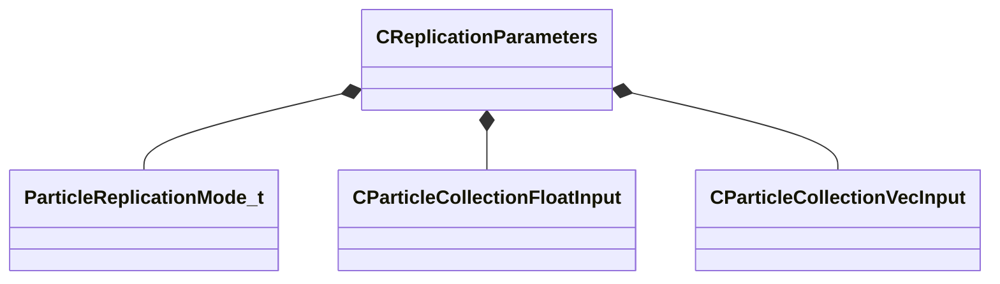

**Fields:**

| Name | Type | Annotations |
|------|------|-------------|
| `m_nReplicationMode` | [ParticleReplicationMode_t](../schemas/particles.md#particlereplicationmode_t) | `MPropertyFriendlyName "Replication mode"` |
| `m_bScaleChildParticleRadii` | bool | `MPropertyFriendlyName "Scale child particle radius based on parent radius"` |
| `m_flMinRandomRadiusScale` | [CParticleCollectionFloatInput](../schemas/particleslib.md#cparticlecollectionfloatinput) | `MPropertyFriendlyName "Minimum random scale for radius"` |
| `m_flMaxRandomRadiusScale` | [CParticleCollectionFloatInput](../schemas/particleslib.md#cparticlecollectionfloatinput) | `MPropertyFriendlyName "Maximum random scale for radius"` |
| `m_vMinRandomDisplacement` | [CParticleCollectionVecInput](../schemas/particleslib.md#cparticlecollectionvecinput) | `MPropertyFriendlyName "min random displacement for child particles"` |
| `m_vMaxRandomDisplacement` | [CParticleCollectionVecInput](../schemas/particleslib.md#cparticlecollectionvecinput) | `MPropertyFriendlyName "max random displacement for child particles"` |
| `m_flModellingScale` | [CParticleCollectionFloatInput](../schemas/particleslib.md#cparticlecollectionfloatinput) | `MPropertyFriendlyName "Modelling scale"` |

### CSpinUpdateBase

**Inherits from:** [CParticleFunctionOperator](particles.md#cparticlefunctionoperator)

**Derived by:** [C_OP_SpinUpdate](particles.md#c_op_spinupdate)

**Metadata:** `MGetKV3ClassDefaults Could not parse KV3 Defaults`

**Relationships:**

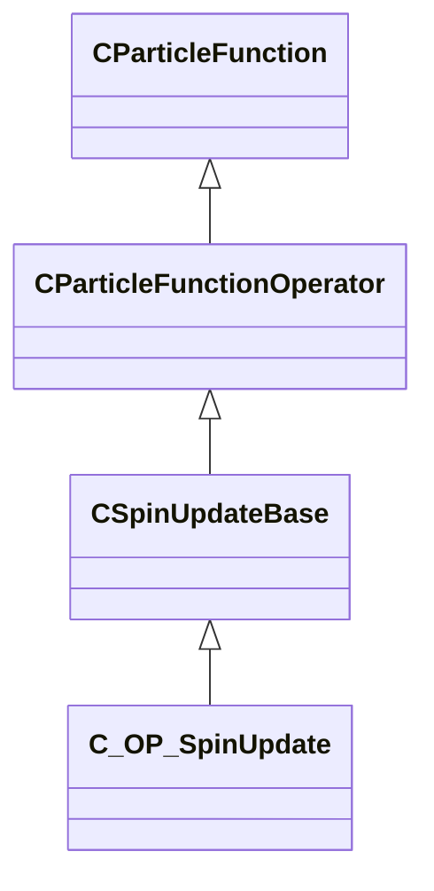

### C_INIT_AddVectorToVector

**Inherits from:** [CParticleFunctionInitializer](particles.md#cparticlefunctioninitializer)

**Metadata:** `MGetKV3ClassDefaults {
	"_class": "C_INIT_AddVectorToVector",
	"m_flOpStrength":
	{
		"m_nType": "PF_TYPE_LITERAL",
		"m_nMapType": "PF_MAP_TYPE_DIRECT",
		"m_flLiteralValue": 1.000000,
		"m_NamedValue": "",
		"m_nControlPoint": 0,
		"m_nScalarAttribute": 3,
		"m_nVectorAttribute": 6,
		"m_nVectorComponent": 0,
		"m_bReverseOrder": false,
		"m_flRandomMin": 0.000000,
		"m_flRandomMax": 1.000000,
		"m_bHasRandomSignFlip": false,
		"m_nRandomSeed": <HIDDEN FOR DIFF>,
		"m_nRandomMode": "PF_RANDOM_MODE_CONSTANT",
		"m_strSnapshotSubset": "",
		"m_flLOD0": 0.000000,
		"m_flLOD1": 0.000000,
		"m_flLOD2": 0.000000,
		"m_flLOD3": 0.000000,
		"m_nNoiseInputVectorAttribute": 0,
		"m_flNoiseOutputMin": 0.000000,
		"m_flNoiseOutputMax": 1.000000,
		"m_flNoiseScale": 0.100000,
		"m_vecNoiseOffsetRate":
		[
			0.000000,
			0.000000,
			0.000000
		],
		"m_flNoiseOffset": 0.000000,
		"m_nNoiseOctaves": 1,
		"m_nNoiseTurbulence": "PF_NOISE_TURB_NONE",
		"m_nNoiseType": "PF_NOISE_TYPE_PERLIN",
		"m_nNoiseModifier": "PF_NOISE_MODIFIER_NONE",
		"m_flNoiseTurbulenceScale": 1.000000,
		"m_flNoiseTurbulenceMix": 0.500000,
		"m_flNoiseImgPreviewScale": 1.000000,
		"m_bNoiseImgPreviewLive": true,
		"m_flNoCameraFallback": 0.000000,
		"m_bUseBoundsCenter": false,
		"m_nInputMode": "PF_INPUT_MODE_CLAMPED",
		"m_flMultFactor": 1.000000,
		"m_flInput0": 0.000000,
		"m_flInput1": 1.000000,
		"m_flOutput0": 0.000000,
		"m_flOutput1": 1.000000,
		"m_flNotchedRangeMin": 0.000000,
		"m_flNotchedRangeMax": 1.000000,
		"m_flNotchedOutputOutside": 0.000000,
		"m_flNotchedOutputInside": 1.000000,
		"m_nRoundType": "PF_ROUND_TYPE_NEAREST",
		"m_nBiasType": "PF_BIAS_TYPE_STANDARD",
		"m_flBiasParameter": 0.000000,
		"m_Curve":
		{
			"m_spline":
			[
			],
			"m_tangents":
			[
			],
			"m_vDomainMins":
			[
				0.000000,
				0.000000
			],
			"m_vDomainMaxs":
			[
				0.000000,
				0.000000
			]
		}
	},
	"m_nOpEndCapState": "PARTICLE_ENDCAP_ALWAYS_ON",
	"m_nToolsState": "PARTICLE_TOOLS_STATE_ALWAYS_ON",
	"m_flOpStartFadeInTime": 0.000000,
	"m_flOpEndFadeInTime": 0.000000,
	"m_flOpStartFadeOutTime": 0.000000,
	"m_flOpEndFadeOutTime": 0.000000,
	"m_flOpFadeOscillatePeriod": 0.000000,
	"m_bNormalizeToStopTime": false,
	"m_flOpTimeOffsetMin": 0.000000,
	"m_flOpTimeOffsetMax": 0.000000,
	"m_nOpTimeOffsetSeed": 0,
	"m_nOpTimeScaleSeed": 0,
	"m_flOpTimeScaleMin": 1.000000,
	"m_flOpTimeScaleMax": 1.000000,
	"m_bDisableOperator": false,
	"m_Notes": "",
	"m_nAssociatedEmitterIndex": -1,
	"m_vecScale":
	[
		1.000000,
		1.000000,
		1.000000
	],
	"m_nFieldOutput": 0,
	"m_nFieldInput": 0,
	"m_vOffsetMin":
	[
		0.000000,
		0.000000,
		0.000000
	],
	"m_vOffsetMax":
	[
		0.000000,
		0.000000,
		0.000000
	],
	"m_randomnessParameters":
	{
		"m_bDistributeEvenly": false,
		"m_nSeed": -1
	}
}`

**Relationships:**

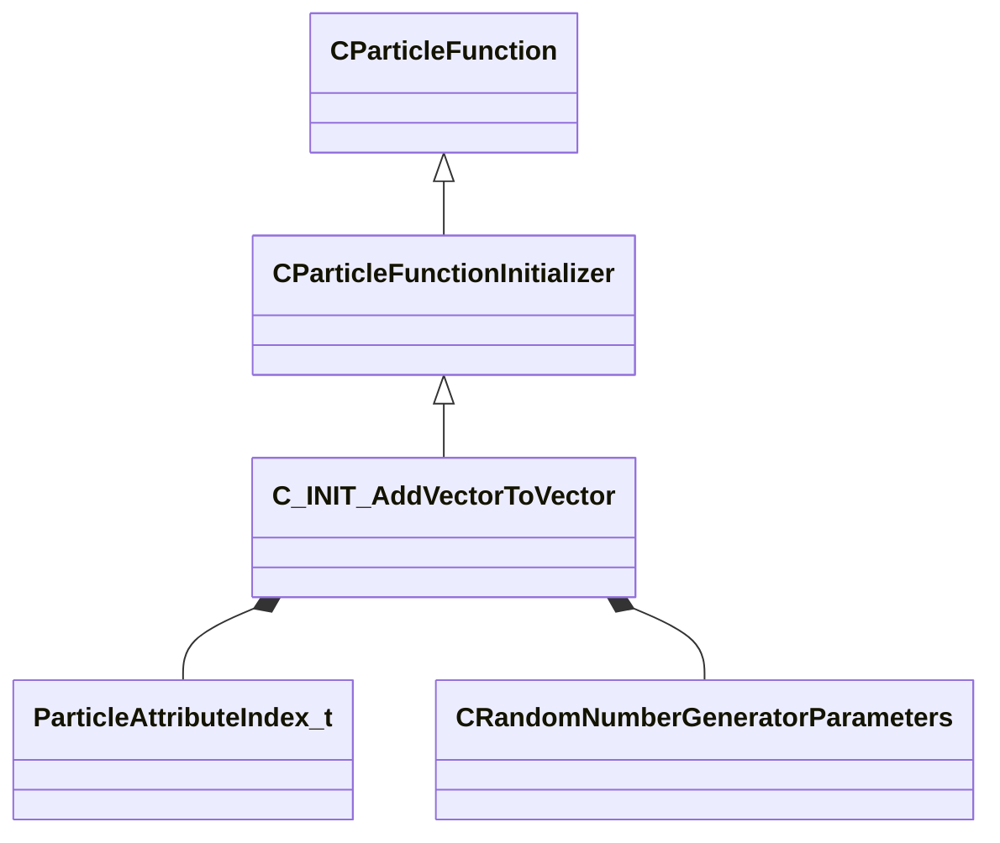

**Fields:**

| Name | Type | Annotations |
|------|------|-------------|
| `m_vecScale` | Vector | `MPropertyFriendlyName "component scale factor"` |
| `m_nFieldOutput` | [ParticleAttributeIndex_t](../schemas/particles.md#particleattributeindex_t) | `MPropertyFriendlyName "output field"` `MPropertyAttributeChoiceName "particlefield_vector"` |
| `m_nFieldInput` | [ParticleAttributeIndex_t](../schemas/particles.md#particleattributeindex_t) | `MPropertyFriendlyName "input field"` `MPropertyAttributeChoiceName "particlefield_vector"` |
| `m_vOffsetMin` | Vector | `MPropertyFriendlyName "random offset min"` |
| `m_vOffsetMax` | Vector | `MPropertyFriendlyName "random offset max"` |
| `m_randomnessParameters` | [CRandomNumberGeneratorParameters](../schemas/particles.md#crandomnumbergeneratorparameters) | `MPropertyFriendlyName "Random number generator controls"` |

### C_INIT_AgeNoise

**Inherits from:** [CParticleFunctionInitializer](particles.md#cparticlefunctioninitializer)

**Metadata:** `MGetKV3ClassDefaults {
	"_class": "C_INIT_AgeNoise",
	"m_flOpStrength":
	{
		"m_nType": "PF_TYPE_LITERAL",
		"m_nMapType": "PF_MAP_TYPE_DIRECT",
		"m_flLiteralValue": 1.000000,
		"m_NamedValue": "",
		"m_nControlPoint": 0,
		"m_nScalarAttribute": 3,
		"m_nVectorAttribute": 6,
		"m_nVectorComponent": 0,
		"m_bReverseOrder": false,
		"m_flRandomMin": 0.000000,
		"m_flRandomMax": 1.000000,
		"m_bHasRandomSignFlip": false,
		"m_nRandomSeed": <HIDDEN FOR DIFF>,
		"m_nRandomMode": "PF_RANDOM_MODE_CONSTANT",
		"m_strSnapshotSubset": "",
		"m_flLOD0": 0.000000,
		"m_flLOD1": 0.000000,
		"m_flLOD2": 0.000000,
		"m_flLOD3": 0.000000,
		"m_nNoiseInputVectorAttribute": 0,
		"m_flNoiseOutputMin": 0.000000,
		"m_flNoiseOutputMax": 1.000000,
		"m_flNoiseScale": 0.100000,
		"m_vecNoiseOffsetRate":
		[
			0.000000,
			0.000000,
			0.000000
		],
		"m_flNoiseOffset": 0.000000,
		"m_nNoiseOctaves": 1,
		"m_nNoiseTurbulence": "PF_NOISE_TURB_NONE",
		"m_nNoiseType": "PF_NOISE_TYPE_PERLIN",
		"m_nNoiseModifier": "PF_NOISE_MODIFIER_NONE",
		"m_flNoiseTurbulenceScale": 1.000000,
		"m_flNoiseTurbulenceMix": 0.500000,
		"m_flNoiseImgPreviewScale": 1.000000,
		"m_bNoiseImgPreviewLive": true,
		"m_flNoCameraFallback": 0.000000,
		"m_bUseBoundsCenter": false,
		"m_nInputMode": "PF_INPUT_MODE_CLAMPED",
		"m_flMultFactor": 1.000000,
		"m_flInput0": 0.000000,
		"m_flInput1": 1.000000,
		"m_flOutput0": 0.000000,
		"m_flOutput1": 1.000000,
		"m_flNotchedRangeMin": 0.000000,
		"m_flNotchedRangeMax": 1.000000,
		"m_flNotchedOutputOutside": 0.000000,
		"m_flNotchedOutputInside": 1.000000,
		"m_nRoundType": "PF_ROUND_TYPE_NEAREST",
		"m_nBiasType": "PF_BIAS_TYPE_STANDARD",
		"m_flBiasParameter": 0.000000,
		"m_Curve":
		{
			"m_spline":
			[
			],
			"m_tangents":
			[
			],
			"m_vDomainMins":
			[
				0.000000,
				0.000000
			],
			"m_vDomainMaxs":
			[
				0.000000,
				0.000000
			]
		}
	},
	"m_nOpEndCapState": "PARTICLE_ENDCAP_ALWAYS_ON",
	"m_nToolsState": "PARTICLE_TOOLS_STATE_ALWAYS_ON",
	"m_flOpStartFadeInTime": 0.000000,
	"m_flOpEndFadeInTime": 0.000000,
	"m_flOpStartFadeOutTime": 0.000000,
	"m_flOpEndFadeOutTime": 0.000000,
	"m_flOpFadeOscillatePeriod": 0.000000,
	"m_bNormalizeToStopTime": false,
	"m_flOpTimeOffsetMin": 0.000000,
	"m_flOpTimeOffsetMax": 0.000000,
	"m_nOpTimeOffsetSeed": 0,
	"m_nOpTimeScaleSeed": 0,
	"m_flOpTimeScaleMin": 1.000000,
	"m_flOpTimeScaleMax": 1.000000,
	"m_bDisableOperator": false,
	"m_Notes": "",
	"m_nAssociatedEmitterIndex": -1,
	"m_bAbsVal": false,
	"m_bAbsValInv": false,
	"m_flOffset": 0.000000,
	"m_flAgeMin": 0.000000,
	"m_flAgeMax": 1.000000,
	"m_flNoiseScale": 1.000000,
	"m_flNoiseScaleLoc": 1.000000,
	"m_vecOffsetLoc":
	[
		0.000000,
		0.000000,
		0.000000
	]
}`

**Relationships:**

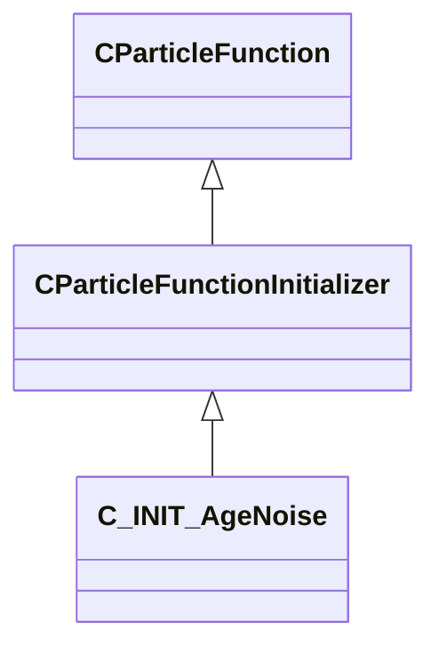

**Fields:**

| Name | Type | Annotations |
|------|------|-------------|
| `m_bAbsVal` | bool | `MPropertyFriendlyName "absolute value"` |
| `m_bAbsValInv` | bool | `MPropertyFriendlyName "invert absolute value"` |
| `m_flOffset` | float32 | `MPropertyFriendlyName "time coordinate offset"` |
| `m_flAgeMin` | float32 | `MPropertyFriendlyName "start age minimum"` |
| `m_flAgeMax` | float32 | `MPropertyFriendlyName "start age maximum"` |
| `m_flNoiseScale` | float32 | `MPropertyFriendlyName "time noise coordinate scale"` |
| `m_flNoiseScaleLoc` | float32 | `MPropertyFriendlyName "spatial noise coordinate scale"` |
| `m_vecOffsetLoc` | Vector | `MPropertyFriendlyName "spatial coordinate offset"` `MVectorIsCoordinate` |

### C_INIT_ChaoticAttractor

**Inherits from:** [CParticleFunctionInitializer](particles.md#cparticlefunctioninitializer)

**Metadata:** `MGetKV3ClassDefaults {
	"_class": "C_INIT_ChaoticAttractor",
	"m_flOpStrength":
	{
		"m_nType": "PF_TYPE_LITERAL",
		"m_nMapType": "PF_MAP_TYPE_DIRECT",
		"m_flLiteralValue": 1.000000,
		"m_NamedValue": "",
		"m_nControlPoint": 0,
		"m_nScalarAttribute": 3,
		"m_nVectorAttribute": 6,
		"m_nVectorComponent": 0,
		"m_bReverseOrder": false,
		"m_flRandomMin": 0.000000,
		"m_flRandomMax": 1.000000,
		"m_bHasRandomSignFlip": false,
		"m_nRandomSeed": <HIDDEN FOR DIFF>,
		"m_nRandomMode": "PF_RANDOM_MODE_CONSTANT",
		"m_strSnapshotSubset": "",
		"m_flLOD0": 0.000000,
		"m_flLOD1": 0.000000,
		"m_flLOD2": 0.000000,
		"m_flLOD3": 0.000000,
		"m_nNoiseInputVectorAttribute": 0,
		"m_flNoiseOutputMin": 0.000000,
		"m_flNoiseOutputMax": 1.000000,
		"m_flNoiseScale": 0.100000,
		"m_vecNoiseOffsetRate":
		[
			0.000000,
			0.000000,
			0.000000
		],
		"m_flNoiseOffset": 0.000000,
		"m_nNoiseOctaves": 1,
		"m_nNoiseTurbulence": "PF_NOISE_TURB_NONE",
		"m_nNoiseType": "PF_NOISE_TYPE_PERLIN",
		"m_nNoiseModifier": "PF_NOISE_MODIFIER_NONE",
		"m_flNoiseTurbulenceScale": 1.000000,
		"m_flNoiseTurbulenceMix": 0.500000,
		"m_flNoiseImgPreviewScale": 1.000000,
		"m_bNoiseImgPreviewLive": true,
		"m_flNoCameraFallback": 0.000000,
		"m_bUseBoundsCenter": false,
		"m_nInputMode": "PF_INPUT_MODE_CLAMPED",
		"m_flMultFactor": 1.000000,
		"m_flInput0": 0.000000,
		"m_flInput1": 1.000000,
		"m_flOutput0": 0.000000,
		"m_flOutput1": 1.000000,
		"m_flNotchedRangeMin": 0.000000,
		"m_flNotchedRangeMax": 1.000000,
		"m_flNotchedOutputOutside": 0.000000,
		"m_flNotchedOutputInside": 1.000000,
		"m_nRoundType": "PF_ROUND_TYPE_NEAREST",
		"m_nBiasType": "PF_BIAS_TYPE_STANDARD",
		"m_flBiasParameter": 0.000000,
		"m_Curve":
		{
			"m_spline":
			[
			],
			"m_tangents":
			[
			],
			"m_vDomainMins":
			[
				0.000000,
				0.000000
			],
			"m_vDomainMaxs":
			[
				0.000000,
				0.000000
			]
		}
	},
	"m_nOpEndCapState": "PARTICLE_ENDCAP_ALWAYS_ON",
	"m_nToolsState": "PARTICLE_TOOLS_STATE_ALWAYS_ON",
	"m_flOpStartFadeInTime": 0.000000,
	"m_flOpEndFadeInTime": 0.000000,
	"m_flOpStartFadeOutTime": 0.000000,
	"m_flOpEndFadeOutTime": 0.000000,
	"m_flOpFadeOscillatePeriod": 0.000000,
	"m_bNormalizeToStopTime": false,
	"m_flOpTimeOffsetMin": 0.000000,
	"m_flOpTimeOffsetMax": 0.000000,
	"m_nOpTimeOffsetSeed": 0,
	"m_nOpTimeScaleSeed": 0,
	"m_flOpTimeScaleMin": 1.000000,
	"m_flOpTimeScaleMax": 1.000000,
	"m_bDisableOperator": false,
	"m_Notes": "",
	"m_nAssociatedEmitterIndex": -1,
	"m_flAParm": -0.962963,
	"m_flBParm": 2.791140,
	"m_flCParm": 1.851850,
	"m_flDParm": 1.500000,
	"m_flScale": 1.000000,
	"m_flSpeedMin": 0.000000,
	"m_flSpeedMax": 0.000000,
	"m_nBaseCP": 0,
	"m_bUniformSpeed": false
}`

**Relationships:**

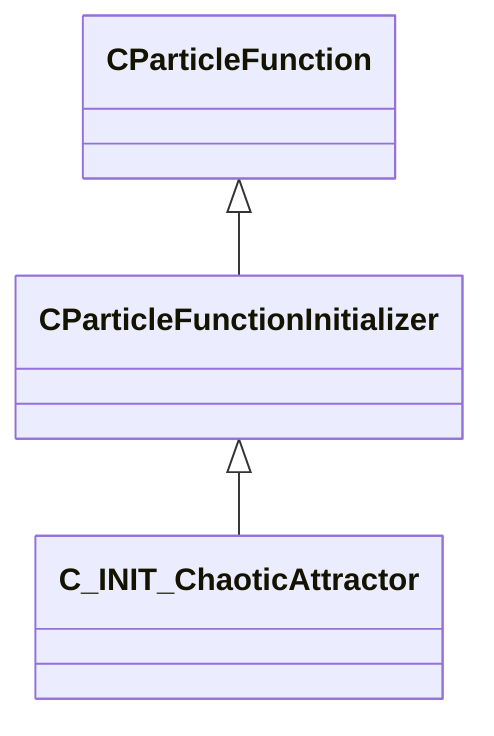

**Fields:**

| Name | Type | Annotations |
|------|------|-------------|
| `m_flAParm` | float32 | `MPropertyFriendlyName "pickover A parameter"` |
| `m_flBParm` | float32 | `MPropertyFriendlyName "pickover B parameter"` |
| `m_flCParm` | float32 | `MPropertyFriendlyName "pickover C parameter"` |
| `m_flDParm` | float32 | `MPropertyFriendlyName "pickover D parameter"` |
| `m_flScale` | float32 | `MPropertyFriendlyName "scale"` |
| `m_flSpeedMin` | float32 | `MPropertyFriendlyName "speed min"` |
| `m_flSpeedMax` | float32 | `MPropertyFriendlyName "speed max"` |
| `m_nBaseCP` | int32 | `MPropertyFriendlyName "relative control point number"` |
| `m_bUniformSpeed` | bool | `MPropertyFriendlyName "uniform speed"` |

### C_INIT_CheckParticleForWater

**Inherits from:** [CParticleFunctionInitializer](particles.md#cparticlefunctioninitializer)

**Metadata:** `MGetKV3ClassDefaults {
	"_class": "C_INIT_CheckParticleForWater",
	"m_flOpStrength":
	{
		"m_nType": "PF_TYPE_LITERAL",
		"m_nMapType": "PF_MAP_TYPE_DIRECT",
		"m_flLiteralValue": 1.000000,
		"m_NamedValue": "",
		"m_nControlPoint": 0,
		"m_nScalarAttribute": 3,
		"m_nVectorAttribute": 6,
		"m_nVectorComponent": 0,
		"m_bReverseOrder": false,
		"m_flRandomMin": 0.000000,
		"m_flRandomMax": 1.000000,
		"m_bHasRandomSignFlip": false,
		"m_nRandomSeed": <HIDDEN FOR DIFF>,
		"m_nRandomMode": "PF_RANDOM_MODE_CONSTANT",
		"m_strSnapshotSubset": "",
		"m_flLOD0": 0.000000,
		"m_flLOD1": 0.000000,
		"m_flLOD2": 0.000000,
		"m_flLOD3": 0.000000,
		"m_nNoiseInputVectorAttribute": 0,
		"m_flNoiseOutputMin": 0.000000,
		"m_flNoiseOutputMax": 1.000000,
		"m_flNoiseScale": 0.100000,
		"m_vecNoiseOffsetRate":
		[
			0.000000,
			0.000000,
			0.000000
		],
		"m_flNoiseOffset": 0.000000,
		"m_nNoiseOctaves": 1,
		"m_nNoiseTurbulence": "PF_NOISE_TURB_NONE",
		"m_nNoiseType": "PF_NOISE_TYPE_PERLIN",
		"m_nNoiseModifier": "PF_NOISE_MODIFIER_NONE",
		"m_flNoiseTurbulenceScale": 1.000000,
		"m_flNoiseTurbulenceMix": 0.500000,
		"m_flNoiseImgPreviewScale": 1.000000,
		"m_bNoiseImgPreviewLive": true,
		"m_flNoCameraFallback": 0.000000,
		"m_bUseBoundsCenter": false,
		"m_nInputMode": "PF_INPUT_MODE_CLAMPED",
		"m_flMultFactor": 1.000000,
		"m_flInput0": 0.000000,
		"m_flInput1": 1.000000,
		"m_flOutput0": 0.000000,
		"m_flOutput1": 1.000000,
		"m_flNotchedRangeMin": 0.000000,
		"m_flNotchedRangeMax": 1.000000,
		"m_flNotchedOutputOutside": 0.000000,
		"m_flNotchedOutputInside": 1.000000,
		"m_nRoundType": "PF_ROUND_TYPE_NEAREST",
		"m_nBiasType": "PF_BIAS_TYPE_STANDARD",
		"m_flBiasParameter": 0.000000,
		"m_Curve":
		{
			"m_spline":
			[
			],
			"m_tangents":
			[
			],
			"m_vDomainMins":
			[
				0.000000,
				0.000000
			],
			"m_vDomainMaxs":
			[
				0.000000,
				0.000000
			]
		}
	},
	"m_nOpEndCapState": "PARTICLE_ENDCAP_ALWAYS_ON",
	"m_nToolsState": "PARTICLE_TOOLS_STATE_ALWAYS_ON",
	"m_flOpStartFadeInTime": 0.000000,
	"m_flOpEndFadeInTime": 0.000000,
	"m_flOpStartFadeOutTime": 0.000000,
	"m_flOpEndFadeOutTime": 0.000000,
	"m_flOpFadeOscillatePeriod": 0.000000,
	"m_bNormalizeToStopTime": false,
	"m_flOpTimeOffsetMin": 0.000000,
	"m_flOpTimeOffsetMax": 0.000000,
	"m_nOpTimeOffsetSeed": 0,
	"m_nOpTimeScaleSeed": 0,
	"m_flOpTimeScaleMin": 1.000000,
	"m_flOpTimeScaleMax": 1.000000,
	"m_bDisableOperator": false,
	"m_Notes": "",
	"m_nAssociatedEmitterIndex": -1,
	"m_flRadius":
	{
		"m_nType": "PF_TYPE_LITERAL",
		"m_nMapType": "PF_MAP_TYPE_DIRECT",
		"m_flLiteralValue": 1.000000,
		"m_NamedValue": "",
		"m_nControlPoint": 0,
		"m_nScalarAttribute": 3,
		"m_nVectorAttribute": 6,
		"m_nVectorComponent": 0,
		"m_bReverseOrder": false,
		"m_flRandomMin": 0.000000,
		"m_flRandomMax": 1.000000,
		"m_bHasRandomSignFlip": false,
		"m_nRandomSeed": <HIDDEN FOR DIFF>,
		"m_nRandomMode": "PF_RANDOM_MODE_CONSTANT",
		"m_strSnapshotSubset": "",
		"m_flLOD0": 0.000000,
		"m_flLOD1": 0.000000,
		"m_flLOD2": 0.000000,
		"m_flLOD3": 0.000000,
		"m_nNoiseInputVectorAttribute": 0,
		"m_flNoiseOutputMin": 0.000000,
		"m_flNoiseOutputMax": 1.000000,
		"m_flNoiseScale": 0.100000,
		"m_vecNoiseOffsetRate":
		[
			0.000000,
			0.000000,
			0.000000
		],
		"m_flNoiseOffset": 0.000000,
		"m_nNoiseOctaves": 1,
		"m_nNoiseTurbulence": "PF_NOISE_TURB_NONE",
		"m_nNoiseType": "PF_NOISE_TYPE_PERLIN",
		"m_nNoiseModifier": "PF_NOISE_MODIFIER_NONE",
		"m_flNoiseTurbulenceScale": 1.000000,
		"m_flNoiseTurbulenceMix": 0.500000,
		"m_flNoiseImgPreviewScale": 1.000000,
		"m_bNoiseImgPreviewLive": true,
		"m_flNoCameraFallback": 0.000000,
		"m_bUseBoundsCenter": false,
		"m_nInputMode": "PF_INPUT_MODE_CLAMPED",
		"m_flMultFactor": 1.000000,
		"m_flInput0": 0.000000,
		"m_flInput1": 1.000000,
		"m_flOutput0": 0.000000,
		"m_flOutput1": 1.000000,
		"m_flNotchedRangeMin": 0.000000,
		"m_flNotchedRangeMax": 1.000000,
		"m_flNotchedOutputOutside": 0.000000,
		"m_flNotchedOutputInside": 1.000000,
		"m_nRoundType": "PF_ROUND_TYPE_NEAREST",
		"m_nBiasType": "PF_BIAS_TYPE_STANDARD",
		"m_flBiasParameter": 0.000000,
		"m_Curve":
		{
			"m_spline":
			[
			],
			"m_tangents":
			[
			],
			"m_vDomainMins":
			[
				0.000000,
				0.000000
			],
			"m_vDomainMaxs":
			[
				0.000000,
				0.000000
			]
		}
	},
	"m_nFieldOutput": 1,
	"m_flOutputRemap":
	{
		"m_nType": "PF_TYPE_INVALID",
		"m_nMapType": "PF_MAP_TYPE_DIRECT",
		"m_flLiteralValue": 0.000000,
		"m_NamedValue": "",
		"m_nControlPoint": 0,
		"m_nScalarAttribute": 3,
		"m_nVectorAttribute": 6,
		"m_nVectorComponent": 0,
		"m_bReverseOrder": false,
		"m_flRandomMin": 0.000000,
		"m_flRandomMax": 1.000000,
		"m_bHasRandomSignFlip": false,
		"m_nRandomSeed": <HIDDEN FOR DIFF>,
		"m_nRandomMode": "PF_RANDOM_MODE_CONSTANT",
		"m_strSnapshotSubset": "",
		"m_flLOD0": 0.000000,
		"m_flLOD1": 0.000000,
		"m_flLOD2": 0.000000,
		"m_flLOD3": 0.000000,
		"m_nNoiseInputVectorAttribute": 0,
		"m_flNoiseOutputMin": 0.000000,
		"m_flNoiseOutputMax": 1.000000,
		"m_flNoiseScale": 0.100000,
		"m_vecNoiseOffsetRate":
		[
			0.000000,
			0.000000,
			0.000000
		],
		"m_flNoiseOffset": 0.000000,
		"m_nNoiseOctaves": 1,
		"m_nNoiseTurbulence": "PF_NOISE_TURB_NONE",
		"m_nNoiseType": "PF_NOISE_TYPE_PERLIN",
		"m_nNoiseModifier": "PF_NOISE_MODIFIER_NONE",
		"m_flNoiseTurbulenceScale": 1.000000,
		"m_flNoiseTurbulenceMix": 0.500000,
		"m_flNoiseImgPreviewScale": 1.000000,
		"m_bNoiseImgPreviewLive": true,
		"m_flNoCameraFallback": 0.000000,
		"m_bUseBoundsCenter": false,
		"m_nInputMode": "PF_INPUT_MODE_CLAMPED",
		"m_flMultFactor": 1.000000,
		"m_flInput0": 0.000000,
		"m_flInput1": 1.000000,
		"m_flOutput0": 0.000000,
		"m_flOutput1": 1.000000,
		"m_flNotchedRangeMin": 0.000000,
		"m_flNotchedRangeMax": 1.000000,
		"m_flNotchedOutputOutside": 0.000000,
		"m_flNotchedOutputInside": 1.000000,
		"m_nRoundType": "PF_ROUND_TYPE_NEAREST",
		"m_nBiasType": "PF_BIAS_TYPE_STANDARD",
		"m_flBiasParameter": 0.000000,
		"m_Curve":
		{
			"m_spline":
			[
			],
			"m_tangents":
			[
			],
			"m_vDomainMins":
			[
				0.000000,
				0.000000
			],
			"m_vDomainMaxs":
			[
				0.000000,
				0.000000
			]
		}
	},
	"m_nSetMethod": "PARTICLE_SET_REPLACE_VALUE"
}`

**Relationships:**

```mermaid
classDiagram
    CParticleFunctionInitializer <|-- C_INIT_CheckParticleForWater
    CParticleFunction <|-- CParticleFunctionInitializer
    C_INIT_CheckParticleForWater *-- CPerParticleFloatInput
    C_INIT_CheckParticleForWater *-- ParticleAttributeIndex_t
    C_INIT_CheckParticleForWater *-- CParticleRemapFloatInput
    C_INIT_CheckParticleForWater *-- ParticleSetMethod_t
```

**Fields:**

| Name | Type | Annotations |
|------|------|-------------|
| `m_flRadius` | [CPerParticleFloatInput](../schemas/particleslib.md#cperparticlefloatinput) | `MPropertyFriendlyName "radius"` |
| `m_nFieldOutput` | [ParticleAttributeIndex_t](../schemas/particles.md#particleattributeindex_t) | `MPropertyFriendlyName "output attribute"` `MPropertyAttributeChoiceName "particlefield_scalar"` |
| `m_flOutputRemap` | [CParticleRemapFloatInput](../schemas/particleslib.md#cparticleremapfloatinput) | `MPropertyFriendlyName "output"` |
| `m_nSetMethod` | [ParticleSetMethod_t](../schemas/particleslib.md#particlesetmethod_t) | `MPropertyFriendlyName "set value method"` |

### C_INIT_ColorLitPerParticle

**Inherits from:** [CParticleFunctionInitializer](particles.md#cparticlefunctioninitializer)

**Metadata:** `MGetKV3ClassDefaults {
	"_class": "C_INIT_ColorLitPerParticle",
	"m_flOpStrength":
	{
		"m_nType": "PF_TYPE_LITERAL",
		"m_nMapType": "PF_MAP_TYPE_DIRECT",
		"m_flLiteralValue": 1.000000,
		"m_NamedValue": "",
		"m_nControlPoint": 0,
		"m_nScalarAttribute": 3,
		"m_nVectorAttribute": 6,
		"m_nVectorComponent": 0,
		"m_bReverseOrder": false,
		"m_flRandomMin": 0.000000,
		"m_flRandomMax": 1.000000,
		"m_bHasRandomSignFlip": false,
		"m_nRandomSeed": <HIDDEN FOR DIFF>,
		"m_nRandomMode": "PF_RANDOM_MODE_CONSTANT",
		"m_strSnapshotSubset": "",
		"m_flLOD0": 0.000000,
		"m_flLOD1": 0.000000,
		"m_flLOD2": 0.000000,
		"m_flLOD3": 0.000000,
		"m_nNoiseInputVectorAttribute": 0,
		"m_flNoiseOutputMin": 0.000000,
		"m_flNoiseOutputMax": 1.000000,
		"m_flNoiseScale": 0.100000,
		"m_vecNoiseOffsetRate":
		[
			0.000000,
			0.000000,
			0.000000
		],
		"m_flNoiseOffset": 0.000000,
		"m_nNoiseOctaves": 1,
		"m_nNoiseTurbulence": "PF_NOISE_TURB_NONE",
		"m_nNoiseType": "PF_NOISE_TYPE_PERLIN",
		"m_nNoiseModifier": "PF_NOISE_MODIFIER_NONE",
		"m_flNoiseTurbulenceScale": 1.000000,
		"m_flNoiseTurbulenceMix": 0.500000,
		"m_flNoiseImgPreviewScale": 1.000000,
		"m_bNoiseImgPreviewLive": true,
		"m_flNoCameraFallback": 0.000000,
		"m_bUseBoundsCenter": false,
		"m_nInputMode": "PF_INPUT_MODE_CLAMPED",
		"m_flMultFactor": 1.000000,
		"m_flInput0": 0.000000,
		"m_flInput1": 1.000000,
		"m_flOutput0": 0.000000,
		"m_flOutput1": 1.000000,
		"m_flNotchedRangeMin": 0.000000,
		"m_flNotchedRangeMax": 1.000000,
		"m_flNotchedOutputOutside": 0.000000,
		"m_flNotchedOutputInside": 1.000000,
		"m_nRoundType": "PF_ROUND_TYPE_NEAREST",
		"m_nBiasType": "PF_BIAS_TYPE_STANDARD",
		"m_flBiasParameter": 0.000000,
		"m_Curve":
		{
			"m_spline":
			[
			],
			"m_tangents":
			[
			],
			"m_vDomainMins":
			[
				0.000000,
				0.000000
			],
			"m_vDomainMaxs":
			[
				0.000000,
				0.000000
			]
		}
	},
	"m_nOpEndCapState": "PARTICLE_ENDCAP_ALWAYS_ON",
	"m_nToolsState": "PARTICLE_TOOLS_STATE_ALWAYS_ON",
	"m_flOpStartFadeInTime": 0.000000,
	"m_flOpEndFadeInTime": 0.000000,
	"m_flOpStartFadeOutTime": 0.000000,
	"m_flOpEndFadeOutTime": 0.000000,
	"m_flOpFadeOscillatePeriod": 0.000000,
	"m_bNormalizeToStopTime": false,
	"m_flOpTimeOffsetMin": 0.000000,
	"m_flOpTimeOffsetMax": 0.000000,
	"m_nOpTimeOffsetSeed": 0,
	"m_nOpTimeScaleSeed": 0,
	"m_flOpTimeScaleMin": 1.000000,
	"m_flOpTimeScaleMax": 1.000000,
	"m_bDisableOperator": false,
	"m_Notes": "",
	"m_nAssociatedEmitterIndex": -1,
	"m_ColorMin":
	[
		255,
		255,
		255
	],
	"m_ColorMax":
	[
		255,
		255,
		255
	],
	"m_TintMin":
	[
		0,
		0,
		0,
		0
	],
	"m_TintMax":
	[
		255,
		255,
		255
	],
	"m_flTintPerc": 0.000000,
	"m_nTintBlendMode": "PARTICLEBLEND_DEFAULT",
	"m_flLightAmplification": 1.000000
}`

**Relationships:**

```mermaid
classDiagram
    CParticleFunctionInitializer <|-- C_INIT_ColorLitPerParticle
    CParticleFunction <|-- CParticleFunctionInitializer
    C_INIT_ColorLitPerParticle *-- ParticleColorBlendMode_t
```

**Fields:**

| Name | Type | Annotations |
|------|------|-------------|
| `m_ColorMin` | Color | `MPropertyFriendlyName "color1"` |
| `m_ColorMax` | Color | `MPropertyFriendlyName "color2"` |
| `m_TintMin` | Color | `MPropertyFriendlyName "tint clamp min"` |
| `m_TintMax` | Color | `MPropertyFriendlyName "tint clamp max"` |
| `m_flTintPerc` | float32 | `MPropertyFriendlyName "light bias"` |
| `m_nTintBlendMode` | [ParticleColorBlendMode_t](../schemas/particleslib.md#particlecolorblendmode_t) | `MPropertyFriendlyName "tint blend mode"` |
| `m_flLightAmplification` | float32 | `MPropertyFriendlyName "light amplification amount"` |

### C_INIT_CreateAlongPath

**Inherits from:** [CParticleFunctionInitializer](particles.md#cparticlefunctioninitializer)

**Metadata:** `MGetKV3ClassDefaults {
	"_class": "C_INIT_CreateAlongPath",
	"m_flOpStrength":
	{
		"m_nType": "PF_TYPE_LITERAL",
		"m_nMapType": "PF_MAP_TYPE_DIRECT",
		"m_flLiteralValue": 1.000000,
		"m_NamedValue": "",
		"m_nControlPoint": 0,
		"m_nScalarAttribute": 3,
		"m_nVectorAttribute": 6,
		"m_nVectorComponent": 0,
		"m_bReverseOrder": false,
		"m_flRandomMin": 0.000000,
		"m_flRandomMax": 1.000000,
		"m_bHasRandomSignFlip": false,
		"m_nRandomSeed": <HIDDEN FOR DIFF>,
		"m_nRandomMode": "PF_RANDOM_MODE_CONSTANT",
		"m_strSnapshotSubset": "",
		"m_flLOD0": 0.000000,
		"m_flLOD1": 0.000000,
		"m_flLOD2": 0.000000,
		"m_flLOD3": 0.000000,
		"m_nNoiseInputVectorAttribute": 0,
		"m_flNoiseOutputMin": 0.000000,
		"m_flNoiseOutputMax": 1.000000,
		"m_flNoiseScale": 0.100000,
		"m_vecNoiseOffsetRate":
		[
			0.000000,
			0.000000,
			0.000000
		],
		"m_flNoiseOffset": 0.000000,
		"m_nNoiseOctaves": 1,
		"m_nNoiseTurbulence": "PF_NOISE_TURB_NONE",
		"m_nNoiseType": "PF_NOISE_TYPE_PERLIN",
		"m_nNoiseModifier": "PF_NOISE_MODIFIER_NONE",
		"m_flNoiseTurbulenceScale": 1.000000,
		"m_flNoiseTurbulenceMix": 0.500000,
		"m_flNoiseImgPreviewScale": 1.000000,
		"m_bNoiseImgPreviewLive": true,
		"m_flNoCameraFallback": 0.000000,
		"m_bUseBoundsCenter": false,
		"m_nInputMode": "PF_INPUT_MODE_CLAMPED",
		"m_flMultFactor": 1.000000,
		"m_flInput0": 0.000000,
		"m_flInput1": 1.000000,
		"m_flOutput0": 0.000000,
		"m_flOutput1": 1.000000,
		"m_flNotchedRangeMin": 0.000000,
		"m_flNotchedRangeMax": 1.000000,
		"m_flNotchedOutputOutside": 0.000000,
		"m_flNotchedOutputInside": 1.000000,
		"m_nRoundType": "PF_ROUND_TYPE_NEAREST",
		"m_nBiasType": "PF_BIAS_TYPE_STANDARD",
		"m_flBiasParameter": 0.000000,
		"m_Curve":
		{
			"m_spline":
			[
			],
			"m_tangents":
			[
			],
			"m_vDomainMins":
			[
				0.000000,
				0.000000
			],
			"m_vDomainMaxs":
			[
				0.000000,
				0.000000
			]
		}
	},
	"m_nOpEndCapState": "PARTICLE_ENDCAP_ALWAYS_ON",
	"m_nToolsState": "PARTICLE_TOOLS_STATE_ALWAYS_ON",
	"m_flOpStartFadeInTime": 0.000000,
	"m_flOpEndFadeInTime": 0.000000,
	"m_flOpStartFadeOutTime": 0.000000,
	"m_flOpEndFadeOutTime": 0.000000,
	"m_flOpFadeOscillatePeriod": 0.000000,
	"m_bNormalizeToStopTime": false,
	"m_flOpTimeOffsetMin": 0.000000,
	"m_flOpTimeOffsetMax": 0.000000,
	"m_nOpTimeOffsetSeed": 0,
	"m_nOpTimeScaleSeed": 0,
	"m_flOpTimeScaleMin": 1.000000,
	"m_flOpTimeScaleMax": 1.000000,
	"m_bDisableOperator": false,
	"m_Notes": "",
	"m_nAssociatedEmitterIndex": -1,
	"m_fMaxDistance": 0.000000,
	"m_PathParams":
	{
		"m_nStartControlPointNumber": 0,
		"m_nEndControlPointNumber": 0,
		"m_nBulgeControl": 0,
		"m_flBulge": 0.000000,
		"m_flMidPoint": 0.500000,
		"m_vStartPointOffset":
		[
			0.000000,
			0.000000,
			0.000000
		],
		"m_vMidPointOffset":
		[
			0.000000,
			0.000000,
			0.000000
		],
		"m_vEndOffset":
		[
			0.000000,
			0.000000,
			0.000000
		]
	},
	"m_bUseRandomCPs": false,
	"m_vEndOffset":
	[
		0.000000,
		0.000000,
		0.000000
	],
	"m_bSaveOffset": false
}`

**Relationships:**

```mermaid
classDiagram
    CParticleFunctionInitializer <|-- C_INIT_CreateAlongPath
    CParticleFunction <|-- CParticleFunctionInitializer
    C_INIT_CreateAlongPath *-- CPathParameters
```

**Fields:**

| Name | Type | Annotations |
|------|------|-------------|
| `m_fMaxDistance` | float32 | `MPropertyFriendlyName "maximum distance"` |
| `m_PathParams` | [CPathParameters](../schemas/particles.md#cpathparameters) |  |
| `m_bUseRandomCPs` | bool | `MPropertyFriendlyName "randomly select sequential CP pairs between start and end points"` |
| `m_vEndOffset` | Vector | `MPropertyFriendlyName "Offset from control point for path end"` `MVectorIsCoordinate` |
| `m_bSaveOffset` | bool | `MPropertyFriendlyName "save offset"` |

### C_INIT_CreateFromCPs

**Inherits from:** [CParticleFunctionInitializer](particles.md#cparticlefunctioninitializer)

**Metadata:** `MGetKV3ClassDefaults {
	"_class": "C_INIT_CreateFromCPs",
	"m_flOpStrength":
	{
		"m_nType": "PF_TYPE_LITERAL",
		"m_nMapType": "PF_MAP_TYPE_DIRECT",
		"m_flLiteralValue": 1.000000,
		"m_NamedValue": "",
		"m_nControlPoint": 0,
		"m_nScalarAttribute": 3,
		"m_nVectorAttribute": 6,
		"m_nVectorComponent": 0,
		"m_bReverseOrder": false,
		"m_flRandomMin": 0.000000,
		"m_flRandomMax": 1.000000,
		"m_bHasRandomSignFlip": false,
		"m_nRandomSeed": <HIDDEN FOR DIFF>,
		"m_nRandomMode": "PF_RANDOM_MODE_CONSTANT",
		"m_strSnapshotSubset": "",
		"m_flLOD0": 0.000000,
		"m_flLOD1": 0.000000,
		"m_flLOD2": 0.000000,
		"m_flLOD3": 0.000000,
		"m_nNoiseInputVectorAttribute": 0,
		"m_flNoiseOutputMin": 0.000000,
		"m_flNoiseOutputMax": 1.000000,
		"m_flNoiseScale": 0.100000,
		"m_vecNoiseOffsetRate":
		[
			0.000000,
			0.000000,
			0.000000
		],
		"m_flNoiseOffset": 0.000000,
		"m_nNoiseOctaves": 1,
		"m_nNoiseTurbulence": "PF_NOISE_TURB_NONE",
		"m_nNoiseType": "PF_NOISE_TYPE_PERLIN",
		"m_nNoiseModifier": "PF_NOISE_MODIFIER_NONE",
		"m_flNoiseTurbulenceScale": 1.000000,
		"m_flNoiseTurbulenceMix": 0.500000,
		"m_flNoiseImgPreviewScale": 1.000000,
		"m_bNoiseImgPreviewLive": true,
		"m_flNoCameraFallback": 0.000000,
		"m_bUseBoundsCenter": false,
		"m_nInputMode": "PF_INPUT_MODE_CLAMPED",
		"m_flMultFactor": 1.000000,
		"m_flInput0": 0.000000,
		"m_flInput1": 1.000000,
		"m_flOutput0": 0.000000,
		"m_flOutput1": 1.000000,
		"m_flNotchedRangeMin": 0.000000,
		"m_flNotchedRangeMax": 1.000000,
		"m_flNotchedOutputOutside": 0.000000,
		"m_flNotchedOutputInside": 1.000000,
		"m_nRoundType": "PF_ROUND_TYPE_NEAREST",
		"m_nBiasType": "PF_BIAS_TYPE_STANDARD",
		"m_flBiasParameter": 0.000000,
		"m_Curve":
		{
			"m_spline":
			[
			],
			"m_tangents":
			[
			],
			"m_vDomainMins":
			[
				0.000000,
				0.000000
			],
			"m_vDomainMaxs":
			[
				0.000000,
				0.000000
			]
		}
	},
	"m_nOpEndCapState": "PARTICLE_ENDCAP_ALWAYS_ON",
	"m_nToolsState": "PARTICLE_TOOLS_STATE_ALWAYS_ON",
	"m_flOpStartFadeInTime": 0.000000,
	"m_flOpEndFadeInTime": 0.000000,
	"m_flOpStartFadeOutTime": 0.000000,
	"m_flOpEndFadeOutTime": 0.000000,
	"m_flOpFadeOscillatePeriod": 0.000000,
	"m_bNormalizeToStopTime": false,
	"m_flOpTimeOffsetMin": 0.000000,
	"m_flOpTimeOffsetMax": 0.000000,
	"m_nOpTimeOffsetSeed": 0,
	"m_nOpTimeScaleSeed": 0,
	"m_flOpTimeScaleMin": 1.000000,
	"m_flOpTimeScaleMax": 1.000000,
	"m_bDisableOperator": false,
	"m_Notes": "",
	"m_nAssociatedEmitterIndex": -1,
	"m_nIncrement": 1,
	"m_nMinCP": 0,
	"m_nMaxCP": 0,
	"m_nDynamicCPCount":
	{
		"m_nType": "PF_TYPE_LITERAL",
		"m_nMapType": "PF_MAP_TYPE_DIRECT",
		"m_flLiteralValue": -1.000000,
		"m_NamedValue": "",
		"m_nControlPoint": 0,
		"m_nScalarAttribute": 3,
		"m_nVectorAttribute": 6,
		"m_nVectorComponent": 0,
		"m_bReverseOrder": false,
		"m_flRandomMin": 0.000000,
		"m_flRandomMax": 1.000000,
		"m_bHasRandomSignFlip": false,
		"m_nRandomSeed": <HIDDEN FOR DIFF>,
		"m_nRandomMode": "PF_RANDOM_MODE_CONSTANT",
		"m_strSnapshotSubset": "",
		"m_flLOD0": 0.000000,
		"m_flLOD1": 0.000000,
		"m_flLOD2": 0.000000,
		"m_flLOD3": 0.000000,
		"m_nNoiseInputVectorAttribute": 0,
		"m_flNoiseOutputMin": 0.000000,
		"m_flNoiseOutputMax": 1.000000,
		"m_flNoiseScale": 0.100000,
		"m_vecNoiseOffsetRate":
		[
			0.000000,
			0.000000,
			0.000000
		],
		"m_flNoiseOffset": 0.000000,
		"m_nNoiseOctaves": 1,
		"m_nNoiseTurbulence": "PF_NOISE_TURB_NONE",
		"m_nNoiseType": "PF_NOISE_TYPE_PERLIN",
		"m_nNoiseModifier": "PF_NOISE_MODIFIER_NONE",
		"m_flNoiseTurbulenceScale": 1.000000,
		"m_flNoiseTurbulenceMix": 0.500000,
		"m_flNoiseImgPreviewScale": 1.000000,
		"m_bNoiseImgPreviewLive": true,
		"m_flNoCameraFallback": 0.000000,
		"m_bUseBoundsCenter": false,
		"m_nInputMode": "PF_INPUT_MODE_CLAMPED",
		"m_flMultFactor": 1.000000,
		"m_flInput0": 0.000000,
		"m_flInput1": 1.000000,
		"m_flOutput0": 0.000000,
		"m_flOutput1": 1.000000,
		"m_flNotchedRangeMin": 0.000000,
		"m_flNotchedRangeMax": 1.000000,
		"m_flNotchedOutputOutside": 0.000000,
		"m_flNotchedOutputInside": 1.000000,
		"m_nRoundType": "PF_ROUND_TYPE_NEAREST",
		"m_nBiasType": "PF_BIAS_TYPE_STANDARD",
		"m_flBiasParameter": 0.000000,
		"m_Curve":
		{
			"m_spline":
			[
			],
			"m_tangents":
			[
			],
			"m_vDomainMins":
			[
				0.000000,
				0.000000
			],
			"m_vDomainMaxs":
			[
				0.000000,
				0.000000
			]
		}
	}
}`

**Relationships:**

```mermaid
classDiagram
    CParticleFunctionInitializer <|-- C_INIT_CreateFromCPs
    CParticleFunction <|-- CParticleFunctionInitializer
    C_INIT_CreateFromCPs *-- CParticleCollectionFloatInput
```

**Fields:**

| Name | Type | Annotations |
|------|------|-------------|
| `m_nIncrement` | int32 | `MPropertyFriendlyName "control point increment amount"` |
| `m_nMinCP` | int32 | `MPropertyFriendlyName "starting control point"` |
| `m_nMaxCP` | int32 | `MPropertyFriendlyName "ending control point"` `MParticleMinVersion 2` |
| `m_nDynamicCPCount` | [CParticleCollectionFloatInput](../schemas/particleslib.md#cparticlecollectionfloatinput) | `MPropertyFriendlyName "dynamic control point count"` |

### C_INIT_CreateFromParentParticles

**Inherits from:** [CParticleFunctionInitializer](particles.md#cparticlefunctioninitializer)

**Metadata:** `MGetKV3ClassDefaults {
	"_class": "C_INIT_CreateFromParentParticles",
	"m_flOpStrength":
	{
		"m_nType": "PF_TYPE_LITERAL",
		"m_nMapType": "PF_MAP_TYPE_DIRECT",
		"m_flLiteralValue": 1.000000,
		"m_NamedValue": "",
		"m_nControlPoint": 0,
		"m_nScalarAttribute": 3,
		"m_nVectorAttribute": 6,
		"m_nVectorComponent": 0,
		"m_bReverseOrder": false,
		"m_flRandomMin": 0.000000,
		"m_flRandomMax": 1.000000,
		"m_bHasRandomSignFlip": false,
		"m_nRandomSeed": <HIDDEN FOR DIFF>,
		"m_nRandomMode": "PF_RANDOM_MODE_CONSTANT",
		"m_strSnapshotSubset": "",
		"m_flLOD0": 0.000000,
		"m_flLOD1": 0.000000,
		"m_flLOD2": 0.000000,
		"m_flLOD3": 0.000000,
		"m_nNoiseInputVectorAttribute": 0,
		"m_flNoiseOutputMin": 0.000000,
		"m_flNoiseOutputMax": 1.000000,
		"m_flNoiseScale": 0.100000,
		"m_vecNoiseOffsetRate":
		[
			0.000000,
			0.000000,
			0.000000
		],
		"m_flNoiseOffset": 0.000000,
		"m_nNoiseOctaves": 1,
		"m_nNoiseTurbulence": "PF_NOISE_TURB_NONE",
		"m_nNoiseType": "PF_NOISE_TYPE_PERLIN",
		"m_nNoiseModifier": "PF_NOISE_MODIFIER_NONE",
		"m_flNoiseTurbulenceScale": 1.000000,
		"m_flNoiseTurbulenceMix": 0.500000,
		"m_flNoiseImgPreviewScale": 1.000000,
		"m_bNoiseImgPreviewLive": true,
		"m_flNoCameraFallback": 0.000000,
		"m_bUseBoundsCenter": false,
		"m_nInputMode": "PF_INPUT_MODE_CLAMPED",
		"m_flMultFactor": 1.000000,
		"m_flInput0": 0.000000,
		"m_flInput1": 1.000000,
		"m_flOutput0": 0.000000,
		"m_flOutput1": 1.000000,
		"m_flNotchedRangeMin": 0.000000,
		"m_flNotchedRangeMax": 1.000000,
		"m_flNotchedOutputOutside": 0.000000,
		"m_flNotchedOutputInside": 1.000000,
		"m_nRoundType": "PF_ROUND_TYPE_NEAREST",
		"m_nBiasType": "PF_BIAS_TYPE_STANDARD",
		"m_flBiasParameter": 0.000000,
		"m_Curve":
		{
			"m_spline":
			[
			],
			"m_tangents":
			[
			],
			"m_vDomainMins":
			[
				0.000000,
				0.000000
			],
			"m_vDomainMaxs":
			[
				0.000000,
				0.000000
			]
		}
	},
	"m_nOpEndCapState": "PARTICLE_ENDCAP_ALWAYS_ON",
	"m_nToolsState": "PARTICLE_TOOLS_STATE_ALWAYS_ON",
	"m_flOpStartFadeInTime": 0.000000,
	"m_flOpEndFadeInTime": 0.000000,
	"m_flOpStartFadeOutTime": 0.000000,
	"m_flOpEndFadeOutTime": 0.000000,
	"m_flOpFadeOscillatePeriod": 0.000000,
	"m_bNormalizeToStopTime": false,
	"m_flOpTimeOffsetMin": 0.000000,
	"m_flOpTimeOffsetMax": 0.000000,
	"m_nOpTimeOffsetSeed": 0,
	"m_nOpTimeScaleSeed": 0,
	"m_flOpTimeScaleMin": 1.000000,
	"m_flOpTimeScaleMax": 1.000000,
	"m_bDisableOperator": false,
	"m_Notes": "",
	"m_nAssociatedEmitterIndex": -1,
	"m_flVelocityScale": 0.000000,
	"m_flIncrement": 1.000000,
	"m_bRandomDistribution": false,
	"m_nRandomSeed": <HIDDEN FOR DIFF>,
	"m_bSubFrame": true,
	"m_bSetRopeSegmentID": false
}`

**Relationships:**

```mermaid
classDiagram
    CParticleFunctionInitializer <|-- C_INIT_CreateFromParentParticles
    CParticleFunction <|-- CParticleFunctionInitializer
```

**Fields:**

| Name | Type | Annotations |
|------|------|-------------|
| `m_flVelocityScale` | float32 | `MPropertyFriendlyName "inherited velocity scale"` |
| `m_flIncrement` | float32 | `MPropertyFriendlyName "particle increment amount"` |
| `m_bRandomDistribution` | bool | `MPropertyFriendlyName "random parent particle distribution"` |
| `m_nRandomSeed` | int32 | `MPropertyFriendlyName "random seed"` |
| `m_bSubFrame` | bool | `MPropertyFriendlyName "sub frame interpolation"` |
| `m_bSetRopeSegmentID` | bool | `MPropertyFriendlyName "set rope segment id"` |

### C_INIT_CreateFromPlaneCache

**Inherits from:** [CParticleFunctionInitializer](particles.md#cparticlefunctioninitializer)

**Metadata:** `MGetKV3ClassDefaults {
	"_class": "C_INIT_CreateFromPlaneCache",
	"m_flOpStrength":
	{
		"m_nType": "PF_TYPE_LITERAL",
		"m_nMapType": "PF_MAP_TYPE_DIRECT",
		"m_flLiteralValue": 1.000000,
		"m_NamedValue": "",
		"m_nControlPoint": 0,
		"m_nScalarAttribute": 3,
		"m_nVectorAttribute": 6,
		"m_nVectorComponent": 0,
		"m_bReverseOrder": false,
		"m_flRandomMin": 0.000000,
		"m_flRandomMax": 1.000000,
		"m_bHasRandomSignFlip": false,
		"m_nRandomSeed": <HIDDEN FOR DIFF>,
		"m_nRandomMode": "PF_RANDOM_MODE_CONSTANT",
		"m_strSnapshotSubset": "",
		"m_flLOD0": 0.000000,
		"m_flLOD1": 0.000000,
		"m_flLOD2": 0.000000,
		"m_flLOD3": 0.000000,
		"m_nNoiseInputVectorAttribute": 0,
		"m_flNoiseOutputMin": 0.000000,
		"m_flNoiseOutputMax": 1.000000,
		"m_flNoiseScale": 0.100000,
		"m_vecNoiseOffsetRate":
		[
			0.000000,
			0.000000,
			0.000000
		],
		"m_flNoiseOffset": 0.000000,
		"m_nNoiseOctaves": 1,
		"m_nNoiseTurbulence": "PF_NOISE_TURB_NONE",
		"m_nNoiseType": "PF_NOISE_TYPE_PERLIN",
		"m_nNoiseModifier": "PF_NOISE_MODIFIER_NONE",
		"m_flNoiseTurbulenceScale": 1.000000,
		"m_flNoiseTurbulenceMix": 0.500000,
		"m_flNoiseImgPreviewScale": 1.000000,
		"m_bNoiseImgPreviewLive": true,
		"m_flNoCameraFallback": 0.000000,
		"m_bUseBoundsCenter": false,
		"m_nInputMode": "PF_INPUT_MODE_CLAMPED",
		"m_flMultFactor": 1.000000,
		"m_flInput0": 0.000000,
		"m_flInput1": 1.000000,
		"m_flOutput0": 0.000000,
		"m_flOutput1": 1.000000,
		"m_flNotchedRangeMin": 0.000000,
		"m_flNotchedRangeMax": 1.000000,
		"m_flNotchedOutputOutside": 0.000000,
		"m_flNotchedOutputInside": 1.000000,
		"m_nRoundType": "PF_ROUND_TYPE_NEAREST",
		"m_nBiasType": "PF_BIAS_TYPE_STANDARD",
		"m_flBiasParameter": 0.000000,
		"m_Curve":
		{
			"m_spline":
			[
			],
			"m_tangents":
			[
			],
			"m_vDomainMins":
			[
				0.000000,
				0.000000
			],
			"m_vDomainMaxs":
			[
				0.000000,
				0.000000
			]
		}
	},
	"m_nOpEndCapState": "PARTICLE_ENDCAP_ALWAYS_ON",
	"m_nToolsState": "PARTICLE_TOOLS_STATE_ALWAYS_ON",
	"m_flOpStartFadeInTime": 0.000000,
	"m_flOpEndFadeInTime": 0.000000,
	"m_flOpStartFadeOutTime": 0.000000,
	"m_flOpEndFadeOutTime": 0.000000,
	"m_flOpFadeOscillatePeriod": 0.000000,
	"m_bNormalizeToStopTime": false,
	"m_flOpTimeOffsetMin": 0.000000,
	"m_flOpTimeOffsetMax": 0.000000,
	"m_nOpTimeOffsetSeed": 0,
	"m_nOpTimeScaleSeed": 0,
	"m_flOpTimeScaleMin": 1.000000,
	"m_flOpTimeScaleMax": 1.000000,
	"m_bDisableOperator": false,
	"m_Notes": "",
	"m_nAssociatedEmitterIndex": -1,
	"m_vecOffsetMin":
	[
		0.000000,
		0.000000,
		0.000000
	],
	"m_vecOffsetMax":
	[
		0.000000,
		0.000000,
		0.000000
	],
	"m_bUseNormal": false
}`

**Relationships:**

```mermaid
classDiagram
    CParticleFunctionInitializer <|-- C_INIT_CreateFromPlaneCache
    CParticleFunction <|-- CParticleFunctionInitializer
```

**Fields:**

| Name | Type | Annotations |
|------|------|-------------|
| `m_vecOffsetMin` | Vector | `MPropertyFriendlyName "local offset min"` `MVectorIsCoordinate` |
| `m_vecOffsetMax` | Vector | `MPropertyFriendlyName "local offset max"` `MVectorIsCoordinate` |
| `m_bUseNormal` | bool | `MPropertyFriendlyName "set normal"` |

### C_INIT_CreateInEpitrochoid

**Inherits from:** [CParticleFunctionInitializer](particles.md#cparticlefunctioninitializer)

**Metadata:** `MGetKV3ClassDefaults {
	"_class": "C_INIT_CreateInEpitrochoid",
	"m_flOpStrength":
	{
		"m_nType": "PF_TYPE_LITERAL",
		"m_nMapType": "PF_MAP_TYPE_DIRECT",
		"m_flLiteralValue": 1.000000,
		"m_NamedValue": "",
		"m_nControlPoint": 0,
		"m_nScalarAttribute": 3,
		"m_nVectorAttribute": 6,
		"m_nVectorComponent": 0,
		"m_bReverseOrder": false,
		"m_flRandomMin": 0.000000,
		"m_flRandomMax": 1.000000,
		"m_bHasRandomSignFlip": false,
		"m_nRandomSeed": <HIDDEN FOR DIFF>,
		"m_nRandomMode": "PF_RANDOM_MODE_CONSTANT",
		"m_strSnapshotSubset": "",
		"m_flLOD0": 0.000000,
		"m_flLOD1": 0.000000,
		"m_flLOD2": 0.000000,
		"m_flLOD3": 0.000000,
		"m_nNoiseInputVectorAttribute": 0,
		"m_flNoiseOutputMin": 0.000000,
		"m_flNoiseOutputMax": 1.000000,
		"m_flNoiseScale": 0.100000,
		"m_vecNoiseOffsetRate":
		[
			0.000000,
			0.000000,
			0.000000
		],
		"m_flNoiseOffset": 0.000000,
		"m_nNoiseOctaves": 1,
		"m_nNoiseTurbulence": "PF_NOISE_TURB_NONE",
		"m_nNoiseType": "PF_NOISE_TYPE_PERLIN",
		"m_nNoiseModifier": "PF_NOISE_MODIFIER_NONE",
		"m_flNoiseTurbulenceScale": 1.000000,
		"m_flNoiseTurbulenceMix": 0.500000,
		"m_flNoiseImgPreviewScale": 1.000000,
		"m_bNoiseImgPreviewLive": true,
		"m_flNoCameraFallback": 0.000000,
		"m_bUseBoundsCenter": false,
		"m_nInputMode": "PF_INPUT_MODE_CLAMPED",
		"m_flMultFactor": 1.000000,
		"m_flInput0": 0.000000,
		"m_flInput1": 1.000000,
		"m_flOutput0": 0.000000,
		"m_flOutput1": 1.000000,
		"m_flNotchedRangeMin": 0.000000,
		"m_flNotchedRangeMax": 1.000000,
		"m_flNotchedOutputOutside": 0.000000,
		"m_flNotchedOutputInside": 1.000000,
		"m_nRoundType": "PF_ROUND_TYPE_NEAREST",
		"m_nBiasType": "PF_BIAS_TYPE_STANDARD",
		"m_flBiasParameter": 0.000000,
		"m_Curve":
		{
			"m_spline":
			[
			],
			"m_tangents":
			[
			],
			"m_vDomainMins":
			[
				0.000000,
				0.000000
			],
			"m_vDomainMaxs":
			[
				0.000000,
				0.000000
			]
		}
	},
	"m_nOpEndCapState": "PARTICLE_ENDCAP_ALWAYS_ON",
	"m_nToolsState": "PARTICLE_TOOLS_STATE_ALWAYS_ON",
	"m_flOpStartFadeInTime": 0.000000,
	"m_flOpEndFadeInTime": 0.000000,
	"m_flOpStartFadeOutTime": 0.000000,
	"m_flOpEndFadeOutTime": 0.000000,
	"m_flOpFadeOscillatePeriod": 0.000000,
	"m_bNormalizeToStopTime": false,
	"m_flOpTimeOffsetMin": 0.000000,
	"m_flOpTimeOffsetMax": 0.000000,
	"m_nOpTimeOffsetSeed": 0,
	"m_nOpTimeScaleSeed": 0,
	"m_flOpTimeScaleMin": 1.000000,
	"m_flOpTimeScaleMax": 1.000000,
	"m_bDisableOperator": false,
	"m_Notes": "",
	"m_nAssociatedEmitterIndex": -1,
	"m_nComponent1": 0,
	"m_nComponent2": 1,
	"m_TransformInput":
	{
		"m_nType": "PT_TYPE_CONTROL_POINT",
		"m_NamedValue": "",
		"m_bFollowNamedValue": false,
		"m_bSupportsDisabled": false,
		"m_bUseOrientation": true,
		"m_nControlPoint": 0,
		"m_nControlPointRangeMax": 0,
		"m_flEndCPGrowthTime": 0.000000
	},
	"m_flParticleDensity":
	{
		"m_nType": "PF_TYPE_LITERAL",
		"m_nMapType": "PF_MAP_TYPE_DIRECT",
		"m_flLiteralValue": 10.000000,
		"m_NamedValue": "",
		"m_nControlPoint": 0,
		"m_nScalarAttribute": 3,
		"m_nVectorAttribute": 6,
		"m_nVectorComponent": 0,
		"m_bReverseOrder": false,
		"m_flRandomMin": 0.000000,
		"m_flRandomMax": 1.000000,
		"m_bHasRandomSignFlip": false,
		"m_nRandomSeed": <HIDDEN FOR DIFF>,
		"m_nRandomMode": "PF_RANDOM_MODE_CONSTANT",
		"m_strSnapshotSubset": "",
		"m_flLOD0": 0.000000,
		"m_flLOD1": 0.000000,
		"m_flLOD2": 0.000000,
		"m_flLOD3": 0.000000,
		"m_nNoiseInputVectorAttribute": 0,
		"m_flNoiseOutputMin": 0.000000,
		"m_flNoiseOutputMax": 1.000000,
		"m_flNoiseScale": 0.100000,
		"m_vecNoiseOffsetRate":
		[
			0.000000,
			0.000000,
			0.000000
		],
		"m_flNoiseOffset": 0.000000,
		"m_nNoiseOctaves": 1,
		"m_nNoiseTurbulence": "PF_NOISE_TURB_NONE",
		"m_nNoiseType": "PF_NOISE_TYPE_PERLIN",
		"m_nNoiseModifier": "PF_NOISE_MODIFIER_NONE",
		"m_flNoiseTurbulenceScale": 1.000000,
		"m_flNoiseTurbulenceMix": 0.500000,
		"m_flNoiseImgPreviewScale": 1.000000,
		"m_bNoiseImgPreviewLive": true,
		"m_flNoCameraFallback": 0.000000,
		"m_bUseBoundsCenter": false,
		"m_nInputMode": "PF_INPUT_MODE_CLAMPED",
		"m_flMultFactor": 1.000000,
		"m_flInput0": 0.000000,
		"m_flInput1": 1.000000,
		"m_flOutput0": 0.000000,
		"m_flOutput1": 1.000000,
		"m_flNotchedRangeMin": 0.000000,
		"m_flNotchedRangeMax": 1.000000,
		"m_flNotchedOutputOutside": 0.000000,
		"m_flNotchedOutputInside": 1.000000,
		"m_nRoundType": "PF_ROUND_TYPE_NEAREST",
		"m_nBiasType": "PF_BIAS_TYPE_STANDARD",
		"m_flBiasParameter": 0.000000,
		"m_Curve":
		{
			"m_spline":
			[
			],
			"m_tangents":
			[
			],
			"m_vDomainMins":
			[
				0.000000,
				0.000000
			],
			"m_vDomainMaxs":
			[
				0.000000,
				0.000000
			]
		}
	},
	"m_flOffset":
	{
		"m_nType": "PF_TYPE_LITERAL",
		"m_nMapType": "PF_MAP_TYPE_DIRECT",
		"m_flLiteralValue": 4.000000,
		"m_NamedValue": "",
		"m_nControlPoint": 0,
		"m_nScalarAttribute": 3,
		"m_nVectorAttribute": 6,
		"m_nVectorComponent": 0,
		"m_bReverseOrder": false,
		"m_flRandomMin": 0.000000,
		"m_flRandomMax": 1.000000,
		"m_bHasRandomSignFlip": false,
		"m_nRandomSeed": <HIDDEN FOR DIFF>,
		"m_nRandomMode": "PF_RANDOM_MODE_CONSTANT",
		"m_strSnapshotSubset": "",
		"m_flLOD0": 0.000000,
		"m_flLOD1": 0.000000,
		"m_flLOD2": 0.000000,
		"m_flLOD3": 0.000000,
		"m_nNoiseInputVectorAttribute": 0,
		"m_flNoiseOutputMin": 0.000000,
		"m_flNoiseOutputMax": 1.000000,
		"m_flNoiseScale": 0.100000,
		"m_vecNoiseOffsetRate":
		[
			0.000000,
			0.000000,
			0.000000
		],
		"m_flNoiseOffset": 0.000000,
		"m_nNoiseOctaves": 1,
		"m_nNoiseTurbulence": "PF_NOISE_TURB_NONE",
		"m_nNoiseType": "PF_NOISE_TYPE_PERLIN",
		"m_nNoiseModifier": "PF_NOISE_MODIFIER_NONE",
		"m_flNoiseTurbulenceScale": 1.000000,
		"m_flNoiseTurbulenceMix": 0.500000,
		"m_flNoiseImgPreviewScale": 1.000000,
		"m_bNoiseImgPreviewLive": true,
		"m_flNoCameraFallback": 0.000000,
		"m_bUseBoundsCenter": false,
		"m_nInputMode": "PF_INPUT_MODE_CLAMPED",
		"m_flMultFactor": 1.000000,
		"m_flInput0": 0.000000,
		"m_flInput1": 1.000000,
		"m_flOutput0": 0.000000,
		"m_flOutput1": 1.000000,
		"m_flNotchedRangeMin": 0.000000,
		"m_flNotchedRangeMax": 1.000000,
		"m_flNotchedOutputOutside": 0.000000,
		"m_flNotchedOutputInside": 1.000000,
		"m_nRoundType": "PF_ROUND_TYPE_NEAREST",
		"m_nBiasType": "PF_BIAS_TYPE_STANDARD",
		"m_flBiasParameter": 0.000000,
		"m_Curve":
		{
			"m_spline":
			[
			],
			"m_tangents":
			[
			],
			"m_vDomainMins":
			[
				0.000000,
				0.000000
			],
			"m_vDomainMaxs":
			[
				0.000000,
				0.000000
			]
		}
	},
	"m_flRadius1":
	{
		"m_nType": "PF_TYPE_LITERAL",
		"m_nMapType": "PF_MAP_TYPE_DIRECT",
		"m_flLiteralValue": 40.000000,
		"m_NamedValue": "",
		"m_nControlPoint": 0,
		"m_nScalarAttribute": 3,
		"m_nVectorAttribute": 6,
		"m_nVectorComponent": 0,
		"m_bReverseOrder": false,
		"m_flRandomMin": 0.000000,
		"m_flRandomMax": 1.000000,
		"m_bHasRandomSignFlip": false,
		"m_nRandomSeed": <HIDDEN FOR DIFF>,
		"m_nRandomMode": "PF_RANDOM_MODE_CONSTANT",
		"m_strSnapshotSubset": "",
		"m_flLOD0": 0.000000,
		"m_flLOD1": 0.000000,
		"m_flLOD2": 0.000000,
		"m_flLOD3": 0.000000,
		"m_nNoiseInputVectorAttribute": 0,
		"m_flNoiseOutputMin": 0.000000,
		"m_flNoiseOutputMax": 1.000000,
		"m_flNoiseScale": 0.100000,
		"m_vecNoiseOffsetRate":
		[
			0.000000,
			0.000000,
			0.000000
		],
		"m_flNoiseOffset": 0.000000,
		"m_nNoiseOctaves": 1,
		"m_nNoiseTurbulence": "PF_NOISE_TURB_NONE",
		"m_nNoiseType": "PF_NOISE_TYPE_PERLIN",
		"m_nNoiseModifier": "PF_NOISE_MODIFIER_NONE",
		"m_flNoiseTurbulenceScale": 1.000000,
		"m_flNoiseTurbulenceMix": 0.500000,
		"m_flNoiseImgPreviewScale": 1.000000,
		"m_bNoiseImgPreviewLive": true,
		"m_flNoCameraFallback": 0.000000,
		"m_bUseBoundsCenter": false,
		"m_nInputMode": "PF_INPUT_MODE_CLAMPED",
		"m_flMultFactor": 1.000000,
		"m_flInput0": 0.000000,
		"m_flInput1": 1.000000,
		"m_flOutput0": 0.000000,
		"m_flOutput1": 1.000000,
		"m_flNotchedRangeMin": 0.000000,
		"m_flNotchedRangeMax": 1.000000,
		"m_flNotchedOutputOutside": 0.000000,
		"m_flNotchedOutputInside": 1.000000,
		"m_nRoundType": "PF_ROUND_TYPE_NEAREST",
		"m_nBiasType": "PF_BIAS_TYPE_STANDARD",
		"m_flBiasParameter": 0.000000,
		"m_Curve":
		{
			"m_spline":
			[
			],
			"m_tangents":
			[
			],
			"m_vDomainMins":
			[
				0.000000,
				0.000000
			],
			"m_vDomainMaxs":
			[
				0.000000,
				0.000000
			]
		}
	},
	"m_flRadius2":
	{
		"m_nType": "PF_TYPE_LITERAL",
		"m_nMapType": "PF_MAP_TYPE_DIRECT",
		"m_flLiteralValue": 24.000000,
		"m_NamedValue": "",
		"m_nControlPoint": 0,
		"m_nScalarAttribute": 3,
		"m_nVectorAttribute": 6,
		"m_nVectorComponent": 0,
		"m_bReverseOrder": false,
		"m_flRandomMin": 0.000000,
		"m_flRandomMax": 1.000000,
		"m_bHasRandomSignFlip": false,
		"m_nRandomSeed": <HIDDEN FOR DIFF>,
		"m_nRandomMode": "PF_RANDOM_MODE_CONSTANT",
		"m_strSnapshotSubset": "",
		"m_flLOD0": 0.000000,
		"m_flLOD1": 0.000000,
		"m_flLOD2": 0.000000,
		"m_flLOD3": 0.000000,
		"m_nNoiseInputVectorAttribute": 0,
		"m_flNoiseOutputMin": 0.000000,
		"m_flNoiseOutputMax": 1.000000,
		"m_flNoiseScale": 0.100000,
		"m_vecNoiseOffsetRate":
		[
			0.000000,
			0.000000,
			0.000000
		],
		"m_flNoiseOffset": 0.000000,
		"m_nNoiseOctaves": 1,
		"m_nNoiseTurbulence": "PF_NOISE_TURB_NONE",
		"m_nNoiseType": "PF_NOISE_TYPE_PERLIN",
		"m_nNoiseModifier": "PF_NOISE_MODIFIER_NONE",
		"m_flNoiseTurbulenceScale": 1.000000,
		"m_flNoiseTurbulenceMix": 0.500000,
		"m_flNoiseImgPreviewScale": 1.000000,
		"m_bNoiseImgPreviewLive": true,
		"m_flNoCameraFallback": 0.000000,
		"m_bUseBoundsCenter": false,
		"m_nInputMode": "PF_INPUT_MODE_CLAMPED",
		"m_flMultFactor": 1.000000,
		"m_flInput0": 0.000000,
		"m_flInput1": 1.000000,
		"m_flOutput0": 0.000000,
		"m_flOutput1": 1.000000,
		"m_flNotchedRangeMin": 0.000000,
		"m_flNotchedRangeMax": 1.000000,
		"m_flNotchedOutputOutside": 0.000000,
		"m_flNotchedOutputInside": 1.000000,
		"m_nRoundType": "PF_ROUND_TYPE_NEAREST",
		"m_nBiasType": "PF_BIAS_TYPE_STANDARD",
		"m_flBiasParameter": 0.000000,
		"m_Curve":
		{
			"m_spline":
			[
			],
			"m_tangents":
			[
			],
			"m_vDomainMins":
			[
				0.000000,
				0.000000
			],
			"m_vDomainMaxs":
			[
				0.000000,
				0.000000
			]
		}
	},
	"m_bUseCount": false,
	"m_bUseLocalCoords": false,
	"m_bOffsetExistingPos": false
}`

**Relationships:**

```mermaid
classDiagram
    CParticleFunctionInitializer <|-- C_INIT_CreateInEpitrochoid
    CParticleFunction <|-- CParticleFunctionInitializer
    C_INIT_CreateInEpitrochoid *-- CParticleTransformInput
    C_INIT_CreateInEpitrochoid *-- CPerParticleFloatInput
```

**Fields:**

| Name | Type | Annotations |
|------|------|-------------|
| `m_nComponent1` | int32 | `MPropertyFriendlyName "first dimension 0-2 (-1 disables)"` `MPropertyAttributeChoiceName "vector_component"` |
| `m_nComponent2` | int32 | `MPropertyFriendlyName "second dimension 0-2 (-1 disables)"` `MPropertyAttributeChoiceName "vector_component"` |
| `m_TransformInput` | [CParticleTransformInput](../schemas/particleslib.md#cparticletransforminput) | `MPropertyFriendlyName "input transform"` |
| `m_flParticleDensity` | [CPerParticleFloatInput](../schemas/particleslib.md#cperparticlefloatinput) | `MPropertyFriendlyName "particle density"` |
| `m_flOffset` | [CPerParticleFloatInput](../schemas/particleslib.md#cperparticlefloatinput) | `MPropertyFriendlyName "point offset"` |
| `m_flRadius1` | [CPerParticleFloatInput](../schemas/particleslib.md#cperparticlefloatinput) | `MPropertyFriendlyName "radius 1"` |
| `m_flRadius2` | [CPerParticleFloatInput](../schemas/particleslib.md#cperparticlefloatinput) | `MPropertyFriendlyName "radius 2"` |
| `m_bUseCount` | bool | `MPropertyFriendlyName "use particle count instead of creation time"` |
| `m_bUseLocalCoords` | bool | `MPropertyFriendlyName "local space"` |
| `m_bOffsetExistingPos` | bool | `MPropertyFriendlyName "offset from existing position"` |

### C_INIT_CreateOnGrid

**Inherits from:** [CParticleFunctionInitializer](particles.md#cparticlefunctioninitializer)

**Metadata:** `MGetKV3ClassDefaults {
	"_class": "C_INIT_CreateOnGrid",
	"m_flOpStrength":
	{
		"m_nType": "PF_TYPE_LITERAL",
		"m_nMapType": "PF_MAP_TYPE_DIRECT",
		"m_flLiteralValue": 1.000000,
		"m_NamedValue": "",
		"m_nControlPoint": 0,
		"m_nScalarAttribute": 3,
		"m_nVectorAttribute": 6,
		"m_nVectorComponent": 0,
		"m_bReverseOrder": false,
		"m_flRandomMin": 0.000000,
		"m_flRandomMax": 1.000000,
		"m_bHasRandomSignFlip": false,
		"m_nRandomSeed": <HIDDEN FOR DIFF>,
		"m_nRandomMode": "PF_RANDOM_MODE_CONSTANT",
		"m_strSnapshotSubset": "",
		"m_flLOD0": 0.000000,
		"m_flLOD1": 0.000000,
		"m_flLOD2": 0.000000,
		"m_flLOD3": 0.000000,
		"m_nNoiseInputVectorAttribute": 0,
		"m_flNoiseOutputMin": 0.000000,
		"m_flNoiseOutputMax": 1.000000,
		"m_flNoiseScale": 0.100000,
		"m_vecNoiseOffsetRate":
		[
			0.000000,
			0.000000,
			0.000000
		],
		"m_flNoiseOffset": 0.000000,
		"m_nNoiseOctaves": 1,
		"m_nNoiseTurbulence": "PF_NOISE_TURB_NONE",
		"m_nNoiseType": "PF_NOISE_TYPE_PERLIN",
		"m_nNoiseModifier": "PF_NOISE_MODIFIER_NONE",
		"m_flNoiseTurbulenceScale": 1.000000,
		"m_flNoiseTurbulenceMix": 0.500000,
		"m_flNoiseImgPreviewScale": 1.000000,
		"m_bNoiseImgPreviewLive": true,
		"m_flNoCameraFallback": 0.000000,
		"m_bUseBoundsCenter": false,
		"m_nInputMode": "PF_INPUT_MODE_CLAMPED",
		"m_flMultFactor": 1.000000,
		"m_flInput0": 0.000000,
		"m_flInput1": 1.000000,
		"m_flOutput0": 0.000000,
		"m_flOutput1": 1.000000,
		"m_flNotchedRangeMin": 0.000000,
		"m_flNotchedRangeMax": 1.000000,
		"m_flNotchedOutputOutside": 0.000000,
		"m_flNotchedOutputInside": 1.000000,
		"m_nRoundType": "PF_ROUND_TYPE_NEAREST",
		"m_nBiasType": "PF_BIAS_TYPE_STANDARD",
		"m_flBiasParameter": 0.000000,
		"m_Curve":
		{
			"m_spline":
			[
			],
			"m_tangents":
			[
			],
			"m_vDomainMins":
			[
				0.000000,
				0.000000
			],
			"m_vDomainMaxs":
			[
				0.000000,
				0.000000
			]
		}
	},
	"m_nOpEndCapState": "PARTICLE_ENDCAP_ALWAYS_ON",
	"m_nToolsState": "PARTICLE_TOOLS_STATE_ALWAYS_ON",
	"m_flOpStartFadeInTime": 0.000000,
	"m_flOpEndFadeInTime": 0.000000,
	"m_flOpStartFadeOutTime": 0.000000,
	"m_flOpEndFadeOutTime": 0.000000,
	"m_flOpFadeOscillatePeriod": 0.000000,
	"m_bNormalizeToStopTime": false,
	"m_flOpTimeOffsetMin": 0.000000,
	"m_flOpTimeOffsetMax": 0.000000,
	"m_nOpTimeOffsetSeed": 0,
	"m_nOpTimeScaleSeed": 0,
	"m_flOpTimeScaleMin": 1.000000,
	"m_flOpTimeScaleMax": 1.000000,
	"m_bDisableOperator": false,
	"m_Notes": "",
	"m_nAssociatedEmitterIndex": -1,
	"m_nXCount":
	{
		"m_nType": "PF_TYPE_LITERAL",
		"m_nMapType": "PF_MAP_TYPE_DIRECT",
		"m_flLiteralValue": 0.000000,
		"m_NamedValue": "",
		"m_nControlPoint": 0,
		"m_nScalarAttribute": 3,
		"m_nVectorAttribute": 6,
		"m_nVectorComponent": 0,
		"m_bReverseOrder": false,
		"m_flRandomMin": 0.000000,
		"m_flRandomMax": 1.000000,
		"m_bHasRandomSignFlip": false,
		"m_nRandomSeed": <HIDDEN FOR DIFF>,
		"m_nRandomMode": "PF_RANDOM_MODE_CONSTANT",
		"m_strSnapshotSubset": "",
		"m_flLOD0": 0.000000,
		"m_flLOD1": 0.000000,
		"m_flLOD2": 0.000000,
		"m_flLOD3": 0.000000,
		"m_nNoiseInputVectorAttribute": 0,
		"m_flNoiseOutputMin": 0.000000,
		"m_flNoiseOutputMax": 1.000000,
		"m_flNoiseScale": 0.100000,
		"m_vecNoiseOffsetRate":
		[
			0.000000,
			0.000000,
			0.000000
		],
		"m_flNoiseOffset": 0.000000,
		"m_nNoiseOctaves": 1,
		"m_nNoiseTurbulence": "PF_NOISE_TURB_NONE",
		"m_nNoiseType": "PF_NOISE_TYPE_PERLIN",
		"m_nNoiseModifier": "PF_NOISE_MODIFIER_NONE",
		"m_flNoiseTurbulenceScale": 1.000000,
		"m_flNoiseTurbulenceMix": 0.500000,
		"m_flNoiseImgPreviewScale": 1.000000,
		"m_bNoiseImgPreviewLive": true,
		"m_flNoCameraFallback": 0.000000,
		"m_bUseBoundsCenter": false,
		"m_nInputMode": "PF_INPUT_MODE_CLAMPED",
		"m_flMultFactor": 1.000000,
		"m_flInput0": 0.000000,
		"m_flInput1": 1.000000,
		"m_flOutput0": 0.000000,
		"m_flOutput1": 1.000000,
		"m_flNotchedRangeMin": 0.000000,
		"m_flNotchedRangeMax": 1.000000,
		"m_flNotchedOutputOutside": 0.000000,
		"m_flNotchedOutputInside": 1.000000,
		"m_nRoundType": "PF_ROUND_TYPE_NEAREST",
		"m_nBiasType": "PF_BIAS_TYPE_STANDARD",
		"m_flBiasParameter": 0.000000,
		"m_Curve":
		{
			"m_spline":
			[
			],
			"m_tangents":
			[
			],
			"m_vDomainMins":
			[
				0.000000,
				0.000000
			],
			"m_vDomainMaxs":
			[
				0.000000,
				0.000000
			]
		}
	},
	"m_nYCount":
	{
		"m_nType": "PF_TYPE_LITERAL",
		"m_nMapType": "PF_MAP_TYPE_DIRECT",
		"m_flLiteralValue": 0.000000,
		"m_NamedValue": "",
		"m_nControlPoint": 0,
		"m_nScalarAttribute": 3,
		"m_nVectorAttribute": 6,
		"m_nVectorComponent": 0,
		"m_bReverseOrder": false,
		"m_flRandomMin": 0.000000,
		"m_flRandomMax": 1.000000,
		"m_bHasRandomSignFlip": false,
		"m_nRandomSeed": <HIDDEN FOR DIFF>,
		"m_nRandomMode": "PF_RANDOM_MODE_CONSTANT",
		"m_strSnapshotSubset": "",
		"m_flLOD0": 0.000000,
		"m_flLOD1": 0.000000,
		"m_flLOD2": 0.000000,
		"m_flLOD3": 0.000000,
		"m_nNoiseInputVectorAttribute": 0,
		"m_flNoiseOutputMin": 0.000000,
		"m_flNoiseOutputMax": 1.000000,
		"m_flNoiseScale": 0.100000,
		"m_vecNoiseOffsetRate":
		[
			0.000000,
			0.000000,
			0.000000
		],
		"m_flNoiseOffset": 0.000000,
		"m_nNoiseOctaves": 1,
		"m_nNoiseTurbulence": "PF_NOISE_TURB_NONE",
		"m_nNoiseType": "PF_NOISE_TYPE_PERLIN",
		"m_nNoiseModifier": "PF_NOISE_MODIFIER_NONE",
		"m_flNoiseTurbulenceScale": 1.000000,
		"m_flNoiseTurbulenceMix": 0.500000,
		"m_flNoiseImgPreviewScale": 1.000000,
		"m_bNoiseImgPreviewLive": true,
		"m_flNoCameraFallback": 0.000000,
		"m_bUseBoundsCenter": false,
		"m_nInputMode": "PF_INPUT_MODE_CLAMPED",
		"m_flMultFactor": 1.000000,
		"m_flInput0": 0.000000,
		"m_flInput1": 1.000000,
		"m_flOutput0": 0.000000,
		"m_flOutput1": 1.000000,
		"m_flNotchedRangeMin": 0.000000,
		"m_flNotchedRangeMax": 1.000000,
		"m_flNotchedOutputOutside": 0.000000,
		"m_flNotchedOutputInside": 1.000000,
		"m_nRoundType": "PF_ROUND_TYPE_NEAREST",
		"m_nBiasType": "PF_BIAS_TYPE_STANDARD",
		"m_flBiasParameter": 0.000000,
		"m_Curve":
		{
			"m_spline":
			[
			],
			"m_tangents":
			[
			],
			"m_vDomainMins":
			[
				0.000000,
				0.000000
			],
			"m_vDomainMaxs":
			[
				0.000000,
				0.000000
			]
		}
	},
	"m_nZCount":
	{
		"m_nType": "PF_TYPE_LITERAL",
		"m_nMapType": "PF_MAP_TYPE_DIRECT",
		"m_flLiteralValue": 0.000000,
		"m_NamedValue": "",
		"m_nControlPoint": 0,
		"m_nScalarAttribute": 3,
		"m_nVectorAttribute": 6,
		"m_nVectorComponent": 0,
		"m_bReverseOrder": false,
		"m_flRandomMin": 0.000000,
		"m_flRandomMax": 1.000000,
		"m_bHasRandomSignFlip": false,
		"m_nRandomSeed": <HIDDEN FOR DIFF>,
		"m_nRandomMode": "PF_RANDOM_MODE_CONSTANT",
		"m_strSnapshotSubset": "",
		"m_flLOD0": 0.000000,
		"m_flLOD1": 0.000000,
		"m_flLOD2": 0.000000,
		"m_flLOD3": 0.000000,
		"m_nNoiseInputVectorAttribute": 0,
		"m_flNoiseOutputMin": 0.000000,
		"m_flNoiseOutputMax": 1.000000,
		"m_flNoiseScale": 0.100000,
		"m_vecNoiseOffsetRate":
		[
			0.000000,
			0.000000,
			0.000000
		],
		"m_flNoiseOffset": 0.000000,
		"m_nNoiseOctaves": 1,
		"m_nNoiseTurbulence": "PF_NOISE_TURB_NONE",
		"m_nNoiseType": "PF_NOISE_TYPE_PERLIN",
		"m_nNoiseModifier": "PF_NOISE_MODIFIER_NONE",
		"m_flNoiseTurbulenceScale": 1.000000,
		"m_flNoiseTurbulenceMix": 0.500000,
		"m_flNoiseImgPreviewScale": 1.000000,
		"m_bNoiseImgPreviewLive": true,
		"m_flNoCameraFallback": 0.000000,
		"m_bUseBoundsCenter": false,
		"m_nInputMode": "PF_INPUT_MODE_CLAMPED",
		"m_flMultFactor": 1.000000,
		"m_flInput0": 0.000000,
		"m_flInput1": 1.000000,
		"m_flOutput0": 0.000000,
		"m_flOutput1": 1.000000,
		"m_flNotchedRangeMin": 0.000000,
		"m_flNotchedRangeMax": 1.000000,
		"m_flNotchedOutputOutside": 0.000000,
		"m_flNotchedOutputInside": 1.000000,
		"m_nRoundType": "PF_ROUND_TYPE_NEAREST",
		"m_nBiasType": "PF_BIAS_TYPE_STANDARD",
		"m_flBiasParameter": 0.000000,
		"m_Curve":
		{
			"m_spline":
			[
			],
			"m_tangents":
			[
			],
			"m_vDomainMins":
			[
				0.000000,
				0.000000
			],
			"m_vDomainMaxs":
			[
				0.000000,
				0.000000
			]
		}
	},
	"m_nXSpacing":
	{
		"m_nType": "PF_TYPE_LITERAL",
		"m_nMapType": "PF_MAP_TYPE_DIRECT",
		"m_flLiteralValue": 0.000000,
		"m_NamedValue": "",
		"m_nControlPoint": 0,
		"m_nScalarAttribute": 3,
		"m_nVectorAttribute": 6,
		"m_nVectorComponent": 0,
		"m_bReverseOrder": false,
		"m_flRandomMin": 0.000000,
		"m_flRandomMax": 1.000000,
		"m_bHasRandomSignFlip": false,
		"m_nRandomSeed": <HIDDEN FOR DIFF>,
		"m_nRandomMode": "PF_RANDOM_MODE_CONSTANT",
		"m_strSnapshotSubset": "",
		"m_flLOD0": 0.000000,
		"m_flLOD1": 0.000000,
		"m_flLOD2": 0.000000,
		"m_flLOD3": 0.000000,
		"m_nNoiseInputVectorAttribute": 0,
		"m_flNoiseOutputMin": 0.000000,
		"m_flNoiseOutputMax": 1.000000,
		"m_flNoiseScale": 0.100000,
		"m_vecNoiseOffsetRate":
		[
			0.000000,
			0.000000,
			0.000000
		],
		"m_flNoiseOffset": 0.000000,
		"m_nNoiseOctaves": 1,
		"m_nNoiseTurbulence": "PF_NOISE_TURB_NONE",
		"m_nNoiseType": "PF_NOISE_TYPE_PERLIN",
		"m_nNoiseModifier": "PF_NOISE_MODIFIER_NONE",
		"m_flNoiseTurbulenceScale": 1.000000,
		"m_flNoiseTurbulenceMix": 0.500000,
		"m_flNoiseImgPreviewScale": 1.000000,
		"m_bNoiseImgPreviewLive": true,
		"m_flNoCameraFallback": 0.000000,
		"m_bUseBoundsCenter": false,
		"m_nInputMode": "PF_INPUT_MODE_CLAMPED",
		"m_flMultFactor": 1.000000,
		"m_flInput0": 0.000000,
		"m_flInput1": 1.000000,
		"m_flOutput0": 0.000000,
		"m_flOutput1": 1.000000,
		"m_flNotchedRangeMin": 0.000000,
		"m_flNotchedRangeMax": 1.000000,
		"m_flNotchedOutputOutside": 0.000000,
		"m_flNotchedOutputInside": 1.000000,
		"m_nRoundType": "PF_ROUND_TYPE_NEAREST",
		"m_nBiasType": "PF_BIAS_TYPE_STANDARD",
		"m_flBiasParameter": 0.000000,
		"m_Curve":
		{
			"m_spline":
			[
			],
			"m_tangents":
			[
			],
			"m_vDomainMins":
			[
				0.000000,
				0.000000
			],
			"m_vDomainMaxs":
			[
				0.000000,
				0.000000
			]
		}
	},
	"m_nYSpacing":
	{
		"m_nType": "PF_TYPE_LITERAL",
		"m_nMapType": "PF_MAP_TYPE_DIRECT",
		"m_flLiteralValue": 0.000000,
		"m_NamedValue": "",
		"m_nControlPoint": 0,
		"m_nScalarAttribute": 3,
		"m_nVectorAttribute": 6,
		"m_nVectorComponent": 0,
		"m_bReverseOrder": false,
		"m_flRandomMin": 0.000000,
		"m_flRandomMax": 1.000000,
		"m_bHasRandomSignFlip": false,
		"m_nRandomSeed": <HIDDEN FOR DIFF>,
		"m_nRandomMode": "PF_RANDOM_MODE_CONSTANT",
		"m_strSnapshotSubset": "",
		"m_flLOD0": 0.000000,
		"m_flLOD1": 0.000000,
		"m_flLOD2": 0.000000,
		"m_flLOD3": 0.000000,
		"m_nNoiseInputVectorAttribute": 0,
		"m_flNoiseOutputMin": 0.000000,
		"m_flNoiseOutputMax": 1.000000,
		"m_flNoiseScale": 0.100000,
		"m_vecNoiseOffsetRate":
		[
			0.000000,
			0.000000,
			0.000000
		],
		"m_flNoiseOffset": 0.000000,
		"m_nNoiseOctaves": 1,
		"m_nNoiseTurbulence": "PF_NOISE_TURB_NONE",
		"m_nNoiseType": "PF_NOISE_TYPE_PERLIN",
		"m_nNoiseModifier": "PF_NOISE_MODIFIER_NONE",
		"m_flNoiseTurbulenceScale": 1.000000,
		"m_flNoiseTurbulenceMix": 0.500000,
		"m_flNoiseImgPreviewScale": 1.000000,
		"m_bNoiseImgPreviewLive": true,
		"m_flNoCameraFallback": 0.000000,
		"m_bUseBoundsCenter": false,
		"m_nInputMode": "PF_INPUT_MODE_CLAMPED",
		"m_flMultFactor": 1.000000,
		"m_flInput0": 0.000000,
		"m_flInput1": 1.000000,
		"m_flOutput0": 0.000000,
		"m_flOutput1": 1.000000,
		"m_flNotchedRangeMin": 0.000000,
		"m_flNotchedRangeMax": 1.000000,
		"m_flNotchedOutputOutside": 0.000000,
		"m_flNotchedOutputInside": 1.000000,
		"m_nRoundType": "PF_ROUND_TYPE_NEAREST",
		"m_nBiasType": "PF_BIAS_TYPE_STANDARD",
		"m_flBiasParameter": 0.000000,
		"m_Curve":
		{
			"m_spline":
			[
			],
			"m_tangents":
			[
			],
			"m_vDomainMins":
			[
				0.000000,
				0.000000
			],
			"m_vDomainMaxs":
			[
				0.000000,
				0.000000
			]
		}
	},
	"m_nZSpacing":
	{
		"m_nType": "PF_TYPE_LITERAL",
		"m_nMapType": "PF_MAP_TYPE_DIRECT",
		"m_flLiteralValue": 0.000000,
		"m_NamedValue": "",
		"m_nControlPoint": 0,
		"m_nScalarAttribute": 3,
		"m_nVectorAttribute": 6,
		"m_nVectorComponent": 0,
		"m_bReverseOrder": false,
		"m_flRandomMin": 0.000000,
		"m_flRandomMax": 1.000000,
		"m_bHasRandomSignFlip": false,
		"m_nRandomSeed": <HIDDEN FOR DIFF>,
		"m_nRandomMode": "PF_RANDOM_MODE_CONSTANT",
		"m_strSnapshotSubset": "",
		"m_flLOD0": 0.000000,
		"m_flLOD1": 0.000000,
		"m_flLOD2": 0.000000,
		"m_flLOD3": 0.000000,
		"m_nNoiseInputVectorAttribute": 0,
		"m_flNoiseOutputMin": 0.000000,
		"m_flNoiseOutputMax": 1.000000,
		"m_flNoiseScale": 0.100000,
		"m_vecNoiseOffsetRate":
		[
			0.000000,
			0.000000,
			0.000000
		],
		"m_flNoiseOffset": 0.000000,
		"m_nNoiseOctaves": 1,
		"m_nNoiseTurbulence": "PF_NOISE_TURB_NONE",
		"m_nNoiseType": "PF_NOISE_TYPE_PERLIN",
		"m_nNoiseModifier": "PF_NOISE_MODIFIER_NONE",
		"m_flNoiseTurbulenceScale": 1.000000,
		"m_flNoiseTurbulenceMix": 0.500000,
		"m_flNoiseImgPreviewScale": 1.000000,
		"m_bNoiseImgPreviewLive": true,
		"m_flNoCameraFallback": 0.000000,
		"m_bUseBoundsCenter": false,
		"m_nInputMode": "PF_INPUT_MODE_CLAMPED",
		"m_flMultFactor": 1.000000,
		"m_flInput0": 0.000000,
		"m_flInput1": 1.000000,
		"m_flOutput0": 0.000000,
		"m_flOutput1": 1.000000,
		"m_flNotchedRangeMin": 0.000000,
		"m_flNotchedRangeMax": 1.000000,
		"m_flNotchedOutputOutside": 0.000000,
		"m_flNotchedOutputInside": 1.000000,
		"m_nRoundType": "PF_ROUND_TYPE_NEAREST",
		"m_nBiasType": "PF_BIAS_TYPE_STANDARD",
		"m_flBiasParameter": 0.000000,
		"m_Curve":
		{
			"m_spline":
			[
			],
			"m_tangents":
			[
			],
			"m_vDomainMins":
			[
				0.000000,
				0.000000
			],
			"m_vDomainMaxs":
			[
				0.000000,
				0.000000
			]
		}
	},
	"m_nControlPointNumber": 0,
	"m_bLocalSpace": true,
	"m_bCenter": true,
	"m_bHollow": false
}`

**Relationships:**

```mermaid
classDiagram
    CParticleFunctionInitializer <|-- C_INIT_CreateOnGrid
    CParticleFunction <|-- CParticleFunctionInitializer
    C_INIT_CreateOnGrid *-- CParticleCollectionFloatInput
```

**Fields:**

| Name | Type | Annotations |
|------|------|-------------|
| `m_nXCount` | [CParticleCollectionFloatInput](../schemas/particleslib.md#cparticlecollectionfloatinput) | `MPropertyFriendlyName "X Dimension Count"` |
| `m_nYCount` | [CParticleCollectionFloatInput](../schemas/particleslib.md#cparticlecollectionfloatinput) | `MPropertyFriendlyName "Y Dimension Count"` |
| `m_nZCount` | [CParticleCollectionFloatInput](../schemas/particleslib.md#cparticlecollectionfloatinput) | `MPropertyFriendlyName "Z Dimension Count"` |
| `m_nXSpacing` | [CParticleCollectionFloatInput](../schemas/particleslib.md#cparticlecollectionfloatinput) | `MPropertyFriendlyName "X Dimension Spacing"` |
| `m_nYSpacing` | [CParticleCollectionFloatInput](../schemas/particleslib.md#cparticlecollectionfloatinput) | `MPropertyFriendlyName "Y Dimension Spacing"` |
| `m_nZSpacing` | [CParticleCollectionFloatInput](../schemas/particleslib.md#cparticlecollectionfloatinput) | `MPropertyFriendlyName "Z Dimension Spacing"` |
| `m_nControlPointNumber` | int32 | `MPropertyFriendlyName "control point number"` |
| `m_bLocalSpace` | bool | `MPropertyFriendlyName "use local space"` |
| `m_bCenter` | bool | `MPropertyFriendlyName "center around control point"` |
| `m_bHollow` | bool | `MPropertyFriendlyName "hollow"` |

### C_INIT_CreateOnModel

**Inherits from:** [CParticleFunctionInitializer](particles.md#cparticlefunctioninitializer)

**Metadata:** `MGetKV3ClassDefaults {
	"_class": "C_INIT_CreateOnModel",
	"m_flOpStrength":
	{
		"m_nType": "PF_TYPE_LITERAL",
		"m_nMapType": "PF_MAP_TYPE_DIRECT",
		"m_flLiteralValue": 1.000000,
		"m_NamedValue": "",
		"m_nControlPoint": 0,
		"m_nScalarAttribute": 3,
		"m_nVectorAttribute": 6,
		"m_nVectorComponent": 0,
		"m_bReverseOrder": false,
		"m_flRandomMin": 0.000000,
		"m_flRandomMax": 1.000000,
		"m_bHasRandomSignFlip": false,
		"m_nRandomSeed": <HIDDEN FOR DIFF>,
		"m_nRandomMode": "PF_RANDOM_MODE_CONSTANT",
		"m_strSnapshotSubset": "",
		"m_flLOD0": 0.000000,
		"m_flLOD1": 0.000000,
		"m_flLOD2": 0.000000,
		"m_flLOD3": 0.000000,
		"m_nNoiseInputVectorAttribute": 0,
		"m_flNoiseOutputMin": 0.000000,
		"m_flNoiseOutputMax": 1.000000,
		"m_flNoiseScale": 0.100000,
		"m_vecNoiseOffsetRate":
		[
			0.000000,
			0.000000,
			0.000000
		],
		"m_flNoiseOffset": 0.000000,
		"m_nNoiseOctaves": 1,
		"m_nNoiseTurbulence": "PF_NOISE_TURB_NONE",
		"m_nNoiseType": "PF_NOISE_TYPE_PERLIN",
		"m_nNoiseModifier": "PF_NOISE_MODIFIER_NONE",
		"m_flNoiseTurbulenceScale": 1.000000,
		"m_flNoiseTurbulenceMix": 0.500000,
		"m_flNoiseImgPreviewScale": 1.000000,
		"m_bNoiseImgPreviewLive": true,
		"m_flNoCameraFallback": 0.000000,
		"m_bUseBoundsCenter": false,
		"m_nInputMode": "PF_INPUT_MODE_CLAMPED",
		"m_flMultFactor": 1.000000,
		"m_flInput0": 0.000000,
		"m_flInput1": 1.000000,
		"m_flOutput0": 0.000000,
		"m_flOutput1": 1.000000,
		"m_flNotchedRangeMin": 0.000000,
		"m_flNotchedRangeMax": 1.000000,
		"m_flNotchedOutputOutside": 0.000000,
		"m_flNotchedOutputInside": 1.000000,
		"m_nRoundType": "PF_ROUND_TYPE_NEAREST",
		"m_nBiasType": "PF_BIAS_TYPE_STANDARD",
		"m_flBiasParameter": 0.000000,
		"m_Curve":
		{
			"m_spline":
			[
			],
			"m_tangents":
			[
			],
			"m_vDomainMins":
			[
				0.000000,
				0.000000
			],
			"m_vDomainMaxs":
			[
				0.000000,
				0.000000
			]
		}
	},
	"m_nOpEndCapState": "PARTICLE_ENDCAP_ALWAYS_ON",
	"m_nToolsState": "PARTICLE_TOOLS_STATE_ALWAYS_ON",
	"m_flOpStartFadeInTime": 0.000000,
	"m_flOpEndFadeInTime": 0.000000,
	"m_flOpStartFadeOutTime": 0.000000,
	"m_flOpEndFadeOutTime": 0.000000,
	"m_flOpFadeOscillatePeriod": 0.000000,
	"m_bNormalizeToStopTime": false,
	"m_flOpTimeOffsetMin": 0.000000,
	"m_flOpTimeOffsetMax": 0.000000,
	"m_nOpTimeOffsetSeed": 0,
	"m_nOpTimeScaleSeed": 0,
	"m_flOpTimeScaleMin": 1.000000,
	"m_flOpTimeScaleMax": 1.000000,
	"m_bDisableOperator": false,
	"m_Notes": "",
	"m_nAssociatedEmitterIndex": -1,
	"m_modelInput":
	{
		"m_nType": "PM_TYPE_CONTROL_POINT",
		"m_NamedValue": "",
		"m_nControlPoint": 0
	},
	"m_transformInput":
	{
		"m_nType": "PT_TYPE_CONTROL_POINT",
		"m_NamedValue": "",
		"m_bFollowNamedValue": false,
		"m_bSupportsDisabled": false,
		"m_bUseOrientation": true,
		"m_nControlPoint": 0,
		"m_nControlPointRangeMax": 0,
		"m_flEndCPGrowthTime": 0.000000
	},
	"m_nForceInModel": 0,
	"m_bScaleToVolume": false,
	"m_bEvenDistribution": false,
	"m_nDesiredHitbox":
	{
		"m_nType": "PF_TYPE_LITERAL",
		"m_nMapType": "PF_MAP_TYPE_DIRECT",
		"m_flLiteralValue": -1.000000,
		"m_NamedValue": "",
		"m_nControlPoint": 0,
		"m_nScalarAttribute": 3,
		"m_nVectorAttribute": 6,
		"m_nVectorComponent": 0,
		"m_bReverseOrder": false,
		"m_flRandomMin": 0.000000,
		"m_flRandomMax": 1.000000,
		"m_bHasRandomSignFlip": false,
		"m_nRandomSeed": <HIDDEN FOR DIFF>,
		"m_nRandomMode": "PF_RANDOM_MODE_CONSTANT",
		"m_strSnapshotSubset": "",
		"m_flLOD0": 0.000000,
		"m_flLOD1": 0.000000,
		"m_flLOD2": 0.000000,
		"m_flLOD3": 0.000000,
		"m_nNoiseInputVectorAttribute": 0,
		"m_flNoiseOutputMin": 0.000000,
		"m_flNoiseOutputMax": 1.000000,
		"m_flNoiseScale": 0.100000,
		"m_vecNoiseOffsetRate":
		[
			0.000000,
			0.000000,
			0.000000
		],
		"m_flNoiseOffset": 0.000000,
		"m_nNoiseOctaves": 1,
		"m_nNoiseTurbulence": "PF_NOISE_TURB_NONE",
		"m_nNoiseType": "PF_NOISE_TYPE_PERLIN",
		"m_nNoiseModifier": "PF_NOISE_MODIFIER_NONE",
		"m_flNoiseTurbulenceScale": 1.000000,
		"m_flNoiseTurbulenceMix": 0.500000,
		"m_flNoiseImgPreviewScale": 1.000000,
		"m_bNoiseImgPreviewLive": true,
		"m_flNoCameraFallback": 0.000000,
		"m_bUseBoundsCenter": false,
		"m_nInputMode": "PF_INPUT_MODE_CLAMPED",
		"m_flMultFactor": 1.000000,
		"m_flInput0": 0.000000,
		"m_flInput1": 1.000000,
		"m_flOutput0": 0.000000,
		"m_flOutput1": 1.000000,
		"m_flNotchedRangeMin": 0.000000,
		"m_flNotchedRangeMax": 1.000000,
		"m_flNotchedOutputOutside": 0.000000,
		"m_flNotchedOutputInside": 1.000000,
		"m_nRoundType": "PF_ROUND_TYPE_NEAREST",
		"m_nBiasType": "PF_BIAS_TYPE_STANDARD",
		"m_flBiasParameter": 0.000000,
		"m_Curve":
		{
			"m_spline":
			[
			],
			"m_tangents":
			[
			],
			"m_vDomainMins":
			[
				0.000000,
				0.000000
			],
			"m_vDomainMaxs":
			[
				0.000000,
				0.000000
			]
		}
	},
	"m_nHitboxValueFromControlPointIndex": -1,
	"m_vecHitBoxScale":
	{
		"m_nType": "PVEC_TYPE_LITERAL",
		"m_vLiteralValue":
		[
			1.000000,
			1.000000,
			1.000000
		],
		"m_LiteralColor":
		[
			0,
			0,
			0
		],
		"m_NamedValue": "",
		"m_bFollowNamedValue": false,
		"m_nVectorAttribute": 6,
		"m_vVectorAttributeScale":
		[
			1.000000,
			1.000000,
			1.000000
		],
		"m_nControlPoint": 0,
		"m_nDeltaControlPoint": 0,
		"m_vCPValueScale":
		[
			1.000000,
			1.000000,
			1.000000
		],
		"m_vCPRelativePosition":
		[
			0.000000,
			0.000000,
			0.000000
		],
		"m_vCPRelativeDir":
		[
			1.000000,
			0.000000,
			0.000000
		],
		"m_FloatComponentX":
		{
			"m_nType": "PF_TYPE_LITERAL",
			"m_nMapType": "PF_MAP_TYPE_DIRECT",
			"m_flLiteralValue": 0.000000,
			"m_NamedValue": "",
			"m_nControlPoint": 0,
			"m_nScalarAttribute": 3,
			"m_nVectorAttribute": 6,
			"m_nVectorComponent": 0,
			"m_bReverseOrder": false,
			"m_flRandomMin": 0.000000,
			"m_flRandomMax": 1.000000,
			"m_bHasRandomSignFlip": false,
			"m_nRandomSeed": <HIDDEN FOR DIFF>,
			"m_nRandomMode": "PF_RANDOM_MODE_CONSTANT",
			"m_strSnapshotSubset": "",
			"m_flLOD0": 0.000000,
			"m_flLOD1": 0.000000,
			"m_flLOD2": 0.000000,
			"m_flLOD3": 0.000000,
			"m_nNoiseInputVectorAttribute": 0,
			"m_flNoiseOutputMin": 0.000000,
			"m_flNoiseOutputMax": 1.000000,
			"m_flNoiseScale": 0.100000,
			"m_vecNoiseOffsetRate":
			[
				0.000000,
				0.000000,
				0.000000
			],
			"m_flNoiseOffset": 0.000000,
			"m_nNoiseOctaves": 1,
			"m_nNoiseTurbulence": "PF_NOISE_TURB_NONE",
			"m_nNoiseType": "PF_NOISE_TYPE_PERLIN",
			"m_nNoiseModifier": "PF_NOISE_MODIFIER_NONE",
			"m_flNoiseTurbulenceScale": 1.000000,
			"m_flNoiseTurbulenceMix": 0.500000,
			"m_flNoiseImgPreviewScale": 1.000000,
			"m_bNoiseImgPreviewLive": true,
			"m_flNoCameraFallback": 0.000000,
			"m_bUseBoundsCenter": false,
			"m_nInputMode": "PF_INPUT_MODE_CLAMPED",
			"m_flMultFactor": 1.000000,
			"m_flInput0": 0.000000,
			"m_flInput1": 1.000000,
			"m_flOutput0": 0.000000,
			"m_flOutput1": 1.000000,
			"m_flNotchedRangeMin": 0.000000,
			"m_flNotchedRangeMax": 1.000000,
			"m_flNotchedOutputOutside": 0.000000,
			"m_flNotchedOutputInside": 1.000000,
			"m_nRoundType": "PF_ROUND_TYPE_NEAREST",
			"m_nBiasType": "PF_BIAS_TYPE_STANDARD",
			"m_flBiasParameter": 0.000000,
			"m_Curve":
			{
				"m_spline":
				[
				],
				"m_tangents":
				[
				],
				"m_vDomainMins":
				[
					0.000000,
					0.000000
				],
				"m_vDomainMaxs":
				[
					0.000000,
					0.000000
				]
			}
		},
		"m_FloatComponentY":
		{
			"m_nType": "PF_TYPE_LITERAL",
			"m_nMapType": "PF_MAP_TYPE_DIRECT",
			"m_flLiteralValue": 0.000000,
			"m_NamedValue": "",
			"m_nControlPoint": 0,
			"m_nScalarAttribute": 3,
			"m_nVectorAttribute": 6,
			"m_nVectorComponent": 0,
			"m_bReverseOrder": false,
			"m_flRandomMin": 0.000000,
			"m_flRandomMax": 1.000000,
			"m_bHasRandomSignFlip": false,
			"m_nRandomSeed": <HIDDEN FOR DIFF>,
			"m_nRandomMode": "PF_RANDOM_MODE_CONSTANT",
			"m_strSnapshotSubset": "",
			"m_flLOD0": 0.000000,
			"m_flLOD1": 0.000000,
			"m_flLOD2": 0.000000,
			"m_flLOD3": 0.000000,
			"m_nNoiseInputVectorAttribute": 0,
			"m_flNoiseOutputMin": 0.000000,
			"m_flNoiseOutputMax": 1.000000,
			"m_flNoiseScale": 0.100000,
			"m_vecNoiseOffsetRate":
			[
				0.000000,
				0.000000,
				0.000000
			],
			"m_flNoiseOffset": 0.000000,
			"m_nNoiseOctaves": 1,
			"m_nNoiseTurbulence": "PF_NOISE_TURB_NONE",
			"m_nNoiseType": "PF_NOISE_TYPE_PERLIN",
			"m_nNoiseModifier": "PF_NOISE_MODIFIER_NONE",
			"m_flNoiseTurbulenceScale": 1.000000,
			"m_flNoiseTurbulenceMix": 0.500000,
			"m_flNoiseImgPreviewScale": 1.000000,
			"m_bNoiseImgPreviewLive": true,
			"m_flNoCameraFallback": 0.000000,
			"m_bUseBoundsCenter": false,
			"m_nInputMode": "PF_INPUT_MODE_CLAMPED",
			"m_flMultFactor": 1.000000,
			"m_flInput0": 0.000000,
			"m_flInput1": 1.000000,
			"m_flOutput0": 0.000000,
			"m_flOutput1": 1.000000,
			"m_flNotchedRangeMin": 0.000000,
			"m_flNotchedRangeMax": 1.000000,
			"m_flNotchedOutputOutside": 0.000000,
			"m_flNotchedOutputInside": 1.000000,
			"m_nRoundType": "PF_ROUND_TYPE_NEAREST",
			"m_nBiasType": "PF_BIAS_TYPE_STANDARD",
			"m_flBiasParameter": 0.000000,
			"m_Curve":
			{
				"m_spline":
				[
				],
				"m_tangents":
				[
				],
				"m_vDomainMins":
				[
					0.000000,
					0.000000
				],
				"m_vDomainMaxs":
				[
					0.000000,
					0.000000
				]
			}
		},
		"m_FloatComponentZ":
		{
			"m_nType": "PF_TYPE_LITERAL",
			"m_nMapType": "PF_MAP_TYPE_DIRECT",
			"m_flLiteralValue": 0.000000,
			"m_NamedValue": "",
			"m_nControlPoint": 0,
			"m_nScalarAttribute": 3,
			"m_nVectorAttribute": 6,
			"m_nVectorComponent": 0,
			"m_bReverseOrder": false,
			"m_flRandomMin": 0.000000,
			"m_flRandomMax": 1.000000,
			"m_bHasRandomSignFlip": false,
			"m_nRandomSeed": <HIDDEN FOR DIFF>,
			"m_nRandomMode": "PF_RANDOM_MODE_CONSTANT",
			"m_strSnapshotSubset": "",
			"m_flLOD0": 0.000000,
			"m_flLOD1": 0.000000,
			"m_flLOD2": 0.000000,
			"m_flLOD3": 0.000000,
			"m_nNoiseInputVectorAttribute": 0,
			"m_flNoiseOutputMin": 0.000000,
			"m_flNoiseOutputMax": 1.000000,
			"m_flNoiseScale": 0.100000,
			"m_vecNoiseOffsetRate":
			[
				0.000000,
				0.000000,
				0.000000
			],
			"m_flNoiseOffset": 0.000000,
			"m_nNoiseOctaves": 1,
			"m_nNoiseTurbulence": "PF_NOISE_TURB_NONE",
			"m_nNoiseType": "PF_NOISE_TYPE_PERLIN",
			"m_nNoiseModifier": "PF_NOISE_MODIFIER_NONE",
			"m_flNoiseTurbulenceScale": 1.000000,
			"m_flNoiseTurbulenceMix": 0.500000,
			"m_flNoiseImgPreviewScale": 1.000000,
			"m_bNoiseImgPreviewLive": true,
			"m_flNoCameraFallback": 0.000000,
			"m_bUseBoundsCenter": false,
			"m_nInputMode": "PF_INPUT_MODE_CLAMPED",
			"m_flMultFactor": 1.000000,
			"m_flInput0": 0.000000,
			"m_flInput1": 1.000000,
			"m_flOutput0": 0.000000,
			"m_flOutput1": 1.000000,
			"m_flNotchedRangeMin": 0.000000,
			"m_flNotchedRangeMax": 1.000000,
			"m_flNotchedOutputOutside": 0.000000,
			"m_flNotchedOutputInside": 1.000000,
			"m_nRoundType": "PF_ROUND_TYPE_NEAREST",
			"m_nBiasType": "PF_BIAS_TYPE_STANDARD",
			"m_flBiasParameter": 0.000000,
			"m_Curve":
			{
				"m_spline":
				[
				],
				"m_tangents":
				[
				],
				"m_vDomainMins":
				[
					0.000000,
					0.000000
				],
				"m_vDomainMaxs":
				[
					0.000000,
					0.000000
				]
			}
		},
		"m_FloatInterp":
		{
			"m_nType": "PF_TYPE_LITERAL",
			"m_nMapType": "PF_MAP_TYPE_DIRECT",
			"m_flLiteralValue": 0.000000,
			"m_NamedValue": "",
			"m_nControlPoint": 0,
			"m_nScalarAttribute": 3,
			"m_nVectorAttribute": 6,
			"m_nVectorComponent": 0,
			"m_bReverseOrder": false,
			"m_flRandomMin": 0.000000,
			"m_flRandomMax": 1.000000,
			"m_bHasRandomSignFlip": false,
			"m_nRandomSeed": <HIDDEN FOR DIFF>,
			"m_nRandomMode": "PF_RANDOM_MODE_CONSTANT",
			"m_strSnapshotSubset": "",
			"m_flLOD0": 0.000000,
			"m_flLOD1": 0.000000,
			"m_flLOD2": 0.000000,
			"m_flLOD3": 0.000000,
			"m_nNoiseInputVectorAttribute": 0,
			"m_flNoiseOutputMin": 0.000000,
			"m_flNoiseOutputMax": 1.000000,
			"m_flNoiseScale": 0.100000,
			"m_vecNoiseOffsetRate":
			[
				0.000000,
				0.000000,
				0.000000
			],
			"m_flNoiseOffset": 0.000000,
			"m_nNoiseOctaves": 1,
			"m_nNoiseTurbulence": "PF_NOISE_TURB_NONE",
			"m_nNoiseType": "PF_NOISE_TYPE_PERLIN",
			"m_nNoiseModifier": "PF_NOISE_MODIFIER_NONE",
			"m_flNoiseTurbulenceScale": 1.000000,
			"m_flNoiseTurbulenceMix": 0.500000,
			"m_flNoiseImgPreviewScale": 1.000000,
			"m_bNoiseImgPreviewLive": true,
			"m_flNoCameraFallback": 0.000000,
			"m_bUseBoundsCenter": false,
			"m_nInputMode": "PF_INPUT_MODE_CLAMPED",
			"m_flMultFactor": 1.000000,
			"m_flInput0": 0.000000,
			"m_flInput1": 1.000000,
			"m_flOutput0": 0.000000,
			"m_flOutput1": 1.000000,
			"m_flNotchedRangeMin": 0.000000,
			"m_flNotchedRangeMax": 1.000000,
			"m_flNotchedOutputOutside": 0.000000,
			"m_flNotchedOutputInside": 1.000000,
			"m_nRoundType": "PF_ROUND_TYPE_NEAREST",
			"m_nBiasType": "PF_BIAS_TYPE_STANDARD",
			"m_flBiasParameter": 0.000000,
			"m_Curve":
			{
				"m_spline":
				[
				],
				"m_tangents":
				[
				],
				"m_vDomainMins":
				[
					0.000000,
					0.000000
				],
				"m_vDomainMaxs":
				[
					0.000000,
					0.000000
				]
			}
		},
		"m_flInterpInput0": 0.000000,
		"m_flInterpInput1": 1.000000,
		"m_vInterpOutput0":
		[
			0.000000,
			0.000000,
			0.000000
		],
		"m_vInterpOutput1":
		[
			1.000000,
			1.000000,
			1.000000
		],
		"m_Gradient":
		{
			"m_Stops":
			[
			]
		},
		"m_vRandomMin":
		[
			0.000000,
			0.000000,
			0.000000
		],
		"m_vRandomMax":
		[
			0.000000,
			0.000000,
			0.000000
		]
	},
	"m_flBoneVelocity": 0.000000,
	"m_flMaxBoneVelocity": 0.000000,
	"m_vecDirectionBias":
	{
		"m_nType": "PVEC_TYPE_LITERAL",
		"m_vLiteralValue":
		[
			0.000000,
			0.000000,
			0.000000
		],
		"m_LiteralColor":
		[
			0,
			0,
			0
		],
		"m_NamedValue": "",
		"m_bFollowNamedValue": false,
		"m_nVectorAttribute": 6,
		"m_vVectorAttributeScale":
		[
			1.000000,
			1.000000,
			1.000000
		],
		"m_nControlPoint": 0,
		"m_nDeltaControlPoint": 0,
		"m_vCPValueScale":
		[
			1.000000,
			1.000000,
			1.000000
		],
		"m_vCPRelativePosition":
		[
			0.000000,
			0.000000,
			0.000000
		],
		"m_vCPRelativeDir":
		[
			1.000000,
			0.000000,
			0.000000
		],
		"m_FloatComponentX":
		{
			"m_nType": "PF_TYPE_LITERAL",
			"m_nMapType": "PF_MAP_TYPE_DIRECT",
			"m_flLiteralValue": 0.000000,
			"m_NamedValue": "",
			"m_nControlPoint": 0,
			"m_nScalarAttribute": 3,
			"m_nVectorAttribute": 6,
			"m_nVectorComponent": 0,
			"m_bReverseOrder": false,
			"m_flRandomMin": 0.000000,
			"m_flRandomMax": 1.000000,
			"m_bHasRandomSignFlip": false,
			"m_nRandomSeed": <HIDDEN FOR DIFF>,
			"m_nRandomMode": "PF_RANDOM_MODE_CONSTANT",
			"m_strSnapshotSubset": "",
			"m_flLOD0": 0.000000,
			"m_flLOD1": 0.000000,
			"m_flLOD2": 0.000000,
			"m_flLOD3": 0.000000,
			"m_nNoiseInputVectorAttribute": 0,
			"m_flNoiseOutputMin": 0.000000,
			"m_flNoiseOutputMax": 1.000000,
			"m_flNoiseScale": 0.100000,
			"m_vecNoiseOffsetRate":
			[
				0.000000,
				0.000000,
				0.000000
			],
			"m_flNoiseOffset": 0.000000,
			"m_nNoiseOctaves": 1,
			"m_nNoiseTurbulence": "PF_NOISE_TURB_NONE",
			"m_nNoiseType": "PF_NOISE_TYPE_PERLIN",
			"m_nNoiseModifier": "PF_NOISE_MODIFIER_NONE",
			"m_flNoiseTurbulenceScale": 1.000000,
			"m_flNoiseTurbulenceMix": 0.500000,
			"m_flNoiseImgPreviewScale": 1.000000,
			"m_bNoiseImgPreviewLive": true,
			"m_flNoCameraFallback": 0.000000,
			"m_bUseBoundsCenter": false,
			"m_nInputMode": "PF_INPUT_MODE_CLAMPED",
			"m_flMultFactor": 1.000000,
			"m_flInput0": 0.000000,
			"m_flInput1": 1.000000,
			"m_flOutput0": 0.000000,
			"m_flOutput1": 1.000000,
			"m_flNotchedRangeMin": 0.000000,
			"m_flNotchedRangeMax": 1.000000,
			"m_flNotchedOutputOutside": 0.000000,
			"m_flNotchedOutputInside": 1.000000,
			"m_nRoundType": "PF_ROUND_TYPE_NEAREST",
			"m_nBiasType": "PF_BIAS_TYPE_STANDARD",
			"m_flBiasParameter": 0.000000,
			"m_Curve":
			{
				"m_spline":
				[
				],
				"m_tangents":
				[
				],
				"m_vDomainMins":
				[
					0.000000,
					0.000000
				],
				"m_vDomainMaxs":
				[
					0.000000,
					0.000000
				]
			}
		},
		"m_FloatComponentY":
		{
			"m_nType": "PF_TYPE_LITERAL",
			"m_nMapType": "PF_MAP_TYPE_DIRECT",
			"m_flLiteralValue": 0.000000,
			"m_NamedValue": "",
			"m_nControlPoint": 0,
			"m_nScalarAttribute": 3,
			"m_nVectorAttribute": 6,
			"m_nVectorComponent": 0,
			"m_bReverseOrder": false,
			"m_flRandomMin": 0.000000,
			"m_flRandomMax": 1.000000,
			"m_bHasRandomSignFlip": false,
			"m_nRandomSeed": <HIDDEN FOR DIFF>,
			"m_nRandomMode": "PF_RANDOM_MODE_CONSTANT",
			"m_strSnapshotSubset": "",
			"m_flLOD0": 0.000000,
			"m_flLOD1": 0.000000,
			"m_flLOD2": 0.000000,
			"m_flLOD3": 0.000000,
			"m_nNoiseInputVectorAttribute": 0,
			"m_flNoiseOutputMin": 0.000000,
			"m_flNoiseOutputMax": 1.000000,
			"m_flNoiseScale": 0.100000,
			"m_vecNoiseOffsetRate":
			[
				0.000000,
				0.000000,
				0.000000
			],
			"m_flNoiseOffset": 0.000000,
			"m_nNoiseOctaves": 1,
			"m_nNoiseTurbulence": "PF_NOISE_TURB_NONE",
			"m_nNoiseType": "PF_NOISE_TYPE_PERLIN",
			"m_nNoiseModifier": "PF_NOISE_MODIFIER_NONE",
			"m_flNoiseTurbulenceScale": 1.000000,
			"m_flNoiseTurbulenceMix": 0.500000,
			"m_flNoiseImgPreviewScale": 1.000000,
			"m_bNoiseImgPreviewLive": true,
			"m_flNoCameraFallback": 0.000000,
			"m_bUseBoundsCenter": false,
			"m_nInputMode": "PF_INPUT_MODE_CLAMPED",
			"m_flMultFactor": 1.000000,
			"m_flInput0": 0.000000,
			"m_flInput1": 1.000000,
			"m_flOutput0": 0.000000,
			"m_flOutput1": 1.000000,
			"m_flNotchedRangeMin": 0.000000,
			"m_flNotchedRangeMax": 1.000000,
			"m_flNotchedOutputOutside": 0.000000,
			"m_flNotchedOutputInside": 1.000000,
			"m_nRoundType": "PF_ROUND_TYPE_NEAREST",
			"m_nBiasType": "PF_BIAS_TYPE_STANDARD",
			"m_flBiasParameter": 0.000000,
			"m_Curve":
			{
				"m_spline":
				[
				],
				"m_tangents":
				[
				],
				"m_vDomainMins":
				[
					0.000000,
					0.000000
				],
				"m_vDomainMaxs":
				[
					0.000000,
					0.000000
				]
			}
		},
		"m_FloatComponentZ":
		{
			"m_nType": "PF_TYPE_LITERAL",
			"m_nMapType": "PF_MAP_TYPE_DIRECT",
			"m_flLiteralValue": 0.000000,
			"m_NamedValue": "",
			"m_nControlPoint": 0,
			"m_nScalarAttribute": 3,
			"m_nVectorAttribute": 6,
			"m_nVectorComponent": 0,
			"m_bReverseOrder": false,
			"m_flRandomMin": 0.000000,
			"m_flRandomMax": 1.000000,
			"m_bHasRandomSignFlip": false,
			"m_nRandomSeed": <HIDDEN FOR DIFF>,
			"m_nRandomMode": "PF_RANDOM_MODE_CONSTANT",
			"m_strSnapshotSubset": "",
			"m_flLOD0": 0.000000,
			"m_flLOD1": 0.000000,
			"m_flLOD2": 0.000000,
			"m_flLOD3": 0.000000,
			"m_nNoiseInputVectorAttribute": 0,
			"m_flNoiseOutputMin": 0.000000,
			"m_flNoiseOutputMax": 1.000000,
			"m_flNoiseScale": 0.100000,
			"m_vecNoiseOffsetRate":
			[
				0.000000,
				0.000000,
				0.000000
			],
			"m_flNoiseOffset": 0.000000,
			"m_nNoiseOctaves": 1,
			"m_nNoiseTurbulence": "PF_NOISE_TURB_NONE",
			"m_nNoiseType": "PF_NOISE_TYPE_PERLIN",
			"m_nNoiseModifier": "PF_NOISE_MODIFIER_NONE",
			"m_flNoiseTurbulenceScale": 1.000000,
			"m_flNoiseTurbulenceMix": 0.500000,
			"m_flNoiseImgPreviewScale": 1.000000,
			"m_bNoiseImgPreviewLive": true,
			"m_flNoCameraFallback": 0.000000,
			"m_bUseBoundsCenter": false,
			"m_nInputMode": "PF_INPUT_MODE_CLAMPED",
			"m_flMultFactor": 1.000000,
			"m_flInput0": 0.000000,
			"m_flInput1": 1.000000,
			"m_flOutput0": 0.000000,
			"m_flOutput1": 1.000000,
			"m_flNotchedRangeMin": 0.000000,
			"m_flNotchedRangeMax": 1.000000,
			"m_flNotchedOutputOutside": 0.000000,
			"m_flNotchedOutputInside": 1.000000,
			"m_nRoundType": "PF_ROUND_TYPE_NEAREST",
			"m_nBiasType": "PF_BIAS_TYPE_STANDARD",
			"m_flBiasParameter": 0.000000,
			"m_Curve":
			{
				"m_spline":
				[
				],
				"m_tangents":
				[
				],
				"m_vDomainMins":
				[
					0.000000,
					0.000000
				],
				"m_vDomainMaxs":
				[
					0.000000,
					0.000000
				]
			}
		},
		"m_FloatInterp":
		{
			"m_nType": "PF_TYPE_LITERAL",
			"m_nMapType": "PF_MAP_TYPE_DIRECT",
			"m_flLiteralValue": 0.000000,
			"m_NamedValue": "",
			"m_nControlPoint": 0,
			"m_nScalarAttribute": 3,
			"m_nVectorAttribute": 6,
			"m_nVectorComponent": 0,
			"m_bReverseOrder": false,
			"m_flRandomMin": 0.000000,
			"m_flRandomMax": 1.000000,
			"m_bHasRandomSignFlip": false,
			"m_nRandomSeed": <HIDDEN FOR DIFF>,
			"m_nRandomMode": "PF_RANDOM_MODE_CONSTANT",
			"m_strSnapshotSubset": "",
			"m_flLOD0": 0.000000,
			"m_flLOD1": 0.000000,
			"m_flLOD2": 0.000000,
			"m_flLOD3": 0.000000,
			"m_nNoiseInputVectorAttribute": 0,
			"m_flNoiseOutputMin": 0.000000,
			"m_flNoiseOutputMax": 1.000000,
			"m_flNoiseScale": 0.100000,
			"m_vecNoiseOffsetRate":
			[
				0.000000,
				0.000000,
				0.000000
			],
			"m_flNoiseOffset": 0.000000,
			"m_nNoiseOctaves": 1,
			"m_nNoiseTurbulence": "PF_NOISE_TURB_NONE",
			"m_nNoiseType": "PF_NOISE_TYPE_PERLIN",
			"m_nNoiseModifier": "PF_NOISE_MODIFIER_NONE",
			"m_flNoiseTurbulenceScale": 1.000000,
			"m_flNoiseTurbulenceMix": 0.500000,
			"m_flNoiseImgPreviewScale": 1.000000,
			"m_bNoiseImgPreviewLive": true,
			"m_flNoCameraFallback": 0.000000,
			"m_bUseBoundsCenter": false,
			"m_nInputMode": "PF_INPUT_MODE_CLAMPED",
			"m_flMultFactor": 1.000000,
			"m_flInput0": 0.000000,
			"m_flInput1": 1.000000,
			"m_flOutput0": 0.000000,
			"m_flOutput1": 1.000000,
			"m_flNotchedRangeMin": 0.000000,
			"m_flNotchedRangeMax": 1.000000,
			"m_flNotchedOutputOutside": 0.000000,
			"m_flNotchedOutputInside": 1.000000,
			"m_nRoundType": "PF_ROUND_TYPE_NEAREST",
			"m_nBiasType": "PF_BIAS_TYPE_STANDARD",
			"m_flBiasParameter": 0.000000,
			"m_Curve":
			{
				"m_spline":
				[
				],
				"m_tangents":
				[
				],
				"m_vDomainMins":
				[
					0.000000,
					0.000000
				],
				"m_vDomainMaxs":
				[
					0.000000,
					0.000000
				]
			}
		},
		"m_flInterpInput0": 0.000000,
		"m_flInterpInput1": 1.000000,
		"m_vInterpOutput0":
		[
			0.000000,
			0.000000,
			0.000000
		],
		"m_vInterpOutput1":
		[
			1.000000,
			1.000000,
			1.000000
		],
		"m_Gradient":
		{
			"m_Stops":
			[
			]
		},
		"m_vRandomMin":
		[
			0.000000,
			0.000000,
			0.000000
		],
		"m_vRandomMax":
		[
			0.000000,
			0.000000,
			0.000000
		]
	},
	"m_HitboxSetName": "default",
	"m_bLocalCoords": false,
	"m_bUseBones": false,
	"m_bUseMesh": false,
	"m_flShellSize":
	{
		"m_nType": "PF_TYPE_LITERAL",
		"m_nMapType": "PF_MAP_TYPE_DIRECT",
		"m_flLiteralValue": 1.000000,
		"m_NamedValue": "",
		"m_nControlPoint": 0,
		"m_nScalarAttribute": 3,
		"m_nVectorAttribute": 6,
		"m_nVectorComponent": 0,
		"m_bReverseOrder": false,
		"m_flRandomMin": 0.000000,
		"m_flRandomMax": 1.000000,
		"m_bHasRandomSignFlip": false,
		"m_nRandomSeed": <HIDDEN FOR DIFF>,
		"m_nRandomMode": "PF_RANDOM_MODE_CONSTANT",
		"m_strSnapshotSubset": "",
		"m_flLOD0": 0.000000,
		"m_flLOD1": 0.000000,
		"m_flLOD2": 0.000000,
		"m_flLOD3": 0.000000,
		"m_nNoiseInputVectorAttribute": 0,
		"m_flNoiseOutputMin": 0.000000,
		"m_flNoiseOutputMax": 1.000000,
		"m_flNoiseScale": 0.100000,
		"m_vecNoiseOffsetRate":
		[
			0.000000,
			0.000000,
			0.000000
		],
		"m_flNoiseOffset": 0.000000,
		"m_nNoiseOctaves": 1,
		"m_nNoiseTurbulence": "PF_NOISE_TURB_NONE",
		"m_nNoiseType": "PF_NOISE_TYPE_PERLIN",
		"m_nNoiseModifier": "PF_NOISE_MODIFIER_NONE",
		"m_flNoiseTurbulenceScale": 1.000000,
		"m_flNoiseTurbulenceMix": 0.500000,
		"m_flNoiseImgPreviewScale": 1.000000,
		"m_bNoiseImgPreviewLive": true,
		"m_flNoCameraFallback": 0.000000,
		"m_bUseBoundsCenter": false,
		"m_nInputMode": "PF_INPUT_MODE_CLAMPED",
		"m_flMultFactor": 1.000000,
		"m_flInput0": 0.000000,
		"m_flInput1": 1.000000,
		"m_flOutput0": 0.000000,
		"m_flOutput1": 1.000000,
		"m_flNotchedRangeMin": 0.000000,
		"m_flNotchedRangeMax": 1.000000,
		"m_flNotchedOutputOutside": 0.000000,
		"m_flNotchedOutputInside": 1.000000,
		"m_nRoundType": "PF_ROUND_TYPE_NEAREST",
		"m_nBiasType": "PF_BIAS_TYPE_STANDARD",
		"m_flBiasParameter": 0.000000,
		"m_Curve":
		{
			"m_spline":
			[
			],
			"m_tangents":
			[
			],
			"m_vDomainMins":
			[
				0.000000,
				0.000000
			],
			"m_vDomainMaxs":
			[
				0.000000,
				0.000000
			]
		}
	}
}`

**Relationships:**

```mermaid
classDiagram
    CParticleFunctionInitializer <|-- C_INIT_CreateOnModel
    CParticleFunction <|-- CParticleFunctionInitializer
    C_INIT_CreateOnModel *-- CParticleModelInput
    C_INIT_CreateOnModel *-- CParticleTransformInput
    C_INIT_CreateOnModel *-- CParticleCollectionFloatInput
    C_INIT_CreateOnModel *-- CParticleCollectionVecInput
```

**Fields:**

| Name | Type | Annotations |
|------|------|-------------|
| `m_modelInput` | [CParticleModelInput](../schemas/particleslib.md#cparticlemodelinput) | `MPropertyFriendlyName "input model"` |
| `m_transformInput` | [CParticleTransformInput](../schemas/particleslib.md#cparticletransforminput) | `MPropertyFriendlyName "input transform for transforming local space bias vector"` `MParticleInputOptional` |
| `m_nForceInModel` | int32 | `MPropertyFriendlyName "force to be inside model"` |
| `m_bScaleToVolume` | bool | `MPropertyFriendlyName "bias box distribution by volume"` |
| `m_bEvenDistribution` | bool | `MPropertyFriendlyName "even distribution within boxes"` |
| `m_nDesiredHitbox` | [CParticleCollectionFloatInput](../schemas/particleslib.md#cparticlecollectionfloatinput) | `MPropertyFriendlyName "desired hitbox"` |
| `m_nHitboxValueFromControlPointIndex` | int32 | `MPropertyFriendlyName "Control Point Providing Hitbox index"` |
| `m_vecHitBoxScale` | [CParticleCollectionVecInput](../schemas/particleslib.md#cparticlecollectionvecinput) | `MPropertyFriendlyName "hitbox scale"` |
| `m_flBoneVelocity` | float32 | `MPropertyFriendlyName "inherited velocity scale"` |
| `m_flMaxBoneVelocity` | float32 | `MPropertyFriendlyName "maximum inherited velocity"` |
| `m_vecDirectionBias` | [CParticleCollectionVecInput](../schemas/particleslib.md#cparticlecollectionvecinput) | `MPropertyFriendlyName "direction bias"` `MVectorIsCoordinate` |
| `m_HitboxSetName` | char[128] | `MPropertyFriendlyName "hitbox set"` |
| `m_bLocalCoords` | bool | `MPropertyFriendlyName "bias in local space"` |
| `m_bUseBones` | bool | `MPropertyFriendlyName "use bones instead of hitboxes"` |
| `m_bUseMesh` | bool | `MPropertyFriendlyName "Use renderable meshes instead of hitboxes"` |
| `m_flShellSize` | [CParticleCollectionFloatInput](../schemas/particleslib.md#cparticlecollectionfloatinput) | `MPropertyFriendlyName "hitbox shell thickness"` |

### C_INIT_CreateOnModelAtHeight

**Inherits from:** [CParticleFunctionInitializer](particles.md#cparticlefunctioninitializer)

**Metadata:** `MGetKV3ClassDefaults {
	"_class": "C_INIT_CreateOnModelAtHeight",
	"m_flOpStrength":
	{
		"m_nType": "PF_TYPE_LITERAL",
		"m_nMapType": "PF_MAP_TYPE_DIRECT",
		"m_flLiteralValue": 1.000000,
		"m_NamedValue": "",
		"m_nControlPoint": 0,
		"m_nScalarAttribute": 3,
		"m_nVectorAttribute": 6,
		"m_nVectorComponent": 0,
		"m_bReverseOrder": false,
		"m_flRandomMin": 0.000000,
		"m_flRandomMax": 1.000000,
		"m_bHasRandomSignFlip": false,
		"m_nRandomSeed": <HIDDEN FOR DIFF>,
		"m_nRandomMode": "PF_RANDOM_MODE_CONSTANT",
		"m_strSnapshotSubset": "",
		"m_flLOD0": 0.000000,
		"m_flLOD1": 0.000000,
		"m_flLOD2": 0.000000,
		"m_flLOD3": 0.000000,
		"m_nNoiseInputVectorAttribute": 0,
		"m_flNoiseOutputMin": 0.000000,
		"m_flNoiseOutputMax": 1.000000,
		"m_flNoiseScale": 0.100000,
		"m_vecNoiseOffsetRate":
		[
			0.000000,
			0.000000,
			0.000000
		],
		"m_flNoiseOffset": 0.000000,
		"m_nNoiseOctaves": 1,
		"m_nNoiseTurbulence": "PF_NOISE_TURB_NONE",
		"m_nNoiseType": "PF_NOISE_TYPE_PERLIN",
		"m_nNoiseModifier": "PF_NOISE_MODIFIER_NONE",
		"m_flNoiseTurbulenceScale": 1.000000,
		"m_flNoiseTurbulenceMix": 0.500000,
		"m_flNoiseImgPreviewScale": 1.000000,
		"m_bNoiseImgPreviewLive": true,
		"m_flNoCameraFallback": 0.000000,
		"m_bUseBoundsCenter": false,
		"m_nInputMode": "PF_INPUT_MODE_CLAMPED",
		"m_flMultFactor": 1.000000,
		"m_flInput0": 0.000000,
		"m_flInput1": 1.000000,
		"m_flOutput0": 0.000000,
		"m_flOutput1": 1.000000,
		"m_flNotchedRangeMin": 0.000000,
		"m_flNotchedRangeMax": 1.000000,
		"m_flNotchedOutputOutside": 0.000000,
		"m_flNotchedOutputInside": 1.000000,
		"m_nRoundType": "PF_ROUND_TYPE_NEAREST",
		"m_nBiasType": "PF_BIAS_TYPE_STANDARD",
		"m_flBiasParameter": 0.000000,
		"m_Curve":
		{
			"m_spline":
			[
			],
			"m_tangents":
			[
			],
			"m_vDomainMins":
			[
				0.000000,
				0.000000
			],
			"m_vDomainMaxs":
			[
				0.000000,
				0.000000
			]
		}
	},
	"m_nOpEndCapState": "PARTICLE_ENDCAP_ALWAYS_ON",
	"m_nToolsState": "PARTICLE_TOOLS_STATE_ALWAYS_ON",
	"m_flOpStartFadeInTime": 0.000000,
	"m_flOpEndFadeInTime": 0.000000,
	"m_flOpStartFadeOutTime": 0.000000,
	"m_flOpEndFadeOutTime": 0.000000,
	"m_flOpFadeOscillatePeriod": 0.000000,
	"m_bNormalizeToStopTime": false,
	"m_flOpTimeOffsetMin": 0.000000,
	"m_flOpTimeOffsetMax": 0.000000,
	"m_nOpTimeOffsetSeed": 0,
	"m_nOpTimeScaleSeed": 0,
	"m_flOpTimeScaleMin": 1.000000,
	"m_flOpTimeScaleMax": 1.000000,
	"m_bDisableOperator": false,
	"m_Notes": "",
	"m_nAssociatedEmitterIndex": -1,
	"m_bUseBones": false,
	"m_bForceZ": false,
	"m_nControlPointNumber": 0,
	"m_nHeightCP": -1,
	"m_bUseWaterHeight": false,
	"m_flDesiredHeight":
	{
		"m_nType": "PF_TYPE_LITERAL",
		"m_nMapType": "PF_MAP_TYPE_DIRECT",
		"m_flLiteralValue": 0.000000,
		"m_NamedValue": "",
		"m_nControlPoint": 0,
		"m_nScalarAttribute": 3,
		"m_nVectorAttribute": 6,
		"m_nVectorComponent": 0,
		"m_bReverseOrder": false,
		"m_flRandomMin": 0.000000,
		"m_flRandomMax": 1.000000,
		"m_bHasRandomSignFlip": false,
		"m_nRandomSeed": <HIDDEN FOR DIFF>,
		"m_nRandomMode": "PF_RANDOM_MODE_CONSTANT",
		"m_strSnapshotSubset": "",
		"m_flLOD0": 0.000000,
		"m_flLOD1": 0.000000,
		"m_flLOD2": 0.000000,
		"m_flLOD3": 0.000000,
		"m_nNoiseInputVectorAttribute": 0,
		"m_flNoiseOutputMin": 0.000000,
		"m_flNoiseOutputMax": 1.000000,
		"m_flNoiseScale": 0.100000,
		"m_vecNoiseOffsetRate":
		[
			0.000000,
			0.000000,
			0.000000
		],
		"m_flNoiseOffset": 0.000000,
		"m_nNoiseOctaves": 1,
		"m_nNoiseTurbulence": "PF_NOISE_TURB_NONE",
		"m_nNoiseType": "PF_NOISE_TYPE_PERLIN",
		"m_nNoiseModifier": "PF_NOISE_MODIFIER_NONE",
		"m_flNoiseTurbulenceScale": 1.000000,
		"m_flNoiseTurbulenceMix": 0.500000,
		"m_flNoiseImgPreviewScale": 1.000000,
		"m_bNoiseImgPreviewLive": true,
		"m_flNoCameraFallback": 0.000000,
		"m_bUseBoundsCenter": false,
		"m_nInputMode": "PF_INPUT_MODE_CLAMPED",
		"m_flMultFactor": 1.000000,
		"m_flInput0": 0.000000,
		"m_flInput1": 1.000000,
		"m_flOutput0": 0.000000,
		"m_flOutput1": 1.000000,
		"m_flNotchedRangeMin": 0.000000,
		"m_flNotchedRangeMax": 1.000000,
		"m_flNotchedOutputOutside": 0.000000,
		"m_flNotchedOutputInside": 1.000000,
		"m_nRoundType": "PF_ROUND_TYPE_NEAREST",
		"m_nBiasType": "PF_BIAS_TYPE_STANDARD",
		"m_flBiasParameter": 0.000000,
		"m_Curve":
		{
			"m_spline":
			[
			],
			"m_tangents":
			[
			],
			"m_vDomainMins":
			[
				0.000000,
				0.000000
			],
			"m_vDomainMaxs":
			[
				0.000000,
				0.000000
			]
		}
	},
	"m_vecHitBoxScale":
	{
		"m_nType": "PVEC_TYPE_LITERAL",
		"m_vLiteralValue":
		[
			1.000000,
			1.000000,
			1.000000
		],
		"m_LiteralColor":
		[
			0,
			0,
			0
		],
		"m_NamedValue": "",
		"m_bFollowNamedValue": false,
		"m_nVectorAttribute": 6,
		"m_vVectorAttributeScale":
		[
			1.000000,
			1.000000,
			1.000000
		],
		"m_nControlPoint": 0,
		"m_nDeltaControlPoint": 0,
		"m_vCPValueScale":
		[
			1.000000,
			1.000000,
			1.000000
		],
		"m_vCPRelativePosition":
		[
			0.000000,
			0.000000,
			0.000000
		],
		"m_vCPRelativeDir":
		[
			1.000000,
			0.000000,
			0.000000
		],
		"m_FloatComponentX":
		{
			"m_nType": "PF_TYPE_LITERAL",
			"m_nMapType": "PF_MAP_TYPE_DIRECT",
			"m_flLiteralValue": 0.000000,
			"m_NamedValue": "",
			"m_nControlPoint": 0,
			"m_nScalarAttribute": 3,
			"m_nVectorAttribute": 6,
			"m_nVectorComponent": 0,
			"m_bReverseOrder": false,
			"m_flRandomMin": 0.000000,
			"m_flRandomMax": 1.000000,
			"m_bHasRandomSignFlip": false,
			"m_nRandomSeed": <HIDDEN FOR DIFF>,
			"m_nRandomMode": "PF_RANDOM_MODE_CONSTANT",
			"m_strSnapshotSubset": "",
			"m_flLOD0": 0.000000,
			"m_flLOD1": 0.000000,
			"m_flLOD2": 0.000000,
			"m_flLOD3": 0.000000,
			"m_nNoiseInputVectorAttribute": 0,
			"m_flNoiseOutputMin": 0.000000,
			"m_flNoiseOutputMax": 1.000000,
			"m_flNoiseScale": 0.100000,
			"m_vecNoiseOffsetRate":
			[
				0.000000,
				0.000000,
				0.000000
			],
			"m_flNoiseOffset": 0.000000,
			"m_nNoiseOctaves": 1,
			"m_nNoiseTurbulence": "PF_NOISE_TURB_NONE",
			"m_nNoiseType": "PF_NOISE_TYPE_PERLIN",
			"m_nNoiseModifier": "PF_NOISE_MODIFIER_NONE",
			"m_flNoiseTurbulenceScale": 1.000000,
			"m_flNoiseTurbulenceMix": 0.500000,
			"m_flNoiseImgPreviewScale": 1.000000,
			"m_bNoiseImgPreviewLive": true,
			"m_flNoCameraFallback": 0.000000,
			"m_bUseBoundsCenter": false,
			"m_nInputMode": "PF_INPUT_MODE_CLAMPED",
			"m_flMultFactor": 1.000000,
			"m_flInput0": 0.000000,
			"m_flInput1": 1.000000,
			"m_flOutput0": 0.000000,
			"m_flOutput1": 1.000000,
			"m_flNotchedRangeMin": 0.000000,
			"m_flNotchedRangeMax": 1.000000,
			"m_flNotchedOutputOutside": 0.000000,
			"m_flNotchedOutputInside": 1.000000,
			"m_nRoundType": "PF_ROUND_TYPE_NEAREST",
			"m_nBiasType": "PF_BIAS_TYPE_STANDARD",
			"m_flBiasParameter": 0.000000,
			"m_Curve":
			{
				"m_spline":
				[
				],
				"m_tangents":
				[
				],
				"m_vDomainMins":
				[
					0.000000,
					0.000000
				],
				"m_vDomainMaxs":
				[
					0.000000,
					0.000000
				]
			}
		},
		"m_FloatComponentY":
		{
			"m_nType": "PF_TYPE_LITERAL",
			"m_nMapType": "PF_MAP_TYPE_DIRECT",
			"m_flLiteralValue": 0.000000,
			"m_NamedValue": "",
			"m_nControlPoint": 0,
			"m_nScalarAttribute": 3,
			"m_nVectorAttribute": 6,
			"m_nVectorComponent": 0,
			"m_bReverseOrder": false,
			"m_flRandomMin": 0.000000,
			"m_flRandomMax": 1.000000,
			"m_bHasRandomSignFlip": false,
			"m_nRandomSeed": <HIDDEN FOR DIFF>,
			"m_nRandomMode": "PF_RANDOM_MODE_CONSTANT",
			"m_strSnapshotSubset": "",
			"m_flLOD0": 0.000000,
			"m_flLOD1": 0.000000,
			"m_flLOD2": 0.000000,
			"m_flLOD3": 0.000000,
			"m_nNoiseInputVectorAttribute": 0,
			"m_flNoiseOutputMin": 0.000000,
			"m_flNoiseOutputMax": 1.000000,
			"m_flNoiseScale": 0.100000,
			"m_vecNoiseOffsetRate":
			[
				0.000000,
				0.000000,
				0.000000
			],
			"m_flNoiseOffset": 0.000000,
			"m_nNoiseOctaves": 1,
			"m_nNoiseTurbulence": "PF_NOISE_TURB_NONE",
			"m_nNoiseType": "PF_NOISE_TYPE_PERLIN",
			"m_nNoiseModifier": "PF_NOISE_MODIFIER_NONE",
			"m_flNoiseTurbulenceScale": 1.000000,
			"m_flNoiseTurbulenceMix": 0.500000,
			"m_flNoiseImgPreviewScale": 1.000000,
			"m_bNoiseImgPreviewLive": true,
			"m_flNoCameraFallback": 0.000000,
			"m_bUseBoundsCenter": false,
			"m_nInputMode": "PF_INPUT_MODE_CLAMPED",
			"m_flMultFactor": 1.000000,
			"m_flInput0": 0.000000,
			"m_flInput1": 1.000000,
			"m_flOutput0": 0.000000,
			"m_flOutput1": 1.000000,
			"m_flNotchedRangeMin": 0.000000,
			"m_flNotchedRangeMax": 1.000000,
			"m_flNotchedOutputOutside": 0.000000,
			"m_flNotchedOutputInside": 1.000000,
			"m_nRoundType": "PF_ROUND_TYPE_NEAREST",
			"m_nBiasType": "PF_BIAS_TYPE_STANDARD",
			"m_flBiasParameter": 0.000000,
			"m_Curve":
			{
				"m_spline":
				[
				],
				"m_tangents":
				[
				],
				"m_vDomainMins":
				[
					0.000000,
					0.000000
				],
				"m_vDomainMaxs":
				[
					0.000000,
					0.000000
				]
			}
		},
		"m_FloatComponentZ":
		{
			"m_nType": "PF_TYPE_LITERAL",
			"m_nMapType": "PF_MAP_TYPE_DIRECT",
			"m_flLiteralValue": 0.000000,
			"m_NamedValue": "",
			"m_nControlPoint": 0,
			"m_nScalarAttribute": 3,
			"m_nVectorAttribute": 6,
			"m_nVectorComponent": 0,
			"m_bReverseOrder": false,
			"m_flRandomMin": 0.000000,
			"m_flRandomMax": 1.000000,
			"m_bHasRandomSignFlip": false,
			"m_nRandomSeed": <HIDDEN FOR DIFF>,
			"m_nRandomMode": "PF_RANDOM_MODE_CONSTANT",
			"m_strSnapshotSubset": "",
			"m_flLOD0": 0.000000,
			"m_flLOD1": 0.000000,
			"m_flLOD2": 0.000000,
			"m_flLOD3": 0.000000,
			"m_nNoiseInputVectorAttribute": 0,
			"m_flNoiseOutputMin": 0.000000,
			"m_flNoiseOutputMax": 1.000000,
			"m_flNoiseScale": 0.100000,
			"m_vecNoiseOffsetRate":
			[
				0.000000,
				0.000000,
				0.000000
			],
			"m_flNoiseOffset": 0.000000,
			"m_nNoiseOctaves": 1,
			"m_nNoiseTurbulence": "PF_NOISE_TURB_NONE",
			"m_nNoiseType": "PF_NOISE_TYPE_PERLIN",
			"m_nNoiseModifier": "PF_NOISE_MODIFIER_NONE",
			"m_flNoiseTurbulenceScale": 1.000000,
			"m_flNoiseTurbulenceMix": 0.500000,
			"m_flNoiseImgPreviewScale": 1.000000,
			"m_bNoiseImgPreviewLive": true,
			"m_flNoCameraFallback": 0.000000,
			"m_bUseBoundsCenter": false,
			"m_nInputMode": "PF_INPUT_MODE_CLAMPED",
			"m_flMultFactor": 1.000000,
			"m_flInput0": 0.000000,
			"m_flInput1": 1.000000,
			"m_flOutput0": 0.000000,
			"m_flOutput1": 1.000000,
			"m_flNotchedRangeMin": 0.000000,
			"m_flNotchedRangeMax": 1.000000,
			"m_flNotchedOutputOutside": 0.000000,
			"m_flNotchedOutputInside": 1.000000,
			"m_nRoundType": "PF_ROUND_TYPE_NEAREST",
			"m_nBiasType": "PF_BIAS_TYPE_STANDARD",
			"m_flBiasParameter": 0.000000,
			"m_Curve":
			{
				"m_spline":
				[
				],
				"m_tangents":
				[
				],
				"m_vDomainMins":
				[
					0.000000,
					0.000000
				],
				"m_vDomainMaxs":
				[
					0.000000,
					0.000000
				]
			}
		},
		"m_FloatInterp":
		{
			"m_nType": "PF_TYPE_LITERAL",
			"m_nMapType": "PF_MAP_TYPE_DIRECT",
			"m_flLiteralValue": 0.000000,
			"m_NamedValue": "",
			"m_nControlPoint": 0,
			"m_nScalarAttribute": 3,
			"m_nVectorAttribute": 6,
			"m_nVectorComponent": 0,
			"m_bReverseOrder": false,
			"m_flRandomMin": 0.000000,
			"m_flRandomMax": 1.000000,
			"m_bHasRandomSignFlip": false,
			"m_nRandomSeed": <HIDDEN FOR DIFF>,
			"m_nRandomMode": "PF_RANDOM_MODE_CONSTANT",
			"m_strSnapshotSubset": "",
			"m_flLOD0": 0.000000,
			"m_flLOD1": 0.000000,
			"m_flLOD2": 0.000000,
			"m_flLOD3": 0.000000,
			"m_nNoiseInputVectorAttribute": 0,
			"m_flNoiseOutputMin": 0.000000,
			"m_flNoiseOutputMax": 1.000000,
			"m_flNoiseScale": 0.100000,
			"m_vecNoiseOffsetRate":
			[
				0.000000,
				0.000000,
				0.000000
			],
			"m_flNoiseOffset": 0.000000,
			"m_nNoiseOctaves": 1,
			"m_nNoiseTurbulence": "PF_NOISE_TURB_NONE",
			"m_nNoiseType": "PF_NOISE_TYPE_PERLIN",
			"m_nNoiseModifier": "PF_NOISE_MODIFIER_NONE",
			"m_flNoiseTurbulenceScale": 1.000000,
			"m_flNoiseTurbulenceMix": 0.500000,
			"m_flNoiseImgPreviewScale": 1.000000,
			"m_bNoiseImgPreviewLive": true,
			"m_flNoCameraFallback": 0.000000,
			"m_bUseBoundsCenter": false,
			"m_nInputMode": "PF_INPUT_MODE_CLAMPED",
			"m_flMultFactor": 1.000000,
			"m_flInput0": 0.000000,
			"m_flInput1": 1.000000,
			"m_flOutput0": 0.000000,
			"m_flOutput1": 1.000000,
			"m_flNotchedRangeMin": 0.000000,
			"m_flNotchedRangeMax": 1.000000,
			"m_flNotchedOutputOutside": 0.000000,
			"m_flNotchedOutputInside": 1.000000,
			"m_nRoundType": "PF_ROUND_TYPE_NEAREST",
			"m_nBiasType": "PF_BIAS_TYPE_STANDARD",
			"m_flBiasParameter": 0.000000,
			"m_Curve":
			{
				"m_spline":
				[
				],
				"m_tangents":
				[
				],
				"m_vDomainMins":
				[
					0.000000,
					0.000000
				],
				"m_vDomainMaxs":
				[
					0.000000,
					0.000000
				]
			}
		},
		"m_flInterpInput0": 0.000000,
		"m_flInterpInput1": 1.000000,
		"m_vInterpOutput0":
		[
			0.000000,
			0.000000,
			0.000000
		],
		"m_vInterpOutput1":
		[
			1.000000,
			1.000000,
			1.000000
		],
		"m_Gradient":
		{
			"m_Stops":
			[
			]
		},
		"m_vRandomMin":
		[
			0.000000,
			0.000000,
			0.000000
		],
		"m_vRandomMax":
		[
			0.000000,
			0.000000,
			0.000000
		]
	},
	"m_vecDirectionBias":
	{
		"m_nType": "PVEC_TYPE_LITERAL",
		"m_vLiteralValue":
		[
			0.000000,
			0.000000,
			0.000000
		],
		"m_LiteralColor":
		[
			0,
			0,
			0
		],
		"m_NamedValue": "",
		"m_bFollowNamedValue": false,
		"m_nVectorAttribute": 6,
		"m_vVectorAttributeScale":
		[
			1.000000,
			1.000000,
			1.000000
		],
		"m_nControlPoint": 0,
		"m_nDeltaControlPoint": 0,
		"m_vCPValueScale":
		[
			1.000000,
			1.000000,
			1.000000
		],
		"m_vCPRelativePosition":
		[
			0.000000,
			0.000000,
			0.000000
		],
		"m_vCPRelativeDir":
		[
			1.000000,
			0.000000,
			0.000000
		],
		"m_FloatComponentX":
		{
			"m_nType": "PF_TYPE_LITERAL",
			"m_nMapType": "PF_MAP_TYPE_DIRECT",
			"m_flLiteralValue": 0.000000,
			"m_NamedValue": "",
			"m_nControlPoint": 0,
			"m_nScalarAttribute": 3,
			"m_nVectorAttribute": 6,
			"m_nVectorComponent": 0,
			"m_bReverseOrder": false,
			"m_flRandomMin": 0.000000,
			"m_flRandomMax": 1.000000,
			"m_bHasRandomSignFlip": false,
			"m_nRandomSeed": <HIDDEN FOR DIFF>,
			"m_nRandomMode": "PF_RANDOM_MODE_CONSTANT",
			"m_strSnapshotSubset": "",
			"m_flLOD0": 0.000000,
			"m_flLOD1": 0.000000,
			"m_flLOD2": 0.000000,
			"m_flLOD3": 0.000000,
			"m_nNoiseInputVectorAttribute": 0,
			"m_flNoiseOutputMin": 0.000000,
			"m_flNoiseOutputMax": 1.000000,
			"m_flNoiseScale": 0.100000,
			"m_vecNoiseOffsetRate":
			[
				0.000000,
				0.000000,
				0.000000
			],
			"m_flNoiseOffset": 0.000000,
			"m_nNoiseOctaves": 1,
			"m_nNoiseTurbulence": "PF_NOISE_TURB_NONE",
			"m_nNoiseType": "PF_NOISE_TYPE_PERLIN",
			"m_nNoiseModifier": "PF_NOISE_MODIFIER_NONE",
			"m_flNoiseTurbulenceScale": 1.000000,
			"m_flNoiseTurbulenceMix": 0.500000,
			"m_flNoiseImgPreviewScale": 1.000000,
			"m_bNoiseImgPreviewLive": true,
			"m_flNoCameraFallback": 0.000000,
			"m_bUseBoundsCenter": false,
			"m_nInputMode": "PF_INPUT_MODE_CLAMPED",
			"m_flMultFactor": 1.000000,
			"m_flInput0": 0.000000,
			"m_flInput1": 1.000000,
			"m_flOutput0": 0.000000,
			"m_flOutput1": 1.000000,
			"m_flNotchedRangeMin": 0.000000,
			"m_flNotchedRangeMax": 1.000000,
			"m_flNotchedOutputOutside": 0.000000,
			"m_flNotchedOutputInside": 1.000000,
			"m_nRoundType": "PF_ROUND_TYPE_NEAREST",
			"m_nBiasType": "PF_BIAS_TYPE_STANDARD",
			"m_flBiasParameter": 0.000000,
			"m_Curve":
			{
				"m_spline":
				[
				],
				"m_tangents":
				[
				],
				"m_vDomainMins":
				[
					0.000000,
					0.000000
				],
				"m_vDomainMaxs":
				[
					0.000000,
					0.000000
				]
			}
		},
		"m_FloatComponentY":
		{
			"m_nType": "PF_TYPE_LITERAL",
			"m_nMapType": "PF_MAP_TYPE_DIRECT",
			"m_flLiteralValue": 0.000000,
			"m_NamedValue": "",
			"m_nControlPoint": 0,
			"m_nScalarAttribute": 3,
			"m_nVectorAttribute": 6,
			"m_nVectorComponent": 0,
			"m_bReverseOrder": false,
			"m_flRandomMin": 0.000000,
			"m_flRandomMax": 1.000000,
			"m_bHasRandomSignFlip": false,
			"m_nRandomSeed": <HIDDEN FOR DIFF>,
			"m_nRandomMode": "PF_RANDOM_MODE_CONSTANT",
			"m_strSnapshotSubset": "",
			"m_flLOD0": 0.000000,
			"m_flLOD1": 0.000000,
			"m_flLOD2": 0.000000,
			"m_flLOD3": 0.000000,
			"m_nNoiseInputVectorAttribute": 0,
			"m_flNoiseOutputMin": 0.000000,
			"m_flNoiseOutputMax": 1.000000,
			"m_flNoiseScale": 0.100000,
			"m_vecNoiseOffsetRate":
			[
				0.000000,
				0.000000,
				0.000000
			],
			"m_flNoiseOffset": 0.000000,
			"m_nNoiseOctaves": 1,
			"m_nNoiseTurbulence": "PF_NOISE_TURB_NONE",
			"m_nNoiseType": "PF_NOISE_TYPE_PERLIN",
			"m_nNoiseModifier": "PF_NOISE_MODIFIER_NONE",
			"m_flNoiseTurbulenceScale": 1.000000,
			"m_flNoiseTurbulenceMix": 0.500000,
			"m_flNoiseImgPreviewScale": 1.000000,
			"m_bNoiseImgPreviewLive": true,
			"m_flNoCameraFallback": 0.000000,
			"m_bUseBoundsCenter": false,
			"m_nInputMode": "PF_INPUT_MODE_CLAMPED",
			"m_flMultFactor": 1.000000,
			"m_flInput0": 0.000000,
			"m_flInput1": 1.000000,
			"m_flOutput0": 0.000000,
			"m_flOutput1": 1.000000,
			"m_flNotchedRangeMin": 0.000000,
			"m_flNotchedRangeMax": 1.000000,
			"m_flNotchedOutputOutside": 0.000000,
			"m_flNotchedOutputInside": 1.000000,
			"m_nRoundType": "PF_ROUND_TYPE_NEAREST",
			"m_nBiasType": "PF_BIAS_TYPE_STANDARD",
			"m_flBiasParameter": 0.000000,
			"m_Curve":
			{
				"m_spline":
				[
				],
				"m_tangents":
				[
				],
				"m_vDomainMins":
				[
					0.000000,
					0.000000
				],
				"m_vDomainMaxs":
				[
					0.000000,
					0.000000
				]
			}
		},
		"m_FloatComponentZ":
		{
			"m_nType": "PF_TYPE_LITERAL",
			"m_nMapType": "PF_MAP_TYPE_DIRECT",
			"m_flLiteralValue": 0.000000,
			"m_NamedValue": "",
			"m_nControlPoint": 0,
			"m_nScalarAttribute": 3,
			"m_nVectorAttribute": 6,
			"m_nVectorComponent": 0,
			"m_bReverseOrder": false,
			"m_flRandomMin": 0.000000,
			"m_flRandomMax": 1.000000,
			"m_bHasRandomSignFlip": false,
			"m_nRandomSeed": <HIDDEN FOR DIFF>,
			"m_nRandomMode": "PF_RANDOM_MODE_CONSTANT",
			"m_strSnapshotSubset": "",
			"m_flLOD0": 0.000000,
			"m_flLOD1": 0.000000,
			"m_flLOD2": 0.000000,
			"m_flLOD3": 0.000000,
			"m_nNoiseInputVectorAttribute": 0,
			"m_flNoiseOutputMin": 0.000000,
			"m_flNoiseOutputMax": 1.000000,
			"m_flNoiseScale": 0.100000,
			"m_vecNoiseOffsetRate":
			[
				0.000000,
				0.000000,
				0.000000
			],
			"m_flNoiseOffset": 0.000000,
			"m_nNoiseOctaves": 1,
			"m_nNoiseTurbulence": "PF_NOISE_TURB_NONE",
			"m_nNoiseType": "PF_NOISE_TYPE_PERLIN",
			"m_nNoiseModifier": "PF_NOISE_MODIFIER_NONE",
			"m_flNoiseTurbulenceScale": 1.000000,
			"m_flNoiseTurbulenceMix": 0.500000,
			"m_flNoiseImgPreviewScale": 1.000000,
			"m_bNoiseImgPreviewLive": true,
			"m_flNoCameraFallback": 0.000000,
			"m_bUseBoundsCenter": false,
			"m_nInputMode": "PF_INPUT_MODE_CLAMPED",
			"m_flMultFactor": 1.000000,
			"m_flInput0": 0.000000,
			"m_flInput1": 1.000000,
			"m_flOutput0": 0.000000,
			"m_flOutput1": 1.000000,
			"m_flNotchedRangeMin": 0.000000,
			"m_flNotchedRangeMax": 1.000000,
			"m_flNotchedOutputOutside": 0.000000,
			"m_flNotchedOutputInside": 1.000000,
			"m_nRoundType": "PF_ROUND_TYPE_NEAREST",
			"m_nBiasType": "PF_BIAS_TYPE_STANDARD",
			"m_flBiasParameter": 0.000000,
			"m_Curve":
			{
				"m_spline":
				[
				],
				"m_tangents":
				[
				],
				"m_vDomainMins":
				[
					0.000000,
					0.000000
				],
				"m_vDomainMaxs":
				[
					0.000000,
					0.000000
				]
			}
		},
		"m_FloatInterp":
		{
			"m_nType": "PF_TYPE_LITERAL",
			"m_nMapType": "PF_MAP_TYPE_DIRECT",
			"m_flLiteralValue": 0.000000,
			"m_NamedValue": "",
			"m_nControlPoint": 0,
			"m_nScalarAttribute": 3,
			"m_nVectorAttribute": 6,
			"m_nVectorComponent": 0,
			"m_bReverseOrder": false,
			"m_flRandomMin": 0.000000,
			"m_flRandomMax": 1.000000,
			"m_bHasRandomSignFlip": false,
			"m_nRandomSeed": <HIDDEN FOR DIFF>,
			"m_nRandomMode": "PF_RANDOM_MODE_CONSTANT",
			"m_strSnapshotSubset": "",
			"m_flLOD0": 0.000000,
			"m_flLOD1": 0.000000,
			"m_flLOD2": 0.000000,
			"m_flLOD3": 0.000000,
			"m_nNoiseInputVectorAttribute": 0,
			"m_flNoiseOutputMin": 0.000000,
			"m_flNoiseOutputMax": 1.000000,
			"m_flNoiseScale": 0.100000,
			"m_vecNoiseOffsetRate":
			[
				0.000000,
				0.000000,
				0.000000
			],
			"m_flNoiseOffset": 0.000000,
			"m_nNoiseOctaves": 1,
			"m_nNoiseTurbulence": "PF_NOISE_TURB_NONE",
			"m_nNoiseType": "PF_NOISE_TYPE_PERLIN",
			"m_nNoiseModifier": "PF_NOISE_MODIFIER_NONE",
			"m_flNoiseTurbulenceScale": 1.000000,
			"m_flNoiseTurbulenceMix": 0.500000,
			"m_flNoiseImgPreviewScale": 1.000000,
			"m_bNoiseImgPreviewLive": true,
			"m_flNoCameraFallback": 0.000000,
			"m_bUseBoundsCenter": false,
			"m_nInputMode": "PF_INPUT_MODE_CLAMPED",
			"m_flMultFactor": 1.000000,
			"m_flInput0": 0.000000,
			"m_flInput1": 1.000000,
			"m_flOutput0": 0.000000,
			"m_flOutput1": 1.000000,
			"m_flNotchedRangeMin": 0.000000,
			"m_flNotchedRangeMax": 1.000000,
			"m_flNotchedOutputOutside": 0.000000,
			"m_flNotchedOutputInside": 1.000000,
			"m_nRoundType": "PF_ROUND_TYPE_NEAREST",
			"m_nBiasType": "PF_BIAS_TYPE_STANDARD",
			"m_flBiasParameter": 0.000000,
			"m_Curve":
			{
				"m_spline":
				[
				],
				"m_tangents":
				[
				],
				"m_vDomainMins":
				[
					0.000000,
					0.000000
				],
				"m_vDomainMaxs":
				[
					0.000000,
					0.000000
				]
			}
		},
		"m_flInterpInput0": 0.000000,
		"m_flInterpInput1": 1.000000,
		"m_vInterpOutput0":
		[
			0.000000,
			0.000000,
			0.000000
		],
		"m_vInterpOutput1":
		[
			1.000000,
			1.000000,
			1.000000
		],
		"m_Gradient":
		{
			"m_Stops":
			[
			]
		},
		"m_vRandomMin":
		[
			0.000000,
			0.000000,
			0.000000
		],
		"m_vRandomMax":
		[
			0.000000,
			0.000000,
			0.000000
		]
	},
	"m_nBiasType": "PARTICLE_HITBOX_BIAS_ENTITY",
	"m_bLocalCoords": false,
	"m_bPreferMovingBoxes": false,
	"m_HitboxSetName": "default",
	"m_flHitboxVelocityScale":
	{
		"m_nType": "PF_TYPE_LITERAL",
		"m_nMapType": "PF_MAP_TYPE_DIRECT",
		"m_flLiteralValue": 0.000000,
		"m_NamedValue": "",
		"m_nControlPoint": 0,
		"m_nScalarAttribute": 3,
		"m_nVectorAttribute": 6,
		"m_nVectorComponent": 0,
		"m_bReverseOrder": false,
		"m_flRandomMin": 0.000000,
		"m_flRandomMax": 1.000000,
		"m_bHasRandomSignFlip": false,
		"m_nRandomSeed": <HIDDEN FOR DIFF>,
		"m_nRandomMode": "PF_RANDOM_MODE_CONSTANT",
		"m_strSnapshotSubset": "",
		"m_flLOD0": 0.000000,
		"m_flLOD1": 0.000000,
		"m_flLOD2": 0.000000,
		"m_flLOD3": 0.000000,
		"m_nNoiseInputVectorAttribute": 0,
		"m_flNoiseOutputMin": 0.000000,
		"m_flNoiseOutputMax": 1.000000,
		"m_flNoiseScale": 0.100000,
		"m_vecNoiseOffsetRate":
		[
			0.000000,
			0.000000,
			0.000000
		],
		"m_flNoiseOffset": 0.000000,
		"m_nNoiseOctaves": 1,
		"m_nNoiseTurbulence": "PF_NOISE_TURB_NONE",
		"m_nNoiseType": "PF_NOISE_TYPE_PERLIN",
		"m_nNoiseModifier": "PF_NOISE_MODIFIER_NONE",
		"m_flNoiseTurbulenceScale": 1.000000,
		"m_flNoiseTurbulenceMix": 0.500000,
		"m_flNoiseImgPreviewScale": 1.000000,
		"m_bNoiseImgPreviewLive": true,
		"m_flNoCameraFallback": 0.000000,
		"m_bUseBoundsCenter": false,
		"m_nInputMode": "PF_INPUT_MODE_CLAMPED",
		"m_flMultFactor": 1.000000,
		"m_flInput0": 0.000000,
		"m_flInput1": 1.000000,
		"m_flOutput0": 0.000000,
		"m_flOutput1": 1.000000,
		"m_flNotchedRangeMin": 0.000000,
		"m_flNotchedRangeMax": 1.000000,
		"m_flNotchedOutputOutside": 0.000000,
		"m_flNotchedOutputInside": 1.000000,
		"m_nRoundType": "PF_ROUND_TYPE_NEAREST",
		"m_nBiasType": "PF_BIAS_TYPE_STANDARD",
		"m_flBiasParameter": 0.000000,
		"m_Curve":
		{
			"m_spline":
			[
			],
			"m_tangents":
			[
			],
			"m_vDomainMins":
			[
				0.000000,
				0.000000
			],
			"m_vDomainMaxs":
			[
				0.000000,
				0.000000
			]
		}
	},
	"m_flMaxBoneVelocity":
	{
		"m_nType": "PF_TYPE_LITERAL",
		"m_nMapType": "PF_MAP_TYPE_DIRECT",
		"m_flLiteralValue": 0.000000,
		"m_NamedValue": "",
		"m_nControlPoint": 0,
		"m_nScalarAttribute": 3,
		"m_nVectorAttribute": 6,
		"m_nVectorComponent": 0,
		"m_bReverseOrder": false,
		"m_flRandomMin": 0.000000,
		"m_flRandomMax": 1.000000,
		"m_bHasRandomSignFlip": false,
		"m_nRandomSeed": <HIDDEN FOR DIFF>,
		"m_nRandomMode": "PF_RANDOM_MODE_CONSTANT",
		"m_strSnapshotSubset": "",
		"m_flLOD0": 0.000000,
		"m_flLOD1": 0.000000,
		"m_flLOD2": 0.000000,
		"m_flLOD3": 0.000000,
		"m_nNoiseInputVectorAttribute": 0,
		"m_flNoiseOutputMin": 0.000000,
		"m_flNoiseOutputMax": 1.000000,
		"m_flNoiseScale": 0.100000,
		"m_vecNoiseOffsetRate":
		[
			0.000000,
			0.000000,
			0.000000
		],
		"m_flNoiseOffset": 0.000000,
		"m_nNoiseOctaves": 1,
		"m_nNoiseTurbulence": "PF_NOISE_TURB_NONE",
		"m_nNoiseType": "PF_NOISE_TYPE_PERLIN",
		"m_nNoiseModifier": "PF_NOISE_MODIFIER_NONE",
		"m_flNoiseTurbulenceScale": 1.000000,
		"m_flNoiseTurbulenceMix": 0.500000,
		"m_flNoiseImgPreviewScale": 1.000000,
		"m_bNoiseImgPreviewLive": true,
		"m_flNoCameraFallback": 0.000000,
		"m_bUseBoundsCenter": false,
		"m_nInputMode": "PF_INPUT_MODE_CLAMPED",
		"m_flMultFactor": 1.000000,
		"m_flInput0": 0.000000,
		"m_flInput1": 1.000000,
		"m_flOutput0": 0.000000,
		"m_flOutput1": 1.000000,
		"m_flNotchedRangeMin": 0.000000,
		"m_flNotchedRangeMax": 1.000000,
		"m_flNotchedOutputOutside": 0.000000,
		"m_flNotchedOutputInside": 1.000000,
		"m_nRoundType": "PF_ROUND_TYPE_NEAREST",
		"m_nBiasType": "PF_BIAS_TYPE_STANDARD",
		"m_flBiasParameter": 0.000000,
		"m_Curve":
		{
			"m_spline":
			[
			],
			"m_tangents":
			[
			],
			"m_vDomainMins":
			[
				0.000000,
				0.000000
			],
			"m_vDomainMaxs":
			[
				0.000000,
				0.000000
			]
		}
	}
}`

**Relationships:**

```mermaid
classDiagram
    CParticleFunctionInitializer <|-- C_INIT_CreateOnModelAtHeight
    CParticleFunction <|-- CParticleFunctionInitializer
    C_INIT_CreateOnModelAtHeight *-- CParticleCollectionFloatInput
    C_INIT_CreateOnModelAtHeight *-- CParticleCollectionVecInput
    C_INIT_CreateOnModelAtHeight *-- ParticleHitboxBiasType_t
```

**Fields:**

| Name | Type | Annotations |
|------|------|-------------|
| `m_bUseBones` | bool | `MPropertyFriendlyName "use bones instead of hitboxes"` |
| `m_bForceZ` | bool | `MPropertyFriendlyName "force creation height to desired height"` |
| `m_nControlPointNumber` | int32 | `MPropertyFriendlyName "control point number"` |
| `m_nHeightCP` | int32 | `MPropertyFriendlyName "height override control point number"` |
| `m_bUseWaterHeight` | bool | `MPropertyFriendlyName "desired height is relative to water"` |
| `m_flDesiredHeight` | [CParticleCollectionFloatInput](../schemas/particleslib.md#cparticlecollectionfloatinput) | `MPropertyFriendlyName "relative desired height"` |
| `m_vecHitBoxScale` | [CParticleCollectionVecInput](../schemas/particleslib.md#cparticlecollectionvecinput) | `MPropertyFriendlyName "model hitbox scale"` |
| `m_vecDirectionBias` | [CParticleCollectionVecInput](../schemas/particleslib.md#cparticlecollectionvecinput) | `MPropertyFriendlyName "direction bias"` `MVectorIsCoordinate` |
| `m_nBiasType` | [ParticleHitboxBiasType_t](../schemas/particles.md#particlehitboxbiastype_t) | `MPropertyFriendlyName "bias type"` |
| `m_bLocalCoords` | bool | `MPropertyFriendlyName "bias in local space"` |
| `m_bPreferMovingBoxes` | bool | `MPropertyFriendlyName "bias prefers moving hitboxes"` |
| `m_HitboxSetName` | char[128] | `MPropertyFriendlyName "hitbox set"` |
| `m_flHitboxVelocityScale` | [CParticleCollectionFloatInput](../schemas/particleslib.md#cparticlecollectionfloatinput) | `MPropertyFriendlyName "hitbox velocity inherited scale"` |
| `m_flMaxBoneVelocity` | [CParticleCollectionFloatInput](../schemas/particleslib.md#cparticlecollectionfloatinput) | `MPropertyFriendlyName "max hitbox velocity"` |

### C_INIT_CreateParticleImpulse

**Inherits from:** [CParticleFunctionInitializer](particles.md#cparticlefunctioninitializer)

**Metadata:** `MGetKV3ClassDefaults {
	"_class": "C_INIT_CreateParticleImpulse",
	"m_flOpStrength":
	{
		"m_nType": "PF_TYPE_LITERAL",
		"m_nMapType": "PF_MAP_TYPE_DIRECT",
		"m_flLiteralValue": 1.000000,
		"m_NamedValue": "",
		"m_nControlPoint": 0,
		"m_nScalarAttribute": 3,
		"m_nVectorAttribute": 6,
		"m_nVectorComponent": 0,
		"m_bReverseOrder": false,
		"m_flRandomMin": 0.000000,
		"m_flRandomMax": 1.000000,
		"m_bHasRandomSignFlip": false,
		"m_nRandomSeed": <HIDDEN FOR DIFF>,
		"m_nRandomMode": "PF_RANDOM_MODE_CONSTANT",
		"m_strSnapshotSubset": "",
		"m_flLOD0": 0.000000,
		"m_flLOD1": 0.000000,
		"m_flLOD2": 0.000000,
		"m_flLOD3": 0.000000,
		"m_nNoiseInputVectorAttribute": 0,
		"m_flNoiseOutputMin": 0.000000,
		"m_flNoiseOutputMax": 1.000000,
		"m_flNoiseScale": 0.100000,
		"m_vecNoiseOffsetRate":
		[
			0.000000,
			0.000000,
			0.000000
		],
		"m_flNoiseOffset": 0.000000,
		"m_nNoiseOctaves": 1,
		"m_nNoiseTurbulence": "PF_NOISE_TURB_NONE",
		"m_nNoiseType": "PF_NOISE_TYPE_PERLIN",
		"m_nNoiseModifier": "PF_NOISE_MODIFIER_NONE",
		"m_flNoiseTurbulenceScale": 1.000000,
		"m_flNoiseTurbulenceMix": 0.500000,
		"m_flNoiseImgPreviewScale": 1.000000,
		"m_bNoiseImgPreviewLive": true,
		"m_flNoCameraFallback": 0.000000,
		"m_bUseBoundsCenter": false,
		"m_nInputMode": "PF_INPUT_MODE_CLAMPED",
		"m_flMultFactor": 1.000000,
		"m_flInput0": 0.000000,
		"m_flInput1": 1.000000,
		"m_flOutput0": 0.000000,
		"m_flOutput1": 1.000000,
		"m_flNotchedRangeMin": 0.000000,
		"m_flNotchedRangeMax": 1.000000,
		"m_flNotchedOutputOutside": 0.000000,
		"m_flNotchedOutputInside": 1.000000,
		"m_nRoundType": "PF_ROUND_TYPE_NEAREST",
		"m_nBiasType": "PF_BIAS_TYPE_STANDARD",
		"m_flBiasParameter": 0.000000,
		"m_Curve":
		{
			"m_spline":
			[
			],
			"m_tangents":
			[
			],
			"m_vDomainMins":
			[
				0.000000,
				0.000000
			],
			"m_vDomainMaxs":
			[
				0.000000,
				0.000000
			]
		}
	},
	"m_nOpEndCapState": "PARTICLE_ENDCAP_ALWAYS_ON",
	"m_nToolsState": "PARTICLE_TOOLS_STATE_ALWAYS_ON",
	"m_flOpStartFadeInTime": 0.000000,
	"m_flOpEndFadeInTime": 0.000000,
	"m_flOpStartFadeOutTime": 0.000000,
	"m_flOpEndFadeOutTime": 0.000000,
	"m_flOpFadeOscillatePeriod": 0.000000,
	"m_bNormalizeToStopTime": false,
	"m_flOpTimeOffsetMin": 0.000000,
	"m_flOpTimeOffsetMax": 0.000000,
	"m_nOpTimeOffsetSeed": 0,
	"m_nOpTimeScaleSeed": 0,
	"m_flOpTimeScaleMin": 1.000000,
	"m_flOpTimeScaleMax": 1.000000,
	"m_bDisableOperator": false,
	"m_Notes": "",
	"m_nAssociatedEmitterIndex": -1,
	"m_InputRadius":
	{
		"m_nType": "PF_TYPE_LITERAL",
		"m_nMapType": "PF_MAP_TYPE_DIRECT",
		"m_flLiteralValue": 0.000000,
		"m_NamedValue": "",
		"m_nControlPoint": 0,
		"m_nScalarAttribute": 3,
		"m_nVectorAttribute": 6,
		"m_nVectorComponent": 0,
		"m_bReverseOrder": false,
		"m_flRandomMin": 0.000000,
		"m_flRandomMax": 1.000000,
		"m_bHasRandomSignFlip": false,
		"m_nRandomSeed": <HIDDEN FOR DIFF>,
		"m_nRandomMode": "PF_RANDOM_MODE_CONSTANT",
		"m_strSnapshotSubset": "",
		"m_flLOD0": 0.000000,
		"m_flLOD1": 0.000000,
		"m_flLOD2": 0.000000,
		"m_flLOD3": 0.000000,
		"m_nNoiseInputVectorAttribute": 0,
		"m_flNoiseOutputMin": 0.000000,
		"m_flNoiseOutputMax": 1.000000,
		"m_flNoiseScale": 0.100000,
		"m_vecNoiseOffsetRate":
		[
			0.000000,
			0.000000,
			0.000000
		],
		"m_flNoiseOffset": 0.000000,
		"m_nNoiseOctaves": 1,
		"m_nNoiseTurbulence": "PF_NOISE_TURB_NONE",
		"m_nNoiseType": "PF_NOISE_TYPE_PERLIN",
		"m_nNoiseModifier": "PF_NOISE_MODIFIER_NONE",
		"m_flNoiseTurbulenceScale": 1.000000,
		"m_flNoiseTurbulenceMix": 0.500000,
		"m_flNoiseImgPreviewScale": 1.000000,
		"m_bNoiseImgPreviewLive": true,
		"m_flNoCameraFallback": 0.000000,
		"m_bUseBoundsCenter": false,
		"m_nInputMode": "PF_INPUT_MODE_CLAMPED",
		"m_flMultFactor": 1.000000,
		"m_flInput0": 0.000000,
		"m_flInput1": 1.000000,
		"m_flOutput0": 0.000000,
		"m_flOutput1": 1.000000,
		"m_flNotchedRangeMin": 0.000000,
		"m_flNotchedRangeMax": 1.000000,
		"m_flNotchedOutputOutside": 0.000000,
		"m_flNotchedOutputInside": 1.000000,
		"m_nRoundType": "PF_ROUND_TYPE_NEAREST",
		"m_nBiasType": "PF_BIAS_TYPE_STANDARD",
		"m_flBiasParameter": 0.000000,
		"m_Curve":
		{
			"m_spline":
			[
			],
			"m_tangents":
			[
			],
			"m_vDomainMins":
			[
				0.000000,
				0.000000
			],
			"m_vDomainMaxs":
			[
				0.000000,
				0.000000
			]
		}
	},
	"m_InputMagnitude":
	{
		"m_nType": "PF_TYPE_LITERAL",
		"m_nMapType": "PF_MAP_TYPE_DIRECT",
		"m_flLiteralValue": 0.000000,
		"m_NamedValue": "",
		"m_nControlPoint": 0,
		"m_nScalarAttribute": 3,
		"m_nVectorAttribute": 6,
		"m_nVectorComponent": 0,
		"m_bReverseOrder": false,
		"m_flRandomMin": 0.000000,
		"m_flRandomMax": 1.000000,
		"m_bHasRandomSignFlip": false,
		"m_nRandomSeed": <HIDDEN FOR DIFF>,
		"m_nRandomMode": "PF_RANDOM_MODE_CONSTANT",
		"m_strSnapshotSubset": "",
		"m_flLOD0": 0.000000,
		"m_flLOD1": 0.000000,
		"m_flLOD2": 0.000000,
		"m_flLOD3": 0.000000,
		"m_nNoiseInputVectorAttribute": 0,
		"m_flNoiseOutputMin": 0.000000,
		"m_flNoiseOutputMax": 1.000000,
		"m_flNoiseScale": 0.100000,
		"m_vecNoiseOffsetRate":
		[
			0.000000,
			0.000000,
			0.000000
		],
		"m_flNoiseOffset": 0.000000,
		"m_nNoiseOctaves": 1,
		"m_nNoiseTurbulence": "PF_NOISE_TURB_NONE",
		"m_nNoiseType": "PF_NOISE_TYPE_PERLIN",
		"m_nNoiseModifier": "PF_NOISE_MODIFIER_NONE",
		"m_flNoiseTurbulenceScale": 1.000000,
		"m_flNoiseTurbulenceMix": 0.500000,
		"m_flNoiseImgPreviewScale": 1.000000,
		"m_bNoiseImgPreviewLive": true,
		"m_flNoCameraFallback": 0.000000,
		"m_bUseBoundsCenter": false,
		"m_nInputMode": "PF_INPUT_MODE_CLAMPED",
		"m_flMultFactor": 1.000000,
		"m_flInput0": 0.000000,
		"m_flInput1": 1.000000,
		"m_flOutput0": 0.000000,
		"m_flOutput1": 1.000000,
		"m_flNotchedRangeMin": 0.000000,
		"m_flNotchedRangeMax": 1.000000,
		"m_flNotchedOutputOutside": 0.000000,
		"m_flNotchedOutputInside": 1.000000,
		"m_nRoundType": "PF_ROUND_TYPE_NEAREST",
		"m_nBiasType": "PF_BIAS_TYPE_STANDARD",
		"m_flBiasParameter": 0.000000,
		"m_Curve":
		{
			"m_spline":
			[
			],
			"m_tangents":
			[
			],
			"m_vDomainMins":
			[
				0.000000,
				0.000000
			],
			"m_vDomainMaxs":
			[
				0.000000,
				0.000000
			]
		}
	},
	"m_nFalloffFunction": "PARTICLE_FALLOFF_LINEAR",
	"m_InputFalloffExp":
	{
		"m_nType": "PF_TYPE_LITERAL",
		"m_nMapType": "PF_MAP_TYPE_DIRECT",
		"m_flLiteralValue": 0.500000,
		"m_NamedValue": "",
		"m_nControlPoint": 0,
		"m_nScalarAttribute": 3,
		"m_nVectorAttribute": 6,
		"m_nVectorComponent": 0,
		"m_bReverseOrder": false,
		"m_flRandomMin": 0.000000,
		"m_flRandomMax": 1.000000,
		"m_bHasRandomSignFlip": false,
		"m_nRandomSeed": <HIDDEN FOR DIFF>,
		"m_nRandomMode": "PF_RANDOM_MODE_CONSTANT",
		"m_strSnapshotSubset": "",
		"m_flLOD0": 0.000000,
		"m_flLOD1": 0.000000,
		"m_flLOD2": 0.000000,
		"m_flLOD3": 0.000000,
		"m_nNoiseInputVectorAttribute": 0,
		"m_flNoiseOutputMin": 0.000000,
		"m_flNoiseOutputMax": 1.000000,
		"m_flNoiseScale": 0.100000,
		"m_vecNoiseOffsetRate":
		[
			0.000000,
			0.000000,
			0.000000
		],
		"m_flNoiseOffset": 0.000000,
		"m_nNoiseOctaves": 1,
		"m_nNoiseTurbulence": "PF_NOISE_TURB_NONE",
		"m_nNoiseType": "PF_NOISE_TYPE_PERLIN",
		"m_nNoiseModifier": "PF_NOISE_MODIFIER_NONE",
		"m_flNoiseTurbulenceScale": 1.000000,
		"m_flNoiseTurbulenceMix": 0.500000,
		"m_flNoiseImgPreviewScale": 1.000000,
		"m_bNoiseImgPreviewLive": true,
		"m_flNoCameraFallback": 0.000000,
		"m_bUseBoundsCenter": false,
		"m_nInputMode": "PF_INPUT_MODE_CLAMPED",
		"m_flMultFactor": 1.000000,
		"m_flInput0": 0.000000,
		"m_flInput1": 1.000000,
		"m_flOutput0": 0.000000,
		"m_flOutput1": 1.000000,
		"m_flNotchedRangeMin": 0.000000,
		"m_flNotchedRangeMax": 1.000000,
		"m_flNotchedOutputOutside": 0.000000,
		"m_flNotchedOutputInside": 1.000000,
		"m_nRoundType": "PF_ROUND_TYPE_NEAREST",
		"m_nBiasType": "PF_BIAS_TYPE_STANDARD",
		"m_flBiasParameter": 0.000000,
		"m_Curve":
		{
			"m_spline":
			[
			],
			"m_tangents":
			[
			],
			"m_vDomainMins":
			[
				0.000000,
				0.000000
			],
			"m_vDomainMaxs":
			[
				0.000000,
				0.000000
			]
		}
	},
	"m_nImpulseType": "IMPULSE_TYPE_PARTICLE_SYSTEM"
}`

**Relationships:**

```mermaid
classDiagram
    CParticleFunctionInitializer <|-- C_INIT_CreateParticleImpulse
    CParticleFunction <|-- CParticleFunctionInitializer
    C_INIT_CreateParticleImpulse *-- CPerParticleFloatInput
    C_INIT_CreateParticleImpulse *-- ParticleFalloffFunction_t
    C_INIT_CreateParticleImpulse *-- ParticleImpulseType_t
```

**Fields:**

| Name | Type | Annotations |
|------|------|-------------|
| `m_InputRadius` | [CPerParticleFloatInput](../schemas/particleslib.md#cperparticlefloatinput) | `MPropertyFriendlyName "radius"` |
| `m_InputMagnitude` | [CPerParticleFloatInput](../schemas/particleslib.md#cperparticlefloatinput) | `MPropertyFriendlyName "magnitude"` |
| `m_nFalloffFunction` | [ParticleFalloffFunction_t](../schemas/particles.md#particlefallofffunction_t) | `MPropertyFriendlyName "force falloff function"` |
| `m_InputFalloffExp` | [CPerParticleFloatInput](../schemas/particleslib.md#cperparticlefloatinput) | `MPropertyFriendlyName "exponential falloff exponent"` |
| `m_nImpulseType` | [ParticleImpulseType_t](../schemas/particles.md#particleimpulsetype_t) | `MPropertyFriendlyName "impulse type"` |

### C_INIT_CreatePhyllotaxis

**Inherits from:** [CParticleFunctionInitializer](particles.md#cparticlefunctioninitializer)

**Metadata:** `MGetKV3ClassDefaults {
	"_class": "C_INIT_CreatePhyllotaxis",
	"m_flOpStrength":
	{
		"m_nType": "PF_TYPE_LITERAL",
		"m_nMapType": "PF_MAP_TYPE_DIRECT",
		"m_flLiteralValue": 1.000000,
		"m_NamedValue": "",
		"m_nControlPoint": 0,
		"m_nScalarAttribute": 3,
		"m_nVectorAttribute": 6,
		"m_nVectorComponent": 0,
		"m_bReverseOrder": false,
		"m_flRandomMin": 0.000000,
		"m_flRandomMax": 1.000000,
		"m_bHasRandomSignFlip": false,
		"m_nRandomSeed": <HIDDEN FOR DIFF>,
		"m_nRandomMode": "PF_RANDOM_MODE_CONSTANT",
		"m_strSnapshotSubset": "",
		"m_flLOD0": 0.000000,
		"m_flLOD1": 0.000000,
		"m_flLOD2": 0.000000,
		"m_flLOD3": 0.000000,
		"m_nNoiseInputVectorAttribute": 0,
		"m_flNoiseOutputMin": 0.000000,
		"m_flNoiseOutputMax": 1.000000,
		"m_flNoiseScale": 0.100000,
		"m_vecNoiseOffsetRate":
		[
			0.000000,
			0.000000,
			0.000000
		],
		"m_flNoiseOffset": 0.000000,
		"m_nNoiseOctaves": 1,
		"m_nNoiseTurbulence": "PF_NOISE_TURB_NONE",
		"m_nNoiseType": "PF_NOISE_TYPE_PERLIN",
		"m_nNoiseModifier": "PF_NOISE_MODIFIER_NONE",
		"m_flNoiseTurbulenceScale": 1.000000,
		"m_flNoiseTurbulenceMix": 0.500000,
		"m_flNoiseImgPreviewScale": 1.000000,
		"m_bNoiseImgPreviewLive": true,
		"m_flNoCameraFallback": 0.000000,
		"m_bUseBoundsCenter": false,
		"m_nInputMode": "PF_INPUT_MODE_CLAMPED",
		"m_flMultFactor": 1.000000,
		"m_flInput0": 0.000000,
		"m_flInput1": 1.000000,
		"m_flOutput0": 0.000000,
		"m_flOutput1": 1.000000,
		"m_flNotchedRangeMin": 0.000000,
		"m_flNotchedRangeMax": 1.000000,
		"m_flNotchedOutputOutside": 0.000000,
		"m_flNotchedOutputInside": 1.000000,
		"m_nRoundType": "PF_ROUND_TYPE_NEAREST",
		"m_nBiasType": "PF_BIAS_TYPE_STANDARD",
		"m_flBiasParameter": 0.000000,
		"m_Curve":
		{
			"m_spline":
			[
			],
			"m_tangents":
			[
			],
			"m_vDomainMins":
			[
				0.000000,
				0.000000
			],
			"m_vDomainMaxs":
			[
				0.000000,
				0.000000
			]
		}
	},
	"m_nOpEndCapState": "PARTICLE_ENDCAP_ALWAYS_ON",
	"m_nToolsState": "PARTICLE_TOOLS_STATE_ALWAYS_ON",
	"m_flOpStartFadeInTime": 0.000000,
	"m_flOpEndFadeInTime": 0.000000,
	"m_flOpStartFadeOutTime": 0.000000,
	"m_flOpEndFadeOutTime": 0.000000,
	"m_flOpFadeOscillatePeriod": 0.000000,
	"m_bNormalizeToStopTime": false,
	"m_flOpTimeOffsetMin": 0.000000,
	"m_flOpTimeOffsetMax": 0.000000,
	"m_nOpTimeOffsetSeed": 0,
	"m_nOpTimeScaleSeed": 0,
	"m_flOpTimeScaleMin": 1.000000,
	"m_flOpTimeScaleMax": 1.000000,
	"m_bDisableOperator": false,
	"m_Notes": "",
	"m_nAssociatedEmitterIndex": -1,
	"m_nControlPointNumber": 0,
	"m_nScaleCP": -1,
	"m_nComponent": 0,
	"m_fRadCentCore": 0.000000,
	"m_fRadPerPoint": 1.000000,
	"m_fRadPerPointTo": -1.000000,
	"m_fpointAngle": 137.507996,
	"m_fsizeOverall": 60.000000,
	"m_fRadBias": 0.500000,
	"m_fMinRad": 0.250000,
	"m_fDistBias": 0.500000,
	"m_bUseLocalCoords": false,
	"m_bUseWithContEmit": false,
	"m_bUseOrigRadius": true
}`

**Relationships:**

```mermaid
classDiagram
    CParticleFunctionInitializer <|-- C_INIT_CreatePhyllotaxis
    CParticleFunction <|-- CParticleFunctionInitializer
```

**Fields:**

| Name | Type | Annotations |
|------|------|-------------|
| `m_nControlPointNumber` | int32 | `MPropertyFriendlyName "control point number"` |
| `m_nScaleCP` | int32 | `MPropertyFriendlyName "scale size multiplier from CP"` |
| `m_nComponent` | int32 | `MPropertyFriendlyName "scale CP component 0/1/2 X/Y/Z"` `MPropertyAttributeChoiceName "vector_component"` |
| `m_fRadCentCore` | float32 | `MPropertyFriendlyName "center core radius"` |
| `m_fRadPerPoint` | float32 | `MPropertyFriendlyName "radius multiplier"` |
| `m_fRadPerPointTo` | float32 | `MPropertyFriendlyName "radius max (-1 procedural growth)"` |
| `m_fpointAngle` | float32 | `MPropertyFriendlyName "golden angle (is 137.508)"` |
| `m_fsizeOverall` | float32 | `MPropertyFriendlyName "overall size multiplier (-1 count based distribution)"` |
| `m_fRadBias` | float32 | `MPropertyFriendlyName "radius bias"` |
| `m_fMinRad` | float32 | `MPropertyFriendlyName "radius min "` |
| `m_fDistBias` | float32 | `MPropertyFriendlyName "distribution bias"` |
| `m_bUseLocalCoords` | bool | `MPropertyFriendlyName "local space"` |
| `m_bUseWithContEmit` | bool | `MPropertyFriendlyName "use continuous emission"` |
| `m_bUseOrigRadius` | bool | `MPropertyFriendlyName "scale radius from initial value"` |

### C_INIT_CreateSequentialPath

**Inherits from:** [CParticleFunctionInitializer](particles.md#cparticlefunctioninitializer)

**Metadata:** `MParticleMaxVersion 7`, `MParticleReplacementOp "C_INIT_CreateSequentialPathV2"`, `MGetKV3ClassDefaults {
	"_class": "C_INIT_CreateSequentialPath",
	"m_flOpStrength":
	{
		"m_nType": "PF_TYPE_LITERAL",
		"m_nMapType": "PF_MAP_TYPE_DIRECT",
		"m_flLiteralValue": 1.000000,
		"m_NamedValue": "",
		"m_nControlPoint": 0,
		"m_nScalarAttribute": 3,
		"m_nVectorAttribute": 6,
		"m_nVectorComponent": 0,
		"m_bReverseOrder": false,
		"m_flRandomMin": 0.000000,
		"m_flRandomMax": 1.000000,
		"m_bHasRandomSignFlip": false,
		"m_nRandomSeed": <HIDDEN FOR DIFF>,
		"m_nRandomMode": "PF_RANDOM_MODE_CONSTANT",
		"m_strSnapshotSubset": "",
		"m_flLOD0": 0.000000,
		"m_flLOD1": 0.000000,
		"m_flLOD2": 0.000000,
		"m_flLOD3": 0.000000,
		"m_nNoiseInputVectorAttribute": 0,
		"m_flNoiseOutputMin": 0.000000,
		"m_flNoiseOutputMax": 1.000000,
		"m_flNoiseScale": 0.100000,
		"m_vecNoiseOffsetRate":
		[
			0.000000,
			0.000000,
			0.000000
		],
		"m_flNoiseOffset": 0.000000,
		"m_nNoiseOctaves": 1,
		"m_nNoiseTurbulence": "PF_NOISE_TURB_NONE",
		"m_nNoiseType": "PF_NOISE_TYPE_PERLIN",
		"m_nNoiseModifier": "PF_NOISE_MODIFIER_NONE",
		"m_flNoiseTurbulenceScale": 1.000000,
		"m_flNoiseTurbulenceMix": 0.500000,
		"m_flNoiseImgPreviewScale": 1.000000,
		"m_bNoiseImgPreviewLive": true,
		"m_flNoCameraFallback": 0.000000,
		"m_bUseBoundsCenter": false,
		"m_nInputMode": "PF_INPUT_MODE_CLAMPED",
		"m_flMultFactor": 1.000000,
		"m_flInput0": 0.000000,
		"m_flInput1": 1.000000,
		"m_flOutput0": 0.000000,
		"m_flOutput1": 1.000000,
		"m_flNotchedRangeMin": 0.000000,
		"m_flNotchedRangeMax": 1.000000,
		"m_flNotchedOutputOutside": 0.000000,
		"m_flNotchedOutputInside": 1.000000,
		"m_nRoundType": "PF_ROUND_TYPE_NEAREST",
		"m_nBiasType": "PF_BIAS_TYPE_STANDARD",
		"m_flBiasParameter": 0.000000,
		"m_Curve":
		{
			"m_spline":
			[
			],
			"m_tangents":
			[
			],
			"m_vDomainMins":
			[
				0.000000,
				0.000000
			],
			"m_vDomainMaxs":
			[
				0.000000,
				0.000000
			]
		}
	},
	"m_nOpEndCapState": "PARTICLE_ENDCAP_ALWAYS_ON",
	"m_nToolsState": "PARTICLE_TOOLS_STATE_ALWAYS_ON",
	"m_flOpStartFadeInTime": 0.000000,
	"m_flOpEndFadeInTime": 0.000000,
	"m_flOpStartFadeOutTime": 0.000000,
	"m_flOpEndFadeOutTime": 0.000000,
	"m_flOpFadeOscillatePeriod": 0.000000,
	"m_bNormalizeToStopTime": false,
	"m_flOpTimeOffsetMin": 0.000000,
	"m_flOpTimeOffsetMax": 0.000000,
	"m_nOpTimeOffsetSeed": 0,
	"m_nOpTimeScaleSeed": 0,
	"m_flOpTimeScaleMin": 1.000000,
	"m_flOpTimeScaleMax": 1.000000,
	"m_bDisableOperator": false,
	"m_Notes": "",
	"m_nAssociatedEmitterIndex": -1,
	"m_fMaxDistance": 0.000000,
	"m_flNumToAssign": 100.000000,
	"m_bLoop": true,
	"m_bCPPairs": false,
	"m_bSaveOffset": false,
	"m_PathParams":
	{
		"m_nStartControlPointNumber": 0,
		"m_nEndControlPointNumber": 0,
		"m_nBulgeControl": 0,
		"m_flBulge": 0.000000,
		"m_flMidPoint": 0.500000,
		"m_vStartPointOffset":
		[
			0.000000,
			0.000000,
			0.000000
		],
		"m_vMidPointOffset":
		[
			0.000000,
			0.000000,
			0.000000
		],
		"m_vEndOffset":
		[
			0.000000,
			0.000000,
			0.000000
		]
	}
}`

**Relationships:**

```mermaid
classDiagram
    CParticleFunctionInitializer <|-- C_INIT_CreateSequentialPath
    CParticleFunction <|-- CParticleFunctionInitializer
    C_INIT_CreateSequentialPath *-- CPathParameters
```

**Fields:**

| Name | Type | Annotations |
|------|------|-------------|
| `m_fMaxDistance` | float32 | `MPropertyFriendlyName "maximum distance"` |
| `m_flNumToAssign` | float32 | `MPropertyFriendlyName "particles to map from start to end"` |
| `m_bLoop` | bool | `MPropertyFriendlyName "restart behavior (0 = bounce, 1 = loop )"` |
| `m_bCPPairs` | bool | `MPropertyFriendlyName "use sequential CP pairs between start and end point"` |
| `m_bSaveOffset` | bool | `MPropertyFriendlyName "save offset"` |
| `m_PathParams` | [CPathParameters](../schemas/particles.md#cpathparameters) |  |

### C_INIT_CreateSequentialPathV2

**Inherits from:** [CParticleFunctionInitializer](particles.md#cparticlefunctioninitializer)

**Metadata:** `MParticleMinVersion 8`, `MGetKV3ClassDefaults {
	"_class": "C_INIT_CreateSequentialPathV2",
	"m_flOpStrength":
	{
		"m_nType": "PF_TYPE_LITERAL",
		"m_nMapType": "PF_MAP_TYPE_DIRECT",
		"m_flLiteralValue": 1.000000,
		"m_NamedValue": "",
		"m_nControlPoint": 0,
		"m_nScalarAttribute": 3,
		"m_nVectorAttribute": 6,
		"m_nVectorComponent": 0,
		"m_bReverseOrder": false,
		"m_flRandomMin": 0.000000,
		"m_flRandomMax": 1.000000,
		"m_bHasRandomSignFlip": false,
		"m_nRandomSeed": <HIDDEN FOR DIFF>,
		"m_nRandomMode": "PF_RANDOM_MODE_CONSTANT",
		"m_strSnapshotSubset": "",
		"m_flLOD0": 0.000000,
		"m_flLOD1": 0.000000,
		"m_flLOD2": 0.000000,
		"m_flLOD3": 0.000000,
		"m_nNoiseInputVectorAttribute": 0,
		"m_flNoiseOutputMin": 0.000000,
		"m_flNoiseOutputMax": 1.000000,
		"m_flNoiseScale": 0.100000,
		"m_vecNoiseOffsetRate":
		[
			0.000000,
			0.000000,
			0.000000
		],
		"m_flNoiseOffset": 0.000000,
		"m_nNoiseOctaves": 1,
		"m_nNoiseTurbulence": "PF_NOISE_TURB_NONE",
		"m_nNoiseType": "PF_NOISE_TYPE_PERLIN",
		"m_nNoiseModifier": "PF_NOISE_MODIFIER_NONE",
		"m_flNoiseTurbulenceScale": 1.000000,
		"m_flNoiseTurbulenceMix": 0.500000,
		"m_flNoiseImgPreviewScale": 1.000000,
		"m_bNoiseImgPreviewLive": true,
		"m_flNoCameraFallback": 0.000000,
		"m_bUseBoundsCenter": false,
		"m_nInputMode": "PF_INPUT_MODE_CLAMPED",
		"m_flMultFactor": 1.000000,
		"m_flInput0": 0.000000,
		"m_flInput1": 1.000000,
		"m_flOutput0": 0.000000,
		"m_flOutput1": 1.000000,
		"m_flNotchedRangeMin": 0.000000,
		"m_flNotchedRangeMax": 1.000000,
		"m_flNotchedOutputOutside": 0.000000,
		"m_flNotchedOutputInside": 1.000000,
		"m_nRoundType": "PF_ROUND_TYPE_NEAREST",
		"m_nBiasType": "PF_BIAS_TYPE_STANDARD",
		"m_flBiasParameter": 0.000000,
		"m_Curve":
		{
			"m_spline":
			[
			],
			"m_tangents":
			[
			],
			"m_vDomainMins":
			[
				0.000000,
				0.000000
			],
			"m_vDomainMaxs":
			[
				0.000000,
				0.000000
			]
		}
	},
	"m_nOpEndCapState": "PARTICLE_ENDCAP_ALWAYS_ON",
	"m_nToolsState": "PARTICLE_TOOLS_STATE_ALWAYS_ON",
	"m_flOpStartFadeInTime": 0.000000,
	"m_flOpEndFadeInTime": 0.000000,
	"m_flOpStartFadeOutTime": 0.000000,
	"m_flOpEndFadeOutTime": 0.000000,
	"m_flOpFadeOscillatePeriod": 0.000000,
	"m_bNormalizeToStopTime": false,
	"m_flOpTimeOffsetMin": 0.000000,
	"m_flOpTimeOffsetMax": 0.000000,
	"m_nOpTimeOffsetSeed": 0,
	"m_nOpTimeScaleSeed": 0,
	"m_flOpTimeScaleMin": 1.000000,
	"m_flOpTimeScaleMax": 1.000000,
	"m_bDisableOperator": false,
	"m_Notes": "",
	"m_nAssociatedEmitterIndex": -1,
	"m_fMaxDistance":
	{
		"m_nType": "PF_TYPE_LITERAL",
		"m_nMapType": "PF_MAP_TYPE_DIRECT",
		"m_flLiteralValue": 0.000000,
		"m_NamedValue": "",
		"m_nControlPoint": 0,
		"m_nScalarAttribute": 3,
		"m_nVectorAttribute": 6,
		"m_nVectorComponent": 0,
		"m_bReverseOrder": false,
		"m_flRandomMin": 0.000000,
		"m_flRandomMax": 1.000000,
		"m_bHasRandomSignFlip": false,
		"m_nRandomSeed": <HIDDEN FOR DIFF>,
		"m_nRandomMode": "PF_RANDOM_MODE_CONSTANT",
		"m_strSnapshotSubset": "",
		"m_flLOD0": 0.000000,
		"m_flLOD1": 0.000000,
		"m_flLOD2": 0.000000,
		"m_flLOD3": 0.000000,
		"m_nNoiseInputVectorAttribute": 0,
		"m_flNoiseOutputMin": 0.000000,
		"m_flNoiseOutputMax": 1.000000,
		"m_flNoiseScale": 0.100000,
		"m_vecNoiseOffsetRate":
		[
			0.000000,
			0.000000,
			0.000000
		],
		"m_flNoiseOffset": 0.000000,
		"m_nNoiseOctaves": 1,
		"m_nNoiseTurbulence": "PF_NOISE_TURB_NONE",
		"m_nNoiseType": "PF_NOISE_TYPE_PERLIN",
		"m_nNoiseModifier": "PF_NOISE_MODIFIER_NONE",
		"m_flNoiseTurbulenceScale": 1.000000,
		"m_flNoiseTurbulenceMix": 0.500000,
		"m_flNoiseImgPreviewScale": 1.000000,
		"m_bNoiseImgPreviewLive": true,
		"m_flNoCameraFallback": 0.000000,
		"m_bUseBoundsCenter": false,
		"m_nInputMode": "PF_INPUT_MODE_CLAMPED",
		"m_flMultFactor": 1.000000,
		"m_flInput0": 0.000000,
		"m_flInput1": 1.000000,
		"m_flOutput0": 0.000000,
		"m_flOutput1": 1.000000,
		"m_flNotchedRangeMin": 0.000000,
		"m_flNotchedRangeMax": 1.000000,
		"m_flNotchedOutputOutside": 0.000000,
		"m_flNotchedOutputInside": 1.000000,
		"m_nRoundType": "PF_ROUND_TYPE_NEAREST",
		"m_nBiasType": "PF_BIAS_TYPE_STANDARD",
		"m_flBiasParameter": 0.000000,
		"m_Curve":
		{
			"m_spline":
			[
			],
			"m_tangents":
			[
			],
			"m_vDomainMins":
			[
				0.000000,
				0.000000
			],
			"m_vDomainMaxs":
			[
				0.000000,
				0.000000
			]
		}
	},
	"m_flNumToAssign":
	{
		"m_nType": "PF_TYPE_LITERAL",
		"m_nMapType": "PF_MAP_TYPE_DIRECT",
		"m_flLiteralValue": 100.000000,
		"m_NamedValue": "",
		"m_nControlPoint": 0,
		"m_nScalarAttribute": 3,
		"m_nVectorAttribute": 6,
		"m_nVectorComponent": 0,
		"m_bReverseOrder": false,
		"m_flRandomMin": 0.000000,
		"m_flRandomMax": 1.000000,
		"m_bHasRandomSignFlip": false,
		"m_nRandomSeed": <HIDDEN FOR DIFF>,
		"m_nRandomMode": "PF_RANDOM_MODE_CONSTANT",
		"m_strSnapshotSubset": "",
		"m_flLOD0": 0.000000,
		"m_flLOD1": 0.000000,
		"m_flLOD2": 0.000000,
		"m_flLOD3": 0.000000,
		"m_nNoiseInputVectorAttribute": 0,
		"m_flNoiseOutputMin": 0.000000,
		"m_flNoiseOutputMax": 1.000000,
		"m_flNoiseScale": 0.100000,
		"m_vecNoiseOffsetRate":
		[
			0.000000,
			0.000000,
			0.000000
		],
		"m_flNoiseOffset": 0.000000,
		"m_nNoiseOctaves": 1,
		"m_nNoiseTurbulence": "PF_NOISE_TURB_NONE",
		"m_nNoiseType": "PF_NOISE_TYPE_PERLIN",
		"m_nNoiseModifier": "PF_NOISE_MODIFIER_NONE",
		"m_flNoiseTurbulenceScale": 1.000000,
		"m_flNoiseTurbulenceMix": 0.500000,
		"m_flNoiseImgPreviewScale": 1.000000,
		"m_bNoiseImgPreviewLive": true,
		"m_flNoCameraFallback": 0.000000,
		"m_bUseBoundsCenter": false,
		"m_nInputMode": "PF_INPUT_MODE_CLAMPED",
		"m_flMultFactor": 1.000000,
		"m_flInput0": 0.000000,
		"m_flInput1": 1.000000,
		"m_flOutput0": 0.000000,
		"m_flOutput1": 1.000000,
		"m_flNotchedRangeMin": 0.000000,
		"m_flNotchedRangeMax": 1.000000,
		"m_flNotchedOutputOutside": 0.000000,
		"m_flNotchedOutputInside": 1.000000,
		"m_nRoundType": "PF_ROUND_TYPE_NEAREST",
		"m_nBiasType": "PF_BIAS_TYPE_STANDARD",
		"m_flBiasParameter": 0.000000,
		"m_Curve":
		{
			"m_spline":
			[
			],
			"m_tangents":
			[
			],
			"m_vDomainMins":
			[
				0.000000,
				0.000000
			],
			"m_vDomainMaxs":
			[
				0.000000,
				0.000000
			]
		}
	},
	"m_bLoop": true,
	"m_bCPPairs": false,
	"m_bSaveOffset": false,
	"m_PathParams":
	{
		"m_nStartControlPointNumber": 0,
		"m_nEndControlPointNumber": 0,
		"m_nBulgeControl": 0,
		"m_flBulge": 0.000000,
		"m_flMidPoint": 0.500000,
		"m_vStartPointOffset":
		[
			0.000000,
			0.000000,
			0.000000
		],
		"m_vMidPointOffset":
		[
			0.000000,
			0.000000,
			0.000000
		],
		"m_vEndOffset":
		[
			0.000000,
			0.000000,
			0.000000
		]
	}
}`

**Relationships:**

```mermaid
classDiagram
    CParticleFunctionInitializer <|-- C_INIT_CreateSequentialPathV2
    CParticleFunction <|-- CParticleFunctionInitializer
    C_INIT_CreateSequentialPathV2 *-- CPerParticleFloatInput
    C_INIT_CreateSequentialPathV2 *-- CParticleCollectionFloatInput
    C_INIT_CreateSequentialPathV2 *-- CPathParameters
```

**Fields:**

| Name | Type | Annotations |
|------|------|-------------|
| `m_fMaxDistance` | [CPerParticleFloatInput](../schemas/particleslib.md#cperparticlefloatinput) | `MPropertyFriendlyName "maximum distance"` |
| `m_flNumToAssign` | [CParticleCollectionFloatInput](../schemas/particleslib.md#cparticlecollectionfloatinput) | `MPropertyFriendlyName "particles to map from start to end"` |
| `m_bLoop` | bool | `MPropertyFriendlyName "restart behavior (0 = bounce, 1 = loop )"` |
| `m_bCPPairs` | bool | `MPropertyFriendlyName "use sequential CP pairs between start and end point"` |
| `m_bSaveOffset` | bool | `MPropertyFriendlyName "save offset"` |
| `m_PathParams` | [CPathParameters](../schemas/particles.md#cpathparameters) |  |

### C_INIT_CreateSpiralSphere

**Inherits from:** [CParticleFunctionInitializer](particles.md#cparticlefunctioninitializer)

**Metadata:** `MGetKV3ClassDefaults {
	"_class": "C_INIT_CreateSpiralSphere",
	"m_flOpStrength":
	{
		"m_nType": "PF_TYPE_LITERAL",
		"m_nMapType": "PF_MAP_TYPE_DIRECT",
		"m_flLiteralValue": 1.000000,
		"m_NamedValue": "",
		"m_nControlPoint": 0,
		"m_nScalarAttribute": 3,
		"m_nVectorAttribute": 6,
		"m_nVectorComponent": 0,
		"m_bReverseOrder": false,
		"m_flRandomMin": 0.000000,
		"m_flRandomMax": 1.000000,
		"m_bHasRandomSignFlip": false,
		"m_nRandomSeed": <HIDDEN FOR DIFF>,
		"m_nRandomMode": "PF_RANDOM_MODE_CONSTANT",
		"m_strSnapshotSubset": "",
		"m_flLOD0": 0.000000,
		"m_flLOD1": 0.000000,
		"m_flLOD2": 0.000000,
		"m_flLOD3": 0.000000,
		"m_nNoiseInputVectorAttribute": 0,
		"m_flNoiseOutputMin": 0.000000,
		"m_flNoiseOutputMax": 1.000000,
		"m_flNoiseScale": 0.100000,
		"m_vecNoiseOffsetRate":
		[
			0.000000,
			0.000000,
			0.000000
		],
		"m_flNoiseOffset": 0.000000,
		"m_nNoiseOctaves": 1,
		"m_nNoiseTurbulence": "PF_NOISE_TURB_NONE",
		"m_nNoiseType": "PF_NOISE_TYPE_PERLIN",
		"m_nNoiseModifier": "PF_NOISE_MODIFIER_NONE",
		"m_flNoiseTurbulenceScale": 1.000000,
		"m_flNoiseTurbulenceMix": 0.500000,
		"m_flNoiseImgPreviewScale": 1.000000,
		"m_bNoiseImgPreviewLive": true,
		"m_flNoCameraFallback": 0.000000,
		"m_bUseBoundsCenter": false,
		"m_nInputMode": "PF_INPUT_MODE_CLAMPED",
		"m_flMultFactor": 1.000000,
		"m_flInput0": 0.000000,
		"m_flInput1": 1.000000,
		"m_flOutput0": 0.000000,
		"m_flOutput1": 1.000000,
		"m_flNotchedRangeMin": 0.000000,
		"m_flNotchedRangeMax": 1.000000,
		"m_flNotchedOutputOutside": 0.000000,
		"m_flNotchedOutputInside": 1.000000,
		"m_nRoundType": "PF_ROUND_TYPE_NEAREST",
		"m_nBiasType": "PF_BIAS_TYPE_STANDARD",
		"m_flBiasParameter": 0.000000,
		"m_Curve":
		{
			"m_spline":
			[
			],
			"m_tangents":
			[
			],
			"m_vDomainMins":
			[
				0.000000,
				0.000000
			],
			"m_vDomainMaxs":
			[
				0.000000,
				0.000000
			]
		}
	},
	"m_nOpEndCapState": "PARTICLE_ENDCAP_ALWAYS_ON",
	"m_nToolsState": "PARTICLE_TOOLS_STATE_ALWAYS_ON",
	"m_flOpStartFadeInTime": 0.000000,
	"m_flOpEndFadeInTime": 0.000000,
	"m_flOpStartFadeOutTime": 0.000000,
	"m_flOpEndFadeOutTime": 0.000000,
	"m_flOpFadeOscillatePeriod": 0.000000,
	"m_bNormalizeToStopTime": false,
	"m_flOpTimeOffsetMin": 0.000000,
	"m_flOpTimeOffsetMax": 0.000000,
	"m_nOpTimeOffsetSeed": 0,
	"m_nOpTimeScaleSeed": 0,
	"m_flOpTimeScaleMin": 1.000000,
	"m_flOpTimeScaleMax": 1.000000,
	"m_bDisableOperator": false,
	"m_Notes": "",
	"m_nAssociatedEmitterIndex": -1,
	"m_TransformInput":
	{
		"m_nType": "PT_TYPE_CONTROL_POINT",
		"m_NamedValue": "",
		"m_bFollowNamedValue": false,
		"m_bSupportsDisabled": false,
		"m_bUseOrientation": true,
		"m_nControlPoint": 0,
		"m_nControlPointRangeMax": 0,
		"m_flEndCPGrowthTime": 0.000000
	},
	"m_flDensity":
	{
		"m_nType": "PF_TYPE_LITERAL",
		"m_nMapType": "PF_MAP_TYPE_DIRECT",
		"m_flLiteralValue": 0.000000,
		"m_NamedValue": "",
		"m_nControlPoint": 0,
		"m_nScalarAttribute": 3,
		"m_nVectorAttribute": 6,
		"m_nVectorComponent": 0,
		"m_bReverseOrder": false,
		"m_flRandomMin": 0.000000,
		"m_flRandomMax": 1.000000,
		"m_bHasRandomSignFlip": false,
		"m_nRandomSeed": <HIDDEN FOR DIFF>,
		"m_nRandomMode": "PF_RANDOM_MODE_CONSTANT",
		"m_strSnapshotSubset": "",
		"m_flLOD0": 0.000000,
		"m_flLOD1": 0.000000,
		"m_flLOD2": 0.000000,
		"m_flLOD3": 0.000000,
		"m_nNoiseInputVectorAttribute": 0,
		"m_flNoiseOutputMin": 0.000000,
		"m_flNoiseOutputMax": 1.000000,
		"m_flNoiseScale": 0.100000,
		"m_vecNoiseOffsetRate":
		[
			0.000000,
			0.000000,
			0.000000
		],
		"m_flNoiseOffset": 0.000000,
		"m_nNoiseOctaves": 1,
		"m_nNoiseTurbulence": "PF_NOISE_TURB_NONE",
		"m_nNoiseType": "PF_NOISE_TYPE_PERLIN",
		"m_nNoiseModifier": "PF_NOISE_MODIFIER_NONE",
		"m_flNoiseTurbulenceScale": 1.000000,
		"m_flNoiseTurbulenceMix": 0.500000,
		"m_flNoiseImgPreviewScale": 1.000000,
		"m_bNoiseImgPreviewLive": true,
		"m_flNoCameraFallback": 0.000000,
		"m_bUseBoundsCenter": false,
		"m_nInputMode": "PF_INPUT_MODE_CLAMPED",
		"m_flMultFactor": 1.000000,
		"m_flInput0": 0.000000,
		"m_flInput1": 1.000000,
		"m_flOutput0": 0.000000,
		"m_flOutput1": 1.000000,
		"m_flNotchedRangeMin": 0.000000,
		"m_flNotchedRangeMax": 1.000000,
		"m_flNotchedOutputOutside": 0.000000,
		"m_flNotchedOutputInside": 1.000000,
		"m_nRoundType": "PF_ROUND_TYPE_NEAREST",
		"m_nBiasType": "PF_BIAS_TYPE_STANDARD",
		"m_flBiasParameter": 0.000000,
		"m_Curve":
		{
			"m_spline":
			[
			],
			"m_tangents":
			[
			],
			"m_vDomainMins":
			[
				0.000000,
				0.000000
			],
			"m_vDomainMaxs":
			[
				0.000000,
				0.000000
			]
		}
	},
	"m_flInitialRadius":
	{
		"m_nType": "PF_TYPE_LITERAL",
		"m_nMapType": "PF_MAP_TYPE_DIRECT",
		"m_flLiteralValue": 0.000000,
		"m_NamedValue": "",
		"m_nControlPoint": 0,
		"m_nScalarAttribute": 3,
		"m_nVectorAttribute": 6,
		"m_nVectorComponent": 0,
		"m_bReverseOrder": false,
		"m_flRandomMin": 0.000000,
		"m_flRandomMax": 1.000000,
		"m_bHasRandomSignFlip": false,
		"m_nRandomSeed": <HIDDEN FOR DIFF>,
		"m_nRandomMode": "PF_RANDOM_MODE_CONSTANT",
		"m_strSnapshotSubset": "",
		"m_flLOD0": 0.000000,
		"m_flLOD1": 0.000000,
		"m_flLOD2": 0.000000,
		"m_flLOD3": 0.000000,
		"m_nNoiseInputVectorAttribute": 0,
		"m_flNoiseOutputMin": 0.000000,
		"m_flNoiseOutputMax": 1.000000,
		"m_flNoiseScale": 0.100000,
		"m_vecNoiseOffsetRate":
		[
			0.000000,
			0.000000,
			0.000000
		],
		"m_flNoiseOffset": 0.000000,
		"m_nNoiseOctaves": 1,
		"m_nNoiseTurbulence": "PF_NOISE_TURB_NONE",
		"m_nNoiseType": "PF_NOISE_TYPE_PERLIN",
		"m_nNoiseModifier": "PF_NOISE_MODIFIER_NONE",
		"m_flNoiseTurbulenceScale": 1.000000,
		"m_flNoiseTurbulenceMix": 0.500000,
		"m_flNoiseImgPreviewScale": 1.000000,
		"m_bNoiseImgPreviewLive": true,
		"m_flNoCameraFallback": 0.000000,
		"m_bUseBoundsCenter": false,
		"m_nInputMode": "PF_INPUT_MODE_CLAMPED",
		"m_flMultFactor": 1.000000,
		"m_flInput0": 0.000000,
		"m_flInput1": 1.000000,
		"m_flOutput0": 0.000000,
		"m_flOutput1": 1.000000,
		"m_flNotchedRangeMin": 0.000000,
		"m_flNotchedRangeMax": 1.000000,
		"m_flNotchedOutputOutside": 0.000000,
		"m_flNotchedOutputInside": 1.000000,
		"m_nRoundType": "PF_ROUND_TYPE_NEAREST",
		"m_nBiasType": "PF_BIAS_TYPE_STANDARD",
		"m_flBiasParameter": 0.000000,
		"m_Curve":
		{
			"m_spline":
			[
			],
			"m_tangents":
			[
			],
			"m_vDomainMins":
			[
				0.000000,
				0.000000
			],
			"m_vDomainMaxs":
			[
				0.000000,
				0.000000
			]
		}
	},
	"m_flInitialSpeedMin":
	{
		"m_nType": "PF_TYPE_LITERAL",
		"m_nMapType": "PF_MAP_TYPE_DIRECT",
		"m_flLiteralValue": 0.000000,
		"m_NamedValue": "",
		"m_nControlPoint": 0,
		"m_nScalarAttribute": 3,
		"m_nVectorAttribute": 6,
		"m_nVectorComponent": 0,
		"m_bReverseOrder": false,
		"m_flRandomMin": 0.000000,
		"m_flRandomMax": 1.000000,
		"m_bHasRandomSignFlip": false,
		"m_nRandomSeed": <HIDDEN FOR DIFF>,
		"m_nRandomMode": "PF_RANDOM_MODE_CONSTANT",
		"m_strSnapshotSubset": "",
		"m_flLOD0": 0.000000,
		"m_flLOD1": 0.000000,
		"m_flLOD2": 0.000000,
		"m_flLOD3": 0.000000,
		"m_nNoiseInputVectorAttribute": 0,
		"m_flNoiseOutputMin": 0.000000,
		"m_flNoiseOutputMax": 1.000000,
		"m_flNoiseScale": 0.100000,
		"m_vecNoiseOffsetRate":
		[
			0.000000,
			0.000000,
			0.000000
		],
		"m_flNoiseOffset": 0.000000,
		"m_nNoiseOctaves": 1,
		"m_nNoiseTurbulence": "PF_NOISE_TURB_NONE",
		"m_nNoiseType": "PF_NOISE_TYPE_PERLIN",
		"m_nNoiseModifier": "PF_NOISE_MODIFIER_NONE",
		"m_flNoiseTurbulenceScale": 1.000000,
		"m_flNoiseTurbulenceMix": 0.500000,
		"m_flNoiseImgPreviewScale": 1.000000,
		"m_bNoiseImgPreviewLive": true,
		"m_flNoCameraFallback": 0.000000,
		"m_bUseBoundsCenter": false,
		"m_nInputMode": "PF_INPUT_MODE_CLAMPED",
		"m_flMultFactor": 1.000000,
		"m_flInput0": 0.000000,
		"m_flInput1": 1.000000,
		"m_flOutput0": 0.000000,
		"m_flOutput1": 1.000000,
		"m_flNotchedRangeMin": 0.000000,
		"m_flNotchedRangeMax": 1.000000,
		"m_flNotchedOutputOutside": 0.000000,
		"m_flNotchedOutputInside": 1.000000,
		"m_nRoundType": "PF_ROUND_TYPE_NEAREST",
		"m_nBiasType": "PF_BIAS_TYPE_STANDARD",
		"m_flBiasParameter": 0.000000,
		"m_Curve":
		{
			"m_spline":
			[
			],
			"m_tangents":
			[
			],
			"m_vDomainMins":
			[
				0.000000,
				0.000000
			],
			"m_vDomainMaxs":
			[
				0.000000,
				0.000000
			]
		}
	},
	"m_flInitialSpeedMax":
	{
		"m_nType": "PF_TYPE_LITERAL",
		"m_nMapType": "PF_MAP_TYPE_DIRECT",
		"m_flLiteralValue": 0.000000,
		"m_NamedValue": "",
		"m_nControlPoint": 0,
		"m_nScalarAttribute": 3,
		"m_nVectorAttribute": 6,
		"m_nVectorComponent": 0,
		"m_bReverseOrder": false,
		"m_flRandomMin": 0.000000,
		"m_flRandomMax": 1.000000,
		"m_bHasRandomSignFlip": false,
		"m_nRandomSeed": <HIDDEN FOR DIFF>,
		"m_nRandomMode": "PF_RANDOM_MODE_CONSTANT",
		"m_strSnapshotSubset": "",
		"m_flLOD0": 0.000000,
		"m_flLOD1": 0.000000,
		"m_flLOD2": 0.000000,
		"m_flLOD3": 0.000000,
		"m_nNoiseInputVectorAttribute": 0,
		"m_flNoiseOutputMin": 0.000000,
		"m_flNoiseOutputMax": 1.000000,
		"m_flNoiseScale": 0.100000,
		"m_vecNoiseOffsetRate":
		[
			0.000000,
			0.000000,
			0.000000
		],
		"m_flNoiseOffset": 0.000000,
		"m_nNoiseOctaves": 1,
		"m_nNoiseTurbulence": "PF_NOISE_TURB_NONE",
		"m_nNoiseType": "PF_NOISE_TYPE_PERLIN",
		"m_nNoiseModifier": "PF_NOISE_MODIFIER_NONE",
		"m_flNoiseTurbulenceScale": 1.000000,
		"m_flNoiseTurbulenceMix": 0.500000,
		"m_flNoiseImgPreviewScale": 1.000000,
		"m_bNoiseImgPreviewLive": true,
		"m_flNoCameraFallback": 0.000000,
		"m_bUseBoundsCenter": false,
		"m_nInputMode": "PF_INPUT_MODE_CLAMPED",
		"m_flMultFactor": 1.000000,
		"m_flInput0": 0.000000,
		"m_flInput1": 1.000000,
		"m_flOutput0": 0.000000,
		"m_flOutput1": 1.000000,
		"m_flNotchedRangeMin": 0.000000,
		"m_flNotchedRangeMax": 1.000000,
		"m_flNotchedOutputOutside": 0.000000,
		"m_flNotchedOutputInside": 1.000000,
		"m_nRoundType": "PF_ROUND_TYPE_NEAREST",
		"m_nBiasType": "PF_BIAS_TYPE_STANDARD",
		"m_flBiasParameter": 0.000000,
		"m_Curve":
		{
			"m_spline":
			[
			],
			"m_tangents":
			[
			],
			"m_vDomainMins":
			[
				0.000000,
				0.000000
			],
			"m_vDomainMaxs":
			[
				0.000000,
				0.000000
			]
		}
	},
	"m_bUseParticleCount": false
}`

**Relationships:**

```mermaid
classDiagram
    CParticleFunctionInitializer <|-- C_INIT_CreateSpiralSphere
    CParticleFunction <|-- CParticleFunctionInitializer
    C_INIT_CreateSpiralSphere *-- CParticleTransformInput
    C_INIT_CreateSpiralSphere *-- CPerParticleFloatInput
```

**Fields:**

| Name | Type | Annotations |
|------|------|-------------|
| `m_TransformInput` | [CParticleTransformInput](../schemas/particleslib.md#cparticletransforminput) | `MPropertyFriendlyName "input position transform"` |
| `m_flDensity` | [CPerParticleFloatInput](../schemas/particleslib.md#cperparticlefloatinput) | `MPropertyFriendlyName "density"` |
| `m_flInitialRadius` | [CPerParticleFloatInput](../schemas/particleslib.md#cperparticlefloatinput) | `MPropertyFriendlyName "initial radius"` |
| `m_flInitialSpeedMin` | [CPerParticleFloatInput](../schemas/particleslib.md#cperparticlefloatinput) | `MPropertyFriendlyName "min initial speed"` |
| `m_flInitialSpeedMax` | [CPerParticleFloatInput](../schemas/particleslib.md#cperparticlefloatinput) | `MPropertyFriendlyName "max initial speed"` |
| `m_bUseParticleCount` | bool | `MPropertyFriendlyName "use particle count as density scale"` |

### C_INIT_CreateWithinBox

**Inherits from:** [CParticleFunctionInitializer](particles.md#cparticlefunctioninitializer)

**Metadata:** `MGetKV3ClassDefaults {
	"_class": "C_INIT_CreateWithinBox",
	"m_flOpStrength":
	{
		"m_nType": "PF_TYPE_LITERAL",
		"m_nMapType": "PF_MAP_TYPE_DIRECT",
		"m_flLiteralValue": 1.000000,
		"m_NamedValue": "",
		"m_nControlPoint": 0,
		"m_nScalarAttribute": 3,
		"m_nVectorAttribute": 6,
		"m_nVectorComponent": 0,
		"m_bReverseOrder": false,
		"m_flRandomMin": 0.000000,
		"m_flRandomMax": 1.000000,
		"m_bHasRandomSignFlip": false,
		"m_nRandomSeed": <HIDDEN FOR DIFF>,
		"m_nRandomMode": "PF_RANDOM_MODE_CONSTANT",
		"m_strSnapshotSubset": "",
		"m_flLOD0": 0.000000,
		"m_flLOD1": 0.000000,
		"m_flLOD2": 0.000000,
		"m_flLOD3": 0.000000,
		"m_nNoiseInputVectorAttribute": 0,
		"m_flNoiseOutputMin": 0.000000,
		"m_flNoiseOutputMax": 1.000000,
		"m_flNoiseScale": 0.100000,
		"m_vecNoiseOffsetRate":
		[
			0.000000,
			0.000000,
			0.000000
		],
		"m_flNoiseOffset": 0.000000,
		"m_nNoiseOctaves": 1,
		"m_nNoiseTurbulence": "PF_NOISE_TURB_NONE",
		"m_nNoiseType": "PF_NOISE_TYPE_PERLIN",
		"m_nNoiseModifier": "PF_NOISE_MODIFIER_NONE",
		"m_flNoiseTurbulenceScale": 1.000000,
		"m_flNoiseTurbulenceMix": 0.500000,
		"m_flNoiseImgPreviewScale": 1.000000,
		"m_bNoiseImgPreviewLive": true,
		"m_flNoCameraFallback": 0.000000,
		"m_bUseBoundsCenter": false,
		"m_nInputMode": "PF_INPUT_MODE_CLAMPED",
		"m_flMultFactor": 1.000000,
		"m_flInput0": 0.000000,
		"m_flInput1": 1.000000,
		"m_flOutput0": 0.000000,
		"m_flOutput1": 1.000000,
		"m_flNotchedRangeMin": 0.000000,
		"m_flNotchedRangeMax": 1.000000,
		"m_flNotchedOutputOutside": 0.000000,
		"m_flNotchedOutputInside": 1.000000,
		"m_nRoundType": "PF_ROUND_TYPE_NEAREST",
		"m_nBiasType": "PF_BIAS_TYPE_STANDARD",
		"m_flBiasParameter": 0.000000,
		"m_Curve":
		{
			"m_spline":
			[
			],
			"m_tangents":
			[
			],
			"m_vDomainMins":
			[
				0.000000,
				0.000000
			],
			"m_vDomainMaxs":
			[
				0.000000,
				0.000000
			]
		}
	},
	"m_nOpEndCapState": "PARTICLE_ENDCAP_ALWAYS_ON",
	"m_nToolsState": "PARTICLE_TOOLS_STATE_ALWAYS_ON",
	"m_flOpStartFadeInTime": 0.000000,
	"m_flOpEndFadeInTime": 0.000000,
	"m_flOpStartFadeOutTime": 0.000000,
	"m_flOpEndFadeOutTime": 0.000000,
	"m_flOpFadeOscillatePeriod": 0.000000,
	"m_bNormalizeToStopTime": false,
	"m_flOpTimeOffsetMin": 0.000000,
	"m_flOpTimeOffsetMax": 0.000000,
	"m_nOpTimeOffsetSeed": 0,
	"m_nOpTimeScaleSeed": 0,
	"m_flOpTimeScaleMin": 1.000000,
	"m_flOpTimeScaleMax": 1.000000,
	"m_bDisableOperator": false,
	"m_Notes": "",
	"m_nAssociatedEmitterIndex": -1,
	"m_vecMin":
	{
		"m_nType": "PVEC_TYPE_LITERAL",
		"m_vLiteralValue":
		[
			0.000000,
			0.000000,
			0.000000
		],
		"m_LiteralColor":
		[
			0,
			0,
			0
		],
		"m_NamedValue": "",
		"m_bFollowNamedValue": false,
		"m_nVectorAttribute": 6,
		"m_vVectorAttributeScale":
		[
			1.000000,
			1.000000,
			1.000000
		],
		"m_nControlPoint": 0,
		"m_nDeltaControlPoint": 0,
		"m_vCPValueScale":
		[
			1.000000,
			1.000000,
			1.000000
		],
		"m_vCPRelativePosition":
		[
			0.000000,
			0.000000,
			0.000000
		],
		"m_vCPRelativeDir":
		[
			1.000000,
			0.000000,
			0.000000
		],
		"m_FloatComponentX":
		{
			"m_nType": "PF_TYPE_LITERAL",
			"m_nMapType": "PF_MAP_TYPE_DIRECT",
			"m_flLiteralValue": 0.000000,
			"m_NamedValue": "",
			"m_nControlPoint": 0,
			"m_nScalarAttribute": 3,
			"m_nVectorAttribute": 6,
			"m_nVectorComponent": 0,
			"m_bReverseOrder": false,
			"m_flRandomMin": 0.000000,
			"m_flRandomMax": 1.000000,
			"m_bHasRandomSignFlip": false,
			"m_nRandomSeed": <HIDDEN FOR DIFF>,
			"m_nRandomMode": "PF_RANDOM_MODE_CONSTANT",
			"m_strSnapshotSubset": "",
			"m_flLOD0": 0.000000,
			"m_flLOD1": 0.000000,
			"m_flLOD2": 0.000000,
			"m_flLOD3": 0.000000,
			"m_nNoiseInputVectorAttribute": 0,
			"m_flNoiseOutputMin": 0.000000,
			"m_flNoiseOutputMax": 1.000000,
			"m_flNoiseScale": 0.100000,
			"m_vecNoiseOffsetRate":
			[
				0.000000,
				0.000000,
				0.000000
			],
			"m_flNoiseOffset": 0.000000,
			"m_nNoiseOctaves": 1,
			"m_nNoiseTurbulence": "PF_NOISE_TURB_NONE",
			"m_nNoiseType": "PF_NOISE_TYPE_PERLIN",
			"m_nNoiseModifier": "PF_NOISE_MODIFIER_NONE",
			"m_flNoiseTurbulenceScale": 1.000000,
			"m_flNoiseTurbulenceMix": 0.500000,
			"m_flNoiseImgPreviewScale": 1.000000,
			"m_bNoiseImgPreviewLive": true,
			"m_flNoCameraFallback": 0.000000,
			"m_bUseBoundsCenter": false,
			"m_nInputMode": "PF_INPUT_MODE_CLAMPED",
			"m_flMultFactor": 1.000000,
			"m_flInput0": 0.000000,
			"m_flInput1": 1.000000,
			"m_flOutput0": 0.000000,
			"m_flOutput1": 1.000000,
			"m_flNotchedRangeMin": 0.000000,
			"m_flNotchedRangeMax": 1.000000,
			"m_flNotchedOutputOutside": 0.000000,
			"m_flNotchedOutputInside": 1.000000,
			"m_nRoundType": "PF_ROUND_TYPE_NEAREST",
			"m_nBiasType": "PF_BIAS_TYPE_STANDARD",
			"m_flBiasParameter": 0.000000,
			"m_Curve":
			{
				"m_spline":
				[
				],
				"m_tangents":
				[
				],
				"m_vDomainMins":
				[
					0.000000,
					0.000000
				],
				"m_vDomainMaxs":
				[
					0.000000,
					0.000000
				]
			}
		},
		"m_FloatComponentY":
		{
			"m_nType": "PF_TYPE_LITERAL",
			"m_nMapType": "PF_MAP_TYPE_DIRECT",
			"m_flLiteralValue": 0.000000,
			"m_NamedValue": "",
			"m_nControlPoint": 0,
			"m_nScalarAttribute": 3,
			"m_nVectorAttribute": 6,
			"m_nVectorComponent": 0,
			"m_bReverseOrder": false,
			"m_flRandomMin": 0.000000,
			"m_flRandomMax": 1.000000,
			"m_bHasRandomSignFlip": false,
			"m_nRandomSeed": <HIDDEN FOR DIFF>,
			"m_nRandomMode": "PF_RANDOM_MODE_CONSTANT",
			"m_strSnapshotSubset": "",
			"m_flLOD0": 0.000000,
			"m_flLOD1": 0.000000,
			"m_flLOD2": 0.000000,
			"m_flLOD3": 0.000000,
			"m_nNoiseInputVectorAttribute": 0,
			"m_flNoiseOutputMin": 0.000000,
			"m_flNoiseOutputMax": 1.000000,
			"m_flNoiseScale": 0.100000,
			"m_vecNoiseOffsetRate":
			[
				0.000000,
				0.000000,
				0.000000
			],
			"m_flNoiseOffset": 0.000000,
			"m_nNoiseOctaves": 1,
			"m_nNoiseTurbulence": "PF_NOISE_TURB_NONE",
			"m_nNoiseType": "PF_NOISE_TYPE_PERLIN",
			"m_nNoiseModifier": "PF_NOISE_MODIFIER_NONE",
			"m_flNoiseTurbulenceScale": 1.000000,
			"m_flNoiseTurbulenceMix": 0.500000,
			"m_flNoiseImgPreviewScale": 1.000000,
			"m_bNoiseImgPreviewLive": true,
			"m_flNoCameraFallback": 0.000000,
			"m_bUseBoundsCenter": false,
			"m_nInputMode": "PF_INPUT_MODE_CLAMPED",
			"m_flMultFactor": 1.000000,
			"m_flInput0": 0.000000,
			"m_flInput1": 1.000000,
			"m_flOutput0": 0.000000,
			"m_flOutput1": 1.000000,
			"m_flNotchedRangeMin": 0.000000,
			"m_flNotchedRangeMax": 1.000000,
			"m_flNotchedOutputOutside": 0.000000,
			"m_flNotchedOutputInside": 1.000000,
			"m_nRoundType": "PF_ROUND_TYPE_NEAREST",
			"m_nBiasType": "PF_BIAS_TYPE_STANDARD",
			"m_flBiasParameter": 0.000000,
			"m_Curve":
			{
				"m_spline":
				[
				],
				"m_tangents":
				[
				],
				"m_vDomainMins":
				[
					0.000000,
					0.000000
				],
				"m_vDomainMaxs":
				[
					0.000000,
					0.000000
				]
			}
		},
		"m_FloatComponentZ":
		{
			"m_nType": "PF_TYPE_LITERAL",
			"m_nMapType": "PF_MAP_TYPE_DIRECT",
			"m_flLiteralValue": 0.000000,
			"m_NamedValue": "",
			"m_nControlPoint": 0,
			"m_nScalarAttribute": 3,
			"m_nVectorAttribute": 6,
			"m_nVectorComponent": 0,
			"m_bReverseOrder": false,
			"m_flRandomMin": 0.000000,
			"m_flRandomMax": 1.000000,
			"m_bHasRandomSignFlip": false,
			"m_nRandomSeed": <HIDDEN FOR DIFF>,
			"m_nRandomMode": "PF_RANDOM_MODE_CONSTANT",
			"m_strSnapshotSubset": "",
			"m_flLOD0": 0.000000,
			"m_flLOD1": 0.000000,
			"m_flLOD2": 0.000000,
			"m_flLOD3": 0.000000,
			"m_nNoiseInputVectorAttribute": 0,
			"m_flNoiseOutputMin": 0.000000,
			"m_flNoiseOutputMax": 1.000000,
			"m_flNoiseScale": 0.100000,
			"m_vecNoiseOffsetRate":
			[
				0.000000,
				0.000000,
				0.000000
			],
			"m_flNoiseOffset": 0.000000,
			"m_nNoiseOctaves": 1,
			"m_nNoiseTurbulence": "PF_NOISE_TURB_NONE",
			"m_nNoiseType": "PF_NOISE_TYPE_PERLIN",
			"m_nNoiseModifier": "PF_NOISE_MODIFIER_NONE",
			"m_flNoiseTurbulenceScale": 1.000000,
			"m_flNoiseTurbulenceMix": 0.500000,
			"m_flNoiseImgPreviewScale": 1.000000,
			"m_bNoiseImgPreviewLive": true,
			"m_flNoCameraFallback": 0.000000,
			"m_bUseBoundsCenter": false,
			"m_nInputMode": "PF_INPUT_MODE_CLAMPED",
			"m_flMultFactor": 1.000000,
			"m_flInput0": 0.000000,
			"m_flInput1": 1.000000,
			"m_flOutput0": 0.000000,
			"m_flOutput1": 1.000000,
			"m_flNotchedRangeMin": 0.000000,
			"m_flNotchedRangeMax": 1.000000,
			"m_flNotchedOutputOutside": 0.000000,
			"m_flNotchedOutputInside": 1.000000,
			"m_nRoundType": "PF_ROUND_TYPE_NEAREST",
			"m_nBiasType": "PF_BIAS_TYPE_STANDARD",
			"m_flBiasParameter": 0.000000,
			"m_Curve":
			{
				"m_spline":
				[
				],
				"m_tangents":
				[
				],
				"m_vDomainMins":
				[
					0.000000,
					0.000000
				],
				"m_vDomainMaxs":
				[
					0.000000,
					0.000000
				]
			}
		},
		"m_FloatInterp":
		{
			"m_nType": "PF_TYPE_LITERAL",
			"m_nMapType": "PF_MAP_TYPE_DIRECT",
			"m_flLiteralValue": 0.000000,
			"m_NamedValue": "",
			"m_nControlPoint": 0,
			"m_nScalarAttribute": 3,
			"m_nVectorAttribute": 6,
			"m_nVectorComponent": 0,
			"m_bReverseOrder": false,
			"m_flRandomMin": 0.000000,
			"m_flRandomMax": 1.000000,
			"m_bHasRandomSignFlip": false,
			"m_nRandomSeed": <HIDDEN FOR DIFF>,
			"m_nRandomMode": "PF_RANDOM_MODE_CONSTANT",
			"m_strSnapshotSubset": "",
			"m_flLOD0": 0.000000,
			"m_flLOD1": 0.000000,
			"m_flLOD2": 0.000000,
			"m_flLOD3": 0.000000,
			"m_nNoiseInputVectorAttribute": 0,
			"m_flNoiseOutputMin": 0.000000,
			"m_flNoiseOutputMax": 1.000000,
			"m_flNoiseScale": 0.100000,
			"m_vecNoiseOffsetRate":
			[
				0.000000,
				0.000000,
				0.000000
			],
			"m_flNoiseOffset": 0.000000,
			"m_nNoiseOctaves": 1,
			"m_nNoiseTurbulence": "PF_NOISE_TURB_NONE",
			"m_nNoiseType": "PF_NOISE_TYPE_PERLIN",
			"m_nNoiseModifier": "PF_NOISE_MODIFIER_NONE",
			"m_flNoiseTurbulenceScale": 1.000000,
			"m_flNoiseTurbulenceMix": 0.500000,
			"m_flNoiseImgPreviewScale": 1.000000,
			"m_bNoiseImgPreviewLive": true,
			"m_flNoCameraFallback": 0.000000,
			"m_bUseBoundsCenter": false,
			"m_nInputMode": "PF_INPUT_MODE_CLAMPED",
			"m_flMultFactor": 1.000000,
			"m_flInput0": 0.000000,
			"m_flInput1": 1.000000,
			"m_flOutput0": 0.000000,
			"m_flOutput1": 1.000000,
			"m_flNotchedRangeMin": 0.000000,
			"m_flNotchedRangeMax": 1.000000,
			"m_flNotchedOutputOutside": 0.000000,
			"m_flNotchedOutputInside": 1.000000,
			"m_nRoundType": "PF_ROUND_TYPE_NEAREST",
			"m_nBiasType": "PF_BIAS_TYPE_STANDARD",
			"m_flBiasParameter": 0.000000,
			"m_Curve":
			{
				"m_spline":
				[
				],
				"m_tangents":
				[
				],
				"m_vDomainMins":
				[
					0.000000,
					0.000000
				],
				"m_vDomainMaxs":
				[
					0.000000,
					0.000000
				]
			}
		},
		"m_flInterpInput0": 0.000000,
		"m_flInterpInput1": 1.000000,
		"m_vInterpOutput0":
		[
			0.000000,
			0.000000,
			0.000000
		],
		"m_vInterpOutput1":
		[
			1.000000,
			1.000000,
			1.000000
		],
		"m_Gradient":
		{
			"m_Stops":
			[
			]
		},
		"m_vRandomMin":
		[
			0.000000,
			0.000000,
			0.000000
		],
		"m_vRandomMax":
		[
			0.000000,
			0.000000,
			0.000000
		]
	},
	"m_vecMax":
	{
		"m_nType": "PVEC_TYPE_LITERAL",
		"m_vLiteralValue":
		[
			0.000000,
			0.000000,
			0.000000
		],
		"m_LiteralColor":
		[
			0,
			0,
			0
		],
		"m_NamedValue": "",
		"m_bFollowNamedValue": false,
		"m_nVectorAttribute": 6,
		"m_vVectorAttributeScale":
		[
			1.000000,
			1.000000,
			1.000000
		],
		"m_nControlPoint": 0,
		"m_nDeltaControlPoint": 0,
		"m_vCPValueScale":
		[
			1.000000,
			1.000000,
			1.000000
		],
		"m_vCPRelativePosition":
		[
			0.000000,
			0.000000,
			0.000000
		],
		"m_vCPRelativeDir":
		[
			1.000000,
			0.000000,
			0.000000
		],
		"m_FloatComponentX":
		{
			"m_nType": "PF_TYPE_LITERAL",
			"m_nMapType": "PF_MAP_TYPE_DIRECT",
			"m_flLiteralValue": 0.000000,
			"m_NamedValue": "",
			"m_nControlPoint": 0,
			"m_nScalarAttribute": 3,
			"m_nVectorAttribute": 6,
			"m_nVectorComponent": 0,
			"m_bReverseOrder": false,
			"m_flRandomMin": 0.000000,
			"m_flRandomMax": 1.000000,
			"m_bHasRandomSignFlip": false,
			"m_nRandomSeed": <HIDDEN FOR DIFF>,
			"m_nRandomMode": "PF_RANDOM_MODE_CONSTANT",
			"m_strSnapshotSubset": "",
			"m_flLOD0": 0.000000,
			"m_flLOD1": 0.000000,
			"m_flLOD2": 0.000000,
			"m_flLOD3": 0.000000,
			"m_nNoiseInputVectorAttribute": 0,
			"m_flNoiseOutputMin": 0.000000,
			"m_flNoiseOutputMax": 1.000000,
			"m_flNoiseScale": 0.100000,
			"m_vecNoiseOffsetRate":
			[
				0.000000,
				0.000000,
				0.000000
			],
			"m_flNoiseOffset": 0.000000,
			"m_nNoiseOctaves": 1,
			"m_nNoiseTurbulence": "PF_NOISE_TURB_NONE",
			"m_nNoiseType": "PF_NOISE_TYPE_PERLIN",
			"m_nNoiseModifier": "PF_NOISE_MODIFIER_NONE",
			"m_flNoiseTurbulenceScale": 1.000000,
			"m_flNoiseTurbulenceMix": 0.500000,
			"m_flNoiseImgPreviewScale": 1.000000,
			"m_bNoiseImgPreviewLive": true,
			"m_flNoCameraFallback": 0.000000,
			"m_bUseBoundsCenter": false,
			"m_nInputMode": "PF_INPUT_MODE_CLAMPED",
			"m_flMultFactor": 1.000000,
			"m_flInput0": 0.000000,
			"m_flInput1": 1.000000,
			"m_flOutput0": 0.000000,
			"m_flOutput1": 1.000000,
			"m_flNotchedRangeMin": 0.000000,
			"m_flNotchedRangeMax": 1.000000,
			"m_flNotchedOutputOutside": 0.000000,
			"m_flNotchedOutputInside": 1.000000,
			"m_nRoundType": "PF_ROUND_TYPE_NEAREST",
			"m_nBiasType": "PF_BIAS_TYPE_STANDARD",
			"m_flBiasParameter": 0.000000,
			"m_Curve":
			{
				"m_spline":
				[
				],
				"m_tangents":
				[
				],
				"m_vDomainMins":
				[
					0.000000,
					0.000000
				],
				"m_vDomainMaxs":
				[
					0.000000,
					0.000000
				]
			}
		},
		"m_FloatComponentY":
		{
			"m_nType": "PF_TYPE_LITERAL",
			"m_nMapType": "PF_MAP_TYPE_DIRECT",
			"m_flLiteralValue": 0.000000,
			"m_NamedValue": "",
			"m_nControlPoint": 0,
			"m_nScalarAttribute": 3,
			"m_nVectorAttribute": 6,
			"m_nVectorComponent": 0,
			"m_bReverseOrder": false,
			"m_flRandomMin": 0.000000,
			"m_flRandomMax": 1.000000,
			"m_bHasRandomSignFlip": false,
			"m_nRandomSeed": <HIDDEN FOR DIFF>,
			"m_nRandomMode": "PF_RANDOM_MODE_CONSTANT",
			"m_strSnapshotSubset": "",
			"m_flLOD0": 0.000000,
			"m_flLOD1": 0.000000,
			"m_flLOD2": 0.000000,
			"m_flLOD3": 0.000000,
			"m_nNoiseInputVectorAttribute": 0,
			"m_flNoiseOutputMin": 0.000000,
			"m_flNoiseOutputMax": 1.000000,
			"m_flNoiseScale": 0.100000,
			"m_vecNoiseOffsetRate":
			[
				0.000000,
				0.000000,
				0.000000
			],
			"m_flNoiseOffset": 0.000000,
			"m_nNoiseOctaves": 1,
			"m_nNoiseTurbulence": "PF_NOISE_TURB_NONE",
			"m_nNoiseType": "PF_NOISE_TYPE_PERLIN",
			"m_nNoiseModifier": "PF_NOISE_MODIFIER_NONE",
			"m_flNoiseTurbulenceScale": 1.000000,
			"m_flNoiseTurbulenceMix": 0.500000,
			"m_flNoiseImgPreviewScale": 1.000000,
			"m_bNoiseImgPreviewLive": true,
			"m_flNoCameraFallback": 0.000000,
			"m_bUseBoundsCenter": false,
			"m_nInputMode": "PF_INPUT_MODE_CLAMPED",
			"m_flMultFactor": 1.000000,
			"m_flInput0": 0.000000,
			"m_flInput1": 1.000000,
			"m_flOutput0": 0.000000,
			"m_flOutput1": 1.000000,
			"m_flNotchedRangeMin": 0.000000,
			"m_flNotchedRangeMax": 1.000000,
			"m_flNotchedOutputOutside": 0.000000,
			"m_flNotchedOutputInside": 1.000000,
			"m_nRoundType": "PF_ROUND_TYPE_NEAREST",
			"m_nBiasType": "PF_BIAS_TYPE_STANDARD",
			"m_flBiasParameter": 0.000000,
			"m_Curve":
			{
				"m_spline":
				[
				],
				"m_tangents":
				[
				],
				"m_vDomainMins":
				[
					0.000000,
					0.000000
				],
				"m_vDomainMaxs":
				[
					0.000000,
					0.000000
				]
			}
		},
		"m_FloatComponentZ":
		{
			"m_nType": "PF_TYPE_LITERAL",
			"m_nMapType": "PF_MAP_TYPE_DIRECT",
			"m_flLiteralValue": 0.000000,
			"m_NamedValue": "",
			"m_nControlPoint": 0,
			"m_nScalarAttribute": 3,
			"m_nVectorAttribute": 6,
			"m_nVectorComponent": 0,
			"m_bReverseOrder": false,
			"m_flRandomMin": 0.000000,
			"m_flRandomMax": 1.000000,
			"m_bHasRandomSignFlip": false,
			"m_nRandomSeed": <HIDDEN FOR DIFF>,
			"m_nRandomMode": "PF_RANDOM_MODE_CONSTANT",
			"m_strSnapshotSubset": "",
			"m_flLOD0": 0.000000,
			"m_flLOD1": 0.000000,
			"m_flLOD2": 0.000000,
			"m_flLOD3": 0.000000,
			"m_nNoiseInputVectorAttribute": 0,
			"m_flNoiseOutputMin": 0.000000,
			"m_flNoiseOutputMax": 1.000000,
			"m_flNoiseScale": 0.100000,
			"m_vecNoiseOffsetRate":
			[
				0.000000,
				0.000000,
				0.000000
			],
			"m_flNoiseOffset": 0.000000,
			"m_nNoiseOctaves": 1,
			"m_nNoiseTurbulence": "PF_NOISE_TURB_NONE",
			"m_nNoiseType": "PF_NOISE_TYPE_PERLIN",
			"m_nNoiseModifier": "PF_NOISE_MODIFIER_NONE",
			"m_flNoiseTurbulenceScale": 1.000000,
			"m_flNoiseTurbulenceMix": 0.500000,
			"m_flNoiseImgPreviewScale": 1.000000,
			"m_bNoiseImgPreviewLive": true,
			"m_flNoCameraFallback": 0.000000,
			"m_bUseBoundsCenter": false,
			"m_nInputMode": "PF_INPUT_MODE_CLAMPED",
			"m_flMultFactor": 1.000000,
			"m_flInput0": 0.000000,
			"m_flInput1": 1.000000,
			"m_flOutput0": 0.000000,
			"m_flOutput1": 1.000000,
			"m_flNotchedRangeMin": 0.000000,
			"m_flNotchedRangeMax": 1.000000,
			"m_flNotchedOutputOutside": 0.000000,
			"m_flNotchedOutputInside": 1.000000,
			"m_nRoundType": "PF_ROUND_TYPE_NEAREST",
			"m_nBiasType": "PF_BIAS_TYPE_STANDARD",
			"m_flBiasParameter": 0.000000,
			"m_Curve":
			{
				"m_spline":
				[
				],
				"m_tangents":
				[
				],
				"m_vDomainMins":
				[
					0.000000,
					0.000000
				],
				"m_vDomainMaxs":
				[
					0.000000,
					0.000000
				]
			}
		},
		"m_FloatInterp":
		{
			"m_nType": "PF_TYPE_LITERAL",
			"m_nMapType": "PF_MAP_TYPE_DIRECT",
			"m_flLiteralValue": 0.000000,
			"m_NamedValue": "",
			"m_nControlPoint": 0,
			"m_nScalarAttribute": 3,
			"m_nVectorAttribute": 6,
			"m_nVectorComponent": 0,
			"m_bReverseOrder": false,
			"m_flRandomMin": 0.000000,
			"m_flRandomMax": 1.000000,
			"m_bHasRandomSignFlip": false,
			"m_nRandomSeed": <HIDDEN FOR DIFF>,
			"m_nRandomMode": "PF_RANDOM_MODE_CONSTANT",
			"m_strSnapshotSubset": "",
			"m_flLOD0": 0.000000,
			"m_flLOD1": 0.000000,
			"m_flLOD2": 0.000000,
			"m_flLOD3": 0.000000,
			"m_nNoiseInputVectorAttribute": 0,
			"m_flNoiseOutputMin": 0.000000,
			"m_flNoiseOutputMax": 1.000000,
			"m_flNoiseScale": 0.100000,
			"m_vecNoiseOffsetRate":
			[
				0.000000,
				0.000000,
				0.000000
			],
			"m_flNoiseOffset": 0.000000,
			"m_nNoiseOctaves": 1,
			"m_nNoiseTurbulence": "PF_NOISE_TURB_NONE",
			"m_nNoiseType": "PF_NOISE_TYPE_PERLIN",
			"m_nNoiseModifier": "PF_NOISE_MODIFIER_NONE",
			"m_flNoiseTurbulenceScale": 1.000000,
			"m_flNoiseTurbulenceMix": 0.500000,
			"m_flNoiseImgPreviewScale": 1.000000,
			"m_bNoiseImgPreviewLive": true,
			"m_flNoCameraFallback": 0.000000,
			"m_bUseBoundsCenter": false,
			"m_nInputMode": "PF_INPUT_MODE_CLAMPED",
			"m_flMultFactor": 1.000000,
			"m_flInput0": 0.000000,
			"m_flInput1": 1.000000,
			"m_flOutput0": 0.000000,
			"m_flOutput1": 1.000000,
			"m_flNotchedRangeMin": 0.000000,
			"m_flNotchedRangeMax": 1.000000,
			"m_flNotchedOutputOutside": 0.000000,
			"m_flNotchedOutputInside": 1.000000,
			"m_nRoundType": "PF_ROUND_TYPE_NEAREST",
			"m_nBiasType": "PF_BIAS_TYPE_STANDARD",
			"m_flBiasParameter": 0.000000,
			"m_Curve":
			{
				"m_spline":
				[
				],
				"m_tangents":
				[
				],
				"m_vDomainMins":
				[
					0.000000,
					0.000000
				],
				"m_vDomainMaxs":
				[
					0.000000,
					0.000000
				]
			}
		},
		"m_flInterpInput0": 0.000000,
		"m_flInterpInput1": 1.000000,
		"m_vInterpOutput0":
		[
			0.000000,
			0.000000,
			0.000000
		],
		"m_vInterpOutput1":
		[
			1.000000,
			1.000000,
			1.000000
		],
		"m_Gradient":
		{
			"m_Stops":
			[
			]
		},
		"m_vRandomMin":
		[
			0.000000,
			0.000000,
			0.000000
		],
		"m_vRandomMax":
		[
			0.000000,
			0.000000,
			0.000000
		]
	},
	"m_nControlPointNumber": 0,
	"m_bLocalSpace": false,
	"m_randomnessParameters":
	{
		"m_bDistributeEvenly": false,
		"m_nSeed": -1
	},
	"m_bUseNewCode": false
}`

**Relationships:**

```mermaid
classDiagram
    CParticleFunctionInitializer <|-- C_INIT_CreateWithinBox
    CParticleFunction <|-- CParticleFunctionInitializer
    C_INIT_CreateWithinBox *-- CPerParticleVecInput
    C_INIT_CreateWithinBox *-- CRandomNumberGeneratorParameters
```

**Fields:**

| Name | Type | Annotations |
|------|------|-------------|
| `m_vecMin` | [CPerParticleVecInput](../schemas/particleslib.md#cperparticlevecinput) | `MPropertyFriendlyName "min"` `MVectorIsCoordinate` |
| `m_vecMax` | [CPerParticleVecInput](../schemas/particleslib.md#cperparticlevecinput) | `MPropertyFriendlyName "max"` `MVectorIsCoordinate` |
| `m_nControlPointNumber` | int32 | `MPropertyFriendlyName "control point number"` |
| `m_bLocalSpace` | bool | `MPropertyFriendlyName "use local space"` |
| `m_randomnessParameters` | [CRandomNumberGeneratorParameters](../schemas/particles.md#crandomnumbergeneratorparameters) | `MPropertyFriendlyName "Random number generator controls"` |
| `m_bUseNewCode` | bool | `MPropertyFriendlyName "use new code"` |

### C_INIT_CreateWithinCapsuleTransform

**Inherits from:** [CParticleFunctionInitializer](particles.md#cparticlefunctioninitializer)

**Metadata:** `MGetKV3ClassDefaults {
	"_class": "C_INIT_CreateWithinCapsuleTransform",
	"m_flOpStrength":
	{
		"m_nType": "PF_TYPE_LITERAL",
		"m_nMapType": "PF_MAP_TYPE_DIRECT",
		"m_flLiteralValue": 1.000000,
		"m_NamedValue": "",
		"m_nControlPoint": 0,
		"m_nScalarAttribute": 3,
		"m_nVectorAttribute": 6,
		"m_nVectorComponent": 0,
		"m_bReverseOrder": false,
		"m_flRandomMin": 0.000000,
		"m_flRandomMax": 1.000000,
		"m_bHasRandomSignFlip": false,
		"m_nRandomSeed": <HIDDEN FOR DIFF>,
		"m_nRandomMode": "PF_RANDOM_MODE_CONSTANT",
		"m_strSnapshotSubset": "",
		"m_flLOD0": 0.000000,
		"m_flLOD1": 0.000000,
		"m_flLOD2": 0.000000,
		"m_flLOD3": 0.000000,
		"m_nNoiseInputVectorAttribute": 0,
		"m_flNoiseOutputMin": 0.000000,
		"m_flNoiseOutputMax": 1.000000,
		"m_flNoiseScale": 0.100000,
		"m_vecNoiseOffsetRate":
		[
			0.000000,
			0.000000,
			0.000000
		],
		"m_flNoiseOffset": 0.000000,
		"m_nNoiseOctaves": 1,
		"m_nNoiseTurbulence": "PF_NOISE_TURB_NONE",
		"m_nNoiseType": "PF_NOISE_TYPE_PERLIN",
		"m_nNoiseModifier": "PF_NOISE_MODIFIER_NONE",
		"m_flNoiseTurbulenceScale": 1.000000,
		"m_flNoiseTurbulenceMix": 0.500000,
		"m_flNoiseImgPreviewScale": 1.000000,
		"m_bNoiseImgPreviewLive": true,
		"m_flNoCameraFallback": 0.000000,
		"m_bUseBoundsCenter": false,
		"m_nInputMode": "PF_INPUT_MODE_CLAMPED",
		"m_flMultFactor": 1.000000,
		"m_flInput0": 0.000000,
		"m_flInput1": 1.000000,
		"m_flOutput0": 0.000000,
		"m_flOutput1": 1.000000,
		"m_flNotchedRangeMin": 0.000000,
		"m_flNotchedRangeMax": 1.000000,
		"m_flNotchedOutputOutside": 0.000000,
		"m_flNotchedOutputInside": 1.000000,
		"m_nRoundType": "PF_ROUND_TYPE_NEAREST",
		"m_nBiasType": "PF_BIAS_TYPE_STANDARD",
		"m_flBiasParameter": 0.000000,
		"m_Curve":
		{
			"m_spline":
			[
			],
			"m_tangents":
			[
			],
			"m_vDomainMins":
			[
				0.000000,
				0.000000
			],
			"m_vDomainMaxs":
			[
				0.000000,
				0.000000
			]
		}
	},
	"m_nOpEndCapState": "PARTICLE_ENDCAP_ALWAYS_ON",
	"m_nToolsState": "PARTICLE_TOOLS_STATE_ALWAYS_ON",
	"m_flOpStartFadeInTime": 0.000000,
	"m_flOpEndFadeInTime": 0.000000,
	"m_flOpStartFadeOutTime": 0.000000,
	"m_flOpEndFadeOutTime": 0.000000,
	"m_flOpFadeOscillatePeriod": 0.000000,
	"m_bNormalizeToStopTime": false,
	"m_flOpTimeOffsetMin": 0.000000,
	"m_flOpTimeOffsetMax": 0.000000,
	"m_nOpTimeOffsetSeed": 0,
	"m_nOpTimeScaleSeed": 0,
	"m_flOpTimeScaleMin": 1.000000,
	"m_flOpTimeScaleMax": 1.000000,
	"m_bDisableOperator": false,
	"m_Notes": "",
	"m_nAssociatedEmitterIndex": -1,
	"m_fRadiusMin":
	{
		"m_nType": "PF_TYPE_LITERAL",
		"m_nMapType": "PF_MAP_TYPE_DIRECT",
		"m_flLiteralValue": 0.000000,
		"m_NamedValue": "",
		"m_nControlPoint": 0,
		"m_nScalarAttribute": 3,
		"m_nVectorAttribute": 6,
		"m_nVectorComponent": 0,
		"m_bReverseOrder": false,
		"m_flRandomMin": 0.000000,
		"m_flRandomMax": 1.000000,
		"m_bHasRandomSignFlip": false,
		"m_nRandomSeed": <HIDDEN FOR DIFF>,
		"m_nRandomMode": "PF_RANDOM_MODE_CONSTANT",
		"m_strSnapshotSubset": "",
		"m_flLOD0": 0.000000,
		"m_flLOD1": 0.000000,
		"m_flLOD2": 0.000000,
		"m_flLOD3": 0.000000,
		"m_nNoiseInputVectorAttribute": 0,
		"m_flNoiseOutputMin": 0.000000,
		"m_flNoiseOutputMax": 1.000000,
		"m_flNoiseScale": 0.100000,
		"m_vecNoiseOffsetRate":
		[
			0.000000,
			0.000000,
			0.000000
		],
		"m_flNoiseOffset": 0.000000,
		"m_nNoiseOctaves": 1,
		"m_nNoiseTurbulence": "PF_NOISE_TURB_NONE",
		"m_nNoiseType": "PF_NOISE_TYPE_PERLIN",
		"m_nNoiseModifier": "PF_NOISE_MODIFIER_NONE",
		"m_flNoiseTurbulenceScale": 1.000000,
		"m_flNoiseTurbulenceMix": 0.500000,
		"m_flNoiseImgPreviewScale": 1.000000,
		"m_bNoiseImgPreviewLive": true,
		"m_flNoCameraFallback": 0.000000,
		"m_bUseBoundsCenter": false,
		"m_nInputMode": "PF_INPUT_MODE_CLAMPED",
		"m_flMultFactor": 1.000000,
		"m_flInput0": 0.000000,
		"m_flInput1": 1.000000,
		"m_flOutput0": 0.000000,
		"m_flOutput1": 1.000000,
		"m_flNotchedRangeMin": 0.000000,
		"m_flNotchedRangeMax": 1.000000,
		"m_flNotchedOutputOutside": 0.000000,
		"m_flNotchedOutputInside": 1.000000,
		"m_nRoundType": "PF_ROUND_TYPE_NEAREST",
		"m_nBiasType": "PF_BIAS_TYPE_STANDARD",
		"m_flBiasParameter": 0.000000,
		"m_Curve":
		{
			"m_spline":
			[
			],
			"m_tangents":
			[
			],
			"m_vDomainMins":
			[
				0.000000,
				0.000000
			],
			"m_vDomainMaxs":
			[
				0.000000,
				0.000000
			]
		}
	},
	"m_fRadiusMax":
	{
		"m_nType": "PF_TYPE_LITERAL",
		"m_nMapType": "PF_MAP_TYPE_DIRECT",
		"m_flLiteralValue": 0.000000,
		"m_NamedValue": "",
		"m_nControlPoint": 0,
		"m_nScalarAttribute": 3,
		"m_nVectorAttribute": 6,
		"m_nVectorComponent": 0,
		"m_bReverseOrder": false,
		"m_flRandomMin": 0.000000,
		"m_flRandomMax": 1.000000,
		"m_bHasRandomSignFlip": false,
		"m_nRandomSeed": <HIDDEN FOR DIFF>,
		"m_nRandomMode": "PF_RANDOM_MODE_CONSTANT",
		"m_strSnapshotSubset": "",
		"m_flLOD0": 0.000000,
		"m_flLOD1": 0.000000,
		"m_flLOD2": 0.000000,
		"m_flLOD3": 0.000000,
		"m_nNoiseInputVectorAttribute": 0,
		"m_flNoiseOutputMin": 0.000000,
		"m_flNoiseOutputMax": 1.000000,
		"m_flNoiseScale": 0.100000,
		"m_vecNoiseOffsetRate":
		[
			0.000000,
			0.000000,
			0.000000
		],
		"m_flNoiseOffset": 0.000000,
		"m_nNoiseOctaves": 1,
		"m_nNoiseTurbulence": "PF_NOISE_TURB_NONE",
		"m_nNoiseType": "PF_NOISE_TYPE_PERLIN",
		"m_nNoiseModifier": "PF_NOISE_MODIFIER_NONE",
		"m_flNoiseTurbulenceScale": 1.000000,
		"m_flNoiseTurbulenceMix": 0.500000,
		"m_flNoiseImgPreviewScale": 1.000000,
		"m_bNoiseImgPreviewLive": true,
		"m_flNoCameraFallback": 0.000000,
		"m_bUseBoundsCenter": false,
		"m_nInputMode": "PF_INPUT_MODE_CLAMPED",
		"m_flMultFactor": 1.000000,
		"m_flInput0": 0.000000,
		"m_flInput1": 1.000000,
		"m_flOutput0": 0.000000,
		"m_flOutput1": 1.000000,
		"m_flNotchedRangeMin": 0.000000,
		"m_flNotchedRangeMax": 1.000000,
		"m_flNotchedOutputOutside": 0.000000,
		"m_flNotchedOutputInside": 1.000000,
		"m_nRoundType": "PF_ROUND_TYPE_NEAREST",
		"m_nBiasType": "PF_BIAS_TYPE_STANDARD",
		"m_flBiasParameter": 0.000000,
		"m_Curve":
		{
			"m_spline":
			[
			],
			"m_tangents":
			[
			],
			"m_vDomainMins":
			[
				0.000000,
				0.000000
			],
			"m_vDomainMaxs":
			[
				0.000000,
				0.000000
			]
		}
	},
	"m_fHeight":
	{
		"m_nType": "PF_TYPE_LITERAL",
		"m_nMapType": "PF_MAP_TYPE_DIRECT",
		"m_flLiteralValue": 0.000000,
		"m_NamedValue": "",
		"m_nControlPoint": 0,
		"m_nScalarAttribute": 3,
		"m_nVectorAttribute": 6,
		"m_nVectorComponent": 0,
		"m_bReverseOrder": false,
		"m_flRandomMin": 0.000000,
		"m_flRandomMax": 1.000000,
		"m_bHasRandomSignFlip": false,
		"m_nRandomSeed": <HIDDEN FOR DIFF>,
		"m_nRandomMode": "PF_RANDOM_MODE_CONSTANT",
		"m_strSnapshotSubset": "",
		"m_flLOD0": 0.000000,
		"m_flLOD1": 0.000000,
		"m_flLOD2": 0.000000,
		"m_flLOD3": 0.000000,
		"m_nNoiseInputVectorAttribute": 0,
		"m_flNoiseOutputMin": 0.000000,
		"m_flNoiseOutputMax": 1.000000,
		"m_flNoiseScale": 0.100000,
		"m_vecNoiseOffsetRate":
		[
			0.000000,
			0.000000,
			0.000000
		],
		"m_flNoiseOffset": 0.000000,
		"m_nNoiseOctaves": 1,
		"m_nNoiseTurbulence": "PF_NOISE_TURB_NONE",
		"m_nNoiseType": "PF_NOISE_TYPE_PERLIN",
		"m_nNoiseModifier": "PF_NOISE_MODIFIER_NONE",
		"m_flNoiseTurbulenceScale": 1.000000,
		"m_flNoiseTurbulenceMix": 0.500000,
		"m_flNoiseImgPreviewScale": 1.000000,
		"m_bNoiseImgPreviewLive": true,
		"m_flNoCameraFallback": 0.000000,
		"m_bUseBoundsCenter": false,
		"m_nInputMode": "PF_INPUT_MODE_CLAMPED",
		"m_flMultFactor": 1.000000,
		"m_flInput0": 0.000000,
		"m_flInput1": 1.000000,
		"m_flOutput0": 0.000000,
		"m_flOutput1": 1.000000,
		"m_flNotchedRangeMin": 0.000000,
		"m_flNotchedRangeMax": 1.000000,
		"m_flNotchedOutputOutside": 0.000000,
		"m_flNotchedOutputInside": 1.000000,
		"m_nRoundType": "PF_ROUND_TYPE_NEAREST",
		"m_nBiasType": "PF_BIAS_TYPE_STANDARD",
		"m_flBiasParameter": 0.000000,
		"m_Curve":
		{
			"m_spline":
			[
			],
			"m_tangents":
			[
			],
			"m_vDomainMins":
			[
				0.000000,
				0.000000
			],
			"m_vDomainMaxs":
			[
				0.000000,
				0.000000
			]
		}
	},
	"m_TransformInput":
	{
		"m_nType": "PT_TYPE_CONTROL_POINT",
		"m_NamedValue": "",
		"m_bFollowNamedValue": false,
		"m_bSupportsDisabled": false,
		"m_bUseOrientation": true,
		"m_nControlPoint": 0,
		"m_nControlPointRangeMax": 0,
		"m_flEndCPGrowthTime": 0.000000
	},
	"m_fSpeedMin":
	{
		"m_nType": "PF_TYPE_LITERAL",
		"m_nMapType": "PF_MAP_TYPE_DIRECT",
		"m_flLiteralValue": 0.000000,
		"m_NamedValue": "",
		"m_nControlPoint": 0,
		"m_nScalarAttribute": 3,
		"m_nVectorAttribute": 6,
		"m_nVectorComponent": 0,
		"m_bReverseOrder": false,
		"m_flRandomMin": 0.000000,
		"m_flRandomMax": 1.000000,
		"m_bHasRandomSignFlip": false,
		"m_nRandomSeed": <HIDDEN FOR DIFF>,
		"m_nRandomMode": "PF_RANDOM_MODE_CONSTANT",
		"m_strSnapshotSubset": "",
		"m_flLOD0": 0.000000,
		"m_flLOD1": 0.000000,
		"m_flLOD2": 0.000000,
		"m_flLOD3": 0.000000,
		"m_nNoiseInputVectorAttribute": 0,
		"m_flNoiseOutputMin": 0.000000,
		"m_flNoiseOutputMax": 1.000000,
		"m_flNoiseScale": 0.100000,
		"m_vecNoiseOffsetRate":
		[
			0.000000,
			0.000000,
			0.000000
		],
		"m_flNoiseOffset": 0.000000,
		"m_nNoiseOctaves": 1,
		"m_nNoiseTurbulence": "PF_NOISE_TURB_NONE",
		"m_nNoiseType": "PF_NOISE_TYPE_PERLIN",
		"m_nNoiseModifier": "PF_NOISE_MODIFIER_NONE",
		"m_flNoiseTurbulenceScale": 1.000000,
		"m_flNoiseTurbulenceMix": 0.500000,
		"m_flNoiseImgPreviewScale": 1.000000,
		"m_bNoiseImgPreviewLive": true,
		"m_flNoCameraFallback": 0.000000,
		"m_bUseBoundsCenter": false,
		"m_nInputMode": "PF_INPUT_MODE_CLAMPED",
		"m_flMultFactor": 1.000000,
		"m_flInput0": 0.000000,
		"m_flInput1": 1.000000,
		"m_flOutput0": 0.000000,
		"m_flOutput1": 1.000000,
		"m_flNotchedRangeMin": 0.000000,
		"m_flNotchedRangeMax": 1.000000,
		"m_flNotchedOutputOutside": 0.000000,
		"m_flNotchedOutputInside": 1.000000,
		"m_nRoundType": "PF_ROUND_TYPE_NEAREST",
		"m_nBiasType": "PF_BIAS_TYPE_STANDARD",
		"m_flBiasParameter": 0.000000,
		"m_Curve":
		{
			"m_spline":
			[
			],
			"m_tangents":
			[
			],
			"m_vDomainMins":
			[
				0.000000,
				0.000000
			],
			"m_vDomainMaxs":
			[
				0.000000,
				0.000000
			]
		}
	},
	"m_fSpeedMax":
	{
		"m_nType": "PF_TYPE_LITERAL",
		"m_nMapType": "PF_MAP_TYPE_DIRECT",
		"m_flLiteralValue": 0.000000,
		"m_NamedValue": "",
		"m_nControlPoint": 0,
		"m_nScalarAttribute": 3,
		"m_nVectorAttribute": 6,
		"m_nVectorComponent": 0,
		"m_bReverseOrder": false,
		"m_flRandomMin": 0.000000,
		"m_flRandomMax": 1.000000,
		"m_bHasRandomSignFlip": false,
		"m_nRandomSeed": <HIDDEN FOR DIFF>,
		"m_nRandomMode": "PF_RANDOM_MODE_CONSTANT",
		"m_strSnapshotSubset": "",
		"m_flLOD0": 0.000000,
		"m_flLOD1": 0.000000,
		"m_flLOD2": 0.000000,
		"m_flLOD3": 0.000000,
		"m_nNoiseInputVectorAttribute": 0,
		"m_flNoiseOutputMin": 0.000000,
		"m_flNoiseOutputMax": 1.000000,
		"m_flNoiseScale": 0.100000,
		"m_vecNoiseOffsetRate":
		[
			0.000000,
			0.000000,
			0.000000
		],
		"m_flNoiseOffset": 0.000000,
		"m_nNoiseOctaves": 1,
		"m_nNoiseTurbulence": "PF_NOISE_TURB_NONE",
		"m_nNoiseType": "PF_NOISE_TYPE_PERLIN",
		"m_nNoiseModifier": "PF_NOISE_MODIFIER_NONE",
		"m_flNoiseTurbulenceScale": 1.000000,
		"m_flNoiseTurbulenceMix": 0.500000,
		"m_flNoiseImgPreviewScale": 1.000000,
		"m_bNoiseImgPreviewLive": true,
		"m_flNoCameraFallback": 0.000000,
		"m_bUseBoundsCenter": false,
		"m_nInputMode": "PF_INPUT_MODE_CLAMPED",
		"m_flMultFactor": 1.000000,
		"m_flInput0": 0.000000,
		"m_flInput1": 1.000000,
		"m_flOutput0": 0.000000,
		"m_flOutput1": 1.000000,
		"m_flNotchedRangeMin": 0.000000,
		"m_flNotchedRangeMax": 1.000000,
		"m_flNotchedOutputOutside": 0.000000,
		"m_flNotchedOutputInside": 1.000000,
		"m_nRoundType": "PF_ROUND_TYPE_NEAREST",
		"m_nBiasType": "PF_BIAS_TYPE_STANDARD",
		"m_flBiasParameter": 0.000000,
		"m_Curve":
		{
			"m_spline":
			[
			],
			"m_tangents":
			[
			],
			"m_vDomainMins":
			[
				0.000000,
				0.000000
			],
			"m_vDomainMaxs":
			[
				0.000000,
				0.000000
			]
		}
	},
	"m_fSpeedRandExp": 1.000000,
	"m_LocalCoordinateSystemSpeedMin":
	{
		"m_nType": "PVEC_TYPE_LITERAL",
		"m_vLiteralValue":
		[
			0.000000,
			0.000000,
			0.000000
		],
		"m_LiteralColor":
		[
			0,
			0,
			0
		],
		"m_NamedValue": "",
		"m_bFollowNamedValue": false,
		"m_nVectorAttribute": 6,
		"m_vVectorAttributeScale":
		[
			1.000000,
			1.000000,
			1.000000
		],
		"m_nControlPoint": 0,
		"m_nDeltaControlPoint": 0,
		"m_vCPValueScale":
		[
			1.000000,
			1.000000,
			1.000000
		],
		"m_vCPRelativePosition":
		[
			0.000000,
			0.000000,
			0.000000
		],
		"m_vCPRelativeDir":
		[
			1.000000,
			0.000000,
			0.000000
		],
		"m_FloatComponentX":
		{
			"m_nType": "PF_TYPE_LITERAL",
			"m_nMapType": "PF_MAP_TYPE_DIRECT",
			"m_flLiteralValue": 0.000000,
			"m_NamedValue": "",
			"m_nControlPoint": 0,
			"m_nScalarAttribute": 3,
			"m_nVectorAttribute": 6,
			"m_nVectorComponent": 0,
			"m_bReverseOrder": false,
			"m_flRandomMin": 0.000000,
			"m_flRandomMax": 1.000000,
			"m_bHasRandomSignFlip": false,
			"m_nRandomSeed": <HIDDEN FOR DIFF>,
			"m_nRandomMode": "PF_RANDOM_MODE_CONSTANT",
			"m_strSnapshotSubset": "",
			"m_flLOD0": 0.000000,
			"m_flLOD1": 0.000000,
			"m_flLOD2": 0.000000,
			"m_flLOD3": 0.000000,
			"m_nNoiseInputVectorAttribute": 0,
			"m_flNoiseOutputMin": 0.000000,
			"m_flNoiseOutputMax": 1.000000,
			"m_flNoiseScale": 0.100000,
			"m_vecNoiseOffsetRate":
			[
				0.000000,
				0.000000,
				0.000000
			],
			"m_flNoiseOffset": 0.000000,
			"m_nNoiseOctaves": 1,
			"m_nNoiseTurbulence": "PF_NOISE_TURB_NONE",
			"m_nNoiseType": "PF_NOISE_TYPE_PERLIN",
			"m_nNoiseModifier": "PF_NOISE_MODIFIER_NONE",
			"m_flNoiseTurbulenceScale": 1.000000,
			"m_flNoiseTurbulenceMix": 0.500000,
			"m_flNoiseImgPreviewScale": 1.000000,
			"m_bNoiseImgPreviewLive": true,
			"m_flNoCameraFallback": 0.000000,
			"m_bUseBoundsCenter": false,
			"m_nInputMode": "PF_INPUT_MODE_CLAMPED",
			"m_flMultFactor": 1.000000,
			"m_flInput0": 0.000000,
			"m_flInput1": 1.000000,
			"m_flOutput0": 0.000000,
			"m_flOutput1": 1.000000,
			"m_flNotchedRangeMin": 0.000000,
			"m_flNotchedRangeMax": 1.000000,
			"m_flNotchedOutputOutside": 0.000000,
			"m_flNotchedOutputInside": 1.000000,
			"m_nRoundType": "PF_ROUND_TYPE_NEAREST",
			"m_nBiasType": "PF_BIAS_TYPE_STANDARD",
			"m_flBiasParameter": 0.000000,
			"m_Curve":
			{
				"m_spline":
				[
				],
				"m_tangents":
				[
				],
				"m_vDomainMins":
				[
					0.000000,
					0.000000
				],
				"m_vDomainMaxs":
				[
					0.000000,
					0.000000
				]
			}
		},
		"m_FloatComponentY":
		{
			"m_nType": "PF_TYPE_LITERAL",
			"m_nMapType": "PF_MAP_TYPE_DIRECT",
			"m_flLiteralValue": 0.000000,
			"m_NamedValue": "",
			"m_nControlPoint": 0,
			"m_nScalarAttribute": 3,
			"m_nVectorAttribute": 6,
			"m_nVectorComponent": 0,
			"m_bReverseOrder": false,
			"m_flRandomMin": 0.000000,
			"m_flRandomMax": 1.000000,
			"m_bHasRandomSignFlip": false,
			"m_nRandomSeed": <HIDDEN FOR DIFF>,
			"m_nRandomMode": "PF_RANDOM_MODE_CONSTANT",
			"m_strSnapshotSubset": "",
			"m_flLOD0": 0.000000,
			"m_flLOD1": 0.000000,
			"m_flLOD2": 0.000000,
			"m_flLOD3": 0.000000,
			"m_nNoiseInputVectorAttribute": 0,
			"m_flNoiseOutputMin": 0.000000,
			"m_flNoiseOutputMax": 1.000000,
			"m_flNoiseScale": 0.100000,
			"m_vecNoiseOffsetRate":
			[
				0.000000,
				0.000000,
				0.000000
			],
			"m_flNoiseOffset": 0.000000,
			"m_nNoiseOctaves": 1,
			"m_nNoiseTurbulence": "PF_NOISE_TURB_NONE",
			"m_nNoiseType": "PF_NOISE_TYPE_PERLIN",
			"m_nNoiseModifier": "PF_NOISE_MODIFIER_NONE",
			"m_flNoiseTurbulenceScale": 1.000000,
			"m_flNoiseTurbulenceMix": 0.500000,
			"m_flNoiseImgPreviewScale": 1.000000,
			"m_bNoiseImgPreviewLive": true,
			"m_flNoCameraFallback": 0.000000,
			"m_bUseBoundsCenter": false,
			"m_nInputMode": "PF_INPUT_MODE_CLAMPED",
			"m_flMultFactor": 1.000000,
			"m_flInput0": 0.000000,
			"m_flInput1": 1.000000,
			"m_flOutput0": 0.000000,
			"m_flOutput1": 1.000000,
			"m_flNotchedRangeMin": 0.000000,
			"m_flNotchedRangeMax": 1.000000,
			"m_flNotchedOutputOutside": 0.000000,
			"m_flNotchedOutputInside": 1.000000,
			"m_nRoundType": "PF_ROUND_TYPE_NEAREST",
			"m_nBiasType": "PF_BIAS_TYPE_STANDARD",
			"m_flBiasParameter": 0.000000,
			"m_Curve":
			{
				"m_spline":
				[
				],
				"m_tangents":
				[
				],
				"m_vDomainMins":
				[
					0.000000,
					0.000000
				],
				"m_vDomainMaxs":
				[
					0.000000,
					0.000000
				]
			}
		},
		"m_FloatComponentZ":
		{
			"m_nType": "PF_TYPE_LITERAL",
			"m_nMapType": "PF_MAP_TYPE_DIRECT",
			"m_flLiteralValue": 0.000000,
			"m_NamedValue": "",
			"m_nControlPoint": 0,
			"m_nScalarAttribute": 3,
			"m_nVectorAttribute": 6,
			"m_nVectorComponent": 0,
			"m_bReverseOrder": false,
			"m_flRandomMin": 0.000000,
			"m_flRandomMax": 1.000000,
			"m_bHasRandomSignFlip": false,
			"m_nRandomSeed": <HIDDEN FOR DIFF>,
			"m_nRandomMode": "PF_RANDOM_MODE_CONSTANT",
			"m_strSnapshotSubset": "",
			"m_flLOD0": 0.000000,
			"m_flLOD1": 0.000000,
			"m_flLOD2": 0.000000,
			"m_flLOD3": 0.000000,
			"m_nNoiseInputVectorAttribute": 0,
			"m_flNoiseOutputMin": 0.000000,
			"m_flNoiseOutputMax": 1.000000,
			"m_flNoiseScale": 0.100000,
			"m_vecNoiseOffsetRate":
			[
				0.000000,
				0.000000,
				0.000000
			],
			"m_flNoiseOffset": 0.000000,
			"m_nNoiseOctaves": 1,
			"m_nNoiseTurbulence": "PF_NOISE_TURB_NONE",
			"m_nNoiseType": "PF_NOISE_TYPE_PERLIN",
			"m_nNoiseModifier": "PF_NOISE_MODIFIER_NONE",
			"m_flNoiseTurbulenceScale": 1.000000,
			"m_flNoiseTurbulenceMix": 0.500000,
			"m_flNoiseImgPreviewScale": 1.000000,
			"m_bNoiseImgPreviewLive": true,
			"m_flNoCameraFallback": 0.000000,
			"m_bUseBoundsCenter": false,
			"m_nInputMode": "PF_INPUT_MODE_CLAMPED",
			"m_flMultFactor": 1.000000,
			"m_flInput0": 0.000000,
			"m_flInput1": 1.000000,
			"m_flOutput0": 0.000000,
			"m_flOutput1": 1.000000,
			"m_flNotchedRangeMin": 0.000000,
			"m_flNotchedRangeMax": 1.000000,
			"m_flNotchedOutputOutside": 0.000000,
			"m_flNotchedOutputInside": 1.000000,
			"m_nRoundType": "PF_ROUND_TYPE_NEAREST",
			"m_nBiasType": "PF_BIAS_TYPE_STANDARD",
			"m_flBiasParameter": 0.000000,
			"m_Curve":
			{
				"m_spline":
				[
				],
				"m_tangents":
				[
				],
				"m_vDomainMins":
				[
					0.000000,
					0.000000
				],
				"m_vDomainMaxs":
				[
					0.000000,
					0.000000
				]
			}
		},
		"m_FloatInterp":
		{
			"m_nType": "PF_TYPE_LITERAL",
			"m_nMapType": "PF_MAP_TYPE_DIRECT",
			"m_flLiteralValue": 0.000000,
			"m_NamedValue": "",
			"m_nControlPoint": 0,
			"m_nScalarAttribute": 3,
			"m_nVectorAttribute": 6,
			"m_nVectorComponent": 0,
			"m_bReverseOrder": false,
			"m_flRandomMin": 0.000000,
			"m_flRandomMax": 1.000000,
			"m_bHasRandomSignFlip": false,
			"m_nRandomSeed": <HIDDEN FOR DIFF>,
			"m_nRandomMode": "PF_RANDOM_MODE_CONSTANT",
			"m_strSnapshotSubset": "",
			"m_flLOD0": 0.000000,
			"m_flLOD1": 0.000000,
			"m_flLOD2": 0.000000,
			"m_flLOD3": 0.000000,
			"m_nNoiseInputVectorAttribute": 0,
			"m_flNoiseOutputMin": 0.000000,
			"m_flNoiseOutputMax": 1.000000,
			"m_flNoiseScale": 0.100000,
			"m_vecNoiseOffsetRate":
			[
				0.000000,
				0.000000,
				0.000000
			],
			"m_flNoiseOffset": 0.000000,
			"m_nNoiseOctaves": 1,
			"m_nNoiseTurbulence": "PF_NOISE_TURB_NONE",
			"m_nNoiseType": "PF_NOISE_TYPE_PERLIN",
			"m_nNoiseModifier": "PF_NOISE_MODIFIER_NONE",
			"m_flNoiseTurbulenceScale": 1.000000,
			"m_flNoiseTurbulenceMix": 0.500000,
			"m_flNoiseImgPreviewScale": 1.000000,
			"m_bNoiseImgPreviewLive": true,
			"m_flNoCameraFallback": 0.000000,
			"m_bUseBoundsCenter": false,
			"m_nInputMode": "PF_INPUT_MODE_CLAMPED",
			"m_flMultFactor": 1.000000,
			"m_flInput0": 0.000000,
			"m_flInput1": 1.000000,
			"m_flOutput0": 0.000000,
			"m_flOutput1": 1.000000,
			"m_flNotchedRangeMin": 0.000000,
			"m_flNotchedRangeMax": 1.000000,
			"m_flNotchedOutputOutside": 0.000000,
			"m_flNotchedOutputInside": 1.000000,
			"m_nRoundType": "PF_ROUND_TYPE_NEAREST",
			"m_nBiasType": "PF_BIAS_TYPE_STANDARD",
			"m_flBiasParameter": 0.000000,
			"m_Curve":
			{
				"m_spline":
				[
				],
				"m_tangents":
				[
				],
				"m_vDomainMins":
				[
					0.000000,
					0.000000
				],
				"m_vDomainMaxs":
				[
					0.000000,
					0.000000
				]
			}
		},
		"m_flInterpInput0": 0.000000,
		"m_flInterpInput1": 1.000000,
		"m_vInterpOutput0":
		[
			0.000000,
			0.000000,
			0.000000
		],
		"m_vInterpOutput1":
		[
			1.000000,
			1.000000,
			1.000000
		],
		"m_Gradient":
		{
			"m_Stops":
			[
			]
		},
		"m_vRandomMin":
		[
			0.000000,
			0.000000,
			0.000000
		],
		"m_vRandomMax":
		[
			0.000000,
			0.000000,
			0.000000
		]
	},
	"m_LocalCoordinateSystemSpeedMax":
	{
		"m_nType": "PVEC_TYPE_LITERAL",
		"m_vLiteralValue":
		[
			0.000000,
			0.000000,
			0.000000
		],
		"m_LiteralColor":
		[
			0,
			0,
			0
		],
		"m_NamedValue": "",
		"m_bFollowNamedValue": false,
		"m_nVectorAttribute": 6,
		"m_vVectorAttributeScale":
		[
			1.000000,
			1.000000,
			1.000000
		],
		"m_nControlPoint": 0,
		"m_nDeltaControlPoint": 0,
		"m_vCPValueScale":
		[
			1.000000,
			1.000000,
			1.000000
		],
		"m_vCPRelativePosition":
		[
			0.000000,
			0.000000,
			0.000000
		],
		"m_vCPRelativeDir":
		[
			1.000000,
			0.000000,
			0.000000
		],
		"m_FloatComponentX":
		{
			"m_nType": "PF_TYPE_LITERAL",
			"m_nMapType": "PF_MAP_TYPE_DIRECT",
			"m_flLiteralValue": 0.000000,
			"m_NamedValue": "",
			"m_nControlPoint": 0,
			"m_nScalarAttribute": 3,
			"m_nVectorAttribute": 6,
			"m_nVectorComponent": 0,
			"m_bReverseOrder": false,
			"m_flRandomMin": 0.000000,
			"m_flRandomMax": 1.000000,
			"m_bHasRandomSignFlip": false,
			"m_nRandomSeed": <HIDDEN FOR DIFF>,
			"m_nRandomMode": "PF_RANDOM_MODE_CONSTANT",
			"m_strSnapshotSubset": "",
			"m_flLOD0": 0.000000,
			"m_flLOD1": 0.000000,
			"m_flLOD2": 0.000000,
			"m_flLOD3": 0.000000,
			"m_nNoiseInputVectorAttribute": 0,
			"m_flNoiseOutputMin": 0.000000,
			"m_flNoiseOutputMax": 1.000000,
			"m_flNoiseScale": 0.100000,
			"m_vecNoiseOffsetRate":
			[
				0.000000,
				0.000000,
				0.000000
			],
			"m_flNoiseOffset": 0.000000,
			"m_nNoiseOctaves": 1,
			"m_nNoiseTurbulence": "PF_NOISE_TURB_NONE",
			"m_nNoiseType": "PF_NOISE_TYPE_PERLIN",
			"m_nNoiseModifier": "PF_NOISE_MODIFIER_NONE",
			"m_flNoiseTurbulenceScale": 1.000000,
			"m_flNoiseTurbulenceMix": 0.500000,
			"m_flNoiseImgPreviewScale": 1.000000,
			"m_bNoiseImgPreviewLive": true,
			"m_flNoCameraFallback": 0.000000,
			"m_bUseBoundsCenter": false,
			"m_nInputMode": "PF_INPUT_MODE_CLAMPED",
			"m_flMultFactor": 1.000000,
			"m_flInput0": 0.000000,
			"m_flInput1": 1.000000,
			"m_flOutput0": 0.000000,
			"m_flOutput1": 1.000000,
			"m_flNotchedRangeMin": 0.000000,
			"m_flNotchedRangeMax": 1.000000,
			"m_flNotchedOutputOutside": 0.000000,
			"m_flNotchedOutputInside": 1.000000,
			"m_nRoundType": "PF_ROUND_TYPE_NEAREST",
			"m_nBiasType": "PF_BIAS_TYPE_STANDARD",
			"m_flBiasParameter": 0.000000,
			"m_Curve":
			{
				"m_spline":
				[
				],
				"m_tangents":
				[
				],
				"m_vDomainMins":
				[
					0.000000,
					0.000000
				],
				"m_vDomainMaxs":
				[
					0.000000,
					0.000000
				]
			}
		},
		"m_FloatComponentY":
		{
			"m_nType": "PF_TYPE_LITERAL",
			"m_nMapType": "PF_MAP_TYPE_DIRECT",
			"m_flLiteralValue": 0.000000,
			"m_NamedValue": "",
			"m_nControlPoint": 0,
			"m_nScalarAttribute": 3,
			"m_nVectorAttribute": 6,
			"m_nVectorComponent": 0,
			"m_bReverseOrder": false,
			"m_flRandomMin": 0.000000,
			"m_flRandomMax": 1.000000,
			"m_bHasRandomSignFlip": false,
			"m_nRandomSeed": <HIDDEN FOR DIFF>,
			"m_nRandomMode": "PF_RANDOM_MODE_CONSTANT",
			"m_strSnapshotSubset": "",
			"m_flLOD0": 0.000000,
			"m_flLOD1": 0.000000,
			"m_flLOD2": 0.000000,
			"m_flLOD3": 0.000000,
			"m_nNoiseInputVectorAttribute": 0,
			"m_flNoiseOutputMin": 0.000000,
			"m_flNoiseOutputMax": 1.000000,
			"m_flNoiseScale": 0.100000,
			"m_vecNoiseOffsetRate":
			[
				0.000000,
				0.000000,
				0.000000
			],
			"m_flNoiseOffset": 0.000000,
			"m_nNoiseOctaves": 1,
			"m_nNoiseTurbulence": "PF_NOISE_TURB_NONE",
			"m_nNoiseType": "PF_NOISE_TYPE_PERLIN",
			"m_nNoiseModifier": "PF_NOISE_MODIFIER_NONE",
			"m_flNoiseTurbulenceScale": 1.000000,
			"m_flNoiseTurbulenceMix": 0.500000,
			"m_flNoiseImgPreviewScale": 1.000000,
			"m_bNoiseImgPreviewLive": true,
			"m_flNoCameraFallback": 0.000000,
			"m_bUseBoundsCenter": false,
			"m_nInputMode": "PF_INPUT_MODE_CLAMPED",
			"m_flMultFactor": 1.000000,
			"m_flInput0": 0.000000,
			"m_flInput1": 1.000000,
			"m_flOutput0": 0.000000,
			"m_flOutput1": 1.000000,
			"m_flNotchedRangeMin": 0.000000,
			"m_flNotchedRangeMax": 1.000000,
			"m_flNotchedOutputOutside": 0.000000,
			"m_flNotchedOutputInside": 1.000000,
			"m_nRoundType": "PF_ROUND_TYPE_NEAREST",
			"m_nBiasType": "PF_BIAS_TYPE_STANDARD",
			"m_flBiasParameter": 0.000000,
			"m_Curve":
			{
				"m_spline":
				[
				],
				"m_tangents":
				[
				],
				"m_vDomainMins":
				[
					0.000000,
					0.000000
				],
				"m_vDomainMaxs":
				[
					0.000000,
					0.000000
				]
			}
		},
		"m_FloatComponentZ":
		{
			"m_nType": "PF_TYPE_LITERAL",
			"m_nMapType": "PF_MAP_TYPE_DIRECT",
			"m_flLiteralValue": 0.000000,
			"m_NamedValue": "",
			"m_nControlPoint": 0,
			"m_nScalarAttribute": 3,
			"m_nVectorAttribute": 6,
			"m_nVectorComponent": 0,
			"m_bReverseOrder": false,
			"m_flRandomMin": 0.000000,
			"m_flRandomMax": 1.000000,
			"m_bHasRandomSignFlip": false,
			"m_nRandomSeed": <HIDDEN FOR DIFF>,
			"m_nRandomMode": "PF_RANDOM_MODE_CONSTANT",
			"m_strSnapshotSubset": "",
			"m_flLOD0": 0.000000,
			"m_flLOD1": 0.000000,
			"m_flLOD2": 0.000000,
			"m_flLOD3": 0.000000,
			"m_nNoiseInputVectorAttribute": 0,
			"m_flNoiseOutputMin": 0.000000,
			"m_flNoiseOutputMax": 1.000000,
			"m_flNoiseScale": 0.100000,
			"m_vecNoiseOffsetRate":
			[
				0.000000,
				0.000000,
				0.000000
			],
			"m_flNoiseOffset": 0.000000,
			"m_nNoiseOctaves": 1,
			"m_nNoiseTurbulence": "PF_NOISE_TURB_NONE",
			"m_nNoiseType": "PF_NOISE_TYPE_PERLIN",
			"m_nNoiseModifier": "PF_NOISE_MODIFIER_NONE",
			"m_flNoiseTurbulenceScale": 1.000000,
			"m_flNoiseTurbulenceMix": 0.500000,
			"m_flNoiseImgPreviewScale": 1.000000,
			"m_bNoiseImgPreviewLive": true,
			"m_flNoCameraFallback": 0.000000,
			"m_bUseBoundsCenter": false,
			"m_nInputMode": "PF_INPUT_MODE_CLAMPED",
			"m_flMultFactor": 1.000000,
			"m_flInput0": 0.000000,
			"m_flInput1": 1.000000,
			"m_flOutput0": 0.000000,
			"m_flOutput1": 1.000000,
			"m_flNotchedRangeMin": 0.000000,
			"m_flNotchedRangeMax": 1.000000,
			"m_flNotchedOutputOutside": 0.000000,
			"m_flNotchedOutputInside": 1.000000,
			"m_nRoundType": "PF_ROUND_TYPE_NEAREST",
			"m_nBiasType": "PF_BIAS_TYPE_STANDARD",
			"m_flBiasParameter": 0.000000,
			"m_Curve":
			{
				"m_spline":
				[
				],
				"m_tangents":
				[
				],
				"m_vDomainMins":
				[
					0.000000,
					0.000000
				],
				"m_vDomainMaxs":
				[
					0.000000,
					0.000000
				]
			}
		},
		"m_FloatInterp":
		{
			"m_nType": "PF_TYPE_LITERAL",
			"m_nMapType": "PF_MAP_TYPE_DIRECT",
			"m_flLiteralValue": 0.000000,
			"m_NamedValue": "",
			"m_nControlPoint": 0,
			"m_nScalarAttribute": 3,
			"m_nVectorAttribute": 6,
			"m_nVectorComponent": 0,
			"m_bReverseOrder": false,
			"m_flRandomMin": 0.000000,
			"m_flRandomMax": 1.000000,
			"m_bHasRandomSignFlip": false,
			"m_nRandomSeed": <HIDDEN FOR DIFF>,
			"m_nRandomMode": "PF_RANDOM_MODE_CONSTANT",
			"m_strSnapshotSubset": "",
			"m_flLOD0": 0.000000,
			"m_flLOD1": 0.000000,
			"m_flLOD2": 0.000000,
			"m_flLOD3": 0.000000,
			"m_nNoiseInputVectorAttribute": 0,
			"m_flNoiseOutputMin": 0.000000,
			"m_flNoiseOutputMax": 1.000000,
			"m_flNoiseScale": 0.100000,
			"m_vecNoiseOffsetRate":
			[
				0.000000,
				0.000000,
				0.000000
			],
			"m_flNoiseOffset": 0.000000,
			"m_nNoiseOctaves": 1,
			"m_nNoiseTurbulence": "PF_NOISE_TURB_NONE",
			"m_nNoiseType": "PF_NOISE_TYPE_PERLIN",
			"m_nNoiseModifier": "PF_NOISE_MODIFIER_NONE",
			"m_flNoiseTurbulenceScale": 1.000000,
			"m_flNoiseTurbulenceMix": 0.500000,
			"m_flNoiseImgPreviewScale": 1.000000,
			"m_bNoiseImgPreviewLive": true,
			"m_flNoCameraFallback": 0.000000,
			"m_bUseBoundsCenter": false,
			"m_nInputMode": "PF_INPUT_MODE_CLAMPED",
			"m_flMultFactor": 1.000000,
			"m_flInput0": 0.000000,
			"m_flInput1": 1.000000,
			"m_flOutput0": 0.000000,
			"m_flOutput1": 1.000000,
			"m_flNotchedRangeMin": 0.000000,
			"m_flNotchedRangeMax": 1.000000,
			"m_flNotchedOutputOutside": 0.000000,
			"m_flNotchedOutputInside": 1.000000,
			"m_nRoundType": "PF_ROUND_TYPE_NEAREST",
			"m_nBiasType": "PF_BIAS_TYPE_STANDARD",
			"m_flBiasParameter": 0.000000,
			"m_Curve":
			{
				"m_spline":
				[
				],
				"m_tangents":
				[
				],
				"m_vDomainMins":
				[
					0.000000,
					0.000000
				],
				"m_vDomainMaxs":
				[
					0.000000,
					0.000000
				]
			}
		},
		"m_flInterpInput0": 0.000000,
		"m_flInterpInput1": 1.000000,
		"m_vInterpOutput0":
		[
			0.000000,
			0.000000,
			0.000000
		],
		"m_vInterpOutput1":
		[
			1.000000,
			1.000000,
			1.000000
		],
		"m_Gradient":
		{
			"m_Stops":
			[
			]
		},
		"m_vRandomMin":
		[
			0.000000,
			0.000000,
			0.000000
		],
		"m_vRandomMax":
		[
			0.000000,
			0.000000,
			0.000000
		]
	},
	"m_nFieldOutput": 0,
	"m_nFieldVelocity": 2
}`

**Relationships:**

```mermaid
classDiagram
    CParticleFunctionInitializer <|-- C_INIT_CreateWithinCapsuleTransform
    CParticleFunction <|-- CParticleFunctionInitializer
    C_INIT_CreateWithinCapsuleTransform *-- CPerParticleFloatInput
    C_INIT_CreateWithinCapsuleTransform *-- CParticleTransformInput
    C_INIT_CreateWithinCapsuleTransform *-- CPerParticleVecInput
    C_INIT_CreateWithinCapsuleTransform *-- ParticleAttributeIndex_t
```

**Fields:**

| Name | Type | Annotations |
|------|------|-------------|
| `m_fRadiusMin` | [CPerParticleFloatInput](../schemas/particleslib.md#cperparticlefloatinput) | `MPropertyFriendlyName "distance min"` |
| `m_fRadiusMax` | [CPerParticleFloatInput](../schemas/particleslib.md#cperparticlefloatinput) | `MPropertyFriendlyName "distance max"` |
| `m_fHeight` | [CPerParticleFloatInput](../schemas/particleslib.md#cperparticlefloatinput) | `MPropertyFriendlyName "capsule height"` |
| `m_TransformInput` | [CParticleTransformInput](../schemas/particleslib.md#cparticletransforminput) | `MPropertyFriendlyName "input position transform"` |
| `m_fSpeedMin` | [CPerParticleFloatInput](../schemas/particleslib.md#cperparticlefloatinput) | `MPropertyFriendlyName "speed min"` |
| `m_fSpeedMax` | [CPerParticleFloatInput](../schemas/particleslib.md#cperparticlefloatinput) | `MPropertyFriendlyName "speed max"` |
| `m_fSpeedRandExp` | float32 | `MPropertyFriendlyName "speed random exponent"` |
| `m_LocalCoordinateSystemSpeedMin` | [CPerParticleVecInput](../schemas/particleslib.md#cperparticlevecinput) | `MPropertyFriendlyName "speed in local coordinate system min"` `MVectorIsCoordinate` |
| `m_LocalCoordinateSystemSpeedMax` | [CPerParticleVecInput](../schemas/particleslib.md#cperparticlevecinput) | `MPropertyFriendlyName "speed in local coordinate system max"` `MVectorIsCoordinate` |
| `m_nFieldOutput` | [ParticleAttributeIndex_t](../schemas/particles.md#particleattributeindex_t) | `MPropertyFriendlyName "Output vector"` `MPropertyAttributeChoiceName "particlefield_vector"` |
| `m_nFieldVelocity` | [ParticleAttributeIndex_t](../schemas/particles.md#particleattributeindex_t) | `MPropertyFriendlyName "Velocity vector"` `MPropertyAttributeChoiceName "particlefield_vector"` |

### C_INIT_CreateWithinSphereTransform

**Inherits from:** [CParticleFunctionInitializer](particles.md#cparticlefunctioninitializer)

**Metadata:** `MGetKV3ClassDefaults {
	"_class": "C_INIT_CreateWithinSphereTransform",
	"m_flOpStrength":
	{
		"m_nType": "PF_TYPE_LITERAL",
		"m_nMapType": "PF_MAP_TYPE_DIRECT",
		"m_flLiteralValue": 1.000000,
		"m_NamedValue": "",
		"m_nControlPoint": 0,
		"m_nScalarAttribute": 3,
		"m_nVectorAttribute": 6,
		"m_nVectorComponent": 0,
		"m_bReverseOrder": false,
		"m_flRandomMin": 0.000000,
		"m_flRandomMax": 1.000000,
		"m_bHasRandomSignFlip": false,
		"m_nRandomSeed": <HIDDEN FOR DIFF>,
		"m_nRandomMode": "PF_RANDOM_MODE_CONSTANT",
		"m_strSnapshotSubset": "",
		"m_flLOD0": 0.000000,
		"m_flLOD1": 0.000000,
		"m_flLOD2": 0.000000,
		"m_flLOD3": 0.000000,
		"m_nNoiseInputVectorAttribute": 0,
		"m_flNoiseOutputMin": 0.000000,
		"m_flNoiseOutputMax": 1.000000,
		"m_flNoiseScale": 0.100000,
		"m_vecNoiseOffsetRate":
		[
			0.000000,
			0.000000,
			0.000000
		],
		"m_flNoiseOffset": 0.000000,
		"m_nNoiseOctaves": 1,
		"m_nNoiseTurbulence": "PF_NOISE_TURB_NONE",
		"m_nNoiseType": "PF_NOISE_TYPE_PERLIN",
		"m_nNoiseModifier": "PF_NOISE_MODIFIER_NONE",
		"m_flNoiseTurbulenceScale": 1.000000,
		"m_flNoiseTurbulenceMix": 0.500000,
		"m_flNoiseImgPreviewScale": 1.000000,
		"m_bNoiseImgPreviewLive": true,
		"m_flNoCameraFallback": 0.000000,
		"m_bUseBoundsCenter": false,
		"m_nInputMode": "PF_INPUT_MODE_CLAMPED",
		"m_flMultFactor": 1.000000,
		"m_flInput0": 0.000000,
		"m_flInput1": 1.000000,
		"m_flOutput0": 0.000000,
		"m_flOutput1": 1.000000,
		"m_flNotchedRangeMin": 0.000000,
		"m_flNotchedRangeMax": 1.000000,
		"m_flNotchedOutputOutside": 0.000000,
		"m_flNotchedOutputInside": 1.000000,
		"m_nRoundType": "PF_ROUND_TYPE_NEAREST",
		"m_nBiasType": "PF_BIAS_TYPE_STANDARD",
		"m_flBiasParameter": 0.000000,
		"m_Curve":
		{
			"m_spline":
			[
			],
			"m_tangents":
			[
			],
			"m_vDomainMins":
			[
				0.000000,
				0.000000
			],
			"m_vDomainMaxs":
			[
				0.000000,
				0.000000
			]
		}
	},
	"m_nOpEndCapState": "PARTICLE_ENDCAP_ALWAYS_ON",
	"m_nToolsState": "PARTICLE_TOOLS_STATE_ALWAYS_ON",
	"m_flOpStartFadeInTime": 0.000000,
	"m_flOpEndFadeInTime": 0.000000,
	"m_flOpStartFadeOutTime": 0.000000,
	"m_flOpEndFadeOutTime": 0.000000,
	"m_flOpFadeOscillatePeriod": 0.000000,
	"m_bNormalizeToStopTime": false,
	"m_flOpTimeOffsetMin": 0.000000,
	"m_flOpTimeOffsetMax": 0.000000,
	"m_nOpTimeOffsetSeed": 0,
	"m_nOpTimeScaleSeed": 0,
	"m_flOpTimeScaleMin": 1.000000,
	"m_flOpTimeScaleMax": 1.000000,
	"m_bDisableOperator": false,
	"m_Notes": "",
	"m_nAssociatedEmitterIndex": -1,
	"m_fRadiusMin":
	{
		"m_nType": "PF_TYPE_LITERAL",
		"m_nMapType": "PF_MAP_TYPE_DIRECT",
		"m_flLiteralValue": 0.000000,
		"m_NamedValue": "",
		"m_nControlPoint": 0,
		"m_nScalarAttribute": 3,
		"m_nVectorAttribute": 6,
		"m_nVectorComponent": 0,
		"m_bReverseOrder": false,
		"m_flRandomMin": 0.000000,
		"m_flRandomMax": 1.000000,
		"m_bHasRandomSignFlip": false,
		"m_nRandomSeed": <HIDDEN FOR DIFF>,
		"m_nRandomMode": "PF_RANDOM_MODE_CONSTANT",
		"m_strSnapshotSubset": "",
		"m_flLOD0": 0.000000,
		"m_flLOD1": 0.000000,
		"m_flLOD2": 0.000000,
		"m_flLOD3": 0.000000,
		"m_nNoiseInputVectorAttribute": 0,
		"m_flNoiseOutputMin": 0.000000,
		"m_flNoiseOutputMax": 1.000000,
		"m_flNoiseScale": 0.100000,
		"m_vecNoiseOffsetRate":
		[
			0.000000,
			0.000000,
			0.000000
		],
		"m_flNoiseOffset": 0.000000,
		"m_nNoiseOctaves": 1,
		"m_nNoiseTurbulence": "PF_NOISE_TURB_NONE",
		"m_nNoiseType": "PF_NOISE_TYPE_PERLIN",
		"m_nNoiseModifier": "PF_NOISE_MODIFIER_NONE",
		"m_flNoiseTurbulenceScale": 1.000000,
		"m_flNoiseTurbulenceMix": 0.500000,
		"m_flNoiseImgPreviewScale": 1.000000,
		"m_bNoiseImgPreviewLive": true,
		"m_flNoCameraFallback": 0.000000,
		"m_bUseBoundsCenter": false,
		"m_nInputMode": "PF_INPUT_MODE_CLAMPED",
		"m_flMultFactor": 1.000000,
		"m_flInput0": 0.000000,
		"m_flInput1": 1.000000,
		"m_flOutput0": 0.000000,
		"m_flOutput1": 1.000000,
		"m_flNotchedRangeMin": 0.000000,
		"m_flNotchedRangeMax": 1.000000,
		"m_flNotchedOutputOutside": 0.000000,
		"m_flNotchedOutputInside": 1.000000,
		"m_nRoundType": "PF_ROUND_TYPE_NEAREST",
		"m_nBiasType": "PF_BIAS_TYPE_STANDARD",
		"m_flBiasParameter": 0.000000,
		"m_Curve":
		{
			"m_spline":
			[
			],
			"m_tangents":
			[
			],
			"m_vDomainMins":
			[
				0.000000,
				0.000000
			],
			"m_vDomainMaxs":
			[
				0.000000,
				0.000000
			]
		}
	},
	"m_fRadiusMax":
	{
		"m_nType": "PF_TYPE_LITERAL",
		"m_nMapType": "PF_MAP_TYPE_DIRECT",
		"m_flLiteralValue": 0.000000,
		"m_NamedValue": "",
		"m_nControlPoint": 0,
		"m_nScalarAttribute": 3,
		"m_nVectorAttribute": 6,
		"m_nVectorComponent": 0,
		"m_bReverseOrder": false,
		"m_flRandomMin": 0.000000,
		"m_flRandomMax": 1.000000,
		"m_bHasRandomSignFlip": false,
		"m_nRandomSeed": <HIDDEN FOR DIFF>,
		"m_nRandomMode": "PF_RANDOM_MODE_CONSTANT",
		"m_strSnapshotSubset": "",
		"m_flLOD0": 0.000000,
		"m_flLOD1": 0.000000,
		"m_flLOD2": 0.000000,
		"m_flLOD3": 0.000000,
		"m_nNoiseInputVectorAttribute": 0,
		"m_flNoiseOutputMin": 0.000000,
		"m_flNoiseOutputMax": 1.000000,
		"m_flNoiseScale": 0.100000,
		"m_vecNoiseOffsetRate":
		[
			0.000000,
			0.000000,
			0.000000
		],
		"m_flNoiseOffset": 0.000000,
		"m_nNoiseOctaves": 1,
		"m_nNoiseTurbulence": "PF_NOISE_TURB_NONE",
		"m_nNoiseType": "PF_NOISE_TYPE_PERLIN",
		"m_nNoiseModifier": "PF_NOISE_MODIFIER_NONE",
		"m_flNoiseTurbulenceScale": 1.000000,
		"m_flNoiseTurbulenceMix": 0.500000,
		"m_flNoiseImgPreviewScale": 1.000000,
		"m_bNoiseImgPreviewLive": true,
		"m_flNoCameraFallback": 0.000000,
		"m_bUseBoundsCenter": false,
		"m_nInputMode": "PF_INPUT_MODE_CLAMPED",
		"m_flMultFactor": 1.000000,
		"m_flInput0": 0.000000,
		"m_flInput1": 1.000000,
		"m_flOutput0": 0.000000,
		"m_flOutput1": 1.000000,
		"m_flNotchedRangeMin": 0.000000,
		"m_flNotchedRangeMax": 1.000000,
		"m_flNotchedOutputOutside": 0.000000,
		"m_flNotchedOutputInside": 1.000000,
		"m_nRoundType": "PF_ROUND_TYPE_NEAREST",
		"m_nBiasType": "PF_BIAS_TYPE_STANDARD",
		"m_flBiasParameter": 0.000000,
		"m_Curve":
		{
			"m_spline":
			[
			],
			"m_tangents":
			[
			],
			"m_vDomainMins":
			[
				0.000000,
				0.000000
			],
			"m_vDomainMaxs":
			[
				0.000000,
				0.000000
			]
		}
	},
	"m_vecDistanceBias":
	{
		"m_nType": "PVEC_TYPE_LITERAL",
		"m_vLiteralValue":
		[
			1.000000,
			1.000000,
			1.000000
		],
		"m_LiteralColor":
		[
			0,
			0,
			0
		],
		"m_NamedValue": "",
		"m_bFollowNamedValue": false,
		"m_nVectorAttribute": 6,
		"m_vVectorAttributeScale":
		[
			1.000000,
			1.000000,
			1.000000
		],
		"m_nControlPoint": 0,
		"m_nDeltaControlPoint": 0,
		"m_vCPValueScale":
		[
			1.000000,
			1.000000,
			1.000000
		],
		"m_vCPRelativePosition":
		[
			0.000000,
			0.000000,
			0.000000
		],
		"m_vCPRelativeDir":
		[
			1.000000,
			0.000000,
			0.000000
		],
		"m_FloatComponentX":
		{
			"m_nType": "PF_TYPE_LITERAL",
			"m_nMapType": "PF_MAP_TYPE_DIRECT",
			"m_flLiteralValue": 0.000000,
			"m_NamedValue": "",
			"m_nControlPoint": 0,
			"m_nScalarAttribute": 3,
			"m_nVectorAttribute": 6,
			"m_nVectorComponent": 0,
			"m_bReverseOrder": false,
			"m_flRandomMin": 0.000000,
			"m_flRandomMax": 1.000000,
			"m_bHasRandomSignFlip": false,
			"m_nRandomSeed": <HIDDEN FOR DIFF>,
			"m_nRandomMode": "PF_RANDOM_MODE_CONSTANT",
			"m_strSnapshotSubset": "",
			"m_flLOD0": 0.000000,
			"m_flLOD1": 0.000000,
			"m_flLOD2": 0.000000,
			"m_flLOD3": 0.000000,
			"m_nNoiseInputVectorAttribute": 0,
			"m_flNoiseOutputMin": 0.000000,
			"m_flNoiseOutputMax": 1.000000,
			"m_flNoiseScale": 0.100000,
			"m_vecNoiseOffsetRate":
			[
				0.000000,
				0.000000,
				0.000000
			],
			"m_flNoiseOffset": 0.000000,
			"m_nNoiseOctaves": 1,
			"m_nNoiseTurbulence": "PF_NOISE_TURB_NONE",
			"m_nNoiseType": "PF_NOISE_TYPE_PERLIN",
			"m_nNoiseModifier": "PF_NOISE_MODIFIER_NONE",
			"m_flNoiseTurbulenceScale": 1.000000,
			"m_flNoiseTurbulenceMix": 0.500000,
			"m_flNoiseImgPreviewScale": 1.000000,
			"m_bNoiseImgPreviewLive": true,
			"m_flNoCameraFallback": 0.000000,
			"m_bUseBoundsCenter": false,
			"m_nInputMode": "PF_INPUT_MODE_CLAMPED",
			"m_flMultFactor": 1.000000,
			"m_flInput0": 0.000000,
			"m_flInput1": 1.000000,
			"m_flOutput0": 0.000000,
			"m_flOutput1": 1.000000,
			"m_flNotchedRangeMin": 0.000000,
			"m_flNotchedRangeMax": 1.000000,
			"m_flNotchedOutputOutside": 0.000000,
			"m_flNotchedOutputInside": 1.000000,
			"m_nRoundType": "PF_ROUND_TYPE_NEAREST",
			"m_nBiasType": "PF_BIAS_TYPE_STANDARD",
			"m_flBiasParameter": 0.000000,
			"m_Curve":
			{
				"m_spline":
				[
				],
				"m_tangents":
				[
				],
				"m_vDomainMins":
				[
					0.000000,
					0.000000
				],
				"m_vDomainMaxs":
				[
					0.000000,
					0.000000
				]
			}
		},
		"m_FloatComponentY":
		{
			"m_nType": "PF_TYPE_LITERAL",
			"m_nMapType": "PF_MAP_TYPE_DIRECT",
			"m_flLiteralValue": 0.000000,
			"m_NamedValue": "",
			"m_nControlPoint": 0,
			"m_nScalarAttribute": 3,
			"m_nVectorAttribute": 6,
			"m_nVectorComponent": 0,
			"m_bReverseOrder": false,
			"m_flRandomMin": 0.000000,
			"m_flRandomMax": 1.000000,
			"m_bHasRandomSignFlip": false,
			"m_nRandomSeed": <HIDDEN FOR DIFF>,
			"m_nRandomMode": "PF_RANDOM_MODE_CONSTANT",
			"m_strSnapshotSubset": "",
			"m_flLOD0": 0.000000,
			"m_flLOD1": 0.000000,
			"m_flLOD2": 0.000000,
			"m_flLOD3": 0.000000,
			"m_nNoiseInputVectorAttribute": 0,
			"m_flNoiseOutputMin": 0.000000,
			"m_flNoiseOutputMax": 1.000000,
			"m_flNoiseScale": 0.100000,
			"m_vecNoiseOffsetRate":
			[
				0.000000,
				0.000000,
				0.000000
			],
			"m_flNoiseOffset": 0.000000,
			"m_nNoiseOctaves": 1,
			"m_nNoiseTurbulence": "PF_NOISE_TURB_NONE",
			"m_nNoiseType": "PF_NOISE_TYPE_PERLIN",
			"m_nNoiseModifier": "PF_NOISE_MODIFIER_NONE",
			"m_flNoiseTurbulenceScale": 1.000000,
			"m_flNoiseTurbulenceMix": 0.500000,
			"m_flNoiseImgPreviewScale": 1.000000,
			"m_bNoiseImgPreviewLive": true,
			"m_flNoCameraFallback": 0.000000,
			"m_bUseBoundsCenter": false,
			"m_nInputMode": "PF_INPUT_MODE_CLAMPED",
			"m_flMultFactor": 1.000000,
			"m_flInput0": 0.000000,
			"m_flInput1": 1.000000,
			"m_flOutput0": 0.000000,
			"m_flOutput1": 1.000000,
			"m_flNotchedRangeMin": 0.000000,
			"m_flNotchedRangeMax": 1.000000,
			"m_flNotchedOutputOutside": 0.000000,
			"m_flNotchedOutputInside": 1.000000,
			"m_nRoundType": "PF_ROUND_TYPE_NEAREST",
			"m_nBiasType": "PF_BIAS_TYPE_STANDARD",
			"m_flBiasParameter": 0.000000,
			"m_Curve":
			{
				"m_spline":
				[
				],
				"m_tangents":
				[
				],
				"m_vDomainMins":
				[
					0.000000,
					0.000000
				],
				"m_vDomainMaxs":
				[
					0.000000,
					0.000000
				]
			}
		},
		"m_FloatComponentZ":
		{
			"m_nType": "PF_TYPE_LITERAL",
			"m_nMapType": "PF_MAP_TYPE_DIRECT",
			"m_flLiteralValue": 0.000000,
			"m_NamedValue": "",
			"m_nControlPoint": 0,
			"m_nScalarAttribute": 3,
			"m_nVectorAttribute": 6,
			"m_nVectorComponent": 0,
			"m_bReverseOrder": false,
			"m_flRandomMin": 0.000000,
			"m_flRandomMax": 1.000000,
			"m_bHasRandomSignFlip": false,
			"m_nRandomSeed": <HIDDEN FOR DIFF>,
			"m_nRandomMode": "PF_RANDOM_MODE_CONSTANT",
			"m_strSnapshotSubset": "",
			"m_flLOD0": 0.000000,
			"m_flLOD1": 0.000000,
			"m_flLOD2": 0.000000,
			"m_flLOD3": 0.000000,
			"m_nNoiseInputVectorAttribute": 0,
			"m_flNoiseOutputMin": 0.000000,
			"m_flNoiseOutputMax": 1.000000,
			"m_flNoiseScale": 0.100000,
			"m_vecNoiseOffsetRate":
			[
				0.000000,
				0.000000,
				0.000000
			],
			"m_flNoiseOffset": 0.000000,
			"m_nNoiseOctaves": 1,
			"m_nNoiseTurbulence": "PF_NOISE_TURB_NONE",
			"m_nNoiseType": "PF_NOISE_TYPE_PERLIN",
			"m_nNoiseModifier": "PF_NOISE_MODIFIER_NONE",
			"m_flNoiseTurbulenceScale": 1.000000,
			"m_flNoiseTurbulenceMix": 0.500000,
			"m_flNoiseImgPreviewScale": 1.000000,
			"m_bNoiseImgPreviewLive": true,
			"m_flNoCameraFallback": 0.000000,
			"m_bUseBoundsCenter": false,
			"m_nInputMode": "PF_INPUT_MODE_CLAMPED",
			"m_flMultFactor": 1.000000,
			"m_flInput0": 0.000000,
			"m_flInput1": 1.000000,
			"m_flOutput0": 0.000000,
			"m_flOutput1": 1.000000,
			"m_flNotchedRangeMin": 0.000000,
			"m_flNotchedRangeMax": 1.000000,
			"m_flNotchedOutputOutside": 0.000000,
			"m_flNotchedOutputInside": 1.000000,
			"m_nRoundType": "PF_ROUND_TYPE_NEAREST",
			"m_nBiasType": "PF_BIAS_TYPE_STANDARD",
			"m_flBiasParameter": 0.000000,
			"m_Curve":
			{
				"m_spline":
				[
				],
				"m_tangents":
				[
				],
				"m_vDomainMins":
				[
					0.000000,
					0.000000
				],
				"m_vDomainMaxs":
				[
					0.000000,
					0.000000
				]
			}
		},
		"m_FloatInterp":
		{
			"m_nType": "PF_TYPE_LITERAL",
			"m_nMapType": "PF_MAP_TYPE_DIRECT",
			"m_flLiteralValue": 0.000000,
			"m_NamedValue": "",
			"m_nControlPoint": 0,
			"m_nScalarAttribute": 3,
			"m_nVectorAttribute": 6,
			"m_nVectorComponent": 0,
			"m_bReverseOrder": false,
			"m_flRandomMin": 0.000000,
			"m_flRandomMax": 1.000000,
			"m_bHasRandomSignFlip": false,
			"m_nRandomSeed": <HIDDEN FOR DIFF>,
			"m_nRandomMode": "PF_RANDOM_MODE_CONSTANT",
			"m_strSnapshotSubset": "",
			"m_flLOD0": 0.000000,
			"m_flLOD1": 0.000000,
			"m_flLOD2": 0.000000,
			"m_flLOD3": 0.000000,
			"m_nNoiseInputVectorAttribute": 0,
			"m_flNoiseOutputMin": 0.000000,
			"m_flNoiseOutputMax": 1.000000,
			"m_flNoiseScale": 0.100000,
			"m_vecNoiseOffsetRate":
			[
				0.000000,
				0.000000,
				0.000000
			],
			"m_flNoiseOffset": 0.000000,
			"m_nNoiseOctaves": 1,
			"m_nNoiseTurbulence": "PF_NOISE_TURB_NONE",
			"m_nNoiseType": "PF_NOISE_TYPE_PERLIN",
			"m_nNoiseModifier": "PF_NOISE_MODIFIER_NONE",
			"m_flNoiseTurbulenceScale": 1.000000,
			"m_flNoiseTurbulenceMix": 0.500000,
			"m_flNoiseImgPreviewScale": 1.000000,
			"m_bNoiseImgPreviewLive": true,
			"m_flNoCameraFallback": 0.000000,
			"m_bUseBoundsCenter": false,
			"m_nInputMode": "PF_INPUT_MODE_CLAMPED",
			"m_flMultFactor": 1.000000,
			"m_flInput0": 0.000000,
			"m_flInput1": 1.000000,
			"m_flOutput0": 0.000000,
			"m_flOutput1": 1.000000,
			"m_flNotchedRangeMin": 0.000000,
			"m_flNotchedRangeMax": 1.000000,
			"m_flNotchedOutputOutside": 0.000000,
			"m_flNotchedOutputInside": 1.000000,
			"m_nRoundType": "PF_ROUND_TYPE_NEAREST",
			"m_nBiasType": "PF_BIAS_TYPE_STANDARD",
			"m_flBiasParameter": 0.000000,
			"m_Curve":
			{
				"m_spline":
				[
				],
				"m_tangents":
				[
				],
				"m_vDomainMins":
				[
					0.000000,
					0.000000
				],
				"m_vDomainMaxs":
				[
					0.000000,
					0.000000
				]
			}
		},
		"m_flInterpInput0": 0.000000,
		"m_flInterpInput1": 1.000000,
		"m_vInterpOutput0":
		[
			0.000000,
			0.000000,
			0.000000
		],
		"m_vInterpOutput1":
		[
			1.000000,
			1.000000,
			1.000000
		],
		"m_Gradient":
		{
			"m_Stops":
			[
			]
		},
		"m_vRandomMin":
		[
			0.000000,
			0.000000,
			0.000000
		],
		"m_vRandomMax":
		[
			0.000000,
			0.000000,
			0.000000
		]
	},
	"m_vecDistanceBiasAbs":
	[
		0.000000,
		0.000000,
		0.000000
	],
	"m_TransformInput":
	{
		"m_nType": "PT_TYPE_CONTROL_POINT",
		"m_NamedValue": "",
		"m_bFollowNamedValue": false,
		"m_bSupportsDisabled": false,
		"m_bUseOrientation": true,
		"m_nControlPoint": 0,
		"m_nControlPointRangeMax": 0,
		"m_flEndCPGrowthTime": 0.000000
	},
	"m_fSpeedMin":
	{
		"m_nType": "PF_TYPE_LITERAL",
		"m_nMapType": "PF_MAP_TYPE_DIRECT",
		"m_flLiteralValue": 0.000000,
		"m_NamedValue": "",
		"m_nControlPoint": 0,
		"m_nScalarAttribute": 3,
		"m_nVectorAttribute": 6,
		"m_nVectorComponent": 0,
		"m_bReverseOrder": false,
		"m_flRandomMin": 0.000000,
		"m_flRandomMax": 1.000000,
		"m_bHasRandomSignFlip": false,
		"m_nRandomSeed": <HIDDEN FOR DIFF>,
		"m_nRandomMode": "PF_RANDOM_MODE_CONSTANT",
		"m_strSnapshotSubset": "",
		"m_flLOD0": 0.000000,
		"m_flLOD1": 0.000000,
		"m_flLOD2": 0.000000,
		"m_flLOD3": 0.000000,
		"m_nNoiseInputVectorAttribute": 0,
		"m_flNoiseOutputMin": 0.000000,
		"m_flNoiseOutputMax": 1.000000,
		"m_flNoiseScale": 0.100000,
		"m_vecNoiseOffsetRate":
		[
			0.000000,
			0.000000,
			0.000000
		],
		"m_flNoiseOffset": 0.000000,
		"m_nNoiseOctaves": 1,
		"m_nNoiseTurbulence": "PF_NOISE_TURB_NONE",
		"m_nNoiseType": "PF_NOISE_TYPE_PERLIN",
		"m_nNoiseModifier": "PF_NOISE_MODIFIER_NONE",
		"m_flNoiseTurbulenceScale": 1.000000,
		"m_flNoiseTurbulenceMix": 0.500000,
		"m_flNoiseImgPreviewScale": 1.000000,
		"m_bNoiseImgPreviewLive": true,
		"m_flNoCameraFallback": 0.000000,
		"m_bUseBoundsCenter": false,
		"m_nInputMode": "PF_INPUT_MODE_CLAMPED",
		"m_flMultFactor": 1.000000,
		"m_flInput0": 0.000000,
		"m_flInput1": 1.000000,
		"m_flOutput0": 0.000000,
		"m_flOutput1": 1.000000,
		"m_flNotchedRangeMin": 0.000000,
		"m_flNotchedRangeMax": 1.000000,
		"m_flNotchedOutputOutside": 0.000000,
		"m_flNotchedOutputInside": 1.000000,
		"m_nRoundType": "PF_ROUND_TYPE_NEAREST",
		"m_nBiasType": "PF_BIAS_TYPE_STANDARD",
		"m_flBiasParameter": 0.000000,
		"m_Curve":
		{
			"m_spline":
			[
			],
			"m_tangents":
			[
			],
			"m_vDomainMins":
			[
				0.000000,
				0.000000
			],
			"m_vDomainMaxs":
			[
				0.000000,
				0.000000
			]
		}
	},
	"m_fSpeedMax":
	{
		"m_nType": "PF_TYPE_LITERAL",
		"m_nMapType": "PF_MAP_TYPE_DIRECT",
		"m_flLiteralValue": 0.000000,
		"m_NamedValue": "",
		"m_nControlPoint": 0,
		"m_nScalarAttribute": 3,
		"m_nVectorAttribute": 6,
		"m_nVectorComponent": 0,
		"m_bReverseOrder": false,
		"m_flRandomMin": 0.000000,
		"m_flRandomMax": 1.000000,
		"m_bHasRandomSignFlip": false,
		"m_nRandomSeed": <HIDDEN FOR DIFF>,
		"m_nRandomMode": "PF_RANDOM_MODE_CONSTANT",
		"m_strSnapshotSubset": "",
		"m_flLOD0": 0.000000,
		"m_flLOD1": 0.000000,
		"m_flLOD2": 0.000000,
		"m_flLOD3": 0.000000,
		"m_nNoiseInputVectorAttribute": 0,
		"m_flNoiseOutputMin": 0.000000,
		"m_flNoiseOutputMax": 1.000000,
		"m_flNoiseScale": 0.100000,
		"m_vecNoiseOffsetRate":
		[
			0.000000,
			0.000000,
			0.000000
		],
		"m_flNoiseOffset": 0.000000,
		"m_nNoiseOctaves": 1,
		"m_nNoiseTurbulence": "PF_NOISE_TURB_NONE",
		"m_nNoiseType": "PF_NOISE_TYPE_PERLIN",
		"m_nNoiseModifier": "PF_NOISE_MODIFIER_NONE",
		"m_flNoiseTurbulenceScale": 1.000000,
		"m_flNoiseTurbulenceMix": 0.500000,
		"m_flNoiseImgPreviewScale": 1.000000,
		"m_bNoiseImgPreviewLive": true,
		"m_flNoCameraFallback": 0.000000,
		"m_bUseBoundsCenter": false,
		"m_nInputMode": "PF_INPUT_MODE_CLAMPED",
		"m_flMultFactor": 1.000000,
		"m_flInput0": 0.000000,
		"m_flInput1": 1.000000,
		"m_flOutput0": 0.000000,
		"m_flOutput1": 1.000000,
		"m_flNotchedRangeMin": 0.000000,
		"m_flNotchedRangeMax": 1.000000,
		"m_flNotchedOutputOutside": 0.000000,
		"m_flNotchedOutputInside": 1.000000,
		"m_nRoundType": "PF_ROUND_TYPE_NEAREST",
		"m_nBiasType": "PF_BIAS_TYPE_STANDARD",
		"m_flBiasParameter": 0.000000,
		"m_Curve":
		{
			"m_spline":
			[
			],
			"m_tangents":
			[
			],
			"m_vDomainMins":
			[
				0.000000,
				0.000000
			],
			"m_vDomainMaxs":
			[
				0.000000,
				0.000000
			]
		}
	},
	"m_fSpeedRandExp": 1.000000,
	"m_bLocalCoords": false,
	"m_LocalCoordinateSystemSpeedMin":
	{
		"m_nType": "PVEC_TYPE_LITERAL",
		"m_vLiteralValue":
		[
			0.000000,
			0.000000,
			0.000000
		],
		"m_LiteralColor":
		[
			0,
			0,
			0
		],
		"m_NamedValue": "",
		"m_bFollowNamedValue": false,
		"m_nVectorAttribute": 6,
		"m_vVectorAttributeScale":
		[
			1.000000,
			1.000000,
			1.000000
		],
		"m_nControlPoint": 0,
		"m_nDeltaControlPoint": 0,
		"m_vCPValueScale":
		[
			1.000000,
			1.000000,
			1.000000
		],
		"m_vCPRelativePosition":
		[
			0.000000,
			0.000000,
			0.000000
		],
		"m_vCPRelativeDir":
		[
			1.000000,
			0.000000,
			0.000000
		],
		"m_FloatComponentX":
		{
			"m_nType": "PF_TYPE_LITERAL",
			"m_nMapType": "PF_MAP_TYPE_DIRECT",
			"m_flLiteralValue": 0.000000,
			"m_NamedValue": "",
			"m_nControlPoint": 0,
			"m_nScalarAttribute": 3,
			"m_nVectorAttribute": 6,
			"m_nVectorComponent": 0,
			"m_bReverseOrder": false,
			"m_flRandomMin": 0.000000,
			"m_flRandomMax": 1.000000,
			"m_bHasRandomSignFlip": false,
			"m_nRandomSeed": <HIDDEN FOR DIFF>,
			"m_nRandomMode": "PF_RANDOM_MODE_CONSTANT",
			"m_strSnapshotSubset": "",
			"m_flLOD0": 0.000000,
			"m_flLOD1": 0.000000,
			"m_flLOD2": 0.000000,
			"m_flLOD3": 0.000000,
			"m_nNoiseInputVectorAttribute": 0,
			"m_flNoiseOutputMin": 0.000000,
			"m_flNoiseOutputMax": 1.000000,
			"m_flNoiseScale": 0.100000,
			"m_vecNoiseOffsetRate":
			[
				0.000000,
				0.000000,
				0.000000
			],
			"m_flNoiseOffset": 0.000000,
			"m_nNoiseOctaves": 1,
			"m_nNoiseTurbulence": "PF_NOISE_TURB_NONE",
			"m_nNoiseType": "PF_NOISE_TYPE_PERLIN",
			"m_nNoiseModifier": "PF_NOISE_MODIFIER_NONE",
			"m_flNoiseTurbulenceScale": 1.000000,
			"m_flNoiseTurbulenceMix": 0.500000,
			"m_flNoiseImgPreviewScale": 1.000000,
			"m_bNoiseImgPreviewLive": true,
			"m_flNoCameraFallback": 0.000000,
			"m_bUseBoundsCenter": false,
			"m_nInputMode": "PF_INPUT_MODE_CLAMPED",
			"m_flMultFactor": 1.000000,
			"m_flInput0": 0.000000,
			"m_flInput1": 1.000000,
			"m_flOutput0": 0.000000,
			"m_flOutput1": 1.000000,
			"m_flNotchedRangeMin": 0.000000,
			"m_flNotchedRangeMax": 1.000000,
			"m_flNotchedOutputOutside": 0.000000,
			"m_flNotchedOutputInside": 1.000000,
			"m_nRoundType": "PF_ROUND_TYPE_NEAREST",
			"m_nBiasType": "PF_BIAS_TYPE_STANDARD",
			"m_flBiasParameter": 0.000000,
			"m_Curve":
			{
				"m_spline":
				[
				],
				"m_tangents":
				[
				],
				"m_vDomainMins":
				[
					0.000000,
					0.000000
				],
				"m_vDomainMaxs":
				[
					0.000000,
					0.000000
				]
			}
		},
		"m_FloatComponentY":
		{
			"m_nType": "PF_TYPE_LITERAL",
			"m_nMapType": "PF_MAP_TYPE_DIRECT",
			"m_flLiteralValue": 0.000000,
			"m_NamedValue": "",
			"m_nControlPoint": 0,
			"m_nScalarAttribute": 3,
			"m_nVectorAttribute": 6,
			"m_nVectorComponent": 0,
			"m_bReverseOrder": false,
			"m_flRandomMin": 0.000000,
			"m_flRandomMax": 1.000000,
			"m_bHasRandomSignFlip": false,
			"m_nRandomSeed": <HIDDEN FOR DIFF>,
			"m_nRandomMode": "PF_RANDOM_MODE_CONSTANT",
			"m_strSnapshotSubset": "",
			"m_flLOD0": 0.000000,
			"m_flLOD1": 0.000000,
			"m_flLOD2": 0.000000,
			"m_flLOD3": 0.000000,
			"m_nNoiseInputVectorAttribute": 0,
			"m_flNoiseOutputMin": 0.000000,
			"m_flNoiseOutputMax": 1.000000,
			"m_flNoiseScale": 0.100000,
			"m_vecNoiseOffsetRate":
			[
				0.000000,
				0.000000,
				0.000000
			],
			"m_flNoiseOffset": 0.000000,
			"m_nNoiseOctaves": 1,
			"m_nNoiseTurbulence": "PF_NOISE_TURB_NONE",
			"m_nNoiseType": "PF_NOISE_TYPE_PERLIN",
			"m_nNoiseModifier": "PF_NOISE_MODIFIER_NONE",
			"m_flNoiseTurbulenceScale": 1.000000,
			"m_flNoiseTurbulenceMix": 0.500000,
			"m_flNoiseImgPreviewScale": 1.000000,
			"m_bNoiseImgPreviewLive": true,
			"m_flNoCameraFallback": 0.000000,
			"m_bUseBoundsCenter": false,
			"m_nInputMode": "PF_INPUT_MODE_CLAMPED",
			"m_flMultFactor": 1.000000,
			"m_flInput0": 0.000000,
			"m_flInput1": 1.000000,
			"m_flOutput0": 0.000000,
			"m_flOutput1": 1.000000,
			"m_flNotchedRangeMin": 0.000000,
			"m_flNotchedRangeMax": 1.000000,
			"m_flNotchedOutputOutside": 0.000000,
			"m_flNotchedOutputInside": 1.000000,
			"m_nRoundType": "PF_ROUND_TYPE_NEAREST",
			"m_nBiasType": "PF_BIAS_TYPE_STANDARD",
			"m_flBiasParameter": 0.000000,
			"m_Curve":
			{
				"m_spline":
				[
				],
				"m_tangents":
				[
				],
				"m_vDomainMins":
				[
					0.000000,
					0.000000
				],
				"m_vDomainMaxs":
				[
					0.000000,
					0.000000
				]
			}
		},
		"m_FloatComponentZ":
		{
			"m_nType": "PF_TYPE_LITERAL",
			"m_nMapType": "PF_MAP_TYPE_DIRECT",
			"m_flLiteralValue": 0.000000,
			"m_NamedValue": "",
			"m_nControlPoint": 0,
			"m_nScalarAttribute": 3,
			"m_nVectorAttribute": 6,
			"m_nVectorComponent": 0,
			"m_bReverseOrder": false,
			"m_flRandomMin": 0.000000,
			"m_flRandomMax": 1.000000,
			"m_bHasRandomSignFlip": false,
			"m_nRandomSeed": <HIDDEN FOR DIFF>,
			"m_nRandomMode": "PF_RANDOM_MODE_CONSTANT",
			"m_strSnapshotSubset": "",
			"m_flLOD0": 0.000000,
			"m_flLOD1": 0.000000,
			"m_flLOD2": 0.000000,
			"m_flLOD3": 0.000000,
			"m_nNoiseInputVectorAttribute": 0,
			"m_flNoiseOutputMin": 0.000000,
			"m_flNoiseOutputMax": 1.000000,
			"m_flNoiseScale": 0.100000,
			"m_vecNoiseOffsetRate":
			[
				0.000000,
				0.000000,
				0.000000
			],
			"m_flNoiseOffset": 0.000000,
			"m_nNoiseOctaves": 1,
			"m_nNoiseTurbulence": "PF_NOISE_TURB_NONE",
			"m_nNoiseType": "PF_NOISE_TYPE_PERLIN",
			"m_nNoiseModifier": "PF_NOISE_MODIFIER_NONE",
			"m_flNoiseTurbulenceScale": 1.000000,
			"m_flNoiseTurbulenceMix": 0.500000,
			"m_flNoiseImgPreviewScale": 1.000000,
			"m_bNoiseImgPreviewLive": true,
			"m_flNoCameraFallback": 0.000000,
			"m_bUseBoundsCenter": false,
			"m_nInputMode": "PF_INPUT_MODE_CLAMPED",
			"m_flMultFactor": 1.000000,
			"m_flInput0": 0.000000,
			"m_flInput1": 1.000000,
			"m_flOutput0": 0.000000,
			"m_flOutput1": 1.000000,
			"m_flNotchedRangeMin": 0.000000,
			"m_flNotchedRangeMax": 1.000000,
			"m_flNotchedOutputOutside": 0.000000,
			"m_flNotchedOutputInside": 1.000000,
			"m_nRoundType": "PF_ROUND_TYPE_NEAREST",
			"m_nBiasType": "PF_BIAS_TYPE_STANDARD",
			"m_flBiasParameter": 0.000000,
			"m_Curve":
			{
				"m_spline":
				[
				],
				"m_tangents":
				[
				],
				"m_vDomainMins":
				[
					0.000000,
					0.000000
				],
				"m_vDomainMaxs":
				[
					0.000000,
					0.000000
				]
			}
		},
		"m_FloatInterp":
		{
			"m_nType": "PF_TYPE_LITERAL",
			"m_nMapType": "PF_MAP_TYPE_DIRECT",
			"m_flLiteralValue": 0.000000,
			"m_NamedValue": "",
			"m_nControlPoint": 0,
			"m_nScalarAttribute": 3,
			"m_nVectorAttribute": 6,
			"m_nVectorComponent": 0,
			"m_bReverseOrder": false,
			"m_flRandomMin": 0.000000,
			"m_flRandomMax": 1.000000,
			"m_bHasRandomSignFlip": false,
			"m_nRandomSeed": <HIDDEN FOR DIFF>,
			"m_nRandomMode": "PF_RANDOM_MODE_CONSTANT",
			"m_strSnapshotSubset": "",
			"m_flLOD0": 0.000000,
			"m_flLOD1": 0.000000,
			"m_flLOD2": 0.000000,
			"m_flLOD3": 0.000000,
			"m_nNoiseInputVectorAttribute": 0,
			"m_flNoiseOutputMin": 0.000000,
			"m_flNoiseOutputMax": 1.000000,
			"m_flNoiseScale": 0.100000,
			"m_vecNoiseOffsetRate":
			[
				0.000000,
				0.000000,
				0.000000
			],
			"m_flNoiseOffset": 0.000000,
			"m_nNoiseOctaves": 1,
			"m_nNoiseTurbulence": "PF_NOISE_TURB_NONE",
			"m_nNoiseType": "PF_NOISE_TYPE_PERLIN",
			"m_nNoiseModifier": "PF_NOISE_MODIFIER_NONE",
			"m_flNoiseTurbulenceScale": 1.000000,
			"m_flNoiseTurbulenceMix": 0.500000,
			"m_flNoiseImgPreviewScale": 1.000000,
			"m_bNoiseImgPreviewLive": true,
			"m_flNoCameraFallback": 0.000000,
			"m_bUseBoundsCenter": false,
			"m_nInputMode": "PF_INPUT_MODE_CLAMPED",
			"m_flMultFactor": 1.000000,
			"m_flInput0": 0.000000,
			"m_flInput1": 1.000000,
			"m_flOutput0": 0.000000,
			"m_flOutput1": 1.000000,
			"m_flNotchedRangeMin": 0.000000,
			"m_flNotchedRangeMax": 1.000000,
			"m_flNotchedOutputOutside": 0.000000,
			"m_flNotchedOutputInside": 1.000000,
			"m_nRoundType": "PF_ROUND_TYPE_NEAREST",
			"m_nBiasType": "PF_BIAS_TYPE_STANDARD",
			"m_flBiasParameter": 0.000000,
			"m_Curve":
			{
				"m_spline":
				[
				],
				"m_tangents":
				[
				],
				"m_vDomainMins":
				[
					0.000000,
					0.000000
				],
				"m_vDomainMaxs":
				[
					0.000000,
					0.000000
				]
			}
		},
		"m_flInterpInput0": 0.000000,
		"m_flInterpInput1": 1.000000,
		"m_vInterpOutput0":
		[
			0.000000,
			0.000000,
			0.000000
		],
		"m_vInterpOutput1":
		[
			1.000000,
			1.000000,
			1.000000
		],
		"m_Gradient":
		{
			"m_Stops":
			[
			]
		},
		"m_vRandomMin":
		[
			0.000000,
			0.000000,
			0.000000
		],
		"m_vRandomMax":
		[
			0.000000,
			0.000000,
			0.000000
		]
	},
	"m_LocalCoordinateSystemSpeedMax":
	{
		"m_nType": "PVEC_TYPE_LITERAL",
		"m_vLiteralValue":
		[
			0.000000,
			0.000000,
			0.000000
		],
		"m_LiteralColor":
		[
			0,
			0,
			0
		],
		"m_NamedValue": "",
		"m_bFollowNamedValue": false,
		"m_nVectorAttribute": 6,
		"m_vVectorAttributeScale":
		[
			1.000000,
			1.000000,
			1.000000
		],
		"m_nControlPoint": 0,
		"m_nDeltaControlPoint": 0,
		"m_vCPValueScale":
		[
			1.000000,
			1.000000,
			1.000000
		],
		"m_vCPRelativePosition":
		[
			0.000000,
			0.000000,
			0.000000
		],
		"m_vCPRelativeDir":
		[
			1.000000,
			0.000000,
			0.000000
		],
		"m_FloatComponentX":
		{
			"m_nType": "PF_TYPE_LITERAL",
			"m_nMapType": "PF_MAP_TYPE_DIRECT",
			"m_flLiteralValue": 0.000000,
			"m_NamedValue": "",
			"m_nControlPoint": 0,
			"m_nScalarAttribute": 3,
			"m_nVectorAttribute": 6,
			"m_nVectorComponent": 0,
			"m_bReverseOrder": false,
			"m_flRandomMin": 0.000000,
			"m_flRandomMax": 1.000000,
			"m_bHasRandomSignFlip": false,
			"m_nRandomSeed": <HIDDEN FOR DIFF>,
			"m_nRandomMode": "PF_RANDOM_MODE_CONSTANT",
			"m_strSnapshotSubset": "",
			"m_flLOD0": 0.000000,
			"m_flLOD1": 0.000000,
			"m_flLOD2": 0.000000,
			"m_flLOD3": 0.000000,
			"m_nNoiseInputVectorAttribute": 0,
			"m_flNoiseOutputMin": 0.000000,
			"m_flNoiseOutputMax": 1.000000,
			"m_flNoiseScale": 0.100000,
			"m_vecNoiseOffsetRate":
			[
				0.000000,
				0.000000,
				0.000000
			],
			"m_flNoiseOffset": 0.000000,
			"m_nNoiseOctaves": 1,
			"m_nNoiseTurbulence": "PF_NOISE_TURB_NONE",
			"m_nNoiseType": "PF_NOISE_TYPE_PERLIN",
			"m_nNoiseModifier": "PF_NOISE_MODIFIER_NONE",
			"m_flNoiseTurbulenceScale": 1.000000,
			"m_flNoiseTurbulenceMix": 0.500000,
			"m_flNoiseImgPreviewScale": 1.000000,
			"m_bNoiseImgPreviewLive": true,
			"m_flNoCameraFallback": 0.000000,
			"m_bUseBoundsCenter": false,
			"m_nInputMode": "PF_INPUT_MODE_CLAMPED",
			"m_flMultFactor": 1.000000,
			"m_flInput0": 0.000000,
			"m_flInput1": 1.000000,
			"m_flOutput0": 0.000000,
			"m_flOutput1": 1.000000,
			"m_flNotchedRangeMin": 0.000000,
			"m_flNotchedRangeMax": 1.000000,
			"m_flNotchedOutputOutside": 0.000000,
			"m_flNotchedOutputInside": 1.000000,
			"m_nRoundType": "PF_ROUND_TYPE_NEAREST",
			"m_nBiasType": "PF_BIAS_TYPE_STANDARD",
			"m_flBiasParameter": 0.000000,
			"m_Curve":
			{
				"m_spline":
				[
				],
				"m_tangents":
				[
				],
				"m_vDomainMins":
				[
					0.000000,
					0.000000
				],
				"m_vDomainMaxs":
				[
					0.000000,
					0.000000
				]
			}
		},
		"m_FloatComponentY":
		{
			"m_nType": "PF_TYPE_LITERAL",
			"m_nMapType": "PF_MAP_TYPE_DIRECT",
			"m_flLiteralValue": 0.000000,
			"m_NamedValue": "",
			"m_nControlPoint": 0,
			"m_nScalarAttribute": 3,
			"m_nVectorAttribute": 6,
			"m_nVectorComponent": 0,
			"m_bReverseOrder": false,
			"m_flRandomMin": 0.000000,
			"m_flRandomMax": 1.000000,
			"m_bHasRandomSignFlip": false,
			"m_nRandomSeed": <HIDDEN FOR DIFF>,
			"m_nRandomMode": "PF_RANDOM_MODE_CONSTANT",
			"m_strSnapshotSubset": "",
			"m_flLOD0": 0.000000,
			"m_flLOD1": 0.000000,
			"m_flLOD2": 0.000000,
			"m_flLOD3": 0.000000,
			"m_nNoiseInputVectorAttribute": 0,
			"m_flNoiseOutputMin": 0.000000,
			"m_flNoiseOutputMax": 1.000000,
			"m_flNoiseScale": 0.100000,
			"m_vecNoiseOffsetRate":
			[
				0.000000,
				0.000000,
				0.000000
			],
			"m_flNoiseOffset": 0.000000,
			"m_nNoiseOctaves": 1,
			"m_nNoiseTurbulence": "PF_NOISE_TURB_NONE",
			"m_nNoiseType": "PF_NOISE_TYPE_PERLIN",
			"m_nNoiseModifier": "PF_NOISE_MODIFIER_NONE",
			"m_flNoiseTurbulenceScale": 1.000000,
			"m_flNoiseTurbulenceMix": 0.500000,
			"m_flNoiseImgPreviewScale": 1.000000,
			"m_bNoiseImgPreviewLive": true,
			"m_flNoCameraFallback": 0.000000,
			"m_bUseBoundsCenter": false,
			"m_nInputMode": "PF_INPUT_MODE_CLAMPED",
			"m_flMultFactor": 1.000000,
			"m_flInput0": 0.000000,
			"m_flInput1": 1.000000,
			"m_flOutput0": 0.000000,
			"m_flOutput1": 1.000000,
			"m_flNotchedRangeMin": 0.000000,
			"m_flNotchedRangeMax": 1.000000,
			"m_flNotchedOutputOutside": 0.000000,
			"m_flNotchedOutputInside": 1.000000,
			"m_nRoundType": "PF_ROUND_TYPE_NEAREST",
			"m_nBiasType": "PF_BIAS_TYPE_STANDARD",
			"m_flBiasParameter": 0.000000,
			"m_Curve":
			{
				"m_spline":
				[
				],
				"m_tangents":
				[
				],
				"m_vDomainMins":
				[
					0.000000,
					0.000000
				],
				"m_vDomainMaxs":
				[
					0.000000,
					0.000000
				]
			}
		},
		"m_FloatComponentZ":
		{
			"m_nType": "PF_TYPE_LITERAL",
			"m_nMapType": "PF_MAP_TYPE_DIRECT",
			"m_flLiteralValue": 0.000000,
			"m_NamedValue": "",
			"m_nControlPoint": 0,
			"m_nScalarAttribute": 3,
			"m_nVectorAttribute": 6,
			"m_nVectorComponent": 0,
			"m_bReverseOrder": false,
			"m_flRandomMin": 0.000000,
			"m_flRandomMax": 1.000000,
			"m_bHasRandomSignFlip": false,
			"m_nRandomSeed": <HIDDEN FOR DIFF>,
			"m_nRandomMode": "PF_RANDOM_MODE_CONSTANT",
			"m_strSnapshotSubset": "",
			"m_flLOD0": 0.000000,
			"m_flLOD1": 0.000000,
			"m_flLOD2": 0.000000,
			"m_flLOD3": 0.000000,
			"m_nNoiseInputVectorAttribute": 0,
			"m_flNoiseOutputMin": 0.000000,
			"m_flNoiseOutputMax": 1.000000,
			"m_flNoiseScale": 0.100000,
			"m_vecNoiseOffsetRate":
			[
				0.000000,
				0.000000,
				0.000000
			],
			"m_flNoiseOffset": 0.000000,
			"m_nNoiseOctaves": 1,
			"m_nNoiseTurbulence": "PF_NOISE_TURB_NONE",
			"m_nNoiseType": "PF_NOISE_TYPE_PERLIN",
			"m_nNoiseModifier": "PF_NOISE_MODIFIER_NONE",
			"m_flNoiseTurbulenceScale": 1.000000,
			"m_flNoiseTurbulenceMix": 0.500000,
			"m_flNoiseImgPreviewScale": 1.000000,
			"m_bNoiseImgPreviewLive": true,
			"m_flNoCameraFallback": 0.000000,
			"m_bUseBoundsCenter": false,
			"m_nInputMode": "PF_INPUT_MODE_CLAMPED",
			"m_flMultFactor": 1.000000,
			"m_flInput0": 0.000000,
			"m_flInput1": 1.000000,
			"m_flOutput0": 0.000000,
			"m_flOutput1": 1.000000,
			"m_flNotchedRangeMin": 0.000000,
			"m_flNotchedRangeMax": 1.000000,
			"m_flNotchedOutputOutside": 0.000000,
			"m_flNotchedOutputInside": 1.000000,
			"m_nRoundType": "PF_ROUND_TYPE_NEAREST",
			"m_nBiasType": "PF_BIAS_TYPE_STANDARD",
			"m_flBiasParameter": 0.000000,
			"m_Curve":
			{
				"m_spline":
				[
				],
				"m_tangents":
				[
				],
				"m_vDomainMins":
				[
					0.000000,
					0.000000
				],
				"m_vDomainMaxs":
				[
					0.000000,
					0.000000
				]
			}
		},
		"m_FloatInterp":
		{
			"m_nType": "PF_TYPE_LITERAL",
			"m_nMapType": "PF_MAP_TYPE_DIRECT",
			"m_flLiteralValue": 0.000000,
			"m_NamedValue": "",
			"m_nControlPoint": 0,
			"m_nScalarAttribute": 3,
			"m_nVectorAttribute": 6,
			"m_nVectorComponent": 0,
			"m_bReverseOrder": false,
			"m_flRandomMin": 0.000000,
			"m_flRandomMax": 1.000000,
			"m_bHasRandomSignFlip": false,
			"m_nRandomSeed": <HIDDEN FOR DIFF>,
			"m_nRandomMode": "PF_RANDOM_MODE_CONSTANT",
			"m_strSnapshotSubset": "",
			"m_flLOD0": 0.000000,
			"m_flLOD1": 0.000000,
			"m_flLOD2": 0.000000,
			"m_flLOD3": 0.000000,
			"m_nNoiseInputVectorAttribute": 0,
			"m_flNoiseOutputMin": 0.000000,
			"m_flNoiseOutputMax": 1.000000,
			"m_flNoiseScale": 0.100000,
			"m_vecNoiseOffsetRate":
			[
				0.000000,
				0.000000,
				0.000000
			],
			"m_flNoiseOffset": 0.000000,
			"m_nNoiseOctaves": 1,
			"m_nNoiseTurbulence": "PF_NOISE_TURB_NONE",
			"m_nNoiseType": "PF_NOISE_TYPE_PERLIN",
			"m_nNoiseModifier": "PF_NOISE_MODIFIER_NONE",
			"m_flNoiseTurbulenceScale": 1.000000,
			"m_flNoiseTurbulenceMix": 0.500000,
			"m_flNoiseImgPreviewScale": 1.000000,
			"m_bNoiseImgPreviewLive": true,
			"m_flNoCameraFallback": 0.000000,
			"m_bUseBoundsCenter": false,
			"m_nInputMode": "PF_INPUT_MODE_CLAMPED",
			"m_flMultFactor": 1.000000,
			"m_flInput0": 0.000000,
			"m_flInput1": 1.000000,
			"m_flOutput0": 0.000000,
			"m_flOutput1": 1.000000,
			"m_flNotchedRangeMin": 0.000000,
			"m_flNotchedRangeMax": 1.000000,
			"m_flNotchedOutputOutside": 0.000000,
			"m_flNotchedOutputInside": 1.000000,
			"m_nRoundType": "PF_ROUND_TYPE_NEAREST",
			"m_nBiasType": "PF_BIAS_TYPE_STANDARD",
			"m_flBiasParameter": 0.000000,
			"m_Curve":
			{
				"m_spline":
				[
				],
				"m_tangents":
				[
				],
				"m_vDomainMins":
				[
					0.000000,
					0.000000
				],
				"m_vDomainMaxs":
				[
					0.000000,
					0.000000
				]
			}
		},
		"m_flInterpInput0": 0.000000,
		"m_flInterpInput1": 1.000000,
		"m_vInterpOutput0":
		[
			0.000000,
			0.000000,
			0.000000
		],
		"m_vInterpOutput1":
		[
			1.000000,
			1.000000,
			1.000000
		],
		"m_Gradient":
		{
			"m_Stops":
			[
			]
		},
		"m_vRandomMin":
		[
			0.000000,
			0.000000,
			0.000000
		],
		"m_vRandomMax":
		[
			0.000000,
			0.000000,
			0.000000
		]
	},
	"m_nFieldOutput": 0,
	"m_nFieldVelocity": 2
}`, `MGPUParticleFunction`

**Relationships:**

```mermaid
classDiagram
    CParticleFunctionInitializer <|-- C_INIT_CreateWithinSphereTransform
    CParticleFunction <|-- CParticleFunctionInitializer
    C_INIT_CreateWithinSphereTransform *-- CPerParticleFloatInput
    C_INIT_CreateWithinSphereTransform *-- CPerParticleVecInput
    C_INIT_CreateWithinSphereTransform *-- CParticleTransformInput
    C_INIT_CreateWithinSphereTransform *-- ParticleAttributeIndex_t
```

**Fields:**

| Name | Type | Annotations |
|------|------|-------------|
| `m_fRadiusMin` | [CPerParticleFloatInput](../schemas/particleslib.md#cperparticlefloatinput) | `MPropertyFriendlyName "distance min"` |
| `m_fRadiusMax` | [CPerParticleFloatInput](../schemas/particleslib.md#cperparticlefloatinput) | `MPropertyFriendlyName "distance max"` |
| `m_vecDistanceBias` | [CPerParticleVecInput](../schemas/particleslib.md#cperparticlevecinput) | `MPropertyFriendlyName "distance bias"` `MVectorIsCoordinate` |
| `m_vecDistanceBiasAbs` | Vector | `MPropertyFriendlyName "distance bias absolute value"` `MVectorIsCoordinate` |
| `m_TransformInput` | [CParticleTransformInput](../schemas/particleslib.md#cparticletransforminput) | `MPropertyFriendlyName "input position transform"` |
| `m_fSpeedMin` | [CPerParticleFloatInput](../schemas/particleslib.md#cperparticlefloatinput) | `MPropertyFriendlyName "speed min"` |
| `m_fSpeedMax` | [CPerParticleFloatInput](../schemas/particleslib.md#cperparticlefloatinput) | `MPropertyFriendlyName "speed max"` |
| `m_fSpeedRandExp` | float32 | `MPropertyFriendlyName "speed random exponent"` |
| `m_bLocalCoords` | bool | `MPropertyFriendlyName "bias in local system"` |
| `m_LocalCoordinateSystemSpeedMin` | [CPerParticleVecInput](../schemas/particleslib.md#cperparticlevecinput) | `MPropertyFriendlyName "speed in local coordinate system min"` `MVectorIsCoordinate` |
| `m_LocalCoordinateSystemSpeedMax` | [CPerParticleVecInput](../schemas/particleslib.md#cperparticlevecinput) | `MPropertyFriendlyName "speed in local coordinate system max"` `MVectorIsCoordinate` |
| `m_nFieldOutput` | [ParticleAttributeIndex_t](../schemas/particles.md#particleattributeindex_t) | `MPropertyFriendlyName "Output vector"` `MPropertyAttributeChoiceName "particlefield_vector"` |
| `m_nFieldVelocity` | [ParticleAttributeIndex_t](../schemas/particles.md#particleattributeindex_t) | `MPropertyFriendlyName "Velocity vector"` `MPropertyAttributeChoiceName "particlefield_vector"` |

### C_INIT_CreationNoise

**Inherits from:** [CParticleFunctionInitializer](particles.md#cparticlefunctioninitializer)

**Metadata:** `MGetKV3ClassDefaults {
	"_class": "C_INIT_CreationNoise",
	"m_flOpStrength":
	{
		"m_nType": "PF_TYPE_LITERAL",
		"m_nMapType": "PF_MAP_TYPE_DIRECT",
		"m_flLiteralValue": 1.000000,
		"m_NamedValue": "",
		"m_nControlPoint": 0,
		"m_nScalarAttribute": 3,
		"m_nVectorAttribute": 6,
		"m_nVectorComponent": 0,
		"m_bReverseOrder": false,
		"m_flRandomMin": 0.000000,
		"m_flRandomMax": 1.000000,
		"m_bHasRandomSignFlip": false,
		"m_nRandomSeed": <HIDDEN FOR DIFF>,
		"m_nRandomMode": "PF_RANDOM_MODE_CONSTANT",
		"m_strSnapshotSubset": "",
		"m_flLOD0": 0.000000,
		"m_flLOD1": 0.000000,
		"m_flLOD2": 0.000000,
		"m_flLOD3": 0.000000,
		"m_nNoiseInputVectorAttribute": 0,
		"m_flNoiseOutputMin": 0.000000,
		"m_flNoiseOutputMax": 1.000000,
		"m_flNoiseScale": 0.100000,
		"m_vecNoiseOffsetRate":
		[
			0.000000,
			0.000000,
			0.000000
		],
		"m_flNoiseOffset": 0.000000,
		"m_nNoiseOctaves": 1,
		"m_nNoiseTurbulence": "PF_NOISE_TURB_NONE",
		"m_nNoiseType": "PF_NOISE_TYPE_PERLIN",
		"m_nNoiseModifier": "PF_NOISE_MODIFIER_NONE",
		"m_flNoiseTurbulenceScale": 1.000000,
		"m_flNoiseTurbulenceMix": 0.500000,
		"m_flNoiseImgPreviewScale": 1.000000,
		"m_bNoiseImgPreviewLive": true,
		"m_flNoCameraFallback": 0.000000,
		"m_bUseBoundsCenter": false,
		"m_nInputMode": "PF_INPUT_MODE_CLAMPED",
		"m_flMultFactor": 1.000000,
		"m_flInput0": 0.000000,
		"m_flInput1": 1.000000,
		"m_flOutput0": 0.000000,
		"m_flOutput1": 1.000000,
		"m_flNotchedRangeMin": 0.000000,
		"m_flNotchedRangeMax": 1.000000,
		"m_flNotchedOutputOutside": 0.000000,
		"m_flNotchedOutputInside": 1.000000,
		"m_nRoundType": "PF_ROUND_TYPE_NEAREST",
		"m_nBiasType": "PF_BIAS_TYPE_STANDARD",
		"m_flBiasParameter": 0.000000,
		"m_Curve":
		{
			"m_spline":
			[
			],
			"m_tangents":
			[
			],
			"m_vDomainMins":
			[
				0.000000,
				0.000000
			],
			"m_vDomainMaxs":
			[
				0.000000,
				0.000000
			]
		}
	},
	"m_nOpEndCapState": "PARTICLE_ENDCAP_ALWAYS_ON",
	"m_nToolsState": "PARTICLE_TOOLS_STATE_ALWAYS_ON",
	"m_flOpStartFadeInTime": 0.000000,
	"m_flOpEndFadeInTime": 0.000000,
	"m_flOpStartFadeOutTime": 0.000000,
	"m_flOpEndFadeOutTime": 0.000000,
	"m_flOpFadeOscillatePeriod": 0.000000,
	"m_bNormalizeToStopTime": false,
	"m_flOpTimeOffsetMin": 0.000000,
	"m_flOpTimeOffsetMax": 0.000000,
	"m_nOpTimeOffsetSeed": 0,
	"m_nOpTimeScaleSeed": 0,
	"m_flOpTimeScaleMin": 1.000000,
	"m_flOpTimeScaleMax": 1.000000,
	"m_bDisableOperator": false,
	"m_Notes": "",
	"m_nAssociatedEmitterIndex": -1,
	"m_nFieldOutput": 3,
	"m_bAbsVal": false,
	"m_bAbsValInv": false,
	"m_flOffset": 0.000000,
	"m_flOutputMin": 0.000000,
	"m_flOutputMax": 1.000000,
	"m_flNoiseScale": 0.100000,
	"m_flNoiseScaleLoc": 0.001000,
	"m_vecOffsetLoc":
	[
		0.000000,
		0.000000,
		0.000000
	],
	"m_flWorldTimeScale": 0.000000
}`

**Relationships:**

```mermaid
classDiagram
    CParticleFunctionInitializer <|-- C_INIT_CreationNoise
    CParticleFunction <|-- CParticleFunctionInitializer
    C_INIT_CreationNoise *-- ParticleAttributeIndex_t
```

**Fields:**

| Name | Type | Annotations |
|------|------|-------------|
| `m_nFieldOutput` | [ParticleAttributeIndex_t](../schemas/particles.md#particleattributeindex_t) | `MPropertyFriendlyName "output field"` `MPropertyAttributeChoiceName "particlefield_scalar"` |
| `m_bAbsVal` | bool | `MPropertyFriendlyName "absolute value"` |
| `m_bAbsValInv` | bool | `MPropertyFriendlyName "invert absolute value"` |
| `m_flOffset` | float32 | `MPropertyFriendlyName "time coordinate offset"` |
| `m_flOutputMin` | float32 | `MPropertyFriendlyName "output minimum"` |
| `m_flOutputMax` | float32 | `MPropertyFriendlyName "output maximum"` |
| `m_flNoiseScale` | float32 | `MPropertyFriendlyName "time noise coordinate scale"` |
| `m_flNoiseScaleLoc` | float32 | `MPropertyFriendlyName "spatial noise coordinate scale"` |
| `m_vecOffsetLoc` | Vector | `MPropertyFriendlyName "spatial coordinate offset"` `MVectorIsCoordinate` |
| `m_flWorldTimeScale` | float32 | `MPropertyFriendlyName "world time noise coordinate scale"` |

### C_INIT_DistanceCull

**Inherits from:** [CParticleFunctionInitializer](particles.md#cparticlefunctioninitializer)

**Metadata:** `MGetKV3ClassDefaults {
	"_class": "C_INIT_DistanceCull",
	"m_flOpStrength":
	{
		"m_nType": "PF_TYPE_LITERAL",
		"m_nMapType": "PF_MAP_TYPE_DIRECT",
		"m_flLiteralValue": 1.000000,
		"m_NamedValue": "",
		"m_nControlPoint": 0,
		"m_nScalarAttribute": 3,
		"m_nVectorAttribute": 6,
		"m_nVectorComponent": 0,
		"m_bReverseOrder": false,
		"m_flRandomMin": 0.000000,
		"m_flRandomMax": 1.000000,
		"m_bHasRandomSignFlip": false,
		"m_nRandomSeed": <HIDDEN FOR DIFF>,
		"m_nRandomMode": "PF_RANDOM_MODE_CONSTANT",
		"m_strSnapshotSubset": "",
		"m_flLOD0": 0.000000,
		"m_flLOD1": 0.000000,
		"m_flLOD2": 0.000000,
		"m_flLOD3": 0.000000,
		"m_nNoiseInputVectorAttribute": 0,
		"m_flNoiseOutputMin": 0.000000,
		"m_flNoiseOutputMax": 1.000000,
		"m_flNoiseScale": 0.100000,
		"m_vecNoiseOffsetRate":
		[
			0.000000,
			0.000000,
			0.000000
		],
		"m_flNoiseOffset": 0.000000,
		"m_nNoiseOctaves": 1,
		"m_nNoiseTurbulence": "PF_NOISE_TURB_NONE",
		"m_nNoiseType": "PF_NOISE_TYPE_PERLIN",
		"m_nNoiseModifier": "PF_NOISE_MODIFIER_NONE",
		"m_flNoiseTurbulenceScale": 1.000000,
		"m_flNoiseTurbulenceMix": 0.500000,
		"m_flNoiseImgPreviewScale": 1.000000,
		"m_bNoiseImgPreviewLive": true,
		"m_flNoCameraFallback": 0.000000,
		"m_bUseBoundsCenter": false,
		"m_nInputMode": "PF_INPUT_MODE_CLAMPED",
		"m_flMultFactor": 1.000000,
		"m_flInput0": 0.000000,
		"m_flInput1": 1.000000,
		"m_flOutput0": 0.000000,
		"m_flOutput1": 1.000000,
		"m_flNotchedRangeMin": 0.000000,
		"m_flNotchedRangeMax": 1.000000,
		"m_flNotchedOutputOutside": 0.000000,
		"m_flNotchedOutputInside": 1.000000,
		"m_nRoundType": "PF_ROUND_TYPE_NEAREST",
		"m_nBiasType": "PF_BIAS_TYPE_STANDARD",
		"m_flBiasParameter": 0.000000,
		"m_Curve":
		{
			"m_spline":
			[
			],
			"m_tangents":
			[
			],
			"m_vDomainMins":
			[
				0.000000,
				0.000000
			],
			"m_vDomainMaxs":
			[
				0.000000,
				0.000000
			]
		}
	},
	"m_nOpEndCapState": "PARTICLE_ENDCAP_ALWAYS_ON",
	"m_nToolsState": "PARTICLE_TOOLS_STATE_ALWAYS_ON",
	"m_flOpStartFadeInTime": 0.000000,
	"m_flOpEndFadeInTime": 0.000000,
	"m_flOpStartFadeOutTime": 0.000000,
	"m_flOpEndFadeOutTime": 0.000000,
	"m_flOpFadeOscillatePeriod": 0.000000,
	"m_bNormalizeToStopTime": false,
	"m_flOpTimeOffsetMin": 0.000000,
	"m_flOpTimeOffsetMax": 0.000000,
	"m_nOpTimeOffsetSeed": 0,
	"m_nOpTimeScaleSeed": 0,
	"m_flOpTimeScaleMin": 1.000000,
	"m_flOpTimeScaleMax": 1.000000,
	"m_bDisableOperator": false,
	"m_Notes": "",
	"m_nAssociatedEmitterIndex": -1,
	"m_nControlPoint": 0,
	"m_flDistance":
	{
		"m_nType": "PF_TYPE_LITERAL",
		"m_nMapType": "PF_MAP_TYPE_DIRECT",
		"m_flLiteralValue": 0.000000,
		"m_NamedValue": "",
		"m_nControlPoint": 0,
		"m_nScalarAttribute": 3,
		"m_nVectorAttribute": 6,
		"m_nVectorComponent": 0,
		"m_bReverseOrder": false,
		"m_flRandomMin": 0.000000,
		"m_flRandomMax": 1.000000,
		"m_bHasRandomSignFlip": false,
		"m_nRandomSeed": <HIDDEN FOR DIFF>,
		"m_nRandomMode": "PF_RANDOM_MODE_CONSTANT",
		"m_strSnapshotSubset": "",
		"m_flLOD0": 0.000000,
		"m_flLOD1": 0.000000,
		"m_flLOD2": 0.000000,
		"m_flLOD3": 0.000000,
		"m_nNoiseInputVectorAttribute": 0,
		"m_flNoiseOutputMin": 0.000000,
		"m_flNoiseOutputMax": 1.000000,
		"m_flNoiseScale": 0.100000,
		"m_vecNoiseOffsetRate":
		[
			0.000000,
			0.000000,
			0.000000
		],
		"m_flNoiseOffset": 0.000000,
		"m_nNoiseOctaves": 1,
		"m_nNoiseTurbulence": "PF_NOISE_TURB_NONE",
		"m_nNoiseType": "PF_NOISE_TYPE_PERLIN",
		"m_nNoiseModifier": "PF_NOISE_MODIFIER_NONE",
		"m_flNoiseTurbulenceScale": 1.000000,
		"m_flNoiseTurbulenceMix": 0.500000,
		"m_flNoiseImgPreviewScale": 1.000000,
		"m_bNoiseImgPreviewLive": true,
		"m_flNoCameraFallback": 0.000000,
		"m_bUseBoundsCenter": false,
		"m_nInputMode": "PF_INPUT_MODE_CLAMPED",
		"m_flMultFactor": 1.000000,
		"m_flInput0": 0.000000,
		"m_flInput1": 1.000000,
		"m_flOutput0": 0.000000,
		"m_flOutput1": 1.000000,
		"m_flNotchedRangeMin": 0.000000,
		"m_flNotchedRangeMax": 1.000000,
		"m_flNotchedOutputOutside": 0.000000,
		"m_flNotchedOutputInside": 1.000000,
		"m_nRoundType": "PF_ROUND_TYPE_NEAREST",
		"m_nBiasType": "PF_BIAS_TYPE_STANDARD",
		"m_flBiasParameter": 0.000000,
		"m_Curve":
		{
			"m_spline":
			[
			],
			"m_tangents":
			[
			],
			"m_vDomainMins":
			[
				0.000000,
				0.000000
			],
			"m_vDomainMaxs":
			[
				0.000000,
				0.000000
			]
		}
	},
	"m_bCullInside": false
}`

**Relationships:**

```mermaid
classDiagram
    CParticleFunctionInitializer <|-- C_INIT_DistanceCull
    CParticleFunction <|-- CParticleFunctionInitializer
    C_INIT_DistanceCull *-- CParticleCollectionFloatInput
```

**Fields:**

| Name | Type | Annotations |
|------|------|-------------|
| `m_nControlPoint` | int32 | `MPropertyFriendlyName "control point"` |
| `m_flDistance` | [CParticleCollectionFloatInput](../schemas/particleslib.md#cparticlecollectionfloatinput) | `MPropertyFriendlyName "cull distance"` |
| `m_bCullInside` | bool | `MPropertyFriendlyName "cull inside instead of outside"` |

### C_INIT_DistanceToCPInit

**Inherits from:** [CParticleFunctionInitializer](particles.md#cparticlefunctioninitializer)

**Metadata:** `MGetKV3ClassDefaults {
	"_class": "C_INIT_DistanceToCPInit",
	"m_flOpStrength":
	{
		"m_nType": "PF_TYPE_LITERAL",
		"m_nMapType": "PF_MAP_TYPE_DIRECT",
		"m_flLiteralValue": 1.000000,
		"m_NamedValue": "",
		"m_nControlPoint": 0,
		"m_nScalarAttribute": 3,
		"m_nVectorAttribute": 6,
		"m_nVectorComponent": 0,
		"m_bReverseOrder": false,
		"m_flRandomMin": 0.000000,
		"m_flRandomMax": 1.000000,
		"m_bHasRandomSignFlip": false,
		"m_nRandomSeed": <HIDDEN FOR DIFF>,
		"m_nRandomMode": "PF_RANDOM_MODE_CONSTANT",
		"m_strSnapshotSubset": "",
		"m_flLOD0": 0.000000,
		"m_flLOD1": 0.000000,
		"m_flLOD2": 0.000000,
		"m_flLOD3": 0.000000,
		"m_nNoiseInputVectorAttribute": 0,
		"m_flNoiseOutputMin": 0.000000,
		"m_flNoiseOutputMax": 1.000000,
		"m_flNoiseScale": 0.100000,
		"m_vecNoiseOffsetRate":
		[
			0.000000,
			0.000000,
			0.000000
		],
		"m_flNoiseOffset": 0.000000,
		"m_nNoiseOctaves": 1,
		"m_nNoiseTurbulence": "PF_NOISE_TURB_NONE",
		"m_nNoiseType": "PF_NOISE_TYPE_PERLIN",
		"m_nNoiseModifier": "PF_NOISE_MODIFIER_NONE",
		"m_flNoiseTurbulenceScale": 1.000000,
		"m_flNoiseTurbulenceMix": 0.500000,
		"m_flNoiseImgPreviewScale": 1.000000,
		"m_bNoiseImgPreviewLive": true,
		"m_flNoCameraFallback": 0.000000,
		"m_bUseBoundsCenter": false,
		"m_nInputMode": "PF_INPUT_MODE_CLAMPED",
		"m_flMultFactor": 1.000000,
		"m_flInput0": 0.000000,
		"m_flInput1": 1.000000,
		"m_flOutput0": 0.000000,
		"m_flOutput1": 1.000000,
		"m_flNotchedRangeMin": 0.000000,
		"m_flNotchedRangeMax": 1.000000,
		"m_flNotchedOutputOutside": 0.000000,
		"m_flNotchedOutputInside": 1.000000,
		"m_nRoundType": "PF_ROUND_TYPE_NEAREST",
		"m_nBiasType": "PF_BIAS_TYPE_STANDARD",
		"m_flBiasParameter": 0.000000,
		"m_Curve":
		{
			"m_spline":
			[
			],
			"m_tangents":
			[
			],
			"m_vDomainMins":
			[
				0.000000,
				0.000000
			],
			"m_vDomainMaxs":
			[
				0.000000,
				0.000000
			]
		}
	},
	"m_nOpEndCapState": "PARTICLE_ENDCAP_ALWAYS_ON",
	"m_nToolsState": "PARTICLE_TOOLS_STATE_ALWAYS_ON",
	"m_flOpStartFadeInTime": 0.000000,
	"m_flOpEndFadeInTime": 0.000000,
	"m_flOpStartFadeOutTime": 0.000000,
	"m_flOpEndFadeOutTime": 0.000000,
	"m_flOpFadeOscillatePeriod": 0.000000,
	"m_bNormalizeToStopTime": false,
	"m_flOpTimeOffsetMin": 0.000000,
	"m_flOpTimeOffsetMax": 0.000000,
	"m_nOpTimeOffsetSeed": 0,
	"m_nOpTimeScaleSeed": 0,
	"m_flOpTimeScaleMin": 1.000000,
	"m_flOpTimeScaleMax": 1.000000,
	"m_bDisableOperator": false,
	"m_Notes": "",
	"m_nAssociatedEmitterIndex": -1,
	"m_nFieldOutput": 3,
	"m_flInputMin":
	{
		"m_nType": "PF_TYPE_LITERAL",
		"m_nMapType": "PF_MAP_TYPE_DIRECT",
		"m_flLiteralValue": 0.000000,
		"m_NamedValue": "",
		"m_nControlPoint": 0,
		"m_nScalarAttribute": 3,
		"m_nVectorAttribute": 6,
		"m_nVectorComponent": 0,
		"m_bReverseOrder": false,
		"m_flRandomMin": 0.000000,
		"m_flRandomMax": 1.000000,
		"m_bHasRandomSignFlip": false,
		"m_nRandomSeed": <HIDDEN FOR DIFF>,
		"m_nRandomMode": "PF_RANDOM_MODE_CONSTANT",
		"m_strSnapshotSubset": "",
		"m_flLOD0": 0.000000,
		"m_flLOD1": 0.000000,
		"m_flLOD2": 0.000000,
		"m_flLOD3": 0.000000,
		"m_nNoiseInputVectorAttribute": 0,
		"m_flNoiseOutputMin": 0.000000,
		"m_flNoiseOutputMax": 1.000000,
		"m_flNoiseScale": 0.100000,
		"m_vecNoiseOffsetRate":
		[
			0.000000,
			0.000000,
			0.000000
		],
		"m_flNoiseOffset": 0.000000,
		"m_nNoiseOctaves": 1,
		"m_nNoiseTurbulence": "PF_NOISE_TURB_NONE",
		"m_nNoiseType": "PF_NOISE_TYPE_PERLIN",
		"m_nNoiseModifier": "PF_NOISE_MODIFIER_NONE",
		"m_flNoiseTurbulenceScale": 1.000000,
		"m_flNoiseTurbulenceMix": 0.500000,
		"m_flNoiseImgPreviewScale": 1.000000,
		"m_bNoiseImgPreviewLive": true,
		"m_flNoCameraFallback": 0.000000,
		"m_bUseBoundsCenter": false,
		"m_nInputMode": "PF_INPUT_MODE_CLAMPED",
		"m_flMultFactor": 1.000000,
		"m_flInput0": 0.000000,
		"m_flInput1": 1.000000,
		"m_flOutput0": 0.000000,
		"m_flOutput1": 1.000000,
		"m_flNotchedRangeMin": 0.000000,
		"m_flNotchedRangeMax": 1.000000,
		"m_flNotchedOutputOutside": 0.000000,
		"m_flNotchedOutputInside": 1.000000,
		"m_nRoundType": "PF_ROUND_TYPE_NEAREST",
		"m_nBiasType": "PF_BIAS_TYPE_STANDARD",
		"m_flBiasParameter": 0.000000,
		"m_Curve":
		{
			"m_spline":
			[
			],
			"m_tangents":
			[
			],
			"m_vDomainMins":
			[
				0.000000,
				0.000000
			],
			"m_vDomainMaxs":
			[
				0.000000,
				0.000000
			]
		}
	},
	"m_flInputMax":
	{
		"m_nType": "PF_TYPE_LITERAL",
		"m_nMapType": "PF_MAP_TYPE_DIRECT",
		"m_flLiteralValue": 128.000000,
		"m_NamedValue": "",
		"m_nControlPoint": 0,
		"m_nScalarAttribute": 3,
		"m_nVectorAttribute": 6,
		"m_nVectorComponent": 0,
		"m_bReverseOrder": false,
		"m_flRandomMin": 0.000000,
		"m_flRandomMax": 1.000000,
		"m_bHasRandomSignFlip": false,
		"m_nRandomSeed": <HIDDEN FOR DIFF>,
		"m_nRandomMode": "PF_RANDOM_MODE_CONSTANT",
		"m_strSnapshotSubset": "",
		"m_flLOD0": 0.000000,
		"m_flLOD1": 0.000000,
		"m_flLOD2": 0.000000,
		"m_flLOD3": 0.000000,
		"m_nNoiseInputVectorAttribute": 0,
		"m_flNoiseOutputMin": 0.000000,
		"m_flNoiseOutputMax": 1.000000,
		"m_flNoiseScale": 0.100000,
		"m_vecNoiseOffsetRate":
		[
			0.000000,
			0.000000,
			0.000000
		],
		"m_flNoiseOffset": 0.000000,
		"m_nNoiseOctaves": 1,
		"m_nNoiseTurbulence": "PF_NOISE_TURB_NONE",
		"m_nNoiseType": "PF_NOISE_TYPE_PERLIN",
		"m_nNoiseModifier": "PF_NOISE_MODIFIER_NONE",
		"m_flNoiseTurbulenceScale": 1.000000,
		"m_flNoiseTurbulenceMix": 0.500000,
		"m_flNoiseImgPreviewScale": 1.000000,
		"m_bNoiseImgPreviewLive": true,
		"m_flNoCameraFallback": 0.000000,
		"m_bUseBoundsCenter": false,
		"m_nInputMode": "PF_INPUT_MODE_CLAMPED",
		"m_flMultFactor": 1.000000,
		"m_flInput0": 0.000000,
		"m_flInput1": 1.000000,
		"m_flOutput0": 0.000000,
		"m_flOutput1": 1.000000,
		"m_flNotchedRangeMin": 0.000000,
		"m_flNotchedRangeMax": 1.000000,
		"m_flNotchedOutputOutside": 0.000000,
		"m_flNotchedOutputInside": 1.000000,
		"m_nRoundType": "PF_ROUND_TYPE_NEAREST",
		"m_nBiasType": "PF_BIAS_TYPE_STANDARD",
		"m_flBiasParameter": 0.000000,
		"m_Curve":
		{
			"m_spline":
			[
			],
			"m_tangents":
			[
			],
			"m_vDomainMins":
			[
				0.000000,
				0.000000
			],
			"m_vDomainMaxs":
			[
				0.000000,
				0.000000
			]
		}
	},
	"m_flOutputMin":
	{
		"m_nType": "PF_TYPE_LITERAL",
		"m_nMapType": "PF_MAP_TYPE_DIRECT",
		"m_flLiteralValue": 0.000000,
		"m_NamedValue": "",
		"m_nControlPoint": 0,
		"m_nScalarAttribute": 3,
		"m_nVectorAttribute": 6,
		"m_nVectorComponent": 0,
		"m_bReverseOrder": false,
		"m_flRandomMin": 0.000000,
		"m_flRandomMax": 1.000000,
		"m_bHasRandomSignFlip": false,
		"m_nRandomSeed": <HIDDEN FOR DIFF>,
		"m_nRandomMode": "PF_RANDOM_MODE_CONSTANT",
		"m_strSnapshotSubset": "",
		"m_flLOD0": 0.000000,
		"m_flLOD1": 0.000000,
		"m_flLOD2": 0.000000,
		"m_flLOD3": 0.000000,
		"m_nNoiseInputVectorAttribute": 0,
		"m_flNoiseOutputMin": 0.000000,
		"m_flNoiseOutputMax": 1.000000,
		"m_flNoiseScale": 0.100000,
		"m_vecNoiseOffsetRate":
		[
			0.000000,
			0.000000,
			0.000000
		],
		"m_flNoiseOffset": 0.000000,
		"m_nNoiseOctaves": 1,
		"m_nNoiseTurbulence": "PF_NOISE_TURB_NONE",
		"m_nNoiseType": "PF_NOISE_TYPE_PERLIN",
		"m_nNoiseModifier": "PF_NOISE_MODIFIER_NONE",
		"m_flNoiseTurbulenceScale": 1.000000,
		"m_flNoiseTurbulenceMix": 0.500000,
		"m_flNoiseImgPreviewScale": 1.000000,
		"m_bNoiseImgPreviewLive": true,
		"m_flNoCameraFallback": 0.000000,
		"m_bUseBoundsCenter": false,
		"m_nInputMode": "PF_INPUT_MODE_CLAMPED",
		"m_flMultFactor": 1.000000,
		"m_flInput0": 0.000000,
		"m_flInput1": 1.000000,
		"m_flOutput0": 0.000000,
		"m_flOutput1": 1.000000,
		"m_flNotchedRangeMin": 0.000000,
		"m_flNotchedRangeMax": 1.000000,
		"m_flNotchedOutputOutside": 0.000000,
		"m_flNotchedOutputInside": 1.000000,
		"m_nRoundType": "PF_ROUND_TYPE_NEAREST",
		"m_nBiasType": "PF_BIAS_TYPE_STANDARD",
		"m_flBiasParameter": 0.000000,
		"m_Curve":
		{
			"m_spline":
			[
			],
			"m_tangents":
			[
			],
			"m_vDomainMins":
			[
				0.000000,
				0.000000
			],
			"m_vDomainMaxs":
			[
				0.000000,
				0.000000
			]
		}
	},
	"m_flOutputMax":
	{
		"m_nType": "PF_TYPE_LITERAL",
		"m_nMapType": "PF_MAP_TYPE_DIRECT",
		"m_flLiteralValue": 1.000000,
		"m_NamedValue": "",
		"m_nControlPoint": 0,
		"m_nScalarAttribute": 3,
		"m_nVectorAttribute": 6,
		"m_nVectorComponent": 0,
		"m_bReverseOrder": false,
		"m_flRandomMin": 0.000000,
		"m_flRandomMax": 1.000000,
		"m_bHasRandomSignFlip": false,
		"m_nRandomSeed": <HIDDEN FOR DIFF>,
		"m_nRandomMode": "PF_RANDOM_MODE_CONSTANT",
		"m_strSnapshotSubset": "",
		"m_flLOD0": 0.000000,
		"m_flLOD1": 0.000000,
		"m_flLOD2": 0.000000,
		"m_flLOD3": 0.000000,
		"m_nNoiseInputVectorAttribute": 0,
		"m_flNoiseOutputMin": 0.000000,
		"m_flNoiseOutputMax": 1.000000,
		"m_flNoiseScale": 0.100000,
		"m_vecNoiseOffsetRate":
		[
			0.000000,
			0.000000,
			0.000000
		],
		"m_flNoiseOffset": 0.000000,
		"m_nNoiseOctaves": 1,
		"m_nNoiseTurbulence": "PF_NOISE_TURB_NONE",
		"m_nNoiseType": "PF_NOISE_TYPE_PERLIN",
		"m_nNoiseModifier": "PF_NOISE_MODIFIER_NONE",
		"m_flNoiseTurbulenceScale": 1.000000,
		"m_flNoiseTurbulenceMix": 0.500000,
		"m_flNoiseImgPreviewScale": 1.000000,
		"m_bNoiseImgPreviewLive": true,
		"m_flNoCameraFallback": 0.000000,
		"m_bUseBoundsCenter": false,
		"m_nInputMode": "PF_INPUT_MODE_CLAMPED",
		"m_flMultFactor": 1.000000,
		"m_flInput0": 0.000000,
		"m_flInput1": 1.000000,
		"m_flOutput0": 0.000000,
		"m_flOutput1": 1.000000,
		"m_flNotchedRangeMin": 0.000000,
		"m_flNotchedRangeMax": 1.000000,
		"m_flNotchedOutputOutside": 0.000000,
		"m_flNotchedOutputInside": 1.000000,
		"m_nRoundType": "PF_ROUND_TYPE_NEAREST",
		"m_nBiasType": "PF_BIAS_TYPE_STANDARD",
		"m_flBiasParameter": 0.000000,
		"m_Curve":
		{
			"m_spline":
			[
			],
			"m_tangents":
			[
			],
			"m_vDomainMins":
			[
				0.000000,
				0.000000
			],
			"m_vDomainMaxs":
			[
				0.000000,
				0.000000
			]
		}
	},
	"m_nStartCP": 0,
	"m_bLOS": false,
	"m_CollisionGroupName": "NONE",
	"m_nTraceSet": "PARTICLE_TRACE_SET_ALL",
	"m_flMaxTraceLength":
	{
		"m_nType": "PF_TYPE_LITERAL",
		"m_nMapType": "PF_MAP_TYPE_DIRECT",
		"m_flLiteralValue": -1.000000,
		"m_NamedValue": "",
		"m_nControlPoint": 0,
		"m_nScalarAttribute": 3,
		"m_nVectorAttribute": 6,
		"m_nVectorComponent": 0,
		"m_bReverseOrder": false,
		"m_flRandomMin": 0.000000,
		"m_flRandomMax": 1.000000,
		"m_bHasRandomSignFlip": false,
		"m_nRandomSeed": <HIDDEN FOR DIFF>,
		"m_nRandomMode": "PF_RANDOM_MODE_CONSTANT",
		"m_strSnapshotSubset": "",
		"m_flLOD0": 0.000000,
		"m_flLOD1": 0.000000,
		"m_flLOD2": 0.000000,
		"m_flLOD3": 0.000000,
		"m_nNoiseInputVectorAttribute": 0,
		"m_flNoiseOutputMin": 0.000000,
		"m_flNoiseOutputMax": 1.000000,
		"m_flNoiseScale": 0.100000,
		"m_vecNoiseOffsetRate":
		[
			0.000000,
			0.000000,
			0.000000
		],
		"m_flNoiseOffset": 0.000000,
		"m_nNoiseOctaves": 1,
		"m_nNoiseTurbulence": "PF_NOISE_TURB_NONE",
		"m_nNoiseType": "PF_NOISE_TYPE_PERLIN",
		"m_nNoiseModifier": "PF_NOISE_MODIFIER_NONE",
		"m_flNoiseTurbulenceScale": 1.000000,
		"m_flNoiseTurbulenceMix": 0.500000,
		"m_flNoiseImgPreviewScale": 1.000000,
		"m_bNoiseImgPreviewLive": true,
		"m_flNoCameraFallback": 0.000000,
		"m_bUseBoundsCenter": false,
		"m_nInputMode": "PF_INPUT_MODE_CLAMPED",
		"m_flMultFactor": 1.000000,
		"m_flInput0": 0.000000,
		"m_flInput1": 1.000000,
		"m_flOutput0": 0.000000,
		"m_flOutput1": 1.000000,
		"m_flNotchedRangeMin": 0.000000,
		"m_flNotchedRangeMax": 1.000000,
		"m_flNotchedOutputOutside": 0.000000,
		"m_flNotchedOutputInside": 1.000000,
		"m_nRoundType": "PF_ROUND_TYPE_NEAREST",
		"m_nBiasType": "PF_BIAS_TYPE_STANDARD",
		"m_flBiasParameter": 0.000000,
		"m_Curve":
		{
			"m_spline":
			[
			],
			"m_tangents":
			[
			],
			"m_vDomainMins":
			[
				0.000000,
				0.000000
			],
			"m_vDomainMaxs":
			[
				0.000000,
				0.000000
			]
		}
	},
	"m_flLOSScale": 0.000000,
	"m_nSetMethod": "PARTICLE_SET_REPLACE_VALUE",
	"m_bActiveRange": false,
	"m_vecDistanceScale":
	[
		1.000000,
		1.000000,
		1.000000
	],
	"m_flRemapBias": 0.500000
}`

**Relationships:**

```mermaid
classDiagram
    CParticleFunctionInitializer <|-- C_INIT_DistanceToCPInit
    CParticleFunction <|-- CParticleFunctionInitializer
    C_INIT_DistanceToCPInit *-- ParticleAttributeIndex_t
    C_INIT_DistanceToCPInit *-- CPerParticleFloatInput
    C_INIT_DistanceToCPInit *-- ParticleTraceSet_t
    C_INIT_DistanceToCPInit *-- ParticleSetMethod_t
```

**Fields:**

| Name | Type | Annotations |
|------|------|-------------|
| `m_nFieldOutput` | [ParticleAttributeIndex_t](../schemas/particles.md#particleattributeindex_t) | `MPropertyFriendlyName "output field"` `MPropertyAttributeChoiceName "particlefield_scalar"` |
| `m_flInputMin` | [CPerParticleFloatInput](../schemas/particleslib.md#cperparticlefloatinput) | `MPropertyFriendlyName "distance minimum"` |
| `m_flInputMax` | [CPerParticleFloatInput](../schemas/particleslib.md#cperparticlefloatinput) | `MPropertyFriendlyName "distance maximum"` |
| `m_flOutputMin` | [CPerParticleFloatInput](../schemas/particleslib.md#cperparticlefloatinput) | `MPropertyFriendlyName "output minimum"` |
| `m_flOutputMax` | [CPerParticleFloatInput](../schemas/particleslib.md#cperparticlefloatinput) | `MPropertyFriendlyName "output maximum"` |
| `m_nStartCP` | int32 | `MPropertyFriendlyName "control point"` |
| `m_bLOS` | bool | `MPropertyFriendlyName "ensure line of sight"` |
| `m_CollisionGroupName` | char[128] | `MPropertyFriendlyName "LOS collision group"` |
| `m_nTraceSet` | [ParticleTraceSet_t](../schemas/particles.md#particletraceset_t) | `MPropertyFriendlyName "Trace Set"` |
| `m_flMaxTraceLength` | [CPerParticleFloatInput](../schemas/particleslib.md#cperparticlefloatinput) | `MPropertyFriendlyName "Maximum Trace Length"` |
| `m_flLOSScale` | float32 | `MPropertyFriendlyName "LOS Failure Scalar"` |
| `m_nSetMethod` | [ParticleSetMethod_t](../schemas/particleslib.md#particlesetmethod_t) | `MPropertyFriendlyName "set value method"` |
| `m_bActiveRange` | bool | `MPropertyFriendlyName "only active within specified distance"` |
| `m_vecDistanceScale` | Vector | `MPropertyFriendlyName "distance component scale"` |
| `m_flRemapBias` | float32 | `MPropertyFriendlyName "remap bias"` |

### C_INIT_DistanceToNeighborCull

**Inherits from:** [CParticleFunctionInitializer](particles.md#cparticlefunctioninitializer)

**Metadata:** `MGetKV3ClassDefaults {
	"_class": "C_INIT_DistanceToNeighborCull",
	"m_flOpStrength":
	{
		"m_nType": "PF_TYPE_LITERAL",
		"m_nMapType": "PF_MAP_TYPE_DIRECT",
		"m_flLiteralValue": 1.000000,
		"m_NamedValue": "",
		"m_nControlPoint": 0,
		"m_nScalarAttribute": 3,
		"m_nVectorAttribute": 6,
		"m_nVectorComponent": 0,
		"m_bReverseOrder": false,
		"m_flRandomMin": 0.000000,
		"m_flRandomMax": 1.000000,
		"m_bHasRandomSignFlip": false,
		"m_nRandomSeed": <HIDDEN FOR DIFF>,
		"m_nRandomMode": "PF_RANDOM_MODE_CONSTANT",
		"m_strSnapshotSubset": "",
		"m_flLOD0": 0.000000,
		"m_flLOD1": 0.000000,
		"m_flLOD2": 0.000000,
		"m_flLOD3": 0.000000,
		"m_nNoiseInputVectorAttribute": 0,
		"m_flNoiseOutputMin": 0.000000,
		"m_flNoiseOutputMax": 1.000000,
		"m_flNoiseScale": 0.100000,
		"m_vecNoiseOffsetRate":
		[
			0.000000,
			0.000000,
			0.000000
		],
		"m_flNoiseOffset": 0.000000,
		"m_nNoiseOctaves": 1,
		"m_nNoiseTurbulence": "PF_NOISE_TURB_NONE",
		"m_nNoiseType": "PF_NOISE_TYPE_PERLIN",
		"m_nNoiseModifier": "PF_NOISE_MODIFIER_NONE",
		"m_flNoiseTurbulenceScale": 1.000000,
		"m_flNoiseTurbulenceMix": 0.500000,
		"m_flNoiseImgPreviewScale": 1.000000,
		"m_bNoiseImgPreviewLive": true,
		"m_flNoCameraFallback": 0.000000,
		"m_bUseBoundsCenter": false,
		"m_nInputMode": "PF_INPUT_MODE_CLAMPED",
		"m_flMultFactor": 1.000000,
		"m_flInput0": 0.000000,
		"m_flInput1": 1.000000,
		"m_flOutput0": 0.000000,
		"m_flOutput1": 1.000000,
		"m_flNotchedRangeMin": 0.000000,
		"m_flNotchedRangeMax": 1.000000,
		"m_flNotchedOutputOutside": 0.000000,
		"m_flNotchedOutputInside": 1.000000,
		"m_nRoundType": "PF_ROUND_TYPE_NEAREST",
		"m_nBiasType": "PF_BIAS_TYPE_STANDARD",
		"m_flBiasParameter": 0.000000,
		"m_Curve":
		{
			"m_spline":
			[
			],
			"m_tangents":
			[
			],
			"m_vDomainMins":
			[
				0.000000,
				0.000000
			],
			"m_vDomainMaxs":
			[
				0.000000,
				0.000000
			]
		}
	},
	"m_nOpEndCapState": "PARTICLE_ENDCAP_ALWAYS_ON",
	"m_nToolsState": "PARTICLE_TOOLS_STATE_ALWAYS_ON",
	"m_flOpStartFadeInTime": 0.000000,
	"m_flOpEndFadeInTime": 0.000000,
	"m_flOpStartFadeOutTime": 0.000000,
	"m_flOpEndFadeOutTime": 0.000000,
	"m_flOpFadeOscillatePeriod": 0.000000,
	"m_bNormalizeToStopTime": false,
	"m_flOpTimeOffsetMin": 0.000000,
	"m_flOpTimeOffsetMax": 0.000000,
	"m_nOpTimeOffsetSeed": 0,
	"m_nOpTimeScaleSeed": 0,
	"m_flOpTimeScaleMin": 1.000000,
	"m_flOpTimeScaleMax": 1.000000,
	"m_bDisableOperator": false,
	"m_Notes": "",
	"m_nAssociatedEmitterIndex": -1,
	"m_flDistance":
	{
		"m_nType": "PF_TYPE_LITERAL",
		"m_nMapType": "PF_MAP_TYPE_DIRECT",
		"m_flLiteralValue": 0.000000,
		"m_NamedValue": "",
		"m_nControlPoint": 0,
		"m_nScalarAttribute": 3,
		"m_nVectorAttribute": 6,
		"m_nVectorComponent": 0,
		"m_bReverseOrder": false,
		"m_flRandomMin": 0.000000,
		"m_flRandomMax": 1.000000,
		"m_bHasRandomSignFlip": false,
		"m_nRandomSeed": <HIDDEN FOR DIFF>,
		"m_nRandomMode": "PF_RANDOM_MODE_CONSTANT",
		"m_strSnapshotSubset": "",
		"m_flLOD0": 0.000000,
		"m_flLOD1": 0.000000,
		"m_flLOD2": 0.000000,
		"m_flLOD3": 0.000000,
		"m_nNoiseInputVectorAttribute": 0,
		"m_flNoiseOutputMin": 0.000000,
		"m_flNoiseOutputMax": 1.000000,
		"m_flNoiseScale": 0.100000,
		"m_vecNoiseOffsetRate":
		[
			0.000000,
			0.000000,
			0.000000
		],
		"m_flNoiseOffset": 0.000000,
		"m_nNoiseOctaves": 1,
		"m_nNoiseTurbulence": "PF_NOISE_TURB_NONE",
		"m_nNoiseType": "PF_NOISE_TYPE_PERLIN",
		"m_nNoiseModifier": "PF_NOISE_MODIFIER_NONE",
		"m_flNoiseTurbulenceScale": 1.000000,
		"m_flNoiseTurbulenceMix": 0.500000,
		"m_flNoiseImgPreviewScale": 1.000000,
		"m_bNoiseImgPreviewLive": true,
		"m_flNoCameraFallback": 0.000000,
		"m_bUseBoundsCenter": false,
		"m_nInputMode": "PF_INPUT_MODE_CLAMPED",
		"m_flMultFactor": 1.000000,
		"m_flInput0": 0.000000,
		"m_flInput1": 1.000000,
		"m_flOutput0": 0.000000,
		"m_flOutput1": 1.000000,
		"m_flNotchedRangeMin": 0.000000,
		"m_flNotchedRangeMax": 1.000000,
		"m_flNotchedOutputOutside": 0.000000,
		"m_flNotchedOutputInside": 1.000000,
		"m_nRoundType": "PF_ROUND_TYPE_NEAREST",
		"m_nBiasType": "PF_BIAS_TYPE_STANDARD",
		"m_flBiasParameter": 0.000000,
		"m_Curve":
		{
			"m_spline":
			[
			],
			"m_tangents":
			[
			],
			"m_vDomainMins":
			[
				0.000000,
				0.000000
			],
			"m_vDomainMaxs":
			[
				0.000000,
				0.000000
			]
		}
	},
	"m_bIncludeRadii": false,
	"m_flLifespanOverlap":
	{
		"m_nType": "PF_TYPE_LITERAL",
		"m_nMapType": "PF_MAP_TYPE_DIRECT",
		"m_flLiteralValue": 0.000000,
		"m_NamedValue": "",
		"m_nControlPoint": 0,
		"m_nScalarAttribute": 3,
		"m_nVectorAttribute": 6,
		"m_nVectorComponent": 0,
		"m_bReverseOrder": false,
		"m_flRandomMin": 0.000000,
		"m_flRandomMax": 1.000000,
		"m_bHasRandomSignFlip": false,
		"m_nRandomSeed": <HIDDEN FOR DIFF>,
		"m_nRandomMode": "PF_RANDOM_MODE_CONSTANT",
		"m_strSnapshotSubset": "",
		"m_flLOD0": 0.000000,
		"m_flLOD1": 0.000000,
		"m_flLOD2": 0.000000,
		"m_flLOD3": 0.000000,
		"m_nNoiseInputVectorAttribute": 0,
		"m_flNoiseOutputMin": 0.000000,
		"m_flNoiseOutputMax": 1.000000,
		"m_flNoiseScale": 0.100000,
		"m_vecNoiseOffsetRate":
		[
			0.000000,
			0.000000,
			0.000000
		],
		"m_flNoiseOffset": 0.000000,
		"m_nNoiseOctaves": 1,
		"m_nNoiseTurbulence": "PF_NOISE_TURB_NONE",
		"m_nNoiseType": "PF_NOISE_TYPE_PERLIN",
		"m_nNoiseModifier": "PF_NOISE_MODIFIER_NONE",
		"m_flNoiseTurbulenceScale": 1.000000,
		"m_flNoiseTurbulenceMix": 0.500000,
		"m_flNoiseImgPreviewScale": 1.000000,
		"m_bNoiseImgPreviewLive": true,
		"m_flNoCameraFallback": 0.000000,
		"m_bUseBoundsCenter": false,
		"m_nInputMode": "PF_INPUT_MODE_CLAMPED",
		"m_flMultFactor": 1.000000,
		"m_flInput0": 0.000000,
		"m_flInput1": 1.000000,
		"m_flOutput0": 0.000000,
		"m_flOutput1": 1.000000,
		"m_flNotchedRangeMin": 0.000000,
		"m_flNotchedRangeMax": 1.000000,
		"m_flNotchedOutputOutside": 0.000000,
		"m_flNotchedOutputInside": 1.000000,
		"m_nRoundType": "PF_ROUND_TYPE_NEAREST",
		"m_nBiasType": "PF_BIAS_TYPE_STANDARD",
		"m_flBiasParameter": 0.000000,
		"m_Curve":
		{
			"m_spline":
			[
			],
			"m_tangents":
			[
			],
			"m_vDomainMins":
			[
				0.000000,
				0.000000
			],
			"m_vDomainMaxs":
			[
				0.000000,
				0.000000
			]
		}
	},
	"m_nFieldModify": 19,
	"m_flModify":
	{
		"m_nType": "PF_TYPE_LITERAL",
		"m_nMapType": "PF_MAP_TYPE_DIRECT",
		"m_flLiteralValue": 0.000000,
		"m_NamedValue": "",
		"m_nControlPoint": 0,
		"m_nScalarAttribute": 3,
		"m_nVectorAttribute": 6,
		"m_nVectorComponent": 0,
		"m_bReverseOrder": false,
		"m_flRandomMin": 0.000000,
		"m_flRandomMax": 1.000000,
		"m_bHasRandomSignFlip": false,
		"m_nRandomSeed": <HIDDEN FOR DIFF>,
		"m_nRandomMode": "PF_RANDOM_MODE_CONSTANT",
		"m_strSnapshotSubset": "",
		"m_flLOD0": 0.000000,
		"m_flLOD1": 0.000000,
		"m_flLOD2": 0.000000,
		"m_flLOD3": 0.000000,
		"m_nNoiseInputVectorAttribute": 0,
		"m_flNoiseOutputMin": 0.000000,
		"m_flNoiseOutputMax": 1.000000,
		"m_flNoiseScale": 0.100000,
		"m_vecNoiseOffsetRate":
		[
			0.000000,
			0.000000,
			0.000000
		],
		"m_flNoiseOffset": 0.000000,
		"m_nNoiseOctaves": 1,
		"m_nNoiseTurbulence": "PF_NOISE_TURB_NONE",
		"m_nNoiseType": "PF_NOISE_TYPE_PERLIN",
		"m_nNoiseModifier": "PF_NOISE_MODIFIER_NONE",
		"m_flNoiseTurbulenceScale": 1.000000,
		"m_flNoiseTurbulenceMix": 0.500000,
		"m_flNoiseImgPreviewScale": 1.000000,
		"m_bNoiseImgPreviewLive": true,
		"m_flNoCameraFallback": 0.000000,
		"m_bUseBoundsCenter": false,
		"m_nInputMode": "PF_INPUT_MODE_CLAMPED",
		"m_flMultFactor": 1.000000,
		"m_flInput0": 0.000000,
		"m_flInput1": 1.000000,
		"m_flOutput0": 0.000000,
		"m_flOutput1": 1.000000,
		"m_flNotchedRangeMin": 0.000000,
		"m_flNotchedRangeMax": 1.000000,
		"m_flNotchedOutputOutside": 0.000000,
		"m_flNotchedOutputInside": 1.000000,
		"m_nRoundType": "PF_ROUND_TYPE_NEAREST",
		"m_nBiasType": "PF_BIAS_TYPE_STANDARD",
		"m_flBiasParameter": 0.000000,
		"m_Curve":
		{
			"m_spline":
			[
			],
			"m_tangents":
			[
			],
			"m_vDomainMins":
			[
				0.000000,
				0.000000
			],
			"m_vDomainMaxs":
			[
				0.000000,
				0.000000
			]
		}
	},
	"m_nSetMethod": "PARTICLE_SET_REPLACE_VALUE",
	"m_bUseNeighbor": false
}`

**Relationships:**

```mermaid
classDiagram
    CParticleFunctionInitializer <|-- C_INIT_DistanceToNeighborCull
    CParticleFunction <|-- CParticleFunctionInitializer
    C_INIT_DistanceToNeighborCull *-- CPerParticleFloatInput
    C_INIT_DistanceToNeighborCull *-- ParticleAttributeIndex_t
    C_INIT_DistanceToNeighborCull *-- ParticleSetMethod_t
```

**Fields:**

| Name | Type | Annotations |
|------|------|-------------|
| `m_flDistance` | [CPerParticleFloatInput](../schemas/particleslib.md#cperparticlefloatinput) | `MPropertyFriendlyName "cull distance"` |
| `m_bIncludeRadii` | bool | `MPropertyFriendlyName "include particle radius"` |
| `m_flLifespanOverlap` | [CPerParticleFloatInput](../schemas/particleslib.md#cperparticlefloatinput) | `MPropertyFriendlyName "lifespan overlap percentage"` |
| `m_nFieldModify` | [ParticleAttributeIndex_t](../schemas/particles.md#particleattributeindex_t) | `MPropertyFriendlyName "attribute to modify"` `MPropertyAttributeChoiceName "particlefield_scalar"` |
| `m_flModify` | [CPerParticleFloatInput](../schemas/particleslib.md#cperparticlefloatinput) | `MPropertyFriendlyName "modify amount"` `MPropertySuppressExpr "m_nFieldOutput == PARTICLE_ATTRIBUTE_UNUSED"` |
| `m_nSetMethod` | [ParticleSetMethod_t](../schemas/particleslib.md#particlesetmethod_t) | `MPropertyFriendlyName "set value method"` `MPropertySuppressExpr "m_nFieldOutput == PARTICLE_ATTRIBUTE_UNUSED"` |
| `m_bUseNeighbor` | bool | `MPropertyFriendlyName "use neighbor value for modify base"` `MPropertySuppressExpr "m_nFieldOutput == PARTICLE_ATTRIBUTE_UNUSED"` |

### C_INIT_GlobalScale

**Inherits from:** [CParticleFunctionInitializer](particles.md#cparticlefunctioninitializer)

**Metadata:** `MGetKV3ClassDefaults {
	"_class": "C_INIT_GlobalScale",
	"m_flOpStrength":
	{
		"m_nType": "PF_TYPE_LITERAL",
		"m_nMapType": "PF_MAP_TYPE_DIRECT",
		"m_flLiteralValue": 1.000000,
		"m_NamedValue": "",
		"m_nControlPoint": 0,
		"m_nScalarAttribute": 3,
		"m_nVectorAttribute": 6,
		"m_nVectorComponent": 0,
		"m_bReverseOrder": false,
		"m_flRandomMin": 0.000000,
		"m_flRandomMax": 1.000000,
		"m_bHasRandomSignFlip": false,
		"m_nRandomSeed": <HIDDEN FOR DIFF>,
		"m_nRandomMode": "PF_RANDOM_MODE_CONSTANT",
		"m_strSnapshotSubset": "",
		"m_flLOD0": 0.000000,
		"m_flLOD1": 0.000000,
		"m_flLOD2": 0.000000,
		"m_flLOD3": 0.000000,
		"m_nNoiseInputVectorAttribute": 0,
		"m_flNoiseOutputMin": 0.000000,
		"m_flNoiseOutputMax": 1.000000,
		"m_flNoiseScale": 0.100000,
		"m_vecNoiseOffsetRate":
		[
			0.000000,
			0.000000,
			0.000000
		],
		"m_flNoiseOffset": 0.000000,
		"m_nNoiseOctaves": 1,
		"m_nNoiseTurbulence": "PF_NOISE_TURB_NONE",
		"m_nNoiseType": "PF_NOISE_TYPE_PERLIN",
		"m_nNoiseModifier": "PF_NOISE_MODIFIER_NONE",
		"m_flNoiseTurbulenceScale": 1.000000,
		"m_flNoiseTurbulenceMix": 0.500000,
		"m_flNoiseImgPreviewScale": 1.000000,
		"m_bNoiseImgPreviewLive": true,
		"m_flNoCameraFallback": 0.000000,
		"m_bUseBoundsCenter": false,
		"m_nInputMode": "PF_INPUT_MODE_CLAMPED",
		"m_flMultFactor": 1.000000,
		"m_flInput0": 0.000000,
		"m_flInput1": 1.000000,
		"m_flOutput0": 0.000000,
		"m_flOutput1": 1.000000,
		"m_flNotchedRangeMin": 0.000000,
		"m_flNotchedRangeMax": 1.000000,
		"m_flNotchedOutputOutside": 0.000000,
		"m_flNotchedOutputInside": 1.000000,
		"m_nRoundType": "PF_ROUND_TYPE_NEAREST",
		"m_nBiasType": "PF_BIAS_TYPE_STANDARD",
		"m_flBiasParameter": 0.000000,
		"m_Curve":
		{
			"m_spline":
			[
			],
			"m_tangents":
			[
			],
			"m_vDomainMins":
			[
				0.000000,
				0.000000
			],
			"m_vDomainMaxs":
			[
				0.000000,
				0.000000
			]
		}
	},
	"m_nOpEndCapState": "PARTICLE_ENDCAP_ALWAYS_ON",
	"m_nToolsState": "PARTICLE_TOOLS_STATE_ALWAYS_ON",
	"m_flOpStartFadeInTime": 0.000000,
	"m_flOpEndFadeInTime": 0.000000,
	"m_flOpStartFadeOutTime": 0.000000,
	"m_flOpEndFadeOutTime": 0.000000,
	"m_flOpFadeOscillatePeriod": 0.000000,
	"m_bNormalizeToStopTime": false,
	"m_flOpTimeOffsetMin": 0.000000,
	"m_flOpTimeOffsetMax": 0.000000,
	"m_nOpTimeOffsetSeed": 0,
	"m_nOpTimeScaleSeed": 0,
	"m_flOpTimeScaleMin": 1.000000,
	"m_flOpTimeScaleMax": 1.000000,
	"m_bDisableOperator": false,
	"m_Notes": "",
	"m_nAssociatedEmitterIndex": -1,
	"m_flScale": 1.000000,
	"m_nScaleControlPointNumber": -1,
	"m_nControlPointNumber": 0,
	"m_bScaleRadius": true,
	"m_bScalePosition": true,
	"m_bScaleVelocity": true
}`

**Relationships:**

```mermaid
classDiagram
    CParticleFunctionInitializer <|-- C_INIT_GlobalScale
    CParticleFunction <|-- CParticleFunctionInitializer
```

**Fields:**

| Name | Type | Annotations |
|------|------|-------------|
| `m_flScale` | float32 | `MPropertyFriendlyName "scale amount"` |
| `m_nScaleControlPointNumber` | int32 | `MPropertyFriendlyName "scale control point number"` |
| `m_nControlPointNumber` | int32 | `MPropertyFriendlyName "control point number"` |
| `m_bScaleRadius` | bool | `MPropertyFriendlyName "scale radius"` |
| `m_bScalePosition` | bool | `MPropertyFriendlyName "scale position"` |
| `m_bScaleVelocity` | bool | `MPropertyFriendlyName "scale velocity"` |

### C_INIT_InheritFromParentParticles

**Inherits from:** [CParticleFunctionInitializer](particles.md#cparticlefunctioninitializer)

**Metadata:** `MGetKV3ClassDefaults {
	"_class": "C_INIT_InheritFromParentParticles",
	"m_flOpStrength":
	{
		"m_nType": "PF_TYPE_LITERAL",
		"m_nMapType": "PF_MAP_TYPE_DIRECT",
		"m_flLiteralValue": 1.000000,
		"m_NamedValue": "",
		"m_nControlPoint": 0,
		"m_nScalarAttribute": 3,
		"m_nVectorAttribute": 6,
		"m_nVectorComponent": 0,
		"m_bReverseOrder": false,
		"m_flRandomMin": 0.000000,
		"m_flRandomMax": 1.000000,
		"m_bHasRandomSignFlip": false,
		"m_nRandomSeed": <HIDDEN FOR DIFF>,
		"m_nRandomMode": "PF_RANDOM_MODE_CONSTANT",
		"m_strSnapshotSubset": "",
		"m_flLOD0": 0.000000,
		"m_flLOD1": 0.000000,
		"m_flLOD2": 0.000000,
		"m_flLOD3": 0.000000,
		"m_nNoiseInputVectorAttribute": 0,
		"m_flNoiseOutputMin": 0.000000,
		"m_flNoiseOutputMax": 1.000000,
		"m_flNoiseScale": 0.100000,
		"m_vecNoiseOffsetRate":
		[
			0.000000,
			0.000000,
			0.000000
		],
		"m_flNoiseOffset": 0.000000,
		"m_nNoiseOctaves": 1,
		"m_nNoiseTurbulence": "PF_NOISE_TURB_NONE",
		"m_nNoiseType": "PF_NOISE_TYPE_PERLIN",
		"m_nNoiseModifier": "PF_NOISE_MODIFIER_NONE",
		"m_flNoiseTurbulenceScale": 1.000000,
		"m_flNoiseTurbulenceMix": 0.500000,
		"m_flNoiseImgPreviewScale": 1.000000,
		"m_bNoiseImgPreviewLive": true,
		"m_flNoCameraFallback": 0.000000,
		"m_bUseBoundsCenter": false,
		"m_nInputMode": "PF_INPUT_MODE_CLAMPED",
		"m_flMultFactor": 1.000000,
		"m_flInput0": 0.000000,
		"m_flInput1": 1.000000,
		"m_flOutput0": 0.000000,
		"m_flOutput1": 1.000000,
		"m_flNotchedRangeMin": 0.000000,
		"m_flNotchedRangeMax": 1.000000,
		"m_flNotchedOutputOutside": 0.000000,
		"m_flNotchedOutputInside": 1.000000,
		"m_nRoundType": "PF_ROUND_TYPE_NEAREST",
		"m_nBiasType": "PF_BIAS_TYPE_STANDARD",
		"m_flBiasParameter": 0.000000,
		"m_Curve":
		{
			"m_spline":
			[
			],
			"m_tangents":
			[
			],
			"m_vDomainMins":
			[
				0.000000,
				0.000000
			],
			"m_vDomainMaxs":
			[
				0.000000,
				0.000000
			]
		}
	},
	"m_nOpEndCapState": "PARTICLE_ENDCAP_ALWAYS_ON",
	"m_nToolsState": "PARTICLE_TOOLS_STATE_ALWAYS_ON",
	"m_flOpStartFadeInTime": 0.000000,
	"m_flOpEndFadeInTime": 0.000000,
	"m_flOpStartFadeOutTime": 0.000000,
	"m_flOpEndFadeOutTime": 0.000000,
	"m_flOpFadeOscillatePeriod": 0.000000,
	"m_bNormalizeToStopTime": false,
	"m_flOpTimeOffsetMin": 0.000000,
	"m_flOpTimeOffsetMax": 0.000000,
	"m_nOpTimeOffsetSeed": 0,
	"m_nOpTimeScaleSeed": 0,
	"m_flOpTimeScaleMin": 1.000000,
	"m_flOpTimeScaleMax": 1.000000,
	"m_bDisableOperator": false,
	"m_Notes": "",
	"m_nAssociatedEmitterIndex": -1,
	"m_flScale": 1.000000,
	"m_nFieldOutput": 3,
	"m_nIncrement": 1,
	"m_bRandomDistribution": false,
	"m_nRandomSeed": 0
}`

**Relationships:**

```mermaid
classDiagram
    CParticleFunctionInitializer <|-- C_INIT_InheritFromParentParticles
    CParticleFunction <|-- CParticleFunctionInitializer
    C_INIT_InheritFromParentParticles *-- ParticleAttributeIndex_t
```

**Fields:**

| Name | Type | Annotations |
|------|------|-------------|
| `m_flScale` | float32 | `MPropertyFriendlyName "scale"` |
| `m_nFieldOutput` | [ParticleAttributeIndex_t](../schemas/particles.md#particleattributeindex_t) | `MPropertyFriendlyName "inherited field"` `MPropertyAttributeChoiceName "particlefield"` |
| `m_nIncrement` | int32 | `MPropertyFriendlyName "particle increment amount"` |
| `m_bRandomDistribution` | bool | `MPropertyFriendlyName "random parent particle distribution"` |
| `m_nRandomSeed` | int32 | `MPropertyFriendlyName "random seed"` |

### C_INIT_InheritVelocity

**Inherits from:** [CParticleFunctionInitializer](particles.md#cparticlefunctioninitializer)

**Metadata:** `MGetKV3ClassDefaults {
	"_class": "C_INIT_InheritVelocity",
	"m_flOpStrength":
	{
		"m_nType": "PF_TYPE_LITERAL",
		"m_nMapType": "PF_MAP_TYPE_DIRECT",
		"m_flLiteralValue": 1.000000,
		"m_NamedValue": "",
		"m_nControlPoint": 0,
		"m_nScalarAttribute": 3,
		"m_nVectorAttribute": 6,
		"m_nVectorComponent": 0,
		"m_bReverseOrder": false,
		"m_flRandomMin": 0.000000,
		"m_flRandomMax": 1.000000,
		"m_bHasRandomSignFlip": false,
		"m_nRandomSeed": <HIDDEN FOR DIFF>,
		"m_nRandomMode": "PF_RANDOM_MODE_CONSTANT",
		"m_strSnapshotSubset": "",
		"m_flLOD0": 0.000000,
		"m_flLOD1": 0.000000,
		"m_flLOD2": 0.000000,
		"m_flLOD3": 0.000000,
		"m_nNoiseInputVectorAttribute": 0,
		"m_flNoiseOutputMin": 0.000000,
		"m_flNoiseOutputMax": 1.000000,
		"m_flNoiseScale": 0.100000,
		"m_vecNoiseOffsetRate":
		[
			0.000000,
			0.000000,
			0.000000
		],
		"m_flNoiseOffset": 0.000000,
		"m_nNoiseOctaves": 1,
		"m_nNoiseTurbulence": "PF_NOISE_TURB_NONE",
		"m_nNoiseType": "PF_NOISE_TYPE_PERLIN",
		"m_nNoiseModifier": "PF_NOISE_MODIFIER_NONE",
		"m_flNoiseTurbulenceScale": 1.000000,
		"m_flNoiseTurbulenceMix": 0.500000,
		"m_flNoiseImgPreviewScale": 1.000000,
		"m_bNoiseImgPreviewLive": true,
		"m_flNoCameraFallback": 0.000000,
		"m_bUseBoundsCenter": false,
		"m_nInputMode": "PF_INPUT_MODE_CLAMPED",
		"m_flMultFactor": 1.000000,
		"m_flInput0": 0.000000,
		"m_flInput1": 1.000000,
		"m_flOutput0": 0.000000,
		"m_flOutput1": 1.000000,
		"m_flNotchedRangeMin": 0.000000,
		"m_flNotchedRangeMax": 1.000000,
		"m_flNotchedOutputOutside": 0.000000,
		"m_flNotchedOutputInside": 1.000000,
		"m_nRoundType": "PF_ROUND_TYPE_NEAREST",
		"m_nBiasType": "PF_BIAS_TYPE_STANDARD",
		"m_flBiasParameter": 0.000000,
		"m_Curve":
		{
			"m_spline":
			[
			],
			"m_tangents":
			[
			],
			"m_vDomainMins":
			[
				0.000000,
				0.000000
			],
			"m_vDomainMaxs":
			[
				0.000000,
				0.000000
			]
		}
	},
	"m_nOpEndCapState": "PARTICLE_ENDCAP_ALWAYS_ON",
	"m_nToolsState": "PARTICLE_TOOLS_STATE_ALWAYS_ON",
	"m_flOpStartFadeInTime": 0.000000,
	"m_flOpEndFadeInTime": 0.000000,
	"m_flOpStartFadeOutTime": 0.000000,
	"m_flOpEndFadeOutTime": 0.000000,
	"m_flOpFadeOscillatePeriod": 0.000000,
	"m_bNormalizeToStopTime": false,
	"m_flOpTimeOffsetMin": 0.000000,
	"m_flOpTimeOffsetMax": 0.000000,
	"m_nOpTimeOffsetSeed": 0,
	"m_nOpTimeScaleSeed": 0,
	"m_flOpTimeScaleMin": 1.000000,
	"m_flOpTimeScaleMax": 1.000000,
	"m_bDisableOperator": false,
	"m_Notes": "",
	"m_nAssociatedEmitterIndex": -1,
	"m_nControlPointNumber": 0,
	"m_flVelocityScale": 1.000000
}`, `MGPUParticleFunction`

**Relationships:**

```mermaid
classDiagram
    CParticleFunctionInitializer <|-- C_INIT_InheritVelocity
    CParticleFunction <|-- CParticleFunctionInitializer
```

**Fields:**

| Name | Type | Annotations |
|------|------|-------------|
| `m_nControlPointNumber` | int32 | `MPropertyFriendlyName "control point number"` |
| `m_flVelocityScale` | float32 | `MPropertyFriendlyName "velocity scale"` |

### C_INIT_InitFloat

**Inherits from:** [CParticleFunctionInitializer](particles.md#cparticlefunctioninitializer)

**Metadata:** `MGetKV3ClassDefaults {
	"_class": "C_INIT_InitFloat",
	"m_flOpStrength":
	{
		"m_nType": "PF_TYPE_LITERAL",
		"m_nMapType": "PF_MAP_TYPE_DIRECT",
		"m_flLiteralValue": 1.000000,
		"m_NamedValue": "",
		"m_nControlPoint": 0,
		"m_nScalarAttribute": 3,
		"m_nVectorAttribute": 6,
		"m_nVectorComponent": 0,
		"m_bReverseOrder": false,
		"m_flRandomMin": 0.000000,
		"m_flRandomMax": 1.000000,
		"m_bHasRandomSignFlip": false,
		"m_nRandomSeed": <HIDDEN FOR DIFF>,
		"m_nRandomMode": "PF_RANDOM_MODE_CONSTANT",
		"m_strSnapshotSubset": "",
		"m_flLOD0": 0.000000,
		"m_flLOD1": 0.000000,
		"m_flLOD2": 0.000000,
		"m_flLOD3": 0.000000,
		"m_nNoiseInputVectorAttribute": 0,
		"m_flNoiseOutputMin": 0.000000,
		"m_flNoiseOutputMax": 1.000000,
		"m_flNoiseScale": 0.100000,
		"m_vecNoiseOffsetRate":
		[
			0.000000,
			0.000000,
			0.000000
		],
		"m_flNoiseOffset": 0.000000,
		"m_nNoiseOctaves": 1,
		"m_nNoiseTurbulence": "PF_NOISE_TURB_NONE",
		"m_nNoiseType": "PF_NOISE_TYPE_PERLIN",
		"m_nNoiseModifier": "PF_NOISE_MODIFIER_NONE",
		"m_flNoiseTurbulenceScale": 1.000000,
		"m_flNoiseTurbulenceMix": 0.500000,
		"m_flNoiseImgPreviewScale": 1.000000,
		"m_bNoiseImgPreviewLive": true,
		"m_flNoCameraFallback": 0.000000,
		"m_bUseBoundsCenter": false,
		"m_nInputMode": "PF_INPUT_MODE_CLAMPED",
		"m_flMultFactor": 1.000000,
		"m_flInput0": 0.000000,
		"m_flInput1": 1.000000,
		"m_flOutput0": 0.000000,
		"m_flOutput1": 1.000000,
		"m_flNotchedRangeMin": 0.000000,
		"m_flNotchedRangeMax": 1.000000,
		"m_flNotchedOutputOutside": 0.000000,
		"m_flNotchedOutputInside": 1.000000,
		"m_nRoundType": "PF_ROUND_TYPE_NEAREST",
		"m_nBiasType": "PF_BIAS_TYPE_STANDARD",
		"m_flBiasParameter": 0.000000,
		"m_Curve":
		{
			"m_spline":
			[
			],
			"m_tangents":
			[
			],
			"m_vDomainMins":
			[
				0.000000,
				0.000000
			],
			"m_vDomainMaxs":
			[
				0.000000,
				0.000000
			]
		}
	},
	"m_nOpEndCapState": "PARTICLE_ENDCAP_ALWAYS_ON",
	"m_nToolsState": "PARTICLE_TOOLS_STATE_ALWAYS_ON",
	"m_flOpStartFadeInTime": 0.000000,
	"m_flOpEndFadeInTime": 0.000000,
	"m_flOpStartFadeOutTime": 0.000000,
	"m_flOpEndFadeOutTime": 0.000000,
	"m_flOpFadeOscillatePeriod": 0.000000,
	"m_bNormalizeToStopTime": false,
	"m_flOpTimeOffsetMin": 0.000000,
	"m_flOpTimeOffsetMax": 0.000000,
	"m_nOpTimeOffsetSeed": 0,
	"m_nOpTimeScaleSeed": 0,
	"m_flOpTimeScaleMin": 1.000000,
	"m_flOpTimeScaleMax": 1.000000,
	"m_bDisableOperator": false,
	"m_Notes": "",
	"m_nAssociatedEmitterIndex": -1,
	"m_InputValue":
	{
		"m_nType": "PF_TYPE_LITERAL",
		"m_nMapType": "PF_MAP_TYPE_DIRECT",
		"m_flLiteralValue": 0.000000,
		"m_NamedValue": "",
		"m_nControlPoint": 0,
		"m_nScalarAttribute": 3,
		"m_nVectorAttribute": 6,
		"m_nVectorComponent": 0,
		"m_bReverseOrder": false,
		"m_flRandomMin": 0.000000,
		"m_flRandomMax": 1.000000,
		"m_bHasRandomSignFlip": false,
		"m_nRandomSeed": <HIDDEN FOR DIFF>,
		"m_nRandomMode": "PF_RANDOM_MODE_CONSTANT",
		"m_strSnapshotSubset": "",
		"m_flLOD0": 0.000000,
		"m_flLOD1": 0.000000,
		"m_flLOD2": 0.000000,
		"m_flLOD3": 0.000000,
		"m_nNoiseInputVectorAttribute": 0,
		"m_flNoiseOutputMin": 0.000000,
		"m_flNoiseOutputMax": 1.000000,
		"m_flNoiseScale": 0.100000,
		"m_vecNoiseOffsetRate":
		[
			0.000000,
			0.000000,
			0.000000
		],
		"m_flNoiseOffset": 0.000000,
		"m_nNoiseOctaves": 1,
		"m_nNoiseTurbulence": "PF_NOISE_TURB_NONE",
		"m_nNoiseType": "PF_NOISE_TYPE_PERLIN",
		"m_nNoiseModifier": "PF_NOISE_MODIFIER_NONE",
		"m_flNoiseTurbulenceScale": 1.000000,
		"m_flNoiseTurbulenceMix": 0.500000,
		"m_flNoiseImgPreviewScale": 1.000000,
		"m_bNoiseImgPreviewLive": true,
		"m_flNoCameraFallback": 0.000000,
		"m_bUseBoundsCenter": false,
		"m_nInputMode": "PF_INPUT_MODE_CLAMPED",
		"m_flMultFactor": 1.000000,
		"m_flInput0": 0.000000,
		"m_flInput1": 1.000000,
		"m_flOutput0": 0.000000,
		"m_flOutput1": 1.000000,
		"m_flNotchedRangeMin": 0.000000,
		"m_flNotchedRangeMax": 1.000000,
		"m_flNotchedOutputOutside": 0.000000,
		"m_flNotchedOutputInside": 1.000000,
		"m_nRoundType": "PF_ROUND_TYPE_NEAREST",
		"m_nBiasType": "PF_BIAS_TYPE_STANDARD",
		"m_flBiasParameter": 0.000000,
		"m_Curve":
		{
			"m_spline":
			[
			],
			"m_tangents":
			[
			],
			"m_vDomainMins":
			[
				0.000000,
				0.000000
			],
			"m_vDomainMaxs":
			[
				0.000000,
				0.000000
			]
		}
	},
	"m_nOutputField": 3,
	"m_nSetMethod": "PARTICLE_SET_REPLACE_VALUE",
	"m_InputStrength":
	{
		"m_nType": "PF_TYPE_LITERAL",
		"m_nMapType": "PF_MAP_TYPE_DIRECT",
		"m_flLiteralValue": 1.000000,
		"m_NamedValue": "",
		"m_nControlPoint": 0,
		"m_nScalarAttribute": 3,
		"m_nVectorAttribute": 6,
		"m_nVectorComponent": 0,
		"m_bReverseOrder": false,
		"m_flRandomMin": 0.000000,
		"m_flRandomMax": 1.000000,
		"m_bHasRandomSignFlip": false,
		"m_nRandomSeed": <HIDDEN FOR DIFF>,
		"m_nRandomMode": "PF_RANDOM_MODE_CONSTANT",
		"m_strSnapshotSubset": "",
		"m_flLOD0": 0.000000,
		"m_flLOD1": 0.000000,
		"m_flLOD2": 0.000000,
		"m_flLOD3": 0.000000,
		"m_nNoiseInputVectorAttribute": 0,
		"m_flNoiseOutputMin": 0.000000,
		"m_flNoiseOutputMax": 1.000000,
		"m_flNoiseScale": 0.100000,
		"m_vecNoiseOffsetRate":
		[
			0.000000,
			0.000000,
			0.000000
		],
		"m_flNoiseOffset": 0.000000,
		"m_nNoiseOctaves": 1,
		"m_nNoiseTurbulence": "PF_NOISE_TURB_NONE",
		"m_nNoiseType": "PF_NOISE_TYPE_PERLIN",
		"m_nNoiseModifier": "PF_NOISE_MODIFIER_NONE",
		"m_flNoiseTurbulenceScale": 1.000000,
		"m_flNoiseTurbulenceMix": 0.500000,
		"m_flNoiseImgPreviewScale": 1.000000,
		"m_bNoiseImgPreviewLive": true,
		"m_flNoCameraFallback": 0.000000,
		"m_bUseBoundsCenter": false,
		"m_nInputMode": "PF_INPUT_MODE_CLAMPED",
		"m_flMultFactor": 1.000000,
		"m_flInput0": 0.000000,
		"m_flInput1": 1.000000,
		"m_flOutput0": 0.000000,
		"m_flOutput1": 1.000000,
		"m_flNotchedRangeMin": 0.000000,
		"m_flNotchedRangeMax": 1.000000,
		"m_flNotchedOutputOutside": 0.000000,
		"m_flNotchedOutputInside": 1.000000,
		"m_nRoundType": "PF_ROUND_TYPE_NEAREST",
		"m_nBiasType": "PF_BIAS_TYPE_STANDARD",
		"m_flBiasParameter": 0.000000,
		"m_Curve":
		{
			"m_spline":
			[
			],
			"m_tangents":
			[
			],
			"m_vDomainMins":
			[
				0.000000,
				0.000000
			],
			"m_vDomainMaxs":
			[
				0.000000,
				0.000000
			]
		}
	}
}`, `MGPUParticleFunction`

**Relationships:**

```mermaid
classDiagram
    CParticleFunctionInitializer <|-- C_INIT_InitFloat
    CParticleFunction <|-- CParticleFunctionInitializer
    C_INIT_InitFloat *-- CPerParticleFloatInput
    C_INIT_InitFloat *-- ParticleAttributeIndex_t
    C_INIT_InitFloat *-- ParticleSetMethod_t
```

**Fields:**

| Name | Type | Annotations |
|------|------|-------------|
| `m_InputValue` | [CPerParticleFloatInput](../schemas/particleslib.md#cperparticlefloatinput) | `MPropertyFriendlyName "value"` |
| `m_nOutputField` | [ParticleAttributeIndex_t](../schemas/particles.md#particleattributeindex_t) | `MPropertyFriendlyName "output field"` `MPropertyAttributeChoiceName "particlefield_scalar"` |
| `m_nSetMethod` | [ParticleSetMethod_t](../schemas/particleslib.md#particlesetmethod_t) | `MPropertyFriendlyName "set value method"` |
| `m_InputStrength` | [CPerParticleFloatInput](../schemas/particleslib.md#cperparticlefloatinput) | `MPropertyFriendlyName "per-particle strength"` |

### C_INIT_InitFloatCollection

**Inherits from:** [CParticleFunctionInitializer](particles.md#cparticlefunctioninitializer)

**Metadata:** `MGetKV3ClassDefaults {
	"_class": "C_INIT_InitFloatCollection",
	"m_flOpStrength":
	{
		"m_nType": "PF_TYPE_LITERAL",
		"m_nMapType": "PF_MAP_TYPE_DIRECT",
		"m_flLiteralValue": 1.000000,
		"m_NamedValue": "",
		"m_nControlPoint": 0,
		"m_nScalarAttribute": 3,
		"m_nVectorAttribute": 6,
		"m_nVectorComponent": 0,
		"m_bReverseOrder": false,
		"m_flRandomMin": 0.000000,
		"m_flRandomMax": 1.000000,
		"m_bHasRandomSignFlip": false,
		"m_nRandomSeed": <HIDDEN FOR DIFF>,
		"m_nRandomMode": "PF_RANDOM_MODE_CONSTANT",
		"m_strSnapshotSubset": "",
		"m_flLOD0": 0.000000,
		"m_flLOD1": 0.000000,
		"m_flLOD2": 0.000000,
		"m_flLOD3": 0.000000,
		"m_nNoiseInputVectorAttribute": 0,
		"m_flNoiseOutputMin": 0.000000,
		"m_flNoiseOutputMax": 1.000000,
		"m_flNoiseScale": 0.100000,
		"m_vecNoiseOffsetRate":
		[
			0.000000,
			0.000000,
			0.000000
		],
		"m_flNoiseOffset": 0.000000,
		"m_nNoiseOctaves": 1,
		"m_nNoiseTurbulence": "PF_NOISE_TURB_NONE",
		"m_nNoiseType": "PF_NOISE_TYPE_PERLIN",
		"m_nNoiseModifier": "PF_NOISE_MODIFIER_NONE",
		"m_flNoiseTurbulenceScale": 1.000000,
		"m_flNoiseTurbulenceMix": 0.500000,
		"m_flNoiseImgPreviewScale": 1.000000,
		"m_bNoiseImgPreviewLive": true,
		"m_flNoCameraFallback": 0.000000,
		"m_bUseBoundsCenter": false,
		"m_nInputMode": "PF_INPUT_MODE_CLAMPED",
		"m_flMultFactor": 1.000000,
		"m_flInput0": 0.000000,
		"m_flInput1": 1.000000,
		"m_flOutput0": 0.000000,
		"m_flOutput1": 1.000000,
		"m_flNotchedRangeMin": 0.000000,
		"m_flNotchedRangeMax": 1.000000,
		"m_flNotchedOutputOutside": 0.000000,
		"m_flNotchedOutputInside": 1.000000,
		"m_nRoundType": "PF_ROUND_TYPE_NEAREST",
		"m_nBiasType": "PF_BIAS_TYPE_STANDARD",
		"m_flBiasParameter": 0.000000,
		"m_Curve":
		{
			"m_spline":
			[
			],
			"m_tangents":
			[
			],
			"m_vDomainMins":
			[
				0.000000,
				0.000000
			],
			"m_vDomainMaxs":
			[
				0.000000,
				0.000000
			]
		}
	},
	"m_nOpEndCapState": "PARTICLE_ENDCAP_ALWAYS_ON",
	"m_nToolsState": "PARTICLE_TOOLS_STATE_ALWAYS_ON",
	"m_flOpStartFadeInTime": 0.000000,
	"m_flOpEndFadeInTime": 0.000000,
	"m_flOpStartFadeOutTime": 0.000000,
	"m_flOpEndFadeOutTime": 0.000000,
	"m_flOpFadeOscillatePeriod": 0.000000,
	"m_bNormalizeToStopTime": false,
	"m_flOpTimeOffsetMin": 0.000000,
	"m_flOpTimeOffsetMax": 0.000000,
	"m_nOpTimeOffsetSeed": 0,
	"m_nOpTimeScaleSeed": 0,
	"m_flOpTimeScaleMin": 1.000000,
	"m_flOpTimeScaleMax": 1.000000,
	"m_bDisableOperator": false,
	"m_Notes": "",
	"m_nAssociatedEmitterIndex": -1,
	"m_InputValue":
	{
		"m_nType": "PF_TYPE_LITERAL",
		"m_nMapType": "PF_MAP_TYPE_DIRECT",
		"m_flLiteralValue": 0.000000,
		"m_NamedValue": "",
		"m_nControlPoint": 0,
		"m_nScalarAttribute": 3,
		"m_nVectorAttribute": 6,
		"m_nVectorComponent": 0,
		"m_bReverseOrder": false,
		"m_flRandomMin": 0.000000,
		"m_flRandomMax": 1.000000,
		"m_bHasRandomSignFlip": false,
		"m_nRandomSeed": <HIDDEN FOR DIFF>,
		"m_nRandomMode": "PF_RANDOM_MODE_CONSTANT",
		"m_strSnapshotSubset": "",
		"m_flLOD0": 0.000000,
		"m_flLOD1": 0.000000,
		"m_flLOD2": 0.000000,
		"m_flLOD3": 0.000000,
		"m_nNoiseInputVectorAttribute": 0,
		"m_flNoiseOutputMin": 0.000000,
		"m_flNoiseOutputMax": 1.000000,
		"m_flNoiseScale": 0.100000,
		"m_vecNoiseOffsetRate":
		[
			0.000000,
			0.000000,
			0.000000
		],
		"m_flNoiseOffset": 0.000000,
		"m_nNoiseOctaves": 1,
		"m_nNoiseTurbulence": "PF_NOISE_TURB_NONE",
		"m_nNoiseType": "PF_NOISE_TYPE_PERLIN",
		"m_nNoiseModifier": "PF_NOISE_MODIFIER_NONE",
		"m_flNoiseTurbulenceScale": 1.000000,
		"m_flNoiseTurbulenceMix": 0.500000,
		"m_flNoiseImgPreviewScale": 1.000000,
		"m_bNoiseImgPreviewLive": true,
		"m_flNoCameraFallback": 0.000000,
		"m_bUseBoundsCenter": false,
		"m_nInputMode": "PF_INPUT_MODE_CLAMPED",
		"m_flMultFactor": 1.000000,
		"m_flInput0": 0.000000,
		"m_flInput1": 1.000000,
		"m_flOutput0": 0.000000,
		"m_flOutput1": 1.000000,
		"m_flNotchedRangeMin": 0.000000,
		"m_flNotchedRangeMax": 1.000000,
		"m_flNotchedOutputOutside": 0.000000,
		"m_flNotchedOutputInside": 1.000000,
		"m_nRoundType": "PF_ROUND_TYPE_NEAREST",
		"m_nBiasType": "PF_BIAS_TYPE_STANDARD",
		"m_flBiasParameter": 0.000000,
		"m_Curve":
		{
			"m_spline":
			[
			],
			"m_tangents":
			[
			],
			"m_vDomainMins":
			[
				0.000000,
				0.000000
			],
			"m_vDomainMaxs":
			[
				0.000000,
				0.000000
			]
		}
	},
	"m_nOutputField": 3
}`

**Relationships:**

```mermaid
classDiagram
    CParticleFunctionInitializer <|-- C_INIT_InitFloatCollection
    CParticleFunction <|-- CParticleFunctionInitializer
    C_INIT_InitFloatCollection *-- CParticleCollectionFloatInput
    C_INIT_InitFloatCollection *-- ParticleAttributeIndex_t
```

**Fields:**

| Name | Type | Annotations |
|------|------|-------------|
| `m_InputValue` | [CParticleCollectionFloatInput](../schemas/particleslib.md#cparticlecollectionfloatinput) | `MPropertyFriendlyName "value"` |
| `m_nOutputField` | [ParticleAttributeIndex_t](../schemas/particles.md#particleattributeindex_t) | `MPropertyFriendlyName "output field"` `MPropertyAttributeChoiceName "particlefield_scalar"` |

### C_INIT_InitFromCPSnapshot

**Inherits from:** [CParticleFunctionInitializer](particles.md#cparticlefunctioninitializer)

**Metadata:** `MGetKV3ClassDefaults {
	"_class": "C_INIT_InitFromCPSnapshot",
	"m_flOpStrength":
	{
		"m_nType": "PF_TYPE_LITERAL",
		"m_nMapType": "PF_MAP_TYPE_DIRECT",
		"m_flLiteralValue": 1.000000,
		"m_NamedValue": "",
		"m_nControlPoint": 0,
		"m_nScalarAttribute": 3,
		"m_nVectorAttribute": 6,
		"m_nVectorComponent": 0,
		"m_bReverseOrder": false,
		"m_flRandomMin": 0.000000,
		"m_flRandomMax": 1.000000,
		"m_bHasRandomSignFlip": false,
		"m_nRandomSeed": <HIDDEN FOR DIFF>,
		"m_nRandomMode": "PF_RANDOM_MODE_CONSTANT",
		"m_strSnapshotSubset": "",
		"m_flLOD0": 0.000000,
		"m_flLOD1": 0.000000,
		"m_flLOD2": 0.000000,
		"m_flLOD3": 0.000000,
		"m_nNoiseInputVectorAttribute": 0,
		"m_flNoiseOutputMin": 0.000000,
		"m_flNoiseOutputMax": 1.000000,
		"m_flNoiseScale": 0.100000,
		"m_vecNoiseOffsetRate":
		[
			0.000000,
			0.000000,
			0.000000
		],
		"m_flNoiseOffset": 0.000000,
		"m_nNoiseOctaves": 1,
		"m_nNoiseTurbulence": "PF_NOISE_TURB_NONE",
		"m_nNoiseType": "PF_NOISE_TYPE_PERLIN",
		"m_nNoiseModifier": "PF_NOISE_MODIFIER_NONE",
		"m_flNoiseTurbulenceScale": 1.000000,
		"m_flNoiseTurbulenceMix": 0.500000,
		"m_flNoiseImgPreviewScale": 1.000000,
		"m_bNoiseImgPreviewLive": true,
		"m_flNoCameraFallback": 0.000000,
		"m_bUseBoundsCenter": false,
		"m_nInputMode": "PF_INPUT_MODE_CLAMPED",
		"m_flMultFactor": 1.000000,
		"m_flInput0": 0.000000,
		"m_flInput1": 1.000000,
		"m_flOutput0": 0.000000,
		"m_flOutput1": 1.000000,
		"m_flNotchedRangeMin": 0.000000,
		"m_flNotchedRangeMax": 1.000000,
		"m_flNotchedOutputOutside": 0.000000,
		"m_flNotchedOutputInside": 1.000000,
		"m_nRoundType": "PF_ROUND_TYPE_NEAREST",
		"m_nBiasType": "PF_BIAS_TYPE_STANDARD",
		"m_flBiasParameter": 0.000000,
		"m_Curve":
		{
			"m_spline":
			[
			],
			"m_tangents":
			[
			],
			"m_vDomainMins":
			[
				0.000000,
				0.000000
			],
			"m_vDomainMaxs":
			[
				0.000000,
				0.000000
			]
		}
	},
	"m_nOpEndCapState": "PARTICLE_ENDCAP_ALWAYS_ON",
	"m_nToolsState": "PARTICLE_TOOLS_STATE_ALWAYS_ON",
	"m_flOpStartFadeInTime": 0.000000,
	"m_flOpEndFadeInTime": 0.000000,
	"m_flOpStartFadeOutTime": 0.000000,
	"m_flOpEndFadeOutTime": 0.000000,
	"m_flOpFadeOscillatePeriod": 0.000000,
	"m_bNormalizeToStopTime": false,
	"m_flOpTimeOffsetMin": 0.000000,
	"m_flOpTimeOffsetMax": 0.000000,
	"m_nOpTimeOffsetSeed": 0,
	"m_nOpTimeScaleSeed": 0,
	"m_flOpTimeScaleMin": 1.000000,
	"m_flOpTimeScaleMax": 1.000000,
	"m_bDisableOperator": false,
	"m_Notes": "",
	"m_nAssociatedEmitterIndex": -1,
	"m_nControlPointNumber": 0,
	"m_strSnapshotSubset": "",
	"m_nAttributeToRead": -1,
	"m_nAttributeToWrite": 0,
	"m_nLocalSpaceCP": 0,
	"m_bRandom": false,
	"m_bReverse": false,
	"m_nSnapShotIncrement":
	{
		"m_nType": "PF_TYPE_LITERAL",
		"m_nMapType": "PF_MAP_TYPE_DIRECT",
		"m_flLiteralValue": 1.000000,
		"m_NamedValue": "",
		"m_nControlPoint": 0,
		"m_nScalarAttribute": 3,
		"m_nVectorAttribute": 6,
		"m_nVectorComponent": 0,
		"m_bReverseOrder": false,
		"m_flRandomMin": 0.000000,
		"m_flRandomMax": 1.000000,
		"m_bHasRandomSignFlip": false,
		"m_nRandomSeed": <HIDDEN FOR DIFF>,
		"m_nRandomMode": "PF_RANDOM_MODE_CONSTANT",
		"m_strSnapshotSubset": "",
		"m_flLOD0": 0.000000,
		"m_flLOD1": 0.000000,
		"m_flLOD2": 0.000000,
		"m_flLOD3": 0.000000,
		"m_nNoiseInputVectorAttribute": 0,
		"m_flNoiseOutputMin": 0.000000,
		"m_flNoiseOutputMax": 1.000000,
		"m_flNoiseScale": 0.100000,
		"m_vecNoiseOffsetRate":
		[
			0.000000,
			0.000000,
			0.000000
		],
		"m_flNoiseOffset": 0.000000,
		"m_nNoiseOctaves": 1,
		"m_nNoiseTurbulence": "PF_NOISE_TURB_NONE",
		"m_nNoiseType": "PF_NOISE_TYPE_PERLIN",
		"m_nNoiseModifier": "PF_NOISE_MODIFIER_NONE",
		"m_flNoiseTurbulenceScale": 1.000000,
		"m_flNoiseTurbulenceMix": 0.500000,
		"m_flNoiseImgPreviewScale": 1.000000,
		"m_bNoiseImgPreviewLive": true,
		"m_flNoCameraFallback": 0.000000,
		"m_bUseBoundsCenter": false,
		"m_nInputMode": "PF_INPUT_MODE_CLAMPED",
		"m_flMultFactor": 1.000000,
		"m_flInput0": 0.000000,
		"m_flInput1": 1.000000,
		"m_flOutput0": 0.000000,
		"m_flOutput1": 1.000000,
		"m_flNotchedRangeMin": 0.000000,
		"m_flNotchedRangeMax": 1.000000,
		"m_flNotchedOutputOutside": 0.000000,
		"m_flNotchedOutputInside": 1.000000,
		"m_nRoundType": "PF_ROUND_TYPE_NEAREST",
		"m_nBiasType": "PF_BIAS_TYPE_STANDARD",
		"m_flBiasParameter": 0.000000,
		"m_Curve":
		{
			"m_spline":
			[
			],
			"m_tangents":
			[
			],
			"m_vDomainMins":
			[
				0.000000,
				0.000000
			],
			"m_vDomainMaxs":
			[
				0.000000,
				0.000000
			]
		}
	},
	"m_nManualSnapshotIndex":
	{
		"m_nType": "PF_TYPE_LITERAL",
		"m_nMapType": "PF_MAP_TYPE_DIRECT",
		"m_flLiteralValue": -1.000000,
		"m_NamedValue": "",
		"m_nControlPoint": 0,
		"m_nScalarAttribute": 3,
		"m_nVectorAttribute": 6,
		"m_nVectorComponent": 0,
		"m_bReverseOrder": false,
		"m_flRandomMin": 0.000000,
		"m_flRandomMax": 1.000000,
		"m_bHasRandomSignFlip": false,
		"m_nRandomSeed": <HIDDEN FOR DIFF>,
		"m_nRandomMode": "PF_RANDOM_MODE_CONSTANT",
		"m_strSnapshotSubset": "",
		"m_flLOD0": 0.000000,
		"m_flLOD1": 0.000000,
		"m_flLOD2": 0.000000,
		"m_flLOD3": 0.000000,
		"m_nNoiseInputVectorAttribute": 0,
		"m_flNoiseOutputMin": 0.000000,
		"m_flNoiseOutputMax": 1.000000,
		"m_flNoiseScale": 0.100000,
		"m_vecNoiseOffsetRate":
		[
			0.000000,
			0.000000,
			0.000000
		],
		"m_flNoiseOffset": 0.000000,
		"m_nNoiseOctaves": 1,
		"m_nNoiseTurbulence": "PF_NOISE_TURB_NONE",
		"m_nNoiseType": "PF_NOISE_TYPE_PERLIN",
		"m_nNoiseModifier": "PF_NOISE_MODIFIER_NONE",
		"m_flNoiseTurbulenceScale": 1.000000,
		"m_flNoiseTurbulenceMix": 0.500000,
		"m_flNoiseImgPreviewScale": 1.000000,
		"m_bNoiseImgPreviewLive": true,
		"m_flNoCameraFallback": 0.000000,
		"m_bUseBoundsCenter": false,
		"m_nInputMode": "PF_INPUT_MODE_CLAMPED",
		"m_flMultFactor": 1.000000,
		"m_flInput0": 0.000000,
		"m_flInput1": 1.000000,
		"m_flOutput0": 0.000000,
		"m_flOutput1": 1.000000,
		"m_flNotchedRangeMin": 0.000000,
		"m_flNotchedRangeMax": 1.000000,
		"m_flNotchedOutputOutside": 0.000000,
		"m_flNotchedOutputInside": 1.000000,
		"m_nRoundType": "PF_ROUND_TYPE_NEAREST",
		"m_nBiasType": "PF_BIAS_TYPE_STANDARD",
		"m_flBiasParameter": 0.000000,
		"m_Curve":
		{
			"m_spline":
			[
			],
			"m_tangents":
			[
			],
			"m_vDomainMins":
			[
				0.000000,
				0.000000
			],
			"m_vDomainMaxs":
			[
				0.000000,
				0.000000
			]
		}
	},
	"m_nRandomSeed": <HIDDEN FOR DIFF>,
	"m_bLocalSpaceAngles": false
}`, `MGPUParticleFunction`

**Relationships:**

```mermaid
classDiagram
    CParticleFunctionInitializer <|-- C_INIT_InitFromCPSnapshot
    CParticleFunction <|-- CParticleFunctionInitializer
    C_INIT_InitFromCPSnapshot *-- ParticleAttributeIndex_t
    C_INIT_InitFromCPSnapshot *-- CParticleCollectionFloatInput
    C_INIT_InitFromCPSnapshot *-- CPerParticleFloatInput
```

**Fields:**

| Name | Type | Annotations |
|------|------|-------------|
| `m_nControlPointNumber` | int32 | `MPropertyFriendlyName "snapshot control point number"` |
| `m_strSnapshotSubset` | CUtlString | `MPropertyFriendlyName "snapshot subset"` `MPropertySuppressExpr "m_nControlPointNumber < 0"` |
| `m_nAttributeToRead` | [ParticleAttributeIndex_t](../schemas/particles.md#particleattributeindex_t) | `MPropertyFriendlyName "field to read"` `MPropertyAttributeChoiceName "particlefield"` |
| `m_nAttributeToWrite` | [ParticleAttributeIndex_t](../schemas/particles.md#particleattributeindex_t) | `MPropertyFriendlyName "field to write"` `MPropertyAttributeChoiceName "particlefield"` |
| `m_nLocalSpaceCP` | int32 | `MPropertyFriendlyName "local space control point number"` |
| `m_bRandom` | bool | `MPropertyFriendlyName "random order"` |
| `m_bReverse` | bool | `MPropertyFriendlyName "reverse order"` `MPropertySuppressExpr "m_bRandom == true"` |
| `m_nSnapShotIncrement` | [CParticleCollectionFloatInput](../schemas/particleslib.md#cparticlecollectionfloatinput) | `MPropertyFriendlyName "Snapshot increment amount"` `MPropertySuppressExpr "m_bRandom == true"` |
| `m_nManualSnapshotIndex` | [CPerParticleFloatInput](../schemas/particleslib.md#cperparticlefloatinput) | `MPropertyFriendlyName "Manual Snapshot Index"` `MPropertySuppressExpr "m_bRandom == true"` |
| `m_nRandomSeed` | int32 | `MPropertyFriendlyName "random seed"` `MPropertySuppressExpr "m_bRandom == false"` |
| `m_bLocalSpaceAngles` | bool | `MPropertyFriendlyName "local space angles"` |

### C_INIT_InitFromParentKilled

**Inherits from:** [CParticleFunctionInitializer](particles.md#cparticlefunctioninitializer)

**Metadata:** `MGetKV3ClassDefaults {
	"_class": "C_INIT_InitFromParentKilled",
	"m_flOpStrength":
	{
		"m_nType": "PF_TYPE_LITERAL",
		"m_nMapType": "PF_MAP_TYPE_DIRECT",
		"m_flLiteralValue": 1.000000,
		"m_NamedValue": "",
		"m_nControlPoint": 0,
		"m_nScalarAttribute": 3,
		"m_nVectorAttribute": 6,
		"m_nVectorComponent": 0,
		"m_bReverseOrder": false,
		"m_flRandomMin": 0.000000,
		"m_flRandomMax": 1.000000,
		"m_bHasRandomSignFlip": false,
		"m_nRandomSeed": <HIDDEN FOR DIFF>,
		"m_nRandomMode": "PF_RANDOM_MODE_CONSTANT",
		"m_strSnapshotSubset": "",
		"m_flLOD0": 0.000000,
		"m_flLOD1": 0.000000,
		"m_flLOD2": 0.000000,
		"m_flLOD3": 0.000000,
		"m_nNoiseInputVectorAttribute": 0,
		"m_flNoiseOutputMin": 0.000000,
		"m_flNoiseOutputMax": 1.000000,
		"m_flNoiseScale": 0.100000,
		"m_vecNoiseOffsetRate":
		[
			0.000000,
			0.000000,
			0.000000
		],
		"m_flNoiseOffset": 0.000000,
		"m_nNoiseOctaves": 1,
		"m_nNoiseTurbulence": "PF_NOISE_TURB_NONE",
		"m_nNoiseType": "PF_NOISE_TYPE_PERLIN",
		"m_nNoiseModifier": "PF_NOISE_MODIFIER_NONE",
		"m_flNoiseTurbulenceScale": 1.000000,
		"m_flNoiseTurbulenceMix": 0.500000,
		"m_flNoiseImgPreviewScale": 1.000000,
		"m_bNoiseImgPreviewLive": true,
		"m_flNoCameraFallback": 0.000000,
		"m_bUseBoundsCenter": false,
		"m_nInputMode": "PF_INPUT_MODE_CLAMPED",
		"m_flMultFactor": 1.000000,
		"m_flInput0": 0.000000,
		"m_flInput1": 1.000000,
		"m_flOutput0": 0.000000,
		"m_flOutput1": 1.000000,
		"m_flNotchedRangeMin": 0.000000,
		"m_flNotchedRangeMax": 1.000000,
		"m_flNotchedOutputOutside": 0.000000,
		"m_flNotchedOutputInside": 1.000000,
		"m_nRoundType": "PF_ROUND_TYPE_NEAREST",
		"m_nBiasType": "PF_BIAS_TYPE_STANDARD",
		"m_flBiasParameter": 0.000000,
		"m_Curve":
		{
			"m_spline":
			[
			],
			"m_tangents":
			[
			],
			"m_vDomainMins":
			[
				0.000000,
				0.000000
			],
			"m_vDomainMaxs":
			[
				0.000000,
				0.000000
			]
		}
	},
	"m_nOpEndCapState": "PARTICLE_ENDCAP_ALWAYS_ON",
	"m_nToolsState": "PARTICLE_TOOLS_STATE_ALWAYS_ON",
	"m_flOpStartFadeInTime": 0.000000,
	"m_flOpEndFadeInTime": 0.000000,
	"m_flOpStartFadeOutTime": 0.000000,
	"m_flOpEndFadeOutTime": 0.000000,
	"m_flOpFadeOscillatePeriod": 0.000000,
	"m_bNormalizeToStopTime": false,
	"m_flOpTimeOffsetMin": 0.000000,
	"m_flOpTimeOffsetMax": 0.000000,
	"m_nOpTimeOffsetSeed": 0,
	"m_nOpTimeScaleSeed": 0,
	"m_flOpTimeScaleMin": 1.000000,
	"m_flOpTimeScaleMax": 1.000000,
	"m_bDisableOperator": false,
	"m_Notes": "",
	"m_nAssociatedEmitterIndex": -1,
	"m_nAttributeToCopy": -1,
	"m_nEventType": "PARTICLE_EVENT_TYPE_MASK_KILLED"
}`

**Relationships:**

```mermaid
classDiagram
    CParticleFunctionInitializer <|-- C_INIT_InitFromParentKilled
    CParticleFunction <|-- CParticleFunctionInitializer
    C_INIT_InitFromParentKilled *-- ParticleAttributeIndex_t
    C_INIT_InitFromParentKilled *-- EventTypeSelection_t
```

**Fields:**

| Name | Type | Annotations |
|------|------|-------------|
| `m_nAttributeToCopy` | [ParticleAttributeIndex_t](../schemas/particles.md#particleattributeindex_t) | `MPropertyFriendlyName "field to init"` `MPropertyAttributeChoiceName "particlefield"` |
| `m_nEventType` | [EventTypeSelection_t](../schemas/particles.md#eventtypeselection_t) | `MPropertyFriendlyName "event type"` |

### C_INIT_InitFromVectorFieldSnapshot

**Inherits from:** [CParticleFunctionInitializer](particles.md#cparticlefunctioninitializer)

**Metadata:** `MGetKV3ClassDefaults {
	"_class": "C_INIT_InitFromVectorFieldSnapshot",
	"m_flOpStrength":
	{
		"m_nType": "PF_TYPE_LITERAL",
		"m_nMapType": "PF_MAP_TYPE_DIRECT",
		"m_flLiteralValue": 1.000000,
		"m_NamedValue": "",
		"m_nControlPoint": 0,
		"m_nScalarAttribute": 3,
		"m_nVectorAttribute": 6,
		"m_nVectorComponent": 0,
		"m_bReverseOrder": false,
		"m_flRandomMin": 0.000000,
		"m_flRandomMax": 1.000000,
		"m_bHasRandomSignFlip": false,
		"m_nRandomSeed": <HIDDEN FOR DIFF>,
		"m_nRandomMode": "PF_RANDOM_MODE_CONSTANT",
		"m_strSnapshotSubset": "",
		"m_flLOD0": 0.000000,
		"m_flLOD1": 0.000000,
		"m_flLOD2": 0.000000,
		"m_flLOD3": 0.000000,
		"m_nNoiseInputVectorAttribute": 0,
		"m_flNoiseOutputMin": 0.000000,
		"m_flNoiseOutputMax": 1.000000,
		"m_flNoiseScale": 0.100000,
		"m_vecNoiseOffsetRate":
		[
			0.000000,
			0.000000,
			0.000000
		],
		"m_flNoiseOffset": 0.000000,
		"m_nNoiseOctaves": 1,
		"m_nNoiseTurbulence": "PF_NOISE_TURB_NONE",
		"m_nNoiseType": "PF_NOISE_TYPE_PERLIN",
		"m_nNoiseModifier": "PF_NOISE_MODIFIER_NONE",
		"m_flNoiseTurbulenceScale": 1.000000,
		"m_flNoiseTurbulenceMix": 0.500000,
		"m_flNoiseImgPreviewScale": 1.000000,
		"m_bNoiseImgPreviewLive": true,
		"m_flNoCameraFallback": 0.000000,
		"m_bUseBoundsCenter": false,
		"m_nInputMode": "PF_INPUT_MODE_CLAMPED",
		"m_flMultFactor": 1.000000,
		"m_flInput0": 0.000000,
		"m_flInput1": 1.000000,
		"m_flOutput0": 0.000000,
		"m_flOutput1": 1.000000,
		"m_flNotchedRangeMin": 0.000000,
		"m_flNotchedRangeMax": 1.000000,
		"m_flNotchedOutputOutside": 0.000000,
		"m_flNotchedOutputInside": 1.000000,
		"m_nRoundType": "PF_ROUND_TYPE_NEAREST",
		"m_nBiasType": "PF_BIAS_TYPE_STANDARD",
		"m_flBiasParameter": 0.000000,
		"m_Curve":
		{
			"m_spline":
			[
			],
			"m_tangents":
			[
			],
			"m_vDomainMins":
			[
				0.000000,
				0.000000
			],
			"m_vDomainMaxs":
			[
				0.000000,
				0.000000
			]
		}
	},
	"m_nOpEndCapState": "PARTICLE_ENDCAP_ALWAYS_ON",
	"m_nToolsState": "PARTICLE_TOOLS_STATE_ALWAYS_ON",
	"m_flOpStartFadeInTime": 0.000000,
	"m_flOpEndFadeInTime": 0.000000,
	"m_flOpStartFadeOutTime": 0.000000,
	"m_flOpEndFadeOutTime": 0.000000,
	"m_flOpFadeOscillatePeriod": 0.000000,
	"m_bNormalizeToStopTime": false,
	"m_flOpTimeOffsetMin": 0.000000,
	"m_flOpTimeOffsetMax": 0.000000,
	"m_nOpTimeOffsetSeed": 0,
	"m_nOpTimeScaleSeed": 0,
	"m_flOpTimeScaleMin": 1.000000,
	"m_flOpTimeScaleMax": 1.000000,
	"m_bDisableOperator": false,
	"m_Notes": "",
	"m_nAssociatedEmitterIndex": -1,
	"m_nControlPointNumber": 0,
	"m_nLocalSpaceCP": 0,
	"m_nWeightUpdateCP": 2,
	"m_bUseVerticalVelocity": false,
	"m_vecScale":
	{
		"m_nType": "PVEC_TYPE_LITERAL",
		"m_vLiteralValue":
		[
			1.000000,
			1.000000,
			1.000000
		],
		"m_LiteralColor":
		[
			0,
			0,
			0
		],
		"m_NamedValue": "",
		"m_bFollowNamedValue": false,
		"m_nVectorAttribute": 6,
		"m_vVectorAttributeScale":
		[
			1.000000,
			1.000000,
			1.000000
		],
		"m_nControlPoint": 0,
		"m_nDeltaControlPoint": 0,
		"m_vCPValueScale":
		[
			1.000000,
			1.000000,
			1.000000
		],
		"m_vCPRelativePosition":
		[
			0.000000,
			0.000000,
			0.000000
		],
		"m_vCPRelativeDir":
		[
			1.000000,
			0.000000,
			0.000000
		],
		"m_FloatComponentX":
		{
			"m_nType": "PF_TYPE_LITERAL",
			"m_nMapType": "PF_MAP_TYPE_DIRECT",
			"m_flLiteralValue": 0.000000,
			"m_NamedValue": "",
			"m_nControlPoint": 0,
			"m_nScalarAttribute": 3,
			"m_nVectorAttribute": 6,
			"m_nVectorComponent": 0,
			"m_bReverseOrder": false,
			"m_flRandomMin": 0.000000,
			"m_flRandomMax": 1.000000,
			"m_bHasRandomSignFlip": false,
			"m_nRandomSeed": <HIDDEN FOR DIFF>,
			"m_nRandomMode": "PF_RANDOM_MODE_CONSTANT",
			"m_strSnapshotSubset": "",
			"m_flLOD0": 0.000000,
			"m_flLOD1": 0.000000,
			"m_flLOD2": 0.000000,
			"m_flLOD3": 0.000000,
			"m_nNoiseInputVectorAttribute": 0,
			"m_flNoiseOutputMin": 0.000000,
			"m_flNoiseOutputMax": 1.000000,
			"m_flNoiseScale": 0.100000,
			"m_vecNoiseOffsetRate":
			[
				0.000000,
				0.000000,
				0.000000
			],
			"m_flNoiseOffset": 0.000000,
			"m_nNoiseOctaves": 1,
			"m_nNoiseTurbulence": "PF_NOISE_TURB_NONE",
			"m_nNoiseType": "PF_NOISE_TYPE_PERLIN",
			"m_nNoiseModifier": "PF_NOISE_MODIFIER_NONE",
			"m_flNoiseTurbulenceScale": 1.000000,
			"m_flNoiseTurbulenceMix": 0.500000,
			"m_flNoiseImgPreviewScale": 1.000000,
			"m_bNoiseImgPreviewLive": true,
			"m_flNoCameraFallback": 0.000000,
			"m_bUseBoundsCenter": false,
			"m_nInputMode": "PF_INPUT_MODE_CLAMPED",
			"m_flMultFactor": 1.000000,
			"m_flInput0": 0.000000,
			"m_flInput1": 1.000000,
			"m_flOutput0": 0.000000,
			"m_flOutput1": 1.000000,
			"m_flNotchedRangeMin": 0.000000,
			"m_flNotchedRangeMax": 1.000000,
			"m_flNotchedOutputOutside": 0.000000,
			"m_flNotchedOutputInside": 1.000000,
			"m_nRoundType": "PF_ROUND_TYPE_NEAREST",
			"m_nBiasType": "PF_BIAS_TYPE_STANDARD",
			"m_flBiasParameter": 0.000000,
			"m_Curve":
			{
				"m_spline":
				[
				],
				"m_tangents":
				[
				],
				"m_vDomainMins":
				[
					0.000000,
					0.000000
				],
				"m_vDomainMaxs":
				[
					0.000000,
					0.000000
				]
			}
		},
		"m_FloatComponentY":
		{
			"m_nType": "PF_TYPE_LITERAL",
			"m_nMapType": "PF_MAP_TYPE_DIRECT",
			"m_flLiteralValue": 0.000000,
			"m_NamedValue": "",
			"m_nControlPoint": 0,
			"m_nScalarAttribute": 3,
			"m_nVectorAttribute": 6,
			"m_nVectorComponent": 0,
			"m_bReverseOrder": false,
			"m_flRandomMin": 0.000000,
			"m_flRandomMax": 1.000000,
			"m_bHasRandomSignFlip": false,
			"m_nRandomSeed": <HIDDEN FOR DIFF>,
			"m_nRandomMode": "PF_RANDOM_MODE_CONSTANT",
			"m_strSnapshotSubset": "",
			"m_flLOD0": 0.000000,
			"m_flLOD1": 0.000000,
			"m_flLOD2": 0.000000,
			"m_flLOD3": 0.000000,
			"m_nNoiseInputVectorAttribute": 0,
			"m_flNoiseOutputMin": 0.000000,
			"m_flNoiseOutputMax": 1.000000,
			"m_flNoiseScale": 0.100000,
			"m_vecNoiseOffsetRate":
			[
				0.000000,
				0.000000,
				0.000000
			],
			"m_flNoiseOffset": 0.000000,
			"m_nNoiseOctaves": 1,
			"m_nNoiseTurbulence": "PF_NOISE_TURB_NONE",
			"m_nNoiseType": "PF_NOISE_TYPE_PERLIN",
			"m_nNoiseModifier": "PF_NOISE_MODIFIER_NONE",
			"m_flNoiseTurbulenceScale": 1.000000,
			"m_flNoiseTurbulenceMix": 0.500000,
			"m_flNoiseImgPreviewScale": 1.000000,
			"m_bNoiseImgPreviewLive": true,
			"m_flNoCameraFallback": 0.000000,
			"m_bUseBoundsCenter": false,
			"m_nInputMode": "PF_INPUT_MODE_CLAMPED",
			"m_flMultFactor": 1.000000,
			"m_flInput0": 0.000000,
			"m_flInput1": 1.000000,
			"m_flOutput0": 0.000000,
			"m_flOutput1": 1.000000,
			"m_flNotchedRangeMin": 0.000000,
			"m_flNotchedRangeMax": 1.000000,
			"m_flNotchedOutputOutside": 0.000000,
			"m_flNotchedOutputInside": 1.000000,
			"m_nRoundType": "PF_ROUND_TYPE_NEAREST",
			"m_nBiasType": "PF_BIAS_TYPE_STANDARD",
			"m_flBiasParameter": 0.000000,
			"m_Curve":
			{
				"m_spline":
				[
				],
				"m_tangents":
				[
				],
				"m_vDomainMins":
				[
					0.000000,
					0.000000
				],
				"m_vDomainMaxs":
				[
					0.000000,
					0.000000
				]
			}
		},
		"m_FloatComponentZ":
		{
			"m_nType": "PF_TYPE_LITERAL",
			"m_nMapType": "PF_MAP_TYPE_DIRECT",
			"m_flLiteralValue": 0.000000,
			"m_NamedValue": "",
			"m_nControlPoint": 0,
			"m_nScalarAttribute": 3,
			"m_nVectorAttribute": 6,
			"m_nVectorComponent": 0,
			"m_bReverseOrder": false,
			"m_flRandomMin": 0.000000,
			"m_flRandomMax": 1.000000,
			"m_bHasRandomSignFlip": false,
			"m_nRandomSeed": <HIDDEN FOR DIFF>,
			"m_nRandomMode": "PF_RANDOM_MODE_CONSTANT",
			"m_strSnapshotSubset": "",
			"m_flLOD0": 0.000000,
			"m_flLOD1": 0.000000,
			"m_flLOD2": 0.000000,
			"m_flLOD3": 0.000000,
			"m_nNoiseInputVectorAttribute": 0,
			"m_flNoiseOutputMin": 0.000000,
			"m_flNoiseOutputMax": 1.000000,
			"m_flNoiseScale": 0.100000,
			"m_vecNoiseOffsetRate":
			[
				0.000000,
				0.000000,
				0.000000
			],
			"m_flNoiseOffset": 0.000000,
			"m_nNoiseOctaves": 1,
			"m_nNoiseTurbulence": "PF_NOISE_TURB_NONE",
			"m_nNoiseType": "PF_NOISE_TYPE_PERLIN",
			"m_nNoiseModifier": "PF_NOISE_MODIFIER_NONE",
			"m_flNoiseTurbulenceScale": 1.000000,
			"m_flNoiseTurbulenceMix": 0.500000,
			"m_flNoiseImgPreviewScale": 1.000000,
			"m_bNoiseImgPreviewLive": true,
			"m_flNoCameraFallback": 0.000000,
			"m_bUseBoundsCenter": false,
			"m_nInputMode": "PF_INPUT_MODE_CLAMPED",
			"m_flMultFactor": 1.000000,
			"m_flInput0": 0.000000,
			"m_flInput1": 1.000000,
			"m_flOutput0": 0.000000,
			"m_flOutput1": 1.000000,
			"m_flNotchedRangeMin": 0.000000,
			"m_flNotchedRangeMax": 1.000000,
			"m_flNotchedOutputOutside": 0.000000,
			"m_flNotchedOutputInside": 1.000000,
			"m_nRoundType": "PF_ROUND_TYPE_NEAREST",
			"m_nBiasType": "PF_BIAS_TYPE_STANDARD",
			"m_flBiasParameter": 0.000000,
			"m_Curve":
			{
				"m_spline":
				[
				],
				"m_tangents":
				[
				],
				"m_vDomainMins":
				[
					0.000000,
					0.000000
				],
				"m_vDomainMaxs":
				[
					0.000000,
					0.000000
				]
			}
		},
		"m_FloatInterp":
		{
			"m_nType": "PF_TYPE_LITERAL",
			"m_nMapType": "PF_MAP_TYPE_DIRECT",
			"m_flLiteralValue": 0.000000,
			"m_NamedValue": "",
			"m_nControlPoint": 0,
			"m_nScalarAttribute": 3,
			"m_nVectorAttribute": 6,
			"m_nVectorComponent": 0,
			"m_bReverseOrder": false,
			"m_flRandomMin": 0.000000,
			"m_flRandomMax": 1.000000,
			"m_bHasRandomSignFlip": false,
			"m_nRandomSeed": <HIDDEN FOR DIFF>,
			"m_nRandomMode": "PF_RANDOM_MODE_CONSTANT",
			"m_strSnapshotSubset": "",
			"m_flLOD0": 0.000000,
			"m_flLOD1": 0.000000,
			"m_flLOD2": 0.000000,
			"m_flLOD3": 0.000000,
			"m_nNoiseInputVectorAttribute": 0,
			"m_flNoiseOutputMin": 0.000000,
			"m_flNoiseOutputMax": 1.000000,
			"m_flNoiseScale": 0.100000,
			"m_vecNoiseOffsetRate":
			[
				0.000000,
				0.000000,
				0.000000
			],
			"m_flNoiseOffset": 0.000000,
			"m_nNoiseOctaves": 1,
			"m_nNoiseTurbulence": "PF_NOISE_TURB_NONE",
			"m_nNoiseType": "PF_NOISE_TYPE_PERLIN",
			"m_nNoiseModifier": "PF_NOISE_MODIFIER_NONE",
			"m_flNoiseTurbulenceScale": 1.000000,
			"m_flNoiseTurbulenceMix": 0.500000,
			"m_flNoiseImgPreviewScale": 1.000000,
			"m_bNoiseImgPreviewLive": true,
			"m_flNoCameraFallback": 0.000000,
			"m_bUseBoundsCenter": false,
			"m_nInputMode": "PF_INPUT_MODE_CLAMPED",
			"m_flMultFactor": 1.000000,
			"m_flInput0": 0.000000,
			"m_flInput1": 1.000000,
			"m_flOutput0": 0.000000,
			"m_flOutput1": 1.000000,
			"m_flNotchedRangeMin": 0.000000,
			"m_flNotchedRangeMax": 1.000000,
			"m_flNotchedOutputOutside": 0.000000,
			"m_flNotchedOutputInside": 1.000000,
			"m_nRoundType": "PF_ROUND_TYPE_NEAREST",
			"m_nBiasType": "PF_BIAS_TYPE_STANDARD",
			"m_flBiasParameter": 0.000000,
			"m_Curve":
			{
				"m_spline":
				[
				],
				"m_tangents":
				[
				],
				"m_vDomainMins":
				[
					0.000000,
					0.000000
				],
				"m_vDomainMaxs":
				[
					0.000000,
					0.000000
				]
			}
		},
		"m_flInterpInput0": 0.000000,
		"m_flInterpInput1": 1.000000,
		"m_vInterpOutput0":
		[
			0.000000,
			0.000000,
			0.000000
		],
		"m_vInterpOutput1":
		[
			1.000000,
			1.000000,
			1.000000
		],
		"m_Gradient":
		{
			"m_Stops":
			[
			]
		},
		"m_vRandomMin":
		[
			0.000000,
			0.000000,
			0.000000
		],
		"m_vRandomMax":
		[
			0.000000,
			0.000000,
			0.000000
		]
	}
}`

**Relationships:**

```mermaid
classDiagram
    CParticleFunctionInitializer <|-- C_INIT_InitFromVectorFieldSnapshot
    CParticleFunction <|-- CParticleFunctionInitializer
    C_INIT_InitFromVectorFieldSnapshot *-- CPerParticleVecInput
```

**Fields:**

| Name | Type | Annotations |
|------|------|-------------|
| `m_nControlPointNumber` | int32 | `MPropertyFriendlyName "snapshot control point number"` |
| `m_nLocalSpaceCP` | int32 | `MPropertyFriendlyName "local space control point number"` |
| `m_nWeightUpdateCP` | int32 | `MPropertyFriendlyName "weight update control point"` |
| `m_bUseVerticalVelocity` | bool | `MPropertyFriendlyName "use vertical velocity for weighting"` |
| `m_vecScale` | [CPerParticleVecInput](../schemas/particleslib.md#cperparticlevecinput) | `MPropertyFriendlyName "Component Scale"` |

### C_INIT_InitSkinnedPositionFromCPSnapshot

**Inherits from:** [CParticleFunctionInitializer](particles.md#cparticlefunctioninitializer)

**Metadata:** `MGetKV3ClassDefaults {
	"_class": "C_INIT_InitSkinnedPositionFromCPSnapshot",
	"m_flOpStrength":
	{
		"m_nType": "PF_TYPE_LITERAL",
		"m_nMapType": "PF_MAP_TYPE_DIRECT",
		"m_flLiteralValue": 1.000000,
		"m_NamedValue": "",
		"m_nControlPoint": 0,
		"m_nScalarAttribute": 3,
		"m_nVectorAttribute": 6,
		"m_nVectorComponent": 0,
		"m_bReverseOrder": false,
		"m_flRandomMin": 0.000000,
		"m_flRandomMax": 1.000000,
		"m_bHasRandomSignFlip": false,
		"m_nRandomSeed": <HIDDEN FOR DIFF>,
		"m_nRandomMode": "PF_RANDOM_MODE_CONSTANT",
		"m_strSnapshotSubset": "",
		"m_flLOD0": 0.000000,
		"m_flLOD1": 0.000000,
		"m_flLOD2": 0.000000,
		"m_flLOD3": 0.000000,
		"m_nNoiseInputVectorAttribute": 0,
		"m_flNoiseOutputMin": 0.000000,
		"m_flNoiseOutputMax": 1.000000,
		"m_flNoiseScale": 0.100000,
		"m_vecNoiseOffsetRate":
		[
			0.000000,
			0.000000,
			0.000000
		],
		"m_flNoiseOffset": 0.000000,
		"m_nNoiseOctaves": 1,
		"m_nNoiseTurbulence": "PF_NOISE_TURB_NONE",
		"m_nNoiseType": "PF_NOISE_TYPE_PERLIN",
		"m_nNoiseModifier": "PF_NOISE_MODIFIER_NONE",
		"m_flNoiseTurbulenceScale": 1.000000,
		"m_flNoiseTurbulenceMix": 0.500000,
		"m_flNoiseImgPreviewScale": 1.000000,
		"m_bNoiseImgPreviewLive": true,
		"m_flNoCameraFallback": 0.000000,
		"m_bUseBoundsCenter": false,
		"m_nInputMode": "PF_INPUT_MODE_CLAMPED",
		"m_flMultFactor": 1.000000,
		"m_flInput0": 0.000000,
		"m_flInput1": 1.000000,
		"m_flOutput0": 0.000000,
		"m_flOutput1": 1.000000,
		"m_flNotchedRangeMin": 0.000000,
		"m_flNotchedRangeMax": 1.000000,
		"m_flNotchedOutputOutside": 0.000000,
		"m_flNotchedOutputInside": 1.000000,
		"m_nRoundType": "PF_ROUND_TYPE_NEAREST",
		"m_nBiasType": "PF_BIAS_TYPE_STANDARD",
		"m_flBiasParameter": 0.000000,
		"m_Curve":
		{
			"m_spline":
			[
			],
			"m_tangents":
			[
			],
			"m_vDomainMins":
			[
				0.000000,
				0.000000
			],
			"m_vDomainMaxs":
			[
				0.000000,
				0.000000
			]
		}
	},
	"m_nOpEndCapState": "PARTICLE_ENDCAP_ALWAYS_ON",
	"m_nToolsState": "PARTICLE_TOOLS_STATE_ALWAYS_ON",
	"m_flOpStartFadeInTime": 0.000000,
	"m_flOpEndFadeInTime": 0.000000,
	"m_flOpStartFadeOutTime": 0.000000,
	"m_flOpEndFadeOutTime": 0.000000,
	"m_flOpFadeOscillatePeriod": 0.000000,
	"m_bNormalizeToStopTime": false,
	"m_flOpTimeOffsetMin": 0.000000,
	"m_flOpTimeOffsetMax": 0.000000,
	"m_nOpTimeOffsetSeed": 0,
	"m_nOpTimeScaleSeed": 0,
	"m_flOpTimeScaleMin": 1.000000,
	"m_flOpTimeScaleMax": 1.000000,
	"m_bDisableOperator": false,
	"m_Notes": "",
	"m_nAssociatedEmitterIndex": -1,
	"m_nSnapshotControlPointNumber": 1,
	"m_nControlPointNumber": 0,
	"m_bRandom": false,
	"m_nRandomSeed": <HIDDEN FOR DIFF>,
	"m_bRigid": false,
	"m_bSetNormal": false,
	"m_bIgnoreDt": false,
	"m_flMinNormalVelocity": 0.000000,
	"m_flMaxNormalVelocity": 0.000000,
	"m_nIndexType": "SNAPSHOT_INDEX_INCREMENT",
	"m_flReadIndex":
	{
		"m_nType": "PF_TYPE_LITERAL",
		"m_nMapType": "PF_MAP_TYPE_DIRECT",
		"m_flLiteralValue": 0.000000,
		"m_NamedValue": "",
		"m_nControlPoint": 0,
		"m_nScalarAttribute": 3,
		"m_nVectorAttribute": 6,
		"m_nVectorComponent": 0,
		"m_bReverseOrder": false,
		"m_flRandomMin": 0.000000,
		"m_flRandomMax": 1.000000,
		"m_bHasRandomSignFlip": false,
		"m_nRandomSeed": <HIDDEN FOR DIFF>,
		"m_nRandomMode": "PF_RANDOM_MODE_CONSTANT",
		"m_strSnapshotSubset": "",
		"m_flLOD0": 0.000000,
		"m_flLOD1": 0.000000,
		"m_flLOD2": 0.000000,
		"m_flLOD3": 0.000000,
		"m_nNoiseInputVectorAttribute": 0,
		"m_flNoiseOutputMin": 0.000000,
		"m_flNoiseOutputMax": 1.000000,
		"m_flNoiseScale": 0.100000,
		"m_vecNoiseOffsetRate":
		[
			0.000000,
			0.000000,
			0.000000
		],
		"m_flNoiseOffset": 0.000000,
		"m_nNoiseOctaves": 1,
		"m_nNoiseTurbulence": "PF_NOISE_TURB_NONE",
		"m_nNoiseType": "PF_NOISE_TYPE_PERLIN",
		"m_nNoiseModifier": "PF_NOISE_MODIFIER_NONE",
		"m_flNoiseTurbulenceScale": 1.000000,
		"m_flNoiseTurbulenceMix": 0.500000,
		"m_flNoiseImgPreviewScale": 1.000000,
		"m_bNoiseImgPreviewLive": true,
		"m_flNoCameraFallback": 0.000000,
		"m_bUseBoundsCenter": false,
		"m_nInputMode": "PF_INPUT_MODE_CLAMPED",
		"m_flMultFactor": 1.000000,
		"m_flInput0": 0.000000,
		"m_flInput1": 1.000000,
		"m_flOutput0": 0.000000,
		"m_flOutput1": 1.000000,
		"m_flNotchedRangeMin": 0.000000,
		"m_flNotchedRangeMax": 1.000000,
		"m_flNotchedOutputOutside": 0.000000,
		"m_flNotchedOutputInside": 1.000000,
		"m_nRoundType": "PF_ROUND_TYPE_NEAREST",
		"m_nBiasType": "PF_BIAS_TYPE_STANDARD",
		"m_flBiasParameter": 0.000000,
		"m_Curve":
		{
			"m_spline":
			[
			],
			"m_tangents":
			[
			],
			"m_vDomainMins":
			[
				0.000000,
				0.000000
			],
			"m_vDomainMaxs":
			[
				0.000000,
				0.000000
			]
		}
	},
	"m_flIncrement": 1.000000,
	"m_nFullLoopIncrement": 0,
	"m_nSnapShotStartPoint": 0,
	"m_flBoneVelocity": 0.000000,
	"m_flBoneVelocityMax": 0.000000,
	"m_bCopyColor": false,
	"m_bCopyAlpha": false,
	"m_bSetRadius": false
}`

**Relationships:**

```mermaid
classDiagram
    CParticleFunctionInitializer <|-- C_INIT_InitSkinnedPositionFromCPSnapshot
    CParticleFunction <|-- CParticleFunctionInitializer
    C_INIT_InitSkinnedPositionFromCPSnapshot *-- SnapshotIndexType_t
    C_INIT_InitSkinnedPositionFromCPSnapshot *-- CPerParticleFloatInput
```

**Fields:**

| Name | Type | Annotations |
|------|------|-------------|
| `m_nSnapshotControlPointNumber` | int32 | `MPropertyFriendlyName "snapshot control point number"` |
| `m_nControlPointNumber` | int32 | `MPropertyFriendlyName "control point number"` |
| `m_bRandom` | bool | `MPropertyFriendlyName "random order"` `MPropertySuppressExpr "m_nIndexType != SNAPSHOT_INDEX_INCREMENT"` |
| `m_nRandomSeed` | int32 | `MPropertyFriendlyName "random seed"` `MPropertySuppressExpr "m_nIndexType != SNAPSHOT_INDEX_INCREMENT"` |
| `m_bRigid` | bool | `MPropertyFriendlyName "prepare for rigid lock"` |
| `m_bSetNormal` | bool | `MPropertyFriendlyName "set normal"` |
| `m_bIgnoreDt` | bool | `MPropertyFriendlyName "normal velocity ignore delta time"` |
| `m_flMinNormalVelocity` | float32 | `MPropertyFriendlyName "normal velocity min"` |
| `m_flMaxNormalVelocity` | float32 | `MPropertyFriendlyName "normal velocity max"` |
| `m_nIndexType` | [SnapshotIndexType_t](../schemas/particles.md#snapshotindextype_t) | `MPropertyFriendlyName "Snapshot Read Type"` |
| `m_flReadIndex` | [CPerParticleFloatInput](../schemas/particleslib.md#cperparticlefloatinput) | `MPropertyFriendlyName "Snapshot Index"` `MPropertySuppressExpr "m_nIndexType != SNAPSHOT_INDEX_DIRECT"` |
| `m_flIncrement` | float32 | `MPropertyFriendlyName "particle increment amount"` `MPropertySuppressExpr "m_nIndexType != SNAPSHOT_INDEX_INCREMENT"` |
| `m_nFullLoopIncrement` | int32 | `MPropertyFriendlyName "Full Loop Increment Amount"` `MPropertySuppressExpr "m_nIndexType != SNAPSHOT_INDEX_INCREMENT"` |
| `m_nSnapShotStartPoint` | int32 | `MPropertyFriendlyName "Snapshot start point"` `MPropertySuppressExpr "m_nIndexType != SNAPSHOT_INDEX_INCREMENT"` |
| `m_flBoneVelocity` | float32 | `MPropertyFriendlyName "inherited bone velocity"` |
| `m_flBoneVelocityMax` | float32 | `MPropertyFriendlyName "max inherited bone velocity"` |
| `m_bCopyColor` | bool | `MPropertyFriendlyName "Set Color"` |
| `m_bCopyAlpha` | bool | `MPropertyFriendlyName "Set Alpha"` |
| `m_bSetRadius` | bool | `MPropertyFriendlyName "Set Radius"` |

### C_INIT_InitVec

**Inherits from:** [CParticleFunctionInitializer](particles.md#cparticlefunctioninitializer)

**Metadata:** `MGetKV3ClassDefaults {
	"_class": "C_INIT_InitVec",
	"m_flOpStrength":
	{
		"m_nType": "PF_TYPE_LITERAL",
		"m_nMapType": "PF_MAP_TYPE_DIRECT",
		"m_flLiteralValue": 1.000000,
		"m_NamedValue": "",
		"m_nControlPoint": 0,
		"m_nScalarAttribute": 3,
		"m_nVectorAttribute": 6,
		"m_nVectorComponent": 0,
		"m_bReverseOrder": false,
		"m_flRandomMin": 0.000000,
		"m_flRandomMax": 1.000000,
		"m_bHasRandomSignFlip": false,
		"m_nRandomSeed": <HIDDEN FOR DIFF>,
		"m_nRandomMode": "PF_RANDOM_MODE_CONSTANT",
		"m_strSnapshotSubset": "",
		"m_flLOD0": 0.000000,
		"m_flLOD1": 0.000000,
		"m_flLOD2": 0.000000,
		"m_flLOD3": 0.000000,
		"m_nNoiseInputVectorAttribute": 0,
		"m_flNoiseOutputMin": 0.000000,
		"m_flNoiseOutputMax": 1.000000,
		"m_flNoiseScale": 0.100000,
		"m_vecNoiseOffsetRate":
		[
			0.000000,
			0.000000,
			0.000000
		],
		"m_flNoiseOffset": 0.000000,
		"m_nNoiseOctaves": 1,
		"m_nNoiseTurbulence": "PF_NOISE_TURB_NONE",
		"m_nNoiseType": "PF_NOISE_TYPE_PERLIN",
		"m_nNoiseModifier": "PF_NOISE_MODIFIER_NONE",
		"m_flNoiseTurbulenceScale": 1.000000,
		"m_flNoiseTurbulenceMix": 0.500000,
		"m_flNoiseImgPreviewScale": 1.000000,
		"m_bNoiseImgPreviewLive": true,
		"m_flNoCameraFallback": 0.000000,
		"m_bUseBoundsCenter": false,
		"m_nInputMode": "PF_INPUT_MODE_CLAMPED",
		"m_flMultFactor": 1.000000,
		"m_flInput0": 0.000000,
		"m_flInput1": 1.000000,
		"m_flOutput0": 0.000000,
		"m_flOutput1": 1.000000,
		"m_flNotchedRangeMin": 0.000000,
		"m_flNotchedRangeMax": 1.000000,
		"m_flNotchedOutputOutside": 0.000000,
		"m_flNotchedOutputInside": 1.000000,
		"m_nRoundType": "PF_ROUND_TYPE_NEAREST",
		"m_nBiasType": "PF_BIAS_TYPE_STANDARD",
		"m_flBiasParameter": 0.000000,
		"m_Curve":
		{
			"m_spline":
			[
			],
			"m_tangents":
			[
			],
			"m_vDomainMins":
			[
				0.000000,
				0.000000
			],
			"m_vDomainMaxs":
			[
				0.000000,
				0.000000
			]
		}
	},
	"m_nOpEndCapState": "PARTICLE_ENDCAP_ALWAYS_ON",
	"m_nToolsState": "PARTICLE_TOOLS_STATE_ALWAYS_ON",
	"m_flOpStartFadeInTime": 0.000000,
	"m_flOpEndFadeInTime": 0.000000,
	"m_flOpStartFadeOutTime": 0.000000,
	"m_flOpEndFadeOutTime": 0.000000,
	"m_flOpFadeOscillatePeriod": 0.000000,
	"m_bNormalizeToStopTime": false,
	"m_flOpTimeOffsetMin": 0.000000,
	"m_flOpTimeOffsetMax": 0.000000,
	"m_nOpTimeOffsetSeed": 0,
	"m_nOpTimeScaleSeed": 0,
	"m_flOpTimeScaleMin": 1.000000,
	"m_flOpTimeScaleMax": 1.000000,
	"m_bDisableOperator": false,
	"m_Notes": "",
	"m_nAssociatedEmitterIndex": -1,
	"m_InputValue":
	{
		"m_nType": "PVEC_TYPE_LITERAL",
		"m_vLiteralValue":
		[
			0.000000,
			0.000000,
			0.000000
		],
		"m_LiteralColor":
		[
			0,
			0,
			0
		],
		"m_NamedValue": "",
		"m_bFollowNamedValue": false,
		"m_nVectorAttribute": 6,
		"m_vVectorAttributeScale":
		[
			1.000000,
			1.000000,
			1.000000
		],
		"m_nControlPoint": 0,
		"m_nDeltaControlPoint": 0,
		"m_vCPValueScale":
		[
			1.000000,
			1.000000,
			1.000000
		],
		"m_vCPRelativePosition":
		[
			0.000000,
			0.000000,
			0.000000
		],
		"m_vCPRelativeDir":
		[
			1.000000,
			0.000000,
			0.000000
		],
		"m_FloatComponentX":
		{
			"m_nType": "PF_TYPE_LITERAL",
			"m_nMapType": "PF_MAP_TYPE_DIRECT",
			"m_flLiteralValue": 0.000000,
			"m_NamedValue": "",
			"m_nControlPoint": 0,
			"m_nScalarAttribute": 3,
			"m_nVectorAttribute": 6,
			"m_nVectorComponent": 0,
			"m_bReverseOrder": false,
			"m_flRandomMin": 0.000000,
			"m_flRandomMax": 1.000000,
			"m_bHasRandomSignFlip": false,
			"m_nRandomSeed": <HIDDEN FOR DIFF>,
			"m_nRandomMode": "PF_RANDOM_MODE_CONSTANT",
			"m_strSnapshotSubset": "",
			"m_flLOD0": 0.000000,
			"m_flLOD1": 0.000000,
			"m_flLOD2": 0.000000,
			"m_flLOD3": 0.000000,
			"m_nNoiseInputVectorAttribute": 0,
			"m_flNoiseOutputMin": 0.000000,
			"m_flNoiseOutputMax": 1.000000,
			"m_flNoiseScale": 0.100000,
			"m_vecNoiseOffsetRate":
			[
				0.000000,
				0.000000,
				0.000000
			],
			"m_flNoiseOffset": 0.000000,
			"m_nNoiseOctaves": 1,
			"m_nNoiseTurbulence": "PF_NOISE_TURB_NONE",
			"m_nNoiseType": "PF_NOISE_TYPE_PERLIN",
			"m_nNoiseModifier": "PF_NOISE_MODIFIER_NONE",
			"m_flNoiseTurbulenceScale": 1.000000,
			"m_flNoiseTurbulenceMix": 0.500000,
			"m_flNoiseImgPreviewScale": 1.000000,
			"m_bNoiseImgPreviewLive": true,
			"m_flNoCameraFallback": 0.000000,
			"m_bUseBoundsCenter": false,
			"m_nInputMode": "PF_INPUT_MODE_CLAMPED",
			"m_flMultFactor": 1.000000,
			"m_flInput0": 0.000000,
			"m_flInput1": 1.000000,
			"m_flOutput0": 0.000000,
			"m_flOutput1": 1.000000,
			"m_flNotchedRangeMin": 0.000000,
			"m_flNotchedRangeMax": 1.000000,
			"m_flNotchedOutputOutside": 0.000000,
			"m_flNotchedOutputInside": 1.000000,
			"m_nRoundType": "PF_ROUND_TYPE_NEAREST",
			"m_nBiasType": "PF_BIAS_TYPE_STANDARD",
			"m_flBiasParameter": 0.000000,
			"m_Curve":
			{
				"m_spline":
				[
				],
				"m_tangents":
				[
				],
				"m_vDomainMins":
				[
					0.000000,
					0.000000
				],
				"m_vDomainMaxs":
				[
					0.000000,
					0.000000
				]
			}
		},
		"m_FloatComponentY":
		{
			"m_nType": "PF_TYPE_LITERAL",
			"m_nMapType": "PF_MAP_TYPE_DIRECT",
			"m_flLiteralValue": 0.000000,
			"m_NamedValue": "",
			"m_nControlPoint": 0,
			"m_nScalarAttribute": 3,
			"m_nVectorAttribute": 6,
			"m_nVectorComponent": 0,
			"m_bReverseOrder": false,
			"m_flRandomMin": 0.000000,
			"m_flRandomMax": 1.000000,
			"m_bHasRandomSignFlip": false,
			"m_nRandomSeed": <HIDDEN FOR DIFF>,
			"m_nRandomMode": "PF_RANDOM_MODE_CONSTANT",
			"m_strSnapshotSubset": "",
			"m_flLOD0": 0.000000,
			"m_flLOD1": 0.000000,
			"m_flLOD2": 0.000000,
			"m_flLOD3": 0.000000,
			"m_nNoiseInputVectorAttribute": 0,
			"m_flNoiseOutputMin": 0.000000,
			"m_flNoiseOutputMax": 1.000000,
			"m_flNoiseScale": 0.100000,
			"m_vecNoiseOffsetRate":
			[
				0.000000,
				0.000000,
				0.000000
			],
			"m_flNoiseOffset": 0.000000,
			"m_nNoiseOctaves": 1,
			"m_nNoiseTurbulence": "PF_NOISE_TURB_NONE",
			"m_nNoiseType": "PF_NOISE_TYPE_PERLIN",
			"m_nNoiseModifier": "PF_NOISE_MODIFIER_NONE",
			"m_flNoiseTurbulenceScale": 1.000000,
			"m_flNoiseTurbulenceMix": 0.500000,
			"m_flNoiseImgPreviewScale": 1.000000,
			"m_bNoiseImgPreviewLive": true,
			"m_flNoCameraFallback": 0.000000,
			"m_bUseBoundsCenter": false,
			"m_nInputMode": "PF_INPUT_MODE_CLAMPED",
			"m_flMultFactor": 1.000000,
			"m_flInput0": 0.000000,
			"m_flInput1": 1.000000,
			"m_flOutput0": 0.000000,
			"m_flOutput1": 1.000000,
			"m_flNotchedRangeMin": 0.000000,
			"m_flNotchedRangeMax": 1.000000,
			"m_flNotchedOutputOutside": 0.000000,
			"m_flNotchedOutputInside": 1.000000,
			"m_nRoundType": "PF_ROUND_TYPE_NEAREST",
			"m_nBiasType": "PF_BIAS_TYPE_STANDARD",
			"m_flBiasParameter": 0.000000,
			"m_Curve":
			{
				"m_spline":
				[
				],
				"m_tangents":
				[
				],
				"m_vDomainMins":
				[
					0.000000,
					0.000000
				],
				"m_vDomainMaxs":
				[
					0.000000,
					0.000000
				]
			}
		},
		"m_FloatComponentZ":
		{
			"m_nType": "PF_TYPE_LITERAL",
			"m_nMapType": "PF_MAP_TYPE_DIRECT",
			"m_flLiteralValue": 0.000000,
			"m_NamedValue": "",
			"m_nControlPoint": 0,
			"m_nScalarAttribute": 3,
			"m_nVectorAttribute": 6,
			"m_nVectorComponent": 0,
			"m_bReverseOrder": false,
			"m_flRandomMin": 0.000000,
			"m_flRandomMax": 1.000000,
			"m_bHasRandomSignFlip": false,
			"m_nRandomSeed": <HIDDEN FOR DIFF>,
			"m_nRandomMode": "PF_RANDOM_MODE_CONSTANT",
			"m_strSnapshotSubset": "",
			"m_flLOD0": 0.000000,
			"m_flLOD1": 0.000000,
			"m_flLOD2": 0.000000,
			"m_flLOD3": 0.000000,
			"m_nNoiseInputVectorAttribute": 0,
			"m_flNoiseOutputMin": 0.000000,
			"m_flNoiseOutputMax": 1.000000,
			"m_flNoiseScale": 0.100000,
			"m_vecNoiseOffsetRate":
			[
				0.000000,
				0.000000,
				0.000000
			],
			"m_flNoiseOffset": 0.000000,
			"m_nNoiseOctaves": 1,
			"m_nNoiseTurbulence": "PF_NOISE_TURB_NONE",
			"m_nNoiseType": "PF_NOISE_TYPE_PERLIN",
			"m_nNoiseModifier": "PF_NOISE_MODIFIER_NONE",
			"m_flNoiseTurbulenceScale": 1.000000,
			"m_flNoiseTurbulenceMix": 0.500000,
			"m_flNoiseImgPreviewScale": 1.000000,
			"m_bNoiseImgPreviewLive": true,
			"m_flNoCameraFallback": 0.000000,
			"m_bUseBoundsCenter": false,
			"m_nInputMode": "PF_INPUT_MODE_CLAMPED",
			"m_flMultFactor": 1.000000,
			"m_flInput0": 0.000000,
			"m_flInput1": 1.000000,
			"m_flOutput0": 0.000000,
			"m_flOutput1": 1.000000,
			"m_flNotchedRangeMin": 0.000000,
			"m_flNotchedRangeMax": 1.000000,
			"m_flNotchedOutputOutside": 0.000000,
			"m_flNotchedOutputInside": 1.000000,
			"m_nRoundType": "PF_ROUND_TYPE_NEAREST",
			"m_nBiasType": "PF_BIAS_TYPE_STANDARD",
			"m_flBiasParameter": 0.000000,
			"m_Curve":
			{
				"m_spline":
				[
				],
				"m_tangents":
				[
				],
				"m_vDomainMins":
				[
					0.000000,
					0.000000
				],
				"m_vDomainMaxs":
				[
					0.000000,
					0.000000
				]
			}
		},
		"m_FloatInterp":
		{
			"m_nType": "PF_TYPE_LITERAL",
			"m_nMapType": "PF_MAP_TYPE_DIRECT",
			"m_flLiteralValue": 0.000000,
			"m_NamedValue": "",
			"m_nControlPoint": 0,
			"m_nScalarAttribute": 3,
			"m_nVectorAttribute": 6,
			"m_nVectorComponent": 0,
			"m_bReverseOrder": false,
			"m_flRandomMin": 0.000000,
			"m_flRandomMax": 1.000000,
			"m_bHasRandomSignFlip": false,
			"m_nRandomSeed": <HIDDEN FOR DIFF>,
			"m_nRandomMode": "PF_RANDOM_MODE_CONSTANT",
			"m_strSnapshotSubset": "",
			"m_flLOD0": 0.000000,
			"m_flLOD1": 0.000000,
			"m_flLOD2": 0.000000,
			"m_flLOD3": 0.000000,
			"m_nNoiseInputVectorAttribute": 0,
			"m_flNoiseOutputMin": 0.000000,
			"m_flNoiseOutputMax": 1.000000,
			"m_flNoiseScale": 0.100000,
			"m_vecNoiseOffsetRate":
			[
				0.000000,
				0.000000,
				0.000000
			],
			"m_flNoiseOffset": 0.000000,
			"m_nNoiseOctaves": 1,
			"m_nNoiseTurbulence": "PF_NOISE_TURB_NONE",
			"m_nNoiseType": "PF_NOISE_TYPE_PERLIN",
			"m_nNoiseModifier": "PF_NOISE_MODIFIER_NONE",
			"m_flNoiseTurbulenceScale": 1.000000,
			"m_flNoiseTurbulenceMix": 0.500000,
			"m_flNoiseImgPreviewScale": 1.000000,
			"m_bNoiseImgPreviewLive": true,
			"m_flNoCameraFallback": 0.000000,
			"m_bUseBoundsCenter": false,
			"m_nInputMode": "PF_INPUT_MODE_CLAMPED",
			"m_flMultFactor": 1.000000,
			"m_flInput0": 0.000000,
			"m_flInput1": 1.000000,
			"m_flOutput0": 0.000000,
			"m_flOutput1": 1.000000,
			"m_flNotchedRangeMin": 0.000000,
			"m_flNotchedRangeMax": 1.000000,
			"m_flNotchedOutputOutside": 0.000000,
			"m_flNotchedOutputInside": 1.000000,
			"m_nRoundType": "PF_ROUND_TYPE_NEAREST",
			"m_nBiasType": "PF_BIAS_TYPE_STANDARD",
			"m_flBiasParameter": 0.000000,
			"m_Curve":
			{
				"m_spline":
				[
				],
				"m_tangents":
				[
				],
				"m_vDomainMins":
				[
					0.000000,
					0.000000
				],
				"m_vDomainMaxs":
				[
					0.000000,
					0.000000
				]
			}
		},
		"m_flInterpInput0": 0.000000,
		"m_flInterpInput1": 1.000000,
		"m_vInterpOutput0":
		[
			0.000000,
			0.000000,
			0.000000
		],
		"m_vInterpOutput1":
		[
			1.000000,
			1.000000,
			1.000000
		],
		"m_Gradient":
		{
			"m_Stops":
			[
			]
		},
		"m_vRandomMin":
		[
			0.000000,
			0.000000,
			0.000000
		],
		"m_vRandomMax":
		[
			0.000000,
			0.000000,
			0.000000
		]
	},
	"m_nOutputField": 6,
	"m_nSetMethod": "PARTICLE_SET_REPLACE_VALUE",
	"m_bNormalizedOutput": false,
	"m_bWritePreviousPosition": false
}`, `MGPUParticleFunction`

**Relationships:**

```mermaid
classDiagram
    CParticleFunctionInitializer <|-- C_INIT_InitVec
    CParticleFunction <|-- CParticleFunctionInitializer
    C_INIT_InitVec *-- CPerParticleVecInput
    C_INIT_InitVec *-- ParticleAttributeIndex_t
    C_INIT_InitVec *-- ParticleSetMethod_t
```

**Fields:**

| Name | Type | Annotations |
|------|------|-------------|
| `m_InputValue` | [CPerParticleVecInput](../schemas/particleslib.md#cperparticlevecinput) | `MPropertyFriendlyName "value"` |
| `m_nOutputField` | [ParticleAttributeIndex_t](../schemas/particles.md#particleattributeindex_t) | `MPropertyFriendlyName "output field"` `MPropertyAttributeChoiceName "particlefield_vector"` |
| `m_nSetMethod` | [ParticleSetMethod_t](../schemas/particleslib.md#particlesetmethod_t) | `MPropertyFriendlyName "set value method"` |
| `m_bNormalizedOutput` | bool | `MPropertyFriendlyName "normalize result"` |
| `m_bWritePreviousPosition` | bool | `MPropertyFriendlyName "set previous position"` `MPropertySuppressExpr "m_nOutputField != PARTICLE_ATTRIBUTE_XYZ"` |

### C_INIT_InitVecCollection

**Inherits from:** [CParticleFunctionInitializer](particles.md#cparticlefunctioninitializer)

**Metadata:** `MGetKV3ClassDefaults {
	"_class": "C_INIT_InitVecCollection",
	"m_flOpStrength":
	{
		"m_nType": "PF_TYPE_LITERAL",
		"m_nMapType": "PF_MAP_TYPE_DIRECT",
		"m_flLiteralValue": 1.000000,
		"m_NamedValue": "",
		"m_nControlPoint": 0,
		"m_nScalarAttribute": 3,
		"m_nVectorAttribute": 6,
		"m_nVectorComponent": 0,
		"m_bReverseOrder": false,
		"m_flRandomMin": 0.000000,
		"m_flRandomMax": 1.000000,
		"m_bHasRandomSignFlip": false,
		"m_nRandomSeed": <HIDDEN FOR DIFF>,
		"m_nRandomMode": "PF_RANDOM_MODE_CONSTANT",
		"m_strSnapshotSubset": "",
		"m_flLOD0": 0.000000,
		"m_flLOD1": 0.000000,
		"m_flLOD2": 0.000000,
		"m_flLOD3": 0.000000,
		"m_nNoiseInputVectorAttribute": 0,
		"m_flNoiseOutputMin": 0.000000,
		"m_flNoiseOutputMax": 1.000000,
		"m_flNoiseScale": 0.100000,
		"m_vecNoiseOffsetRate":
		[
			0.000000,
			0.000000,
			0.000000
		],
		"m_flNoiseOffset": 0.000000,
		"m_nNoiseOctaves": 1,
		"m_nNoiseTurbulence": "PF_NOISE_TURB_NONE",
		"m_nNoiseType": "PF_NOISE_TYPE_PERLIN",
		"m_nNoiseModifier": "PF_NOISE_MODIFIER_NONE",
		"m_flNoiseTurbulenceScale": 1.000000,
		"m_flNoiseTurbulenceMix": 0.500000,
		"m_flNoiseImgPreviewScale": 1.000000,
		"m_bNoiseImgPreviewLive": true,
		"m_flNoCameraFallback": 0.000000,
		"m_bUseBoundsCenter": false,
		"m_nInputMode": "PF_INPUT_MODE_CLAMPED",
		"m_flMultFactor": 1.000000,
		"m_flInput0": 0.000000,
		"m_flInput1": 1.000000,
		"m_flOutput0": 0.000000,
		"m_flOutput1": 1.000000,
		"m_flNotchedRangeMin": 0.000000,
		"m_flNotchedRangeMax": 1.000000,
		"m_flNotchedOutputOutside": 0.000000,
		"m_flNotchedOutputInside": 1.000000,
		"m_nRoundType": "PF_ROUND_TYPE_NEAREST",
		"m_nBiasType": "PF_BIAS_TYPE_STANDARD",
		"m_flBiasParameter": 0.000000,
		"m_Curve":
		{
			"m_spline":
			[
			],
			"m_tangents":
			[
			],
			"m_vDomainMins":
			[
				0.000000,
				0.000000
			],
			"m_vDomainMaxs":
			[
				0.000000,
				0.000000
			]
		}
	},
	"m_nOpEndCapState": "PARTICLE_ENDCAP_ALWAYS_ON",
	"m_nToolsState": "PARTICLE_TOOLS_STATE_ALWAYS_ON",
	"m_flOpStartFadeInTime": 0.000000,
	"m_flOpEndFadeInTime": 0.000000,
	"m_flOpStartFadeOutTime": 0.000000,
	"m_flOpEndFadeOutTime": 0.000000,
	"m_flOpFadeOscillatePeriod": 0.000000,
	"m_bNormalizeToStopTime": false,
	"m_flOpTimeOffsetMin": 0.000000,
	"m_flOpTimeOffsetMax": 0.000000,
	"m_nOpTimeOffsetSeed": 0,
	"m_nOpTimeScaleSeed": 0,
	"m_flOpTimeScaleMin": 1.000000,
	"m_flOpTimeScaleMax": 1.000000,
	"m_bDisableOperator": false,
	"m_Notes": "",
	"m_nAssociatedEmitterIndex": -1,
	"m_InputValue":
	{
		"m_nType": "PVEC_TYPE_LITERAL",
		"m_vLiteralValue":
		[
			0.000000,
			0.000000,
			0.000000
		],
		"m_LiteralColor":
		[
			0,
			0,
			0
		],
		"m_NamedValue": "",
		"m_bFollowNamedValue": false,
		"m_nVectorAttribute": 6,
		"m_vVectorAttributeScale":
		[
			1.000000,
			1.000000,
			1.000000
		],
		"m_nControlPoint": 0,
		"m_nDeltaControlPoint": 0,
		"m_vCPValueScale":
		[
			1.000000,
			1.000000,
			1.000000
		],
		"m_vCPRelativePosition":
		[
			0.000000,
			0.000000,
			0.000000
		],
		"m_vCPRelativeDir":
		[
			1.000000,
			0.000000,
			0.000000
		],
		"m_FloatComponentX":
		{
			"m_nType": "PF_TYPE_LITERAL",
			"m_nMapType": "PF_MAP_TYPE_DIRECT",
			"m_flLiteralValue": 0.000000,
			"m_NamedValue": "",
			"m_nControlPoint": 0,
			"m_nScalarAttribute": 3,
			"m_nVectorAttribute": 6,
			"m_nVectorComponent": 0,
			"m_bReverseOrder": false,
			"m_flRandomMin": 0.000000,
			"m_flRandomMax": 1.000000,
			"m_bHasRandomSignFlip": false,
			"m_nRandomSeed": <HIDDEN FOR DIFF>,
			"m_nRandomMode": "PF_RANDOM_MODE_CONSTANT",
			"m_strSnapshotSubset": "",
			"m_flLOD0": 0.000000,
			"m_flLOD1": 0.000000,
			"m_flLOD2": 0.000000,
			"m_flLOD3": 0.000000,
			"m_nNoiseInputVectorAttribute": 0,
			"m_flNoiseOutputMin": 0.000000,
			"m_flNoiseOutputMax": 1.000000,
			"m_flNoiseScale": 0.100000,
			"m_vecNoiseOffsetRate":
			[
				0.000000,
				0.000000,
				0.000000
			],
			"m_flNoiseOffset": 0.000000,
			"m_nNoiseOctaves": 1,
			"m_nNoiseTurbulence": "PF_NOISE_TURB_NONE",
			"m_nNoiseType": "PF_NOISE_TYPE_PERLIN",
			"m_nNoiseModifier": "PF_NOISE_MODIFIER_NONE",
			"m_flNoiseTurbulenceScale": 1.000000,
			"m_flNoiseTurbulenceMix": 0.500000,
			"m_flNoiseImgPreviewScale": 1.000000,
			"m_bNoiseImgPreviewLive": true,
			"m_flNoCameraFallback": 0.000000,
			"m_bUseBoundsCenter": false,
			"m_nInputMode": "PF_INPUT_MODE_CLAMPED",
			"m_flMultFactor": 1.000000,
			"m_flInput0": 0.000000,
			"m_flInput1": 1.000000,
			"m_flOutput0": 0.000000,
			"m_flOutput1": 1.000000,
			"m_flNotchedRangeMin": 0.000000,
			"m_flNotchedRangeMax": 1.000000,
			"m_flNotchedOutputOutside": 0.000000,
			"m_flNotchedOutputInside": 1.000000,
			"m_nRoundType": "PF_ROUND_TYPE_NEAREST",
			"m_nBiasType": "PF_BIAS_TYPE_STANDARD",
			"m_flBiasParameter": 0.000000,
			"m_Curve":
			{
				"m_spline":
				[
				],
				"m_tangents":
				[
				],
				"m_vDomainMins":
				[
					0.000000,
					0.000000
				],
				"m_vDomainMaxs":
				[
					0.000000,
					0.000000
				]
			}
		},
		"m_FloatComponentY":
		{
			"m_nType": "PF_TYPE_LITERAL",
			"m_nMapType": "PF_MAP_TYPE_DIRECT",
			"m_flLiteralValue": 0.000000,
			"m_NamedValue": "",
			"m_nControlPoint": 0,
			"m_nScalarAttribute": 3,
			"m_nVectorAttribute": 6,
			"m_nVectorComponent": 0,
			"m_bReverseOrder": false,
			"m_flRandomMin": 0.000000,
			"m_flRandomMax": 1.000000,
			"m_bHasRandomSignFlip": false,
			"m_nRandomSeed": <HIDDEN FOR DIFF>,
			"m_nRandomMode": "PF_RANDOM_MODE_CONSTANT",
			"m_strSnapshotSubset": "",
			"m_flLOD0": 0.000000,
			"m_flLOD1": 0.000000,
			"m_flLOD2": 0.000000,
			"m_flLOD3": 0.000000,
			"m_nNoiseInputVectorAttribute": 0,
			"m_flNoiseOutputMin": 0.000000,
			"m_flNoiseOutputMax": 1.000000,
			"m_flNoiseScale": 0.100000,
			"m_vecNoiseOffsetRate":
			[
				0.000000,
				0.000000,
				0.000000
			],
			"m_flNoiseOffset": 0.000000,
			"m_nNoiseOctaves": 1,
			"m_nNoiseTurbulence": "PF_NOISE_TURB_NONE",
			"m_nNoiseType": "PF_NOISE_TYPE_PERLIN",
			"m_nNoiseModifier": "PF_NOISE_MODIFIER_NONE",
			"m_flNoiseTurbulenceScale": 1.000000,
			"m_flNoiseTurbulenceMix": 0.500000,
			"m_flNoiseImgPreviewScale": 1.000000,
			"m_bNoiseImgPreviewLive": true,
			"m_flNoCameraFallback": 0.000000,
			"m_bUseBoundsCenter": false,
			"m_nInputMode": "PF_INPUT_MODE_CLAMPED",
			"m_flMultFactor": 1.000000,
			"m_flInput0": 0.000000,
			"m_flInput1": 1.000000,
			"m_flOutput0": 0.000000,
			"m_flOutput1": 1.000000,
			"m_flNotchedRangeMin": 0.000000,
			"m_flNotchedRangeMax": 1.000000,
			"m_flNotchedOutputOutside": 0.000000,
			"m_flNotchedOutputInside": 1.000000,
			"m_nRoundType": "PF_ROUND_TYPE_NEAREST",
			"m_nBiasType": "PF_BIAS_TYPE_STANDARD",
			"m_flBiasParameter": 0.000000,
			"m_Curve":
			{
				"m_spline":
				[
				],
				"m_tangents":
				[
				],
				"m_vDomainMins":
				[
					0.000000,
					0.000000
				],
				"m_vDomainMaxs":
				[
					0.000000,
					0.000000
				]
			}
		},
		"m_FloatComponentZ":
		{
			"m_nType": "PF_TYPE_LITERAL",
			"m_nMapType": "PF_MAP_TYPE_DIRECT",
			"m_flLiteralValue": 0.000000,
			"m_NamedValue": "",
			"m_nControlPoint": 0,
			"m_nScalarAttribute": 3,
			"m_nVectorAttribute": 6,
			"m_nVectorComponent": 0,
			"m_bReverseOrder": false,
			"m_flRandomMin": 0.000000,
			"m_flRandomMax": 1.000000,
			"m_bHasRandomSignFlip": false,
			"m_nRandomSeed": <HIDDEN FOR DIFF>,
			"m_nRandomMode": "PF_RANDOM_MODE_CONSTANT",
			"m_strSnapshotSubset": "",
			"m_flLOD0": 0.000000,
			"m_flLOD1": 0.000000,
			"m_flLOD2": 0.000000,
			"m_flLOD3": 0.000000,
			"m_nNoiseInputVectorAttribute": 0,
			"m_flNoiseOutputMin": 0.000000,
			"m_flNoiseOutputMax": 1.000000,
			"m_flNoiseScale": 0.100000,
			"m_vecNoiseOffsetRate":
			[
				0.000000,
				0.000000,
				0.000000
			],
			"m_flNoiseOffset": 0.000000,
			"m_nNoiseOctaves": 1,
			"m_nNoiseTurbulence": "PF_NOISE_TURB_NONE",
			"m_nNoiseType": "PF_NOISE_TYPE_PERLIN",
			"m_nNoiseModifier": "PF_NOISE_MODIFIER_NONE",
			"m_flNoiseTurbulenceScale": 1.000000,
			"m_flNoiseTurbulenceMix": 0.500000,
			"m_flNoiseImgPreviewScale": 1.000000,
			"m_bNoiseImgPreviewLive": true,
			"m_flNoCameraFallback": 0.000000,
			"m_bUseBoundsCenter": false,
			"m_nInputMode": "PF_INPUT_MODE_CLAMPED",
			"m_flMultFactor": 1.000000,
			"m_flInput0": 0.000000,
			"m_flInput1": 1.000000,
			"m_flOutput0": 0.000000,
			"m_flOutput1": 1.000000,
			"m_flNotchedRangeMin": 0.000000,
			"m_flNotchedRangeMax": 1.000000,
			"m_flNotchedOutputOutside": 0.000000,
			"m_flNotchedOutputInside": 1.000000,
			"m_nRoundType": "PF_ROUND_TYPE_NEAREST",
			"m_nBiasType": "PF_BIAS_TYPE_STANDARD",
			"m_flBiasParameter": 0.000000,
			"m_Curve":
			{
				"m_spline":
				[
				],
				"m_tangents":
				[
				],
				"m_vDomainMins":
				[
					0.000000,
					0.000000
				],
				"m_vDomainMaxs":
				[
					0.000000,
					0.000000
				]
			}
		},
		"m_FloatInterp":
		{
			"m_nType": "PF_TYPE_LITERAL",
			"m_nMapType": "PF_MAP_TYPE_DIRECT",
			"m_flLiteralValue": 0.000000,
			"m_NamedValue": "",
			"m_nControlPoint": 0,
			"m_nScalarAttribute": 3,
			"m_nVectorAttribute": 6,
			"m_nVectorComponent": 0,
			"m_bReverseOrder": false,
			"m_flRandomMin": 0.000000,
			"m_flRandomMax": 1.000000,
			"m_bHasRandomSignFlip": false,
			"m_nRandomSeed": <HIDDEN FOR DIFF>,
			"m_nRandomMode": "PF_RANDOM_MODE_CONSTANT",
			"m_strSnapshotSubset": "",
			"m_flLOD0": 0.000000,
			"m_flLOD1": 0.000000,
			"m_flLOD2": 0.000000,
			"m_flLOD3": 0.000000,
			"m_nNoiseInputVectorAttribute": 0,
			"m_flNoiseOutputMin": 0.000000,
			"m_flNoiseOutputMax": 1.000000,
			"m_flNoiseScale": 0.100000,
			"m_vecNoiseOffsetRate":
			[
				0.000000,
				0.000000,
				0.000000
			],
			"m_flNoiseOffset": 0.000000,
			"m_nNoiseOctaves": 1,
			"m_nNoiseTurbulence": "PF_NOISE_TURB_NONE",
			"m_nNoiseType": "PF_NOISE_TYPE_PERLIN",
			"m_nNoiseModifier": "PF_NOISE_MODIFIER_NONE",
			"m_flNoiseTurbulenceScale": 1.000000,
			"m_flNoiseTurbulenceMix": 0.500000,
			"m_flNoiseImgPreviewScale": 1.000000,
			"m_bNoiseImgPreviewLive": true,
			"m_flNoCameraFallback": 0.000000,
			"m_bUseBoundsCenter": false,
			"m_nInputMode": "PF_INPUT_MODE_CLAMPED",
			"m_flMultFactor": 1.000000,
			"m_flInput0": 0.000000,
			"m_flInput1": 1.000000,
			"m_flOutput0": 0.000000,
			"m_flOutput1": 1.000000,
			"m_flNotchedRangeMin": 0.000000,
			"m_flNotchedRangeMax": 1.000000,
			"m_flNotchedOutputOutside": 0.000000,
			"m_flNotchedOutputInside": 1.000000,
			"m_nRoundType": "PF_ROUND_TYPE_NEAREST",
			"m_nBiasType": "PF_BIAS_TYPE_STANDARD",
			"m_flBiasParameter": 0.000000,
			"m_Curve":
			{
				"m_spline":
				[
				],
				"m_tangents":
				[
				],
				"m_vDomainMins":
				[
					0.000000,
					0.000000
				],
				"m_vDomainMaxs":
				[
					0.000000,
					0.000000
				]
			}
		},
		"m_flInterpInput0": 0.000000,
		"m_flInterpInput1": 1.000000,
		"m_vInterpOutput0":
		[
			0.000000,
			0.000000,
			0.000000
		],
		"m_vInterpOutput1":
		[
			1.000000,
			1.000000,
			1.000000
		],
		"m_Gradient":
		{
			"m_Stops":
			[
			]
		},
		"m_vRandomMin":
		[
			0.000000,
			0.000000,
			0.000000
		],
		"m_vRandomMax":
		[
			0.000000,
			0.000000,
			0.000000
		]
	},
	"m_nOutputField": 6
}`

**Relationships:**

```mermaid
classDiagram
    CParticleFunctionInitializer <|-- C_INIT_InitVecCollection
    CParticleFunction <|-- CParticleFunctionInitializer
    C_INIT_InitVecCollection *-- CParticleCollectionVecInput
    C_INIT_InitVecCollection *-- ParticleAttributeIndex_t
```

**Fields:**

| Name | Type | Annotations |
|------|------|-------------|
| `m_InputValue` | [CParticleCollectionVecInput](../schemas/particleslib.md#cparticlecollectionvecinput) | `MPropertyFriendlyName "value"` |
| `m_nOutputField` | [ParticleAttributeIndex_t](../schemas/particles.md#particleattributeindex_t) | `MPropertyFriendlyName "output field"` `MPropertyAttributeChoiceName "particlefield_vector"` |

### C_INIT_InitialRepulsionVelocity

**Inherits from:** [CParticleFunctionInitializer](particles.md#cparticlefunctioninitializer)

**Metadata:** `MGetKV3ClassDefaults {
	"_class": "C_INIT_InitialRepulsionVelocity",
	"m_flOpStrength":
	{
		"m_nType": "PF_TYPE_LITERAL",
		"m_nMapType": "PF_MAP_TYPE_DIRECT",
		"m_flLiteralValue": 1.000000,
		"m_NamedValue": "",
		"m_nControlPoint": 0,
		"m_nScalarAttribute": 3,
		"m_nVectorAttribute": 6,
		"m_nVectorComponent": 0,
		"m_bReverseOrder": false,
		"m_flRandomMin": 0.000000,
		"m_flRandomMax": 1.000000,
		"m_bHasRandomSignFlip": false,
		"m_nRandomSeed": <HIDDEN FOR DIFF>,
		"m_nRandomMode": "PF_RANDOM_MODE_CONSTANT",
		"m_strSnapshotSubset": "",
		"m_flLOD0": 0.000000,
		"m_flLOD1": 0.000000,
		"m_flLOD2": 0.000000,
		"m_flLOD3": 0.000000,
		"m_nNoiseInputVectorAttribute": 0,
		"m_flNoiseOutputMin": 0.000000,
		"m_flNoiseOutputMax": 1.000000,
		"m_flNoiseScale": 0.100000,
		"m_vecNoiseOffsetRate":
		[
			0.000000,
			0.000000,
			0.000000
		],
		"m_flNoiseOffset": 0.000000,
		"m_nNoiseOctaves": 1,
		"m_nNoiseTurbulence": "PF_NOISE_TURB_NONE",
		"m_nNoiseType": "PF_NOISE_TYPE_PERLIN",
		"m_nNoiseModifier": "PF_NOISE_MODIFIER_NONE",
		"m_flNoiseTurbulenceScale": 1.000000,
		"m_flNoiseTurbulenceMix": 0.500000,
		"m_flNoiseImgPreviewScale": 1.000000,
		"m_bNoiseImgPreviewLive": true,
		"m_flNoCameraFallback": 0.000000,
		"m_bUseBoundsCenter": false,
		"m_nInputMode": "PF_INPUT_MODE_CLAMPED",
		"m_flMultFactor": 1.000000,
		"m_flInput0": 0.000000,
		"m_flInput1": 1.000000,
		"m_flOutput0": 0.000000,
		"m_flOutput1": 1.000000,
		"m_flNotchedRangeMin": 0.000000,
		"m_flNotchedRangeMax": 1.000000,
		"m_flNotchedOutputOutside": 0.000000,
		"m_flNotchedOutputInside": 1.000000,
		"m_nRoundType": "PF_ROUND_TYPE_NEAREST",
		"m_nBiasType": "PF_BIAS_TYPE_STANDARD",
		"m_flBiasParameter": 0.000000,
		"m_Curve":
		{
			"m_spline":
			[
			],
			"m_tangents":
			[
			],
			"m_vDomainMins":
			[
				0.000000,
				0.000000
			],
			"m_vDomainMaxs":
			[
				0.000000,
				0.000000
			]
		}
	},
	"m_nOpEndCapState": "PARTICLE_ENDCAP_ALWAYS_ON",
	"m_nToolsState": "PARTICLE_TOOLS_STATE_ALWAYS_ON",
	"m_flOpStartFadeInTime": 0.000000,
	"m_flOpEndFadeInTime": 0.000000,
	"m_flOpStartFadeOutTime": 0.000000,
	"m_flOpEndFadeOutTime": 0.000000,
	"m_flOpFadeOscillatePeriod": 0.000000,
	"m_bNormalizeToStopTime": false,
	"m_flOpTimeOffsetMin": 0.000000,
	"m_flOpTimeOffsetMax": 0.000000,
	"m_nOpTimeOffsetSeed": 0,
	"m_nOpTimeScaleSeed": 0,
	"m_flOpTimeScaleMin": 1.000000,
	"m_flOpTimeScaleMax": 1.000000,
	"m_bDisableOperator": false,
	"m_Notes": "",
	"m_nAssociatedEmitterIndex": -1,
	"m_CollisionGroupName": "NONE",
	"m_nTraceSet": "PARTICLE_TRACE_SET_ALL",
	"m_vecOutputMin":
	[
		0.000000,
		0.000000,
		0.000000
	],
	"m_vecOutputMax":
	[
		1.000000,
		1.000000,
		1.000000
	],
	"m_nControlPointNumber": 0,
	"m_bPerParticle": false,
	"m_bTranslate": false,
	"m_bProportional": false,
	"m_flTraceLength": 64.000000,
	"m_bPerParticleTR": false,
	"m_bInherit": false,
	"m_nChildCP": -1,
	"m_nChildGroupID": 0
}`

**Relationships:**

```mermaid
classDiagram
    CParticleFunctionInitializer <|-- C_INIT_InitialRepulsionVelocity
    CParticleFunction <|-- CParticleFunctionInitializer
    C_INIT_InitialRepulsionVelocity *-- ParticleTraceSet_t
```

**Fields:**

| Name | Type | Annotations |
|------|------|-------------|
| `m_CollisionGroupName` | char[128] | `MPropertyFriendlyName "collision group"` |
| `m_nTraceSet` | [ParticleTraceSet_t](../schemas/particles.md#particletraceset_t) | `MPropertyFriendlyName "Trace Set"` |
| `m_vecOutputMin` | Vector | `MPropertyFriendlyName "minimum velocity"` `MVectorIsCoordinate` |
| `m_vecOutputMax` | Vector | `MPropertyFriendlyName "maximum velocity"` `MVectorIsCoordinate` |
| `m_nControlPointNumber` | int32 | `MPropertyFriendlyName "control point number"` |
| `m_bPerParticle` | bool | `MPropertyFriendlyName "per particle world collision tests"` |
| `m_bTranslate` | bool | `MPropertyFriendlyName "offset instead of accelerate"` |
| `m_bProportional` | bool | `MPropertyFriendlyName "offset proportional to radius 0/1"` |
| `m_flTraceLength` | float32 | `MPropertyFriendlyName "trace length"` |
| `m_bPerParticleTR` | bool | `MPropertyFriendlyName "use radius for per particle trace length"` |
| `m_bInherit` | bool | `MPropertyFriendlyName "inherit from parent"` |
| `m_nChildCP` | int32 | `MPropertyFriendlyName "control points to broadcast to children (n + 1)"` |
| `m_nChildGroupID` | int32 | `MPropertyFriendlyName "child group ID to affect"` |

### C_INIT_InitialSequenceFromModel

**Inherits from:** [CParticleFunctionInitializer](particles.md#cparticlefunctioninitializer)

**Metadata:** `MGetKV3ClassDefaults {
	"_class": "C_INIT_InitialSequenceFromModel",
	"m_flOpStrength":
	{
		"m_nType": "PF_TYPE_LITERAL",
		"m_nMapType": "PF_MAP_TYPE_DIRECT",
		"m_flLiteralValue": 1.000000,
		"m_NamedValue": "",
		"m_nControlPoint": 0,
		"m_nScalarAttribute": 3,
		"m_nVectorAttribute": 6,
		"m_nVectorComponent": 0,
		"m_bReverseOrder": false,
		"m_flRandomMin": 0.000000,
		"m_flRandomMax": 1.000000,
		"m_bHasRandomSignFlip": false,
		"m_nRandomSeed": <HIDDEN FOR DIFF>,
		"m_nRandomMode": "PF_RANDOM_MODE_CONSTANT",
		"m_strSnapshotSubset": "",
		"m_flLOD0": 0.000000,
		"m_flLOD1": 0.000000,
		"m_flLOD2": 0.000000,
		"m_flLOD3": 0.000000,
		"m_nNoiseInputVectorAttribute": 0,
		"m_flNoiseOutputMin": 0.000000,
		"m_flNoiseOutputMax": 1.000000,
		"m_flNoiseScale": 0.100000,
		"m_vecNoiseOffsetRate":
		[
			0.000000,
			0.000000,
			0.000000
		],
		"m_flNoiseOffset": 0.000000,
		"m_nNoiseOctaves": 1,
		"m_nNoiseTurbulence": "PF_NOISE_TURB_NONE",
		"m_nNoiseType": "PF_NOISE_TYPE_PERLIN",
		"m_nNoiseModifier": "PF_NOISE_MODIFIER_NONE",
		"m_flNoiseTurbulenceScale": 1.000000,
		"m_flNoiseTurbulenceMix": 0.500000,
		"m_flNoiseImgPreviewScale": 1.000000,
		"m_bNoiseImgPreviewLive": true,
		"m_flNoCameraFallback": 0.000000,
		"m_bUseBoundsCenter": false,
		"m_nInputMode": "PF_INPUT_MODE_CLAMPED",
		"m_flMultFactor": 1.000000,
		"m_flInput0": 0.000000,
		"m_flInput1": 1.000000,
		"m_flOutput0": 0.000000,
		"m_flOutput1": 1.000000,
		"m_flNotchedRangeMin": 0.000000,
		"m_flNotchedRangeMax": 1.000000,
		"m_flNotchedOutputOutside": 0.000000,
		"m_flNotchedOutputInside": 1.000000,
		"m_nRoundType": "PF_ROUND_TYPE_NEAREST",
		"m_nBiasType": "PF_BIAS_TYPE_STANDARD",
		"m_flBiasParameter": 0.000000,
		"m_Curve":
		{
			"m_spline":
			[
			],
			"m_tangents":
			[
			],
			"m_vDomainMins":
			[
				0.000000,
				0.000000
			],
			"m_vDomainMaxs":
			[
				0.000000,
				0.000000
			]
		}
	},
	"m_nOpEndCapState": "PARTICLE_ENDCAP_ALWAYS_ON",
	"m_nToolsState": "PARTICLE_TOOLS_STATE_ALWAYS_ON",
	"m_flOpStartFadeInTime": 0.000000,
	"m_flOpEndFadeInTime": 0.000000,
	"m_flOpStartFadeOutTime": 0.000000,
	"m_flOpEndFadeOutTime": 0.000000,
	"m_flOpFadeOscillatePeriod": 0.000000,
	"m_bNormalizeToStopTime": false,
	"m_flOpTimeOffsetMin": 0.000000,
	"m_flOpTimeOffsetMax": 0.000000,
	"m_nOpTimeOffsetSeed": 0,
	"m_nOpTimeScaleSeed": 0,
	"m_flOpTimeScaleMin": 1.000000,
	"m_flOpTimeScaleMax": 1.000000,
	"m_bDisableOperator": false,
	"m_Notes": "",
	"m_nAssociatedEmitterIndex": -1,
	"m_nControlPointNumber": 0,
	"m_nFieldOutput": 3,
	"m_nFieldOutputAnim": 19,
	"m_flInputMin": 0.000000,
	"m_flInputMax": 1.000000,
	"m_flOutputMin": 0.000000,
	"m_flOutputMax": 1.000000,
	"m_nSetMethod": "PARTICLE_SET_REPLACE_VALUE"
}`

**Relationships:**

```mermaid
classDiagram
    CParticleFunctionInitializer <|-- C_INIT_InitialSequenceFromModel
    CParticleFunction <|-- CParticleFunctionInitializer
    C_INIT_InitialSequenceFromModel *-- ParticleAttributeIndex_t
    C_INIT_InitialSequenceFromModel *-- ParticleSetMethod_t
```

**Fields:**

| Name | Type | Annotations |
|------|------|-------------|
| `m_nControlPointNumber` | int32 | `MPropertyFriendlyName "control point number"` |
| `m_nFieldOutput` | [ParticleAttributeIndex_t](../schemas/particles.md#particleattributeindex_t) | `MPropertyFriendlyName "output field"` `MPropertyAttributeChoiceName "particlefield_scalar"` |
| `m_nFieldOutputAnim` | [ParticleAttributeIndex_t](../schemas/particles.md#particleattributeindex_t) | `MPropertyFriendlyName "current anim time output field"` `MPropertyAttributeChoiceName "particlefield_scalar"` |
| `m_flInputMin` | float32 | `MPropertyFriendlyName "input minimum"` |
| `m_flInputMax` | float32 | `MPropertyFriendlyName "input maximum"` |
| `m_flOutputMin` | float32 | `MPropertyFriendlyName "output minimum"` |
| `m_flOutputMax` | float32 | `MPropertyFriendlyName "output maximum"` |
| `m_nSetMethod` | [ParticleSetMethod_t](../schemas/particleslib.md#particlesetmethod_t) | `MPropertyFriendlyName "set value method"` |

### C_INIT_InitialVelocityFromHitbox

**Inherits from:** [CParticleFunctionInitializer](particles.md#cparticlefunctioninitializer)

**Metadata:** `MGetKV3ClassDefaults {
	"_class": "C_INIT_InitialVelocityFromHitbox",
	"m_flOpStrength":
	{
		"m_nType": "PF_TYPE_LITERAL",
		"m_nMapType": "PF_MAP_TYPE_DIRECT",
		"m_flLiteralValue": 1.000000,
		"m_NamedValue": "",
		"m_nControlPoint": 0,
		"m_nScalarAttribute": 3,
		"m_nVectorAttribute": 6,
		"m_nVectorComponent": 0,
		"m_bReverseOrder": false,
		"m_flRandomMin": 0.000000,
		"m_flRandomMax": 1.000000,
		"m_bHasRandomSignFlip": false,
		"m_nRandomSeed": <HIDDEN FOR DIFF>,
		"m_nRandomMode": "PF_RANDOM_MODE_CONSTANT",
		"m_strSnapshotSubset": "",
		"m_flLOD0": 0.000000,
		"m_flLOD1": 0.000000,
		"m_flLOD2": 0.000000,
		"m_flLOD3": 0.000000,
		"m_nNoiseInputVectorAttribute": 0,
		"m_flNoiseOutputMin": 0.000000,
		"m_flNoiseOutputMax": 1.000000,
		"m_flNoiseScale": 0.100000,
		"m_vecNoiseOffsetRate":
		[
			0.000000,
			0.000000,
			0.000000
		],
		"m_flNoiseOffset": 0.000000,
		"m_nNoiseOctaves": 1,
		"m_nNoiseTurbulence": "PF_NOISE_TURB_NONE",
		"m_nNoiseType": "PF_NOISE_TYPE_PERLIN",
		"m_nNoiseModifier": "PF_NOISE_MODIFIER_NONE",
		"m_flNoiseTurbulenceScale": 1.000000,
		"m_flNoiseTurbulenceMix": 0.500000,
		"m_flNoiseImgPreviewScale": 1.000000,
		"m_bNoiseImgPreviewLive": true,
		"m_flNoCameraFallback": 0.000000,
		"m_bUseBoundsCenter": false,
		"m_nInputMode": "PF_INPUT_MODE_CLAMPED",
		"m_flMultFactor": 1.000000,
		"m_flInput0": 0.000000,
		"m_flInput1": 1.000000,
		"m_flOutput0": 0.000000,
		"m_flOutput1": 1.000000,
		"m_flNotchedRangeMin": 0.000000,
		"m_flNotchedRangeMax": 1.000000,
		"m_flNotchedOutputOutside": 0.000000,
		"m_flNotchedOutputInside": 1.000000,
		"m_nRoundType": "PF_ROUND_TYPE_NEAREST",
		"m_nBiasType": "PF_BIAS_TYPE_STANDARD",
		"m_flBiasParameter": 0.000000,
		"m_Curve":
		{
			"m_spline":
			[
			],
			"m_tangents":
			[
			],
			"m_vDomainMins":
			[
				0.000000,
				0.000000
			],
			"m_vDomainMaxs":
			[
				0.000000,
				0.000000
			]
		}
	},
	"m_nOpEndCapState": "PARTICLE_ENDCAP_ALWAYS_ON",
	"m_nToolsState": "PARTICLE_TOOLS_STATE_ALWAYS_ON",
	"m_flOpStartFadeInTime": 0.000000,
	"m_flOpEndFadeInTime": 0.000000,
	"m_flOpStartFadeOutTime": 0.000000,
	"m_flOpEndFadeOutTime": 0.000000,
	"m_flOpFadeOscillatePeriod": 0.000000,
	"m_bNormalizeToStopTime": false,
	"m_flOpTimeOffsetMin": 0.000000,
	"m_flOpTimeOffsetMax": 0.000000,
	"m_nOpTimeOffsetSeed": 0,
	"m_nOpTimeScaleSeed": 0,
	"m_flOpTimeScaleMin": 1.000000,
	"m_flOpTimeScaleMax": 1.000000,
	"m_bDisableOperator": false,
	"m_Notes": "",
	"m_nAssociatedEmitterIndex": -1,
	"m_flVelocityMin": 0.000000,
	"m_flVelocityMax": 0.000000,
	"m_nControlPointNumber": 0,
	"m_HitboxSetName": "default",
	"m_bUseBones": false
}`

**Relationships:**

```mermaid
classDiagram
    CParticleFunctionInitializer <|-- C_INIT_InitialVelocityFromHitbox
    CParticleFunction <|-- CParticleFunctionInitializer
```

**Fields:**

| Name | Type | Annotations |
|------|------|-------------|
| `m_flVelocityMin` | float32 | `MPropertyFriendlyName "velocity minimum"` |
| `m_flVelocityMax` | float32 | `MPropertyFriendlyName "velocity maximum"` |
| `m_nControlPointNumber` | int32 | `MPropertyFriendlyName "control point number"` |
| `m_HitboxSetName` | char[128] | `MPropertyFriendlyName "hitbox set"` |
| `m_bUseBones` | bool | `MPropertyFriendlyName "use bones instead of hitboxes"` |

### C_INIT_InitialVelocityNoise

**Inherits from:** [CParticleFunctionInitializer](particles.md#cparticlefunctioninitializer)

**Metadata:** `MGetKV3ClassDefaults {
	"_class": "C_INIT_InitialVelocityNoise",
	"m_flOpStrength":
	{
		"m_nType": "PF_TYPE_LITERAL",
		"m_nMapType": "PF_MAP_TYPE_DIRECT",
		"m_flLiteralValue": 1.000000,
		"m_NamedValue": "",
		"m_nControlPoint": 0,
		"m_nScalarAttribute": 3,
		"m_nVectorAttribute": 6,
		"m_nVectorComponent": 0,
		"m_bReverseOrder": false,
		"m_flRandomMin": 0.000000,
		"m_flRandomMax": 1.000000,
		"m_bHasRandomSignFlip": false,
		"m_nRandomSeed": <HIDDEN FOR DIFF>,
		"m_nRandomMode": "PF_RANDOM_MODE_CONSTANT",
		"m_strSnapshotSubset": "",
		"m_flLOD0": 0.000000,
		"m_flLOD1": 0.000000,
		"m_flLOD2": 0.000000,
		"m_flLOD3": 0.000000,
		"m_nNoiseInputVectorAttribute": 0,
		"m_flNoiseOutputMin": 0.000000,
		"m_flNoiseOutputMax": 1.000000,
		"m_flNoiseScale": 0.100000,
		"m_vecNoiseOffsetRate":
		[
			0.000000,
			0.000000,
			0.000000
		],
		"m_flNoiseOffset": 0.000000,
		"m_nNoiseOctaves": 1,
		"m_nNoiseTurbulence": "PF_NOISE_TURB_NONE",
		"m_nNoiseType": "PF_NOISE_TYPE_PERLIN",
		"m_nNoiseModifier": "PF_NOISE_MODIFIER_NONE",
		"m_flNoiseTurbulenceScale": 1.000000,
		"m_flNoiseTurbulenceMix": 0.500000,
		"m_flNoiseImgPreviewScale": 1.000000,
		"m_bNoiseImgPreviewLive": true,
		"m_flNoCameraFallback": 0.000000,
		"m_bUseBoundsCenter": false,
		"m_nInputMode": "PF_INPUT_MODE_CLAMPED",
		"m_flMultFactor": 1.000000,
		"m_flInput0": 0.000000,
		"m_flInput1": 1.000000,
		"m_flOutput0": 0.000000,
		"m_flOutput1": 1.000000,
		"m_flNotchedRangeMin": 0.000000,
		"m_flNotchedRangeMax": 1.000000,
		"m_flNotchedOutputOutside": 0.000000,
		"m_flNotchedOutputInside": 1.000000,
		"m_nRoundType": "PF_ROUND_TYPE_NEAREST",
		"m_nBiasType": "PF_BIAS_TYPE_STANDARD",
		"m_flBiasParameter": 0.000000,
		"m_Curve":
		{
			"m_spline":
			[
			],
			"m_tangents":
			[
			],
			"m_vDomainMins":
			[
				0.000000,
				0.000000
			],
			"m_vDomainMaxs":
			[
				0.000000,
				0.000000
			]
		}
	},
	"m_nOpEndCapState": "PARTICLE_ENDCAP_ALWAYS_ON",
	"m_nToolsState": "PARTICLE_TOOLS_STATE_ALWAYS_ON",
	"m_flOpStartFadeInTime": 0.000000,
	"m_flOpEndFadeInTime": 0.000000,
	"m_flOpStartFadeOutTime": 0.000000,
	"m_flOpEndFadeOutTime": 0.000000,
	"m_flOpFadeOscillatePeriod": 0.000000,
	"m_bNormalizeToStopTime": false,
	"m_flOpTimeOffsetMin": 0.000000,
	"m_flOpTimeOffsetMax": 0.000000,
	"m_nOpTimeOffsetSeed": 0,
	"m_nOpTimeScaleSeed": 0,
	"m_flOpTimeScaleMin": 1.000000,
	"m_flOpTimeScaleMax": 1.000000,
	"m_bDisableOperator": false,
	"m_Notes": "",
	"m_nAssociatedEmitterIndex": -1,
	"m_vecAbsVal":
	[
		0.000000,
		0.000000,
		0.000000
	],
	"m_vecAbsValInv":
	[
		0.000000,
		0.000000,
		0.000000
	],
	"m_vecOffsetLoc":
	{
		"m_nType": "PVEC_TYPE_LITERAL",
		"m_vLiteralValue":
		[
			0.000000,
			0.000000,
			0.000000
		],
		"m_LiteralColor":
		[
			0,
			0,
			0
		],
		"m_NamedValue": "",
		"m_bFollowNamedValue": false,
		"m_nVectorAttribute": 6,
		"m_vVectorAttributeScale":
		[
			1.000000,
			1.000000,
			1.000000
		],
		"m_nControlPoint": 0,
		"m_nDeltaControlPoint": 0,
		"m_vCPValueScale":
		[
			1.000000,
			1.000000,
			1.000000
		],
		"m_vCPRelativePosition":
		[
			0.000000,
			0.000000,
			0.000000
		],
		"m_vCPRelativeDir":
		[
			1.000000,
			0.000000,
			0.000000
		],
		"m_FloatComponentX":
		{
			"m_nType": "PF_TYPE_LITERAL",
			"m_nMapType": "PF_MAP_TYPE_DIRECT",
			"m_flLiteralValue": 0.000000,
			"m_NamedValue": "",
			"m_nControlPoint": 0,
			"m_nScalarAttribute": 3,
			"m_nVectorAttribute": 6,
			"m_nVectorComponent": 0,
			"m_bReverseOrder": false,
			"m_flRandomMin": 0.000000,
			"m_flRandomMax": 1.000000,
			"m_bHasRandomSignFlip": false,
			"m_nRandomSeed": <HIDDEN FOR DIFF>,
			"m_nRandomMode": "PF_RANDOM_MODE_CONSTANT",
			"m_strSnapshotSubset": "",
			"m_flLOD0": 0.000000,
			"m_flLOD1": 0.000000,
			"m_flLOD2": 0.000000,
			"m_flLOD3": 0.000000,
			"m_nNoiseInputVectorAttribute": 0,
			"m_flNoiseOutputMin": 0.000000,
			"m_flNoiseOutputMax": 1.000000,
			"m_flNoiseScale": 0.100000,
			"m_vecNoiseOffsetRate":
			[
				0.000000,
				0.000000,
				0.000000
			],
			"m_flNoiseOffset": 0.000000,
			"m_nNoiseOctaves": 1,
			"m_nNoiseTurbulence": "PF_NOISE_TURB_NONE",
			"m_nNoiseType": "PF_NOISE_TYPE_PERLIN",
			"m_nNoiseModifier": "PF_NOISE_MODIFIER_NONE",
			"m_flNoiseTurbulenceScale": 1.000000,
			"m_flNoiseTurbulenceMix": 0.500000,
			"m_flNoiseImgPreviewScale": 1.000000,
			"m_bNoiseImgPreviewLive": true,
			"m_flNoCameraFallback": 0.000000,
			"m_bUseBoundsCenter": false,
			"m_nInputMode": "PF_INPUT_MODE_CLAMPED",
			"m_flMultFactor": 1.000000,
			"m_flInput0": 0.000000,
			"m_flInput1": 1.000000,
			"m_flOutput0": 0.000000,
			"m_flOutput1": 1.000000,
			"m_flNotchedRangeMin": 0.000000,
			"m_flNotchedRangeMax": 1.000000,
			"m_flNotchedOutputOutside": 0.000000,
			"m_flNotchedOutputInside": 1.000000,
			"m_nRoundType": "PF_ROUND_TYPE_NEAREST",
			"m_nBiasType": "PF_BIAS_TYPE_STANDARD",
			"m_flBiasParameter": 0.000000,
			"m_Curve":
			{
				"m_spline":
				[
				],
				"m_tangents":
				[
				],
				"m_vDomainMins":
				[
					0.000000,
					0.000000
				],
				"m_vDomainMaxs":
				[
					0.000000,
					0.000000
				]
			}
		},
		"m_FloatComponentY":
		{
			"m_nType": "PF_TYPE_LITERAL",
			"m_nMapType": "PF_MAP_TYPE_DIRECT",
			"m_flLiteralValue": 0.000000,
			"m_NamedValue": "",
			"m_nControlPoint": 0,
			"m_nScalarAttribute": 3,
			"m_nVectorAttribute": 6,
			"m_nVectorComponent": 0,
			"m_bReverseOrder": false,
			"m_flRandomMin": 0.000000,
			"m_flRandomMax": 1.000000,
			"m_bHasRandomSignFlip": false,
			"m_nRandomSeed": <HIDDEN FOR DIFF>,
			"m_nRandomMode": "PF_RANDOM_MODE_CONSTANT",
			"m_strSnapshotSubset": "",
			"m_flLOD0": 0.000000,
			"m_flLOD1": 0.000000,
			"m_flLOD2": 0.000000,
			"m_flLOD3": 0.000000,
			"m_nNoiseInputVectorAttribute": 0,
			"m_flNoiseOutputMin": 0.000000,
			"m_flNoiseOutputMax": 1.000000,
			"m_flNoiseScale": 0.100000,
			"m_vecNoiseOffsetRate":
			[
				0.000000,
				0.000000,
				0.000000
			],
			"m_flNoiseOffset": 0.000000,
			"m_nNoiseOctaves": 1,
			"m_nNoiseTurbulence": "PF_NOISE_TURB_NONE",
			"m_nNoiseType": "PF_NOISE_TYPE_PERLIN",
			"m_nNoiseModifier": "PF_NOISE_MODIFIER_NONE",
			"m_flNoiseTurbulenceScale": 1.000000,
			"m_flNoiseTurbulenceMix": 0.500000,
			"m_flNoiseImgPreviewScale": 1.000000,
			"m_bNoiseImgPreviewLive": true,
			"m_flNoCameraFallback": 0.000000,
			"m_bUseBoundsCenter": false,
			"m_nInputMode": "PF_INPUT_MODE_CLAMPED",
			"m_flMultFactor": 1.000000,
			"m_flInput0": 0.000000,
			"m_flInput1": 1.000000,
			"m_flOutput0": 0.000000,
			"m_flOutput1": 1.000000,
			"m_flNotchedRangeMin": 0.000000,
			"m_flNotchedRangeMax": 1.000000,
			"m_flNotchedOutputOutside": 0.000000,
			"m_flNotchedOutputInside": 1.000000,
			"m_nRoundType": "PF_ROUND_TYPE_NEAREST",
			"m_nBiasType": "PF_BIAS_TYPE_STANDARD",
			"m_flBiasParameter": 0.000000,
			"m_Curve":
			{
				"m_spline":
				[
				],
				"m_tangents":
				[
				],
				"m_vDomainMins":
				[
					0.000000,
					0.000000
				],
				"m_vDomainMaxs":
				[
					0.000000,
					0.000000
				]
			}
		},
		"m_FloatComponentZ":
		{
			"m_nType": "PF_TYPE_LITERAL",
			"m_nMapType": "PF_MAP_TYPE_DIRECT",
			"m_flLiteralValue": 0.000000,
			"m_NamedValue": "",
			"m_nControlPoint": 0,
			"m_nScalarAttribute": 3,
			"m_nVectorAttribute": 6,
			"m_nVectorComponent": 0,
			"m_bReverseOrder": false,
			"m_flRandomMin": 0.000000,
			"m_flRandomMax": 1.000000,
			"m_bHasRandomSignFlip": false,
			"m_nRandomSeed": <HIDDEN FOR DIFF>,
			"m_nRandomMode": "PF_RANDOM_MODE_CONSTANT",
			"m_strSnapshotSubset": "",
			"m_flLOD0": 0.000000,
			"m_flLOD1": 0.000000,
			"m_flLOD2": 0.000000,
			"m_flLOD3": 0.000000,
			"m_nNoiseInputVectorAttribute": 0,
			"m_flNoiseOutputMin": 0.000000,
			"m_flNoiseOutputMax": 1.000000,
			"m_flNoiseScale": 0.100000,
			"m_vecNoiseOffsetRate":
			[
				0.000000,
				0.000000,
				0.000000
			],
			"m_flNoiseOffset": 0.000000,
			"m_nNoiseOctaves": 1,
			"m_nNoiseTurbulence": "PF_NOISE_TURB_NONE",
			"m_nNoiseType": "PF_NOISE_TYPE_PERLIN",
			"m_nNoiseModifier": "PF_NOISE_MODIFIER_NONE",
			"m_flNoiseTurbulenceScale": 1.000000,
			"m_flNoiseTurbulenceMix": 0.500000,
			"m_flNoiseImgPreviewScale": 1.000000,
			"m_bNoiseImgPreviewLive": true,
			"m_flNoCameraFallback": 0.000000,
			"m_bUseBoundsCenter": false,
			"m_nInputMode": "PF_INPUT_MODE_CLAMPED",
			"m_flMultFactor": 1.000000,
			"m_flInput0": 0.000000,
			"m_flInput1": 1.000000,
			"m_flOutput0": 0.000000,
			"m_flOutput1": 1.000000,
			"m_flNotchedRangeMin": 0.000000,
			"m_flNotchedRangeMax": 1.000000,
			"m_flNotchedOutputOutside": 0.000000,
			"m_flNotchedOutputInside": 1.000000,
			"m_nRoundType": "PF_ROUND_TYPE_NEAREST",
			"m_nBiasType": "PF_BIAS_TYPE_STANDARD",
			"m_flBiasParameter": 0.000000,
			"m_Curve":
			{
				"m_spline":
				[
				],
				"m_tangents":
				[
				],
				"m_vDomainMins":
				[
					0.000000,
					0.000000
				],
				"m_vDomainMaxs":
				[
					0.000000,
					0.000000
				]
			}
		},
		"m_FloatInterp":
		{
			"m_nType": "PF_TYPE_LITERAL",
			"m_nMapType": "PF_MAP_TYPE_DIRECT",
			"m_flLiteralValue": 0.000000,
			"m_NamedValue": "",
			"m_nControlPoint": 0,
			"m_nScalarAttribute": 3,
			"m_nVectorAttribute": 6,
			"m_nVectorComponent": 0,
			"m_bReverseOrder": false,
			"m_flRandomMin": 0.000000,
			"m_flRandomMax": 1.000000,
			"m_bHasRandomSignFlip": false,
			"m_nRandomSeed": <HIDDEN FOR DIFF>,
			"m_nRandomMode": "PF_RANDOM_MODE_CONSTANT",
			"m_strSnapshotSubset": "",
			"m_flLOD0": 0.000000,
			"m_flLOD1": 0.000000,
			"m_flLOD2": 0.000000,
			"m_flLOD3": 0.000000,
			"m_nNoiseInputVectorAttribute": 0,
			"m_flNoiseOutputMin": 0.000000,
			"m_flNoiseOutputMax": 1.000000,
			"m_flNoiseScale": 0.100000,
			"m_vecNoiseOffsetRate":
			[
				0.000000,
				0.000000,
				0.000000
			],
			"m_flNoiseOffset": 0.000000,
			"m_nNoiseOctaves": 1,
			"m_nNoiseTurbulence": "PF_NOISE_TURB_NONE",
			"m_nNoiseType": "PF_NOISE_TYPE_PERLIN",
			"m_nNoiseModifier": "PF_NOISE_MODIFIER_NONE",
			"m_flNoiseTurbulenceScale": 1.000000,
			"m_flNoiseTurbulenceMix": 0.500000,
			"m_flNoiseImgPreviewScale": 1.000000,
			"m_bNoiseImgPreviewLive": true,
			"m_flNoCameraFallback": 0.000000,
			"m_bUseBoundsCenter": false,
			"m_nInputMode": "PF_INPUT_MODE_CLAMPED",
			"m_flMultFactor": 1.000000,
			"m_flInput0": 0.000000,
			"m_flInput1": 1.000000,
			"m_flOutput0": 0.000000,
			"m_flOutput1": 1.000000,
			"m_flNotchedRangeMin": 0.000000,
			"m_flNotchedRangeMax": 1.000000,
			"m_flNotchedOutputOutside": 0.000000,
			"m_flNotchedOutputInside": 1.000000,
			"m_nRoundType": "PF_ROUND_TYPE_NEAREST",
			"m_nBiasType": "PF_BIAS_TYPE_STANDARD",
			"m_flBiasParameter": 0.000000,
			"m_Curve":
			{
				"m_spline":
				[
				],
				"m_tangents":
				[
				],
				"m_vDomainMins":
				[
					0.000000,
					0.000000
				],
				"m_vDomainMaxs":
				[
					0.000000,
					0.000000
				]
			}
		},
		"m_flInterpInput0": 0.000000,
		"m_flInterpInput1": 1.000000,
		"m_vInterpOutput0":
		[
			0.000000,
			0.000000,
			0.000000
		],
		"m_vInterpOutput1":
		[
			1.000000,
			1.000000,
			1.000000
		],
		"m_Gradient":
		{
			"m_Stops":
			[
			]
		},
		"m_vRandomMin":
		[
			0.000000,
			0.000000,
			0.000000
		],
		"m_vRandomMax":
		[
			0.000000,
			0.000000,
			0.000000
		]
	},
	"m_flOffset":
	{
		"m_nType": "PF_TYPE_LITERAL",
		"m_nMapType": "PF_MAP_TYPE_DIRECT",
		"m_flLiteralValue": 0.000000,
		"m_NamedValue": "",
		"m_nControlPoint": 0,
		"m_nScalarAttribute": 3,
		"m_nVectorAttribute": 6,
		"m_nVectorComponent": 0,
		"m_bReverseOrder": false,
		"m_flRandomMin": 0.000000,
		"m_flRandomMax": 1.000000,
		"m_bHasRandomSignFlip": false,
		"m_nRandomSeed": <HIDDEN FOR DIFF>,
		"m_nRandomMode": "PF_RANDOM_MODE_CONSTANT",
		"m_strSnapshotSubset": "",
		"m_flLOD0": 0.000000,
		"m_flLOD1": 0.000000,
		"m_flLOD2": 0.000000,
		"m_flLOD3": 0.000000,
		"m_nNoiseInputVectorAttribute": 0,
		"m_flNoiseOutputMin": 0.000000,
		"m_flNoiseOutputMax": 1.000000,
		"m_flNoiseScale": 0.100000,
		"m_vecNoiseOffsetRate":
		[
			0.000000,
			0.000000,
			0.000000
		],
		"m_flNoiseOffset": 0.000000,
		"m_nNoiseOctaves": 1,
		"m_nNoiseTurbulence": "PF_NOISE_TURB_NONE",
		"m_nNoiseType": "PF_NOISE_TYPE_PERLIN",
		"m_nNoiseModifier": "PF_NOISE_MODIFIER_NONE",
		"m_flNoiseTurbulenceScale": 1.000000,
		"m_flNoiseTurbulenceMix": 0.500000,
		"m_flNoiseImgPreviewScale": 1.000000,
		"m_bNoiseImgPreviewLive": true,
		"m_flNoCameraFallback": 0.000000,
		"m_bUseBoundsCenter": false,
		"m_nInputMode": "PF_INPUT_MODE_CLAMPED",
		"m_flMultFactor": 1.000000,
		"m_flInput0": 0.000000,
		"m_flInput1": 1.000000,
		"m_flOutput0": 0.000000,
		"m_flOutput1": 1.000000,
		"m_flNotchedRangeMin": 0.000000,
		"m_flNotchedRangeMax": 1.000000,
		"m_flNotchedOutputOutside": 0.000000,
		"m_flNotchedOutputInside": 1.000000,
		"m_nRoundType": "PF_ROUND_TYPE_NEAREST",
		"m_nBiasType": "PF_BIAS_TYPE_STANDARD",
		"m_flBiasParameter": 0.000000,
		"m_Curve":
		{
			"m_spline":
			[
			],
			"m_tangents":
			[
			],
			"m_vDomainMins":
			[
				0.000000,
				0.000000
			],
			"m_vDomainMaxs":
			[
				0.000000,
				0.000000
			]
		}
	},
	"m_vecOutputMin":
	{
		"m_nType": "PVEC_TYPE_LITERAL",
		"m_vLiteralValue":
		[
			0.000000,
			0.000000,
			0.000000
		],
		"m_LiteralColor":
		[
			0,
			0,
			0
		],
		"m_NamedValue": "",
		"m_bFollowNamedValue": false,
		"m_nVectorAttribute": 6,
		"m_vVectorAttributeScale":
		[
			1.000000,
			1.000000,
			1.000000
		],
		"m_nControlPoint": 0,
		"m_nDeltaControlPoint": 0,
		"m_vCPValueScale":
		[
			1.000000,
			1.000000,
			1.000000
		],
		"m_vCPRelativePosition":
		[
			0.000000,
			0.000000,
			0.000000
		],
		"m_vCPRelativeDir":
		[
			1.000000,
			0.000000,
			0.000000
		],
		"m_FloatComponentX":
		{
			"m_nType": "PF_TYPE_LITERAL",
			"m_nMapType": "PF_MAP_TYPE_DIRECT",
			"m_flLiteralValue": 0.000000,
			"m_NamedValue": "",
			"m_nControlPoint": 0,
			"m_nScalarAttribute": 3,
			"m_nVectorAttribute": 6,
			"m_nVectorComponent": 0,
			"m_bReverseOrder": false,
			"m_flRandomMin": 0.000000,
			"m_flRandomMax": 1.000000,
			"m_bHasRandomSignFlip": false,
			"m_nRandomSeed": <HIDDEN FOR DIFF>,
			"m_nRandomMode": "PF_RANDOM_MODE_CONSTANT",
			"m_strSnapshotSubset": "",
			"m_flLOD0": 0.000000,
			"m_flLOD1": 0.000000,
			"m_flLOD2": 0.000000,
			"m_flLOD3": 0.000000,
			"m_nNoiseInputVectorAttribute": 0,
			"m_flNoiseOutputMin": 0.000000,
			"m_flNoiseOutputMax": 1.000000,
			"m_flNoiseScale": 0.100000,
			"m_vecNoiseOffsetRate":
			[
				0.000000,
				0.000000,
				0.000000
			],
			"m_flNoiseOffset": 0.000000,
			"m_nNoiseOctaves": 1,
			"m_nNoiseTurbulence": "PF_NOISE_TURB_NONE",
			"m_nNoiseType": "PF_NOISE_TYPE_PERLIN",
			"m_nNoiseModifier": "PF_NOISE_MODIFIER_NONE",
			"m_flNoiseTurbulenceScale": 1.000000,
			"m_flNoiseTurbulenceMix": 0.500000,
			"m_flNoiseImgPreviewScale": 1.000000,
			"m_bNoiseImgPreviewLive": true,
			"m_flNoCameraFallback": 0.000000,
			"m_bUseBoundsCenter": false,
			"m_nInputMode": "PF_INPUT_MODE_CLAMPED",
			"m_flMultFactor": 1.000000,
			"m_flInput0": 0.000000,
			"m_flInput1": 1.000000,
			"m_flOutput0": 0.000000,
			"m_flOutput1": 1.000000,
			"m_flNotchedRangeMin": 0.000000,
			"m_flNotchedRangeMax": 1.000000,
			"m_flNotchedOutputOutside": 0.000000,
			"m_flNotchedOutputInside": 1.000000,
			"m_nRoundType": "PF_ROUND_TYPE_NEAREST",
			"m_nBiasType": "PF_BIAS_TYPE_STANDARD",
			"m_flBiasParameter": 0.000000,
			"m_Curve":
			{
				"m_spline":
				[
				],
				"m_tangents":
				[
				],
				"m_vDomainMins":
				[
					0.000000,
					0.000000
				],
				"m_vDomainMaxs":
				[
					0.000000,
					0.000000
				]
			}
		},
		"m_FloatComponentY":
		{
			"m_nType": "PF_TYPE_LITERAL",
			"m_nMapType": "PF_MAP_TYPE_DIRECT",
			"m_flLiteralValue": 0.000000,
			"m_NamedValue": "",
			"m_nControlPoint": 0,
			"m_nScalarAttribute": 3,
			"m_nVectorAttribute": 6,
			"m_nVectorComponent": 0,
			"m_bReverseOrder": false,
			"m_flRandomMin": 0.000000,
			"m_flRandomMax": 1.000000,
			"m_bHasRandomSignFlip": false,
			"m_nRandomSeed": <HIDDEN FOR DIFF>,
			"m_nRandomMode": "PF_RANDOM_MODE_CONSTANT",
			"m_strSnapshotSubset": "",
			"m_flLOD0": 0.000000,
			"m_flLOD1": 0.000000,
			"m_flLOD2": 0.000000,
			"m_flLOD3": 0.000000,
			"m_nNoiseInputVectorAttribute": 0,
			"m_flNoiseOutputMin": 0.000000,
			"m_flNoiseOutputMax": 1.000000,
			"m_flNoiseScale": 0.100000,
			"m_vecNoiseOffsetRate":
			[
				0.000000,
				0.000000,
				0.000000
			],
			"m_flNoiseOffset": 0.000000,
			"m_nNoiseOctaves": 1,
			"m_nNoiseTurbulence": "PF_NOISE_TURB_NONE",
			"m_nNoiseType": "PF_NOISE_TYPE_PERLIN",
			"m_nNoiseModifier": "PF_NOISE_MODIFIER_NONE",
			"m_flNoiseTurbulenceScale": 1.000000,
			"m_flNoiseTurbulenceMix": 0.500000,
			"m_flNoiseImgPreviewScale": 1.000000,
			"m_bNoiseImgPreviewLive": true,
			"m_flNoCameraFallback": 0.000000,
			"m_bUseBoundsCenter": false,
			"m_nInputMode": "PF_INPUT_MODE_CLAMPED",
			"m_flMultFactor": 1.000000,
			"m_flInput0": 0.000000,
			"m_flInput1": 1.000000,
			"m_flOutput0": 0.000000,
			"m_flOutput1": 1.000000,
			"m_flNotchedRangeMin": 0.000000,
			"m_flNotchedRangeMax": 1.000000,
			"m_flNotchedOutputOutside": 0.000000,
			"m_flNotchedOutputInside": 1.000000,
			"m_nRoundType": "PF_ROUND_TYPE_NEAREST",
			"m_nBiasType": "PF_BIAS_TYPE_STANDARD",
			"m_flBiasParameter": 0.000000,
			"m_Curve":
			{
				"m_spline":
				[
				],
				"m_tangents":
				[
				],
				"m_vDomainMins":
				[
					0.000000,
					0.000000
				],
				"m_vDomainMaxs":
				[
					0.000000,
					0.000000
				]
			}
		},
		"m_FloatComponentZ":
		{
			"m_nType": "PF_TYPE_LITERAL",
			"m_nMapType": "PF_MAP_TYPE_DIRECT",
			"m_flLiteralValue": 0.000000,
			"m_NamedValue": "",
			"m_nControlPoint": 0,
			"m_nScalarAttribute": 3,
			"m_nVectorAttribute": 6,
			"m_nVectorComponent": 0,
			"m_bReverseOrder": false,
			"m_flRandomMin": 0.000000,
			"m_flRandomMax": 1.000000,
			"m_bHasRandomSignFlip": false,
			"m_nRandomSeed": <HIDDEN FOR DIFF>,
			"m_nRandomMode": "PF_RANDOM_MODE_CONSTANT",
			"m_strSnapshotSubset": "",
			"m_flLOD0": 0.000000,
			"m_flLOD1": 0.000000,
			"m_flLOD2": 0.000000,
			"m_flLOD3": 0.000000,
			"m_nNoiseInputVectorAttribute": 0,
			"m_flNoiseOutputMin": 0.000000,
			"m_flNoiseOutputMax": 1.000000,
			"m_flNoiseScale": 0.100000,
			"m_vecNoiseOffsetRate":
			[
				0.000000,
				0.000000,
				0.000000
			],
			"m_flNoiseOffset": 0.000000,
			"m_nNoiseOctaves": 1,
			"m_nNoiseTurbulence": "PF_NOISE_TURB_NONE",
			"m_nNoiseType": "PF_NOISE_TYPE_PERLIN",
			"m_nNoiseModifier": "PF_NOISE_MODIFIER_NONE",
			"m_flNoiseTurbulenceScale": 1.000000,
			"m_flNoiseTurbulenceMix": 0.500000,
			"m_flNoiseImgPreviewScale": 1.000000,
			"m_bNoiseImgPreviewLive": true,
			"m_flNoCameraFallback": 0.000000,
			"m_bUseBoundsCenter": false,
			"m_nInputMode": "PF_INPUT_MODE_CLAMPED",
			"m_flMultFactor": 1.000000,
			"m_flInput0": 0.000000,
			"m_flInput1": 1.000000,
			"m_flOutput0": 0.000000,
			"m_flOutput1": 1.000000,
			"m_flNotchedRangeMin": 0.000000,
			"m_flNotchedRangeMax": 1.000000,
			"m_flNotchedOutputOutside": 0.000000,
			"m_flNotchedOutputInside": 1.000000,
			"m_nRoundType": "PF_ROUND_TYPE_NEAREST",
			"m_nBiasType": "PF_BIAS_TYPE_STANDARD",
			"m_flBiasParameter": 0.000000,
			"m_Curve":
			{
				"m_spline":
				[
				],
				"m_tangents":
				[
				],
				"m_vDomainMins":
				[
					0.000000,
					0.000000
				],
				"m_vDomainMaxs":
				[
					0.000000,
					0.000000
				]
			}
		},
		"m_FloatInterp":
		{
			"m_nType": "PF_TYPE_LITERAL",
			"m_nMapType": "PF_MAP_TYPE_DIRECT",
			"m_flLiteralValue": 0.000000,
			"m_NamedValue": "",
			"m_nControlPoint": 0,
			"m_nScalarAttribute": 3,
			"m_nVectorAttribute": 6,
			"m_nVectorComponent": 0,
			"m_bReverseOrder": false,
			"m_flRandomMin": 0.000000,
			"m_flRandomMax": 1.000000,
			"m_bHasRandomSignFlip": false,
			"m_nRandomSeed": <HIDDEN FOR DIFF>,
			"m_nRandomMode": "PF_RANDOM_MODE_CONSTANT",
			"m_strSnapshotSubset": "",
			"m_flLOD0": 0.000000,
			"m_flLOD1": 0.000000,
			"m_flLOD2": 0.000000,
			"m_flLOD3": 0.000000,
			"m_nNoiseInputVectorAttribute": 0,
			"m_flNoiseOutputMin": 0.000000,
			"m_flNoiseOutputMax": 1.000000,
			"m_flNoiseScale": 0.100000,
			"m_vecNoiseOffsetRate":
			[
				0.000000,
				0.000000,
				0.000000
			],
			"m_flNoiseOffset": 0.000000,
			"m_nNoiseOctaves": 1,
			"m_nNoiseTurbulence": "PF_NOISE_TURB_NONE",
			"m_nNoiseType": "PF_NOISE_TYPE_PERLIN",
			"m_nNoiseModifier": "PF_NOISE_MODIFIER_NONE",
			"m_flNoiseTurbulenceScale": 1.000000,
			"m_flNoiseTurbulenceMix": 0.500000,
			"m_flNoiseImgPreviewScale": 1.000000,
			"m_bNoiseImgPreviewLive": true,
			"m_flNoCameraFallback": 0.000000,
			"m_bUseBoundsCenter": false,
			"m_nInputMode": "PF_INPUT_MODE_CLAMPED",
			"m_flMultFactor": 1.000000,
			"m_flInput0": 0.000000,
			"m_flInput1": 1.000000,
			"m_flOutput0": 0.000000,
			"m_flOutput1": 1.000000,
			"m_flNotchedRangeMin": 0.000000,
			"m_flNotchedRangeMax": 1.000000,
			"m_flNotchedOutputOutside": 0.000000,
			"m_flNotchedOutputInside": 1.000000,
			"m_nRoundType": "PF_ROUND_TYPE_NEAREST",
			"m_nBiasType": "PF_BIAS_TYPE_STANDARD",
			"m_flBiasParameter": 0.000000,
			"m_Curve":
			{
				"m_spline":
				[
				],
				"m_tangents":
				[
				],
				"m_vDomainMins":
				[
					0.000000,
					0.000000
				],
				"m_vDomainMaxs":
				[
					0.000000,
					0.000000
				]
			}
		},
		"m_flInterpInput0": 0.000000,
		"m_flInterpInput1": 1.000000,
		"m_vInterpOutput0":
		[
			0.000000,
			0.000000,
			0.000000
		],
		"m_vInterpOutput1":
		[
			1.000000,
			1.000000,
			1.000000
		],
		"m_Gradient":
		{
			"m_Stops":
			[
			]
		},
		"m_vRandomMin":
		[
			0.000000,
			0.000000,
			0.000000
		],
		"m_vRandomMax":
		[
			0.000000,
			0.000000,
			0.000000
		]
	},
	"m_vecOutputMax":
	{
		"m_nType": "PVEC_TYPE_LITERAL",
		"m_vLiteralValue":
		[
			1.000000,
			1.000000,
			1.000000
		],
		"m_LiteralColor":
		[
			0,
			0,
			0
		],
		"m_NamedValue": "",
		"m_bFollowNamedValue": false,
		"m_nVectorAttribute": 6,
		"m_vVectorAttributeScale":
		[
			1.000000,
			1.000000,
			1.000000
		],
		"m_nControlPoint": 0,
		"m_nDeltaControlPoint": 0,
		"m_vCPValueScale":
		[
			1.000000,
			1.000000,
			1.000000
		],
		"m_vCPRelativePosition":
		[
			0.000000,
			0.000000,
			0.000000
		],
		"m_vCPRelativeDir":
		[
			1.000000,
			0.000000,
			0.000000
		],
		"m_FloatComponentX":
		{
			"m_nType": "PF_TYPE_LITERAL",
			"m_nMapType": "PF_MAP_TYPE_DIRECT",
			"m_flLiteralValue": 0.000000,
			"m_NamedValue": "",
			"m_nControlPoint": 0,
			"m_nScalarAttribute": 3,
			"m_nVectorAttribute": 6,
			"m_nVectorComponent": 0,
			"m_bReverseOrder": false,
			"m_flRandomMin": 0.000000,
			"m_flRandomMax": 1.000000,
			"m_bHasRandomSignFlip": false,
			"m_nRandomSeed": <HIDDEN FOR DIFF>,
			"m_nRandomMode": "PF_RANDOM_MODE_CONSTANT",
			"m_strSnapshotSubset": "",
			"m_flLOD0": 0.000000,
			"m_flLOD1": 0.000000,
			"m_flLOD2": 0.000000,
			"m_flLOD3": 0.000000,
			"m_nNoiseInputVectorAttribute": 0,
			"m_flNoiseOutputMin": 0.000000,
			"m_flNoiseOutputMax": 1.000000,
			"m_flNoiseScale": 0.100000,
			"m_vecNoiseOffsetRate":
			[
				0.000000,
				0.000000,
				0.000000
			],
			"m_flNoiseOffset": 0.000000,
			"m_nNoiseOctaves": 1,
			"m_nNoiseTurbulence": "PF_NOISE_TURB_NONE",
			"m_nNoiseType": "PF_NOISE_TYPE_PERLIN",
			"m_nNoiseModifier": "PF_NOISE_MODIFIER_NONE",
			"m_flNoiseTurbulenceScale": 1.000000,
			"m_flNoiseTurbulenceMix": 0.500000,
			"m_flNoiseImgPreviewScale": 1.000000,
			"m_bNoiseImgPreviewLive": true,
			"m_flNoCameraFallback": 0.000000,
			"m_bUseBoundsCenter": false,
			"m_nInputMode": "PF_INPUT_MODE_CLAMPED",
			"m_flMultFactor": 1.000000,
			"m_flInput0": 0.000000,
			"m_flInput1": 1.000000,
			"m_flOutput0": 0.000000,
			"m_flOutput1": 1.000000,
			"m_flNotchedRangeMin": 0.000000,
			"m_flNotchedRangeMax": 1.000000,
			"m_flNotchedOutputOutside": 0.000000,
			"m_flNotchedOutputInside": 1.000000,
			"m_nRoundType": "PF_ROUND_TYPE_NEAREST",
			"m_nBiasType": "PF_BIAS_TYPE_STANDARD",
			"m_flBiasParameter": 0.000000,
			"m_Curve":
			{
				"m_spline":
				[
				],
				"m_tangents":
				[
				],
				"m_vDomainMins":
				[
					0.000000,
					0.000000
				],
				"m_vDomainMaxs":
				[
					0.000000,
					0.000000
				]
			}
		},
		"m_FloatComponentY":
		{
			"m_nType": "PF_TYPE_LITERAL",
			"m_nMapType": "PF_MAP_TYPE_DIRECT",
			"m_flLiteralValue": 0.000000,
			"m_NamedValue": "",
			"m_nControlPoint": 0,
			"m_nScalarAttribute": 3,
			"m_nVectorAttribute": 6,
			"m_nVectorComponent": 0,
			"m_bReverseOrder": false,
			"m_flRandomMin": 0.000000,
			"m_flRandomMax": 1.000000,
			"m_bHasRandomSignFlip": false,
			"m_nRandomSeed": <HIDDEN FOR DIFF>,
			"m_nRandomMode": "PF_RANDOM_MODE_CONSTANT",
			"m_strSnapshotSubset": "",
			"m_flLOD0": 0.000000,
			"m_flLOD1": 0.000000,
			"m_flLOD2": 0.000000,
			"m_flLOD3": 0.000000,
			"m_nNoiseInputVectorAttribute": 0,
			"m_flNoiseOutputMin": 0.000000,
			"m_flNoiseOutputMax": 1.000000,
			"m_flNoiseScale": 0.100000,
			"m_vecNoiseOffsetRate":
			[
				0.000000,
				0.000000,
				0.000000
			],
			"m_flNoiseOffset": 0.000000,
			"m_nNoiseOctaves": 1,
			"m_nNoiseTurbulence": "PF_NOISE_TURB_NONE",
			"m_nNoiseType": "PF_NOISE_TYPE_PERLIN",
			"m_nNoiseModifier": "PF_NOISE_MODIFIER_NONE",
			"m_flNoiseTurbulenceScale": 1.000000,
			"m_flNoiseTurbulenceMix": 0.500000,
			"m_flNoiseImgPreviewScale": 1.000000,
			"m_bNoiseImgPreviewLive": true,
			"m_flNoCameraFallback": 0.000000,
			"m_bUseBoundsCenter": false,
			"m_nInputMode": "PF_INPUT_MODE_CLAMPED",
			"m_flMultFactor": 1.000000,
			"m_flInput0": 0.000000,
			"m_flInput1": 1.000000,
			"m_flOutput0": 0.000000,
			"m_flOutput1": 1.000000,
			"m_flNotchedRangeMin": 0.000000,
			"m_flNotchedRangeMax": 1.000000,
			"m_flNotchedOutputOutside": 0.000000,
			"m_flNotchedOutputInside": 1.000000,
			"m_nRoundType": "PF_ROUND_TYPE_NEAREST",
			"m_nBiasType": "PF_BIAS_TYPE_STANDARD",
			"m_flBiasParameter": 0.000000,
			"m_Curve":
			{
				"m_spline":
				[
				],
				"m_tangents":
				[
				],
				"m_vDomainMins":
				[
					0.000000,
					0.000000
				],
				"m_vDomainMaxs":
				[
					0.000000,
					0.000000
				]
			}
		},
		"m_FloatComponentZ":
		{
			"m_nType": "PF_TYPE_LITERAL",
			"m_nMapType": "PF_MAP_TYPE_DIRECT",
			"m_flLiteralValue": 0.000000,
			"m_NamedValue": "",
			"m_nControlPoint": 0,
			"m_nScalarAttribute": 3,
			"m_nVectorAttribute": 6,
			"m_nVectorComponent": 0,
			"m_bReverseOrder": false,
			"m_flRandomMin": 0.000000,
			"m_flRandomMax": 1.000000,
			"m_bHasRandomSignFlip": false,
			"m_nRandomSeed": <HIDDEN FOR DIFF>,
			"m_nRandomMode": "PF_RANDOM_MODE_CONSTANT",
			"m_strSnapshotSubset": "",
			"m_flLOD0": 0.000000,
			"m_flLOD1": 0.000000,
			"m_flLOD2": 0.000000,
			"m_flLOD3": 0.000000,
			"m_nNoiseInputVectorAttribute": 0,
			"m_flNoiseOutputMin": 0.000000,
			"m_flNoiseOutputMax": 1.000000,
			"m_flNoiseScale": 0.100000,
			"m_vecNoiseOffsetRate":
			[
				0.000000,
				0.000000,
				0.000000
			],
			"m_flNoiseOffset": 0.000000,
			"m_nNoiseOctaves": 1,
			"m_nNoiseTurbulence": "PF_NOISE_TURB_NONE",
			"m_nNoiseType": "PF_NOISE_TYPE_PERLIN",
			"m_nNoiseModifier": "PF_NOISE_MODIFIER_NONE",
			"m_flNoiseTurbulenceScale": 1.000000,
			"m_flNoiseTurbulenceMix": 0.500000,
			"m_flNoiseImgPreviewScale": 1.000000,
			"m_bNoiseImgPreviewLive": true,
			"m_flNoCameraFallback": 0.000000,
			"m_bUseBoundsCenter": false,
			"m_nInputMode": "PF_INPUT_MODE_CLAMPED",
			"m_flMultFactor": 1.000000,
			"m_flInput0": 0.000000,
			"m_flInput1": 1.000000,
			"m_flOutput0": 0.000000,
			"m_flOutput1": 1.000000,
			"m_flNotchedRangeMin": 0.000000,
			"m_flNotchedRangeMax": 1.000000,
			"m_flNotchedOutputOutside": 0.000000,
			"m_flNotchedOutputInside": 1.000000,
			"m_nRoundType": "PF_ROUND_TYPE_NEAREST",
			"m_nBiasType": "PF_BIAS_TYPE_STANDARD",
			"m_flBiasParameter": 0.000000,
			"m_Curve":
			{
				"m_spline":
				[
				],
				"m_tangents":
				[
				],
				"m_vDomainMins":
				[
					0.000000,
					0.000000
				],
				"m_vDomainMaxs":
				[
					0.000000,
					0.000000
				]
			}
		},
		"m_FloatInterp":
		{
			"m_nType": "PF_TYPE_LITERAL",
			"m_nMapType": "PF_MAP_TYPE_DIRECT",
			"m_flLiteralValue": 0.000000,
			"m_NamedValue": "",
			"m_nControlPoint": 0,
			"m_nScalarAttribute": 3,
			"m_nVectorAttribute": 6,
			"m_nVectorComponent": 0,
			"m_bReverseOrder": false,
			"m_flRandomMin": 0.000000,
			"m_flRandomMax": 1.000000,
			"m_bHasRandomSignFlip": false,
			"m_nRandomSeed": <HIDDEN FOR DIFF>,
			"m_nRandomMode": "PF_RANDOM_MODE_CONSTANT",
			"m_strSnapshotSubset": "",
			"m_flLOD0": 0.000000,
			"m_flLOD1": 0.000000,
			"m_flLOD2": 0.000000,
			"m_flLOD3": 0.000000,
			"m_nNoiseInputVectorAttribute": 0,
			"m_flNoiseOutputMin": 0.000000,
			"m_flNoiseOutputMax": 1.000000,
			"m_flNoiseScale": 0.100000,
			"m_vecNoiseOffsetRate":
			[
				0.000000,
				0.000000,
				0.000000
			],
			"m_flNoiseOffset": 0.000000,
			"m_nNoiseOctaves": 1,
			"m_nNoiseTurbulence": "PF_NOISE_TURB_NONE",
			"m_nNoiseType": "PF_NOISE_TYPE_PERLIN",
			"m_nNoiseModifier": "PF_NOISE_MODIFIER_NONE",
			"m_flNoiseTurbulenceScale": 1.000000,
			"m_flNoiseTurbulenceMix": 0.500000,
			"m_flNoiseImgPreviewScale": 1.000000,
			"m_bNoiseImgPreviewLive": true,
			"m_flNoCameraFallback": 0.000000,
			"m_bUseBoundsCenter": false,
			"m_nInputMode": "PF_INPUT_MODE_CLAMPED",
			"m_flMultFactor": 1.000000,
			"m_flInput0": 0.000000,
			"m_flInput1": 1.000000,
			"m_flOutput0": 0.000000,
			"m_flOutput1": 1.000000,
			"m_flNotchedRangeMin": 0.000000,
			"m_flNotchedRangeMax": 1.000000,
			"m_flNotchedOutputOutside": 0.000000,
			"m_flNotchedOutputInside": 1.000000,
			"m_nRoundType": "PF_ROUND_TYPE_NEAREST",
			"m_nBiasType": "PF_BIAS_TYPE_STANDARD",
			"m_flBiasParameter": 0.000000,
			"m_Curve":
			{
				"m_spline":
				[
				],
				"m_tangents":
				[
				],
				"m_vDomainMins":
				[
					0.000000,
					0.000000
				],
				"m_vDomainMaxs":
				[
					0.000000,
					0.000000
				]
			}
		},
		"m_flInterpInput0": 0.000000,
		"m_flInterpInput1": 1.000000,
		"m_vInterpOutput0":
		[
			0.000000,
			0.000000,
			0.000000
		],
		"m_vInterpOutput1":
		[
			1.000000,
			1.000000,
			1.000000
		],
		"m_Gradient":
		{
			"m_Stops":
			[
			]
		},
		"m_vRandomMin":
		[
			0.000000,
			0.000000,
			0.000000
		],
		"m_vRandomMax":
		[
			0.000000,
			0.000000,
			0.000000
		]
	},
	"m_flNoiseScale":
	{
		"m_nType": "PF_TYPE_LITERAL",
		"m_nMapType": "PF_MAP_TYPE_DIRECT",
		"m_flLiteralValue": 1.000000,
		"m_NamedValue": "",
		"m_nControlPoint": 0,
		"m_nScalarAttribute": 3,
		"m_nVectorAttribute": 6,
		"m_nVectorComponent": 0,
		"m_bReverseOrder": false,
		"m_flRandomMin": 0.000000,
		"m_flRandomMax": 1.000000,
		"m_bHasRandomSignFlip": false,
		"m_nRandomSeed": <HIDDEN FOR DIFF>,
		"m_nRandomMode": "PF_RANDOM_MODE_CONSTANT",
		"m_strSnapshotSubset": "",
		"m_flLOD0": 0.000000,
		"m_flLOD1": 0.000000,
		"m_flLOD2": 0.000000,
		"m_flLOD3": 0.000000,
		"m_nNoiseInputVectorAttribute": 0,
		"m_flNoiseOutputMin": 0.000000,
		"m_flNoiseOutputMax": 1.000000,
		"m_flNoiseScale": 0.100000,
		"m_vecNoiseOffsetRate":
		[
			0.000000,
			0.000000,
			0.000000
		],
		"m_flNoiseOffset": 0.000000,
		"m_nNoiseOctaves": 1,
		"m_nNoiseTurbulence": "PF_NOISE_TURB_NONE",
		"m_nNoiseType": "PF_NOISE_TYPE_PERLIN",
		"m_nNoiseModifier": "PF_NOISE_MODIFIER_NONE",
		"m_flNoiseTurbulenceScale": 1.000000,
		"m_flNoiseTurbulenceMix": 0.500000,
		"m_flNoiseImgPreviewScale": 1.000000,
		"m_bNoiseImgPreviewLive": true,
		"m_flNoCameraFallback": 0.000000,
		"m_bUseBoundsCenter": false,
		"m_nInputMode": "PF_INPUT_MODE_CLAMPED",
		"m_flMultFactor": 1.000000,
		"m_flInput0": 0.000000,
		"m_flInput1": 1.000000,
		"m_flOutput0": 0.000000,
		"m_flOutput1": 1.000000,
		"m_flNotchedRangeMin": 0.000000,
		"m_flNotchedRangeMax": 1.000000,
		"m_flNotchedOutputOutside": 0.000000,
		"m_flNotchedOutputInside": 1.000000,
		"m_nRoundType": "PF_ROUND_TYPE_NEAREST",
		"m_nBiasType": "PF_BIAS_TYPE_STANDARD",
		"m_flBiasParameter": 0.000000,
		"m_Curve":
		{
			"m_spline":
			[
			],
			"m_tangents":
			[
			],
			"m_vDomainMins":
			[
				0.000000,
				0.000000
			],
			"m_vDomainMaxs":
			[
				0.000000,
				0.000000
			]
		}
	},
	"m_flNoiseScaleLoc":
	{
		"m_nType": "PF_TYPE_LITERAL",
		"m_nMapType": "PF_MAP_TYPE_DIRECT",
		"m_flLiteralValue": 0.010000,
		"m_NamedValue": "",
		"m_nControlPoint": 0,
		"m_nScalarAttribute": 3,
		"m_nVectorAttribute": 6,
		"m_nVectorComponent": 0,
		"m_bReverseOrder": false,
		"m_flRandomMin": 0.000000,
		"m_flRandomMax": 1.000000,
		"m_bHasRandomSignFlip": false,
		"m_nRandomSeed": <HIDDEN FOR DIFF>,
		"m_nRandomMode": "PF_RANDOM_MODE_CONSTANT",
		"m_strSnapshotSubset": "",
		"m_flLOD0": 0.000000,
		"m_flLOD1": 0.000000,
		"m_flLOD2": 0.000000,
		"m_flLOD3": 0.000000,
		"m_nNoiseInputVectorAttribute": 0,
		"m_flNoiseOutputMin": 0.000000,
		"m_flNoiseOutputMax": 1.000000,
		"m_flNoiseScale": 0.100000,
		"m_vecNoiseOffsetRate":
		[
			0.000000,
			0.000000,
			0.000000
		],
		"m_flNoiseOffset": 0.000000,
		"m_nNoiseOctaves": 1,
		"m_nNoiseTurbulence": "PF_NOISE_TURB_NONE",
		"m_nNoiseType": "PF_NOISE_TYPE_PERLIN",
		"m_nNoiseModifier": "PF_NOISE_MODIFIER_NONE",
		"m_flNoiseTurbulenceScale": 1.000000,
		"m_flNoiseTurbulenceMix": 0.500000,
		"m_flNoiseImgPreviewScale": 1.000000,
		"m_bNoiseImgPreviewLive": true,
		"m_flNoCameraFallback": 0.000000,
		"m_bUseBoundsCenter": false,
		"m_nInputMode": "PF_INPUT_MODE_CLAMPED",
		"m_flMultFactor": 1.000000,
		"m_flInput0": 0.000000,
		"m_flInput1": 1.000000,
		"m_flOutput0": 0.000000,
		"m_flOutput1": 1.000000,
		"m_flNotchedRangeMin": 0.000000,
		"m_flNotchedRangeMax": 1.000000,
		"m_flNotchedOutputOutside": 0.000000,
		"m_flNotchedOutputInside": 1.000000,
		"m_nRoundType": "PF_ROUND_TYPE_NEAREST",
		"m_nBiasType": "PF_BIAS_TYPE_STANDARD",
		"m_flBiasParameter": 0.000000,
		"m_Curve":
		{
			"m_spline":
			[
			],
			"m_tangents":
			[
			],
			"m_vDomainMins":
			[
				0.000000,
				0.000000
			],
			"m_vDomainMaxs":
			[
				0.000000,
				0.000000
			]
		}
	},
	"m_TransformInput":
	{
		"m_nType": "PT_TYPE_INVALID",
		"m_NamedValue": "",
		"m_bFollowNamedValue": false,
		"m_bSupportsDisabled": false,
		"m_bUseOrientation": true,
		"m_nControlPoint": 0,
		"m_nControlPointRangeMax": 0,
		"m_flEndCPGrowthTime": 0.000000
	},
	"m_bIgnoreDt": false
}`, `MGPUParticleFunction`

**Relationships:**

```mermaid
classDiagram
    CParticleFunctionInitializer <|-- C_INIT_InitialVelocityNoise
    CParticleFunction <|-- CParticleFunctionInitializer
    C_INIT_InitialVelocityNoise *-- CPerParticleVecInput
    C_INIT_InitialVelocityNoise *-- CPerParticleFloatInput
    C_INIT_InitialVelocityNoise *-- CParticleTransformInput
```

**Fields:**

| Name | Type | Annotations |
|------|------|-------------|
| `m_vecAbsVal` | Vector | `MPropertyFriendlyName "absolute value"` `MVectorIsCoordinate` |
| `m_vecAbsValInv` | Vector | `MPropertyFriendlyName "invert abs value"` `MVectorIsCoordinate` |
| `m_vecOffsetLoc` | [CPerParticleVecInput](../schemas/particleslib.md#cperparticlevecinput) | `MPropertyFriendlyName "spatial coordinate offset"` `MVectorIsCoordinate` |
| `m_flOffset` | [CPerParticleFloatInput](../schemas/particleslib.md#cperparticlefloatinput) | `MPropertyFriendlyName "time coordinate offset"` |
| `m_vecOutputMin` | [CPerParticleVecInput](../schemas/particleslib.md#cperparticlevecinput) | `MPropertyFriendlyName "output minimum"` |
| `m_vecOutputMax` | [CPerParticleVecInput](../schemas/particleslib.md#cperparticlevecinput) | `MPropertyFriendlyName "output maximum"` |
| `m_flNoiseScale` | [CPerParticleFloatInput](../schemas/particleslib.md#cperparticlefloatinput) | `MPropertyFriendlyName "time noise coordinate scale"` |
| `m_flNoiseScaleLoc` | [CPerParticleFloatInput](../schemas/particleslib.md#cperparticlefloatinput) | `MPropertyFriendlyName "spatial noise coordinate scale"` |
| `m_TransformInput` | [CParticleTransformInput](../schemas/particleslib.md#cparticletransforminput) | `MPropertyFriendlyName "input local space velocity (optional)"` `MParticleInputOptional` |
| `m_bIgnoreDt` | bool | `MPropertyFriendlyName "ignore delta time"` |

### C_INIT_LifespanFromVelocity

**Inherits from:** [CParticleFunctionInitializer](particles.md#cparticlefunctioninitializer)

**Metadata:** `MGetKV3ClassDefaults {
	"_class": "C_INIT_LifespanFromVelocity",
	"m_flOpStrength":
	{
		"m_nType": "PF_TYPE_LITERAL",
		"m_nMapType": "PF_MAP_TYPE_DIRECT",
		"m_flLiteralValue": 1.000000,
		"m_NamedValue": "",
		"m_nControlPoint": 0,
		"m_nScalarAttribute": 3,
		"m_nVectorAttribute": 6,
		"m_nVectorComponent": 0,
		"m_bReverseOrder": false,
		"m_flRandomMin": 0.000000,
		"m_flRandomMax": 1.000000,
		"m_bHasRandomSignFlip": false,
		"m_nRandomSeed": <HIDDEN FOR DIFF>,
		"m_nRandomMode": "PF_RANDOM_MODE_CONSTANT",
		"m_strSnapshotSubset": "",
		"m_flLOD0": 0.000000,
		"m_flLOD1": 0.000000,
		"m_flLOD2": 0.000000,
		"m_flLOD3": 0.000000,
		"m_nNoiseInputVectorAttribute": 0,
		"m_flNoiseOutputMin": 0.000000,
		"m_flNoiseOutputMax": 1.000000,
		"m_flNoiseScale": 0.100000,
		"m_vecNoiseOffsetRate":
		[
			0.000000,
			0.000000,
			0.000000
		],
		"m_flNoiseOffset": 0.000000,
		"m_nNoiseOctaves": 1,
		"m_nNoiseTurbulence": "PF_NOISE_TURB_NONE",
		"m_nNoiseType": "PF_NOISE_TYPE_PERLIN",
		"m_nNoiseModifier": "PF_NOISE_MODIFIER_NONE",
		"m_flNoiseTurbulenceScale": 1.000000,
		"m_flNoiseTurbulenceMix": 0.500000,
		"m_flNoiseImgPreviewScale": 1.000000,
		"m_bNoiseImgPreviewLive": true,
		"m_flNoCameraFallback": 0.000000,
		"m_bUseBoundsCenter": false,
		"m_nInputMode": "PF_INPUT_MODE_CLAMPED",
		"m_flMultFactor": 1.000000,
		"m_flInput0": 0.000000,
		"m_flInput1": 1.000000,
		"m_flOutput0": 0.000000,
		"m_flOutput1": 1.000000,
		"m_flNotchedRangeMin": 0.000000,
		"m_flNotchedRangeMax": 1.000000,
		"m_flNotchedOutputOutside": 0.000000,
		"m_flNotchedOutputInside": 1.000000,
		"m_nRoundType": "PF_ROUND_TYPE_NEAREST",
		"m_nBiasType": "PF_BIAS_TYPE_STANDARD",
		"m_flBiasParameter": 0.000000,
		"m_Curve":
		{
			"m_spline":
			[
			],
			"m_tangents":
			[
			],
			"m_vDomainMins":
			[
				0.000000,
				0.000000
			],
			"m_vDomainMaxs":
			[
				0.000000,
				0.000000
			]
		}
	},
	"m_nOpEndCapState": "PARTICLE_ENDCAP_ALWAYS_ON",
	"m_nToolsState": "PARTICLE_TOOLS_STATE_ALWAYS_ON",
	"m_flOpStartFadeInTime": 0.000000,
	"m_flOpEndFadeInTime": 0.000000,
	"m_flOpStartFadeOutTime": 0.000000,
	"m_flOpEndFadeOutTime": 0.000000,
	"m_flOpFadeOscillatePeriod": 0.000000,
	"m_bNormalizeToStopTime": false,
	"m_flOpTimeOffsetMin": 0.000000,
	"m_flOpTimeOffsetMax": 0.000000,
	"m_nOpTimeOffsetSeed": 0,
	"m_nOpTimeScaleSeed": 0,
	"m_flOpTimeScaleMin": 1.000000,
	"m_flOpTimeScaleMax": 1.000000,
	"m_bDisableOperator": false,
	"m_Notes": "",
	"m_nAssociatedEmitterIndex": -1,
	"m_vecComponentScale":
	[
		1.000000,
		1.000000,
		1.000000
	],
	"m_flTraceOffset": 0.000000,
	"m_flMaxTraceLength": 1024.000000,
	"m_flTraceTolerance": 64.000000,
	"m_nMaxPlanes": 16,
	"m_CollisionGroupName": "NONE",
	"m_nTraceSet": "PARTICLE_TRACE_SET_ALL",
	"m_bIncludeWater": true
}`

**Relationships:**

```mermaid
classDiagram
    CParticleFunctionInitializer <|-- C_INIT_LifespanFromVelocity
    CParticleFunction <|-- CParticleFunctionInitializer
    C_INIT_LifespanFromVelocity *-- ParticleTraceSet_t
```

**Fields:**

| Name | Type | Annotations |
|------|------|-------------|
| `m_vecComponentScale` | Vector | `MPropertyFriendlyName "bias distance"` `MVectorIsCoordinate` |
| `m_flTraceOffset` | float32 | `MPropertyFriendlyName "trace offset"` |
| `m_flMaxTraceLength` | float32 | `MPropertyFriendlyName "maximum trace length"` |
| `m_flTraceTolerance` | float32 | `MPropertyFriendlyName "trace recycle tolerance"` |
| `m_nMaxPlanes` | int32 | `MPropertyFriendlyName "maximum points to cache"` |
| `m_CollisionGroupName` | char[128] | `MPropertyFriendlyName "trace collision group"` |
| `m_nTraceSet` | [ParticleTraceSet_t](../schemas/particles.md#particletraceset_t) | `MPropertyFriendlyName "Trace Set"` |
| `m_bIncludeWater` | bool | `MPropertyFriendlyName "collide with water"` |

### C_INIT_ModelCull

**Inherits from:** [CParticleFunctionInitializer](particles.md#cparticlefunctioninitializer)

**Metadata:** `MGetKV3ClassDefaults {
	"_class": "C_INIT_ModelCull",
	"m_flOpStrength":
	{
		"m_nType": "PF_TYPE_LITERAL",
		"m_nMapType": "PF_MAP_TYPE_DIRECT",
		"m_flLiteralValue": 1.000000,
		"m_NamedValue": "",
		"m_nControlPoint": 0,
		"m_nScalarAttribute": 3,
		"m_nVectorAttribute": 6,
		"m_nVectorComponent": 0,
		"m_bReverseOrder": false,
		"m_flRandomMin": 0.000000,
		"m_flRandomMax": 1.000000,
		"m_bHasRandomSignFlip": false,
		"m_nRandomSeed": <HIDDEN FOR DIFF>,
		"m_nRandomMode": "PF_RANDOM_MODE_CONSTANT",
		"m_strSnapshotSubset": "",
		"m_flLOD0": 0.000000,
		"m_flLOD1": 0.000000,
		"m_flLOD2": 0.000000,
		"m_flLOD3": 0.000000,
		"m_nNoiseInputVectorAttribute": 0,
		"m_flNoiseOutputMin": 0.000000,
		"m_flNoiseOutputMax": 1.000000,
		"m_flNoiseScale": 0.100000,
		"m_vecNoiseOffsetRate":
		[
			0.000000,
			0.000000,
			0.000000
		],
		"m_flNoiseOffset": 0.000000,
		"m_nNoiseOctaves": 1,
		"m_nNoiseTurbulence": "PF_NOISE_TURB_NONE",
		"m_nNoiseType": "PF_NOISE_TYPE_PERLIN",
		"m_nNoiseModifier": "PF_NOISE_MODIFIER_NONE",
		"m_flNoiseTurbulenceScale": 1.000000,
		"m_flNoiseTurbulenceMix": 0.500000,
		"m_flNoiseImgPreviewScale": 1.000000,
		"m_bNoiseImgPreviewLive": true,
		"m_flNoCameraFallback": 0.000000,
		"m_bUseBoundsCenter": false,
		"m_nInputMode": "PF_INPUT_MODE_CLAMPED",
		"m_flMultFactor": 1.000000,
		"m_flInput0": 0.000000,
		"m_flInput1": 1.000000,
		"m_flOutput0": 0.000000,
		"m_flOutput1": 1.000000,
		"m_flNotchedRangeMin": 0.000000,
		"m_flNotchedRangeMax": 1.000000,
		"m_flNotchedOutputOutside": 0.000000,
		"m_flNotchedOutputInside": 1.000000,
		"m_nRoundType": "PF_ROUND_TYPE_NEAREST",
		"m_nBiasType": "PF_BIAS_TYPE_STANDARD",
		"m_flBiasParameter": 0.000000,
		"m_Curve":
		{
			"m_spline":
			[
			],
			"m_tangents":
			[
			],
			"m_vDomainMins":
			[
				0.000000,
				0.000000
			],
			"m_vDomainMaxs":
			[
				0.000000,
				0.000000
			]
		}
	},
	"m_nOpEndCapState": "PARTICLE_ENDCAP_ALWAYS_ON",
	"m_nToolsState": "PARTICLE_TOOLS_STATE_ALWAYS_ON",
	"m_flOpStartFadeInTime": 0.000000,
	"m_flOpEndFadeInTime": 0.000000,
	"m_flOpStartFadeOutTime": 0.000000,
	"m_flOpEndFadeOutTime": 0.000000,
	"m_flOpFadeOscillatePeriod": 0.000000,
	"m_bNormalizeToStopTime": false,
	"m_flOpTimeOffsetMin": 0.000000,
	"m_flOpTimeOffsetMax": 0.000000,
	"m_nOpTimeOffsetSeed": 0,
	"m_nOpTimeScaleSeed": 0,
	"m_flOpTimeScaleMin": 1.000000,
	"m_flOpTimeScaleMax": 1.000000,
	"m_bDisableOperator": false,
	"m_Notes": "",
	"m_nAssociatedEmitterIndex": -1,
	"m_nControlPointNumber": 0,
	"m_bBoundBox": false,
	"m_bCullOutside": false,
	"m_bUseBones": false,
	"m_HitboxSetName": "default"
}`

**Relationships:**

```mermaid
classDiagram
    CParticleFunctionInitializer <|-- C_INIT_ModelCull
    CParticleFunction <|-- CParticleFunctionInitializer
```

**Fields:**

| Name | Type | Annotations |
|------|------|-------------|
| `m_nControlPointNumber` | int32 | `MPropertyFriendlyName "control point number"` |
| `m_bBoundBox` | bool | `MPropertyFriendlyName "use only bounding box"` |
| `m_bCullOutside` | bool | `MPropertyFriendlyName "cull outside instead of inside"` |
| `m_bUseBones` | bool | `MPropertyFriendlyName "use bones instead of hitboxes"` |
| `m_HitboxSetName` | char[128] | `MPropertyFriendlyName "hitbox set"` |

### C_INIT_MoveBetweenPoints

**Inherits from:** [CParticleFunctionInitializer](particles.md#cparticlefunctioninitializer)

**Metadata:** `MGetKV3ClassDefaults {
	"_class": "C_INIT_MoveBetweenPoints",
	"m_flOpStrength":
	{
		"m_nType": "PF_TYPE_LITERAL",
		"m_nMapType": "PF_MAP_TYPE_DIRECT",
		"m_flLiteralValue": 1.000000,
		"m_NamedValue": "",
		"m_nControlPoint": 0,
		"m_nScalarAttribute": 3,
		"m_nVectorAttribute": 6,
		"m_nVectorComponent": 0,
		"m_bReverseOrder": false,
		"m_flRandomMin": 0.000000,
		"m_flRandomMax": 1.000000,
		"m_bHasRandomSignFlip": false,
		"m_nRandomSeed": <HIDDEN FOR DIFF>,
		"m_nRandomMode": "PF_RANDOM_MODE_CONSTANT",
		"m_strSnapshotSubset": "",
		"m_flLOD0": 0.000000,
		"m_flLOD1": 0.000000,
		"m_flLOD2": 0.000000,
		"m_flLOD3": 0.000000,
		"m_nNoiseInputVectorAttribute": 0,
		"m_flNoiseOutputMin": 0.000000,
		"m_flNoiseOutputMax": 1.000000,
		"m_flNoiseScale": 0.100000,
		"m_vecNoiseOffsetRate":
		[
			0.000000,
			0.000000,
			0.000000
		],
		"m_flNoiseOffset": 0.000000,
		"m_nNoiseOctaves": 1,
		"m_nNoiseTurbulence": "PF_NOISE_TURB_NONE",
		"m_nNoiseType": "PF_NOISE_TYPE_PERLIN",
		"m_nNoiseModifier": "PF_NOISE_MODIFIER_NONE",
		"m_flNoiseTurbulenceScale": 1.000000,
		"m_flNoiseTurbulenceMix": 0.500000,
		"m_flNoiseImgPreviewScale": 1.000000,
		"m_bNoiseImgPreviewLive": true,
		"m_flNoCameraFallback": 0.000000,
		"m_bUseBoundsCenter": false,
		"m_nInputMode": "PF_INPUT_MODE_CLAMPED",
		"m_flMultFactor": 1.000000,
		"m_flInput0": 0.000000,
		"m_flInput1": 1.000000,
		"m_flOutput0": 0.000000,
		"m_flOutput1": 1.000000,
		"m_flNotchedRangeMin": 0.000000,
		"m_flNotchedRangeMax": 1.000000,
		"m_flNotchedOutputOutside": 0.000000,
		"m_flNotchedOutputInside": 1.000000,
		"m_nRoundType": "PF_ROUND_TYPE_NEAREST",
		"m_nBiasType": "PF_BIAS_TYPE_STANDARD",
		"m_flBiasParameter": 0.000000,
		"m_Curve":
		{
			"m_spline":
			[
			],
			"m_tangents":
			[
			],
			"m_vDomainMins":
			[
				0.000000,
				0.000000
			],
			"m_vDomainMaxs":
			[
				0.000000,
				0.000000
			]
		}
	},
	"m_nOpEndCapState": "PARTICLE_ENDCAP_ALWAYS_ON",
	"m_nToolsState": "PARTICLE_TOOLS_STATE_ALWAYS_ON",
	"m_flOpStartFadeInTime": 0.000000,
	"m_flOpEndFadeInTime": 0.000000,
	"m_flOpStartFadeOutTime": 0.000000,
	"m_flOpEndFadeOutTime": 0.000000,
	"m_flOpFadeOscillatePeriod": 0.000000,
	"m_bNormalizeToStopTime": false,
	"m_flOpTimeOffsetMin": 0.000000,
	"m_flOpTimeOffsetMax": 0.000000,
	"m_nOpTimeOffsetSeed": 0,
	"m_nOpTimeScaleSeed": 0,
	"m_flOpTimeScaleMin": 1.000000,
	"m_flOpTimeScaleMax": 1.000000,
	"m_bDisableOperator": false,
	"m_Notes": "",
	"m_nAssociatedEmitterIndex": -1,
	"m_flSpeedMin":
	{
		"m_nType": "PF_TYPE_LITERAL",
		"m_nMapType": "PF_MAP_TYPE_DIRECT",
		"m_flLiteralValue": 1.000000,
		"m_NamedValue": "",
		"m_nControlPoint": 0,
		"m_nScalarAttribute": 3,
		"m_nVectorAttribute": 6,
		"m_nVectorComponent": 0,
		"m_bReverseOrder": false,
		"m_flRandomMin": 0.000000,
		"m_flRandomMax": 1.000000,
		"m_bHasRandomSignFlip": false,
		"m_nRandomSeed": <HIDDEN FOR DIFF>,
		"m_nRandomMode": "PF_RANDOM_MODE_CONSTANT",
		"m_strSnapshotSubset": "",
		"m_flLOD0": 0.000000,
		"m_flLOD1": 0.000000,
		"m_flLOD2": 0.000000,
		"m_flLOD3": 0.000000,
		"m_nNoiseInputVectorAttribute": 0,
		"m_flNoiseOutputMin": 0.000000,
		"m_flNoiseOutputMax": 1.000000,
		"m_flNoiseScale": 0.100000,
		"m_vecNoiseOffsetRate":
		[
			0.000000,
			0.000000,
			0.000000
		],
		"m_flNoiseOffset": 0.000000,
		"m_nNoiseOctaves": 1,
		"m_nNoiseTurbulence": "PF_NOISE_TURB_NONE",
		"m_nNoiseType": "PF_NOISE_TYPE_PERLIN",
		"m_nNoiseModifier": "PF_NOISE_MODIFIER_NONE",
		"m_flNoiseTurbulenceScale": 1.000000,
		"m_flNoiseTurbulenceMix": 0.500000,
		"m_flNoiseImgPreviewScale": 1.000000,
		"m_bNoiseImgPreviewLive": true,
		"m_flNoCameraFallback": 0.000000,
		"m_bUseBoundsCenter": false,
		"m_nInputMode": "PF_INPUT_MODE_CLAMPED",
		"m_flMultFactor": 1.000000,
		"m_flInput0": 0.000000,
		"m_flInput1": 1.000000,
		"m_flOutput0": 0.000000,
		"m_flOutput1": 1.000000,
		"m_flNotchedRangeMin": 0.000000,
		"m_flNotchedRangeMax": 1.000000,
		"m_flNotchedOutputOutside": 0.000000,
		"m_flNotchedOutputInside": 1.000000,
		"m_nRoundType": "PF_ROUND_TYPE_NEAREST",
		"m_nBiasType": "PF_BIAS_TYPE_STANDARD",
		"m_flBiasParameter": 0.000000,
		"m_Curve":
		{
			"m_spline":
			[
			],
			"m_tangents":
			[
			],
			"m_vDomainMins":
			[
				0.000000,
				0.000000
			],
			"m_vDomainMaxs":
			[
				0.000000,
				0.000000
			]
		}
	},
	"m_flSpeedMax":
	{
		"m_nType": "PF_TYPE_LITERAL",
		"m_nMapType": "PF_MAP_TYPE_DIRECT",
		"m_flLiteralValue": 1.000000,
		"m_NamedValue": "",
		"m_nControlPoint": 0,
		"m_nScalarAttribute": 3,
		"m_nVectorAttribute": 6,
		"m_nVectorComponent": 0,
		"m_bReverseOrder": false,
		"m_flRandomMin": 0.000000,
		"m_flRandomMax": 1.000000,
		"m_bHasRandomSignFlip": false,
		"m_nRandomSeed": <HIDDEN FOR DIFF>,
		"m_nRandomMode": "PF_RANDOM_MODE_CONSTANT",
		"m_strSnapshotSubset": "",
		"m_flLOD0": 0.000000,
		"m_flLOD1": 0.000000,
		"m_flLOD2": 0.000000,
		"m_flLOD3": 0.000000,
		"m_nNoiseInputVectorAttribute": 0,
		"m_flNoiseOutputMin": 0.000000,
		"m_flNoiseOutputMax": 1.000000,
		"m_flNoiseScale": 0.100000,
		"m_vecNoiseOffsetRate":
		[
			0.000000,
			0.000000,
			0.000000
		],
		"m_flNoiseOffset": 0.000000,
		"m_nNoiseOctaves": 1,
		"m_nNoiseTurbulence": "PF_NOISE_TURB_NONE",
		"m_nNoiseType": "PF_NOISE_TYPE_PERLIN",
		"m_nNoiseModifier": "PF_NOISE_MODIFIER_NONE",
		"m_flNoiseTurbulenceScale": 1.000000,
		"m_flNoiseTurbulenceMix": 0.500000,
		"m_flNoiseImgPreviewScale": 1.000000,
		"m_bNoiseImgPreviewLive": true,
		"m_flNoCameraFallback": 0.000000,
		"m_bUseBoundsCenter": false,
		"m_nInputMode": "PF_INPUT_MODE_CLAMPED",
		"m_flMultFactor": 1.000000,
		"m_flInput0": 0.000000,
		"m_flInput1": 1.000000,
		"m_flOutput0": 0.000000,
		"m_flOutput1": 1.000000,
		"m_flNotchedRangeMin": 0.000000,
		"m_flNotchedRangeMax": 1.000000,
		"m_flNotchedOutputOutside": 0.000000,
		"m_flNotchedOutputInside": 1.000000,
		"m_nRoundType": "PF_ROUND_TYPE_NEAREST",
		"m_nBiasType": "PF_BIAS_TYPE_STANDARD",
		"m_flBiasParameter": 0.000000,
		"m_Curve":
		{
			"m_spline":
			[
			],
			"m_tangents":
			[
			],
			"m_vDomainMins":
			[
				0.000000,
				0.000000
			],
			"m_vDomainMaxs":
			[
				0.000000,
				0.000000
			]
		}
	},
	"m_flEndSpread":
	{
		"m_nType": "PF_TYPE_LITERAL",
		"m_nMapType": "PF_MAP_TYPE_DIRECT",
		"m_flLiteralValue": 0.000000,
		"m_NamedValue": "",
		"m_nControlPoint": 0,
		"m_nScalarAttribute": 3,
		"m_nVectorAttribute": 6,
		"m_nVectorComponent": 0,
		"m_bReverseOrder": false,
		"m_flRandomMin": 0.000000,
		"m_flRandomMax": 1.000000,
		"m_bHasRandomSignFlip": false,
		"m_nRandomSeed": <HIDDEN FOR DIFF>,
		"m_nRandomMode": "PF_RANDOM_MODE_CONSTANT",
		"m_strSnapshotSubset": "",
		"m_flLOD0": 0.000000,
		"m_flLOD1": 0.000000,
		"m_flLOD2": 0.000000,
		"m_flLOD3": 0.000000,
		"m_nNoiseInputVectorAttribute": 0,
		"m_flNoiseOutputMin": 0.000000,
		"m_flNoiseOutputMax": 1.000000,
		"m_flNoiseScale": 0.100000,
		"m_vecNoiseOffsetRate":
		[
			0.000000,
			0.000000,
			0.000000
		],
		"m_flNoiseOffset": 0.000000,
		"m_nNoiseOctaves": 1,
		"m_nNoiseTurbulence": "PF_NOISE_TURB_NONE",
		"m_nNoiseType": "PF_NOISE_TYPE_PERLIN",
		"m_nNoiseModifier": "PF_NOISE_MODIFIER_NONE",
		"m_flNoiseTurbulenceScale": 1.000000,
		"m_flNoiseTurbulenceMix": 0.500000,
		"m_flNoiseImgPreviewScale": 1.000000,
		"m_bNoiseImgPreviewLive": true,
		"m_flNoCameraFallback": 0.000000,
		"m_bUseBoundsCenter": false,
		"m_nInputMode": "PF_INPUT_MODE_CLAMPED",
		"m_flMultFactor": 1.000000,
		"m_flInput0": 0.000000,
		"m_flInput1": 1.000000,
		"m_flOutput0": 0.000000,
		"m_flOutput1": 1.000000,
		"m_flNotchedRangeMin": 0.000000,
		"m_flNotchedRangeMax": 1.000000,
		"m_flNotchedOutputOutside": 0.000000,
		"m_flNotchedOutputInside": 1.000000,
		"m_nRoundType": "PF_ROUND_TYPE_NEAREST",
		"m_nBiasType": "PF_BIAS_TYPE_STANDARD",
		"m_flBiasParameter": 0.000000,
		"m_Curve":
		{
			"m_spline":
			[
			],
			"m_tangents":
			[
			],
			"m_vDomainMins":
			[
				0.000000,
				0.000000
			],
			"m_vDomainMaxs":
			[
				0.000000,
				0.000000
			]
		}
	},
	"m_flStartOffset":
	{
		"m_nType": "PF_TYPE_LITERAL",
		"m_nMapType": "PF_MAP_TYPE_DIRECT",
		"m_flLiteralValue": 0.000000,
		"m_NamedValue": "",
		"m_nControlPoint": 0,
		"m_nScalarAttribute": 3,
		"m_nVectorAttribute": 6,
		"m_nVectorComponent": 0,
		"m_bReverseOrder": false,
		"m_flRandomMin": 0.000000,
		"m_flRandomMax": 1.000000,
		"m_bHasRandomSignFlip": false,
		"m_nRandomSeed": <HIDDEN FOR DIFF>,
		"m_nRandomMode": "PF_RANDOM_MODE_CONSTANT",
		"m_strSnapshotSubset": "",
		"m_flLOD0": 0.000000,
		"m_flLOD1": 0.000000,
		"m_flLOD2": 0.000000,
		"m_flLOD3": 0.000000,
		"m_nNoiseInputVectorAttribute": 0,
		"m_flNoiseOutputMin": 0.000000,
		"m_flNoiseOutputMax": 1.000000,
		"m_flNoiseScale": 0.100000,
		"m_vecNoiseOffsetRate":
		[
			0.000000,
			0.000000,
			0.000000
		],
		"m_flNoiseOffset": 0.000000,
		"m_nNoiseOctaves": 1,
		"m_nNoiseTurbulence": "PF_NOISE_TURB_NONE",
		"m_nNoiseType": "PF_NOISE_TYPE_PERLIN",
		"m_nNoiseModifier": "PF_NOISE_MODIFIER_NONE",
		"m_flNoiseTurbulenceScale": 1.000000,
		"m_flNoiseTurbulenceMix": 0.500000,
		"m_flNoiseImgPreviewScale": 1.000000,
		"m_bNoiseImgPreviewLive": true,
		"m_flNoCameraFallback": 0.000000,
		"m_bUseBoundsCenter": false,
		"m_nInputMode": "PF_INPUT_MODE_CLAMPED",
		"m_flMultFactor": 1.000000,
		"m_flInput0": 0.000000,
		"m_flInput1": 1.000000,
		"m_flOutput0": 0.000000,
		"m_flOutput1": 1.000000,
		"m_flNotchedRangeMin": 0.000000,
		"m_flNotchedRangeMax": 1.000000,
		"m_flNotchedOutputOutside": 0.000000,
		"m_flNotchedOutputInside": 1.000000,
		"m_nRoundType": "PF_ROUND_TYPE_NEAREST",
		"m_nBiasType": "PF_BIAS_TYPE_STANDARD",
		"m_flBiasParameter": 0.000000,
		"m_Curve":
		{
			"m_spline":
			[
			],
			"m_tangents":
			[
			],
			"m_vDomainMins":
			[
				0.000000,
				0.000000
			],
			"m_vDomainMaxs":
			[
				0.000000,
				0.000000
			]
		}
	},
	"m_flEndOffset":
	{
		"m_nType": "PF_TYPE_LITERAL",
		"m_nMapType": "PF_MAP_TYPE_DIRECT",
		"m_flLiteralValue": 0.000000,
		"m_NamedValue": "",
		"m_nControlPoint": 0,
		"m_nScalarAttribute": 3,
		"m_nVectorAttribute": 6,
		"m_nVectorComponent": 0,
		"m_bReverseOrder": false,
		"m_flRandomMin": 0.000000,
		"m_flRandomMax": 1.000000,
		"m_bHasRandomSignFlip": false,
		"m_nRandomSeed": <HIDDEN FOR DIFF>,
		"m_nRandomMode": "PF_RANDOM_MODE_CONSTANT",
		"m_strSnapshotSubset": "",
		"m_flLOD0": 0.000000,
		"m_flLOD1": 0.000000,
		"m_flLOD2": 0.000000,
		"m_flLOD3": 0.000000,
		"m_nNoiseInputVectorAttribute": 0,
		"m_flNoiseOutputMin": 0.000000,
		"m_flNoiseOutputMax": 1.000000,
		"m_flNoiseScale": 0.100000,
		"m_vecNoiseOffsetRate":
		[
			0.000000,
			0.000000,
			0.000000
		],
		"m_flNoiseOffset": 0.000000,
		"m_nNoiseOctaves": 1,
		"m_nNoiseTurbulence": "PF_NOISE_TURB_NONE",
		"m_nNoiseType": "PF_NOISE_TYPE_PERLIN",
		"m_nNoiseModifier": "PF_NOISE_MODIFIER_NONE",
		"m_flNoiseTurbulenceScale": 1.000000,
		"m_flNoiseTurbulenceMix": 0.500000,
		"m_flNoiseImgPreviewScale": 1.000000,
		"m_bNoiseImgPreviewLive": true,
		"m_flNoCameraFallback": 0.000000,
		"m_bUseBoundsCenter": false,
		"m_nInputMode": "PF_INPUT_MODE_CLAMPED",
		"m_flMultFactor": 1.000000,
		"m_flInput0": 0.000000,
		"m_flInput1": 1.000000,
		"m_flOutput0": 0.000000,
		"m_flOutput1": 1.000000,
		"m_flNotchedRangeMin": 0.000000,
		"m_flNotchedRangeMax": 1.000000,
		"m_flNotchedOutputOutside": 0.000000,
		"m_flNotchedOutputInside": 1.000000,
		"m_nRoundType": "PF_ROUND_TYPE_NEAREST",
		"m_nBiasType": "PF_BIAS_TYPE_STANDARD",
		"m_flBiasParameter": 0.000000,
		"m_Curve":
		{
			"m_spline":
			[
			],
			"m_tangents":
			[
			],
			"m_vDomainMins":
			[
				0.000000,
				0.000000
			],
			"m_vDomainMaxs":
			[
				0.000000,
				0.000000
			]
		}
	},
	"m_nEndControlPointNumber": 1,
	"m_bTrailBias": false
}`

**Relationships:**

```mermaid
classDiagram
    CParticleFunctionInitializer <|-- C_INIT_MoveBetweenPoints
    CParticleFunction <|-- CParticleFunctionInitializer
    C_INIT_MoveBetweenPoints *-- CPerParticleFloatInput
```

**Fields:**

| Name | Type | Annotations |
|------|------|-------------|
| `m_flSpeedMin` | [CPerParticleFloatInput](../schemas/particleslib.md#cperparticlefloatinput) | `MPropertyFriendlyName "minimum speed"` |
| `m_flSpeedMax` | [CPerParticleFloatInput](../schemas/particleslib.md#cperparticlefloatinput) | `MPropertyFriendlyName "maximum speed"` |
| `m_flEndSpread` | [CPerParticleFloatInput](../schemas/particleslib.md#cperparticlefloatinput) | `MPropertyFriendlyName "end spread"` |
| `m_flStartOffset` | [CPerParticleFloatInput](../schemas/particleslib.md#cperparticlefloatinput) | `MPropertyFriendlyName "start offset"` |
| `m_flEndOffset` | [CPerParticleFloatInput](../schemas/particleslib.md#cperparticlefloatinput) | `MPropertyFriendlyName "end offset"` |
| `m_nEndControlPointNumber` | int32 | `MPropertyFriendlyName "end control point"` |
| `m_bTrailBias` | bool | `MPropertyFriendlyName "bias lifetime by trail length"` |

### C_INIT_NormalAlignToCP

**Inherits from:** [CParticleFunctionInitializer](particles.md#cparticlefunctioninitializer)

**Metadata:** `MGetKV3ClassDefaults {
	"_class": "C_INIT_NormalAlignToCP",
	"m_flOpStrength":
	{
		"m_nType": "PF_TYPE_LITERAL",
		"m_nMapType": "PF_MAP_TYPE_DIRECT",
		"m_flLiteralValue": 1.000000,
		"m_NamedValue": "",
		"m_nControlPoint": 0,
		"m_nScalarAttribute": 3,
		"m_nVectorAttribute": 6,
		"m_nVectorComponent": 0,
		"m_bReverseOrder": false,
		"m_flRandomMin": 0.000000,
		"m_flRandomMax": 1.000000,
		"m_bHasRandomSignFlip": false,
		"m_nRandomSeed": <HIDDEN FOR DIFF>,
		"m_nRandomMode": "PF_RANDOM_MODE_CONSTANT",
		"m_strSnapshotSubset": "",
		"m_flLOD0": 0.000000,
		"m_flLOD1": 0.000000,
		"m_flLOD2": 0.000000,
		"m_flLOD3": 0.000000,
		"m_nNoiseInputVectorAttribute": 0,
		"m_flNoiseOutputMin": 0.000000,
		"m_flNoiseOutputMax": 1.000000,
		"m_flNoiseScale": 0.100000,
		"m_vecNoiseOffsetRate":
		[
			0.000000,
			0.000000,
			0.000000
		],
		"m_flNoiseOffset": 0.000000,
		"m_nNoiseOctaves": 1,
		"m_nNoiseTurbulence": "PF_NOISE_TURB_NONE",
		"m_nNoiseType": "PF_NOISE_TYPE_PERLIN",
		"m_nNoiseModifier": "PF_NOISE_MODIFIER_NONE",
		"m_flNoiseTurbulenceScale": 1.000000,
		"m_flNoiseTurbulenceMix": 0.500000,
		"m_flNoiseImgPreviewScale": 1.000000,
		"m_bNoiseImgPreviewLive": true,
		"m_flNoCameraFallback": 0.000000,
		"m_bUseBoundsCenter": false,
		"m_nInputMode": "PF_INPUT_MODE_CLAMPED",
		"m_flMultFactor": 1.000000,
		"m_flInput0": 0.000000,
		"m_flInput1": 1.000000,
		"m_flOutput0": 0.000000,
		"m_flOutput1": 1.000000,
		"m_flNotchedRangeMin": 0.000000,
		"m_flNotchedRangeMax": 1.000000,
		"m_flNotchedOutputOutside": 0.000000,
		"m_flNotchedOutputInside": 1.000000,
		"m_nRoundType": "PF_ROUND_TYPE_NEAREST",
		"m_nBiasType": "PF_BIAS_TYPE_STANDARD",
		"m_flBiasParameter": 0.000000,
		"m_Curve":
		{
			"m_spline":
			[
			],
			"m_tangents":
			[
			],
			"m_vDomainMins":
			[
				0.000000,
				0.000000
			],
			"m_vDomainMaxs":
			[
				0.000000,
				0.000000
			]
		}
	},
	"m_nOpEndCapState": "PARTICLE_ENDCAP_ALWAYS_ON",
	"m_nToolsState": "PARTICLE_TOOLS_STATE_ALWAYS_ON",
	"m_flOpStartFadeInTime": 0.000000,
	"m_flOpEndFadeInTime": 0.000000,
	"m_flOpStartFadeOutTime": 0.000000,
	"m_flOpEndFadeOutTime": 0.000000,
	"m_flOpFadeOscillatePeriod": 0.000000,
	"m_bNormalizeToStopTime": false,
	"m_flOpTimeOffsetMin": 0.000000,
	"m_flOpTimeOffsetMax": 0.000000,
	"m_nOpTimeOffsetSeed": 0,
	"m_nOpTimeScaleSeed": 0,
	"m_flOpTimeScaleMin": 1.000000,
	"m_flOpTimeScaleMax": 1.000000,
	"m_bDisableOperator": false,
	"m_Notes": "",
	"m_nAssociatedEmitterIndex": -1,
	"m_transformInput":
	{
		"m_nType": "PT_TYPE_CONTROL_POINT",
		"m_NamedValue": "",
		"m_bFollowNamedValue": false,
		"m_bSupportsDisabled": false,
		"m_bUseOrientation": true,
		"m_nControlPoint": 0,
		"m_nControlPointRangeMax": 0,
		"m_flEndCPGrowthTime": 0.000000
	},
	"m_nControlPointAxis": "PARTICLE_CP_AXIS_X"
}`

**Relationships:**

```mermaid
classDiagram
    CParticleFunctionInitializer <|-- C_INIT_NormalAlignToCP
    CParticleFunction <|-- CParticleFunctionInitializer
    C_INIT_NormalAlignToCP *-- CParticleTransformInput
    C_INIT_NormalAlignToCP *-- ParticleControlPointAxis_t
```

**Fields:**

| Name | Type | Annotations |
|------|------|-------------|
| `m_transformInput` | [CParticleTransformInput](../schemas/particleslib.md#cparticletransforminput) | `MPropertyFriendlyName "input"` |
| `m_nControlPointAxis` | [ParticleControlPointAxis_t](../schemas/particles.md#particlecontrolpointaxis_t) | `MPropertyFriendlyName "control point axis"` |

### C_INIT_NormalOffset

**Inherits from:** [CParticleFunctionInitializer](particles.md#cparticlefunctioninitializer)

**Metadata:** `MGetKV3ClassDefaults {
	"_class": "C_INIT_NormalOffset",
	"m_flOpStrength":
	{
		"m_nType": "PF_TYPE_LITERAL",
		"m_nMapType": "PF_MAP_TYPE_DIRECT",
		"m_flLiteralValue": 1.000000,
		"m_NamedValue": "",
		"m_nControlPoint": 0,
		"m_nScalarAttribute": 3,
		"m_nVectorAttribute": 6,
		"m_nVectorComponent": 0,
		"m_bReverseOrder": false,
		"m_flRandomMin": 0.000000,
		"m_flRandomMax": 1.000000,
		"m_bHasRandomSignFlip": false,
		"m_nRandomSeed": <HIDDEN FOR DIFF>,
		"m_nRandomMode": "PF_RANDOM_MODE_CONSTANT",
		"m_strSnapshotSubset": "",
		"m_flLOD0": 0.000000,
		"m_flLOD1": 0.000000,
		"m_flLOD2": 0.000000,
		"m_flLOD3": 0.000000,
		"m_nNoiseInputVectorAttribute": 0,
		"m_flNoiseOutputMin": 0.000000,
		"m_flNoiseOutputMax": 1.000000,
		"m_flNoiseScale": 0.100000,
		"m_vecNoiseOffsetRate":
		[
			0.000000,
			0.000000,
			0.000000
		],
		"m_flNoiseOffset": 0.000000,
		"m_nNoiseOctaves": 1,
		"m_nNoiseTurbulence": "PF_NOISE_TURB_NONE",
		"m_nNoiseType": "PF_NOISE_TYPE_PERLIN",
		"m_nNoiseModifier": "PF_NOISE_MODIFIER_NONE",
		"m_flNoiseTurbulenceScale": 1.000000,
		"m_flNoiseTurbulenceMix": 0.500000,
		"m_flNoiseImgPreviewScale": 1.000000,
		"m_bNoiseImgPreviewLive": true,
		"m_flNoCameraFallback": 0.000000,
		"m_bUseBoundsCenter": false,
		"m_nInputMode": "PF_INPUT_MODE_CLAMPED",
		"m_flMultFactor": 1.000000,
		"m_flInput0": 0.000000,
		"m_flInput1": 1.000000,
		"m_flOutput0": 0.000000,
		"m_flOutput1": 1.000000,
		"m_flNotchedRangeMin": 0.000000,
		"m_flNotchedRangeMax": 1.000000,
		"m_flNotchedOutputOutside": 0.000000,
		"m_flNotchedOutputInside": 1.000000,
		"m_nRoundType": "PF_ROUND_TYPE_NEAREST",
		"m_nBiasType": "PF_BIAS_TYPE_STANDARD",
		"m_flBiasParameter": 0.000000,
		"m_Curve":
		{
			"m_spline":
			[
			],
			"m_tangents":
			[
			],
			"m_vDomainMins":
			[
				0.000000,
				0.000000
			],
			"m_vDomainMaxs":
			[
				0.000000,
				0.000000
			]
		}
	},
	"m_nOpEndCapState": "PARTICLE_ENDCAP_ALWAYS_ON",
	"m_nToolsState": "PARTICLE_TOOLS_STATE_ALWAYS_ON",
	"m_flOpStartFadeInTime": 0.000000,
	"m_flOpEndFadeInTime": 0.000000,
	"m_flOpStartFadeOutTime": 0.000000,
	"m_flOpEndFadeOutTime": 0.000000,
	"m_flOpFadeOscillatePeriod": 0.000000,
	"m_bNormalizeToStopTime": false,
	"m_flOpTimeOffsetMin": 0.000000,
	"m_flOpTimeOffsetMax": 0.000000,
	"m_nOpTimeOffsetSeed": 0,
	"m_nOpTimeScaleSeed": 0,
	"m_flOpTimeScaleMin": 1.000000,
	"m_flOpTimeScaleMax": 1.000000,
	"m_bDisableOperator": false,
	"m_Notes": "",
	"m_nAssociatedEmitterIndex": -1,
	"m_OffsetMin":
	[
		0.000000,
		0.000000,
		0.000000
	],
	"m_OffsetMax":
	[
		0.000000,
		0.000000,
		0.000000
	],
	"m_nControlPointNumber": 0,
	"m_bLocalCoords": false,
	"m_bNormalize": false
}`

**Relationships:**

```mermaid
classDiagram
    CParticleFunctionInitializer <|-- C_INIT_NormalOffset
    CParticleFunction <|-- CParticleFunctionInitializer
```

**Fields:**

| Name | Type | Annotations |
|------|------|-------------|
| `m_OffsetMin` | Vector | `MPropertyFriendlyName "offset min"` `MVectorIsCoordinate` |
| `m_OffsetMax` | Vector | `MPropertyFriendlyName "offset max"` `MVectorIsCoordinate` |
| `m_nControlPointNumber` | int32 | `MPropertyFriendlyName "control point number"` |
| `m_bLocalCoords` | bool | `MPropertyFriendlyName "offset in local space 0/1"` |
| `m_bNormalize` | bool | `MPropertyFriendlyName "normalize output 0/1"` |

### C_INIT_OffsetVectorToVector

**Inherits from:** [CParticleFunctionInitializer](particles.md#cparticlefunctioninitializer)

**Metadata:** `MGetKV3ClassDefaults {
	"_class": "C_INIT_OffsetVectorToVector",
	"m_flOpStrength":
	{
		"m_nType": "PF_TYPE_LITERAL",
		"m_nMapType": "PF_MAP_TYPE_DIRECT",
		"m_flLiteralValue": 1.000000,
		"m_NamedValue": "",
		"m_nControlPoint": 0,
		"m_nScalarAttribute": 3,
		"m_nVectorAttribute": 6,
		"m_nVectorComponent": 0,
		"m_bReverseOrder": false,
		"m_flRandomMin": 0.000000,
		"m_flRandomMax": 1.000000,
		"m_bHasRandomSignFlip": false,
		"m_nRandomSeed": <HIDDEN FOR DIFF>,
		"m_nRandomMode": "PF_RANDOM_MODE_CONSTANT",
		"m_strSnapshotSubset": "",
		"m_flLOD0": 0.000000,
		"m_flLOD1": 0.000000,
		"m_flLOD2": 0.000000,
		"m_flLOD3": 0.000000,
		"m_nNoiseInputVectorAttribute": 0,
		"m_flNoiseOutputMin": 0.000000,
		"m_flNoiseOutputMax": 1.000000,
		"m_flNoiseScale": 0.100000,
		"m_vecNoiseOffsetRate":
		[
			0.000000,
			0.000000,
			0.000000
		],
		"m_flNoiseOffset": 0.000000,
		"m_nNoiseOctaves": 1,
		"m_nNoiseTurbulence": "PF_NOISE_TURB_NONE",
		"m_nNoiseType": "PF_NOISE_TYPE_PERLIN",
		"m_nNoiseModifier": "PF_NOISE_MODIFIER_NONE",
		"m_flNoiseTurbulenceScale": 1.000000,
		"m_flNoiseTurbulenceMix": 0.500000,
		"m_flNoiseImgPreviewScale": 1.000000,
		"m_bNoiseImgPreviewLive": true,
		"m_flNoCameraFallback": 0.000000,
		"m_bUseBoundsCenter": false,
		"m_nInputMode": "PF_INPUT_MODE_CLAMPED",
		"m_flMultFactor": 1.000000,
		"m_flInput0": 0.000000,
		"m_flInput1": 1.000000,
		"m_flOutput0": 0.000000,
		"m_flOutput1": 1.000000,
		"m_flNotchedRangeMin": 0.000000,
		"m_flNotchedRangeMax": 1.000000,
		"m_flNotchedOutputOutside": 0.000000,
		"m_flNotchedOutputInside": 1.000000,
		"m_nRoundType": "PF_ROUND_TYPE_NEAREST",
		"m_nBiasType": "PF_BIAS_TYPE_STANDARD",
		"m_flBiasParameter": 0.000000,
		"m_Curve":
		{
			"m_spline":
			[
			],
			"m_tangents":
			[
			],
			"m_vDomainMins":
			[
				0.000000,
				0.000000
			],
			"m_vDomainMaxs":
			[
				0.000000,
				0.000000
			]
		}
	},
	"m_nOpEndCapState": "PARTICLE_ENDCAP_ALWAYS_ON",
	"m_nToolsState": "PARTICLE_TOOLS_STATE_ALWAYS_ON",
	"m_flOpStartFadeInTime": 0.000000,
	"m_flOpEndFadeInTime": 0.000000,
	"m_flOpStartFadeOutTime": 0.000000,
	"m_flOpEndFadeOutTime": 0.000000,
	"m_flOpFadeOscillatePeriod": 0.000000,
	"m_bNormalizeToStopTime": false,
	"m_flOpTimeOffsetMin": 0.000000,
	"m_flOpTimeOffsetMax": 0.000000,
	"m_nOpTimeOffsetSeed": 0,
	"m_nOpTimeScaleSeed": 0,
	"m_flOpTimeScaleMin": 1.000000,
	"m_flOpTimeScaleMax": 1.000000,
	"m_bDisableOperator": false,
	"m_Notes": "",
	"m_nAssociatedEmitterIndex": -1,
	"m_nFieldInput": 0,
	"m_nFieldOutput": 0,
	"m_vecOutputMin":
	[
		0.000000,
		0.000000,
		0.000000
	],
	"m_vecOutputMax":
	[
		1.000000,
		1.000000,
		1.000000
	],
	"m_randomnessParameters":
	{
		"m_bDistributeEvenly": false,
		"m_nSeed": -1
	}
}`

**Relationships:**

```mermaid
classDiagram
    CParticleFunctionInitializer <|-- C_INIT_OffsetVectorToVector
    CParticleFunction <|-- CParticleFunctionInitializer
    C_INIT_OffsetVectorToVector *-- ParticleAttributeIndex_t
    C_INIT_OffsetVectorToVector *-- CRandomNumberGeneratorParameters
```

**Fields:**

| Name | Type | Annotations |
|------|------|-------------|
| `m_nFieldInput` | [ParticleAttributeIndex_t](../schemas/particles.md#particleattributeindex_t) | `MPropertyFriendlyName "input field"` `MPropertyAttributeChoiceName "particlefield_vector"` |
| `m_nFieldOutput` | [ParticleAttributeIndex_t](../schemas/particles.md#particleattributeindex_t) | `MPropertyFriendlyName "output field"` `MPropertyAttributeChoiceName "particlefield_vector"` |
| `m_vecOutputMin` | Vector | `MPropertyFriendlyName "output offset minimum"` `MVectorIsSometimesCoordinate "m_nFieldOutput"` |
| `m_vecOutputMax` | Vector | `MPropertyFriendlyName "output offset maximum"` `MVectorIsSometimesCoordinate "m_nFieldOutput"` |
| `m_randomnessParameters` | [CRandomNumberGeneratorParameters](../schemas/particles.md#crandomnumbergeneratorparameters) | `MPropertyFriendlyName "Random number generator controls"` |

### C_INIT_Orient2DRelToCP

**Inherits from:** [CParticleFunctionInitializer](particles.md#cparticlefunctioninitializer)

**Metadata:** `MGetKV3ClassDefaults {
	"_class": "C_INIT_Orient2DRelToCP",
	"m_flOpStrength":
	{
		"m_nType": "PF_TYPE_LITERAL",
		"m_nMapType": "PF_MAP_TYPE_DIRECT",
		"m_flLiteralValue": 1.000000,
		"m_NamedValue": "",
		"m_nControlPoint": 0,
		"m_nScalarAttribute": 3,
		"m_nVectorAttribute": 6,
		"m_nVectorComponent": 0,
		"m_bReverseOrder": false,
		"m_flRandomMin": 0.000000,
		"m_flRandomMax": 1.000000,
		"m_bHasRandomSignFlip": false,
		"m_nRandomSeed": <HIDDEN FOR DIFF>,
		"m_nRandomMode": "PF_RANDOM_MODE_CONSTANT",
		"m_strSnapshotSubset": "",
		"m_flLOD0": 0.000000,
		"m_flLOD1": 0.000000,
		"m_flLOD2": 0.000000,
		"m_flLOD3": 0.000000,
		"m_nNoiseInputVectorAttribute": 0,
		"m_flNoiseOutputMin": 0.000000,
		"m_flNoiseOutputMax": 1.000000,
		"m_flNoiseScale": 0.100000,
		"m_vecNoiseOffsetRate":
		[
			0.000000,
			0.000000,
			0.000000
		],
		"m_flNoiseOffset": 0.000000,
		"m_nNoiseOctaves": 1,
		"m_nNoiseTurbulence": "PF_NOISE_TURB_NONE",
		"m_nNoiseType": "PF_NOISE_TYPE_PERLIN",
		"m_nNoiseModifier": "PF_NOISE_MODIFIER_NONE",
		"m_flNoiseTurbulenceScale": 1.000000,
		"m_flNoiseTurbulenceMix": 0.500000,
		"m_flNoiseImgPreviewScale": 1.000000,
		"m_bNoiseImgPreviewLive": true,
		"m_flNoCameraFallback": 0.000000,
		"m_bUseBoundsCenter": false,
		"m_nInputMode": "PF_INPUT_MODE_CLAMPED",
		"m_flMultFactor": 1.000000,
		"m_flInput0": 0.000000,
		"m_flInput1": 1.000000,
		"m_flOutput0": 0.000000,
		"m_flOutput1": 1.000000,
		"m_flNotchedRangeMin": 0.000000,
		"m_flNotchedRangeMax": 1.000000,
		"m_flNotchedOutputOutside": 0.000000,
		"m_flNotchedOutputInside": 1.000000,
		"m_nRoundType": "PF_ROUND_TYPE_NEAREST",
		"m_nBiasType": "PF_BIAS_TYPE_STANDARD",
		"m_flBiasParameter": 0.000000,
		"m_Curve":
		{
			"m_spline":
			[
			],
			"m_tangents":
			[
			],
			"m_vDomainMins":
			[
				0.000000,
				0.000000
			],
			"m_vDomainMaxs":
			[
				0.000000,
				0.000000
			]
		}
	},
	"m_nOpEndCapState": "PARTICLE_ENDCAP_ALWAYS_ON",
	"m_nToolsState": "PARTICLE_TOOLS_STATE_ALWAYS_ON",
	"m_flOpStartFadeInTime": 0.000000,
	"m_flOpEndFadeInTime": 0.000000,
	"m_flOpStartFadeOutTime": 0.000000,
	"m_flOpEndFadeOutTime": 0.000000,
	"m_flOpFadeOscillatePeriod": 0.000000,
	"m_bNormalizeToStopTime": false,
	"m_flOpTimeOffsetMin": 0.000000,
	"m_flOpTimeOffsetMax": 0.000000,
	"m_nOpTimeOffsetSeed": 0,
	"m_nOpTimeScaleSeed": 0,
	"m_flOpTimeScaleMin": 1.000000,
	"m_flOpTimeScaleMax": 1.000000,
	"m_bDisableOperator": false,
	"m_Notes": "",
	"m_nAssociatedEmitterIndex": -1,
	"m_nCP": 0,
	"m_nFieldOutput": 4,
	"m_flRotOffset": 0.000000
}`

**Relationships:**

```mermaid
classDiagram
    CParticleFunctionInitializer <|-- C_INIT_Orient2DRelToCP
    CParticleFunction <|-- CParticleFunctionInitializer
    C_INIT_Orient2DRelToCP *-- ParticleAttributeIndex_t
```

**Fields:**

| Name | Type | Annotations |
|------|------|-------------|
| `m_nCP` | int32 | `MPropertyFriendlyName "control point"` |
| `m_nFieldOutput` | [ParticleAttributeIndex_t](../schemas/particles.md#particleattributeindex_t) | `MPropertyFriendlyName "rotation field"` `MPropertyAttributeChoiceName "particlefield_rotation"` |
| `m_flRotOffset` | float32 | `MPropertyFriendlyName "rotation offset"` |

### C_INIT_PlaneCull

**Inherits from:** [CParticleFunctionInitializer](particles.md#cparticlefunctioninitializer)

**Metadata:** `MGetKV3ClassDefaults {
	"_class": "C_INIT_PlaneCull",
	"m_flOpStrength":
	{
		"m_nType": "PF_TYPE_LITERAL",
		"m_nMapType": "PF_MAP_TYPE_DIRECT",
		"m_flLiteralValue": 1.000000,
		"m_NamedValue": "",
		"m_nControlPoint": 0,
		"m_nScalarAttribute": 3,
		"m_nVectorAttribute": 6,
		"m_nVectorComponent": 0,
		"m_bReverseOrder": false,
		"m_flRandomMin": 0.000000,
		"m_flRandomMax": 1.000000,
		"m_bHasRandomSignFlip": false,
		"m_nRandomSeed": <HIDDEN FOR DIFF>,
		"m_nRandomMode": "PF_RANDOM_MODE_CONSTANT",
		"m_strSnapshotSubset": "",
		"m_flLOD0": 0.000000,
		"m_flLOD1": 0.000000,
		"m_flLOD2": 0.000000,
		"m_flLOD3": 0.000000,
		"m_nNoiseInputVectorAttribute": 0,
		"m_flNoiseOutputMin": 0.000000,
		"m_flNoiseOutputMax": 1.000000,
		"m_flNoiseScale": 0.100000,
		"m_vecNoiseOffsetRate":
		[
			0.000000,
			0.000000,
			0.000000
		],
		"m_flNoiseOffset": 0.000000,
		"m_nNoiseOctaves": 1,
		"m_nNoiseTurbulence": "PF_NOISE_TURB_NONE",
		"m_nNoiseType": "PF_NOISE_TYPE_PERLIN",
		"m_nNoiseModifier": "PF_NOISE_MODIFIER_NONE",
		"m_flNoiseTurbulenceScale": 1.000000,
		"m_flNoiseTurbulenceMix": 0.500000,
		"m_flNoiseImgPreviewScale": 1.000000,
		"m_bNoiseImgPreviewLive": true,
		"m_flNoCameraFallback": 0.000000,
		"m_bUseBoundsCenter": false,
		"m_nInputMode": "PF_INPUT_MODE_CLAMPED",
		"m_flMultFactor": 1.000000,
		"m_flInput0": 0.000000,
		"m_flInput1": 1.000000,
		"m_flOutput0": 0.000000,
		"m_flOutput1": 1.000000,
		"m_flNotchedRangeMin": 0.000000,
		"m_flNotchedRangeMax": 1.000000,
		"m_flNotchedOutputOutside": 0.000000,
		"m_flNotchedOutputInside": 1.000000,
		"m_nRoundType": "PF_ROUND_TYPE_NEAREST",
		"m_nBiasType": "PF_BIAS_TYPE_STANDARD",
		"m_flBiasParameter": 0.000000,
		"m_Curve":
		{
			"m_spline":
			[
			],
			"m_tangents":
			[
			],
			"m_vDomainMins":
			[
				0.000000,
				0.000000
			],
			"m_vDomainMaxs":
			[
				0.000000,
				0.000000
			]
		}
	},
	"m_nOpEndCapState": "PARTICLE_ENDCAP_ALWAYS_ON",
	"m_nToolsState": "PARTICLE_TOOLS_STATE_ALWAYS_ON",
	"m_flOpStartFadeInTime": 0.000000,
	"m_flOpEndFadeInTime": 0.000000,
	"m_flOpStartFadeOutTime": 0.000000,
	"m_flOpEndFadeOutTime": 0.000000,
	"m_flOpFadeOscillatePeriod": 0.000000,
	"m_bNormalizeToStopTime": false,
	"m_flOpTimeOffsetMin": 0.000000,
	"m_flOpTimeOffsetMax": 0.000000,
	"m_nOpTimeOffsetSeed": 0,
	"m_nOpTimeScaleSeed": 0,
	"m_flOpTimeScaleMin": 1.000000,
	"m_flOpTimeScaleMax": 1.000000,
	"m_bDisableOperator": false,
	"m_Notes": "",
	"m_nAssociatedEmitterIndex": -1,
	"m_nControlPoint": 0,
	"m_flDistance":
	{
		"m_nType": "PF_TYPE_LITERAL",
		"m_nMapType": "PF_MAP_TYPE_DIRECT",
		"m_flLiteralValue": 0.000000,
		"m_NamedValue": "",
		"m_nControlPoint": 0,
		"m_nScalarAttribute": 3,
		"m_nVectorAttribute": 6,
		"m_nVectorComponent": 0,
		"m_bReverseOrder": false,
		"m_flRandomMin": 0.000000,
		"m_flRandomMax": 1.000000,
		"m_bHasRandomSignFlip": false,
		"m_nRandomSeed": <HIDDEN FOR DIFF>,
		"m_nRandomMode": "PF_RANDOM_MODE_CONSTANT",
		"m_strSnapshotSubset": "",
		"m_flLOD0": 0.000000,
		"m_flLOD1": 0.000000,
		"m_flLOD2": 0.000000,
		"m_flLOD3": 0.000000,
		"m_nNoiseInputVectorAttribute": 0,
		"m_flNoiseOutputMin": 0.000000,
		"m_flNoiseOutputMax": 1.000000,
		"m_flNoiseScale": 0.100000,
		"m_vecNoiseOffsetRate":
		[
			0.000000,
			0.000000,
			0.000000
		],
		"m_flNoiseOffset": 0.000000,
		"m_nNoiseOctaves": 1,
		"m_nNoiseTurbulence": "PF_NOISE_TURB_NONE",
		"m_nNoiseType": "PF_NOISE_TYPE_PERLIN",
		"m_nNoiseModifier": "PF_NOISE_MODIFIER_NONE",
		"m_flNoiseTurbulenceScale": 1.000000,
		"m_flNoiseTurbulenceMix": 0.500000,
		"m_flNoiseImgPreviewScale": 1.000000,
		"m_bNoiseImgPreviewLive": true,
		"m_flNoCameraFallback": 0.000000,
		"m_bUseBoundsCenter": false,
		"m_nInputMode": "PF_INPUT_MODE_CLAMPED",
		"m_flMultFactor": 1.000000,
		"m_flInput0": 0.000000,
		"m_flInput1": 1.000000,
		"m_flOutput0": 0.000000,
		"m_flOutput1": 1.000000,
		"m_flNotchedRangeMin": 0.000000,
		"m_flNotchedRangeMax": 1.000000,
		"m_flNotchedOutputOutside": 0.000000,
		"m_flNotchedOutputInside": 1.000000,
		"m_nRoundType": "PF_ROUND_TYPE_NEAREST",
		"m_nBiasType": "PF_BIAS_TYPE_STANDARD",
		"m_flBiasParameter": 0.000000,
		"m_Curve":
		{
			"m_spline":
			[
			],
			"m_tangents":
			[
			],
			"m_vDomainMins":
			[
				0.000000,
				0.000000
			],
			"m_vDomainMaxs":
			[
				0.000000,
				0.000000
			]
		}
	},
	"m_bCullInside": false
}`

**Relationships:**

```mermaid
classDiagram
    CParticleFunctionInitializer <|-- C_INIT_PlaneCull
    CParticleFunction <|-- CParticleFunctionInitializer
    C_INIT_PlaneCull *-- CParticleCollectionFloatInput
```

**Fields:**

| Name | Type | Annotations |
|------|------|-------------|
| `m_nControlPoint` | int32 | `MPropertyFriendlyName "control point of plane"` |
| `m_flDistance` | [CParticleCollectionFloatInput](../schemas/particleslib.md#cparticlecollectionfloatinput) | `MPropertyFriendlyName "cull offset"` |
| `m_bCullInside` | bool | `MPropertyFriendlyName "flip cull normal"` |

### C_INIT_PointList

**Inherits from:** [CParticleFunctionInitializer](particles.md#cparticlefunctioninitializer)

**Metadata:** `MGetKV3ClassDefaults {
	"_class": "C_INIT_PointList",
	"m_flOpStrength":
	{
		"m_nType": "PF_TYPE_LITERAL",
		"m_nMapType": "PF_MAP_TYPE_DIRECT",
		"m_flLiteralValue": 1.000000,
		"m_NamedValue": "",
		"m_nControlPoint": 0,
		"m_nScalarAttribute": 3,
		"m_nVectorAttribute": 6,
		"m_nVectorComponent": 0,
		"m_bReverseOrder": false,
		"m_flRandomMin": 0.000000,
		"m_flRandomMax": 1.000000,
		"m_bHasRandomSignFlip": false,
		"m_nRandomSeed": <HIDDEN FOR DIFF>,
		"m_nRandomMode": "PF_RANDOM_MODE_CONSTANT",
		"m_strSnapshotSubset": "",
		"m_flLOD0": 0.000000,
		"m_flLOD1": 0.000000,
		"m_flLOD2": 0.000000,
		"m_flLOD3": 0.000000,
		"m_nNoiseInputVectorAttribute": 0,
		"m_flNoiseOutputMin": 0.000000,
		"m_flNoiseOutputMax": 1.000000,
		"m_flNoiseScale": 0.100000,
		"m_vecNoiseOffsetRate":
		[
			0.000000,
			0.000000,
			0.000000
		],
		"m_flNoiseOffset": 0.000000,
		"m_nNoiseOctaves": 1,
		"m_nNoiseTurbulence": "PF_NOISE_TURB_NONE",
		"m_nNoiseType": "PF_NOISE_TYPE_PERLIN",
		"m_nNoiseModifier": "PF_NOISE_MODIFIER_NONE",
		"m_flNoiseTurbulenceScale": 1.000000,
		"m_flNoiseTurbulenceMix": 0.500000,
		"m_flNoiseImgPreviewScale": 1.000000,
		"m_bNoiseImgPreviewLive": true,
		"m_flNoCameraFallback": 0.000000,
		"m_bUseBoundsCenter": false,
		"m_nInputMode": "PF_INPUT_MODE_CLAMPED",
		"m_flMultFactor": 1.000000,
		"m_flInput0": 0.000000,
		"m_flInput1": 1.000000,
		"m_flOutput0": 0.000000,
		"m_flOutput1": 1.000000,
		"m_flNotchedRangeMin": 0.000000,
		"m_flNotchedRangeMax": 1.000000,
		"m_flNotchedOutputOutside": 0.000000,
		"m_flNotchedOutputInside": 1.000000,
		"m_nRoundType": "PF_ROUND_TYPE_NEAREST",
		"m_nBiasType": "PF_BIAS_TYPE_STANDARD",
		"m_flBiasParameter": 0.000000,
		"m_Curve":
		{
			"m_spline":
			[
			],
			"m_tangents":
			[
			],
			"m_vDomainMins":
			[
				0.000000,
				0.000000
			],
			"m_vDomainMaxs":
			[
				0.000000,
				0.000000
			]
		}
	},
	"m_nOpEndCapState": "PARTICLE_ENDCAP_ALWAYS_ON",
	"m_nToolsState": "PARTICLE_TOOLS_STATE_ALWAYS_ON",
	"m_flOpStartFadeInTime": 0.000000,
	"m_flOpEndFadeInTime": 0.000000,
	"m_flOpStartFadeOutTime": 0.000000,
	"m_flOpEndFadeOutTime": 0.000000,
	"m_flOpFadeOscillatePeriod": 0.000000,
	"m_bNormalizeToStopTime": false,
	"m_flOpTimeOffsetMin": 0.000000,
	"m_flOpTimeOffsetMax": 0.000000,
	"m_nOpTimeOffsetSeed": 0,
	"m_nOpTimeScaleSeed": 0,
	"m_flOpTimeScaleMin": 1.000000,
	"m_flOpTimeScaleMax": 1.000000,
	"m_bDisableOperator": false,
	"m_Notes": "",
	"m_nAssociatedEmitterIndex": -1,
	"m_nFieldOutput": 0,
	"m_pointList":
	[
	],
	"m_bPlaceAlongPath": false,
	"m_bClosedLoop": false,
	"m_nNumPointsAlongPath": 20
}`

**Relationships:**

```mermaid
classDiagram
    CParticleFunctionInitializer <|-- C_INIT_PointList
    CParticleFunction <|-- CParticleFunctionInitializer
    C_INIT_PointList *-- ParticleAttributeIndex_t
    C_INIT_PointList *-- PointDefinition_t
```

**Fields:**

| Name | Type | Annotations |
|------|------|-------------|
| `m_nFieldOutput` | [ParticleAttributeIndex_t](../schemas/particles.md#particleattributeindex_t) | `MPropertyFriendlyName "output field"` `MPropertyAttributeChoiceName "particlefield_vector"` |
| `m_pointList` | CUtlVector<[PointDefinition_t](../schemas/particles.md#pointdefinition_t)> | `MPropertyFriendlyName "point list"` |
| `m_bPlaceAlongPath` | bool | `MPropertyFriendlyName "space points along path"` |
| `m_bClosedLoop` | bool | `MPropertyFriendlyName "Treat path as a loop"` |
| `m_nNumPointsAlongPath` | int32 | `MPropertyFriendlyName "Numer of points along path"` |

### C_INIT_PositionOffset

**Inherits from:** [CParticleFunctionInitializer](particles.md#cparticlefunctioninitializer)

**Metadata:** `MGetKV3ClassDefaults {
	"_class": "C_INIT_PositionOffset",
	"m_flOpStrength":
	{
		"m_nType": "PF_TYPE_LITERAL",
		"m_nMapType": "PF_MAP_TYPE_DIRECT",
		"m_flLiteralValue": 1.000000,
		"m_NamedValue": "",
		"m_nControlPoint": 0,
		"m_nScalarAttribute": 3,
		"m_nVectorAttribute": 6,
		"m_nVectorComponent": 0,
		"m_bReverseOrder": false,
		"m_flRandomMin": 0.000000,
		"m_flRandomMax": 1.000000,
		"m_bHasRandomSignFlip": false,
		"m_nRandomSeed": <HIDDEN FOR DIFF>,
		"m_nRandomMode": "PF_RANDOM_MODE_CONSTANT",
		"m_strSnapshotSubset": "",
		"m_flLOD0": 0.000000,
		"m_flLOD1": 0.000000,
		"m_flLOD2": 0.000000,
		"m_flLOD3": 0.000000,
		"m_nNoiseInputVectorAttribute": 0,
		"m_flNoiseOutputMin": 0.000000,
		"m_flNoiseOutputMax": 1.000000,
		"m_flNoiseScale": 0.100000,
		"m_vecNoiseOffsetRate":
		[
			0.000000,
			0.000000,
			0.000000
		],
		"m_flNoiseOffset": 0.000000,
		"m_nNoiseOctaves": 1,
		"m_nNoiseTurbulence": "PF_NOISE_TURB_NONE",
		"m_nNoiseType": "PF_NOISE_TYPE_PERLIN",
		"m_nNoiseModifier": "PF_NOISE_MODIFIER_NONE",
		"m_flNoiseTurbulenceScale": 1.000000,
		"m_flNoiseTurbulenceMix": 0.500000,
		"m_flNoiseImgPreviewScale": 1.000000,
		"m_bNoiseImgPreviewLive": true,
		"m_flNoCameraFallback": 0.000000,
		"m_bUseBoundsCenter": false,
		"m_nInputMode": "PF_INPUT_MODE_CLAMPED",
		"m_flMultFactor": 1.000000,
		"m_flInput0": 0.000000,
		"m_flInput1": 1.000000,
		"m_flOutput0": 0.000000,
		"m_flOutput1": 1.000000,
		"m_flNotchedRangeMin": 0.000000,
		"m_flNotchedRangeMax": 1.000000,
		"m_flNotchedOutputOutside": 0.000000,
		"m_flNotchedOutputInside": 1.000000,
		"m_nRoundType": "PF_ROUND_TYPE_NEAREST",
		"m_nBiasType": "PF_BIAS_TYPE_STANDARD",
		"m_flBiasParameter": 0.000000,
		"m_Curve":
		{
			"m_spline":
			[
			],
			"m_tangents":
			[
			],
			"m_vDomainMins":
			[
				0.000000,
				0.000000
			],
			"m_vDomainMaxs":
			[
				0.000000,
				0.000000
			]
		}
	},
	"m_nOpEndCapState": "PARTICLE_ENDCAP_ALWAYS_ON",
	"m_nToolsState": "PARTICLE_TOOLS_STATE_ALWAYS_ON",
	"m_flOpStartFadeInTime": 0.000000,
	"m_flOpEndFadeInTime": 0.000000,
	"m_flOpStartFadeOutTime": 0.000000,
	"m_flOpEndFadeOutTime": 0.000000,
	"m_flOpFadeOscillatePeriod": 0.000000,
	"m_bNormalizeToStopTime": false,
	"m_flOpTimeOffsetMin": 0.000000,
	"m_flOpTimeOffsetMax": 0.000000,
	"m_nOpTimeOffsetSeed": 0,
	"m_nOpTimeScaleSeed": 0,
	"m_flOpTimeScaleMin": 1.000000,
	"m_flOpTimeScaleMax": 1.000000,
	"m_bDisableOperator": false,
	"m_Notes": "",
	"m_nAssociatedEmitterIndex": -1,
	"m_OffsetMin":
	{
		"m_nType": "PVEC_TYPE_LITERAL",
		"m_vLiteralValue":
		[
			0.000000,
			0.000000,
			0.000000
		],
		"m_LiteralColor":
		[
			0,
			0,
			0
		],
		"m_NamedValue": "",
		"m_bFollowNamedValue": false,
		"m_nVectorAttribute": 6,
		"m_vVectorAttributeScale":
		[
			1.000000,
			1.000000,
			1.000000
		],
		"m_nControlPoint": 0,
		"m_nDeltaControlPoint": 0,
		"m_vCPValueScale":
		[
			1.000000,
			1.000000,
			1.000000
		],
		"m_vCPRelativePosition":
		[
			0.000000,
			0.000000,
			0.000000
		],
		"m_vCPRelativeDir":
		[
			1.000000,
			0.000000,
			0.000000
		],
		"m_FloatComponentX":
		{
			"m_nType": "PF_TYPE_LITERAL",
			"m_nMapType": "PF_MAP_TYPE_DIRECT",
			"m_flLiteralValue": 0.000000,
			"m_NamedValue": "",
			"m_nControlPoint": 0,
			"m_nScalarAttribute": 3,
			"m_nVectorAttribute": 6,
			"m_nVectorComponent": 0,
			"m_bReverseOrder": false,
			"m_flRandomMin": 0.000000,
			"m_flRandomMax": 1.000000,
			"m_bHasRandomSignFlip": false,
			"m_nRandomSeed": <HIDDEN FOR DIFF>,
			"m_nRandomMode": "PF_RANDOM_MODE_CONSTANT",
			"m_strSnapshotSubset": "",
			"m_flLOD0": 0.000000,
			"m_flLOD1": 0.000000,
			"m_flLOD2": 0.000000,
			"m_flLOD3": 0.000000,
			"m_nNoiseInputVectorAttribute": 0,
			"m_flNoiseOutputMin": 0.000000,
			"m_flNoiseOutputMax": 1.000000,
			"m_flNoiseScale": 0.100000,
			"m_vecNoiseOffsetRate":
			[
				0.000000,
				0.000000,
				0.000000
			],
			"m_flNoiseOffset": 0.000000,
			"m_nNoiseOctaves": 1,
			"m_nNoiseTurbulence": "PF_NOISE_TURB_NONE",
			"m_nNoiseType": "PF_NOISE_TYPE_PERLIN",
			"m_nNoiseModifier": "PF_NOISE_MODIFIER_NONE",
			"m_flNoiseTurbulenceScale": 1.000000,
			"m_flNoiseTurbulenceMix": 0.500000,
			"m_flNoiseImgPreviewScale": 1.000000,
			"m_bNoiseImgPreviewLive": true,
			"m_flNoCameraFallback": 0.000000,
			"m_bUseBoundsCenter": false,
			"m_nInputMode": "PF_INPUT_MODE_CLAMPED",
			"m_flMultFactor": 1.000000,
			"m_flInput0": 0.000000,
			"m_flInput1": 1.000000,
			"m_flOutput0": 0.000000,
			"m_flOutput1": 1.000000,
			"m_flNotchedRangeMin": 0.000000,
			"m_flNotchedRangeMax": 1.000000,
			"m_flNotchedOutputOutside": 0.000000,
			"m_flNotchedOutputInside": 1.000000,
			"m_nRoundType": "PF_ROUND_TYPE_NEAREST",
			"m_nBiasType": "PF_BIAS_TYPE_STANDARD",
			"m_flBiasParameter": 0.000000,
			"m_Curve":
			{
				"m_spline":
				[
				],
				"m_tangents":
				[
				],
				"m_vDomainMins":
				[
					0.000000,
					0.000000
				],
				"m_vDomainMaxs":
				[
					0.000000,
					0.000000
				]
			}
		},
		"m_FloatComponentY":
		{
			"m_nType": "PF_TYPE_LITERAL",
			"m_nMapType": "PF_MAP_TYPE_DIRECT",
			"m_flLiteralValue": 0.000000,
			"m_NamedValue": "",
			"m_nControlPoint": 0,
			"m_nScalarAttribute": 3,
			"m_nVectorAttribute": 6,
			"m_nVectorComponent": 0,
			"m_bReverseOrder": false,
			"m_flRandomMin": 0.000000,
			"m_flRandomMax": 1.000000,
			"m_bHasRandomSignFlip": false,
			"m_nRandomSeed": <HIDDEN FOR DIFF>,
			"m_nRandomMode": "PF_RANDOM_MODE_CONSTANT",
			"m_strSnapshotSubset": "",
			"m_flLOD0": 0.000000,
			"m_flLOD1": 0.000000,
			"m_flLOD2": 0.000000,
			"m_flLOD3": 0.000000,
			"m_nNoiseInputVectorAttribute": 0,
			"m_flNoiseOutputMin": 0.000000,
			"m_flNoiseOutputMax": 1.000000,
			"m_flNoiseScale": 0.100000,
			"m_vecNoiseOffsetRate":
			[
				0.000000,
				0.000000,
				0.000000
			],
			"m_flNoiseOffset": 0.000000,
			"m_nNoiseOctaves": 1,
			"m_nNoiseTurbulence": "PF_NOISE_TURB_NONE",
			"m_nNoiseType": "PF_NOISE_TYPE_PERLIN",
			"m_nNoiseModifier": "PF_NOISE_MODIFIER_NONE",
			"m_flNoiseTurbulenceScale": 1.000000,
			"m_flNoiseTurbulenceMix": 0.500000,
			"m_flNoiseImgPreviewScale": 1.000000,
			"m_bNoiseImgPreviewLive": true,
			"m_flNoCameraFallback": 0.000000,
			"m_bUseBoundsCenter": false,
			"m_nInputMode": "PF_INPUT_MODE_CLAMPED",
			"m_flMultFactor": 1.000000,
			"m_flInput0": 0.000000,
			"m_flInput1": 1.000000,
			"m_flOutput0": 0.000000,
			"m_flOutput1": 1.000000,
			"m_flNotchedRangeMin": 0.000000,
			"m_flNotchedRangeMax": 1.000000,
			"m_flNotchedOutputOutside": 0.000000,
			"m_flNotchedOutputInside": 1.000000,
			"m_nRoundType": "PF_ROUND_TYPE_NEAREST",
			"m_nBiasType": "PF_BIAS_TYPE_STANDARD",
			"m_flBiasParameter": 0.000000,
			"m_Curve":
			{
				"m_spline":
				[
				],
				"m_tangents":
				[
				],
				"m_vDomainMins":
				[
					0.000000,
					0.000000
				],
				"m_vDomainMaxs":
				[
					0.000000,
					0.000000
				]
			}
		},
		"m_FloatComponentZ":
		{
			"m_nType": "PF_TYPE_LITERAL",
			"m_nMapType": "PF_MAP_TYPE_DIRECT",
			"m_flLiteralValue": 0.000000,
			"m_NamedValue": "",
			"m_nControlPoint": 0,
			"m_nScalarAttribute": 3,
			"m_nVectorAttribute": 6,
			"m_nVectorComponent": 0,
			"m_bReverseOrder": false,
			"m_flRandomMin": 0.000000,
			"m_flRandomMax": 1.000000,
			"m_bHasRandomSignFlip": false,
			"m_nRandomSeed": <HIDDEN FOR DIFF>,
			"m_nRandomMode": "PF_RANDOM_MODE_CONSTANT",
			"m_strSnapshotSubset": "",
			"m_flLOD0": 0.000000,
			"m_flLOD1": 0.000000,
			"m_flLOD2": 0.000000,
			"m_flLOD3": 0.000000,
			"m_nNoiseInputVectorAttribute": 0,
			"m_flNoiseOutputMin": 0.000000,
			"m_flNoiseOutputMax": 1.000000,
			"m_flNoiseScale": 0.100000,
			"m_vecNoiseOffsetRate":
			[
				0.000000,
				0.000000,
				0.000000
			],
			"m_flNoiseOffset": 0.000000,
			"m_nNoiseOctaves": 1,
			"m_nNoiseTurbulence": "PF_NOISE_TURB_NONE",
			"m_nNoiseType": "PF_NOISE_TYPE_PERLIN",
			"m_nNoiseModifier": "PF_NOISE_MODIFIER_NONE",
			"m_flNoiseTurbulenceScale": 1.000000,
			"m_flNoiseTurbulenceMix": 0.500000,
			"m_flNoiseImgPreviewScale": 1.000000,
			"m_bNoiseImgPreviewLive": true,
			"m_flNoCameraFallback": 0.000000,
			"m_bUseBoundsCenter": false,
			"m_nInputMode": "PF_INPUT_MODE_CLAMPED",
			"m_flMultFactor": 1.000000,
			"m_flInput0": 0.000000,
			"m_flInput1": 1.000000,
			"m_flOutput0": 0.000000,
			"m_flOutput1": 1.000000,
			"m_flNotchedRangeMin": 0.000000,
			"m_flNotchedRangeMax": 1.000000,
			"m_flNotchedOutputOutside": 0.000000,
			"m_flNotchedOutputInside": 1.000000,
			"m_nRoundType": "PF_ROUND_TYPE_NEAREST",
			"m_nBiasType": "PF_BIAS_TYPE_STANDARD",
			"m_flBiasParameter": 0.000000,
			"m_Curve":
			{
				"m_spline":
				[
				],
				"m_tangents":
				[
				],
				"m_vDomainMins":
				[
					0.000000,
					0.000000
				],
				"m_vDomainMaxs":
				[
					0.000000,
					0.000000
				]
			}
		},
		"m_FloatInterp":
		{
			"m_nType": "PF_TYPE_LITERAL",
			"m_nMapType": "PF_MAP_TYPE_DIRECT",
			"m_flLiteralValue": 0.000000,
			"m_NamedValue": "",
			"m_nControlPoint": 0,
			"m_nScalarAttribute": 3,
			"m_nVectorAttribute": 6,
			"m_nVectorComponent": 0,
			"m_bReverseOrder": false,
			"m_flRandomMin": 0.000000,
			"m_flRandomMax": 1.000000,
			"m_bHasRandomSignFlip": false,
			"m_nRandomSeed": <HIDDEN FOR DIFF>,
			"m_nRandomMode": "PF_RANDOM_MODE_CONSTANT",
			"m_strSnapshotSubset": "",
			"m_flLOD0": 0.000000,
			"m_flLOD1": 0.000000,
			"m_flLOD2": 0.000000,
			"m_flLOD3": 0.000000,
			"m_nNoiseInputVectorAttribute": 0,
			"m_flNoiseOutputMin": 0.000000,
			"m_flNoiseOutputMax": 1.000000,
			"m_flNoiseScale": 0.100000,
			"m_vecNoiseOffsetRate":
			[
				0.000000,
				0.000000,
				0.000000
			],
			"m_flNoiseOffset": 0.000000,
			"m_nNoiseOctaves": 1,
			"m_nNoiseTurbulence": "PF_NOISE_TURB_NONE",
			"m_nNoiseType": "PF_NOISE_TYPE_PERLIN",
			"m_nNoiseModifier": "PF_NOISE_MODIFIER_NONE",
			"m_flNoiseTurbulenceScale": 1.000000,
			"m_flNoiseTurbulenceMix": 0.500000,
			"m_flNoiseImgPreviewScale": 1.000000,
			"m_bNoiseImgPreviewLive": true,
			"m_flNoCameraFallback": 0.000000,
			"m_bUseBoundsCenter": false,
			"m_nInputMode": "PF_INPUT_MODE_CLAMPED",
			"m_flMultFactor": 1.000000,
			"m_flInput0": 0.000000,
			"m_flInput1": 1.000000,
			"m_flOutput0": 0.000000,
			"m_flOutput1": 1.000000,
			"m_flNotchedRangeMin": 0.000000,
			"m_flNotchedRangeMax": 1.000000,
			"m_flNotchedOutputOutside": 0.000000,
			"m_flNotchedOutputInside": 1.000000,
			"m_nRoundType": "PF_ROUND_TYPE_NEAREST",
			"m_nBiasType": "PF_BIAS_TYPE_STANDARD",
			"m_flBiasParameter": 0.000000,
			"m_Curve":
			{
				"m_spline":
				[
				],
				"m_tangents":
				[
				],
				"m_vDomainMins":
				[
					0.000000,
					0.000000
				],
				"m_vDomainMaxs":
				[
					0.000000,
					0.000000
				]
			}
		},
		"m_flInterpInput0": 0.000000,
		"m_flInterpInput1": 1.000000,
		"m_vInterpOutput0":
		[
			0.000000,
			0.000000,
			0.000000
		],
		"m_vInterpOutput1":
		[
			1.000000,
			1.000000,
			1.000000
		],
		"m_Gradient":
		{
			"m_Stops":
			[
			]
		},
		"m_vRandomMin":
		[
			0.000000,
			0.000000,
			0.000000
		],
		"m_vRandomMax":
		[
			0.000000,
			0.000000,
			0.000000
		]
	},
	"m_OffsetMax":
	{
		"m_nType": "PVEC_TYPE_LITERAL",
		"m_vLiteralValue":
		[
			0.000000,
			0.000000,
			0.000000
		],
		"m_LiteralColor":
		[
			0,
			0,
			0
		],
		"m_NamedValue": "",
		"m_bFollowNamedValue": false,
		"m_nVectorAttribute": 6,
		"m_vVectorAttributeScale":
		[
			1.000000,
			1.000000,
			1.000000
		],
		"m_nControlPoint": 0,
		"m_nDeltaControlPoint": 0,
		"m_vCPValueScale":
		[
			1.000000,
			1.000000,
			1.000000
		],
		"m_vCPRelativePosition":
		[
			0.000000,
			0.000000,
			0.000000
		],
		"m_vCPRelativeDir":
		[
			1.000000,
			0.000000,
			0.000000
		],
		"m_FloatComponentX":
		{
			"m_nType": "PF_TYPE_LITERAL",
			"m_nMapType": "PF_MAP_TYPE_DIRECT",
			"m_flLiteralValue": 0.000000,
			"m_NamedValue": "",
			"m_nControlPoint": 0,
			"m_nScalarAttribute": 3,
			"m_nVectorAttribute": 6,
			"m_nVectorComponent": 0,
			"m_bReverseOrder": false,
			"m_flRandomMin": 0.000000,
			"m_flRandomMax": 1.000000,
			"m_bHasRandomSignFlip": false,
			"m_nRandomSeed": <HIDDEN FOR DIFF>,
			"m_nRandomMode": "PF_RANDOM_MODE_CONSTANT",
			"m_strSnapshotSubset": "",
			"m_flLOD0": 0.000000,
			"m_flLOD1": 0.000000,
			"m_flLOD2": 0.000000,
			"m_flLOD3": 0.000000,
			"m_nNoiseInputVectorAttribute": 0,
			"m_flNoiseOutputMin": 0.000000,
			"m_flNoiseOutputMax": 1.000000,
			"m_flNoiseScale": 0.100000,
			"m_vecNoiseOffsetRate":
			[
				0.000000,
				0.000000,
				0.000000
			],
			"m_flNoiseOffset": 0.000000,
			"m_nNoiseOctaves": 1,
			"m_nNoiseTurbulence": "PF_NOISE_TURB_NONE",
			"m_nNoiseType": "PF_NOISE_TYPE_PERLIN",
			"m_nNoiseModifier": "PF_NOISE_MODIFIER_NONE",
			"m_flNoiseTurbulenceScale": 1.000000,
			"m_flNoiseTurbulenceMix": 0.500000,
			"m_flNoiseImgPreviewScale": 1.000000,
			"m_bNoiseImgPreviewLive": true,
			"m_flNoCameraFallback": 0.000000,
			"m_bUseBoundsCenter": false,
			"m_nInputMode": "PF_INPUT_MODE_CLAMPED",
			"m_flMultFactor": 1.000000,
			"m_flInput0": 0.000000,
			"m_flInput1": 1.000000,
			"m_flOutput0": 0.000000,
			"m_flOutput1": 1.000000,
			"m_flNotchedRangeMin": 0.000000,
			"m_flNotchedRangeMax": 1.000000,
			"m_flNotchedOutputOutside": 0.000000,
			"m_flNotchedOutputInside": 1.000000,
			"m_nRoundType": "PF_ROUND_TYPE_NEAREST",
			"m_nBiasType": "PF_BIAS_TYPE_STANDARD",
			"m_flBiasParameter": 0.000000,
			"m_Curve":
			{
				"m_spline":
				[
				],
				"m_tangents":
				[
				],
				"m_vDomainMins":
				[
					0.000000,
					0.000000
				],
				"m_vDomainMaxs":
				[
					0.000000,
					0.000000
				]
			}
		},
		"m_FloatComponentY":
		{
			"m_nType": "PF_TYPE_LITERAL",
			"m_nMapType": "PF_MAP_TYPE_DIRECT",
			"m_flLiteralValue": 0.000000,
			"m_NamedValue": "",
			"m_nControlPoint": 0,
			"m_nScalarAttribute": 3,
			"m_nVectorAttribute": 6,
			"m_nVectorComponent": 0,
			"m_bReverseOrder": false,
			"m_flRandomMin": 0.000000,
			"m_flRandomMax": 1.000000,
			"m_bHasRandomSignFlip": false,
			"m_nRandomSeed": <HIDDEN FOR DIFF>,
			"m_nRandomMode": "PF_RANDOM_MODE_CONSTANT",
			"m_strSnapshotSubset": "",
			"m_flLOD0": 0.000000,
			"m_flLOD1": 0.000000,
			"m_flLOD2": 0.000000,
			"m_flLOD3": 0.000000,
			"m_nNoiseInputVectorAttribute": 0,
			"m_flNoiseOutputMin": 0.000000,
			"m_flNoiseOutputMax": 1.000000,
			"m_flNoiseScale": 0.100000,
			"m_vecNoiseOffsetRate":
			[
				0.000000,
				0.000000,
				0.000000
			],
			"m_flNoiseOffset": 0.000000,
			"m_nNoiseOctaves": 1,
			"m_nNoiseTurbulence": "PF_NOISE_TURB_NONE",
			"m_nNoiseType": "PF_NOISE_TYPE_PERLIN",
			"m_nNoiseModifier": "PF_NOISE_MODIFIER_NONE",
			"m_flNoiseTurbulenceScale": 1.000000,
			"m_flNoiseTurbulenceMix": 0.500000,
			"m_flNoiseImgPreviewScale": 1.000000,
			"m_bNoiseImgPreviewLive": true,
			"m_flNoCameraFallback": 0.000000,
			"m_bUseBoundsCenter": false,
			"m_nInputMode": "PF_INPUT_MODE_CLAMPED",
			"m_flMultFactor": 1.000000,
			"m_flInput0": 0.000000,
			"m_flInput1": 1.000000,
			"m_flOutput0": 0.000000,
			"m_flOutput1": 1.000000,
			"m_flNotchedRangeMin": 0.000000,
			"m_flNotchedRangeMax": 1.000000,
			"m_flNotchedOutputOutside": 0.000000,
			"m_flNotchedOutputInside": 1.000000,
			"m_nRoundType": "PF_ROUND_TYPE_NEAREST",
			"m_nBiasType": "PF_BIAS_TYPE_STANDARD",
			"m_flBiasParameter": 0.000000,
			"m_Curve":
			{
				"m_spline":
				[
				],
				"m_tangents":
				[
				],
				"m_vDomainMins":
				[
					0.000000,
					0.000000
				],
				"m_vDomainMaxs":
				[
					0.000000,
					0.000000
				]
			}
		},
		"m_FloatComponentZ":
		{
			"m_nType": "PF_TYPE_LITERAL",
			"m_nMapType": "PF_MAP_TYPE_DIRECT",
			"m_flLiteralValue": 0.000000,
			"m_NamedValue": "",
			"m_nControlPoint": 0,
			"m_nScalarAttribute": 3,
			"m_nVectorAttribute": 6,
			"m_nVectorComponent": 0,
			"m_bReverseOrder": false,
			"m_flRandomMin": 0.000000,
			"m_flRandomMax": 1.000000,
			"m_bHasRandomSignFlip": false,
			"m_nRandomSeed": <HIDDEN FOR DIFF>,
			"m_nRandomMode": "PF_RANDOM_MODE_CONSTANT",
			"m_strSnapshotSubset": "",
			"m_flLOD0": 0.000000,
			"m_flLOD1": 0.000000,
			"m_flLOD2": 0.000000,
			"m_flLOD3": 0.000000,
			"m_nNoiseInputVectorAttribute": 0,
			"m_flNoiseOutputMin": 0.000000,
			"m_flNoiseOutputMax": 1.000000,
			"m_flNoiseScale": 0.100000,
			"m_vecNoiseOffsetRate":
			[
				0.000000,
				0.000000,
				0.000000
			],
			"m_flNoiseOffset": 0.000000,
			"m_nNoiseOctaves": 1,
			"m_nNoiseTurbulence": "PF_NOISE_TURB_NONE",
			"m_nNoiseType": "PF_NOISE_TYPE_PERLIN",
			"m_nNoiseModifier": "PF_NOISE_MODIFIER_NONE",
			"m_flNoiseTurbulenceScale": 1.000000,
			"m_flNoiseTurbulenceMix": 0.500000,
			"m_flNoiseImgPreviewScale": 1.000000,
			"m_bNoiseImgPreviewLive": true,
			"m_flNoCameraFallback": 0.000000,
			"m_bUseBoundsCenter": false,
			"m_nInputMode": "PF_INPUT_MODE_CLAMPED",
			"m_flMultFactor": 1.000000,
			"m_flInput0": 0.000000,
			"m_flInput1": 1.000000,
			"m_flOutput0": 0.000000,
			"m_flOutput1": 1.000000,
			"m_flNotchedRangeMin": 0.000000,
			"m_flNotchedRangeMax": 1.000000,
			"m_flNotchedOutputOutside": 0.000000,
			"m_flNotchedOutputInside": 1.000000,
			"m_nRoundType": "PF_ROUND_TYPE_NEAREST",
			"m_nBiasType": "PF_BIAS_TYPE_STANDARD",
			"m_flBiasParameter": 0.000000,
			"m_Curve":
			{
				"m_spline":
				[
				],
				"m_tangents":
				[
				],
				"m_vDomainMins":
				[
					0.000000,
					0.000000
				],
				"m_vDomainMaxs":
				[
					0.000000,
					0.000000
				]
			}
		},
		"m_FloatInterp":
		{
			"m_nType": "PF_TYPE_LITERAL",
			"m_nMapType": "PF_MAP_TYPE_DIRECT",
			"m_flLiteralValue": 0.000000,
			"m_NamedValue": "",
			"m_nControlPoint": 0,
			"m_nScalarAttribute": 3,
			"m_nVectorAttribute": 6,
			"m_nVectorComponent": 0,
			"m_bReverseOrder": false,
			"m_flRandomMin": 0.000000,
			"m_flRandomMax": 1.000000,
			"m_bHasRandomSignFlip": false,
			"m_nRandomSeed": <HIDDEN FOR DIFF>,
			"m_nRandomMode": "PF_RANDOM_MODE_CONSTANT",
			"m_strSnapshotSubset": "",
			"m_flLOD0": 0.000000,
			"m_flLOD1": 0.000000,
			"m_flLOD2": 0.000000,
			"m_flLOD3": 0.000000,
			"m_nNoiseInputVectorAttribute": 0,
			"m_flNoiseOutputMin": 0.000000,
			"m_flNoiseOutputMax": 1.000000,
			"m_flNoiseScale": 0.100000,
			"m_vecNoiseOffsetRate":
			[
				0.000000,
				0.000000,
				0.000000
			],
			"m_flNoiseOffset": 0.000000,
			"m_nNoiseOctaves": 1,
			"m_nNoiseTurbulence": "PF_NOISE_TURB_NONE",
			"m_nNoiseType": "PF_NOISE_TYPE_PERLIN",
			"m_nNoiseModifier": "PF_NOISE_MODIFIER_NONE",
			"m_flNoiseTurbulenceScale": 1.000000,
			"m_flNoiseTurbulenceMix": 0.500000,
			"m_flNoiseImgPreviewScale": 1.000000,
			"m_bNoiseImgPreviewLive": true,
			"m_flNoCameraFallback": 0.000000,
			"m_bUseBoundsCenter": false,
			"m_nInputMode": "PF_INPUT_MODE_CLAMPED",
			"m_flMultFactor": 1.000000,
			"m_flInput0": 0.000000,
			"m_flInput1": 1.000000,
			"m_flOutput0": 0.000000,
			"m_flOutput1": 1.000000,
			"m_flNotchedRangeMin": 0.000000,
			"m_flNotchedRangeMax": 1.000000,
			"m_flNotchedOutputOutside": 0.000000,
			"m_flNotchedOutputInside": 1.000000,
			"m_nRoundType": "PF_ROUND_TYPE_NEAREST",
			"m_nBiasType": "PF_BIAS_TYPE_STANDARD",
			"m_flBiasParameter": 0.000000,
			"m_Curve":
			{
				"m_spline":
				[
				],
				"m_tangents":
				[
				],
				"m_vDomainMins":
				[
					0.000000,
					0.000000
				],
				"m_vDomainMaxs":
				[
					0.000000,
					0.000000
				]
			}
		},
		"m_flInterpInput0": 0.000000,
		"m_flInterpInput1": 1.000000,
		"m_vInterpOutput0":
		[
			0.000000,
			0.000000,
			0.000000
		],
		"m_vInterpOutput1":
		[
			1.000000,
			1.000000,
			1.000000
		],
		"m_Gradient":
		{
			"m_Stops":
			[
			]
		},
		"m_vRandomMin":
		[
			0.000000,
			0.000000,
			0.000000
		],
		"m_vRandomMax":
		[
			0.000000,
			0.000000,
			0.000000
		]
	},
	"m_TransformInput":
	{
		"m_nType": "PT_TYPE_CONTROL_POINT",
		"m_NamedValue": "",
		"m_bFollowNamedValue": false,
		"m_bSupportsDisabled": false,
		"m_bUseOrientation": true,
		"m_nControlPoint": 0,
		"m_nControlPointRangeMax": 0,
		"m_flEndCPGrowthTime": 0.000000
	},
	"m_bLocalCoords": false,
	"m_bProportional": false,
	"m_randomnessParameters":
	{
		"m_bDistributeEvenly": false,
		"m_nSeed": -1
	}
}`, `MGPUParticleFunction`

**Relationships:**

```mermaid
classDiagram
    CParticleFunctionInitializer <|-- C_INIT_PositionOffset
    CParticleFunction <|-- CParticleFunctionInitializer
    C_INIT_PositionOffset *-- CPerParticleVecInput
    C_INIT_PositionOffset *-- CParticleTransformInput
    C_INIT_PositionOffset *-- CRandomNumberGeneratorParameters
```

**Fields:**

| Name | Type | Annotations |
|------|------|-------------|
| `m_OffsetMin` | [CPerParticleVecInput](../schemas/particleslib.md#cperparticlevecinput) | `MPropertyFriendlyName "offset min"` `MVectorIsCoordinate` |
| `m_OffsetMax` | [CPerParticleVecInput](../schemas/particleslib.md#cperparticlevecinput) | `MPropertyFriendlyName "offset max"` `MVectorIsCoordinate` |
| `m_TransformInput` | [CParticleTransformInput](../schemas/particleslib.md#cparticletransforminput) | `MPropertyFriendlyName "transform input"` |
| `m_bLocalCoords` | bool | `MPropertyFriendlyName "offset in local space 0/1"` |
| `m_bProportional` | bool | `MPropertyFriendlyName "offset proportional to radius 0/1"` |
| `m_randomnessParameters` | [CRandomNumberGeneratorParameters](../schemas/particles.md#crandomnumbergeneratorparameters) | `MPropertyFriendlyName "Random number generator controls"` |

### C_INIT_PositionOffsetToCP

**Inherits from:** [CParticleFunctionInitializer](particles.md#cparticlefunctioninitializer)

**Metadata:** `MGetKV3ClassDefaults {
	"_class": "C_INIT_PositionOffsetToCP",
	"m_flOpStrength":
	{
		"m_nType": "PF_TYPE_LITERAL",
		"m_nMapType": "PF_MAP_TYPE_DIRECT",
		"m_flLiteralValue": 1.000000,
		"m_NamedValue": "",
		"m_nControlPoint": 0,
		"m_nScalarAttribute": 3,
		"m_nVectorAttribute": 6,
		"m_nVectorComponent": 0,
		"m_bReverseOrder": false,
		"m_flRandomMin": 0.000000,
		"m_flRandomMax": 1.000000,
		"m_bHasRandomSignFlip": false,
		"m_nRandomSeed": <HIDDEN FOR DIFF>,
		"m_nRandomMode": "PF_RANDOM_MODE_CONSTANT",
		"m_strSnapshotSubset": "",
		"m_flLOD0": 0.000000,
		"m_flLOD1": 0.000000,
		"m_flLOD2": 0.000000,
		"m_flLOD3": 0.000000,
		"m_nNoiseInputVectorAttribute": 0,
		"m_flNoiseOutputMin": 0.000000,
		"m_flNoiseOutputMax": 1.000000,
		"m_flNoiseScale": 0.100000,
		"m_vecNoiseOffsetRate":
		[
			0.000000,
			0.000000,
			0.000000
		],
		"m_flNoiseOffset": 0.000000,
		"m_nNoiseOctaves": 1,
		"m_nNoiseTurbulence": "PF_NOISE_TURB_NONE",
		"m_nNoiseType": "PF_NOISE_TYPE_PERLIN",
		"m_nNoiseModifier": "PF_NOISE_MODIFIER_NONE",
		"m_flNoiseTurbulenceScale": 1.000000,
		"m_flNoiseTurbulenceMix": 0.500000,
		"m_flNoiseImgPreviewScale": 1.000000,
		"m_bNoiseImgPreviewLive": true,
		"m_flNoCameraFallback": 0.000000,
		"m_bUseBoundsCenter": false,
		"m_nInputMode": "PF_INPUT_MODE_CLAMPED",
		"m_flMultFactor": 1.000000,
		"m_flInput0": 0.000000,
		"m_flInput1": 1.000000,
		"m_flOutput0": 0.000000,
		"m_flOutput1": 1.000000,
		"m_flNotchedRangeMin": 0.000000,
		"m_flNotchedRangeMax": 1.000000,
		"m_flNotchedOutputOutside": 0.000000,
		"m_flNotchedOutputInside": 1.000000,
		"m_nRoundType": "PF_ROUND_TYPE_NEAREST",
		"m_nBiasType": "PF_BIAS_TYPE_STANDARD",
		"m_flBiasParameter": 0.000000,
		"m_Curve":
		{
			"m_spline":
			[
			],
			"m_tangents":
			[
			],
			"m_vDomainMins":
			[
				0.000000,
				0.000000
			],
			"m_vDomainMaxs":
			[
				0.000000,
				0.000000
			]
		}
	},
	"m_nOpEndCapState": "PARTICLE_ENDCAP_ALWAYS_ON",
	"m_nToolsState": "PARTICLE_TOOLS_STATE_ALWAYS_ON",
	"m_flOpStartFadeInTime": 0.000000,
	"m_flOpEndFadeInTime": 0.000000,
	"m_flOpStartFadeOutTime": 0.000000,
	"m_flOpEndFadeOutTime": 0.000000,
	"m_flOpFadeOscillatePeriod": 0.000000,
	"m_bNormalizeToStopTime": false,
	"m_flOpTimeOffsetMin": 0.000000,
	"m_flOpTimeOffsetMax": 0.000000,
	"m_nOpTimeOffsetSeed": 0,
	"m_nOpTimeScaleSeed": 0,
	"m_flOpTimeScaleMin": 1.000000,
	"m_flOpTimeScaleMax": 1.000000,
	"m_bDisableOperator": false,
	"m_Notes": "",
	"m_nAssociatedEmitterIndex": -1,
	"m_nControlPointNumberStart": 0,
	"m_nControlPointNumberEnd": 1,
	"m_bLocalCoords": false
}`

**Relationships:**

```mermaid
classDiagram
    CParticleFunctionInitializer <|-- C_INIT_PositionOffsetToCP
    CParticleFunction <|-- CParticleFunctionInitializer
```

**Fields:**

| Name | Type | Annotations |
|------|------|-------------|
| `m_nControlPointNumberStart` | int32 | `MPropertyFriendlyName "creation control point number"` |
| `m_nControlPointNumberEnd` | int32 | `MPropertyFriendlyName "offset control point number"` |
| `m_bLocalCoords` | bool | `MPropertyFriendlyName "offset in local space 0/1"` |

### C_INIT_PositionPlaceOnGround

**Inherits from:** [CParticleFunctionInitializer](particles.md#cparticlefunctioninitializer)

**Metadata:** `MGetKV3ClassDefaults {
	"_class": "C_INIT_PositionPlaceOnGround",
	"m_flOpStrength":
	{
		"m_nType": "PF_TYPE_LITERAL",
		"m_nMapType": "PF_MAP_TYPE_DIRECT",
		"m_flLiteralValue": 1.000000,
		"m_NamedValue": "",
		"m_nControlPoint": 0,
		"m_nScalarAttribute": 3,
		"m_nVectorAttribute": 6,
		"m_nVectorComponent": 0,
		"m_bReverseOrder": false,
		"m_flRandomMin": 0.000000,
		"m_flRandomMax": 1.000000,
		"m_bHasRandomSignFlip": false,
		"m_nRandomSeed": <HIDDEN FOR DIFF>,
		"m_nRandomMode": "PF_RANDOM_MODE_CONSTANT",
		"m_strSnapshotSubset": "",
		"m_flLOD0": 0.000000,
		"m_flLOD1": 0.000000,
		"m_flLOD2": 0.000000,
		"m_flLOD3": 0.000000,
		"m_nNoiseInputVectorAttribute": 0,
		"m_flNoiseOutputMin": 0.000000,
		"m_flNoiseOutputMax": 1.000000,
		"m_flNoiseScale": 0.100000,
		"m_vecNoiseOffsetRate":
		[
			0.000000,
			0.000000,
			0.000000
		],
		"m_flNoiseOffset": 0.000000,
		"m_nNoiseOctaves": 1,
		"m_nNoiseTurbulence": "PF_NOISE_TURB_NONE",
		"m_nNoiseType": "PF_NOISE_TYPE_PERLIN",
		"m_nNoiseModifier": "PF_NOISE_MODIFIER_NONE",
		"m_flNoiseTurbulenceScale": 1.000000,
		"m_flNoiseTurbulenceMix": 0.500000,
		"m_flNoiseImgPreviewScale": 1.000000,
		"m_bNoiseImgPreviewLive": true,
		"m_flNoCameraFallback": 0.000000,
		"m_bUseBoundsCenter": false,
		"m_nInputMode": "PF_INPUT_MODE_CLAMPED",
		"m_flMultFactor": 1.000000,
		"m_flInput0": 0.000000,
		"m_flInput1": 1.000000,
		"m_flOutput0": 0.000000,
		"m_flOutput1": 1.000000,
		"m_flNotchedRangeMin": 0.000000,
		"m_flNotchedRangeMax": 1.000000,
		"m_flNotchedOutputOutside": 0.000000,
		"m_flNotchedOutputInside": 1.000000,
		"m_nRoundType": "PF_ROUND_TYPE_NEAREST",
		"m_nBiasType": "PF_BIAS_TYPE_STANDARD",
		"m_flBiasParameter": 0.000000,
		"m_Curve":
		{
			"m_spline":
			[
			],
			"m_tangents":
			[
			],
			"m_vDomainMins":
			[
				0.000000,
				0.000000
			],
			"m_vDomainMaxs":
			[
				0.000000,
				0.000000
			]
		}
	},
	"m_nOpEndCapState": "PARTICLE_ENDCAP_ALWAYS_ON",
	"m_nToolsState": "PARTICLE_TOOLS_STATE_ALWAYS_ON",
	"m_flOpStartFadeInTime": 0.000000,
	"m_flOpEndFadeInTime": 0.000000,
	"m_flOpStartFadeOutTime": 0.000000,
	"m_flOpEndFadeOutTime": 0.000000,
	"m_flOpFadeOscillatePeriod": 0.000000,
	"m_bNormalizeToStopTime": false,
	"m_flOpTimeOffsetMin": 0.000000,
	"m_flOpTimeOffsetMax": 0.000000,
	"m_nOpTimeOffsetSeed": 0,
	"m_nOpTimeScaleSeed": 0,
	"m_flOpTimeScaleMin": 1.000000,
	"m_flOpTimeScaleMax": 1.000000,
	"m_bDisableOperator": false,
	"m_Notes": "",
	"m_nAssociatedEmitterIndex": -1,
	"m_flOffset":
	{
		"m_nType": "PF_TYPE_LITERAL",
		"m_nMapType": "PF_MAP_TYPE_DIRECT",
		"m_flLiteralValue": 0.000000,
		"m_NamedValue": "",
		"m_nControlPoint": 0,
		"m_nScalarAttribute": 3,
		"m_nVectorAttribute": 6,
		"m_nVectorComponent": 0,
		"m_bReverseOrder": false,
		"m_flRandomMin": 0.000000,
		"m_flRandomMax": 1.000000,
		"m_bHasRandomSignFlip": false,
		"m_nRandomSeed": <HIDDEN FOR DIFF>,
		"m_nRandomMode": "PF_RANDOM_MODE_CONSTANT",
		"m_strSnapshotSubset": "",
		"m_flLOD0": 0.000000,
		"m_flLOD1": 0.000000,
		"m_flLOD2": 0.000000,
		"m_flLOD3": 0.000000,
		"m_nNoiseInputVectorAttribute": 0,
		"m_flNoiseOutputMin": 0.000000,
		"m_flNoiseOutputMax": 1.000000,
		"m_flNoiseScale": 0.100000,
		"m_vecNoiseOffsetRate":
		[
			0.000000,
			0.000000,
			0.000000
		],
		"m_flNoiseOffset": 0.000000,
		"m_nNoiseOctaves": 1,
		"m_nNoiseTurbulence": "PF_NOISE_TURB_NONE",
		"m_nNoiseType": "PF_NOISE_TYPE_PERLIN",
		"m_nNoiseModifier": "PF_NOISE_MODIFIER_NONE",
		"m_flNoiseTurbulenceScale": 1.000000,
		"m_flNoiseTurbulenceMix": 0.500000,
		"m_flNoiseImgPreviewScale": 1.000000,
		"m_bNoiseImgPreviewLive": true,
		"m_flNoCameraFallback": 0.000000,
		"m_bUseBoundsCenter": false,
		"m_nInputMode": "PF_INPUT_MODE_CLAMPED",
		"m_flMultFactor": 1.000000,
		"m_flInput0": 0.000000,
		"m_flInput1": 1.000000,
		"m_flOutput0": 0.000000,
		"m_flOutput1": 1.000000,
		"m_flNotchedRangeMin": 0.000000,
		"m_flNotchedRangeMax": 1.000000,
		"m_flNotchedOutputOutside": 0.000000,
		"m_flNotchedOutputInside": 1.000000,
		"m_nRoundType": "PF_ROUND_TYPE_NEAREST",
		"m_nBiasType": "PF_BIAS_TYPE_STANDARD",
		"m_flBiasParameter": 0.000000,
		"m_Curve":
		{
			"m_spline":
			[
			],
			"m_tangents":
			[
			],
			"m_vDomainMins":
			[
				0.000000,
				0.000000
			],
			"m_vDomainMaxs":
			[
				0.000000,
				0.000000
			]
		}
	},
	"m_flMaxTraceLength":
	{
		"m_nType": "PF_TYPE_LITERAL",
		"m_nMapType": "PF_MAP_TYPE_DIRECT",
		"m_flLiteralValue": 128.000000,
		"m_NamedValue": "",
		"m_nControlPoint": 0,
		"m_nScalarAttribute": 3,
		"m_nVectorAttribute": 6,
		"m_nVectorComponent": 0,
		"m_bReverseOrder": false,
		"m_flRandomMin": 0.000000,
		"m_flRandomMax": 1.000000,
		"m_bHasRandomSignFlip": false,
		"m_nRandomSeed": <HIDDEN FOR DIFF>,
		"m_nRandomMode": "PF_RANDOM_MODE_CONSTANT",
		"m_strSnapshotSubset": "",
		"m_flLOD0": 0.000000,
		"m_flLOD1": 0.000000,
		"m_flLOD2": 0.000000,
		"m_flLOD3": 0.000000,
		"m_nNoiseInputVectorAttribute": 0,
		"m_flNoiseOutputMin": 0.000000,
		"m_flNoiseOutputMax": 1.000000,
		"m_flNoiseScale": 0.100000,
		"m_vecNoiseOffsetRate":
		[
			0.000000,
			0.000000,
			0.000000
		],
		"m_flNoiseOffset": 0.000000,
		"m_nNoiseOctaves": 1,
		"m_nNoiseTurbulence": "PF_NOISE_TURB_NONE",
		"m_nNoiseType": "PF_NOISE_TYPE_PERLIN",
		"m_nNoiseModifier": "PF_NOISE_MODIFIER_NONE",
		"m_flNoiseTurbulenceScale": 1.000000,
		"m_flNoiseTurbulenceMix": 0.500000,
		"m_flNoiseImgPreviewScale": 1.000000,
		"m_bNoiseImgPreviewLive": true,
		"m_flNoCameraFallback": 0.000000,
		"m_bUseBoundsCenter": false,
		"m_nInputMode": "PF_INPUT_MODE_CLAMPED",
		"m_flMultFactor": 1.000000,
		"m_flInput0": 0.000000,
		"m_flInput1": 1.000000,
		"m_flOutput0": 0.000000,
		"m_flOutput1": 1.000000,
		"m_flNotchedRangeMin": 0.000000,
		"m_flNotchedRangeMax": 1.000000,
		"m_flNotchedOutputOutside": 0.000000,
		"m_flNotchedOutputInside": 1.000000,
		"m_nRoundType": "PF_ROUND_TYPE_NEAREST",
		"m_nBiasType": "PF_BIAS_TYPE_STANDARD",
		"m_flBiasParameter": 0.000000,
		"m_Curve":
		{
			"m_spline":
			[
			],
			"m_tangents":
			[
			],
			"m_vDomainMins":
			[
				0.000000,
				0.000000
			],
			"m_vDomainMaxs":
			[
				0.000000,
				0.000000
			]
		}
	},
	"m_vecTraceDir":
	{
		"m_nType": "PVEC_TYPE_LITERAL",
		"m_vLiteralValue":
		[
			0.000000,
			0.000000,
			-1.000000
		],
		"m_LiteralColor":
		[
			0,
			0,
			0
		],
		"m_NamedValue": "",
		"m_bFollowNamedValue": false,
		"m_nVectorAttribute": 6,
		"m_vVectorAttributeScale":
		[
			1.000000,
			1.000000,
			1.000000
		],
		"m_nControlPoint": 0,
		"m_nDeltaControlPoint": 0,
		"m_vCPValueScale":
		[
			1.000000,
			1.000000,
			1.000000
		],
		"m_vCPRelativePosition":
		[
			0.000000,
			0.000000,
			0.000000
		],
		"m_vCPRelativeDir":
		[
			1.000000,
			0.000000,
			0.000000
		],
		"m_FloatComponentX":
		{
			"m_nType": "PF_TYPE_LITERAL",
			"m_nMapType": "PF_MAP_TYPE_DIRECT",
			"m_flLiteralValue": 0.000000,
			"m_NamedValue": "",
			"m_nControlPoint": 0,
			"m_nScalarAttribute": 3,
			"m_nVectorAttribute": 6,
			"m_nVectorComponent": 0,
			"m_bReverseOrder": false,
			"m_flRandomMin": 0.000000,
			"m_flRandomMax": 1.000000,
			"m_bHasRandomSignFlip": false,
			"m_nRandomSeed": <HIDDEN FOR DIFF>,
			"m_nRandomMode": "PF_RANDOM_MODE_CONSTANT",
			"m_strSnapshotSubset": "",
			"m_flLOD0": 0.000000,
			"m_flLOD1": 0.000000,
			"m_flLOD2": 0.000000,
			"m_flLOD3": 0.000000,
			"m_nNoiseInputVectorAttribute": 0,
			"m_flNoiseOutputMin": 0.000000,
			"m_flNoiseOutputMax": 1.000000,
			"m_flNoiseScale": 0.100000,
			"m_vecNoiseOffsetRate":
			[
				0.000000,
				0.000000,
				0.000000
			],
			"m_flNoiseOffset": 0.000000,
			"m_nNoiseOctaves": 1,
			"m_nNoiseTurbulence": "PF_NOISE_TURB_NONE",
			"m_nNoiseType": "PF_NOISE_TYPE_PERLIN",
			"m_nNoiseModifier": "PF_NOISE_MODIFIER_NONE",
			"m_flNoiseTurbulenceScale": 1.000000,
			"m_flNoiseTurbulenceMix": 0.500000,
			"m_flNoiseImgPreviewScale": 1.000000,
			"m_bNoiseImgPreviewLive": true,
			"m_flNoCameraFallback": 0.000000,
			"m_bUseBoundsCenter": false,
			"m_nInputMode": "PF_INPUT_MODE_CLAMPED",
			"m_flMultFactor": 1.000000,
			"m_flInput0": 0.000000,
			"m_flInput1": 1.000000,
			"m_flOutput0": 0.000000,
			"m_flOutput1": 1.000000,
			"m_flNotchedRangeMin": 0.000000,
			"m_flNotchedRangeMax": 1.000000,
			"m_flNotchedOutputOutside": 0.000000,
			"m_flNotchedOutputInside": 1.000000,
			"m_nRoundType": "PF_ROUND_TYPE_NEAREST",
			"m_nBiasType": "PF_BIAS_TYPE_STANDARD",
			"m_flBiasParameter": 0.000000,
			"m_Curve":
			{
				"m_spline":
				[
				],
				"m_tangents":
				[
				],
				"m_vDomainMins":
				[
					0.000000,
					0.000000
				],
				"m_vDomainMaxs":
				[
					0.000000,
					0.000000
				]
			}
		},
		"m_FloatComponentY":
		{
			"m_nType": "PF_TYPE_LITERAL",
			"m_nMapType": "PF_MAP_TYPE_DIRECT",
			"m_flLiteralValue": 0.000000,
			"m_NamedValue": "",
			"m_nControlPoint": 0,
			"m_nScalarAttribute": 3,
			"m_nVectorAttribute": 6,
			"m_nVectorComponent": 0,
			"m_bReverseOrder": false,
			"m_flRandomMin": 0.000000,
			"m_flRandomMax": 1.000000,
			"m_bHasRandomSignFlip": false,
			"m_nRandomSeed": <HIDDEN FOR DIFF>,
			"m_nRandomMode": "PF_RANDOM_MODE_CONSTANT",
			"m_strSnapshotSubset": "",
			"m_flLOD0": 0.000000,
			"m_flLOD1": 0.000000,
			"m_flLOD2": 0.000000,
			"m_flLOD3": 0.000000,
			"m_nNoiseInputVectorAttribute": 0,
			"m_flNoiseOutputMin": 0.000000,
			"m_flNoiseOutputMax": 1.000000,
			"m_flNoiseScale": 0.100000,
			"m_vecNoiseOffsetRate":
			[
				0.000000,
				0.000000,
				0.000000
			],
			"m_flNoiseOffset": 0.000000,
			"m_nNoiseOctaves": 1,
			"m_nNoiseTurbulence": "PF_NOISE_TURB_NONE",
			"m_nNoiseType": "PF_NOISE_TYPE_PERLIN",
			"m_nNoiseModifier": "PF_NOISE_MODIFIER_NONE",
			"m_flNoiseTurbulenceScale": 1.000000,
			"m_flNoiseTurbulenceMix": 0.500000,
			"m_flNoiseImgPreviewScale": 1.000000,
			"m_bNoiseImgPreviewLive": true,
			"m_flNoCameraFallback": 0.000000,
			"m_bUseBoundsCenter": false,
			"m_nInputMode": "PF_INPUT_MODE_CLAMPED",
			"m_flMultFactor": 1.000000,
			"m_flInput0": 0.000000,
			"m_flInput1": 1.000000,
			"m_flOutput0": 0.000000,
			"m_flOutput1": 1.000000,
			"m_flNotchedRangeMin": 0.000000,
			"m_flNotchedRangeMax": 1.000000,
			"m_flNotchedOutputOutside": 0.000000,
			"m_flNotchedOutputInside": 1.000000,
			"m_nRoundType": "PF_ROUND_TYPE_NEAREST",
			"m_nBiasType": "PF_BIAS_TYPE_STANDARD",
			"m_flBiasParameter": 0.000000,
			"m_Curve":
			{
				"m_spline":
				[
				],
				"m_tangents":
				[
				],
				"m_vDomainMins":
				[
					0.000000,
					0.000000
				],
				"m_vDomainMaxs":
				[
					0.000000,
					0.000000
				]
			}
		},
		"m_FloatComponentZ":
		{
			"m_nType": "PF_TYPE_LITERAL",
			"m_nMapType": "PF_MAP_TYPE_DIRECT",
			"m_flLiteralValue": 0.000000,
			"m_NamedValue": "",
			"m_nControlPoint": 0,
			"m_nScalarAttribute": 3,
			"m_nVectorAttribute": 6,
			"m_nVectorComponent": 0,
			"m_bReverseOrder": false,
			"m_flRandomMin": 0.000000,
			"m_flRandomMax": 1.000000,
			"m_bHasRandomSignFlip": false,
			"m_nRandomSeed": <HIDDEN FOR DIFF>,
			"m_nRandomMode": "PF_RANDOM_MODE_CONSTANT",
			"m_strSnapshotSubset": "",
			"m_flLOD0": 0.000000,
			"m_flLOD1": 0.000000,
			"m_flLOD2": 0.000000,
			"m_flLOD3": 0.000000,
			"m_nNoiseInputVectorAttribute": 0,
			"m_flNoiseOutputMin": 0.000000,
			"m_flNoiseOutputMax": 1.000000,
			"m_flNoiseScale": 0.100000,
			"m_vecNoiseOffsetRate":
			[
				0.000000,
				0.000000,
				0.000000
			],
			"m_flNoiseOffset": 0.000000,
			"m_nNoiseOctaves": 1,
			"m_nNoiseTurbulence": "PF_NOISE_TURB_NONE",
			"m_nNoiseType": "PF_NOISE_TYPE_PERLIN",
			"m_nNoiseModifier": "PF_NOISE_MODIFIER_NONE",
			"m_flNoiseTurbulenceScale": 1.000000,
			"m_flNoiseTurbulenceMix": 0.500000,
			"m_flNoiseImgPreviewScale": 1.000000,
			"m_bNoiseImgPreviewLive": true,
			"m_flNoCameraFallback": 0.000000,
			"m_bUseBoundsCenter": false,
			"m_nInputMode": "PF_INPUT_MODE_CLAMPED",
			"m_flMultFactor": 1.000000,
			"m_flInput0": 0.000000,
			"m_flInput1": 1.000000,
			"m_flOutput0": 0.000000,
			"m_flOutput1": 1.000000,
			"m_flNotchedRangeMin": 0.000000,
			"m_flNotchedRangeMax": 1.000000,
			"m_flNotchedOutputOutside": 0.000000,
			"m_flNotchedOutputInside": 1.000000,
			"m_nRoundType": "PF_ROUND_TYPE_NEAREST",
			"m_nBiasType": "PF_BIAS_TYPE_STANDARD",
			"m_flBiasParameter": 0.000000,
			"m_Curve":
			{
				"m_spline":
				[
				],
				"m_tangents":
				[
				],
				"m_vDomainMins":
				[
					0.000000,
					0.000000
				],
				"m_vDomainMaxs":
				[
					0.000000,
					0.000000
				]
			}
		},
		"m_FloatInterp":
		{
			"m_nType": "PF_TYPE_LITERAL",
			"m_nMapType": "PF_MAP_TYPE_DIRECT",
			"m_flLiteralValue": 0.000000,
			"m_NamedValue": "",
			"m_nControlPoint": 0,
			"m_nScalarAttribute": 3,
			"m_nVectorAttribute": 6,
			"m_nVectorComponent": 0,
			"m_bReverseOrder": false,
			"m_flRandomMin": 0.000000,
			"m_flRandomMax": 1.000000,
			"m_bHasRandomSignFlip": false,
			"m_nRandomSeed": <HIDDEN FOR DIFF>,
			"m_nRandomMode": "PF_RANDOM_MODE_CONSTANT",
			"m_strSnapshotSubset": "",
			"m_flLOD0": 0.000000,
			"m_flLOD1": 0.000000,
			"m_flLOD2": 0.000000,
			"m_flLOD3": 0.000000,
			"m_nNoiseInputVectorAttribute": 0,
			"m_flNoiseOutputMin": 0.000000,
			"m_flNoiseOutputMax": 1.000000,
			"m_flNoiseScale": 0.100000,
			"m_vecNoiseOffsetRate":
			[
				0.000000,
				0.000000,
				0.000000
			],
			"m_flNoiseOffset": 0.000000,
			"m_nNoiseOctaves": 1,
			"m_nNoiseTurbulence": "PF_NOISE_TURB_NONE",
			"m_nNoiseType": "PF_NOISE_TYPE_PERLIN",
			"m_nNoiseModifier": "PF_NOISE_MODIFIER_NONE",
			"m_flNoiseTurbulenceScale": 1.000000,
			"m_flNoiseTurbulenceMix": 0.500000,
			"m_flNoiseImgPreviewScale": 1.000000,
			"m_bNoiseImgPreviewLive": true,
			"m_flNoCameraFallback": 0.000000,
			"m_bUseBoundsCenter": false,
			"m_nInputMode": "PF_INPUT_MODE_CLAMPED",
			"m_flMultFactor": 1.000000,
			"m_flInput0": 0.000000,
			"m_flInput1": 1.000000,
			"m_flOutput0": 0.000000,
			"m_flOutput1": 1.000000,
			"m_flNotchedRangeMin": 0.000000,
			"m_flNotchedRangeMax": 1.000000,
			"m_flNotchedOutputOutside": 0.000000,
			"m_flNotchedOutputInside": 1.000000,
			"m_nRoundType": "PF_ROUND_TYPE_NEAREST",
			"m_nBiasType": "PF_BIAS_TYPE_STANDARD",
			"m_flBiasParameter": 0.000000,
			"m_Curve":
			{
				"m_spline":
				[
				],
				"m_tangents":
				[
				],
				"m_vDomainMins":
				[
					0.000000,
					0.000000
				],
				"m_vDomainMaxs":
				[
					0.000000,
					0.000000
				]
			}
		},
		"m_flInterpInput0": 0.000000,
		"m_flInterpInput1": 1.000000,
		"m_vInterpOutput0":
		[
			0.000000,
			0.000000,
			0.000000
		],
		"m_vInterpOutput1":
		[
			1.000000,
			1.000000,
			1.000000
		],
		"m_Gradient":
		{
			"m_Stops":
			[
			]
		},
		"m_vRandomMin":
		[
			0.000000,
			0.000000,
			0.000000
		],
		"m_vRandomMax":
		[
			0.000000,
			0.000000,
			0.000000
		]
	},
	"m_CollisionGroupName": "NONE",
	"m_nTraceSet": "PARTICLE_TRACE_SET_ALL",
	"m_nTraceMissBehavior": "PARTICLE_TRACE_MISS_BEHAVIOR_TRACE_END",
	"m_bIncludeWater": false,
	"m_nAttribute": 0,
	"m_bSetPXYZOnly": false,
	"m_bSetNormal": false,
	"m_nGroundNormalAttribute": 21,
	"m_bOffsetonColOnly": false,
	"m_flOffsetByRadiusFactor": 0.000000,
	"m_nPreserveOffsetCP": -1,
	"m_nIgnoreCP": -1
}`

**Relationships:**

```mermaid
classDiagram
    CParticleFunctionInitializer <|-- C_INIT_PositionPlaceOnGround
    CParticleFunction <|-- CParticleFunctionInitializer
    C_INIT_PositionPlaceOnGround *-- CPerParticleFloatInput
    C_INIT_PositionPlaceOnGround *-- CPerParticleVecInput
    C_INIT_PositionPlaceOnGround *-- ParticleTraceSet_t
    C_INIT_PositionPlaceOnGround *-- ParticleTraceMissBehavior_t
    C_INIT_PositionPlaceOnGround *-- ParticleAttributeIndex_t
```

**Fields:**

| Name | Type | Annotations |
|------|------|-------------|
| `m_flOffset` | [CPerParticleFloatInput](../schemas/particleslib.md#cperparticlefloatinput) | `MPropertyFriendlyName "offset"` |
| `m_flMaxTraceLength` | [CPerParticleFloatInput](../schemas/particleslib.md#cperparticlefloatinput) | `MPropertyFriendlyName "max trace length"` |
| `m_vecTraceDir` | [CPerParticleVecInput](../schemas/particleslib.md#cperparticlevecinput) | `MPropertyFriendlyName "trace direction"` |
| `m_CollisionGroupName` | char[128] | `MPropertyFriendlyName "collision group"` |
| `m_nTraceSet` | [ParticleTraceSet_t](../schemas/particles.md#particletraceset_t) | `MPropertyFriendlyName "Trace Set"` |
| `m_nTraceMissBehavior` | [ParticleTraceMissBehavior_t](../schemas/particles.md#particletracemissbehavior_t) | `MPropertyFriendlyName "No Collision Behavior"` |
| `m_bIncludeWater` | bool | `MPropertyFriendlyName "include water"` `MPropertySuppressExpr "m_nTraceSet == PARTICLE_TRACE_SET_STATIC"` |
| `m_nAttribute` | [ParticleAttributeIndex_t](../schemas/particles.md#particleattributeindex_t) | `MPropertyFriendlyName "Attribute to Set"` `MPropertyAttributeChoiceName "particlefield_vector"` |
| `m_bSetPXYZOnly` | bool | `MPropertyFriendlyName "set Previous XYZ only"` `MPropertySuppressExpr "m_nAttribute != PARTICLE_ATTRIBUTE_XYZ"` |
| `m_bSetNormal` | bool | `MPropertyFriendlyName "set attribute from ground normal"` |
| `m_nGroundNormalAttribute` | [ParticleAttributeIndex_t](../schemas/particles.md#particleattributeindex_t) | `MPropertyFriendlyName "Attribute to Set to Ground Normal"` `MPropertyAttributeChoiceName "particlefield_vector"` `MPropertySuppressExpr "!m_bSetNormal"` |
| `m_bOffsetonColOnly` | bool | `MPropertyFriendlyName "Offset only if trace hit"` |
| `m_flOffsetByRadiusFactor` | float32 | `MPropertyFriendlyName "offset final position by this fraction of the particle radius"` |
| `m_nPreserveOffsetCP` | int32 | `MPropertyFriendlyName "preserve initial Z-offset relative to cp"` |
| `m_nIgnoreCP` | int32 | `MPropertyFriendlyName "CP Entity to Ignore for Collisions"` `MPropertySuppressExpr "m_nTraceSet == PARTICLE_TRACE_SET_STATIC"` |

### C_INIT_PositionWarp

**Inherits from:** [CParticleFunctionInitializer](particles.md#cparticlefunctioninitializer)

**Metadata:** `MGetKV3ClassDefaults {
	"_class": "C_INIT_PositionWarp",
	"m_flOpStrength":
	{
		"m_nType": "PF_TYPE_LITERAL",
		"m_nMapType": "PF_MAP_TYPE_DIRECT",
		"m_flLiteralValue": 1.000000,
		"m_NamedValue": "",
		"m_nControlPoint": 0,
		"m_nScalarAttribute": 3,
		"m_nVectorAttribute": 6,
		"m_nVectorComponent": 0,
		"m_bReverseOrder": false,
		"m_flRandomMin": 0.000000,
		"m_flRandomMax": 1.000000,
		"m_bHasRandomSignFlip": false,
		"m_nRandomSeed": <HIDDEN FOR DIFF>,
		"m_nRandomMode": "PF_RANDOM_MODE_CONSTANT",
		"m_strSnapshotSubset": "",
		"m_flLOD0": 0.000000,
		"m_flLOD1": 0.000000,
		"m_flLOD2": 0.000000,
		"m_flLOD3": 0.000000,
		"m_nNoiseInputVectorAttribute": 0,
		"m_flNoiseOutputMin": 0.000000,
		"m_flNoiseOutputMax": 1.000000,
		"m_flNoiseScale": 0.100000,
		"m_vecNoiseOffsetRate":
		[
			0.000000,
			0.000000,
			0.000000
		],
		"m_flNoiseOffset": 0.000000,
		"m_nNoiseOctaves": 1,
		"m_nNoiseTurbulence": "PF_NOISE_TURB_NONE",
		"m_nNoiseType": "PF_NOISE_TYPE_PERLIN",
		"m_nNoiseModifier": "PF_NOISE_MODIFIER_NONE",
		"m_flNoiseTurbulenceScale": 1.000000,
		"m_flNoiseTurbulenceMix": 0.500000,
		"m_flNoiseImgPreviewScale": 1.000000,
		"m_bNoiseImgPreviewLive": true,
		"m_flNoCameraFallback": 0.000000,
		"m_bUseBoundsCenter": false,
		"m_nInputMode": "PF_INPUT_MODE_CLAMPED",
		"m_flMultFactor": 1.000000,
		"m_flInput0": 0.000000,
		"m_flInput1": 1.000000,
		"m_flOutput0": 0.000000,
		"m_flOutput1": 1.000000,
		"m_flNotchedRangeMin": 0.000000,
		"m_flNotchedRangeMax": 1.000000,
		"m_flNotchedOutputOutside": 0.000000,
		"m_flNotchedOutputInside": 1.000000,
		"m_nRoundType": "PF_ROUND_TYPE_NEAREST",
		"m_nBiasType": "PF_BIAS_TYPE_STANDARD",
		"m_flBiasParameter": 0.000000,
		"m_Curve":
		{
			"m_spline":
			[
			],
			"m_tangents":
			[
			],
			"m_vDomainMins":
			[
				0.000000,
				0.000000
			],
			"m_vDomainMaxs":
			[
				0.000000,
				0.000000
			]
		}
	},
	"m_nOpEndCapState": "PARTICLE_ENDCAP_ALWAYS_ON",
	"m_nToolsState": "PARTICLE_TOOLS_STATE_ALWAYS_ON",
	"m_flOpStartFadeInTime": 0.000000,
	"m_flOpEndFadeInTime": 0.000000,
	"m_flOpStartFadeOutTime": 0.000000,
	"m_flOpEndFadeOutTime": 0.000000,
	"m_flOpFadeOscillatePeriod": 0.000000,
	"m_bNormalizeToStopTime": false,
	"m_flOpTimeOffsetMin": 0.000000,
	"m_flOpTimeOffsetMax": 0.000000,
	"m_nOpTimeOffsetSeed": 0,
	"m_nOpTimeScaleSeed": 0,
	"m_flOpTimeScaleMin": 1.000000,
	"m_flOpTimeScaleMax": 1.000000,
	"m_bDisableOperator": false,
	"m_Notes": "",
	"m_nAssociatedEmitterIndex": -1,
	"m_vecWarpMin":
	{
		"m_nType": "PVEC_TYPE_LITERAL",
		"m_vLiteralValue":
		[
			1.000000,
			1.000000,
			1.000000
		],
		"m_LiteralColor":
		[
			0,
			0,
			0
		],
		"m_NamedValue": "",
		"m_bFollowNamedValue": false,
		"m_nVectorAttribute": 6,
		"m_vVectorAttributeScale":
		[
			1.000000,
			1.000000,
			1.000000
		],
		"m_nControlPoint": 0,
		"m_nDeltaControlPoint": 0,
		"m_vCPValueScale":
		[
			1.000000,
			1.000000,
			1.000000
		],
		"m_vCPRelativePosition":
		[
			0.000000,
			0.000000,
			0.000000
		],
		"m_vCPRelativeDir":
		[
			1.000000,
			0.000000,
			0.000000
		],
		"m_FloatComponentX":
		{
			"m_nType": "PF_TYPE_LITERAL",
			"m_nMapType": "PF_MAP_TYPE_DIRECT",
			"m_flLiteralValue": 0.000000,
			"m_NamedValue": "",
			"m_nControlPoint": 0,
			"m_nScalarAttribute": 3,
			"m_nVectorAttribute": 6,
			"m_nVectorComponent": 0,
			"m_bReverseOrder": false,
			"m_flRandomMin": 0.000000,
			"m_flRandomMax": 1.000000,
			"m_bHasRandomSignFlip": false,
			"m_nRandomSeed": <HIDDEN FOR DIFF>,
			"m_nRandomMode": "PF_RANDOM_MODE_CONSTANT",
			"m_strSnapshotSubset": "",
			"m_flLOD0": 0.000000,
			"m_flLOD1": 0.000000,
			"m_flLOD2": 0.000000,
			"m_flLOD3": 0.000000,
			"m_nNoiseInputVectorAttribute": 0,
			"m_flNoiseOutputMin": 0.000000,
			"m_flNoiseOutputMax": 1.000000,
			"m_flNoiseScale": 0.100000,
			"m_vecNoiseOffsetRate":
			[
				0.000000,
				0.000000,
				0.000000
			],
			"m_flNoiseOffset": 0.000000,
			"m_nNoiseOctaves": 1,
			"m_nNoiseTurbulence": "PF_NOISE_TURB_NONE",
			"m_nNoiseType": "PF_NOISE_TYPE_PERLIN",
			"m_nNoiseModifier": "PF_NOISE_MODIFIER_NONE",
			"m_flNoiseTurbulenceScale": 1.000000,
			"m_flNoiseTurbulenceMix": 0.500000,
			"m_flNoiseImgPreviewScale": 1.000000,
			"m_bNoiseImgPreviewLive": true,
			"m_flNoCameraFallback": 0.000000,
			"m_bUseBoundsCenter": false,
			"m_nInputMode": "PF_INPUT_MODE_CLAMPED",
			"m_flMultFactor": 1.000000,
			"m_flInput0": 0.000000,
			"m_flInput1": 1.000000,
			"m_flOutput0": 0.000000,
			"m_flOutput1": 1.000000,
			"m_flNotchedRangeMin": 0.000000,
			"m_flNotchedRangeMax": 1.000000,
			"m_flNotchedOutputOutside": 0.000000,
			"m_flNotchedOutputInside": 1.000000,
			"m_nRoundType": "PF_ROUND_TYPE_NEAREST",
			"m_nBiasType": "PF_BIAS_TYPE_STANDARD",
			"m_flBiasParameter": 0.000000,
			"m_Curve":
			{
				"m_spline":
				[
				],
				"m_tangents":
				[
				],
				"m_vDomainMins":
				[
					0.000000,
					0.000000
				],
				"m_vDomainMaxs":
				[
					0.000000,
					0.000000
				]
			}
		},
		"m_FloatComponentY":
		{
			"m_nType": "PF_TYPE_LITERAL",
			"m_nMapType": "PF_MAP_TYPE_DIRECT",
			"m_flLiteralValue": 0.000000,
			"m_NamedValue": "",
			"m_nControlPoint": 0,
			"m_nScalarAttribute": 3,
			"m_nVectorAttribute": 6,
			"m_nVectorComponent": 0,
			"m_bReverseOrder": false,
			"m_flRandomMin": 0.000000,
			"m_flRandomMax": 1.000000,
			"m_bHasRandomSignFlip": false,
			"m_nRandomSeed": <HIDDEN FOR DIFF>,
			"m_nRandomMode": "PF_RANDOM_MODE_CONSTANT",
			"m_strSnapshotSubset": "",
			"m_flLOD0": 0.000000,
			"m_flLOD1": 0.000000,
			"m_flLOD2": 0.000000,
			"m_flLOD3": 0.000000,
			"m_nNoiseInputVectorAttribute": 0,
			"m_flNoiseOutputMin": 0.000000,
			"m_flNoiseOutputMax": 1.000000,
			"m_flNoiseScale": 0.100000,
			"m_vecNoiseOffsetRate":
			[
				0.000000,
				0.000000,
				0.000000
			],
			"m_flNoiseOffset": 0.000000,
			"m_nNoiseOctaves": 1,
			"m_nNoiseTurbulence": "PF_NOISE_TURB_NONE",
			"m_nNoiseType": "PF_NOISE_TYPE_PERLIN",
			"m_nNoiseModifier": "PF_NOISE_MODIFIER_NONE",
			"m_flNoiseTurbulenceScale": 1.000000,
			"m_flNoiseTurbulenceMix": 0.500000,
			"m_flNoiseImgPreviewScale": 1.000000,
			"m_bNoiseImgPreviewLive": true,
			"m_flNoCameraFallback": 0.000000,
			"m_bUseBoundsCenter": false,
			"m_nInputMode": "PF_INPUT_MODE_CLAMPED",
			"m_flMultFactor": 1.000000,
			"m_flInput0": 0.000000,
			"m_flInput1": 1.000000,
			"m_flOutput0": 0.000000,
			"m_flOutput1": 1.000000,
			"m_flNotchedRangeMin": 0.000000,
			"m_flNotchedRangeMax": 1.000000,
			"m_flNotchedOutputOutside": 0.000000,
			"m_flNotchedOutputInside": 1.000000,
			"m_nRoundType": "PF_ROUND_TYPE_NEAREST",
			"m_nBiasType": "PF_BIAS_TYPE_STANDARD",
			"m_flBiasParameter": 0.000000,
			"m_Curve":
			{
				"m_spline":
				[
				],
				"m_tangents":
				[
				],
				"m_vDomainMins":
				[
					0.000000,
					0.000000
				],
				"m_vDomainMaxs":
				[
					0.000000,
					0.000000
				]
			}
		},
		"m_FloatComponentZ":
		{
			"m_nType": "PF_TYPE_LITERAL",
			"m_nMapType": "PF_MAP_TYPE_DIRECT",
			"m_flLiteralValue": 0.000000,
			"m_NamedValue": "",
			"m_nControlPoint": 0,
			"m_nScalarAttribute": 3,
			"m_nVectorAttribute": 6,
			"m_nVectorComponent": 0,
			"m_bReverseOrder": false,
			"m_flRandomMin": 0.000000,
			"m_flRandomMax": 1.000000,
			"m_bHasRandomSignFlip": false,
			"m_nRandomSeed": <HIDDEN FOR DIFF>,
			"m_nRandomMode": "PF_RANDOM_MODE_CONSTANT",
			"m_strSnapshotSubset": "",
			"m_flLOD0": 0.000000,
			"m_flLOD1": 0.000000,
			"m_flLOD2": 0.000000,
			"m_flLOD3": 0.000000,
			"m_nNoiseInputVectorAttribute": 0,
			"m_flNoiseOutputMin": 0.000000,
			"m_flNoiseOutputMax": 1.000000,
			"m_flNoiseScale": 0.100000,
			"m_vecNoiseOffsetRate":
			[
				0.000000,
				0.000000,
				0.000000
			],
			"m_flNoiseOffset": 0.000000,
			"m_nNoiseOctaves": 1,
			"m_nNoiseTurbulence": "PF_NOISE_TURB_NONE",
			"m_nNoiseType": "PF_NOISE_TYPE_PERLIN",
			"m_nNoiseModifier": "PF_NOISE_MODIFIER_NONE",
			"m_flNoiseTurbulenceScale": 1.000000,
			"m_flNoiseTurbulenceMix": 0.500000,
			"m_flNoiseImgPreviewScale": 1.000000,
			"m_bNoiseImgPreviewLive": true,
			"m_flNoCameraFallback": 0.000000,
			"m_bUseBoundsCenter": false,
			"m_nInputMode": "PF_INPUT_MODE_CLAMPED",
			"m_flMultFactor": 1.000000,
			"m_flInput0": 0.000000,
			"m_flInput1": 1.000000,
			"m_flOutput0": 0.000000,
			"m_flOutput1": 1.000000,
			"m_flNotchedRangeMin": 0.000000,
			"m_flNotchedRangeMax": 1.000000,
			"m_flNotchedOutputOutside": 0.000000,
			"m_flNotchedOutputInside": 1.000000,
			"m_nRoundType": "PF_ROUND_TYPE_NEAREST",
			"m_nBiasType": "PF_BIAS_TYPE_STANDARD",
			"m_flBiasParameter": 0.000000,
			"m_Curve":
			{
				"m_spline":
				[
				],
				"m_tangents":
				[
				],
				"m_vDomainMins":
				[
					0.000000,
					0.000000
				],
				"m_vDomainMaxs":
				[
					0.000000,
					0.000000
				]
			}
		},
		"m_FloatInterp":
		{
			"m_nType": "PF_TYPE_LITERAL",
			"m_nMapType": "PF_MAP_TYPE_DIRECT",
			"m_flLiteralValue": 0.000000,
			"m_NamedValue": "",
			"m_nControlPoint": 0,
			"m_nScalarAttribute": 3,
			"m_nVectorAttribute": 6,
			"m_nVectorComponent": 0,
			"m_bReverseOrder": false,
			"m_flRandomMin": 0.000000,
			"m_flRandomMax": 1.000000,
			"m_bHasRandomSignFlip": false,
			"m_nRandomSeed": <HIDDEN FOR DIFF>,
			"m_nRandomMode": "PF_RANDOM_MODE_CONSTANT",
			"m_strSnapshotSubset": "",
			"m_flLOD0": 0.000000,
			"m_flLOD1": 0.000000,
			"m_flLOD2": 0.000000,
			"m_flLOD3": 0.000000,
			"m_nNoiseInputVectorAttribute": 0,
			"m_flNoiseOutputMin": 0.000000,
			"m_flNoiseOutputMax": 1.000000,
			"m_flNoiseScale": 0.100000,
			"m_vecNoiseOffsetRate":
			[
				0.000000,
				0.000000,
				0.000000
			],
			"m_flNoiseOffset": 0.000000,
			"m_nNoiseOctaves": 1,
			"m_nNoiseTurbulence": "PF_NOISE_TURB_NONE",
			"m_nNoiseType": "PF_NOISE_TYPE_PERLIN",
			"m_nNoiseModifier": "PF_NOISE_MODIFIER_NONE",
			"m_flNoiseTurbulenceScale": 1.000000,
			"m_flNoiseTurbulenceMix": 0.500000,
			"m_flNoiseImgPreviewScale": 1.000000,
			"m_bNoiseImgPreviewLive": true,
			"m_flNoCameraFallback": 0.000000,
			"m_bUseBoundsCenter": false,
			"m_nInputMode": "PF_INPUT_MODE_CLAMPED",
			"m_flMultFactor": 1.000000,
			"m_flInput0": 0.000000,
			"m_flInput1": 1.000000,
			"m_flOutput0": 0.000000,
			"m_flOutput1": 1.000000,
			"m_flNotchedRangeMin": 0.000000,
			"m_flNotchedRangeMax": 1.000000,
			"m_flNotchedOutputOutside": 0.000000,
			"m_flNotchedOutputInside": 1.000000,
			"m_nRoundType": "PF_ROUND_TYPE_NEAREST",
			"m_nBiasType": "PF_BIAS_TYPE_STANDARD",
			"m_flBiasParameter": 0.000000,
			"m_Curve":
			{
				"m_spline":
				[
				],
				"m_tangents":
				[
				],
				"m_vDomainMins":
				[
					0.000000,
					0.000000
				],
				"m_vDomainMaxs":
				[
					0.000000,
					0.000000
				]
			}
		},
		"m_flInterpInput0": 0.000000,
		"m_flInterpInput1": 1.000000,
		"m_vInterpOutput0":
		[
			0.000000,
			0.000000,
			0.000000
		],
		"m_vInterpOutput1":
		[
			1.000000,
			1.000000,
			1.000000
		],
		"m_Gradient":
		{
			"m_Stops":
			[
			]
		},
		"m_vRandomMin":
		[
			0.000000,
			0.000000,
			0.000000
		],
		"m_vRandomMax":
		[
			0.000000,
			0.000000,
			0.000000
		]
	},
	"m_vecWarpMax":
	{
		"m_nType": "PVEC_TYPE_LITERAL",
		"m_vLiteralValue":
		[
			1.000000,
			1.000000,
			1.000000
		],
		"m_LiteralColor":
		[
			0,
			0,
			0
		],
		"m_NamedValue": "",
		"m_bFollowNamedValue": false,
		"m_nVectorAttribute": 6,
		"m_vVectorAttributeScale":
		[
			1.000000,
			1.000000,
			1.000000
		],
		"m_nControlPoint": 0,
		"m_nDeltaControlPoint": 0,
		"m_vCPValueScale":
		[
			1.000000,
			1.000000,
			1.000000
		],
		"m_vCPRelativePosition":
		[
			0.000000,
			0.000000,
			0.000000
		],
		"m_vCPRelativeDir":
		[
			1.000000,
			0.000000,
			0.000000
		],
		"m_FloatComponentX":
		{
			"m_nType": "PF_TYPE_LITERAL",
			"m_nMapType": "PF_MAP_TYPE_DIRECT",
			"m_flLiteralValue": 0.000000,
			"m_NamedValue": "",
			"m_nControlPoint": 0,
			"m_nScalarAttribute": 3,
			"m_nVectorAttribute": 6,
			"m_nVectorComponent": 0,
			"m_bReverseOrder": false,
			"m_flRandomMin": 0.000000,
			"m_flRandomMax": 1.000000,
			"m_bHasRandomSignFlip": false,
			"m_nRandomSeed": <HIDDEN FOR DIFF>,
			"m_nRandomMode": "PF_RANDOM_MODE_CONSTANT",
			"m_strSnapshotSubset": "",
			"m_flLOD0": 0.000000,
			"m_flLOD1": 0.000000,
			"m_flLOD2": 0.000000,
			"m_flLOD3": 0.000000,
			"m_nNoiseInputVectorAttribute": 0,
			"m_flNoiseOutputMin": 0.000000,
			"m_flNoiseOutputMax": 1.000000,
			"m_flNoiseScale": 0.100000,
			"m_vecNoiseOffsetRate":
			[
				0.000000,
				0.000000,
				0.000000
			],
			"m_flNoiseOffset": 0.000000,
			"m_nNoiseOctaves": 1,
			"m_nNoiseTurbulence": "PF_NOISE_TURB_NONE",
			"m_nNoiseType": "PF_NOISE_TYPE_PERLIN",
			"m_nNoiseModifier": "PF_NOISE_MODIFIER_NONE",
			"m_flNoiseTurbulenceScale": 1.000000,
			"m_flNoiseTurbulenceMix": 0.500000,
			"m_flNoiseImgPreviewScale": 1.000000,
			"m_bNoiseImgPreviewLive": true,
			"m_flNoCameraFallback": 0.000000,
			"m_bUseBoundsCenter": false,
			"m_nInputMode": "PF_INPUT_MODE_CLAMPED",
			"m_flMultFactor": 1.000000,
			"m_flInput0": 0.000000,
			"m_flInput1": 1.000000,
			"m_flOutput0": 0.000000,
			"m_flOutput1": 1.000000,
			"m_flNotchedRangeMin": 0.000000,
			"m_flNotchedRangeMax": 1.000000,
			"m_flNotchedOutputOutside": 0.000000,
			"m_flNotchedOutputInside": 1.000000,
			"m_nRoundType": "PF_ROUND_TYPE_NEAREST",
			"m_nBiasType": "PF_BIAS_TYPE_STANDARD",
			"m_flBiasParameter": 0.000000,
			"m_Curve":
			{
				"m_spline":
				[
				],
				"m_tangents":
				[
				],
				"m_vDomainMins":
				[
					0.000000,
					0.000000
				],
				"m_vDomainMaxs":
				[
					0.000000,
					0.000000
				]
			}
		},
		"m_FloatComponentY":
		{
			"m_nType": "PF_TYPE_LITERAL",
			"m_nMapType": "PF_MAP_TYPE_DIRECT",
			"m_flLiteralValue": 0.000000,
			"m_NamedValue": "",
			"m_nControlPoint": 0,
			"m_nScalarAttribute": 3,
			"m_nVectorAttribute": 6,
			"m_nVectorComponent": 0,
			"m_bReverseOrder": false,
			"m_flRandomMin": 0.000000,
			"m_flRandomMax": 1.000000,
			"m_bHasRandomSignFlip": false,
			"m_nRandomSeed": <HIDDEN FOR DIFF>,
			"m_nRandomMode": "PF_RANDOM_MODE_CONSTANT",
			"m_strSnapshotSubset": "",
			"m_flLOD0": 0.000000,
			"m_flLOD1": 0.000000,
			"m_flLOD2": 0.000000,
			"m_flLOD3": 0.000000,
			"m_nNoiseInputVectorAttribute": 0,
			"m_flNoiseOutputMin": 0.000000,
			"m_flNoiseOutputMax": 1.000000,
			"m_flNoiseScale": 0.100000,
			"m_vecNoiseOffsetRate":
			[
				0.000000,
				0.000000,
				0.000000
			],
			"m_flNoiseOffset": 0.000000,
			"m_nNoiseOctaves": 1,
			"m_nNoiseTurbulence": "PF_NOISE_TURB_NONE",
			"m_nNoiseType": "PF_NOISE_TYPE_PERLIN",
			"m_nNoiseModifier": "PF_NOISE_MODIFIER_NONE",
			"m_flNoiseTurbulenceScale": 1.000000,
			"m_flNoiseTurbulenceMix": 0.500000,
			"m_flNoiseImgPreviewScale": 1.000000,
			"m_bNoiseImgPreviewLive": true,
			"m_flNoCameraFallback": 0.000000,
			"m_bUseBoundsCenter": false,
			"m_nInputMode": "PF_INPUT_MODE_CLAMPED",
			"m_flMultFactor": 1.000000,
			"m_flInput0": 0.000000,
			"m_flInput1": 1.000000,
			"m_flOutput0": 0.000000,
			"m_flOutput1": 1.000000,
			"m_flNotchedRangeMin": 0.000000,
			"m_flNotchedRangeMax": 1.000000,
			"m_flNotchedOutputOutside": 0.000000,
			"m_flNotchedOutputInside": 1.000000,
			"m_nRoundType": "PF_ROUND_TYPE_NEAREST",
			"m_nBiasType": "PF_BIAS_TYPE_STANDARD",
			"m_flBiasParameter": 0.000000,
			"m_Curve":
			{
				"m_spline":
				[
				],
				"m_tangents":
				[
				],
				"m_vDomainMins":
				[
					0.000000,
					0.000000
				],
				"m_vDomainMaxs":
				[
					0.000000,
					0.000000
				]
			}
		},
		"m_FloatComponentZ":
		{
			"m_nType": "PF_TYPE_LITERAL",
			"m_nMapType": "PF_MAP_TYPE_DIRECT",
			"m_flLiteralValue": 0.000000,
			"m_NamedValue": "",
			"m_nControlPoint": 0,
			"m_nScalarAttribute": 3,
			"m_nVectorAttribute": 6,
			"m_nVectorComponent": 0,
			"m_bReverseOrder": false,
			"m_flRandomMin": 0.000000,
			"m_flRandomMax": 1.000000,
			"m_bHasRandomSignFlip": false,
			"m_nRandomSeed": <HIDDEN FOR DIFF>,
			"m_nRandomMode": "PF_RANDOM_MODE_CONSTANT",
			"m_strSnapshotSubset": "",
			"m_flLOD0": 0.000000,
			"m_flLOD1": 0.000000,
			"m_flLOD2": 0.000000,
			"m_flLOD3": 0.000000,
			"m_nNoiseInputVectorAttribute": 0,
			"m_flNoiseOutputMin": 0.000000,
			"m_flNoiseOutputMax": 1.000000,
			"m_flNoiseScale": 0.100000,
			"m_vecNoiseOffsetRate":
			[
				0.000000,
				0.000000,
				0.000000
			],
			"m_flNoiseOffset": 0.000000,
			"m_nNoiseOctaves": 1,
			"m_nNoiseTurbulence": "PF_NOISE_TURB_NONE",
			"m_nNoiseType": "PF_NOISE_TYPE_PERLIN",
			"m_nNoiseModifier": "PF_NOISE_MODIFIER_NONE",
			"m_flNoiseTurbulenceScale": 1.000000,
			"m_flNoiseTurbulenceMix": 0.500000,
			"m_flNoiseImgPreviewScale": 1.000000,
			"m_bNoiseImgPreviewLive": true,
			"m_flNoCameraFallback": 0.000000,
			"m_bUseBoundsCenter": false,
			"m_nInputMode": "PF_INPUT_MODE_CLAMPED",
			"m_flMultFactor": 1.000000,
			"m_flInput0": 0.000000,
			"m_flInput1": 1.000000,
			"m_flOutput0": 0.000000,
			"m_flOutput1": 1.000000,
			"m_flNotchedRangeMin": 0.000000,
			"m_flNotchedRangeMax": 1.000000,
			"m_flNotchedOutputOutside": 0.000000,
			"m_flNotchedOutputInside": 1.000000,
			"m_nRoundType": "PF_ROUND_TYPE_NEAREST",
			"m_nBiasType": "PF_BIAS_TYPE_STANDARD",
			"m_flBiasParameter": 0.000000,
			"m_Curve":
			{
				"m_spline":
				[
				],
				"m_tangents":
				[
				],
				"m_vDomainMins":
				[
					0.000000,
					0.000000
				],
				"m_vDomainMaxs":
				[
					0.000000,
					0.000000
				]
			}
		},
		"m_FloatInterp":
		{
			"m_nType": "PF_TYPE_LITERAL",
			"m_nMapType": "PF_MAP_TYPE_DIRECT",
			"m_flLiteralValue": 0.000000,
			"m_NamedValue": "",
			"m_nControlPoint": 0,
			"m_nScalarAttribute": 3,
			"m_nVectorAttribute": 6,
			"m_nVectorComponent": 0,
			"m_bReverseOrder": false,
			"m_flRandomMin": 0.000000,
			"m_flRandomMax": 1.000000,
			"m_bHasRandomSignFlip": false,
			"m_nRandomSeed": <HIDDEN FOR DIFF>,
			"m_nRandomMode": "PF_RANDOM_MODE_CONSTANT",
			"m_strSnapshotSubset": "",
			"m_flLOD0": 0.000000,
			"m_flLOD1": 0.000000,
			"m_flLOD2": 0.000000,
			"m_flLOD3": 0.000000,
			"m_nNoiseInputVectorAttribute": 0,
			"m_flNoiseOutputMin": 0.000000,
			"m_flNoiseOutputMax": 1.000000,
			"m_flNoiseScale": 0.100000,
			"m_vecNoiseOffsetRate":
			[
				0.000000,
				0.000000,
				0.000000
			],
			"m_flNoiseOffset": 0.000000,
			"m_nNoiseOctaves": 1,
			"m_nNoiseTurbulence": "PF_NOISE_TURB_NONE",
			"m_nNoiseType": "PF_NOISE_TYPE_PERLIN",
			"m_nNoiseModifier": "PF_NOISE_MODIFIER_NONE",
			"m_flNoiseTurbulenceScale": 1.000000,
			"m_flNoiseTurbulenceMix": 0.500000,
			"m_flNoiseImgPreviewScale": 1.000000,
			"m_bNoiseImgPreviewLive": true,
			"m_flNoCameraFallback": 0.000000,
			"m_bUseBoundsCenter": false,
			"m_nInputMode": "PF_INPUT_MODE_CLAMPED",
			"m_flMultFactor": 1.000000,
			"m_flInput0": 0.000000,
			"m_flInput1": 1.000000,
			"m_flOutput0": 0.000000,
			"m_flOutput1": 1.000000,
			"m_flNotchedRangeMin": 0.000000,
			"m_flNotchedRangeMax": 1.000000,
			"m_flNotchedOutputOutside": 0.000000,
			"m_flNotchedOutputInside": 1.000000,
			"m_nRoundType": "PF_ROUND_TYPE_NEAREST",
			"m_nBiasType": "PF_BIAS_TYPE_STANDARD",
			"m_flBiasParameter": 0.000000,
			"m_Curve":
			{
				"m_spline":
				[
				],
				"m_tangents":
				[
				],
				"m_vDomainMins":
				[
					0.000000,
					0.000000
				],
				"m_vDomainMaxs":
				[
					0.000000,
					0.000000
				]
			}
		},
		"m_flInterpInput0": 0.000000,
		"m_flInterpInput1": 1.000000,
		"m_vInterpOutput0":
		[
			0.000000,
			0.000000,
			0.000000
		],
		"m_vInterpOutput1":
		[
			1.000000,
			1.000000,
			1.000000
		],
		"m_Gradient":
		{
			"m_Stops":
			[
			]
		},
		"m_vRandomMin":
		[
			0.000000,
			0.000000,
			0.000000
		],
		"m_vRandomMax":
		[
			0.000000,
			0.000000,
			0.000000
		]
	},
	"m_nScaleControlPointNumber": -1,
	"m_nControlPointNumber": 0,
	"m_nRadiusComponent": -1,
	"m_flWarpTime": 0.000000,
	"m_flWarpStartTime": 0.000000,
	"m_flPrevPosScale": 1.000000,
	"m_bInvertWarp": false,
	"m_bUseCount": false
}`

**Relationships:**

```mermaid
classDiagram
    CParticleFunctionInitializer <|-- C_INIT_PositionWarp
    CParticleFunction <|-- CParticleFunctionInitializer
    C_INIT_PositionWarp *-- CParticleCollectionVecInput
```

**Fields:**

| Name | Type | Annotations |
|------|------|-------------|
| `m_vecWarpMin` | [CParticleCollectionVecInput](../schemas/particleslib.md#cparticlecollectionvecinput) | `MPropertyFriendlyName "warp min"` `MVectorIsCoordinate` |
| `m_vecWarpMax` | [CParticleCollectionVecInput](../schemas/particleslib.md#cparticlecollectionvecinput) | `MPropertyFriendlyName "warp max"` `MVectorIsCoordinate` |
| `m_nScaleControlPointNumber` | int32 | `MPropertyFriendlyName "warp scale control point number"` |
| `m_nControlPointNumber` | int32 | `MPropertyFriendlyName "control point number"` |
| `m_nRadiusComponent` | int32 | `MPropertyFriendlyName "radius scale component"` `MPropertyAttributeChoiceName "vector_component"` |
| `m_flWarpTime` | float32 | `MPropertyFriendlyName "warp transition time (treats min/max as start/end sizes)"` |
| `m_flWarpStartTime` | float32 | `MPropertyFriendlyName "warp transition start time"` |
| `m_flPrevPosScale` | float32 | `MPropertyFriendlyName "previous position sacale"` |
| `m_bInvertWarp` | bool | `MPropertyFriendlyName "reverse warp (0/1)"` |
| `m_bUseCount` | bool | `MPropertyFriendlyName "use particle count instead of time"` |

### C_INIT_PositionWarpScalar

**Inherits from:** [CParticleFunctionInitializer](particles.md#cparticlefunctioninitializer)

**Metadata:** `MGetKV3ClassDefaults {
	"_class": "C_INIT_PositionWarpScalar",
	"m_flOpStrength":
	{
		"m_nType": "PF_TYPE_LITERAL",
		"m_nMapType": "PF_MAP_TYPE_DIRECT",
		"m_flLiteralValue": 1.000000,
		"m_NamedValue": "",
		"m_nControlPoint": 0,
		"m_nScalarAttribute": 3,
		"m_nVectorAttribute": 6,
		"m_nVectorComponent": 0,
		"m_bReverseOrder": false,
		"m_flRandomMin": 0.000000,
		"m_flRandomMax": 1.000000,
		"m_bHasRandomSignFlip": false,
		"m_nRandomSeed": <HIDDEN FOR DIFF>,
		"m_nRandomMode": "PF_RANDOM_MODE_CONSTANT",
		"m_strSnapshotSubset": "",
		"m_flLOD0": 0.000000,
		"m_flLOD1": 0.000000,
		"m_flLOD2": 0.000000,
		"m_flLOD3": 0.000000,
		"m_nNoiseInputVectorAttribute": 0,
		"m_flNoiseOutputMin": 0.000000,
		"m_flNoiseOutputMax": 1.000000,
		"m_flNoiseScale": 0.100000,
		"m_vecNoiseOffsetRate":
		[
			0.000000,
			0.000000,
			0.000000
		],
		"m_flNoiseOffset": 0.000000,
		"m_nNoiseOctaves": 1,
		"m_nNoiseTurbulence": "PF_NOISE_TURB_NONE",
		"m_nNoiseType": "PF_NOISE_TYPE_PERLIN",
		"m_nNoiseModifier": "PF_NOISE_MODIFIER_NONE",
		"m_flNoiseTurbulenceScale": 1.000000,
		"m_flNoiseTurbulenceMix": 0.500000,
		"m_flNoiseImgPreviewScale": 1.000000,
		"m_bNoiseImgPreviewLive": true,
		"m_flNoCameraFallback": 0.000000,
		"m_bUseBoundsCenter": false,
		"m_nInputMode": "PF_INPUT_MODE_CLAMPED",
		"m_flMultFactor": 1.000000,
		"m_flInput0": 0.000000,
		"m_flInput1": 1.000000,
		"m_flOutput0": 0.000000,
		"m_flOutput1": 1.000000,
		"m_flNotchedRangeMin": 0.000000,
		"m_flNotchedRangeMax": 1.000000,
		"m_flNotchedOutputOutside": 0.000000,
		"m_flNotchedOutputInside": 1.000000,
		"m_nRoundType": "PF_ROUND_TYPE_NEAREST",
		"m_nBiasType": "PF_BIAS_TYPE_STANDARD",
		"m_flBiasParameter": 0.000000,
		"m_Curve":
		{
			"m_spline":
			[
			],
			"m_tangents":
			[
			],
			"m_vDomainMins":
			[
				0.000000,
				0.000000
			],
			"m_vDomainMaxs":
			[
				0.000000,
				0.000000
			]
		}
	},
	"m_nOpEndCapState": "PARTICLE_ENDCAP_ALWAYS_ON",
	"m_nToolsState": "PARTICLE_TOOLS_STATE_ALWAYS_ON",
	"m_flOpStartFadeInTime": 0.000000,
	"m_flOpEndFadeInTime": 0.000000,
	"m_flOpStartFadeOutTime": 0.000000,
	"m_flOpEndFadeOutTime": 0.000000,
	"m_flOpFadeOscillatePeriod": 0.000000,
	"m_bNormalizeToStopTime": false,
	"m_flOpTimeOffsetMin": 0.000000,
	"m_flOpTimeOffsetMax": 0.000000,
	"m_nOpTimeOffsetSeed": 0,
	"m_nOpTimeScaleSeed": 0,
	"m_flOpTimeScaleMin": 1.000000,
	"m_flOpTimeScaleMax": 1.000000,
	"m_bDisableOperator": false,
	"m_Notes": "",
	"m_nAssociatedEmitterIndex": -1,
	"m_vecWarpMin":
	[
		1.000000,
		1.000000,
		1.000000
	],
	"m_vecWarpMax":
	[
		1.000000,
		1.000000,
		1.000000
	],
	"m_InputValue":
	{
		"m_nType": "PF_TYPE_LITERAL",
		"m_nMapType": "PF_MAP_TYPE_DIRECT",
		"m_flLiteralValue": 0.000000,
		"m_NamedValue": "",
		"m_nControlPoint": 0,
		"m_nScalarAttribute": 3,
		"m_nVectorAttribute": 6,
		"m_nVectorComponent": 0,
		"m_bReverseOrder": false,
		"m_flRandomMin": 0.000000,
		"m_flRandomMax": 1.000000,
		"m_bHasRandomSignFlip": false,
		"m_nRandomSeed": <HIDDEN FOR DIFF>,
		"m_nRandomMode": "PF_RANDOM_MODE_CONSTANT",
		"m_strSnapshotSubset": "",
		"m_flLOD0": 0.000000,
		"m_flLOD1": 0.000000,
		"m_flLOD2": 0.000000,
		"m_flLOD3": 0.000000,
		"m_nNoiseInputVectorAttribute": 0,
		"m_flNoiseOutputMin": 0.000000,
		"m_flNoiseOutputMax": 1.000000,
		"m_flNoiseScale": 0.100000,
		"m_vecNoiseOffsetRate":
		[
			0.000000,
			0.000000,
			0.000000
		],
		"m_flNoiseOffset": 0.000000,
		"m_nNoiseOctaves": 1,
		"m_nNoiseTurbulence": "PF_NOISE_TURB_NONE",
		"m_nNoiseType": "PF_NOISE_TYPE_PERLIN",
		"m_nNoiseModifier": "PF_NOISE_MODIFIER_NONE",
		"m_flNoiseTurbulenceScale": 1.000000,
		"m_flNoiseTurbulenceMix": 0.500000,
		"m_flNoiseImgPreviewScale": 1.000000,
		"m_bNoiseImgPreviewLive": true,
		"m_flNoCameraFallback": 0.000000,
		"m_bUseBoundsCenter": false,
		"m_nInputMode": "PF_INPUT_MODE_CLAMPED",
		"m_flMultFactor": 1.000000,
		"m_flInput0": 0.000000,
		"m_flInput1": 1.000000,
		"m_flOutput0": 0.000000,
		"m_flOutput1": 1.000000,
		"m_flNotchedRangeMin": 0.000000,
		"m_flNotchedRangeMax": 1.000000,
		"m_flNotchedOutputOutside": 0.000000,
		"m_flNotchedOutputInside": 1.000000,
		"m_nRoundType": "PF_ROUND_TYPE_NEAREST",
		"m_nBiasType": "PF_BIAS_TYPE_STANDARD",
		"m_flBiasParameter": 0.000000,
		"m_Curve":
		{
			"m_spline":
			[
			],
			"m_tangents":
			[
			],
			"m_vDomainMins":
			[
				0.000000,
				0.000000
			],
			"m_vDomainMaxs":
			[
				0.000000,
				0.000000
			]
		}
	},
	"m_flPrevPosScale": 1.000000,
	"m_nScaleControlPointNumber": -1,
	"m_nControlPointNumber": 0
}`

**Relationships:**

```mermaid
classDiagram
    CParticleFunctionInitializer <|-- C_INIT_PositionWarpScalar
    CParticleFunction <|-- CParticleFunctionInitializer
    C_INIT_PositionWarpScalar *-- CPerParticleFloatInput
```

**Fields:**

| Name | Type | Annotations |
|------|------|-------------|
| `m_vecWarpMin` | Vector | `MPropertyFriendlyName "warp min"` `MVectorIsCoordinate` |
| `m_vecWarpMax` | Vector | `MPropertyFriendlyName "warp max"` `MVectorIsCoordinate` |
| `m_InputValue` | [CPerParticleFloatInput](../schemas/particleslib.md#cperparticlefloatinput) | `MPropertyFriendlyName "warp amount"` |
| `m_flPrevPosScale` | float32 | `MPropertyFriendlyName "previous position scale"` |
| `m_nScaleControlPointNumber` | int32 | `MPropertyFriendlyName "warp scale control point number"` |
| `m_nControlPointNumber` | int32 | `MPropertyFriendlyName "control point number"` |

### C_INIT_QuantizeFloat

**Inherits from:** [CParticleFunctionInitializer](particles.md#cparticlefunctioninitializer)

**Metadata:** `MGetKV3ClassDefaults {
	"_class": "C_INIT_QuantizeFloat",
	"m_flOpStrength":
	{
		"m_nType": "PF_TYPE_LITERAL",
		"m_nMapType": "PF_MAP_TYPE_DIRECT",
		"m_flLiteralValue": 1.000000,
		"m_NamedValue": "",
		"m_nControlPoint": 0,
		"m_nScalarAttribute": 3,
		"m_nVectorAttribute": 6,
		"m_nVectorComponent": 0,
		"m_bReverseOrder": false,
		"m_flRandomMin": 0.000000,
		"m_flRandomMax": 1.000000,
		"m_bHasRandomSignFlip": false,
		"m_nRandomSeed": <HIDDEN FOR DIFF>,
		"m_nRandomMode": "PF_RANDOM_MODE_CONSTANT",
		"m_strSnapshotSubset": "",
		"m_flLOD0": 0.000000,
		"m_flLOD1": 0.000000,
		"m_flLOD2": 0.000000,
		"m_flLOD3": 0.000000,
		"m_nNoiseInputVectorAttribute": 0,
		"m_flNoiseOutputMin": 0.000000,
		"m_flNoiseOutputMax": 1.000000,
		"m_flNoiseScale": 0.100000,
		"m_vecNoiseOffsetRate":
		[
			0.000000,
			0.000000,
			0.000000
		],
		"m_flNoiseOffset": 0.000000,
		"m_nNoiseOctaves": 1,
		"m_nNoiseTurbulence": "PF_NOISE_TURB_NONE",
		"m_nNoiseType": "PF_NOISE_TYPE_PERLIN",
		"m_nNoiseModifier": "PF_NOISE_MODIFIER_NONE",
		"m_flNoiseTurbulenceScale": 1.000000,
		"m_flNoiseTurbulenceMix": 0.500000,
		"m_flNoiseImgPreviewScale": 1.000000,
		"m_bNoiseImgPreviewLive": true,
		"m_flNoCameraFallback": 0.000000,
		"m_bUseBoundsCenter": false,
		"m_nInputMode": "PF_INPUT_MODE_CLAMPED",
		"m_flMultFactor": 1.000000,
		"m_flInput0": 0.000000,
		"m_flInput1": 1.000000,
		"m_flOutput0": 0.000000,
		"m_flOutput1": 1.000000,
		"m_flNotchedRangeMin": 0.000000,
		"m_flNotchedRangeMax": 1.000000,
		"m_flNotchedOutputOutside": 0.000000,
		"m_flNotchedOutputInside": 1.000000,
		"m_nRoundType": "PF_ROUND_TYPE_NEAREST",
		"m_nBiasType": "PF_BIAS_TYPE_STANDARD",
		"m_flBiasParameter": 0.000000,
		"m_Curve":
		{
			"m_spline":
			[
			],
			"m_tangents":
			[
			],
			"m_vDomainMins":
			[
				0.000000,
				0.000000
			],
			"m_vDomainMaxs":
			[
				0.000000,
				0.000000
			]
		}
	},
	"m_nOpEndCapState": "PARTICLE_ENDCAP_ALWAYS_ON",
	"m_nToolsState": "PARTICLE_TOOLS_STATE_ALWAYS_ON",
	"m_flOpStartFadeInTime": 0.000000,
	"m_flOpEndFadeInTime": 0.000000,
	"m_flOpStartFadeOutTime": 0.000000,
	"m_flOpEndFadeOutTime": 0.000000,
	"m_flOpFadeOscillatePeriod": 0.000000,
	"m_bNormalizeToStopTime": false,
	"m_flOpTimeOffsetMin": 0.000000,
	"m_flOpTimeOffsetMax": 0.000000,
	"m_nOpTimeOffsetSeed": 0,
	"m_nOpTimeScaleSeed": 0,
	"m_flOpTimeScaleMin": 1.000000,
	"m_flOpTimeScaleMax": 1.000000,
	"m_bDisableOperator": false,
	"m_Notes": "",
	"m_nAssociatedEmitterIndex": -1,
	"m_InputValue":
	{
		"m_nType": "PF_TYPE_LITERAL",
		"m_nMapType": "PF_MAP_TYPE_DIRECT",
		"m_flLiteralValue": 0.000000,
		"m_NamedValue": "",
		"m_nControlPoint": 0,
		"m_nScalarAttribute": 3,
		"m_nVectorAttribute": 6,
		"m_nVectorComponent": 0,
		"m_bReverseOrder": false,
		"m_flRandomMin": 0.000000,
		"m_flRandomMax": 1.000000,
		"m_bHasRandomSignFlip": false,
		"m_nRandomSeed": <HIDDEN FOR DIFF>,
		"m_nRandomMode": "PF_RANDOM_MODE_CONSTANT",
		"m_strSnapshotSubset": "",
		"m_flLOD0": 0.000000,
		"m_flLOD1": 0.000000,
		"m_flLOD2": 0.000000,
		"m_flLOD3": 0.000000,
		"m_nNoiseInputVectorAttribute": 0,
		"m_flNoiseOutputMin": 0.000000,
		"m_flNoiseOutputMax": 1.000000,
		"m_flNoiseScale": 0.100000,
		"m_vecNoiseOffsetRate":
		[
			0.000000,
			0.000000,
			0.000000
		],
		"m_flNoiseOffset": 0.000000,
		"m_nNoiseOctaves": 1,
		"m_nNoiseTurbulence": "PF_NOISE_TURB_NONE",
		"m_nNoiseType": "PF_NOISE_TYPE_PERLIN",
		"m_nNoiseModifier": "PF_NOISE_MODIFIER_NONE",
		"m_flNoiseTurbulenceScale": 1.000000,
		"m_flNoiseTurbulenceMix": 0.500000,
		"m_flNoiseImgPreviewScale": 1.000000,
		"m_bNoiseImgPreviewLive": true,
		"m_flNoCameraFallback": 0.000000,
		"m_bUseBoundsCenter": false,
		"m_nInputMode": "PF_INPUT_MODE_CLAMPED",
		"m_flMultFactor": 1.000000,
		"m_flInput0": 0.000000,
		"m_flInput1": 1.000000,
		"m_flOutput0": 0.000000,
		"m_flOutput1": 1.000000,
		"m_flNotchedRangeMin": 0.000000,
		"m_flNotchedRangeMax": 1.000000,
		"m_flNotchedOutputOutside": 0.000000,
		"m_flNotchedOutputInside": 1.000000,
		"m_nRoundType": "PF_ROUND_TYPE_NEAREST",
		"m_nBiasType": "PF_BIAS_TYPE_STANDARD",
		"m_flBiasParameter": 0.000000,
		"m_Curve":
		{
			"m_spline":
			[
			],
			"m_tangents":
			[
			],
			"m_vDomainMins":
			[
				0.000000,
				0.000000
			],
			"m_vDomainMaxs":
			[
				0.000000,
				0.000000
			]
		}
	},
	"m_nOutputField": 3
}`

**Relationships:**

```mermaid
classDiagram
    CParticleFunctionInitializer <|-- C_INIT_QuantizeFloat
    CParticleFunction <|-- CParticleFunctionInitializer
    C_INIT_QuantizeFloat *-- CPerParticleFloatInput
    C_INIT_QuantizeFloat *-- ParticleAttributeIndex_t
```

**Fields:**

| Name | Type | Annotations |
|------|------|-------------|
| `m_InputValue` | [CPerParticleFloatInput](../schemas/particleslib.md#cperparticlefloatinput) | `MPropertyFriendlyName "interval to snap to"` |
| `m_nOutputField` | [ParticleAttributeIndex_t](../schemas/particles.md#particleattributeindex_t) | `MPropertyFriendlyName "output field"` `MPropertyAttributeChoiceName "particlefield_scalar"` |

### C_INIT_RadiusFromCPObject

**Inherits from:** [CParticleFunctionInitializer](particles.md#cparticlefunctioninitializer)

**Metadata:** `MGetKV3ClassDefaults {
	"_class": "C_INIT_RadiusFromCPObject",
	"m_flOpStrength":
	{
		"m_nType": "PF_TYPE_LITERAL",
		"m_nMapType": "PF_MAP_TYPE_DIRECT",
		"m_flLiteralValue": 1.000000,
		"m_NamedValue": "",
		"m_nControlPoint": 0,
		"m_nScalarAttribute": 3,
		"m_nVectorAttribute": 6,
		"m_nVectorComponent": 0,
		"m_bReverseOrder": false,
		"m_flRandomMin": 0.000000,
		"m_flRandomMax": 1.000000,
		"m_bHasRandomSignFlip": false,
		"m_nRandomSeed": <HIDDEN FOR DIFF>,
		"m_nRandomMode": "PF_RANDOM_MODE_CONSTANT",
		"m_strSnapshotSubset": "",
		"m_flLOD0": 0.000000,
		"m_flLOD1": 0.000000,
		"m_flLOD2": 0.000000,
		"m_flLOD3": 0.000000,
		"m_nNoiseInputVectorAttribute": 0,
		"m_flNoiseOutputMin": 0.000000,
		"m_flNoiseOutputMax": 1.000000,
		"m_flNoiseScale": 0.100000,
		"m_vecNoiseOffsetRate":
		[
			0.000000,
			0.000000,
			0.000000
		],
		"m_flNoiseOffset": 0.000000,
		"m_nNoiseOctaves": 1,
		"m_nNoiseTurbulence": "PF_NOISE_TURB_NONE",
		"m_nNoiseType": "PF_NOISE_TYPE_PERLIN",
		"m_nNoiseModifier": "PF_NOISE_MODIFIER_NONE",
		"m_flNoiseTurbulenceScale": 1.000000,
		"m_flNoiseTurbulenceMix": 0.500000,
		"m_flNoiseImgPreviewScale": 1.000000,
		"m_bNoiseImgPreviewLive": true,
		"m_flNoCameraFallback": 0.000000,
		"m_bUseBoundsCenter": false,
		"m_nInputMode": "PF_INPUT_MODE_CLAMPED",
		"m_flMultFactor": 1.000000,
		"m_flInput0": 0.000000,
		"m_flInput1": 1.000000,
		"m_flOutput0": 0.000000,
		"m_flOutput1": 1.000000,
		"m_flNotchedRangeMin": 0.000000,
		"m_flNotchedRangeMax": 1.000000,
		"m_flNotchedOutputOutside": 0.000000,
		"m_flNotchedOutputInside": 1.000000,
		"m_nRoundType": "PF_ROUND_TYPE_NEAREST",
		"m_nBiasType": "PF_BIAS_TYPE_STANDARD",
		"m_flBiasParameter": 0.000000,
		"m_Curve":
		{
			"m_spline":
			[
			],
			"m_tangents":
			[
			],
			"m_vDomainMins":
			[
				0.000000,
				0.000000
			],
			"m_vDomainMaxs":
			[
				0.000000,
				0.000000
			]
		}
	},
	"m_nOpEndCapState": "PARTICLE_ENDCAP_ALWAYS_ON",
	"m_nToolsState": "PARTICLE_TOOLS_STATE_ALWAYS_ON",
	"m_flOpStartFadeInTime": 0.000000,
	"m_flOpEndFadeInTime": 0.000000,
	"m_flOpStartFadeOutTime": 0.000000,
	"m_flOpEndFadeOutTime": 0.000000,
	"m_flOpFadeOscillatePeriod": 0.000000,
	"m_bNormalizeToStopTime": false,
	"m_flOpTimeOffsetMin": 0.000000,
	"m_flOpTimeOffsetMax": 0.000000,
	"m_nOpTimeOffsetSeed": 0,
	"m_nOpTimeScaleSeed": 0,
	"m_flOpTimeScaleMin": 1.000000,
	"m_flOpTimeScaleMax": 1.000000,
	"m_bDisableOperator": false,
	"m_Notes": "",
	"m_nAssociatedEmitterIndex": -1,
	"m_nControlPoint": 0
}`

**Relationships:**

```mermaid
classDiagram
    CParticleFunctionInitializer <|-- C_INIT_RadiusFromCPObject
    CParticleFunction <|-- CParticleFunctionInitializer
```

**Fields:**

| Name | Type | Annotations |
|------|------|-------------|
| `m_nControlPoint` | int32 | `MPropertyFriendlyName "control point"` |

### C_INIT_RandomAlpha

**Inherits from:** [CParticleFunctionInitializer](particles.md#cparticlefunctioninitializer)

**Metadata:** `MGetKV3ClassDefaults {
	"_class": "C_INIT_RandomAlpha",
	"m_flOpStrength":
	{
		"m_nType": "PF_TYPE_LITERAL",
		"m_nMapType": "PF_MAP_TYPE_DIRECT",
		"m_flLiteralValue": 1.000000,
		"m_NamedValue": "",
		"m_nControlPoint": 0,
		"m_nScalarAttribute": 3,
		"m_nVectorAttribute": 6,
		"m_nVectorComponent": 0,
		"m_bReverseOrder": false,
		"m_flRandomMin": 0.000000,
		"m_flRandomMax": 1.000000,
		"m_bHasRandomSignFlip": false,
		"m_nRandomSeed": <HIDDEN FOR DIFF>,
		"m_nRandomMode": "PF_RANDOM_MODE_CONSTANT",
		"m_strSnapshotSubset": "",
		"m_flLOD0": 0.000000,
		"m_flLOD1": 0.000000,
		"m_flLOD2": 0.000000,
		"m_flLOD3": 0.000000,
		"m_nNoiseInputVectorAttribute": 0,
		"m_flNoiseOutputMin": 0.000000,
		"m_flNoiseOutputMax": 1.000000,
		"m_flNoiseScale": 0.100000,
		"m_vecNoiseOffsetRate":
		[
			0.000000,
			0.000000,
			0.000000
		],
		"m_flNoiseOffset": 0.000000,
		"m_nNoiseOctaves": 1,
		"m_nNoiseTurbulence": "PF_NOISE_TURB_NONE",
		"m_nNoiseType": "PF_NOISE_TYPE_PERLIN",
		"m_nNoiseModifier": "PF_NOISE_MODIFIER_NONE",
		"m_flNoiseTurbulenceScale": 1.000000,
		"m_flNoiseTurbulenceMix": 0.500000,
		"m_flNoiseImgPreviewScale": 1.000000,
		"m_bNoiseImgPreviewLive": true,
		"m_flNoCameraFallback": 0.000000,
		"m_bUseBoundsCenter": false,
		"m_nInputMode": "PF_INPUT_MODE_CLAMPED",
		"m_flMultFactor": 1.000000,
		"m_flInput0": 0.000000,
		"m_flInput1": 1.000000,
		"m_flOutput0": 0.000000,
		"m_flOutput1": 1.000000,
		"m_flNotchedRangeMin": 0.000000,
		"m_flNotchedRangeMax": 1.000000,
		"m_flNotchedOutputOutside": 0.000000,
		"m_flNotchedOutputInside": 1.000000,
		"m_nRoundType": "PF_ROUND_TYPE_NEAREST",
		"m_nBiasType": "PF_BIAS_TYPE_STANDARD",
		"m_flBiasParameter": 0.000000,
		"m_Curve":
		{
			"m_spline":
			[
			],
			"m_tangents":
			[
			],
			"m_vDomainMins":
			[
				0.000000,
				0.000000
			],
			"m_vDomainMaxs":
			[
				0.000000,
				0.000000
			]
		}
	},
	"m_nOpEndCapState": "PARTICLE_ENDCAP_ALWAYS_ON",
	"m_nToolsState": "PARTICLE_TOOLS_STATE_ALWAYS_ON",
	"m_flOpStartFadeInTime": 0.000000,
	"m_flOpEndFadeInTime": 0.000000,
	"m_flOpStartFadeOutTime": 0.000000,
	"m_flOpEndFadeOutTime": 0.000000,
	"m_flOpFadeOscillatePeriod": 0.000000,
	"m_bNormalizeToStopTime": false,
	"m_flOpTimeOffsetMin": 0.000000,
	"m_flOpTimeOffsetMax": 0.000000,
	"m_nOpTimeOffsetSeed": 0,
	"m_nOpTimeScaleSeed": 0,
	"m_flOpTimeScaleMin": 1.000000,
	"m_flOpTimeScaleMax": 1.000000,
	"m_bDisableOperator": false,
	"m_Notes": "",
	"m_nAssociatedEmitterIndex": -1,
	"m_nFieldOutput": 7,
	"m_nAlphaMin": 255,
	"m_nAlphaMax": 255,
	"m_flAlphaRandExponent": 1.000000
}`

**Relationships:**

```mermaid
classDiagram
    CParticleFunctionInitializer <|-- C_INIT_RandomAlpha
    CParticleFunction <|-- CParticleFunctionInitializer
    C_INIT_RandomAlpha *-- ParticleAttributeIndex_t
```

**Fields:**

| Name | Type | Annotations |
|------|------|-------------|
| `m_nFieldOutput` | [ParticleAttributeIndex_t](../schemas/particles.md#particleattributeindex_t) | `MPropertyFriendlyName "alpha field"` `MPropertyAttributeChoiceName "particlefield_alpha"` |
| `m_nAlphaMin` | int32 | `MPropertyFriendlyName "alpha min"` `MPropertyAttributeRange "0 255"` |
| `m_nAlphaMax` | int32 | `MPropertyFriendlyName "alpha max"` `MPropertyAttributeRange "0 255"` |
| `m_flAlphaRandExponent` | float32 | `MPropertyFriendlyName "alpha random exponent"` |

### C_INIT_RandomAlphaWindowThreshold

**Inherits from:** [CParticleFunctionInitializer](particles.md#cparticlefunctioninitializer)

**Metadata:** `MGetKV3ClassDefaults {
	"_class": "C_INIT_RandomAlphaWindowThreshold",
	"m_flOpStrength":
	{
		"m_nType": "PF_TYPE_LITERAL",
		"m_nMapType": "PF_MAP_TYPE_DIRECT",
		"m_flLiteralValue": 1.000000,
		"m_NamedValue": "",
		"m_nControlPoint": 0,
		"m_nScalarAttribute": 3,
		"m_nVectorAttribute": 6,
		"m_nVectorComponent": 0,
		"m_bReverseOrder": false,
		"m_flRandomMin": 0.000000,
		"m_flRandomMax": 1.000000,
		"m_bHasRandomSignFlip": false,
		"m_nRandomSeed": <HIDDEN FOR DIFF>,
		"m_nRandomMode": "PF_RANDOM_MODE_CONSTANT",
		"m_strSnapshotSubset": "",
		"m_flLOD0": 0.000000,
		"m_flLOD1": 0.000000,
		"m_flLOD2": 0.000000,
		"m_flLOD3": 0.000000,
		"m_nNoiseInputVectorAttribute": 0,
		"m_flNoiseOutputMin": 0.000000,
		"m_flNoiseOutputMax": 1.000000,
		"m_flNoiseScale": 0.100000,
		"m_vecNoiseOffsetRate":
		[
			0.000000,
			0.000000,
			0.000000
		],
		"m_flNoiseOffset": 0.000000,
		"m_nNoiseOctaves": 1,
		"m_nNoiseTurbulence": "PF_NOISE_TURB_NONE",
		"m_nNoiseType": "PF_NOISE_TYPE_PERLIN",
		"m_nNoiseModifier": "PF_NOISE_MODIFIER_NONE",
		"m_flNoiseTurbulenceScale": 1.000000,
		"m_flNoiseTurbulenceMix": 0.500000,
		"m_flNoiseImgPreviewScale": 1.000000,
		"m_bNoiseImgPreviewLive": true,
		"m_flNoCameraFallback": 0.000000,
		"m_bUseBoundsCenter": false,
		"m_nInputMode": "PF_INPUT_MODE_CLAMPED",
		"m_flMultFactor": 1.000000,
		"m_flInput0": 0.000000,
		"m_flInput1": 1.000000,
		"m_flOutput0": 0.000000,
		"m_flOutput1": 1.000000,
		"m_flNotchedRangeMin": 0.000000,
		"m_flNotchedRangeMax": 1.000000,
		"m_flNotchedOutputOutside": 0.000000,
		"m_flNotchedOutputInside": 1.000000,
		"m_nRoundType": "PF_ROUND_TYPE_NEAREST",
		"m_nBiasType": "PF_BIAS_TYPE_STANDARD",
		"m_flBiasParameter": 0.000000,
		"m_Curve":
		{
			"m_spline":
			[
			],
			"m_tangents":
			[
			],
			"m_vDomainMins":
			[
				0.000000,
				0.000000
			],
			"m_vDomainMaxs":
			[
				0.000000,
				0.000000
			]
		}
	},
	"m_nOpEndCapState": "PARTICLE_ENDCAP_ALWAYS_ON",
	"m_nToolsState": "PARTICLE_TOOLS_STATE_ALWAYS_ON",
	"m_flOpStartFadeInTime": 0.000000,
	"m_flOpEndFadeInTime": 0.000000,
	"m_flOpStartFadeOutTime": 0.000000,
	"m_flOpEndFadeOutTime": 0.000000,
	"m_flOpFadeOscillatePeriod": 0.000000,
	"m_bNormalizeToStopTime": false,
	"m_flOpTimeOffsetMin": 0.000000,
	"m_flOpTimeOffsetMax": 0.000000,
	"m_nOpTimeOffsetSeed": 0,
	"m_nOpTimeScaleSeed": 0,
	"m_flOpTimeScaleMin": 1.000000,
	"m_flOpTimeScaleMax": 1.000000,
	"m_bDisableOperator": false,
	"m_Notes": "",
	"m_nAssociatedEmitterIndex": -1,
	"m_flMin": 0.000000,
	"m_flMax": 0.000000,
	"m_flExponent": 1.000000
}`

**Relationships:**

```mermaid
classDiagram
    CParticleFunctionInitializer <|-- C_INIT_RandomAlphaWindowThreshold
    CParticleFunction <|-- CParticleFunctionInitializer
```

**Fields:**

| Name | Type | Annotations |
|------|------|-------------|
| `m_flMin` | float32 | `MPropertyFriendlyName "min"` |
| `m_flMax` | float32 | `MPropertyFriendlyName "max"` |
| `m_flExponent` | float32 | `MPropertyFriendlyName "exponent"` |

### C_INIT_RandomColor

**Inherits from:** [CParticleFunctionInitializer](particles.md#cparticlefunctioninitializer)

**Metadata:** `MGetKV3ClassDefaults {
	"_class": "C_INIT_RandomColor",
	"m_flOpStrength":
	{
		"m_nType": "PF_TYPE_LITERAL",
		"m_nMapType": "PF_MAP_TYPE_DIRECT",
		"m_flLiteralValue": 1.000000,
		"m_NamedValue": "",
		"m_nControlPoint": 0,
		"m_nScalarAttribute": 3,
		"m_nVectorAttribute": 6,
		"m_nVectorComponent": 0,
		"m_bReverseOrder": false,
		"m_flRandomMin": 0.000000,
		"m_flRandomMax": 1.000000,
		"m_bHasRandomSignFlip": false,
		"m_nRandomSeed": <HIDDEN FOR DIFF>,
		"m_nRandomMode": "PF_RANDOM_MODE_CONSTANT",
		"m_strSnapshotSubset": "",
		"m_flLOD0": 0.000000,
		"m_flLOD1": 0.000000,
		"m_flLOD2": 0.000000,
		"m_flLOD3": 0.000000,
		"m_nNoiseInputVectorAttribute": 0,
		"m_flNoiseOutputMin": 0.000000,
		"m_flNoiseOutputMax": 1.000000,
		"m_flNoiseScale": 0.100000,
		"m_vecNoiseOffsetRate":
		[
			0.000000,
			0.000000,
			0.000000
		],
		"m_flNoiseOffset": 0.000000,
		"m_nNoiseOctaves": 1,
		"m_nNoiseTurbulence": "PF_NOISE_TURB_NONE",
		"m_nNoiseType": "PF_NOISE_TYPE_PERLIN",
		"m_nNoiseModifier": "PF_NOISE_MODIFIER_NONE",
		"m_flNoiseTurbulenceScale": 1.000000,
		"m_flNoiseTurbulenceMix": 0.500000,
		"m_flNoiseImgPreviewScale": 1.000000,
		"m_bNoiseImgPreviewLive": true,
		"m_flNoCameraFallback": 0.000000,
		"m_bUseBoundsCenter": false,
		"m_nInputMode": "PF_INPUT_MODE_CLAMPED",
		"m_flMultFactor": 1.000000,
		"m_flInput0": 0.000000,
		"m_flInput1": 1.000000,
		"m_flOutput0": 0.000000,
		"m_flOutput1": 1.000000,
		"m_flNotchedRangeMin": 0.000000,
		"m_flNotchedRangeMax": 1.000000,
		"m_flNotchedOutputOutside": 0.000000,
		"m_flNotchedOutputInside": 1.000000,
		"m_nRoundType": "PF_ROUND_TYPE_NEAREST",
		"m_nBiasType": "PF_BIAS_TYPE_STANDARD",
		"m_flBiasParameter": 0.000000,
		"m_Curve":
		{
			"m_spline":
			[
			],
			"m_tangents":
			[
			],
			"m_vDomainMins":
			[
				0.000000,
				0.000000
			],
			"m_vDomainMaxs":
			[
				0.000000,
				0.000000
			]
		}
	},
	"m_nOpEndCapState": "PARTICLE_ENDCAP_ALWAYS_ON",
	"m_nToolsState": "PARTICLE_TOOLS_STATE_ALWAYS_ON",
	"m_flOpStartFadeInTime": 0.000000,
	"m_flOpEndFadeInTime": 0.000000,
	"m_flOpStartFadeOutTime": 0.000000,
	"m_flOpEndFadeOutTime": 0.000000,
	"m_flOpFadeOscillatePeriod": 0.000000,
	"m_bNormalizeToStopTime": false,
	"m_flOpTimeOffsetMin": 0.000000,
	"m_flOpTimeOffsetMax": 0.000000,
	"m_nOpTimeOffsetSeed": 0,
	"m_nOpTimeScaleSeed": 0,
	"m_flOpTimeScaleMin": 1.000000,
	"m_flOpTimeScaleMax": 1.000000,
	"m_bDisableOperator": false,
	"m_Notes": "",
	"m_nAssociatedEmitterIndex": -1,
	"m_ColorMin":
	[
		255,
		255,
		255
	],
	"m_ColorMax":
	[
		255,
		255,
		255
	],
	"m_TintMin":
	[
		0,
		0,
		0
	],
	"m_TintMax":
	[
		255,
		255,
		255
	],
	"m_flTintPerc": 0.000000,
	"m_flUpdateThreshold": 32.000000,
	"m_nTintCP": 0,
	"m_nFieldOutput": 6,
	"m_nTintBlendMode": "PARTICLEBLEND_DEFAULT",
	"m_flLightAmplification": 1.000000
}`, `MGPUParticleFunction`

**Relationships:**

```mermaid
classDiagram
    CParticleFunctionInitializer <|-- C_INIT_RandomColor
    CParticleFunction <|-- CParticleFunctionInitializer
    C_INIT_RandomColor *-- ParticleAttributeIndex_t
    C_INIT_RandomColor *-- ParticleColorBlendMode_t
```

**Fields:**

| Name | Type | Annotations |
|------|------|-------------|
| `m_ColorMin` | Color | `MPropertyFriendlyName "color1"` |
| `m_ColorMax` | Color | `MPropertyFriendlyName "color2"` |
| `m_TintMin` | Color | `MPropertyFriendlyName "tint clamp min"` |
| `m_TintMax` | Color | `MPropertyFriendlyName "tint clamp max"` |
| `m_flTintPerc` | float32 | `MPropertyFriendlyName "tint perc"` |
| `m_flUpdateThreshold` | float32 | `MPropertyFriendlyName "tint update movement threshold"` |
| `m_nTintCP` | int32 | `MPropertyFriendlyName "tint control point"` |
| `m_nFieldOutput` | [ParticleAttributeIndex_t](../schemas/particles.md#particleattributeindex_t) | `MPropertyFriendlyName "output field"` `MPropertyAttributeChoiceName "particlefield_vector"` |
| `m_nTintBlendMode` | [ParticleColorBlendMode_t](../schemas/particleslib.md#particlecolorblendmode_t) | `MPropertyFriendlyName "tint blend mode"` |
| `m_flLightAmplification` | float32 | `MPropertyFriendlyName "light amplification amount"` |

### C_INIT_RandomLifeTime

**Inherits from:** [CParticleFunctionInitializer](particles.md#cparticlefunctioninitializer)

**Metadata:** `MGetKV3ClassDefaults {
	"_class": "C_INIT_RandomLifeTime",
	"m_flOpStrength":
	{
		"m_nType": "PF_TYPE_LITERAL",
		"m_nMapType": "PF_MAP_TYPE_DIRECT",
		"m_flLiteralValue": 1.000000,
		"m_NamedValue": "",
		"m_nControlPoint": 0,
		"m_nScalarAttribute": 3,
		"m_nVectorAttribute": 6,
		"m_nVectorComponent": 0,
		"m_bReverseOrder": false,
		"m_flRandomMin": 0.000000,
		"m_flRandomMax": 1.000000,
		"m_bHasRandomSignFlip": false,
		"m_nRandomSeed": <HIDDEN FOR DIFF>,
		"m_nRandomMode": "PF_RANDOM_MODE_CONSTANT",
		"m_strSnapshotSubset": "",
		"m_flLOD0": 0.000000,
		"m_flLOD1": 0.000000,
		"m_flLOD2": 0.000000,
		"m_flLOD3": 0.000000,
		"m_nNoiseInputVectorAttribute": 0,
		"m_flNoiseOutputMin": 0.000000,
		"m_flNoiseOutputMax": 1.000000,
		"m_flNoiseScale": 0.100000,
		"m_vecNoiseOffsetRate":
		[
			0.000000,
			0.000000,
			0.000000
		],
		"m_flNoiseOffset": 0.000000,
		"m_nNoiseOctaves": 1,
		"m_nNoiseTurbulence": "PF_NOISE_TURB_NONE",
		"m_nNoiseType": "PF_NOISE_TYPE_PERLIN",
		"m_nNoiseModifier": "PF_NOISE_MODIFIER_NONE",
		"m_flNoiseTurbulenceScale": 1.000000,
		"m_flNoiseTurbulenceMix": 0.500000,
		"m_flNoiseImgPreviewScale": 1.000000,
		"m_bNoiseImgPreviewLive": true,
		"m_flNoCameraFallback": 0.000000,
		"m_bUseBoundsCenter": false,
		"m_nInputMode": "PF_INPUT_MODE_CLAMPED",
		"m_flMultFactor": 1.000000,
		"m_flInput0": 0.000000,
		"m_flInput1": 1.000000,
		"m_flOutput0": 0.000000,
		"m_flOutput1": 1.000000,
		"m_flNotchedRangeMin": 0.000000,
		"m_flNotchedRangeMax": 1.000000,
		"m_flNotchedOutputOutside": 0.000000,
		"m_flNotchedOutputInside": 1.000000,
		"m_nRoundType": "PF_ROUND_TYPE_NEAREST",
		"m_nBiasType": "PF_BIAS_TYPE_STANDARD",
		"m_flBiasParameter": 0.000000,
		"m_Curve":
		{
			"m_spline":
			[
			],
			"m_tangents":
			[
			],
			"m_vDomainMins":
			[
				0.000000,
				0.000000
			],
			"m_vDomainMaxs":
			[
				0.000000,
				0.000000
			]
		}
	},
	"m_nOpEndCapState": "PARTICLE_ENDCAP_ALWAYS_ON",
	"m_nToolsState": "PARTICLE_TOOLS_STATE_ALWAYS_ON",
	"m_flOpStartFadeInTime": 0.000000,
	"m_flOpEndFadeInTime": 0.000000,
	"m_flOpStartFadeOutTime": 0.000000,
	"m_flOpEndFadeOutTime": 0.000000,
	"m_flOpFadeOscillatePeriod": 0.000000,
	"m_bNormalizeToStopTime": false,
	"m_flOpTimeOffsetMin": 0.000000,
	"m_flOpTimeOffsetMax": 0.000000,
	"m_nOpTimeOffsetSeed": 0,
	"m_nOpTimeScaleSeed": 0,
	"m_flOpTimeScaleMin": 1.000000,
	"m_flOpTimeScaleMax": 1.000000,
	"m_bDisableOperator": false,
	"m_Notes": "",
	"m_nAssociatedEmitterIndex": -1,
	"m_fLifetimeMin": 0.000000,
	"m_fLifetimeMax": 0.000000,
	"m_fLifetimeRandExponent": 1.000000
}`

**Relationships:**

```mermaid
classDiagram
    CParticleFunctionInitializer <|-- C_INIT_RandomLifeTime
    CParticleFunction <|-- CParticleFunctionInitializer
```

**Fields:**

| Name | Type | Annotations |
|------|------|-------------|
| `m_fLifetimeMin` | float32 | `MPropertyFriendlyName "lifetime min"` `MPropertyAttributeRange "0 20"` |
| `m_fLifetimeMax` | float32 | `MPropertyFriendlyName "lifetime max"` `MPropertyAttributeRange "0 20"` |
| `m_fLifetimeRandExponent` | float32 | `MPropertyFriendlyName "lifetime random exponent"` |

### C_INIT_RandomModelSequence

**Inherits from:** [CParticleFunctionInitializer](particles.md#cparticlefunctioninitializer)

**Metadata:** `MGetKV3ClassDefaults {
	"_class": "C_INIT_RandomModelSequence",
	"m_flOpStrength":
	{
		"m_nType": "PF_TYPE_LITERAL",
		"m_nMapType": "PF_MAP_TYPE_DIRECT",
		"m_flLiteralValue": 1.000000,
		"m_NamedValue": "",
		"m_nControlPoint": 0,
		"m_nScalarAttribute": 3,
		"m_nVectorAttribute": 6,
		"m_nVectorComponent": 0,
		"m_bReverseOrder": false,
		"m_flRandomMin": 0.000000,
		"m_flRandomMax": 1.000000,
		"m_bHasRandomSignFlip": false,
		"m_nRandomSeed": <HIDDEN FOR DIFF>,
		"m_nRandomMode": "PF_RANDOM_MODE_CONSTANT",
		"m_strSnapshotSubset": "",
		"m_flLOD0": 0.000000,
		"m_flLOD1": 0.000000,
		"m_flLOD2": 0.000000,
		"m_flLOD3": 0.000000,
		"m_nNoiseInputVectorAttribute": 0,
		"m_flNoiseOutputMin": 0.000000,
		"m_flNoiseOutputMax": 1.000000,
		"m_flNoiseScale": 0.100000,
		"m_vecNoiseOffsetRate":
		[
			0.000000,
			0.000000,
			0.000000
		],
		"m_flNoiseOffset": 0.000000,
		"m_nNoiseOctaves": 1,
		"m_nNoiseTurbulence": "PF_NOISE_TURB_NONE",
		"m_nNoiseType": "PF_NOISE_TYPE_PERLIN",
		"m_nNoiseModifier": "PF_NOISE_MODIFIER_NONE",
		"m_flNoiseTurbulenceScale": 1.000000,
		"m_flNoiseTurbulenceMix": 0.500000,
		"m_flNoiseImgPreviewScale": 1.000000,
		"m_bNoiseImgPreviewLive": true,
		"m_flNoCameraFallback": 0.000000,
		"m_bUseBoundsCenter": false,
		"m_nInputMode": "PF_INPUT_MODE_CLAMPED",
		"m_flMultFactor": 1.000000,
		"m_flInput0": 0.000000,
		"m_flInput1": 1.000000,
		"m_flOutput0": 0.000000,
		"m_flOutput1": 1.000000,
		"m_flNotchedRangeMin": 0.000000,
		"m_flNotchedRangeMax": 1.000000,
		"m_flNotchedOutputOutside": 0.000000,
		"m_flNotchedOutputInside": 1.000000,
		"m_nRoundType": "PF_ROUND_TYPE_NEAREST",
		"m_nBiasType": "PF_BIAS_TYPE_STANDARD",
		"m_flBiasParameter": 0.000000,
		"m_Curve":
		{
			"m_spline":
			[
			],
			"m_tangents":
			[
			],
			"m_vDomainMins":
			[
				0.000000,
				0.000000
			],
			"m_vDomainMaxs":
			[
				0.000000,
				0.000000
			]
		}
	},
	"m_nOpEndCapState": "PARTICLE_ENDCAP_ALWAYS_ON",
	"m_nToolsState": "PARTICLE_TOOLS_STATE_ALWAYS_ON",
	"m_flOpStartFadeInTime": 0.000000,
	"m_flOpEndFadeInTime": 0.000000,
	"m_flOpStartFadeOutTime": 0.000000,
	"m_flOpEndFadeOutTime": 0.000000,
	"m_flOpFadeOscillatePeriod": 0.000000,
	"m_bNormalizeToStopTime": false,
	"m_flOpTimeOffsetMin": 0.000000,
	"m_flOpTimeOffsetMax": 0.000000,
	"m_nOpTimeOffsetSeed": 0,
	"m_nOpTimeScaleSeed": 0,
	"m_flOpTimeScaleMin": 1.000000,
	"m_flOpTimeScaleMax": 1.000000,
	"m_bDisableOperator": false,
	"m_Notes": "",
	"m_nAssociatedEmitterIndex": -1,
	"m_ActivityName": "",
	"m_SequenceName": "",
	"m_hModel": ""
}`

**Relationships:**

```mermaid
classDiagram
    CParticleFunctionInitializer <|-- C_INIT_RandomModelSequence
    CParticleFunction <|-- CParticleFunctionInitializer
    C_INIT_RandomModelSequence *-- InfoForResourceTypeCModel
```

**Fields:**

| Name | Type | Annotations |
|------|------|-------------|
| `m_ActivityName` | char[256] | `MPropertyFriendlyName "activity"` `MPropertySuppressExpr "mod != dota"` |
| `m_SequenceName` | char[256] | `MPropertyFriendlyName "sequence"` `MPropertySuppressExpr "mod == dota"` |
| `m_hModel` | CStrongHandle<[InfoForResourceTypeCModel](../schemas/resourcesystem.md#infoforresourcetypecmodel)> | `MPropertyFriendlyName "model"` |

### C_INIT_RandomNamedModelBodyPart

**Inherits from:** [C_INIT_RandomNamedModelElement](particles.md#c_init_randomnamedmodelelement)

**Metadata:** `MGetKV3ClassDefaults {
	"_class": "C_INIT_RandomNamedModelBodyPart",
	"m_flOpStrength":
	{
		"m_nType": "PF_TYPE_LITERAL",
		"m_nMapType": "PF_MAP_TYPE_DIRECT",
		"m_flLiteralValue": 1.000000,
		"m_NamedValue": "",
		"m_nControlPoint": 0,
		"m_nScalarAttribute": 3,
		"m_nVectorAttribute": 6,
		"m_nVectorComponent": 0,
		"m_bReverseOrder": false,
		"m_flRandomMin": 0.000000,
		"m_flRandomMax": 1.000000,
		"m_bHasRandomSignFlip": false,
		"m_nRandomSeed": <HIDDEN FOR DIFF>,
		"m_nRandomMode": "PF_RANDOM_MODE_CONSTANT",
		"m_strSnapshotSubset": "",
		"m_flLOD0": 0.000000,
		"m_flLOD1": 0.000000,
		"m_flLOD2": 0.000000,
		"m_flLOD3": 0.000000,
		"m_nNoiseInputVectorAttribute": 0,
		"m_flNoiseOutputMin": 0.000000,
		"m_flNoiseOutputMax": 1.000000,
		"m_flNoiseScale": 0.100000,
		"m_vecNoiseOffsetRate":
		[
			0.000000,
			0.000000,
			0.000000
		],
		"m_flNoiseOffset": 0.000000,
		"m_nNoiseOctaves": 1,
		"m_nNoiseTurbulence": "PF_NOISE_TURB_NONE",
		"m_nNoiseType": "PF_NOISE_TYPE_PERLIN",
		"m_nNoiseModifier": "PF_NOISE_MODIFIER_NONE",
		"m_flNoiseTurbulenceScale": 1.000000,
		"m_flNoiseTurbulenceMix": 0.500000,
		"m_flNoiseImgPreviewScale": 1.000000,
		"m_bNoiseImgPreviewLive": true,
		"m_flNoCameraFallback": 0.000000,
		"m_bUseBoundsCenter": false,
		"m_nInputMode": "PF_INPUT_MODE_CLAMPED",
		"m_flMultFactor": 1.000000,
		"m_flInput0": 0.000000,
		"m_flInput1": 1.000000,
		"m_flOutput0": 0.000000,
		"m_flOutput1": 1.000000,
		"m_flNotchedRangeMin": 0.000000,
		"m_flNotchedRangeMax": 1.000000,
		"m_flNotchedOutputOutside": 0.000000,
		"m_flNotchedOutputInside": 1.000000,
		"m_nRoundType": "PF_ROUND_TYPE_NEAREST",
		"m_nBiasType": "PF_BIAS_TYPE_STANDARD",
		"m_flBiasParameter": 0.000000,
		"m_Curve":
		{
			"m_spline":
			[
			],
			"m_tangents":
			[
			],
			"m_vDomainMins":
			[
				0.000000,
				0.000000
			],
			"m_vDomainMaxs":
			[
				0.000000,
				0.000000
			]
		}
	},
	"m_nOpEndCapState": "PARTICLE_ENDCAP_ALWAYS_ON",
	"m_nToolsState": "PARTICLE_TOOLS_STATE_ALWAYS_ON",
	"m_flOpStartFadeInTime": 0.000000,
	"m_flOpEndFadeInTime": 0.000000,
	"m_flOpStartFadeOutTime": 0.000000,
	"m_flOpEndFadeOutTime": 0.000000,
	"m_flOpFadeOscillatePeriod": 0.000000,
	"m_bNormalizeToStopTime": false,
	"m_flOpTimeOffsetMin": 0.000000,
	"m_flOpTimeOffsetMax": 0.000000,
	"m_nOpTimeOffsetSeed": 0,
	"m_nOpTimeScaleSeed": 0,
	"m_flOpTimeScaleMin": 1.000000,
	"m_flOpTimeScaleMax": 1.000000,
	"m_bDisableOperator": false,
	"m_Notes": "",
	"m_nAssociatedEmitterIndex": -1,
	"m_hModel": "",
	"m_names":
	[
	],
	"m_bShuffle": false,
	"m_bLinear": false,
	"m_bModelFromRenderer": false,
	"m_nFieldOutput": 9
}`

**Relationships:**

```mermaid
classDiagram
    C_INIT_RandomNamedModelElement <|-- C_INIT_RandomNamedModelBodyPart
    CParticleFunctionInitializer <|-- C_INIT_RandomNamedModelElement
    CParticleFunction <|-- CParticleFunctionInitializer
```

### C_INIT_RandomNamedModelElement

**Inherits from:** [CParticleFunctionInitializer](particles.md#cparticlefunctioninitializer)

**Derived by:** [C_INIT_RandomNamedModelBodyPart](particles.md#c_init_randomnamedmodelbodypart), [C_INIT_RandomNamedModelMeshGroup](particles.md#c_init_randomnamedmodelmeshgroup), [C_INIT_RandomNamedModelSequence](particles.md#c_init_randomnamedmodelsequence)

**Metadata:** `MGetKV3ClassDefaults Could not parse KV3 Defaults`

**Relationships:**

```mermaid
classDiagram
    CParticleFunctionInitializer <|-- C_INIT_RandomNamedModelElement
    CParticleFunction <|-- CParticleFunctionInitializer
    C_INIT_RandomNamedModelElement <|-- C_INIT_RandomNamedModelMeshGroup
    C_INIT_RandomNamedModelElement <|-- C_INIT_RandomNamedModelBodyPart
    C_INIT_RandomNamedModelElement <|-- C_INIT_RandomNamedModelSequence
    C_INIT_RandomNamedModelElement *-- InfoForResourceTypeCModel
    C_INIT_RandomNamedModelElement *-- ParticleAttributeIndex_t
```

**Fields:**

| Name | Type | Annotations |
|------|------|-------------|
| `m_hModel` | CStrongHandle<[InfoForResourceTypeCModel](../schemas/resourcesystem.md#infoforresourcetypecmodel)> |  |
| `m_names` | CUtlVector<CUtlString> | `MPropertyFriendlyName "names"` |
| `m_bShuffle` | bool | `MPropertyFriendlyName "shuffle"` |
| `m_bLinear` | bool | `MPropertyFriendlyName "linear"` |
| `m_bModelFromRenderer` | bool | `MPropertyFriendlyName "model from renderer"` |
| `m_nFieldOutput` | [ParticleAttributeIndex_t](../schemas/particles.md#particleattributeindex_t) | `MPropertyFriendlyName "output field"` `MPropertyAttributeChoiceName "particlefield_scalar"` |

### C_INIT_RandomNamedModelMeshGroup

**Inherits from:** [C_INIT_RandomNamedModelElement](particles.md#c_init_randomnamedmodelelement)

**Metadata:** `MGetKV3ClassDefaults {
	"_class": "C_INIT_RandomNamedModelMeshGroup",
	"m_flOpStrength":
	{
		"m_nType": "PF_TYPE_LITERAL",
		"m_nMapType": "PF_MAP_TYPE_DIRECT",
		"m_flLiteralValue": 1.000000,
		"m_NamedValue": "",
		"m_nControlPoint": 0,
		"m_nScalarAttribute": 3,
		"m_nVectorAttribute": 6,
		"m_nVectorComponent": 0,
		"m_bReverseOrder": false,
		"m_flRandomMin": 0.000000,
		"m_flRandomMax": 1.000000,
		"m_bHasRandomSignFlip": false,
		"m_nRandomSeed": <HIDDEN FOR DIFF>,
		"m_nRandomMode": "PF_RANDOM_MODE_CONSTANT",
		"m_strSnapshotSubset": "",
		"m_flLOD0": 0.000000,
		"m_flLOD1": 0.000000,
		"m_flLOD2": 0.000000,
		"m_flLOD3": 0.000000,
		"m_nNoiseInputVectorAttribute": 0,
		"m_flNoiseOutputMin": 0.000000,
		"m_flNoiseOutputMax": 1.000000,
		"m_flNoiseScale": 0.100000,
		"m_vecNoiseOffsetRate":
		[
			0.000000,
			0.000000,
			0.000000
		],
		"m_flNoiseOffset": 0.000000,
		"m_nNoiseOctaves": 1,
		"m_nNoiseTurbulence": "PF_NOISE_TURB_NONE",
		"m_nNoiseType": "PF_NOISE_TYPE_PERLIN",
		"m_nNoiseModifier": "PF_NOISE_MODIFIER_NONE",
		"m_flNoiseTurbulenceScale": 1.000000,
		"m_flNoiseTurbulenceMix": 0.500000,
		"m_flNoiseImgPreviewScale": 1.000000,
		"m_bNoiseImgPreviewLive": true,
		"m_flNoCameraFallback": 0.000000,
		"m_bUseBoundsCenter": false,
		"m_nInputMode": "PF_INPUT_MODE_CLAMPED",
		"m_flMultFactor": 1.000000,
		"m_flInput0": 0.000000,
		"m_flInput1": 1.000000,
		"m_flOutput0": 0.000000,
		"m_flOutput1": 1.000000,
		"m_flNotchedRangeMin": 0.000000,
		"m_flNotchedRangeMax": 1.000000,
		"m_flNotchedOutputOutside": 0.000000,
		"m_flNotchedOutputInside": 1.000000,
		"m_nRoundType": "PF_ROUND_TYPE_NEAREST",
		"m_nBiasType": "PF_BIAS_TYPE_STANDARD",
		"m_flBiasParameter": 0.000000,
		"m_Curve":
		{
			"m_spline":
			[
			],
			"m_tangents":
			[
			],
			"m_vDomainMins":
			[
				0.000000,
				0.000000
			],
			"m_vDomainMaxs":
			[
				0.000000,
				0.000000
			]
		}
	},
	"m_nOpEndCapState": "PARTICLE_ENDCAP_ALWAYS_ON",
	"m_nToolsState": "PARTICLE_TOOLS_STATE_ALWAYS_ON",
	"m_flOpStartFadeInTime": 0.000000,
	"m_flOpEndFadeInTime": 0.000000,
	"m_flOpStartFadeOutTime": 0.000000,
	"m_flOpEndFadeOutTime": 0.000000,
	"m_flOpFadeOscillatePeriod": 0.000000,
	"m_bNormalizeToStopTime": false,
	"m_flOpTimeOffsetMin": 0.000000,
	"m_flOpTimeOffsetMax": 0.000000,
	"m_nOpTimeOffsetSeed": 0,
	"m_nOpTimeScaleSeed": 0,
	"m_flOpTimeScaleMin": 1.000000,
	"m_flOpTimeScaleMax": 1.000000,
	"m_bDisableOperator": false,
	"m_Notes": "",
	"m_nAssociatedEmitterIndex": -1,
	"m_hModel": "",
	"m_names":
	[
	],
	"m_bShuffle": false,
	"m_bLinear": false,
	"m_bModelFromRenderer": false,
	"m_nFieldOutput": 9
}`

**Relationships:**

```mermaid
classDiagram
    C_INIT_RandomNamedModelElement <|-- C_INIT_RandomNamedModelMeshGroup
    CParticleFunctionInitializer <|-- C_INIT_RandomNamedModelElement
    CParticleFunction <|-- CParticleFunctionInitializer
```

### C_INIT_RandomNamedModelSequence

**Inherits from:** [C_INIT_RandomNamedModelElement](particles.md#c_init_randomnamedmodelelement)

**Metadata:** `MGetKV3ClassDefaults {
	"_class": "C_INIT_RandomNamedModelSequence",
	"m_flOpStrength":
	{
		"m_nType": "PF_TYPE_LITERAL",
		"m_nMapType": "PF_MAP_TYPE_DIRECT",
		"m_flLiteralValue": 1.000000,
		"m_NamedValue": "",
		"m_nControlPoint": 0,
		"m_nScalarAttribute": 3,
		"m_nVectorAttribute": 6,
		"m_nVectorComponent": 0,
		"m_bReverseOrder": false,
		"m_flRandomMin": 0.000000,
		"m_flRandomMax": 1.000000,
		"m_bHasRandomSignFlip": false,
		"m_nRandomSeed": <HIDDEN FOR DIFF>,
		"m_nRandomMode": "PF_RANDOM_MODE_CONSTANT",
		"m_strSnapshotSubset": "",
		"m_flLOD0": 0.000000,
		"m_flLOD1": 0.000000,
		"m_flLOD2": 0.000000,
		"m_flLOD3": 0.000000,
		"m_nNoiseInputVectorAttribute": 0,
		"m_flNoiseOutputMin": 0.000000,
		"m_flNoiseOutputMax": 1.000000,
		"m_flNoiseScale": 0.100000,
		"m_vecNoiseOffsetRate":
		[
			0.000000,
			0.000000,
			0.000000
		],
		"m_flNoiseOffset": 0.000000,
		"m_nNoiseOctaves": 1,
		"m_nNoiseTurbulence": "PF_NOISE_TURB_NONE",
		"m_nNoiseType": "PF_NOISE_TYPE_PERLIN",
		"m_nNoiseModifier": "PF_NOISE_MODIFIER_NONE",
		"m_flNoiseTurbulenceScale": 1.000000,
		"m_flNoiseTurbulenceMix": 0.500000,
		"m_flNoiseImgPreviewScale": 1.000000,
		"m_bNoiseImgPreviewLive": true,
		"m_flNoCameraFallback": 0.000000,
		"m_bUseBoundsCenter": false,
		"m_nInputMode": "PF_INPUT_MODE_CLAMPED",
		"m_flMultFactor": 1.000000,
		"m_flInput0": 0.000000,
		"m_flInput1": 1.000000,
		"m_flOutput0": 0.000000,
		"m_flOutput1": 1.000000,
		"m_flNotchedRangeMin": 0.000000,
		"m_flNotchedRangeMax": 1.000000,
		"m_flNotchedOutputOutside": 0.000000,
		"m_flNotchedOutputInside": 1.000000,
		"m_nRoundType": "PF_ROUND_TYPE_NEAREST",
		"m_nBiasType": "PF_BIAS_TYPE_STANDARD",
		"m_flBiasParameter": 0.000000,
		"m_Curve":
		{
			"m_spline":
			[
			],
			"m_tangents":
			[
			],
			"m_vDomainMins":
			[
				0.000000,
				0.000000
			],
			"m_vDomainMaxs":
			[
				0.000000,
				0.000000
			]
		}
	},
	"m_nOpEndCapState": "PARTICLE_ENDCAP_ALWAYS_ON",
	"m_nToolsState": "PARTICLE_TOOLS_STATE_ALWAYS_ON",
	"m_flOpStartFadeInTime": 0.000000,
	"m_flOpEndFadeInTime": 0.000000,
	"m_flOpStartFadeOutTime": 0.000000,
	"m_flOpEndFadeOutTime": 0.000000,
	"m_flOpFadeOscillatePeriod": 0.000000,
	"m_bNormalizeToStopTime": false,
	"m_flOpTimeOffsetMin": 0.000000,
	"m_flOpTimeOffsetMax": 0.000000,
	"m_nOpTimeOffsetSeed": 0,
	"m_nOpTimeScaleSeed": 0,
	"m_flOpTimeScaleMin": 1.000000,
	"m_flOpTimeScaleMax": 1.000000,
	"m_bDisableOperator": false,
	"m_Notes": "",
	"m_nAssociatedEmitterIndex": -1,
	"m_hModel": "",
	"m_names":
	[
	],
	"m_bShuffle": false,
	"m_bLinear": false,
	"m_bModelFromRenderer": false,
	"m_nFieldOutput": 9
}`

**Relationships:**

```mermaid
classDiagram
    C_INIT_RandomNamedModelElement <|-- C_INIT_RandomNamedModelSequence
    CParticleFunctionInitializer <|-- C_INIT_RandomNamedModelElement
    CParticleFunction <|-- CParticleFunctionInitializer
```

### C_INIT_RandomRadius

**Inherits from:** [CParticleFunctionInitializer](particles.md#cparticlefunctioninitializer)

**Metadata:** `MGetKV3ClassDefaults {
	"_class": "C_INIT_RandomRadius",
	"m_flOpStrength":
	{
		"m_nType": "PF_TYPE_LITERAL",
		"m_nMapType": "PF_MAP_TYPE_DIRECT",
		"m_flLiteralValue": 1.000000,
		"m_NamedValue": "",
		"m_nControlPoint": 0,
		"m_nScalarAttribute": 3,
		"m_nVectorAttribute": 6,
		"m_nVectorComponent": 0,
		"m_bReverseOrder": false,
		"m_flRandomMin": 0.000000,
		"m_flRandomMax": 1.000000,
		"m_bHasRandomSignFlip": false,
		"m_nRandomSeed": <HIDDEN FOR DIFF>,
		"m_nRandomMode": "PF_RANDOM_MODE_CONSTANT",
		"m_strSnapshotSubset": "",
		"m_flLOD0": 0.000000,
		"m_flLOD1": 0.000000,
		"m_flLOD2": 0.000000,
		"m_flLOD3": 0.000000,
		"m_nNoiseInputVectorAttribute": 0,
		"m_flNoiseOutputMin": 0.000000,
		"m_flNoiseOutputMax": 1.000000,
		"m_flNoiseScale": 0.100000,
		"m_vecNoiseOffsetRate":
		[
			0.000000,
			0.000000,
			0.000000
		],
		"m_flNoiseOffset": 0.000000,
		"m_nNoiseOctaves": 1,
		"m_nNoiseTurbulence": "PF_NOISE_TURB_NONE",
		"m_nNoiseType": "PF_NOISE_TYPE_PERLIN",
		"m_nNoiseModifier": "PF_NOISE_MODIFIER_NONE",
		"m_flNoiseTurbulenceScale": 1.000000,
		"m_flNoiseTurbulenceMix": 0.500000,
		"m_flNoiseImgPreviewScale": 1.000000,
		"m_bNoiseImgPreviewLive": true,
		"m_flNoCameraFallback": 0.000000,
		"m_bUseBoundsCenter": false,
		"m_nInputMode": "PF_INPUT_MODE_CLAMPED",
		"m_flMultFactor": 1.000000,
		"m_flInput0": 0.000000,
		"m_flInput1": 1.000000,
		"m_flOutput0": 0.000000,
		"m_flOutput1": 1.000000,
		"m_flNotchedRangeMin": 0.000000,
		"m_flNotchedRangeMax": 1.000000,
		"m_flNotchedOutputOutside": 0.000000,
		"m_flNotchedOutputInside": 1.000000,
		"m_nRoundType": "PF_ROUND_TYPE_NEAREST",
		"m_nBiasType": "PF_BIAS_TYPE_STANDARD",
		"m_flBiasParameter": 0.000000,
		"m_Curve":
		{
			"m_spline":
			[
			],
			"m_tangents":
			[
			],
			"m_vDomainMins":
			[
				0.000000,
				0.000000
			],
			"m_vDomainMaxs":
			[
				0.000000,
				0.000000
			]
		}
	},
	"m_nOpEndCapState": "PARTICLE_ENDCAP_ALWAYS_ON",
	"m_nToolsState": "PARTICLE_TOOLS_STATE_ALWAYS_ON",
	"m_flOpStartFadeInTime": 0.000000,
	"m_flOpEndFadeInTime": 0.000000,
	"m_flOpStartFadeOutTime": 0.000000,
	"m_flOpEndFadeOutTime": 0.000000,
	"m_flOpFadeOscillatePeriod": 0.000000,
	"m_bNormalizeToStopTime": false,
	"m_flOpTimeOffsetMin": 0.000000,
	"m_flOpTimeOffsetMax": 0.000000,
	"m_nOpTimeOffsetSeed": 0,
	"m_nOpTimeScaleSeed": 0,
	"m_flOpTimeScaleMin": 1.000000,
	"m_flOpTimeScaleMax": 1.000000,
	"m_bDisableOperator": false,
	"m_Notes": "",
	"m_nAssociatedEmitterIndex": -1,
	"m_flRadiusMin": 1.000000,
	"m_flRadiusMax": 1.000000,
	"m_flRadiusRandExponent": 1.000000
}`

**Relationships:**

```mermaid
classDiagram
    CParticleFunctionInitializer <|-- C_INIT_RandomRadius
    CParticleFunction <|-- CParticleFunctionInitializer
```

**Fields:**

| Name | Type | Annotations |
|------|------|-------------|
| `m_flRadiusMin` | float32 | `MPropertyFriendlyName "radius min"` `MPropertyAttributeRange "biased 0 500"` |
| `m_flRadiusMax` | float32 | `MPropertyFriendlyName "radius max"` `MPropertyAttributeRange "biased 0 500"` |
| `m_flRadiusRandExponent` | float32 | `MPropertyFriendlyName "radius random exponent"` `MPropertyAttributeRange "-2 2"` |

### C_INIT_RandomRotation

**Inherits from:** [CGeneralRandomRotation](particles.md#cgeneralrandomrotation)

**Metadata:** `MGetKV3ClassDefaults {
	"_class": "C_INIT_RandomRotation",
	"m_flOpStrength":
	{
		"m_nType": "PF_TYPE_LITERAL",
		"m_nMapType": "PF_MAP_TYPE_DIRECT",
		"m_flLiteralValue": 1.000000,
		"m_NamedValue": "",
		"m_nControlPoint": 0,
		"m_nScalarAttribute": 3,
		"m_nVectorAttribute": 6,
		"m_nVectorComponent": 0,
		"m_bReverseOrder": false,
		"m_flRandomMin": 0.000000,
		"m_flRandomMax": 1.000000,
		"m_bHasRandomSignFlip": false,
		"m_nRandomSeed": <HIDDEN FOR DIFF>,
		"m_nRandomMode": "PF_RANDOM_MODE_CONSTANT",
		"m_strSnapshotSubset": "",
		"m_flLOD0": 0.000000,
		"m_flLOD1": 0.000000,
		"m_flLOD2": 0.000000,
		"m_flLOD3": 0.000000,
		"m_nNoiseInputVectorAttribute": 0,
		"m_flNoiseOutputMin": 0.000000,
		"m_flNoiseOutputMax": 1.000000,
		"m_flNoiseScale": 0.100000,
		"m_vecNoiseOffsetRate":
		[
			0.000000,
			0.000000,
			0.000000
		],
		"m_flNoiseOffset": 0.000000,
		"m_nNoiseOctaves": 1,
		"m_nNoiseTurbulence": "PF_NOISE_TURB_NONE",
		"m_nNoiseType": "PF_NOISE_TYPE_PERLIN",
		"m_nNoiseModifier": "PF_NOISE_MODIFIER_NONE",
		"m_flNoiseTurbulenceScale": 1.000000,
		"m_flNoiseTurbulenceMix": 0.500000,
		"m_flNoiseImgPreviewScale": 1.000000,
		"m_bNoiseImgPreviewLive": true,
		"m_flNoCameraFallback": 0.000000,
		"m_bUseBoundsCenter": false,
		"m_nInputMode": "PF_INPUT_MODE_CLAMPED",
		"m_flMultFactor": 1.000000,
		"m_flInput0": 0.000000,
		"m_flInput1": 1.000000,
		"m_flOutput0": 0.000000,
		"m_flOutput1": 1.000000,
		"m_flNotchedRangeMin": 0.000000,
		"m_flNotchedRangeMax": 1.000000,
		"m_flNotchedOutputOutside": 0.000000,
		"m_flNotchedOutputInside": 1.000000,
		"m_nRoundType": "PF_ROUND_TYPE_NEAREST",
		"m_nBiasType": "PF_BIAS_TYPE_STANDARD",
		"m_flBiasParameter": 0.000000,
		"m_Curve":
		{
			"m_spline":
			[
			],
			"m_tangents":
			[
			],
			"m_vDomainMins":
			[
				0.000000,
				0.000000
			],
			"m_vDomainMaxs":
			[
				0.000000,
				0.000000
			]
		}
	},
	"m_nOpEndCapState": "PARTICLE_ENDCAP_ALWAYS_ON",
	"m_nToolsState": "PARTICLE_TOOLS_STATE_ALWAYS_ON",
	"m_flOpStartFadeInTime": 0.000000,
	"m_flOpEndFadeInTime": 0.000000,
	"m_flOpStartFadeOutTime": 0.000000,
	"m_flOpEndFadeOutTime": 0.000000,
	"m_flOpFadeOscillatePeriod": 0.000000,
	"m_bNormalizeToStopTime": false,
	"m_flOpTimeOffsetMin": 0.000000,
	"m_flOpTimeOffsetMax": 0.000000,
	"m_nOpTimeOffsetSeed": 0,
	"m_nOpTimeScaleSeed": 0,
	"m_flOpTimeScaleMin": 1.000000,
	"m_flOpTimeScaleMax": 1.000000,
	"m_bDisableOperator": false,
	"m_Notes": "",
	"m_nAssociatedEmitterIndex": -1,
	"m_nFieldOutput": 4,
	"m_flDegrees": 0.000000,
	"m_flDegreesMin": 0.000000,
	"m_flDegreesMax": 360.000000,
	"m_flRotationRandExponent": 1.000000,
	"m_bRandomlyFlipDirection": true
}`

**Relationships:**

```mermaid
classDiagram
    CGeneralRandomRotation <|-- C_INIT_RandomRotation
    CParticleFunctionInitializer <|-- CGeneralRandomRotation
    CParticleFunction <|-- CParticleFunctionInitializer
```

### C_INIT_RandomRotationSpeed

**Inherits from:** [CGeneralRandomRotation](particles.md#cgeneralrandomrotation)

**Metadata:** `MGetKV3ClassDefaults {
	"_class": "C_INIT_RandomRotationSpeed",
	"m_flOpStrength":
	{
		"m_nType": "PF_TYPE_LITERAL",
		"m_nMapType": "PF_MAP_TYPE_DIRECT",
		"m_flLiteralValue": 1.000000,
		"m_NamedValue": "",
		"m_nControlPoint": 0,
		"m_nScalarAttribute": 3,
		"m_nVectorAttribute": 6,
		"m_nVectorComponent": 0,
		"m_bReverseOrder": false,
		"m_flRandomMin": 0.000000,
		"m_flRandomMax": 1.000000,
		"m_bHasRandomSignFlip": false,
		"m_nRandomSeed": <HIDDEN FOR DIFF>,
		"m_nRandomMode": "PF_RANDOM_MODE_CONSTANT",
		"m_strSnapshotSubset": "",
		"m_flLOD0": 0.000000,
		"m_flLOD1": 0.000000,
		"m_flLOD2": 0.000000,
		"m_flLOD3": 0.000000,
		"m_nNoiseInputVectorAttribute": 0,
		"m_flNoiseOutputMin": 0.000000,
		"m_flNoiseOutputMax": 1.000000,
		"m_flNoiseScale": 0.100000,
		"m_vecNoiseOffsetRate":
		[
			0.000000,
			0.000000,
			0.000000
		],
		"m_flNoiseOffset": 0.000000,
		"m_nNoiseOctaves": 1,
		"m_nNoiseTurbulence": "PF_NOISE_TURB_NONE",
		"m_nNoiseType": "PF_NOISE_TYPE_PERLIN",
		"m_nNoiseModifier": "PF_NOISE_MODIFIER_NONE",
		"m_flNoiseTurbulenceScale": 1.000000,
		"m_flNoiseTurbulenceMix": 0.500000,
		"m_flNoiseImgPreviewScale": 1.000000,
		"m_bNoiseImgPreviewLive": true,
		"m_flNoCameraFallback": 0.000000,
		"m_bUseBoundsCenter": false,
		"m_nInputMode": "PF_INPUT_MODE_CLAMPED",
		"m_flMultFactor": 1.000000,
		"m_flInput0": 0.000000,
		"m_flInput1": 1.000000,
		"m_flOutput0": 0.000000,
		"m_flOutput1": 1.000000,
		"m_flNotchedRangeMin": 0.000000,
		"m_flNotchedRangeMax": 1.000000,
		"m_flNotchedOutputOutside": 0.000000,
		"m_flNotchedOutputInside": 1.000000,
		"m_nRoundType": "PF_ROUND_TYPE_NEAREST",
		"m_nBiasType": "PF_BIAS_TYPE_STANDARD",
		"m_flBiasParameter": 0.000000,
		"m_Curve":
		{
			"m_spline":
			[
			],
			"m_tangents":
			[
			],
			"m_vDomainMins":
			[
				0.000000,
				0.000000
			],
			"m_vDomainMaxs":
			[
				0.000000,
				0.000000
			]
		}
	},
	"m_nOpEndCapState": "PARTICLE_ENDCAP_ALWAYS_ON",
	"m_nToolsState": "PARTICLE_TOOLS_STATE_ALWAYS_ON",
	"m_flOpStartFadeInTime": 0.000000,
	"m_flOpEndFadeInTime": 0.000000,
	"m_flOpStartFadeOutTime": 0.000000,
	"m_flOpEndFadeOutTime": 0.000000,
	"m_flOpFadeOscillatePeriod": 0.000000,
	"m_bNormalizeToStopTime": false,
	"m_flOpTimeOffsetMin": 0.000000,
	"m_flOpTimeOffsetMax": 0.000000,
	"m_nOpTimeOffsetSeed": 0,
	"m_nOpTimeScaleSeed": 0,
	"m_flOpTimeScaleMin": 1.000000,
	"m_flOpTimeScaleMax": 1.000000,
	"m_bDisableOperator": false,
	"m_Notes": "",
	"m_nAssociatedEmitterIndex": -1,
	"m_nFieldOutput": 4,
	"m_flDegrees": 0.000000,
	"m_flDegreesMin": 0.000000,
	"m_flDegreesMax": 360.000000,
	"m_flRotationRandExponent": 1.000000,
	"m_bRandomlyFlipDirection": true
}`

**Relationships:**

```mermaid
classDiagram
    CGeneralRandomRotation <|-- C_INIT_RandomRotationSpeed
    CParticleFunctionInitializer <|-- CGeneralRandomRotation
    CParticleFunction <|-- CParticleFunctionInitializer
```

### C_INIT_RandomScalar

**Inherits from:** [CParticleFunctionInitializer](particles.md#cparticlefunctioninitializer)

**Metadata:** `MGetKV3ClassDefaults {
	"_class": "C_INIT_RandomScalar",
	"m_flOpStrength":
	{
		"m_nType": "PF_TYPE_LITERAL",
		"m_nMapType": "PF_MAP_TYPE_DIRECT",
		"m_flLiteralValue": 1.000000,
		"m_NamedValue": "",
		"m_nControlPoint": 0,
		"m_nScalarAttribute": 3,
		"m_nVectorAttribute": 6,
		"m_nVectorComponent": 0,
		"m_bReverseOrder": false,
		"m_flRandomMin": 0.000000,
		"m_flRandomMax": 1.000000,
		"m_bHasRandomSignFlip": false,
		"m_nRandomSeed": <HIDDEN FOR DIFF>,
		"m_nRandomMode": "PF_RANDOM_MODE_CONSTANT",
		"m_strSnapshotSubset": "",
		"m_flLOD0": 0.000000,
		"m_flLOD1": 0.000000,
		"m_flLOD2": 0.000000,
		"m_flLOD3": 0.000000,
		"m_nNoiseInputVectorAttribute": 0,
		"m_flNoiseOutputMin": 0.000000,
		"m_flNoiseOutputMax": 1.000000,
		"m_flNoiseScale": 0.100000,
		"m_vecNoiseOffsetRate":
		[
			0.000000,
			0.000000,
			0.000000
		],
		"m_flNoiseOffset": 0.000000,
		"m_nNoiseOctaves": 1,
		"m_nNoiseTurbulence": "PF_NOISE_TURB_NONE",
		"m_nNoiseType": "PF_NOISE_TYPE_PERLIN",
		"m_nNoiseModifier": "PF_NOISE_MODIFIER_NONE",
		"m_flNoiseTurbulenceScale": 1.000000,
		"m_flNoiseTurbulenceMix": 0.500000,
		"m_flNoiseImgPreviewScale": 1.000000,
		"m_bNoiseImgPreviewLive": true,
		"m_flNoCameraFallback": 0.000000,
		"m_bUseBoundsCenter": false,
		"m_nInputMode": "PF_INPUT_MODE_CLAMPED",
		"m_flMultFactor": 1.000000,
		"m_flInput0": 0.000000,
		"m_flInput1": 1.000000,
		"m_flOutput0": 0.000000,
		"m_flOutput1": 1.000000,
		"m_flNotchedRangeMin": 0.000000,
		"m_flNotchedRangeMax": 1.000000,
		"m_flNotchedOutputOutside": 0.000000,
		"m_flNotchedOutputInside": 1.000000,
		"m_nRoundType": "PF_ROUND_TYPE_NEAREST",
		"m_nBiasType": "PF_BIAS_TYPE_STANDARD",
		"m_flBiasParameter": 0.000000,
		"m_Curve":
		{
			"m_spline":
			[
			],
			"m_tangents":
			[
			],
			"m_vDomainMins":
			[
				0.000000,
				0.000000
			],
			"m_vDomainMaxs":
			[
				0.000000,
				0.000000
			]
		}
	},
	"m_nOpEndCapState": "PARTICLE_ENDCAP_ALWAYS_ON",
	"m_nToolsState": "PARTICLE_TOOLS_STATE_ALWAYS_ON",
	"m_flOpStartFadeInTime": 0.000000,
	"m_flOpEndFadeInTime": 0.000000,
	"m_flOpStartFadeOutTime": 0.000000,
	"m_flOpEndFadeOutTime": 0.000000,
	"m_flOpFadeOscillatePeriod": 0.000000,
	"m_bNormalizeToStopTime": false,
	"m_flOpTimeOffsetMin": 0.000000,
	"m_flOpTimeOffsetMax": 0.000000,
	"m_nOpTimeOffsetSeed": 0,
	"m_nOpTimeScaleSeed": 0,
	"m_flOpTimeScaleMin": 1.000000,
	"m_flOpTimeScaleMax": 1.000000,
	"m_bDisableOperator": false,
	"m_Notes": "",
	"m_nAssociatedEmitterIndex": -1,
	"m_flMin": 0.000000,
	"m_flMax": 0.000000,
	"m_flExponent": 1.000000,
	"m_nFieldOutput": 3
}`

**Relationships:**

```mermaid
classDiagram
    CParticleFunctionInitializer <|-- C_INIT_RandomScalar
    CParticleFunction <|-- CParticleFunctionInitializer
    C_INIT_RandomScalar *-- ParticleAttributeIndex_t
```

**Fields:**

| Name | Type | Annotations |
|------|------|-------------|
| `m_flMin` | float32 | `MPropertyFriendlyName "min"` |
| `m_flMax` | float32 | `MPropertyFriendlyName "max"` |
| `m_flExponent` | float32 | `MPropertyFriendlyName "exponent"` |
| `m_nFieldOutput` | [ParticleAttributeIndex_t](../schemas/particles.md#particleattributeindex_t) | `MPropertyFriendlyName "output field"` `MPropertyAttributeChoiceName "particlefield_scalar"` |

### C_INIT_RandomSecondSequence

**Inherits from:** [CParticleFunctionInitializer](particles.md#cparticlefunctioninitializer)

**Metadata:** `MGetKV3ClassDefaults {
	"_class": "C_INIT_RandomSecondSequence",
	"m_flOpStrength":
	{
		"m_nType": "PF_TYPE_LITERAL",
		"m_nMapType": "PF_MAP_TYPE_DIRECT",
		"m_flLiteralValue": 1.000000,
		"m_NamedValue": "",
		"m_nControlPoint": 0,
		"m_nScalarAttribute": 3,
		"m_nVectorAttribute": 6,
		"m_nVectorComponent": 0,
		"m_bReverseOrder": false,
		"m_flRandomMin": 0.000000,
		"m_flRandomMax": 1.000000,
		"m_bHasRandomSignFlip": false,
		"m_nRandomSeed": <HIDDEN FOR DIFF>,
		"m_nRandomMode": "PF_RANDOM_MODE_CONSTANT",
		"m_strSnapshotSubset": "",
		"m_flLOD0": 0.000000,
		"m_flLOD1": 0.000000,
		"m_flLOD2": 0.000000,
		"m_flLOD3": 0.000000,
		"m_nNoiseInputVectorAttribute": 0,
		"m_flNoiseOutputMin": 0.000000,
		"m_flNoiseOutputMax": 1.000000,
		"m_flNoiseScale": 0.100000,
		"m_vecNoiseOffsetRate":
		[
			0.000000,
			0.000000,
			0.000000
		],
		"m_flNoiseOffset": 0.000000,
		"m_nNoiseOctaves": 1,
		"m_nNoiseTurbulence": "PF_NOISE_TURB_NONE",
		"m_nNoiseType": "PF_NOISE_TYPE_PERLIN",
		"m_nNoiseModifier": "PF_NOISE_MODIFIER_NONE",
		"m_flNoiseTurbulenceScale": 1.000000,
		"m_flNoiseTurbulenceMix": 0.500000,
		"m_flNoiseImgPreviewScale": 1.000000,
		"m_bNoiseImgPreviewLive": true,
		"m_flNoCameraFallback": 0.000000,
		"m_bUseBoundsCenter": false,
		"m_nInputMode": "PF_INPUT_MODE_CLAMPED",
		"m_flMultFactor": 1.000000,
		"m_flInput0": 0.000000,
		"m_flInput1": 1.000000,
		"m_flOutput0": 0.000000,
		"m_flOutput1": 1.000000,
		"m_flNotchedRangeMin": 0.000000,
		"m_flNotchedRangeMax": 1.000000,
		"m_flNotchedOutputOutside": 0.000000,
		"m_flNotchedOutputInside": 1.000000,
		"m_nRoundType": "PF_ROUND_TYPE_NEAREST",
		"m_nBiasType": "PF_BIAS_TYPE_STANDARD",
		"m_flBiasParameter": 0.000000,
		"m_Curve":
		{
			"m_spline":
			[
			],
			"m_tangents":
			[
			],
			"m_vDomainMins":
			[
				0.000000,
				0.000000
			],
			"m_vDomainMaxs":
			[
				0.000000,
				0.000000
			]
		}
	},
	"m_nOpEndCapState": "PARTICLE_ENDCAP_ALWAYS_ON",
	"m_nToolsState": "PARTICLE_TOOLS_STATE_ALWAYS_ON",
	"m_flOpStartFadeInTime": 0.000000,
	"m_flOpEndFadeInTime": 0.000000,
	"m_flOpStartFadeOutTime": 0.000000,
	"m_flOpEndFadeOutTime": 0.000000,
	"m_flOpFadeOscillatePeriod": 0.000000,
	"m_bNormalizeToStopTime": false,
	"m_flOpTimeOffsetMin": 0.000000,
	"m_flOpTimeOffsetMax": 0.000000,
	"m_nOpTimeOffsetSeed": 0,
	"m_nOpTimeScaleSeed": 0,
	"m_flOpTimeScaleMin": 1.000000,
	"m_flOpTimeScaleMax": 1.000000,
	"m_bDisableOperator": false,
	"m_Notes": "",
	"m_nAssociatedEmitterIndex": -1,
	"m_nSequenceMin": 0,
	"m_nSequenceMax": 0
}`

**Relationships:**

```mermaid
classDiagram
    CParticleFunctionInitializer <|-- C_INIT_RandomSecondSequence
    CParticleFunction <|-- CParticleFunctionInitializer
```

**Fields:**

| Name | Type | Annotations |
|------|------|-------------|
| `m_nSequenceMin` | int32 | `MPropertyFriendlyName "sequence min"` `MPropertyAttributeEditor "SequencePicker( 2 )"` |
| `m_nSequenceMax` | int32 | `MPropertyFriendlyName "sequence max"` `MPropertyAttributeEditor "SequencePicker( 2 )"` |

### C_INIT_RandomSequence

**Inherits from:** [CParticleFunctionInitializer](particles.md#cparticlefunctioninitializer)

**Metadata:** `MGetKV3ClassDefaults {
	"_class": "C_INIT_RandomSequence",
	"m_flOpStrength":
	{
		"m_nType": "PF_TYPE_LITERAL",
		"m_nMapType": "PF_MAP_TYPE_DIRECT",
		"m_flLiteralValue": 1.000000,
		"m_NamedValue": "",
		"m_nControlPoint": 0,
		"m_nScalarAttribute": 3,
		"m_nVectorAttribute": 6,
		"m_nVectorComponent": 0,
		"m_bReverseOrder": false,
		"m_flRandomMin": 0.000000,
		"m_flRandomMax": 1.000000,
		"m_bHasRandomSignFlip": false,
		"m_nRandomSeed": <HIDDEN FOR DIFF>,
		"m_nRandomMode": "PF_RANDOM_MODE_CONSTANT",
		"m_strSnapshotSubset": "",
		"m_flLOD0": 0.000000,
		"m_flLOD1": 0.000000,
		"m_flLOD2": 0.000000,
		"m_flLOD3": 0.000000,
		"m_nNoiseInputVectorAttribute": 0,
		"m_flNoiseOutputMin": 0.000000,
		"m_flNoiseOutputMax": 1.000000,
		"m_flNoiseScale": 0.100000,
		"m_vecNoiseOffsetRate":
		[
			0.000000,
			0.000000,
			0.000000
		],
		"m_flNoiseOffset": 0.000000,
		"m_nNoiseOctaves": 1,
		"m_nNoiseTurbulence": "PF_NOISE_TURB_NONE",
		"m_nNoiseType": "PF_NOISE_TYPE_PERLIN",
		"m_nNoiseModifier": "PF_NOISE_MODIFIER_NONE",
		"m_flNoiseTurbulenceScale": 1.000000,
		"m_flNoiseTurbulenceMix": 0.500000,
		"m_flNoiseImgPreviewScale": 1.000000,
		"m_bNoiseImgPreviewLive": true,
		"m_flNoCameraFallback": 0.000000,
		"m_bUseBoundsCenter": false,
		"m_nInputMode": "PF_INPUT_MODE_CLAMPED",
		"m_flMultFactor": 1.000000,
		"m_flInput0": 0.000000,
		"m_flInput1": 1.000000,
		"m_flOutput0": 0.000000,
		"m_flOutput1": 1.000000,
		"m_flNotchedRangeMin": 0.000000,
		"m_flNotchedRangeMax": 1.000000,
		"m_flNotchedOutputOutside": 0.000000,
		"m_flNotchedOutputInside": 1.000000,
		"m_nRoundType": "PF_ROUND_TYPE_NEAREST",
		"m_nBiasType": "PF_BIAS_TYPE_STANDARD",
		"m_flBiasParameter": 0.000000,
		"m_Curve":
		{
			"m_spline":
			[
			],
			"m_tangents":
			[
			],
			"m_vDomainMins":
			[
				0.000000,
				0.000000
			],
			"m_vDomainMaxs":
			[
				0.000000,
				0.000000
			]
		}
	},
	"m_nOpEndCapState": "PARTICLE_ENDCAP_ALWAYS_ON",
	"m_nToolsState": "PARTICLE_TOOLS_STATE_ALWAYS_ON",
	"m_flOpStartFadeInTime": 0.000000,
	"m_flOpEndFadeInTime": 0.000000,
	"m_flOpStartFadeOutTime": 0.000000,
	"m_flOpEndFadeOutTime": 0.000000,
	"m_flOpFadeOscillatePeriod": 0.000000,
	"m_bNormalizeToStopTime": false,
	"m_flOpTimeOffsetMin": 0.000000,
	"m_flOpTimeOffsetMax": 0.000000,
	"m_nOpTimeOffsetSeed": 0,
	"m_nOpTimeScaleSeed": 0,
	"m_flOpTimeScaleMin": 1.000000,
	"m_flOpTimeScaleMax": 1.000000,
	"m_bDisableOperator": false,
	"m_Notes": "",
	"m_nAssociatedEmitterIndex": -1,
	"m_nSequenceMin": 0,
	"m_nSequenceMax": 0,
	"m_bShuffle": false,
	"m_bLinear": false,
	"m_WeightedList":
	[
	]
}`

**Relationships:**

```mermaid
classDiagram
    CParticleFunctionInitializer <|-- C_INIT_RandomSequence
    CParticleFunction <|-- CParticleFunctionInitializer
    C_INIT_RandomSequence *-- SequenceWeightedList_t
```

**Fields:**

| Name | Type | Annotations |
|------|------|-------------|
| `m_nSequenceMin` | int32 | `MPropertyFriendlyName "sequence min"` `MPropertyAttributeEditor "SequencePicker( 1 )"` |
| `m_nSequenceMax` | int32 | `MPropertyFriendlyName "sequence max"` `MPropertyAttributeEditor "SequencePicker( 1 )"` |
| `m_bShuffle` | bool | `MPropertyFriendlyName "shuffle"` |
| `m_bLinear` | bool | `MPropertyFriendlyName "linear"` |
| `m_WeightedList` | CUtlVector<[SequenceWeightedList_t](../schemas/particles.md#sequenceweightedlist_t)> | `MPropertyFriendlyName "weighted list"` |

### C_INIT_RandomTrailLength

**Inherits from:** [CParticleFunctionInitializer](particles.md#cparticlefunctioninitializer)

**Metadata:** `MGetKV3ClassDefaults {
	"_class": "C_INIT_RandomTrailLength",
	"m_flOpStrength":
	{
		"m_nType": "PF_TYPE_LITERAL",
		"m_nMapType": "PF_MAP_TYPE_DIRECT",
		"m_flLiteralValue": 1.000000,
		"m_NamedValue": "",
		"m_nControlPoint": 0,
		"m_nScalarAttribute": 3,
		"m_nVectorAttribute": 6,
		"m_nVectorComponent": 0,
		"m_bReverseOrder": false,
		"m_flRandomMin": 0.000000,
		"m_flRandomMax": 1.000000,
		"m_bHasRandomSignFlip": false,
		"m_nRandomSeed": <HIDDEN FOR DIFF>,
		"m_nRandomMode": "PF_RANDOM_MODE_CONSTANT",
		"m_strSnapshotSubset": "",
		"m_flLOD0": 0.000000,
		"m_flLOD1": 0.000000,
		"m_flLOD2": 0.000000,
		"m_flLOD3": 0.000000,
		"m_nNoiseInputVectorAttribute": 0,
		"m_flNoiseOutputMin": 0.000000,
		"m_flNoiseOutputMax": 1.000000,
		"m_flNoiseScale": 0.100000,
		"m_vecNoiseOffsetRate":
		[
			0.000000,
			0.000000,
			0.000000
		],
		"m_flNoiseOffset": 0.000000,
		"m_nNoiseOctaves": 1,
		"m_nNoiseTurbulence": "PF_NOISE_TURB_NONE",
		"m_nNoiseType": "PF_NOISE_TYPE_PERLIN",
		"m_nNoiseModifier": "PF_NOISE_MODIFIER_NONE",
		"m_flNoiseTurbulenceScale": 1.000000,
		"m_flNoiseTurbulenceMix": 0.500000,
		"m_flNoiseImgPreviewScale": 1.000000,
		"m_bNoiseImgPreviewLive": true,
		"m_flNoCameraFallback": 0.000000,
		"m_bUseBoundsCenter": false,
		"m_nInputMode": "PF_INPUT_MODE_CLAMPED",
		"m_flMultFactor": 1.000000,
		"m_flInput0": 0.000000,
		"m_flInput1": 1.000000,
		"m_flOutput0": 0.000000,
		"m_flOutput1": 1.000000,
		"m_flNotchedRangeMin": 0.000000,
		"m_flNotchedRangeMax": 1.000000,
		"m_flNotchedOutputOutside": 0.000000,
		"m_flNotchedOutputInside": 1.000000,
		"m_nRoundType": "PF_ROUND_TYPE_NEAREST",
		"m_nBiasType": "PF_BIAS_TYPE_STANDARD",
		"m_flBiasParameter": 0.000000,
		"m_Curve":
		{
			"m_spline":
			[
			],
			"m_tangents":
			[
			],
			"m_vDomainMins":
			[
				0.000000,
				0.000000
			],
			"m_vDomainMaxs":
			[
				0.000000,
				0.000000
			]
		}
	},
	"m_nOpEndCapState": "PARTICLE_ENDCAP_ALWAYS_ON",
	"m_nToolsState": "PARTICLE_TOOLS_STATE_ALWAYS_ON",
	"m_flOpStartFadeInTime": 0.000000,
	"m_flOpEndFadeInTime": 0.000000,
	"m_flOpStartFadeOutTime": 0.000000,
	"m_flOpEndFadeOutTime": 0.000000,
	"m_flOpFadeOscillatePeriod": 0.000000,
	"m_bNormalizeToStopTime": false,
	"m_flOpTimeOffsetMin": 0.000000,
	"m_flOpTimeOffsetMax": 0.000000,
	"m_nOpTimeOffsetSeed": 0,
	"m_nOpTimeScaleSeed": 0,
	"m_flOpTimeScaleMin": 1.000000,
	"m_flOpTimeScaleMax": 1.000000,
	"m_bDisableOperator": false,
	"m_Notes": "",
	"m_nAssociatedEmitterIndex": -1,
	"m_flMinLength": 0.100000,
	"m_flMaxLength": 0.100000,
	"m_flLengthRandExponent": 1.000000
}`

**Relationships:**

```mermaid
classDiagram
    CParticleFunctionInitializer <|-- C_INIT_RandomTrailLength
    CParticleFunction <|-- CParticleFunctionInitializer
```

**Fields:**

| Name | Type | Annotations |
|------|------|-------------|
| `m_flMinLength` | float32 | `MPropertyFriendlyName "length min"` |
| `m_flMaxLength` | float32 | `MPropertyFriendlyName "length max"` |
| `m_flLengthRandExponent` | float32 | `MPropertyFriendlyName "length random exponent"` |

### C_INIT_RandomVector

**Inherits from:** [CParticleFunctionInitializer](particles.md#cparticlefunctioninitializer)

**Metadata:** `MGetKV3ClassDefaults {
	"_class": "C_INIT_RandomVector",
	"m_flOpStrength":
	{
		"m_nType": "PF_TYPE_LITERAL",
		"m_nMapType": "PF_MAP_TYPE_DIRECT",
		"m_flLiteralValue": 1.000000,
		"m_NamedValue": "",
		"m_nControlPoint": 0,
		"m_nScalarAttribute": 3,
		"m_nVectorAttribute": 6,
		"m_nVectorComponent": 0,
		"m_bReverseOrder": false,
		"m_flRandomMin": 0.000000,
		"m_flRandomMax": 1.000000,
		"m_bHasRandomSignFlip": false,
		"m_nRandomSeed": <HIDDEN FOR DIFF>,
		"m_nRandomMode": "PF_RANDOM_MODE_CONSTANT",
		"m_strSnapshotSubset": "",
		"m_flLOD0": 0.000000,
		"m_flLOD1": 0.000000,
		"m_flLOD2": 0.000000,
		"m_flLOD3": 0.000000,
		"m_nNoiseInputVectorAttribute": 0,
		"m_flNoiseOutputMin": 0.000000,
		"m_flNoiseOutputMax": 1.000000,
		"m_flNoiseScale": 0.100000,
		"m_vecNoiseOffsetRate":
		[
			0.000000,
			0.000000,
			0.000000
		],
		"m_flNoiseOffset": 0.000000,
		"m_nNoiseOctaves": 1,
		"m_nNoiseTurbulence": "PF_NOISE_TURB_NONE",
		"m_nNoiseType": "PF_NOISE_TYPE_PERLIN",
		"m_nNoiseModifier": "PF_NOISE_MODIFIER_NONE",
		"m_flNoiseTurbulenceScale": 1.000000,
		"m_flNoiseTurbulenceMix": 0.500000,
		"m_flNoiseImgPreviewScale": 1.000000,
		"m_bNoiseImgPreviewLive": true,
		"m_flNoCameraFallback": 0.000000,
		"m_bUseBoundsCenter": false,
		"m_nInputMode": "PF_INPUT_MODE_CLAMPED",
		"m_flMultFactor": 1.000000,
		"m_flInput0": 0.000000,
		"m_flInput1": 1.000000,
		"m_flOutput0": 0.000000,
		"m_flOutput1": 1.000000,
		"m_flNotchedRangeMin": 0.000000,
		"m_flNotchedRangeMax": 1.000000,
		"m_flNotchedOutputOutside": 0.000000,
		"m_flNotchedOutputInside": 1.000000,
		"m_nRoundType": "PF_ROUND_TYPE_NEAREST",
		"m_nBiasType": "PF_BIAS_TYPE_STANDARD",
		"m_flBiasParameter": 0.000000,
		"m_Curve":
		{
			"m_spline":
			[
			],
			"m_tangents":
			[
			],
			"m_vDomainMins":
			[
				0.000000,
				0.000000
			],
			"m_vDomainMaxs":
			[
				0.000000,
				0.000000
			]
		}
	},
	"m_nOpEndCapState": "PARTICLE_ENDCAP_ALWAYS_ON",
	"m_nToolsState": "PARTICLE_TOOLS_STATE_ALWAYS_ON",
	"m_flOpStartFadeInTime": 0.000000,
	"m_flOpEndFadeInTime": 0.000000,
	"m_flOpStartFadeOutTime": 0.000000,
	"m_flOpEndFadeOutTime": 0.000000,
	"m_flOpFadeOscillatePeriod": 0.000000,
	"m_bNormalizeToStopTime": false,
	"m_flOpTimeOffsetMin": 0.000000,
	"m_flOpTimeOffsetMax": 0.000000,
	"m_nOpTimeOffsetSeed": 0,
	"m_nOpTimeScaleSeed": 0,
	"m_flOpTimeScaleMin": 1.000000,
	"m_flOpTimeScaleMax": 1.000000,
	"m_bDisableOperator": false,
	"m_Notes": "",
	"m_nAssociatedEmitterIndex": -1,
	"m_vecMin":
	[
		0.000000,
		0.000000,
		0.000000
	],
	"m_vecMax":
	[
		0.000000,
		0.000000,
		0.000000
	],
	"m_nFieldOutput": 0,
	"m_randomnessParameters":
	{
		"m_bDistributeEvenly": false,
		"m_nSeed": -1
	}
}`

**Relationships:**

```mermaid
classDiagram
    CParticleFunctionInitializer <|-- C_INIT_RandomVector
    CParticleFunction <|-- CParticleFunctionInitializer
    C_INIT_RandomVector *-- ParticleAttributeIndex_t
    C_INIT_RandomVector *-- CRandomNumberGeneratorParameters
```

**Fields:**

| Name | Type | Annotations |
|------|------|-------------|
| `m_vecMin` | Vector | `MPropertyFriendlyName "min"` `MVectorIsSometimesCoordinate "m_nFieldOutput"` |
| `m_vecMax` | Vector | `MPropertyFriendlyName "max"` `MVectorIsSometimesCoordinate "m_nFieldOutput"` |
| `m_nFieldOutput` | [ParticleAttributeIndex_t](../schemas/particles.md#particleattributeindex_t) | `MPropertyFriendlyName "output field"` `MPropertyAttributeChoiceName "particlefield_vector"` |
| `m_randomnessParameters` | [CRandomNumberGeneratorParameters](../schemas/particles.md#crandomnumbergeneratorparameters) | `MPropertyFriendlyName "Random number generator controls"` |

### C_INIT_RandomVectorComponent

**Inherits from:** [CParticleFunctionInitializer](particles.md#cparticlefunctioninitializer)

**Metadata:** `MGetKV3ClassDefaults {
	"_class": "C_INIT_RandomVectorComponent",
	"m_flOpStrength":
	{
		"m_nType": "PF_TYPE_LITERAL",
		"m_nMapType": "PF_MAP_TYPE_DIRECT",
		"m_flLiteralValue": 1.000000,
		"m_NamedValue": "",
		"m_nControlPoint": 0,
		"m_nScalarAttribute": 3,
		"m_nVectorAttribute": 6,
		"m_nVectorComponent": 0,
		"m_bReverseOrder": false,
		"m_flRandomMin": 0.000000,
		"m_flRandomMax": 1.000000,
		"m_bHasRandomSignFlip": false,
		"m_nRandomSeed": <HIDDEN FOR DIFF>,
		"m_nRandomMode": "PF_RANDOM_MODE_CONSTANT",
		"m_strSnapshotSubset": "",
		"m_flLOD0": 0.000000,
		"m_flLOD1": 0.000000,
		"m_flLOD2": 0.000000,
		"m_flLOD3": 0.000000,
		"m_nNoiseInputVectorAttribute": 0,
		"m_flNoiseOutputMin": 0.000000,
		"m_flNoiseOutputMax": 1.000000,
		"m_flNoiseScale": 0.100000,
		"m_vecNoiseOffsetRate":
		[
			0.000000,
			0.000000,
			0.000000
		],
		"m_flNoiseOffset": 0.000000,
		"m_nNoiseOctaves": 1,
		"m_nNoiseTurbulence": "PF_NOISE_TURB_NONE",
		"m_nNoiseType": "PF_NOISE_TYPE_PERLIN",
		"m_nNoiseModifier": "PF_NOISE_MODIFIER_NONE",
		"m_flNoiseTurbulenceScale": 1.000000,
		"m_flNoiseTurbulenceMix": 0.500000,
		"m_flNoiseImgPreviewScale": 1.000000,
		"m_bNoiseImgPreviewLive": true,
		"m_flNoCameraFallback": 0.000000,
		"m_bUseBoundsCenter": false,
		"m_nInputMode": "PF_INPUT_MODE_CLAMPED",
		"m_flMultFactor": 1.000000,
		"m_flInput0": 0.000000,
		"m_flInput1": 1.000000,
		"m_flOutput0": 0.000000,
		"m_flOutput1": 1.000000,
		"m_flNotchedRangeMin": 0.000000,
		"m_flNotchedRangeMax": 1.000000,
		"m_flNotchedOutputOutside": 0.000000,
		"m_flNotchedOutputInside": 1.000000,
		"m_nRoundType": "PF_ROUND_TYPE_NEAREST",
		"m_nBiasType": "PF_BIAS_TYPE_STANDARD",
		"m_flBiasParameter": 0.000000,
		"m_Curve":
		{
			"m_spline":
			[
			],
			"m_tangents":
			[
			],
			"m_vDomainMins":
			[
				0.000000,
				0.000000
			],
			"m_vDomainMaxs":
			[
				0.000000,
				0.000000
			]
		}
	},
	"m_nOpEndCapState": "PARTICLE_ENDCAP_ALWAYS_ON",
	"m_nToolsState": "PARTICLE_TOOLS_STATE_ALWAYS_ON",
	"m_flOpStartFadeInTime": 0.000000,
	"m_flOpEndFadeInTime": 0.000000,
	"m_flOpStartFadeOutTime": 0.000000,
	"m_flOpEndFadeOutTime": 0.000000,
	"m_flOpFadeOscillatePeriod": 0.000000,
	"m_bNormalizeToStopTime": false,
	"m_flOpTimeOffsetMin": 0.000000,
	"m_flOpTimeOffsetMax": 0.000000,
	"m_nOpTimeOffsetSeed": 0,
	"m_nOpTimeScaleSeed": 0,
	"m_flOpTimeScaleMin": 1.000000,
	"m_flOpTimeScaleMax": 1.000000,
	"m_bDisableOperator": false,
	"m_Notes": "",
	"m_nAssociatedEmitterIndex": -1,
	"m_flMin": 0.000000,
	"m_flMax": 0.000000,
	"m_nFieldOutput": 0,
	"m_nComponent": 0
}`

**Relationships:**

```mermaid
classDiagram
    CParticleFunctionInitializer <|-- C_INIT_RandomVectorComponent
    CParticleFunction <|-- CParticleFunctionInitializer
    C_INIT_RandomVectorComponent *-- ParticleAttributeIndex_t
```

**Fields:**

| Name | Type | Annotations |
|------|------|-------------|
| `m_flMin` | float32 | `MPropertyFriendlyName "min"` |
| `m_flMax` | float32 | `MPropertyFriendlyName "max"` |
| `m_nFieldOutput` | [ParticleAttributeIndex_t](../schemas/particles.md#particleattributeindex_t) | `MPropertyFriendlyName "output field"` `MPropertyAttributeChoiceName "particlefield_vector"` |
| `m_nComponent` | int32 | `MPropertyFriendlyName "component 0/1/2 X/Y/Z"` `MPropertyAttributeChoiceName "vector_component"` `MVectorIsSometimesCoordinate "m_nFieldOutput"` |

### C_INIT_RandomYaw

**Inherits from:** [CGeneralRandomRotation](particles.md#cgeneralrandomrotation)

**Metadata:** `MGetKV3ClassDefaults {
	"_class": "C_INIT_RandomYaw",
	"m_flOpStrength":
	{
		"m_nType": "PF_TYPE_LITERAL",
		"m_nMapType": "PF_MAP_TYPE_DIRECT",
		"m_flLiteralValue": 1.000000,
		"m_NamedValue": "",
		"m_nControlPoint": 0,
		"m_nScalarAttribute": 3,
		"m_nVectorAttribute": 6,
		"m_nVectorComponent": 0,
		"m_bReverseOrder": false,
		"m_flRandomMin": 0.000000,
		"m_flRandomMax": 1.000000,
		"m_bHasRandomSignFlip": false,
		"m_nRandomSeed": <HIDDEN FOR DIFF>,
		"m_nRandomMode": "PF_RANDOM_MODE_CONSTANT",
		"m_strSnapshotSubset": "",
		"m_flLOD0": 0.000000,
		"m_flLOD1": 0.000000,
		"m_flLOD2": 0.000000,
		"m_flLOD3": 0.000000,
		"m_nNoiseInputVectorAttribute": 0,
		"m_flNoiseOutputMin": 0.000000,
		"m_flNoiseOutputMax": 1.000000,
		"m_flNoiseScale": 0.100000,
		"m_vecNoiseOffsetRate":
		[
			0.000000,
			0.000000,
			0.000000
		],
		"m_flNoiseOffset": 0.000000,
		"m_nNoiseOctaves": 1,
		"m_nNoiseTurbulence": "PF_NOISE_TURB_NONE",
		"m_nNoiseType": "PF_NOISE_TYPE_PERLIN",
		"m_nNoiseModifier": "PF_NOISE_MODIFIER_NONE",
		"m_flNoiseTurbulenceScale": 1.000000,
		"m_flNoiseTurbulenceMix": 0.500000,
		"m_flNoiseImgPreviewScale": 1.000000,
		"m_bNoiseImgPreviewLive": true,
		"m_flNoCameraFallback": 0.000000,
		"m_bUseBoundsCenter": false,
		"m_nInputMode": "PF_INPUT_MODE_CLAMPED",
		"m_flMultFactor": 1.000000,
		"m_flInput0": 0.000000,
		"m_flInput1": 1.000000,
		"m_flOutput0": 0.000000,
		"m_flOutput1": 1.000000,
		"m_flNotchedRangeMin": 0.000000,
		"m_flNotchedRangeMax": 1.000000,
		"m_flNotchedOutputOutside": 0.000000,
		"m_flNotchedOutputInside": 1.000000,
		"m_nRoundType": "PF_ROUND_TYPE_NEAREST",
		"m_nBiasType": "PF_BIAS_TYPE_STANDARD",
		"m_flBiasParameter": 0.000000,
		"m_Curve":
		{
			"m_spline":
			[
			],
			"m_tangents":
			[
			],
			"m_vDomainMins":
			[
				0.000000,
				0.000000
			],
			"m_vDomainMaxs":
			[
				0.000000,
				0.000000
			]
		}
	},
	"m_nOpEndCapState": "PARTICLE_ENDCAP_ALWAYS_ON",
	"m_nToolsState": "PARTICLE_TOOLS_STATE_ALWAYS_ON",
	"m_flOpStartFadeInTime": 0.000000,
	"m_flOpEndFadeInTime": 0.000000,
	"m_flOpStartFadeOutTime": 0.000000,
	"m_flOpEndFadeOutTime": 0.000000,
	"m_flOpFadeOscillatePeriod": 0.000000,
	"m_bNormalizeToStopTime": false,
	"m_flOpTimeOffsetMin": 0.000000,
	"m_flOpTimeOffsetMax": 0.000000,
	"m_nOpTimeOffsetSeed": 0,
	"m_nOpTimeScaleSeed": 0,
	"m_flOpTimeScaleMin": 1.000000,
	"m_flOpTimeScaleMax": 1.000000,
	"m_bDisableOperator": false,
	"m_Notes": "",
	"m_nAssociatedEmitterIndex": -1,
	"m_nFieldOutput": 4,
	"m_flDegrees": 0.000000,
	"m_flDegreesMin": 0.000000,
	"m_flDegreesMax": 360.000000,
	"m_flRotationRandExponent": 1.000000,
	"m_bRandomlyFlipDirection": true
}`

**Relationships:**

```mermaid
classDiagram
    CGeneralRandomRotation <|-- C_INIT_RandomYaw
    CParticleFunctionInitializer <|-- CGeneralRandomRotation
    CParticleFunction <|-- CParticleFunctionInitializer
```

### C_INIT_RandomYawFlip

**Inherits from:** [CParticleFunctionInitializer](particles.md#cparticlefunctioninitializer)

**Metadata:** `MGetKV3ClassDefaults {
	"_class": "C_INIT_RandomYawFlip",
	"m_flOpStrength":
	{
		"m_nType": "PF_TYPE_LITERAL",
		"m_nMapType": "PF_MAP_TYPE_DIRECT",
		"m_flLiteralValue": 1.000000,
		"m_NamedValue": "",
		"m_nControlPoint": 0,
		"m_nScalarAttribute": 3,
		"m_nVectorAttribute": 6,
		"m_nVectorComponent": 0,
		"m_bReverseOrder": false,
		"m_flRandomMin": 0.000000,
		"m_flRandomMax": 1.000000,
		"m_bHasRandomSignFlip": false,
		"m_nRandomSeed": <HIDDEN FOR DIFF>,
		"m_nRandomMode": "PF_RANDOM_MODE_CONSTANT",
		"m_strSnapshotSubset": "",
		"m_flLOD0": 0.000000,
		"m_flLOD1": 0.000000,
		"m_flLOD2": 0.000000,
		"m_flLOD3": 0.000000,
		"m_nNoiseInputVectorAttribute": 0,
		"m_flNoiseOutputMin": 0.000000,
		"m_flNoiseOutputMax": 1.000000,
		"m_flNoiseScale": 0.100000,
		"m_vecNoiseOffsetRate":
		[
			0.000000,
			0.000000,
			0.000000
		],
		"m_flNoiseOffset": 0.000000,
		"m_nNoiseOctaves": 1,
		"m_nNoiseTurbulence": "PF_NOISE_TURB_NONE",
		"m_nNoiseType": "PF_NOISE_TYPE_PERLIN",
		"m_nNoiseModifier": "PF_NOISE_MODIFIER_NONE",
		"m_flNoiseTurbulenceScale": 1.000000,
		"m_flNoiseTurbulenceMix": 0.500000,
		"m_flNoiseImgPreviewScale": 1.000000,
		"m_bNoiseImgPreviewLive": true,
		"m_flNoCameraFallback": 0.000000,
		"m_bUseBoundsCenter": false,
		"m_nInputMode": "PF_INPUT_MODE_CLAMPED",
		"m_flMultFactor": 1.000000,
		"m_flInput0": 0.000000,
		"m_flInput1": 1.000000,
		"m_flOutput0": 0.000000,
		"m_flOutput1": 1.000000,
		"m_flNotchedRangeMin": 0.000000,
		"m_flNotchedRangeMax": 1.000000,
		"m_flNotchedOutputOutside": 0.000000,
		"m_flNotchedOutputInside": 1.000000,
		"m_nRoundType": "PF_ROUND_TYPE_NEAREST",
		"m_nBiasType": "PF_BIAS_TYPE_STANDARD",
		"m_flBiasParameter": 0.000000,
		"m_Curve":
		{
			"m_spline":
			[
			],
			"m_tangents":
			[
			],
			"m_vDomainMins":
			[
				0.000000,
				0.000000
			],
			"m_vDomainMaxs":
			[
				0.000000,
				0.000000
			]
		}
	},
	"m_nOpEndCapState": "PARTICLE_ENDCAP_ALWAYS_ON",
	"m_nToolsState": "PARTICLE_TOOLS_STATE_ALWAYS_ON",
	"m_flOpStartFadeInTime": 0.000000,
	"m_flOpEndFadeInTime": 0.000000,
	"m_flOpStartFadeOutTime": 0.000000,
	"m_flOpEndFadeOutTime": 0.000000,
	"m_flOpFadeOscillatePeriod": 0.000000,
	"m_bNormalizeToStopTime": false,
	"m_flOpTimeOffsetMin": 0.000000,
	"m_flOpTimeOffsetMax": 0.000000,
	"m_nOpTimeOffsetSeed": 0,
	"m_nOpTimeScaleSeed": 0,
	"m_flOpTimeScaleMin": 1.000000,
	"m_flOpTimeScaleMax": 1.000000,
	"m_bDisableOperator": false,
	"m_Notes": "",
	"m_nAssociatedEmitterIndex": -1,
	"m_flPercent": 0.500000
}`, `MGPUParticleFunction`

**Relationships:**

```mermaid
classDiagram
    CParticleFunctionInitializer <|-- C_INIT_RandomYawFlip
    CParticleFunction <|-- CParticleFunctionInitializer
```

**Fields:**

| Name | Type | Annotations |
|------|------|-------------|
| `m_flPercent` | float32 | `MPropertyFriendlyName "flip percentage"` |

### C_INIT_RemapInitialDirectionToTransformToVector

**Inherits from:** [CParticleFunctionInitializer](particles.md#cparticlefunctioninitializer)

**Metadata:** `MGetKV3ClassDefaults {
	"_class": "C_INIT_RemapInitialDirectionToTransformToVector",
	"m_flOpStrength":
	{
		"m_nType": "PF_TYPE_LITERAL",
		"m_nMapType": "PF_MAP_TYPE_DIRECT",
		"m_flLiteralValue": 1.000000,
		"m_NamedValue": "",
		"m_nControlPoint": 0,
		"m_nScalarAttribute": 3,
		"m_nVectorAttribute": 6,
		"m_nVectorComponent": 0,
		"m_bReverseOrder": false,
		"m_flRandomMin": 0.000000,
		"m_flRandomMax": 1.000000,
		"m_bHasRandomSignFlip": false,
		"m_nRandomSeed": <HIDDEN FOR DIFF>,
		"m_nRandomMode": "PF_RANDOM_MODE_CONSTANT",
		"m_strSnapshotSubset": "",
		"m_flLOD0": 0.000000,
		"m_flLOD1": 0.000000,
		"m_flLOD2": 0.000000,
		"m_flLOD3": 0.000000,
		"m_nNoiseInputVectorAttribute": 0,
		"m_flNoiseOutputMin": 0.000000,
		"m_flNoiseOutputMax": 1.000000,
		"m_flNoiseScale": 0.100000,
		"m_vecNoiseOffsetRate":
		[
			0.000000,
			0.000000,
			0.000000
		],
		"m_flNoiseOffset": 0.000000,
		"m_nNoiseOctaves": 1,
		"m_nNoiseTurbulence": "PF_NOISE_TURB_NONE",
		"m_nNoiseType": "PF_NOISE_TYPE_PERLIN",
		"m_nNoiseModifier": "PF_NOISE_MODIFIER_NONE",
		"m_flNoiseTurbulenceScale": 1.000000,
		"m_flNoiseTurbulenceMix": 0.500000,
		"m_flNoiseImgPreviewScale": 1.000000,
		"m_bNoiseImgPreviewLive": true,
		"m_flNoCameraFallback": 0.000000,
		"m_bUseBoundsCenter": false,
		"m_nInputMode": "PF_INPUT_MODE_CLAMPED",
		"m_flMultFactor": 1.000000,
		"m_flInput0": 0.000000,
		"m_flInput1": 1.000000,
		"m_flOutput0": 0.000000,
		"m_flOutput1": 1.000000,
		"m_flNotchedRangeMin": 0.000000,
		"m_flNotchedRangeMax": 1.000000,
		"m_flNotchedOutputOutside": 0.000000,
		"m_flNotchedOutputInside": 1.000000,
		"m_nRoundType": "PF_ROUND_TYPE_NEAREST",
		"m_nBiasType": "PF_BIAS_TYPE_STANDARD",
		"m_flBiasParameter": 0.000000,
		"m_Curve":
		{
			"m_spline":
			[
			],
			"m_tangents":
			[
			],
			"m_vDomainMins":
			[
				0.000000,
				0.000000
			],
			"m_vDomainMaxs":
			[
				0.000000,
				0.000000
			]
		}
	},
	"m_nOpEndCapState": "PARTICLE_ENDCAP_ALWAYS_ON",
	"m_nToolsState": "PARTICLE_TOOLS_STATE_ALWAYS_ON",
	"m_flOpStartFadeInTime": 0.000000,
	"m_flOpEndFadeInTime": 0.000000,
	"m_flOpStartFadeOutTime": 0.000000,
	"m_flOpEndFadeOutTime": 0.000000,
	"m_flOpFadeOscillatePeriod": 0.000000,
	"m_bNormalizeToStopTime": false,
	"m_flOpTimeOffsetMin": 0.000000,
	"m_flOpTimeOffsetMax": 0.000000,
	"m_nOpTimeOffsetSeed": 0,
	"m_nOpTimeScaleSeed": 0,
	"m_flOpTimeScaleMin": 1.000000,
	"m_flOpTimeScaleMax": 1.000000,
	"m_bDisableOperator": false,
	"m_Notes": "",
	"m_nAssociatedEmitterIndex": -1,
	"m_TransformInput":
	{
		"m_nType": "PT_TYPE_CONTROL_POINT",
		"m_NamedValue": "",
		"m_bFollowNamedValue": false,
		"m_bSupportsDisabled": false,
		"m_bUseOrientation": true,
		"m_nControlPoint": 0,
		"m_nControlPointRangeMax": 0,
		"m_flEndCPGrowthTime": 0.000000
	},
	"m_nFieldOutput": 0,
	"m_flScale": 1.000000,
	"m_flOffsetRot": 0.000000,
	"m_vecOffsetAxis":
	[
		0.000000,
		0.000000,
		0.000000
	],
	"m_bNormalize": false
}`

**Relationships:**

```mermaid
classDiagram
    CParticleFunctionInitializer <|-- C_INIT_RemapInitialDirectionToTransformToVector
    CParticleFunction <|-- CParticleFunctionInitializer
    C_INIT_RemapInitialDirectionToTransformToVector *-- CParticleTransformInput
    C_INIT_RemapInitialDirectionToTransformToVector *-- ParticleAttributeIndex_t
```

**Fields:**

| Name | Type | Annotations |
|------|------|-------------|
| `m_TransformInput` | [CParticleTransformInput](../schemas/particleslib.md#cparticletransforminput) | `MPropertyFriendlyName "transform input"` |
| `m_nFieldOutput` | [ParticleAttributeIndex_t](../schemas/particles.md#particleattributeindex_t) | `MPropertyFriendlyName "output field"` `MPropertyAttributeChoiceName "particlefield_vector"` |
| `m_flScale` | float32 | `MPropertyFriendlyName "scale factor"` |
| `m_flOffsetRot` | float32 | `MPropertyFriendlyName "offset rotation"` |
| `m_vecOffsetAxis` | Vector | `MPropertyFriendlyName "offset axis"` `MVectorIsCoordinate` |
| `m_bNormalize` | bool | `MPropertyFriendlyName "normalize"` |

### C_INIT_RemapInitialTransformDirectionToRotation

**Inherits from:** [CParticleFunctionInitializer](particles.md#cparticlefunctioninitializer)

**Metadata:** `MGetKV3ClassDefaults {
	"_class": "C_INIT_RemapInitialTransformDirectionToRotation",
	"m_flOpStrength":
	{
		"m_nType": "PF_TYPE_LITERAL",
		"m_nMapType": "PF_MAP_TYPE_DIRECT",
		"m_flLiteralValue": 1.000000,
		"m_NamedValue": "",
		"m_nControlPoint": 0,
		"m_nScalarAttribute": 3,
		"m_nVectorAttribute": 6,
		"m_nVectorComponent": 0,
		"m_bReverseOrder": false,
		"m_flRandomMin": 0.000000,
		"m_flRandomMax": 1.000000,
		"m_bHasRandomSignFlip": false,
		"m_nRandomSeed": <HIDDEN FOR DIFF>,
		"m_nRandomMode": "PF_RANDOM_MODE_CONSTANT",
		"m_strSnapshotSubset": "",
		"m_flLOD0": 0.000000,
		"m_flLOD1": 0.000000,
		"m_flLOD2": 0.000000,
		"m_flLOD3": 0.000000,
		"m_nNoiseInputVectorAttribute": 0,
		"m_flNoiseOutputMin": 0.000000,
		"m_flNoiseOutputMax": 1.000000,
		"m_flNoiseScale": 0.100000,
		"m_vecNoiseOffsetRate":
		[
			0.000000,
			0.000000,
			0.000000
		],
		"m_flNoiseOffset": 0.000000,
		"m_nNoiseOctaves": 1,
		"m_nNoiseTurbulence": "PF_NOISE_TURB_NONE",
		"m_nNoiseType": "PF_NOISE_TYPE_PERLIN",
		"m_nNoiseModifier": "PF_NOISE_MODIFIER_NONE",
		"m_flNoiseTurbulenceScale": 1.000000,
		"m_flNoiseTurbulenceMix": 0.500000,
		"m_flNoiseImgPreviewScale": 1.000000,
		"m_bNoiseImgPreviewLive": true,
		"m_flNoCameraFallback": 0.000000,
		"m_bUseBoundsCenter": false,
		"m_nInputMode": "PF_INPUT_MODE_CLAMPED",
		"m_flMultFactor": 1.000000,
		"m_flInput0": 0.000000,
		"m_flInput1": 1.000000,
		"m_flOutput0": 0.000000,
		"m_flOutput1": 1.000000,
		"m_flNotchedRangeMin": 0.000000,
		"m_flNotchedRangeMax": 1.000000,
		"m_flNotchedOutputOutside": 0.000000,
		"m_flNotchedOutputInside": 1.000000,
		"m_nRoundType": "PF_ROUND_TYPE_NEAREST",
		"m_nBiasType": "PF_BIAS_TYPE_STANDARD",
		"m_flBiasParameter": 0.000000,
		"m_Curve":
		{
			"m_spline":
			[
			],
			"m_tangents":
			[
			],
			"m_vDomainMins":
			[
				0.000000,
				0.000000
			],
			"m_vDomainMaxs":
			[
				0.000000,
				0.000000
			]
		}
	},
	"m_nOpEndCapState": "PARTICLE_ENDCAP_ALWAYS_ON",
	"m_nToolsState": "PARTICLE_TOOLS_STATE_ALWAYS_ON",
	"m_flOpStartFadeInTime": 0.000000,
	"m_flOpEndFadeInTime": 0.000000,
	"m_flOpStartFadeOutTime": 0.000000,
	"m_flOpEndFadeOutTime": 0.000000,
	"m_flOpFadeOscillatePeriod": 0.000000,
	"m_bNormalizeToStopTime": false,
	"m_flOpTimeOffsetMin": 0.000000,
	"m_flOpTimeOffsetMax": 0.000000,
	"m_nOpTimeOffsetSeed": 0,
	"m_nOpTimeScaleSeed": 0,
	"m_flOpTimeScaleMin": 1.000000,
	"m_flOpTimeScaleMax": 1.000000,
	"m_bDisableOperator": false,
	"m_Notes": "",
	"m_nAssociatedEmitterIndex": -1,
	"m_TransformInput":
	{
		"m_nType": "PT_TYPE_CONTROL_POINT",
		"m_NamedValue": "",
		"m_bFollowNamedValue": false,
		"m_bSupportsDisabled": false,
		"m_bUseOrientation": true,
		"m_nControlPoint": 0,
		"m_nControlPointRangeMax": 0,
		"m_flEndCPGrowthTime": 0.000000
	},
	"m_nFieldOutput": 12,
	"m_flOffsetRot": 0.000000,
	"m_nComponent": 1
}`

**Relationships:**

```mermaid
classDiagram
    CParticleFunctionInitializer <|-- C_INIT_RemapInitialTransformDirectionToRotation
    CParticleFunction <|-- CParticleFunctionInitializer
    C_INIT_RemapInitialTransformDirectionToRotation *-- CParticleTransformInput
    C_INIT_RemapInitialTransformDirectionToRotation *-- ParticleAttributeIndex_t
```

**Fields:**

| Name | Type | Annotations |
|------|------|-------------|
| `m_TransformInput` | [CParticleTransformInput](../schemas/particleslib.md#cparticletransforminput) | `MPropertyFriendlyName "transform input"` |
| `m_nFieldOutput` | [ParticleAttributeIndex_t](../schemas/particles.md#particleattributeindex_t) | `MPropertyFriendlyName "rotation field"` `MPropertyAttributeChoiceName "particlefield_rotation"` |
| `m_flOffsetRot` | float32 | `MPropertyFriendlyName "offset rotation"` |
| `m_nComponent` | int32 | `MPropertyFriendlyName "control point axis"` `MPropertyAttributeChoiceName "vector_component"` `MVectorIsSometimesCoordinate "m_nFieldOutput"` |

### C_INIT_RemapInitialVisibilityScalar

**Inherits from:** [CParticleFunctionInitializer](particles.md#cparticlefunctioninitializer)

**Metadata:** `MGetKV3ClassDefaults {
	"_class": "C_INIT_RemapInitialVisibilityScalar",
	"m_flOpStrength":
	{
		"m_nType": "PF_TYPE_LITERAL",
		"m_nMapType": "PF_MAP_TYPE_DIRECT",
		"m_flLiteralValue": 1.000000,
		"m_NamedValue": "",
		"m_nControlPoint": 0,
		"m_nScalarAttribute": 3,
		"m_nVectorAttribute": 6,
		"m_nVectorComponent": 0,
		"m_bReverseOrder": false,
		"m_flRandomMin": 0.000000,
		"m_flRandomMax": 1.000000,
		"m_bHasRandomSignFlip": false,
		"m_nRandomSeed": <HIDDEN FOR DIFF>,
		"m_nRandomMode": "PF_RANDOM_MODE_CONSTANT",
		"m_strSnapshotSubset": "",
		"m_flLOD0": 0.000000,
		"m_flLOD1": 0.000000,
		"m_flLOD2": 0.000000,
		"m_flLOD3": 0.000000,
		"m_nNoiseInputVectorAttribute": 0,
		"m_flNoiseOutputMin": 0.000000,
		"m_flNoiseOutputMax": 1.000000,
		"m_flNoiseScale": 0.100000,
		"m_vecNoiseOffsetRate":
		[
			0.000000,
			0.000000,
			0.000000
		],
		"m_flNoiseOffset": 0.000000,
		"m_nNoiseOctaves": 1,
		"m_nNoiseTurbulence": "PF_NOISE_TURB_NONE",
		"m_nNoiseType": "PF_NOISE_TYPE_PERLIN",
		"m_nNoiseModifier": "PF_NOISE_MODIFIER_NONE",
		"m_flNoiseTurbulenceScale": 1.000000,
		"m_flNoiseTurbulenceMix": 0.500000,
		"m_flNoiseImgPreviewScale": 1.000000,
		"m_bNoiseImgPreviewLive": true,
		"m_flNoCameraFallback": 0.000000,
		"m_bUseBoundsCenter": false,
		"m_nInputMode": "PF_INPUT_MODE_CLAMPED",
		"m_flMultFactor": 1.000000,
		"m_flInput0": 0.000000,
		"m_flInput1": 1.000000,
		"m_flOutput0": 0.000000,
		"m_flOutput1": 1.000000,
		"m_flNotchedRangeMin": 0.000000,
		"m_flNotchedRangeMax": 1.000000,
		"m_flNotchedOutputOutside": 0.000000,
		"m_flNotchedOutputInside": 1.000000,
		"m_nRoundType": "PF_ROUND_TYPE_NEAREST",
		"m_nBiasType": "PF_BIAS_TYPE_STANDARD",
		"m_flBiasParameter": 0.000000,
		"m_Curve":
		{
			"m_spline":
			[
			],
			"m_tangents":
			[
			],
			"m_vDomainMins":
			[
				0.000000,
				0.000000
			],
			"m_vDomainMaxs":
			[
				0.000000,
				0.000000
			]
		}
	},
	"m_nOpEndCapState": "PARTICLE_ENDCAP_ALWAYS_ON",
	"m_nToolsState": "PARTICLE_TOOLS_STATE_ALWAYS_ON",
	"m_flOpStartFadeInTime": 0.000000,
	"m_flOpEndFadeInTime": 0.000000,
	"m_flOpStartFadeOutTime": 0.000000,
	"m_flOpEndFadeOutTime": 0.000000,
	"m_flOpFadeOscillatePeriod": 0.000000,
	"m_bNormalizeToStopTime": false,
	"m_flOpTimeOffsetMin": 0.000000,
	"m_flOpTimeOffsetMax": 0.000000,
	"m_nOpTimeOffsetSeed": 0,
	"m_nOpTimeScaleSeed": 0,
	"m_flOpTimeScaleMin": 1.000000,
	"m_flOpTimeScaleMax": 1.000000,
	"m_bDisableOperator": false,
	"m_Notes": "",
	"m_nAssociatedEmitterIndex": -1,
	"m_nFieldOutput": 3,
	"m_flInputMin": 0.000000,
	"m_flInputMax": 1.000000,
	"m_flOutputMin": 0.000000,
	"m_flOutputMax": 1.000000
}`

**Relationships:**

```mermaid
classDiagram
    CParticleFunctionInitializer <|-- C_INIT_RemapInitialVisibilityScalar
    CParticleFunction <|-- CParticleFunctionInitializer
    C_INIT_RemapInitialVisibilityScalar *-- ParticleAttributeIndex_t
```

**Fields:**

| Name | Type | Annotations |
|------|------|-------------|
| `m_nFieldOutput` | [ParticleAttributeIndex_t](../schemas/particles.md#particleattributeindex_t) | `MPropertyFriendlyName "output field"` `MPropertyAttributeChoiceName "particlefield_scalar"` |
| `m_flInputMin` | float32 | `MPropertyFriendlyName "visibility minimum"` |
| `m_flInputMax` | float32 | `MPropertyFriendlyName "visibility maximum"` |
| `m_flOutputMin` | float32 | `MPropertyFriendlyName "output minimum"` |
| `m_flOutputMax` | float32 | `MPropertyFriendlyName "output maximum"` |

### C_INIT_RemapNamedModelBodyPartToScalar

**Inherits from:** [C_INIT_RemapNamedModelElementToScalar](particles.md#c_init_remapnamedmodelelementtoscalar)

**Metadata:** `MGetKV3ClassDefaults {
	"_class": "C_INIT_RemapNamedModelBodyPartToScalar",
	"m_flOpStrength":
	{
		"m_nType": "PF_TYPE_LITERAL",
		"m_nMapType": "PF_MAP_TYPE_DIRECT",
		"m_flLiteralValue": 1.000000,
		"m_NamedValue": "",
		"m_nControlPoint": 0,
		"m_nScalarAttribute": 3,
		"m_nVectorAttribute": 6,
		"m_nVectorComponent": 0,
		"m_bReverseOrder": false,
		"m_flRandomMin": 0.000000,
		"m_flRandomMax": 1.000000,
		"m_bHasRandomSignFlip": false,
		"m_nRandomSeed": <HIDDEN FOR DIFF>,
		"m_nRandomMode": "PF_RANDOM_MODE_CONSTANT",
		"m_strSnapshotSubset": "",
		"m_flLOD0": 0.000000,
		"m_flLOD1": 0.000000,
		"m_flLOD2": 0.000000,
		"m_flLOD3": 0.000000,
		"m_nNoiseInputVectorAttribute": 0,
		"m_flNoiseOutputMin": 0.000000,
		"m_flNoiseOutputMax": 1.000000,
		"m_flNoiseScale": 0.100000,
		"m_vecNoiseOffsetRate":
		[
			0.000000,
			0.000000,
			0.000000
		],
		"m_flNoiseOffset": 0.000000,
		"m_nNoiseOctaves": 1,
		"m_nNoiseTurbulence": "PF_NOISE_TURB_NONE",
		"m_nNoiseType": "PF_NOISE_TYPE_PERLIN",
		"m_nNoiseModifier": "PF_NOISE_MODIFIER_NONE",
		"m_flNoiseTurbulenceScale": 1.000000,
		"m_flNoiseTurbulenceMix": 0.500000,
		"m_flNoiseImgPreviewScale": 1.000000,
		"m_bNoiseImgPreviewLive": true,
		"m_flNoCameraFallback": 0.000000,
		"m_bUseBoundsCenter": false,
		"m_nInputMode": "PF_INPUT_MODE_CLAMPED",
		"m_flMultFactor": 1.000000,
		"m_flInput0": 0.000000,
		"m_flInput1": 1.000000,
		"m_flOutput0": 0.000000,
		"m_flOutput1": 1.000000,
		"m_flNotchedRangeMin": 0.000000,
		"m_flNotchedRangeMax": 1.000000,
		"m_flNotchedOutputOutside": 0.000000,
		"m_flNotchedOutputInside": 1.000000,
		"m_nRoundType": "PF_ROUND_TYPE_NEAREST",
		"m_nBiasType": "PF_BIAS_TYPE_STANDARD",
		"m_flBiasParameter": 0.000000,
		"m_Curve":
		{
			"m_spline":
			[
			],
			"m_tangents":
			[
			],
			"m_vDomainMins":
			[
				0.000000,
				0.000000
			],
			"m_vDomainMaxs":
			[
				0.000000,
				0.000000
			]
		}
	},
	"m_nOpEndCapState": "PARTICLE_ENDCAP_ALWAYS_ON",
	"m_nToolsState": "PARTICLE_TOOLS_STATE_ALWAYS_ON",
	"m_flOpStartFadeInTime": 0.000000,
	"m_flOpEndFadeInTime": 0.000000,
	"m_flOpStartFadeOutTime": 0.000000,
	"m_flOpEndFadeOutTime": 0.000000,
	"m_flOpFadeOscillatePeriod": 0.000000,
	"m_bNormalizeToStopTime": false,
	"m_flOpTimeOffsetMin": 0.000000,
	"m_flOpTimeOffsetMax": 0.000000,
	"m_nOpTimeOffsetSeed": 0,
	"m_nOpTimeScaleSeed": 0,
	"m_flOpTimeScaleMin": 1.000000,
	"m_flOpTimeScaleMax": 1.000000,
	"m_bDisableOperator": false,
	"m_Notes": "",
	"m_nAssociatedEmitterIndex": -1,
	"m_hModel": "",
	"m_names":
	[
	],
	"m_values":
	[
	],
	"m_nFieldInput": 9,
	"m_nFieldOutput": 3,
	"m_nSetMethod": "PARTICLE_SET_REPLACE_VALUE",
	"m_bModelFromRenderer": false
}`

**Relationships:**

```mermaid
classDiagram
    C_INIT_RemapNamedModelElementToScalar <|-- C_INIT_RemapNamedModelBodyPartToScalar
    CParticleFunctionInitializer <|-- C_INIT_RemapNamedModelElementToScalar
    CParticleFunction <|-- CParticleFunctionInitializer
```

### C_INIT_RemapNamedModelElementToScalar

**Inherits from:** [CParticleFunctionInitializer](particles.md#cparticlefunctioninitializer)

**Derived by:** [C_INIT_RemapNamedModelBodyPartToScalar](particles.md#c_init_remapnamedmodelbodyparttoscalar), [C_INIT_RemapNamedModelMeshGroupToScalar](particles.md#c_init_remapnamedmodelmeshgrouptoscalar), [C_INIT_RemapNamedModelSequenceToScalar](particles.md#c_init_remapnamedmodelsequencetoscalar)

**Metadata:** `MGetKV3ClassDefaults Could not parse KV3 Defaults`

**Relationships:**

```mermaid
classDiagram
    CParticleFunctionInitializer <|-- C_INIT_RemapNamedModelElementToScalar
    CParticleFunction <|-- CParticleFunctionInitializer
    C_INIT_RemapNamedModelElementToScalar <|-- C_INIT_RemapNamedModelMeshGroupToScalar
    C_INIT_RemapNamedModelElementToScalar <|-- C_INIT_RemapNamedModelBodyPartToScalar
    C_INIT_RemapNamedModelElementToScalar <|-- C_INIT_RemapNamedModelSequenceToScalar
    C_INIT_RemapNamedModelElementToScalar *-- InfoForResourceTypeCModel
    C_INIT_RemapNamedModelElementToScalar *-- ParticleAttributeIndex_t
    C_INIT_RemapNamedModelElementToScalar *-- ParticleSetMethod_t
```

**Fields:**

| Name | Type | Annotations |
|------|------|-------------|
| `m_hModel` | CStrongHandle<[InfoForResourceTypeCModel](../schemas/resourcesystem.md#infoforresourcetypecmodel)> |  |
| `m_names` | CUtlVector<CUtlString> | `MPropertyFriendlyName "names"` |
| `m_values` | CUtlVector<float32> | `MPropertyFriendlyName "remap values for names"` |
| `m_nFieldInput` | [ParticleAttributeIndex_t](../schemas/particles.md#particleattributeindex_t) | `MPropertyFriendlyName "input field"` `MPropertyAttributeChoiceName "particlefield_scalar"` |
| `m_nFieldOutput` | [ParticleAttributeIndex_t](../schemas/particles.md#particleattributeindex_t) | `MPropertyFriendlyName "output field"` `MPropertyAttributeChoiceName "particlefield_scalar"` |
| `m_nSetMethod` | [ParticleSetMethod_t](../schemas/particleslib.md#particlesetmethod_t) | `MPropertyFriendlyName "set value method"` |
| `m_bModelFromRenderer` | bool | `MPropertyFriendlyName "model from renderer"` |

### C_INIT_RemapNamedModelMeshGroupToScalar

**Inherits from:** [C_INIT_RemapNamedModelElementToScalar](particles.md#c_init_remapnamedmodelelementtoscalar)

**Metadata:** `MGetKV3ClassDefaults {
	"_class": "C_INIT_RemapNamedModelMeshGroupToScalar",
	"m_flOpStrength":
	{
		"m_nType": "PF_TYPE_LITERAL",
		"m_nMapType": "PF_MAP_TYPE_DIRECT",
		"m_flLiteralValue": 1.000000,
		"m_NamedValue": "",
		"m_nControlPoint": 0,
		"m_nScalarAttribute": 3,
		"m_nVectorAttribute": 6,
		"m_nVectorComponent": 0,
		"m_bReverseOrder": false,
		"m_flRandomMin": 0.000000,
		"m_flRandomMax": 1.000000,
		"m_bHasRandomSignFlip": false,
		"m_nRandomSeed": <HIDDEN FOR DIFF>,
		"m_nRandomMode": "PF_RANDOM_MODE_CONSTANT",
		"m_strSnapshotSubset": "",
		"m_flLOD0": 0.000000,
		"m_flLOD1": 0.000000,
		"m_flLOD2": 0.000000,
		"m_flLOD3": 0.000000,
		"m_nNoiseInputVectorAttribute": 0,
		"m_flNoiseOutputMin": 0.000000,
		"m_flNoiseOutputMax": 1.000000,
		"m_flNoiseScale": 0.100000,
		"m_vecNoiseOffsetRate":
		[
			0.000000,
			0.000000,
			0.000000
		],
		"m_flNoiseOffset": 0.000000,
		"m_nNoiseOctaves": 1,
		"m_nNoiseTurbulence": "PF_NOISE_TURB_NONE",
		"m_nNoiseType": "PF_NOISE_TYPE_PERLIN",
		"m_nNoiseModifier": "PF_NOISE_MODIFIER_NONE",
		"m_flNoiseTurbulenceScale": 1.000000,
		"m_flNoiseTurbulenceMix": 0.500000,
		"m_flNoiseImgPreviewScale": 1.000000,
		"m_bNoiseImgPreviewLive": true,
		"m_flNoCameraFallback": 0.000000,
		"m_bUseBoundsCenter": false,
		"m_nInputMode": "PF_INPUT_MODE_CLAMPED",
		"m_flMultFactor": 1.000000,
		"m_flInput0": 0.000000,
		"m_flInput1": 1.000000,
		"m_flOutput0": 0.000000,
		"m_flOutput1": 1.000000,
		"m_flNotchedRangeMin": 0.000000,
		"m_flNotchedRangeMax": 1.000000,
		"m_flNotchedOutputOutside": 0.000000,
		"m_flNotchedOutputInside": 1.000000,
		"m_nRoundType": "PF_ROUND_TYPE_NEAREST",
		"m_nBiasType": "PF_BIAS_TYPE_STANDARD",
		"m_flBiasParameter": 0.000000,
		"m_Curve":
		{
			"m_spline":
			[
			],
			"m_tangents":
			[
			],
			"m_vDomainMins":
			[
				0.000000,
				0.000000
			],
			"m_vDomainMaxs":
			[
				0.000000,
				0.000000
			]
		}
	},
	"m_nOpEndCapState": "PARTICLE_ENDCAP_ALWAYS_ON",
	"m_nToolsState": "PARTICLE_TOOLS_STATE_ALWAYS_ON",
	"m_flOpStartFadeInTime": 0.000000,
	"m_flOpEndFadeInTime": 0.000000,
	"m_flOpStartFadeOutTime": 0.000000,
	"m_flOpEndFadeOutTime": 0.000000,
	"m_flOpFadeOscillatePeriod": 0.000000,
	"m_bNormalizeToStopTime": false,
	"m_flOpTimeOffsetMin": 0.000000,
	"m_flOpTimeOffsetMax": 0.000000,
	"m_nOpTimeOffsetSeed": 0,
	"m_nOpTimeScaleSeed": 0,
	"m_flOpTimeScaleMin": 1.000000,
	"m_flOpTimeScaleMax": 1.000000,
	"m_bDisableOperator": false,
	"m_Notes": "",
	"m_nAssociatedEmitterIndex": -1,
	"m_hModel": "",
	"m_names":
	[
	],
	"m_values":
	[
	],
	"m_nFieldInput": 9,
	"m_nFieldOutput": 3,
	"m_nSetMethod": "PARTICLE_SET_REPLACE_VALUE",
	"m_bModelFromRenderer": false
}`

**Relationships:**

```mermaid
classDiagram
    C_INIT_RemapNamedModelElementToScalar <|-- C_INIT_RemapNamedModelMeshGroupToScalar
    CParticleFunctionInitializer <|-- C_INIT_RemapNamedModelElementToScalar
    CParticleFunction <|-- CParticleFunctionInitializer
```

### C_INIT_RemapNamedModelSequenceToScalar

**Inherits from:** [C_INIT_RemapNamedModelElementToScalar](particles.md#c_init_remapnamedmodelelementtoscalar)

**Metadata:** `MGetKV3ClassDefaults {
	"_class": "C_INIT_RemapNamedModelSequenceToScalar",
	"m_flOpStrength":
	{
		"m_nType": "PF_TYPE_LITERAL",
		"m_nMapType": "PF_MAP_TYPE_DIRECT",
		"m_flLiteralValue": 1.000000,
		"m_NamedValue": "",
		"m_nControlPoint": 0,
		"m_nScalarAttribute": 3,
		"m_nVectorAttribute": 6,
		"m_nVectorComponent": 0,
		"m_bReverseOrder": false,
		"m_flRandomMin": 0.000000,
		"m_flRandomMax": 1.000000,
		"m_bHasRandomSignFlip": false,
		"m_nRandomSeed": <HIDDEN FOR DIFF>,
		"m_nRandomMode": "PF_RANDOM_MODE_CONSTANT",
		"m_strSnapshotSubset": "",
		"m_flLOD0": 0.000000,
		"m_flLOD1": 0.000000,
		"m_flLOD2": 0.000000,
		"m_flLOD3": 0.000000,
		"m_nNoiseInputVectorAttribute": 0,
		"m_flNoiseOutputMin": 0.000000,
		"m_flNoiseOutputMax": 1.000000,
		"m_flNoiseScale": 0.100000,
		"m_vecNoiseOffsetRate":
		[
			0.000000,
			0.000000,
			0.000000
		],
		"m_flNoiseOffset": 0.000000,
		"m_nNoiseOctaves": 1,
		"m_nNoiseTurbulence": "PF_NOISE_TURB_NONE",
		"m_nNoiseType": "PF_NOISE_TYPE_PERLIN",
		"m_nNoiseModifier": "PF_NOISE_MODIFIER_NONE",
		"m_flNoiseTurbulenceScale": 1.000000,
		"m_flNoiseTurbulenceMix": 0.500000,
		"m_flNoiseImgPreviewScale": 1.000000,
		"m_bNoiseImgPreviewLive": true,
		"m_flNoCameraFallback": 0.000000,
		"m_bUseBoundsCenter": false,
		"m_nInputMode": "PF_INPUT_MODE_CLAMPED",
		"m_flMultFactor": 1.000000,
		"m_flInput0": 0.000000,
		"m_flInput1": 1.000000,
		"m_flOutput0": 0.000000,
		"m_flOutput1": 1.000000,
		"m_flNotchedRangeMin": 0.000000,
		"m_flNotchedRangeMax": 1.000000,
		"m_flNotchedOutputOutside": 0.000000,
		"m_flNotchedOutputInside": 1.000000,
		"m_nRoundType": "PF_ROUND_TYPE_NEAREST",
		"m_nBiasType": "PF_BIAS_TYPE_STANDARD",
		"m_flBiasParameter": 0.000000,
		"m_Curve":
		{
			"m_spline":
			[
			],
			"m_tangents":
			[
			],
			"m_vDomainMins":
			[
				0.000000,
				0.000000
			],
			"m_vDomainMaxs":
			[
				0.000000,
				0.000000
			]
		}
	},
	"m_nOpEndCapState": "PARTICLE_ENDCAP_ALWAYS_ON",
	"m_nToolsState": "PARTICLE_TOOLS_STATE_ALWAYS_ON",
	"m_flOpStartFadeInTime": 0.000000,
	"m_flOpEndFadeInTime": 0.000000,
	"m_flOpStartFadeOutTime": 0.000000,
	"m_flOpEndFadeOutTime": 0.000000,
	"m_flOpFadeOscillatePeriod": 0.000000,
	"m_bNormalizeToStopTime": false,
	"m_flOpTimeOffsetMin": 0.000000,
	"m_flOpTimeOffsetMax": 0.000000,
	"m_nOpTimeOffsetSeed": 0,
	"m_nOpTimeScaleSeed": 0,
	"m_flOpTimeScaleMin": 1.000000,
	"m_flOpTimeScaleMax": 1.000000,
	"m_bDisableOperator": false,
	"m_Notes": "",
	"m_nAssociatedEmitterIndex": -1,
	"m_hModel": "",
	"m_names":
	[
	],
	"m_values":
	[
	],
	"m_nFieldInput": 9,
	"m_nFieldOutput": 3,
	"m_nSetMethod": "PARTICLE_SET_REPLACE_VALUE",
	"m_bModelFromRenderer": false
}`

**Relationships:**

```mermaid
classDiagram
    C_INIT_RemapNamedModelElementToScalar <|-- C_INIT_RemapNamedModelSequenceToScalar
    CParticleFunctionInitializer <|-- C_INIT_RemapNamedModelElementToScalar
    CParticleFunction <|-- CParticleFunctionInitializer
```

### C_INIT_RemapParticleCountToNamedModelBodyPartScalar

**Inherits from:** [C_INIT_RemapParticleCountToNamedModelElementScalar](particles.md#c_init_remapparticlecounttonamedmodelelementscalar)

**Metadata:** `MGetKV3ClassDefaults {
	"_class": "C_INIT_RemapParticleCountToNamedModelBodyPartScalar",
	"m_flOpStrength":
	{
		"m_nType": "PF_TYPE_LITERAL",
		"m_nMapType": "PF_MAP_TYPE_DIRECT",
		"m_flLiteralValue": 1.000000,
		"m_NamedValue": "",
		"m_nControlPoint": 0,
		"m_nScalarAttribute": 3,
		"m_nVectorAttribute": 6,
		"m_nVectorComponent": 0,
		"m_bReverseOrder": false,
		"m_flRandomMin": 0.000000,
		"m_flRandomMax": 1.000000,
		"m_bHasRandomSignFlip": false,
		"m_nRandomSeed": <HIDDEN FOR DIFF>,
		"m_nRandomMode": "PF_RANDOM_MODE_CONSTANT",
		"m_strSnapshotSubset": "",
		"m_flLOD0": 0.000000,
		"m_flLOD1": 0.000000,
		"m_flLOD2": 0.000000,
		"m_flLOD3": 0.000000,
		"m_nNoiseInputVectorAttribute": 0,
		"m_flNoiseOutputMin": 0.000000,
		"m_flNoiseOutputMax": 1.000000,
		"m_flNoiseScale": 0.100000,
		"m_vecNoiseOffsetRate":
		[
			0.000000,
			0.000000,
			0.000000
		],
		"m_flNoiseOffset": 0.000000,
		"m_nNoiseOctaves": 1,
		"m_nNoiseTurbulence": "PF_NOISE_TURB_NONE",
		"m_nNoiseType": "PF_NOISE_TYPE_PERLIN",
		"m_nNoiseModifier": "PF_NOISE_MODIFIER_NONE",
		"m_flNoiseTurbulenceScale": 1.000000,
		"m_flNoiseTurbulenceMix": 0.500000,
		"m_flNoiseImgPreviewScale": 1.000000,
		"m_bNoiseImgPreviewLive": true,
		"m_flNoCameraFallback": 0.000000,
		"m_bUseBoundsCenter": false,
		"m_nInputMode": "PF_INPUT_MODE_CLAMPED",
		"m_flMultFactor": 1.000000,
		"m_flInput0": 0.000000,
		"m_flInput1": 1.000000,
		"m_flOutput0": 0.000000,
		"m_flOutput1": 1.000000,
		"m_flNotchedRangeMin": 0.000000,
		"m_flNotchedRangeMax": 1.000000,
		"m_flNotchedOutputOutside": 0.000000,
		"m_flNotchedOutputInside": 1.000000,
		"m_nRoundType": "PF_ROUND_TYPE_NEAREST",
		"m_nBiasType": "PF_BIAS_TYPE_STANDARD",
		"m_flBiasParameter": 0.000000,
		"m_Curve":
		{
			"m_spline":
			[
			],
			"m_tangents":
			[
			],
			"m_vDomainMins":
			[
				0.000000,
				0.000000
			],
			"m_vDomainMaxs":
			[
				0.000000,
				0.000000
			]
		}
	},
	"m_nOpEndCapState": "PARTICLE_ENDCAP_ALWAYS_ON",
	"m_nToolsState": "PARTICLE_TOOLS_STATE_ALWAYS_ON",
	"m_flOpStartFadeInTime": 0.000000,
	"m_flOpEndFadeInTime": 0.000000,
	"m_flOpStartFadeOutTime": 0.000000,
	"m_flOpEndFadeOutTime": 0.000000,
	"m_flOpFadeOscillatePeriod": 0.000000,
	"m_bNormalizeToStopTime": false,
	"m_flOpTimeOffsetMin": 0.000000,
	"m_flOpTimeOffsetMax": 0.000000,
	"m_nOpTimeOffsetSeed": 0,
	"m_nOpTimeScaleSeed": 0,
	"m_flOpTimeScaleMin": 1.000000,
	"m_flOpTimeScaleMax": 1.000000,
	"m_bDisableOperator": false,
	"m_Notes": "",
	"m_nAssociatedEmitterIndex": -1,
	"m_nFieldOutput": 3,
	"m_nInputMin": 0,
	"m_nInputMax": 10,
	"m_nScaleControlPoint": -1,
	"m_nScaleControlPointField": 0,
	"m_flOutputMin": 0.000000,
	"m_flOutputMax": 1.000000,
	"m_nSetMethod": "PARTICLE_SET_REPLACE_VALUE",
	"m_bActiveRange": false,
	"m_bInvert": false,
	"m_bWrap": false,
	"m_flRemapBias": 0.500000,
	"m_hModel": "",
	"m_outputMinName": "",
	"m_outputMaxName": "",
	"m_bModelFromRenderer": false
}`

**Relationships:**

```mermaid
classDiagram
    C_INIT_RemapParticleCountToNamedModelElementScalar <|-- C_INIT_RemapParticleCountToNamedModelBodyPartScalar
    C_INIT_RemapParticleCountToScalar <|-- C_INIT_RemapParticleCountToNamedModelElementScalar
    CParticleFunctionInitializer <|-- C_INIT_RemapParticleCountToScalar
    CParticleFunction <|-- CParticleFunctionInitializer
```

### C_INIT_RemapParticleCountToNamedModelElementScalar

**Inherits from:** [C_INIT_RemapParticleCountToScalar](particles.md#c_init_remapparticlecounttoscalar)

**Derived by:** [C_INIT_RemapParticleCountToNamedModelBodyPartScalar](particles.md#c_init_remapparticlecounttonamedmodelbodypartscalar), [C_INIT_RemapParticleCountToNamedModelMeshGroupScalar](particles.md#c_init_remapparticlecounttonamedmodelmeshgroupscalar), [C_INIT_RemapParticleCountToNamedModelSequenceScalar](particles.md#c_init_remapparticlecounttonamedmodelsequencescalar)

**Metadata:** `MGetKV3ClassDefaults {
	"_class": "C_INIT_RemapParticleCountToNamedModelElementScalar",
	"m_flOpStrength":
	{
		"m_nType": "PF_TYPE_LITERAL",
		"m_nMapType": "PF_MAP_TYPE_DIRECT",
		"m_flLiteralValue": 1.000000,
		"m_NamedValue": "",
		"m_nControlPoint": 0,
		"m_nScalarAttribute": 3,
		"m_nVectorAttribute": 6,
		"m_nVectorComponent": 0,
		"m_bReverseOrder": false,
		"m_flRandomMin": 0.000000,
		"m_flRandomMax": 1.000000,
		"m_bHasRandomSignFlip": false,
		"m_nRandomSeed": <HIDDEN FOR DIFF>,
		"m_nRandomMode": "PF_RANDOM_MODE_CONSTANT",
		"m_strSnapshotSubset": "",
		"m_flLOD0": 0.000000,
		"m_flLOD1": 0.000000,
		"m_flLOD2": 0.000000,
		"m_flLOD3": 0.000000,
		"m_nNoiseInputVectorAttribute": 0,
		"m_flNoiseOutputMin": 0.000000,
		"m_flNoiseOutputMax": 1.000000,
		"m_flNoiseScale": 0.100000,
		"m_vecNoiseOffsetRate":
		[
			0.000000,
			0.000000,
			0.000000
		],
		"m_flNoiseOffset": 0.000000,
		"m_nNoiseOctaves": 1,
		"m_nNoiseTurbulence": "PF_NOISE_TURB_NONE",
		"m_nNoiseType": "PF_NOISE_TYPE_PERLIN",
		"m_nNoiseModifier": "PF_NOISE_MODIFIER_NONE",
		"m_flNoiseTurbulenceScale": 1.000000,
		"m_flNoiseTurbulenceMix": 0.500000,
		"m_flNoiseImgPreviewScale": 1.000000,
		"m_bNoiseImgPreviewLive": true,
		"m_flNoCameraFallback": 0.000000,
		"m_bUseBoundsCenter": false,
		"m_nInputMode": "PF_INPUT_MODE_CLAMPED",
		"m_flMultFactor": 1.000000,
		"m_flInput0": 0.000000,
		"m_flInput1": 1.000000,
		"m_flOutput0": 0.000000,
		"m_flOutput1": 1.000000,
		"m_flNotchedRangeMin": 0.000000,
		"m_flNotchedRangeMax": 1.000000,
		"m_flNotchedOutputOutside": 0.000000,
		"m_flNotchedOutputInside": 1.000000,
		"m_nRoundType": "PF_ROUND_TYPE_NEAREST",
		"m_nBiasType": "PF_BIAS_TYPE_STANDARD",
		"m_flBiasParameter": 0.000000,
		"m_Curve":
		{
			"m_spline":
			[
			],
			"m_tangents":
			[
			],
			"m_vDomainMins":
			[
				0.000000,
				0.000000
			],
			"m_vDomainMaxs":
			[
				0.000000,
				0.000000
			]
		}
	},
	"m_nOpEndCapState": "PARTICLE_ENDCAP_ALWAYS_ON",
	"m_nToolsState": "PARTICLE_TOOLS_STATE_ALWAYS_ON",
	"m_flOpStartFadeInTime": 0.000000,
	"m_flOpEndFadeInTime": 0.000000,
	"m_flOpStartFadeOutTime": 0.000000,
	"m_flOpEndFadeOutTime": 0.000000,
	"m_flOpFadeOscillatePeriod": 0.000000,
	"m_bNormalizeToStopTime": false,
	"m_flOpTimeOffsetMin": 0.000000,
	"m_flOpTimeOffsetMax": 0.000000,
	"m_nOpTimeOffsetSeed": 0,
	"m_nOpTimeScaleSeed": 0,
	"m_flOpTimeScaleMin": 1.000000,
	"m_flOpTimeScaleMax": 1.000000,
	"m_bDisableOperator": false,
	"m_Notes": "",
	"m_nAssociatedEmitterIndex": -1,
	"m_nFieldOutput": 3,
	"m_nInputMin": 0,
	"m_nInputMax": 10,
	"m_nScaleControlPoint": -1,
	"m_nScaleControlPointField": 0,
	"m_flOutputMin": 0.000000,
	"m_flOutputMax": 1.000000,
	"m_nSetMethod": "PARTICLE_SET_REPLACE_VALUE",
	"m_bActiveRange": false,
	"m_bInvert": false,
	"m_bWrap": false,
	"m_flRemapBias": 0.500000,
	"m_hModel": "",
	"m_outputMinName": "",
	"m_outputMaxName": "",
	"m_bModelFromRenderer": false
}`

**Relationships:**

```mermaid
classDiagram
    C_INIT_RemapParticleCountToScalar <|-- C_INIT_RemapParticleCountToNamedModelElementScalar
    CParticleFunctionInitializer <|-- C_INIT_RemapParticleCountToScalar
    CParticleFunction <|-- CParticleFunctionInitializer
    C_INIT_RemapParticleCountToNamedModelElementScalar <|-- C_INIT_RemapParticleCountToNamedModelMeshGroupScalar
    C_INIT_RemapParticleCountToNamedModelElementScalar <|-- C_INIT_RemapParticleCountToNamedModelBodyPartScalar
    C_INIT_RemapParticleCountToNamedModelElementScalar <|-- C_INIT_RemapParticleCountToNamedModelSequenceScalar
    C_INIT_RemapParticleCountToNamedModelElementScalar *-- InfoForResourceTypeCModel
```

**Fields:**

| Name | Type | Annotations |
|------|------|-------------|
| `m_hModel` | CStrongHandle<[InfoForResourceTypeCModel](../schemas/resourcesystem.md#infoforresourcetypecmodel)> |  |
| `m_outputMinName` | CUtlString | `MPropertyFriendlyName "output min name"` |
| `m_outputMaxName` | CUtlString | `MPropertyFriendlyName "output max name"` |
| `m_bModelFromRenderer` | bool |  |

### C_INIT_RemapParticleCountToNamedModelMeshGroupScalar

**Inherits from:** [C_INIT_RemapParticleCountToNamedModelElementScalar](particles.md#c_init_remapparticlecounttonamedmodelelementscalar)

**Metadata:** `MGetKV3ClassDefaults {
	"_class": "C_INIT_RemapParticleCountToNamedModelMeshGroupScalar",
	"m_flOpStrength":
	{
		"m_nType": "PF_TYPE_LITERAL",
		"m_nMapType": "PF_MAP_TYPE_DIRECT",
		"m_flLiteralValue": 1.000000,
		"m_NamedValue": "",
		"m_nControlPoint": 0,
		"m_nScalarAttribute": 3,
		"m_nVectorAttribute": 6,
		"m_nVectorComponent": 0,
		"m_bReverseOrder": false,
		"m_flRandomMin": 0.000000,
		"m_flRandomMax": 1.000000,
		"m_bHasRandomSignFlip": false,
		"m_nRandomSeed": <HIDDEN FOR DIFF>,
		"m_nRandomMode": "PF_RANDOM_MODE_CONSTANT",
		"m_strSnapshotSubset": "",
		"m_flLOD0": 0.000000,
		"m_flLOD1": 0.000000,
		"m_flLOD2": 0.000000,
		"m_flLOD3": 0.000000,
		"m_nNoiseInputVectorAttribute": 0,
		"m_flNoiseOutputMin": 0.000000,
		"m_flNoiseOutputMax": 1.000000,
		"m_flNoiseScale": 0.100000,
		"m_vecNoiseOffsetRate":
		[
			0.000000,
			0.000000,
			0.000000
		],
		"m_flNoiseOffset": 0.000000,
		"m_nNoiseOctaves": 1,
		"m_nNoiseTurbulence": "PF_NOISE_TURB_NONE",
		"m_nNoiseType": "PF_NOISE_TYPE_PERLIN",
		"m_nNoiseModifier": "PF_NOISE_MODIFIER_NONE",
		"m_flNoiseTurbulenceScale": 1.000000,
		"m_flNoiseTurbulenceMix": 0.500000,
		"m_flNoiseImgPreviewScale": 1.000000,
		"m_bNoiseImgPreviewLive": true,
		"m_flNoCameraFallback": 0.000000,
		"m_bUseBoundsCenter": false,
		"m_nInputMode": "PF_INPUT_MODE_CLAMPED",
		"m_flMultFactor": 1.000000,
		"m_flInput0": 0.000000,
		"m_flInput1": 1.000000,
		"m_flOutput0": 0.000000,
		"m_flOutput1": 1.000000,
		"m_flNotchedRangeMin": 0.000000,
		"m_flNotchedRangeMax": 1.000000,
		"m_flNotchedOutputOutside": 0.000000,
		"m_flNotchedOutputInside": 1.000000,
		"m_nRoundType": "PF_ROUND_TYPE_NEAREST",
		"m_nBiasType": "PF_BIAS_TYPE_STANDARD",
		"m_flBiasParameter": 0.000000,
		"m_Curve":
		{
			"m_spline":
			[
			],
			"m_tangents":
			[
			],
			"m_vDomainMins":
			[
				0.000000,
				0.000000
			],
			"m_vDomainMaxs":
			[
				0.000000,
				0.000000
			]
		}
	},
	"m_nOpEndCapState": "PARTICLE_ENDCAP_ALWAYS_ON",
	"m_nToolsState": "PARTICLE_TOOLS_STATE_ALWAYS_ON",
	"m_flOpStartFadeInTime": 0.000000,
	"m_flOpEndFadeInTime": 0.000000,
	"m_flOpStartFadeOutTime": 0.000000,
	"m_flOpEndFadeOutTime": 0.000000,
	"m_flOpFadeOscillatePeriod": 0.000000,
	"m_bNormalizeToStopTime": false,
	"m_flOpTimeOffsetMin": 0.000000,
	"m_flOpTimeOffsetMax": 0.000000,
	"m_nOpTimeOffsetSeed": 0,
	"m_nOpTimeScaleSeed": 0,
	"m_flOpTimeScaleMin": 1.000000,
	"m_flOpTimeScaleMax": 1.000000,
	"m_bDisableOperator": false,
	"m_Notes": "",
	"m_nAssociatedEmitterIndex": -1,
	"m_nFieldOutput": 3,
	"m_nInputMin": 0,
	"m_nInputMax": 10,
	"m_nScaleControlPoint": -1,
	"m_nScaleControlPointField": 0,
	"m_flOutputMin": 0.000000,
	"m_flOutputMax": 1.000000,
	"m_nSetMethod": "PARTICLE_SET_REPLACE_VALUE",
	"m_bActiveRange": false,
	"m_bInvert": false,
	"m_bWrap": false,
	"m_flRemapBias": 0.500000,
	"m_hModel": "",
	"m_outputMinName": "",
	"m_outputMaxName": "",
	"m_bModelFromRenderer": false
}`

**Relationships:**

```mermaid
classDiagram
    C_INIT_RemapParticleCountToNamedModelElementScalar <|-- C_INIT_RemapParticleCountToNamedModelMeshGroupScalar
    C_INIT_RemapParticleCountToScalar <|-- C_INIT_RemapParticleCountToNamedModelElementScalar
    CParticleFunctionInitializer <|-- C_INIT_RemapParticleCountToScalar
    CParticleFunction <|-- CParticleFunctionInitializer
```

### C_INIT_RemapParticleCountToNamedModelSequenceScalar

**Inherits from:** [C_INIT_RemapParticleCountToNamedModelElementScalar](particles.md#c_init_remapparticlecounttonamedmodelelementscalar)

**Metadata:** `MGetKV3ClassDefaults {
	"_class": "C_INIT_RemapParticleCountToNamedModelSequenceScalar",
	"m_flOpStrength":
	{
		"m_nType": "PF_TYPE_LITERAL",
		"m_nMapType": "PF_MAP_TYPE_DIRECT",
		"m_flLiteralValue": 1.000000,
		"m_NamedValue": "",
		"m_nControlPoint": 0,
		"m_nScalarAttribute": 3,
		"m_nVectorAttribute": 6,
		"m_nVectorComponent": 0,
		"m_bReverseOrder": false,
		"m_flRandomMin": 0.000000,
		"m_flRandomMax": 1.000000,
		"m_bHasRandomSignFlip": false,
		"m_nRandomSeed": <HIDDEN FOR DIFF>,
		"m_nRandomMode": "PF_RANDOM_MODE_CONSTANT",
		"m_strSnapshotSubset": "",
		"m_flLOD0": 0.000000,
		"m_flLOD1": 0.000000,
		"m_flLOD2": 0.000000,
		"m_flLOD3": 0.000000,
		"m_nNoiseInputVectorAttribute": 0,
		"m_flNoiseOutputMin": 0.000000,
		"m_flNoiseOutputMax": 1.000000,
		"m_flNoiseScale": 0.100000,
		"m_vecNoiseOffsetRate":
		[
			0.000000,
			0.000000,
			0.000000
		],
		"m_flNoiseOffset": 0.000000,
		"m_nNoiseOctaves": 1,
		"m_nNoiseTurbulence": "PF_NOISE_TURB_NONE",
		"m_nNoiseType": "PF_NOISE_TYPE_PERLIN",
		"m_nNoiseModifier": "PF_NOISE_MODIFIER_NONE",
		"m_flNoiseTurbulenceScale": 1.000000,
		"m_flNoiseTurbulenceMix": 0.500000,
		"m_flNoiseImgPreviewScale": 1.000000,
		"m_bNoiseImgPreviewLive": true,
		"m_flNoCameraFallback": 0.000000,
		"m_bUseBoundsCenter": false,
		"m_nInputMode": "PF_INPUT_MODE_CLAMPED",
		"m_flMultFactor": 1.000000,
		"m_flInput0": 0.000000,
		"m_flInput1": 1.000000,
		"m_flOutput0": 0.000000,
		"m_flOutput1": 1.000000,
		"m_flNotchedRangeMin": 0.000000,
		"m_flNotchedRangeMax": 1.000000,
		"m_flNotchedOutputOutside": 0.000000,
		"m_flNotchedOutputInside": 1.000000,
		"m_nRoundType": "PF_ROUND_TYPE_NEAREST",
		"m_nBiasType": "PF_BIAS_TYPE_STANDARD",
		"m_flBiasParameter": 0.000000,
		"m_Curve":
		{
			"m_spline":
			[
			],
			"m_tangents":
			[
			],
			"m_vDomainMins":
			[
				0.000000,
				0.000000
			],
			"m_vDomainMaxs":
			[
				0.000000,
				0.000000
			]
		}
	},
	"m_nOpEndCapState": "PARTICLE_ENDCAP_ALWAYS_ON",
	"m_nToolsState": "PARTICLE_TOOLS_STATE_ALWAYS_ON",
	"m_flOpStartFadeInTime": 0.000000,
	"m_flOpEndFadeInTime": 0.000000,
	"m_flOpStartFadeOutTime": 0.000000,
	"m_flOpEndFadeOutTime": 0.000000,
	"m_flOpFadeOscillatePeriod": 0.000000,
	"m_bNormalizeToStopTime": false,
	"m_flOpTimeOffsetMin": 0.000000,
	"m_flOpTimeOffsetMax": 0.000000,
	"m_nOpTimeOffsetSeed": 0,
	"m_nOpTimeScaleSeed": 0,
	"m_flOpTimeScaleMin": 1.000000,
	"m_flOpTimeScaleMax": 1.000000,
	"m_bDisableOperator": false,
	"m_Notes": "",
	"m_nAssociatedEmitterIndex": -1,
	"m_nFieldOutput": 3,
	"m_nInputMin": 0,
	"m_nInputMax": 10,
	"m_nScaleControlPoint": -1,
	"m_nScaleControlPointField": 0,
	"m_flOutputMin": 0.000000,
	"m_flOutputMax": 1.000000,
	"m_nSetMethod": "PARTICLE_SET_REPLACE_VALUE",
	"m_bActiveRange": false,
	"m_bInvert": false,
	"m_bWrap": false,
	"m_flRemapBias": 0.500000,
	"m_hModel": "",
	"m_outputMinName": "",
	"m_outputMaxName": "",
	"m_bModelFromRenderer": false
}`

**Relationships:**

```mermaid
classDiagram
    C_INIT_RemapParticleCountToNamedModelElementScalar <|-- C_INIT_RemapParticleCountToNamedModelSequenceScalar
    C_INIT_RemapParticleCountToScalar <|-- C_INIT_RemapParticleCountToNamedModelElementScalar
    CParticleFunctionInitializer <|-- C_INIT_RemapParticleCountToScalar
    CParticleFunction <|-- CParticleFunctionInitializer
```

### C_INIT_RemapParticleCountToScalar

**Inherits from:** [CParticleFunctionInitializer](particles.md#cparticlefunctioninitializer)

**Derived by:** [C_INIT_RemapParticleCountToNamedModelElementScalar](particles.md#c_init_remapparticlecounttonamedmodelelementscalar)

**Metadata:** `MGetKV3ClassDefaults {
	"_class": "C_INIT_RemapParticleCountToScalar",
	"m_flOpStrength":
	{
		"m_nType": "PF_TYPE_LITERAL",
		"m_nMapType": "PF_MAP_TYPE_DIRECT",
		"m_flLiteralValue": 1.000000,
		"m_NamedValue": "",
		"m_nControlPoint": 0,
		"m_nScalarAttribute": 3,
		"m_nVectorAttribute": 6,
		"m_nVectorComponent": 0,
		"m_bReverseOrder": false,
		"m_flRandomMin": 0.000000,
		"m_flRandomMax": 1.000000,
		"m_bHasRandomSignFlip": false,
		"m_nRandomSeed": <HIDDEN FOR DIFF>,
		"m_nRandomMode": "PF_RANDOM_MODE_CONSTANT",
		"m_strSnapshotSubset": "",
		"m_flLOD0": 0.000000,
		"m_flLOD1": 0.000000,
		"m_flLOD2": 0.000000,
		"m_flLOD3": 0.000000,
		"m_nNoiseInputVectorAttribute": 0,
		"m_flNoiseOutputMin": 0.000000,
		"m_flNoiseOutputMax": 1.000000,
		"m_flNoiseScale": 0.100000,
		"m_vecNoiseOffsetRate":
		[
			0.000000,
			0.000000,
			0.000000
		],
		"m_flNoiseOffset": 0.000000,
		"m_nNoiseOctaves": 1,
		"m_nNoiseTurbulence": "PF_NOISE_TURB_NONE",
		"m_nNoiseType": "PF_NOISE_TYPE_PERLIN",
		"m_nNoiseModifier": "PF_NOISE_MODIFIER_NONE",
		"m_flNoiseTurbulenceScale": 1.000000,
		"m_flNoiseTurbulenceMix": 0.500000,
		"m_flNoiseImgPreviewScale": 1.000000,
		"m_bNoiseImgPreviewLive": true,
		"m_flNoCameraFallback": 0.000000,
		"m_bUseBoundsCenter": false,
		"m_nInputMode": "PF_INPUT_MODE_CLAMPED",
		"m_flMultFactor": 1.000000,
		"m_flInput0": 0.000000,
		"m_flInput1": 1.000000,
		"m_flOutput0": 0.000000,
		"m_flOutput1": 1.000000,
		"m_flNotchedRangeMin": 0.000000,
		"m_flNotchedRangeMax": 1.000000,
		"m_flNotchedOutputOutside": 0.000000,
		"m_flNotchedOutputInside": 1.000000,
		"m_nRoundType": "PF_ROUND_TYPE_NEAREST",
		"m_nBiasType": "PF_BIAS_TYPE_STANDARD",
		"m_flBiasParameter": 0.000000,
		"m_Curve":
		{
			"m_spline":
			[
			],
			"m_tangents":
			[
			],
			"m_vDomainMins":
			[
				0.000000,
				0.000000
			],
			"m_vDomainMaxs":
			[
				0.000000,
				0.000000
			]
		}
	},
	"m_nOpEndCapState": "PARTICLE_ENDCAP_ALWAYS_ON",
	"m_nToolsState": "PARTICLE_TOOLS_STATE_ALWAYS_ON",
	"m_flOpStartFadeInTime": 0.000000,
	"m_flOpEndFadeInTime": 0.000000,
	"m_flOpStartFadeOutTime": 0.000000,
	"m_flOpEndFadeOutTime": 0.000000,
	"m_flOpFadeOscillatePeriod": 0.000000,
	"m_bNormalizeToStopTime": false,
	"m_flOpTimeOffsetMin": 0.000000,
	"m_flOpTimeOffsetMax": 0.000000,
	"m_nOpTimeOffsetSeed": 0,
	"m_nOpTimeScaleSeed": 0,
	"m_flOpTimeScaleMin": 1.000000,
	"m_flOpTimeScaleMax": 1.000000,
	"m_bDisableOperator": false,
	"m_Notes": "",
	"m_nAssociatedEmitterIndex": -1,
	"m_nFieldOutput": 3,
	"m_nInputMin": 0,
	"m_nInputMax": 10,
	"m_nScaleControlPoint": -1,
	"m_nScaleControlPointField": 0,
	"m_flOutputMin": 0.000000,
	"m_flOutputMax": 1.000000,
	"m_nSetMethod": "PARTICLE_SET_REPLACE_VALUE",
	"m_bActiveRange": false,
	"m_bInvert": false,
	"m_bWrap": false,
	"m_flRemapBias": 0.500000
}`

**Relationships:**

```mermaid
classDiagram
    CParticleFunctionInitializer <|-- C_INIT_RemapParticleCountToScalar
    CParticleFunction <|-- CParticleFunctionInitializer
    C_INIT_RemapParticleCountToScalar <|-- C_INIT_RemapParticleCountToNamedModelElementScalar
    C_INIT_RemapParticleCountToScalar *-- ParticleAttributeIndex_t
    C_INIT_RemapParticleCountToScalar *-- ParticleSetMethod_t
```

**Fields:**

| Name | Type | Annotations |
|------|------|-------------|
| `m_nFieldOutput` | [ParticleAttributeIndex_t](../schemas/particles.md#particleattributeindex_t) | `MPropertyFriendlyName "output field"` `MPropertyAttributeChoiceName "particlefield_scalar"` |
| `m_nInputMin` | int32 | `MPropertyFriendlyName "input minimum"` |
| `m_nInputMax` | int32 | `MPropertyFriendlyName "input maximum"` |
| `m_nScaleControlPoint` | int32 | `MPropertyFriendlyName "input scale control point"` |
| `m_nScaleControlPointField` | int32 | `MPropertyFriendlyName "input scale control point field"` `MPropertyAttributeChoiceName "vector_component"` |
| `m_flOutputMin` | float32 | `MPropertyFriendlyName "output minimum"` |
| `m_flOutputMax` | float32 | `MPropertyFriendlyName "output maximum"` |
| `m_nSetMethod` | [ParticleSetMethod_t](../schemas/particleslib.md#particlesetmethod_t) | `MPropertyFriendlyName "set value method"` |
| `m_bActiveRange` | bool | `MPropertyFriendlyName "only active within specified input range"` |
| `m_bInvert` | bool | `MPropertyFriendlyName "invert input from total particle count"` |
| `m_bWrap` | bool | `MPropertyFriendlyName "wrap input"` |
| `m_flRemapBias` | float32 | `MPropertyFriendlyName "remap bias"` |

### C_INIT_RemapQAnglesToRotation

**Inherits from:** [CParticleFunctionInitializer](particles.md#cparticlefunctioninitializer)

**Metadata:** `MGetKV3ClassDefaults {
	"_class": "C_INIT_RemapQAnglesToRotation",
	"m_flOpStrength":
	{
		"m_nType": "PF_TYPE_LITERAL",
		"m_nMapType": "PF_MAP_TYPE_DIRECT",
		"m_flLiteralValue": 1.000000,
		"m_NamedValue": "",
		"m_nControlPoint": 0,
		"m_nScalarAttribute": 3,
		"m_nVectorAttribute": 6,
		"m_nVectorComponent": 0,
		"m_bReverseOrder": false,
		"m_flRandomMin": 0.000000,
		"m_flRandomMax": 1.000000,
		"m_bHasRandomSignFlip": false,
		"m_nRandomSeed": <HIDDEN FOR DIFF>,
		"m_nRandomMode": "PF_RANDOM_MODE_CONSTANT",
		"m_strSnapshotSubset": "",
		"m_flLOD0": 0.000000,
		"m_flLOD1": 0.000000,
		"m_flLOD2": 0.000000,
		"m_flLOD3": 0.000000,
		"m_nNoiseInputVectorAttribute": 0,
		"m_flNoiseOutputMin": 0.000000,
		"m_flNoiseOutputMax": 1.000000,
		"m_flNoiseScale": 0.100000,
		"m_vecNoiseOffsetRate":
		[
			0.000000,
			0.000000,
			0.000000
		],
		"m_flNoiseOffset": 0.000000,
		"m_nNoiseOctaves": 1,
		"m_nNoiseTurbulence": "PF_NOISE_TURB_NONE",
		"m_nNoiseType": "PF_NOISE_TYPE_PERLIN",
		"m_nNoiseModifier": "PF_NOISE_MODIFIER_NONE",
		"m_flNoiseTurbulenceScale": 1.000000,
		"m_flNoiseTurbulenceMix": 0.500000,
		"m_flNoiseImgPreviewScale": 1.000000,
		"m_bNoiseImgPreviewLive": true,
		"m_flNoCameraFallback": 0.000000,
		"m_bUseBoundsCenter": false,
		"m_nInputMode": "PF_INPUT_MODE_CLAMPED",
		"m_flMultFactor": 1.000000,
		"m_flInput0": 0.000000,
		"m_flInput1": 1.000000,
		"m_flOutput0": 0.000000,
		"m_flOutput1": 1.000000,
		"m_flNotchedRangeMin": 0.000000,
		"m_flNotchedRangeMax": 1.000000,
		"m_flNotchedOutputOutside": 0.000000,
		"m_flNotchedOutputInside": 1.000000,
		"m_nRoundType": "PF_ROUND_TYPE_NEAREST",
		"m_nBiasType": "PF_BIAS_TYPE_STANDARD",
		"m_flBiasParameter": 0.000000,
		"m_Curve":
		{
			"m_spline":
			[
			],
			"m_tangents":
			[
			],
			"m_vDomainMins":
			[
				0.000000,
				0.000000
			],
			"m_vDomainMaxs":
			[
				0.000000,
				0.000000
			]
		}
	},
	"m_nOpEndCapState": "PARTICLE_ENDCAP_ALWAYS_ON",
	"m_nToolsState": "PARTICLE_TOOLS_STATE_ALWAYS_ON",
	"m_flOpStartFadeInTime": 0.000000,
	"m_flOpEndFadeInTime": 0.000000,
	"m_flOpStartFadeOutTime": 0.000000,
	"m_flOpEndFadeOutTime": 0.000000,
	"m_flOpFadeOscillatePeriod": 0.000000,
	"m_bNormalizeToStopTime": false,
	"m_flOpTimeOffsetMin": 0.000000,
	"m_flOpTimeOffsetMax": 0.000000,
	"m_nOpTimeOffsetSeed": 0,
	"m_nOpTimeScaleSeed": 0,
	"m_flOpTimeScaleMin": 1.000000,
	"m_flOpTimeScaleMax": 1.000000,
	"m_bDisableOperator": false,
	"m_Notes": "",
	"m_nAssociatedEmitterIndex": -1,
	"m_TransformInput":
	{
		"m_nType": "PT_TYPE_CONTROL_POINT",
		"m_NamedValue": "",
		"m_bFollowNamedValue": false,
		"m_bSupportsDisabled": false,
		"m_bUseOrientation": true,
		"m_nControlPoint": 0,
		"m_nControlPointRangeMax": 0,
		"m_flEndCPGrowthTime": 0.000000
	}
}`

**Relationships:**

```mermaid
classDiagram
    CParticleFunctionInitializer <|-- C_INIT_RemapQAnglesToRotation
    CParticleFunction <|-- CParticleFunctionInitializer
    C_INIT_RemapQAnglesToRotation *-- CParticleTransformInput
```

**Fields:**

| Name | Type | Annotations |
|------|------|-------------|
| `m_TransformInput` | [CParticleTransformInput](../schemas/particleslib.md#cparticletransforminput) | `MPropertyFriendlyName "transform input"` |

### C_INIT_RemapScalarToVector

**Inherits from:** [CParticleFunctionInitializer](particles.md#cparticlefunctioninitializer)

**Metadata:** `MGetKV3ClassDefaults {
	"_class": "C_INIT_RemapScalarToVector",
	"m_flOpStrength":
	{
		"m_nType": "PF_TYPE_LITERAL",
		"m_nMapType": "PF_MAP_TYPE_DIRECT",
		"m_flLiteralValue": 1.000000,
		"m_NamedValue": "",
		"m_nControlPoint": 0,
		"m_nScalarAttribute": 3,
		"m_nVectorAttribute": 6,
		"m_nVectorComponent": 0,
		"m_bReverseOrder": false,
		"m_flRandomMin": 0.000000,
		"m_flRandomMax": 1.000000,
		"m_bHasRandomSignFlip": false,
		"m_nRandomSeed": <HIDDEN FOR DIFF>,
		"m_nRandomMode": "PF_RANDOM_MODE_CONSTANT",
		"m_strSnapshotSubset": "",
		"m_flLOD0": 0.000000,
		"m_flLOD1": 0.000000,
		"m_flLOD2": 0.000000,
		"m_flLOD3": 0.000000,
		"m_nNoiseInputVectorAttribute": 0,
		"m_flNoiseOutputMin": 0.000000,
		"m_flNoiseOutputMax": 1.000000,
		"m_flNoiseScale": 0.100000,
		"m_vecNoiseOffsetRate":
		[
			0.000000,
			0.000000,
			0.000000
		],
		"m_flNoiseOffset": 0.000000,
		"m_nNoiseOctaves": 1,
		"m_nNoiseTurbulence": "PF_NOISE_TURB_NONE",
		"m_nNoiseType": "PF_NOISE_TYPE_PERLIN",
		"m_nNoiseModifier": "PF_NOISE_MODIFIER_NONE",
		"m_flNoiseTurbulenceScale": 1.000000,
		"m_flNoiseTurbulenceMix": 0.500000,
		"m_flNoiseImgPreviewScale": 1.000000,
		"m_bNoiseImgPreviewLive": true,
		"m_flNoCameraFallback": 0.000000,
		"m_bUseBoundsCenter": false,
		"m_nInputMode": "PF_INPUT_MODE_CLAMPED",
		"m_flMultFactor": 1.000000,
		"m_flInput0": 0.000000,
		"m_flInput1": 1.000000,
		"m_flOutput0": 0.000000,
		"m_flOutput1": 1.000000,
		"m_flNotchedRangeMin": 0.000000,
		"m_flNotchedRangeMax": 1.000000,
		"m_flNotchedOutputOutside": 0.000000,
		"m_flNotchedOutputInside": 1.000000,
		"m_nRoundType": "PF_ROUND_TYPE_NEAREST",
		"m_nBiasType": "PF_BIAS_TYPE_STANDARD",
		"m_flBiasParameter": 0.000000,
		"m_Curve":
		{
			"m_spline":
			[
			],
			"m_tangents":
			[
			],
			"m_vDomainMins":
			[
				0.000000,
				0.000000
			],
			"m_vDomainMaxs":
			[
				0.000000,
				0.000000
			]
		}
	},
	"m_nOpEndCapState": "PARTICLE_ENDCAP_ALWAYS_ON",
	"m_nToolsState": "PARTICLE_TOOLS_STATE_ALWAYS_ON",
	"m_flOpStartFadeInTime": 0.000000,
	"m_flOpEndFadeInTime": 0.000000,
	"m_flOpStartFadeOutTime": 0.000000,
	"m_flOpEndFadeOutTime": 0.000000,
	"m_flOpFadeOscillatePeriod": 0.000000,
	"m_bNormalizeToStopTime": false,
	"m_flOpTimeOffsetMin": 0.000000,
	"m_flOpTimeOffsetMax": 0.000000,
	"m_nOpTimeOffsetSeed": 0,
	"m_nOpTimeScaleSeed": 0,
	"m_flOpTimeScaleMin": 1.000000,
	"m_flOpTimeScaleMax": 1.000000,
	"m_bDisableOperator": false,
	"m_Notes": "",
	"m_nAssociatedEmitterIndex": -1,
	"m_nFieldInput": 8,
	"m_nFieldOutput": 0,
	"m_flInputMin": 0.000000,
	"m_flInputMax": 1.000000,
	"m_vecOutputMin":
	[
		0.000000,
		0.000000,
		0.000000
	],
	"m_vecOutputMax":
	[
		1.000000,
		1.000000,
		1.000000
	],
	"m_flStartTime": -1.000000,
	"m_flEndTime": -1.000000,
	"m_nSetMethod": "PARTICLE_SET_REPLACE_VALUE",
	"m_nControlPointNumber": 0,
	"m_bLocalCoords": true,
	"m_flRemapBias": 0.500000
}`

**Relationships:**

```mermaid
classDiagram
    CParticleFunctionInitializer <|-- C_INIT_RemapScalarToVector
    CParticleFunction <|-- CParticleFunctionInitializer
    C_INIT_RemapScalarToVector *-- ParticleAttributeIndex_t
    C_INIT_RemapScalarToVector *-- ParticleSetMethod_t
```

**Fields:**

| Name | Type | Annotations |
|------|------|-------------|
| `m_nFieldInput` | [ParticleAttributeIndex_t](../schemas/particles.md#particleattributeindex_t) | `MPropertyFriendlyName "input field"` `MPropertyAttributeChoiceName "particlefield_scalar"` |
| `m_nFieldOutput` | [ParticleAttributeIndex_t](../schemas/particles.md#particleattributeindex_t) | `MPropertyFriendlyName "output field"` `MPropertyAttributeChoiceName "particlefield_vector"` |
| `m_flInputMin` | float32 | `MPropertyFriendlyName "input minimum"` |
| `m_flInputMax` | float32 | `MPropertyFriendlyName "input maximum"` |
| `m_vecOutputMin` | Vector | `MPropertyFriendlyName "output minimum"` `MVectorIsSometimesCoordinate "m_nFieldOutput"` |
| `m_vecOutputMax` | Vector | `MPropertyFriendlyName "output maximum"` `MVectorIsSometimesCoordinate "m_nFieldOutput"` |
| `m_flStartTime` | float32 | `MPropertyFriendlyName "emitter lifetime start time (seconds)"` |
| `m_flEndTime` | float32 | `MPropertyFriendlyName "emitter lifetime end time (seconds)"` |
| `m_nSetMethod` | [ParticleSetMethod_t](../schemas/particleslib.md#particlesetmethod_t) | `MPropertyFriendlyName "set value method"` |
| `m_nControlPointNumber` | int32 | `MPropertyFriendlyName "control point number"` |
| `m_bLocalCoords` | bool | `MPropertyFriendlyName "use local system"` |
| `m_flRemapBias` | float32 | `MPropertyFriendlyName "remap bias"` |

### C_INIT_RemapTransformOrientationToRotations

**Inherits from:** [CParticleFunctionInitializer](particles.md#cparticlefunctioninitializer)

**Metadata:** `MGetKV3ClassDefaults {
	"_class": "C_INIT_RemapTransformOrientationToRotations",
	"m_flOpStrength":
	{
		"m_nType": "PF_TYPE_LITERAL",
		"m_nMapType": "PF_MAP_TYPE_DIRECT",
		"m_flLiteralValue": 1.000000,
		"m_NamedValue": "",
		"m_nControlPoint": 0,
		"m_nScalarAttribute": 3,
		"m_nVectorAttribute": 6,
		"m_nVectorComponent": 0,
		"m_bReverseOrder": false,
		"m_flRandomMin": 0.000000,
		"m_flRandomMax": 1.000000,
		"m_bHasRandomSignFlip": false,
		"m_nRandomSeed": <HIDDEN FOR DIFF>,
		"m_nRandomMode": "PF_RANDOM_MODE_CONSTANT",
		"m_strSnapshotSubset": "",
		"m_flLOD0": 0.000000,
		"m_flLOD1": 0.000000,
		"m_flLOD2": 0.000000,
		"m_flLOD3": 0.000000,
		"m_nNoiseInputVectorAttribute": 0,
		"m_flNoiseOutputMin": 0.000000,
		"m_flNoiseOutputMax": 1.000000,
		"m_flNoiseScale": 0.100000,
		"m_vecNoiseOffsetRate":
		[
			0.000000,
			0.000000,
			0.000000
		],
		"m_flNoiseOffset": 0.000000,
		"m_nNoiseOctaves": 1,
		"m_nNoiseTurbulence": "PF_NOISE_TURB_NONE",
		"m_nNoiseType": "PF_NOISE_TYPE_PERLIN",
		"m_nNoiseModifier": "PF_NOISE_MODIFIER_NONE",
		"m_flNoiseTurbulenceScale": 1.000000,
		"m_flNoiseTurbulenceMix": 0.500000,
		"m_flNoiseImgPreviewScale": 1.000000,
		"m_bNoiseImgPreviewLive": true,
		"m_flNoCameraFallback": 0.000000,
		"m_bUseBoundsCenter": false,
		"m_nInputMode": "PF_INPUT_MODE_CLAMPED",
		"m_flMultFactor": 1.000000,
		"m_flInput0": 0.000000,
		"m_flInput1": 1.000000,
		"m_flOutput0": 0.000000,
		"m_flOutput1": 1.000000,
		"m_flNotchedRangeMin": 0.000000,
		"m_flNotchedRangeMax": 1.000000,
		"m_flNotchedOutputOutside": 0.000000,
		"m_flNotchedOutputInside": 1.000000,
		"m_nRoundType": "PF_ROUND_TYPE_NEAREST",
		"m_nBiasType": "PF_BIAS_TYPE_STANDARD",
		"m_flBiasParameter": 0.000000,
		"m_Curve":
		{
			"m_spline":
			[
			],
			"m_tangents":
			[
			],
			"m_vDomainMins":
			[
				0.000000,
				0.000000
			],
			"m_vDomainMaxs":
			[
				0.000000,
				0.000000
			]
		}
	},
	"m_nOpEndCapState": "PARTICLE_ENDCAP_ALWAYS_ON",
	"m_nToolsState": "PARTICLE_TOOLS_STATE_ALWAYS_ON",
	"m_flOpStartFadeInTime": 0.000000,
	"m_flOpEndFadeInTime": 0.000000,
	"m_flOpStartFadeOutTime": 0.000000,
	"m_flOpEndFadeOutTime": 0.000000,
	"m_flOpFadeOscillatePeriod": 0.000000,
	"m_bNormalizeToStopTime": false,
	"m_flOpTimeOffsetMin": 0.000000,
	"m_flOpTimeOffsetMax": 0.000000,
	"m_nOpTimeOffsetSeed": 0,
	"m_nOpTimeScaleSeed": 0,
	"m_flOpTimeScaleMin": 1.000000,
	"m_flOpTimeScaleMax": 1.000000,
	"m_bDisableOperator": false,
	"m_Notes": "",
	"m_nAssociatedEmitterIndex": -1,
	"m_TransformInput":
	{
		"m_nType": "PT_TYPE_CONTROL_POINT",
		"m_NamedValue": "",
		"m_bFollowNamedValue": false,
		"m_bSupportsDisabled": false,
		"m_bUseOrientation": true,
		"m_nControlPoint": 0,
		"m_nControlPointRangeMax": 0,
		"m_flEndCPGrowthTime": 0.000000
	},
	"m_vecRotation":
	[
		0.000000,
		0.000000,
		0.000000
	],
	"m_bUseQuat": false,
	"m_bWriteNormal": false
}`

**Relationships:**

```mermaid
classDiagram
    CParticleFunctionInitializer <|-- C_INIT_RemapTransformOrientationToRotations
    CParticleFunction <|-- CParticleFunctionInitializer
    C_INIT_RemapTransformOrientationToRotations *-- CParticleTransformInput
```

**Fields:**

| Name | Type | Annotations |
|------|------|-------------|
| `m_TransformInput` | [CParticleTransformInput](../schemas/particleslib.md#cparticletransforminput) | `MPropertyFriendlyName "transform input"` |
| `m_vecRotation` | Vector | `MPropertyFriendlyName "offset pitch/yaw/roll"` |
| `m_bUseQuat` | bool | `MPropertyFriendlyName "Use Quaternians Internally"` |
| `m_bWriteNormal` | bool | `MPropertyFriendlyName "Write normal instead of rotation"` |

### C_INIT_RemapTransformToVector

**Inherits from:** [CParticleFunctionInitializer](particles.md#cparticlefunctioninitializer)

**Metadata:** `MGetKV3ClassDefaults {
	"_class": "C_INIT_RemapTransformToVector",
	"m_flOpStrength":
	{
		"m_nType": "PF_TYPE_LITERAL",
		"m_nMapType": "PF_MAP_TYPE_DIRECT",
		"m_flLiteralValue": 1.000000,
		"m_NamedValue": "",
		"m_nControlPoint": 0,
		"m_nScalarAttribute": 3,
		"m_nVectorAttribute": 6,
		"m_nVectorComponent": 0,
		"m_bReverseOrder": false,
		"m_flRandomMin": 0.000000,
		"m_flRandomMax": 1.000000,
		"m_bHasRandomSignFlip": false,
		"m_nRandomSeed": <HIDDEN FOR DIFF>,
		"m_nRandomMode": "PF_RANDOM_MODE_CONSTANT",
		"m_strSnapshotSubset": "",
		"m_flLOD0": 0.000000,
		"m_flLOD1": 0.000000,
		"m_flLOD2": 0.000000,
		"m_flLOD3": 0.000000,
		"m_nNoiseInputVectorAttribute": 0,
		"m_flNoiseOutputMin": 0.000000,
		"m_flNoiseOutputMax": 1.000000,
		"m_flNoiseScale": 0.100000,
		"m_vecNoiseOffsetRate":
		[
			0.000000,
			0.000000,
			0.000000
		],
		"m_flNoiseOffset": 0.000000,
		"m_nNoiseOctaves": 1,
		"m_nNoiseTurbulence": "PF_NOISE_TURB_NONE",
		"m_nNoiseType": "PF_NOISE_TYPE_PERLIN",
		"m_nNoiseModifier": "PF_NOISE_MODIFIER_NONE",
		"m_flNoiseTurbulenceScale": 1.000000,
		"m_flNoiseTurbulenceMix": 0.500000,
		"m_flNoiseImgPreviewScale": 1.000000,
		"m_bNoiseImgPreviewLive": true,
		"m_flNoCameraFallback": 0.000000,
		"m_bUseBoundsCenter": false,
		"m_nInputMode": "PF_INPUT_MODE_CLAMPED",
		"m_flMultFactor": 1.000000,
		"m_flInput0": 0.000000,
		"m_flInput1": 1.000000,
		"m_flOutput0": 0.000000,
		"m_flOutput1": 1.000000,
		"m_flNotchedRangeMin": 0.000000,
		"m_flNotchedRangeMax": 1.000000,
		"m_flNotchedOutputOutside": 0.000000,
		"m_flNotchedOutputInside": 1.000000,
		"m_nRoundType": "PF_ROUND_TYPE_NEAREST",
		"m_nBiasType": "PF_BIAS_TYPE_STANDARD",
		"m_flBiasParameter": 0.000000,
		"m_Curve":
		{
			"m_spline":
			[
			],
			"m_tangents":
			[
			],
			"m_vDomainMins":
			[
				0.000000,
				0.000000
			],
			"m_vDomainMaxs":
			[
				0.000000,
				0.000000
			]
		}
	},
	"m_nOpEndCapState": "PARTICLE_ENDCAP_ALWAYS_ON",
	"m_nToolsState": "PARTICLE_TOOLS_STATE_ALWAYS_ON",
	"m_flOpStartFadeInTime": 0.000000,
	"m_flOpEndFadeInTime": 0.000000,
	"m_flOpStartFadeOutTime": 0.000000,
	"m_flOpEndFadeOutTime": 0.000000,
	"m_flOpFadeOscillatePeriod": 0.000000,
	"m_bNormalizeToStopTime": false,
	"m_flOpTimeOffsetMin": 0.000000,
	"m_flOpTimeOffsetMax": 0.000000,
	"m_nOpTimeOffsetSeed": 0,
	"m_nOpTimeScaleSeed": 0,
	"m_flOpTimeScaleMin": 1.000000,
	"m_flOpTimeScaleMax": 1.000000,
	"m_bDisableOperator": false,
	"m_Notes": "",
	"m_nAssociatedEmitterIndex": -1,
	"m_nFieldOutput": 0,
	"m_vInputMin":
	[
		0.000000,
		0.000000,
		0.000000
	],
	"m_vInputMax":
	[
		0.000000,
		0.000000,
		0.000000
	],
	"m_vOutputMin":
	[
		0.000000,
		0.000000,
		0.000000
	],
	"m_vOutputMax":
	[
		0.000000,
		0.000000,
		0.000000
	],
	"m_TransformInput":
	{
		"m_nType": "PT_TYPE_CONTROL_POINT",
		"m_NamedValue": "",
		"m_bFollowNamedValue": false,
		"m_bSupportsDisabled": false,
		"m_bUseOrientation": true,
		"m_nControlPoint": 0,
		"m_nControlPointRangeMax": 0,
		"m_flEndCPGrowthTime": 0.000000
	},
	"m_LocalSpaceTransform":
	{
		"m_nType": "PT_TYPE_INVALID",
		"m_NamedValue": "",
		"m_bFollowNamedValue": false,
		"m_bSupportsDisabled": false,
		"m_bUseOrientation": true,
		"m_nControlPoint": 0,
		"m_nControlPointRangeMax": 0,
		"m_flEndCPGrowthTime": 0.000000
	},
	"m_flStartTime": -1.000000,
	"m_flEndTime": -1.000000,
	"m_nSetMethod": "PARTICLE_SET_REPLACE_VALUE",
	"m_bOffset": false,
	"m_bAccelerate": false,
	"m_flRemapBias": 0.500000
}`

**Relationships:**

```mermaid
classDiagram
    CParticleFunctionInitializer <|-- C_INIT_RemapTransformToVector
    CParticleFunction <|-- CParticleFunctionInitializer
    C_INIT_RemapTransformToVector *-- ParticleAttributeIndex_t
    C_INIT_RemapTransformToVector *-- CParticleTransformInput
    C_INIT_RemapTransformToVector *-- ParticleSetMethod_t
```

**Fields:**

| Name | Type | Annotations |
|------|------|-------------|
| `m_nFieldOutput` | [ParticleAttributeIndex_t](../schemas/particles.md#particleattributeindex_t) | `MPropertyFriendlyName "output field"` `MPropertyAttributeChoiceName "particlefield_vector"` |
| `m_vInputMin` | Vector | `MPropertyFriendlyName "input minimum"` `MVectorIsSometimesCoordinate "m_nFieldOutput"` |
| `m_vInputMax` | Vector | `MPropertyFriendlyName "input maximum"` `MVectorIsSometimesCoordinate "m_nFieldOutput"` |
| `m_vOutputMin` | Vector | `MPropertyFriendlyName "output minimum"` `MVectorIsSometimesCoordinate "m_nFieldOutput"` |
| `m_vOutputMax` | Vector | `MPropertyFriendlyName "output maximum"` `MVectorIsSometimesCoordinate "m_nFieldOutput"` |
| `m_TransformInput` | [CParticleTransformInput](../schemas/particleslib.md#cparticletransforminput) | `MPropertyFriendlyName "transform input"` |
| `m_LocalSpaceTransform` | [CParticleTransformInput](../schemas/particleslib.md#cparticletransforminput) | `MPropertyFriendlyName "local space transform"` `MParticleInputOptional` |
| `m_flStartTime` | float32 | `MPropertyFriendlyName "emitter lifetime start time (seconds)"` |
| `m_flEndTime` | float32 | `MPropertyFriendlyName "emitter lifetime end time (seconds)"` |
| `m_nSetMethod` | [ParticleSetMethod_t](../schemas/particleslib.md#particlesetmethod_t) | `MPropertyFriendlyName "set value method"` |
| `m_bOffset` | bool | `MPropertyFriendlyName "offset position"` |
| `m_bAccelerate` | bool | `MPropertyFriendlyName "accelerate position"` |
| `m_flRemapBias` | float32 | `MPropertyFriendlyName "remap bias"` |

### C_INIT_RingWave

**Inherits from:** [CParticleFunctionInitializer](particles.md#cparticlefunctioninitializer)

**Metadata:** `MGetKV3ClassDefaults {
	"_class": "C_INIT_RingWave",
	"m_flOpStrength":
	{
		"m_nType": "PF_TYPE_LITERAL",
		"m_nMapType": "PF_MAP_TYPE_DIRECT",
		"m_flLiteralValue": 1.000000,
		"m_NamedValue": "",
		"m_nControlPoint": 0,
		"m_nScalarAttribute": 3,
		"m_nVectorAttribute": 6,
		"m_nVectorComponent": 0,
		"m_bReverseOrder": false,
		"m_flRandomMin": 0.000000,
		"m_flRandomMax": 1.000000,
		"m_bHasRandomSignFlip": false,
		"m_nRandomSeed": <HIDDEN FOR DIFF>,
		"m_nRandomMode": "PF_RANDOM_MODE_CONSTANT",
		"m_strSnapshotSubset": "",
		"m_flLOD0": 0.000000,
		"m_flLOD1": 0.000000,
		"m_flLOD2": 0.000000,
		"m_flLOD3": 0.000000,
		"m_nNoiseInputVectorAttribute": 0,
		"m_flNoiseOutputMin": 0.000000,
		"m_flNoiseOutputMax": 1.000000,
		"m_flNoiseScale": 0.100000,
		"m_vecNoiseOffsetRate":
		[
			0.000000,
			0.000000,
			0.000000
		],
		"m_flNoiseOffset": 0.000000,
		"m_nNoiseOctaves": 1,
		"m_nNoiseTurbulence": "PF_NOISE_TURB_NONE",
		"m_nNoiseType": "PF_NOISE_TYPE_PERLIN",
		"m_nNoiseModifier": "PF_NOISE_MODIFIER_NONE",
		"m_flNoiseTurbulenceScale": 1.000000,
		"m_flNoiseTurbulenceMix": 0.500000,
		"m_flNoiseImgPreviewScale": 1.000000,
		"m_bNoiseImgPreviewLive": true,
		"m_flNoCameraFallback": 0.000000,
		"m_bUseBoundsCenter": false,
		"m_nInputMode": "PF_INPUT_MODE_CLAMPED",
		"m_flMultFactor": 1.000000,
		"m_flInput0": 0.000000,
		"m_flInput1": 1.000000,
		"m_flOutput0": 0.000000,
		"m_flOutput1": 1.000000,
		"m_flNotchedRangeMin": 0.000000,
		"m_flNotchedRangeMax": 1.000000,
		"m_flNotchedOutputOutside": 0.000000,
		"m_flNotchedOutputInside": 1.000000,
		"m_nRoundType": "PF_ROUND_TYPE_NEAREST",
		"m_nBiasType": "PF_BIAS_TYPE_STANDARD",
		"m_flBiasParameter": 0.000000,
		"m_Curve":
		{
			"m_spline":
			[
			],
			"m_tangents":
			[
			],
			"m_vDomainMins":
			[
				0.000000,
				0.000000
			],
			"m_vDomainMaxs":
			[
				0.000000,
				0.000000
			]
		}
	},
	"m_nOpEndCapState": "PARTICLE_ENDCAP_ALWAYS_ON",
	"m_nToolsState": "PARTICLE_TOOLS_STATE_ALWAYS_ON",
	"m_flOpStartFadeInTime": 0.000000,
	"m_flOpEndFadeInTime": 0.000000,
	"m_flOpStartFadeOutTime": 0.000000,
	"m_flOpEndFadeOutTime": 0.000000,
	"m_flOpFadeOscillatePeriod": 0.000000,
	"m_bNormalizeToStopTime": false,
	"m_flOpTimeOffsetMin": 0.000000,
	"m_flOpTimeOffsetMax": 0.000000,
	"m_nOpTimeOffsetSeed": 0,
	"m_nOpTimeScaleSeed": 0,
	"m_flOpTimeScaleMin": 1.000000,
	"m_flOpTimeScaleMax": 1.000000,
	"m_bDisableOperator": false,
	"m_Notes": "",
	"m_nAssociatedEmitterIndex": -1,
	"m_TransformInput":
	{
		"m_nType": "PT_TYPE_CONTROL_POINT",
		"m_NamedValue": "",
		"m_bFollowNamedValue": false,
		"m_bSupportsDisabled": false,
		"m_bUseOrientation": true,
		"m_nControlPoint": 0,
		"m_nControlPointRangeMax": 0,
		"m_flEndCPGrowthTime": 0.000000
	},
	"m_flParticlesPerOrbit":
	{
		"m_nType": "PF_TYPE_LITERAL",
		"m_nMapType": "PF_MAP_TYPE_DIRECT",
		"m_flLiteralValue": -1.000000,
		"m_NamedValue": "",
		"m_nControlPoint": 0,
		"m_nScalarAttribute": 3,
		"m_nVectorAttribute": 6,
		"m_nVectorComponent": 0,
		"m_bReverseOrder": false,
		"m_flRandomMin": 0.000000,
		"m_flRandomMax": 1.000000,
		"m_bHasRandomSignFlip": false,
		"m_nRandomSeed": <HIDDEN FOR DIFF>,
		"m_nRandomMode": "PF_RANDOM_MODE_CONSTANT",
		"m_strSnapshotSubset": "",
		"m_flLOD0": 0.000000,
		"m_flLOD1": 0.000000,
		"m_flLOD2": 0.000000,
		"m_flLOD3": 0.000000,
		"m_nNoiseInputVectorAttribute": 0,
		"m_flNoiseOutputMin": 0.000000,
		"m_flNoiseOutputMax": 1.000000,
		"m_flNoiseScale": 0.100000,
		"m_vecNoiseOffsetRate":
		[
			0.000000,
			0.000000,
			0.000000
		],
		"m_flNoiseOffset": 0.000000,
		"m_nNoiseOctaves": 1,
		"m_nNoiseTurbulence": "PF_NOISE_TURB_NONE",
		"m_nNoiseType": "PF_NOISE_TYPE_PERLIN",
		"m_nNoiseModifier": "PF_NOISE_MODIFIER_NONE",
		"m_flNoiseTurbulenceScale": 1.000000,
		"m_flNoiseTurbulenceMix": 0.500000,
		"m_flNoiseImgPreviewScale": 1.000000,
		"m_bNoiseImgPreviewLive": true,
		"m_flNoCameraFallback": 0.000000,
		"m_bUseBoundsCenter": false,
		"m_nInputMode": "PF_INPUT_MODE_CLAMPED",
		"m_flMultFactor": 1.000000,
		"m_flInput0": 0.000000,
		"m_flInput1": 1.000000,
		"m_flOutput0": 0.000000,
		"m_flOutput1": 1.000000,
		"m_flNotchedRangeMin": 0.000000,
		"m_flNotchedRangeMax": 1.000000,
		"m_flNotchedOutputOutside": 0.000000,
		"m_flNotchedOutputInside": 1.000000,
		"m_nRoundType": "PF_ROUND_TYPE_NEAREST",
		"m_nBiasType": "PF_BIAS_TYPE_STANDARD",
		"m_flBiasParameter": 0.000000,
		"m_Curve":
		{
			"m_spline":
			[
			],
			"m_tangents":
			[
			],
			"m_vDomainMins":
			[
				0.000000,
				0.000000
			],
			"m_vDomainMaxs":
			[
				0.000000,
				0.000000
			]
		}
	},
	"m_flInitialRadius":
	{
		"m_nType": "PF_TYPE_LITERAL",
		"m_nMapType": "PF_MAP_TYPE_DIRECT",
		"m_flLiteralValue": 0.000000,
		"m_NamedValue": "",
		"m_nControlPoint": 0,
		"m_nScalarAttribute": 3,
		"m_nVectorAttribute": 6,
		"m_nVectorComponent": 0,
		"m_bReverseOrder": false,
		"m_flRandomMin": 0.000000,
		"m_flRandomMax": 1.000000,
		"m_bHasRandomSignFlip": false,
		"m_nRandomSeed": <HIDDEN FOR DIFF>,
		"m_nRandomMode": "PF_RANDOM_MODE_CONSTANT",
		"m_strSnapshotSubset": "",
		"m_flLOD0": 0.000000,
		"m_flLOD1": 0.000000,
		"m_flLOD2": 0.000000,
		"m_flLOD3": 0.000000,
		"m_nNoiseInputVectorAttribute": 0,
		"m_flNoiseOutputMin": 0.000000,
		"m_flNoiseOutputMax": 1.000000,
		"m_flNoiseScale": 0.100000,
		"m_vecNoiseOffsetRate":
		[
			0.000000,
			0.000000,
			0.000000
		],
		"m_flNoiseOffset": 0.000000,
		"m_nNoiseOctaves": 1,
		"m_nNoiseTurbulence": "PF_NOISE_TURB_NONE",
		"m_nNoiseType": "PF_NOISE_TYPE_PERLIN",
		"m_nNoiseModifier": "PF_NOISE_MODIFIER_NONE",
		"m_flNoiseTurbulenceScale": 1.000000,
		"m_flNoiseTurbulenceMix": 0.500000,
		"m_flNoiseImgPreviewScale": 1.000000,
		"m_bNoiseImgPreviewLive": true,
		"m_flNoCameraFallback": 0.000000,
		"m_bUseBoundsCenter": false,
		"m_nInputMode": "PF_INPUT_MODE_CLAMPED",
		"m_flMultFactor": 1.000000,
		"m_flInput0": 0.000000,
		"m_flInput1": 1.000000,
		"m_flOutput0": 0.000000,
		"m_flOutput1": 1.000000,
		"m_flNotchedRangeMin": 0.000000,
		"m_flNotchedRangeMax": 1.000000,
		"m_flNotchedOutputOutside": 0.000000,
		"m_flNotchedOutputInside": 1.000000,
		"m_nRoundType": "PF_ROUND_TYPE_NEAREST",
		"m_nBiasType": "PF_BIAS_TYPE_STANDARD",
		"m_flBiasParameter": 0.000000,
		"m_Curve":
		{
			"m_spline":
			[
			],
			"m_tangents":
			[
			],
			"m_vDomainMins":
			[
				0.000000,
				0.000000
			],
			"m_vDomainMaxs":
			[
				0.000000,
				0.000000
			]
		}
	},
	"m_flThickness":
	{
		"m_nType": "PF_TYPE_LITERAL",
		"m_nMapType": "PF_MAP_TYPE_DIRECT",
		"m_flLiteralValue": 0.000000,
		"m_NamedValue": "",
		"m_nControlPoint": 0,
		"m_nScalarAttribute": 3,
		"m_nVectorAttribute": 6,
		"m_nVectorComponent": 0,
		"m_bReverseOrder": false,
		"m_flRandomMin": 0.000000,
		"m_flRandomMax": 1.000000,
		"m_bHasRandomSignFlip": false,
		"m_nRandomSeed": <HIDDEN FOR DIFF>,
		"m_nRandomMode": "PF_RANDOM_MODE_CONSTANT",
		"m_strSnapshotSubset": "",
		"m_flLOD0": 0.000000,
		"m_flLOD1": 0.000000,
		"m_flLOD2": 0.000000,
		"m_flLOD3": 0.000000,
		"m_nNoiseInputVectorAttribute": 0,
		"m_flNoiseOutputMin": 0.000000,
		"m_flNoiseOutputMax": 1.000000,
		"m_flNoiseScale": 0.100000,
		"m_vecNoiseOffsetRate":
		[
			0.000000,
			0.000000,
			0.000000
		],
		"m_flNoiseOffset": 0.000000,
		"m_nNoiseOctaves": 1,
		"m_nNoiseTurbulence": "PF_NOISE_TURB_NONE",
		"m_nNoiseType": "PF_NOISE_TYPE_PERLIN",
		"m_nNoiseModifier": "PF_NOISE_MODIFIER_NONE",
		"m_flNoiseTurbulenceScale": 1.000000,
		"m_flNoiseTurbulenceMix": 0.500000,
		"m_flNoiseImgPreviewScale": 1.000000,
		"m_bNoiseImgPreviewLive": true,
		"m_flNoCameraFallback": 0.000000,
		"m_bUseBoundsCenter": false,
		"m_nInputMode": "PF_INPUT_MODE_CLAMPED",
		"m_flMultFactor": 1.000000,
		"m_flInput0": 0.000000,
		"m_flInput1": 1.000000,
		"m_flOutput0": 0.000000,
		"m_flOutput1": 1.000000,
		"m_flNotchedRangeMin": 0.000000,
		"m_flNotchedRangeMax": 1.000000,
		"m_flNotchedOutputOutside": 0.000000,
		"m_flNotchedOutputInside": 1.000000,
		"m_nRoundType": "PF_ROUND_TYPE_NEAREST",
		"m_nBiasType": "PF_BIAS_TYPE_STANDARD",
		"m_flBiasParameter": 0.000000,
		"m_Curve":
		{
			"m_spline":
			[
			],
			"m_tangents":
			[
			],
			"m_vDomainMins":
			[
				0.000000,
				0.000000
			],
			"m_vDomainMaxs":
			[
				0.000000,
				0.000000
			]
		}
	},
	"m_flInitialSpeedMin":
	{
		"m_nType": "PF_TYPE_LITERAL",
		"m_nMapType": "PF_MAP_TYPE_DIRECT",
		"m_flLiteralValue": 0.000000,
		"m_NamedValue": "",
		"m_nControlPoint": 0,
		"m_nScalarAttribute": 3,
		"m_nVectorAttribute": 6,
		"m_nVectorComponent": 0,
		"m_bReverseOrder": false,
		"m_flRandomMin": 0.000000,
		"m_flRandomMax": 1.000000,
		"m_bHasRandomSignFlip": false,
		"m_nRandomSeed": <HIDDEN FOR DIFF>,
		"m_nRandomMode": "PF_RANDOM_MODE_CONSTANT",
		"m_strSnapshotSubset": "",
		"m_flLOD0": 0.000000,
		"m_flLOD1": 0.000000,
		"m_flLOD2": 0.000000,
		"m_flLOD3": 0.000000,
		"m_nNoiseInputVectorAttribute": 0,
		"m_flNoiseOutputMin": 0.000000,
		"m_flNoiseOutputMax": 1.000000,
		"m_flNoiseScale": 0.100000,
		"m_vecNoiseOffsetRate":
		[
			0.000000,
			0.000000,
			0.000000
		],
		"m_flNoiseOffset": 0.000000,
		"m_nNoiseOctaves": 1,
		"m_nNoiseTurbulence": "PF_NOISE_TURB_NONE",
		"m_nNoiseType": "PF_NOISE_TYPE_PERLIN",
		"m_nNoiseModifier": "PF_NOISE_MODIFIER_NONE",
		"m_flNoiseTurbulenceScale": 1.000000,
		"m_flNoiseTurbulenceMix": 0.500000,
		"m_flNoiseImgPreviewScale": 1.000000,
		"m_bNoiseImgPreviewLive": true,
		"m_flNoCameraFallback": 0.000000,
		"m_bUseBoundsCenter": false,
		"m_nInputMode": "PF_INPUT_MODE_CLAMPED",
		"m_flMultFactor": 1.000000,
		"m_flInput0": 0.000000,
		"m_flInput1": 1.000000,
		"m_flOutput0": 0.000000,
		"m_flOutput1": 1.000000,
		"m_flNotchedRangeMin": 0.000000,
		"m_flNotchedRangeMax": 1.000000,
		"m_flNotchedOutputOutside": 0.000000,
		"m_flNotchedOutputInside": 1.000000,
		"m_nRoundType": "PF_ROUND_TYPE_NEAREST",
		"m_nBiasType": "PF_BIAS_TYPE_STANDARD",
		"m_flBiasParameter": 0.000000,
		"m_Curve":
		{
			"m_spline":
			[
			],
			"m_tangents":
			[
			],
			"m_vDomainMins":
			[
				0.000000,
				0.000000
			],
			"m_vDomainMaxs":
			[
				0.000000,
				0.000000
			]
		}
	},
	"m_flInitialSpeedMax":
	{
		"m_nType": "PF_TYPE_LITERAL",
		"m_nMapType": "PF_MAP_TYPE_DIRECT",
		"m_flLiteralValue": 0.000000,
		"m_NamedValue": "",
		"m_nControlPoint": 0,
		"m_nScalarAttribute": 3,
		"m_nVectorAttribute": 6,
		"m_nVectorComponent": 0,
		"m_bReverseOrder": false,
		"m_flRandomMin": 0.000000,
		"m_flRandomMax": 1.000000,
		"m_bHasRandomSignFlip": false,
		"m_nRandomSeed": <HIDDEN FOR DIFF>,
		"m_nRandomMode": "PF_RANDOM_MODE_CONSTANT",
		"m_strSnapshotSubset": "",
		"m_flLOD0": 0.000000,
		"m_flLOD1": 0.000000,
		"m_flLOD2": 0.000000,
		"m_flLOD3": 0.000000,
		"m_nNoiseInputVectorAttribute": 0,
		"m_flNoiseOutputMin": 0.000000,
		"m_flNoiseOutputMax": 1.000000,
		"m_flNoiseScale": 0.100000,
		"m_vecNoiseOffsetRate":
		[
			0.000000,
			0.000000,
			0.000000
		],
		"m_flNoiseOffset": 0.000000,
		"m_nNoiseOctaves": 1,
		"m_nNoiseTurbulence": "PF_NOISE_TURB_NONE",
		"m_nNoiseType": "PF_NOISE_TYPE_PERLIN",
		"m_nNoiseModifier": "PF_NOISE_MODIFIER_NONE",
		"m_flNoiseTurbulenceScale": 1.000000,
		"m_flNoiseTurbulenceMix": 0.500000,
		"m_flNoiseImgPreviewScale": 1.000000,
		"m_bNoiseImgPreviewLive": true,
		"m_flNoCameraFallback": 0.000000,
		"m_bUseBoundsCenter": false,
		"m_nInputMode": "PF_INPUT_MODE_CLAMPED",
		"m_flMultFactor": 1.000000,
		"m_flInput0": 0.000000,
		"m_flInput1": 1.000000,
		"m_flOutput0": 0.000000,
		"m_flOutput1": 1.000000,
		"m_flNotchedRangeMin": 0.000000,
		"m_flNotchedRangeMax": 1.000000,
		"m_flNotchedOutputOutside": 0.000000,
		"m_flNotchedOutputInside": 1.000000,
		"m_nRoundType": "PF_ROUND_TYPE_NEAREST",
		"m_nBiasType": "PF_BIAS_TYPE_STANDARD",
		"m_flBiasParameter": 0.000000,
		"m_Curve":
		{
			"m_spline":
			[
			],
			"m_tangents":
			[
			],
			"m_vDomainMins":
			[
				0.000000,
				0.000000
			],
			"m_vDomainMaxs":
			[
				0.000000,
				0.000000
			]
		}
	},
	"m_flRoll":
	{
		"m_nType": "PF_TYPE_LITERAL",
		"m_nMapType": "PF_MAP_TYPE_DIRECT",
		"m_flLiteralValue": 0.000000,
		"m_NamedValue": "",
		"m_nControlPoint": 0,
		"m_nScalarAttribute": 3,
		"m_nVectorAttribute": 6,
		"m_nVectorComponent": 0,
		"m_bReverseOrder": false,
		"m_flRandomMin": 0.000000,
		"m_flRandomMax": 1.000000,
		"m_bHasRandomSignFlip": false,
		"m_nRandomSeed": <HIDDEN FOR DIFF>,
		"m_nRandomMode": "PF_RANDOM_MODE_CONSTANT",
		"m_strSnapshotSubset": "",
		"m_flLOD0": 0.000000,
		"m_flLOD1": 0.000000,
		"m_flLOD2": 0.000000,
		"m_flLOD3": 0.000000,
		"m_nNoiseInputVectorAttribute": 0,
		"m_flNoiseOutputMin": 0.000000,
		"m_flNoiseOutputMax": 1.000000,
		"m_flNoiseScale": 0.100000,
		"m_vecNoiseOffsetRate":
		[
			0.000000,
			0.000000,
			0.000000
		],
		"m_flNoiseOffset": 0.000000,
		"m_nNoiseOctaves": 1,
		"m_nNoiseTurbulence": "PF_NOISE_TURB_NONE",
		"m_nNoiseType": "PF_NOISE_TYPE_PERLIN",
		"m_nNoiseModifier": "PF_NOISE_MODIFIER_NONE",
		"m_flNoiseTurbulenceScale": 1.000000,
		"m_flNoiseTurbulenceMix": 0.500000,
		"m_flNoiseImgPreviewScale": 1.000000,
		"m_bNoiseImgPreviewLive": true,
		"m_flNoCameraFallback": 0.000000,
		"m_bUseBoundsCenter": false,
		"m_nInputMode": "PF_INPUT_MODE_CLAMPED",
		"m_flMultFactor": 1.000000,
		"m_flInput0": 0.000000,
		"m_flInput1": 1.000000,
		"m_flOutput0": 0.000000,
		"m_flOutput1": 1.000000,
		"m_flNotchedRangeMin": 0.000000,
		"m_flNotchedRangeMax": 1.000000,
		"m_flNotchedOutputOutside": 0.000000,
		"m_flNotchedOutputInside": 1.000000,
		"m_nRoundType": "PF_ROUND_TYPE_NEAREST",
		"m_nBiasType": "PF_BIAS_TYPE_STANDARD",
		"m_flBiasParameter": 0.000000,
		"m_Curve":
		{
			"m_spline":
			[
			],
			"m_tangents":
			[
			],
			"m_vDomainMins":
			[
				0.000000,
				0.000000
			],
			"m_vDomainMaxs":
			[
				0.000000,
				0.000000
			]
		}
	},
	"m_flPitch":
	{
		"m_nType": "PF_TYPE_LITERAL",
		"m_nMapType": "PF_MAP_TYPE_DIRECT",
		"m_flLiteralValue": 0.000000,
		"m_NamedValue": "",
		"m_nControlPoint": 0,
		"m_nScalarAttribute": 3,
		"m_nVectorAttribute": 6,
		"m_nVectorComponent": 0,
		"m_bReverseOrder": false,
		"m_flRandomMin": 0.000000,
		"m_flRandomMax": 1.000000,
		"m_bHasRandomSignFlip": false,
		"m_nRandomSeed": <HIDDEN FOR DIFF>,
		"m_nRandomMode": "PF_RANDOM_MODE_CONSTANT",
		"m_strSnapshotSubset": "",
		"m_flLOD0": 0.000000,
		"m_flLOD1": 0.000000,
		"m_flLOD2": 0.000000,
		"m_flLOD3": 0.000000,
		"m_nNoiseInputVectorAttribute": 0,
		"m_flNoiseOutputMin": 0.000000,
		"m_flNoiseOutputMax": 1.000000,
		"m_flNoiseScale": 0.100000,
		"m_vecNoiseOffsetRate":
		[
			0.000000,
			0.000000,
			0.000000
		],
		"m_flNoiseOffset": 0.000000,
		"m_nNoiseOctaves": 1,
		"m_nNoiseTurbulence": "PF_NOISE_TURB_NONE",
		"m_nNoiseType": "PF_NOISE_TYPE_PERLIN",
		"m_nNoiseModifier": "PF_NOISE_MODIFIER_NONE",
		"m_flNoiseTurbulenceScale": 1.000000,
		"m_flNoiseTurbulenceMix": 0.500000,
		"m_flNoiseImgPreviewScale": 1.000000,
		"m_bNoiseImgPreviewLive": true,
		"m_flNoCameraFallback": 0.000000,
		"m_bUseBoundsCenter": false,
		"m_nInputMode": "PF_INPUT_MODE_CLAMPED",
		"m_flMultFactor": 1.000000,
		"m_flInput0": 0.000000,
		"m_flInput1": 1.000000,
		"m_flOutput0": 0.000000,
		"m_flOutput1": 1.000000,
		"m_flNotchedRangeMin": 0.000000,
		"m_flNotchedRangeMax": 1.000000,
		"m_flNotchedOutputOutside": 0.000000,
		"m_flNotchedOutputInside": 1.000000,
		"m_nRoundType": "PF_ROUND_TYPE_NEAREST",
		"m_nBiasType": "PF_BIAS_TYPE_STANDARD",
		"m_flBiasParameter": 0.000000,
		"m_Curve":
		{
			"m_spline":
			[
			],
			"m_tangents":
			[
			],
			"m_vDomainMins":
			[
				0.000000,
				0.000000
			],
			"m_vDomainMaxs":
			[
				0.000000,
				0.000000
			]
		}
	},
	"m_flYaw":
	{
		"m_nType": "PF_TYPE_LITERAL",
		"m_nMapType": "PF_MAP_TYPE_DIRECT",
		"m_flLiteralValue": 0.000000,
		"m_NamedValue": "",
		"m_nControlPoint": 0,
		"m_nScalarAttribute": 3,
		"m_nVectorAttribute": 6,
		"m_nVectorComponent": 0,
		"m_bReverseOrder": false,
		"m_flRandomMin": 0.000000,
		"m_flRandomMax": 1.000000,
		"m_bHasRandomSignFlip": false,
		"m_nRandomSeed": <HIDDEN FOR DIFF>,
		"m_nRandomMode": "PF_RANDOM_MODE_CONSTANT",
		"m_strSnapshotSubset": "",
		"m_flLOD0": 0.000000,
		"m_flLOD1": 0.000000,
		"m_flLOD2": 0.000000,
		"m_flLOD3": 0.000000,
		"m_nNoiseInputVectorAttribute": 0,
		"m_flNoiseOutputMin": 0.000000,
		"m_flNoiseOutputMax": 1.000000,
		"m_flNoiseScale": 0.100000,
		"m_vecNoiseOffsetRate":
		[
			0.000000,
			0.000000,
			0.000000
		],
		"m_flNoiseOffset": 0.000000,
		"m_nNoiseOctaves": 1,
		"m_nNoiseTurbulence": "PF_NOISE_TURB_NONE",
		"m_nNoiseType": "PF_NOISE_TYPE_PERLIN",
		"m_nNoiseModifier": "PF_NOISE_MODIFIER_NONE",
		"m_flNoiseTurbulenceScale": 1.000000,
		"m_flNoiseTurbulenceMix": 0.500000,
		"m_flNoiseImgPreviewScale": 1.000000,
		"m_bNoiseImgPreviewLive": true,
		"m_flNoCameraFallback": 0.000000,
		"m_bUseBoundsCenter": false,
		"m_nInputMode": "PF_INPUT_MODE_CLAMPED",
		"m_flMultFactor": 1.000000,
		"m_flInput0": 0.000000,
		"m_flInput1": 1.000000,
		"m_flOutput0": 0.000000,
		"m_flOutput1": 1.000000,
		"m_flNotchedRangeMin": 0.000000,
		"m_flNotchedRangeMax": 1.000000,
		"m_flNotchedOutputOutside": 0.000000,
		"m_flNotchedOutputInside": 1.000000,
		"m_nRoundType": "PF_ROUND_TYPE_NEAREST",
		"m_nBiasType": "PF_BIAS_TYPE_STANDARD",
		"m_flBiasParameter": 0.000000,
		"m_Curve":
		{
			"m_spline":
			[
			],
			"m_tangents":
			[
			],
			"m_vDomainMins":
			[
				0.000000,
				0.000000
			],
			"m_vDomainMaxs":
			[
				0.000000,
				0.000000
			]
		}
	},
	"m_bEvenDistribution": false,
	"m_bXYVelocityOnly": true
}`

**Relationships:**

```mermaid
classDiagram
    CParticleFunctionInitializer <|-- C_INIT_RingWave
    CParticleFunction <|-- CParticleFunctionInitializer
    C_INIT_RingWave *-- CParticleTransformInput
    C_INIT_RingWave *-- CParticleCollectionFloatInput
    C_INIT_RingWave *-- CPerParticleFloatInput
```

**Fields:**

| Name | Type | Annotations |
|------|------|-------------|
| `m_TransformInput` | [CParticleTransformInput](../schemas/particleslib.md#cparticletransforminput) | `MPropertyFriendlyName "input transform"` |
| `m_flParticlesPerOrbit` | [CParticleCollectionFloatInput](../schemas/particleslib.md#cparticlecollectionfloatinput) | `MPropertyFriendlyName "even distribution count"` |
| `m_flInitialRadius` | [CPerParticleFloatInput](../schemas/particleslib.md#cperparticlefloatinput) | `MPropertyFriendlyName "initial radius"` |
| `m_flThickness` | [CPerParticleFloatInput](../schemas/particleslib.md#cperparticlefloatinput) | `MPropertyFriendlyName "thickness"` |
| `m_flInitialSpeedMin` | [CPerParticleFloatInput](../schemas/particleslib.md#cperparticlefloatinput) | `MPropertyFriendlyName "min initial speed"` |
| `m_flInitialSpeedMax` | [CPerParticleFloatInput](../schemas/particleslib.md#cperparticlefloatinput) | `MPropertyFriendlyName "max initial speed"` |
| `m_flRoll` | [CPerParticleFloatInput](../schemas/particleslib.md#cperparticlefloatinput) | `MPropertyFriendlyName "roll"` |
| `m_flPitch` | [CPerParticleFloatInput](../schemas/particleslib.md#cperparticlefloatinput) | `MPropertyFriendlyName "pitch"` |
| `m_flYaw` | [CPerParticleFloatInput](../schemas/particleslib.md#cperparticlefloatinput) | `MPropertyFriendlyName "yaw"` |
| `m_bEvenDistribution` | bool | `MPropertyFriendlyName "even distribution"` |
| `m_bXYVelocityOnly` | bool | `MPropertyFriendlyName "XY velocity only"` |

### C_INIT_RtEnvCull

**Inherits from:** [CParticleFunctionInitializer](particles.md#cparticlefunctioninitializer)

**Metadata:** `MGetKV3ClassDefaults {
	"_class": "C_INIT_RtEnvCull",
	"m_flOpStrength":
	{
		"m_nType": "PF_TYPE_LITERAL",
		"m_nMapType": "PF_MAP_TYPE_DIRECT",
		"m_flLiteralValue": 1.000000,
		"m_NamedValue": "",
		"m_nControlPoint": 0,
		"m_nScalarAttribute": 3,
		"m_nVectorAttribute": 6,
		"m_nVectorComponent": 0,
		"m_bReverseOrder": false,
		"m_flRandomMin": 0.000000,
		"m_flRandomMax": 1.000000,
		"m_bHasRandomSignFlip": false,
		"m_nRandomSeed": <HIDDEN FOR DIFF>,
		"m_nRandomMode": "PF_RANDOM_MODE_CONSTANT",
		"m_strSnapshotSubset": "",
		"m_flLOD0": 0.000000,
		"m_flLOD1": 0.000000,
		"m_flLOD2": 0.000000,
		"m_flLOD3": 0.000000,
		"m_nNoiseInputVectorAttribute": 0,
		"m_flNoiseOutputMin": 0.000000,
		"m_flNoiseOutputMax": 1.000000,
		"m_flNoiseScale": 0.100000,
		"m_vecNoiseOffsetRate":
		[
			0.000000,
			0.000000,
			0.000000
		],
		"m_flNoiseOffset": 0.000000,
		"m_nNoiseOctaves": 1,
		"m_nNoiseTurbulence": "PF_NOISE_TURB_NONE",
		"m_nNoiseType": "PF_NOISE_TYPE_PERLIN",
		"m_nNoiseModifier": "PF_NOISE_MODIFIER_NONE",
		"m_flNoiseTurbulenceScale": 1.000000,
		"m_flNoiseTurbulenceMix": 0.500000,
		"m_flNoiseImgPreviewScale": 1.000000,
		"m_bNoiseImgPreviewLive": true,
		"m_flNoCameraFallback": 0.000000,
		"m_bUseBoundsCenter": false,
		"m_nInputMode": "PF_INPUT_MODE_CLAMPED",
		"m_flMultFactor": 1.000000,
		"m_flInput0": 0.000000,
		"m_flInput1": 1.000000,
		"m_flOutput0": 0.000000,
		"m_flOutput1": 1.000000,
		"m_flNotchedRangeMin": 0.000000,
		"m_flNotchedRangeMax": 1.000000,
		"m_flNotchedOutputOutside": 0.000000,
		"m_flNotchedOutputInside": 1.000000,
		"m_nRoundType": "PF_ROUND_TYPE_NEAREST",
		"m_nBiasType": "PF_BIAS_TYPE_STANDARD",
		"m_flBiasParameter": 0.000000,
		"m_Curve":
		{
			"m_spline":
			[
			],
			"m_tangents":
			[
			],
			"m_vDomainMins":
			[
				0.000000,
				0.000000
			],
			"m_vDomainMaxs":
			[
				0.000000,
				0.000000
			]
		}
	},
	"m_nOpEndCapState": "PARTICLE_ENDCAP_ALWAYS_ON",
	"m_nToolsState": "PARTICLE_TOOLS_STATE_ALWAYS_ON",
	"m_flOpStartFadeInTime": 0.000000,
	"m_flOpEndFadeInTime": 0.000000,
	"m_flOpStartFadeOutTime": 0.000000,
	"m_flOpEndFadeOutTime": 0.000000,
	"m_flOpFadeOscillatePeriod": 0.000000,
	"m_bNormalizeToStopTime": false,
	"m_flOpTimeOffsetMin": 0.000000,
	"m_flOpTimeOffsetMax": 0.000000,
	"m_nOpTimeOffsetSeed": 0,
	"m_nOpTimeScaleSeed": 0,
	"m_flOpTimeScaleMin": 1.000000,
	"m_flOpTimeScaleMax": 1.000000,
	"m_bDisableOperator": false,
	"m_Notes": "",
	"m_nAssociatedEmitterIndex": -1,
	"m_vecTestDir":
	[
		0.000000,
		0.000000,
		1.000000
	],
	"m_vecTestNormal":
	[
		0.000000,
		0.000000,
		0.000000
	],
	"m_bUseVelocity": false,
	"m_bCullOnMiss": false,
	"m_bLifeAdjust": false,
	"m_RtEnvName": "PRECIPITATION",
	"m_nRTEnvCP": -1,
	"m_nComponent": 0
}`

**Relationships:**

```mermaid
classDiagram
    CParticleFunctionInitializer <|-- C_INIT_RtEnvCull
    CParticleFunction <|-- CParticleFunctionInitializer
```

**Fields:**

| Name | Type | Annotations |
|------|------|-------------|
| `m_vecTestDir` | Vector | `MPropertyFriendlyName "test direction"` `MVectorIsCoordinate` |
| `m_vecTestNormal` | Vector | `MPropertyFriendlyName "cull normal"` `MVectorIsCoordinate` |
| `m_bUseVelocity` | bool | `MPropertyFriendlyName "use velocity for test direction"` |
| `m_bCullOnMiss` | bool | `MPropertyFriendlyName "cull on miss"` |
| `m_bLifeAdjust` | bool | `MPropertyFriendlyName "velocity test adjust lifespan"` |
| `m_RtEnvName` | char[128] | `MPropertyFriendlyName "ray trace environment name"` |
| `m_nRTEnvCP` | int32 | `MPropertyFriendlyName "ray trace environment cp"` |
| `m_nComponent` | int32 | `MPropertyFriendlyName "rt env control point component"` `MPropertyAttributeChoiceName "vector_component"` |

### C_INIT_ScaleVelocity

**Inherits from:** [CParticleFunctionInitializer](particles.md#cparticlefunctioninitializer)

**Metadata:** `MGetKV3ClassDefaults {
	"_class": "C_INIT_ScaleVelocity",
	"m_flOpStrength":
	{
		"m_nType": "PF_TYPE_LITERAL",
		"m_nMapType": "PF_MAP_TYPE_DIRECT",
		"m_flLiteralValue": 1.000000,
		"m_NamedValue": "",
		"m_nControlPoint": 0,
		"m_nScalarAttribute": 3,
		"m_nVectorAttribute": 6,
		"m_nVectorComponent": 0,
		"m_bReverseOrder": false,
		"m_flRandomMin": 0.000000,
		"m_flRandomMax": 1.000000,
		"m_bHasRandomSignFlip": false,
		"m_nRandomSeed": <HIDDEN FOR DIFF>,
		"m_nRandomMode": "PF_RANDOM_MODE_CONSTANT",
		"m_strSnapshotSubset": "",
		"m_flLOD0": 0.000000,
		"m_flLOD1": 0.000000,
		"m_flLOD2": 0.000000,
		"m_flLOD3": 0.000000,
		"m_nNoiseInputVectorAttribute": 0,
		"m_flNoiseOutputMin": 0.000000,
		"m_flNoiseOutputMax": 1.000000,
		"m_flNoiseScale": 0.100000,
		"m_vecNoiseOffsetRate":
		[
			0.000000,
			0.000000,
			0.000000
		],
		"m_flNoiseOffset": 0.000000,
		"m_nNoiseOctaves": 1,
		"m_nNoiseTurbulence": "PF_NOISE_TURB_NONE",
		"m_nNoiseType": "PF_NOISE_TYPE_PERLIN",
		"m_nNoiseModifier": "PF_NOISE_MODIFIER_NONE",
		"m_flNoiseTurbulenceScale": 1.000000,
		"m_flNoiseTurbulenceMix": 0.500000,
		"m_flNoiseImgPreviewScale": 1.000000,
		"m_bNoiseImgPreviewLive": true,
		"m_flNoCameraFallback": 0.000000,
		"m_bUseBoundsCenter": false,
		"m_nInputMode": "PF_INPUT_MODE_CLAMPED",
		"m_flMultFactor": 1.000000,
		"m_flInput0": 0.000000,
		"m_flInput1": 1.000000,
		"m_flOutput0": 0.000000,
		"m_flOutput1": 1.000000,
		"m_flNotchedRangeMin": 0.000000,
		"m_flNotchedRangeMax": 1.000000,
		"m_flNotchedOutputOutside": 0.000000,
		"m_flNotchedOutputInside": 1.000000,
		"m_nRoundType": "PF_ROUND_TYPE_NEAREST",
		"m_nBiasType": "PF_BIAS_TYPE_STANDARD",
		"m_flBiasParameter": 0.000000,
		"m_Curve":
		{
			"m_spline":
			[
			],
			"m_tangents":
			[
			],
			"m_vDomainMins":
			[
				0.000000,
				0.000000
			],
			"m_vDomainMaxs":
			[
				0.000000,
				0.000000
			]
		}
	},
	"m_nOpEndCapState": "PARTICLE_ENDCAP_ALWAYS_ON",
	"m_nToolsState": "PARTICLE_TOOLS_STATE_ALWAYS_ON",
	"m_flOpStartFadeInTime": 0.000000,
	"m_flOpEndFadeInTime": 0.000000,
	"m_flOpStartFadeOutTime": 0.000000,
	"m_flOpEndFadeOutTime": 0.000000,
	"m_flOpFadeOscillatePeriod": 0.000000,
	"m_bNormalizeToStopTime": false,
	"m_flOpTimeOffsetMin": 0.000000,
	"m_flOpTimeOffsetMax": 0.000000,
	"m_nOpTimeOffsetSeed": 0,
	"m_nOpTimeScaleSeed": 0,
	"m_flOpTimeScaleMin": 1.000000,
	"m_flOpTimeScaleMax": 1.000000,
	"m_bDisableOperator": false,
	"m_Notes": "",
	"m_nAssociatedEmitterIndex": -1,
	"m_vecScale":
	{
		"m_nType": "PVEC_TYPE_LITERAL",
		"m_vLiteralValue":
		[
			1.000000,
			1.000000,
			1.000000
		],
		"m_LiteralColor":
		[
			0,
			0,
			0
		],
		"m_NamedValue": "",
		"m_bFollowNamedValue": false,
		"m_nVectorAttribute": 6,
		"m_vVectorAttributeScale":
		[
			1.000000,
			1.000000,
			1.000000
		],
		"m_nControlPoint": 0,
		"m_nDeltaControlPoint": 0,
		"m_vCPValueScale":
		[
			1.000000,
			1.000000,
			1.000000
		],
		"m_vCPRelativePosition":
		[
			0.000000,
			0.000000,
			0.000000
		],
		"m_vCPRelativeDir":
		[
			1.000000,
			0.000000,
			0.000000
		],
		"m_FloatComponentX":
		{
			"m_nType": "PF_TYPE_LITERAL",
			"m_nMapType": "PF_MAP_TYPE_DIRECT",
			"m_flLiteralValue": 0.000000,
			"m_NamedValue": "",
			"m_nControlPoint": 0,
			"m_nScalarAttribute": 3,
			"m_nVectorAttribute": 6,
			"m_nVectorComponent": 0,
			"m_bReverseOrder": false,
			"m_flRandomMin": 0.000000,
			"m_flRandomMax": 1.000000,
			"m_bHasRandomSignFlip": false,
			"m_nRandomSeed": <HIDDEN FOR DIFF>,
			"m_nRandomMode": "PF_RANDOM_MODE_CONSTANT",
			"m_strSnapshotSubset": "",
			"m_flLOD0": 0.000000,
			"m_flLOD1": 0.000000,
			"m_flLOD2": 0.000000,
			"m_flLOD3": 0.000000,
			"m_nNoiseInputVectorAttribute": 0,
			"m_flNoiseOutputMin": 0.000000,
			"m_flNoiseOutputMax": 1.000000,
			"m_flNoiseScale": 0.100000,
			"m_vecNoiseOffsetRate":
			[
				0.000000,
				0.000000,
				0.000000
			],
			"m_flNoiseOffset": 0.000000,
			"m_nNoiseOctaves": 1,
			"m_nNoiseTurbulence": "PF_NOISE_TURB_NONE",
			"m_nNoiseType": "PF_NOISE_TYPE_PERLIN",
			"m_nNoiseModifier": "PF_NOISE_MODIFIER_NONE",
			"m_flNoiseTurbulenceScale": 1.000000,
			"m_flNoiseTurbulenceMix": 0.500000,
			"m_flNoiseImgPreviewScale": 1.000000,
			"m_bNoiseImgPreviewLive": true,
			"m_flNoCameraFallback": 0.000000,
			"m_bUseBoundsCenter": false,
			"m_nInputMode": "PF_INPUT_MODE_CLAMPED",
			"m_flMultFactor": 1.000000,
			"m_flInput0": 0.000000,
			"m_flInput1": 1.000000,
			"m_flOutput0": 0.000000,
			"m_flOutput1": 1.000000,
			"m_flNotchedRangeMin": 0.000000,
			"m_flNotchedRangeMax": 1.000000,
			"m_flNotchedOutputOutside": 0.000000,
			"m_flNotchedOutputInside": 1.000000,
			"m_nRoundType": "PF_ROUND_TYPE_NEAREST",
			"m_nBiasType": "PF_BIAS_TYPE_STANDARD",
			"m_flBiasParameter": 0.000000,
			"m_Curve":
			{
				"m_spline":
				[
				],
				"m_tangents":
				[
				],
				"m_vDomainMins":
				[
					0.000000,
					0.000000
				],
				"m_vDomainMaxs":
				[
					0.000000,
					0.000000
				]
			}
		},
		"m_FloatComponentY":
		{
			"m_nType": "PF_TYPE_LITERAL",
			"m_nMapType": "PF_MAP_TYPE_DIRECT",
			"m_flLiteralValue": 0.000000,
			"m_NamedValue": "",
			"m_nControlPoint": 0,
			"m_nScalarAttribute": 3,
			"m_nVectorAttribute": 6,
			"m_nVectorComponent": 0,
			"m_bReverseOrder": false,
			"m_flRandomMin": 0.000000,
			"m_flRandomMax": 1.000000,
			"m_bHasRandomSignFlip": false,
			"m_nRandomSeed": <HIDDEN FOR DIFF>,
			"m_nRandomMode": "PF_RANDOM_MODE_CONSTANT",
			"m_strSnapshotSubset": "",
			"m_flLOD0": 0.000000,
			"m_flLOD1": 0.000000,
			"m_flLOD2": 0.000000,
			"m_flLOD3": 0.000000,
			"m_nNoiseInputVectorAttribute": 0,
			"m_flNoiseOutputMin": 0.000000,
			"m_flNoiseOutputMax": 1.000000,
			"m_flNoiseScale": 0.100000,
			"m_vecNoiseOffsetRate":
			[
				0.000000,
				0.000000,
				0.000000
			],
			"m_flNoiseOffset": 0.000000,
			"m_nNoiseOctaves": 1,
			"m_nNoiseTurbulence": "PF_NOISE_TURB_NONE",
			"m_nNoiseType": "PF_NOISE_TYPE_PERLIN",
			"m_nNoiseModifier": "PF_NOISE_MODIFIER_NONE",
			"m_flNoiseTurbulenceScale": 1.000000,
			"m_flNoiseTurbulenceMix": 0.500000,
			"m_flNoiseImgPreviewScale": 1.000000,
			"m_bNoiseImgPreviewLive": true,
			"m_flNoCameraFallback": 0.000000,
			"m_bUseBoundsCenter": false,
			"m_nInputMode": "PF_INPUT_MODE_CLAMPED",
			"m_flMultFactor": 1.000000,
			"m_flInput0": 0.000000,
			"m_flInput1": 1.000000,
			"m_flOutput0": 0.000000,
			"m_flOutput1": 1.000000,
			"m_flNotchedRangeMin": 0.000000,
			"m_flNotchedRangeMax": 1.000000,
			"m_flNotchedOutputOutside": 0.000000,
			"m_flNotchedOutputInside": 1.000000,
			"m_nRoundType": "PF_ROUND_TYPE_NEAREST",
			"m_nBiasType": "PF_BIAS_TYPE_STANDARD",
			"m_flBiasParameter": 0.000000,
			"m_Curve":
			{
				"m_spline":
				[
				],
				"m_tangents":
				[
				],
				"m_vDomainMins":
				[
					0.000000,
					0.000000
				],
				"m_vDomainMaxs":
				[
					0.000000,
					0.000000
				]
			}
		},
		"m_FloatComponentZ":
		{
			"m_nType": "PF_TYPE_LITERAL",
			"m_nMapType": "PF_MAP_TYPE_DIRECT",
			"m_flLiteralValue": 0.000000,
			"m_NamedValue": "",
			"m_nControlPoint": 0,
			"m_nScalarAttribute": 3,
			"m_nVectorAttribute": 6,
			"m_nVectorComponent": 0,
			"m_bReverseOrder": false,
			"m_flRandomMin": 0.000000,
			"m_flRandomMax": 1.000000,
			"m_bHasRandomSignFlip": false,
			"m_nRandomSeed": <HIDDEN FOR DIFF>,
			"m_nRandomMode": "PF_RANDOM_MODE_CONSTANT",
			"m_strSnapshotSubset": "",
			"m_flLOD0": 0.000000,
			"m_flLOD1": 0.000000,
			"m_flLOD2": 0.000000,
			"m_flLOD3": 0.000000,
			"m_nNoiseInputVectorAttribute": 0,
			"m_flNoiseOutputMin": 0.000000,
			"m_flNoiseOutputMax": 1.000000,
			"m_flNoiseScale": 0.100000,
			"m_vecNoiseOffsetRate":
			[
				0.000000,
				0.000000,
				0.000000
			],
			"m_flNoiseOffset": 0.000000,
			"m_nNoiseOctaves": 1,
			"m_nNoiseTurbulence": "PF_NOISE_TURB_NONE",
			"m_nNoiseType": "PF_NOISE_TYPE_PERLIN",
			"m_nNoiseModifier": "PF_NOISE_MODIFIER_NONE",
			"m_flNoiseTurbulenceScale": 1.000000,
			"m_flNoiseTurbulenceMix": 0.500000,
			"m_flNoiseImgPreviewScale": 1.000000,
			"m_bNoiseImgPreviewLive": true,
			"m_flNoCameraFallback": 0.000000,
			"m_bUseBoundsCenter": false,
			"m_nInputMode": "PF_INPUT_MODE_CLAMPED",
			"m_flMultFactor": 1.000000,
			"m_flInput0": 0.000000,
			"m_flInput1": 1.000000,
			"m_flOutput0": 0.000000,
			"m_flOutput1": 1.000000,
			"m_flNotchedRangeMin": 0.000000,
			"m_flNotchedRangeMax": 1.000000,
			"m_flNotchedOutputOutside": 0.000000,
			"m_flNotchedOutputInside": 1.000000,
			"m_nRoundType": "PF_ROUND_TYPE_NEAREST",
			"m_nBiasType": "PF_BIAS_TYPE_STANDARD",
			"m_flBiasParameter": 0.000000,
			"m_Curve":
			{
				"m_spline":
				[
				],
				"m_tangents":
				[
				],
				"m_vDomainMins":
				[
					0.000000,
					0.000000
				],
				"m_vDomainMaxs":
				[
					0.000000,
					0.000000
				]
			}
		},
		"m_FloatInterp":
		{
			"m_nType": "PF_TYPE_LITERAL",
			"m_nMapType": "PF_MAP_TYPE_DIRECT",
			"m_flLiteralValue": 0.000000,
			"m_NamedValue": "",
			"m_nControlPoint": 0,
			"m_nScalarAttribute": 3,
			"m_nVectorAttribute": 6,
			"m_nVectorComponent": 0,
			"m_bReverseOrder": false,
			"m_flRandomMin": 0.000000,
			"m_flRandomMax": 1.000000,
			"m_bHasRandomSignFlip": false,
			"m_nRandomSeed": <HIDDEN FOR DIFF>,
			"m_nRandomMode": "PF_RANDOM_MODE_CONSTANT",
			"m_strSnapshotSubset": "",
			"m_flLOD0": 0.000000,
			"m_flLOD1": 0.000000,
			"m_flLOD2": 0.000000,
			"m_flLOD3": 0.000000,
			"m_nNoiseInputVectorAttribute": 0,
			"m_flNoiseOutputMin": 0.000000,
			"m_flNoiseOutputMax": 1.000000,
			"m_flNoiseScale": 0.100000,
			"m_vecNoiseOffsetRate":
			[
				0.000000,
				0.000000,
				0.000000
			],
			"m_flNoiseOffset": 0.000000,
			"m_nNoiseOctaves": 1,
			"m_nNoiseTurbulence": "PF_NOISE_TURB_NONE",
			"m_nNoiseType": "PF_NOISE_TYPE_PERLIN",
			"m_nNoiseModifier": "PF_NOISE_MODIFIER_NONE",
			"m_flNoiseTurbulenceScale": 1.000000,
			"m_flNoiseTurbulenceMix": 0.500000,
			"m_flNoiseImgPreviewScale": 1.000000,
			"m_bNoiseImgPreviewLive": true,
			"m_flNoCameraFallback": 0.000000,
			"m_bUseBoundsCenter": false,
			"m_nInputMode": "PF_INPUT_MODE_CLAMPED",
			"m_flMultFactor": 1.000000,
			"m_flInput0": 0.000000,
			"m_flInput1": 1.000000,
			"m_flOutput0": 0.000000,
			"m_flOutput1": 1.000000,
			"m_flNotchedRangeMin": 0.000000,
			"m_flNotchedRangeMax": 1.000000,
			"m_flNotchedOutputOutside": 0.000000,
			"m_flNotchedOutputInside": 1.000000,
			"m_nRoundType": "PF_ROUND_TYPE_NEAREST",
			"m_nBiasType": "PF_BIAS_TYPE_STANDARD",
			"m_flBiasParameter": 0.000000,
			"m_Curve":
			{
				"m_spline":
				[
				],
				"m_tangents":
				[
				],
				"m_vDomainMins":
				[
					0.000000,
					0.000000
				],
				"m_vDomainMaxs":
				[
					0.000000,
					0.000000
				]
			}
		},
		"m_flInterpInput0": 0.000000,
		"m_flInterpInput1": 1.000000,
		"m_vInterpOutput0":
		[
			0.000000,
			0.000000,
			0.000000
		],
		"m_vInterpOutput1":
		[
			1.000000,
			1.000000,
			1.000000
		],
		"m_Gradient":
		{
			"m_Stops":
			[
			]
		},
		"m_vRandomMin":
		[
			0.000000,
			0.000000,
			0.000000
		],
		"m_vRandomMax":
		[
			0.000000,
			0.000000,
			0.000000
		]
	}
}`

**Relationships:**

```mermaid
classDiagram
    CParticleFunctionInitializer <|-- C_INIT_ScaleVelocity
    CParticleFunction <|-- CParticleFunctionInitializer
    C_INIT_ScaleVelocity *-- CParticleCollectionVecInput
```

**Fields:**

| Name | Type | Annotations |
|------|------|-------------|
| `m_vecScale` | [CParticleCollectionVecInput](../schemas/particleslib.md#cparticlecollectionvecinput) | `MPropertyFriendlyName "velocity scale"` `MVectorIsCoordinate` |

### C_INIT_ScreenSpacePositionOfTarget

**Inherits from:** [CParticleFunctionInitializer](particles.md#cparticlefunctioninitializer)

**Metadata:** `MGetKV3ClassDefaults {
	"_class": "C_INIT_ScreenSpacePositionOfTarget",
	"m_flOpStrength":
	{
		"m_nType": "PF_TYPE_LITERAL",
		"m_nMapType": "PF_MAP_TYPE_DIRECT",
		"m_flLiteralValue": 1.000000,
		"m_NamedValue": "",
		"m_nControlPoint": 0,
		"m_nScalarAttribute": 3,
		"m_nVectorAttribute": 6,
		"m_nVectorComponent": 0,
		"m_bReverseOrder": false,
		"m_flRandomMin": 0.000000,
		"m_flRandomMax": 1.000000,
		"m_bHasRandomSignFlip": false,
		"m_nRandomSeed": <HIDDEN FOR DIFF>,
		"m_nRandomMode": "PF_RANDOM_MODE_CONSTANT",
		"m_strSnapshotSubset": "",
		"m_flLOD0": 0.000000,
		"m_flLOD1": 0.000000,
		"m_flLOD2": 0.000000,
		"m_flLOD3": 0.000000,
		"m_nNoiseInputVectorAttribute": 0,
		"m_flNoiseOutputMin": 0.000000,
		"m_flNoiseOutputMax": 1.000000,
		"m_flNoiseScale": 0.100000,
		"m_vecNoiseOffsetRate":
		[
			0.000000,
			0.000000,
			0.000000
		],
		"m_flNoiseOffset": 0.000000,
		"m_nNoiseOctaves": 1,
		"m_nNoiseTurbulence": "PF_NOISE_TURB_NONE",
		"m_nNoiseType": "PF_NOISE_TYPE_PERLIN",
		"m_nNoiseModifier": "PF_NOISE_MODIFIER_NONE",
		"m_flNoiseTurbulenceScale": 1.000000,
		"m_flNoiseTurbulenceMix": 0.500000,
		"m_flNoiseImgPreviewScale": 1.000000,
		"m_bNoiseImgPreviewLive": true,
		"m_flNoCameraFallback": 0.000000,
		"m_bUseBoundsCenter": false,
		"m_nInputMode": "PF_INPUT_MODE_CLAMPED",
		"m_flMultFactor": 1.000000,
		"m_flInput0": 0.000000,
		"m_flInput1": 1.000000,
		"m_flOutput0": 0.000000,
		"m_flOutput1": 1.000000,
		"m_flNotchedRangeMin": 0.000000,
		"m_flNotchedRangeMax": 1.000000,
		"m_flNotchedOutputOutside": 0.000000,
		"m_flNotchedOutputInside": 1.000000,
		"m_nRoundType": "PF_ROUND_TYPE_NEAREST",
		"m_nBiasType": "PF_BIAS_TYPE_STANDARD",
		"m_flBiasParameter": 0.000000,
		"m_Curve":
		{
			"m_spline":
			[
			],
			"m_tangents":
			[
			],
			"m_vDomainMins":
			[
				0.000000,
				0.000000
			],
			"m_vDomainMaxs":
			[
				0.000000,
				0.000000
			]
		}
	},
	"m_nOpEndCapState": "PARTICLE_ENDCAP_ALWAYS_ON",
	"m_nToolsState": "PARTICLE_TOOLS_STATE_ALWAYS_ON",
	"m_flOpStartFadeInTime": 0.000000,
	"m_flOpEndFadeInTime": 0.000000,
	"m_flOpStartFadeOutTime": 0.000000,
	"m_flOpEndFadeOutTime": 0.000000,
	"m_flOpFadeOscillatePeriod": 0.000000,
	"m_bNormalizeToStopTime": false,
	"m_flOpTimeOffsetMin": 0.000000,
	"m_flOpTimeOffsetMax": 0.000000,
	"m_nOpTimeOffsetSeed": 0,
	"m_nOpTimeScaleSeed": 0,
	"m_flOpTimeScaleMin": 1.000000,
	"m_flOpTimeScaleMax": 1.000000,
	"m_bDisableOperator": false,
	"m_Notes": "",
	"m_nAssociatedEmitterIndex": -1,
	"m_vecTargetPosition":
	{
		"m_nType": "PVEC_TYPE_LITERAL",
		"m_vLiteralValue":
		[
			0.000000,
			0.000000,
			0.000000
		],
		"m_LiteralColor":
		[
			0,
			0,
			0
		],
		"m_NamedValue": "",
		"m_bFollowNamedValue": false,
		"m_nVectorAttribute": 6,
		"m_vVectorAttributeScale":
		[
			1.000000,
			1.000000,
			1.000000
		],
		"m_nControlPoint": 0,
		"m_nDeltaControlPoint": 0,
		"m_vCPValueScale":
		[
			1.000000,
			1.000000,
			1.000000
		],
		"m_vCPRelativePosition":
		[
			0.000000,
			0.000000,
			0.000000
		],
		"m_vCPRelativeDir":
		[
			1.000000,
			0.000000,
			0.000000
		],
		"m_FloatComponentX":
		{
			"m_nType": "PF_TYPE_LITERAL",
			"m_nMapType": "PF_MAP_TYPE_DIRECT",
			"m_flLiteralValue": 0.000000,
			"m_NamedValue": "",
			"m_nControlPoint": 0,
			"m_nScalarAttribute": 3,
			"m_nVectorAttribute": 6,
			"m_nVectorComponent": 0,
			"m_bReverseOrder": false,
			"m_flRandomMin": 0.000000,
			"m_flRandomMax": 1.000000,
			"m_bHasRandomSignFlip": false,
			"m_nRandomSeed": <HIDDEN FOR DIFF>,
			"m_nRandomMode": "PF_RANDOM_MODE_CONSTANT",
			"m_strSnapshotSubset": "",
			"m_flLOD0": 0.000000,
			"m_flLOD1": 0.000000,
			"m_flLOD2": 0.000000,
			"m_flLOD3": 0.000000,
			"m_nNoiseInputVectorAttribute": 0,
			"m_flNoiseOutputMin": 0.000000,
			"m_flNoiseOutputMax": 1.000000,
			"m_flNoiseScale": 0.100000,
			"m_vecNoiseOffsetRate":
			[
				0.000000,
				0.000000,
				0.000000
			],
			"m_flNoiseOffset": 0.000000,
			"m_nNoiseOctaves": 1,
			"m_nNoiseTurbulence": "PF_NOISE_TURB_NONE",
			"m_nNoiseType": "PF_NOISE_TYPE_PERLIN",
			"m_nNoiseModifier": "PF_NOISE_MODIFIER_NONE",
			"m_flNoiseTurbulenceScale": 1.000000,
			"m_flNoiseTurbulenceMix": 0.500000,
			"m_flNoiseImgPreviewScale": 1.000000,
			"m_bNoiseImgPreviewLive": true,
			"m_flNoCameraFallback": 0.000000,
			"m_bUseBoundsCenter": false,
			"m_nInputMode": "PF_INPUT_MODE_CLAMPED",
			"m_flMultFactor": 1.000000,
			"m_flInput0": 0.000000,
			"m_flInput1": 1.000000,
			"m_flOutput0": 0.000000,
			"m_flOutput1": 1.000000,
			"m_flNotchedRangeMin": 0.000000,
			"m_flNotchedRangeMax": 1.000000,
			"m_flNotchedOutputOutside": 0.000000,
			"m_flNotchedOutputInside": 1.000000,
			"m_nRoundType": "PF_ROUND_TYPE_NEAREST",
			"m_nBiasType": "PF_BIAS_TYPE_STANDARD",
			"m_flBiasParameter": 0.000000,
			"m_Curve":
			{
				"m_spline":
				[
				],
				"m_tangents":
				[
				],
				"m_vDomainMins":
				[
					0.000000,
					0.000000
				],
				"m_vDomainMaxs":
				[
					0.000000,
					0.000000
				]
			}
		},
		"m_FloatComponentY":
		{
			"m_nType": "PF_TYPE_LITERAL",
			"m_nMapType": "PF_MAP_TYPE_DIRECT",
			"m_flLiteralValue": 0.000000,
			"m_NamedValue": "",
			"m_nControlPoint": 0,
			"m_nScalarAttribute": 3,
			"m_nVectorAttribute": 6,
			"m_nVectorComponent": 0,
			"m_bReverseOrder": false,
			"m_flRandomMin": 0.000000,
			"m_flRandomMax": 1.000000,
			"m_bHasRandomSignFlip": false,
			"m_nRandomSeed": <HIDDEN FOR DIFF>,
			"m_nRandomMode": "PF_RANDOM_MODE_CONSTANT",
			"m_strSnapshotSubset": "",
			"m_flLOD0": 0.000000,
			"m_flLOD1": 0.000000,
			"m_flLOD2": 0.000000,
			"m_flLOD3": 0.000000,
			"m_nNoiseInputVectorAttribute": 0,
			"m_flNoiseOutputMin": 0.000000,
			"m_flNoiseOutputMax": 1.000000,
			"m_flNoiseScale": 0.100000,
			"m_vecNoiseOffsetRate":
			[
				0.000000,
				0.000000,
				0.000000
			],
			"m_flNoiseOffset": 0.000000,
			"m_nNoiseOctaves": 1,
			"m_nNoiseTurbulence": "PF_NOISE_TURB_NONE",
			"m_nNoiseType": "PF_NOISE_TYPE_PERLIN",
			"m_nNoiseModifier": "PF_NOISE_MODIFIER_NONE",
			"m_flNoiseTurbulenceScale": 1.000000,
			"m_flNoiseTurbulenceMix": 0.500000,
			"m_flNoiseImgPreviewScale": 1.000000,
			"m_bNoiseImgPreviewLive": true,
			"m_flNoCameraFallback": 0.000000,
			"m_bUseBoundsCenter": false,
			"m_nInputMode": "PF_INPUT_MODE_CLAMPED",
			"m_flMultFactor": 1.000000,
			"m_flInput0": 0.000000,
			"m_flInput1": 1.000000,
			"m_flOutput0": 0.000000,
			"m_flOutput1": 1.000000,
			"m_flNotchedRangeMin": 0.000000,
			"m_flNotchedRangeMax": 1.000000,
			"m_flNotchedOutputOutside": 0.000000,
			"m_flNotchedOutputInside": 1.000000,
			"m_nRoundType": "PF_ROUND_TYPE_NEAREST",
			"m_nBiasType": "PF_BIAS_TYPE_STANDARD",
			"m_flBiasParameter": 0.000000,
			"m_Curve":
			{
				"m_spline":
				[
				],
				"m_tangents":
				[
				],
				"m_vDomainMins":
				[
					0.000000,
					0.000000
				],
				"m_vDomainMaxs":
				[
					0.000000,
					0.000000
				]
			}
		},
		"m_FloatComponentZ":
		{
			"m_nType": "PF_TYPE_LITERAL",
			"m_nMapType": "PF_MAP_TYPE_DIRECT",
			"m_flLiteralValue": 0.000000,
			"m_NamedValue": "",
			"m_nControlPoint": 0,
			"m_nScalarAttribute": 3,
			"m_nVectorAttribute": 6,
			"m_nVectorComponent": 0,
			"m_bReverseOrder": false,
			"m_flRandomMin": 0.000000,
			"m_flRandomMax": 1.000000,
			"m_bHasRandomSignFlip": false,
			"m_nRandomSeed": <HIDDEN FOR DIFF>,
			"m_nRandomMode": "PF_RANDOM_MODE_CONSTANT",
			"m_strSnapshotSubset": "",
			"m_flLOD0": 0.000000,
			"m_flLOD1": 0.000000,
			"m_flLOD2": 0.000000,
			"m_flLOD3": 0.000000,
			"m_nNoiseInputVectorAttribute": 0,
			"m_flNoiseOutputMin": 0.000000,
			"m_flNoiseOutputMax": 1.000000,
			"m_flNoiseScale": 0.100000,
			"m_vecNoiseOffsetRate":
			[
				0.000000,
				0.000000,
				0.000000
			],
			"m_flNoiseOffset": 0.000000,
			"m_nNoiseOctaves": 1,
			"m_nNoiseTurbulence": "PF_NOISE_TURB_NONE",
			"m_nNoiseType": "PF_NOISE_TYPE_PERLIN",
			"m_nNoiseModifier": "PF_NOISE_MODIFIER_NONE",
			"m_flNoiseTurbulenceScale": 1.000000,
			"m_flNoiseTurbulenceMix": 0.500000,
			"m_flNoiseImgPreviewScale": 1.000000,
			"m_bNoiseImgPreviewLive": true,
			"m_flNoCameraFallback": 0.000000,
			"m_bUseBoundsCenter": false,
			"m_nInputMode": "PF_INPUT_MODE_CLAMPED",
			"m_flMultFactor": 1.000000,
			"m_flInput0": 0.000000,
			"m_flInput1": 1.000000,
			"m_flOutput0": 0.000000,
			"m_flOutput1": 1.000000,
			"m_flNotchedRangeMin": 0.000000,
			"m_flNotchedRangeMax": 1.000000,
			"m_flNotchedOutputOutside": 0.000000,
			"m_flNotchedOutputInside": 1.000000,
			"m_nRoundType": "PF_ROUND_TYPE_NEAREST",
			"m_nBiasType": "PF_BIAS_TYPE_STANDARD",
			"m_flBiasParameter": 0.000000,
			"m_Curve":
			{
				"m_spline":
				[
				],
				"m_tangents":
				[
				],
				"m_vDomainMins":
				[
					0.000000,
					0.000000
				],
				"m_vDomainMaxs":
				[
					0.000000,
					0.000000
				]
			}
		},
		"m_FloatInterp":
		{
			"m_nType": "PF_TYPE_LITERAL",
			"m_nMapType": "PF_MAP_TYPE_DIRECT",
			"m_flLiteralValue": 0.000000,
			"m_NamedValue": "",
			"m_nControlPoint": 0,
			"m_nScalarAttribute": 3,
			"m_nVectorAttribute": 6,
			"m_nVectorComponent": 0,
			"m_bReverseOrder": false,
			"m_flRandomMin": 0.000000,
			"m_flRandomMax": 1.000000,
			"m_bHasRandomSignFlip": false,
			"m_nRandomSeed": <HIDDEN FOR DIFF>,
			"m_nRandomMode": "PF_RANDOM_MODE_CONSTANT",
			"m_strSnapshotSubset": "",
			"m_flLOD0": 0.000000,
			"m_flLOD1": 0.000000,
			"m_flLOD2": 0.000000,
			"m_flLOD3": 0.000000,
			"m_nNoiseInputVectorAttribute": 0,
			"m_flNoiseOutputMin": 0.000000,
			"m_flNoiseOutputMax": 1.000000,
			"m_flNoiseScale": 0.100000,
			"m_vecNoiseOffsetRate":
			[
				0.000000,
				0.000000,
				0.000000
			],
			"m_flNoiseOffset": 0.000000,
			"m_nNoiseOctaves": 1,
			"m_nNoiseTurbulence": "PF_NOISE_TURB_NONE",
			"m_nNoiseType": "PF_NOISE_TYPE_PERLIN",
			"m_nNoiseModifier": "PF_NOISE_MODIFIER_NONE",
			"m_flNoiseTurbulenceScale": 1.000000,
			"m_flNoiseTurbulenceMix": 0.500000,
			"m_flNoiseImgPreviewScale": 1.000000,
			"m_bNoiseImgPreviewLive": true,
			"m_flNoCameraFallback": 0.000000,
			"m_bUseBoundsCenter": false,
			"m_nInputMode": "PF_INPUT_MODE_CLAMPED",
			"m_flMultFactor": 1.000000,
			"m_flInput0": 0.000000,
			"m_flInput1": 1.000000,
			"m_flOutput0": 0.000000,
			"m_flOutput1": 1.000000,
			"m_flNotchedRangeMin": 0.000000,
			"m_flNotchedRangeMax": 1.000000,
			"m_flNotchedOutputOutside": 0.000000,
			"m_flNotchedOutputInside": 1.000000,
			"m_nRoundType": "PF_ROUND_TYPE_NEAREST",
			"m_nBiasType": "PF_BIAS_TYPE_STANDARD",
			"m_flBiasParameter": 0.000000,
			"m_Curve":
			{
				"m_spline":
				[
				],
				"m_tangents":
				[
				],
				"m_vDomainMins":
				[
					0.000000,
					0.000000
				],
				"m_vDomainMaxs":
				[
					0.000000,
					0.000000
				]
			}
		},
		"m_flInterpInput0": 0.000000,
		"m_flInterpInput1": 1.000000,
		"m_vInterpOutput0":
		[
			0.000000,
			0.000000,
			0.000000
		],
		"m_vInterpOutput1":
		[
			1.000000,
			1.000000,
			1.000000
		],
		"m_Gradient":
		{
			"m_Stops":
			[
			]
		},
		"m_vRandomMin":
		[
			0.000000,
			0.000000,
			0.000000
		],
		"m_vRandomMax":
		[
			0.000000,
			0.000000,
			0.000000
		]
	},
	"m_bOututBehindness": false,
	"m_nBehindFieldOutput": 7,
	"m_flBehindOutputRemap":
	{
		"m_nType": "PF_TYPE_INVALID",
		"m_nMapType": "PF_MAP_TYPE_DIRECT",
		"m_flLiteralValue": 0.000000,
		"m_NamedValue": "",
		"m_nControlPoint": 0,
		"m_nScalarAttribute": 3,
		"m_nVectorAttribute": 6,
		"m_nVectorComponent": 0,
		"m_bReverseOrder": false,
		"m_flRandomMin": 0.000000,
		"m_flRandomMax": 1.000000,
		"m_bHasRandomSignFlip": false,
		"m_nRandomSeed": <HIDDEN FOR DIFF>,
		"m_nRandomMode": "PF_RANDOM_MODE_CONSTANT",
		"m_strSnapshotSubset": "",
		"m_flLOD0": 0.000000,
		"m_flLOD1": 0.000000,
		"m_flLOD2": 0.000000,
		"m_flLOD3": 0.000000,
		"m_nNoiseInputVectorAttribute": 0,
		"m_flNoiseOutputMin": 0.000000,
		"m_flNoiseOutputMax": 1.000000,
		"m_flNoiseScale": 0.100000,
		"m_vecNoiseOffsetRate":
		[
			0.000000,
			0.000000,
			0.000000
		],
		"m_flNoiseOffset": 0.000000,
		"m_nNoiseOctaves": 1,
		"m_nNoiseTurbulence": "PF_NOISE_TURB_NONE",
		"m_nNoiseType": "PF_NOISE_TYPE_PERLIN",
		"m_nNoiseModifier": "PF_NOISE_MODIFIER_NONE",
		"m_flNoiseTurbulenceScale": 1.000000,
		"m_flNoiseTurbulenceMix": 0.500000,
		"m_flNoiseImgPreviewScale": 1.000000,
		"m_bNoiseImgPreviewLive": true,
		"m_flNoCameraFallback": 0.000000,
		"m_bUseBoundsCenter": false,
		"m_nInputMode": "PF_INPUT_MODE_CLAMPED",
		"m_flMultFactor": 1.000000,
		"m_flInput0": 0.000000,
		"m_flInput1": 1.000000,
		"m_flOutput0": 0.000000,
		"m_flOutput1": 1.000000,
		"m_flNotchedRangeMin": 0.000000,
		"m_flNotchedRangeMax": 1.000000,
		"m_flNotchedOutputOutside": 0.000000,
		"m_flNotchedOutputInside": 1.000000,
		"m_nRoundType": "PF_ROUND_TYPE_NEAREST",
		"m_nBiasType": "PF_BIAS_TYPE_STANDARD",
		"m_flBiasParameter": 0.000000,
		"m_Curve":
		{
			"m_spline":
			[
			],
			"m_tangents":
			[
			],
			"m_vDomainMins":
			[
				0.000000,
				0.000000
			],
			"m_vDomainMaxs":
			[
				0.000000,
				0.000000
			]
		}
	}
}`

**Relationships:**

```mermaid
classDiagram
    CParticleFunctionInitializer <|-- C_INIT_ScreenSpacePositionOfTarget
    CParticleFunction <|-- CParticleFunctionInitializer
    C_INIT_ScreenSpacePositionOfTarget *-- CPerParticleVecInput
    C_INIT_ScreenSpacePositionOfTarget *-- ParticleAttributeIndex_t
    C_INIT_ScreenSpacePositionOfTarget *-- CParticleRemapFloatInput
```

**Fields:**

| Name | Type | Annotations |
|------|------|-------------|
| `m_vecTargetPosition` | [CPerParticleVecInput](../schemas/particleslib.md#cperparticlevecinput) | `MPropertyFriendlyName "target position"` `MVectorIsCoordinate` |
| `m_bOututBehindness` | bool | `MPropertyFriendlyName "output behindness"` |
| `m_nBehindFieldOutput` | [ParticleAttributeIndex_t](../schemas/particles.md#particleattributeindex_t) | `MPropertyFriendlyName "behindness output field"` `MPropertyAttributeChoiceName "particlefield_scalar"` `MPropertySuppressExpr "m_bOututBehindness == false"` |
| `m_flBehindOutputRemap` | [CParticleRemapFloatInput](../schemas/particleslib.md#cparticleremapfloatinput) | `MPropertyFriendlyName "behindness output remap"` `MPropertySuppressExpr "m_bOututBehindness == false"` |

### C_INIT_SequenceFromCP

**Inherits from:** [CParticleFunctionInitializer](particles.md#cparticlefunctioninitializer)

**Metadata:** `MGetKV3ClassDefaults {
	"_class": "C_INIT_SequenceFromCP",
	"m_flOpStrength":
	{
		"m_nType": "PF_TYPE_LITERAL",
		"m_nMapType": "PF_MAP_TYPE_DIRECT",
		"m_flLiteralValue": 1.000000,
		"m_NamedValue": "",
		"m_nControlPoint": 0,
		"m_nScalarAttribute": 3,
		"m_nVectorAttribute": 6,
		"m_nVectorComponent": 0,
		"m_bReverseOrder": false,
		"m_flRandomMin": 0.000000,
		"m_flRandomMax": 1.000000,
		"m_bHasRandomSignFlip": false,
		"m_nRandomSeed": <HIDDEN FOR DIFF>,
		"m_nRandomMode": "PF_RANDOM_MODE_CONSTANT",
		"m_strSnapshotSubset": "",
		"m_flLOD0": 0.000000,
		"m_flLOD1": 0.000000,
		"m_flLOD2": 0.000000,
		"m_flLOD3": 0.000000,
		"m_nNoiseInputVectorAttribute": 0,
		"m_flNoiseOutputMin": 0.000000,
		"m_flNoiseOutputMax": 1.000000,
		"m_flNoiseScale": 0.100000,
		"m_vecNoiseOffsetRate":
		[
			0.000000,
			0.000000,
			0.000000
		],
		"m_flNoiseOffset": 0.000000,
		"m_nNoiseOctaves": 1,
		"m_nNoiseTurbulence": "PF_NOISE_TURB_NONE",
		"m_nNoiseType": "PF_NOISE_TYPE_PERLIN",
		"m_nNoiseModifier": "PF_NOISE_MODIFIER_NONE",
		"m_flNoiseTurbulenceScale": 1.000000,
		"m_flNoiseTurbulenceMix": 0.500000,
		"m_flNoiseImgPreviewScale": 1.000000,
		"m_bNoiseImgPreviewLive": true,
		"m_flNoCameraFallback": 0.000000,
		"m_bUseBoundsCenter": false,
		"m_nInputMode": "PF_INPUT_MODE_CLAMPED",
		"m_flMultFactor": 1.000000,
		"m_flInput0": 0.000000,
		"m_flInput1": 1.000000,
		"m_flOutput0": 0.000000,
		"m_flOutput1": 1.000000,
		"m_flNotchedRangeMin": 0.000000,
		"m_flNotchedRangeMax": 1.000000,
		"m_flNotchedOutputOutside": 0.000000,
		"m_flNotchedOutputInside": 1.000000,
		"m_nRoundType": "PF_ROUND_TYPE_NEAREST",
		"m_nBiasType": "PF_BIAS_TYPE_STANDARD",
		"m_flBiasParameter": 0.000000,
		"m_Curve":
		{
			"m_spline":
			[
			],
			"m_tangents":
			[
			],
			"m_vDomainMins":
			[
				0.000000,
				0.000000
			],
			"m_vDomainMaxs":
			[
				0.000000,
				0.000000
			]
		}
	},
	"m_nOpEndCapState": "PARTICLE_ENDCAP_ALWAYS_ON",
	"m_nToolsState": "PARTICLE_TOOLS_STATE_ALWAYS_ON",
	"m_flOpStartFadeInTime": 0.000000,
	"m_flOpEndFadeInTime": 0.000000,
	"m_flOpStartFadeOutTime": 0.000000,
	"m_flOpEndFadeOutTime": 0.000000,
	"m_flOpFadeOscillatePeriod": 0.000000,
	"m_bNormalizeToStopTime": false,
	"m_flOpTimeOffsetMin": 0.000000,
	"m_flOpTimeOffsetMax": 0.000000,
	"m_nOpTimeOffsetSeed": 0,
	"m_nOpTimeScaleSeed": 0,
	"m_flOpTimeScaleMin": 1.000000,
	"m_flOpTimeScaleMax": 1.000000,
	"m_bDisableOperator": false,
	"m_Notes": "",
	"m_nAssociatedEmitterIndex": -1,
	"m_bKillUnused": false,
	"m_bRadiusScale": false,
	"m_nCP": 1,
	"m_vecOffset":
	[
		0.000000,
		0.000000,
		0.000000
	]
}`

**Relationships:**

```mermaid
classDiagram
    CParticleFunctionInitializer <|-- C_INIT_SequenceFromCP
    CParticleFunction <|-- CParticleFunctionInitializer
```

**Fields:**

| Name | Type | Annotations |
|------|------|-------------|
| `m_bKillUnused` | bool | `MPropertyFriendlyName "kill unused"` |
| `m_bRadiusScale` | bool | `MPropertyFriendlyName "offset propotional to radius"` |
| `m_nCP` | int32 | `MPropertyFriendlyName "control point"` |
| `m_vecOffset` | Vector | `MPropertyFriendlyName "per particle spatial offset"` `MVectorIsCoordinate` |

### C_INIT_SequenceLifeTime

**Inherits from:** [CParticleFunctionInitializer](particles.md#cparticlefunctioninitializer)

**Metadata:** `MGetKV3ClassDefaults {
	"_class": "C_INIT_SequenceLifeTime",
	"m_flOpStrength":
	{
		"m_nType": "PF_TYPE_LITERAL",
		"m_nMapType": "PF_MAP_TYPE_DIRECT",
		"m_flLiteralValue": 1.000000,
		"m_NamedValue": "",
		"m_nControlPoint": 0,
		"m_nScalarAttribute": 3,
		"m_nVectorAttribute": 6,
		"m_nVectorComponent": 0,
		"m_bReverseOrder": false,
		"m_flRandomMin": 0.000000,
		"m_flRandomMax": 1.000000,
		"m_bHasRandomSignFlip": false,
		"m_nRandomSeed": <HIDDEN FOR DIFF>,
		"m_nRandomMode": "PF_RANDOM_MODE_CONSTANT",
		"m_strSnapshotSubset": "",
		"m_flLOD0": 0.000000,
		"m_flLOD1": 0.000000,
		"m_flLOD2": 0.000000,
		"m_flLOD3": 0.000000,
		"m_nNoiseInputVectorAttribute": 0,
		"m_flNoiseOutputMin": 0.000000,
		"m_flNoiseOutputMax": 1.000000,
		"m_flNoiseScale": 0.100000,
		"m_vecNoiseOffsetRate":
		[
			0.000000,
			0.000000,
			0.000000
		],
		"m_flNoiseOffset": 0.000000,
		"m_nNoiseOctaves": 1,
		"m_nNoiseTurbulence": "PF_NOISE_TURB_NONE",
		"m_nNoiseType": "PF_NOISE_TYPE_PERLIN",
		"m_nNoiseModifier": "PF_NOISE_MODIFIER_NONE",
		"m_flNoiseTurbulenceScale": 1.000000,
		"m_flNoiseTurbulenceMix": 0.500000,
		"m_flNoiseImgPreviewScale": 1.000000,
		"m_bNoiseImgPreviewLive": true,
		"m_flNoCameraFallback": 0.000000,
		"m_bUseBoundsCenter": false,
		"m_nInputMode": "PF_INPUT_MODE_CLAMPED",
		"m_flMultFactor": 1.000000,
		"m_flInput0": 0.000000,
		"m_flInput1": 1.000000,
		"m_flOutput0": 0.000000,
		"m_flOutput1": 1.000000,
		"m_flNotchedRangeMin": 0.000000,
		"m_flNotchedRangeMax": 1.000000,
		"m_flNotchedOutputOutside": 0.000000,
		"m_flNotchedOutputInside": 1.000000,
		"m_nRoundType": "PF_ROUND_TYPE_NEAREST",
		"m_nBiasType": "PF_BIAS_TYPE_STANDARD",
		"m_flBiasParameter": 0.000000,
		"m_Curve":
		{
			"m_spline":
			[
			],
			"m_tangents":
			[
			],
			"m_vDomainMins":
			[
				0.000000,
				0.000000
			],
			"m_vDomainMaxs":
			[
				0.000000,
				0.000000
			]
		}
	},
	"m_nOpEndCapState": "PARTICLE_ENDCAP_ALWAYS_ON",
	"m_nToolsState": "PARTICLE_TOOLS_STATE_ALWAYS_ON",
	"m_flOpStartFadeInTime": 0.000000,
	"m_flOpEndFadeInTime": 0.000000,
	"m_flOpStartFadeOutTime": 0.000000,
	"m_flOpEndFadeOutTime": 0.000000,
	"m_flOpFadeOscillatePeriod": 0.000000,
	"m_bNormalizeToStopTime": false,
	"m_flOpTimeOffsetMin": 0.000000,
	"m_flOpTimeOffsetMax": 0.000000,
	"m_nOpTimeOffsetSeed": 0,
	"m_nOpTimeScaleSeed": 0,
	"m_flOpTimeScaleMin": 1.000000,
	"m_flOpTimeScaleMax": 1.000000,
	"m_bDisableOperator": false,
	"m_Notes": "",
	"m_nAssociatedEmitterIndex": -1,
	"m_flFramerate": 30.000000
}`

**Relationships:**

```mermaid
classDiagram
    CParticleFunctionInitializer <|-- C_INIT_SequenceLifeTime
    CParticleFunction <|-- CParticleFunctionInitializer
```

**Fields:**

| Name | Type | Annotations |
|------|------|-------------|
| `m_flFramerate` | float32 | `MPropertyFriendlyName "frames per second"` |

### C_INIT_SetAttributeToScalarExpression

**Inherits from:** [CParticleFunctionInitializer](particles.md#cparticlefunctioninitializer)

**Metadata:** `MGetKV3ClassDefaults {
	"_class": "C_INIT_SetAttributeToScalarExpression",
	"m_flOpStrength":
	{
		"m_nType": "PF_TYPE_LITERAL",
		"m_nMapType": "PF_MAP_TYPE_DIRECT",
		"m_flLiteralValue": 1.000000,
		"m_NamedValue": "",
		"m_nControlPoint": 0,
		"m_nScalarAttribute": 3,
		"m_nVectorAttribute": 6,
		"m_nVectorComponent": 0,
		"m_bReverseOrder": false,
		"m_flRandomMin": 0.000000,
		"m_flRandomMax": 1.000000,
		"m_bHasRandomSignFlip": false,
		"m_nRandomSeed": <HIDDEN FOR DIFF>,
		"m_nRandomMode": "PF_RANDOM_MODE_CONSTANT",
		"m_strSnapshotSubset": "",
		"m_flLOD0": 0.000000,
		"m_flLOD1": 0.000000,
		"m_flLOD2": 0.000000,
		"m_flLOD3": 0.000000,
		"m_nNoiseInputVectorAttribute": 0,
		"m_flNoiseOutputMin": 0.000000,
		"m_flNoiseOutputMax": 1.000000,
		"m_flNoiseScale": 0.100000,
		"m_vecNoiseOffsetRate":
		[
			0.000000,
			0.000000,
			0.000000
		],
		"m_flNoiseOffset": 0.000000,
		"m_nNoiseOctaves": 1,
		"m_nNoiseTurbulence": "PF_NOISE_TURB_NONE",
		"m_nNoiseType": "PF_NOISE_TYPE_PERLIN",
		"m_nNoiseModifier": "PF_NOISE_MODIFIER_NONE",
		"m_flNoiseTurbulenceScale": 1.000000,
		"m_flNoiseTurbulenceMix": 0.500000,
		"m_flNoiseImgPreviewScale": 1.000000,
		"m_bNoiseImgPreviewLive": true,
		"m_flNoCameraFallback": 0.000000,
		"m_bUseBoundsCenter": false,
		"m_nInputMode": "PF_INPUT_MODE_CLAMPED",
		"m_flMultFactor": 1.000000,
		"m_flInput0": 0.000000,
		"m_flInput1": 1.000000,
		"m_flOutput0": 0.000000,
		"m_flOutput1": 1.000000,
		"m_flNotchedRangeMin": 0.000000,
		"m_flNotchedRangeMax": 1.000000,
		"m_flNotchedOutputOutside": 0.000000,
		"m_flNotchedOutputInside": 1.000000,
		"m_nRoundType": "PF_ROUND_TYPE_NEAREST",
		"m_nBiasType": "PF_BIAS_TYPE_STANDARD",
		"m_flBiasParameter": 0.000000,
		"m_Curve":
		{
			"m_spline":
			[
			],
			"m_tangents":
			[
			],
			"m_vDomainMins":
			[
				0.000000,
				0.000000
			],
			"m_vDomainMaxs":
			[
				0.000000,
				0.000000
			]
		}
	},
	"m_nOpEndCapState": "PARTICLE_ENDCAP_ALWAYS_ON",
	"m_nToolsState": "PARTICLE_TOOLS_STATE_ALWAYS_ON",
	"m_flOpStartFadeInTime": 0.000000,
	"m_flOpEndFadeInTime": 0.000000,
	"m_flOpStartFadeOutTime": 0.000000,
	"m_flOpEndFadeOutTime": 0.000000,
	"m_flOpFadeOscillatePeriod": 0.000000,
	"m_bNormalizeToStopTime": false,
	"m_flOpTimeOffsetMin": 0.000000,
	"m_flOpTimeOffsetMax": 0.000000,
	"m_nOpTimeOffsetSeed": 0,
	"m_nOpTimeScaleSeed": 0,
	"m_flOpTimeScaleMin": 1.000000,
	"m_flOpTimeScaleMax": 1.000000,
	"m_bDisableOperator": false,
	"m_Notes": "",
	"m_nAssociatedEmitterIndex": -1,
	"m_nExpression": "SCALAR_EXPRESSION_ADD",
	"m_flInput1":
	{
		"m_nType": "PF_TYPE_LITERAL",
		"m_nMapType": "PF_MAP_TYPE_DIRECT",
		"m_flLiteralValue": 0.000000,
		"m_NamedValue": "",
		"m_nControlPoint": 0,
		"m_nScalarAttribute": 3,
		"m_nVectorAttribute": 6,
		"m_nVectorComponent": 0,
		"m_bReverseOrder": false,
		"m_flRandomMin": 0.000000,
		"m_flRandomMax": 1.000000,
		"m_bHasRandomSignFlip": false,
		"m_nRandomSeed": <HIDDEN FOR DIFF>,
		"m_nRandomMode": "PF_RANDOM_MODE_CONSTANT",
		"m_strSnapshotSubset": "",
		"m_flLOD0": 0.000000,
		"m_flLOD1": 0.000000,
		"m_flLOD2": 0.000000,
		"m_flLOD3": 0.000000,
		"m_nNoiseInputVectorAttribute": 0,
		"m_flNoiseOutputMin": 0.000000,
		"m_flNoiseOutputMax": 1.000000,
		"m_flNoiseScale": 0.100000,
		"m_vecNoiseOffsetRate":
		[
			0.000000,
			0.000000,
			0.000000
		],
		"m_flNoiseOffset": 0.000000,
		"m_nNoiseOctaves": 1,
		"m_nNoiseTurbulence": "PF_NOISE_TURB_NONE",
		"m_nNoiseType": "PF_NOISE_TYPE_PERLIN",
		"m_nNoiseModifier": "PF_NOISE_MODIFIER_NONE",
		"m_flNoiseTurbulenceScale": 1.000000,
		"m_flNoiseTurbulenceMix": 0.500000,
		"m_flNoiseImgPreviewScale": 1.000000,
		"m_bNoiseImgPreviewLive": true,
		"m_flNoCameraFallback": 0.000000,
		"m_bUseBoundsCenter": false,
		"m_nInputMode": "PF_INPUT_MODE_CLAMPED",
		"m_flMultFactor": 1.000000,
		"m_flInput0": 0.000000,
		"m_flInput1": 1.000000,
		"m_flOutput0": 0.000000,
		"m_flOutput1": 1.000000,
		"m_flNotchedRangeMin": 0.000000,
		"m_flNotchedRangeMax": 1.000000,
		"m_flNotchedOutputOutside": 0.000000,
		"m_flNotchedOutputInside": 1.000000,
		"m_nRoundType": "PF_ROUND_TYPE_NEAREST",
		"m_nBiasType": "PF_BIAS_TYPE_STANDARD",
		"m_flBiasParameter": 0.000000,
		"m_Curve":
		{
			"m_spline":
			[
			],
			"m_tangents":
			[
			],
			"m_vDomainMins":
			[
				0.000000,
				0.000000
			],
			"m_vDomainMaxs":
			[
				0.000000,
				0.000000
			]
		}
	},
	"m_flInput2":
	{
		"m_nType": "PF_TYPE_LITERAL",
		"m_nMapType": "PF_MAP_TYPE_DIRECT",
		"m_flLiteralValue": 0.000000,
		"m_NamedValue": "",
		"m_nControlPoint": 0,
		"m_nScalarAttribute": 3,
		"m_nVectorAttribute": 6,
		"m_nVectorComponent": 0,
		"m_bReverseOrder": false,
		"m_flRandomMin": 0.000000,
		"m_flRandomMax": 1.000000,
		"m_bHasRandomSignFlip": false,
		"m_nRandomSeed": <HIDDEN FOR DIFF>,
		"m_nRandomMode": "PF_RANDOM_MODE_CONSTANT",
		"m_strSnapshotSubset": "",
		"m_flLOD0": 0.000000,
		"m_flLOD1": 0.000000,
		"m_flLOD2": 0.000000,
		"m_flLOD3": 0.000000,
		"m_nNoiseInputVectorAttribute": 0,
		"m_flNoiseOutputMin": 0.000000,
		"m_flNoiseOutputMax": 1.000000,
		"m_flNoiseScale": 0.100000,
		"m_vecNoiseOffsetRate":
		[
			0.000000,
			0.000000,
			0.000000
		],
		"m_flNoiseOffset": 0.000000,
		"m_nNoiseOctaves": 1,
		"m_nNoiseTurbulence": "PF_NOISE_TURB_NONE",
		"m_nNoiseType": "PF_NOISE_TYPE_PERLIN",
		"m_nNoiseModifier": "PF_NOISE_MODIFIER_NONE",
		"m_flNoiseTurbulenceScale": 1.000000,
		"m_flNoiseTurbulenceMix": 0.500000,
		"m_flNoiseImgPreviewScale": 1.000000,
		"m_bNoiseImgPreviewLive": true,
		"m_flNoCameraFallback": 0.000000,
		"m_bUseBoundsCenter": false,
		"m_nInputMode": "PF_INPUT_MODE_CLAMPED",
		"m_flMultFactor": 1.000000,
		"m_flInput0": 0.000000,
		"m_flInput1": 1.000000,
		"m_flOutput0": 0.000000,
		"m_flOutput1": 1.000000,
		"m_flNotchedRangeMin": 0.000000,
		"m_flNotchedRangeMax": 1.000000,
		"m_flNotchedOutputOutside": 0.000000,
		"m_flNotchedOutputInside": 1.000000,
		"m_nRoundType": "PF_ROUND_TYPE_NEAREST",
		"m_nBiasType": "PF_BIAS_TYPE_STANDARD",
		"m_flBiasParameter": 0.000000,
		"m_Curve":
		{
			"m_spline":
			[
			],
			"m_tangents":
			[
			],
			"m_vDomainMins":
			[
				0.000000,
				0.000000
			],
			"m_vDomainMaxs":
			[
				0.000000,
				0.000000
			]
		}
	},
	"m_flOutputRemap":
	{
		"m_nType": "PF_TYPE_INVALID",
		"m_nMapType": "PF_MAP_TYPE_DIRECT",
		"m_flLiteralValue": 0.000000,
		"m_NamedValue": "",
		"m_nControlPoint": 0,
		"m_nScalarAttribute": 3,
		"m_nVectorAttribute": 6,
		"m_nVectorComponent": 0,
		"m_bReverseOrder": false,
		"m_flRandomMin": 0.000000,
		"m_flRandomMax": 1.000000,
		"m_bHasRandomSignFlip": false,
		"m_nRandomSeed": <HIDDEN FOR DIFF>,
		"m_nRandomMode": "PF_RANDOM_MODE_CONSTANT",
		"m_strSnapshotSubset": "",
		"m_flLOD0": 0.000000,
		"m_flLOD1": 0.000000,
		"m_flLOD2": 0.000000,
		"m_flLOD3": 0.000000,
		"m_nNoiseInputVectorAttribute": 0,
		"m_flNoiseOutputMin": 0.000000,
		"m_flNoiseOutputMax": 1.000000,
		"m_flNoiseScale": 0.100000,
		"m_vecNoiseOffsetRate":
		[
			0.000000,
			0.000000,
			0.000000
		],
		"m_flNoiseOffset": 0.000000,
		"m_nNoiseOctaves": 1,
		"m_nNoiseTurbulence": "PF_NOISE_TURB_NONE",
		"m_nNoiseType": "PF_NOISE_TYPE_PERLIN",
		"m_nNoiseModifier": "PF_NOISE_MODIFIER_NONE",
		"m_flNoiseTurbulenceScale": 1.000000,
		"m_flNoiseTurbulenceMix": 0.500000,
		"m_flNoiseImgPreviewScale": 1.000000,
		"m_bNoiseImgPreviewLive": true,
		"m_flNoCameraFallback": 0.000000,
		"m_bUseBoundsCenter": false,
		"m_nInputMode": "PF_INPUT_MODE_CLAMPED",
		"m_flMultFactor": 1.000000,
		"m_flInput0": 0.000000,
		"m_flInput1": 1.000000,
		"m_flOutput0": 0.000000,
		"m_flOutput1": 1.000000,
		"m_flNotchedRangeMin": 0.000000,
		"m_flNotchedRangeMax": 1.000000,
		"m_flNotchedOutputOutside": 0.000000,
		"m_flNotchedOutputInside": 1.000000,
		"m_nRoundType": "PF_ROUND_TYPE_NEAREST",
		"m_nBiasType": "PF_BIAS_TYPE_STANDARD",
		"m_flBiasParameter": 0.000000,
		"m_Curve":
		{
			"m_spline":
			[
			],
			"m_tangents":
			[
			],
			"m_vDomainMins":
			[
				0.000000,
				0.000000
			],
			"m_vDomainMaxs":
			[
				0.000000,
				0.000000
			]
		}
	},
	"m_nOutputField": 3,
	"m_nSetMethod": "PARTICLE_SET_REPLACE_VALUE"
}`

**Relationships:**

```mermaid
classDiagram
    CParticleFunctionInitializer <|-- C_INIT_SetAttributeToScalarExpression
    CParticleFunction <|-- CParticleFunctionInitializer
    C_INIT_SetAttributeToScalarExpression *-- ScalarExpressionType_t
    C_INIT_SetAttributeToScalarExpression *-- CPerParticleFloatInput
    C_INIT_SetAttributeToScalarExpression *-- CParticleRemapFloatInput
    C_INIT_SetAttributeToScalarExpression *-- ParticleAttributeIndex_t
    C_INIT_SetAttributeToScalarExpression *-- ParticleSetMethod_t
```

**Fields:**

| Name | Type | Annotations |
|------|------|-------------|
| `m_nExpression` | [ScalarExpressionType_t](../schemas/particles.md#scalarexpressiontype_t) | `MPropertyFriendlyName "expression"` |
| `m_flInput1` | [CPerParticleFloatInput](../schemas/particleslib.md#cperparticlefloatinput) | `MPropertyFriendlyName "input 1"` |
| `m_flInput2` | [CPerParticleFloatInput](../schemas/particleslib.md#cperparticlefloatinput) | `MPropertyFriendlyName "input 2"` |
| `m_flOutputRemap` | [CParticleRemapFloatInput](../schemas/particleslib.md#cparticleremapfloatinput) | `MPropertyFriendlyName "output"` |
| `m_nOutputField` | [ParticleAttributeIndex_t](../schemas/particles.md#particleattributeindex_t) | `MPropertyFriendlyName "output field"` `MPropertyAttributeChoiceName "particlefield_scalar"` |
| `m_nSetMethod` | [ParticleSetMethod_t](../schemas/particleslib.md#particlesetmethod_t) | `MPropertyFriendlyName "set value method"` |

### C_INIT_SetFloatAttributeToVectorExpression

**Inherits from:** [CParticleFunctionInitializer](particles.md#cparticlefunctioninitializer)

**Metadata:** `MGetKV3ClassDefaults {
	"_class": "C_INIT_SetFloatAttributeToVectorExpression",
	"m_flOpStrength":
	{
		"m_nType": "PF_TYPE_LITERAL",
		"m_nMapType": "PF_MAP_TYPE_DIRECT",
		"m_flLiteralValue": 1.000000,
		"m_NamedValue": "",
		"m_nControlPoint": 0,
		"m_nScalarAttribute": 3,
		"m_nVectorAttribute": 6,
		"m_nVectorComponent": 0,
		"m_bReverseOrder": false,
		"m_flRandomMin": 0.000000,
		"m_flRandomMax": 1.000000,
		"m_bHasRandomSignFlip": false,
		"m_nRandomSeed": <HIDDEN FOR DIFF>,
		"m_nRandomMode": "PF_RANDOM_MODE_CONSTANT",
		"m_strSnapshotSubset": "",
		"m_flLOD0": 0.000000,
		"m_flLOD1": 0.000000,
		"m_flLOD2": 0.000000,
		"m_flLOD3": 0.000000,
		"m_nNoiseInputVectorAttribute": 0,
		"m_flNoiseOutputMin": 0.000000,
		"m_flNoiseOutputMax": 1.000000,
		"m_flNoiseScale": 0.100000,
		"m_vecNoiseOffsetRate":
		[
			0.000000,
			0.000000,
			0.000000
		],
		"m_flNoiseOffset": 0.000000,
		"m_nNoiseOctaves": 1,
		"m_nNoiseTurbulence": "PF_NOISE_TURB_NONE",
		"m_nNoiseType": "PF_NOISE_TYPE_PERLIN",
		"m_nNoiseModifier": "PF_NOISE_MODIFIER_NONE",
		"m_flNoiseTurbulenceScale": 1.000000,
		"m_flNoiseTurbulenceMix": 0.500000,
		"m_flNoiseImgPreviewScale": 1.000000,
		"m_bNoiseImgPreviewLive": true,
		"m_flNoCameraFallback": 0.000000,
		"m_bUseBoundsCenter": false,
		"m_nInputMode": "PF_INPUT_MODE_CLAMPED",
		"m_flMultFactor": 1.000000,
		"m_flInput0": 0.000000,
		"m_flInput1": 1.000000,
		"m_flOutput0": 0.000000,
		"m_flOutput1": 1.000000,
		"m_flNotchedRangeMin": 0.000000,
		"m_flNotchedRangeMax": 1.000000,
		"m_flNotchedOutputOutside": 0.000000,
		"m_flNotchedOutputInside": 1.000000,
		"m_nRoundType": "PF_ROUND_TYPE_NEAREST",
		"m_nBiasType": "PF_BIAS_TYPE_STANDARD",
		"m_flBiasParameter": 0.000000,
		"m_Curve":
		{
			"m_spline":
			[
			],
			"m_tangents":
			[
			],
			"m_vDomainMins":
			[
				0.000000,
				0.000000
			],
			"m_vDomainMaxs":
			[
				0.000000,
				0.000000
			]
		}
	},
	"m_nOpEndCapState": "PARTICLE_ENDCAP_ALWAYS_ON",
	"m_nToolsState": "PARTICLE_TOOLS_STATE_ALWAYS_ON",
	"m_flOpStartFadeInTime": 0.000000,
	"m_flOpEndFadeInTime": 0.000000,
	"m_flOpStartFadeOutTime": 0.000000,
	"m_flOpEndFadeOutTime": 0.000000,
	"m_flOpFadeOscillatePeriod": 0.000000,
	"m_bNormalizeToStopTime": false,
	"m_flOpTimeOffsetMin": 0.000000,
	"m_flOpTimeOffsetMax": 0.000000,
	"m_nOpTimeOffsetSeed": 0,
	"m_nOpTimeScaleSeed": 0,
	"m_flOpTimeScaleMin": 1.000000,
	"m_flOpTimeScaleMax": 1.000000,
	"m_bDisableOperator": false,
	"m_Notes": "",
	"m_nAssociatedEmitterIndex": -1,
	"m_nExpression": "VECTOR_FLOAT_EXPRESSION_DOTPRODUCT",
	"m_vInput1":
	{
		"m_nType": "PVEC_TYPE_LITERAL",
		"m_vLiteralValue":
		[
			0.000000,
			0.000000,
			0.000000
		],
		"m_LiteralColor":
		[
			0,
			0,
			0
		],
		"m_NamedValue": "",
		"m_bFollowNamedValue": false,
		"m_nVectorAttribute": 6,
		"m_vVectorAttributeScale":
		[
			1.000000,
			1.000000,
			1.000000
		],
		"m_nControlPoint": 0,
		"m_nDeltaControlPoint": 0,
		"m_vCPValueScale":
		[
			1.000000,
			1.000000,
			1.000000
		],
		"m_vCPRelativePosition":
		[
			0.000000,
			0.000000,
			0.000000
		],
		"m_vCPRelativeDir":
		[
			1.000000,
			0.000000,
			0.000000
		],
		"m_FloatComponentX":
		{
			"m_nType": "PF_TYPE_LITERAL",
			"m_nMapType": "PF_MAP_TYPE_DIRECT",
			"m_flLiteralValue": 0.000000,
			"m_NamedValue": "",
			"m_nControlPoint": 0,
			"m_nScalarAttribute": 3,
			"m_nVectorAttribute": 6,
			"m_nVectorComponent": 0,
			"m_bReverseOrder": false,
			"m_flRandomMin": 0.000000,
			"m_flRandomMax": 1.000000,
			"m_bHasRandomSignFlip": false,
			"m_nRandomSeed": <HIDDEN FOR DIFF>,
			"m_nRandomMode": "PF_RANDOM_MODE_CONSTANT",
			"m_strSnapshotSubset": "",
			"m_flLOD0": 0.000000,
			"m_flLOD1": 0.000000,
			"m_flLOD2": 0.000000,
			"m_flLOD3": 0.000000,
			"m_nNoiseInputVectorAttribute": 0,
			"m_flNoiseOutputMin": 0.000000,
			"m_flNoiseOutputMax": 1.000000,
			"m_flNoiseScale": 0.100000,
			"m_vecNoiseOffsetRate":
			[
				0.000000,
				0.000000,
				0.000000
			],
			"m_flNoiseOffset": 0.000000,
			"m_nNoiseOctaves": 1,
			"m_nNoiseTurbulence": "PF_NOISE_TURB_NONE",
			"m_nNoiseType": "PF_NOISE_TYPE_PERLIN",
			"m_nNoiseModifier": "PF_NOISE_MODIFIER_NONE",
			"m_flNoiseTurbulenceScale": 1.000000,
			"m_flNoiseTurbulenceMix": 0.500000,
			"m_flNoiseImgPreviewScale": 1.000000,
			"m_bNoiseImgPreviewLive": true,
			"m_flNoCameraFallback": 0.000000,
			"m_bUseBoundsCenter": false,
			"m_nInputMode": "PF_INPUT_MODE_CLAMPED",
			"m_flMultFactor": 1.000000,
			"m_flInput0": 0.000000,
			"m_flInput1": 1.000000,
			"m_flOutput0": 0.000000,
			"m_flOutput1": 1.000000,
			"m_flNotchedRangeMin": 0.000000,
			"m_flNotchedRangeMax": 1.000000,
			"m_flNotchedOutputOutside": 0.000000,
			"m_flNotchedOutputInside": 1.000000,
			"m_nRoundType": "PF_ROUND_TYPE_NEAREST",
			"m_nBiasType": "PF_BIAS_TYPE_STANDARD",
			"m_flBiasParameter": 0.000000,
			"m_Curve":
			{
				"m_spline":
				[
				],
				"m_tangents":
				[
				],
				"m_vDomainMins":
				[
					0.000000,
					0.000000
				],
				"m_vDomainMaxs":
				[
					0.000000,
					0.000000
				]
			}
		},
		"m_FloatComponentY":
		{
			"m_nType": "PF_TYPE_LITERAL",
			"m_nMapType": "PF_MAP_TYPE_DIRECT",
			"m_flLiteralValue": 0.000000,
			"m_NamedValue": "",
			"m_nControlPoint": 0,
			"m_nScalarAttribute": 3,
			"m_nVectorAttribute": 6,
			"m_nVectorComponent": 0,
			"m_bReverseOrder": false,
			"m_flRandomMin": 0.000000,
			"m_flRandomMax": 1.000000,
			"m_bHasRandomSignFlip": false,
			"m_nRandomSeed": <HIDDEN FOR DIFF>,
			"m_nRandomMode": "PF_RANDOM_MODE_CONSTANT",
			"m_strSnapshotSubset": "",
			"m_flLOD0": 0.000000,
			"m_flLOD1": 0.000000,
			"m_flLOD2": 0.000000,
			"m_flLOD3": 0.000000,
			"m_nNoiseInputVectorAttribute": 0,
			"m_flNoiseOutputMin": 0.000000,
			"m_flNoiseOutputMax": 1.000000,
			"m_flNoiseScale": 0.100000,
			"m_vecNoiseOffsetRate":
			[
				0.000000,
				0.000000,
				0.000000
			],
			"m_flNoiseOffset": 0.000000,
			"m_nNoiseOctaves": 1,
			"m_nNoiseTurbulence": "PF_NOISE_TURB_NONE",
			"m_nNoiseType": "PF_NOISE_TYPE_PERLIN",
			"m_nNoiseModifier": "PF_NOISE_MODIFIER_NONE",
			"m_flNoiseTurbulenceScale": 1.000000,
			"m_flNoiseTurbulenceMix": 0.500000,
			"m_flNoiseImgPreviewScale": 1.000000,
			"m_bNoiseImgPreviewLive": true,
			"m_flNoCameraFallback": 0.000000,
			"m_bUseBoundsCenter": false,
			"m_nInputMode": "PF_INPUT_MODE_CLAMPED",
			"m_flMultFactor": 1.000000,
			"m_flInput0": 0.000000,
			"m_flInput1": 1.000000,
			"m_flOutput0": 0.000000,
			"m_flOutput1": 1.000000,
			"m_flNotchedRangeMin": 0.000000,
			"m_flNotchedRangeMax": 1.000000,
			"m_flNotchedOutputOutside": 0.000000,
			"m_flNotchedOutputInside": 1.000000,
			"m_nRoundType": "PF_ROUND_TYPE_NEAREST",
			"m_nBiasType": "PF_BIAS_TYPE_STANDARD",
			"m_flBiasParameter": 0.000000,
			"m_Curve":
			{
				"m_spline":
				[
				],
				"m_tangents":
				[
				],
				"m_vDomainMins":
				[
					0.000000,
					0.000000
				],
				"m_vDomainMaxs":
				[
					0.000000,
					0.000000
				]
			}
		},
		"m_FloatComponentZ":
		{
			"m_nType": "PF_TYPE_LITERAL",
			"m_nMapType": "PF_MAP_TYPE_DIRECT",
			"m_flLiteralValue": 0.000000,
			"m_NamedValue": "",
			"m_nControlPoint": 0,
			"m_nScalarAttribute": 3,
			"m_nVectorAttribute": 6,
			"m_nVectorComponent": 0,
			"m_bReverseOrder": false,
			"m_flRandomMin": 0.000000,
			"m_flRandomMax": 1.000000,
			"m_bHasRandomSignFlip": false,
			"m_nRandomSeed": <HIDDEN FOR DIFF>,
			"m_nRandomMode": "PF_RANDOM_MODE_CONSTANT",
			"m_strSnapshotSubset": "",
			"m_flLOD0": 0.000000,
			"m_flLOD1": 0.000000,
			"m_flLOD2": 0.000000,
			"m_flLOD3": 0.000000,
			"m_nNoiseInputVectorAttribute": 0,
			"m_flNoiseOutputMin": 0.000000,
			"m_flNoiseOutputMax": 1.000000,
			"m_flNoiseScale": 0.100000,
			"m_vecNoiseOffsetRate":
			[
				0.000000,
				0.000000,
				0.000000
			],
			"m_flNoiseOffset": 0.000000,
			"m_nNoiseOctaves": 1,
			"m_nNoiseTurbulence": "PF_NOISE_TURB_NONE",
			"m_nNoiseType": "PF_NOISE_TYPE_PERLIN",
			"m_nNoiseModifier": "PF_NOISE_MODIFIER_NONE",
			"m_flNoiseTurbulenceScale": 1.000000,
			"m_flNoiseTurbulenceMix": 0.500000,
			"m_flNoiseImgPreviewScale": 1.000000,
			"m_bNoiseImgPreviewLive": true,
			"m_flNoCameraFallback": 0.000000,
			"m_bUseBoundsCenter": false,
			"m_nInputMode": "PF_INPUT_MODE_CLAMPED",
			"m_flMultFactor": 1.000000,
			"m_flInput0": 0.000000,
			"m_flInput1": 1.000000,
			"m_flOutput0": 0.000000,
			"m_flOutput1": 1.000000,
			"m_flNotchedRangeMin": 0.000000,
			"m_flNotchedRangeMax": 1.000000,
			"m_flNotchedOutputOutside": 0.000000,
			"m_flNotchedOutputInside": 1.000000,
			"m_nRoundType": "PF_ROUND_TYPE_NEAREST",
			"m_nBiasType": "PF_BIAS_TYPE_STANDARD",
			"m_flBiasParameter": 0.000000,
			"m_Curve":
			{
				"m_spline":
				[
				],
				"m_tangents":
				[
				],
				"m_vDomainMins":
				[
					0.000000,
					0.000000
				],
				"m_vDomainMaxs":
				[
					0.000000,
					0.000000
				]
			}
		},
		"m_FloatInterp":
		{
			"m_nType": "PF_TYPE_LITERAL",
			"m_nMapType": "PF_MAP_TYPE_DIRECT",
			"m_flLiteralValue": 0.000000,
			"m_NamedValue": "",
			"m_nControlPoint": 0,
			"m_nScalarAttribute": 3,
			"m_nVectorAttribute": 6,
			"m_nVectorComponent": 0,
			"m_bReverseOrder": false,
			"m_flRandomMin": 0.000000,
			"m_flRandomMax": 1.000000,
			"m_bHasRandomSignFlip": false,
			"m_nRandomSeed": <HIDDEN FOR DIFF>,
			"m_nRandomMode": "PF_RANDOM_MODE_CONSTANT",
			"m_strSnapshotSubset": "",
			"m_flLOD0": 0.000000,
			"m_flLOD1": 0.000000,
			"m_flLOD2": 0.000000,
			"m_flLOD3": 0.000000,
			"m_nNoiseInputVectorAttribute": 0,
			"m_flNoiseOutputMin": 0.000000,
			"m_flNoiseOutputMax": 1.000000,
			"m_flNoiseScale": 0.100000,
			"m_vecNoiseOffsetRate":
			[
				0.000000,
				0.000000,
				0.000000
			],
			"m_flNoiseOffset": 0.000000,
			"m_nNoiseOctaves": 1,
			"m_nNoiseTurbulence": "PF_NOISE_TURB_NONE",
			"m_nNoiseType": "PF_NOISE_TYPE_PERLIN",
			"m_nNoiseModifier": "PF_NOISE_MODIFIER_NONE",
			"m_flNoiseTurbulenceScale": 1.000000,
			"m_flNoiseTurbulenceMix": 0.500000,
			"m_flNoiseImgPreviewScale": 1.000000,
			"m_bNoiseImgPreviewLive": true,
			"m_flNoCameraFallback": 0.000000,
			"m_bUseBoundsCenter": false,
			"m_nInputMode": "PF_INPUT_MODE_CLAMPED",
			"m_flMultFactor": 1.000000,
			"m_flInput0": 0.000000,
			"m_flInput1": 1.000000,
			"m_flOutput0": 0.000000,
			"m_flOutput1": 1.000000,
			"m_flNotchedRangeMin": 0.000000,
			"m_flNotchedRangeMax": 1.000000,
			"m_flNotchedOutputOutside": 0.000000,
			"m_flNotchedOutputInside": 1.000000,
			"m_nRoundType": "PF_ROUND_TYPE_NEAREST",
			"m_nBiasType": "PF_BIAS_TYPE_STANDARD",
			"m_flBiasParameter": 0.000000,
			"m_Curve":
			{
				"m_spline":
				[
				],
				"m_tangents":
				[
				],
				"m_vDomainMins":
				[
					0.000000,
					0.000000
				],
				"m_vDomainMaxs":
				[
					0.000000,
					0.000000
				]
			}
		},
		"m_flInterpInput0": 0.000000,
		"m_flInterpInput1": 1.000000,
		"m_vInterpOutput0":
		[
			0.000000,
			0.000000,
			0.000000
		],
		"m_vInterpOutput1":
		[
			1.000000,
			1.000000,
			1.000000
		],
		"m_Gradient":
		{
			"m_Stops":
			[
			]
		},
		"m_vRandomMin":
		[
			0.000000,
			0.000000,
			0.000000
		],
		"m_vRandomMax":
		[
			0.000000,
			0.000000,
			0.000000
		]
	},
	"m_vInput2":
	{
		"m_nType": "PVEC_TYPE_LITERAL",
		"m_vLiteralValue":
		[
			0.000000,
			0.000000,
			0.000000
		],
		"m_LiteralColor":
		[
			0,
			0,
			0
		],
		"m_NamedValue": "",
		"m_bFollowNamedValue": false,
		"m_nVectorAttribute": 6,
		"m_vVectorAttributeScale":
		[
			1.000000,
			1.000000,
			1.000000
		],
		"m_nControlPoint": 0,
		"m_nDeltaControlPoint": 0,
		"m_vCPValueScale":
		[
			1.000000,
			1.000000,
			1.000000
		],
		"m_vCPRelativePosition":
		[
			0.000000,
			0.000000,
			0.000000
		],
		"m_vCPRelativeDir":
		[
			1.000000,
			0.000000,
			0.000000
		],
		"m_FloatComponentX":
		{
			"m_nType": "PF_TYPE_LITERAL",
			"m_nMapType": "PF_MAP_TYPE_DIRECT",
			"m_flLiteralValue": 0.000000,
			"m_NamedValue": "",
			"m_nControlPoint": 0,
			"m_nScalarAttribute": 3,
			"m_nVectorAttribute": 6,
			"m_nVectorComponent": 0,
			"m_bReverseOrder": false,
			"m_flRandomMin": 0.000000,
			"m_flRandomMax": 1.000000,
			"m_bHasRandomSignFlip": false,
			"m_nRandomSeed": <HIDDEN FOR DIFF>,
			"m_nRandomMode": "PF_RANDOM_MODE_CONSTANT",
			"m_strSnapshotSubset": "",
			"m_flLOD0": 0.000000,
			"m_flLOD1": 0.000000,
			"m_flLOD2": 0.000000,
			"m_flLOD3": 0.000000,
			"m_nNoiseInputVectorAttribute": 0,
			"m_flNoiseOutputMin": 0.000000,
			"m_flNoiseOutputMax": 1.000000,
			"m_flNoiseScale": 0.100000,
			"m_vecNoiseOffsetRate":
			[
				0.000000,
				0.000000,
				0.000000
			],
			"m_flNoiseOffset": 0.000000,
			"m_nNoiseOctaves": 1,
			"m_nNoiseTurbulence": "PF_NOISE_TURB_NONE",
			"m_nNoiseType": "PF_NOISE_TYPE_PERLIN",
			"m_nNoiseModifier": "PF_NOISE_MODIFIER_NONE",
			"m_flNoiseTurbulenceScale": 1.000000,
			"m_flNoiseTurbulenceMix": 0.500000,
			"m_flNoiseImgPreviewScale": 1.000000,
			"m_bNoiseImgPreviewLive": true,
			"m_flNoCameraFallback": 0.000000,
			"m_bUseBoundsCenter": false,
			"m_nInputMode": "PF_INPUT_MODE_CLAMPED",
			"m_flMultFactor": 1.000000,
			"m_flInput0": 0.000000,
			"m_flInput1": 1.000000,
			"m_flOutput0": 0.000000,
			"m_flOutput1": 1.000000,
			"m_flNotchedRangeMin": 0.000000,
			"m_flNotchedRangeMax": 1.000000,
			"m_flNotchedOutputOutside": 0.000000,
			"m_flNotchedOutputInside": 1.000000,
			"m_nRoundType": "PF_ROUND_TYPE_NEAREST",
			"m_nBiasType": "PF_BIAS_TYPE_STANDARD",
			"m_flBiasParameter": 0.000000,
			"m_Curve":
			{
				"m_spline":
				[
				],
				"m_tangents":
				[
				],
				"m_vDomainMins":
				[
					0.000000,
					0.000000
				],
				"m_vDomainMaxs":
				[
					0.000000,
					0.000000
				]
			}
		},
		"m_FloatComponentY":
		{
			"m_nType": "PF_TYPE_LITERAL",
			"m_nMapType": "PF_MAP_TYPE_DIRECT",
			"m_flLiteralValue": 0.000000,
			"m_NamedValue": "",
			"m_nControlPoint": 0,
			"m_nScalarAttribute": 3,
			"m_nVectorAttribute": 6,
			"m_nVectorComponent": 0,
			"m_bReverseOrder": false,
			"m_flRandomMin": 0.000000,
			"m_flRandomMax": 1.000000,
			"m_bHasRandomSignFlip": false,
			"m_nRandomSeed": <HIDDEN FOR DIFF>,
			"m_nRandomMode": "PF_RANDOM_MODE_CONSTANT",
			"m_strSnapshotSubset": "",
			"m_flLOD0": 0.000000,
			"m_flLOD1": 0.000000,
			"m_flLOD2": 0.000000,
			"m_flLOD3": 0.000000,
			"m_nNoiseInputVectorAttribute": 0,
			"m_flNoiseOutputMin": 0.000000,
			"m_flNoiseOutputMax": 1.000000,
			"m_flNoiseScale": 0.100000,
			"m_vecNoiseOffsetRate":
			[
				0.000000,
				0.000000,
				0.000000
			],
			"m_flNoiseOffset": 0.000000,
			"m_nNoiseOctaves": 1,
			"m_nNoiseTurbulence": "PF_NOISE_TURB_NONE",
			"m_nNoiseType": "PF_NOISE_TYPE_PERLIN",
			"m_nNoiseModifier": "PF_NOISE_MODIFIER_NONE",
			"m_flNoiseTurbulenceScale": 1.000000,
			"m_flNoiseTurbulenceMix": 0.500000,
			"m_flNoiseImgPreviewScale": 1.000000,
			"m_bNoiseImgPreviewLive": true,
			"m_flNoCameraFallback": 0.000000,
			"m_bUseBoundsCenter": false,
			"m_nInputMode": "PF_INPUT_MODE_CLAMPED",
			"m_flMultFactor": 1.000000,
			"m_flInput0": 0.000000,
			"m_flInput1": 1.000000,
			"m_flOutput0": 0.000000,
			"m_flOutput1": 1.000000,
			"m_flNotchedRangeMin": 0.000000,
			"m_flNotchedRangeMax": 1.000000,
			"m_flNotchedOutputOutside": 0.000000,
			"m_flNotchedOutputInside": 1.000000,
			"m_nRoundType": "PF_ROUND_TYPE_NEAREST",
			"m_nBiasType": "PF_BIAS_TYPE_STANDARD",
			"m_flBiasParameter": 0.000000,
			"m_Curve":
			{
				"m_spline":
				[
				],
				"m_tangents":
				[
				],
				"m_vDomainMins":
				[
					0.000000,
					0.000000
				],
				"m_vDomainMaxs":
				[
					0.000000,
					0.000000
				]
			}
		},
		"m_FloatComponentZ":
		{
			"m_nType": "PF_TYPE_LITERAL",
			"m_nMapType": "PF_MAP_TYPE_DIRECT",
			"m_flLiteralValue": 0.000000,
			"m_NamedValue": "",
			"m_nControlPoint": 0,
			"m_nScalarAttribute": 3,
			"m_nVectorAttribute": 6,
			"m_nVectorComponent": 0,
			"m_bReverseOrder": false,
			"m_flRandomMin": 0.000000,
			"m_flRandomMax": 1.000000,
			"m_bHasRandomSignFlip": false,
			"m_nRandomSeed": <HIDDEN FOR DIFF>,
			"m_nRandomMode": "PF_RANDOM_MODE_CONSTANT",
			"m_strSnapshotSubset": "",
			"m_flLOD0": 0.000000,
			"m_flLOD1": 0.000000,
			"m_flLOD2": 0.000000,
			"m_flLOD3": 0.000000,
			"m_nNoiseInputVectorAttribute": 0,
			"m_flNoiseOutputMin": 0.000000,
			"m_flNoiseOutputMax": 1.000000,
			"m_flNoiseScale": 0.100000,
			"m_vecNoiseOffsetRate":
			[
				0.000000,
				0.000000,
				0.000000
			],
			"m_flNoiseOffset": 0.000000,
			"m_nNoiseOctaves": 1,
			"m_nNoiseTurbulence": "PF_NOISE_TURB_NONE",
			"m_nNoiseType": "PF_NOISE_TYPE_PERLIN",
			"m_nNoiseModifier": "PF_NOISE_MODIFIER_NONE",
			"m_flNoiseTurbulenceScale": 1.000000,
			"m_flNoiseTurbulenceMix": 0.500000,
			"m_flNoiseImgPreviewScale": 1.000000,
			"m_bNoiseImgPreviewLive": true,
			"m_flNoCameraFallback": 0.000000,
			"m_bUseBoundsCenter": false,
			"m_nInputMode": "PF_INPUT_MODE_CLAMPED",
			"m_flMultFactor": 1.000000,
			"m_flInput0": 0.000000,
			"m_flInput1": 1.000000,
			"m_flOutput0": 0.000000,
			"m_flOutput1": 1.000000,
			"m_flNotchedRangeMin": 0.000000,
			"m_flNotchedRangeMax": 1.000000,
			"m_flNotchedOutputOutside": 0.000000,
			"m_flNotchedOutputInside": 1.000000,
			"m_nRoundType": "PF_ROUND_TYPE_NEAREST",
			"m_nBiasType": "PF_BIAS_TYPE_STANDARD",
			"m_flBiasParameter": 0.000000,
			"m_Curve":
			{
				"m_spline":
				[
				],
				"m_tangents":
				[
				],
				"m_vDomainMins":
				[
					0.000000,
					0.000000
				],
				"m_vDomainMaxs":
				[
					0.000000,
					0.000000
				]
			}
		},
		"m_FloatInterp":
		{
			"m_nType": "PF_TYPE_LITERAL",
			"m_nMapType": "PF_MAP_TYPE_DIRECT",
			"m_flLiteralValue": 0.000000,
			"m_NamedValue": "",
			"m_nControlPoint": 0,
			"m_nScalarAttribute": 3,
			"m_nVectorAttribute": 6,
			"m_nVectorComponent": 0,
			"m_bReverseOrder": false,
			"m_flRandomMin": 0.000000,
			"m_flRandomMax": 1.000000,
			"m_bHasRandomSignFlip": false,
			"m_nRandomSeed": <HIDDEN FOR DIFF>,
			"m_nRandomMode": "PF_RANDOM_MODE_CONSTANT",
			"m_strSnapshotSubset": "",
			"m_flLOD0": 0.000000,
			"m_flLOD1": 0.000000,
			"m_flLOD2": 0.000000,
			"m_flLOD3": 0.000000,
			"m_nNoiseInputVectorAttribute": 0,
			"m_flNoiseOutputMin": 0.000000,
			"m_flNoiseOutputMax": 1.000000,
			"m_flNoiseScale": 0.100000,
			"m_vecNoiseOffsetRate":
			[
				0.000000,
				0.000000,
				0.000000
			],
			"m_flNoiseOffset": 0.000000,
			"m_nNoiseOctaves": 1,
			"m_nNoiseTurbulence": "PF_NOISE_TURB_NONE",
			"m_nNoiseType": "PF_NOISE_TYPE_PERLIN",
			"m_nNoiseModifier": "PF_NOISE_MODIFIER_NONE",
			"m_flNoiseTurbulenceScale": 1.000000,
			"m_flNoiseTurbulenceMix": 0.500000,
			"m_flNoiseImgPreviewScale": 1.000000,
			"m_bNoiseImgPreviewLive": true,
			"m_flNoCameraFallback": 0.000000,
			"m_bUseBoundsCenter": false,
			"m_nInputMode": "PF_INPUT_MODE_CLAMPED",
			"m_flMultFactor": 1.000000,
			"m_flInput0": 0.000000,
			"m_flInput1": 1.000000,
			"m_flOutput0": 0.000000,
			"m_flOutput1": 1.000000,
			"m_flNotchedRangeMin": 0.000000,
			"m_flNotchedRangeMax": 1.000000,
			"m_flNotchedOutputOutside": 0.000000,
			"m_flNotchedOutputInside": 1.000000,
			"m_nRoundType": "PF_ROUND_TYPE_NEAREST",
			"m_nBiasType": "PF_BIAS_TYPE_STANDARD",
			"m_flBiasParameter": 0.000000,
			"m_Curve":
			{
				"m_spline":
				[
				],
				"m_tangents":
				[
				],
				"m_vDomainMins":
				[
					0.000000,
					0.000000
				],
				"m_vDomainMaxs":
				[
					0.000000,
					0.000000
				]
			}
		},
		"m_flInterpInput0": 0.000000,
		"m_flInterpInput1": 1.000000,
		"m_vInterpOutput0":
		[
			0.000000,
			0.000000,
			0.000000
		],
		"m_vInterpOutput1":
		[
			1.000000,
			1.000000,
			1.000000
		],
		"m_Gradient":
		{
			"m_Stops":
			[
			]
		},
		"m_vRandomMin":
		[
			0.000000,
			0.000000,
			0.000000
		],
		"m_vRandomMax":
		[
			0.000000,
			0.000000,
			0.000000
		]
	},
	"m_flOutputRemap":
	{
		"m_nType": "PF_TYPE_INVALID",
		"m_nMapType": "PF_MAP_TYPE_DIRECT",
		"m_flLiteralValue": 0.000000,
		"m_NamedValue": "",
		"m_nControlPoint": 0,
		"m_nScalarAttribute": 3,
		"m_nVectorAttribute": 6,
		"m_nVectorComponent": 0,
		"m_bReverseOrder": false,
		"m_flRandomMin": 0.000000,
		"m_flRandomMax": 1.000000,
		"m_bHasRandomSignFlip": false,
		"m_nRandomSeed": <HIDDEN FOR DIFF>,
		"m_nRandomMode": "PF_RANDOM_MODE_CONSTANT",
		"m_strSnapshotSubset": "",
		"m_flLOD0": 0.000000,
		"m_flLOD1": 0.000000,
		"m_flLOD2": 0.000000,
		"m_flLOD3": 0.000000,
		"m_nNoiseInputVectorAttribute": 0,
		"m_flNoiseOutputMin": 0.000000,
		"m_flNoiseOutputMax": 1.000000,
		"m_flNoiseScale": 0.100000,
		"m_vecNoiseOffsetRate":
		[
			0.000000,
			0.000000,
			0.000000
		],
		"m_flNoiseOffset": 0.000000,
		"m_nNoiseOctaves": 1,
		"m_nNoiseTurbulence": "PF_NOISE_TURB_NONE",
		"m_nNoiseType": "PF_NOISE_TYPE_PERLIN",
		"m_nNoiseModifier": "PF_NOISE_MODIFIER_NONE",
		"m_flNoiseTurbulenceScale": 1.000000,
		"m_flNoiseTurbulenceMix": 0.500000,
		"m_flNoiseImgPreviewScale": 1.000000,
		"m_bNoiseImgPreviewLive": true,
		"m_flNoCameraFallback": 0.000000,
		"m_bUseBoundsCenter": false,
		"m_nInputMode": "PF_INPUT_MODE_CLAMPED",
		"m_flMultFactor": 1.000000,
		"m_flInput0": 0.000000,
		"m_flInput1": 1.000000,
		"m_flOutput0": 0.000000,
		"m_flOutput1": 1.000000,
		"m_flNotchedRangeMin": 0.000000,
		"m_flNotchedRangeMax": 1.000000,
		"m_flNotchedOutputOutside": 0.000000,
		"m_flNotchedOutputInside": 1.000000,
		"m_nRoundType": "PF_ROUND_TYPE_NEAREST",
		"m_nBiasType": "PF_BIAS_TYPE_STANDARD",
		"m_flBiasParameter": 0.000000,
		"m_Curve":
		{
			"m_spline":
			[
			],
			"m_tangents":
			[
			],
			"m_vDomainMins":
			[
				0.000000,
				0.000000
			],
			"m_vDomainMaxs":
			[
				0.000000,
				0.000000
			]
		}
	},
	"m_nOutputField": 3,
	"m_nSetMethod": "PARTICLE_SET_REPLACE_VALUE"
}`

**Relationships:**

```mermaid
classDiagram
    CParticleFunctionInitializer <|-- C_INIT_SetFloatAttributeToVectorExpression
    CParticleFunction <|-- CParticleFunctionInitializer
    C_INIT_SetFloatAttributeToVectorExpression *-- VectorFloatExpressionType_t
    C_INIT_SetFloatAttributeToVectorExpression *-- CPerParticleVecInput
    C_INIT_SetFloatAttributeToVectorExpression *-- CParticleRemapFloatInput
    C_INIT_SetFloatAttributeToVectorExpression *-- ParticleAttributeIndex_t
    C_INIT_SetFloatAttributeToVectorExpression *-- ParticleSetMethod_t
```

**Fields:**

| Name | Type | Annotations |
|------|------|-------------|
| `m_nExpression` | [VectorFloatExpressionType_t](../schemas/particles.md#vectorfloatexpressiontype_t) | `MPropertyFriendlyName "expression"` |
| `m_vInput1` | [CPerParticleVecInput](../schemas/particleslib.md#cperparticlevecinput) | `MPropertyFriendlyName "input 1"` |
| `m_vInput2` | [CPerParticleVecInput](../schemas/particleslib.md#cperparticlevecinput) | `MPropertyFriendlyName "input 2"` |
| `m_flOutputRemap` | [CParticleRemapFloatInput](../schemas/particleslib.md#cparticleremapfloatinput) | `MPropertyFriendlyName "output"` |
| `m_nOutputField` | [ParticleAttributeIndex_t](../schemas/particles.md#particleattributeindex_t) | `MPropertyFriendlyName "output field"` `MPropertyAttributeChoiceName "particlefield_scalar"` |
| `m_nSetMethod` | [ParticleSetMethod_t](../schemas/particleslib.md#particlesetmethod_t) | `MPropertyFriendlyName "set value method"` |

### C_INIT_SetHitboxToClosest

**Inherits from:** [CParticleFunctionInitializer](particles.md#cparticlefunctioninitializer)

**Metadata:** `MGetKV3ClassDefaults {
	"_class": "C_INIT_SetHitboxToClosest",
	"m_flOpStrength":
	{
		"m_nType": "PF_TYPE_LITERAL",
		"m_nMapType": "PF_MAP_TYPE_DIRECT",
		"m_flLiteralValue": 1.000000,
		"m_NamedValue": "",
		"m_nControlPoint": 0,
		"m_nScalarAttribute": 3,
		"m_nVectorAttribute": 6,
		"m_nVectorComponent": 0,
		"m_bReverseOrder": false,
		"m_flRandomMin": 0.000000,
		"m_flRandomMax": 1.000000,
		"m_bHasRandomSignFlip": false,
		"m_nRandomSeed": <HIDDEN FOR DIFF>,
		"m_nRandomMode": "PF_RANDOM_MODE_CONSTANT",
		"m_strSnapshotSubset": "",
		"m_flLOD0": 0.000000,
		"m_flLOD1": 0.000000,
		"m_flLOD2": 0.000000,
		"m_flLOD3": 0.000000,
		"m_nNoiseInputVectorAttribute": 0,
		"m_flNoiseOutputMin": 0.000000,
		"m_flNoiseOutputMax": 1.000000,
		"m_flNoiseScale": 0.100000,
		"m_vecNoiseOffsetRate":
		[
			0.000000,
			0.000000,
			0.000000
		],
		"m_flNoiseOffset": 0.000000,
		"m_nNoiseOctaves": 1,
		"m_nNoiseTurbulence": "PF_NOISE_TURB_NONE",
		"m_nNoiseType": "PF_NOISE_TYPE_PERLIN",
		"m_nNoiseModifier": "PF_NOISE_MODIFIER_NONE",
		"m_flNoiseTurbulenceScale": 1.000000,
		"m_flNoiseTurbulenceMix": 0.500000,
		"m_flNoiseImgPreviewScale": 1.000000,
		"m_bNoiseImgPreviewLive": true,
		"m_flNoCameraFallback": 0.000000,
		"m_bUseBoundsCenter": false,
		"m_nInputMode": "PF_INPUT_MODE_CLAMPED",
		"m_flMultFactor": 1.000000,
		"m_flInput0": 0.000000,
		"m_flInput1": 1.000000,
		"m_flOutput0": 0.000000,
		"m_flOutput1": 1.000000,
		"m_flNotchedRangeMin": 0.000000,
		"m_flNotchedRangeMax": 1.000000,
		"m_flNotchedOutputOutside": 0.000000,
		"m_flNotchedOutputInside": 1.000000,
		"m_nRoundType": "PF_ROUND_TYPE_NEAREST",
		"m_nBiasType": "PF_BIAS_TYPE_STANDARD",
		"m_flBiasParameter": 0.000000,
		"m_Curve":
		{
			"m_spline":
			[
			],
			"m_tangents":
			[
			],
			"m_vDomainMins":
			[
				0.000000,
				0.000000
			],
			"m_vDomainMaxs":
			[
				0.000000,
				0.000000
			]
		}
	},
	"m_nOpEndCapState": "PARTICLE_ENDCAP_ALWAYS_ON",
	"m_nToolsState": "PARTICLE_TOOLS_STATE_ALWAYS_ON",
	"m_flOpStartFadeInTime": 0.000000,
	"m_flOpEndFadeInTime": 0.000000,
	"m_flOpStartFadeOutTime": 0.000000,
	"m_flOpEndFadeOutTime": 0.000000,
	"m_flOpFadeOscillatePeriod": 0.000000,
	"m_bNormalizeToStopTime": false,
	"m_flOpTimeOffsetMin": 0.000000,
	"m_flOpTimeOffsetMax": 0.000000,
	"m_nOpTimeOffsetSeed": 0,
	"m_nOpTimeScaleSeed": 0,
	"m_flOpTimeScaleMin": 1.000000,
	"m_flOpTimeScaleMax": 1.000000,
	"m_bDisableOperator": false,
	"m_Notes": "",
	"m_nAssociatedEmitterIndex": -1,
	"m_nControlPointNumber": 0,
	"m_nDesiredHitbox": -1,
	"m_vecHitBoxScale":
	{
		"m_nType": "PVEC_TYPE_LITERAL",
		"m_vLiteralValue":
		[
			1.000000,
			1.000000,
			1.000000
		],
		"m_LiteralColor":
		[
			0,
			0,
			0
		],
		"m_NamedValue": "",
		"m_bFollowNamedValue": false,
		"m_nVectorAttribute": 6,
		"m_vVectorAttributeScale":
		[
			1.000000,
			1.000000,
			1.000000
		],
		"m_nControlPoint": 0,
		"m_nDeltaControlPoint": 0,
		"m_vCPValueScale":
		[
			1.000000,
			1.000000,
			1.000000
		],
		"m_vCPRelativePosition":
		[
			0.000000,
			0.000000,
			0.000000
		],
		"m_vCPRelativeDir":
		[
			1.000000,
			0.000000,
			0.000000
		],
		"m_FloatComponentX":
		{
			"m_nType": "PF_TYPE_LITERAL",
			"m_nMapType": "PF_MAP_TYPE_DIRECT",
			"m_flLiteralValue": 0.000000,
			"m_NamedValue": "",
			"m_nControlPoint": 0,
			"m_nScalarAttribute": 3,
			"m_nVectorAttribute": 6,
			"m_nVectorComponent": 0,
			"m_bReverseOrder": false,
			"m_flRandomMin": 0.000000,
			"m_flRandomMax": 1.000000,
			"m_bHasRandomSignFlip": false,
			"m_nRandomSeed": <HIDDEN FOR DIFF>,
			"m_nRandomMode": "PF_RANDOM_MODE_CONSTANT",
			"m_strSnapshotSubset": "",
			"m_flLOD0": 0.000000,
			"m_flLOD1": 0.000000,
			"m_flLOD2": 0.000000,
			"m_flLOD3": 0.000000,
			"m_nNoiseInputVectorAttribute": 0,
			"m_flNoiseOutputMin": 0.000000,
			"m_flNoiseOutputMax": 1.000000,
			"m_flNoiseScale": 0.100000,
			"m_vecNoiseOffsetRate":
			[
				0.000000,
				0.000000,
				0.000000
			],
			"m_flNoiseOffset": 0.000000,
			"m_nNoiseOctaves": 1,
			"m_nNoiseTurbulence": "PF_NOISE_TURB_NONE",
			"m_nNoiseType": "PF_NOISE_TYPE_PERLIN",
			"m_nNoiseModifier": "PF_NOISE_MODIFIER_NONE",
			"m_flNoiseTurbulenceScale": 1.000000,
			"m_flNoiseTurbulenceMix": 0.500000,
			"m_flNoiseImgPreviewScale": 1.000000,
			"m_bNoiseImgPreviewLive": true,
			"m_flNoCameraFallback": 0.000000,
			"m_bUseBoundsCenter": false,
			"m_nInputMode": "PF_INPUT_MODE_CLAMPED",
			"m_flMultFactor": 1.000000,
			"m_flInput0": 0.000000,
			"m_flInput1": 1.000000,
			"m_flOutput0": 0.000000,
			"m_flOutput1": 1.000000,
			"m_flNotchedRangeMin": 0.000000,
			"m_flNotchedRangeMax": 1.000000,
			"m_flNotchedOutputOutside": 0.000000,
			"m_flNotchedOutputInside": 1.000000,
			"m_nRoundType": "PF_ROUND_TYPE_NEAREST",
			"m_nBiasType": "PF_BIAS_TYPE_STANDARD",
			"m_flBiasParameter": 0.000000,
			"m_Curve":
			{
				"m_spline":
				[
				],
				"m_tangents":
				[
				],
				"m_vDomainMins":
				[
					0.000000,
					0.000000
				],
				"m_vDomainMaxs":
				[
					0.000000,
					0.000000
				]
			}
		},
		"m_FloatComponentY":
		{
			"m_nType": "PF_TYPE_LITERAL",
			"m_nMapType": "PF_MAP_TYPE_DIRECT",
			"m_flLiteralValue": 0.000000,
			"m_NamedValue": "",
			"m_nControlPoint": 0,
			"m_nScalarAttribute": 3,
			"m_nVectorAttribute": 6,
			"m_nVectorComponent": 0,
			"m_bReverseOrder": false,
			"m_flRandomMin": 0.000000,
			"m_flRandomMax": 1.000000,
			"m_bHasRandomSignFlip": false,
			"m_nRandomSeed": <HIDDEN FOR DIFF>,
			"m_nRandomMode": "PF_RANDOM_MODE_CONSTANT",
			"m_strSnapshotSubset": "",
			"m_flLOD0": 0.000000,
			"m_flLOD1": 0.000000,
			"m_flLOD2": 0.000000,
			"m_flLOD3": 0.000000,
			"m_nNoiseInputVectorAttribute": 0,
			"m_flNoiseOutputMin": 0.000000,
			"m_flNoiseOutputMax": 1.000000,
			"m_flNoiseScale": 0.100000,
			"m_vecNoiseOffsetRate":
			[
				0.000000,
				0.000000,
				0.000000
			],
			"m_flNoiseOffset": 0.000000,
			"m_nNoiseOctaves": 1,
			"m_nNoiseTurbulence": "PF_NOISE_TURB_NONE",
			"m_nNoiseType": "PF_NOISE_TYPE_PERLIN",
			"m_nNoiseModifier": "PF_NOISE_MODIFIER_NONE",
			"m_flNoiseTurbulenceScale": 1.000000,
			"m_flNoiseTurbulenceMix": 0.500000,
			"m_flNoiseImgPreviewScale": 1.000000,
			"m_bNoiseImgPreviewLive": true,
			"m_flNoCameraFallback": 0.000000,
			"m_bUseBoundsCenter": false,
			"m_nInputMode": "PF_INPUT_MODE_CLAMPED",
			"m_flMultFactor": 1.000000,
			"m_flInput0": 0.000000,
			"m_flInput1": 1.000000,
			"m_flOutput0": 0.000000,
			"m_flOutput1": 1.000000,
			"m_flNotchedRangeMin": 0.000000,
			"m_flNotchedRangeMax": 1.000000,
			"m_flNotchedOutputOutside": 0.000000,
			"m_flNotchedOutputInside": 1.000000,
			"m_nRoundType": "PF_ROUND_TYPE_NEAREST",
			"m_nBiasType": "PF_BIAS_TYPE_STANDARD",
			"m_flBiasParameter": 0.000000,
			"m_Curve":
			{
				"m_spline":
				[
				],
				"m_tangents":
				[
				],
				"m_vDomainMins":
				[
					0.000000,
					0.000000
				],
				"m_vDomainMaxs":
				[
					0.000000,
					0.000000
				]
			}
		},
		"m_FloatComponentZ":
		{
			"m_nType": "PF_TYPE_LITERAL",
			"m_nMapType": "PF_MAP_TYPE_DIRECT",
			"m_flLiteralValue": 0.000000,
			"m_NamedValue": "",
			"m_nControlPoint": 0,
			"m_nScalarAttribute": 3,
			"m_nVectorAttribute": 6,
			"m_nVectorComponent": 0,
			"m_bReverseOrder": false,
			"m_flRandomMin": 0.000000,
			"m_flRandomMax": 1.000000,
			"m_bHasRandomSignFlip": false,
			"m_nRandomSeed": <HIDDEN FOR DIFF>,
			"m_nRandomMode": "PF_RANDOM_MODE_CONSTANT",
			"m_strSnapshotSubset": "",
			"m_flLOD0": 0.000000,
			"m_flLOD1": 0.000000,
			"m_flLOD2": 0.000000,
			"m_flLOD3": 0.000000,
			"m_nNoiseInputVectorAttribute": 0,
			"m_flNoiseOutputMin": 0.000000,
			"m_flNoiseOutputMax": 1.000000,
			"m_flNoiseScale": 0.100000,
			"m_vecNoiseOffsetRate":
			[
				0.000000,
				0.000000,
				0.000000
			],
			"m_flNoiseOffset": 0.000000,
			"m_nNoiseOctaves": 1,
			"m_nNoiseTurbulence": "PF_NOISE_TURB_NONE",
			"m_nNoiseType": "PF_NOISE_TYPE_PERLIN",
			"m_nNoiseModifier": "PF_NOISE_MODIFIER_NONE",
			"m_flNoiseTurbulenceScale": 1.000000,
			"m_flNoiseTurbulenceMix": 0.500000,
			"m_flNoiseImgPreviewScale": 1.000000,
			"m_bNoiseImgPreviewLive": true,
			"m_flNoCameraFallback": 0.000000,
			"m_bUseBoundsCenter": false,
			"m_nInputMode": "PF_INPUT_MODE_CLAMPED",
			"m_flMultFactor": 1.000000,
			"m_flInput0": 0.000000,
			"m_flInput1": 1.000000,
			"m_flOutput0": 0.000000,
			"m_flOutput1": 1.000000,
			"m_flNotchedRangeMin": 0.000000,
			"m_flNotchedRangeMax": 1.000000,
			"m_flNotchedOutputOutside": 0.000000,
			"m_flNotchedOutputInside": 1.000000,
			"m_nRoundType": "PF_ROUND_TYPE_NEAREST",
			"m_nBiasType": "PF_BIAS_TYPE_STANDARD",
			"m_flBiasParameter": 0.000000,
			"m_Curve":
			{
				"m_spline":
				[
				],
				"m_tangents":
				[
				],
				"m_vDomainMins":
				[
					0.000000,
					0.000000
				],
				"m_vDomainMaxs":
				[
					0.000000,
					0.000000
				]
			}
		},
		"m_FloatInterp":
		{
			"m_nType": "PF_TYPE_LITERAL",
			"m_nMapType": "PF_MAP_TYPE_DIRECT",
			"m_flLiteralValue": 0.000000,
			"m_NamedValue": "",
			"m_nControlPoint": 0,
			"m_nScalarAttribute": 3,
			"m_nVectorAttribute": 6,
			"m_nVectorComponent": 0,
			"m_bReverseOrder": false,
			"m_flRandomMin": 0.000000,
			"m_flRandomMax": 1.000000,
			"m_bHasRandomSignFlip": false,
			"m_nRandomSeed": <HIDDEN FOR DIFF>,
			"m_nRandomMode": "PF_RANDOM_MODE_CONSTANT",
			"m_strSnapshotSubset": "",
			"m_flLOD0": 0.000000,
			"m_flLOD1": 0.000000,
			"m_flLOD2": 0.000000,
			"m_flLOD3": 0.000000,
			"m_nNoiseInputVectorAttribute": 0,
			"m_flNoiseOutputMin": 0.000000,
			"m_flNoiseOutputMax": 1.000000,
			"m_flNoiseScale": 0.100000,
			"m_vecNoiseOffsetRate":
			[
				0.000000,
				0.000000,
				0.000000
			],
			"m_flNoiseOffset": 0.000000,
			"m_nNoiseOctaves": 1,
			"m_nNoiseTurbulence": "PF_NOISE_TURB_NONE",
			"m_nNoiseType": "PF_NOISE_TYPE_PERLIN",
			"m_nNoiseModifier": "PF_NOISE_MODIFIER_NONE",
			"m_flNoiseTurbulenceScale": 1.000000,
			"m_flNoiseTurbulenceMix": 0.500000,
			"m_flNoiseImgPreviewScale": 1.000000,
			"m_bNoiseImgPreviewLive": true,
			"m_flNoCameraFallback": 0.000000,
			"m_bUseBoundsCenter": false,
			"m_nInputMode": "PF_INPUT_MODE_CLAMPED",
			"m_flMultFactor": 1.000000,
			"m_flInput0": 0.000000,
			"m_flInput1": 1.000000,
			"m_flOutput0": 0.000000,
			"m_flOutput1": 1.000000,
			"m_flNotchedRangeMin": 0.000000,
			"m_flNotchedRangeMax": 1.000000,
			"m_flNotchedOutputOutside": 0.000000,
			"m_flNotchedOutputInside": 1.000000,
			"m_nRoundType": "PF_ROUND_TYPE_NEAREST",
			"m_nBiasType": "PF_BIAS_TYPE_STANDARD",
			"m_flBiasParameter": 0.000000,
			"m_Curve":
			{
				"m_spline":
				[
				],
				"m_tangents":
				[
				],
				"m_vDomainMins":
				[
					0.000000,
					0.000000
				],
				"m_vDomainMaxs":
				[
					0.000000,
					0.000000
				]
			}
		},
		"m_flInterpInput0": 0.000000,
		"m_flInterpInput1": 1.000000,
		"m_vInterpOutput0":
		[
			0.000000,
			0.000000,
			0.000000
		],
		"m_vInterpOutput1":
		[
			1.000000,
			1.000000,
			1.000000
		],
		"m_Gradient":
		{
			"m_Stops":
			[
			]
		},
		"m_vRandomMin":
		[
			0.000000,
			0.000000,
			0.000000
		],
		"m_vRandomMax":
		[
			0.000000,
			0.000000,
			0.000000
		]
	},
	"m_HitboxSetName": "default",
	"m_bUseBones": false,
	"m_bUseClosestPointOnHitbox": false,
	"m_nTestType": "PARTICLE_CLOSEST_TYPE_BOX",
	"m_flHybridRatio":
	{
		"m_nType": "PF_TYPE_LITERAL",
		"m_nMapType": "PF_MAP_TYPE_DIRECT",
		"m_flLiteralValue": 0.500000,
		"m_NamedValue": "",
		"m_nControlPoint": 0,
		"m_nScalarAttribute": 3,
		"m_nVectorAttribute": 6,
		"m_nVectorComponent": 0,
		"m_bReverseOrder": false,
		"m_flRandomMin": 0.000000,
		"m_flRandomMax": 1.000000,
		"m_bHasRandomSignFlip": false,
		"m_nRandomSeed": <HIDDEN FOR DIFF>,
		"m_nRandomMode": "PF_RANDOM_MODE_CONSTANT",
		"m_strSnapshotSubset": "",
		"m_flLOD0": 0.000000,
		"m_flLOD1": 0.000000,
		"m_flLOD2": 0.000000,
		"m_flLOD3": 0.000000,
		"m_nNoiseInputVectorAttribute": 0,
		"m_flNoiseOutputMin": 0.000000,
		"m_flNoiseOutputMax": 1.000000,
		"m_flNoiseScale": 0.100000,
		"m_vecNoiseOffsetRate":
		[
			0.000000,
			0.000000,
			0.000000
		],
		"m_flNoiseOffset": 0.000000,
		"m_nNoiseOctaves": 1,
		"m_nNoiseTurbulence": "PF_NOISE_TURB_NONE",
		"m_nNoiseType": "PF_NOISE_TYPE_PERLIN",
		"m_nNoiseModifier": "PF_NOISE_MODIFIER_NONE",
		"m_flNoiseTurbulenceScale": 1.000000,
		"m_flNoiseTurbulenceMix": 0.500000,
		"m_flNoiseImgPreviewScale": 1.000000,
		"m_bNoiseImgPreviewLive": true,
		"m_flNoCameraFallback": 0.000000,
		"m_bUseBoundsCenter": false,
		"m_nInputMode": "PF_INPUT_MODE_CLAMPED",
		"m_flMultFactor": 1.000000,
		"m_flInput0": 0.000000,
		"m_flInput1": 1.000000,
		"m_flOutput0": 0.000000,
		"m_flOutput1": 1.000000,
		"m_flNotchedRangeMin": 0.000000,
		"m_flNotchedRangeMax": 1.000000,
		"m_flNotchedOutputOutside": 0.000000,
		"m_flNotchedOutputInside": 1.000000,
		"m_nRoundType": "PF_ROUND_TYPE_NEAREST",
		"m_nBiasType": "PF_BIAS_TYPE_STANDARD",
		"m_flBiasParameter": 0.000000,
		"m_Curve":
		{
			"m_spline":
			[
			],
			"m_tangents":
			[
			],
			"m_vDomainMins":
			[
				0.000000,
				0.000000
			],
			"m_vDomainMaxs":
			[
				0.000000,
				0.000000
			]
		}
	},
	"m_bUpdatePosition": false
}`

**Relationships:**

```mermaid
classDiagram
    CParticleFunctionInitializer <|-- C_INIT_SetHitboxToClosest
    CParticleFunction <|-- CParticleFunctionInitializer
    C_INIT_SetHitboxToClosest *-- CParticleCollectionVecInput
    C_INIT_SetHitboxToClosest *-- ClosestPointTestType_t
    C_INIT_SetHitboxToClosest *-- CParticleCollectionFloatInput
```

**Fields:**

| Name | Type | Annotations |
|------|------|-------------|
| `m_nControlPointNumber` | int32 | `MPropertyFriendlyName "control point number"` |
| `m_nDesiredHitbox` | int32 | `MPropertyFriendlyName "desired hitbox"` |
| `m_vecHitBoxScale` | [CParticleCollectionVecInput](../schemas/particleslib.md#cparticlecollectionvecinput) | `MPropertyFriendlyName "model hitbox scale"` |
| `m_HitboxSetName` | char[128] | `MPropertyFriendlyName "hitbox set"` |
| `m_bUseBones` | bool | `MPropertyFriendlyName "use bones instead of hitboxes"` |
| `m_bUseClosestPointOnHitbox` | bool | `MPropertyFriendlyName "get closest point on closest hitbox"` |
| `m_nTestType` | [ClosestPointTestType_t](../schemas/particles.md#closestpointtesttype_t) | `MPropertyFriendlyName "closest point test type"` |
| `m_flHybridRatio` | [CParticleCollectionFloatInput](../schemas/particleslib.md#cparticlecollectionfloatinput) | `MPropertyFriendlyName "hybrid ratio"` |
| `m_bUpdatePosition` | bool | `MPropertyFriendlyName "set initial position"` |

### C_INIT_SetHitboxToModel

**Inherits from:** [CParticleFunctionInitializer](particles.md#cparticlefunctioninitializer)

**Metadata:** `MGetKV3ClassDefaults {
	"_class": "C_INIT_SetHitboxToModel",
	"m_flOpStrength":
	{
		"m_nType": "PF_TYPE_LITERAL",
		"m_nMapType": "PF_MAP_TYPE_DIRECT",
		"m_flLiteralValue": 1.000000,
		"m_NamedValue": "",
		"m_nControlPoint": 0,
		"m_nScalarAttribute": 3,
		"m_nVectorAttribute": 6,
		"m_nVectorComponent": 0,
		"m_bReverseOrder": false,
		"m_flRandomMin": 0.000000,
		"m_flRandomMax": 1.000000,
		"m_bHasRandomSignFlip": false,
		"m_nRandomSeed": <HIDDEN FOR DIFF>,
		"m_nRandomMode": "PF_RANDOM_MODE_CONSTANT",
		"m_strSnapshotSubset": "",
		"m_flLOD0": 0.000000,
		"m_flLOD1": 0.000000,
		"m_flLOD2": 0.000000,
		"m_flLOD3": 0.000000,
		"m_nNoiseInputVectorAttribute": 0,
		"m_flNoiseOutputMin": 0.000000,
		"m_flNoiseOutputMax": 1.000000,
		"m_flNoiseScale": 0.100000,
		"m_vecNoiseOffsetRate":
		[
			0.000000,
			0.000000,
			0.000000
		],
		"m_flNoiseOffset": 0.000000,
		"m_nNoiseOctaves": 1,
		"m_nNoiseTurbulence": "PF_NOISE_TURB_NONE",
		"m_nNoiseType": "PF_NOISE_TYPE_PERLIN",
		"m_nNoiseModifier": "PF_NOISE_MODIFIER_NONE",
		"m_flNoiseTurbulenceScale": 1.000000,
		"m_flNoiseTurbulenceMix": 0.500000,
		"m_flNoiseImgPreviewScale": 1.000000,
		"m_bNoiseImgPreviewLive": true,
		"m_flNoCameraFallback": 0.000000,
		"m_bUseBoundsCenter": false,
		"m_nInputMode": "PF_INPUT_MODE_CLAMPED",
		"m_flMultFactor": 1.000000,
		"m_flInput0": 0.000000,
		"m_flInput1": 1.000000,
		"m_flOutput0": 0.000000,
		"m_flOutput1": 1.000000,
		"m_flNotchedRangeMin": 0.000000,
		"m_flNotchedRangeMax": 1.000000,
		"m_flNotchedOutputOutside": 0.000000,
		"m_flNotchedOutputInside": 1.000000,
		"m_nRoundType": "PF_ROUND_TYPE_NEAREST",
		"m_nBiasType": "PF_BIAS_TYPE_STANDARD",
		"m_flBiasParameter": 0.000000,
		"m_Curve":
		{
			"m_spline":
			[
			],
			"m_tangents":
			[
			],
			"m_vDomainMins":
			[
				0.000000,
				0.000000
			],
			"m_vDomainMaxs":
			[
				0.000000,
				0.000000
			]
		}
	},
	"m_nOpEndCapState": "PARTICLE_ENDCAP_ALWAYS_ON",
	"m_nToolsState": "PARTICLE_TOOLS_STATE_ALWAYS_ON",
	"m_flOpStartFadeInTime": 0.000000,
	"m_flOpEndFadeInTime": 0.000000,
	"m_flOpStartFadeOutTime": 0.000000,
	"m_flOpEndFadeOutTime": 0.000000,
	"m_flOpFadeOscillatePeriod": 0.000000,
	"m_bNormalizeToStopTime": false,
	"m_flOpTimeOffsetMin": 0.000000,
	"m_flOpTimeOffsetMax": 0.000000,
	"m_nOpTimeOffsetSeed": 0,
	"m_nOpTimeScaleSeed": 0,
	"m_flOpTimeScaleMin": 1.000000,
	"m_flOpTimeScaleMax": 1.000000,
	"m_bDisableOperator": false,
	"m_Notes": "",
	"m_nAssociatedEmitterIndex": -1,
	"m_nControlPointNumber": 0,
	"m_nForceInModel": 0,
	"m_bEvenDistribution": false,
	"m_nDesiredHitbox": -1,
	"m_vecHitBoxScale":
	{
		"m_nType": "PVEC_TYPE_LITERAL",
		"m_vLiteralValue":
		[
			1.000000,
			1.000000,
			1.000000
		],
		"m_LiteralColor":
		[
			0,
			0,
			0
		],
		"m_NamedValue": "",
		"m_bFollowNamedValue": false,
		"m_nVectorAttribute": 6,
		"m_vVectorAttributeScale":
		[
			1.000000,
			1.000000,
			1.000000
		],
		"m_nControlPoint": 0,
		"m_nDeltaControlPoint": 0,
		"m_vCPValueScale":
		[
			1.000000,
			1.000000,
			1.000000
		],
		"m_vCPRelativePosition":
		[
			0.000000,
			0.000000,
			0.000000
		],
		"m_vCPRelativeDir":
		[
			1.000000,
			0.000000,
			0.000000
		],
		"m_FloatComponentX":
		{
			"m_nType": "PF_TYPE_LITERAL",
			"m_nMapType": "PF_MAP_TYPE_DIRECT",
			"m_flLiteralValue": 0.000000,
			"m_NamedValue": "",
			"m_nControlPoint": 0,
			"m_nScalarAttribute": 3,
			"m_nVectorAttribute": 6,
			"m_nVectorComponent": 0,
			"m_bReverseOrder": false,
			"m_flRandomMin": 0.000000,
			"m_flRandomMax": 1.000000,
			"m_bHasRandomSignFlip": false,
			"m_nRandomSeed": <HIDDEN FOR DIFF>,
			"m_nRandomMode": "PF_RANDOM_MODE_CONSTANT",
			"m_strSnapshotSubset": "",
			"m_flLOD0": 0.000000,
			"m_flLOD1": 0.000000,
			"m_flLOD2": 0.000000,
			"m_flLOD3": 0.000000,
			"m_nNoiseInputVectorAttribute": 0,
			"m_flNoiseOutputMin": 0.000000,
			"m_flNoiseOutputMax": 1.000000,
			"m_flNoiseScale": 0.100000,
			"m_vecNoiseOffsetRate":
			[
				0.000000,
				0.000000,
				0.000000
			],
			"m_flNoiseOffset": 0.000000,
			"m_nNoiseOctaves": 1,
			"m_nNoiseTurbulence": "PF_NOISE_TURB_NONE",
			"m_nNoiseType": "PF_NOISE_TYPE_PERLIN",
			"m_nNoiseModifier": "PF_NOISE_MODIFIER_NONE",
			"m_flNoiseTurbulenceScale": 1.000000,
			"m_flNoiseTurbulenceMix": 0.500000,
			"m_flNoiseImgPreviewScale": 1.000000,
			"m_bNoiseImgPreviewLive": true,
			"m_flNoCameraFallback": 0.000000,
			"m_bUseBoundsCenter": false,
			"m_nInputMode": "PF_INPUT_MODE_CLAMPED",
			"m_flMultFactor": 1.000000,
			"m_flInput0": 0.000000,
			"m_flInput1": 1.000000,
			"m_flOutput0": 0.000000,
			"m_flOutput1": 1.000000,
			"m_flNotchedRangeMin": 0.000000,
			"m_flNotchedRangeMax": 1.000000,
			"m_flNotchedOutputOutside": 0.000000,
			"m_flNotchedOutputInside": 1.000000,
			"m_nRoundType": "PF_ROUND_TYPE_NEAREST",
			"m_nBiasType": "PF_BIAS_TYPE_STANDARD",
			"m_flBiasParameter": 0.000000,
			"m_Curve":
			{
				"m_spline":
				[
				],
				"m_tangents":
				[
				],
				"m_vDomainMins":
				[
					0.000000,
					0.000000
				],
				"m_vDomainMaxs":
				[
					0.000000,
					0.000000
				]
			}
		},
		"m_FloatComponentY":
		{
			"m_nType": "PF_TYPE_LITERAL",
			"m_nMapType": "PF_MAP_TYPE_DIRECT",
			"m_flLiteralValue": 0.000000,
			"m_NamedValue": "",
			"m_nControlPoint": 0,
			"m_nScalarAttribute": 3,
			"m_nVectorAttribute": 6,
			"m_nVectorComponent": 0,
			"m_bReverseOrder": false,
			"m_flRandomMin": 0.000000,
			"m_flRandomMax": 1.000000,
			"m_bHasRandomSignFlip": false,
			"m_nRandomSeed": <HIDDEN FOR DIFF>,
			"m_nRandomMode": "PF_RANDOM_MODE_CONSTANT",
			"m_strSnapshotSubset": "",
			"m_flLOD0": 0.000000,
			"m_flLOD1": 0.000000,
			"m_flLOD2": 0.000000,
			"m_flLOD3": 0.000000,
			"m_nNoiseInputVectorAttribute": 0,
			"m_flNoiseOutputMin": 0.000000,
			"m_flNoiseOutputMax": 1.000000,
			"m_flNoiseScale": 0.100000,
			"m_vecNoiseOffsetRate":
			[
				0.000000,
				0.000000,
				0.000000
			],
			"m_flNoiseOffset": 0.000000,
			"m_nNoiseOctaves": 1,
			"m_nNoiseTurbulence": "PF_NOISE_TURB_NONE",
			"m_nNoiseType": "PF_NOISE_TYPE_PERLIN",
			"m_nNoiseModifier": "PF_NOISE_MODIFIER_NONE",
			"m_flNoiseTurbulenceScale": 1.000000,
			"m_flNoiseTurbulenceMix": 0.500000,
			"m_flNoiseImgPreviewScale": 1.000000,
			"m_bNoiseImgPreviewLive": true,
			"m_flNoCameraFallback": 0.000000,
			"m_bUseBoundsCenter": false,
			"m_nInputMode": "PF_INPUT_MODE_CLAMPED",
			"m_flMultFactor": 1.000000,
			"m_flInput0": 0.000000,
			"m_flInput1": 1.000000,
			"m_flOutput0": 0.000000,
			"m_flOutput1": 1.000000,
			"m_flNotchedRangeMin": 0.000000,
			"m_flNotchedRangeMax": 1.000000,
			"m_flNotchedOutputOutside": 0.000000,
			"m_flNotchedOutputInside": 1.000000,
			"m_nRoundType": "PF_ROUND_TYPE_NEAREST",
			"m_nBiasType": "PF_BIAS_TYPE_STANDARD",
			"m_flBiasParameter": 0.000000,
			"m_Curve":
			{
				"m_spline":
				[
				],
				"m_tangents":
				[
				],
				"m_vDomainMins":
				[
					0.000000,
					0.000000
				],
				"m_vDomainMaxs":
				[
					0.000000,
					0.000000
				]
			}
		},
		"m_FloatComponentZ":
		{
			"m_nType": "PF_TYPE_LITERAL",
			"m_nMapType": "PF_MAP_TYPE_DIRECT",
			"m_flLiteralValue": 0.000000,
			"m_NamedValue": "",
			"m_nControlPoint": 0,
			"m_nScalarAttribute": 3,
			"m_nVectorAttribute": 6,
			"m_nVectorComponent": 0,
			"m_bReverseOrder": false,
			"m_flRandomMin": 0.000000,
			"m_flRandomMax": 1.000000,
			"m_bHasRandomSignFlip": false,
			"m_nRandomSeed": <HIDDEN FOR DIFF>,
			"m_nRandomMode": "PF_RANDOM_MODE_CONSTANT",
			"m_strSnapshotSubset": "",
			"m_flLOD0": 0.000000,
			"m_flLOD1": 0.000000,
			"m_flLOD2": 0.000000,
			"m_flLOD3": 0.000000,
			"m_nNoiseInputVectorAttribute": 0,
			"m_flNoiseOutputMin": 0.000000,
			"m_flNoiseOutputMax": 1.000000,
			"m_flNoiseScale": 0.100000,
			"m_vecNoiseOffsetRate":
			[
				0.000000,
				0.000000,
				0.000000
			],
			"m_flNoiseOffset": 0.000000,
			"m_nNoiseOctaves": 1,
			"m_nNoiseTurbulence": "PF_NOISE_TURB_NONE",
			"m_nNoiseType": "PF_NOISE_TYPE_PERLIN",
			"m_nNoiseModifier": "PF_NOISE_MODIFIER_NONE",
			"m_flNoiseTurbulenceScale": 1.000000,
			"m_flNoiseTurbulenceMix": 0.500000,
			"m_flNoiseImgPreviewScale": 1.000000,
			"m_bNoiseImgPreviewLive": true,
			"m_flNoCameraFallback": 0.000000,
			"m_bUseBoundsCenter": false,
			"m_nInputMode": "PF_INPUT_MODE_CLAMPED",
			"m_flMultFactor": 1.000000,
			"m_flInput0": 0.000000,
			"m_flInput1": 1.000000,
			"m_flOutput0": 0.000000,
			"m_flOutput1": 1.000000,
			"m_flNotchedRangeMin": 0.000000,
			"m_flNotchedRangeMax": 1.000000,
			"m_flNotchedOutputOutside": 0.000000,
			"m_flNotchedOutputInside": 1.000000,
			"m_nRoundType": "PF_ROUND_TYPE_NEAREST",
			"m_nBiasType": "PF_BIAS_TYPE_STANDARD",
			"m_flBiasParameter": 0.000000,
			"m_Curve":
			{
				"m_spline":
				[
				],
				"m_tangents":
				[
				],
				"m_vDomainMins":
				[
					0.000000,
					0.000000
				],
				"m_vDomainMaxs":
				[
					0.000000,
					0.000000
				]
			}
		},
		"m_FloatInterp":
		{
			"m_nType": "PF_TYPE_LITERAL",
			"m_nMapType": "PF_MAP_TYPE_DIRECT",
			"m_flLiteralValue": 0.000000,
			"m_NamedValue": "",
			"m_nControlPoint": 0,
			"m_nScalarAttribute": 3,
			"m_nVectorAttribute": 6,
			"m_nVectorComponent": 0,
			"m_bReverseOrder": false,
			"m_flRandomMin": 0.000000,
			"m_flRandomMax": 1.000000,
			"m_bHasRandomSignFlip": false,
			"m_nRandomSeed": <HIDDEN FOR DIFF>,
			"m_nRandomMode": "PF_RANDOM_MODE_CONSTANT",
			"m_strSnapshotSubset": "",
			"m_flLOD0": 0.000000,
			"m_flLOD1": 0.000000,
			"m_flLOD2": 0.000000,
			"m_flLOD3": 0.000000,
			"m_nNoiseInputVectorAttribute": 0,
			"m_flNoiseOutputMin": 0.000000,
			"m_flNoiseOutputMax": 1.000000,
			"m_flNoiseScale": 0.100000,
			"m_vecNoiseOffsetRate":
			[
				0.000000,
				0.000000,
				0.000000
			],
			"m_flNoiseOffset": 0.000000,
			"m_nNoiseOctaves": 1,
			"m_nNoiseTurbulence": "PF_NOISE_TURB_NONE",
			"m_nNoiseType": "PF_NOISE_TYPE_PERLIN",
			"m_nNoiseModifier": "PF_NOISE_MODIFIER_NONE",
			"m_flNoiseTurbulenceScale": 1.000000,
			"m_flNoiseTurbulenceMix": 0.500000,
			"m_flNoiseImgPreviewScale": 1.000000,
			"m_bNoiseImgPreviewLive": true,
			"m_flNoCameraFallback": 0.000000,
			"m_bUseBoundsCenter": false,
			"m_nInputMode": "PF_INPUT_MODE_CLAMPED",
			"m_flMultFactor": 1.000000,
			"m_flInput0": 0.000000,
			"m_flInput1": 1.000000,
			"m_flOutput0": 0.000000,
			"m_flOutput1": 1.000000,
			"m_flNotchedRangeMin": 0.000000,
			"m_flNotchedRangeMax": 1.000000,
			"m_flNotchedOutputOutside": 0.000000,
			"m_flNotchedOutputInside": 1.000000,
			"m_nRoundType": "PF_ROUND_TYPE_NEAREST",
			"m_nBiasType": "PF_BIAS_TYPE_STANDARD",
			"m_flBiasParameter": 0.000000,
			"m_Curve":
			{
				"m_spline":
				[
				],
				"m_tangents":
				[
				],
				"m_vDomainMins":
				[
					0.000000,
					0.000000
				],
				"m_vDomainMaxs":
				[
					0.000000,
					0.000000
				]
			}
		},
		"m_flInterpInput0": 0.000000,
		"m_flInterpInput1": 1.000000,
		"m_vInterpOutput0":
		[
			0.000000,
			0.000000,
			0.000000
		],
		"m_vInterpOutput1":
		[
			1.000000,
			1.000000,
			1.000000
		],
		"m_Gradient":
		{
			"m_Stops":
			[
			]
		},
		"m_vRandomMin":
		[
			0.000000,
			0.000000,
			0.000000
		],
		"m_vRandomMax":
		[
			0.000000,
			0.000000,
			0.000000
		]
	},
	"m_vecDirectionBias":
	[
		0.000000,
		0.000000,
		0.000000
	],
	"m_bMaintainHitbox": false,
	"m_bUseBones": false,
	"m_HitboxSetName": "default",
	"m_flShellSize":
	{
		"m_nType": "PF_TYPE_LITERAL",
		"m_nMapType": "PF_MAP_TYPE_DIRECT",
		"m_flLiteralValue": 1.000000,
		"m_NamedValue": "",
		"m_nControlPoint": 0,
		"m_nScalarAttribute": 3,
		"m_nVectorAttribute": 6,
		"m_nVectorComponent": 0,
		"m_bReverseOrder": false,
		"m_flRandomMin": 0.000000,
		"m_flRandomMax": 1.000000,
		"m_bHasRandomSignFlip": false,
		"m_nRandomSeed": <HIDDEN FOR DIFF>,
		"m_nRandomMode": "PF_RANDOM_MODE_CONSTANT",
		"m_strSnapshotSubset": "",
		"m_flLOD0": 0.000000,
		"m_flLOD1": 0.000000,
		"m_flLOD2": 0.000000,
		"m_flLOD3": 0.000000,
		"m_nNoiseInputVectorAttribute": 0,
		"m_flNoiseOutputMin": 0.000000,
		"m_flNoiseOutputMax": 1.000000,
		"m_flNoiseScale": 0.100000,
		"m_vecNoiseOffsetRate":
		[
			0.000000,
			0.000000,
			0.000000
		],
		"m_flNoiseOffset": 0.000000,
		"m_nNoiseOctaves": 1,
		"m_nNoiseTurbulence": "PF_NOISE_TURB_NONE",
		"m_nNoiseType": "PF_NOISE_TYPE_PERLIN",
		"m_nNoiseModifier": "PF_NOISE_MODIFIER_NONE",
		"m_flNoiseTurbulenceScale": 1.000000,
		"m_flNoiseTurbulenceMix": 0.500000,
		"m_flNoiseImgPreviewScale": 1.000000,
		"m_bNoiseImgPreviewLive": true,
		"m_flNoCameraFallback": 0.000000,
		"m_bUseBoundsCenter": false,
		"m_nInputMode": "PF_INPUT_MODE_CLAMPED",
		"m_flMultFactor": 1.000000,
		"m_flInput0": 0.000000,
		"m_flInput1": 1.000000,
		"m_flOutput0": 0.000000,
		"m_flOutput1": 1.000000,
		"m_flNotchedRangeMin": 0.000000,
		"m_flNotchedRangeMax": 1.000000,
		"m_flNotchedOutputOutside": 0.000000,
		"m_flNotchedOutputInside": 1.000000,
		"m_nRoundType": "PF_ROUND_TYPE_NEAREST",
		"m_nBiasType": "PF_BIAS_TYPE_STANDARD",
		"m_flBiasParameter": 0.000000,
		"m_Curve":
		{
			"m_spline":
			[
			],
			"m_tangents":
			[
			],
			"m_vDomainMins":
			[
				0.000000,
				0.000000
			],
			"m_vDomainMaxs":
			[
				0.000000,
				0.000000
			]
		}
	}
}`

**Relationships:**

```mermaid
classDiagram
    CParticleFunctionInitializer <|-- C_INIT_SetHitboxToModel
    CParticleFunction <|-- CParticleFunctionInitializer
    C_INIT_SetHitboxToModel *-- CParticleCollectionVecInput
    C_INIT_SetHitboxToModel *-- CParticleCollectionFloatInput
```

**Fields:**

| Name | Type | Annotations |
|------|------|-------------|
| `m_nControlPointNumber` | int32 | `MPropertyFriendlyName "control point number"` |
| `m_nForceInModel` | int32 | `MPropertyFriendlyName "force to be inside model"` |
| `m_bEvenDistribution` | bool | `MPropertyFriendlyName "even distribution"` |
| `m_nDesiredHitbox` | int32 | `MPropertyFriendlyName "desired hitbox"` |
| `m_vecHitBoxScale` | [CParticleCollectionVecInput](../schemas/particleslib.md#cparticlecollectionvecinput) | `MPropertyFriendlyName "model hitbox scale"` |
| `m_vecDirectionBias` | Vector | `MPropertyFriendlyName "direction bias"` `MVectorIsCoordinate` |
| `m_bMaintainHitbox` | bool | `MPropertyFriendlyName "maintain existing hitbox"` |
| `m_bUseBones` | bool | `MPropertyFriendlyName "use bones instead of hitboxes"` |
| `m_HitboxSetName` | char[128] | `MPropertyFriendlyName "hitbox set"` |
| `m_flShellSize` | [CParticleCollectionFloatInput](../schemas/particleslib.md#cparticlecollectionfloatinput) | `MPropertyFriendlyName "hitbox shell thickness"` |

### C_INIT_SetRigidAttachment

**Inherits from:** [CParticleFunctionInitializer](particles.md#cparticlefunctioninitializer)

**Metadata:** `MGetKV3ClassDefaults {
	"_class": "C_INIT_SetRigidAttachment",
	"m_flOpStrength":
	{
		"m_nType": "PF_TYPE_LITERAL",
		"m_nMapType": "PF_MAP_TYPE_DIRECT",
		"m_flLiteralValue": 1.000000,
		"m_NamedValue": "",
		"m_nControlPoint": 0,
		"m_nScalarAttribute": 3,
		"m_nVectorAttribute": 6,
		"m_nVectorComponent": 0,
		"m_bReverseOrder": false,
		"m_flRandomMin": 0.000000,
		"m_flRandomMax": 1.000000,
		"m_bHasRandomSignFlip": false,
		"m_nRandomSeed": <HIDDEN FOR DIFF>,
		"m_nRandomMode": "PF_RANDOM_MODE_CONSTANT",
		"m_strSnapshotSubset": "",
		"m_flLOD0": 0.000000,
		"m_flLOD1": 0.000000,
		"m_flLOD2": 0.000000,
		"m_flLOD3": 0.000000,
		"m_nNoiseInputVectorAttribute": 0,
		"m_flNoiseOutputMin": 0.000000,
		"m_flNoiseOutputMax": 1.000000,
		"m_flNoiseScale": 0.100000,
		"m_vecNoiseOffsetRate":
		[
			0.000000,
			0.000000,
			0.000000
		],
		"m_flNoiseOffset": 0.000000,
		"m_nNoiseOctaves": 1,
		"m_nNoiseTurbulence": "PF_NOISE_TURB_NONE",
		"m_nNoiseType": "PF_NOISE_TYPE_PERLIN",
		"m_nNoiseModifier": "PF_NOISE_MODIFIER_NONE",
		"m_flNoiseTurbulenceScale": 1.000000,
		"m_flNoiseTurbulenceMix": 0.500000,
		"m_flNoiseImgPreviewScale": 1.000000,
		"m_bNoiseImgPreviewLive": true,
		"m_flNoCameraFallback": 0.000000,
		"m_bUseBoundsCenter": false,
		"m_nInputMode": "PF_INPUT_MODE_CLAMPED",
		"m_flMultFactor": 1.000000,
		"m_flInput0": 0.000000,
		"m_flInput1": 1.000000,
		"m_flOutput0": 0.000000,
		"m_flOutput1": 1.000000,
		"m_flNotchedRangeMin": 0.000000,
		"m_flNotchedRangeMax": 1.000000,
		"m_flNotchedOutputOutside": 0.000000,
		"m_flNotchedOutputInside": 1.000000,
		"m_nRoundType": "PF_ROUND_TYPE_NEAREST",
		"m_nBiasType": "PF_BIAS_TYPE_STANDARD",
		"m_flBiasParameter": 0.000000,
		"m_Curve":
		{
			"m_spline":
			[
			],
			"m_tangents":
			[
			],
			"m_vDomainMins":
			[
				0.000000,
				0.000000
			],
			"m_vDomainMaxs":
			[
				0.000000,
				0.000000
			]
		}
	},
	"m_nOpEndCapState": "PARTICLE_ENDCAP_ALWAYS_ON",
	"m_nToolsState": "PARTICLE_TOOLS_STATE_ALWAYS_ON",
	"m_flOpStartFadeInTime": 0.000000,
	"m_flOpEndFadeInTime": 0.000000,
	"m_flOpStartFadeOutTime": 0.000000,
	"m_flOpEndFadeOutTime": 0.000000,
	"m_flOpFadeOscillatePeriod": 0.000000,
	"m_bNormalizeToStopTime": false,
	"m_flOpTimeOffsetMin": 0.000000,
	"m_flOpTimeOffsetMax": 0.000000,
	"m_nOpTimeOffsetSeed": 0,
	"m_nOpTimeScaleSeed": 0,
	"m_flOpTimeScaleMin": 1.000000,
	"m_flOpTimeScaleMax": 1.000000,
	"m_bDisableOperator": false,
	"m_Notes": "",
	"m_nAssociatedEmitterIndex": -1,
	"m_nControlPointNumber": 0,
	"m_nFieldInput": 0,
	"m_nFieldOutput": 2,
	"m_bLocalSpace": true
}`

**Relationships:**

```mermaid
classDiagram
    CParticleFunctionInitializer <|-- C_INIT_SetRigidAttachment
    CParticleFunction <|-- CParticleFunctionInitializer
    C_INIT_SetRigidAttachment *-- ParticleAttributeIndex_t
```

**Fields:**

| Name | Type | Annotations |
|------|------|-------------|
| `m_nControlPointNumber` | int32 | `MPropertyFriendlyName "control point number"` |
| `m_nFieldInput` | [ParticleAttributeIndex_t](../schemas/particles.md#particleattributeindex_t) | `MPropertyFriendlyName "attribute to read from"` `MPropertyAttributeChoiceName "particlefield_vector"` |
| `m_nFieldOutput` | [ParticleAttributeIndex_t](../schemas/particles.md#particleattributeindex_t) | `MPropertyFriendlyName "attribute to cache to"` `MPropertyAttributeChoiceName "particlefield_vector"` |
| `m_bLocalSpace` | bool | `MPropertyFriendlyName "local space"` |

### C_INIT_SetVectorAttributeToVectorExpression

**Inherits from:** [CParticleFunctionInitializer](particles.md#cparticlefunctioninitializer)

**Metadata:** `MGetKV3ClassDefaults {
	"_class": "C_INIT_SetVectorAttributeToVectorExpression",
	"m_flOpStrength":
	{
		"m_nType": "PF_TYPE_LITERAL",
		"m_nMapType": "PF_MAP_TYPE_DIRECT",
		"m_flLiteralValue": 1.000000,
		"m_NamedValue": "",
		"m_nControlPoint": 0,
		"m_nScalarAttribute": 3,
		"m_nVectorAttribute": 6,
		"m_nVectorComponent": 0,
		"m_bReverseOrder": false,
		"m_flRandomMin": 0.000000,
		"m_flRandomMax": 1.000000,
		"m_bHasRandomSignFlip": false,
		"m_nRandomSeed": <HIDDEN FOR DIFF>,
		"m_nRandomMode": "PF_RANDOM_MODE_CONSTANT",
		"m_strSnapshotSubset": "",
		"m_flLOD0": 0.000000,
		"m_flLOD1": 0.000000,
		"m_flLOD2": 0.000000,
		"m_flLOD3": 0.000000,
		"m_nNoiseInputVectorAttribute": 0,
		"m_flNoiseOutputMin": 0.000000,
		"m_flNoiseOutputMax": 1.000000,
		"m_flNoiseScale": 0.100000,
		"m_vecNoiseOffsetRate":
		[
			0.000000,
			0.000000,
			0.000000
		],
		"m_flNoiseOffset": 0.000000,
		"m_nNoiseOctaves": 1,
		"m_nNoiseTurbulence": "PF_NOISE_TURB_NONE",
		"m_nNoiseType": "PF_NOISE_TYPE_PERLIN",
		"m_nNoiseModifier": "PF_NOISE_MODIFIER_NONE",
		"m_flNoiseTurbulenceScale": 1.000000,
		"m_flNoiseTurbulenceMix": 0.500000,
		"m_flNoiseImgPreviewScale": 1.000000,
		"m_bNoiseImgPreviewLive": true,
		"m_flNoCameraFallback": 0.000000,
		"m_bUseBoundsCenter": false,
		"m_nInputMode": "PF_INPUT_MODE_CLAMPED",
		"m_flMultFactor": 1.000000,
		"m_flInput0": 0.000000,
		"m_flInput1": 1.000000,
		"m_flOutput0": 0.000000,
		"m_flOutput1": 1.000000,
		"m_flNotchedRangeMin": 0.000000,
		"m_flNotchedRangeMax": 1.000000,
		"m_flNotchedOutputOutside": 0.000000,
		"m_flNotchedOutputInside": 1.000000,
		"m_nRoundType": "PF_ROUND_TYPE_NEAREST",
		"m_nBiasType": "PF_BIAS_TYPE_STANDARD",
		"m_flBiasParameter": 0.000000,
		"m_Curve":
		{
			"m_spline":
			[
			],
			"m_tangents":
			[
			],
			"m_vDomainMins":
			[
				0.000000,
				0.000000
			],
			"m_vDomainMaxs":
			[
				0.000000,
				0.000000
			]
		}
	},
	"m_nOpEndCapState": "PARTICLE_ENDCAP_ALWAYS_ON",
	"m_nToolsState": "PARTICLE_TOOLS_STATE_ALWAYS_ON",
	"m_flOpStartFadeInTime": 0.000000,
	"m_flOpEndFadeInTime": 0.000000,
	"m_flOpStartFadeOutTime": 0.000000,
	"m_flOpEndFadeOutTime": 0.000000,
	"m_flOpFadeOscillatePeriod": 0.000000,
	"m_bNormalizeToStopTime": false,
	"m_flOpTimeOffsetMin": 0.000000,
	"m_flOpTimeOffsetMax": 0.000000,
	"m_nOpTimeOffsetSeed": 0,
	"m_nOpTimeScaleSeed": 0,
	"m_flOpTimeScaleMin": 1.000000,
	"m_flOpTimeScaleMax": 1.000000,
	"m_bDisableOperator": false,
	"m_Notes": "",
	"m_nAssociatedEmitterIndex": -1,
	"m_nExpression": "VECTOR_EXPRESSION_ADD",
	"m_vInput1":
	{
		"m_nType": "PVEC_TYPE_LITERAL",
		"m_vLiteralValue":
		[
			0.000000,
			0.000000,
			0.000000
		],
		"m_LiteralColor":
		[
			0,
			0,
			0
		],
		"m_NamedValue": "",
		"m_bFollowNamedValue": false,
		"m_nVectorAttribute": 6,
		"m_vVectorAttributeScale":
		[
			1.000000,
			1.000000,
			1.000000
		],
		"m_nControlPoint": 0,
		"m_nDeltaControlPoint": 0,
		"m_vCPValueScale":
		[
			1.000000,
			1.000000,
			1.000000
		],
		"m_vCPRelativePosition":
		[
			0.000000,
			0.000000,
			0.000000
		],
		"m_vCPRelativeDir":
		[
			1.000000,
			0.000000,
			0.000000
		],
		"m_FloatComponentX":
		{
			"m_nType": "PF_TYPE_LITERAL",
			"m_nMapType": "PF_MAP_TYPE_DIRECT",
			"m_flLiteralValue": 0.000000,
			"m_NamedValue": "",
			"m_nControlPoint": 0,
			"m_nScalarAttribute": 3,
			"m_nVectorAttribute": 6,
			"m_nVectorComponent": 0,
			"m_bReverseOrder": false,
			"m_flRandomMin": 0.000000,
			"m_flRandomMax": 1.000000,
			"m_bHasRandomSignFlip": false,
			"m_nRandomSeed": <HIDDEN FOR DIFF>,
			"m_nRandomMode": "PF_RANDOM_MODE_CONSTANT",
			"m_strSnapshotSubset": "",
			"m_flLOD0": 0.000000,
			"m_flLOD1": 0.000000,
			"m_flLOD2": 0.000000,
			"m_flLOD3": 0.000000,
			"m_nNoiseInputVectorAttribute": 0,
			"m_flNoiseOutputMin": 0.000000,
			"m_flNoiseOutputMax": 1.000000,
			"m_flNoiseScale": 0.100000,
			"m_vecNoiseOffsetRate":
			[
				0.000000,
				0.000000,
				0.000000
			],
			"m_flNoiseOffset": 0.000000,
			"m_nNoiseOctaves": 1,
			"m_nNoiseTurbulence": "PF_NOISE_TURB_NONE",
			"m_nNoiseType": "PF_NOISE_TYPE_PERLIN",
			"m_nNoiseModifier": "PF_NOISE_MODIFIER_NONE",
			"m_flNoiseTurbulenceScale": 1.000000,
			"m_flNoiseTurbulenceMix": 0.500000,
			"m_flNoiseImgPreviewScale": 1.000000,
			"m_bNoiseImgPreviewLive": true,
			"m_flNoCameraFallback": 0.000000,
			"m_bUseBoundsCenter": false,
			"m_nInputMode": "PF_INPUT_MODE_CLAMPED",
			"m_flMultFactor": 1.000000,
			"m_flInput0": 0.000000,
			"m_flInput1": 1.000000,
			"m_flOutput0": 0.000000,
			"m_flOutput1": 1.000000,
			"m_flNotchedRangeMin": 0.000000,
			"m_flNotchedRangeMax": 1.000000,
			"m_flNotchedOutputOutside": 0.000000,
			"m_flNotchedOutputInside": 1.000000,
			"m_nRoundType": "PF_ROUND_TYPE_NEAREST",
			"m_nBiasType": "PF_BIAS_TYPE_STANDARD",
			"m_flBiasParameter": 0.000000,
			"m_Curve":
			{
				"m_spline":
				[
				],
				"m_tangents":
				[
				],
				"m_vDomainMins":
				[
					0.000000,
					0.000000
				],
				"m_vDomainMaxs":
				[
					0.000000,
					0.000000
				]
			}
		},
		"m_FloatComponentY":
		{
			"m_nType": "PF_TYPE_LITERAL",
			"m_nMapType": "PF_MAP_TYPE_DIRECT",
			"m_flLiteralValue": 0.000000,
			"m_NamedValue": "",
			"m_nControlPoint": 0,
			"m_nScalarAttribute": 3,
			"m_nVectorAttribute": 6,
			"m_nVectorComponent": 0,
			"m_bReverseOrder": false,
			"m_flRandomMin": 0.000000,
			"m_flRandomMax": 1.000000,
			"m_bHasRandomSignFlip": false,
			"m_nRandomSeed": <HIDDEN FOR DIFF>,
			"m_nRandomMode": "PF_RANDOM_MODE_CONSTANT",
			"m_strSnapshotSubset": "",
			"m_flLOD0": 0.000000,
			"m_flLOD1": 0.000000,
			"m_flLOD2": 0.000000,
			"m_flLOD3": 0.000000,
			"m_nNoiseInputVectorAttribute": 0,
			"m_flNoiseOutputMin": 0.000000,
			"m_flNoiseOutputMax": 1.000000,
			"m_flNoiseScale": 0.100000,
			"m_vecNoiseOffsetRate":
			[
				0.000000,
				0.000000,
				0.000000
			],
			"m_flNoiseOffset": 0.000000,
			"m_nNoiseOctaves": 1,
			"m_nNoiseTurbulence": "PF_NOISE_TURB_NONE",
			"m_nNoiseType": "PF_NOISE_TYPE_PERLIN",
			"m_nNoiseModifier": "PF_NOISE_MODIFIER_NONE",
			"m_flNoiseTurbulenceScale": 1.000000,
			"m_flNoiseTurbulenceMix": 0.500000,
			"m_flNoiseImgPreviewScale": 1.000000,
			"m_bNoiseImgPreviewLive": true,
			"m_flNoCameraFallback": 0.000000,
			"m_bUseBoundsCenter": false,
			"m_nInputMode": "PF_INPUT_MODE_CLAMPED",
			"m_flMultFactor": 1.000000,
			"m_flInput0": 0.000000,
			"m_flInput1": 1.000000,
			"m_flOutput0": 0.000000,
			"m_flOutput1": 1.000000,
			"m_flNotchedRangeMin": 0.000000,
			"m_flNotchedRangeMax": 1.000000,
			"m_flNotchedOutputOutside": 0.000000,
			"m_flNotchedOutputInside": 1.000000,
			"m_nRoundType": "PF_ROUND_TYPE_NEAREST",
			"m_nBiasType": "PF_BIAS_TYPE_STANDARD",
			"m_flBiasParameter": 0.000000,
			"m_Curve":
			{
				"m_spline":
				[
				],
				"m_tangents":
				[
				],
				"m_vDomainMins":
				[
					0.000000,
					0.000000
				],
				"m_vDomainMaxs":
				[
					0.000000,
					0.000000
				]
			}
		},
		"m_FloatComponentZ":
		{
			"m_nType": "PF_TYPE_LITERAL",
			"m_nMapType": "PF_MAP_TYPE_DIRECT",
			"m_flLiteralValue": 0.000000,
			"m_NamedValue": "",
			"m_nControlPoint": 0,
			"m_nScalarAttribute": 3,
			"m_nVectorAttribute": 6,
			"m_nVectorComponent": 0,
			"m_bReverseOrder": false,
			"m_flRandomMin": 0.000000,
			"m_flRandomMax": 1.000000,
			"m_bHasRandomSignFlip": false,
			"m_nRandomSeed": <HIDDEN FOR DIFF>,
			"m_nRandomMode": "PF_RANDOM_MODE_CONSTANT",
			"m_strSnapshotSubset": "",
			"m_flLOD0": 0.000000,
			"m_flLOD1": 0.000000,
			"m_flLOD2": 0.000000,
			"m_flLOD3": 0.000000,
			"m_nNoiseInputVectorAttribute": 0,
			"m_flNoiseOutputMin": 0.000000,
			"m_flNoiseOutputMax": 1.000000,
			"m_flNoiseScale": 0.100000,
			"m_vecNoiseOffsetRate":
			[
				0.000000,
				0.000000,
				0.000000
			],
			"m_flNoiseOffset": 0.000000,
			"m_nNoiseOctaves": 1,
			"m_nNoiseTurbulence": "PF_NOISE_TURB_NONE",
			"m_nNoiseType": "PF_NOISE_TYPE_PERLIN",
			"m_nNoiseModifier": "PF_NOISE_MODIFIER_NONE",
			"m_flNoiseTurbulenceScale": 1.000000,
			"m_flNoiseTurbulenceMix": 0.500000,
			"m_flNoiseImgPreviewScale": 1.000000,
			"m_bNoiseImgPreviewLive": true,
			"m_flNoCameraFallback": 0.000000,
			"m_bUseBoundsCenter": false,
			"m_nInputMode": "PF_INPUT_MODE_CLAMPED",
			"m_flMultFactor": 1.000000,
			"m_flInput0": 0.000000,
			"m_flInput1": 1.000000,
			"m_flOutput0": 0.000000,
			"m_flOutput1": 1.000000,
			"m_flNotchedRangeMin": 0.000000,
			"m_flNotchedRangeMax": 1.000000,
			"m_flNotchedOutputOutside": 0.000000,
			"m_flNotchedOutputInside": 1.000000,
			"m_nRoundType": "PF_ROUND_TYPE_NEAREST",
			"m_nBiasType": "PF_BIAS_TYPE_STANDARD",
			"m_flBiasParameter": 0.000000,
			"m_Curve":
			{
				"m_spline":
				[
				],
				"m_tangents":
				[
				],
				"m_vDomainMins":
				[
					0.000000,
					0.000000
				],
				"m_vDomainMaxs":
				[
					0.000000,
					0.000000
				]
			}
		},
		"m_FloatInterp":
		{
			"m_nType": "PF_TYPE_LITERAL",
			"m_nMapType": "PF_MAP_TYPE_DIRECT",
			"m_flLiteralValue": 0.000000,
			"m_NamedValue": "",
			"m_nControlPoint": 0,
			"m_nScalarAttribute": 3,
			"m_nVectorAttribute": 6,
			"m_nVectorComponent": 0,
			"m_bReverseOrder": false,
			"m_flRandomMin": 0.000000,
			"m_flRandomMax": 1.000000,
			"m_bHasRandomSignFlip": false,
			"m_nRandomSeed": <HIDDEN FOR DIFF>,
			"m_nRandomMode": "PF_RANDOM_MODE_CONSTANT",
			"m_strSnapshotSubset": "",
			"m_flLOD0": 0.000000,
			"m_flLOD1": 0.000000,
			"m_flLOD2": 0.000000,
			"m_flLOD3": 0.000000,
			"m_nNoiseInputVectorAttribute": 0,
			"m_flNoiseOutputMin": 0.000000,
			"m_flNoiseOutputMax": 1.000000,
			"m_flNoiseScale": 0.100000,
			"m_vecNoiseOffsetRate":
			[
				0.000000,
				0.000000,
				0.000000
			],
			"m_flNoiseOffset": 0.000000,
			"m_nNoiseOctaves": 1,
			"m_nNoiseTurbulence": "PF_NOISE_TURB_NONE",
			"m_nNoiseType": "PF_NOISE_TYPE_PERLIN",
			"m_nNoiseModifier": "PF_NOISE_MODIFIER_NONE",
			"m_flNoiseTurbulenceScale": 1.000000,
			"m_flNoiseTurbulenceMix": 0.500000,
			"m_flNoiseImgPreviewScale": 1.000000,
			"m_bNoiseImgPreviewLive": true,
			"m_flNoCameraFallback": 0.000000,
			"m_bUseBoundsCenter": false,
			"m_nInputMode": "PF_INPUT_MODE_CLAMPED",
			"m_flMultFactor": 1.000000,
			"m_flInput0": 0.000000,
			"m_flInput1": 1.000000,
			"m_flOutput0": 0.000000,
			"m_flOutput1": 1.000000,
			"m_flNotchedRangeMin": 0.000000,
			"m_flNotchedRangeMax": 1.000000,
			"m_flNotchedOutputOutside": 0.000000,
			"m_flNotchedOutputInside": 1.000000,
			"m_nRoundType": "PF_ROUND_TYPE_NEAREST",
			"m_nBiasType": "PF_BIAS_TYPE_STANDARD",
			"m_flBiasParameter": 0.000000,
			"m_Curve":
			{
				"m_spline":
				[
				],
				"m_tangents":
				[
				],
				"m_vDomainMins":
				[
					0.000000,
					0.000000
				],
				"m_vDomainMaxs":
				[
					0.000000,
					0.000000
				]
			}
		},
		"m_flInterpInput0": 0.000000,
		"m_flInterpInput1": 1.000000,
		"m_vInterpOutput0":
		[
			0.000000,
			0.000000,
			0.000000
		],
		"m_vInterpOutput1":
		[
			1.000000,
			1.000000,
			1.000000
		],
		"m_Gradient":
		{
			"m_Stops":
			[
			]
		},
		"m_vRandomMin":
		[
			0.000000,
			0.000000,
			0.000000
		],
		"m_vRandomMax":
		[
			0.000000,
			0.000000,
			0.000000
		]
	},
	"m_vInput2":
	{
		"m_nType": "PVEC_TYPE_LITERAL",
		"m_vLiteralValue":
		[
			0.000000,
			0.000000,
			0.000000
		],
		"m_LiteralColor":
		[
			0,
			0,
			0
		],
		"m_NamedValue": "",
		"m_bFollowNamedValue": false,
		"m_nVectorAttribute": 6,
		"m_vVectorAttributeScale":
		[
			1.000000,
			1.000000,
			1.000000
		],
		"m_nControlPoint": 0,
		"m_nDeltaControlPoint": 0,
		"m_vCPValueScale":
		[
			1.000000,
			1.000000,
			1.000000
		],
		"m_vCPRelativePosition":
		[
			0.000000,
			0.000000,
			0.000000
		],
		"m_vCPRelativeDir":
		[
			1.000000,
			0.000000,
			0.000000
		],
		"m_FloatComponentX":
		{
			"m_nType": "PF_TYPE_LITERAL",
			"m_nMapType": "PF_MAP_TYPE_DIRECT",
			"m_flLiteralValue": 0.000000,
			"m_NamedValue": "",
			"m_nControlPoint": 0,
			"m_nScalarAttribute": 3,
			"m_nVectorAttribute": 6,
			"m_nVectorComponent": 0,
			"m_bReverseOrder": false,
			"m_flRandomMin": 0.000000,
			"m_flRandomMax": 1.000000,
			"m_bHasRandomSignFlip": false,
			"m_nRandomSeed": <HIDDEN FOR DIFF>,
			"m_nRandomMode": "PF_RANDOM_MODE_CONSTANT",
			"m_strSnapshotSubset": "",
			"m_flLOD0": 0.000000,
			"m_flLOD1": 0.000000,
			"m_flLOD2": 0.000000,
			"m_flLOD3": 0.000000,
			"m_nNoiseInputVectorAttribute": 0,
			"m_flNoiseOutputMin": 0.000000,
			"m_flNoiseOutputMax": 1.000000,
			"m_flNoiseScale": 0.100000,
			"m_vecNoiseOffsetRate":
			[
				0.000000,
				0.000000,
				0.000000
			],
			"m_flNoiseOffset": 0.000000,
			"m_nNoiseOctaves": 1,
			"m_nNoiseTurbulence": "PF_NOISE_TURB_NONE",
			"m_nNoiseType": "PF_NOISE_TYPE_PERLIN",
			"m_nNoiseModifier": "PF_NOISE_MODIFIER_NONE",
			"m_flNoiseTurbulenceScale": 1.000000,
			"m_flNoiseTurbulenceMix": 0.500000,
			"m_flNoiseImgPreviewScale": 1.000000,
			"m_bNoiseImgPreviewLive": true,
			"m_flNoCameraFallback": 0.000000,
			"m_bUseBoundsCenter": false,
			"m_nInputMode": "PF_INPUT_MODE_CLAMPED",
			"m_flMultFactor": 1.000000,
			"m_flInput0": 0.000000,
			"m_flInput1": 1.000000,
			"m_flOutput0": 0.000000,
			"m_flOutput1": 1.000000,
			"m_flNotchedRangeMin": 0.000000,
			"m_flNotchedRangeMax": 1.000000,
			"m_flNotchedOutputOutside": 0.000000,
			"m_flNotchedOutputInside": 1.000000,
			"m_nRoundType": "PF_ROUND_TYPE_NEAREST",
			"m_nBiasType": "PF_BIAS_TYPE_STANDARD",
			"m_flBiasParameter": 0.000000,
			"m_Curve":
			{
				"m_spline":
				[
				],
				"m_tangents":
				[
				],
				"m_vDomainMins":
				[
					0.000000,
					0.000000
				],
				"m_vDomainMaxs":
				[
					0.000000,
					0.000000
				]
			}
		},
		"m_FloatComponentY":
		{
			"m_nType": "PF_TYPE_LITERAL",
			"m_nMapType": "PF_MAP_TYPE_DIRECT",
			"m_flLiteralValue": 0.000000,
			"m_NamedValue": "",
			"m_nControlPoint": 0,
			"m_nScalarAttribute": 3,
			"m_nVectorAttribute": 6,
			"m_nVectorComponent": 0,
			"m_bReverseOrder": false,
			"m_flRandomMin": 0.000000,
			"m_flRandomMax": 1.000000,
			"m_bHasRandomSignFlip": false,
			"m_nRandomSeed": <HIDDEN FOR DIFF>,
			"m_nRandomMode": "PF_RANDOM_MODE_CONSTANT",
			"m_strSnapshotSubset": "",
			"m_flLOD0": 0.000000,
			"m_flLOD1": 0.000000,
			"m_flLOD2": 0.000000,
			"m_flLOD3": 0.000000,
			"m_nNoiseInputVectorAttribute": 0,
			"m_flNoiseOutputMin": 0.000000,
			"m_flNoiseOutputMax": 1.000000,
			"m_flNoiseScale": 0.100000,
			"m_vecNoiseOffsetRate":
			[
				0.000000,
				0.000000,
				0.000000
			],
			"m_flNoiseOffset": 0.000000,
			"m_nNoiseOctaves": 1,
			"m_nNoiseTurbulence": "PF_NOISE_TURB_NONE",
			"m_nNoiseType": "PF_NOISE_TYPE_PERLIN",
			"m_nNoiseModifier": "PF_NOISE_MODIFIER_NONE",
			"m_flNoiseTurbulenceScale": 1.000000,
			"m_flNoiseTurbulenceMix": 0.500000,
			"m_flNoiseImgPreviewScale": 1.000000,
			"m_bNoiseImgPreviewLive": true,
			"m_flNoCameraFallback": 0.000000,
			"m_bUseBoundsCenter": false,
			"m_nInputMode": "PF_INPUT_MODE_CLAMPED",
			"m_flMultFactor": 1.000000,
			"m_flInput0": 0.000000,
			"m_flInput1": 1.000000,
			"m_flOutput0": 0.000000,
			"m_flOutput1": 1.000000,
			"m_flNotchedRangeMin": 0.000000,
			"m_flNotchedRangeMax": 1.000000,
			"m_flNotchedOutputOutside": 0.000000,
			"m_flNotchedOutputInside": 1.000000,
			"m_nRoundType": "PF_ROUND_TYPE_NEAREST",
			"m_nBiasType": "PF_BIAS_TYPE_STANDARD",
			"m_flBiasParameter": 0.000000,
			"m_Curve":
			{
				"m_spline":
				[
				],
				"m_tangents":
				[
				],
				"m_vDomainMins":
				[
					0.000000,
					0.000000
				],
				"m_vDomainMaxs":
				[
					0.000000,
					0.000000
				]
			}
		},
		"m_FloatComponentZ":
		{
			"m_nType": "PF_TYPE_LITERAL",
			"m_nMapType": "PF_MAP_TYPE_DIRECT",
			"m_flLiteralValue": 0.000000,
			"m_NamedValue": "",
			"m_nControlPoint": 0,
			"m_nScalarAttribute": 3,
			"m_nVectorAttribute": 6,
			"m_nVectorComponent": 0,
			"m_bReverseOrder": false,
			"m_flRandomMin": 0.000000,
			"m_flRandomMax": 1.000000,
			"m_bHasRandomSignFlip": false,
			"m_nRandomSeed": <HIDDEN FOR DIFF>,
			"m_nRandomMode": "PF_RANDOM_MODE_CONSTANT",
			"m_strSnapshotSubset": "",
			"m_flLOD0": 0.000000,
			"m_flLOD1": 0.000000,
			"m_flLOD2": 0.000000,
			"m_flLOD3": 0.000000,
			"m_nNoiseInputVectorAttribute": 0,
			"m_flNoiseOutputMin": 0.000000,
			"m_flNoiseOutputMax": 1.000000,
			"m_flNoiseScale": 0.100000,
			"m_vecNoiseOffsetRate":
			[
				0.000000,
				0.000000,
				0.000000
			],
			"m_flNoiseOffset": 0.000000,
			"m_nNoiseOctaves": 1,
			"m_nNoiseTurbulence": "PF_NOISE_TURB_NONE",
			"m_nNoiseType": "PF_NOISE_TYPE_PERLIN",
			"m_nNoiseModifier": "PF_NOISE_MODIFIER_NONE",
			"m_flNoiseTurbulenceScale": 1.000000,
			"m_flNoiseTurbulenceMix": 0.500000,
			"m_flNoiseImgPreviewScale": 1.000000,
			"m_bNoiseImgPreviewLive": true,
			"m_flNoCameraFallback": 0.000000,
			"m_bUseBoundsCenter": false,
			"m_nInputMode": "PF_INPUT_MODE_CLAMPED",
			"m_flMultFactor": 1.000000,
			"m_flInput0": 0.000000,
			"m_flInput1": 1.000000,
			"m_flOutput0": 0.000000,
			"m_flOutput1": 1.000000,
			"m_flNotchedRangeMin": 0.000000,
			"m_flNotchedRangeMax": 1.000000,
			"m_flNotchedOutputOutside": 0.000000,
			"m_flNotchedOutputInside": 1.000000,
			"m_nRoundType": "PF_ROUND_TYPE_NEAREST",
			"m_nBiasType": "PF_BIAS_TYPE_STANDARD",
			"m_flBiasParameter": 0.000000,
			"m_Curve":
			{
				"m_spline":
				[
				],
				"m_tangents":
				[
				],
				"m_vDomainMins":
				[
					0.000000,
					0.000000
				],
				"m_vDomainMaxs":
				[
					0.000000,
					0.000000
				]
			}
		},
		"m_FloatInterp":
		{
			"m_nType": "PF_TYPE_LITERAL",
			"m_nMapType": "PF_MAP_TYPE_DIRECT",
			"m_flLiteralValue": 0.000000,
			"m_NamedValue": "",
			"m_nControlPoint": 0,
			"m_nScalarAttribute": 3,
			"m_nVectorAttribute": 6,
			"m_nVectorComponent": 0,
			"m_bReverseOrder": false,
			"m_flRandomMin": 0.000000,
			"m_flRandomMax": 1.000000,
			"m_bHasRandomSignFlip": false,
			"m_nRandomSeed": <HIDDEN FOR DIFF>,
			"m_nRandomMode": "PF_RANDOM_MODE_CONSTANT",
			"m_strSnapshotSubset": "",
			"m_flLOD0": 0.000000,
			"m_flLOD1": 0.000000,
			"m_flLOD2": 0.000000,
			"m_flLOD3": 0.000000,
			"m_nNoiseInputVectorAttribute": 0,
			"m_flNoiseOutputMin": 0.000000,
			"m_flNoiseOutputMax": 1.000000,
			"m_flNoiseScale": 0.100000,
			"m_vecNoiseOffsetRate":
			[
				0.000000,
				0.000000,
				0.000000
			],
			"m_flNoiseOffset": 0.000000,
			"m_nNoiseOctaves": 1,
			"m_nNoiseTurbulence": "PF_NOISE_TURB_NONE",
			"m_nNoiseType": "PF_NOISE_TYPE_PERLIN",
			"m_nNoiseModifier": "PF_NOISE_MODIFIER_NONE",
			"m_flNoiseTurbulenceScale": 1.000000,
			"m_flNoiseTurbulenceMix": 0.500000,
			"m_flNoiseImgPreviewScale": 1.000000,
			"m_bNoiseImgPreviewLive": true,
			"m_flNoCameraFallback": 0.000000,
			"m_bUseBoundsCenter": false,
			"m_nInputMode": "PF_INPUT_MODE_CLAMPED",
			"m_flMultFactor": 1.000000,
			"m_flInput0": 0.000000,
			"m_flInput1": 1.000000,
			"m_flOutput0": 0.000000,
			"m_flOutput1": 1.000000,
			"m_flNotchedRangeMin": 0.000000,
			"m_flNotchedRangeMax": 1.000000,
			"m_flNotchedOutputOutside": 0.000000,
			"m_flNotchedOutputInside": 1.000000,
			"m_nRoundType": "PF_ROUND_TYPE_NEAREST",
			"m_nBiasType": "PF_BIAS_TYPE_STANDARD",
			"m_flBiasParameter": 0.000000,
			"m_Curve":
			{
				"m_spline":
				[
				],
				"m_tangents":
				[
				],
				"m_vDomainMins":
				[
					0.000000,
					0.000000
				],
				"m_vDomainMaxs":
				[
					0.000000,
					0.000000
				]
			}
		},
		"m_flInterpInput0": 0.000000,
		"m_flInterpInput1": 1.000000,
		"m_vInterpOutput0":
		[
			0.000000,
			0.000000,
			0.000000
		],
		"m_vInterpOutput1":
		[
			1.000000,
			1.000000,
			1.000000
		],
		"m_Gradient":
		{
			"m_Stops":
			[
			]
		},
		"m_vRandomMin":
		[
			0.000000,
			0.000000,
			0.000000
		],
		"m_vRandomMax":
		[
			0.000000,
			0.000000,
			0.000000
		]
	},
	"m_flLerp":
	{
		"m_nType": "PF_TYPE_LITERAL",
		"m_nMapType": "PF_MAP_TYPE_DIRECT",
		"m_flLiteralValue": 0.000000,
		"m_NamedValue": "",
		"m_nControlPoint": 0,
		"m_nScalarAttribute": 3,
		"m_nVectorAttribute": 6,
		"m_nVectorComponent": 0,
		"m_bReverseOrder": false,
		"m_flRandomMin": 0.000000,
		"m_flRandomMax": 1.000000,
		"m_bHasRandomSignFlip": false,
		"m_nRandomSeed": <HIDDEN FOR DIFF>,
		"m_nRandomMode": "PF_RANDOM_MODE_CONSTANT",
		"m_strSnapshotSubset": "",
		"m_flLOD0": 0.000000,
		"m_flLOD1": 0.000000,
		"m_flLOD2": 0.000000,
		"m_flLOD3": 0.000000,
		"m_nNoiseInputVectorAttribute": 0,
		"m_flNoiseOutputMin": 0.000000,
		"m_flNoiseOutputMax": 1.000000,
		"m_flNoiseScale": 0.100000,
		"m_vecNoiseOffsetRate":
		[
			0.000000,
			0.000000,
			0.000000
		],
		"m_flNoiseOffset": 0.000000,
		"m_nNoiseOctaves": 1,
		"m_nNoiseTurbulence": "PF_NOISE_TURB_NONE",
		"m_nNoiseType": "PF_NOISE_TYPE_PERLIN",
		"m_nNoiseModifier": "PF_NOISE_MODIFIER_NONE",
		"m_flNoiseTurbulenceScale": 1.000000,
		"m_flNoiseTurbulenceMix": 0.500000,
		"m_flNoiseImgPreviewScale": 1.000000,
		"m_bNoiseImgPreviewLive": true,
		"m_flNoCameraFallback": 0.000000,
		"m_bUseBoundsCenter": false,
		"m_nInputMode": "PF_INPUT_MODE_CLAMPED",
		"m_flMultFactor": 1.000000,
		"m_flInput0": 0.000000,
		"m_flInput1": 1.000000,
		"m_flOutput0": 0.000000,
		"m_flOutput1": 1.000000,
		"m_flNotchedRangeMin": 0.000000,
		"m_flNotchedRangeMax": 1.000000,
		"m_flNotchedOutputOutside": 0.000000,
		"m_flNotchedOutputInside": 1.000000,
		"m_nRoundType": "PF_ROUND_TYPE_NEAREST",
		"m_nBiasType": "PF_BIAS_TYPE_STANDARD",
		"m_flBiasParameter": 0.000000,
		"m_Curve":
		{
			"m_spline":
			[
			],
			"m_tangents":
			[
			],
			"m_vDomainMins":
			[
				0.000000,
				0.000000
			],
			"m_vDomainMaxs":
			[
				0.000000,
				0.000000
			]
		}
	},
	"m_nOutputField": 21,
	"m_nSetMethod": "PARTICLE_SET_REPLACE_VALUE",
	"m_bNormalizedOutput": false
}`

**Relationships:**

```mermaid
classDiagram
    CParticleFunctionInitializer <|-- C_INIT_SetVectorAttributeToVectorExpression
    CParticleFunction <|-- CParticleFunctionInitializer
    C_INIT_SetVectorAttributeToVectorExpression *-- VectorExpressionType_t
    C_INIT_SetVectorAttributeToVectorExpression *-- CPerParticleVecInput
    C_INIT_SetVectorAttributeToVectorExpression *-- CPerParticleFloatInput
    C_INIT_SetVectorAttributeToVectorExpression *-- ParticleAttributeIndex_t
    C_INIT_SetVectorAttributeToVectorExpression *-- ParticleSetMethod_t
```

**Fields:**

| Name | Type | Annotations |
|------|------|-------------|
| `m_nExpression` | [VectorExpressionType_t](../schemas/particles.md#vectorexpressiontype_t) | `MPropertyFriendlyName "expression"` |
| `m_vInput1` | [CPerParticleVecInput](../schemas/particleslib.md#cperparticlevecinput) | `MPropertyFriendlyName "input 1"` |
| `m_vInput2` | [CPerParticleVecInput](../schemas/particleslib.md#cperparticlevecinput) | `MPropertyFriendlyName "input 2"` |
| `m_flLerp` | [CPerParticleFloatInput](../schemas/particleslib.md#cperparticlefloatinput) | `MPropertyFriendlyName "lerp value"` `MPropertySuppressExpr "m_nExpression != VECTOR_EXPRESSION_LERP"` |
| `m_nOutputField` | [ParticleAttributeIndex_t](../schemas/particles.md#particleattributeindex_t) | `MPropertyFriendlyName "output field"` `MPropertyAttributeChoiceName "particlefield_vector"` |
| `m_nSetMethod` | [ParticleSetMethod_t](../schemas/particleslib.md#particlesetmethod_t) | `MPropertyFriendlyName "set value method"` |
| `m_bNormalizedOutput` | bool | `MPropertyFriendlyName "normalize result"` |

### C_INIT_StatusEffect

**Inherits from:** [CParticleFunctionInitializer](particles.md#cparticlefunctioninitializer)

**Metadata:** `MGetKV3ClassDefaults {
	"_class": "C_INIT_StatusEffect",
	"m_flOpStrength":
	{
		"m_nType": "PF_TYPE_LITERAL",
		"m_nMapType": "PF_MAP_TYPE_DIRECT",
		"m_flLiteralValue": 1.000000,
		"m_NamedValue": "",
		"m_nControlPoint": 0,
		"m_nScalarAttribute": 3,
		"m_nVectorAttribute": 6,
		"m_nVectorComponent": 0,
		"m_bReverseOrder": false,
		"m_flRandomMin": 0.000000,
		"m_flRandomMax": 1.000000,
		"m_bHasRandomSignFlip": false,
		"m_nRandomSeed": <HIDDEN FOR DIFF>,
		"m_nRandomMode": "PF_RANDOM_MODE_CONSTANT",
		"m_strSnapshotSubset": "",
		"m_flLOD0": 0.000000,
		"m_flLOD1": 0.000000,
		"m_flLOD2": 0.000000,
		"m_flLOD3": 0.000000,
		"m_nNoiseInputVectorAttribute": 0,
		"m_flNoiseOutputMin": 0.000000,
		"m_flNoiseOutputMax": 1.000000,
		"m_flNoiseScale": 0.100000,
		"m_vecNoiseOffsetRate":
		[
			0.000000,
			0.000000,
			0.000000
		],
		"m_flNoiseOffset": 0.000000,
		"m_nNoiseOctaves": 1,
		"m_nNoiseTurbulence": "PF_NOISE_TURB_NONE",
		"m_nNoiseType": "PF_NOISE_TYPE_PERLIN",
		"m_nNoiseModifier": "PF_NOISE_MODIFIER_NONE",
		"m_flNoiseTurbulenceScale": 1.000000,
		"m_flNoiseTurbulenceMix": 0.500000,
		"m_flNoiseImgPreviewScale": 1.000000,
		"m_bNoiseImgPreviewLive": true,
		"m_flNoCameraFallback": 0.000000,
		"m_bUseBoundsCenter": false,
		"m_nInputMode": "PF_INPUT_MODE_CLAMPED",
		"m_flMultFactor": 1.000000,
		"m_flInput0": 0.000000,
		"m_flInput1": 1.000000,
		"m_flOutput0": 0.000000,
		"m_flOutput1": 1.000000,
		"m_flNotchedRangeMin": 0.000000,
		"m_flNotchedRangeMax": 1.000000,
		"m_flNotchedOutputOutside": 0.000000,
		"m_flNotchedOutputInside": 1.000000,
		"m_nRoundType": "PF_ROUND_TYPE_NEAREST",
		"m_nBiasType": "PF_BIAS_TYPE_STANDARD",
		"m_flBiasParameter": 0.000000,
		"m_Curve":
		{
			"m_spline":
			[
			],
			"m_tangents":
			[
			],
			"m_vDomainMins":
			[
				0.000000,
				0.000000
			],
			"m_vDomainMaxs":
			[
				0.000000,
				0.000000
			]
		}
	},
	"m_nOpEndCapState": "PARTICLE_ENDCAP_ALWAYS_ON",
	"m_nToolsState": "PARTICLE_TOOLS_STATE_ALWAYS_ON",
	"m_flOpStartFadeInTime": 0.000000,
	"m_flOpEndFadeInTime": 0.000000,
	"m_flOpStartFadeOutTime": 0.000000,
	"m_flOpEndFadeOutTime": 0.000000,
	"m_flOpFadeOscillatePeriod": 0.000000,
	"m_bNormalizeToStopTime": false,
	"m_flOpTimeOffsetMin": 0.000000,
	"m_flOpTimeOffsetMax": 0.000000,
	"m_nOpTimeOffsetSeed": 0,
	"m_nOpTimeScaleSeed": 0,
	"m_flOpTimeScaleMin": 1.000000,
	"m_flOpTimeScaleMax": 1.000000,
	"m_bDisableOperator": false,
	"m_Notes": "",
	"m_nAssociatedEmitterIndex": -1,
	"m_nDetail2Combo": "DETAIL_2_COMBO_UNINITIALIZED",
	"m_flDetail2Rotation": -1.000000,
	"m_flDetail2Scale": -1.000000,
	"m_flDetail2BlendFactor": -1.000000,
	"m_flColorWarpIntensity": -1.000000,
	"m_flDiffuseWarpBlendToFull": -1.000000,
	"m_flEnvMapIntensity": -1.000000,
	"m_flAmbientScale": -1.000000,
	"m_specularColor":
	[
		0,
		0,
		0
	],
	"m_flSpecularScale": -1.000000,
	"m_flSpecularExponent": -1.000000,
	"m_flSpecularExponentBlendToFull": -1.000000,
	"m_flSpecularBlendToFull": -1.000000,
	"m_rimLightColor":
	[
		0,
		0,
		0
	],
	"m_flRimLightScale": -1.000000,
	"m_flReflectionsTintByBaseBlendToNone": -1.000000,
	"m_flMetalnessBlendToFull": -1.000000,
	"m_flSelfIllumBlendToFull": -1.000000
}`

**Relationships:**

```mermaid
classDiagram
    CParticleFunctionInitializer <|-- C_INIT_StatusEffect
    CParticleFunction <|-- CParticleFunctionInitializer
    C_INIT_StatusEffect *-- Detail2Combo_t
```

**Fields:**

| Name | Type | Annotations |
|------|------|-------------|
| `m_nDetail2Combo` | [Detail2Combo_t](../schemas/particles.md#detail2combo_t) | `MPropertyFriendlyName "D_DETAIL_2"` |
| `m_flDetail2Rotation` | float32 | `MPropertyFriendlyName "$DETAIL2ROTATION"` |
| `m_flDetail2Scale` | float32 | `MPropertyFriendlyName "$DETAIL2SCALE"` |
| `m_flDetail2BlendFactor` | float32 | `MPropertyFriendlyName "$DETAIL2BLENDFACTOR"` |
| `m_flColorWarpIntensity` | float32 | `MPropertyFriendlyName "$COLORWARPINTENSITY"` |
| `m_flDiffuseWarpBlendToFull` | float32 | `MPropertyFriendlyName "$DIFFUSEWARPBLENDTOFULL"` |
| `m_flEnvMapIntensity` | float32 | `MPropertyFriendlyName "$ENVMAPINTENSITY"` |
| `m_flAmbientScale` | float32 | `MPropertyFriendlyName "$AMBIENTSCALE"` |
| `m_specularColor` | Color | `MPropertyFriendlyName "$SPECULARCOLOR"` |
| `m_flSpecularScale` | float32 | `MPropertyFriendlyName "$SPECULARSCALE"` |
| `m_flSpecularExponent` | float32 | `MPropertyFriendlyName "$SPECULAREXPONENT"` |
| `m_flSpecularExponentBlendToFull` | float32 | `MPropertyFriendlyName "$SPECULAREXPONENTBLENDTOFULL"` |
| `m_flSpecularBlendToFull` | float32 | `MPropertyFriendlyName "$SPECULARBLENDTOFULL"` |
| `m_rimLightColor` | Color | `MPropertyFriendlyName "$RIMLIGHTCOLOR"` |
| `m_flRimLightScale` | float32 | `MPropertyFriendlyName "$RIMLIGHTSCALE"` |
| `m_flReflectionsTintByBaseBlendToNone` | float32 | `MPropertyFriendlyName "$REFLECTIONSTINTBYBASEBLENDTONONE"` |
| `m_flMetalnessBlendToFull` | float32 | `MPropertyFriendlyName "$METALNESSBLENDTOFULL"` |
| `m_flSelfIllumBlendToFull` | float32 | `MPropertyFriendlyName "$SELFILLUMBLENDTOFULL"` |

### C_INIT_StatusEffectCitadel

**Inherits from:** [CParticleFunctionInitializer](particles.md#cparticlefunctioninitializer)

**Metadata:** `MGetKV3ClassDefaults {
	"_class": "C_INIT_StatusEffectCitadel",
	"m_flOpStrength":
	{
		"m_nType": "PF_TYPE_LITERAL",
		"m_nMapType": "PF_MAP_TYPE_DIRECT",
		"m_flLiteralValue": 1.000000,
		"m_NamedValue": "",
		"m_nControlPoint": 0,
		"m_nScalarAttribute": 3,
		"m_nVectorAttribute": 6,
		"m_nVectorComponent": 0,
		"m_bReverseOrder": false,
		"m_flRandomMin": 0.000000,
		"m_flRandomMax": 1.000000,
		"m_bHasRandomSignFlip": false,
		"m_nRandomSeed": <HIDDEN FOR DIFF>,
		"m_nRandomMode": "PF_RANDOM_MODE_CONSTANT",
		"m_strSnapshotSubset": "",
		"m_flLOD0": 0.000000,
		"m_flLOD1": 0.000000,
		"m_flLOD2": 0.000000,
		"m_flLOD3": 0.000000,
		"m_nNoiseInputVectorAttribute": 0,
		"m_flNoiseOutputMin": 0.000000,
		"m_flNoiseOutputMax": 1.000000,
		"m_flNoiseScale": 0.100000,
		"m_vecNoiseOffsetRate":
		[
			0.000000,
			0.000000,
			0.000000
		],
		"m_flNoiseOffset": 0.000000,
		"m_nNoiseOctaves": 1,
		"m_nNoiseTurbulence": "PF_NOISE_TURB_NONE",
		"m_nNoiseType": "PF_NOISE_TYPE_PERLIN",
		"m_nNoiseModifier": "PF_NOISE_MODIFIER_NONE",
		"m_flNoiseTurbulenceScale": 1.000000,
		"m_flNoiseTurbulenceMix": 0.500000,
		"m_flNoiseImgPreviewScale": 1.000000,
		"m_bNoiseImgPreviewLive": true,
		"m_flNoCameraFallback": 0.000000,
		"m_bUseBoundsCenter": false,
		"m_nInputMode": "PF_INPUT_MODE_CLAMPED",
		"m_flMultFactor": 1.000000,
		"m_flInput0": 0.000000,
		"m_flInput1": 1.000000,
		"m_flOutput0": 0.000000,
		"m_flOutput1": 1.000000,
		"m_flNotchedRangeMin": 0.000000,
		"m_flNotchedRangeMax": 1.000000,
		"m_flNotchedOutputOutside": 0.000000,
		"m_flNotchedOutputInside": 1.000000,
		"m_nRoundType": "PF_ROUND_TYPE_NEAREST",
		"m_nBiasType": "PF_BIAS_TYPE_STANDARD",
		"m_flBiasParameter": 0.000000,
		"m_Curve":
		{
			"m_spline":
			[
			],
			"m_tangents":
			[
			],
			"m_vDomainMins":
			[
				0.000000,
				0.000000
			],
			"m_vDomainMaxs":
			[
				0.000000,
				0.000000
			]
		}
	},
	"m_nOpEndCapState": "PARTICLE_ENDCAP_ALWAYS_ON",
	"m_nToolsState": "PARTICLE_TOOLS_STATE_ALWAYS_ON",
	"m_flOpStartFadeInTime": 0.000000,
	"m_flOpEndFadeInTime": 0.000000,
	"m_flOpStartFadeOutTime": 0.000000,
	"m_flOpEndFadeOutTime": 0.000000,
	"m_flOpFadeOscillatePeriod": 0.000000,
	"m_bNormalizeToStopTime": false,
	"m_flOpTimeOffsetMin": 0.000000,
	"m_flOpTimeOffsetMax": 0.000000,
	"m_nOpTimeOffsetSeed": 0,
	"m_nOpTimeScaleSeed": 0,
	"m_flOpTimeScaleMin": 1.000000,
	"m_flOpTimeScaleMax": 1.000000,
	"m_bDisableOperator": false,
	"m_Notes": "",
	"m_nAssociatedEmitterIndex": -1,
	"m_flSFXColorWarpAmount": 0.000000,
	"m_flSFXNormalAmount": 0.000000,
	"m_flSFXMetalnessAmount": 0.000000,
	"m_flSFXRoughnessAmount": 0.000000,
	"m_flSFXSelfIllumAmount": 0.000000,
	"m_flSFXSScale": 1.000000,
	"m_flSFXSScrollX": 0.000000,
	"m_flSFXSScrollY": 0.000000,
	"m_flSFXSScrollZ": 0.000000,
	"m_flSFXSOffsetX": 0.000000,
	"m_flSFXSOffsetY": 0.000000,
	"m_flSFXSOffsetZ": 0.000000,
	"m_nDetailCombo": "DETAIL_COMBO_OFF",
	"m_flSFXSDetailAmount": 0.000000,
	"m_flSFXSDetailScale": 1.000000,
	"m_flSFXSDetailScrollX": 0.000000,
	"m_flSFXSDetailScrollY": 0.000000,
	"m_flSFXSDetailScrollZ": 0.000000,
	"m_flSFXSUseModelUVs": 0.000000
}`

**Relationships:**

```mermaid
classDiagram
    CParticleFunctionInitializer <|-- C_INIT_StatusEffectCitadel
    CParticleFunction <|-- CParticleFunctionInitializer
    C_INIT_StatusEffectCitadel *-- DetailCombo_t
```

**Fields:**

| Name | Type | Annotations |
|------|------|-------------|
| `m_flSFXColorWarpAmount` | float32 | `MPropertyFriendlyName "$SFXColorWarpAmount"` |
| `m_flSFXNormalAmount` | float32 | `MPropertyFriendlyName "$SFXNormalAmount"` |
| `m_flSFXMetalnessAmount` | float32 | `MPropertyFriendlyName "$SFXMetalnessAmount"` |
| `m_flSFXRoughnessAmount` | float32 | `MPropertyFriendlyName "$SFXRoughnessAmount"` |
| `m_flSFXSelfIllumAmount` | float32 | `MPropertyFriendlyName "$SFXSelfIllumAmount"` |
| `m_flSFXSScale` | float32 | `MPropertyFriendlyName "$SFXTextureScale"` |
| `m_flSFXSScrollX` | float32 | `MPropertyFriendlyName "$SFXTextureScrollX"` |
| `m_flSFXSScrollY` | float32 | `MPropertyFriendlyName "$SFXTextureScrollY"` |
| `m_flSFXSScrollZ` | float32 | `MPropertyFriendlyName "$SFXTextureScrollZ"` |
| `m_flSFXSOffsetX` | float32 | `MPropertyFriendlyName "$SFXTextureOffsetX"` |
| `m_flSFXSOffsetY` | float32 | `MPropertyFriendlyName "$SFXTextureOffsetY"` |
| `m_flSFXSOffsetZ` | float32 | `MPropertyFriendlyName "$SFXTextureOffsetZ"` |
| `m_nDetailCombo` | [DetailCombo_t](../schemas/particles.md#detailcombo_t) | `MPropertyFriendlyName "D_DETAIL"` |
| `m_flSFXSDetailAmount` | float32 | `MPropertyFriendlyName "$SFXDetailAmount"` |
| `m_flSFXSDetailScale` | float32 | `MPropertyFriendlyName "$SFXDetailTextureScale"` |
| `m_flSFXSDetailScrollX` | float32 | `MPropertyFriendlyName "$SFXDetailTextureScrollX"` |
| `m_flSFXSDetailScrollY` | float32 | `MPropertyFriendlyName "$SFXDetailTextureScrollY"` |
| `m_flSFXSDetailScrollZ` | float32 | `MPropertyFriendlyName "$SFXDetailTextureScrollZ"` |
| `m_flSFXSUseModelUVs` | float32 | `MPropertyFriendlyName "$SFXUseModelUVs"` |

### C_INIT_VelocityFromCP

**Inherits from:** [CParticleFunctionInitializer](particles.md#cparticlefunctioninitializer)

**Metadata:** `MGetKV3ClassDefaults {
	"_class": "C_INIT_VelocityFromCP",
	"m_flOpStrength":
	{
		"m_nType": "PF_TYPE_LITERAL",
		"m_nMapType": "PF_MAP_TYPE_DIRECT",
		"m_flLiteralValue": 1.000000,
		"m_NamedValue": "",
		"m_nControlPoint": 0,
		"m_nScalarAttribute": 3,
		"m_nVectorAttribute": 6,
		"m_nVectorComponent": 0,
		"m_bReverseOrder": false,
		"m_flRandomMin": 0.000000,
		"m_flRandomMax": 1.000000,
		"m_bHasRandomSignFlip": false,
		"m_nRandomSeed": <HIDDEN FOR DIFF>,
		"m_nRandomMode": "PF_RANDOM_MODE_CONSTANT",
		"m_strSnapshotSubset": "",
		"m_flLOD0": 0.000000,
		"m_flLOD1": 0.000000,
		"m_flLOD2": 0.000000,
		"m_flLOD3": 0.000000,
		"m_nNoiseInputVectorAttribute": 0,
		"m_flNoiseOutputMin": 0.000000,
		"m_flNoiseOutputMax": 1.000000,
		"m_flNoiseScale": 0.100000,
		"m_vecNoiseOffsetRate":
		[
			0.000000,
			0.000000,
			0.000000
		],
		"m_flNoiseOffset": 0.000000,
		"m_nNoiseOctaves": 1,
		"m_nNoiseTurbulence": "PF_NOISE_TURB_NONE",
		"m_nNoiseType": "PF_NOISE_TYPE_PERLIN",
		"m_nNoiseModifier": "PF_NOISE_MODIFIER_NONE",
		"m_flNoiseTurbulenceScale": 1.000000,
		"m_flNoiseTurbulenceMix": 0.500000,
		"m_flNoiseImgPreviewScale": 1.000000,
		"m_bNoiseImgPreviewLive": true,
		"m_flNoCameraFallback": 0.000000,
		"m_bUseBoundsCenter": false,
		"m_nInputMode": "PF_INPUT_MODE_CLAMPED",
		"m_flMultFactor": 1.000000,
		"m_flInput0": 0.000000,
		"m_flInput1": 1.000000,
		"m_flOutput0": 0.000000,
		"m_flOutput1": 1.000000,
		"m_flNotchedRangeMin": 0.000000,
		"m_flNotchedRangeMax": 1.000000,
		"m_flNotchedOutputOutside": 0.000000,
		"m_flNotchedOutputInside": 1.000000,
		"m_nRoundType": "PF_ROUND_TYPE_NEAREST",
		"m_nBiasType": "PF_BIAS_TYPE_STANDARD",
		"m_flBiasParameter": 0.000000,
		"m_Curve":
		{
			"m_spline":
			[
			],
			"m_tangents":
			[
			],
			"m_vDomainMins":
			[
				0.000000,
				0.000000
			],
			"m_vDomainMaxs":
			[
				0.000000,
				0.000000
			]
		}
	},
	"m_nOpEndCapState": "PARTICLE_ENDCAP_ALWAYS_ON",
	"m_nToolsState": "PARTICLE_TOOLS_STATE_ALWAYS_ON",
	"m_flOpStartFadeInTime": 0.000000,
	"m_flOpEndFadeInTime": 0.000000,
	"m_flOpStartFadeOutTime": 0.000000,
	"m_flOpEndFadeOutTime": 0.000000,
	"m_flOpFadeOscillatePeriod": 0.000000,
	"m_bNormalizeToStopTime": false,
	"m_flOpTimeOffsetMin": 0.000000,
	"m_flOpTimeOffsetMax": 0.000000,
	"m_nOpTimeOffsetSeed": 0,
	"m_nOpTimeScaleSeed": 0,
	"m_flOpTimeScaleMin": 1.000000,
	"m_flOpTimeScaleMax": 1.000000,
	"m_bDisableOperator": false,
	"m_Notes": "",
	"m_nAssociatedEmitterIndex": -1,
	"m_velocityInput":
	{
		"m_nType": "PVEC_TYPE_CP_VALUE",
		"m_vLiteralValue":
		[
			0.000000,
			0.000000,
			0.000000
		],
		"m_LiteralColor":
		[
			0,
			0,
			0
		],
		"m_NamedValue": "",
		"m_bFollowNamedValue": false,
		"m_nVectorAttribute": 6,
		"m_vVectorAttributeScale":
		[
			1.000000,
			1.000000,
			1.000000
		],
		"m_nControlPoint": 0,
		"m_nDeltaControlPoint": 0,
		"m_vCPValueScale":
		[
			1.000000,
			1.000000,
			1.000000
		],
		"m_vCPRelativePosition":
		[
			0.000000,
			0.000000,
			0.000000
		],
		"m_vCPRelativeDir":
		[
			1.000000,
			0.000000,
			0.000000
		],
		"m_FloatComponentX":
		{
			"m_nType": "PF_TYPE_LITERAL",
			"m_nMapType": "PF_MAP_TYPE_DIRECT",
			"m_flLiteralValue": 0.000000,
			"m_NamedValue": "",
			"m_nControlPoint": 0,
			"m_nScalarAttribute": 3,
			"m_nVectorAttribute": 6,
			"m_nVectorComponent": 0,
			"m_bReverseOrder": false,
			"m_flRandomMin": 0.000000,
			"m_flRandomMax": 1.000000,
			"m_bHasRandomSignFlip": false,
			"m_nRandomSeed": <HIDDEN FOR DIFF>,
			"m_nRandomMode": "PF_RANDOM_MODE_CONSTANT",
			"m_strSnapshotSubset": "",
			"m_flLOD0": 0.000000,
			"m_flLOD1": 0.000000,
			"m_flLOD2": 0.000000,
			"m_flLOD3": 0.000000,
			"m_nNoiseInputVectorAttribute": 0,
			"m_flNoiseOutputMin": 0.000000,
			"m_flNoiseOutputMax": 1.000000,
			"m_flNoiseScale": 0.100000,
			"m_vecNoiseOffsetRate":
			[
				0.000000,
				0.000000,
				0.000000
			],
			"m_flNoiseOffset": 0.000000,
			"m_nNoiseOctaves": 1,
			"m_nNoiseTurbulence": "PF_NOISE_TURB_NONE",
			"m_nNoiseType": "PF_NOISE_TYPE_PERLIN",
			"m_nNoiseModifier": "PF_NOISE_MODIFIER_NONE",
			"m_flNoiseTurbulenceScale": 1.000000,
			"m_flNoiseTurbulenceMix": 0.500000,
			"m_flNoiseImgPreviewScale": 1.000000,
			"m_bNoiseImgPreviewLive": true,
			"m_flNoCameraFallback": 0.000000,
			"m_bUseBoundsCenter": false,
			"m_nInputMode": "PF_INPUT_MODE_CLAMPED",
			"m_flMultFactor": 1.000000,
			"m_flInput0": 0.000000,
			"m_flInput1": 1.000000,
			"m_flOutput0": 0.000000,
			"m_flOutput1": 1.000000,
			"m_flNotchedRangeMin": 0.000000,
			"m_flNotchedRangeMax": 1.000000,
			"m_flNotchedOutputOutside": 0.000000,
			"m_flNotchedOutputInside": 1.000000,
			"m_nRoundType": "PF_ROUND_TYPE_NEAREST",
			"m_nBiasType": "PF_BIAS_TYPE_STANDARD",
			"m_flBiasParameter": 0.000000,
			"m_Curve":
			{
				"m_spline":
				[
				],
				"m_tangents":
				[
				],
				"m_vDomainMins":
				[
					0.000000,
					0.000000
				],
				"m_vDomainMaxs":
				[
					0.000000,
					0.000000
				]
			}
		},
		"m_FloatComponentY":
		{
			"m_nType": "PF_TYPE_LITERAL",
			"m_nMapType": "PF_MAP_TYPE_DIRECT",
			"m_flLiteralValue": 0.000000,
			"m_NamedValue": "",
			"m_nControlPoint": 0,
			"m_nScalarAttribute": 3,
			"m_nVectorAttribute": 6,
			"m_nVectorComponent": 0,
			"m_bReverseOrder": false,
			"m_flRandomMin": 0.000000,
			"m_flRandomMax": 1.000000,
			"m_bHasRandomSignFlip": false,
			"m_nRandomSeed": <HIDDEN FOR DIFF>,
			"m_nRandomMode": "PF_RANDOM_MODE_CONSTANT",
			"m_strSnapshotSubset": "",
			"m_flLOD0": 0.000000,
			"m_flLOD1": 0.000000,
			"m_flLOD2": 0.000000,
			"m_flLOD3": 0.000000,
			"m_nNoiseInputVectorAttribute": 0,
			"m_flNoiseOutputMin": 0.000000,
			"m_flNoiseOutputMax": 1.000000,
			"m_flNoiseScale": 0.100000,
			"m_vecNoiseOffsetRate":
			[
				0.000000,
				0.000000,
				0.000000
			],
			"m_flNoiseOffset": 0.000000,
			"m_nNoiseOctaves": 1,
			"m_nNoiseTurbulence": "PF_NOISE_TURB_NONE",
			"m_nNoiseType": "PF_NOISE_TYPE_PERLIN",
			"m_nNoiseModifier": "PF_NOISE_MODIFIER_NONE",
			"m_flNoiseTurbulenceScale": 1.000000,
			"m_flNoiseTurbulenceMix": 0.500000,
			"m_flNoiseImgPreviewScale": 1.000000,
			"m_bNoiseImgPreviewLive": true,
			"m_flNoCameraFallback": 0.000000,
			"m_bUseBoundsCenter": false,
			"m_nInputMode": "PF_INPUT_MODE_CLAMPED",
			"m_flMultFactor": 1.000000,
			"m_flInput0": 0.000000,
			"m_flInput1": 1.000000,
			"m_flOutput0": 0.000000,
			"m_flOutput1": 1.000000,
			"m_flNotchedRangeMin": 0.000000,
			"m_flNotchedRangeMax": 1.000000,
			"m_flNotchedOutputOutside": 0.000000,
			"m_flNotchedOutputInside": 1.000000,
			"m_nRoundType": "PF_ROUND_TYPE_NEAREST",
			"m_nBiasType": "PF_BIAS_TYPE_STANDARD",
			"m_flBiasParameter": 0.000000,
			"m_Curve":
			{
				"m_spline":
				[
				],
				"m_tangents":
				[
				],
				"m_vDomainMins":
				[
					0.000000,
					0.000000
				],
				"m_vDomainMaxs":
				[
					0.000000,
					0.000000
				]
			}
		},
		"m_FloatComponentZ":
		{
			"m_nType": "PF_TYPE_LITERAL",
			"m_nMapType": "PF_MAP_TYPE_DIRECT",
			"m_flLiteralValue": 0.000000,
			"m_NamedValue": "",
			"m_nControlPoint": 0,
			"m_nScalarAttribute": 3,
			"m_nVectorAttribute": 6,
			"m_nVectorComponent": 0,
			"m_bReverseOrder": false,
			"m_flRandomMin": 0.000000,
			"m_flRandomMax": 1.000000,
			"m_bHasRandomSignFlip": false,
			"m_nRandomSeed": <HIDDEN FOR DIFF>,
			"m_nRandomMode": "PF_RANDOM_MODE_CONSTANT",
			"m_strSnapshotSubset": "",
			"m_flLOD0": 0.000000,
			"m_flLOD1": 0.000000,
			"m_flLOD2": 0.000000,
			"m_flLOD3": 0.000000,
			"m_nNoiseInputVectorAttribute": 0,
			"m_flNoiseOutputMin": 0.000000,
			"m_flNoiseOutputMax": 1.000000,
			"m_flNoiseScale": 0.100000,
			"m_vecNoiseOffsetRate":
			[
				0.000000,
				0.000000,
				0.000000
			],
			"m_flNoiseOffset": 0.000000,
			"m_nNoiseOctaves": 1,
			"m_nNoiseTurbulence": "PF_NOISE_TURB_NONE",
			"m_nNoiseType": "PF_NOISE_TYPE_PERLIN",
			"m_nNoiseModifier": "PF_NOISE_MODIFIER_NONE",
			"m_flNoiseTurbulenceScale": 1.000000,
			"m_flNoiseTurbulenceMix": 0.500000,
			"m_flNoiseImgPreviewScale": 1.000000,
			"m_bNoiseImgPreviewLive": true,
			"m_flNoCameraFallback": 0.000000,
			"m_bUseBoundsCenter": false,
			"m_nInputMode": "PF_INPUT_MODE_CLAMPED",
			"m_flMultFactor": 1.000000,
			"m_flInput0": 0.000000,
			"m_flInput1": 1.000000,
			"m_flOutput0": 0.000000,
			"m_flOutput1": 1.000000,
			"m_flNotchedRangeMin": 0.000000,
			"m_flNotchedRangeMax": 1.000000,
			"m_flNotchedOutputOutside": 0.000000,
			"m_flNotchedOutputInside": 1.000000,
			"m_nRoundType": "PF_ROUND_TYPE_NEAREST",
			"m_nBiasType": "PF_BIAS_TYPE_STANDARD",
			"m_flBiasParameter": 0.000000,
			"m_Curve":
			{
				"m_spline":
				[
				],
				"m_tangents":
				[
				],
				"m_vDomainMins":
				[
					0.000000,
					0.000000
				],
				"m_vDomainMaxs":
				[
					0.000000,
					0.000000
				]
			}
		},
		"m_FloatInterp":
		{
			"m_nType": "PF_TYPE_LITERAL",
			"m_nMapType": "PF_MAP_TYPE_DIRECT",
			"m_flLiteralValue": 0.000000,
			"m_NamedValue": "",
			"m_nControlPoint": 0,
			"m_nScalarAttribute": 3,
			"m_nVectorAttribute": 6,
			"m_nVectorComponent": 0,
			"m_bReverseOrder": false,
			"m_flRandomMin": 0.000000,
			"m_flRandomMax": 1.000000,
			"m_bHasRandomSignFlip": false,
			"m_nRandomSeed": <HIDDEN FOR DIFF>,
			"m_nRandomMode": "PF_RANDOM_MODE_CONSTANT",
			"m_strSnapshotSubset": "",
			"m_flLOD0": 0.000000,
			"m_flLOD1": 0.000000,
			"m_flLOD2": 0.000000,
			"m_flLOD3": 0.000000,
			"m_nNoiseInputVectorAttribute": 0,
			"m_flNoiseOutputMin": 0.000000,
			"m_flNoiseOutputMax": 1.000000,
			"m_flNoiseScale": 0.100000,
			"m_vecNoiseOffsetRate":
			[
				0.000000,
				0.000000,
				0.000000
			],
			"m_flNoiseOffset": 0.000000,
			"m_nNoiseOctaves": 1,
			"m_nNoiseTurbulence": "PF_NOISE_TURB_NONE",
			"m_nNoiseType": "PF_NOISE_TYPE_PERLIN",
			"m_nNoiseModifier": "PF_NOISE_MODIFIER_NONE",
			"m_flNoiseTurbulenceScale": 1.000000,
			"m_flNoiseTurbulenceMix": 0.500000,
			"m_flNoiseImgPreviewScale": 1.000000,
			"m_bNoiseImgPreviewLive": true,
			"m_flNoCameraFallback": 0.000000,
			"m_bUseBoundsCenter": false,
			"m_nInputMode": "PF_INPUT_MODE_CLAMPED",
			"m_flMultFactor": 1.000000,
			"m_flInput0": 0.000000,
			"m_flInput1": 1.000000,
			"m_flOutput0": 0.000000,
			"m_flOutput1": 1.000000,
			"m_flNotchedRangeMin": 0.000000,
			"m_flNotchedRangeMax": 1.000000,
			"m_flNotchedOutputOutside": 0.000000,
			"m_flNotchedOutputInside": 1.000000,
			"m_nRoundType": "PF_ROUND_TYPE_NEAREST",
			"m_nBiasType": "PF_BIAS_TYPE_STANDARD",
			"m_flBiasParameter": 0.000000,
			"m_Curve":
			{
				"m_spline":
				[
				],
				"m_tangents":
				[
				],
				"m_vDomainMins":
				[
					0.000000,
					0.000000
				],
				"m_vDomainMaxs":
				[
					0.000000,
					0.000000
				]
			}
		},
		"m_flInterpInput0": 0.000000,
		"m_flInterpInput1": 1.000000,
		"m_vInterpOutput0":
		[
			0.000000,
			0.000000,
			0.000000
		],
		"m_vInterpOutput1":
		[
			1.000000,
			1.000000,
			1.000000
		],
		"m_Gradient":
		{
			"m_Stops":
			[
			]
		},
		"m_vRandomMin":
		[
			0.000000,
			0.000000,
			0.000000
		],
		"m_vRandomMax":
		[
			0.000000,
			0.000000,
			0.000000
		]
	},
	"m_transformInput":
	{
		"m_nType": "PT_TYPE_INVALID",
		"m_NamedValue": "",
		"m_bFollowNamedValue": false,
		"m_bSupportsDisabled": false,
		"m_bUseOrientation": true,
		"m_nControlPoint": 0,
		"m_nControlPointRangeMax": 0,
		"m_flEndCPGrowthTime": 0.000000
	},
	"m_flVelocityScale": 1.000000,
	"m_bDirectionOnly": false
}`, `MGPUParticleFunction`

**Relationships:**

```mermaid
classDiagram
    CParticleFunctionInitializer <|-- C_INIT_VelocityFromCP
    CParticleFunction <|-- CParticleFunctionInitializer
    C_INIT_VelocityFromCP *-- CParticleCollectionVecInput
    C_INIT_VelocityFromCP *-- CParticleTransformInput
```

**Fields:**

| Name | Type | Annotations |
|------|------|-------------|
| `m_velocityInput` | [CParticleCollectionVecInput](../schemas/particleslib.md#cparticlecollectionvecinput) | `MPropertyFriendlyName "velocity"` |
| `m_transformInput` | [CParticleTransformInput](../schemas/particleslib.md#cparticletransforminput) | `MPropertyFriendlyName "local space"` `MParticleInputOptional` |
| `m_flVelocityScale` | float32 | `MPropertyFriendlyName "velocity scale"` |
| `m_bDirectionOnly` | bool | `MPropertyFriendlyName "direction only"` |

### C_INIT_VelocityFromNormal

**Inherits from:** [CParticleFunctionInitializer](particles.md#cparticlefunctioninitializer)

**Metadata:** `MGetKV3ClassDefaults {
	"_class": "C_INIT_VelocityFromNormal",
	"m_flOpStrength":
	{
		"m_nType": "PF_TYPE_LITERAL",
		"m_nMapType": "PF_MAP_TYPE_DIRECT",
		"m_flLiteralValue": 1.000000,
		"m_NamedValue": "",
		"m_nControlPoint": 0,
		"m_nScalarAttribute": 3,
		"m_nVectorAttribute": 6,
		"m_nVectorComponent": 0,
		"m_bReverseOrder": false,
		"m_flRandomMin": 0.000000,
		"m_flRandomMax": 1.000000,
		"m_bHasRandomSignFlip": false,
		"m_nRandomSeed": <HIDDEN FOR DIFF>,
		"m_nRandomMode": "PF_RANDOM_MODE_CONSTANT",
		"m_strSnapshotSubset": "",
		"m_flLOD0": 0.000000,
		"m_flLOD1": 0.000000,
		"m_flLOD2": 0.000000,
		"m_flLOD3": 0.000000,
		"m_nNoiseInputVectorAttribute": 0,
		"m_flNoiseOutputMin": 0.000000,
		"m_flNoiseOutputMax": 1.000000,
		"m_flNoiseScale": 0.100000,
		"m_vecNoiseOffsetRate":
		[
			0.000000,
			0.000000,
			0.000000
		],
		"m_flNoiseOffset": 0.000000,
		"m_nNoiseOctaves": 1,
		"m_nNoiseTurbulence": "PF_NOISE_TURB_NONE",
		"m_nNoiseType": "PF_NOISE_TYPE_PERLIN",
		"m_nNoiseModifier": "PF_NOISE_MODIFIER_NONE",
		"m_flNoiseTurbulenceScale": 1.000000,
		"m_flNoiseTurbulenceMix": 0.500000,
		"m_flNoiseImgPreviewScale": 1.000000,
		"m_bNoiseImgPreviewLive": true,
		"m_flNoCameraFallback": 0.000000,
		"m_bUseBoundsCenter": false,
		"m_nInputMode": "PF_INPUT_MODE_CLAMPED",
		"m_flMultFactor": 1.000000,
		"m_flInput0": 0.000000,
		"m_flInput1": 1.000000,
		"m_flOutput0": 0.000000,
		"m_flOutput1": 1.000000,
		"m_flNotchedRangeMin": 0.000000,
		"m_flNotchedRangeMax": 1.000000,
		"m_flNotchedOutputOutside": 0.000000,
		"m_flNotchedOutputInside": 1.000000,
		"m_nRoundType": "PF_ROUND_TYPE_NEAREST",
		"m_nBiasType": "PF_BIAS_TYPE_STANDARD",
		"m_flBiasParameter": 0.000000,
		"m_Curve":
		{
			"m_spline":
			[
			],
			"m_tangents":
			[
			],
			"m_vDomainMins":
			[
				0.000000,
				0.000000
			],
			"m_vDomainMaxs":
			[
				0.000000,
				0.000000
			]
		}
	},
	"m_nOpEndCapState": "PARTICLE_ENDCAP_ALWAYS_ON",
	"m_nToolsState": "PARTICLE_TOOLS_STATE_ALWAYS_ON",
	"m_flOpStartFadeInTime": 0.000000,
	"m_flOpEndFadeInTime": 0.000000,
	"m_flOpStartFadeOutTime": 0.000000,
	"m_flOpEndFadeOutTime": 0.000000,
	"m_flOpFadeOscillatePeriod": 0.000000,
	"m_bNormalizeToStopTime": false,
	"m_flOpTimeOffsetMin": 0.000000,
	"m_flOpTimeOffsetMax": 0.000000,
	"m_nOpTimeOffsetSeed": 0,
	"m_nOpTimeScaleSeed": 0,
	"m_flOpTimeScaleMin": 1.000000,
	"m_flOpTimeScaleMax": 1.000000,
	"m_bDisableOperator": false,
	"m_Notes": "",
	"m_nAssociatedEmitterIndex": -1,
	"m_fSpeedMin": 0.000000,
	"m_fSpeedMax": 0.000000,
	"m_bIgnoreDt": false
}`

**Relationships:**

```mermaid
classDiagram
    CParticleFunctionInitializer <|-- C_INIT_VelocityFromNormal
    CParticleFunction <|-- CParticleFunctionInitializer
```

**Fields:**

| Name | Type | Annotations |
|------|------|-------------|
| `m_fSpeedMin` | float32 | `MPropertyFriendlyName "random speed min"` |
| `m_fSpeedMax` | float32 | `MPropertyFriendlyName "random speed max"` |
| `m_bIgnoreDt` | bool | `MPropertyFriendlyName "ignore delta time"` |

### C_INIT_VelocityRadialRandom

**Inherits from:** [CParticleFunctionInitializer](particles.md#cparticlefunctioninitializer)

**Metadata:** `MGetKV3ClassDefaults {
	"_class": "C_INIT_VelocityRadialRandom",
	"m_flOpStrength":
	{
		"m_nType": "PF_TYPE_LITERAL",
		"m_nMapType": "PF_MAP_TYPE_DIRECT",
		"m_flLiteralValue": 1.000000,
		"m_NamedValue": "",
		"m_nControlPoint": 0,
		"m_nScalarAttribute": 3,
		"m_nVectorAttribute": 6,
		"m_nVectorComponent": 0,
		"m_bReverseOrder": false,
		"m_flRandomMin": 0.000000,
		"m_flRandomMax": 1.000000,
		"m_bHasRandomSignFlip": false,
		"m_nRandomSeed": <HIDDEN FOR DIFF>,
		"m_nRandomMode": "PF_RANDOM_MODE_CONSTANT",
		"m_strSnapshotSubset": "",
		"m_flLOD0": 0.000000,
		"m_flLOD1": 0.000000,
		"m_flLOD2": 0.000000,
		"m_flLOD3": 0.000000,
		"m_nNoiseInputVectorAttribute": 0,
		"m_flNoiseOutputMin": 0.000000,
		"m_flNoiseOutputMax": 1.000000,
		"m_flNoiseScale": 0.100000,
		"m_vecNoiseOffsetRate":
		[
			0.000000,
			0.000000,
			0.000000
		],
		"m_flNoiseOffset": 0.000000,
		"m_nNoiseOctaves": 1,
		"m_nNoiseTurbulence": "PF_NOISE_TURB_NONE",
		"m_nNoiseType": "PF_NOISE_TYPE_PERLIN",
		"m_nNoiseModifier": "PF_NOISE_MODIFIER_NONE",
		"m_flNoiseTurbulenceScale": 1.000000,
		"m_flNoiseTurbulenceMix": 0.500000,
		"m_flNoiseImgPreviewScale": 1.000000,
		"m_bNoiseImgPreviewLive": true,
		"m_flNoCameraFallback": 0.000000,
		"m_bUseBoundsCenter": false,
		"m_nInputMode": "PF_INPUT_MODE_CLAMPED",
		"m_flMultFactor": 1.000000,
		"m_flInput0": 0.000000,
		"m_flInput1": 1.000000,
		"m_flOutput0": 0.000000,
		"m_flOutput1": 1.000000,
		"m_flNotchedRangeMin": 0.000000,
		"m_flNotchedRangeMax": 1.000000,
		"m_flNotchedOutputOutside": 0.000000,
		"m_flNotchedOutputInside": 1.000000,
		"m_nRoundType": "PF_ROUND_TYPE_NEAREST",
		"m_nBiasType": "PF_BIAS_TYPE_STANDARD",
		"m_flBiasParameter": 0.000000,
		"m_Curve":
		{
			"m_spline":
			[
			],
			"m_tangents":
			[
			],
			"m_vDomainMins":
			[
				0.000000,
				0.000000
			],
			"m_vDomainMaxs":
			[
				0.000000,
				0.000000
			]
		}
	},
	"m_nOpEndCapState": "PARTICLE_ENDCAP_ALWAYS_ON",
	"m_nToolsState": "PARTICLE_TOOLS_STATE_ALWAYS_ON",
	"m_flOpStartFadeInTime": 0.000000,
	"m_flOpEndFadeInTime": 0.000000,
	"m_flOpStartFadeOutTime": 0.000000,
	"m_flOpEndFadeOutTime": 0.000000,
	"m_flOpFadeOscillatePeriod": 0.000000,
	"m_bNormalizeToStopTime": false,
	"m_flOpTimeOffsetMin": 0.000000,
	"m_flOpTimeOffsetMax": 0.000000,
	"m_nOpTimeOffsetSeed": 0,
	"m_nOpTimeScaleSeed": 0,
	"m_flOpTimeScaleMin": 1.000000,
	"m_flOpTimeScaleMax": 1.000000,
	"m_bDisableOperator": false,
	"m_Notes": "",
	"m_nAssociatedEmitterIndex": -1,
	"m_bPerParticleCenter": false,
	"m_nControlPointNumber": 0,
	"m_vecPosition":
	{
		"m_nType": "PVEC_TYPE_LITERAL",
		"m_vLiteralValue":
		[
			0.000000,
			0.000000,
			0.000000
		],
		"m_LiteralColor":
		[
			0,
			0,
			0
		],
		"m_NamedValue": "",
		"m_bFollowNamedValue": false,
		"m_nVectorAttribute": 6,
		"m_vVectorAttributeScale":
		[
			1.000000,
			1.000000,
			1.000000
		],
		"m_nControlPoint": 0,
		"m_nDeltaControlPoint": 0,
		"m_vCPValueScale":
		[
			1.000000,
			1.000000,
			1.000000
		],
		"m_vCPRelativePosition":
		[
			0.000000,
			0.000000,
			0.000000
		],
		"m_vCPRelativeDir":
		[
			1.000000,
			0.000000,
			0.000000
		],
		"m_FloatComponentX":
		{
			"m_nType": "PF_TYPE_LITERAL",
			"m_nMapType": "PF_MAP_TYPE_DIRECT",
			"m_flLiteralValue": 0.000000,
			"m_NamedValue": "",
			"m_nControlPoint": 0,
			"m_nScalarAttribute": 3,
			"m_nVectorAttribute": 6,
			"m_nVectorComponent": 0,
			"m_bReverseOrder": false,
			"m_flRandomMin": 0.000000,
			"m_flRandomMax": 1.000000,
			"m_bHasRandomSignFlip": false,
			"m_nRandomSeed": <HIDDEN FOR DIFF>,
			"m_nRandomMode": "PF_RANDOM_MODE_CONSTANT",
			"m_strSnapshotSubset": "",
			"m_flLOD0": 0.000000,
			"m_flLOD1": 0.000000,
			"m_flLOD2": 0.000000,
			"m_flLOD3": 0.000000,
			"m_nNoiseInputVectorAttribute": 0,
			"m_flNoiseOutputMin": 0.000000,
			"m_flNoiseOutputMax": 1.000000,
			"m_flNoiseScale": 0.100000,
			"m_vecNoiseOffsetRate":
			[
				0.000000,
				0.000000,
				0.000000
			],
			"m_flNoiseOffset": 0.000000,
			"m_nNoiseOctaves": 1,
			"m_nNoiseTurbulence": "PF_NOISE_TURB_NONE",
			"m_nNoiseType": "PF_NOISE_TYPE_PERLIN",
			"m_nNoiseModifier": "PF_NOISE_MODIFIER_NONE",
			"m_flNoiseTurbulenceScale": 1.000000,
			"m_flNoiseTurbulenceMix": 0.500000,
			"m_flNoiseImgPreviewScale": 1.000000,
			"m_bNoiseImgPreviewLive": true,
			"m_flNoCameraFallback": 0.000000,
			"m_bUseBoundsCenter": false,
			"m_nInputMode": "PF_INPUT_MODE_CLAMPED",
			"m_flMultFactor": 1.000000,
			"m_flInput0": 0.000000,
			"m_flInput1": 1.000000,
			"m_flOutput0": 0.000000,
			"m_flOutput1": 1.000000,
			"m_flNotchedRangeMin": 0.000000,
			"m_flNotchedRangeMax": 1.000000,
			"m_flNotchedOutputOutside": 0.000000,
			"m_flNotchedOutputInside": 1.000000,
			"m_nRoundType": "PF_ROUND_TYPE_NEAREST",
			"m_nBiasType": "PF_BIAS_TYPE_STANDARD",
			"m_flBiasParameter": 0.000000,
			"m_Curve":
			{
				"m_spline":
				[
				],
				"m_tangents":
				[
				],
				"m_vDomainMins":
				[
					0.000000,
					0.000000
				],
				"m_vDomainMaxs":
				[
					0.000000,
					0.000000
				]
			}
		},
		"m_FloatComponentY":
		{
			"m_nType": "PF_TYPE_LITERAL",
			"m_nMapType": "PF_MAP_TYPE_DIRECT",
			"m_flLiteralValue": 0.000000,
			"m_NamedValue": "",
			"m_nControlPoint": 0,
			"m_nScalarAttribute": 3,
			"m_nVectorAttribute": 6,
			"m_nVectorComponent": 0,
			"m_bReverseOrder": false,
			"m_flRandomMin": 0.000000,
			"m_flRandomMax": 1.000000,
			"m_bHasRandomSignFlip": false,
			"m_nRandomSeed": <HIDDEN FOR DIFF>,
			"m_nRandomMode": "PF_RANDOM_MODE_CONSTANT",
			"m_strSnapshotSubset": "",
			"m_flLOD0": 0.000000,
			"m_flLOD1": 0.000000,
			"m_flLOD2": 0.000000,
			"m_flLOD3": 0.000000,
			"m_nNoiseInputVectorAttribute": 0,
			"m_flNoiseOutputMin": 0.000000,
			"m_flNoiseOutputMax": 1.000000,
			"m_flNoiseScale": 0.100000,
			"m_vecNoiseOffsetRate":
			[
				0.000000,
				0.000000,
				0.000000
			],
			"m_flNoiseOffset": 0.000000,
			"m_nNoiseOctaves": 1,
			"m_nNoiseTurbulence": "PF_NOISE_TURB_NONE",
			"m_nNoiseType": "PF_NOISE_TYPE_PERLIN",
			"m_nNoiseModifier": "PF_NOISE_MODIFIER_NONE",
			"m_flNoiseTurbulenceScale": 1.000000,
			"m_flNoiseTurbulenceMix": 0.500000,
			"m_flNoiseImgPreviewScale": 1.000000,
			"m_bNoiseImgPreviewLive": true,
			"m_flNoCameraFallback": 0.000000,
			"m_bUseBoundsCenter": false,
			"m_nInputMode": "PF_INPUT_MODE_CLAMPED",
			"m_flMultFactor": 1.000000,
			"m_flInput0": 0.000000,
			"m_flInput1": 1.000000,
			"m_flOutput0": 0.000000,
			"m_flOutput1": 1.000000,
			"m_flNotchedRangeMin": 0.000000,
			"m_flNotchedRangeMax": 1.000000,
			"m_flNotchedOutputOutside": 0.000000,
			"m_flNotchedOutputInside": 1.000000,
			"m_nRoundType": "PF_ROUND_TYPE_NEAREST",
			"m_nBiasType": "PF_BIAS_TYPE_STANDARD",
			"m_flBiasParameter": 0.000000,
			"m_Curve":
			{
				"m_spline":
				[
				],
				"m_tangents":
				[
				],
				"m_vDomainMins":
				[
					0.000000,
					0.000000
				],
				"m_vDomainMaxs":
				[
					0.000000,
					0.000000
				]
			}
		},
		"m_FloatComponentZ":
		{
			"m_nType": "PF_TYPE_LITERAL",
			"m_nMapType": "PF_MAP_TYPE_DIRECT",
			"m_flLiteralValue": 0.000000,
			"m_NamedValue": "",
			"m_nControlPoint": 0,
			"m_nScalarAttribute": 3,
			"m_nVectorAttribute": 6,
			"m_nVectorComponent": 0,
			"m_bReverseOrder": false,
			"m_flRandomMin": 0.000000,
			"m_flRandomMax": 1.000000,
			"m_bHasRandomSignFlip": false,
			"m_nRandomSeed": <HIDDEN FOR DIFF>,
			"m_nRandomMode": "PF_RANDOM_MODE_CONSTANT",
			"m_strSnapshotSubset": "",
			"m_flLOD0": 0.000000,
			"m_flLOD1": 0.000000,
			"m_flLOD2": 0.000000,
			"m_flLOD3": 0.000000,
			"m_nNoiseInputVectorAttribute": 0,
			"m_flNoiseOutputMin": 0.000000,
			"m_flNoiseOutputMax": 1.000000,
			"m_flNoiseScale": 0.100000,
			"m_vecNoiseOffsetRate":
			[
				0.000000,
				0.000000,
				0.000000
			],
			"m_flNoiseOffset": 0.000000,
			"m_nNoiseOctaves": 1,
			"m_nNoiseTurbulence": "PF_NOISE_TURB_NONE",
			"m_nNoiseType": "PF_NOISE_TYPE_PERLIN",
			"m_nNoiseModifier": "PF_NOISE_MODIFIER_NONE",
			"m_flNoiseTurbulenceScale": 1.000000,
			"m_flNoiseTurbulenceMix": 0.500000,
			"m_flNoiseImgPreviewScale": 1.000000,
			"m_bNoiseImgPreviewLive": true,
			"m_flNoCameraFallback": 0.000000,
			"m_bUseBoundsCenter": false,
			"m_nInputMode": "PF_INPUT_MODE_CLAMPED",
			"m_flMultFactor": 1.000000,
			"m_flInput0": 0.000000,
			"m_flInput1": 1.000000,
			"m_flOutput0": 0.000000,
			"m_flOutput1": 1.000000,
			"m_flNotchedRangeMin": 0.000000,
			"m_flNotchedRangeMax": 1.000000,
			"m_flNotchedOutputOutside": 0.000000,
			"m_flNotchedOutputInside": 1.000000,
			"m_nRoundType": "PF_ROUND_TYPE_NEAREST",
			"m_nBiasType": "PF_BIAS_TYPE_STANDARD",
			"m_flBiasParameter": 0.000000,
			"m_Curve":
			{
				"m_spline":
				[
				],
				"m_tangents":
				[
				],
				"m_vDomainMins":
				[
					0.000000,
					0.000000
				],
				"m_vDomainMaxs":
				[
					0.000000,
					0.000000
				]
			}
		},
		"m_FloatInterp":
		{
			"m_nType": "PF_TYPE_LITERAL",
			"m_nMapType": "PF_MAP_TYPE_DIRECT",
			"m_flLiteralValue": 0.000000,
			"m_NamedValue": "",
			"m_nControlPoint": 0,
			"m_nScalarAttribute": 3,
			"m_nVectorAttribute": 6,
			"m_nVectorComponent": 0,
			"m_bReverseOrder": false,
			"m_flRandomMin": 0.000000,
			"m_flRandomMax": 1.000000,
			"m_bHasRandomSignFlip": false,
			"m_nRandomSeed": <HIDDEN FOR DIFF>,
			"m_nRandomMode": "PF_RANDOM_MODE_CONSTANT",
			"m_strSnapshotSubset": "",
			"m_flLOD0": 0.000000,
			"m_flLOD1": 0.000000,
			"m_flLOD2": 0.000000,
			"m_flLOD3": 0.000000,
			"m_nNoiseInputVectorAttribute": 0,
			"m_flNoiseOutputMin": 0.000000,
			"m_flNoiseOutputMax": 1.000000,
			"m_flNoiseScale": 0.100000,
			"m_vecNoiseOffsetRate":
			[
				0.000000,
				0.000000,
				0.000000
			],
			"m_flNoiseOffset": 0.000000,
			"m_nNoiseOctaves": 1,
			"m_nNoiseTurbulence": "PF_NOISE_TURB_NONE",
			"m_nNoiseType": "PF_NOISE_TYPE_PERLIN",
			"m_nNoiseModifier": "PF_NOISE_MODIFIER_NONE",
			"m_flNoiseTurbulenceScale": 1.000000,
			"m_flNoiseTurbulenceMix": 0.500000,
			"m_flNoiseImgPreviewScale": 1.000000,
			"m_bNoiseImgPreviewLive": true,
			"m_flNoCameraFallback": 0.000000,
			"m_bUseBoundsCenter": false,
			"m_nInputMode": "PF_INPUT_MODE_CLAMPED",
			"m_flMultFactor": 1.000000,
			"m_flInput0": 0.000000,
			"m_flInput1": 1.000000,
			"m_flOutput0": 0.000000,
			"m_flOutput1": 1.000000,
			"m_flNotchedRangeMin": 0.000000,
			"m_flNotchedRangeMax": 1.000000,
			"m_flNotchedOutputOutside": 0.000000,
			"m_flNotchedOutputInside": 1.000000,
			"m_nRoundType": "PF_ROUND_TYPE_NEAREST",
			"m_nBiasType": "PF_BIAS_TYPE_STANDARD",
			"m_flBiasParameter": 0.000000,
			"m_Curve":
			{
				"m_spline":
				[
				],
				"m_tangents":
				[
				],
				"m_vDomainMins":
				[
					0.000000,
					0.000000
				],
				"m_vDomainMaxs":
				[
					0.000000,
					0.000000
				]
			}
		},
		"m_flInterpInput0": 0.000000,
		"m_flInterpInput1": 1.000000,
		"m_vInterpOutput0":
		[
			0.000000,
			0.000000,
			0.000000
		],
		"m_vInterpOutput1":
		[
			1.000000,
			1.000000,
			1.000000
		],
		"m_Gradient":
		{
			"m_Stops":
			[
			]
		},
		"m_vRandomMin":
		[
			0.000000,
			0.000000,
			0.000000
		],
		"m_vRandomMax":
		[
			0.000000,
			0.000000,
			0.000000
		]
	},
	"m_vecFwd":
	{
		"m_nType": "PVEC_TYPE_LITERAL",
		"m_vLiteralValue":
		[
			1.000000,
			0.000000,
			0.000000
		],
		"m_LiteralColor":
		[
			0,
			0,
			0
		],
		"m_NamedValue": "",
		"m_bFollowNamedValue": false,
		"m_nVectorAttribute": 6,
		"m_vVectorAttributeScale":
		[
			1.000000,
			1.000000,
			1.000000
		],
		"m_nControlPoint": 0,
		"m_nDeltaControlPoint": 0,
		"m_vCPValueScale":
		[
			1.000000,
			1.000000,
			1.000000
		],
		"m_vCPRelativePosition":
		[
			0.000000,
			0.000000,
			0.000000
		],
		"m_vCPRelativeDir":
		[
			1.000000,
			0.000000,
			0.000000
		],
		"m_FloatComponentX":
		{
			"m_nType": "PF_TYPE_LITERAL",
			"m_nMapType": "PF_MAP_TYPE_DIRECT",
			"m_flLiteralValue": 0.000000,
			"m_NamedValue": "",
			"m_nControlPoint": 0,
			"m_nScalarAttribute": 3,
			"m_nVectorAttribute": 6,
			"m_nVectorComponent": 0,
			"m_bReverseOrder": false,
			"m_flRandomMin": 0.000000,
			"m_flRandomMax": 1.000000,
			"m_bHasRandomSignFlip": false,
			"m_nRandomSeed": <HIDDEN FOR DIFF>,
			"m_nRandomMode": "PF_RANDOM_MODE_CONSTANT",
			"m_strSnapshotSubset": "",
			"m_flLOD0": 0.000000,
			"m_flLOD1": 0.000000,
			"m_flLOD2": 0.000000,
			"m_flLOD3": 0.000000,
			"m_nNoiseInputVectorAttribute": 0,
			"m_flNoiseOutputMin": 0.000000,
			"m_flNoiseOutputMax": 1.000000,
			"m_flNoiseScale": 0.100000,
			"m_vecNoiseOffsetRate":
			[
				0.000000,
				0.000000,
				0.000000
			],
			"m_flNoiseOffset": 0.000000,
			"m_nNoiseOctaves": 1,
			"m_nNoiseTurbulence": "PF_NOISE_TURB_NONE",
			"m_nNoiseType": "PF_NOISE_TYPE_PERLIN",
			"m_nNoiseModifier": "PF_NOISE_MODIFIER_NONE",
			"m_flNoiseTurbulenceScale": 1.000000,
			"m_flNoiseTurbulenceMix": 0.500000,
			"m_flNoiseImgPreviewScale": 1.000000,
			"m_bNoiseImgPreviewLive": true,
			"m_flNoCameraFallback": 0.000000,
			"m_bUseBoundsCenter": false,
			"m_nInputMode": "PF_INPUT_MODE_CLAMPED",
			"m_flMultFactor": 1.000000,
			"m_flInput0": 0.000000,
			"m_flInput1": 1.000000,
			"m_flOutput0": 0.000000,
			"m_flOutput1": 1.000000,
			"m_flNotchedRangeMin": 0.000000,
			"m_flNotchedRangeMax": 1.000000,
			"m_flNotchedOutputOutside": 0.000000,
			"m_flNotchedOutputInside": 1.000000,
			"m_nRoundType": "PF_ROUND_TYPE_NEAREST",
			"m_nBiasType": "PF_BIAS_TYPE_STANDARD",
			"m_flBiasParameter": 0.000000,
			"m_Curve":
			{
				"m_spline":
				[
				],
				"m_tangents":
				[
				],
				"m_vDomainMins":
				[
					0.000000,
					0.000000
				],
				"m_vDomainMaxs":
				[
					0.000000,
					0.000000
				]
			}
		},
		"m_FloatComponentY":
		{
			"m_nType": "PF_TYPE_LITERAL",
			"m_nMapType": "PF_MAP_TYPE_DIRECT",
			"m_flLiteralValue": 0.000000,
			"m_NamedValue": "",
			"m_nControlPoint": 0,
			"m_nScalarAttribute": 3,
			"m_nVectorAttribute": 6,
			"m_nVectorComponent": 0,
			"m_bReverseOrder": false,
			"m_flRandomMin": 0.000000,
			"m_flRandomMax": 1.000000,
			"m_bHasRandomSignFlip": false,
			"m_nRandomSeed": <HIDDEN FOR DIFF>,
			"m_nRandomMode": "PF_RANDOM_MODE_CONSTANT",
			"m_strSnapshotSubset": "",
			"m_flLOD0": 0.000000,
			"m_flLOD1": 0.000000,
			"m_flLOD2": 0.000000,
			"m_flLOD3": 0.000000,
			"m_nNoiseInputVectorAttribute": 0,
			"m_flNoiseOutputMin": 0.000000,
			"m_flNoiseOutputMax": 1.000000,
			"m_flNoiseScale": 0.100000,
			"m_vecNoiseOffsetRate":
			[
				0.000000,
				0.000000,
				0.000000
			],
			"m_flNoiseOffset": 0.000000,
			"m_nNoiseOctaves": 1,
			"m_nNoiseTurbulence": "PF_NOISE_TURB_NONE",
			"m_nNoiseType": "PF_NOISE_TYPE_PERLIN",
			"m_nNoiseModifier": "PF_NOISE_MODIFIER_NONE",
			"m_flNoiseTurbulenceScale": 1.000000,
			"m_flNoiseTurbulenceMix": 0.500000,
			"m_flNoiseImgPreviewScale": 1.000000,
			"m_bNoiseImgPreviewLive": true,
			"m_flNoCameraFallback": 0.000000,
			"m_bUseBoundsCenter": false,
			"m_nInputMode": "PF_INPUT_MODE_CLAMPED",
			"m_flMultFactor": 1.000000,
			"m_flInput0": 0.000000,
			"m_flInput1": 1.000000,
			"m_flOutput0": 0.000000,
			"m_flOutput1": 1.000000,
			"m_flNotchedRangeMin": 0.000000,
			"m_flNotchedRangeMax": 1.000000,
			"m_flNotchedOutputOutside": 0.000000,
			"m_flNotchedOutputInside": 1.000000,
			"m_nRoundType": "PF_ROUND_TYPE_NEAREST",
			"m_nBiasType": "PF_BIAS_TYPE_STANDARD",
			"m_flBiasParameter": 0.000000,
			"m_Curve":
			{
				"m_spline":
				[
				],
				"m_tangents":
				[
				],
				"m_vDomainMins":
				[
					0.000000,
					0.000000
				],
				"m_vDomainMaxs":
				[
					0.000000,
					0.000000
				]
			}
		},
		"m_FloatComponentZ":
		{
			"m_nType": "PF_TYPE_LITERAL",
			"m_nMapType": "PF_MAP_TYPE_DIRECT",
			"m_flLiteralValue": 0.000000,
			"m_NamedValue": "",
			"m_nControlPoint": 0,
			"m_nScalarAttribute": 3,
			"m_nVectorAttribute": 6,
			"m_nVectorComponent": 0,
			"m_bReverseOrder": false,
			"m_flRandomMin": 0.000000,
			"m_flRandomMax": 1.000000,
			"m_bHasRandomSignFlip": false,
			"m_nRandomSeed": <HIDDEN FOR DIFF>,
			"m_nRandomMode": "PF_RANDOM_MODE_CONSTANT",
			"m_strSnapshotSubset": "",
			"m_flLOD0": 0.000000,
			"m_flLOD1": 0.000000,
			"m_flLOD2": 0.000000,
			"m_flLOD3": 0.000000,
			"m_nNoiseInputVectorAttribute": 0,
			"m_flNoiseOutputMin": 0.000000,
			"m_flNoiseOutputMax": 1.000000,
			"m_flNoiseScale": 0.100000,
			"m_vecNoiseOffsetRate":
			[
				0.000000,
				0.000000,
				0.000000
			],
			"m_flNoiseOffset": 0.000000,
			"m_nNoiseOctaves": 1,
			"m_nNoiseTurbulence": "PF_NOISE_TURB_NONE",
			"m_nNoiseType": "PF_NOISE_TYPE_PERLIN",
			"m_nNoiseModifier": "PF_NOISE_MODIFIER_NONE",
			"m_flNoiseTurbulenceScale": 1.000000,
			"m_flNoiseTurbulenceMix": 0.500000,
			"m_flNoiseImgPreviewScale": 1.000000,
			"m_bNoiseImgPreviewLive": true,
			"m_flNoCameraFallback": 0.000000,
			"m_bUseBoundsCenter": false,
			"m_nInputMode": "PF_INPUT_MODE_CLAMPED",
			"m_flMultFactor": 1.000000,
			"m_flInput0": 0.000000,
			"m_flInput1": 1.000000,
			"m_flOutput0": 0.000000,
			"m_flOutput1": 1.000000,
			"m_flNotchedRangeMin": 0.000000,
			"m_flNotchedRangeMax": 1.000000,
			"m_flNotchedOutputOutside": 0.000000,
			"m_flNotchedOutputInside": 1.000000,
			"m_nRoundType": "PF_ROUND_TYPE_NEAREST",
			"m_nBiasType": "PF_BIAS_TYPE_STANDARD",
			"m_flBiasParameter": 0.000000,
			"m_Curve":
			{
				"m_spline":
				[
				],
				"m_tangents":
				[
				],
				"m_vDomainMins":
				[
					0.000000,
					0.000000
				],
				"m_vDomainMaxs":
				[
					0.000000,
					0.000000
				]
			}
		},
		"m_FloatInterp":
		{
			"m_nType": "PF_TYPE_LITERAL",
			"m_nMapType": "PF_MAP_TYPE_DIRECT",
			"m_flLiteralValue": 0.000000,
			"m_NamedValue": "",
			"m_nControlPoint": 0,
			"m_nScalarAttribute": 3,
			"m_nVectorAttribute": 6,
			"m_nVectorComponent": 0,
			"m_bReverseOrder": false,
			"m_flRandomMin": 0.000000,
			"m_flRandomMax": 1.000000,
			"m_bHasRandomSignFlip": false,
			"m_nRandomSeed": <HIDDEN FOR DIFF>,
			"m_nRandomMode": "PF_RANDOM_MODE_CONSTANT",
			"m_strSnapshotSubset": "",
			"m_flLOD0": 0.000000,
			"m_flLOD1": 0.000000,
			"m_flLOD2": 0.000000,
			"m_flLOD3": 0.000000,
			"m_nNoiseInputVectorAttribute": 0,
			"m_flNoiseOutputMin": 0.000000,
			"m_flNoiseOutputMax": 1.000000,
			"m_flNoiseScale": 0.100000,
			"m_vecNoiseOffsetRate":
			[
				0.000000,
				0.000000,
				0.000000
			],
			"m_flNoiseOffset": 0.000000,
			"m_nNoiseOctaves": 1,
			"m_nNoiseTurbulence": "PF_NOISE_TURB_NONE",
			"m_nNoiseType": "PF_NOISE_TYPE_PERLIN",
			"m_nNoiseModifier": "PF_NOISE_MODIFIER_NONE",
			"m_flNoiseTurbulenceScale": 1.000000,
			"m_flNoiseTurbulenceMix": 0.500000,
			"m_flNoiseImgPreviewScale": 1.000000,
			"m_bNoiseImgPreviewLive": true,
			"m_flNoCameraFallback": 0.000000,
			"m_bUseBoundsCenter": false,
			"m_nInputMode": "PF_INPUT_MODE_CLAMPED",
			"m_flMultFactor": 1.000000,
			"m_flInput0": 0.000000,
			"m_flInput1": 1.000000,
			"m_flOutput0": 0.000000,
			"m_flOutput1": 1.000000,
			"m_flNotchedRangeMin": 0.000000,
			"m_flNotchedRangeMax": 1.000000,
			"m_flNotchedOutputOutside": 0.000000,
			"m_flNotchedOutputInside": 1.000000,
			"m_nRoundType": "PF_ROUND_TYPE_NEAREST",
			"m_nBiasType": "PF_BIAS_TYPE_STANDARD",
			"m_flBiasParameter": 0.000000,
			"m_Curve":
			{
				"m_spline":
				[
				],
				"m_tangents":
				[
				],
				"m_vDomainMins":
				[
					0.000000,
					0.000000
				],
				"m_vDomainMaxs":
				[
					0.000000,
					0.000000
				]
			}
		},
		"m_flInterpInput0": 0.000000,
		"m_flInterpInput1": 1.000000,
		"m_vInterpOutput0":
		[
			0.000000,
			0.000000,
			0.000000
		],
		"m_vInterpOutput1":
		[
			1.000000,
			1.000000,
			1.000000
		],
		"m_Gradient":
		{
			"m_Stops":
			[
			]
		},
		"m_vRandomMin":
		[
			0.000000,
			0.000000,
			0.000000
		],
		"m_vRandomMax":
		[
			0.000000,
			0.000000,
			0.000000
		]
	},
	"m_fSpeedMin":
	{
		"m_nType": "PF_TYPE_LITERAL",
		"m_nMapType": "PF_MAP_TYPE_DIRECT",
		"m_flLiteralValue": 0.000000,
		"m_NamedValue": "",
		"m_nControlPoint": 0,
		"m_nScalarAttribute": 3,
		"m_nVectorAttribute": 6,
		"m_nVectorComponent": 0,
		"m_bReverseOrder": false,
		"m_flRandomMin": 0.000000,
		"m_flRandomMax": 1.000000,
		"m_bHasRandomSignFlip": false,
		"m_nRandomSeed": <HIDDEN FOR DIFF>,
		"m_nRandomMode": "PF_RANDOM_MODE_CONSTANT",
		"m_strSnapshotSubset": "",
		"m_flLOD0": 0.000000,
		"m_flLOD1": 0.000000,
		"m_flLOD2": 0.000000,
		"m_flLOD3": 0.000000,
		"m_nNoiseInputVectorAttribute": 0,
		"m_flNoiseOutputMin": 0.000000,
		"m_flNoiseOutputMax": 1.000000,
		"m_flNoiseScale": 0.100000,
		"m_vecNoiseOffsetRate":
		[
			0.000000,
			0.000000,
			0.000000
		],
		"m_flNoiseOffset": 0.000000,
		"m_nNoiseOctaves": 1,
		"m_nNoiseTurbulence": "PF_NOISE_TURB_NONE",
		"m_nNoiseType": "PF_NOISE_TYPE_PERLIN",
		"m_nNoiseModifier": "PF_NOISE_MODIFIER_NONE",
		"m_flNoiseTurbulenceScale": 1.000000,
		"m_flNoiseTurbulenceMix": 0.500000,
		"m_flNoiseImgPreviewScale": 1.000000,
		"m_bNoiseImgPreviewLive": true,
		"m_flNoCameraFallback": 0.000000,
		"m_bUseBoundsCenter": false,
		"m_nInputMode": "PF_INPUT_MODE_CLAMPED",
		"m_flMultFactor": 1.000000,
		"m_flInput0": 0.000000,
		"m_flInput1": 1.000000,
		"m_flOutput0": 0.000000,
		"m_flOutput1": 1.000000,
		"m_flNotchedRangeMin": 0.000000,
		"m_flNotchedRangeMax": 1.000000,
		"m_flNotchedOutputOutside": 0.000000,
		"m_flNotchedOutputInside": 1.000000,
		"m_nRoundType": "PF_ROUND_TYPE_NEAREST",
		"m_nBiasType": "PF_BIAS_TYPE_STANDARD",
		"m_flBiasParameter": 0.000000,
		"m_Curve":
		{
			"m_spline":
			[
			],
			"m_tangents":
			[
			],
			"m_vDomainMins":
			[
				0.000000,
				0.000000
			],
			"m_vDomainMaxs":
			[
				0.000000,
				0.000000
			]
		}
	},
	"m_fSpeedMax":
	{
		"m_nType": "PF_TYPE_LITERAL",
		"m_nMapType": "PF_MAP_TYPE_DIRECT",
		"m_flLiteralValue": 0.000000,
		"m_NamedValue": "",
		"m_nControlPoint": 0,
		"m_nScalarAttribute": 3,
		"m_nVectorAttribute": 6,
		"m_nVectorComponent": 0,
		"m_bReverseOrder": false,
		"m_flRandomMin": 0.000000,
		"m_flRandomMax": 1.000000,
		"m_bHasRandomSignFlip": false,
		"m_nRandomSeed": <HIDDEN FOR DIFF>,
		"m_nRandomMode": "PF_RANDOM_MODE_CONSTANT",
		"m_strSnapshotSubset": "",
		"m_flLOD0": 0.000000,
		"m_flLOD1": 0.000000,
		"m_flLOD2": 0.000000,
		"m_flLOD3": 0.000000,
		"m_nNoiseInputVectorAttribute": 0,
		"m_flNoiseOutputMin": 0.000000,
		"m_flNoiseOutputMax": 1.000000,
		"m_flNoiseScale": 0.100000,
		"m_vecNoiseOffsetRate":
		[
			0.000000,
			0.000000,
			0.000000
		],
		"m_flNoiseOffset": 0.000000,
		"m_nNoiseOctaves": 1,
		"m_nNoiseTurbulence": "PF_NOISE_TURB_NONE",
		"m_nNoiseType": "PF_NOISE_TYPE_PERLIN",
		"m_nNoiseModifier": "PF_NOISE_MODIFIER_NONE",
		"m_flNoiseTurbulenceScale": 1.000000,
		"m_flNoiseTurbulenceMix": 0.500000,
		"m_flNoiseImgPreviewScale": 1.000000,
		"m_bNoiseImgPreviewLive": true,
		"m_flNoCameraFallback": 0.000000,
		"m_bUseBoundsCenter": false,
		"m_nInputMode": "PF_INPUT_MODE_CLAMPED",
		"m_flMultFactor": 1.000000,
		"m_flInput0": 0.000000,
		"m_flInput1": 1.000000,
		"m_flOutput0": 0.000000,
		"m_flOutput1": 1.000000,
		"m_flNotchedRangeMin": 0.000000,
		"m_flNotchedRangeMax": 1.000000,
		"m_flNotchedOutputOutside": 0.000000,
		"m_flNotchedOutputInside": 1.000000,
		"m_nRoundType": "PF_ROUND_TYPE_NEAREST",
		"m_nBiasType": "PF_BIAS_TYPE_STANDARD",
		"m_flBiasParameter": 0.000000,
		"m_Curve":
		{
			"m_spline":
			[
			],
			"m_tangents":
			[
			],
			"m_vDomainMins":
			[
				0.000000,
				0.000000
			],
			"m_vDomainMaxs":
			[
				0.000000,
				0.000000
			]
		}
	},
	"m_vecLocalCoordinateSystemSpeedScale":
	[
		1.000000,
		1.000000,
		1.000000
	],
	"m_bIgnoreDelta": false
}`

**Relationships:**

```mermaid
classDiagram
    CParticleFunctionInitializer <|-- C_INIT_VelocityRadialRandom
    CParticleFunction <|-- CParticleFunctionInitializer
    C_INIT_VelocityRadialRandom *-- CPerParticleVecInput
    C_INIT_VelocityRadialRandom *-- CPerParticleFloatInput
```

**Fields:**

| Name | Type | Annotations |
|------|------|-------------|
| `m_bPerParticleCenter` | bool | `MPropertyFriendlyName "per-particle center point"` |
| `m_nControlPointNumber` | int32 | `MPropertyFriendlyName "control point number"` `MPropertySuppressExpr "m_bPerParticleCenter == true"` |
| `m_vecPosition` | [CPerParticleVecInput](../schemas/particleslib.md#cperparticlevecinput) | `MPropertyFriendlyName "radial center point"` `MPropertySuppressExpr "m_bPerParticleCenter == false"` |
| `m_vecFwd` | [CPerParticleVecInput](../schemas/particleslib.md#cperparticlevecinput) | `MPropertyFriendlyName "radial center forward"` `MPropertySuppressExpr "m_bPerParticleCenter == false"` |
| `m_fSpeedMin` | [CPerParticleFloatInput](../schemas/particleslib.md#cperparticlefloatinput) | `MPropertyFriendlyName "random speed min"` |
| `m_fSpeedMax` | [CPerParticleFloatInput](../schemas/particleslib.md#cperparticlefloatinput) | `MPropertyFriendlyName "random speed max"` |
| `m_vecLocalCoordinateSystemSpeedScale` | Vector | `MPropertyFriendlyName "local space scale"` |
| `m_bIgnoreDelta` | bool | `MPropertyFriendlyName "ignore delta time"` |

### C_INIT_VelocityRandom

**Inherits from:** [CParticleFunctionInitializer](particles.md#cparticlefunctioninitializer)

**Metadata:** `MGetKV3ClassDefaults {
	"_class": "C_INIT_VelocityRandom",
	"m_flOpStrength":
	{
		"m_nType": "PF_TYPE_LITERAL",
		"m_nMapType": "PF_MAP_TYPE_DIRECT",
		"m_flLiteralValue": 1.000000,
		"m_NamedValue": "",
		"m_nControlPoint": 0,
		"m_nScalarAttribute": 3,
		"m_nVectorAttribute": 6,
		"m_nVectorComponent": 0,
		"m_bReverseOrder": false,
		"m_flRandomMin": 0.000000,
		"m_flRandomMax": 1.000000,
		"m_bHasRandomSignFlip": false,
		"m_nRandomSeed": <HIDDEN FOR DIFF>,
		"m_nRandomMode": "PF_RANDOM_MODE_CONSTANT",
		"m_strSnapshotSubset": "",
		"m_flLOD0": 0.000000,
		"m_flLOD1": 0.000000,
		"m_flLOD2": 0.000000,
		"m_flLOD3": 0.000000,
		"m_nNoiseInputVectorAttribute": 0,
		"m_flNoiseOutputMin": 0.000000,
		"m_flNoiseOutputMax": 1.000000,
		"m_flNoiseScale": 0.100000,
		"m_vecNoiseOffsetRate":
		[
			0.000000,
			0.000000,
			0.000000
		],
		"m_flNoiseOffset": 0.000000,
		"m_nNoiseOctaves": 1,
		"m_nNoiseTurbulence": "PF_NOISE_TURB_NONE",
		"m_nNoiseType": "PF_NOISE_TYPE_PERLIN",
		"m_nNoiseModifier": "PF_NOISE_MODIFIER_NONE",
		"m_flNoiseTurbulenceScale": 1.000000,
		"m_flNoiseTurbulenceMix": 0.500000,
		"m_flNoiseImgPreviewScale": 1.000000,
		"m_bNoiseImgPreviewLive": true,
		"m_flNoCameraFallback": 0.000000,
		"m_bUseBoundsCenter": false,
		"m_nInputMode": "PF_INPUT_MODE_CLAMPED",
		"m_flMultFactor": 1.000000,
		"m_flInput0": 0.000000,
		"m_flInput1": 1.000000,
		"m_flOutput0": 0.000000,
		"m_flOutput1": 1.000000,
		"m_flNotchedRangeMin": 0.000000,
		"m_flNotchedRangeMax": 1.000000,
		"m_flNotchedOutputOutside": 0.000000,
		"m_flNotchedOutputInside": 1.000000,
		"m_nRoundType": "PF_ROUND_TYPE_NEAREST",
		"m_nBiasType": "PF_BIAS_TYPE_STANDARD",
		"m_flBiasParameter": 0.000000,
		"m_Curve":
		{
			"m_spline":
			[
			],
			"m_tangents":
			[
			],
			"m_vDomainMins":
			[
				0.000000,
				0.000000
			],
			"m_vDomainMaxs":
			[
				0.000000,
				0.000000
			]
		}
	},
	"m_nOpEndCapState": "PARTICLE_ENDCAP_ALWAYS_ON",
	"m_nToolsState": "PARTICLE_TOOLS_STATE_ALWAYS_ON",
	"m_flOpStartFadeInTime": 0.000000,
	"m_flOpEndFadeInTime": 0.000000,
	"m_flOpStartFadeOutTime": 0.000000,
	"m_flOpEndFadeOutTime": 0.000000,
	"m_flOpFadeOscillatePeriod": 0.000000,
	"m_bNormalizeToStopTime": false,
	"m_flOpTimeOffsetMin": 0.000000,
	"m_flOpTimeOffsetMax": 0.000000,
	"m_nOpTimeOffsetSeed": 0,
	"m_nOpTimeScaleSeed": 0,
	"m_flOpTimeScaleMin": 1.000000,
	"m_flOpTimeScaleMax": 1.000000,
	"m_bDisableOperator": false,
	"m_Notes": "",
	"m_nAssociatedEmitterIndex": -1,
	"m_nControlPointNumber": 0,
	"m_fSpeedMin":
	{
		"m_nType": "PF_TYPE_LITERAL",
		"m_nMapType": "PF_MAP_TYPE_DIRECT",
		"m_flLiteralValue": 0.000000,
		"m_NamedValue": "",
		"m_nControlPoint": 0,
		"m_nScalarAttribute": 3,
		"m_nVectorAttribute": 6,
		"m_nVectorComponent": 0,
		"m_bReverseOrder": false,
		"m_flRandomMin": 0.000000,
		"m_flRandomMax": 1.000000,
		"m_bHasRandomSignFlip": false,
		"m_nRandomSeed": <HIDDEN FOR DIFF>,
		"m_nRandomMode": "PF_RANDOM_MODE_CONSTANT",
		"m_strSnapshotSubset": "",
		"m_flLOD0": 0.000000,
		"m_flLOD1": 0.000000,
		"m_flLOD2": 0.000000,
		"m_flLOD3": 0.000000,
		"m_nNoiseInputVectorAttribute": 0,
		"m_flNoiseOutputMin": 0.000000,
		"m_flNoiseOutputMax": 1.000000,
		"m_flNoiseScale": 0.100000,
		"m_vecNoiseOffsetRate":
		[
			0.000000,
			0.000000,
			0.000000
		],
		"m_flNoiseOffset": 0.000000,
		"m_nNoiseOctaves": 1,
		"m_nNoiseTurbulence": "PF_NOISE_TURB_NONE",
		"m_nNoiseType": "PF_NOISE_TYPE_PERLIN",
		"m_nNoiseModifier": "PF_NOISE_MODIFIER_NONE",
		"m_flNoiseTurbulenceScale": 1.000000,
		"m_flNoiseTurbulenceMix": 0.500000,
		"m_flNoiseImgPreviewScale": 1.000000,
		"m_bNoiseImgPreviewLive": true,
		"m_flNoCameraFallback": 0.000000,
		"m_bUseBoundsCenter": false,
		"m_nInputMode": "PF_INPUT_MODE_CLAMPED",
		"m_flMultFactor": 1.000000,
		"m_flInput0": 0.000000,
		"m_flInput1": 1.000000,
		"m_flOutput0": 0.000000,
		"m_flOutput1": 1.000000,
		"m_flNotchedRangeMin": 0.000000,
		"m_flNotchedRangeMax": 1.000000,
		"m_flNotchedOutputOutside": 0.000000,
		"m_flNotchedOutputInside": 1.000000,
		"m_nRoundType": "PF_ROUND_TYPE_NEAREST",
		"m_nBiasType": "PF_BIAS_TYPE_STANDARD",
		"m_flBiasParameter": 0.000000,
		"m_Curve":
		{
			"m_spline":
			[
			],
			"m_tangents":
			[
			],
			"m_vDomainMins":
			[
				0.000000,
				0.000000
			],
			"m_vDomainMaxs":
			[
				0.000000,
				0.000000
			]
		}
	},
	"m_fSpeedMax":
	{
		"m_nType": "PF_TYPE_LITERAL",
		"m_nMapType": "PF_MAP_TYPE_DIRECT",
		"m_flLiteralValue": 0.000000,
		"m_NamedValue": "",
		"m_nControlPoint": 0,
		"m_nScalarAttribute": 3,
		"m_nVectorAttribute": 6,
		"m_nVectorComponent": 0,
		"m_bReverseOrder": false,
		"m_flRandomMin": 0.000000,
		"m_flRandomMax": 1.000000,
		"m_bHasRandomSignFlip": false,
		"m_nRandomSeed": <HIDDEN FOR DIFF>,
		"m_nRandomMode": "PF_RANDOM_MODE_CONSTANT",
		"m_strSnapshotSubset": "",
		"m_flLOD0": 0.000000,
		"m_flLOD1": 0.000000,
		"m_flLOD2": 0.000000,
		"m_flLOD3": 0.000000,
		"m_nNoiseInputVectorAttribute": 0,
		"m_flNoiseOutputMin": 0.000000,
		"m_flNoiseOutputMax": 1.000000,
		"m_flNoiseScale": 0.100000,
		"m_vecNoiseOffsetRate":
		[
			0.000000,
			0.000000,
			0.000000
		],
		"m_flNoiseOffset": 0.000000,
		"m_nNoiseOctaves": 1,
		"m_nNoiseTurbulence": "PF_NOISE_TURB_NONE",
		"m_nNoiseType": "PF_NOISE_TYPE_PERLIN",
		"m_nNoiseModifier": "PF_NOISE_MODIFIER_NONE",
		"m_flNoiseTurbulenceScale": 1.000000,
		"m_flNoiseTurbulenceMix": 0.500000,
		"m_flNoiseImgPreviewScale": 1.000000,
		"m_bNoiseImgPreviewLive": true,
		"m_flNoCameraFallback": 0.000000,
		"m_bUseBoundsCenter": false,
		"m_nInputMode": "PF_INPUT_MODE_CLAMPED",
		"m_flMultFactor": 1.000000,
		"m_flInput0": 0.000000,
		"m_flInput1": 1.000000,
		"m_flOutput0": 0.000000,
		"m_flOutput1": 1.000000,
		"m_flNotchedRangeMin": 0.000000,
		"m_flNotchedRangeMax": 1.000000,
		"m_flNotchedOutputOutside": 0.000000,
		"m_flNotchedOutputInside": 1.000000,
		"m_nRoundType": "PF_ROUND_TYPE_NEAREST",
		"m_nBiasType": "PF_BIAS_TYPE_STANDARD",
		"m_flBiasParameter": 0.000000,
		"m_Curve":
		{
			"m_spline":
			[
			],
			"m_tangents":
			[
			],
			"m_vDomainMins":
			[
				0.000000,
				0.000000
			],
			"m_vDomainMaxs":
			[
				0.000000,
				0.000000
			]
		}
	},
	"m_LocalCoordinateSystemSpeedMin":
	{
		"m_nType": "PVEC_TYPE_LITERAL",
		"m_vLiteralValue":
		[
			0.000000,
			0.000000,
			0.000000
		],
		"m_LiteralColor":
		[
			0,
			0,
			0
		],
		"m_NamedValue": "",
		"m_bFollowNamedValue": false,
		"m_nVectorAttribute": 6,
		"m_vVectorAttributeScale":
		[
			1.000000,
			1.000000,
			1.000000
		],
		"m_nControlPoint": 0,
		"m_nDeltaControlPoint": 0,
		"m_vCPValueScale":
		[
			1.000000,
			1.000000,
			1.000000
		],
		"m_vCPRelativePosition":
		[
			0.000000,
			0.000000,
			0.000000
		],
		"m_vCPRelativeDir":
		[
			1.000000,
			0.000000,
			0.000000
		],
		"m_FloatComponentX":
		{
			"m_nType": "PF_TYPE_LITERAL",
			"m_nMapType": "PF_MAP_TYPE_DIRECT",
			"m_flLiteralValue": 0.000000,
			"m_NamedValue": "",
			"m_nControlPoint": 0,
			"m_nScalarAttribute": 3,
			"m_nVectorAttribute": 6,
			"m_nVectorComponent": 0,
			"m_bReverseOrder": false,
			"m_flRandomMin": 0.000000,
			"m_flRandomMax": 1.000000,
			"m_bHasRandomSignFlip": false,
			"m_nRandomSeed": <HIDDEN FOR DIFF>,
			"m_nRandomMode": "PF_RANDOM_MODE_CONSTANT",
			"m_strSnapshotSubset": "",
			"m_flLOD0": 0.000000,
			"m_flLOD1": 0.000000,
			"m_flLOD2": 0.000000,
			"m_flLOD3": 0.000000,
			"m_nNoiseInputVectorAttribute": 0,
			"m_flNoiseOutputMin": 0.000000,
			"m_flNoiseOutputMax": 1.000000,
			"m_flNoiseScale": 0.100000,
			"m_vecNoiseOffsetRate":
			[
				0.000000,
				0.000000,
				0.000000
			],
			"m_flNoiseOffset": 0.000000,
			"m_nNoiseOctaves": 1,
			"m_nNoiseTurbulence": "PF_NOISE_TURB_NONE",
			"m_nNoiseType": "PF_NOISE_TYPE_PERLIN",
			"m_nNoiseModifier": "PF_NOISE_MODIFIER_NONE",
			"m_flNoiseTurbulenceScale": 1.000000,
			"m_flNoiseTurbulenceMix": 0.500000,
			"m_flNoiseImgPreviewScale": 1.000000,
			"m_bNoiseImgPreviewLive": true,
			"m_flNoCameraFallback": 0.000000,
			"m_bUseBoundsCenter": false,
			"m_nInputMode": "PF_INPUT_MODE_CLAMPED",
			"m_flMultFactor": 1.000000,
			"m_flInput0": 0.000000,
			"m_flInput1": 1.000000,
			"m_flOutput0": 0.000000,
			"m_flOutput1": 1.000000,
			"m_flNotchedRangeMin": 0.000000,
			"m_flNotchedRangeMax": 1.000000,
			"m_flNotchedOutputOutside": 0.000000,
			"m_flNotchedOutputInside": 1.000000,
			"m_nRoundType": "PF_ROUND_TYPE_NEAREST",
			"m_nBiasType": "PF_BIAS_TYPE_STANDARD",
			"m_flBiasParameter": 0.000000,
			"m_Curve":
			{
				"m_spline":
				[
				],
				"m_tangents":
				[
				],
				"m_vDomainMins":
				[
					0.000000,
					0.000000
				],
				"m_vDomainMaxs":
				[
					0.000000,
					0.000000
				]
			}
		},
		"m_FloatComponentY":
		{
			"m_nType": "PF_TYPE_LITERAL",
			"m_nMapType": "PF_MAP_TYPE_DIRECT",
			"m_flLiteralValue": 0.000000,
			"m_NamedValue": "",
			"m_nControlPoint": 0,
			"m_nScalarAttribute": 3,
			"m_nVectorAttribute": 6,
			"m_nVectorComponent": 0,
			"m_bReverseOrder": false,
			"m_flRandomMin": 0.000000,
			"m_flRandomMax": 1.000000,
			"m_bHasRandomSignFlip": false,
			"m_nRandomSeed": <HIDDEN FOR DIFF>,
			"m_nRandomMode": "PF_RANDOM_MODE_CONSTANT",
			"m_strSnapshotSubset": "",
			"m_flLOD0": 0.000000,
			"m_flLOD1": 0.000000,
			"m_flLOD2": 0.000000,
			"m_flLOD3": 0.000000,
			"m_nNoiseInputVectorAttribute": 0,
			"m_flNoiseOutputMin": 0.000000,
			"m_flNoiseOutputMax": 1.000000,
			"m_flNoiseScale": 0.100000,
			"m_vecNoiseOffsetRate":
			[
				0.000000,
				0.000000,
				0.000000
			],
			"m_flNoiseOffset": 0.000000,
			"m_nNoiseOctaves": 1,
			"m_nNoiseTurbulence": "PF_NOISE_TURB_NONE",
			"m_nNoiseType": "PF_NOISE_TYPE_PERLIN",
			"m_nNoiseModifier": "PF_NOISE_MODIFIER_NONE",
			"m_flNoiseTurbulenceScale": 1.000000,
			"m_flNoiseTurbulenceMix": 0.500000,
			"m_flNoiseImgPreviewScale": 1.000000,
			"m_bNoiseImgPreviewLive": true,
			"m_flNoCameraFallback": 0.000000,
			"m_bUseBoundsCenter": false,
			"m_nInputMode": "PF_INPUT_MODE_CLAMPED",
			"m_flMultFactor": 1.000000,
			"m_flInput0": 0.000000,
			"m_flInput1": 1.000000,
			"m_flOutput0": 0.000000,
			"m_flOutput1": 1.000000,
			"m_flNotchedRangeMin": 0.000000,
			"m_flNotchedRangeMax": 1.000000,
			"m_flNotchedOutputOutside": 0.000000,
			"m_flNotchedOutputInside": 1.000000,
			"m_nRoundType": "PF_ROUND_TYPE_NEAREST",
			"m_nBiasType": "PF_BIAS_TYPE_STANDARD",
			"m_flBiasParameter": 0.000000,
			"m_Curve":
			{
				"m_spline":
				[
				],
				"m_tangents":
				[
				],
				"m_vDomainMins":
				[
					0.000000,
					0.000000
				],
				"m_vDomainMaxs":
				[
					0.000000,
					0.000000
				]
			}
		},
		"m_FloatComponentZ":
		{
			"m_nType": "PF_TYPE_LITERAL",
			"m_nMapType": "PF_MAP_TYPE_DIRECT",
			"m_flLiteralValue": 0.000000,
			"m_NamedValue": "",
			"m_nControlPoint": 0,
			"m_nScalarAttribute": 3,
			"m_nVectorAttribute": 6,
			"m_nVectorComponent": 0,
			"m_bReverseOrder": false,
			"m_flRandomMin": 0.000000,
			"m_flRandomMax": 1.000000,
			"m_bHasRandomSignFlip": false,
			"m_nRandomSeed": <HIDDEN FOR DIFF>,
			"m_nRandomMode": "PF_RANDOM_MODE_CONSTANT",
			"m_strSnapshotSubset": "",
			"m_flLOD0": 0.000000,
			"m_flLOD1": 0.000000,
			"m_flLOD2": 0.000000,
			"m_flLOD3": 0.000000,
			"m_nNoiseInputVectorAttribute": 0,
			"m_flNoiseOutputMin": 0.000000,
			"m_flNoiseOutputMax": 1.000000,
			"m_flNoiseScale": 0.100000,
			"m_vecNoiseOffsetRate":
			[
				0.000000,
				0.000000,
				0.000000
			],
			"m_flNoiseOffset": 0.000000,
			"m_nNoiseOctaves": 1,
			"m_nNoiseTurbulence": "PF_NOISE_TURB_NONE",
			"m_nNoiseType": "PF_NOISE_TYPE_PERLIN",
			"m_nNoiseModifier": "PF_NOISE_MODIFIER_NONE",
			"m_flNoiseTurbulenceScale": 1.000000,
			"m_flNoiseTurbulenceMix": 0.500000,
			"m_flNoiseImgPreviewScale": 1.000000,
			"m_bNoiseImgPreviewLive": true,
			"m_flNoCameraFallback": 0.000000,
			"m_bUseBoundsCenter": false,
			"m_nInputMode": "PF_INPUT_MODE_CLAMPED",
			"m_flMultFactor": 1.000000,
			"m_flInput0": 0.000000,
			"m_flInput1": 1.000000,
			"m_flOutput0": 0.000000,
			"m_flOutput1": 1.000000,
			"m_flNotchedRangeMin": 0.000000,
			"m_flNotchedRangeMax": 1.000000,
			"m_flNotchedOutputOutside": 0.000000,
			"m_flNotchedOutputInside": 1.000000,
			"m_nRoundType": "PF_ROUND_TYPE_NEAREST",
			"m_nBiasType": "PF_BIAS_TYPE_STANDARD",
			"m_flBiasParameter": 0.000000,
			"m_Curve":
			{
				"m_spline":
				[
				],
				"m_tangents":
				[
				],
				"m_vDomainMins":
				[
					0.000000,
					0.000000
				],
				"m_vDomainMaxs":
				[
					0.000000,
					0.000000
				]
			}
		},
		"m_FloatInterp":
		{
			"m_nType": "PF_TYPE_LITERAL",
			"m_nMapType": "PF_MAP_TYPE_DIRECT",
			"m_flLiteralValue": 0.000000,
			"m_NamedValue": "",
			"m_nControlPoint": 0,
			"m_nScalarAttribute": 3,
			"m_nVectorAttribute": 6,
			"m_nVectorComponent": 0,
			"m_bReverseOrder": false,
			"m_flRandomMin": 0.000000,
			"m_flRandomMax": 1.000000,
			"m_bHasRandomSignFlip": false,
			"m_nRandomSeed": <HIDDEN FOR DIFF>,
			"m_nRandomMode": "PF_RANDOM_MODE_CONSTANT",
			"m_strSnapshotSubset": "",
			"m_flLOD0": 0.000000,
			"m_flLOD1": 0.000000,
			"m_flLOD2": 0.000000,
			"m_flLOD3": 0.000000,
			"m_nNoiseInputVectorAttribute": 0,
			"m_flNoiseOutputMin": 0.000000,
			"m_flNoiseOutputMax": 1.000000,
			"m_flNoiseScale": 0.100000,
			"m_vecNoiseOffsetRate":
			[
				0.000000,
				0.000000,
				0.000000
			],
			"m_flNoiseOffset": 0.000000,
			"m_nNoiseOctaves": 1,
			"m_nNoiseTurbulence": "PF_NOISE_TURB_NONE",
			"m_nNoiseType": "PF_NOISE_TYPE_PERLIN",
			"m_nNoiseModifier": "PF_NOISE_MODIFIER_NONE",
			"m_flNoiseTurbulenceScale": 1.000000,
			"m_flNoiseTurbulenceMix": 0.500000,
			"m_flNoiseImgPreviewScale": 1.000000,
			"m_bNoiseImgPreviewLive": true,
			"m_flNoCameraFallback": 0.000000,
			"m_bUseBoundsCenter": false,
			"m_nInputMode": "PF_INPUT_MODE_CLAMPED",
			"m_flMultFactor": 1.000000,
			"m_flInput0": 0.000000,
			"m_flInput1": 1.000000,
			"m_flOutput0": 0.000000,
			"m_flOutput1": 1.000000,
			"m_flNotchedRangeMin": 0.000000,
			"m_flNotchedRangeMax": 1.000000,
			"m_flNotchedOutputOutside": 0.000000,
			"m_flNotchedOutputInside": 1.000000,
			"m_nRoundType": "PF_ROUND_TYPE_NEAREST",
			"m_nBiasType": "PF_BIAS_TYPE_STANDARD",
			"m_flBiasParameter": 0.000000,
			"m_Curve":
			{
				"m_spline":
				[
				],
				"m_tangents":
				[
				],
				"m_vDomainMins":
				[
					0.000000,
					0.000000
				],
				"m_vDomainMaxs":
				[
					0.000000,
					0.000000
				]
			}
		},
		"m_flInterpInput0": 0.000000,
		"m_flInterpInput1": 1.000000,
		"m_vInterpOutput0":
		[
			0.000000,
			0.000000,
			0.000000
		],
		"m_vInterpOutput1":
		[
			1.000000,
			1.000000,
			1.000000
		],
		"m_Gradient":
		{
			"m_Stops":
			[
			]
		},
		"m_vRandomMin":
		[
			0.000000,
			0.000000,
			0.000000
		],
		"m_vRandomMax":
		[
			0.000000,
			0.000000,
			0.000000
		]
	},
	"m_LocalCoordinateSystemSpeedMax":
	{
		"m_nType": "PVEC_TYPE_LITERAL",
		"m_vLiteralValue":
		[
			0.000000,
			0.000000,
			0.000000
		],
		"m_LiteralColor":
		[
			0,
			0,
			0
		],
		"m_NamedValue": "",
		"m_bFollowNamedValue": false,
		"m_nVectorAttribute": 6,
		"m_vVectorAttributeScale":
		[
			1.000000,
			1.000000,
			1.000000
		],
		"m_nControlPoint": 0,
		"m_nDeltaControlPoint": 0,
		"m_vCPValueScale":
		[
			1.000000,
			1.000000,
			1.000000
		],
		"m_vCPRelativePosition":
		[
			0.000000,
			0.000000,
			0.000000
		],
		"m_vCPRelativeDir":
		[
			1.000000,
			0.000000,
			0.000000
		],
		"m_FloatComponentX":
		{
			"m_nType": "PF_TYPE_LITERAL",
			"m_nMapType": "PF_MAP_TYPE_DIRECT",
			"m_flLiteralValue": 0.000000,
			"m_NamedValue": "",
			"m_nControlPoint": 0,
			"m_nScalarAttribute": 3,
			"m_nVectorAttribute": 6,
			"m_nVectorComponent": 0,
			"m_bReverseOrder": false,
			"m_flRandomMin": 0.000000,
			"m_flRandomMax": 1.000000,
			"m_bHasRandomSignFlip": false,
			"m_nRandomSeed": <HIDDEN FOR DIFF>,
			"m_nRandomMode": "PF_RANDOM_MODE_CONSTANT",
			"m_strSnapshotSubset": "",
			"m_flLOD0": 0.000000,
			"m_flLOD1": 0.000000,
			"m_flLOD2": 0.000000,
			"m_flLOD3": 0.000000,
			"m_nNoiseInputVectorAttribute": 0,
			"m_flNoiseOutputMin": 0.000000,
			"m_flNoiseOutputMax": 1.000000,
			"m_flNoiseScale": 0.100000,
			"m_vecNoiseOffsetRate":
			[
				0.000000,
				0.000000,
				0.000000
			],
			"m_flNoiseOffset": 0.000000,
			"m_nNoiseOctaves": 1,
			"m_nNoiseTurbulence": "PF_NOISE_TURB_NONE",
			"m_nNoiseType": "PF_NOISE_TYPE_PERLIN",
			"m_nNoiseModifier": "PF_NOISE_MODIFIER_NONE",
			"m_flNoiseTurbulenceScale": 1.000000,
			"m_flNoiseTurbulenceMix": 0.500000,
			"m_flNoiseImgPreviewScale": 1.000000,
			"m_bNoiseImgPreviewLive": true,
			"m_flNoCameraFallback": 0.000000,
			"m_bUseBoundsCenter": false,
			"m_nInputMode": "PF_INPUT_MODE_CLAMPED",
			"m_flMultFactor": 1.000000,
			"m_flInput0": 0.000000,
			"m_flInput1": 1.000000,
			"m_flOutput0": 0.000000,
			"m_flOutput1": 1.000000,
			"m_flNotchedRangeMin": 0.000000,
			"m_flNotchedRangeMax": 1.000000,
			"m_flNotchedOutputOutside": 0.000000,
			"m_flNotchedOutputInside": 1.000000,
			"m_nRoundType": "PF_ROUND_TYPE_NEAREST",
			"m_nBiasType": "PF_BIAS_TYPE_STANDARD",
			"m_flBiasParameter": 0.000000,
			"m_Curve":
			{
				"m_spline":
				[
				],
				"m_tangents":
				[
				],
				"m_vDomainMins":
				[
					0.000000,
					0.000000
				],
				"m_vDomainMaxs":
				[
					0.000000,
					0.000000
				]
			}
		},
		"m_FloatComponentY":
		{
			"m_nType": "PF_TYPE_LITERAL",
			"m_nMapType": "PF_MAP_TYPE_DIRECT",
			"m_flLiteralValue": 0.000000,
			"m_NamedValue": "",
			"m_nControlPoint": 0,
			"m_nScalarAttribute": 3,
			"m_nVectorAttribute": 6,
			"m_nVectorComponent": 0,
			"m_bReverseOrder": false,
			"m_flRandomMin": 0.000000,
			"m_flRandomMax": 1.000000,
			"m_bHasRandomSignFlip": false,
			"m_nRandomSeed": <HIDDEN FOR DIFF>,
			"m_nRandomMode": "PF_RANDOM_MODE_CONSTANT",
			"m_strSnapshotSubset": "",
			"m_flLOD0": 0.000000,
			"m_flLOD1": 0.000000,
			"m_flLOD2": 0.000000,
			"m_flLOD3": 0.000000,
			"m_nNoiseInputVectorAttribute": 0,
			"m_flNoiseOutputMin": 0.000000,
			"m_flNoiseOutputMax": 1.000000,
			"m_flNoiseScale": 0.100000,
			"m_vecNoiseOffsetRate":
			[
				0.000000,
				0.000000,
				0.000000
			],
			"m_flNoiseOffset": 0.000000,
			"m_nNoiseOctaves": 1,
			"m_nNoiseTurbulence": "PF_NOISE_TURB_NONE",
			"m_nNoiseType": "PF_NOISE_TYPE_PERLIN",
			"m_nNoiseModifier": "PF_NOISE_MODIFIER_NONE",
			"m_flNoiseTurbulenceScale": 1.000000,
			"m_flNoiseTurbulenceMix": 0.500000,
			"m_flNoiseImgPreviewScale": 1.000000,
			"m_bNoiseImgPreviewLive": true,
			"m_flNoCameraFallback": 0.000000,
			"m_bUseBoundsCenter": false,
			"m_nInputMode": "PF_INPUT_MODE_CLAMPED",
			"m_flMultFactor": 1.000000,
			"m_flInput0": 0.000000,
			"m_flInput1": 1.000000,
			"m_flOutput0": 0.000000,
			"m_flOutput1": 1.000000,
			"m_flNotchedRangeMin": 0.000000,
			"m_flNotchedRangeMax": 1.000000,
			"m_flNotchedOutputOutside": 0.000000,
			"m_flNotchedOutputInside": 1.000000,
			"m_nRoundType": "PF_ROUND_TYPE_NEAREST",
			"m_nBiasType": "PF_BIAS_TYPE_STANDARD",
			"m_flBiasParameter": 0.000000,
			"m_Curve":
			{
				"m_spline":
				[
				],
				"m_tangents":
				[
				],
				"m_vDomainMins":
				[
					0.000000,
					0.000000
				],
				"m_vDomainMaxs":
				[
					0.000000,
					0.000000
				]
			}
		},
		"m_FloatComponentZ":
		{
			"m_nType": "PF_TYPE_LITERAL",
			"m_nMapType": "PF_MAP_TYPE_DIRECT",
			"m_flLiteralValue": 0.000000,
			"m_NamedValue": "",
			"m_nControlPoint": 0,
			"m_nScalarAttribute": 3,
			"m_nVectorAttribute": 6,
			"m_nVectorComponent": 0,
			"m_bReverseOrder": false,
			"m_flRandomMin": 0.000000,
			"m_flRandomMax": 1.000000,
			"m_bHasRandomSignFlip": false,
			"m_nRandomSeed": <HIDDEN FOR DIFF>,
			"m_nRandomMode": "PF_RANDOM_MODE_CONSTANT",
			"m_strSnapshotSubset": "",
			"m_flLOD0": 0.000000,
			"m_flLOD1": 0.000000,
			"m_flLOD2": 0.000000,
			"m_flLOD3": 0.000000,
			"m_nNoiseInputVectorAttribute": 0,
			"m_flNoiseOutputMin": 0.000000,
			"m_flNoiseOutputMax": 1.000000,
			"m_flNoiseScale": 0.100000,
			"m_vecNoiseOffsetRate":
			[
				0.000000,
				0.000000,
				0.000000
			],
			"m_flNoiseOffset": 0.000000,
			"m_nNoiseOctaves": 1,
			"m_nNoiseTurbulence": "PF_NOISE_TURB_NONE",
			"m_nNoiseType": "PF_NOISE_TYPE_PERLIN",
			"m_nNoiseModifier": "PF_NOISE_MODIFIER_NONE",
			"m_flNoiseTurbulenceScale": 1.000000,
			"m_flNoiseTurbulenceMix": 0.500000,
			"m_flNoiseImgPreviewScale": 1.000000,
			"m_bNoiseImgPreviewLive": true,
			"m_flNoCameraFallback": 0.000000,
			"m_bUseBoundsCenter": false,
			"m_nInputMode": "PF_INPUT_MODE_CLAMPED",
			"m_flMultFactor": 1.000000,
			"m_flInput0": 0.000000,
			"m_flInput1": 1.000000,
			"m_flOutput0": 0.000000,
			"m_flOutput1": 1.000000,
			"m_flNotchedRangeMin": 0.000000,
			"m_flNotchedRangeMax": 1.000000,
			"m_flNotchedOutputOutside": 0.000000,
			"m_flNotchedOutputInside": 1.000000,
			"m_nRoundType": "PF_ROUND_TYPE_NEAREST",
			"m_nBiasType": "PF_BIAS_TYPE_STANDARD",
			"m_flBiasParameter": 0.000000,
			"m_Curve":
			{
				"m_spline":
				[
				],
				"m_tangents":
				[
				],
				"m_vDomainMins":
				[
					0.000000,
					0.000000
				],
				"m_vDomainMaxs":
				[
					0.000000,
					0.000000
				]
			}
		},
		"m_FloatInterp":
		{
			"m_nType": "PF_TYPE_LITERAL",
			"m_nMapType": "PF_MAP_TYPE_DIRECT",
			"m_flLiteralValue": 0.000000,
			"m_NamedValue": "",
			"m_nControlPoint": 0,
			"m_nScalarAttribute": 3,
			"m_nVectorAttribute": 6,
			"m_nVectorComponent": 0,
			"m_bReverseOrder": false,
			"m_flRandomMin": 0.000000,
			"m_flRandomMax": 1.000000,
			"m_bHasRandomSignFlip": false,
			"m_nRandomSeed": <HIDDEN FOR DIFF>,
			"m_nRandomMode": "PF_RANDOM_MODE_CONSTANT",
			"m_strSnapshotSubset": "",
			"m_flLOD0": 0.000000,
			"m_flLOD1": 0.000000,
			"m_flLOD2": 0.000000,
			"m_flLOD3": 0.000000,
			"m_nNoiseInputVectorAttribute": 0,
			"m_flNoiseOutputMin": 0.000000,
			"m_flNoiseOutputMax": 1.000000,
			"m_flNoiseScale": 0.100000,
			"m_vecNoiseOffsetRate":
			[
				0.000000,
				0.000000,
				0.000000
			],
			"m_flNoiseOffset": 0.000000,
			"m_nNoiseOctaves": 1,
			"m_nNoiseTurbulence": "PF_NOISE_TURB_NONE",
			"m_nNoiseType": "PF_NOISE_TYPE_PERLIN",
			"m_nNoiseModifier": "PF_NOISE_MODIFIER_NONE",
			"m_flNoiseTurbulenceScale": 1.000000,
			"m_flNoiseTurbulenceMix": 0.500000,
			"m_flNoiseImgPreviewScale": 1.000000,
			"m_bNoiseImgPreviewLive": true,
			"m_flNoCameraFallback": 0.000000,
			"m_bUseBoundsCenter": false,
			"m_nInputMode": "PF_INPUT_MODE_CLAMPED",
			"m_flMultFactor": 1.000000,
			"m_flInput0": 0.000000,
			"m_flInput1": 1.000000,
			"m_flOutput0": 0.000000,
			"m_flOutput1": 1.000000,
			"m_flNotchedRangeMin": 0.000000,
			"m_flNotchedRangeMax": 1.000000,
			"m_flNotchedOutputOutside": 0.000000,
			"m_flNotchedOutputInside": 1.000000,
			"m_nRoundType": "PF_ROUND_TYPE_NEAREST",
			"m_nBiasType": "PF_BIAS_TYPE_STANDARD",
			"m_flBiasParameter": 0.000000,
			"m_Curve":
			{
				"m_spline":
				[
				],
				"m_tangents":
				[
				],
				"m_vDomainMins":
				[
					0.000000,
					0.000000
				],
				"m_vDomainMaxs":
				[
					0.000000,
					0.000000
				]
			}
		},
		"m_flInterpInput0": 0.000000,
		"m_flInterpInput1": 1.000000,
		"m_vInterpOutput0":
		[
			0.000000,
			0.000000,
			0.000000
		],
		"m_vInterpOutput1":
		[
			1.000000,
			1.000000,
			1.000000
		],
		"m_Gradient":
		{
			"m_Stops":
			[
			]
		},
		"m_vRandomMin":
		[
			0.000000,
			0.000000,
			0.000000
		],
		"m_vRandomMax":
		[
			0.000000,
			0.000000,
			0.000000
		]
	},
	"m_bIgnoreDT": false,
	"m_randomnessParameters":
	{
		"m_bDistributeEvenly": false,
		"m_nSeed": -1
	}
}`, `MGPUParticleFunction`

**Relationships:**

```mermaid
classDiagram
    CParticleFunctionInitializer <|-- C_INIT_VelocityRandom
    CParticleFunction <|-- CParticleFunctionInitializer
    C_INIT_VelocityRandom *-- CPerParticleFloatInput
    C_INIT_VelocityRandom *-- CPerParticleVecInput
    C_INIT_VelocityRandom *-- CRandomNumberGeneratorParameters
```

**Fields:**

| Name | Type | Annotations |
|------|------|-------------|
| `m_nControlPointNumber` | int32 | `MPropertyFriendlyName "control point number"` |
| `m_fSpeedMin` | [CPerParticleFloatInput](../schemas/particleslib.md#cperparticlefloatinput) | `MPropertyFriendlyName "random speed min"` |
| `m_fSpeedMax` | [CPerParticleFloatInput](../schemas/particleslib.md#cperparticlefloatinput) | `MPropertyFriendlyName "random speed max"` |
| `m_LocalCoordinateSystemSpeedMin` | [CPerParticleVecInput](../schemas/particleslib.md#cperparticlevecinput) | `MPropertyFriendlyName "speed in local coordinate system min"` `MVectorIsCoordinate` |
| `m_LocalCoordinateSystemSpeedMax` | [CPerParticleVecInput](../schemas/particleslib.md#cperparticlevecinput) | `MPropertyFriendlyName "speed in local coordinate system max"` `MVectorIsCoordinate` |
| `m_bIgnoreDT` | bool | `MPropertyFriendlyName "Ignore delta time (RenderTrails)"` |
| `m_randomnessParameters` | [CRandomNumberGeneratorParameters](../schemas/particles.md#crandomnumbergeneratorparameters) | `MPropertyFriendlyName "Random number generator controls"` |

### C_OP_AlphaDecay

**Inherits from:** [CParticleFunctionOperator](particles.md#cparticlefunctionoperator)

**Metadata:** `MGetKV3ClassDefaults {
	"_class": "C_OP_AlphaDecay",
	"m_flOpStrength":
	{
		"m_nType": "PF_TYPE_LITERAL",
		"m_nMapType": "PF_MAP_TYPE_DIRECT",
		"m_flLiteralValue": 1.000000,
		"m_NamedValue": "",
		"m_nControlPoint": 0,
		"m_nScalarAttribute": 3,
		"m_nVectorAttribute": 6,
		"m_nVectorComponent": 0,
		"m_bReverseOrder": false,
		"m_flRandomMin": 0.000000,
		"m_flRandomMax": 1.000000,
		"m_bHasRandomSignFlip": false,
		"m_nRandomSeed": <HIDDEN FOR DIFF>,
		"m_nRandomMode": "PF_RANDOM_MODE_CONSTANT",
		"m_strSnapshotSubset": "",
		"m_flLOD0": 0.000000,
		"m_flLOD1": 0.000000,
		"m_flLOD2": 0.000000,
		"m_flLOD3": 0.000000,
		"m_nNoiseInputVectorAttribute": 0,
		"m_flNoiseOutputMin": 0.000000,
		"m_flNoiseOutputMax": 1.000000,
		"m_flNoiseScale": 0.100000,
		"m_vecNoiseOffsetRate":
		[
			0.000000,
			0.000000,
			0.000000
		],
		"m_flNoiseOffset": 0.000000,
		"m_nNoiseOctaves": 1,
		"m_nNoiseTurbulence": "PF_NOISE_TURB_NONE",
		"m_nNoiseType": "PF_NOISE_TYPE_PERLIN",
		"m_nNoiseModifier": "PF_NOISE_MODIFIER_NONE",
		"m_flNoiseTurbulenceScale": 1.000000,
		"m_flNoiseTurbulenceMix": 0.500000,
		"m_flNoiseImgPreviewScale": 1.000000,
		"m_bNoiseImgPreviewLive": true,
		"m_flNoCameraFallback": 0.000000,
		"m_bUseBoundsCenter": false,
		"m_nInputMode": "PF_INPUT_MODE_CLAMPED",
		"m_flMultFactor": 1.000000,
		"m_flInput0": 0.000000,
		"m_flInput1": 1.000000,
		"m_flOutput0": 0.000000,
		"m_flOutput1": 1.000000,
		"m_flNotchedRangeMin": 0.000000,
		"m_flNotchedRangeMax": 1.000000,
		"m_flNotchedOutputOutside": 0.000000,
		"m_flNotchedOutputInside": 1.000000,
		"m_nRoundType": "PF_ROUND_TYPE_NEAREST",
		"m_nBiasType": "PF_BIAS_TYPE_STANDARD",
		"m_flBiasParameter": 0.000000,
		"m_Curve":
		{
			"m_spline":
			[
			],
			"m_tangents":
			[
			],
			"m_vDomainMins":
			[
				0.000000,
				0.000000
			],
			"m_vDomainMaxs":
			[
				0.000000,
				0.000000
			]
		}
	},
	"m_nOpEndCapState": "PARTICLE_ENDCAP_ALWAYS_ON",
	"m_nToolsState": "PARTICLE_TOOLS_STATE_ALWAYS_ON",
	"m_flOpStartFadeInTime": 0.000000,
	"m_flOpEndFadeInTime": 0.000000,
	"m_flOpStartFadeOutTime": 0.000000,
	"m_flOpEndFadeOutTime": 0.000000,
	"m_flOpFadeOscillatePeriod": 0.000000,
	"m_bNormalizeToStopTime": false,
	"m_flOpTimeOffsetMin": 0.000000,
	"m_flOpTimeOffsetMax": 0.000000,
	"m_nOpTimeOffsetSeed": 0,
	"m_nOpTimeScaleSeed": 0,
	"m_flOpTimeScaleMin": 1.000000,
	"m_flOpTimeScaleMax": 1.000000,
	"m_bDisableOperator": false,
	"m_Notes": "",
	"m_flMinAlpha": 0.000000
}`

**Relationships:**

```mermaid
classDiagram
    CParticleFunctionOperator <|-- C_OP_AlphaDecay
    CParticleFunction <|-- CParticleFunctionOperator
```

**Fields:**

| Name | Type | Annotations |
|------|------|-------------|
| `m_flMinAlpha` | float32 | `MPropertyFriendlyName "minimum alpha"` |

### C_OP_AttractToControlPoint

**Inherits from:** [CParticleFunctionForce](particles.md#cparticlefunctionforce)

**Metadata:** `MGetKV3ClassDefaults {
	"_class": "C_OP_AttractToControlPoint",
	"m_flOpStrength":
	{
		"m_nType": "PF_TYPE_LITERAL",
		"m_nMapType": "PF_MAP_TYPE_DIRECT",
		"m_flLiteralValue": 1.000000,
		"m_NamedValue": "",
		"m_nControlPoint": 0,
		"m_nScalarAttribute": 3,
		"m_nVectorAttribute": 6,
		"m_nVectorComponent": 0,
		"m_bReverseOrder": false,
		"m_flRandomMin": 0.000000,
		"m_flRandomMax": 1.000000,
		"m_bHasRandomSignFlip": false,
		"m_nRandomSeed": <HIDDEN FOR DIFF>,
		"m_nRandomMode": "PF_RANDOM_MODE_CONSTANT",
		"m_strSnapshotSubset": "",
		"m_flLOD0": 0.000000,
		"m_flLOD1": 0.000000,
		"m_flLOD2": 0.000000,
		"m_flLOD3": 0.000000,
		"m_nNoiseInputVectorAttribute": 0,
		"m_flNoiseOutputMin": 0.000000,
		"m_flNoiseOutputMax": 1.000000,
		"m_flNoiseScale": 0.100000,
		"m_vecNoiseOffsetRate":
		[
			0.000000,
			0.000000,
			0.000000
		],
		"m_flNoiseOffset": 0.000000,
		"m_nNoiseOctaves": 1,
		"m_nNoiseTurbulence": "PF_NOISE_TURB_NONE",
		"m_nNoiseType": "PF_NOISE_TYPE_PERLIN",
		"m_nNoiseModifier": "PF_NOISE_MODIFIER_NONE",
		"m_flNoiseTurbulenceScale": 1.000000,
		"m_flNoiseTurbulenceMix": 0.500000,
		"m_flNoiseImgPreviewScale": 1.000000,
		"m_bNoiseImgPreviewLive": true,
		"m_flNoCameraFallback": 0.000000,
		"m_bUseBoundsCenter": false,
		"m_nInputMode": "PF_INPUT_MODE_CLAMPED",
		"m_flMultFactor": 1.000000,
		"m_flInput0": 0.000000,
		"m_flInput1": 1.000000,
		"m_flOutput0": 0.000000,
		"m_flOutput1": 1.000000,
		"m_flNotchedRangeMin": 0.000000,
		"m_flNotchedRangeMax": 1.000000,
		"m_flNotchedOutputOutside": 0.000000,
		"m_flNotchedOutputInside": 1.000000,
		"m_nRoundType": "PF_ROUND_TYPE_NEAREST",
		"m_nBiasType": "PF_BIAS_TYPE_STANDARD",
		"m_flBiasParameter": 0.000000,
		"m_Curve":
		{
			"m_spline":
			[
			],
			"m_tangents":
			[
			],
			"m_vDomainMins":
			[
				0.000000,
				0.000000
			],
			"m_vDomainMaxs":
			[
				0.000000,
				0.000000
			]
		}
	},
	"m_nOpEndCapState": "PARTICLE_ENDCAP_ALWAYS_ON",
	"m_nToolsState": "PARTICLE_TOOLS_STATE_ALWAYS_ON",
	"m_flOpStartFadeInTime": 0.000000,
	"m_flOpEndFadeInTime": 0.000000,
	"m_flOpStartFadeOutTime": 0.000000,
	"m_flOpEndFadeOutTime": 0.000000,
	"m_flOpFadeOscillatePeriod": 0.000000,
	"m_bNormalizeToStopTime": false,
	"m_flOpTimeOffsetMin": 0.000000,
	"m_flOpTimeOffsetMax": 0.000000,
	"m_nOpTimeOffsetSeed": 0,
	"m_nOpTimeScaleSeed": 0,
	"m_flOpTimeScaleMin": 1.000000,
	"m_flOpTimeScaleMax": 1.000000,
	"m_bDisableOperator": false,
	"m_Notes": "",
	"m_vecComponentScale":
	[
		1.000000,
		1.000000,
		1.000000
	],
	"m_fForceAmount":
	{
		"m_nType": "PF_TYPE_LITERAL",
		"m_nMapType": "PF_MAP_TYPE_DIRECT",
		"m_flLiteralValue": 100.000000,
		"m_NamedValue": "",
		"m_nControlPoint": 0,
		"m_nScalarAttribute": 3,
		"m_nVectorAttribute": 6,
		"m_nVectorComponent": 0,
		"m_bReverseOrder": false,
		"m_flRandomMin": 0.000000,
		"m_flRandomMax": 1.000000,
		"m_bHasRandomSignFlip": false,
		"m_nRandomSeed": <HIDDEN FOR DIFF>,
		"m_nRandomMode": "PF_RANDOM_MODE_CONSTANT",
		"m_strSnapshotSubset": "",
		"m_flLOD0": 0.000000,
		"m_flLOD1": 0.000000,
		"m_flLOD2": 0.000000,
		"m_flLOD3": 0.000000,
		"m_nNoiseInputVectorAttribute": 0,
		"m_flNoiseOutputMin": 0.000000,
		"m_flNoiseOutputMax": 1.000000,
		"m_flNoiseScale": 0.100000,
		"m_vecNoiseOffsetRate":
		[
			0.000000,
			0.000000,
			0.000000
		],
		"m_flNoiseOffset": 0.000000,
		"m_nNoiseOctaves": 1,
		"m_nNoiseTurbulence": "PF_NOISE_TURB_NONE",
		"m_nNoiseType": "PF_NOISE_TYPE_PERLIN",
		"m_nNoiseModifier": "PF_NOISE_MODIFIER_NONE",
		"m_flNoiseTurbulenceScale": 1.000000,
		"m_flNoiseTurbulenceMix": 0.500000,
		"m_flNoiseImgPreviewScale": 1.000000,
		"m_bNoiseImgPreviewLive": true,
		"m_flNoCameraFallback": 0.000000,
		"m_bUseBoundsCenter": false,
		"m_nInputMode": "PF_INPUT_MODE_CLAMPED",
		"m_flMultFactor": 1.000000,
		"m_flInput0": 0.000000,
		"m_flInput1": 1.000000,
		"m_flOutput0": 0.000000,
		"m_flOutput1": 1.000000,
		"m_flNotchedRangeMin": 0.000000,
		"m_flNotchedRangeMax": 1.000000,
		"m_flNotchedOutputOutside": 0.000000,
		"m_flNotchedOutputInside": 1.000000,
		"m_nRoundType": "PF_ROUND_TYPE_NEAREST",
		"m_nBiasType": "PF_BIAS_TYPE_STANDARD",
		"m_flBiasParameter": 0.000000,
		"m_Curve":
		{
			"m_spline":
			[
			],
			"m_tangents":
			[
			],
			"m_vDomainMins":
			[
				0.000000,
				0.000000
			],
			"m_vDomainMaxs":
			[
				0.000000,
				0.000000
			]
		}
	},
	"m_fFalloffPower": 2.000000,
	"m_TransformInput":
	{
		"m_nType": "PT_TYPE_CONTROL_POINT",
		"m_NamedValue": "",
		"m_bFollowNamedValue": false,
		"m_bSupportsDisabled": false,
		"m_bUseOrientation": false,
		"m_nControlPoint": 0,
		"m_nControlPointRangeMax": 0,
		"m_flEndCPGrowthTime": 0.000000
	},
	"m_fForceAmountMin":
	{
		"m_nType": "PF_TYPE_LITERAL",
		"m_nMapType": "PF_MAP_TYPE_DIRECT",
		"m_flLiteralValue": 0.000000,
		"m_NamedValue": "",
		"m_nControlPoint": 0,
		"m_nScalarAttribute": 3,
		"m_nVectorAttribute": 6,
		"m_nVectorComponent": 0,
		"m_bReverseOrder": false,
		"m_flRandomMin": 0.000000,
		"m_flRandomMax": 1.000000,
		"m_bHasRandomSignFlip": false,
		"m_nRandomSeed": <HIDDEN FOR DIFF>,
		"m_nRandomMode": "PF_RANDOM_MODE_CONSTANT",
		"m_strSnapshotSubset": "",
		"m_flLOD0": 0.000000,
		"m_flLOD1": 0.000000,
		"m_flLOD2": 0.000000,
		"m_flLOD3": 0.000000,
		"m_nNoiseInputVectorAttribute": 0,
		"m_flNoiseOutputMin": 0.000000,
		"m_flNoiseOutputMax": 1.000000,
		"m_flNoiseScale": 0.100000,
		"m_vecNoiseOffsetRate":
		[
			0.000000,
			0.000000,
			0.000000
		],
		"m_flNoiseOffset": 0.000000,
		"m_nNoiseOctaves": 1,
		"m_nNoiseTurbulence": "PF_NOISE_TURB_NONE",
		"m_nNoiseType": "PF_NOISE_TYPE_PERLIN",
		"m_nNoiseModifier": "PF_NOISE_MODIFIER_NONE",
		"m_flNoiseTurbulenceScale": 1.000000,
		"m_flNoiseTurbulenceMix": 0.500000,
		"m_flNoiseImgPreviewScale": 1.000000,
		"m_bNoiseImgPreviewLive": true,
		"m_flNoCameraFallback": 0.000000,
		"m_bUseBoundsCenter": false,
		"m_nInputMode": "PF_INPUT_MODE_CLAMPED",
		"m_flMultFactor": 1.000000,
		"m_flInput0": 0.000000,
		"m_flInput1": 1.000000,
		"m_flOutput0": 0.000000,
		"m_flOutput1": 1.000000,
		"m_flNotchedRangeMin": 0.000000,
		"m_flNotchedRangeMax": 1.000000,
		"m_flNotchedOutputOutside": 0.000000,
		"m_flNotchedOutputInside": 1.000000,
		"m_nRoundType": "PF_ROUND_TYPE_NEAREST",
		"m_nBiasType": "PF_BIAS_TYPE_STANDARD",
		"m_flBiasParameter": 0.000000,
		"m_Curve":
		{
			"m_spline":
			[
			],
			"m_tangents":
			[
			],
			"m_vDomainMins":
			[
				0.000000,
				0.000000
			],
			"m_vDomainMaxs":
			[
				0.000000,
				0.000000
			]
		}
	},
	"m_bApplyMinForce": false
}`, `MGPUParticleFunction`

**Relationships:**

```mermaid
classDiagram
    CParticleFunctionForce <|-- C_OP_AttractToControlPoint
    CParticleFunction <|-- CParticleFunctionForce
    C_OP_AttractToControlPoint *-- CPerParticleFloatInput
    C_OP_AttractToControlPoint *-- CParticleTransformInput
```

**Fields:**

| Name | Type | Annotations |
|------|------|-------------|
| `m_vecComponentScale` | Vector | `MPropertyFriendlyName "component scale"` `MVectorIsCoordinate` |
| `m_fForceAmount` | [CPerParticleFloatInput](../schemas/particleslib.md#cperparticlefloatinput) | `MPropertyFriendlyName "amount of force (or Max Force)"` |
| `m_fFalloffPower` | float32 | `MPropertyFriendlyName "falloff power"` |
| `m_TransformInput` | [CParticleTransformInput](../schemas/particleslib.md#cparticletransforminput) | `MPropertyFriendlyName "input position transform"` |
| `m_fForceAmountMin` | [CPerParticleFloatInput](../schemas/particleslib.md#cperparticlefloatinput) | `MPropertyFriendlyName "Min Pullforce"` |
| `m_bApplyMinForce` | bool | `MPropertyFriendlyName "Apply Min Pullforce"` |

### C_OP_BasicMovement

**Inherits from:** [CParticleFunctionOperator](particles.md#cparticlefunctionoperator)

**Metadata:** `MGetKV3ClassDefaults {
	"_class": "C_OP_BasicMovement",
	"m_flOpStrength":
	{
		"m_nType": "PF_TYPE_LITERAL",
		"m_nMapType": "PF_MAP_TYPE_DIRECT",
		"m_flLiteralValue": 1.000000,
		"m_NamedValue": "",
		"m_nControlPoint": 0,
		"m_nScalarAttribute": 3,
		"m_nVectorAttribute": 6,
		"m_nVectorComponent": 0,
		"m_bReverseOrder": false,
		"m_flRandomMin": 0.000000,
		"m_flRandomMax": 1.000000,
		"m_bHasRandomSignFlip": false,
		"m_nRandomSeed": <HIDDEN FOR DIFF>,
		"m_nRandomMode": "PF_RANDOM_MODE_CONSTANT",
		"m_strSnapshotSubset": "",
		"m_flLOD0": 0.000000,
		"m_flLOD1": 0.000000,
		"m_flLOD2": 0.000000,
		"m_flLOD3": 0.000000,
		"m_nNoiseInputVectorAttribute": 0,
		"m_flNoiseOutputMin": 0.000000,
		"m_flNoiseOutputMax": 1.000000,
		"m_flNoiseScale": 0.100000,
		"m_vecNoiseOffsetRate":
		[
			0.000000,
			0.000000,
			0.000000
		],
		"m_flNoiseOffset": 0.000000,
		"m_nNoiseOctaves": 1,
		"m_nNoiseTurbulence": "PF_NOISE_TURB_NONE",
		"m_nNoiseType": "PF_NOISE_TYPE_PERLIN",
		"m_nNoiseModifier": "PF_NOISE_MODIFIER_NONE",
		"m_flNoiseTurbulenceScale": 1.000000,
		"m_flNoiseTurbulenceMix": 0.500000,
		"m_flNoiseImgPreviewScale": 1.000000,
		"m_bNoiseImgPreviewLive": true,
		"m_flNoCameraFallback": 0.000000,
		"m_bUseBoundsCenter": false,
		"m_nInputMode": "PF_INPUT_MODE_CLAMPED",
		"m_flMultFactor": 1.000000,
		"m_flInput0": 0.000000,
		"m_flInput1": 1.000000,
		"m_flOutput0": 0.000000,
		"m_flOutput1": 1.000000,
		"m_flNotchedRangeMin": 0.000000,
		"m_flNotchedRangeMax": 1.000000,
		"m_flNotchedOutputOutside": 0.000000,
		"m_flNotchedOutputInside": 1.000000,
		"m_nRoundType": "PF_ROUND_TYPE_NEAREST",
		"m_nBiasType": "PF_BIAS_TYPE_STANDARD",
		"m_flBiasParameter": 0.000000,
		"m_Curve":
		{
			"m_spline":
			[
			],
			"m_tangents":
			[
			],
			"m_vDomainMins":
			[
				0.000000,
				0.000000
			],
			"m_vDomainMaxs":
			[
				0.000000,
				0.000000
			]
		}
	},
	"m_nOpEndCapState": "PARTICLE_ENDCAP_ALWAYS_ON",
	"m_nToolsState": "PARTICLE_TOOLS_STATE_ALWAYS_ON",
	"m_flOpStartFadeInTime": 0.000000,
	"m_flOpEndFadeInTime": 0.000000,
	"m_flOpStartFadeOutTime": 0.000000,
	"m_flOpEndFadeOutTime": 0.000000,
	"m_flOpFadeOscillatePeriod": 0.000000,
	"m_bNormalizeToStopTime": false,
	"m_flOpTimeOffsetMin": 0.000000,
	"m_flOpTimeOffsetMax": 0.000000,
	"m_nOpTimeOffsetSeed": 0,
	"m_nOpTimeScaleSeed": 0,
	"m_flOpTimeScaleMin": 1.000000,
	"m_flOpTimeScaleMax": 1.000000,
	"m_bDisableOperator": false,
	"m_Notes": "",
	"m_Gravity":
	{
		"m_nType": "PVEC_TYPE_LITERAL",
		"m_vLiteralValue":
		[
			0.000000,
			0.000000,
			0.000000
		],
		"m_LiteralColor":
		[
			0,
			0,
			0
		],
		"m_NamedValue": "",
		"m_bFollowNamedValue": false,
		"m_nVectorAttribute": 6,
		"m_vVectorAttributeScale":
		[
			1.000000,
			1.000000,
			1.000000
		],
		"m_nControlPoint": 0,
		"m_nDeltaControlPoint": 0,
		"m_vCPValueScale":
		[
			1.000000,
			1.000000,
			1.000000
		],
		"m_vCPRelativePosition":
		[
			0.000000,
			0.000000,
			0.000000
		],
		"m_vCPRelativeDir":
		[
			1.000000,
			0.000000,
			0.000000
		],
		"m_FloatComponentX":
		{
			"m_nType": "PF_TYPE_LITERAL",
			"m_nMapType": "PF_MAP_TYPE_DIRECT",
			"m_flLiteralValue": 0.000000,
			"m_NamedValue": "",
			"m_nControlPoint": 0,
			"m_nScalarAttribute": 3,
			"m_nVectorAttribute": 6,
			"m_nVectorComponent": 0,
			"m_bReverseOrder": false,
			"m_flRandomMin": 0.000000,
			"m_flRandomMax": 1.000000,
			"m_bHasRandomSignFlip": false,
			"m_nRandomSeed": <HIDDEN FOR DIFF>,
			"m_nRandomMode": "PF_RANDOM_MODE_CONSTANT",
			"m_strSnapshotSubset": "",
			"m_flLOD0": 0.000000,
			"m_flLOD1": 0.000000,
			"m_flLOD2": 0.000000,
			"m_flLOD3": 0.000000,
			"m_nNoiseInputVectorAttribute": 0,
			"m_flNoiseOutputMin": 0.000000,
			"m_flNoiseOutputMax": 1.000000,
			"m_flNoiseScale": 0.100000,
			"m_vecNoiseOffsetRate":
			[
				0.000000,
				0.000000,
				0.000000
			],
			"m_flNoiseOffset": 0.000000,
			"m_nNoiseOctaves": 1,
			"m_nNoiseTurbulence": "PF_NOISE_TURB_NONE",
			"m_nNoiseType": "PF_NOISE_TYPE_PERLIN",
			"m_nNoiseModifier": "PF_NOISE_MODIFIER_NONE",
			"m_flNoiseTurbulenceScale": 1.000000,
			"m_flNoiseTurbulenceMix": 0.500000,
			"m_flNoiseImgPreviewScale": 1.000000,
			"m_bNoiseImgPreviewLive": true,
			"m_flNoCameraFallback": 0.000000,
			"m_bUseBoundsCenter": false,
			"m_nInputMode": "PF_INPUT_MODE_CLAMPED",
			"m_flMultFactor": 1.000000,
			"m_flInput0": 0.000000,
			"m_flInput1": 1.000000,
			"m_flOutput0": 0.000000,
			"m_flOutput1": 1.000000,
			"m_flNotchedRangeMin": 0.000000,
			"m_flNotchedRangeMax": 1.000000,
			"m_flNotchedOutputOutside": 0.000000,
			"m_flNotchedOutputInside": 1.000000,
			"m_nRoundType": "PF_ROUND_TYPE_NEAREST",
			"m_nBiasType": "PF_BIAS_TYPE_STANDARD",
			"m_flBiasParameter": 0.000000,
			"m_Curve":
			{
				"m_spline":
				[
				],
				"m_tangents":
				[
				],
				"m_vDomainMins":
				[
					0.000000,
					0.000000
				],
				"m_vDomainMaxs":
				[
					0.000000,
					0.000000
				]
			}
		},
		"m_FloatComponentY":
		{
			"m_nType": "PF_TYPE_LITERAL",
			"m_nMapType": "PF_MAP_TYPE_DIRECT",
			"m_flLiteralValue": 0.000000,
			"m_NamedValue": "",
			"m_nControlPoint": 0,
			"m_nScalarAttribute": 3,
			"m_nVectorAttribute": 6,
			"m_nVectorComponent": 0,
			"m_bReverseOrder": false,
			"m_flRandomMin": 0.000000,
			"m_flRandomMax": 1.000000,
			"m_bHasRandomSignFlip": false,
			"m_nRandomSeed": <HIDDEN FOR DIFF>,
			"m_nRandomMode": "PF_RANDOM_MODE_CONSTANT",
			"m_strSnapshotSubset": "",
			"m_flLOD0": 0.000000,
			"m_flLOD1": 0.000000,
			"m_flLOD2": 0.000000,
			"m_flLOD3": 0.000000,
			"m_nNoiseInputVectorAttribute": 0,
			"m_flNoiseOutputMin": 0.000000,
			"m_flNoiseOutputMax": 1.000000,
			"m_flNoiseScale": 0.100000,
			"m_vecNoiseOffsetRate":
			[
				0.000000,
				0.000000,
				0.000000
			],
			"m_flNoiseOffset": 0.000000,
			"m_nNoiseOctaves": 1,
			"m_nNoiseTurbulence": "PF_NOISE_TURB_NONE",
			"m_nNoiseType": "PF_NOISE_TYPE_PERLIN",
			"m_nNoiseModifier": "PF_NOISE_MODIFIER_NONE",
			"m_flNoiseTurbulenceScale": 1.000000,
			"m_flNoiseTurbulenceMix": 0.500000,
			"m_flNoiseImgPreviewScale": 1.000000,
			"m_bNoiseImgPreviewLive": true,
			"m_flNoCameraFallback": 0.000000,
			"m_bUseBoundsCenter": false,
			"m_nInputMode": "PF_INPUT_MODE_CLAMPED",
			"m_flMultFactor": 1.000000,
			"m_flInput0": 0.000000,
			"m_flInput1": 1.000000,
			"m_flOutput0": 0.000000,
			"m_flOutput1": 1.000000,
			"m_flNotchedRangeMin": 0.000000,
			"m_flNotchedRangeMax": 1.000000,
			"m_flNotchedOutputOutside": 0.000000,
			"m_flNotchedOutputInside": 1.000000,
			"m_nRoundType": "PF_ROUND_TYPE_NEAREST",
			"m_nBiasType": "PF_BIAS_TYPE_STANDARD",
			"m_flBiasParameter": 0.000000,
			"m_Curve":
			{
				"m_spline":
				[
				],
				"m_tangents":
				[
				],
				"m_vDomainMins":
				[
					0.000000,
					0.000000
				],
				"m_vDomainMaxs":
				[
					0.000000,
					0.000000
				]
			}
		},
		"m_FloatComponentZ":
		{
			"m_nType": "PF_TYPE_LITERAL",
			"m_nMapType": "PF_MAP_TYPE_DIRECT",
			"m_flLiteralValue": 0.000000,
			"m_NamedValue": "",
			"m_nControlPoint": 0,
			"m_nScalarAttribute": 3,
			"m_nVectorAttribute": 6,
			"m_nVectorComponent": 0,
			"m_bReverseOrder": false,
			"m_flRandomMin": 0.000000,
			"m_flRandomMax": 1.000000,
			"m_bHasRandomSignFlip": false,
			"m_nRandomSeed": <HIDDEN FOR DIFF>,
			"m_nRandomMode": "PF_RANDOM_MODE_CONSTANT",
			"m_strSnapshotSubset": "",
			"m_flLOD0": 0.000000,
			"m_flLOD1": 0.000000,
			"m_flLOD2": 0.000000,
			"m_flLOD3": 0.000000,
			"m_nNoiseInputVectorAttribute": 0,
			"m_flNoiseOutputMin": 0.000000,
			"m_flNoiseOutputMax": 1.000000,
			"m_flNoiseScale": 0.100000,
			"m_vecNoiseOffsetRate":
			[
				0.000000,
				0.000000,
				0.000000
			],
			"m_flNoiseOffset": 0.000000,
			"m_nNoiseOctaves": 1,
			"m_nNoiseTurbulence": "PF_NOISE_TURB_NONE",
			"m_nNoiseType": "PF_NOISE_TYPE_PERLIN",
			"m_nNoiseModifier": "PF_NOISE_MODIFIER_NONE",
			"m_flNoiseTurbulenceScale": 1.000000,
			"m_flNoiseTurbulenceMix": 0.500000,
			"m_flNoiseImgPreviewScale": 1.000000,
			"m_bNoiseImgPreviewLive": true,
			"m_flNoCameraFallback": 0.000000,
			"m_bUseBoundsCenter": false,
			"m_nInputMode": "PF_INPUT_MODE_CLAMPED",
			"m_flMultFactor": 1.000000,
			"m_flInput0": 0.000000,
			"m_flInput1": 1.000000,
			"m_flOutput0": 0.000000,
			"m_flOutput1": 1.000000,
			"m_flNotchedRangeMin": 0.000000,
			"m_flNotchedRangeMax": 1.000000,
			"m_flNotchedOutputOutside": 0.000000,
			"m_flNotchedOutputInside": 1.000000,
			"m_nRoundType": "PF_ROUND_TYPE_NEAREST",
			"m_nBiasType": "PF_BIAS_TYPE_STANDARD",
			"m_flBiasParameter": 0.000000,
			"m_Curve":
			{
				"m_spline":
				[
				],
				"m_tangents":
				[
				],
				"m_vDomainMins":
				[
					0.000000,
					0.000000
				],
				"m_vDomainMaxs":
				[
					0.000000,
					0.000000
				]
			}
		},
		"m_FloatInterp":
		{
			"m_nType": "PF_TYPE_LITERAL",
			"m_nMapType": "PF_MAP_TYPE_DIRECT",
			"m_flLiteralValue": 0.000000,
			"m_NamedValue": "",
			"m_nControlPoint": 0,
			"m_nScalarAttribute": 3,
			"m_nVectorAttribute": 6,
			"m_nVectorComponent": 0,
			"m_bReverseOrder": false,
			"m_flRandomMin": 0.000000,
			"m_flRandomMax": 1.000000,
			"m_bHasRandomSignFlip": false,
			"m_nRandomSeed": <HIDDEN FOR DIFF>,
			"m_nRandomMode": "PF_RANDOM_MODE_CONSTANT",
			"m_strSnapshotSubset": "",
			"m_flLOD0": 0.000000,
			"m_flLOD1": 0.000000,
			"m_flLOD2": 0.000000,
			"m_flLOD3": 0.000000,
			"m_nNoiseInputVectorAttribute": 0,
			"m_flNoiseOutputMin": 0.000000,
			"m_flNoiseOutputMax": 1.000000,
			"m_flNoiseScale": 0.100000,
			"m_vecNoiseOffsetRate":
			[
				0.000000,
				0.000000,
				0.000000
			],
			"m_flNoiseOffset": 0.000000,
			"m_nNoiseOctaves": 1,
			"m_nNoiseTurbulence": "PF_NOISE_TURB_NONE",
			"m_nNoiseType": "PF_NOISE_TYPE_PERLIN",
			"m_nNoiseModifier": "PF_NOISE_MODIFIER_NONE",
			"m_flNoiseTurbulenceScale": 1.000000,
			"m_flNoiseTurbulenceMix": 0.500000,
			"m_flNoiseImgPreviewScale": 1.000000,
			"m_bNoiseImgPreviewLive": true,
			"m_flNoCameraFallback": 0.000000,
			"m_bUseBoundsCenter": false,
			"m_nInputMode": "PF_INPUT_MODE_CLAMPED",
			"m_flMultFactor": 1.000000,
			"m_flInput0": 0.000000,
			"m_flInput1": 1.000000,
			"m_flOutput0": 0.000000,
			"m_flOutput1": 1.000000,
			"m_flNotchedRangeMin": 0.000000,
			"m_flNotchedRangeMax": 1.000000,
			"m_flNotchedOutputOutside": 0.000000,
			"m_flNotchedOutputInside": 1.000000,
			"m_nRoundType": "PF_ROUND_TYPE_NEAREST",
			"m_nBiasType": "PF_BIAS_TYPE_STANDARD",
			"m_flBiasParameter": 0.000000,
			"m_Curve":
			{
				"m_spline":
				[
				],
				"m_tangents":
				[
				],
				"m_vDomainMins":
				[
					0.000000,
					0.000000
				],
				"m_vDomainMaxs":
				[
					0.000000,
					0.000000
				]
			}
		},
		"m_flInterpInput0": 0.000000,
		"m_flInterpInput1": 1.000000,
		"m_vInterpOutput0":
		[
			0.000000,
			0.000000,
			0.000000
		],
		"m_vInterpOutput1":
		[
			1.000000,
			1.000000,
			1.000000
		],
		"m_Gradient":
		{
			"m_Stops":
			[
			]
		},
		"m_vRandomMin":
		[
			0.000000,
			0.000000,
			0.000000
		],
		"m_vRandomMax":
		[
			0.000000,
			0.000000,
			0.000000
		]
	},
	"m_fDrag":
	{
		"m_nType": "PF_TYPE_LITERAL",
		"m_nMapType": "PF_MAP_TYPE_DIRECT",
		"m_flLiteralValue": 0.000000,
		"m_NamedValue": "",
		"m_nControlPoint": 0,
		"m_nScalarAttribute": 3,
		"m_nVectorAttribute": 6,
		"m_nVectorComponent": 0,
		"m_bReverseOrder": false,
		"m_flRandomMin": 0.000000,
		"m_flRandomMax": 1.000000,
		"m_bHasRandomSignFlip": false,
		"m_nRandomSeed": <HIDDEN FOR DIFF>,
		"m_nRandomMode": "PF_RANDOM_MODE_CONSTANT",
		"m_strSnapshotSubset": "",
		"m_flLOD0": 0.000000,
		"m_flLOD1": 0.000000,
		"m_flLOD2": 0.000000,
		"m_flLOD3": 0.000000,
		"m_nNoiseInputVectorAttribute": 0,
		"m_flNoiseOutputMin": 0.000000,
		"m_flNoiseOutputMax": 1.000000,
		"m_flNoiseScale": 0.100000,
		"m_vecNoiseOffsetRate":
		[
			0.000000,
			0.000000,
			0.000000
		],
		"m_flNoiseOffset": 0.000000,
		"m_nNoiseOctaves": 1,
		"m_nNoiseTurbulence": "PF_NOISE_TURB_NONE",
		"m_nNoiseType": "PF_NOISE_TYPE_PERLIN",
		"m_nNoiseModifier": "PF_NOISE_MODIFIER_NONE",
		"m_flNoiseTurbulenceScale": 1.000000,
		"m_flNoiseTurbulenceMix": 0.500000,
		"m_flNoiseImgPreviewScale": 1.000000,
		"m_bNoiseImgPreviewLive": true,
		"m_flNoCameraFallback": 0.000000,
		"m_bUseBoundsCenter": false,
		"m_nInputMode": "PF_INPUT_MODE_CLAMPED",
		"m_flMultFactor": 1.000000,
		"m_flInput0": 0.000000,
		"m_flInput1": 1.000000,
		"m_flOutput0": 0.000000,
		"m_flOutput1": 1.000000,
		"m_flNotchedRangeMin": 0.000000,
		"m_flNotchedRangeMax": 1.000000,
		"m_flNotchedOutputOutside": 0.000000,
		"m_flNotchedOutputInside": 1.000000,
		"m_nRoundType": "PF_ROUND_TYPE_NEAREST",
		"m_nBiasType": "PF_BIAS_TYPE_STANDARD",
		"m_flBiasParameter": 0.000000,
		"m_Curve":
		{
			"m_spline":
			[
			],
			"m_tangents":
			[
			],
			"m_vDomainMins":
			[
				0.000000,
				0.000000
			],
			"m_vDomainMaxs":
			[
				0.000000,
				0.000000
			]
		}
	},
	"m_massControls":
	{
		"m_nMassMode": "PARTICLE_MASSMODE_RADIUS_CUBED",
		"m_flRadius":
		{
			"m_nType": "PF_TYPE_LITERAL",
			"m_nMapType": "PF_MAP_TYPE_DIRECT",
			"m_flLiteralValue": 1.000000,
			"m_NamedValue": "",
			"m_nControlPoint": 0,
			"m_nScalarAttribute": 3,
			"m_nVectorAttribute": 6,
			"m_nVectorComponent": 0,
			"m_bReverseOrder": false,
			"m_flRandomMin": 0.000000,
			"m_flRandomMax": 1.000000,
			"m_bHasRandomSignFlip": false,
			"m_nRandomSeed": <HIDDEN FOR DIFF>,
			"m_nRandomMode": "PF_RANDOM_MODE_CONSTANT",
			"m_strSnapshotSubset": "",
			"m_flLOD0": 0.000000,
			"m_flLOD1": 0.000000,
			"m_flLOD2": 0.000000,
			"m_flLOD3": 0.000000,
			"m_nNoiseInputVectorAttribute": 0,
			"m_flNoiseOutputMin": 0.000000,
			"m_flNoiseOutputMax": 1.000000,
			"m_flNoiseScale": 0.100000,
			"m_vecNoiseOffsetRate":
			[
				0.000000,
				0.000000,
				0.000000
			],
			"m_flNoiseOffset": 0.000000,
			"m_nNoiseOctaves": 1,
			"m_nNoiseTurbulence": "PF_NOISE_TURB_NONE",
			"m_nNoiseType": "PF_NOISE_TYPE_PERLIN",
			"m_nNoiseModifier": "PF_NOISE_MODIFIER_NONE",
			"m_flNoiseTurbulenceScale": 1.000000,
			"m_flNoiseTurbulenceMix": 0.500000,
			"m_flNoiseImgPreviewScale": 1.000000,
			"m_bNoiseImgPreviewLive": true,
			"m_flNoCameraFallback": 0.000000,
			"m_bUseBoundsCenter": false,
			"m_nInputMode": "PF_INPUT_MODE_CLAMPED",
			"m_flMultFactor": 1.000000,
			"m_flInput0": 0.000000,
			"m_flInput1": 1.000000,
			"m_flOutput0": 0.000000,
			"m_flOutput1": 1.000000,
			"m_flNotchedRangeMin": 0.000000,
			"m_flNotchedRangeMax": 1.000000,
			"m_flNotchedOutputOutside": 0.000000,
			"m_flNotchedOutputInside": 1.000000,
			"m_nRoundType": "PF_ROUND_TYPE_NEAREST",
			"m_nBiasType": "PF_BIAS_TYPE_STANDARD",
			"m_flBiasParameter": 0.000000,
			"m_Curve":
			{
				"m_spline":
				[
				],
				"m_tangents":
				[
				],
				"m_vDomainMins":
				[
					0.000000,
					0.000000
				],
				"m_vDomainMaxs":
				[
					0.000000,
					0.000000
				]
			}
		},
		"m_flNominalRadius":
		{
			"m_nType": "PF_TYPE_LITERAL",
			"m_nMapType": "PF_MAP_TYPE_DIRECT",
			"m_flLiteralValue": 1.000000,
			"m_NamedValue": "",
			"m_nControlPoint": 0,
			"m_nScalarAttribute": 3,
			"m_nVectorAttribute": 6,
			"m_nVectorComponent": 0,
			"m_bReverseOrder": false,
			"m_flRandomMin": 0.000000,
			"m_flRandomMax": 1.000000,
			"m_bHasRandomSignFlip": false,
			"m_nRandomSeed": <HIDDEN FOR DIFF>,
			"m_nRandomMode": "PF_RANDOM_MODE_CONSTANT",
			"m_strSnapshotSubset": "",
			"m_flLOD0": 0.000000,
			"m_flLOD1": 0.000000,
			"m_flLOD2": 0.000000,
			"m_flLOD3": 0.000000,
			"m_nNoiseInputVectorAttribute": 0,
			"m_flNoiseOutputMin": 0.000000,
			"m_flNoiseOutputMax": 1.000000,
			"m_flNoiseScale": 0.100000,
			"m_vecNoiseOffsetRate":
			[
				0.000000,
				0.000000,
				0.000000
			],
			"m_flNoiseOffset": 0.000000,
			"m_nNoiseOctaves": 1,
			"m_nNoiseTurbulence": "PF_NOISE_TURB_NONE",
			"m_nNoiseType": "PF_NOISE_TYPE_PERLIN",
			"m_nNoiseModifier": "PF_NOISE_MODIFIER_NONE",
			"m_flNoiseTurbulenceScale": 1.000000,
			"m_flNoiseTurbulenceMix": 0.500000,
			"m_flNoiseImgPreviewScale": 1.000000,
			"m_bNoiseImgPreviewLive": true,
			"m_flNoCameraFallback": 0.000000,
			"m_bUseBoundsCenter": false,
			"m_nInputMode": "PF_INPUT_MODE_CLAMPED",
			"m_flMultFactor": 1.000000,
			"m_flInput0": 0.000000,
			"m_flInput1": 1.000000,
			"m_flOutput0": 0.000000,
			"m_flOutput1": 1.000000,
			"m_flNotchedRangeMin": 0.000000,
			"m_flNotchedRangeMax": 1.000000,
			"m_flNotchedOutputOutside": 0.000000,
			"m_flNotchedOutputInside": 1.000000,
			"m_nRoundType": "PF_ROUND_TYPE_NEAREST",
			"m_nBiasType": "PF_BIAS_TYPE_STANDARD",
			"m_flBiasParameter": 0.000000,
			"m_Curve":
			{
				"m_spline":
				[
				],
				"m_tangents":
				[
				],
				"m_vDomainMins":
				[
					0.000000,
					0.000000
				],
				"m_vDomainMaxs":
				[
					0.000000,
					0.000000
				]
			}
		},
		"m_flScale":
		{
			"m_nType": "PF_TYPE_LITERAL",
			"m_nMapType": "PF_MAP_TYPE_DIRECT",
			"m_flLiteralValue": 1.000000,
			"m_NamedValue": "",
			"m_nControlPoint": 0,
			"m_nScalarAttribute": 3,
			"m_nVectorAttribute": 6,
			"m_nVectorComponent": 0,
			"m_bReverseOrder": false,
			"m_flRandomMin": 0.000000,
			"m_flRandomMax": 1.000000,
			"m_bHasRandomSignFlip": false,
			"m_nRandomSeed": <HIDDEN FOR DIFF>,
			"m_nRandomMode": "PF_RANDOM_MODE_CONSTANT",
			"m_strSnapshotSubset": "",
			"m_flLOD0": 0.000000,
			"m_flLOD1": 0.000000,
			"m_flLOD2": 0.000000,
			"m_flLOD3": 0.000000,
			"m_nNoiseInputVectorAttribute": 0,
			"m_flNoiseOutputMin": 0.000000,
			"m_flNoiseOutputMax": 1.000000,
			"m_flNoiseScale": 0.100000,
			"m_vecNoiseOffsetRate":
			[
				0.000000,
				0.000000,
				0.000000
			],
			"m_flNoiseOffset": 0.000000,
			"m_nNoiseOctaves": 1,
			"m_nNoiseTurbulence": "PF_NOISE_TURB_NONE",
			"m_nNoiseType": "PF_NOISE_TYPE_PERLIN",
			"m_nNoiseModifier": "PF_NOISE_MODIFIER_NONE",
			"m_flNoiseTurbulenceScale": 1.000000,
			"m_flNoiseTurbulenceMix": 0.500000,
			"m_flNoiseImgPreviewScale": 1.000000,
			"m_bNoiseImgPreviewLive": true,
			"m_flNoCameraFallback": 0.000000,
			"m_bUseBoundsCenter": false,
			"m_nInputMode": "PF_INPUT_MODE_CLAMPED",
			"m_flMultFactor": 1.000000,
			"m_flInput0": 0.000000,
			"m_flInput1": 1.000000,
			"m_flOutput0": 0.000000,
			"m_flOutput1": 1.000000,
			"m_flNotchedRangeMin": 0.000000,
			"m_flNotchedRangeMax": 1.000000,
			"m_flNotchedOutputOutside": 0.000000,
			"m_flNotchedOutputInside": 1.000000,
			"m_nRoundType": "PF_ROUND_TYPE_NEAREST",
			"m_nBiasType": "PF_BIAS_TYPE_STANDARD",
			"m_flBiasParameter": 0.000000,
			"m_Curve":
			{
				"m_spline":
				[
				],
				"m_tangents":
				[
				],
				"m_vDomainMins":
				[
					0.000000,
					0.000000
				],
				"m_vDomainMaxs":
				[
					0.000000,
					0.000000
				]
			}
		}
	},
	"m_nMaxConstraintPasses": 3,
	"m_bUseNewCode": false
}`, `MGPUParticleFunction`

**Relationships:**

```mermaid
classDiagram
    CParticleFunctionOperator <|-- C_OP_BasicMovement
    CParticleFunction <|-- CParticleFunctionOperator
    C_OP_BasicMovement *-- CParticleCollectionVecInput
    C_OP_BasicMovement *-- CParticleCollectionFloatInput
    C_OP_BasicMovement *-- CParticleMassCalculationParameters
```

**Fields:**

| Name | Type | Annotations |
|------|------|-------------|
| `m_Gravity` | [CParticleCollectionVecInput](../schemas/particleslib.md#cparticlecollectionvecinput) | `MPropertyFriendlyName "gravity"` `MVectorIsCoordinate` |
| `m_fDrag` | [CParticleCollectionFloatInput](../schemas/particleslib.md#cparticlecollectionfloatinput) | `MPropertyFriendlyName "drag"` `MPropertyAttributeRange "-1 1"` |
| `m_massControls` | [CParticleMassCalculationParameters](../schemas/particles.md#cparticlemasscalculationparameters) | `MPropertyFriendlyName "Mass controls"` |
| `m_nMaxConstraintPasses` | int32 | `MPropertyFriendlyName "max constraint passes"` |
| `m_bUseNewCode` | bool | `MPropertyFriendlyName "use new code"` |

### C_OP_BoxConstraint

**Inherits from:** [CParticleFunctionConstraint](particles.md#cparticlefunctionconstraint)

**Metadata:** `MGetKV3ClassDefaults {
	"_class": "C_OP_BoxConstraint",
	"m_flOpStrength":
	{
		"m_nType": "PF_TYPE_LITERAL",
		"m_nMapType": "PF_MAP_TYPE_DIRECT",
		"m_flLiteralValue": 1.000000,
		"m_NamedValue": "",
		"m_nControlPoint": 0,
		"m_nScalarAttribute": 3,
		"m_nVectorAttribute": 6,
		"m_nVectorComponent": 0,
		"m_bReverseOrder": false,
		"m_flRandomMin": 0.000000,
		"m_flRandomMax": 1.000000,
		"m_bHasRandomSignFlip": false,
		"m_nRandomSeed": <HIDDEN FOR DIFF>,
		"m_nRandomMode": "PF_RANDOM_MODE_CONSTANT",
		"m_strSnapshotSubset": "",
		"m_flLOD0": 0.000000,
		"m_flLOD1": 0.000000,
		"m_flLOD2": 0.000000,
		"m_flLOD3": 0.000000,
		"m_nNoiseInputVectorAttribute": 0,
		"m_flNoiseOutputMin": 0.000000,
		"m_flNoiseOutputMax": 1.000000,
		"m_flNoiseScale": 0.100000,
		"m_vecNoiseOffsetRate":
		[
			0.000000,
			0.000000,
			0.000000
		],
		"m_flNoiseOffset": 0.000000,
		"m_nNoiseOctaves": 1,
		"m_nNoiseTurbulence": "PF_NOISE_TURB_NONE",
		"m_nNoiseType": "PF_NOISE_TYPE_PERLIN",
		"m_nNoiseModifier": "PF_NOISE_MODIFIER_NONE",
		"m_flNoiseTurbulenceScale": 1.000000,
		"m_flNoiseTurbulenceMix": 0.500000,
		"m_flNoiseImgPreviewScale": 1.000000,
		"m_bNoiseImgPreviewLive": true,
		"m_flNoCameraFallback": 0.000000,
		"m_bUseBoundsCenter": false,
		"m_nInputMode": "PF_INPUT_MODE_CLAMPED",
		"m_flMultFactor": 1.000000,
		"m_flInput0": 0.000000,
		"m_flInput1": 1.000000,
		"m_flOutput0": 0.000000,
		"m_flOutput1": 1.000000,
		"m_flNotchedRangeMin": 0.000000,
		"m_flNotchedRangeMax": 1.000000,
		"m_flNotchedOutputOutside": 0.000000,
		"m_flNotchedOutputInside": 1.000000,
		"m_nRoundType": "PF_ROUND_TYPE_NEAREST",
		"m_nBiasType": "PF_BIAS_TYPE_STANDARD",
		"m_flBiasParameter": 0.000000,
		"m_Curve":
		{
			"m_spline":
			[
			],
			"m_tangents":
			[
			],
			"m_vDomainMins":
			[
				0.000000,
				0.000000
			],
			"m_vDomainMaxs":
			[
				0.000000,
				0.000000
			]
		}
	},
	"m_nOpEndCapState": "PARTICLE_ENDCAP_ALWAYS_ON",
	"m_nToolsState": "PARTICLE_TOOLS_STATE_ALWAYS_ON",
	"m_flOpStartFadeInTime": 0.000000,
	"m_flOpEndFadeInTime": 0.000000,
	"m_flOpStartFadeOutTime": 0.000000,
	"m_flOpEndFadeOutTime": 0.000000,
	"m_flOpFadeOscillatePeriod": 0.000000,
	"m_bNormalizeToStopTime": false,
	"m_flOpTimeOffsetMin": 0.000000,
	"m_flOpTimeOffsetMax": 0.000000,
	"m_nOpTimeOffsetSeed": 0,
	"m_nOpTimeScaleSeed": 0,
	"m_flOpTimeScaleMin": 1.000000,
	"m_flOpTimeScaleMax": 1.000000,
	"m_bDisableOperator": false,
	"m_Notes": "",
	"m_vecMin":
	{
		"m_nType": "PVEC_TYPE_LITERAL",
		"m_vLiteralValue":
		[
			0.000000,
			0.000000,
			0.000000
		],
		"m_LiteralColor":
		[
			0,
			0,
			0
		],
		"m_NamedValue": "",
		"m_bFollowNamedValue": false,
		"m_nVectorAttribute": 6,
		"m_vVectorAttributeScale":
		[
			1.000000,
			1.000000,
			1.000000
		],
		"m_nControlPoint": 0,
		"m_nDeltaControlPoint": 0,
		"m_vCPValueScale":
		[
			1.000000,
			1.000000,
			1.000000
		],
		"m_vCPRelativePosition":
		[
			0.000000,
			0.000000,
			0.000000
		],
		"m_vCPRelativeDir":
		[
			1.000000,
			0.000000,
			0.000000
		],
		"m_FloatComponentX":
		{
			"m_nType": "PF_TYPE_LITERAL",
			"m_nMapType": "PF_MAP_TYPE_DIRECT",
			"m_flLiteralValue": 0.000000,
			"m_NamedValue": "",
			"m_nControlPoint": 0,
			"m_nScalarAttribute": 3,
			"m_nVectorAttribute": 6,
			"m_nVectorComponent": 0,
			"m_bReverseOrder": false,
			"m_flRandomMin": 0.000000,
			"m_flRandomMax": 1.000000,
			"m_bHasRandomSignFlip": false,
			"m_nRandomSeed": <HIDDEN FOR DIFF>,
			"m_nRandomMode": "PF_RANDOM_MODE_CONSTANT",
			"m_strSnapshotSubset": "",
			"m_flLOD0": 0.000000,
			"m_flLOD1": 0.000000,
			"m_flLOD2": 0.000000,
			"m_flLOD3": 0.000000,
			"m_nNoiseInputVectorAttribute": 0,
			"m_flNoiseOutputMin": 0.000000,
			"m_flNoiseOutputMax": 1.000000,
			"m_flNoiseScale": 0.100000,
			"m_vecNoiseOffsetRate":
			[
				0.000000,
				0.000000,
				0.000000
			],
			"m_flNoiseOffset": 0.000000,
			"m_nNoiseOctaves": 1,
			"m_nNoiseTurbulence": "PF_NOISE_TURB_NONE",
			"m_nNoiseType": "PF_NOISE_TYPE_PERLIN",
			"m_nNoiseModifier": "PF_NOISE_MODIFIER_NONE",
			"m_flNoiseTurbulenceScale": 1.000000,
			"m_flNoiseTurbulenceMix": 0.500000,
			"m_flNoiseImgPreviewScale": 1.000000,
			"m_bNoiseImgPreviewLive": true,
			"m_flNoCameraFallback": 0.000000,
			"m_bUseBoundsCenter": false,
			"m_nInputMode": "PF_INPUT_MODE_CLAMPED",
			"m_flMultFactor": 1.000000,
			"m_flInput0": 0.000000,
			"m_flInput1": 1.000000,
			"m_flOutput0": 0.000000,
			"m_flOutput1": 1.000000,
			"m_flNotchedRangeMin": 0.000000,
			"m_flNotchedRangeMax": 1.000000,
			"m_flNotchedOutputOutside": 0.000000,
			"m_flNotchedOutputInside": 1.000000,
			"m_nRoundType": "PF_ROUND_TYPE_NEAREST",
			"m_nBiasType": "PF_BIAS_TYPE_STANDARD",
			"m_flBiasParameter": 0.000000,
			"m_Curve":
			{
				"m_spline":
				[
				],
				"m_tangents":
				[
				],
				"m_vDomainMins":
				[
					0.000000,
					0.000000
				],
				"m_vDomainMaxs":
				[
					0.000000,
					0.000000
				]
			}
		},
		"m_FloatComponentY":
		{
			"m_nType": "PF_TYPE_LITERAL",
			"m_nMapType": "PF_MAP_TYPE_DIRECT",
			"m_flLiteralValue": 0.000000,
			"m_NamedValue": "",
			"m_nControlPoint": 0,
			"m_nScalarAttribute": 3,
			"m_nVectorAttribute": 6,
			"m_nVectorComponent": 0,
			"m_bReverseOrder": false,
			"m_flRandomMin": 0.000000,
			"m_flRandomMax": 1.000000,
			"m_bHasRandomSignFlip": false,
			"m_nRandomSeed": <HIDDEN FOR DIFF>,
			"m_nRandomMode": "PF_RANDOM_MODE_CONSTANT",
			"m_strSnapshotSubset": "",
			"m_flLOD0": 0.000000,
			"m_flLOD1": 0.000000,
			"m_flLOD2": 0.000000,
			"m_flLOD3": 0.000000,
			"m_nNoiseInputVectorAttribute": 0,
			"m_flNoiseOutputMin": 0.000000,
			"m_flNoiseOutputMax": 1.000000,
			"m_flNoiseScale": 0.100000,
			"m_vecNoiseOffsetRate":
			[
				0.000000,
				0.000000,
				0.000000
			],
			"m_flNoiseOffset": 0.000000,
			"m_nNoiseOctaves": 1,
			"m_nNoiseTurbulence": "PF_NOISE_TURB_NONE",
			"m_nNoiseType": "PF_NOISE_TYPE_PERLIN",
			"m_nNoiseModifier": "PF_NOISE_MODIFIER_NONE",
			"m_flNoiseTurbulenceScale": 1.000000,
			"m_flNoiseTurbulenceMix": 0.500000,
			"m_flNoiseImgPreviewScale": 1.000000,
			"m_bNoiseImgPreviewLive": true,
			"m_flNoCameraFallback": 0.000000,
			"m_bUseBoundsCenter": false,
			"m_nInputMode": "PF_INPUT_MODE_CLAMPED",
			"m_flMultFactor": 1.000000,
			"m_flInput0": 0.000000,
			"m_flInput1": 1.000000,
			"m_flOutput0": 0.000000,
			"m_flOutput1": 1.000000,
			"m_flNotchedRangeMin": 0.000000,
			"m_flNotchedRangeMax": 1.000000,
			"m_flNotchedOutputOutside": 0.000000,
			"m_flNotchedOutputInside": 1.000000,
			"m_nRoundType": "PF_ROUND_TYPE_NEAREST",
			"m_nBiasType": "PF_BIAS_TYPE_STANDARD",
			"m_flBiasParameter": 0.000000,
			"m_Curve":
			{
				"m_spline":
				[
				],
				"m_tangents":
				[
				],
				"m_vDomainMins":
				[
					0.000000,
					0.000000
				],
				"m_vDomainMaxs":
				[
					0.000000,
					0.000000
				]
			}
		},
		"m_FloatComponentZ":
		{
			"m_nType": "PF_TYPE_LITERAL",
			"m_nMapType": "PF_MAP_TYPE_DIRECT",
			"m_flLiteralValue": 0.000000,
			"m_NamedValue": "",
			"m_nControlPoint": 0,
			"m_nScalarAttribute": 3,
			"m_nVectorAttribute": 6,
			"m_nVectorComponent": 0,
			"m_bReverseOrder": false,
			"m_flRandomMin": 0.000000,
			"m_flRandomMax": 1.000000,
			"m_bHasRandomSignFlip": false,
			"m_nRandomSeed": <HIDDEN FOR DIFF>,
			"m_nRandomMode": "PF_RANDOM_MODE_CONSTANT",
			"m_strSnapshotSubset": "",
			"m_flLOD0": 0.000000,
			"m_flLOD1": 0.000000,
			"m_flLOD2": 0.000000,
			"m_flLOD3": 0.000000,
			"m_nNoiseInputVectorAttribute": 0,
			"m_flNoiseOutputMin": 0.000000,
			"m_flNoiseOutputMax": 1.000000,
			"m_flNoiseScale": 0.100000,
			"m_vecNoiseOffsetRate":
			[
				0.000000,
				0.000000,
				0.000000
			],
			"m_flNoiseOffset": 0.000000,
			"m_nNoiseOctaves": 1,
			"m_nNoiseTurbulence": "PF_NOISE_TURB_NONE",
			"m_nNoiseType": "PF_NOISE_TYPE_PERLIN",
			"m_nNoiseModifier": "PF_NOISE_MODIFIER_NONE",
			"m_flNoiseTurbulenceScale": 1.000000,
			"m_flNoiseTurbulenceMix": 0.500000,
			"m_flNoiseImgPreviewScale": 1.000000,
			"m_bNoiseImgPreviewLive": true,
			"m_flNoCameraFallback": 0.000000,
			"m_bUseBoundsCenter": false,
			"m_nInputMode": "PF_INPUT_MODE_CLAMPED",
			"m_flMultFactor": 1.000000,
			"m_flInput0": 0.000000,
			"m_flInput1": 1.000000,
			"m_flOutput0": 0.000000,
			"m_flOutput1": 1.000000,
			"m_flNotchedRangeMin": 0.000000,
			"m_flNotchedRangeMax": 1.000000,
			"m_flNotchedOutputOutside": 0.000000,
			"m_flNotchedOutputInside": 1.000000,
			"m_nRoundType": "PF_ROUND_TYPE_NEAREST",
			"m_nBiasType": "PF_BIAS_TYPE_STANDARD",
			"m_flBiasParameter": 0.000000,
			"m_Curve":
			{
				"m_spline":
				[
				],
				"m_tangents":
				[
				],
				"m_vDomainMins":
				[
					0.000000,
					0.000000
				],
				"m_vDomainMaxs":
				[
					0.000000,
					0.000000
				]
			}
		},
		"m_FloatInterp":
		{
			"m_nType": "PF_TYPE_LITERAL",
			"m_nMapType": "PF_MAP_TYPE_DIRECT",
			"m_flLiteralValue": 0.000000,
			"m_NamedValue": "",
			"m_nControlPoint": 0,
			"m_nScalarAttribute": 3,
			"m_nVectorAttribute": 6,
			"m_nVectorComponent": 0,
			"m_bReverseOrder": false,
			"m_flRandomMin": 0.000000,
			"m_flRandomMax": 1.000000,
			"m_bHasRandomSignFlip": false,
			"m_nRandomSeed": <HIDDEN FOR DIFF>,
			"m_nRandomMode": "PF_RANDOM_MODE_CONSTANT",
			"m_strSnapshotSubset": "",
			"m_flLOD0": 0.000000,
			"m_flLOD1": 0.000000,
			"m_flLOD2": 0.000000,
			"m_flLOD3": 0.000000,
			"m_nNoiseInputVectorAttribute": 0,
			"m_flNoiseOutputMin": 0.000000,
			"m_flNoiseOutputMax": 1.000000,
			"m_flNoiseScale": 0.100000,
			"m_vecNoiseOffsetRate":
			[
				0.000000,
				0.000000,
				0.000000
			],
			"m_flNoiseOffset": 0.000000,
			"m_nNoiseOctaves": 1,
			"m_nNoiseTurbulence": "PF_NOISE_TURB_NONE",
			"m_nNoiseType": "PF_NOISE_TYPE_PERLIN",
			"m_nNoiseModifier": "PF_NOISE_MODIFIER_NONE",
			"m_flNoiseTurbulenceScale": 1.000000,
			"m_flNoiseTurbulenceMix": 0.500000,
			"m_flNoiseImgPreviewScale": 1.000000,
			"m_bNoiseImgPreviewLive": true,
			"m_flNoCameraFallback": 0.000000,
			"m_bUseBoundsCenter": false,
			"m_nInputMode": "PF_INPUT_MODE_CLAMPED",
			"m_flMultFactor": 1.000000,
			"m_flInput0": 0.000000,
			"m_flInput1": 1.000000,
			"m_flOutput0": 0.000000,
			"m_flOutput1": 1.000000,
			"m_flNotchedRangeMin": 0.000000,
			"m_flNotchedRangeMax": 1.000000,
			"m_flNotchedOutputOutside": 0.000000,
			"m_flNotchedOutputInside": 1.000000,
			"m_nRoundType": "PF_ROUND_TYPE_NEAREST",
			"m_nBiasType": "PF_BIAS_TYPE_STANDARD",
			"m_flBiasParameter": 0.000000,
			"m_Curve":
			{
				"m_spline":
				[
				],
				"m_tangents":
				[
				],
				"m_vDomainMins":
				[
					0.000000,
					0.000000
				],
				"m_vDomainMaxs":
				[
					0.000000,
					0.000000
				]
			}
		},
		"m_flInterpInput0": 0.000000,
		"m_flInterpInput1": 1.000000,
		"m_vInterpOutput0":
		[
			0.000000,
			0.000000,
			0.000000
		],
		"m_vInterpOutput1":
		[
			1.000000,
			1.000000,
			1.000000
		],
		"m_Gradient":
		{
			"m_Stops":
			[
			]
		},
		"m_vRandomMin":
		[
			0.000000,
			0.000000,
			0.000000
		],
		"m_vRandomMax":
		[
			0.000000,
			0.000000,
			0.000000
		]
	},
	"m_vecMax":
	{
		"m_nType": "PVEC_TYPE_LITERAL",
		"m_vLiteralValue":
		[
			0.000000,
			0.000000,
			0.000000
		],
		"m_LiteralColor":
		[
			0,
			0,
			0
		],
		"m_NamedValue": "",
		"m_bFollowNamedValue": false,
		"m_nVectorAttribute": 6,
		"m_vVectorAttributeScale":
		[
			1.000000,
			1.000000,
			1.000000
		],
		"m_nControlPoint": 0,
		"m_nDeltaControlPoint": 0,
		"m_vCPValueScale":
		[
			1.000000,
			1.000000,
			1.000000
		],
		"m_vCPRelativePosition":
		[
			0.000000,
			0.000000,
			0.000000
		],
		"m_vCPRelativeDir":
		[
			1.000000,
			0.000000,
			0.000000
		],
		"m_FloatComponentX":
		{
			"m_nType": "PF_TYPE_LITERAL",
			"m_nMapType": "PF_MAP_TYPE_DIRECT",
			"m_flLiteralValue": 0.000000,
			"m_NamedValue": "",
			"m_nControlPoint": 0,
			"m_nScalarAttribute": 3,
			"m_nVectorAttribute": 6,
			"m_nVectorComponent": 0,
			"m_bReverseOrder": false,
			"m_flRandomMin": 0.000000,
			"m_flRandomMax": 1.000000,
			"m_bHasRandomSignFlip": false,
			"m_nRandomSeed": <HIDDEN FOR DIFF>,
			"m_nRandomMode": "PF_RANDOM_MODE_CONSTANT",
			"m_strSnapshotSubset": "",
			"m_flLOD0": 0.000000,
			"m_flLOD1": 0.000000,
			"m_flLOD2": 0.000000,
			"m_flLOD3": 0.000000,
			"m_nNoiseInputVectorAttribute": 0,
			"m_flNoiseOutputMin": 0.000000,
			"m_flNoiseOutputMax": 1.000000,
			"m_flNoiseScale": 0.100000,
			"m_vecNoiseOffsetRate":
			[
				0.000000,
				0.000000,
				0.000000
			],
			"m_flNoiseOffset": 0.000000,
			"m_nNoiseOctaves": 1,
			"m_nNoiseTurbulence": "PF_NOISE_TURB_NONE",
			"m_nNoiseType": "PF_NOISE_TYPE_PERLIN",
			"m_nNoiseModifier": "PF_NOISE_MODIFIER_NONE",
			"m_flNoiseTurbulenceScale": 1.000000,
			"m_flNoiseTurbulenceMix": 0.500000,
			"m_flNoiseImgPreviewScale": 1.000000,
			"m_bNoiseImgPreviewLive": true,
			"m_flNoCameraFallback": 0.000000,
			"m_bUseBoundsCenter": false,
			"m_nInputMode": "PF_INPUT_MODE_CLAMPED",
			"m_flMultFactor": 1.000000,
			"m_flInput0": 0.000000,
			"m_flInput1": 1.000000,
			"m_flOutput0": 0.000000,
			"m_flOutput1": 1.000000,
			"m_flNotchedRangeMin": 0.000000,
			"m_flNotchedRangeMax": 1.000000,
			"m_flNotchedOutputOutside": 0.000000,
			"m_flNotchedOutputInside": 1.000000,
			"m_nRoundType": "PF_ROUND_TYPE_NEAREST",
			"m_nBiasType": "PF_BIAS_TYPE_STANDARD",
			"m_flBiasParameter": 0.000000,
			"m_Curve":
			{
				"m_spline":
				[
				],
				"m_tangents":
				[
				],
				"m_vDomainMins":
				[
					0.000000,
					0.000000
				],
				"m_vDomainMaxs":
				[
					0.000000,
					0.000000
				]
			}
		},
		"m_FloatComponentY":
		{
			"m_nType": "PF_TYPE_LITERAL",
			"m_nMapType": "PF_MAP_TYPE_DIRECT",
			"m_flLiteralValue": 0.000000,
			"m_NamedValue": "",
			"m_nControlPoint": 0,
			"m_nScalarAttribute": 3,
			"m_nVectorAttribute": 6,
			"m_nVectorComponent": 0,
			"m_bReverseOrder": false,
			"m_flRandomMin": 0.000000,
			"m_flRandomMax": 1.000000,
			"m_bHasRandomSignFlip": false,
			"m_nRandomSeed": <HIDDEN FOR DIFF>,
			"m_nRandomMode": "PF_RANDOM_MODE_CONSTANT",
			"m_strSnapshotSubset": "",
			"m_flLOD0": 0.000000,
			"m_flLOD1": 0.000000,
			"m_flLOD2": 0.000000,
			"m_flLOD3": 0.000000,
			"m_nNoiseInputVectorAttribute": 0,
			"m_flNoiseOutputMin": 0.000000,
			"m_flNoiseOutputMax": 1.000000,
			"m_flNoiseScale": 0.100000,
			"m_vecNoiseOffsetRate":
			[
				0.000000,
				0.000000,
				0.000000
			],
			"m_flNoiseOffset": 0.000000,
			"m_nNoiseOctaves": 1,
			"m_nNoiseTurbulence": "PF_NOISE_TURB_NONE",
			"m_nNoiseType": "PF_NOISE_TYPE_PERLIN",
			"m_nNoiseModifier": "PF_NOISE_MODIFIER_NONE",
			"m_flNoiseTurbulenceScale": 1.000000,
			"m_flNoiseTurbulenceMix": 0.500000,
			"m_flNoiseImgPreviewScale": 1.000000,
			"m_bNoiseImgPreviewLive": true,
			"m_flNoCameraFallback": 0.000000,
			"m_bUseBoundsCenter": false,
			"m_nInputMode": "PF_INPUT_MODE_CLAMPED",
			"m_flMultFactor": 1.000000,
			"m_flInput0": 0.000000,
			"m_flInput1": 1.000000,
			"m_flOutput0": 0.000000,
			"m_flOutput1": 1.000000,
			"m_flNotchedRangeMin": 0.000000,
			"m_flNotchedRangeMax": 1.000000,
			"m_flNotchedOutputOutside": 0.000000,
			"m_flNotchedOutputInside": 1.000000,
			"m_nRoundType": "PF_ROUND_TYPE_NEAREST",
			"m_nBiasType": "PF_BIAS_TYPE_STANDARD",
			"m_flBiasParameter": 0.000000,
			"m_Curve":
			{
				"m_spline":
				[
				],
				"m_tangents":
				[
				],
				"m_vDomainMins":
				[
					0.000000,
					0.000000
				],
				"m_vDomainMaxs":
				[
					0.000000,
					0.000000
				]
			}
		},
		"m_FloatComponentZ":
		{
			"m_nType": "PF_TYPE_LITERAL",
			"m_nMapType": "PF_MAP_TYPE_DIRECT",
			"m_flLiteralValue": 0.000000,
			"m_NamedValue": "",
			"m_nControlPoint": 0,
			"m_nScalarAttribute": 3,
			"m_nVectorAttribute": 6,
			"m_nVectorComponent": 0,
			"m_bReverseOrder": false,
			"m_flRandomMin": 0.000000,
			"m_flRandomMax": 1.000000,
			"m_bHasRandomSignFlip": false,
			"m_nRandomSeed": <HIDDEN FOR DIFF>,
			"m_nRandomMode": "PF_RANDOM_MODE_CONSTANT",
			"m_strSnapshotSubset": "",
			"m_flLOD0": 0.000000,
			"m_flLOD1": 0.000000,
			"m_flLOD2": 0.000000,
			"m_flLOD3": 0.000000,
			"m_nNoiseInputVectorAttribute": 0,
			"m_flNoiseOutputMin": 0.000000,
			"m_flNoiseOutputMax": 1.000000,
			"m_flNoiseScale": 0.100000,
			"m_vecNoiseOffsetRate":
			[
				0.000000,
				0.000000,
				0.000000
			],
			"m_flNoiseOffset": 0.000000,
			"m_nNoiseOctaves": 1,
			"m_nNoiseTurbulence": "PF_NOISE_TURB_NONE",
			"m_nNoiseType": "PF_NOISE_TYPE_PERLIN",
			"m_nNoiseModifier": "PF_NOISE_MODIFIER_NONE",
			"m_flNoiseTurbulenceScale": 1.000000,
			"m_flNoiseTurbulenceMix": 0.500000,
			"m_flNoiseImgPreviewScale": 1.000000,
			"m_bNoiseImgPreviewLive": true,
			"m_flNoCameraFallback": 0.000000,
			"m_bUseBoundsCenter": false,
			"m_nInputMode": "PF_INPUT_MODE_CLAMPED",
			"m_flMultFactor": 1.000000,
			"m_flInput0": 0.000000,
			"m_flInput1": 1.000000,
			"m_flOutput0": 0.000000,
			"m_flOutput1": 1.000000,
			"m_flNotchedRangeMin": 0.000000,
			"m_flNotchedRangeMax": 1.000000,
			"m_flNotchedOutputOutside": 0.000000,
			"m_flNotchedOutputInside": 1.000000,
			"m_nRoundType": "PF_ROUND_TYPE_NEAREST",
			"m_nBiasType": "PF_BIAS_TYPE_STANDARD",
			"m_flBiasParameter": 0.000000,
			"m_Curve":
			{
				"m_spline":
				[
				],
				"m_tangents":
				[
				],
				"m_vDomainMins":
				[
					0.000000,
					0.000000
				],
				"m_vDomainMaxs":
				[
					0.000000,
					0.000000
				]
			}
		},
		"m_FloatInterp":
		{
			"m_nType": "PF_TYPE_LITERAL",
			"m_nMapType": "PF_MAP_TYPE_DIRECT",
			"m_flLiteralValue": 0.000000,
			"m_NamedValue": "",
			"m_nControlPoint": 0,
			"m_nScalarAttribute": 3,
			"m_nVectorAttribute": 6,
			"m_nVectorComponent": 0,
			"m_bReverseOrder": false,
			"m_flRandomMin": 0.000000,
			"m_flRandomMax": 1.000000,
			"m_bHasRandomSignFlip": false,
			"m_nRandomSeed": <HIDDEN FOR DIFF>,
			"m_nRandomMode": "PF_RANDOM_MODE_CONSTANT",
			"m_strSnapshotSubset": "",
			"m_flLOD0": 0.000000,
			"m_flLOD1": 0.000000,
			"m_flLOD2": 0.000000,
			"m_flLOD3": 0.000000,
			"m_nNoiseInputVectorAttribute": 0,
			"m_flNoiseOutputMin": 0.000000,
			"m_flNoiseOutputMax": 1.000000,
			"m_flNoiseScale": 0.100000,
			"m_vecNoiseOffsetRate":
			[
				0.000000,
				0.000000,
				0.000000
			],
			"m_flNoiseOffset": 0.000000,
			"m_nNoiseOctaves": 1,
			"m_nNoiseTurbulence": "PF_NOISE_TURB_NONE",
			"m_nNoiseType": "PF_NOISE_TYPE_PERLIN",
			"m_nNoiseModifier": "PF_NOISE_MODIFIER_NONE",
			"m_flNoiseTurbulenceScale": 1.000000,
			"m_flNoiseTurbulenceMix": 0.500000,
			"m_flNoiseImgPreviewScale": 1.000000,
			"m_bNoiseImgPreviewLive": true,
			"m_flNoCameraFallback": 0.000000,
			"m_bUseBoundsCenter": false,
			"m_nInputMode": "PF_INPUT_MODE_CLAMPED",
			"m_flMultFactor": 1.000000,
			"m_flInput0": 0.000000,
			"m_flInput1": 1.000000,
			"m_flOutput0": 0.000000,
			"m_flOutput1": 1.000000,
			"m_flNotchedRangeMin": 0.000000,
			"m_flNotchedRangeMax": 1.000000,
			"m_flNotchedOutputOutside": 0.000000,
			"m_flNotchedOutputInside": 1.000000,
			"m_nRoundType": "PF_ROUND_TYPE_NEAREST",
			"m_nBiasType": "PF_BIAS_TYPE_STANDARD",
			"m_flBiasParameter": 0.000000,
			"m_Curve":
			{
				"m_spline":
				[
				],
				"m_tangents":
				[
				],
				"m_vDomainMins":
				[
					0.000000,
					0.000000
				],
				"m_vDomainMaxs":
				[
					0.000000,
					0.000000
				]
			}
		},
		"m_flInterpInput0": 0.000000,
		"m_flInterpInput1": 1.000000,
		"m_vInterpOutput0":
		[
			0.000000,
			0.000000,
			0.000000
		],
		"m_vInterpOutput1":
		[
			1.000000,
			1.000000,
			1.000000
		],
		"m_Gradient":
		{
			"m_Stops":
			[
			]
		},
		"m_vRandomMin":
		[
			0.000000,
			0.000000,
			0.000000
		],
		"m_vRandomMax":
		[
			0.000000,
			0.000000,
			0.000000
		]
	},
	"m_nCP": 0,
	"m_bLocalSpace": false,
	"m_bAccountForRadius": false
}`

**Relationships:**

```mermaid
classDiagram
    CParticleFunctionConstraint <|-- C_OP_BoxConstraint
    CParticleFunction <|-- CParticleFunctionConstraint
    C_OP_BoxConstraint *-- CParticleCollectionVecInput
```

**Fields:**

| Name | Type | Annotations |
|------|------|-------------|
| `m_vecMin` | [CParticleCollectionVecInput](../schemas/particleslib.md#cparticlecollectionvecinput) | `MPropertyFriendlyName "min coords"` |
| `m_vecMax` | [CParticleCollectionVecInput](../schemas/particleslib.md#cparticlecollectionvecinput) | `MPropertyFriendlyName "max coords"` |
| `m_nCP` | int32 | `MPropertyFriendlyName "control point"` |
| `m_bLocalSpace` | bool | `MPropertyFriendlyName "use local space"` |
| `m_bAccountForRadius` | bool | `MPropertyFriendlyName "Take radius into account"` |

### C_OP_CPOffsetToPercentageBetweenCPs

**Inherits from:** [CParticleFunctionOperator](particles.md#cparticlefunctionoperator)

**Metadata:** `MGetKV3ClassDefaults {
	"_class": "C_OP_CPOffsetToPercentageBetweenCPs",
	"m_flOpStrength":
	{
		"m_nType": "PF_TYPE_LITERAL",
		"m_nMapType": "PF_MAP_TYPE_DIRECT",
		"m_flLiteralValue": 1.000000,
		"m_NamedValue": "",
		"m_nControlPoint": 0,
		"m_nScalarAttribute": 3,
		"m_nVectorAttribute": 6,
		"m_nVectorComponent": 0,
		"m_bReverseOrder": false,
		"m_flRandomMin": 0.000000,
		"m_flRandomMax": 1.000000,
		"m_bHasRandomSignFlip": false,
		"m_nRandomSeed": <HIDDEN FOR DIFF>,
		"m_nRandomMode": "PF_RANDOM_MODE_CONSTANT",
		"m_strSnapshotSubset": "",
		"m_flLOD0": 0.000000,
		"m_flLOD1": 0.000000,
		"m_flLOD2": 0.000000,
		"m_flLOD3": 0.000000,
		"m_nNoiseInputVectorAttribute": 0,
		"m_flNoiseOutputMin": 0.000000,
		"m_flNoiseOutputMax": 1.000000,
		"m_flNoiseScale": 0.100000,
		"m_vecNoiseOffsetRate":
		[
			0.000000,
			0.000000,
			0.000000
		],
		"m_flNoiseOffset": 0.000000,
		"m_nNoiseOctaves": 1,
		"m_nNoiseTurbulence": "PF_NOISE_TURB_NONE",
		"m_nNoiseType": "PF_NOISE_TYPE_PERLIN",
		"m_nNoiseModifier": "PF_NOISE_MODIFIER_NONE",
		"m_flNoiseTurbulenceScale": 1.000000,
		"m_flNoiseTurbulenceMix": 0.500000,
		"m_flNoiseImgPreviewScale": 1.000000,
		"m_bNoiseImgPreviewLive": true,
		"m_flNoCameraFallback": 0.000000,
		"m_bUseBoundsCenter": false,
		"m_nInputMode": "PF_INPUT_MODE_CLAMPED",
		"m_flMultFactor": 1.000000,
		"m_flInput0": 0.000000,
		"m_flInput1": 1.000000,
		"m_flOutput0": 0.000000,
		"m_flOutput1": 1.000000,
		"m_flNotchedRangeMin": 0.000000,
		"m_flNotchedRangeMax": 1.000000,
		"m_flNotchedOutputOutside": 0.000000,
		"m_flNotchedOutputInside": 1.000000,
		"m_nRoundType": "PF_ROUND_TYPE_NEAREST",
		"m_nBiasType": "PF_BIAS_TYPE_STANDARD",
		"m_flBiasParameter": 0.000000,
		"m_Curve":
		{
			"m_spline":
			[
			],
			"m_tangents":
			[
			],
			"m_vDomainMins":
			[
				0.000000,
				0.000000
			],
			"m_vDomainMaxs":
			[
				0.000000,
				0.000000
			]
		}
	},
	"m_nOpEndCapState": "PARTICLE_ENDCAP_ALWAYS_ON",
	"m_nToolsState": "PARTICLE_TOOLS_STATE_ALWAYS_ON",
	"m_flOpStartFadeInTime": 0.000000,
	"m_flOpEndFadeInTime": 0.000000,
	"m_flOpStartFadeOutTime": 0.000000,
	"m_flOpEndFadeOutTime": 0.000000,
	"m_flOpFadeOscillatePeriod": 0.000000,
	"m_bNormalizeToStopTime": false,
	"m_flOpTimeOffsetMin": 0.000000,
	"m_flOpTimeOffsetMax": 0.000000,
	"m_nOpTimeOffsetSeed": 0,
	"m_nOpTimeScaleSeed": 0,
	"m_flOpTimeScaleMin": 1.000000,
	"m_flOpTimeScaleMax": 1.000000,
	"m_bDisableOperator": false,
	"m_Notes": "",
	"m_flInputMin": 0.000000,
	"m_flInputMax": 1.000000,
	"m_flInputBias": 0.500000,
	"m_nStartCP": 0,
	"m_nEndCP": 1,
	"m_nOffsetCP": 2,
	"m_nOuputCP": 4,
	"m_nInputCP": 3,
	"m_bRadialCheck": true,
	"m_bScaleOffset": false,
	"m_vecOffset":
	[
		0.000000,
		0.000000,
		0.000000
	]
}`

**Relationships:**

```mermaid
classDiagram
    CParticleFunctionOperator <|-- C_OP_CPOffsetToPercentageBetweenCPs
    CParticleFunction <|-- CParticleFunctionOperator
```

**Fields:**

| Name | Type | Annotations |
|------|------|-------------|
| `m_flInputMin` | float32 | `MPropertyFriendlyName "percentage minimum"` |
| `m_flInputMax` | float32 | `MPropertyFriendlyName "percentage maximum"` |
| `m_flInputBias` | float32 | `MPropertyFriendlyName "percentage bias"` |
| `m_nStartCP` | int32 | `MPropertyFriendlyName "starting control point"` |
| `m_nEndCP` | int32 | `MPropertyFriendlyName "ending control point"` |
| `m_nOffsetCP` | int32 | `MPropertyFriendlyName "offset control point"` |
| `m_nOuputCP` | int32 | `MPropertyFriendlyName "output control point"` |
| `m_nInputCP` | int32 | `MPropertyFriendlyName "input control point"` |
| `m_bRadialCheck` | bool | `MPropertyFriendlyName "treat distance between points as radius"` |
| `m_bScaleOffset` | bool | `MPropertyFriendlyName "treat offset as scale of total distance"` |
| `m_vecOffset` | Vector | `MPropertyFriendlyName "offset amount"` `MVectorIsCoordinate` |

### C_OP_CPVelocityForce

**Inherits from:** [CParticleFunctionForce](particles.md#cparticlefunctionforce)

**Metadata:** `MGetKV3ClassDefaults {
	"_class": "C_OP_CPVelocityForce",
	"m_flOpStrength":
	{
		"m_nType": "PF_TYPE_LITERAL",
		"m_nMapType": "PF_MAP_TYPE_DIRECT",
		"m_flLiteralValue": 1.000000,
		"m_NamedValue": "",
		"m_nControlPoint": 0,
		"m_nScalarAttribute": 3,
		"m_nVectorAttribute": 6,
		"m_nVectorComponent": 0,
		"m_bReverseOrder": false,
		"m_flRandomMin": 0.000000,
		"m_flRandomMax": 1.000000,
		"m_bHasRandomSignFlip": false,
		"m_nRandomSeed": <HIDDEN FOR DIFF>,
		"m_nRandomMode": "PF_RANDOM_MODE_CONSTANT",
		"m_strSnapshotSubset": "",
		"m_flLOD0": 0.000000,
		"m_flLOD1": 0.000000,
		"m_flLOD2": 0.000000,
		"m_flLOD3": 0.000000,
		"m_nNoiseInputVectorAttribute": 0,
		"m_flNoiseOutputMin": 0.000000,
		"m_flNoiseOutputMax": 1.000000,
		"m_flNoiseScale": 0.100000,
		"m_vecNoiseOffsetRate":
		[
			0.000000,
			0.000000,
			0.000000
		],
		"m_flNoiseOffset": 0.000000,
		"m_nNoiseOctaves": 1,
		"m_nNoiseTurbulence": "PF_NOISE_TURB_NONE",
		"m_nNoiseType": "PF_NOISE_TYPE_PERLIN",
		"m_nNoiseModifier": "PF_NOISE_MODIFIER_NONE",
		"m_flNoiseTurbulenceScale": 1.000000,
		"m_flNoiseTurbulenceMix": 0.500000,
		"m_flNoiseImgPreviewScale": 1.000000,
		"m_bNoiseImgPreviewLive": true,
		"m_flNoCameraFallback": 0.000000,
		"m_bUseBoundsCenter": false,
		"m_nInputMode": "PF_INPUT_MODE_CLAMPED",
		"m_flMultFactor": 1.000000,
		"m_flInput0": 0.000000,
		"m_flInput1": 1.000000,
		"m_flOutput0": 0.000000,
		"m_flOutput1": 1.000000,
		"m_flNotchedRangeMin": 0.000000,
		"m_flNotchedRangeMax": 1.000000,
		"m_flNotchedOutputOutside": 0.000000,
		"m_flNotchedOutputInside": 1.000000,
		"m_nRoundType": "PF_ROUND_TYPE_NEAREST",
		"m_nBiasType": "PF_BIAS_TYPE_STANDARD",
		"m_flBiasParameter": 0.000000,
		"m_Curve":
		{
			"m_spline":
			[
			],
			"m_tangents":
			[
			],
			"m_vDomainMins":
			[
				0.000000,
				0.000000
			],
			"m_vDomainMaxs":
			[
				0.000000,
				0.000000
			]
		}
	},
	"m_nOpEndCapState": "PARTICLE_ENDCAP_ALWAYS_ON",
	"m_nToolsState": "PARTICLE_TOOLS_STATE_ALWAYS_ON",
	"m_flOpStartFadeInTime": 0.000000,
	"m_flOpEndFadeInTime": 0.000000,
	"m_flOpStartFadeOutTime": 0.000000,
	"m_flOpEndFadeOutTime": 0.000000,
	"m_flOpFadeOscillatePeriod": 0.000000,
	"m_bNormalizeToStopTime": false,
	"m_flOpTimeOffsetMin": 0.000000,
	"m_flOpTimeOffsetMax": 0.000000,
	"m_nOpTimeOffsetSeed": 0,
	"m_nOpTimeScaleSeed": 0,
	"m_flOpTimeScaleMin": 1.000000,
	"m_flOpTimeScaleMax": 1.000000,
	"m_bDisableOperator": false,
	"m_Notes": "",
	"m_nControlPointNumber": 0,
	"m_flScale":
	{
		"m_nType": "PF_TYPE_LITERAL",
		"m_nMapType": "PF_MAP_TYPE_DIRECT",
		"m_flLiteralValue": 1.000000,
		"m_NamedValue": "",
		"m_nControlPoint": 0,
		"m_nScalarAttribute": 3,
		"m_nVectorAttribute": 6,
		"m_nVectorComponent": 0,
		"m_bReverseOrder": false,
		"m_flRandomMin": 0.000000,
		"m_flRandomMax": 1.000000,
		"m_bHasRandomSignFlip": false,
		"m_nRandomSeed": <HIDDEN FOR DIFF>,
		"m_nRandomMode": "PF_RANDOM_MODE_CONSTANT",
		"m_strSnapshotSubset": "",
		"m_flLOD0": 0.000000,
		"m_flLOD1": 0.000000,
		"m_flLOD2": 0.000000,
		"m_flLOD3": 0.000000,
		"m_nNoiseInputVectorAttribute": 0,
		"m_flNoiseOutputMin": 0.000000,
		"m_flNoiseOutputMax": 1.000000,
		"m_flNoiseScale": 0.100000,
		"m_vecNoiseOffsetRate":
		[
			0.000000,
			0.000000,
			0.000000
		],
		"m_flNoiseOffset": 0.000000,
		"m_nNoiseOctaves": 1,
		"m_nNoiseTurbulence": "PF_NOISE_TURB_NONE",
		"m_nNoiseType": "PF_NOISE_TYPE_PERLIN",
		"m_nNoiseModifier": "PF_NOISE_MODIFIER_NONE",
		"m_flNoiseTurbulenceScale": 1.000000,
		"m_flNoiseTurbulenceMix": 0.500000,
		"m_flNoiseImgPreviewScale": 1.000000,
		"m_bNoiseImgPreviewLive": true,
		"m_flNoCameraFallback": 0.000000,
		"m_bUseBoundsCenter": false,
		"m_nInputMode": "PF_INPUT_MODE_CLAMPED",
		"m_flMultFactor": 1.000000,
		"m_flInput0": 0.000000,
		"m_flInput1": 1.000000,
		"m_flOutput0": 0.000000,
		"m_flOutput1": 1.000000,
		"m_flNotchedRangeMin": 0.000000,
		"m_flNotchedRangeMax": 1.000000,
		"m_flNotchedOutputOutside": 0.000000,
		"m_flNotchedOutputInside": 1.000000,
		"m_nRoundType": "PF_ROUND_TYPE_NEAREST",
		"m_nBiasType": "PF_BIAS_TYPE_STANDARD",
		"m_flBiasParameter": 0.000000,
		"m_Curve":
		{
			"m_spline":
			[
			],
			"m_tangents":
			[
			],
			"m_vDomainMins":
			[
				0.000000,
				0.000000
			],
			"m_vDomainMaxs":
			[
				0.000000,
				0.000000
			]
		}
	}
}`

**Relationships:**

```mermaid
classDiagram
    CParticleFunctionForce <|-- C_OP_CPVelocityForce
    CParticleFunction <|-- CParticleFunctionForce
    C_OP_CPVelocityForce *-- CPerParticleFloatInput
```

**Fields:**

| Name | Type | Annotations |
|------|------|-------------|
| `m_nControlPointNumber` | int32 | `MPropertyFriendlyName "control point"` |
| `m_flScale` | [CPerParticleFloatInput](../schemas/particleslib.md#cperparticlefloatinput) | `MPropertyFriendlyName "velocity scale"` |

### C_OP_CalculateVectorAttribute

**Inherits from:** [CParticleFunctionOperator](particles.md#cparticlefunctionoperator)

**Metadata:** `MGetKV3ClassDefaults {
	"_class": "C_OP_CalculateVectorAttribute",
	"m_flOpStrength":
	{
		"m_nType": "PF_TYPE_LITERAL",
		"m_nMapType": "PF_MAP_TYPE_DIRECT",
		"m_flLiteralValue": 1.000000,
		"m_NamedValue": "",
		"m_nControlPoint": 0,
		"m_nScalarAttribute": 3,
		"m_nVectorAttribute": 6,
		"m_nVectorComponent": 0,
		"m_bReverseOrder": false,
		"m_flRandomMin": 0.000000,
		"m_flRandomMax": 1.000000,
		"m_bHasRandomSignFlip": false,
		"m_nRandomSeed": <HIDDEN FOR DIFF>,
		"m_nRandomMode": "PF_RANDOM_MODE_CONSTANT",
		"m_strSnapshotSubset": "",
		"m_flLOD0": 0.000000,
		"m_flLOD1": 0.000000,
		"m_flLOD2": 0.000000,
		"m_flLOD3": 0.000000,
		"m_nNoiseInputVectorAttribute": 0,
		"m_flNoiseOutputMin": 0.000000,
		"m_flNoiseOutputMax": 1.000000,
		"m_flNoiseScale": 0.100000,
		"m_vecNoiseOffsetRate":
		[
			0.000000,
			0.000000,
			0.000000
		],
		"m_flNoiseOffset": 0.000000,
		"m_nNoiseOctaves": 1,
		"m_nNoiseTurbulence": "PF_NOISE_TURB_NONE",
		"m_nNoiseType": "PF_NOISE_TYPE_PERLIN",
		"m_nNoiseModifier": "PF_NOISE_MODIFIER_NONE",
		"m_flNoiseTurbulenceScale": 1.000000,
		"m_flNoiseTurbulenceMix": 0.500000,
		"m_flNoiseImgPreviewScale": 1.000000,
		"m_bNoiseImgPreviewLive": true,
		"m_flNoCameraFallback": 0.000000,
		"m_bUseBoundsCenter": false,
		"m_nInputMode": "PF_INPUT_MODE_CLAMPED",
		"m_flMultFactor": 1.000000,
		"m_flInput0": 0.000000,
		"m_flInput1": 1.000000,
		"m_flOutput0": 0.000000,
		"m_flOutput1": 1.000000,
		"m_flNotchedRangeMin": 0.000000,
		"m_flNotchedRangeMax": 1.000000,
		"m_flNotchedOutputOutside": 0.000000,
		"m_flNotchedOutputInside": 1.000000,
		"m_nRoundType": "PF_ROUND_TYPE_NEAREST",
		"m_nBiasType": "PF_BIAS_TYPE_STANDARD",
		"m_flBiasParameter": 0.000000,
		"m_Curve":
		{
			"m_spline":
			[
			],
			"m_tangents":
			[
			],
			"m_vDomainMins":
			[
				0.000000,
				0.000000
			],
			"m_vDomainMaxs":
			[
				0.000000,
				0.000000
			]
		}
	},
	"m_nOpEndCapState": "PARTICLE_ENDCAP_ALWAYS_ON",
	"m_nToolsState": "PARTICLE_TOOLS_STATE_ALWAYS_ON",
	"m_flOpStartFadeInTime": 0.000000,
	"m_flOpEndFadeInTime": 0.000000,
	"m_flOpStartFadeOutTime": 0.000000,
	"m_flOpEndFadeOutTime": 0.000000,
	"m_flOpFadeOscillatePeriod": 0.000000,
	"m_bNormalizeToStopTime": false,
	"m_flOpTimeOffsetMin": 0.000000,
	"m_flOpTimeOffsetMax": 0.000000,
	"m_nOpTimeOffsetSeed": 0,
	"m_nOpTimeScaleSeed": 0,
	"m_flOpTimeScaleMin": 1.000000,
	"m_flOpTimeScaleMax": 1.000000,
	"m_bDisableOperator": false,
	"m_Notes": "",
	"m_vStartValue":
	[
		0.000000,
		0.000000,
		0.000000
	],
	"m_nFieldInput1": 0,
	"m_flInputScale1": 1.000000,
	"m_nFieldInput2": 0,
	"m_flInputScale2": 0.000000,
	"m_nControlPointInput1":
	{
		"m_controlPointNameString": 0,
		"m_vOffsetFromControlPoint":
		[
			0.000000,
			0.000000,
			0.000000
		],
		"m_bOffsetInLocalSpace": false
	},
	"m_flControlPointScale1": -1.000000,
	"m_nControlPointInput2":
	{
		"m_controlPointNameString": 0,
		"m_vOffsetFromControlPoint":
		[
			0.000000,
			0.000000,
			0.000000
		],
		"m_bOffsetInLocalSpace": false
	},
	"m_flControlPointScale2": 0.000000,
	"m_nFieldOutput": 21,
	"m_vFinalOutputScale":
	[
		1.000000,
		1.000000,
		1.000000
	]
}`

**Relationships:**

```mermaid
classDiagram
    CParticleFunctionOperator <|-- C_OP_CalculateVectorAttribute
    CParticleFunction <|-- CParticleFunctionOperator
    C_OP_CalculateVectorAttribute *-- ParticleAttributeIndex_t
    C_OP_CalculateVectorAttribute *-- ControlPointReference_t
```

**Fields:**

| Name | Type | Annotations |
|------|------|-------------|
| `m_vStartValue` | Vector | `MPropertyFriendlyName "start value"` |
| `m_nFieldInput1` | [ParticleAttributeIndex_t](../schemas/particles.md#particleattributeindex_t) | `MPropertyFriendlyName "input field 1"` `MPropertyAttributeChoiceName "particlefield_vector"` |
| `m_flInputScale1` | float32 | `MPropertyFriendlyName "input scale 1"` |
| `m_nFieldInput2` | [ParticleAttributeIndex_t](../schemas/particles.md#particleattributeindex_t) | `MPropertyFriendlyName "input field 2"` `MPropertyAttributeChoiceName "particlefield_vector"` |
| `m_flInputScale2` | float32 | `MPropertyFriendlyName "input scale 2"` |
| `m_nControlPointInput1` | [ControlPointReference_t](../schemas/particles.md#controlpointreference_t) | `MPropertyFriendlyName "control point input 1"` |
| `m_flControlPointScale1` | float32 | `MPropertyFriendlyName "control point scale 1"` |
| `m_nControlPointInput2` | [ControlPointReference_t](../schemas/particles.md#controlpointreference_t) | `MPropertyFriendlyName "control point input 2"` |
| `m_flControlPointScale2` | float32 | `MPropertyFriendlyName "control point scale 2"` |
| `m_nFieldOutput` | [ParticleAttributeIndex_t](../schemas/particles.md#particleattributeindex_t) | `MPropertyFriendlyName "output field"` `MPropertyAttributeChoiceName "particlefield_vector"` |
| `m_vFinalOutputScale` | Vector | `MPropertyFriendlyName "final per component scale"` |

### C_OP_Callback

**Inherits from:** [CParticleFunctionRenderer](particles.md#cparticlefunctionrenderer)

**Metadata:** `MGetKV3ClassDefaults {
	"_class": "C_OP_Callback",
	"m_flOpStrength":
	{
		"m_nType": "PF_TYPE_LITERAL",
		"m_nMapType": "PF_MAP_TYPE_DIRECT",
		"m_flLiteralValue": 1.000000,
		"m_NamedValue": "",
		"m_nControlPoint": 0,
		"m_nScalarAttribute": 3,
		"m_nVectorAttribute": 6,
		"m_nVectorComponent": 0,
		"m_bReverseOrder": false,
		"m_flRandomMin": 0.000000,
		"m_flRandomMax": 1.000000,
		"m_bHasRandomSignFlip": false,
		"m_nRandomSeed": <HIDDEN FOR DIFF>,
		"m_nRandomMode": "PF_RANDOM_MODE_CONSTANT",
		"m_strSnapshotSubset": "",
		"m_flLOD0": 0.000000,
		"m_flLOD1": 0.000000,
		"m_flLOD2": 0.000000,
		"m_flLOD3": 0.000000,
		"m_nNoiseInputVectorAttribute": 0,
		"m_flNoiseOutputMin": 0.000000,
		"m_flNoiseOutputMax": 1.000000,
		"m_flNoiseScale": 0.100000,
		"m_vecNoiseOffsetRate":
		[
			0.000000,
			0.000000,
			0.000000
		],
		"m_flNoiseOffset": 0.000000,
		"m_nNoiseOctaves": 1,
		"m_nNoiseTurbulence": "PF_NOISE_TURB_NONE",
		"m_nNoiseType": "PF_NOISE_TYPE_PERLIN",
		"m_nNoiseModifier": "PF_NOISE_MODIFIER_NONE",
		"m_flNoiseTurbulenceScale": 1.000000,
		"m_flNoiseTurbulenceMix": 0.500000,
		"m_flNoiseImgPreviewScale": 1.000000,
		"m_bNoiseImgPreviewLive": true,
		"m_flNoCameraFallback": 0.000000,
		"m_bUseBoundsCenter": false,
		"m_nInputMode": "PF_INPUT_MODE_CLAMPED",
		"m_flMultFactor": 1.000000,
		"m_flInput0": 0.000000,
		"m_flInput1": 1.000000,
		"m_flOutput0": 0.000000,
		"m_flOutput1": 1.000000,
		"m_flNotchedRangeMin": 0.000000,
		"m_flNotchedRangeMax": 1.000000,
		"m_flNotchedOutputOutside": 0.000000,
		"m_flNotchedOutputInside": 1.000000,
		"m_nRoundType": "PF_ROUND_TYPE_NEAREST",
		"m_nBiasType": "PF_BIAS_TYPE_STANDARD",
		"m_flBiasParameter": 0.000000,
		"m_Curve":
		{
			"m_spline":
			[
			],
			"m_tangents":
			[
			],
			"m_vDomainMins":
			[
				0.000000,
				0.000000
			],
			"m_vDomainMaxs":
			[
				0.000000,
				0.000000
			]
		}
	},
	"m_nOpEndCapState": "PARTICLE_ENDCAP_ALWAYS_ON",
	"m_nToolsState": "PARTICLE_TOOLS_STATE_ALWAYS_ON",
	"m_flOpStartFadeInTime": 0.000000,
	"m_flOpEndFadeInTime": 0.000000,
	"m_flOpStartFadeOutTime": 0.000000,
	"m_flOpEndFadeOutTime": 0.000000,
	"m_flOpFadeOscillatePeriod": 0.000000,
	"m_bNormalizeToStopTime": false,
	"m_flOpTimeOffsetMin": 0.000000,
	"m_flOpTimeOffsetMax": 0.000000,
	"m_nOpTimeOffsetSeed": 0,
	"m_nOpTimeScaleSeed": 0,
	"m_flOpTimeScaleMin": 1.000000,
	"m_flOpTimeScaleMax": 1.000000,
	"m_bDisableOperator": false,
	"m_Notes": "",
	"VisibilityInputs":
	{
		"m_flCameraBias": 0.000000,
		"m_nCPin": -1,
		"m_flProxyRadius": 1.000000,
		"m_flInputMin": 0.000000,
		"m_flInputMax": 1.000000,
		"m_flInputPixelVisFade": 0.250000,
		"m_flNoPixelVisibilityFallback": 1.000000,
		"m_flDistanceInputMin": 0.000000,
		"m_flDistanceInputMax": 0.000000,
		"m_flDotInputMin": 0.000000,
		"m_flDotInputMax": 0.000000,
		"m_bDotCPAngles": true,
		"m_bDotCameraAngles": false,
		"m_flAlphaScaleMin": 0.000000,
		"m_flAlphaScaleMax": 1.000000,
		"m_flRadiusScaleMin": 1.000000,
		"m_flRadiusScaleMax": 1.000000,
		"m_flRadiusScaleFOVBase": 0.000000,
		"m_bRightEye": false
	},
	"m_bCannotBeRefracted": true,
	"m_bSkipRenderingOnMobile": false
}`

**Relationships:**

```mermaid
classDiagram
    CParticleFunctionRenderer <|-- C_OP_Callback
    CParticleFunction <|-- CParticleFunctionRenderer
```

### C_OP_ChladniWave

**Inherits from:** [CParticleFunctionOperator](particles.md#cparticlefunctionoperator)

**Metadata:** `MGetKV3ClassDefaults {
	"_class": "C_OP_ChladniWave",
	"m_flOpStrength":
	{
		"m_nType": "PF_TYPE_LITERAL",
		"m_nMapType": "PF_MAP_TYPE_DIRECT",
		"m_flLiteralValue": 1.000000,
		"m_NamedValue": "",
		"m_nControlPoint": 0,
		"m_nScalarAttribute": 3,
		"m_nVectorAttribute": 6,
		"m_nVectorComponent": 0,
		"m_bReverseOrder": false,
		"m_flRandomMin": 0.000000,
		"m_flRandomMax": 1.000000,
		"m_bHasRandomSignFlip": false,
		"m_nRandomSeed": <HIDDEN FOR DIFF>,
		"m_nRandomMode": "PF_RANDOM_MODE_CONSTANT",
		"m_strSnapshotSubset": "",
		"m_flLOD0": 0.000000,
		"m_flLOD1": 0.000000,
		"m_flLOD2": 0.000000,
		"m_flLOD3": 0.000000,
		"m_nNoiseInputVectorAttribute": 0,
		"m_flNoiseOutputMin": 0.000000,
		"m_flNoiseOutputMax": 1.000000,
		"m_flNoiseScale": 0.100000,
		"m_vecNoiseOffsetRate":
		[
			0.000000,
			0.000000,
			0.000000
		],
		"m_flNoiseOffset": 0.000000,
		"m_nNoiseOctaves": 1,
		"m_nNoiseTurbulence": "PF_NOISE_TURB_NONE",
		"m_nNoiseType": "PF_NOISE_TYPE_PERLIN",
		"m_nNoiseModifier": "PF_NOISE_MODIFIER_NONE",
		"m_flNoiseTurbulenceScale": 1.000000,
		"m_flNoiseTurbulenceMix": 0.500000,
		"m_flNoiseImgPreviewScale": 1.000000,
		"m_bNoiseImgPreviewLive": true,
		"m_flNoCameraFallback": 0.000000,
		"m_bUseBoundsCenter": false,
		"m_nInputMode": "PF_INPUT_MODE_CLAMPED",
		"m_flMultFactor": 1.000000,
		"m_flInput0": 0.000000,
		"m_flInput1": 1.000000,
		"m_flOutput0": 0.000000,
		"m_flOutput1": 1.000000,
		"m_flNotchedRangeMin": 0.000000,
		"m_flNotchedRangeMax": 1.000000,
		"m_flNotchedOutputOutside": 0.000000,
		"m_flNotchedOutputInside": 1.000000,
		"m_nRoundType": "PF_ROUND_TYPE_NEAREST",
		"m_nBiasType": "PF_BIAS_TYPE_STANDARD",
		"m_flBiasParameter": 0.000000,
		"m_Curve":
		{
			"m_spline":
			[
			],
			"m_tangents":
			[
			],
			"m_vDomainMins":
			[
				0.000000,
				0.000000
			],
			"m_vDomainMaxs":
			[
				0.000000,
				0.000000
			]
		}
	},
	"m_nOpEndCapState": "PARTICLE_ENDCAP_ALWAYS_ON",
	"m_nToolsState": "PARTICLE_TOOLS_STATE_ALWAYS_ON",
	"m_flOpStartFadeInTime": 0.000000,
	"m_flOpEndFadeInTime": 0.000000,
	"m_flOpStartFadeOutTime": 0.000000,
	"m_flOpEndFadeOutTime": 0.000000,
	"m_flOpFadeOscillatePeriod": 0.000000,
	"m_bNormalizeToStopTime": false,
	"m_flOpTimeOffsetMin": 0.000000,
	"m_flOpTimeOffsetMax": 0.000000,
	"m_nOpTimeOffsetSeed": 0,
	"m_nOpTimeScaleSeed": 0,
	"m_flOpTimeScaleMin": 1.000000,
	"m_flOpTimeScaleMax": 1.000000,
	"m_bDisableOperator": false,
	"m_Notes": "",
	"m_nFieldOutput": 3,
	"m_flInputMin":
	{
		"m_nType": "PF_TYPE_LITERAL",
		"m_nMapType": "PF_MAP_TYPE_DIRECT",
		"m_flLiteralValue": -2.000000,
		"m_NamedValue": "",
		"m_nControlPoint": 0,
		"m_nScalarAttribute": 3,
		"m_nVectorAttribute": 6,
		"m_nVectorComponent": 0,
		"m_bReverseOrder": false,
		"m_flRandomMin": 0.000000,
		"m_flRandomMax": 1.000000,
		"m_bHasRandomSignFlip": false,
		"m_nRandomSeed": <HIDDEN FOR DIFF>,
		"m_nRandomMode": "PF_RANDOM_MODE_CONSTANT",
		"m_strSnapshotSubset": "",
		"m_flLOD0": 0.000000,
		"m_flLOD1": 0.000000,
		"m_flLOD2": 0.000000,
		"m_flLOD3": 0.000000,
		"m_nNoiseInputVectorAttribute": 0,
		"m_flNoiseOutputMin": 0.000000,
		"m_flNoiseOutputMax": 1.000000,
		"m_flNoiseScale": 0.100000,
		"m_vecNoiseOffsetRate":
		[
			0.000000,
			0.000000,
			0.000000
		],
		"m_flNoiseOffset": 0.000000,
		"m_nNoiseOctaves": 1,
		"m_nNoiseTurbulence": "PF_NOISE_TURB_NONE",
		"m_nNoiseType": "PF_NOISE_TYPE_PERLIN",
		"m_nNoiseModifier": "PF_NOISE_MODIFIER_NONE",
		"m_flNoiseTurbulenceScale": 1.000000,
		"m_flNoiseTurbulenceMix": 0.500000,
		"m_flNoiseImgPreviewScale": 1.000000,
		"m_bNoiseImgPreviewLive": true,
		"m_flNoCameraFallback": 0.000000,
		"m_bUseBoundsCenter": false,
		"m_nInputMode": "PF_INPUT_MODE_CLAMPED",
		"m_flMultFactor": 1.000000,
		"m_flInput0": 0.000000,
		"m_flInput1": 1.000000,
		"m_flOutput0": 0.000000,
		"m_flOutput1": 1.000000,
		"m_flNotchedRangeMin": 0.000000,
		"m_flNotchedRangeMax": 1.000000,
		"m_flNotchedOutputOutside": 0.000000,
		"m_flNotchedOutputInside": 1.000000,
		"m_nRoundType": "PF_ROUND_TYPE_NEAREST",
		"m_nBiasType": "PF_BIAS_TYPE_STANDARD",
		"m_flBiasParameter": 0.000000,
		"m_Curve":
		{
			"m_spline":
			[
			],
			"m_tangents":
			[
			],
			"m_vDomainMins":
			[
				0.000000,
				0.000000
			],
			"m_vDomainMaxs":
			[
				0.000000,
				0.000000
			]
		}
	},
	"m_flInputMax":
	{
		"m_nType": "PF_TYPE_LITERAL",
		"m_nMapType": "PF_MAP_TYPE_DIRECT",
		"m_flLiteralValue": 2.000000,
		"m_NamedValue": "",
		"m_nControlPoint": 0,
		"m_nScalarAttribute": 3,
		"m_nVectorAttribute": 6,
		"m_nVectorComponent": 0,
		"m_bReverseOrder": false,
		"m_flRandomMin": 0.000000,
		"m_flRandomMax": 1.000000,
		"m_bHasRandomSignFlip": false,
		"m_nRandomSeed": <HIDDEN FOR DIFF>,
		"m_nRandomMode": "PF_RANDOM_MODE_CONSTANT",
		"m_strSnapshotSubset": "",
		"m_flLOD0": 0.000000,
		"m_flLOD1": 0.000000,
		"m_flLOD2": 0.000000,
		"m_flLOD3": 0.000000,
		"m_nNoiseInputVectorAttribute": 0,
		"m_flNoiseOutputMin": 0.000000,
		"m_flNoiseOutputMax": 1.000000,
		"m_flNoiseScale": 0.100000,
		"m_vecNoiseOffsetRate":
		[
			0.000000,
			0.000000,
			0.000000
		],
		"m_flNoiseOffset": 0.000000,
		"m_nNoiseOctaves": 1,
		"m_nNoiseTurbulence": "PF_NOISE_TURB_NONE",
		"m_nNoiseType": "PF_NOISE_TYPE_PERLIN",
		"m_nNoiseModifier": "PF_NOISE_MODIFIER_NONE",
		"m_flNoiseTurbulenceScale": 1.000000,
		"m_flNoiseTurbulenceMix": 0.500000,
		"m_flNoiseImgPreviewScale": 1.000000,
		"m_bNoiseImgPreviewLive": true,
		"m_flNoCameraFallback": 0.000000,
		"m_bUseBoundsCenter": false,
		"m_nInputMode": "PF_INPUT_MODE_CLAMPED",
		"m_flMultFactor": 1.000000,
		"m_flInput0": 0.000000,
		"m_flInput1": 1.000000,
		"m_flOutput0": 0.000000,
		"m_flOutput1": 1.000000,
		"m_flNotchedRangeMin": 0.000000,
		"m_flNotchedRangeMax": 1.000000,
		"m_flNotchedOutputOutside": 0.000000,
		"m_flNotchedOutputInside": 1.000000,
		"m_nRoundType": "PF_ROUND_TYPE_NEAREST",
		"m_nBiasType": "PF_BIAS_TYPE_STANDARD",
		"m_flBiasParameter": 0.000000,
		"m_Curve":
		{
			"m_spline":
			[
			],
			"m_tangents":
			[
			],
			"m_vDomainMins":
			[
				0.000000,
				0.000000
			],
			"m_vDomainMaxs":
			[
				0.000000,
				0.000000
			]
		}
	},
	"m_flOutputMin":
	{
		"m_nType": "PF_TYPE_LITERAL",
		"m_nMapType": "PF_MAP_TYPE_DIRECT",
		"m_flLiteralValue": 0.000000,
		"m_NamedValue": "",
		"m_nControlPoint": 0,
		"m_nScalarAttribute": 3,
		"m_nVectorAttribute": 6,
		"m_nVectorComponent": 0,
		"m_bReverseOrder": false,
		"m_flRandomMin": 0.000000,
		"m_flRandomMax": 1.000000,
		"m_bHasRandomSignFlip": false,
		"m_nRandomSeed": <HIDDEN FOR DIFF>,
		"m_nRandomMode": "PF_RANDOM_MODE_CONSTANT",
		"m_strSnapshotSubset": "",
		"m_flLOD0": 0.000000,
		"m_flLOD1": 0.000000,
		"m_flLOD2": 0.000000,
		"m_flLOD3": 0.000000,
		"m_nNoiseInputVectorAttribute": 0,
		"m_flNoiseOutputMin": 0.000000,
		"m_flNoiseOutputMax": 1.000000,
		"m_flNoiseScale": 0.100000,
		"m_vecNoiseOffsetRate":
		[
			0.000000,
			0.000000,
			0.000000
		],
		"m_flNoiseOffset": 0.000000,
		"m_nNoiseOctaves": 1,
		"m_nNoiseTurbulence": "PF_NOISE_TURB_NONE",
		"m_nNoiseType": "PF_NOISE_TYPE_PERLIN",
		"m_nNoiseModifier": "PF_NOISE_MODIFIER_NONE",
		"m_flNoiseTurbulenceScale": 1.000000,
		"m_flNoiseTurbulenceMix": 0.500000,
		"m_flNoiseImgPreviewScale": 1.000000,
		"m_bNoiseImgPreviewLive": true,
		"m_flNoCameraFallback": 0.000000,
		"m_bUseBoundsCenter": false,
		"m_nInputMode": "PF_INPUT_MODE_CLAMPED",
		"m_flMultFactor": 1.000000,
		"m_flInput0": 0.000000,
		"m_flInput1": 1.000000,
		"m_flOutput0": 0.000000,
		"m_flOutput1": 1.000000,
		"m_flNotchedRangeMin": 0.000000,
		"m_flNotchedRangeMax": 1.000000,
		"m_flNotchedOutputOutside": 0.000000,
		"m_flNotchedOutputInside": 1.000000,
		"m_nRoundType": "PF_ROUND_TYPE_NEAREST",
		"m_nBiasType": "PF_BIAS_TYPE_STANDARD",
		"m_flBiasParameter": 0.000000,
		"m_Curve":
		{
			"m_spline":
			[
			],
			"m_tangents":
			[
			],
			"m_vDomainMins":
			[
				0.000000,
				0.000000
			],
			"m_vDomainMaxs":
			[
				0.000000,
				0.000000
			]
		}
	},
	"m_flOutputMax":
	{
		"m_nType": "PF_TYPE_LITERAL",
		"m_nMapType": "PF_MAP_TYPE_DIRECT",
		"m_flLiteralValue": 1.000000,
		"m_NamedValue": "",
		"m_nControlPoint": 0,
		"m_nScalarAttribute": 3,
		"m_nVectorAttribute": 6,
		"m_nVectorComponent": 0,
		"m_bReverseOrder": false,
		"m_flRandomMin": 0.000000,
		"m_flRandomMax": 1.000000,
		"m_bHasRandomSignFlip": false,
		"m_nRandomSeed": <HIDDEN FOR DIFF>,
		"m_nRandomMode": "PF_RANDOM_MODE_CONSTANT",
		"m_strSnapshotSubset": "",
		"m_flLOD0": 0.000000,
		"m_flLOD1": 0.000000,
		"m_flLOD2": 0.000000,
		"m_flLOD3": 0.000000,
		"m_nNoiseInputVectorAttribute": 0,
		"m_flNoiseOutputMin": 0.000000,
		"m_flNoiseOutputMax": 1.000000,
		"m_flNoiseScale": 0.100000,
		"m_vecNoiseOffsetRate":
		[
			0.000000,
			0.000000,
			0.000000
		],
		"m_flNoiseOffset": 0.000000,
		"m_nNoiseOctaves": 1,
		"m_nNoiseTurbulence": "PF_NOISE_TURB_NONE",
		"m_nNoiseType": "PF_NOISE_TYPE_PERLIN",
		"m_nNoiseModifier": "PF_NOISE_MODIFIER_NONE",
		"m_flNoiseTurbulenceScale": 1.000000,
		"m_flNoiseTurbulenceMix": 0.500000,
		"m_flNoiseImgPreviewScale": 1.000000,
		"m_bNoiseImgPreviewLive": true,
		"m_flNoCameraFallback": 0.000000,
		"m_bUseBoundsCenter": false,
		"m_nInputMode": "PF_INPUT_MODE_CLAMPED",
		"m_flMultFactor": 1.000000,
		"m_flInput0": 0.000000,
		"m_flInput1": 1.000000,
		"m_flOutput0": 0.000000,
		"m_flOutput1": 1.000000,
		"m_flNotchedRangeMin": 0.000000,
		"m_flNotchedRangeMax": 1.000000,
		"m_flNotchedOutputOutside": 0.000000,
		"m_flNotchedOutputInside": 1.000000,
		"m_nRoundType": "PF_ROUND_TYPE_NEAREST",
		"m_nBiasType": "PF_BIAS_TYPE_STANDARD",
		"m_flBiasParameter": 0.000000,
		"m_Curve":
		{
			"m_spline":
			[
			],
			"m_tangents":
			[
			],
			"m_vDomainMins":
			[
				0.000000,
				0.000000
			],
			"m_vDomainMaxs":
			[
				0.000000,
				0.000000
			]
		}
	},
	"m_vecWaveLength":
	{
		"m_nType": "PVEC_TYPE_LITERAL",
		"m_vLiteralValue":
		[
			64.000000,
			64.000000,
			64.000000
		],
		"m_LiteralColor":
		[
			0,
			0,
			0
		],
		"m_NamedValue": "",
		"m_bFollowNamedValue": false,
		"m_nVectorAttribute": 6,
		"m_vVectorAttributeScale":
		[
			1.000000,
			1.000000,
			1.000000
		],
		"m_nControlPoint": 0,
		"m_nDeltaControlPoint": 0,
		"m_vCPValueScale":
		[
			1.000000,
			1.000000,
			1.000000
		],
		"m_vCPRelativePosition":
		[
			0.000000,
			0.000000,
			0.000000
		],
		"m_vCPRelativeDir":
		[
			1.000000,
			0.000000,
			0.000000
		],
		"m_FloatComponentX":
		{
			"m_nType": "PF_TYPE_LITERAL",
			"m_nMapType": "PF_MAP_TYPE_DIRECT",
			"m_flLiteralValue": 0.000000,
			"m_NamedValue": "",
			"m_nControlPoint": 0,
			"m_nScalarAttribute": 3,
			"m_nVectorAttribute": 6,
			"m_nVectorComponent": 0,
			"m_bReverseOrder": false,
			"m_flRandomMin": 0.000000,
			"m_flRandomMax": 1.000000,
			"m_bHasRandomSignFlip": false,
			"m_nRandomSeed": <HIDDEN FOR DIFF>,
			"m_nRandomMode": "PF_RANDOM_MODE_CONSTANT",
			"m_strSnapshotSubset": "",
			"m_flLOD0": 0.000000,
			"m_flLOD1": 0.000000,
			"m_flLOD2": 0.000000,
			"m_flLOD3": 0.000000,
			"m_nNoiseInputVectorAttribute": 0,
			"m_flNoiseOutputMin": 0.000000,
			"m_flNoiseOutputMax": 1.000000,
			"m_flNoiseScale": 0.100000,
			"m_vecNoiseOffsetRate":
			[
				0.000000,
				0.000000,
				0.000000
			],
			"m_flNoiseOffset": 0.000000,
			"m_nNoiseOctaves": 1,
			"m_nNoiseTurbulence": "PF_NOISE_TURB_NONE",
			"m_nNoiseType": "PF_NOISE_TYPE_PERLIN",
			"m_nNoiseModifier": "PF_NOISE_MODIFIER_NONE",
			"m_flNoiseTurbulenceScale": 1.000000,
			"m_flNoiseTurbulenceMix": 0.500000,
			"m_flNoiseImgPreviewScale": 1.000000,
			"m_bNoiseImgPreviewLive": true,
			"m_flNoCameraFallback": 0.000000,
			"m_bUseBoundsCenter": false,
			"m_nInputMode": "PF_INPUT_MODE_CLAMPED",
			"m_flMultFactor": 1.000000,
			"m_flInput0": 0.000000,
			"m_flInput1": 1.000000,
			"m_flOutput0": 0.000000,
			"m_flOutput1": 1.000000,
			"m_flNotchedRangeMin": 0.000000,
			"m_flNotchedRangeMax": 1.000000,
			"m_flNotchedOutputOutside": 0.000000,
			"m_flNotchedOutputInside": 1.000000,
			"m_nRoundType": "PF_ROUND_TYPE_NEAREST",
			"m_nBiasType": "PF_BIAS_TYPE_STANDARD",
			"m_flBiasParameter": 0.000000,
			"m_Curve":
			{
				"m_spline":
				[
				],
				"m_tangents":
				[
				],
				"m_vDomainMins":
				[
					0.000000,
					0.000000
				],
				"m_vDomainMaxs":
				[
					0.000000,
					0.000000
				]
			}
		},
		"m_FloatComponentY":
		{
			"m_nType": "PF_TYPE_LITERAL",
			"m_nMapType": "PF_MAP_TYPE_DIRECT",
			"m_flLiteralValue": 0.000000,
			"m_NamedValue": "",
			"m_nControlPoint": 0,
			"m_nScalarAttribute": 3,
			"m_nVectorAttribute": 6,
			"m_nVectorComponent": 0,
			"m_bReverseOrder": false,
			"m_flRandomMin": 0.000000,
			"m_flRandomMax": 1.000000,
			"m_bHasRandomSignFlip": false,
			"m_nRandomSeed": <HIDDEN FOR DIFF>,
			"m_nRandomMode": "PF_RANDOM_MODE_CONSTANT",
			"m_strSnapshotSubset": "",
			"m_flLOD0": 0.000000,
			"m_flLOD1": 0.000000,
			"m_flLOD2": 0.000000,
			"m_flLOD3": 0.000000,
			"m_nNoiseInputVectorAttribute": 0,
			"m_flNoiseOutputMin": 0.000000,
			"m_flNoiseOutputMax": 1.000000,
			"m_flNoiseScale": 0.100000,
			"m_vecNoiseOffsetRate":
			[
				0.000000,
				0.000000,
				0.000000
			],
			"m_flNoiseOffset": 0.000000,
			"m_nNoiseOctaves": 1,
			"m_nNoiseTurbulence": "PF_NOISE_TURB_NONE",
			"m_nNoiseType": "PF_NOISE_TYPE_PERLIN",
			"m_nNoiseModifier": "PF_NOISE_MODIFIER_NONE",
			"m_flNoiseTurbulenceScale": 1.000000,
			"m_flNoiseTurbulenceMix": 0.500000,
			"m_flNoiseImgPreviewScale": 1.000000,
			"m_bNoiseImgPreviewLive": true,
			"m_flNoCameraFallback": 0.000000,
			"m_bUseBoundsCenter": false,
			"m_nInputMode": "PF_INPUT_MODE_CLAMPED",
			"m_flMultFactor": 1.000000,
			"m_flInput0": 0.000000,
			"m_flInput1": 1.000000,
			"m_flOutput0": 0.000000,
			"m_flOutput1": 1.000000,
			"m_flNotchedRangeMin": 0.000000,
			"m_flNotchedRangeMax": 1.000000,
			"m_flNotchedOutputOutside": 0.000000,
			"m_flNotchedOutputInside": 1.000000,
			"m_nRoundType": "PF_ROUND_TYPE_NEAREST",
			"m_nBiasType": "PF_BIAS_TYPE_STANDARD",
			"m_flBiasParameter": 0.000000,
			"m_Curve":
			{
				"m_spline":
				[
				],
				"m_tangents":
				[
				],
				"m_vDomainMins":
				[
					0.000000,
					0.000000
				],
				"m_vDomainMaxs":
				[
					0.000000,
					0.000000
				]
			}
		},
		"m_FloatComponentZ":
		{
			"m_nType": "PF_TYPE_LITERAL",
			"m_nMapType": "PF_MAP_TYPE_DIRECT",
			"m_flLiteralValue": 0.000000,
			"m_NamedValue": "",
			"m_nControlPoint": 0,
			"m_nScalarAttribute": 3,
			"m_nVectorAttribute": 6,
			"m_nVectorComponent": 0,
			"m_bReverseOrder": false,
			"m_flRandomMin": 0.000000,
			"m_flRandomMax": 1.000000,
			"m_bHasRandomSignFlip": false,
			"m_nRandomSeed": <HIDDEN FOR DIFF>,
			"m_nRandomMode": "PF_RANDOM_MODE_CONSTANT",
			"m_strSnapshotSubset": "",
			"m_flLOD0": 0.000000,
			"m_flLOD1": 0.000000,
			"m_flLOD2": 0.000000,
			"m_flLOD3": 0.000000,
			"m_nNoiseInputVectorAttribute": 0,
			"m_flNoiseOutputMin": 0.000000,
			"m_flNoiseOutputMax": 1.000000,
			"m_flNoiseScale": 0.100000,
			"m_vecNoiseOffsetRate":
			[
				0.000000,
				0.000000,
				0.000000
			],
			"m_flNoiseOffset": 0.000000,
			"m_nNoiseOctaves": 1,
			"m_nNoiseTurbulence": "PF_NOISE_TURB_NONE",
			"m_nNoiseType": "PF_NOISE_TYPE_PERLIN",
			"m_nNoiseModifier": "PF_NOISE_MODIFIER_NONE",
			"m_flNoiseTurbulenceScale": 1.000000,
			"m_flNoiseTurbulenceMix": 0.500000,
			"m_flNoiseImgPreviewScale": 1.000000,
			"m_bNoiseImgPreviewLive": true,
			"m_flNoCameraFallback": 0.000000,
			"m_bUseBoundsCenter": false,
			"m_nInputMode": "PF_INPUT_MODE_CLAMPED",
			"m_flMultFactor": 1.000000,
			"m_flInput0": 0.000000,
			"m_flInput1": 1.000000,
			"m_flOutput0": 0.000000,
			"m_flOutput1": 1.000000,
			"m_flNotchedRangeMin": 0.000000,
			"m_flNotchedRangeMax": 1.000000,
			"m_flNotchedOutputOutside": 0.000000,
			"m_flNotchedOutputInside": 1.000000,
			"m_nRoundType": "PF_ROUND_TYPE_NEAREST",
			"m_nBiasType": "PF_BIAS_TYPE_STANDARD",
			"m_flBiasParameter": 0.000000,
			"m_Curve":
			{
				"m_spline":
				[
				],
				"m_tangents":
				[
				],
				"m_vDomainMins":
				[
					0.000000,
					0.000000
				],
				"m_vDomainMaxs":
				[
					0.000000,
					0.000000
				]
			}
		},
		"m_FloatInterp":
		{
			"m_nType": "PF_TYPE_LITERAL",
			"m_nMapType": "PF_MAP_TYPE_DIRECT",
			"m_flLiteralValue": 0.000000,
			"m_NamedValue": "",
			"m_nControlPoint": 0,
			"m_nScalarAttribute": 3,
			"m_nVectorAttribute": 6,
			"m_nVectorComponent": 0,
			"m_bReverseOrder": false,
			"m_flRandomMin": 0.000000,
			"m_flRandomMax": 1.000000,
			"m_bHasRandomSignFlip": false,
			"m_nRandomSeed": <HIDDEN FOR DIFF>,
			"m_nRandomMode": "PF_RANDOM_MODE_CONSTANT",
			"m_strSnapshotSubset": "",
			"m_flLOD0": 0.000000,
			"m_flLOD1": 0.000000,
			"m_flLOD2": 0.000000,
			"m_flLOD3": 0.000000,
			"m_nNoiseInputVectorAttribute": 0,
			"m_flNoiseOutputMin": 0.000000,
			"m_flNoiseOutputMax": 1.000000,
			"m_flNoiseScale": 0.100000,
			"m_vecNoiseOffsetRate":
			[
				0.000000,
				0.000000,
				0.000000
			],
			"m_flNoiseOffset": 0.000000,
			"m_nNoiseOctaves": 1,
			"m_nNoiseTurbulence": "PF_NOISE_TURB_NONE",
			"m_nNoiseType": "PF_NOISE_TYPE_PERLIN",
			"m_nNoiseModifier": "PF_NOISE_MODIFIER_NONE",
			"m_flNoiseTurbulenceScale": 1.000000,
			"m_flNoiseTurbulenceMix": 0.500000,
			"m_flNoiseImgPreviewScale": 1.000000,
			"m_bNoiseImgPreviewLive": true,
			"m_flNoCameraFallback": 0.000000,
			"m_bUseBoundsCenter": false,
			"m_nInputMode": "PF_INPUT_MODE_CLAMPED",
			"m_flMultFactor": 1.000000,
			"m_flInput0": 0.000000,
			"m_flInput1": 1.000000,
			"m_flOutput0": 0.000000,
			"m_flOutput1": 1.000000,
			"m_flNotchedRangeMin": 0.000000,
			"m_flNotchedRangeMax": 1.000000,
			"m_flNotchedOutputOutside": 0.000000,
			"m_flNotchedOutputInside": 1.000000,
			"m_nRoundType": "PF_ROUND_TYPE_NEAREST",
			"m_nBiasType": "PF_BIAS_TYPE_STANDARD",
			"m_flBiasParameter": 0.000000,
			"m_Curve":
			{
				"m_spline":
				[
				],
				"m_tangents":
				[
				],
				"m_vDomainMins":
				[
					0.000000,
					0.000000
				],
				"m_vDomainMaxs":
				[
					0.000000,
					0.000000
				]
			}
		},
		"m_flInterpInput0": 0.000000,
		"m_flInterpInput1": 1.000000,
		"m_vInterpOutput0":
		[
			0.000000,
			0.000000,
			0.000000
		],
		"m_vInterpOutput1":
		[
			1.000000,
			1.000000,
			1.000000
		],
		"m_Gradient":
		{
			"m_Stops":
			[
			]
		},
		"m_vRandomMin":
		[
			0.000000,
			0.000000,
			0.000000
		],
		"m_vRandomMax":
		[
			0.000000,
			0.000000,
			0.000000
		]
	},
	"m_vecHarmonics":
	{
		"m_nType": "PVEC_TYPE_LITERAL",
		"m_vLiteralValue":
		[
			2.000000,
			3.000000,
			0.000000
		],
		"m_LiteralColor":
		[
			0,
			0,
			0
		],
		"m_NamedValue": "",
		"m_bFollowNamedValue": false,
		"m_nVectorAttribute": 6,
		"m_vVectorAttributeScale":
		[
			1.000000,
			1.000000,
			1.000000
		],
		"m_nControlPoint": 0,
		"m_nDeltaControlPoint": 0,
		"m_vCPValueScale":
		[
			1.000000,
			1.000000,
			1.000000
		],
		"m_vCPRelativePosition":
		[
			0.000000,
			0.000000,
			0.000000
		],
		"m_vCPRelativeDir":
		[
			1.000000,
			0.000000,
			0.000000
		],
		"m_FloatComponentX":
		{
			"m_nType": "PF_TYPE_LITERAL",
			"m_nMapType": "PF_MAP_TYPE_DIRECT",
			"m_flLiteralValue": 0.000000,
			"m_NamedValue": "",
			"m_nControlPoint": 0,
			"m_nScalarAttribute": 3,
			"m_nVectorAttribute": 6,
			"m_nVectorComponent": 0,
			"m_bReverseOrder": false,
			"m_flRandomMin": 0.000000,
			"m_flRandomMax": 1.000000,
			"m_bHasRandomSignFlip": false,
			"m_nRandomSeed": <HIDDEN FOR DIFF>,
			"m_nRandomMode": "PF_RANDOM_MODE_CONSTANT",
			"m_strSnapshotSubset": "",
			"m_flLOD0": 0.000000,
			"m_flLOD1": 0.000000,
			"m_flLOD2": 0.000000,
			"m_flLOD3": 0.000000,
			"m_nNoiseInputVectorAttribute": 0,
			"m_flNoiseOutputMin": 0.000000,
			"m_flNoiseOutputMax": 1.000000,
			"m_flNoiseScale": 0.100000,
			"m_vecNoiseOffsetRate":
			[
				0.000000,
				0.000000,
				0.000000
			],
			"m_flNoiseOffset": 0.000000,
			"m_nNoiseOctaves": 1,
			"m_nNoiseTurbulence": "PF_NOISE_TURB_NONE",
			"m_nNoiseType": "PF_NOISE_TYPE_PERLIN",
			"m_nNoiseModifier": "PF_NOISE_MODIFIER_NONE",
			"m_flNoiseTurbulenceScale": 1.000000,
			"m_flNoiseTurbulenceMix": 0.500000,
			"m_flNoiseImgPreviewScale": 1.000000,
			"m_bNoiseImgPreviewLive": true,
			"m_flNoCameraFallback": 0.000000,
			"m_bUseBoundsCenter": false,
			"m_nInputMode": "PF_INPUT_MODE_CLAMPED",
			"m_flMultFactor": 1.000000,
			"m_flInput0": 0.000000,
			"m_flInput1": 1.000000,
			"m_flOutput0": 0.000000,
			"m_flOutput1": 1.000000,
			"m_flNotchedRangeMin": 0.000000,
			"m_flNotchedRangeMax": 1.000000,
			"m_flNotchedOutputOutside": 0.000000,
			"m_flNotchedOutputInside": 1.000000,
			"m_nRoundType": "PF_ROUND_TYPE_NEAREST",
			"m_nBiasType": "PF_BIAS_TYPE_STANDARD",
			"m_flBiasParameter": 0.000000,
			"m_Curve":
			{
				"m_spline":
				[
				],
				"m_tangents":
				[
				],
				"m_vDomainMins":
				[
					0.000000,
					0.000000
				],
				"m_vDomainMaxs":
				[
					0.000000,
					0.000000
				]
			}
		},
		"m_FloatComponentY":
		{
			"m_nType": "PF_TYPE_LITERAL",
			"m_nMapType": "PF_MAP_TYPE_DIRECT",
			"m_flLiteralValue": 0.000000,
			"m_NamedValue": "",
			"m_nControlPoint": 0,
			"m_nScalarAttribute": 3,
			"m_nVectorAttribute": 6,
			"m_nVectorComponent": 0,
			"m_bReverseOrder": false,
			"m_flRandomMin": 0.000000,
			"m_flRandomMax": 1.000000,
			"m_bHasRandomSignFlip": false,
			"m_nRandomSeed": <HIDDEN FOR DIFF>,
			"m_nRandomMode": "PF_RANDOM_MODE_CONSTANT",
			"m_strSnapshotSubset": "",
			"m_flLOD0": 0.000000,
			"m_flLOD1": 0.000000,
			"m_flLOD2": 0.000000,
			"m_flLOD3": 0.000000,
			"m_nNoiseInputVectorAttribute": 0,
			"m_flNoiseOutputMin": 0.000000,
			"m_flNoiseOutputMax": 1.000000,
			"m_flNoiseScale": 0.100000,
			"m_vecNoiseOffsetRate":
			[
				0.000000,
				0.000000,
				0.000000
			],
			"m_flNoiseOffset": 0.000000,
			"m_nNoiseOctaves": 1,
			"m_nNoiseTurbulence": "PF_NOISE_TURB_NONE",
			"m_nNoiseType": "PF_NOISE_TYPE_PERLIN",
			"m_nNoiseModifier": "PF_NOISE_MODIFIER_NONE",
			"m_flNoiseTurbulenceScale": 1.000000,
			"m_flNoiseTurbulenceMix": 0.500000,
			"m_flNoiseImgPreviewScale": 1.000000,
			"m_bNoiseImgPreviewLive": true,
			"m_flNoCameraFallback": 0.000000,
			"m_bUseBoundsCenter": false,
			"m_nInputMode": "PF_INPUT_MODE_CLAMPED",
			"m_flMultFactor": 1.000000,
			"m_flInput0": 0.000000,
			"m_flInput1": 1.000000,
			"m_flOutput0": 0.000000,
			"m_flOutput1": 1.000000,
			"m_flNotchedRangeMin": 0.000000,
			"m_flNotchedRangeMax": 1.000000,
			"m_flNotchedOutputOutside": 0.000000,
			"m_flNotchedOutputInside": 1.000000,
			"m_nRoundType": "PF_ROUND_TYPE_NEAREST",
			"m_nBiasType": "PF_BIAS_TYPE_STANDARD",
			"m_flBiasParameter": 0.000000,
			"m_Curve":
			{
				"m_spline":
				[
				],
				"m_tangents":
				[
				],
				"m_vDomainMins":
				[
					0.000000,
					0.000000
				],
				"m_vDomainMaxs":
				[
					0.000000,
					0.000000
				]
			}
		},
		"m_FloatComponentZ":
		{
			"m_nType": "PF_TYPE_LITERAL",
			"m_nMapType": "PF_MAP_TYPE_DIRECT",
			"m_flLiteralValue": 0.000000,
			"m_NamedValue": "",
			"m_nControlPoint": 0,
			"m_nScalarAttribute": 3,
			"m_nVectorAttribute": 6,
			"m_nVectorComponent": 0,
			"m_bReverseOrder": false,
			"m_flRandomMin": 0.000000,
			"m_flRandomMax": 1.000000,
			"m_bHasRandomSignFlip": false,
			"m_nRandomSeed": <HIDDEN FOR DIFF>,
			"m_nRandomMode": "PF_RANDOM_MODE_CONSTANT",
			"m_strSnapshotSubset": "",
			"m_flLOD0": 0.000000,
			"m_flLOD1": 0.000000,
			"m_flLOD2": 0.000000,
			"m_flLOD3": 0.000000,
			"m_nNoiseInputVectorAttribute": 0,
			"m_flNoiseOutputMin": 0.000000,
			"m_flNoiseOutputMax": 1.000000,
			"m_flNoiseScale": 0.100000,
			"m_vecNoiseOffsetRate":
			[
				0.000000,
				0.000000,
				0.000000
			],
			"m_flNoiseOffset": 0.000000,
			"m_nNoiseOctaves": 1,
			"m_nNoiseTurbulence": "PF_NOISE_TURB_NONE",
			"m_nNoiseType": "PF_NOISE_TYPE_PERLIN",
			"m_nNoiseModifier": "PF_NOISE_MODIFIER_NONE",
			"m_flNoiseTurbulenceScale": 1.000000,
			"m_flNoiseTurbulenceMix": 0.500000,
			"m_flNoiseImgPreviewScale": 1.000000,
			"m_bNoiseImgPreviewLive": true,
			"m_flNoCameraFallback": 0.000000,
			"m_bUseBoundsCenter": false,
			"m_nInputMode": "PF_INPUT_MODE_CLAMPED",
			"m_flMultFactor": 1.000000,
			"m_flInput0": 0.000000,
			"m_flInput1": 1.000000,
			"m_flOutput0": 0.000000,
			"m_flOutput1": 1.000000,
			"m_flNotchedRangeMin": 0.000000,
			"m_flNotchedRangeMax": 1.000000,
			"m_flNotchedOutputOutside": 0.000000,
			"m_flNotchedOutputInside": 1.000000,
			"m_nRoundType": "PF_ROUND_TYPE_NEAREST",
			"m_nBiasType": "PF_BIAS_TYPE_STANDARD",
			"m_flBiasParameter": 0.000000,
			"m_Curve":
			{
				"m_spline":
				[
				],
				"m_tangents":
				[
				],
				"m_vDomainMins":
				[
					0.000000,
					0.000000
				],
				"m_vDomainMaxs":
				[
					0.000000,
					0.000000
				]
			}
		},
		"m_FloatInterp":
		{
			"m_nType": "PF_TYPE_LITERAL",
			"m_nMapType": "PF_MAP_TYPE_DIRECT",
			"m_flLiteralValue": 0.000000,
			"m_NamedValue": "",
			"m_nControlPoint": 0,
			"m_nScalarAttribute": 3,
			"m_nVectorAttribute": 6,
			"m_nVectorComponent": 0,
			"m_bReverseOrder": false,
			"m_flRandomMin": 0.000000,
			"m_flRandomMax": 1.000000,
			"m_bHasRandomSignFlip": false,
			"m_nRandomSeed": <HIDDEN FOR DIFF>,
			"m_nRandomMode": "PF_RANDOM_MODE_CONSTANT",
			"m_strSnapshotSubset": "",
			"m_flLOD0": 0.000000,
			"m_flLOD1": 0.000000,
			"m_flLOD2": 0.000000,
			"m_flLOD3": 0.000000,
			"m_nNoiseInputVectorAttribute": 0,
			"m_flNoiseOutputMin": 0.000000,
			"m_flNoiseOutputMax": 1.000000,
			"m_flNoiseScale": 0.100000,
			"m_vecNoiseOffsetRate":
			[
				0.000000,
				0.000000,
				0.000000
			],
			"m_flNoiseOffset": 0.000000,
			"m_nNoiseOctaves": 1,
			"m_nNoiseTurbulence": "PF_NOISE_TURB_NONE",
			"m_nNoiseType": "PF_NOISE_TYPE_PERLIN",
			"m_nNoiseModifier": "PF_NOISE_MODIFIER_NONE",
			"m_flNoiseTurbulenceScale": 1.000000,
			"m_flNoiseTurbulenceMix": 0.500000,
			"m_flNoiseImgPreviewScale": 1.000000,
			"m_bNoiseImgPreviewLive": true,
			"m_flNoCameraFallback": 0.000000,
			"m_bUseBoundsCenter": false,
			"m_nInputMode": "PF_INPUT_MODE_CLAMPED",
			"m_flMultFactor": 1.000000,
			"m_flInput0": 0.000000,
			"m_flInput1": 1.000000,
			"m_flOutput0": 0.000000,
			"m_flOutput1": 1.000000,
			"m_flNotchedRangeMin": 0.000000,
			"m_flNotchedRangeMax": 1.000000,
			"m_flNotchedOutputOutside": 0.000000,
			"m_flNotchedOutputInside": 1.000000,
			"m_nRoundType": "PF_ROUND_TYPE_NEAREST",
			"m_nBiasType": "PF_BIAS_TYPE_STANDARD",
			"m_flBiasParameter": 0.000000,
			"m_Curve":
			{
				"m_spline":
				[
				],
				"m_tangents":
				[
				],
				"m_vDomainMins":
				[
					0.000000,
					0.000000
				],
				"m_vDomainMaxs":
				[
					0.000000,
					0.000000
				]
			}
		},
		"m_flInterpInput0": 0.000000,
		"m_flInterpInput1": 1.000000,
		"m_vInterpOutput0":
		[
			0.000000,
			0.000000,
			0.000000
		],
		"m_vInterpOutput1":
		[
			1.000000,
			1.000000,
			1.000000
		],
		"m_Gradient":
		{
			"m_Stops":
			[
			]
		},
		"m_vRandomMin":
		[
			0.000000,
			0.000000,
			0.000000
		],
		"m_vRandomMax":
		[
			0.000000,
			0.000000,
			0.000000
		]
	},
	"m_nSetMethod": "PARTICLE_SET_REPLACE_VALUE",
	"m_nLocalSpaceControlPoint": -1,
	"m_b3D": false
}`

**Relationships:**

```mermaid
classDiagram
    CParticleFunctionOperator <|-- C_OP_ChladniWave
    CParticleFunction <|-- CParticleFunctionOperator
    C_OP_ChladniWave *-- ParticleAttributeIndex_t
    C_OP_ChladniWave *-- CPerParticleFloatInput
    C_OP_ChladniWave *-- CPerParticleVecInput
    C_OP_ChladniWave *-- ParticleSetMethod_t
```

**Fields:**

| Name | Type | Annotations |
|------|------|-------------|
| `m_nFieldOutput` | [ParticleAttributeIndex_t](../schemas/particles.md#particleattributeindex_t) | `MPropertyFriendlyName "output field"` `MPropertyAttributeChoiceName "particlefield_scalar"` |
| `m_flInputMin` | [CPerParticleFloatInput](../schemas/particleslib.md#cperparticlefloatinput) | `MPropertyFriendlyName "wave minimum"` |
| `m_flInputMax` | [CPerParticleFloatInput](../schemas/particleslib.md#cperparticlefloatinput) | `MPropertyFriendlyName "wave maximum"` |
| `m_flOutputMin` | [CPerParticleFloatInput](../schemas/particleslib.md#cperparticlefloatinput) | `MPropertyFriendlyName "output minimum"` |
| `m_flOutputMax` | [CPerParticleFloatInput](../schemas/particleslib.md#cperparticlefloatinput) | `MPropertyFriendlyName "output maximum"` |
| `m_vecWaveLength` | [CPerParticleVecInput](../schemas/particleslib.md#cperparticlevecinput) | `MPropertyFriendlyName "wave length"` |
| `m_vecHarmonics` | [CPerParticleVecInput](../schemas/particleslib.md#cperparticlevecinput) | `MPropertyFriendlyName "harmonics"` |
| `m_nSetMethod` | [ParticleSetMethod_t](../schemas/particleslib.md#particlesetmethod_t) | `MPropertyFriendlyName "set value method"` |
| `m_nLocalSpaceControlPoint` | int32 | `MPropertyFriendlyName "local space control point"` |
| `m_b3D` | bool | `MPropertyFriendlyName "3D"` |

### C_OP_ChooseRandomChildrenInGroup

**Inherits from:** [CParticleFunctionPreEmission](particles.md#cparticlefunctionpreemission)

**Metadata:** `MGetKV3ClassDefaults {
	"_class": "C_OP_ChooseRandomChildrenInGroup",
	"m_flOpStrength":
	{
		"m_nType": "PF_TYPE_LITERAL",
		"m_nMapType": "PF_MAP_TYPE_DIRECT",
		"m_flLiteralValue": 1.000000,
		"m_NamedValue": "",
		"m_nControlPoint": 0,
		"m_nScalarAttribute": 3,
		"m_nVectorAttribute": 6,
		"m_nVectorComponent": 0,
		"m_bReverseOrder": false,
		"m_flRandomMin": 0.000000,
		"m_flRandomMax": 1.000000,
		"m_bHasRandomSignFlip": false,
		"m_nRandomSeed": <HIDDEN FOR DIFF>,
		"m_nRandomMode": "PF_RANDOM_MODE_CONSTANT",
		"m_strSnapshotSubset": "",
		"m_flLOD0": 0.000000,
		"m_flLOD1": 0.000000,
		"m_flLOD2": 0.000000,
		"m_flLOD3": 0.000000,
		"m_nNoiseInputVectorAttribute": 0,
		"m_flNoiseOutputMin": 0.000000,
		"m_flNoiseOutputMax": 1.000000,
		"m_flNoiseScale": 0.100000,
		"m_vecNoiseOffsetRate":
		[
			0.000000,
			0.000000,
			0.000000
		],
		"m_flNoiseOffset": 0.000000,
		"m_nNoiseOctaves": 1,
		"m_nNoiseTurbulence": "PF_NOISE_TURB_NONE",
		"m_nNoiseType": "PF_NOISE_TYPE_PERLIN",
		"m_nNoiseModifier": "PF_NOISE_MODIFIER_NONE",
		"m_flNoiseTurbulenceScale": 1.000000,
		"m_flNoiseTurbulenceMix": 0.500000,
		"m_flNoiseImgPreviewScale": 1.000000,
		"m_bNoiseImgPreviewLive": true,
		"m_flNoCameraFallback": 0.000000,
		"m_bUseBoundsCenter": false,
		"m_nInputMode": "PF_INPUT_MODE_CLAMPED",
		"m_flMultFactor": 1.000000,
		"m_flInput0": 0.000000,
		"m_flInput1": 1.000000,
		"m_flOutput0": 0.000000,
		"m_flOutput1": 1.000000,
		"m_flNotchedRangeMin": 0.000000,
		"m_flNotchedRangeMax": 1.000000,
		"m_flNotchedOutputOutside": 0.000000,
		"m_flNotchedOutputInside": 1.000000,
		"m_nRoundType": "PF_ROUND_TYPE_NEAREST",
		"m_nBiasType": "PF_BIAS_TYPE_STANDARD",
		"m_flBiasParameter": 0.000000,
		"m_Curve":
		{
			"m_spline":
			[
			],
			"m_tangents":
			[
			],
			"m_vDomainMins":
			[
				0.000000,
				0.000000
			],
			"m_vDomainMaxs":
			[
				0.000000,
				0.000000
			]
		}
	},
	"m_nOpEndCapState": "PARTICLE_ENDCAP_ALWAYS_ON",
	"m_nToolsState": "PARTICLE_TOOLS_STATE_ALWAYS_ON",
	"m_flOpStartFadeInTime": 0.000000,
	"m_flOpEndFadeInTime": 0.000000,
	"m_flOpStartFadeOutTime": 0.000000,
	"m_flOpEndFadeOutTime": 0.000000,
	"m_flOpFadeOscillatePeriod": 0.000000,
	"m_bNormalizeToStopTime": false,
	"m_flOpTimeOffsetMin": 0.000000,
	"m_flOpTimeOffsetMax": 0.000000,
	"m_nOpTimeOffsetSeed": 0,
	"m_nOpTimeScaleSeed": 0,
	"m_flOpTimeScaleMin": 1.000000,
	"m_flOpTimeScaleMax": 1.000000,
	"m_bDisableOperator": false,
	"m_Notes": "",
	"m_bRunOnce": false,
	"m_nChildGroupID": 1,
	"m_flNumberOfChildren":
	{
		"m_nType": "PF_TYPE_LITERAL",
		"m_nMapType": "PF_MAP_TYPE_DIRECT",
		"m_flLiteralValue": 1.000000,
		"m_NamedValue": "",
		"m_nControlPoint": 0,
		"m_nScalarAttribute": 3,
		"m_nVectorAttribute": 6,
		"m_nVectorComponent": 0,
		"m_bReverseOrder": false,
		"m_flRandomMin": 0.000000,
		"m_flRandomMax": 1.000000,
		"m_bHasRandomSignFlip": false,
		"m_nRandomSeed": <HIDDEN FOR DIFF>,
		"m_nRandomMode": "PF_RANDOM_MODE_CONSTANT",
		"m_strSnapshotSubset": "",
		"m_flLOD0": 0.000000,
		"m_flLOD1": 0.000000,
		"m_flLOD2": 0.000000,
		"m_flLOD3": 0.000000,
		"m_nNoiseInputVectorAttribute": 0,
		"m_flNoiseOutputMin": 0.000000,
		"m_flNoiseOutputMax": 1.000000,
		"m_flNoiseScale": 0.100000,
		"m_vecNoiseOffsetRate":
		[
			0.000000,
			0.000000,
			0.000000
		],
		"m_flNoiseOffset": 0.000000,
		"m_nNoiseOctaves": 1,
		"m_nNoiseTurbulence": "PF_NOISE_TURB_NONE",
		"m_nNoiseType": "PF_NOISE_TYPE_PERLIN",
		"m_nNoiseModifier": "PF_NOISE_MODIFIER_NONE",
		"m_flNoiseTurbulenceScale": 1.000000,
		"m_flNoiseTurbulenceMix": 0.500000,
		"m_flNoiseImgPreviewScale": 1.000000,
		"m_bNoiseImgPreviewLive": true,
		"m_flNoCameraFallback": 0.000000,
		"m_bUseBoundsCenter": false,
		"m_nInputMode": "PF_INPUT_MODE_CLAMPED",
		"m_flMultFactor": 1.000000,
		"m_flInput0": 0.000000,
		"m_flInput1": 1.000000,
		"m_flOutput0": 0.000000,
		"m_flOutput1": 1.000000,
		"m_flNotchedRangeMin": 0.000000,
		"m_flNotchedRangeMax": 1.000000,
		"m_flNotchedOutputOutside": 0.000000,
		"m_flNotchedOutputInside": 1.000000,
		"m_nRoundType": "PF_ROUND_TYPE_NEAREST",
		"m_nBiasType": "PF_BIAS_TYPE_STANDARD",
		"m_flBiasParameter": 0.000000,
		"m_Curve":
		{
			"m_spline":
			[
			],
			"m_tangents":
			[
			],
			"m_vDomainMins":
			[
				0.000000,
				0.000000
			],
			"m_vDomainMaxs":
			[
				0.000000,
				0.000000
			]
		}
	}
}`

**Relationships:**

```mermaid
classDiagram
    CParticleFunctionPreEmission <|-- C_OP_ChooseRandomChildrenInGroup
    CParticleFunctionOperator <|-- CParticleFunctionPreEmission
    CParticleFunction <|-- CParticleFunctionOperator
    C_OP_ChooseRandomChildrenInGroup *-- CParticleCollectionFloatInput
```

**Fields:**

| Name | Type | Annotations |
|------|------|-------------|
| `m_nChildGroupID` | int32 | `MPropertyFriendlyName "group ID to affect"` |
| `m_flNumberOfChildren` | [CParticleCollectionFloatInput](../schemas/particleslib.md#cparticlecollectionfloatinput) | `MPropertyFriendlyName "Number of Children to Use"` |

### C_OP_ClampScalar

**Inherits from:** [CParticleFunctionOperator](particles.md#cparticlefunctionoperator)

**Metadata:** `MGetKV3ClassDefaults {
	"_class": "C_OP_ClampScalar",
	"m_flOpStrength":
	{
		"m_nType": "PF_TYPE_LITERAL",
		"m_nMapType": "PF_MAP_TYPE_DIRECT",
		"m_flLiteralValue": 1.000000,
		"m_NamedValue": "",
		"m_nControlPoint": 0,
		"m_nScalarAttribute": 3,
		"m_nVectorAttribute": 6,
		"m_nVectorComponent": 0,
		"m_bReverseOrder": false,
		"m_flRandomMin": 0.000000,
		"m_flRandomMax": 1.000000,
		"m_bHasRandomSignFlip": false,
		"m_nRandomSeed": <HIDDEN FOR DIFF>,
		"m_nRandomMode": "PF_RANDOM_MODE_CONSTANT",
		"m_strSnapshotSubset": "",
		"m_flLOD0": 0.000000,
		"m_flLOD1": 0.000000,
		"m_flLOD2": 0.000000,
		"m_flLOD3": 0.000000,
		"m_nNoiseInputVectorAttribute": 0,
		"m_flNoiseOutputMin": 0.000000,
		"m_flNoiseOutputMax": 1.000000,
		"m_flNoiseScale": 0.100000,
		"m_vecNoiseOffsetRate":
		[
			0.000000,
			0.000000,
			0.000000
		],
		"m_flNoiseOffset": 0.000000,
		"m_nNoiseOctaves": 1,
		"m_nNoiseTurbulence": "PF_NOISE_TURB_NONE",
		"m_nNoiseType": "PF_NOISE_TYPE_PERLIN",
		"m_nNoiseModifier": "PF_NOISE_MODIFIER_NONE",
		"m_flNoiseTurbulenceScale": 1.000000,
		"m_flNoiseTurbulenceMix": 0.500000,
		"m_flNoiseImgPreviewScale": 1.000000,
		"m_bNoiseImgPreviewLive": true,
		"m_flNoCameraFallback": 0.000000,
		"m_bUseBoundsCenter": false,
		"m_nInputMode": "PF_INPUT_MODE_CLAMPED",
		"m_flMultFactor": 1.000000,
		"m_flInput0": 0.000000,
		"m_flInput1": 1.000000,
		"m_flOutput0": 0.000000,
		"m_flOutput1": 1.000000,
		"m_flNotchedRangeMin": 0.000000,
		"m_flNotchedRangeMax": 1.000000,
		"m_flNotchedOutputOutside": 0.000000,
		"m_flNotchedOutputInside": 1.000000,
		"m_nRoundType": "PF_ROUND_TYPE_NEAREST",
		"m_nBiasType": "PF_BIAS_TYPE_STANDARD",
		"m_flBiasParameter": 0.000000,
		"m_Curve":
		{
			"m_spline":
			[
			],
			"m_tangents":
			[
			],
			"m_vDomainMins":
			[
				0.000000,
				0.000000
			],
			"m_vDomainMaxs":
			[
				0.000000,
				0.000000
			]
		}
	},
	"m_nOpEndCapState": "PARTICLE_ENDCAP_ALWAYS_ON",
	"m_nToolsState": "PARTICLE_TOOLS_STATE_ALWAYS_ON",
	"m_flOpStartFadeInTime": 0.000000,
	"m_flOpEndFadeInTime": 0.000000,
	"m_flOpStartFadeOutTime": 0.000000,
	"m_flOpEndFadeOutTime": 0.000000,
	"m_flOpFadeOscillatePeriod": 0.000000,
	"m_bNormalizeToStopTime": false,
	"m_flOpTimeOffsetMin": 0.000000,
	"m_flOpTimeOffsetMax": 0.000000,
	"m_nOpTimeOffsetSeed": 0,
	"m_nOpTimeScaleSeed": 0,
	"m_flOpTimeScaleMin": 1.000000,
	"m_flOpTimeScaleMax": 1.000000,
	"m_bDisableOperator": false,
	"m_Notes": "",
	"m_nFieldOutput": 3,
	"m_flOutputMin":
	{
		"m_nType": "PF_TYPE_LITERAL",
		"m_nMapType": "PF_MAP_TYPE_DIRECT",
		"m_flLiteralValue": 0.000000,
		"m_NamedValue": "",
		"m_nControlPoint": 0,
		"m_nScalarAttribute": 3,
		"m_nVectorAttribute": 6,
		"m_nVectorComponent": 0,
		"m_bReverseOrder": false,
		"m_flRandomMin": 0.000000,
		"m_flRandomMax": 1.000000,
		"m_bHasRandomSignFlip": false,
		"m_nRandomSeed": <HIDDEN FOR DIFF>,
		"m_nRandomMode": "PF_RANDOM_MODE_CONSTANT",
		"m_strSnapshotSubset": "",
		"m_flLOD0": 0.000000,
		"m_flLOD1": 0.000000,
		"m_flLOD2": 0.000000,
		"m_flLOD3": 0.000000,
		"m_nNoiseInputVectorAttribute": 0,
		"m_flNoiseOutputMin": 0.000000,
		"m_flNoiseOutputMax": 1.000000,
		"m_flNoiseScale": 0.100000,
		"m_vecNoiseOffsetRate":
		[
			0.000000,
			0.000000,
			0.000000
		],
		"m_flNoiseOffset": 0.000000,
		"m_nNoiseOctaves": 1,
		"m_nNoiseTurbulence": "PF_NOISE_TURB_NONE",
		"m_nNoiseType": "PF_NOISE_TYPE_PERLIN",
		"m_nNoiseModifier": "PF_NOISE_MODIFIER_NONE",
		"m_flNoiseTurbulenceScale": 1.000000,
		"m_flNoiseTurbulenceMix": 0.500000,
		"m_flNoiseImgPreviewScale": 1.000000,
		"m_bNoiseImgPreviewLive": true,
		"m_flNoCameraFallback": 0.000000,
		"m_bUseBoundsCenter": false,
		"m_nInputMode": "PF_INPUT_MODE_CLAMPED",
		"m_flMultFactor": 1.000000,
		"m_flInput0": 0.000000,
		"m_flInput1": 1.000000,
		"m_flOutput0": 0.000000,
		"m_flOutput1": 1.000000,
		"m_flNotchedRangeMin": 0.000000,
		"m_flNotchedRangeMax": 1.000000,
		"m_flNotchedOutputOutside": 0.000000,
		"m_flNotchedOutputInside": 1.000000,
		"m_nRoundType": "PF_ROUND_TYPE_NEAREST",
		"m_nBiasType": "PF_BIAS_TYPE_STANDARD",
		"m_flBiasParameter": 0.000000,
		"m_Curve":
		{
			"m_spline":
			[
			],
			"m_tangents":
			[
			],
			"m_vDomainMins":
			[
				0.000000,
				0.000000
			],
			"m_vDomainMaxs":
			[
				0.000000,
				0.000000
			]
		}
	},
	"m_flOutputMax":
	{
		"m_nType": "PF_TYPE_LITERAL",
		"m_nMapType": "PF_MAP_TYPE_DIRECT",
		"m_flLiteralValue": 1.000000,
		"m_NamedValue": "",
		"m_nControlPoint": 0,
		"m_nScalarAttribute": 3,
		"m_nVectorAttribute": 6,
		"m_nVectorComponent": 0,
		"m_bReverseOrder": false,
		"m_flRandomMin": 0.000000,
		"m_flRandomMax": 1.000000,
		"m_bHasRandomSignFlip": false,
		"m_nRandomSeed": <HIDDEN FOR DIFF>,
		"m_nRandomMode": "PF_RANDOM_MODE_CONSTANT",
		"m_strSnapshotSubset": "",
		"m_flLOD0": 0.000000,
		"m_flLOD1": 0.000000,
		"m_flLOD2": 0.000000,
		"m_flLOD3": 0.000000,
		"m_nNoiseInputVectorAttribute": 0,
		"m_flNoiseOutputMin": 0.000000,
		"m_flNoiseOutputMax": 1.000000,
		"m_flNoiseScale": 0.100000,
		"m_vecNoiseOffsetRate":
		[
			0.000000,
			0.000000,
			0.000000
		],
		"m_flNoiseOffset": 0.000000,
		"m_nNoiseOctaves": 1,
		"m_nNoiseTurbulence": "PF_NOISE_TURB_NONE",
		"m_nNoiseType": "PF_NOISE_TYPE_PERLIN",
		"m_nNoiseModifier": "PF_NOISE_MODIFIER_NONE",
		"m_flNoiseTurbulenceScale": 1.000000,
		"m_flNoiseTurbulenceMix": 0.500000,
		"m_flNoiseImgPreviewScale": 1.000000,
		"m_bNoiseImgPreviewLive": true,
		"m_flNoCameraFallback": 0.000000,
		"m_bUseBoundsCenter": false,
		"m_nInputMode": "PF_INPUT_MODE_CLAMPED",
		"m_flMultFactor": 1.000000,
		"m_flInput0": 0.000000,
		"m_flInput1": 1.000000,
		"m_flOutput0": 0.000000,
		"m_flOutput1": 1.000000,
		"m_flNotchedRangeMin": 0.000000,
		"m_flNotchedRangeMax": 1.000000,
		"m_flNotchedOutputOutside": 0.000000,
		"m_flNotchedOutputInside": 1.000000,
		"m_nRoundType": "PF_ROUND_TYPE_NEAREST",
		"m_nBiasType": "PF_BIAS_TYPE_STANDARD",
		"m_flBiasParameter": 0.000000,
		"m_Curve":
		{
			"m_spline":
			[
			],
			"m_tangents":
			[
			],
			"m_vDomainMins":
			[
				0.000000,
				0.000000
			],
			"m_vDomainMaxs":
			[
				0.000000,
				0.000000
			]
		}
	}
}`

**Relationships:**

```mermaid
classDiagram
    CParticleFunctionOperator <|-- C_OP_ClampScalar
    CParticleFunction <|-- CParticleFunctionOperator
    C_OP_ClampScalar *-- ParticleAttributeIndex_t
    C_OP_ClampScalar *-- CPerParticleFloatInput
```

**Fields:**

| Name | Type | Annotations |
|------|------|-------------|
| `m_nFieldOutput` | [ParticleAttributeIndex_t](../schemas/particles.md#particleattributeindex_t) | `MPropertyFriendlyName "output field"` `MPropertyAttributeChoiceName "particlefield_scalar"` |
| `m_flOutputMin` | [CPerParticleFloatInput](../schemas/particleslib.md#cperparticlefloatinput) | `MPropertyFriendlyName "output minimum"` |
| `m_flOutputMax` | [CPerParticleFloatInput](../schemas/particleslib.md#cperparticlefloatinput) | `MPropertyFriendlyName "output maximum"` |

### C_OP_ClampVector

**Inherits from:** [CParticleFunctionOperator](particles.md#cparticlefunctionoperator)

**Metadata:** `MGetKV3ClassDefaults {
	"_class": "C_OP_ClampVector",
	"m_flOpStrength":
	{
		"m_nType": "PF_TYPE_LITERAL",
		"m_nMapType": "PF_MAP_TYPE_DIRECT",
		"m_flLiteralValue": 1.000000,
		"m_NamedValue": "",
		"m_nControlPoint": 0,
		"m_nScalarAttribute": 3,
		"m_nVectorAttribute": 6,
		"m_nVectorComponent": 0,
		"m_bReverseOrder": false,
		"m_flRandomMin": 0.000000,
		"m_flRandomMax": 1.000000,
		"m_bHasRandomSignFlip": false,
		"m_nRandomSeed": <HIDDEN FOR DIFF>,
		"m_nRandomMode": "PF_RANDOM_MODE_CONSTANT",
		"m_strSnapshotSubset": "",
		"m_flLOD0": 0.000000,
		"m_flLOD1": 0.000000,
		"m_flLOD2": 0.000000,
		"m_flLOD3": 0.000000,
		"m_nNoiseInputVectorAttribute": 0,
		"m_flNoiseOutputMin": 0.000000,
		"m_flNoiseOutputMax": 1.000000,
		"m_flNoiseScale": 0.100000,
		"m_vecNoiseOffsetRate":
		[
			0.000000,
			0.000000,
			0.000000
		],
		"m_flNoiseOffset": 0.000000,
		"m_nNoiseOctaves": 1,
		"m_nNoiseTurbulence": "PF_NOISE_TURB_NONE",
		"m_nNoiseType": "PF_NOISE_TYPE_PERLIN",
		"m_nNoiseModifier": "PF_NOISE_MODIFIER_NONE",
		"m_flNoiseTurbulenceScale": 1.000000,
		"m_flNoiseTurbulenceMix": 0.500000,
		"m_flNoiseImgPreviewScale": 1.000000,
		"m_bNoiseImgPreviewLive": true,
		"m_flNoCameraFallback": 0.000000,
		"m_bUseBoundsCenter": false,
		"m_nInputMode": "PF_INPUT_MODE_CLAMPED",
		"m_flMultFactor": 1.000000,
		"m_flInput0": 0.000000,
		"m_flInput1": 1.000000,
		"m_flOutput0": 0.000000,
		"m_flOutput1": 1.000000,
		"m_flNotchedRangeMin": 0.000000,
		"m_flNotchedRangeMax": 1.000000,
		"m_flNotchedOutputOutside": 0.000000,
		"m_flNotchedOutputInside": 1.000000,
		"m_nRoundType": "PF_ROUND_TYPE_NEAREST",
		"m_nBiasType": "PF_BIAS_TYPE_STANDARD",
		"m_flBiasParameter": 0.000000,
		"m_Curve":
		{
			"m_spline":
			[
			],
			"m_tangents":
			[
			],
			"m_vDomainMins":
			[
				0.000000,
				0.000000
			],
			"m_vDomainMaxs":
			[
				0.000000,
				0.000000
			]
		}
	},
	"m_nOpEndCapState": "PARTICLE_ENDCAP_ALWAYS_ON",
	"m_nToolsState": "PARTICLE_TOOLS_STATE_ALWAYS_ON",
	"m_flOpStartFadeInTime": 0.000000,
	"m_flOpEndFadeInTime": 0.000000,
	"m_flOpStartFadeOutTime": 0.000000,
	"m_flOpEndFadeOutTime": 0.000000,
	"m_flOpFadeOscillatePeriod": 0.000000,
	"m_bNormalizeToStopTime": false,
	"m_flOpTimeOffsetMin": 0.000000,
	"m_flOpTimeOffsetMax": 0.000000,
	"m_nOpTimeOffsetSeed": 0,
	"m_nOpTimeScaleSeed": 0,
	"m_flOpTimeScaleMin": 1.000000,
	"m_flOpTimeScaleMax": 1.000000,
	"m_bDisableOperator": false,
	"m_Notes": "",
	"m_nFieldOutput": 0,
	"m_vecOutputMin":
	{
		"m_nType": "PVEC_TYPE_LITERAL",
		"m_vLiteralValue":
		[
			0.000000,
			0.000000,
			0.000000
		],
		"m_LiteralColor":
		[
			0,
			0,
			0
		],
		"m_NamedValue": "",
		"m_bFollowNamedValue": false,
		"m_nVectorAttribute": 6,
		"m_vVectorAttributeScale":
		[
			1.000000,
			1.000000,
			1.000000
		],
		"m_nControlPoint": 0,
		"m_nDeltaControlPoint": 0,
		"m_vCPValueScale":
		[
			1.000000,
			1.000000,
			1.000000
		],
		"m_vCPRelativePosition":
		[
			0.000000,
			0.000000,
			0.000000
		],
		"m_vCPRelativeDir":
		[
			1.000000,
			0.000000,
			0.000000
		],
		"m_FloatComponentX":
		{
			"m_nType": "PF_TYPE_LITERAL",
			"m_nMapType": "PF_MAP_TYPE_DIRECT",
			"m_flLiteralValue": 0.000000,
			"m_NamedValue": "",
			"m_nControlPoint": 0,
			"m_nScalarAttribute": 3,
			"m_nVectorAttribute": 6,
			"m_nVectorComponent": 0,
			"m_bReverseOrder": false,
			"m_flRandomMin": 0.000000,
			"m_flRandomMax": 1.000000,
			"m_bHasRandomSignFlip": false,
			"m_nRandomSeed": <HIDDEN FOR DIFF>,
			"m_nRandomMode": "PF_RANDOM_MODE_CONSTANT",
			"m_strSnapshotSubset": "",
			"m_flLOD0": 0.000000,
			"m_flLOD1": 0.000000,
			"m_flLOD2": 0.000000,
			"m_flLOD3": 0.000000,
			"m_nNoiseInputVectorAttribute": 0,
			"m_flNoiseOutputMin": 0.000000,
			"m_flNoiseOutputMax": 1.000000,
			"m_flNoiseScale": 0.100000,
			"m_vecNoiseOffsetRate":
			[
				0.000000,
				0.000000,
				0.000000
			],
			"m_flNoiseOffset": 0.000000,
			"m_nNoiseOctaves": 1,
			"m_nNoiseTurbulence": "PF_NOISE_TURB_NONE",
			"m_nNoiseType": "PF_NOISE_TYPE_PERLIN",
			"m_nNoiseModifier": "PF_NOISE_MODIFIER_NONE",
			"m_flNoiseTurbulenceScale": 1.000000,
			"m_flNoiseTurbulenceMix": 0.500000,
			"m_flNoiseImgPreviewScale": 1.000000,
			"m_bNoiseImgPreviewLive": true,
			"m_flNoCameraFallback": 0.000000,
			"m_bUseBoundsCenter": false,
			"m_nInputMode": "PF_INPUT_MODE_CLAMPED",
			"m_flMultFactor": 1.000000,
			"m_flInput0": 0.000000,
			"m_flInput1": 1.000000,
			"m_flOutput0": 0.000000,
			"m_flOutput1": 1.000000,
			"m_flNotchedRangeMin": 0.000000,
			"m_flNotchedRangeMax": 1.000000,
			"m_flNotchedOutputOutside": 0.000000,
			"m_flNotchedOutputInside": 1.000000,
			"m_nRoundType": "PF_ROUND_TYPE_NEAREST",
			"m_nBiasType": "PF_BIAS_TYPE_STANDARD",
			"m_flBiasParameter": 0.000000,
			"m_Curve":
			{
				"m_spline":
				[
				],
				"m_tangents":
				[
				],
				"m_vDomainMins":
				[
					0.000000,
					0.000000
				],
				"m_vDomainMaxs":
				[
					0.000000,
					0.000000
				]
			}
		},
		"m_FloatComponentY":
		{
			"m_nType": "PF_TYPE_LITERAL",
			"m_nMapType": "PF_MAP_TYPE_DIRECT",
			"m_flLiteralValue": 0.000000,
			"m_NamedValue": "",
			"m_nControlPoint": 0,
			"m_nScalarAttribute": 3,
			"m_nVectorAttribute": 6,
			"m_nVectorComponent": 0,
			"m_bReverseOrder": false,
			"m_flRandomMin": 0.000000,
			"m_flRandomMax": 1.000000,
			"m_bHasRandomSignFlip": false,
			"m_nRandomSeed": <HIDDEN FOR DIFF>,
			"m_nRandomMode": "PF_RANDOM_MODE_CONSTANT",
			"m_strSnapshotSubset": "",
			"m_flLOD0": 0.000000,
			"m_flLOD1": 0.000000,
			"m_flLOD2": 0.000000,
			"m_flLOD3": 0.000000,
			"m_nNoiseInputVectorAttribute": 0,
			"m_flNoiseOutputMin": 0.000000,
			"m_flNoiseOutputMax": 1.000000,
			"m_flNoiseScale": 0.100000,
			"m_vecNoiseOffsetRate":
			[
				0.000000,
				0.000000,
				0.000000
			],
			"m_flNoiseOffset": 0.000000,
			"m_nNoiseOctaves": 1,
			"m_nNoiseTurbulence": "PF_NOISE_TURB_NONE",
			"m_nNoiseType": "PF_NOISE_TYPE_PERLIN",
			"m_nNoiseModifier": "PF_NOISE_MODIFIER_NONE",
			"m_flNoiseTurbulenceScale": 1.000000,
			"m_flNoiseTurbulenceMix": 0.500000,
			"m_flNoiseImgPreviewScale": 1.000000,
			"m_bNoiseImgPreviewLive": true,
			"m_flNoCameraFallback": 0.000000,
			"m_bUseBoundsCenter": false,
			"m_nInputMode": "PF_INPUT_MODE_CLAMPED",
			"m_flMultFactor": 1.000000,
			"m_flInput0": 0.000000,
			"m_flInput1": 1.000000,
			"m_flOutput0": 0.000000,
			"m_flOutput1": 1.000000,
			"m_flNotchedRangeMin": 0.000000,
			"m_flNotchedRangeMax": 1.000000,
			"m_flNotchedOutputOutside": 0.000000,
			"m_flNotchedOutputInside": 1.000000,
			"m_nRoundType": "PF_ROUND_TYPE_NEAREST",
			"m_nBiasType": "PF_BIAS_TYPE_STANDARD",
			"m_flBiasParameter": 0.000000,
			"m_Curve":
			{
				"m_spline":
				[
				],
				"m_tangents":
				[
				],
				"m_vDomainMins":
				[
					0.000000,
					0.000000
				],
				"m_vDomainMaxs":
				[
					0.000000,
					0.000000
				]
			}
		},
		"m_FloatComponentZ":
		{
			"m_nType": "PF_TYPE_LITERAL",
			"m_nMapType": "PF_MAP_TYPE_DIRECT",
			"m_flLiteralValue": 0.000000,
			"m_NamedValue": "",
			"m_nControlPoint": 0,
			"m_nScalarAttribute": 3,
			"m_nVectorAttribute": 6,
			"m_nVectorComponent": 0,
			"m_bReverseOrder": false,
			"m_flRandomMin": 0.000000,
			"m_flRandomMax": 1.000000,
			"m_bHasRandomSignFlip": false,
			"m_nRandomSeed": <HIDDEN FOR DIFF>,
			"m_nRandomMode": "PF_RANDOM_MODE_CONSTANT",
			"m_strSnapshotSubset": "",
			"m_flLOD0": 0.000000,
			"m_flLOD1": 0.000000,
			"m_flLOD2": 0.000000,
			"m_flLOD3": 0.000000,
			"m_nNoiseInputVectorAttribute": 0,
			"m_flNoiseOutputMin": 0.000000,
			"m_flNoiseOutputMax": 1.000000,
			"m_flNoiseScale": 0.100000,
			"m_vecNoiseOffsetRate":
			[
				0.000000,
				0.000000,
				0.000000
			],
			"m_flNoiseOffset": 0.000000,
			"m_nNoiseOctaves": 1,
			"m_nNoiseTurbulence": "PF_NOISE_TURB_NONE",
			"m_nNoiseType": "PF_NOISE_TYPE_PERLIN",
			"m_nNoiseModifier": "PF_NOISE_MODIFIER_NONE",
			"m_flNoiseTurbulenceScale": 1.000000,
			"m_flNoiseTurbulenceMix": 0.500000,
			"m_flNoiseImgPreviewScale": 1.000000,
			"m_bNoiseImgPreviewLive": true,
			"m_flNoCameraFallback": 0.000000,
			"m_bUseBoundsCenter": false,
			"m_nInputMode": "PF_INPUT_MODE_CLAMPED",
			"m_flMultFactor": 1.000000,
			"m_flInput0": 0.000000,
			"m_flInput1": 1.000000,
			"m_flOutput0": 0.000000,
			"m_flOutput1": 1.000000,
			"m_flNotchedRangeMin": 0.000000,
			"m_flNotchedRangeMax": 1.000000,
			"m_flNotchedOutputOutside": 0.000000,
			"m_flNotchedOutputInside": 1.000000,
			"m_nRoundType": "PF_ROUND_TYPE_NEAREST",
			"m_nBiasType": "PF_BIAS_TYPE_STANDARD",
			"m_flBiasParameter": 0.000000,
			"m_Curve":
			{
				"m_spline":
				[
				],
				"m_tangents":
				[
				],
				"m_vDomainMins":
				[
					0.000000,
					0.000000
				],
				"m_vDomainMaxs":
				[
					0.000000,
					0.000000
				]
			}
		},
		"m_FloatInterp":
		{
			"m_nType": "PF_TYPE_LITERAL",
			"m_nMapType": "PF_MAP_TYPE_DIRECT",
			"m_flLiteralValue": 0.000000,
			"m_NamedValue": "",
			"m_nControlPoint": 0,
			"m_nScalarAttribute": 3,
			"m_nVectorAttribute": 6,
			"m_nVectorComponent": 0,
			"m_bReverseOrder": false,
			"m_flRandomMin": 0.000000,
			"m_flRandomMax": 1.000000,
			"m_bHasRandomSignFlip": false,
			"m_nRandomSeed": <HIDDEN FOR DIFF>,
			"m_nRandomMode": "PF_RANDOM_MODE_CONSTANT",
			"m_strSnapshotSubset": "",
			"m_flLOD0": 0.000000,
			"m_flLOD1": 0.000000,
			"m_flLOD2": 0.000000,
			"m_flLOD3": 0.000000,
			"m_nNoiseInputVectorAttribute": 0,
			"m_flNoiseOutputMin": 0.000000,
			"m_flNoiseOutputMax": 1.000000,
			"m_flNoiseScale": 0.100000,
			"m_vecNoiseOffsetRate":
			[
				0.000000,
				0.000000,
				0.000000
			],
			"m_flNoiseOffset": 0.000000,
			"m_nNoiseOctaves": 1,
			"m_nNoiseTurbulence": "PF_NOISE_TURB_NONE",
			"m_nNoiseType": "PF_NOISE_TYPE_PERLIN",
			"m_nNoiseModifier": "PF_NOISE_MODIFIER_NONE",
			"m_flNoiseTurbulenceScale": 1.000000,
			"m_flNoiseTurbulenceMix": 0.500000,
			"m_flNoiseImgPreviewScale": 1.000000,
			"m_bNoiseImgPreviewLive": true,
			"m_flNoCameraFallback": 0.000000,
			"m_bUseBoundsCenter": false,
			"m_nInputMode": "PF_INPUT_MODE_CLAMPED",
			"m_flMultFactor": 1.000000,
			"m_flInput0": 0.000000,
			"m_flInput1": 1.000000,
			"m_flOutput0": 0.000000,
			"m_flOutput1": 1.000000,
			"m_flNotchedRangeMin": 0.000000,
			"m_flNotchedRangeMax": 1.000000,
			"m_flNotchedOutputOutside": 0.000000,
			"m_flNotchedOutputInside": 1.000000,
			"m_nRoundType": "PF_ROUND_TYPE_NEAREST",
			"m_nBiasType": "PF_BIAS_TYPE_STANDARD",
			"m_flBiasParameter": 0.000000,
			"m_Curve":
			{
				"m_spline":
				[
				],
				"m_tangents":
				[
				],
				"m_vDomainMins":
				[
					0.000000,
					0.000000
				],
				"m_vDomainMaxs":
				[
					0.000000,
					0.000000
				]
			}
		},
		"m_flInterpInput0": 0.000000,
		"m_flInterpInput1": 1.000000,
		"m_vInterpOutput0":
		[
			0.000000,
			0.000000,
			0.000000
		],
		"m_vInterpOutput1":
		[
			1.000000,
			1.000000,
			1.000000
		],
		"m_Gradient":
		{
			"m_Stops":
			[
			]
		},
		"m_vRandomMin":
		[
			0.000000,
			0.000000,
			0.000000
		],
		"m_vRandomMax":
		[
			0.000000,
			0.000000,
			0.000000
		]
	},
	"m_vecOutputMax":
	{
		"m_nType": "PVEC_TYPE_LITERAL",
		"m_vLiteralValue":
		[
			1.000000,
			1.000000,
			1.000000
		],
		"m_LiteralColor":
		[
			0,
			0,
			0
		],
		"m_NamedValue": "",
		"m_bFollowNamedValue": false,
		"m_nVectorAttribute": 6,
		"m_vVectorAttributeScale":
		[
			1.000000,
			1.000000,
			1.000000
		],
		"m_nControlPoint": 0,
		"m_nDeltaControlPoint": 0,
		"m_vCPValueScale":
		[
			1.000000,
			1.000000,
			1.000000
		],
		"m_vCPRelativePosition":
		[
			0.000000,
			0.000000,
			0.000000
		],
		"m_vCPRelativeDir":
		[
			1.000000,
			0.000000,
			0.000000
		],
		"m_FloatComponentX":
		{
			"m_nType": "PF_TYPE_LITERAL",
			"m_nMapType": "PF_MAP_TYPE_DIRECT",
			"m_flLiteralValue": 0.000000,
			"m_NamedValue": "",
			"m_nControlPoint": 0,
			"m_nScalarAttribute": 3,
			"m_nVectorAttribute": 6,
			"m_nVectorComponent": 0,
			"m_bReverseOrder": false,
			"m_flRandomMin": 0.000000,
			"m_flRandomMax": 1.000000,
			"m_bHasRandomSignFlip": false,
			"m_nRandomSeed": <HIDDEN FOR DIFF>,
			"m_nRandomMode": "PF_RANDOM_MODE_CONSTANT",
			"m_strSnapshotSubset": "",
			"m_flLOD0": 0.000000,
			"m_flLOD1": 0.000000,
			"m_flLOD2": 0.000000,
			"m_flLOD3": 0.000000,
			"m_nNoiseInputVectorAttribute": 0,
			"m_flNoiseOutputMin": 0.000000,
			"m_flNoiseOutputMax": 1.000000,
			"m_flNoiseScale": 0.100000,
			"m_vecNoiseOffsetRate":
			[
				0.000000,
				0.000000,
				0.000000
			],
			"m_flNoiseOffset": 0.000000,
			"m_nNoiseOctaves": 1,
			"m_nNoiseTurbulence": "PF_NOISE_TURB_NONE",
			"m_nNoiseType": "PF_NOISE_TYPE_PERLIN",
			"m_nNoiseModifier": "PF_NOISE_MODIFIER_NONE",
			"m_flNoiseTurbulenceScale": 1.000000,
			"m_flNoiseTurbulenceMix": 0.500000,
			"m_flNoiseImgPreviewScale": 1.000000,
			"m_bNoiseImgPreviewLive": true,
			"m_flNoCameraFallback": 0.000000,
			"m_bUseBoundsCenter": false,
			"m_nInputMode": "PF_INPUT_MODE_CLAMPED",
			"m_flMultFactor": 1.000000,
			"m_flInput0": 0.000000,
			"m_flInput1": 1.000000,
			"m_flOutput0": 0.000000,
			"m_flOutput1": 1.000000,
			"m_flNotchedRangeMin": 0.000000,
			"m_flNotchedRangeMax": 1.000000,
			"m_flNotchedOutputOutside": 0.000000,
			"m_flNotchedOutputInside": 1.000000,
			"m_nRoundType": "PF_ROUND_TYPE_NEAREST",
			"m_nBiasType": "PF_BIAS_TYPE_STANDARD",
			"m_flBiasParameter": 0.000000,
			"m_Curve":
			{
				"m_spline":
				[
				],
				"m_tangents":
				[
				],
				"m_vDomainMins":
				[
					0.000000,
					0.000000
				],
				"m_vDomainMaxs":
				[
					0.000000,
					0.000000
				]
			}
		},
		"m_FloatComponentY":
		{
			"m_nType": "PF_TYPE_LITERAL",
			"m_nMapType": "PF_MAP_TYPE_DIRECT",
			"m_flLiteralValue": 0.000000,
			"m_NamedValue": "",
			"m_nControlPoint": 0,
			"m_nScalarAttribute": 3,
			"m_nVectorAttribute": 6,
			"m_nVectorComponent": 0,
			"m_bReverseOrder": false,
			"m_flRandomMin": 0.000000,
			"m_flRandomMax": 1.000000,
			"m_bHasRandomSignFlip": false,
			"m_nRandomSeed": <HIDDEN FOR DIFF>,
			"m_nRandomMode": "PF_RANDOM_MODE_CONSTANT",
			"m_strSnapshotSubset": "",
			"m_flLOD0": 0.000000,
			"m_flLOD1": 0.000000,
			"m_flLOD2": 0.000000,
			"m_flLOD3": 0.000000,
			"m_nNoiseInputVectorAttribute": 0,
			"m_flNoiseOutputMin": 0.000000,
			"m_flNoiseOutputMax": 1.000000,
			"m_flNoiseScale": 0.100000,
			"m_vecNoiseOffsetRate":
			[
				0.000000,
				0.000000,
				0.000000
			],
			"m_flNoiseOffset": 0.000000,
			"m_nNoiseOctaves": 1,
			"m_nNoiseTurbulence": "PF_NOISE_TURB_NONE",
			"m_nNoiseType": "PF_NOISE_TYPE_PERLIN",
			"m_nNoiseModifier": "PF_NOISE_MODIFIER_NONE",
			"m_flNoiseTurbulenceScale": 1.000000,
			"m_flNoiseTurbulenceMix": 0.500000,
			"m_flNoiseImgPreviewScale": 1.000000,
			"m_bNoiseImgPreviewLive": true,
			"m_flNoCameraFallback": 0.000000,
			"m_bUseBoundsCenter": false,
			"m_nInputMode": "PF_INPUT_MODE_CLAMPED",
			"m_flMultFactor": 1.000000,
			"m_flInput0": 0.000000,
			"m_flInput1": 1.000000,
			"m_flOutput0": 0.000000,
			"m_flOutput1": 1.000000,
			"m_flNotchedRangeMin": 0.000000,
			"m_flNotchedRangeMax": 1.000000,
			"m_flNotchedOutputOutside": 0.000000,
			"m_flNotchedOutputInside": 1.000000,
			"m_nRoundType": "PF_ROUND_TYPE_NEAREST",
			"m_nBiasType": "PF_BIAS_TYPE_STANDARD",
			"m_flBiasParameter": 0.000000,
			"m_Curve":
			{
				"m_spline":
				[
				],
				"m_tangents":
				[
				],
				"m_vDomainMins":
				[
					0.000000,
					0.000000
				],
				"m_vDomainMaxs":
				[
					0.000000,
					0.000000
				]
			}
		},
		"m_FloatComponentZ":
		{
			"m_nType": "PF_TYPE_LITERAL",
			"m_nMapType": "PF_MAP_TYPE_DIRECT",
			"m_flLiteralValue": 0.000000,
			"m_NamedValue": "",
			"m_nControlPoint": 0,
			"m_nScalarAttribute": 3,
			"m_nVectorAttribute": 6,
			"m_nVectorComponent": 0,
			"m_bReverseOrder": false,
			"m_flRandomMin": 0.000000,
			"m_flRandomMax": 1.000000,
			"m_bHasRandomSignFlip": false,
			"m_nRandomSeed": <HIDDEN FOR DIFF>,
			"m_nRandomMode": "PF_RANDOM_MODE_CONSTANT",
			"m_strSnapshotSubset": "",
			"m_flLOD0": 0.000000,
			"m_flLOD1": 0.000000,
			"m_flLOD2": 0.000000,
			"m_flLOD3": 0.000000,
			"m_nNoiseInputVectorAttribute": 0,
			"m_flNoiseOutputMin": 0.000000,
			"m_flNoiseOutputMax": 1.000000,
			"m_flNoiseScale": 0.100000,
			"m_vecNoiseOffsetRate":
			[
				0.000000,
				0.000000,
				0.000000
			],
			"m_flNoiseOffset": 0.000000,
			"m_nNoiseOctaves": 1,
			"m_nNoiseTurbulence": "PF_NOISE_TURB_NONE",
			"m_nNoiseType": "PF_NOISE_TYPE_PERLIN",
			"m_nNoiseModifier": "PF_NOISE_MODIFIER_NONE",
			"m_flNoiseTurbulenceScale": 1.000000,
			"m_flNoiseTurbulenceMix": 0.500000,
			"m_flNoiseImgPreviewScale": 1.000000,
			"m_bNoiseImgPreviewLive": true,
			"m_flNoCameraFallback": 0.000000,
			"m_bUseBoundsCenter": false,
			"m_nInputMode": "PF_INPUT_MODE_CLAMPED",
			"m_flMultFactor": 1.000000,
			"m_flInput0": 0.000000,
			"m_flInput1": 1.000000,
			"m_flOutput0": 0.000000,
			"m_flOutput1": 1.000000,
			"m_flNotchedRangeMin": 0.000000,
			"m_flNotchedRangeMax": 1.000000,
			"m_flNotchedOutputOutside": 0.000000,
			"m_flNotchedOutputInside": 1.000000,
			"m_nRoundType": "PF_ROUND_TYPE_NEAREST",
			"m_nBiasType": "PF_BIAS_TYPE_STANDARD",
			"m_flBiasParameter": 0.000000,
			"m_Curve":
			{
				"m_spline":
				[
				],
				"m_tangents":
				[
				],
				"m_vDomainMins":
				[
					0.000000,
					0.000000
				],
				"m_vDomainMaxs":
				[
					0.000000,
					0.000000
				]
			}
		},
		"m_FloatInterp":
		{
			"m_nType": "PF_TYPE_LITERAL",
			"m_nMapType": "PF_MAP_TYPE_DIRECT",
			"m_flLiteralValue": 0.000000,
			"m_NamedValue": "",
			"m_nControlPoint": 0,
			"m_nScalarAttribute": 3,
			"m_nVectorAttribute": 6,
			"m_nVectorComponent": 0,
			"m_bReverseOrder": false,
			"m_flRandomMin": 0.000000,
			"m_flRandomMax": 1.000000,
			"m_bHasRandomSignFlip": false,
			"m_nRandomSeed": <HIDDEN FOR DIFF>,
			"m_nRandomMode": "PF_RANDOM_MODE_CONSTANT",
			"m_strSnapshotSubset": "",
			"m_flLOD0": 0.000000,
			"m_flLOD1": 0.000000,
			"m_flLOD2": 0.000000,
			"m_flLOD3": 0.000000,
			"m_nNoiseInputVectorAttribute": 0,
			"m_flNoiseOutputMin": 0.000000,
			"m_flNoiseOutputMax": 1.000000,
			"m_flNoiseScale": 0.100000,
			"m_vecNoiseOffsetRate":
			[
				0.000000,
				0.000000,
				0.000000
			],
			"m_flNoiseOffset": 0.000000,
			"m_nNoiseOctaves": 1,
			"m_nNoiseTurbulence": "PF_NOISE_TURB_NONE",
			"m_nNoiseType": "PF_NOISE_TYPE_PERLIN",
			"m_nNoiseModifier": "PF_NOISE_MODIFIER_NONE",
			"m_flNoiseTurbulenceScale": 1.000000,
			"m_flNoiseTurbulenceMix": 0.500000,
			"m_flNoiseImgPreviewScale": 1.000000,
			"m_bNoiseImgPreviewLive": true,
			"m_flNoCameraFallback": 0.000000,
			"m_bUseBoundsCenter": false,
			"m_nInputMode": "PF_INPUT_MODE_CLAMPED",
			"m_flMultFactor": 1.000000,
			"m_flInput0": 0.000000,
			"m_flInput1": 1.000000,
			"m_flOutput0": 0.000000,
			"m_flOutput1": 1.000000,
			"m_flNotchedRangeMin": 0.000000,
			"m_flNotchedRangeMax": 1.000000,
			"m_flNotchedOutputOutside": 0.000000,
			"m_flNotchedOutputInside": 1.000000,
			"m_nRoundType": "PF_ROUND_TYPE_NEAREST",
			"m_nBiasType": "PF_BIAS_TYPE_STANDARD",
			"m_flBiasParameter": 0.000000,
			"m_Curve":
			{
				"m_spline":
				[
				],
				"m_tangents":
				[
				],
				"m_vDomainMins":
				[
					0.000000,
					0.000000
				],
				"m_vDomainMaxs":
				[
					0.000000,
					0.000000
				]
			}
		},
		"m_flInterpInput0": 0.000000,
		"m_flInterpInput1": 1.000000,
		"m_vInterpOutput0":
		[
			0.000000,
			0.000000,
			0.000000
		],
		"m_vInterpOutput1":
		[
			1.000000,
			1.000000,
			1.000000
		],
		"m_Gradient":
		{
			"m_Stops":
			[
			]
		},
		"m_vRandomMin":
		[
			0.000000,
			0.000000,
			0.000000
		],
		"m_vRandomMax":
		[
			0.000000,
			0.000000,
			0.000000
		]
	}
}`

**Relationships:**

```mermaid
classDiagram
    CParticleFunctionOperator <|-- C_OP_ClampVector
    CParticleFunction <|-- CParticleFunctionOperator
    C_OP_ClampVector *-- ParticleAttributeIndex_t
    C_OP_ClampVector *-- CPerParticleVecInput
```

**Fields:**

| Name | Type | Annotations |
|------|------|-------------|
| `m_nFieldOutput` | [ParticleAttributeIndex_t](../schemas/particles.md#particleattributeindex_t) | `MPropertyFriendlyName "output field"` `MPropertyAttributeChoiceName "particlefield_vector"` |
| `m_vecOutputMin` | [CPerParticleVecInput](../schemas/particleslib.md#cperparticlevecinput) | `MPropertyFriendlyName "output minimum"` `MVectorIsSometimesCoordinate "m_nFieldOutput"` |
| `m_vecOutputMax` | [CPerParticleVecInput](../schemas/particleslib.md#cperparticlevecinput) | `MPropertyFriendlyName "output maximum"` `MVectorIsSometimesCoordinate "m_nFieldOutput"` |

### C_OP_ClientPhysics

**Inherits from:** [CParticleFunctionRenderer](particles.md#cparticlefunctionrenderer)

**Metadata:** `MGetKV3ClassDefaults {
	"_class": "C_OP_ClientPhysics",
	"m_flOpStrength":
	{
		"m_nType": "PF_TYPE_LITERAL",
		"m_nMapType": "PF_MAP_TYPE_DIRECT",
		"m_flLiteralValue": 1.000000,
		"m_NamedValue": "",
		"m_nControlPoint": 0,
		"m_nScalarAttribute": 3,
		"m_nVectorAttribute": 6,
		"m_nVectorComponent": 0,
		"m_bReverseOrder": false,
		"m_flRandomMin": 0.000000,
		"m_flRandomMax": 1.000000,
		"m_bHasRandomSignFlip": false,
		"m_nRandomSeed": <HIDDEN FOR DIFF>,
		"m_nRandomMode": "PF_RANDOM_MODE_CONSTANT",
		"m_strSnapshotSubset": "",
		"m_flLOD0": 0.000000,
		"m_flLOD1": 0.000000,
		"m_flLOD2": 0.000000,
		"m_flLOD3": 0.000000,
		"m_nNoiseInputVectorAttribute": 0,
		"m_flNoiseOutputMin": 0.000000,
		"m_flNoiseOutputMax": 1.000000,
		"m_flNoiseScale": 0.100000,
		"m_vecNoiseOffsetRate":
		[
			0.000000,
			0.000000,
			0.000000
		],
		"m_flNoiseOffset": 0.000000,
		"m_nNoiseOctaves": 1,
		"m_nNoiseTurbulence": "PF_NOISE_TURB_NONE",
		"m_nNoiseType": "PF_NOISE_TYPE_PERLIN",
		"m_nNoiseModifier": "PF_NOISE_MODIFIER_NONE",
		"m_flNoiseTurbulenceScale": 1.000000,
		"m_flNoiseTurbulenceMix": 0.500000,
		"m_flNoiseImgPreviewScale": 1.000000,
		"m_bNoiseImgPreviewLive": true,
		"m_flNoCameraFallback": 0.000000,
		"m_bUseBoundsCenter": false,
		"m_nInputMode": "PF_INPUT_MODE_CLAMPED",
		"m_flMultFactor": 1.000000,
		"m_flInput0": 0.000000,
		"m_flInput1": 1.000000,
		"m_flOutput0": 0.000000,
		"m_flOutput1": 1.000000,
		"m_flNotchedRangeMin": 0.000000,
		"m_flNotchedRangeMax": 1.000000,
		"m_flNotchedOutputOutside": 0.000000,
		"m_flNotchedOutputInside": 1.000000,
		"m_nRoundType": "PF_ROUND_TYPE_NEAREST",
		"m_nBiasType": "PF_BIAS_TYPE_STANDARD",
		"m_flBiasParameter": 0.000000,
		"m_Curve":
		{
			"m_spline":
			[
			],
			"m_tangents":
			[
			],
			"m_vDomainMins":
			[
				0.000000,
				0.000000
			],
			"m_vDomainMaxs":
			[
				0.000000,
				0.000000
			]
		}
	},
	"m_nOpEndCapState": "PARTICLE_ENDCAP_ALWAYS_ON",
	"m_nToolsState": "PARTICLE_TOOLS_STATE_ALWAYS_ON",
	"m_flOpStartFadeInTime": 0.000000,
	"m_flOpEndFadeInTime": 0.000000,
	"m_flOpStartFadeOutTime": 0.000000,
	"m_flOpEndFadeOutTime": 0.000000,
	"m_flOpFadeOscillatePeriod": 0.000000,
	"m_bNormalizeToStopTime": false,
	"m_flOpTimeOffsetMin": 0.000000,
	"m_flOpTimeOffsetMax": 0.000000,
	"m_nOpTimeOffsetSeed": 0,
	"m_nOpTimeScaleSeed": 0,
	"m_flOpTimeScaleMin": 1.000000,
	"m_flOpTimeScaleMax": 1.000000,
	"m_bDisableOperator": false,
	"m_Notes": "",
	"VisibilityInputs":
	{
		"m_flCameraBias": 0.000000,
		"m_nCPin": -1,
		"m_flProxyRadius": 1.000000,
		"m_flInputMin": 0.000000,
		"m_flInputMax": 1.000000,
		"m_flInputPixelVisFade": 0.250000,
		"m_flNoPixelVisibilityFallback": 1.000000,
		"m_flDistanceInputMin": 0.000000,
		"m_flDistanceInputMax": 0.000000,
		"m_flDotInputMin": 0.000000,
		"m_flDotInputMax": 0.000000,
		"m_bDotCPAngles": true,
		"m_bDotCameraAngles": false,
		"m_flAlphaScaleMin": 0.000000,
		"m_flAlphaScaleMax": 1.000000,
		"m_flRadiusScaleMin": 1.000000,
		"m_flRadiusScaleMax": 1.000000,
		"m_flRadiusScaleFOVBase": 0.000000,
		"m_bRightEye": false
	},
	"m_bCannotBeRefracted": true,
	"m_bSkipRenderingOnMobile": false,
	"m_strPhysicsType": "",
	"m_bStartAsleep": false,
	"m_flPlayerWakeRadius":
	{
		"m_nType": "PF_TYPE_LITERAL",
		"m_nMapType": "PF_MAP_TYPE_DIRECT",
		"m_flLiteralValue": -1.000000,
		"m_NamedValue": "",
		"m_nControlPoint": 0,
		"m_nScalarAttribute": 3,
		"m_nVectorAttribute": 6,
		"m_nVectorComponent": 0,
		"m_bReverseOrder": false,
		"m_flRandomMin": 0.000000,
		"m_flRandomMax": 1.000000,
		"m_bHasRandomSignFlip": false,
		"m_nRandomSeed": <HIDDEN FOR DIFF>,
		"m_nRandomMode": "PF_RANDOM_MODE_CONSTANT",
		"m_strSnapshotSubset": "",
		"m_flLOD0": 0.000000,
		"m_flLOD1": 0.000000,
		"m_flLOD2": 0.000000,
		"m_flLOD3": 0.000000,
		"m_nNoiseInputVectorAttribute": 0,
		"m_flNoiseOutputMin": 0.000000,
		"m_flNoiseOutputMax": 1.000000,
		"m_flNoiseScale": 0.100000,
		"m_vecNoiseOffsetRate":
		[
			0.000000,
			0.000000,
			0.000000
		],
		"m_flNoiseOffset": 0.000000,
		"m_nNoiseOctaves": 1,
		"m_nNoiseTurbulence": "PF_NOISE_TURB_NONE",
		"m_nNoiseType": "PF_NOISE_TYPE_PERLIN",
		"m_nNoiseModifier": "PF_NOISE_MODIFIER_NONE",
		"m_flNoiseTurbulenceScale": 1.000000,
		"m_flNoiseTurbulenceMix": 0.500000,
		"m_flNoiseImgPreviewScale": 1.000000,
		"m_bNoiseImgPreviewLive": true,
		"m_flNoCameraFallback": 0.000000,
		"m_bUseBoundsCenter": false,
		"m_nInputMode": "PF_INPUT_MODE_CLAMPED",
		"m_flMultFactor": 1.000000,
		"m_flInput0": 0.000000,
		"m_flInput1": 1.000000,
		"m_flOutput0": 0.000000,
		"m_flOutput1": 1.000000,
		"m_flNotchedRangeMin": 0.000000,
		"m_flNotchedRangeMax": 1.000000,
		"m_flNotchedOutputOutside": 0.000000,
		"m_flNotchedOutputInside": 1.000000,
		"m_nRoundType": "PF_ROUND_TYPE_NEAREST",
		"m_nBiasType": "PF_BIAS_TYPE_STANDARD",
		"m_flBiasParameter": 0.000000,
		"m_Curve":
		{
			"m_spline":
			[
			],
			"m_tangents":
			[
			],
			"m_vDomainMins":
			[
				0.000000,
				0.000000
			],
			"m_vDomainMaxs":
			[
				0.000000,
				0.000000
			]
		}
	},
	"m_flVehicleWakeRadius":
	{
		"m_nType": "PF_TYPE_LITERAL",
		"m_nMapType": "PF_MAP_TYPE_DIRECT",
		"m_flLiteralValue": -1.000000,
		"m_NamedValue": "",
		"m_nControlPoint": 0,
		"m_nScalarAttribute": 3,
		"m_nVectorAttribute": 6,
		"m_nVectorComponent": 0,
		"m_bReverseOrder": false,
		"m_flRandomMin": 0.000000,
		"m_flRandomMax": 1.000000,
		"m_bHasRandomSignFlip": false,
		"m_nRandomSeed": <HIDDEN FOR DIFF>,
		"m_nRandomMode": "PF_RANDOM_MODE_CONSTANT",
		"m_strSnapshotSubset": "",
		"m_flLOD0": 0.000000,
		"m_flLOD1": 0.000000,
		"m_flLOD2": 0.000000,
		"m_flLOD3": 0.000000,
		"m_nNoiseInputVectorAttribute": 0,
		"m_flNoiseOutputMin": 0.000000,
		"m_flNoiseOutputMax": 1.000000,
		"m_flNoiseScale": 0.100000,
		"m_vecNoiseOffsetRate":
		[
			0.000000,
			0.000000,
			0.000000
		],
		"m_flNoiseOffset": 0.000000,
		"m_nNoiseOctaves": 1,
		"m_nNoiseTurbulence": "PF_NOISE_TURB_NONE",
		"m_nNoiseType": "PF_NOISE_TYPE_PERLIN",
		"m_nNoiseModifier": "PF_NOISE_MODIFIER_NONE",
		"m_flNoiseTurbulenceScale": 1.000000,
		"m_flNoiseTurbulenceMix": 0.500000,
		"m_flNoiseImgPreviewScale": 1.000000,
		"m_bNoiseImgPreviewLive": true,
		"m_flNoCameraFallback": 0.000000,
		"m_bUseBoundsCenter": false,
		"m_nInputMode": "PF_INPUT_MODE_CLAMPED",
		"m_flMultFactor": 1.000000,
		"m_flInput0": 0.000000,
		"m_flInput1": 1.000000,
		"m_flOutput0": 0.000000,
		"m_flOutput1": 1.000000,
		"m_flNotchedRangeMin": 0.000000,
		"m_flNotchedRangeMax": 1.000000,
		"m_flNotchedOutputOutside": 0.000000,
		"m_flNotchedOutputInside": 1.000000,
		"m_nRoundType": "PF_ROUND_TYPE_NEAREST",
		"m_nBiasType": "PF_BIAS_TYPE_STANDARD",
		"m_flBiasParameter": 0.000000,
		"m_Curve":
		{
			"m_spline":
			[
			],
			"m_tangents":
			[
			],
			"m_vDomainMins":
			[
				0.000000,
				0.000000
			],
			"m_vDomainMaxs":
			[
				0.000000,
				0.000000
			]
		}
	},
	"m_bUseHighQualitySimulation": false,
	"m_nMaxParticleCount": 25000,
	"m_bRespectExclusionVolumes": false,
	"m_bKillParticles": true,
	"m_bDeleteSim": false,
	"m_nControlPoint": 0,
	"m_nForcedSimId": -1,
	"m_nColorBlendType": "PARTICLE_COLOR_BLEND_MULTIPLY",
	"m_nForcedStatusEffects": ""
}`

**Relationships:**

```mermaid
classDiagram
    CParticleFunctionRenderer <|-- C_OP_ClientPhysics
    CParticleFunction <|-- CParticleFunctionRenderer
    C_OP_ClientPhysics *-- CParticleCollectionFloatInput
    C_OP_ClientPhysics *-- ParticleColorBlendType_t
    C_OP_ClientPhysics *-- ParticleAttrBoxFlags_t
```

**Fields:**

| Name | Type | Annotations |
|------|------|-------------|
| `m_strPhysicsType` | CUtlString | `MPropertyFriendlyName "client physics type"` `MPropertyAttributeEditor "VDataChoice( scripts/misc.vdata!generic_physics_particle_spawner )"` |
| `m_bStartAsleep` | bool | `MPropertyFriendlyName "start all physics asleep"` |
| `m_flPlayerWakeRadius` | [CParticleCollectionFloatInput](../schemas/particleslib.md#cparticlecollectionfloatinput) | `MPropertyFriendlyName "Player Wake Radius"` |
| `m_flVehicleWakeRadius` | [CParticleCollectionFloatInput](../schemas/particleslib.md#cparticlecollectionfloatinput) | `MPropertyFriendlyName "Vehicle Wake Radius"` |
| `m_bUseHighQualitySimulation` | bool | `MPropertyFriendlyName "use high quality simulation"` |
| `m_nMaxParticleCount` | int32 | `MPropertyFriendlyName "max particle count"` |
| `m_bRespectExclusionVolumes` | bool | `MPropertyFriendlyName "prevent spawning in exclusion volumes"` `MPropertySuppressExpr "m_bKillParticles == true"` |
| `m_bKillParticles` | bool | `MPropertyFriendlyName "kill physics particles"` |
| `m_bDeleteSim` | bool | `MPropertyFriendlyName "delete physics sim when stopped"` `MPropertySuppressExpr "m_bKillParticles == false"` |
| `m_nControlPoint` | int32 | `MPropertyFriendlyName "control point (for finding nearest sim)"` `MPropertySuppressExpr "m_bKillParticles == true"` |
| `m_nForcedSimId` | int32 | `MPropertyFriendlyName "specific sim id"` `MPropertySuppressExpr "m_bKillParticles == true"` |
| `m_nColorBlendType` | [ParticleColorBlendType_t](../schemas/particleslib.md#particlecolorblendtype_t) | `MPropertyFriendlyName "tint blend (color vs prop group gradient)"` |
| `m_nForcedStatusEffects` | [ParticleAttrBoxFlags_t](../schemas/particles.md#particleattrboxflags_t) | `MPropertyFriendlyName "forced status effect flags"` |

### C_OP_CollideWithParentParticles

**Inherits from:** [CParticleFunctionConstraint](particles.md#cparticlefunctionconstraint)

**Metadata:** `MGetKV3ClassDefaults {
	"_class": "C_OP_CollideWithParentParticles",
	"m_flOpStrength":
	{
		"m_nType": "PF_TYPE_LITERAL",
		"m_nMapType": "PF_MAP_TYPE_DIRECT",
		"m_flLiteralValue": 1.000000,
		"m_NamedValue": "",
		"m_nControlPoint": 0,
		"m_nScalarAttribute": 3,
		"m_nVectorAttribute": 6,
		"m_nVectorComponent": 0,
		"m_bReverseOrder": false,
		"m_flRandomMin": 0.000000,
		"m_flRandomMax": 1.000000,
		"m_bHasRandomSignFlip": false,
		"m_nRandomSeed": <HIDDEN FOR DIFF>,
		"m_nRandomMode": "PF_RANDOM_MODE_CONSTANT",
		"m_strSnapshotSubset": "",
		"m_flLOD0": 0.000000,
		"m_flLOD1": 0.000000,
		"m_flLOD2": 0.000000,
		"m_flLOD3": 0.000000,
		"m_nNoiseInputVectorAttribute": 0,
		"m_flNoiseOutputMin": 0.000000,
		"m_flNoiseOutputMax": 1.000000,
		"m_flNoiseScale": 0.100000,
		"m_vecNoiseOffsetRate":
		[
			0.000000,
			0.000000,
			0.000000
		],
		"m_flNoiseOffset": 0.000000,
		"m_nNoiseOctaves": 1,
		"m_nNoiseTurbulence": "PF_NOISE_TURB_NONE",
		"m_nNoiseType": "PF_NOISE_TYPE_PERLIN",
		"m_nNoiseModifier": "PF_NOISE_MODIFIER_NONE",
		"m_flNoiseTurbulenceScale": 1.000000,
		"m_flNoiseTurbulenceMix": 0.500000,
		"m_flNoiseImgPreviewScale": 1.000000,
		"m_bNoiseImgPreviewLive": true,
		"m_flNoCameraFallback": 0.000000,
		"m_bUseBoundsCenter": false,
		"m_nInputMode": "PF_INPUT_MODE_CLAMPED",
		"m_flMultFactor": 1.000000,
		"m_flInput0": 0.000000,
		"m_flInput1": 1.000000,
		"m_flOutput0": 0.000000,
		"m_flOutput1": 1.000000,
		"m_flNotchedRangeMin": 0.000000,
		"m_flNotchedRangeMax": 1.000000,
		"m_flNotchedOutputOutside": 0.000000,
		"m_flNotchedOutputInside": 1.000000,
		"m_nRoundType": "PF_ROUND_TYPE_NEAREST",
		"m_nBiasType": "PF_BIAS_TYPE_STANDARD",
		"m_flBiasParameter": 0.000000,
		"m_Curve":
		{
			"m_spline":
			[
			],
			"m_tangents":
			[
			],
			"m_vDomainMins":
			[
				0.000000,
				0.000000
			],
			"m_vDomainMaxs":
			[
				0.000000,
				0.000000
			]
		}
	},
	"m_nOpEndCapState": "PARTICLE_ENDCAP_ALWAYS_ON",
	"m_nToolsState": "PARTICLE_TOOLS_STATE_ALWAYS_ON",
	"m_flOpStartFadeInTime": 0.000000,
	"m_flOpEndFadeInTime": 0.000000,
	"m_flOpStartFadeOutTime": 0.000000,
	"m_flOpEndFadeOutTime": 0.000000,
	"m_flOpFadeOscillatePeriod": 0.000000,
	"m_bNormalizeToStopTime": false,
	"m_flOpTimeOffsetMin": 0.000000,
	"m_flOpTimeOffsetMax": 0.000000,
	"m_nOpTimeOffsetSeed": 0,
	"m_nOpTimeScaleSeed": 0,
	"m_flOpTimeScaleMin": 1.000000,
	"m_flOpTimeScaleMax": 1.000000,
	"m_bDisableOperator": false,
	"m_Notes": "",
	"m_flParentRadiusScale":
	{
		"m_nType": "PF_TYPE_LITERAL",
		"m_nMapType": "PF_MAP_TYPE_DIRECT",
		"m_flLiteralValue": 1.000000,
		"m_NamedValue": "",
		"m_nControlPoint": 0,
		"m_nScalarAttribute": 3,
		"m_nVectorAttribute": 6,
		"m_nVectorComponent": 0,
		"m_bReverseOrder": false,
		"m_flRandomMin": 0.000000,
		"m_flRandomMax": 1.000000,
		"m_bHasRandomSignFlip": false,
		"m_nRandomSeed": <HIDDEN FOR DIFF>,
		"m_nRandomMode": "PF_RANDOM_MODE_CONSTANT",
		"m_strSnapshotSubset": "",
		"m_flLOD0": 0.000000,
		"m_flLOD1": 0.000000,
		"m_flLOD2": 0.000000,
		"m_flLOD3": 0.000000,
		"m_nNoiseInputVectorAttribute": 0,
		"m_flNoiseOutputMin": 0.000000,
		"m_flNoiseOutputMax": 1.000000,
		"m_flNoiseScale": 0.100000,
		"m_vecNoiseOffsetRate":
		[
			0.000000,
			0.000000,
			0.000000
		],
		"m_flNoiseOffset": 0.000000,
		"m_nNoiseOctaves": 1,
		"m_nNoiseTurbulence": "PF_NOISE_TURB_NONE",
		"m_nNoiseType": "PF_NOISE_TYPE_PERLIN",
		"m_nNoiseModifier": "PF_NOISE_MODIFIER_NONE",
		"m_flNoiseTurbulenceScale": 1.000000,
		"m_flNoiseTurbulenceMix": 0.500000,
		"m_flNoiseImgPreviewScale": 1.000000,
		"m_bNoiseImgPreviewLive": true,
		"m_flNoCameraFallback": 0.000000,
		"m_bUseBoundsCenter": false,
		"m_nInputMode": "PF_INPUT_MODE_CLAMPED",
		"m_flMultFactor": 1.000000,
		"m_flInput0": 0.000000,
		"m_flInput1": 1.000000,
		"m_flOutput0": 0.000000,
		"m_flOutput1": 1.000000,
		"m_flNotchedRangeMin": 0.000000,
		"m_flNotchedRangeMax": 1.000000,
		"m_flNotchedOutputOutside": 0.000000,
		"m_flNotchedOutputInside": 1.000000,
		"m_nRoundType": "PF_ROUND_TYPE_NEAREST",
		"m_nBiasType": "PF_BIAS_TYPE_STANDARD",
		"m_flBiasParameter": 0.000000,
		"m_Curve":
		{
			"m_spline":
			[
			],
			"m_tangents":
			[
			],
			"m_vDomainMins":
			[
				0.000000,
				0.000000
			],
			"m_vDomainMaxs":
			[
				0.000000,
				0.000000
			]
		}
	},
	"m_flRadiusScale":
	{
		"m_nType": "PF_TYPE_LITERAL",
		"m_nMapType": "PF_MAP_TYPE_DIRECT",
		"m_flLiteralValue": 1.000000,
		"m_NamedValue": "",
		"m_nControlPoint": 0,
		"m_nScalarAttribute": 3,
		"m_nVectorAttribute": 6,
		"m_nVectorComponent": 0,
		"m_bReverseOrder": false,
		"m_flRandomMin": 0.000000,
		"m_flRandomMax": 1.000000,
		"m_bHasRandomSignFlip": false,
		"m_nRandomSeed": <HIDDEN FOR DIFF>,
		"m_nRandomMode": "PF_RANDOM_MODE_CONSTANT",
		"m_strSnapshotSubset": "",
		"m_flLOD0": 0.000000,
		"m_flLOD1": 0.000000,
		"m_flLOD2": 0.000000,
		"m_flLOD3": 0.000000,
		"m_nNoiseInputVectorAttribute": 0,
		"m_flNoiseOutputMin": 0.000000,
		"m_flNoiseOutputMax": 1.000000,
		"m_flNoiseScale": 0.100000,
		"m_vecNoiseOffsetRate":
		[
			0.000000,
			0.000000,
			0.000000
		],
		"m_flNoiseOffset": 0.000000,
		"m_nNoiseOctaves": 1,
		"m_nNoiseTurbulence": "PF_NOISE_TURB_NONE",
		"m_nNoiseType": "PF_NOISE_TYPE_PERLIN",
		"m_nNoiseModifier": "PF_NOISE_MODIFIER_NONE",
		"m_flNoiseTurbulenceScale": 1.000000,
		"m_flNoiseTurbulenceMix": 0.500000,
		"m_flNoiseImgPreviewScale": 1.000000,
		"m_bNoiseImgPreviewLive": true,
		"m_flNoCameraFallback": 0.000000,
		"m_bUseBoundsCenter": false,
		"m_nInputMode": "PF_INPUT_MODE_CLAMPED",
		"m_flMultFactor": 1.000000,
		"m_flInput0": 0.000000,
		"m_flInput1": 1.000000,
		"m_flOutput0": 0.000000,
		"m_flOutput1": 1.000000,
		"m_flNotchedRangeMin": 0.000000,
		"m_flNotchedRangeMax": 1.000000,
		"m_flNotchedOutputOutside": 0.000000,
		"m_flNotchedOutputInside": 1.000000,
		"m_nRoundType": "PF_ROUND_TYPE_NEAREST",
		"m_nBiasType": "PF_BIAS_TYPE_STANDARD",
		"m_flBiasParameter": 0.000000,
		"m_Curve":
		{
			"m_spline":
			[
			],
			"m_tangents":
			[
			],
			"m_vDomainMins":
			[
				0.000000,
				0.000000
			],
			"m_vDomainMaxs":
			[
				0.000000,
				0.000000
			]
		}
	}
}`

**Relationships:**

```mermaid
classDiagram
    CParticleFunctionConstraint <|-- C_OP_CollideWithParentParticles
    CParticleFunction <|-- CParticleFunctionConstraint
    C_OP_CollideWithParentParticles *-- CPerParticleFloatInput
```

**Fields:**

| Name | Type | Annotations |
|------|------|-------------|
| `m_flParentRadiusScale` | [CPerParticleFloatInput](../schemas/particleslib.md#cperparticlefloatinput) | `MPropertyFriendlyName "parent particle radius scale"` |
| `m_flRadiusScale` | [CPerParticleFloatInput](../schemas/particleslib.md#cperparticlefloatinput) | `MPropertyFriendlyName "particle radius scale"` |

### C_OP_CollideWithSelf

**Inherits from:** [CParticleFunctionConstraint](particles.md#cparticlefunctionconstraint)

**Metadata:** `MGetKV3ClassDefaults {
	"_class": "C_OP_CollideWithSelf",
	"m_flOpStrength":
	{
		"m_nType": "PF_TYPE_LITERAL",
		"m_nMapType": "PF_MAP_TYPE_DIRECT",
		"m_flLiteralValue": 1.000000,
		"m_NamedValue": "",
		"m_nControlPoint": 0,
		"m_nScalarAttribute": 3,
		"m_nVectorAttribute": 6,
		"m_nVectorComponent": 0,
		"m_bReverseOrder": false,
		"m_flRandomMin": 0.000000,
		"m_flRandomMax": 1.000000,
		"m_bHasRandomSignFlip": false,
		"m_nRandomSeed": <HIDDEN FOR DIFF>,
		"m_nRandomMode": "PF_RANDOM_MODE_CONSTANT",
		"m_strSnapshotSubset": "",
		"m_flLOD0": 0.000000,
		"m_flLOD1": 0.000000,
		"m_flLOD2": 0.000000,
		"m_flLOD3": 0.000000,
		"m_nNoiseInputVectorAttribute": 0,
		"m_flNoiseOutputMin": 0.000000,
		"m_flNoiseOutputMax": 1.000000,
		"m_flNoiseScale": 0.100000,
		"m_vecNoiseOffsetRate":
		[
			0.000000,
			0.000000,
			0.000000
		],
		"m_flNoiseOffset": 0.000000,
		"m_nNoiseOctaves": 1,
		"m_nNoiseTurbulence": "PF_NOISE_TURB_NONE",
		"m_nNoiseType": "PF_NOISE_TYPE_PERLIN",
		"m_nNoiseModifier": "PF_NOISE_MODIFIER_NONE",
		"m_flNoiseTurbulenceScale": 1.000000,
		"m_flNoiseTurbulenceMix": 0.500000,
		"m_flNoiseImgPreviewScale": 1.000000,
		"m_bNoiseImgPreviewLive": true,
		"m_flNoCameraFallback": 0.000000,
		"m_bUseBoundsCenter": false,
		"m_nInputMode": "PF_INPUT_MODE_CLAMPED",
		"m_flMultFactor": 1.000000,
		"m_flInput0": 0.000000,
		"m_flInput1": 1.000000,
		"m_flOutput0": 0.000000,
		"m_flOutput1": 1.000000,
		"m_flNotchedRangeMin": 0.000000,
		"m_flNotchedRangeMax": 1.000000,
		"m_flNotchedOutputOutside": 0.000000,
		"m_flNotchedOutputInside": 1.000000,
		"m_nRoundType": "PF_ROUND_TYPE_NEAREST",
		"m_nBiasType": "PF_BIAS_TYPE_STANDARD",
		"m_flBiasParameter": 0.000000,
		"m_Curve":
		{
			"m_spline":
			[
			],
			"m_tangents":
			[
			],
			"m_vDomainMins":
			[
				0.000000,
				0.000000
			],
			"m_vDomainMaxs":
			[
				0.000000,
				0.000000
			]
		}
	},
	"m_nOpEndCapState": "PARTICLE_ENDCAP_ALWAYS_ON",
	"m_nToolsState": "PARTICLE_TOOLS_STATE_ALWAYS_ON",
	"m_flOpStartFadeInTime": 0.000000,
	"m_flOpEndFadeInTime": 0.000000,
	"m_flOpStartFadeOutTime": 0.000000,
	"m_flOpEndFadeOutTime": 0.000000,
	"m_flOpFadeOscillatePeriod": 0.000000,
	"m_bNormalizeToStopTime": false,
	"m_flOpTimeOffsetMin": 0.000000,
	"m_flOpTimeOffsetMax": 0.000000,
	"m_nOpTimeOffsetSeed": 0,
	"m_nOpTimeScaleSeed": 0,
	"m_flOpTimeScaleMin": 1.000000,
	"m_flOpTimeScaleMax": 1.000000,
	"m_bDisableOperator": false,
	"m_Notes": "",
	"m_flRadiusScale":
	{
		"m_nType": "PF_TYPE_LITERAL",
		"m_nMapType": "PF_MAP_TYPE_DIRECT",
		"m_flLiteralValue": 1.000000,
		"m_NamedValue": "",
		"m_nControlPoint": 0,
		"m_nScalarAttribute": 3,
		"m_nVectorAttribute": 6,
		"m_nVectorComponent": 0,
		"m_bReverseOrder": false,
		"m_flRandomMin": 0.000000,
		"m_flRandomMax": 1.000000,
		"m_bHasRandomSignFlip": false,
		"m_nRandomSeed": <HIDDEN FOR DIFF>,
		"m_nRandomMode": "PF_RANDOM_MODE_CONSTANT",
		"m_strSnapshotSubset": "",
		"m_flLOD0": 0.000000,
		"m_flLOD1": 0.000000,
		"m_flLOD2": 0.000000,
		"m_flLOD3": 0.000000,
		"m_nNoiseInputVectorAttribute": 0,
		"m_flNoiseOutputMin": 0.000000,
		"m_flNoiseOutputMax": 1.000000,
		"m_flNoiseScale": 0.100000,
		"m_vecNoiseOffsetRate":
		[
			0.000000,
			0.000000,
			0.000000
		],
		"m_flNoiseOffset": 0.000000,
		"m_nNoiseOctaves": 1,
		"m_nNoiseTurbulence": "PF_NOISE_TURB_NONE",
		"m_nNoiseType": "PF_NOISE_TYPE_PERLIN",
		"m_nNoiseModifier": "PF_NOISE_MODIFIER_NONE",
		"m_flNoiseTurbulenceScale": 1.000000,
		"m_flNoiseTurbulenceMix": 0.500000,
		"m_flNoiseImgPreviewScale": 1.000000,
		"m_bNoiseImgPreviewLive": true,
		"m_flNoCameraFallback": 0.000000,
		"m_bUseBoundsCenter": false,
		"m_nInputMode": "PF_INPUT_MODE_CLAMPED",
		"m_flMultFactor": 1.000000,
		"m_flInput0": 0.000000,
		"m_flInput1": 1.000000,
		"m_flOutput0": 0.000000,
		"m_flOutput1": 1.000000,
		"m_flNotchedRangeMin": 0.000000,
		"m_flNotchedRangeMax": 1.000000,
		"m_flNotchedOutputOutside": 0.000000,
		"m_flNotchedOutputInside": 1.000000,
		"m_nRoundType": "PF_ROUND_TYPE_NEAREST",
		"m_nBiasType": "PF_BIAS_TYPE_STANDARD",
		"m_flBiasParameter": 0.000000,
		"m_Curve":
		{
			"m_spline":
			[
			],
			"m_tangents":
			[
			],
			"m_vDomainMins":
			[
				0.000000,
				0.000000
			],
			"m_vDomainMaxs":
			[
				0.000000,
				0.000000
			]
		}
	},
	"m_flMinimumSpeed":
	{
		"m_nType": "PF_TYPE_LITERAL",
		"m_nMapType": "PF_MAP_TYPE_DIRECT",
		"m_flLiteralValue": 1.000000,
		"m_NamedValue": "",
		"m_nControlPoint": 0,
		"m_nScalarAttribute": 3,
		"m_nVectorAttribute": 6,
		"m_nVectorComponent": 0,
		"m_bReverseOrder": false,
		"m_flRandomMin": 0.000000,
		"m_flRandomMax": 1.000000,
		"m_bHasRandomSignFlip": false,
		"m_nRandomSeed": <HIDDEN FOR DIFF>,
		"m_nRandomMode": "PF_RANDOM_MODE_CONSTANT",
		"m_strSnapshotSubset": "",
		"m_flLOD0": 0.000000,
		"m_flLOD1": 0.000000,
		"m_flLOD2": 0.000000,
		"m_flLOD3": 0.000000,
		"m_nNoiseInputVectorAttribute": 0,
		"m_flNoiseOutputMin": 0.000000,
		"m_flNoiseOutputMax": 1.000000,
		"m_flNoiseScale": 0.100000,
		"m_vecNoiseOffsetRate":
		[
			0.000000,
			0.000000,
			0.000000
		],
		"m_flNoiseOffset": 0.000000,
		"m_nNoiseOctaves": 1,
		"m_nNoiseTurbulence": "PF_NOISE_TURB_NONE",
		"m_nNoiseType": "PF_NOISE_TYPE_PERLIN",
		"m_nNoiseModifier": "PF_NOISE_MODIFIER_NONE",
		"m_flNoiseTurbulenceScale": 1.000000,
		"m_flNoiseTurbulenceMix": 0.500000,
		"m_flNoiseImgPreviewScale": 1.000000,
		"m_bNoiseImgPreviewLive": true,
		"m_flNoCameraFallback": 0.000000,
		"m_bUseBoundsCenter": false,
		"m_nInputMode": "PF_INPUT_MODE_CLAMPED",
		"m_flMultFactor": 1.000000,
		"m_flInput0": 0.000000,
		"m_flInput1": 1.000000,
		"m_flOutput0": 0.000000,
		"m_flOutput1": 1.000000,
		"m_flNotchedRangeMin": 0.000000,
		"m_flNotchedRangeMax": 1.000000,
		"m_flNotchedOutputOutside": 0.000000,
		"m_flNotchedOutputInside": 1.000000,
		"m_nRoundType": "PF_ROUND_TYPE_NEAREST",
		"m_nBiasType": "PF_BIAS_TYPE_STANDARD",
		"m_flBiasParameter": 0.000000,
		"m_Curve":
		{
			"m_spline":
			[
			],
			"m_tangents":
			[
			],
			"m_vDomainMins":
			[
				0.000000,
				0.000000
			],
			"m_vDomainMaxs":
			[
				0.000000,
				0.000000
			]
		}
	}
}`

**Relationships:**

```mermaid
classDiagram
    CParticleFunctionConstraint <|-- C_OP_CollideWithSelf
    CParticleFunction <|-- CParticleFunctionConstraint
    C_OP_CollideWithSelf *-- CPerParticleFloatInput
```

**Fields:**

| Name | Type | Annotations |
|------|------|-------------|
| `m_flRadiusScale` | [CPerParticleFloatInput](../schemas/particleslib.md#cperparticlefloatinput) | `MPropertyFriendlyName "particle radius scale"` |
| `m_flMinimumSpeed` | [CPerParticleFloatInput](../schemas/particleslib.md#cperparticlefloatinput) | `MPropertyFriendlyName "minimum speed for check"` |

### C_OP_ColorAdjustHSL

**Inherits from:** [CParticleFunctionOperator](particles.md#cparticlefunctionoperator)

**Metadata:** `MGetKV3ClassDefaults {
	"_class": "C_OP_ColorAdjustHSL",
	"m_flOpStrength":
	{
		"m_nType": "PF_TYPE_LITERAL",
		"m_nMapType": "PF_MAP_TYPE_DIRECT",
		"m_flLiteralValue": 1.000000,
		"m_NamedValue": "",
		"m_nControlPoint": 0,
		"m_nScalarAttribute": 3,
		"m_nVectorAttribute": 6,
		"m_nVectorComponent": 0,
		"m_bReverseOrder": false,
		"m_flRandomMin": 0.000000,
		"m_flRandomMax": 1.000000,
		"m_bHasRandomSignFlip": false,
		"m_nRandomSeed": <HIDDEN FOR DIFF>,
		"m_nRandomMode": "PF_RANDOM_MODE_CONSTANT",
		"m_strSnapshotSubset": "",
		"m_flLOD0": 0.000000,
		"m_flLOD1": 0.000000,
		"m_flLOD2": 0.000000,
		"m_flLOD3": 0.000000,
		"m_nNoiseInputVectorAttribute": 0,
		"m_flNoiseOutputMin": 0.000000,
		"m_flNoiseOutputMax": 1.000000,
		"m_flNoiseScale": 0.100000,
		"m_vecNoiseOffsetRate":
		[
			0.000000,
			0.000000,
			0.000000
		],
		"m_flNoiseOffset": 0.000000,
		"m_nNoiseOctaves": 1,
		"m_nNoiseTurbulence": "PF_NOISE_TURB_NONE",
		"m_nNoiseType": "PF_NOISE_TYPE_PERLIN",
		"m_nNoiseModifier": "PF_NOISE_MODIFIER_NONE",
		"m_flNoiseTurbulenceScale": 1.000000,
		"m_flNoiseTurbulenceMix": 0.500000,
		"m_flNoiseImgPreviewScale": 1.000000,
		"m_bNoiseImgPreviewLive": true,
		"m_flNoCameraFallback": 0.000000,
		"m_bUseBoundsCenter": false,
		"m_nInputMode": "PF_INPUT_MODE_CLAMPED",
		"m_flMultFactor": 1.000000,
		"m_flInput0": 0.000000,
		"m_flInput1": 1.000000,
		"m_flOutput0": 0.000000,
		"m_flOutput1": 1.000000,
		"m_flNotchedRangeMin": 0.000000,
		"m_flNotchedRangeMax": 1.000000,
		"m_flNotchedOutputOutside": 0.000000,
		"m_flNotchedOutputInside": 1.000000,
		"m_nRoundType": "PF_ROUND_TYPE_NEAREST",
		"m_nBiasType": "PF_BIAS_TYPE_STANDARD",
		"m_flBiasParameter": 0.000000,
		"m_Curve":
		{
			"m_spline":
			[
			],
			"m_tangents":
			[
			],
			"m_vDomainMins":
			[
				0.000000,
				0.000000
			],
			"m_vDomainMaxs":
			[
				0.000000,
				0.000000
			]
		}
	},
	"m_nOpEndCapState": "PARTICLE_ENDCAP_ALWAYS_ON",
	"m_nToolsState": "PARTICLE_TOOLS_STATE_ALWAYS_ON",
	"m_flOpStartFadeInTime": 0.000000,
	"m_flOpEndFadeInTime": 0.000000,
	"m_flOpStartFadeOutTime": 0.000000,
	"m_flOpEndFadeOutTime": 0.000000,
	"m_flOpFadeOscillatePeriod": 0.000000,
	"m_bNormalizeToStopTime": false,
	"m_flOpTimeOffsetMin": 0.000000,
	"m_flOpTimeOffsetMax": 0.000000,
	"m_nOpTimeOffsetSeed": 0,
	"m_nOpTimeScaleSeed": 0,
	"m_flOpTimeScaleMin": 1.000000,
	"m_flOpTimeScaleMax": 1.000000,
	"m_bDisableOperator": false,
	"m_Notes": "",
	"m_flHueAdjust":
	{
		"m_nType": "PF_TYPE_LITERAL",
		"m_nMapType": "PF_MAP_TYPE_DIRECT",
		"m_flLiteralValue": 0.000000,
		"m_NamedValue": "",
		"m_nControlPoint": 0,
		"m_nScalarAttribute": 3,
		"m_nVectorAttribute": 6,
		"m_nVectorComponent": 0,
		"m_bReverseOrder": false,
		"m_flRandomMin": 0.000000,
		"m_flRandomMax": 1.000000,
		"m_bHasRandomSignFlip": false,
		"m_nRandomSeed": <HIDDEN FOR DIFF>,
		"m_nRandomMode": "PF_RANDOM_MODE_CONSTANT",
		"m_strSnapshotSubset": "",
		"m_flLOD0": 0.000000,
		"m_flLOD1": 0.000000,
		"m_flLOD2": 0.000000,
		"m_flLOD3": 0.000000,
		"m_nNoiseInputVectorAttribute": 0,
		"m_flNoiseOutputMin": 0.000000,
		"m_flNoiseOutputMax": 1.000000,
		"m_flNoiseScale": 0.100000,
		"m_vecNoiseOffsetRate":
		[
			0.000000,
			0.000000,
			0.000000
		],
		"m_flNoiseOffset": 0.000000,
		"m_nNoiseOctaves": 1,
		"m_nNoiseTurbulence": "PF_NOISE_TURB_NONE",
		"m_nNoiseType": "PF_NOISE_TYPE_PERLIN",
		"m_nNoiseModifier": "PF_NOISE_MODIFIER_NONE",
		"m_flNoiseTurbulenceScale": 1.000000,
		"m_flNoiseTurbulenceMix": 0.500000,
		"m_flNoiseImgPreviewScale": 1.000000,
		"m_bNoiseImgPreviewLive": true,
		"m_flNoCameraFallback": 0.000000,
		"m_bUseBoundsCenter": false,
		"m_nInputMode": "PF_INPUT_MODE_CLAMPED",
		"m_flMultFactor": 1.000000,
		"m_flInput0": 0.000000,
		"m_flInput1": 1.000000,
		"m_flOutput0": 0.000000,
		"m_flOutput1": 1.000000,
		"m_flNotchedRangeMin": 0.000000,
		"m_flNotchedRangeMax": 1.000000,
		"m_flNotchedOutputOutside": 0.000000,
		"m_flNotchedOutputInside": 1.000000,
		"m_nRoundType": "PF_ROUND_TYPE_NEAREST",
		"m_nBiasType": "PF_BIAS_TYPE_STANDARD",
		"m_flBiasParameter": 0.000000,
		"m_Curve":
		{
			"m_spline":
			[
			],
			"m_tangents":
			[
			],
			"m_vDomainMins":
			[
				0.000000,
				0.000000
			],
			"m_vDomainMaxs":
			[
				0.000000,
				0.000000
			]
		}
	},
	"m_flSaturationAdjust":
	{
		"m_nType": "PF_TYPE_LITERAL",
		"m_nMapType": "PF_MAP_TYPE_DIRECT",
		"m_flLiteralValue": 0.000000,
		"m_NamedValue": "",
		"m_nControlPoint": 0,
		"m_nScalarAttribute": 3,
		"m_nVectorAttribute": 6,
		"m_nVectorComponent": 0,
		"m_bReverseOrder": false,
		"m_flRandomMin": 0.000000,
		"m_flRandomMax": 1.000000,
		"m_bHasRandomSignFlip": false,
		"m_nRandomSeed": <HIDDEN FOR DIFF>,
		"m_nRandomMode": "PF_RANDOM_MODE_CONSTANT",
		"m_strSnapshotSubset": "",
		"m_flLOD0": 0.000000,
		"m_flLOD1": 0.000000,
		"m_flLOD2": 0.000000,
		"m_flLOD3": 0.000000,
		"m_nNoiseInputVectorAttribute": 0,
		"m_flNoiseOutputMin": 0.000000,
		"m_flNoiseOutputMax": 1.000000,
		"m_flNoiseScale": 0.100000,
		"m_vecNoiseOffsetRate":
		[
			0.000000,
			0.000000,
			0.000000
		],
		"m_flNoiseOffset": 0.000000,
		"m_nNoiseOctaves": 1,
		"m_nNoiseTurbulence": "PF_NOISE_TURB_NONE",
		"m_nNoiseType": "PF_NOISE_TYPE_PERLIN",
		"m_nNoiseModifier": "PF_NOISE_MODIFIER_NONE",
		"m_flNoiseTurbulenceScale": 1.000000,
		"m_flNoiseTurbulenceMix": 0.500000,
		"m_flNoiseImgPreviewScale": 1.000000,
		"m_bNoiseImgPreviewLive": true,
		"m_flNoCameraFallback": 0.000000,
		"m_bUseBoundsCenter": false,
		"m_nInputMode": "PF_INPUT_MODE_CLAMPED",
		"m_flMultFactor": 1.000000,
		"m_flInput0": 0.000000,
		"m_flInput1": 1.000000,
		"m_flOutput0": 0.000000,
		"m_flOutput1": 1.000000,
		"m_flNotchedRangeMin": 0.000000,
		"m_flNotchedRangeMax": 1.000000,
		"m_flNotchedOutputOutside": 0.000000,
		"m_flNotchedOutputInside": 1.000000,
		"m_nRoundType": "PF_ROUND_TYPE_NEAREST",
		"m_nBiasType": "PF_BIAS_TYPE_STANDARD",
		"m_flBiasParameter": 0.000000,
		"m_Curve":
		{
			"m_spline":
			[
			],
			"m_tangents":
			[
			],
			"m_vDomainMins":
			[
				0.000000,
				0.000000
			],
			"m_vDomainMaxs":
			[
				0.000000,
				0.000000
			]
		}
	},
	"m_flLightnessAdjust":
	{
		"m_nType": "PF_TYPE_LITERAL",
		"m_nMapType": "PF_MAP_TYPE_DIRECT",
		"m_flLiteralValue": 0.000000,
		"m_NamedValue": "",
		"m_nControlPoint": 0,
		"m_nScalarAttribute": 3,
		"m_nVectorAttribute": 6,
		"m_nVectorComponent": 0,
		"m_bReverseOrder": false,
		"m_flRandomMin": 0.000000,
		"m_flRandomMax": 1.000000,
		"m_bHasRandomSignFlip": false,
		"m_nRandomSeed": <HIDDEN FOR DIFF>,
		"m_nRandomMode": "PF_RANDOM_MODE_CONSTANT",
		"m_strSnapshotSubset": "",
		"m_flLOD0": 0.000000,
		"m_flLOD1": 0.000000,
		"m_flLOD2": 0.000000,
		"m_flLOD3": 0.000000,
		"m_nNoiseInputVectorAttribute": 0,
		"m_flNoiseOutputMin": 0.000000,
		"m_flNoiseOutputMax": 1.000000,
		"m_flNoiseScale": 0.100000,
		"m_vecNoiseOffsetRate":
		[
			0.000000,
			0.000000,
			0.000000
		],
		"m_flNoiseOffset": 0.000000,
		"m_nNoiseOctaves": 1,
		"m_nNoiseTurbulence": "PF_NOISE_TURB_NONE",
		"m_nNoiseType": "PF_NOISE_TYPE_PERLIN",
		"m_nNoiseModifier": "PF_NOISE_MODIFIER_NONE",
		"m_flNoiseTurbulenceScale": 1.000000,
		"m_flNoiseTurbulenceMix": 0.500000,
		"m_flNoiseImgPreviewScale": 1.000000,
		"m_bNoiseImgPreviewLive": true,
		"m_flNoCameraFallback": 0.000000,
		"m_bUseBoundsCenter": false,
		"m_nInputMode": "PF_INPUT_MODE_CLAMPED",
		"m_flMultFactor": 1.000000,
		"m_flInput0": 0.000000,
		"m_flInput1": 1.000000,
		"m_flOutput0": 0.000000,
		"m_flOutput1": 1.000000,
		"m_flNotchedRangeMin": 0.000000,
		"m_flNotchedRangeMax": 1.000000,
		"m_flNotchedOutputOutside": 0.000000,
		"m_flNotchedOutputInside": 1.000000,
		"m_nRoundType": "PF_ROUND_TYPE_NEAREST",
		"m_nBiasType": "PF_BIAS_TYPE_STANDARD",
		"m_flBiasParameter": 0.000000,
		"m_Curve":
		{
			"m_spline":
			[
			],
			"m_tangents":
			[
			],
			"m_vDomainMins":
			[
				0.000000,
				0.000000
			],
			"m_vDomainMaxs":
			[
				0.000000,
				0.000000
			]
		}
	}
}`

**Relationships:**

```mermaid
classDiagram
    CParticleFunctionOperator <|-- C_OP_ColorAdjustHSL
    CParticleFunction <|-- CParticleFunctionOperator
    C_OP_ColorAdjustHSL *-- CPerParticleFloatInput
```

**Fields:**

| Name | Type | Annotations |
|------|------|-------------|
| `m_flHueAdjust` | [CPerParticleFloatInput](../schemas/particleslib.md#cperparticlefloatinput) | `MPropertyFriendlyName "hue adjust"` |
| `m_flSaturationAdjust` | [CPerParticleFloatInput](../schemas/particleslib.md#cperparticlefloatinput) | `MPropertyFriendlyName "saturation adjust"` |
| `m_flLightnessAdjust` | [CPerParticleFloatInput](../schemas/particleslib.md#cperparticlefloatinput) | `MPropertyFriendlyName "lightness adjust"` |

### C_OP_ColorInterpolate

**Inherits from:** [CParticleFunctionOperator](particles.md#cparticlefunctionoperator)

**Metadata:** `MGetKV3ClassDefaults {
	"_class": "C_OP_ColorInterpolate",
	"m_flOpStrength":
	{
		"m_nType": "PF_TYPE_LITERAL",
		"m_nMapType": "PF_MAP_TYPE_DIRECT",
		"m_flLiteralValue": 1.000000,
		"m_NamedValue": "",
		"m_nControlPoint": 0,
		"m_nScalarAttribute": 3,
		"m_nVectorAttribute": 6,
		"m_nVectorComponent": 0,
		"m_bReverseOrder": false,
		"m_flRandomMin": 0.000000,
		"m_flRandomMax": 1.000000,
		"m_bHasRandomSignFlip": false,
		"m_nRandomSeed": <HIDDEN FOR DIFF>,
		"m_nRandomMode": "PF_RANDOM_MODE_CONSTANT",
		"m_strSnapshotSubset": "",
		"m_flLOD0": 0.000000,
		"m_flLOD1": 0.000000,
		"m_flLOD2": 0.000000,
		"m_flLOD3": 0.000000,
		"m_nNoiseInputVectorAttribute": 0,
		"m_flNoiseOutputMin": 0.000000,
		"m_flNoiseOutputMax": 1.000000,
		"m_flNoiseScale": 0.100000,
		"m_vecNoiseOffsetRate":
		[
			0.000000,
			0.000000,
			0.000000
		],
		"m_flNoiseOffset": 0.000000,
		"m_nNoiseOctaves": 1,
		"m_nNoiseTurbulence": "PF_NOISE_TURB_NONE",
		"m_nNoiseType": "PF_NOISE_TYPE_PERLIN",
		"m_nNoiseModifier": "PF_NOISE_MODIFIER_NONE",
		"m_flNoiseTurbulenceScale": 1.000000,
		"m_flNoiseTurbulenceMix": 0.500000,
		"m_flNoiseImgPreviewScale": 1.000000,
		"m_bNoiseImgPreviewLive": true,
		"m_flNoCameraFallback": 0.000000,
		"m_bUseBoundsCenter": false,
		"m_nInputMode": "PF_INPUT_MODE_CLAMPED",
		"m_flMultFactor": 1.000000,
		"m_flInput0": 0.000000,
		"m_flInput1": 1.000000,
		"m_flOutput0": 0.000000,
		"m_flOutput1": 1.000000,
		"m_flNotchedRangeMin": 0.000000,
		"m_flNotchedRangeMax": 1.000000,
		"m_flNotchedOutputOutside": 0.000000,
		"m_flNotchedOutputInside": 1.000000,
		"m_nRoundType": "PF_ROUND_TYPE_NEAREST",
		"m_nBiasType": "PF_BIAS_TYPE_STANDARD",
		"m_flBiasParameter": 0.000000,
		"m_Curve":
		{
			"m_spline":
			[
			],
			"m_tangents":
			[
			],
			"m_vDomainMins":
			[
				0.000000,
				0.000000
			],
			"m_vDomainMaxs":
			[
				0.000000,
				0.000000
			]
		}
	},
	"m_nOpEndCapState": "PARTICLE_ENDCAP_ALWAYS_ON",
	"m_nToolsState": "PARTICLE_TOOLS_STATE_ALWAYS_ON",
	"m_flOpStartFadeInTime": 0.000000,
	"m_flOpEndFadeInTime": 0.000000,
	"m_flOpStartFadeOutTime": 0.000000,
	"m_flOpEndFadeOutTime": 0.000000,
	"m_flOpFadeOscillatePeriod": 0.000000,
	"m_bNormalizeToStopTime": false,
	"m_flOpTimeOffsetMin": 0.000000,
	"m_flOpTimeOffsetMax": 0.000000,
	"m_nOpTimeOffsetSeed": 0,
	"m_nOpTimeScaleSeed": 0,
	"m_flOpTimeScaleMin": 1.000000,
	"m_flOpTimeScaleMax": 1.000000,
	"m_bDisableOperator": false,
	"m_Notes": "",
	"m_ColorFade":
	[
		255,
		255,
		255
	],
	"m_flFadeStartTime": 0.000000,
	"m_flFadeEndTime": 1.000000,
	"m_nFieldOutput": 6,
	"m_bEaseInOut": true
}`

**Relationships:**

```mermaid
classDiagram
    CParticleFunctionOperator <|-- C_OP_ColorInterpolate
    CParticleFunction <|-- CParticleFunctionOperator
    C_OP_ColorInterpolate *-- ParticleAttributeIndex_t
```

**Fields:**

| Name | Type | Annotations |
|------|------|-------------|
| `m_ColorFade` | Color | `MPropertyFriendlyName "color fade"` |
| `m_flFadeStartTime` | float32 | `MPropertyFriendlyName "fade start time"` |
| `m_flFadeEndTime` | float32 | `MPropertyFriendlyName "fade end time"` |
| `m_nFieldOutput` | [ParticleAttributeIndex_t](../schemas/particles.md#particleattributeindex_t) | `MPropertyFriendlyName "output field"` `MPropertyAttributeChoiceName "particlefield_vector"` |
| `m_bEaseInOut` | bool | `MPropertyFriendlyName "ease in and out"` |

### C_OP_ColorInterpolateRandom

**Inherits from:** [CParticleFunctionOperator](particles.md#cparticlefunctionoperator)

**Metadata:** `MGetKV3ClassDefaults {
	"_class": "C_OP_ColorInterpolateRandom",
	"m_flOpStrength":
	{
		"m_nType": "PF_TYPE_LITERAL",
		"m_nMapType": "PF_MAP_TYPE_DIRECT",
		"m_flLiteralValue": 1.000000,
		"m_NamedValue": "",
		"m_nControlPoint": 0,
		"m_nScalarAttribute": 3,
		"m_nVectorAttribute": 6,
		"m_nVectorComponent": 0,
		"m_bReverseOrder": false,
		"m_flRandomMin": 0.000000,
		"m_flRandomMax": 1.000000,
		"m_bHasRandomSignFlip": false,
		"m_nRandomSeed": <HIDDEN FOR DIFF>,
		"m_nRandomMode": "PF_RANDOM_MODE_CONSTANT",
		"m_strSnapshotSubset": "",
		"m_flLOD0": 0.000000,
		"m_flLOD1": 0.000000,
		"m_flLOD2": 0.000000,
		"m_flLOD3": 0.000000,
		"m_nNoiseInputVectorAttribute": 0,
		"m_flNoiseOutputMin": 0.000000,
		"m_flNoiseOutputMax": 1.000000,
		"m_flNoiseScale": 0.100000,
		"m_vecNoiseOffsetRate":
		[
			0.000000,
			0.000000,
			0.000000
		],
		"m_flNoiseOffset": 0.000000,
		"m_nNoiseOctaves": 1,
		"m_nNoiseTurbulence": "PF_NOISE_TURB_NONE",
		"m_nNoiseType": "PF_NOISE_TYPE_PERLIN",
		"m_nNoiseModifier": "PF_NOISE_MODIFIER_NONE",
		"m_flNoiseTurbulenceScale": 1.000000,
		"m_flNoiseTurbulenceMix": 0.500000,
		"m_flNoiseImgPreviewScale": 1.000000,
		"m_bNoiseImgPreviewLive": true,
		"m_flNoCameraFallback": 0.000000,
		"m_bUseBoundsCenter": false,
		"m_nInputMode": "PF_INPUT_MODE_CLAMPED",
		"m_flMultFactor": 1.000000,
		"m_flInput0": 0.000000,
		"m_flInput1": 1.000000,
		"m_flOutput0": 0.000000,
		"m_flOutput1": 1.000000,
		"m_flNotchedRangeMin": 0.000000,
		"m_flNotchedRangeMax": 1.000000,
		"m_flNotchedOutputOutside": 0.000000,
		"m_flNotchedOutputInside": 1.000000,
		"m_nRoundType": "PF_ROUND_TYPE_NEAREST",
		"m_nBiasType": "PF_BIAS_TYPE_STANDARD",
		"m_flBiasParameter": 0.000000,
		"m_Curve":
		{
			"m_spline":
			[
			],
			"m_tangents":
			[
			],
			"m_vDomainMins":
			[
				0.000000,
				0.000000
			],
			"m_vDomainMaxs":
			[
				0.000000,
				0.000000
			]
		}
	},
	"m_nOpEndCapState": "PARTICLE_ENDCAP_ALWAYS_ON",
	"m_nToolsState": "PARTICLE_TOOLS_STATE_ALWAYS_ON",
	"m_flOpStartFadeInTime": 0.000000,
	"m_flOpEndFadeInTime": 0.000000,
	"m_flOpStartFadeOutTime": 0.000000,
	"m_flOpEndFadeOutTime": 0.000000,
	"m_flOpFadeOscillatePeriod": 0.000000,
	"m_bNormalizeToStopTime": false,
	"m_flOpTimeOffsetMin": 0.000000,
	"m_flOpTimeOffsetMax": 0.000000,
	"m_nOpTimeOffsetSeed": 0,
	"m_nOpTimeScaleSeed": 0,
	"m_flOpTimeScaleMin": 1.000000,
	"m_flOpTimeScaleMax": 1.000000,
	"m_bDisableOperator": false,
	"m_Notes": "",
	"m_ColorFadeMin":
	[
		255,
		255,
		255
	],
	"m_ColorFadeMax":
	[
		255,
		255,
		255
	],
	"m_flFadeStartTime": 0.000000,
	"m_flFadeEndTime": 1.000000,
	"m_nFieldOutput": 6,
	"m_bEaseInOut": true
}`

**Relationships:**

```mermaid
classDiagram
    CParticleFunctionOperator <|-- C_OP_ColorInterpolateRandom
    CParticleFunction <|-- CParticleFunctionOperator
    C_OP_ColorInterpolateRandom *-- ParticleAttributeIndex_t
```

**Fields:**

| Name | Type | Annotations |
|------|------|-------------|
| `m_ColorFadeMin` | Color | `MPropertyFriendlyName "color fade min"` |
| `m_ColorFadeMax` | Color | `MPropertyFriendlyName "color fade max"` |
| `m_flFadeStartTime` | float32 | `MPropertyFriendlyName "fade start time"` |
| `m_flFadeEndTime` | float32 | `MPropertyFriendlyName "fade end time"` |
| `m_nFieldOutput` | [ParticleAttributeIndex_t](../schemas/particles.md#particleattributeindex_t) | `MPropertyFriendlyName "output field"` `MPropertyAttributeChoiceName "particlefield_vector"` |
| `m_bEaseInOut` | bool | `MPropertyFriendlyName "ease in and out"` |

### C_OP_ConnectParentParticleToNearest

**Inherits from:** [CParticleFunctionOperator](particles.md#cparticlefunctionoperator)

**Metadata:** `MGetKV3ClassDefaults {
	"_class": "C_OP_ConnectParentParticleToNearest",
	"m_flOpStrength":
	{
		"m_nType": "PF_TYPE_LITERAL",
		"m_nMapType": "PF_MAP_TYPE_DIRECT",
		"m_flLiteralValue": 1.000000,
		"m_NamedValue": "",
		"m_nControlPoint": 0,
		"m_nScalarAttribute": 3,
		"m_nVectorAttribute": 6,
		"m_nVectorComponent": 0,
		"m_bReverseOrder": false,
		"m_flRandomMin": 0.000000,
		"m_flRandomMax": 1.000000,
		"m_bHasRandomSignFlip": false,
		"m_nRandomSeed": <HIDDEN FOR DIFF>,
		"m_nRandomMode": "PF_RANDOM_MODE_CONSTANT",
		"m_strSnapshotSubset": "",
		"m_flLOD0": 0.000000,
		"m_flLOD1": 0.000000,
		"m_flLOD2": 0.000000,
		"m_flLOD3": 0.000000,
		"m_nNoiseInputVectorAttribute": 0,
		"m_flNoiseOutputMin": 0.000000,
		"m_flNoiseOutputMax": 1.000000,
		"m_flNoiseScale": 0.100000,
		"m_vecNoiseOffsetRate":
		[
			0.000000,
			0.000000,
			0.000000
		],
		"m_flNoiseOffset": 0.000000,
		"m_nNoiseOctaves": 1,
		"m_nNoiseTurbulence": "PF_NOISE_TURB_NONE",
		"m_nNoiseType": "PF_NOISE_TYPE_PERLIN",
		"m_nNoiseModifier": "PF_NOISE_MODIFIER_NONE",
		"m_flNoiseTurbulenceScale": 1.000000,
		"m_flNoiseTurbulenceMix": 0.500000,
		"m_flNoiseImgPreviewScale": 1.000000,
		"m_bNoiseImgPreviewLive": true,
		"m_flNoCameraFallback": 0.000000,
		"m_bUseBoundsCenter": false,
		"m_nInputMode": "PF_INPUT_MODE_CLAMPED",
		"m_flMultFactor": 1.000000,
		"m_flInput0": 0.000000,
		"m_flInput1": 1.000000,
		"m_flOutput0": 0.000000,
		"m_flOutput1": 1.000000,
		"m_flNotchedRangeMin": 0.000000,
		"m_flNotchedRangeMax": 1.000000,
		"m_flNotchedOutputOutside": 0.000000,
		"m_flNotchedOutputInside": 1.000000,
		"m_nRoundType": "PF_ROUND_TYPE_NEAREST",
		"m_nBiasType": "PF_BIAS_TYPE_STANDARD",
		"m_flBiasParameter": 0.000000,
		"m_Curve":
		{
			"m_spline":
			[
			],
			"m_tangents":
			[
			],
			"m_vDomainMins":
			[
				0.000000,
				0.000000
			],
			"m_vDomainMaxs":
			[
				0.000000,
				0.000000
			]
		}
	},
	"m_nOpEndCapState": "PARTICLE_ENDCAP_ALWAYS_ON",
	"m_nToolsState": "PARTICLE_TOOLS_STATE_ALWAYS_ON",
	"m_flOpStartFadeInTime": 0.000000,
	"m_flOpEndFadeInTime": 0.000000,
	"m_flOpStartFadeOutTime": 0.000000,
	"m_flOpEndFadeOutTime": 0.000000,
	"m_flOpFadeOscillatePeriod": 0.000000,
	"m_bNormalizeToStopTime": false,
	"m_flOpTimeOffsetMin": 0.000000,
	"m_flOpTimeOffsetMax": 0.000000,
	"m_nOpTimeOffsetSeed": 0,
	"m_nOpTimeScaleSeed": 0,
	"m_flOpTimeScaleMin": 1.000000,
	"m_flOpTimeScaleMax": 1.000000,
	"m_bDisableOperator": false,
	"m_Notes": "",
	"m_nFirstControlPoint": 0,
	"m_nSecondControlPoint": 1,
	"m_bUseRadius": false,
	"m_flRadiusScale":
	{
		"m_nType": "PF_TYPE_LITERAL",
		"m_nMapType": "PF_MAP_TYPE_DIRECT",
		"m_flLiteralValue": 1.000000,
		"m_NamedValue": "",
		"m_nControlPoint": 0,
		"m_nScalarAttribute": 3,
		"m_nVectorAttribute": 6,
		"m_nVectorComponent": 0,
		"m_bReverseOrder": false,
		"m_flRandomMin": 0.000000,
		"m_flRandomMax": 1.000000,
		"m_bHasRandomSignFlip": false,
		"m_nRandomSeed": <HIDDEN FOR DIFF>,
		"m_nRandomMode": "PF_RANDOM_MODE_CONSTANT",
		"m_strSnapshotSubset": "",
		"m_flLOD0": 0.000000,
		"m_flLOD1": 0.000000,
		"m_flLOD2": 0.000000,
		"m_flLOD3": 0.000000,
		"m_nNoiseInputVectorAttribute": 0,
		"m_flNoiseOutputMin": 0.000000,
		"m_flNoiseOutputMax": 1.000000,
		"m_flNoiseScale": 0.100000,
		"m_vecNoiseOffsetRate":
		[
			0.000000,
			0.000000,
			0.000000
		],
		"m_flNoiseOffset": 0.000000,
		"m_nNoiseOctaves": 1,
		"m_nNoiseTurbulence": "PF_NOISE_TURB_NONE",
		"m_nNoiseType": "PF_NOISE_TYPE_PERLIN",
		"m_nNoiseModifier": "PF_NOISE_MODIFIER_NONE",
		"m_flNoiseTurbulenceScale": 1.000000,
		"m_flNoiseTurbulenceMix": 0.500000,
		"m_flNoiseImgPreviewScale": 1.000000,
		"m_bNoiseImgPreviewLive": true,
		"m_flNoCameraFallback": 0.000000,
		"m_bUseBoundsCenter": false,
		"m_nInputMode": "PF_INPUT_MODE_CLAMPED",
		"m_flMultFactor": 1.000000,
		"m_flInput0": 0.000000,
		"m_flInput1": 1.000000,
		"m_flOutput0": 0.000000,
		"m_flOutput1": 1.000000,
		"m_flNotchedRangeMin": 0.000000,
		"m_flNotchedRangeMax": 1.000000,
		"m_flNotchedOutputOutside": 0.000000,
		"m_flNotchedOutputInside": 1.000000,
		"m_nRoundType": "PF_ROUND_TYPE_NEAREST",
		"m_nBiasType": "PF_BIAS_TYPE_STANDARD",
		"m_flBiasParameter": 0.000000,
		"m_Curve":
		{
			"m_spline":
			[
			],
			"m_tangents":
			[
			],
			"m_vDomainMins":
			[
				0.000000,
				0.000000
			],
			"m_vDomainMaxs":
			[
				0.000000,
				0.000000
			]
		}
	},
	"m_flParentRadiusScale":
	{
		"m_nType": "PF_TYPE_LITERAL",
		"m_nMapType": "PF_MAP_TYPE_DIRECT",
		"m_flLiteralValue": 1.000000,
		"m_NamedValue": "",
		"m_nControlPoint": 0,
		"m_nScalarAttribute": 3,
		"m_nVectorAttribute": 6,
		"m_nVectorComponent": 0,
		"m_bReverseOrder": false,
		"m_flRandomMin": 0.000000,
		"m_flRandomMax": 1.000000,
		"m_bHasRandomSignFlip": false,
		"m_nRandomSeed": <HIDDEN FOR DIFF>,
		"m_nRandomMode": "PF_RANDOM_MODE_CONSTANT",
		"m_strSnapshotSubset": "",
		"m_flLOD0": 0.000000,
		"m_flLOD1": 0.000000,
		"m_flLOD2": 0.000000,
		"m_flLOD3": 0.000000,
		"m_nNoiseInputVectorAttribute": 0,
		"m_flNoiseOutputMin": 0.000000,
		"m_flNoiseOutputMax": 1.000000,
		"m_flNoiseScale": 0.100000,
		"m_vecNoiseOffsetRate":
		[
			0.000000,
			0.000000,
			0.000000
		],
		"m_flNoiseOffset": 0.000000,
		"m_nNoiseOctaves": 1,
		"m_nNoiseTurbulence": "PF_NOISE_TURB_NONE",
		"m_nNoiseType": "PF_NOISE_TYPE_PERLIN",
		"m_nNoiseModifier": "PF_NOISE_MODIFIER_NONE",
		"m_flNoiseTurbulenceScale": 1.000000,
		"m_flNoiseTurbulenceMix": 0.500000,
		"m_flNoiseImgPreviewScale": 1.000000,
		"m_bNoiseImgPreviewLive": true,
		"m_flNoCameraFallback": 0.000000,
		"m_bUseBoundsCenter": false,
		"m_nInputMode": "PF_INPUT_MODE_CLAMPED",
		"m_flMultFactor": 1.000000,
		"m_flInput0": 0.000000,
		"m_flInput1": 1.000000,
		"m_flOutput0": 0.000000,
		"m_flOutput1": 1.000000,
		"m_flNotchedRangeMin": 0.000000,
		"m_flNotchedRangeMax": 1.000000,
		"m_flNotchedOutputOutside": 0.000000,
		"m_flNotchedOutputInside": 1.000000,
		"m_nRoundType": "PF_ROUND_TYPE_NEAREST",
		"m_nBiasType": "PF_BIAS_TYPE_STANDARD",
		"m_flBiasParameter": 0.000000,
		"m_Curve":
		{
			"m_spline":
			[
			],
			"m_tangents":
			[
			],
			"m_vDomainMins":
			[
				0.000000,
				0.000000
			],
			"m_vDomainMaxs":
			[
				0.000000,
				0.000000
			]
		}
	}
}`

**Relationships:**

```mermaid
classDiagram
    CParticleFunctionOperator <|-- C_OP_ConnectParentParticleToNearest
    CParticleFunction <|-- CParticleFunctionOperator
    C_OP_ConnectParentParticleToNearest *-- CParticleCollectionFloatInput
```

**Fields:**

| Name | Type | Annotations |
|------|------|-------------|
| `m_nFirstControlPoint` | int32 | `MPropertyFriendlyName "control point to set"` |
| `m_nSecondControlPoint` | int32 | `MPropertyFriendlyName "Second Control point to set"` |
| `m_bUseRadius` | bool | `MPropertyFriendlyName "Take radius into account for distance"` |
| `m_flRadiusScale` | [CParticleCollectionFloatInput](../schemas/particleslib.md#cparticlecollectionfloatinput) | `MPropertyFriendlyName "Radius scale for distance calc"` `MPropertySuppressExpr "!m_bUseRadius"` |
| `m_flParentRadiusScale` | [CParticleCollectionFloatInput](../schemas/particleslib.md#cparticlecollectionfloatinput) | `MPropertyFriendlyName "Parent radius scale for distance calc"` `MPropertySuppressExpr "!m_bUseRadius"` |

### C_OP_ConstrainDistance

**Inherits from:** [CParticleFunctionConstraint](particles.md#cparticlefunctionconstraint)

**Metadata:** `MGetKV3ClassDefaults {
	"_class": "C_OP_ConstrainDistance",
	"m_flOpStrength":
	{
		"m_nType": "PF_TYPE_LITERAL",
		"m_nMapType": "PF_MAP_TYPE_DIRECT",
		"m_flLiteralValue": 1.000000,
		"m_NamedValue": "",
		"m_nControlPoint": 0,
		"m_nScalarAttribute": 3,
		"m_nVectorAttribute": 6,
		"m_nVectorComponent": 0,
		"m_bReverseOrder": false,
		"m_flRandomMin": 0.000000,
		"m_flRandomMax": 1.000000,
		"m_bHasRandomSignFlip": false,
		"m_nRandomSeed": <HIDDEN FOR DIFF>,
		"m_nRandomMode": "PF_RANDOM_MODE_CONSTANT",
		"m_strSnapshotSubset": "",
		"m_flLOD0": 0.000000,
		"m_flLOD1": 0.000000,
		"m_flLOD2": 0.000000,
		"m_flLOD3": 0.000000,
		"m_nNoiseInputVectorAttribute": 0,
		"m_flNoiseOutputMin": 0.000000,
		"m_flNoiseOutputMax": 1.000000,
		"m_flNoiseScale": 0.100000,
		"m_vecNoiseOffsetRate":
		[
			0.000000,
			0.000000,
			0.000000
		],
		"m_flNoiseOffset": 0.000000,
		"m_nNoiseOctaves": 1,
		"m_nNoiseTurbulence": "PF_NOISE_TURB_NONE",
		"m_nNoiseType": "PF_NOISE_TYPE_PERLIN",
		"m_nNoiseModifier": "PF_NOISE_MODIFIER_NONE",
		"m_flNoiseTurbulenceScale": 1.000000,
		"m_flNoiseTurbulenceMix": 0.500000,
		"m_flNoiseImgPreviewScale": 1.000000,
		"m_bNoiseImgPreviewLive": true,
		"m_flNoCameraFallback": 0.000000,
		"m_bUseBoundsCenter": false,
		"m_nInputMode": "PF_INPUT_MODE_CLAMPED",
		"m_flMultFactor": 1.000000,
		"m_flInput0": 0.000000,
		"m_flInput1": 1.000000,
		"m_flOutput0": 0.000000,
		"m_flOutput1": 1.000000,
		"m_flNotchedRangeMin": 0.000000,
		"m_flNotchedRangeMax": 1.000000,
		"m_flNotchedOutputOutside": 0.000000,
		"m_flNotchedOutputInside": 1.000000,
		"m_nRoundType": "PF_ROUND_TYPE_NEAREST",
		"m_nBiasType": "PF_BIAS_TYPE_STANDARD",
		"m_flBiasParameter": 0.000000,
		"m_Curve":
		{
			"m_spline":
			[
			],
			"m_tangents":
			[
			],
			"m_vDomainMins":
			[
				0.000000,
				0.000000
			],
			"m_vDomainMaxs":
			[
				0.000000,
				0.000000
			]
		}
	},
	"m_nOpEndCapState": "PARTICLE_ENDCAP_ALWAYS_ON",
	"m_nToolsState": "PARTICLE_TOOLS_STATE_ALWAYS_ON",
	"m_flOpStartFadeInTime": 0.000000,
	"m_flOpEndFadeInTime": 0.000000,
	"m_flOpStartFadeOutTime": 0.000000,
	"m_flOpEndFadeOutTime": 0.000000,
	"m_flOpFadeOscillatePeriod": 0.000000,
	"m_bNormalizeToStopTime": false,
	"m_flOpTimeOffsetMin": 0.000000,
	"m_flOpTimeOffsetMax": 0.000000,
	"m_nOpTimeOffsetSeed": 0,
	"m_nOpTimeScaleSeed": 0,
	"m_flOpTimeScaleMin": 1.000000,
	"m_flOpTimeScaleMax": 1.000000,
	"m_bDisableOperator": false,
	"m_Notes": "",
	"m_fMinDistance":
	{
		"m_nType": "PF_TYPE_LITERAL",
		"m_nMapType": "PF_MAP_TYPE_DIRECT",
		"m_flLiteralValue": 0.000000,
		"m_NamedValue": "",
		"m_nControlPoint": 0,
		"m_nScalarAttribute": 3,
		"m_nVectorAttribute": 6,
		"m_nVectorComponent": 0,
		"m_bReverseOrder": false,
		"m_flRandomMin": 0.000000,
		"m_flRandomMax": 1.000000,
		"m_bHasRandomSignFlip": false,
		"m_nRandomSeed": <HIDDEN FOR DIFF>,
		"m_nRandomMode": "PF_RANDOM_MODE_CONSTANT",
		"m_strSnapshotSubset": "",
		"m_flLOD0": 0.000000,
		"m_flLOD1": 0.000000,
		"m_flLOD2": 0.000000,
		"m_flLOD3": 0.000000,
		"m_nNoiseInputVectorAttribute": 0,
		"m_flNoiseOutputMin": 0.000000,
		"m_flNoiseOutputMax": 1.000000,
		"m_flNoiseScale": 0.100000,
		"m_vecNoiseOffsetRate":
		[
			0.000000,
			0.000000,
			0.000000
		],
		"m_flNoiseOffset": 0.000000,
		"m_nNoiseOctaves": 1,
		"m_nNoiseTurbulence": "PF_NOISE_TURB_NONE",
		"m_nNoiseType": "PF_NOISE_TYPE_PERLIN",
		"m_nNoiseModifier": "PF_NOISE_MODIFIER_NONE",
		"m_flNoiseTurbulenceScale": 1.000000,
		"m_flNoiseTurbulenceMix": 0.500000,
		"m_flNoiseImgPreviewScale": 1.000000,
		"m_bNoiseImgPreviewLive": true,
		"m_flNoCameraFallback": 0.000000,
		"m_bUseBoundsCenter": false,
		"m_nInputMode": "PF_INPUT_MODE_CLAMPED",
		"m_flMultFactor": 1.000000,
		"m_flInput0": 0.000000,
		"m_flInput1": 1.000000,
		"m_flOutput0": 0.000000,
		"m_flOutput1": 1.000000,
		"m_flNotchedRangeMin": 0.000000,
		"m_flNotchedRangeMax": 1.000000,
		"m_flNotchedOutputOutside": 0.000000,
		"m_flNotchedOutputInside": 1.000000,
		"m_nRoundType": "PF_ROUND_TYPE_NEAREST",
		"m_nBiasType": "PF_BIAS_TYPE_STANDARD",
		"m_flBiasParameter": 0.000000,
		"m_Curve":
		{
			"m_spline":
			[
			],
			"m_tangents":
			[
			],
			"m_vDomainMins":
			[
				0.000000,
				0.000000
			],
			"m_vDomainMaxs":
			[
				0.000000,
				0.000000
			]
		}
	},
	"m_fMaxDistance":
	{
		"m_nType": "PF_TYPE_LITERAL",
		"m_nMapType": "PF_MAP_TYPE_DIRECT",
		"m_flLiteralValue": 100.000000,
		"m_NamedValue": "",
		"m_nControlPoint": 0,
		"m_nScalarAttribute": 3,
		"m_nVectorAttribute": 6,
		"m_nVectorComponent": 0,
		"m_bReverseOrder": false,
		"m_flRandomMin": 0.000000,
		"m_flRandomMax": 1.000000,
		"m_bHasRandomSignFlip": false,
		"m_nRandomSeed": <HIDDEN FOR DIFF>,
		"m_nRandomMode": "PF_RANDOM_MODE_CONSTANT",
		"m_strSnapshotSubset": "",
		"m_flLOD0": 0.000000,
		"m_flLOD1": 0.000000,
		"m_flLOD2": 0.000000,
		"m_flLOD3": 0.000000,
		"m_nNoiseInputVectorAttribute": 0,
		"m_flNoiseOutputMin": 0.000000,
		"m_flNoiseOutputMax": 1.000000,
		"m_flNoiseScale": 0.100000,
		"m_vecNoiseOffsetRate":
		[
			0.000000,
			0.000000,
			0.000000
		],
		"m_flNoiseOffset": 0.000000,
		"m_nNoiseOctaves": 1,
		"m_nNoiseTurbulence": "PF_NOISE_TURB_NONE",
		"m_nNoiseType": "PF_NOISE_TYPE_PERLIN",
		"m_nNoiseModifier": "PF_NOISE_MODIFIER_NONE",
		"m_flNoiseTurbulenceScale": 1.000000,
		"m_flNoiseTurbulenceMix": 0.500000,
		"m_flNoiseImgPreviewScale": 1.000000,
		"m_bNoiseImgPreviewLive": true,
		"m_flNoCameraFallback": 0.000000,
		"m_bUseBoundsCenter": false,
		"m_nInputMode": "PF_INPUT_MODE_CLAMPED",
		"m_flMultFactor": 1.000000,
		"m_flInput0": 0.000000,
		"m_flInput1": 1.000000,
		"m_flOutput0": 0.000000,
		"m_flOutput1": 1.000000,
		"m_flNotchedRangeMin": 0.000000,
		"m_flNotchedRangeMax": 1.000000,
		"m_flNotchedOutputOutside": 0.000000,
		"m_flNotchedOutputInside": 1.000000,
		"m_nRoundType": "PF_ROUND_TYPE_NEAREST",
		"m_nBiasType": "PF_BIAS_TYPE_STANDARD",
		"m_flBiasParameter": 0.000000,
		"m_Curve":
		{
			"m_spline":
			[
			],
			"m_tangents":
			[
			],
			"m_vDomainMins":
			[
				0.000000,
				0.000000
			],
			"m_vDomainMaxs":
			[
				0.000000,
				0.000000
			]
		}
	},
	"m_nControlPointNumber": 0,
	"m_CenterOffset":
	[
		0.000000,
		0.000000,
		0.000000
	],
	"m_bGlobalCenter": false
}`

**Relationships:**

```mermaid
classDiagram
    CParticleFunctionConstraint <|-- C_OP_ConstrainDistance
    CParticleFunction <|-- CParticleFunctionConstraint
    C_OP_ConstrainDistance *-- CParticleCollectionFloatInput
```

**Fields:**

| Name | Type | Annotations |
|------|------|-------------|
| `m_fMinDistance` | [CParticleCollectionFloatInput](../schemas/particleslib.md#cparticlecollectionfloatinput) | `MPropertyFriendlyName "minimum distance"` |
| `m_fMaxDistance` | [CParticleCollectionFloatInput](../schemas/particleslib.md#cparticlecollectionfloatinput) | `MPropertyFriendlyName "maximum distance"` |
| `m_nControlPointNumber` | int32 | `MPropertyFriendlyName "control point number"` |
| `m_CenterOffset` | Vector | `MPropertyFriendlyName "offset of center"` `MVectorIsCoordinate` |
| `m_bGlobalCenter` | bool | `MPropertyFriendlyName "global center point"` |

### C_OP_ConstrainDistanceToPath

**Inherits from:** [CParticleFunctionConstraint](particles.md#cparticlefunctionconstraint)

**Metadata:** `MGetKV3ClassDefaults {
	"_class": "C_OP_ConstrainDistanceToPath",
	"m_flOpStrength":
	{
		"m_nType": "PF_TYPE_LITERAL",
		"m_nMapType": "PF_MAP_TYPE_DIRECT",
		"m_flLiteralValue": 1.000000,
		"m_NamedValue": "",
		"m_nControlPoint": 0,
		"m_nScalarAttribute": 3,
		"m_nVectorAttribute": 6,
		"m_nVectorComponent": 0,
		"m_bReverseOrder": false,
		"m_flRandomMin": 0.000000,
		"m_flRandomMax": 1.000000,
		"m_bHasRandomSignFlip": false,
		"m_nRandomSeed": <HIDDEN FOR DIFF>,
		"m_nRandomMode": "PF_RANDOM_MODE_CONSTANT",
		"m_strSnapshotSubset": "",
		"m_flLOD0": 0.000000,
		"m_flLOD1": 0.000000,
		"m_flLOD2": 0.000000,
		"m_flLOD3": 0.000000,
		"m_nNoiseInputVectorAttribute": 0,
		"m_flNoiseOutputMin": 0.000000,
		"m_flNoiseOutputMax": 1.000000,
		"m_flNoiseScale": 0.100000,
		"m_vecNoiseOffsetRate":
		[
			0.000000,
			0.000000,
			0.000000
		],
		"m_flNoiseOffset": 0.000000,
		"m_nNoiseOctaves": 1,
		"m_nNoiseTurbulence": "PF_NOISE_TURB_NONE",
		"m_nNoiseType": "PF_NOISE_TYPE_PERLIN",
		"m_nNoiseModifier": "PF_NOISE_MODIFIER_NONE",
		"m_flNoiseTurbulenceScale": 1.000000,
		"m_flNoiseTurbulenceMix": 0.500000,
		"m_flNoiseImgPreviewScale": 1.000000,
		"m_bNoiseImgPreviewLive": true,
		"m_flNoCameraFallback": 0.000000,
		"m_bUseBoundsCenter": false,
		"m_nInputMode": "PF_INPUT_MODE_CLAMPED",
		"m_flMultFactor": 1.000000,
		"m_flInput0": 0.000000,
		"m_flInput1": 1.000000,
		"m_flOutput0": 0.000000,
		"m_flOutput1": 1.000000,
		"m_flNotchedRangeMin": 0.000000,
		"m_flNotchedRangeMax": 1.000000,
		"m_flNotchedOutputOutside": 0.000000,
		"m_flNotchedOutputInside": 1.000000,
		"m_nRoundType": "PF_ROUND_TYPE_NEAREST",
		"m_nBiasType": "PF_BIAS_TYPE_STANDARD",
		"m_flBiasParameter": 0.000000,
		"m_Curve":
		{
			"m_spline":
			[
			],
			"m_tangents":
			[
			],
			"m_vDomainMins":
			[
				0.000000,
				0.000000
			],
			"m_vDomainMaxs":
			[
				0.000000,
				0.000000
			]
		}
	},
	"m_nOpEndCapState": "PARTICLE_ENDCAP_ALWAYS_ON",
	"m_nToolsState": "PARTICLE_TOOLS_STATE_ALWAYS_ON",
	"m_flOpStartFadeInTime": 0.000000,
	"m_flOpEndFadeInTime": 0.000000,
	"m_flOpStartFadeOutTime": 0.000000,
	"m_flOpEndFadeOutTime": 0.000000,
	"m_flOpFadeOscillatePeriod": 0.000000,
	"m_bNormalizeToStopTime": false,
	"m_flOpTimeOffsetMin": 0.000000,
	"m_flOpTimeOffsetMax": 0.000000,
	"m_nOpTimeOffsetSeed": 0,
	"m_nOpTimeScaleSeed": 0,
	"m_flOpTimeScaleMin": 1.000000,
	"m_flOpTimeScaleMax": 1.000000,
	"m_bDisableOperator": false,
	"m_Notes": "",
	"m_fMinDistance": 0.000000,
	"m_flMaxDistance0": 100.000000,
	"m_flMaxDistanceMid": -1.000000,
	"m_flMaxDistance1": -1.000000,
	"m_PathParameters":
	{
		"m_nStartControlPointNumber": 0,
		"m_nEndControlPointNumber": 0,
		"m_nBulgeControl": 0,
		"m_flBulge": 0.000000,
		"m_flMidPoint": 0.500000,
		"m_vStartPointOffset":
		[
			0.000000,
			0.000000,
			0.000000
		],
		"m_vMidPointOffset":
		[
			0.000000,
			0.000000,
			0.000000
		],
		"m_vEndOffset":
		[
			0.000000,
			0.000000,
			0.000000
		]
	},
	"m_flTravelTime": 10.000000,
	"m_nFieldScale": 19,
	"m_nManualTField": 19
}`

**Relationships:**

```mermaid
classDiagram
    CParticleFunctionConstraint <|-- C_OP_ConstrainDistanceToPath
    CParticleFunction <|-- CParticleFunctionConstraint
    C_OP_ConstrainDistanceToPath *-- CPathParameters
    C_OP_ConstrainDistanceToPath *-- ParticleAttributeIndex_t
```

**Fields:**

| Name | Type | Annotations |
|------|------|-------------|
| `m_fMinDistance` | float32 | `MPropertyFriendlyName "minimum distance"` |
| `m_flMaxDistance0` | float32 | `MPropertyFriendlyName "maximum distance"` |
| `m_flMaxDistanceMid` | float32 | `MPropertyFriendlyName "maximum distance middle"` |
| `m_flMaxDistance1` | float32 | `MPropertyFriendlyName "maximum distance end"` |
| `m_PathParameters` | [CPathParameters](../schemas/particles.md#cpathparameters) |  |
| `m_flTravelTime` | float32 | `MPropertyFriendlyName "travel time"` |
| `m_nFieldScale` | [ParticleAttributeIndex_t](../schemas/particles.md#particleattributeindex_t) | `MPropertyFriendlyName "travel time scale field"` `MPropertyAttributeChoiceName "particlefield_scalar"` |
| `m_nManualTField` | [ParticleAttributeIndex_t](../schemas/particles.md#particleattributeindex_t) | `MPropertyFriendlyName "manual time placement field"` `MPropertyAttributeChoiceName "particlefield_scalar"` |

### C_OP_ConstrainDistanceToUserSpecifiedPath

**Inherits from:** [CParticleFunctionConstraint](particles.md#cparticlefunctionconstraint)

**Metadata:** `MGetKV3ClassDefaults {
	"_class": "C_OP_ConstrainDistanceToUserSpecifiedPath",
	"m_flOpStrength":
	{
		"m_nType": "PF_TYPE_LITERAL",
		"m_nMapType": "PF_MAP_TYPE_DIRECT",
		"m_flLiteralValue": 1.000000,
		"m_NamedValue": "",
		"m_nControlPoint": 0,
		"m_nScalarAttribute": 3,
		"m_nVectorAttribute": 6,
		"m_nVectorComponent": 0,
		"m_bReverseOrder": false,
		"m_flRandomMin": 0.000000,
		"m_flRandomMax": 1.000000,
		"m_bHasRandomSignFlip": false,
		"m_nRandomSeed": <HIDDEN FOR DIFF>,
		"m_nRandomMode": "PF_RANDOM_MODE_CONSTANT",
		"m_strSnapshotSubset": "",
		"m_flLOD0": 0.000000,
		"m_flLOD1": 0.000000,
		"m_flLOD2": 0.000000,
		"m_flLOD3": 0.000000,
		"m_nNoiseInputVectorAttribute": 0,
		"m_flNoiseOutputMin": 0.000000,
		"m_flNoiseOutputMax": 1.000000,
		"m_flNoiseScale": 0.100000,
		"m_vecNoiseOffsetRate":
		[
			0.000000,
			0.000000,
			0.000000
		],
		"m_flNoiseOffset": 0.000000,
		"m_nNoiseOctaves": 1,
		"m_nNoiseTurbulence": "PF_NOISE_TURB_NONE",
		"m_nNoiseType": "PF_NOISE_TYPE_PERLIN",
		"m_nNoiseModifier": "PF_NOISE_MODIFIER_NONE",
		"m_flNoiseTurbulenceScale": 1.000000,
		"m_flNoiseTurbulenceMix": 0.500000,
		"m_flNoiseImgPreviewScale": 1.000000,
		"m_bNoiseImgPreviewLive": true,
		"m_flNoCameraFallback": 0.000000,
		"m_bUseBoundsCenter": false,
		"m_nInputMode": "PF_INPUT_MODE_CLAMPED",
		"m_flMultFactor": 1.000000,
		"m_flInput0": 0.000000,
		"m_flInput1": 1.000000,
		"m_flOutput0": 0.000000,
		"m_flOutput1": 1.000000,
		"m_flNotchedRangeMin": 0.000000,
		"m_flNotchedRangeMax": 1.000000,
		"m_flNotchedOutputOutside": 0.000000,
		"m_flNotchedOutputInside": 1.000000,
		"m_nRoundType": "PF_ROUND_TYPE_NEAREST",
		"m_nBiasType": "PF_BIAS_TYPE_STANDARD",
		"m_flBiasParameter": 0.000000,
		"m_Curve":
		{
			"m_spline":
			[
			],
			"m_tangents":
			[
			],
			"m_vDomainMins":
			[
				0.000000,
				0.000000
			],
			"m_vDomainMaxs":
			[
				0.000000,
				0.000000
			]
		}
	},
	"m_nOpEndCapState": "PARTICLE_ENDCAP_ALWAYS_ON",
	"m_nToolsState": "PARTICLE_TOOLS_STATE_ALWAYS_ON",
	"m_flOpStartFadeInTime": 0.000000,
	"m_flOpEndFadeInTime": 0.000000,
	"m_flOpStartFadeOutTime": 0.000000,
	"m_flOpEndFadeOutTime": 0.000000,
	"m_flOpFadeOscillatePeriod": 0.000000,
	"m_bNormalizeToStopTime": false,
	"m_flOpTimeOffsetMin": 0.000000,
	"m_flOpTimeOffsetMax": 0.000000,
	"m_nOpTimeOffsetSeed": 0,
	"m_nOpTimeScaleSeed": 0,
	"m_flOpTimeScaleMin": 1.000000,
	"m_flOpTimeScaleMax": 1.000000,
	"m_bDisableOperator": false,
	"m_Notes": "",
	"m_fMinDistance": 0.000000,
	"m_flMaxDistance": 100.000000,
	"m_flTimeScale": 1.000000,
	"m_bLoopedPath": false,
	"m_pointList":
	[
	]
}`

**Relationships:**

```mermaid
classDiagram
    CParticleFunctionConstraint <|-- C_OP_ConstrainDistanceToUserSpecifiedPath
    CParticleFunction <|-- CParticleFunctionConstraint
    C_OP_ConstrainDistanceToUserSpecifiedPath *-- PointDefinitionWithTimeValues_t
```

**Fields:**

| Name | Type | Annotations |
|------|------|-------------|
| `m_fMinDistance` | float32 | `MPropertyFriendlyName "minimum distance"` |
| `m_flMaxDistance` | float32 | `MPropertyFriendlyName "maximum distance"` |
| `m_flTimeScale` | float32 | `MPropertyFriendlyName "Time scale"` |
| `m_bLoopedPath` | bool | `MPropertyFriendlyName "Treat path as a loop"` |
| `m_pointList` | CUtlVector<[PointDefinitionWithTimeValues_t](../schemas/particles.md#pointdefinitionwithtimevalues_t)> | `MPropertyFriendlyName "path points"` |

### C_OP_ConstrainLineLength

**Inherits from:** [CParticleFunctionConstraint](particles.md#cparticlefunctionconstraint)

**Metadata:** `MGetKV3ClassDefaults {
	"_class": "C_OP_ConstrainLineLength",
	"m_flOpStrength":
	{
		"m_nType": "PF_TYPE_LITERAL",
		"m_nMapType": "PF_MAP_TYPE_DIRECT",
		"m_flLiteralValue": 1.000000,
		"m_NamedValue": "",
		"m_nControlPoint": 0,
		"m_nScalarAttribute": 3,
		"m_nVectorAttribute": 6,
		"m_nVectorComponent": 0,
		"m_bReverseOrder": false,
		"m_flRandomMin": 0.000000,
		"m_flRandomMax": 1.000000,
		"m_bHasRandomSignFlip": false,
		"m_nRandomSeed": <HIDDEN FOR DIFF>,
		"m_nRandomMode": "PF_RANDOM_MODE_CONSTANT",
		"m_strSnapshotSubset": "",
		"m_flLOD0": 0.000000,
		"m_flLOD1": 0.000000,
		"m_flLOD2": 0.000000,
		"m_flLOD3": 0.000000,
		"m_nNoiseInputVectorAttribute": 0,
		"m_flNoiseOutputMin": 0.000000,
		"m_flNoiseOutputMax": 1.000000,
		"m_flNoiseScale": 0.100000,
		"m_vecNoiseOffsetRate":
		[
			0.000000,
			0.000000,
			0.000000
		],
		"m_flNoiseOffset": 0.000000,
		"m_nNoiseOctaves": 1,
		"m_nNoiseTurbulence": "PF_NOISE_TURB_NONE",
		"m_nNoiseType": "PF_NOISE_TYPE_PERLIN",
		"m_nNoiseModifier": "PF_NOISE_MODIFIER_NONE",
		"m_flNoiseTurbulenceScale": 1.000000,
		"m_flNoiseTurbulenceMix": 0.500000,
		"m_flNoiseImgPreviewScale": 1.000000,
		"m_bNoiseImgPreviewLive": true,
		"m_flNoCameraFallback": 0.000000,
		"m_bUseBoundsCenter": false,
		"m_nInputMode": "PF_INPUT_MODE_CLAMPED",
		"m_flMultFactor": 1.000000,
		"m_flInput0": 0.000000,
		"m_flInput1": 1.000000,
		"m_flOutput0": 0.000000,
		"m_flOutput1": 1.000000,
		"m_flNotchedRangeMin": 0.000000,
		"m_flNotchedRangeMax": 1.000000,
		"m_flNotchedOutputOutside": 0.000000,
		"m_flNotchedOutputInside": 1.000000,
		"m_nRoundType": "PF_ROUND_TYPE_NEAREST",
		"m_nBiasType": "PF_BIAS_TYPE_STANDARD",
		"m_flBiasParameter": 0.000000,
		"m_Curve":
		{
			"m_spline":
			[
			],
			"m_tangents":
			[
			],
			"m_vDomainMins":
			[
				0.000000,
				0.000000
			],
			"m_vDomainMaxs":
			[
				0.000000,
				0.000000
			]
		}
	},
	"m_nOpEndCapState": "PARTICLE_ENDCAP_ALWAYS_ON",
	"m_nToolsState": "PARTICLE_TOOLS_STATE_ALWAYS_ON",
	"m_flOpStartFadeInTime": 0.000000,
	"m_flOpEndFadeInTime": 0.000000,
	"m_flOpStartFadeOutTime": 0.000000,
	"m_flOpEndFadeOutTime": 0.000000,
	"m_flOpFadeOscillatePeriod": 0.000000,
	"m_bNormalizeToStopTime": false,
	"m_flOpTimeOffsetMin": 0.000000,
	"m_flOpTimeOffsetMax": 0.000000,
	"m_nOpTimeOffsetSeed": 0,
	"m_nOpTimeScaleSeed": 0,
	"m_flOpTimeScaleMin": 1.000000,
	"m_flOpTimeScaleMax": 1.000000,
	"m_bDisableOperator": false,
	"m_Notes": "",
	"m_flMinDistance": 1.000000,
	"m_flMaxDistance": 10.000000
}`

**Relationships:**

```mermaid
classDiagram
    CParticleFunctionConstraint <|-- C_OP_ConstrainLineLength
    CParticleFunction <|-- CParticleFunctionConstraint
```

**Fields:**

| Name | Type | Annotations |
|------|------|-------------|
| `m_flMinDistance` | float32 | `MPropertyFriendlyName "minimum length"` |
| `m_flMaxDistance` | float32 | `MPropertyFriendlyName "maximum length"` |

### C_OP_ContinuousEmitter

**Inherits from:** [CParticleFunctionEmitter](particles.md#cparticlefunctionemitter)

**Metadata:** `MGetKV3ClassDefaults {
	"_class": "C_OP_ContinuousEmitter",
	"m_flOpStrength":
	{
		"m_nType": "PF_TYPE_LITERAL",
		"m_nMapType": "PF_MAP_TYPE_DIRECT",
		"m_flLiteralValue": 1.000000,
		"m_NamedValue": "",
		"m_nControlPoint": 0,
		"m_nScalarAttribute": 3,
		"m_nVectorAttribute": 6,
		"m_nVectorComponent": 0,
		"m_bReverseOrder": false,
		"m_flRandomMin": 0.000000,
		"m_flRandomMax": 1.000000,
		"m_bHasRandomSignFlip": false,
		"m_nRandomSeed": <HIDDEN FOR DIFF>,
		"m_nRandomMode": "PF_RANDOM_MODE_CONSTANT",
		"m_strSnapshotSubset": "",
		"m_flLOD0": 0.000000,
		"m_flLOD1": 0.000000,
		"m_flLOD2": 0.000000,
		"m_flLOD3": 0.000000,
		"m_nNoiseInputVectorAttribute": 0,
		"m_flNoiseOutputMin": 0.000000,
		"m_flNoiseOutputMax": 1.000000,
		"m_flNoiseScale": 0.100000,
		"m_vecNoiseOffsetRate":
		[
			0.000000,
			0.000000,
			0.000000
		],
		"m_flNoiseOffset": 0.000000,
		"m_nNoiseOctaves": 1,
		"m_nNoiseTurbulence": "PF_NOISE_TURB_NONE",
		"m_nNoiseType": "PF_NOISE_TYPE_PERLIN",
		"m_nNoiseModifier": "PF_NOISE_MODIFIER_NONE",
		"m_flNoiseTurbulenceScale": 1.000000,
		"m_flNoiseTurbulenceMix": 0.500000,
		"m_flNoiseImgPreviewScale": 1.000000,
		"m_bNoiseImgPreviewLive": true,
		"m_flNoCameraFallback": 0.000000,
		"m_bUseBoundsCenter": false,
		"m_nInputMode": "PF_INPUT_MODE_CLAMPED",
		"m_flMultFactor": 1.000000,
		"m_flInput0": 0.000000,
		"m_flInput1": 1.000000,
		"m_flOutput0": 0.000000,
		"m_flOutput1": 1.000000,
		"m_flNotchedRangeMin": 0.000000,
		"m_flNotchedRangeMax": 1.000000,
		"m_flNotchedOutputOutside": 0.000000,
		"m_flNotchedOutputInside": 1.000000,
		"m_nRoundType": "PF_ROUND_TYPE_NEAREST",
		"m_nBiasType": "PF_BIAS_TYPE_STANDARD",
		"m_flBiasParameter": 0.000000,
		"m_Curve":
		{
			"m_spline":
			[
			],
			"m_tangents":
			[
			],
			"m_vDomainMins":
			[
				0.000000,
				0.000000
			],
			"m_vDomainMaxs":
			[
				0.000000,
				0.000000
			]
		}
	},
	"m_nOpEndCapState": "PARTICLE_ENDCAP_ALWAYS_ON",
	"m_nToolsState": "PARTICLE_TOOLS_STATE_ALWAYS_ON",
	"m_flOpStartFadeInTime": 0.000000,
	"m_flOpEndFadeInTime": 0.000000,
	"m_flOpStartFadeOutTime": 0.000000,
	"m_flOpEndFadeOutTime": 0.000000,
	"m_flOpFadeOscillatePeriod": 0.000000,
	"m_bNormalizeToStopTime": false,
	"m_flOpTimeOffsetMin": 0.000000,
	"m_flOpTimeOffsetMax": 0.000000,
	"m_nOpTimeOffsetSeed": 0,
	"m_nOpTimeScaleSeed": 0,
	"m_flOpTimeScaleMin": 1.000000,
	"m_flOpTimeScaleMax": 1.000000,
	"m_bDisableOperator": false,
	"m_Notes": "",
	"m_nEmitterIndex": -1,
	"m_flEmissionDuration":
	{
		"m_nType": "PF_TYPE_LITERAL",
		"m_nMapType": "PF_MAP_TYPE_DIRECT",
		"m_flLiteralValue": 0.000000,
		"m_NamedValue": "",
		"m_nControlPoint": 0,
		"m_nScalarAttribute": 3,
		"m_nVectorAttribute": 6,
		"m_nVectorComponent": 0,
		"m_bReverseOrder": false,
		"m_flRandomMin": 0.000000,
		"m_flRandomMax": 1.000000,
		"m_bHasRandomSignFlip": false,
		"m_nRandomSeed": <HIDDEN FOR DIFF>,
		"m_nRandomMode": "PF_RANDOM_MODE_CONSTANT",
		"m_strSnapshotSubset": "",
		"m_flLOD0": 0.000000,
		"m_flLOD1": 0.000000,
		"m_flLOD2": 0.000000,
		"m_flLOD3": 0.000000,
		"m_nNoiseInputVectorAttribute": 0,
		"m_flNoiseOutputMin": 0.000000,
		"m_flNoiseOutputMax": 1.000000,
		"m_flNoiseScale": 0.100000,
		"m_vecNoiseOffsetRate":
		[
			0.000000,
			0.000000,
			0.000000
		],
		"m_flNoiseOffset": 0.000000,
		"m_nNoiseOctaves": 1,
		"m_nNoiseTurbulence": "PF_NOISE_TURB_NONE",
		"m_nNoiseType": "PF_NOISE_TYPE_PERLIN",
		"m_nNoiseModifier": "PF_NOISE_MODIFIER_NONE",
		"m_flNoiseTurbulenceScale": 1.000000,
		"m_flNoiseTurbulenceMix": 0.500000,
		"m_flNoiseImgPreviewScale": 1.000000,
		"m_bNoiseImgPreviewLive": true,
		"m_flNoCameraFallback": 0.000000,
		"m_bUseBoundsCenter": false,
		"m_nInputMode": "PF_INPUT_MODE_CLAMPED",
		"m_flMultFactor": 1.000000,
		"m_flInput0": 0.000000,
		"m_flInput1": 1.000000,
		"m_flOutput0": 0.000000,
		"m_flOutput1": 1.000000,
		"m_flNotchedRangeMin": 0.000000,
		"m_flNotchedRangeMax": 1.000000,
		"m_flNotchedOutputOutside": 0.000000,
		"m_flNotchedOutputInside": 1.000000,
		"m_nRoundType": "PF_ROUND_TYPE_NEAREST",
		"m_nBiasType": "PF_BIAS_TYPE_STANDARD",
		"m_flBiasParameter": 0.000000,
		"m_Curve":
		{
			"m_spline":
			[
			],
			"m_tangents":
			[
			],
			"m_vDomainMins":
			[
				0.000000,
				0.000000
			],
			"m_vDomainMaxs":
			[
				0.000000,
				0.000000
			]
		}
	},
	"m_flStartTime":
	{
		"m_nType": "PF_TYPE_LITERAL",
		"m_nMapType": "PF_MAP_TYPE_DIRECT",
		"m_flLiteralValue": 0.000000,
		"m_NamedValue": "",
		"m_nControlPoint": 0,
		"m_nScalarAttribute": 3,
		"m_nVectorAttribute": 6,
		"m_nVectorComponent": 0,
		"m_bReverseOrder": false,
		"m_flRandomMin": 0.000000,
		"m_flRandomMax": 1.000000,
		"m_bHasRandomSignFlip": false,
		"m_nRandomSeed": <HIDDEN FOR DIFF>,
		"m_nRandomMode": "PF_RANDOM_MODE_CONSTANT",
		"m_strSnapshotSubset": "",
		"m_flLOD0": 0.000000,
		"m_flLOD1": 0.000000,
		"m_flLOD2": 0.000000,
		"m_flLOD3": 0.000000,
		"m_nNoiseInputVectorAttribute": 0,
		"m_flNoiseOutputMin": 0.000000,
		"m_flNoiseOutputMax": 1.000000,
		"m_flNoiseScale": 0.100000,
		"m_vecNoiseOffsetRate":
		[
			0.000000,
			0.000000,
			0.000000
		],
		"m_flNoiseOffset": 0.000000,
		"m_nNoiseOctaves": 1,
		"m_nNoiseTurbulence": "PF_NOISE_TURB_NONE",
		"m_nNoiseType": "PF_NOISE_TYPE_PERLIN",
		"m_nNoiseModifier": "PF_NOISE_MODIFIER_NONE",
		"m_flNoiseTurbulenceScale": 1.000000,
		"m_flNoiseTurbulenceMix": 0.500000,
		"m_flNoiseImgPreviewScale": 1.000000,
		"m_bNoiseImgPreviewLive": true,
		"m_flNoCameraFallback": 0.000000,
		"m_bUseBoundsCenter": false,
		"m_nInputMode": "PF_INPUT_MODE_CLAMPED",
		"m_flMultFactor": 1.000000,
		"m_flInput0": 0.000000,
		"m_flInput1": 1.000000,
		"m_flOutput0": 0.000000,
		"m_flOutput1": 1.000000,
		"m_flNotchedRangeMin": 0.000000,
		"m_flNotchedRangeMax": 1.000000,
		"m_flNotchedOutputOutside": 0.000000,
		"m_flNotchedOutputInside": 1.000000,
		"m_nRoundType": "PF_ROUND_TYPE_NEAREST",
		"m_nBiasType": "PF_BIAS_TYPE_STANDARD",
		"m_flBiasParameter": 0.000000,
		"m_Curve":
		{
			"m_spline":
			[
			],
			"m_tangents":
			[
			],
			"m_vDomainMins":
			[
				0.000000,
				0.000000
			],
			"m_vDomainMaxs":
			[
				0.000000,
				0.000000
			]
		}
	},
	"m_flEmitRate":
	{
		"m_nType": "PF_TYPE_LITERAL",
		"m_nMapType": "PF_MAP_TYPE_DIRECT",
		"m_flLiteralValue": 100.000000,
		"m_NamedValue": "",
		"m_nControlPoint": 0,
		"m_nScalarAttribute": 3,
		"m_nVectorAttribute": 6,
		"m_nVectorComponent": 0,
		"m_bReverseOrder": false,
		"m_flRandomMin": 0.000000,
		"m_flRandomMax": 1.000000,
		"m_bHasRandomSignFlip": false,
		"m_nRandomSeed": <HIDDEN FOR DIFF>,
		"m_nRandomMode": "PF_RANDOM_MODE_CONSTANT",
		"m_strSnapshotSubset": "",
		"m_flLOD0": 0.000000,
		"m_flLOD1": 0.000000,
		"m_flLOD2": 0.000000,
		"m_flLOD3": 0.000000,
		"m_nNoiseInputVectorAttribute": 0,
		"m_flNoiseOutputMin": 0.000000,
		"m_flNoiseOutputMax": 1.000000,
		"m_flNoiseScale": 0.100000,
		"m_vecNoiseOffsetRate":
		[
			0.000000,
			0.000000,
			0.000000
		],
		"m_flNoiseOffset": 0.000000,
		"m_nNoiseOctaves": 1,
		"m_nNoiseTurbulence": "PF_NOISE_TURB_NONE",
		"m_nNoiseType": "PF_NOISE_TYPE_PERLIN",
		"m_nNoiseModifier": "PF_NOISE_MODIFIER_NONE",
		"m_flNoiseTurbulenceScale": 1.000000,
		"m_flNoiseTurbulenceMix": 0.500000,
		"m_flNoiseImgPreviewScale": 1.000000,
		"m_bNoiseImgPreviewLive": true,
		"m_flNoCameraFallback": 0.000000,
		"m_bUseBoundsCenter": false,
		"m_nInputMode": "PF_INPUT_MODE_CLAMPED",
		"m_flMultFactor": 1.000000,
		"m_flInput0": 0.000000,
		"m_flInput1": 1.000000,
		"m_flOutput0": 0.000000,
		"m_flOutput1": 1.000000,
		"m_flNotchedRangeMin": 0.000000,
		"m_flNotchedRangeMax": 1.000000,
		"m_flNotchedOutputOutside": 0.000000,
		"m_flNotchedOutputInside": 1.000000,
		"m_nRoundType": "PF_ROUND_TYPE_NEAREST",
		"m_nBiasType": "PF_BIAS_TYPE_STANDARD",
		"m_flBiasParameter": 0.000000,
		"m_Curve":
		{
			"m_spline":
			[
			],
			"m_tangents":
			[
			],
			"m_vDomainMins":
			[
				0.000000,
				0.000000
			],
			"m_vDomainMaxs":
			[
				0.000000,
				0.000000
			]
		}
	},
	"m_flEmissionScale": 0.000000,
	"m_flScalePerParentParticle": 0.000000,
	"m_bInitFromKilledParentParticles": false,
	"m_nEventType": "PARTICLE_EVENT_TYPE_MASK_KILLED",
	"m_nSnapshotControlPoint": -1,
	"m_strSnapshotSubset": "",
	"m_nLimitPerUpdate": 0,
	"m_bForceEmitOnFirstUpdate": false,
	"m_bForceEmitOnLastUpdate": false
}`

**Relationships:**

```mermaid
classDiagram
    CParticleFunctionEmitter <|-- C_OP_ContinuousEmitter
    CParticleFunction <|-- CParticleFunctionEmitter
    C_OP_ContinuousEmitter *-- CParticleCollectionFloatInput
    C_OP_ContinuousEmitter *-- EventTypeSelection_t
```

**Fields:**

| Name | Type | Annotations |
|------|------|-------------|
| `m_flEmissionDuration` | [CParticleCollectionFloatInput](../schemas/particleslib.md#cparticlecollectionfloatinput) | `MPropertyFriendlyName "emission duration"` |
| `m_flStartTime` | [CParticleCollectionFloatInput](../schemas/particleslib.md#cparticlecollectionfloatinput) | `MPropertyFriendlyName "emission start time"` |
| `m_flEmitRate` | [CParticleCollectionFloatInput](../schemas/particleslib.md#cparticlecollectionfloatinput) | `MPropertyFriendlyName "emission rate"` |
| `m_flEmissionScale` | float32 | `MPropertyFriendlyName "scale emission to used control points"` `MParticleMaxVersion 1` |
| `m_flScalePerParentParticle` | float32 | `MPropertyFriendlyName "scale emission by parent particle count"` |
| `m_bInitFromKilledParentParticles` | bool | `MPropertyFriendlyName "emit particles for parent particle events"` |
| `m_nEventType` | [EventTypeSelection_t](../schemas/particles.md#eventtypeselection_t) | `MPropertyFriendlyName "emission parent particle event type"` `MPropertySuppressExpr "m_bInitFromKilledParentParticles == false"` |
| `m_nSnapshotControlPoint` | int32 | `MPropertyFriendlyName "control point with snapshot data"` |
| `m_strSnapshotSubset` | CUtlString | `MPropertyFriendlyName "snapshot subset"` `MPropertySuppressExpr "m_nSnapshotControlPoint < 0"` |
| `m_nLimitPerUpdate` | int32 | `MPropertyFriendlyName "limit per update"` |
| `m_bForceEmitOnFirstUpdate` | bool | `MPropertyFriendlyName "force emit on first update"` |
| `m_bForceEmitOnLastUpdate` | bool | `MPropertyFriendlyName "force emit on last update"` |

### C_OP_ControlPointToRadialScreenSpace

**Inherits from:** [CParticleFunctionPreEmission](particles.md#cparticlefunctionpreemission)

**Metadata:** `MGetKV3ClassDefaults {
	"_class": "C_OP_ControlPointToRadialScreenSpace",
	"m_flOpStrength":
	{
		"m_nType": "PF_TYPE_LITERAL",
		"m_nMapType": "PF_MAP_TYPE_DIRECT",
		"m_flLiteralValue": 1.000000,
		"m_NamedValue": "",
		"m_nControlPoint": 0,
		"m_nScalarAttribute": 3,
		"m_nVectorAttribute": 6,
		"m_nVectorComponent": 0,
		"m_bReverseOrder": false,
		"m_flRandomMin": 0.000000,
		"m_flRandomMax": 1.000000,
		"m_bHasRandomSignFlip": false,
		"m_nRandomSeed": <HIDDEN FOR DIFF>,
		"m_nRandomMode": "PF_RANDOM_MODE_CONSTANT",
		"m_strSnapshotSubset": "",
		"m_flLOD0": 0.000000,
		"m_flLOD1": 0.000000,
		"m_flLOD2": 0.000000,
		"m_flLOD3": 0.000000,
		"m_nNoiseInputVectorAttribute": 0,
		"m_flNoiseOutputMin": 0.000000,
		"m_flNoiseOutputMax": 1.000000,
		"m_flNoiseScale": 0.100000,
		"m_vecNoiseOffsetRate":
		[
			0.000000,
			0.000000,
			0.000000
		],
		"m_flNoiseOffset": 0.000000,
		"m_nNoiseOctaves": 1,
		"m_nNoiseTurbulence": "PF_NOISE_TURB_NONE",
		"m_nNoiseType": "PF_NOISE_TYPE_PERLIN",
		"m_nNoiseModifier": "PF_NOISE_MODIFIER_NONE",
		"m_flNoiseTurbulenceScale": 1.000000,
		"m_flNoiseTurbulenceMix": 0.500000,
		"m_flNoiseImgPreviewScale": 1.000000,
		"m_bNoiseImgPreviewLive": true,
		"m_flNoCameraFallback": 0.000000,
		"m_bUseBoundsCenter": false,
		"m_nInputMode": "PF_INPUT_MODE_CLAMPED",
		"m_flMultFactor": 1.000000,
		"m_flInput0": 0.000000,
		"m_flInput1": 1.000000,
		"m_flOutput0": 0.000000,
		"m_flOutput1": 1.000000,
		"m_flNotchedRangeMin": 0.000000,
		"m_flNotchedRangeMax": 1.000000,
		"m_flNotchedOutputOutside": 0.000000,
		"m_flNotchedOutputInside": 1.000000,
		"m_nRoundType": "PF_ROUND_TYPE_NEAREST",
		"m_nBiasType": "PF_BIAS_TYPE_STANDARD",
		"m_flBiasParameter": 0.000000,
		"m_Curve":
		{
			"m_spline":
			[
			],
			"m_tangents":
			[
			],
			"m_vDomainMins":
			[
				0.000000,
				0.000000
			],
			"m_vDomainMaxs":
			[
				0.000000,
				0.000000
			]
		}
	},
	"m_nOpEndCapState": "PARTICLE_ENDCAP_ALWAYS_ON",
	"m_nToolsState": "PARTICLE_TOOLS_STATE_ALWAYS_ON",
	"m_flOpStartFadeInTime": 0.000000,
	"m_flOpEndFadeInTime": 0.000000,
	"m_flOpStartFadeOutTime": 0.000000,
	"m_flOpEndFadeOutTime": 0.000000,
	"m_flOpFadeOscillatePeriod": 0.000000,
	"m_bNormalizeToStopTime": false,
	"m_flOpTimeOffsetMin": 0.000000,
	"m_flOpTimeOffsetMax": 0.000000,
	"m_nOpTimeOffsetSeed": 0,
	"m_nOpTimeScaleSeed": 0,
	"m_flOpTimeScaleMin": 1.000000,
	"m_flOpTimeScaleMax": 1.000000,
	"m_bDisableOperator": false,
	"m_Notes": "",
	"m_bRunOnce": false,
	"m_nCPIn": 0,
	"m_vecCP1Pos":
	[
		0.000000,
		0.000000,
		0.000000
	],
	"m_nCPOut": 1,
	"m_nCPOutField": 0,
	"m_nCPSSPosOut": 4
}`

**Relationships:**

```mermaid
classDiagram
    CParticleFunctionPreEmission <|-- C_OP_ControlPointToRadialScreenSpace
    CParticleFunctionOperator <|-- CParticleFunctionPreEmission
    CParticleFunction <|-- CParticleFunctionOperator
```

**Fields:**

| Name | Type | Annotations |
|------|------|-------------|
| `m_nCPIn` | int32 | `MPropertyFriendlyName "source Control Point in World"` |
| `m_vecCP1Pos` | Vector | `MPropertyFriendlyName "Source Control Point offset"` `MVectorIsCoordinate` |
| `m_nCPOut` | int32 | `MPropertyFriendlyName "Set control point number"` |
| `m_nCPOutField` | int32 | `MPropertyFriendlyName "Output field 0-2 X/Y/Z"` `MPropertyAttributeChoiceName "vector_component"` |
| `m_nCPSSPosOut` | int32 | `MPropertyFriendlyName "Ss Pos and Dot OUT CP"` |

### C_OP_ControlpointLight

**Inherits from:** [CParticleFunctionOperator](particles.md#cparticlefunctionoperator)

**Metadata:** `MGetKV3ClassDefaults {
	"_class": "C_OP_ControlpointLight",
	"m_flOpStrength":
	{
		"m_nType": "PF_TYPE_LITERAL",
		"m_nMapType": "PF_MAP_TYPE_DIRECT",
		"m_flLiteralValue": 1.000000,
		"m_NamedValue": "",
		"m_nControlPoint": 0,
		"m_nScalarAttribute": 3,
		"m_nVectorAttribute": 6,
		"m_nVectorComponent": 0,
		"m_bReverseOrder": false,
		"m_flRandomMin": 0.000000,
		"m_flRandomMax": 1.000000,
		"m_bHasRandomSignFlip": false,
		"m_nRandomSeed": <HIDDEN FOR DIFF>,
		"m_nRandomMode": "PF_RANDOM_MODE_CONSTANT",
		"m_strSnapshotSubset": "",
		"m_flLOD0": 0.000000,
		"m_flLOD1": 0.000000,
		"m_flLOD2": 0.000000,
		"m_flLOD3": 0.000000,
		"m_nNoiseInputVectorAttribute": 0,
		"m_flNoiseOutputMin": 0.000000,
		"m_flNoiseOutputMax": 1.000000,
		"m_flNoiseScale": 0.100000,
		"m_vecNoiseOffsetRate":
		[
			0.000000,
			0.000000,
			0.000000
		],
		"m_flNoiseOffset": 0.000000,
		"m_nNoiseOctaves": 1,
		"m_nNoiseTurbulence": "PF_NOISE_TURB_NONE",
		"m_nNoiseType": "PF_NOISE_TYPE_PERLIN",
		"m_nNoiseModifier": "PF_NOISE_MODIFIER_NONE",
		"m_flNoiseTurbulenceScale": 1.000000,
		"m_flNoiseTurbulenceMix": 0.500000,
		"m_flNoiseImgPreviewScale": 1.000000,
		"m_bNoiseImgPreviewLive": true,
		"m_flNoCameraFallback": 0.000000,
		"m_bUseBoundsCenter": false,
		"m_nInputMode": "PF_INPUT_MODE_CLAMPED",
		"m_flMultFactor": 1.000000,
		"m_flInput0": 0.000000,
		"m_flInput1": 1.000000,
		"m_flOutput0": 0.000000,
		"m_flOutput1": 1.000000,
		"m_flNotchedRangeMin": 0.000000,
		"m_flNotchedRangeMax": 1.000000,
		"m_flNotchedOutputOutside": 0.000000,
		"m_flNotchedOutputInside": 1.000000,
		"m_nRoundType": "PF_ROUND_TYPE_NEAREST",
		"m_nBiasType": "PF_BIAS_TYPE_STANDARD",
		"m_flBiasParameter": 0.000000,
		"m_Curve":
		{
			"m_spline":
			[
			],
			"m_tangents":
			[
			],
			"m_vDomainMins":
			[
				0.000000,
				0.000000
			],
			"m_vDomainMaxs":
			[
				0.000000,
				0.000000
			]
		}
	},
	"m_nOpEndCapState": "PARTICLE_ENDCAP_ALWAYS_ON",
	"m_nToolsState": "PARTICLE_TOOLS_STATE_ALWAYS_ON",
	"m_flOpStartFadeInTime": 0.000000,
	"m_flOpEndFadeInTime": 0.000000,
	"m_flOpStartFadeOutTime": 0.000000,
	"m_flOpEndFadeOutTime": 0.000000,
	"m_flOpFadeOscillatePeriod": 0.000000,
	"m_bNormalizeToStopTime": false,
	"m_flOpTimeOffsetMin": 0.000000,
	"m_flOpTimeOffsetMax": 0.000000,
	"m_nOpTimeOffsetSeed": 0,
	"m_nOpTimeScaleSeed": 0,
	"m_flOpTimeScaleMin": 1.000000,
	"m_flOpTimeScaleMax": 1.000000,
	"m_bDisableOperator": false,
	"m_Notes": "",
	"m_flScale": 0.000000,
	"m_nControlPoint1": 0,
	"m_nControlPoint2": 0,
	"m_nControlPoint3": 0,
	"m_nControlPoint4": 0,
	"m_vecCPOffset1":
	[
		0.000000,
		0.000000,
		0.000000
	],
	"m_vecCPOffset2":
	[
		0.000000,
		0.000000,
		0.000000
	],
	"m_vecCPOffset3":
	[
		0.000000,
		0.000000,
		0.000000
	],
	"m_vecCPOffset4":
	[
		0.000000,
		0.000000,
		0.000000
	],
	"m_LightFiftyDist1": 100.000000,
	"m_LightZeroDist1": 200.000000,
	"m_LightFiftyDist2": 100.000000,
	"m_LightZeroDist2": 200.000000,
	"m_LightFiftyDist3": 100.000000,
	"m_LightZeroDist3": 200.000000,
	"m_LightFiftyDist4": 100.000000,
	"m_LightZeroDist4": 200.000000,
	"m_LightColor1":
	[
		0,
		0,
		0
	],
	"m_LightColor2":
	[
		0,
		0,
		0
	],
	"m_LightColor3":
	[
		0,
		0,
		0
	],
	"m_LightColor4":
	[
		0,
		0,
		0
	],
	"m_bLightType1": false,
	"m_bLightType2": false,
	"m_bLightType3": false,
	"m_bLightType4": false,
	"m_bLightDynamic1": false,
	"m_bLightDynamic2": false,
	"m_bLightDynamic3": false,
	"m_bLightDynamic4": false,
	"m_bUseNormal": false,
	"m_bUseHLambert": true,
	"m_bClampLowerRange": false,
	"m_bClampUpperRange": false
}`

**Relationships:**

```mermaid
classDiagram
    CParticleFunctionOperator <|-- C_OP_ControlpointLight
    CParticleFunction <|-- CParticleFunctionOperator
```

**Fields:**

| Name | Type | Annotations |
|------|------|-------------|
| `m_flScale` | float32 | `MPropertyFriendlyName "initial color bias"` |
| `m_nControlPoint1` | int32 | `MPropertyFriendlyName "light 1 control point"` |
| `m_nControlPoint2` | int32 | `MPropertyFriendlyName "light 2 control point"` |
| `m_nControlPoint3` | int32 | `MPropertyFriendlyName "light 3 control point"` |
| `m_nControlPoint4` | int32 | `MPropertyFriendlyName "light 4 control point"` |
| `m_vecCPOffset1` | Vector | `MPropertyFriendlyName "light 1 control point offset"` |
| `m_vecCPOffset2` | Vector | `MPropertyFriendlyName "light 2 control point offset"` |
| `m_vecCPOffset3` | Vector | `MPropertyFriendlyName "light 3 control point offset"` |
| `m_vecCPOffset4` | Vector | `MPropertyFriendlyName "light 4 control point offset"` |
| `m_LightFiftyDist1` | float32 | `MPropertyFriendlyName "light 1 50% distance"` |
| `m_LightZeroDist1` | float32 | `MPropertyFriendlyName "light 1 0% distance"` |
| `m_LightFiftyDist2` | float32 | `MPropertyFriendlyName "light 2 50% distance"` |
| `m_LightZeroDist2` | float32 | `MPropertyFriendlyName "light 2 0% distance"` |
| `m_LightFiftyDist3` | float32 | `MPropertyFriendlyName "light 3 50% distance"` |
| `m_LightZeroDist3` | float32 | `MPropertyFriendlyName "light 3 0% distance"` |
| `m_LightFiftyDist4` | float32 | `MPropertyFriendlyName "light 4 50% distance"` |
| `m_LightZeroDist4` | float32 | `MPropertyFriendlyName "light 4 0% distance"` |
| `m_LightColor1` | Color | `MPropertyFriendlyName "light 1 color"` |
| `m_LightColor2` | Color | `MPropertyFriendlyName "light 2 color"` |
| `m_LightColor3` | Color | `MPropertyFriendlyName "light 3 color"` |
| `m_LightColor4` | Color | `MPropertyFriendlyName "light 4 color"` |
| `m_bLightType1` | bool | `MPropertyFriendlyName "light 1 type 0=point 1=spot"` |
| `m_bLightType2` | bool | `MPropertyFriendlyName "light 2 type 0=point 1=spot"` |
| `m_bLightType3` | bool | `MPropertyFriendlyName "light 3 type 0=point 1=spot"` |
| `m_bLightType4` | bool | `MPropertyFriendlyName "light 4 type 0=point 1=spot"` |
| `m_bLightDynamic1` | bool | `MPropertyFriendlyName "light 1 dynamic light"` |
| `m_bLightDynamic2` | bool | `MPropertyFriendlyName "light 2 dynamic light"` |
| `m_bLightDynamic3` | bool | `MPropertyFriendlyName "light 3 dynamic light"` |
| `m_bLightDynamic4` | bool | `MPropertyFriendlyName "light 4 dynamic light"` |
| `m_bUseNormal` | bool | `MPropertyFriendlyName "compute normals from control points"` |
| `m_bUseHLambert` | bool | `MPropertyFriendlyName "half-lambert normals"` |
| `m_bClampLowerRange` | bool | `MPropertyFriendlyName "clamp minimum light value to initial color"` |
| `m_bClampUpperRange` | bool | `MPropertyFriendlyName "clamp maximum light value to initial color"` |

### C_OP_CreateParticleSystemRenderer

**Inherits from:** [CParticleFunctionRenderer](particles.md#cparticlefunctionrenderer)

**Metadata:** `MGetKV3ClassDefaults {
	"_class": "C_OP_CreateParticleSystemRenderer",
	"m_flOpStrength":
	{
		"m_nType": "PF_TYPE_LITERAL",
		"m_nMapType": "PF_MAP_TYPE_DIRECT",
		"m_flLiteralValue": 1.000000,
		"m_NamedValue": "",
		"m_nControlPoint": 0,
		"m_nScalarAttribute": 3,
		"m_nVectorAttribute": 6,
		"m_nVectorComponent": 0,
		"m_bReverseOrder": false,
		"m_flRandomMin": 0.000000,
		"m_flRandomMax": 1.000000,
		"m_bHasRandomSignFlip": false,
		"m_nRandomSeed": <HIDDEN FOR DIFF>,
		"m_nRandomMode": "PF_RANDOM_MODE_CONSTANT",
		"m_strSnapshotSubset": "",
		"m_flLOD0": 0.000000,
		"m_flLOD1": 0.000000,
		"m_flLOD2": 0.000000,
		"m_flLOD3": 0.000000,
		"m_nNoiseInputVectorAttribute": 0,
		"m_flNoiseOutputMin": 0.000000,
		"m_flNoiseOutputMax": 1.000000,
		"m_flNoiseScale": 0.100000,
		"m_vecNoiseOffsetRate":
		[
			0.000000,
			0.000000,
			0.000000
		],
		"m_flNoiseOffset": 0.000000,
		"m_nNoiseOctaves": 1,
		"m_nNoiseTurbulence": "PF_NOISE_TURB_NONE",
		"m_nNoiseType": "PF_NOISE_TYPE_PERLIN",
		"m_nNoiseModifier": "PF_NOISE_MODIFIER_NONE",
		"m_flNoiseTurbulenceScale": 1.000000,
		"m_flNoiseTurbulenceMix": 0.500000,
		"m_flNoiseImgPreviewScale": 1.000000,
		"m_bNoiseImgPreviewLive": true,
		"m_flNoCameraFallback": 0.000000,
		"m_bUseBoundsCenter": false,
		"m_nInputMode": "PF_INPUT_MODE_CLAMPED",
		"m_flMultFactor": 1.000000,
		"m_flInput0": 0.000000,
		"m_flInput1": 1.000000,
		"m_flOutput0": 0.000000,
		"m_flOutput1": 1.000000,
		"m_flNotchedRangeMin": 0.000000,
		"m_flNotchedRangeMax": 1.000000,
		"m_flNotchedOutputOutside": 0.000000,
		"m_flNotchedOutputInside": 1.000000,
		"m_nRoundType": "PF_ROUND_TYPE_NEAREST",
		"m_nBiasType": "PF_BIAS_TYPE_STANDARD",
		"m_flBiasParameter": 0.000000,
		"m_Curve":
		{
			"m_spline":
			[
			],
			"m_tangents":
			[
			],
			"m_vDomainMins":
			[
				0.000000,
				0.000000
			],
			"m_vDomainMaxs":
			[
				0.000000,
				0.000000
			]
		}
	},
	"m_nOpEndCapState": "PARTICLE_ENDCAP_ALWAYS_ON",
	"m_nToolsState": "PARTICLE_TOOLS_STATE_ALWAYS_ON",
	"m_flOpStartFadeInTime": 0.000000,
	"m_flOpEndFadeInTime": 0.000000,
	"m_flOpStartFadeOutTime": 0.000000,
	"m_flOpEndFadeOutTime": 0.000000,
	"m_flOpFadeOscillatePeriod": 0.000000,
	"m_bNormalizeToStopTime": false,
	"m_flOpTimeOffsetMin": 0.000000,
	"m_flOpTimeOffsetMax": 0.000000,
	"m_nOpTimeOffsetSeed": 0,
	"m_nOpTimeScaleSeed": 0,
	"m_flOpTimeScaleMin": 1.000000,
	"m_flOpTimeScaleMax": 1.000000,
	"m_bDisableOperator": false,
	"m_Notes": "",
	"VisibilityInputs":
	{
		"m_flCameraBias": 0.000000,
		"m_nCPin": -1,
		"m_flProxyRadius": 1.000000,
		"m_flInputMin": 0.000000,
		"m_flInputMax": 1.000000,
		"m_flInputPixelVisFade": 0.250000,
		"m_flNoPixelVisibilityFallback": 1.000000,
		"m_flDistanceInputMin": 0.000000,
		"m_flDistanceInputMax": 0.000000,
		"m_flDotInputMin": 0.000000,
		"m_flDotInputMax": 0.000000,
		"m_bDotCPAngles": true,
		"m_bDotCameraAngles": false,
		"m_flAlphaScaleMin": 0.000000,
		"m_flAlphaScaleMax": 1.000000,
		"m_flRadiusScaleMin": 1.000000,
		"m_flRadiusScaleMax": 1.000000,
		"m_flRadiusScaleFOVBase": 0.000000,
		"m_bRightEye": false
	},
	"m_bCannotBeRefracted": true,
	"m_bSkipRenderingOnMobile": false,
	"m_hEffect": "",
	"m_nEventType": "PARTICLE_EVENT_TYPE_MASK_COLLISION",
	"m_vecCPs":
	[
	],
	"m_szParticleConfig": "",
	"m_AggregationPos":
	{
		"m_nType": "PVEC_TYPE_PARTICLE_VECTOR",
		"m_vLiteralValue":
		[
			0.000000,
			0.000000,
			0.000000
		],
		"m_LiteralColor":
		[
			0,
			0,
			0
		],
		"m_NamedValue": "",
		"m_bFollowNamedValue": false,
		"m_nVectorAttribute": 0,
		"m_vVectorAttributeScale":
		[
			1.000000,
			1.000000,
			1.000000
		],
		"m_nControlPoint": 0,
		"m_nDeltaControlPoint": 0,
		"m_vCPValueScale":
		[
			1.000000,
			1.000000,
			1.000000
		],
		"m_vCPRelativePosition":
		[
			0.000000,
			0.000000,
			0.000000
		],
		"m_vCPRelativeDir":
		[
			1.000000,
			0.000000,
			0.000000
		],
		"m_FloatComponentX":
		{
			"m_nType": "PF_TYPE_LITERAL",
			"m_nMapType": "PF_MAP_TYPE_DIRECT",
			"m_flLiteralValue": 0.000000,
			"m_NamedValue": "",
			"m_nControlPoint": 0,
			"m_nScalarAttribute": 3,
			"m_nVectorAttribute": 6,
			"m_nVectorComponent": 0,
			"m_bReverseOrder": false,
			"m_flRandomMin": 0.000000,
			"m_flRandomMax": 1.000000,
			"m_bHasRandomSignFlip": false,
			"m_nRandomSeed": <HIDDEN FOR DIFF>,
			"m_nRandomMode": "PF_RANDOM_MODE_CONSTANT",
			"m_strSnapshotSubset": "",
			"m_flLOD0": 0.000000,
			"m_flLOD1": 0.000000,
			"m_flLOD2": 0.000000,
			"m_flLOD3": 0.000000,
			"m_nNoiseInputVectorAttribute": 0,
			"m_flNoiseOutputMin": 0.000000,
			"m_flNoiseOutputMax": 1.000000,
			"m_flNoiseScale": 0.100000,
			"m_vecNoiseOffsetRate":
			[
				0.000000,
				0.000000,
				0.000000
			],
			"m_flNoiseOffset": 0.000000,
			"m_nNoiseOctaves": 1,
			"m_nNoiseTurbulence": "PF_NOISE_TURB_NONE",
			"m_nNoiseType": "PF_NOISE_TYPE_PERLIN",
			"m_nNoiseModifier": "PF_NOISE_MODIFIER_NONE",
			"m_flNoiseTurbulenceScale": 1.000000,
			"m_flNoiseTurbulenceMix": 0.500000,
			"m_flNoiseImgPreviewScale": 1.000000,
			"m_bNoiseImgPreviewLive": true,
			"m_flNoCameraFallback": 0.000000,
			"m_bUseBoundsCenter": false,
			"m_nInputMode": "PF_INPUT_MODE_CLAMPED",
			"m_flMultFactor": 1.000000,
			"m_flInput0": 0.000000,
			"m_flInput1": 1.000000,
			"m_flOutput0": 0.000000,
			"m_flOutput1": 1.000000,
			"m_flNotchedRangeMin": 0.000000,
			"m_flNotchedRangeMax": 1.000000,
			"m_flNotchedOutputOutside": 0.000000,
			"m_flNotchedOutputInside": 1.000000,
			"m_nRoundType": "PF_ROUND_TYPE_NEAREST",
			"m_nBiasType": "PF_BIAS_TYPE_STANDARD",
			"m_flBiasParameter": 0.000000,
			"m_Curve":
			{
				"m_spline":
				[
				],
				"m_tangents":
				[
				],
				"m_vDomainMins":
				[
					0.000000,
					0.000000
				],
				"m_vDomainMaxs":
				[
					0.000000,
					0.000000
				]
			}
		},
		"m_FloatComponentY":
		{
			"m_nType": "PF_TYPE_LITERAL",
			"m_nMapType": "PF_MAP_TYPE_DIRECT",
			"m_flLiteralValue": 0.000000,
			"m_NamedValue": "",
			"m_nControlPoint": 0,
			"m_nScalarAttribute": 3,
			"m_nVectorAttribute": 6,
			"m_nVectorComponent": 0,
			"m_bReverseOrder": false,
			"m_flRandomMin": 0.000000,
			"m_flRandomMax": 1.000000,
			"m_bHasRandomSignFlip": false,
			"m_nRandomSeed": <HIDDEN FOR DIFF>,
			"m_nRandomMode": "PF_RANDOM_MODE_CONSTANT",
			"m_strSnapshotSubset": "",
			"m_flLOD0": 0.000000,
			"m_flLOD1": 0.000000,
			"m_flLOD2": 0.000000,
			"m_flLOD3": 0.000000,
			"m_nNoiseInputVectorAttribute": 0,
			"m_flNoiseOutputMin": 0.000000,
			"m_flNoiseOutputMax": 1.000000,
			"m_flNoiseScale": 0.100000,
			"m_vecNoiseOffsetRate":
			[
				0.000000,
				0.000000,
				0.000000
			],
			"m_flNoiseOffset": 0.000000,
			"m_nNoiseOctaves": 1,
			"m_nNoiseTurbulence": "PF_NOISE_TURB_NONE",
			"m_nNoiseType": "PF_NOISE_TYPE_PERLIN",
			"m_nNoiseModifier": "PF_NOISE_MODIFIER_NONE",
			"m_flNoiseTurbulenceScale": 1.000000,
			"m_flNoiseTurbulenceMix": 0.500000,
			"m_flNoiseImgPreviewScale": 1.000000,
			"m_bNoiseImgPreviewLive": true,
			"m_flNoCameraFallback": 0.000000,
			"m_bUseBoundsCenter": false,
			"m_nInputMode": "PF_INPUT_MODE_CLAMPED",
			"m_flMultFactor": 1.000000,
			"m_flInput0": 0.000000,
			"m_flInput1": 1.000000,
			"m_flOutput0": 0.000000,
			"m_flOutput1": 1.000000,
			"m_flNotchedRangeMin": 0.000000,
			"m_flNotchedRangeMax": 1.000000,
			"m_flNotchedOutputOutside": 0.000000,
			"m_flNotchedOutputInside": 1.000000,
			"m_nRoundType": "PF_ROUND_TYPE_NEAREST",
			"m_nBiasType": "PF_BIAS_TYPE_STANDARD",
			"m_flBiasParameter": 0.000000,
			"m_Curve":
			{
				"m_spline":
				[
				],
				"m_tangents":
				[
				],
				"m_vDomainMins":
				[
					0.000000,
					0.000000
				],
				"m_vDomainMaxs":
				[
					0.000000,
					0.000000
				]
			}
		},
		"m_FloatComponentZ":
		{
			"m_nType": "PF_TYPE_LITERAL",
			"m_nMapType": "PF_MAP_TYPE_DIRECT",
			"m_flLiteralValue": 0.000000,
			"m_NamedValue": "",
			"m_nControlPoint": 0,
			"m_nScalarAttribute": 3,
			"m_nVectorAttribute": 6,
			"m_nVectorComponent": 0,
			"m_bReverseOrder": false,
			"m_flRandomMin": 0.000000,
			"m_flRandomMax": 1.000000,
			"m_bHasRandomSignFlip": false,
			"m_nRandomSeed": <HIDDEN FOR DIFF>,
			"m_nRandomMode": "PF_RANDOM_MODE_CONSTANT",
			"m_strSnapshotSubset": "",
			"m_flLOD0": 0.000000,
			"m_flLOD1": 0.000000,
			"m_flLOD2": 0.000000,
			"m_flLOD3": 0.000000,
			"m_nNoiseInputVectorAttribute": 0,
			"m_flNoiseOutputMin": 0.000000,
			"m_flNoiseOutputMax": 1.000000,
			"m_flNoiseScale": 0.100000,
			"m_vecNoiseOffsetRate":
			[
				0.000000,
				0.000000,
				0.000000
			],
			"m_flNoiseOffset": 0.000000,
			"m_nNoiseOctaves": 1,
			"m_nNoiseTurbulence": "PF_NOISE_TURB_NONE",
			"m_nNoiseType": "PF_NOISE_TYPE_PERLIN",
			"m_nNoiseModifier": "PF_NOISE_MODIFIER_NONE",
			"m_flNoiseTurbulenceScale": 1.000000,
			"m_flNoiseTurbulenceMix": 0.500000,
			"m_flNoiseImgPreviewScale": 1.000000,
			"m_bNoiseImgPreviewLive": true,
			"m_flNoCameraFallback": 0.000000,
			"m_bUseBoundsCenter": false,
			"m_nInputMode": "PF_INPUT_MODE_CLAMPED",
			"m_flMultFactor": 1.000000,
			"m_flInput0": 0.000000,
			"m_flInput1": 1.000000,
			"m_flOutput0": 0.000000,
			"m_flOutput1": 1.000000,
			"m_flNotchedRangeMin": 0.000000,
			"m_flNotchedRangeMax": 1.000000,
			"m_flNotchedOutputOutside": 0.000000,
			"m_flNotchedOutputInside": 1.000000,
			"m_nRoundType": "PF_ROUND_TYPE_NEAREST",
			"m_nBiasType": "PF_BIAS_TYPE_STANDARD",
			"m_flBiasParameter": 0.000000,
			"m_Curve":
			{
				"m_spline":
				[
				],
				"m_tangents":
				[
				],
				"m_vDomainMins":
				[
					0.000000,
					0.000000
				],
				"m_vDomainMaxs":
				[
					0.000000,
					0.000000
				]
			}
		},
		"m_FloatInterp":
		{
			"m_nType": "PF_TYPE_LITERAL",
			"m_nMapType": "PF_MAP_TYPE_DIRECT",
			"m_flLiteralValue": 0.000000,
			"m_NamedValue": "",
			"m_nControlPoint": 0,
			"m_nScalarAttribute": 3,
			"m_nVectorAttribute": 6,
			"m_nVectorComponent": 0,
			"m_bReverseOrder": false,
			"m_flRandomMin": 0.000000,
			"m_flRandomMax": 1.000000,
			"m_bHasRandomSignFlip": false,
			"m_nRandomSeed": <HIDDEN FOR DIFF>,
			"m_nRandomMode": "PF_RANDOM_MODE_CONSTANT",
			"m_strSnapshotSubset": "",
			"m_flLOD0": 0.000000,
			"m_flLOD1": 0.000000,
			"m_flLOD2": 0.000000,
			"m_flLOD3": 0.000000,
			"m_nNoiseInputVectorAttribute": 0,
			"m_flNoiseOutputMin": 0.000000,
			"m_flNoiseOutputMax": 1.000000,
			"m_flNoiseScale": 0.100000,
			"m_vecNoiseOffsetRate":
			[
				0.000000,
				0.000000,
				0.000000
			],
			"m_flNoiseOffset": 0.000000,
			"m_nNoiseOctaves": 1,
			"m_nNoiseTurbulence": "PF_NOISE_TURB_NONE",
			"m_nNoiseType": "PF_NOISE_TYPE_PERLIN",
			"m_nNoiseModifier": "PF_NOISE_MODIFIER_NONE",
			"m_flNoiseTurbulenceScale": 1.000000,
			"m_flNoiseTurbulenceMix": 0.500000,
			"m_flNoiseImgPreviewScale": 1.000000,
			"m_bNoiseImgPreviewLive": true,
			"m_flNoCameraFallback": 0.000000,
			"m_bUseBoundsCenter": false,
			"m_nInputMode": "PF_INPUT_MODE_CLAMPED",
			"m_flMultFactor": 1.000000,
			"m_flInput0": 0.000000,
			"m_flInput1": 1.000000,
			"m_flOutput0": 0.000000,
			"m_flOutput1": 1.000000,
			"m_flNotchedRangeMin": 0.000000,
			"m_flNotchedRangeMax": 1.000000,
			"m_flNotchedOutputOutside": 0.000000,
			"m_flNotchedOutputInside": 1.000000,
			"m_nRoundType": "PF_ROUND_TYPE_NEAREST",
			"m_nBiasType": "PF_BIAS_TYPE_STANDARD",
			"m_flBiasParameter": 0.000000,
			"m_Curve":
			{
				"m_spline":
				[
				],
				"m_tangents":
				[
				],
				"m_vDomainMins":
				[
					0.000000,
					0.000000
				],
				"m_vDomainMaxs":
				[
					0.000000,
					0.000000
				]
			}
		},
		"m_flInterpInput0": 0.000000,
		"m_flInterpInput1": 1.000000,
		"m_vInterpOutput0":
		[
			0.000000,
			0.000000,
			0.000000
		],
		"m_vInterpOutput1":
		[
			1.000000,
			1.000000,
			1.000000
		],
		"m_Gradient":
		{
			"m_Stops":
			[
			]
		},
		"m_vRandomMin":
		[
			0.000000,
			0.000000,
			0.000000
		],
		"m_vRandomMax":
		[
			0.000000,
			0.000000,
			0.000000
		]
	}
}`

**Relationships:**

```mermaid
classDiagram
    CParticleFunctionRenderer <|-- C_OP_CreateParticleSystemRenderer
    CParticleFunction <|-- CParticleFunctionRenderer
    C_OP_CreateParticleSystemRenderer *-- InfoForResourceTypeIParticleSystemDefinition
    C_OP_CreateParticleSystemRenderer *-- EventTypeSelection_t
    C_OP_CreateParticleSystemRenderer *-- CPAssignment_t
    C_OP_CreateParticleSystemRenderer *-- CPerParticleVecInput
```

**Fields:**

| Name | Type | Annotations |
|------|------|-------------|
| `m_hEffect` | CStrongHandle<[InfoForResourceTypeIParticleSystemDefinition](../schemas/resourcesystem.md#infoforresourcetypeiparticlesystemdefinition)> | `MPropertyFriendlyName "effect"` |
| `m_nEventType` | [EventTypeSelection_t](../schemas/particles.md#eventtypeselection_t) | `MPropertyFriendlyName "event type"` |
| `m_vecCPs` | CUtlLeanVector<[CPAssignment_t](../schemas/particles.md#cpassignment_t)> | `MPropertyFriendlyName "Control Points"` |
| `m_szParticleConfig` | CUtlString | `MPropertyDescription "Effect Config"` `MPropertyAttributeEditor "ParticleConfigName()"` `MPropertyEditContextOverrideKey "ToolEditContext_ID_VPCF"` `MPropertyFriendlyName "Particle Config"` |
| `m_AggregationPos` | [CPerParticleVecInput](../schemas/particleslib.md#cperparticlevecinput) | `MPropertyFriendlyName "Aggregation Position"` |

### C_OP_Cull

**Inherits from:** [CParticleFunctionOperator](particles.md#cparticlefunctionoperator)

**Metadata:** `MGetKV3ClassDefaults {
	"_class": "C_OP_Cull",
	"m_flOpStrength":
	{
		"m_nType": "PF_TYPE_LITERAL",
		"m_nMapType": "PF_MAP_TYPE_DIRECT",
		"m_flLiteralValue": 1.000000,
		"m_NamedValue": "",
		"m_nControlPoint": 0,
		"m_nScalarAttribute": 3,
		"m_nVectorAttribute": 6,
		"m_nVectorComponent": 0,
		"m_bReverseOrder": false,
		"m_flRandomMin": 0.000000,
		"m_flRandomMax": 1.000000,
		"m_bHasRandomSignFlip": false,
		"m_nRandomSeed": <HIDDEN FOR DIFF>,
		"m_nRandomMode": "PF_RANDOM_MODE_CONSTANT",
		"m_strSnapshotSubset": "",
		"m_flLOD0": 0.000000,
		"m_flLOD1": 0.000000,
		"m_flLOD2": 0.000000,
		"m_flLOD3": 0.000000,
		"m_nNoiseInputVectorAttribute": 0,
		"m_flNoiseOutputMin": 0.000000,
		"m_flNoiseOutputMax": 1.000000,
		"m_flNoiseScale": 0.100000,
		"m_vecNoiseOffsetRate":
		[
			0.000000,
			0.000000,
			0.000000
		],
		"m_flNoiseOffset": 0.000000,
		"m_nNoiseOctaves": 1,
		"m_nNoiseTurbulence": "PF_NOISE_TURB_NONE",
		"m_nNoiseType": "PF_NOISE_TYPE_PERLIN",
		"m_nNoiseModifier": "PF_NOISE_MODIFIER_NONE",
		"m_flNoiseTurbulenceScale": 1.000000,
		"m_flNoiseTurbulenceMix": 0.500000,
		"m_flNoiseImgPreviewScale": 1.000000,
		"m_bNoiseImgPreviewLive": true,
		"m_flNoCameraFallback": 0.000000,
		"m_bUseBoundsCenter": false,
		"m_nInputMode": "PF_INPUT_MODE_CLAMPED",
		"m_flMultFactor": 1.000000,
		"m_flInput0": 0.000000,
		"m_flInput1": 1.000000,
		"m_flOutput0": 0.000000,
		"m_flOutput1": 1.000000,
		"m_flNotchedRangeMin": 0.000000,
		"m_flNotchedRangeMax": 1.000000,
		"m_flNotchedOutputOutside": 0.000000,
		"m_flNotchedOutputInside": 1.000000,
		"m_nRoundType": "PF_ROUND_TYPE_NEAREST",
		"m_nBiasType": "PF_BIAS_TYPE_STANDARD",
		"m_flBiasParameter": 0.000000,
		"m_Curve":
		{
			"m_spline":
			[
			],
			"m_tangents":
			[
			],
			"m_vDomainMins":
			[
				0.000000,
				0.000000
			],
			"m_vDomainMaxs":
			[
				0.000000,
				0.000000
			]
		}
	},
	"m_nOpEndCapState": "PARTICLE_ENDCAP_ALWAYS_ON",
	"m_nToolsState": "PARTICLE_TOOLS_STATE_ALWAYS_ON",
	"m_flOpStartFadeInTime": 0.000000,
	"m_flOpEndFadeInTime": 0.000000,
	"m_flOpStartFadeOutTime": 0.000000,
	"m_flOpEndFadeOutTime": 0.000000,
	"m_flOpFadeOscillatePeriod": 0.000000,
	"m_bNormalizeToStopTime": false,
	"m_flOpTimeOffsetMin": 0.000000,
	"m_flOpTimeOffsetMax": 0.000000,
	"m_nOpTimeOffsetSeed": 0,
	"m_nOpTimeScaleSeed": 0,
	"m_flOpTimeScaleMin": 1.000000,
	"m_flOpTimeScaleMax": 1.000000,
	"m_bDisableOperator": false,
	"m_Notes": "",
	"m_flCullPerc": 0.500000,
	"m_flCullStart": 0.000000,
	"m_flCullEnd": 1.000000,
	"m_flCullExp": 1.000000
}`

**Relationships:**

```mermaid
classDiagram
    CParticleFunctionOperator <|-- C_OP_Cull
    CParticleFunction <|-- CParticleFunctionOperator
```

**Fields:**

| Name | Type | Annotations |
|------|------|-------------|
| `m_flCullPerc` | float32 | `MPropertyFriendlyName "cull percentage"` |
| `m_flCullStart` | float32 | `MPropertyFriendlyName "cull start time"` |
| `m_flCullEnd` | float32 | `MPropertyFriendlyName "cull end time"` |
| `m_flCullExp` | float32 | `MPropertyFriendlyName "cull time exponent"` |

### C_OP_CurlNoiseForce

**Inherits from:** [CParticleFunctionForce](particles.md#cparticlefunctionforce)

**Metadata:** `MGetKV3ClassDefaults {
	"_class": "C_OP_CurlNoiseForce",
	"m_flOpStrength":
	{
		"m_nType": "PF_TYPE_LITERAL",
		"m_nMapType": "PF_MAP_TYPE_DIRECT",
		"m_flLiteralValue": 1.000000,
		"m_NamedValue": "",
		"m_nControlPoint": 0,
		"m_nScalarAttribute": 3,
		"m_nVectorAttribute": 6,
		"m_nVectorComponent": 0,
		"m_bReverseOrder": false,
		"m_flRandomMin": 0.000000,
		"m_flRandomMax": 1.000000,
		"m_bHasRandomSignFlip": false,
		"m_nRandomSeed": <HIDDEN FOR DIFF>,
		"m_nRandomMode": "PF_RANDOM_MODE_CONSTANT",
		"m_strSnapshotSubset": "",
		"m_flLOD0": 0.000000,
		"m_flLOD1": 0.000000,
		"m_flLOD2": 0.000000,
		"m_flLOD3": 0.000000,
		"m_nNoiseInputVectorAttribute": 0,
		"m_flNoiseOutputMin": 0.000000,
		"m_flNoiseOutputMax": 1.000000,
		"m_flNoiseScale": 0.100000,
		"m_vecNoiseOffsetRate":
		[
			0.000000,
			0.000000,
			0.000000
		],
		"m_flNoiseOffset": 0.000000,
		"m_nNoiseOctaves": 1,
		"m_nNoiseTurbulence": "PF_NOISE_TURB_NONE",
		"m_nNoiseType": "PF_NOISE_TYPE_PERLIN",
		"m_nNoiseModifier": "PF_NOISE_MODIFIER_NONE",
		"m_flNoiseTurbulenceScale": 1.000000,
		"m_flNoiseTurbulenceMix": 0.500000,
		"m_flNoiseImgPreviewScale": 1.000000,
		"m_bNoiseImgPreviewLive": true,
		"m_flNoCameraFallback": 0.000000,
		"m_bUseBoundsCenter": false,
		"m_nInputMode": "PF_INPUT_MODE_CLAMPED",
		"m_flMultFactor": 1.000000,
		"m_flInput0": 0.000000,
		"m_flInput1": 1.000000,
		"m_flOutput0": 0.000000,
		"m_flOutput1": 1.000000,
		"m_flNotchedRangeMin": 0.000000,
		"m_flNotchedRangeMax": 1.000000,
		"m_flNotchedOutputOutside": 0.000000,
		"m_flNotchedOutputInside": 1.000000,
		"m_nRoundType": "PF_ROUND_TYPE_NEAREST",
		"m_nBiasType": "PF_BIAS_TYPE_STANDARD",
		"m_flBiasParameter": 0.000000,
		"m_Curve":
		{
			"m_spline":
			[
			],
			"m_tangents":
			[
			],
			"m_vDomainMins":
			[
				0.000000,
				0.000000
			],
			"m_vDomainMaxs":
			[
				0.000000,
				0.000000
			]
		}
	},
	"m_nOpEndCapState": "PARTICLE_ENDCAP_ALWAYS_ON",
	"m_nToolsState": "PARTICLE_TOOLS_STATE_ALWAYS_ON",
	"m_flOpStartFadeInTime": 0.000000,
	"m_flOpEndFadeInTime": 0.000000,
	"m_flOpStartFadeOutTime": 0.000000,
	"m_flOpEndFadeOutTime": 0.000000,
	"m_flOpFadeOscillatePeriod": 0.000000,
	"m_bNormalizeToStopTime": false,
	"m_flOpTimeOffsetMin": 0.000000,
	"m_flOpTimeOffsetMax": 0.000000,
	"m_nOpTimeOffsetSeed": 0,
	"m_nOpTimeScaleSeed": 0,
	"m_flOpTimeScaleMin": 1.000000,
	"m_flOpTimeScaleMax": 1.000000,
	"m_bDisableOperator": false,
	"m_Notes": "",
	"m_nNoiseType": "PARTICLE_DIR_NOISE_PERLIN",
	"m_vecNoiseFreq":
	{
		"m_nType": "PVEC_TYPE_LITERAL",
		"m_vLiteralValue":
		[
			0.020000,
			0.020000,
			0.020000
		],
		"m_LiteralColor":
		[
			0,
			0,
			0
		],
		"m_NamedValue": "",
		"m_bFollowNamedValue": false,
		"m_nVectorAttribute": 6,
		"m_vVectorAttributeScale":
		[
			1.000000,
			1.000000,
			1.000000
		],
		"m_nControlPoint": 0,
		"m_nDeltaControlPoint": 0,
		"m_vCPValueScale":
		[
			1.000000,
			1.000000,
			1.000000
		],
		"m_vCPRelativePosition":
		[
			0.000000,
			0.000000,
			0.000000
		],
		"m_vCPRelativeDir":
		[
			1.000000,
			0.000000,
			0.000000
		],
		"m_FloatComponentX":
		{
			"m_nType": "PF_TYPE_LITERAL",
			"m_nMapType": "PF_MAP_TYPE_DIRECT",
			"m_flLiteralValue": 0.000000,
			"m_NamedValue": "",
			"m_nControlPoint": 0,
			"m_nScalarAttribute": 3,
			"m_nVectorAttribute": 6,
			"m_nVectorComponent": 0,
			"m_bReverseOrder": false,
			"m_flRandomMin": 0.000000,
			"m_flRandomMax": 1.000000,
			"m_bHasRandomSignFlip": false,
			"m_nRandomSeed": <HIDDEN FOR DIFF>,
			"m_nRandomMode": "PF_RANDOM_MODE_CONSTANT",
			"m_strSnapshotSubset": "",
			"m_flLOD0": 0.000000,
			"m_flLOD1": 0.000000,
			"m_flLOD2": 0.000000,
			"m_flLOD3": 0.000000,
			"m_nNoiseInputVectorAttribute": 0,
			"m_flNoiseOutputMin": 0.000000,
			"m_flNoiseOutputMax": 1.000000,
			"m_flNoiseScale": 0.100000,
			"m_vecNoiseOffsetRate":
			[
				0.000000,
				0.000000,
				0.000000
			],
			"m_flNoiseOffset": 0.000000,
			"m_nNoiseOctaves": 1,
			"m_nNoiseTurbulence": "PF_NOISE_TURB_NONE",
			"m_nNoiseType": "PF_NOISE_TYPE_PERLIN",
			"m_nNoiseModifier": "PF_NOISE_MODIFIER_NONE",
			"m_flNoiseTurbulenceScale": 1.000000,
			"m_flNoiseTurbulenceMix": 0.500000,
			"m_flNoiseImgPreviewScale": 1.000000,
			"m_bNoiseImgPreviewLive": true,
			"m_flNoCameraFallback": 0.000000,
			"m_bUseBoundsCenter": false,
			"m_nInputMode": "PF_INPUT_MODE_CLAMPED",
			"m_flMultFactor": 1.000000,
			"m_flInput0": 0.000000,
			"m_flInput1": 1.000000,
			"m_flOutput0": 0.000000,
			"m_flOutput1": 1.000000,
			"m_flNotchedRangeMin": 0.000000,
			"m_flNotchedRangeMax": 1.000000,
			"m_flNotchedOutputOutside": 0.000000,
			"m_flNotchedOutputInside": 1.000000,
			"m_nRoundType": "PF_ROUND_TYPE_NEAREST",
			"m_nBiasType": "PF_BIAS_TYPE_STANDARD",
			"m_flBiasParameter": 0.000000,
			"m_Curve":
			{
				"m_spline":
				[
				],
				"m_tangents":
				[
				],
				"m_vDomainMins":
				[
					0.000000,
					0.000000
				],
				"m_vDomainMaxs":
				[
					0.000000,
					0.000000
				]
			}
		},
		"m_FloatComponentY":
		{
			"m_nType": "PF_TYPE_LITERAL",
			"m_nMapType": "PF_MAP_TYPE_DIRECT",
			"m_flLiteralValue": 0.000000,
			"m_NamedValue": "",
			"m_nControlPoint": 0,
			"m_nScalarAttribute": 3,
			"m_nVectorAttribute": 6,
			"m_nVectorComponent": 0,
			"m_bReverseOrder": false,
			"m_flRandomMin": 0.000000,
			"m_flRandomMax": 1.000000,
			"m_bHasRandomSignFlip": false,
			"m_nRandomSeed": <HIDDEN FOR DIFF>,
			"m_nRandomMode": "PF_RANDOM_MODE_CONSTANT",
			"m_strSnapshotSubset": "",
			"m_flLOD0": 0.000000,
			"m_flLOD1": 0.000000,
			"m_flLOD2": 0.000000,
			"m_flLOD3": 0.000000,
			"m_nNoiseInputVectorAttribute": 0,
			"m_flNoiseOutputMin": 0.000000,
			"m_flNoiseOutputMax": 1.000000,
			"m_flNoiseScale": 0.100000,
			"m_vecNoiseOffsetRate":
			[
				0.000000,
				0.000000,
				0.000000
			],
			"m_flNoiseOffset": 0.000000,
			"m_nNoiseOctaves": 1,
			"m_nNoiseTurbulence": "PF_NOISE_TURB_NONE",
			"m_nNoiseType": "PF_NOISE_TYPE_PERLIN",
			"m_nNoiseModifier": "PF_NOISE_MODIFIER_NONE",
			"m_flNoiseTurbulenceScale": 1.000000,
			"m_flNoiseTurbulenceMix": 0.500000,
			"m_flNoiseImgPreviewScale": 1.000000,
			"m_bNoiseImgPreviewLive": true,
			"m_flNoCameraFallback": 0.000000,
			"m_bUseBoundsCenter": false,
			"m_nInputMode": "PF_INPUT_MODE_CLAMPED",
			"m_flMultFactor": 1.000000,
			"m_flInput0": 0.000000,
			"m_flInput1": 1.000000,
			"m_flOutput0": 0.000000,
			"m_flOutput1": 1.000000,
			"m_flNotchedRangeMin": 0.000000,
			"m_flNotchedRangeMax": 1.000000,
			"m_flNotchedOutputOutside": 0.000000,
			"m_flNotchedOutputInside": 1.000000,
			"m_nRoundType": "PF_ROUND_TYPE_NEAREST",
			"m_nBiasType": "PF_BIAS_TYPE_STANDARD",
			"m_flBiasParameter": 0.000000,
			"m_Curve":
			{
				"m_spline":
				[
				],
				"m_tangents":
				[
				],
				"m_vDomainMins":
				[
					0.000000,
					0.000000
				],
				"m_vDomainMaxs":
				[
					0.000000,
					0.000000
				]
			}
		},
		"m_FloatComponentZ":
		{
			"m_nType": "PF_TYPE_LITERAL",
			"m_nMapType": "PF_MAP_TYPE_DIRECT",
			"m_flLiteralValue": 0.000000,
			"m_NamedValue": "",
			"m_nControlPoint": 0,
			"m_nScalarAttribute": 3,
			"m_nVectorAttribute": 6,
			"m_nVectorComponent": 0,
			"m_bReverseOrder": false,
			"m_flRandomMin": 0.000000,
			"m_flRandomMax": 1.000000,
			"m_bHasRandomSignFlip": false,
			"m_nRandomSeed": <HIDDEN FOR DIFF>,
			"m_nRandomMode": "PF_RANDOM_MODE_CONSTANT",
			"m_strSnapshotSubset": "",
			"m_flLOD0": 0.000000,
			"m_flLOD1": 0.000000,
			"m_flLOD2": 0.000000,
			"m_flLOD3": 0.000000,
			"m_nNoiseInputVectorAttribute": 0,
			"m_flNoiseOutputMin": 0.000000,
			"m_flNoiseOutputMax": 1.000000,
			"m_flNoiseScale": 0.100000,
			"m_vecNoiseOffsetRate":
			[
				0.000000,
				0.000000,
				0.000000
			],
			"m_flNoiseOffset": 0.000000,
			"m_nNoiseOctaves": 1,
			"m_nNoiseTurbulence": "PF_NOISE_TURB_NONE",
			"m_nNoiseType": "PF_NOISE_TYPE_PERLIN",
			"m_nNoiseModifier": "PF_NOISE_MODIFIER_NONE",
			"m_flNoiseTurbulenceScale": 1.000000,
			"m_flNoiseTurbulenceMix": 0.500000,
			"m_flNoiseImgPreviewScale": 1.000000,
			"m_bNoiseImgPreviewLive": true,
			"m_flNoCameraFallback": 0.000000,
			"m_bUseBoundsCenter": false,
			"m_nInputMode": "PF_INPUT_MODE_CLAMPED",
			"m_flMultFactor": 1.000000,
			"m_flInput0": 0.000000,
			"m_flInput1": 1.000000,
			"m_flOutput0": 0.000000,
			"m_flOutput1": 1.000000,
			"m_flNotchedRangeMin": 0.000000,
			"m_flNotchedRangeMax": 1.000000,
			"m_flNotchedOutputOutside": 0.000000,
			"m_flNotchedOutputInside": 1.000000,
			"m_nRoundType": "PF_ROUND_TYPE_NEAREST",
			"m_nBiasType": "PF_BIAS_TYPE_STANDARD",
			"m_flBiasParameter": 0.000000,
			"m_Curve":
			{
				"m_spline":
				[
				],
				"m_tangents":
				[
				],
				"m_vDomainMins":
				[
					0.000000,
					0.000000
				],
				"m_vDomainMaxs":
				[
					0.000000,
					0.000000
				]
			}
		},
		"m_FloatInterp":
		{
			"m_nType": "PF_TYPE_LITERAL",
			"m_nMapType": "PF_MAP_TYPE_DIRECT",
			"m_flLiteralValue": 0.000000,
			"m_NamedValue": "",
			"m_nControlPoint": 0,
			"m_nScalarAttribute": 3,
			"m_nVectorAttribute": 6,
			"m_nVectorComponent": 0,
			"m_bReverseOrder": false,
			"m_flRandomMin": 0.000000,
			"m_flRandomMax": 1.000000,
			"m_bHasRandomSignFlip": false,
			"m_nRandomSeed": <HIDDEN FOR DIFF>,
			"m_nRandomMode": "PF_RANDOM_MODE_CONSTANT",
			"m_strSnapshotSubset": "",
			"m_flLOD0": 0.000000,
			"m_flLOD1": 0.000000,
			"m_flLOD2": 0.000000,
			"m_flLOD3": 0.000000,
			"m_nNoiseInputVectorAttribute": 0,
			"m_flNoiseOutputMin": 0.000000,
			"m_flNoiseOutputMax": 1.000000,
			"m_flNoiseScale": 0.100000,
			"m_vecNoiseOffsetRate":
			[
				0.000000,
				0.000000,
				0.000000
			],
			"m_flNoiseOffset": 0.000000,
			"m_nNoiseOctaves": 1,
			"m_nNoiseTurbulence": "PF_NOISE_TURB_NONE",
			"m_nNoiseType": "PF_NOISE_TYPE_PERLIN",
			"m_nNoiseModifier": "PF_NOISE_MODIFIER_NONE",
			"m_flNoiseTurbulenceScale": 1.000000,
			"m_flNoiseTurbulenceMix": 0.500000,
			"m_flNoiseImgPreviewScale": 1.000000,
			"m_bNoiseImgPreviewLive": true,
			"m_flNoCameraFallback": 0.000000,
			"m_bUseBoundsCenter": false,
			"m_nInputMode": "PF_INPUT_MODE_CLAMPED",
			"m_flMultFactor": 1.000000,
			"m_flInput0": 0.000000,
			"m_flInput1": 1.000000,
			"m_flOutput0": 0.000000,
			"m_flOutput1": 1.000000,
			"m_flNotchedRangeMin": 0.000000,
			"m_flNotchedRangeMax": 1.000000,
			"m_flNotchedOutputOutside": 0.000000,
			"m_flNotchedOutputInside": 1.000000,
			"m_nRoundType": "PF_ROUND_TYPE_NEAREST",
			"m_nBiasType": "PF_BIAS_TYPE_STANDARD",
			"m_flBiasParameter": 0.000000,
			"m_Curve":
			{
				"m_spline":
				[
				],
				"m_tangents":
				[
				],
				"m_vDomainMins":
				[
					0.000000,
					0.000000
				],
				"m_vDomainMaxs":
				[
					0.000000,
					0.000000
				]
			}
		},
		"m_flInterpInput0": 0.000000,
		"m_flInterpInput1": 1.000000,
		"m_vInterpOutput0":
		[
			0.000000,
			0.000000,
			0.000000
		],
		"m_vInterpOutput1":
		[
			1.000000,
			1.000000,
			1.000000
		],
		"m_Gradient":
		{
			"m_Stops":
			[
			]
		},
		"m_vRandomMin":
		[
			0.000000,
			0.000000,
			0.000000
		],
		"m_vRandomMax":
		[
			0.000000,
			0.000000,
			0.000000
		]
	},
	"m_vecNoiseScale":
	{
		"m_nType": "PVEC_TYPE_LITERAL",
		"m_vLiteralValue":
		[
			1000.000000,
			1000.000000,
			1000.000000
		],
		"m_LiteralColor":
		[
			0,
			0,
			0
		],
		"m_NamedValue": "",
		"m_bFollowNamedValue": false,
		"m_nVectorAttribute": 6,
		"m_vVectorAttributeScale":
		[
			1.000000,
			1.000000,
			1.000000
		],
		"m_nControlPoint": 0,
		"m_nDeltaControlPoint": 0,
		"m_vCPValueScale":
		[
			1.000000,
			1.000000,
			1.000000
		],
		"m_vCPRelativePosition":
		[
			0.000000,
			0.000000,
			0.000000
		],
		"m_vCPRelativeDir":
		[
			1.000000,
			0.000000,
			0.000000
		],
		"m_FloatComponentX":
		{
			"m_nType": "PF_TYPE_LITERAL",
			"m_nMapType": "PF_MAP_TYPE_DIRECT",
			"m_flLiteralValue": 0.000000,
			"m_NamedValue": "",
			"m_nControlPoint": 0,
			"m_nScalarAttribute": 3,
			"m_nVectorAttribute": 6,
			"m_nVectorComponent": 0,
			"m_bReverseOrder": false,
			"m_flRandomMin": 0.000000,
			"m_flRandomMax": 1.000000,
			"m_bHasRandomSignFlip": false,
			"m_nRandomSeed": <HIDDEN FOR DIFF>,
			"m_nRandomMode": "PF_RANDOM_MODE_CONSTANT",
			"m_strSnapshotSubset": "",
			"m_flLOD0": 0.000000,
			"m_flLOD1": 0.000000,
			"m_flLOD2": 0.000000,
			"m_flLOD3": 0.000000,
			"m_nNoiseInputVectorAttribute": 0,
			"m_flNoiseOutputMin": 0.000000,
			"m_flNoiseOutputMax": 1.000000,
			"m_flNoiseScale": 0.100000,
			"m_vecNoiseOffsetRate":
			[
				0.000000,
				0.000000,
				0.000000
			],
			"m_flNoiseOffset": 0.000000,
			"m_nNoiseOctaves": 1,
			"m_nNoiseTurbulence": "PF_NOISE_TURB_NONE",
			"m_nNoiseType": "PF_NOISE_TYPE_PERLIN",
			"m_nNoiseModifier": "PF_NOISE_MODIFIER_NONE",
			"m_flNoiseTurbulenceScale": 1.000000,
			"m_flNoiseTurbulenceMix": 0.500000,
			"m_flNoiseImgPreviewScale": 1.000000,
			"m_bNoiseImgPreviewLive": true,
			"m_flNoCameraFallback": 0.000000,
			"m_bUseBoundsCenter": false,
			"m_nInputMode": "PF_INPUT_MODE_CLAMPED",
			"m_flMultFactor": 1.000000,
			"m_flInput0": 0.000000,
			"m_flInput1": 1.000000,
			"m_flOutput0": 0.000000,
			"m_flOutput1": 1.000000,
			"m_flNotchedRangeMin": 0.000000,
			"m_flNotchedRangeMax": 1.000000,
			"m_flNotchedOutputOutside": 0.000000,
			"m_flNotchedOutputInside": 1.000000,
			"m_nRoundType": "PF_ROUND_TYPE_NEAREST",
			"m_nBiasType": "PF_BIAS_TYPE_STANDARD",
			"m_flBiasParameter": 0.000000,
			"m_Curve":
			{
				"m_spline":
				[
				],
				"m_tangents":
				[
				],
				"m_vDomainMins":
				[
					0.000000,
					0.000000
				],
				"m_vDomainMaxs":
				[
					0.000000,
					0.000000
				]
			}
		},
		"m_FloatComponentY":
		{
			"m_nType": "PF_TYPE_LITERAL",
			"m_nMapType": "PF_MAP_TYPE_DIRECT",
			"m_flLiteralValue": 0.000000,
			"m_NamedValue": "",
			"m_nControlPoint": 0,
			"m_nScalarAttribute": 3,
			"m_nVectorAttribute": 6,
			"m_nVectorComponent": 0,
			"m_bReverseOrder": false,
			"m_flRandomMin": 0.000000,
			"m_flRandomMax": 1.000000,
			"m_bHasRandomSignFlip": false,
			"m_nRandomSeed": <HIDDEN FOR DIFF>,
			"m_nRandomMode": "PF_RANDOM_MODE_CONSTANT",
			"m_strSnapshotSubset": "",
			"m_flLOD0": 0.000000,
			"m_flLOD1": 0.000000,
			"m_flLOD2": 0.000000,
			"m_flLOD3": 0.000000,
			"m_nNoiseInputVectorAttribute": 0,
			"m_flNoiseOutputMin": 0.000000,
			"m_flNoiseOutputMax": 1.000000,
			"m_flNoiseScale": 0.100000,
			"m_vecNoiseOffsetRate":
			[
				0.000000,
				0.000000,
				0.000000
			],
			"m_flNoiseOffset": 0.000000,
			"m_nNoiseOctaves": 1,
			"m_nNoiseTurbulence": "PF_NOISE_TURB_NONE",
			"m_nNoiseType": "PF_NOISE_TYPE_PERLIN",
			"m_nNoiseModifier": "PF_NOISE_MODIFIER_NONE",
			"m_flNoiseTurbulenceScale": 1.000000,
			"m_flNoiseTurbulenceMix": 0.500000,
			"m_flNoiseImgPreviewScale": 1.000000,
			"m_bNoiseImgPreviewLive": true,
			"m_flNoCameraFallback": 0.000000,
			"m_bUseBoundsCenter": false,
			"m_nInputMode": "PF_INPUT_MODE_CLAMPED",
			"m_flMultFactor": 1.000000,
			"m_flInput0": 0.000000,
			"m_flInput1": 1.000000,
			"m_flOutput0": 0.000000,
			"m_flOutput1": 1.000000,
			"m_flNotchedRangeMin": 0.000000,
			"m_flNotchedRangeMax": 1.000000,
			"m_flNotchedOutputOutside": 0.000000,
			"m_flNotchedOutputInside": 1.000000,
			"m_nRoundType": "PF_ROUND_TYPE_NEAREST",
			"m_nBiasType": "PF_BIAS_TYPE_STANDARD",
			"m_flBiasParameter": 0.000000,
			"m_Curve":
			{
				"m_spline":
				[
				],
				"m_tangents":
				[
				],
				"m_vDomainMins":
				[
					0.000000,
					0.000000
				],
				"m_vDomainMaxs":
				[
					0.000000,
					0.000000
				]
			}
		},
		"m_FloatComponentZ":
		{
			"m_nType": "PF_TYPE_LITERAL",
			"m_nMapType": "PF_MAP_TYPE_DIRECT",
			"m_flLiteralValue": 0.000000,
			"m_NamedValue": "",
			"m_nControlPoint": 0,
			"m_nScalarAttribute": 3,
			"m_nVectorAttribute": 6,
			"m_nVectorComponent": 0,
			"m_bReverseOrder": false,
			"m_flRandomMin": 0.000000,
			"m_flRandomMax": 1.000000,
			"m_bHasRandomSignFlip": false,
			"m_nRandomSeed": <HIDDEN FOR DIFF>,
			"m_nRandomMode": "PF_RANDOM_MODE_CONSTANT",
			"m_strSnapshotSubset": "",
			"m_flLOD0": 0.000000,
			"m_flLOD1": 0.000000,
			"m_flLOD2": 0.000000,
			"m_flLOD3": 0.000000,
			"m_nNoiseInputVectorAttribute": 0,
			"m_flNoiseOutputMin": 0.000000,
			"m_flNoiseOutputMax": 1.000000,
			"m_flNoiseScale": 0.100000,
			"m_vecNoiseOffsetRate":
			[
				0.000000,
				0.000000,
				0.000000
			],
			"m_flNoiseOffset": 0.000000,
			"m_nNoiseOctaves": 1,
			"m_nNoiseTurbulence": "PF_NOISE_TURB_NONE",
			"m_nNoiseType": "PF_NOISE_TYPE_PERLIN",
			"m_nNoiseModifier": "PF_NOISE_MODIFIER_NONE",
			"m_flNoiseTurbulenceScale": 1.000000,
			"m_flNoiseTurbulenceMix": 0.500000,
			"m_flNoiseImgPreviewScale": 1.000000,
			"m_bNoiseImgPreviewLive": true,
			"m_flNoCameraFallback": 0.000000,
			"m_bUseBoundsCenter": false,
			"m_nInputMode": "PF_INPUT_MODE_CLAMPED",
			"m_flMultFactor": 1.000000,
			"m_flInput0": 0.000000,
			"m_flInput1": 1.000000,
			"m_flOutput0": 0.000000,
			"m_flOutput1": 1.000000,
			"m_flNotchedRangeMin": 0.000000,
			"m_flNotchedRangeMax": 1.000000,
			"m_flNotchedOutputOutside": 0.000000,
			"m_flNotchedOutputInside": 1.000000,
			"m_nRoundType": "PF_ROUND_TYPE_NEAREST",
			"m_nBiasType": "PF_BIAS_TYPE_STANDARD",
			"m_flBiasParameter": 0.000000,
			"m_Curve":
			{
				"m_spline":
				[
				],
				"m_tangents":
				[
				],
				"m_vDomainMins":
				[
					0.000000,
					0.000000
				],
				"m_vDomainMaxs":
				[
					0.000000,
					0.000000
				]
			}
		},
		"m_FloatInterp":
		{
			"m_nType": "PF_TYPE_LITERAL",
			"m_nMapType": "PF_MAP_TYPE_DIRECT",
			"m_flLiteralValue": 0.000000,
			"m_NamedValue": "",
			"m_nControlPoint": 0,
			"m_nScalarAttribute": 3,
			"m_nVectorAttribute": 6,
			"m_nVectorComponent": 0,
			"m_bReverseOrder": false,
			"m_flRandomMin": 0.000000,
			"m_flRandomMax": 1.000000,
			"m_bHasRandomSignFlip": false,
			"m_nRandomSeed": <HIDDEN FOR DIFF>,
			"m_nRandomMode": "PF_RANDOM_MODE_CONSTANT",
			"m_strSnapshotSubset": "",
			"m_flLOD0": 0.000000,
			"m_flLOD1": 0.000000,
			"m_flLOD2": 0.000000,
			"m_flLOD3": 0.000000,
			"m_nNoiseInputVectorAttribute": 0,
			"m_flNoiseOutputMin": 0.000000,
			"m_flNoiseOutputMax": 1.000000,
			"m_flNoiseScale": 0.100000,
			"m_vecNoiseOffsetRate":
			[
				0.000000,
				0.000000,
				0.000000
			],
			"m_flNoiseOffset": 0.000000,
			"m_nNoiseOctaves": 1,
			"m_nNoiseTurbulence": "PF_NOISE_TURB_NONE",
			"m_nNoiseType": "PF_NOISE_TYPE_PERLIN",
			"m_nNoiseModifier": "PF_NOISE_MODIFIER_NONE",
			"m_flNoiseTurbulenceScale": 1.000000,
			"m_flNoiseTurbulenceMix": 0.500000,
			"m_flNoiseImgPreviewScale": 1.000000,
			"m_bNoiseImgPreviewLive": true,
			"m_flNoCameraFallback": 0.000000,
			"m_bUseBoundsCenter": false,
			"m_nInputMode": "PF_INPUT_MODE_CLAMPED",
			"m_flMultFactor": 1.000000,
			"m_flInput0": 0.000000,
			"m_flInput1": 1.000000,
			"m_flOutput0": 0.000000,
			"m_flOutput1": 1.000000,
			"m_flNotchedRangeMin": 0.000000,
			"m_flNotchedRangeMax": 1.000000,
			"m_flNotchedOutputOutside": 0.000000,
			"m_flNotchedOutputInside": 1.000000,
			"m_nRoundType": "PF_ROUND_TYPE_NEAREST",
			"m_nBiasType": "PF_BIAS_TYPE_STANDARD",
			"m_flBiasParameter": 0.000000,
			"m_Curve":
			{
				"m_spline":
				[
				],
				"m_tangents":
				[
				],
				"m_vDomainMins":
				[
					0.000000,
					0.000000
				],
				"m_vDomainMaxs":
				[
					0.000000,
					0.000000
				]
			}
		},
		"m_flInterpInput0": 0.000000,
		"m_flInterpInput1": 1.000000,
		"m_vInterpOutput0":
		[
			0.000000,
			0.000000,
			0.000000
		],
		"m_vInterpOutput1":
		[
			1.000000,
			1.000000,
			1.000000
		],
		"m_Gradient":
		{
			"m_Stops":
			[
			]
		},
		"m_vRandomMin":
		[
			0.000000,
			0.000000,
			0.000000
		],
		"m_vRandomMax":
		[
			0.000000,
			0.000000,
			0.000000
		]
	},
	"m_vecOffset":
	{
		"m_nType": "PVEC_TYPE_LITERAL",
		"m_vLiteralValue":
		[
			0.000000,
			0.000000,
			0.000000
		],
		"m_LiteralColor":
		[
			0,
			0,
			0
		],
		"m_NamedValue": "",
		"m_bFollowNamedValue": false,
		"m_nVectorAttribute": 6,
		"m_vVectorAttributeScale":
		[
			1.000000,
			1.000000,
			1.000000
		],
		"m_nControlPoint": 0,
		"m_nDeltaControlPoint": 0,
		"m_vCPValueScale":
		[
			1.000000,
			1.000000,
			1.000000
		],
		"m_vCPRelativePosition":
		[
			0.000000,
			0.000000,
			0.000000
		],
		"m_vCPRelativeDir":
		[
			1.000000,
			0.000000,
			0.000000
		],
		"m_FloatComponentX":
		{
			"m_nType": "PF_TYPE_LITERAL",
			"m_nMapType": "PF_MAP_TYPE_DIRECT",
			"m_flLiteralValue": 0.000000,
			"m_NamedValue": "",
			"m_nControlPoint": 0,
			"m_nScalarAttribute": 3,
			"m_nVectorAttribute": 6,
			"m_nVectorComponent": 0,
			"m_bReverseOrder": false,
			"m_flRandomMin": 0.000000,
			"m_flRandomMax": 1.000000,
			"m_bHasRandomSignFlip": false,
			"m_nRandomSeed": <HIDDEN FOR DIFF>,
			"m_nRandomMode": "PF_RANDOM_MODE_CONSTANT",
			"m_strSnapshotSubset": "",
			"m_flLOD0": 0.000000,
			"m_flLOD1": 0.000000,
			"m_flLOD2": 0.000000,
			"m_flLOD3": 0.000000,
			"m_nNoiseInputVectorAttribute": 0,
			"m_flNoiseOutputMin": 0.000000,
			"m_flNoiseOutputMax": 1.000000,
			"m_flNoiseScale": 0.100000,
			"m_vecNoiseOffsetRate":
			[
				0.000000,
				0.000000,
				0.000000
			],
			"m_flNoiseOffset": 0.000000,
			"m_nNoiseOctaves": 1,
			"m_nNoiseTurbulence": "PF_NOISE_TURB_NONE",
			"m_nNoiseType": "PF_NOISE_TYPE_PERLIN",
			"m_nNoiseModifier": "PF_NOISE_MODIFIER_NONE",
			"m_flNoiseTurbulenceScale": 1.000000,
			"m_flNoiseTurbulenceMix": 0.500000,
			"m_flNoiseImgPreviewScale": 1.000000,
			"m_bNoiseImgPreviewLive": true,
			"m_flNoCameraFallback": 0.000000,
			"m_bUseBoundsCenter": false,
			"m_nInputMode": "PF_INPUT_MODE_CLAMPED",
			"m_flMultFactor": 1.000000,
			"m_flInput0": 0.000000,
			"m_flInput1": 1.000000,
			"m_flOutput0": 0.000000,
			"m_flOutput1": 1.000000,
			"m_flNotchedRangeMin": 0.000000,
			"m_flNotchedRangeMax": 1.000000,
			"m_flNotchedOutputOutside": 0.000000,
			"m_flNotchedOutputInside": 1.000000,
			"m_nRoundType": "PF_ROUND_TYPE_NEAREST",
			"m_nBiasType": "PF_BIAS_TYPE_STANDARD",
			"m_flBiasParameter": 0.000000,
			"m_Curve":
			{
				"m_spline":
				[
				],
				"m_tangents":
				[
				],
				"m_vDomainMins":
				[
					0.000000,
					0.000000
				],
				"m_vDomainMaxs":
				[
					0.000000,
					0.000000
				]
			}
		},
		"m_FloatComponentY":
		{
			"m_nType": "PF_TYPE_LITERAL",
			"m_nMapType": "PF_MAP_TYPE_DIRECT",
			"m_flLiteralValue": 0.000000,
			"m_NamedValue": "",
			"m_nControlPoint": 0,
			"m_nScalarAttribute": 3,
			"m_nVectorAttribute": 6,
			"m_nVectorComponent": 0,
			"m_bReverseOrder": false,
			"m_flRandomMin": 0.000000,
			"m_flRandomMax": 1.000000,
			"m_bHasRandomSignFlip": false,
			"m_nRandomSeed": <HIDDEN FOR DIFF>,
			"m_nRandomMode": "PF_RANDOM_MODE_CONSTANT",
			"m_strSnapshotSubset": "",
			"m_flLOD0": 0.000000,
			"m_flLOD1": 0.000000,
			"m_flLOD2": 0.000000,
			"m_flLOD3": 0.000000,
			"m_nNoiseInputVectorAttribute": 0,
			"m_flNoiseOutputMin": 0.000000,
			"m_flNoiseOutputMax": 1.000000,
			"m_flNoiseScale": 0.100000,
			"m_vecNoiseOffsetRate":
			[
				0.000000,
				0.000000,
				0.000000
			],
			"m_flNoiseOffset": 0.000000,
			"m_nNoiseOctaves": 1,
			"m_nNoiseTurbulence": "PF_NOISE_TURB_NONE",
			"m_nNoiseType": "PF_NOISE_TYPE_PERLIN",
			"m_nNoiseModifier": "PF_NOISE_MODIFIER_NONE",
			"m_flNoiseTurbulenceScale": 1.000000,
			"m_flNoiseTurbulenceMix": 0.500000,
			"m_flNoiseImgPreviewScale": 1.000000,
			"m_bNoiseImgPreviewLive": true,
			"m_flNoCameraFallback": 0.000000,
			"m_bUseBoundsCenter": false,
			"m_nInputMode": "PF_INPUT_MODE_CLAMPED",
			"m_flMultFactor": 1.000000,
			"m_flInput0": 0.000000,
			"m_flInput1": 1.000000,
			"m_flOutput0": 0.000000,
			"m_flOutput1": 1.000000,
			"m_flNotchedRangeMin": 0.000000,
			"m_flNotchedRangeMax": 1.000000,
			"m_flNotchedOutputOutside": 0.000000,
			"m_flNotchedOutputInside": 1.000000,
			"m_nRoundType": "PF_ROUND_TYPE_NEAREST",
			"m_nBiasType": "PF_BIAS_TYPE_STANDARD",
			"m_flBiasParameter": 0.000000,
			"m_Curve":
			{
				"m_spline":
				[
				],
				"m_tangents":
				[
				],
				"m_vDomainMins":
				[
					0.000000,
					0.000000
				],
				"m_vDomainMaxs":
				[
					0.000000,
					0.000000
				]
			}
		},
		"m_FloatComponentZ":
		{
			"m_nType": "PF_TYPE_LITERAL",
			"m_nMapType": "PF_MAP_TYPE_DIRECT",
			"m_flLiteralValue": 0.000000,
			"m_NamedValue": "",
			"m_nControlPoint": 0,
			"m_nScalarAttribute": 3,
			"m_nVectorAttribute": 6,
			"m_nVectorComponent": 0,
			"m_bReverseOrder": false,
			"m_flRandomMin": 0.000000,
			"m_flRandomMax": 1.000000,
			"m_bHasRandomSignFlip": false,
			"m_nRandomSeed": <HIDDEN FOR DIFF>,
			"m_nRandomMode": "PF_RANDOM_MODE_CONSTANT",
			"m_strSnapshotSubset": "",
			"m_flLOD0": 0.000000,
			"m_flLOD1": 0.000000,
			"m_flLOD2": 0.000000,
			"m_flLOD3": 0.000000,
			"m_nNoiseInputVectorAttribute": 0,
			"m_flNoiseOutputMin": 0.000000,
			"m_flNoiseOutputMax": 1.000000,
			"m_flNoiseScale": 0.100000,
			"m_vecNoiseOffsetRate":
			[
				0.000000,
				0.000000,
				0.000000
			],
			"m_flNoiseOffset": 0.000000,
			"m_nNoiseOctaves": 1,
			"m_nNoiseTurbulence": "PF_NOISE_TURB_NONE",
			"m_nNoiseType": "PF_NOISE_TYPE_PERLIN",
			"m_nNoiseModifier": "PF_NOISE_MODIFIER_NONE",
			"m_flNoiseTurbulenceScale": 1.000000,
			"m_flNoiseTurbulenceMix": 0.500000,
			"m_flNoiseImgPreviewScale": 1.000000,
			"m_bNoiseImgPreviewLive": true,
			"m_flNoCameraFallback": 0.000000,
			"m_bUseBoundsCenter": false,
			"m_nInputMode": "PF_INPUT_MODE_CLAMPED",
			"m_flMultFactor": 1.000000,
			"m_flInput0": 0.000000,
			"m_flInput1": 1.000000,
			"m_flOutput0": 0.000000,
			"m_flOutput1": 1.000000,
			"m_flNotchedRangeMin": 0.000000,
			"m_flNotchedRangeMax": 1.000000,
			"m_flNotchedOutputOutside": 0.000000,
			"m_flNotchedOutputInside": 1.000000,
			"m_nRoundType": "PF_ROUND_TYPE_NEAREST",
			"m_nBiasType": "PF_BIAS_TYPE_STANDARD",
			"m_flBiasParameter": 0.000000,
			"m_Curve":
			{
				"m_spline":
				[
				],
				"m_tangents":
				[
				],
				"m_vDomainMins":
				[
					0.000000,
					0.000000
				],
				"m_vDomainMaxs":
				[
					0.000000,
					0.000000
				]
			}
		},
		"m_FloatInterp":
		{
			"m_nType": "PF_TYPE_LITERAL",
			"m_nMapType": "PF_MAP_TYPE_DIRECT",
			"m_flLiteralValue": 0.000000,
			"m_NamedValue": "",
			"m_nControlPoint": 0,
			"m_nScalarAttribute": 3,
			"m_nVectorAttribute": 6,
			"m_nVectorComponent": 0,
			"m_bReverseOrder": false,
			"m_flRandomMin": 0.000000,
			"m_flRandomMax": 1.000000,
			"m_bHasRandomSignFlip": false,
			"m_nRandomSeed": <HIDDEN FOR DIFF>,
			"m_nRandomMode": "PF_RANDOM_MODE_CONSTANT",
			"m_strSnapshotSubset": "",
			"m_flLOD0": 0.000000,
			"m_flLOD1": 0.000000,
			"m_flLOD2": 0.000000,
			"m_flLOD3": 0.000000,
			"m_nNoiseInputVectorAttribute": 0,
			"m_flNoiseOutputMin": 0.000000,
			"m_flNoiseOutputMax": 1.000000,
			"m_flNoiseScale": 0.100000,
			"m_vecNoiseOffsetRate":
			[
				0.000000,
				0.000000,
				0.000000
			],
			"m_flNoiseOffset": 0.000000,
			"m_nNoiseOctaves": 1,
			"m_nNoiseTurbulence": "PF_NOISE_TURB_NONE",
			"m_nNoiseType": "PF_NOISE_TYPE_PERLIN",
			"m_nNoiseModifier": "PF_NOISE_MODIFIER_NONE",
			"m_flNoiseTurbulenceScale": 1.000000,
			"m_flNoiseTurbulenceMix": 0.500000,
			"m_flNoiseImgPreviewScale": 1.000000,
			"m_bNoiseImgPreviewLive": true,
			"m_flNoCameraFallback": 0.000000,
			"m_bUseBoundsCenter": false,
			"m_nInputMode": "PF_INPUT_MODE_CLAMPED",
			"m_flMultFactor": 1.000000,
			"m_flInput0": 0.000000,
			"m_flInput1": 1.000000,
			"m_flOutput0": 0.000000,
			"m_flOutput1": 1.000000,
			"m_flNotchedRangeMin": 0.000000,
			"m_flNotchedRangeMax": 1.000000,
			"m_flNotchedOutputOutside": 0.000000,
			"m_flNotchedOutputInside": 1.000000,
			"m_nRoundType": "PF_ROUND_TYPE_NEAREST",
			"m_nBiasType": "PF_BIAS_TYPE_STANDARD",
			"m_flBiasParameter": 0.000000,
			"m_Curve":
			{
				"m_spline":
				[
				],
				"m_tangents":
				[
				],
				"m_vDomainMins":
				[
					0.000000,
					0.000000
				],
				"m_vDomainMaxs":
				[
					0.000000,
					0.000000
				]
			}
		},
		"m_flInterpInput0": 0.000000,
		"m_flInterpInput1": 1.000000,
		"m_vInterpOutput0":
		[
			0.000000,
			0.000000,
			0.000000
		],
		"m_vInterpOutput1":
		[
			1.000000,
			1.000000,
			1.000000
		],
		"m_Gradient":
		{
			"m_Stops":
			[
			]
		},
		"m_vRandomMin":
		[
			0.000000,
			0.000000,
			0.000000
		],
		"m_vRandomMax":
		[
			0.000000,
			0.000000,
			0.000000
		]
	},
	"m_vecOffsetRate":
	{
		"m_nType": "PVEC_TYPE_LITERAL",
		"m_vLiteralValue":
		[
			0.000000,
			0.000000,
			0.000000
		],
		"m_LiteralColor":
		[
			0,
			0,
			0
		],
		"m_NamedValue": "",
		"m_bFollowNamedValue": false,
		"m_nVectorAttribute": 6,
		"m_vVectorAttributeScale":
		[
			1.000000,
			1.000000,
			1.000000
		],
		"m_nControlPoint": 0,
		"m_nDeltaControlPoint": 0,
		"m_vCPValueScale":
		[
			1.000000,
			1.000000,
			1.000000
		],
		"m_vCPRelativePosition":
		[
			0.000000,
			0.000000,
			0.000000
		],
		"m_vCPRelativeDir":
		[
			1.000000,
			0.000000,
			0.000000
		],
		"m_FloatComponentX":
		{
			"m_nType": "PF_TYPE_LITERAL",
			"m_nMapType": "PF_MAP_TYPE_DIRECT",
			"m_flLiteralValue": 0.000000,
			"m_NamedValue": "",
			"m_nControlPoint": 0,
			"m_nScalarAttribute": 3,
			"m_nVectorAttribute": 6,
			"m_nVectorComponent": 0,
			"m_bReverseOrder": false,
			"m_flRandomMin": 0.000000,
			"m_flRandomMax": 1.000000,
			"m_bHasRandomSignFlip": false,
			"m_nRandomSeed": <HIDDEN FOR DIFF>,
			"m_nRandomMode": "PF_RANDOM_MODE_CONSTANT",
			"m_strSnapshotSubset": "",
			"m_flLOD0": 0.000000,
			"m_flLOD1": 0.000000,
			"m_flLOD2": 0.000000,
			"m_flLOD3": 0.000000,
			"m_nNoiseInputVectorAttribute": 0,
			"m_flNoiseOutputMin": 0.000000,
			"m_flNoiseOutputMax": 1.000000,
			"m_flNoiseScale": 0.100000,
			"m_vecNoiseOffsetRate":
			[
				0.000000,
				0.000000,
				0.000000
			],
			"m_flNoiseOffset": 0.000000,
			"m_nNoiseOctaves": 1,
			"m_nNoiseTurbulence": "PF_NOISE_TURB_NONE",
			"m_nNoiseType": "PF_NOISE_TYPE_PERLIN",
			"m_nNoiseModifier": "PF_NOISE_MODIFIER_NONE",
			"m_flNoiseTurbulenceScale": 1.000000,
			"m_flNoiseTurbulenceMix": 0.500000,
			"m_flNoiseImgPreviewScale": 1.000000,
			"m_bNoiseImgPreviewLive": true,
			"m_flNoCameraFallback": 0.000000,
			"m_bUseBoundsCenter": false,
			"m_nInputMode": "PF_INPUT_MODE_CLAMPED",
			"m_flMultFactor": 1.000000,
			"m_flInput0": 0.000000,
			"m_flInput1": 1.000000,
			"m_flOutput0": 0.000000,
			"m_flOutput1": 1.000000,
			"m_flNotchedRangeMin": 0.000000,
			"m_flNotchedRangeMax": 1.000000,
			"m_flNotchedOutputOutside": 0.000000,
			"m_flNotchedOutputInside": 1.000000,
			"m_nRoundType": "PF_ROUND_TYPE_NEAREST",
			"m_nBiasType": "PF_BIAS_TYPE_STANDARD",
			"m_flBiasParameter": 0.000000,
			"m_Curve":
			{
				"m_spline":
				[
				],
				"m_tangents":
				[
				],
				"m_vDomainMins":
				[
					0.000000,
					0.000000
				],
				"m_vDomainMaxs":
				[
					0.000000,
					0.000000
				]
			}
		},
		"m_FloatComponentY":
		{
			"m_nType": "PF_TYPE_LITERAL",
			"m_nMapType": "PF_MAP_TYPE_DIRECT",
			"m_flLiteralValue": 0.000000,
			"m_NamedValue": "",
			"m_nControlPoint": 0,
			"m_nScalarAttribute": 3,
			"m_nVectorAttribute": 6,
			"m_nVectorComponent": 0,
			"m_bReverseOrder": false,
			"m_flRandomMin": 0.000000,
			"m_flRandomMax": 1.000000,
			"m_bHasRandomSignFlip": false,
			"m_nRandomSeed": <HIDDEN FOR DIFF>,
			"m_nRandomMode": "PF_RANDOM_MODE_CONSTANT",
			"m_strSnapshotSubset": "",
			"m_flLOD0": 0.000000,
			"m_flLOD1": 0.000000,
			"m_flLOD2": 0.000000,
			"m_flLOD3": 0.000000,
			"m_nNoiseInputVectorAttribute": 0,
			"m_flNoiseOutputMin": 0.000000,
			"m_flNoiseOutputMax": 1.000000,
			"m_flNoiseScale": 0.100000,
			"m_vecNoiseOffsetRate":
			[
				0.000000,
				0.000000,
				0.000000
			],
			"m_flNoiseOffset": 0.000000,
			"m_nNoiseOctaves": 1,
			"m_nNoiseTurbulence": "PF_NOISE_TURB_NONE",
			"m_nNoiseType": "PF_NOISE_TYPE_PERLIN",
			"m_nNoiseModifier": "PF_NOISE_MODIFIER_NONE",
			"m_flNoiseTurbulenceScale": 1.000000,
			"m_flNoiseTurbulenceMix": 0.500000,
			"m_flNoiseImgPreviewScale": 1.000000,
			"m_bNoiseImgPreviewLive": true,
			"m_flNoCameraFallback": 0.000000,
			"m_bUseBoundsCenter": false,
			"m_nInputMode": "PF_INPUT_MODE_CLAMPED",
			"m_flMultFactor": 1.000000,
			"m_flInput0": 0.000000,
			"m_flInput1": 1.000000,
			"m_flOutput0": 0.000000,
			"m_flOutput1": 1.000000,
			"m_flNotchedRangeMin": 0.000000,
			"m_flNotchedRangeMax": 1.000000,
			"m_flNotchedOutputOutside": 0.000000,
			"m_flNotchedOutputInside": 1.000000,
			"m_nRoundType": "PF_ROUND_TYPE_NEAREST",
			"m_nBiasType": "PF_BIAS_TYPE_STANDARD",
			"m_flBiasParameter": 0.000000,
			"m_Curve":
			{
				"m_spline":
				[
				],
				"m_tangents":
				[
				],
				"m_vDomainMins":
				[
					0.000000,
					0.000000
				],
				"m_vDomainMaxs":
				[
					0.000000,
					0.000000
				]
			}
		},
		"m_FloatComponentZ":
		{
			"m_nType": "PF_TYPE_LITERAL",
			"m_nMapType": "PF_MAP_TYPE_DIRECT",
			"m_flLiteralValue": 0.000000,
			"m_NamedValue": "",
			"m_nControlPoint": 0,
			"m_nScalarAttribute": 3,
			"m_nVectorAttribute": 6,
			"m_nVectorComponent": 0,
			"m_bReverseOrder": false,
			"m_flRandomMin": 0.000000,
			"m_flRandomMax": 1.000000,
			"m_bHasRandomSignFlip": false,
			"m_nRandomSeed": <HIDDEN FOR DIFF>,
			"m_nRandomMode": "PF_RANDOM_MODE_CONSTANT",
			"m_strSnapshotSubset": "",
			"m_flLOD0": 0.000000,
			"m_flLOD1": 0.000000,
			"m_flLOD2": 0.000000,
			"m_flLOD3": 0.000000,
			"m_nNoiseInputVectorAttribute": 0,
			"m_flNoiseOutputMin": 0.000000,
			"m_flNoiseOutputMax": 1.000000,
			"m_flNoiseScale": 0.100000,
			"m_vecNoiseOffsetRate":
			[
				0.000000,
				0.000000,
				0.000000
			],
			"m_flNoiseOffset": 0.000000,
			"m_nNoiseOctaves": 1,
			"m_nNoiseTurbulence": "PF_NOISE_TURB_NONE",
			"m_nNoiseType": "PF_NOISE_TYPE_PERLIN",
			"m_nNoiseModifier": "PF_NOISE_MODIFIER_NONE",
			"m_flNoiseTurbulenceScale": 1.000000,
			"m_flNoiseTurbulenceMix": 0.500000,
			"m_flNoiseImgPreviewScale": 1.000000,
			"m_bNoiseImgPreviewLive": true,
			"m_flNoCameraFallback": 0.000000,
			"m_bUseBoundsCenter": false,
			"m_nInputMode": "PF_INPUT_MODE_CLAMPED",
			"m_flMultFactor": 1.000000,
			"m_flInput0": 0.000000,
			"m_flInput1": 1.000000,
			"m_flOutput0": 0.000000,
			"m_flOutput1": 1.000000,
			"m_flNotchedRangeMin": 0.000000,
			"m_flNotchedRangeMax": 1.000000,
			"m_flNotchedOutputOutside": 0.000000,
			"m_flNotchedOutputInside": 1.000000,
			"m_nRoundType": "PF_ROUND_TYPE_NEAREST",
			"m_nBiasType": "PF_BIAS_TYPE_STANDARD",
			"m_flBiasParameter": 0.000000,
			"m_Curve":
			{
				"m_spline":
				[
				],
				"m_tangents":
				[
				],
				"m_vDomainMins":
				[
					0.000000,
					0.000000
				],
				"m_vDomainMaxs":
				[
					0.000000,
					0.000000
				]
			}
		},
		"m_FloatInterp":
		{
			"m_nType": "PF_TYPE_LITERAL",
			"m_nMapType": "PF_MAP_TYPE_DIRECT",
			"m_flLiteralValue": 0.000000,
			"m_NamedValue": "",
			"m_nControlPoint": 0,
			"m_nScalarAttribute": 3,
			"m_nVectorAttribute": 6,
			"m_nVectorComponent": 0,
			"m_bReverseOrder": false,
			"m_flRandomMin": 0.000000,
			"m_flRandomMax": 1.000000,
			"m_bHasRandomSignFlip": false,
			"m_nRandomSeed": <HIDDEN FOR DIFF>,
			"m_nRandomMode": "PF_RANDOM_MODE_CONSTANT",
			"m_strSnapshotSubset": "",
			"m_flLOD0": 0.000000,
			"m_flLOD1": 0.000000,
			"m_flLOD2": 0.000000,
			"m_flLOD3": 0.000000,
			"m_nNoiseInputVectorAttribute": 0,
			"m_flNoiseOutputMin": 0.000000,
			"m_flNoiseOutputMax": 1.000000,
			"m_flNoiseScale": 0.100000,
			"m_vecNoiseOffsetRate":
			[
				0.000000,
				0.000000,
				0.000000
			],
			"m_flNoiseOffset": 0.000000,
			"m_nNoiseOctaves": 1,
			"m_nNoiseTurbulence": "PF_NOISE_TURB_NONE",
			"m_nNoiseType": "PF_NOISE_TYPE_PERLIN",
			"m_nNoiseModifier": "PF_NOISE_MODIFIER_NONE",
			"m_flNoiseTurbulenceScale": 1.000000,
			"m_flNoiseTurbulenceMix": 0.500000,
			"m_flNoiseImgPreviewScale": 1.000000,
			"m_bNoiseImgPreviewLive": true,
			"m_flNoCameraFallback": 0.000000,
			"m_bUseBoundsCenter": false,
			"m_nInputMode": "PF_INPUT_MODE_CLAMPED",
			"m_flMultFactor": 1.000000,
			"m_flInput0": 0.000000,
			"m_flInput1": 1.000000,
			"m_flOutput0": 0.000000,
			"m_flOutput1": 1.000000,
			"m_flNotchedRangeMin": 0.000000,
			"m_flNotchedRangeMax": 1.000000,
			"m_flNotchedOutputOutside": 0.000000,
			"m_flNotchedOutputInside": 1.000000,
			"m_nRoundType": "PF_ROUND_TYPE_NEAREST",
			"m_nBiasType": "PF_BIAS_TYPE_STANDARD",
			"m_flBiasParameter": 0.000000,
			"m_Curve":
			{
				"m_spline":
				[
				],
				"m_tangents":
				[
				],
				"m_vDomainMins":
				[
					0.000000,
					0.000000
				],
				"m_vDomainMaxs":
				[
					0.000000,
					0.000000
				]
			}
		},
		"m_flInterpInput0": 0.000000,
		"m_flInterpInput1": 1.000000,
		"m_vInterpOutput0":
		[
			0.000000,
			0.000000,
			0.000000
		],
		"m_vInterpOutput1":
		[
			1.000000,
			1.000000,
			1.000000
		],
		"m_Gradient":
		{
			"m_Stops":
			[
			]
		},
		"m_vRandomMin":
		[
			0.000000,
			0.000000,
			0.000000
		],
		"m_vRandomMax":
		[
			0.000000,
			0.000000,
			0.000000
		]
	},
	"m_flWorleySeed":
	{
		"m_nType": "PF_TYPE_LITERAL",
		"m_nMapType": "PF_MAP_TYPE_DIRECT",
		"m_flLiteralValue": 0.000000,
		"m_NamedValue": "",
		"m_nControlPoint": 0,
		"m_nScalarAttribute": 3,
		"m_nVectorAttribute": 6,
		"m_nVectorComponent": 0,
		"m_bReverseOrder": false,
		"m_flRandomMin": 0.000000,
		"m_flRandomMax": 1.000000,
		"m_bHasRandomSignFlip": false,
		"m_nRandomSeed": <HIDDEN FOR DIFF>,
		"m_nRandomMode": "PF_RANDOM_MODE_CONSTANT",
		"m_strSnapshotSubset": "",
		"m_flLOD0": 0.000000,
		"m_flLOD1": 0.000000,
		"m_flLOD2": 0.000000,
		"m_flLOD3": 0.000000,
		"m_nNoiseInputVectorAttribute": 0,
		"m_flNoiseOutputMin": 0.000000,
		"m_flNoiseOutputMax": 1.000000,
		"m_flNoiseScale": 0.100000,
		"m_vecNoiseOffsetRate":
		[
			0.000000,
			0.000000,
			0.000000
		],
		"m_flNoiseOffset": 0.000000,
		"m_nNoiseOctaves": 1,
		"m_nNoiseTurbulence": "PF_NOISE_TURB_NONE",
		"m_nNoiseType": "PF_NOISE_TYPE_PERLIN",
		"m_nNoiseModifier": "PF_NOISE_MODIFIER_NONE",
		"m_flNoiseTurbulenceScale": 1.000000,
		"m_flNoiseTurbulenceMix": 0.500000,
		"m_flNoiseImgPreviewScale": 1.000000,
		"m_bNoiseImgPreviewLive": true,
		"m_flNoCameraFallback": 0.000000,
		"m_bUseBoundsCenter": false,
		"m_nInputMode": "PF_INPUT_MODE_CLAMPED",
		"m_flMultFactor": 1.000000,
		"m_flInput0": 0.000000,
		"m_flInput1": 1.000000,
		"m_flOutput0": 0.000000,
		"m_flOutput1": 1.000000,
		"m_flNotchedRangeMin": 0.000000,
		"m_flNotchedRangeMax": 1.000000,
		"m_flNotchedOutputOutside": 0.000000,
		"m_flNotchedOutputInside": 1.000000,
		"m_nRoundType": "PF_ROUND_TYPE_NEAREST",
		"m_nBiasType": "PF_BIAS_TYPE_STANDARD",
		"m_flBiasParameter": 0.000000,
		"m_Curve":
		{
			"m_spline":
			[
			],
			"m_tangents":
			[
			],
			"m_vDomainMins":
			[
				0.000000,
				0.000000
			],
			"m_vDomainMaxs":
			[
				0.000000,
				0.000000
			]
		}
	},
	"m_flWorleyJitter":
	{
		"m_nType": "PF_TYPE_LITERAL",
		"m_nMapType": "PF_MAP_TYPE_DIRECT",
		"m_flLiteralValue": 0.875000,
		"m_NamedValue": "",
		"m_nControlPoint": 0,
		"m_nScalarAttribute": 3,
		"m_nVectorAttribute": 6,
		"m_nVectorComponent": 0,
		"m_bReverseOrder": false,
		"m_flRandomMin": 0.000000,
		"m_flRandomMax": 1.000000,
		"m_bHasRandomSignFlip": false,
		"m_nRandomSeed": <HIDDEN FOR DIFF>,
		"m_nRandomMode": "PF_RANDOM_MODE_CONSTANT",
		"m_strSnapshotSubset": "",
		"m_flLOD0": 0.000000,
		"m_flLOD1": 0.000000,
		"m_flLOD2": 0.000000,
		"m_flLOD3": 0.000000,
		"m_nNoiseInputVectorAttribute": 0,
		"m_flNoiseOutputMin": 0.000000,
		"m_flNoiseOutputMax": 1.000000,
		"m_flNoiseScale": 0.100000,
		"m_vecNoiseOffsetRate":
		[
			0.000000,
			0.000000,
			0.000000
		],
		"m_flNoiseOffset": 0.000000,
		"m_nNoiseOctaves": 1,
		"m_nNoiseTurbulence": "PF_NOISE_TURB_NONE",
		"m_nNoiseType": "PF_NOISE_TYPE_PERLIN",
		"m_nNoiseModifier": "PF_NOISE_MODIFIER_NONE",
		"m_flNoiseTurbulenceScale": 1.000000,
		"m_flNoiseTurbulenceMix": 0.500000,
		"m_flNoiseImgPreviewScale": 1.000000,
		"m_bNoiseImgPreviewLive": true,
		"m_flNoCameraFallback": 0.000000,
		"m_bUseBoundsCenter": false,
		"m_nInputMode": "PF_INPUT_MODE_CLAMPED",
		"m_flMultFactor": 1.000000,
		"m_flInput0": 0.000000,
		"m_flInput1": 1.000000,
		"m_flOutput0": 0.000000,
		"m_flOutput1": 1.000000,
		"m_flNotchedRangeMin": 0.000000,
		"m_flNotchedRangeMax": 1.000000,
		"m_flNotchedOutputOutside": 0.000000,
		"m_flNotchedOutputInside": 1.000000,
		"m_nRoundType": "PF_ROUND_TYPE_NEAREST",
		"m_nBiasType": "PF_BIAS_TYPE_STANDARD",
		"m_flBiasParameter": 0.000000,
		"m_Curve":
		{
			"m_spline":
			[
			],
			"m_tangents":
			[
			],
			"m_vDomainMins":
			[
				0.000000,
				0.000000
			],
			"m_vDomainMaxs":
			[
				0.000000,
				0.000000
			]
		}
	}
}`, `MGPUParticleFunction`

**Relationships:**

```mermaid
classDiagram
    CParticleFunctionForce <|-- C_OP_CurlNoiseForce
    CParticleFunction <|-- CParticleFunctionForce
    C_OP_CurlNoiseForce *-- ParticleDirectionNoiseType_t
    C_OP_CurlNoiseForce *-- CPerParticleVecInput
    C_OP_CurlNoiseForce *-- CPerParticleFloatInput
```

**Fields:**

| Name | Type | Annotations |
|------|------|-------------|
| `m_nNoiseType` | [ParticleDirectionNoiseType_t](../schemas/particleslib.md#particledirectionnoisetype_t) | `MPropertyFriendlyName "noise type"` |
| `m_vecNoiseFreq` | [CPerParticleVecInput](../schemas/particleslib.md#cperparticlevecinput) | `MPropertyFriendlyName "noise frequency"` `MVectorIsCoordinate` |
| `m_vecNoiseScale` | [CPerParticleVecInput](../schemas/particleslib.md#cperparticlevecinput) | `MPropertyFriendlyName "noise amplitude"` `MVectorIsCoordinate` |
| `m_vecOffset` | [CPerParticleVecInput](../schemas/particleslib.md#cperparticlevecinput) | `MPropertyFriendlyName "offset"` `MVectorIsCoordinate` |
| `m_vecOffsetRate` | [CPerParticleVecInput](../schemas/particleslib.md#cperparticlevecinput) | `MPropertyFriendlyName "offset rate"` `MVectorIsCoordinate` |
| `m_flWorleySeed` | [CPerParticleFloatInput](../schemas/particleslib.md#cperparticlefloatinput) | `MPropertyFriendlyName "worley seed"` |
| `m_flWorleyJitter` | [CPerParticleFloatInput](../schemas/particleslib.md#cperparticlefloatinput) | `MPropertyFriendlyName "worley jitter"` |

### C_OP_CycleScalar

**Inherits from:** [CParticleFunctionOperator](particles.md#cparticlefunctionoperator)

**Metadata:** `MGetKV3ClassDefaults {
	"_class": "C_OP_CycleScalar",
	"m_flOpStrength":
	{
		"m_nType": "PF_TYPE_LITERAL",
		"m_nMapType": "PF_MAP_TYPE_DIRECT",
		"m_flLiteralValue": 1.000000,
		"m_NamedValue": "",
		"m_nControlPoint": 0,
		"m_nScalarAttribute": 3,
		"m_nVectorAttribute": 6,
		"m_nVectorComponent": 0,
		"m_bReverseOrder": false,
		"m_flRandomMin": 0.000000,
		"m_flRandomMax": 1.000000,
		"m_bHasRandomSignFlip": false,
		"m_nRandomSeed": <HIDDEN FOR DIFF>,
		"m_nRandomMode": "PF_RANDOM_MODE_CONSTANT",
		"m_strSnapshotSubset": "",
		"m_flLOD0": 0.000000,
		"m_flLOD1": 0.000000,
		"m_flLOD2": 0.000000,
		"m_flLOD3": 0.000000,
		"m_nNoiseInputVectorAttribute": 0,
		"m_flNoiseOutputMin": 0.000000,
		"m_flNoiseOutputMax": 1.000000,
		"m_flNoiseScale": 0.100000,
		"m_vecNoiseOffsetRate":
		[
			0.000000,
			0.000000,
			0.000000
		],
		"m_flNoiseOffset": 0.000000,
		"m_nNoiseOctaves": 1,
		"m_nNoiseTurbulence": "PF_NOISE_TURB_NONE",
		"m_nNoiseType": "PF_NOISE_TYPE_PERLIN",
		"m_nNoiseModifier": "PF_NOISE_MODIFIER_NONE",
		"m_flNoiseTurbulenceScale": 1.000000,
		"m_flNoiseTurbulenceMix": 0.500000,
		"m_flNoiseImgPreviewScale": 1.000000,
		"m_bNoiseImgPreviewLive": true,
		"m_flNoCameraFallback": 0.000000,
		"m_bUseBoundsCenter": false,
		"m_nInputMode": "PF_INPUT_MODE_CLAMPED",
		"m_flMultFactor": 1.000000,
		"m_flInput0": 0.000000,
		"m_flInput1": 1.000000,
		"m_flOutput0": 0.000000,
		"m_flOutput1": 1.000000,
		"m_flNotchedRangeMin": 0.000000,
		"m_flNotchedRangeMax": 1.000000,
		"m_flNotchedOutputOutside": 0.000000,
		"m_flNotchedOutputInside": 1.000000,
		"m_nRoundType": "PF_ROUND_TYPE_NEAREST",
		"m_nBiasType": "PF_BIAS_TYPE_STANDARD",
		"m_flBiasParameter": 0.000000,
		"m_Curve":
		{
			"m_spline":
			[
			],
			"m_tangents":
			[
			],
			"m_vDomainMins":
			[
				0.000000,
				0.000000
			],
			"m_vDomainMaxs":
			[
				0.000000,
				0.000000
			]
		}
	},
	"m_nOpEndCapState": "PARTICLE_ENDCAP_ALWAYS_ON",
	"m_nToolsState": "PARTICLE_TOOLS_STATE_ALWAYS_ON",
	"m_flOpStartFadeInTime": 0.000000,
	"m_flOpEndFadeInTime": 0.000000,
	"m_flOpStartFadeOutTime": 0.000000,
	"m_flOpEndFadeOutTime": 0.000000,
	"m_flOpFadeOscillatePeriod": 0.000000,
	"m_bNormalizeToStopTime": false,
	"m_flOpTimeOffsetMin": 0.000000,
	"m_flOpTimeOffsetMax": 0.000000,
	"m_nOpTimeOffsetSeed": 0,
	"m_nOpTimeScaleSeed": 0,
	"m_flOpTimeScaleMin": 1.000000,
	"m_flOpTimeScaleMax": 1.000000,
	"m_bDisableOperator": false,
	"m_Notes": "",
	"m_nDestField": 7,
	"m_flStartValue": 0.000000,
	"m_flEndValue": 1.000000,
	"m_flCycleTime": 1.000000,
	"m_bDoNotRepeatCycle": false,
	"m_bSynchronizeParticles": false,
	"m_nCPScale": -1,
	"m_nCPFieldMin": 0,
	"m_nCPFieldMax": 0,
	"m_nSetMethod": "PARTICLE_SET_REPLACE_VALUE"
}`

**Relationships:**

```mermaid
classDiagram
    CParticleFunctionOperator <|-- C_OP_CycleScalar
    CParticleFunction <|-- CParticleFunctionOperator
    C_OP_CycleScalar *-- ParticleAttributeIndex_t
    C_OP_CycleScalar *-- ParticleSetMethod_t
```

**Fields:**

| Name | Type | Annotations |
|------|------|-------------|
| `m_nDestField` | [ParticleAttributeIndex_t](../schemas/particles.md#particleattributeindex_t) | `MPropertyFriendlyName "destination scalar field"` `MPropertyAttributeChoiceName "particlefield_scalar"` |
| `m_flStartValue` | float32 | `MPropertyFriendlyName "Value at start of cycle"` |
| `m_flEndValue` | float32 | `MPropertyFriendlyName "Value at end of cycle"` |
| `m_flCycleTime` | float32 | `MPropertyFriendlyName "Cycle time"` |
| `m_bDoNotRepeatCycle` | bool | `MPropertyFriendlyName "Do not repeat cycle"` |
| `m_bSynchronizeParticles` | bool | `MPropertyFriendlyName "Synchronize particles"` |
| `m_nCPScale` | int32 | `MPropertyFriendlyName "Scale Start/End Control Point"` |
| `m_nCPFieldMin` | int32 | `MPropertyFriendlyName "start scale control point field"` `MPropertyAttributeChoiceName "vector_component"` |
| `m_nCPFieldMax` | int32 | `MPropertyFriendlyName "end scale control point field"` `MPropertyAttributeChoiceName "vector_component"` |
| `m_nSetMethod` | [ParticleSetMethod_t](../schemas/particleslib.md#particlesetmethod_t) | `MPropertyFriendlyName "set value method"` |

### C_OP_CylindricalDistanceToTransform

**Inherits from:** [CParticleFunctionOperator](particles.md#cparticlefunctionoperator)

**Metadata:** `MGetKV3ClassDefaults {
	"_class": "C_OP_CylindricalDistanceToTransform",
	"m_flOpStrength":
	{
		"m_nType": "PF_TYPE_LITERAL",
		"m_nMapType": "PF_MAP_TYPE_DIRECT",
		"m_flLiteralValue": 1.000000,
		"m_NamedValue": "",
		"m_nControlPoint": 0,
		"m_nScalarAttribute": 3,
		"m_nVectorAttribute": 6,
		"m_nVectorComponent": 0,
		"m_bReverseOrder": false,
		"m_flRandomMin": 0.000000,
		"m_flRandomMax": 1.000000,
		"m_bHasRandomSignFlip": false,
		"m_nRandomSeed": <HIDDEN FOR DIFF>,
		"m_nRandomMode": "PF_RANDOM_MODE_CONSTANT",
		"m_strSnapshotSubset": "",
		"m_flLOD0": 0.000000,
		"m_flLOD1": 0.000000,
		"m_flLOD2": 0.000000,
		"m_flLOD3": 0.000000,
		"m_nNoiseInputVectorAttribute": 0,
		"m_flNoiseOutputMin": 0.000000,
		"m_flNoiseOutputMax": 1.000000,
		"m_flNoiseScale": 0.100000,
		"m_vecNoiseOffsetRate":
		[
			0.000000,
			0.000000,
			0.000000
		],
		"m_flNoiseOffset": 0.000000,
		"m_nNoiseOctaves": 1,
		"m_nNoiseTurbulence": "PF_NOISE_TURB_NONE",
		"m_nNoiseType": "PF_NOISE_TYPE_PERLIN",
		"m_nNoiseModifier": "PF_NOISE_MODIFIER_NONE",
		"m_flNoiseTurbulenceScale": 1.000000,
		"m_flNoiseTurbulenceMix": 0.500000,
		"m_flNoiseImgPreviewScale": 1.000000,
		"m_bNoiseImgPreviewLive": true,
		"m_flNoCameraFallback": 0.000000,
		"m_bUseBoundsCenter": false,
		"m_nInputMode": "PF_INPUT_MODE_CLAMPED",
		"m_flMultFactor": 1.000000,
		"m_flInput0": 0.000000,
		"m_flInput1": 1.000000,
		"m_flOutput0": 0.000000,
		"m_flOutput1": 1.000000,
		"m_flNotchedRangeMin": 0.000000,
		"m_flNotchedRangeMax": 1.000000,
		"m_flNotchedOutputOutside": 0.000000,
		"m_flNotchedOutputInside": 1.000000,
		"m_nRoundType": "PF_ROUND_TYPE_NEAREST",
		"m_nBiasType": "PF_BIAS_TYPE_STANDARD",
		"m_flBiasParameter": 0.000000,
		"m_Curve":
		{
			"m_spline":
			[
			],
			"m_tangents":
			[
			],
			"m_vDomainMins":
			[
				0.000000,
				0.000000
			],
			"m_vDomainMaxs":
			[
				0.000000,
				0.000000
			]
		}
	},
	"m_nOpEndCapState": "PARTICLE_ENDCAP_ALWAYS_ON",
	"m_nToolsState": "PARTICLE_TOOLS_STATE_ALWAYS_ON",
	"m_flOpStartFadeInTime": 0.000000,
	"m_flOpEndFadeInTime": 0.000000,
	"m_flOpStartFadeOutTime": 0.000000,
	"m_flOpEndFadeOutTime": 0.000000,
	"m_flOpFadeOscillatePeriod": 0.000000,
	"m_bNormalizeToStopTime": false,
	"m_flOpTimeOffsetMin": 0.000000,
	"m_flOpTimeOffsetMax": 0.000000,
	"m_nOpTimeOffsetSeed": 0,
	"m_nOpTimeScaleSeed": 0,
	"m_flOpTimeScaleMin": 1.000000,
	"m_flOpTimeScaleMax": 1.000000,
	"m_bDisableOperator": false,
	"m_Notes": "",
	"m_nFieldOutput": 3,
	"m_flInputMin":
	{
		"m_nType": "PF_TYPE_LITERAL",
		"m_nMapType": "PF_MAP_TYPE_DIRECT",
		"m_flLiteralValue": 0.000000,
		"m_NamedValue": "",
		"m_nControlPoint": 0,
		"m_nScalarAttribute": 3,
		"m_nVectorAttribute": 6,
		"m_nVectorComponent": 0,
		"m_bReverseOrder": false,
		"m_flRandomMin": 0.000000,
		"m_flRandomMax": 1.000000,
		"m_bHasRandomSignFlip": false,
		"m_nRandomSeed": <HIDDEN FOR DIFF>,
		"m_nRandomMode": "PF_RANDOM_MODE_CONSTANT",
		"m_strSnapshotSubset": "",
		"m_flLOD0": 0.000000,
		"m_flLOD1": 0.000000,
		"m_flLOD2": 0.000000,
		"m_flLOD3": 0.000000,
		"m_nNoiseInputVectorAttribute": 0,
		"m_flNoiseOutputMin": 0.000000,
		"m_flNoiseOutputMax": 1.000000,
		"m_flNoiseScale": 0.100000,
		"m_vecNoiseOffsetRate":
		[
			0.000000,
			0.000000,
			0.000000
		],
		"m_flNoiseOffset": 0.000000,
		"m_nNoiseOctaves": 1,
		"m_nNoiseTurbulence": "PF_NOISE_TURB_NONE",
		"m_nNoiseType": "PF_NOISE_TYPE_PERLIN",
		"m_nNoiseModifier": "PF_NOISE_MODIFIER_NONE",
		"m_flNoiseTurbulenceScale": 1.000000,
		"m_flNoiseTurbulenceMix": 0.500000,
		"m_flNoiseImgPreviewScale": 1.000000,
		"m_bNoiseImgPreviewLive": true,
		"m_flNoCameraFallback": 0.000000,
		"m_bUseBoundsCenter": false,
		"m_nInputMode": "PF_INPUT_MODE_CLAMPED",
		"m_flMultFactor": 1.000000,
		"m_flInput0": 0.000000,
		"m_flInput1": 1.000000,
		"m_flOutput0": 0.000000,
		"m_flOutput1": 1.000000,
		"m_flNotchedRangeMin": 0.000000,
		"m_flNotchedRangeMax": 1.000000,
		"m_flNotchedOutputOutside": 0.000000,
		"m_flNotchedOutputInside": 1.000000,
		"m_nRoundType": "PF_ROUND_TYPE_NEAREST",
		"m_nBiasType": "PF_BIAS_TYPE_STANDARD",
		"m_flBiasParameter": 0.000000,
		"m_Curve":
		{
			"m_spline":
			[
			],
			"m_tangents":
			[
			],
			"m_vDomainMins":
			[
				0.000000,
				0.000000
			],
			"m_vDomainMaxs":
			[
				0.000000,
				0.000000
			]
		}
	},
	"m_flInputMax":
	{
		"m_nType": "PF_TYPE_LITERAL",
		"m_nMapType": "PF_MAP_TYPE_DIRECT",
		"m_flLiteralValue": 64.000000,
		"m_NamedValue": "",
		"m_nControlPoint": 0,
		"m_nScalarAttribute": 3,
		"m_nVectorAttribute": 6,
		"m_nVectorComponent": 0,
		"m_bReverseOrder": false,
		"m_flRandomMin": 0.000000,
		"m_flRandomMax": 1.000000,
		"m_bHasRandomSignFlip": false,
		"m_nRandomSeed": <HIDDEN FOR DIFF>,
		"m_nRandomMode": "PF_RANDOM_MODE_CONSTANT",
		"m_strSnapshotSubset": "",
		"m_flLOD0": 0.000000,
		"m_flLOD1": 0.000000,
		"m_flLOD2": 0.000000,
		"m_flLOD3": 0.000000,
		"m_nNoiseInputVectorAttribute": 0,
		"m_flNoiseOutputMin": 0.000000,
		"m_flNoiseOutputMax": 1.000000,
		"m_flNoiseScale": 0.100000,
		"m_vecNoiseOffsetRate":
		[
			0.000000,
			0.000000,
			0.000000
		],
		"m_flNoiseOffset": 0.000000,
		"m_nNoiseOctaves": 1,
		"m_nNoiseTurbulence": "PF_NOISE_TURB_NONE",
		"m_nNoiseType": "PF_NOISE_TYPE_PERLIN",
		"m_nNoiseModifier": "PF_NOISE_MODIFIER_NONE",
		"m_flNoiseTurbulenceScale": 1.000000,
		"m_flNoiseTurbulenceMix": 0.500000,
		"m_flNoiseImgPreviewScale": 1.000000,
		"m_bNoiseImgPreviewLive": true,
		"m_flNoCameraFallback": 0.000000,
		"m_bUseBoundsCenter": false,
		"m_nInputMode": "PF_INPUT_MODE_CLAMPED",
		"m_flMultFactor": 1.000000,
		"m_flInput0": 0.000000,
		"m_flInput1": 1.000000,
		"m_flOutput0": 0.000000,
		"m_flOutput1": 1.000000,
		"m_flNotchedRangeMin": 0.000000,
		"m_flNotchedRangeMax": 1.000000,
		"m_flNotchedOutputOutside": 0.000000,
		"m_flNotchedOutputInside": 1.000000,
		"m_nRoundType": "PF_ROUND_TYPE_NEAREST",
		"m_nBiasType": "PF_BIAS_TYPE_STANDARD",
		"m_flBiasParameter": 0.000000,
		"m_Curve":
		{
			"m_spline":
			[
			],
			"m_tangents":
			[
			],
			"m_vDomainMins":
			[
				0.000000,
				0.000000
			],
			"m_vDomainMaxs":
			[
				0.000000,
				0.000000
			]
		}
	},
	"m_flOutputMin":
	{
		"m_nType": "PF_TYPE_LITERAL",
		"m_nMapType": "PF_MAP_TYPE_DIRECT",
		"m_flLiteralValue": 0.000000,
		"m_NamedValue": "",
		"m_nControlPoint": 0,
		"m_nScalarAttribute": 3,
		"m_nVectorAttribute": 6,
		"m_nVectorComponent": 0,
		"m_bReverseOrder": false,
		"m_flRandomMin": 0.000000,
		"m_flRandomMax": 1.000000,
		"m_bHasRandomSignFlip": false,
		"m_nRandomSeed": <HIDDEN FOR DIFF>,
		"m_nRandomMode": "PF_RANDOM_MODE_CONSTANT",
		"m_strSnapshotSubset": "",
		"m_flLOD0": 0.000000,
		"m_flLOD1": 0.000000,
		"m_flLOD2": 0.000000,
		"m_flLOD3": 0.000000,
		"m_nNoiseInputVectorAttribute": 0,
		"m_flNoiseOutputMin": 0.000000,
		"m_flNoiseOutputMax": 1.000000,
		"m_flNoiseScale": 0.100000,
		"m_vecNoiseOffsetRate":
		[
			0.000000,
			0.000000,
			0.000000
		],
		"m_flNoiseOffset": 0.000000,
		"m_nNoiseOctaves": 1,
		"m_nNoiseTurbulence": "PF_NOISE_TURB_NONE",
		"m_nNoiseType": "PF_NOISE_TYPE_PERLIN",
		"m_nNoiseModifier": "PF_NOISE_MODIFIER_NONE",
		"m_flNoiseTurbulenceScale": 1.000000,
		"m_flNoiseTurbulenceMix": 0.500000,
		"m_flNoiseImgPreviewScale": 1.000000,
		"m_bNoiseImgPreviewLive": true,
		"m_flNoCameraFallback": 0.000000,
		"m_bUseBoundsCenter": false,
		"m_nInputMode": "PF_INPUT_MODE_CLAMPED",
		"m_flMultFactor": 1.000000,
		"m_flInput0": 0.000000,
		"m_flInput1": 1.000000,
		"m_flOutput0": 0.000000,
		"m_flOutput1": 1.000000,
		"m_flNotchedRangeMin": 0.000000,
		"m_flNotchedRangeMax": 1.000000,
		"m_flNotchedOutputOutside": 0.000000,
		"m_flNotchedOutputInside": 1.000000,
		"m_nRoundType": "PF_ROUND_TYPE_NEAREST",
		"m_nBiasType": "PF_BIAS_TYPE_STANDARD",
		"m_flBiasParameter": 0.000000,
		"m_Curve":
		{
			"m_spline":
			[
			],
			"m_tangents":
			[
			],
			"m_vDomainMins":
			[
				0.000000,
				0.000000
			],
			"m_vDomainMaxs":
			[
				0.000000,
				0.000000
			]
		}
	},
	"m_flOutputMax":
	{
		"m_nType": "PF_TYPE_LITERAL",
		"m_nMapType": "PF_MAP_TYPE_DIRECT",
		"m_flLiteralValue": 1.000000,
		"m_NamedValue": "",
		"m_nControlPoint": 0,
		"m_nScalarAttribute": 3,
		"m_nVectorAttribute": 6,
		"m_nVectorComponent": 0,
		"m_bReverseOrder": false,
		"m_flRandomMin": 0.000000,
		"m_flRandomMax": 1.000000,
		"m_bHasRandomSignFlip": false,
		"m_nRandomSeed": <HIDDEN FOR DIFF>,
		"m_nRandomMode": "PF_RANDOM_MODE_CONSTANT",
		"m_strSnapshotSubset": "",
		"m_flLOD0": 0.000000,
		"m_flLOD1": 0.000000,
		"m_flLOD2": 0.000000,
		"m_flLOD3": 0.000000,
		"m_nNoiseInputVectorAttribute": 0,
		"m_flNoiseOutputMin": 0.000000,
		"m_flNoiseOutputMax": 1.000000,
		"m_flNoiseScale": 0.100000,
		"m_vecNoiseOffsetRate":
		[
			0.000000,
			0.000000,
			0.000000
		],
		"m_flNoiseOffset": 0.000000,
		"m_nNoiseOctaves": 1,
		"m_nNoiseTurbulence": "PF_NOISE_TURB_NONE",
		"m_nNoiseType": "PF_NOISE_TYPE_PERLIN",
		"m_nNoiseModifier": "PF_NOISE_MODIFIER_NONE",
		"m_flNoiseTurbulenceScale": 1.000000,
		"m_flNoiseTurbulenceMix": 0.500000,
		"m_flNoiseImgPreviewScale": 1.000000,
		"m_bNoiseImgPreviewLive": true,
		"m_flNoCameraFallback": 0.000000,
		"m_bUseBoundsCenter": false,
		"m_nInputMode": "PF_INPUT_MODE_CLAMPED",
		"m_flMultFactor": 1.000000,
		"m_flInput0": 0.000000,
		"m_flInput1": 1.000000,
		"m_flOutput0": 0.000000,
		"m_flOutput1": 1.000000,
		"m_flNotchedRangeMin": 0.000000,
		"m_flNotchedRangeMax": 1.000000,
		"m_flNotchedOutputOutside": 0.000000,
		"m_flNotchedOutputInside": 1.000000,
		"m_nRoundType": "PF_ROUND_TYPE_NEAREST",
		"m_nBiasType": "PF_BIAS_TYPE_STANDARD",
		"m_flBiasParameter": 0.000000,
		"m_Curve":
		{
			"m_spline":
			[
			],
			"m_tangents":
			[
			],
			"m_vDomainMins":
			[
				0.000000,
				0.000000
			],
			"m_vDomainMaxs":
			[
				0.000000,
				0.000000
			]
		}
	},
	"m_TransformStart":
	{
		"m_nType": "PT_TYPE_CONTROL_POINT",
		"m_NamedValue": "",
		"m_bFollowNamedValue": false,
		"m_bSupportsDisabled": false,
		"m_bUseOrientation": true,
		"m_nControlPoint": 0,
		"m_nControlPointRangeMax": 0,
		"m_flEndCPGrowthTime": 0.000000
	},
	"m_TransformEnd":
	{
		"m_nType": "PT_TYPE_CONTROL_POINT",
		"m_NamedValue": "",
		"m_bFollowNamedValue": false,
		"m_bSupportsDisabled": false,
		"m_bUseOrientation": true,
		"m_nControlPoint": 0,
		"m_nControlPointRangeMax": 0,
		"m_flEndCPGrowthTime": 0.000000
	},
	"m_nSetMethod": "PARTICLE_SET_REPLACE_VALUE",
	"m_bActiveRange": false,
	"m_bAdditive": false,
	"m_bCapsule": false
}`

**Relationships:**

```mermaid
classDiagram
    CParticleFunctionOperator <|-- C_OP_CylindricalDistanceToTransform
    CParticleFunction <|-- CParticleFunctionOperator
    C_OP_CylindricalDistanceToTransform *-- ParticleAttributeIndex_t
    C_OP_CylindricalDistanceToTransform *-- CPerParticleFloatInput
    C_OP_CylindricalDistanceToTransform *-- CParticleTransformInput
    C_OP_CylindricalDistanceToTransform *-- ParticleSetMethod_t
```

**Fields:**

| Name | Type | Annotations |
|------|------|-------------|
| `m_nFieldOutput` | [ParticleAttributeIndex_t](../schemas/particles.md#particleattributeindex_t) | `MPropertyFriendlyName "output field"` `MPropertyAttributeChoiceName "particlefield_scalar"` |
| `m_flInputMin` | [CPerParticleFloatInput](../schemas/particleslib.md#cperparticlefloatinput) | `MPropertyFriendlyName "cylinder inner radius"` |
| `m_flInputMax` | [CPerParticleFloatInput](../schemas/particleslib.md#cperparticlefloatinput) | `MPropertyFriendlyName "cylinder outer radius"` |
| `m_flOutputMin` | [CPerParticleFloatInput](../schemas/particleslib.md#cperparticlefloatinput) | `MPropertyFriendlyName "cylinder inner output"` |
| `m_flOutputMax` | [CPerParticleFloatInput](../schemas/particleslib.md#cperparticlefloatinput) | `MPropertyFriendlyName "cylinder outer output"` |
| `m_TransformStart` | [CParticleTransformInput](../schemas/particleslib.md#cparticletransforminput) | `MPropertyFriendlyName "cylindrical top transform"` |
| `m_TransformEnd` | [CParticleTransformInput](../schemas/particleslib.md#cparticletransforminput) | `MPropertyFriendlyName "cylindrical bottom transform"` |
| `m_nSetMethod` | [ParticleSetMethod_t](../schemas/particleslib.md#particlesetmethod_t) | `MPropertyFriendlyName "set value method"` |
| `m_bActiveRange` | bool | `MPropertyFriendlyName "only active within specified distance"` |
| `m_bAdditive` | bool | `MPropertyFriendlyName "output is additive"` |
| `m_bCapsule` | bool | `MPropertyFriendlyName "apply radius to ends (capsule)"` |

### C_OP_DampenToCP

**Inherits from:** [CParticleFunctionOperator](particles.md#cparticlefunctionoperator)

**Metadata:** `MGetKV3ClassDefaults {
	"_class": "C_OP_DampenToCP",
	"m_flOpStrength":
	{
		"m_nType": "PF_TYPE_LITERAL",
		"m_nMapType": "PF_MAP_TYPE_DIRECT",
		"m_flLiteralValue": 1.000000,
		"m_NamedValue": "",
		"m_nControlPoint": 0,
		"m_nScalarAttribute": 3,
		"m_nVectorAttribute": 6,
		"m_nVectorComponent": 0,
		"m_bReverseOrder": false,
		"m_flRandomMin": 0.000000,
		"m_flRandomMax": 1.000000,
		"m_bHasRandomSignFlip": false,
		"m_nRandomSeed": <HIDDEN FOR DIFF>,
		"m_nRandomMode": "PF_RANDOM_MODE_CONSTANT",
		"m_strSnapshotSubset": "",
		"m_flLOD0": 0.000000,
		"m_flLOD1": 0.000000,
		"m_flLOD2": 0.000000,
		"m_flLOD3": 0.000000,
		"m_nNoiseInputVectorAttribute": 0,
		"m_flNoiseOutputMin": 0.000000,
		"m_flNoiseOutputMax": 1.000000,
		"m_flNoiseScale": 0.100000,
		"m_vecNoiseOffsetRate":
		[
			0.000000,
			0.000000,
			0.000000
		],
		"m_flNoiseOffset": 0.000000,
		"m_nNoiseOctaves": 1,
		"m_nNoiseTurbulence": "PF_NOISE_TURB_NONE",
		"m_nNoiseType": "PF_NOISE_TYPE_PERLIN",
		"m_nNoiseModifier": "PF_NOISE_MODIFIER_NONE",
		"m_flNoiseTurbulenceScale": 1.000000,
		"m_flNoiseTurbulenceMix": 0.500000,
		"m_flNoiseImgPreviewScale": 1.000000,
		"m_bNoiseImgPreviewLive": true,
		"m_flNoCameraFallback": 0.000000,
		"m_bUseBoundsCenter": false,
		"m_nInputMode": "PF_INPUT_MODE_CLAMPED",
		"m_flMultFactor": 1.000000,
		"m_flInput0": 0.000000,
		"m_flInput1": 1.000000,
		"m_flOutput0": 0.000000,
		"m_flOutput1": 1.000000,
		"m_flNotchedRangeMin": 0.000000,
		"m_flNotchedRangeMax": 1.000000,
		"m_flNotchedOutputOutside": 0.000000,
		"m_flNotchedOutputInside": 1.000000,
		"m_nRoundType": "PF_ROUND_TYPE_NEAREST",
		"m_nBiasType": "PF_BIAS_TYPE_STANDARD",
		"m_flBiasParameter": 0.000000,
		"m_Curve":
		{
			"m_spline":
			[
			],
			"m_tangents":
			[
			],
			"m_vDomainMins":
			[
				0.000000,
				0.000000
			],
			"m_vDomainMaxs":
			[
				0.000000,
				0.000000
			]
		}
	},
	"m_nOpEndCapState": "PARTICLE_ENDCAP_ALWAYS_ON",
	"m_nToolsState": "PARTICLE_TOOLS_STATE_ALWAYS_ON",
	"m_flOpStartFadeInTime": 0.000000,
	"m_flOpEndFadeInTime": 0.000000,
	"m_flOpStartFadeOutTime": 0.000000,
	"m_flOpEndFadeOutTime": 0.000000,
	"m_flOpFadeOscillatePeriod": 0.000000,
	"m_bNormalizeToStopTime": false,
	"m_flOpTimeOffsetMin": 0.000000,
	"m_flOpTimeOffsetMax": 0.000000,
	"m_nOpTimeOffsetSeed": 0,
	"m_nOpTimeScaleSeed": 0,
	"m_flOpTimeScaleMin": 1.000000,
	"m_flOpTimeScaleMax": 1.000000,
	"m_bDisableOperator": false,
	"m_Notes": "",
	"m_nControlPointNumber": 0,
	"m_flRange": 100.000000,
	"m_flScale": 1.000000
}`

**Relationships:**

```mermaid
classDiagram
    CParticleFunctionOperator <|-- C_OP_DampenToCP
    CParticleFunction <|-- CParticleFunctionOperator
```

**Fields:**

| Name | Type | Annotations |
|------|------|-------------|
| `m_nControlPointNumber` | int32 | `MPropertyFriendlyName "control point number"` |
| `m_flRange` | float32 | `MPropertyFriendlyName "falloff range"` |
| `m_flScale` | float32 | `MPropertyFriendlyName "dampen scale"` |

### C_OP_Decay

**Inherits from:** [CParticleFunctionOperator](particles.md#cparticlefunctionoperator)

**Metadata:** `MGetKV3ClassDefaults {
	"_class": "C_OP_Decay",
	"m_flOpStrength":
	{
		"m_nType": "PF_TYPE_LITERAL",
		"m_nMapType": "PF_MAP_TYPE_DIRECT",
		"m_flLiteralValue": 1.000000,
		"m_NamedValue": "",
		"m_nControlPoint": 0,
		"m_nScalarAttribute": 3,
		"m_nVectorAttribute": 6,
		"m_nVectorComponent": 0,
		"m_bReverseOrder": false,
		"m_flRandomMin": 0.000000,
		"m_flRandomMax": 1.000000,
		"m_bHasRandomSignFlip": false,
		"m_nRandomSeed": <HIDDEN FOR DIFF>,
		"m_nRandomMode": "PF_RANDOM_MODE_CONSTANT",
		"m_strSnapshotSubset": "",
		"m_flLOD0": 0.000000,
		"m_flLOD1": 0.000000,
		"m_flLOD2": 0.000000,
		"m_flLOD3": 0.000000,
		"m_nNoiseInputVectorAttribute": 0,
		"m_flNoiseOutputMin": 0.000000,
		"m_flNoiseOutputMax": 1.000000,
		"m_flNoiseScale": 0.100000,
		"m_vecNoiseOffsetRate":
		[
			0.000000,
			0.000000,
			0.000000
		],
		"m_flNoiseOffset": 0.000000,
		"m_nNoiseOctaves": 1,
		"m_nNoiseTurbulence": "PF_NOISE_TURB_NONE",
		"m_nNoiseType": "PF_NOISE_TYPE_PERLIN",
		"m_nNoiseModifier": "PF_NOISE_MODIFIER_NONE",
		"m_flNoiseTurbulenceScale": 1.000000,
		"m_flNoiseTurbulenceMix": 0.500000,
		"m_flNoiseImgPreviewScale": 1.000000,
		"m_bNoiseImgPreviewLive": true,
		"m_flNoCameraFallback": 0.000000,
		"m_bUseBoundsCenter": false,
		"m_nInputMode": "PF_INPUT_MODE_CLAMPED",
		"m_flMultFactor": 1.000000,
		"m_flInput0": 0.000000,
		"m_flInput1": 1.000000,
		"m_flOutput0": 0.000000,
		"m_flOutput1": 1.000000,
		"m_flNotchedRangeMin": 0.000000,
		"m_flNotchedRangeMax": 1.000000,
		"m_flNotchedOutputOutside": 0.000000,
		"m_flNotchedOutputInside": 1.000000,
		"m_nRoundType": "PF_ROUND_TYPE_NEAREST",
		"m_nBiasType": "PF_BIAS_TYPE_STANDARD",
		"m_flBiasParameter": 0.000000,
		"m_Curve":
		{
			"m_spline":
			[
			],
			"m_tangents":
			[
			],
			"m_vDomainMins":
			[
				0.000000,
				0.000000
			],
			"m_vDomainMaxs":
			[
				0.000000,
				0.000000
			]
		}
	},
	"m_nOpEndCapState": "PARTICLE_ENDCAP_ALWAYS_ON",
	"m_nToolsState": "PARTICLE_TOOLS_STATE_ALWAYS_ON",
	"m_flOpStartFadeInTime": 0.000000,
	"m_flOpEndFadeInTime": 0.000000,
	"m_flOpStartFadeOutTime": 0.000000,
	"m_flOpEndFadeOutTime": 0.000000,
	"m_flOpFadeOscillatePeriod": 0.000000,
	"m_bNormalizeToStopTime": false,
	"m_flOpTimeOffsetMin": 0.000000,
	"m_flOpTimeOffsetMax": 0.000000,
	"m_nOpTimeOffsetSeed": 0,
	"m_nOpTimeScaleSeed": 0,
	"m_flOpTimeScaleMin": 1.000000,
	"m_flOpTimeScaleMax": 1.000000,
	"m_bDisableOperator": false,
	"m_Notes": "",
	"m_bRopeDecay": false,
	"m_bForcePreserveParticleOrder": false
}`, `MGPUParticleFunction`

**Relationships:**

```mermaid
classDiagram
    CParticleFunctionOperator <|-- C_OP_Decay
    CParticleFunction <|-- CParticleFunctionOperator
```

**Fields:**

| Name | Type | Annotations |
|------|------|-------------|
| `m_bRopeDecay` | bool | `MPropertyFriendlyName "Reduce rope popping on decay"` |
| `m_bForcePreserveParticleOrder` | bool | `MPropertyFriendlyName "force preserving particle order"` |

### C_OP_DecayClampCount

**Inherits from:** [CParticleFunctionOperator](particles.md#cparticlefunctionoperator)

**Metadata:** `MGetKV3ClassDefaults {
	"_class": "C_OP_DecayClampCount",
	"m_flOpStrength":
	{
		"m_nType": "PF_TYPE_LITERAL",
		"m_nMapType": "PF_MAP_TYPE_DIRECT",
		"m_flLiteralValue": 1.000000,
		"m_NamedValue": "",
		"m_nControlPoint": 0,
		"m_nScalarAttribute": 3,
		"m_nVectorAttribute": 6,
		"m_nVectorComponent": 0,
		"m_bReverseOrder": false,
		"m_flRandomMin": 0.000000,
		"m_flRandomMax": 1.000000,
		"m_bHasRandomSignFlip": false,
		"m_nRandomSeed": <HIDDEN FOR DIFF>,
		"m_nRandomMode": "PF_RANDOM_MODE_CONSTANT",
		"m_strSnapshotSubset": "",
		"m_flLOD0": 0.000000,
		"m_flLOD1": 0.000000,
		"m_flLOD2": 0.000000,
		"m_flLOD3": 0.000000,
		"m_nNoiseInputVectorAttribute": 0,
		"m_flNoiseOutputMin": 0.000000,
		"m_flNoiseOutputMax": 1.000000,
		"m_flNoiseScale": 0.100000,
		"m_vecNoiseOffsetRate":
		[
			0.000000,
			0.000000,
			0.000000
		],
		"m_flNoiseOffset": 0.000000,
		"m_nNoiseOctaves": 1,
		"m_nNoiseTurbulence": "PF_NOISE_TURB_NONE",
		"m_nNoiseType": "PF_NOISE_TYPE_PERLIN",
		"m_nNoiseModifier": "PF_NOISE_MODIFIER_NONE",
		"m_flNoiseTurbulenceScale": 1.000000,
		"m_flNoiseTurbulenceMix": 0.500000,
		"m_flNoiseImgPreviewScale": 1.000000,
		"m_bNoiseImgPreviewLive": true,
		"m_flNoCameraFallback": 0.000000,
		"m_bUseBoundsCenter": false,
		"m_nInputMode": "PF_INPUT_MODE_CLAMPED",
		"m_flMultFactor": 1.000000,
		"m_flInput0": 0.000000,
		"m_flInput1": 1.000000,
		"m_flOutput0": 0.000000,
		"m_flOutput1": 1.000000,
		"m_flNotchedRangeMin": 0.000000,
		"m_flNotchedRangeMax": 1.000000,
		"m_flNotchedOutputOutside": 0.000000,
		"m_flNotchedOutputInside": 1.000000,
		"m_nRoundType": "PF_ROUND_TYPE_NEAREST",
		"m_nBiasType": "PF_BIAS_TYPE_STANDARD",
		"m_flBiasParameter": 0.000000,
		"m_Curve":
		{
			"m_spline":
			[
			],
			"m_tangents":
			[
			],
			"m_vDomainMins":
			[
				0.000000,
				0.000000
			],
			"m_vDomainMaxs":
			[
				0.000000,
				0.000000
			]
		}
	},
	"m_nOpEndCapState": "PARTICLE_ENDCAP_ALWAYS_ON",
	"m_nToolsState": "PARTICLE_TOOLS_STATE_ALWAYS_ON",
	"m_flOpStartFadeInTime": 0.000000,
	"m_flOpEndFadeInTime": 0.000000,
	"m_flOpStartFadeOutTime": 0.000000,
	"m_flOpEndFadeOutTime": 0.000000,
	"m_flOpFadeOscillatePeriod": 0.000000,
	"m_bNormalizeToStopTime": false,
	"m_flOpTimeOffsetMin": 0.000000,
	"m_flOpTimeOffsetMax": 0.000000,
	"m_nOpTimeOffsetSeed": 0,
	"m_nOpTimeScaleSeed": 0,
	"m_flOpTimeScaleMin": 1.000000,
	"m_flOpTimeScaleMax": 1.000000,
	"m_bDisableOperator": false,
	"m_Notes": "",
	"m_nCount":
	{
		"m_nType": "PF_TYPE_LITERAL",
		"m_nMapType": "PF_MAP_TYPE_DIRECT",
		"m_flLiteralValue": 100.000000,
		"m_NamedValue": "",
		"m_nControlPoint": 0,
		"m_nScalarAttribute": 3,
		"m_nVectorAttribute": 6,
		"m_nVectorComponent": 0,
		"m_bReverseOrder": false,
		"m_flRandomMin": 0.000000,
		"m_flRandomMax": 1.000000,
		"m_bHasRandomSignFlip": false,
		"m_nRandomSeed": <HIDDEN FOR DIFF>,
		"m_nRandomMode": "PF_RANDOM_MODE_CONSTANT",
		"m_strSnapshotSubset": "",
		"m_flLOD0": 0.000000,
		"m_flLOD1": 0.000000,
		"m_flLOD2": 0.000000,
		"m_flLOD3": 0.000000,
		"m_nNoiseInputVectorAttribute": 0,
		"m_flNoiseOutputMin": 0.000000,
		"m_flNoiseOutputMax": 1.000000,
		"m_flNoiseScale": 0.100000,
		"m_vecNoiseOffsetRate":
		[
			0.000000,
			0.000000,
			0.000000
		],
		"m_flNoiseOffset": 0.000000,
		"m_nNoiseOctaves": 1,
		"m_nNoiseTurbulence": "PF_NOISE_TURB_NONE",
		"m_nNoiseType": "PF_NOISE_TYPE_PERLIN",
		"m_nNoiseModifier": "PF_NOISE_MODIFIER_NONE",
		"m_flNoiseTurbulenceScale": 1.000000,
		"m_flNoiseTurbulenceMix": 0.500000,
		"m_flNoiseImgPreviewScale": 1.000000,
		"m_bNoiseImgPreviewLive": true,
		"m_flNoCameraFallback": 0.000000,
		"m_bUseBoundsCenter": false,
		"m_nInputMode": "PF_INPUT_MODE_CLAMPED",
		"m_flMultFactor": 1.000000,
		"m_flInput0": 0.000000,
		"m_flInput1": 1.000000,
		"m_flOutput0": 0.000000,
		"m_flOutput1": 1.000000,
		"m_flNotchedRangeMin": 0.000000,
		"m_flNotchedRangeMax": 1.000000,
		"m_flNotchedOutputOutside": 0.000000,
		"m_flNotchedOutputInside": 1.000000,
		"m_nRoundType": "PF_ROUND_TYPE_NEAREST",
		"m_nBiasType": "PF_BIAS_TYPE_STANDARD",
		"m_flBiasParameter": 0.000000,
		"m_Curve":
		{
			"m_spline":
			[
			],
			"m_tangents":
			[
			],
			"m_vDomainMins":
			[
				0.000000,
				0.000000
			],
			"m_vDomainMaxs":
			[
				0.000000,
				0.000000
			]
		}
	}
}`

**Relationships:**

```mermaid
classDiagram
    CParticleFunctionOperator <|-- C_OP_DecayClampCount
    CParticleFunction <|-- CParticleFunctionOperator
    C_OP_DecayClampCount *-- CParticleCollectionFloatInput
```

**Fields:**

| Name | Type | Annotations |
|------|------|-------------|
| `m_nCount` | [CParticleCollectionFloatInput](../schemas/particleslib.md#cparticlecollectionfloatinput) | `MPropertyFriendlyName "Maximum Count"` |

### C_OP_DecayMaintainCount

**Inherits from:** [CParticleFunctionOperator](particles.md#cparticlefunctionoperator)

**Metadata:** `MGetKV3ClassDefaults {
	"_class": "C_OP_DecayMaintainCount",
	"m_flOpStrength":
	{
		"m_nType": "PF_TYPE_LITERAL",
		"m_nMapType": "PF_MAP_TYPE_DIRECT",
		"m_flLiteralValue": 1.000000,
		"m_NamedValue": "",
		"m_nControlPoint": 0,
		"m_nScalarAttribute": 3,
		"m_nVectorAttribute": 6,
		"m_nVectorComponent": 0,
		"m_bReverseOrder": false,
		"m_flRandomMin": 0.000000,
		"m_flRandomMax": 1.000000,
		"m_bHasRandomSignFlip": false,
		"m_nRandomSeed": <HIDDEN FOR DIFF>,
		"m_nRandomMode": "PF_RANDOM_MODE_CONSTANT",
		"m_strSnapshotSubset": "",
		"m_flLOD0": 0.000000,
		"m_flLOD1": 0.000000,
		"m_flLOD2": 0.000000,
		"m_flLOD3": 0.000000,
		"m_nNoiseInputVectorAttribute": 0,
		"m_flNoiseOutputMin": 0.000000,
		"m_flNoiseOutputMax": 1.000000,
		"m_flNoiseScale": 0.100000,
		"m_vecNoiseOffsetRate":
		[
			0.000000,
			0.000000,
			0.000000
		],
		"m_flNoiseOffset": 0.000000,
		"m_nNoiseOctaves": 1,
		"m_nNoiseTurbulence": "PF_NOISE_TURB_NONE",
		"m_nNoiseType": "PF_NOISE_TYPE_PERLIN",
		"m_nNoiseModifier": "PF_NOISE_MODIFIER_NONE",
		"m_flNoiseTurbulenceScale": 1.000000,
		"m_flNoiseTurbulenceMix": 0.500000,
		"m_flNoiseImgPreviewScale": 1.000000,
		"m_bNoiseImgPreviewLive": true,
		"m_flNoCameraFallback": 0.000000,
		"m_bUseBoundsCenter": false,
		"m_nInputMode": "PF_INPUT_MODE_CLAMPED",
		"m_flMultFactor": 1.000000,
		"m_flInput0": 0.000000,
		"m_flInput1": 1.000000,
		"m_flOutput0": 0.000000,
		"m_flOutput1": 1.000000,
		"m_flNotchedRangeMin": 0.000000,
		"m_flNotchedRangeMax": 1.000000,
		"m_flNotchedOutputOutside": 0.000000,
		"m_flNotchedOutputInside": 1.000000,
		"m_nRoundType": "PF_ROUND_TYPE_NEAREST",
		"m_nBiasType": "PF_BIAS_TYPE_STANDARD",
		"m_flBiasParameter": 0.000000,
		"m_Curve":
		{
			"m_spline":
			[
			],
			"m_tangents":
			[
			],
			"m_vDomainMins":
			[
				0.000000,
				0.000000
			],
			"m_vDomainMaxs":
			[
				0.000000,
				0.000000
			]
		}
	},
	"m_nOpEndCapState": "PARTICLE_ENDCAP_ALWAYS_ON",
	"m_nToolsState": "PARTICLE_TOOLS_STATE_ALWAYS_ON",
	"m_flOpStartFadeInTime": 0.000000,
	"m_flOpEndFadeInTime": 0.000000,
	"m_flOpStartFadeOutTime": 0.000000,
	"m_flOpEndFadeOutTime": 0.000000,
	"m_flOpFadeOscillatePeriod": 0.000000,
	"m_bNormalizeToStopTime": false,
	"m_flOpTimeOffsetMin": 0.000000,
	"m_flOpTimeOffsetMax": 0.000000,
	"m_nOpTimeOffsetSeed": 0,
	"m_nOpTimeScaleSeed": 0,
	"m_flOpTimeScaleMin": 1.000000,
	"m_flOpTimeScaleMax": 1.000000,
	"m_bDisableOperator": false,
	"m_Notes": "",
	"m_nParticlesToMaintain": 100,
	"m_flDecayDelay": 0.000000,
	"m_nSnapshotControlPoint": -1,
	"m_strSnapshotSubset": "",
	"m_bLifespanDecay": true,
	"m_flScale":
	{
		"m_nType": "PF_TYPE_LITERAL",
		"m_nMapType": "PF_MAP_TYPE_DIRECT",
		"m_flLiteralValue": 1.000000,
		"m_NamedValue": "",
		"m_nControlPoint": 0,
		"m_nScalarAttribute": 3,
		"m_nVectorAttribute": 6,
		"m_nVectorComponent": 0,
		"m_bReverseOrder": false,
		"m_flRandomMin": 0.000000,
		"m_flRandomMax": 1.000000,
		"m_bHasRandomSignFlip": false,
		"m_nRandomSeed": <HIDDEN FOR DIFF>,
		"m_nRandomMode": "PF_RANDOM_MODE_CONSTANT",
		"m_strSnapshotSubset": "",
		"m_flLOD0": 0.000000,
		"m_flLOD1": 0.000000,
		"m_flLOD2": 0.000000,
		"m_flLOD3": 0.000000,
		"m_nNoiseInputVectorAttribute": 0,
		"m_flNoiseOutputMin": 0.000000,
		"m_flNoiseOutputMax": 1.000000,
		"m_flNoiseScale": 0.100000,
		"m_vecNoiseOffsetRate":
		[
			0.000000,
			0.000000,
			0.000000
		],
		"m_flNoiseOffset": 0.000000,
		"m_nNoiseOctaves": 1,
		"m_nNoiseTurbulence": "PF_NOISE_TURB_NONE",
		"m_nNoiseType": "PF_NOISE_TYPE_PERLIN",
		"m_nNoiseModifier": "PF_NOISE_MODIFIER_NONE",
		"m_flNoiseTurbulenceScale": 1.000000,
		"m_flNoiseTurbulenceMix": 0.500000,
		"m_flNoiseImgPreviewScale": 1.000000,
		"m_bNoiseImgPreviewLive": true,
		"m_flNoCameraFallback": 0.000000,
		"m_bUseBoundsCenter": false,
		"m_nInputMode": "PF_INPUT_MODE_CLAMPED",
		"m_flMultFactor": 1.000000,
		"m_flInput0": 0.000000,
		"m_flInput1": 1.000000,
		"m_flOutput0": 0.000000,
		"m_flOutput1": 1.000000,
		"m_flNotchedRangeMin": 0.000000,
		"m_flNotchedRangeMax": 1.000000,
		"m_flNotchedOutputOutside": 0.000000,
		"m_flNotchedOutputInside": 1.000000,
		"m_nRoundType": "PF_ROUND_TYPE_NEAREST",
		"m_nBiasType": "PF_BIAS_TYPE_STANDARD",
		"m_flBiasParameter": 0.000000,
		"m_Curve":
		{
			"m_spline":
			[
			],
			"m_tangents":
			[
			],
			"m_vDomainMins":
			[
				0.000000,
				0.000000
			],
			"m_vDomainMaxs":
			[
				0.000000,
				0.000000
			]
		}
	},
	"m_bKillNewest": false
}`

**Relationships:**

```mermaid
classDiagram
    CParticleFunctionOperator <|-- C_OP_DecayMaintainCount
    CParticleFunction <|-- CParticleFunctionOperator
    C_OP_DecayMaintainCount *-- CParticleCollectionFloatInput
```

**Fields:**

| Name | Type | Annotations |
|------|------|-------------|
| `m_nParticlesToMaintain` | int32 | `MPropertyFriendlyName "count to maintain"` |
| `m_flDecayDelay` | float32 | `MPropertyFriendlyName "decay delay"` |
| `m_nSnapshotControlPoint` | int32 | `MPropertyFriendlyName "snapshot control point for count"` |
| `m_strSnapshotSubset` | CUtlString | `MPropertyFriendlyName "snapshot subset"` `MPropertySuppressExpr "m_nSnapshotControlPoint < 0"` |
| `m_bLifespanDecay` | bool | `MPropertyFriendlyName "decay on lifespan"` |
| `m_flScale` | [CParticleCollectionFloatInput](../schemas/particleslib.md#cparticlecollectionfloatinput) | `MPropertyFriendlyName "total count scale"` |
| `m_bKillNewest` | bool | `MPropertyFriendlyName "kill newest instead of oldest"` |

### C_OP_DecayOffscreen

**Inherits from:** [CParticleFunctionOperator](particles.md#cparticlefunctionoperator)

**Metadata:** `MGetKV3ClassDefaults {
	"_class": "C_OP_DecayOffscreen",
	"m_flOpStrength":
	{
		"m_nType": "PF_TYPE_LITERAL",
		"m_nMapType": "PF_MAP_TYPE_DIRECT",
		"m_flLiteralValue": 1.000000,
		"m_NamedValue": "",
		"m_nControlPoint": 0,
		"m_nScalarAttribute": 3,
		"m_nVectorAttribute": 6,
		"m_nVectorComponent": 0,
		"m_bReverseOrder": false,
		"m_flRandomMin": 0.000000,
		"m_flRandomMax": 1.000000,
		"m_bHasRandomSignFlip": false,
		"m_nRandomSeed": <HIDDEN FOR DIFF>,
		"m_nRandomMode": "PF_RANDOM_MODE_CONSTANT",
		"m_strSnapshotSubset": "",
		"m_flLOD0": 0.000000,
		"m_flLOD1": 0.000000,
		"m_flLOD2": 0.000000,
		"m_flLOD3": 0.000000,
		"m_nNoiseInputVectorAttribute": 0,
		"m_flNoiseOutputMin": 0.000000,
		"m_flNoiseOutputMax": 1.000000,
		"m_flNoiseScale": 0.100000,
		"m_vecNoiseOffsetRate":
		[
			0.000000,
			0.000000,
			0.000000
		],
		"m_flNoiseOffset": 0.000000,
		"m_nNoiseOctaves": 1,
		"m_nNoiseTurbulence": "PF_NOISE_TURB_NONE",
		"m_nNoiseType": "PF_NOISE_TYPE_PERLIN",
		"m_nNoiseModifier": "PF_NOISE_MODIFIER_NONE",
		"m_flNoiseTurbulenceScale": 1.000000,
		"m_flNoiseTurbulenceMix": 0.500000,
		"m_flNoiseImgPreviewScale": 1.000000,
		"m_bNoiseImgPreviewLive": true,
		"m_flNoCameraFallback": 0.000000,
		"m_bUseBoundsCenter": false,
		"m_nInputMode": "PF_INPUT_MODE_CLAMPED",
		"m_flMultFactor": 1.000000,
		"m_flInput0": 0.000000,
		"m_flInput1": 1.000000,
		"m_flOutput0": 0.000000,
		"m_flOutput1": 1.000000,
		"m_flNotchedRangeMin": 0.000000,
		"m_flNotchedRangeMax": 1.000000,
		"m_flNotchedOutputOutside": 0.000000,
		"m_flNotchedOutputInside": 1.000000,
		"m_nRoundType": "PF_ROUND_TYPE_NEAREST",
		"m_nBiasType": "PF_BIAS_TYPE_STANDARD",
		"m_flBiasParameter": 0.000000,
		"m_Curve":
		{
			"m_spline":
			[
			],
			"m_tangents":
			[
			],
			"m_vDomainMins":
			[
				0.000000,
				0.000000
			],
			"m_vDomainMaxs":
			[
				0.000000,
				0.000000
			]
		}
	},
	"m_nOpEndCapState": "PARTICLE_ENDCAP_ALWAYS_ON",
	"m_nToolsState": "PARTICLE_TOOLS_STATE_ALWAYS_ON",
	"m_flOpStartFadeInTime": 0.000000,
	"m_flOpEndFadeInTime": 0.000000,
	"m_flOpStartFadeOutTime": 0.000000,
	"m_flOpEndFadeOutTime": 0.000000,
	"m_flOpFadeOscillatePeriod": 0.000000,
	"m_bNormalizeToStopTime": false,
	"m_flOpTimeOffsetMin": 0.000000,
	"m_flOpTimeOffsetMax": 0.000000,
	"m_nOpTimeOffsetSeed": 0,
	"m_nOpTimeScaleSeed": 0,
	"m_flOpTimeScaleMin": 1.000000,
	"m_flOpTimeScaleMax": 1.000000,
	"m_bDisableOperator": false,
	"m_Notes": "",
	"m_flOffscreenTime":
	{
		"m_nType": "PF_TYPE_LITERAL",
		"m_nMapType": "PF_MAP_TYPE_DIRECT",
		"m_flLiteralValue": 2.000000,
		"m_NamedValue": "",
		"m_nControlPoint": 0,
		"m_nScalarAttribute": 3,
		"m_nVectorAttribute": 6,
		"m_nVectorComponent": 0,
		"m_bReverseOrder": false,
		"m_flRandomMin": 0.000000,
		"m_flRandomMax": 1.000000,
		"m_bHasRandomSignFlip": false,
		"m_nRandomSeed": <HIDDEN FOR DIFF>,
		"m_nRandomMode": "PF_RANDOM_MODE_CONSTANT",
		"m_strSnapshotSubset": "",
		"m_flLOD0": 0.000000,
		"m_flLOD1": 0.000000,
		"m_flLOD2": 0.000000,
		"m_flLOD3": 0.000000,
		"m_nNoiseInputVectorAttribute": 0,
		"m_flNoiseOutputMin": 0.000000,
		"m_flNoiseOutputMax": 1.000000,
		"m_flNoiseScale": 0.100000,
		"m_vecNoiseOffsetRate":
		[
			0.000000,
			0.000000,
			0.000000
		],
		"m_flNoiseOffset": 0.000000,
		"m_nNoiseOctaves": 1,
		"m_nNoiseTurbulence": "PF_NOISE_TURB_NONE",
		"m_nNoiseType": "PF_NOISE_TYPE_PERLIN",
		"m_nNoiseModifier": "PF_NOISE_MODIFIER_NONE",
		"m_flNoiseTurbulenceScale": 1.000000,
		"m_flNoiseTurbulenceMix": 0.500000,
		"m_flNoiseImgPreviewScale": 1.000000,
		"m_bNoiseImgPreviewLive": true,
		"m_flNoCameraFallback": 0.000000,
		"m_bUseBoundsCenter": false,
		"m_nInputMode": "PF_INPUT_MODE_CLAMPED",
		"m_flMultFactor": 1.000000,
		"m_flInput0": 0.000000,
		"m_flInput1": 1.000000,
		"m_flOutput0": 0.000000,
		"m_flOutput1": 1.000000,
		"m_flNotchedRangeMin": 0.000000,
		"m_flNotchedRangeMax": 1.000000,
		"m_flNotchedOutputOutside": 0.000000,
		"m_flNotchedOutputInside": 1.000000,
		"m_nRoundType": "PF_ROUND_TYPE_NEAREST",
		"m_nBiasType": "PF_BIAS_TYPE_STANDARD",
		"m_flBiasParameter": 0.000000,
		"m_Curve":
		{
			"m_spline":
			[
			],
			"m_tangents":
			[
			],
			"m_vDomainMins":
			[
				0.000000,
				0.000000
			],
			"m_vDomainMaxs":
			[
				0.000000,
				0.000000
			]
		}
	}
}`

**Relationships:**

```mermaid
classDiagram
    CParticleFunctionOperator <|-- C_OP_DecayOffscreen
    CParticleFunction <|-- CParticleFunctionOperator
    C_OP_DecayOffscreen *-- CParticleCollectionFloatInput
```

**Fields:**

| Name | Type | Annotations |
|------|------|-------------|
| `m_flOffscreenTime` | [CParticleCollectionFloatInput](../schemas/particleslib.md#cparticlecollectionfloatinput) | `MPropertyFriendlyName "Offscreen Time Before Decay"` |

### C_OP_DensityForce

**Inherits from:** [CParticleFunctionForce](particles.md#cparticlefunctionforce)

**Metadata:** `MGetKV3ClassDefaults {
	"_class": "C_OP_DensityForce",
	"m_flOpStrength":
	{
		"m_nType": "PF_TYPE_LITERAL",
		"m_nMapType": "PF_MAP_TYPE_DIRECT",
		"m_flLiteralValue": 1.000000,
		"m_NamedValue": "",
		"m_nControlPoint": 0,
		"m_nScalarAttribute": 3,
		"m_nVectorAttribute": 6,
		"m_nVectorComponent": 0,
		"m_bReverseOrder": false,
		"m_flRandomMin": 0.000000,
		"m_flRandomMax": 1.000000,
		"m_bHasRandomSignFlip": false,
		"m_nRandomSeed": <HIDDEN FOR DIFF>,
		"m_nRandomMode": "PF_RANDOM_MODE_CONSTANT",
		"m_strSnapshotSubset": "",
		"m_flLOD0": 0.000000,
		"m_flLOD1": 0.000000,
		"m_flLOD2": 0.000000,
		"m_flLOD3": 0.000000,
		"m_nNoiseInputVectorAttribute": 0,
		"m_flNoiseOutputMin": 0.000000,
		"m_flNoiseOutputMax": 1.000000,
		"m_flNoiseScale": 0.100000,
		"m_vecNoiseOffsetRate":
		[
			0.000000,
			0.000000,
			0.000000
		],
		"m_flNoiseOffset": 0.000000,
		"m_nNoiseOctaves": 1,
		"m_nNoiseTurbulence": "PF_NOISE_TURB_NONE",
		"m_nNoiseType": "PF_NOISE_TYPE_PERLIN",
		"m_nNoiseModifier": "PF_NOISE_MODIFIER_NONE",
		"m_flNoiseTurbulenceScale": 1.000000,
		"m_flNoiseTurbulenceMix": 0.500000,
		"m_flNoiseImgPreviewScale": 1.000000,
		"m_bNoiseImgPreviewLive": true,
		"m_flNoCameraFallback": 0.000000,
		"m_bUseBoundsCenter": false,
		"m_nInputMode": "PF_INPUT_MODE_CLAMPED",
		"m_flMultFactor": 1.000000,
		"m_flInput0": 0.000000,
		"m_flInput1": 1.000000,
		"m_flOutput0": 0.000000,
		"m_flOutput1": 1.000000,
		"m_flNotchedRangeMin": 0.000000,
		"m_flNotchedRangeMax": 1.000000,
		"m_flNotchedOutputOutside": 0.000000,
		"m_flNotchedOutputInside": 1.000000,
		"m_nRoundType": "PF_ROUND_TYPE_NEAREST",
		"m_nBiasType": "PF_BIAS_TYPE_STANDARD",
		"m_flBiasParameter": 0.000000,
		"m_Curve":
		{
			"m_spline":
			[
			],
			"m_tangents":
			[
			],
			"m_vDomainMins":
			[
				0.000000,
				0.000000
			],
			"m_vDomainMaxs":
			[
				0.000000,
				0.000000
			]
		}
	},
	"m_nOpEndCapState": "PARTICLE_ENDCAP_ALWAYS_ON",
	"m_nToolsState": "PARTICLE_TOOLS_STATE_ALWAYS_ON",
	"m_flOpStartFadeInTime": 0.000000,
	"m_flOpEndFadeInTime": 0.000000,
	"m_flOpStartFadeOutTime": 0.000000,
	"m_flOpEndFadeOutTime": 0.000000,
	"m_flOpFadeOscillatePeriod": 0.000000,
	"m_bNormalizeToStopTime": false,
	"m_flOpTimeOffsetMin": 0.000000,
	"m_flOpTimeOffsetMax": 0.000000,
	"m_nOpTimeOffsetSeed": 0,
	"m_nOpTimeScaleSeed": 0,
	"m_flOpTimeScaleMin": 1.000000,
	"m_flOpTimeScaleMax": 1.000000,
	"m_bDisableOperator": false,
	"m_Notes": "",
	"m_flRadiusScale": 1.000000,
	"m_flForceScale": 1.000000,
	"m_flTargetDensity": 1.000000
}`

**Relationships:**

```mermaid
classDiagram
    CParticleFunctionForce <|-- C_OP_DensityForce
    CParticleFunction <|-- CParticleFunctionForce
```

**Fields:**

| Name | Type | Annotations |
|------|------|-------------|
| `m_flRadiusScale` | float32 | `MPropertyFriendlyName "Radius scale for particle influence"` |
| `m_flForceScale` | float32 | `MPropertyFriendlyName "Scale of force"` |
| `m_flTargetDensity` | float32 | `MPropertyFriendlyName "Target density"` |

### C_OP_DifferencePreviousParticle

**Inherits from:** [CParticleFunctionOperator](particles.md#cparticlefunctionoperator)

**Metadata:** `MGetKV3ClassDefaults {
	"_class": "C_OP_DifferencePreviousParticle",
	"m_flOpStrength":
	{
		"m_nType": "PF_TYPE_LITERAL",
		"m_nMapType": "PF_MAP_TYPE_DIRECT",
		"m_flLiteralValue": 1.000000,
		"m_NamedValue": "",
		"m_nControlPoint": 0,
		"m_nScalarAttribute": 3,
		"m_nVectorAttribute": 6,
		"m_nVectorComponent": 0,
		"m_bReverseOrder": false,
		"m_flRandomMin": 0.000000,
		"m_flRandomMax": 1.000000,
		"m_bHasRandomSignFlip": false,
		"m_nRandomSeed": <HIDDEN FOR DIFF>,
		"m_nRandomMode": "PF_RANDOM_MODE_CONSTANT",
		"m_strSnapshotSubset": "",
		"m_flLOD0": 0.000000,
		"m_flLOD1": 0.000000,
		"m_flLOD2": 0.000000,
		"m_flLOD3": 0.000000,
		"m_nNoiseInputVectorAttribute": 0,
		"m_flNoiseOutputMin": 0.000000,
		"m_flNoiseOutputMax": 1.000000,
		"m_flNoiseScale": 0.100000,
		"m_vecNoiseOffsetRate":
		[
			0.000000,
			0.000000,
			0.000000
		],
		"m_flNoiseOffset": 0.000000,
		"m_nNoiseOctaves": 1,
		"m_nNoiseTurbulence": "PF_NOISE_TURB_NONE",
		"m_nNoiseType": "PF_NOISE_TYPE_PERLIN",
		"m_nNoiseModifier": "PF_NOISE_MODIFIER_NONE",
		"m_flNoiseTurbulenceScale": 1.000000,
		"m_flNoiseTurbulenceMix": 0.500000,
		"m_flNoiseImgPreviewScale": 1.000000,
		"m_bNoiseImgPreviewLive": true,
		"m_flNoCameraFallback": 0.000000,
		"m_bUseBoundsCenter": false,
		"m_nInputMode": "PF_INPUT_MODE_CLAMPED",
		"m_flMultFactor": 1.000000,
		"m_flInput0": 0.000000,
		"m_flInput1": 1.000000,
		"m_flOutput0": 0.000000,
		"m_flOutput1": 1.000000,
		"m_flNotchedRangeMin": 0.000000,
		"m_flNotchedRangeMax": 1.000000,
		"m_flNotchedOutputOutside": 0.000000,
		"m_flNotchedOutputInside": 1.000000,
		"m_nRoundType": "PF_ROUND_TYPE_NEAREST",
		"m_nBiasType": "PF_BIAS_TYPE_STANDARD",
		"m_flBiasParameter": 0.000000,
		"m_Curve":
		{
			"m_spline":
			[
			],
			"m_tangents":
			[
			],
			"m_vDomainMins":
			[
				0.000000,
				0.000000
			],
			"m_vDomainMaxs":
			[
				0.000000,
				0.000000
			]
		}
	},
	"m_nOpEndCapState": "PARTICLE_ENDCAP_ALWAYS_ON",
	"m_nToolsState": "PARTICLE_TOOLS_STATE_ALWAYS_ON",
	"m_flOpStartFadeInTime": 0.000000,
	"m_flOpEndFadeInTime": 0.000000,
	"m_flOpStartFadeOutTime": 0.000000,
	"m_flOpEndFadeOutTime": 0.000000,
	"m_flOpFadeOscillatePeriod": 0.000000,
	"m_bNormalizeToStopTime": false,
	"m_flOpTimeOffsetMin": 0.000000,
	"m_flOpTimeOffsetMax": 0.000000,
	"m_nOpTimeOffsetSeed": 0,
	"m_nOpTimeScaleSeed": 0,
	"m_flOpTimeScaleMin": 1.000000,
	"m_flOpTimeScaleMax": 1.000000,
	"m_bDisableOperator": false,
	"m_Notes": "",
	"m_nFieldInput": 0,
	"m_nFieldOutput": 3,
	"m_flInputMin": 0.000000,
	"m_flInputMax": 128.000000,
	"m_flOutputMin": 0.000000,
	"m_flOutputMax": 1.000000,
	"m_nSetMethod": "PARTICLE_SET_REPLACE_VALUE",
	"m_bActiveRange": false,
	"m_bSetPreviousParticle": false
}`

**Relationships:**

```mermaid
classDiagram
    CParticleFunctionOperator <|-- C_OP_DifferencePreviousParticle
    CParticleFunction <|-- CParticleFunctionOperator
    C_OP_DifferencePreviousParticle *-- ParticleAttributeIndex_t
    C_OP_DifferencePreviousParticle *-- ParticleSetMethod_t
```

**Fields:**

| Name | Type | Annotations |
|------|------|-------------|
| `m_nFieldInput` | [ParticleAttributeIndex_t](../schemas/particles.md#particleattributeindex_t) | `MPropertyFriendlyName "input field"` `MPropertyAttributeChoiceName "particlefield_vector"` |
| `m_nFieldOutput` | [ParticleAttributeIndex_t](../schemas/particles.md#particleattributeindex_t) | `MPropertyFriendlyName "output field"` `MPropertyAttributeChoiceName "particlefield_scalar"` |
| `m_flInputMin` | float32 | `MPropertyFriendlyName "difference minimum"` |
| `m_flInputMax` | float32 | `MPropertyFriendlyName "difference maximum"` |
| `m_flOutputMin` | float32 | `MPropertyFriendlyName "output minimum"` |
| `m_flOutputMax` | float32 | `MPropertyFriendlyName "output maximum"` |
| `m_nSetMethod` | [ParticleSetMethod_t](../schemas/particleslib.md#particlesetmethod_t) | `MPropertyFriendlyName "set value method"` |
| `m_bActiveRange` | bool | `MPropertyFriendlyName "only active within specified difference"` |
| `m_bSetPreviousParticle` | bool | `MPropertyFriendlyName "also set ouput to previous particle"` |

### C_OP_Diffusion

**Inherits from:** [CParticleFunctionOperator](particles.md#cparticlefunctionoperator)

**Metadata:** `MGetKV3ClassDefaults {
	"_class": "C_OP_Diffusion",
	"m_flOpStrength":
	{
		"m_nType": "PF_TYPE_LITERAL",
		"m_nMapType": "PF_MAP_TYPE_DIRECT",
		"m_flLiteralValue": 1.000000,
		"m_NamedValue": "",
		"m_nControlPoint": 0,
		"m_nScalarAttribute": 3,
		"m_nVectorAttribute": 6,
		"m_nVectorComponent": 0,
		"m_bReverseOrder": false,
		"m_flRandomMin": 0.000000,
		"m_flRandomMax": 1.000000,
		"m_bHasRandomSignFlip": false,
		"m_nRandomSeed": <HIDDEN FOR DIFF>,
		"m_nRandomMode": "PF_RANDOM_MODE_CONSTANT",
		"m_strSnapshotSubset": "",
		"m_flLOD0": 0.000000,
		"m_flLOD1": 0.000000,
		"m_flLOD2": 0.000000,
		"m_flLOD3": 0.000000,
		"m_nNoiseInputVectorAttribute": 0,
		"m_flNoiseOutputMin": 0.000000,
		"m_flNoiseOutputMax": 1.000000,
		"m_flNoiseScale": 0.100000,
		"m_vecNoiseOffsetRate":
		[
			0.000000,
			0.000000,
			0.000000
		],
		"m_flNoiseOffset": 0.000000,
		"m_nNoiseOctaves": 1,
		"m_nNoiseTurbulence": "PF_NOISE_TURB_NONE",
		"m_nNoiseType": "PF_NOISE_TYPE_PERLIN",
		"m_nNoiseModifier": "PF_NOISE_MODIFIER_NONE",
		"m_flNoiseTurbulenceScale": 1.000000,
		"m_flNoiseTurbulenceMix": 0.500000,
		"m_flNoiseImgPreviewScale": 1.000000,
		"m_bNoiseImgPreviewLive": true,
		"m_flNoCameraFallback": 0.000000,
		"m_bUseBoundsCenter": false,
		"m_nInputMode": "PF_INPUT_MODE_CLAMPED",
		"m_flMultFactor": 1.000000,
		"m_flInput0": 0.000000,
		"m_flInput1": 1.000000,
		"m_flOutput0": 0.000000,
		"m_flOutput1": 1.000000,
		"m_flNotchedRangeMin": 0.000000,
		"m_flNotchedRangeMax": 1.000000,
		"m_flNotchedOutputOutside": 0.000000,
		"m_flNotchedOutputInside": 1.000000,
		"m_nRoundType": "PF_ROUND_TYPE_NEAREST",
		"m_nBiasType": "PF_BIAS_TYPE_STANDARD",
		"m_flBiasParameter": 0.000000,
		"m_Curve":
		{
			"m_spline":
			[
			],
			"m_tangents":
			[
			],
			"m_vDomainMins":
			[
				0.000000,
				0.000000
			],
			"m_vDomainMaxs":
			[
				0.000000,
				0.000000
			]
		}
	},
	"m_nOpEndCapState": "PARTICLE_ENDCAP_ALWAYS_ON",
	"m_nToolsState": "PARTICLE_TOOLS_STATE_ALWAYS_ON",
	"m_flOpStartFadeInTime": 0.000000,
	"m_flOpEndFadeInTime": 0.000000,
	"m_flOpStartFadeOutTime": 0.000000,
	"m_flOpEndFadeOutTime": 0.000000,
	"m_flOpFadeOscillatePeriod": 0.000000,
	"m_bNormalizeToStopTime": false,
	"m_flOpTimeOffsetMin": 0.000000,
	"m_flOpTimeOffsetMax": 0.000000,
	"m_nOpTimeOffsetSeed": 0,
	"m_nOpTimeScaleSeed": 0,
	"m_flOpTimeScaleMin": 1.000000,
	"m_flOpTimeScaleMax": 1.000000,
	"m_bDisableOperator": false,
	"m_Notes": "",
	"m_flRadiusScale": 2.000000,
	"m_nFieldOutput": 6,
	"m_nVoxelGridResolution": 16
}`

**Relationships:**

```mermaid
classDiagram
    CParticleFunctionOperator <|-- C_OP_Diffusion
    CParticleFunction <|-- CParticleFunctionOperator
    C_OP_Diffusion *-- ParticleAttributeIndex_t
```

**Fields:**

| Name | Type | Annotations |
|------|------|-------------|
| `m_flRadiusScale` | float32 | `MPropertyFriendlyName "Radius scale for particle influence"` |
| `m_nFieldOutput` | [ParticleAttributeIndex_t](../schemas/particles.md#particleattributeindex_t) | `MPropertyFriendlyName "Output field"` `MPropertyAttributeChoiceName "particlefield_vector"` |
| `m_nVoxelGridResolution` | int32 | `MPropertyFriendlyName "Resolution to use for creating a voxel grid"` |

### C_OP_DirectionBetweenVecsToVec

**Inherits from:** [CParticleFunctionOperator](particles.md#cparticlefunctionoperator)

**Metadata:** `MGetKV3ClassDefaults {
	"_class": "C_OP_DirectionBetweenVecsToVec",
	"m_flOpStrength":
	{
		"m_nType": "PF_TYPE_LITERAL",
		"m_nMapType": "PF_MAP_TYPE_DIRECT",
		"m_flLiteralValue": 1.000000,
		"m_NamedValue": "",
		"m_nControlPoint": 0,
		"m_nScalarAttribute": 3,
		"m_nVectorAttribute": 6,
		"m_nVectorComponent": 0,
		"m_bReverseOrder": false,
		"m_flRandomMin": 0.000000,
		"m_flRandomMax": 1.000000,
		"m_bHasRandomSignFlip": false,
		"m_nRandomSeed": <HIDDEN FOR DIFF>,
		"m_nRandomMode": "PF_RANDOM_MODE_CONSTANT",
		"m_strSnapshotSubset": "",
		"m_flLOD0": 0.000000,
		"m_flLOD1": 0.000000,
		"m_flLOD2": 0.000000,
		"m_flLOD3": 0.000000,
		"m_nNoiseInputVectorAttribute": 0,
		"m_flNoiseOutputMin": 0.000000,
		"m_flNoiseOutputMax": 1.000000,
		"m_flNoiseScale": 0.100000,
		"m_vecNoiseOffsetRate":
		[
			0.000000,
			0.000000,
			0.000000
		],
		"m_flNoiseOffset": 0.000000,
		"m_nNoiseOctaves": 1,
		"m_nNoiseTurbulence": "PF_NOISE_TURB_NONE",
		"m_nNoiseType": "PF_NOISE_TYPE_PERLIN",
		"m_nNoiseModifier": "PF_NOISE_MODIFIER_NONE",
		"m_flNoiseTurbulenceScale": 1.000000,
		"m_flNoiseTurbulenceMix": 0.500000,
		"m_flNoiseImgPreviewScale": 1.000000,
		"m_bNoiseImgPreviewLive": true,
		"m_flNoCameraFallback": 0.000000,
		"m_bUseBoundsCenter": false,
		"m_nInputMode": "PF_INPUT_MODE_CLAMPED",
		"m_flMultFactor": 1.000000,
		"m_flInput0": 0.000000,
		"m_flInput1": 1.000000,
		"m_flOutput0": 0.000000,
		"m_flOutput1": 1.000000,
		"m_flNotchedRangeMin": 0.000000,
		"m_flNotchedRangeMax": 1.000000,
		"m_flNotchedOutputOutside": 0.000000,
		"m_flNotchedOutputInside": 1.000000,
		"m_nRoundType": "PF_ROUND_TYPE_NEAREST",
		"m_nBiasType": "PF_BIAS_TYPE_STANDARD",
		"m_flBiasParameter": 0.000000,
		"m_Curve":
		{
			"m_spline":
			[
			],
			"m_tangents":
			[
			],
			"m_vDomainMins":
			[
				0.000000,
				0.000000
			],
			"m_vDomainMaxs":
			[
				0.000000,
				0.000000
			]
		}
	},
	"m_nOpEndCapState": "PARTICLE_ENDCAP_ALWAYS_ON",
	"m_nToolsState": "PARTICLE_TOOLS_STATE_ALWAYS_ON",
	"m_flOpStartFadeInTime": 0.000000,
	"m_flOpEndFadeInTime": 0.000000,
	"m_flOpStartFadeOutTime": 0.000000,
	"m_flOpEndFadeOutTime": 0.000000,
	"m_flOpFadeOscillatePeriod": 0.000000,
	"m_bNormalizeToStopTime": false,
	"m_flOpTimeOffsetMin": 0.000000,
	"m_flOpTimeOffsetMax": 0.000000,
	"m_nOpTimeOffsetSeed": 0,
	"m_nOpTimeScaleSeed": 0,
	"m_flOpTimeScaleMin": 1.000000,
	"m_flOpTimeScaleMax": 1.000000,
	"m_bDisableOperator": false,
	"m_Notes": "",
	"m_nFieldOutput": 21,
	"m_vecPoint1":
	{
		"m_nType": "PVEC_TYPE_LITERAL",
		"m_vLiteralValue":
		[
			0.000000,
			0.000000,
			0.000000
		],
		"m_LiteralColor":
		[
			0,
			0,
			0
		],
		"m_NamedValue": "",
		"m_bFollowNamedValue": false,
		"m_nVectorAttribute": 6,
		"m_vVectorAttributeScale":
		[
			1.000000,
			1.000000,
			1.000000
		],
		"m_nControlPoint": 0,
		"m_nDeltaControlPoint": 0,
		"m_vCPValueScale":
		[
			1.000000,
			1.000000,
			1.000000
		],
		"m_vCPRelativePosition":
		[
			0.000000,
			0.000000,
			0.000000
		],
		"m_vCPRelativeDir":
		[
			1.000000,
			0.000000,
			0.000000
		],
		"m_FloatComponentX":
		{
			"m_nType": "PF_TYPE_LITERAL",
			"m_nMapType": "PF_MAP_TYPE_DIRECT",
			"m_flLiteralValue": 0.000000,
			"m_NamedValue": "",
			"m_nControlPoint": 0,
			"m_nScalarAttribute": 3,
			"m_nVectorAttribute": 6,
			"m_nVectorComponent": 0,
			"m_bReverseOrder": false,
			"m_flRandomMin": 0.000000,
			"m_flRandomMax": 1.000000,
			"m_bHasRandomSignFlip": false,
			"m_nRandomSeed": <HIDDEN FOR DIFF>,
			"m_nRandomMode": "PF_RANDOM_MODE_CONSTANT",
			"m_strSnapshotSubset": "",
			"m_flLOD0": 0.000000,
			"m_flLOD1": 0.000000,
			"m_flLOD2": 0.000000,
			"m_flLOD3": 0.000000,
			"m_nNoiseInputVectorAttribute": 0,
			"m_flNoiseOutputMin": 0.000000,
			"m_flNoiseOutputMax": 1.000000,
			"m_flNoiseScale": 0.100000,
			"m_vecNoiseOffsetRate":
			[
				0.000000,
				0.000000,
				0.000000
			],
			"m_flNoiseOffset": 0.000000,
			"m_nNoiseOctaves": 1,
			"m_nNoiseTurbulence": "PF_NOISE_TURB_NONE",
			"m_nNoiseType": "PF_NOISE_TYPE_PERLIN",
			"m_nNoiseModifier": "PF_NOISE_MODIFIER_NONE",
			"m_flNoiseTurbulenceScale": 1.000000,
			"m_flNoiseTurbulenceMix": 0.500000,
			"m_flNoiseImgPreviewScale": 1.000000,
			"m_bNoiseImgPreviewLive": true,
			"m_flNoCameraFallback": 0.000000,
			"m_bUseBoundsCenter": false,
			"m_nInputMode": "PF_INPUT_MODE_CLAMPED",
			"m_flMultFactor": 1.000000,
			"m_flInput0": 0.000000,
			"m_flInput1": 1.000000,
			"m_flOutput0": 0.000000,
			"m_flOutput1": 1.000000,
			"m_flNotchedRangeMin": 0.000000,
			"m_flNotchedRangeMax": 1.000000,
			"m_flNotchedOutputOutside": 0.000000,
			"m_flNotchedOutputInside": 1.000000,
			"m_nRoundType": "PF_ROUND_TYPE_NEAREST",
			"m_nBiasType": "PF_BIAS_TYPE_STANDARD",
			"m_flBiasParameter": 0.000000,
			"m_Curve":
			{
				"m_spline":
				[
				],
				"m_tangents":
				[
				],
				"m_vDomainMins":
				[
					0.000000,
					0.000000
				],
				"m_vDomainMaxs":
				[
					0.000000,
					0.000000
				]
			}
		},
		"m_FloatComponentY":
		{
			"m_nType": "PF_TYPE_LITERAL",
			"m_nMapType": "PF_MAP_TYPE_DIRECT",
			"m_flLiteralValue": 0.000000,
			"m_NamedValue": "",
			"m_nControlPoint": 0,
			"m_nScalarAttribute": 3,
			"m_nVectorAttribute": 6,
			"m_nVectorComponent": 0,
			"m_bReverseOrder": false,
			"m_flRandomMin": 0.000000,
			"m_flRandomMax": 1.000000,
			"m_bHasRandomSignFlip": false,
			"m_nRandomSeed": <HIDDEN FOR DIFF>,
			"m_nRandomMode": "PF_RANDOM_MODE_CONSTANT",
			"m_strSnapshotSubset": "",
			"m_flLOD0": 0.000000,
			"m_flLOD1": 0.000000,
			"m_flLOD2": 0.000000,
			"m_flLOD3": 0.000000,
			"m_nNoiseInputVectorAttribute": 0,
			"m_flNoiseOutputMin": 0.000000,
			"m_flNoiseOutputMax": 1.000000,
			"m_flNoiseScale": 0.100000,
			"m_vecNoiseOffsetRate":
			[
				0.000000,
				0.000000,
				0.000000
			],
			"m_flNoiseOffset": 0.000000,
			"m_nNoiseOctaves": 1,
			"m_nNoiseTurbulence": "PF_NOISE_TURB_NONE",
			"m_nNoiseType": "PF_NOISE_TYPE_PERLIN",
			"m_nNoiseModifier": "PF_NOISE_MODIFIER_NONE",
			"m_flNoiseTurbulenceScale": 1.000000,
			"m_flNoiseTurbulenceMix": 0.500000,
			"m_flNoiseImgPreviewScale": 1.000000,
			"m_bNoiseImgPreviewLive": true,
			"m_flNoCameraFallback": 0.000000,
			"m_bUseBoundsCenter": false,
			"m_nInputMode": "PF_INPUT_MODE_CLAMPED",
			"m_flMultFactor": 1.000000,
			"m_flInput0": 0.000000,
			"m_flInput1": 1.000000,
			"m_flOutput0": 0.000000,
			"m_flOutput1": 1.000000,
			"m_flNotchedRangeMin": 0.000000,
			"m_flNotchedRangeMax": 1.000000,
			"m_flNotchedOutputOutside": 0.000000,
			"m_flNotchedOutputInside": 1.000000,
			"m_nRoundType": "PF_ROUND_TYPE_NEAREST",
			"m_nBiasType": "PF_BIAS_TYPE_STANDARD",
			"m_flBiasParameter": 0.000000,
			"m_Curve":
			{
				"m_spline":
				[
				],
				"m_tangents":
				[
				],
				"m_vDomainMins":
				[
					0.000000,
					0.000000
				],
				"m_vDomainMaxs":
				[
					0.000000,
					0.000000
				]
			}
		},
		"m_FloatComponentZ":
		{
			"m_nType": "PF_TYPE_LITERAL",
			"m_nMapType": "PF_MAP_TYPE_DIRECT",
			"m_flLiteralValue": 0.000000,
			"m_NamedValue": "",
			"m_nControlPoint": 0,
			"m_nScalarAttribute": 3,
			"m_nVectorAttribute": 6,
			"m_nVectorComponent": 0,
			"m_bReverseOrder": false,
			"m_flRandomMin": 0.000000,
			"m_flRandomMax": 1.000000,
			"m_bHasRandomSignFlip": false,
			"m_nRandomSeed": <HIDDEN FOR DIFF>,
			"m_nRandomMode": "PF_RANDOM_MODE_CONSTANT",
			"m_strSnapshotSubset": "",
			"m_flLOD0": 0.000000,
			"m_flLOD1": 0.000000,
			"m_flLOD2": 0.000000,
			"m_flLOD3": 0.000000,
			"m_nNoiseInputVectorAttribute": 0,
			"m_flNoiseOutputMin": 0.000000,
			"m_flNoiseOutputMax": 1.000000,
			"m_flNoiseScale": 0.100000,
			"m_vecNoiseOffsetRate":
			[
				0.000000,
				0.000000,
				0.000000
			],
			"m_flNoiseOffset": 0.000000,
			"m_nNoiseOctaves": 1,
			"m_nNoiseTurbulence": "PF_NOISE_TURB_NONE",
			"m_nNoiseType": "PF_NOISE_TYPE_PERLIN",
			"m_nNoiseModifier": "PF_NOISE_MODIFIER_NONE",
			"m_flNoiseTurbulenceScale": 1.000000,
			"m_flNoiseTurbulenceMix": 0.500000,
			"m_flNoiseImgPreviewScale": 1.000000,
			"m_bNoiseImgPreviewLive": true,
			"m_flNoCameraFallback": 0.000000,
			"m_bUseBoundsCenter": false,
			"m_nInputMode": "PF_INPUT_MODE_CLAMPED",
			"m_flMultFactor": 1.000000,
			"m_flInput0": 0.000000,
			"m_flInput1": 1.000000,
			"m_flOutput0": 0.000000,
			"m_flOutput1": 1.000000,
			"m_flNotchedRangeMin": 0.000000,
			"m_flNotchedRangeMax": 1.000000,
			"m_flNotchedOutputOutside": 0.000000,
			"m_flNotchedOutputInside": 1.000000,
			"m_nRoundType": "PF_ROUND_TYPE_NEAREST",
			"m_nBiasType": "PF_BIAS_TYPE_STANDARD",
			"m_flBiasParameter": 0.000000,
			"m_Curve":
			{
				"m_spline":
				[
				],
				"m_tangents":
				[
				],
				"m_vDomainMins":
				[
					0.000000,
					0.000000
				],
				"m_vDomainMaxs":
				[
					0.000000,
					0.000000
				]
			}
		},
		"m_FloatInterp":
		{
			"m_nType": "PF_TYPE_LITERAL",
			"m_nMapType": "PF_MAP_TYPE_DIRECT",
			"m_flLiteralValue": 0.000000,
			"m_NamedValue": "",
			"m_nControlPoint": 0,
			"m_nScalarAttribute": 3,
			"m_nVectorAttribute": 6,
			"m_nVectorComponent": 0,
			"m_bReverseOrder": false,
			"m_flRandomMin": 0.000000,
			"m_flRandomMax": 1.000000,
			"m_bHasRandomSignFlip": false,
			"m_nRandomSeed": <HIDDEN FOR DIFF>,
			"m_nRandomMode": "PF_RANDOM_MODE_CONSTANT",
			"m_strSnapshotSubset": "",
			"m_flLOD0": 0.000000,
			"m_flLOD1": 0.000000,
			"m_flLOD2": 0.000000,
			"m_flLOD3": 0.000000,
			"m_nNoiseInputVectorAttribute": 0,
			"m_flNoiseOutputMin": 0.000000,
			"m_flNoiseOutputMax": 1.000000,
			"m_flNoiseScale": 0.100000,
			"m_vecNoiseOffsetRate":
			[
				0.000000,
				0.000000,
				0.000000
			],
			"m_flNoiseOffset": 0.000000,
			"m_nNoiseOctaves": 1,
			"m_nNoiseTurbulence": "PF_NOISE_TURB_NONE",
			"m_nNoiseType": "PF_NOISE_TYPE_PERLIN",
			"m_nNoiseModifier": "PF_NOISE_MODIFIER_NONE",
			"m_flNoiseTurbulenceScale": 1.000000,
			"m_flNoiseTurbulenceMix": 0.500000,
			"m_flNoiseImgPreviewScale": 1.000000,
			"m_bNoiseImgPreviewLive": true,
			"m_flNoCameraFallback": 0.000000,
			"m_bUseBoundsCenter": false,
			"m_nInputMode": "PF_INPUT_MODE_CLAMPED",
			"m_flMultFactor": 1.000000,
			"m_flInput0": 0.000000,
			"m_flInput1": 1.000000,
			"m_flOutput0": 0.000000,
			"m_flOutput1": 1.000000,
			"m_flNotchedRangeMin": 0.000000,
			"m_flNotchedRangeMax": 1.000000,
			"m_flNotchedOutputOutside": 0.000000,
			"m_flNotchedOutputInside": 1.000000,
			"m_nRoundType": "PF_ROUND_TYPE_NEAREST",
			"m_nBiasType": "PF_BIAS_TYPE_STANDARD",
			"m_flBiasParameter": 0.000000,
			"m_Curve":
			{
				"m_spline":
				[
				],
				"m_tangents":
				[
				],
				"m_vDomainMins":
				[
					0.000000,
					0.000000
				],
				"m_vDomainMaxs":
				[
					0.000000,
					0.000000
				]
			}
		},
		"m_flInterpInput0": 0.000000,
		"m_flInterpInput1": 1.000000,
		"m_vInterpOutput0":
		[
			0.000000,
			0.000000,
			0.000000
		],
		"m_vInterpOutput1":
		[
			1.000000,
			1.000000,
			1.000000
		],
		"m_Gradient":
		{
			"m_Stops":
			[
			]
		},
		"m_vRandomMin":
		[
			0.000000,
			0.000000,
			0.000000
		],
		"m_vRandomMax":
		[
			0.000000,
			0.000000,
			0.000000
		]
	},
	"m_vecPoint2":
	{
		"m_nType": "PVEC_TYPE_LITERAL",
		"m_vLiteralValue":
		[
			0.000000,
			0.000000,
			0.000000
		],
		"m_LiteralColor":
		[
			0,
			0,
			0
		],
		"m_NamedValue": "",
		"m_bFollowNamedValue": false,
		"m_nVectorAttribute": 6,
		"m_vVectorAttributeScale":
		[
			1.000000,
			1.000000,
			1.000000
		],
		"m_nControlPoint": 0,
		"m_nDeltaControlPoint": 0,
		"m_vCPValueScale":
		[
			1.000000,
			1.000000,
			1.000000
		],
		"m_vCPRelativePosition":
		[
			0.000000,
			0.000000,
			0.000000
		],
		"m_vCPRelativeDir":
		[
			1.000000,
			0.000000,
			0.000000
		],
		"m_FloatComponentX":
		{
			"m_nType": "PF_TYPE_LITERAL",
			"m_nMapType": "PF_MAP_TYPE_DIRECT",
			"m_flLiteralValue": 0.000000,
			"m_NamedValue": "",
			"m_nControlPoint": 0,
			"m_nScalarAttribute": 3,
			"m_nVectorAttribute": 6,
			"m_nVectorComponent": 0,
			"m_bReverseOrder": false,
			"m_flRandomMin": 0.000000,
			"m_flRandomMax": 1.000000,
			"m_bHasRandomSignFlip": false,
			"m_nRandomSeed": <HIDDEN FOR DIFF>,
			"m_nRandomMode": "PF_RANDOM_MODE_CONSTANT",
			"m_strSnapshotSubset": "",
			"m_flLOD0": 0.000000,
			"m_flLOD1": 0.000000,
			"m_flLOD2": 0.000000,
			"m_flLOD3": 0.000000,
			"m_nNoiseInputVectorAttribute": 0,
			"m_flNoiseOutputMin": 0.000000,
			"m_flNoiseOutputMax": 1.000000,
			"m_flNoiseScale": 0.100000,
			"m_vecNoiseOffsetRate":
			[
				0.000000,
				0.000000,
				0.000000
			],
			"m_flNoiseOffset": 0.000000,
			"m_nNoiseOctaves": 1,
			"m_nNoiseTurbulence": "PF_NOISE_TURB_NONE",
			"m_nNoiseType": "PF_NOISE_TYPE_PERLIN",
			"m_nNoiseModifier": "PF_NOISE_MODIFIER_NONE",
			"m_flNoiseTurbulenceScale": 1.000000,
			"m_flNoiseTurbulenceMix": 0.500000,
			"m_flNoiseImgPreviewScale": 1.000000,
			"m_bNoiseImgPreviewLive": true,
			"m_flNoCameraFallback": 0.000000,
			"m_bUseBoundsCenter": false,
			"m_nInputMode": "PF_INPUT_MODE_CLAMPED",
			"m_flMultFactor": 1.000000,
			"m_flInput0": 0.000000,
			"m_flInput1": 1.000000,
			"m_flOutput0": 0.000000,
			"m_flOutput1": 1.000000,
			"m_flNotchedRangeMin": 0.000000,
			"m_flNotchedRangeMax": 1.000000,
			"m_flNotchedOutputOutside": 0.000000,
			"m_flNotchedOutputInside": 1.000000,
			"m_nRoundType": "PF_ROUND_TYPE_NEAREST",
			"m_nBiasType": "PF_BIAS_TYPE_STANDARD",
			"m_flBiasParameter": 0.000000,
			"m_Curve":
			{
				"m_spline":
				[
				],
				"m_tangents":
				[
				],
				"m_vDomainMins":
				[
					0.000000,
					0.000000
				],
				"m_vDomainMaxs":
				[
					0.000000,
					0.000000
				]
			}
		},
		"m_FloatComponentY":
		{
			"m_nType": "PF_TYPE_LITERAL",
			"m_nMapType": "PF_MAP_TYPE_DIRECT",
			"m_flLiteralValue": 0.000000,
			"m_NamedValue": "",
			"m_nControlPoint": 0,
			"m_nScalarAttribute": 3,
			"m_nVectorAttribute": 6,
			"m_nVectorComponent": 0,
			"m_bReverseOrder": false,
			"m_flRandomMin": 0.000000,
			"m_flRandomMax": 1.000000,
			"m_bHasRandomSignFlip": false,
			"m_nRandomSeed": <HIDDEN FOR DIFF>,
			"m_nRandomMode": "PF_RANDOM_MODE_CONSTANT",
			"m_strSnapshotSubset": "",
			"m_flLOD0": 0.000000,
			"m_flLOD1": 0.000000,
			"m_flLOD2": 0.000000,
			"m_flLOD3": 0.000000,
			"m_nNoiseInputVectorAttribute": 0,
			"m_flNoiseOutputMin": 0.000000,
			"m_flNoiseOutputMax": 1.000000,
			"m_flNoiseScale": 0.100000,
			"m_vecNoiseOffsetRate":
			[
				0.000000,
				0.000000,
				0.000000
			],
			"m_flNoiseOffset": 0.000000,
			"m_nNoiseOctaves": 1,
			"m_nNoiseTurbulence": "PF_NOISE_TURB_NONE",
			"m_nNoiseType": "PF_NOISE_TYPE_PERLIN",
			"m_nNoiseModifier": "PF_NOISE_MODIFIER_NONE",
			"m_flNoiseTurbulenceScale": 1.000000,
			"m_flNoiseTurbulenceMix": 0.500000,
			"m_flNoiseImgPreviewScale": 1.000000,
			"m_bNoiseImgPreviewLive": true,
			"m_flNoCameraFallback": 0.000000,
			"m_bUseBoundsCenter": false,
			"m_nInputMode": "PF_INPUT_MODE_CLAMPED",
			"m_flMultFactor": 1.000000,
			"m_flInput0": 0.000000,
			"m_flInput1": 1.000000,
			"m_flOutput0": 0.000000,
			"m_flOutput1": 1.000000,
			"m_flNotchedRangeMin": 0.000000,
			"m_flNotchedRangeMax": 1.000000,
			"m_flNotchedOutputOutside": 0.000000,
			"m_flNotchedOutputInside": 1.000000,
			"m_nRoundType": "PF_ROUND_TYPE_NEAREST",
			"m_nBiasType": "PF_BIAS_TYPE_STANDARD",
			"m_flBiasParameter": 0.000000,
			"m_Curve":
			{
				"m_spline":
				[
				],
				"m_tangents":
				[
				],
				"m_vDomainMins":
				[
					0.000000,
					0.000000
				],
				"m_vDomainMaxs":
				[
					0.000000,
					0.000000
				]
			}
		},
		"m_FloatComponentZ":
		{
			"m_nType": "PF_TYPE_LITERAL",
			"m_nMapType": "PF_MAP_TYPE_DIRECT",
			"m_flLiteralValue": 0.000000,
			"m_NamedValue": "",
			"m_nControlPoint": 0,
			"m_nScalarAttribute": 3,
			"m_nVectorAttribute": 6,
			"m_nVectorComponent": 0,
			"m_bReverseOrder": false,
			"m_flRandomMin": 0.000000,
			"m_flRandomMax": 1.000000,
			"m_bHasRandomSignFlip": false,
			"m_nRandomSeed": <HIDDEN FOR DIFF>,
			"m_nRandomMode": "PF_RANDOM_MODE_CONSTANT",
			"m_strSnapshotSubset": "",
			"m_flLOD0": 0.000000,
			"m_flLOD1": 0.000000,
			"m_flLOD2": 0.000000,
			"m_flLOD3": 0.000000,
			"m_nNoiseInputVectorAttribute": 0,
			"m_flNoiseOutputMin": 0.000000,
			"m_flNoiseOutputMax": 1.000000,
			"m_flNoiseScale": 0.100000,
			"m_vecNoiseOffsetRate":
			[
				0.000000,
				0.000000,
				0.000000
			],
			"m_flNoiseOffset": 0.000000,
			"m_nNoiseOctaves": 1,
			"m_nNoiseTurbulence": "PF_NOISE_TURB_NONE",
			"m_nNoiseType": "PF_NOISE_TYPE_PERLIN",
			"m_nNoiseModifier": "PF_NOISE_MODIFIER_NONE",
			"m_flNoiseTurbulenceScale": 1.000000,
			"m_flNoiseTurbulenceMix": 0.500000,
			"m_flNoiseImgPreviewScale": 1.000000,
			"m_bNoiseImgPreviewLive": true,
			"m_flNoCameraFallback": 0.000000,
			"m_bUseBoundsCenter": false,
			"m_nInputMode": "PF_INPUT_MODE_CLAMPED",
			"m_flMultFactor": 1.000000,
			"m_flInput0": 0.000000,
			"m_flInput1": 1.000000,
			"m_flOutput0": 0.000000,
			"m_flOutput1": 1.000000,
			"m_flNotchedRangeMin": 0.000000,
			"m_flNotchedRangeMax": 1.000000,
			"m_flNotchedOutputOutside": 0.000000,
			"m_flNotchedOutputInside": 1.000000,
			"m_nRoundType": "PF_ROUND_TYPE_NEAREST",
			"m_nBiasType": "PF_BIAS_TYPE_STANDARD",
			"m_flBiasParameter": 0.000000,
			"m_Curve":
			{
				"m_spline":
				[
				],
				"m_tangents":
				[
				],
				"m_vDomainMins":
				[
					0.000000,
					0.000000
				],
				"m_vDomainMaxs":
				[
					0.000000,
					0.000000
				]
			}
		},
		"m_FloatInterp":
		{
			"m_nType": "PF_TYPE_LITERAL",
			"m_nMapType": "PF_MAP_TYPE_DIRECT",
			"m_flLiteralValue": 0.000000,
			"m_NamedValue": "",
			"m_nControlPoint": 0,
			"m_nScalarAttribute": 3,
			"m_nVectorAttribute": 6,
			"m_nVectorComponent": 0,
			"m_bReverseOrder": false,
			"m_flRandomMin": 0.000000,
			"m_flRandomMax": 1.000000,
			"m_bHasRandomSignFlip": false,
			"m_nRandomSeed": <HIDDEN FOR DIFF>,
			"m_nRandomMode": "PF_RANDOM_MODE_CONSTANT",
			"m_strSnapshotSubset": "",
			"m_flLOD0": 0.000000,
			"m_flLOD1": 0.000000,
			"m_flLOD2": 0.000000,
			"m_flLOD3": 0.000000,
			"m_nNoiseInputVectorAttribute": 0,
			"m_flNoiseOutputMin": 0.000000,
			"m_flNoiseOutputMax": 1.000000,
			"m_flNoiseScale": 0.100000,
			"m_vecNoiseOffsetRate":
			[
				0.000000,
				0.000000,
				0.000000
			],
			"m_flNoiseOffset": 0.000000,
			"m_nNoiseOctaves": 1,
			"m_nNoiseTurbulence": "PF_NOISE_TURB_NONE",
			"m_nNoiseType": "PF_NOISE_TYPE_PERLIN",
			"m_nNoiseModifier": "PF_NOISE_MODIFIER_NONE",
			"m_flNoiseTurbulenceScale": 1.000000,
			"m_flNoiseTurbulenceMix": 0.500000,
			"m_flNoiseImgPreviewScale": 1.000000,
			"m_bNoiseImgPreviewLive": true,
			"m_flNoCameraFallback": 0.000000,
			"m_bUseBoundsCenter": false,
			"m_nInputMode": "PF_INPUT_MODE_CLAMPED",
			"m_flMultFactor": 1.000000,
			"m_flInput0": 0.000000,
			"m_flInput1": 1.000000,
			"m_flOutput0": 0.000000,
			"m_flOutput1": 1.000000,
			"m_flNotchedRangeMin": 0.000000,
			"m_flNotchedRangeMax": 1.000000,
			"m_flNotchedOutputOutside": 0.000000,
			"m_flNotchedOutputInside": 1.000000,
			"m_nRoundType": "PF_ROUND_TYPE_NEAREST",
			"m_nBiasType": "PF_BIAS_TYPE_STANDARD",
			"m_flBiasParameter": 0.000000,
			"m_Curve":
			{
				"m_spline":
				[
				],
				"m_tangents":
				[
				],
				"m_vDomainMins":
				[
					0.000000,
					0.000000
				],
				"m_vDomainMaxs":
				[
					0.000000,
					0.000000
				]
			}
		},
		"m_flInterpInput0": 0.000000,
		"m_flInterpInput1": 1.000000,
		"m_vInterpOutput0":
		[
			0.000000,
			0.000000,
			0.000000
		],
		"m_vInterpOutput1":
		[
			1.000000,
			1.000000,
			1.000000
		],
		"m_Gradient":
		{
			"m_Stops":
			[
			]
		},
		"m_vRandomMin":
		[
			0.000000,
			0.000000,
			0.000000
		],
		"m_vRandomMax":
		[
			0.000000,
			0.000000,
			0.000000
		]
	}
}`

**Relationships:**

```mermaid
classDiagram
    CParticleFunctionOperator <|-- C_OP_DirectionBetweenVecsToVec
    CParticleFunction <|-- CParticleFunctionOperator
    C_OP_DirectionBetweenVecsToVec *-- ParticleAttributeIndex_t
    C_OP_DirectionBetweenVecsToVec *-- CPerParticleVecInput
```

**Fields:**

| Name | Type | Annotations |
|------|------|-------------|
| `m_nFieldOutput` | [ParticleAttributeIndex_t](../schemas/particles.md#particleattributeindex_t) | `MPropertyFriendlyName "output field"` `MPropertyAttributeChoiceName "particlefield_vector"` |
| `m_vecPoint1` | [CPerParticleVecInput](../schemas/particleslib.md#cperparticlevecinput) | `MPropertyFriendlyName "first vector"` |
| `m_vecPoint2` | [CPerParticleVecInput](../schemas/particleslib.md#cperparticlevecinput) | `MPropertyFriendlyName "second vector"` |

### C_OP_DistanceBetweenCPsToCP

**Inherits from:** [CParticleFunctionPreEmission](particles.md#cparticlefunctionpreemission)

**Metadata:** `MGetKV3ClassDefaults {
	"_class": "C_OP_DistanceBetweenCPsToCP",
	"m_flOpStrength":
	{
		"m_nType": "PF_TYPE_LITERAL",
		"m_nMapType": "PF_MAP_TYPE_DIRECT",
		"m_flLiteralValue": 1.000000,
		"m_NamedValue": "",
		"m_nControlPoint": 0,
		"m_nScalarAttribute": 3,
		"m_nVectorAttribute": 6,
		"m_nVectorComponent": 0,
		"m_bReverseOrder": false,
		"m_flRandomMin": 0.000000,
		"m_flRandomMax": 1.000000,
		"m_bHasRandomSignFlip": false,
		"m_nRandomSeed": <HIDDEN FOR DIFF>,
		"m_nRandomMode": "PF_RANDOM_MODE_CONSTANT",
		"m_strSnapshotSubset": "",
		"m_flLOD0": 0.000000,
		"m_flLOD1": 0.000000,
		"m_flLOD2": 0.000000,
		"m_flLOD3": 0.000000,
		"m_nNoiseInputVectorAttribute": 0,
		"m_flNoiseOutputMin": 0.000000,
		"m_flNoiseOutputMax": 1.000000,
		"m_flNoiseScale": 0.100000,
		"m_vecNoiseOffsetRate":
		[
			0.000000,
			0.000000,
			0.000000
		],
		"m_flNoiseOffset": 0.000000,
		"m_nNoiseOctaves": 1,
		"m_nNoiseTurbulence": "PF_NOISE_TURB_NONE",
		"m_nNoiseType": "PF_NOISE_TYPE_PERLIN",
		"m_nNoiseModifier": "PF_NOISE_MODIFIER_NONE",
		"m_flNoiseTurbulenceScale": 1.000000,
		"m_flNoiseTurbulenceMix": 0.500000,
		"m_flNoiseImgPreviewScale": 1.000000,
		"m_bNoiseImgPreviewLive": true,
		"m_flNoCameraFallback": 0.000000,
		"m_bUseBoundsCenter": false,
		"m_nInputMode": "PF_INPUT_MODE_CLAMPED",
		"m_flMultFactor": 1.000000,
		"m_flInput0": 0.000000,
		"m_flInput1": 1.000000,
		"m_flOutput0": 0.000000,
		"m_flOutput1": 1.000000,
		"m_flNotchedRangeMin": 0.000000,
		"m_flNotchedRangeMax": 1.000000,
		"m_flNotchedOutputOutside": 0.000000,
		"m_flNotchedOutputInside": 1.000000,
		"m_nRoundType": "PF_ROUND_TYPE_NEAREST",
		"m_nBiasType": "PF_BIAS_TYPE_STANDARD",
		"m_flBiasParameter": 0.000000,
		"m_Curve":
		{
			"m_spline":
			[
			],
			"m_tangents":
			[
			],
			"m_vDomainMins":
			[
				0.000000,
				0.000000
			],
			"m_vDomainMaxs":
			[
				0.000000,
				0.000000
			]
		}
	},
	"m_nOpEndCapState": "PARTICLE_ENDCAP_ALWAYS_ON",
	"m_nToolsState": "PARTICLE_TOOLS_STATE_ALWAYS_ON",
	"m_flOpStartFadeInTime": 0.000000,
	"m_flOpEndFadeInTime": 0.000000,
	"m_flOpStartFadeOutTime": 0.000000,
	"m_flOpEndFadeOutTime": 0.000000,
	"m_flOpFadeOscillatePeriod": 0.000000,
	"m_bNormalizeToStopTime": false,
	"m_flOpTimeOffsetMin": 0.000000,
	"m_flOpTimeOffsetMax": 0.000000,
	"m_nOpTimeOffsetSeed": 0,
	"m_nOpTimeScaleSeed": 0,
	"m_flOpTimeScaleMin": 1.000000,
	"m_flOpTimeScaleMax": 1.000000,
	"m_bDisableOperator": false,
	"m_Notes": "",
	"m_bRunOnce": false,
	"m_nStartCP": 0,
	"m_nEndCP": 1,
	"m_nOutputCP": 2,
	"m_nOutputCPField": 0,
	"m_bSetOnce": false,
	"m_flInputMin": 0.000000,
	"m_flInputMax": 128.000000,
	"m_flOutputMin": 0.000000,
	"m_flOutputMax": 1.000000,
	"m_flMaxTraceLength": -1.000000,
	"m_flLOSScale": 0.000000,
	"m_bLOS": false,
	"m_CollisionGroupName": "NONE",
	"m_nTraceSet": "PARTICLE_TRACE_SET_ALL",
	"m_nSetParent": "PARTICLE_SET_PARENT_NO"
}`

**Relationships:**

```mermaid
classDiagram
    CParticleFunctionPreEmission <|-- C_OP_DistanceBetweenCPsToCP
    CParticleFunctionOperator <|-- CParticleFunctionPreEmission
    CParticleFunction <|-- CParticleFunctionOperator
    C_OP_DistanceBetweenCPsToCP *-- ParticleTraceSet_t
    C_OP_DistanceBetweenCPsToCP *-- ParticleParentSetMode_t
```

**Fields:**

| Name | Type | Annotations |
|------|------|-------------|
| `m_nStartCP` | int32 | `MPropertyFriendlyName "starting control point"` |
| `m_nEndCP` | int32 | `MPropertyFriendlyName "ending control point"` |
| `m_nOutputCP` | int32 | `MPropertyFriendlyName "output control point"` |
| `m_nOutputCPField` | int32 | `MPropertyFriendlyName "output control point field"` |
| `m_bSetOnce` | bool | `MPropertyFriendlyName "only set distance once"` |
| `m_flInputMin` | float32 | `MPropertyFriendlyName "distance minimum"` |
| `m_flInputMax` | float32 | `MPropertyFriendlyName "distance maximum"` |
| `m_flOutputMin` | float32 | `MPropertyFriendlyName "output minimum"` |
| `m_flOutputMax` | float32 | `MPropertyFriendlyName "output maximum"` |
| `m_flMaxTraceLength` | float32 | `MPropertyFriendlyName "maximum trace length"` |
| `m_flLOSScale` | float32 | `MPropertyFriendlyName "LOS Failure Scale"` |
| `m_bLOS` | bool | `MPropertyFriendlyName "ensure line of sight"` |
| `m_CollisionGroupName` | char[128] | `MPropertyFriendlyName "LOS collision group"` |
| `m_nTraceSet` | [ParticleTraceSet_t](../schemas/particles.md#particletraceset_t) | `MPropertyFriendlyName "Trace Set"` |
| `m_nSetParent` | [ParticleParentSetMode_t](../schemas/particles.md#particleparentsetmode_t) | `MPropertyFriendlyName "set parent"` |

### C_OP_DistanceBetweenTransforms

**Inherits from:** [CParticleFunctionOperator](particles.md#cparticlefunctionoperator)

**Metadata:** `MGetKV3ClassDefaults {
	"_class": "C_OP_DistanceBetweenTransforms",
	"m_flOpStrength":
	{
		"m_nType": "PF_TYPE_LITERAL",
		"m_nMapType": "PF_MAP_TYPE_DIRECT",
		"m_flLiteralValue": 1.000000,
		"m_NamedValue": "",
		"m_nControlPoint": 0,
		"m_nScalarAttribute": 3,
		"m_nVectorAttribute": 6,
		"m_nVectorComponent": 0,
		"m_bReverseOrder": false,
		"m_flRandomMin": 0.000000,
		"m_flRandomMax": 1.000000,
		"m_bHasRandomSignFlip": false,
		"m_nRandomSeed": <HIDDEN FOR DIFF>,
		"m_nRandomMode": "PF_RANDOM_MODE_CONSTANT",
		"m_strSnapshotSubset": "",
		"m_flLOD0": 0.000000,
		"m_flLOD1": 0.000000,
		"m_flLOD2": 0.000000,
		"m_flLOD3": 0.000000,
		"m_nNoiseInputVectorAttribute": 0,
		"m_flNoiseOutputMin": 0.000000,
		"m_flNoiseOutputMax": 1.000000,
		"m_flNoiseScale": 0.100000,
		"m_vecNoiseOffsetRate":
		[
			0.000000,
			0.000000,
			0.000000
		],
		"m_flNoiseOffset": 0.000000,
		"m_nNoiseOctaves": 1,
		"m_nNoiseTurbulence": "PF_NOISE_TURB_NONE",
		"m_nNoiseType": "PF_NOISE_TYPE_PERLIN",
		"m_nNoiseModifier": "PF_NOISE_MODIFIER_NONE",
		"m_flNoiseTurbulenceScale": 1.000000,
		"m_flNoiseTurbulenceMix": 0.500000,
		"m_flNoiseImgPreviewScale": 1.000000,
		"m_bNoiseImgPreviewLive": true,
		"m_flNoCameraFallback": 0.000000,
		"m_bUseBoundsCenter": false,
		"m_nInputMode": "PF_INPUT_MODE_CLAMPED",
		"m_flMultFactor": 1.000000,
		"m_flInput0": 0.000000,
		"m_flInput1": 1.000000,
		"m_flOutput0": 0.000000,
		"m_flOutput1": 1.000000,
		"m_flNotchedRangeMin": 0.000000,
		"m_flNotchedRangeMax": 1.000000,
		"m_flNotchedOutputOutside": 0.000000,
		"m_flNotchedOutputInside": 1.000000,
		"m_nRoundType": "PF_ROUND_TYPE_NEAREST",
		"m_nBiasType": "PF_BIAS_TYPE_STANDARD",
		"m_flBiasParameter": 0.000000,
		"m_Curve":
		{
			"m_spline":
			[
			],
			"m_tangents":
			[
			],
			"m_vDomainMins":
			[
				0.000000,
				0.000000
			],
			"m_vDomainMaxs":
			[
				0.000000,
				0.000000
			]
		}
	},
	"m_nOpEndCapState": "PARTICLE_ENDCAP_ALWAYS_ON",
	"m_nToolsState": "PARTICLE_TOOLS_STATE_ALWAYS_ON",
	"m_flOpStartFadeInTime": 0.000000,
	"m_flOpEndFadeInTime": 0.000000,
	"m_flOpStartFadeOutTime": 0.000000,
	"m_flOpEndFadeOutTime": 0.000000,
	"m_flOpFadeOscillatePeriod": 0.000000,
	"m_bNormalizeToStopTime": false,
	"m_flOpTimeOffsetMin": 0.000000,
	"m_flOpTimeOffsetMax": 0.000000,
	"m_nOpTimeOffsetSeed": 0,
	"m_nOpTimeScaleSeed": 0,
	"m_flOpTimeScaleMin": 1.000000,
	"m_flOpTimeScaleMax": 1.000000,
	"m_bDisableOperator": false,
	"m_Notes": "",
	"m_nFieldOutput": 3,
	"m_TransformStart":
	{
		"m_nType": "PT_TYPE_CONTROL_POINT",
		"m_NamedValue": "",
		"m_bFollowNamedValue": false,
		"m_bSupportsDisabled": false,
		"m_bUseOrientation": true,
		"m_nControlPoint": 0,
		"m_nControlPointRangeMax": 0,
		"m_flEndCPGrowthTime": 0.000000
	},
	"m_TransformEnd":
	{
		"m_nType": "PT_TYPE_CONTROL_POINT",
		"m_NamedValue": "",
		"m_bFollowNamedValue": false,
		"m_bSupportsDisabled": false,
		"m_bUseOrientation": true,
		"m_nControlPoint": 0,
		"m_nControlPointRangeMax": 0,
		"m_flEndCPGrowthTime": 0.000000
	},
	"m_flInputMin":
	{
		"m_nType": "PF_TYPE_LITERAL",
		"m_nMapType": "PF_MAP_TYPE_DIRECT",
		"m_flLiteralValue": 0.000000,
		"m_NamedValue": "",
		"m_nControlPoint": 0,
		"m_nScalarAttribute": 3,
		"m_nVectorAttribute": 6,
		"m_nVectorComponent": 0,
		"m_bReverseOrder": false,
		"m_flRandomMin": 0.000000,
		"m_flRandomMax": 1.000000,
		"m_bHasRandomSignFlip": false,
		"m_nRandomSeed": <HIDDEN FOR DIFF>,
		"m_nRandomMode": "PF_RANDOM_MODE_CONSTANT",
		"m_strSnapshotSubset": "",
		"m_flLOD0": 0.000000,
		"m_flLOD1": 0.000000,
		"m_flLOD2": 0.000000,
		"m_flLOD3": 0.000000,
		"m_nNoiseInputVectorAttribute": 0,
		"m_flNoiseOutputMin": 0.000000,
		"m_flNoiseOutputMax": 1.000000,
		"m_flNoiseScale": 0.100000,
		"m_vecNoiseOffsetRate":
		[
			0.000000,
			0.000000,
			0.000000
		],
		"m_flNoiseOffset": 0.000000,
		"m_nNoiseOctaves": 1,
		"m_nNoiseTurbulence": "PF_NOISE_TURB_NONE",
		"m_nNoiseType": "PF_NOISE_TYPE_PERLIN",
		"m_nNoiseModifier": "PF_NOISE_MODIFIER_NONE",
		"m_flNoiseTurbulenceScale": 1.000000,
		"m_flNoiseTurbulenceMix": 0.500000,
		"m_flNoiseImgPreviewScale": 1.000000,
		"m_bNoiseImgPreviewLive": true,
		"m_flNoCameraFallback": 0.000000,
		"m_bUseBoundsCenter": false,
		"m_nInputMode": "PF_INPUT_MODE_CLAMPED",
		"m_flMultFactor": 1.000000,
		"m_flInput0": 0.000000,
		"m_flInput1": 1.000000,
		"m_flOutput0": 0.000000,
		"m_flOutput1": 1.000000,
		"m_flNotchedRangeMin": 0.000000,
		"m_flNotchedRangeMax": 1.000000,
		"m_flNotchedOutputOutside": 0.000000,
		"m_flNotchedOutputInside": 1.000000,
		"m_nRoundType": "PF_ROUND_TYPE_NEAREST",
		"m_nBiasType": "PF_BIAS_TYPE_STANDARD",
		"m_flBiasParameter": 0.000000,
		"m_Curve":
		{
			"m_spline":
			[
			],
			"m_tangents":
			[
			],
			"m_vDomainMins":
			[
				0.000000,
				0.000000
			],
			"m_vDomainMaxs":
			[
				0.000000,
				0.000000
			]
		}
	},
	"m_flInputMax":
	{
		"m_nType": "PF_TYPE_LITERAL",
		"m_nMapType": "PF_MAP_TYPE_DIRECT",
		"m_flLiteralValue": 128.000000,
		"m_NamedValue": "",
		"m_nControlPoint": 0,
		"m_nScalarAttribute": 3,
		"m_nVectorAttribute": 6,
		"m_nVectorComponent": 0,
		"m_bReverseOrder": false,
		"m_flRandomMin": 0.000000,
		"m_flRandomMax": 1.000000,
		"m_bHasRandomSignFlip": false,
		"m_nRandomSeed": <HIDDEN FOR DIFF>,
		"m_nRandomMode": "PF_RANDOM_MODE_CONSTANT",
		"m_strSnapshotSubset": "",
		"m_flLOD0": 0.000000,
		"m_flLOD1": 0.000000,
		"m_flLOD2": 0.000000,
		"m_flLOD3": 0.000000,
		"m_nNoiseInputVectorAttribute": 0,
		"m_flNoiseOutputMin": 0.000000,
		"m_flNoiseOutputMax": 1.000000,
		"m_flNoiseScale": 0.100000,
		"m_vecNoiseOffsetRate":
		[
			0.000000,
			0.000000,
			0.000000
		],
		"m_flNoiseOffset": 0.000000,
		"m_nNoiseOctaves": 1,
		"m_nNoiseTurbulence": "PF_NOISE_TURB_NONE",
		"m_nNoiseType": "PF_NOISE_TYPE_PERLIN",
		"m_nNoiseModifier": "PF_NOISE_MODIFIER_NONE",
		"m_flNoiseTurbulenceScale": 1.000000,
		"m_flNoiseTurbulenceMix": 0.500000,
		"m_flNoiseImgPreviewScale": 1.000000,
		"m_bNoiseImgPreviewLive": true,
		"m_flNoCameraFallback": 0.000000,
		"m_bUseBoundsCenter": false,
		"m_nInputMode": "PF_INPUT_MODE_CLAMPED",
		"m_flMultFactor": 1.000000,
		"m_flInput0": 0.000000,
		"m_flInput1": 1.000000,
		"m_flOutput0": 0.000000,
		"m_flOutput1": 1.000000,
		"m_flNotchedRangeMin": 0.000000,
		"m_flNotchedRangeMax": 1.000000,
		"m_flNotchedOutputOutside": 0.000000,
		"m_flNotchedOutputInside": 1.000000,
		"m_nRoundType": "PF_ROUND_TYPE_NEAREST",
		"m_nBiasType": "PF_BIAS_TYPE_STANDARD",
		"m_flBiasParameter": 0.000000,
		"m_Curve":
		{
			"m_spline":
			[
			],
			"m_tangents":
			[
			],
			"m_vDomainMins":
			[
				0.000000,
				0.000000
			],
			"m_vDomainMaxs":
			[
				0.000000,
				0.000000
			]
		}
	},
	"m_flOutputMin":
	{
		"m_nType": "PF_TYPE_LITERAL",
		"m_nMapType": "PF_MAP_TYPE_DIRECT",
		"m_flLiteralValue": 0.000000,
		"m_NamedValue": "",
		"m_nControlPoint": 0,
		"m_nScalarAttribute": 3,
		"m_nVectorAttribute": 6,
		"m_nVectorComponent": 0,
		"m_bReverseOrder": false,
		"m_flRandomMin": 0.000000,
		"m_flRandomMax": 1.000000,
		"m_bHasRandomSignFlip": false,
		"m_nRandomSeed": <HIDDEN FOR DIFF>,
		"m_nRandomMode": "PF_RANDOM_MODE_CONSTANT",
		"m_strSnapshotSubset": "",
		"m_flLOD0": 0.000000,
		"m_flLOD1": 0.000000,
		"m_flLOD2": 0.000000,
		"m_flLOD3": 0.000000,
		"m_nNoiseInputVectorAttribute": 0,
		"m_flNoiseOutputMin": 0.000000,
		"m_flNoiseOutputMax": 1.000000,
		"m_flNoiseScale": 0.100000,
		"m_vecNoiseOffsetRate":
		[
			0.000000,
			0.000000,
			0.000000
		],
		"m_flNoiseOffset": 0.000000,
		"m_nNoiseOctaves": 1,
		"m_nNoiseTurbulence": "PF_NOISE_TURB_NONE",
		"m_nNoiseType": "PF_NOISE_TYPE_PERLIN",
		"m_nNoiseModifier": "PF_NOISE_MODIFIER_NONE",
		"m_flNoiseTurbulenceScale": 1.000000,
		"m_flNoiseTurbulenceMix": 0.500000,
		"m_flNoiseImgPreviewScale": 1.000000,
		"m_bNoiseImgPreviewLive": true,
		"m_flNoCameraFallback": 0.000000,
		"m_bUseBoundsCenter": false,
		"m_nInputMode": "PF_INPUT_MODE_CLAMPED",
		"m_flMultFactor": 1.000000,
		"m_flInput0": 0.000000,
		"m_flInput1": 1.000000,
		"m_flOutput0": 0.000000,
		"m_flOutput1": 1.000000,
		"m_flNotchedRangeMin": 0.000000,
		"m_flNotchedRangeMax": 1.000000,
		"m_flNotchedOutputOutside": 0.000000,
		"m_flNotchedOutputInside": 1.000000,
		"m_nRoundType": "PF_ROUND_TYPE_NEAREST",
		"m_nBiasType": "PF_BIAS_TYPE_STANDARD",
		"m_flBiasParameter": 0.000000,
		"m_Curve":
		{
			"m_spline":
			[
			],
			"m_tangents":
			[
			],
			"m_vDomainMins":
			[
				0.000000,
				0.000000
			],
			"m_vDomainMaxs":
			[
				0.000000,
				0.000000
			]
		}
	},
	"m_flOutputMax":
	{
		"m_nType": "PF_TYPE_LITERAL",
		"m_nMapType": "PF_MAP_TYPE_DIRECT",
		"m_flLiteralValue": 1.000000,
		"m_NamedValue": "",
		"m_nControlPoint": 0,
		"m_nScalarAttribute": 3,
		"m_nVectorAttribute": 6,
		"m_nVectorComponent": 0,
		"m_bReverseOrder": false,
		"m_flRandomMin": 0.000000,
		"m_flRandomMax": 1.000000,
		"m_bHasRandomSignFlip": false,
		"m_nRandomSeed": <HIDDEN FOR DIFF>,
		"m_nRandomMode": "PF_RANDOM_MODE_CONSTANT",
		"m_strSnapshotSubset": "",
		"m_flLOD0": 0.000000,
		"m_flLOD1": 0.000000,
		"m_flLOD2": 0.000000,
		"m_flLOD3": 0.000000,
		"m_nNoiseInputVectorAttribute": 0,
		"m_flNoiseOutputMin": 0.000000,
		"m_flNoiseOutputMax": 1.000000,
		"m_flNoiseScale": 0.100000,
		"m_vecNoiseOffsetRate":
		[
			0.000000,
			0.000000,
			0.000000
		],
		"m_flNoiseOffset": 0.000000,
		"m_nNoiseOctaves": 1,
		"m_nNoiseTurbulence": "PF_NOISE_TURB_NONE",
		"m_nNoiseType": "PF_NOISE_TYPE_PERLIN",
		"m_nNoiseModifier": "PF_NOISE_MODIFIER_NONE",
		"m_flNoiseTurbulenceScale": 1.000000,
		"m_flNoiseTurbulenceMix": 0.500000,
		"m_flNoiseImgPreviewScale": 1.000000,
		"m_bNoiseImgPreviewLive": true,
		"m_flNoCameraFallback": 0.000000,
		"m_bUseBoundsCenter": false,
		"m_nInputMode": "PF_INPUT_MODE_CLAMPED",
		"m_flMultFactor": 1.000000,
		"m_flInput0": 0.000000,
		"m_flInput1": 1.000000,
		"m_flOutput0": 0.000000,
		"m_flOutput1": 1.000000,
		"m_flNotchedRangeMin": 0.000000,
		"m_flNotchedRangeMax": 1.000000,
		"m_flNotchedOutputOutside": 0.000000,
		"m_flNotchedOutputInside": 1.000000,
		"m_nRoundType": "PF_ROUND_TYPE_NEAREST",
		"m_nBiasType": "PF_BIAS_TYPE_STANDARD",
		"m_flBiasParameter": 0.000000,
		"m_Curve":
		{
			"m_spline":
			[
			],
			"m_tangents":
			[
			],
			"m_vDomainMins":
			[
				0.000000,
				0.000000
			],
			"m_vDomainMaxs":
			[
				0.000000,
				0.000000
			]
		}
	},
	"m_flMaxTraceLength": -1.000000,
	"m_flLOSScale": 0.000000,
	"m_CollisionGroupName": "NONE",
	"m_nTraceSet": "PARTICLE_TRACE_SET_ALL",
	"m_bLOS": false,
	"m_nSetMethod": "PARTICLE_SET_REPLACE_VALUE"
}`

**Relationships:**

```mermaid
classDiagram
    CParticleFunctionOperator <|-- C_OP_DistanceBetweenTransforms
    CParticleFunction <|-- CParticleFunctionOperator
    C_OP_DistanceBetweenTransforms *-- ParticleAttributeIndex_t
    C_OP_DistanceBetweenTransforms *-- CParticleTransformInput
    C_OP_DistanceBetweenTransforms *-- CPerParticleFloatInput
    C_OP_DistanceBetweenTransforms *-- ParticleTraceSet_t
    C_OP_DistanceBetweenTransforms *-- ParticleSetMethod_t
```

**Fields:**

| Name | Type | Annotations |
|------|------|-------------|
| `m_nFieldOutput` | [ParticleAttributeIndex_t](../schemas/particles.md#particleattributeindex_t) | `MPropertyFriendlyName "output field"` `MPropertyAttributeChoiceName "particlefield_scalar"` |
| `m_TransformStart` | [CParticleTransformInput](../schemas/particleslib.md#cparticletransforminput) | `MPropertyFriendlyName "strarting transform"` |
| `m_TransformEnd` | [CParticleTransformInput](../schemas/particleslib.md#cparticletransforminput) | `MPropertyFriendlyName "end transform"` |
| `m_flInputMin` | [CPerParticleFloatInput](../schemas/particleslib.md#cperparticlefloatinput) | `MPropertyFriendlyName "distance minimum"` |
| `m_flInputMax` | [CPerParticleFloatInput](../schemas/particleslib.md#cperparticlefloatinput) | `MPropertyFriendlyName "distance maximum"` |
| `m_flOutputMin` | [CPerParticleFloatInput](../schemas/particleslib.md#cperparticlefloatinput) | `MPropertyFriendlyName "output minimum"` |
| `m_flOutputMax` | [CPerParticleFloatInput](../schemas/particleslib.md#cperparticlefloatinput) | `MPropertyFriendlyName "output maximum"` |
| `m_flMaxTraceLength` | float32 | `MPropertyFriendlyName "maximum trace length"` |
| `m_flLOSScale` | float32 | `MPropertyFriendlyName "LOS Failure Scalar"` |
| `m_CollisionGroupName` | char[128] | `MPropertyFriendlyName "LOS collision group"` |
| `m_nTraceSet` | [ParticleTraceSet_t](../schemas/particles.md#particletraceset_t) | `MPropertyFriendlyName "Trace Set"` |
| `m_bLOS` | bool | `MPropertyFriendlyName "ensure line of sight"` |
| `m_nSetMethod` | [ParticleSetMethod_t](../schemas/particleslib.md#particlesetmethod_t) | `MPropertyFriendlyName "set value method"` |

### C_OP_DistanceBetweenVecs

**Inherits from:** [CParticleFunctionOperator](particles.md#cparticlefunctionoperator)

**Metadata:** `MGetKV3ClassDefaults {
	"_class": "C_OP_DistanceBetweenVecs",
	"m_flOpStrength":
	{
		"m_nType": "PF_TYPE_LITERAL",
		"m_nMapType": "PF_MAP_TYPE_DIRECT",
		"m_flLiteralValue": 1.000000,
		"m_NamedValue": "",
		"m_nControlPoint": 0,
		"m_nScalarAttribute": 3,
		"m_nVectorAttribute": 6,
		"m_nVectorComponent": 0,
		"m_bReverseOrder": false,
		"m_flRandomMin": 0.000000,
		"m_flRandomMax": 1.000000,
		"m_bHasRandomSignFlip": false,
		"m_nRandomSeed": <HIDDEN FOR DIFF>,
		"m_nRandomMode": "PF_RANDOM_MODE_CONSTANT",
		"m_strSnapshotSubset": "",
		"m_flLOD0": 0.000000,
		"m_flLOD1": 0.000000,
		"m_flLOD2": 0.000000,
		"m_flLOD3": 0.000000,
		"m_nNoiseInputVectorAttribute": 0,
		"m_flNoiseOutputMin": 0.000000,
		"m_flNoiseOutputMax": 1.000000,
		"m_flNoiseScale": 0.100000,
		"m_vecNoiseOffsetRate":
		[
			0.000000,
			0.000000,
			0.000000
		],
		"m_flNoiseOffset": 0.000000,
		"m_nNoiseOctaves": 1,
		"m_nNoiseTurbulence": "PF_NOISE_TURB_NONE",
		"m_nNoiseType": "PF_NOISE_TYPE_PERLIN",
		"m_nNoiseModifier": "PF_NOISE_MODIFIER_NONE",
		"m_flNoiseTurbulenceScale": 1.000000,
		"m_flNoiseTurbulenceMix": 0.500000,
		"m_flNoiseImgPreviewScale": 1.000000,
		"m_bNoiseImgPreviewLive": true,
		"m_flNoCameraFallback": 0.000000,
		"m_bUseBoundsCenter": false,
		"m_nInputMode": "PF_INPUT_MODE_CLAMPED",
		"m_flMultFactor": 1.000000,
		"m_flInput0": 0.000000,
		"m_flInput1": 1.000000,
		"m_flOutput0": 0.000000,
		"m_flOutput1": 1.000000,
		"m_flNotchedRangeMin": 0.000000,
		"m_flNotchedRangeMax": 1.000000,
		"m_flNotchedOutputOutside": 0.000000,
		"m_flNotchedOutputInside": 1.000000,
		"m_nRoundType": "PF_ROUND_TYPE_NEAREST",
		"m_nBiasType": "PF_BIAS_TYPE_STANDARD",
		"m_flBiasParameter": 0.000000,
		"m_Curve":
		{
			"m_spline":
			[
			],
			"m_tangents":
			[
			],
			"m_vDomainMins":
			[
				0.000000,
				0.000000
			],
			"m_vDomainMaxs":
			[
				0.000000,
				0.000000
			]
		}
	},
	"m_nOpEndCapState": "PARTICLE_ENDCAP_ALWAYS_ON",
	"m_nToolsState": "PARTICLE_TOOLS_STATE_ALWAYS_ON",
	"m_flOpStartFadeInTime": 0.000000,
	"m_flOpEndFadeInTime": 0.000000,
	"m_flOpStartFadeOutTime": 0.000000,
	"m_flOpEndFadeOutTime": 0.000000,
	"m_flOpFadeOscillatePeriod": 0.000000,
	"m_bNormalizeToStopTime": false,
	"m_flOpTimeOffsetMin": 0.000000,
	"m_flOpTimeOffsetMax": 0.000000,
	"m_nOpTimeOffsetSeed": 0,
	"m_nOpTimeScaleSeed": 0,
	"m_flOpTimeScaleMin": 1.000000,
	"m_flOpTimeScaleMax": 1.000000,
	"m_bDisableOperator": false,
	"m_Notes": "",
	"m_nFieldOutput": 3,
	"m_vecPoint1":
	{
		"m_nType": "PVEC_TYPE_LITERAL",
		"m_vLiteralValue":
		[
			0.000000,
			0.000000,
			0.000000
		],
		"m_LiteralColor":
		[
			0,
			0,
			0
		],
		"m_NamedValue": "",
		"m_bFollowNamedValue": false,
		"m_nVectorAttribute": 6,
		"m_vVectorAttributeScale":
		[
			1.000000,
			1.000000,
			1.000000
		],
		"m_nControlPoint": 0,
		"m_nDeltaControlPoint": 0,
		"m_vCPValueScale":
		[
			1.000000,
			1.000000,
			1.000000
		],
		"m_vCPRelativePosition":
		[
			0.000000,
			0.000000,
			0.000000
		],
		"m_vCPRelativeDir":
		[
			1.000000,
			0.000000,
			0.000000
		],
		"m_FloatComponentX":
		{
			"m_nType": "PF_TYPE_LITERAL",
			"m_nMapType": "PF_MAP_TYPE_DIRECT",
			"m_flLiteralValue": 0.000000,
			"m_NamedValue": "",
			"m_nControlPoint": 0,
			"m_nScalarAttribute": 3,
			"m_nVectorAttribute": 6,
			"m_nVectorComponent": 0,
			"m_bReverseOrder": false,
			"m_flRandomMin": 0.000000,
			"m_flRandomMax": 1.000000,
			"m_bHasRandomSignFlip": false,
			"m_nRandomSeed": <HIDDEN FOR DIFF>,
			"m_nRandomMode": "PF_RANDOM_MODE_CONSTANT",
			"m_strSnapshotSubset": "",
			"m_flLOD0": 0.000000,
			"m_flLOD1": 0.000000,
			"m_flLOD2": 0.000000,
			"m_flLOD3": 0.000000,
			"m_nNoiseInputVectorAttribute": 0,
			"m_flNoiseOutputMin": 0.000000,
			"m_flNoiseOutputMax": 1.000000,
			"m_flNoiseScale": 0.100000,
			"m_vecNoiseOffsetRate":
			[
				0.000000,
				0.000000,
				0.000000
			],
			"m_flNoiseOffset": 0.000000,
			"m_nNoiseOctaves": 1,
			"m_nNoiseTurbulence": "PF_NOISE_TURB_NONE",
			"m_nNoiseType": "PF_NOISE_TYPE_PERLIN",
			"m_nNoiseModifier": "PF_NOISE_MODIFIER_NONE",
			"m_flNoiseTurbulenceScale": 1.000000,
			"m_flNoiseTurbulenceMix": 0.500000,
			"m_flNoiseImgPreviewScale": 1.000000,
			"m_bNoiseImgPreviewLive": true,
			"m_flNoCameraFallback": 0.000000,
			"m_bUseBoundsCenter": false,
			"m_nInputMode": "PF_INPUT_MODE_CLAMPED",
			"m_flMultFactor": 1.000000,
			"m_flInput0": 0.000000,
			"m_flInput1": 1.000000,
			"m_flOutput0": 0.000000,
			"m_flOutput1": 1.000000,
			"m_flNotchedRangeMin": 0.000000,
			"m_flNotchedRangeMax": 1.000000,
			"m_flNotchedOutputOutside": 0.000000,
			"m_flNotchedOutputInside": 1.000000,
			"m_nRoundType": "PF_ROUND_TYPE_NEAREST",
			"m_nBiasType": "PF_BIAS_TYPE_STANDARD",
			"m_flBiasParameter": 0.000000,
			"m_Curve":
			{
				"m_spline":
				[
				],
				"m_tangents":
				[
				],
				"m_vDomainMins":
				[
					0.000000,
					0.000000
				],
				"m_vDomainMaxs":
				[
					0.000000,
					0.000000
				]
			}
		},
		"m_FloatComponentY":
		{
			"m_nType": "PF_TYPE_LITERAL",
			"m_nMapType": "PF_MAP_TYPE_DIRECT",
			"m_flLiteralValue": 0.000000,
			"m_NamedValue": "",
			"m_nControlPoint": 0,
			"m_nScalarAttribute": 3,
			"m_nVectorAttribute": 6,
			"m_nVectorComponent": 0,
			"m_bReverseOrder": false,
			"m_flRandomMin": 0.000000,
			"m_flRandomMax": 1.000000,
			"m_bHasRandomSignFlip": false,
			"m_nRandomSeed": <HIDDEN FOR DIFF>,
			"m_nRandomMode": "PF_RANDOM_MODE_CONSTANT",
			"m_strSnapshotSubset": "",
			"m_flLOD0": 0.000000,
			"m_flLOD1": 0.000000,
			"m_flLOD2": 0.000000,
			"m_flLOD3": 0.000000,
			"m_nNoiseInputVectorAttribute": 0,
			"m_flNoiseOutputMin": 0.000000,
			"m_flNoiseOutputMax": 1.000000,
			"m_flNoiseScale": 0.100000,
			"m_vecNoiseOffsetRate":
			[
				0.000000,
				0.000000,
				0.000000
			],
			"m_flNoiseOffset": 0.000000,
			"m_nNoiseOctaves": 1,
			"m_nNoiseTurbulence": "PF_NOISE_TURB_NONE",
			"m_nNoiseType": "PF_NOISE_TYPE_PERLIN",
			"m_nNoiseModifier": "PF_NOISE_MODIFIER_NONE",
			"m_flNoiseTurbulenceScale": 1.000000,
			"m_flNoiseTurbulenceMix": 0.500000,
			"m_flNoiseImgPreviewScale": 1.000000,
			"m_bNoiseImgPreviewLive": true,
			"m_flNoCameraFallback": 0.000000,
			"m_bUseBoundsCenter": false,
			"m_nInputMode": "PF_INPUT_MODE_CLAMPED",
			"m_flMultFactor": 1.000000,
			"m_flInput0": 0.000000,
			"m_flInput1": 1.000000,
			"m_flOutput0": 0.000000,
			"m_flOutput1": 1.000000,
			"m_flNotchedRangeMin": 0.000000,
			"m_flNotchedRangeMax": 1.000000,
			"m_flNotchedOutputOutside": 0.000000,
			"m_flNotchedOutputInside": 1.000000,
			"m_nRoundType": "PF_ROUND_TYPE_NEAREST",
			"m_nBiasType": "PF_BIAS_TYPE_STANDARD",
			"m_flBiasParameter": 0.000000,
			"m_Curve":
			{
				"m_spline":
				[
				],
				"m_tangents":
				[
				],
				"m_vDomainMins":
				[
					0.000000,
					0.000000
				],
				"m_vDomainMaxs":
				[
					0.000000,
					0.000000
				]
			}
		},
		"m_FloatComponentZ":
		{
			"m_nType": "PF_TYPE_LITERAL",
			"m_nMapType": "PF_MAP_TYPE_DIRECT",
			"m_flLiteralValue": 0.000000,
			"m_NamedValue": "",
			"m_nControlPoint": 0,
			"m_nScalarAttribute": 3,
			"m_nVectorAttribute": 6,
			"m_nVectorComponent": 0,
			"m_bReverseOrder": false,
			"m_flRandomMin": 0.000000,
			"m_flRandomMax": 1.000000,
			"m_bHasRandomSignFlip": false,
			"m_nRandomSeed": <HIDDEN FOR DIFF>,
			"m_nRandomMode": "PF_RANDOM_MODE_CONSTANT",
			"m_strSnapshotSubset": "",
			"m_flLOD0": 0.000000,
			"m_flLOD1": 0.000000,
			"m_flLOD2": 0.000000,
			"m_flLOD3": 0.000000,
			"m_nNoiseInputVectorAttribute": 0,
			"m_flNoiseOutputMin": 0.000000,
			"m_flNoiseOutputMax": 1.000000,
			"m_flNoiseScale": 0.100000,
			"m_vecNoiseOffsetRate":
			[
				0.000000,
				0.000000,
				0.000000
			],
			"m_flNoiseOffset": 0.000000,
			"m_nNoiseOctaves": 1,
			"m_nNoiseTurbulence": "PF_NOISE_TURB_NONE",
			"m_nNoiseType": "PF_NOISE_TYPE_PERLIN",
			"m_nNoiseModifier": "PF_NOISE_MODIFIER_NONE",
			"m_flNoiseTurbulenceScale": 1.000000,
			"m_flNoiseTurbulenceMix": 0.500000,
			"m_flNoiseImgPreviewScale": 1.000000,
			"m_bNoiseImgPreviewLive": true,
			"m_flNoCameraFallback": 0.000000,
			"m_bUseBoundsCenter": false,
			"m_nInputMode": "PF_INPUT_MODE_CLAMPED",
			"m_flMultFactor": 1.000000,
			"m_flInput0": 0.000000,
			"m_flInput1": 1.000000,
			"m_flOutput0": 0.000000,
			"m_flOutput1": 1.000000,
			"m_flNotchedRangeMin": 0.000000,
			"m_flNotchedRangeMax": 1.000000,
			"m_flNotchedOutputOutside": 0.000000,
			"m_flNotchedOutputInside": 1.000000,
			"m_nRoundType": "PF_ROUND_TYPE_NEAREST",
			"m_nBiasType": "PF_BIAS_TYPE_STANDARD",
			"m_flBiasParameter": 0.000000,
			"m_Curve":
			{
				"m_spline":
				[
				],
				"m_tangents":
				[
				],
				"m_vDomainMins":
				[
					0.000000,
					0.000000
				],
				"m_vDomainMaxs":
				[
					0.000000,
					0.000000
				]
			}
		},
		"m_FloatInterp":
		{
			"m_nType": "PF_TYPE_LITERAL",
			"m_nMapType": "PF_MAP_TYPE_DIRECT",
			"m_flLiteralValue": 0.000000,
			"m_NamedValue": "",
			"m_nControlPoint": 0,
			"m_nScalarAttribute": 3,
			"m_nVectorAttribute": 6,
			"m_nVectorComponent": 0,
			"m_bReverseOrder": false,
			"m_flRandomMin": 0.000000,
			"m_flRandomMax": 1.000000,
			"m_bHasRandomSignFlip": false,
			"m_nRandomSeed": <HIDDEN FOR DIFF>,
			"m_nRandomMode": "PF_RANDOM_MODE_CONSTANT",
			"m_strSnapshotSubset": "",
			"m_flLOD0": 0.000000,
			"m_flLOD1": 0.000000,
			"m_flLOD2": 0.000000,
			"m_flLOD3": 0.000000,
			"m_nNoiseInputVectorAttribute": 0,
			"m_flNoiseOutputMin": 0.000000,
			"m_flNoiseOutputMax": 1.000000,
			"m_flNoiseScale": 0.100000,
			"m_vecNoiseOffsetRate":
			[
				0.000000,
				0.000000,
				0.000000
			],
			"m_flNoiseOffset": 0.000000,
			"m_nNoiseOctaves": 1,
			"m_nNoiseTurbulence": "PF_NOISE_TURB_NONE",
			"m_nNoiseType": "PF_NOISE_TYPE_PERLIN",
			"m_nNoiseModifier": "PF_NOISE_MODIFIER_NONE",
			"m_flNoiseTurbulenceScale": 1.000000,
			"m_flNoiseTurbulenceMix": 0.500000,
			"m_flNoiseImgPreviewScale": 1.000000,
			"m_bNoiseImgPreviewLive": true,
			"m_flNoCameraFallback": 0.000000,
			"m_bUseBoundsCenter": false,
			"m_nInputMode": "PF_INPUT_MODE_CLAMPED",
			"m_flMultFactor": 1.000000,
			"m_flInput0": 0.000000,
			"m_flInput1": 1.000000,
			"m_flOutput0": 0.000000,
			"m_flOutput1": 1.000000,
			"m_flNotchedRangeMin": 0.000000,
			"m_flNotchedRangeMax": 1.000000,
			"m_flNotchedOutputOutside": 0.000000,
			"m_flNotchedOutputInside": 1.000000,
			"m_nRoundType": "PF_ROUND_TYPE_NEAREST",
			"m_nBiasType": "PF_BIAS_TYPE_STANDARD",
			"m_flBiasParameter": 0.000000,
			"m_Curve":
			{
				"m_spline":
				[
				],
				"m_tangents":
				[
				],
				"m_vDomainMins":
				[
					0.000000,
					0.000000
				],
				"m_vDomainMaxs":
				[
					0.000000,
					0.000000
				]
			}
		},
		"m_flInterpInput0": 0.000000,
		"m_flInterpInput1": 1.000000,
		"m_vInterpOutput0":
		[
			0.000000,
			0.000000,
			0.000000
		],
		"m_vInterpOutput1":
		[
			1.000000,
			1.000000,
			1.000000
		],
		"m_Gradient":
		{
			"m_Stops":
			[
			]
		},
		"m_vRandomMin":
		[
			0.000000,
			0.000000,
			0.000000
		],
		"m_vRandomMax":
		[
			0.000000,
			0.000000,
			0.000000
		]
	},
	"m_vecPoint2":
	{
		"m_nType": "PVEC_TYPE_LITERAL",
		"m_vLiteralValue":
		[
			0.000000,
			0.000000,
			0.000000
		],
		"m_LiteralColor":
		[
			0,
			0,
			0
		],
		"m_NamedValue": "",
		"m_bFollowNamedValue": false,
		"m_nVectorAttribute": 6,
		"m_vVectorAttributeScale":
		[
			1.000000,
			1.000000,
			1.000000
		],
		"m_nControlPoint": 0,
		"m_nDeltaControlPoint": 0,
		"m_vCPValueScale":
		[
			1.000000,
			1.000000,
			1.000000
		],
		"m_vCPRelativePosition":
		[
			0.000000,
			0.000000,
			0.000000
		],
		"m_vCPRelativeDir":
		[
			1.000000,
			0.000000,
			0.000000
		],
		"m_FloatComponentX":
		{
			"m_nType": "PF_TYPE_LITERAL",
			"m_nMapType": "PF_MAP_TYPE_DIRECT",
			"m_flLiteralValue": 0.000000,
			"m_NamedValue": "",
			"m_nControlPoint": 0,
			"m_nScalarAttribute": 3,
			"m_nVectorAttribute": 6,
			"m_nVectorComponent": 0,
			"m_bReverseOrder": false,
			"m_flRandomMin": 0.000000,
			"m_flRandomMax": 1.000000,
			"m_bHasRandomSignFlip": false,
			"m_nRandomSeed": <HIDDEN FOR DIFF>,
			"m_nRandomMode": "PF_RANDOM_MODE_CONSTANT",
			"m_strSnapshotSubset": "",
			"m_flLOD0": 0.000000,
			"m_flLOD1": 0.000000,
			"m_flLOD2": 0.000000,
			"m_flLOD3": 0.000000,
			"m_nNoiseInputVectorAttribute": 0,
			"m_flNoiseOutputMin": 0.000000,
			"m_flNoiseOutputMax": 1.000000,
			"m_flNoiseScale": 0.100000,
			"m_vecNoiseOffsetRate":
			[
				0.000000,
				0.000000,
				0.000000
			],
			"m_flNoiseOffset": 0.000000,
			"m_nNoiseOctaves": 1,
			"m_nNoiseTurbulence": "PF_NOISE_TURB_NONE",
			"m_nNoiseType": "PF_NOISE_TYPE_PERLIN",
			"m_nNoiseModifier": "PF_NOISE_MODIFIER_NONE",
			"m_flNoiseTurbulenceScale": 1.000000,
			"m_flNoiseTurbulenceMix": 0.500000,
			"m_flNoiseImgPreviewScale": 1.000000,
			"m_bNoiseImgPreviewLive": true,
			"m_flNoCameraFallback": 0.000000,
			"m_bUseBoundsCenter": false,
			"m_nInputMode": "PF_INPUT_MODE_CLAMPED",
			"m_flMultFactor": 1.000000,
			"m_flInput0": 0.000000,
			"m_flInput1": 1.000000,
			"m_flOutput0": 0.000000,
			"m_flOutput1": 1.000000,
			"m_flNotchedRangeMin": 0.000000,
			"m_flNotchedRangeMax": 1.000000,
			"m_flNotchedOutputOutside": 0.000000,
			"m_flNotchedOutputInside": 1.000000,
			"m_nRoundType": "PF_ROUND_TYPE_NEAREST",
			"m_nBiasType": "PF_BIAS_TYPE_STANDARD",
			"m_flBiasParameter": 0.000000,
			"m_Curve":
			{
				"m_spline":
				[
				],
				"m_tangents":
				[
				],
				"m_vDomainMins":
				[
					0.000000,
					0.000000
				],
				"m_vDomainMaxs":
				[
					0.000000,
					0.000000
				]
			}
		},
		"m_FloatComponentY":
		{
			"m_nType": "PF_TYPE_LITERAL",
			"m_nMapType": "PF_MAP_TYPE_DIRECT",
			"m_flLiteralValue": 0.000000,
			"m_NamedValue": "",
			"m_nControlPoint": 0,
			"m_nScalarAttribute": 3,
			"m_nVectorAttribute": 6,
			"m_nVectorComponent": 0,
			"m_bReverseOrder": false,
			"m_flRandomMin": 0.000000,
			"m_flRandomMax": 1.000000,
			"m_bHasRandomSignFlip": false,
			"m_nRandomSeed": <HIDDEN FOR DIFF>,
			"m_nRandomMode": "PF_RANDOM_MODE_CONSTANT",
			"m_strSnapshotSubset": "",
			"m_flLOD0": 0.000000,
			"m_flLOD1": 0.000000,
			"m_flLOD2": 0.000000,
			"m_flLOD3": 0.000000,
			"m_nNoiseInputVectorAttribute": 0,
			"m_flNoiseOutputMin": 0.000000,
			"m_flNoiseOutputMax": 1.000000,
			"m_flNoiseScale": 0.100000,
			"m_vecNoiseOffsetRate":
			[
				0.000000,
				0.000000,
				0.000000
			],
			"m_flNoiseOffset": 0.000000,
			"m_nNoiseOctaves": 1,
			"m_nNoiseTurbulence": "PF_NOISE_TURB_NONE",
			"m_nNoiseType": "PF_NOISE_TYPE_PERLIN",
			"m_nNoiseModifier": "PF_NOISE_MODIFIER_NONE",
			"m_flNoiseTurbulenceScale": 1.000000,
			"m_flNoiseTurbulenceMix": 0.500000,
			"m_flNoiseImgPreviewScale": 1.000000,
			"m_bNoiseImgPreviewLive": true,
			"m_flNoCameraFallback": 0.000000,
			"m_bUseBoundsCenter": false,
			"m_nInputMode": "PF_INPUT_MODE_CLAMPED",
			"m_flMultFactor": 1.000000,
			"m_flInput0": 0.000000,
			"m_flInput1": 1.000000,
			"m_flOutput0": 0.000000,
			"m_flOutput1": 1.000000,
			"m_flNotchedRangeMin": 0.000000,
			"m_flNotchedRangeMax": 1.000000,
			"m_flNotchedOutputOutside": 0.000000,
			"m_flNotchedOutputInside": 1.000000,
			"m_nRoundType": "PF_ROUND_TYPE_NEAREST",
			"m_nBiasType": "PF_BIAS_TYPE_STANDARD",
			"m_flBiasParameter": 0.000000,
			"m_Curve":
			{
				"m_spline":
				[
				],
				"m_tangents":
				[
				],
				"m_vDomainMins":
				[
					0.000000,
					0.000000
				],
				"m_vDomainMaxs":
				[
					0.000000,
					0.000000
				]
			}
		},
		"m_FloatComponentZ":
		{
			"m_nType": "PF_TYPE_LITERAL",
			"m_nMapType": "PF_MAP_TYPE_DIRECT",
			"m_flLiteralValue": 0.000000,
			"m_NamedValue": "",
			"m_nControlPoint": 0,
			"m_nScalarAttribute": 3,
			"m_nVectorAttribute": 6,
			"m_nVectorComponent": 0,
			"m_bReverseOrder": false,
			"m_flRandomMin": 0.000000,
			"m_flRandomMax": 1.000000,
			"m_bHasRandomSignFlip": false,
			"m_nRandomSeed": <HIDDEN FOR DIFF>,
			"m_nRandomMode": "PF_RANDOM_MODE_CONSTANT",
			"m_strSnapshotSubset": "",
			"m_flLOD0": 0.000000,
			"m_flLOD1": 0.000000,
			"m_flLOD2": 0.000000,
			"m_flLOD3": 0.000000,
			"m_nNoiseInputVectorAttribute": 0,
			"m_flNoiseOutputMin": 0.000000,
			"m_flNoiseOutputMax": 1.000000,
			"m_flNoiseScale": 0.100000,
			"m_vecNoiseOffsetRate":
			[
				0.000000,
				0.000000,
				0.000000
			],
			"m_flNoiseOffset": 0.000000,
			"m_nNoiseOctaves": 1,
			"m_nNoiseTurbulence": "PF_NOISE_TURB_NONE",
			"m_nNoiseType": "PF_NOISE_TYPE_PERLIN",
			"m_nNoiseModifier": "PF_NOISE_MODIFIER_NONE",
			"m_flNoiseTurbulenceScale": 1.000000,
			"m_flNoiseTurbulenceMix": 0.500000,
			"m_flNoiseImgPreviewScale": 1.000000,
			"m_bNoiseImgPreviewLive": true,
			"m_flNoCameraFallback": 0.000000,
			"m_bUseBoundsCenter": false,
			"m_nInputMode": "PF_INPUT_MODE_CLAMPED",
			"m_flMultFactor": 1.000000,
			"m_flInput0": 0.000000,
			"m_flInput1": 1.000000,
			"m_flOutput0": 0.000000,
			"m_flOutput1": 1.000000,
			"m_flNotchedRangeMin": 0.000000,
			"m_flNotchedRangeMax": 1.000000,
			"m_flNotchedOutputOutside": 0.000000,
			"m_flNotchedOutputInside": 1.000000,
			"m_nRoundType": "PF_ROUND_TYPE_NEAREST",
			"m_nBiasType": "PF_BIAS_TYPE_STANDARD",
			"m_flBiasParameter": 0.000000,
			"m_Curve":
			{
				"m_spline":
				[
				],
				"m_tangents":
				[
				],
				"m_vDomainMins":
				[
					0.000000,
					0.000000
				],
				"m_vDomainMaxs":
				[
					0.000000,
					0.000000
				]
			}
		},
		"m_FloatInterp":
		{
			"m_nType": "PF_TYPE_LITERAL",
			"m_nMapType": "PF_MAP_TYPE_DIRECT",
			"m_flLiteralValue": 0.000000,
			"m_NamedValue": "",
			"m_nControlPoint": 0,
			"m_nScalarAttribute": 3,
			"m_nVectorAttribute": 6,
			"m_nVectorComponent": 0,
			"m_bReverseOrder": false,
			"m_flRandomMin": 0.000000,
			"m_flRandomMax": 1.000000,
			"m_bHasRandomSignFlip": false,
			"m_nRandomSeed": <HIDDEN FOR DIFF>,
			"m_nRandomMode": "PF_RANDOM_MODE_CONSTANT",
			"m_strSnapshotSubset": "",
			"m_flLOD0": 0.000000,
			"m_flLOD1": 0.000000,
			"m_flLOD2": 0.000000,
			"m_flLOD3": 0.000000,
			"m_nNoiseInputVectorAttribute": 0,
			"m_flNoiseOutputMin": 0.000000,
			"m_flNoiseOutputMax": 1.000000,
			"m_flNoiseScale": 0.100000,
			"m_vecNoiseOffsetRate":
			[
				0.000000,
				0.000000,
				0.000000
			],
			"m_flNoiseOffset": 0.000000,
			"m_nNoiseOctaves": 1,
			"m_nNoiseTurbulence": "PF_NOISE_TURB_NONE",
			"m_nNoiseType": "PF_NOISE_TYPE_PERLIN",
			"m_nNoiseModifier": "PF_NOISE_MODIFIER_NONE",
			"m_flNoiseTurbulenceScale": 1.000000,
			"m_flNoiseTurbulenceMix": 0.500000,
			"m_flNoiseImgPreviewScale": 1.000000,
			"m_bNoiseImgPreviewLive": true,
			"m_flNoCameraFallback": 0.000000,
			"m_bUseBoundsCenter": false,
			"m_nInputMode": "PF_INPUT_MODE_CLAMPED",
			"m_flMultFactor": 1.000000,
			"m_flInput0": 0.000000,
			"m_flInput1": 1.000000,
			"m_flOutput0": 0.000000,
			"m_flOutput1": 1.000000,
			"m_flNotchedRangeMin": 0.000000,
			"m_flNotchedRangeMax": 1.000000,
			"m_flNotchedOutputOutside": 0.000000,
			"m_flNotchedOutputInside": 1.000000,
			"m_nRoundType": "PF_ROUND_TYPE_NEAREST",
			"m_nBiasType": "PF_BIAS_TYPE_STANDARD",
			"m_flBiasParameter": 0.000000,
			"m_Curve":
			{
				"m_spline":
				[
				],
				"m_tangents":
				[
				],
				"m_vDomainMins":
				[
					0.000000,
					0.000000
				],
				"m_vDomainMaxs":
				[
					0.000000,
					0.000000
				]
			}
		},
		"m_flInterpInput0": 0.000000,
		"m_flInterpInput1": 1.000000,
		"m_vInterpOutput0":
		[
			0.000000,
			0.000000,
			0.000000
		],
		"m_vInterpOutput1":
		[
			1.000000,
			1.000000,
			1.000000
		],
		"m_Gradient":
		{
			"m_Stops":
			[
			]
		},
		"m_vRandomMin":
		[
			0.000000,
			0.000000,
			0.000000
		],
		"m_vRandomMax":
		[
			0.000000,
			0.000000,
			0.000000
		]
	},
	"m_flInputMin":
	{
		"m_nType": "PF_TYPE_LITERAL",
		"m_nMapType": "PF_MAP_TYPE_DIRECT",
		"m_flLiteralValue": 0.000000,
		"m_NamedValue": "",
		"m_nControlPoint": 0,
		"m_nScalarAttribute": 3,
		"m_nVectorAttribute": 6,
		"m_nVectorComponent": 0,
		"m_bReverseOrder": false,
		"m_flRandomMin": 0.000000,
		"m_flRandomMax": 1.000000,
		"m_bHasRandomSignFlip": false,
		"m_nRandomSeed": <HIDDEN FOR DIFF>,
		"m_nRandomMode": "PF_RANDOM_MODE_CONSTANT",
		"m_strSnapshotSubset": "",
		"m_flLOD0": 0.000000,
		"m_flLOD1": 0.000000,
		"m_flLOD2": 0.000000,
		"m_flLOD3": 0.000000,
		"m_nNoiseInputVectorAttribute": 0,
		"m_flNoiseOutputMin": 0.000000,
		"m_flNoiseOutputMax": 1.000000,
		"m_flNoiseScale": 0.100000,
		"m_vecNoiseOffsetRate":
		[
			0.000000,
			0.000000,
			0.000000
		],
		"m_flNoiseOffset": 0.000000,
		"m_nNoiseOctaves": 1,
		"m_nNoiseTurbulence": "PF_NOISE_TURB_NONE",
		"m_nNoiseType": "PF_NOISE_TYPE_PERLIN",
		"m_nNoiseModifier": "PF_NOISE_MODIFIER_NONE",
		"m_flNoiseTurbulenceScale": 1.000000,
		"m_flNoiseTurbulenceMix": 0.500000,
		"m_flNoiseImgPreviewScale": 1.000000,
		"m_bNoiseImgPreviewLive": true,
		"m_flNoCameraFallback": 0.000000,
		"m_bUseBoundsCenter": false,
		"m_nInputMode": "PF_INPUT_MODE_CLAMPED",
		"m_flMultFactor": 1.000000,
		"m_flInput0": 0.000000,
		"m_flInput1": 1.000000,
		"m_flOutput0": 0.000000,
		"m_flOutput1": 1.000000,
		"m_flNotchedRangeMin": 0.000000,
		"m_flNotchedRangeMax": 1.000000,
		"m_flNotchedOutputOutside": 0.000000,
		"m_flNotchedOutputInside": 1.000000,
		"m_nRoundType": "PF_ROUND_TYPE_NEAREST",
		"m_nBiasType": "PF_BIAS_TYPE_STANDARD",
		"m_flBiasParameter": 0.000000,
		"m_Curve":
		{
			"m_spline":
			[
			],
			"m_tangents":
			[
			],
			"m_vDomainMins":
			[
				0.000000,
				0.000000
			],
			"m_vDomainMaxs":
			[
				0.000000,
				0.000000
			]
		}
	},
	"m_flInputMax":
	{
		"m_nType": "PF_TYPE_LITERAL",
		"m_nMapType": "PF_MAP_TYPE_DIRECT",
		"m_flLiteralValue": 128.000000,
		"m_NamedValue": "",
		"m_nControlPoint": 0,
		"m_nScalarAttribute": 3,
		"m_nVectorAttribute": 6,
		"m_nVectorComponent": 0,
		"m_bReverseOrder": false,
		"m_flRandomMin": 0.000000,
		"m_flRandomMax": 1.000000,
		"m_bHasRandomSignFlip": false,
		"m_nRandomSeed": <HIDDEN FOR DIFF>,
		"m_nRandomMode": "PF_RANDOM_MODE_CONSTANT",
		"m_strSnapshotSubset": "",
		"m_flLOD0": 0.000000,
		"m_flLOD1": 0.000000,
		"m_flLOD2": 0.000000,
		"m_flLOD3": 0.000000,
		"m_nNoiseInputVectorAttribute": 0,
		"m_flNoiseOutputMin": 0.000000,
		"m_flNoiseOutputMax": 1.000000,
		"m_flNoiseScale": 0.100000,
		"m_vecNoiseOffsetRate":
		[
			0.000000,
			0.000000,
			0.000000
		],
		"m_flNoiseOffset": 0.000000,
		"m_nNoiseOctaves": 1,
		"m_nNoiseTurbulence": "PF_NOISE_TURB_NONE",
		"m_nNoiseType": "PF_NOISE_TYPE_PERLIN",
		"m_nNoiseModifier": "PF_NOISE_MODIFIER_NONE",
		"m_flNoiseTurbulenceScale": 1.000000,
		"m_flNoiseTurbulenceMix": 0.500000,
		"m_flNoiseImgPreviewScale": 1.000000,
		"m_bNoiseImgPreviewLive": true,
		"m_flNoCameraFallback": 0.000000,
		"m_bUseBoundsCenter": false,
		"m_nInputMode": "PF_INPUT_MODE_CLAMPED",
		"m_flMultFactor": 1.000000,
		"m_flInput0": 0.000000,
		"m_flInput1": 1.000000,
		"m_flOutput0": 0.000000,
		"m_flOutput1": 1.000000,
		"m_flNotchedRangeMin": 0.000000,
		"m_flNotchedRangeMax": 1.000000,
		"m_flNotchedOutputOutside": 0.000000,
		"m_flNotchedOutputInside": 1.000000,
		"m_nRoundType": "PF_ROUND_TYPE_NEAREST",
		"m_nBiasType": "PF_BIAS_TYPE_STANDARD",
		"m_flBiasParameter": 0.000000,
		"m_Curve":
		{
			"m_spline":
			[
			],
			"m_tangents":
			[
			],
			"m_vDomainMins":
			[
				0.000000,
				0.000000
			],
			"m_vDomainMaxs":
			[
				0.000000,
				0.000000
			]
		}
	},
	"m_flOutputMin":
	{
		"m_nType": "PF_TYPE_LITERAL",
		"m_nMapType": "PF_MAP_TYPE_DIRECT",
		"m_flLiteralValue": 0.000000,
		"m_NamedValue": "",
		"m_nControlPoint": 0,
		"m_nScalarAttribute": 3,
		"m_nVectorAttribute": 6,
		"m_nVectorComponent": 0,
		"m_bReverseOrder": false,
		"m_flRandomMin": 0.000000,
		"m_flRandomMax": 1.000000,
		"m_bHasRandomSignFlip": false,
		"m_nRandomSeed": <HIDDEN FOR DIFF>,
		"m_nRandomMode": "PF_RANDOM_MODE_CONSTANT",
		"m_strSnapshotSubset": "",
		"m_flLOD0": 0.000000,
		"m_flLOD1": 0.000000,
		"m_flLOD2": 0.000000,
		"m_flLOD3": 0.000000,
		"m_nNoiseInputVectorAttribute": 0,
		"m_flNoiseOutputMin": 0.000000,
		"m_flNoiseOutputMax": 1.000000,
		"m_flNoiseScale": 0.100000,
		"m_vecNoiseOffsetRate":
		[
			0.000000,
			0.000000,
			0.000000
		],
		"m_flNoiseOffset": 0.000000,
		"m_nNoiseOctaves": 1,
		"m_nNoiseTurbulence": "PF_NOISE_TURB_NONE",
		"m_nNoiseType": "PF_NOISE_TYPE_PERLIN",
		"m_nNoiseModifier": "PF_NOISE_MODIFIER_NONE",
		"m_flNoiseTurbulenceScale": 1.000000,
		"m_flNoiseTurbulenceMix": 0.500000,
		"m_flNoiseImgPreviewScale": 1.000000,
		"m_bNoiseImgPreviewLive": true,
		"m_flNoCameraFallback": 0.000000,
		"m_bUseBoundsCenter": false,
		"m_nInputMode": "PF_INPUT_MODE_CLAMPED",
		"m_flMultFactor": 1.000000,
		"m_flInput0": 0.000000,
		"m_flInput1": 1.000000,
		"m_flOutput0": 0.000000,
		"m_flOutput1": 1.000000,
		"m_flNotchedRangeMin": 0.000000,
		"m_flNotchedRangeMax": 1.000000,
		"m_flNotchedOutputOutside": 0.000000,
		"m_flNotchedOutputInside": 1.000000,
		"m_nRoundType": "PF_ROUND_TYPE_NEAREST",
		"m_nBiasType": "PF_BIAS_TYPE_STANDARD",
		"m_flBiasParameter": 0.000000,
		"m_Curve":
		{
			"m_spline":
			[
			],
			"m_tangents":
			[
			],
			"m_vDomainMins":
			[
				0.000000,
				0.000000
			],
			"m_vDomainMaxs":
			[
				0.000000,
				0.000000
			]
		}
	},
	"m_flOutputMax":
	{
		"m_nType": "PF_TYPE_LITERAL",
		"m_nMapType": "PF_MAP_TYPE_DIRECT",
		"m_flLiteralValue": 1.000000,
		"m_NamedValue": "",
		"m_nControlPoint": 0,
		"m_nScalarAttribute": 3,
		"m_nVectorAttribute": 6,
		"m_nVectorComponent": 0,
		"m_bReverseOrder": false,
		"m_flRandomMin": 0.000000,
		"m_flRandomMax": 1.000000,
		"m_bHasRandomSignFlip": false,
		"m_nRandomSeed": <HIDDEN FOR DIFF>,
		"m_nRandomMode": "PF_RANDOM_MODE_CONSTANT",
		"m_strSnapshotSubset": "",
		"m_flLOD0": 0.000000,
		"m_flLOD1": 0.000000,
		"m_flLOD2": 0.000000,
		"m_flLOD3": 0.000000,
		"m_nNoiseInputVectorAttribute": 0,
		"m_flNoiseOutputMin": 0.000000,
		"m_flNoiseOutputMax": 1.000000,
		"m_flNoiseScale": 0.100000,
		"m_vecNoiseOffsetRate":
		[
			0.000000,
			0.000000,
			0.000000
		],
		"m_flNoiseOffset": 0.000000,
		"m_nNoiseOctaves": 1,
		"m_nNoiseTurbulence": "PF_NOISE_TURB_NONE",
		"m_nNoiseType": "PF_NOISE_TYPE_PERLIN",
		"m_nNoiseModifier": "PF_NOISE_MODIFIER_NONE",
		"m_flNoiseTurbulenceScale": 1.000000,
		"m_flNoiseTurbulenceMix": 0.500000,
		"m_flNoiseImgPreviewScale": 1.000000,
		"m_bNoiseImgPreviewLive": true,
		"m_flNoCameraFallback": 0.000000,
		"m_bUseBoundsCenter": false,
		"m_nInputMode": "PF_INPUT_MODE_CLAMPED",
		"m_flMultFactor": 1.000000,
		"m_flInput0": 0.000000,
		"m_flInput1": 1.000000,
		"m_flOutput0": 0.000000,
		"m_flOutput1": 1.000000,
		"m_flNotchedRangeMin": 0.000000,
		"m_flNotchedRangeMax": 1.000000,
		"m_flNotchedOutputOutside": 0.000000,
		"m_flNotchedOutputInside": 1.000000,
		"m_nRoundType": "PF_ROUND_TYPE_NEAREST",
		"m_nBiasType": "PF_BIAS_TYPE_STANDARD",
		"m_flBiasParameter": 0.000000,
		"m_Curve":
		{
			"m_spline":
			[
			],
			"m_tangents":
			[
			],
			"m_vDomainMins":
			[
				0.000000,
				0.000000
			],
			"m_vDomainMaxs":
			[
				0.000000,
				0.000000
			]
		}
	},
	"m_nSetMethod": "PARTICLE_SET_REPLACE_VALUE",
	"m_bDeltaTime": false
}`

**Relationships:**

```mermaid
classDiagram
    CParticleFunctionOperator <|-- C_OP_DistanceBetweenVecs
    CParticleFunction <|-- CParticleFunctionOperator
    C_OP_DistanceBetweenVecs *-- ParticleAttributeIndex_t
    C_OP_DistanceBetweenVecs *-- CPerParticleVecInput
    C_OP_DistanceBetweenVecs *-- CPerParticleFloatInput
    C_OP_DistanceBetweenVecs *-- ParticleSetMethod_t
```

**Fields:**

| Name | Type | Annotations |
|------|------|-------------|
| `m_nFieldOutput` | [ParticleAttributeIndex_t](../schemas/particles.md#particleattributeindex_t) | `MPropertyFriendlyName "output field"` `MPropertyAttributeChoiceName "particlefield_scalar"` |
| `m_vecPoint1` | [CPerParticleVecInput](../schemas/particleslib.md#cperparticlevecinput) | `MPropertyFriendlyName "first vector"` |
| `m_vecPoint2` | [CPerParticleVecInput](../schemas/particleslib.md#cperparticlevecinput) | `MPropertyFriendlyName "second vector"` |
| `m_flInputMin` | [CPerParticleFloatInput](../schemas/particleslib.md#cperparticlefloatinput) | `MPropertyFriendlyName "distance minimum"` |
| `m_flInputMax` | [CPerParticleFloatInput](../schemas/particleslib.md#cperparticlefloatinput) | `MPropertyFriendlyName "distance maximum"` |
| `m_flOutputMin` | [CPerParticleFloatInput](../schemas/particleslib.md#cperparticlefloatinput) | `MPropertyFriendlyName "output minimum"` |
| `m_flOutputMax` | [CPerParticleFloatInput](../schemas/particleslib.md#cperparticlefloatinput) | `MPropertyFriendlyName "output maximum"` |
| `m_nSetMethod` | [ParticleSetMethod_t](../schemas/particleslib.md#particlesetmethod_t) | `MPropertyFriendlyName "set value method"` |
| `m_bDeltaTime` | bool | `MPropertyFriendlyName "divide by deltatime (for comparing motion since last simulation)"` |

### C_OP_DistanceCull

**Inherits from:** [CParticleFunctionOperator](particles.md#cparticlefunctionoperator)

**Metadata:** `MGetKV3ClassDefaults {
	"_class": "C_OP_DistanceCull",
	"m_flOpStrength":
	{
		"m_nType": "PF_TYPE_LITERAL",
		"m_nMapType": "PF_MAP_TYPE_DIRECT",
		"m_flLiteralValue": 1.000000,
		"m_NamedValue": "",
		"m_nControlPoint": 0,
		"m_nScalarAttribute": 3,
		"m_nVectorAttribute": 6,
		"m_nVectorComponent": 0,
		"m_bReverseOrder": false,
		"m_flRandomMin": 0.000000,
		"m_flRandomMax": 1.000000,
		"m_bHasRandomSignFlip": false,
		"m_nRandomSeed": <HIDDEN FOR DIFF>,
		"m_nRandomMode": "PF_RANDOM_MODE_CONSTANT",
		"m_strSnapshotSubset": "",
		"m_flLOD0": 0.000000,
		"m_flLOD1": 0.000000,
		"m_flLOD2": 0.000000,
		"m_flLOD3": 0.000000,
		"m_nNoiseInputVectorAttribute": 0,
		"m_flNoiseOutputMin": 0.000000,
		"m_flNoiseOutputMax": 1.000000,
		"m_flNoiseScale": 0.100000,
		"m_vecNoiseOffsetRate":
		[
			0.000000,
			0.000000,
			0.000000
		],
		"m_flNoiseOffset": 0.000000,
		"m_nNoiseOctaves": 1,
		"m_nNoiseTurbulence": "PF_NOISE_TURB_NONE",
		"m_nNoiseType": "PF_NOISE_TYPE_PERLIN",
		"m_nNoiseModifier": "PF_NOISE_MODIFIER_NONE",
		"m_flNoiseTurbulenceScale": 1.000000,
		"m_flNoiseTurbulenceMix": 0.500000,
		"m_flNoiseImgPreviewScale": 1.000000,
		"m_bNoiseImgPreviewLive": true,
		"m_flNoCameraFallback": 0.000000,
		"m_bUseBoundsCenter": false,
		"m_nInputMode": "PF_INPUT_MODE_CLAMPED",
		"m_flMultFactor": 1.000000,
		"m_flInput0": 0.000000,
		"m_flInput1": 1.000000,
		"m_flOutput0": 0.000000,
		"m_flOutput1": 1.000000,
		"m_flNotchedRangeMin": 0.000000,
		"m_flNotchedRangeMax": 1.000000,
		"m_flNotchedOutputOutside": 0.000000,
		"m_flNotchedOutputInside": 1.000000,
		"m_nRoundType": "PF_ROUND_TYPE_NEAREST",
		"m_nBiasType": "PF_BIAS_TYPE_STANDARD",
		"m_flBiasParameter": 0.000000,
		"m_Curve":
		{
			"m_spline":
			[
			],
			"m_tangents":
			[
			],
			"m_vDomainMins":
			[
				0.000000,
				0.000000
			],
			"m_vDomainMaxs":
			[
				0.000000,
				0.000000
			]
		}
	},
	"m_nOpEndCapState": "PARTICLE_ENDCAP_ALWAYS_ON",
	"m_nToolsState": "PARTICLE_TOOLS_STATE_ALWAYS_ON",
	"m_flOpStartFadeInTime": 0.000000,
	"m_flOpEndFadeInTime": 0.000000,
	"m_flOpStartFadeOutTime": 0.000000,
	"m_flOpEndFadeOutTime": 0.000000,
	"m_flOpFadeOscillatePeriod": 0.000000,
	"m_bNormalizeToStopTime": false,
	"m_flOpTimeOffsetMin": 0.000000,
	"m_flOpTimeOffsetMax": 0.000000,
	"m_nOpTimeOffsetSeed": 0,
	"m_nOpTimeScaleSeed": 0,
	"m_flOpTimeScaleMin": 1.000000,
	"m_flOpTimeScaleMax": 1.000000,
	"m_bDisableOperator": false,
	"m_Notes": "",
	"m_nControlPoint": 0,
	"m_vecPointOffset":
	[
		0.000000,
		0.000000,
		0.000000
	],
	"m_flDistance":
	{
		"m_nType": "PF_TYPE_LITERAL",
		"m_nMapType": "PF_MAP_TYPE_DIRECT",
		"m_flLiteralValue": 0.000000,
		"m_NamedValue": "",
		"m_nControlPoint": 0,
		"m_nScalarAttribute": 3,
		"m_nVectorAttribute": 6,
		"m_nVectorComponent": 0,
		"m_bReverseOrder": false,
		"m_flRandomMin": 0.000000,
		"m_flRandomMax": 1.000000,
		"m_bHasRandomSignFlip": false,
		"m_nRandomSeed": <HIDDEN FOR DIFF>,
		"m_nRandomMode": "PF_RANDOM_MODE_CONSTANT",
		"m_strSnapshotSubset": "",
		"m_flLOD0": 0.000000,
		"m_flLOD1": 0.000000,
		"m_flLOD2": 0.000000,
		"m_flLOD3": 0.000000,
		"m_nNoiseInputVectorAttribute": 0,
		"m_flNoiseOutputMin": 0.000000,
		"m_flNoiseOutputMax": 1.000000,
		"m_flNoiseScale": 0.100000,
		"m_vecNoiseOffsetRate":
		[
			0.000000,
			0.000000,
			0.000000
		],
		"m_flNoiseOffset": 0.000000,
		"m_nNoiseOctaves": 1,
		"m_nNoiseTurbulence": "PF_NOISE_TURB_NONE",
		"m_nNoiseType": "PF_NOISE_TYPE_PERLIN",
		"m_nNoiseModifier": "PF_NOISE_MODIFIER_NONE",
		"m_flNoiseTurbulenceScale": 1.000000,
		"m_flNoiseTurbulenceMix": 0.500000,
		"m_flNoiseImgPreviewScale": 1.000000,
		"m_bNoiseImgPreviewLive": true,
		"m_flNoCameraFallback": 0.000000,
		"m_bUseBoundsCenter": false,
		"m_nInputMode": "PF_INPUT_MODE_CLAMPED",
		"m_flMultFactor": 1.000000,
		"m_flInput0": 0.000000,
		"m_flInput1": 1.000000,
		"m_flOutput0": 0.000000,
		"m_flOutput1": 1.000000,
		"m_flNotchedRangeMin": 0.000000,
		"m_flNotchedRangeMax": 1.000000,
		"m_flNotchedOutputOutside": 0.000000,
		"m_flNotchedOutputInside": 1.000000,
		"m_nRoundType": "PF_ROUND_TYPE_NEAREST",
		"m_nBiasType": "PF_BIAS_TYPE_STANDARD",
		"m_flBiasParameter": 0.000000,
		"m_Curve":
		{
			"m_spline":
			[
			],
			"m_tangents":
			[
			],
			"m_vDomainMins":
			[
				0.000000,
				0.000000
			],
			"m_vDomainMaxs":
			[
				0.000000,
				0.000000
			]
		}
	},
	"m_bCullInside": false,
	"m_nAttribute": 0
}`

**Relationships:**

```mermaid
classDiagram
    CParticleFunctionOperator <|-- C_OP_DistanceCull
    CParticleFunction <|-- CParticleFunctionOperator
    C_OP_DistanceCull *-- CParticleCollectionFloatInput
    C_OP_DistanceCull *-- ParticleAttributeIndex_t
```

**Fields:**

| Name | Type | Annotations |
|------|------|-------------|
| `m_nControlPoint` | int32 | `MPropertyFriendlyName "control point"` |
| `m_vecPointOffset` | Vector | `MPropertyFriendlyName "control point offset"` `MVectorIsCoordinate` |
| `m_flDistance` | [CParticleCollectionFloatInput](../schemas/particleslib.md#cparticlecollectionfloatinput) | `MPropertyFriendlyName "cull distance"` |
| `m_bCullInside` | bool | `MPropertyFriendlyName "cull inside instead of outside"` |
| `m_nAttribute` | [ParticleAttributeIndex_t](../schemas/particles.md#particleattributeindex_t) | `MPropertyFriendlyName "Attribute to Test"` `MPropertyAttributeChoiceName "particlefield_vector"` |

### C_OP_DistanceToTransform

**Inherits from:** [CParticleFunctionOperator](particles.md#cparticlefunctionoperator)

**Metadata:** `MGetKV3ClassDefaults {
	"_class": "C_OP_DistanceToTransform",
	"m_flOpStrength":
	{
		"m_nType": "PF_TYPE_LITERAL",
		"m_nMapType": "PF_MAP_TYPE_DIRECT",
		"m_flLiteralValue": 1.000000,
		"m_NamedValue": "",
		"m_nControlPoint": 0,
		"m_nScalarAttribute": 3,
		"m_nVectorAttribute": 6,
		"m_nVectorComponent": 0,
		"m_bReverseOrder": false,
		"m_flRandomMin": 0.000000,
		"m_flRandomMax": 1.000000,
		"m_bHasRandomSignFlip": false,
		"m_nRandomSeed": <HIDDEN FOR DIFF>,
		"m_nRandomMode": "PF_RANDOM_MODE_CONSTANT",
		"m_strSnapshotSubset": "",
		"m_flLOD0": 0.000000,
		"m_flLOD1": 0.000000,
		"m_flLOD2": 0.000000,
		"m_flLOD3": 0.000000,
		"m_nNoiseInputVectorAttribute": 0,
		"m_flNoiseOutputMin": 0.000000,
		"m_flNoiseOutputMax": 1.000000,
		"m_flNoiseScale": 0.100000,
		"m_vecNoiseOffsetRate":
		[
			0.000000,
			0.000000,
			0.000000
		],
		"m_flNoiseOffset": 0.000000,
		"m_nNoiseOctaves": 1,
		"m_nNoiseTurbulence": "PF_NOISE_TURB_NONE",
		"m_nNoiseType": "PF_NOISE_TYPE_PERLIN",
		"m_nNoiseModifier": "PF_NOISE_MODIFIER_NONE",
		"m_flNoiseTurbulenceScale": 1.000000,
		"m_flNoiseTurbulenceMix": 0.500000,
		"m_flNoiseImgPreviewScale": 1.000000,
		"m_bNoiseImgPreviewLive": true,
		"m_flNoCameraFallback": 0.000000,
		"m_bUseBoundsCenter": false,
		"m_nInputMode": "PF_INPUT_MODE_CLAMPED",
		"m_flMultFactor": 1.000000,
		"m_flInput0": 0.000000,
		"m_flInput1": 1.000000,
		"m_flOutput0": 0.000000,
		"m_flOutput1": 1.000000,
		"m_flNotchedRangeMin": 0.000000,
		"m_flNotchedRangeMax": 1.000000,
		"m_flNotchedOutputOutside": 0.000000,
		"m_flNotchedOutputInside": 1.000000,
		"m_nRoundType": "PF_ROUND_TYPE_NEAREST",
		"m_nBiasType": "PF_BIAS_TYPE_STANDARD",
		"m_flBiasParameter": 0.000000,
		"m_Curve":
		{
			"m_spline":
			[
			],
			"m_tangents":
			[
			],
			"m_vDomainMins":
			[
				0.000000,
				0.000000
			],
			"m_vDomainMaxs":
			[
				0.000000,
				0.000000
			]
		}
	},
	"m_nOpEndCapState": "PARTICLE_ENDCAP_ALWAYS_ON",
	"m_nToolsState": "PARTICLE_TOOLS_STATE_ALWAYS_ON",
	"m_flOpStartFadeInTime": 0.000000,
	"m_flOpEndFadeInTime": 0.000000,
	"m_flOpStartFadeOutTime": 0.000000,
	"m_flOpEndFadeOutTime": 0.000000,
	"m_flOpFadeOscillatePeriod": 0.000000,
	"m_bNormalizeToStopTime": false,
	"m_flOpTimeOffsetMin": 0.000000,
	"m_flOpTimeOffsetMax": 0.000000,
	"m_nOpTimeOffsetSeed": 0,
	"m_nOpTimeScaleSeed": 0,
	"m_flOpTimeScaleMin": 1.000000,
	"m_flOpTimeScaleMax": 1.000000,
	"m_bDisableOperator": false,
	"m_Notes": "",
	"m_nFieldOutput": 3,
	"m_flInputMin":
	{
		"m_nType": "PF_TYPE_LITERAL",
		"m_nMapType": "PF_MAP_TYPE_DIRECT",
		"m_flLiteralValue": 0.000000,
		"m_NamedValue": "",
		"m_nControlPoint": 0,
		"m_nScalarAttribute": 3,
		"m_nVectorAttribute": 6,
		"m_nVectorComponent": 0,
		"m_bReverseOrder": false,
		"m_flRandomMin": 0.000000,
		"m_flRandomMax": 1.000000,
		"m_bHasRandomSignFlip": false,
		"m_nRandomSeed": <HIDDEN FOR DIFF>,
		"m_nRandomMode": "PF_RANDOM_MODE_CONSTANT",
		"m_strSnapshotSubset": "",
		"m_flLOD0": 0.000000,
		"m_flLOD1": 0.000000,
		"m_flLOD2": 0.000000,
		"m_flLOD3": 0.000000,
		"m_nNoiseInputVectorAttribute": 0,
		"m_flNoiseOutputMin": 0.000000,
		"m_flNoiseOutputMax": 1.000000,
		"m_flNoiseScale": 0.100000,
		"m_vecNoiseOffsetRate":
		[
			0.000000,
			0.000000,
			0.000000
		],
		"m_flNoiseOffset": 0.000000,
		"m_nNoiseOctaves": 1,
		"m_nNoiseTurbulence": "PF_NOISE_TURB_NONE",
		"m_nNoiseType": "PF_NOISE_TYPE_PERLIN",
		"m_nNoiseModifier": "PF_NOISE_MODIFIER_NONE",
		"m_flNoiseTurbulenceScale": 1.000000,
		"m_flNoiseTurbulenceMix": 0.500000,
		"m_flNoiseImgPreviewScale": 1.000000,
		"m_bNoiseImgPreviewLive": true,
		"m_flNoCameraFallback": 0.000000,
		"m_bUseBoundsCenter": false,
		"m_nInputMode": "PF_INPUT_MODE_CLAMPED",
		"m_flMultFactor": 1.000000,
		"m_flInput0": 0.000000,
		"m_flInput1": 1.000000,
		"m_flOutput0": 0.000000,
		"m_flOutput1": 1.000000,
		"m_flNotchedRangeMin": 0.000000,
		"m_flNotchedRangeMax": 1.000000,
		"m_flNotchedOutputOutside": 0.000000,
		"m_flNotchedOutputInside": 1.000000,
		"m_nRoundType": "PF_ROUND_TYPE_NEAREST",
		"m_nBiasType": "PF_BIAS_TYPE_STANDARD",
		"m_flBiasParameter": 0.000000,
		"m_Curve":
		{
			"m_spline":
			[
			],
			"m_tangents":
			[
			],
			"m_vDomainMins":
			[
				0.000000,
				0.000000
			],
			"m_vDomainMaxs":
			[
				0.000000,
				0.000000
			]
		}
	},
	"m_flInputMax":
	{
		"m_nType": "PF_TYPE_LITERAL",
		"m_nMapType": "PF_MAP_TYPE_DIRECT",
		"m_flLiteralValue": 128.000000,
		"m_NamedValue": "",
		"m_nControlPoint": 0,
		"m_nScalarAttribute": 3,
		"m_nVectorAttribute": 6,
		"m_nVectorComponent": 0,
		"m_bReverseOrder": false,
		"m_flRandomMin": 0.000000,
		"m_flRandomMax": 1.000000,
		"m_bHasRandomSignFlip": false,
		"m_nRandomSeed": <HIDDEN FOR DIFF>,
		"m_nRandomMode": "PF_RANDOM_MODE_CONSTANT",
		"m_strSnapshotSubset": "",
		"m_flLOD0": 0.000000,
		"m_flLOD1": 0.000000,
		"m_flLOD2": 0.000000,
		"m_flLOD3": 0.000000,
		"m_nNoiseInputVectorAttribute": 0,
		"m_flNoiseOutputMin": 0.000000,
		"m_flNoiseOutputMax": 1.000000,
		"m_flNoiseScale": 0.100000,
		"m_vecNoiseOffsetRate":
		[
			0.000000,
			0.000000,
			0.000000
		],
		"m_flNoiseOffset": 0.000000,
		"m_nNoiseOctaves": 1,
		"m_nNoiseTurbulence": "PF_NOISE_TURB_NONE",
		"m_nNoiseType": "PF_NOISE_TYPE_PERLIN",
		"m_nNoiseModifier": "PF_NOISE_MODIFIER_NONE",
		"m_flNoiseTurbulenceScale": 1.000000,
		"m_flNoiseTurbulenceMix": 0.500000,
		"m_flNoiseImgPreviewScale": 1.000000,
		"m_bNoiseImgPreviewLive": true,
		"m_flNoCameraFallback": 0.000000,
		"m_bUseBoundsCenter": false,
		"m_nInputMode": "PF_INPUT_MODE_CLAMPED",
		"m_flMultFactor": 1.000000,
		"m_flInput0": 0.000000,
		"m_flInput1": 1.000000,
		"m_flOutput0": 0.000000,
		"m_flOutput1": 1.000000,
		"m_flNotchedRangeMin": 0.000000,
		"m_flNotchedRangeMax": 1.000000,
		"m_flNotchedOutputOutside": 0.000000,
		"m_flNotchedOutputInside": 1.000000,
		"m_nRoundType": "PF_ROUND_TYPE_NEAREST",
		"m_nBiasType": "PF_BIAS_TYPE_STANDARD",
		"m_flBiasParameter": 0.000000,
		"m_Curve":
		{
			"m_spline":
			[
			],
			"m_tangents":
			[
			],
			"m_vDomainMins":
			[
				0.000000,
				0.000000
			],
			"m_vDomainMaxs":
			[
				0.000000,
				0.000000
			]
		}
	},
	"m_flOutputMin":
	{
		"m_nType": "PF_TYPE_LITERAL",
		"m_nMapType": "PF_MAP_TYPE_DIRECT",
		"m_flLiteralValue": 0.000000,
		"m_NamedValue": "",
		"m_nControlPoint": 0,
		"m_nScalarAttribute": 3,
		"m_nVectorAttribute": 6,
		"m_nVectorComponent": 0,
		"m_bReverseOrder": false,
		"m_flRandomMin": 0.000000,
		"m_flRandomMax": 1.000000,
		"m_bHasRandomSignFlip": false,
		"m_nRandomSeed": <HIDDEN FOR DIFF>,
		"m_nRandomMode": "PF_RANDOM_MODE_CONSTANT",
		"m_strSnapshotSubset": "",
		"m_flLOD0": 0.000000,
		"m_flLOD1": 0.000000,
		"m_flLOD2": 0.000000,
		"m_flLOD3": 0.000000,
		"m_nNoiseInputVectorAttribute": 0,
		"m_flNoiseOutputMin": 0.000000,
		"m_flNoiseOutputMax": 1.000000,
		"m_flNoiseScale": 0.100000,
		"m_vecNoiseOffsetRate":
		[
			0.000000,
			0.000000,
			0.000000
		],
		"m_flNoiseOffset": 0.000000,
		"m_nNoiseOctaves": 1,
		"m_nNoiseTurbulence": "PF_NOISE_TURB_NONE",
		"m_nNoiseType": "PF_NOISE_TYPE_PERLIN",
		"m_nNoiseModifier": "PF_NOISE_MODIFIER_NONE",
		"m_flNoiseTurbulenceScale": 1.000000,
		"m_flNoiseTurbulenceMix": 0.500000,
		"m_flNoiseImgPreviewScale": 1.000000,
		"m_bNoiseImgPreviewLive": true,
		"m_flNoCameraFallback": 0.000000,
		"m_bUseBoundsCenter": false,
		"m_nInputMode": "PF_INPUT_MODE_CLAMPED",
		"m_flMultFactor": 1.000000,
		"m_flInput0": 0.000000,
		"m_flInput1": 1.000000,
		"m_flOutput0": 0.000000,
		"m_flOutput1": 1.000000,
		"m_flNotchedRangeMin": 0.000000,
		"m_flNotchedRangeMax": 1.000000,
		"m_flNotchedOutputOutside": 0.000000,
		"m_flNotchedOutputInside": 1.000000,
		"m_nRoundType": "PF_ROUND_TYPE_NEAREST",
		"m_nBiasType": "PF_BIAS_TYPE_STANDARD",
		"m_flBiasParameter": 0.000000,
		"m_Curve":
		{
			"m_spline":
			[
			],
			"m_tangents":
			[
			],
			"m_vDomainMins":
			[
				0.000000,
				0.000000
			],
			"m_vDomainMaxs":
			[
				0.000000,
				0.000000
			]
		}
	},
	"m_flOutputMax":
	{
		"m_nType": "PF_TYPE_LITERAL",
		"m_nMapType": "PF_MAP_TYPE_DIRECT",
		"m_flLiteralValue": 1.000000,
		"m_NamedValue": "",
		"m_nControlPoint": 0,
		"m_nScalarAttribute": 3,
		"m_nVectorAttribute": 6,
		"m_nVectorComponent": 0,
		"m_bReverseOrder": false,
		"m_flRandomMin": 0.000000,
		"m_flRandomMax": 1.000000,
		"m_bHasRandomSignFlip": false,
		"m_nRandomSeed": <HIDDEN FOR DIFF>,
		"m_nRandomMode": "PF_RANDOM_MODE_CONSTANT",
		"m_strSnapshotSubset": "",
		"m_flLOD0": 0.000000,
		"m_flLOD1": 0.000000,
		"m_flLOD2": 0.000000,
		"m_flLOD3": 0.000000,
		"m_nNoiseInputVectorAttribute": 0,
		"m_flNoiseOutputMin": 0.000000,
		"m_flNoiseOutputMax": 1.000000,
		"m_flNoiseScale": 0.100000,
		"m_vecNoiseOffsetRate":
		[
			0.000000,
			0.000000,
			0.000000
		],
		"m_flNoiseOffset": 0.000000,
		"m_nNoiseOctaves": 1,
		"m_nNoiseTurbulence": "PF_NOISE_TURB_NONE",
		"m_nNoiseType": "PF_NOISE_TYPE_PERLIN",
		"m_nNoiseModifier": "PF_NOISE_MODIFIER_NONE",
		"m_flNoiseTurbulenceScale": 1.000000,
		"m_flNoiseTurbulenceMix": 0.500000,
		"m_flNoiseImgPreviewScale": 1.000000,
		"m_bNoiseImgPreviewLive": true,
		"m_flNoCameraFallback": 0.000000,
		"m_bUseBoundsCenter": false,
		"m_nInputMode": "PF_INPUT_MODE_CLAMPED",
		"m_flMultFactor": 1.000000,
		"m_flInput0": 0.000000,
		"m_flInput1": 1.000000,
		"m_flOutput0": 0.000000,
		"m_flOutput1": 1.000000,
		"m_flNotchedRangeMin": 0.000000,
		"m_flNotchedRangeMax": 1.000000,
		"m_flNotchedOutputOutside": 0.000000,
		"m_flNotchedOutputInside": 1.000000,
		"m_nRoundType": "PF_ROUND_TYPE_NEAREST",
		"m_nBiasType": "PF_BIAS_TYPE_STANDARD",
		"m_flBiasParameter": 0.000000,
		"m_Curve":
		{
			"m_spline":
			[
			],
			"m_tangents":
			[
			],
			"m_vDomainMins":
			[
				0.000000,
				0.000000
			],
			"m_vDomainMaxs":
			[
				0.000000,
				0.000000
			]
		}
	},
	"m_TransformStart":
	{
		"m_nType": "PT_TYPE_CONTROL_POINT",
		"m_NamedValue": "",
		"m_bFollowNamedValue": false,
		"m_bSupportsDisabled": false,
		"m_bUseOrientation": true,
		"m_nControlPoint": 0,
		"m_nControlPointRangeMax": 0,
		"m_flEndCPGrowthTime": 0.000000
	},
	"m_bLOS": false,
	"m_CollisionGroupName": "NONE",
	"m_nTraceSet": "PARTICLE_TRACE_SET_ALL",
	"m_flMaxTraceLength": -1.000000,
	"m_flLOSScale": 0.000000,
	"m_nSetMethod": "PARTICLE_SET_REPLACE_VALUE",
	"m_bActiveRange": false,
	"m_bAdditive": false,
	"m_vecComponentScale":
	{
		"m_nType": "PVEC_TYPE_LITERAL",
		"m_vLiteralValue":
		[
			1.000000,
			1.000000,
			1.000000
		],
		"m_LiteralColor":
		[
			0,
			0,
			0
		],
		"m_NamedValue": "",
		"m_bFollowNamedValue": false,
		"m_nVectorAttribute": 6,
		"m_vVectorAttributeScale":
		[
			1.000000,
			1.000000,
			1.000000
		],
		"m_nControlPoint": 0,
		"m_nDeltaControlPoint": 0,
		"m_vCPValueScale":
		[
			1.000000,
			1.000000,
			1.000000
		],
		"m_vCPRelativePosition":
		[
			0.000000,
			0.000000,
			0.000000
		],
		"m_vCPRelativeDir":
		[
			1.000000,
			0.000000,
			0.000000
		],
		"m_FloatComponentX":
		{
			"m_nType": "PF_TYPE_LITERAL",
			"m_nMapType": "PF_MAP_TYPE_DIRECT",
			"m_flLiteralValue": 0.000000,
			"m_NamedValue": "",
			"m_nControlPoint": 0,
			"m_nScalarAttribute": 3,
			"m_nVectorAttribute": 6,
			"m_nVectorComponent": 0,
			"m_bReverseOrder": false,
			"m_flRandomMin": 0.000000,
			"m_flRandomMax": 1.000000,
			"m_bHasRandomSignFlip": false,
			"m_nRandomSeed": <HIDDEN FOR DIFF>,
			"m_nRandomMode": "PF_RANDOM_MODE_CONSTANT",
			"m_strSnapshotSubset": "",
			"m_flLOD0": 0.000000,
			"m_flLOD1": 0.000000,
			"m_flLOD2": 0.000000,
			"m_flLOD3": 0.000000,
			"m_nNoiseInputVectorAttribute": 0,
			"m_flNoiseOutputMin": 0.000000,
			"m_flNoiseOutputMax": 1.000000,
			"m_flNoiseScale": 0.100000,
			"m_vecNoiseOffsetRate":
			[
				0.000000,
				0.000000,
				0.000000
			],
			"m_flNoiseOffset": 0.000000,
			"m_nNoiseOctaves": 1,
			"m_nNoiseTurbulence": "PF_NOISE_TURB_NONE",
			"m_nNoiseType": "PF_NOISE_TYPE_PERLIN",
			"m_nNoiseModifier": "PF_NOISE_MODIFIER_NONE",
			"m_flNoiseTurbulenceScale": 1.000000,
			"m_flNoiseTurbulenceMix": 0.500000,
			"m_flNoiseImgPreviewScale": 1.000000,
			"m_bNoiseImgPreviewLive": true,
			"m_flNoCameraFallback": 0.000000,
			"m_bUseBoundsCenter": false,
			"m_nInputMode": "PF_INPUT_MODE_CLAMPED",
			"m_flMultFactor": 1.000000,
			"m_flInput0": 0.000000,
			"m_flInput1": 1.000000,
			"m_flOutput0": 0.000000,
			"m_flOutput1": 1.000000,
			"m_flNotchedRangeMin": 0.000000,
			"m_flNotchedRangeMax": 1.000000,
			"m_flNotchedOutputOutside": 0.000000,
			"m_flNotchedOutputInside": 1.000000,
			"m_nRoundType": "PF_ROUND_TYPE_NEAREST",
			"m_nBiasType": "PF_BIAS_TYPE_STANDARD",
			"m_flBiasParameter": 0.000000,
			"m_Curve":
			{
				"m_spline":
				[
				],
				"m_tangents":
				[
				],
				"m_vDomainMins":
				[
					0.000000,
					0.000000
				],
				"m_vDomainMaxs":
				[
					0.000000,
					0.000000
				]
			}
		},
		"m_FloatComponentY":
		{
			"m_nType": "PF_TYPE_LITERAL",
			"m_nMapType": "PF_MAP_TYPE_DIRECT",
			"m_flLiteralValue": 0.000000,
			"m_NamedValue": "",
			"m_nControlPoint": 0,
			"m_nScalarAttribute": 3,
			"m_nVectorAttribute": 6,
			"m_nVectorComponent": 0,
			"m_bReverseOrder": false,
			"m_flRandomMin": 0.000000,
			"m_flRandomMax": 1.000000,
			"m_bHasRandomSignFlip": false,
			"m_nRandomSeed": <HIDDEN FOR DIFF>,
			"m_nRandomMode": "PF_RANDOM_MODE_CONSTANT",
			"m_strSnapshotSubset": "",
			"m_flLOD0": 0.000000,
			"m_flLOD1": 0.000000,
			"m_flLOD2": 0.000000,
			"m_flLOD3": 0.000000,
			"m_nNoiseInputVectorAttribute": 0,
			"m_flNoiseOutputMin": 0.000000,
			"m_flNoiseOutputMax": 1.000000,
			"m_flNoiseScale": 0.100000,
			"m_vecNoiseOffsetRate":
			[
				0.000000,
				0.000000,
				0.000000
			],
			"m_flNoiseOffset": 0.000000,
			"m_nNoiseOctaves": 1,
			"m_nNoiseTurbulence": "PF_NOISE_TURB_NONE",
			"m_nNoiseType": "PF_NOISE_TYPE_PERLIN",
			"m_nNoiseModifier": "PF_NOISE_MODIFIER_NONE",
			"m_flNoiseTurbulenceScale": 1.000000,
			"m_flNoiseTurbulenceMix": 0.500000,
			"m_flNoiseImgPreviewScale": 1.000000,
			"m_bNoiseImgPreviewLive": true,
			"m_flNoCameraFallback": 0.000000,
			"m_bUseBoundsCenter": false,
			"m_nInputMode": "PF_INPUT_MODE_CLAMPED",
			"m_flMultFactor": 1.000000,
			"m_flInput0": 0.000000,
			"m_flInput1": 1.000000,
			"m_flOutput0": 0.000000,
			"m_flOutput1": 1.000000,
			"m_flNotchedRangeMin": 0.000000,
			"m_flNotchedRangeMax": 1.000000,
			"m_flNotchedOutputOutside": 0.000000,
			"m_flNotchedOutputInside": 1.000000,
			"m_nRoundType": "PF_ROUND_TYPE_NEAREST",
			"m_nBiasType": "PF_BIAS_TYPE_STANDARD",
			"m_flBiasParameter": 0.000000,
			"m_Curve":
			{
				"m_spline":
				[
				],
				"m_tangents":
				[
				],
				"m_vDomainMins":
				[
					0.000000,
					0.000000
				],
				"m_vDomainMaxs":
				[
					0.000000,
					0.000000
				]
			}
		},
		"m_FloatComponentZ":
		{
			"m_nType": "PF_TYPE_LITERAL",
			"m_nMapType": "PF_MAP_TYPE_DIRECT",
			"m_flLiteralValue": 0.000000,
			"m_NamedValue": "",
			"m_nControlPoint": 0,
			"m_nScalarAttribute": 3,
			"m_nVectorAttribute": 6,
			"m_nVectorComponent": 0,
			"m_bReverseOrder": false,
			"m_flRandomMin": 0.000000,
			"m_flRandomMax": 1.000000,
			"m_bHasRandomSignFlip": false,
			"m_nRandomSeed": <HIDDEN FOR DIFF>,
			"m_nRandomMode": "PF_RANDOM_MODE_CONSTANT",
			"m_strSnapshotSubset": "",
			"m_flLOD0": 0.000000,
			"m_flLOD1": 0.000000,
			"m_flLOD2": 0.000000,
			"m_flLOD3": 0.000000,
			"m_nNoiseInputVectorAttribute": 0,
			"m_flNoiseOutputMin": 0.000000,
			"m_flNoiseOutputMax": 1.000000,
			"m_flNoiseScale": 0.100000,
			"m_vecNoiseOffsetRate":
			[
				0.000000,
				0.000000,
				0.000000
			],
			"m_flNoiseOffset": 0.000000,
			"m_nNoiseOctaves": 1,
			"m_nNoiseTurbulence": "PF_NOISE_TURB_NONE",
			"m_nNoiseType": "PF_NOISE_TYPE_PERLIN",
			"m_nNoiseModifier": "PF_NOISE_MODIFIER_NONE",
			"m_flNoiseTurbulenceScale": 1.000000,
			"m_flNoiseTurbulenceMix": 0.500000,
			"m_flNoiseImgPreviewScale": 1.000000,
			"m_bNoiseImgPreviewLive": true,
			"m_flNoCameraFallback": 0.000000,
			"m_bUseBoundsCenter": false,
			"m_nInputMode": "PF_INPUT_MODE_CLAMPED",
			"m_flMultFactor": 1.000000,
			"m_flInput0": 0.000000,
			"m_flInput1": 1.000000,
			"m_flOutput0": 0.000000,
			"m_flOutput1": 1.000000,
			"m_flNotchedRangeMin": 0.000000,
			"m_flNotchedRangeMax": 1.000000,
			"m_flNotchedOutputOutside": 0.000000,
			"m_flNotchedOutputInside": 1.000000,
			"m_nRoundType": "PF_ROUND_TYPE_NEAREST",
			"m_nBiasType": "PF_BIAS_TYPE_STANDARD",
			"m_flBiasParameter": 0.000000,
			"m_Curve":
			{
				"m_spline":
				[
				],
				"m_tangents":
				[
				],
				"m_vDomainMins":
				[
					0.000000,
					0.000000
				],
				"m_vDomainMaxs":
				[
					0.000000,
					0.000000
				]
			}
		},
		"m_FloatInterp":
		{
			"m_nType": "PF_TYPE_LITERAL",
			"m_nMapType": "PF_MAP_TYPE_DIRECT",
			"m_flLiteralValue": 0.000000,
			"m_NamedValue": "",
			"m_nControlPoint": 0,
			"m_nScalarAttribute": 3,
			"m_nVectorAttribute": 6,
			"m_nVectorComponent": 0,
			"m_bReverseOrder": false,
			"m_flRandomMin": 0.000000,
			"m_flRandomMax": 1.000000,
			"m_bHasRandomSignFlip": false,
			"m_nRandomSeed": <HIDDEN FOR DIFF>,
			"m_nRandomMode": "PF_RANDOM_MODE_CONSTANT",
			"m_strSnapshotSubset": "",
			"m_flLOD0": 0.000000,
			"m_flLOD1": 0.000000,
			"m_flLOD2": 0.000000,
			"m_flLOD3": 0.000000,
			"m_nNoiseInputVectorAttribute": 0,
			"m_flNoiseOutputMin": 0.000000,
			"m_flNoiseOutputMax": 1.000000,
			"m_flNoiseScale": 0.100000,
			"m_vecNoiseOffsetRate":
			[
				0.000000,
				0.000000,
				0.000000
			],
			"m_flNoiseOffset": 0.000000,
			"m_nNoiseOctaves": 1,
			"m_nNoiseTurbulence": "PF_NOISE_TURB_NONE",
			"m_nNoiseType": "PF_NOISE_TYPE_PERLIN",
			"m_nNoiseModifier": "PF_NOISE_MODIFIER_NONE",
			"m_flNoiseTurbulenceScale": 1.000000,
			"m_flNoiseTurbulenceMix": 0.500000,
			"m_flNoiseImgPreviewScale": 1.000000,
			"m_bNoiseImgPreviewLive": true,
			"m_flNoCameraFallback": 0.000000,
			"m_bUseBoundsCenter": false,
			"m_nInputMode": "PF_INPUT_MODE_CLAMPED",
			"m_flMultFactor": 1.000000,
			"m_flInput0": 0.000000,
			"m_flInput1": 1.000000,
			"m_flOutput0": 0.000000,
			"m_flOutput1": 1.000000,
			"m_flNotchedRangeMin": 0.000000,
			"m_flNotchedRangeMax": 1.000000,
			"m_flNotchedOutputOutside": 0.000000,
			"m_flNotchedOutputInside": 1.000000,
			"m_nRoundType": "PF_ROUND_TYPE_NEAREST",
			"m_nBiasType": "PF_BIAS_TYPE_STANDARD",
			"m_flBiasParameter": 0.000000,
			"m_Curve":
			{
				"m_spline":
				[
				],
				"m_tangents":
				[
				],
				"m_vDomainMins":
				[
					0.000000,
					0.000000
				],
				"m_vDomainMaxs":
				[
					0.000000,
					0.000000
				]
			}
		},
		"m_flInterpInput0": 0.000000,
		"m_flInterpInput1": 1.000000,
		"m_vInterpOutput0":
		[
			0.000000,
			0.000000,
			0.000000
		],
		"m_vInterpOutput1":
		[
			1.000000,
			1.000000,
			1.000000
		],
		"m_Gradient":
		{
			"m_Stops":
			[
			]
		},
		"m_vRandomMin":
		[
			0.000000,
			0.000000,
			0.000000
		],
		"m_vRandomMax":
		[
			0.000000,
			0.000000,
			0.000000
		]
	}
}`, `MGPUParticleFunction`

**Relationships:**

```mermaid
classDiagram
    CParticleFunctionOperator <|-- C_OP_DistanceToTransform
    CParticleFunction <|-- CParticleFunctionOperator
    C_OP_DistanceToTransform *-- ParticleAttributeIndex_t
    C_OP_DistanceToTransform *-- CPerParticleFloatInput
    C_OP_DistanceToTransform *-- CParticleTransformInput
    C_OP_DistanceToTransform *-- ParticleTraceSet_t
    C_OP_DistanceToTransform *-- ParticleSetMethod_t
    C_OP_DistanceToTransform *-- CPerParticleVecInput
```

**Fields:**

| Name | Type | Annotations |
|------|------|-------------|
| `m_nFieldOutput` | [ParticleAttributeIndex_t](../schemas/particles.md#particleattributeindex_t) | `MPropertyFriendlyName "output field"` `MPropertyAttributeChoiceName "particlefield_scalar"` |
| `m_flInputMin` | [CPerParticleFloatInput](../schemas/particleslib.md#cperparticlefloatinput) | `MPropertyFriendlyName "distance minimum"` |
| `m_flInputMax` | [CPerParticleFloatInput](../schemas/particleslib.md#cperparticlefloatinput) | `MPropertyFriendlyName "distance maximum"` |
| `m_flOutputMin` | [CPerParticleFloatInput](../schemas/particleslib.md#cperparticlefloatinput) | `MPropertyFriendlyName "output minimum"` |
| `m_flOutputMax` | [CPerParticleFloatInput](../schemas/particleslib.md#cperparticlefloatinput) | `MPropertyFriendlyName "output maximum"` |
| `m_TransformStart` | [CParticleTransformInput](../schemas/particleslib.md#cparticletransforminput) | `MPropertyFriendlyName "transform input"` |
| `m_bLOS` | bool | `MPropertyFriendlyName "ensure line of sight"` |
| `m_CollisionGroupName` | char[128] | `MPropertyFriendlyName "LOS collision group"` |
| `m_nTraceSet` | [ParticleTraceSet_t](../schemas/particles.md#particletraceset_t) | `MPropertyFriendlyName "Trace Set"` |
| `m_flMaxTraceLength` | float32 | `MPropertyFriendlyName "maximum trace length"` |
| `m_flLOSScale` | float32 | `MPropertyFriendlyName "LOS Failure Scalar"` |
| `m_nSetMethod` | [ParticleSetMethod_t](../schemas/particleslib.md#particlesetmethod_t) | `MPropertyFriendlyName "set value method"` |
| `m_bActiveRange` | bool | `MPropertyFriendlyName "only active within specified distance"` |
| `m_bAdditive` | bool | `MPropertyFriendlyName "output is additive"` |
| `m_vecComponentScale` | [CPerParticleVecInput](../schemas/particleslib.md#cperparticlevecinput) | `MPropertyFriendlyName "component scale"` |

### C_OP_DragRelativeToPlane

**Inherits from:** [CParticleFunctionOperator](particles.md#cparticlefunctionoperator)

**Metadata:** `MGetKV3ClassDefaults {
	"_class": "C_OP_DragRelativeToPlane",
	"m_flOpStrength":
	{
		"m_nType": "PF_TYPE_LITERAL",
		"m_nMapType": "PF_MAP_TYPE_DIRECT",
		"m_flLiteralValue": 1.000000,
		"m_NamedValue": "",
		"m_nControlPoint": 0,
		"m_nScalarAttribute": 3,
		"m_nVectorAttribute": 6,
		"m_nVectorComponent": 0,
		"m_bReverseOrder": false,
		"m_flRandomMin": 0.000000,
		"m_flRandomMax": 1.000000,
		"m_bHasRandomSignFlip": false,
		"m_nRandomSeed": <HIDDEN FOR DIFF>,
		"m_nRandomMode": "PF_RANDOM_MODE_CONSTANT",
		"m_strSnapshotSubset": "",
		"m_flLOD0": 0.000000,
		"m_flLOD1": 0.000000,
		"m_flLOD2": 0.000000,
		"m_flLOD3": 0.000000,
		"m_nNoiseInputVectorAttribute": 0,
		"m_flNoiseOutputMin": 0.000000,
		"m_flNoiseOutputMax": 1.000000,
		"m_flNoiseScale": 0.100000,
		"m_vecNoiseOffsetRate":
		[
			0.000000,
			0.000000,
			0.000000
		],
		"m_flNoiseOffset": 0.000000,
		"m_nNoiseOctaves": 1,
		"m_nNoiseTurbulence": "PF_NOISE_TURB_NONE",
		"m_nNoiseType": "PF_NOISE_TYPE_PERLIN",
		"m_nNoiseModifier": "PF_NOISE_MODIFIER_NONE",
		"m_flNoiseTurbulenceScale": 1.000000,
		"m_flNoiseTurbulenceMix": 0.500000,
		"m_flNoiseImgPreviewScale": 1.000000,
		"m_bNoiseImgPreviewLive": true,
		"m_flNoCameraFallback": 0.000000,
		"m_bUseBoundsCenter": false,
		"m_nInputMode": "PF_INPUT_MODE_CLAMPED",
		"m_flMultFactor": 1.000000,
		"m_flInput0": 0.000000,
		"m_flInput1": 1.000000,
		"m_flOutput0": 0.000000,
		"m_flOutput1": 1.000000,
		"m_flNotchedRangeMin": 0.000000,
		"m_flNotchedRangeMax": 1.000000,
		"m_flNotchedOutputOutside": 0.000000,
		"m_flNotchedOutputInside": 1.000000,
		"m_nRoundType": "PF_ROUND_TYPE_NEAREST",
		"m_nBiasType": "PF_BIAS_TYPE_STANDARD",
		"m_flBiasParameter": 0.000000,
		"m_Curve":
		{
			"m_spline":
			[
			],
			"m_tangents":
			[
			],
			"m_vDomainMins":
			[
				0.000000,
				0.000000
			],
			"m_vDomainMaxs":
			[
				0.000000,
				0.000000
			]
		}
	},
	"m_nOpEndCapState": "PARTICLE_ENDCAP_ALWAYS_ON",
	"m_nToolsState": "PARTICLE_TOOLS_STATE_ALWAYS_ON",
	"m_flOpStartFadeInTime": 0.000000,
	"m_flOpEndFadeInTime": 0.000000,
	"m_flOpStartFadeOutTime": 0.000000,
	"m_flOpEndFadeOutTime": 0.000000,
	"m_flOpFadeOscillatePeriod": 0.000000,
	"m_bNormalizeToStopTime": false,
	"m_flOpTimeOffsetMin": 0.000000,
	"m_flOpTimeOffsetMax": 0.000000,
	"m_nOpTimeOffsetSeed": 0,
	"m_nOpTimeScaleSeed": 0,
	"m_flOpTimeScaleMin": 1.000000,
	"m_flOpTimeScaleMax": 1.000000,
	"m_bDisableOperator": false,
	"m_Notes": "",
	"m_flDragAtPlane":
	{
		"m_nType": "PF_TYPE_LITERAL",
		"m_nMapType": "PF_MAP_TYPE_DIRECT",
		"m_flLiteralValue": 0.000000,
		"m_NamedValue": "",
		"m_nControlPoint": 0,
		"m_nScalarAttribute": 3,
		"m_nVectorAttribute": 6,
		"m_nVectorComponent": 0,
		"m_bReverseOrder": false,
		"m_flRandomMin": 0.000000,
		"m_flRandomMax": 1.000000,
		"m_bHasRandomSignFlip": false,
		"m_nRandomSeed": <HIDDEN FOR DIFF>,
		"m_nRandomMode": "PF_RANDOM_MODE_CONSTANT",
		"m_strSnapshotSubset": "",
		"m_flLOD0": 0.000000,
		"m_flLOD1": 0.000000,
		"m_flLOD2": 0.000000,
		"m_flLOD3": 0.000000,
		"m_nNoiseInputVectorAttribute": 0,
		"m_flNoiseOutputMin": 0.000000,
		"m_flNoiseOutputMax": 1.000000,
		"m_flNoiseScale": 0.100000,
		"m_vecNoiseOffsetRate":
		[
			0.000000,
			0.000000,
			0.000000
		],
		"m_flNoiseOffset": 0.000000,
		"m_nNoiseOctaves": 1,
		"m_nNoiseTurbulence": "PF_NOISE_TURB_NONE",
		"m_nNoiseType": "PF_NOISE_TYPE_PERLIN",
		"m_nNoiseModifier": "PF_NOISE_MODIFIER_NONE",
		"m_flNoiseTurbulenceScale": 1.000000,
		"m_flNoiseTurbulenceMix": 0.500000,
		"m_flNoiseImgPreviewScale": 1.000000,
		"m_bNoiseImgPreviewLive": true,
		"m_flNoCameraFallback": 0.000000,
		"m_bUseBoundsCenter": false,
		"m_nInputMode": "PF_INPUT_MODE_CLAMPED",
		"m_flMultFactor": 1.000000,
		"m_flInput0": 0.000000,
		"m_flInput1": 1.000000,
		"m_flOutput0": 0.000000,
		"m_flOutput1": 1.000000,
		"m_flNotchedRangeMin": 0.000000,
		"m_flNotchedRangeMax": 1.000000,
		"m_flNotchedOutputOutside": 0.000000,
		"m_flNotchedOutputInside": 1.000000,
		"m_nRoundType": "PF_ROUND_TYPE_NEAREST",
		"m_nBiasType": "PF_BIAS_TYPE_STANDARD",
		"m_flBiasParameter": 0.000000,
		"m_Curve":
		{
			"m_spline":
			[
			],
			"m_tangents":
			[
			],
			"m_vDomainMins":
			[
				0.000000,
				0.000000
			],
			"m_vDomainMaxs":
			[
				0.000000,
				0.000000
			]
		}
	},
	"m_flFalloff":
	{
		"m_nType": "PF_TYPE_LITERAL",
		"m_nMapType": "PF_MAP_TYPE_DIRECT",
		"m_flLiteralValue": 1.000000,
		"m_NamedValue": "",
		"m_nControlPoint": 0,
		"m_nScalarAttribute": 3,
		"m_nVectorAttribute": 6,
		"m_nVectorComponent": 0,
		"m_bReverseOrder": false,
		"m_flRandomMin": 0.000000,
		"m_flRandomMax": 1.000000,
		"m_bHasRandomSignFlip": false,
		"m_nRandomSeed": <HIDDEN FOR DIFF>,
		"m_nRandomMode": "PF_RANDOM_MODE_CONSTANT",
		"m_strSnapshotSubset": "",
		"m_flLOD0": 0.000000,
		"m_flLOD1": 0.000000,
		"m_flLOD2": 0.000000,
		"m_flLOD3": 0.000000,
		"m_nNoiseInputVectorAttribute": 0,
		"m_flNoiseOutputMin": 0.000000,
		"m_flNoiseOutputMax": 1.000000,
		"m_flNoiseScale": 0.100000,
		"m_vecNoiseOffsetRate":
		[
			0.000000,
			0.000000,
			0.000000
		],
		"m_flNoiseOffset": 0.000000,
		"m_nNoiseOctaves": 1,
		"m_nNoiseTurbulence": "PF_NOISE_TURB_NONE",
		"m_nNoiseType": "PF_NOISE_TYPE_PERLIN",
		"m_nNoiseModifier": "PF_NOISE_MODIFIER_NONE",
		"m_flNoiseTurbulenceScale": 1.000000,
		"m_flNoiseTurbulenceMix": 0.500000,
		"m_flNoiseImgPreviewScale": 1.000000,
		"m_bNoiseImgPreviewLive": true,
		"m_flNoCameraFallback": 0.000000,
		"m_bUseBoundsCenter": false,
		"m_nInputMode": "PF_INPUT_MODE_CLAMPED",
		"m_flMultFactor": 1.000000,
		"m_flInput0": 0.000000,
		"m_flInput1": 1.000000,
		"m_flOutput0": 0.000000,
		"m_flOutput1": 1.000000,
		"m_flNotchedRangeMin": 0.000000,
		"m_flNotchedRangeMax": 1.000000,
		"m_flNotchedOutputOutside": 0.000000,
		"m_flNotchedOutputInside": 1.000000,
		"m_nRoundType": "PF_ROUND_TYPE_NEAREST",
		"m_nBiasType": "PF_BIAS_TYPE_STANDARD",
		"m_flBiasParameter": 0.000000,
		"m_Curve":
		{
			"m_spline":
			[
			],
			"m_tangents":
			[
			],
			"m_vDomainMins":
			[
				0.000000,
				0.000000
			],
			"m_vDomainMaxs":
			[
				0.000000,
				0.000000
			]
		}
	},
	"m_bDirectional": false,
	"m_vecPlaneNormal":
	{
		"m_nType": "PVEC_TYPE_LITERAL",
		"m_vLiteralValue":
		[
			0.000000,
			0.000000,
			1.000000
		],
		"m_LiteralColor":
		[
			0,
			0,
			0
		],
		"m_NamedValue": "",
		"m_bFollowNamedValue": false,
		"m_nVectorAttribute": 6,
		"m_vVectorAttributeScale":
		[
			1.000000,
			1.000000,
			1.000000
		],
		"m_nControlPoint": 0,
		"m_nDeltaControlPoint": 0,
		"m_vCPValueScale":
		[
			1.000000,
			1.000000,
			1.000000
		],
		"m_vCPRelativePosition":
		[
			0.000000,
			0.000000,
			0.000000
		],
		"m_vCPRelativeDir":
		[
			1.000000,
			0.000000,
			0.000000
		],
		"m_FloatComponentX":
		{
			"m_nType": "PF_TYPE_LITERAL",
			"m_nMapType": "PF_MAP_TYPE_DIRECT",
			"m_flLiteralValue": 0.000000,
			"m_NamedValue": "",
			"m_nControlPoint": 0,
			"m_nScalarAttribute": 3,
			"m_nVectorAttribute": 6,
			"m_nVectorComponent": 0,
			"m_bReverseOrder": false,
			"m_flRandomMin": 0.000000,
			"m_flRandomMax": 1.000000,
			"m_bHasRandomSignFlip": false,
			"m_nRandomSeed": <HIDDEN FOR DIFF>,
			"m_nRandomMode": "PF_RANDOM_MODE_CONSTANT",
			"m_strSnapshotSubset": "",
			"m_flLOD0": 0.000000,
			"m_flLOD1": 0.000000,
			"m_flLOD2": 0.000000,
			"m_flLOD3": 0.000000,
			"m_nNoiseInputVectorAttribute": 0,
			"m_flNoiseOutputMin": 0.000000,
			"m_flNoiseOutputMax": 1.000000,
			"m_flNoiseScale": 0.100000,
			"m_vecNoiseOffsetRate":
			[
				0.000000,
				0.000000,
				0.000000
			],
			"m_flNoiseOffset": 0.000000,
			"m_nNoiseOctaves": 1,
			"m_nNoiseTurbulence": "PF_NOISE_TURB_NONE",
			"m_nNoiseType": "PF_NOISE_TYPE_PERLIN",
			"m_nNoiseModifier": "PF_NOISE_MODIFIER_NONE",
			"m_flNoiseTurbulenceScale": 1.000000,
			"m_flNoiseTurbulenceMix": 0.500000,
			"m_flNoiseImgPreviewScale": 1.000000,
			"m_bNoiseImgPreviewLive": true,
			"m_flNoCameraFallback": 0.000000,
			"m_bUseBoundsCenter": false,
			"m_nInputMode": "PF_INPUT_MODE_CLAMPED",
			"m_flMultFactor": 1.000000,
			"m_flInput0": 0.000000,
			"m_flInput1": 1.000000,
			"m_flOutput0": 0.000000,
			"m_flOutput1": 1.000000,
			"m_flNotchedRangeMin": 0.000000,
			"m_flNotchedRangeMax": 1.000000,
			"m_flNotchedOutputOutside": 0.000000,
			"m_flNotchedOutputInside": 1.000000,
			"m_nRoundType": "PF_ROUND_TYPE_NEAREST",
			"m_nBiasType": "PF_BIAS_TYPE_STANDARD",
			"m_flBiasParameter": 0.000000,
			"m_Curve":
			{
				"m_spline":
				[
				],
				"m_tangents":
				[
				],
				"m_vDomainMins":
				[
					0.000000,
					0.000000
				],
				"m_vDomainMaxs":
				[
					0.000000,
					0.000000
				]
			}
		},
		"m_FloatComponentY":
		{
			"m_nType": "PF_TYPE_LITERAL",
			"m_nMapType": "PF_MAP_TYPE_DIRECT",
			"m_flLiteralValue": 0.000000,
			"m_NamedValue": "",
			"m_nControlPoint": 0,
			"m_nScalarAttribute": 3,
			"m_nVectorAttribute": 6,
			"m_nVectorComponent": 0,
			"m_bReverseOrder": false,
			"m_flRandomMin": 0.000000,
			"m_flRandomMax": 1.000000,
			"m_bHasRandomSignFlip": false,
			"m_nRandomSeed": <HIDDEN FOR DIFF>,
			"m_nRandomMode": "PF_RANDOM_MODE_CONSTANT",
			"m_strSnapshotSubset": "",
			"m_flLOD0": 0.000000,
			"m_flLOD1": 0.000000,
			"m_flLOD2": 0.000000,
			"m_flLOD3": 0.000000,
			"m_nNoiseInputVectorAttribute": 0,
			"m_flNoiseOutputMin": 0.000000,
			"m_flNoiseOutputMax": 1.000000,
			"m_flNoiseScale": 0.100000,
			"m_vecNoiseOffsetRate":
			[
				0.000000,
				0.000000,
				0.000000
			],
			"m_flNoiseOffset": 0.000000,
			"m_nNoiseOctaves": 1,
			"m_nNoiseTurbulence": "PF_NOISE_TURB_NONE",
			"m_nNoiseType": "PF_NOISE_TYPE_PERLIN",
			"m_nNoiseModifier": "PF_NOISE_MODIFIER_NONE",
			"m_flNoiseTurbulenceScale": 1.000000,
			"m_flNoiseTurbulenceMix": 0.500000,
			"m_flNoiseImgPreviewScale": 1.000000,
			"m_bNoiseImgPreviewLive": true,
			"m_flNoCameraFallback": 0.000000,
			"m_bUseBoundsCenter": false,
			"m_nInputMode": "PF_INPUT_MODE_CLAMPED",
			"m_flMultFactor": 1.000000,
			"m_flInput0": 0.000000,
			"m_flInput1": 1.000000,
			"m_flOutput0": 0.000000,
			"m_flOutput1": 1.000000,
			"m_flNotchedRangeMin": 0.000000,
			"m_flNotchedRangeMax": 1.000000,
			"m_flNotchedOutputOutside": 0.000000,
			"m_flNotchedOutputInside": 1.000000,
			"m_nRoundType": "PF_ROUND_TYPE_NEAREST",
			"m_nBiasType": "PF_BIAS_TYPE_STANDARD",
			"m_flBiasParameter": 0.000000,
			"m_Curve":
			{
				"m_spline":
				[
				],
				"m_tangents":
				[
				],
				"m_vDomainMins":
				[
					0.000000,
					0.000000
				],
				"m_vDomainMaxs":
				[
					0.000000,
					0.000000
				]
			}
		},
		"m_FloatComponentZ":
		{
			"m_nType": "PF_TYPE_LITERAL",
			"m_nMapType": "PF_MAP_TYPE_DIRECT",
			"m_flLiteralValue": 0.000000,
			"m_NamedValue": "",
			"m_nControlPoint": 0,
			"m_nScalarAttribute": 3,
			"m_nVectorAttribute": 6,
			"m_nVectorComponent": 0,
			"m_bReverseOrder": false,
			"m_flRandomMin": 0.000000,
			"m_flRandomMax": 1.000000,
			"m_bHasRandomSignFlip": false,
			"m_nRandomSeed": <HIDDEN FOR DIFF>,
			"m_nRandomMode": "PF_RANDOM_MODE_CONSTANT",
			"m_strSnapshotSubset": "",
			"m_flLOD0": 0.000000,
			"m_flLOD1": 0.000000,
			"m_flLOD2": 0.000000,
			"m_flLOD3": 0.000000,
			"m_nNoiseInputVectorAttribute": 0,
			"m_flNoiseOutputMin": 0.000000,
			"m_flNoiseOutputMax": 1.000000,
			"m_flNoiseScale": 0.100000,
			"m_vecNoiseOffsetRate":
			[
				0.000000,
				0.000000,
				0.000000
			],
			"m_flNoiseOffset": 0.000000,
			"m_nNoiseOctaves": 1,
			"m_nNoiseTurbulence": "PF_NOISE_TURB_NONE",
			"m_nNoiseType": "PF_NOISE_TYPE_PERLIN",
			"m_nNoiseModifier": "PF_NOISE_MODIFIER_NONE",
			"m_flNoiseTurbulenceScale": 1.000000,
			"m_flNoiseTurbulenceMix": 0.500000,
			"m_flNoiseImgPreviewScale": 1.000000,
			"m_bNoiseImgPreviewLive": true,
			"m_flNoCameraFallback": 0.000000,
			"m_bUseBoundsCenter": false,
			"m_nInputMode": "PF_INPUT_MODE_CLAMPED",
			"m_flMultFactor": 1.000000,
			"m_flInput0": 0.000000,
			"m_flInput1": 1.000000,
			"m_flOutput0": 0.000000,
			"m_flOutput1": 1.000000,
			"m_flNotchedRangeMin": 0.000000,
			"m_flNotchedRangeMax": 1.000000,
			"m_flNotchedOutputOutside": 0.000000,
			"m_flNotchedOutputInside": 1.000000,
			"m_nRoundType": "PF_ROUND_TYPE_NEAREST",
			"m_nBiasType": "PF_BIAS_TYPE_STANDARD",
			"m_flBiasParameter": 0.000000,
			"m_Curve":
			{
				"m_spline":
				[
				],
				"m_tangents":
				[
				],
				"m_vDomainMins":
				[
					0.000000,
					0.000000
				],
				"m_vDomainMaxs":
				[
					0.000000,
					0.000000
				]
			}
		},
		"m_FloatInterp":
		{
			"m_nType": "PF_TYPE_LITERAL",
			"m_nMapType": "PF_MAP_TYPE_DIRECT",
			"m_flLiteralValue": 0.000000,
			"m_NamedValue": "",
			"m_nControlPoint": 0,
			"m_nScalarAttribute": 3,
			"m_nVectorAttribute": 6,
			"m_nVectorComponent": 0,
			"m_bReverseOrder": false,
			"m_flRandomMin": 0.000000,
			"m_flRandomMax": 1.000000,
			"m_bHasRandomSignFlip": false,
			"m_nRandomSeed": <HIDDEN FOR DIFF>,
			"m_nRandomMode": "PF_RANDOM_MODE_CONSTANT",
			"m_strSnapshotSubset": "",
			"m_flLOD0": 0.000000,
			"m_flLOD1": 0.000000,
			"m_flLOD2": 0.000000,
			"m_flLOD3": 0.000000,
			"m_nNoiseInputVectorAttribute": 0,
			"m_flNoiseOutputMin": 0.000000,
			"m_flNoiseOutputMax": 1.000000,
			"m_flNoiseScale": 0.100000,
			"m_vecNoiseOffsetRate":
			[
				0.000000,
				0.000000,
				0.000000
			],
			"m_flNoiseOffset": 0.000000,
			"m_nNoiseOctaves": 1,
			"m_nNoiseTurbulence": "PF_NOISE_TURB_NONE",
			"m_nNoiseType": "PF_NOISE_TYPE_PERLIN",
			"m_nNoiseModifier": "PF_NOISE_MODIFIER_NONE",
			"m_flNoiseTurbulenceScale": 1.000000,
			"m_flNoiseTurbulenceMix": 0.500000,
			"m_flNoiseImgPreviewScale": 1.000000,
			"m_bNoiseImgPreviewLive": true,
			"m_flNoCameraFallback": 0.000000,
			"m_bUseBoundsCenter": false,
			"m_nInputMode": "PF_INPUT_MODE_CLAMPED",
			"m_flMultFactor": 1.000000,
			"m_flInput0": 0.000000,
			"m_flInput1": 1.000000,
			"m_flOutput0": 0.000000,
			"m_flOutput1": 1.000000,
			"m_flNotchedRangeMin": 0.000000,
			"m_flNotchedRangeMax": 1.000000,
			"m_flNotchedOutputOutside": 0.000000,
			"m_flNotchedOutputInside": 1.000000,
			"m_nRoundType": "PF_ROUND_TYPE_NEAREST",
			"m_nBiasType": "PF_BIAS_TYPE_STANDARD",
			"m_flBiasParameter": 0.000000,
			"m_Curve":
			{
				"m_spline":
				[
				],
				"m_tangents":
				[
				],
				"m_vDomainMins":
				[
					0.000000,
					0.000000
				],
				"m_vDomainMaxs":
				[
					0.000000,
					0.000000
				]
			}
		},
		"m_flInterpInput0": 0.000000,
		"m_flInterpInput1": 1.000000,
		"m_vInterpOutput0":
		[
			0.000000,
			0.000000,
			0.000000
		],
		"m_vInterpOutput1":
		[
			1.000000,
			1.000000,
			1.000000
		],
		"m_Gradient":
		{
			"m_Stops":
			[
			]
		},
		"m_vRandomMin":
		[
			0.000000,
			0.000000,
			0.000000
		],
		"m_vRandomMax":
		[
			0.000000,
			0.000000,
			0.000000
		]
	},
	"m_nControlPointNumber": 0
}`

**Relationships:**

```mermaid
classDiagram
    CParticleFunctionOperator <|-- C_OP_DragRelativeToPlane
    CParticleFunction <|-- CParticleFunctionOperator
    C_OP_DragRelativeToPlane *-- CParticleCollectionFloatInput
    C_OP_DragRelativeToPlane *-- CParticleCollectionVecInput
```

**Fields:**

| Name | Type | Annotations |
|------|------|-------------|
| `m_flDragAtPlane` | [CParticleCollectionFloatInput](../schemas/particleslib.md#cparticlecollectionfloatinput) | `MPropertyFriendlyName "dampening"` |
| `m_flFalloff` | [CParticleCollectionFloatInput](../schemas/particleslib.md#cparticlecollectionfloatinput) | `MPropertyFriendlyName "falloff"` |
| `m_bDirectional` | bool | `MPropertyFriendlyName "dampen on only one side of plane"` |
| `m_vecPlaneNormal` | [CParticleCollectionVecInput](../schemas/particleslib.md#cparticlecollectionvecinput) | `MPropertyFriendlyName "plane normal"` `MVectorIsCoordinate` |
| `m_nControlPointNumber` | int32 | `MPropertyFriendlyName "control point number"` |

### C_OP_DriveCPFromGlobalSoundFloat

**Inherits from:** [CParticleFunctionPreEmission](particles.md#cparticlefunctionpreemission)

**Metadata:** `MGetKV3ClassDefaults {
	"_class": "C_OP_DriveCPFromGlobalSoundFloat",
	"m_flOpStrength":
	{
		"m_nType": "PF_TYPE_LITERAL",
		"m_nMapType": "PF_MAP_TYPE_DIRECT",
		"m_flLiteralValue": 1.000000,
		"m_NamedValue": "",
		"m_nControlPoint": 0,
		"m_nScalarAttribute": 3,
		"m_nVectorAttribute": 6,
		"m_nVectorComponent": 0,
		"m_bReverseOrder": false,
		"m_flRandomMin": 0.000000,
		"m_flRandomMax": 1.000000,
		"m_bHasRandomSignFlip": false,
		"m_nRandomSeed": <HIDDEN FOR DIFF>,
		"m_nRandomMode": "PF_RANDOM_MODE_CONSTANT",
		"m_strSnapshotSubset": "",
		"m_flLOD0": 0.000000,
		"m_flLOD1": 0.000000,
		"m_flLOD2": 0.000000,
		"m_flLOD3": 0.000000,
		"m_nNoiseInputVectorAttribute": 0,
		"m_flNoiseOutputMin": 0.000000,
		"m_flNoiseOutputMax": 1.000000,
		"m_flNoiseScale": 0.100000,
		"m_vecNoiseOffsetRate":
		[
			0.000000,
			0.000000,
			0.000000
		],
		"m_flNoiseOffset": 0.000000,
		"m_nNoiseOctaves": 1,
		"m_nNoiseTurbulence": "PF_NOISE_TURB_NONE",
		"m_nNoiseType": "PF_NOISE_TYPE_PERLIN",
		"m_nNoiseModifier": "PF_NOISE_MODIFIER_NONE",
		"m_flNoiseTurbulenceScale": 1.000000,
		"m_flNoiseTurbulenceMix": 0.500000,
		"m_flNoiseImgPreviewScale": 1.000000,
		"m_bNoiseImgPreviewLive": true,
		"m_flNoCameraFallback": 0.000000,
		"m_bUseBoundsCenter": false,
		"m_nInputMode": "PF_INPUT_MODE_CLAMPED",
		"m_flMultFactor": 1.000000,
		"m_flInput0": 0.000000,
		"m_flInput1": 1.000000,
		"m_flOutput0": 0.000000,
		"m_flOutput1": 1.000000,
		"m_flNotchedRangeMin": 0.000000,
		"m_flNotchedRangeMax": 1.000000,
		"m_flNotchedOutputOutside": 0.000000,
		"m_flNotchedOutputInside": 1.000000,
		"m_nRoundType": "PF_ROUND_TYPE_NEAREST",
		"m_nBiasType": "PF_BIAS_TYPE_STANDARD",
		"m_flBiasParameter": 0.000000,
		"m_Curve":
		{
			"m_spline":
			[
			],
			"m_tangents":
			[
			],
			"m_vDomainMins":
			[
				0.000000,
				0.000000
			],
			"m_vDomainMaxs":
			[
				0.000000,
				0.000000
			]
		}
	},
	"m_nOpEndCapState": "PARTICLE_ENDCAP_ALWAYS_ON",
	"m_nToolsState": "PARTICLE_TOOLS_STATE_ALWAYS_ON",
	"m_flOpStartFadeInTime": 0.000000,
	"m_flOpEndFadeInTime": 0.000000,
	"m_flOpStartFadeOutTime": 0.000000,
	"m_flOpEndFadeOutTime": 0.000000,
	"m_flOpFadeOscillatePeriod": 0.000000,
	"m_bNormalizeToStopTime": false,
	"m_flOpTimeOffsetMin": 0.000000,
	"m_flOpTimeOffsetMax": 0.000000,
	"m_nOpTimeOffsetSeed": 0,
	"m_nOpTimeScaleSeed": 0,
	"m_flOpTimeScaleMin": 1.000000,
	"m_flOpTimeScaleMax": 1.000000,
	"m_bDisableOperator": false,
	"m_Notes": "",
	"m_bRunOnce": false,
	"m_nOutputControlPoint": 0,
	"m_nOutputField": 0,
	"m_flInputMin": 0.000000,
	"m_flInputMax": 1.000000,
	"m_flOutputMin": 0.000000,
	"m_flOutputMax": 1.000000,
	"m_StackName": "",
	"m_OperatorName": "",
	"m_FieldName": ""
}`

**Relationships:**

```mermaid
classDiagram
    CParticleFunctionPreEmission <|-- C_OP_DriveCPFromGlobalSoundFloat
    CParticleFunctionOperator <|-- CParticleFunctionPreEmission
    CParticleFunction <|-- CParticleFunctionOperator
```

**Fields:**

| Name | Type | Annotations |
|------|------|-------------|
| `m_nOutputControlPoint` | int32 | `MPropertyFriendlyName "output control point"` |
| `m_nOutputField` | int32 | `MPropertyFriendlyName "output field"` `MPropertyAttributeChoiceName "vector_component"` |
| `m_flInputMin` | float32 | `MPropertyFriendlyName "input minimum"` |
| `m_flInputMax` | float32 | `MPropertyFriendlyName "input maximum"` |
| `m_flOutputMin` | float32 | `MPropertyFriendlyName "output minimum"` |
| `m_flOutputMax` | float32 | `MPropertyFriendlyName "output maximum"` |
| `m_StackName` | CUtlString | `MPropertyFriendlyName "sound stack name"` |
| `m_OperatorName` | CUtlString | `MPropertyFriendlyName "sound operator name"` |
| `m_FieldName` | CUtlString | `MPropertyFriendlyName "sound field name"` |

### C_OP_EnableChildrenFromParentParticleCount

**Inherits from:** [CParticleFunctionPreEmission](particles.md#cparticlefunctionpreemission)

**Metadata:** `MGetKV3ClassDefaults {
	"_class": "C_OP_EnableChildrenFromParentParticleCount",
	"m_flOpStrength":
	{
		"m_nType": "PF_TYPE_LITERAL",
		"m_nMapType": "PF_MAP_TYPE_DIRECT",
		"m_flLiteralValue": 1.000000,
		"m_NamedValue": "",
		"m_nControlPoint": 0,
		"m_nScalarAttribute": 3,
		"m_nVectorAttribute": 6,
		"m_nVectorComponent": 0,
		"m_bReverseOrder": false,
		"m_flRandomMin": 0.000000,
		"m_flRandomMax": 1.000000,
		"m_bHasRandomSignFlip": false,
		"m_nRandomSeed": <HIDDEN FOR DIFF>,
		"m_nRandomMode": "PF_RANDOM_MODE_CONSTANT",
		"m_strSnapshotSubset": "",
		"m_flLOD0": 0.000000,
		"m_flLOD1": 0.000000,
		"m_flLOD2": 0.000000,
		"m_flLOD3": 0.000000,
		"m_nNoiseInputVectorAttribute": 0,
		"m_flNoiseOutputMin": 0.000000,
		"m_flNoiseOutputMax": 1.000000,
		"m_flNoiseScale": 0.100000,
		"m_vecNoiseOffsetRate":
		[
			0.000000,
			0.000000,
			0.000000
		],
		"m_flNoiseOffset": 0.000000,
		"m_nNoiseOctaves": 1,
		"m_nNoiseTurbulence": "PF_NOISE_TURB_NONE",
		"m_nNoiseType": "PF_NOISE_TYPE_PERLIN",
		"m_nNoiseModifier": "PF_NOISE_MODIFIER_NONE",
		"m_flNoiseTurbulenceScale": 1.000000,
		"m_flNoiseTurbulenceMix": 0.500000,
		"m_flNoiseImgPreviewScale": 1.000000,
		"m_bNoiseImgPreviewLive": true,
		"m_flNoCameraFallback": 0.000000,
		"m_bUseBoundsCenter": false,
		"m_nInputMode": "PF_INPUT_MODE_CLAMPED",
		"m_flMultFactor": 1.000000,
		"m_flInput0": 0.000000,
		"m_flInput1": 1.000000,
		"m_flOutput0": 0.000000,
		"m_flOutput1": 1.000000,
		"m_flNotchedRangeMin": 0.000000,
		"m_flNotchedRangeMax": 1.000000,
		"m_flNotchedOutputOutside": 0.000000,
		"m_flNotchedOutputInside": 1.000000,
		"m_nRoundType": "PF_ROUND_TYPE_NEAREST",
		"m_nBiasType": "PF_BIAS_TYPE_STANDARD",
		"m_flBiasParameter": 0.000000,
		"m_Curve":
		{
			"m_spline":
			[
			],
			"m_tangents":
			[
			],
			"m_vDomainMins":
			[
				0.000000,
				0.000000
			],
			"m_vDomainMaxs":
			[
				0.000000,
				0.000000
			]
		}
	},
	"m_nOpEndCapState": "PARTICLE_ENDCAP_ALWAYS_ON",
	"m_nToolsState": "PARTICLE_TOOLS_STATE_ALWAYS_ON",
	"m_flOpStartFadeInTime": 0.000000,
	"m_flOpEndFadeInTime": 0.000000,
	"m_flOpStartFadeOutTime": 0.000000,
	"m_flOpEndFadeOutTime": 0.000000,
	"m_flOpFadeOscillatePeriod": 0.000000,
	"m_bNormalizeToStopTime": false,
	"m_flOpTimeOffsetMin": 0.000000,
	"m_flOpTimeOffsetMax": 0.000000,
	"m_nOpTimeOffsetSeed": 0,
	"m_nOpTimeScaleSeed": 0,
	"m_flOpTimeScaleMin": 1.000000,
	"m_flOpTimeScaleMax": 1.000000,
	"m_bDisableOperator": false,
	"m_Notes": "",
	"m_bRunOnce": false,
	"m_nChildGroupID": 0,
	"m_nFirstChild": 0,
	"m_nNumChildrenToEnable":
	{
		"m_nType": "PF_TYPE_LITERAL",
		"m_nMapType": "PF_MAP_TYPE_DIRECT",
		"m_flLiteralValue": -1.000000,
		"m_NamedValue": "",
		"m_nControlPoint": 0,
		"m_nScalarAttribute": 3,
		"m_nVectorAttribute": 6,
		"m_nVectorComponent": 0,
		"m_bReverseOrder": false,
		"m_flRandomMin": 0.000000,
		"m_flRandomMax": 1.000000,
		"m_bHasRandomSignFlip": false,
		"m_nRandomSeed": <HIDDEN FOR DIFF>,
		"m_nRandomMode": "PF_RANDOM_MODE_CONSTANT",
		"m_strSnapshotSubset": "",
		"m_flLOD0": 0.000000,
		"m_flLOD1": 0.000000,
		"m_flLOD2": 0.000000,
		"m_flLOD3": 0.000000,
		"m_nNoiseInputVectorAttribute": 0,
		"m_flNoiseOutputMin": 0.000000,
		"m_flNoiseOutputMax": 1.000000,
		"m_flNoiseScale": 0.100000,
		"m_vecNoiseOffsetRate":
		[
			0.000000,
			0.000000,
			0.000000
		],
		"m_flNoiseOffset": 0.000000,
		"m_nNoiseOctaves": 1,
		"m_nNoiseTurbulence": "PF_NOISE_TURB_NONE",
		"m_nNoiseType": "PF_NOISE_TYPE_PERLIN",
		"m_nNoiseModifier": "PF_NOISE_MODIFIER_NONE",
		"m_flNoiseTurbulenceScale": 1.000000,
		"m_flNoiseTurbulenceMix": 0.500000,
		"m_flNoiseImgPreviewScale": 1.000000,
		"m_bNoiseImgPreviewLive": true,
		"m_flNoCameraFallback": 0.000000,
		"m_bUseBoundsCenter": false,
		"m_nInputMode": "PF_INPUT_MODE_CLAMPED",
		"m_flMultFactor": 1.000000,
		"m_flInput0": 0.000000,
		"m_flInput1": 1.000000,
		"m_flOutput0": 0.000000,
		"m_flOutput1": 1.000000,
		"m_flNotchedRangeMin": 0.000000,
		"m_flNotchedRangeMax": 1.000000,
		"m_flNotchedOutputOutside": 0.000000,
		"m_flNotchedOutputInside": 1.000000,
		"m_nRoundType": "PF_ROUND_TYPE_NEAREST",
		"m_nBiasType": "PF_BIAS_TYPE_STANDARD",
		"m_flBiasParameter": 0.000000,
		"m_Curve":
		{
			"m_spline":
			[
			],
			"m_tangents":
			[
			],
			"m_vDomainMins":
			[
				0.000000,
				0.000000
			],
			"m_vDomainMaxs":
			[
				0.000000,
				0.000000
			]
		}
	},
	"m_bDisableChildren": false,
	"m_bPlayEndcapOnStop": true,
	"m_bDestroyImmediately": false
}`

**Relationships:**

```mermaid
classDiagram
    CParticleFunctionPreEmission <|-- C_OP_EnableChildrenFromParentParticleCount
    CParticleFunctionOperator <|-- CParticleFunctionPreEmission
    CParticleFunction <|-- CParticleFunctionOperator
    C_OP_EnableChildrenFromParentParticleCount *-- CParticleCollectionFloatInput
```

**Fields:**

| Name | Type | Annotations |
|------|------|-------------|
| `m_nChildGroupID` | int32 | `MPropertyFriendlyName "group ID to affect"` |
| `m_nFirstChild` | int32 | `MPropertyFriendlyName "first child to enable"` |
| `m_nNumChildrenToEnable` | [CParticleCollectionFloatInput](../schemas/particleslib.md#cparticlecollectionfloatinput) | `MPropertyFriendlyName "max # of children to enable (-1 for max particle count)"` |
| `m_bDisableChildren` | bool | `MPropertyFriendlyName "remove children when particle count lowers"` |
| `m_bPlayEndcapOnStop` | bool | `MPropertyFriendlyName "play endcap when children are removed"` `MPropertySuppressExpr "!m_bDisableChildren"` |
| `m_bDestroyImmediately` | bool | `MPropertyFriendlyName "destroy particles immediately when child is removed"` `MPropertySuppressExpr "!m_bDisableChildren"` |

### C_OP_EndCapDecay

**Inherits from:** [CParticleFunctionOperator](particles.md#cparticlefunctionoperator)

**Metadata:** `MGetKV3ClassDefaults {
	"_class": "C_OP_EndCapDecay",
	"m_flOpStrength":
	{
		"m_nType": "PF_TYPE_LITERAL",
		"m_nMapType": "PF_MAP_TYPE_DIRECT",
		"m_flLiteralValue": 1.000000,
		"m_NamedValue": "",
		"m_nControlPoint": 0,
		"m_nScalarAttribute": 3,
		"m_nVectorAttribute": 6,
		"m_nVectorComponent": 0,
		"m_bReverseOrder": false,
		"m_flRandomMin": 0.000000,
		"m_flRandomMax": 1.000000,
		"m_bHasRandomSignFlip": false,
		"m_nRandomSeed": <HIDDEN FOR DIFF>,
		"m_nRandomMode": "PF_RANDOM_MODE_CONSTANT",
		"m_strSnapshotSubset": "",
		"m_flLOD0": 0.000000,
		"m_flLOD1": 0.000000,
		"m_flLOD2": 0.000000,
		"m_flLOD3": 0.000000,
		"m_nNoiseInputVectorAttribute": 0,
		"m_flNoiseOutputMin": 0.000000,
		"m_flNoiseOutputMax": 1.000000,
		"m_flNoiseScale": 0.100000,
		"m_vecNoiseOffsetRate":
		[
			0.000000,
			0.000000,
			0.000000
		],
		"m_flNoiseOffset": 0.000000,
		"m_nNoiseOctaves": 1,
		"m_nNoiseTurbulence": "PF_NOISE_TURB_NONE",
		"m_nNoiseType": "PF_NOISE_TYPE_PERLIN",
		"m_nNoiseModifier": "PF_NOISE_MODIFIER_NONE",
		"m_flNoiseTurbulenceScale": 1.000000,
		"m_flNoiseTurbulenceMix": 0.500000,
		"m_flNoiseImgPreviewScale": 1.000000,
		"m_bNoiseImgPreviewLive": true,
		"m_flNoCameraFallback": 0.000000,
		"m_bUseBoundsCenter": false,
		"m_nInputMode": "PF_INPUT_MODE_CLAMPED",
		"m_flMultFactor": 1.000000,
		"m_flInput0": 0.000000,
		"m_flInput1": 1.000000,
		"m_flOutput0": 0.000000,
		"m_flOutput1": 1.000000,
		"m_flNotchedRangeMin": 0.000000,
		"m_flNotchedRangeMax": 1.000000,
		"m_flNotchedOutputOutside": 0.000000,
		"m_flNotchedOutputInside": 1.000000,
		"m_nRoundType": "PF_ROUND_TYPE_NEAREST",
		"m_nBiasType": "PF_BIAS_TYPE_STANDARD",
		"m_flBiasParameter": 0.000000,
		"m_Curve":
		{
			"m_spline":
			[
			],
			"m_tangents":
			[
			],
			"m_vDomainMins":
			[
				0.000000,
				0.000000
			],
			"m_vDomainMaxs":
			[
				0.000000,
				0.000000
			]
		}
	},
	"m_nOpEndCapState": "PARTICLE_ENDCAP_ALWAYS_ON",
	"m_nToolsState": "PARTICLE_TOOLS_STATE_ALWAYS_ON",
	"m_flOpStartFadeInTime": 0.000000,
	"m_flOpEndFadeInTime": 0.000000,
	"m_flOpStartFadeOutTime": 0.000000,
	"m_flOpEndFadeOutTime": 0.000000,
	"m_flOpFadeOscillatePeriod": 0.000000,
	"m_bNormalizeToStopTime": false,
	"m_flOpTimeOffsetMin": 0.000000,
	"m_flOpTimeOffsetMax": 0.000000,
	"m_nOpTimeOffsetSeed": 0,
	"m_nOpTimeScaleSeed": 0,
	"m_flOpTimeScaleMin": 1.000000,
	"m_flOpTimeScaleMax": 1.000000,
	"m_bDisableOperator": false,
	"m_Notes": ""
}`

**Relationships:**

```mermaid
classDiagram
    CParticleFunctionOperator <|-- C_OP_EndCapDecay
    CParticleFunction <|-- CParticleFunctionOperator
```

### C_OP_EndCapTimedDecay

**Inherits from:** [CParticleFunctionOperator](particles.md#cparticlefunctionoperator)

**Metadata:** `MGetKV3ClassDefaults {
	"_class": "C_OP_EndCapTimedDecay",
	"m_flOpStrength":
	{
		"m_nType": "PF_TYPE_LITERAL",
		"m_nMapType": "PF_MAP_TYPE_DIRECT",
		"m_flLiteralValue": 1.000000,
		"m_NamedValue": "",
		"m_nControlPoint": 0,
		"m_nScalarAttribute": 3,
		"m_nVectorAttribute": 6,
		"m_nVectorComponent": 0,
		"m_bReverseOrder": false,
		"m_flRandomMin": 0.000000,
		"m_flRandomMax": 1.000000,
		"m_bHasRandomSignFlip": false,
		"m_nRandomSeed": <HIDDEN FOR DIFF>,
		"m_nRandomMode": "PF_RANDOM_MODE_CONSTANT",
		"m_strSnapshotSubset": "",
		"m_flLOD0": 0.000000,
		"m_flLOD1": 0.000000,
		"m_flLOD2": 0.000000,
		"m_flLOD3": 0.000000,
		"m_nNoiseInputVectorAttribute": 0,
		"m_flNoiseOutputMin": 0.000000,
		"m_flNoiseOutputMax": 1.000000,
		"m_flNoiseScale": 0.100000,
		"m_vecNoiseOffsetRate":
		[
			0.000000,
			0.000000,
			0.000000
		],
		"m_flNoiseOffset": 0.000000,
		"m_nNoiseOctaves": 1,
		"m_nNoiseTurbulence": "PF_NOISE_TURB_NONE",
		"m_nNoiseType": "PF_NOISE_TYPE_PERLIN",
		"m_nNoiseModifier": "PF_NOISE_MODIFIER_NONE",
		"m_flNoiseTurbulenceScale": 1.000000,
		"m_flNoiseTurbulenceMix": 0.500000,
		"m_flNoiseImgPreviewScale": 1.000000,
		"m_bNoiseImgPreviewLive": true,
		"m_flNoCameraFallback": 0.000000,
		"m_bUseBoundsCenter": false,
		"m_nInputMode": "PF_INPUT_MODE_CLAMPED",
		"m_flMultFactor": 1.000000,
		"m_flInput0": 0.000000,
		"m_flInput1": 1.000000,
		"m_flOutput0": 0.000000,
		"m_flOutput1": 1.000000,
		"m_flNotchedRangeMin": 0.000000,
		"m_flNotchedRangeMax": 1.000000,
		"m_flNotchedOutputOutside": 0.000000,
		"m_flNotchedOutputInside": 1.000000,
		"m_nRoundType": "PF_ROUND_TYPE_NEAREST",
		"m_nBiasType": "PF_BIAS_TYPE_STANDARD",
		"m_flBiasParameter": 0.000000,
		"m_Curve":
		{
			"m_spline":
			[
			],
			"m_tangents":
			[
			],
			"m_vDomainMins":
			[
				0.000000,
				0.000000
			],
			"m_vDomainMaxs":
			[
				0.000000,
				0.000000
			]
		}
	},
	"m_nOpEndCapState": "PARTICLE_ENDCAP_ALWAYS_ON",
	"m_nToolsState": "PARTICLE_TOOLS_STATE_ALWAYS_ON",
	"m_flOpStartFadeInTime": 0.000000,
	"m_flOpEndFadeInTime": 0.000000,
	"m_flOpStartFadeOutTime": 0.000000,
	"m_flOpEndFadeOutTime": 0.000000,
	"m_flOpFadeOscillatePeriod": 0.000000,
	"m_bNormalizeToStopTime": false,
	"m_flOpTimeOffsetMin": 0.000000,
	"m_flOpTimeOffsetMax": 0.000000,
	"m_nOpTimeOffsetSeed": 0,
	"m_nOpTimeScaleSeed": 0,
	"m_flOpTimeScaleMin": 1.000000,
	"m_flOpTimeScaleMax": 1.000000,
	"m_bDisableOperator": false,
	"m_Notes": "",
	"m_flDecayTime": 0.000000
}`

**Relationships:**

```mermaid
classDiagram
    CParticleFunctionOperator <|-- C_OP_EndCapTimedDecay
    CParticleFunction <|-- CParticleFunctionOperator
```

**Fields:**

| Name | Type | Annotations |
|------|------|-------------|
| `m_flDecayTime` | float32 | `MPropertyFriendlyName "decay time"` |

### C_OP_EndCapTimedFreeze

**Inherits from:** [CParticleFunctionOperator](particles.md#cparticlefunctionoperator)

**Metadata:** `MGetKV3ClassDefaults {
	"_class": "C_OP_EndCapTimedFreeze",
	"m_flOpStrength":
	{
		"m_nType": "PF_TYPE_LITERAL",
		"m_nMapType": "PF_MAP_TYPE_DIRECT",
		"m_flLiteralValue": 1.000000,
		"m_NamedValue": "",
		"m_nControlPoint": 0,
		"m_nScalarAttribute": 3,
		"m_nVectorAttribute": 6,
		"m_nVectorComponent": 0,
		"m_bReverseOrder": false,
		"m_flRandomMin": 0.000000,
		"m_flRandomMax": 1.000000,
		"m_bHasRandomSignFlip": false,
		"m_nRandomSeed": <HIDDEN FOR DIFF>,
		"m_nRandomMode": "PF_RANDOM_MODE_CONSTANT",
		"m_strSnapshotSubset": "",
		"m_flLOD0": 0.000000,
		"m_flLOD1": 0.000000,
		"m_flLOD2": 0.000000,
		"m_flLOD3": 0.000000,
		"m_nNoiseInputVectorAttribute": 0,
		"m_flNoiseOutputMin": 0.000000,
		"m_flNoiseOutputMax": 1.000000,
		"m_flNoiseScale": 0.100000,
		"m_vecNoiseOffsetRate":
		[
			0.000000,
			0.000000,
			0.000000
		],
		"m_flNoiseOffset": 0.000000,
		"m_nNoiseOctaves": 1,
		"m_nNoiseTurbulence": "PF_NOISE_TURB_NONE",
		"m_nNoiseType": "PF_NOISE_TYPE_PERLIN",
		"m_nNoiseModifier": "PF_NOISE_MODIFIER_NONE",
		"m_flNoiseTurbulenceScale": 1.000000,
		"m_flNoiseTurbulenceMix": 0.500000,
		"m_flNoiseImgPreviewScale": 1.000000,
		"m_bNoiseImgPreviewLive": true,
		"m_flNoCameraFallback": 0.000000,
		"m_bUseBoundsCenter": false,
		"m_nInputMode": "PF_INPUT_MODE_CLAMPED",
		"m_flMultFactor": 1.000000,
		"m_flInput0": 0.000000,
		"m_flInput1": 1.000000,
		"m_flOutput0": 0.000000,
		"m_flOutput1": 1.000000,
		"m_flNotchedRangeMin": 0.000000,
		"m_flNotchedRangeMax": 1.000000,
		"m_flNotchedOutputOutside": 0.000000,
		"m_flNotchedOutputInside": 1.000000,
		"m_nRoundType": "PF_ROUND_TYPE_NEAREST",
		"m_nBiasType": "PF_BIAS_TYPE_STANDARD",
		"m_flBiasParameter": 0.000000,
		"m_Curve":
		{
			"m_spline":
			[
			],
			"m_tangents":
			[
			],
			"m_vDomainMins":
			[
				0.000000,
				0.000000
			],
			"m_vDomainMaxs":
			[
				0.000000,
				0.000000
			]
		}
	},
	"m_nOpEndCapState": "PARTICLE_ENDCAP_ALWAYS_ON",
	"m_nToolsState": "PARTICLE_TOOLS_STATE_ALWAYS_ON",
	"m_flOpStartFadeInTime": 0.000000,
	"m_flOpEndFadeInTime": 0.000000,
	"m_flOpStartFadeOutTime": 0.000000,
	"m_flOpEndFadeOutTime": 0.000000,
	"m_flOpFadeOscillatePeriod": 0.000000,
	"m_bNormalizeToStopTime": false,
	"m_flOpTimeOffsetMin": 0.000000,
	"m_flOpTimeOffsetMax": 0.000000,
	"m_nOpTimeOffsetSeed": 0,
	"m_nOpTimeScaleSeed": 0,
	"m_flOpTimeScaleMin": 1.000000,
	"m_flOpTimeScaleMax": 1.000000,
	"m_bDisableOperator": false,
	"m_Notes": "",
	"m_flFreezeTime":
	{
		"m_nType": "PF_TYPE_LITERAL",
		"m_nMapType": "PF_MAP_TYPE_DIRECT",
		"m_flLiteralValue": 0.000000,
		"m_NamedValue": "",
		"m_nControlPoint": 0,
		"m_nScalarAttribute": 3,
		"m_nVectorAttribute": 6,
		"m_nVectorComponent": 0,
		"m_bReverseOrder": false,
		"m_flRandomMin": 0.000000,
		"m_flRandomMax": 1.000000,
		"m_bHasRandomSignFlip": false,
		"m_nRandomSeed": <HIDDEN FOR DIFF>,
		"m_nRandomMode": "PF_RANDOM_MODE_CONSTANT",
		"m_strSnapshotSubset": "",
		"m_flLOD0": 0.000000,
		"m_flLOD1": 0.000000,
		"m_flLOD2": 0.000000,
		"m_flLOD3": 0.000000,
		"m_nNoiseInputVectorAttribute": 0,
		"m_flNoiseOutputMin": 0.000000,
		"m_flNoiseOutputMax": 1.000000,
		"m_flNoiseScale": 0.100000,
		"m_vecNoiseOffsetRate":
		[
			0.000000,
			0.000000,
			0.000000
		],
		"m_flNoiseOffset": 0.000000,
		"m_nNoiseOctaves": 1,
		"m_nNoiseTurbulence": "PF_NOISE_TURB_NONE",
		"m_nNoiseType": "PF_NOISE_TYPE_PERLIN",
		"m_nNoiseModifier": "PF_NOISE_MODIFIER_NONE",
		"m_flNoiseTurbulenceScale": 1.000000,
		"m_flNoiseTurbulenceMix": 0.500000,
		"m_flNoiseImgPreviewScale": 1.000000,
		"m_bNoiseImgPreviewLive": true,
		"m_flNoCameraFallback": 0.000000,
		"m_bUseBoundsCenter": false,
		"m_nInputMode": "PF_INPUT_MODE_CLAMPED",
		"m_flMultFactor": 1.000000,
		"m_flInput0": 0.000000,
		"m_flInput1": 1.000000,
		"m_flOutput0": 0.000000,
		"m_flOutput1": 1.000000,
		"m_flNotchedRangeMin": 0.000000,
		"m_flNotchedRangeMax": 1.000000,
		"m_flNotchedOutputOutside": 0.000000,
		"m_flNotchedOutputInside": 1.000000,
		"m_nRoundType": "PF_ROUND_TYPE_NEAREST",
		"m_nBiasType": "PF_BIAS_TYPE_STANDARD",
		"m_flBiasParameter": 0.000000,
		"m_Curve":
		{
			"m_spline":
			[
			],
			"m_tangents":
			[
			],
			"m_vDomainMins":
			[
				0.000000,
				0.000000
			],
			"m_vDomainMaxs":
			[
				0.000000,
				0.000000
			]
		}
	}
}`

**Relationships:**

```mermaid
classDiagram
    CParticleFunctionOperator <|-- C_OP_EndCapTimedFreeze
    CParticleFunction <|-- CParticleFunctionOperator
    C_OP_EndCapTimedFreeze *-- CParticleCollectionFloatInput
```

**Fields:**

| Name | Type | Annotations |
|------|------|-------------|
| `m_flFreezeTime` | [CParticleCollectionFloatInput](../schemas/particleslib.md#cparticlecollectionfloatinput) | `MPropertyFriendlyName "freeze time"` |

### C_OP_ExternalGameImpulseForce

**Inherits from:** [CParticleFunctionForce](particles.md#cparticlefunctionforce)

**Metadata:** `MGetKV3ClassDefaults {
	"_class": "C_OP_ExternalGameImpulseForce",
	"m_flOpStrength":
	{
		"m_nType": "PF_TYPE_LITERAL",
		"m_nMapType": "PF_MAP_TYPE_DIRECT",
		"m_flLiteralValue": 1.000000,
		"m_NamedValue": "",
		"m_nControlPoint": 0,
		"m_nScalarAttribute": 3,
		"m_nVectorAttribute": 6,
		"m_nVectorComponent": 0,
		"m_bReverseOrder": false,
		"m_flRandomMin": 0.000000,
		"m_flRandomMax": 1.000000,
		"m_bHasRandomSignFlip": false,
		"m_nRandomSeed": <HIDDEN FOR DIFF>,
		"m_nRandomMode": "PF_RANDOM_MODE_CONSTANT",
		"m_strSnapshotSubset": "",
		"m_flLOD0": 0.000000,
		"m_flLOD1": 0.000000,
		"m_flLOD2": 0.000000,
		"m_flLOD3": 0.000000,
		"m_nNoiseInputVectorAttribute": 0,
		"m_flNoiseOutputMin": 0.000000,
		"m_flNoiseOutputMax": 1.000000,
		"m_flNoiseScale": 0.100000,
		"m_vecNoiseOffsetRate":
		[
			0.000000,
			0.000000,
			0.000000
		],
		"m_flNoiseOffset": 0.000000,
		"m_nNoiseOctaves": 1,
		"m_nNoiseTurbulence": "PF_NOISE_TURB_NONE",
		"m_nNoiseType": "PF_NOISE_TYPE_PERLIN",
		"m_nNoiseModifier": "PF_NOISE_MODIFIER_NONE",
		"m_flNoiseTurbulenceScale": 1.000000,
		"m_flNoiseTurbulenceMix": 0.500000,
		"m_flNoiseImgPreviewScale": 1.000000,
		"m_bNoiseImgPreviewLive": true,
		"m_flNoCameraFallback": 0.000000,
		"m_bUseBoundsCenter": false,
		"m_nInputMode": "PF_INPUT_MODE_CLAMPED",
		"m_flMultFactor": 1.000000,
		"m_flInput0": 0.000000,
		"m_flInput1": 1.000000,
		"m_flOutput0": 0.000000,
		"m_flOutput1": 1.000000,
		"m_flNotchedRangeMin": 0.000000,
		"m_flNotchedRangeMax": 1.000000,
		"m_flNotchedOutputOutside": 0.000000,
		"m_flNotchedOutputInside": 1.000000,
		"m_nRoundType": "PF_ROUND_TYPE_NEAREST",
		"m_nBiasType": "PF_BIAS_TYPE_STANDARD",
		"m_flBiasParameter": 0.000000,
		"m_Curve":
		{
			"m_spline":
			[
			],
			"m_tangents":
			[
			],
			"m_vDomainMins":
			[
				0.000000,
				0.000000
			],
			"m_vDomainMaxs":
			[
				0.000000,
				0.000000
			]
		}
	},
	"m_nOpEndCapState": "PARTICLE_ENDCAP_ALWAYS_ON",
	"m_nToolsState": "PARTICLE_TOOLS_STATE_ALWAYS_ON",
	"m_flOpStartFadeInTime": 0.000000,
	"m_flOpEndFadeInTime": 0.000000,
	"m_flOpStartFadeOutTime": 0.000000,
	"m_flOpEndFadeOutTime": 0.000000,
	"m_flOpFadeOscillatePeriod": 0.000000,
	"m_bNormalizeToStopTime": false,
	"m_flOpTimeOffsetMin": 0.000000,
	"m_flOpTimeOffsetMax": 0.000000,
	"m_nOpTimeOffsetSeed": 0,
	"m_nOpTimeScaleSeed": 0,
	"m_flOpTimeScaleMin": 1.000000,
	"m_flOpTimeScaleMax": 1.000000,
	"m_bDisableOperator": false,
	"m_Notes": "",
	"m_flForceScale":
	{
		"m_nType": "PF_TYPE_LITERAL",
		"m_nMapType": "PF_MAP_TYPE_DIRECT",
		"m_flLiteralValue": 1.000000,
		"m_NamedValue": "",
		"m_nControlPoint": 0,
		"m_nScalarAttribute": 3,
		"m_nVectorAttribute": 6,
		"m_nVectorComponent": 0,
		"m_bReverseOrder": false,
		"m_flRandomMin": 0.000000,
		"m_flRandomMax": 1.000000,
		"m_bHasRandomSignFlip": false,
		"m_nRandomSeed": <HIDDEN FOR DIFF>,
		"m_nRandomMode": "PF_RANDOM_MODE_CONSTANT",
		"m_strSnapshotSubset": "",
		"m_flLOD0": 0.000000,
		"m_flLOD1": 0.000000,
		"m_flLOD2": 0.000000,
		"m_flLOD3": 0.000000,
		"m_nNoiseInputVectorAttribute": 0,
		"m_flNoiseOutputMin": 0.000000,
		"m_flNoiseOutputMax": 1.000000,
		"m_flNoiseScale": 0.100000,
		"m_vecNoiseOffsetRate":
		[
			0.000000,
			0.000000,
			0.000000
		],
		"m_flNoiseOffset": 0.000000,
		"m_nNoiseOctaves": 1,
		"m_nNoiseTurbulence": "PF_NOISE_TURB_NONE",
		"m_nNoiseType": "PF_NOISE_TYPE_PERLIN",
		"m_nNoiseModifier": "PF_NOISE_MODIFIER_NONE",
		"m_flNoiseTurbulenceScale": 1.000000,
		"m_flNoiseTurbulenceMix": 0.500000,
		"m_flNoiseImgPreviewScale": 1.000000,
		"m_bNoiseImgPreviewLive": true,
		"m_flNoCameraFallback": 0.000000,
		"m_bUseBoundsCenter": false,
		"m_nInputMode": "PF_INPUT_MODE_CLAMPED",
		"m_flMultFactor": 1.000000,
		"m_flInput0": 0.000000,
		"m_flInput1": 1.000000,
		"m_flOutput0": 0.000000,
		"m_flOutput1": 1.000000,
		"m_flNotchedRangeMin": 0.000000,
		"m_flNotchedRangeMax": 1.000000,
		"m_flNotchedOutputOutside": 0.000000,
		"m_flNotchedOutputInside": 1.000000,
		"m_nRoundType": "PF_ROUND_TYPE_NEAREST",
		"m_nBiasType": "PF_BIAS_TYPE_STANDARD",
		"m_flBiasParameter": 0.000000,
		"m_Curve":
		{
			"m_spline":
			[
			],
			"m_tangents":
			[
			],
			"m_vDomainMins":
			[
				0.000000,
				0.000000
			],
			"m_vDomainMaxs":
			[
				0.000000,
				0.000000
			]
		}
	},
	"m_bRopes": true,
	"m_bRopesZOnly": true,
	"m_bExplosions": true,
	"m_bParticles": true
}`

**Relationships:**

```mermaid
classDiagram
    CParticleFunctionForce <|-- C_OP_ExternalGameImpulseForce
    CParticleFunction <|-- CParticleFunctionForce
    C_OP_ExternalGameImpulseForce *-- CPerParticleFloatInput
```

**Fields:**

| Name | Type | Annotations |
|------|------|-------------|
| `m_flForceScale` | [CPerParticleFloatInput](../schemas/particleslib.md#cperparticlefloatinput) | `MPropertyFriendlyName "force scale"` |
| `m_bRopes` | bool | `MPropertyFriendlyName "rope shake"` |
| `m_bRopesZOnly` | bool | `MPropertyFriendlyName "limit rope impulses to Z"` |
| `m_bExplosions` | bool | `MPropertyFriendlyName "explosions"` |
| `m_bParticles` | bool | `MPropertyFriendlyName "particle systems"` |

### C_OP_ExternalWindForce

**Inherits from:** [CParticleFunctionForce](particles.md#cparticlefunctionforce)

**Metadata:** `MGetKV3ClassDefaults {
	"_class": "C_OP_ExternalWindForce",
	"m_flOpStrength":
	{
		"m_nType": "PF_TYPE_LITERAL",
		"m_nMapType": "PF_MAP_TYPE_DIRECT",
		"m_flLiteralValue": 1.000000,
		"m_NamedValue": "",
		"m_nControlPoint": 0,
		"m_nScalarAttribute": 3,
		"m_nVectorAttribute": 6,
		"m_nVectorComponent": 0,
		"m_bReverseOrder": false,
		"m_flRandomMin": 0.000000,
		"m_flRandomMax": 1.000000,
		"m_bHasRandomSignFlip": false,
		"m_nRandomSeed": <HIDDEN FOR DIFF>,
		"m_nRandomMode": "PF_RANDOM_MODE_CONSTANT",
		"m_strSnapshotSubset": "",
		"m_flLOD0": 0.000000,
		"m_flLOD1": 0.000000,
		"m_flLOD2": 0.000000,
		"m_flLOD3": 0.000000,
		"m_nNoiseInputVectorAttribute": 0,
		"m_flNoiseOutputMin": 0.000000,
		"m_flNoiseOutputMax": 1.000000,
		"m_flNoiseScale": 0.100000,
		"m_vecNoiseOffsetRate":
		[
			0.000000,
			0.000000,
			0.000000
		],
		"m_flNoiseOffset": 0.000000,
		"m_nNoiseOctaves": 1,
		"m_nNoiseTurbulence": "PF_NOISE_TURB_NONE",
		"m_nNoiseType": "PF_NOISE_TYPE_PERLIN",
		"m_nNoiseModifier": "PF_NOISE_MODIFIER_NONE",
		"m_flNoiseTurbulenceScale": 1.000000,
		"m_flNoiseTurbulenceMix": 0.500000,
		"m_flNoiseImgPreviewScale": 1.000000,
		"m_bNoiseImgPreviewLive": true,
		"m_flNoCameraFallback": 0.000000,
		"m_bUseBoundsCenter": false,
		"m_nInputMode": "PF_INPUT_MODE_CLAMPED",
		"m_flMultFactor": 1.000000,
		"m_flInput0": 0.000000,
		"m_flInput1": 1.000000,
		"m_flOutput0": 0.000000,
		"m_flOutput1": 1.000000,
		"m_flNotchedRangeMin": 0.000000,
		"m_flNotchedRangeMax": 1.000000,
		"m_flNotchedOutputOutside": 0.000000,
		"m_flNotchedOutputInside": 1.000000,
		"m_nRoundType": "PF_ROUND_TYPE_NEAREST",
		"m_nBiasType": "PF_BIAS_TYPE_STANDARD",
		"m_flBiasParameter": 0.000000,
		"m_Curve":
		{
			"m_spline":
			[
			],
			"m_tangents":
			[
			],
			"m_vDomainMins":
			[
				0.000000,
				0.000000
			],
			"m_vDomainMaxs":
			[
				0.000000,
				0.000000
			]
		}
	},
	"m_nOpEndCapState": "PARTICLE_ENDCAP_ALWAYS_ON",
	"m_nToolsState": "PARTICLE_TOOLS_STATE_ALWAYS_ON",
	"m_flOpStartFadeInTime": 0.000000,
	"m_flOpEndFadeInTime": 0.000000,
	"m_flOpStartFadeOutTime": 0.000000,
	"m_flOpEndFadeOutTime": 0.000000,
	"m_flOpFadeOscillatePeriod": 0.000000,
	"m_bNormalizeToStopTime": false,
	"m_flOpTimeOffsetMin": 0.000000,
	"m_flOpTimeOffsetMax": 0.000000,
	"m_nOpTimeOffsetSeed": 0,
	"m_nOpTimeScaleSeed": 0,
	"m_flOpTimeScaleMin": 1.000000,
	"m_flOpTimeScaleMax": 1.000000,
	"m_bDisableOperator": false,
	"m_Notes": "",
	"m_vecSamplePosition":
	{
		"m_nType": "PVEC_TYPE_CP_VALUE",
		"m_vLiteralValue":
		[
			0.000000,
			0.000000,
			0.000000
		],
		"m_LiteralColor":
		[
			0,
			0,
			0
		],
		"m_NamedValue": "",
		"m_bFollowNamedValue": false,
		"m_nVectorAttribute": 6,
		"m_vVectorAttributeScale":
		[
			1.000000,
			1.000000,
			1.000000
		],
		"m_nControlPoint": 0,
		"m_nDeltaControlPoint": 0,
		"m_vCPValueScale":
		[
			1.000000,
			1.000000,
			1.000000
		],
		"m_vCPRelativePosition":
		[
			0.000000,
			0.000000,
			0.000000
		],
		"m_vCPRelativeDir":
		[
			1.000000,
			0.000000,
			0.000000
		],
		"m_FloatComponentX":
		{
			"m_nType": "PF_TYPE_LITERAL",
			"m_nMapType": "PF_MAP_TYPE_DIRECT",
			"m_flLiteralValue": 0.000000,
			"m_NamedValue": "",
			"m_nControlPoint": 0,
			"m_nScalarAttribute": 3,
			"m_nVectorAttribute": 6,
			"m_nVectorComponent": 0,
			"m_bReverseOrder": false,
			"m_flRandomMin": 0.000000,
			"m_flRandomMax": 1.000000,
			"m_bHasRandomSignFlip": false,
			"m_nRandomSeed": <HIDDEN FOR DIFF>,
			"m_nRandomMode": "PF_RANDOM_MODE_CONSTANT",
			"m_strSnapshotSubset": "",
			"m_flLOD0": 0.000000,
			"m_flLOD1": 0.000000,
			"m_flLOD2": 0.000000,
			"m_flLOD3": 0.000000,
			"m_nNoiseInputVectorAttribute": 0,
			"m_flNoiseOutputMin": 0.000000,
			"m_flNoiseOutputMax": 1.000000,
			"m_flNoiseScale": 0.100000,
			"m_vecNoiseOffsetRate":
			[
				0.000000,
				0.000000,
				0.000000
			],
			"m_flNoiseOffset": 0.000000,
			"m_nNoiseOctaves": 1,
			"m_nNoiseTurbulence": "PF_NOISE_TURB_NONE",
			"m_nNoiseType": "PF_NOISE_TYPE_PERLIN",
			"m_nNoiseModifier": "PF_NOISE_MODIFIER_NONE",
			"m_flNoiseTurbulenceScale": 1.000000,
			"m_flNoiseTurbulenceMix": 0.500000,
			"m_flNoiseImgPreviewScale": 1.000000,
			"m_bNoiseImgPreviewLive": true,
			"m_flNoCameraFallback": 0.000000,
			"m_bUseBoundsCenter": false,
			"m_nInputMode": "PF_INPUT_MODE_CLAMPED",
			"m_flMultFactor": 1.000000,
			"m_flInput0": 0.000000,
			"m_flInput1": 1.000000,
			"m_flOutput0": 0.000000,
			"m_flOutput1": 1.000000,
			"m_flNotchedRangeMin": 0.000000,
			"m_flNotchedRangeMax": 1.000000,
			"m_flNotchedOutputOutside": 0.000000,
			"m_flNotchedOutputInside": 1.000000,
			"m_nRoundType": "PF_ROUND_TYPE_NEAREST",
			"m_nBiasType": "PF_BIAS_TYPE_STANDARD",
			"m_flBiasParameter": 0.000000,
			"m_Curve":
			{
				"m_spline":
				[
				],
				"m_tangents":
				[
				],
				"m_vDomainMins":
				[
					0.000000,
					0.000000
				],
				"m_vDomainMaxs":
				[
					0.000000,
					0.000000
				]
			}
		},
		"m_FloatComponentY":
		{
			"m_nType": "PF_TYPE_LITERAL",
			"m_nMapType": "PF_MAP_TYPE_DIRECT",
			"m_flLiteralValue": 0.000000,
			"m_NamedValue": "",
			"m_nControlPoint": 0,
			"m_nScalarAttribute": 3,
			"m_nVectorAttribute": 6,
			"m_nVectorComponent": 0,
			"m_bReverseOrder": false,
			"m_flRandomMin": 0.000000,
			"m_flRandomMax": 1.000000,
			"m_bHasRandomSignFlip": false,
			"m_nRandomSeed": <HIDDEN FOR DIFF>,
			"m_nRandomMode": "PF_RANDOM_MODE_CONSTANT",
			"m_strSnapshotSubset": "",
			"m_flLOD0": 0.000000,
			"m_flLOD1": 0.000000,
			"m_flLOD2": 0.000000,
			"m_flLOD3": 0.000000,
			"m_nNoiseInputVectorAttribute": 0,
			"m_flNoiseOutputMin": 0.000000,
			"m_flNoiseOutputMax": 1.000000,
			"m_flNoiseScale": 0.100000,
			"m_vecNoiseOffsetRate":
			[
				0.000000,
				0.000000,
				0.000000
			],
			"m_flNoiseOffset": 0.000000,
			"m_nNoiseOctaves": 1,
			"m_nNoiseTurbulence": "PF_NOISE_TURB_NONE",
			"m_nNoiseType": "PF_NOISE_TYPE_PERLIN",
			"m_nNoiseModifier": "PF_NOISE_MODIFIER_NONE",
			"m_flNoiseTurbulenceScale": 1.000000,
			"m_flNoiseTurbulenceMix": 0.500000,
			"m_flNoiseImgPreviewScale": 1.000000,
			"m_bNoiseImgPreviewLive": true,
			"m_flNoCameraFallback": 0.000000,
			"m_bUseBoundsCenter": false,
			"m_nInputMode": "PF_INPUT_MODE_CLAMPED",
			"m_flMultFactor": 1.000000,
			"m_flInput0": 0.000000,
			"m_flInput1": 1.000000,
			"m_flOutput0": 0.000000,
			"m_flOutput1": 1.000000,
			"m_flNotchedRangeMin": 0.000000,
			"m_flNotchedRangeMax": 1.000000,
			"m_flNotchedOutputOutside": 0.000000,
			"m_flNotchedOutputInside": 1.000000,
			"m_nRoundType": "PF_ROUND_TYPE_NEAREST",
			"m_nBiasType": "PF_BIAS_TYPE_STANDARD",
			"m_flBiasParameter": 0.000000,
			"m_Curve":
			{
				"m_spline":
				[
				],
				"m_tangents":
				[
				],
				"m_vDomainMins":
				[
					0.000000,
					0.000000
				],
				"m_vDomainMaxs":
				[
					0.000000,
					0.000000
				]
			}
		},
		"m_FloatComponentZ":
		{
			"m_nType": "PF_TYPE_LITERAL",
			"m_nMapType": "PF_MAP_TYPE_DIRECT",
			"m_flLiteralValue": 0.000000,
			"m_NamedValue": "",
			"m_nControlPoint": 0,
			"m_nScalarAttribute": 3,
			"m_nVectorAttribute": 6,
			"m_nVectorComponent": 0,
			"m_bReverseOrder": false,
			"m_flRandomMin": 0.000000,
			"m_flRandomMax": 1.000000,
			"m_bHasRandomSignFlip": false,
			"m_nRandomSeed": <HIDDEN FOR DIFF>,
			"m_nRandomMode": "PF_RANDOM_MODE_CONSTANT",
			"m_strSnapshotSubset": "",
			"m_flLOD0": 0.000000,
			"m_flLOD1": 0.000000,
			"m_flLOD2": 0.000000,
			"m_flLOD3": 0.000000,
			"m_nNoiseInputVectorAttribute": 0,
			"m_flNoiseOutputMin": 0.000000,
			"m_flNoiseOutputMax": 1.000000,
			"m_flNoiseScale": 0.100000,
			"m_vecNoiseOffsetRate":
			[
				0.000000,
				0.000000,
				0.000000
			],
			"m_flNoiseOffset": 0.000000,
			"m_nNoiseOctaves": 1,
			"m_nNoiseTurbulence": "PF_NOISE_TURB_NONE",
			"m_nNoiseType": "PF_NOISE_TYPE_PERLIN",
			"m_nNoiseModifier": "PF_NOISE_MODIFIER_NONE",
			"m_flNoiseTurbulenceScale": 1.000000,
			"m_flNoiseTurbulenceMix": 0.500000,
			"m_flNoiseImgPreviewScale": 1.000000,
			"m_bNoiseImgPreviewLive": true,
			"m_flNoCameraFallback": 0.000000,
			"m_bUseBoundsCenter": false,
			"m_nInputMode": "PF_INPUT_MODE_CLAMPED",
			"m_flMultFactor": 1.000000,
			"m_flInput0": 0.000000,
			"m_flInput1": 1.000000,
			"m_flOutput0": 0.000000,
			"m_flOutput1": 1.000000,
			"m_flNotchedRangeMin": 0.000000,
			"m_flNotchedRangeMax": 1.000000,
			"m_flNotchedOutputOutside": 0.000000,
			"m_flNotchedOutputInside": 1.000000,
			"m_nRoundType": "PF_ROUND_TYPE_NEAREST",
			"m_nBiasType": "PF_BIAS_TYPE_STANDARD",
			"m_flBiasParameter": 0.000000,
			"m_Curve":
			{
				"m_spline":
				[
				],
				"m_tangents":
				[
				],
				"m_vDomainMins":
				[
					0.000000,
					0.000000
				],
				"m_vDomainMaxs":
				[
					0.000000,
					0.000000
				]
			}
		},
		"m_FloatInterp":
		{
			"m_nType": "PF_TYPE_LITERAL",
			"m_nMapType": "PF_MAP_TYPE_DIRECT",
			"m_flLiteralValue": 0.000000,
			"m_NamedValue": "",
			"m_nControlPoint": 0,
			"m_nScalarAttribute": 3,
			"m_nVectorAttribute": 6,
			"m_nVectorComponent": 0,
			"m_bReverseOrder": false,
			"m_flRandomMin": 0.000000,
			"m_flRandomMax": 1.000000,
			"m_bHasRandomSignFlip": false,
			"m_nRandomSeed": <HIDDEN FOR DIFF>,
			"m_nRandomMode": "PF_RANDOM_MODE_CONSTANT",
			"m_strSnapshotSubset": "",
			"m_flLOD0": 0.000000,
			"m_flLOD1": 0.000000,
			"m_flLOD2": 0.000000,
			"m_flLOD3": 0.000000,
			"m_nNoiseInputVectorAttribute": 0,
			"m_flNoiseOutputMin": 0.000000,
			"m_flNoiseOutputMax": 1.000000,
			"m_flNoiseScale": 0.100000,
			"m_vecNoiseOffsetRate":
			[
				0.000000,
				0.000000,
				0.000000
			],
			"m_flNoiseOffset": 0.000000,
			"m_nNoiseOctaves": 1,
			"m_nNoiseTurbulence": "PF_NOISE_TURB_NONE",
			"m_nNoiseType": "PF_NOISE_TYPE_PERLIN",
			"m_nNoiseModifier": "PF_NOISE_MODIFIER_NONE",
			"m_flNoiseTurbulenceScale": 1.000000,
			"m_flNoiseTurbulenceMix": 0.500000,
			"m_flNoiseImgPreviewScale": 1.000000,
			"m_bNoiseImgPreviewLive": true,
			"m_flNoCameraFallback": 0.000000,
			"m_bUseBoundsCenter": false,
			"m_nInputMode": "PF_INPUT_MODE_CLAMPED",
			"m_flMultFactor": 1.000000,
			"m_flInput0": 0.000000,
			"m_flInput1": 1.000000,
			"m_flOutput0": 0.000000,
			"m_flOutput1": 1.000000,
			"m_flNotchedRangeMin": 0.000000,
			"m_flNotchedRangeMax": 1.000000,
			"m_flNotchedOutputOutside": 0.000000,
			"m_flNotchedOutputInside": 1.000000,
			"m_nRoundType": "PF_ROUND_TYPE_NEAREST",
			"m_nBiasType": "PF_BIAS_TYPE_STANDARD",
			"m_flBiasParameter": 0.000000,
			"m_Curve":
			{
				"m_spline":
				[
				],
				"m_tangents":
				[
				],
				"m_vDomainMins":
				[
					0.000000,
					0.000000
				],
				"m_vDomainMaxs":
				[
					0.000000,
					0.000000
				]
			}
		},
		"m_flInterpInput0": 0.000000,
		"m_flInterpInput1": 1.000000,
		"m_vInterpOutput0":
		[
			0.000000,
			0.000000,
			0.000000
		],
		"m_vInterpOutput1":
		[
			1.000000,
			1.000000,
			1.000000
		],
		"m_Gradient":
		{
			"m_Stops":
			[
			]
		},
		"m_vRandomMin":
		[
			0.000000,
			0.000000,
			0.000000
		],
		"m_vRandomMax":
		[
			0.000000,
			0.000000,
			0.000000
		]
	},
	"m_vecScale":
	{
		"m_nType": "PVEC_TYPE_LITERAL",
		"m_vLiteralValue":
		[
			1.000000,
			1.000000,
			1.000000
		],
		"m_LiteralColor":
		[
			0,
			0,
			0
		],
		"m_NamedValue": "",
		"m_bFollowNamedValue": false,
		"m_nVectorAttribute": 6,
		"m_vVectorAttributeScale":
		[
			1.000000,
			1.000000,
			1.000000
		],
		"m_nControlPoint": 0,
		"m_nDeltaControlPoint": 0,
		"m_vCPValueScale":
		[
			1.000000,
			1.000000,
			1.000000
		],
		"m_vCPRelativePosition":
		[
			0.000000,
			0.000000,
			0.000000
		],
		"m_vCPRelativeDir":
		[
			1.000000,
			0.000000,
			0.000000
		],
		"m_FloatComponentX":
		{
			"m_nType": "PF_TYPE_LITERAL",
			"m_nMapType": "PF_MAP_TYPE_DIRECT",
			"m_flLiteralValue": 0.000000,
			"m_NamedValue": "",
			"m_nControlPoint": 0,
			"m_nScalarAttribute": 3,
			"m_nVectorAttribute": 6,
			"m_nVectorComponent": 0,
			"m_bReverseOrder": false,
			"m_flRandomMin": 0.000000,
			"m_flRandomMax": 1.000000,
			"m_bHasRandomSignFlip": false,
			"m_nRandomSeed": <HIDDEN FOR DIFF>,
			"m_nRandomMode": "PF_RANDOM_MODE_CONSTANT",
			"m_strSnapshotSubset": "",
			"m_flLOD0": 0.000000,
			"m_flLOD1": 0.000000,
			"m_flLOD2": 0.000000,
			"m_flLOD3": 0.000000,
			"m_nNoiseInputVectorAttribute": 0,
			"m_flNoiseOutputMin": 0.000000,
			"m_flNoiseOutputMax": 1.000000,
			"m_flNoiseScale": 0.100000,
			"m_vecNoiseOffsetRate":
			[
				0.000000,
				0.000000,
				0.000000
			],
			"m_flNoiseOffset": 0.000000,
			"m_nNoiseOctaves": 1,
			"m_nNoiseTurbulence": "PF_NOISE_TURB_NONE",
			"m_nNoiseType": "PF_NOISE_TYPE_PERLIN",
			"m_nNoiseModifier": "PF_NOISE_MODIFIER_NONE",
			"m_flNoiseTurbulenceScale": 1.000000,
			"m_flNoiseTurbulenceMix": 0.500000,
			"m_flNoiseImgPreviewScale": 1.000000,
			"m_bNoiseImgPreviewLive": true,
			"m_flNoCameraFallback": 0.000000,
			"m_bUseBoundsCenter": false,
			"m_nInputMode": "PF_INPUT_MODE_CLAMPED",
			"m_flMultFactor": 1.000000,
			"m_flInput0": 0.000000,
			"m_flInput1": 1.000000,
			"m_flOutput0": 0.000000,
			"m_flOutput1": 1.000000,
			"m_flNotchedRangeMin": 0.000000,
			"m_flNotchedRangeMax": 1.000000,
			"m_flNotchedOutputOutside": 0.000000,
			"m_flNotchedOutputInside": 1.000000,
			"m_nRoundType": "PF_ROUND_TYPE_NEAREST",
			"m_nBiasType": "PF_BIAS_TYPE_STANDARD",
			"m_flBiasParameter": 0.000000,
			"m_Curve":
			{
				"m_spline":
				[
				],
				"m_tangents":
				[
				],
				"m_vDomainMins":
				[
					0.000000,
					0.000000
				],
				"m_vDomainMaxs":
				[
					0.000000,
					0.000000
				]
			}
		},
		"m_FloatComponentY":
		{
			"m_nType": "PF_TYPE_LITERAL",
			"m_nMapType": "PF_MAP_TYPE_DIRECT",
			"m_flLiteralValue": 0.000000,
			"m_NamedValue": "",
			"m_nControlPoint": 0,
			"m_nScalarAttribute": 3,
			"m_nVectorAttribute": 6,
			"m_nVectorComponent": 0,
			"m_bReverseOrder": false,
			"m_flRandomMin": 0.000000,
			"m_flRandomMax": 1.000000,
			"m_bHasRandomSignFlip": false,
			"m_nRandomSeed": <HIDDEN FOR DIFF>,
			"m_nRandomMode": "PF_RANDOM_MODE_CONSTANT",
			"m_strSnapshotSubset": "",
			"m_flLOD0": 0.000000,
			"m_flLOD1": 0.000000,
			"m_flLOD2": 0.000000,
			"m_flLOD3": 0.000000,
			"m_nNoiseInputVectorAttribute": 0,
			"m_flNoiseOutputMin": 0.000000,
			"m_flNoiseOutputMax": 1.000000,
			"m_flNoiseScale": 0.100000,
			"m_vecNoiseOffsetRate":
			[
				0.000000,
				0.000000,
				0.000000
			],
			"m_flNoiseOffset": 0.000000,
			"m_nNoiseOctaves": 1,
			"m_nNoiseTurbulence": "PF_NOISE_TURB_NONE",
			"m_nNoiseType": "PF_NOISE_TYPE_PERLIN",
			"m_nNoiseModifier": "PF_NOISE_MODIFIER_NONE",
			"m_flNoiseTurbulenceScale": 1.000000,
			"m_flNoiseTurbulenceMix": 0.500000,
			"m_flNoiseImgPreviewScale": 1.000000,
			"m_bNoiseImgPreviewLive": true,
			"m_flNoCameraFallback": 0.000000,
			"m_bUseBoundsCenter": false,
			"m_nInputMode": "PF_INPUT_MODE_CLAMPED",
			"m_flMultFactor": 1.000000,
			"m_flInput0": 0.000000,
			"m_flInput1": 1.000000,
			"m_flOutput0": 0.000000,
			"m_flOutput1": 1.000000,
			"m_flNotchedRangeMin": 0.000000,
			"m_flNotchedRangeMax": 1.000000,
			"m_flNotchedOutputOutside": 0.000000,
			"m_flNotchedOutputInside": 1.000000,
			"m_nRoundType": "PF_ROUND_TYPE_NEAREST",
			"m_nBiasType": "PF_BIAS_TYPE_STANDARD",
			"m_flBiasParameter": 0.000000,
			"m_Curve":
			{
				"m_spline":
				[
				],
				"m_tangents":
				[
				],
				"m_vDomainMins":
				[
					0.000000,
					0.000000
				],
				"m_vDomainMaxs":
				[
					0.000000,
					0.000000
				]
			}
		},
		"m_FloatComponentZ":
		{
			"m_nType": "PF_TYPE_LITERAL",
			"m_nMapType": "PF_MAP_TYPE_DIRECT",
			"m_flLiteralValue": 0.000000,
			"m_NamedValue": "",
			"m_nControlPoint": 0,
			"m_nScalarAttribute": 3,
			"m_nVectorAttribute": 6,
			"m_nVectorComponent": 0,
			"m_bReverseOrder": false,
			"m_flRandomMin": 0.000000,
			"m_flRandomMax": 1.000000,
			"m_bHasRandomSignFlip": false,
			"m_nRandomSeed": <HIDDEN FOR DIFF>,
			"m_nRandomMode": "PF_RANDOM_MODE_CONSTANT",
			"m_strSnapshotSubset": "",
			"m_flLOD0": 0.000000,
			"m_flLOD1": 0.000000,
			"m_flLOD2": 0.000000,
			"m_flLOD3": 0.000000,
			"m_nNoiseInputVectorAttribute": 0,
			"m_flNoiseOutputMin": 0.000000,
			"m_flNoiseOutputMax": 1.000000,
			"m_flNoiseScale": 0.100000,
			"m_vecNoiseOffsetRate":
			[
				0.000000,
				0.000000,
				0.000000
			],
			"m_flNoiseOffset": 0.000000,
			"m_nNoiseOctaves": 1,
			"m_nNoiseTurbulence": "PF_NOISE_TURB_NONE",
			"m_nNoiseType": "PF_NOISE_TYPE_PERLIN",
			"m_nNoiseModifier": "PF_NOISE_MODIFIER_NONE",
			"m_flNoiseTurbulenceScale": 1.000000,
			"m_flNoiseTurbulenceMix": 0.500000,
			"m_flNoiseImgPreviewScale": 1.000000,
			"m_bNoiseImgPreviewLive": true,
			"m_flNoCameraFallback": 0.000000,
			"m_bUseBoundsCenter": false,
			"m_nInputMode": "PF_INPUT_MODE_CLAMPED",
			"m_flMultFactor": 1.000000,
			"m_flInput0": 0.000000,
			"m_flInput1": 1.000000,
			"m_flOutput0": 0.000000,
			"m_flOutput1": 1.000000,
			"m_flNotchedRangeMin": 0.000000,
			"m_flNotchedRangeMax": 1.000000,
			"m_flNotchedOutputOutside": 0.000000,
			"m_flNotchedOutputInside": 1.000000,
			"m_nRoundType": "PF_ROUND_TYPE_NEAREST",
			"m_nBiasType": "PF_BIAS_TYPE_STANDARD",
			"m_flBiasParameter": 0.000000,
			"m_Curve":
			{
				"m_spline":
				[
				],
				"m_tangents":
				[
				],
				"m_vDomainMins":
				[
					0.000000,
					0.000000
				],
				"m_vDomainMaxs":
				[
					0.000000,
					0.000000
				]
			}
		},
		"m_FloatInterp":
		{
			"m_nType": "PF_TYPE_LITERAL",
			"m_nMapType": "PF_MAP_TYPE_DIRECT",
			"m_flLiteralValue": 0.000000,
			"m_NamedValue": "",
			"m_nControlPoint": 0,
			"m_nScalarAttribute": 3,
			"m_nVectorAttribute": 6,
			"m_nVectorComponent": 0,
			"m_bReverseOrder": false,
			"m_flRandomMin": 0.000000,
			"m_flRandomMax": 1.000000,
			"m_bHasRandomSignFlip": false,
			"m_nRandomSeed": <HIDDEN FOR DIFF>,
			"m_nRandomMode": "PF_RANDOM_MODE_CONSTANT",
			"m_strSnapshotSubset": "",
			"m_flLOD0": 0.000000,
			"m_flLOD1": 0.000000,
			"m_flLOD2": 0.000000,
			"m_flLOD3": 0.000000,
			"m_nNoiseInputVectorAttribute": 0,
			"m_flNoiseOutputMin": 0.000000,
			"m_flNoiseOutputMax": 1.000000,
			"m_flNoiseScale": 0.100000,
			"m_vecNoiseOffsetRate":
			[
				0.000000,
				0.000000,
				0.000000
			],
			"m_flNoiseOffset": 0.000000,
			"m_nNoiseOctaves": 1,
			"m_nNoiseTurbulence": "PF_NOISE_TURB_NONE",
			"m_nNoiseType": "PF_NOISE_TYPE_PERLIN",
			"m_nNoiseModifier": "PF_NOISE_MODIFIER_NONE",
			"m_flNoiseTurbulenceScale": 1.000000,
			"m_flNoiseTurbulenceMix": 0.500000,
			"m_flNoiseImgPreviewScale": 1.000000,
			"m_bNoiseImgPreviewLive": true,
			"m_flNoCameraFallback": 0.000000,
			"m_bUseBoundsCenter": false,
			"m_nInputMode": "PF_INPUT_MODE_CLAMPED",
			"m_flMultFactor": 1.000000,
			"m_flInput0": 0.000000,
			"m_flInput1": 1.000000,
			"m_flOutput0": 0.000000,
			"m_flOutput1": 1.000000,
			"m_flNotchedRangeMin": 0.000000,
			"m_flNotchedRangeMax": 1.000000,
			"m_flNotchedOutputOutside": 0.000000,
			"m_flNotchedOutputInside": 1.000000,
			"m_nRoundType": "PF_ROUND_TYPE_NEAREST",
			"m_nBiasType": "PF_BIAS_TYPE_STANDARD",
			"m_flBiasParameter": 0.000000,
			"m_Curve":
			{
				"m_spline":
				[
				],
				"m_tangents":
				[
				],
				"m_vDomainMins":
				[
					0.000000,
					0.000000
				],
				"m_vDomainMaxs":
				[
					0.000000,
					0.000000
				]
			}
		},
		"m_flInterpInput0": 0.000000,
		"m_flInterpInput1": 1.000000,
		"m_vInterpOutput0":
		[
			0.000000,
			0.000000,
			0.000000
		],
		"m_vInterpOutput1":
		[
			1.000000,
			1.000000,
			1.000000
		],
		"m_Gradient":
		{
			"m_Stops":
			[
			]
		},
		"m_vRandomMin":
		[
			0.000000,
			0.000000,
			0.000000
		],
		"m_vRandomMax":
		[
			0.000000,
			0.000000,
			0.000000
		]
	},
	"m_bSampleWind": true,
	"m_bSampleWater": false,
	"m_bDampenNearWaterPlane": false,
	"m_bSampleGravity": false,
	"m_vecGravityForce":
	{
		"m_nType": "PVEC_TYPE_LITERAL",
		"m_vLiteralValue":
		[
			0.000000,
			0.000000,
			0.000000
		],
		"m_LiteralColor":
		[
			0,
			0,
			0
		],
		"m_NamedValue": "",
		"m_bFollowNamedValue": false,
		"m_nVectorAttribute": 6,
		"m_vVectorAttributeScale":
		[
			1.000000,
			1.000000,
			1.000000
		],
		"m_nControlPoint": 0,
		"m_nDeltaControlPoint": 0,
		"m_vCPValueScale":
		[
			1.000000,
			1.000000,
			1.000000
		],
		"m_vCPRelativePosition":
		[
			0.000000,
			0.000000,
			0.000000
		],
		"m_vCPRelativeDir":
		[
			1.000000,
			0.000000,
			0.000000
		],
		"m_FloatComponentX":
		{
			"m_nType": "PF_TYPE_LITERAL",
			"m_nMapType": "PF_MAP_TYPE_DIRECT",
			"m_flLiteralValue": 0.000000,
			"m_NamedValue": "",
			"m_nControlPoint": 0,
			"m_nScalarAttribute": 3,
			"m_nVectorAttribute": 6,
			"m_nVectorComponent": 0,
			"m_bReverseOrder": false,
			"m_flRandomMin": 0.000000,
			"m_flRandomMax": 1.000000,
			"m_bHasRandomSignFlip": false,
			"m_nRandomSeed": <HIDDEN FOR DIFF>,
			"m_nRandomMode": "PF_RANDOM_MODE_CONSTANT",
			"m_strSnapshotSubset": "",
			"m_flLOD0": 0.000000,
			"m_flLOD1": 0.000000,
			"m_flLOD2": 0.000000,
			"m_flLOD3": 0.000000,
			"m_nNoiseInputVectorAttribute": 0,
			"m_flNoiseOutputMin": 0.000000,
			"m_flNoiseOutputMax": 1.000000,
			"m_flNoiseScale": 0.100000,
			"m_vecNoiseOffsetRate":
			[
				0.000000,
				0.000000,
				0.000000
			],
			"m_flNoiseOffset": 0.000000,
			"m_nNoiseOctaves": 1,
			"m_nNoiseTurbulence": "PF_NOISE_TURB_NONE",
			"m_nNoiseType": "PF_NOISE_TYPE_PERLIN",
			"m_nNoiseModifier": "PF_NOISE_MODIFIER_NONE",
			"m_flNoiseTurbulenceScale": 1.000000,
			"m_flNoiseTurbulenceMix": 0.500000,
			"m_flNoiseImgPreviewScale": 1.000000,
			"m_bNoiseImgPreviewLive": true,
			"m_flNoCameraFallback": 0.000000,
			"m_bUseBoundsCenter": false,
			"m_nInputMode": "PF_INPUT_MODE_CLAMPED",
			"m_flMultFactor": 1.000000,
			"m_flInput0": 0.000000,
			"m_flInput1": 1.000000,
			"m_flOutput0": 0.000000,
			"m_flOutput1": 1.000000,
			"m_flNotchedRangeMin": 0.000000,
			"m_flNotchedRangeMax": 1.000000,
			"m_flNotchedOutputOutside": 0.000000,
			"m_flNotchedOutputInside": 1.000000,
			"m_nRoundType": "PF_ROUND_TYPE_NEAREST",
			"m_nBiasType": "PF_BIAS_TYPE_STANDARD",
			"m_flBiasParameter": 0.000000,
			"m_Curve":
			{
				"m_spline":
				[
				],
				"m_tangents":
				[
				],
				"m_vDomainMins":
				[
					0.000000,
					0.000000
				],
				"m_vDomainMaxs":
				[
					0.000000,
					0.000000
				]
			}
		},
		"m_FloatComponentY":
		{
			"m_nType": "PF_TYPE_LITERAL",
			"m_nMapType": "PF_MAP_TYPE_DIRECT",
			"m_flLiteralValue": 0.000000,
			"m_NamedValue": "",
			"m_nControlPoint": 0,
			"m_nScalarAttribute": 3,
			"m_nVectorAttribute": 6,
			"m_nVectorComponent": 0,
			"m_bReverseOrder": false,
			"m_flRandomMin": 0.000000,
			"m_flRandomMax": 1.000000,
			"m_bHasRandomSignFlip": false,
			"m_nRandomSeed": <HIDDEN FOR DIFF>,
			"m_nRandomMode": "PF_RANDOM_MODE_CONSTANT",
			"m_strSnapshotSubset": "",
			"m_flLOD0": 0.000000,
			"m_flLOD1": 0.000000,
			"m_flLOD2": 0.000000,
			"m_flLOD3": 0.000000,
			"m_nNoiseInputVectorAttribute": 0,
			"m_flNoiseOutputMin": 0.000000,
			"m_flNoiseOutputMax": 1.000000,
			"m_flNoiseScale": 0.100000,
			"m_vecNoiseOffsetRate":
			[
				0.000000,
				0.000000,
				0.000000
			],
			"m_flNoiseOffset": 0.000000,
			"m_nNoiseOctaves": 1,
			"m_nNoiseTurbulence": "PF_NOISE_TURB_NONE",
			"m_nNoiseType": "PF_NOISE_TYPE_PERLIN",
			"m_nNoiseModifier": "PF_NOISE_MODIFIER_NONE",
			"m_flNoiseTurbulenceScale": 1.000000,
			"m_flNoiseTurbulenceMix": 0.500000,
			"m_flNoiseImgPreviewScale": 1.000000,
			"m_bNoiseImgPreviewLive": true,
			"m_flNoCameraFallback": 0.000000,
			"m_bUseBoundsCenter": false,
			"m_nInputMode": "PF_INPUT_MODE_CLAMPED",
			"m_flMultFactor": 1.000000,
			"m_flInput0": 0.000000,
			"m_flInput1": 1.000000,
			"m_flOutput0": 0.000000,
			"m_flOutput1": 1.000000,
			"m_flNotchedRangeMin": 0.000000,
			"m_flNotchedRangeMax": 1.000000,
			"m_flNotchedOutputOutside": 0.000000,
			"m_flNotchedOutputInside": 1.000000,
			"m_nRoundType": "PF_ROUND_TYPE_NEAREST",
			"m_nBiasType": "PF_BIAS_TYPE_STANDARD",
			"m_flBiasParameter": 0.000000,
			"m_Curve":
			{
				"m_spline":
				[
				],
				"m_tangents":
				[
				],
				"m_vDomainMins":
				[
					0.000000,
					0.000000
				],
				"m_vDomainMaxs":
				[
					0.000000,
					0.000000
				]
			}
		},
		"m_FloatComponentZ":
		{
			"m_nType": "PF_TYPE_LITERAL",
			"m_nMapType": "PF_MAP_TYPE_DIRECT",
			"m_flLiteralValue": 0.000000,
			"m_NamedValue": "",
			"m_nControlPoint": 0,
			"m_nScalarAttribute": 3,
			"m_nVectorAttribute": 6,
			"m_nVectorComponent": 0,
			"m_bReverseOrder": false,
			"m_flRandomMin": 0.000000,
			"m_flRandomMax": 1.000000,
			"m_bHasRandomSignFlip": false,
			"m_nRandomSeed": <HIDDEN FOR DIFF>,
			"m_nRandomMode": "PF_RANDOM_MODE_CONSTANT",
			"m_strSnapshotSubset": "",
			"m_flLOD0": 0.000000,
			"m_flLOD1": 0.000000,
			"m_flLOD2": 0.000000,
			"m_flLOD3": 0.000000,
			"m_nNoiseInputVectorAttribute": 0,
			"m_flNoiseOutputMin": 0.000000,
			"m_flNoiseOutputMax": 1.000000,
			"m_flNoiseScale": 0.100000,
			"m_vecNoiseOffsetRate":
			[
				0.000000,
				0.000000,
				0.000000
			],
			"m_flNoiseOffset": 0.000000,
			"m_nNoiseOctaves": 1,
			"m_nNoiseTurbulence": "PF_NOISE_TURB_NONE",
			"m_nNoiseType": "PF_NOISE_TYPE_PERLIN",
			"m_nNoiseModifier": "PF_NOISE_MODIFIER_NONE",
			"m_flNoiseTurbulenceScale": 1.000000,
			"m_flNoiseTurbulenceMix": 0.500000,
			"m_flNoiseImgPreviewScale": 1.000000,
			"m_bNoiseImgPreviewLive": true,
			"m_flNoCameraFallback": 0.000000,
			"m_bUseBoundsCenter": false,
			"m_nInputMode": "PF_INPUT_MODE_CLAMPED",
			"m_flMultFactor": 1.000000,
			"m_flInput0": 0.000000,
			"m_flInput1": 1.000000,
			"m_flOutput0": 0.000000,
			"m_flOutput1": 1.000000,
			"m_flNotchedRangeMin": 0.000000,
			"m_flNotchedRangeMax": 1.000000,
			"m_flNotchedOutputOutside": 0.000000,
			"m_flNotchedOutputInside": 1.000000,
			"m_nRoundType": "PF_ROUND_TYPE_NEAREST",
			"m_nBiasType": "PF_BIAS_TYPE_STANDARD",
			"m_flBiasParameter": 0.000000,
			"m_Curve":
			{
				"m_spline":
				[
				],
				"m_tangents":
				[
				],
				"m_vDomainMins":
				[
					0.000000,
					0.000000
				],
				"m_vDomainMaxs":
				[
					0.000000,
					0.000000
				]
			}
		},
		"m_FloatInterp":
		{
			"m_nType": "PF_TYPE_LITERAL",
			"m_nMapType": "PF_MAP_TYPE_DIRECT",
			"m_flLiteralValue": 0.000000,
			"m_NamedValue": "",
			"m_nControlPoint": 0,
			"m_nScalarAttribute": 3,
			"m_nVectorAttribute": 6,
			"m_nVectorComponent": 0,
			"m_bReverseOrder": false,
			"m_flRandomMin": 0.000000,
			"m_flRandomMax": 1.000000,
			"m_bHasRandomSignFlip": false,
			"m_nRandomSeed": <HIDDEN FOR DIFF>,
			"m_nRandomMode": "PF_RANDOM_MODE_CONSTANT",
			"m_strSnapshotSubset": "",
			"m_flLOD0": 0.000000,
			"m_flLOD1": 0.000000,
			"m_flLOD2": 0.000000,
			"m_flLOD3": 0.000000,
			"m_nNoiseInputVectorAttribute": 0,
			"m_flNoiseOutputMin": 0.000000,
			"m_flNoiseOutputMax": 1.000000,
			"m_flNoiseScale": 0.100000,
			"m_vecNoiseOffsetRate":
			[
				0.000000,
				0.000000,
				0.000000
			],
			"m_flNoiseOffset": 0.000000,
			"m_nNoiseOctaves": 1,
			"m_nNoiseTurbulence": "PF_NOISE_TURB_NONE",
			"m_nNoiseType": "PF_NOISE_TYPE_PERLIN",
			"m_nNoiseModifier": "PF_NOISE_MODIFIER_NONE",
			"m_flNoiseTurbulenceScale": 1.000000,
			"m_flNoiseTurbulenceMix": 0.500000,
			"m_flNoiseImgPreviewScale": 1.000000,
			"m_bNoiseImgPreviewLive": true,
			"m_flNoCameraFallback": 0.000000,
			"m_bUseBoundsCenter": false,
			"m_nInputMode": "PF_INPUT_MODE_CLAMPED",
			"m_flMultFactor": 1.000000,
			"m_flInput0": 0.000000,
			"m_flInput1": 1.000000,
			"m_flOutput0": 0.000000,
			"m_flOutput1": 1.000000,
			"m_flNotchedRangeMin": 0.000000,
			"m_flNotchedRangeMax": 1.000000,
			"m_flNotchedOutputOutside": 0.000000,
			"m_flNotchedOutputInside": 1.000000,
			"m_nRoundType": "PF_ROUND_TYPE_NEAREST",
			"m_nBiasType": "PF_BIAS_TYPE_STANDARD",
			"m_flBiasParameter": 0.000000,
			"m_Curve":
			{
				"m_spline":
				[
				],
				"m_tangents":
				[
				],
				"m_vDomainMins":
				[
					0.000000,
					0.000000
				],
				"m_vDomainMaxs":
				[
					0.000000,
					0.000000
				]
			}
		},
		"m_flInterpInput0": 0.000000,
		"m_flInterpInput1": 1.000000,
		"m_vInterpOutput0":
		[
			0.000000,
			0.000000,
			0.000000
		],
		"m_vInterpOutput1":
		[
			1.000000,
			1.000000,
			1.000000
		],
		"m_Gradient":
		{
			"m_Stops":
			[
			]
		},
		"m_vRandomMin":
		[
			0.000000,
			0.000000,
			0.000000
		],
		"m_vRandomMax":
		[
			0.000000,
			0.000000,
			0.000000
		]
	},
	"m_bUseBasicMovementGravity": false,
	"m_flLocalGravityScale":
	{
		"m_nType": "PF_TYPE_LITERAL",
		"m_nMapType": "PF_MAP_TYPE_DIRECT",
		"m_flLiteralValue": 1.000000,
		"m_NamedValue": "",
		"m_nControlPoint": 0,
		"m_nScalarAttribute": 3,
		"m_nVectorAttribute": 6,
		"m_nVectorComponent": 0,
		"m_bReverseOrder": false,
		"m_flRandomMin": 0.000000,
		"m_flRandomMax": 1.000000,
		"m_bHasRandomSignFlip": false,
		"m_nRandomSeed": <HIDDEN FOR DIFF>,
		"m_nRandomMode": "PF_RANDOM_MODE_CONSTANT",
		"m_strSnapshotSubset": "",
		"m_flLOD0": 0.000000,
		"m_flLOD1": 0.000000,
		"m_flLOD2": 0.000000,
		"m_flLOD3": 0.000000,
		"m_nNoiseInputVectorAttribute": 0,
		"m_flNoiseOutputMin": 0.000000,
		"m_flNoiseOutputMax": 1.000000,
		"m_flNoiseScale": 0.100000,
		"m_vecNoiseOffsetRate":
		[
			0.000000,
			0.000000,
			0.000000
		],
		"m_flNoiseOffset": 0.000000,
		"m_nNoiseOctaves": 1,
		"m_nNoiseTurbulence": "PF_NOISE_TURB_NONE",
		"m_nNoiseType": "PF_NOISE_TYPE_PERLIN",
		"m_nNoiseModifier": "PF_NOISE_MODIFIER_NONE",
		"m_flNoiseTurbulenceScale": 1.000000,
		"m_flNoiseTurbulenceMix": 0.500000,
		"m_flNoiseImgPreviewScale": 1.000000,
		"m_bNoiseImgPreviewLive": true,
		"m_flNoCameraFallback": 0.000000,
		"m_bUseBoundsCenter": false,
		"m_nInputMode": "PF_INPUT_MODE_CLAMPED",
		"m_flMultFactor": 1.000000,
		"m_flInput0": 0.000000,
		"m_flInput1": 1.000000,
		"m_flOutput0": 0.000000,
		"m_flOutput1": 1.000000,
		"m_flNotchedRangeMin": 0.000000,
		"m_flNotchedRangeMax": 1.000000,
		"m_flNotchedOutputOutside": 0.000000,
		"m_flNotchedOutputInside": 1.000000,
		"m_nRoundType": "PF_ROUND_TYPE_NEAREST",
		"m_nBiasType": "PF_BIAS_TYPE_STANDARD",
		"m_flBiasParameter": 0.000000,
		"m_Curve":
		{
			"m_spline":
			[
			],
			"m_tangents":
			[
			],
			"m_vDomainMins":
			[
				0.000000,
				0.000000
			],
			"m_vDomainMaxs":
			[
				0.000000,
				0.000000
			]
		}
	},
	"m_flLocalBuoyancyScale":
	{
		"m_nType": "PF_TYPE_LITERAL",
		"m_nMapType": "PF_MAP_TYPE_DIRECT",
		"m_flLiteralValue": 1.000000,
		"m_NamedValue": "",
		"m_nControlPoint": 0,
		"m_nScalarAttribute": 3,
		"m_nVectorAttribute": 6,
		"m_nVectorComponent": 0,
		"m_bReverseOrder": false,
		"m_flRandomMin": 0.000000,
		"m_flRandomMax": 1.000000,
		"m_bHasRandomSignFlip": false,
		"m_nRandomSeed": <HIDDEN FOR DIFF>,
		"m_nRandomMode": "PF_RANDOM_MODE_CONSTANT",
		"m_strSnapshotSubset": "",
		"m_flLOD0": 0.000000,
		"m_flLOD1": 0.000000,
		"m_flLOD2": 0.000000,
		"m_flLOD3": 0.000000,
		"m_nNoiseInputVectorAttribute": 0,
		"m_flNoiseOutputMin": 0.000000,
		"m_flNoiseOutputMax": 1.000000,
		"m_flNoiseScale": 0.100000,
		"m_vecNoiseOffsetRate":
		[
			0.000000,
			0.000000,
			0.000000
		],
		"m_flNoiseOffset": 0.000000,
		"m_nNoiseOctaves": 1,
		"m_nNoiseTurbulence": "PF_NOISE_TURB_NONE",
		"m_nNoiseType": "PF_NOISE_TYPE_PERLIN",
		"m_nNoiseModifier": "PF_NOISE_MODIFIER_NONE",
		"m_flNoiseTurbulenceScale": 1.000000,
		"m_flNoiseTurbulenceMix": 0.500000,
		"m_flNoiseImgPreviewScale": 1.000000,
		"m_bNoiseImgPreviewLive": true,
		"m_flNoCameraFallback": 0.000000,
		"m_bUseBoundsCenter": false,
		"m_nInputMode": "PF_INPUT_MODE_CLAMPED",
		"m_flMultFactor": 1.000000,
		"m_flInput0": 0.000000,
		"m_flInput1": 1.000000,
		"m_flOutput0": 0.000000,
		"m_flOutput1": 1.000000,
		"m_flNotchedRangeMin": 0.000000,
		"m_flNotchedRangeMax": 1.000000,
		"m_flNotchedOutputOutside": 0.000000,
		"m_flNotchedOutputInside": 1.000000,
		"m_nRoundType": "PF_ROUND_TYPE_NEAREST",
		"m_nBiasType": "PF_BIAS_TYPE_STANDARD",
		"m_flBiasParameter": 0.000000,
		"m_Curve":
		{
			"m_spline":
			[
			],
			"m_tangents":
			[
			],
			"m_vDomainMins":
			[
				0.000000,
				0.000000
			],
			"m_vDomainMaxs":
			[
				0.000000,
				0.000000
			]
		}
	},
	"m_vecBuoyancyForce":
	{
		"m_nType": "PVEC_TYPE_LITERAL",
		"m_vLiteralValue":
		[
			0.000000,
			0.000000,
			0.000000
		],
		"m_LiteralColor":
		[
			0,
			0,
			0
		],
		"m_NamedValue": "",
		"m_bFollowNamedValue": false,
		"m_nVectorAttribute": 6,
		"m_vVectorAttributeScale":
		[
			1.000000,
			1.000000,
			1.000000
		],
		"m_nControlPoint": 0,
		"m_nDeltaControlPoint": 0,
		"m_vCPValueScale":
		[
			1.000000,
			1.000000,
			1.000000
		],
		"m_vCPRelativePosition":
		[
			0.000000,
			0.000000,
			0.000000
		],
		"m_vCPRelativeDir":
		[
			1.000000,
			0.000000,
			0.000000
		],
		"m_FloatComponentX":
		{
			"m_nType": "PF_TYPE_LITERAL",
			"m_nMapType": "PF_MAP_TYPE_DIRECT",
			"m_flLiteralValue": 0.000000,
			"m_NamedValue": "",
			"m_nControlPoint": 0,
			"m_nScalarAttribute": 3,
			"m_nVectorAttribute": 6,
			"m_nVectorComponent": 0,
			"m_bReverseOrder": false,
			"m_flRandomMin": 0.000000,
			"m_flRandomMax": 1.000000,
			"m_bHasRandomSignFlip": false,
			"m_nRandomSeed": <HIDDEN FOR DIFF>,
			"m_nRandomMode": "PF_RANDOM_MODE_CONSTANT",
			"m_strSnapshotSubset": "",
			"m_flLOD0": 0.000000,
			"m_flLOD1": 0.000000,
			"m_flLOD2": 0.000000,
			"m_flLOD3": 0.000000,
			"m_nNoiseInputVectorAttribute": 0,
			"m_flNoiseOutputMin": 0.000000,
			"m_flNoiseOutputMax": 1.000000,
			"m_flNoiseScale": 0.100000,
			"m_vecNoiseOffsetRate":
			[
				0.000000,
				0.000000,
				0.000000
			],
			"m_flNoiseOffset": 0.000000,
			"m_nNoiseOctaves": 1,
			"m_nNoiseTurbulence": "PF_NOISE_TURB_NONE",
			"m_nNoiseType": "PF_NOISE_TYPE_PERLIN",
			"m_nNoiseModifier": "PF_NOISE_MODIFIER_NONE",
			"m_flNoiseTurbulenceScale": 1.000000,
			"m_flNoiseTurbulenceMix": 0.500000,
			"m_flNoiseImgPreviewScale": 1.000000,
			"m_bNoiseImgPreviewLive": true,
			"m_flNoCameraFallback": 0.000000,
			"m_bUseBoundsCenter": false,
			"m_nInputMode": "PF_INPUT_MODE_CLAMPED",
			"m_flMultFactor": 1.000000,
			"m_flInput0": 0.000000,
			"m_flInput1": 1.000000,
			"m_flOutput0": 0.000000,
			"m_flOutput1": 1.000000,
			"m_flNotchedRangeMin": 0.000000,
			"m_flNotchedRangeMax": 1.000000,
			"m_flNotchedOutputOutside": 0.000000,
			"m_flNotchedOutputInside": 1.000000,
			"m_nRoundType": "PF_ROUND_TYPE_NEAREST",
			"m_nBiasType": "PF_BIAS_TYPE_STANDARD",
			"m_flBiasParameter": 0.000000,
			"m_Curve":
			{
				"m_spline":
				[
				],
				"m_tangents":
				[
				],
				"m_vDomainMins":
				[
					0.000000,
					0.000000
				],
				"m_vDomainMaxs":
				[
					0.000000,
					0.000000
				]
			}
		},
		"m_FloatComponentY":
		{
			"m_nType": "PF_TYPE_LITERAL",
			"m_nMapType": "PF_MAP_TYPE_DIRECT",
			"m_flLiteralValue": 0.000000,
			"m_NamedValue": "",
			"m_nControlPoint": 0,
			"m_nScalarAttribute": 3,
			"m_nVectorAttribute": 6,
			"m_nVectorComponent": 0,
			"m_bReverseOrder": false,
			"m_flRandomMin": 0.000000,
			"m_flRandomMax": 1.000000,
			"m_bHasRandomSignFlip": false,
			"m_nRandomSeed": <HIDDEN FOR DIFF>,
			"m_nRandomMode": "PF_RANDOM_MODE_CONSTANT",
			"m_strSnapshotSubset": "",
			"m_flLOD0": 0.000000,
			"m_flLOD1": 0.000000,
			"m_flLOD2": 0.000000,
			"m_flLOD3": 0.000000,
			"m_nNoiseInputVectorAttribute": 0,
			"m_flNoiseOutputMin": 0.000000,
			"m_flNoiseOutputMax": 1.000000,
			"m_flNoiseScale": 0.100000,
			"m_vecNoiseOffsetRate":
			[
				0.000000,
				0.000000,
				0.000000
			],
			"m_flNoiseOffset": 0.000000,
			"m_nNoiseOctaves": 1,
			"m_nNoiseTurbulence": "PF_NOISE_TURB_NONE",
			"m_nNoiseType": "PF_NOISE_TYPE_PERLIN",
			"m_nNoiseModifier": "PF_NOISE_MODIFIER_NONE",
			"m_flNoiseTurbulenceScale": 1.000000,
			"m_flNoiseTurbulenceMix": 0.500000,
			"m_flNoiseImgPreviewScale": 1.000000,
			"m_bNoiseImgPreviewLive": true,
			"m_flNoCameraFallback": 0.000000,
			"m_bUseBoundsCenter": false,
			"m_nInputMode": "PF_INPUT_MODE_CLAMPED",
			"m_flMultFactor": 1.000000,
			"m_flInput0": 0.000000,
			"m_flInput1": 1.000000,
			"m_flOutput0": 0.000000,
			"m_flOutput1": 1.000000,
			"m_flNotchedRangeMin": 0.000000,
			"m_flNotchedRangeMax": 1.000000,
			"m_flNotchedOutputOutside": 0.000000,
			"m_flNotchedOutputInside": 1.000000,
			"m_nRoundType": "PF_ROUND_TYPE_NEAREST",
			"m_nBiasType": "PF_BIAS_TYPE_STANDARD",
			"m_flBiasParameter": 0.000000,
			"m_Curve":
			{
				"m_spline":
				[
				],
				"m_tangents":
				[
				],
				"m_vDomainMins":
				[
					0.000000,
					0.000000
				],
				"m_vDomainMaxs":
				[
					0.000000,
					0.000000
				]
			}
		},
		"m_FloatComponentZ":
		{
			"m_nType": "PF_TYPE_LITERAL",
			"m_nMapType": "PF_MAP_TYPE_DIRECT",
			"m_flLiteralValue": 0.000000,
			"m_NamedValue": "",
			"m_nControlPoint": 0,
			"m_nScalarAttribute": 3,
			"m_nVectorAttribute": 6,
			"m_nVectorComponent": 0,
			"m_bReverseOrder": false,
			"m_flRandomMin": 0.000000,
			"m_flRandomMax": 1.000000,
			"m_bHasRandomSignFlip": false,
			"m_nRandomSeed": <HIDDEN FOR DIFF>,
			"m_nRandomMode": "PF_RANDOM_MODE_CONSTANT",
			"m_strSnapshotSubset": "",
			"m_flLOD0": 0.000000,
			"m_flLOD1": 0.000000,
			"m_flLOD2": 0.000000,
			"m_flLOD3": 0.000000,
			"m_nNoiseInputVectorAttribute": 0,
			"m_flNoiseOutputMin": 0.000000,
			"m_flNoiseOutputMax": 1.000000,
			"m_flNoiseScale": 0.100000,
			"m_vecNoiseOffsetRate":
			[
				0.000000,
				0.000000,
				0.000000
			],
			"m_flNoiseOffset": 0.000000,
			"m_nNoiseOctaves": 1,
			"m_nNoiseTurbulence": "PF_NOISE_TURB_NONE",
			"m_nNoiseType": "PF_NOISE_TYPE_PERLIN",
			"m_nNoiseModifier": "PF_NOISE_MODIFIER_NONE",
			"m_flNoiseTurbulenceScale": 1.000000,
			"m_flNoiseTurbulenceMix": 0.500000,
			"m_flNoiseImgPreviewScale": 1.000000,
			"m_bNoiseImgPreviewLive": true,
			"m_flNoCameraFallback": 0.000000,
			"m_bUseBoundsCenter": false,
			"m_nInputMode": "PF_INPUT_MODE_CLAMPED",
			"m_flMultFactor": 1.000000,
			"m_flInput0": 0.000000,
			"m_flInput1": 1.000000,
			"m_flOutput0": 0.000000,
			"m_flOutput1": 1.000000,
			"m_flNotchedRangeMin": 0.000000,
			"m_flNotchedRangeMax": 1.000000,
			"m_flNotchedOutputOutside": 0.000000,
			"m_flNotchedOutputInside": 1.000000,
			"m_nRoundType": "PF_ROUND_TYPE_NEAREST",
			"m_nBiasType": "PF_BIAS_TYPE_STANDARD",
			"m_flBiasParameter": 0.000000,
			"m_Curve":
			{
				"m_spline":
				[
				],
				"m_tangents":
				[
				],
				"m_vDomainMins":
				[
					0.000000,
					0.000000
				],
				"m_vDomainMaxs":
				[
					0.000000,
					0.000000
				]
			}
		},
		"m_FloatInterp":
		{
			"m_nType": "PF_TYPE_LITERAL",
			"m_nMapType": "PF_MAP_TYPE_DIRECT",
			"m_flLiteralValue": 0.000000,
			"m_NamedValue": "",
			"m_nControlPoint": 0,
			"m_nScalarAttribute": 3,
			"m_nVectorAttribute": 6,
			"m_nVectorComponent": 0,
			"m_bReverseOrder": false,
			"m_flRandomMin": 0.000000,
			"m_flRandomMax": 1.000000,
			"m_bHasRandomSignFlip": false,
			"m_nRandomSeed": <HIDDEN FOR DIFF>,
			"m_nRandomMode": "PF_RANDOM_MODE_CONSTANT",
			"m_strSnapshotSubset": "",
			"m_flLOD0": 0.000000,
			"m_flLOD1": 0.000000,
			"m_flLOD2": 0.000000,
			"m_flLOD3": 0.000000,
			"m_nNoiseInputVectorAttribute": 0,
			"m_flNoiseOutputMin": 0.000000,
			"m_flNoiseOutputMax": 1.000000,
			"m_flNoiseScale": 0.100000,
			"m_vecNoiseOffsetRate":
			[
				0.000000,
				0.000000,
				0.000000
			],
			"m_flNoiseOffset": 0.000000,
			"m_nNoiseOctaves": 1,
			"m_nNoiseTurbulence": "PF_NOISE_TURB_NONE",
			"m_nNoiseType": "PF_NOISE_TYPE_PERLIN",
			"m_nNoiseModifier": "PF_NOISE_MODIFIER_NONE",
			"m_flNoiseTurbulenceScale": 1.000000,
			"m_flNoiseTurbulenceMix": 0.500000,
			"m_flNoiseImgPreviewScale": 1.000000,
			"m_bNoiseImgPreviewLive": true,
			"m_flNoCameraFallback": 0.000000,
			"m_bUseBoundsCenter": false,
			"m_nInputMode": "PF_INPUT_MODE_CLAMPED",
			"m_flMultFactor": 1.000000,
			"m_flInput0": 0.000000,
			"m_flInput1": 1.000000,
			"m_flOutput0": 0.000000,
			"m_flOutput1": 1.000000,
			"m_flNotchedRangeMin": 0.000000,
			"m_flNotchedRangeMax": 1.000000,
			"m_flNotchedOutputOutside": 0.000000,
			"m_flNotchedOutputInside": 1.000000,
			"m_nRoundType": "PF_ROUND_TYPE_NEAREST",
			"m_nBiasType": "PF_BIAS_TYPE_STANDARD",
			"m_flBiasParameter": 0.000000,
			"m_Curve":
			{
				"m_spline":
				[
				],
				"m_tangents":
				[
				],
				"m_vDomainMins":
				[
					0.000000,
					0.000000
				],
				"m_vDomainMaxs":
				[
					0.000000,
					0.000000
				]
			}
		},
		"m_flInterpInput0": 0.000000,
		"m_flInterpInput1": 1.000000,
		"m_vInterpOutput0":
		[
			0.000000,
			0.000000,
			0.000000
		],
		"m_vInterpOutput1":
		[
			1.000000,
			1.000000,
			1.000000
		],
		"m_Gradient":
		{
			"m_Stops":
			[
			]
		},
		"m_vRandomMin":
		[
			0.000000,
			0.000000,
			0.000000
		],
		"m_vRandomMax":
		[
			0.000000,
			0.000000,
			0.000000
		]
	}
}`, `MGPUParticleFunction`

**Relationships:**

```mermaid
classDiagram
    CParticleFunctionForce <|-- C_OP_ExternalWindForce
    CParticleFunction <|-- CParticleFunctionForce
    C_OP_ExternalWindForce *-- CPerParticleVecInput
    C_OP_ExternalWindForce *-- CPerParticleFloatInput
```

**Fields:**

| Name | Type | Annotations |
|------|------|-------------|
| `m_vecSamplePosition` | [CPerParticleVecInput](../schemas/particleslib.md#cperparticlevecinput) | `MPropertyFriendlyName "sample position"` |
| `m_vecScale` | [CPerParticleVecInput](../schemas/particleslib.md#cperparticlevecinput) | `MPropertyFriendlyName "force scale"` |
| `m_bSampleWind` | bool | `MPropertyFriendlyName "sample wind"` |
| `m_bSampleWater` | bool | `MPropertyFriendlyName "sample water current"` |
| `m_bDampenNearWaterPlane` | bool | `MPropertyFriendlyName "dampen gravity/buoyancy near water plane"` `MPropertySuppressExpr "!m_bSampleWater"` |
| `m_bSampleGravity` | bool | `MPropertyFriendlyName "sample local gravity"` |
| `m_vecGravityForce` | [CPerParticleVecInput](../schemas/particleslib.md#cperparticlevecinput) | `MPropertyFriendlyName "gravity force"` `MPropertySuppressExpr "m_bSampleGravity"` |
| `m_bUseBasicMovementGravity` | bool | `MPropertyFriendlyName "use Movement Basic for Local Gravity & Buoyancy Scale"` `MPropertySuppressExpr "!m_bSampleGravity"` |
| `m_flLocalGravityScale` | [CPerParticleFloatInput](../schemas/particleslib.md#cperparticlefloatinput) | `MPropertyFriendlyName "local gravity scale"` `MPropertySuppressExpr "!m_bSampleGravity"` |
| `m_flLocalBuoyancyScale` | [CPerParticleFloatInput](../schemas/particleslib.md#cperparticlefloatinput) | `MPropertyFriendlyName "local gravity buoyancy scale"` `MPropertySuppressExpr "!m_bSampleGravity"` |
| `m_vecBuoyancyForce` | [CPerParticleVecInput](../schemas/particleslib.md#cperparticlevecinput) | `MPropertyFriendlyName "buoyancy force"` `MPropertySuppressExpr "!m_bSampleWater || m_bSampleGravity"` |

### C_OP_FadeAndKill

**Inherits from:** [CParticleFunctionOperator](particles.md#cparticlefunctionoperator)

**Metadata:** `MGetKV3ClassDefaults {
	"_class": "C_OP_FadeAndKill",
	"m_flOpStrength":
	{
		"m_nType": "PF_TYPE_LITERAL",
		"m_nMapType": "PF_MAP_TYPE_DIRECT",
		"m_flLiteralValue": 1.000000,
		"m_NamedValue": "",
		"m_nControlPoint": 0,
		"m_nScalarAttribute": 3,
		"m_nVectorAttribute": 6,
		"m_nVectorComponent": 0,
		"m_bReverseOrder": false,
		"m_flRandomMin": 0.000000,
		"m_flRandomMax": 1.000000,
		"m_bHasRandomSignFlip": false,
		"m_nRandomSeed": <HIDDEN FOR DIFF>,
		"m_nRandomMode": "PF_RANDOM_MODE_CONSTANT",
		"m_strSnapshotSubset": "",
		"m_flLOD0": 0.000000,
		"m_flLOD1": 0.000000,
		"m_flLOD2": 0.000000,
		"m_flLOD3": 0.000000,
		"m_nNoiseInputVectorAttribute": 0,
		"m_flNoiseOutputMin": 0.000000,
		"m_flNoiseOutputMax": 1.000000,
		"m_flNoiseScale": 0.100000,
		"m_vecNoiseOffsetRate":
		[
			0.000000,
			0.000000,
			0.000000
		],
		"m_flNoiseOffset": 0.000000,
		"m_nNoiseOctaves": 1,
		"m_nNoiseTurbulence": "PF_NOISE_TURB_NONE",
		"m_nNoiseType": "PF_NOISE_TYPE_PERLIN",
		"m_nNoiseModifier": "PF_NOISE_MODIFIER_NONE",
		"m_flNoiseTurbulenceScale": 1.000000,
		"m_flNoiseTurbulenceMix": 0.500000,
		"m_flNoiseImgPreviewScale": 1.000000,
		"m_bNoiseImgPreviewLive": true,
		"m_flNoCameraFallback": 0.000000,
		"m_bUseBoundsCenter": false,
		"m_nInputMode": "PF_INPUT_MODE_CLAMPED",
		"m_flMultFactor": 1.000000,
		"m_flInput0": 0.000000,
		"m_flInput1": 1.000000,
		"m_flOutput0": 0.000000,
		"m_flOutput1": 1.000000,
		"m_flNotchedRangeMin": 0.000000,
		"m_flNotchedRangeMax": 1.000000,
		"m_flNotchedOutputOutside": 0.000000,
		"m_flNotchedOutputInside": 1.000000,
		"m_nRoundType": "PF_ROUND_TYPE_NEAREST",
		"m_nBiasType": "PF_BIAS_TYPE_STANDARD",
		"m_flBiasParameter": 0.000000,
		"m_Curve":
		{
			"m_spline":
			[
			],
			"m_tangents":
			[
			],
			"m_vDomainMins":
			[
				0.000000,
				0.000000
			],
			"m_vDomainMaxs":
			[
				0.000000,
				0.000000
			]
		}
	},
	"m_nOpEndCapState": "PARTICLE_ENDCAP_ALWAYS_ON",
	"m_nToolsState": "PARTICLE_TOOLS_STATE_ALWAYS_ON",
	"m_flOpStartFadeInTime": 0.000000,
	"m_flOpEndFadeInTime": 0.000000,
	"m_flOpStartFadeOutTime": 0.000000,
	"m_flOpEndFadeOutTime": 0.000000,
	"m_flOpFadeOscillatePeriod": 0.000000,
	"m_bNormalizeToStopTime": false,
	"m_flOpTimeOffsetMin": 0.000000,
	"m_flOpTimeOffsetMax": 0.000000,
	"m_nOpTimeOffsetSeed": 0,
	"m_nOpTimeScaleSeed": 0,
	"m_flOpTimeScaleMin": 1.000000,
	"m_flOpTimeScaleMax": 1.000000,
	"m_bDisableOperator": false,
	"m_Notes": "",
	"m_flStartFadeInTime": 0.000000,
	"m_flEndFadeInTime": 0.500000,
	"m_flStartFadeOutTime": 0.500000,
	"m_flEndFadeOutTime": 1.000000,
	"m_flStartAlpha": 1.000000,
	"m_flEndAlpha": 0.000000,
	"m_bForcePreserveParticleOrder": false
}`

**Relationships:**

```mermaid
classDiagram
    CParticleFunctionOperator <|-- C_OP_FadeAndKill
    CParticleFunction <|-- CParticleFunctionOperator
```

**Fields:**

| Name | Type | Annotations |
|------|------|-------------|
| `m_flStartFadeInTime` | float32 | `MPropertyFriendlyName "start fade in time"` |
| `m_flEndFadeInTime` | float32 | `MPropertyFriendlyName "end fade in time"` |
| `m_flStartFadeOutTime` | float32 | `MPropertyFriendlyName "start fade out time"` |
| `m_flEndFadeOutTime` | float32 | `MPropertyFriendlyName "end fade out time"` |
| `m_flStartAlpha` | float32 | `MPropertyFriendlyName "start alpha"` |
| `m_flEndAlpha` | float32 | `MPropertyFriendlyName "end alpha"` |
| `m_bForcePreserveParticleOrder` | bool | `MPropertyFriendlyName "force preserving particle order"` |

### C_OP_FadeAndKillForTracers

**Inherits from:** [CParticleFunctionOperator](particles.md#cparticlefunctionoperator)

**Metadata:** `MGetKV3ClassDefaults {
	"_class": "C_OP_FadeAndKillForTracers",
	"m_flOpStrength":
	{
		"m_nType": "PF_TYPE_LITERAL",
		"m_nMapType": "PF_MAP_TYPE_DIRECT",
		"m_flLiteralValue": 1.000000,
		"m_NamedValue": "",
		"m_nControlPoint": 0,
		"m_nScalarAttribute": 3,
		"m_nVectorAttribute": 6,
		"m_nVectorComponent": 0,
		"m_bReverseOrder": false,
		"m_flRandomMin": 0.000000,
		"m_flRandomMax": 1.000000,
		"m_bHasRandomSignFlip": false,
		"m_nRandomSeed": <HIDDEN FOR DIFF>,
		"m_nRandomMode": "PF_RANDOM_MODE_CONSTANT",
		"m_strSnapshotSubset": "",
		"m_flLOD0": 0.000000,
		"m_flLOD1": 0.000000,
		"m_flLOD2": 0.000000,
		"m_flLOD3": 0.000000,
		"m_nNoiseInputVectorAttribute": 0,
		"m_flNoiseOutputMin": 0.000000,
		"m_flNoiseOutputMax": 1.000000,
		"m_flNoiseScale": 0.100000,
		"m_vecNoiseOffsetRate":
		[
			0.000000,
			0.000000,
			0.000000
		],
		"m_flNoiseOffset": 0.000000,
		"m_nNoiseOctaves": 1,
		"m_nNoiseTurbulence": "PF_NOISE_TURB_NONE",
		"m_nNoiseType": "PF_NOISE_TYPE_PERLIN",
		"m_nNoiseModifier": "PF_NOISE_MODIFIER_NONE",
		"m_flNoiseTurbulenceScale": 1.000000,
		"m_flNoiseTurbulenceMix": 0.500000,
		"m_flNoiseImgPreviewScale": 1.000000,
		"m_bNoiseImgPreviewLive": true,
		"m_flNoCameraFallback": 0.000000,
		"m_bUseBoundsCenter": false,
		"m_nInputMode": "PF_INPUT_MODE_CLAMPED",
		"m_flMultFactor": 1.000000,
		"m_flInput0": 0.000000,
		"m_flInput1": 1.000000,
		"m_flOutput0": 0.000000,
		"m_flOutput1": 1.000000,
		"m_flNotchedRangeMin": 0.000000,
		"m_flNotchedRangeMax": 1.000000,
		"m_flNotchedOutputOutside": 0.000000,
		"m_flNotchedOutputInside": 1.000000,
		"m_nRoundType": "PF_ROUND_TYPE_NEAREST",
		"m_nBiasType": "PF_BIAS_TYPE_STANDARD",
		"m_flBiasParameter": 0.000000,
		"m_Curve":
		{
			"m_spline":
			[
			],
			"m_tangents":
			[
			],
			"m_vDomainMins":
			[
				0.000000,
				0.000000
			],
			"m_vDomainMaxs":
			[
				0.000000,
				0.000000
			]
		}
	},
	"m_nOpEndCapState": "PARTICLE_ENDCAP_ALWAYS_ON",
	"m_nToolsState": "PARTICLE_TOOLS_STATE_ALWAYS_ON",
	"m_flOpStartFadeInTime": 0.000000,
	"m_flOpEndFadeInTime": 0.000000,
	"m_flOpStartFadeOutTime": 0.000000,
	"m_flOpEndFadeOutTime": 0.000000,
	"m_flOpFadeOscillatePeriod": 0.000000,
	"m_bNormalizeToStopTime": false,
	"m_flOpTimeOffsetMin": 0.000000,
	"m_flOpTimeOffsetMax": 0.000000,
	"m_nOpTimeOffsetSeed": 0,
	"m_nOpTimeScaleSeed": 0,
	"m_flOpTimeScaleMin": 1.000000,
	"m_flOpTimeScaleMax": 1.000000,
	"m_bDisableOperator": false,
	"m_Notes": "",
	"m_flStartFadeInTime": 0.000000,
	"m_flEndFadeInTime": 0.500000,
	"m_flStartFadeOutTime": 0.500000,
	"m_flEndFadeOutTime": 1.000000,
	"m_flStartAlpha": 1.000000,
	"m_flEndAlpha": 0.000000
}`

**Relationships:**

```mermaid
classDiagram
    CParticleFunctionOperator <|-- C_OP_FadeAndKillForTracers
    CParticleFunction <|-- CParticleFunctionOperator
```

**Fields:**

| Name | Type | Annotations |
|------|------|-------------|
| `m_flStartFadeInTime` | float32 | `MPropertyFriendlyName "start fade in time"` |
| `m_flEndFadeInTime` | float32 | `MPropertyFriendlyName "end fade in time"` |
| `m_flStartFadeOutTime` | float32 | `MPropertyFriendlyName "start fade out time"` |
| `m_flEndFadeOutTime` | float32 | `MPropertyFriendlyName "end fade out time"` |
| `m_flStartAlpha` | float32 | `MPropertyFriendlyName "start alpha"` |
| `m_flEndAlpha` | float32 | `MPropertyFriendlyName "end alpha"` |

### C_OP_FadeIn

**Inherits from:** [CParticleFunctionOperator](particles.md#cparticlefunctionoperator)

**Metadata:** `MGetKV3ClassDefaults {
	"_class": "C_OP_FadeIn",
	"m_flOpStrength":
	{
		"m_nType": "PF_TYPE_LITERAL",
		"m_nMapType": "PF_MAP_TYPE_DIRECT",
		"m_flLiteralValue": 1.000000,
		"m_NamedValue": "",
		"m_nControlPoint": 0,
		"m_nScalarAttribute": 3,
		"m_nVectorAttribute": 6,
		"m_nVectorComponent": 0,
		"m_bReverseOrder": false,
		"m_flRandomMin": 0.000000,
		"m_flRandomMax": 1.000000,
		"m_bHasRandomSignFlip": false,
		"m_nRandomSeed": <HIDDEN FOR DIFF>,
		"m_nRandomMode": "PF_RANDOM_MODE_CONSTANT",
		"m_strSnapshotSubset": "",
		"m_flLOD0": 0.000000,
		"m_flLOD1": 0.000000,
		"m_flLOD2": 0.000000,
		"m_flLOD3": 0.000000,
		"m_nNoiseInputVectorAttribute": 0,
		"m_flNoiseOutputMin": 0.000000,
		"m_flNoiseOutputMax": 1.000000,
		"m_flNoiseScale": 0.100000,
		"m_vecNoiseOffsetRate":
		[
			0.000000,
			0.000000,
			0.000000
		],
		"m_flNoiseOffset": 0.000000,
		"m_nNoiseOctaves": 1,
		"m_nNoiseTurbulence": "PF_NOISE_TURB_NONE",
		"m_nNoiseType": "PF_NOISE_TYPE_PERLIN",
		"m_nNoiseModifier": "PF_NOISE_MODIFIER_NONE",
		"m_flNoiseTurbulenceScale": 1.000000,
		"m_flNoiseTurbulenceMix": 0.500000,
		"m_flNoiseImgPreviewScale": 1.000000,
		"m_bNoiseImgPreviewLive": true,
		"m_flNoCameraFallback": 0.000000,
		"m_bUseBoundsCenter": false,
		"m_nInputMode": "PF_INPUT_MODE_CLAMPED",
		"m_flMultFactor": 1.000000,
		"m_flInput0": 0.000000,
		"m_flInput1": 1.000000,
		"m_flOutput0": 0.000000,
		"m_flOutput1": 1.000000,
		"m_flNotchedRangeMin": 0.000000,
		"m_flNotchedRangeMax": 1.000000,
		"m_flNotchedOutputOutside": 0.000000,
		"m_flNotchedOutputInside": 1.000000,
		"m_nRoundType": "PF_ROUND_TYPE_NEAREST",
		"m_nBiasType": "PF_BIAS_TYPE_STANDARD",
		"m_flBiasParameter": 0.000000,
		"m_Curve":
		{
			"m_spline":
			[
			],
			"m_tangents":
			[
			],
			"m_vDomainMins":
			[
				0.000000,
				0.000000
			],
			"m_vDomainMaxs":
			[
				0.000000,
				0.000000
			]
		}
	},
	"m_nOpEndCapState": "PARTICLE_ENDCAP_ALWAYS_ON",
	"m_nToolsState": "PARTICLE_TOOLS_STATE_ALWAYS_ON",
	"m_flOpStartFadeInTime": 0.000000,
	"m_flOpEndFadeInTime": 0.000000,
	"m_flOpStartFadeOutTime": 0.000000,
	"m_flOpEndFadeOutTime": 0.000000,
	"m_flOpFadeOscillatePeriod": 0.000000,
	"m_bNormalizeToStopTime": false,
	"m_flOpTimeOffsetMin": 0.000000,
	"m_flOpTimeOffsetMax": 0.000000,
	"m_nOpTimeOffsetSeed": 0,
	"m_nOpTimeScaleSeed": 0,
	"m_flOpTimeScaleMin": 1.000000,
	"m_flOpTimeScaleMax": 1.000000,
	"m_bDisableOperator": false,
	"m_Notes": "",
	"m_flFadeInTimeMin": 0.250000,
	"m_flFadeInTimeMax": 0.250000,
	"m_flFadeInTimeExp": 1.000000,
	"m_bProportional": true
}`

**Relationships:**

```mermaid
classDiagram
    CParticleFunctionOperator <|-- C_OP_FadeIn
    CParticleFunction <|-- CParticleFunctionOperator
```

**Fields:**

| Name | Type | Annotations |
|------|------|-------------|
| `m_flFadeInTimeMin` | float32 | `MPropertyFriendlyName "fade in time min"` |
| `m_flFadeInTimeMax` | float32 | `MPropertyFriendlyName "fade in time max"` |
| `m_flFadeInTimeExp` | float32 | `MPropertyFriendlyName "fade in time exponent"` |
| `m_bProportional` | bool | `MPropertyFriendlyName "proportional 0/1"` |

### C_OP_FadeInSimple

**Inherits from:** [CParticleFunctionOperator](particles.md#cparticlefunctionoperator)

**Metadata:** `MGetKV3ClassDefaults {
	"_class": "C_OP_FadeInSimple",
	"m_flOpStrength":
	{
		"m_nType": "PF_TYPE_LITERAL",
		"m_nMapType": "PF_MAP_TYPE_DIRECT",
		"m_flLiteralValue": 1.000000,
		"m_NamedValue": "",
		"m_nControlPoint": 0,
		"m_nScalarAttribute": 3,
		"m_nVectorAttribute": 6,
		"m_nVectorComponent": 0,
		"m_bReverseOrder": false,
		"m_flRandomMin": 0.000000,
		"m_flRandomMax": 1.000000,
		"m_bHasRandomSignFlip": false,
		"m_nRandomSeed": <HIDDEN FOR DIFF>,
		"m_nRandomMode": "PF_RANDOM_MODE_CONSTANT",
		"m_strSnapshotSubset": "",
		"m_flLOD0": 0.000000,
		"m_flLOD1": 0.000000,
		"m_flLOD2": 0.000000,
		"m_flLOD3": 0.000000,
		"m_nNoiseInputVectorAttribute": 0,
		"m_flNoiseOutputMin": 0.000000,
		"m_flNoiseOutputMax": 1.000000,
		"m_flNoiseScale": 0.100000,
		"m_vecNoiseOffsetRate":
		[
			0.000000,
			0.000000,
			0.000000
		],
		"m_flNoiseOffset": 0.000000,
		"m_nNoiseOctaves": 1,
		"m_nNoiseTurbulence": "PF_NOISE_TURB_NONE",
		"m_nNoiseType": "PF_NOISE_TYPE_PERLIN",
		"m_nNoiseModifier": "PF_NOISE_MODIFIER_NONE",
		"m_flNoiseTurbulenceScale": 1.000000,
		"m_flNoiseTurbulenceMix": 0.500000,
		"m_flNoiseImgPreviewScale": 1.000000,
		"m_bNoiseImgPreviewLive": true,
		"m_flNoCameraFallback": 0.000000,
		"m_bUseBoundsCenter": false,
		"m_nInputMode": "PF_INPUT_MODE_CLAMPED",
		"m_flMultFactor": 1.000000,
		"m_flInput0": 0.000000,
		"m_flInput1": 1.000000,
		"m_flOutput0": 0.000000,
		"m_flOutput1": 1.000000,
		"m_flNotchedRangeMin": 0.000000,
		"m_flNotchedRangeMax": 1.000000,
		"m_flNotchedOutputOutside": 0.000000,
		"m_flNotchedOutputInside": 1.000000,
		"m_nRoundType": "PF_ROUND_TYPE_NEAREST",
		"m_nBiasType": "PF_BIAS_TYPE_STANDARD",
		"m_flBiasParameter": 0.000000,
		"m_Curve":
		{
			"m_spline":
			[
			],
			"m_tangents":
			[
			],
			"m_vDomainMins":
			[
				0.000000,
				0.000000
			],
			"m_vDomainMaxs":
			[
				0.000000,
				0.000000
			]
		}
	},
	"m_nOpEndCapState": "PARTICLE_ENDCAP_ALWAYS_ON",
	"m_nToolsState": "PARTICLE_TOOLS_STATE_ALWAYS_ON",
	"m_flOpStartFadeInTime": 0.000000,
	"m_flOpEndFadeInTime": 0.000000,
	"m_flOpStartFadeOutTime": 0.000000,
	"m_flOpEndFadeOutTime": 0.000000,
	"m_flOpFadeOscillatePeriod": 0.000000,
	"m_bNormalizeToStopTime": false,
	"m_flOpTimeOffsetMin": 0.000000,
	"m_flOpTimeOffsetMax": 0.000000,
	"m_nOpTimeOffsetSeed": 0,
	"m_nOpTimeScaleSeed": 0,
	"m_flOpTimeScaleMin": 1.000000,
	"m_flOpTimeScaleMax": 1.000000,
	"m_bDisableOperator": false,
	"m_Notes": "",
	"m_flFadeInTime": 0.250000,
	"m_nFieldOutput": 7
}`

**Relationships:**

```mermaid
classDiagram
    CParticleFunctionOperator <|-- C_OP_FadeInSimple
    CParticleFunction <|-- CParticleFunctionOperator
    C_OP_FadeInSimple *-- ParticleAttributeIndex_t
```

**Fields:**

| Name | Type | Annotations |
|------|------|-------------|
| `m_flFadeInTime` | float32 | `MPropertyFriendlyName "proportional fade in time"` |
| `m_nFieldOutput` | [ParticleAttributeIndex_t](../schemas/particles.md#particleattributeindex_t) | `MPropertyFriendlyName "alpha field"` `MPropertyAttributeChoiceName "particlefield_alpha"` |

### C_OP_FadeOut

**Inherits from:** [CParticleFunctionOperator](particles.md#cparticlefunctionoperator)

**Metadata:** `MGetKV3ClassDefaults {
	"_class": "C_OP_FadeOut",
	"m_flOpStrength":
	{
		"m_nType": "PF_TYPE_LITERAL",
		"m_nMapType": "PF_MAP_TYPE_DIRECT",
		"m_flLiteralValue": 1.000000,
		"m_NamedValue": "",
		"m_nControlPoint": 0,
		"m_nScalarAttribute": 3,
		"m_nVectorAttribute": 6,
		"m_nVectorComponent": 0,
		"m_bReverseOrder": false,
		"m_flRandomMin": 0.000000,
		"m_flRandomMax": 1.000000,
		"m_bHasRandomSignFlip": false,
		"m_nRandomSeed": <HIDDEN FOR DIFF>,
		"m_nRandomMode": "PF_RANDOM_MODE_CONSTANT",
		"m_strSnapshotSubset": "",
		"m_flLOD0": 0.000000,
		"m_flLOD1": 0.000000,
		"m_flLOD2": 0.000000,
		"m_flLOD3": 0.000000,
		"m_nNoiseInputVectorAttribute": 0,
		"m_flNoiseOutputMin": 0.000000,
		"m_flNoiseOutputMax": 1.000000,
		"m_flNoiseScale": 0.100000,
		"m_vecNoiseOffsetRate":
		[
			0.000000,
			0.000000,
			0.000000
		],
		"m_flNoiseOffset": 0.000000,
		"m_nNoiseOctaves": 1,
		"m_nNoiseTurbulence": "PF_NOISE_TURB_NONE",
		"m_nNoiseType": "PF_NOISE_TYPE_PERLIN",
		"m_nNoiseModifier": "PF_NOISE_MODIFIER_NONE",
		"m_flNoiseTurbulenceScale": 1.000000,
		"m_flNoiseTurbulenceMix": 0.500000,
		"m_flNoiseImgPreviewScale": 1.000000,
		"m_bNoiseImgPreviewLive": true,
		"m_flNoCameraFallback": 0.000000,
		"m_bUseBoundsCenter": false,
		"m_nInputMode": "PF_INPUT_MODE_CLAMPED",
		"m_flMultFactor": 1.000000,
		"m_flInput0": 0.000000,
		"m_flInput1": 1.000000,
		"m_flOutput0": 0.000000,
		"m_flOutput1": 1.000000,
		"m_flNotchedRangeMin": 0.000000,
		"m_flNotchedRangeMax": 1.000000,
		"m_flNotchedOutputOutside": 0.000000,
		"m_flNotchedOutputInside": 1.000000,
		"m_nRoundType": "PF_ROUND_TYPE_NEAREST",
		"m_nBiasType": "PF_BIAS_TYPE_STANDARD",
		"m_flBiasParameter": 0.000000,
		"m_Curve":
		{
			"m_spline":
			[
			],
			"m_tangents":
			[
			],
			"m_vDomainMins":
			[
				0.000000,
				0.000000
			],
			"m_vDomainMaxs":
			[
				0.000000,
				0.000000
			]
		}
	},
	"m_nOpEndCapState": "PARTICLE_ENDCAP_ALWAYS_ON",
	"m_nToolsState": "PARTICLE_TOOLS_STATE_ALWAYS_ON",
	"m_flOpStartFadeInTime": 0.000000,
	"m_flOpEndFadeInTime": 0.000000,
	"m_flOpStartFadeOutTime": 0.000000,
	"m_flOpEndFadeOutTime": 0.000000,
	"m_flOpFadeOscillatePeriod": 0.000000,
	"m_bNormalizeToStopTime": false,
	"m_flOpTimeOffsetMin": 0.000000,
	"m_flOpTimeOffsetMax": 0.000000,
	"m_nOpTimeOffsetSeed": 0,
	"m_nOpTimeScaleSeed": 0,
	"m_flOpTimeScaleMin": 1.000000,
	"m_flOpTimeScaleMax": 1.000000,
	"m_bDisableOperator": false,
	"m_Notes": "",
	"m_flFadeOutTimeMin": 0.250000,
	"m_flFadeOutTimeMax": 0.250000,
	"m_flFadeOutTimeExp": 1.000000,
	"m_flFadeBias": 0.500000,
	"m_bProportional": true,
	"m_bEaseInAndOut": true
}`

**Relationships:**

```mermaid
classDiagram
    CParticleFunctionOperator <|-- C_OP_FadeOut
    CParticleFunction <|-- CParticleFunctionOperator
```

**Fields:**

| Name | Type | Annotations |
|------|------|-------------|
| `m_flFadeOutTimeMin` | float32 | `MPropertyFriendlyName "fade out time min"` |
| `m_flFadeOutTimeMax` | float32 | `MPropertyFriendlyName "fade out time max"` |
| `m_flFadeOutTimeExp` | float32 | `MPropertyFriendlyName "fade out time exponent"` |
| `m_flFadeBias` | float32 | `MPropertyFriendlyName "fade bias"` |
| `m_bProportional` | bool | `MPropertyFriendlyName "proportional 0/1"` |
| `m_bEaseInAndOut` | bool | `MPropertyFriendlyName "ease in and out"` |

### C_OP_FadeOutSimple

**Inherits from:** [CParticleFunctionOperator](particles.md#cparticlefunctionoperator)

**Metadata:** `MGetKV3ClassDefaults {
	"_class": "C_OP_FadeOutSimple",
	"m_flOpStrength":
	{
		"m_nType": "PF_TYPE_LITERAL",
		"m_nMapType": "PF_MAP_TYPE_DIRECT",
		"m_flLiteralValue": 1.000000,
		"m_NamedValue": "",
		"m_nControlPoint": 0,
		"m_nScalarAttribute": 3,
		"m_nVectorAttribute": 6,
		"m_nVectorComponent": 0,
		"m_bReverseOrder": false,
		"m_flRandomMin": 0.000000,
		"m_flRandomMax": 1.000000,
		"m_bHasRandomSignFlip": false,
		"m_nRandomSeed": <HIDDEN FOR DIFF>,
		"m_nRandomMode": "PF_RANDOM_MODE_CONSTANT",
		"m_strSnapshotSubset": "",
		"m_flLOD0": 0.000000,
		"m_flLOD1": 0.000000,
		"m_flLOD2": 0.000000,
		"m_flLOD3": 0.000000,
		"m_nNoiseInputVectorAttribute": 0,
		"m_flNoiseOutputMin": 0.000000,
		"m_flNoiseOutputMax": 1.000000,
		"m_flNoiseScale": 0.100000,
		"m_vecNoiseOffsetRate":
		[
			0.000000,
			0.000000,
			0.000000
		],
		"m_flNoiseOffset": 0.000000,
		"m_nNoiseOctaves": 1,
		"m_nNoiseTurbulence": "PF_NOISE_TURB_NONE",
		"m_nNoiseType": "PF_NOISE_TYPE_PERLIN",
		"m_nNoiseModifier": "PF_NOISE_MODIFIER_NONE",
		"m_flNoiseTurbulenceScale": 1.000000,
		"m_flNoiseTurbulenceMix": 0.500000,
		"m_flNoiseImgPreviewScale": 1.000000,
		"m_bNoiseImgPreviewLive": true,
		"m_flNoCameraFallback": 0.000000,
		"m_bUseBoundsCenter": false,
		"m_nInputMode": "PF_INPUT_MODE_CLAMPED",
		"m_flMultFactor": 1.000000,
		"m_flInput0": 0.000000,
		"m_flInput1": 1.000000,
		"m_flOutput0": 0.000000,
		"m_flOutput1": 1.000000,
		"m_flNotchedRangeMin": 0.000000,
		"m_flNotchedRangeMax": 1.000000,
		"m_flNotchedOutputOutside": 0.000000,
		"m_flNotchedOutputInside": 1.000000,
		"m_nRoundType": "PF_ROUND_TYPE_NEAREST",
		"m_nBiasType": "PF_BIAS_TYPE_STANDARD",
		"m_flBiasParameter": 0.000000,
		"m_Curve":
		{
			"m_spline":
			[
			],
			"m_tangents":
			[
			],
			"m_vDomainMins":
			[
				0.000000,
				0.000000
			],
			"m_vDomainMaxs":
			[
				0.000000,
				0.000000
			]
		}
	},
	"m_nOpEndCapState": "PARTICLE_ENDCAP_ALWAYS_ON",
	"m_nToolsState": "PARTICLE_TOOLS_STATE_ALWAYS_ON",
	"m_flOpStartFadeInTime": 0.000000,
	"m_flOpEndFadeInTime": 0.000000,
	"m_flOpStartFadeOutTime": 0.000000,
	"m_flOpEndFadeOutTime": 0.000000,
	"m_flOpFadeOscillatePeriod": 0.000000,
	"m_bNormalizeToStopTime": false,
	"m_flOpTimeOffsetMin": 0.000000,
	"m_flOpTimeOffsetMax": 0.000000,
	"m_nOpTimeOffsetSeed": 0,
	"m_nOpTimeScaleSeed": 0,
	"m_flOpTimeScaleMin": 1.000000,
	"m_flOpTimeScaleMax": 1.000000,
	"m_bDisableOperator": false,
	"m_Notes": "",
	"m_flFadeOutTime": 0.250000,
	"m_nFieldOutput": 7
}`

**Relationships:**

```mermaid
classDiagram
    CParticleFunctionOperator <|-- C_OP_FadeOutSimple
    CParticleFunction <|-- CParticleFunctionOperator
    C_OP_FadeOutSimple *-- ParticleAttributeIndex_t
```

**Fields:**

| Name | Type | Annotations |
|------|------|-------------|
| `m_flFadeOutTime` | float32 | `MPropertyFriendlyName "proportional fade out time"` |
| `m_nFieldOutput` | [ParticleAttributeIndex_t](../schemas/particles.md#particleattributeindex_t) | `MPropertyFriendlyName "alpha field"` `MPropertyAttributeChoiceName "particlefield_alpha"` |

### C_OP_ForceBasedOnDistanceToPlane

**Inherits from:** [CParticleFunctionForce](particles.md#cparticlefunctionforce)

**Metadata:** `MGetKV3ClassDefaults {
	"_class": "C_OP_ForceBasedOnDistanceToPlane",
	"m_flOpStrength":
	{
		"m_nType": "PF_TYPE_LITERAL",
		"m_nMapType": "PF_MAP_TYPE_DIRECT",
		"m_flLiteralValue": 1.000000,
		"m_NamedValue": "",
		"m_nControlPoint": 0,
		"m_nScalarAttribute": 3,
		"m_nVectorAttribute": 6,
		"m_nVectorComponent": 0,
		"m_bReverseOrder": false,
		"m_flRandomMin": 0.000000,
		"m_flRandomMax": 1.000000,
		"m_bHasRandomSignFlip": false,
		"m_nRandomSeed": <HIDDEN FOR DIFF>,
		"m_nRandomMode": "PF_RANDOM_MODE_CONSTANT",
		"m_strSnapshotSubset": "",
		"m_flLOD0": 0.000000,
		"m_flLOD1": 0.000000,
		"m_flLOD2": 0.000000,
		"m_flLOD3": 0.000000,
		"m_nNoiseInputVectorAttribute": 0,
		"m_flNoiseOutputMin": 0.000000,
		"m_flNoiseOutputMax": 1.000000,
		"m_flNoiseScale": 0.100000,
		"m_vecNoiseOffsetRate":
		[
			0.000000,
			0.000000,
			0.000000
		],
		"m_flNoiseOffset": 0.000000,
		"m_nNoiseOctaves": 1,
		"m_nNoiseTurbulence": "PF_NOISE_TURB_NONE",
		"m_nNoiseType": "PF_NOISE_TYPE_PERLIN",
		"m_nNoiseModifier": "PF_NOISE_MODIFIER_NONE",
		"m_flNoiseTurbulenceScale": 1.000000,
		"m_flNoiseTurbulenceMix": 0.500000,
		"m_flNoiseImgPreviewScale": 1.000000,
		"m_bNoiseImgPreviewLive": true,
		"m_flNoCameraFallback": 0.000000,
		"m_bUseBoundsCenter": false,
		"m_nInputMode": "PF_INPUT_MODE_CLAMPED",
		"m_flMultFactor": 1.000000,
		"m_flInput0": 0.000000,
		"m_flInput1": 1.000000,
		"m_flOutput0": 0.000000,
		"m_flOutput1": 1.000000,
		"m_flNotchedRangeMin": 0.000000,
		"m_flNotchedRangeMax": 1.000000,
		"m_flNotchedOutputOutside": 0.000000,
		"m_flNotchedOutputInside": 1.000000,
		"m_nRoundType": "PF_ROUND_TYPE_NEAREST",
		"m_nBiasType": "PF_BIAS_TYPE_STANDARD",
		"m_flBiasParameter": 0.000000,
		"m_Curve":
		{
			"m_spline":
			[
			],
			"m_tangents":
			[
			],
			"m_vDomainMins":
			[
				0.000000,
				0.000000
			],
			"m_vDomainMaxs":
			[
				0.000000,
				0.000000
			]
		}
	},
	"m_nOpEndCapState": "PARTICLE_ENDCAP_ALWAYS_ON",
	"m_nToolsState": "PARTICLE_TOOLS_STATE_ALWAYS_ON",
	"m_flOpStartFadeInTime": 0.000000,
	"m_flOpEndFadeInTime": 0.000000,
	"m_flOpStartFadeOutTime": 0.000000,
	"m_flOpEndFadeOutTime": 0.000000,
	"m_flOpFadeOscillatePeriod": 0.000000,
	"m_bNormalizeToStopTime": false,
	"m_flOpTimeOffsetMin": 0.000000,
	"m_flOpTimeOffsetMax": 0.000000,
	"m_nOpTimeOffsetSeed": 0,
	"m_nOpTimeScaleSeed": 0,
	"m_flOpTimeScaleMin": 1.000000,
	"m_flOpTimeScaleMax": 1.000000,
	"m_bDisableOperator": false,
	"m_Notes": "",
	"m_flMinDist": 0.000000,
	"m_vecForceAtMinDist":
	[
		0.000000,
		0.000000,
		0.000000
	],
	"m_flMaxDist": 1.000000,
	"m_vecForceAtMaxDist":
	[
		0.000000,
		0.000000,
		0.000000
	],
	"m_vecPlaneNormal":
	[
		0.000000,
		0.000000,
		1.000000
	],
	"m_nControlPointNumber": 0,
	"m_flExponent": 1.000000
}`

**Relationships:**

```mermaid
classDiagram
    CParticleFunctionForce <|-- C_OP_ForceBasedOnDistanceToPlane
    CParticleFunction <|-- CParticleFunctionForce
```

**Fields:**

| Name | Type | Annotations |
|------|------|-------------|
| `m_flMinDist` | float32 | `MPropertyFriendlyName "min distance from plane"` |
| `m_vecForceAtMinDist` | Vector | `MPropertyFriendlyName "force at min distance"` `MVectorIsCoordinate` |
| `m_flMaxDist` | float32 | `MPropertyFriendlyName "max distance from plane"` |
| `m_vecForceAtMaxDist` | Vector | `MPropertyFriendlyName "force at max distance"` `MVectorIsCoordinate` |
| `m_vecPlaneNormal` | Vector | `MPropertyFriendlyName "plane normal"` `MVectorIsCoordinate` |
| `m_nControlPointNumber` | int32 | `MPropertyFriendlyName "control point number"` |
| `m_flExponent` | float32 | `MPropertyFriendlyName "exponent"` |

### C_OP_ForceControlPointStub

**Inherits from:** [CParticleFunctionPreEmission](particles.md#cparticlefunctionpreemission)

**Metadata:** `MGetKV3ClassDefaults {
	"_class": "C_OP_ForceControlPointStub",
	"m_flOpStrength":
	{
		"m_nType": "PF_TYPE_LITERAL",
		"m_nMapType": "PF_MAP_TYPE_DIRECT",
		"m_flLiteralValue": 1.000000,
		"m_NamedValue": "",
		"m_nControlPoint": 0,
		"m_nScalarAttribute": 3,
		"m_nVectorAttribute": 6,
		"m_nVectorComponent": 0,
		"m_bReverseOrder": false,
		"m_flRandomMin": 0.000000,
		"m_flRandomMax": 1.000000,
		"m_bHasRandomSignFlip": false,
		"m_nRandomSeed": <HIDDEN FOR DIFF>,
		"m_nRandomMode": "PF_RANDOM_MODE_CONSTANT",
		"m_strSnapshotSubset": "",
		"m_flLOD0": 0.000000,
		"m_flLOD1": 0.000000,
		"m_flLOD2": 0.000000,
		"m_flLOD3": 0.000000,
		"m_nNoiseInputVectorAttribute": 0,
		"m_flNoiseOutputMin": 0.000000,
		"m_flNoiseOutputMax": 1.000000,
		"m_flNoiseScale": 0.100000,
		"m_vecNoiseOffsetRate":
		[
			0.000000,
			0.000000,
			0.000000
		],
		"m_flNoiseOffset": 0.000000,
		"m_nNoiseOctaves": 1,
		"m_nNoiseTurbulence": "PF_NOISE_TURB_NONE",
		"m_nNoiseType": "PF_NOISE_TYPE_PERLIN",
		"m_nNoiseModifier": "PF_NOISE_MODIFIER_NONE",
		"m_flNoiseTurbulenceScale": 1.000000,
		"m_flNoiseTurbulenceMix": 0.500000,
		"m_flNoiseImgPreviewScale": 1.000000,
		"m_bNoiseImgPreviewLive": true,
		"m_flNoCameraFallback": 0.000000,
		"m_bUseBoundsCenter": false,
		"m_nInputMode": "PF_INPUT_MODE_CLAMPED",
		"m_flMultFactor": 1.000000,
		"m_flInput0": 0.000000,
		"m_flInput1": 1.000000,
		"m_flOutput0": 0.000000,
		"m_flOutput1": 1.000000,
		"m_flNotchedRangeMin": 0.000000,
		"m_flNotchedRangeMax": 1.000000,
		"m_flNotchedOutputOutside": 0.000000,
		"m_flNotchedOutputInside": 1.000000,
		"m_nRoundType": "PF_ROUND_TYPE_NEAREST",
		"m_nBiasType": "PF_BIAS_TYPE_STANDARD",
		"m_flBiasParameter": 0.000000,
		"m_Curve":
		{
			"m_spline":
			[
			],
			"m_tangents":
			[
			],
			"m_vDomainMins":
			[
				0.000000,
				0.000000
			],
			"m_vDomainMaxs":
			[
				0.000000,
				0.000000
			]
		}
	},
	"m_nOpEndCapState": "PARTICLE_ENDCAP_ALWAYS_ON",
	"m_nToolsState": "PARTICLE_TOOLS_STATE_ALWAYS_ON",
	"m_flOpStartFadeInTime": 0.000000,
	"m_flOpEndFadeInTime": 0.000000,
	"m_flOpStartFadeOutTime": 0.000000,
	"m_flOpEndFadeOutTime": 0.000000,
	"m_flOpFadeOscillatePeriod": 0.000000,
	"m_bNormalizeToStopTime": false,
	"m_flOpTimeOffsetMin": 0.000000,
	"m_flOpTimeOffsetMax": 0.000000,
	"m_nOpTimeOffsetSeed": 0,
	"m_nOpTimeScaleSeed": 0,
	"m_flOpTimeScaleMin": 1.000000,
	"m_flOpTimeScaleMax": 1.000000,
	"m_bDisableOperator": false,
	"m_Notes": "",
	"m_bRunOnce": false,
	"m_ControlPoint": 0
}`

**Relationships:**

```mermaid
classDiagram
    CParticleFunctionPreEmission <|-- C_OP_ForceControlPointStub
    CParticleFunctionOperator <|-- CParticleFunctionPreEmission
    CParticleFunction <|-- CParticleFunctionOperator
```

**Fields:**

| Name | Type | Annotations |
|------|------|-------------|
| `m_ControlPoint` | int32 | `MPropertyFriendlyName "control point"` |

### C_OP_GameDecalRenderer

**Inherits from:** [CParticleFunctionRenderer](particles.md#cparticlefunctionrenderer)

**Metadata:** `MGetKV3ClassDefaults {
	"_class": "C_OP_GameDecalRenderer",
	"m_flOpStrength":
	{
		"m_nType": "PF_TYPE_LITERAL",
		"m_nMapType": "PF_MAP_TYPE_DIRECT",
		"m_flLiteralValue": 1.000000,
		"m_NamedValue": "",
		"m_nControlPoint": 0,
		"m_nScalarAttribute": 3,
		"m_nVectorAttribute": 6,
		"m_nVectorComponent": 0,
		"m_bReverseOrder": false,
		"m_flRandomMin": 0.000000,
		"m_flRandomMax": 1.000000,
		"m_bHasRandomSignFlip": false,
		"m_nRandomSeed": <HIDDEN FOR DIFF>,
		"m_nRandomMode": "PF_RANDOM_MODE_CONSTANT",
		"m_strSnapshotSubset": "",
		"m_flLOD0": 0.000000,
		"m_flLOD1": 0.000000,
		"m_flLOD2": 0.000000,
		"m_flLOD3": 0.000000,
		"m_nNoiseInputVectorAttribute": 0,
		"m_flNoiseOutputMin": 0.000000,
		"m_flNoiseOutputMax": 1.000000,
		"m_flNoiseScale": 0.100000,
		"m_vecNoiseOffsetRate":
		[
			0.000000,
			0.000000,
			0.000000
		],
		"m_flNoiseOffset": 0.000000,
		"m_nNoiseOctaves": 1,
		"m_nNoiseTurbulence": "PF_NOISE_TURB_NONE",
		"m_nNoiseType": "PF_NOISE_TYPE_PERLIN",
		"m_nNoiseModifier": "PF_NOISE_MODIFIER_NONE",
		"m_flNoiseTurbulenceScale": 1.000000,
		"m_flNoiseTurbulenceMix": 0.500000,
		"m_flNoiseImgPreviewScale": 1.000000,
		"m_bNoiseImgPreviewLive": true,
		"m_flNoCameraFallback": 0.000000,
		"m_bUseBoundsCenter": false,
		"m_nInputMode": "PF_INPUT_MODE_CLAMPED",
		"m_flMultFactor": 1.000000,
		"m_flInput0": 0.000000,
		"m_flInput1": 1.000000,
		"m_flOutput0": 0.000000,
		"m_flOutput1": 1.000000,
		"m_flNotchedRangeMin": 0.000000,
		"m_flNotchedRangeMax": 1.000000,
		"m_flNotchedOutputOutside": 0.000000,
		"m_flNotchedOutputInside": 1.000000,
		"m_nRoundType": "PF_ROUND_TYPE_NEAREST",
		"m_nBiasType": "PF_BIAS_TYPE_STANDARD",
		"m_flBiasParameter": 0.000000,
		"m_Curve":
		{
			"m_spline":
			[
			],
			"m_tangents":
			[
			],
			"m_vDomainMins":
			[
				0.000000,
				0.000000
			],
			"m_vDomainMaxs":
			[
				0.000000,
				0.000000
			]
		}
	},
	"m_nOpEndCapState": "PARTICLE_ENDCAP_ALWAYS_ON",
	"m_nToolsState": "PARTICLE_TOOLS_STATE_ALWAYS_ON",
	"m_flOpStartFadeInTime": 0.000000,
	"m_flOpEndFadeInTime": 0.000000,
	"m_flOpStartFadeOutTime": 0.000000,
	"m_flOpEndFadeOutTime": 0.000000,
	"m_flOpFadeOscillatePeriod": 0.000000,
	"m_bNormalizeToStopTime": false,
	"m_flOpTimeOffsetMin": 0.000000,
	"m_flOpTimeOffsetMax": 0.000000,
	"m_nOpTimeOffsetSeed": 0,
	"m_nOpTimeScaleSeed": 0,
	"m_flOpTimeScaleMin": 1.000000,
	"m_flOpTimeScaleMax": 1.000000,
	"m_bDisableOperator": false,
	"m_Notes": "",
	"VisibilityInputs":
	{
		"m_flCameraBias": 0.000000,
		"m_nCPin": -1,
		"m_flProxyRadius": 1.000000,
		"m_flInputMin": 0.000000,
		"m_flInputMax": 1.000000,
		"m_flInputPixelVisFade": 0.250000,
		"m_flNoPixelVisibilityFallback": 1.000000,
		"m_flDistanceInputMin": 0.000000,
		"m_flDistanceInputMax": 0.000000,
		"m_flDotInputMin": 0.000000,
		"m_flDotInputMax": 0.000000,
		"m_bDotCPAngles": true,
		"m_bDotCameraAngles": false,
		"m_flAlphaScaleMin": 0.000000,
		"m_flAlphaScaleMax": 1.000000,
		"m_flRadiusScaleMin": 1.000000,
		"m_flRadiusScaleMax": 1.000000,
		"m_flRadiusScaleFOVBase": 0.000000,
		"m_bRightEye": false
	},
	"m_bCannotBeRefracted": true,
	"m_bSkipRenderingOnMobile": false,
	"m_sDecalGroupName": "",
	"m_nEventType": "PARTICLE_EVENT_TYPE_MASK_COLLISION",
	"m_nInteractionMask": "PARTICLE_MASK_SOLID",
	"m_nCollisionGroup": "PARTICLE_COLLISION_GROUP_DEFAULT",
	"m_vecStartPos":
	{
		"m_nType": "PVEC_TYPE_PARTICLE_VECTOR",
		"m_vLiteralValue":
		[
			0.000000,
			0.000000,
			0.000000
		],
		"m_LiteralColor":
		[
			0,
			0,
			0
		],
		"m_NamedValue": "",
		"m_bFollowNamedValue": false,
		"m_nVectorAttribute": 2,
		"m_vVectorAttributeScale":
		[
			1.000000,
			1.000000,
			1.000000
		],
		"m_nControlPoint": 0,
		"m_nDeltaControlPoint": 0,
		"m_vCPValueScale":
		[
			1.000000,
			1.000000,
			1.000000
		],
		"m_vCPRelativePosition":
		[
			0.000000,
			0.000000,
			0.000000
		],
		"m_vCPRelativeDir":
		[
			1.000000,
			0.000000,
			0.000000
		],
		"m_FloatComponentX":
		{
			"m_nType": "PF_TYPE_LITERAL",
			"m_nMapType": "PF_MAP_TYPE_DIRECT",
			"m_flLiteralValue": 0.000000,
			"m_NamedValue": "",
			"m_nControlPoint": 0,
			"m_nScalarAttribute": 3,
			"m_nVectorAttribute": 6,
			"m_nVectorComponent": 0,
			"m_bReverseOrder": false,
			"m_flRandomMin": 0.000000,
			"m_flRandomMax": 1.000000,
			"m_bHasRandomSignFlip": false,
			"m_nRandomSeed": <HIDDEN FOR DIFF>,
			"m_nRandomMode": "PF_RANDOM_MODE_CONSTANT",
			"m_strSnapshotSubset": "",
			"m_flLOD0": 0.000000,
			"m_flLOD1": 0.000000,
			"m_flLOD2": 0.000000,
			"m_flLOD3": 0.000000,
			"m_nNoiseInputVectorAttribute": 0,
			"m_flNoiseOutputMin": 0.000000,
			"m_flNoiseOutputMax": 1.000000,
			"m_flNoiseScale": 0.100000,
			"m_vecNoiseOffsetRate":
			[
				0.000000,
				0.000000,
				0.000000
			],
			"m_flNoiseOffset": 0.000000,
			"m_nNoiseOctaves": 1,
			"m_nNoiseTurbulence": "PF_NOISE_TURB_NONE",
			"m_nNoiseType": "PF_NOISE_TYPE_PERLIN",
			"m_nNoiseModifier": "PF_NOISE_MODIFIER_NONE",
			"m_flNoiseTurbulenceScale": 1.000000,
			"m_flNoiseTurbulenceMix": 0.500000,
			"m_flNoiseImgPreviewScale": 1.000000,
			"m_bNoiseImgPreviewLive": true,
			"m_flNoCameraFallback": 0.000000,
			"m_bUseBoundsCenter": false,
			"m_nInputMode": "PF_INPUT_MODE_CLAMPED",
			"m_flMultFactor": 1.000000,
			"m_flInput0": 0.000000,
			"m_flInput1": 1.000000,
			"m_flOutput0": 0.000000,
			"m_flOutput1": 1.000000,
			"m_flNotchedRangeMin": 0.000000,
			"m_flNotchedRangeMax": 1.000000,
			"m_flNotchedOutputOutside": 0.000000,
			"m_flNotchedOutputInside": 1.000000,
			"m_nRoundType": "PF_ROUND_TYPE_NEAREST",
			"m_nBiasType": "PF_BIAS_TYPE_STANDARD",
			"m_flBiasParameter": 0.000000,
			"m_Curve":
			{
				"m_spline":
				[
				],
				"m_tangents":
				[
				],
				"m_vDomainMins":
				[
					0.000000,
					0.000000
				],
				"m_vDomainMaxs":
				[
					0.000000,
					0.000000
				]
			}
		},
		"m_FloatComponentY":
		{
			"m_nType": "PF_TYPE_LITERAL",
			"m_nMapType": "PF_MAP_TYPE_DIRECT",
			"m_flLiteralValue": 0.000000,
			"m_NamedValue": "",
			"m_nControlPoint": 0,
			"m_nScalarAttribute": 3,
			"m_nVectorAttribute": 6,
			"m_nVectorComponent": 0,
			"m_bReverseOrder": false,
			"m_flRandomMin": 0.000000,
			"m_flRandomMax": 1.000000,
			"m_bHasRandomSignFlip": false,
			"m_nRandomSeed": <HIDDEN FOR DIFF>,
			"m_nRandomMode": "PF_RANDOM_MODE_CONSTANT",
			"m_strSnapshotSubset": "",
			"m_flLOD0": 0.000000,
			"m_flLOD1": 0.000000,
			"m_flLOD2": 0.000000,
			"m_flLOD3": 0.000000,
			"m_nNoiseInputVectorAttribute": 0,
			"m_flNoiseOutputMin": 0.000000,
			"m_flNoiseOutputMax": 1.000000,
			"m_flNoiseScale": 0.100000,
			"m_vecNoiseOffsetRate":
			[
				0.000000,
				0.000000,
				0.000000
			],
			"m_flNoiseOffset": 0.000000,
			"m_nNoiseOctaves": 1,
			"m_nNoiseTurbulence": "PF_NOISE_TURB_NONE",
			"m_nNoiseType": "PF_NOISE_TYPE_PERLIN",
			"m_nNoiseModifier": "PF_NOISE_MODIFIER_NONE",
			"m_flNoiseTurbulenceScale": 1.000000,
			"m_flNoiseTurbulenceMix": 0.500000,
			"m_flNoiseImgPreviewScale": 1.000000,
			"m_bNoiseImgPreviewLive": true,
			"m_flNoCameraFallback": 0.000000,
			"m_bUseBoundsCenter": false,
			"m_nInputMode": "PF_INPUT_MODE_CLAMPED",
			"m_flMultFactor": 1.000000,
			"m_flInput0": 0.000000,
			"m_flInput1": 1.000000,
			"m_flOutput0": 0.000000,
			"m_flOutput1": 1.000000,
			"m_flNotchedRangeMin": 0.000000,
			"m_flNotchedRangeMax": 1.000000,
			"m_flNotchedOutputOutside": 0.000000,
			"m_flNotchedOutputInside": 1.000000,
			"m_nRoundType": "PF_ROUND_TYPE_NEAREST",
			"m_nBiasType": "PF_BIAS_TYPE_STANDARD",
			"m_flBiasParameter": 0.000000,
			"m_Curve":
			{
				"m_spline":
				[
				],
				"m_tangents":
				[
				],
				"m_vDomainMins":
				[
					0.000000,
					0.000000
				],
				"m_vDomainMaxs":
				[
					0.000000,
					0.000000
				]
			}
		},
		"m_FloatComponentZ":
		{
			"m_nType": "PF_TYPE_LITERAL",
			"m_nMapType": "PF_MAP_TYPE_DIRECT",
			"m_flLiteralValue": 0.000000,
			"m_NamedValue": "",
			"m_nControlPoint": 0,
			"m_nScalarAttribute": 3,
			"m_nVectorAttribute": 6,
			"m_nVectorComponent": 0,
			"m_bReverseOrder": false,
			"m_flRandomMin": 0.000000,
			"m_flRandomMax": 1.000000,
			"m_bHasRandomSignFlip": false,
			"m_nRandomSeed": <HIDDEN FOR DIFF>,
			"m_nRandomMode": "PF_RANDOM_MODE_CONSTANT",
			"m_strSnapshotSubset": "",
			"m_flLOD0": 0.000000,
			"m_flLOD1": 0.000000,
			"m_flLOD2": 0.000000,
			"m_flLOD3": 0.000000,
			"m_nNoiseInputVectorAttribute": 0,
			"m_flNoiseOutputMin": 0.000000,
			"m_flNoiseOutputMax": 1.000000,
			"m_flNoiseScale": 0.100000,
			"m_vecNoiseOffsetRate":
			[
				0.000000,
				0.000000,
				0.000000
			],
			"m_flNoiseOffset": 0.000000,
			"m_nNoiseOctaves": 1,
			"m_nNoiseTurbulence": "PF_NOISE_TURB_NONE",
			"m_nNoiseType": "PF_NOISE_TYPE_PERLIN",
			"m_nNoiseModifier": "PF_NOISE_MODIFIER_NONE",
			"m_flNoiseTurbulenceScale": 1.000000,
			"m_flNoiseTurbulenceMix": 0.500000,
			"m_flNoiseImgPreviewScale": 1.000000,
			"m_bNoiseImgPreviewLive": true,
			"m_flNoCameraFallback": 0.000000,
			"m_bUseBoundsCenter": false,
			"m_nInputMode": "PF_INPUT_MODE_CLAMPED",
			"m_flMultFactor": 1.000000,
			"m_flInput0": 0.000000,
			"m_flInput1": 1.000000,
			"m_flOutput0": 0.000000,
			"m_flOutput1": 1.000000,
			"m_flNotchedRangeMin": 0.000000,
			"m_flNotchedRangeMax": 1.000000,
			"m_flNotchedOutputOutside": 0.000000,
			"m_flNotchedOutputInside": 1.000000,
			"m_nRoundType": "PF_ROUND_TYPE_NEAREST",
			"m_nBiasType": "PF_BIAS_TYPE_STANDARD",
			"m_flBiasParameter": 0.000000,
			"m_Curve":
			{
				"m_spline":
				[
				],
				"m_tangents":
				[
				],
				"m_vDomainMins":
				[
					0.000000,
					0.000000
				],
				"m_vDomainMaxs":
				[
					0.000000,
					0.000000
				]
			}
		},
		"m_FloatInterp":
		{
			"m_nType": "PF_TYPE_LITERAL",
			"m_nMapType": "PF_MAP_TYPE_DIRECT",
			"m_flLiteralValue": 0.000000,
			"m_NamedValue": "",
			"m_nControlPoint": 0,
			"m_nScalarAttribute": 3,
			"m_nVectorAttribute": 6,
			"m_nVectorComponent": 0,
			"m_bReverseOrder": false,
			"m_flRandomMin": 0.000000,
			"m_flRandomMax": 1.000000,
			"m_bHasRandomSignFlip": false,
			"m_nRandomSeed": <HIDDEN FOR DIFF>,
			"m_nRandomMode": "PF_RANDOM_MODE_CONSTANT",
			"m_strSnapshotSubset": "",
			"m_flLOD0": 0.000000,
			"m_flLOD1": 0.000000,
			"m_flLOD2": 0.000000,
			"m_flLOD3": 0.000000,
			"m_nNoiseInputVectorAttribute": 0,
			"m_flNoiseOutputMin": 0.000000,
			"m_flNoiseOutputMax": 1.000000,
			"m_flNoiseScale": 0.100000,
			"m_vecNoiseOffsetRate":
			[
				0.000000,
				0.000000,
				0.000000
			],
			"m_flNoiseOffset": 0.000000,
			"m_nNoiseOctaves": 1,
			"m_nNoiseTurbulence": "PF_NOISE_TURB_NONE",
			"m_nNoiseType": "PF_NOISE_TYPE_PERLIN",
			"m_nNoiseModifier": "PF_NOISE_MODIFIER_NONE",
			"m_flNoiseTurbulenceScale": 1.000000,
			"m_flNoiseTurbulenceMix": 0.500000,
			"m_flNoiseImgPreviewScale": 1.000000,
			"m_bNoiseImgPreviewLive": true,
			"m_flNoCameraFallback": 0.000000,
			"m_bUseBoundsCenter": false,
			"m_nInputMode": "PF_INPUT_MODE_CLAMPED",
			"m_flMultFactor": 1.000000,
			"m_flInput0": 0.000000,
			"m_flInput1": 1.000000,
			"m_flOutput0": 0.000000,
			"m_flOutput1": 1.000000,
			"m_flNotchedRangeMin": 0.000000,
			"m_flNotchedRangeMax": 1.000000,
			"m_flNotchedOutputOutside": 0.000000,
			"m_flNotchedOutputInside": 1.000000,
			"m_nRoundType": "PF_ROUND_TYPE_NEAREST",
			"m_nBiasType": "PF_BIAS_TYPE_STANDARD",
			"m_flBiasParameter": 0.000000,
			"m_Curve":
			{
				"m_spline":
				[
				],
				"m_tangents":
				[
				],
				"m_vDomainMins":
				[
					0.000000,
					0.000000
				],
				"m_vDomainMaxs":
				[
					0.000000,
					0.000000
				]
			}
		},
		"m_flInterpInput0": 0.000000,
		"m_flInterpInput1": 1.000000,
		"m_vInterpOutput0":
		[
			0.000000,
			0.000000,
			0.000000
		],
		"m_vInterpOutput1":
		[
			1.000000,
			1.000000,
			1.000000
		],
		"m_Gradient":
		{
			"m_Stops":
			[
			]
		},
		"m_vRandomMin":
		[
			0.000000,
			0.000000,
			0.000000
		],
		"m_vRandomMax":
		[
			0.000000,
			0.000000,
			0.000000
		]
	},
	"m_vecEndPos":
	{
		"m_nType": "PVEC_TYPE_PARTICLE_VECTOR",
		"m_vLiteralValue":
		[
			0.000000,
			0.000000,
			0.000000
		],
		"m_LiteralColor":
		[
			0,
			0,
			0
		],
		"m_NamedValue": "",
		"m_bFollowNamedValue": false,
		"m_nVectorAttribute": 0,
		"m_vVectorAttributeScale":
		[
			1.000000,
			1.000000,
			1.000000
		],
		"m_nControlPoint": 0,
		"m_nDeltaControlPoint": 0,
		"m_vCPValueScale":
		[
			1.000000,
			1.000000,
			1.000000
		],
		"m_vCPRelativePosition":
		[
			0.000000,
			0.000000,
			0.000000
		],
		"m_vCPRelativeDir":
		[
			1.000000,
			0.000000,
			0.000000
		],
		"m_FloatComponentX":
		{
			"m_nType": "PF_TYPE_LITERAL",
			"m_nMapType": "PF_MAP_TYPE_DIRECT",
			"m_flLiteralValue": 0.000000,
			"m_NamedValue": "",
			"m_nControlPoint": 0,
			"m_nScalarAttribute": 3,
			"m_nVectorAttribute": 6,
			"m_nVectorComponent": 0,
			"m_bReverseOrder": false,
			"m_flRandomMin": 0.000000,
			"m_flRandomMax": 1.000000,
			"m_bHasRandomSignFlip": false,
			"m_nRandomSeed": <HIDDEN FOR DIFF>,
			"m_nRandomMode": "PF_RANDOM_MODE_CONSTANT",
			"m_strSnapshotSubset": "",
			"m_flLOD0": 0.000000,
			"m_flLOD1": 0.000000,
			"m_flLOD2": 0.000000,
			"m_flLOD3": 0.000000,
			"m_nNoiseInputVectorAttribute": 0,
			"m_flNoiseOutputMin": 0.000000,
			"m_flNoiseOutputMax": 1.000000,
			"m_flNoiseScale": 0.100000,
			"m_vecNoiseOffsetRate":
			[
				0.000000,
				0.000000,
				0.000000
			],
			"m_flNoiseOffset": 0.000000,
			"m_nNoiseOctaves": 1,
			"m_nNoiseTurbulence": "PF_NOISE_TURB_NONE",
			"m_nNoiseType": "PF_NOISE_TYPE_PERLIN",
			"m_nNoiseModifier": "PF_NOISE_MODIFIER_NONE",
			"m_flNoiseTurbulenceScale": 1.000000,
			"m_flNoiseTurbulenceMix": 0.500000,
			"m_flNoiseImgPreviewScale": 1.000000,
			"m_bNoiseImgPreviewLive": true,
			"m_flNoCameraFallback": 0.000000,
			"m_bUseBoundsCenter": false,
			"m_nInputMode": "PF_INPUT_MODE_CLAMPED",
			"m_flMultFactor": 1.000000,
			"m_flInput0": 0.000000,
			"m_flInput1": 1.000000,
			"m_flOutput0": 0.000000,
			"m_flOutput1": 1.000000,
			"m_flNotchedRangeMin": 0.000000,
			"m_flNotchedRangeMax": 1.000000,
			"m_flNotchedOutputOutside": 0.000000,
			"m_flNotchedOutputInside": 1.000000,
			"m_nRoundType": "PF_ROUND_TYPE_NEAREST",
			"m_nBiasType": "PF_BIAS_TYPE_STANDARD",
			"m_flBiasParameter": 0.000000,
			"m_Curve":
			{
				"m_spline":
				[
				],
				"m_tangents":
				[
				],
				"m_vDomainMins":
				[
					0.000000,
					0.000000
				],
				"m_vDomainMaxs":
				[
					0.000000,
					0.000000
				]
			}
		},
		"m_FloatComponentY":
		{
			"m_nType": "PF_TYPE_LITERAL",
			"m_nMapType": "PF_MAP_TYPE_DIRECT",
			"m_flLiteralValue": 0.000000,
			"m_NamedValue": "",
			"m_nControlPoint": 0,
			"m_nScalarAttribute": 3,
			"m_nVectorAttribute": 6,
			"m_nVectorComponent": 0,
			"m_bReverseOrder": false,
			"m_flRandomMin": 0.000000,
			"m_flRandomMax": 1.000000,
			"m_bHasRandomSignFlip": false,
			"m_nRandomSeed": <HIDDEN FOR DIFF>,
			"m_nRandomMode": "PF_RANDOM_MODE_CONSTANT",
			"m_strSnapshotSubset": "",
			"m_flLOD0": 0.000000,
			"m_flLOD1": 0.000000,
			"m_flLOD2": 0.000000,
			"m_flLOD3": 0.000000,
			"m_nNoiseInputVectorAttribute": 0,
			"m_flNoiseOutputMin": 0.000000,
			"m_flNoiseOutputMax": 1.000000,
			"m_flNoiseScale": 0.100000,
			"m_vecNoiseOffsetRate":
			[
				0.000000,
				0.000000,
				0.000000
			],
			"m_flNoiseOffset": 0.000000,
			"m_nNoiseOctaves": 1,
			"m_nNoiseTurbulence": "PF_NOISE_TURB_NONE",
			"m_nNoiseType": "PF_NOISE_TYPE_PERLIN",
			"m_nNoiseModifier": "PF_NOISE_MODIFIER_NONE",
			"m_flNoiseTurbulenceScale": 1.000000,
			"m_flNoiseTurbulenceMix": 0.500000,
			"m_flNoiseImgPreviewScale": 1.000000,
			"m_bNoiseImgPreviewLive": true,
			"m_flNoCameraFallback": 0.000000,
			"m_bUseBoundsCenter": false,
			"m_nInputMode": "PF_INPUT_MODE_CLAMPED",
			"m_flMultFactor": 1.000000,
			"m_flInput0": 0.000000,
			"m_flInput1": 1.000000,
			"m_flOutput0": 0.000000,
			"m_flOutput1": 1.000000,
			"m_flNotchedRangeMin": 0.000000,
			"m_flNotchedRangeMax": 1.000000,
			"m_flNotchedOutputOutside": 0.000000,
			"m_flNotchedOutputInside": 1.000000,
			"m_nRoundType": "PF_ROUND_TYPE_NEAREST",
			"m_nBiasType": "PF_BIAS_TYPE_STANDARD",
			"m_flBiasParameter": 0.000000,
			"m_Curve":
			{
				"m_spline":
				[
				],
				"m_tangents":
				[
				],
				"m_vDomainMins":
				[
					0.000000,
					0.000000
				],
				"m_vDomainMaxs":
				[
					0.000000,
					0.000000
				]
			}
		},
		"m_FloatComponentZ":
		{
			"m_nType": "PF_TYPE_LITERAL",
			"m_nMapType": "PF_MAP_TYPE_DIRECT",
			"m_flLiteralValue": 0.000000,
			"m_NamedValue": "",
			"m_nControlPoint": 0,
			"m_nScalarAttribute": 3,
			"m_nVectorAttribute": 6,
			"m_nVectorComponent": 0,
			"m_bReverseOrder": false,
			"m_flRandomMin": 0.000000,
			"m_flRandomMax": 1.000000,
			"m_bHasRandomSignFlip": false,
			"m_nRandomSeed": <HIDDEN FOR DIFF>,
			"m_nRandomMode": "PF_RANDOM_MODE_CONSTANT",
			"m_strSnapshotSubset": "",
			"m_flLOD0": 0.000000,
			"m_flLOD1": 0.000000,
			"m_flLOD2": 0.000000,
			"m_flLOD3": 0.000000,
			"m_nNoiseInputVectorAttribute": 0,
			"m_flNoiseOutputMin": 0.000000,
			"m_flNoiseOutputMax": 1.000000,
			"m_flNoiseScale": 0.100000,
			"m_vecNoiseOffsetRate":
			[
				0.000000,
				0.000000,
				0.000000
			],
			"m_flNoiseOffset": 0.000000,
			"m_nNoiseOctaves": 1,
			"m_nNoiseTurbulence": "PF_NOISE_TURB_NONE",
			"m_nNoiseType": "PF_NOISE_TYPE_PERLIN",
			"m_nNoiseModifier": "PF_NOISE_MODIFIER_NONE",
			"m_flNoiseTurbulenceScale": 1.000000,
			"m_flNoiseTurbulenceMix": 0.500000,
			"m_flNoiseImgPreviewScale": 1.000000,
			"m_bNoiseImgPreviewLive": true,
			"m_flNoCameraFallback": 0.000000,
			"m_bUseBoundsCenter": false,
			"m_nInputMode": "PF_INPUT_MODE_CLAMPED",
			"m_flMultFactor": 1.000000,
			"m_flInput0": 0.000000,
			"m_flInput1": 1.000000,
			"m_flOutput0": 0.000000,
			"m_flOutput1": 1.000000,
			"m_flNotchedRangeMin": 0.000000,
			"m_flNotchedRangeMax": 1.000000,
			"m_flNotchedOutputOutside": 0.000000,
			"m_flNotchedOutputInside": 1.000000,
			"m_nRoundType": "PF_ROUND_TYPE_NEAREST",
			"m_nBiasType": "PF_BIAS_TYPE_STANDARD",
			"m_flBiasParameter": 0.000000,
			"m_Curve":
			{
				"m_spline":
				[
				],
				"m_tangents":
				[
				],
				"m_vDomainMins":
				[
					0.000000,
					0.000000
				],
				"m_vDomainMaxs":
				[
					0.000000,
					0.000000
				]
			}
		},
		"m_FloatInterp":
		{
			"m_nType": "PF_TYPE_LITERAL",
			"m_nMapType": "PF_MAP_TYPE_DIRECT",
			"m_flLiteralValue": 0.000000,
			"m_NamedValue": "",
			"m_nControlPoint": 0,
			"m_nScalarAttribute": 3,
			"m_nVectorAttribute": 6,
			"m_nVectorComponent": 0,
			"m_bReverseOrder": false,
			"m_flRandomMin": 0.000000,
			"m_flRandomMax": 1.000000,
			"m_bHasRandomSignFlip": false,
			"m_nRandomSeed": <HIDDEN FOR DIFF>,
			"m_nRandomMode": "PF_RANDOM_MODE_CONSTANT",
			"m_strSnapshotSubset": "",
			"m_flLOD0": 0.000000,
			"m_flLOD1": 0.000000,
			"m_flLOD2": 0.000000,
			"m_flLOD3": 0.000000,
			"m_nNoiseInputVectorAttribute": 0,
			"m_flNoiseOutputMin": 0.000000,
			"m_flNoiseOutputMax": 1.000000,
			"m_flNoiseScale": 0.100000,
			"m_vecNoiseOffsetRate":
			[
				0.000000,
				0.000000,
				0.000000
			],
			"m_flNoiseOffset": 0.000000,
			"m_nNoiseOctaves": 1,
			"m_nNoiseTurbulence": "PF_NOISE_TURB_NONE",
			"m_nNoiseType": "PF_NOISE_TYPE_PERLIN",
			"m_nNoiseModifier": "PF_NOISE_MODIFIER_NONE",
			"m_flNoiseTurbulenceScale": 1.000000,
			"m_flNoiseTurbulenceMix": 0.500000,
			"m_flNoiseImgPreviewScale": 1.000000,
			"m_bNoiseImgPreviewLive": true,
			"m_flNoCameraFallback": 0.000000,
			"m_bUseBoundsCenter": false,
			"m_nInputMode": "PF_INPUT_MODE_CLAMPED",
			"m_flMultFactor": 1.000000,
			"m_flInput0": 0.000000,
			"m_flInput1": 1.000000,
			"m_flOutput0": 0.000000,
			"m_flOutput1": 1.000000,
			"m_flNotchedRangeMin": 0.000000,
			"m_flNotchedRangeMax": 1.000000,
			"m_flNotchedOutputOutside": 0.000000,
			"m_flNotchedOutputInside": 1.000000,
			"m_nRoundType": "PF_ROUND_TYPE_NEAREST",
			"m_nBiasType": "PF_BIAS_TYPE_STANDARD",
			"m_flBiasParameter": 0.000000,
			"m_Curve":
			{
				"m_spline":
				[
				],
				"m_tangents":
				[
				],
				"m_vDomainMins":
				[
					0.000000,
					0.000000
				],
				"m_vDomainMaxs":
				[
					0.000000,
					0.000000
				]
			}
		},
		"m_flInterpInput0": 0.000000,
		"m_flInterpInput1": 1.000000,
		"m_vInterpOutput0":
		[
			0.000000,
			0.000000,
			0.000000
		],
		"m_vInterpOutput1":
		[
			1.000000,
			1.000000,
			1.000000
		],
		"m_Gradient":
		{
			"m_Stops":
			[
			]
		},
		"m_vRandomMin":
		[
			0.000000,
			0.000000,
			0.000000
		],
		"m_vRandomMax":
		[
			0.000000,
			0.000000,
			0.000000
		]
	},
	"m_flTraceBloat":
	{
		"m_nType": "PF_TYPE_LITERAL",
		"m_nMapType": "PF_MAP_TYPE_DIRECT",
		"m_flLiteralValue": 10.000000,
		"m_NamedValue": "",
		"m_nControlPoint": 0,
		"m_nScalarAttribute": 3,
		"m_nVectorAttribute": 6,
		"m_nVectorComponent": 0,
		"m_bReverseOrder": false,
		"m_flRandomMin": 0.000000,
		"m_flRandomMax": 1.000000,
		"m_bHasRandomSignFlip": false,
		"m_nRandomSeed": <HIDDEN FOR DIFF>,
		"m_nRandomMode": "PF_RANDOM_MODE_CONSTANT",
		"m_strSnapshotSubset": "",
		"m_flLOD0": 0.000000,
		"m_flLOD1": 0.000000,
		"m_flLOD2": 0.000000,
		"m_flLOD3": 0.000000,
		"m_nNoiseInputVectorAttribute": 0,
		"m_flNoiseOutputMin": 0.000000,
		"m_flNoiseOutputMax": 1.000000,
		"m_flNoiseScale": 0.100000,
		"m_vecNoiseOffsetRate":
		[
			0.000000,
			0.000000,
			0.000000
		],
		"m_flNoiseOffset": 0.000000,
		"m_nNoiseOctaves": 1,
		"m_nNoiseTurbulence": "PF_NOISE_TURB_NONE",
		"m_nNoiseType": "PF_NOISE_TYPE_PERLIN",
		"m_nNoiseModifier": "PF_NOISE_MODIFIER_NONE",
		"m_flNoiseTurbulenceScale": 1.000000,
		"m_flNoiseTurbulenceMix": 0.500000,
		"m_flNoiseImgPreviewScale": 1.000000,
		"m_bNoiseImgPreviewLive": true,
		"m_flNoCameraFallback": 0.000000,
		"m_bUseBoundsCenter": false,
		"m_nInputMode": "PF_INPUT_MODE_CLAMPED",
		"m_flMultFactor": 1.000000,
		"m_flInput0": 0.000000,
		"m_flInput1": 1.000000,
		"m_flOutput0": 0.000000,
		"m_flOutput1": 1.000000,
		"m_flNotchedRangeMin": 0.000000,
		"m_flNotchedRangeMax": 1.000000,
		"m_flNotchedOutputOutside": 0.000000,
		"m_flNotchedOutputInside": 1.000000,
		"m_nRoundType": "PF_ROUND_TYPE_NEAREST",
		"m_nBiasType": "PF_BIAS_TYPE_STANDARD",
		"m_flBiasParameter": 0.000000,
		"m_Curve":
		{
			"m_spline":
			[
			],
			"m_tangents":
			[
			],
			"m_vDomainMins":
			[
				0.000000,
				0.000000
			],
			"m_vDomainMaxs":
			[
				0.000000,
				0.000000
			]
		}
	},
	"m_flDecalSize":
	{
		"m_nType": "PF_TYPE_PARTICLE_FLOAT",
		"m_nMapType": "PF_MAP_TYPE_DIRECT",
		"m_flLiteralValue": 0.000000,
		"m_NamedValue": "",
		"m_nControlPoint": 0,
		"m_nScalarAttribute": 3,
		"m_nVectorAttribute": 6,
		"m_nVectorComponent": 0,
		"m_bReverseOrder": false,
		"m_flRandomMin": 0.000000,
		"m_flRandomMax": 1.000000,
		"m_bHasRandomSignFlip": false,
		"m_nRandomSeed": <HIDDEN FOR DIFF>,
		"m_nRandomMode": "PF_RANDOM_MODE_CONSTANT",
		"m_strSnapshotSubset": "",
		"m_flLOD0": 0.000000,
		"m_flLOD1": 0.000000,
		"m_flLOD2": 0.000000,
		"m_flLOD3": 0.000000,
		"m_nNoiseInputVectorAttribute": 0,
		"m_flNoiseOutputMin": 0.000000,
		"m_flNoiseOutputMax": 1.000000,
		"m_flNoiseScale": 0.100000,
		"m_vecNoiseOffsetRate":
		[
			0.000000,
			0.000000,
			0.000000
		],
		"m_flNoiseOffset": 0.000000,
		"m_nNoiseOctaves": 1,
		"m_nNoiseTurbulence": "PF_NOISE_TURB_NONE",
		"m_nNoiseType": "PF_NOISE_TYPE_PERLIN",
		"m_nNoiseModifier": "PF_NOISE_MODIFIER_NONE",
		"m_flNoiseTurbulenceScale": 1.000000,
		"m_flNoiseTurbulenceMix": 0.500000,
		"m_flNoiseImgPreviewScale": 1.000000,
		"m_bNoiseImgPreviewLive": true,
		"m_flNoCameraFallback": 0.000000,
		"m_bUseBoundsCenter": false,
		"m_nInputMode": "PF_INPUT_MODE_CLAMPED",
		"m_flMultFactor": 1.000000,
		"m_flInput0": 0.000000,
		"m_flInput1": 1.000000,
		"m_flOutput0": 0.000000,
		"m_flOutput1": 1.000000,
		"m_flNotchedRangeMin": 0.000000,
		"m_flNotchedRangeMax": 1.000000,
		"m_flNotchedOutputOutside": 0.000000,
		"m_flNotchedOutputInside": 1.000000,
		"m_nRoundType": "PF_ROUND_TYPE_NEAREST",
		"m_nBiasType": "PF_BIAS_TYPE_STANDARD",
		"m_flBiasParameter": 0.000000,
		"m_Curve":
		{
			"m_spline":
			[
			],
			"m_tangents":
			[
			],
			"m_vDomainMins":
			[
				0.000000,
				0.000000
			],
			"m_vDomainMaxs":
			[
				0.000000,
				0.000000
			]
		}
	},
	"m_nDecalGroupIndex":
	{
		"m_nType": "PF_TYPE_PARTICLE_FLOAT",
		"m_nMapType": "PF_MAP_TYPE_DIRECT",
		"m_flLiteralValue": 0.000000,
		"m_NamedValue": "",
		"m_nControlPoint": 0,
		"m_nScalarAttribute": 9,
		"m_nVectorAttribute": 6,
		"m_nVectorComponent": 0,
		"m_bReverseOrder": false,
		"m_flRandomMin": 0.000000,
		"m_flRandomMax": 1.000000,
		"m_bHasRandomSignFlip": false,
		"m_nRandomSeed": <HIDDEN FOR DIFF>,
		"m_nRandomMode": "PF_RANDOM_MODE_CONSTANT",
		"m_strSnapshotSubset": "",
		"m_flLOD0": 0.000000,
		"m_flLOD1": 0.000000,
		"m_flLOD2": 0.000000,
		"m_flLOD3": 0.000000,
		"m_nNoiseInputVectorAttribute": 0,
		"m_flNoiseOutputMin": 0.000000,
		"m_flNoiseOutputMax": 1.000000,
		"m_flNoiseScale": 0.100000,
		"m_vecNoiseOffsetRate":
		[
			0.000000,
			0.000000,
			0.000000
		],
		"m_flNoiseOffset": 0.000000,
		"m_nNoiseOctaves": 1,
		"m_nNoiseTurbulence": "PF_NOISE_TURB_NONE",
		"m_nNoiseType": "PF_NOISE_TYPE_PERLIN",
		"m_nNoiseModifier": "PF_NOISE_MODIFIER_NONE",
		"m_flNoiseTurbulenceScale": 1.000000,
		"m_flNoiseTurbulenceMix": 0.500000,
		"m_flNoiseImgPreviewScale": 1.000000,
		"m_bNoiseImgPreviewLive": true,
		"m_flNoCameraFallback": 0.000000,
		"m_bUseBoundsCenter": false,
		"m_nInputMode": "PF_INPUT_MODE_CLAMPED",
		"m_flMultFactor": 1.000000,
		"m_flInput0": 0.000000,
		"m_flInput1": 1.000000,
		"m_flOutput0": 0.000000,
		"m_flOutput1": 1.000000,
		"m_flNotchedRangeMin": 0.000000,
		"m_flNotchedRangeMax": 1.000000,
		"m_flNotchedOutputOutside": 0.000000,
		"m_flNotchedOutputInside": 1.000000,
		"m_nRoundType": "PF_ROUND_TYPE_NEAREST",
		"m_nBiasType": "PF_BIAS_TYPE_STANDARD",
		"m_flBiasParameter": 0.000000,
		"m_Curve":
		{
			"m_spline":
			[
			],
			"m_tangents":
			[
			],
			"m_vDomainMins":
			[
				0.000000,
				0.000000
			],
			"m_vDomainMaxs":
			[
				0.000000,
				0.000000
			]
		}
	},
	"m_flDecalRotation":
	{
		"m_nType": "PF_TYPE_PARTICLE_FLOAT",
		"m_nMapType": "PF_MAP_TYPE_DIRECT",
		"m_flLiteralValue": 0.000000,
		"m_NamedValue": "",
		"m_nControlPoint": 0,
		"m_nScalarAttribute": 4,
		"m_nVectorAttribute": 6,
		"m_nVectorComponent": 0,
		"m_bReverseOrder": false,
		"m_flRandomMin": 0.000000,
		"m_flRandomMax": 1.000000,
		"m_bHasRandomSignFlip": false,
		"m_nRandomSeed": <HIDDEN FOR DIFF>,
		"m_nRandomMode": "PF_RANDOM_MODE_CONSTANT",
		"m_strSnapshotSubset": "",
		"m_flLOD0": 0.000000,
		"m_flLOD1": 0.000000,
		"m_flLOD2": 0.000000,
		"m_flLOD3": 0.000000,
		"m_nNoiseInputVectorAttribute": 0,
		"m_flNoiseOutputMin": 0.000000,
		"m_flNoiseOutputMax": 1.000000,
		"m_flNoiseScale": 0.100000,
		"m_vecNoiseOffsetRate":
		[
			0.000000,
			0.000000,
			0.000000
		],
		"m_flNoiseOffset": 0.000000,
		"m_nNoiseOctaves": 1,
		"m_nNoiseTurbulence": "PF_NOISE_TURB_NONE",
		"m_nNoiseType": "PF_NOISE_TYPE_PERLIN",
		"m_nNoiseModifier": "PF_NOISE_MODIFIER_NONE",
		"m_flNoiseTurbulenceScale": 1.000000,
		"m_flNoiseTurbulenceMix": 0.500000,
		"m_flNoiseImgPreviewScale": 1.000000,
		"m_bNoiseImgPreviewLive": true,
		"m_flNoCameraFallback": 0.000000,
		"m_bUseBoundsCenter": false,
		"m_nInputMode": "PF_INPUT_MODE_CLAMPED",
		"m_flMultFactor": 1.000000,
		"m_flInput0": 0.000000,
		"m_flInput1": 1.000000,
		"m_flOutput0": 0.000000,
		"m_flOutput1": 1.000000,
		"m_flNotchedRangeMin": 0.000000,
		"m_flNotchedRangeMax": 1.000000,
		"m_flNotchedOutputOutside": 0.000000,
		"m_flNotchedOutputInside": 1.000000,
		"m_nRoundType": "PF_ROUND_TYPE_NEAREST",
		"m_nBiasType": "PF_BIAS_TYPE_STANDARD",
		"m_flBiasParameter": 0.000000,
		"m_Curve":
		{
			"m_spline":
			[
			],
			"m_tangents":
			[
			],
			"m_vDomainMins":
			[
				0.000000,
				0.000000
			],
			"m_vDomainMaxs":
			[
				0.000000,
				0.000000
			]
		}
	},
	"m_vModulationColor":
	{
		"m_nType": "PVEC_TYPE_PARTICLE_VECTOR",
		"m_vLiteralValue":
		[
			0.000000,
			0.000000,
			0.000000
		],
		"m_LiteralColor":
		[
			0,
			0,
			0
		],
		"m_NamedValue": "",
		"m_bFollowNamedValue": false,
		"m_nVectorAttribute": 6,
		"m_vVectorAttributeScale":
		[
			1.000000,
			1.000000,
			1.000000
		],
		"m_nControlPoint": 0,
		"m_nDeltaControlPoint": 0,
		"m_vCPValueScale":
		[
			1.000000,
			1.000000,
			1.000000
		],
		"m_vCPRelativePosition":
		[
			0.000000,
			0.000000,
			0.000000
		],
		"m_vCPRelativeDir":
		[
			1.000000,
			0.000000,
			0.000000
		],
		"m_FloatComponentX":
		{
			"m_nType": "PF_TYPE_LITERAL",
			"m_nMapType": "PF_MAP_TYPE_DIRECT",
			"m_flLiteralValue": 0.000000,
			"m_NamedValue": "",
			"m_nControlPoint": 0,
			"m_nScalarAttribute": 3,
			"m_nVectorAttribute": 6,
			"m_nVectorComponent": 0,
			"m_bReverseOrder": false,
			"m_flRandomMin": 0.000000,
			"m_flRandomMax": 1.000000,
			"m_bHasRandomSignFlip": false,
			"m_nRandomSeed": <HIDDEN FOR DIFF>,
			"m_nRandomMode": "PF_RANDOM_MODE_CONSTANT",
			"m_strSnapshotSubset": "",
			"m_flLOD0": 0.000000,
			"m_flLOD1": 0.000000,
			"m_flLOD2": 0.000000,
			"m_flLOD3": 0.000000,
			"m_nNoiseInputVectorAttribute": 0,
			"m_flNoiseOutputMin": 0.000000,
			"m_flNoiseOutputMax": 1.000000,
			"m_flNoiseScale": 0.100000,
			"m_vecNoiseOffsetRate":
			[
				0.000000,
				0.000000,
				0.000000
			],
			"m_flNoiseOffset": 0.000000,
			"m_nNoiseOctaves": 1,
			"m_nNoiseTurbulence": "PF_NOISE_TURB_NONE",
			"m_nNoiseType": "PF_NOISE_TYPE_PERLIN",
			"m_nNoiseModifier": "PF_NOISE_MODIFIER_NONE",
			"m_flNoiseTurbulenceScale": 1.000000,
			"m_flNoiseTurbulenceMix": 0.500000,
			"m_flNoiseImgPreviewScale": 1.000000,
			"m_bNoiseImgPreviewLive": true,
			"m_flNoCameraFallback": 0.000000,
			"m_bUseBoundsCenter": false,
			"m_nInputMode": "PF_INPUT_MODE_CLAMPED",
			"m_flMultFactor": 1.000000,
			"m_flInput0": 0.000000,
			"m_flInput1": 1.000000,
			"m_flOutput0": 0.000000,
			"m_flOutput1": 1.000000,
			"m_flNotchedRangeMin": 0.000000,
			"m_flNotchedRangeMax": 1.000000,
			"m_flNotchedOutputOutside": 0.000000,
			"m_flNotchedOutputInside": 1.000000,
			"m_nRoundType": "PF_ROUND_TYPE_NEAREST",
			"m_nBiasType": "PF_BIAS_TYPE_STANDARD",
			"m_flBiasParameter": 0.000000,
			"m_Curve":
			{
				"m_spline":
				[
				],
				"m_tangents":
				[
				],
				"m_vDomainMins":
				[
					0.000000,
					0.000000
				],
				"m_vDomainMaxs":
				[
					0.000000,
					0.000000
				]
			}
		},
		"m_FloatComponentY":
		{
			"m_nType": "PF_TYPE_LITERAL",
			"m_nMapType": "PF_MAP_TYPE_DIRECT",
			"m_flLiteralValue": 0.000000,
			"m_NamedValue": "",
			"m_nControlPoint": 0,
			"m_nScalarAttribute": 3,
			"m_nVectorAttribute": 6,
			"m_nVectorComponent": 0,
			"m_bReverseOrder": false,
			"m_flRandomMin": 0.000000,
			"m_flRandomMax": 1.000000,
			"m_bHasRandomSignFlip": false,
			"m_nRandomSeed": <HIDDEN FOR DIFF>,
			"m_nRandomMode": "PF_RANDOM_MODE_CONSTANT",
			"m_strSnapshotSubset": "",
			"m_flLOD0": 0.000000,
			"m_flLOD1": 0.000000,
			"m_flLOD2": 0.000000,
			"m_flLOD3": 0.000000,
			"m_nNoiseInputVectorAttribute": 0,
			"m_flNoiseOutputMin": 0.000000,
			"m_flNoiseOutputMax": 1.000000,
			"m_flNoiseScale": 0.100000,
			"m_vecNoiseOffsetRate":
			[
				0.000000,
				0.000000,
				0.000000
			],
			"m_flNoiseOffset": 0.000000,
			"m_nNoiseOctaves": 1,
			"m_nNoiseTurbulence": "PF_NOISE_TURB_NONE",
			"m_nNoiseType": "PF_NOISE_TYPE_PERLIN",
			"m_nNoiseModifier": "PF_NOISE_MODIFIER_NONE",
			"m_flNoiseTurbulenceScale": 1.000000,
			"m_flNoiseTurbulenceMix": 0.500000,
			"m_flNoiseImgPreviewScale": 1.000000,
			"m_bNoiseImgPreviewLive": true,
			"m_flNoCameraFallback": 0.000000,
			"m_bUseBoundsCenter": false,
			"m_nInputMode": "PF_INPUT_MODE_CLAMPED",
			"m_flMultFactor": 1.000000,
			"m_flInput0": 0.000000,
			"m_flInput1": 1.000000,
			"m_flOutput0": 0.000000,
			"m_flOutput1": 1.000000,
			"m_flNotchedRangeMin": 0.000000,
			"m_flNotchedRangeMax": 1.000000,
			"m_flNotchedOutputOutside": 0.000000,
			"m_flNotchedOutputInside": 1.000000,
			"m_nRoundType": "PF_ROUND_TYPE_NEAREST",
			"m_nBiasType": "PF_BIAS_TYPE_STANDARD",
			"m_flBiasParameter": 0.000000,
			"m_Curve":
			{
				"m_spline":
				[
				],
				"m_tangents":
				[
				],
				"m_vDomainMins":
				[
					0.000000,
					0.000000
				],
				"m_vDomainMaxs":
				[
					0.000000,
					0.000000
				]
			}
		},
		"m_FloatComponentZ":
		{
			"m_nType": "PF_TYPE_LITERAL",
			"m_nMapType": "PF_MAP_TYPE_DIRECT",
			"m_flLiteralValue": 0.000000,
			"m_NamedValue": "",
			"m_nControlPoint": 0,
			"m_nScalarAttribute": 3,
			"m_nVectorAttribute": 6,
			"m_nVectorComponent": 0,
			"m_bReverseOrder": false,
			"m_flRandomMin": 0.000000,
			"m_flRandomMax": 1.000000,
			"m_bHasRandomSignFlip": false,
			"m_nRandomSeed": <HIDDEN FOR DIFF>,
			"m_nRandomMode": "PF_RANDOM_MODE_CONSTANT",
			"m_strSnapshotSubset": "",
			"m_flLOD0": 0.000000,
			"m_flLOD1": 0.000000,
			"m_flLOD2": 0.000000,
			"m_flLOD3": 0.000000,
			"m_nNoiseInputVectorAttribute": 0,
			"m_flNoiseOutputMin": 0.000000,
			"m_flNoiseOutputMax": 1.000000,
			"m_flNoiseScale": 0.100000,
			"m_vecNoiseOffsetRate":
			[
				0.000000,
				0.000000,
				0.000000
			],
			"m_flNoiseOffset": 0.000000,
			"m_nNoiseOctaves": 1,
			"m_nNoiseTurbulence": "PF_NOISE_TURB_NONE",
			"m_nNoiseType": "PF_NOISE_TYPE_PERLIN",
			"m_nNoiseModifier": "PF_NOISE_MODIFIER_NONE",
			"m_flNoiseTurbulenceScale": 1.000000,
			"m_flNoiseTurbulenceMix": 0.500000,
			"m_flNoiseImgPreviewScale": 1.000000,
			"m_bNoiseImgPreviewLive": true,
			"m_flNoCameraFallback": 0.000000,
			"m_bUseBoundsCenter": false,
			"m_nInputMode": "PF_INPUT_MODE_CLAMPED",
			"m_flMultFactor": 1.000000,
			"m_flInput0": 0.000000,
			"m_flInput1": 1.000000,
			"m_flOutput0": 0.000000,
			"m_flOutput1": 1.000000,
			"m_flNotchedRangeMin": 0.000000,
			"m_flNotchedRangeMax": 1.000000,
			"m_flNotchedOutputOutside": 0.000000,
			"m_flNotchedOutputInside": 1.000000,
			"m_nRoundType": "PF_ROUND_TYPE_NEAREST",
			"m_nBiasType": "PF_BIAS_TYPE_STANDARD",
			"m_flBiasParameter": 0.000000,
			"m_Curve":
			{
				"m_spline":
				[
				],
				"m_tangents":
				[
				],
				"m_vDomainMins":
				[
					0.000000,
					0.000000
				],
				"m_vDomainMaxs":
				[
					0.000000,
					0.000000
				]
			}
		},
		"m_FloatInterp":
		{
			"m_nType": "PF_TYPE_LITERAL",
			"m_nMapType": "PF_MAP_TYPE_DIRECT",
			"m_flLiteralValue": 0.000000,
			"m_NamedValue": "",
			"m_nControlPoint": 0,
			"m_nScalarAttribute": 3,
			"m_nVectorAttribute": 6,
			"m_nVectorComponent": 0,
			"m_bReverseOrder": false,
			"m_flRandomMin": 0.000000,
			"m_flRandomMax": 1.000000,
			"m_bHasRandomSignFlip": false,
			"m_nRandomSeed": <HIDDEN FOR DIFF>,
			"m_nRandomMode": "PF_RANDOM_MODE_CONSTANT",
			"m_strSnapshotSubset": "",
			"m_flLOD0": 0.000000,
			"m_flLOD1": 0.000000,
			"m_flLOD2": 0.000000,
			"m_flLOD3": 0.000000,
			"m_nNoiseInputVectorAttribute": 0,
			"m_flNoiseOutputMin": 0.000000,
			"m_flNoiseOutputMax": 1.000000,
			"m_flNoiseScale": 0.100000,
			"m_vecNoiseOffsetRate":
			[
				0.000000,
				0.000000,
				0.000000
			],
			"m_flNoiseOffset": 0.000000,
			"m_nNoiseOctaves": 1,
			"m_nNoiseTurbulence": "PF_NOISE_TURB_NONE",
			"m_nNoiseType": "PF_NOISE_TYPE_PERLIN",
			"m_nNoiseModifier": "PF_NOISE_MODIFIER_NONE",
			"m_flNoiseTurbulenceScale": 1.000000,
			"m_flNoiseTurbulenceMix": 0.500000,
			"m_flNoiseImgPreviewScale": 1.000000,
			"m_bNoiseImgPreviewLive": true,
			"m_flNoCameraFallback": 0.000000,
			"m_bUseBoundsCenter": false,
			"m_nInputMode": "PF_INPUT_MODE_CLAMPED",
			"m_flMultFactor": 1.000000,
			"m_flInput0": 0.000000,
			"m_flInput1": 1.000000,
			"m_flOutput0": 0.000000,
			"m_flOutput1": 1.000000,
			"m_flNotchedRangeMin": 0.000000,
			"m_flNotchedRangeMax": 1.000000,
			"m_flNotchedOutputOutside": 0.000000,
			"m_flNotchedOutputInside": 1.000000,
			"m_nRoundType": "PF_ROUND_TYPE_NEAREST",
			"m_nBiasType": "PF_BIAS_TYPE_STANDARD",
			"m_flBiasParameter": 0.000000,
			"m_Curve":
			{
				"m_spline":
				[
				],
				"m_tangents":
				[
				],
				"m_vDomainMins":
				[
					0.000000,
					0.000000
				],
				"m_vDomainMaxs":
				[
					0.000000,
					0.000000
				]
			}
		},
		"m_flInterpInput0": 0.000000,
		"m_flInterpInput1": 1.000000,
		"m_vInterpOutput0":
		[
			0.000000,
			0.000000,
			0.000000
		],
		"m_vInterpOutput1":
		[
			1.000000,
			1.000000,
			1.000000
		],
		"m_Gradient":
		{
			"m_Stops":
			[
			]
		},
		"m_vRandomMin":
		[
			0.000000,
			0.000000,
			0.000000
		],
		"m_vRandomMax":
		[
			0.000000,
			0.000000,
			0.000000
		]
	},
	"m_bUseGameDefaultDecalSize": false,
	"m_bRandomDecalRotation": true,
	"m_bRandomlySelectDecalInGroup": true,
	"m_bNoDecalsOnOwner": true,
	"m_bVisualizeTraces": false
}`

**Relationships:**

```mermaid
classDiagram
    CParticleFunctionRenderer <|-- C_OP_GameDecalRenderer
    CParticleFunction <|-- CParticleFunctionRenderer
    C_OP_GameDecalRenderer *-- EventTypeSelection_t
    C_OP_GameDecalRenderer *-- ParticleCollisionMask_t
    C_OP_GameDecalRenderer *-- ParticleCollisionGroup_t
    C_OP_GameDecalRenderer *-- CPerParticleVecInput
    C_OP_GameDecalRenderer *-- CPerParticleFloatInput
```

**Fields:**

| Name | Type | Annotations |
|------|------|-------------|
| `m_sDecalGroupName` | CGlobalSymbol | `MPropertyFriendlyName "decal name"` `MPropertyAttributeEditor "VDataChoice( scripts/decalgroups.vdata )"` |
| `m_nEventType` | [EventTypeSelection_t](../schemas/particles.md#eventtypeselection_t) | `MPropertyFriendlyName "event type"` |
| `m_nInteractionMask` | [ParticleCollisionMask_t](../schemas/particles.md#particlecollisionmask_t) | `MPropertyFriendlyName "Collision Interaction Mask"` |
| `m_nCollisionGroup` | [ParticleCollisionGroup_t](../schemas/particles.md#particlecollisiongroup_t) | `MPropertyFriendlyName "Collision Group"` |
| `m_vecStartPos` | [CPerParticleVecInput](../schemas/particleslib.md#cperparticlevecinput) | `MPropertyFriendlyName "Trace Start Position"` |
| `m_vecEndPos` | [CPerParticleVecInput](../schemas/particleslib.md#cperparticlevecinput) | `MPropertyFriendlyName "Trace End Position"` |
| `m_flTraceBloat` | [CPerParticleFloatInput](../schemas/particleslib.md#cperparticlefloatinput) | `MPropertyFriendlyName "Trace Bloat Radius Scale"` |
| `m_flDecalSize` | [CPerParticleFloatInput](../schemas/particleslib.md#cperparticlefloatinput) | `MPropertyFriendlyName "Decal Size"` `MPropertySuppressExpr "m_bUseGameDefaultDecalSize == true"` |
| `m_nDecalGroupIndex` | [CPerParticleFloatInput](../schemas/particleslib.md#cperparticlefloatinput) | `MPropertyFriendlyName "Decal Group Choice Index"` `MPropertySuppressExpr "m_bRandomlySelectDecalInGroup == false"` |
| `m_flDecalRotation` | [CPerParticleFloatInput](../schemas/particleslib.md#cperparticlefloatinput) | `MPropertyFriendlyName "Decal Rotation"` `MPropertySuppressExpr "m_bRandomDecalRotation == true"` |
| `m_vModulationColor` | [CPerParticleVecInput](../schemas/particleslib.md#cperparticlevecinput) | `MPropertyFriendlyName "Decal Modulation Color"` |
| `m_bUseGameDefaultDecalSize` | bool | `MPropertyFriendlyName "Use Game's Default Decal Size"` |
| `m_bRandomDecalRotation` | bool | `MPropertyFriendlyName "Randomly Rotate Decal"` |
| `m_bRandomlySelectDecalInGroup` | bool | `MPropertyFriendlyName "Randomly Select Decal in Decal Group"` |
| `m_bNoDecalsOnOwner` | bool | `MPropertyFriendlyName "Dont Apply Decals to Owner"` |
| `m_bVisualizeTraces` | bool | `MPropertyFriendlyName "Debug Traces"` |

### C_OP_GameLiquidSpill

**Inherits from:** [CParticleFunctionRenderer](particles.md#cparticlefunctionrenderer)

**Metadata:** `MGetKV3ClassDefaults {
	"_class": "C_OP_GameLiquidSpill",
	"m_flOpStrength":
	{
		"m_nType": "PF_TYPE_LITERAL",
		"m_nMapType": "PF_MAP_TYPE_DIRECT",
		"m_flLiteralValue": 1.000000,
		"m_NamedValue": "",
		"m_nControlPoint": 0,
		"m_nScalarAttribute": 3,
		"m_nVectorAttribute": 6,
		"m_nVectorComponent": 0,
		"m_bReverseOrder": false,
		"m_flRandomMin": 0.000000,
		"m_flRandomMax": 1.000000,
		"m_bHasRandomSignFlip": false,
		"m_nRandomSeed": <HIDDEN FOR DIFF>,
		"m_nRandomMode": "PF_RANDOM_MODE_CONSTANT",
		"m_strSnapshotSubset": "",
		"m_flLOD0": 0.000000,
		"m_flLOD1": 0.000000,
		"m_flLOD2": 0.000000,
		"m_flLOD3": 0.000000,
		"m_nNoiseInputVectorAttribute": 0,
		"m_flNoiseOutputMin": 0.000000,
		"m_flNoiseOutputMax": 1.000000,
		"m_flNoiseScale": 0.100000,
		"m_vecNoiseOffsetRate":
		[
			0.000000,
			0.000000,
			0.000000
		],
		"m_flNoiseOffset": 0.000000,
		"m_nNoiseOctaves": 1,
		"m_nNoiseTurbulence": "PF_NOISE_TURB_NONE",
		"m_nNoiseType": "PF_NOISE_TYPE_PERLIN",
		"m_nNoiseModifier": "PF_NOISE_MODIFIER_NONE",
		"m_flNoiseTurbulenceScale": 1.000000,
		"m_flNoiseTurbulenceMix": 0.500000,
		"m_flNoiseImgPreviewScale": 1.000000,
		"m_bNoiseImgPreviewLive": true,
		"m_flNoCameraFallback": 0.000000,
		"m_bUseBoundsCenter": false,
		"m_nInputMode": "PF_INPUT_MODE_CLAMPED",
		"m_flMultFactor": 1.000000,
		"m_flInput0": 0.000000,
		"m_flInput1": 1.000000,
		"m_flOutput0": 0.000000,
		"m_flOutput1": 1.000000,
		"m_flNotchedRangeMin": 0.000000,
		"m_flNotchedRangeMax": 1.000000,
		"m_flNotchedOutputOutside": 0.000000,
		"m_flNotchedOutputInside": 1.000000,
		"m_nRoundType": "PF_ROUND_TYPE_NEAREST",
		"m_nBiasType": "PF_BIAS_TYPE_STANDARD",
		"m_flBiasParameter": 0.000000,
		"m_Curve":
		{
			"m_spline":
			[
			],
			"m_tangents":
			[
			],
			"m_vDomainMins":
			[
				0.000000,
				0.000000
			],
			"m_vDomainMaxs":
			[
				0.000000,
				0.000000
			]
		}
	},
	"m_nOpEndCapState": "PARTICLE_ENDCAP_ALWAYS_ON",
	"m_nToolsState": "PARTICLE_TOOLS_STATE_ALWAYS_ON",
	"m_flOpStartFadeInTime": 0.000000,
	"m_flOpEndFadeInTime": 0.000000,
	"m_flOpStartFadeOutTime": 0.000000,
	"m_flOpEndFadeOutTime": 0.000000,
	"m_flOpFadeOscillatePeriod": 0.000000,
	"m_bNormalizeToStopTime": false,
	"m_flOpTimeOffsetMin": 0.000000,
	"m_flOpTimeOffsetMax": 0.000000,
	"m_nOpTimeOffsetSeed": 0,
	"m_nOpTimeScaleSeed": 0,
	"m_flOpTimeScaleMin": 1.000000,
	"m_flOpTimeScaleMax": 1.000000,
	"m_bDisableOperator": false,
	"m_Notes": "",
	"VisibilityInputs":
	{
		"m_flCameraBias": 0.000000,
		"m_nCPin": -1,
		"m_flProxyRadius": 1.000000,
		"m_flInputMin": 0.000000,
		"m_flInputMax": 1.000000,
		"m_flInputPixelVisFade": 0.250000,
		"m_flNoPixelVisibilityFallback": 1.000000,
		"m_flDistanceInputMin": 0.000000,
		"m_flDistanceInputMax": 0.000000,
		"m_flDotInputMin": 0.000000,
		"m_flDotInputMax": 0.000000,
		"m_bDotCPAngles": true,
		"m_bDotCameraAngles": false,
		"m_flAlphaScaleMin": 0.000000,
		"m_flAlphaScaleMax": 1.000000,
		"m_flRadiusScaleMin": 1.000000,
		"m_flRadiusScaleMax": 1.000000,
		"m_flRadiusScaleFOVBase": 0.000000,
		"m_bRightEye": false
	},
	"m_bCannotBeRefracted": true,
	"m_bSkipRenderingOnMobile": false,
	"m_flLiquidContentsField":
	{
		"m_nType": "PF_TYPE_LITERAL",
		"m_nMapType": "PF_MAP_TYPE_DIRECT",
		"m_flLiteralValue": -1.000000,
		"m_NamedValue": "",
		"m_nControlPoint": 0,
		"m_nScalarAttribute": 3,
		"m_nVectorAttribute": 6,
		"m_nVectorComponent": 0,
		"m_bReverseOrder": false,
		"m_flRandomMin": 0.000000,
		"m_flRandomMax": 1.000000,
		"m_bHasRandomSignFlip": false,
		"m_nRandomSeed": <HIDDEN FOR DIFF>,
		"m_nRandomMode": "PF_RANDOM_MODE_CONSTANT",
		"m_strSnapshotSubset": "",
		"m_flLOD0": 0.000000,
		"m_flLOD1": 0.000000,
		"m_flLOD2": 0.000000,
		"m_flLOD3": 0.000000,
		"m_nNoiseInputVectorAttribute": 0,
		"m_flNoiseOutputMin": 0.000000,
		"m_flNoiseOutputMax": 1.000000,
		"m_flNoiseScale": 0.100000,
		"m_vecNoiseOffsetRate":
		[
			0.000000,
			0.000000,
			0.000000
		],
		"m_flNoiseOffset": 0.000000,
		"m_nNoiseOctaves": 1,
		"m_nNoiseTurbulence": "PF_NOISE_TURB_NONE",
		"m_nNoiseType": "PF_NOISE_TYPE_PERLIN",
		"m_nNoiseModifier": "PF_NOISE_MODIFIER_NONE",
		"m_flNoiseTurbulenceScale": 1.000000,
		"m_flNoiseTurbulenceMix": 0.500000,
		"m_flNoiseImgPreviewScale": 1.000000,
		"m_bNoiseImgPreviewLive": true,
		"m_flNoCameraFallback": 0.000000,
		"m_bUseBoundsCenter": false,
		"m_nInputMode": "PF_INPUT_MODE_CLAMPED",
		"m_flMultFactor": 1.000000,
		"m_flInput0": 0.000000,
		"m_flInput1": 1.000000,
		"m_flOutput0": 0.000000,
		"m_flOutput1": 1.000000,
		"m_flNotchedRangeMin": 0.000000,
		"m_flNotchedRangeMax": 1.000000,
		"m_flNotchedOutputOutside": 0.000000,
		"m_flNotchedOutputInside": 1.000000,
		"m_nRoundType": "PF_ROUND_TYPE_NEAREST",
		"m_nBiasType": "PF_BIAS_TYPE_STANDARD",
		"m_flBiasParameter": 0.000000,
		"m_Curve":
		{
			"m_spline":
			[
			],
			"m_tangents":
			[
			],
			"m_vDomainMins":
			[
				0.000000,
				0.000000
			],
			"m_vDomainMaxs":
			[
				0.000000,
				0.000000
			]
		}
	},
	"m_flExpirationTime":
	{
		"m_nType": "PF_TYPE_LITERAL",
		"m_nMapType": "PF_MAP_TYPE_DIRECT",
		"m_flLiteralValue": -1.000000,
		"m_NamedValue": "",
		"m_nControlPoint": 0,
		"m_nScalarAttribute": 3,
		"m_nVectorAttribute": 6,
		"m_nVectorComponent": 0,
		"m_bReverseOrder": false,
		"m_flRandomMin": 0.000000,
		"m_flRandomMax": 1.000000,
		"m_bHasRandomSignFlip": false,
		"m_nRandomSeed": <HIDDEN FOR DIFF>,
		"m_nRandomMode": "PF_RANDOM_MODE_CONSTANT",
		"m_strSnapshotSubset": "",
		"m_flLOD0": 0.000000,
		"m_flLOD1": 0.000000,
		"m_flLOD2": 0.000000,
		"m_flLOD3": 0.000000,
		"m_nNoiseInputVectorAttribute": 0,
		"m_flNoiseOutputMin": 0.000000,
		"m_flNoiseOutputMax": 1.000000,
		"m_flNoiseScale": 0.100000,
		"m_vecNoiseOffsetRate":
		[
			0.000000,
			0.000000,
			0.000000
		],
		"m_flNoiseOffset": 0.000000,
		"m_nNoiseOctaves": 1,
		"m_nNoiseTurbulence": "PF_NOISE_TURB_NONE",
		"m_nNoiseType": "PF_NOISE_TYPE_PERLIN",
		"m_nNoiseModifier": "PF_NOISE_MODIFIER_NONE",
		"m_flNoiseTurbulenceScale": 1.000000,
		"m_flNoiseTurbulenceMix": 0.500000,
		"m_flNoiseImgPreviewScale": 1.000000,
		"m_bNoiseImgPreviewLive": true,
		"m_flNoCameraFallback": 0.000000,
		"m_bUseBoundsCenter": false,
		"m_nInputMode": "PF_INPUT_MODE_CLAMPED",
		"m_flMultFactor": 1.000000,
		"m_flInput0": 0.000000,
		"m_flInput1": 1.000000,
		"m_flOutput0": 0.000000,
		"m_flOutput1": 1.000000,
		"m_flNotchedRangeMin": 0.000000,
		"m_flNotchedRangeMax": 1.000000,
		"m_flNotchedOutputOutside": 0.000000,
		"m_flNotchedOutputInside": 1.000000,
		"m_nRoundType": "PF_ROUND_TYPE_NEAREST",
		"m_nBiasType": "PF_BIAS_TYPE_STANDARD",
		"m_flBiasParameter": 0.000000,
		"m_Curve":
		{
			"m_spline":
			[
			],
			"m_tangents":
			[
			],
			"m_vDomainMins":
			[
				0.000000,
				0.000000
			],
			"m_vDomainMaxs":
			[
				0.000000,
				0.000000
			]
		}
	},
	"m_nAmountAttribute": 3
}`

**Relationships:**

```mermaid
classDiagram
    CParticleFunctionRenderer <|-- C_OP_GameLiquidSpill
    CParticleFunction <|-- CParticleFunctionRenderer
    C_OP_GameLiquidSpill *-- CParticleCollectionFloatInput
    C_OP_GameLiquidSpill *-- ParticleAttributeIndex_t
```

**Fields:**

| Name | Type | Annotations |
|------|------|-------------|
| `m_flLiquidContentsField` | [CParticleCollectionFloatInput](../schemas/particleslib.md#cparticlecollectionfloatinput) | `MPropertyFriendlyName "Liquid Contents ( negative for water, positive for oil, zero for noop )"` |
| `m_flExpirationTime` | [CParticleCollectionFloatInput](../schemas/particleslib.md#cparticlecollectionfloatinput) | `MPropertyFriendlyName "Expiration Time (seconds)"` |
| `m_nAmountAttribute` | [ParticleAttributeIndex_t](../schemas/particles.md#particleattributeindex_t) | `MPropertyFriendlyName "Attribute for Contribution Amount"` `MPropertyAttributeChoiceName "particlefield_scalar"` |

### C_OP_GlobalLight

**Inherits from:** [CParticleFunctionOperator](particles.md#cparticlefunctionoperator)

**Metadata:** `MGetKV3ClassDefaults {
	"_class": "C_OP_GlobalLight",
	"m_flOpStrength":
	{
		"m_nType": "PF_TYPE_LITERAL",
		"m_nMapType": "PF_MAP_TYPE_DIRECT",
		"m_flLiteralValue": 1.000000,
		"m_NamedValue": "",
		"m_nControlPoint": 0,
		"m_nScalarAttribute": 3,
		"m_nVectorAttribute": 6,
		"m_nVectorComponent": 0,
		"m_bReverseOrder": false,
		"m_flRandomMin": 0.000000,
		"m_flRandomMax": 1.000000,
		"m_bHasRandomSignFlip": false,
		"m_nRandomSeed": <HIDDEN FOR DIFF>,
		"m_nRandomMode": "PF_RANDOM_MODE_CONSTANT",
		"m_strSnapshotSubset": "",
		"m_flLOD0": 0.000000,
		"m_flLOD1": 0.000000,
		"m_flLOD2": 0.000000,
		"m_flLOD3": 0.000000,
		"m_nNoiseInputVectorAttribute": 0,
		"m_flNoiseOutputMin": 0.000000,
		"m_flNoiseOutputMax": 1.000000,
		"m_flNoiseScale": 0.100000,
		"m_vecNoiseOffsetRate":
		[
			0.000000,
			0.000000,
			0.000000
		],
		"m_flNoiseOffset": 0.000000,
		"m_nNoiseOctaves": 1,
		"m_nNoiseTurbulence": "PF_NOISE_TURB_NONE",
		"m_nNoiseType": "PF_NOISE_TYPE_PERLIN",
		"m_nNoiseModifier": "PF_NOISE_MODIFIER_NONE",
		"m_flNoiseTurbulenceScale": 1.000000,
		"m_flNoiseTurbulenceMix": 0.500000,
		"m_flNoiseImgPreviewScale": 1.000000,
		"m_bNoiseImgPreviewLive": true,
		"m_flNoCameraFallback": 0.000000,
		"m_bUseBoundsCenter": false,
		"m_nInputMode": "PF_INPUT_MODE_CLAMPED",
		"m_flMultFactor": 1.000000,
		"m_flInput0": 0.000000,
		"m_flInput1": 1.000000,
		"m_flOutput0": 0.000000,
		"m_flOutput1": 1.000000,
		"m_flNotchedRangeMin": 0.000000,
		"m_flNotchedRangeMax": 1.000000,
		"m_flNotchedOutputOutside": 0.000000,
		"m_flNotchedOutputInside": 1.000000,
		"m_nRoundType": "PF_ROUND_TYPE_NEAREST",
		"m_nBiasType": "PF_BIAS_TYPE_STANDARD",
		"m_flBiasParameter": 0.000000,
		"m_Curve":
		{
			"m_spline":
			[
			],
			"m_tangents":
			[
			],
			"m_vDomainMins":
			[
				0.000000,
				0.000000
			],
			"m_vDomainMaxs":
			[
				0.000000,
				0.000000
			]
		}
	},
	"m_nOpEndCapState": "PARTICLE_ENDCAP_ALWAYS_ON",
	"m_nToolsState": "PARTICLE_TOOLS_STATE_ALWAYS_ON",
	"m_flOpStartFadeInTime": 0.000000,
	"m_flOpEndFadeInTime": 0.000000,
	"m_flOpStartFadeOutTime": 0.000000,
	"m_flOpEndFadeOutTime": 0.000000,
	"m_flOpFadeOscillatePeriod": 0.000000,
	"m_bNormalizeToStopTime": false,
	"m_flOpTimeOffsetMin": 0.000000,
	"m_flOpTimeOffsetMax": 0.000000,
	"m_nOpTimeOffsetSeed": 0,
	"m_nOpTimeScaleSeed": 0,
	"m_flOpTimeScaleMin": 1.000000,
	"m_flOpTimeScaleMax": 1.000000,
	"m_bDisableOperator": false,
	"m_Notes": "",
	"m_flScale": 0.000000,
	"m_bClampLowerRange": false,
	"m_bClampUpperRange": false
}`

**Relationships:**

```mermaid
classDiagram
    CParticleFunctionOperator <|-- C_OP_GlobalLight
    CParticleFunction <|-- CParticleFunctionOperator
```

**Fields:**

| Name | Type | Annotations |
|------|------|-------------|
| `m_flScale` | float32 | `MPropertyFriendlyName "initial color bias"` |
| `m_bClampLowerRange` | bool | `MPropertyFriendlyName "clamp minimum light value to initial color"` |
| `m_bClampUpperRange` | bool | `MPropertyFriendlyName "clamp maximum light value to initial color"` |

### C_OP_HSVShiftToCP

**Inherits from:** [CParticleFunctionPreEmission](particles.md#cparticlefunctionpreemission)

**Metadata:** `MGetKV3ClassDefaults {
	"_class": "C_OP_HSVShiftToCP",
	"m_flOpStrength":
	{
		"m_nType": "PF_TYPE_LITERAL",
		"m_nMapType": "PF_MAP_TYPE_DIRECT",
		"m_flLiteralValue": 1.000000,
		"m_NamedValue": "",
		"m_nControlPoint": 0,
		"m_nScalarAttribute": 3,
		"m_nVectorAttribute": 6,
		"m_nVectorComponent": 0,
		"m_bReverseOrder": false,
		"m_flRandomMin": 0.000000,
		"m_flRandomMax": 1.000000,
		"m_bHasRandomSignFlip": false,
		"m_nRandomSeed": <HIDDEN FOR DIFF>,
		"m_nRandomMode": "PF_RANDOM_MODE_CONSTANT",
		"m_strSnapshotSubset": "",
		"m_flLOD0": 0.000000,
		"m_flLOD1": 0.000000,
		"m_flLOD2": 0.000000,
		"m_flLOD3": 0.000000,
		"m_nNoiseInputVectorAttribute": 0,
		"m_flNoiseOutputMin": 0.000000,
		"m_flNoiseOutputMax": 1.000000,
		"m_flNoiseScale": 0.100000,
		"m_vecNoiseOffsetRate":
		[
			0.000000,
			0.000000,
			0.000000
		],
		"m_flNoiseOffset": 0.000000,
		"m_nNoiseOctaves": 1,
		"m_nNoiseTurbulence": "PF_NOISE_TURB_NONE",
		"m_nNoiseType": "PF_NOISE_TYPE_PERLIN",
		"m_nNoiseModifier": "PF_NOISE_MODIFIER_NONE",
		"m_flNoiseTurbulenceScale": 1.000000,
		"m_flNoiseTurbulenceMix": 0.500000,
		"m_flNoiseImgPreviewScale": 1.000000,
		"m_bNoiseImgPreviewLive": true,
		"m_flNoCameraFallback": 0.000000,
		"m_bUseBoundsCenter": false,
		"m_nInputMode": "PF_INPUT_MODE_CLAMPED",
		"m_flMultFactor": 1.000000,
		"m_flInput0": 0.000000,
		"m_flInput1": 1.000000,
		"m_flOutput0": 0.000000,
		"m_flOutput1": 1.000000,
		"m_flNotchedRangeMin": 0.000000,
		"m_flNotchedRangeMax": 1.000000,
		"m_flNotchedOutputOutside": 0.000000,
		"m_flNotchedOutputInside": 1.000000,
		"m_nRoundType": "PF_ROUND_TYPE_NEAREST",
		"m_nBiasType": "PF_BIAS_TYPE_STANDARD",
		"m_flBiasParameter": 0.000000,
		"m_Curve":
		{
			"m_spline":
			[
			],
			"m_tangents":
			[
			],
			"m_vDomainMins":
			[
				0.000000,
				0.000000
			],
			"m_vDomainMaxs":
			[
				0.000000,
				0.000000
			]
		}
	},
	"m_nOpEndCapState": "PARTICLE_ENDCAP_ALWAYS_ON",
	"m_nToolsState": "PARTICLE_TOOLS_STATE_ALWAYS_ON",
	"m_flOpStartFadeInTime": 0.000000,
	"m_flOpEndFadeInTime": 0.000000,
	"m_flOpStartFadeOutTime": 0.000000,
	"m_flOpEndFadeOutTime": 0.000000,
	"m_flOpFadeOscillatePeriod": 0.000000,
	"m_bNormalizeToStopTime": false,
	"m_flOpTimeOffsetMin": 0.000000,
	"m_flOpTimeOffsetMax": 0.000000,
	"m_nOpTimeOffsetSeed": 0,
	"m_nOpTimeScaleSeed": 0,
	"m_flOpTimeScaleMin": 1.000000,
	"m_flOpTimeScaleMax": 1.000000,
	"m_bDisableOperator": false,
	"m_Notes": "",
	"m_bRunOnce": false,
	"m_nColorCP": 60,
	"m_nColorGemEnableCP": 61,
	"m_nOutputCP": 62,
	"m_DefaultHSVColor":
	[
		255,
		255,
		255
	]
}`

**Relationships:**

```mermaid
classDiagram
    CParticleFunctionPreEmission <|-- C_OP_HSVShiftToCP
    CParticleFunctionOperator <|-- CParticleFunctionPreEmission
    CParticleFunction <|-- CParticleFunctionOperator
```

**Fields:**

| Name | Type | Annotations |
|------|------|-------------|
| `m_nColorCP` | int32 | `MPropertyFriendlyName "Target color control point number"` |
| `m_nColorGemEnableCP` | int32 | `MPropertyFriendlyName "Color Gem Enable control point number"` |
| `m_nOutputCP` | int32 | `MPropertyFriendlyName "output control point number"` |
| `m_DefaultHSVColor` | Color | `MPropertyFriendlyName "Default HSV Color"` |

### C_OP_InheritFromParentParticles

**Inherits from:** [CParticleFunctionOperator](particles.md#cparticlefunctionoperator)

**Metadata:** `MParticleMaxVersion 8`, `MParticleReplacementOp "C_OP_InheritFromParentParticlesV2"`, `MGetKV3ClassDefaults {
	"_class": "C_OP_InheritFromParentParticles",
	"m_flOpStrength":
	{
		"m_nType": "PF_TYPE_LITERAL",
		"m_nMapType": "PF_MAP_TYPE_DIRECT",
		"m_flLiteralValue": 1.000000,
		"m_NamedValue": "",
		"m_nControlPoint": 0,
		"m_nScalarAttribute": 3,
		"m_nVectorAttribute": 6,
		"m_nVectorComponent": 0,
		"m_bReverseOrder": false,
		"m_flRandomMin": 0.000000,
		"m_flRandomMax": 1.000000,
		"m_bHasRandomSignFlip": false,
		"m_nRandomSeed": <HIDDEN FOR DIFF>,
		"m_nRandomMode": "PF_RANDOM_MODE_CONSTANT",
		"m_strSnapshotSubset": "",
		"m_flLOD0": 0.000000,
		"m_flLOD1": 0.000000,
		"m_flLOD2": 0.000000,
		"m_flLOD3": 0.000000,
		"m_nNoiseInputVectorAttribute": 0,
		"m_flNoiseOutputMin": 0.000000,
		"m_flNoiseOutputMax": 1.000000,
		"m_flNoiseScale": 0.100000,
		"m_vecNoiseOffsetRate":
		[
			0.000000,
			0.000000,
			0.000000
		],
		"m_flNoiseOffset": 0.000000,
		"m_nNoiseOctaves": 1,
		"m_nNoiseTurbulence": "PF_NOISE_TURB_NONE",
		"m_nNoiseType": "PF_NOISE_TYPE_PERLIN",
		"m_nNoiseModifier": "PF_NOISE_MODIFIER_NONE",
		"m_flNoiseTurbulenceScale": 1.000000,
		"m_flNoiseTurbulenceMix": 0.500000,
		"m_flNoiseImgPreviewScale": 1.000000,
		"m_bNoiseImgPreviewLive": true,
		"m_flNoCameraFallback": 0.000000,
		"m_bUseBoundsCenter": false,
		"m_nInputMode": "PF_INPUT_MODE_CLAMPED",
		"m_flMultFactor": 1.000000,
		"m_flInput0": 0.000000,
		"m_flInput1": 1.000000,
		"m_flOutput0": 0.000000,
		"m_flOutput1": 1.000000,
		"m_flNotchedRangeMin": 0.000000,
		"m_flNotchedRangeMax": 1.000000,
		"m_flNotchedOutputOutside": 0.000000,
		"m_flNotchedOutputInside": 1.000000,
		"m_nRoundType": "PF_ROUND_TYPE_NEAREST",
		"m_nBiasType": "PF_BIAS_TYPE_STANDARD",
		"m_flBiasParameter": 0.000000,
		"m_Curve":
		{
			"m_spline":
			[
			],
			"m_tangents":
			[
			],
			"m_vDomainMins":
			[
				0.000000,
				0.000000
			],
			"m_vDomainMaxs":
			[
				0.000000,
				0.000000
			]
		}
	},
	"m_nOpEndCapState": "PARTICLE_ENDCAP_ALWAYS_ON",
	"m_nToolsState": "PARTICLE_TOOLS_STATE_ALWAYS_ON",
	"m_flOpStartFadeInTime": 0.000000,
	"m_flOpEndFadeInTime": 0.000000,
	"m_flOpStartFadeOutTime": 0.000000,
	"m_flOpEndFadeOutTime": 0.000000,
	"m_flOpFadeOscillatePeriod": 0.000000,
	"m_bNormalizeToStopTime": false,
	"m_flOpTimeOffsetMin": 0.000000,
	"m_flOpTimeOffsetMax": 0.000000,
	"m_nOpTimeOffsetSeed": 0,
	"m_nOpTimeScaleSeed": 0,
	"m_flOpTimeScaleMin": 1.000000,
	"m_flOpTimeScaleMax": 1.000000,
	"m_bDisableOperator": false,
	"m_Notes": "",
	"m_flScale": 1.000000,
	"m_nFieldOutput": 3,
	"m_nIncrement": 1,
	"m_bRandomDistribution": false
}`

**Relationships:**

```mermaid
classDiagram
    CParticleFunctionOperator <|-- C_OP_InheritFromParentParticles
    CParticleFunction <|-- CParticleFunctionOperator
    C_OP_InheritFromParentParticles *-- ParticleAttributeIndex_t
```

**Fields:**

| Name | Type | Annotations |
|------|------|-------------|
| `m_flScale` | float32 | `MPropertyFriendlyName "scale"` |
| `m_nFieldOutput` | [ParticleAttributeIndex_t](../schemas/particles.md#particleattributeindex_t) | `MPropertyFriendlyName "inherited field"` `MPropertyAttributeChoiceName "particlefield"` |
| `m_nIncrement` | int32 | `MPropertyFriendlyName "particle increment amount"` |
| `m_bRandomDistribution` | bool | `MPropertyFriendlyName "random parent particle distribution"` |

### C_OP_InheritFromParentParticlesV2

**Inherits from:** [CParticleFunctionOperator](particles.md#cparticlefunctionoperator)

**Metadata:** `MParticleMinVersion 9`, `MGetKV3ClassDefaults {
	"_class": "C_OP_InheritFromParentParticlesV2",
	"m_flOpStrength":
	{
		"m_nType": "PF_TYPE_LITERAL",
		"m_nMapType": "PF_MAP_TYPE_DIRECT",
		"m_flLiteralValue": 1.000000,
		"m_NamedValue": "",
		"m_nControlPoint": 0,
		"m_nScalarAttribute": 3,
		"m_nVectorAttribute": 6,
		"m_nVectorComponent": 0,
		"m_bReverseOrder": false,
		"m_flRandomMin": 0.000000,
		"m_flRandomMax": 1.000000,
		"m_bHasRandomSignFlip": false,
		"m_nRandomSeed": <HIDDEN FOR DIFF>,
		"m_nRandomMode": "PF_RANDOM_MODE_CONSTANT",
		"m_strSnapshotSubset": "",
		"m_flLOD0": 0.000000,
		"m_flLOD1": 0.000000,
		"m_flLOD2": 0.000000,
		"m_flLOD3": 0.000000,
		"m_nNoiseInputVectorAttribute": 0,
		"m_flNoiseOutputMin": 0.000000,
		"m_flNoiseOutputMax": 1.000000,
		"m_flNoiseScale": 0.100000,
		"m_vecNoiseOffsetRate":
		[
			0.000000,
			0.000000,
			0.000000
		],
		"m_flNoiseOffset": 0.000000,
		"m_nNoiseOctaves": 1,
		"m_nNoiseTurbulence": "PF_NOISE_TURB_NONE",
		"m_nNoiseType": "PF_NOISE_TYPE_PERLIN",
		"m_nNoiseModifier": "PF_NOISE_MODIFIER_NONE",
		"m_flNoiseTurbulenceScale": 1.000000,
		"m_flNoiseTurbulenceMix": 0.500000,
		"m_flNoiseImgPreviewScale": 1.000000,
		"m_bNoiseImgPreviewLive": true,
		"m_flNoCameraFallback": 0.000000,
		"m_bUseBoundsCenter": false,
		"m_nInputMode": "PF_INPUT_MODE_CLAMPED",
		"m_flMultFactor": 1.000000,
		"m_flInput0": 0.000000,
		"m_flInput1": 1.000000,
		"m_flOutput0": 0.000000,
		"m_flOutput1": 1.000000,
		"m_flNotchedRangeMin": 0.000000,
		"m_flNotchedRangeMax": 1.000000,
		"m_flNotchedOutputOutside": 0.000000,
		"m_flNotchedOutputInside": 1.000000,
		"m_nRoundType": "PF_ROUND_TYPE_NEAREST",
		"m_nBiasType": "PF_BIAS_TYPE_STANDARD",
		"m_flBiasParameter": 0.000000,
		"m_Curve":
		{
			"m_spline":
			[
			],
			"m_tangents":
			[
			],
			"m_vDomainMins":
			[
				0.000000,
				0.000000
			],
			"m_vDomainMaxs":
			[
				0.000000,
				0.000000
			]
		}
	},
	"m_nOpEndCapState": "PARTICLE_ENDCAP_ALWAYS_ON",
	"m_nToolsState": "PARTICLE_TOOLS_STATE_ALWAYS_ON",
	"m_flOpStartFadeInTime": 0.000000,
	"m_flOpEndFadeInTime": 0.000000,
	"m_flOpStartFadeOutTime": 0.000000,
	"m_flOpEndFadeOutTime": 0.000000,
	"m_flOpFadeOscillatePeriod": 0.000000,
	"m_bNormalizeToStopTime": false,
	"m_flOpTimeOffsetMin": 0.000000,
	"m_flOpTimeOffsetMax": 0.000000,
	"m_nOpTimeOffsetSeed": 0,
	"m_nOpTimeScaleSeed": 0,
	"m_flOpTimeScaleMin": 1.000000,
	"m_flOpTimeScaleMax": 1.000000,
	"m_bDisableOperator": false,
	"m_Notes": "",
	"m_flScale":
	{
		"m_nType": "PF_TYPE_LITERAL",
		"m_nMapType": "PF_MAP_TYPE_DIRECT",
		"m_flLiteralValue": 1.000000,
		"m_NamedValue": "",
		"m_nControlPoint": 0,
		"m_nScalarAttribute": 3,
		"m_nVectorAttribute": 6,
		"m_nVectorComponent": 0,
		"m_bReverseOrder": false,
		"m_flRandomMin": 0.000000,
		"m_flRandomMax": 1.000000,
		"m_bHasRandomSignFlip": false,
		"m_nRandomSeed": <HIDDEN FOR DIFF>,
		"m_nRandomMode": "PF_RANDOM_MODE_CONSTANT",
		"m_strSnapshotSubset": "",
		"m_flLOD0": 0.000000,
		"m_flLOD1": 0.000000,
		"m_flLOD2": 0.000000,
		"m_flLOD3": 0.000000,
		"m_nNoiseInputVectorAttribute": 0,
		"m_flNoiseOutputMin": 0.000000,
		"m_flNoiseOutputMax": 1.000000,
		"m_flNoiseScale": 0.100000,
		"m_vecNoiseOffsetRate":
		[
			0.000000,
			0.000000,
			0.000000
		],
		"m_flNoiseOffset": 0.000000,
		"m_nNoiseOctaves": 1,
		"m_nNoiseTurbulence": "PF_NOISE_TURB_NONE",
		"m_nNoiseType": "PF_NOISE_TYPE_PERLIN",
		"m_nNoiseModifier": "PF_NOISE_MODIFIER_NONE",
		"m_flNoiseTurbulenceScale": 1.000000,
		"m_flNoiseTurbulenceMix": 0.500000,
		"m_flNoiseImgPreviewScale": 1.000000,
		"m_bNoiseImgPreviewLive": true,
		"m_flNoCameraFallback": 0.000000,
		"m_bUseBoundsCenter": false,
		"m_nInputMode": "PF_INPUT_MODE_CLAMPED",
		"m_flMultFactor": 1.000000,
		"m_flInput0": 0.000000,
		"m_flInput1": 1.000000,
		"m_flOutput0": 0.000000,
		"m_flOutput1": 1.000000,
		"m_flNotchedRangeMin": 0.000000,
		"m_flNotchedRangeMax": 1.000000,
		"m_flNotchedOutputOutside": 0.000000,
		"m_flNotchedOutputInside": 1.000000,
		"m_nRoundType": "PF_ROUND_TYPE_NEAREST",
		"m_nBiasType": "PF_BIAS_TYPE_STANDARD",
		"m_flBiasParameter": 0.000000,
		"m_Curve":
		{
			"m_spline":
			[
			],
			"m_tangents":
			[
			],
			"m_vDomainMins":
			[
				0.000000,
				0.000000
			],
			"m_vDomainMaxs":
			[
				0.000000,
				0.000000
			]
		}
	},
	"m_nFieldOutput": 3,
	"m_nIncrement":
	{
		"m_nType": "PF_TYPE_LITERAL",
		"m_nMapType": "PF_MAP_TYPE_DIRECT",
		"m_flLiteralValue": 1.000000,
		"m_NamedValue": "",
		"m_nControlPoint": 0,
		"m_nScalarAttribute": 3,
		"m_nVectorAttribute": 6,
		"m_nVectorComponent": 0,
		"m_bReverseOrder": false,
		"m_flRandomMin": 0.000000,
		"m_flRandomMax": 1.000000,
		"m_bHasRandomSignFlip": false,
		"m_nRandomSeed": <HIDDEN FOR DIFF>,
		"m_nRandomMode": "PF_RANDOM_MODE_CONSTANT",
		"m_strSnapshotSubset": "",
		"m_flLOD0": 0.000000,
		"m_flLOD1": 0.000000,
		"m_flLOD2": 0.000000,
		"m_flLOD3": 0.000000,
		"m_nNoiseInputVectorAttribute": 0,
		"m_flNoiseOutputMin": 0.000000,
		"m_flNoiseOutputMax": 1.000000,
		"m_flNoiseScale": 0.100000,
		"m_vecNoiseOffsetRate":
		[
			0.000000,
			0.000000,
			0.000000
		],
		"m_flNoiseOffset": 0.000000,
		"m_nNoiseOctaves": 1,
		"m_nNoiseTurbulence": "PF_NOISE_TURB_NONE",
		"m_nNoiseType": "PF_NOISE_TYPE_PERLIN",
		"m_nNoiseModifier": "PF_NOISE_MODIFIER_NONE",
		"m_flNoiseTurbulenceScale": 1.000000,
		"m_flNoiseTurbulenceMix": 0.500000,
		"m_flNoiseImgPreviewScale": 1.000000,
		"m_bNoiseImgPreviewLive": true,
		"m_flNoCameraFallback": 0.000000,
		"m_bUseBoundsCenter": false,
		"m_nInputMode": "PF_INPUT_MODE_CLAMPED",
		"m_flMultFactor": 1.000000,
		"m_flInput0": 0.000000,
		"m_flInput1": 1.000000,
		"m_flOutput0": 0.000000,
		"m_flOutput1": 1.000000,
		"m_flNotchedRangeMin": 0.000000,
		"m_flNotchedRangeMax": 1.000000,
		"m_flNotchedOutputOutside": 0.000000,
		"m_flNotchedOutputInside": 1.000000,
		"m_nRoundType": "PF_ROUND_TYPE_NEAREST",
		"m_nBiasType": "PF_BIAS_TYPE_STANDARD",
		"m_flBiasParameter": 0.000000,
		"m_Curve":
		{
			"m_spline":
			[
			],
			"m_tangents":
			[
			],
			"m_vDomainMins":
			[
				0.000000,
				0.000000
			],
			"m_vDomainMaxs":
			[
				0.000000,
				0.000000
			]
		}
	},
	"m_bSubSample": false,
	"m_bRandomDistribution": false,
	"m_bReverse": false,
	"m_nMissingParentBehavior": "MISSING_PARENT_DO_NOTHING",
	"m_flInterpolation":
	{
		"m_nType": "PF_TYPE_LITERAL",
		"m_nMapType": "PF_MAP_TYPE_DIRECT",
		"m_flLiteralValue": 1.000000,
		"m_NamedValue": "",
		"m_nControlPoint": 0,
		"m_nScalarAttribute": 3,
		"m_nVectorAttribute": 6,
		"m_nVectorComponent": 0,
		"m_bReverseOrder": false,
		"m_flRandomMin": 0.000000,
		"m_flRandomMax": 1.000000,
		"m_bHasRandomSignFlip": false,
		"m_nRandomSeed": <HIDDEN FOR DIFF>,
		"m_nRandomMode": "PF_RANDOM_MODE_CONSTANT",
		"m_strSnapshotSubset": "",
		"m_flLOD0": 0.000000,
		"m_flLOD1": 0.000000,
		"m_flLOD2": 0.000000,
		"m_flLOD3": 0.000000,
		"m_nNoiseInputVectorAttribute": 0,
		"m_flNoiseOutputMin": 0.000000,
		"m_flNoiseOutputMax": 1.000000,
		"m_flNoiseScale": 0.100000,
		"m_vecNoiseOffsetRate":
		[
			0.000000,
			0.000000,
			0.000000
		],
		"m_flNoiseOffset": 0.000000,
		"m_nNoiseOctaves": 1,
		"m_nNoiseTurbulence": "PF_NOISE_TURB_NONE",
		"m_nNoiseType": "PF_NOISE_TYPE_PERLIN",
		"m_nNoiseModifier": "PF_NOISE_MODIFIER_NONE",
		"m_flNoiseTurbulenceScale": 1.000000,
		"m_flNoiseTurbulenceMix": 0.500000,
		"m_flNoiseImgPreviewScale": 1.000000,
		"m_bNoiseImgPreviewLive": true,
		"m_flNoCameraFallback": 0.000000,
		"m_bUseBoundsCenter": false,
		"m_nInputMode": "PF_INPUT_MODE_CLAMPED",
		"m_flMultFactor": 1.000000,
		"m_flInput0": 0.000000,
		"m_flInput1": 1.000000,
		"m_flOutput0": 0.000000,
		"m_flOutput1": 1.000000,
		"m_flNotchedRangeMin": 0.000000,
		"m_flNotchedRangeMax": 1.000000,
		"m_flNotchedOutputOutside": 0.000000,
		"m_flNotchedOutputInside": 1.000000,
		"m_nRoundType": "PF_ROUND_TYPE_NEAREST",
		"m_nBiasType": "PF_BIAS_TYPE_STANDARD",
		"m_flBiasParameter": 0.000000,
		"m_Curve":
		{
			"m_spline":
			[
			],
			"m_tangents":
			[
			],
			"m_vDomainMins":
			[
				0.000000,
				0.000000
			],
			"m_vDomainMaxs":
			[
				0.000000,
				0.000000
			]
		}
	}
}`

**Relationships:**

```mermaid
classDiagram
    CParticleFunctionOperator <|-- C_OP_InheritFromParentParticlesV2
    CParticleFunction <|-- CParticleFunctionOperator
    C_OP_InheritFromParentParticlesV2 *-- CPerParticleFloatInput
    C_OP_InheritFromParentParticlesV2 *-- ParticleAttributeIndex_t
    C_OP_InheritFromParentParticlesV2 *-- MissingParentInheritBehavior_t
```

**Fields:**

| Name | Type | Annotations |
|------|------|-------------|
| `m_flScale` | [CPerParticleFloatInput](../schemas/particleslib.md#cperparticlefloatinput) | `MPropertyFriendlyName "scale"` |
| `m_nFieldOutput` | [ParticleAttributeIndex_t](../schemas/particles.md#particleattributeindex_t) | `MPropertyFriendlyName "inherited field"` `MPropertyAttributeChoiceName "particlefield"` |
| `m_nIncrement` | [CPerParticleFloatInput](../schemas/particleslib.md#cperparticlefloatinput) | `MPropertyFriendlyName "particle increment amount"` |
| `m_bSubSample` | bool | `MPropertyFriendlyName "sub-sample parent particles"` |
| `m_bRandomDistribution` | bool | `MPropertyFriendlyName "random parent particle distribution"` |
| `m_bReverse` | bool | `MPropertyFriendlyName "start at last parent particle in reverse"` |
| `m_nMissingParentBehavior` | [MissingParentInheritBehavior_t](../schemas/particles.md#missingparentinheritbehavior_t) | `MPropertyFriendlyName "behavior if parent particle dies"` |
| `m_flInterpolation` | [CPerParticleFloatInput](../schemas/particleslib.md#cperparticlefloatinput) | `MPropertyFriendlyName "Interpolation"` |

### C_OP_InheritFromPeerSystem

**Inherits from:** [CParticleFunctionOperator](particles.md#cparticlefunctionoperator)

**Metadata:** `MGetKV3ClassDefaults {
	"_class": "C_OP_InheritFromPeerSystem",
	"m_flOpStrength":
	{
		"m_nType": "PF_TYPE_LITERAL",
		"m_nMapType": "PF_MAP_TYPE_DIRECT",
		"m_flLiteralValue": 1.000000,
		"m_NamedValue": "",
		"m_nControlPoint": 0,
		"m_nScalarAttribute": 3,
		"m_nVectorAttribute": 6,
		"m_nVectorComponent": 0,
		"m_bReverseOrder": false,
		"m_flRandomMin": 0.000000,
		"m_flRandomMax": 1.000000,
		"m_bHasRandomSignFlip": false,
		"m_nRandomSeed": <HIDDEN FOR DIFF>,
		"m_nRandomMode": "PF_RANDOM_MODE_CONSTANT",
		"m_strSnapshotSubset": "",
		"m_flLOD0": 0.000000,
		"m_flLOD1": 0.000000,
		"m_flLOD2": 0.000000,
		"m_flLOD3": 0.000000,
		"m_nNoiseInputVectorAttribute": 0,
		"m_flNoiseOutputMin": 0.000000,
		"m_flNoiseOutputMax": 1.000000,
		"m_flNoiseScale": 0.100000,
		"m_vecNoiseOffsetRate":
		[
			0.000000,
			0.000000,
			0.000000
		],
		"m_flNoiseOffset": 0.000000,
		"m_nNoiseOctaves": 1,
		"m_nNoiseTurbulence": "PF_NOISE_TURB_NONE",
		"m_nNoiseType": "PF_NOISE_TYPE_PERLIN",
		"m_nNoiseModifier": "PF_NOISE_MODIFIER_NONE",
		"m_flNoiseTurbulenceScale": 1.000000,
		"m_flNoiseTurbulenceMix": 0.500000,
		"m_flNoiseImgPreviewScale": 1.000000,
		"m_bNoiseImgPreviewLive": true,
		"m_flNoCameraFallback": 0.000000,
		"m_bUseBoundsCenter": false,
		"m_nInputMode": "PF_INPUT_MODE_CLAMPED",
		"m_flMultFactor": 1.000000,
		"m_flInput0": 0.000000,
		"m_flInput1": 1.000000,
		"m_flOutput0": 0.000000,
		"m_flOutput1": 1.000000,
		"m_flNotchedRangeMin": 0.000000,
		"m_flNotchedRangeMax": 1.000000,
		"m_flNotchedOutputOutside": 0.000000,
		"m_flNotchedOutputInside": 1.000000,
		"m_nRoundType": "PF_ROUND_TYPE_NEAREST",
		"m_nBiasType": "PF_BIAS_TYPE_STANDARD",
		"m_flBiasParameter": 0.000000,
		"m_Curve":
		{
			"m_spline":
			[
			],
			"m_tangents":
			[
			],
			"m_vDomainMins":
			[
				0.000000,
				0.000000
			],
			"m_vDomainMaxs":
			[
				0.000000,
				0.000000
			]
		}
	},
	"m_nOpEndCapState": "PARTICLE_ENDCAP_ALWAYS_ON",
	"m_nToolsState": "PARTICLE_TOOLS_STATE_ALWAYS_ON",
	"m_flOpStartFadeInTime": 0.000000,
	"m_flOpEndFadeInTime": 0.000000,
	"m_flOpStartFadeOutTime": 0.000000,
	"m_flOpEndFadeOutTime": 0.000000,
	"m_flOpFadeOscillatePeriod": 0.000000,
	"m_bNormalizeToStopTime": false,
	"m_flOpTimeOffsetMin": 0.000000,
	"m_flOpTimeOffsetMax": 0.000000,
	"m_nOpTimeOffsetSeed": 0,
	"m_nOpTimeScaleSeed": 0,
	"m_flOpTimeScaleMin": 1.000000,
	"m_flOpTimeScaleMax": 1.000000,
	"m_bDisableOperator": false,
	"m_Notes": "",
	"m_nFieldOutput": 3,
	"m_nFieldInput": 3,
	"m_nIncrement": 1,
	"m_nGroupID": 0
}`

**Relationships:**

```mermaid
classDiagram
    CParticleFunctionOperator <|-- C_OP_InheritFromPeerSystem
    CParticleFunction <|-- CParticleFunctionOperator
    C_OP_InheritFromPeerSystem *-- ParticleAttributeIndex_t
```

**Fields:**

| Name | Type | Annotations |
|------|------|-------------|
| `m_nFieldOutput` | [ParticleAttributeIndex_t](../schemas/particles.md#particleattributeindex_t) | `MPropertyFriendlyName "read field"` `MPropertyAttributeChoiceName "particlefield"` |
| `m_nFieldInput` | [ParticleAttributeIndex_t](../schemas/particles.md#particleattributeindex_t) | `MPropertyFriendlyName "written field"` `MPropertyAttributeChoiceName "particlefield"` |
| `m_nIncrement` | int32 | `MPropertyFriendlyName "particle neighbor increment amount"` |
| `m_nGroupID` | int32 | `MPropertyFriendlyName "group id"` |

### C_OP_InstantaneousEmitter

**Inherits from:** [CParticleFunctionEmitter](particles.md#cparticlefunctionemitter)

**Metadata:** `MGetKV3ClassDefaults {
	"_class": "C_OP_InstantaneousEmitter",
	"m_flOpStrength":
	{
		"m_nType": "PF_TYPE_LITERAL",
		"m_nMapType": "PF_MAP_TYPE_DIRECT",
		"m_flLiteralValue": 1.000000,
		"m_NamedValue": "",
		"m_nControlPoint": 0,
		"m_nScalarAttribute": 3,
		"m_nVectorAttribute": 6,
		"m_nVectorComponent": 0,
		"m_bReverseOrder": false,
		"m_flRandomMin": 0.000000,
		"m_flRandomMax": 1.000000,
		"m_bHasRandomSignFlip": false,
		"m_nRandomSeed": <HIDDEN FOR DIFF>,
		"m_nRandomMode": "PF_RANDOM_MODE_CONSTANT",
		"m_strSnapshotSubset": "",
		"m_flLOD0": 0.000000,
		"m_flLOD1": 0.000000,
		"m_flLOD2": 0.000000,
		"m_flLOD3": 0.000000,
		"m_nNoiseInputVectorAttribute": 0,
		"m_flNoiseOutputMin": 0.000000,
		"m_flNoiseOutputMax": 1.000000,
		"m_flNoiseScale": 0.100000,
		"m_vecNoiseOffsetRate":
		[
			0.000000,
			0.000000,
			0.000000
		],
		"m_flNoiseOffset": 0.000000,
		"m_nNoiseOctaves": 1,
		"m_nNoiseTurbulence": "PF_NOISE_TURB_NONE",
		"m_nNoiseType": "PF_NOISE_TYPE_PERLIN",
		"m_nNoiseModifier": "PF_NOISE_MODIFIER_NONE",
		"m_flNoiseTurbulenceScale": 1.000000,
		"m_flNoiseTurbulenceMix": 0.500000,
		"m_flNoiseImgPreviewScale": 1.000000,
		"m_bNoiseImgPreviewLive": true,
		"m_flNoCameraFallback": 0.000000,
		"m_bUseBoundsCenter": false,
		"m_nInputMode": "PF_INPUT_MODE_CLAMPED",
		"m_flMultFactor": 1.000000,
		"m_flInput0": 0.000000,
		"m_flInput1": 1.000000,
		"m_flOutput0": 0.000000,
		"m_flOutput1": 1.000000,
		"m_flNotchedRangeMin": 0.000000,
		"m_flNotchedRangeMax": 1.000000,
		"m_flNotchedOutputOutside": 0.000000,
		"m_flNotchedOutputInside": 1.000000,
		"m_nRoundType": "PF_ROUND_TYPE_NEAREST",
		"m_nBiasType": "PF_BIAS_TYPE_STANDARD",
		"m_flBiasParameter": 0.000000,
		"m_Curve":
		{
			"m_spline":
			[
			],
			"m_tangents":
			[
			],
			"m_vDomainMins":
			[
				0.000000,
				0.000000
			],
			"m_vDomainMaxs":
			[
				0.000000,
				0.000000
			]
		}
	},
	"m_nOpEndCapState": "PARTICLE_ENDCAP_ALWAYS_ON",
	"m_nToolsState": "PARTICLE_TOOLS_STATE_ALWAYS_ON",
	"m_flOpStartFadeInTime": 0.000000,
	"m_flOpEndFadeInTime": 0.000000,
	"m_flOpStartFadeOutTime": 0.000000,
	"m_flOpEndFadeOutTime": 0.000000,
	"m_flOpFadeOscillatePeriod": 0.000000,
	"m_bNormalizeToStopTime": false,
	"m_flOpTimeOffsetMin": 0.000000,
	"m_flOpTimeOffsetMax": 0.000000,
	"m_nOpTimeOffsetSeed": 0,
	"m_nOpTimeScaleSeed": 0,
	"m_flOpTimeScaleMin": 1.000000,
	"m_flOpTimeScaleMax": 1.000000,
	"m_bDisableOperator": false,
	"m_Notes": "",
	"m_nEmitterIndex": -1,
	"m_nParticlesToEmit":
	{
		"m_nType": "PF_TYPE_LITERAL",
		"m_nMapType": "PF_MAP_TYPE_DIRECT",
		"m_flLiteralValue": 100.000000,
		"m_NamedValue": "",
		"m_nControlPoint": 0,
		"m_nScalarAttribute": 3,
		"m_nVectorAttribute": 6,
		"m_nVectorComponent": 0,
		"m_bReverseOrder": false,
		"m_flRandomMin": 0.000000,
		"m_flRandomMax": 1.000000,
		"m_bHasRandomSignFlip": false,
		"m_nRandomSeed": <HIDDEN FOR DIFF>,
		"m_nRandomMode": "PF_RANDOM_MODE_CONSTANT",
		"m_strSnapshotSubset": "",
		"m_flLOD0": 0.000000,
		"m_flLOD1": 0.000000,
		"m_flLOD2": 0.000000,
		"m_flLOD3": 0.000000,
		"m_nNoiseInputVectorAttribute": 0,
		"m_flNoiseOutputMin": 0.000000,
		"m_flNoiseOutputMax": 1.000000,
		"m_flNoiseScale": 0.100000,
		"m_vecNoiseOffsetRate":
		[
			0.000000,
			0.000000,
			0.000000
		],
		"m_flNoiseOffset": 0.000000,
		"m_nNoiseOctaves": 1,
		"m_nNoiseTurbulence": "PF_NOISE_TURB_NONE",
		"m_nNoiseType": "PF_NOISE_TYPE_PERLIN",
		"m_nNoiseModifier": "PF_NOISE_MODIFIER_NONE",
		"m_flNoiseTurbulenceScale": 1.000000,
		"m_flNoiseTurbulenceMix": 0.500000,
		"m_flNoiseImgPreviewScale": 1.000000,
		"m_bNoiseImgPreviewLive": true,
		"m_flNoCameraFallback": 0.000000,
		"m_bUseBoundsCenter": false,
		"m_nInputMode": "PF_INPUT_MODE_CLAMPED",
		"m_flMultFactor": 1.000000,
		"m_flInput0": 0.000000,
		"m_flInput1": 1.000000,
		"m_flOutput0": 0.000000,
		"m_flOutput1": 1.000000,
		"m_flNotchedRangeMin": 0.000000,
		"m_flNotchedRangeMax": 1.000000,
		"m_flNotchedOutputOutside": 0.000000,
		"m_flNotchedOutputInside": 1.000000,
		"m_nRoundType": "PF_ROUND_TYPE_NEAREST",
		"m_nBiasType": "PF_BIAS_TYPE_STANDARD",
		"m_flBiasParameter": 0.000000,
		"m_Curve":
		{
			"m_spline":
			[
			],
			"m_tangents":
			[
			],
			"m_vDomainMins":
			[
				0.000000,
				0.000000
			],
			"m_vDomainMaxs":
			[
				0.000000,
				0.000000
			]
		}
	},
	"m_flStartTime":
	{
		"m_nType": "PF_TYPE_LITERAL",
		"m_nMapType": "PF_MAP_TYPE_DIRECT",
		"m_flLiteralValue": 0.000000,
		"m_NamedValue": "",
		"m_nControlPoint": 0,
		"m_nScalarAttribute": 3,
		"m_nVectorAttribute": 6,
		"m_nVectorComponent": 0,
		"m_bReverseOrder": false,
		"m_flRandomMin": 0.000000,
		"m_flRandomMax": 1.000000,
		"m_bHasRandomSignFlip": false,
		"m_nRandomSeed": <HIDDEN FOR DIFF>,
		"m_nRandomMode": "PF_RANDOM_MODE_CONSTANT",
		"m_strSnapshotSubset": "",
		"m_flLOD0": 0.000000,
		"m_flLOD1": 0.000000,
		"m_flLOD2": 0.000000,
		"m_flLOD3": 0.000000,
		"m_nNoiseInputVectorAttribute": 0,
		"m_flNoiseOutputMin": 0.000000,
		"m_flNoiseOutputMax": 1.000000,
		"m_flNoiseScale": 0.100000,
		"m_vecNoiseOffsetRate":
		[
			0.000000,
			0.000000,
			0.000000
		],
		"m_flNoiseOffset": 0.000000,
		"m_nNoiseOctaves": 1,
		"m_nNoiseTurbulence": "PF_NOISE_TURB_NONE",
		"m_nNoiseType": "PF_NOISE_TYPE_PERLIN",
		"m_nNoiseModifier": "PF_NOISE_MODIFIER_NONE",
		"m_flNoiseTurbulenceScale": 1.000000,
		"m_flNoiseTurbulenceMix": 0.500000,
		"m_flNoiseImgPreviewScale": 1.000000,
		"m_bNoiseImgPreviewLive": true,
		"m_flNoCameraFallback": 0.000000,
		"m_bUseBoundsCenter": false,
		"m_nInputMode": "PF_INPUT_MODE_CLAMPED",
		"m_flMultFactor": 1.000000,
		"m_flInput0": 0.000000,
		"m_flInput1": 1.000000,
		"m_flOutput0": 0.000000,
		"m_flOutput1": 1.000000,
		"m_flNotchedRangeMin": 0.000000,
		"m_flNotchedRangeMax": 1.000000,
		"m_flNotchedOutputOutside": 0.000000,
		"m_flNotchedOutputInside": 1.000000,
		"m_nRoundType": "PF_ROUND_TYPE_NEAREST",
		"m_nBiasType": "PF_BIAS_TYPE_STANDARD",
		"m_flBiasParameter": 0.000000,
		"m_Curve":
		{
			"m_spline":
			[
			],
			"m_tangents":
			[
			],
			"m_vDomainMins":
			[
				0.000000,
				0.000000
			],
			"m_vDomainMaxs":
			[
				0.000000,
				0.000000
			]
		}
	},
	"m_flInitFromKilledParentParticles": 0.000000,
	"m_nEventType": "PARTICLE_EVENT_TYPE_MASK_KILLED",
	"m_flParentParticleScale":
	{
		"m_nType": "PF_TYPE_LITERAL",
		"m_nMapType": "PF_MAP_TYPE_DIRECT",
		"m_flLiteralValue": -1.000000,
		"m_NamedValue": "",
		"m_nControlPoint": 0,
		"m_nScalarAttribute": 3,
		"m_nVectorAttribute": 6,
		"m_nVectorComponent": 0,
		"m_bReverseOrder": false,
		"m_flRandomMin": 0.000000,
		"m_flRandomMax": 1.000000,
		"m_bHasRandomSignFlip": false,
		"m_nRandomSeed": <HIDDEN FOR DIFF>,
		"m_nRandomMode": "PF_RANDOM_MODE_CONSTANT",
		"m_strSnapshotSubset": "",
		"m_flLOD0": 0.000000,
		"m_flLOD1": 0.000000,
		"m_flLOD2": 0.000000,
		"m_flLOD3": 0.000000,
		"m_nNoiseInputVectorAttribute": 0,
		"m_flNoiseOutputMin": 0.000000,
		"m_flNoiseOutputMax": 1.000000,
		"m_flNoiseScale": 0.100000,
		"m_vecNoiseOffsetRate":
		[
			0.000000,
			0.000000,
			0.000000
		],
		"m_flNoiseOffset": 0.000000,
		"m_nNoiseOctaves": 1,
		"m_nNoiseTurbulence": "PF_NOISE_TURB_NONE",
		"m_nNoiseType": "PF_NOISE_TYPE_PERLIN",
		"m_nNoiseModifier": "PF_NOISE_MODIFIER_NONE",
		"m_flNoiseTurbulenceScale": 1.000000,
		"m_flNoiseTurbulenceMix": 0.500000,
		"m_flNoiseImgPreviewScale": 1.000000,
		"m_bNoiseImgPreviewLive": true,
		"m_flNoCameraFallback": 0.000000,
		"m_bUseBoundsCenter": false,
		"m_nInputMode": "PF_INPUT_MODE_CLAMPED",
		"m_flMultFactor": 1.000000,
		"m_flInput0": 0.000000,
		"m_flInput1": 1.000000,
		"m_flOutput0": 0.000000,
		"m_flOutput1": 1.000000,
		"m_flNotchedRangeMin": 0.000000,
		"m_flNotchedRangeMax": 1.000000,
		"m_flNotchedOutputOutside": 0.000000,
		"m_flNotchedOutputInside": 1.000000,
		"m_nRoundType": "PF_ROUND_TYPE_NEAREST",
		"m_nBiasType": "PF_BIAS_TYPE_STANDARD",
		"m_flBiasParameter": 0.000000,
		"m_Curve":
		{
			"m_spline":
			[
			],
			"m_tangents":
			[
			],
			"m_vDomainMins":
			[
				0.000000,
				0.000000
			],
			"m_vDomainMaxs":
			[
				0.000000,
				0.000000
			]
		}
	},
	"m_nMaxEmittedPerFrame": -1,
	"m_nSnapshotControlPoint": -1,
	"m_strSnapshotSubset": ""
}`

**Relationships:**

```mermaid
classDiagram
    CParticleFunctionEmitter <|-- C_OP_InstantaneousEmitter
    CParticleFunction <|-- CParticleFunctionEmitter
    C_OP_InstantaneousEmitter *-- CParticleCollectionFloatInput
    C_OP_InstantaneousEmitter *-- EventTypeSelection_t
```

**Fields:**

| Name | Type | Annotations |
|------|------|-------------|
| `m_nParticlesToEmit` | [CParticleCollectionFloatInput](../schemas/particleslib.md#cparticlecollectionfloatinput) | `MPropertyFriendlyName "num to emit"` `MPropertyAttributeRange "1 1000"` |
| `m_flStartTime` | [CParticleCollectionFloatInput](../schemas/particleslib.md#cparticlecollectionfloatinput) | `MPropertyFriendlyName "emission start time"` |
| `m_flInitFromKilledParentParticles` | float32 | `MPropertyFriendlyName "emission scale from parent particle events"` |
| `m_nEventType` | [EventTypeSelection_t](../schemas/particles.md#eventtypeselection_t) | `MPropertyFriendlyName "emission parent particle event type"` `MPropertySuppressExpr "m_flInitFromKilledParentParticles == 0"` |
| `m_flParentParticleScale` | [CParticleCollectionFloatInput](../schemas/particleslib.md#cparticlecollectionfloatinput) | `MPropertyFriendlyName "emission scale from parent particle count"` |
| `m_nMaxEmittedPerFrame` | int32 | `MPropertyFriendlyName "maximum emission per frame"` |
| `m_nSnapshotControlPoint` | int32 | `MPropertyFriendlyName "control point with snapshot data"` |
| `m_strSnapshotSubset` | CUtlString | `MPropertyFriendlyName "snapshot subset"` `MPropertySuppressExpr "m_nSnapshotControlPoint < 0"` |

### C_OP_InterpolateRadius

**Inherits from:** [CParticleFunctionOperator](particles.md#cparticlefunctionoperator)

**Metadata:** `MGetKV3ClassDefaults {
	"_class": "C_OP_InterpolateRadius",
	"m_flOpStrength":
	{
		"m_nType": "PF_TYPE_LITERAL",
		"m_nMapType": "PF_MAP_TYPE_DIRECT",
		"m_flLiteralValue": 1.000000,
		"m_NamedValue": "",
		"m_nControlPoint": 0,
		"m_nScalarAttribute": 3,
		"m_nVectorAttribute": 6,
		"m_nVectorComponent": 0,
		"m_bReverseOrder": false,
		"m_flRandomMin": 0.000000,
		"m_flRandomMax": 1.000000,
		"m_bHasRandomSignFlip": false,
		"m_nRandomSeed": <HIDDEN FOR DIFF>,
		"m_nRandomMode": "PF_RANDOM_MODE_CONSTANT",
		"m_strSnapshotSubset": "",
		"m_flLOD0": 0.000000,
		"m_flLOD1": 0.000000,
		"m_flLOD2": 0.000000,
		"m_flLOD3": 0.000000,
		"m_nNoiseInputVectorAttribute": 0,
		"m_flNoiseOutputMin": 0.000000,
		"m_flNoiseOutputMax": 1.000000,
		"m_flNoiseScale": 0.100000,
		"m_vecNoiseOffsetRate":
		[
			0.000000,
			0.000000,
			0.000000
		],
		"m_flNoiseOffset": 0.000000,
		"m_nNoiseOctaves": 1,
		"m_nNoiseTurbulence": "PF_NOISE_TURB_NONE",
		"m_nNoiseType": "PF_NOISE_TYPE_PERLIN",
		"m_nNoiseModifier": "PF_NOISE_MODIFIER_NONE",
		"m_flNoiseTurbulenceScale": 1.000000,
		"m_flNoiseTurbulenceMix": 0.500000,
		"m_flNoiseImgPreviewScale": 1.000000,
		"m_bNoiseImgPreviewLive": true,
		"m_flNoCameraFallback": 0.000000,
		"m_bUseBoundsCenter": false,
		"m_nInputMode": "PF_INPUT_MODE_CLAMPED",
		"m_flMultFactor": 1.000000,
		"m_flInput0": 0.000000,
		"m_flInput1": 1.000000,
		"m_flOutput0": 0.000000,
		"m_flOutput1": 1.000000,
		"m_flNotchedRangeMin": 0.000000,
		"m_flNotchedRangeMax": 1.000000,
		"m_flNotchedOutputOutside": 0.000000,
		"m_flNotchedOutputInside": 1.000000,
		"m_nRoundType": "PF_ROUND_TYPE_NEAREST",
		"m_nBiasType": "PF_BIAS_TYPE_STANDARD",
		"m_flBiasParameter": 0.000000,
		"m_Curve":
		{
			"m_spline":
			[
			],
			"m_tangents":
			[
			],
			"m_vDomainMins":
			[
				0.000000,
				0.000000
			],
			"m_vDomainMaxs":
			[
				0.000000,
				0.000000
			]
		}
	},
	"m_nOpEndCapState": "PARTICLE_ENDCAP_ALWAYS_ON",
	"m_nToolsState": "PARTICLE_TOOLS_STATE_ALWAYS_ON",
	"m_flOpStartFadeInTime": 0.000000,
	"m_flOpEndFadeInTime": 0.000000,
	"m_flOpStartFadeOutTime": 0.000000,
	"m_flOpEndFadeOutTime": 0.000000,
	"m_flOpFadeOscillatePeriod": 0.000000,
	"m_bNormalizeToStopTime": false,
	"m_flOpTimeOffsetMin": 0.000000,
	"m_flOpTimeOffsetMax": 0.000000,
	"m_nOpTimeOffsetSeed": 0,
	"m_nOpTimeScaleSeed": 0,
	"m_flOpTimeScaleMin": 1.000000,
	"m_flOpTimeScaleMax": 1.000000,
	"m_bDisableOperator": false,
	"m_Notes": "",
	"m_flStartTime": 0.000000,
	"m_flEndTime": 1.000000,
	"m_flStartScale": 1.000000,
	"m_flEndScale": 1.000000,
	"m_bEaseInAndOut": false,
	"m_flBias": 0.500000
}`, `MGPUParticleFunction`

**Relationships:**

```mermaid
classDiagram
    CParticleFunctionOperator <|-- C_OP_InterpolateRadius
    CParticleFunction <|-- CParticleFunctionOperator
```

**Fields:**

| Name | Type | Annotations |
|------|------|-------------|
| `m_flStartTime` | float32 | `MPropertyFriendlyName "start time"` |
| `m_flEndTime` | float32 | `MPropertyFriendlyName "end time"` |
| `m_flStartScale` | float32 | `MPropertyFriendlyName "radius start scale"` |
| `m_flEndScale` | float32 | `MPropertyFriendlyName "radius end scale"` |
| `m_bEaseInAndOut` | bool | `MPropertyFriendlyName "ease in and out"` |
| `m_flBias` | float32 | `MPropertyFriendlyName "scale bias"` |

### C_OP_IntraParticleForce

**Inherits from:** [CParticleFunctionForce](particles.md#cparticlefunctionforce)

**Metadata:** `MGetKV3ClassDefaults {
	"_class": "C_OP_IntraParticleForce",
	"m_flOpStrength":
	{
		"m_nType": "PF_TYPE_LITERAL",
		"m_nMapType": "PF_MAP_TYPE_DIRECT",
		"m_flLiteralValue": 1.000000,
		"m_NamedValue": "",
		"m_nControlPoint": 0,
		"m_nScalarAttribute": 3,
		"m_nVectorAttribute": 6,
		"m_nVectorComponent": 0,
		"m_bReverseOrder": false,
		"m_flRandomMin": 0.000000,
		"m_flRandomMax": 1.000000,
		"m_bHasRandomSignFlip": false,
		"m_nRandomSeed": <HIDDEN FOR DIFF>,
		"m_nRandomMode": "PF_RANDOM_MODE_CONSTANT",
		"m_strSnapshotSubset": "",
		"m_flLOD0": 0.000000,
		"m_flLOD1": 0.000000,
		"m_flLOD2": 0.000000,
		"m_flLOD3": 0.000000,
		"m_nNoiseInputVectorAttribute": 0,
		"m_flNoiseOutputMin": 0.000000,
		"m_flNoiseOutputMax": 1.000000,
		"m_flNoiseScale": 0.100000,
		"m_vecNoiseOffsetRate":
		[
			0.000000,
			0.000000,
			0.000000
		],
		"m_flNoiseOffset": 0.000000,
		"m_nNoiseOctaves": 1,
		"m_nNoiseTurbulence": "PF_NOISE_TURB_NONE",
		"m_nNoiseType": "PF_NOISE_TYPE_PERLIN",
		"m_nNoiseModifier": "PF_NOISE_MODIFIER_NONE",
		"m_flNoiseTurbulenceScale": 1.000000,
		"m_flNoiseTurbulenceMix": 0.500000,
		"m_flNoiseImgPreviewScale": 1.000000,
		"m_bNoiseImgPreviewLive": true,
		"m_flNoCameraFallback": 0.000000,
		"m_bUseBoundsCenter": false,
		"m_nInputMode": "PF_INPUT_MODE_CLAMPED",
		"m_flMultFactor": 1.000000,
		"m_flInput0": 0.000000,
		"m_flInput1": 1.000000,
		"m_flOutput0": 0.000000,
		"m_flOutput1": 1.000000,
		"m_flNotchedRangeMin": 0.000000,
		"m_flNotchedRangeMax": 1.000000,
		"m_flNotchedOutputOutside": 0.000000,
		"m_flNotchedOutputInside": 1.000000,
		"m_nRoundType": "PF_ROUND_TYPE_NEAREST",
		"m_nBiasType": "PF_BIAS_TYPE_STANDARD",
		"m_flBiasParameter": 0.000000,
		"m_Curve":
		{
			"m_spline":
			[
			],
			"m_tangents":
			[
			],
			"m_vDomainMins":
			[
				0.000000,
				0.000000
			],
			"m_vDomainMaxs":
			[
				0.000000,
				0.000000
			]
		}
	},
	"m_nOpEndCapState": "PARTICLE_ENDCAP_ALWAYS_ON",
	"m_nToolsState": "PARTICLE_TOOLS_STATE_ALWAYS_ON",
	"m_flOpStartFadeInTime": 0.000000,
	"m_flOpEndFadeInTime": 0.000000,
	"m_flOpStartFadeOutTime": 0.000000,
	"m_flOpEndFadeOutTime": 0.000000,
	"m_flOpFadeOscillatePeriod": 0.000000,
	"m_bNormalizeToStopTime": false,
	"m_flOpTimeOffsetMin": 0.000000,
	"m_flOpTimeOffsetMax": 0.000000,
	"m_nOpTimeOffsetSeed": 0,
	"m_nOpTimeScaleSeed": 0,
	"m_flOpTimeScaleMin": 1.000000,
	"m_flOpTimeScaleMax": 1.000000,
	"m_bDisableOperator": false,
	"m_Notes": "",
	"m_flAttractionMinDistance": 0.000000,
	"m_flAttractionMaxDistance": 1.000000,
	"m_flAttractionMaxStrength": 0.000000,
	"m_flRepulsionMinDistance": 2.000000,
	"m_flRepulsionMaxDistance": 4.000000,
	"m_flRepulsionMaxStrength": 0.000000,
	"m_bUseAABB": true
}`

**Relationships:**

```mermaid
classDiagram
    CParticleFunctionForce <|-- C_OP_IntraParticleForce
    CParticleFunction <|-- CParticleFunctionForce
```

**Fields:**

| Name | Type | Annotations |
|------|------|-------------|
| `m_flAttractionMinDistance` | float32 | `MPropertyFriendlyName "min attraction distance"` |
| `m_flAttractionMaxDistance` | float32 | `MPropertyFriendlyName "max attraction distance"` |
| `m_flAttractionMaxStrength` | float32 | `MPropertyFriendlyName "max attraction force"` |
| `m_flRepulsionMinDistance` | float32 | `MPropertyFriendlyName "min repulsion distance"` |
| `m_flRepulsionMaxDistance` | float32 | `MPropertyFriendlyName "max repulsion distance"` |
| `m_flRepulsionMaxStrength` | float32 | `MPropertyFriendlyName "max repulsion force"` |
| `m_bUseAABB` | bool | `MPropertyFriendlyName "use aabbtree"` |

### C_OP_LagCompensation

**Inherits from:** [CParticleFunctionOperator](particles.md#cparticlefunctionoperator)

**Metadata:** `MGetKV3ClassDefaults {
	"_class": "C_OP_LagCompensation",
	"m_flOpStrength":
	{
		"m_nType": "PF_TYPE_LITERAL",
		"m_nMapType": "PF_MAP_TYPE_DIRECT",
		"m_flLiteralValue": 1.000000,
		"m_NamedValue": "",
		"m_nControlPoint": 0,
		"m_nScalarAttribute": 3,
		"m_nVectorAttribute": 6,
		"m_nVectorComponent": 0,
		"m_bReverseOrder": false,
		"m_flRandomMin": 0.000000,
		"m_flRandomMax": 1.000000,
		"m_bHasRandomSignFlip": false,
		"m_nRandomSeed": <HIDDEN FOR DIFF>,
		"m_nRandomMode": "PF_RANDOM_MODE_CONSTANT",
		"m_strSnapshotSubset": "",
		"m_flLOD0": 0.000000,
		"m_flLOD1": 0.000000,
		"m_flLOD2": 0.000000,
		"m_flLOD3": 0.000000,
		"m_nNoiseInputVectorAttribute": 0,
		"m_flNoiseOutputMin": 0.000000,
		"m_flNoiseOutputMax": 1.000000,
		"m_flNoiseScale": 0.100000,
		"m_vecNoiseOffsetRate":
		[
			0.000000,
			0.000000,
			0.000000
		],
		"m_flNoiseOffset": 0.000000,
		"m_nNoiseOctaves": 1,
		"m_nNoiseTurbulence": "PF_NOISE_TURB_NONE",
		"m_nNoiseType": "PF_NOISE_TYPE_PERLIN",
		"m_nNoiseModifier": "PF_NOISE_MODIFIER_NONE",
		"m_flNoiseTurbulenceScale": 1.000000,
		"m_flNoiseTurbulenceMix": 0.500000,
		"m_flNoiseImgPreviewScale": 1.000000,
		"m_bNoiseImgPreviewLive": true,
		"m_flNoCameraFallback": 0.000000,
		"m_bUseBoundsCenter": false,
		"m_nInputMode": "PF_INPUT_MODE_CLAMPED",
		"m_flMultFactor": 1.000000,
		"m_flInput0": 0.000000,
		"m_flInput1": 1.000000,
		"m_flOutput0": 0.000000,
		"m_flOutput1": 1.000000,
		"m_flNotchedRangeMin": 0.000000,
		"m_flNotchedRangeMax": 1.000000,
		"m_flNotchedOutputOutside": 0.000000,
		"m_flNotchedOutputInside": 1.000000,
		"m_nRoundType": "PF_ROUND_TYPE_NEAREST",
		"m_nBiasType": "PF_BIAS_TYPE_STANDARD",
		"m_flBiasParameter": 0.000000,
		"m_Curve":
		{
			"m_spline":
			[
			],
			"m_tangents":
			[
			],
			"m_vDomainMins":
			[
				0.000000,
				0.000000
			],
			"m_vDomainMaxs":
			[
				0.000000,
				0.000000
			]
		}
	},
	"m_nOpEndCapState": "PARTICLE_ENDCAP_ALWAYS_ON",
	"m_nToolsState": "PARTICLE_TOOLS_STATE_ALWAYS_ON",
	"m_flOpStartFadeInTime": 0.000000,
	"m_flOpEndFadeInTime": 0.000000,
	"m_flOpStartFadeOutTime": 0.000000,
	"m_flOpEndFadeOutTime": 0.000000,
	"m_flOpFadeOscillatePeriod": 0.000000,
	"m_bNormalizeToStopTime": false,
	"m_flOpTimeOffsetMin": 0.000000,
	"m_flOpTimeOffsetMax": 0.000000,
	"m_nOpTimeOffsetSeed": 0,
	"m_nOpTimeScaleSeed": 0,
	"m_flOpTimeScaleMin": 1.000000,
	"m_flOpTimeScaleMax": 1.000000,
	"m_bDisableOperator": false,
	"m_Notes": "",
	"m_nDesiredVelocityCP": -1,
	"m_nLatencyCP": -1,
	"m_nLatencyCPField": 0,
	"m_nDesiredVelocityCPField": -1
}`

**Relationships:**

```mermaid
classDiagram
    CParticleFunctionOperator <|-- C_OP_LagCompensation
    CParticleFunction <|-- CParticleFunctionOperator
```

**Fields:**

| Name | Type | Annotations |
|------|------|-------------|
| `m_nDesiredVelocityCP` | int32 | `MPropertyFriendlyName "desired velocity CP"` |
| `m_nLatencyCP` | int32 | `MPropertyFriendlyName "latency CP"` |
| `m_nLatencyCPField` | int32 | `MPropertyFriendlyName "latency CP field"` |
| `m_nDesiredVelocityCPField` | int32 | `MPropertyFriendlyName "desired velocity CP field override(for speed only)"` |

### C_OP_LazyCullCompareFloat

**Inherits from:** [CParticleFunctionOperator](particles.md#cparticlefunctionoperator)

**Metadata:** `MGetKV3ClassDefaults {
	"_class": "C_OP_LazyCullCompareFloat",
	"m_flOpStrength":
	{
		"m_nType": "PF_TYPE_LITERAL",
		"m_nMapType": "PF_MAP_TYPE_DIRECT",
		"m_flLiteralValue": 1.000000,
		"m_NamedValue": "",
		"m_nControlPoint": 0,
		"m_nScalarAttribute": 3,
		"m_nVectorAttribute": 6,
		"m_nVectorComponent": 0,
		"m_bReverseOrder": false,
		"m_flRandomMin": 0.000000,
		"m_flRandomMax": 1.000000,
		"m_bHasRandomSignFlip": false,
		"m_nRandomSeed": <HIDDEN FOR DIFF>,
		"m_nRandomMode": "PF_RANDOM_MODE_CONSTANT",
		"m_strSnapshotSubset": "",
		"m_flLOD0": 0.000000,
		"m_flLOD1": 0.000000,
		"m_flLOD2": 0.000000,
		"m_flLOD3": 0.000000,
		"m_nNoiseInputVectorAttribute": 0,
		"m_flNoiseOutputMin": 0.000000,
		"m_flNoiseOutputMax": 1.000000,
		"m_flNoiseScale": 0.100000,
		"m_vecNoiseOffsetRate":
		[
			0.000000,
			0.000000,
			0.000000
		],
		"m_flNoiseOffset": 0.000000,
		"m_nNoiseOctaves": 1,
		"m_nNoiseTurbulence": "PF_NOISE_TURB_NONE",
		"m_nNoiseType": "PF_NOISE_TYPE_PERLIN",
		"m_nNoiseModifier": "PF_NOISE_MODIFIER_NONE",
		"m_flNoiseTurbulenceScale": 1.000000,
		"m_flNoiseTurbulenceMix": 0.500000,
		"m_flNoiseImgPreviewScale": 1.000000,
		"m_bNoiseImgPreviewLive": true,
		"m_flNoCameraFallback": 0.000000,
		"m_bUseBoundsCenter": false,
		"m_nInputMode": "PF_INPUT_MODE_CLAMPED",
		"m_flMultFactor": 1.000000,
		"m_flInput0": 0.000000,
		"m_flInput1": 1.000000,
		"m_flOutput0": 0.000000,
		"m_flOutput1": 1.000000,
		"m_flNotchedRangeMin": 0.000000,
		"m_flNotchedRangeMax": 1.000000,
		"m_flNotchedOutputOutside": 0.000000,
		"m_flNotchedOutputInside": 1.000000,
		"m_nRoundType": "PF_ROUND_TYPE_NEAREST",
		"m_nBiasType": "PF_BIAS_TYPE_STANDARD",
		"m_flBiasParameter": 0.000000,
		"m_Curve":
		{
			"m_spline":
			[
			],
			"m_tangents":
			[
			],
			"m_vDomainMins":
			[
				0.000000,
				0.000000
			],
			"m_vDomainMaxs":
			[
				0.000000,
				0.000000
			]
		}
	},
	"m_nOpEndCapState": "PARTICLE_ENDCAP_ALWAYS_ON",
	"m_nToolsState": "PARTICLE_TOOLS_STATE_ALWAYS_ON",
	"m_flOpStartFadeInTime": 0.000000,
	"m_flOpEndFadeInTime": 0.000000,
	"m_flOpStartFadeOutTime": 0.000000,
	"m_flOpEndFadeOutTime": 0.000000,
	"m_flOpFadeOscillatePeriod": 0.000000,
	"m_bNormalizeToStopTime": false,
	"m_flOpTimeOffsetMin": 0.000000,
	"m_flOpTimeOffsetMax": 0.000000,
	"m_nOpTimeOffsetSeed": 0,
	"m_nOpTimeScaleSeed": 0,
	"m_flOpTimeScaleMin": 1.000000,
	"m_flOpTimeScaleMax": 1.000000,
	"m_bDisableOperator": false,
	"m_Notes": "",
	"m_flComparsion1":
	{
		"m_nType": "PF_TYPE_LITERAL",
		"m_nMapType": "PF_MAP_TYPE_DIRECT",
		"m_flLiteralValue": 0.000000,
		"m_NamedValue": "",
		"m_nControlPoint": 0,
		"m_nScalarAttribute": 3,
		"m_nVectorAttribute": 6,
		"m_nVectorComponent": 0,
		"m_bReverseOrder": false,
		"m_flRandomMin": 0.000000,
		"m_flRandomMax": 1.000000,
		"m_bHasRandomSignFlip": false,
		"m_nRandomSeed": <HIDDEN FOR DIFF>,
		"m_nRandomMode": "PF_RANDOM_MODE_CONSTANT",
		"m_strSnapshotSubset": "",
		"m_flLOD0": 0.000000,
		"m_flLOD1": 0.000000,
		"m_flLOD2": 0.000000,
		"m_flLOD3": 0.000000,
		"m_nNoiseInputVectorAttribute": 0,
		"m_flNoiseOutputMin": 0.000000,
		"m_flNoiseOutputMax": 1.000000,
		"m_flNoiseScale": 0.100000,
		"m_vecNoiseOffsetRate":
		[
			0.000000,
			0.000000,
			0.000000
		],
		"m_flNoiseOffset": 0.000000,
		"m_nNoiseOctaves": 1,
		"m_nNoiseTurbulence": "PF_NOISE_TURB_NONE",
		"m_nNoiseType": "PF_NOISE_TYPE_PERLIN",
		"m_nNoiseModifier": "PF_NOISE_MODIFIER_NONE",
		"m_flNoiseTurbulenceScale": 1.000000,
		"m_flNoiseTurbulenceMix": 0.500000,
		"m_flNoiseImgPreviewScale": 1.000000,
		"m_bNoiseImgPreviewLive": true,
		"m_flNoCameraFallback": 0.000000,
		"m_bUseBoundsCenter": false,
		"m_nInputMode": "PF_INPUT_MODE_CLAMPED",
		"m_flMultFactor": 1.000000,
		"m_flInput0": 0.000000,
		"m_flInput1": 1.000000,
		"m_flOutput0": 0.000000,
		"m_flOutput1": 1.000000,
		"m_flNotchedRangeMin": 0.000000,
		"m_flNotchedRangeMax": 1.000000,
		"m_flNotchedOutputOutside": 0.000000,
		"m_flNotchedOutputInside": 1.000000,
		"m_nRoundType": "PF_ROUND_TYPE_NEAREST",
		"m_nBiasType": "PF_BIAS_TYPE_STANDARD",
		"m_flBiasParameter": 0.000000,
		"m_Curve":
		{
			"m_spline":
			[
			],
			"m_tangents":
			[
			],
			"m_vDomainMins":
			[
				0.000000,
				0.000000
			],
			"m_vDomainMaxs":
			[
				0.000000,
				0.000000
			]
		}
	},
	"m_flComparsion2":
	{
		"m_nType": "PF_TYPE_LITERAL",
		"m_nMapType": "PF_MAP_TYPE_DIRECT",
		"m_flLiteralValue": 0.000000,
		"m_NamedValue": "",
		"m_nControlPoint": 0,
		"m_nScalarAttribute": 3,
		"m_nVectorAttribute": 6,
		"m_nVectorComponent": 0,
		"m_bReverseOrder": false,
		"m_flRandomMin": 0.000000,
		"m_flRandomMax": 1.000000,
		"m_bHasRandomSignFlip": false,
		"m_nRandomSeed": <HIDDEN FOR DIFF>,
		"m_nRandomMode": "PF_RANDOM_MODE_CONSTANT",
		"m_strSnapshotSubset": "",
		"m_flLOD0": 0.000000,
		"m_flLOD1": 0.000000,
		"m_flLOD2": 0.000000,
		"m_flLOD3": 0.000000,
		"m_nNoiseInputVectorAttribute": 0,
		"m_flNoiseOutputMin": 0.000000,
		"m_flNoiseOutputMax": 1.000000,
		"m_flNoiseScale": 0.100000,
		"m_vecNoiseOffsetRate":
		[
			0.000000,
			0.000000,
			0.000000
		],
		"m_flNoiseOffset": 0.000000,
		"m_nNoiseOctaves": 1,
		"m_nNoiseTurbulence": "PF_NOISE_TURB_NONE",
		"m_nNoiseType": "PF_NOISE_TYPE_PERLIN",
		"m_nNoiseModifier": "PF_NOISE_MODIFIER_NONE",
		"m_flNoiseTurbulenceScale": 1.000000,
		"m_flNoiseTurbulenceMix": 0.500000,
		"m_flNoiseImgPreviewScale": 1.000000,
		"m_bNoiseImgPreviewLive": true,
		"m_flNoCameraFallback": 0.000000,
		"m_bUseBoundsCenter": false,
		"m_nInputMode": "PF_INPUT_MODE_CLAMPED",
		"m_flMultFactor": 1.000000,
		"m_flInput0": 0.000000,
		"m_flInput1": 1.000000,
		"m_flOutput0": 0.000000,
		"m_flOutput1": 1.000000,
		"m_flNotchedRangeMin": 0.000000,
		"m_flNotchedRangeMax": 1.000000,
		"m_flNotchedOutputOutside": 0.000000,
		"m_flNotchedOutputInside": 1.000000,
		"m_nRoundType": "PF_ROUND_TYPE_NEAREST",
		"m_nBiasType": "PF_BIAS_TYPE_STANDARD",
		"m_flBiasParameter": 0.000000,
		"m_Curve":
		{
			"m_spline":
			[
			],
			"m_tangents":
			[
			],
			"m_vDomainMins":
			[
				0.000000,
				0.000000
			],
			"m_vDomainMaxs":
			[
				0.000000,
				0.000000
			]
		}
	},
	"m_flCullTime":
	{
		"m_nType": "PF_TYPE_LITERAL",
		"m_nMapType": "PF_MAP_TYPE_DIRECT",
		"m_flLiteralValue": 0.000000,
		"m_NamedValue": "",
		"m_nControlPoint": 0,
		"m_nScalarAttribute": 3,
		"m_nVectorAttribute": 6,
		"m_nVectorComponent": 0,
		"m_bReverseOrder": false,
		"m_flRandomMin": 0.000000,
		"m_flRandomMax": 1.000000,
		"m_bHasRandomSignFlip": false,
		"m_nRandomSeed": <HIDDEN FOR DIFF>,
		"m_nRandomMode": "PF_RANDOM_MODE_CONSTANT",
		"m_strSnapshotSubset": "",
		"m_flLOD0": 0.000000,
		"m_flLOD1": 0.000000,
		"m_flLOD2": 0.000000,
		"m_flLOD3": 0.000000,
		"m_nNoiseInputVectorAttribute": 0,
		"m_flNoiseOutputMin": 0.000000,
		"m_flNoiseOutputMax": 1.000000,
		"m_flNoiseScale": 0.100000,
		"m_vecNoiseOffsetRate":
		[
			0.000000,
			0.000000,
			0.000000
		],
		"m_flNoiseOffset": 0.000000,
		"m_nNoiseOctaves": 1,
		"m_nNoiseTurbulence": "PF_NOISE_TURB_NONE",
		"m_nNoiseType": "PF_NOISE_TYPE_PERLIN",
		"m_nNoiseModifier": "PF_NOISE_MODIFIER_NONE",
		"m_flNoiseTurbulenceScale": 1.000000,
		"m_flNoiseTurbulenceMix": 0.500000,
		"m_flNoiseImgPreviewScale": 1.000000,
		"m_bNoiseImgPreviewLive": true,
		"m_flNoCameraFallback": 0.000000,
		"m_bUseBoundsCenter": false,
		"m_nInputMode": "PF_INPUT_MODE_CLAMPED",
		"m_flMultFactor": 1.000000,
		"m_flInput0": 0.000000,
		"m_flInput1": 1.000000,
		"m_flOutput0": 0.000000,
		"m_flOutput1": 1.000000,
		"m_flNotchedRangeMin": 0.000000,
		"m_flNotchedRangeMax": 1.000000,
		"m_flNotchedOutputOutside": 0.000000,
		"m_flNotchedOutputInside": 1.000000,
		"m_nRoundType": "PF_ROUND_TYPE_NEAREST",
		"m_nBiasType": "PF_BIAS_TYPE_STANDARD",
		"m_flBiasParameter": 0.000000,
		"m_Curve":
		{
			"m_spline":
			[
			],
			"m_tangents":
			[
			],
			"m_vDomainMins":
			[
				0.000000,
				0.000000
			],
			"m_vDomainMaxs":
			[
				0.000000,
				0.000000
			]
		}
	}
}`

**Relationships:**

```mermaid
classDiagram
    CParticleFunctionOperator <|-- C_OP_LazyCullCompareFloat
    CParticleFunction <|-- CParticleFunctionOperator
    C_OP_LazyCullCompareFloat *-- CPerParticleFloatInput
```

**Fields:**

| Name | Type | Annotations |
|------|------|-------------|
| `m_flComparsion1` | [CPerParticleFloatInput](../schemas/particleslib.md#cperparticlefloatinput) | `MPropertyFriendlyName "Comparison Value 1"` |
| `m_flComparsion2` | [CPerParticleFloatInput](../schemas/particleslib.md#cperparticlefloatinput) | `MPropertyFriendlyName "Comparison Value 2"` |
| `m_flCullTime` | [CPerParticleFloatInput](../schemas/particleslib.md#cperparticlefloatinput) | `MPropertyFriendlyName "Cull Lifetime"` |

### C_OP_LerpEndCapScalar

**Inherits from:** [CParticleFunctionOperator](particles.md#cparticlefunctionoperator)

**Metadata:** `MGetKV3ClassDefaults {
	"_class": "C_OP_LerpEndCapScalar",
	"m_flOpStrength":
	{
		"m_nType": "PF_TYPE_LITERAL",
		"m_nMapType": "PF_MAP_TYPE_DIRECT",
		"m_flLiteralValue": 1.000000,
		"m_NamedValue": "",
		"m_nControlPoint": 0,
		"m_nScalarAttribute": 3,
		"m_nVectorAttribute": 6,
		"m_nVectorComponent": 0,
		"m_bReverseOrder": false,
		"m_flRandomMin": 0.000000,
		"m_flRandomMax": 1.000000,
		"m_bHasRandomSignFlip": false,
		"m_nRandomSeed": <HIDDEN FOR DIFF>,
		"m_nRandomMode": "PF_RANDOM_MODE_CONSTANT",
		"m_strSnapshotSubset": "",
		"m_flLOD0": 0.000000,
		"m_flLOD1": 0.000000,
		"m_flLOD2": 0.000000,
		"m_flLOD3": 0.000000,
		"m_nNoiseInputVectorAttribute": 0,
		"m_flNoiseOutputMin": 0.000000,
		"m_flNoiseOutputMax": 1.000000,
		"m_flNoiseScale": 0.100000,
		"m_vecNoiseOffsetRate":
		[
			0.000000,
			0.000000,
			0.000000
		],
		"m_flNoiseOffset": 0.000000,
		"m_nNoiseOctaves": 1,
		"m_nNoiseTurbulence": "PF_NOISE_TURB_NONE",
		"m_nNoiseType": "PF_NOISE_TYPE_PERLIN",
		"m_nNoiseModifier": "PF_NOISE_MODIFIER_NONE",
		"m_flNoiseTurbulenceScale": 1.000000,
		"m_flNoiseTurbulenceMix": 0.500000,
		"m_flNoiseImgPreviewScale": 1.000000,
		"m_bNoiseImgPreviewLive": true,
		"m_flNoCameraFallback": 0.000000,
		"m_bUseBoundsCenter": false,
		"m_nInputMode": "PF_INPUT_MODE_CLAMPED",
		"m_flMultFactor": 1.000000,
		"m_flInput0": 0.000000,
		"m_flInput1": 1.000000,
		"m_flOutput0": 0.000000,
		"m_flOutput1": 1.000000,
		"m_flNotchedRangeMin": 0.000000,
		"m_flNotchedRangeMax": 1.000000,
		"m_flNotchedOutputOutside": 0.000000,
		"m_flNotchedOutputInside": 1.000000,
		"m_nRoundType": "PF_ROUND_TYPE_NEAREST",
		"m_nBiasType": "PF_BIAS_TYPE_STANDARD",
		"m_flBiasParameter": 0.000000,
		"m_Curve":
		{
			"m_spline":
			[
			],
			"m_tangents":
			[
			],
			"m_vDomainMins":
			[
				0.000000,
				0.000000
			],
			"m_vDomainMaxs":
			[
				0.000000,
				0.000000
			]
		}
	},
	"m_nOpEndCapState": "PARTICLE_ENDCAP_ALWAYS_ON",
	"m_nToolsState": "PARTICLE_TOOLS_STATE_ALWAYS_ON",
	"m_flOpStartFadeInTime": 0.000000,
	"m_flOpEndFadeInTime": 0.000000,
	"m_flOpStartFadeOutTime": 0.000000,
	"m_flOpEndFadeOutTime": 0.000000,
	"m_flOpFadeOscillatePeriod": 0.000000,
	"m_bNormalizeToStopTime": false,
	"m_flOpTimeOffsetMin": 0.000000,
	"m_flOpTimeOffsetMax": 0.000000,
	"m_nOpTimeOffsetSeed": 0,
	"m_nOpTimeScaleSeed": 0,
	"m_flOpTimeScaleMin": 1.000000,
	"m_flOpTimeScaleMax": 1.000000,
	"m_bDisableOperator": false,
	"m_Notes": "",
	"m_nFieldOutput": 3,
	"m_flOutput": 1.000000,
	"m_flLerpTime": 1.000000
}`

**Relationships:**

```mermaid
classDiagram
    CParticleFunctionOperator <|-- C_OP_LerpEndCapScalar
    CParticleFunction <|-- CParticleFunctionOperator
    C_OP_LerpEndCapScalar *-- ParticleAttributeIndex_t
```

**Fields:**

| Name | Type | Annotations |
|------|------|-------------|
| `m_nFieldOutput` | [ParticleAttributeIndex_t](../schemas/particles.md#particleattributeindex_t) | `MPropertyFriendlyName "output field"` `MPropertyAttributeChoiceName "particlefield_scalar"` |
| `m_flOutput` | float32 | `MPropertyFriendlyName "value to lerp to"` |
| `m_flLerpTime` | float32 | `MPropertyFriendlyName "lerp time"` |

### C_OP_LerpEndCapVector

**Inherits from:** [CParticleFunctionOperator](particles.md#cparticlefunctionoperator)

**Metadata:** `MGetKV3ClassDefaults {
	"_class": "C_OP_LerpEndCapVector",
	"m_flOpStrength":
	{
		"m_nType": "PF_TYPE_LITERAL",
		"m_nMapType": "PF_MAP_TYPE_DIRECT",
		"m_flLiteralValue": 1.000000,
		"m_NamedValue": "",
		"m_nControlPoint": 0,
		"m_nScalarAttribute": 3,
		"m_nVectorAttribute": 6,
		"m_nVectorComponent": 0,
		"m_bReverseOrder": false,
		"m_flRandomMin": 0.000000,
		"m_flRandomMax": 1.000000,
		"m_bHasRandomSignFlip": false,
		"m_nRandomSeed": <HIDDEN FOR DIFF>,
		"m_nRandomMode": "PF_RANDOM_MODE_CONSTANT",
		"m_strSnapshotSubset": "",
		"m_flLOD0": 0.000000,
		"m_flLOD1": 0.000000,
		"m_flLOD2": 0.000000,
		"m_flLOD3": 0.000000,
		"m_nNoiseInputVectorAttribute": 0,
		"m_flNoiseOutputMin": 0.000000,
		"m_flNoiseOutputMax": 1.000000,
		"m_flNoiseScale": 0.100000,
		"m_vecNoiseOffsetRate":
		[
			0.000000,
			0.000000,
			0.000000
		],
		"m_flNoiseOffset": 0.000000,
		"m_nNoiseOctaves": 1,
		"m_nNoiseTurbulence": "PF_NOISE_TURB_NONE",
		"m_nNoiseType": "PF_NOISE_TYPE_PERLIN",
		"m_nNoiseModifier": "PF_NOISE_MODIFIER_NONE",
		"m_flNoiseTurbulenceScale": 1.000000,
		"m_flNoiseTurbulenceMix": 0.500000,
		"m_flNoiseImgPreviewScale": 1.000000,
		"m_bNoiseImgPreviewLive": true,
		"m_flNoCameraFallback": 0.000000,
		"m_bUseBoundsCenter": false,
		"m_nInputMode": "PF_INPUT_MODE_CLAMPED",
		"m_flMultFactor": 1.000000,
		"m_flInput0": 0.000000,
		"m_flInput1": 1.000000,
		"m_flOutput0": 0.000000,
		"m_flOutput1": 1.000000,
		"m_flNotchedRangeMin": 0.000000,
		"m_flNotchedRangeMax": 1.000000,
		"m_flNotchedOutputOutside": 0.000000,
		"m_flNotchedOutputInside": 1.000000,
		"m_nRoundType": "PF_ROUND_TYPE_NEAREST",
		"m_nBiasType": "PF_BIAS_TYPE_STANDARD",
		"m_flBiasParameter": 0.000000,
		"m_Curve":
		{
			"m_spline":
			[
			],
			"m_tangents":
			[
			],
			"m_vDomainMins":
			[
				0.000000,
				0.000000
			],
			"m_vDomainMaxs":
			[
				0.000000,
				0.000000
			]
		}
	},
	"m_nOpEndCapState": "PARTICLE_ENDCAP_ALWAYS_ON",
	"m_nToolsState": "PARTICLE_TOOLS_STATE_ALWAYS_ON",
	"m_flOpStartFadeInTime": 0.000000,
	"m_flOpEndFadeInTime": 0.000000,
	"m_flOpStartFadeOutTime": 0.000000,
	"m_flOpEndFadeOutTime": 0.000000,
	"m_flOpFadeOscillatePeriod": 0.000000,
	"m_bNormalizeToStopTime": false,
	"m_flOpTimeOffsetMin": 0.000000,
	"m_flOpTimeOffsetMax": 0.000000,
	"m_nOpTimeOffsetSeed": 0,
	"m_nOpTimeScaleSeed": 0,
	"m_flOpTimeScaleMin": 1.000000,
	"m_flOpTimeScaleMax": 1.000000,
	"m_bDisableOperator": false,
	"m_Notes": "",
	"m_nFieldOutput": 0,
	"m_vecOutput":
	[
		0.000000,
		0.000000,
		0.000000
	],
	"m_flLerpTime": 1.000000
}`

**Relationships:**

```mermaid
classDiagram
    CParticleFunctionOperator <|-- C_OP_LerpEndCapVector
    CParticleFunction <|-- CParticleFunctionOperator
    C_OP_LerpEndCapVector *-- ParticleAttributeIndex_t
```

**Fields:**

| Name | Type | Annotations |
|------|------|-------------|
| `m_nFieldOutput` | [ParticleAttributeIndex_t](../schemas/particles.md#particleattributeindex_t) | `MPropertyFriendlyName "output field"` `MPropertyAttributeChoiceName "particlefield_vector"` |
| `m_vecOutput` | Vector | `MPropertyFriendlyName "value to lerp to"` `MVectorIsSometimesCoordinate "m_nFieldOutput"` |
| `m_flLerpTime` | float32 | `MPropertyFriendlyName "lerp time"` |

### C_OP_LerpScalar

**Inherits from:** [CParticleFunctionOperator](particles.md#cparticlefunctionoperator)

**Metadata:** `MGetKV3ClassDefaults {
	"_class": "C_OP_LerpScalar",
	"m_flOpStrength":
	{
		"m_nType": "PF_TYPE_LITERAL",
		"m_nMapType": "PF_MAP_TYPE_DIRECT",
		"m_flLiteralValue": 1.000000,
		"m_NamedValue": "",
		"m_nControlPoint": 0,
		"m_nScalarAttribute": 3,
		"m_nVectorAttribute": 6,
		"m_nVectorComponent": 0,
		"m_bReverseOrder": false,
		"m_flRandomMin": 0.000000,
		"m_flRandomMax": 1.000000,
		"m_bHasRandomSignFlip": false,
		"m_nRandomSeed": <HIDDEN FOR DIFF>,
		"m_nRandomMode": "PF_RANDOM_MODE_CONSTANT",
		"m_strSnapshotSubset": "",
		"m_flLOD0": 0.000000,
		"m_flLOD1": 0.000000,
		"m_flLOD2": 0.000000,
		"m_flLOD3": 0.000000,
		"m_nNoiseInputVectorAttribute": 0,
		"m_flNoiseOutputMin": 0.000000,
		"m_flNoiseOutputMax": 1.000000,
		"m_flNoiseScale": 0.100000,
		"m_vecNoiseOffsetRate":
		[
			0.000000,
			0.000000,
			0.000000
		],
		"m_flNoiseOffset": 0.000000,
		"m_nNoiseOctaves": 1,
		"m_nNoiseTurbulence": "PF_NOISE_TURB_NONE",
		"m_nNoiseType": "PF_NOISE_TYPE_PERLIN",
		"m_nNoiseModifier": "PF_NOISE_MODIFIER_NONE",
		"m_flNoiseTurbulenceScale": 1.000000,
		"m_flNoiseTurbulenceMix": 0.500000,
		"m_flNoiseImgPreviewScale": 1.000000,
		"m_bNoiseImgPreviewLive": true,
		"m_flNoCameraFallback": 0.000000,
		"m_bUseBoundsCenter": false,
		"m_nInputMode": "PF_INPUT_MODE_CLAMPED",
		"m_flMultFactor": 1.000000,
		"m_flInput0": 0.000000,
		"m_flInput1": 1.000000,
		"m_flOutput0": 0.000000,
		"m_flOutput1": 1.000000,
		"m_flNotchedRangeMin": 0.000000,
		"m_flNotchedRangeMax": 1.000000,
		"m_flNotchedOutputOutside": 0.000000,
		"m_flNotchedOutputInside": 1.000000,
		"m_nRoundType": "PF_ROUND_TYPE_NEAREST",
		"m_nBiasType": "PF_BIAS_TYPE_STANDARD",
		"m_flBiasParameter": 0.000000,
		"m_Curve":
		{
			"m_spline":
			[
			],
			"m_tangents":
			[
			],
			"m_vDomainMins":
			[
				0.000000,
				0.000000
			],
			"m_vDomainMaxs":
			[
				0.000000,
				0.000000
			]
		}
	},
	"m_nOpEndCapState": "PARTICLE_ENDCAP_ALWAYS_ON",
	"m_nToolsState": "PARTICLE_TOOLS_STATE_ALWAYS_ON",
	"m_flOpStartFadeInTime": 0.000000,
	"m_flOpEndFadeInTime": 0.000000,
	"m_flOpStartFadeOutTime": 0.000000,
	"m_flOpEndFadeOutTime": 0.000000,
	"m_flOpFadeOscillatePeriod": 0.000000,
	"m_bNormalizeToStopTime": false,
	"m_flOpTimeOffsetMin": 0.000000,
	"m_flOpTimeOffsetMax": 0.000000,
	"m_nOpTimeOffsetSeed": 0,
	"m_nOpTimeScaleSeed": 0,
	"m_flOpTimeScaleMin": 1.000000,
	"m_flOpTimeScaleMax": 1.000000,
	"m_bDisableOperator": false,
	"m_Notes": "",
	"m_nFieldOutput": 3,
	"m_flOutput":
	{
		"m_nType": "PF_TYPE_LITERAL",
		"m_nMapType": "PF_MAP_TYPE_DIRECT",
		"m_flLiteralValue": 1.000000,
		"m_NamedValue": "",
		"m_nControlPoint": 0,
		"m_nScalarAttribute": 3,
		"m_nVectorAttribute": 6,
		"m_nVectorComponent": 0,
		"m_bReverseOrder": false,
		"m_flRandomMin": 0.000000,
		"m_flRandomMax": 1.000000,
		"m_bHasRandomSignFlip": false,
		"m_nRandomSeed": <HIDDEN FOR DIFF>,
		"m_nRandomMode": "PF_RANDOM_MODE_CONSTANT",
		"m_strSnapshotSubset": "",
		"m_flLOD0": 0.000000,
		"m_flLOD1": 0.000000,
		"m_flLOD2": 0.000000,
		"m_flLOD3": 0.000000,
		"m_nNoiseInputVectorAttribute": 0,
		"m_flNoiseOutputMin": 0.000000,
		"m_flNoiseOutputMax": 1.000000,
		"m_flNoiseScale": 0.100000,
		"m_vecNoiseOffsetRate":
		[
			0.000000,
			0.000000,
			0.000000
		],
		"m_flNoiseOffset": 0.000000,
		"m_nNoiseOctaves": 1,
		"m_nNoiseTurbulence": "PF_NOISE_TURB_NONE",
		"m_nNoiseType": "PF_NOISE_TYPE_PERLIN",
		"m_nNoiseModifier": "PF_NOISE_MODIFIER_NONE",
		"m_flNoiseTurbulenceScale": 1.000000,
		"m_flNoiseTurbulenceMix": 0.500000,
		"m_flNoiseImgPreviewScale": 1.000000,
		"m_bNoiseImgPreviewLive": true,
		"m_flNoCameraFallback": 0.000000,
		"m_bUseBoundsCenter": false,
		"m_nInputMode": "PF_INPUT_MODE_CLAMPED",
		"m_flMultFactor": 1.000000,
		"m_flInput0": 0.000000,
		"m_flInput1": 1.000000,
		"m_flOutput0": 0.000000,
		"m_flOutput1": 1.000000,
		"m_flNotchedRangeMin": 0.000000,
		"m_flNotchedRangeMax": 1.000000,
		"m_flNotchedOutputOutside": 0.000000,
		"m_flNotchedOutputInside": 1.000000,
		"m_nRoundType": "PF_ROUND_TYPE_NEAREST",
		"m_nBiasType": "PF_BIAS_TYPE_STANDARD",
		"m_flBiasParameter": 0.000000,
		"m_Curve":
		{
			"m_spline":
			[
			],
			"m_tangents":
			[
			],
			"m_vDomainMins":
			[
				0.000000,
				0.000000
			],
			"m_vDomainMaxs":
			[
				0.000000,
				0.000000
			]
		}
	},
	"m_flStartTime": 0.000000,
	"m_flEndTime": 1.000000
}`

**Relationships:**

```mermaid
classDiagram
    CParticleFunctionOperator <|-- C_OP_LerpScalar
    CParticleFunction <|-- CParticleFunctionOperator
    C_OP_LerpScalar *-- ParticleAttributeIndex_t
    C_OP_LerpScalar *-- CPerParticleFloatInput
```

**Fields:**

| Name | Type | Annotations |
|------|------|-------------|
| `m_nFieldOutput` | [ParticleAttributeIndex_t](../schemas/particles.md#particleattributeindex_t) | `MPropertyFriendlyName "output field"` `MPropertyAttributeChoiceName "particlefield_scalar"` |
| `m_flOutput` | [CPerParticleFloatInput](../schemas/particleslib.md#cperparticlefloatinput) | `MPropertyFriendlyName "value to lerp to"` |
| `m_flStartTime` | float32 | `MPropertyFriendlyName "start time"` |
| `m_flEndTime` | float32 | `MPropertyFriendlyName "end time"` |

### C_OP_LerpToInitialPosition

**Inherits from:** [CParticleFunctionOperator](particles.md#cparticlefunctionoperator)

**Metadata:** `MGetKV3ClassDefaults {
	"_class": "C_OP_LerpToInitialPosition",
	"m_flOpStrength":
	{
		"m_nType": "PF_TYPE_LITERAL",
		"m_nMapType": "PF_MAP_TYPE_DIRECT",
		"m_flLiteralValue": 1.000000,
		"m_NamedValue": "",
		"m_nControlPoint": 0,
		"m_nScalarAttribute": 3,
		"m_nVectorAttribute": 6,
		"m_nVectorComponent": 0,
		"m_bReverseOrder": false,
		"m_flRandomMin": 0.000000,
		"m_flRandomMax": 1.000000,
		"m_bHasRandomSignFlip": false,
		"m_nRandomSeed": <HIDDEN FOR DIFF>,
		"m_nRandomMode": "PF_RANDOM_MODE_CONSTANT",
		"m_strSnapshotSubset": "",
		"m_flLOD0": 0.000000,
		"m_flLOD1": 0.000000,
		"m_flLOD2": 0.000000,
		"m_flLOD3": 0.000000,
		"m_nNoiseInputVectorAttribute": 0,
		"m_flNoiseOutputMin": 0.000000,
		"m_flNoiseOutputMax": 1.000000,
		"m_flNoiseScale": 0.100000,
		"m_vecNoiseOffsetRate":
		[
			0.000000,
			0.000000,
			0.000000
		],
		"m_flNoiseOffset": 0.000000,
		"m_nNoiseOctaves": 1,
		"m_nNoiseTurbulence": "PF_NOISE_TURB_NONE",
		"m_nNoiseType": "PF_NOISE_TYPE_PERLIN",
		"m_nNoiseModifier": "PF_NOISE_MODIFIER_NONE",
		"m_flNoiseTurbulenceScale": 1.000000,
		"m_flNoiseTurbulenceMix": 0.500000,
		"m_flNoiseImgPreviewScale": 1.000000,
		"m_bNoiseImgPreviewLive": true,
		"m_flNoCameraFallback": 0.000000,
		"m_bUseBoundsCenter": false,
		"m_nInputMode": "PF_INPUT_MODE_CLAMPED",
		"m_flMultFactor": 1.000000,
		"m_flInput0": 0.000000,
		"m_flInput1": 1.000000,
		"m_flOutput0": 0.000000,
		"m_flOutput1": 1.000000,
		"m_flNotchedRangeMin": 0.000000,
		"m_flNotchedRangeMax": 1.000000,
		"m_flNotchedOutputOutside": 0.000000,
		"m_flNotchedOutputInside": 1.000000,
		"m_nRoundType": "PF_ROUND_TYPE_NEAREST",
		"m_nBiasType": "PF_BIAS_TYPE_STANDARD",
		"m_flBiasParameter": 0.000000,
		"m_Curve":
		{
			"m_spline":
			[
			],
			"m_tangents":
			[
			],
			"m_vDomainMins":
			[
				0.000000,
				0.000000
			],
			"m_vDomainMaxs":
			[
				0.000000,
				0.000000
			]
		}
	},
	"m_nOpEndCapState": "PARTICLE_ENDCAP_ALWAYS_ON",
	"m_nToolsState": "PARTICLE_TOOLS_STATE_ALWAYS_ON",
	"m_flOpStartFadeInTime": 0.000000,
	"m_flOpEndFadeInTime": 0.000000,
	"m_flOpStartFadeOutTime": 0.000000,
	"m_flOpEndFadeOutTime": 0.000000,
	"m_flOpFadeOscillatePeriod": 0.000000,
	"m_bNormalizeToStopTime": false,
	"m_flOpTimeOffsetMin": 0.000000,
	"m_flOpTimeOffsetMax": 0.000000,
	"m_nOpTimeOffsetSeed": 0,
	"m_nOpTimeScaleSeed": 0,
	"m_flOpTimeScaleMin": 1.000000,
	"m_flOpTimeScaleMax": 1.000000,
	"m_bDisableOperator": false,
	"m_Notes": "",
	"m_nControlPointNumber": 0,
	"m_flInterpolation":
	{
		"m_nType": "PF_TYPE_LITERAL",
		"m_nMapType": "PF_MAP_TYPE_DIRECT",
		"m_flLiteralValue": 1.000000,
		"m_NamedValue": "",
		"m_nControlPoint": 0,
		"m_nScalarAttribute": 3,
		"m_nVectorAttribute": 6,
		"m_nVectorComponent": 0,
		"m_bReverseOrder": false,
		"m_flRandomMin": 0.000000,
		"m_flRandomMax": 1.000000,
		"m_bHasRandomSignFlip": false,
		"m_nRandomSeed": <HIDDEN FOR DIFF>,
		"m_nRandomMode": "PF_RANDOM_MODE_CONSTANT",
		"m_strSnapshotSubset": "",
		"m_flLOD0": 0.000000,
		"m_flLOD1": 0.000000,
		"m_flLOD2": 0.000000,
		"m_flLOD3": 0.000000,
		"m_nNoiseInputVectorAttribute": 0,
		"m_flNoiseOutputMin": 0.000000,
		"m_flNoiseOutputMax": 1.000000,
		"m_flNoiseScale": 0.100000,
		"m_vecNoiseOffsetRate":
		[
			0.000000,
			0.000000,
			0.000000
		],
		"m_flNoiseOffset": 0.000000,
		"m_nNoiseOctaves": 1,
		"m_nNoiseTurbulence": "PF_NOISE_TURB_NONE",
		"m_nNoiseType": "PF_NOISE_TYPE_PERLIN",
		"m_nNoiseModifier": "PF_NOISE_MODIFIER_NONE",
		"m_flNoiseTurbulenceScale": 1.000000,
		"m_flNoiseTurbulenceMix": 0.500000,
		"m_flNoiseImgPreviewScale": 1.000000,
		"m_bNoiseImgPreviewLive": true,
		"m_flNoCameraFallback": 0.000000,
		"m_bUseBoundsCenter": false,
		"m_nInputMode": "PF_INPUT_MODE_CLAMPED",
		"m_flMultFactor": 1.000000,
		"m_flInput0": 0.000000,
		"m_flInput1": 1.000000,
		"m_flOutput0": 0.000000,
		"m_flOutput1": 1.000000,
		"m_flNotchedRangeMin": 0.000000,
		"m_flNotchedRangeMax": 1.000000,
		"m_flNotchedOutputOutside": 0.000000,
		"m_flNotchedOutputInside": 1.000000,
		"m_nRoundType": "PF_ROUND_TYPE_NEAREST",
		"m_nBiasType": "PF_BIAS_TYPE_STANDARD",
		"m_flBiasParameter": 0.000000,
		"m_Curve":
		{
			"m_spline":
			[
			],
			"m_tangents":
			[
			],
			"m_vDomainMins":
			[
				0.000000,
				0.000000
			],
			"m_vDomainMaxs":
			[
				0.000000,
				0.000000
			]
		}
	},
	"m_nCacheField": 15,
	"m_flScale":
	{
		"m_nType": "PF_TYPE_LITERAL",
		"m_nMapType": "PF_MAP_TYPE_DIRECT",
		"m_flLiteralValue": 1.000000,
		"m_NamedValue": "",
		"m_nControlPoint": 0,
		"m_nScalarAttribute": 3,
		"m_nVectorAttribute": 6,
		"m_nVectorComponent": 0,
		"m_bReverseOrder": false,
		"m_flRandomMin": 0.000000,
		"m_flRandomMax": 1.000000,
		"m_bHasRandomSignFlip": false,
		"m_nRandomSeed": <HIDDEN FOR DIFF>,
		"m_nRandomMode": "PF_RANDOM_MODE_CONSTANT",
		"m_strSnapshotSubset": "",
		"m_flLOD0": 0.000000,
		"m_flLOD1": 0.000000,
		"m_flLOD2": 0.000000,
		"m_flLOD3": 0.000000,
		"m_nNoiseInputVectorAttribute": 0,
		"m_flNoiseOutputMin": 0.000000,
		"m_flNoiseOutputMax": 1.000000,
		"m_flNoiseScale": 0.100000,
		"m_vecNoiseOffsetRate":
		[
			0.000000,
			0.000000,
			0.000000
		],
		"m_flNoiseOffset": 0.000000,
		"m_nNoiseOctaves": 1,
		"m_nNoiseTurbulence": "PF_NOISE_TURB_NONE",
		"m_nNoiseType": "PF_NOISE_TYPE_PERLIN",
		"m_nNoiseModifier": "PF_NOISE_MODIFIER_NONE",
		"m_flNoiseTurbulenceScale": 1.000000,
		"m_flNoiseTurbulenceMix": 0.500000,
		"m_flNoiseImgPreviewScale": 1.000000,
		"m_bNoiseImgPreviewLive": true,
		"m_flNoCameraFallback": 0.000000,
		"m_bUseBoundsCenter": false,
		"m_nInputMode": "PF_INPUT_MODE_CLAMPED",
		"m_flMultFactor": 1.000000,
		"m_flInput0": 0.000000,
		"m_flInput1": 1.000000,
		"m_flOutput0": 0.000000,
		"m_flOutput1": 1.000000,
		"m_flNotchedRangeMin": 0.000000,
		"m_flNotchedRangeMax": 1.000000,
		"m_flNotchedOutputOutside": 0.000000,
		"m_flNotchedOutputInside": 1.000000,
		"m_nRoundType": "PF_ROUND_TYPE_NEAREST",
		"m_nBiasType": "PF_BIAS_TYPE_STANDARD",
		"m_flBiasParameter": 0.000000,
		"m_Curve":
		{
			"m_spline":
			[
			],
			"m_tangents":
			[
			],
			"m_vDomainMins":
			[
				0.000000,
				0.000000
			],
			"m_vDomainMaxs":
			[
				0.000000,
				0.000000
			]
		}
	},
	"m_vecScale":
	{
		"m_nType": "PVEC_TYPE_LITERAL",
		"m_vLiteralValue":
		[
			1.000000,
			1.000000,
			1.000000
		],
		"m_LiteralColor":
		[
			0,
			0,
			0
		],
		"m_NamedValue": "",
		"m_bFollowNamedValue": false,
		"m_nVectorAttribute": 6,
		"m_vVectorAttributeScale":
		[
			1.000000,
			1.000000,
			1.000000
		],
		"m_nControlPoint": 0,
		"m_nDeltaControlPoint": 0,
		"m_vCPValueScale":
		[
			1.000000,
			1.000000,
			1.000000
		],
		"m_vCPRelativePosition":
		[
			0.000000,
			0.000000,
			0.000000
		],
		"m_vCPRelativeDir":
		[
			1.000000,
			0.000000,
			0.000000
		],
		"m_FloatComponentX":
		{
			"m_nType": "PF_TYPE_LITERAL",
			"m_nMapType": "PF_MAP_TYPE_DIRECT",
			"m_flLiteralValue": 0.000000,
			"m_NamedValue": "",
			"m_nControlPoint": 0,
			"m_nScalarAttribute": 3,
			"m_nVectorAttribute": 6,
			"m_nVectorComponent": 0,
			"m_bReverseOrder": false,
			"m_flRandomMin": 0.000000,
			"m_flRandomMax": 1.000000,
			"m_bHasRandomSignFlip": false,
			"m_nRandomSeed": <HIDDEN FOR DIFF>,
			"m_nRandomMode": "PF_RANDOM_MODE_CONSTANT",
			"m_strSnapshotSubset": "",
			"m_flLOD0": 0.000000,
			"m_flLOD1": 0.000000,
			"m_flLOD2": 0.000000,
			"m_flLOD3": 0.000000,
			"m_nNoiseInputVectorAttribute": 0,
			"m_flNoiseOutputMin": 0.000000,
			"m_flNoiseOutputMax": 1.000000,
			"m_flNoiseScale": 0.100000,
			"m_vecNoiseOffsetRate":
			[
				0.000000,
				0.000000,
				0.000000
			],
			"m_flNoiseOffset": 0.000000,
			"m_nNoiseOctaves": 1,
			"m_nNoiseTurbulence": "PF_NOISE_TURB_NONE",
			"m_nNoiseType": "PF_NOISE_TYPE_PERLIN",
			"m_nNoiseModifier": "PF_NOISE_MODIFIER_NONE",
			"m_flNoiseTurbulenceScale": 1.000000,
			"m_flNoiseTurbulenceMix": 0.500000,
			"m_flNoiseImgPreviewScale": 1.000000,
			"m_bNoiseImgPreviewLive": true,
			"m_flNoCameraFallback": 0.000000,
			"m_bUseBoundsCenter": false,
			"m_nInputMode": "PF_INPUT_MODE_CLAMPED",
			"m_flMultFactor": 1.000000,
			"m_flInput0": 0.000000,
			"m_flInput1": 1.000000,
			"m_flOutput0": 0.000000,
			"m_flOutput1": 1.000000,
			"m_flNotchedRangeMin": 0.000000,
			"m_flNotchedRangeMax": 1.000000,
			"m_flNotchedOutputOutside": 0.000000,
			"m_flNotchedOutputInside": 1.000000,
			"m_nRoundType": "PF_ROUND_TYPE_NEAREST",
			"m_nBiasType": "PF_BIAS_TYPE_STANDARD",
			"m_flBiasParameter": 0.000000,
			"m_Curve":
			{
				"m_spline":
				[
				],
				"m_tangents":
				[
				],
				"m_vDomainMins":
				[
					0.000000,
					0.000000
				],
				"m_vDomainMaxs":
				[
					0.000000,
					0.000000
				]
			}
		},
		"m_FloatComponentY":
		{
			"m_nType": "PF_TYPE_LITERAL",
			"m_nMapType": "PF_MAP_TYPE_DIRECT",
			"m_flLiteralValue": 0.000000,
			"m_NamedValue": "",
			"m_nControlPoint": 0,
			"m_nScalarAttribute": 3,
			"m_nVectorAttribute": 6,
			"m_nVectorComponent": 0,
			"m_bReverseOrder": false,
			"m_flRandomMin": 0.000000,
			"m_flRandomMax": 1.000000,
			"m_bHasRandomSignFlip": false,
			"m_nRandomSeed": <HIDDEN FOR DIFF>,
			"m_nRandomMode": "PF_RANDOM_MODE_CONSTANT",
			"m_strSnapshotSubset": "",
			"m_flLOD0": 0.000000,
			"m_flLOD1": 0.000000,
			"m_flLOD2": 0.000000,
			"m_flLOD3": 0.000000,
			"m_nNoiseInputVectorAttribute": 0,
			"m_flNoiseOutputMin": 0.000000,
			"m_flNoiseOutputMax": 1.000000,
			"m_flNoiseScale": 0.100000,
			"m_vecNoiseOffsetRate":
			[
				0.000000,
				0.000000,
				0.000000
			],
			"m_flNoiseOffset": 0.000000,
			"m_nNoiseOctaves": 1,
			"m_nNoiseTurbulence": "PF_NOISE_TURB_NONE",
			"m_nNoiseType": "PF_NOISE_TYPE_PERLIN",
			"m_nNoiseModifier": "PF_NOISE_MODIFIER_NONE",
			"m_flNoiseTurbulenceScale": 1.000000,
			"m_flNoiseTurbulenceMix": 0.500000,
			"m_flNoiseImgPreviewScale": 1.000000,
			"m_bNoiseImgPreviewLive": true,
			"m_flNoCameraFallback": 0.000000,
			"m_bUseBoundsCenter": false,
			"m_nInputMode": "PF_INPUT_MODE_CLAMPED",
			"m_flMultFactor": 1.000000,
			"m_flInput0": 0.000000,
			"m_flInput1": 1.000000,
			"m_flOutput0": 0.000000,
			"m_flOutput1": 1.000000,
			"m_flNotchedRangeMin": 0.000000,
			"m_flNotchedRangeMax": 1.000000,
			"m_flNotchedOutputOutside": 0.000000,
			"m_flNotchedOutputInside": 1.000000,
			"m_nRoundType": "PF_ROUND_TYPE_NEAREST",
			"m_nBiasType": "PF_BIAS_TYPE_STANDARD",
			"m_flBiasParameter": 0.000000,
			"m_Curve":
			{
				"m_spline":
				[
				],
				"m_tangents":
				[
				],
				"m_vDomainMins":
				[
					0.000000,
					0.000000
				],
				"m_vDomainMaxs":
				[
					0.000000,
					0.000000
				]
			}
		},
		"m_FloatComponentZ":
		{
			"m_nType": "PF_TYPE_LITERAL",
			"m_nMapType": "PF_MAP_TYPE_DIRECT",
			"m_flLiteralValue": 0.000000,
			"m_NamedValue": "",
			"m_nControlPoint": 0,
			"m_nScalarAttribute": 3,
			"m_nVectorAttribute": 6,
			"m_nVectorComponent": 0,
			"m_bReverseOrder": false,
			"m_flRandomMin": 0.000000,
			"m_flRandomMax": 1.000000,
			"m_bHasRandomSignFlip": false,
			"m_nRandomSeed": <HIDDEN FOR DIFF>,
			"m_nRandomMode": "PF_RANDOM_MODE_CONSTANT",
			"m_strSnapshotSubset": "",
			"m_flLOD0": 0.000000,
			"m_flLOD1": 0.000000,
			"m_flLOD2": 0.000000,
			"m_flLOD3": 0.000000,
			"m_nNoiseInputVectorAttribute": 0,
			"m_flNoiseOutputMin": 0.000000,
			"m_flNoiseOutputMax": 1.000000,
			"m_flNoiseScale": 0.100000,
			"m_vecNoiseOffsetRate":
			[
				0.000000,
				0.000000,
				0.000000
			],
			"m_flNoiseOffset": 0.000000,
			"m_nNoiseOctaves": 1,
			"m_nNoiseTurbulence": "PF_NOISE_TURB_NONE",
			"m_nNoiseType": "PF_NOISE_TYPE_PERLIN",
			"m_nNoiseModifier": "PF_NOISE_MODIFIER_NONE",
			"m_flNoiseTurbulenceScale": 1.000000,
			"m_flNoiseTurbulenceMix": 0.500000,
			"m_flNoiseImgPreviewScale": 1.000000,
			"m_bNoiseImgPreviewLive": true,
			"m_flNoCameraFallback": 0.000000,
			"m_bUseBoundsCenter": false,
			"m_nInputMode": "PF_INPUT_MODE_CLAMPED",
			"m_flMultFactor": 1.000000,
			"m_flInput0": 0.000000,
			"m_flInput1": 1.000000,
			"m_flOutput0": 0.000000,
			"m_flOutput1": 1.000000,
			"m_flNotchedRangeMin": 0.000000,
			"m_flNotchedRangeMax": 1.000000,
			"m_flNotchedOutputOutside": 0.000000,
			"m_flNotchedOutputInside": 1.000000,
			"m_nRoundType": "PF_ROUND_TYPE_NEAREST",
			"m_nBiasType": "PF_BIAS_TYPE_STANDARD",
			"m_flBiasParameter": 0.000000,
			"m_Curve":
			{
				"m_spline":
				[
				],
				"m_tangents":
				[
				],
				"m_vDomainMins":
				[
					0.000000,
					0.000000
				],
				"m_vDomainMaxs":
				[
					0.000000,
					0.000000
				]
			}
		},
		"m_FloatInterp":
		{
			"m_nType": "PF_TYPE_LITERAL",
			"m_nMapType": "PF_MAP_TYPE_DIRECT",
			"m_flLiteralValue": 0.000000,
			"m_NamedValue": "",
			"m_nControlPoint": 0,
			"m_nScalarAttribute": 3,
			"m_nVectorAttribute": 6,
			"m_nVectorComponent": 0,
			"m_bReverseOrder": false,
			"m_flRandomMin": 0.000000,
			"m_flRandomMax": 1.000000,
			"m_bHasRandomSignFlip": false,
			"m_nRandomSeed": <HIDDEN FOR DIFF>,
			"m_nRandomMode": "PF_RANDOM_MODE_CONSTANT",
			"m_strSnapshotSubset": "",
			"m_flLOD0": 0.000000,
			"m_flLOD1": 0.000000,
			"m_flLOD2": 0.000000,
			"m_flLOD3": 0.000000,
			"m_nNoiseInputVectorAttribute": 0,
			"m_flNoiseOutputMin": 0.000000,
			"m_flNoiseOutputMax": 1.000000,
			"m_flNoiseScale": 0.100000,
			"m_vecNoiseOffsetRate":
			[
				0.000000,
				0.000000,
				0.000000
			],
			"m_flNoiseOffset": 0.000000,
			"m_nNoiseOctaves": 1,
			"m_nNoiseTurbulence": "PF_NOISE_TURB_NONE",
			"m_nNoiseType": "PF_NOISE_TYPE_PERLIN",
			"m_nNoiseModifier": "PF_NOISE_MODIFIER_NONE",
			"m_flNoiseTurbulenceScale": 1.000000,
			"m_flNoiseTurbulenceMix": 0.500000,
			"m_flNoiseImgPreviewScale": 1.000000,
			"m_bNoiseImgPreviewLive": true,
			"m_flNoCameraFallback": 0.000000,
			"m_bUseBoundsCenter": false,
			"m_nInputMode": "PF_INPUT_MODE_CLAMPED",
			"m_flMultFactor": 1.000000,
			"m_flInput0": 0.000000,
			"m_flInput1": 1.000000,
			"m_flOutput0": 0.000000,
			"m_flOutput1": 1.000000,
			"m_flNotchedRangeMin": 0.000000,
			"m_flNotchedRangeMax": 1.000000,
			"m_flNotchedOutputOutside": 0.000000,
			"m_flNotchedOutputInside": 1.000000,
			"m_nRoundType": "PF_ROUND_TYPE_NEAREST",
			"m_nBiasType": "PF_BIAS_TYPE_STANDARD",
			"m_flBiasParameter": 0.000000,
			"m_Curve":
			{
				"m_spline":
				[
				],
				"m_tangents":
				[
				],
				"m_vDomainMins":
				[
					0.000000,
					0.000000
				],
				"m_vDomainMaxs":
				[
					0.000000,
					0.000000
				]
			}
		},
		"m_flInterpInput0": 0.000000,
		"m_flInterpInput1": 1.000000,
		"m_vInterpOutput0":
		[
			0.000000,
			0.000000,
			0.000000
		],
		"m_vInterpOutput1":
		[
			1.000000,
			1.000000,
			1.000000
		],
		"m_Gradient":
		{
			"m_Stops":
			[
			]
		},
		"m_vRandomMin":
		[
			0.000000,
			0.000000,
			0.000000
		],
		"m_vRandomMax":
		[
			0.000000,
			0.000000,
			0.000000
		]
	}
}`

**Relationships:**

```mermaid
classDiagram
    CParticleFunctionOperator <|-- C_OP_LerpToInitialPosition
    CParticleFunction <|-- CParticleFunctionOperator
    C_OP_LerpToInitialPosition *-- CPerParticleFloatInput
    C_OP_LerpToInitialPosition *-- ParticleAttributeIndex_t
    C_OP_LerpToInitialPosition *-- CParticleCollectionFloatInput
    C_OP_LerpToInitialPosition *-- CParticleCollectionVecInput
```

**Fields:**

| Name | Type | Annotations |
|------|------|-------------|
| `m_nControlPointNumber` | int32 | `MPropertyFriendlyName "control point number"` |
| `m_flInterpolation` | [CPerParticleFloatInput](../schemas/particleslib.md#cperparticlefloatinput) | `MPropertyFriendlyName "Interpolation"` |
| `m_nCacheField` | [ParticleAttributeIndex_t](../schemas/particles.md#particleattributeindex_t) | `MPropertyFriendlyName "position cache attribute"` `MPropertyAttributeChoiceName "particlefield_vector"` |
| `m_flScale` | [CParticleCollectionFloatInput](../schemas/particleslib.md#cparticlecollectionfloatinput) | `MPropertyFriendlyName "scale"` |
| `m_vecScale` | [CParticleCollectionVecInput](../schemas/particleslib.md#cparticlecollectionvecinput) | `MPropertyFriendlyName "component scale"` |

### C_OP_LerpToOtherAttribute

**Inherits from:** [CParticleFunctionOperator](particles.md#cparticlefunctionoperator)

**Metadata:** `MGetKV3ClassDefaults {
	"_class": "C_OP_LerpToOtherAttribute",
	"m_flOpStrength":
	{
		"m_nType": "PF_TYPE_LITERAL",
		"m_nMapType": "PF_MAP_TYPE_DIRECT",
		"m_flLiteralValue": 1.000000,
		"m_NamedValue": "",
		"m_nControlPoint": 0,
		"m_nScalarAttribute": 3,
		"m_nVectorAttribute": 6,
		"m_nVectorComponent": 0,
		"m_bReverseOrder": false,
		"m_flRandomMin": 0.000000,
		"m_flRandomMax": 1.000000,
		"m_bHasRandomSignFlip": false,
		"m_nRandomSeed": <HIDDEN FOR DIFF>,
		"m_nRandomMode": "PF_RANDOM_MODE_CONSTANT",
		"m_strSnapshotSubset": "",
		"m_flLOD0": 0.000000,
		"m_flLOD1": 0.000000,
		"m_flLOD2": 0.000000,
		"m_flLOD3": 0.000000,
		"m_nNoiseInputVectorAttribute": 0,
		"m_flNoiseOutputMin": 0.000000,
		"m_flNoiseOutputMax": 1.000000,
		"m_flNoiseScale": 0.100000,
		"m_vecNoiseOffsetRate":
		[
			0.000000,
			0.000000,
			0.000000
		],
		"m_flNoiseOffset": 0.000000,
		"m_nNoiseOctaves": 1,
		"m_nNoiseTurbulence": "PF_NOISE_TURB_NONE",
		"m_nNoiseType": "PF_NOISE_TYPE_PERLIN",
		"m_nNoiseModifier": "PF_NOISE_MODIFIER_NONE",
		"m_flNoiseTurbulenceScale": 1.000000,
		"m_flNoiseTurbulenceMix": 0.500000,
		"m_flNoiseImgPreviewScale": 1.000000,
		"m_bNoiseImgPreviewLive": true,
		"m_flNoCameraFallback": 0.000000,
		"m_bUseBoundsCenter": false,
		"m_nInputMode": "PF_INPUT_MODE_CLAMPED",
		"m_flMultFactor": 1.000000,
		"m_flInput0": 0.000000,
		"m_flInput1": 1.000000,
		"m_flOutput0": 0.000000,
		"m_flOutput1": 1.000000,
		"m_flNotchedRangeMin": 0.000000,
		"m_flNotchedRangeMax": 1.000000,
		"m_flNotchedOutputOutside": 0.000000,
		"m_flNotchedOutputInside": 1.000000,
		"m_nRoundType": "PF_ROUND_TYPE_NEAREST",
		"m_nBiasType": "PF_BIAS_TYPE_STANDARD",
		"m_flBiasParameter": 0.000000,
		"m_Curve":
		{
			"m_spline":
			[
			],
			"m_tangents":
			[
			],
			"m_vDomainMins":
			[
				0.000000,
				0.000000
			],
			"m_vDomainMaxs":
			[
				0.000000,
				0.000000
			]
		}
	},
	"m_nOpEndCapState": "PARTICLE_ENDCAP_ALWAYS_ON",
	"m_nToolsState": "PARTICLE_TOOLS_STATE_ALWAYS_ON",
	"m_flOpStartFadeInTime": 0.000000,
	"m_flOpEndFadeInTime": 0.000000,
	"m_flOpStartFadeOutTime": 0.000000,
	"m_flOpEndFadeOutTime": 0.000000,
	"m_flOpFadeOscillatePeriod": 0.000000,
	"m_bNormalizeToStopTime": false,
	"m_flOpTimeOffsetMin": 0.000000,
	"m_flOpTimeOffsetMax": 0.000000,
	"m_nOpTimeOffsetSeed": 0,
	"m_nOpTimeScaleSeed": 0,
	"m_flOpTimeScaleMin": 1.000000,
	"m_flOpTimeScaleMax": 1.000000,
	"m_bDisableOperator": false,
	"m_Notes": "",
	"m_flInterpolation":
	{
		"m_nType": "PF_TYPE_LITERAL",
		"m_nMapType": "PF_MAP_TYPE_DIRECT",
		"m_flLiteralValue": 1.000000,
		"m_NamedValue": "",
		"m_nControlPoint": 0,
		"m_nScalarAttribute": 3,
		"m_nVectorAttribute": 6,
		"m_nVectorComponent": 0,
		"m_bReverseOrder": false,
		"m_flRandomMin": 0.000000,
		"m_flRandomMax": 1.000000,
		"m_bHasRandomSignFlip": false,
		"m_nRandomSeed": <HIDDEN FOR DIFF>,
		"m_nRandomMode": "PF_RANDOM_MODE_CONSTANT",
		"m_strSnapshotSubset": "",
		"m_flLOD0": 0.000000,
		"m_flLOD1": 0.000000,
		"m_flLOD2": 0.000000,
		"m_flLOD3": 0.000000,
		"m_nNoiseInputVectorAttribute": 0,
		"m_flNoiseOutputMin": 0.000000,
		"m_flNoiseOutputMax": 1.000000,
		"m_flNoiseScale": 0.100000,
		"m_vecNoiseOffsetRate":
		[
			0.000000,
			0.000000,
			0.000000
		],
		"m_flNoiseOffset": 0.000000,
		"m_nNoiseOctaves": 1,
		"m_nNoiseTurbulence": "PF_NOISE_TURB_NONE",
		"m_nNoiseType": "PF_NOISE_TYPE_PERLIN",
		"m_nNoiseModifier": "PF_NOISE_MODIFIER_NONE",
		"m_flNoiseTurbulenceScale": 1.000000,
		"m_flNoiseTurbulenceMix": 0.500000,
		"m_flNoiseImgPreviewScale": 1.000000,
		"m_bNoiseImgPreviewLive": true,
		"m_flNoCameraFallback": 0.000000,
		"m_bUseBoundsCenter": false,
		"m_nInputMode": "PF_INPUT_MODE_CLAMPED",
		"m_flMultFactor": 1.000000,
		"m_flInput0": 0.000000,
		"m_flInput1": 1.000000,
		"m_flOutput0": 0.000000,
		"m_flOutput1": 1.000000,
		"m_flNotchedRangeMin": 0.000000,
		"m_flNotchedRangeMax": 1.000000,
		"m_flNotchedOutputOutside": 0.000000,
		"m_flNotchedOutputInside": 1.000000,
		"m_nRoundType": "PF_ROUND_TYPE_NEAREST",
		"m_nBiasType": "PF_BIAS_TYPE_STANDARD",
		"m_flBiasParameter": 0.000000,
		"m_Curve":
		{
			"m_spline":
			[
			],
			"m_tangents":
			[
			],
			"m_vDomainMins":
			[
				0.000000,
				0.000000
			],
			"m_vDomainMaxs":
			[
				0.000000,
				0.000000
			]
		}
	},
	"m_nFieldInputFrom": 19,
	"m_nFieldInput": 0,
	"m_nFieldOutput": 0
}`

**Relationships:**

```mermaid
classDiagram
    CParticleFunctionOperator <|-- C_OP_LerpToOtherAttribute
    CParticleFunction <|-- CParticleFunctionOperator
    C_OP_LerpToOtherAttribute *-- CPerParticleFloatInput
    C_OP_LerpToOtherAttribute *-- ParticleAttributeIndex_t
```

**Fields:**

| Name | Type | Annotations |
|------|------|-------------|
| `m_flInterpolation` | [CPerParticleFloatInput](../schemas/particleslib.md#cperparticlefloatinput) | `MPropertyFriendlyName "Interpolation"` |
| `m_nFieldInputFrom` | [ParticleAttributeIndex_t](../schemas/particles.md#particleattributeindex_t) | `MPropertyFriendlyName "input attribute from"` `MPropertyAttributeChoiceName "particlefield"` |
| `m_nFieldInput` | [ParticleAttributeIndex_t](../schemas/particles.md#particleattributeindex_t) | `MPropertyFriendlyName "input attribute to"` `MPropertyAttributeChoiceName "particlefield"` |
| `m_nFieldOutput` | [ParticleAttributeIndex_t](../schemas/particles.md#particleattributeindex_t) | `MPropertyFriendlyName "output attribute"` `MPropertyAttributeChoiceName "particlefield"` |

### C_OP_LerpVector

**Inherits from:** [CParticleFunctionOperator](particles.md#cparticlefunctionoperator)

**Metadata:** `MGetKV3ClassDefaults {
	"_class": "C_OP_LerpVector",
	"m_flOpStrength":
	{
		"m_nType": "PF_TYPE_LITERAL",
		"m_nMapType": "PF_MAP_TYPE_DIRECT",
		"m_flLiteralValue": 1.000000,
		"m_NamedValue": "",
		"m_nControlPoint": 0,
		"m_nScalarAttribute": 3,
		"m_nVectorAttribute": 6,
		"m_nVectorComponent": 0,
		"m_bReverseOrder": false,
		"m_flRandomMin": 0.000000,
		"m_flRandomMax": 1.000000,
		"m_bHasRandomSignFlip": false,
		"m_nRandomSeed": <HIDDEN FOR DIFF>,
		"m_nRandomMode": "PF_RANDOM_MODE_CONSTANT",
		"m_strSnapshotSubset": "",
		"m_flLOD0": 0.000000,
		"m_flLOD1": 0.000000,
		"m_flLOD2": 0.000000,
		"m_flLOD3": 0.000000,
		"m_nNoiseInputVectorAttribute": 0,
		"m_flNoiseOutputMin": 0.000000,
		"m_flNoiseOutputMax": 1.000000,
		"m_flNoiseScale": 0.100000,
		"m_vecNoiseOffsetRate":
		[
			0.000000,
			0.000000,
			0.000000
		],
		"m_flNoiseOffset": 0.000000,
		"m_nNoiseOctaves": 1,
		"m_nNoiseTurbulence": "PF_NOISE_TURB_NONE",
		"m_nNoiseType": "PF_NOISE_TYPE_PERLIN",
		"m_nNoiseModifier": "PF_NOISE_MODIFIER_NONE",
		"m_flNoiseTurbulenceScale": 1.000000,
		"m_flNoiseTurbulenceMix": 0.500000,
		"m_flNoiseImgPreviewScale": 1.000000,
		"m_bNoiseImgPreviewLive": true,
		"m_flNoCameraFallback": 0.000000,
		"m_bUseBoundsCenter": false,
		"m_nInputMode": "PF_INPUT_MODE_CLAMPED",
		"m_flMultFactor": 1.000000,
		"m_flInput0": 0.000000,
		"m_flInput1": 1.000000,
		"m_flOutput0": 0.000000,
		"m_flOutput1": 1.000000,
		"m_flNotchedRangeMin": 0.000000,
		"m_flNotchedRangeMax": 1.000000,
		"m_flNotchedOutputOutside": 0.000000,
		"m_flNotchedOutputInside": 1.000000,
		"m_nRoundType": "PF_ROUND_TYPE_NEAREST",
		"m_nBiasType": "PF_BIAS_TYPE_STANDARD",
		"m_flBiasParameter": 0.000000,
		"m_Curve":
		{
			"m_spline":
			[
			],
			"m_tangents":
			[
			],
			"m_vDomainMins":
			[
				0.000000,
				0.000000
			],
			"m_vDomainMaxs":
			[
				0.000000,
				0.000000
			]
		}
	},
	"m_nOpEndCapState": "PARTICLE_ENDCAP_ALWAYS_ON",
	"m_nToolsState": "PARTICLE_TOOLS_STATE_ALWAYS_ON",
	"m_flOpStartFadeInTime": 0.000000,
	"m_flOpEndFadeInTime": 0.000000,
	"m_flOpStartFadeOutTime": 0.000000,
	"m_flOpEndFadeOutTime": 0.000000,
	"m_flOpFadeOscillatePeriod": 0.000000,
	"m_bNormalizeToStopTime": false,
	"m_flOpTimeOffsetMin": 0.000000,
	"m_flOpTimeOffsetMax": 0.000000,
	"m_nOpTimeOffsetSeed": 0,
	"m_nOpTimeScaleSeed": 0,
	"m_flOpTimeScaleMin": 1.000000,
	"m_flOpTimeScaleMax": 1.000000,
	"m_bDisableOperator": false,
	"m_Notes": "",
	"m_nFieldOutput": 0,
	"m_vecOutput":
	[
		0.000000,
		0.000000,
		0.000000
	],
	"m_flStartTime": 0.000000,
	"m_flEndTime": 1.000000,
	"m_nSetMethod": "PARTICLE_SET_REPLACE_VALUE"
}`

**Relationships:**

```mermaid
classDiagram
    CParticleFunctionOperator <|-- C_OP_LerpVector
    CParticleFunction <|-- CParticleFunctionOperator
    C_OP_LerpVector *-- ParticleAttributeIndex_t
    C_OP_LerpVector *-- ParticleSetMethod_t
```

**Fields:**

| Name | Type | Annotations |
|------|------|-------------|
| `m_nFieldOutput` | [ParticleAttributeIndex_t](../schemas/particles.md#particleattributeindex_t) | `MPropertyFriendlyName "output field"` `MPropertyAttributeChoiceName "particlefield_vector"` |
| `m_vecOutput` | Vector | `MPropertyFriendlyName "value to lerp to"` `MVectorIsSometimesCoordinate "m_nFieldOutput"` |
| `m_flStartTime` | float32 | `MPropertyFriendlyName "start time"` |
| `m_flEndTime` | float32 | `MPropertyFriendlyName "end time"` |
| `m_nSetMethod` | [ParticleSetMethod_t](../schemas/particleslib.md#particlesetmethod_t) | `MPropertyFriendlyName "set value method"` |

### C_OP_LightningSnapshotGenerator

**Inherits from:** [CParticleFunctionPreEmission](particles.md#cparticlefunctionpreemission)

**Metadata:** `MGetKV3ClassDefaults {
	"_class": "C_OP_LightningSnapshotGenerator",
	"m_flOpStrength":
	{
		"m_nType": "PF_TYPE_LITERAL",
		"m_nMapType": "PF_MAP_TYPE_DIRECT",
		"m_flLiteralValue": 1.000000,
		"m_NamedValue": "",
		"m_nControlPoint": 0,
		"m_nScalarAttribute": 3,
		"m_nVectorAttribute": 6,
		"m_nVectorComponent": 0,
		"m_bReverseOrder": false,
		"m_flRandomMin": 0.000000,
		"m_flRandomMax": 1.000000,
		"m_bHasRandomSignFlip": false,
		"m_nRandomSeed": <HIDDEN FOR DIFF>,
		"m_nRandomMode": "PF_RANDOM_MODE_CONSTANT",
		"m_strSnapshotSubset": "",
		"m_flLOD0": 0.000000,
		"m_flLOD1": 0.000000,
		"m_flLOD2": 0.000000,
		"m_flLOD3": 0.000000,
		"m_nNoiseInputVectorAttribute": 0,
		"m_flNoiseOutputMin": 0.000000,
		"m_flNoiseOutputMax": 1.000000,
		"m_flNoiseScale": 0.100000,
		"m_vecNoiseOffsetRate":
		[
			0.000000,
			0.000000,
			0.000000
		],
		"m_flNoiseOffset": 0.000000,
		"m_nNoiseOctaves": 1,
		"m_nNoiseTurbulence": "PF_NOISE_TURB_NONE",
		"m_nNoiseType": "PF_NOISE_TYPE_PERLIN",
		"m_nNoiseModifier": "PF_NOISE_MODIFIER_NONE",
		"m_flNoiseTurbulenceScale": 1.000000,
		"m_flNoiseTurbulenceMix": 0.500000,
		"m_flNoiseImgPreviewScale": 1.000000,
		"m_bNoiseImgPreviewLive": true,
		"m_flNoCameraFallback": 0.000000,
		"m_bUseBoundsCenter": false,
		"m_nInputMode": "PF_INPUT_MODE_CLAMPED",
		"m_flMultFactor": 1.000000,
		"m_flInput0": 0.000000,
		"m_flInput1": 1.000000,
		"m_flOutput0": 0.000000,
		"m_flOutput1": 1.000000,
		"m_flNotchedRangeMin": 0.000000,
		"m_flNotchedRangeMax": 1.000000,
		"m_flNotchedOutputOutside": 0.000000,
		"m_flNotchedOutputInside": 1.000000,
		"m_nRoundType": "PF_ROUND_TYPE_NEAREST",
		"m_nBiasType": "PF_BIAS_TYPE_STANDARD",
		"m_flBiasParameter": 0.000000,
		"m_Curve":
		{
			"m_spline":
			[
			],
			"m_tangents":
			[
			],
			"m_vDomainMins":
			[
				0.000000,
				0.000000
			],
			"m_vDomainMaxs":
			[
				0.000000,
				0.000000
			]
		}
	},
	"m_nOpEndCapState": "PARTICLE_ENDCAP_ALWAYS_ON",
	"m_nToolsState": "PARTICLE_TOOLS_STATE_ALWAYS_ON",
	"m_flOpStartFadeInTime": 0.000000,
	"m_flOpEndFadeInTime": 0.000000,
	"m_flOpStartFadeOutTime": 0.000000,
	"m_flOpEndFadeOutTime": 0.000000,
	"m_flOpFadeOscillatePeriod": 0.000000,
	"m_bNormalizeToStopTime": false,
	"m_flOpTimeOffsetMin": 0.000000,
	"m_flOpTimeOffsetMax": 0.000000,
	"m_nOpTimeOffsetSeed": 0,
	"m_nOpTimeScaleSeed": 0,
	"m_flOpTimeScaleMin": 1.000000,
	"m_flOpTimeScaleMax": 1.000000,
	"m_bDisableOperator": false,
	"m_Notes": "",
	"m_bRunOnce": false,
	"m_nCPSnapshot": 0,
	"m_nCPStartPnt": 0,
	"m_nCPEndPnt": 1,
	"m_flSegments":
	{
		"m_nType": "PF_TYPE_LITERAL",
		"m_nMapType": "PF_MAP_TYPE_DIRECT",
		"m_flLiteralValue": 4.000000,
		"m_NamedValue": "",
		"m_nControlPoint": 0,
		"m_nScalarAttribute": 3,
		"m_nVectorAttribute": 6,
		"m_nVectorComponent": 0,
		"m_bReverseOrder": false,
		"m_flRandomMin": 0.000000,
		"m_flRandomMax": 1.000000,
		"m_bHasRandomSignFlip": false,
		"m_nRandomSeed": <HIDDEN FOR DIFF>,
		"m_nRandomMode": "PF_RANDOM_MODE_CONSTANT",
		"m_strSnapshotSubset": "",
		"m_flLOD0": 0.000000,
		"m_flLOD1": 0.000000,
		"m_flLOD2": 0.000000,
		"m_flLOD3": 0.000000,
		"m_nNoiseInputVectorAttribute": 0,
		"m_flNoiseOutputMin": 0.000000,
		"m_flNoiseOutputMax": 1.000000,
		"m_flNoiseScale": 0.100000,
		"m_vecNoiseOffsetRate":
		[
			0.000000,
			0.000000,
			0.000000
		],
		"m_flNoiseOffset": 0.000000,
		"m_nNoiseOctaves": 1,
		"m_nNoiseTurbulence": "PF_NOISE_TURB_NONE",
		"m_nNoiseType": "PF_NOISE_TYPE_PERLIN",
		"m_nNoiseModifier": "PF_NOISE_MODIFIER_NONE",
		"m_flNoiseTurbulenceScale": 1.000000,
		"m_flNoiseTurbulenceMix": 0.500000,
		"m_flNoiseImgPreviewScale": 1.000000,
		"m_bNoiseImgPreviewLive": true,
		"m_flNoCameraFallback": 0.000000,
		"m_bUseBoundsCenter": false,
		"m_nInputMode": "PF_INPUT_MODE_CLAMPED",
		"m_flMultFactor": 1.000000,
		"m_flInput0": 0.000000,
		"m_flInput1": 1.000000,
		"m_flOutput0": 0.000000,
		"m_flOutput1": 1.000000,
		"m_flNotchedRangeMin": 0.000000,
		"m_flNotchedRangeMax": 1.000000,
		"m_flNotchedOutputOutside": 0.000000,
		"m_flNotchedOutputInside": 1.000000,
		"m_nRoundType": "PF_ROUND_TYPE_NEAREST",
		"m_nBiasType": "PF_BIAS_TYPE_STANDARD",
		"m_flBiasParameter": 0.000000,
		"m_Curve":
		{
			"m_spline":
			[
			],
			"m_tangents":
			[
			],
			"m_vDomainMins":
			[
				0.000000,
				0.000000
			],
			"m_vDomainMaxs":
			[
				0.000000,
				0.000000
			]
		}
	},
	"m_flOffset":
	{
		"m_nType": "PF_TYPE_LITERAL",
		"m_nMapType": "PF_MAP_TYPE_DIRECT",
		"m_flLiteralValue": 32.000000,
		"m_NamedValue": "",
		"m_nControlPoint": 0,
		"m_nScalarAttribute": 3,
		"m_nVectorAttribute": 6,
		"m_nVectorComponent": 0,
		"m_bReverseOrder": false,
		"m_flRandomMin": 0.000000,
		"m_flRandomMax": 1.000000,
		"m_bHasRandomSignFlip": false,
		"m_nRandomSeed": <HIDDEN FOR DIFF>,
		"m_nRandomMode": "PF_RANDOM_MODE_CONSTANT",
		"m_strSnapshotSubset": "",
		"m_flLOD0": 0.000000,
		"m_flLOD1": 0.000000,
		"m_flLOD2": 0.000000,
		"m_flLOD3": 0.000000,
		"m_nNoiseInputVectorAttribute": 0,
		"m_flNoiseOutputMin": 0.000000,
		"m_flNoiseOutputMax": 1.000000,
		"m_flNoiseScale": 0.100000,
		"m_vecNoiseOffsetRate":
		[
			0.000000,
			0.000000,
			0.000000
		],
		"m_flNoiseOffset": 0.000000,
		"m_nNoiseOctaves": 1,
		"m_nNoiseTurbulence": "PF_NOISE_TURB_NONE",
		"m_nNoiseType": "PF_NOISE_TYPE_PERLIN",
		"m_nNoiseModifier": "PF_NOISE_MODIFIER_NONE",
		"m_flNoiseTurbulenceScale": 1.000000,
		"m_flNoiseTurbulenceMix": 0.500000,
		"m_flNoiseImgPreviewScale": 1.000000,
		"m_bNoiseImgPreviewLive": true,
		"m_flNoCameraFallback": 0.000000,
		"m_bUseBoundsCenter": false,
		"m_nInputMode": "PF_INPUT_MODE_CLAMPED",
		"m_flMultFactor": 1.000000,
		"m_flInput0": 0.000000,
		"m_flInput1": 1.000000,
		"m_flOutput0": 0.000000,
		"m_flOutput1": 1.000000,
		"m_flNotchedRangeMin": 0.000000,
		"m_flNotchedRangeMax": 1.000000,
		"m_flNotchedOutputOutside": 0.000000,
		"m_flNotchedOutputInside": 1.000000,
		"m_nRoundType": "PF_ROUND_TYPE_NEAREST",
		"m_nBiasType": "PF_BIAS_TYPE_STANDARD",
		"m_flBiasParameter": 0.000000,
		"m_Curve":
		{
			"m_spline":
			[
			],
			"m_tangents":
			[
			],
			"m_vDomainMins":
			[
				0.000000,
				0.000000
			],
			"m_vDomainMaxs":
			[
				0.000000,
				0.000000
			]
		}
	},
	"m_flOffsetDecay":
	{
		"m_nType": "PF_TYPE_LITERAL",
		"m_nMapType": "PF_MAP_TYPE_DIRECT",
		"m_flLiteralValue": 0.500000,
		"m_NamedValue": "",
		"m_nControlPoint": 0,
		"m_nScalarAttribute": 3,
		"m_nVectorAttribute": 6,
		"m_nVectorComponent": 0,
		"m_bReverseOrder": false,
		"m_flRandomMin": 0.000000,
		"m_flRandomMax": 1.000000,
		"m_bHasRandomSignFlip": false,
		"m_nRandomSeed": <HIDDEN FOR DIFF>,
		"m_nRandomMode": "PF_RANDOM_MODE_CONSTANT",
		"m_strSnapshotSubset": "",
		"m_flLOD0": 0.000000,
		"m_flLOD1": 0.000000,
		"m_flLOD2": 0.000000,
		"m_flLOD3": 0.000000,
		"m_nNoiseInputVectorAttribute": 0,
		"m_flNoiseOutputMin": 0.000000,
		"m_flNoiseOutputMax": 1.000000,
		"m_flNoiseScale": 0.100000,
		"m_vecNoiseOffsetRate":
		[
			0.000000,
			0.000000,
			0.000000
		],
		"m_flNoiseOffset": 0.000000,
		"m_nNoiseOctaves": 1,
		"m_nNoiseTurbulence": "PF_NOISE_TURB_NONE",
		"m_nNoiseType": "PF_NOISE_TYPE_PERLIN",
		"m_nNoiseModifier": "PF_NOISE_MODIFIER_NONE",
		"m_flNoiseTurbulenceScale": 1.000000,
		"m_flNoiseTurbulenceMix": 0.500000,
		"m_flNoiseImgPreviewScale": 1.000000,
		"m_bNoiseImgPreviewLive": true,
		"m_flNoCameraFallback": 0.000000,
		"m_bUseBoundsCenter": false,
		"m_nInputMode": "PF_INPUT_MODE_CLAMPED",
		"m_flMultFactor": 1.000000,
		"m_flInput0": 0.000000,
		"m_flInput1": 1.000000,
		"m_flOutput0": 0.000000,
		"m_flOutput1": 1.000000,
		"m_flNotchedRangeMin": 0.000000,
		"m_flNotchedRangeMax": 1.000000,
		"m_flNotchedOutputOutside": 0.000000,
		"m_flNotchedOutputInside": 1.000000,
		"m_nRoundType": "PF_ROUND_TYPE_NEAREST",
		"m_nBiasType": "PF_BIAS_TYPE_STANDARD",
		"m_flBiasParameter": 0.000000,
		"m_Curve":
		{
			"m_spline":
			[
			],
			"m_tangents":
			[
			],
			"m_vDomainMins":
			[
				0.000000,
				0.000000
			],
			"m_vDomainMaxs":
			[
				0.000000,
				0.000000
			]
		}
	},
	"m_flRecalcRate":
	{
		"m_nType": "PF_TYPE_LITERAL",
		"m_nMapType": "PF_MAP_TYPE_DIRECT",
		"m_flLiteralValue": -1.000000,
		"m_NamedValue": "",
		"m_nControlPoint": 0,
		"m_nScalarAttribute": 3,
		"m_nVectorAttribute": 6,
		"m_nVectorComponent": 0,
		"m_bReverseOrder": false,
		"m_flRandomMin": 0.000000,
		"m_flRandomMax": 1.000000,
		"m_bHasRandomSignFlip": false,
		"m_nRandomSeed": <HIDDEN FOR DIFF>,
		"m_nRandomMode": "PF_RANDOM_MODE_CONSTANT",
		"m_strSnapshotSubset": "",
		"m_flLOD0": 0.000000,
		"m_flLOD1": 0.000000,
		"m_flLOD2": 0.000000,
		"m_flLOD3": 0.000000,
		"m_nNoiseInputVectorAttribute": 0,
		"m_flNoiseOutputMin": 0.000000,
		"m_flNoiseOutputMax": 1.000000,
		"m_flNoiseScale": 0.100000,
		"m_vecNoiseOffsetRate":
		[
			0.000000,
			0.000000,
			0.000000
		],
		"m_flNoiseOffset": 0.000000,
		"m_nNoiseOctaves": 1,
		"m_nNoiseTurbulence": "PF_NOISE_TURB_NONE",
		"m_nNoiseType": "PF_NOISE_TYPE_PERLIN",
		"m_nNoiseModifier": "PF_NOISE_MODIFIER_NONE",
		"m_flNoiseTurbulenceScale": 1.000000,
		"m_flNoiseTurbulenceMix": 0.500000,
		"m_flNoiseImgPreviewScale": 1.000000,
		"m_bNoiseImgPreviewLive": true,
		"m_flNoCameraFallback": 0.000000,
		"m_bUseBoundsCenter": false,
		"m_nInputMode": "PF_INPUT_MODE_CLAMPED",
		"m_flMultFactor": 1.000000,
		"m_flInput0": 0.000000,
		"m_flInput1": 1.000000,
		"m_flOutput0": 0.000000,
		"m_flOutput1": 1.000000,
		"m_flNotchedRangeMin": 0.000000,
		"m_flNotchedRangeMax": 1.000000,
		"m_flNotchedOutputOutside": 0.000000,
		"m_flNotchedOutputInside": 1.000000,
		"m_nRoundType": "PF_ROUND_TYPE_NEAREST",
		"m_nBiasType": "PF_BIAS_TYPE_STANDARD",
		"m_flBiasParameter": 0.000000,
		"m_Curve":
		{
			"m_spline":
			[
			],
			"m_tangents":
			[
			],
			"m_vDomainMins":
			[
				0.000000,
				0.000000
			],
			"m_vDomainMaxs":
			[
				0.000000,
				0.000000
			]
		}
	},
	"m_flUVScale":
	{
		"m_nType": "PF_TYPE_LITERAL",
		"m_nMapType": "PF_MAP_TYPE_DIRECT",
		"m_flLiteralValue": 100.000000,
		"m_NamedValue": "",
		"m_nControlPoint": 0,
		"m_nScalarAttribute": 3,
		"m_nVectorAttribute": 6,
		"m_nVectorComponent": 0,
		"m_bReverseOrder": false,
		"m_flRandomMin": 0.000000,
		"m_flRandomMax": 1.000000,
		"m_bHasRandomSignFlip": false,
		"m_nRandomSeed": <HIDDEN FOR DIFF>,
		"m_nRandomMode": "PF_RANDOM_MODE_CONSTANT",
		"m_strSnapshotSubset": "",
		"m_flLOD0": 0.000000,
		"m_flLOD1": 0.000000,
		"m_flLOD2": 0.000000,
		"m_flLOD3": 0.000000,
		"m_nNoiseInputVectorAttribute": 0,
		"m_flNoiseOutputMin": 0.000000,
		"m_flNoiseOutputMax": 1.000000,
		"m_flNoiseScale": 0.100000,
		"m_vecNoiseOffsetRate":
		[
			0.000000,
			0.000000,
			0.000000
		],
		"m_flNoiseOffset": 0.000000,
		"m_nNoiseOctaves": 1,
		"m_nNoiseTurbulence": "PF_NOISE_TURB_NONE",
		"m_nNoiseType": "PF_NOISE_TYPE_PERLIN",
		"m_nNoiseModifier": "PF_NOISE_MODIFIER_NONE",
		"m_flNoiseTurbulenceScale": 1.000000,
		"m_flNoiseTurbulenceMix": 0.500000,
		"m_flNoiseImgPreviewScale": 1.000000,
		"m_bNoiseImgPreviewLive": true,
		"m_flNoCameraFallback": 0.000000,
		"m_bUseBoundsCenter": false,
		"m_nInputMode": "PF_INPUT_MODE_CLAMPED",
		"m_flMultFactor": 1.000000,
		"m_flInput0": 0.000000,
		"m_flInput1": 1.000000,
		"m_flOutput0": 0.000000,
		"m_flOutput1": 1.000000,
		"m_flNotchedRangeMin": 0.000000,
		"m_flNotchedRangeMax": 1.000000,
		"m_flNotchedOutputOutside": 0.000000,
		"m_flNotchedOutputInside": 1.000000,
		"m_nRoundType": "PF_ROUND_TYPE_NEAREST",
		"m_nBiasType": "PF_BIAS_TYPE_STANDARD",
		"m_flBiasParameter": 0.000000,
		"m_Curve":
		{
			"m_spline":
			[
			],
			"m_tangents":
			[
			],
			"m_vDomainMins":
			[
				0.000000,
				0.000000
			],
			"m_vDomainMaxs":
			[
				0.000000,
				0.000000
			]
		}
	},
	"m_flUVOffset":
	{
		"m_nType": "PF_TYPE_LITERAL",
		"m_nMapType": "PF_MAP_TYPE_DIRECT",
		"m_flLiteralValue": 0.000000,
		"m_NamedValue": "",
		"m_nControlPoint": 0,
		"m_nScalarAttribute": 3,
		"m_nVectorAttribute": 6,
		"m_nVectorComponent": 0,
		"m_bReverseOrder": false,
		"m_flRandomMin": 0.000000,
		"m_flRandomMax": 1.000000,
		"m_bHasRandomSignFlip": false,
		"m_nRandomSeed": <HIDDEN FOR DIFF>,
		"m_nRandomMode": "PF_RANDOM_MODE_CONSTANT",
		"m_strSnapshotSubset": "",
		"m_flLOD0": 0.000000,
		"m_flLOD1": 0.000000,
		"m_flLOD2": 0.000000,
		"m_flLOD3": 0.000000,
		"m_nNoiseInputVectorAttribute": 0,
		"m_flNoiseOutputMin": 0.000000,
		"m_flNoiseOutputMax": 1.000000,
		"m_flNoiseScale": 0.100000,
		"m_vecNoiseOffsetRate":
		[
			0.000000,
			0.000000,
			0.000000
		],
		"m_flNoiseOffset": 0.000000,
		"m_nNoiseOctaves": 1,
		"m_nNoiseTurbulence": "PF_NOISE_TURB_NONE",
		"m_nNoiseType": "PF_NOISE_TYPE_PERLIN",
		"m_nNoiseModifier": "PF_NOISE_MODIFIER_NONE",
		"m_flNoiseTurbulenceScale": 1.000000,
		"m_flNoiseTurbulenceMix": 0.500000,
		"m_flNoiseImgPreviewScale": 1.000000,
		"m_bNoiseImgPreviewLive": true,
		"m_flNoCameraFallback": 0.000000,
		"m_bUseBoundsCenter": false,
		"m_nInputMode": "PF_INPUT_MODE_CLAMPED",
		"m_flMultFactor": 1.000000,
		"m_flInput0": 0.000000,
		"m_flInput1": 1.000000,
		"m_flOutput0": 0.000000,
		"m_flOutput1": 1.000000,
		"m_flNotchedRangeMin": 0.000000,
		"m_flNotchedRangeMax": 1.000000,
		"m_flNotchedOutputOutside": 0.000000,
		"m_flNotchedOutputInside": 1.000000,
		"m_nRoundType": "PF_ROUND_TYPE_NEAREST",
		"m_nBiasType": "PF_BIAS_TYPE_STANDARD",
		"m_flBiasParameter": 0.000000,
		"m_Curve":
		{
			"m_spline":
			[
			],
			"m_tangents":
			[
			],
			"m_vDomainMins":
			[
				0.000000,
				0.000000
			],
			"m_vDomainMaxs":
			[
				0.000000,
				0.000000
			]
		}
	},
	"m_flSplitRate":
	{
		"m_nType": "PF_TYPE_LITERAL",
		"m_nMapType": "PF_MAP_TYPE_DIRECT",
		"m_flLiteralValue": 0.250000,
		"m_NamedValue": "",
		"m_nControlPoint": 0,
		"m_nScalarAttribute": 3,
		"m_nVectorAttribute": 6,
		"m_nVectorComponent": 0,
		"m_bReverseOrder": false,
		"m_flRandomMin": 0.000000,
		"m_flRandomMax": 1.000000,
		"m_bHasRandomSignFlip": false,
		"m_nRandomSeed": <HIDDEN FOR DIFF>,
		"m_nRandomMode": "PF_RANDOM_MODE_CONSTANT",
		"m_strSnapshotSubset": "",
		"m_flLOD0": 0.000000,
		"m_flLOD1": 0.000000,
		"m_flLOD2": 0.000000,
		"m_flLOD3": 0.000000,
		"m_nNoiseInputVectorAttribute": 0,
		"m_flNoiseOutputMin": 0.000000,
		"m_flNoiseOutputMax": 1.000000,
		"m_flNoiseScale": 0.100000,
		"m_vecNoiseOffsetRate":
		[
			0.000000,
			0.000000,
			0.000000
		],
		"m_flNoiseOffset": 0.000000,
		"m_nNoiseOctaves": 1,
		"m_nNoiseTurbulence": "PF_NOISE_TURB_NONE",
		"m_nNoiseType": "PF_NOISE_TYPE_PERLIN",
		"m_nNoiseModifier": "PF_NOISE_MODIFIER_NONE",
		"m_flNoiseTurbulenceScale": 1.000000,
		"m_flNoiseTurbulenceMix": 0.500000,
		"m_flNoiseImgPreviewScale": 1.000000,
		"m_bNoiseImgPreviewLive": true,
		"m_flNoCameraFallback": 0.000000,
		"m_bUseBoundsCenter": false,
		"m_nInputMode": "PF_INPUT_MODE_CLAMPED",
		"m_flMultFactor": 1.000000,
		"m_flInput0": 0.000000,
		"m_flInput1": 1.000000,
		"m_flOutput0": 0.000000,
		"m_flOutput1": 1.000000,
		"m_flNotchedRangeMin": 0.000000,
		"m_flNotchedRangeMax": 1.000000,
		"m_flNotchedOutputOutside": 0.000000,
		"m_flNotchedOutputInside": 1.000000,
		"m_nRoundType": "PF_ROUND_TYPE_NEAREST",
		"m_nBiasType": "PF_BIAS_TYPE_STANDARD",
		"m_flBiasParameter": 0.000000,
		"m_Curve":
		{
			"m_spline":
			[
			],
			"m_tangents":
			[
			],
			"m_vDomainMins":
			[
				0.000000,
				0.000000
			],
			"m_vDomainMaxs":
			[
				0.000000,
				0.000000
			]
		}
	},
	"m_flBranchTwist":
	{
		"m_nType": "PF_TYPE_LITERAL",
		"m_nMapType": "PF_MAP_TYPE_DIRECT",
		"m_flLiteralValue": 0.500000,
		"m_NamedValue": "",
		"m_nControlPoint": 0,
		"m_nScalarAttribute": 3,
		"m_nVectorAttribute": 6,
		"m_nVectorComponent": 0,
		"m_bReverseOrder": false,
		"m_flRandomMin": 0.000000,
		"m_flRandomMax": 1.000000,
		"m_bHasRandomSignFlip": false,
		"m_nRandomSeed": <HIDDEN FOR DIFF>,
		"m_nRandomMode": "PF_RANDOM_MODE_CONSTANT",
		"m_strSnapshotSubset": "",
		"m_flLOD0": 0.000000,
		"m_flLOD1": 0.000000,
		"m_flLOD2": 0.000000,
		"m_flLOD3": 0.000000,
		"m_nNoiseInputVectorAttribute": 0,
		"m_flNoiseOutputMin": 0.000000,
		"m_flNoiseOutputMax": 1.000000,
		"m_flNoiseScale": 0.100000,
		"m_vecNoiseOffsetRate":
		[
			0.000000,
			0.000000,
			0.000000
		],
		"m_flNoiseOffset": 0.000000,
		"m_nNoiseOctaves": 1,
		"m_nNoiseTurbulence": "PF_NOISE_TURB_NONE",
		"m_nNoiseType": "PF_NOISE_TYPE_PERLIN",
		"m_nNoiseModifier": "PF_NOISE_MODIFIER_NONE",
		"m_flNoiseTurbulenceScale": 1.000000,
		"m_flNoiseTurbulenceMix": 0.500000,
		"m_flNoiseImgPreviewScale": 1.000000,
		"m_bNoiseImgPreviewLive": true,
		"m_flNoCameraFallback": 0.000000,
		"m_bUseBoundsCenter": false,
		"m_nInputMode": "PF_INPUT_MODE_CLAMPED",
		"m_flMultFactor": 1.000000,
		"m_flInput0": 0.000000,
		"m_flInput1": 1.000000,
		"m_flOutput0": 0.000000,
		"m_flOutput1": 1.000000,
		"m_flNotchedRangeMin": 0.000000,
		"m_flNotchedRangeMax": 1.000000,
		"m_flNotchedOutputOutside": 0.000000,
		"m_flNotchedOutputInside": 1.000000,
		"m_nRoundType": "PF_ROUND_TYPE_NEAREST",
		"m_nBiasType": "PF_BIAS_TYPE_STANDARD",
		"m_flBiasParameter": 0.000000,
		"m_Curve":
		{
			"m_spline":
			[
			],
			"m_tangents":
			[
			],
			"m_vDomainMins":
			[
				0.000000,
				0.000000
			],
			"m_vDomainMaxs":
			[
				0.000000,
				0.000000
			]
		}
	},
	"m_nBranchBehavior": "PARTICLE_LIGHTNING_BRANCH_CURRENT_DIR",
	"m_flRadiusStart":
	{
		"m_nType": "PF_TYPE_LITERAL",
		"m_nMapType": "PF_MAP_TYPE_DIRECT",
		"m_flLiteralValue": 10.000000,
		"m_NamedValue": "",
		"m_nControlPoint": 0,
		"m_nScalarAttribute": 3,
		"m_nVectorAttribute": 6,
		"m_nVectorComponent": 0,
		"m_bReverseOrder": false,
		"m_flRandomMin": 0.000000,
		"m_flRandomMax": 1.000000,
		"m_bHasRandomSignFlip": false,
		"m_nRandomSeed": <HIDDEN FOR DIFF>,
		"m_nRandomMode": "PF_RANDOM_MODE_CONSTANT",
		"m_strSnapshotSubset": "",
		"m_flLOD0": 0.000000,
		"m_flLOD1": 0.000000,
		"m_flLOD2": 0.000000,
		"m_flLOD3": 0.000000,
		"m_nNoiseInputVectorAttribute": 0,
		"m_flNoiseOutputMin": 0.000000,
		"m_flNoiseOutputMax": 1.000000,
		"m_flNoiseScale": 0.100000,
		"m_vecNoiseOffsetRate":
		[
			0.000000,
			0.000000,
			0.000000
		],
		"m_flNoiseOffset": 0.000000,
		"m_nNoiseOctaves": 1,
		"m_nNoiseTurbulence": "PF_NOISE_TURB_NONE",
		"m_nNoiseType": "PF_NOISE_TYPE_PERLIN",
		"m_nNoiseModifier": "PF_NOISE_MODIFIER_NONE",
		"m_flNoiseTurbulenceScale": 1.000000,
		"m_flNoiseTurbulenceMix": 0.500000,
		"m_flNoiseImgPreviewScale": 1.000000,
		"m_bNoiseImgPreviewLive": true,
		"m_flNoCameraFallback": 0.000000,
		"m_bUseBoundsCenter": false,
		"m_nInputMode": "PF_INPUT_MODE_CLAMPED",
		"m_flMultFactor": 1.000000,
		"m_flInput0": 0.000000,
		"m_flInput1": 1.000000,
		"m_flOutput0": 0.000000,
		"m_flOutput1": 1.000000,
		"m_flNotchedRangeMin": 0.000000,
		"m_flNotchedRangeMax": 1.000000,
		"m_flNotchedOutputOutside": 0.000000,
		"m_flNotchedOutputInside": 1.000000,
		"m_nRoundType": "PF_ROUND_TYPE_NEAREST",
		"m_nBiasType": "PF_BIAS_TYPE_STANDARD",
		"m_flBiasParameter": 0.000000,
		"m_Curve":
		{
			"m_spline":
			[
			],
			"m_tangents":
			[
			],
			"m_vDomainMins":
			[
				0.000000,
				0.000000
			],
			"m_vDomainMaxs":
			[
				0.000000,
				0.000000
			]
		}
	},
	"m_flRadiusEnd":
	{
		"m_nType": "PF_TYPE_LITERAL",
		"m_nMapType": "PF_MAP_TYPE_DIRECT",
		"m_flLiteralValue": 0.000000,
		"m_NamedValue": "",
		"m_nControlPoint": 0,
		"m_nScalarAttribute": 3,
		"m_nVectorAttribute": 6,
		"m_nVectorComponent": 0,
		"m_bReverseOrder": false,
		"m_flRandomMin": 0.000000,
		"m_flRandomMax": 1.000000,
		"m_bHasRandomSignFlip": false,
		"m_nRandomSeed": <HIDDEN FOR DIFF>,
		"m_nRandomMode": "PF_RANDOM_MODE_CONSTANT",
		"m_strSnapshotSubset": "",
		"m_flLOD0": 0.000000,
		"m_flLOD1": 0.000000,
		"m_flLOD2": 0.000000,
		"m_flLOD3": 0.000000,
		"m_nNoiseInputVectorAttribute": 0,
		"m_flNoiseOutputMin": 0.000000,
		"m_flNoiseOutputMax": 1.000000,
		"m_flNoiseScale": 0.100000,
		"m_vecNoiseOffsetRate":
		[
			0.000000,
			0.000000,
			0.000000
		],
		"m_flNoiseOffset": 0.000000,
		"m_nNoiseOctaves": 1,
		"m_nNoiseTurbulence": "PF_NOISE_TURB_NONE",
		"m_nNoiseType": "PF_NOISE_TYPE_PERLIN",
		"m_nNoiseModifier": "PF_NOISE_MODIFIER_NONE",
		"m_flNoiseTurbulenceScale": 1.000000,
		"m_flNoiseTurbulenceMix": 0.500000,
		"m_flNoiseImgPreviewScale": 1.000000,
		"m_bNoiseImgPreviewLive": true,
		"m_flNoCameraFallback": 0.000000,
		"m_bUseBoundsCenter": false,
		"m_nInputMode": "PF_INPUT_MODE_CLAMPED",
		"m_flMultFactor": 1.000000,
		"m_flInput0": 0.000000,
		"m_flInput1": 1.000000,
		"m_flOutput0": 0.000000,
		"m_flOutput1": 1.000000,
		"m_flNotchedRangeMin": 0.000000,
		"m_flNotchedRangeMax": 1.000000,
		"m_flNotchedOutputOutside": 0.000000,
		"m_flNotchedOutputInside": 1.000000,
		"m_nRoundType": "PF_ROUND_TYPE_NEAREST",
		"m_nBiasType": "PF_BIAS_TYPE_STANDARD",
		"m_flBiasParameter": 0.000000,
		"m_Curve":
		{
			"m_spline":
			[
			],
			"m_tangents":
			[
			],
			"m_vDomainMins":
			[
				0.000000,
				0.000000
			],
			"m_vDomainMaxs":
			[
				0.000000,
				0.000000
			]
		}
	},
	"m_flDedicatedPool":
	{
		"m_nType": "PF_TYPE_LITERAL",
		"m_nMapType": "PF_MAP_TYPE_DIRECT",
		"m_flLiteralValue": -1.000000,
		"m_NamedValue": "",
		"m_nControlPoint": 0,
		"m_nScalarAttribute": 3,
		"m_nVectorAttribute": 6,
		"m_nVectorComponent": 0,
		"m_bReverseOrder": false,
		"m_flRandomMin": 0.000000,
		"m_flRandomMax": 1.000000,
		"m_bHasRandomSignFlip": false,
		"m_nRandomSeed": <HIDDEN FOR DIFF>,
		"m_nRandomMode": "PF_RANDOM_MODE_CONSTANT",
		"m_strSnapshotSubset": "",
		"m_flLOD0": 0.000000,
		"m_flLOD1": 0.000000,
		"m_flLOD2": 0.000000,
		"m_flLOD3": 0.000000,
		"m_nNoiseInputVectorAttribute": 0,
		"m_flNoiseOutputMin": 0.000000,
		"m_flNoiseOutputMax": 1.000000,
		"m_flNoiseScale": 0.100000,
		"m_vecNoiseOffsetRate":
		[
			0.000000,
			0.000000,
			0.000000
		],
		"m_flNoiseOffset": 0.000000,
		"m_nNoiseOctaves": 1,
		"m_nNoiseTurbulence": "PF_NOISE_TURB_NONE",
		"m_nNoiseType": "PF_NOISE_TYPE_PERLIN",
		"m_nNoiseModifier": "PF_NOISE_MODIFIER_NONE",
		"m_flNoiseTurbulenceScale": 1.000000,
		"m_flNoiseTurbulenceMix": 0.500000,
		"m_flNoiseImgPreviewScale": 1.000000,
		"m_bNoiseImgPreviewLive": true,
		"m_flNoCameraFallback": 0.000000,
		"m_bUseBoundsCenter": false,
		"m_nInputMode": "PF_INPUT_MODE_CLAMPED",
		"m_flMultFactor": 1.000000,
		"m_flInput0": 0.000000,
		"m_flInput1": 1.000000,
		"m_flOutput0": 0.000000,
		"m_flOutput1": 1.000000,
		"m_flNotchedRangeMin": 0.000000,
		"m_flNotchedRangeMax": 1.000000,
		"m_flNotchedOutputOutside": 0.000000,
		"m_flNotchedOutputInside": 1.000000,
		"m_nRoundType": "PF_ROUND_TYPE_NEAREST",
		"m_nBiasType": "PF_BIAS_TYPE_STANDARD",
		"m_flBiasParameter": 0.000000,
		"m_Curve":
		{
			"m_spline":
			[
			],
			"m_tangents":
			[
			],
			"m_vDomainMins":
			[
				0.000000,
				0.000000
			],
			"m_vDomainMaxs":
			[
				0.000000,
				0.000000
			]
		}
	}
}`

**Relationships:**

```mermaid
classDiagram
    CParticleFunctionPreEmission <|-- C_OP_LightningSnapshotGenerator
    CParticleFunctionOperator <|-- CParticleFunctionPreEmission
    CParticleFunction <|-- CParticleFunctionOperator
    C_OP_LightningSnapshotGenerator *-- CParticleCollectionFloatInput
    C_OP_LightningSnapshotGenerator *-- ParticleLightnintBranchBehavior_t
```

**Fields:**

| Name | Type | Annotations |
|------|------|-------------|
| `m_nCPSnapshot` | int32 | `MPropertyFriendlyName "snapshot control point number"` |
| `m_nCPStartPnt` | int32 | `MPropertyFriendlyName "start control point number"` |
| `m_nCPEndPnt` | int32 | `MPropertyFriendlyName "end control point number"` |
| `m_flSegments` | [CParticleCollectionFloatInput](../schemas/particleslib.md#cparticlecollectionfloatinput) | `MPropertyFriendlyName "Recursion Depth"` |
| `m_flOffset` | [CParticleCollectionFloatInput](../schemas/particleslib.md#cparticlecollectionfloatinput) | `MPropertyFriendlyName "Offset"` |
| `m_flOffsetDecay` | [CParticleCollectionFloatInput](../schemas/particleslib.md#cparticlecollectionfloatinput) | `MPropertyFriendlyName "Offset Decay"` |
| `m_flRecalcRate` | [CParticleCollectionFloatInput](../schemas/particleslib.md#cparticlecollectionfloatinput) | `MPropertyFriendlyName "Recalculation Rate"` |
| `m_flUVScale` | [CParticleCollectionFloatInput](../schemas/particleslib.md#cparticlecollectionfloatinput) | `MPropertyFriendlyName "UV Scale"` |
| `m_flUVOffset` | [CParticleCollectionFloatInput](../schemas/particleslib.md#cparticlecollectionfloatinput) | `MPropertyFriendlyName "UV Offset"` |
| `m_flSplitRate` | [CParticleCollectionFloatInput](../schemas/particleslib.md#cparticlecollectionfloatinput) | `MPropertyFriendlyName "Branch Split Rate"` |
| `m_flBranchTwist` | [CParticleCollectionFloatInput](../schemas/particleslib.md#cparticlecollectionfloatinput) | `MPropertyFriendlyName "Branch Twist"` |
| `m_nBranchBehavior` | [ParticleLightnintBranchBehavior_t](../schemas/particles.md#particlelightnintbranchbehavior_t) | `MPropertyFriendlyName "Branch Behavior"` |
| `m_flRadiusStart` | [CParticleCollectionFloatInput](../schemas/particleslib.md#cparticlecollectionfloatinput) | `MPropertyFriendlyName "Start Radius"` |
| `m_flRadiusEnd` | [CParticleCollectionFloatInput](../schemas/particleslib.md#cparticlecollectionfloatinput) | `MPropertyFriendlyName "End Radius"` |
| `m_flDedicatedPool` | [CParticleCollectionFloatInput](../schemas/particleslib.md#cparticlecollectionfloatinput) | `MPropertyFriendlyName "Dedicated Particle Pool Count"` |

### C_OP_LocalAccelerationForce

**Inherits from:** [CParticleFunctionForce](particles.md#cparticlefunctionforce)

**Metadata:** `MGetKV3ClassDefaults {
	"_class": "C_OP_LocalAccelerationForce",
	"m_flOpStrength":
	{
		"m_nType": "PF_TYPE_LITERAL",
		"m_nMapType": "PF_MAP_TYPE_DIRECT",
		"m_flLiteralValue": 1.000000,
		"m_NamedValue": "",
		"m_nControlPoint": 0,
		"m_nScalarAttribute": 3,
		"m_nVectorAttribute": 6,
		"m_nVectorComponent": 0,
		"m_bReverseOrder": false,
		"m_flRandomMin": 0.000000,
		"m_flRandomMax": 1.000000,
		"m_bHasRandomSignFlip": false,
		"m_nRandomSeed": <HIDDEN FOR DIFF>,
		"m_nRandomMode": "PF_RANDOM_MODE_CONSTANT",
		"m_strSnapshotSubset": "",
		"m_flLOD0": 0.000000,
		"m_flLOD1": 0.000000,
		"m_flLOD2": 0.000000,
		"m_flLOD3": 0.000000,
		"m_nNoiseInputVectorAttribute": 0,
		"m_flNoiseOutputMin": 0.000000,
		"m_flNoiseOutputMax": 1.000000,
		"m_flNoiseScale": 0.100000,
		"m_vecNoiseOffsetRate":
		[
			0.000000,
			0.000000,
			0.000000
		],
		"m_flNoiseOffset": 0.000000,
		"m_nNoiseOctaves": 1,
		"m_nNoiseTurbulence": "PF_NOISE_TURB_NONE",
		"m_nNoiseType": "PF_NOISE_TYPE_PERLIN",
		"m_nNoiseModifier": "PF_NOISE_MODIFIER_NONE",
		"m_flNoiseTurbulenceScale": 1.000000,
		"m_flNoiseTurbulenceMix": 0.500000,
		"m_flNoiseImgPreviewScale": 1.000000,
		"m_bNoiseImgPreviewLive": true,
		"m_flNoCameraFallback": 0.000000,
		"m_bUseBoundsCenter": false,
		"m_nInputMode": "PF_INPUT_MODE_CLAMPED",
		"m_flMultFactor": 1.000000,
		"m_flInput0": 0.000000,
		"m_flInput1": 1.000000,
		"m_flOutput0": 0.000000,
		"m_flOutput1": 1.000000,
		"m_flNotchedRangeMin": 0.000000,
		"m_flNotchedRangeMax": 1.000000,
		"m_flNotchedOutputOutside": 0.000000,
		"m_flNotchedOutputInside": 1.000000,
		"m_nRoundType": "PF_ROUND_TYPE_NEAREST",
		"m_nBiasType": "PF_BIAS_TYPE_STANDARD",
		"m_flBiasParameter": 0.000000,
		"m_Curve":
		{
			"m_spline":
			[
			],
			"m_tangents":
			[
			],
			"m_vDomainMins":
			[
				0.000000,
				0.000000
			],
			"m_vDomainMaxs":
			[
				0.000000,
				0.000000
			]
		}
	},
	"m_nOpEndCapState": "PARTICLE_ENDCAP_ALWAYS_ON",
	"m_nToolsState": "PARTICLE_TOOLS_STATE_ALWAYS_ON",
	"m_flOpStartFadeInTime": 0.000000,
	"m_flOpEndFadeInTime": 0.000000,
	"m_flOpStartFadeOutTime": 0.000000,
	"m_flOpEndFadeOutTime": 0.000000,
	"m_flOpFadeOscillatePeriod": 0.000000,
	"m_bNormalizeToStopTime": false,
	"m_flOpTimeOffsetMin": 0.000000,
	"m_flOpTimeOffsetMax": 0.000000,
	"m_nOpTimeOffsetSeed": 0,
	"m_nOpTimeScaleSeed": 0,
	"m_flOpTimeScaleMin": 1.000000,
	"m_flOpTimeScaleMax": 1.000000,
	"m_bDisableOperator": false,
	"m_Notes": "",
	"m_nCP": 0,
	"m_nScaleCP": -1,
	"m_vecAccel":
	{
		"m_nType": "PVEC_TYPE_LITERAL",
		"m_vLiteralValue":
		[
			0.000000,
			0.000000,
			0.000000
		],
		"m_LiteralColor":
		[
			0,
			0,
			0
		],
		"m_NamedValue": "",
		"m_bFollowNamedValue": false,
		"m_nVectorAttribute": 6,
		"m_vVectorAttributeScale":
		[
			1.000000,
			1.000000,
			1.000000
		],
		"m_nControlPoint": 0,
		"m_nDeltaControlPoint": 0,
		"m_vCPValueScale":
		[
			1.000000,
			1.000000,
			1.000000
		],
		"m_vCPRelativePosition":
		[
			0.000000,
			0.000000,
			0.000000
		],
		"m_vCPRelativeDir":
		[
			1.000000,
			0.000000,
			0.000000
		],
		"m_FloatComponentX":
		{
			"m_nType": "PF_TYPE_LITERAL",
			"m_nMapType": "PF_MAP_TYPE_DIRECT",
			"m_flLiteralValue": 0.000000,
			"m_NamedValue": "",
			"m_nControlPoint": 0,
			"m_nScalarAttribute": 3,
			"m_nVectorAttribute": 6,
			"m_nVectorComponent": 0,
			"m_bReverseOrder": false,
			"m_flRandomMin": 0.000000,
			"m_flRandomMax": 1.000000,
			"m_bHasRandomSignFlip": false,
			"m_nRandomSeed": <HIDDEN FOR DIFF>,
			"m_nRandomMode": "PF_RANDOM_MODE_CONSTANT",
			"m_strSnapshotSubset": "",
			"m_flLOD0": 0.000000,
			"m_flLOD1": 0.000000,
			"m_flLOD2": 0.000000,
			"m_flLOD3": 0.000000,
			"m_nNoiseInputVectorAttribute": 0,
			"m_flNoiseOutputMin": 0.000000,
			"m_flNoiseOutputMax": 1.000000,
			"m_flNoiseScale": 0.100000,
			"m_vecNoiseOffsetRate":
			[
				0.000000,
				0.000000,
				0.000000
			],
			"m_flNoiseOffset": 0.000000,
			"m_nNoiseOctaves": 1,
			"m_nNoiseTurbulence": "PF_NOISE_TURB_NONE",
			"m_nNoiseType": "PF_NOISE_TYPE_PERLIN",
			"m_nNoiseModifier": "PF_NOISE_MODIFIER_NONE",
			"m_flNoiseTurbulenceScale": 1.000000,
			"m_flNoiseTurbulenceMix": 0.500000,
			"m_flNoiseImgPreviewScale": 1.000000,
			"m_bNoiseImgPreviewLive": true,
			"m_flNoCameraFallback": 0.000000,
			"m_bUseBoundsCenter": false,
			"m_nInputMode": "PF_INPUT_MODE_CLAMPED",
			"m_flMultFactor": 1.000000,
			"m_flInput0": 0.000000,
			"m_flInput1": 1.000000,
			"m_flOutput0": 0.000000,
			"m_flOutput1": 1.000000,
			"m_flNotchedRangeMin": 0.000000,
			"m_flNotchedRangeMax": 1.000000,
			"m_flNotchedOutputOutside": 0.000000,
			"m_flNotchedOutputInside": 1.000000,
			"m_nRoundType": "PF_ROUND_TYPE_NEAREST",
			"m_nBiasType": "PF_BIAS_TYPE_STANDARD",
			"m_flBiasParameter": 0.000000,
			"m_Curve":
			{
				"m_spline":
				[
				],
				"m_tangents":
				[
				],
				"m_vDomainMins":
				[
					0.000000,
					0.000000
				],
				"m_vDomainMaxs":
				[
					0.000000,
					0.000000
				]
			}
		},
		"m_FloatComponentY":
		{
			"m_nType": "PF_TYPE_LITERAL",
			"m_nMapType": "PF_MAP_TYPE_DIRECT",
			"m_flLiteralValue": 0.000000,
			"m_NamedValue": "",
			"m_nControlPoint": 0,
			"m_nScalarAttribute": 3,
			"m_nVectorAttribute": 6,
			"m_nVectorComponent": 0,
			"m_bReverseOrder": false,
			"m_flRandomMin": 0.000000,
			"m_flRandomMax": 1.000000,
			"m_bHasRandomSignFlip": false,
			"m_nRandomSeed": <HIDDEN FOR DIFF>,
			"m_nRandomMode": "PF_RANDOM_MODE_CONSTANT",
			"m_strSnapshotSubset": "",
			"m_flLOD0": 0.000000,
			"m_flLOD1": 0.000000,
			"m_flLOD2": 0.000000,
			"m_flLOD3": 0.000000,
			"m_nNoiseInputVectorAttribute": 0,
			"m_flNoiseOutputMin": 0.000000,
			"m_flNoiseOutputMax": 1.000000,
			"m_flNoiseScale": 0.100000,
			"m_vecNoiseOffsetRate":
			[
				0.000000,
				0.000000,
				0.000000
			],
			"m_flNoiseOffset": 0.000000,
			"m_nNoiseOctaves": 1,
			"m_nNoiseTurbulence": "PF_NOISE_TURB_NONE",
			"m_nNoiseType": "PF_NOISE_TYPE_PERLIN",
			"m_nNoiseModifier": "PF_NOISE_MODIFIER_NONE",
			"m_flNoiseTurbulenceScale": 1.000000,
			"m_flNoiseTurbulenceMix": 0.500000,
			"m_flNoiseImgPreviewScale": 1.000000,
			"m_bNoiseImgPreviewLive": true,
			"m_flNoCameraFallback": 0.000000,
			"m_bUseBoundsCenter": false,
			"m_nInputMode": "PF_INPUT_MODE_CLAMPED",
			"m_flMultFactor": 1.000000,
			"m_flInput0": 0.000000,
			"m_flInput1": 1.000000,
			"m_flOutput0": 0.000000,
			"m_flOutput1": 1.000000,
			"m_flNotchedRangeMin": 0.000000,
			"m_flNotchedRangeMax": 1.000000,
			"m_flNotchedOutputOutside": 0.000000,
			"m_flNotchedOutputInside": 1.000000,
			"m_nRoundType": "PF_ROUND_TYPE_NEAREST",
			"m_nBiasType": "PF_BIAS_TYPE_STANDARD",
			"m_flBiasParameter": 0.000000,
			"m_Curve":
			{
				"m_spline":
				[
				],
				"m_tangents":
				[
				],
				"m_vDomainMins":
				[
					0.000000,
					0.000000
				],
				"m_vDomainMaxs":
				[
					0.000000,
					0.000000
				]
			}
		},
		"m_FloatComponentZ":
		{
			"m_nType": "PF_TYPE_LITERAL",
			"m_nMapType": "PF_MAP_TYPE_DIRECT",
			"m_flLiteralValue": 0.000000,
			"m_NamedValue": "",
			"m_nControlPoint": 0,
			"m_nScalarAttribute": 3,
			"m_nVectorAttribute": 6,
			"m_nVectorComponent": 0,
			"m_bReverseOrder": false,
			"m_flRandomMin": 0.000000,
			"m_flRandomMax": 1.000000,
			"m_bHasRandomSignFlip": false,
			"m_nRandomSeed": <HIDDEN FOR DIFF>,
			"m_nRandomMode": "PF_RANDOM_MODE_CONSTANT",
			"m_strSnapshotSubset": "",
			"m_flLOD0": 0.000000,
			"m_flLOD1": 0.000000,
			"m_flLOD2": 0.000000,
			"m_flLOD3": 0.000000,
			"m_nNoiseInputVectorAttribute": 0,
			"m_flNoiseOutputMin": 0.000000,
			"m_flNoiseOutputMax": 1.000000,
			"m_flNoiseScale": 0.100000,
			"m_vecNoiseOffsetRate":
			[
				0.000000,
				0.000000,
				0.000000
			],
			"m_flNoiseOffset": 0.000000,
			"m_nNoiseOctaves": 1,
			"m_nNoiseTurbulence": "PF_NOISE_TURB_NONE",
			"m_nNoiseType": "PF_NOISE_TYPE_PERLIN",
			"m_nNoiseModifier": "PF_NOISE_MODIFIER_NONE",
			"m_flNoiseTurbulenceScale": 1.000000,
			"m_flNoiseTurbulenceMix": 0.500000,
			"m_flNoiseImgPreviewScale": 1.000000,
			"m_bNoiseImgPreviewLive": true,
			"m_flNoCameraFallback": 0.000000,
			"m_bUseBoundsCenter": false,
			"m_nInputMode": "PF_INPUT_MODE_CLAMPED",
			"m_flMultFactor": 1.000000,
			"m_flInput0": 0.000000,
			"m_flInput1": 1.000000,
			"m_flOutput0": 0.000000,
			"m_flOutput1": 1.000000,
			"m_flNotchedRangeMin": 0.000000,
			"m_flNotchedRangeMax": 1.000000,
			"m_flNotchedOutputOutside": 0.000000,
			"m_flNotchedOutputInside": 1.000000,
			"m_nRoundType": "PF_ROUND_TYPE_NEAREST",
			"m_nBiasType": "PF_BIAS_TYPE_STANDARD",
			"m_flBiasParameter": 0.000000,
			"m_Curve":
			{
				"m_spline":
				[
				],
				"m_tangents":
				[
				],
				"m_vDomainMins":
				[
					0.000000,
					0.000000
				],
				"m_vDomainMaxs":
				[
					0.000000,
					0.000000
				]
			}
		},
		"m_FloatInterp":
		{
			"m_nType": "PF_TYPE_LITERAL",
			"m_nMapType": "PF_MAP_TYPE_DIRECT",
			"m_flLiteralValue": 0.000000,
			"m_NamedValue": "",
			"m_nControlPoint": 0,
			"m_nScalarAttribute": 3,
			"m_nVectorAttribute": 6,
			"m_nVectorComponent": 0,
			"m_bReverseOrder": false,
			"m_flRandomMin": 0.000000,
			"m_flRandomMax": 1.000000,
			"m_bHasRandomSignFlip": false,
			"m_nRandomSeed": <HIDDEN FOR DIFF>,
			"m_nRandomMode": "PF_RANDOM_MODE_CONSTANT",
			"m_strSnapshotSubset": "",
			"m_flLOD0": 0.000000,
			"m_flLOD1": 0.000000,
			"m_flLOD2": 0.000000,
			"m_flLOD3": 0.000000,
			"m_nNoiseInputVectorAttribute": 0,
			"m_flNoiseOutputMin": 0.000000,
			"m_flNoiseOutputMax": 1.000000,
			"m_flNoiseScale": 0.100000,
			"m_vecNoiseOffsetRate":
			[
				0.000000,
				0.000000,
				0.000000
			],
			"m_flNoiseOffset": 0.000000,
			"m_nNoiseOctaves": 1,
			"m_nNoiseTurbulence": "PF_NOISE_TURB_NONE",
			"m_nNoiseType": "PF_NOISE_TYPE_PERLIN",
			"m_nNoiseModifier": "PF_NOISE_MODIFIER_NONE",
			"m_flNoiseTurbulenceScale": 1.000000,
			"m_flNoiseTurbulenceMix": 0.500000,
			"m_flNoiseImgPreviewScale": 1.000000,
			"m_bNoiseImgPreviewLive": true,
			"m_flNoCameraFallback": 0.000000,
			"m_bUseBoundsCenter": false,
			"m_nInputMode": "PF_INPUT_MODE_CLAMPED",
			"m_flMultFactor": 1.000000,
			"m_flInput0": 0.000000,
			"m_flInput1": 1.000000,
			"m_flOutput0": 0.000000,
			"m_flOutput1": 1.000000,
			"m_flNotchedRangeMin": 0.000000,
			"m_flNotchedRangeMax": 1.000000,
			"m_flNotchedOutputOutside": 0.000000,
			"m_flNotchedOutputInside": 1.000000,
			"m_nRoundType": "PF_ROUND_TYPE_NEAREST",
			"m_nBiasType": "PF_BIAS_TYPE_STANDARD",
			"m_flBiasParameter": 0.000000,
			"m_Curve":
			{
				"m_spline":
				[
				],
				"m_tangents":
				[
				],
				"m_vDomainMins":
				[
					0.000000,
					0.000000
				],
				"m_vDomainMaxs":
				[
					0.000000,
					0.000000
				]
			}
		},
		"m_flInterpInput0": 0.000000,
		"m_flInterpInput1": 1.000000,
		"m_vInterpOutput0":
		[
			0.000000,
			0.000000,
			0.000000
		],
		"m_vInterpOutput1":
		[
			1.000000,
			1.000000,
			1.000000
		],
		"m_Gradient":
		{
			"m_Stops":
			[
			]
		},
		"m_vRandomMin":
		[
			0.000000,
			0.000000,
			0.000000
		],
		"m_vRandomMax":
		[
			0.000000,
			0.000000,
			0.000000
		]
	}
}`

**Relationships:**

```mermaid
classDiagram
    CParticleFunctionForce <|-- C_OP_LocalAccelerationForce
    CParticleFunction <|-- CParticleFunctionForce
    C_OP_LocalAccelerationForce *-- CParticleCollectionVecInput
```

**Fields:**

| Name | Type | Annotations |
|------|------|-------------|
| `m_nCP` | int32 | `MPropertyFriendlyName "local space control point"` |
| `m_nScaleCP` | int32 | `MPropertyFriendlyName "scale control point"` |
| `m_vecAccel` | [CParticleCollectionVecInput](../schemas/particleslib.md#cparticlecollectionvecinput) | `MPropertyFriendlyName "local space acceleration"` |

### C_OP_LockPoints

**Inherits from:** [CParticleFunctionOperator](particles.md#cparticlefunctionoperator)

**Metadata:** `MGetKV3ClassDefaults {
	"_class": "C_OP_LockPoints",
	"m_flOpStrength":
	{
		"m_nType": "PF_TYPE_LITERAL",
		"m_nMapType": "PF_MAP_TYPE_DIRECT",
		"m_flLiteralValue": 1.000000,
		"m_NamedValue": "",
		"m_nControlPoint": 0,
		"m_nScalarAttribute": 3,
		"m_nVectorAttribute": 6,
		"m_nVectorComponent": 0,
		"m_bReverseOrder": false,
		"m_flRandomMin": 0.000000,
		"m_flRandomMax": 1.000000,
		"m_bHasRandomSignFlip": false,
		"m_nRandomSeed": <HIDDEN FOR DIFF>,
		"m_nRandomMode": "PF_RANDOM_MODE_CONSTANT",
		"m_strSnapshotSubset": "",
		"m_flLOD0": 0.000000,
		"m_flLOD1": 0.000000,
		"m_flLOD2": 0.000000,
		"m_flLOD3": 0.000000,
		"m_nNoiseInputVectorAttribute": 0,
		"m_flNoiseOutputMin": 0.000000,
		"m_flNoiseOutputMax": 1.000000,
		"m_flNoiseScale": 0.100000,
		"m_vecNoiseOffsetRate":
		[
			0.000000,
			0.000000,
			0.000000
		],
		"m_flNoiseOffset": 0.000000,
		"m_nNoiseOctaves": 1,
		"m_nNoiseTurbulence": "PF_NOISE_TURB_NONE",
		"m_nNoiseType": "PF_NOISE_TYPE_PERLIN",
		"m_nNoiseModifier": "PF_NOISE_MODIFIER_NONE",
		"m_flNoiseTurbulenceScale": 1.000000,
		"m_flNoiseTurbulenceMix": 0.500000,
		"m_flNoiseImgPreviewScale": 1.000000,
		"m_bNoiseImgPreviewLive": true,
		"m_flNoCameraFallback": 0.000000,
		"m_bUseBoundsCenter": false,
		"m_nInputMode": "PF_INPUT_MODE_CLAMPED",
		"m_flMultFactor": 1.000000,
		"m_flInput0": 0.000000,
		"m_flInput1": 1.000000,
		"m_flOutput0": 0.000000,
		"m_flOutput1": 1.000000,
		"m_flNotchedRangeMin": 0.000000,
		"m_flNotchedRangeMax": 1.000000,
		"m_flNotchedOutputOutside": 0.000000,
		"m_flNotchedOutputInside": 1.000000,
		"m_nRoundType": "PF_ROUND_TYPE_NEAREST",
		"m_nBiasType": "PF_BIAS_TYPE_STANDARD",
		"m_flBiasParameter": 0.000000,
		"m_Curve":
		{
			"m_spline":
			[
			],
			"m_tangents":
			[
			],
			"m_vDomainMins":
			[
				0.000000,
				0.000000
			],
			"m_vDomainMaxs":
			[
				0.000000,
				0.000000
			]
		}
	},
	"m_nOpEndCapState": "PARTICLE_ENDCAP_ALWAYS_ON",
	"m_nToolsState": "PARTICLE_TOOLS_STATE_ALWAYS_ON",
	"m_flOpStartFadeInTime": 0.000000,
	"m_flOpEndFadeInTime": 0.000000,
	"m_flOpStartFadeOutTime": 0.000000,
	"m_flOpEndFadeOutTime": 0.000000,
	"m_flOpFadeOscillatePeriod": 0.000000,
	"m_bNormalizeToStopTime": false,
	"m_flOpTimeOffsetMin": 0.000000,
	"m_flOpTimeOffsetMax": 0.000000,
	"m_nOpTimeOffsetSeed": 0,
	"m_nOpTimeScaleSeed": 0,
	"m_flOpTimeScaleMin": 1.000000,
	"m_flOpTimeScaleMax": 1.000000,
	"m_bDisableOperator": false,
	"m_Notes": "",
	"m_nMinCol": 0,
	"m_nMaxCol": 0,
	"m_nMinRow": 0,
	"m_nMaxRow": 0,
	"m_nControlPoint": 0,
	"m_flBlendValue": 0.000000
}`

**Relationships:**

```mermaid
classDiagram
    CParticleFunctionOperator <|-- C_OP_LockPoints
    CParticleFunction <|-- CParticleFunctionOperator
```

**Fields:**

| Name | Type | Annotations |
|------|------|-------------|
| `m_nMinCol` | int32 | `MPropertyFriendlyName "min column/particle index to affect"` |
| `m_nMaxCol` | int32 | `MPropertyFriendlyName "max column/particle index to affect"` |
| `m_nMinRow` | int32 | `MPropertyFriendlyName "min row/particle index to affect"` |
| `m_nMaxRow` | int32 | `MPropertyFriendlyName "max row/particle index to affect"` |
| `m_nControlPoint` | int32 | `MPropertyFriendlyName "control point to lock to"` |
| `m_flBlendValue` | float32 | `MPropertyFriendlyName "amount of current position to preserve"` |

### C_OP_LockToBone

**Inherits from:** [CParticleFunctionOperator](particles.md#cparticlefunctionoperator)

**Metadata:** `MGetKV3ClassDefaults {
	"_class": "C_OP_LockToBone",
	"m_flOpStrength":
	{
		"m_nType": "PF_TYPE_LITERAL",
		"m_nMapType": "PF_MAP_TYPE_DIRECT",
		"m_flLiteralValue": 1.000000,
		"m_NamedValue": "",
		"m_nControlPoint": 0,
		"m_nScalarAttribute": 3,
		"m_nVectorAttribute": 6,
		"m_nVectorComponent": 0,
		"m_bReverseOrder": false,
		"m_flRandomMin": 0.000000,
		"m_flRandomMax": 1.000000,
		"m_bHasRandomSignFlip": false,
		"m_nRandomSeed": <HIDDEN FOR DIFF>,
		"m_nRandomMode": "PF_RANDOM_MODE_CONSTANT",
		"m_strSnapshotSubset": "",
		"m_flLOD0": 0.000000,
		"m_flLOD1": 0.000000,
		"m_flLOD2": 0.000000,
		"m_flLOD3": 0.000000,
		"m_nNoiseInputVectorAttribute": 0,
		"m_flNoiseOutputMin": 0.000000,
		"m_flNoiseOutputMax": 1.000000,
		"m_flNoiseScale": 0.100000,
		"m_vecNoiseOffsetRate":
		[
			0.000000,
			0.000000,
			0.000000
		],
		"m_flNoiseOffset": 0.000000,
		"m_nNoiseOctaves": 1,
		"m_nNoiseTurbulence": "PF_NOISE_TURB_NONE",
		"m_nNoiseType": "PF_NOISE_TYPE_PERLIN",
		"m_nNoiseModifier": "PF_NOISE_MODIFIER_NONE",
		"m_flNoiseTurbulenceScale": 1.000000,
		"m_flNoiseTurbulenceMix": 0.500000,
		"m_flNoiseImgPreviewScale": 1.000000,
		"m_bNoiseImgPreviewLive": true,
		"m_flNoCameraFallback": 0.000000,
		"m_bUseBoundsCenter": false,
		"m_nInputMode": "PF_INPUT_MODE_CLAMPED",
		"m_flMultFactor": 1.000000,
		"m_flInput0": 0.000000,
		"m_flInput1": 1.000000,
		"m_flOutput0": 0.000000,
		"m_flOutput1": 1.000000,
		"m_flNotchedRangeMin": 0.000000,
		"m_flNotchedRangeMax": 1.000000,
		"m_flNotchedOutputOutside": 0.000000,
		"m_flNotchedOutputInside": 1.000000,
		"m_nRoundType": "PF_ROUND_TYPE_NEAREST",
		"m_nBiasType": "PF_BIAS_TYPE_STANDARD",
		"m_flBiasParameter": 0.000000,
		"m_Curve":
		{
			"m_spline":
			[
			],
			"m_tangents":
			[
			],
			"m_vDomainMins":
			[
				0.000000,
				0.000000
			],
			"m_vDomainMaxs":
			[
				0.000000,
				0.000000
			]
		}
	},
	"m_nOpEndCapState": "PARTICLE_ENDCAP_ALWAYS_ON",
	"m_nToolsState": "PARTICLE_TOOLS_STATE_ALWAYS_ON",
	"m_flOpStartFadeInTime": 0.000000,
	"m_flOpEndFadeInTime": 0.000000,
	"m_flOpStartFadeOutTime": 0.000000,
	"m_flOpEndFadeOutTime": 0.000000,
	"m_flOpFadeOscillatePeriod": 0.000000,
	"m_bNormalizeToStopTime": false,
	"m_flOpTimeOffsetMin": 0.000000,
	"m_flOpTimeOffsetMax": 0.000000,
	"m_nOpTimeOffsetSeed": 0,
	"m_nOpTimeScaleSeed": 0,
	"m_flOpTimeScaleMin": 1.000000,
	"m_flOpTimeScaleMax": 1.000000,
	"m_bDisableOperator": false,
	"m_Notes": "",
	"m_modelInput":
	{
		"m_nType": "PM_TYPE_CONTROL_POINT",
		"m_NamedValue": "",
		"m_nControlPoint": 0
	},
	"m_transformInput":
	{
		"m_nType": "PT_TYPE_CONTROL_POINT",
		"m_NamedValue": "",
		"m_bFollowNamedValue": false,
		"m_bSupportsDisabled": false,
		"m_bUseOrientation": true,
		"m_nControlPoint": 0,
		"m_nControlPointRangeMax": 0,
		"m_flEndCPGrowthTime": 0.000000
	},
	"m_flLifeTimeFadeStart": 0.000000,
	"m_flLifeTimeFadeEnd": 0.000000,
	"m_flJumpThreshold": 100.000000,
	"m_flPrevPosScale": 1.000000,
	"m_HitboxSetName": "default",
	"m_bRigid": false,
	"m_bUseBones": false,
	"m_nFieldOutput": 0,
	"m_nFieldOutputPrev": 2,
	"m_nRotationSetType": "PARTICLE_ROTATION_LOCK_NONE",
	"m_bRigidRotationLock": false,
	"m_vecRotation":
	{
		"m_nType": "PVEC_TYPE_LITERAL",
		"m_vLiteralValue":
		[
			0.000000,
			0.000000,
			0.000000
		],
		"m_LiteralColor":
		[
			0,
			0,
			0
		],
		"m_NamedValue": "",
		"m_bFollowNamedValue": false,
		"m_nVectorAttribute": 6,
		"m_vVectorAttributeScale":
		[
			1.000000,
			1.000000,
			1.000000
		],
		"m_nControlPoint": 0,
		"m_nDeltaControlPoint": 0,
		"m_vCPValueScale":
		[
			1.000000,
			1.000000,
			1.000000
		],
		"m_vCPRelativePosition":
		[
			0.000000,
			0.000000,
			0.000000
		],
		"m_vCPRelativeDir":
		[
			1.000000,
			0.000000,
			0.000000
		],
		"m_FloatComponentX":
		{
			"m_nType": "PF_TYPE_LITERAL",
			"m_nMapType": "PF_MAP_TYPE_DIRECT",
			"m_flLiteralValue": 0.000000,
			"m_NamedValue": "",
			"m_nControlPoint": 0,
			"m_nScalarAttribute": 3,
			"m_nVectorAttribute": 6,
			"m_nVectorComponent": 0,
			"m_bReverseOrder": false,
			"m_flRandomMin": 0.000000,
			"m_flRandomMax": 1.000000,
			"m_bHasRandomSignFlip": false,
			"m_nRandomSeed": <HIDDEN FOR DIFF>,
			"m_nRandomMode": "PF_RANDOM_MODE_CONSTANT",
			"m_strSnapshotSubset": "",
			"m_flLOD0": 0.000000,
			"m_flLOD1": 0.000000,
			"m_flLOD2": 0.000000,
			"m_flLOD3": 0.000000,
			"m_nNoiseInputVectorAttribute": 0,
			"m_flNoiseOutputMin": 0.000000,
			"m_flNoiseOutputMax": 1.000000,
			"m_flNoiseScale": 0.100000,
			"m_vecNoiseOffsetRate":
			[
				0.000000,
				0.000000,
				0.000000
			],
			"m_flNoiseOffset": 0.000000,
			"m_nNoiseOctaves": 1,
			"m_nNoiseTurbulence": "PF_NOISE_TURB_NONE",
			"m_nNoiseType": "PF_NOISE_TYPE_PERLIN",
			"m_nNoiseModifier": "PF_NOISE_MODIFIER_NONE",
			"m_flNoiseTurbulenceScale": 1.000000,
			"m_flNoiseTurbulenceMix": 0.500000,
			"m_flNoiseImgPreviewScale": 1.000000,
			"m_bNoiseImgPreviewLive": true,
			"m_flNoCameraFallback": 0.000000,
			"m_bUseBoundsCenter": false,
			"m_nInputMode": "PF_INPUT_MODE_CLAMPED",
			"m_flMultFactor": 1.000000,
			"m_flInput0": 0.000000,
			"m_flInput1": 1.000000,
			"m_flOutput0": 0.000000,
			"m_flOutput1": 1.000000,
			"m_flNotchedRangeMin": 0.000000,
			"m_flNotchedRangeMax": 1.000000,
			"m_flNotchedOutputOutside": 0.000000,
			"m_flNotchedOutputInside": 1.000000,
			"m_nRoundType": "PF_ROUND_TYPE_NEAREST",
			"m_nBiasType": "PF_BIAS_TYPE_STANDARD",
			"m_flBiasParameter": 0.000000,
			"m_Curve":
			{
				"m_spline":
				[
				],
				"m_tangents":
				[
				],
				"m_vDomainMins":
				[
					0.000000,
					0.000000
				],
				"m_vDomainMaxs":
				[
					0.000000,
					0.000000
				]
			}
		},
		"m_FloatComponentY":
		{
			"m_nType": "PF_TYPE_LITERAL",
			"m_nMapType": "PF_MAP_TYPE_DIRECT",
			"m_flLiteralValue": 0.000000,
			"m_NamedValue": "",
			"m_nControlPoint": 0,
			"m_nScalarAttribute": 3,
			"m_nVectorAttribute": 6,
			"m_nVectorComponent": 0,
			"m_bReverseOrder": false,
			"m_flRandomMin": 0.000000,
			"m_flRandomMax": 1.000000,
			"m_bHasRandomSignFlip": false,
			"m_nRandomSeed": <HIDDEN FOR DIFF>,
			"m_nRandomMode": "PF_RANDOM_MODE_CONSTANT",
			"m_strSnapshotSubset": "",
			"m_flLOD0": 0.000000,
			"m_flLOD1": 0.000000,
			"m_flLOD2": 0.000000,
			"m_flLOD3": 0.000000,
			"m_nNoiseInputVectorAttribute": 0,
			"m_flNoiseOutputMin": 0.000000,
			"m_flNoiseOutputMax": 1.000000,
			"m_flNoiseScale": 0.100000,
			"m_vecNoiseOffsetRate":
			[
				0.000000,
				0.000000,
				0.000000
			],
			"m_flNoiseOffset": 0.000000,
			"m_nNoiseOctaves": 1,
			"m_nNoiseTurbulence": "PF_NOISE_TURB_NONE",
			"m_nNoiseType": "PF_NOISE_TYPE_PERLIN",
			"m_nNoiseModifier": "PF_NOISE_MODIFIER_NONE",
			"m_flNoiseTurbulenceScale": 1.000000,
			"m_flNoiseTurbulenceMix": 0.500000,
			"m_flNoiseImgPreviewScale": 1.000000,
			"m_bNoiseImgPreviewLive": true,
			"m_flNoCameraFallback": 0.000000,
			"m_bUseBoundsCenter": false,
			"m_nInputMode": "PF_INPUT_MODE_CLAMPED",
			"m_flMultFactor": 1.000000,
			"m_flInput0": 0.000000,
			"m_flInput1": 1.000000,
			"m_flOutput0": 0.000000,
			"m_flOutput1": 1.000000,
			"m_flNotchedRangeMin": 0.000000,
			"m_flNotchedRangeMax": 1.000000,
			"m_flNotchedOutputOutside": 0.000000,
			"m_flNotchedOutputInside": 1.000000,
			"m_nRoundType": "PF_ROUND_TYPE_NEAREST",
			"m_nBiasType": "PF_BIAS_TYPE_STANDARD",
			"m_flBiasParameter": 0.000000,
			"m_Curve":
			{
				"m_spline":
				[
				],
				"m_tangents":
				[
				],
				"m_vDomainMins":
				[
					0.000000,
					0.000000
				],
				"m_vDomainMaxs":
				[
					0.000000,
					0.000000
				]
			}
		},
		"m_FloatComponentZ":
		{
			"m_nType": "PF_TYPE_LITERAL",
			"m_nMapType": "PF_MAP_TYPE_DIRECT",
			"m_flLiteralValue": 0.000000,
			"m_NamedValue": "",
			"m_nControlPoint": 0,
			"m_nScalarAttribute": 3,
			"m_nVectorAttribute": 6,
			"m_nVectorComponent": 0,
			"m_bReverseOrder": false,
			"m_flRandomMin": 0.000000,
			"m_flRandomMax": 1.000000,
			"m_bHasRandomSignFlip": false,
			"m_nRandomSeed": <HIDDEN FOR DIFF>,
			"m_nRandomMode": "PF_RANDOM_MODE_CONSTANT",
			"m_strSnapshotSubset": "",
			"m_flLOD0": 0.000000,
			"m_flLOD1": 0.000000,
			"m_flLOD2": 0.000000,
			"m_flLOD3": 0.000000,
			"m_nNoiseInputVectorAttribute": 0,
			"m_flNoiseOutputMin": 0.000000,
			"m_flNoiseOutputMax": 1.000000,
			"m_flNoiseScale": 0.100000,
			"m_vecNoiseOffsetRate":
			[
				0.000000,
				0.000000,
				0.000000
			],
			"m_flNoiseOffset": 0.000000,
			"m_nNoiseOctaves": 1,
			"m_nNoiseTurbulence": "PF_NOISE_TURB_NONE",
			"m_nNoiseType": "PF_NOISE_TYPE_PERLIN",
			"m_nNoiseModifier": "PF_NOISE_MODIFIER_NONE",
			"m_flNoiseTurbulenceScale": 1.000000,
			"m_flNoiseTurbulenceMix": 0.500000,
			"m_flNoiseImgPreviewScale": 1.000000,
			"m_bNoiseImgPreviewLive": true,
			"m_flNoCameraFallback": 0.000000,
			"m_bUseBoundsCenter": false,
			"m_nInputMode": "PF_INPUT_MODE_CLAMPED",
			"m_flMultFactor": 1.000000,
			"m_flInput0": 0.000000,
			"m_flInput1": 1.000000,
			"m_flOutput0": 0.000000,
			"m_flOutput1": 1.000000,
			"m_flNotchedRangeMin": 0.000000,
			"m_flNotchedRangeMax": 1.000000,
			"m_flNotchedOutputOutside": 0.000000,
			"m_flNotchedOutputInside": 1.000000,
			"m_nRoundType": "PF_ROUND_TYPE_NEAREST",
			"m_nBiasType": "PF_BIAS_TYPE_STANDARD",
			"m_flBiasParameter": 0.000000,
			"m_Curve":
			{
				"m_spline":
				[
				],
				"m_tangents":
				[
				],
				"m_vDomainMins":
				[
					0.000000,
					0.000000
				],
				"m_vDomainMaxs":
				[
					0.000000,
					0.000000
				]
			}
		},
		"m_FloatInterp":
		{
			"m_nType": "PF_TYPE_LITERAL",
			"m_nMapType": "PF_MAP_TYPE_DIRECT",
			"m_flLiteralValue": 0.000000,
			"m_NamedValue": "",
			"m_nControlPoint": 0,
			"m_nScalarAttribute": 3,
			"m_nVectorAttribute": 6,
			"m_nVectorComponent": 0,
			"m_bReverseOrder": false,
			"m_flRandomMin": 0.000000,
			"m_flRandomMax": 1.000000,
			"m_bHasRandomSignFlip": false,
			"m_nRandomSeed": <HIDDEN FOR DIFF>,
			"m_nRandomMode": "PF_RANDOM_MODE_CONSTANT",
			"m_strSnapshotSubset": "",
			"m_flLOD0": 0.000000,
			"m_flLOD1": 0.000000,
			"m_flLOD2": 0.000000,
			"m_flLOD3": 0.000000,
			"m_nNoiseInputVectorAttribute": 0,
			"m_flNoiseOutputMin": 0.000000,
			"m_flNoiseOutputMax": 1.000000,
			"m_flNoiseScale": 0.100000,
			"m_vecNoiseOffsetRate":
			[
				0.000000,
				0.000000,
				0.000000
			],
			"m_flNoiseOffset": 0.000000,
			"m_nNoiseOctaves": 1,
			"m_nNoiseTurbulence": "PF_NOISE_TURB_NONE",
			"m_nNoiseType": "PF_NOISE_TYPE_PERLIN",
			"m_nNoiseModifier": "PF_NOISE_MODIFIER_NONE",
			"m_flNoiseTurbulenceScale": 1.000000,
			"m_flNoiseTurbulenceMix": 0.500000,
			"m_flNoiseImgPreviewScale": 1.000000,
			"m_bNoiseImgPreviewLive": true,
			"m_flNoCameraFallback": 0.000000,
			"m_bUseBoundsCenter": false,
			"m_nInputMode": "PF_INPUT_MODE_CLAMPED",
			"m_flMultFactor": 1.000000,
			"m_flInput0": 0.000000,
			"m_flInput1": 1.000000,
			"m_flOutput0": 0.000000,
			"m_flOutput1": 1.000000,
			"m_flNotchedRangeMin": 0.000000,
			"m_flNotchedRangeMax": 1.000000,
			"m_flNotchedOutputOutside": 0.000000,
			"m_flNotchedOutputInside": 1.000000,
			"m_nRoundType": "PF_ROUND_TYPE_NEAREST",
			"m_nBiasType": "PF_BIAS_TYPE_STANDARD",
			"m_flBiasParameter": 0.000000,
			"m_Curve":
			{
				"m_spline":
				[
				],
				"m_tangents":
				[
				],
				"m_vDomainMins":
				[
					0.000000,
					0.000000
				],
				"m_vDomainMaxs":
				[
					0.000000,
					0.000000
				]
			}
		},
		"m_flInterpInput0": 0.000000,
		"m_flInterpInput1": 1.000000,
		"m_vInterpOutput0":
		[
			0.000000,
			0.000000,
			0.000000
		],
		"m_vInterpOutput1":
		[
			1.000000,
			1.000000,
			1.000000
		],
		"m_Gradient":
		{
			"m_Stops":
			[
			]
		},
		"m_vRandomMin":
		[
			0.000000,
			0.000000,
			0.000000
		],
		"m_vRandomMax":
		[
			0.000000,
			0.000000,
			0.000000
		]
	},
	"m_flRotLerp":
	{
		"m_nType": "PF_TYPE_LITERAL",
		"m_nMapType": "PF_MAP_TYPE_DIRECT",
		"m_flLiteralValue": 1.000000,
		"m_NamedValue": "",
		"m_nControlPoint": 0,
		"m_nScalarAttribute": 3,
		"m_nVectorAttribute": 6,
		"m_nVectorComponent": 0,
		"m_bReverseOrder": false,
		"m_flRandomMin": 0.000000,
		"m_flRandomMax": 1.000000,
		"m_bHasRandomSignFlip": false,
		"m_nRandomSeed": <HIDDEN FOR DIFF>,
		"m_nRandomMode": "PF_RANDOM_MODE_CONSTANT",
		"m_strSnapshotSubset": "",
		"m_flLOD0": 0.000000,
		"m_flLOD1": 0.000000,
		"m_flLOD2": 0.000000,
		"m_flLOD3": 0.000000,
		"m_nNoiseInputVectorAttribute": 0,
		"m_flNoiseOutputMin": 0.000000,
		"m_flNoiseOutputMax": 1.000000,
		"m_flNoiseScale": 0.100000,
		"m_vecNoiseOffsetRate":
		[
			0.000000,
			0.000000,
			0.000000
		],
		"m_flNoiseOffset": 0.000000,
		"m_nNoiseOctaves": 1,
		"m_nNoiseTurbulence": "PF_NOISE_TURB_NONE",
		"m_nNoiseType": "PF_NOISE_TYPE_PERLIN",
		"m_nNoiseModifier": "PF_NOISE_MODIFIER_NONE",
		"m_flNoiseTurbulenceScale": 1.000000,
		"m_flNoiseTurbulenceMix": 0.500000,
		"m_flNoiseImgPreviewScale": 1.000000,
		"m_bNoiseImgPreviewLive": true,
		"m_flNoCameraFallback": 0.000000,
		"m_bUseBoundsCenter": false,
		"m_nInputMode": "PF_INPUT_MODE_CLAMPED",
		"m_flMultFactor": 1.000000,
		"m_flInput0": 0.000000,
		"m_flInput1": 1.000000,
		"m_flOutput0": 0.000000,
		"m_flOutput1": 1.000000,
		"m_flNotchedRangeMin": 0.000000,
		"m_flNotchedRangeMax": 1.000000,
		"m_flNotchedOutputOutside": 0.000000,
		"m_flNotchedOutputInside": 1.000000,
		"m_nRoundType": "PF_ROUND_TYPE_NEAREST",
		"m_nBiasType": "PF_BIAS_TYPE_STANDARD",
		"m_flBiasParameter": 0.000000,
		"m_Curve":
		{
			"m_spline":
			[
			],
			"m_tangents":
			[
			],
			"m_vDomainMins":
			[
				0.000000,
				0.000000
			],
			"m_vDomainMaxs":
			[
				0.000000,
				0.000000
			]
		}
	}
}`

**Relationships:**

```mermaid
classDiagram
    CParticleFunctionOperator <|-- C_OP_LockToBone
    CParticleFunction <|-- CParticleFunctionOperator
    C_OP_LockToBone *-- CParticleModelInput
    C_OP_LockToBone *-- CParticleTransformInput
    C_OP_LockToBone *-- ParticleAttributeIndex_t
    C_OP_LockToBone *-- ParticleRotationLockType_t
    C_OP_LockToBone *-- CPerParticleVecInput
    C_OP_LockToBone *-- CPerParticleFloatInput
```

**Fields:**

| Name | Type | Annotations |
|------|------|-------------|
| `m_modelInput` | [CParticleModelInput](../schemas/particleslib.md#cparticlemodelinput) | `MPropertyFriendlyName "model input"` |
| `m_transformInput` | [CParticleTransformInput](../schemas/particleslib.md#cparticletransforminput) | `MPropertyFriendlyName "transform input"` |
| `m_flLifeTimeFadeStart` | float32 | `MPropertyFriendlyName "lifetime fade start"` |
| `m_flLifeTimeFadeEnd` | float32 | `MPropertyFriendlyName "lifetime fade end"` |
| `m_flJumpThreshold` | float32 | `MPropertyFriendlyName "instant jump threshold"` |
| `m_flPrevPosScale` | float32 | `MPropertyFriendlyName "previous position scale"` |
| `m_HitboxSetName` | char[128] | `MPropertyFriendlyName "hitbox set"` |
| `m_bRigid` | bool | `MPropertyFriendlyName "rigid lock"` |
| `m_bUseBones` | bool | `MPropertyFriendlyName "use bones instead of hitboxes"` |
| `m_nFieldOutput` | [ParticleAttributeIndex_t](../schemas/particles.md#particleattributeindex_t) | `MPropertyFriendlyName "output field"` `MPropertyAttributeChoiceName "particlefield_vector"` |
| `m_nFieldOutputPrev` | [ParticleAttributeIndex_t](../schemas/particles.md#particleattributeindex_t) | `MPropertyFriendlyName "output field prev"` `MPropertyAttributeChoiceName "particlefield_vector"` |
| `m_nRotationSetType` | [ParticleRotationLockType_t](../schemas/particles.md#particlerotationlocktype_t) | `MPropertyStartGroup "Set Rotations to Bones"` `MPropertyFriendlyName "lock rotations to bone orientation"` |
| `m_bRigidRotationLock` | bool | `MPropertyFriendlyName "rigid set rotation from bones"` |
| `m_vecRotation` | [CPerParticleVecInput](../schemas/particleslib.md#cperparticlevecinput) | `MPropertyFriendlyName "rigid rotation offset pitch/yaw/roll"` |
| `m_flRotLerp` | [CPerParticleFloatInput](../schemas/particleslib.md#cperparticlefloatinput) | `MPropertyFriendlyName "rigid rotation interpolation"` |

### C_OP_LockToPointList

**Inherits from:** [CParticleFunctionOperator](particles.md#cparticlefunctionoperator)

**Metadata:** `MGetKV3ClassDefaults {
	"_class": "C_OP_LockToPointList",
	"m_flOpStrength":
	{
		"m_nType": "PF_TYPE_LITERAL",
		"m_nMapType": "PF_MAP_TYPE_DIRECT",
		"m_flLiteralValue": 1.000000,
		"m_NamedValue": "",
		"m_nControlPoint": 0,
		"m_nScalarAttribute": 3,
		"m_nVectorAttribute": 6,
		"m_nVectorComponent": 0,
		"m_bReverseOrder": false,
		"m_flRandomMin": 0.000000,
		"m_flRandomMax": 1.000000,
		"m_bHasRandomSignFlip": false,
		"m_nRandomSeed": <HIDDEN FOR DIFF>,
		"m_nRandomMode": "PF_RANDOM_MODE_CONSTANT",
		"m_strSnapshotSubset": "",
		"m_flLOD0": 0.000000,
		"m_flLOD1": 0.000000,
		"m_flLOD2": 0.000000,
		"m_flLOD3": 0.000000,
		"m_nNoiseInputVectorAttribute": 0,
		"m_flNoiseOutputMin": 0.000000,
		"m_flNoiseOutputMax": 1.000000,
		"m_flNoiseScale": 0.100000,
		"m_vecNoiseOffsetRate":
		[
			0.000000,
			0.000000,
			0.000000
		],
		"m_flNoiseOffset": 0.000000,
		"m_nNoiseOctaves": 1,
		"m_nNoiseTurbulence": "PF_NOISE_TURB_NONE",
		"m_nNoiseType": "PF_NOISE_TYPE_PERLIN",
		"m_nNoiseModifier": "PF_NOISE_MODIFIER_NONE",
		"m_flNoiseTurbulenceScale": 1.000000,
		"m_flNoiseTurbulenceMix": 0.500000,
		"m_flNoiseImgPreviewScale": 1.000000,
		"m_bNoiseImgPreviewLive": true,
		"m_flNoCameraFallback": 0.000000,
		"m_bUseBoundsCenter": false,
		"m_nInputMode": "PF_INPUT_MODE_CLAMPED",
		"m_flMultFactor": 1.000000,
		"m_flInput0": 0.000000,
		"m_flInput1": 1.000000,
		"m_flOutput0": 0.000000,
		"m_flOutput1": 1.000000,
		"m_flNotchedRangeMin": 0.000000,
		"m_flNotchedRangeMax": 1.000000,
		"m_flNotchedOutputOutside": 0.000000,
		"m_flNotchedOutputInside": 1.000000,
		"m_nRoundType": "PF_ROUND_TYPE_NEAREST",
		"m_nBiasType": "PF_BIAS_TYPE_STANDARD",
		"m_flBiasParameter": 0.000000,
		"m_Curve":
		{
			"m_spline":
			[
			],
			"m_tangents":
			[
			],
			"m_vDomainMins":
			[
				0.000000,
				0.000000
			],
			"m_vDomainMaxs":
			[
				0.000000,
				0.000000
			]
		}
	},
	"m_nOpEndCapState": "PARTICLE_ENDCAP_ALWAYS_ON",
	"m_nToolsState": "PARTICLE_TOOLS_STATE_ALWAYS_ON",
	"m_flOpStartFadeInTime": 0.000000,
	"m_flOpEndFadeInTime": 0.000000,
	"m_flOpStartFadeOutTime": 0.000000,
	"m_flOpEndFadeOutTime": 0.000000,
	"m_flOpFadeOscillatePeriod": 0.000000,
	"m_bNormalizeToStopTime": false,
	"m_flOpTimeOffsetMin": 0.000000,
	"m_flOpTimeOffsetMax": 0.000000,
	"m_nOpTimeOffsetSeed": 0,
	"m_nOpTimeScaleSeed": 0,
	"m_flOpTimeScaleMin": 1.000000,
	"m_flOpTimeScaleMax": 1.000000,
	"m_bDisableOperator": false,
	"m_Notes": "",
	"m_nFieldOutput": 0,
	"m_pointList":
	[
	],
	"m_bPlaceAlongPath": false,
	"m_bClosedLoop": false,
	"m_nNumPointsAlongPath": 20
}`

**Relationships:**

```mermaid
classDiagram
    CParticleFunctionOperator <|-- C_OP_LockToPointList
    CParticleFunction <|-- CParticleFunctionOperator
    C_OP_LockToPointList *-- ParticleAttributeIndex_t
    C_OP_LockToPointList *-- PointDefinition_t
```

**Fields:**

| Name | Type | Annotations |
|------|------|-------------|
| `m_nFieldOutput` | [ParticleAttributeIndex_t](../schemas/particles.md#particleattributeindex_t) | `MPropertyFriendlyName "output field"` `MPropertyAttributeChoiceName "particlefield_vector"` |
| `m_pointList` | CUtlVector<[PointDefinition_t](../schemas/particles.md#pointdefinition_t)> | `MPropertyFriendlyName "point list"` |
| `m_bPlaceAlongPath` | bool | `MPropertyFriendlyName "space points along path"` |
| `m_bClosedLoop` | bool | `MPropertyFriendlyName "Treat path as a loop"` |
| `m_nNumPointsAlongPath` | int32 | `MPropertyFriendlyName "Numer of points along path"` |

### C_OP_LockToSavedSequentialPath

**Inherits from:** [CParticleFunctionOperator](particles.md#cparticlefunctionoperator)

**Metadata:** `MParticleMaxVersion 7`, `MParticleReplacementOp "C_OP_LockToSavedSequentialPathV2"`, `MGetKV3ClassDefaults {
	"_class": "C_OP_LockToSavedSequentialPath",
	"m_flOpStrength":
	{
		"m_nType": "PF_TYPE_LITERAL",
		"m_nMapType": "PF_MAP_TYPE_DIRECT",
		"m_flLiteralValue": 1.000000,
		"m_NamedValue": "",
		"m_nControlPoint": 0,
		"m_nScalarAttribute": 3,
		"m_nVectorAttribute": 6,
		"m_nVectorComponent": 0,
		"m_bReverseOrder": false,
		"m_flRandomMin": 0.000000,
		"m_flRandomMax": 1.000000,
		"m_bHasRandomSignFlip": false,
		"m_nRandomSeed": <HIDDEN FOR DIFF>,
		"m_nRandomMode": "PF_RANDOM_MODE_CONSTANT",
		"m_strSnapshotSubset": "",
		"m_flLOD0": 0.000000,
		"m_flLOD1": 0.000000,
		"m_flLOD2": 0.000000,
		"m_flLOD3": 0.000000,
		"m_nNoiseInputVectorAttribute": 0,
		"m_flNoiseOutputMin": 0.000000,
		"m_flNoiseOutputMax": 1.000000,
		"m_flNoiseScale": 0.100000,
		"m_vecNoiseOffsetRate":
		[
			0.000000,
			0.000000,
			0.000000
		],
		"m_flNoiseOffset": 0.000000,
		"m_nNoiseOctaves": 1,
		"m_nNoiseTurbulence": "PF_NOISE_TURB_NONE",
		"m_nNoiseType": "PF_NOISE_TYPE_PERLIN",
		"m_nNoiseModifier": "PF_NOISE_MODIFIER_NONE",
		"m_flNoiseTurbulenceScale": 1.000000,
		"m_flNoiseTurbulenceMix": 0.500000,
		"m_flNoiseImgPreviewScale": 1.000000,
		"m_bNoiseImgPreviewLive": true,
		"m_flNoCameraFallback": 0.000000,
		"m_bUseBoundsCenter": false,
		"m_nInputMode": "PF_INPUT_MODE_CLAMPED",
		"m_flMultFactor": 1.000000,
		"m_flInput0": 0.000000,
		"m_flInput1": 1.000000,
		"m_flOutput0": 0.000000,
		"m_flOutput1": 1.000000,
		"m_flNotchedRangeMin": 0.000000,
		"m_flNotchedRangeMax": 1.000000,
		"m_flNotchedOutputOutside": 0.000000,
		"m_flNotchedOutputInside": 1.000000,
		"m_nRoundType": "PF_ROUND_TYPE_NEAREST",
		"m_nBiasType": "PF_BIAS_TYPE_STANDARD",
		"m_flBiasParameter": 0.000000,
		"m_Curve":
		{
			"m_spline":
			[
			],
			"m_tangents":
			[
			],
			"m_vDomainMins":
			[
				0.000000,
				0.000000
			],
			"m_vDomainMaxs":
			[
				0.000000,
				0.000000
			]
		}
	},
	"m_nOpEndCapState": "PARTICLE_ENDCAP_ALWAYS_ON",
	"m_nToolsState": "PARTICLE_TOOLS_STATE_ALWAYS_ON",
	"m_flOpStartFadeInTime": 0.000000,
	"m_flOpEndFadeInTime": 0.000000,
	"m_flOpStartFadeOutTime": 0.000000,
	"m_flOpEndFadeOutTime": 0.000000,
	"m_flOpFadeOscillatePeriod": 0.000000,
	"m_bNormalizeToStopTime": false,
	"m_flOpTimeOffsetMin": 0.000000,
	"m_flOpTimeOffsetMax": 0.000000,
	"m_nOpTimeOffsetSeed": 0,
	"m_nOpTimeScaleSeed": 0,
	"m_flOpTimeScaleMin": 1.000000,
	"m_flOpTimeScaleMax": 1.000000,
	"m_bDisableOperator": false,
	"m_Notes": "",
	"m_flFadeStart": 1.000000,
	"m_flFadeEnd": 1.000000,
	"m_bCPPairs": false,
	"m_PathParams":
	{
		"m_nStartControlPointNumber": 0,
		"m_nEndControlPointNumber": 0,
		"m_nBulgeControl": 0,
		"m_flBulge": 0.000000,
		"m_flMidPoint": 0.500000,
		"m_vStartPointOffset":
		[
			0.000000,
			0.000000,
			0.000000
		],
		"m_vMidPointOffset":
		[
			0.000000,
			0.000000,
			0.000000
		],
		"m_vEndOffset":
		[
			0.000000,
			0.000000,
			0.000000
		]
	}
}`

**Relationships:**

```mermaid
classDiagram
    CParticleFunctionOperator <|-- C_OP_LockToSavedSequentialPath
    CParticleFunction <|-- CParticleFunctionOperator
    C_OP_LockToSavedSequentialPath *-- CPathParameters
```

**Fields:**

| Name | Type | Annotations |
|------|------|-------------|
| `m_flFadeStart` | float32 | `MPropertyFriendlyName "start fade time"` |
| `m_flFadeEnd` | float32 | `MPropertyFriendlyName "end fade time"` |
| `m_bCPPairs` | bool | `MPropertyFriendlyName "Use sequential CP pairs between start and end point"` |
| `m_PathParams` | [CPathParameters](../schemas/particles.md#cpathparameters) |  |

### C_OP_LockToSavedSequentialPathV2

**Inherits from:** [CParticleFunctionOperator](particles.md#cparticlefunctionoperator)

**Metadata:** `MParticleMinVersion 8`, `MGetKV3ClassDefaults {
	"_class": "C_OP_LockToSavedSequentialPathV2",
	"m_flOpStrength":
	{
		"m_nType": "PF_TYPE_LITERAL",
		"m_nMapType": "PF_MAP_TYPE_DIRECT",
		"m_flLiteralValue": 1.000000,
		"m_NamedValue": "",
		"m_nControlPoint": 0,
		"m_nScalarAttribute": 3,
		"m_nVectorAttribute": 6,
		"m_nVectorComponent": 0,
		"m_bReverseOrder": false,
		"m_flRandomMin": 0.000000,
		"m_flRandomMax": 1.000000,
		"m_bHasRandomSignFlip": false,
		"m_nRandomSeed": <HIDDEN FOR DIFF>,
		"m_nRandomMode": "PF_RANDOM_MODE_CONSTANT",
		"m_strSnapshotSubset": "",
		"m_flLOD0": 0.000000,
		"m_flLOD1": 0.000000,
		"m_flLOD2": 0.000000,
		"m_flLOD3": 0.000000,
		"m_nNoiseInputVectorAttribute": 0,
		"m_flNoiseOutputMin": 0.000000,
		"m_flNoiseOutputMax": 1.000000,
		"m_flNoiseScale": 0.100000,
		"m_vecNoiseOffsetRate":
		[
			0.000000,
			0.000000,
			0.000000
		],
		"m_flNoiseOffset": 0.000000,
		"m_nNoiseOctaves": 1,
		"m_nNoiseTurbulence": "PF_NOISE_TURB_NONE",
		"m_nNoiseType": "PF_NOISE_TYPE_PERLIN",
		"m_nNoiseModifier": "PF_NOISE_MODIFIER_NONE",
		"m_flNoiseTurbulenceScale": 1.000000,
		"m_flNoiseTurbulenceMix": 0.500000,
		"m_flNoiseImgPreviewScale": 1.000000,
		"m_bNoiseImgPreviewLive": true,
		"m_flNoCameraFallback": 0.000000,
		"m_bUseBoundsCenter": false,
		"m_nInputMode": "PF_INPUT_MODE_CLAMPED",
		"m_flMultFactor": 1.000000,
		"m_flInput0": 0.000000,
		"m_flInput1": 1.000000,
		"m_flOutput0": 0.000000,
		"m_flOutput1": 1.000000,
		"m_flNotchedRangeMin": 0.000000,
		"m_flNotchedRangeMax": 1.000000,
		"m_flNotchedOutputOutside": 0.000000,
		"m_flNotchedOutputInside": 1.000000,
		"m_nRoundType": "PF_ROUND_TYPE_NEAREST",
		"m_nBiasType": "PF_BIAS_TYPE_STANDARD",
		"m_flBiasParameter": 0.000000,
		"m_Curve":
		{
			"m_spline":
			[
			],
			"m_tangents":
			[
			],
			"m_vDomainMins":
			[
				0.000000,
				0.000000
			],
			"m_vDomainMaxs":
			[
				0.000000,
				0.000000
			]
		}
	},
	"m_nOpEndCapState": "PARTICLE_ENDCAP_ALWAYS_ON",
	"m_nToolsState": "PARTICLE_TOOLS_STATE_ALWAYS_ON",
	"m_flOpStartFadeInTime": 0.000000,
	"m_flOpEndFadeInTime": 0.000000,
	"m_flOpStartFadeOutTime": 0.000000,
	"m_flOpEndFadeOutTime": 0.000000,
	"m_flOpFadeOscillatePeriod": 0.000000,
	"m_bNormalizeToStopTime": false,
	"m_flOpTimeOffsetMin": 0.000000,
	"m_flOpTimeOffsetMax": 0.000000,
	"m_nOpTimeOffsetSeed": 0,
	"m_nOpTimeScaleSeed": 0,
	"m_flOpTimeScaleMin": 1.000000,
	"m_flOpTimeScaleMax": 1.000000,
	"m_bDisableOperator": false,
	"m_Notes": "",
	"m_flFadeStart": 1.000000,
	"m_flFadeEnd": 1.000000,
	"m_bCPPairs": false,
	"m_PathParams":
	{
		"m_nStartControlPointNumber": 0,
		"m_nEndControlPointNumber": 0,
		"m_nBulgeControl": 0,
		"m_flBulge": 0.000000,
		"m_flMidPoint": 0.500000,
		"m_vStartPointOffset":
		[
			0.000000,
			0.000000,
			0.000000
		],
		"m_vMidPointOffset":
		[
			0.000000,
			0.000000,
			0.000000
		],
		"m_vEndOffset":
		[
			0.000000,
			0.000000,
			0.000000
		]
	}
}`

**Relationships:**

```mermaid
classDiagram
    CParticleFunctionOperator <|-- C_OP_LockToSavedSequentialPathV2
    CParticleFunction <|-- CParticleFunctionOperator
    C_OP_LockToSavedSequentialPathV2 *-- CPathParameters
```

**Fields:**

| Name | Type | Annotations |
|------|------|-------------|
| `m_flFadeStart` | float32 | `MPropertyFriendlyName "start fade time"` |
| `m_flFadeEnd` | float32 | `MPropertyFriendlyName "end fade time"` |
| `m_bCPPairs` | bool | `MPropertyFriendlyName "Use sequential CP pairs between start and end point"` |
| `m_PathParams` | [CPathParameters](../schemas/particles.md#cpathparameters) |  |

### C_OP_MaintainEmitter

**Inherits from:** [CParticleFunctionEmitter](particles.md#cparticlefunctionemitter)

**Metadata:** `MGetKV3ClassDefaults {
	"_class": "C_OP_MaintainEmitter",
	"m_flOpStrength":
	{
		"m_nType": "PF_TYPE_LITERAL",
		"m_nMapType": "PF_MAP_TYPE_DIRECT",
		"m_flLiteralValue": 1.000000,
		"m_NamedValue": "",
		"m_nControlPoint": 0,
		"m_nScalarAttribute": 3,
		"m_nVectorAttribute": 6,
		"m_nVectorComponent": 0,
		"m_bReverseOrder": false,
		"m_flRandomMin": 0.000000,
		"m_flRandomMax": 1.000000,
		"m_bHasRandomSignFlip": false,
		"m_nRandomSeed": <HIDDEN FOR DIFF>,
		"m_nRandomMode": "PF_RANDOM_MODE_CONSTANT",
		"m_strSnapshotSubset": "",
		"m_flLOD0": 0.000000,
		"m_flLOD1": 0.000000,
		"m_flLOD2": 0.000000,
		"m_flLOD3": 0.000000,
		"m_nNoiseInputVectorAttribute": 0,
		"m_flNoiseOutputMin": 0.000000,
		"m_flNoiseOutputMax": 1.000000,
		"m_flNoiseScale": 0.100000,
		"m_vecNoiseOffsetRate":
		[
			0.000000,
			0.000000,
			0.000000
		],
		"m_flNoiseOffset": 0.000000,
		"m_nNoiseOctaves": 1,
		"m_nNoiseTurbulence": "PF_NOISE_TURB_NONE",
		"m_nNoiseType": "PF_NOISE_TYPE_PERLIN",
		"m_nNoiseModifier": "PF_NOISE_MODIFIER_NONE",
		"m_flNoiseTurbulenceScale": 1.000000,
		"m_flNoiseTurbulenceMix": 0.500000,
		"m_flNoiseImgPreviewScale": 1.000000,
		"m_bNoiseImgPreviewLive": true,
		"m_flNoCameraFallback": 0.000000,
		"m_bUseBoundsCenter": false,
		"m_nInputMode": "PF_INPUT_MODE_CLAMPED",
		"m_flMultFactor": 1.000000,
		"m_flInput0": 0.000000,
		"m_flInput1": 1.000000,
		"m_flOutput0": 0.000000,
		"m_flOutput1": 1.000000,
		"m_flNotchedRangeMin": 0.000000,
		"m_flNotchedRangeMax": 1.000000,
		"m_flNotchedOutputOutside": 0.000000,
		"m_flNotchedOutputInside": 1.000000,
		"m_nRoundType": "PF_ROUND_TYPE_NEAREST",
		"m_nBiasType": "PF_BIAS_TYPE_STANDARD",
		"m_flBiasParameter": 0.000000,
		"m_Curve":
		{
			"m_spline":
			[
			],
			"m_tangents":
			[
			],
			"m_vDomainMins":
			[
				0.000000,
				0.000000
			],
			"m_vDomainMaxs":
			[
				0.000000,
				0.000000
			]
		}
	},
	"m_nOpEndCapState": "PARTICLE_ENDCAP_ALWAYS_ON",
	"m_nToolsState": "PARTICLE_TOOLS_STATE_ALWAYS_ON",
	"m_flOpStartFadeInTime": 0.000000,
	"m_flOpEndFadeInTime": 0.000000,
	"m_flOpStartFadeOutTime": 0.000000,
	"m_flOpEndFadeOutTime": 0.000000,
	"m_flOpFadeOscillatePeriod": 0.000000,
	"m_bNormalizeToStopTime": false,
	"m_flOpTimeOffsetMin": 0.000000,
	"m_flOpTimeOffsetMax": 0.000000,
	"m_nOpTimeOffsetSeed": 0,
	"m_nOpTimeScaleSeed": 0,
	"m_flOpTimeScaleMin": 1.000000,
	"m_flOpTimeScaleMax": 1.000000,
	"m_bDisableOperator": false,
	"m_Notes": "",
	"m_nEmitterIndex": -1,
	"m_nParticlesToMaintain":
	{
		"m_nType": "PF_TYPE_LITERAL",
		"m_nMapType": "PF_MAP_TYPE_DIRECT",
		"m_flLiteralValue": 100.000000,
		"m_NamedValue": "",
		"m_nControlPoint": 0,
		"m_nScalarAttribute": 3,
		"m_nVectorAttribute": 6,
		"m_nVectorComponent": 0,
		"m_bReverseOrder": false,
		"m_flRandomMin": 0.000000,
		"m_flRandomMax": 1.000000,
		"m_bHasRandomSignFlip": false,
		"m_nRandomSeed": <HIDDEN FOR DIFF>,
		"m_nRandomMode": "PF_RANDOM_MODE_CONSTANT",
		"m_strSnapshotSubset": "",
		"m_flLOD0": 0.000000,
		"m_flLOD1": 0.000000,
		"m_flLOD2": 0.000000,
		"m_flLOD3": 0.000000,
		"m_nNoiseInputVectorAttribute": 0,
		"m_flNoiseOutputMin": 0.000000,
		"m_flNoiseOutputMax": 1.000000,
		"m_flNoiseScale": 0.100000,
		"m_vecNoiseOffsetRate":
		[
			0.000000,
			0.000000,
			0.000000
		],
		"m_flNoiseOffset": 0.000000,
		"m_nNoiseOctaves": 1,
		"m_nNoiseTurbulence": "PF_NOISE_TURB_NONE",
		"m_nNoiseType": "PF_NOISE_TYPE_PERLIN",
		"m_nNoiseModifier": "PF_NOISE_MODIFIER_NONE",
		"m_flNoiseTurbulenceScale": 1.000000,
		"m_flNoiseTurbulenceMix": 0.500000,
		"m_flNoiseImgPreviewScale": 1.000000,
		"m_bNoiseImgPreviewLive": true,
		"m_flNoCameraFallback": 0.000000,
		"m_bUseBoundsCenter": false,
		"m_nInputMode": "PF_INPUT_MODE_CLAMPED",
		"m_flMultFactor": 1.000000,
		"m_flInput0": 0.000000,
		"m_flInput1": 1.000000,
		"m_flOutput0": 0.000000,
		"m_flOutput1": 1.000000,
		"m_flNotchedRangeMin": 0.000000,
		"m_flNotchedRangeMax": 1.000000,
		"m_flNotchedOutputOutside": 0.000000,
		"m_flNotchedOutputInside": 1.000000,
		"m_nRoundType": "PF_ROUND_TYPE_NEAREST",
		"m_nBiasType": "PF_BIAS_TYPE_STANDARD",
		"m_flBiasParameter": 0.000000,
		"m_Curve":
		{
			"m_spline":
			[
			],
			"m_tangents":
			[
			],
			"m_vDomainMins":
			[
				0.000000,
				0.000000
			],
			"m_vDomainMaxs":
			[
				0.000000,
				0.000000
			]
		}
	},
	"m_flStartTime": 0.000000,
	"m_flEmissionDuration":
	{
		"m_nType": "PF_TYPE_LITERAL",
		"m_nMapType": "PF_MAP_TYPE_DIRECT",
		"m_flLiteralValue": 0.000000,
		"m_NamedValue": "",
		"m_nControlPoint": 0,
		"m_nScalarAttribute": 3,
		"m_nVectorAttribute": 6,
		"m_nVectorComponent": 0,
		"m_bReverseOrder": false,
		"m_flRandomMin": 0.000000,
		"m_flRandomMax": 1.000000,
		"m_bHasRandomSignFlip": false,
		"m_nRandomSeed": <HIDDEN FOR DIFF>,
		"m_nRandomMode": "PF_RANDOM_MODE_CONSTANT",
		"m_strSnapshotSubset": "",
		"m_flLOD0": 0.000000,
		"m_flLOD1": 0.000000,
		"m_flLOD2": 0.000000,
		"m_flLOD3": 0.000000,
		"m_nNoiseInputVectorAttribute": 0,
		"m_flNoiseOutputMin": 0.000000,
		"m_flNoiseOutputMax": 1.000000,
		"m_flNoiseScale": 0.100000,
		"m_vecNoiseOffsetRate":
		[
			0.000000,
			0.000000,
			0.000000
		],
		"m_flNoiseOffset": 0.000000,
		"m_nNoiseOctaves": 1,
		"m_nNoiseTurbulence": "PF_NOISE_TURB_NONE",
		"m_nNoiseType": "PF_NOISE_TYPE_PERLIN",
		"m_nNoiseModifier": "PF_NOISE_MODIFIER_NONE",
		"m_flNoiseTurbulenceScale": 1.000000,
		"m_flNoiseTurbulenceMix": 0.500000,
		"m_flNoiseImgPreviewScale": 1.000000,
		"m_bNoiseImgPreviewLive": true,
		"m_flNoCameraFallback": 0.000000,
		"m_bUseBoundsCenter": false,
		"m_nInputMode": "PF_INPUT_MODE_CLAMPED",
		"m_flMultFactor": 1.000000,
		"m_flInput0": 0.000000,
		"m_flInput1": 1.000000,
		"m_flOutput0": 0.000000,
		"m_flOutput1": 1.000000,
		"m_flNotchedRangeMin": 0.000000,
		"m_flNotchedRangeMax": 1.000000,
		"m_flNotchedOutputOutside": 0.000000,
		"m_flNotchedOutputInside": 1.000000,
		"m_nRoundType": "PF_ROUND_TYPE_NEAREST",
		"m_nBiasType": "PF_BIAS_TYPE_STANDARD",
		"m_flBiasParameter": 0.000000,
		"m_Curve":
		{
			"m_spline":
			[
			],
			"m_tangents":
			[
			],
			"m_vDomainMins":
			[
				0.000000,
				0.000000
			],
			"m_vDomainMaxs":
			[
				0.000000,
				0.000000
			]
		}
	},
	"m_flEmissionRate": -1.000000,
	"m_nSnapshotControlPoint": -1,
	"m_strSnapshotSubset": "",
	"m_bEmitInstantaneously": false,
	"m_bFinalEmitOnStop": false,
	"m_flScale":
	{
		"m_nType": "PF_TYPE_LITERAL",
		"m_nMapType": "PF_MAP_TYPE_DIRECT",
		"m_flLiteralValue": 1.000000,
		"m_NamedValue": "",
		"m_nControlPoint": 0,
		"m_nScalarAttribute": 3,
		"m_nVectorAttribute": 6,
		"m_nVectorComponent": 0,
		"m_bReverseOrder": false,
		"m_flRandomMin": 0.000000,
		"m_flRandomMax": 1.000000,
		"m_bHasRandomSignFlip": false,
		"m_nRandomSeed": <HIDDEN FOR DIFF>,
		"m_nRandomMode": "PF_RANDOM_MODE_CONSTANT",
		"m_strSnapshotSubset": "",
		"m_flLOD0": 0.000000,
		"m_flLOD1": 0.000000,
		"m_flLOD2": 0.000000,
		"m_flLOD3": 0.000000,
		"m_nNoiseInputVectorAttribute": 0,
		"m_flNoiseOutputMin": 0.000000,
		"m_flNoiseOutputMax": 1.000000,
		"m_flNoiseScale": 0.100000,
		"m_vecNoiseOffsetRate":
		[
			0.000000,
			0.000000,
			0.000000
		],
		"m_flNoiseOffset": 0.000000,
		"m_nNoiseOctaves": 1,
		"m_nNoiseTurbulence": "PF_NOISE_TURB_NONE",
		"m_nNoiseType": "PF_NOISE_TYPE_PERLIN",
		"m_nNoiseModifier": "PF_NOISE_MODIFIER_NONE",
		"m_flNoiseTurbulenceScale": 1.000000,
		"m_flNoiseTurbulenceMix": 0.500000,
		"m_flNoiseImgPreviewScale": 1.000000,
		"m_bNoiseImgPreviewLive": true,
		"m_flNoCameraFallback": 0.000000,
		"m_bUseBoundsCenter": false,
		"m_nInputMode": "PF_INPUT_MODE_CLAMPED",
		"m_flMultFactor": 1.000000,
		"m_flInput0": 0.000000,
		"m_flInput1": 1.000000,
		"m_flOutput0": 0.000000,
		"m_flOutput1": 1.000000,
		"m_flNotchedRangeMin": 0.000000,
		"m_flNotchedRangeMax": 1.000000,
		"m_flNotchedOutputOutside": 0.000000,
		"m_flNotchedOutputInside": 1.000000,
		"m_nRoundType": "PF_ROUND_TYPE_NEAREST",
		"m_nBiasType": "PF_BIAS_TYPE_STANDARD",
		"m_flBiasParameter": 0.000000,
		"m_Curve":
		{
			"m_spline":
			[
			],
			"m_tangents":
			[
			],
			"m_vDomainMins":
			[
				0.000000,
				0.000000
			],
			"m_vDomainMaxs":
			[
				0.000000,
				0.000000
			]
		}
	}
}`

**Relationships:**

```mermaid
classDiagram
    CParticleFunctionEmitter <|-- C_OP_MaintainEmitter
    CParticleFunction <|-- CParticleFunctionEmitter
    C_OP_MaintainEmitter *-- CParticleCollectionFloatInput
```

**Fields:**

| Name | Type | Annotations |
|------|------|-------------|
| `m_nParticlesToMaintain` | [CParticleCollectionFloatInput](../schemas/particleslib.md#cparticlecollectionfloatinput) | `MPropertyFriendlyName "count to maintain"` |
| `m_flStartTime` | float32 | `MPropertyFriendlyName "emission start time"` |
| `m_flEmissionDuration` | [CParticleCollectionFloatInput](../schemas/particleslib.md#cparticlecollectionfloatinput) | `MPropertyFriendlyName "emission duration"` |
| `m_flEmissionRate` | float32 | `MPropertyFriendlyName "emission rate"` |
| `m_nSnapshotControlPoint` | int32 | `MPropertyFriendlyName "control point with snapshot data"` |
| `m_strSnapshotSubset` | CUtlString | `MPropertyFriendlyName "snapshot subset"` `MPropertySuppressExpr "m_nSnapshotControlPoint < 0"` |
| `m_bEmitInstantaneously` | bool | `MPropertyFriendlyName "group emission times for new particles"` |
| `m_bFinalEmitOnStop` | bool | `MPropertyFriendlyName "perform final emit on stop"` |
| `m_flScale` | [CParticleCollectionFloatInput](../schemas/particleslib.md#cparticlecollectionfloatinput) | `MPropertyFriendlyName "total count scale"` |

### C_OP_MaintainSequentialPath

**Inherits from:** [CParticleFunctionOperator](particles.md#cparticlefunctionoperator)

**Metadata:** `MGetKV3ClassDefaults {
	"_class": "C_OP_MaintainSequentialPath",
	"m_flOpStrength":
	{
		"m_nType": "PF_TYPE_LITERAL",
		"m_nMapType": "PF_MAP_TYPE_DIRECT",
		"m_flLiteralValue": 1.000000,
		"m_NamedValue": "",
		"m_nControlPoint": 0,
		"m_nScalarAttribute": 3,
		"m_nVectorAttribute": 6,
		"m_nVectorComponent": 0,
		"m_bReverseOrder": false,
		"m_flRandomMin": 0.000000,
		"m_flRandomMax": 1.000000,
		"m_bHasRandomSignFlip": false,
		"m_nRandomSeed": <HIDDEN FOR DIFF>,
		"m_nRandomMode": "PF_RANDOM_MODE_CONSTANT",
		"m_strSnapshotSubset": "",
		"m_flLOD0": 0.000000,
		"m_flLOD1": 0.000000,
		"m_flLOD2": 0.000000,
		"m_flLOD3": 0.000000,
		"m_nNoiseInputVectorAttribute": 0,
		"m_flNoiseOutputMin": 0.000000,
		"m_flNoiseOutputMax": 1.000000,
		"m_flNoiseScale": 0.100000,
		"m_vecNoiseOffsetRate":
		[
			0.000000,
			0.000000,
			0.000000
		],
		"m_flNoiseOffset": 0.000000,
		"m_nNoiseOctaves": 1,
		"m_nNoiseTurbulence": "PF_NOISE_TURB_NONE",
		"m_nNoiseType": "PF_NOISE_TYPE_PERLIN",
		"m_nNoiseModifier": "PF_NOISE_MODIFIER_NONE",
		"m_flNoiseTurbulenceScale": 1.000000,
		"m_flNoiseTurbulenceMix": 0.500000,
		"m_flNoiseImgPreviewScale": 1.000000,
		"m_bNoiseImgPreviewLive": true,
		"m_flNoCameraFallback": 0.000000,
		"m_bUseBoundsCenter": false,
		"m_nInputMode": "PF_INPUT_MODE_CLAMPED",
		"m_flMultFactor": 1.000000,
		"m_flInput0": 0.000000,
		"m_flInput1": 1.000000,
		"m_flOutput0": 0.000000,
		"m_flOutput1": 1.000000,
		"m_flNotchedRangeMin": 0.000000,
		"m_flNotchedRangeMax": 1.000000,
		"m_flNotchedOutputOutside": 0.000000,
		"m_flNotchedOutputInside": 1.000000,
		"m_nRoundType": "PF_ROUND_TYPE_NEAREST",
		"m_nBiasType": "PF_BIAS_TYPE_STANDARD",
		"m_flBiasParameter": 0.000000,
		"m_Curve":
		{
			"m_spline":
			[
			],
			"m_tangents":
			[
			],
			"m_vDomainMins":
			[
				0.000000,
				0.000000
			],
			"m_vDomainMaxs":
			[
				0.000000,
				0.000000
			]
		}
	},
	"m_nOpEndCapState": "PARTICLE_ENDCAP_ALWAYS_ON",
	"m_nToolsState": "PARTICLE_TOOLS_STATE_ALWAYS_ON",
	"m_flOpStartFadeInTime": 0.000000,
	"m_flOpEndFadeInTime": 0.000000,
	"m_flOpStartFadeOutTime": 0.000000,
	"m_flOpEndFadeOutTime": 0.000000,
	"m_flOpFadeOscillatePeriod": 0.000000,
	"m_bNormalizeToStopTime": false,
	"m_flOpTimeOffsetMin": 0.000000,
	"m_flOpTimeOffsetMax": 0.000000,
	"m_nOpTimeOffsetSeed": 0,
	"m_nOpTimeScaleSeed": 0,
	"m_flOpTimeScaleMin": 1.000000,
	"m_flOpTimeScaleMax": 1.000000,
	"m_bDisableOperator": false,
	"m_Notes": "",
	"m_fMaxDistance": 0.000000,
	"m_flNumToAssign": 100.000000,
	"m_flCohesionStrength": 1.000000,
	"m_flTolerance": 0.000000,
	"m_bLoop": true,
	"m_bUseParticleCount": false,
	"m_PathParams":
	{
		"m_nStartControlPointNumber": 0,
		"m_nEndControlPointNumber": 0,
		"m_nBulgeControl": 0,
		"m_flBulge": 0.000000,
		"m_flMidPoint": 0.500000,
		"m_vStartPointOffset":
		[
			0.000000,
			0.000000,
			0.000000
		],
		"m_vMidPointOffset":
		[
			0.000000,
			0.000000,
			0.000000
		],
		"m_vEndOffset":
		[
			0.000000,
			0.000000,
			0.000000
		]
	}
}`

**Relationships:**

```mermaid
classDiagram
    CParticleFunctionOperator <|-- C_OP_MaintainSequentialPath
    CParticleFunction <|-- CParticleFunctionOperator
    C_OP_MaintainSequentialPath *-- CPathParameters
```

**Fields:**

| Name | Type | Annotations |
|------|------|-------------|
| `m_fMaxDistance` | float32 | `MPropertyFriendlyName "maximum distance"` |
| `m_flNumToAssign` | float32 | `MPropertyFriendlyName "particles to map from start to end"` |
| `m_flCohesionStrength` | float32 | `MPropertyFriendlyName "cohesion strength"` |
| `m_flTolerance` | float32 | `MPropertyFriendlyName "control point movement tolerance"` |
| `m_bLoop` | bool | `MPropertyFriendlyName "restart behavior (0 = bounce, 1 = loop )"` |
| `m_bUseParticleCount` | bool | `MPropertyFriendlyName "use existing particle count"` |
| `m_PathParams` | [CPathParameters](../schemas/particles.md#cpathparameters) |  |

### C_OP_MaxVelocity

**Inherits from:** [CParticleFunctionOperator](particles.md#cparticlefunctionoperator)

**Metadata:** `MGetKV3ClassDefaults {
	"_class": "C_OP_MaxVelocity",
	"m_flOpStrength":
	{
		"m_nType": "PF_TYPE_LITERAL",
		"m_nMapType": "PF_MAP_TYPE_DIRECT",
		"m_flLiteralValue": 1.000000,
		"m_NamedValue": "",
		"m_nControlPoint": 0,
		"m_nScalarAttribute": 3,
		"m_nVectorAttribute": 6,
		"m_nVectorComponent": 0,
		"m_bReverseOrder": false,
		"m_flRandomMin": 0.000000,
		"m_flRandomMax": 1.000000,
		"m_bHasRandomSignFlip": false,
		"m_nRandomSeed": <HIDDEN FOR DIFF>,
		"m_nRandomMode": "PF_RANDOM_MODE_CONSTANT",
		"m_strSnapshotSubset": "",
		"m_flLOD0": 0.000000,
		"m_flLOD1": 0.000000,
		"m_flLOD2": 0.000000,
		"m_flLOD3": 0.000000,
		"m_nNoiseInputVectorAttribute": 0,
		"m_flNoiseOutputMin": 0.000000,
		"m_flNoiseOutputMax": 1.000000,
		"m_flNoiseScale": 0.100000,
		"m_vecNoiseOffsetRate":
		[
			0.000000,
			0.000000,
			0.000000
		],
		"m_flNoiseOffset": 0.000000,
		"m_nNoiseOctaves": 1,
		"m_nNoiseTurbulence": "PF_NOISE_TURB_NONE",
		"m_nNoiseType": "PF_NOISE_TYPE_PERLIN",
		"m_nNoiseModifier": "PF_NOISE_MODIFIER_NONE",
		"m_flNoiseTurbulenceScale": 1.000000,
		"m_flNoiseTurbulenceMix": 0.500000,
		"m_flNoiseImgPreviewScale": 1.000000,
		"m_bNoiseImgPreviewLive": true,
		"m_flNoCameraFallback": 0.000000,
		"m_bUseBoundsCenter": false,
		"m_nInputMode": "PF_INPUT_MODE_CLAMPED",
		"m_flMultFactor": 1.000000,
		"m_flInput0": 0.000000,
		"m_flInput1": 1.000000,
		"m_flOutput0": 0.000000,
		"m_flOutput1": 1.000000,
		"m_flNotchedRangeMin": 0.000000,
		"m_flNotchedRangeMax": 1.000000,
		"m_flNotchedOutputOutside": 0.000000,
		"m_flNotchedOutputInside": 1.000000,
		"m_nRoundType": "PF_ROUND_TYPE_NEAREST",
		"m_nBiasType": "PF_BIAS_TYPE_STANDARD",
		"m_flBiasParameter": 0.000000,
		"m_Curve":
		{
			"m_spline":
			[
			],
			"m_tangents":
			[
			],
			"m_vDomainMins":
			[
				0.000000,
				0.000000
			],
			"m_vDomainMaxs":
			[
				0.000000,
				0.000000
			]
		}
	},
	"m_nOpEndCapState": "PARTICLE_ENDCAP_ALWAYS_ON",
	"m_nToolsState": "PARTICLE_TOOLS_STATE_ALWAYS_ON",
	"m_flOpStartFadeInTime": 0.000000,
	"m_flOpEndFadeInTime": 0.000000,
	"m_flOpStartFadeOutTime": 0.000000,
	"m_flOpEndFadeOutTime": 0.000000,
	"m_flOpFadeOscillatePeriod": 0.000000,
	"m_bNormalizeToStopTime": false,
	"m_flOpTimeOffsetMin": 0.000000,
	"m_flOpTimeOffsetMax": 0.000000,
	"m_nOpTimeOffsetSeed": 0,
	"m_nOpTimeScaleSeed": 0,
	"m_flOpTimeScaleMin": 1.000000,
	"m_flOpTimeScaleMax": 1.000000,
	"m_bDisableOperator": false,
	"m_Notes": "",
	"m_flMaxVelocity": 0.000000,
	"m_flMinVelocity": 0.000000,
	"m_nOverrideCP": -1,
	"m_nOverrideCPField": 0
}`

**Relationships:**

```mermaid
classDiagram
    CParticleFunctionOperator <|-- C_OP_MaxVelocity
    CParticleFunction <|-- CParticleFunctionOperator
```

**Fields:**

| Name | Type | Annotations |
|------|------|-------------|
| `m_flMaxVelocity` | float32 | `MPropertyFriendlyName "maximum velocity"` |
| `m_flMinVelocity` | float32 | `MPropertyFriendlyName "minimum velocity"` |
| `m_nOverrideCP` | int32 | `MPropertyFriendlyName "override max velocity from this CP"` |
| `m_nOverrideCPField` | int32 | `MPropertyFriendlyName "override CP field"` |

### C_OP_ModelCull

**Inherits from:** [CParticleFunctionOperator](particles.md#cparticlefunctionoperator)

**Metadata:** `MGetKV3ClassDefaults {
	"_class": "C_OP_ModelCull",
	"m_flOpStrength":
	{
		"m_nType": "PF_TYPE_LITERAL",
		"m_nMapType": "PF_MAP_TYPE_DIRECT",
		"m_flLiteralValue": 1.000000,
		"m_NamedValue": "",
		"m_nControlPoint": 0,
		"m_nScalarAttribute": 3,
		"m_nVectorAttribute": 6,
		"m_nVectorComponent": 0,
		"m_bReverseOrder": false,
		"m_flRandomMin": 0.000000,
		"m_flRandomMax": 1.000000,
		"m_bHasRandomSignFlip": false,
		"m_nRandomSeed": <HIDDEN FOR DIFF>,
		"m_nRandomMode": "PF_RANDOM_MODE_CONSTANT",
		"m_strSnapshotSubset": "",
		"m_flLOD0": 0.000000,
		"m_flLOD1": 0.000000,
		"m_flLOD2": 0.000000,
		"m_flLOD3": 0.000000,
		"m_nNoiseInputVectorAttribute": 0,
		"m_flNoiseOutputMin": 0.000000,
		"m_flNoiseOutputMax": 1.000000,
		"m_flNoiseScale": 0.100000,
		"m_vecNoiseOffsetRate":
		[
			0.000000,
			0.000000,
			0.000000
		],
		"m_flNoiseOffset": 0.000000,
		"m_nNoiseOctaves": 1,
		"m_nNoiseTurbulence": "PF_NOISE_TURB_NONE",
		"m_nNoiseType": "PF_NOISE_TYPE_PERLIN",
		"m_nNoiseModifier": "PF_NOISE_MODIFIER_NONE",
		"m_flNoiseTurbulenceScale": 1.000000,
		"m_flNoiseTurbulenceMix": 0.500000,
		"m_flNoiseImgPreviewScale": 1.000000,
		"m_bNoiseImgPreviewLive": true,
		"m_flNoCameraFallback": 0.000000,
		"m_bUseBoundsCenter": false,
		"m_nInputMode": "PF_INPUT_MODE_CLAMPED",
		"m_flMultFactor": 1.000000,
		"m_flInput0": 0.000000,
		"m_flInput1": 1.000000,
		"m_flOutput0": 0.000000,
		"m_flOutput1": 1.000000,
		"m_flNotchedRangeMin": 0.000000,
		"m_flNotchedRangeMax": 1.000000,
		"m_flNotchedOutputOutside": 0.000000,
		"m_flNotchedOutputInside": 1.000000,
		"m_nRoundType": "PF_ROUND_TYPE_NEAREST",
		"m_nBiasType": "PF_BIAS_TYPE_STANDARD",
		"m_flBiasParameter": 0.000000,
		"m_Curve":
		{
			"m_spline":
			[
			],
			"m_tangents":
			[
			],
			"m_vDomainMins":
			[
				0.000000,
				0.000000
			],
			"m_vDomainMaxs":
			[
				0.000000,
				0.000000
			]
		}
	},
	"m_nOpEndCapState": "PARTICLE_ENDCAP_ALWAYS_ON",
	"m_nToolsState": "PARTICLE_TOOLS_STATE_ALWAYS_ON",
	"m_flOpStartFadeInTime": 0.000000,
	"m_flOpEndFadeInTime": 0.000000,
	"m_flOpStartFadeOutTime": 0.000000,
	"m_flOpEndFadeOutTime": 0.000000,
	"m_flOpFadeOscillatePeriod": 0.000000,
	"m_bNormalizeToStopTime": false,
	"m_flOpTimeOffsetMin": 0.000000,
	"m_flOpTimeOffsetMax": 0.000000,
	"m_nOpTimeOffsetSeed": 0,
	"m_nOpTimeScaleSeed": 0,
	"m_flOpTimeScaleMin": 1.000000,
	"m_flOpTimeScaleMax": 1.000000,
	"m_bDisableOperator": false,
	"m_Notes": "",
	"m_nControlPointNumber": 0,
	"m_bBoundBox": false,
	"m_bCullOutside": false,
	"m_bUseBones": false,
	"m_HitboxSetName": "default"
}`

**Relationships:**

```mermaid
classDiagram
    CParticleFunctionOperator <|-- C_OP_ModelCull
    CParticleFunction <|-- CParticleFunctionOperator
```

**Fields:**

| Name | Type | Annotations |
|------|------|-------------|
| `m_nControlPointNumber` | int32 | `MPropertyFriendlyName "control point number"` |
| `m_bBoundBox` | bool | `MPropertyFriendlyName "use only bounding box"` |
| `m_bCullOutside` | bool | `MPropertyFriendlyName "cull outside instead of inside"` |
| `m_bUseBones` | bool | `MPropertyFriendlyName "use bones instead of hitboxes"` |
| `m_HitboxSetName` | char[128] | `MPropertyFriendlyName "hitbox set"` |

### C_OP_ModelDampenMovement

**Inherits from:** [CParticleFunctionOperator](particles.md#cparticlefunctionoperator)

**Metadata:** `MGetKV3ClassDefaults {
	"_class": "C_OP_ModelDampenMovement",
	"m_flOpStrength":
	{
		"m_nType": "PF_TYPE_LITERAL",
		"m_nMapType": "PF_MAP_TYPE_DIRECT",
		"m_flLiteralValue": 1.000000,
		"m_NamedValue": "",
		"m_nControlPoint": 0,
		"m_nScalarAttribute": 3,
		"m_nVectorAttribute": 6,
		"m_nVectorComponent": 0,
		"m_bReverseOrder": false,
		"m_flRandomMin": 0.000000,
		"m_flRandomMax": 1.000000,
		"m_bHasRandomSignFlip": false,
		"m_nRandomSeed": <HIDDEN FOR DIFF>,
		"m_nRandomMode": "PF_RANDOM_MODE_CONSTANT",
		"m_strSnapshotSubset": "",
		"m_flLOD0": 0.000000,
		"m_flLOD1": 0.000000,
		"m_flLOD2": 0.000000,
		"m_flLOD3": 0.000000,
		"m_nNoiseInputVectorAttribute": 0,
		"m_flNoiseOutputMin": 0.000000,
		"m_flNoiseOutputMax": 1.000000,
		"m_flNoiseScale": 0.100000,
		"m_vecNoiseOffsetRate":
		[
			0.000000,
			0.000000,
			0.000000
		],
		"m_flNoiseOffset": 0.000000,
		"m_nNoiseOctaves": 1,
		"m_nNoiseTurbulence": "PF_NOISE_TURB_NONE",
		"m_nNoiseType": "PF_NOISE_TYPE_PERLIN",
		"m_nNoiseModifier": "PF_NOISE_MODIFIER_NONE",
		"m_flNoiseTurbulenceScale": 1.000000,
		"m_flNoiseTurbulenceMix": 0.500000,
		"m_flNoiseImgPreviewScale": 1.000000,
		"m_bNoiseImgPreviewLive": true,
		"m_flNoCameraFallback": 0.000000,
		"m_bUseBoundsCenter": false,
		"m_nInputMode": "PF_INPUT_MODE_CLAMPED",
		"m_flMultFactor": 1.000000,
		"m_flInput0": 0.000000,
		"m_flInput1": 1.000000,
		"m_flOutput0": 0.000000,
		"m_flOutput1": 1.000000,
		"m_flNotchedRangeMin": 0.000000,
		"m_flNotchedRangeMax": 1.000000,
		"m_flNotchedOutputOutside": 0.000000,
		"m_flNotchedOutputInside": 1.000000,
		"m_nRoundType": "PF_ROUND_TYPE_NEAREST",
		"m_nBiasType": "PF_BIAS_TYPE_STANDARD",
		"m_flBiasParameter": 0.000000,
		"m_Curve":
		{
			"m_spline":
			[
			],
			"m_tangents":
			[
			],
			"m_vDomainMins":
			[
				0.000000,
				0.000000
			],
			"m_vDomainMaxs":
			[
				0.000000,
				0.000000
			]
		}
	},
	"m_nOpEndCapState": "PARTICLE_ENDCAP_ALWAYS_ON",
	"m_nToolsState": "PARTICLE_TOOLS_STATE_ALWAYS_ON",
	"m_flOpStartFadeInTime": 0.000000,
	"m_flOpEndFadeInTime": 0.000000,
	"m_flOpStartFadeOutTime": 0.000000,
	"m_flOpEndFadeOutTime": 0.000000,
	"m_flOpFadeOscillatePeriod": 0.000000,
	"m_bNormalizeToStopTime": false,
	"m_flOpTimeOffsetMin": 0.000000,
	"m_flOpTimeOffsetMax": 0.000000,
	"m_nOpTimeOffsetSeed": 0,
	"m_nOpTimeScaleSeed": 0,
	"m_flOpTimeScaleMin": 1.000000,
	"m_flOpTimeScaleMax": 1.000000,
	"m_bDisableOperator": false,
	"m_Notes": "",
	"m_nControlPointNumber": 0,
	"m_bBoundBox": false,
	"m_bOutside": false,
	"m_bUseBones": false,
	"m_HitboxSetName": "default",
	"m_vecPosOffset":
	{
		"m_nType": "PVEC_TYPE_LITERAL",
		"m_vLiteralValue":
		[
			0.000000,
			0.000000,
			0.000000
		],
		"m_LiteralColor":
		[
			0,
			0,
			0
		],
		"m_NamedValue": "",
		"m_bFollowNamedValue": false,
		"m_nVectorAttribute": 6,
		"m_vVectorAttributeScale":
		[
			1.000000,
			1.000000,
			1.000000
		],
		"m_nControlPoint": 0,
		"m_nDeltaControlPoint": 0,
		"m_vCPValueScale":
		[
			1.000000,
			1.000000,
			1.000000
		],
		"m_vCPRelativePosition":
		[
			0.000000,
			0.000000,
			0.000000
		],
		"m_vCPRelativeDir":
		[
			1.000000,
			0.000000,
			0.000000
		],
		"m_FloatComponentX":
		{
			"m_nType": "PF_TYPE_LITERAL",
			"m_nMapType": "PF_MAP_TYPE_DIRECT",
			"m_flLiteralValue": 0.000000,
			"m_NamedValue": "",
			"m_nControlPoint": 0,
			"m_nScalarAttribute": 3,
			"m_nVectorAttribute": 6,
			"m_nVectorComponent": 0,
			"m_bReverseOrder": false,
			"m_flRandomMin": 0.000000,
			"m_flRandomMax": 1.000000,
			"m_bHasRandomSignFlip": false,
			"m_nRandomSeed": <HIDDEN FOR DIFF>,
			"m_nRandomMode": "PF_RANDOM_MODE_CONSTANT",
			"m_strSnapshotSubset": "",
			"m_flLOD0": 0.000000,
			"m_flLOD1": 0.000000,
			"m_flLOD2": 0.000000,
			"m_flLOD3": 0.000000,
			"m_nNoiseInputVectorAttribute": 0,
			"m_flNoiseOutputMin": 0.000000,
			"m_flNoiseOutputMax": 1.000000,
			"m_flNoiseScale": 0.100000,
			"m_vecNoiseOffsetRate":
			[
				0.000000,
				0.000000,
				0.000000
			],
			"m_flNoiseOffset": 0.000000,
			"m_nNoiseOctaves": 1,
			"m_nNoiseTurbulence": "PF_NOISE_TURB_NONE",
			"m_nNoiseType": "PF_NOISE_TYPE_PERLIN",
			"m_nNoiseModifier": "PF_NOISE_MODIFIER_NONE",
			"m_flNoiseTurbulenceScale": 1.000000,
			"m_flNoiseTurbulenceMix": 0.500000,
			"m_flNoiseImgPreviewScale": 1.000000,
			"m_bNoiseImgPreviewLive": true,
			"m_flNoCameraFallback": 0.000000,
			"m_bUseBoundsCenter": false,
			"m_nInputMode": "PF_INPUT_MODE_CLAMPED",
			"m_flMultFactor": 1.000000,
			"m_flInput0": 0.000000,
			"m_flInput1": 1.000000,
			"m_flOutput0": 0.000000,
			"m_flOutput1": 1.000000,
			"m_flNotchedRangeMin": 0.000000,
			"m_flNotchedRangeMax": 1.000000,
			"m_flNotchedOutputOutside": 0.000000,
			"m_flNotchedOutputInside": 1.000000,
			"m_nRoundType": "PF_ROUND_TYPE_NEAREST",
			"m_nBiasType": "PF_BIAS_TYPE_STANDARD",
			"m_flBiasParameter": 0.000000,
			"m_Curve":
			{
				"m_spline":
				[
				],
				"m_tangents":
				[
				],
				"m_vDomainMins":
				[
					0.000000,
					0.000000
				],
				"m_vDomainMaxs":
				[
					0.000000,
					0.000000
				]
			}
		},
		"m_FloatComponentY":
		{
			"m_nType": "PF_TYPE_LITERAL",
			"m_nMapType": "PF_MAP_TYPE_DIRECT",
			"m_flLiteralValue": 0.000000,
			"m_NamedValue": "",
			"m_nControlPoint": 0,
			"m_nScalarAttribute": 3,
			"m_nVectorAttribute": 6,
			"m_nVectorComponent": 0,
			"m_bReverseOrder": false,
			"m_flRandomMin": 0.000000,
			"m_flRandomMax": 1.000000,
			"m_bHasRandomSignFlip": false,
			"m_nRandomSeed": <HIDDEN FOR DIFF>,
			"m_nRandomMode": "PF_RANDOM_MODE_CONSTANT",
			"m_strSnapshotSubset": "",
			"m_flLOD0": 0.000000,
			"m_flLOD1": 0.000000,
			"m_flLOD2": 0.000000,
			"m_flLOD3": 0.000000,
			"m_nNoiseInputVectorAttribute": 0,
			"m_flNoiseOutputMin": 0.000000,
			"m_flNoiseOutputMax": 1.000000,
			"m_flNoiseScale": 0.100000,
			"m_vecNoiseOffsetRate":
			[
				0.000000,
				0.000000,
				0.000000
			],
			"m_flNoiseOffset": 0.000000,
			"m_nNoiseOctaves": 1,
			"m_nNoiseTurbulence": "PF_NOISE_TURB_NONE",
			"m_nNoiseType": "PF_NOISE_TYPE_PERLIN",
			"m_nNoiseModifier": "PF_NOISE_MODIFIER_NONE",
			"m_flNoiseTurbulenceScale": 1.000000,
			"m_flNoiseTurbulenceMix": 0.500000,
			"m_flNoiseImgPreviewScale": 1.000000,
			"m_bNoiseImgPreviewLive": true,
			"m_flNoCameraFallback": 0.000000,
			"m_bUseBoundsCenter": false,
			"m_nInputMode": "PF_INPUT_MODE_CLAMPED",
			"m_flMultFactor": 1.000000,
			"m_flInput0": 0.000000,
			"m_flInput1": 1.000000,
			"m_flOutput0": 0.000000,
			"m_flOutput1": 1.000000,
			"m_flNotchedRangeMin": 0.000000,
			"m_flNotchedRangeMax": 1.000000,
			"m_flNotchedOutputOutside": 0.000000,
			"m_flNotchedOutputInside": 1.000000,
			"m_nRoundType": "PF_ROUND_TYPE_NEAREST",
			"m_nBiasType": "PF_BIAS_TYPE_STANDARD",
			"m_flBiasParameter": 0.000000,
			"m_Curve":
			{
				"m_spline":
				[
				],
				"m_tangents":
				[
				],
				"m_vDomainMins":
				[
					0.000000,
					0.000000
				],
				"m_vDomainMaxs":
				[
					0.000000,
					0.000000
				]
			}
		},
		"m_FloatComponentZ":
		{
			"m_nType": "PF_TYPE_LITERAL",
			"m_nMapType": "PF_MAP_TYPE_DIRECT",
			"m_flLiteralValue": 0.000000,
			"m_NamedValue": "",
			"m_nControlPoint": 0,
			"m_nScalarAttribute": 3,
			"m_nVectorAttribute": 6,
			"m_nVectorComponent": 0,
			"m_bReverseOrder": false,
			"m_flRandomMin": 0.000000,
			"m_flRandomMax": 1.000000,
			"m_bHasRandomSignFlip": false,
			"m_nRandomSeed": <HIDDEN FOR DIFF>,
			"m_nRandomMode": "PF_RANDOM_MODE_CONSTANT",
			"m_strSnapshotSubset": "",
			"m_flLOD0": 0.000000,
			"m_flLOD1": 0.000000,
			"m_flLOD2": 0.000000,
			"m_flLOD3": 0.000000,
			"m_nNoiseInputVectorAttribute": 0,
			"m_flNoiseOutputMin": 0.000000,
			"m_flNoiseOutputMax": 1.000000,
			"m_flNoiseScale": 0.100000,
			"m_vecNoiseOffsetRate":
			[
				0.000000,
				0.000000,
				0.000000
			],
			"m_flNoiseOffset": 0.000000,
			"m_nNoiseOctaves": 1,
			"m_nNoiseTurbulence": "PF_NOISE_TURB_NONE",
			"m_nNoiseType": "PF_NOISE_TYPE_PERLIN",
			"m_nNoiseModifier": "PF_NOISE_MODIFIER_NONE",
			"m_flNoiseTurbulenceScale": 1.000000,
			"m_flNoiseTurbulenceMix": 0.500000,
			"m_flNoiseImgPreviewScale": 1.000000,
			"m_bNoiseImgPreviewLive": true,
			"m_flNoCameraFallback": 0.000000,
			"m_bUseBoundsCenter": false,
			"m_nInputMode": "PF_INPUT_MODE_CLAMPED",
			"m_flMultFactor": 1.000000,
			"m_flInput0": 0.000000,
			"m_flInput1": 1.000000,
			"m_flOutput0": 0.000000,
			"m_flOutput1": 1.000000,
			"m_flNotchedRangeMin": 0.000000,
			"m_flNotchedRangeMax": 1.000000,
			"m_flNotchedOutputOutside": 0.000000,
			"m_flNotchedOutputInside": 1.000000,
			"m_nRoundType": "PF_ROUND_TYPE_NEAREST",
			"m_nBiasType": "PF_BIAS_TYPE_STANDARD",
			"m_flBiasParameter": 0.000000,
			"m_Curve":
			{
				"m_spline":
				[
				],
				"m_tangents":
				[
				],
				"m_vDomainMins":
				[
					0.000000,
					0.000000
				],
				"m_vDomainMaxs":
				[
					0.000000,
					0.000000
				]
			}
		},
		"m_FloatInterp":
		{
			"m_nType": "PF_TYPE_LITERAL",
			"m_nMapType": "PF_MAP_TYPE_DIRECT",
			"m_flLiteralValue": 0.000000,
			"m_NamedValue": "",
			"m_nControlPoint": 0,
			"m_nScalarAttribute": 3,
			"m_nVectorAttribute": 6,
			"m_nVectorComponent": 0,
			"m_bReverseOrder": false,
			"m_flRandomMin": 0.000000,
			"m_flRandomMax": 1.000000,
			"m_bHasRandomSignFlip": false,
			"m_nRandomSeed": <HIDDEN FOR DIFF>,
			"m_nRandomMode": "PF_RANDOM_MODE_CONSTANT",
			"m_strSnapshotSubset": "",
			"m_flLOD0": 0.000000,
			"m_flLOD1": 0.000000,
			"m_flLOD2": 0.000000,
			"m_flLOD3": 0.000000,
			"m_nNoiseInputVectorAttribute": 0,
			"m_flNoiseOutputMin": 0.000000,
			"m_flNoiseOutputMax": 1.000000,
			"m_flNoiseScale": 0.100000,
			"m_vecNoiseOffsetRate":
			[
				0.000000,
				0.000000,
				0.000000
			],
			"m_flNoiseOffset": 0.000000,
			"m_nNoiseOctaves": 1,
			"m_nNoiseTurbulence": "PF_NOISE_TURB_NONE",
			"m_nNoiseType": "PF_NOISE_TYPE_PERLIN",
			"m_nNoiseModifier": "PF_NOISE_MODIFIER_NONE",
			"m_flNoiseTurbulenceScale": 1.000000,
			"m_flNoiseTurbulenceMix": 0.500000,
			"m_flNoiseImgPreviewScale": 1.000000,
			"m_bNoiseImgPreviewLive": true,
			"m_flNoCameraFallback": 0.000000,
			"m_bUseBoundsCenter": false,
			"m_nInputMode": "PF_INPUT_MODE_CLAMPED",
			"m_flMultFactor": 1.000000,
			"m_flInput0": 0.000000,
			"m_flInput1": 1.000000,
			"m_flOutput0": 0.000000,
			"m_flOutput1": 1.000000,
			"m_flNotchedRangeMin": 0.000000,
			"m_flNotchedRangeMax": 1.000000,
			"m_flNotchedOutputOutside": 0.000000,
			"m_flNotchedOutputInside": 1.000000,
			"m_nRoundType": "PF_ROUND_TYPE_NEAREST",
			"m_nBiasType": "PF_BIAS_TYPE_STANDARD",
			"m_flBiasParameter": 0.000000,
			"m_Curve":
			{
				"m_spline":
				[
				],
				"m_tangents":
				[
				],
				"m_vDomainMins":
				[
					0.000000,
					0.000000
				],
				"m_vDomainMaxs":
				[
					0.000000,
					0.000000
				]
			}
		},
		"m_flInterpInput0": 0.000000,
		"m_flInterpInput1": 1.000000,
		"m_vInterpOutput0":
		[
			0.000000,
			0.000000,
			0.000000
		],
		"m_vInterpOutput1":
		[
			1.000000,
			1.000000,
			1.000000
		],
		"m_Gradient":
		{
			"m_Stops":
			[
			]
		},
		"m_vRandomMin":
		[
			0.000000,
			0.000000,
			0.000000
		],
		"m_vRandomMax":
		[
			0.000000,
			0.000000,
			0.000000
		]
	},
	"m_fDrag": 0.000000
}`

**Relationships:**

```mermaid
classDiagram
    CParticleFunctionOperator <|-- C_OP_ModelDampenMovement
    CParticleFunction <|-- CParticleFunctionOperator
    C_OP_ModelDampenMovement *-- CPerParticleVecInput
```

**Fields:**

| Name | Type | Annotations |
|------|------|-------------|
| `m_nControlPointNumber` | int32 | `MPropertyFriendlyName "control point number"` |
| `m_bBoundBox` | bool | `MPropertyFriendlyName "use only bounding box"` |
| `m_bOutside` | bool | `MPropertyFriendlyName "dampen outside instead of inside"` |
| `m_bUseBones` | bool | `MPropertyFriendlyName "use bones instead of hitboxes"` |
| `m_HitboxSetName` | char[128] | `MPropertyFriendlyName "hitbox set"` |
| `m_vecPosOffset` | [CPerParticleVecInput](../schemas/particleslib.md#cperparticlevecinput) | `MPropertyFriendlyName "test position offset"` `MVectorIsCoordinate` |
| `m_fDrag` | float32 | `MPropertyFriendlyName "drag"` `MPropertyAttributeRange "-1 1"` |

### C_OP_ModelSurfaceSnapshotGenerator

**Inherits from:** [CParticleFunctionPreEmission](particles.md#cparticlefunctionpreemission)

**Metadata:** `MGetKV3ClassDefaults {
	"_class": "C_OP_ModelSurfaceSnapshotGenerator",
	"m_flOpStrength":
	{
		"m_nType": "PF_TYPE_LITERAL",
		"m_nMapType": "PF_MAP_TYPE_DIRECT",
		"m_flLiteralValue": 1.000000,
		"m_NamedValue": "",
		"m_nControlPoint": 0,
		"m_nScalarAttribute": 3,
		"m_nVectorAttribute": 6,
		"m_nVectorComponent": 0,
		"m_bReverseOrder": false,
		"m_flRandomMin": 0.000000,
		"m_flRandomMax": 1.000000,
		"m_bHasRandomSignFlip": false,
		"m_nRandomSeed": <HIDDEN FOR DIFF>,
		"m_nRandomMode": "PF_RANDOM_MODE_CONSTANT",
		"m_strSnapshotSubset": "",
		"m_flLOD0": 0.000000,
		"m_flLOD1": 0.000000,
		"m_flLOD2": 0.000000,
		"m_flLOD3": 0.000000,
		"m_nNoiseInputVectorAttribute": 0,
		"m_flNoiseOutputMin": 0.000000,
		"m_flNoiseOutputMax": 1.000000,
		"m_flNoiseScale": 0.100000,
		"m_vecNoiseOffsetRate":
		[
			0.000000,
			0.000000,
			0.000000
		],
		"m_flNoiseOffset": 0.000000,
		"m_nNoiseOctaves": 1,
		"m_nNoiseTurbulence": "PF_NOISE_TURB_NONE",
		"m_nNoiseType": "PF_NOISE_TYPE_PERLIN",
		"m_nNoiseModifier": "PF_NOISE_MODIFIER_NONE",
		"m_flNoiseTurbulenceScale": 1.000000,
		"m_flNoiseTurbulenceMix": 0.500000,
		"m_flNoiseImgPreviewScale": 1.000000,
		"m_bNoiseImgPreviewLive": true,
		"m_flNoCameraFallback": 0.000000,
		"m_bUseBoundsCenter": false,
		"m_nInputMode": "PF_INPUT_MODE_CLAMPED",
		"m_flMultFactor": 1.000000,
		"m_flInput0": 0.000000,
		"m_flInput1": 1.000000,
		"m_flOutput0": 0.000000,
		"m_flOutput1": 1.000000,
		"m_flNotchedRangeMin": 0.000000,
		"m_flNotchedRangeMax": 1.000000,
		"m_flNotchedOutputOutside": 0.000000,
		"m_flNotchedOutputInside": 1.000000,
		"m_nRoundType": "PF_ROUND_TYPE_NEAREST",
		"m_nBiasType": "PF_BIAS_TYPE_STANDARD",
		"m_flBiasParameter": 0.000000,
		"m_Curve":
		{
			"m_spline":
			[
			],
			"m_tangents":
			[
			],
			"m_vDomainMins":
			[
				0.000000,
				0.000000
			],
			"m_vDomainMaxs":
			[
				0.000000,
				0.000000
			]
		}
	},
	"m_nOpEndCapState": "PARTICLE_ENDCAP_ALWAYS_ON",
	"m_nToolsState": "PARTICLE_TOOLS_STATE_ALWAYS_ON",
	"m_flOpStartFadeInTime": 0.000000,
	"m_flOpEndFadeInTime": 0.000000,
	"m_flOpStartFadeOutTime": 0.000000,
	"m_flOpEndFadeOutTime": 0.000000,
	"m_flOpFadeOscillatePeriod": 0.000000,
	"m_bNormalizeToStopTime": false,
	"m_flOpTimeOffsetMin": 0.000000,
	"m_flOpTimeOffsetMax": 0.000000,
	"m_nOpTimeOffsetSeed": 0,
	"m_nOpTimeScaleSeed": 0,
	"m_flOpTimeScaleMin": 1.000000,
	"m_flOpTimeScaleMax": 1.000000,
	"m_bDisableOperator": false,
	"m_Notes": "",
	"m_bRunOnce": false,
	"m_nCPSnapshot": 0,
	"m_modelInput":
	{
		"m_nType": "PM_TYPE_CONTROL_POINT",
		"m_NamedValue": "",
		"m_nControlPoint": 0
	},
	"m_flRecalcRate":
	{
		"m_nType": "PF_TYPE_LITERAL",
		"m_nMapType": "PF_MAP_TYPE_DIRECT",
		"m_flLiteralValue": -1.000000,
		"m_NamedValue": "",
		"m_nControlPoint": 0,
		"m_nScalarAttribute": 3,
		"m_nVectorAttribute": 6,
		"m_nVectorComponent": 0,
		"m_bReverseOrder": false,
		"m_flRandomMin": 0.000000,
		"m_flRandomMax": 1.000000,
		"m_bHasRandomSignFlip": false,
		"m_nRandomSeed": <HIDDEN FOR DIFF>,
		"m_nRandomMode": "PF_RANDOM_MODE_CONSTANT",
		"m_strSnapshotSubset": "",
		"m_flLOD0": 0.000000,
		"m_flLOD1": 0.000000,
		"m_flLOD2": 0.000000,
		"m_flLOD3": 0.000000,
		"m_nNoiseInputVectorAttribute": 0,
		"m_flNoiseOutputMin": 0.000000,
		"m_flNoiseOutputMax": 1.000000,
		"m_flNoiseScale": 0.100000,
		"m_vecNoiseOffsetRate":
		[
			0.000000,
			0.000000,
			0.000000
		],
		"m_flNoiseOffset": 0.000000,
		"m_nNoiseOctaves": 1,
		"m_nNoiseTurbulence": "PF_NOISE_TURB_NONE",
		"m_nNoiseType": "PF_NOISE_TYPE_PERLIN",
		"m_nNoiseModifier": "PF_NOISE_MODIFIER_NONE",
		"m_flNoiseTurbulenceScale": 1.000000,
		"m_flNoiseTurbulenceMix": 0.500000,
		"m_flNoiseImgPreviewScale": 1.000000,
		"m_bNoiseImgPreviewLive": true,
		"m_flNoCameraFallback": 0.000000,
		"m_bUseBoundsCenter": false,
		"m_nInputMode": "PF_INPUT_MODE_CLAMPED",
		"m_flMultFactor": 1.000000,
		"m_flInput0": 0.000000,
		"m_flInput1": 1.000000,
		"m_flOutput0": 0.000000,
		"m_flOutput1": 1.000000,
		"m_flNotchedRangeMin": 0.000000,
		"m_flNotchedRangeMax": 1.000000,
		"m_flNotchedOutputOutside": 0.000000,
		"m_flNotchedOutputInside": 1.000000,
		"m_nRoundType": "PF_ROUND_TYPE_NEAREST",
		"m_nBiasType": "PF_BIAS_TYPE_STANDARD",
		"m_flBiasParameter": 0.000000,
		"m_Curve":
		{
			"m_spline":
			[
			],
			"m_tangents":
			[
			],
			"m_vDomainMins":
			[
				0.000000,
				0.000000
			],
			"m_vDomainMaxs":
			[
				0.000000,
				0.000000
			]
		}
	},
	"m_flUSpacing":
	{
		"m_nType": "PF_TYPE_LITERAL",
		"m_nMapType": "PF_MAP_TYPE_DIRECT",
		"m_flLiteralValue": 0.250000,
		"m_NamedValue": "",
		"m_nControlPoint": 0,
		"m_nScalarAttribute": 3,
		"m_nVectorAttribute": 6,
		"m_nVectorComponent": 0,
		"m_bReverseOrder": false,
		"m_flRandomMin": 0.000000,
		"m_flRandomMax": 1.000000,
		"m_bHasRandomSignFlip": false,
		"m_nRandomSeed": <HIDDEN FOR DIFF>,
		"m_nRandomMode": "PF_RANDOM_MODE_CONSTANT",
		"m_strSnapshotSubset": "",
		"m_flLOD0": 0.000000,
		"m_flLOD1": 0.000000,
		"m_flLOD2": 0.000000,
		"m_flLOD3": 0.000000,
		"m_nNoiseInputVectorAttribute": 0,
		"m_flNoiseOutputMin": 0.000000,
		"m_flNoiseOutputMax": 1.000000,
		"m_flNoiseScale": 0.100000,
		"m_vecNoiseOffsetRate":
		[
			0.000000,
			0.000000,
			0.000000
		],
		"m_flNoiseOffset": 0.000000,
		"m_nNoiseOctaves": 1,
		"m_nNoiseTurbulence": "PF_NOISE_TURB_NONE",
		"m_nNoiseType": "PF_NOISE_TYPE_PERLIN",
		"m_nNoiseModifier": "PF_NOISE_MODIFIER_NONE",
		"m_flNoiseTurbulenceScale": 1.000000,
		"m_flNoiseTurbulenceMix": 0.500000,
		"m_flNoiseImgPreviewScale": 1.000000,
		"m_bNoiseImgPreviewLive": true,
		"m_flNoCameraFallback": 0.000000,
		"m_bUseBoundsCenter": false,
		"m_nInputMode": "PF_INPUT_MODE_CLAMPED",
		"m_flMultFactor": 1.000000,
		"m_flInput0": 0.000000,
		"m_flInput1": 1.000000,
		"m_flOutput0": 0.000000,
		"m_flOutput1": 1.000000,
		"m_flNotchedRangeMin": 0.000000,
		"m_flNotchedRangeMax": 1.000000,
		"m_flNotchedOutputOutside": 0.000000,
		"m_flNotchedOutputInside": 1.000000,
		"m_nRoundType": "PF_ROUND_TYPE_NEAREST",
		"m_nBiasType": "PF_BIAS_TYPE_STANDARD",
		"m_flBiasParameter": 0.000000,
		"m_Curve":
		{
			"m_spline":
			[
			],
			"m_tangents":
			[
			],
			"m_vDomainMins":
			[
				0.000000,
				0.000000
			],
			"m_vDomainMaxs":
			[
				0.000000,
				0.000000
			]
		}
	},
	"m_flVSpacing":
	{
		"m_nType": "PF_TYPE_LITERAL",
		"m_nMapType": "PF_MAP_TYPE_DIRECT",
		"m_flLiteralValue": 0.250000,
		"m_NamedValue": "",
		"m_nControlPoint": 0,
		"m_nScalarAttribute": 3,
		"m_nVectorAttribute": 6,
		"m_nVectorComponent": 0,
		"m_bReverseOrder": false,
		"m_flRandomMin": 0.000000,
		"m_flRandomMax": 1.000000,
		"m_bHasRandomSignFlip": false,
		"m_nRandomSeed": <HIDDEN FOR DIFF>,
		"m_nRandomMode": "PF_RANDOM_MODE_CONSTANT",
		"m_strSnapshotSubset": "",
		"m_flLOD0": 0.000000,
		"m_flLOD1": 0.000000,
		"m_flLOD2": 0.000000,
		"m_flLOD3": 0.000000,
		"m_nNoiseInputVectorAttribute": 0,
		"m_flNoiseOutputMin": 0.000000,
		"m_flNoiseOutputMax": 1.000000,
		"m_flNoiseScale": 0.100000,
		"m_vecNoiseOffsetRate":
		[
			0.000000,
			0.000000,
			0.000000
		],
		"m_flNoiseOffset": 0.000000,
		"m_nNoiseOctaves": 1,
		"m_nNoiseTurbulence": "PF_NOISE_TURB_NONE",
		"m_nNoiseType": "PF_NOISE_TYPE_PERLIN",
		"m_nNoiseModifier": "PF_NOISE_MODIFIER_NONE",
		"m_flNoiseTurbulenceScale": 1.000000,
		"m_flNoiseTurbulenceMix": 0.500000,
		"m_flNoiseImgPreviewScale": 1.000000,
		"m_bNoiseImgPreviewLive": true,
		"m_flNoCameraFallback": 0.000000,
		"m_bUseBoundsCenter": false,
		"m_nInputMode": "PF_INPUT_MODE_CLAMPED",
		"m_flMultFactor": 1.000000,
		"m_flInput0": 0.000000,
		"m_flInput1": 1.000000,
		"m_flOutput0": 0.000000,
		"m_flOutput1": 1.000000,
		"m_flNotchedRangeMin": 0.000000,
		"m_flNotchedRangeMax": 1.000000,
		"m_flNotchedOutputOutside": 0.000000,
		"m_flNotchedOutputInside": 1.000000,
		"m_nRoundType": "PF_ROUND_TYPE_NEAREST",
		"m_nBiasType": "PF_BIAS_TYPE_STANDARD",
		"m_flBiasParameter": 0.000000,
		"m_Curve":
		{
			"m_spline":
			[
			],
			"m_tangents":
			[
			],
			"m_vDomainMins":
			[
				0.000000,
				0.000000
			],
			"m_vDomainMaxs":
			[
				0.000000,
				0.000000
			]
		}
	},
	"m_flSurfaceOffset":
	{
		"m_nType": "PF_TYPE_LITERAL",
		"m_nMapType": "PF_MAP_TYPE_DIRECT",
		"m_flLiteralValue": 0.000000,
		"m_NamedValue": "",
		"m_nControlPoint": 0,
		"m_nScalarAttribute": 3,
		"m_nVectorAttribute": 6,
		"m_nVectorComponent": 0,
		"m_bReverseOrder": false,
		"m_flRandomMin": 0.000000,
		"m_flRandomMax": 1.000000,
		"m_bHasRandomSignFlip": false,
		"m_nRandomSeed": <HIDDEN FOR DIFF>,
		"m_nRandomMode": "PF_RANDOM_MODE_CONSTANT",
		"m_strSnapshotSubset": "",
		"m_flLOD0": 0.000000,
		"m_flLOD1": 0.000000,
		"m_flLOD2": 0.000000,
		"m_flLOD3": 0.000000,
		"m_nNoiseInputVectorAttribute": 0,
		"m_flNoiseOutputMin": 0.000000,
		"m_flNoiseOutputMax": 1.000000,
		"m_flNoiseScale": 0.100000,
		"m_vecNoiseOffsetRate":
		[
			0.000000,
			0.000000,
			0.000000
		],
		"m_flNoiseOffset": 0.000000,
		"m_nNoiseOctaves": 1,
		"m_nNoiseTurbulence": "PF_NOISE_TURB_NONE",
		"m_nNoiseType": "PF_NOISE_TYPE_PERLIN",
		"m_nNoiseModifier": "PF_NOISE_MODIFIER_NONE",
		"m_flNoiseTurbulenceScale": 1.000000,
		"m_flNoiseTurbulenceMix": 0.500000,
		"m_flNoiseImgPreviewScale": 1.000000,
		"m_bNoiseImgPreviewLive": true,
		"m_flNoCameraFallback": 0.000000,
		"m_bUseBoundsCenter": false,
		"m_nInputMode": "PF_INPUT_MODE_CLAMPED",
		"m_flMultFactor": 1.000000,
		"m_flInput0": 0.000000,
		"m_flInput1": 1.000000,
		"m_flOutput0": 0.000000,
		"m_flOutput1": 1.000000,
		"m_flNotchedRangeMin": 0.000000,
		"m_flNotchedRangeMax": 1.000000,
		"m_flNotchedOutputOutside": 0.000000,
		"m_flNotchedOutputInside": 1.000000,
		"m_nRoundType": "PF_ROUND_TYPE_NEAREST",
		"m_nBiasType": "PF_BIAS_TYPE_STANDARD",
		"m_flBiasParameter": 0.000000,
		"m_Curve":
		{
			"m_spline":
			[
			],
			"m_tangents":
			[
			],
			"m_vDomainMins":
			[
				0.000000,
				0.000000
			],
			"m_vDomainMaxs":
			[
				0.000000,
				0.000000
			]
		}
	},
	"m_bSetNormal": true,
	"m_bSetUp": false,
	"m_bSetGravity": false,
	"m_bSetUV": false
}`

**Relationships:**

```mermaid
classDiagram
    CParticleFunctionPreEmission <|-- C_OP_ModelSurfaceSnapshotGenerator
    CParticleFunctionOperator <|-- CParticleFunctionPreEmission
    CParticleFunction <|-- CParticleFunctionOperator
    C_OP_ModelSurfaceSnapshotGenerator *-- CParticleModelInput
    C_OP_ModelSurfaceSnapshotGenerator *-- CParticleCollectionFloatInput
```

**Fields:**

| Name | Type | Annotations |
|------|------|-------------|
| `m_nCPSnapshot` | int32 | `MPropertyFriendlyName "snapshot control point number"` |
| `m_modelInput` | [CParticleModelInput](../schemas/particleslib.md#cparticlemodelinput) | `MPropertyFriendlyName "input model"` |
| `m_flRecalcRate` | [CParticleCollectionFloatInput](../schemas/particleslib.md#cparticlecollectionfloatinput) | `MPropertyFriendlyName "Recalculation Rate"` |
| `m_flUSpacing` | [CParticleCollectionFloatInput](../schemas/particleslib.md#cparticlecollectionfloatinput) | `MPropertyFriendlyName "U Spacing"` |
| `m_flVSpacing` | [CParticleCollectionFloatInput](../schemas/particleslib.md#cparticlecollectionfloatinput) | `MPropertyFriendlyName "V Spacing"` |
| `m_flSurfaceOffset` | [CParticleCollectionFloatInput](../schemas/particleslib.md#cparticlecollectionfloatinput) | `MPropertyFriendlyName "Surface Offset"` |
| `m_bSetNormal` | bool | `MPropertyFriendlyName "Set Normal"` |
| `m_bSetUp` | bool | `MPropertyFriendlyName "Set UV Up Direction (To Box Angles)"` |
| `m_bSetGravity` | bool | `MPropertyFriendlyName "Set Gravity Direction (To Prev Position)"` |
| `m_bSetUV` | bool | `MPropertyFriendlyName "Set UV (To Hitbox Offset)"` |

### C_OP_MoveToHitbox

**Inherits from:** [CParticleFunctionOperator](particles.md#cparticlefunctionoperator)

**Metadata:** `MGetKV3ClassDefaults {
	"_class": "C_OP_MoveToHitbox",
	"m_flOpStrength":
	{
		"m_nType": "PF_TYPE_LITERAL",
		"m_nMapType": "PF_MAP_TYPE_DIRECT",
		"m_flLiteralValue": 1.000000,
		"m_NamedValue": "",
		"m_nControlPoint": 0,
		"m_nScalarAttribute": 3,
		"m_nVectorAttribute": 6,
		"m_nVectorComponent": 0,
		"m_bReverseOrder": false,
		"m_flRandomMin": 0.000000,
		"m_flRandomMax": 1.000000,
		"m_bHasRandomSignFlip": false,
		"m_nRandomSeed": <HIDDEN FOR DIFF>,
		"m_nRandomMode": "PF_RANDOM_MODE_CONSTANT",
		"m_strSnapshotSubset": "",
		"m_flLOD0": 0.000000,
		"m_flLOD1": 0.000000,
		"m_flLOD2": 0.000000,
		"m_flLOD3": 0.000000,
		"m_nNoiseInputVectorAttribute": 0,
		"m_flNoiseOutputMin": 0.000000,
		"m_flNoiseOutputMax": 1.000000,
		"m_flNoiseScale": 0.100000,
		"m_vecNoiseOffsetRate":
		[
			0.000000,
			0.000000,
			0.000000
		],
		"m_flNoiseOffset": 0.000000,
		"m_nNoiseOctaves": 1,
		"m_nNoiseTurbulence": "PF_NOISE_TURB_NONE",
		"m_nNoiseType": "PF_NOISE_TYPE_PERLIN",
		"m_nNoiseModifier": "PF_NOISE_MODIFIER_NONE",
		"m_flNoiseTurbulenceScale": 1.000000,
		"m_flNoiseTurbulenceMix": 0.500000,
		"m_flNoiseImgPreviewScale": 1.000000,
		"m_bNoiseImgPreviewLive": true,
		"m_flNoCameraFallback": 0.000000,
		"m_bUseBoundsCenter": false,
		"m_nInputMode": "PF_INPUT_MODE_CLAMPED",
		"m_flMultFactor": 1.000000,
		"m_flInput0": 0.000000,
		"m_flInput1": 1.000000,
		"m_flOutput0": 0.000000,
		"m_flOutput1": 1.000000,
		"m_flNotchedRangeMin": 0.000000,
		"m_flNotchedRangeMax": 1.000000,
		"m_flNotchedOutputOutside": 0.000000,
		"m_flNotchedOutputInside": 1.000000,
		"m_nRoundType": "PF_ROUND_TYPE_NEAREST",
		"m_nBiasType": "PF_BIAS_TYPE_STANDARD",
		"m_flBiasParameter": 0.000000,
		"m_Curve":
		{
			"m_spline":
			[
			],
			"m_tangents":
			[
			],
			"m_vDomainMins":
			[
				0.000000,
				0.000000
			],
			"m_vDomainMaxs":
			[
				0.000000,
				0.000000
			]
		}
	},
	"m_nOpEndCapState": "PARTICLE_ENDCAP_ALWAYS_ON",
	"m_nToolsState": "PARTICLE_TOOLS_STATE_ALWAYS_ON",
	"m_flOpStartFadeInTime": 0.000000,
	"m_flOpEndFadeInTime": 0.000000,
	"m_flOpStartFadeOutTime": 0.000000,
	"m_flOpEndFadeOutTime": 0.000000,
	"m_flOpFadeOscillatePeriod": 0.000000,
	"m_bNormalizeToStopTime": false,
	"m_flOpTimeOffsetMin": 0.000000,
	"m_flOpTimeOffsetMax": 0.000000,
	"m_nOpTimeOffsetSeed": 0,
	"m_nOpTimeScaleSeed": 0,
	"m_flOpTimeScaleMin": 1.000000,
	"m_flOpTimeScaleMax": 1.000000,
	"m_bDisableOperator": false,
	"m_Notes": "",
	"m_modelInput":
	{
		"m_nType": "PM_TYPE_CONTROL_POINT",
		"m_NamedValue": "",
		"m_nControlPoint": 0
	},
	"m_transformInput":
	{
		"m_nType": "PT_TYPE_CONTROL_POINT",
		"m_NamedValue": "",
		"m_bFollowNamedValue": false,
		"m_bSupportsDisabled": false,
		"m_bUseOrientation": true,
		"m_nControlPoint": 0,
		"m_nControlPointRangeMax": 0,
		"m_flEndCPGrowthTime": 0.000000
	},
	"m_flLifeTimeLerpStart": 0.000000,
	"m_flLifeTimeLerpEnd": 1.000000,
	"m_flPrevPosScale": 1.000000,
	"m_HitboxSetName": "default",
	"m_bUseBones": false,
	"m_nLerpType": "HITBOX_LERP_LIFETIME",
	"m_flInterpolation":
	{
		"m_nType": "PF_TYPE_LITERAL",
		"m_nMapType": "PF_MAP_TYPE_DIRECT",
		"m_flLiteralValue": 1.000000,
		"m_NamedValue": "",
		"m_nControlPoint": 0,
		"m_nScalarAttribute": 3,
		"m_nVectorAttribute": 6,
		"m_nVectorComponent": 0,
		"m_bReverseOrder": false,
		"m_flRandomMin": 0.000000,
		"m_flRandomMax": 1.000000,
		"m_bHasRandomSignFlip": false,
		"m_nRandomSeed": <HIDDEN FOR DIFF>,
		"m_nRandomMode": "PF_RANDOM_MODE_CONSTANT",
		"m_strSnapshotSubset": "",
		"m_flLOD0": 0.000000,
		"m_flLOD1": 0.000000,
		"m_flLOD2": 0.000000,
		"m_flLOD3": 0.000000,
		"m_nNoiseInputVectorAttribute": 0,
		"m_flNoiseOutputMin": 0.000000,
		"m_flNoiseOutputMax": 1.000000,
		"m_flNoiseScale": 0.100000,
		"m_vecNoiseOffsetRate":
		[
			0.000000,
			0.000000,
			0.000000
		],
		"m_flNoiseOffset": 0.000000,
		"m_nNoiseOctaves": 1,
		"m_nNoiseTurbulence": "PF_NOISE_TURB_NONE",
		"m_nNoiseType": "PF_NOISE_TYPE_PERLIN",
		"m_nNoiseModifier": "PF_NOISE_MODIFIER_NONE",
		"m_flNoiseTurbulenceScale": 1.000000,
		"m_flNoiseTurbulenceMix": 0.500000,
		"m_flNoiseImgPreviewScale": 1.000000,
		"m_bNoiseImgPreviewLive": true,
		"m_flNoCameraFallback": 0.000000,
		"m_bUseBoundsCenter": false,
		"m_nInputMode": "PF_INPUT_MODE_CLAMPED",
		"m_flMultFactor": 1.000000,
		"m_flInput0": 0.000000,
		"m_flInput1": 1.000000,
		"m_flOutput0": 0.000000,
		"m_flOutput1": 1.000000,
		"m_flNotchedRangeMin": 0.000000,
		"m_flNotchedRangeMax": 1.000000,
		"m_flNotchedOutputOutside": 0.000000,
		"m_flNotchedOutputInside": 1.000000,
		"m_nRoundType": "PF_ROUND_TYPE_NEAREST",
		"m_nBiasType": "PF_BIAS_TYPE_STANDARD",
		"m_flBiasParameter": 0.000000,
		"m_Curve":
		{
			"m_spline":
			[
			],
			"m_tangents":
			[
			],
			"m_vDomainMins":
			[
				0.000000,
				0.000000
			],
			"m_vDomainMaxs":
			[
				0.000000,
				0.000000
			]
		}
	}
}`

**Relationships:**

```mermaid
classDiagram
    CParticleFunctionOperator <|-- C_OP_MoveToHitbox
    CParticleFunction <|-- CParticleFunctionOperator
    C_OP_MoveToHitbox *-- CParticleModelInput
    C_OP_MoveToHitbox *-- CParticleTransformInput
    C_OP_MoveToHitbox *-- HitboxLerpType_t
    C_OP_MoveToHitbox *-- CPerParticleFloatInput
```

**Fields:**

| Name | Type | Annotations |
|------|------|-------------|
| `m_modelInput` | [CParticleModelInput](../schemas/particleslib.md#cparticlemodelinput) | `MPropertyFriendlyName "model input"` |
| `m_transformInput` | [CParticleTransformInput](../schemas/particleslib.md#cparticletransforminput) | `MPropertyFriendlyName "transform input"` |
| `m_flLifeTimeLerpStart` | float32 | `MPropertyFriendlyName "lifetime lerp start"` |
| `m_flLifeTimeLerpEnd` | float32 | `MPropertyFriendlyName "lifetime lerp end"` |
| `m_flPrevPosScale` | float32 | `MPropertyFriendlyName "previous position scale"` |
| `m_HitboxSetName` | char[128] | `MPropertyFriendlyName "hitbox set"` |
| `m_bUseBones` | bool | `MPropertyFriendlyName "use bones instead of hitboxes"` |
| `m_nLerpType` | [HitboxLerpType_t](../schemas/particles.md#hitboxlerptype_t) | `MPropertyFriendlyName "lerp type"` |
| `m_flInterpolation` | [CPerParticleFloatInput](../schemas/particleslib.md#cperparticlefloatinput) | `MPropertyFriendlyName "Constant Interpolation"` |

### C_OP_MovementLoopInsideSphere

**Inherits from:** [CParticleFunctionOperator](particles.md#cparticlefunctionoperator)

**Metadata:** `MGetKV3ClassDefaults {
	"_class": "C_OP_MovementLoopInsideSphere",
	"m_flOpStrength":
	{
		"m_nType": "PF_TYPE_LITERAL",
		"m_nMapType": "PF_MAP_TYPE_DIRECT",
		"m_flLiteralValue": 1.000000,
		"m_NamedValue": "",
		"m_nControlPoint": 0,
		"m_nScalarAttribute": 3,
		"m_nVectorAttribute": 6,
		"m_nVectorComponent": 0,
		"m_bReverseOrder": false,
		"m_flRandomMin": 0.000000,
		"m_flRandomMax": 1.000000,
		"m_bHasRandomSignFlip": false,
		"m_nRandomSeed": <HIDDEN FOR DIFF>,
		"m_nRandomMode": "PF_RANDOM_MODE_CONSTANT",
		"m_strSnapshotSubset": "",
		"m_flLOD0": 0.000000,
		"m_flLOD1": 0.000000,
		"m_flLOD2": 0.000000,
		"m_flLOD3": 0.000000,
		"m_nNoiseInputVectorAttribute": 0,
		"m_flNoiseOutputMin": 0.000000,
		"m_flNoiseOutputMax": 1.000000,
		"m_flNoiseScale": 0.100000,
		"m_vecNoiseOffsetRate":
		[
			0.000000,
			0.000000,
			0.000000
		],
		"m_flNoiseOffset": 0.000000,
		"m_nNoiseOctaves": 1,
		"m_nNoiseTurbulence": "PF_NOISE_TURB_NONE",
		"m_nNoiseType": "PF_NOISE_TYPE_PERLIN",
		"m_nNoiseModifier": "PF_NOISE_MODIFIER_NONE",
		"m_flNoiseTurbulenceScale": 1.000000,
		"m_flNoiseTurbulenceMix": 0.500000,
		"m_flNoiseImgPreviewScale": 1.000000,
		"m_bNoiseImgPreviewLive": true,
		"m_flNoCameraFallback": 0.000000,
		"m_bUseBoundsCenter": false,
		"m_nInputMode": "PF_INPUT_MODE_CLAMPED",
		"m_flMultFactor": 1.000000,
		"m_flInput0": 0.000000,
		"m_flInput1": 1.000000,
		"m_flOutput0": 0.000000,
		"m_flOutput1": 1.000000,
		"m_flNotchedRangeMin": 0.000000,
		"m_flNotchedRangeMax": 1.000000,
		"m_flNotchedOutputOutside": 0.000000,
		"m_flNotchedOutputInside": 1.000000,
		"m_nRoundType": "PF_ROUND_TYPE_NEAREST",
		"m_nBiasType": "PF_BIAS_TYPE_STANDARD",
		"m_flBiasParameter": 0.000000,
		"m_Curve":
		{
			"m_spline":
			[
			],
			"m_tangents":
			[
			],
			"m_vDomainMins":
			[
				0.000000,
				0.000000
			],
			"m_vDomainMaxs":
			[
				0.000000,
				0.000000
			]
		}
	},
	"m_nOpEndCapState": "PARTICLE_ENDCAP_ALWAYS_ON",
	"m_nToolsState": "PARTICLE_TOOLS_STATE_ALWAYS_ON",
	"m_flOpStartFadeInTime": 0.000000,
	"m_flOpEndFadeInTime": 0.000000,
	"m_flOpStartFadeOutTime": 0.000000,
	"m_flOpEndFadeOutTime": 0.000000,
	"m_flOpFadeOscillatePeriod": 0.000000,
	"m_bNormalizeToStopTime": false,
	"m_flOpTimeOffsetMin": 0.000000,
	"m_flOpTimeOffsetMax": 0.000000,
	"m_nOpTimeOffsetSeed": 0,
	"m_nOpTimeScaleSeed": 0,
	"m_flOpTimeScaleMin": 1.000000,
	"m_flOpTimeScaleMax": 1.000000,
	"m_bDisableOperator": false,
	"m_Notes": "",
	"m_nCP": 0,
	"m_flDistance":
	{
		"m_nType": "PF_TYPE_LITERAL",
		"m_nMapType": "PF_MAP_TYPE_DIRECT",
		"m_flLiteralValue": 1024.000000,
		"m_NamedValue": "",
		"m_nControlPoint": 0,
		"m_nScalarAttribute": 3,
		"m_nVectorAttribute": 6,
		"m_nVectorComponent": 0,
		"m_bReverseOrder": false,
		"m_flRandomMin": 0.000000,
		"m_flRandomMax": 1.000000,
		"m_bHasRandomSignFlip": false,
		"m_nRandomSeed": <HIDDEN FOR DIFF>,
		"m_nRandomMode": "PF_RANDOM_MODE_CONSTANT",
		"m_strSnapshotSubset": "",
		"m_flLOD0": 0.000000,
		"m_flLOD1": 0.000000,
		"m_flLOD2": 0.000000,
		"m_flLOD3": 0.000000,
		"m_nNoiseInputVectorAttribute": 0,
		"m_flNoiseOutputMin": 0.000000,
		"m_flNoiseOutputMax": 1.000000,
		"m_flNoiseScale": 0.100000,
		"m_vecNoiseOffsetRate":
		[
			0.000000,
			0.000000,
			0.000000
		],
		"m_flNoiseOffset": 0.000000,
		"m_nNoiseOctaves": 1,
		"m_nNoiseTurbulence": "PF_NOISE_TURB_NONE",
		"m_nNoiseType": "PF_NOISE_TYPE_PERLIN",
		"m_nNoiseModifier": "PF_NOISE_MODIFIER_NONE",
		"m_flNoiseTurbulenceScale": 1.000000,
		"m_flNoiseTurbulenceMix": 0.500000,
		"m_flNoiseImgPreviewScale": 1.000000,
		"m_bNoiseImgPreviewLive": true,
		"m_flNoCameraFallback": 0.000000,
		"m_bUseBoundsCenter": false,
		"m_nInputMode": "PF_INPUT_MODE_CLAMPED",
		"m_flMultFactor": 1.000000,
		"m_flInput0": 0.000000,
		"m_flInput1": 1.000000,
		"m_flOutput0": 0.000000,
		"m_flOutput1": 1.000000,
		"m_flNotchedRangeMin": 0.000000,
		"m_flNotchedRangeMax": 1.000000,
		"m_flNotchedOutputOutside": 0.000000,
		"m_flNotchedOutputInside": 1.000000,
		"m_nRoundType": "PF_ROUND_TYPE_NEAREST",
		"m_nBiasType": "PF_BIAS_TYPE_STANDARD",
		"m_flBiasParameter": 0.000000,
		"m_Curve":
		{
			"m_spline":
			[
			],
			"m_tangents":
			[
			],
			"m_vDomainMins":
			[
				0.000000,
				0.000000
			],
			"m_vDomainMaxs":
			[
				0.000000,
				0.000000
			]
		}
	},
	"m_vecScale":
	{
		"m_nType": "PVEC_TYPE_LITERAL",
		"m_vLiteralValue":
		[
			1.000000,
			1.000000,
			1.000000
		],
		"m_LiteralColor":
		[
			0,
			0,
			0
		],
		"m_NamedValue": "",
		"m_bFollowNamedValue": false,
		"m_nVectorAttribute": 6,
		"m_vVectorAttributeScale":
		[
			1.000000,
			1.000000,
			1.000000
		],
		"m_nControlPoint": 0,
		"m_nDeltaControlPoint": 0,
		"m_vCPValueScale":
		[
			1.000000,
			1.000000,
			1.000000
		],
		"m_vCPRelativePosition":
		[
			0.000000,
			0.000000,
			0.000000
		],
		"m_vCPRelativeDir":
		[
			1.000000,
			0.000000,
			0.000000
		],
		"m_FloatComponentX":
		{
			"m_nType": "PF_TYPE_LITERAL",
			"m_nMapType": "PF_MAP_TYPE_DIRECT",
			"m_flLiteralValue": 0.000000,
			"m_NamedValue": "",
			"m_nControlPoint": 0,
			"m_nScalarAttribute": 3,
			"m_nVectorAttribute": 6,
			"m_nVectorComponent": 0,
			"m_bReverseOrder": false,
			"m_flRandomMin": 0.000000,
			"m_flRandomMax": 1.000000,
			"m_bHasRandomSignFlip": false,
			"m_nRandomSeed": <HIDDEN FOR DIFF>,
			"m_nRandomMode": "PF_RANDOM_MODE_CONSTANT",
			"m_strSnapshotSubset": "",
			"m_flLOD0": 0.000000,
			"m_flLOD1": 0.000000,
			"m_flLOD2": 0.000000,
			"m_flLOD3": 0.000000,
			"m_nNoiseInputVectorAttribute": 0,
			"m_flNoiseOutputMin": 0.000000,
			"m_flNoiseOutputMax": 1.000000,
			"m_flNoiseScale": 0.100000,
			"m_vecNoiseOffsetRate":
			[
				0.000000,
				0.000000,
				0.000000
			],
			"m_flNoiseOffset": 0.000000,
			"m_nNoiseOctaves": 1,
			"m_nNoiseTurbulence": "PF_NOISE_TURB_NONE",
			"m_nNoiseType": "PF_NOISE_TYPE_PERLIN",
			"m_nNoiseModifier": "PF_NOISE_MODIFIER_NONE",
			"m_flNoiseTurbulenceScale": 1.000000,
			"m_flNoiseTurbulenceMix": 0.500000,
			"m_flNoiseImgPreviewScale": 1.000000,
			"m_bNoiseImgPreviewLive": true,
			"m_flNoCameraFallback": 0.000000,
			"m_bUseBoundsCenter": false,
			"m_nInputMode": "PF_INPUT_MODE_CLAMPED",
			"m_flMultFactor": 1.000000,
			"m_flInput0": 0.000000,
			"m_flInput1": 1.000000,
			"m_flOutput0": 0.000000,
			"m_flOutput1": 1.000000,
			"m_flNotchedRangeMin": 0.000000,
			"m_flNotchedRangeMax": 1.000000,
			"m_flNotchedOutputOutside": 0.000000,
			"m_flNotchedOutputInside": 1.000000,
			"m_nRoundType": "PF_ROUND_TYPE_NEAREST",
			"m_nBiasType": "PF_BIAS_TYPE_STANDARD",
			"m_flBiasParameter": 0.000000,
			"m_Curve":
			{
				"m_spline":
				[
				],
				"m_tangents":
				[
				],
				"m_vDomainMins":
				[
					0.000000,
					0.000000
				],
				"m_vDomainMaxs":
				[
					0.000000,
					0.000000
				]
			}
		},
		"m_FloatComponentY":
		{
			"m_nType": "PF_TYPE_LITERAL",
			"m_nMapType": "PF_MAP_TYPE_DIRECT",
			"m_flLiteralValue": 0.000000,
			"m_NamedValue": "",
			"m_nControlPoint": 0,
			"m_nScalarAttribute": 3,
			"m_nVectorAttribute": 6,
			"m_nVectorComponent": 0,
			"m_bReverseOrder": false,
			"m_flRandomMin": 0.000000,
			"m_flRandomMax": 1.000000,
			"m_bHasRandomSignFlip": false,
			"m_nRandomSeed": <HIDDEN FOR DIFF>,
			"m_nRandomMode": "PF_RANDOM_MODE_CONSTANT",
			"m_strSnapshotSubset": "",
			"m_flLOD0": 0.000000,
			"m_flLOD1": 0.000000,
			"m_flLOD2": 0.000000,
			"m_flLOD3": 0.000000,
			"m_nNoiseInputVectorAttribute": 0,
			"m_flNoiseOutputMin": 0.000000,
			"m_flNoiseOutputMax": 1.000000,
			"m_flNoiseScale": 0.100000,
			"m_vecNoiseOffsetRate":
			[
				0.000000,
				0.000000,
				0.000000
			],
			"m_flNoiseOffset": 0.000000,
			"m_nNoiseOctaves": 1,
			"m_nNoiseTurbulence": "PF_NOISE_TURB_NONE",
			"m_nNoiseType": "PF_NOISE_TYPE_PERLIN",
			"m_nNoiseModifier": "PF_NOISE_MODIFIER_NONE",
			"m_flNoiseTurbulenceScale": 1.000000,
			"m_flNoiseTurbulenceMix": 0.500000,
			"m_flNoiseImgPreviewScale": 1.000000,
			"m_bNoiseImgPreviewLive": true,
			"m_flNoCameraFallback": 0.000000,
			"m_bUseBoundsCenter": false,
			"m_nInputMode": "PF_INPUT_MODE_CLAMPED",
			"m_flMultFactor": 1.000000,
			"m_flInput0": 0.000000,
			"m_flInput1": 1.000000,
			"m_flOutput0": 0.000000,
			"m_flOutput1": 1.000000,
			"m_flNotchedRangeMin": 0.000000,
			"m_flNotchedRangeMax": 1.000000,
			"m_flNotchedOutputOutside": 0.000000,
			"m_flNotchedOutputInside": 1.000000,
			"m_nRoundType": "PF_ROUND_TYPE_NEAREST",
			"m_nBiasType": "PF_BIAS_TYPE_STANDARD",
			"m_flBiasParameter": 0.000000,
			"m_Curve":
			{
				"m_spline":
				[
				],
				"m_tangents":
				[
				],
				"m_vDomainMins":
				[
					0.000000,
					0.000000
				],
				"m_vDomainMaxs":
				[
					0.000000,
					0.000000
				]
			}
		},
		"m_FloatComponentZ":
		{
			"m_nType": "PF_TYPE_LITERAL",
			"m_nMapType": "PF_MAP_TYPE_DIRECT",
			"m_flLiteralValue": 0.000000,
			"m_NamedValue": "",
			"m_nControlPoint": 0,
			"m_nScalarAttribute": 3,
			"m_nVectorAttribute": 6,
			"m_nVectorComponent": 0,
			"m_bReverseOrder": false,
			"m_flRandomMin": 0.000000,
			"m_flRandomMax": 1.000000,
			"m_bHasRandomSignFlip": false,
			"m_nRandomSeed": <HIDDEN FOR DIFF>,
			"m_nRandomMode": "PF_RANDOM_MODE_CONSTANT",
			"m_strSnapshotSubset": "",
			"m_flLOD0": 0.000000,
			"m_flLOD1": 0.000000,
			"m_flLOD2": 0.000000,
			"m_flLOD3": 0.000000,
			"m_nNoiseInputVectorAttribute": 0,
			"m_flNoiseOutputMin": 0.000000,
			"m_flNoiseOutputMax": 1.000000,
			"m_flNoiseScale": 0.100000,
			"m_vecNoiseOffsetRate":
			[
				0.000000,
				0.000000,
				0.000000
			],
			"m_flNoiseOffset": 0.000000,
			"m_nNoiseOctaves": 1,
			"m_nNoiseTurbulence": "PF_NOISE_TURB_NONE",
			"m_nNoiseType": "PF_NOISE_TYPE_PERLIN",
			"m_nNoiseModifier": "PF_NOISE_MODIFIER_NONE",
			"m_flNoiseTurbulenceScale": 1.000000,
			"m_flNoiseTurbulenceMix": 0.500000,
			"m_flNoiseImgPreviewScale": 1.000000,
			"m_bNoiseImgPreviewLive": true,
			"m_flNoCameraFallback": 0.000000,
			"m_bUseBoundsCenter": false,
			"m_nInputMode": "PF_INPUT_MODE_CLAMPED",
			"m_flMultFactor": 1.000000,
			"m_flInput0": 0.000000,
			"m_flInput1": 1.000000,
			"m_flOutput0": 0.000000,
			"m_flOutput1": 1.000000,
			"m_flNotchedRangeMin": 0.000000,
			"m_flNotchedRangeMax": 1.000000,
			"m_flNotchedOutputOutside": 0.000000,
			"m_flNotchedOutputInside": 1.000000,
			"m_nRoundType": "PF_ROUND_TYPE_NEAREST",
			"m_nBiasType": "PF_BIAS_TYPE_STANDARD",
			"m_flBiasParameter": 0.000000,
			"m_Curve":
			{
				"m_spline":
				[
				],
				"m_tangents":
				[
				],
				"m_vDomainMins":
				[
					0.000000,
					0.000000
				],
				"m_vDomainMaxs":
				[
					0.000000,
					0.000000
				]
			}
		},
		"m_FloatInterp":
		{
			"m_nType": "PF_TYPE_LITERAL",
			"m_nMapType": "PF_MAP_TYPE_DIRECT",
			"m_flLiteralValue": 0.000000,
			"m_NamedValue": "",
			"m_nControlPoint": 0,
			"m_nScalarAttribute": 3,
			"m_nVectorAttribute": 6,
			"m_nVectorComponent": 0,
			"m_bReverseOrder": false,
			"m_flRandomMin": 0.000000,
			"m_flRandomMax": 1.000000,
			"m_bHasRandomSignFlip": false,
			"m_nRandomSeed": <HIDDEN FOR DIFF>,
			"m_nRandomMode": "PF_RANDOM_MODE_CONSTANT",
			"m_strSnapshotSubset": "",
			"m_flLOD0": 0.000000,
			"m_flLOD1": 0.000000,
			"m_flLOD2": 0.000000,
			"m_flLOD3": 0.000000,
			"m_nNoiseInputVectorAttribute": 0,
			"m_flNoiseOutputMin": 0.000000,
			"m_flNoiseOutputMax": 1.000000,
			"m_flNoiseScale": 0.100000,
			"m_vecNoiseOffsetRate":
			[
				0.000000,
				0.000000,
				0.000000
			],
			"m_flNoiseOffset": 0.000000,
			"m_nNoiseOctaves": 1,
			"m_nNoiseTurbulence": "PF_NOISE_TURB_NONE",
			"m_nNoiseType": "PF_NOISE_TYPE_PERLIN",
			"m_nNoiseModifier": "PF_NOISE_MODIFIER_NONE",
			"m_flNoiseTurbulenceScale": 1.000000,
			"m_flNoiseTurbulenceMix": 0.500000,
			"m_flNoiseImgPreviewScale": 1.000000,
			"m_bNoiseImgPreviewLive": true,
			"m_flNoCameraFallback": 0.000000,
			"m_bUseBoundsCenter": false,
			"m_nInputMode": "PF_INPUT_MODE_CLAMPED",
			"m_flMultFactor": 1.000000,
			"m_flInput0": 0.000000,
			"m_flInput1": 1.000000,
			"m_flOutput0": 0.000000,
			"m_flOutput1": 1.000000,
			"m_flNotchedRangeMin": 0.000000,
			"m_flNotchedRangeMax": 1.000000,
			"m_flNotchedOutputOutside": 0.000000,
			"m_flNotchedOutputInside": 1.000000,
			"m_nRoundType": "PF_ROUND_TYPE_NEAREST",
			"m_nBiasType": "PF_BIAS_TYPE_STANDARD",
			"m_flBiasParameter": 0.000000,
			"m_Curve":
			{
				"m_spline":
				[
				],
				"m_tangents":
				[
				],
				"m_vDomainMins":
				[
					0.000000,
					0.000000
				],
				"m_vDomainMaxs":
				[
					0.000000,
					0.000000
				]
			}
		},
		"m_flInterpInput0": 0.000000,
		"m_flInterpInput1": 1.000000,
		"m_vInterpOutput0":
		[
			0.000000,
			0.000000,
			0.000000
		],
		"m_vInterpOutput1":
		[
			1.000000,
			1.000000,
			1.000000
		],
		"m_Gradient":
		{
			"m_Stops":
			[
			]
		},
		"m_vRandomMin":
		[
			0.000000,
			0.000000,
			0.000000
		],
		"m_vRandomMax":
		[
			0.000000,
			0.000000,
			0.000000
		]
	},
	"m_nDistSqrAttr": 19
}`

**Relationships:**

```mermaid
classDiagram
    CParticleFunctionOperator <|-- C_OP_MovementLoopInsideSphere
    CParticleFunction <|-- CParticleFunctionOperator
    C_OP_MovementLoopInsideSphere *-- CParticleCollectionFloatInput
    C_OP_MovementLoopInsideSphere *-- CParticleCollectionVecInput
    C_OP_MovementLoopInsideSphere *-- ParticleAttributeIndex_t
```

**Fields:**

| Name | Type | Annotations |
|------|------|-------------|
| `m_nCP` | int32 | `MPropertyFriendlyName "control point"` |
| `m_flDistance` | [CParticleCollectionFloatInput](../schemas/particleslib.md#cparticlecollectionfloatinput) | `MPropertyFriendlyName "distance maximum"` |
| `m_vecScale` | [CParticleCollectionVecInput](../schemas/particleslib.md#cparticlecollectionvecinput) | `MPropertyFriendlyName "component scale"` |
| `m_nDistSqrAttr` | [ParticleAttributeIndex_t](../schemas/particles.md#particleattributeindex_t) | `MPropertyFriendlyName "distance squared output attribute"` `MPropertyAttributeChoiceName "particlefield_scalar"` |

### C_OP_MovementMaintainOffset

**Inherits from:** [CParticleFunctionOperator](particles.md#cparticlefunctionoperator)

**Metadata:** `MGetKV3ClassDefaults {
	"_class": "C_OP_MovementMaintainOffset",
	"m_flOpStrength":
	{
		"m_nType": "PF_TYPE_LITERAL",
		"m_nMapType": "PF_MAP_TYPE_DIRECT",
		"m_flLiteralValue": 1.000000,
		"m_NamedValue": "",
		"m_nControlPoint": 0,
		"m_nScalarAttribute": 3,
		"m_nVectorAttribute": 6,
		"m_nVectorComponent": 0,
		"m_bReverseOrder": false,
		"m_flRandomMin": 0.000000,
		"m_flRandomMax": 1.000000,
		"m_bHasRandomSignFlip": false,
		"m_nRandomSeed": <HIDDEN FOR DIFF>,
		"m_nRandomMode": "PF_RANDOM_MODE_CONSTANT",
		"m_strSnapshotSubset": "",
		"m_flLOD0": 0.000000,
		"m_flLOD1": 0.000000,
		"m_flLOD2": 0.000000,
		"m_flLOD3": 0.000000,
		"m_nNoiseInputVectorAttribute": 0,
		"m_flNoiseOutputMin": 0.000000,
		"m_flNoiseOutputMax": 1.000000,
		"m_flNoiseScale": 0.100000,
		"m_vecNoiseOffsetRate":
		[
			0.000000,
			0.000000,
			0.000000
		],
		"m_flNoiseOffset": 0.000000,
		"m_nNoiseOctaves": 1,
		"m_nNoiseTurbulence": "PF_NOISE_TURB_NONE",
		"m_nNoiseType": "PF_NOISE_TYPE_PERLIN",
		"m_nNoiseModifier": "PF_NOISE_MODIFIER_NONE",
		"m_flNoiseTurbulenceScale": 1.000000,
		"m_flNoiseTurbulenceMix": 0.500000,
		"m_flNoiseImgPreviewScale": 1.000000,
		"m_bNoiseImgPreviewLive": true,
		"m_flNoCameraFallback": 0.000000,
		"m_bUseBoundsCenter": false,
		"m_nInputMode": "PF_INPUT_MODE_CLAMPED",
		"m_flMultFactor": 1.000000,
		"m_flInput0": 0.000000,
		"m_flInput1": 1.000000,
		"m_flOutput0": 0.000000,
		"m_flOutput1": 1.000000,
		"m_flNotchedRangeMin": 0.000000,
		"m_flNotchedRangeMax": 1.000000,
		"m_flNotchedOutputOutside": 0.000000,
		"m_flNotchedOutputInside": 1.000000,
		"m_nRoundType": "PF_ROUND_TYPE_NEAREST",
		"m_nBiasType": "PF_BIAS_TYPE_STANDARD",
		"m_flBiasParameter": 0.000000,
		"m_Curve":
		{
			"m_spline":
			[
			],
			"m_tangents":
			[
			],
			"m_vDomainMins":
			[
				0.000000,
				0.000000
			],
			"m_vDomainMaxs":
			[
				0.000000,
				0.000000
			]
		}
	},
	"m_nOpEndCapState": "PARTICLE_ENDCAP_ALWAYS_ON",
	"m_nToolsState": "PARTICLE_TOOLS_STATE_ALWAYS_ON",
	"m_flOpStartFadeInTime": 0.000000,
	"m_flOpEndFadeInTime": 0.000000,
	"m_flOpStartFadeOutTime": 0.000000,
	"m_flOpEndFadeOutTime": 0.000000,
	"m_flOpFadeOscillatePeriod": 0.000000,
	"m_bNormalizeToStopTime": false,
	"m_flOpTimeOffsetMin": 0.000000,
	"m_flOpTimeOffsetMax": 0.000000,
	"m_nOpTimeOffsetSeed": 0,
	"m_nOpTimeScaleSeed": 0,
	"m_flOpTimeScaleMin": 1.000000,
	"m_flOpTimeScaleMax": 1.000000,
	"m_bDisableOperator": false,
	"m_Notes": "",
	"m_vecOffset":
	[
		0.000000,
		0.000000,
		0.000000
	],
	"m_nCP": -1,
	"m_bRadiusScale": false
}`

**Relationships:**

```mermaid
classDiagram
    CParticleFunctionOperator <|-- C_OP_MovementMaintainOffset
    CParticleFunction <|-- CParticleFunctionOperator
```

**Fields:**

| Name | Type | Annotations |
|------|------|-------------|
| `m_vecOffset` | Vector | `MPropertyFriendlyName "desired offset"` `MVectorIsCoordinate` |
| `m_nCP` | int32 | `MPropertyFriendlyName "local space CP"` |
| `m_bRadiusScale` | bool | `MPropertyFriendlyName "scale by radius"` |

### C_OP_MovementMoveAlongSkinnedCPSnapshot

**Inherits from:** [CParticleFunctionOperator](particles.md#cparticlefunctionoperator)

**Metadata:** `MGetKV3ClassDefaults {
	"_class": "C_OP_MovementMoveAlongSkinnedCPSnapshot",
	"m_flOpStrength":
	{
		"m_nType": "PF_TYPE_LITERAL",
		"m_nMapType": "PF_MAP_TYPE_DIRECT",
		"m_flLiteralValue": 1.000000,
		"m_NamedValue": "",
		"m_nControlPoint": 0,
		"m_nScalarAttribute": 3,
		"m_nVectorAttribute": 6,
		"m_nVectorComponent": 0,
		"m_bReverseOrder": false,
		"m_flRandomMin": 0.000000,
		"m_flRandomMax": 1.000000,
		"m_bHasRandomSignFlip": false,
		"m_nRandomSeed": <HIDDEN FOR DIFF>,
		"m_nRandomMode": "PF_RANDOM_MODE_CONSTANT",
		"m_strSnapshotSubset": "",
		"m_flLOD0": 0.000000,
		"m_flLOD1": 0.000000,
		"m_flLOD2": 0.000000,
		"m_flLOD3": 0.000000,
		"m_nNoiseInputVectorAttribute": 0,
		"m_flNoiseOutputMin": 0.000000,
		"m_flNoiseOutputMax": 1.000000,
		"m_flNoiseScale": 0.100000,
		"m_vecNoiseOffsetRate":
		[
			0.000000,
			0.000000,
			0.000000
		],
		"m_flNoiseOffset": 0.000000,
		"m_nNoiseOctaves": 1,
		"m_nNoiseTurbulence": "PF_NOISE_TURB_NONE",
		"m_nNoiseType": "PF_NOISE_TYPE_PERLIN",
		"m_nNoiseModifier": "PF_NOISE_MODIFIER_NONE",
		"m_flNoiseTurbulenceScale": 1.000000,
		"m_flNoiseTurbulenceMix": 0.500000,
		"m_flNoiseImgPreviewScale": 1.000000,
		"m_bNoiseImgPreviewLive": true,
		"m_flNoCameraFallback": 0.000000,
		"m_bUseBoundsCenter": false,
		"m_nInputMode": "PF_INPUT_MODE_CLAMPED",
		"m_flMultFactor": 1.000000,
		"m_flInput0": 0.000000,
		"m_flInput1": 1.000000,
		"m_flOutput0": 0.000000,
		"m_flOutput1": 1.000000,
		"m_flNotchedRangeMin": 0.000000,
		"m_flNotchedRangeMax": 1.000000,
		"m_flNotchedOutputOutside": 0.000000,
		"m_flNotchedOutputInside": 1.000000,
		"m_nRoundType": "PF_ROUND_TYPE_NEAREST",
		"m_nBiasType": "PF_BIAS_TYPE_STANDARD",
		"m_flBiasParameter": 0.000000,
		"m_Curve":
		{
			"m_spline":
			[
			],
			"m_tangents":
			[
			],
			"m_vDomainMins":
			[
				0.000000,
				0.000000
			],
			"m_vDomainMaxs":
			[
				0.000000,
				0.000000
			]
		}
	},
	"m_nOpEndCapState": "PARTICLE_ENDCAP_ALWAYS_ON",
	"m_nToolsState": "PARTICLE_TOOLS_STATE_ALWAYS_ON",
	"m_flOpStartFadeInTime": 0.000000,
	"m_flOpEndFadeInTime": 0.000000,
	"m_flOpStartFadeOutTime": 0.000000,
	"m_flOpEndFadeOutTime": 0.000000,
	"m_flOpFadeOscillatePeriod": 0.000000,
	"m_bNormalizeToStopTime": false,
	"m_flOpTimeOffsetMin": 0.000000,
	"m_flOpTimeOffsetMax": 0.000000,
	"m_nOpTimeOffsetSeed": 0,
	"m_nOpTimeScaleSeed": 0,
	"m_flOpTimeScaleMin": 1.000000,
	"m_flOpTimeScaleMax": 1.000000,
	"m_bDisableOperator": false,
	"m_Notes": "",
	"m_nControlPointNumber": 0,
	"m_nSnapshotControlPointNumber": 1,
	"m_bSetNormal": false,
	"m_bSetRadius": false,
	"m_flInterpolation":
	{
		"m_nType": "PF_TYPE_LITERAL",
		"m_nMapType": "PF_MAP_TYPE_DIRECT",
		"m_flLiteralValue": 1.000000,
		"m_NamedValue": "",
		"m_nControlPoint": 0,
		"m_nScalarAttribute": 3,
		"m_nVectorAttribute": 6,
		"m_nVectorComponent": 0,
		"m_bReverseOrder": false,
		"m_flRandomMin": 0.000000,
		"m_flRandomMax": 1.000000,
		"m_bHasRandomSignFlip": false,
		"m_nRandomSeed": <HIDDEN FOR DIFF>,
		"m_nRandomMode": "PF_RANDOM_MODE_CONSTANT",
		"m_strSnapshotSubset": "",
		"m_flLOD0": 0.000000,
		"m_flLOD1": 0.000000,
		"m_flLOD2": 0.000000,
		"m_flLOD3": 0.000000,
		"m_nNoiseInputVectorAttribute": 0,
		"m_flNoiseOutputMin": 0.000000,
		"m_flNoiseOutputMax": 1.000000,
		"m_flNoiseScale": 0.100000,
		"m_vecNoiseOffsetRate":
		[
			0.000000,
			0.000000,
			0.000000
		],
		"m_flNoiseOffset": 0.000000,
		"m_nNoiseOctaves": 1,
		"m_nNoiseTurbulence": "PF_NOISE_TURB_NONE",
		"m_nNoiseType": "PF_NOISE_TYPE_PERLIN",
		"m_nNoiseModifier": "PF_NOISE_MODIFIER_NONE",
		"m_flNoiseTurbulenceScale": 1.000000,
		"m_flNoiseTurbulenceMix": 0.500000,
		"m_flNoiseImgPreviewScale": 1.000000,
		"m_bNoiseImgPreviewLive": true,
		"m_flNoCameraFallback": 0.000000,
		"m_bUseBoundsCenter": false,
		"m_nInputMode": "PF_INPUT_MODE_CLAMPED",
		"m_flMultFactor": 1.000000,
		"m_flInput0": 0.000000,
		"m_flInput1": 1.000000,
		"m_flOutput0": 0.000000,
		"m_flOutput1": 1.000000,
		"m_flNotchedRangeMin": 0.000000,
		"m_flNotchedRangeMax": 1.000000,
		"m_flNotchedOutputOutside": 0.000000,
		"m_flNotchedOutputInside": 1.000000,
		"m_nRoundType": "PF_ROUND_TYPE_NEAREST",
		"m_nBiasType": "PF_BIAS_TYPE_STANDARD",
		"m_flBiasParameter": 0.000000,
		"m_Curve":
		{
			"m_spline":
			[
			],
			"m_tangents":
			[
			],
			"m_vDomainMins":
			[
				0.000000,
				0.000000
			],
			"m_vDomainMaxs":
			[
				0.000000,
				0.000000
			]
		}
	},
	"m_flTValue":
	{
		"m_nType": "PF_TYPE_LITERAL",
		"m_nMapType": "PF_MAP_TYPE_DIRECT",
		"m_flLiteralValue": 0.000000,
		"m_NamedValue": "",
		"m_nControlPoint": 0,
		"m_nScalarAttribute": 3,
		"m_nVectorAttribute": 6,
		"m_nVectorComponent": 0,
		"m_bReverseOrder": false,
		"m_flRandomMin": 0.000000,
		"m_flRandomMax": 1.000000,
		"m_bHasRandomSignFlip": false,
		"m_nRandomSeed": <HIDDEN FOR DIFF>,
		"m_nRandomMode": "PF_RANDOM_MODE_CONSTANT",
		"m_strSnapshotSubset": "",
		"m_flLOD0": 0.000000,
		"m_flLOD1": 0.000000,
		"m_flLOD2": 0.000000,
		"m_flLOD3": 0.000000,
		"m_nNoiseInputVectorAttribute": 0,
		"m_flNoiseOutputMin": 0.000000,
		"m_flNoiseOutputMax": 1.000000,
		"m_flNoiseScale": 0.100000,
		"m_vecNoiseOffsetRate":
		[
			0.000000,
			0.000000,
			0.000000
		],
		"m_flNoiseOffset": 0.000000,
		"m_nNoiseOctaves": 1,
		"m_nNoiseTurbulence": "PF_NOISE_TURB_NONE",
		"m_nNoiseType": "PF_NOISE_TYPE_PERLIN",
		"m_nNoiseModifier": "PF_NOISE_MODIFIER_NONE",
		"m_flNoiseTurbulenceScale": 1.000000,
		"m_flNoiseTurbulenceMix": 0.500000,
		"m_flNoiseImgPreviewScale": 1.000000,
		"m_bNoiseImgPreviewLive": true,
		"m_flNoCameraFallback": 0.000000,
		"m_bUseBoundsCenter": false,
		"m_nInputMode": "PF_INPUT_MODE_CLAMPED",
		"m_flMultFactor": 1.000000,
		"m_flInput0": 0.000000,
		"m_flInput1": 1.000000,
		"m_flOutput0": 0.000000,
		"m_flOutput1": 1.000000,
		"m_flNotchedRangeMin": 0.000000,
		"m_flNotchedRangeMax": 1.000000,
		"m_flNotchedOutputOutside": 0.000000,
		"m_flNotchedOutputInside": 1.000000,
		"m_nRoundType": "PF_ROUND_TYPE_NEAREST",
		"m_nBiasType": "PF_BIAS_TYPE_STANDARD",
		"m_flBiasParameter": 0.000000,
		"m_Curve":
		{
			"m_spline":
			[
			],
			"m_tangents":
			[
			],
			"m_vDomainMins":
			[
				0.000000,
				0.000000
			],
			"m_vDomainMaxs":
			[
				0.000000,
				0.000000
			]
		}
	}
}`

**Relationships:**

```mermaid
classDiagram
    CParticleFunctionOperator <|-- C_OP_MovementMoveAlongSkinnedCPSnapshot
    CParticleFunction <|-- CParticleFunctionOperator
    C_OP_MovementMoveAlongSkinnedCPSnapshot *-- CPerParticleFloatInput
```

**Fields:**

| Name | Type | Annotations |
|------|------|-------------|
| `m_nControlPointNumber` | int32 | `MPropertyFriendlyName "control point number"` |
| `m_nSnapshotControlPointNumber` | int32 | `MPropertyFriendlyName "snapshot control point number"` |
| `m_bSetNormal` | bool | `MPropertyFriendlyName "set normal"` |
| `m_bSetRadius` | bool | `MPropertyFriendlyName "set radius"` |
| `m_flInterpolation` | [CPerParticleFloatInput](../schemas/particleslib.md#cperparticlefloatinput) | `MPropertyFriendlyName "Interpolation"` |
| `m_flTValue` | [CPerParticleFloatInput](../schemas/particleslib.md#cperparticlefloatinput) | `MPropertyFriendlyName "Snapshot Index T Value"` |

### C_OP_MovementPlaceOnGround

**Inherits from:** [CParticleFunctionOperator](particles.md#cparticlefunctionoperator)

**Metadata:** `MGetKV3ClassDefaults {
	"_class": "C_OP_MovementPlaceOnGround",
	"m_flOpStrength":
	{
		"m_nType": "PF_TYPE_LITERAL",
		"m_nMapType": "PF_MAP_TYPE_DIRECT",
		"m_flLiteralValue": 1.000000,
		"m_NamedValue": "",
		"m_nControlPoint": 0,
		"m_nScalarAttribute": 3,
		"m_nVectorAttribute": 6,
		"m_nVectorComponent": 0,
		"m_bReverseOrder": false,
		"m_flRandomMin": 0.000000,
		"m_flRandomMax": 1.000000,
		"m_bHasRandomSignFlip": false,
		"m_nRandomSeed": <HIDDEN FOR DIFF>,
		"m_nRandomMode": "PF_RANDOM_MODE_CONSTANT",
		"m_strSnapshotSubset": "",
		"m_flLOD0": 0.000000,
		"m_flLOD1": 0.000000,
		"m_flLOD2": 0.000000,
		"m_flLOD3": 0.000000,
		"m_nNoiseInputVectorAttribute": 0,
		"m_flNoiseOutputMin": 0.000000,
		"m_flNoiseOutputMax": 1.000000,
		"m_flNoiseScale": 0.100000,
		"m_vecNoiseOffsetRate":
		[
			0.000000,
			0.000000,
			0.000000
		],
		"m_flNoiseOffset": 0.000000,
		"m_nNoiseOctaves": 1,
		"m_nNoiseTurbulence": "PF_NOISE_TURB_NONE",
		"m_nNoiseType": "PF_NOISE_TYPE_PERLIN",
		"m_nNoiseModifier": "PF_NOISE_MODIFIER_NONE",
		"m_flNoiseTurbulenceScale": 1.000000,
		"m_flNoiseTurbulenceMix": 0.500000,
		"m_flNoiseImgPreviewScale": 1.000000,
		"m_bNoiseImgPreviewLive": true,
		"m_flNoCameraFallback": 0.000000,
		"m_bUseBoundsCenter": false,
		"m_nInputMode": "PF_INPUT_MODE_CLAMPED",
		"m_flMultFactor": 1.000000,
		"m_flInput0": 0.000000,
		"m_flInput1": 1.000000,
		"m_flOutput0": 0.000000,
		"m_flOutput1": 1.000000,
		"m_flNotchedRangeMin": 0.000000,
		"m_flNotchedRangeMax": 1.000000,
		"m_flNotchedOutputOutside": 0.000000,
		"m_flNotchedOutputInside": 1.000000,
		"m_nRoundType": "PF_ROUND_TYPE_NEAREST",
		"m_nBiasType": "PF_BIAS_TYPE_STANDARD",
		"m_flBiasParameter": 0.000000,
		"m_Curve":
		{
			"m_spline":
			[
			],
			"m_tangents":
			[
			],
			"m_vDomainMins":
			[
				0.000000,
				0.000000
			],
			"m_vDomainMaxs":
			[
				0.000000,
				0.000000
			]
		}
	},
	"m_nOpEndCapState": "PARTICLE_ENDCAP_ALWAYS_ON",
	"m_nToolsState": "PARTICLE_TOOLS_STATE_ALWAYS_ON",
	"m_flOpStartFadeInTime": 0.000000,
	"m_flOpEndFadeInTime": 0.000000,
	"m_flOpStartFadeOutTime": 0.000000,
	"m_flOpEndFadeOutTime": 0.000000,
	"m_flOpFadeOscillatePeriod": 0.000000,
	"m_bNormalizeToStopTime": false,
	"m_flOpTimeOffsetMin": 0.000000,
	"m_flOpTimeOffsetMax": 0.000000,
	"m_nOpTimeOffsetSeed": 0,
	"m_nOpTimeScaleSeed": 0,
	"m_flOpTimeScaleMin": 1.000000,
	"m_flOpTimeScaleMax": 1.000000,
	"m_bDisableOperator": false,
	"m_Notes": "",
	"m_flOffset":
	{
		"m_nType": "PF_TYPE_LITERAL",
		"m_nMapType": "PF_MAP_TYPE_DIRECT",
		"m_flLiteralValue": 0.000000,
		"m_NamedValue": "",
		"m_nControlPoint": 0,
		"m_nScalarAttribute": 3,
		"m_nVectorAttribute": 6,
		"m_nVectorComponent": 0,
		"m_bReverseOrder": false,
		"m_flRandomMin": 0.000000,
		"m_flRandomMax": 1.000000,
		"m_bHasRandomSignFlip": false,
		"m_nRandomSeed": <HIDDEN FOR DIFF>,
		"m_nRandomMode": "PF_RANDOM_MODE_CONSTANT",
		"m_strSnapshotSubset": "",
		"m_flLOD0": 0.000000,
		"m_flLOD1": 0.000000,
		"m_flLOD2": 0.000000,
		"m_flLOD3": 0.000000,
		"m_nNoiseInputVectorAttribute": 0,
		"m_flNoiseOutputMin": 0.000000,
		"m_flNoiseOutputMax": 1.000000,
		"m_flNoiseScale": 0.100000,
		"m_vecNoiseOffsetRate":
		[
			0.000000,
			0.000000,
			0.000000
		],
		"m_flNoiseOffset": 0.000000,
		"m_nNoiseOctaves": 1,
		"m_nNoiseTurbulence": "PF_NOISE_TURB_NONE",
		"m_nNoiseType": "PF_NOISE_TYPE_PERLIN",
		"m_nNoiseModifier": "PF_NOISE_MODIFIER_NONE",
		"m_flNoiseTurbulenceScale": 1.000000,
		"m_flNoiseTurbulenceMix": 0.500000,
		"m_flNoiseImgPreviewScale": 1.000000,
		"m_bNoiseImgPreviewLive": true,
		"m_flNoCameraFallback": 0.000000,
		"m_bUseBoundsCenter": false,
		"m_nInputMode": "PF_INPUT_MODE_CLAMPED",
		"m_flMultFactor": 1.000000,
		"m_flInput0": 0.000000,
		"m_flInput1": 1.000000,
		"m_flOutput0": 0.000000,
		"m_flOutput1": 1.000000,
		"m_flNotchedRangeMin": 0.000000,
		"m_flNotchedRangeMax": 1.000000,
		"m_flNotchedOutputOutside": 0.000000,
		"m_flNotchedOutputInside": 1.000000,
		"m_nRoundType": "PF_ROUND_TYPE_NEAREST",
		"m_nBiasType": "PF_BIAS_TYPE_STANDARD",
		"m_flBiasParameter": 0.000000,
		"m_Curve":
		{
			"m_spline":
			[
			],
			"m_tangents":
			[
			],
			"m_vDomainMins":
			[
				0.000000,
				0.000000
			],
			"m_vDomainMaxs":
			[
				0.000000,
				0.000000
			]
		}
	},
	"m_flMaxTraceLength": 128.000000,
	"m_flTolerance": 32.000000,
	"m_vecTraceDir":
	{
		"m_nType": "PVEC_TYPE_LITERAL",
		"m_vLiteralValue":
		[
			0.000000,
			0.000000,
			-1.000000
		],
		"m_LiteralColor":
		[
			0,
			0,
			0
		],
		"m_NamedValue": "",
		"m_bFollowNamedValue": false,
		"m_nVectorAttribute": 6,
		"m_vVectorAttributeScale":
		[
			1.000000,
			1.000000,
			1.000000
		],
		"m_nControlPoint": 0,
		"m_nDeltaControlPoint": 0,
		"m_vCPValueScale":
		[
			1.000000,
			1.000000,
			1.000000
		],
		"m_vCPRelativePosition":
		[
			0.000000,
			0.000000,
			0.000000
		],
		"m_vCPRelativeDir":
		[
			1.000000,
			0.000000,
			0.000000
		],
		"m_FloatComponentX":
		{
			"m_nType": "PF_TYPE_LITERAL",
			"m_nMapType": "PF_MAP_TYPE_DIRECT",
			"m_flLiteralValue": 0.000000,
			"m_NamedValue": "",
			"m_nControlPoint": 0,
			"m_nScalarAttribute": 3,
			"m_nVectorAttribute": 6,
			"m_nVectorComponent": 0,
			"m_bReverseOrder": false,
			"m_flRandomMin": 0.000000,
			"m_flRandomMax": 1.000000,
			"m_bHasRandomSignFlip": false,
			"m_nRandomSeed": <HIDDEN FOR DIFF>,
			"m_nRandomMode": "PF_RANDOM_MODE_CONSTANT",
			"m_strSnapshotSubset": "",
			"m_flLOD0": 0.000000,
			"m_flLOD1": 0.000000,
			"m_flLOD2": 0.000000,
			"m_flLOD3": 0.000000,
			"m_nNoiseInputVectorAttribute": 0,
			"m_flNoiseOutputMin": 0.000000,
			"m_flNoiseOutputMax": 1.000000,
			"m_flNoiseScale": 0.100000,
			"m_vecNoiseOffsetRate":
			[
				0.000000,
				0.000000,
				0.000000
			],
			"m_flNoiseOffset": 0.000000,
			"m_nNoiseOctaves": 1,
			"m_nNoiseTurbulence": "PF_NOISE_TURB_NONE",
			"m_nNoiseType": "PF_NOISE_TYPE_PERLIN",
			"m_nNoiseModifier": "PF_NOISE_MODIFIER_NONE",
			"m_flNoiseTurbulenceScale": 1.000000,
			"m_flNoiseTurbulenceMix": 0.500000,
			"m_flNoiseImgPreviewScale": 1.000000,
			"m_bNoiseImgPreviewLive": true,
			"m_flNoCameraFallback": 0.000000,
			"m_bUseBoundsCenter": false,
			"m_nInputMode": "PF_INPUT_MODE_CLAMPED",
			"m_flMultFactor": 1.000000,
			"m_flInput0": 0.000000,
			"m_flInput1": 1.000000,
			"m_flOutput0": 0.000000,
			"m_flOutput1": 1.000000,
			"m_flNotchedRangeMin": 0.000000,
			"m_flNotchedRangeMax": 1.000000,
			"m_flNotchedOutputOutside": 0.000000,
			"m_flNotchedOutputInside": 1.000000,
			"m_nRoundType": "PF_ROUND_TYPE_NEAREST",
			"m_nBiasType": "PF_BIAS_TYPE_STANDARD",
			"m_flBiasParameter": 0.000000,
			"m_Curve":
			{
				"m_spline":
				[
				],
				"m_tangents":
				[
				],
				"m_vDomainMins":
				[
					0.000000,
					0.000000
				],
				"m_vDomainMaxs":
				[
					0.000000,
					0.000000
				]
			}
		},
		"m_FloatComponentY":
		{
			"m_nType": "PF_TYPE_LITERAL",
			"m_nMapType": "PF_MAP_TYPE_DIRECT",
			"m_flLiteralValue": 0.000000,
			"m_NamedValue": "",
			"m_nControlPoint": 0,
			"m_nScalarAttribute": 3,
			"m_nVectorAttribute": 6,
			"m_nVectorComponent": 0,
			"m_bReverseOrder": false,
			"m_flRandomMin": 0.000000,
			"m_flRandomMax": 1.000000,
			"m_bHasRandomSignFlip": false,
			"m_nRandomSeed": <HIDDEN FOR DIFF>,
			"m_nRandomMode": "PF_RANDOM_MODE_CONSTANT",
			"m_strSnapshotSubset": "",
			"m_flLOD0": 0.000000,
			"m_flLOD1": 0.000000,
			"m_flLOD2": 0.000000,
			"m_flLOD3": 0.000000,
			"m_nNoiseInputVectorAttribute": 0,
			"m_flNoiseOutputMin": 0.000000,
			"m_flNoiseOutputMax": 1.000000,
			"m_flNoiseScale": 0.100000,
			"m_vecNoiseOffsetRate":
			[
				0.000000,
				0.000000,
				0.000000
			],
			"m_flNoiseOffset": 0.000000,
			"m_nNoiseOctaves": 1,
			"m_nNoiseTurbulence": "PF_NOISE_TURB_NONE",
			"m_nNoiseType": "PF_NOISE_TYPE_PERLIN",
			"m_nNoiseModifier": "PF_NOISE_MODIFIER_NONE",
			"m_flNoiseTurbulenceScale": 1.000000,
			"m_flNoiseTurbulenceMix": 0.500000,
			"m_flNoiseImgPreviewScale": 1.000000,
			"m_bNoiseImgPreviewLive": true,
			"m_flNoCameraFallback": 0.000000,
			"m_bUseBoundsCenter": false,
			"m_nInputMode": "PF_INPUT_MODE_CLAMPED",
			"m_flMultFactor": 1.000000,
			"m_flInput0": 0.000000,
			"m_flInput1": 1.000000,
			"m_flOutput0": 0.000000,
			"m_flOutput1": 1.000000,
			"m_flNotchedRangeMin": 0.000000,
			"m_flNotchedRangeMax": 1.000000,
			"m_flNotchedOutputOutside": 0.000000,
			"m_flNotchedOutputInside": 1.000000,
			"m_nRoundType": "PF_ROUND_TYPE_NEAREST",
			"m_nBiasType": "PF_BIAS_TYPE_STANDARD",
			"m_flBiasParameter": 0.000000,
			"m_Curve":
			{
				"m_spline":
				[
				],
				"m_tangents":
				[
				],
				"m_vDomainMins":
				[
					0.000000,
					0.000000
				],
				"m_vDomainMaxs":
				[
					0.000000,
					0.000000
				]
			}
		},
		"m_FloatComponentZ":
		{
			"m_nType": "PF_TYPE_LITERAL",
			"m_nMapType": "PF_MAP_TYPE_DIRECT",
			"m_flLiteralValue": 0.000000,
			"m_NamedValue": "",
			"m_nControlPoint": 0,
			"m_nScalarAttribute": 3,
			"m_nVectorAttribute": 6,
			"m_nVectorComponent": 0,
			"m_bReverseOrder": false,
			"m_flRandomMin": 0.000000,
			"m_flRandomMax": 1.000000,
			"m_bHasRandomSignFlip": false,
			"m_nRandomSeed": <HIDDEN FOR DIFF>,
			"m_nRandomMode": "PF_RANDOM_MODE_CONSTANT",
			"m_strSnapshotSubset": "",
			"m_flLOD0": 0.000000,
			"m_flLOD1": 0.000000,
			"m_flLOD2": 0.000000,
			"m_flLOD3": 0.000000,
			"m_nNoiseInputVectorAttribute": 0,
			"m_flNoiseOutputMin": 0.000000,
			"m_flNoiseOutputMax": 1.000000,
			"m_flNoiseScale": 0.100000,
			"m_vecNoiseOffsetRate":
			[
				0.000000,
				0.000000,
				0.000000
			],
			"m_flNoiseOffset": 0.000000,
			"m_nNoiseOctaves": 1,
			"m_nNoiseTurbulence": "PF_NOISE_TURB_NONE",
			"m_nNoiseType": "PF_NOISE_TYPE_PERLIN",
			"m_nNoiseModifier": "PF_NOISE_MODIFIER_NONE",
			"m_flNoiseTurbulenceScale": 1.000000,
			"m_flNoiseTurbulenceMix": 0.500000,
			"m_flNoiseImgPreviewScale": 1.000000,
			"m_bNoiseImgPreviewLive": true,
			"m_flNoCameraFallback": 0.000000,
			"m_bUseBoundsCenter": false,
			"m_nInputMode": "PF_INPUT_MODE_CLAMPED",
			"m_flMultFactor": 1.000000,
			"m_flInput0": 0.000000,
			"m_flInput1": 1.000000,
			"m_flOutput0": 0.000000,
			"m_flOutput1": 1.000000,
			"m_flNotchedRangeMin": 0.000000,
			"m_flNotchedRangeMax": 1.000000,
			"m_flNotchedOutputOutside": 0.000000,
			"m_flNotchedOutputInside": 1.000000,
			"m_nRoundType": "PF_ROUND_TYPE_NEAREST",
			"m_nBiasType": "PF_BIAS_TYPE_STANDARD",
			"m_flBiasParameter": 0.000000,
			"m_Curve":
			{
				"m_spline":
				[
				],
				"m_tangents":
				[
				],
				"m_vDomainMins":
				[
					0.000000,
					0.000000
				],
				"m_vDomainMaxs":
				[
					0.000000,
					0.000000
				]
			}
		},
		"m_FloatInterp":
		{
			"m_nType": "PF_TYPE_LITERAL",
			"m_nMapType": "PF_MAP_TYPE_DIRECT",
			"m_flLiteralValue": 0.000000,
			"m_NamedValue": "",
			"m_nControlPoint": 0,
			"m_nScalarAttribute": 3,
			"m_nVectorAttribute": 6,
			"m_nVectorComponent": 0,
			"m_bReverseOrder": false,
			"m_flRandomMin": 0.000000,
			"m_flRandomMax": 1.000000,
			"m_bHasRandomSignFlip": false,
			"m_nRandomSeed": <HIDDEN FOR DIFF>,
			"m_nRandomMode": "PF_RANDOM_MODE_CONSTANT",
			"m_strSnapshotSubset": "",
			"m_flLOD0": 0.000000,
			"m_flLOD1": 0.000000,
			"m_flLOD2": 0.000000,
			"m_flLOD3": 0.000000,
			"m_nNoiseInputVectorAttribute": 0,
			"m_flNoiseOutputMin": 0.000000,
			"m_flNoiseOutputMax": 1.000000,
			"m_flNoiseScale": 0.100000,
			"m_vecNoiseOffsetRate":
			[
				0.000000,
				0.000000,
				0.000000
			],
			"m_flNoiseOffset": 0.000000,
			"m_nNoiseOctaves": 1,
			"m_nNoiseTurbulence": "PF_NOISE_TURB_NONE",
			"m_nNoiseType": "PF_NOISE_TYPE_PERLIN",
			"m_nNoiseModifier": "PF_NOISE_MODIFIER_NONE",
			"m_flNoiseTurbulenceScale": 1.000000,
			"m_flNoiseTurbulenceMix": 0.500000,
			"m_flNoiseImgPreviewScale": 1.000000,
			"m_bNoiseImgPreviewLive": true,
			"m_flNoCameraFallback": 0.000000,
			"m_bUseBoundsCenter": false,
			"m_nInputMode": "PF_INPUT_MODE_CLAMPED",
			"m_flMultFactor": 1.000000,
			"m_flInput0": 0.000000,
			"m_flInput1": 1.000000,
			"m_flOutput0": 0.000000,
			"m_flOutput1": 1.000000,
			"m_flNotchedRangeMin": 0.000000,
			"m_flNotchedRangeMax": 1.000000,
			"m_flNotchedOutputOutside": 0.000000,
			"m_flNotchedOutputInside": 1.000000,
			"m_nRoundType": "PF_ROUND_TYPE_NEAREST",
			"m_nBiasType": "PF_BIAS_TYPE_STANDARD",
			"m_flBiasParameter": 0.000000,
			"m_Curve":
			{
				"m_spline":
				[
				],
				"m_tangents":
				[
				],
				"m_vDomainMins":
				[
					0.000000,
					0.000000
				],
				"m_vDomainMaxs":
				[
					0.000000,
					0.000000
				]
			}
		},
		"m_flInterpInput0": 0.000000,
		"m_flInterpInput1": 1.000000,
		"m_vInterpOutput0":
		[
			0.000000,
			0.000000,
			0.000000
		],
		"m_vInterpOutput1":
		[
			1.000000,
			1.000000,
			1.000000
		],
		"m_Gradient":
		{
			"m_Stops":
			[
			]
		},
		"m_vRandomMin":
		[
			0.000000,
			0.000000,
			0.000000
		],
		"m_vRandomMax":
		[
			0.000000,
			0.000000,
			0.000000
		]
	},
	"m_flTraceOffset": 64.000000,
	"m_flLerpRate": 0.000000,
	"m_CollisionGroupName": "NONE",
	"m_nTraceSet": "PARTICLE_TRACE_SET_ALL",
	"m_nRefCP1": -1,
	"m_nRefCP2": -1,
	"m_nLerpCP": -1,
	"m_nTraceMissBehavior": "PARTICLE_TRACE_MISS_BEHAVIOR_TRACE_END",
	"m_bIncludeShotHull": true,
	"m_bIncludeWater": false,
	"m_bSetNormal": false,
	"m_bScaleOffset": false,
	"m_nPreserveOffsetCP": -1,
	"m_nIgnoreCP": -1
}`

**Relationships:**

```mermaid
classDiagram
    CParticleFunctionOperator <|-- C_OP_MovementPlaceOnGround
    CParticleFunction <|-- CParticleFunctionOperator
    C_OP_MovementPlaceOnGround *-- CPerParticleFloatInput
    C_OP_MovementPlaceOnGround *-- CPerParticleVecInput
    C_OP_MovementPlaceOnGround *-- ParticleTraceSet_t
    C_OP_MovementPlaceOnGround *-- ParticleTraceMissBehavior_t
```

**Fields:**

| Name | Type | Annotations |
|------|------|-------------|
| `m_flOffset` | [CPerParticleFloatInput](../schemas/particleslib.md#cperparticlefloatinput) | `MPropertyFriendlyName "offset"` |
| `m_flMaxTraceLength` | float32 | `MPropertyFriendlyName "max trace length"` |
| `m_flTolerance` | float32 | `MPropertyFriendlyName "CP movement tolerance"` |
| `m_vecTraceDir` | [CPerParticleVecInput](../schemas/particleslib.md#cperparticlevecinput) | `MPropertyFriendlyName "trace direction"` |
| `m_flTraceOffset` | float32 | `MPropertyFriendlyName "trace offset"` |
| `m_flLerpRate` | float32 | `MPropertyFriendlyName "interpolation rate"` |
| `m_CollisionGroupName` | char[128] | `MPropertyFriendlyName "collision group"` |
| `m_nTraceSet` | [ParticleTraceSet_t](../schemas/particles.md#particletraceset_t) | `MPropertyFriendlyName "Trace Set"` |
| `m_nRefCP1` | int32 | `MPropertyFriendlyName "reference CP 1"` |
| `m_nRefCP2` | int32 | `MPropertyFriendlyName "reference CP 2"` |
| `m_nLerpCP` | int32 | `MPropertyFriendlyName "interploation distance tolerance cp"` |
| `m_nTraceMissBehavior` | [ParticleTraceMissBehavior_t](../schemas/particles.md#particletracemissbehavior_t) | `MPropertyFriendlyName "No Collision Behavior"` |
| `m_bIncludeShotHull` | bool | `MPropertyFriendlyName "include default contents trace hulls"` |
| `m_bIncludeWater` | bool | `MPropertyFriendlyName "include water"` |
| `m_bSetNormal` | bool | `MPropertyFriendlyName "set normal"` |
| `m_bScaleOffset` | bool | `MPropertyFriendlyName "treat offset as scalar of particle radius"` |
| `m_nPreserveOffsetCP` | int32 | `MPropertyFriendlyName "preserve initial Z-offset relative to cp"` |
| `m_nIgnoreCP` | int32 | `MPropertyFriendlyName "CP Entity to Ignore for Collisions"` |

### C_OP_MovementRigidAttachToCP

**Inherits from:** [CParticleFunctionOperator](particles.md#cparticlefunctionoperator)

**Metadata:** `MGetKV3ClassDefaults {
	"_class": "C_OP_MovementRigidAttachToCP",
	"m_flOpStrength":
	{
		"m_nType": "PF_TYPE_LITERAL",
		"m_nMapType": "PF_MAP_TYPE_DIRECT",
		"m_flLiteralValue": 1.000000,
		"m_NamedValue": "",
		"m_nControlPoint": 0,
		"m_nScalarAttribute": 3,
		"m_nVectorAttribute": 6,
		"m_nVectorComponent": 0,
		"m_bReverseOrder": false,
		"m_flRandomMin": 0.000000,
		"m_flRandomMax": 1.000000,
		"m_bHasRandomSignFlip": false,
		"m_nRandomSeed": <HIDDEN FOR DIFF>,
		"m_nRandomMode": "PF_RANDOM_MODE_CONSTANT",
		"m_strSnapshotSubset": "",
		"m_flLOD0": 0.000000,
		"m_flLOD1": 0.000000,
		"m_flLOD2": 0.000000,
		"m_flLOD3": 0.000000,
		"m_nNoiseInputVectorAttribute": 0,
		"m_flNoiseOutputMin": 0.000000,
		"m_flNoiseOutputMax": 1.000000,
		"m_flNoiseScale": 0.100000,
		"m_vecNoiseOffsetRate":
		[
			0.000000,
			0.000000,
			0.000000
		],
		"m_flNoiseOffset": 0.000000,
		"m_nNoiseOctaves": 1,
		"m_nNoiseTurbulence": "PF_NOISE_TURB_NONE",
		"m_nNoiseType": "PF_NOISE_TYPE_PERLIN",
		"m_nNoiseModifier": "PF_NOISE_MODIFIER_NONE",
		"m_flNoiseTurbulenceScale": 1.000000,
		"m_flNoiseTurbulenceMix": 0.500000,
		"m_flNoiseImgPreviewScale": 1.000000,
		"m_bNoiseImgPreviewLive": true,
		"m_flNoCameraFallback": 0.000000,
		"m_bUseBoundsCenter": false,
		"m_nInputMode": "PF_INPUT_MODE_CLAMPED",
		"m_flMultFactor": 1.000000,
		"m_flInput0": 0.000000,
		"m_flInput1": 1.000000,
		"m_flOutput0": 0.000000,
		"m_flOutput1": 1.000000,
		"m_flNotchedRangeMin": 0.000000,
		"m_flNotchedRangeMax": 1.000000,
		"m_flNotchedOutputOutside": 0.000000,
		"m_flNotchedOutputInside": 1.000000,
		"m_nRoundType": "PF_ROUND_TYPE_NEAREST",
		"m_nBiasType": "PF_BIAS_TYPE_STANDARD",
		"m_flBiasParameter": 0.000000,
		"m_Curve":
		{
			"m_spline":
			[
			],
			"m_tangents":
			[
			],
			"m_vDomainMins":
			[
				0.000000,
				0.000000
			],
			"m_vDomainMaxs":
			[
				0.000000,
				0.000000
			]
		}
	},
	"m_nOpEndCapState": "PARTICLE_ENDCAP_ALWAYS_ON",
	"m_nToolsState": "PARTICLE_TOOLS_STATE_ALWAYS_ON",
	"m_flOpStartFadeInTime": 0.000000,
	"m_flOpEndFadeInTime": 0.000000,
	"m_flOpStartFadeOutTime": 0.000000,
	"m_flOpEndFadeOutTime": 0.000000,
	"m_flOpFadeOscillatePeriod": 0.000000,
	"m_bNormalizeToStopTime": false,
	"m_flOpTimeOffsetMin": 0.000000,
	"m_flOpTimeOffsetMax": 0.000000,
	"m_nOpTimeOffsetSeed": 0,
	"m_nOpTimeScaleSeed": 0,
	"m_flOpTimeScaleMin": 1.000000,
	"m_flOpTimeScaleMax": 1.000000,
	"m_bDisableOperator": false,
	"m_Notes": "",
	"m_nControlPointNumber": 0,
	"m_nScaleControlPoint": -1,
	"m_nScaleCPField": 0,
	"m_nFieldInput": 2,
	"m_nFieldOutput": 0,
	"m_bOffsetLocal": true
}`

**Relationships:**

```mermaid
classDiagram
    CParticleFunctionOperator <|-- C_OP_MovementRigidAttachToCP
    CParticleFunction <|-- CParticleFunctionOperator
    C_OP_MovementRigidAttachToCP *-- ParticleAttributeIndex_t
```

**Fields:**

| Name | Type | Annotations |
|------|------|-------------|
| `m_nControlPointNumber` | int32 | `MPropertyFriendlyName "control point number"` |
| `m_nScaleControlPoint` | int32 | `MPropertyFriendlyName "scale control point number"` |
| `m_nScaleCPField` | int32 | `MPropertyFriendlyName "scale control point field"` `MPropertyAttributeChoiceName "vector_component"` |
| `m_nFieldInput` | [ParticleAttributeIndex_t](../schemas/particles.md#particleattributeindex_t) | `MPropertyFriendlyName "cache attribute to read from"` `MPropertyAttributeChoiceName "particlefield_vector"` |
| `m_nFieldOutput` | [ParticleAttributeIndex_t](../schemas/particles.md#particleattributeindex_t) | `MPropertyFriendlyName "attribute to write to"` `MPropertyAttributeChoiceName "particlefield_vector"` |
| `m_bOffsetLocal` | bool | `MPropertyFriendlyName "local space"` |

### C_OP_MovementRotateParticleAroundAxis

**Inherits from:** [CParticleFunctionOperator](particles.md#cparticlefunctionoperator)

**Metadata:** `MGetKV3ClassDefaults {
	"_class": "C_OP_MovementRotateParticleAroundAxis",
	"m_flOpStrength":
	{
		"m_nType": "PF_TYPE_LITERAL",
		"m_nMapType": "PF_MAP_TYPE_DIRECT",
		"m_flLiteralValue": 1.000000,
		"m_NamedValue": "",
		"m_nControlPoint": 0,
		"m_nScalarAttribute": 3,
		"m_nVectorAttribute": 6,
		"m_nVectorComponent": 0,
		"m_bReverseOrder": false,
		"m_flRandomMin": 0.000000,
		"m_flRandomMax": 1.000000,
		"m_bHasRandomSignFlip": false,
		"m_nRandomSeed": <HIDDEN FOR DIFF>,
		"m_nRandomMode": "PF_RANDOM_MODE_CONSTANT",
		"m_strSnapshotSubset": "",
		"m_flLOD0": 0.000000,
		"m_flLOD1": 0.000000,
		"m_flLOD2": 0.000000,
		"m_flLOD3": 0.000000,
		"m_nNoiseInputVectorAttribute": 0,
		"m_flNoiseOutputMin": 0.000000,
		"m_flNoiseOutputMax": 1.000000,
		"m_flNoiseScale": 0.100000,
		"m_vecNoiseOffsetRate":
		[
			0.000000,
			0.000000,
			0.000000
		],
		"m_flNoiseOffset": 0.000000,
		"m_nNoiseOctaves": 1,
		"m_nNoiseTurbulence": "PF_NOISE_TURB_NONE",
		"m_nNoiseType": "PF_NOISE_TYPE_PERLIN",
		"m_nNoiseModifier": "PF_NOISE_MODIFIER_NONE",
		"m_flNoiseTurbulenceScale": 1.000000,
		"m_flNoiseTurbulenceMix": 0.500000,
		"m_flNoiseImgPreviewScale": 1.000000,
		"m_bNoiseImgPreviewLive": true,
		"m_flNoCameraFallback": 0.000000,
		"m_bUseBoundsCenter": false,
		"m_nInputMode": "PF_INPUT_MODE_CLAMPED",
		"m_flMultFactor": 1.000000,
		"m_flInput0": 0.000000,
		"m_flInput1": 1.000000,
		"m_flOutput0": 0.000000,
		"m_flOutput1": 1.000000,
		"m_flNotchedRangeMin": 0.000000,
		"m_flNotchedRangeMax": 1.000000,
		"m_flNotchedOutputOutside": 0.000000,
		"m_flNotchedOutputInside": 1.000000,
		"m_nRoundType": "PF_ROUND_TYPE_NEAREST",
		"m_nBiasType": "PF_BIAS_TYPE_STANDARD",
		"m_flBiasParameter": 0.000000,
		"m_Curve":
		{
			"m_spline":
			[
			],
			"m_tangents":
			[
			],
			"m_vDomainMins":
			[
				0.000000,
				0.000000
			],
			"m_vDomainMaxs":
			[
				0.000000,
				0.000000
			]
		}
	},
	"m_nOpEndCapState": "PARTICLE_ENDCAP_ALWAYS_ON",
	"m_nToolsState": "PARTICLE_TOOLS_STATE_ALWAYS_ON",
	"m_flOpStartFadeInTime": 0.000000,
	"m_flOpEndFadeInTime": 0.000000,
	"m_flOpStartFadeOutTime": 0.000000,
	"m_flOpEndFadeOutTime": 0.000000,
	"m_flOpFadeOscillatePeriod": 0.000000,
	"m_bNormalizeToStopTime": false,
	"m_flOpTimeOffsetMin": 0.000000,
	"m_flOpTimeOffsetMax": 0.000000,
	"m_nOpTimeOffsetSeed": 0,
	"m_nOpTimeScaleSeed": 0,
	"m_flOpTimeScaleMin": 1.000000,
	"m_flOpTimeScaleMax": 1.000000,
	"m_bDisableOperator": false,
	"m_Notes": "",
	"m_vecRotAxis":
	{
		"m_nType": "PVEC_TYPE_LITERAL",
		"m_vLiteralValue":
		[
			0.000000,
			0.000000,
			1.000000
		],
		"m_LiteralColor":
		[
			0,
			0,
			0
		],
		"m_NamedValue": "",
		"m_bFollowNamedValue": false,
		"m_nVectorAttribute": 6,
		"m_vVectorAttributeScale":
		[
			1.000000,
			1.000000,
			1.000000
		],
		"m_nControlPoint": 0,
		"m_nDeltaControlPoint": 0,
		"m_vCPValueScale":
		[
			1.000000,
			1.000000,
			1.000000
		],
		"m_vCPRelativePosition":
		[
			0.000000,
			0.000000,
			0.000000
		],
		"m_vCPRelativeDir":
		[
			1.000000,
			0.000000,
			0.000000
		],
		"m_FloatComponentX":
		{
			"m_nType": "PF_TYPE_LITERAL",
			"m_nMapType": "PF_MAP_TYPE_DIRECT",
			"m_flLiteralValue": 0.000000,
			"m_NamedValue": "",
			"m_nControlPoint": 0,
			"m_nScalarAttribute": 3,
			"m_nVectorAttribute": 6,
			"m_nVectorComponent": 0,
			"m_bReverseOrder": false,
			"m_flRandomMin": 0.000000,
			"m_flRandomMax": 1.000000,
			"m_bHasRandomSignFlip": false,
			"m_nRandomSeed": <HIDDEN FOR DIFF>,
			"m_nRandomMode": "PF_RANDOM_MODE_CONSTANT",
			"m_strSnapshotSubset": "",
			"m_flLOD0": 0.000000,
			"m_flLOD1": 0.000000,
			"m_flLOD2": 0.000000,
			"m_flLOD3": 0.000000,
			"m_nNoiseInputVectorAttribute": 0,
			"m_flNoiseOutputMin": 0.000000,
			"m_flNoiseOutputMax": 1.000000,
			"m_flNoiseScale": 0.100000,
			"m_vecNoiseOffsetRate":
			[
				0.000000,
				0.000000,
				0.000000
			],
			"m_flNoiseOffset": 0.000000,
			"m_nNoiseOctaves": 1,
			"m_nNoiseTurbulence": "PF_NOISE_TURB_NONE",
			"m_nNoiseType": "PF_NOISE_TYPE_PERLIN",
			"m_nNoiseModifier": "PF_NOISE_MODIFIER_NONE",
			"m_flNoiseTurbulenceScale": 1.000000,
			"m_flNoiseTurbulenceMix": 0.500000,
			"m_flNoiseImgPreviewScale": 1.000000,
			"m_bNoiseImgPreviewLive": true,
			"m_flNoCameraFallback": 0.000000,
			"m_bUseBoundsCenter": false,
			"m_nInputMode": "PF_INPUT_MODE_CLAMPED",
			"m_flMultFactor": 1.000000,
			"m_flInput0": 0.000000,
			"m_flInput1": 1.000000,
			"m_flOutput0": 0.000000,
			"m_flOutput1": 1.000000,
			"m_flNotchedRangeMin": 0.000000,
			"m_flNotchedRangeMax": 1.000000,
			"m_flNotchedOutputOutside": 0.000000,
			"m_flNotchedOutputInside": 1.000000,
			"m_nRoundType": "PF_ROUND_TYPE_NEAREST",
			"m_nBiasType": "PF_BIAS_TYPE_STANDARD",
			"m_flBiasParameter": 0.000000,
			"m_Curve":
			{
				"m_spline":
				[
				],
				"m_tangents":
				[
				],
				"m_vDomainMins":
				[
					0.000000,
					0.000000
				],
				"m_vDomainMaxs":
				[
					0.000000,
					0.000000
				]
			}
		},
		"m_FloatComponentY":
		{
			"m_nType": "PF_TYPE_LITERAL",
			"m_nMapType": "PF_MAP_TYPE_DIRECT",
			"m_flLiteralValue": 0.000000,
			"m_NamedValue": "",
			"m_nControlPoint": 0,
			"m_nScalarAttribute": 3,
			"m_nVectorAttribute": 6,
			"m_nVectorComponent": 0,
			"m_bReverseOrder": false,
			"m_flRandomMin": 0.000000,
			"m_flRandomMax": 1.000000,
			"m_bHasRandomSignFlip": false,
			"m_nRandomSeed": <HIDDEN FOR DIFF>,
			"m_nRandomMode": "PF_RANDOM_MODE_CONSTANT",
			"m_strSnapshotSubset": "",
			"m_flLOD0": 0.000000,
			"m_flLOD1": 0.000000,
			"m_flLOD2": 0.000000,
			"m_flLOD3": 0.000000,
			"m_nNoiseInputVectorAttribute": 0,
			"m_flNoiseOutputMin": 0.000000,
			"m_flNoiseOutputMax": 1.000000,
			"m_flNoiseScale": 0.100000,
			"m_vecNoiseOffsetRate":
			[
				0.000000,
				0.000000,
				0.000000
			],
			"m_flNoiseOffset": 0.000000,
			"m_nNoiseOctaves": 1,
			"m_nNoiseTurbulence": "PF_NOISE_TURB_NONE",
			"m_nNoiseType": "PF_NOISE_TYPE_PERLIN",
			"m_nNoiseModifier": "PF_NOISE_MODIFIER_NONE",
			"m_flNoiseTurbulenceScale": 1.000000,
			"m_flNoiseTurbulenceMix": 0.500000,
			"m_flNoiseImgPreviewScale": 1.000000,
			"m_bNoiseImgPreviewLive": true,
			"m_flNoCameraFallback": 0.000000,
			"m_bUseBoundsCenter": false,
			"m_nInputMode": "PF_INPUT_MODE_CLAMPED",
			"m_flMultFactor": 1.000000,
			"m_flInput0": 0.000000,
			"m_flInput1": 1.000000,
			"m_flOutput0": 0.000000,
			"m_flOutput1": 1.000000,
			"m_flNotchedRangeMin": 0.000000,
			"m_flNotchedRangeMax": 1.000000,
			"m_flNotchedOutputOutside": 0.000000,
			"m_flNotchedOutputInside": 1.000000,
			"m_nRoundType": "PF_ROUND_TYPE_NEAREST",
			"m_nBiasType": "PF_BIAS_TYPE_STANDARD",
			"m_flBiasParameter": 0.000000,
			"m_Curve":
			{
				"m_spline":
				[
				],
				"m_tangents":
				[
				],
				"m_vDomainMins":
				[
					0.000000,
					0.000000
				],
				"m_vDomainMaxs":
				[
					0.000000,
					0.000000
				]
			}
		},
		"m_FloatComponentZ":
		{
			"m_nType": "PF_TYPE_LITERAL",
			"m_nMapType": "PF_MAP_TYPE_DIRECT",
			"m_flLiteralValue": 0.000000,
			"m_NamedValue": "",
			"m_nControlPoint": 0,
			"m_nScalarAttribute": 3,
			"m_nVectorAttribute": 6,
			"m_nVectorComponent": 0,
			"m_bReverseOrder": false,
			"m_flRandomMin": 0.000000,
			"m_flRandomMax": 1.000000,
			"m_bHasRandomSignFlip": false,
			"m_nRandomSeed": <HIDDEN FOR DIFF>,
			"m_nRandomMode": "PF_RANDOM_MODE_CONSTANT",
			"m_strSnapshotSubset": "",
			"m_flLOD0": 0.000000,
			"m_flLOD1": 0.000000,
			"m_flLOD2": 0.000000,
			"m_flLOD3": 0.000000,
			"m_nNoiseInputVectorAttribute": 0,
			"m_flNoiseOutputMin": 0.000000,
			"m_flNoiseOutputMax": 1.000000,
			"m_flNoiseScale": 0.100000,
			"m_vecNoiseOffsetRate":
			[
				0.000000,
				0.000000,
				0.000000
			],
			"m_flNoiseOffset": 0.000000,
			"m_nNoiseOctaves": 1,
			"m_nNoiseTurbulence": "PF_NOISE_TURB_NONE",
			"m_nNoiseType": "PF_NOISE_TYPE_PERLIN",
			"m_nNoiseModifier": "PF_NOISE_MODIFIER_NONE",
			"m_flNoiseTurbulenceScale": 1.000000,
			"m_flNoiseTurbulenceMix": 0.500000,
			"m_flNoiseImgPreviewScale": 1.000000,
			"m_bNoiseImgPreviewLive": true,
			"m_flNoCameraFallback": 0.000000,
			"m_bUseBoundsCenter": false,
			"m_nInputMode": "PF_INPUT_MODE_CLAMPED",
			"m_flMultFactor": 1.000000,
			"m_flInput0": 0.000000,
			"m_flInput1": 1.000000,
			"m_flOutput0": 0.000000,
			"m_flOutput1": 1.000000,
			"m_flNotchedRangeMin": 0.000000,
			"m_flNotchedRangeMax": 1.000000,
			"m_flNotchedOutputOutside": 0.000000,
			"m_flNotchedOutputInside": 1.000000,
			"m_nRoundType": "PF_ROUND_TYPE_NEAREST",
			"m_nBiasType": "PF_BIAS_TYPE_STANDARD",
			"m_flBiasParameter": 0.000000,
			"m_Curve":
			{
				"m_spline":
				[
				],
				"m_tangents":
				[
				],
				"m_vDomainMins":
				[
					0.000000,
					0.000000
				],
				"m_vDomainMaxs":
				[
					0.000000,
					0.000000
				]
			}
		},
		"m_FloatInterp":
		{
			"m_nType": "PF_TYPE_LITERAL",
			"m_nMapType": "PF_MAP_TYPE_DIRECT",
			"m_flLiteralValue": 0.000000,
			"m_NamedValue": "",
			"m_nControlPoint": 0,
			"m_nScalarAttribute": 3,
			"m_nVectorAttribute": 6,
			"m_nVectorComponent": 0,
			"m_bReverseOrder": false,
			"m_flRandomMin": 0.000000,
			"m_flRandomMax": 1.000000,
			"m_bHasRandomSignFlip": false,
			"m_nRandomSeed": <HIDDEN FOR DIFF>,
			"m_nRandomMode": "PF_RANDOM_MODE_CONSTANT",
			"m_strSnapshotSubset": "",
			"m_flLOD0": 0.000000,
			"m_flLOD1": 0.000000,
			"m_flLOD2": 0.000000,
			"m_flLOD3": 0.000000,
			"m_nNoiseInputVectorAttribute": 0,
			"m_flNoiseOutputMin": 0.000000,
			"m_flNoiseOutputMax": 1.000000,
			"m_flNoiseScale": 0.100000,
			"m_vecNoiseOffsetRate":
			[
				0.000000,
				0.000000,
				0.000000
			],
			"m_flNoiseOffset": 0.000000,
			"m_nNoiseOctaves": 1,
			"m_nNoiseTurbulence": "PF_NOISE_TURB_NONE",
			"m_nNoiseType": "PF_NOISE_TYPE_PERLIN",
			"m_nNoiseModifier": "PF_NOISE_MODIFIER_NONE",
			"m_flNoiseTurbulenceScale": 1.000000,
			"m_flNoiseTurbulenceMix": 0.500000,
			"m_flNoiseImgPreviewScale": 1.000000,
			"m_bNoiseImgPreviewLive": true,
			"m_flNoCameraFallback": 0.000000,
			"m_bUseBoundsCenter": false,
			"m_nInputMode": "PF_INPUT_MODE_CLAMPED",
			"m_flMultFactor": 1.000000,
			"m_flInput0": 0.000000,
			"m_flInput1": 1.000000,
			"m_flOutput0": 0.000000,
			"m_flOutput1": 1.000000,
			"m_flNotchedRangeMin": 0.000000,
			"m_flNotchedRangeMax": 1.000000,
			"m_flNotchedOutputOutside": 0.000000,
			"m_flNotchedOutputInside": 1.000000,
			"m_nRoundType": "PF_ROUND_TYPE_NEAREST",
			"m_nBiasType": "PF_BIAS_TYPE_STANDARD",
			"m_flBiasParameter": 0.000000,
			"m_Curve":
			{
				"m_spline":
				[
				],
				"m_tangents":
				[
				],
				"m_vDomainMins":
				[
					0.000000,
					0.000000
				],
				"m_vDomainMaxs":
				[
					0.000000,
					0.000000
				]
			}
		},
		"m_flInterpInput0": 0.000000,
		"m_flInterpInput1": 1.000000,
		"m_vInterpOutput0":
		[
			0.000000,
			0.000000,
			0.000000
		],
		"m_vInterpOutput1":
		[
			1.000000,
			1.000000,
			1.000000
		],
		"m_Gradient":
		{
			"m_Stops":
			[
			]
		},
		"m_vRandomMin":
		[
			0.000000,
			0.000000,
			0.000000
		],
		"m_vRandomMax":
		[
			0.000000,
			0.000000,
			0.000000
		]
	},
	"m_flRotRate":
	{
		"m_nType": "PF_TYPE_LITERAL",
		"m_nMapType": "PF_MAP_TYPE_DIRECT",
		"m_flLiteralValue": 180.000000,
		"m_NamedValue": "",
		"m_nControlPoint": 0,
		"m_nScalarAttribute": 3,
		"m_nVectorAttribute": 6,
		"m_nVectorComponent": 0,
		"m_bReverseOrder": false,
		"m_flRandomMin": 0.000000,
		"m_flRandomMax": 1.000000,
		"m_bHasRandomSignFlip": false,
		"m_nRandomSeed": <HIDDEN FOR DIFF>,
		"m_nRandomMode": "PF_RANDOM_MODE_CONSTANT",
		"m_strSnapshotSubset": "",
		"m_flLOD0": 0.000000,
		"m_flLOD1": 0.000000,
		"m_flLOD2": 0.000000,
		"m_flLOD3": 0.000000,
		"m_nNoiseInputVectorAttribute": 0,
		"m_flNoiseOutputMin": 0.000000,
		"m_flNoiseOutputMax": 1.000000,
		"m_flNoiseScale": 0.100000,
		"m_vecNoiseOffsetRate":
		[
			0.000000,
			0.000000,
			0.000000
		],
		"m_flNoiseOffset": 0.000000,
		"m_nNoiseOctaves": 1,
		"m_nNoiseTurbulence": "PF_NOISE_TURB_NONE",
		"m_nNoiseType": "PF_NOISE_TYPE_PERLIN",
		"m_nNoiseModifier": "PF_NOISE_MODIFIER_NONE",
		"m_flNoiseTurbulenceScale": 1.000000,
		"m_flNoiseTurbulenceMix": 0.500000,
		"m_flNoiseImgPreviewScale": 1.000000,
		"m_bNoiseImgPreviewLive": true,
		"m_flNoCameraFallback": 0.000000,
		"m_bUseBoundsCenter": false,
		"m_nInputMode": "PF_INPUT_MODE_CLAMPED",
		"m_flMultFactor": 1.000000,
		"m_flInput0": 0.000000,
		"m_flInput1": 1.000000,
		"m_flOutput0": 0.000000,
		"m_flOutput1": 1.000000,
		"m_flNotchedRangeMin": 0.000000,
		"m_flNotchedRangeMax": 1.000000,
		"m_flNotchedOutputOutside": 0.000000,
		"m_flNotchedOutputInside": 1.000000,
		"m_nRoundType": "PF_ROUND_TYPE_NEAREST",
		"m_nBiasType": "PF_BIAS_TYPE_STANDARD",
		"m_flBiasParameter": 0.000000,
		"m_Curve":
		{
			"m_spline":
			[
			],
			"m_tangents":
			[
			],
			"m_vDomainMins":
			[
				0.000000,
				0.000000
			],
			"m_vDomainMaxs":
			[
				0.000000,
				0.000000
			]
		}
	},
	"m_TransformInput":
	{
		"m_nType": "PT_TYPE_CONTROL_POINT",
		"m_NamedValue": "",
		"m_bFollowNamedValue": false,
		"m_bSupportsDisabled": false,
		"m_bUseOrientation": true,
		"m_nControlPoint": 0,
		"m_nControlPointRangeMax": 0,
		"m_flEndCPGrowthTime": 0.000000
	},
	"m_bLocalSpace": false
}`

**Relationships:**

```mermaid
classDiagram
    CParticleFunctionOperator <|-- C_OP_MovementRotateParticleAroundAxis
    CParticleFunction <|-- CParticleFunctionOperator
    C_OP_MovementRotateParticleAroundAxis *-- CParticleCollectionVecInput
    C_OP_MovementRotateParticleAroundAxis *-- CParticleCollectionFloatInput
    C_OP_MovementRotateParticleAroundAxis *-- CParticleTransformInput
```

**Fields:**

| Name | Type | Annotations |
|------|------|-------------|
| `m_vecRotAxis` | [CParticleCollectionVecInput](../schemas/particleslib.md#cparticlecollectionvecinput) | `MPropertyFriendlyName "rotation axis"` `MVectorIsCoordinate` |
| `m_flRotRate` | [CParticleCollectionFloatInput](../schemas/particleslib.md#cparticlecollectionfloatinput) | `MPropertyFriendlyName "rotation rate"` |
| `m_TransformInput` | [CParticleTransformInput](../schemas/particleslib.md#cparticletransforminput) | `MPropertyFriendlyName "transform input"` |
| `m_bLocalSpace` | bool | `MPropertyFriendlyName "use local space"` |

### C_OP_MovementSkinnedPositionFromCPSnapshot

**Inherits from:** [CParticleFunctionOperator](particles.md#cparticlefunctionoperator)

**Metadata:** `MGetKV3ClassDefaults {
	"_class": "C_OP_MovementSkinnedPositionFromCPSnapshot",
	"m_flOpStrength":
	{
		"m_nType": "PF_TYPE_LITERAL",
		"m_nMapType": "PF_MAP_TYPE_DIRECT",
		"m_flLiteralValue": 1.000000,
		"m_NamedValue": "",
		"m_nControlPoint": 0,
		"m_nScalarAttribute": 3,
		"m_nVectorAttribute": 6,
		"m_nVectorComponent": 0,
		"m_bReverseOrder": false,
		"m_flRandomMin": 0.000000,
		"m_flRandomMax": 1.000000,
		"m_bHasRandomSignFlip": false,
		"m_nRandomSeed": <HIDDEN FOR DIFF>,
		"m_nRandomMode": "PF_RANDOM_MODE_CONSTANT",
		"m_strSnapshotSubset": "",
		"m_flLOD0": 0.000000,
		"m_flLOD1": 0.000000,
		"m_flLOD2": 0.000000,
		"m_flLOD3": 0.000000,
		"m_nNoiseInputVectorAttribute": 0,
		"m_flNoiseOutputMin": 0.000000,
		"m_flNoiseOutputMax": 1.000000,
		"m_flNoiseScale": 0.100000,
		"m_vecNoiseOffsetRate":
		[
			0.000000,
			0.000000,
			0.000000
		],
		"m_flNoiseOffset": 0.000000,
		"m_nNoiseOctaves": 1,
		"m_nNoiseTurbulence": "PF_NOISE_TURB_NONE",
		"m_nNoiseType": "PF_NOISE_TYPE_PERLIN",
		"m_nNoiseModifier": "PF_NOISE_MODIFIER_NONE",
		"m_flNoiseTurbulenceScale": 1.000000,
		"m_flNoiseTurbulenceMix": 0.500000,
		"m_flNoiseImgPreviewScale": 1.000000,
		"m_bNoiseImgPreviewLive": true,
		"m_flNoCameraFallback": 0.000000,
		"m_bUseBoundsCenter": false,
		"m_nInputMode": "PF_INPUT_MODE_CLAMPED",
		"m_flMultFactor": 1.000000,
		"m_flInput0": 0.000000,
		"m_flInput1": 1.000000,
		"m_flOutput0": 0.000000,
		"m_flOutput1": 1.000000,
		"m_flNotchedRangeMin": 0.000000,
		"m_flNotchedRangeMax": 1.000000,
		"m_flNotchedOutputOutside": 0.000000,
		"m_flNotchedOutputInside": 1.000000,
		"m_nRoundType": "PF_ROUND_TYPE_NEAREST",
		"m_nBiasType": "PF_BIAS_TYPE_STANDARD",
		"m_flBiasParameter": 0.000000,
		"m_Curve":
		{
			"m_spline":
			[
			],
			"m_tangents":
			[
			],
			"m_vDomainMins":
			[
				0.000000,
				0.000000
			],
			"m_vDomainMaxs":
			[
				0.000000,
				0.000000
			]
		}
	},
	"m_nOpEndCapState": "PARTICLE_ENDCAP_ALWAYS_ON",
	"m_nToolsState": "PARTICLE_TOOLS_STATE_ALWAYS_ON",
	"m_flOpStartFadeInTime": 0.000000,
	"m_flOpEndFadeInTime": 0.000000,
	"m_flOpStartFadeOutTime": 0.000000,
	"m_flOpEndFadeOutTime": 0.000000,
	"m_flOpFadeOscillatePeriod": 0.000000,
	"m_bNormalizeToStopTime": false,
	"m_flOpTimeOffsetMin": 0.000000,
	"m_flOpTimeOffsetMax": 0.000000,
	"m_nOpTimeOffsetSeed": 0,
	"m_nOpTimeScaleSeed": 0,
	"m_flOpTimeScaleMin": 1.000000,
	"m_flOpTimeScaleMax": 1.000000,
	"m_bDisableOperator": false,
	"m_Notes": "",
	"m_nSnapshotControlPointNumber": 1,
	"m_nControlPointNumber": 0,
	"m_bRandom": false,
	"m_nRandomSeed": <HIDDEN FOR DIFF>,
	"m_bSetNormal": false,
	"m_bSetRadius": false,
	"m_nIndexType": "SNAPSHOT_INDEX_INCREMENT",
	"m_flReadIndex":
	{
		"m_nType": "PF_TYPE_LITERAL",
		"m_nMapType": "PF_MAP_TYPE_DIRECT",
		"m_flLiteralValue": 0.000000,
		"m_NamedValue": "",
		"m_nControlPoint": 0,
		"m_nScalarAttribute": 3,
		"m_nVectorAttribute": 6,
		"m_nVectorComponent": 0,
		"m_bReverseOrder": false,
		"m_flRandomMin": 0.000000,
		"m_flRandomMax": 1.000000,
		"m_bHasRandomSignFlip": false,
		"m_nRandomSeed": <HIDDEN FOR DIFF>,
		"m_nRandomMode": "PF_RANDOM_MODE_CONSTANT",
		"m_strSnapshotSubset": "",
		"m_flLOD0": 0.000000,
		"m_flLOD1": 0.000000,
		"m_flLOD2": 0.000000,
		"m_flLOD3": 0.000000,
		"m_nNoiseInputVectorAttribute": 0,
		"m_flNoiseOutputMin": 0.000000,
		"m_flNoiseOutputMax": 1.000000,
		"m_flNoiseScale": 0.100000,
		"m_vecNoiseOffsetRate":
		[
			0.000000,
			0.000000,
			0.000000
		],
		"m_flNoiseOffset": 0.000000,
		"m_nNoiseOctaves": 1,
		"m_nNoiseTurbulence": "PF_NOISE_TURB_NONE",
		"m_nNoiseType": "PF_NOISE_TYPE_PERLIN",
		"m_nNoiseModifier": "PF_NOISE_MODIFIER_NONE",
		"m_flNoiseTurbulenceScale": 1.000000,
		"m_flNoiseTurbulenceMix": 0.500000,
		"m_flNoiseImgPreviewScale": 1.000000,
		"m_bNoiseImgPreviewLive": true,
		"m_flNoCameraFallback": 0.000000,
		"m_bUseBoundsCenter": false,
		"m_nInputMode": "PF_INPUT_MODE_CLAMPED",
		"m_flMultFactor": 1.000000,
		"m_flInput0": 0.000000,
		"m_flInput1": 1.000000,
		"m_flOutput0": 0.000000,
		"m_flOutput1": 1.000000,
		"m_flNotchedRangeMin": 0.000000,
		"m_flNotchedRangeMax": 1.000000,
		"m_flNotchedOutputOutside": 0.000000,
		"m_flNotchedOutputInside": 1.000000,
		"m_nRoundType": "PF_ROUND_TYPE_NEAREST",
		"m_nBiasType": "PF_BIAS_TYPE_STANDARD",
		"m_flBiasParameter": 0.000000,
		"m_Curve":
		{
			"m_spline":
			[
			],
			"m_tangents":
			[
			],
			"m_vDomainMins":
			[
				0.000000,
				0.000000
			],
			"m_vDomainMaxs":
			[
				0.000000,
				0.000000
			]
		}
	},
	"m_flIncrement":
	{
		"m_nType": "PF_TYPE_LITERAL",
		"m_nMapType": "PF_MAP_TYPE_DIRECT",
		"m_flLiteralValue": 1.000000,
		"m_NamedValue": "",
		"m_nControlPoint": 0,
		"m_nScalarAttribute": 3,
		"m_nVectorAttribute": 6,
		"m_nVectorComponent": 0,
		"m_bReverseOrder": false,
		"m_flRandomMin": 0.000000,
		"m_flRandomMax": 1.000000,
		"m_bHasRandomSignFlip": false,
		"m_nRandomSeed": <HIDDEN FOR DIFF>,
		"m_nRandomMode": "PF_RANDOM_MODE_CONSTANT",
		"m_strSnapshotSubset": "",
		"m_flLOD0": 0.000000,
		"m_flLOD1": 0.000000,
		"m_flLOD2": 0.000000,
		"m_flLOD3": 0.000000,
		"m_nNoiseInputVectorAttribute": 0,
		"m_flNoiseOutputMin": 0.000000,
		"m_flNoiseOutputMax": 1.000000,
		"m_flNoiseScale": 0.100000,
		"m_vecNoiseOffsetRate":
		[
			0.000000,
			0.000000,
			0.000000
		],
		"m_flNoiseOffset": 0.000000,
		"m_nNoiseOctaves": 1,
		"m_nNoiseTurbulence": "PF_NOISE_TURB_NONE",
		"m_nNoiseType": "PF_NOISE_TYPE_PERLIN",
		"m_nNoiseModifier": "PF_NOISE_MODIFIER_NONE",
		"m_flNoiseTurbulenceScale": 1.000000,
		"m_flNoiseTurbulenceMix": 0.500000,
		"m_flNoiseImgPreviewScale": 1.000000,
		"m_bNoiseImgPreviewLive": true,
		"m_flNoCameraFallback": 0.000000,
		"m_bUseBoundsCenter": false,
		"m_nInputMode": "PF_INPUT_MODE_CLAMPED",
		"m_flMultFactor": 1.000000,
		"m_flInput0": 0.000000,
		"m_flInput1": 1.000000,
		"m_flOutput0": 0.000000,
		"m_flOutput1": 1.000000,
		"m_flNotchedRangeMin": 0.000000,
		"m_flNotchedRangeMax": 1.000000,
		"m_flNotchedOutputOutside": 0.000000,
		"m_flNotchedOutputInside": 1.000000,
		"m_nRoundType": "PF_ROUND_TYPE_NEAREST",
		"m_nBiasType": "PF_BIAS_TYPE_STANDARD",
		"m_flBiasParameter": 0.000000,
		"m_Curve":
		{
			"m_spline":
			[
			],
			"m_tangents":
			[
			],
			"m_vDomainMins":
			[
				0.000000,
				0.000000
			],
			"m_vDomainMaxs":
			[
				0.000000,
				0.000000
			]
		}
	},
	"m_nFullLoopIncrement":
	{
		"m_nType": "PF_TYPE_LITERAL",
		"m_nMapType": "PF_MAP_TYPE_DIRECT",
		"m_flLiteralValue": 0.000000,
		"m_NamedValue": "",
		"m_nControlPoint": 0,
		"m_nScalarAttribute": 3,
		"m_nVectorAttribute": 6,
		"m_nVectorComponent": 0,
		"m_bReverseOrder": false,
		"m_flRandomMin": 0.000000,
		"m_flRandomMax": 1.000000,
		"m_bHasRandomSignFlip": false,
		"m_nRandomSeed": <HIDDEN FOR DIFF>,
		"m_nRandomMode": "PF_RANDOM_MODE_CONSTANT",
		"m_strSnapshotSubset": "",
		"m_flLOD0": 0.000000,
		"m_flLOD1": 0.000000,
		"m_flLOD2": 0.000000,
		"m_flLOD3": 0.000000,
		"m_nNoiseInputVectorAttribute": 0,
		"m_flNoiseOutputMin": 0.000000,
		"m_flNoiseOutputMax": 1.000000,
		"m_flNoiseScale": 0.100000,
		"m_vecNoiseOffsetRate":
		[
			0.000000,
			0.000000,
			0.000000
		],
		"m_flNoiseOffset": 0.000000,
		"m_nNoiseOctaves": 1,
		"m_nNoiseTurbulence": "PF_NOISE_TURB_NONE",
		"m_nNoiseType": "PF_NOISE_TYPE_PERLIN",
		"m_nNoiseModifier": "PF_NOISE_MODIFIER_NONE",
		"m_flNoiseTurbulenceScale": 1.000000,
		"m_flNoiseTurbulenceMix": 0.500000,
		"m_flNoiseImgPreviewScale": 1.000000,
		"m_bNoiseImgPreviewLive": true,
		"m_flNoCameraFallback": 0.000000,
		"m_bUseBoundsCenter": false,
		"m_nInputMode": "PF_INPUT_MODE_CLAMPED",
		"m_flMultFactor": 1.000000,
		"m_flInput0": 0.000000,
		"m_flInput1": 1.000000,
		"m_flOutput0": 0.000000,
		"m_flOutput1": 1.000000,
		"m_flNotchedRangeMin": 0.000000,
		"m_flNotchedRangeMax": 1.000000,
		"m_flNotchedOutputOutside": 0.000000,
		"m_flNotchedOutputInside": 1.000000,
		"m_nRoundType": "PF_ROUND_TYPE_NEAREST",
		"m_nBiasType": "PF_BIAS_TYPE_STANDARD",
		"m_flBiasParameter": 0.000000,
		"m_Curve":
		{
			"m_spline":
			[
			],
			"m_tangents":
			[
			],
			"m_vDomainMins":
			[
				0.000000,
				0.000000
			],
			"m_vDomainMaxs":
			[
				0.000000,
				0.000000
			]
		}
	},
	"m_nSnapShotStartPoint":
	{
		"m_nType": "PF_TYPE_LITERAL",
		"m_nMapType": "PF_MAP_TYPE_DIRECT",
		"m_flLiteralValue": 0.000000,
		"m_NamedValue": "",
		"m_nControlPoint": 0,
		"m_nScalarAttribute": 3,
		"m_nVectorAttribute": 6,
		"m_nVectorComponent": 0,
		"m_bReverseOrder": false,
		"m_flRandomMin": 0.000000,
		"m_flRandomMax": 1.000000,
		"m_bHasRandomSignFlip": false,
		"m_nRandomSeed": <HIDDEN FOR DIFF>,
		"m_nRandomMode": "PF_RANDOM_MODE_CONSTANT",
		"m_strSnapshotSubset": "",
		"m_flLOD0": 0.000000,
		"m_flLOD1": 0.000000,
		"m_flLOD2": 0.000000,
		"m_flLOD3": 0.000000,
		"m_nNoiseInputVectorAttribute": 0,
		"m_flNoiseOutputMin": 0.000000,
		"m_flNoiseOutputMax": 1.000000,
		"m_flNoiseScale": 0.100000,
		"m_vecNoiseOffsetRate":
		[
			0.000000,
			0.000000,
			0.000000
		],
		"m_flNoiseOffset": 0.000000,
		"m_nNoiseOctaves": 1,
		"m_nNoiseTurbulence": "PF_NOISE_TURB_NONE",
		"m_nNoiseType": "PF_NOISE_TYPE_PERLIN",
		"m_nNoiseModifier": "PF_NOISE_MODIFIER_NONE",
		"m_flNoiseTurbulenceScale": 1.000000,
		"m_flNoiseTurbulenceMix": 0.500000,
		"m_flNoiseImgPreviewScale": 1.000000,
		"m_bNoiseImgPreviewLive": true,
		"m_flNoCameraFallback": 0.000000,
		"m_bUseBoundsCenter": false,
		"m_nInputMode": "PF_INPUT_MODE_CLAMPED",
		"m_flMultFactor": 1.000000,
		"m_flInput0": 0.000000,
		"m_flInput1": 1.000000,
		"m_flOutput0": 0.000000,
		"m_flOutput1": 1.000000,
		"m_flNotchedRangeMin": 0.000000,
		"m_flNotchedRangeMax": 1.000000,
		"m_flNotchedOutputOutside": 0.000000,
		"m_flNotchedOutputInside": 1.000000,
		"m_nRoundType": "PF_ROUND_TYPE_NEAREST",
		"m_nBiasType": "PF_BIAS_TYPE_STANDARD",
		"m_flBiasParameter": 0.000000,
		"m_Curve":
		{
			"m_spline":
			[
			],
			"m_tangents":
			[
			],
			"m_vDomainMins":
			[
				0.000000,
				0.000000
			],
			"m_vDomainMaxs":
			[
				0.000000,
				0.000000
			]
		}
	},
	"m_flInterpolation":
	{
		"m_nType": "PF_TYPE_LITERAL",
		"m_nMapType": "PF_MAP_TYPE_DIRECT",
		"m_flLiteralValue": 1.000000,
		"m_NamedValue": "",
		"m_nControlPoint": 0,
		"m_nScalarAttribute": 3,
		"m_nVectorAttribute": 6,
		"m_nVectorComponent": 0,
		"m_bReverseOrder": false,
		"m_flRandomMin": 0.000000,
		"m_flRandomMax": 1.000000,
		"m_bHasRandomSignFlip": false,
		"m_nRandomSeed": <HIDDEN FOR DIFF>,
		"m_nRandomMode": "PF_RANDOM_MODE_CONSTANT",
		"m_strSnapshotSubset": "",
		"m_flLOD0": 0.000000,
		"m_flLOD1": 0.000000,
		"m_flLOD2": 0.000000,
		"m_flLOD3": 0.000000,
		"m_nNoiseInputVectorAttribute": 0,
		"m_flNoiseOutputMin": 0.000000,
		"m_flNoiseOutputMax": 1.000000,
		"m_flNoiseScale": 0.100000,
		"m_vecNoiseOffsetRate":
		[
			0.000000,
			0.000000,
			0.000000
		],
		"m_flNoiseOffset": 0.000000,
		"m_nNoiseOctaves": 1,
		"m_nNoiseTurbulence": "PF_NOISE_TURB_NONE",
		"m_nNoiseType": "PF_NOISE_TYPE_PERLIN",
		"m_nNoiseModifier": "PF_NOISE_MODIFIER_NONE",
		"m_flNoiseTurbulenceScale": 1.000000,
		"m_flNoiseTurbulenceMix": 0.500000,
		"m_flNoiseImgPreviewScale": 1.000000,
		"m_bNoiseImgPreviewLive": true,
		"m_flNoCameraFallback": 0.000000,
		"m_bUseBoundsCenter": false,
		"m_nInputMode": "PF_INPUT_MODE_CLAMPED",
		"m_flMultFactor": 1.000000,
		"m_flInput0": 0.000000,
		"m_flInput1": 1.000000,
		"m_flOutput0": 0.000000,
		"m_flOutput1": 1.000000,
		"m_flNotchedRangeMin": 0.000000,
		"m_flNotchedRangeMax": 1.000000,
		"m_flNotchedOutputOutside": 0.000000,
		"m_flNotchedOutputInside": 1.000000,
		"m_nRoundType": "PF_ROUND_TYPE_NEAREST",
		"m_nBiasType": "PF_BIAS_TYPE_STANDARD",
		"m_flBiasParameter": 0.000000,
		"m_Curve":
		{
			"m_spline":
			[
			],
			"m_tangents":
			[
			],
			"m_vDomainMins":
			[
				0.000000,
				0.000000
			],
			"m_vDomainMaxs":
			[
				0.000000,
				0.000000
			]
		}
	}
}`

**Relationships:**

```mermaid
classDiagram
    CParticleFunctionOperator <|-- C_OP_MovementSkinnedPositionFromCPSnapshot
    CParticleFunction <|-- CParticleFunctionOperator
    C_OP_MovementSkinnedPositionFromCPSnapshot *-- SnapshotIndexType_t
    C_OP_MovementSkinnedPositionFromCPSnapshot *-- CPerParticleFloatInput
    C_OP_MovementSkinnedPositionFromCPSnapshot *-- CParticleCollectionFloatInput
```

**Fields:**

| Name | Type | Annotations |
|------|------|-------------|
| `m_nSnapshotControlPointNumber` | int32 | `MPropertyFriendlyName "snapshot control point number"` |
| `m_nControlPointNumber` | int32 | `MPropertyFriendlyName "control point number"` |
| `m_bRandom` | bool | `MPropertyFriendlyName "random order"` |
| `m_nRandomSeed` | int32 | `MPropertyFriendlyName "random seed"` |
| `m_bSetNormal` | bool | `MPropertyFriendlyName "set normal"` |
| `m_bSetRadius` | bool | `MPropertyFriendlyName "set radius"` |
| `m_nIndexType` | [SnapshotIndexType_t](../schemas/particles.md#snapshotindextype_t) | `MPropertyFriendlyName "Snapshot Read Type"` |
| `m_flReadIndex` | [CPerParticleFloatInput](../schemas/particleslib.md#cperparticlefloatinput) | `MPropertyFriendlyName "Snapshot Index"` `MPropertySuppressExpr "m_nIndexType != SNAPSHOT_INDEX_DIRECT"` |
| `m_flIncrement` | [CParticleCollectionFloatInput](../schemas/particleslib.md#cparticlecollectionfloatinput) | `MPropertyFriendlyName "particle increment amount"` `MPropertySuppressExpr "m_nIndexType != SNAPSHOT_INDEX_INCREMENT"` |
| `m_nFullLoopIncrement` | [CParticleCollectionFloatInput](../schemas/particleslib.md#cparticlecollectionfloatinput) | `MPropertyFriendlyName "Full Loop Increment Amount"` `MPropertySuppressExpr "m_nIndexType != SNAPSHOT_INDEX_INCREMENT"` |
| `m_nSnapShotStartPoint` | [CParticleCollectionFloatInput](../schemas/particleslib.md#cparticlecollectionfloatinput) | `MPropertyFriendlyName "Snapshot start point"` `MPropertySuppressExpr "m_nIndexType != SNAPSHOT_INDEX_INCREMENT"` |
| `m_flInterpolation` | [CPerParticleFloatInput](../schemas/particleslib.md#cperparticlefloatinput) | `MPropertyFriendlyName "Interpolation"` |

### C_OP_MultiSegmentDisplaySnapshotGenerator

**Inherits from:** [CParticleFunctionPreEmission](particles.md#cparticlefunctionpreemission)

**Metadata:** `MGetKV3ClassDefaults {
	"_class": "C_OP_MultiSegmentDisplaySnapshotGenerator",
	"m_flOpStrength":
	{
		"m_nType": "PF_TYPE_LITERAL",
		"m_nMapType": "PF_MAP_TYPE_DIRECT",
		"m_flLiteralValue": 1.000000,
		"m_NamedValue": "",
		"m_nControlPoint": 0,
		"m_nScalarAttribute": 3,
		"m_nVectorAttribute": 6,
		"m_nVectorComponent": 0,
		"m_bReverseOrder": false,
		"m_flRandomMin": 0.000000,
		"m_flRandomMax": 1.000000,
		"m_bHasRandomSignFlip": false,
		"m_nRandomSeed": <HIDDEN FOR DIFF>,
		"m_nRandomMode": "PF_RANDOM_MODE_CONSTANT",
		"m_strSnapshotSubset": "",
		"m_flLOD0": 0.000000,
		"m_flLOD1": 0.000000,
		"m_flLOD2": 0.000000,
		"m_flLOD3": 0.000000,
		"m_nNoiseInputVectorAttribute": 0,
		"m_flNoiseOutputMin": 0.000000,
		"m_flNoiseOutputMax": 1.000000,
		"m_flNoiseScale": 0.100000,
		"m_vecNoiseOffsetRate":
		[
			0.000000,
			0.000000,
			0.000000
		],
		"m_flNoiseOffset": 0.000000,
		"m_nNoiseOctaves": 1,
		"m_nNoiseTurbulence": "PF_NOISE_TURB_NONE",
		"m_nNoiseType": "PF_NOISE_TYPE_PERLIN",
		"m_nNoiseModifier": "PF_NOISE_MODIFIER_NONE",
		"m_flNoiseTurbulenceScale": 1.000000,
		"m_flNoiseTurbulenceMix": 0.500000,
		"m_flNoiseImgPreviewScale": 1.000000,
		"m_bNoiseImgPreviewLive": true,
		"m_flNoCameraFallback": 0.000000,
		"m_bUseBoundsCenter": false,
		"m_nInputMode": "PF_INPUT_MODE_CLAMPED",
		"m_flMultFactor": 1.000000,
		"m_flInput0": 0.000000,
		"m_flInput1": 1.000000,
		"m_flOutput0": 0.000000,
		"m_flOutput1": 1.000000,
		"m_flNotchedRangeMin": 0.000000,
		"m_flNotchedRangeMax": 1.000000,
		"m_flNotchedOutputOutside": 0.000000,
		"m_flNotchedOutputInside": 1.000000,
		"m_nRoundType": "PF_ROUND_TYPE_NEAREST",
		"m_nBiasType": "PF_BIAS_TYPE_STANDARD",
		"m_flBiasParameter": 0.000000,
		"m_Curve":
		{
			"m_spline":
			[
			],
			"m_tangents":
			[
			],
			"m_vDomainMins":
			[
				0.000000,
				0.000000
			],
			"m_vDomainMaxs":
			[
				0.000000,
				0.000000
			]
		}
	},
	"m_nOpEndCapState": "PARTICLE_ENDCAP_ALWAYS_ON",
	"m_nToolsState": "PARTICLE_TOOLS_STATE_ALWAYS_ON",
	"m_flOpStartFadeInTime": 0.000000,
	"m_flOpEndFadeInTime": 0.000000,
	"m_flOpStartFadeOutTime": 0.000000,
	"m_flOpEndFadeOutTime": 0.000000,
	"m_flOpFadeOscillatePeriod": 0.000000,
	"m_bNormalizeToStopTime": false,
	"m_flOpTimeOffsetMin": 0.000000,
	"m_flOpTimeOffsetMax": 0.000000,
	"m_nOpTimeOffsetSeed": 0,
	"m_nOpTimeScaleSeed": 0,
	"m_flOpTimeScaleMin": 1.000000,
	"m_flOpTimeScaleMax": 1.000000,
	"m_bDisableOperator": false,
	"m_Notes": "",
	"m_bRunOnce": false,
	"m_nCPSnapshot": 0,
	"m_nSegCount": "PARTICLE_MULTISEGMENT_SEG_COUNT_7",
	"m_nInputType": "PARTICLE_MULTISEGMENT_SELECTION_FLOAT",
	"m_strDefaultString": "",
	"m_flValue":
	{
		"m_nType": "PF_TYPE_LITERAL",
		"m_nMapType": "PF_MAP_TYPE_DIRECT",
		"m_flLiteralValue": 0.000000,
		"m_NamedValue": "",
		"m_nControlPoint": 0,
		"m_nScalarAttribute": 3,
		"m_nVectorAttribute": 6,
		"m_nVectorComponent": 0,
		"m_bReverseOrder": false,
		"m_flRandomMin": 0.000000,
		"m_flRandomMax": 1.000000,
		"m_bHasRandomSignFlip": false,
		"m_nRandomSeed": <HIDDEN FOR DIFF>,
		"m_nRandomMode": "PF_RANDOM_MODE_CONSTANT",
		"m_strSnapshotSubset": "",
		"m_flLOD0": 0.000000,
		"m_flLOD1": 0.000000,
		"m_flLOD2": 0.000000,
		"m_flLOD3": 0.000000,
		"m_nNoiseInputVectorAttribute": 0,
		"m_flNoiseOutputMin": 0.000000,
		"m_flNoiseOutputMax": 1.000000,
		"m_flNoiseScale": 0.100000,
		"m_vecNoiseOffsetRate":
		[
			0.000000,
			0.000000,
			0.000000
		],
		"m_flNoiseOffset": 0.000000,
		"m_nNoiseOctaves": 1,
		"m_nNoiseTurbulence": "PF_NOISE_TURB_NONE",
		"m_nNoiseType": "PF_NOISE_TYPE_PERLIN",
		"m_nNoiseModifier": "PF_NOISE_MODIFIER_NONE",
		"m_flNoiseTurbulenceScale": 1.000000,
		"m_flNoiseTurbulenceMix": 0.500000,
		"m_flNoiseImgPreviewScale": 1.000000,
		"m_bNoiseImgPreviewLive": true,
		"m_flNoCameraFallback": 0.000000,
		"m_bUseBoundsCenter": false,
		"m_nInputMode": "PF_INPUT_MODE_CLAMPED",
		"m_flMultFactor": 1.000000,
		"m_flInput0": 0.000000,
		"m_flInput1": 1.000000,
		"m_flOutput0": 0.000000,
		"m_flOutput1": 1.000000,
		"m_flNotchedRangeMin": 0.000000,
		"m_flNotchedRangeMax": 1.000000,
		"m_flNotchedOutputOutside": 0.000000,
		"m_flNotchedOutputInside": 1.000000,
		"m_nRoundType": "PF_ROUND_TYPE_NEAREST",
		"m_nBiasType": "PF_BIAS_TYPE_STANDARD",
		"m_flBiasParameter": 0.000000,
		"m_Curve":
		{
			"m_spline":
			[
			],
			"m_tangents":
			[
			],
			"m_vDomainMins":
			[
				0.000000,
				0.000000
			],
			"m_vDomainMaxs":
			[
				0.000000,
				0.000000
			]
		}
	},
	"m_SpecialCharList":
	[
	],
	"m_vecColorUnlit":
	{
		"m_nType": "PVEC_TYPE_LITERAL_COLOR",
		"m_vLiteralValue":
		[
			0.000000,
			0.000000,
			0.000000
		],
		"m_LiteralColor":
		[
			5,
			5,
			5
		],
		"m_NamedValue": "",
		"m_bFollowNamedValue": false,
		"m_nVectorAttribute": 6,
		"m_vVectorAttributeScale":
		[
			1.000000,
			1.000000,
			1.000000
		],
		"m_nControlPoint": 0,
		"m_nDeltaControlPoint": 0,
		"m_vCPValueScale":
		[
			1.000000,
			1.000000,
			1.000000
		],
		"m_vCPRelativePosition":
		[
			0.000000,
			0.000000,
			0.000000
		],
		"m_vCPRelativeDir":
		[
			1.000000,
			0.000000,
			0.000000
		],
		"m_FloatComponentX":
		{
			"m_nType": "PF_TYPE_LITERAL",
			"m_nMapType": "PF_MAP_TYPE_DIRECT",
			"m_flLiteralValue": 0.000000,
			"m_NamedValue": "",
			"m_nControlPoint": 0,
			"m_nScalarAttribute": 3,
			"m_nVectorAttribute": 6,
			"m_nVectorComponent": 0,
			"m_bReverseOrder": false,
			"m_flRandomMin": 0.000000,
			"m_flRandomMax": 1.000000,
			"m_bHasRandomSignFlip": false,
			"m_nRandomSeed": <HIDDEN FOR DIFF>,
			"m_nRandomMode": "PF_RANDOM_MODE_CONSTANT",
			"m_strSnapshotSubset": "",
			"m_flLOD0": 0.000000,
			"m_flLOD1": 0.000000,
			"m_flLOD2": 0.000000,
			"m_flLOD3": 0.000000,
			"m_nNoiseInputVectorAttribute": 0,
			"m_flNoiseOutputMin": 0.000000,
			"m_flNoiseOutputMax": 1.000000,
			"m_flNoiseScale": 0.100000,
			"m_vecNoiseOffsetRate":
			[
				0.000000,
				0.000000,
				0.000000
			],
			"m_flNoiseOffset": 0.000000,
			"m_nNoiseOctaves": 1,
			"m_nNoiseTurbulence": "PF_NOISE_TURB_NONE",
			"m_nNoiseType": "PF_NOISE_TYPE_PERLIN",
			"m_nNoiseModifier": "PF_NOISE_MODIFIER_NONE",
			"m_flNoiseTurbulenceScale": 1.000000,
			"m_flNoiseTurbulenceMix": 0.500000,
			"m_flNoiseImgPreviewScale": 1.000000,
			"m_bNoiseImgPreviewLive": true,
			"m_flNoCameraFallback": 0.000000,
			"m_bUseBoundsCenter": false,
			"m_nInputMode": "PF_INPUT_MODE_CLAMPED",
			"m_flMultFactor": 1.000000,
			"m_flInput0": 0.000000,
			"m_flInput1": 1.000000,
			"m_flOutput0": 0.000000,
			"m_flOutput1": 1.000000,
			"m_flNotchedRangeMin": 0.000000,
			"m_flNotchedRangeMax": 1.000000,
			"m_flNotchedOutputOutside": 0.000000,
			"m_flNotchedOutputInside": 1.000000,
			"m_nRoundType": "PF_ROUND_TYPE_NEAREST",
			"m_nBiasType": "PF_BIAS_TYPE_STANDARD",
			"m_flBiasParameter": 0.000000,
			"m_Curve":
			{
				"m_spline":
				[
				],
				"m_tangents":
				[
				],
				"m_vDomainMins":
				[
					0.000000,
					0.000000
				],
				"m_vDomainMaxs":
				[
					0.000000,
					0.000000
				]
			}
		},
		"m_FloatComponentY":
		{
			"m_nType": "PF_TYPE_LITERAL",
			"m_nMapType": "PF_MAP_TYPE_DIRECT",
			"m_flLiteralValue": 0.000000,
			"m_NamedValue": "",
			"m_nControlPoint": 0,
			"m_nScalarAttribute": 3,
			"m_nVectorAttribute": 6,
			"m_nVectorComponent": 0,
			"m_bReverseOrder": false,
			"m_flRandomMin": 0.000000,
			"m_flRandomMax": 1.000000,
			"m_bHasRandomSignFlip": false,
			"m_nRandomSeed": <HIDDEN FOR DIFF>,
			"m_nRandomMode": "PF_RANDOM_MODE_CONSTANT",
			"m_strSnapshotSubset": "",
			"m_flLOD0": 0.000000,
			"m_flLOD1": 0.000000,
			"m_flLOD2": 0.000000,
			"m_flLOD3": 0.000000,
			"m_nNoiseInputVectorAttribute": 0,
			"m_flNoiseOutputMin": 0.000000,
			"m_flNoiseOutputMax": 1.000000,
			"m_flNoiseScale": 0.100000,
			"m_vecNoiseOffsetRate":
			[
				0.000000,
				0.000000,
				0.000000
			],
			"m_flNoiseOffset": 0.000000,
			"m_nNoiseOctaves": 1,
			"m_nNoiseTurbulence": "PF_NOISE_TURB_NONE",
			"m_nNoiseType": "PF_NOISE_TYPE_PERLIN",
			"m_nNoiseModifier": "PF_NOISE_MODIFIER_NONE",
			"m_flNoiseTurbulenceScale": 1.000000,
			"m_flNoiseTurbulenceMix": 0.500000,
			"m_flNoiseImgPreviewScale": 1.000000,
			"m_bNoiseImgPreviewLive": true,
			"m_flNoCameraFallback": 0.000000,
			"m_bUseBoundsCenter": false,
			"m_nInputMode": "PF_INPUT_MODE_CLAMPED",
			"m_flMultFactor": 1.000000,
			"m_flInput0": 0.000000,
			"m_flInput1": 1.000000,
			"m_flOutput0": 0.000000,
			"m_flOutput1": 1.000000,
			"m_flNotchedRangeMin": 0.000000,
			"m_flNotchedRangeMax": 1.000000,
			"m_flNotchedOutputOutside": 0.000000,
			"m_flNotchedOutputInside": 1.000000,
			"m_nRoundType": "PF_ROUND_TYPE_NEAREST",
			"m_nBiasType": "PF_BIAS_TYPE_STANDARD",
			"m_flBiasParameter": 0.000000,
			"m_Curve":
			{
				"m_spline":
				[
				],
				"m_tangents":
				[
				],
				"m_vDomainMins":
				[
					0.000000,
					0.000000
				],
				"m_vDomainMaxs":
				[
					0.000000,
					0.000000
				]
			}
		},
		"m_FloatComponentZ":
		{
			"m_nType": "PF_TYPE_LITERAL",
			"m_nMapType": "PF_MAP_TYPE_DIRECT",
			"m_flLiteralValue": 0.000000,
			"m_NamedValue": "",
			"m_nControlPoint": 0,
			"m_nScalarAttribute": 3,
			"m_nVectorAttribute": 6,
			"m_nVectorComponent": 0,
			"m_bReverseOrder": false,
			"m_flRandomMin": 0.000000,
			"m_flRandomMax": 1.000000,
			"m_bHasRandomSignFlip": false,
			"m_nRandomSeed": <HIDDEN FOR DIFF>,
			"m_nRandomMode": "PF_RANDOM_MODE_CONSTANT",
			"m_strSnapshotSubset": "",
			"m_flLOD0": 0.000000,
			"m_flLOD1": 0.000000,
			"m_flLOD2": 0.000000,
			"m_flLOD3": 0.000000,
			"m_nNoiseInputVectorAttribute": 0,
			"m_flNoiseOutputMin": 0.000000,
			"m_flNoiseOutputMax": 1.000000,
			"m_flNoiseScale": 0.100000,
			"m_vecNoiseOffsetRate":
			[
				0.000000,
				0.000000,
				0.000000
			],
			"m_flNoiseOffset": 0.000000,
			"m_nNoiseOctaves": 1,
			"m_nNoiseTurbulence": "PF_NOISE_TURB_NONE",
			"m_nNoiseType": "PF_NOISE_TYPE_PERLIN",
			"m_nNoiseModifier": "PF_NOISE_MODIFIER_NONE",
			"m_flNoiseTurbulenceScale": 1.000000,
			"m_flNoiseTurbulenceMix": 0.500000,
			"m_flNoiseImgPreviewScale": 1.000000,
			"m_bNoiseImgPreviewLive": true,
			"m_flNoCameraFallback": 0.000000,
			"m_bUseBoundsCenter": false,
			"m_nInputMode": "PF_INPUT_MODE_CLAMPED",
			"m_flMultFactor": 1.000000,
			"m_flInput0": 0.000000,
			"m_flInput1": 1.000000,
			"m_flOutput0": 0.000000,
			"m_flOutput1": 1.000000,
			"m_flNotchedRangeMin": 0.000000,
			"m_flNotchedRangeMax": 1.000000,
			"m_flNotchedOutputOutside": 0.000000,
			"m_flNotchedOutputInside": 1.000000,
			"m_nRoundType": "PF_ROUND_TYPE_NEAREST",
			"m_nBiasType": "PF_BIAS_TYPE_STANDARD",
			"m_flBiasParameter": 0.000000,
			"m_Curve":
			{
				"m_spline":
				[
				],
				"m_tangents":
				[
				],
				"m_vDomainMins":
				[
					0.000000,
					0.000000
				],
				"m_vDomainMaxs":
				[
					0.000000,
					0.000000
				]
			}
		},
		"m_FloatInterp":
		{
			"m_nType": "PF_TYPE_LITERAL",
			"m_nMapType": "PF_MAP_TYPE_DIRECT",
			"m_flLiteralValue": 0.000000,
			"m_NamedValue": "",
			"m_nControlPoint": 0,
			"m_nScalarAttribute": 3,
			"m_nVectorAttribute": 6,
			"m_nVectorComponent": 0,
			"m_bReverseOrder": false,
			"m_flRandomMin": 0.000000,
			"m_flRandomMax": 1.000000,
			"m_bHasRandomSignFlip": false,
			"m_nRandomSeed": <HIDDEN FOR DIFF>,
			"m_nRandomMode": "PF_RANDOM_MODE_CONSTANT",
			"m_strSnapshotSubset": "",
			"m_flLOD0": 0.000000,
			"m_flLOD1": 0.000000,
			"m_flLOD2": 0.000000,
			"m_flLOD3": 0.000000,
			"m_nNoiseInputVectorAttribute": 0,
			"m_flNoiseOutputMin": 0.000000,
			"m_flNoiseOutputMax": 1.000000,
			"m_flNoiseScale": 0.100000,
			"m_vecNoiseOffsetRate":
			[
				0.000000,
				0.000000,
				0.000000
			],
			"m_flNoiseOffset": 0.000000,
			"m_nNoiseOctaves": 1,
			"m_nNoiseTurbulence": "PF_NOISE_TURB_NONE",
			"m_nNoiseType": "PF_NOISE_TYPE_PERLIN",
			"m_nNoiseModifier": "PF_NOISE_MODIFIER_NONE",
			"m_flNoiseTurbulenceScale": 1.000000,
			"m_flNoiseTurbulenceMix": 0.500000,
			"m_flNoiseImgPreviewScale": 1.000000,
			"m_bNoiseImgPreviewLive": true,
			"m_flNoCameraFallback": 0.000000,
			"m_bUseBoundsCenter": false,
			"m_nInputMode": "PF_INPUT_MODE_CLAMPED",
			"m_flMultFactor": 1.000000,
			"m_flInput0": 0.000000,
			"m_flInput1": 1.000000,
			"m_flOutput0": 0.000000,
			"m_flOutput1": 1.000000,
			"m_flNotchedRangeMin": 0.000000,
			"m_flNotchedRangeMax": 1.000000,
			"m_flNotchedOutputOutside": 0.000000,
			"m_flNotchedOutputInside": 1.000000,
			"m_nRoundType": "PF_ROUND_TYPE_NEAREST",
			"m_nBiasType": "PF_BIAS_TYPE_STANDARD",
			"m_flBiasParameter": 0.000000,
			"m_Curve":
			{
				"m_spline":
				[
				],
				"m_tangents":
				[
				],
				"m_vDomainMins":
				[
					0.000000,
					0.000000
				],
				"m_vDomainMaxs":
				[
					0.000000,
					0.000000
				]
			}
		},
		"m_flInterpInput0": 0.000000,
		"m_flInterpInput1": 1.000000,
		"m_vInterpOutput0":
		[
			0.000000,
			0.000000,
			0.000000
		],
		"m_vInterpOutput1":
		[
			1.000000,
			1.000000,
			1.000000
		],
		"m_Gradient":
		{
			"m_Stops":
			[
			]
		},
		"m_vRandomMin":
		[
			0.000000,
			0.000000,
			0.000000
		],
		"m_vRandomMax":
		[
			0.000000,
			0.000000,
			0.000000
		]
	},
	"m_vecColorLit":
	{
		"m_nType": "PVEC_TYPE_LITERAL_COLOR",
		"m_vLiteralValue":
		[
			0.000000,
			0.000000,
			0.000000
		],
		"m_LiteralColor":
		[
			255,
			0,
			0
		],
		"m_NamedValue": "",
		"m_bFollowNamedValue": false,
		"m_nVectorAttribute": 6,
		"m_vVectorAttributeScale":
		[
			1.000000,
			1.000000,
			1.000000
		],
		"m_nControlPoint": 0,
		"m_nDeltaControlPoint": 0,
		"m_vCPValueScale":
		[
			1.000000,
			1.000000,
			1.000000
		],
		"m_vCPRelativePosition":
		[
			0.000000,
			0.000000,
			0.000000
		],
		"m_vCPRelativeDir":
		[
			1.000000,
			0.000000,
			0.000000
		],
		"m_FloatComponentX":
		{
			"m_nType": "PF_TYPE_LITERAL",
			"m_nMapType": "PF_MAP_TYPE_DIRECT",
			"m_flLiteralValue": 0.000000,
			"m_NamedValue": "",
			"m_nControlPoint": 0,
			"m_nScalarAttribute": 3,
			"m_nVectorAttribute": 6,
			"m_nVectorComponent": 0,
			"m_bReverseOrder": false,
			"m_flRandomMin": 0.000000,
			"m_flRandomMax": 1.000000,
			"m_bHasRandomSignFlip": false,
			"m_nRandomSeed": <HIDDEN FOR DIFF>,
			"m_nRandomMode": "PF_RANDOM_MODE_CONSTANT",
			"m_strSnapshotSubset": "",
			"m_flLOD0": 0.000000,
			"m_flLOD1": 0.000000,
			"m_flLOD2": 0.000000,
			"m_flLOD3": 0.000000,
			"m_nNoiseInputVectorAttribute": 0,
			"m_flNoiseOutputMin": 0.000000,
			"m_flNoiseOutputMax": 1.000000,
			"m_flNoiseScale": 0.100000,
			"m_vecNoiseOffsetRate":
			[
				0.000000,
				0.000000,
				0.000000
			],
			"m_flNoiseOffset": 0.000000,
			"m_nNoiseOctaves": 1,
			"m_nNoiseTurbulence": "PF_NOISE_TURB_NONE",
			"m_nNoiseType": "PF_NOISE_TYPE_PERLIN",
			"m_nNoiseModifier": "PF_NOISE_MODIFIER_NONE",
			"m_flNoiseTurbulenceScale": 1.000000,
			"m_flNoiseTurbulenceMix": 0.500000,
			"m_flNoiseImgPreviewScale": 1.000000,
			"m_bNoiseImgPreviewLive": true,
			"m_flNoCameraFallback": 0.000000,
			"m_bUseBoundsCenter": false,
			"m_nInputMode": "PF_INPUT_MODE_CLAMPED",
			"m_flMultFactor": 1.000000,
			"m_flInput0": 0.000000,
			"m_flInput1": 1.000000,
			"m_flOutput0": 0.000000,
			"m_flOutput1": 1.000000,
			"m_flNotchedRangeMin": 0.000000,
			"m_flNotchedRangeMax": 1.000000,
			"m_flNotchedOutputOutside": 0.000000,
			"m_flNotchedOutputInside": 1.000000,
			"m_nRoundType": "PF_ROUND_TYPE_NEAREST",
			"m_nBiasType": "PF_BIAS_TYPE_STANDARD",
			"m_flBiasParameter": 0.000000,
			"m_Curve":
			{
				"m_spline":
				[
				],
				"m_tangents":
				[
				],
				"m_vDomainMins":
				[
					0.000000,
					0.000000
				],
				"m_vDomainMaxs":
				[
					0.000000,
					0.000000
				]
			}
		},
		"m_FloatComponentY":
		{
			"m_nType": "PF_TYPE_LITERAL",
			"m_nMapType": "PF_MAP_TYPE_DIRECT",
			"m_flLiteralValue": 0.000000,
			"m_NamedValue": "",
			"m_nControlPoint": 0,
			"m_nScalarAttribute": 3,
			"m_nVectorAttribute": 6,
			"m_nVectorComponent": 0,
			"m_bReverseOrder": false,
			"m_flRandomMin": 0.000000,
			"m_flRandomMax": 1.000000,
			"m_bHasRandomSignFlip": false,
			"m_nRandomSeed": <HIDDEN FOR DIFF>,
			"m_nRandomMode": "PF_RANDOM_MODE_CONSTANT",
			"m_strSnapshotSubset": "",
			"m_flLOD0": 0.000000,
			"m_flLOD1": 0.000000,
			"m_flLOD2": 0.000000,
			"m_flLOD3": 0.000000,
			"m_nNoiseInputVectorAttribute": 0,
			"m_flNoiseOutputMin": 0.000000,
			"m_flNoiseOutputMax": 1.000000,
			"m_flNoiseScale": 0.100000,
			"m_vecNoiseOffsetRate":
			[
				0.000000,
				0.000000,
				0.000000
			],
			"m_flNoiseOffset": 0.000000,
			"m_nNoiseOctaves": 1,
			"m_nNoiseTurbulence": "PF_NOISE_TURB_NONE",
			"m_nNoiseType": "PF_NOISE_TYPE_PERLIN",
			"m_nNoiseModifier": "PF_NOISE_MODIFIER_NONE",
			"m_flNoiseTurbulenceScale": 1.000000,
			"m_flNoiseTurbulenceMix": 0.500000,
			"m_flNoiseImgPreviewScale": 1.000000,
			"m_bNoiseImgPreviewLive": true,
			"m_flNoCameraFallback": 0.000000,
			"m_bUseBoundsCenter": false,
			"m_nInputMode": "PF_INPUT_MODE_CLAMPED",
			"m_flMultFactor": 1.000000,
			"m_flInput0": 0.000000,
			"m_flInput1": 1.000000,
			"m_flOutput0": 0.000000,
			"m_flOutput1": 1.000000,
			"m_flNotchedRangeMin": 0.000000,
			"m_flNotchedRangeMax": 1.000000,
			"m_flNotchedOutputOutside": 0.000000,
			"m_flNotchedOutputInside": 1.000000,
			"m_nRoundType": "PF_ROUND_TYPE_NEAREST",
			"m_nBiasType": "PF_BIAS_TYPE_STANDARD",
			"m_flBiasParameter": 0.000000,
			"m_Curve":
			{
				"m_spline":
				[
				],
				"m_tangents":
				[
				],
				"m_vDomainMins":
				[
					0.000000,
					0.000000
				],
				"m_vDomainMaxs":
				[
					0.000000,
					0.000000
				]
			}
		},
		"m_FloatComponentZ":
		{
			"m_nType": "PF_TYPE_LITERAL",
			"m_nMapType": "PF_MAP_TYPE_DIRECT",
			"m_flLiteralValue": 0.000000,
			"m_NamedValue": "",
			"m_nControlPoint": 0,
			"m_nScalarAttribute": 3,
			"m_nVectorAttribute": 6,
			"m_nVectorComponent": 0,
			"m_bReverseOrder": false,
			"m_flRandomMin": 0.000000,
			"m_flRandomMax": 1.000000,
			"m_bHasRandomSignFlip": false,
			"m_nRandomSeed": <HIDDEN FOR DIFF>,
			"m_nRandomMode": "PF_RANDOM_MODE_CONSTANT",
			"m_strSnapshotSubset": "",
			"m_flLOD0": 0.000000,
			"m_flLOD1": 0.000000,
			"m_flLOD2": 0.000000,
			"m_flLOD3": 0.000000,
			"m_nNoiseInputVectorAttribute": 0,
			"m_flNoiseOutputMin": 0.000000,
			"m_flNoiseOutputMax": 1.000000,
			"m_flNoiseScale": 0.100000,
			"m_vecNoiseOffsetRate":
			[
				0.000000,
				0.000000,
				0.000000
			],
			"m_flNoiseOffset": 0.000000,
			"m_nNoiseOctaves": 1,
			"m_nNoiseTurbulence": "PF_NOISE_TURB_NONE",
			"m_nNoiseType": "PF_NOISE_TYPE_PERLIN",
			"m_nNoiseModifier": "PF_NOISE_MODIFIER_NONE",
			"m_flNoiseTurbulenceScale": 1.000000,
			"m_flNoiseTurbulenceMix": 0.500000,
			"m_flNoiseImgPreviewScale": 1.000000,
			"m_bNoiseImgPreviewLive": true,
			"m_flNoCameraFallback": 0.000000,
			"m_bUseBoundsCenter": false,
			"m_nInputMode": "PF_INPUT_MODE_CLAMPED",
			"m_flMultFactor": 1.000000,
			"m_flInput0": 0.000000,
			"m_flInput1": 1.000000,
			"m_flOutput0": 0.000000,
			"m_flOutput1": 1.000000,
			"m_flNotchedRangeMin": 0.000000,
			"m_flNotchedRangeMax": 1.000000,
			"m_flNotchedOutputOutside": 0.000000,
			"m_flNotchedOutputInside": 1.000000,
			"m_nRoundType": "PF_ROUND_TYPE_NEAREST",
			"m_nBiasType": "PF_BIAS_TYPE_STANDARD",
			"m_flBiasParameter": 0.000000,
			"m_Curve":
			{
				"m_spline":
				[
				],
				"m_tangents":
				[
				],
				"m_vDomainMins":
				[
					0.000000,
					0.000000
				],
				"m_vDomainMaxs":
				[
					0.000000,
					0.000000
				]
			}
		},
		"m_FloatInterp":
		{
			"m_nType": "PF_TYPE_LITERAL",
			"m_nMapType": "PF_MAP_TYPE_DIRECT",
			"m_flLiteralValue": 0.000000,
			"m_NamedValue": "",
			"m_nControlPoint": 0,
			"m_nScalarAttribute": 3,
			"m_nVectorAttribute": 6,
			"m_nVectorComponent": 0,
			"m_bReverseOrder": false,
			"m_flRandomMin": 0.000000,
			"m_flRandomMax": 1.000000,
			"m_bHasRandomSignFlip": false,
			"m_nRandomSeed": <HIDDEN FOR DIFF>,
			"m_nRandomMode": "PF_RANDOM_MODE_CONSTANT",
			"m_strSnapshotSubset": "",
			"m_flLOD0": 0.000000,
			"m_flLOD1": 0.000000,
			"m_flLOD2": 0.000000,
			"m_flLOD3": 0.000000,
			"m_nNoiseInputVectorAttribute": 0,
			"m_flNoiseOutputMin": 0.000000,
			"m_flNoiseOutputMax": 1.000000,
			"m_flNoiseScale": 0.100000,
			"m_vecNoiseOffsetRate":
			[
				0.000000,
				0.000000,
				0.000000
			],
			"m_flNoiseOffset": 0.000000,
			"m_nNoiseOctaves": 1,
			"m_nNoiseTurbulence": "PF_NOISE_TURB_NONE",
			"m_nNoiseType": "PF_NOISE_TYPE_PERLIN",
			"m_nNoiseModifier": "PF_NOISE_MODIFIER_NONE",
			"m_flNoiseTurbulenceScale": 1.000000,
			"m_flNoiseTurbulenceMix": 0.500000,
			"m_flNoiseImgPreviewScale": 1.000000,
			"m_bNoiseImgPreviewLive": true,
			"m_flNoCameraFallback": 0.000000,
			"m_bUseBoundsCenter": false,
			"m_nInputMode": "PF_INPUT_MODE_CLAMPED",
			"m_flMultFactor": 1.000000,
			"m_flInput0": 0.000000,
			"m_flInput1": 1.000000,
			"m_flOutput0": 0.000000,
			"m_flOutput1": 1.000000,
			"m_flNotchedRangeMin": 0.000000,
			"m_flNotchedRangeMax": 1.000000,
			"m_flNotchedOutputOutside": 0.000000,
			"m_flNotchedOutputInside": 1.000000,
			"m_nRoundType": "PF_ROUND_TYPE_NEAREST",
			"m_nBiasType": "PF_BIAS_TYPE_STANDARD",
			"m_flBiasParameter": 0.000000,
			"m_Curve":
			{
				"m_spline":
				[
				],
				"m_tangents":
				[
				],
				"m_vDomainMins":
				[
					0.000000,
					0.000000
				],
				"m_vDomainMaxs":
				[
					0.000000,
					0.000000
				]
			}
		},
		"m_flInterpInput0": 0.000000,
		"m_flInterpInput1": 1.000000,
		"m_vInterpOutput0":
		[
			0.000000,
			0.000000,
			0.000000
		],
		"m_vInterpOutput1":
		[
			1.000000,
			1.000000,
			1.000000
		],
		"m_Gradient":
		{
			"m_Stops":
			[
			]
		},
		"m_vRandomMin":
		[
			0.000000,
			0.000000,
			0.000000
		],
		"m_vRandomMax":
		[
			0.000000,
			0.000000,
			0.000000
		]
	},
	"m_flRadius":
	{
		"m_nType": "PF_TYPE_LITERAL",
		"m_nMapType": "PF_MAP_TYPE_DIRECT",
		"m_flLiteralValue": 5.000000,
		"m_NamedValue": "",
		"m_nControlPoint": 0,
		"m_nScalarAttribute": 3,
		"m_nVectorAttribute": 6,
		"m_nVectorComponent": 0,
		"m_bReverseOrder": false,
		"m_flRandomMin": 0.000000,
		"m_flRandomMax": 1.000000,
		"m_bHasRandomSignFlip": false,
		"m_nRandomSeed": <HIDDEN FOR DIFF>,
		"m_nRandomMode": "PF_RANDOM_MODE_CONSTANT",
		"m_strSnapshotSubset": "",
		"m_flLOD0": 0.000000,
		"m_flLOD1": 0.000000,
		"m_flLOD2": 0.000000,
		"m_flLOD3": 0.000000,
		"m_nNoiseInputVectorAttribute": 0,
		"m_flNoiseOutputMin": 0.000000,
		"m_flNoiseOutputMax": 1.000000,
		"m_flNoiseScale": 0.100000,
		"m_vecNoiseOffsetRate":
		[
			0.000000,
			0.000000,
			0.000000
		],
		"m_flNoiseOffset": 0.000000,
		"m_nNoiseOctaves": 1,
		"m_nNoiseTurbulence": "PF_NOISE_TURB_NONE",
		"m_nNoiseType": "PF_NOISE_TYPE_PERLIN",
		"m_nNoiseModifier": "PF_NOISE_MODIFIER_NONE",
		"m_flNoiseTurbulenceScale": 1.000000,
		"m_flNoiseTurbulenceMix": 0.500000,
		"m_flNoiseImgPreviewScale": 1.000000,
		"m_bNoiseImgPreviewLive": true,
		"m_flNoCameraFallback": 0.000000,
		"m_bUseBoundsCenter": false,
		"m_nInputMode": "PF_INPUT_MODE_CLAMPED",
		"m_flMultFactor": 1.000000,
		"m_flInput0": 0.000000,
		"m_flInput1": 1.000000,
		"m_flOutput0": 0.000000,
		"m_flOutput1": 1.000000,
		"m_flNotchedRangeMin": 0.000000,
		"m_flNotchedRangeMax": 1.000000,
		"m_flNotchedOutputOutside": 0.000000,
		"m_flNotchedOutputInside": 1.000000,
		"m_nRoundType": "PF_ROUND_TYPE_NEAREST",
		"m_nBiasType": "PF_BIAS_TYPE_STANDARD",
		"m_flBiasParameter": 0.000000,
		"m_Curve":
		{
			"m_spline":
			[
			],
			"m_tangents":
			[
			],
			"m_vDomainMins":
			[
				0.000000,
				0.000000
			],
			"m_vDomainMaxs":
			[
				0.000000,
				0.000000
			]
		}
	},
	"m_flSpacing":
	{
		"m_nType": "PF_TYPE_LITERAL",
		"m_nMapType": "PF_MAP_TYPE_DIRECT",
		"m_flLiteralValue": 1.000000,
		"m_NamedValue": "",
		"m_nControlPoint": 0,
		"m_nScalarAttribute": 3,
		"m_nVectorAttribute": 6,
		"m_nVectorComponent": 0,
		"m_bReverseOrder": false,
		"m_flRandomMin": 0.000000,
		"m_flRandomMax": 1.000000,
		"m_bHasRandomSignFlip": false,
		"m_nRandomSeed": <HIDDEN FOR DIFF>,
		"m_nRandomMode": "PF_RANDOM_MODE_CONSTANT",
		"m_strSnapshotSubset": "",
		"m_flLOD0": 0.000000,
		"m_flLOD1": 0.000000,
		"m_flLOD2": 0.000000,
		"m_flLOD3": 0.000000,
		"m_nNoiseInputVectorAttribute": 0,
		"m_flNoiseOutputMin": 0.000000,
		"m_flNoiseOutputMax": 1.000000,
		"m_flNoiseScale": 0.100000,
		"m_vecNoiseOffsetRate":
		[
			0.000000,
			0.000000,
			0.000000
		],
		"m_flNoiseOffset": 0.000000,
		"m_nNoiseOctaves": 1,
		"m_nNoiseTurbulence": "PF_NOISE_TURB_NONE",
		"m_nNoiseType": "PF_NOISE_TYPE_PERLIN",
		"m_nNoiseModifier": "PF_NOISE_MODIFIER_NONE",
		"m_flNoiseTurbulenceScale": 1.000000,
		"m_flNoiseTurbulenceMix": 0.500000,
		"m_flNoiseImgPreviewScale": 1.000000,
		"m_bNoiseImgPreviewLive": true,
		"m_flNoCameraFallback": 0.000000,
		"m_bUseBoundsCenter": false,
		"m_nInputMode": "PF_INPUT_MODE_CLAMPED",
		"m_flMultFactor": 1.000000,
		"m_flInput0": 0.000000,
		"m_flInput1": 1.000000,
		"m_flOutput0": 0.000000,
		"m_flOutput1": 1.000000,
		"m_flNotchedRangeMin": 0.000000,
		"m_flNotchedRangeMax": 1.000000,
		"m_flNotchedOutputOutside": 0.000000,
		"m_flNotchedOutputInside": 1.000000,
		"m_nRoundType": "PF_ROUND_TYPE_NEAREST",
		"m_nBiasType": "PF_BIAS_TYPE_STANDARD",
		"m_flBiasParameter": 0.000000,
		"m_Curve":
		{
			"m_spline":
			[
			],
			"m_tangents":
			[
			],
			"m_vDomainMins":
			[
				0.000000,
				0.000000
			],
			"m_vDomainMaxs":
			[
				0.000000,
				0.000000
			]
		}
	},
	"m_flMinCount":
	{
		"m_nType": "PF_TYPE_LITERAL",
		"m_nMapType": "PF_MAP_TYPE_DIRECT",
		"m_flLiteralValue": 3.000000,
		"m_NamedValue": "",
		"m_nControlPoint": 0,
		"m_nScalarAttribute": 3,
		"m_nVectorAttribute": 6,
		"m_nVectorComponent": 0,
		"m_bReverseOrder": false,
		"m_flRandomMin": 0.000000,
		"m_flRandomMax": 1.000000,
		"m_bHasRandomSignFlip": false,
		"m_nRandomSeed": <HIDDEN FOR DIFF>,
		"m_nRandomMode": "PF_RANDOM_MODE_CONSTANT",
		"m_strSnapshotSubset": "",
		"m_flLOD0": 0.000000,
		"m_flLOD1": 0.000000,
		"m_flLOD2": 0.000000,
		"m_flLOD3": 0.000000,
		"m_nNoiseInputVectorAttribute": 0,
		"m_flNoiseOutputMin": 0.000000,
		"m_flNoiseOutputMax": 1.000000,
		"m_flNoiseScale": 0.100000,
		"m_vecNoiseOffsetRate":
		[
			0.000000,
			0.000000,
			0.000000
		],
		"m_flNoiseOffset": 0.000000,
		"m_nNoiseOctaves": 1,
		"m_nNoiseTurbulence": "PF_NOISE_TURB_NONE",
		"m_nNoiseType": "PF_NOISE_TYPE_PERLIN",
		"m_nNoiseModifier": "PF_NOISE_MODIFIER_NONE",
		"m_flNoiseTurbulenceScale": 1.000000,
		"m_flNoiseTurbulenceMix": 0.500000,
		"m_flNoiseImgPreviewScale": 1.000000,
		"m_bNoiseImgPreviewLive": true,
		"m_flNoCameraFallback": 0.000000,
		"m_bUseBoundsCenter": false,
		"m_nInputMode": "PF_INPUT_MODE_CLAMPED",
		"m_flMultFactor": 1.000000,
		"m_flInput0": 0.000000,
		"m_flInput1": 1.000000,
		"m_flOutput0": 0.000000,
		"m_flOutput1": 1.000000,
		"m_flNotchedRangeMin": 0.000000,
		"m_flNotchedRangeMax": 1.000000,
		"m_flNotchedOutputOutside": 0.000000,
		"m_flNotchedOutputInside": 1.000000,
		"m_nRoundType": "PF_ROUND_TYPE_NEAREST",
		"m_nBiasType": "PF_BIAS_TYPE_STANDARD",
		"m_flBiasParameter": 0.000000,
		"m_Curve":
		{
			"m_spline":
			[
			],
			"m_tangents":
			[
			],
			"m_vDomainMins":
			[
				0.000000,
				0.000000
			],
			"m_vDomainMaxs":
			[
				0.000000,
				0.000000
			]
		}
	},
	"m_flMaxCount":
	{
		"m_nType": "PF_TYPE_LITERAL",
		"m_nMapType": "PF_MAP_TYPE_DIRECT",
		"m_flLiteralValue": 3.000000,
		"m_NamedValue": "",
		"m_nControlPoint": 0,
		"m_nScalarAttribute": 3,
		"m_nVectorAttribute": 6,
		"m_nVectorComponent": 0,
		"m_bReverseOrder": false,
		"m_flRandomMin": 0.000000,
		"m_flRandomMax": 1.000000,
		"m_bHasRandomSignFlip": false,
		"m_nRandomSeed": <HIDDEN FOR DIFF>,
		"m_nRandomMode": "PF_RANDOM_MODE_CONSTANT",
		"m_strSnapshotSubset": "",
		"m_flLOD0": 0.000000,
		"m_flLOD1": 0.000000,
		"m_flLOD2": 0.000000,
		"m_flLOD3": 0.000000,
		"m_nNoiseInputVectorAttribute": 0,
		"m_flNoiseOutputMin": 0.000000,
		"m_flNoiseOutputMax": 1.000000,
		"m_flNoiseScale": 0.100000,
		"m_vecNoiseOffsetRate":
		[
			0.000000,
			0.000000,
			0.000000
		],
		"m_flNoiseOffset": 0.000000,
		"m_nNoiseOctaves": 1,
		"m_nNoiseTurbulence": "PF_NOISE_TURB_NONE",
		"m_nNoiseType": "PF_NOISE_TYPE_PERLIN",
		"m_nNoiseModifier": "PF_NOISE_MODIFIER_NONE",
		"m_flNoiseTurbulenceScale": 1.000000,
		"m_flNoiseTurbulenceMix": 0.500000,
		"m_flNoiseImgPreviewScale": 1.000000,
		"m_bNoiseImgPreviewLive": true,
		"m_flNoCameraFallback": 0.000000,
		"m_bUseBoundsCenter": false,
		"m_nInputMode": "PF_INPUT_MODE_CLAMPED",
		"m_flMultFactor": 1.000000,
		"m_flInput0": 0.000000,
		"m_flInput1": 1.000000,
		"m_flOutput0": 0.000000,
		"m_flOutput1": 1.000000,
		"m_flNotchedRangeMin": 0.000000,
		"m_flNotchedRangeMax": 1.000000,
		"m_flNotchedOutputOutside": 0.000000,
		"m_flNotchedOutputInside": 1.000000,
		"m_nRoundType": "PF_ROUND_TYPE_NEAREST",
		"m_nBiasType": "PF_BIAS_TYPE_STANDARD",
		"m_flBiasParameter": 0.000000,
		"m_Curve":
		{
			"m_spline":
			[
			],
			"m_tangents":
			[
			],
			"m_vDomainMins":
			[
				0.000000,
				0.000000
			],
			"m_vDomainMaxs":
			[
				0.000000,
				0.000000
			]
		}
	},
	"m_bPrependEmpty": true,
	"m_flDigitsAfterDecimal":
	{
		"m_nType": "PF_TYPE_LITERAL",
		"m_nMapType": "PF_MAP_TYPE_DIRECT",
		"m_flLiteralValue": 1.000000,
		"m_NamedValue": "",
		"m_nControlPoint": 0,
		"m_nScalarAttribute": 3,
		"m_nVectorAttribute": 6,
		"m_nVectorComponent": 0,
		"m_bReverseOrder": false,
		"m_flRandomMin": 0.000000,
		"m_flRandomMax": 1.000000,
		"m_bHasRandomSignFlip": false,
		"m_nRandomSeed": <HIDDEN FOR DIFF>,
		"m_nRandomMode": "PF_RANDOM_MODE_CONSTANT",
		"m_strSnapshotSubset": "",
		"m_flLOD0": 0.000000,
		"m_flLOD1": 0.000000,
		"m_flLOD2": 0.000000,
		"m_flLOD3": 0.000000,
		"m_nNoiseInputVectorAttribute": 0,
		"m_flNoiseOutputMin": 0.000000,
		"m_flNoiseOutputMax": 1.000000,
		"m_flNoiseScale": 0.100000,
		"m_vecNoiseOffsetRate":
		[
			0.000000,
			0.000000,
			0.000000
		],
		"m_flNoiseOffset": 0.000000,
		"m_nNoiseOctaves": 1,
		"m_nNoiseTurbulence": "PF_NOISE_TURB_NONE",
		"m_nNoiseType": "PF_NOISE_TYPE_PERLIN",
		"m_nNoiseModifier": "PF_NOISE_MODIFIER_NONE",
		"m_flNoiseTurbulenceScale": 1.000000,
		"m_flNoiseTurbulenceMix": 0.500000,
		"m_flNoiseImgPreviewScale": 1.000000,
		"m_bNoiseImgPreviewLive": true,
		"m_flNoCameraFallback": 0.000000,
		"m_bUseBoundsCenter": false,
		"m_nInputMode": "PF_INPUT_MODE_CLAMPED",
		"m_flMultFactor": 1.000000,
		"m_flInput0": 0.000000,
		"m_flInput1": 1.000000,
		"m_flOutput0": 0.000000,
		"m_flOutput1": 1.000000,
		"m_flNotchedRangeMin": 0.000000,
		"m_flNotchedRangeMax": 1.000000,
		"m_flNotchedOutputOutside": 0.000000,
		"m_flNotchedOutputInside": 1.000000,
		"m_nRoundType": "PF_ROUND_TYPE_NEAREST",
		"m_nBiasType": "PF_BIAS_TYPE_STANDARD",
		"m_flBiasParameter": 0.000000,
		"m_Curve":
		{
			"m_spline":
			[
			],
			"m_tangents":
			[
			],
			"m_vDomainMins":
			[
				0.000000,
				0.000000
			],
			"m_vDomainMaxs":
			[
				0.000000,
				0.000000
			]
		}
	}
}`

**Relationships:**

```mermaid
classDiagram
    CParticleFunctionPreEmission <|-- C_OP_MultiSegmentDisplaySnapshotGenerator
    CParticleFunctionOperator <|-- CParticleFunctionPreEmission
    CParticleFunction <|-- CParticleFunctionOperator
    C_OP_MultiSegmentDisplaySnapshotGenerator *-- ParticleMultiSegmentCountSelection_t
    C_OP_MultiSegmentDisplaySnapshotGenerator *-- ParticleMultiSegmentInputSelection_t
    C_OP_MultiSegmentDisplaySnapshotGenerator *-- CParticleCollectionFloatInput
    C_OP_MultiSegmentDisplaySnapshotGenerator *-- ParticleMultiSegmentSpecialCharacter_t
    C_OP_MultiSegmentDisplaySnapshotGenerator *-- CParticleCollectionVecInput
```

**Fields:**

| Name | Type | Annotations |
|------|------|-------------|
| `m_nCPSnapshot` | int32 | `MPropertyFriendlyName "snapshot control point number"` |
| `m_nSegCount` | [ParticleMultiSegmentCountSelection_t](../schemas/particles.md#particlemultisegmentcountselection_t) | `MPropertyFriendlyName "Segment Count"` |
| `m_nInputType` | [ParticleMultiSegmentInputSelection_t](../schemas/particles.md#particlemultisegmentinputselection_t) | `MPropertyFriendlyName "Input Type"` |
| `m_strDefaultString` | CUtlString | `MPropertyFriendlyName "Default String"` `MPropertySuppressExpr "m_nInputType != PARTICLE_MULTISEGMENT_SELECTION_STRING"` |
| `m_flValue` | [CParticleCollectionFloatInput](../schemas/particleslib.md#cparticlecollectionfloatinput) | `MPropertyFriendlyName "Float Value"` `MPropertySuppressExpr "m_nInputType != PARTICLE_MULTISEGMENT_SELECTION_FLOAT"` |
| `m_SpecialCharList` | CUtlVector<[ParticleMultiSegmentSpecialCharacter_t](../schemas/particles.md#particlemultisegmentspecialcharacter_t)> | `MPropertyFriendlyName "Segment Special Character"` |
| `m_vecColorUnlit` | [CParticleCollectionVecInput](../schemas/particleslib.md#cparticlecollectionvecinput) | `MPropertyFriendlyName "unlit segment color"` |
| `m_vecColorLit` | [CParticleCollectionVecInput](../schemas/particleslib.md#cparticlecollectionvecinput) | `MPropertyFriendlyName "lit segment color"` |
| `m_flRadius` | [CParticleCollectionFloatInput](../schemas/particleslib.md#cparticlecollectionfloatinput) | `MPropertyFriendlyName "Radius"` |
| `m_flSpacing` | [CParticleCollectionFloatInput](../schemas/particleslib.md#cparticlecollectionfloatinput) | `MPropertyFriendlyName "Spacing Scale"` |
| `m_flMinCount` | [CParticleCollectionFloatInput](../schemas/particleslib.md#cparticlecollectionfloatinput) | `MPropertyFriendlyName "Minimum Digits Count"` |
| `m_flMaxCount` | [CParticleCollectionFloatInput](../schemas/particleslib.md#cparticlecollectionfloatinput) | `MPropertyFriendlyName "Maximum Digits Count"` |
| `m_bPrependEmpty` | bool | `MPropertyFriendlyName "Prepend Empty Digits"` |
| `m_flDigitsAfterDecimal` | [CParticleCollectionFloatInput](../schemas/particleslib.md#cparticlecollectionfloatinput) | `MPropertyFriendlyName "Digits After Decimal"` `MPropertySuppressExpr "m_nInputType != PARTICLE_MULTISEGMENT_SELECTION_FLOAT"` |

### C_OP_Noise

**Inherits from:** [CParticleFunctionOperator](particles.md#cparticlefunctionoperator)

**Metadata:** `MGetKV3ClassDefaults {
	"_class": "C_OP_Noise",
	"m_flOpStrength":
	{
		"m_nType": "PF_TYPE_LITERAL",
		"m_nMapType": "PF_MAP_TYPE_DIRECT",
		"m_flLiteralValue": 1.000000,
		"m_NamedValue": "",
		"m_nControlPoint": 0,
		"m_nScalarAttribute": 3,
		"m_nVectorAttribute": 6,
		"m_nVectorComponent": 0,
		"m_bReverseOrder": false,
		"m_flRandomMin": 0.000000,
		"m_flRandomMax": 1.000000,
		"m_bHasRandomSignFlip": false,
		"m_nRandomSeed": <HIDDEN FOR DIFF>,
		"m_nRandomMode": "PF_RANDOM_MODE_CONSTANT",
		"m_strSnapshotSubset": "",
		"m_flLOD0": 0.000000,
		"m_flLOD1": 0.000000,
		"m_flLOD2": 0.000000,
		"m_flLOD3": 0.000000,
		"m_nNoiseInputVectorAttribute": 0,
		"m_flNoiseOutputMin": 0.000000,
		"m_flNoiseOutputMax": 1.000000,
		"m_flNoiseScale": 0.100000,
		"m_vecNoiseOffsetRate":
		[
			0.000000,
			0.000000,
			0.000000
		],
		"m_flNoiseOffset": 0.000000,
		"m_nNoiseOctaves": 1,
		"m_nNoiseTurbulence": "PF_NOISE_TURB_NONE",
		"m_nNoiseType": "PF_NOISE_TYPE_PERLIN",
		"m_nNoiseModifier": "PF_NOISE_MODIFIER_NONE",
		"m_flNoiseTurbulenceScale": 1.000000,
		"m_flNoiseTurbulenceMix": 0.500000,
		"m_flNoiseImgPreviewScale": 1.000000,
		"m_bNoiseImgPreviewLive": true,
		"m_flNoCameraFallback": 0.000000,
		"m_bUseBoundsCenter": false,
		"m_nInputMode": "PF_INPUT_MODE_CLAMPED",
		"m_flMultFactor": 1.000000,
		"m_flInput0": 0.000000,
		"m_flInput1": 1.000000,
		"m_flOutput0": 0.000000,
		"m_flOutput1": 1.000000,
		"m_flNotchedRangeMin": 0.000000,
		"m_flNotchedRangeMax": 1.000000,
		"m_flNotchedOutputOutside": 0.000000,
		"m_flNotchedOutputInside": 1.000000,
		"m_nRoundType": "PF_ROUND_TYPE_NEAREST",
		"m_nBiasType": "PF_BIAS_TYPE_STANDARD",
		"m_flBiasParameter": 0.000000,
		"m_Curve":
		{
			"m_spline":
			[
			],
			"m_tangents":
			[
			],
			"m_vDomainMins":
			[
				0.000000,
				0.000000
			],
			"m_vDomainMaxs":
			[
				0.000000,
				0.000000
			]
		}
	},
	"m_nOpEndCapState": "PARTICLE_ENDCAP_ALWAYS_ON",
	"m_nToolsState": "PARTICLE_TOOLS_STATE_ALWAYS_ON",
	"m_flOpStartFadeInTime": 0.000000,
	"m_flOpEndFadeInTime": 0.000000,
	"m_flOpStartFadeOutTime": 0.000000,
	"m_flOpEndFadeOutTime": 0.000000,
	"m_flOpFadeOscillatePeriod": 0.000000,
	"m_bNormalizeToStopTime": false,
	"m_flOpTimeOffsetMin": 0.000000,
	"m_flOpTimeOffsetMax": 0.000000,
	"m_nOpTimeOffsetSeed": 0,
	"m_nOpTimeScaleSeed": 0,
	"m_flOpTimeScaleMin": 1.000000,
	"m_flOpTimeScaleMax": 1.000000,
	"m_bDisableOperator": false,
	"m_Notes": "",
	"m_nFieldOutput": 3,
	"m_flOutputMin": 0.000000,
	"m_flOutputMax": 1.000000,
	"m_fl4NoiseScale": 0.100000,
	"m_bAdditive": false,
	"m_flNoiseAnimationTimeScale": 0.000000
}`

**Relationships:**

```mermaid
classDiagram
    CParticleFunctionOperator <|-- C_OP_Noise
    CParticleFunction <|-- CParticleFunctionOperator
    C_OP_Noise *-- ParticleAttributeIndex_t
```

**Fields:**

| Name | Type | Annotations |
|------|------|-------------|
| `m_nFieldOutput` | [ParticleAttributeIndex_t](../schemas/particles.md#particleattributeindex_t) | `MPropertyFriendlyName "output field"` `MPropertyAttributeChoiceName "particlefield_scalar"` |
| `m_flOutputMin` | float32 | `MPropertyFriendlyName "output minimum"` |
| `m_flOutputMax` | float32 | `MPropertyFriendlyName "output maximum"` |
| `m_fl4NoiseScale` | float32 | `MPropertyFriendlyName "noise coordinate scale"` |
| `m_bAdditive` | bool | `MPropertyFriendlyName "additive"` |
| `m_flNoiseAnimationTimeScale` | float32 | `MPropertyFriendlyName "Noise animation time scale"` |

### C_OP_NoiseEmitter

**Inherits from:** [CParticleFunctionEmitter](particles.md#cparticlefunctionemitter)

**Metadata:** `MGetKV3ClassDefaults {
	"_class": "C_OP_NoiseEmitter",
	"m_flOpStrength":
	{
		"m_nType": "PF_TYPE_LITERAL",
		"m_nMapType": "PF_MAP_TYPE_DIRECT",
		"m_flLiteralValue": 1.000000,
		"m_NamedValue": "",
		"m_nControlPoint": 0,
		"m_nScalarAttribute": 3,
		"m_nVectorAttribute": 6,
		"m_nVectorComponent": 0,
		"m_bReverseOrder": false,
		"m_flRandomMin": 0.000000,
		"m_flRandomMax": 1.000000,
		"m_bHasRandomSignFlip": false,
		"m_nRandomSeed": <HIDDEN FOR DIFF>,
		"m_nRandomMode": "PF_RANDOM_MODE_CONSTANT",
		"m_strSnapshotSubset": "",
		"m_flLOD0": 0.000000,
		"m_flLOD1": 0.000000,
		"m_flLOD2": 0.000000,
		"m_flLOD3": 0.000000,
		"m_nNoiseInputVectorAttribute": 0,
		"m_flNoiseOutputMin": 0.000000,
		"m_flNoiseOutputMax": 1.000000,
		"m_flNoiseScale": 0.100000,
		"m_vecNoiseOffsetRate":
		[
			0.000000,
			0.000000,
			0.000000
		],
		"m_flNoiseOffset": 0.000000,
		"m_nNoiseOctaves": 1,
		"m_nNoiseTurbulence": "PF_NOISE_TURB_NONE",
		"m_nNoiseType": "PF_NOISE_TYPE_PERLIN",
		"m_nNoiseModifier": "PF_NOISE_MODIFIER_NONE",
		"m_flNoiseTurbulenceScale": 1.000000,
		"m_flNoiseTurbulenceMix": 0.500000,
		"m_flNoiseImgPreviewScale": 1.000000,
		"m_bNoiseImgPreviewLive": true,
		"m_flNoCameraFallback": 0.000000,
		"m_bUseBoundsCenter": false,
		"m_nInputMode": "PF_INPUT_MODE_CLAMPED",
		"m_flMultFactor": 1.000000,
		"m_flInput0": 0.000000,
		"m_flInput1": 1.000000,
		"m_flOutput0": 0.000000,
		"m_flOutput1": 1.000000,
		"m_flNotchedRangeMin": 0.000000,
		"m_flNotchedRangeMax": 1.000000,
		"m_flNotchedOutputOutside": 0.000000,
		"m_flNotchedOutputInside": 1.000000,
		"m_nRoundType": "PF_ROUND_TYPE_NEAREST",
		"m_nBiasType": "PF_BIAS_TYPE_STANDARD",
		"m_flBiasParameter": 0.000000,
		"m_Curve":
		{
			"m_spline":
			[
			],
			"m_tangents":
			[
			],
			"m_vDomainMins":
			[
				0.000000,
				0.000000
			],
			"m_vDomainMaxs":
			[
				0.000000,
				0.000000
			]
		}
	},
	"m_nOpEndCapState": "PARTICLE_ENDCAP_ALWAYS_ON",
	"m_nToolsState": "PARTICLE_TOOLS_STATE_ALWAYS_ON",
	"m_flOpStartFadeInTime": 0.000000,
	"m_flOpEndFadeInTime": 0.000000,
	"m_flOpStartFadeOutTime": 0.000000,
	"m_flOpEndFadeOutTime": 0.000000,
	"m_flOpFadeOscillatePeriod": 0.000000,
	"m_bNormalizeToStopTime": false,
	"m_flOpTimeOffsetMin": 0.000000,
	"m_flOpTimeOffsetMax": 0.000000,
	"m_nOpTimeOffsetSeed": 0,
	"m_nOpTimeScaleSeed": 0,
	"m_flOpTimeScaleMin": 1.000000,
	"m_flOpTimeScaleMax": 1.000000,
	"m_bDisableOperator": false,
	"m_Notes": "",
	"m_nEmitterIndex": -1,
	"m_flEmissionDuration": 0.000000,
	"m_flStartTime": 0.000000,
	"m_flEmissionScale": 0.000000,
	"m_nScaleControlPoint": -1,
	"m_nScaleControlPointField": 0,
	"m_nWorldNoisePoint": -1,
	"m_bAbsVal": false,
	"m_bAbsValInv": false,
	"m_flOffset": 0.000000,
	"m_flOutputMin": 0.000000,
	"m_flOutputMax": 100.000000,
	"m_flNoiseScale": 0.100000,
	"m_flWorldNoiseScale": 0.001000,
	"m_vecOffsetLoc":
	[
		0.000000,
		0.000000,
		0.000000
	],
	"m_flWorldTimeScale": 0.000000
}`

**Relationships:**

```mermaid
classDiagram
    CParticleFunctionEmitter <|-- C_OP_NoiseEmitter
    CParticleFunction <|-- CParticleFunctionEmitter
```

**Fields:**

| Name | Type | Annotations |
|------|------|-------------|
| `m_flEmissionDuration` | float32 | `MPropertyFriendlyName "emission duration"` |
| `m_flStartTime` | float32 | `MPropertyFriendlyName "emission start time"` |
| `m_flEmissionScale` | float32 | `MPropertyFriendlyName "scale emission to used control points"` `MParticleMaxVersion 1` |
| `m_nScaleControlPoint` | int32 | `MPropertyFriendlyName "emission count scale control point"` |
| `m_nScaleControlPointField` | int32 | `MPropertyFriendlyName "emission count scale control point field"` `MPropertyAttributeChoiceName "vector_component"` |
| `m_nWorldNoisePoint` | int32 | `MPropertyFriendlyName "world noise scale control point"` |
| `m_bAbsVal` | bool | `MPropertyFriendlyName "absolute value"` |
| `m_bAbsValInv` | bool | `MPropertyFriendlyName "invert absolute value"` |
| `m_flOffset` | float32 | `MPropertyFriendlyName "time coordinate offset"` |
| `m_flOutputMin` | float32 | `MPropertyFriendlyName "emission minimum"` |
| `m_flOutputMax` | float32 | `MPropertyFriendlyName "emission maximum"` |
| `m_flNoiseScale` | float32 | `MPropertyFriendlyName "time noise coordinate scale"` |
| `m_flWorldNoiseScale` | float32 | `MPropertyFriendlyName "world spatial noise coordinate scale"` |
| `m_vecOffsetLoc` | Vector | `MPropertyFriendlyName "spatial coordinate offset"` `MVectorIsCoordinate` |
| `m_flWorldTimeScale` | float32 | `MPropertyFriendlyName "world time noise coordinate scale"` |

### C_OP_NormalLock

**Inherits from:** [CParticleFunctionOperator](particles.md#cparticlefunctionoperator)

**Metadata:** `MGetKV3ClassDefaults {
	"_class": "C_OP_NormalLock",
	"m_flOpStrength":
	{
		"m_nType": "PF_TYPE_LITERAL",
		"m_nMapType": "PF_MAP_TYPE_DIRECT",
		"m_flLiteralValue": 1.000000,
		"m_NamedValue": "",
		"m_nControlPoint": 0,
		"m_nScalarAttribute": 3,
		"m_nVectorAttribute": 6,
		"m_nVectorComponent": 0,
		"m_bReverseOrder": false,
		"m_flRandomMin": 0.000000,
		"m_flRandomMax": 1.000000,
		"m_bHasRandomSignFlip": false,
		"m_nRandomSeed": <HIDDEN FOR DIFF>,
		"m_nRandomMode": "PF_RANDOM_MODE_CONSTANT",
		"m_strSnapshotSubset": "",
		"m_flLOD0": 0.000000,
		"m_flLOD1": 0.000000,
		"m_flLOD2": 0.000000,
		"m_flLOD3": 0.000000,
		"m_nNoiseInputVectorAttribute": 0,
		"m_flNoiseOutputMin": 0.000000,
		"m_flNoiseOutputMax": 1.000000,
		"m_flNoiseScale": 0.100000,
		"m_vecNoiseOffsetRate":
		[
			0.000000,
			0.000000,
			0.000000
		],
		"m_flNoiseOffset": 0.000000,
		"m_nNoiseOctaves": 1,
		"m_nNoiseTurbulence": "PF_NOISE_TURB_NONE",
		"m_nNoiseType": "PF_NOISE_TYPE_PERLIN",
		"m_nNoiseModifier": "PF_NOISE_MODIFIER_NONE",
		"m_flNoiseTurbulenceScale": 1.000000,
		"m_flNoiseTurbulenceMix": 0.500000,
		"m_flNoiseImgPreviewScale": 1.000000,
		"m_bNoiseImgPreviewLive": true,
		"m_flNoCameraFallback": 0.000000,
		"m_bUseBoundsCenter": false,
		"m_nInputMode": "PF_INPUT_MODE_CLAMPED",
		"m_flMultFactor": 1.000000,
		"m_flInput0": 0.000000,
		"m_flInput1": 1.000000,
		"m_flOutput0": 0.000000,
		"m_flOutput1": 1.000000,
		"m_flNotchedRangeMin": 0.000000,
		"m_flNotchedRangeMax": 1.000000,
		"m_flNotchedOutputOutside": 0.000000,
		"m_flNotchedOutputInside": 1.000000,
		"m_nRoundType": "PF_ROUND_TYPE_NEAREST",
		"m_nBiasType": "PF_BIAS_TYPE_STANDARD",
		"m_flBiasParameter": 0.000000,
		"m_Curve":
		{
			"m_spline":
			[
			],
			"m_tangents":
			[
			],
			"m_vDomainMins":
			[
				0.000000,
				0.000000
			],
			"m_vDomainMaxs":
			[
				0.000000,
				0.000000
			]
		}
	},
	"m_nOpEndCapState": "PARTICLE_ENDCAP_ALWAYS_ON",
	"m_nToolsState": "PARTICLE_TOOLS_STATE_ALWAYS_ON",
	"m_flOpStartFadeInTime": 0.000000,
	"m_flOpEndFadeInTime": 0.000000,
	"m_flOpStartFadeOutTime": 0.000000,
	"m_flOpEndFadeOutTime": 0.000000,
	"m_flOpFadeOscillatePeriod": 0.000000,
	"m_bNormalizeToStopTime": false,
	"m_flOpTimeOffsetMin": 0.000000,
	"m_flOpTimeOffsetMax": 0.000000,
	"m_nOpTimeOffsetSeed": 0,
	"m_nOpTimeScaleSeed": 0,
	"m_flOpTimeScaleMin": 1.000000,
	"m_flOpTimeScaleMax": 1.000000,
	"m_bDisableOperator": false,
	"m_Notes": "",
	"m_nControlPointNumber": 0
}`

**Relationships:**

```mermaid
classDiagram
    CParticleFunctionOperator <|-- C_OP_NormalLock
    CParticleFunction <|-- CParticleFunctionOperator
```

**Fields:**

| Name | Type | Annotations |
|------|------|-------------|
| `m_nControlPointNumber` | int32 | `MPropertyFriendlyName "control point number"` |

### C_OP_NormalizeVector

**Inherits from:** [CParticleFunctionOperator](particles.md#cparticlefunctionoperator)

**Metadata:** `MGetKV3ClassDefaults {
	"_class": "C_OP_NormalizeVector",
	"m_flOpStrength":
	{
		"m_nType": "PF_TYPE_LITERAL",
		"m_nMapType": "PF_MAP_TYPE_DIRECT",
		"m_flLiteralValue": 1.000000,
		"m_NamedValue": "",
		"m_nControlPoint": 0,
		"m_nScalarAttribute": 3,
		"m_nVectorAttribute": 6,
		"m_nVectorComponent": 0,
		"m_bReverseOrder": false,
		"m_flRandomMin": 0.000000,
		"m_flRandomMax": 1.000000,
		"m_bHasRandomSignFlip": false,
		"m_nRandomSeed": <HIDDEN FOR DIFF>,
		"m_nRandomMode": "PF_RANDOM_MODE_CONSTANT",
		"m_strSnapshotSubset": "",
		"m_flLOD0": 0.000000,
		"m_flLOD1": 0.000000,
		"m_flLOD2": 0.000000,
		"m_flLOD3": 0.000000,
		"m_nNoiseInputVectorAttribute": 0,
		"m_flNoiseOutputMin": 0.000000,
		"m_flNoiseOutputMax": 1.000000,
		"m_flNoiseScale": 0.100000,
		"m_vecNoiseOffsetRate":
		[
			0.000000,
			0.000000,
			0.000000
		],
		"m_flNoiseOffset": 0.000000,
		"m_nNoiseOctaves": 1,
		"m_nNoiseTurbulence": "PF_NOISE_TURB_NONE",
		"m_nNoiseType": "PF_NOISE_TYPE_PERLIN",
		"m_nNoiseModifier": "PF_NOISE_MODIFIER_NONE",
		"m_flNoiseTurbulenceScale": 1.000000,
		"m_flNoiseTurbulenceMix": 0.500000,
		"m_flNoiseImgPreviewScale": 1.000000,
		"m_bNoiseImgPreviewLive": true,
		"m_flNoCameraFallback": 0.000000,
		"m_bUseBoundsCenter": false,
		"m_nInputMode": "PF_INPUT_MODE_CLAMPED",
		"m_flMultFactor": 1.000000,
		"m_flInput0": 0.000000,
		"m_flInput1": 1.000000,
		"m_flOutput0": 0.000000,
		"m_flOutput1": 1.000000,
		"m_flNotchedRangeMin": 0.000000,
		"m_flNotchedRangeMax": 1.000000,
		"m_flNotchedOutputOutside": 0.000000,
		"m_flNotchedOutputInside": 1.000000,
		"m_nRoundType": "PF_ROUND_TYPE_NEAREST",
		"m_nBiasType": "PF_BIAS_TYPE_STANDARD",
		"m_flBiasParameter": 0.000000,
		"m_Curve":
		{
			"m_spline":
			[
			],
			"m_tangents":
			[
			],
			"m_vDomainMins":
			[
				0.000000,
				0.000000
			],
			"m_vDomainMaxs":
			[
				0.000000,
				0.000000
			]
		}
	},
	"m_nOpEndCapState": "PARTICLE_ENDCAP_ALWAYS_ON",
	"m_nToolsState": "PARTICLE_TOOLS_STATE_ALWAYS_ON",
	"m_flOpStartFadeInTime": 0.000000,
	"m_flOpEndFadeInTime": 0.000000,
	"m_flOpStartFadeOutTime": 0.000000,
	"m_flOpEndFadeOutTime": 0.000000,
	"m_flOpFadeOscillatePeriod": 0.000000,
	"m_bNormalizeToStopTime": false,
	"m_flOpTimeOffsetMin": 0.000000,
	"m_flOpTimeOffsetMax": 0.000000,
	"m_nOpTimeOffsetSeed": 0,
	"m_nOpTimeScaleSeed": 0,
	"m_flOpTimeScaleMin": 1.000000,
	"m_flOpTimeScaleMax": 1.000000,
	"m_bDisableOperator": false,
	"m_Notes": "",
	"m_nFieldOutput": 0,
	"m_flScale": 1.000000
}`

**Relationships:**

```mermaid
classDiagram
    CParticleFunctionOperator <|-- C_OP_NormalizeVector
    CParticleFunction <|-- CParticleFunctionOperator
    C_OP_NormalizeVector *-- ParticleAttributeIndex_t
```

**Fields:**

| Name | Type | Annotations |
|------|------|-------------|
| `m_nFieldOutput` | [ParticleAttributeIndex_t](../schemas/particles.md#particleattributeindex_t) | `MPropertyFriendlyName "output field"` `MPropertyAttributeChoiceName "particlefield_vector"` |
| `m_flScale` | float32 | `MPropertyFriendlyName "scale factor"` |

### C_OP_Orient2DRelToCP

**Inherits from:** [CParticleFunctionOperator](particles.md#cparticlefunctionoperator)

**Metadata:** `MGetKV3ClassDefaults {
	"_class": "C_OP_Orient2DRelToCP",
	"m_flOpStrength":
	{
		"m_nType": "PF_TYPE_LITERAL",
		"m_nMapType": "PF_MAP_TYPE_DIRECT",
		"m_flLiteralValue": 1.000000,
		"m_NamedValue": "",
		"m_nControlPoint": 0,
		"m_nScalarAttribute": 3,
		"m_nVectorAttribute": 6,
		"m_nVectorComponent": 0,
		"m_bReverseOrder": false,
		"m_flRandomMin": 0.000000,
		"m_flRandomMax": 1.000000,
		"m_bHasRandomSignFlip": false,
		"m_nRandomSeed": <HIDDEN FOR DIFF>,
		"m_nRandomMode": "PF_RANDOM_MODE_CONSTANT",
		"m_strSnapshotSubset": "",
		"m_flLOD0": 0.000000,
		"m_flLOD1": 0.000000,
		"m_flLOD2": 0.000000,
		"m_flLOD3": 0.000000,
		"m_nNoiseInputVectorAttribute": 0,
		"m_flNoiseOutputMin": 0.000000,
		"m_flNoiseOutputMax": 1.000000,
		"m_flNoiseScale": 0.100000,
		"m_vecNoiseOffsetRate":
		[
			0.000000,
			0.000000,
			0.000000
		],
		"m_flNoiseOffset": 0.000000,
		"m_nNoiseOctaves": 1,
		"m_nNoiseTurbulence": "PF_NOISE_TURB_NONE",
		"m_nNoiseType": "PF_NOISE_TYPE_PERLIN",
		"m_nNoiseModifier": "PF_NOISE_MODIFIER_NONE",
		"m_flNoiseTurbulenceScale": 1.000000,
		"m_flNoiseTurbulenceMix": 0.500000,
		"m_flNoiseImgPreviewScale": 1.000000,
		"m_bNoiseImgPreviewLive": true,
		"m_flNoCameraFallback": 0.000000,
		"m_bUseBoundsCenter": false,
		"m_nInputMode": "PF_INPUT_MODE_CLAMPED",
		"m_flMultFactor": 1.000000,
		"m_flInput0": 0.000000,
		"m_flInput1": 1.000000,
		"m_flOutput0": 0.000000,
		"m_flOutput1": 1.000000,
		"m_flNotchedRangeMin": 0.000000,
		"m_flNotchedRangeMax": 1.000000,
		"m_flNotchedOutputOutside": 0.000000,
		"m_flNotchedOutputInside": 1.000000,
		"m_nRoundType": "PF_ROUND_TYPE_NEAREST",
		"m_nBiasType": "PF_BIAS_TYPE_STANDARD",
		"m_flBiasParameter": 0.000000,
		"m_Curve":
		{
			"m_spline":
			[
			],
			"m_tangents":
			[
			],
			"m_vDomainMins":
			[
				0.000000,
				0.000000
			],
			"m_vDomainMaxs":
			[
				0.000000,
				0.000000
			]
		}
	},
	"m_nOpEndCapState": "PARTICLE_ENDCAP_ALWAYS_ON",
	"m_nToolsState": "PARTICLE_TOOLS_STATE_ALWAYS_ON",
	"m_flOpStartFadeInTime": 0.000000,
	"m_flOpEndFadeInTime": 0.000000,
	"m_flOpStartFadeOutTime": 0.000000,
	"m_flOpEndFadeOutTime": 0.000000,
	"m_flOpFadeOscillatePeriod": 0.000000,
	"m_bNormalizeToStopTime": false,
	"m_flOpTimeOffsetMin": 0.000000,
	"m_flOpTimeOffsetMax": 0.000000,
	"m_nOpTimeOffsetSeed": 0,
	"m_nOpTimeScaleSeed": 0,
	"m_flOpTimeScaleMin": 1.000000,
	"m_flOpTimeScaleMax": 1.000000,
	"m_bDisableOperator": false,
	"m_Notes": "",
	"m_flRotOffset": 0.000000,
	"m_flSpinStrength": 1.000000,
	"m_nCP": 0,
	"m_nFieldOutput": 4
}`

**Relationships:**

```mermaid
classDiagram
    CParticleFunctionOperator <|-- C_OP_Orient2DRelToCP
    CParticleFunction <|-- CParticleFunctionOperator
    C_OP_Orient2DRelToCP *-- ParticleAttributeIndex_t
```

**Fields:**

| Name | Type | Annotations |
|------|------|-------------|
| `m_flRotOffset` | float32 | `MPropertyFriendlyName "rotation offset"` |
| `m_flSpinStrength` | float32 | `MPropertyFriendlyName "spin strength"` |
| `m_nCP` | int32 | `MPropertyFriendlyName "control point"` |
| `m_nFieldOutput` | [ParticleAttributeIndex_t](../schemas/particles.md#particleattributeindex_t) | `MPropertyFriendlyName "rotation field"` `MPropertyAttributeChoiceName "particlefield_rotation"` |

### C_OP_OrientTo2dDirection

**Inherits from:** [CParticleFunctionOperator](particles.md#cparticlefunctionoperator)

**Metadata:** `MGetKV3ClassDefaults {
	"_class": "C_OP_OrientTo2dDirection",
	"m_flOpStrength":
	{
		"m_nType": "PF_TYPE_LITERAL",
		"m_nMapType": "PF_MAP_TYPE_DIRECT",
		"m_flLiteralValue": 1.000000,
		"m_NamedValue": "",
		"m_nControlPoint": 0,
		"m_nScalarAttribute": 3,
		"m_nVectorAttribute": 6,
		"m_nVectorComponent": 0,
		"m_bReverseOrder": false,
		"m_flRandomMin": 0.000000,
		"m_flRandomMax": 1.000000,
		"m_bHasRandomSignFlip": false,
		"m_nRandomSeed": <HIDDEN FOR DIFF>,
		"m_nRandomMode": "PF_RANDOM_MODE_CONSTANT",
		"m_strSnapshotSubset": "",
		"m_flLOD0": 0.000000,
		"m_flLOD1": 0.000000,
		"m_flLOD2": 0.000000,
		"m_flLOD3": 0.000000,
		"m_nNoiseInputVectorAttribute": 0,
		"m_flNoiseOutputMin": 0.000000,
		"m_flNoiseOutputMax": 1.000000,
		"m_flNoiseScale": 0.100000,
		"m_vecNoiseOffsetRate":
		[
			0.000000,
			0.000000,
			0.000000
		],
		"m_flNoiseOffset": 0.000000,
		"m_nNoiseOctaves": 1,
		"m_nNoiseTurbulence": "PF_NOISE_TURB_NONE",
		"m_nNoiseType": "PF_NOISE_TYPE_PERLIN",
		"m_nNoiseModifier": "PF_NOISE_MODIFIER_NONE",
		"m_flNoiseTurbulenceScale": 1.000000,
		"m_flNoiseTurbulenceMix": 0.500000,
		"m_flNoiseImgPreviewScale": 1.000000,
		"m_bNoiseImgPreviewLive": true,
		"m_flNoCameraFallback": 0.000000,
		"m_bUseBoundsCenter": false,
		"m_nInputMode": "PF_INPUT_MODE_CLAMPED",
		"m_flMultFactor": 1.000000,
		"m_flInput0": 0.000000,
		"m_flInput1": 1.000000,
		"m_flOutput0": 0.000000,
		"m_flOutput1": 1.000000,
		"m_flNotchedRangeMin": 0.000000,
		"m_flNotchedRangeMax": 1.000000,
		"m_flNotchedOutputOutside": 0.000000,
		"m_flNotchedOutputInside": 1.000000,
		"m_nRoundType": "PF_ROUND_TYPE_NEAREST",
		"m_nBiasType": "PF_BIAS_TYPE_STANDARD",
		"m_flBiasParameter": 0.000000,
		"m_Curve":
		{
			"m_spline":
			[
			],
			"m_tangents":
			[
			],
			"m_vDomainMins":
			[
				0.000000,
				0.000000
			],
			"m_vDomainMaxs":
			[
				0.000000,
				0.000000
			]
		}
	},
	"m_nOpEndCapState": "PARTICLE_ENDCAP_ALWAYS_ON",
	"m_nToolsState": "PARTICLE_TOOLS_STATE_ALWAYS_ON",
	"m_flOpStartFadeInTime": 0.000000,
	"m_flOpEndFadeInTime": 0.000000,
	"m_flOpStartFadeOutTime": 0.000000,
	"m_flOpEndFadeOutTime": 0.000000,
	"m_flOpFadeOscillatePeriod": 0.000000,
	"m_bNormalizeToStopTime": false,
	"m_flOpTimeOffsetMin": 0.000000,
	"m_flOpTimeOffsetMax": 0.000000,
	"m_nOpTimeOffsetSeed": 0,
	"m_nOpTimeScaleSeed": 0,
	"m_flOpTimeScaleMin": 1.000000,
	"m_flOpTimeScaleMax": 1.000000,
	"m_bDisableOperator": false,
	"m_Notes": "",
	"m_flRotOffset": 0.000000,
	"m_flSpinStrength": 1.000000,
	"m_nFieldOutput": 4
}`

**Relationships:**

```mermaid
classDiagram
    CParticleFunctionOperator <|-- C_OP_OrientTo2dDirection
    CParticleFunction <|-- CParticleFunctionOperator
    C_OP_OrientTo2dDirection *-- ParticleAttributeIndex_t
```

**Fields:**

| Name | Type | Annotations |
|------|------|-------------|
| `m_flRotOffset` | float32 | `MPropertyFriendlyName "rotation offset"` |
| `m_flSpinStrength` | float32 | `MPropertyFriendlyName "spin strength"` |
| `m_nFieldOutput` | [ParticleAttributeIndex_t](../schemas/particles.md#particleattributeindex_t) | `MPropertyFriendlyName "rotation field"` `MPropertyAttributeChoiceName "particlefield_rotation"` |

### C_OP_OscillateScalar

**Inherits from:** [CParticleFunctionOperator](particles.md#cparticlefunctionoperator)

**Metadata:** `MGetKV3ClassDefaults {
	"_class": "C_OP_OscillateScalar",
	"m_flOpStrength":
	{
		"m_nType": "PF_TYPE_LITERAL",
		"m_nMapType": "PF_MAP_TYPE_DIRECT",
		"m_flLiteralValue": 1.000000,
		"m_NamedValue": "",
		"m_nControlPoint": 0,
		"m_nScalarAttribute": 3,
		"m_nVectorAttribute": 6,
		"m_nVectorComponent": 0,
		"m_bReverseOrder": false,
		"m_flRandomMin": 0.000000,
		"m_flRandomMax": 1.000000,
		"m_bHasRandomSignFlip": false,
		"m_nRandomSeed": <HIDDEN FOR DIFF>,
		"m_nRandomMode": "PF_RANDOM_MODE_CONSTANT",
		"m_strSnapshotSubset": "",
		"m_flLOD0": 0.000000,
		"m_flLOD1": 0.000000,
		"m_flLOD2": 0.000000,
		"m_flLOD3": 0.000000,
		"m_nNoiseInputVectorAttribute": 0,
		"m_flNoiseOutputMin": 0.000000,
		"m_flNoiseOutputMax": 1.000000,
		"m_flNoiseScale": 0.100000,
		"m_vecNoiseOffsetRate":
		[
			0.000000,
			0.000000,
			0.000000
		],
		"m_flNoiseOffset": 0.000000,
		"m_nNoiseOctaves": 1,
		"m_nNoiseTurbulence": "PF_NOISE_TURB_NONE",
		"m_nNoiseType": "PF_NOISE_TYPE_PERLIN",
		"m_nNoiseModifier": "PF_NOISE_MODIFIER_NONE",
		"m_flNoiseTurbulenceScale": 1.000000,
		"m_flNoiseTurbulenceMix": 0.500000,
		"m_flNoiseImgPreviewScale": 1.000000,
		"m_bNoiseImgPreviewLive": true,
		"m_flNoCameraFallback": 0.000000,
		"m_bUseBoundsCenter": false,
		"m_nInputMode": "PF_INPUT_MODE_CLAMPED",
		"m_flMultFactor": 1.000000,
		"m_flInput0": 0.000000,
		"m_flInput1": 1.000000,
		"m_flOutput0": 0.000000,
		"m_flOutput1": 1.000000,
		"m_flNotchedRangeMin": 0.000000,
		"m_flNotchedRangeMax": 1.000000,
		"m_flNotchedOutputOutside": 0.000000,
		"m_flNotchedOutputInside": 1.000000,
		"m_nRoundType": "PF_ROUND_TYPE_NEAREST",
		"m_nBiasType": "PF_BIAS_TYPE_STANDARD",
		"m_flBiasParameter": 0.000000,
		"m_Curve":
		{
			"m_spline":
			[
			],
			"m_tangents":
			[
			],
			"m_vDomainMins":
			[
				0.000000,
				0.000000
			],
			"m_vDomainMaxs":
			[
				0.000000,
				0.000000
			]
		}
	},
	"m_nOpEndCapState": "PARTICLE_ENDCAP_ALWAYS_ON",
	"m_nToolsState": "PARTICLE_TOOLS_STATE_ALWAYS_ON",
	"m_flOpStartFadeInTime": 0.000000,
	"m_flOpEndFadeInTime": 0.000000,
	"m_flOpStartFadeOutTime": 0.000000,
	"m_flOpEndFadeOutTime": 0.000000,
	"m_flOpFadeOscillatePeriod": 0.000000,
	"m_bNormalizeToStopTime": false,
	"m_flOpTimeOffsetMin": 0.000000,
	"m_flOpTimeOffsetMax": 0.000000,
	"m_nOpTimeOffsetSeed": 0,
	"m_nOpTimeScaleSeed": 0,
	"m_flOpTimeScaleMin": 1.000000,
	"m_flOpTimeScaleMax": 1.000000,
	"m_bDisableOperator": false,
	"m_Notes": "",
	"m_RateMin": 0.000000,
	"m_RateMax": 0.000000,
	"m_FrequencyMin": 1.000000,
	"m_FrequencyMax": 1.000000,
	"m_nField": 7,
	"m_bProportional": true,
	"m_bProportionalOp": true,
	"m_flStartTime_min": 0.000000,
	"m_flStartTime_max": 0.000000,
	"m_flEndTime_min": 1.000000,
	"m_flEndTime_max": 1.000000,
	"m_flOscMult": 2.000000,
	"m_flOscAdd": 0.500000
}`

**Relationships:**

```mermaid
classDiagram
    CParticleFunctionOperator <|-- C_OP_OscillateScalar
    CParticleFunction <|-- CParticleFunctionOperator
    C_OP_OscillateScalar *-- ParticleAttributeIndex_t
```

**Fields:**

| Name | Type | Annotations |
|------|------|-------------|
| `m_RateMin` | float32 | `MPropertyFriendlyName "oscillation rate min"` |
| `m_RateMax` | float32 | `MPropertyFriendlyName "oscillation rate max"` |
| `m_FrequencyMin` | float32 | `MPropertyFriendlyName "oscillation frequency min"` |
| `m_FrequencyMax` | float32 | `MPropertyFriendlyName "oscillation frequency max"` |
| `m_nField` | [ParticleAttributeIndex_t](../schemas/particles.md#particleattributeindex_t) | `MPropertyFriendlyName "oscillation field"` `MPropertyAttributeChoiceName "particlefield_scalar"` |
| `m_bProportional` | bool | `MPropertyFriendlyName "proportional 0/1"` |
| `m_bProportionalOp` | bool | `MPropertyFriendlyName "start/end proportional"` |
| `m_flStartTime_min` | float32 | `MPropertyFriendlyName "start time min"` |
| `m_flStartTime_max` | float32 | `MPropertyFriendlyName "start time max"` |
| `m_flEndTime_min` | float32 | `MPropertyFriendlyName "end time min"` |
| `m_flEndTime_max` | float32 | `MPropertyFriendlyName "end time max"` |
| `m_flOscMult` | float32 | `MPropertyFriendlyName "oscillation multiplier"` |
| `m_flOscAdd` | float32 | `MPropertyFriendlyName "oscillation start phase"` |

### C_OP_OscillateScalarSimple

**Inherits from:** [CParticleFunctionOperator](particles.md#cparticlefunctionoperator)

**Metadata:** `MGetKV3ClassDefaults {
	"_class": "C_OP_OscillateScalarSimple",
	"m_flOpStrength":
	{
		"m_nType": "PF_TYPE_LITERAL",
		"m_nMapType": "PF_MAP_TYPE_DIRECT",
		"m_flLiteralValue": 1.000000,
		"m_NamedValue": "",
		"m_nControlPoint": 0,
		"m_nScalarAttribute": 3,
		"m_nVectorAttribute": 6,
		"m_nVectorComponent": 0,
		"m_bReverseOrder": false,
		"m_flRandomMin": 0.000000,
		"m_flRandomMax": 1.000000,
		"m_bHasRandomSignFlip": false,
		"m_nRandomSeed": <HIDDEN FOR DIFF>,
		"m_nRandomMode": "PF_RANDOM_MODE_CONSTANT",
		"m_strSnapshotSubset": "",
		"m_flLOD0": 0.000000,
		"m_flLOD1": 0.000000,
		"m_flLOD2": 0.000000,
		"m_flLOD3": 0.000000,
		"m_nNoiseInputVectorAttribute": 0,
		"m_flNoiseOutputMin": 0.000000,
		"m_flNoiseOutputMax": 1.000000,
		"m_flNoiseScale": 0.100000,
		"m_vecNoiseOffsetRate":
		[
			0.000000,
			0.000000,
			0.000000
		],
		"m_flNoiseOffset": 0.000000,
		"m_nNoiseOctaves": 1,
		"m_nNoiseTurbulence": "PF_NOISE_TURB_NONE",
		"m_nNoiseType": "PF_NOISE_TYPE_PERLIN",
		"m_nNoiseModifier": "PF_NOISE_MODIFIER_NONE",
		"m_flNoiseTurbulenceScale": 1.000000,
		"m_flNoiseTurbulenceMix": 0.500000,
		"m_flNoiseImgPreviewScale": 1.000000,
		"m_bNoiseImgPreviewLive": true,
		"m_flNoCameraFallback": 0.000000,
		"m_bUseBoundsCenter": false,
		"m_nInputMode": "PF_INPUT_MODE_CLAMPED",
		"m_flMultFactor": 1.000000,
		"m_flInput0": 0.000000,
		"m_flInput1": 1.000000,
		"m_flOutput0": 0.000000,
		"m_flOutput1": 1.000000,
		"m_flNotchedRangeMin": 0.000000,
		"m_flNotchedRangeMax": 1.000000,
		"m_flNotchedOutputOutside": 0.000000,
		"m_flNotchedOutputInside": 1.000000,
		"m_nRoundType": "PF_ROUND_TYPE_NEAREST",
		"m_nBiasType": "PF_BIAS_TYPE_STANDARD",
		"m_flBiasParameter": 0.000000,
		"m_Curve":
		{
			"m_spline":
			[
			],
			"m_tangents":
			[
			],
			"m_vDomainMins":
			[
				0.000000,
				0.000000
			],
			"m_vDomainMaxs":
			[
				0.000000,
				0.000000
			]
		}
	},
	"m_nOpEndCapState": "PARTICLE_ENDCAP_ALWAYS_ON",
	"m_nToolsState": "PARTICLE_TOOLS_STATE_ALWAYS_ON",
	"m_flOpStartFadeInTime": 0.000000,
	"m_flOpEndFadeInTime": 0.000000,
	"m_flOpStartFadeOutTime": 0.000000,
	"m_flOpEndFadeOutTime": 0.000000,
	"m_flOpFadeOscillatePeriod": 0.000000,
	"m_bNormalizeToStopTime": false,
	"m_flOpTimeOffsetMin": 0.000000,
	"m_flOpTimeOffsetMax": 0.000000,
	"m_nOpTimeOffsetSeed": 0,
	"m_nOpTimeScaleSeed": 0,
	"m_flOpTimeScaleMin": 1.000000,
	"m_flOpTimeScaleMax": 1.000000,
	"m_bDisableOperator": false,
	"m_Notes": "",
	"m_Rate": 0.000000,
	"m_Frequency": 1.000000,
	"m_nField": 7,
	"m_flOscMult": 2.000000,
	"m_flOscAdd": 0.500000
}`

**Relationships:**

```mermaid
classDiagram
    CParticleFunctionOperator <|-- C_OP_OscillateScalarSimple
    CParticleFunction <|-- CParticleFunctionOperator
    C_OP_OscillateScalarSimple *-- ParticleAttributeIndex_t
```

**Fields:**

| Name | Type | Annotations |
|------|------|-------------|
| `m_Rate` | float32 | `MPropertyFriendlyName "oscillation rate"` |
| `m_Frequency` | float32 | `MPropertyFriendlyName "oscillation frequency"` |
| `m_nField` | [ParticleAttributeIndex_t](../schemas/particles.md#particleattributeindex_t) | `MPropertyFriendlyName "oscillation field"` `MPropertyAttributeChoiceName "particlefield_scalar"` |
| `m_flOscMult` | float32 | `MPropertyFriendlyName "oscillation multiplier"` |
| `m_flOscAdd` | float32 | `MPropertyFriendlyName "oscillation start phase"` |

### C_OP_OscillateVector

**Inherits from:** [CParticleFunctionOperator](particles.md#cparticlefunctionoperator)

**Metadata:** `MGetKV3ClassDefaults {
	"_class": "C_OP_OscillateVector",
	"m_flOpStrength":
	{
		"m_nType": "PF_TYPE_LITERAL",
		"m_nMapType": "PF_MAP_TYPE_DIRECT",
		"m_flLiteralValue": 1.000000,
		"m_NamedValue": "",
		"m_nControlPoint": 0,
		"m_nScalarAttribute": 3,
		"m_nVectorAttribute": 6,
		"m_nVectorComponent": 0,
		"m_bReverseOrder": false,
		"m_flRandomMin": 0.000000,
		"m_flRandomMax": 1.000000,
		"m_bHasRandomSignFlip": false,
		"m_nRandomSeed": <HIDDEN FOR DIFF>,
		"m_nRandomMode": "PF_RANDOM_MODE_CONSTANT",
		"m_strSnapshotSubset": "",
		"m_flLOD0": 0.000000,
		"m_flLOD1": 0.000000,
		"m_flLOD2": 0.000000,
		"m_flLOD3": 0.000000,
		"m_nNoiseInputVectorAttribute": 0,
		"m_flNoiseOutputMin": 0.000000,
		"m_flNoiseOutputMax": 1.000000,
		"m_flNoiseScale": 0.100000,
		"m_vecNoiseOffsetRate":
		[
			0.000000,
			0.000000,
			0.000000
		],
		"m_flNoiseOffset": 0.000000,
		"m_nNoiseOctaves": 1,
		"m_nNoiseTurbulence": "PF_NOISE_TURB_NONE",
		"m_nNoiseType": "PF_NOISE_TYPE_PERLIN",
		"m_nNoiseModifier": "PF_NOISE_MODIFIER_NONE",
		"m_flNoiseTurbulenceScale": 1.000000,
		"m_flNoiseTurbulenceMix": 0.500000,
		"m_flNoiseImgPreviewScale": 1.000000,
		"m_bNoiseImgPreviewLive": true,
		"m_flNoCameraFallback": 0.000000,
		"m_bUseBoundsCenter": false,
		"m_nInputMode": "PF_INPUT_MODE_CLAMPED",
		"m_flMultFactor": 1.000000,
		"m_flInput0": 0.000000,
		"m_flInput1": 1.000000,
		"m_flOutput0": 0.000000,
		"m_flOutput1": 1.000000,
		"m_flNotchedRangeMin": 0.000000,
		"m_flNotchedRangeMax": 1.000000,
		"m_flNotchedOutputOutside": 0.000000,
		"m_flNotchedOutputInside": 1.000000,
		"m_nRoundType": "PF_ROUND_TYPE_NEAREST",
		"m_nBiasType": "PF_BIAS_TYPE_STANDARD",
		"m_flBiasParameter": 0.000000,
		"m_Curve":
		{
			"m_spline":
			[
			],
			"m_tangents":
			[
			],
			"m_vDomainMins":
			[
				0.000000,
				0.000000
			],
			"m_vDomainMaxs":
			[
				0.000000,
				0.000000
			]
		}
	},
	"m_nOpEndCapState": "PARTICLE_ENDCAP_ALWAYS_ON",
	"m_nToolsState": "PARTICLE_TOOLS_STATE_ALWAYS_ON",
	"m_flOpStartFadeInTime": 0.000000,
	"m_flOpEndFadeInTime": 0.000000,
	"m_flOpStartFadeOutTime": 0.000000,
	"m_flOpEndFadeOutTime": 0.000000,
	"m_flOpFadeOscillatePeriod": 0.000000,
	"m_bNormalizeToStopTime": false,
	"m_flOpTimeOffsetMin": 0.000000,
	"m_flOpTimeOffsetMax": 0.000000,
	"m_nOpTimeOffsetSeed": 0,
	"m_nOpTimeScaleSeed": 0,
	"m_flOpTimeScaleMin": 1.000000,
	"m_flOpTimeScaleMax": 1.000000,
	"m_bDisableOperator": false,
	"m_Notes": "",
	"m_RateMin":
	[
		0.000000,
		0.000000,
		0.000000
	],
	"m_RateMax":
	[
		0.000000,
		0.000000,
		0.000000
	],
	"m_FrequencyMin":
	[
		1.000000,
		1.000000,
		1.000000
	],
	"m_FrequencyMax":
	[
		1.000000,
		1.000000,
		1.000000
	],
	"m_nField": 0,
	"m_bProportional": true,
	"m_bProportionalOp": true,
	"m_bOffset": false,
	"m_flStartTime_min": 0.000000,
	"m_flStartTime_max": 0.000000,
	"m_flEndTime_min": 1.000000,
	"m_flEndTime_max": 1.000000,
	"m_flOscMult":
	{
		"m_nType": "PF_TYPE_LITERAL",
		"m_nMapType": "PF_MAP_TYPE_DIRECT",
		"m_flLiteralValue": 2.000000,
		"m_NamedValue": "",
		"m_nControlPoint": 0,
		"m_nScalarAttribute": 3,
		"m_nVectorAttribute": 6,
		"m_nVectorComponent": 0,
		"m_bReverseOrder": false,
		"m_flRandomMin": 0.000000,
		"m_flRandomMax": 1.000000,
		"m_bHasRandomSignFlip": false,
		"m_nRandomSeed": <HIDDEN FOR DIFF>,
		"m_nRandomMode": "PF_RANDOM_MODE_CONSTANT",
		"m_strSnapshotSubset": "",
		"m_flLOD0": 0.000000,
		"m_flLOD1": 0.000000,
		"m_flLOD2": 0.000000,
		"m_flLOD3": 0.000000,
		"m_nNoiseInputVectorAttribute": 0,
		"m_flNoiseOutputMin": 0.000000,
		"m_flNoiseOutputMax": 1.000000,
		"m_flNoiseScale": 0.100000,
		"m_vecNoiseOffsetRate":
		[
			0.000000,
			0.000000,
			0.000000
		],
		"m_flNoiseOffset": 0.000000,
		"m_nNoiseOctaves": 1,
		"m_nNoiseTurbulence": "PF_NOISE_TURB_NONE",
		"m_nNoiseType": "PF_NOISE_TYPE_PERLIN",
		"m_nNoiseModifier": "PF_NOISE_MODIFIER_NONE",
		"m_flNoiseTurbulenceScale": 1.000000,
		"m_flNoiseTurbulenceMix": 0.500000,
		"m_flNoiseImgPreviewScale": 1.000000,
		"m_bNoiseImgPreviewLive": true,
		"m_flNoCameraFallback": 0.000000,
		"m_bUseBoundsCenter": false,
		"m_nInputMode": "PF_INPUT_MODE_CLAMPED",
		"m_flMultFactor": 1.000000,
		"m_flInput0": 0.000000,
		"m_flInput1": 1.000000,
		"m_flOutput0": 0.000000,
		"m_flOutput1": 1.000000,
		"m_flNotchedRangeMin": 0.000000,
		"m_flNotchedRangeMax": 1.000000,
		"m_flNotchedOutputOutside": 0.000000,
		"m_flNotchedOutputInside": 1.000000,
		"m_nRoundType": "PF_ROUND_TYPE_NEAREST",
		"m_nBiasType": "PF_BIAS_TYPE_STANDARD",
		"m_flBiasParameter": 0.000000,
		"m_Curve":
		{
			"m_spline":
			[
			],
			"m_tangents":
			[
			],
			"m_vDomainMins":
			[
				0.000000,
				0.000000
			],
			"m_vDomainMaxs":
			[
				0.000000,
				0.000000
			]
		}
	},
	"m_flOscAdd":
	{
		"m_nType": "PF_TYPE_LITERAL",
		"m_nMapType": "PF_MAP_TYPE_DIRECT",
		"m_flLiteralValue": 0.500000,
		"m_NamedValue": "",
		"m_nControlPoint": 0,
		"m_nScalarAttribute": 3,
		"m_nVectorAttribute": 6,
		"m_nVectorComponent": 0,
		"m_bReverseOrder": false,
		"m_flRandomMin": 0.000000,
		"m_flRandomMax": 1.000000,
		"m_bHasRandomSignFlip": false,
		"m_nRandomSeed": <HIDDEN FOR DIFF>,
		"m_nRandomMode": "PF_RANDOM_MODE_CONSTANT",
		"m_strSnapshotSubset": "",
		"m_flLOD0": 0.000000,
		"m_flLOD1": 0.000000,
		"m_flLOD2": 0.000000,
		"m_flLOD3": 0.000000,
		"m_nNoiseInputVectorAttribute": 0,
		"m_flNoiseOutputMin": 0.000000,
		"m_flNoiseOutputMax": 1.000000,
		"m_flNoiseScale": 0.100000,
		"m_vecNoiseOffsetRate":
		[
			0.000000,
			0.000000,
			0.000000
		],
		"m_flNoiseOffset": 0.000000,
		"m_nNoiseOctaves": 1,
		"m_nNoiseTurbulence": "PF_NOISE_TURB_NONE",
		"m_nNoiseType": "PF_NOISE_TYPE_PERLIN",
		"m_nNoiseModifier": "PF_NOISE_MODIFIER_NONE",
		"m_flNoiseTurbulenceScale": 1.000000,
		"m_flNoiseTurbulenceMix": 0.500000,
		"m_flNoiseImgPreviewScale": 1.000000,
		"m_bNoiseImgPreviewLive": true,
		"m_flNoCameraFallback": 0.000000,
		"m_bUseBoundsCenter": false,
		"m_nInputMode": "PF_INPUT_MODE_CLAMPED",
		"m_flMultFactor": 1.000000,
		"m_flInput0": 0.000000,
		"m_flInput1": 1.000000,
		"m_flOutput0": 0.000000,
		"m_flOutput1": 1.000000,
		"m_flNotchedRangeMin": 0.000000,
		"m_flNotchedRangeMax": 1.000000,
		"m_flNotchedOutputOutside": 0.000000,
		"m_flNotchedOutputInside": 1.000000,
		"m_nRoundType": "PF_ROUND_TYPE_NEAREST",
		"m_nBiasType": "PF_BIAS_TYPE_STANDARD",
		"m_flBiasParameter": 0.000000,
		"m_Curve":
		{
			"m_spline":
			[
			],
			"m_tangents":
			[
			],
			"m_vDomainMins":
			[
				0.000000,
				0.000000
			],
			"m_vDomainMaxs":
			[
				0.000000,
				0.000000
			]
		}
	},
	"m_flRateScale":
	{
		"m_nType": "PF_TYPE_LITERAL",
		"m_nMapType": "PF_MAP_TYPE_DIRECT",
		"m_flLiteralValue": 1.000000,
		"m_NamedValue": "",
		"m_nControlPoint": 0,
		"m_nScalarAttribute": 3,
		"m_nVectorAttribute": 6,
		"m_nVectorComponent": 0,
		"m_bReverseOrder": false,
		"m_flRandomMin": 0.000000,
		"m_flRandomMax": 1.000000,
		"m_bHasRandomSignFlip": false,
		"m_nRandomSeed": <HIDDEN FOR DIFF>,
		"m_nRandomMode": "PF_RANDOM_MODE_CONSTANT",
		"m_strSnapshotSubset": "",
		"m_flLOD0": 0.000000,
		"m_flLOD1": 0.000000,
		"m_flLOD2": 0.000000,
		"m_flLOD3": 0.000000,
		"m_nNoiseInputVectorAttribute": 0,
		"m_flNoiseOutputMin": 0.000000,
		"m_flNoiseOutputMax": 1.000000,
		"m_flNoiseScale": 0.100000,
		"m_vecNoiseOffsetRate":
		[
			0.000000,
			0.000000,
			0.000000
		],
		"m_flNoiseOffset": 0.000000,
		"m_nNoiseOctaves": 1,
		"m_nNoiseTurbulence": "PF_NOISE_TURB_NONE",
		"m_nNoiseType": "PF_NOISE_TYPE_PERLIN",
		"m_nNoiseModifier": "PF_NOISE_MODIFIER_NONE",
		"m_flNoiseTurbulenceScale": 1.000000,
		"m_flNoiseTurbulenceMix": 0.500000,
		"m_flNoiseImgPreviewScale": 1.000000,
		"m_bNoiseImgPreviewLive": true,
		"m_flNoCameraFallback": 0.000000,
		"m_bUseBoundsCenter": false,
		"m_nInputMode": "PF_INPUT_MODE_CLAMPED",
		"m_flMultFactor": 1.000000,
		"m_flInput0": 0.000000,
		"m_flInput1": 1.000000,
		"m_flOutput0": 0.000000,
		"m_flOutput1": 1.000000,
		"m_flNotchedRangeMin": 0.000000,
		"m_flNotchedRangeMax": 1.000000,
		"m_flNotchedOutputOutside": 0.000000,
		"m_flNotchedOutputInside": 1.000000,
		"m_nRoundType": "PF_ROUND_TYPE_NEAREST",
		"m_nBiasType": "PF_BIAS_TYPE_STANDARD",
		"m_flBiasParameter": 0.000000,
		"m_Curve":
		{
			"m_spline":
			[
			],
			"m_tangents":
			[
			],
			"m_vDomainMins":
			[
				0.000000,
				0.000000
			],
			"m_vDomainMaxs":
			[
				0.000000,
				0.000000
			]
		}
	}
}`

**Relationships:**

```mermaid
classDiagram
    CParticleFunctionOperator <|-- C_OP_OscillateVector
    CParticleFunction <|-- CParticleFunctionOperator
    C_OP_OscillateVector *-- ParticleAttributeIndex_t
    C_OP_OscillateVector *-- CPerParticleFloatInput
```

**Fields:**

| Name | Type | Annotations |
|------|------|-------------|
| `m_RateMin` | Vector | `MPropertyFriendlyName "oscillation rate min"` `MVectorIsSometimesCoordinate "m_nField"` |
| `m_RateMax` | Vector | `MPropertyFriendlyName "oscillation rate max"` `MVectorIsSometimesCoordinate "m_nField"` |
| `m_FrequencyMin` | Vector | `MPropertyFriendlyName "oscillation frequency min"` `MVectorIsSometimesCoordinate "m_nField"` |
| `m_FrequencyMax` | Vector | `MPropertyFriendlyName "oscillation frequency max"` `MVectorIsSometimesCoordinate "m_nField"` |
| `m_nField` | [ParticleAttributeIndex_t](../schemas/particles.md#particleattributeindex_t) | `MPropertyFriendlyName "oscillation field"` `MPropertyAttributeChoiceName "particlefield_vector"` |
| `m_bProportional` | bool | `MPropertyFriendlyName "proportional 0/1"` |
| `m_bProportionalOp` | bool | `MPropertyFriendlyName "start/end proportional"` |
| `m_bOffset` | bool | `MPropertyFriendlyName "offset instead of accelerate position"` |
| `m_flStartTime_min` | float32 | `MPropertyFriendlyName "start time min"` |
| `m_flStartTime_max` | float32 | `MPropertyFriendlyName "start time max"` |
| `m_flEndTime_min` | float32 | `MPropertyFriendlyName "end time min"` |
| `m_flEndTime_max` | float32 | `MPropertyFriendlyName "end time max"` |
| `m_flOscMult` | [CPerParticleFloatInput](../schemas/particleslib.md#cperparticlefloatinput) | `MPropertyFriendlyName "oscillation multiplier"` |
| `m_flOscAdd` | [CPerParticleFloatInput](../schemas/particleslib.md#cperparticlefloatinput) | `MPropertyFriendlyName "oscillation start phase"` |
| `m_flRateScale` | [CPerParticleFloatInput](../schemas/particleslib.md#cperparticlefloatinput) | `MPropertyFriendlyName "rate scale"` |

### C_OP_OscillateVectorSimple

**Inherits from:** [CParticleFunctionOperator](particles.md#cparticlefunctionoperator)

**Metadata:** `MGetKV3ClassDefaults {
	"_class": "C_OP_OscillateVectorSimple",
	"m_flOpStrength":
	{
		"m_nType": "PF_TYPE_LITERAL",
		"m_nMapType": "PF_MAP_TYPE_DIRECT",
		"m_flLiteralValue": 1.000000,
		"m_NamedValue": "",
		"m_nControlPoint": 0,
		"m_nScalarAttribute": 3,
		"m_nVectorAttribute": 6,
		"m_nVectorComponent": 0,
		"m_bReverseOrder": false,
		"m_flRandomMin": 0.000000,
		"m_flRandomMax": 1.000000,
		"m_bHasRandomSignFlip": false,
		"m_nRandomSeed": <HIDDEN FOR DIFF>,
		"m_nRandomMode": "PF_RANDOM_MODE_CONSTANT",
		"m_strSnapshotSubset": "",
		"m_flLOD0": 0.000000,
		"m_flLOD1": 0.000000,
		"m_flLOD2": 0.000000,
		"m_flLOD3": 0.000000,
		"m_nNoiseInputVectorAttribute": 0,
		"m_flNoiseOutputMin": 0.000000,
		"m_flNoiseOutputMax": 1.000000,
		"m_flNoiseScale": 0.100000,
		"m_vecNoiseOffsetRate":
		[
			0.000000,
			0.000000,
			0.000000
		],
		"m_flNoiseOffset": 0.000000,
		"m_nNoiseOctaves": 1,
		"m_nNoiseTurbulence": "PF_NOISE_TURB_NONE",
		"m_nNoiseType": "PF_NOISE_TYPE_PERLIN",
		"m_nNoiseModifier": "PF_NOISE_MODIFIER_NONE",
		"m_flNoiseTurbulenceScale": 1.000000,
		"m_flNoiseTurbulenceMix": 0.500000,
		"m_flNoiseImgPreviewScale": 1.000000,
		"m_bNoiseImgPreviewLive": true,
		"m_flNoCameraFallback": 0.000000,
		"m_bUseBoundsCenter": false,
		"m_nInputMode": "PF_INPUT_MODE_CLAMPED",
		"m_flMultFactor": 1.000000,
		"m_flInput0": 0.000000,
		"m_flInput1": 1.000000,
		"m_flOutput0": 0.000000,
		"m_flOutput1": 1.000000,
		"m_flNotchedRangeMin": 0.000000,
		"m_flNotchedRangeMax": 1.000000,
		"m_flNotchedOutputOutside": 0.000000,
		"m_flNotchedOutputInside": 1.000000,
		"m_nRoundType": "PF_ROUND_TYPE_NEAREST",
		"m_nBiasType": "PF_BIAS_TYPE_STANDARD",
		"m_flBiasParameter": 0.000000,
		"m_Curve":
		{
			"m_spline":
			[
			],
			"m_tangents":
			[
			],
			"m_vDomainMins":
			[
				0.000000,
				0.000000
			],
			"m_vDomainMaxs":
			[
				0.000000,
				0.000000
			]
		}
	},
	"m_nOpEndCapState": "PARTICLE_ENDCAP_ALWAYS_ON",
	"m_nToolsState": "PARTICLE_TOOLS_STATE_ALWAYS_ON",
	"m_flOpStartFadeInTime": 0.000000,
	"m_flOpEndFadeInTime": 0.000000,
	"m_flOpStartFadeOutTime": 0.000000,
	"m_flOpEndFadeOutTime": 0.000000,
	"m_flOpFadeOscillatePeriod": 0.000000,
	"m_bNormalizeToStopTime": false,
	"m_flOpTimeOffsetMin": 0.000000,
	"m_flOpTimeOffsetMax": 0.000000,
	"m_nOpTimeOffsetSeed": 0,
	"m_nOpTimeScaleSeed": 0,
	"m_flOpTimeScaleMin": 1.000000,
	"m_flOpTimeScaleMax": 1.000000,
	"m_bDisableOperator": false,
	"m_Notes": "",
	"m_Rate":
	[
		0.000000,
		0.000000,
		0.000000
	],
	"m_Frequency":
	[
		1.000000,
		1.000000,
		1.000000
	],
	"m_nField": 0,
	"m_flOscMult": 2.000000,
	"m_flOscAdd": 0.500000,
	"m_bOffset": false
}`

**Relationships:**

```mermaid
classDiagram
    CParticleFunctionOperator <|-- C_OP_OscillateVectorSimple
    CParticleFunction <|-- CParticleFunctionOperator
    C_OP_OscillateVectorSimple *-- ParticleAttributeIndex_t
```

**Fields:**

| Name | Type | Annotations |
|------|------|-------------|
| `m_Rate` | Vector | `MPropertyFriendlyName "oscillation rate"` `MVectorIsSometimesCoordinate "m_nField"` |
| `m_Frequency` | Vector | `MPropertyFriendlyName "oscillation frequency"` |
| `m_nField` | [ParticleAttributeIndex_t](../schemas/particles.md#particleattributeindex_t) | `MPropertyFriendlyName "oscillation field"` `MPropertyAttributeChoiceName "particlefield_vector"` |
| `m_flOscMult` | float32 | `MPropertyFriendlyName "oscillation multiplier"` |
| `m_flOscAdd` | float32 | `MPropertyFriendlyName "oscillation start phase"` |
| `m_bOffset` | bool | `MPropertyFriendlyName "offset instead of accelerate position"` |

### C_OP_ParentVortices

**Inherits from:** [CParticleFunctionForce](particles.md#cparticlefunctionforce)

**Metadata:** `MGetKV3ClassDefaults {
	"_class": "C_OP_ParentVortices",
	"m_flOpStrength":
	{
		"m_nType": "PF_TYPE_LITERAL",
		"m_nMapType": "PF_MAP_TYPE_DIRECT",
		"m_flLiteralValue": 1.000000,
		"m_NamedValue": "",
		"m_nControlPoint": 0,
		"m_nScalarAttribute": 3,
		"m_nVectorAttribute": 6,
		"m_nVectorComponent": 0,
		"m_bReverseOrder": false,
		"m_flRandomMin": 0.000000,
		"m_flRandomMax": 1.000000,
		"m_bHasRandomSignFlip": false,
		"m_nRandomSeed": <HIDDEN FOR DIFF>,
		"m_nRandomMode": "PF_RANDOM_MODE_CONSTANT",
		"m_strSnapshotSubset": "",
		"m_flLOD0": 0.000000,
		"m_flLOD1": 0.000000,
		"m_flLOD2": 0.000000,
		"m_flLOD3": 0.000000,
		"m_nNoiseInputVectorAttribute": 0,
		"m_flNoiseOutputMin": 0.000000,
		"m_flNoiseOutputMax": 1.000000,
		"m_flNoiseScale": 0.100000,
		"m_vecNoiseOffsetRate":
		[
			0.000000,
			0.000000,
			0.000000
		],
		"m_flNoiseOffset": 0.000000,
		"m_nNoiseOctaves": 1,
		"m_nNoiseTurbulence": "PF_NOISE_TURB_NONE",
		"m_nNoiseType": "PF_NOISE_TYPE_PERLIN",
		"m_nNoiseModifier": "PF_NOISE_MODIFIER_NONE",
		"m_flNoiseTurbulenceScale": 1.000000,
		"m_flNoiseTurbulenceMix": 0.500000,
		"m_flNoiseImgPreviewScale": 1.000000,
		"m_bNoiseImgPreviewLive": true,
		"m_flNoCameraFallback": 0.000000,
		"m_bUseBoundsCenter": false,
		"m_nInputMode": "PF_INPUT_MODE_CLAMPED",
		"m_flMultFactor": 1.000000,
		"m_flInput0": 0.000000,
		"m_flInput1": 1.000000,
		"m_flOutput0": 0.000000,
		"m_flOutput1": 1.000000,
		"m_flNotchedRangeMin": 0.000000,
		"m_flNotchedRangeMax": 1.000000,
		"m_flNotchedOutputOutside": 0.000000,
		"m_flNotchedOutputInside": 1.000000,
		"m_nRoundType": "PF_ROUND_TYPE_NEAREST",
		"m_nBiasType": "PF_BIAS_TYPE_STANDARD",
		"m_flBiasParameter": 0.000000,
		"m_Curve":
		{
			"m_spline":
			[
			],
			"m_tangents":
			[
			],
			"m_vDomainMins":
			[
				0.000000,
				0.000000
			],
			"m_vDomainMaxs":
			[
				0.000000,
				0.000000
			]
		}
	},
	"m_nOpEndCapState": "PARTICLE_ENDCAP_ALWAYS_ON",
	"m_nToolsState": "PARTICLE_TOOLS_STATE_ALWAYS_ON",
	"m_flOpStartFadeInTime": 0.000000,
	"m_flOpEndFadeInTime": 0.000000,
	"m_flOpStartFadeOutTime": 0.000000,
	"m_flOpEndFadeOutTime": 0.000000,
	"m_flOpFadeOscillatePeriod": 0.000000,
	"m_bNormalizeToStopTime": false,
	"m_flOpTimeOffsetMin": 0.000000,
	"m_flOpTimeOffsetMax": 0.000000,
	"m_nOpTimeOffsetSeed": 0,
	"m_nOpTimeScaleSeed": 0,
	"m_flOpTimeScaleMin": 1.000000,
	"m_flOpTimeScaleMax": 1.000000,
	"m_bDisableOperator": false,
	"m_Notes": "",
	"m_flForceScale": 0.000000,
	"m_vecTwistAxis":
	[
		0.000000,
		0.000000,
		1.000000
	],
	"m_bFlipBasedOnYaw": false
}`

**Relationships:**

```mermaid
classDiagram
    CParticleFunctionForce <|-- C_OP_ParentVortices
    CParticleFunction <|-- CParticleFunctionForce
```

**Fields:**

| Name | Type | Annotations |
|------|------|-------------|
| `m_flForceScale` | float32 | `MPropertyFriendlyName "amount of force"` |
| `m_vecTwistAxis` | Vector | `MPropertyFriendlyName "twist axis"` `MVectorIsCoordinate` |
| `m_bFlipBasedOnYaw` | bool | `MPropertyFriendlyName "flip twist axis with yaw"` |

### C_OP_PerParticleForce

**Inherits from:** [CParticleFunctionForce](particles.md#cparticlefunctionforce)

**Metadata:** `MGetKV3ClassDefaults {
	"_class": "C_OP_PerParticleForce",
	"m_flOpStrength":
	{
		"m_nType": "PF_TYPE_LITERAL",
		"m_nMapType": "PF_MAP_TYPE_DIRECT",
		"m_flLiteralValue": 1.000000,
		"m_NamedValue": "",
		"m_nControlPoint": 0,
		"m_nScalarAttribute": 3,
		"m_nVectorAttribute": 6,
		"m_nVectorComponent": 0,
		"m_bReverseOrder": false,
		"m_flRandomMin": 0.000000,
		"m_flRandomMax": 1.000000,
		"m_bHasRandomSignFlip": false,
		"m_nRandomSeed": <HIDDEN FOR DIFF>,
		"m_nRandomMode": "PF_RANDOM_MODE_CONSTANT",
		"m_strSnapshotSubset": "",
		"m_flLOD0": 0.000000,
		"m_flLOD1": 0.000000,
		"m_flLOD2": 0.000000,
		"m_flLOD3": 0.000000,
		"m_nNoiseInputVectorAttribute": 0,
		"m_flNoiseOutputMin": 0.000000,
		"m_flNoiseOutputMax": 1.000000,
		"m_flNoiseScale": 0.100000,
		"m_vecNoiseOffsetRate":
		[
			0.000000,
			0.000000,
			0.000000
		],
		"m_flNoiseOffset": 0.000000,
		"m_nNoiseOctaves": 1,
		"m_nNoiseTurbulence": "PF_NOISE_TURB_NONE",
		"m_nNoiseType": "PF_NOISE_TYPE_PERLIN",
		"m_nNoiseModifier": "PF_NOISE_MODIFIER_NONE",
		"m_flNoiseTurbulenceScale": 1.000000,
		"m_flNoiseTurbulenceMix": 0.500000,
		"m_flNoiseImgPreviewScale": 1.000000,
		"m_bNoiseImgPreviewLive": true,
		"m_flNoCameraFallback": 0.000000,
		"m_bUseBoundsCenter": false,
		"m_nInputMode": "PF_INPUT_MODE_CLAMPED",
		"m_flMultFactor": 1.000000,
		"m_flInput0": 0.000000,
		"m_flInput1": 1.000000,
		"m_flOutput0": 0.000000,
		"m_flOutput1": 1.000000,
		"m_flNotchedRangeMin": 0.000000,
		"m_flNotchedRangeMax": 1.000000,
		"m_flNotchedOutputOutside": 0.000000,
		"m_flNotchedOutputInside": 1.000000,
		"m_nRoundType": "PF_ROUND_TYPE_NEAREST",
		"m_nBiasType": "PF_BIAS_TYPE_STANDARD",
		"m_flBiasParameter": 0.000000,
		"m_Curve":
		{
			"m_spline":
			[
			],
			"m_tangents":
			[
			],
			"m_vDomainMins":
			[
				0.000000,
				0.000000
			],
			"m_vDomainMaxs":
			[
				0.000000,
				0.000000
			]
		}
	},
	"m_nOpEndCapState": "PARTICLE_ENDCAP_ALWAYS_ON",
	"m_nToolsState": "PARTICLE_TOOLS_STATE_ALWAYS_ON",
	"m_flOpStartFadeInTime": 0.000000,
	"m_flOpEndFadeInTime": 0.000000,
	"m_flOpStartFadeOutTime": 0.000000,
	"m_flOpEndFadeOutTime": 0.000000,
	"m_flOpFadeOscillatePeriod": 0.000000,
	"m_bNormalizeToStopTime": false,
	"m_flOpTimeOffsetMin": 0.000000,
	"m_flOpTimeOffsetMax": 0.000000,
	"m_nOpTimeOffsetSeed": 0,
	"m_nOpTimeScaleSeed": 0,
	"m_flOpTimeScaleMin": 1.000000,
	"m_flOpTimeScaleMax": 1.000000,
	"m_bDisableOperator": false,
	"m_Notes": "",
	"m_flForceScale":
	{
		"m_nType": "PF_TYPE_LITERAL",
		"m_nMapType": "PF_MAP_TYPE_DIRECT",
		"m_flLiteralValue": 1.000000,
		"m_NamedValue": "",
		"m_nControlPoint": 0,
		"m_nScalarAttribute": 3,
		"m_nVectorAttribute": 6,
		"m_nVectorComponent": 0,
		"m_bReverseOrder": false,
		"m_flRandomMin": 0.000000,
		"m_flRandomMax": 1.000000,
		"m_bHasRandomSignFlip": false,
		"m_nRandomSeed": <HIDDEN FOR DIFF>,
		"m_nRandomMode": "PF_RANDOM_MODE_CONSTANT",
		"m_strSnapshotSubset": "",
		"m_flLOD0": 0.000000,
		"m_flLOD1": 0.000000,
		"m_flLOD2": 0.000000,
		"m_flLOD3": 0.000000,
		"m_nNoiseInputVectorAttribute": 0,
		"m_flNoiseOutputMin": 0.000000,
		"m_flNoiseOutputMax": 1.000000,
		"m_flNoiseScale": 0.100000,
		"m_vecNoiseOffsetRate":
		[
			0.000000,
			0.000000,
			0.000000
		],
		"m_flNoiseOffset": 0.000000,
		"m_nNoiseOctaves": 1,
		"m_nNoiseTurbulence": "PF_NOISE_TURB_NONE",
		"m_nNoiseType": "PF_NOISE_TYPE_PERLIN",
		"m_nNoiseModifier": "PF_NOISE_MODIFIER_NONE",
		"m_flNoiseTurbulenceScale": 1.000000,
		"m_flNoiseTurbulenceMix": 0.500000,
		"m_flNoiseImgPreviewScale": 1.000000,
		"m_bNoiseImgPreviewLive": true,
		"m_flNoCameraFallback": 0.000000,
		"m_bUseBoundsCenter": false,
		"m_nInputMode": "PF_INPUT_MODE_CLAMPED",
		"m_flMultFactor": 1.000000,
		"m_flInput0": 0.000000,
		"m_flInput1": 1.000000,
		"m_flOutput0": 0.000000,
		"m_flOutput1": 1.000000,
		"m_flNotchedRangeMin": 0.000000,
		"m_flNotchedRangeMax": 1.000000,
		"m_flNotchedOutputOutside": 0.000000,
		"m_flNotchedOutputInside": 1.000000,
		"m_nRoundType": "PF_ROUND_TYPE_NEAREST",
		"m_nBiasType": "PF_BIAS_TYPE_STANDARD",
		"m_flBiasParameter": 0.000000,
		"m_Curve":
		{
			"m_spline":
			[
			],
			"m_tangents":
			[
			],
			"m_vDomainMins":
			[
				0.000000,
				0.000000
			],
			"m_vDomainMaxs":
			[
				0.000000,
				0.000000
			]
		}
	},
	"m_vForce":
	{
		"m_nType": "PVEC_TYPE_LITERAL",
		"m_vLiteralValue":
		[
			0.000000,
			0.000000,
			0.000000
		],
		"m_LiteralColor":
		[
			0,
			0,
			0
		],
		"m_NamedValue": "",
		"m_bFollowNamedValue": false,
		"m_nVectorAttribute": 6,
		"m_vVectorAttributeScale":
		[
			1.000000,
			1.000000,
			1.000000
		],
		"m_nControlPoint": 0,
		"m_nDeltaControlPoint": 0,
		"m_vCPValueScale":
		[
			1.000000,
			1.000000,
			1.000000
		],
		"m_vCPRelativePosition":
		[
			0.000000,
			0.000000,
			0.000000
		],
		"m_vCPRelativeDir":
		[
			1.000000,
			0.000000,
			0.000000
		],
		"m_FloatComponentX":
		{
			"m_nType": "PF_TYPE_LITERAL",
			"m_nMapType": "PF_MAP_TYPE_DIRECT",
			"m_flLiteralValue": 0.000000,
			"m_NamedValue": "",
			"m_nControlPoint": 0,
			"m_nScalarAttribute": 3,
			"m_nVectorAttribute": 6,
			"m_nVectorComponent": 0,
			"m_bReverseOrder": false,
			"m_flRandomMin": 0.000000,
			"m_flRandomMax": 1.000000,
			"m_bHasRandomSignFlip": false,
			"m_nRandomSeed": <HIDDEN FOR DIFF>,
			"m_nRandomMode": "PF_RANDOM_MODE_CONSTANT",
			"m_strSnapshotSubset": "",
			"m_flLOD0": 0.000000,
			"m_flLOD1": 0.000000,
			"m_flLOD2": 0.000000,
			"m_flLOD3": 0.000000,
			"m_nNoiseInputVectorAttribute": 0,
			"m_flNoiseOutputMin": 0.000000,
			"m_flNoiseOutputMax": 1.000000,
			"m_flNoiseScale": 0.100000,
			"m_vecNoiseOffsetRate":
			[
				0.000000,
				0.000000,
				0.000000
			],
			"m_flNoiseOffset": 0.000000,
			"m_nNoiseOctaves": 1,
			"m_nNoiseTurbulence": "PF_NOISE_TURB_NONE",
			"m_nNoiseType": "PF_NOISE_TYPE_PERLIN",
			"m_nNoiseModifier": "PF_NOISE_MODIFIER_NONE",
			"m_flNoiseTurbulenceScale": 1.000000,
			"m_flNoiseTurbulenceMix": 0.500000,
			"m_flNoiseImgPreviewScale": 1.000000,
			"m_bNoiseImgPreviewLive": true,
			"m_flNoCameraFallback": 0.000000,
			"m_bUseBoundsCenter": false,
			"m_nInputMode": "PF_INPUT_MODE_CLAMPED",
			"m_flMultFactor": 1.000000,
			"m_flInput0": 0.000000,
			"m_flInput1": 1.000000,
			"m_flOutput0": 0.000000,
			"m_flOutput1": 1.000000,
			"m_flNotchedRangeMin": 0.000000,
			"m_flNotchedRangeMax": 1.000000,
			"m_flNotchedOutputOutside": 0.000000,
			"m_flNotchedOutputInside": 1.000000,
			"m_nRoundType": "PF_ROUND_TYPE_NEAREST",
			"m_nBiasType": "PF_BIAS_TYPE_STANDARD",
			"m_flBiasParameter": 0.000000,
			"m_Curve":
			{
				"m_spline":
				[
				],
				"m_tangents":
				[
				],
				"m_vDomainMins":
				[
					0.000000,
					0.000000
				],
				"m_vDomainMaxs":
				[
					0.000000,
					0.000000
				]
			}
		},
		"m_FloatComponentY":
		{
			"m_nType": "PF_TYPE_LITERAL",
			"m_nMapType": "PF_MAP_TYPE_DIRECT",
			"m_flLiteralValue": 0.000000,
			"m_NamedValue": "",
			"m_nControlPoint": 0,
			"m_nScalarAttribute": 3,
			"m_nVectorAttribute": 6,
			"m_nVectorComponent": 0,
			"m_bReverseOrder": false,
			"m_flRandomMin": 0.000000,
			"m_flRandomMax": 1.000000,
			"m_bHasRandomSignFlip": false,
			"m_nRandomSeed": <HIDDEN FOR DIFF>,
			"m_nRandomMode": "PF_RANDOM_MODE_CONSTANT",
			"m_strSnapshotSubset": "",
			"m_flLOD0": 0.000000,
			"m_flLOD1": 0.000000,
			"m_flLOD2": 0.000000,
			"m_flLOD3": 0.000000,
			"m_nNoiseInputVectorAttribute": 0,
			"m_flNoiseOutputMin": 0.000000,
			"m_flNoiseOutputMax": 1.000000,
			"m_flNoiseScale": 0.100000,
			"m_vecNoiseOffsetRate":
			[
				0.000000,
				0.000000,
				0.000000
			],
			"m_flNoiseOffset": 0.000000,
			"m_nNoiseOctaves": 1,
			"m_nNoiseTurbulence": "PF_NOISE_TURB_NONE",
			"m_nNoiseType": "PF_NOISE_TYPE_PERLIN",
			"m_nNoiseModifier": "PF_NOISE_MODIFIER_NONE",
			"m_flNoiseTurbulenceScale": 1.000000,
			"m_flNoiseTurbulenceMix": 0.500000,
			"m_flNoiseImgPreviewScale": 1.000000,
			"m_bNoiseImgPreviewLive": true,
			"m_flNoCameraFallback": 0.000000,
			"m_bUseBoundsCenter": false,
			"m_nInputMode": "PF_INPUT_MODE_CLAMPED",
			"m_flMultFactor": 1.000000,
			"m_flInput0": 0.000000,
			"m_flInput1": 1.000000,
			"m_flOutput0": 0.000000,
			"m_flOutput1": 1.000000,
			"m_flNotchedRangeMin": 0.000000,
			"m_flNotchedRangeMax": 1.000000,
			"m_flNotchedOutputOutside": 0.000000,
			"m_flNotchedOutputInside": 1.000000,
			"m_nRoundType": "PF_ROUND_TYPE_NEAREST",
			"m_nBiasType": "PF_BIAS_TYPE_STANDARD",
			"m_flBiasParameter": 0.000000,
			"m_Curve":
			{
				"m_spline":
				[
				],
				"m_tangents":
				[
				],
				"m_vDomainMins":
				[
					0.000000,
					0.000000
				],
				"m_vDomainMaxs":
				[
					0.000000,
					0.000000
				]
			}
		},
		"m_FloatComponentZ":
		{
			"m_nType": "PF_TYPE_LITERAL",
			"m_nMapType": "PF_MAP_TYPE_DIRECT",
			"m_flLiteralValue": 0.000000,
			"m_NamedValue": "",
			"m_nControlPoint": 0,
			"m_nScalarAttribute": 3,
			"m_nVectorAttribute": 6,
			"m_nVectorComponent": 0,
			"m_bReverseOrder": false,
			"m_flRandomMin": 0.000000,
			"m_flRandomMax": 1.000000,
			"m_bHasRandomSignFlip": false,
			"m_nRandomSeed": <HIDDEN FOR DIFF>,
			"m_nRandomMode": "PF_RANDOM_MODE_CONSTANT",
			"m_strSnapshotSubset": "",
			"m_flLOD0": 0.000000,
			"m_flLOD1": 0.000000,
			"m_flLOD2": 0.000000,
			"m_flLOD3": 0.000000,
			"m_nNoiseInputVectorAttribute": 0,
			"m_flNoiseOutputMin": 0.000000,
			"m_flNoiseOutputMax": 1.000000,
			"m_flNoiseScale": 0.100000,
			"m_vecNoiseOffsetRate":
			[
				0.000000,
				0.000000,
				0.000000
			],
			"m_flNoiseOffset": 0.000000,
			"m_nNoiseOctaves": 1,
			"m_nNoiseTurbulence": "PF_NOISE_TURB_NONE",
			"m_nNoiseType": "PF_NOISE_TYPE_PERLIN",
			"m_nNoiseModifier": "PF_NOISE_MODIFIER_NONE",
			"m_flNoiseTurbulenceScale": 1.000000,
			"m_flNoiseTurbulenceMix": 0.500000,
			"m_flNoiseImgPreviewScale": 1.000000,
			"m_bNoiseImgPreviewLive": true,
			"m_flNoCameraFallback": 0.000000,
			"m_bUseBoundsCenter": false,
			"m_nInputMode": "PF_INPUT_MODE_CLAMPED",
			"m_flMultFactor": 1.000000,
			"m_flInput0": 0.000000,
			"m_flInput1": 1.000000,
			"m_flOutput0": 0.000000,
			"m_flOutput1": 1.000000,
			"m_flNotchedRangeMin": 0.000000,
			"m_flNotchedRangeMax": 1.000000,
			"m_flNotchedOutputOutside": 0.000000,
			"m_flNotchedOutputInside": 1.000000,
			"m_nRoundType": "PF_ROUND_TYPE_NEAREST",
			"m_nBiasType": "PF_BIAS_TYPE_STANDARD",
			"m_flBiasParameter": 0.000000,
			"m_Curve":
			{
				"m_spline":
				[
				],
				"m_tangents":
				[
				],
				"m_vDomainMins":
				[
					0.000000,
					0.000000
				],
				"m_vDomainMaxs":
				[
					0.000000,
					0.000000
				]
			}
		},
		"m_FloatInterp":
		{
			"m_nType": "PF_TYPE_LITERAL",
			"m_nMapType": "PF_MAP_TYPE_DIRECT",
			"m_flLiteralValue": 0.000000,
			"m_NamedValue": "",
			"m_nControlPoint": 0,
			"m_nScalarAttribute": 3,
			"m_nVectorAttribute": 6,
			"m_nVectorComponent": 0,
			"m_bReverseOrder": false,
			"m_flRandomMin": 0.000000,
			"m_flRandomMax": 1.000000,
			"m_bHasRandomSignFlip": false,
			"m_nRandomSeed": <HIDDEN FOR DIFF>,
			"m_nRandomMode": "PF_RANDOM_MODE_CONSTANT",
			"m_strSnapshotSubset": "",
			"m_flLOD0": 0.000000,
			"m_flLOD1": 0.000000,
			"m_flLOD2": 0.000000,
			"m_flLOD3": 0.000000,
			"m_nNoiseInputVectorAttribute": 0,
			"m_flNoiseOutputMin": 0.000000,
			"m_flNoiseOutputMax": 1.000000,
			"m_flNoiseScale": 0.100000,
			"m_vecNoiseOffsetRate":
			[
				0.000000,
				0.000000,
				0.000000
			],
			"m_flNoiseOffset": 0.000000,
			"m_nNoiseOctaves": 1,
			"m_nNoiseTurbulence": "PF_NOISE_TURB_NONE",
			"m_nNoiseType": "PF_NOISE_TYPE_PERLIN",
			"m_nNoiseModifier": "PF_NOISE_MODIFIER_NONE",
			"m_flNoiseTurbulenceScale": 1.000000,
			"m_flNoiseTurbulenceMix": 0.500000,
			"m_flNoiseImgPreviewScale": 1.000000,
			"m_bNoiseImgPreviewLive": true,
			"m_flNoCameraFallback": 0.000000,
			"m_bUseBoundsCenter": false,
			"m_nInputMode": "PF_INPUT_MODE_CLAMPED",
			"m_flMultFactor": 1.000000,
			"m_flInput0": 0.000000,
			"m_flInput1": 1.000000,
			"m_flOutput0": 0.000000,
			"m_flOutput1": 1.000000,
			"m_flNotchedRangeMin": 0.000000,
			"m_flNotchedRangeMax": 1.000000,
			"m_flNotchedOutputOutside": 0.000000,
			"m_flNotchedOutputInside": 1.000000,
			"m_nRoundType": "PF_ROUND_TYPE_NEAREST",
			"m_nBiasType": "PF_BIAS_TYPE_STANDARD",
			"m_flBiasParameter": 0.000000,
			"m_Curve":
			{
				"m_spline":
				[
				],
				"m_tangents":
				[
				],
				"m_vDomainMins":
				[
					0.000000,
					0.000000
				],
				"m_vDomainMaxs":
				[
					0.000000,
					0.000000
				]
			}
		},
		"m_flInterpInput0": 0.000000,
		"m_flInterpInput1": 1.000000,
		"m_vInterpOutput0":
		[
			0.000000,
			0.000000,
			0.000000
		],
		"m_vInterpOutput1":
		[
			1.000000,
			1.000000,
			1.000000
		],
		"m_Gradient":
		{
			"m_Stops":
			[
			]
		},
		"m_vRandomMin":
		[
			0.000000,
			0.000000,
			0.000000
		],
		"m_vRandomMax":
		[
			0.000000,
			0.000000,
			0.000000
		]
	},
	"m_nCP": -1
}`

**Relationships:**

```mermaid
classDiagram
    CParticleFunctionForce <|-- C_OP_PerParticleForce
    CParticleFunction <|-- CParticleFunctionForce
    C_OP_PerParticleForce *-- CPerParticleFloatInput
    C_OP_PerParticleForce *-- CPerParticleVecInput
```

**Fields:**

| Name | Type | Annotations |
|------|------|-------------|
| `m_flForceScale` | [CPerParticleFloatInput](../schemas/particleslib.md#cperparticlefloatinput) | `MPropertyFriendlyName "force scale"` |
| `m_vForce` | [CPerParticleVecInput](../schemas/particleslib.md#cperparticlevecinput) | `MPropertyFriendlyName "force to apply"` `MVectorIsCoordinate` |
| `m_nCP` | int32 | `MPropertyFriendlyName "local space control point"` |

### C_OP_PercentageBetweenTransformLerpCPs

**Inherits from:** [CParticleFunctionOperator](particles.md#cparticlefunctionoperator)

**Metadata:** `MGetKV3ClassDefaults {
	"_class": "C_OP_PercentageBetweenTransformLerpCPs",
	"m_flOpStrength":
	{
		"m_nType": "PF_TYPE_LITERAL",
		"m_nMapType": "PF_MAP_TYPE_DIRECT",
		"m_flLiteralValue": 1.000000,
		"m_NamedValue": "",
		"m_nControlPoint": 0,
		"m_nScalarAttribute": 3,
		"m_nVectorAttribute": 6,
		"m_nVectorComponent": 0,
		"m_bReverseOrder": false,
		"m_flRandomMin": 0.000000,
		"m_flRandomMax": 1.000000,
		"m_bHasRandomSignFlip": false,
		"m_nRandomSeed": <HIDDEN FOR DIFF>,
		"m_nRandomMode": "PF_RANDOM_MODE_CONSTANT",
		"m_strSnapshotSubset": "",
		"m_flLOD0": 0.000000,
		"m_flLOD1": 0.000000,
		"m_flLOD2": 0.000000,
		"m_flLOD3": 0.000000,
		"m_nNoiseInputVectorAttribute": 0,
		"m_flNoiseOutputMin": 0.000000,
		"m_flNoiseOutputMax": 1.000000,
		"m_flNoiseScale": 0.100000,
		"m_vecNoiseOffsetRate":
		[
			0.000000,
			0.000000,
			0.000000
		],
		"m_flNoiseOffset": 0.000000,
		"m_nNoiseOctaves": 1,
		"m_nNoiseTurbulence": "PF_NOISE_TURB_NONE",
		"m_nNoiseType": "PF_NOISE_TYPE_PERLIN",
		"m_nNoiseModifier": "PF_NOISE_MODIFIER_NONE",
		"m_flNoiseTurbulenceScale": 1.000000,
		"m_flNoiseTurbulenceMix": 0.500000,
		"m_flNoiseImgPreviewScale": 1.000000,
		"m_bNoiseImgPreviewLive": true,
		"m_flNoCameraFallback": 0.000000,
		"m_bUseBoundsCenter": false,
		"m_nInputMode": "PF_INPUT_MODE_CLAMPED",
		"m_flMultFactor": 1.000000,
		"m_flInput0": 0.000000,
		"m_flInput1": 1.000000,
		"m_flOutput0": 0.000000,
		"m_flOutput1": 1.000000,
		"m_flNotchedRangeMin": 0.000000,
		"m_flNotchedRangeMax": 1.000000,
		"m_flNotchedOutputOutside": 0.000000,
		"m_flNotchedOutputInside": 1.000000,
		"m_nRoundType": "PF_ROUND_TYPE_NEAREST",
		"m_nBiasType": "PF_BIAS_TYPE_STANDARD",
		"m_flBiasParameter": 0.000000,
		"m_Curve":
		{
			"m_spline":
			[
			],
			"m_tangents":
			[
			],
			"m_vDomainMins":
			[
				0.000000,
				0.000000
			],
			"m_vDomainMaxs":
			[
				0.000000,
				0.000000
			]
		}
	},
	"m_nOpEndCapState": "PARTICLE_ENDCAP_ALWAYS_ON",
	"m_nToolsState": "PARTICLE_TOOLS_STATE_ALWAYS_ON",
	"m_flOpStartFadeInTime": 0.000000,
	"m_flOpEndFadeInTime": 0.000000,
	"m_flOpStartFadeOutTime": 0.000000,
	"m_flOpEndFadeOutTime": 0.000000,
	"m_flOpFadeOscillatePeriod": 0.000000,
	"m_bNormalizeToStopTime": false,
	"m_flOpTimeOffsetMin": 0.000000,
	"m_flOpTimeOffsetMax": 0.000000,
	"m_nOpTimeOffsetSeed": 0,
	"m_nOpTimeScaleSeed": 0,
	"m_flOpTimeScaleMin": 1.000000,
	"m_flOpTimeScaleMax": 1.000000,
	"m_bDisableOperator": false,
	"m_Notes": "",
	"m_nFieldOutput": 3,
	"m_flInputMin": 0.000000,
	"m_flInputMax": 1.000000,
	"m_TransformStart":
	{
		"m_nType": "PT_TYPE_CONTROL_POINT",
		"m_NamedValue": "",
		"m_bFollowNamedValue": false,
		"m_bSupportsDisabled": false,
		"m_bUseOrientation": true,
		"m_nControlPoint": 0,
		"m_nControlPointRangeMax": 0,
		"m_flEndCPGrowthTime": 0.000000
	},
	"m_TransformEnd":
	{
		"m_nType": "PT_TYPE_CONTROL_POINT",
		"m_NamedValue": "",
		"m_bFollowNamedValue": false,
		"m_bSupportsDisabled": false,
		"m_bUseOrientation": true,
		"m_nControlPoint": 0,
		"m_nControlPointRangeMax": 0,
		"m_flEndCPGrowthTime": 0.000000
	},
	"m_nOutputStartCP": 2,
	"m_nOutputStartField": 0,
	"m_nOutputEndCP": 2,
	"m_nOutputEndField": 0,
	"m_nSetMethod": "PARTICLE_SET_REPLACE_VALUE",
	"m_bActiveRange": false,
	"m_bRadialCheck": true
}`

**Relationships:**

```mermaid
classDiagram
    CParticleFunctionOperator <|-- C_OP_PercentageBetweenTransformLerpCPs
    CParticleFunction <|-- CParticleFunctionOperator
    C_OP_PercentageBetweenTransformLerpCPs *-- ParticleAttributeIndex_t
    C_OP_PercentageBetweenTransformLerpCPs *-- CParticleTransformInput
    C_OP_PercentageBetweenTransformLerpCPs *-- ParticleSetMethod_t
```

**Fields:**

| Name | Type | Annotations |
|------|------|-------------|
| `m_nFieldOutput` | [ParticleAttributeIndex_t](../schemas/particles.md#particleattributeindex_t) | `MPropertyFriendlyName "output field"` `MPropertyAttributeChoiceName "particlefield_scalar"` |
| `m_flInputMin` | float32 | `MPropertyFriendlyName "percentage minimum"` |
| `m_flInputMax` | float32 | `MPropertyFriendlyName "percentage maximum"` |
| `m_TransformStart` | [CParticleTransformInput](../schemas/particleslib.md#cparticletransforminput) | `MPropertyFriendlyName "strarting transform"` |
| `m_TransformEnd` | [CParticleTransformInput](../schemas/particleslib.md#cparticletransforminput) | `MPropertyFriendlyName "end transform"` |
| `m_nOutputStartCP` | int32 | `MPropertyFriendlyName "output starting control point number"` |
| `m_nOutputStartField` | int32 | `MPropertyFriendlyName "output starting control point field 0-2 X/Y/Z"` |
| `m_nOutputEndCP` | int32 | `MPropertyFriendlyName "output ending control point number"` |
| `m_nOutputEndField` | int32 | `MPropertyFriendlyName "output ending control point field 0-2 X/Y/Z"` |
| `m_nSetMethod` | [ParticleSetMethod_t](../schemas/particleslib.md#particlesetmethod_t) | `MPropertyFriendlyName "set value method"` |
| `m_bActiveRange` | bool | `MPropertyFriendlyName "only active within input range"` |
| `m_bRadialCheck` | bool | `MPropertyFriendlyName "treat distance between points as radius"` |

### C_OP_PercentageBetweenTransforms

**Inherits from:** [CParticleFunctionOperator](particles.md#cparticlefunctionoperator)

**Metadata:** `MGetKV3ClassDefaults {
	"_class": "C_OP_PercentageBetweenTransforms",
	"m_flOpStrength":
	{
		"m_nType": "PF_TYPE_LITERAL",
		"m_nMapType": "PF_MAP_TYPE_DIRECT",
		"m_flLiteralValue": 1.000000,
		"m_NamedValue": "",
		"m_nControlPoint": 0,
		"m_nScalarAttribute": 3,
		"m_nVectorAttribute": 6,
		"m_nVectorComponent": 0,
		"m_bReverseOrder": false,
		"m_flRandomMin": 0.000000,
		"m_flRandomMax": 1.000000,
		"m_bHasRandomSignFlip": false,
		"m_nRandomSeed": <HIDDEN FOR DIFF>,
		"m_nRandomMode": "PF_RANDOM_MODE_CONSTANT",
		"m_strSnapshotSubset": "",
		"m_flLOD0": 0.000000,
		"m_flLOD1": 0.000000,
		"m_flLOD2": 0.000000,
		"m_flLOD3": 0.000000,
		"m_nNoiseInputVectorAttribute": 0,
		"m_flNoiseOutputMin": 0.000000,
		"m_flNoiseOutputMax": 1.000000,
		"m_flNoiseScale": 0.100000,
		"m_vecNoiseOffsetRate":
		[
			0.000000,
			0.000000,
			0.000000
		],
		"m_flNoiseOffset": 0.000000,
		"m_nNoiseOctaves": 1,
		"m_nNoiseTurbulence": "PF_NOISE_TURB_NONE",
		"m_nNoiseType": "PF_NOISE_TYPE_PERLIN",
		"m_nNoiseModifier": "PF_NOISE_MODIFIER_NONE",
		"m_flNoiseTurbulenceScale": 1.000000,
		"m_flNoiseTurbulenceMix": 0.500000,
		"m_flNoiseImgPreviewScale": 1.000000,
		"m_bNoiseImgPreviewLive": true,
		"m_flNoCameraFallback": 0.000000,
		"m_bUseBoundsCenter": false,
		"m_nInputMode": "PF_INPUT_MODE_CLAMPED",
		"m_flMultFactor": 1.000000,
		"m_flInput0": 0.000000,
		"m_flInput1": 1.000000,
		"m_flOutput0": 0.000000,
		"m_flOutput1": 1.000000,
		"m_flNotchedRangeMin": 0.000000,
		"m_flNotchedRangeMax": 1.000000,
		"m_flNotchedOutputOutside": 0.000000,
		"m_flNotchedOutputInside": 1.000000,
		"m_nRoundType": "PF_ROUND_TYPE_NEAREST",
		"m_nBiasType": "PF_BIAS_TYPE_STANDARD",
		"m_flBiasParameter": 0.000000,
		"m_Curve":
		{
			"m_spline":
			[
			],
			"m_tangents":
			[
			],
			"m_vDomainMins":
			[
				0.000000,
				0.000000
			],
			"m_vDomainMaxs":
			[
				0.000000,
				0.000000
			]
		}
	},
	"m_nOpEndCapState": "PARTICLE_ENDCAP_ALWAYS_ON",
	"m_nToolsState": "PARTICLE_TOOLS_STATE_ALWAYS_ON",
	"m_flOpStartFadeInTime": 0.000000,
	"m_flOpEndFadeInTime": 0.000000,
	"m_flOpStartFadeOutTime": 0.000000,
	"m_flOpEndFadeOutTime": 0.000000,
	"m_flOpFadeOscillatePeriod": 0.000000,
	"m_bNormalizeToStopTime": false,
	"m_flOpTimeOffsetMin": 0.000000,
	"m_flOpTimeOffsetMax": 0.000000,
	"m_nOpTimeOffsetSeed": 0,
	"m_nOpTimeScaleSeed": 0,
	"m_flOpTimeScaleMin": 1.000000,
	"m_flOpTimeScaleMax": 1.000000,
	"m_bDisableOperator": false,
	"m_Notes": "",
	"m_nFieldOutput": 3,
	"m_flInputMin": 0.000000,
	"m_flInputMax": 1.000000,
	"m_flOutputMin": 0.000000,
	"m_flOutputMax": 1.000000,
	"m_TransformStart":
	{
		"m_nType": "PT_TYPE_CONTROL_POINT",
		"m_NamedValue": "",
		"m_bFollowNamedValue": false,
		"m_bSupportsDisabled": false,
		"m_bUseOrientation": true,
		"m_nControlPoint": 0,
		"m_nControlPointRangeMax": 0,
		"m_flEndCPGrowthTime": 0.000000
	},
	"m_TransformEnd":
	{
		"m_nType": "PT_TYPE_CONTROL_POINT",
		"m_NamedValue": "",
		"m_bFollowNamedValue": false,
		"m_bSupportsDisabled": false,
		"m_bUseOrientation": true,
		"m_nControlPoint": 0,
		"m_nControlPointRangeMax": 0,
		"m_flEndCPGrowthTime": 0.000000
	},
	"m_nSetMethod": "PARTICLE_SET_REPLACE_VALUE",
	"m_bActiveRange": false,
	"m_bRadialCheck": true
}`

**Relationships:**

```mermaid
classDiagram
    CParticleFunctionOperator <|-- C_OP_PercentageBetweenTransforms
    CParticleFunction <|-- CParticleFunctionOperator
    C_OP_PercentageBetweenTransforms *-- ParticleAttributeIndex_t
    C_OP_PercentageBetweenTransforms *-- CParticleTransformInput
    C_OP_PercentageBetweenTransforms *-- ParticleSetMethod_t
```

**Fields:**

| Name | Type | Annotations |
|------|------|-------------|
| `m_nFieldOutput` | [ParticleAttributeIndex_t](../schemas/particles.md#particleattributeindex_t) | `MPropertyFriendlyName "output field"` `MPropertyAttributeChoiceName "particlefield_scalar"` |
| `m_flInputMin` | float32 | `MPropertyFriendlyName "percentage minimum"` |
| `m_flInputMax` | float32 | `MPropertyFriendlyName "percentage maximum"` |
| `m_flOutputMin` | float32 | `MPropertyFriendlyName "output minimum"` |
| `m_flOutputMax` | float32 | `MPropertyFriendlyName "output maximum"` |
| `m_TransformStart` | [CParticleTransformInput](../schemas/particleslib.md#cparticletransforminput) | `MPropertyFriendlyName "strarting transform"` |
| `m_TransformEnd` | [CParticleTransformInput](../schemas/particleslib.md#cparticletransforminput) | `MPropertyFriendlyName "end transform"` |
| `m_nSetMethod` | [ParticleSetMethod_t](../schemas/particleslib.md#particlesetmethod_t) | `MPropertyFriendlyName "set value method"` |
| `m_bActiveRange` | bool | `MPropertyFriendlyName "only active within input range"` |
| `m_bRadialCheck` | bool | `MPropertyFriendlyName "treat distance between points as radius"` |

### C_OP_PercentageBetweenTransformsVector

**Inherits from:** [CParticleFunctionOperator](particles.md#cparticlefunctionoperator)

**Metadata:** `MGetKV3ClassDefaults {
	"_class": "C_OP_PercentageBetweenTransformsVector",
	"m_flOpStrength":
	{
		"m_nType": "PF_TYPE_LITERAL",
		"m_nMapType": "PF_MAP_TYPE_DIRECT",
		"m_flLiteralValue": 1.000000,
		"m_NamedValue": "",
		"m_nControlPoint": 0,
		"m_nScalarAttribute": 3,
		"m_nVectorAttribute": 6,
		"m_nVectorComponent": 0,
		"m_bReverseOrder": false,
		"m_flRandomMin": 0.000000,
		"m_flRandomMax": 1.000000,
		"m_bHasRandomSignFlip": false,
		"m_nRandomSeed": <HIDDEN FOR DIFF>,
		"m_nRandomMode": "PF_RANDOM_MODE_CONSTANT",
		"m_strSnapshotSubset": "",
		"m_flLOD0": 0.000000,
		"m_flLOD1": 0.000000,
		"m_flLOD2": 0.000000,
		"m_flLOD3": 0.000000,
		"m_nNoiseInputVectorAttribute": 0,
		"m_flNoiseOutputMin": 0.000000,
		"m_flNoiseOutputMax": 1.000000,
		"m_flNoiseScale": 0.100000,
		"m_vecNoiseOffsetRate":
		[
			0.000000,
			0.000000,
			0.000000
		],
		"m_flNoiseOffset": 0.000000,
		"m_nNoiseOctaves": 1,
		"m_nNoiseTurbulence": "PF_NOISE_TURB_NONE",
		"m_nNoiseType": "PF_NOISE_TYPE_PERLIN",
		"m_nNoiseModifier": "PF_NOISE_MODIFIER_NONE",
		"m_flNoiseTurbulenceScale": 1.000000,
		"m_flNoiseTurbulenceMix": 0.500000,
		"m_flNoiseImgPreviewScale": 1.000000,
		"m_bNoiseImgPreviewLive": true,
		"m_flNoCameraFallback": 0.000000,
		"m_bUseBoundsCenter": false,
		"m_nInputMode": "PF_INPUT_MODE_CLAMPED",
		"m_flMultFactor": 1.000000,
		"m_flInput0": 0.000000,
		"m_flInput1": 1.000000,
		"m_flOutput0": 0.000000,
		"m_flOutput1": 1.000000,
		"m_flNotchedRangeMin": 0.000000,
		"m_flNotchedRangeMax": 1.000000,
		"m_flNotchedOutputOutside": 0.000000,
		"m_flNotchedOutputInside": 1.000000,
		"m_nRoundType": "PF_ROUND_TYPE_NEAREST",
		"m_nBiasType": "PF_BIAS_TYPE_STANDARD",
		"m_flBiasParameter": 0.000000,
		"m_Curve":
		{
			"m_spline":
			[
			],
			"m_tangents":
			[
			],
			"m_vDomainMins":
			[
				0.000000,
				0.000000
			],
			"m_vDomainMaxs":
			[
				0.000000,
				0.000000
			]
		}
	},
	"m_nOpEndCapState": "PARTICLE_ENDCAP_ALWAYS_ON",
	"m_nToolsState": "PARTICLE_TOOLS_STATE_ALWAYS_ON",
	"m_flOpStartFadeInTime": 0.000000,
	"m_flOpEndFadeInTime": 0.000000,
	"m_flOpStartFadeOutTime": 0.000000,
	"m_flOpEndFadeOutTime": 0.000000,
	"m_flOpFadeOscillatePeriod": 0.000000,
	"m_bNormalizeToStopTime": false,
	"m_flOpTimeOffsetMin": 0.000000,
	"m_flOpTimeOffsetMax": 0.000000,
	"m_nOpTimeOffsetSeed": 0,
	"m_nOpTimeScaleSeed": 0,
	"m_flOpTimeScaleMin": 1.000000,
	"m_flOpTimeScaleMax": 1.000000,
	"m_bDisableOperator": false,
	"m_Notes": "",
	"m_nFieldOutput": 6,
	"m_flInputMin": 0.000000,
	"m_flInputMax": 1.000000,
	"m_vecOutputMin":
	[
		0.000000,
		0.000000,
		0.000000
	],
	"m_vecOutputMax":
	[
		1.000000,
		1.000000,
		1.000000
	],
	"m_TransformStart":
	{
		"m_nType": "PT_TYPE_CONTROL_POINT",
		"m_NamedValue": "",
		"m_bFollowNamedValue": false,
		"m_bSupportsDisabled": false,
		"m_bUseOrientation": true,
		"m_nControlPoint": 0,
		"m_nControlPointRangeMax": 0,
		"m_flEndCPGrowthTime": 0.000000
	},
	"m_TransformEnd":
	{
		"m_nType": "PT_TYPE_CONTROL_POINT",
		"m_NamedValue": "",
		"m_bFollowNamedValue": false,
		"m_bSupportsDisabled": false,
		"m_bUseOrientation": true,
		"m_nControlPoint": 0,
		"m_nControlPointRangeMax": 0,
		"m_flEndCPGrowthTime": 0.000000
	},
	"m_nSetMethod": "PARTICLE_SET_REPLACE_VALUE",
	"m_bActiveRange": false,
	"m_bRadialCheck": true
}`

**Relationships:**

```mermaid
classDiagram
    CParticleFunctionOperator <|-- C_OP_PercentageBetweenTransformsVector
    CParticleFunction <|-- CParticleFunctionOperator
    C_OP_PercentageBetweenTransformsVector *-- ParticleAttributeIndex_t
    C_OP_PercentageBetweenTransformsVector *-- CParticleTransformInput
    C_OP_PercentageBetweenTransformsVector *-- ParticleSetMethod_t
```

**Fields:**

| Name | Type | Annotations |
|------|------|-------------|
| `m_nFieldOutput` | [ParticleAttributeIndex_t](../schemas/particles.md#particleattributeindex_t) | `MPropertyFriendlyName "output field"` `MPropertyAttributeChoiceName "particlefield_vector"` |
| `m_flInputMin` | float32 | `MPropertyFriendlyName "percentage minimum"` |
| `m_flInputMax` | float32 | `MPropertyFriendlyName "percentage maximum"` |
| `m_vecOutputMin` | Vector | `MPropertyFriendlyName "output minimum"` `MVectorIsSometimesCoordinate "m_nFieldOutput"` |
| `m_vecOutputMax` | Vector | `MPropertyFriendlyName "output maximum"` `MVectorIsSometimesCoordinate "m_nFieldOutput"` |
| `m_TransformStart` | [CParticleTransformInput](../schemas/particleslib.md#cparticletransforminput) | `MPropertyFriendlyName "strarting transform"` |
| `m_TransformEnd` | [CParticleTransformInput](../schemas/particleslib.md#cparticletransforminput) | `MPropertyFriendlyName "end transform"` |
| `m_nSetMethod` | [ParticleSetMethod_t](../schemas/particleslib.md#particlesetmethod_t) | `MPropertyFriendlyName "set value method"` |
| `m_bActiveRange` | bool | `MPropertyFriendlyName "only active within input range"` |
| `m_bRadialCheck` | bool | `MPropertyFriendlyName "treat distance between points as radius"` |

### C_OP_PinParticleToCP

**Inherits from:** [CParticleFunctionOperator](particles.md#cparticlefunctionoperator)

**Metadata:** `MGetKV3ClassDefaults {
	"_class": "C_OP_PinParticleToCP",
	"m_flOpStrength":
	{
		"m_nType": "PF_TYPE_LITERAL",
		"m_nMapType": "PF_MAP_TYPE_DIRECT",
		"m_flLiteralValue": 1.000000,
		"m_NamedValue": "",
		"m_nControlPoint": 0,
		"m_nScalarAttribute": 3,
		"m_nVectorAttribute": 6,
		"m_nVectorComponent": 0,
		"m_bReverseOrder": false,
		"m_flRandomMin": 0.000000,
		"m_flRandomMax": 1.000000,
		"m_bHasRandomSignFlip": false,
		"m_nRandomSeed": <HIDDEN FOR DIFF>,
		"m_nRandomMode": "PF_RANDOM_MODE_CONSTANT",
		"m_strSnapshotSubset": "",
		"m_flLOD0": 0.000000,
		"m_flLOD1": 0.000000,
		"m_flLOD2": 0.000000,
		"m_flLOD3": 0.000000,
		"m_nNoiseInputVectorAttribute": 0,
		"m_flNoiseOutputMin": 0.000000,
		"m_flNoiseOutputMax": 1.000000,
		"m_flNoiseScale": 0.100000,
		"m_vecNoiseOffsetRate":
		[
			0.000000,
			0.000000,
			0.000000
		],
		"m_flNoiseOffset": 0.000000,
		"m_nNoiseOctaves": 1,
		"m_nNoiseTurbulence": "PF_NOISE_TURB_NONE",
		"m_nNoiseType": "PF_NOISE_TYPE_PERLIN",
		"m_nNoiseModifier": "PF_NOISE_MODIFIER_NONE",
		"m_flNoiseTurbulenceScale": 1.000000,
		"m_flNoiseTurbulenceMix": 0.500000,
		"m_flNoiseImgPreviewScale": 1.000000,
		"m_bNoiseImgPreviewLive": true,
		"m_flNoCameraFallback": 0.000000,
		"m_bUseBoundsCenter": false,
		"m_nInputMode": "PF_INPUT_MODE_CLAMPED",
		"m_flMultFactor": 1.000000,
		"m_flInput0": 0.000000,
		"m_flInput1": 1.000000,
		"m_flOutput0": 0.000000,
		"m_flOutput1": 1.000000,
		"m_flNotchedRangeMin": 0.000000,
		"m_flNotchedRangeMax": 1.000000,
		"m_flNotchedOutputOutside": 0.000000,
		"m_flNotchedOutputInside": 1.000000,
		"m_nRoundType": "PF_ROUND_TYPE_NEAREST",
		"m_nBiasType": "PF_BIAS_TYPE_STANDARD",
		"m_flBiasParameter": 0.000000,
		"m_Curve":
		{
			"m_spline":
			[
			],
			"m_tangents":
			[
			],
			"m_vDomainMins":
			[
				0.000000,
				0.000000
			],
			"m_vDomainMaxs":
			[
				0.000000,
				0.000000
			]
		}
	},
	"m_nOpEndCapState": "PARTICLE_ENDCAP_ALWAYS_ON",
	"m_nToolsState": "PARTICLE_TOOLS_STATE_ALWAYS_ON",
	"m_flOpStartFadeInTime": 0.000000,
	"m_flOpEndFadeInTime": 0.000000,
	"m_flOpStartFadeOutTime": 0.000000,
	"m_flOpEndFadeOutTime": 0.000000,
	"m_flOpFadeOscillatePeriod": 0.000000,
	"m_bNormalizeToStopTime": false,
	"m_flOpTimeOffsetMin": 0.000000,
	"m_flOpTimeOffsetMax": 0.000000,
	"m_nOpTimeOffsetSeed": 0,
	"m_nOpTimeScaleSeed": 0,
	"m_flOpTimeScaleMin": 1.000000,
	"m_flOpTimeScaleMax": 1.000000,
	"m_bDisableOperator": false,
	"m_Notes": "",
	"m_nControlPointNumber": 0,
	"m_vecOffset":
	{
		"m_nType": "PVEC_TYPE_LITERAL",
		"m_vLiteralValue":
		[
			0.000000,
			0.000000,
			0.000000
		],
		"m_LiteralColor":
		[
			0,
			0,
			0
		],
		"m_NamedValue": "",
		"m_bFollowNamedValue": false,
		"m_nVectorAttribute": 6,
		"m_vVectorAttributeScale":
		[
			1.000000,
			1.000000,
			1.000000
		],
		"m_nControlPoint": 0,
		"m_nDeltaControlPoint": 0,
		"m_vCPValueScale":
		[
			1.000000,
			1.000000,
			1.000000
		],
		"m_vCPRelativePosition":
		[
			0.000000,
			0.000000,
			0.000000
		],
		"m_vCPRelativeDir":
		[
			1.000000,
			0.000000,
			0.000000
		],
		"m_FloatComponentX":
		{
			"m_nType": "PF_TYPE_LITERAL",
			"m_nMapType": "PF_MAP_TYPE_DIRECT",
			"m_flLiteralValue": 0.000000,
			"m_NamedValue": "",
			"m_nControlPoint": 0,
			"m_nScalarAttribute": 3,
			"m_nVectorAttribute": 6,
			"m_nVectorComponent": 0,
			"m_bReverseOrder": false,
			"m_flRandomMin": 0.000000,
			"m_flRandomMax": 1.000000,
			"m_bHasRandomSignFlip": false,
			"m_nRandomSeed": <HIDDEN FOR DIFF>,
			"m_nRandomMode": "PF_RANDOM_MODE_CONSTANT",
			"m_strSnapshotSubset": "",
			"m_flLOD0": 0.000000,
			"m_flLOD1": 0.000000,
			"m_flLOD2": 0.000000,
			"m_flLOD3": 0.000000,
			"m_nNoiseInputVectorAttribute": 0,
			"m_flNoiseOutputMin": 0.000000,
			"m_flNoiseOutputMax": 1.000000,
			"m_flNoiseScale": 0.100000,
			"m_vecNoiseOffsetRate":
			[
				0.000000,
				0.000000,
				0.000000
			],
			"m_flNoiseOffset": 0.000000,
			"m_nNoiseOctaves": 1,
			"m_nNoiseTurbulence": "PF_NOISE_TURB_NONE",
			"m_nNoiseType": "PF_NOISE_TYPE_PERLIN",
			"m_nNoiseModifier": "PF_NOISE_MODIFIER_NONE",
			"m_flNoiseTurbulenceScale": 1.000000,
			"m_flNoiseTurbulenceMix": 0.500000,
			"m_flNoiseImgPreviewScale": 1.000000,
			"m_bNoiseImgPreviewLive": true,
			"m_flNoCameraFallback": 0.000000,
			"m_bUseBoundsCenter": false,
			"m_nInputMode": "PF_INPUT_MODE_CLAMPED",
			"m_flMultFactor": 1.000000,
			"m_flInput0": 0.000000,
			"m_flInput1": 1.000000,
			"m_flOutput0": 0.000000,
			"m_flOutput1": 1.000000,
			"m_flNotchedRangeMin": 0.000000,
			"m_flNotchedRangeMax": 1.000000,
			"m_flNotchedOutputOutside": 0.000000,
			"m_flNotchedOutputInside": 1.000000,
			"m_nRoundType": "PF_ROUND_TYPE_NEAREST",
			"m_nBiasType": "PF_BIAS_TYPE_STANDARD",
			"m_flBiasParameter": 0.000000,
			"m_Curve":
			{
				"m_spline":
				[
				],
				"m_tangents":
				[
				],
				"m_vDomainMins":
				[
					0.000000,
					0.000000
				],
				"m_vDomainMaxs":
				[
					0.000000,
					0.000000
				]
			}
		},
		"m_FloatComponentY":
		{
			"m_nType": "PF_TYPE_LITERAL",
			"m_nMapType": "PF_MAP_TYPE_DIRECT",
			"m_flLiteralValue": 0.000000,
			"m_NamedValue": "",
			"m_nControlPoint": 0,
			"m_nScalarAttribute": 3,
			"m_nVectorAttribute": 6,
			"m_nVectorComponent": 0,
			"m_bReverseOrder": false,
			"m_flRandomMin": 0.000000,
			"m_flRandomMax": 1.000000,
			"m_bHasRandomSignFlip": false,
			"m_nRandomSeed": <HIDDEN FOR DIFF>,
			"m_nRandomMode": "PF_RANDOM_MODE_CONSTANT",
			"m_strSnapshotSubset": "",
			"m_flLOD0": 0.000000,
			"m_flLOD1": 0.000000,
			"m_flLOD2": 0.000000,
			"m_flLOD3": 0.000000,
			"m_nNoiseInputVectorAttribute": 0,
			"m_flNoiseOutputMin": 0.000000,
			"m_flNoiseOutputMax": 1.000000,
			"m_flNoiseScale": 0.100000,
			"m_vecNoiseOffsetRate":
			[
				0.000000,
				0.000000,
				0.000000
			],
			"m_flNoiseOffset": 0.000000,
			"m_nNoiseOctaves": 1,
			"m_nNoiseTurbulence": "PF_NOISE_TURB_NONE",
			"m_nNoiseType": "PF_NOISE_TYPE_PERLIN",
			"m_nNoiseModifier": "PF_NOISE_MODIFIER_NONE",
			"m_flNoiseTurbulenceScale": 1.000000,
			"m_flNoiseTurbulenceMix": 0.500000,
			"m_flNoiseImgPreviewScale": 1.000000,
			"m_bNoiseImgPreviewLive": true,
			"m_flNoCameraFallback": 0.000000,
			"m_bUseBoundsCenter": false,
			"m_nInputMode": "PF_INPUT_MODE_CLAMPED",
			"m_flMultFactor": 1.000000,
			"m_flInput0": 0.000000,
			"m_flInput1": 1.000000,
			"m_flOutput0": 0.000000,
			"m_flOutput1": 1.000000,
			"m_flNotchedRangeMin": 0.000000,
			"m_flNotchedRangeMax": 1.000000,
			"m_flNotchedOutputOutside": 0.000000,
			"m_flNotchedOutputInside": 1.000000,
			"m_nRoundType": "PF_ROUND_TYPE_NEAREST",
			"m_nBiasType": "PF_BIAS_TYPE_STANDARD",
			"m_flBiasParameter": 0.000000,
			"m_Curve":
			{
				"m_spline":
				[
				],
				"m_tangents":
				[
				],
				"m_vDomainMins":
				[
					0.000000,
					0.000000
				],
				"m_vDomainMaxs":
				[
					0.000000,
					0.000000
				]
			}
		},
		"m_FloatComponentZ":
		{
			"m_nType": "PF_TYPE_LITERAL",
			"m_nMapType": "PF_MAP_TYPE_DIRECT",
			"m_flLiteralValue": 0.000000,
			"m_NamedValue": "",
			"m_nControlPoint": 0,
			"m_nScalarAttribute": 3,
			"m_nVectorAttribute": 6,
			"m_nVectorComponent": 0,
			"m_bReverseOrder": false,
			"m_flRandomMin": 0.000000,
			"m_flRandomMax": 1.000000,
			"m_bHasRandomSignFlip": false,
			"m_nRandomSeed": <HIDDEN FOR DIFF>,
			"m_nRandomMode": "PF_RANDOM_MODE_CONSTANT",
			"m_strSnapshotSubset": "",
			"m_flLOD0": 0.000000,
			"m_flLOD1": 0.000000,
			"m_flLOD2": 0.000000,
			"m_flLOD3": 0.000000,
			"m_nNoiseInputVectorAttribute": 0,
			"m_flNoiseOutputMin": 0.000000,
			"m_flNoiseOutputMax": 1.000000,
			"m_flNoiseScale": 0.100000,
			"m_vecNoiseOffsetRate":
			[
				0.000000,
				0.000000,
				0.000000
			],
			"m_flNoiseOffset": 0.000000,
			"m_nNoiseOctaves": 1,
			"m_nNoiseTurbulence": "PF_NOISE_TURB_NONE",
			"m_nNoiseType": "PF_NOISE_TYPE_PERLIN",
			"m_nNoiseModifier": "PF_NOISE_MODIFIER_NONE",
			"m_flNoiseTurbulenceScale": 1.000000,
			"m_flNoiseTurbulenceMix": 0.500000,
			"m_flNoiseImgPreviewScale": 1.000000,
			"m_bNoiseImgPreviewLive": true,
			"m_flNoCameraFallback": 0.000000,
			"m_bUseBoundsCenter": false,
			"m_nInputMode": "PF_INPUT_MODE_CLAMPED",
			"m_flMultFactor": 1.000000,
			"m_flInput0": 0.000000,
			"m_flInput1": 1.000000,
			"m_flOutput0": 0.000000,
			"m_flOutput1": 1.000000,
			"m_flNotchedRangeMin": 0.000000,
			"m_flNotchedRangeMax": 1.000000,
			"m_flNotchedOutputOutside": 0.000000,
			"m_flNotchedOutputInside": 1.000000,
			"m_nRoundType": "PF_ROUND_TYPE_NEAREST",
			"m_nBiasType": "PF_BIAS_TYPE_STANDARD",
			"m_flBiasParameter": 0.000000,
			"m_Curve":
			{
				"m_spline":
				[
				],
				"m_tangents":
				[
				],
				"m_vDomainMins":
				[
					0.000000,
					0.000000
				],
				"m_vDomainMaxs":
				[
					0.000000,
					0.000000
				]
			}
		},
		"m_FloatInterp":
		{
			"m_nType": "PF_TYPE_LITERAL",
			"m_nMapType": "PF_MAP_TYPE_DIRECT",
			"m_flLiteralValue": 0.000000,
			"m_NamedValue": "",
			"m_nControlPoint": 0,
			"m_nScalarAttribute": 3,
			"m_nVectorAttribute": 6,
			"m_nVectorComponent": 0,
			"m_bReverseOrder": false,
			"m_flRandomMin": 0.000000,
			"m_flRandomMax": 1.000000,
			"m_bHasRandomSignFlip": false,
			"m_nRandomSeed": <HIDDEN FOR DIFF>,
			"m_nRandomMode": "PF_RANDOM_MODE_CONSTANT",
			"m_strSnapshotSubset": "",
			"m_flLOD0": 0.000000,
			"m_flLOD1": 0.000000,
			"m_flLOD2": 0.000000,
			"m_flLOD3": 0.000000,
			"m_nNoiseInputVectorAttribute": 0,
			"m_flNoiseOutputMin": 0.000000,
			"m_flNoiseOutputMax": 1.000000,
			"m_flNoiseScale": 0.100000,
			"m_vecNoiseOffsetRate":
			[
				0.000000,
				0.000000,
				0.000000
			],
			"m_flNoiseOffset": 0.000000,
			"m_nNoiseOctaves": 1,
			"m_nNoiseTurbulence": "PF_NOISE_TURB_NONE",
			"m_nNoiseType": "PF_NOISE_TYPE_PERLIN",
			"m_nNoiseModifier": "PF_NOISE_MODIFIER_NONE",
			"m_flNoiseTurbulenceScale": 1.000000,
			"m_flNoiseTurbulenceMix": 0.500000,
			"m_flNoiseImgPreviewScale": 1.000000,
			"m_bNoiseImgPreviewLive": true,
			"m_flNoCameraFallback": 0.000000,
			"m_bUseBoundsCenter": false,
			"m_nInputMode": "PF_INPUT_MODE_CLAMPED",
			"m_flMultFactor": 1.000000,
			"m_flInput0": 0.000000,
			"m_flInput1": 1.000000,
			"m_flOutput0": 0.000000,
			"m_flOutput1": 1.000000,
			"m_flNotchedRangeMin": 0.000000,
			"m_flNotchedRangeMax": 1.000000,
			"m_flNotchedOutputOutside": 0.000000,
			"m_flNotchedOutputInside": 1.000000,
			"m_nRoundType": "PF_ROUND_TYPE_NEAREST",
			"m_nBiasType": "PF_BIAS_TYPE_STANDARD",
			"m_flBiasParameter": 0.000000,
			"m_Curve":
			{
				"m_spline":
				[
				],
				"m_tangents":
				[
				],
				"m_vDomainMins":
				[
					0.000000,
					0.000000
				],
				"m_vDomainMaxs":
				[
					0.000000,
					0.000000
				]
			}
		},
		"m_flInterpInput0": 0.000000,
		"m_flInterpInput1": 1.000000,
		"m_vInterpOutput0":
		[
			0.000000,
			0.000000,
			0.000000
		],
		"m_vInterpOutput1":
		[
			1.000000,
			1.000000,
			1.000000
		],
		"m_Gradient":
		{
			"m_Stops":
			[
			]
		},
		"m_vRandomMin":
		[
			0.000000,
			0.000000,
			0.000000
		],
		"m_vRandomMax":
		[
			0.000000,
			0.000000,
			0.000000
		]
	},
	"m_bOffsetLocal": true,
	"m_nParticleSelection": "PARTICLE_SELECTION_FIRST",
	"m_nParticleNumber":
	{
		"m_nType": "PF_TYPE_LITERAL",
		"m_nMapType": "PF_MAP_TYPE_DIRECT",
		"m_flLiteralValue": 0.000000,
		"m_NamedValue": "",
		"m_nControlPoint": 0,
		"m_nScalarAttribute": 3,
		"m_nVectorAttribute": 6,
		"m_nVectorComponent": 0,
		"m_bReverseOrder": false,
		"m_flRandomMin": 0.000000,
		"m_flRandomMax": 1.000000,
		"m_bHasRandomSignFlip": false,
		"m_nRandomSeed": <HIDDEN FOR DIFF>,
		"m_nRandomMode": "PF_RANDOM_MODE_CONSTANT",
		"m_strSnapshotSubset": "",
		"m_flLOD0": 0.000000,
		"m_flLOD1": 0.000000,
		"m_flLOD2": 0.000000,
		"m_flLOD3": 0.000000,
		"m_nNoiseInputVectorAttribute": 0,
		"m_flNoiseOutputMin": 0.000000,
		"m_flNoiseOutputMax": 1.000000,
		"m_flNoiseScale": 0.100000,
		"m_vecNoiseOffsetRate":
		[
			0.000000,
			0.000000,
			0.000000
		],
		"m_flNoiseOffset": 0.000000,
		"m_nNoiseOctaves": 1,
		"m_nNoiseTurbulence": "PF_NOISE_TURB_NONE",
		"m_nNoiseType": "PF_NOISE_TYPE_PERLIN",
		"m_nNoiseModifier": "PF_NOISE_MODIFIER_NONE",
		"m_flNoiseTurbulenceScale": 1.000000,
		"m_flNoiseTurbulenceMix": 0.500000,
		"m_flNoiseImgPreviewScale": 1.000000,
		"m_bNoiseImgPreviewLive": true,
		"m_flNoCameraFallback": 0.000000,
		"m_bUseBoundsCenter": false,
		"m_nInputMode": "PF_INPUT_MODE_CLAMPED",
		"m_flMultFactor": 1.000000,
		"m_flInput0": 0.000000,
		"m_flInput1": 1.000000,
		"m_flOutput0": 0.000000,
		"m_flOutput1": 1.000000,
		"m_flNotchedRangeMin": 0.000000,
		"m_flNotchedRangeMax": 1.000000,
		"m_flNotchedOutputOutside": 0.000000,
		"m_flNotchedOutputInside": 1.000000,
		"m_nRoundType": "PF_ROUND_TYPE_NEAREST",
		"m_nBiasType": "PF_BIAS_TYPE_STANDARD",
		"m_flBiasParameter": 0.000000,
		"m_Curve":
		{
			"m_spline":
			[
			],
			"m_tangents":
			[
			],
			"m_vDomainMins":
			[
				0.000000,
				0.000000
			],
			"m_vDomainMaxs":
			[
				0.000000,
				0.000000
			]
		}
	},
	"m_nPinBreakType": "PARTICLE_PIN_DISTANCE_NONE",
	"m_flBreakDistance":
	{
		"m_nType": "PF_TYPE_LITERAL",
		"m_nMapType": "PF_MAP_TYPE_DIRECT",
		"m_flLiteralValue": 1.750000,
		"m_NamedValue": "",
		"m_nControlPoint": 0,
		"m_nScalarAttribute": 3,
		"m_nVectorAttribute": 6,
		"m_nVectorComponent": 0,
		"m_bReverseOrder": false,
		"m_flRandomMin": 0.000000,
		"m_flRandomMax": 1.000000,
		"m_bHasRandomSignFlip": false,
		"m_nRandomSeed": <HIDDEN FOR DIFF>,
		"m_nRandomMode": "PF_RANDOM_MODE_CONSTANT",
		"m_strSnapshotSubset": "",
		"m_flLOD0": 0.000000,
		"m_flLOD1": 0.000000,
		"m_flLOD2": 0.000000,
		"m_flLOD3": 0.000000,
		"m_nNoiseInputVectorAttribute": 0,
		"m_flNoiseOutputMin": 0.000000,
		"m_flNoiseOutputMax": 1.000000,
		"m_flNoiseScale": 0.100000,
		"m_vecNoiseOffsetRate":
		[
			0.000000,
			0.000000,
			0.000000
		],
		"m_flNoiseOffset": 0.000000,
		"m_nNoiseOctaves": 1,
		"m_nNoiseTurbulence": "PF_NOISE_TURB_NONE",
		"m_nNoiseType": "PF_NOISE_TYPE_PERLIN",
		"m_nNoiseModifier": "PF_NOISE_MODIFIER_NONE",
		"m_flNoiseTurbulenceScale": 1.000000,
		"m_flNoiseTurbulenceMix": 0.500000,
		"m_flNoiseImgPreviewScale": 1.000000,
		"m_bNoiseImgPreviewLive": true,
		"m_flNoCameraFallback": 0.000000,
		"m_bUseBoundsCenter": false,
		"m_nInputMode": "PF_INPUT_MODE_CLAMPED",
		"m_flMultFactor": 1.000000,
		"m_flInput0": 0.000000,
		"m_flInput1": 1.000000,
		"m_flOutput0": 0.000000,
		"m_flOutput1": 1.000000,
		"m_flNotchedRangeMin": 0.000000,
		"m_flNotchedRangeMax": 1.000000,
		"m_flNotchedOutputOutside": 0.000000,
		"m_flNotchedOutputInside": 1.000000,
		"m_nRoundType": "PF_ROUND_TYPE_NEAREST",
		"m_nBiasType": "PF_BIAS_TYPE_STANDARD",
		"m_flBiasParameter": 0.000000,
		"m_Curve":
		{
			"m_spline":
			[
			],
			"m_tangents":
			[
			],
			"m_vDomainMins":
			[
				0.000000,
				0.000000
			],
			"m_vDomainMaxs":
			[
				0.000000,
				0.000000
			]
		}
	},
	"m_flBreakSpeed":
	{
		"m_nType": "PF_TYPE_LITERAL",
		"m_nMapType": "PF_MAP_TYPE_DIRECT",
		"m_flLiteralValue": 0.000000,
		"m_NamedValue": "",
		"m_nControlPoint": 0,
		"m_nScalarAttribute": 3,
		"m_nVectorAttribute": 6,
		"m_nVectorComponent": 0,
		"m_bReverseOrder": false,
		"m_flRandomMin": 0.000000,
		"m_flRandomMax": 1.000000,
		"m_bHasRandomSignFlip": false,
		"m_nRandomSeed": <HIDDEN FOR DIFF>,
		"m_nRandomMode": "PF_RANDOM_MODE_CONSTANT",
		"m_strSnapshotSubset": "",
		"m_flLOD0": 0.000000,
		"m_flLOD1": 0.000000,
		"m_flLOD2": 0.000000,
		"m_flLOD3": 0.000000,
		"m_nNoiseInputVectorAttribute": 0,
		"m_flNoiseOutputMin": 0.000000,
		"m_flNoiseOutputMax": 1.000000,
		"m_flNoiseScale": 0.100000,
		"m_vecNoiseOffsetRate":
		[
			0.000000,
			0.000000,
			0.000000
		],
		"m_flNoiseOffset": 0.000000,
		"m_nNoiseOctaves": 1,
		"m_nNoiseTurbulence": "PF_NOISE_TURB_NONE",
		"m_nNoiseType": "PF_NOISE_TYPE_PERLIN",
		"m_nNoiseModifier": "PF_NOISE_MODIFIER_NONE",
		"m_flNoiseTurbulenceScale": 1.000000,
		"m_flNoiseTurbulenceMix": 0.500000,
		"m_flNoiseImgPreviewScale": 1.000000,
		"m_bNoiseImgPreviewLive": true,
		"m_flNoCameraFallback": 0.000000,
		"m_bUseBoundsCenter": false,
		"m_nInputMode": "PF_INPUT_MODE_CLAMPED",
		"m_flMultFactor": 1.000000,
		"m_flInput0": 0.000000,
		"m_flInput1": 1.000000,
		"m_flOutput0": 0.000000,
		"m_flOutput1": 1.000000,
		"m_flNotchedRangeMin": 0.000000,
		"m_flNotchedRangeMax": 1.000000,
		"m_flNotchedOutputOutside": 0.000000,
		"m_flNotchedOutputInside": 1.000000,
		"m_nRoundType": "PF_ROUND_TYPE_NEAREST",
		"m_nBiasType": "PF_BIAS_TYPE_STANDARD",
		"m_flBiasParameter": 0.000000,
		"m_Curve":
		{
			"m_spline":
			[
			],
			"m_tangents":
			[
			],
			"m_vDomainMins":
			[
				0.000000,
				0.000000
			],
			"m_vDomainMaxs":
			[
				0.000000,
				0.000000
			]
		}
	},
	"m_flAge":
	{
		"m_nType": "PF_TYPE_LITERAL",
		"m_nMapType": "PF_MAP_TYPE_DIRECT",
		"m_flLiteralValue": 0.000000,
		"m_NamedValue": "",
		"m_nControlPoint": 0,
		"m_nScalarAttribute": 3,
		"m_nVectorAttribute": 6,
		"m_nVectorComponent": 0,
		"m_bReverseOrder": false,
		"m_flRandomMin": 0.000000,
		"m_flRandomMax": 1.000000,
		"m_bHasRandomSignFlip": false,
		"m_nRandomSeed": <HIDDEN FOR DIFF>,
		"m_nRandomMode": "PF_RANDOM_MODE_CONSTANT",
		"m_strSnapshotSubset": "",
		"m_flLOD0": 0.000000,
		"m_flLOD1": 0.000000,
		"m_flLOD2": 0.000000,
		"m_flLOD3": 0.000000,
		"m_nNoiseInputVectorAttribute": 0,
		"m_flNoiseOutputMin": 0.000000,
		"m_flNoiseOutputMax": 1.000000,
		"m_flNoiseScale": 0.100000,
		"m_vecNoiseOffsetRate":
		[
			0.000000,
			0.000000,
			0.000000
		],
		"m_flNoiseOffset": 0.000000,
		"m_nNoiseOctaves": 1,
		"m_nNoiseTurbulence": "PF_NOISE_TURB_NONE",
		"m_nNoiseType": "PF_NOISE_TYPE_PERLIN",
		"m_nNoiseModifier": "PF_NOISE_MODIFIER_NONE",
		"m_flNoiseTurbulenceScale": 1.000000,
		"m_flNoiseTurbulenceMix": 0.500000,
		"m_flNoiseImgPreviewScale": 1.000000,
		"m_bNoiseImgPreviewLive": true,
		"m_flNoCameraFallback": 0.000000,
		"m_bUseBoundsCenter": false,
		"m_nInputMode": "PF_INPUT_MODE_CLAMPED",
		"m_flMultFactor": 1.000000,
		"m_flInput0": 0.000000,
		"m_flInput1": 1.000000,
		"m_flOutput0": 0.000000,
		"m_flOutput1": 1.000000,
		"m_flNotchedRangeMin": 0.000000,
		"m_flNotchedRangeMax": 1.000000,
		"m_flNotchedOutputOutside": 0.000000,
		"m_flNotchedOutputInside": 1.000000,
		"m_nRoundType": "PF_ROUND_TYPE_NEAREST",
		"m_nBiasType": "PF_BIAS_TYPE_STANDARD",
		"m_flBiasParameter": 0.000000,
		"m_Curve":
		{
			"m_spline":
			[
			],
			"m_tangents":
			[
			],
			"m_vDomainMins":
			[
				0.000000,
				0.000000
			],
			"m_vDomainMaxs":
			[
				0.000000,
				0.000000
			]
		}
	},
	"m_nBreakControlPointNumber": -1,
	"m_nBreakControlPointNumber2": -1,
	"m_flBreakValue":
	{
		"m_nType": "PF_TYPE_LITERAL",
		"m_nMapType": "PF_MAP_TYPE_DIRECT",
		"m_flLiteralValue": 0.000000,
		"m_NamedValue": "",
		"m_nControlPoint": 0,
		"m_nScalarAttribute": 3,
		"m_nVectorAttribute": 6,
		"m_nVectorComponent": 0,
		"m_bReverseOrder": false,
		"m_flRandomMin": 0.000000,
		"m_flRandomMax": 1.000000,
		"m_bHasRandomSignFlip": false,
		"m_nRandomSeed": <HIDDEN FOR DIFF>,
		"m_nRandomMode": "PF_RANDOM_MODE_CONSTANT",
		"m_strSnapshotSubset": "",
		"m_flLOD0": 0.000000,
		"m_flLOD1": 0.000000,
		"m_flLOD2": 0.000000,
		"m_flLOD3": 0.000000,
		"m_nNoiseInputVectorAttribute": 0,
		"m_flNoiseOutputMin": 0.000000,
		"m_flNoiseOutputMax": 1.000000,
		"m_flNoiseScale": 0.100000,
		"m_vecNoiseOffsetRate":
		[
			0.000000,
			0.000000,
			0.000000
		],
		"m_flNoiseOffset": 0.000000,
		"m_nNoiseOctaves": 1,
		"m_nNoiseTurbulence": "PF_NOISE_TURB_NONE",
		"m_nNoiseType": "PF_NOISE_TYPE_PERLIN",
		"m_nNoiseModifier": "PF_NOISE_MODIFIER_NONE",
		"m_flNoiseTurbulenceScale": 1.000000,
		"m_flNoiseTurbulenceMix": 0.500000,
		"m_flNoiseImgPreviewScale": 1.000000,
		"m_bNoiseImgPreviewLive": true,
		"m_flNoCameraFallback": 0.000000,
		"m_bUseBoundsCenter": false,
		"m_nInputMode": "PF_INPUT_MODE_CLAMPED",
		"m_flMultFactor": 1.000000,
		"m_flInput0": 0.000000,
		"m_flInput1": 1.000000,
		"m_flOutput0": 0.000000,
		"m_flOutput1": 1.000000,
		"m_flNotchedRangeMin": 0.000000,
		"m_flNotchedRangeMax": 1.000000,
		"m_flNotchedOutputOutside": 0.000000,
		"m_flNotchedOutputInside": 1.000000,
		"m_nRoundType": "PF_ROUND_TYPE_NEAREST",
		"m_nBiasType": "PF_BIAS_TYPE_STANDARD",
		"m_flBiasParameter": 0.000000,
		"m_Curve":
		{
			"m_spline":
			[
			],
			"m_tangents":
			[
			],
			"m_vDomainMins":
			[
				0.000000,
				0.000000
			],
			"m_vDomainMaxs":
			[
				0.000000,
				0.000000
			]
		}
	},
	"m_flInterpolation":
	{
		"m_nType": "PF_TYPE_LITERAL",
		"m_nMapType": "PF_MAP_TYPE_DIRECT",
		"m_flLiteralValue": 1.000000,
		"m_NamedValue": "",
		"m_nControlPoint": 0,
		"m_nScalarAttribute": 3,
		"m_nVectorAttribute": 6,
		"m_nVectorComponent": 0,
		"m_bReverseOrder": false,
		"m_flRandomMin": 0.000000,
		"m_flRandomMax": 1.000000,
		"m_bHasRandomSignFlip": false,
		"m_nRandomSeed": <HIDDEN FOR DIFF>,
		"m_nRandomMode": "PF_RANDOM_MODE_CONSTANT",
		"m_strSnapshotSubset": "",
		"m_flLOD0": 0.000000,
		"m_flLOD1": 0.000000,
		"m_flLOD2": 0.000000,
		"m_flLOD3": 0.000000,
		"m_nNoiseInputVectorAttribute": 0,
		"m_flNoiseOutputMin": 0.000000,
		"m_flNoiseOutputMax": 1.000000,
		"m_flNoiseScale": 0.100000,
		"m_vecNoiseOffsetRate":
		[
			0.000000,
			0.000000,
			0.000000
		],
		"m_flNoiseOffset": 0.000000,
		"m_nNoiseOctaves": 1,
		"m_nNoiseTurbulence": "PF_NOISE_TURB_NONE",
		"m_nNoiseType": "PF_NOISE_TYPE_PERLIN",
		"m_nNoiseModifier": "PF_NOISE_MODIFIER_NONE",
		"m_flNoiseTurbulenceScale": 1.000000,
		"m_flNoiseTurbulenceMix": 0.500000,
		"m_flNoiseImgPreviewScale": 1.000000,
		"m_bNoiseImgPreviewLive": true,
		"m_flNoCameraFallback": 0.000000,
		"m_bUseBoundsCenter": false,
		"m_nInputMode": "PF_INPUT_MODE_CLAMPED",
		"m_flMultFactor": 1.000000,
		"m_flInput0": 0.000000,
		"m_flInput1": 1.000000,
		"m_flOutput0": 0.000000,
		"m_flOutput1": 1.000000,
		"m_flNotchedRangeMin": 0.000000,
		"m_flNotchedRangeMax": 1.000000,
		"m_flNotchedOutputOutside": 0.000000,
		"m_flNotchedOutputInside": 1.000000,
		"m_nRoundType": "PF_ROUND_TYPE_NEAREST",
		"m_nBiasType": "PF_BIAS_TYPE_STANDARD",
		"m_flBiasParameter": 0.000000,
		"m_Curve":
		{
			"m_spline":
			[
			],
			"m_tangents":
			[
			],
			"m_vDomainMins":
			[
				0.000000,
				0.000000
			],
			"m_vDomainMaxs":
			[
				0.000000,
				0.000000
			]
		}
	},
	"m_bRetainInitialVelocity": false
}`

**Relationships:**

```mermaid
classDiagram
    CParticleFunctionOperator <|-- C_OP_PinParticleToCP
    CParticleFunction <|-- CParticleFunctionOperator
    C_OP_PinParticleToCP *-- CParticleCollectionVecInput
    C_OP_PinParticleToCP *-- ParticleSelection_t
    C_OP_PinParticleToCP *-- CParticleCollectionFloatInput
    C_OP_PinParticleToCP *-- ParticlePinDistance_t
    C_OP_PinParticleToCP *-- CPerParticleFloatInput
```

**Fields:**

| Name | Type | Annotations |
|------|------|-------------|
| `m_nControlPointNumber` | int32 | `MPropertyFriendlyName "control point number"` |
| `m_vecOffset` | [CParticleCollectionVecInput](../schemas/particleslib.md#cparticlecollectionvecinput) | `MPropertyFriendlyName "offset"` |
| `m_bOffsetLocal` | bool | `MPropertyFriendlyName "offset in local space"` |
| `m_nParticleSelection` | [ParticleSelection_t](../schemas/particles.md#particleselection_t) | `MPropertyFriendlyName "particle to use"` |
| `m_nParticleNumber` | [CParticleCollectionFloatInput](../schemas/particleslib.md#cparticlecollectionfloatinput) | `MPropertyFriendlyName "particle number/offset"` |
| `m_nPinBreakType` | [ParticlePinDistance_t](../schemas/particles.md#particlepindistance_t) | `MPropertyFriendlyName "pin break type"` |
| `m_flBreakDistance` | [CParticleCollectionFloatInput](../schemas/particleslib.md#cparticlecollectionfloatinput) | `MPropertyFriendlyName "break length %"` |
| `m_flBreakSpeed` | [CParticleCollectionFloatInput](../schemas/particleslib.md#cparticlecollectionfloatinput) | `MPropertyFriendlyName "break speed"` |
| `m_flAge` | [CParticleCollectionFloatInput](../schemas/particleslib.md#cparticlecollectionfloatinput) | `MPropertyFriendlyName "break age"` |
| `m_nBreakControlPointNumber` | int32 | `MPropertyFriendlyName "break comparison control point 1"` |
| `m_nBreakControlPointNumber2` | int32 | `MPropertyFriendlyName "break comparison control point 2"` |
| `m_flBreakValue` | [CParticleCollectionFloatInput](../schemas/particleslib.md#cparticlecollectionfloatinput) | `MPropertyFriendlyName "break value"` |
| `m_flInterpolation` | [CPerParticleFloatInput](../schemas/particleslib.md#cperparticlefloatinput) | `MPropertyFriendlyName "Interpolation"` |
| `m_bRetainInitialVelocity` | bool | `MPropertyFriendlyName "Retain Initial Velocity "` `MPropertySuppressExpr "m_nParticleSelection != PARTICLE_SELECTION_LAST"` |

### C_OP_PinRopeSegmentParticleToParent

**Inherits from:** [CParticleFunctionOperator](particles.md#cparticlefunctionoperator)

**Metadata:** `MGetKV3ClassDefaults {
	"_class": "C_OP_PinRopeSegmentParticleToParent",
	"m_flOpStrength":
	{
		"m_nType": "PF_TYPE_LITERAL",
		"m_nMapType": "PF_MAP_TYPE_DIRECT",
		"m_flLiteralValue": 1.000000,
		"m_NamedValue": "",
		"m_nControlPoint": 0,
		"m_nScalarAttribute": 3,
		"m_nVectorAttribute": 6,
		"m_nVectorComponent": 0,
		"m_bReverseOrder": false,
		"m_flRandomMin": 0.000000,
		"m_flRandomMax": 1.000000,
		"m_bHasRandomSignFlip": false,
		"m_nRandomSeed": <HIDDEN FOR DIFF>,
		"m_nRandomMode": "PF_RANDOM_MODE_CONSTANT",
		"m_strSnapshotSubset": "",
		"m_flLOD0": 0.000000,
		"m_flLOD1": 0.000000,
		"m_flLOD2": 0.000000,
		"m_flLOD3": 0.000000,
		"m_nNoiseInputVectorAttribute": 0,
		"m_flNoiseOutputMin": 0.000000,
		"m_flNoiseOutputMax": 1.000000,
		"m_flNoiseScale": 0.100000,
		"m_vecNoiseOffsetRate":
		[
			0.000000,
			0.000000,
			0.000000
		],
		"m_flNoiseOffset": 0.000000,
		"m_nNoiseOctaves": 1,
		"m_nNoiseTurbulence": "PF_NOISE_TURB_NONE",
		"m_nNoiseType": "PF_NOISE_TYPE_PERLIN",
		"m_nNoiseModifier": "PF_NOISE_MODIFIER_NONE",
		"m_flNoiseTurbulenceScale": 1.000000,
		"m_flNoiseTurbulenceMix": 0.500000,
		"m_flNoiseImgPreviewScale": 1.000000,
		"m_bNoiseImgPreviewLive": true,
		"m_flNoCameraFallback": 0.000000,
		"m_bUseBoundsCenter": false,
		"m_nInputMode": "PF_INPUT_MODE_CLAMPED",
		"m_flMultFactor": 1.000000,
		"m_flInput0": 0.000000,
		"m_flInput1": 1.000000,
		"m_flOutput0": 0.000000,
		"m_flOutput1": 1.000000,
		"m_flNotchedRangeMin": 0.000000,
		"m_flNotchedRangeMax": 1.000000,
		"m_flNotchedOutputOutside": 0.000000,
		"m_flNotchedOutputInside": 1.000000,
		"m_nRoundType": "PF_ROUND_TYPE_NEAREST",
		"m_nBiasType": "PF_BIAS_TYPE_STANDARD",
		"m_flBiasParameter": 0.000000,
		"m_Curve":
		{
			"m_spline":
			[
			],
			"m_tangents":
			[
			],
			"m_vDomainMins":
			[
				0.000000,
				0.000000
			],
			"m_vDomainMaxs":
			[
				0.000000,
				0.000000
			]
		}
	},
	"m_nOpEndCapState": "PARTICLE_ENDCAP_ALWAYS_ON",
	"m_nToolsState": "PARTICLE_TOOLS_STATE_ALWAYS_ON",
	"m_flOpStartFadeInTime": 0.000000,
	"m_flOpEndFadeInTime": 0.000000,
	"m_flOpStartFadeOutTime": 0.000000,
	"m_flOpEndFadeOutTime": 0.000000,
	"m_flOpFadeOscillatePeriod": 0.000000,
	"m_bNormalizeToStopTime": false,
	"m_flOpTimeOffsetMin": 0.000000,
	"m_flOpTimeOffsetMax": 0.000000,
	"m_nOpTimeOffsetSeed": 0,
	"m_nOpTimeScaleSeed": 0,
	"m_flOpTimeScaleMin": 1.000000,
	"m_flOpTimeScaleMax": 1.000000,
	"m_bDisableOperator": false,
	"m_Notes": "",
	"m_nParticleSelection": "PARTICLE_SELECTION_FIRST",
	"m_nParticleNumber":
	{
		"m_nType": "PF_TYPE_LITERAL",
		"m_nMapType": "PF_MAP_TYPE_DIRECT",
		"m_flLiteralValue": 0.000000,
		"m_NamedValue": "",
		"m_nControlPoint": 0,
		"m_nScalarAttribute": 3,
		"m_nVectorAttribute": 6,
		"m_nVectorComponent": 0,
		"m_bReverseOrder": false,
		"m_flRandomMin": 0.000000,
		"m_flRandomMax": 1.000000,
		"m_bHasRandomSignFlip": false,
		"m_nRandomSeed": <HIDDEN FOR DIFF>,
		"m_nRandomMode": "PF_RANDOM_MODE_CONSTANT",
		"m_strSnapshotSubset": "",
		"m_flLOD0": 0.000000,
		"m_flLOD1": 0.000000,
		"m_flLOD2": 0.000000,
		"m_flLOD3": 0.000000,
		"m_nNoiseInputVectorAttribute": 0,
		"m_flNoiseOutputMin": 0.000000,
		"m_flNoiseOutputMax": 1.000000,
		"m_flNoiseScale": 0.100000,
		"m_vecNoiseOffsetRate":
		[
			0.000000,
			0.000000,
			0.000000
		],
		"m_flNoiseOffset": 0.000000,
		"m_nNoiseOctaves": 1,
		"m_nNoiseTurbulence": "PF_NOISE_TURB_NONE",
		"m_nNoiseType": "PF_NOISE_TYPE_PERLIN",
		"m_nNoiseModifier": "PF_NOISE_MODIFIER_NONE",
		"m_flNoiseTurbulenceScale": 1.000000,
		"m_flNoiseTurbulenceMix": 0.500000,
		"m_flNoiseImgPreviewScale": 1.000000,
		"m_bNoiseImgPreviewLive": true,
		"m_flNoCameraFallback": 0.000000,
		"m_bUseBoundsCenter": false,
		"m_nInputMode": "PF_INPUT_MODE_CLAMPED",
		"m_flMultFactor": 1.000000,
		"m_flInput0": 0.000000,
		"m_flInput1": 1.000000,
		"m_flOutput0": 0.000000,
		"m_flOutput1": 1.000000,
		"m_flNotchedRangeMin": 0.000000,
		"m_flNotchedRangeMax": 1.000000,
		"m_flNotchedOutputOutside": 0.000000,
		"m_flNotchedOutputInside": 1.000000,
		"m_nRoundType": "PF_ROUND_TYPE_NEAREST",
		"m_nBiasType": "PF_BIAS_TYPE_STANDARD",
		"m_flBiasParameter": 0.000000,
		"m_Curve":
		{
			"m_spline":
			[
			],
			"m_tangents":
			[
			],
			"m_vDomainMins":
			[
				0.000000,
				0.000000
			],
			"m_vDomainMaxs":
			[
				0.000000,
				0.000000
			]
		}
	},
	"m_flInterpolation":
	{
		"m_nType": "PF_TYPE_LITERAL",
		"m_nMapType": "PF_MAP_TYPE_DIRECT",
		"m_flLiteralValue": 1.000000,
		"m_NamedValue": "",
		"m_nControlPoint": 0,
		"m_nScalarAttribute": 3,
		"m_nVectorAttribute": 6,
		"m_nVectorComponent": 0,
		"m_bReverseOrder": false,
		"m_flRandomMin": 0.000000,
		"m_flRandomMax": 1.000000,
		"m_bHasRandomSignFlip": false,
		"m_nRandomSeed": <HIDDEN FOR DIFF>,
		"m_nRandomMode": "PF_RANDOM_MODE_CONSTANT",
		"m_strSnapshotSubset": "",
		"m_flLOD0": 0.000000,
		"m_flLOD1": 0.000000,
		"m_flLOD2": 0.000000,
		"m_flLOD3": 0.000000,
		"m_nNoiseInputVectorAttribute": 0,
		"m_flNoiseOutputMin": 0.000000,
		"m_flNoiseOutputMax": 1.000000,
		"m_flNoiseScale": 0.100000,
		"m_vecNoiseOffsetRate":
		[
			0.000000,
			0.000000,
			0.000000
		],
		"m_flNoiseOffset": 0.000000,
		"m_nNoiseOctaves": 1,
		"m_nNoiseTurbulence": "PF_NOISE_TURB_NONE",
		"m_nNoiseType": "PF_NOISE_TYPE_PERLIN",
		"m_nNoiseModifier": "PF_NOISE_MODIFIER_NONE",
		"m_flNoiseTurbulenceScale": 1.000000,
		"m_flNoiseTurbulenceMix": 0.500000,
		"m_flNoiseImgPreviewScale": 1.000000,
		"m_bNoiseImgPreviewLive": true,
		"m_flNoCameraFallback": 0.000000,
		"m_bUseBoundsCenter": false,
		"m_nInputMode": "PF_INPUT_MODE_CLAMPED",
		"m_flMultFactor": 1.000000,
		"m_flInput0": 0.000000,
		"m_flInput1": 1.000000,
		"m_flOutput0": 0.000000,
		"m_flOutput1": 1.000000,
		"m_flNotchedRangeMin": 0.000000,
		"m_flNotchedRangeMax": 1.000000,
		"m_flNotchedOutputOutside": 0.000000,
		"m_flNotchedOutputInside": 1.000000,
		"m_nRoundType": "PF_ROUND_TYPE_NEAREST",
		"m_nBiasType": "PF_BIAS_TYPE_STANDARD",
		"m_flBiasParameter": 0.000000,
		"m_Curve":
		{
			"m_spline":
			[
			],
			"m_tangents":
			[
			],
			"m_vDomainMins":
			[
				0.000000,
				0.000000
			],
			"m_vDomainMaxs":
			[
				0.000000,
				0.000000
			]
		}
	}
}`

**Relationships:**

```mermaid
classDiagram
    CParticleFunctionOperator <|-- C_OP_PinRopeSegmentParticleToParent
    CParticleFunction <|-- CParticleFunctionOperator
    C_OP_PinRopeSegmentParticleToParent *-- ParticleSelection_t
    C_OP_PinRopeSegmentParticleToParent *-- CParticleCollectionFloatInput
    C_OP_PinRopeSegmentParticleToParent *-- CPerParticleFloatInput
```

**Fields:**

| Name | Type | Annotations |
|------|------|-------------|
| `m_nParticleSelection` | [ParticleSelection_t](../schemas/particles.md#particleselection_t) | `MPropertyFriendlyName "particle to use"` |
| `m_nParticleNumber` | [CParticleCollectionFloatInput](../schemas/particleslib.md#cparticlecollectionfloatinput) | `MPropertyFriendlyName "particle number/offset"` |
| `m_flInterpolation` | [CPerParticleFloatInput](../schemas/particleslib.md#cperparticlefloatinput) | `MPropertyFriendlyName "Interpolation"` |

### C_OP_PlanarConstraint

**Inherits from:** [CParticleFunctionConstraint](particles.md#cparticlefunctionconstraint)

**Metadata:** `MGetKV3ClassDefaults {
	"_class": "C_OP_PlanarConstraint",
	"m_flOpStrength":
	{
		"m_nType": "PF_TYPE_LITERAL",
		"m_nMapType": "PF_MAP_TYPE_DIRECT",
		"m_flLiteralValue": 1.000000,
		"m_NamedValue": "",
		"m_nControlPoint": 0,
		"m_nScalarAttribute": 3,
		"m_nVectorAttribute": 6,
		"m_nVectorComponent": 0,
		"m_bReverseOrder": false,
		"m_flRandomMin": 0.000000,
		"m_flRandomMax": 1.000000,
		"m_bHasRandomSignFlip": false,
		"m_nRandomSeed": <HIDDEN FOR DIFF>,
		"m_nRandomMode": "PF_RANDOM_MODE_CONSTANT",
		"m_strSnapshotSubset": "",
		"m_flLOD0": 0.000000,
		"m_flLOD1": 0.000000,
		"m_flLOD2": 0.000000,
		"m_flLOD3": 0.000000,
		"m_nNoiseInputVectorAttribute": 0,
		"m_flNoiseOutputMin": 0.000000,
		"m_flNoiseOutputMax": 1.000000,
		"m_flNoiseScale": 0.100000,
		"m_vecNoiseOffsetRate":
		[
			0.000000,
			0.000000,
			0.000000
		],
		"m_flNoiseOffset": 0.000000,
		"m_nNoiseOctaves": 1,
		"m_nNoiseTurbulence": "PF_NOISE_TURB_NONE",
		"m_nNoiseType": "PF_NOISE_TYPE_PERLIN",
		"m_nNoiseModifier": "PF_NOISE_MODIFIER_NONE",
		"m_flNoiseTurbulenceScale": 1.000000,
		"m_flNoiseTurbulenceMix": 0.500000,
		"m_flNoiseImgPreviewScale": 1.000000,
		"m_bNoiseImgPreviewLive": true,
		"m_flNoCameraFallback": 0.000000,
		"m_bUseBoundsCenter": false,
		"m_nInputMode": "PF_INPUT_MODE_CLAMPED",
		"m_flMultFactor": 1.000000,
		"m_flInput0": 0.000000,
		"m_flInput1": 1.000000,
		"m_flOutput0": 0.000000,
		"m_flOutput1": 1.000000,
		"m_flNotchedRangeMin": 0.000000,
		"m_flNotchedRangeMax": 1.000000,
		"m_flNotchedOutputOutside": 0.000000,
		"m_flNotchedOutputInside": 1.000000,
		"m_nRoundType": "PF_ROUND_TYPE_NEAREST",
		"m_nBiasType": "PF_BIAS_TYPE_STANDARD",
		"m_flBiasParameter": 0.000000,
		"m_Curve":
		{
			"m_spline":
			[
			],
			"m_tangents":
			[
			],
			"m_vDomainMins":
			[
				0.000000,
				0.000000
			],
			"m_vDomainMaxs":
			[
				0.000000,
				0.000000
			]
		}
	},
	"m_nOpEndCapState": "PARTICLE_ENDCAP_ALWAYS_ON",
	"m_nToolsState": "PARTICLE_TOOLS_STATE_ALWAYS_ON",
	"m_flOpStartFadeInTime": 0.000000,
	"m_flOpEndFadeInTime": 0.000000,
	"m_flOpStartFadeOutTime": 0.000000,
	"m_flOpEndFadeOutTime": 0.000000,
	"m_flOpFadeOscillatePeriod": 0.000000,
	"m_bNormalizeToStopTime": false,
	"m_flOpTimeOffsetMin": 0.000000,
	"m_flOpTimeOffsetMax": 0.000000,
	"m_nOpTimeOffsetSeed": 0,
	"m_nOpTimeScaleSeed": 0,
	"m_flOpTimeScaleMin": 1.000000,
	"m_flOpTimeScaleMax": 1.000000,
	"m_bDisableOperator": false,
	"m_Notes": "",
	"m_PointOnPlane":
	[
		0.000000,
		0.000000,
		0.000000
	],
	"m_PlaneNormal":
	[
		0.000000,
		0.000000,
		1.000000
	],
	"m_nControlPointNumber": 0,
	"m_bGlobalOrigin": false,
	"m_bGlobalNormal": false,
	"m_flRadiusScale":
	{
		"m_nType": "PF_TYPE_LITERAL",
		"m_nMapType": "PF_MAP_TYPE_DIRECT",
		"m_flLiteralValue": 1.000000,
		"m_NamedValue": "",
		"m_nControlPoint": 0,
		"m_nScalarAttribute": 3,
		"m_nVectorAttribute": 6,
		"m_nVectorComponent": 0,
		"m_bReverseOrder": false,
		"m_flRandomMin": 0.000000,
		"m_flRandomMax": 1.000000,
		"m_bHasRandomSignFlip": false,
		"m_nRandomSeed": <HIDDEN FOR DIFF>,
		"m_nRandomMode": "PF_RANDOM_MODE_CONSTANT",
		"m_strSnapshotSubset": "",
		"m_flLOD0": 0.000000,
		"m_flLOD1": 0.000000,
		"m_flLOD2": 0.000000,
		"m_flLOD3": 0.000000,
		"m_nNoiseInputVectorAttribute": 0,
		"m_flNoiseOutputMin": 0.000000,
		"m_flNoiseOutputMax": 1.000000,
		"m_flNoiseScale": 0.100000,
		"m_vecNoiseOffsetRate":
		[
			0.000000,
			0.000000,
			0.000000
		],
		"m_flNoiseOffset": 0.000000,
		"m_nNoiseOctaves": 1,
		"m_nNoiseTurbulence": "PF_NOISE_TURB_NONE",
		"m_nNoiseType": "PF_NOISE_TYPE_PERLIN",
		"m_nNoiseModifier": "PF_NOISE_MODIFIER_NONE",
		"m_flNoiseTurbulenceScale": 1.000000,
		"m_flNoiseTurbulenceMix": 0.500000,
		"m_flNoiseImgPreviewScale": 1.000000,
		"m_bNoiseImgPreviewLive": true,
		"m_flNoCameraFallback": 0.000000,
		"m_bUseBoundsCenter": false,
		"m_nInputMode": "PF_INPUT_MODE_CLAMPED",
		"m_flMultFactor": 1.000000,
		"m_flInput0": 0.000000,
		"m_flInput1": 1.000000,
		"m_flOutput0": 0.000000,
		"m_flOutput1": 1.000000,
		"m_flNotchedRangeMin": 0.000000,
		"m_flNotchedRangeMax": 1.000000,
		"m_flNotchedOutputOutside": 0.000000,
		"m_flNotchedOutputInside": 1.000000,
		"m_nRoundType": "PF_ROUND_TYPE_NEAREST",
		"m_nBiasType": "PF_BIAS_TYPE_STANDARD",
		"m_flBiasParameter": 0.000000,
		"m_Curve":
		{
			"m_spline":
			[
			],
			"m_tangents":
			[
			],
			"m_vDomainMins":
			[
				0.000000,
				0.000000
			],
			"m_vDomainMaxs":
			[
				0.000000,
				0.000000
			]
		}
	},
	"m_flMaximumDistanceToCP":
	{
		"m_nType": "PF_TYPE_LITERAL",
		"m_nMapType": "PF_MAP_TYPE_DIRECT",
		"m_flLiteralValue": -1.000000,
		"m_NamedValue": "",
		"m_nControlPoint": 0,
		"m_nScalarAttribute": 3,
		"m_nVectorAttribute": 6,
		"m_nVectorComponent": 0,
		"m_bReverseOrder": false,
		"m_flRandomMin": 0.000000,
		"m_flRandomMax": 1.000000,
		"m_bHasRandomSignFlip": false,
		"m_nRandomSeed": <HIDDEN FOR DIFF>,
		"m_nRandomMode": "PF_RANDOM_MODE_CONSTANT",
		"m_strSnapshotSubset": "",
		"m_flLOD0": 0.000000,
		"m_flLOD1": 0.000000,
		"m_flLOD2": 0.000000,
		"m_flLOD3": 0.000000,
		"m_nNoiseInputVectorAttribute": 0,
		"m_flNoiseOutputMin": 0.000000,
		"m_flNoiseOutputMax": 1.000000,
		"m_flNoiseScale": 0.100000,
		"m_vecNoiseOffsetRate":
		[
			0.000000,
			0.000000,
			0.000000
		],
		"m_flNoiseOffset": 0.000000,
		"m_nNoiseOctaves": 1,
		"m_nNoiseTurbulence": "PF_NOISE_TURB_NONE",
		"m_nNoiseType": "PF_NOISE_TYPE_PERLIN",
		"m_nNoiseModifier": "PF_NOISE_MODIFIER_NONE",
		"m_flNoiseTurbulenceScale": 1.000000,
		"m_flNoiseTurbulenceMix": 0.500000,
		"m_flNoiseImgPreviewScale": 1.000000,
		"m_bNoiseImgPreviewLive": true,
		"m_flNoCameraFallback": 0.000000,
		"m_bUseBoundsCenter": false,
		"m_nInputMode": "PF_INPUT_MODE_CLAMPED",
		"m_flMultFactor": 1.000000,
		"m_flInput0": 0.000000,
		"m_flInput1": 1.000000,
		"m_flOutput0": 0.000000,
		"m_flOutput1": 1.000000,
		"m_flNotchedRangeMin": 0.000000,
		"m_flNotchedRangeMax": 1.000000,
		"m_flNotchedOutputOutside": 0.000000,
		"m_flNotchedOutputInside": 1.000000,
		"m_nRoundType": "PF_ROUND_TYPE_NEAREST",
		"m_nBiasType": "PF_BIAS_TYPE_STANDARD",
		"m_flBiasParameter": 0.000000,
		"m_Curve":
		{
			"m_spline":
			[
			],
			"m_tangents":
			[
			],
			"m_vDomainMins":
			[
				0.000000,
				0.000000
			],
			"m_vDomainMaxs":
			[
				0.000000,
				0.000000
			]
		}
	},
	"m_bUseOldCode": true
}`

**Relationships:**

```mermaid
classDiagram
    CParticleFunctionConstraint <|-- C_OP_PlanarConstraint
    CParticleFunction <|-- CParticleFunctionConstraint
    C_OP_PlanarConstraint *-- CPerParticleFloatInput
    C_OP_PlanarConstraint *-- CParticleCollectionFloatInput
```

**Fields:**

| Name | Type | Annotations |
|------|------|-------------|
| `m_PointOnPlane` | Vector | `MPropertyFriendlyName "plane point"` `MVectorIsCoordinate` |
| `m_PlaneNormal` | Vector | `MPropertyFriendlyName "plane normal"` |
| `m_nControlPointNumber` | int32 | `MPropertyFriendlyName "control point number"` |
| `m_bGlobalOrigin` | bool | `MPropertyFriendlyName "global origin"` |
| `m_bGlobalNormal` | bool | `MPropertyFriendlyName "global normal"` |
| `m_flRadiusScale` | [CPerParticleFloatInput](../schemas/particleslib.md#cperparticlefloatinput) | `MPropertyFriendlyName "radius scale"` |
| `m_flMaximumDistanceToCP` | [CParticleCollectionFloatInput](../schemas/particleslib.md#cparticlecollectionfloatinput) | `MPropertyFriendlyName "falloff distance from control point"` |
| `m_bUseOldCode` | bool | `MPropertyFriendlyName "use old code"` |

### C_OP_PlaneCull

**Inherits from:** [CParticleFunctionOperator](particles.md#cparticlefunctionoperator)

**Metadata:** `MGetKV3ClassDefaults {
	"_class": "C_OP_PlaneCull",
	"m_flOpStrength":
	{
		"m_nType": "PF_TYPE_LITERAL",
		"m_nMapType": "PF_MAP_TYPE_DIRECT",
		"m_flLiteralValue": 1.000000,
		"m_NamedValue": "",
		"m_nControlPoint": 0,
		"m_nScalarAttribute": 3,
		"m_nVectorAttribute": 6,
		"m_nVectorComponent": 0,
		"m_bReverseOrder": false,
		"m_flRandomMin": 0.000000,
		"m_flRandomMax": 1.000000,
		"m_bHasRandomSignFlip": false,
		"m_nRandomSeed": <HIDDEN FOR DIFF>,
		"m_nRandomMode": "PF_RANDOM_MODE_CONSTANT",
		"m_strSnapshotSubset": "",
		"m_flLOD0": 0.000000,
		"m_flLOD1": 0.000000,
		"m_flLOD2": 0.000000,
		"m_flLOD3": 0.000000,
		"m_nNoiseInputVectorAttribute": 0,
		"m_flNoiseOutputMin": 0.000000,
		"m_flNoiseOutputMax": 1.000000,
		"m_flNoiseScale": 0.100000,
		"m_vecNoiseOffsetRate":
		[
			0.000000,
			0.000000,
			0.000000
		],
		"m_flNoiseOffset": 0.000000,
		"m_nNoiseOctaves": 1,
		"m_nNoiseTurbulence": "PF_NOISE_TURB_NONE",
		"m_nNoiseType": "PF_NOISE_TYPE_PERLIN",
		"m_nNoiseModifier": "PF_NOISE_MODIFIER_NONE",
		"m_flNoiseTurbulenceScale": 1.000000,
		"m_flNoiseTurbulenceMix": 0.500000,
		"m_flNoiseImgPreviewScale": 1.000000,
		"m_bNoiseImgPreviewLive": true,
		"m_flNoCameraFallback": 0.000000,
		"m_bUseBoundsCenter": false,
		"m_nInputMode": "PF_INPUT_MODE_CLAMPED",
		"m_flMultFactor": 1.000000,
		"m_flInput0": 0.000000,
		"m_flInput1": 1.000000,
		"m_flOutput0": 0.000000,
		"m_flOutput1": 1.000000,
		"m_flNotchedRangeMin": 0.000000,
		"m_flNotchedRangeMax": 1.000000,
		"m_flNotchedOutputOutside": 0.000000,
		"m_flNotchedOutputInside": 1.000000,
		"m_nRoundType": "PF_ROUND_TYPE_NEAREST",
		"m_nBiasType": "PF_BIAS_TYPE_STANDARD",
		"m_flBiasParameter": 0.000000,
		"m_Curve":
		{
			"m_spline":
			[
			],
			"m_tangents":
			[
			],
			"m_vDomainMins":
			[
				0.000000,
				0.000000
			],
			"m_vDomainMaxs":
			[
				0.000000,
				0.000000
			]
		}
	},
	"m_nOpEndCapState": "PARTICLE_ENDCAP_ALWAYS_ON",
	"m_nToolsState": "PARTICLE_TOOLS_STATE_ALWAYS_ON",
	"m_flOpStartFadeInTime": 0.000000,
	"m_flOpEndFadeInTime": 0.000000,
	"m_flOpStartFadeOutTime": 0.000000,
	"m_flOpEndFadeOutTime": 0.000000,
	"m_flOpFadeOscillatePeriod": 0.000000,
	"m_bNormalizeToStopTime": false,
	"m_flOpTimeOffsetMin": 0.000000,
	"m_flOpTimeOffsetMax": 0.000000,
	"m_nOpTimeOffsetSeed": 0,
	"m_nOpTimeScaleSeed": 0,
	"m_flOpTimeScaleMin": 1.000000,
	"m_flOpTimeScaleMax": 1.000000,
	"m_bDisableOperator": false,
	"m_Notes": "",
	"m_nPlaneControlPoint": 0,
	"m_vecPlaneDirection":
	{
		"m_nType": "PVEC_TYPE_LITERAL",
		"m_vLiteralValue":
		[
			0.000000,
			0.000000,
			1.000000
		],
		"m_LiteralColor":
		[
			0,
			0,
			0
		],
		"m_NamedValue": "",
		"m_bFollowNamedValue": false,
		"m_nVectorAttribute": 6,
		"m_vVectorAttributeScale":
		[
			1.000000,
			1.000000,
			1.000000
		],
		"m_nControlPoint": 0,
		"m_nDeltaControlPoint": 0,
		"m_vCPValueScale":
		[
			1.000000,
			1.000000,
			1.000000
		],
		"m_vCPRelativePosition":
		[
			0.000000,
			0.000000,
			0.000000
		],
		"m_vCPRelativeDir":
		[
			1.000000,
			0.000000,
			0.000000
		],
		"m_FloatComponentX":
		{
			"m_nType": "PF_TYPE_LITERAL",
			"m_nMapType": "PF_MAP_TYPE_DIRECT",
			"m_flLiteralValue": 0.000000,
			"m_NamedValue": "",
			"m_nControlPoint": 0,
			"m_nScalarAttribute": 3,
			"m_nVectorAttribute": 6,
			"m_nVectorComponent": 0,
			"m_bReverseOrder": false,
			"m_flRandomMin": 0.000000,
			"m_flRandomMax": 1.000000,
			"m_bHasRandomSignFlip": false,
			"m_nRandomSeed": <HIDDEN FOR DIFF>,
			"m_nRandomMode": "PF_RANDOM_MODE_CONSTANT",
			"m_strSnapshotSubset": "",
			"m_flLOD0": 0.000000,
			"m_flLOD1": 0.000000,
			"m_flLOD2": 0.000000,
			"m_flLOD3": 0.000000,
			"m_nNoiseInputVectorAttribute": 0,
			"m_flNoiseOutputMin": 0.000000,
			"m_flNoiseOutputMax": 1.000000,
			"m_flNoiseScale": 0.100000,
			"m_vecNoiseOffsetRate":
			[
				0.000000,
				0.000000,
				0.000000
			],
			"m_flNoiseOffset": 0.000000,
			"m_nNoiseOctaves": 1,
			"m_nNoiseTurbulence": "PF_NOISE_TURB_NONE",
			"m_nNoiseType": "PF_NOISE_TYPE_PERLIN",
			"m_nNoiseModifier": "PF_NOISE_MODIFIER_NONE",
			"m_flNoiseTurbulenceScale": 1.000000,
			"m_flNoiseTurbulenceMix": 0.500000,
			"m_flNoiseImgPreviewScale": 1.000000,
			"m_bNoiseImgPreviewLive": true,
			"m_flNoCameraFallback": 0.000000,
			"m_bUseBoundsCenter": false,
			"m_nInputMode": "PF_INPUT_MODE_CLAMPED",
			"m_flMultFactor": 1.000000,
			"m_flInput0": 0.000000,
			"m_flInput1": 1.000000,
			"m_flOutput0": 0.000000,
			"m_flOutput1": 1.000000,
			"m_flNotchedRangeMin": 0.000000,
			"m_flNotchedRangeMax": 1.000000,
			"m_flNotchedOutputOutside": 0.000000,
			"m_flNotchedOutputInside": 1.000000,
			"m_nRoundType": "PF_ROUND_TYPE_NEAREST",
			"m_nBiasType": "PF_BIAS_TYPE_STANDARD",
			"m_flBiasParameter": 0.000000,
			"m_Curve":
			{
				"m_spline":
				[
				],
				"m_tangents":
				[
				],
				"m_vDomainMins":
				[
					0.000000,
					0.000000
				],
				"m_vDomainMaxs":
				[
					0.000000,
					0.000000
				]
			}
		},
		"m_FloatComponentY":
		{
			"m_nType": "PF_TYPE_LITERAL",
			"m_nMapType": "PF_MAP_TYPE_DIRECT",
			"m_flLiteralValue": 0.000000,
			"m_NamedValue": "",
			"m_nControlPoint": 0,
			"m_nScalarAttribute": 3,
			"m_nVectorAttribute": 6,
			"m_nVectorComponent": 0,
			"m_bReverseOrder": false,
			"m_flRandomMin": 0.000000,
			"m_flRandomMax": 1.000000,
			"m_bHasRandomSignFlip": false,
			"m_nRandomSeed": <HIDDEN FOR DIFF>,
			"m_nRandomMode": "PF_RANDOM_MODE_CONSTANT",
			"m_strSnapshotSubset": "",
			"m_flLOD0": 0.000000,
			"m_flLOD1": 0.000000,
			"m_flLOD2": 0.000000,
			"m_flLOD3": 0.000000,
			"m_nNoiseInputVectorAttribute": 0,
			"m_flNoiseOutputMin": 0.000000,
			"m_flNoiseOutputMax": 1.000000,
			"m_flNoiseScale": 0.100000,
			"m_vecNoiseOffsetRate":
			[
				0.000000,
				0.000000,
				0.000000
			],
			"m_flNoiseOffset": 0.000000,
			"m_nNoiseOctaves": 1,
			"m_nNoiseTurbulence": "PF_NOISE_TURB_NONE",
			"m_nNoiseType": "PF_NOISE_TYPE_PERLIN",
			"m_nNoiseModifier": "PF_NOISE_MODIFIER_NONE",
			"m_flNoiseTurbulenceScale": 1.000000,
			"m_flNoiseTurbulenceMix": 0.500000,
			"m_flNoiseImgPreviewScale": 1.000000,
			"m_bNoiseImgPreviewLive": true,
			"m_flNoCameraFallback": 0.000000,
			"m_bUseBoundsCenter": false,
			"m_nInputMode": "PF_INPUT_MODE_CLAMPED",
			"m_flMultFactor": 1.000000,
			"m_flInput0": 0.000000,
			"m_flInput1": 1.000000,
			"m_flOutput0": 0.000000,
			"m_flOutput1": 1.000000,
			"m_flNotchedRangeMin": 0.000000,
			"m_flNotchedRangeMax": 1.000000,
			"m_flNotchedOutputOutside": 0.000000,
			"m_flNotchedOutputInside": 1.000000,
			"m_nRoundType": "PF_ROUND_TYPE_NEAREST",
			"m_nBiasType": "PF_BIAS_TYPE_STANDARD",
			"m_flBiasParameter": 0.000000,
			"m_Curve":
			{
				"m_spline":
				[
				],
				"m_tangents":
				[
				],
				"m_vDomainMins":
				[
					0.000000,
					0.000000
				],
				"m_vDomainMaxs":
				[
					0.000000,
					0.000000
				]
			}
		},
		"m_FloatComponentZ":
		{
			"m_nType": "PF_TYPE_LITERAL",
			"m_nMapType": "PF_MAP_TYPE_DIRECT",
			"m_flLiteralValue": 0.000000,
			"m_NamedValue": "",
			"m_nControlPoint": 0,
			"m_nScalarAttribute": 3,
			"m_nVectorAttribute": 6,
			"m_nVectorComponent": 0,
			"m_bReverseOrder": false,
			"m_flRandomMin": 0.000000,
			"m_flRandomMax": 1.000000,
			"m_bHasRandomSignFlip": false,
			"m_nRandomSeed": <HIDDEN FOR DIFF>,
			"m_nRandomMode": "PF_RANDOM_MODE_CONSTANT",
			"m_strSnapshotSubset": "",
			"m_flLOD0": 0.000000,
			"m_flLOD1": 0.000000,
			"m_flLOD2": 0.000000,
			"m_flLOD3": 0.000000,
			"m_nNoiseInputVectorAttribute": 0,
			"m_flNoiseOutputMin": 0.000000,
			"m_flNoiseOutputMax": 1.000000,
			"m_flNoiseScale": 0.100000,
			"m_vecNoiseOffsetRate":
			[
				0.000000,
				0.000000,
				0.000000
			],
			"m_flNoiseOffset": 0.000000,
			"m_nNoiseOctaves": 1,
			"m_nNoiseTurbulence": "PF_NOISE_TURB_NONE",
			"m_nNoiseType": "PF_NOISE_TYPE_PERLIN",
			"m_nNoiseModifier": "PF_NOISE_MODIFIER_NONE",
			"m_flNoiseTurbulenceScale": 1.000000,
			"m_flNoiseTurbulenceMix": 0.500000,
			"m_flNoiseImgPreviewScale": 1.000000,
			"m_bNoiseImgPreviewLive": true,
			"m_flNoCameraFallback": 0.000000,
			"m_bUseBoundsCenter": false,
			"m_nInputMode": "PF_INPUT_MODE_CLAMPED",
			"m_flMultFactor": 1.000000,
			"m_flInput0": 0.000000,
			"m_flInput1": 1.000000,
			"m_flOutput0": 0.000000,
			"m_flOutput1": 1.000000,
			"m_flNotchedRangeMin": 0.000000,
			"m_flNotchedRangeMax": 1.000000,
			"m_flNotchedOutputOutside": 0.000000,
			"m_flNotchedOutputInside": 1.000000,
			"m_nRoundType": "PF_ROUND_TYPE_NEAREST",
			"m_nBiasType": "PF_BIAS_TYPE_STANDARD",
			"m_flBiasParameter": 0.000000,
			"m_Curve":
			{
				"m_spline":
				[
				],
				"m_tangents":
				[
				],
				"m_vDomainMins":
				[
					0.000000,
					0.000000
				],
				"m_vDomainMaxs":
				[
					0.000000,
					0.000000
				]
			}
		},
		"m_FloatInterp":
		{
			"m_nType": "PF_TYPE_LITERAL",
			"m_nMapType": "PF_MAP_TYPE_DIRECT",
			"m_flLiteralValue": 0.000000,
			"m_NamedValue": "",
			"m_nControlPoint": 0,
			"m_nScalarAttribute": 3,
			"m_nVectorAttribute": 6,
			"m_nVectorComponent": 0,
			"m_bReverseOrder": false,
			"m_flRandomMin": 0.000000,
			"m_flRandomMax": 1.000000,
			"m_bHasRandomSignFlip": false,
			"m_nRandomSeed": <HIDDEN FOR DIFF>,
			"m_nRandomMode": "PF_RANDOM_MODE_CONSTANT",
			"m_strSnapshotSubset": "",
			"m_flLOD0": 0.000000,
			"m_flLOD1": 0.000000,
			"m_flLOD2": 0.000000,
			"m_flLOD3": 0.000000,
			"m_nNoiseInputVectorAttribute": 0,
			"m_flNoiseOutputMin": 0.000000,
			"m_flNoiseOutputMax": 1.000000,
			"m_flNoiseScale": 0.100000,
			"m_vecNoiseOffsetRate":
			[
				0.000000,
				0.000000,
				0.000000
			],
			"m_flNoiseOffset": 0.000000,
			"m_nNoiseOctaves": 1,
			"m_nNoiseTurbulence": "PF_NOISE_TURB_NONE",
			"m_nNoiseType": "PF_NOISE_TYPE_PERLIN",
			"m_nNoiseModifier": "PF_NOISE_MODIFIER_NONE",
			"m_flNoiseTurbulenceScale": 1.000000,
			"m_flNoiseTurbulenceMix": 0.500000,
			"m_flNoiseImgPreviewScale": 1.000000,
			"m_bNoiseImgPreviewLive": true,
			"m_flNoCameraFallback": 0.000000,
			"m_bUseBoundsCenter": false,
			"m_nInputMode": "PF_INPUT_MODE_CLAMPED",
			"m_flMultFactor": 1.000000,
			"m_flInput0": 0.000000,
			"m_flInput1": 1.000000,
			"m_flOutput0": 0.000000,
			"m_flOutput1": 1.000000,
			"m_flNotchedRangeMin": 0.000000,
			"m_flNotchedRangeMax": 1.000000,
			"m_flNotchedOutputOutside": 0.000000,
			"m_flNotchedOutputInside": 1.000000,
			"m_nRoundType": "PF_ROUND_TYPE_NEAREST",
			"m_nBiasType": "PF_BIAS_TYPE_STANDARD",
			"m_flBiasParameter": 0.000000,
			"m_Curve":
			{
				"m_spline":
				[
				],
				"m_tangents":
				[
				],
				"m_vDomainMins":
				[
					0.000000,
					0.000000
				],
				"m_vDomainMaxs":
				[
					0.000000,
					0.000000
				]
			}
		},
		"m_flInterpInput0": 0.000000,
		"m_flInterpInput1": 1.000000,
		"m_vInterpOutput0":
		[
			0.000000,
			0.000000,
			0.000000
		],
		"m_vInterpOutput1":
		[
			1.000000,
			1.000000,
			1.000000
		],
		"m_Gradient":
		{
			"m_Stops":
			[
			]
		},
		"m_vRandomMin":
		[
			0.000000,
			0.000000,
			0.000000
		],
		"m_vRandomMax":
		[
			0.000000,
			0.000000,
			0.000000
		]
	},
	"m_bLocalSpace": false,
	"m_flPlaneOffset": 0.000000
}`

**Relationships:**

```mermaid
classDiagram
    CParticleFunctionOperator <|-- C_OP_PlaneCull
    CParticleFunction <|-- CParticleFunctionOperator
    C_OP_PlaneCull *-- CParticleCollectionVecInput
```

**Fields:**

| Name | Type | Annotations |
|------|------|-------------|
| `m_nPlaneControlPoint` | int32 | `MPropertyFriendlyName "control point for point on plane"` |
| `m_vecPlaneDirection` | [CParticleCollectionVecInput](../schemas/particleslib.md#cparticlecollectionvecinput) | `MPropertyFriendlyName "plane normal"` |
| `m_bLocalSpace` | bool | `MPropertyFriendlyName "use local space"` |
| `m_flPlaneOffset` | float32 | `MPropertyFriendlyName "cull plane offset"` |

### C_OP_PlayEndCapWhenFinished

**Inherits from:** [CParticleFunctionPreEmission](particles.md#cparticlefunctionpreemission)

**Metadata:** `MGetKV3ClassDefaults {
	"_class": "C_OP_PlayEndCapWhenFinished",
	"m_flOpStrength":
	{
		"m_nType": "PF_TYPE_LITERAL",
		"m_nMapType": "PF_MAP_TYPE_DIRECT",
		"m_flLiteralValue": 1.000000,
		"m_NamedValue": "",
		"m_nControlPoint": 0,
		"m_nScalarAttribute": 3,
		"m_nVectorAttribute": 6,
		"m_nVectorComponent": 0,
		"m_bReverseOrder": false,
		"m_flRandomMin": 0.000000,
		"m_flRandomMax": 1.000000,
		"m_bHasRandomSignFlip": false,
		"m_nRandomSeed": <HIDDEN FOR DIFF>,
		"m_nRandomMode": "PF_RANDOM_MODE_CONSTANT",
		"m_strSnapshotSubset": "",
		"m_flLOD0": 0.000000,
		"m_flLOD1": 0.000000,
		"m_flLOD2": 0.000000,
		"m_flLOD3": 0.000000,
		"m_nNoiseInputVectorAttribute": 0,
		"m_flNoiseOutputMin": 0.000000,
		"m_flNoiseOutputMax": 1.000000,
		"m_flNoiseScale": 0.100000,
		"m_vecNoiseOffsetRate":
		[
			0.000000,
			0.000000,
			0.000000
		],
		"m_flNoiseOffset": 0.000000,
		"m_nNoiseOctaves": 1,
		"m_nNoiseTurbulence": "PF_NOISE_TURB_NONE",
		"m_nNoiseType": "PF_NOISE_TYPE_PERLIN",
		"m_nNoiseModifier": "PF_NOISE_MODIFIER_NONE",
		"m_flNoiseTurbulenceScale": 1.000000,
		"m_flNoiseTurbulenceMix": 0.500000,
		"m_flNoiseImgPreviewScale": 1.000000,
		"m_bNoiseImgPreviewLive": true,
		"m_flNoCameraFallback": 0.000000,
		"m_bUseBoundsCenter": false,
		"m_nInputMode": "PF_INPUT_MODE_CLAMPED",
		"m_flMultFactor": 1.000000,
		"m_flInput0": 0.000000,
		"m_flInput1": 1.000000,
		"m_flOutput0": 0.000000,
		"m_flOutput1": 1.000000,
		"m_flNotchedRangeMin": 0.000000,
		"m_flNotchedRangeMax": 1.000000,
		"m_flNotchedOutputOutside": 0.000000,
		"m_flNotchedOutputInside": 1.000000,
		"m_nRoundType": "PF_ROUND_TYPE_NEAREST",
		"m_nBiasType": "PF_BIAS_TYPE_STANDARD",
		"m_flBiasParameter": 0.000000,
		"m_Curve":
		{
			"m_spline":
			[
			],
			"m_tangents":
			[
			],
			"m_vDomainMins":
			[
				0.000000,
				0.000000
			],
			"m_vDomainMaxs":
			[
				0.000000,
				0.000000
			]
		}
	},
	"m_nOpEndCapState": "PARTICLE_ENDCAP_ALWAYS_ON",
	"m_nToolsState": "PARTICLE_TOOLS_STATE_ALWAYS_ON",
	"m_flOpStartFadeInTime": 0.000000,
	"m_flOpEndFadeInTime": 0.000000,
	"m_flOpStartFadeOutTime": 0.000000,
	"m_flOpEndFadeOutTime": 0.000000,
	"m_flOpFadeOscillatePeriod": 0.000000,
	"m_bNormalizeToStopTime": false,
	"m_flOpTimeOffsetMin": 0.000000,
	"m_flOpTimeOffsetMax": 0.000000,
	"m_nOpTimeOffsetSeed": 0,
	"m_nOpTimeScaleSeed": 0,
	"m_flOpTimeScaleMin": 1.000000,
	"m_flOpTimeScaleMax": 1.000000,
	"m_bDisableOperator": false,
	"m_Notes": "",
	"m_bRunOnce": false,
	"m_bFireOnEmissionEnd": false,
	"m_bIncludeChildren": true
}`

**Relationships:**

```mermaid
classDiagram
    CParticleFunctionPreEmission <|-- C_OP_PlayEndCapWhenFinished
    CParticleFunctionOperator <|-- CParticleFunctionPreEmission
    CParticleFunction <|-- CParticleFunctionOperator
```

**Fields:**

| Name | Type | Annotations |
|------|------|-------------|
| `m_bFireOnEmissionEnd` | bool | `MPropertyFriendlyName "play when emission ends"` |
| `m_bIncludeChildren` | bool | `MPropertyFriendlyName "wait for children to finish"` |

### C_OP_PointVectorAtNextParticle

**Inherits from:** [CParticleFunctionOperator](particles.md#cparticlefunctionoperator)

**Metadata:** `MGetKV3ClassDefaults {
	"_class": "C_OP_PointVectorAtNextParticle",
	"m_flOpStrength":
	{
		"m_nType": "PF_TYPE_LITERAL",
		"m_nMapType": "PF_MAP_TYPE_DIRECT",
		"m_flLiteralValue": 1.000000,
		"m_NamedValue": "",
		"m_nControlPoint": 0,
		"m_nScalarAttribute": 3,
		"m_nVectorAttribute": 6,
		"m_nVectorComponent": 0,
		"m_bReverseOrder": false,
		"m_flRandomMin": 0.000000,
		"m_flRandomMax": 1.000000,
		"m_bHasRandomSignFlip": false,
		"m_nRandomSeed": <HIDDEN FOR DIFF>,
		"m_nRandomMode": "PF_RANDOM_MODE_CONSTANT",
		"m_strSnapshotSubset": "",
		"m_flLOD0": 0.000000,
		"m_flLOD1": 0.000000,
		"m_flLOD2": 0.000000,
		"m_flLOD3": 0.000000,
		"m_nNoiseInputVectorAttribute": 0,
		"m_flNoiseOutputMin": 0.000000,
		"m_flNoiseOutputMax": 1.000000,
		"m_flNoiseScale": 0.100000,
		"m_vecNoiseOffsetRate":
		[
			0.000000,
			0.000000,
			0.000000
		],
		"m_flNoiseOffset": 0.000000,
		"m_nNoiseOctaves": 1,
		"m_nNoiseTurbulence": "PF_NOISE_TURB_NONE",
		"m_nNoiseType": "PF_NOISE_TYPE_PERLIN",
		"m_nNoiseModifier": "PF_NOISE_MODIFIER_NONE",
		"m_flNoiseTurbulenceScale": 1.000000,
		"m_flNoiseTurbulenceMix": 0.500000,
		"m_flNoiseImgPreviewScale": 1.000000,
		"m_bNoiseImgPreviewLive": true,
		"m_flNoCameraFallback": 0.000000,
		"m_bUseBoundsCenter": false,
		"m_nInputMode": "PF_INPUT_MODE_CLAMPED",
		"m_flMultFactor": 1.000000,
		"m_flInput0": 0.000000,
		"m_flInput1": 1.000000,
		"m_flOutput0": 0.000000,
		"m_flOutput1": 1.000000,
		"m_flNotchedRangeMin": 0.000000,
		"m_flNotchedRangeMax": 1.000000,
		"m_flNotchedOutputOutside": 0.000000,
		"m_flNotchedOutputInside": 1.000000,
		"m_nRoundType": "PF_ROUND_TYPE_NEAREST",
		"m_nBiasType": "PF_BIAS_TYPE_STANDARD",
		"m_flBiasParameter": 0.000000,
		"m_Curve":
		{
			"m_spline":
			[
			],
			"m_tangents":
			[
			],
			"m_vDomainMins":
			[
				0.000000,
				0.000000
			],
			"m_vDomainMaxs":
			[
				0.000000,
				0.000000
			]
		}
	},
	"m_nOpEndCapState": "PARTICLE_ENDCAP_ALWAYS_ON",
	"m_nToolsState": "PARTICLE_TOOLS_STATE_ALWAYS_ON",
	"m_flOpStartFadeInTime": 0.000000,
	"m_flOpEndFadeInTime": 0.000000,
	"m_flOpStartFadeOutTime": 0.000000,
	"m_flOpEndFadeOutTime": 0.000000,
	"m_flOpFadeOscillatePeriod": 0.000000,
	"m_bNormalizeToStopTime": false,
	"m_flOpTimeOffsetMin": 0.000000,
	"m_flOpTimeOffsetMax": 0.000000,
	"m_nOpTimeOffsetSeed": 0,
	"m_nOpTimeScaleSeed": 0,
	"m_flOpTimeScaleMin": 1.000000,
	"m_flOpTimeScaleMax": 1.000000,
	"m_bDisableOperator": false,
	"m_Notes": "",
	"m_nFieldOutput": 21,
	"m_flInterpolation":
	{
		"m_nType": "PF_TYPE_LITERAL",
		"m_nMapType": "PF_MAP_TYPE_DIRECT",
		"m_flLiteralValue": 1.000000,
		"m_NamedValue": "",
		"m_nControlPoint": 0,
		"m_nScalarAttribute": 3,
		"m_nVectorAttribute": 6,
		"m_nVectorComponent": 0,
		"m_bReverseOrder": false,
		"m_flRandomMin": 0.000000,
		"m_flRandomMax": 1.000000,
		"m_bHasRandomSignFlip": false,
		"m_nRandomSeed": <HIDDEN FOR DIFF>,
		"m_nRandomMode": "PF_RANDOM_MODE_CONSTANT",
		"m_strSnapshotSubset": "",
		"m_flLOD0": 0.000000,
		"m_flLOD1": 0.000000,
		"m_flLOD2": 0.000000,
		"m_flLOD3": 0.000000,
		"m_nNoiseInputVectorAttribute": 0,
		"m_flNoiseOutputMin": 0.000000,
		"m_flNoiseOutputMax": 1.000000,
		"m_flNoiseScale": 0.100000,
		"m_vecNoiseOffsetRate":
		[
			0.000000,
			0.000000,
			0.000000
		],
		"m_flNoiseOffset": 0.000000,
		"m_nNoiseOctaves": 1,
		"m_nNoiseTurbulence": "PF_NOISE_TURB_NONE",
		"m_nNoiseType": "PF_NOISE_TYPE_PERLIN",
		"m_nNoiseModifier": "PF_NOISE_MODIFIER_NONE",
		"m_flNoiseTurbulenceScale": 1.000000,
		"m_flNoiseTurbulenceMix": 0.500000,
		"m_flNoiseImgPreviewScale": 1.000000,
		"m_bNoiseImgPreviewLive": true,
		"m_flNoCameraFallback": 0.000000,
		"m_bUseBoundsCenter": false,
		"m_nInputMode": "PF_INPUT_MODE_CLAMPED",
		"m_flMultFactor": 1.000000,
		"m_flInput0": 0.000000,
		"m_flInput1": 1.000000,
		"m_flOutput0": 0.000000,
		"m_flOutput1": 1.000000,
		"m_flNotchedRangeMin": 0.000000,
		"m_flNotchedRangeMax": 1.000000,
		"m_flNotchedOutputOutside": 0.000000,
		"m_flNotchedOutputInside": 1.000000,
		"m_nRoundType": "PF_ROUND_TYPE_NEAREST",
		"m_nBiasType": "PF_BIAS_TYPE_STANDARD",
		"m_flBiasParameter": 0.000000,
		"m_Curve":
		{
			"m_spline":
			[
			],
			"m_tangents":
			[
			],
			"m_vDomainMins":
			[
				0.000000,
				0.000000
			],
			"m_vDomainMaxs":
			[
				0.000000,
				0.000000
			]
		}
	}
}`

**Relationships:**

```mermaid
classDiagram
    CParticleFunctionOperator <|-- C_OP_PointVectorAtNextParticle
    CParticleFunction <|-- CParticleFunctionOperator
    C_OP_PointVectorAtNextParticle *-- ParticleAttributeIndex_t
    C_OP_PointVectorAtNextParticle *-- CPerParticleFloatInput
```

**Fields:**

| Name | Type | Annotations |
|------|------|-------------|
| `m_nFieldOutput` | [ParticleAttributeIndex_t](../schemas/particles.md#particleattributeindex_t) | `MPropertyFriendlyName "output field"` `MPropertyAttributeChoiceName "particlefield_vector"` |
| `m_flInterpolation` | [CPerParticleFloatInput](../schemas/particleslib.md#cperparticlefloatinput) | `MPropertyFriendlyName "Interpolation"` |

### C_OP_PositionLock

**Inherits from:** [CParticleFunctionOperator](particles.md#cparticlefunctionoperator)

**Metadata:** `MGetKV3ClassDefaults {
	"_class": "C_OP_PositionLock",
	"m_flOpStrength":
	{
		"m_nType": "PF_TYPE_LITERAL",
		"m_nMapType": "PF_MAP_TYPE_DIRECT",
		"m_flLiteralValue": 1.000000,
		"m_NamedValue": "",
		"m_nControlPoint": 0,
		"m_nScalarAttribute": 3,
		"m_nVectorAttribute": 6,
		"m_nVectorComponent": 0,
		"m_bReverseOrder": false,
		"m_flRandomMin": 0.000000,
		"m_flRandomMax": 1.000000,
		"m_bHasRandomSignFlip": false,
		"m_nRandomSeed": <HIDDEN FOR DIFF>,
		"m_nRandomMode": "PF_RANDOM_MODE_CONSTANT",
		"m_strSnapshotSubset": "",
		"m_flLOD0": 0.000000,
		"m_flLOD1": 0.000000,
		"m_flLOD2": 0.000000,
		"m_flLOD3": 0.000000,
		"m_nNoiseInputVectorAttribute": 0,
		"m_flNoiseOutputMin": 0.000000,
		"m_flNoiseOutputMax": 1.000000,
		"m_flNoiseScale": 0.100000,
		"m_vecNoiseOffsetRate":
		[
			0.000000,
			0.000000,
			0.000000
		],
		"m_flNoiseOffset": 0.000000,
		"m_nNoiseOctaves": 1,
		"m_nNoiseTurbulence": "PF_NOISE_TURB_NONE",
		"m_nNoiseType": "PF_NOISE_TYPE_PERLIN",
		"m_nNoiseModifier": "PF_NOISE_MODIFIER_NONE",
		"m_flNoiseTurbulenceScale": 1.000000,
		"m_flNoiseTurbulenceMix": 0.500000,
		"m_flNoiseImgPreviewScale": 1.000000,
		"m_bNoiseImgPreviewLive": true,
		"m_flNoCameraFallback": 0.000000,
		"m_bUseBoundsCenter": false,
		"m_nInputMode": "PF_INPUT_MODE_CLAMPED",
		"m_flMultFactor": 1.000000,
		"m_flInput0": 0.000000,
		"m_flInput1": 1.000000,
		"m_flOutput0": 0.000000,
		"m_flOutput1": 1.000000,
		"m_flNotchedRangeMin": 0.000000,
		"m_flNotchedRangeMax": 1.000000,
		"m_flNotchedOutputOutside": 0.000000,
		"m_flNotchedOutputInside": 1.000000,
		"m_nRoundType": "PF_ROUND_TYPE_NEAREST",
		"m_nBiasType": "PF_BIAS_TYPE_STANDARD",
		"m_flBiasParameter": 0.000000,
		"m_Curve":
		{
			"m_spline":
			[
			],
			"m_tangents":
			[
			],
			"m_vDomainMins":
			[
				0.000000,
				0.000000
			],
			"m_vDomainMaxs":
			[
				0.000000,
				0.000000
			]
		}
	},
	"m_nOpEndCapState": "PARTICLE_ENDCAP_ALWAYS_ON",
	"m_nToolsState": "PARTICLE_TOOLS_STATE_ALWAYS_ON",
	"m_flOpStartFadeInTime": 0.000000,
	"m_flOpEndFadeInTime": 0.000000,
	"m_flOpStartFadeOutTime": 0.000000,
	"m_flOpEndFadeOutTime": 0.000000,
	"m_flOpFadeOscillatePeriod": 0.000000,
	"m_bNormalizeToStopTime": false,
	"m_flOpTimeOffsetMin": 0.000000,
	"m_flOpTimeOffsetMax": 0.000000,
	"m_nOpTimeOffsetSeed": 0,
	"m_nOpTimeScaleSeed": 0,
	"m_flOpTimeScaleMin": 1.000000,
	"m_flOpTimeScaleMax": 1.000000,
	"m_bDisableOperator": false,
	"m_Notes": "",
	"m_TransformInput":
	{
		"m_nType": "PT_TYPE_CONTROL_POINT",
		"m_NamedValue": "",
		"m_bFollowNamedValue": false,
		"m_bSupportsDisabled": false,
		"m_bUseOrientation": true,
		"m_nControlPoint": 0,
		"m_nControlPointRangeMax": 0,
		"m_flEndCPGrowthTime": 0.000000
	},
	"m_flStartTime_min": 1.000000,
	"m_flStartTime_max": 1.000000,
	"m_flStartTime_exp": 1.000000,
	"m_flEndTime_min": 1.000000,
	"m_flEndTime_max": 1.000000,
	"m_flEndTime_exp": 1.000000,
	"m_flRange": 0.000000,
	"m_flRangeBias":
	{
		"m_nType": "PF_TYPE_LITERAL",
		"m_nMapType": "PF_MAP_TYPE_DIRECT",
		"m_flLiteralValue": 0.200000,
		"m_NamedValue": "",
		"m_nControlPoint": 0,
		"m_nScalarAttribute": 3,
		"m_nVectorAttribute": 6,
		"m_nVectorComponent": 0,
		"m_bReverseOrder": false,
		"m_flRandomMin": 0.000000,
		"m_flRandomMax": 1.000000,
		"m_bHasRandomSignFlip": false,
		"m_nRandomSeed": <HIDDEN FOR DIFF>,
		"m_nRandomMode": "PF_RANDOM_MODE_CONSTANT",
		"m_strSnapshotSubset": "",
		"m_flLOD0": 0.000000,
		"m_flLOD1": 0.000000,
		"m_flLOD2": 0.000000,
		"m_flLOD3": 0.000000,
		"m_nNoiseInputVectorAttribute": 0,
		"m_flNoiseOutputMin": 0.000000,
		"m_flNoiseOutputMax": 1.000000,
		"m_flNoiseScale": 0.100000,
		"m_vecNoiseOffsetRate":
		[
			0.000000,
			0.000000,
			0.000000
		],
		"m_flNoiseOffset": 0.000000,
		"m_nNoiseOctaves": 1,
		"m_nNoiseTurbulence": "PF_NOISE_TURB_NONE",
		"m_nNoiseType": "PF_NOISE_TYPE_PERLIN",
		"m_nNoiseModifier": "PF_NOISE_MODIFIER_NONE",
		"m_flNoiseTurbulenceScale": 1.000000,
		"m_flNoiseTurbulenceMix": 0.500000,
		"m_flNoiseImgPreviewScale": 1.000000,
		"m_bNoiseImgPreviewLive": true,
		"m_flNoCameraFallback": 0.000000,
		"m_bUseBoundsCenter": false,
		"m_nInputMode": "PF_INPUT_MODE_CLAMPED",
		"m_flMultFactor": 1.000000,
		"m_flInput0": 0.000000,
		"m_flInput1": 1.000000,
		"m_flOutput0": 0.000000,
		"m_flOutput1": 1.000000,
		"m_flNotchedRangeMin": 0.000000,
		"m_flNotchedRangeMax": 1.000000,
		"m_flNotchedOutputOutside": 0.000000,
		"m_flNotchedOutputInside": 1.000000,
		"m_nRoundType": "PF_ROUND_TYPE_NEAREST",
		"m_nBiasType": "PF_BIAS_TYPE_STANDARD",
		"m_flBiasParameter": 0.000000,
		"m_Curve":
		{
			"m_spline":
			[
			],
			"m_tangents":
			[
			],
			"m_vDomainMins":
			[
				0.000000,
				0.000000
			],
			"m_vDomainMaxs":
			[
				0.000000,
				0.000000
			]
		}
	},
	"m_flJumpThreshold": 512.000000,
	"m_flPrevPosScale": 1.000000,
	"m_bLockRot": false,
	"m_vecScale":
	{
		"m_nType": "PVEC_TYPE_LITERAL",
		"m_vLiteralValue":
		[
			1.000000,
			1.000000,
			1.000000
		],
		"m_LiteralColor":
		[
			0,
			0,
			0
		],
		"m_NamedValue": "",
		"m_bFollowNamedValue": false,
		"m_nVectorAttribute": 6,
		"m_vVectorAttributeScale":
		[
			1.000000,
			1.000000,
			1.000000
		],
		"m_nControlPoint": 0,
		"m_nDeltaControlPoint": 0,
		"m_vCPValueScale":
		[
			1.000000,
			1.000000,
			1.000000
		],
		"m_vCPRelativePosition":
		[
			0.000000,
			0.000000,
			0.000000
		],
		"m_vCPRelativeDir":
		[
			1.000000,
			0.000000,
			0.000000
		],
		"m_FloatComponentX":
		{
			"m_nType": "PF_TYPE_LITERAL",
			"m_nMapType": "PF_MAP_TYPE_DIRECT",
			"m_flLiteralValue": 0.000000,
			"m_NamedValue": "",
			"m_nControlPoint": 0,
			"m_nScalarAttribute": 3,
			"m_nVectorAttribute": 6,
			"m_nVectorComponent": 0,
			"m_bReverseOrder": false,
			"m_flRandomMin": 0.000000,
			"m_flRandomMax": 1.000000,
			"m_bHasRandomSignFlip": false,
			"m_nRandomSeed": <HIDDEN FOR DIFF>,
			"m_nRandomMode": "PF_RANDOM_MODE_CONSTANT",
			"m_strSnapshotSubset": "",
			"m_flLOD0": 0.000000,
			"m_flLOD1": 0.000000,
			"m_flLOD2": 0.000000,
			"m_flLOD3": 0.000000,
			"m_nNoiseInputVectorAttribute": 0,
			"m_flNoiseOutputMin": 0.000000,
			"m_flNoiseOutputMax": 1.000000,
			"m_flNoiseScale": 0.100000,
			"m_vecNoiseOffsetRate":
			[
				0.000000,
				0.000000,
				0.000000
			],
			"m_flNoiseOffset": 0.000000,
			"m_nNoiseOctaves": 1,
			"m_nNoiseTurbulence": "PF_NOISE_TURB_NONE",
			"m_nNoiseType": "PF_NOISE_TYPE_PERLIN",
			"m_nNoiseModifier": "PF_NOISE_MODIFIER_NONE",
			"m_flNoiseTurbulenceScale": 1.000000,
			"m_flNoiseTurbulenceMix": 0.500000,
			"m_flNoiseImgPreviewScale": 1.000000,
			"m_bNoiseImgPreviewLive": true,
			"m_flNoCameraFallback": 0.000000,
			"m_bUseBoundsCenter": false,
			"m_nInputMode": "PF_INPUT_MODE_CLAMPED",
			"m_flMultFactor": 1.000000,
			"m_flInput0": 0.000000,
			"m_flInput1": 1.000000,
			"m_flOutput0": 0.000000,
			"m_flOutput1": 1.000000,
			"m_flNotchedRangeMin": 0.000000,
			"m_flNotchedRangeMax": 1.000000,
			"m_flNotchedOutputOutside": 0.000000,
			"m_flNotchedOutputInside": 1.000000,
			"m_nRoundType": "PF_ROUND_TYPE_NEAREST",
			"m_nBiasType": "PF_BIAS_TYPE_STANDARD",
			"m_flBiasParameter": 0.000000,
			"m_Curve":
			{
				"m_spline":
				[
				],
				"m_tangents":
				[
				],
				"m_vDomainMins":
				[
					0.000000,
					0.000000
				],
				"m_vDomainMaxs":
				[
					0.000000,
					0.000000
				]
			}
		},
		"m_FloatComponentY":
		{
			"m_nType": "PF_TYPE_LITERAL",
			"m_nMapType": "PF_MAP_TYPE_DIRECT",
			"m_flLiteralValue": 0.000000,
			"m_NamedValue": "",
			"m_nControlPoint": 0,
			"m_nScalarAttribute": 3,
			"m_nVectorAttribute": 6,
			"m_nVectorComponent": 0,
			"m_bReverseOrder": false,
			"m_flRandomMin": 0.000000,
			"m_flRandomMax": 1.000000,
			"m_bHasRandomSignFlip": false,
			"m_nRandomSeed": <HIDDEN FOR DIFF>,
			"m_nRandomMode": "PF_RANDOM_MODE_CONSTANT",
			"m_strSnapshotSubset": "",
			"m_flLOD0": 0.000000,
			"m_flLOD1": 0.000000,
			"m_flLOD2": 0.000000,
			"m_flLOD3": 0.000000,
			"m_nNoiseInputVectorAttribute": 0,
			"m_flNoiseOutputMin": 0.000000,
			"m_flNoiseOutputMax": 1.000000,
			"m_flNoiseScale": 0.100000,
			"m_vecNoiseOffsetRate":
			[
				0.000000,
				0.000000,
				0.000000
			],
			"m_flNoiseOffset": 0.000000,
			"m_nNoiseOctaves": 1,
			"m_nNoiseTurbulence": "PF_NOISE_TURB_NONE",
			"m_nNoiseType": "PF_NOISE_TYPE_PERLIN",
			"m_nNoiseModifier": "PF_NOISE_MODIFIER_NONE",
			"m_flNoiseTurbulenceScale": 1.000000,
			"m_flNoiseTurbulenceMix": 0.500000,
			"m_flNoiseImgPreviewScale": 1.000000,
			"m_bNoiseImgPreviewLive": true,
			"m_flNoCameraFallback": 0.000000,
			"m_bUseBoundsCenter": false,
			"m_nInputMode": "PF_INPUT_MODE_CLAMPED",
			"m_flMultFactor": 1.000000,
			"m_flInput0": 0.000000,
			"m_flInput1": 1.000000,
			"m_flOutput0": 0.000000,
			"m_flOutput1": 1.000000,
			"m_flNotchedRangeMin": 0.000000,
			"m_flNotchedRangeMax": 1.000000,
			"m_flNotchedOutputOutside": 0.000000,
			"m_flNotchedOutputInside": 1.000000,
			"m_nRoundType": "PF_ROUND_TYPE_NEAREST",
			"m_nBiasType": "PF_BIAS_TYPE_STANDARD",
			"m_flBiasParameter": 0.000000,
			"m_Curve":
			{
				"m_spline":
				[
				],
				"m_tangents":
				[
				],
				"m_vDomainMins":
				[
					0.000000,
					0.000000
				],
				"m_vDomainMaxs":
				[
					0.000000,
					0.000000
				]
			}
		},
		"m_FloatComponentZ":
		{
			"m_nType": "PF_TYPE_LITERAL",
			"m_nMapType": "PF_MAP_TYPE_DIRECT",
			"m_flLiteralValue": 0.000000,
			"m_NamedValue": "",
			"m_nControlPoint": 0,
			"m_nScalarAttribute": 3,
			"m_nVectorAttribute": 6,
			"m_nVectorComponent": 0,
			"m_bReverseOrder": false,
			"m_flRandomMin": 0.000000,
			"m_flRandomMax": 1.000000,
			"m_bHasRandomSignFlip": false,
			"m_nRandomSeed": <HIDDEN FOR DIFF>,
			"m_nRandomMode": "PF_RANDOM_MODE_CONSTANT",
			"m_strSnapshotSubset": "",
			"m_flLOD0": 0.000000,
			"m_flLOD1": 0.000000,
			"m_flLOD2": 0.000000,
			"m_flLOD3": 0.000000,
			"m_nNoiseInputVectorAttribute": 0,
			"m_flNoiseOutputMin": 0.000000,
			"m_flNoiseOutputMax": 1.000000,
			"m_flNoiseScale": 0.100000,
			"m_vecNoiseOffsetRate":
			[
				0.000000,
				0.000000,
				0.000000
			],
			"m_flNoiseOffset": 0.000000,
			"m_nNoiseOctaves": 1,
			"m_nNoiseTurbulence": "PF_NOISE_TURB_NONE",
			"m_nNoiseType": "PF_NOISE_TYPE_PERLIN",
			"m_nNoiseModifier": "PF_NOISE_MODIFIER_NONE",
			"m_flNoiseTurbulenceScale": 1.000000,
			"m_flNoiseTurbulenceMix": 0.500000,
			"m_flNoiseImgPreviewScale": 1.000000,
			"m_bNoiseImgPreviewLive": true,
			"m_flNoCameraFallback": 0.000000,
			"m_bUseBoundsCenter": false,
			"m_nInputMode": "PF_INPUT_MODE_CLAMPED",
			"m_flMultFactor": 1.000000,
			"m_flInput0": 0.000000,
			"m_flInput1": 1.000000,
			"m_flOutput0": 0.000000,
			"m_flOutput1": 1.000000,
			"m_flNotchedRangeMin": 0.000000,
			"m_flNotchedRangeMax": 1.000000,
			"m_flNotchedOutputOutside": 0.000000,
			"m_flNotchedOutputInside": 1.000000,
			"m_nRoundType": "PF_ROUND_TYPE_NEAREST",
			"m_nBiasType": "PF_BIAS_TYPE_STANDARD",
			"m_flBiasParameter": 0.000000,
			"m_Curve":
			{
				"m_spline":
				[
				],
				"m_tangents":
				[
				],
				"m_vDomainMins":
				[
					0.000000,
					0.000000
				],
				"m_vDomainMaxs":
				[
					0.000000,
					0.000000
				]
			}
		},
		"m_FloatInterp":
		{
			"m_nType": "PF_TYPE_LITERAL",
			"m_nMapType": "PF_MAP_TYPE_DIRECT",
			"m_flLiteralValue": 0.000000,
			"m_NamedValue": "",
			"m_nControlPoint": 0,
			"m_nScalarAttribute": 3,
			"m_nVectorAttribute": 6,
			"m_nVectorComponent": 0,
			"m_bReverseOrder": false,
			"m_flRandomMin": 0.000000,
			"m_flRandomMax": 1.000000,
			"m_bHasRandomSignFlip": false,
			"m_nRandomSeed": <HIDDEN FOR DIFF>,
			"m_nRandomMode": "PF_RANDOM_MODE_CONSTANT",
			"m_strSnapshotSubset": "",
			"m_flLOD0": 0.000000,
			"m_flLOD1": 0.000000,
			"m_flLOD2": 0.000000,
			"m_flLOD3": 0.000000,
			"m_nNoiseInputVectorAttribute": 0,
			"m_flNoiseOutputMin": 0.000000,
			"m_flNoiseOutputMax": 1.000000,
			"m_flNoiseScale": 0.100000,
			"m_vecNoiseOffsetRate":
			[
				0.000000,
				0.000000,
				0.000000
			],
			"m_flNoiseOffset": 0.000000,
			"m_nNoiseOctaves": 1,
			"m_nNoiseTurbulence": "PF_NOISE_TURB_NONE",
			"m_nNoiseType": "PF_NOISE_TYPE_PERLIN",
			"m_nNoiseModifier": "PF_NOISE_MODIFIER_NONE",
			"m_flNoiseTurbulenceScale": 1.000000,
			"m_flNoiseTurbulenceMix": 0.500000,
			"m_flNoiseImgPreviewScale": 1.000000,
			"m_bNoiseImgPreviewLive": true,
			"m_flNoCameraFallback": 0.000000,
			"m_bUseBoundsCenter": false,
			"m_nInputMode": "PF_INPUT_MODE_CLAMPED",
			"m_flMultFactor": 1.000000,
			"m_flInput0": 0.000000,
			"m_flInput1": 1.000000,
			"m_flOutput0": 0.000000,
			"m_flOutput1": 1.000000,
			"m_flNotchedRangeMin": 0.000000,
			"m_flNotchedRangeMax": 1.000000,
			"m_flNotchedOutputOutside": 0.000000,
			"m_flNotchedOutputInside": 1.000000,
			"m_nRoundType": "PF_ROUND_TYPE_NEAREST",
			"m_nBiasType": "PF_BIAS_TYPE_STANDARD",
			"m_flBiasParameter": 0.000000,
			"m_Curve":
			{
				"m_spline":
				[
				],
				"m_tangents":
				[
				],
				"m_vDomainMins":
				[
					0.000000,
					0.000000
				],
				"m_vDomainMaxs":
				[
					0.000000,
					0.000000
				]
			}
		},
		"m_flInterpInput0": 0.000000,
		"m_flInterpInput1": 1.000000,
		"m_vInterpOutput0":
		[
			0.000000,
			0.000000,
			0.000000
		],
		"m_vInterpOutput1":
		[
			1.000000,
			1.000000,
			1.000000
		],
		"m_Gradient":
		{
			"m_Stops":
			[
			]
		},
		"m_vRandomMin":
		[
			0.000000,
			0.000000,
			0.000000
		],
		"m_vRandomMax":
		[
			0.000000,
			0.000000,
			0.000000
		]
	},
	"m_nFieldOutput": 0,
	"m_nFieldOutputPrev": 2
}`

**Relationships:**

```mermaid
classDiagram
    CParticleFunctionOperator <|-- C_OP_PositionLock
    CParticleFunction <|-- CParticleFunctionOperator
    C_OP_PositionLock *-- CParticleTransformInput
    C_OP_PositionLock *-- CParticleCollectionFloatInput
    C_OP_PositionLock *-- CParticleCollectionVecInput
    C_OP_PositionLock *-- ParticleAttributeIndex_t
```

**Fields:**

| Name | Type | Annotations |
|------|------|-------------|
| `m_TransformInput` | [CParticleTransformInput](../schemas/particleslib.md#cparticletransforminput) | `MPropertyFriendlyName "transform input"` |
| `m_flStartTime_min` | float32 | `MPropertyFriendlyName "start fadeout min"` |
| `m_flStartTime_max` | float32 | `MPropertyFriendlyName "start fadeout max"` |
| `m_flStartTime_exp` | float32 | `MPropertyFriendlyName "start fadeout exponent"` |
| `m_flEndTime_min` | float32 | `MPropertyFriendlyName "end fadeout min"` |
| `m_flEndTime_max` | float32 | `MPropertyFriendlyName "end fadeout max"` |
| `m_flEndTime_exp` | float32 | `MPropertyFriendlyName "end fadeout exponent"` |
| `m_flRange` | float32 | `MPropertyFriendlyName "distance fade range"` |
| `m_flRangeBias` | [CParticleCollectionFloatInput](../schemas/particleslib.md#cparticlecollectionfloatinput) | `MPropertyFriendlyName "distance fade bias"` |
| `m_flJumpThreshold` | float32 | `MPropertyFriendlyName "instant jump threshold"` |
| `m_flPrevPosScale` | float32 | `MPropertyFriendlyName "previous position scale"` |
| `m_bLockRot` | bool | `MPropertyFriendlyName "lock rotation"` |
| `m_vecScale` | [CParticleCollectionVecInput](../schemas/particleslib.md#cparticlecollectionvecinput) | `MPropertyFriendlyName "component scale"` |
| `m_nFieldOutput` | [ParticleAttributeIndex_t](../schemas/particles.md#particleattributeindex_t) | `MPropertyFriendlyName "output field"` `MPropertyAttributeChoiceName "particlefield_vector"` |
| `m_nFieldOutputPrev` | [ParticleAttributeIndex_t](../schemas/particles.md#particleattributeindex_t) | `MPropertyFriendlyName "output field prev"` `MPropertyAttributeChoiceName "particlefield_vector"` |

### C_OP_QuantizeCPComponent

**Inherits from:** [CParticleFunctionPreEmission](particles.md#cparticlefunctionpreemission)

**Metadata:** `MGetKV3ClassDefaults {
	"_class": "C_OP_QuantizeCPComponent",
	"m_flOpStrength":
	{
		"m_nType": "PF_TYPE_LITERAL",
		"m_nMapType": "PF_MAP_TYPE_DIRECT",
		"m_flLiteralValue": 1.000000,
		"m_NamedValue": "",
		"m_nControlPoint": 0,
		"m_nScalarAttribute": 3,
		"m_nVectorAttribute": 6,
		"m_nVectorComponent": 0,
		"m_bReverseOrder": false,
		"m_flRandomMin": 0.000000,
		"m_flRandomMax": 1.000000,
		"m_bHasRandomSignFlip": false,
		"m_nRandomSeed": <HIDDEN FOR DIFF>,
		"m_nRandomMode": "PF_RANDOM_MODE_CONSTANT",
		"m_strSnapshotSubset": "",
		"m_flLOD0": 0.000000,
		"m_flLOD1": 0.000000,
		"m_flLOD2": 0.000000,
		"m_flLOD3": 0.000000,
		"m_nNoiseInputVectorAttribute": 0,
		"m_flNoiseOutputMin": 0.000000,
		"m_flNoiseOutputMax": 1.000000,
		"m_flNoiseScale": 0.100000,
		"m_vecNoiseOffsetRate":
		[
			0.000000,
			0.000000,
			0.000000
		],
		"m_flNoiseOffset": 0.000000,
		"m_nNoiseOctaves": 1,
		"m_nNoiseTurbulence": "PF_NOISE_TURB_NONE",
		"m_nNoiseType": "PF_NOISE_TYPE_PERLIN",
		"m_nNoiseModifier": "PF_NOISE_MODIFIER_NONE",
		"m_flNoiseTurbulenceScale": 1.000000,
		"m_flNoiseTurbulenceMix": 0.500000,
		"m_flNoiseImgPreviewScale": 1.000000,
		"m_bNoiseImgPreviewLive": true,
		"m_flNoCameraFallback": 0.000000,
		"m_bUseBoundsCenter": false,
		"m_nInputMode": "PF_INPUT_MODE_CLAMPED",
		"m_flMultFactor": 1.000000,
		"m_flInput0": 0.000000,
		"m_flInput1": 1.000000,
		"m_flOutput0": 0.000000,
		"m_flOutput1": 1.000000,
		"m_flNotchedRangeMin": 0.000000,
		"m_flNotchedRangeMax": 1.000000,
		"m_flNotchedOutputOutside": 0.000000,
		"m_flNotchedOutputInside": 1.000000,
		"m_nRoundType": "PF_ROUND_TYPE_NEAREST",
		"m_nBiasType": "PF_BIAS_TYPE_STANDARD",
		"m_flBiasParameter": 0.000000,
		"m_Curve":
		{
			"m_spline":
			[
			],
			"m_tangents":
			[
			],
			"m_vDomainMins":
			[
				0.000000,
				0.000000
			],
			"m_vDomainMaxs":
			[
				0.000000,
				0.000000
			]
		}
	},
	"m_nOpEndCapState": "PARTICLE_ENDCAP_ALWAYS_ON",
	"m_nToolsState": "PARTICLE_TOOLS_STATE_ALWAYS_ON",
	"m_flOpStartFadeInTime": 0.000000,
	"m_flOpEndFadeInTime": 0.000000,
	"m_flOpStartFadeOutTime": 0.000000,
	"m_flOpEndFadeOutTime": 0.000000,
	"m_flOpFadeOscillatePeriod": 0.000000,
	"m_bNormalizeToStopTime": false,
	"m_flOpTimeOffsetMin": 0.000000,
	"m_flOpTimeOffsetMax": 0.000000,
	"m_nOpTimeOffsetSeed": 0,
	"m_nOpTimeScaleSeed": 0,
	"m_flOpTimeScaleMin": 1.000000,
	"m_flOpTimeScaleMax": 1.000000,
	"m_bDisableOperator": false,
	"m_Notes": "",
	"m_bRunOnce": false,
	"m_flInputValue":
	{
		"m_nType": "PF_TYPE_LITERAL",
		"m_nMapType": "PF_MAP_TYPE_DIRECT",
		"m_flLiteralValue": 0.000000,
		"m_NamedValue": "",
		"m_nControlPoint": 0,
		"m_nScalarAttribute": 3,
		"m_nVectorAttribute": 6,
		"m_nVectorComponent": 0,
		"m_bReverseOrder": false,
		"m_flRandomMin": 0.000000,
		"m_flRandomMax": 1.000000,
		"m_bHasRandomSignFlip": false,
		"m_nRandomSeed": <HIDDEN FOR DIFF>,
		"m_nRandomMode": "PF_RANDOM_MODE_CONSTANT",
		"m_strSnapshotSubset": "",
		"m_flLOD0": 0.000000,
		"m_flLOD1": 0.000000,
		"m_flLOD2": 0.000000,
		"m_flLOD3": 0.000000,
		"m_nNoiseInputVectorAttribute": 0,
		"m_flNoiseOutputMin": 0.000000,
		"m_flNoiseOutputMax": 1.000000,
		"m_flNoiseScale": 0.100000,
		"m_vecNoiseOffsetRate":
		[
			0.000000,
			0.000000,
			0.000000
		],
		"m_flNoiseOffset": 0.000000,
		"m_nNoiseOctaves": 1,
		"m_nNoiseTurbulence": "PF_NOISE_TURB_NONE",
		"m_nNoiseType": "PF_NOISE_TYPE_PERLIN",
		"m_nNoiseModifier": "PF_NOISE_MODIFIER_NONE",
		"m_flNoiseTurbulenceScale": 1.000000,
		"m_flNoiseTurbulenceMix": 0.500000,
		"m_flNoiseImgPreviewScale": 1.000000,
		"m_bNoiseImgPreviewLive": true,
		"m_flNoCameraFallback": 0.000000,
		"m_bUseBoundsCenter": false,
		"m_nInputMode": "PF_INPUT_MODE_CLAMPED",
		"m_flMultFactor": 1.000000,
		"m_flInput0": 0.000000,
		"m_flInput1": 1.000000,
		"m_flOutput0": 0.000000,
		"m_flOutput1": 1.000000,
		"m_flNotchedRangeMin": 0.000000,
		"m_flNotchedRangeMax": 1.000000,
		"m_flNotchedOutputOutside": 0.000000,
		"m_flNotchedOutputInside": 1.000000,
		"m_nRoundType": "PF_ROUND_TYPE_NEAREST",
		"m_nBiasType": "PF_BIAS_TYPE_STANDARD",
		"m_flBiasParameter": 0.000000,
		"m_Curve":
		{
			"m_spline":
			[
			],
			"m_tangents":
			[
			],
			"m_vDomainMins":
			[
				0.000000,
				0.000000
			],
			"m_vDomainMaxs":
			[
				0.000000,
				0.000000
			]
		}
	},
	"m_nCPOutput": 1,
	"m_nOutVectorField": 0,
	"m_flQuantizeValue":
	{
		"m_nType": "PF_TYPE_LITERAL",
		"m_nMapType": "PF_MAP_TYPE_DIRECT",
		"m_flLiteralValue": 0.000000,
		"m_NamedValue": "",
		"m_nControlPoint": 0,
		"m_nScalarAttribute": 3,
		"m_nVectorAttribute": 6,
		"m_nVectorComponent": 0,
		"m_bReverseOrder": false,
		"m_flRandomMin": 0.000000,
		"m_flRandomMax": 1.000000,
		"m_bHasRandomSignFlip": false,
		"m_nRandomSeed": <HIDDEN FOR DIFF>,
		"m_nRandomMode": "PF_RANDOM_MODE_CONSTANT",
		"m_strSnapshotSubset": "",
		"m_flLOD0": 0.000000,
		"m_flLOD1": 0.000000,
		"m_flLOD2": 0.000000,
		"m_flLOD3": 0.000000,
		"m_nNoiseInputVectorAttribute": 0,
		"m_flNoiseOutputMin": 0.000000,
		"m_flNoiseOutputMax": 1.000000,
		"m_flNoiseScale": 0.100000,
		"m_vecNoiseOffsetRate":
		[
			0.000000,
			0.000000,
			0.000000
		],
		"m_flNoiseOffset": 0.000000,
		"m_nNoiseOctaves": 1,
		"m_nNoiseTurbulence": "PF_NOISE_TURB_NONE",
		"m_nNoiseType": "PF_NOISE_TYPE_PERLIN",
		"m_nNoiseModifier": "PF_NOISE_MODIFIER_NONE",
		"m_flNoiseTurbulenceScale": 1.000000,
		"m_flNoiseTurbulenceMix": 0.500000,
		"m_flNoiseImgPreviewScale": 1.000000,
		"m_bNoiseImgPreviewLive": true,
		"m_flNoCameraFallback": 0.000000,
		"m_bUseBoundsCenter": false,
		"m_nInputMode": "PF_INPUT_MODE_CLAMPED",
		"m_flMultFactor": 1.000000,
		"m_flInput0": 0.000000,
		"m_flInput1": 1.000000,
		"m_flOutput0": 0.000000,
		"m_flOutput1": 1.000000,
		"m_flNotchedRangeMin": 0.000000,
		"m_flNotchedRangeMax": 1.000000,
		"m_flNotchedOutputOutside": 0.000000,
		"m_flNotchedOutputInside": 1.000000,
		"m_nRoundType": "PF_ROUND_TYPE_NEAREST",
		"m_nBiasType": "PF_BIAS_TYPE_STANDARD",
		"m_flBiasParameter": 0.000000,
		"m_Curve":
		{
			"m_spline":
			[
			],
			"m_tangents":
			[
			],
			"m_vDomainMins":
			[
				0.000000,
				0.000000
			],
			"m_vDomainMaxs":
			[
				0.000000,
				0.000000
			]
		}
	}
}`

**Relationships:**

```mermaid
classDiagram
    CParticleFunctionPreEmission <|-- C_OP_QuantizeCPComponent
    CParticleFunctionOperator <|-- CParticleFunctionPreEmission
    CParticleFunction <|-- CParticleFunctionOperator
    C_OP_QuantizeCPComponent *-- CParticleCollectionFloatInput
```

**Fields:**

| Name | Type | Annotations |
|------|------|-------------|
| `m_flInputValue` | [CParticleCollectionFloatInput](../schemas/particleslib.md#cparticlecollectionfloatinput) | `MPropertyFriendlyName "input"` |
| `m_nCPOutput` | int32 | `MPropertyFriendlyName "output control point"` |
| `m_nOutVectorField` | int32 | `MPropertyFriendlyName "output component"` `MPropertyAttributeChoiceName "vector_component"` |
| `m_flQuantizeValue` | [CParticleCollectionFloatInput](../schemas/particleslib.md#cparticlecollectionfloatinput) | `MPropertyFriendlyName "interval to snap to"` |

### C_OP_QuantizeFloat

**Inherits from:** [CParticleFunctionOperator](particles.md#cparticlefunctionoperator)

**Metadata:** `MGetKV3ClassDefaults {
	"_class": "C_OP_QuantizeFloat",
	"m_flOpStrength":
	{
		"m_nType": "PF_TYPE_LITERAL",
		"m_nMapType": "PF_MAP_TYPE_DIRECT",
		"m_flLiteralValue": 1.000000,
		"m_NamedValue": "",
		"m_nControlPoint": 0,
		"m_nScalarAttribute": 3,
		"m_nVectorAttribute": 6,
		"m_nVectorComponent": 0,
		"m_bReverseOrder": false,
		"m_flRandomMin": 0.000000,
		"m_flRandomMax": 1.000000,
		"m_bHasRandomSignFlip": false,
		"m_nRandomSeed": <HIDDEN FOR DIFF>,
		"m_nRandomMode": "PF_RANDOM_MODE_CONSTANT",
		"m_strSnapshotSubset": "",
		"m_flLOD0": 0.000000,
		"m_flLOD1": 0.000000,
		"m_flLOD2": 0.000000,
		"m_flLOD3": 0.000000,
		"m_nNoiseInputVectorAttribute": 0,
		"m_flNoiseOutputMin": 0.000000,
		"m_flNoiseOutputMax": 1.000000,
		"m_flNoiseScale": 0.100000,
		"m_vecNoiseOffsetRate":
		[
			0.000000,
			0.000000,
			0.000000
		],
		"m_flNoiseOffset": 0.000000,
		"m_nNoiseOctaves": 1,
		"m_nNoiseTurbulence": "PF_NOISE_TURB_NONE",
		"m_nNoiseType": "PF_NOISE_TYPE_PERLIN",
		"m_nNoiseModifier": "PF_NOISE_MODIFIER_NONE",
		"m_flNoiseTurbulenceScale": 1.000000,
		"m_flNoiseTurbulenceMix": 0.500000,
		"m_flNoiseImgPreviewScale": 1.000000,
		"m_bNoiseImgPreviewLive": true,
		"m_flNoCameraFallback": 0.000000,
		"m_bUseBoundsCenter": false,
		"m_nInputMode": "PF_INPUT_MODE_CLAMPED",
		"m_flMultFactor": 1.000000,
		"m_flInput0": 0.000000,
		"m_flInput1": 1.000000,
		"m_flOutput0": 0.000000,
		"m_flOutput1": 1.000000,
		"m_flNotchedRangeMin": 0.000000,
		"m_flNotchedRangeMax": 1.000000,
		"m_flNotchedOutputOutside": 0.000000,
		"m_flNotchedOutputInside": 1.000000,
		"m_nRoundType": "PF_ROUND_TYPE_NEAREST",
		"m_nBiasType": "PF_BIAS_TYPE_STANDARD",
		"m_flBiasParameter": 0.000000,
		"m_Curve":
		{
			"m_spline":
			[
			],
			"m_tangents":
			[
			],
			"m_vDomainMins":
			[
				0.000000,
				0.000000
			],
			"m_vDomainMaxs":
			[
				0.000000,
				0.000000
			]
		}
	},
	"m_nOpEndCapState": "PARTICLE_ENDCAP_ALWAYS_ON",
	"m_nToolsState": "PARTICLE_TOOLS_STATE_ALWAYS_ON",
	"m_flOpStartFadeInTime": 0.000000,
	"m_flOpEndFadeInTime": 0.000000,
	"m_flOpStartFadeOutTime": 0.000000,
	"m_flOpEndFadeOutTime": 0.000000,
	"m_flOpFadeOscillatePeriod": 0.000000,
	"m_bNormalizeToStopTime": false,
	"m_flOpTimeOffsetMin": 0.000000,
	"m_flOpTimeOffsetMax": 0.000000,
	"m_nOpTimeOffsetSeed": 0,
	"m_nOpTimeScaleSeed": 0,
	"m_flOpTimeScaleMin": 1.000000,
	"m_flOpTimeScaleMax": 1.000000,
	"m_bDisableOperator": false,
	"m_Notes": "",
	"m_InputValue":
	{
		"m_nType": "PF_TYPE_LITERAL",
		"m_nMapType": "PF_MAP_TYPE_DIRECT",
		"m_flLiteralValue": 0.000000,
		"m_NamedValue": "",
		"m_nControlPoint": 0,
		"m_nScalarAttribute": 3,
		"m_nVectorAttribute": 6,
		"m_nVectorComponent": 0,
		"m_bReverseOrder": false,
		"m_flRandomMin": 0.000000,
		"m_flRandomMax": 1.000000,
		"m_bHasRandomSignFlip": false,
		"m_nRandomSeed": <HIDDEN FOR DIFF>,
		"m_nRandomMode": "PF_RANDOM_MODE_CONSTANT",
		"m_strSnapshotSubset": "",
		"m_flLOD0": 0.000000,
		"m_flLOD1": 0.000000,
		"m_flLOD2": 0.000000,
		"m_flLOD3": 0.000000,
		"m_nNoiseInputVectorAttribute": 0,
		"m_flNoiseOutputMin": 0.000000,
		"m_flNoiseOutputMax": 1.000000,
		"m_flNoiseScale": 0.100000,
		"m_vecNoiseOffsetRate":
		[
			0.000000,
			0.000000,
			0.000000
		],
		"m_flNoiseOffset": 0.000000,
		"m_nNoiseOctaves": 1,
		"m_nNoiseTurbulence": "PF_NOISE_TURB_NONE",
		"m_nNoiseType": "PF_NOISE_TYPE_PERLIN",
		"m_nNoiseModifier": "PF_NOISE_MODIFIER_NONE",
		"m_flNoiseTurbulenceScale": 1.000000,
		"m_flNoiseTurbulenceMix": 0.500000,
		"m_flNoiseImgPreviewScale": 1.000000,
		"m_bNoiseImgPreviewLive": true,
		"m_flNoCameraFallback": 0.000000,
		"m_bUseBoundsCenter": false,
		"m_nInputMode": "PF_INPUT_MODE_CLAMPED",
		"m_flMultFactor": 1.000000,
		"m_flInput0": 0.000000,
		"m_flInput1": 1.000000,
		"m_flOutput0": 0.000000,
		"m_flOutput1": 1.000000,
		"m_flNotchedRangeMin": 0.000000,
		"m_flNotchedRangeMax": 1.000000,
		"m_flNotchedOutputOutside": 0.000000,
		"m_flNotchedOutputInside": 1.000000,
		"m_nRoundType": "PF_ROUND_TYPE_NEAREST",
		"m_nBiasType": "PF_BIAS_TYPE_STANDARD",
		"m_flBiasParameter": 0.000000,
		"m_Curve":
		{
			"m_spline":
			[
			],
			"m_tangents":
			[
			],
			"m_vDomainMins":
			[
				0.000000,
				0.000000
			],
			"m_vDomainMaxs":
			[
				0.000000,
				0.000000
			]
		}
	},
	"m_nOutputField": 3
}`

**Relationships:**

```mermaid
classDiagram
    CParticleFunctionOperator <|-- C_OP_QuantizeFloat
    CParticleFunction <|-- CParticleFunctionOperator
    C_OP_QuantizeFloat *-- CPerParticleFloatInput
    C_OP_QuantizeFloat *-- ParticleAttributeIndex_t
```

**Fields:**

| Name | Type | Annotations |
|------|------|-------------|
| `m_InputValue` | [CPerParticleFloatInput](../schemas/particleslib.md#cperparticlefloatinput) | `MPropertyFriendlyName "value"` |
| `m_nOutputField` | [ParticleAttributeIndex_t](../schemas/particles.md#particleattributeindex_t) | `MPropertyFriendlyName "output field"` `MPropertyAttributeChoiceName "particlefield_scalar"` |

### C_OP_RadiusDecay

**Inherits from:** [CParticleFunctionOperator](particles.md#cparticlefunctionoperator)

**Metadata:** `MGetKV3ClassDefaults {
	"_class": "C_OP_RadiusDecay",
	"m_flOpStrength":
	{
		"m_nType": "PF_TYPE_LITERAL",
		"m_nMapType": "PF_MAP_TYPE_DIRECT",
		"m_flLiteralValue": 1.000000,
		"m_NamedValue": "",
		"m_nControlPoint": 0,
		"m_nScalarAttribute": 3,
		"m_nVectorAttribute": 6,
		"m_nVectorComponent": 0,
		"m_bReverseOrder": false,
		"m_flRandomMin": 0.000000,
		"m_flRandomMax": 1.000000,
		"m_bHasRandomSignFlip": false,
		"m_nRandomSeed": <HIDDEN FOR DIFF>,
		"m_nRandomMode": "PF_RANDOM_MODE_CONSTANT",
		"m_strSnapshotSubset": "",
		"m_flLOD0": 0.000000,
		"m_flLOD1": 0.000000,
		"m_flLOD2": 0.000000,
		"m_flLOD3": 0.000000,
		"m_nNoiseInputVectorAttribute": 0,
		"m_flNoiseOutputMin": 0.000000,
		"m_flNoiseOutputMax": 1.000000,
		"m_flNoiseScale": 0.100000,
		"m_vecNoiseOffsetRate":
		[
			0.000000,
			0.000000,
			0.000000
		],
		"m_flNoiseOffset": 0.000000,
		"m_nNoiseOctaves": 1,
		"m_nNoiseTurbulence": "PF_NOISE_TURB_NONE",
		"m_nNoiseType": "PF_NOISE_TYPE_PERLIN",
		"m_nNoiseModifier": "PF_NOISE_MODIFIER_NONE",
		"m_flNoiseTurbulenceScale": 1.000000,
		"m_flNoiseTurbulenceMix": 0.500000,
		"m_flNoiseImgPreviewScale": 1.000000,
		"m_bNoiseImgPreviewLive": true,
		"m_flNoCameraFallback": 0.000000,
		"m_bUseBoundsCenter": false,
		"m_nInputMode": "PF_INPUT_MODE_CLAMPED",
		"m_flMultFactor": 1.000000,
		"m_flInput0": 0.000000,
		"m_flInput1": 1.000000,
		"m_flOutput0": 0.000000,
		"m_flOutput1": 1.000000,
		"m_flNotchedRangeMin": 0.000000,
		"m_flNotchedRangeMax": 1.000000,
		"m_flNotchedOutputOutside": 0.000000,
		"m_flNotchedOutputInside": 1.000000,
		"m_nRoundType": "PF_ROUND_TYPE_NEAREST",
		"m_nBiasType": "PF_BIAS_TYPE_STANDARD",
		"m_flBiasParameter": 0.000000,
		"m_Curve":
		{
			"m_spline":
			[
			],
			"m_tangents":
			[
			],
			"m_vDomainMins":
			[
				0.000000,
				0.000000
			],
			"m_vDomainMaxs":
			[
				0.000000,
				0.000000
			]
		}
	},
	"m_nOpEndCapState": "PARTICLE_ENDCAP_ALWAYS_ON",
	"m_nToolsState": "PARTICLE_TOOLS_STATE_ALWAYS_ON",
	"m_flOpStartFadeInTime": 0.000000,
	"m_flOpEndFadeInTime": 0.000000,
	"m_flOpStartFadeOutTime": 0.000000,
	"m_flOpEndFadeOutTime": 0.000000,
	"m_flOpFadeOscillatePeriod": 0.000000,
	"m_bNormalizeToStopTime": false,
	"m_flOpTimeOffsetMin": 0.000000,
	"m_flOpTimeOffsetMax": 0.000000,
	"m_nOpTimeOffsetSeed": 0,
	"m_nOpTimeScaleSeed": 0,
	"m_flOpTimeScaleMin": 1.000000,
	"m_flOpTimeScaleMax": 1.000000,
	"m_bDisableOperator": false,
	"m_Notes": "",
	"m_flMinRadius": 1.000000
}`

**Relationships:**

```mermaid
classDiagram
    CParticleFunctionOperator <|-- C_OP_RadiusDecay
    CParticleFunction <|-- CParticleFunctionOperator
```

**Fields:**

| Name | Type | Annotations |
|------|------|-------------|
| `m_flMinRadius` | float32 | `MPropertyFriendlyName "minimum radius"` |

### C_OP_RampCPLinearRandom

**Inherits from:** [CParticleFunctionPreEmission](particles.md#cparticlefunctionpreemission)

**Metadata:** `MGetKV3ClassDefaults {
	"_class": "C_OP_RampCPLinearRandom",
	"m_flOpStrength":
	{
		"m_nType": "PF_TYPE_LITERAL",
		"m_nMapType": "PF_MAP_TYPE_DIRECT",
		"m_flLiteralValue": 1.000000,
		"m_NamedValue": "",
		"m_nControlPoint": 0,
		"m_nScalarAttribute": 3,
		"m_nVectorAttribute": 6,
		"m_nVectorComponent": 0,
		"m_bReverseOrder": false,
		"m_flRandomMin": 0.000000,
		"m_flRandomMax": 1.000000,
		"m_bHasRandomSignFlip": false,
		"m_nRandomSeed": <HIDDEN FOR DIFF>,
		"m_nRandomMode": "PF_RANDOM_MODE_CONSTANT",
		"m_strSnapshotSubset": "",
		"m_flLOD0": 0.000000,
		"m_flLOD1": 0.000000,
		"m_flLOD2": 0.000000,
		"m_flLOD3": 0.000000,
		"m_nNoiseInputVectorAttribute": 0,
		"m_flNoiseOutputMin": 0.000000,
		"m_flNoiseOutputMax": 1.000000,
		"m_flNoiseScale": 0.100000,
		"m_vecNoiseOffsetRate":
		[
			0.000000,
			0.000000,
			0.000000
		],
		"m_flNoiseOffset": 0.000000,
		"m_nNoiseOctaves": 1,
		"m_nNoiseTurbulence": "PF_NOISE_TURB_NONE",
		"m_nNoiseType": "PF_NOISE_TYPE_PERLIN",
		"m_nNoiseModifier": "PF_NOISE_MODIFIER_NONE",
		"m_flNoiseTurbulenceScale": 1.000000,
		"m_flNoiseTurbulenceMix": 0.500000,
		"m_flNoiseImgPreviewScale": 1.000000,
		"m_bNoiseImgPreviewLive": true,
		"m_flNoCameraFallback": 0.000000,
		"m_bUseBoundsCenter": false,
		"m_nInputMode": "PF_INPUT_MODE_CLAMPED",
		"m_flMultFactor": 1.000000,
		"m_flInput0": 0.000000,
		"m_flInput1": 1.000000,
		"m_flOutput0": 0.000000,
		"m_flOutput1": 1.000000,
		"m_flNotchedRangeMin": 0.000000,
		"m_flNotchedRangeMax": 1.000000,
		"m_flNotchedOutputOutside": 0.000000,
		"m_flNotchedOutputInside": 1.000000,
		"m_nRoundType": "PF_ROUND_TYPE_NEAREST",
		"m_nBiasType": "PF_BIAS_TYPE_STANDARD",
		"m_flBiasParameter": 0.000000,
		"m_Curve":
		{
			"m_spline":
			[
			],
			"m_tangents":
			[
			],
			"m_vDomainMins":
			[
				0.000000,
				0.000000
			],
			"m_vDomainMaxs":
			[
				0.000000,
				0.000000
			]
		}
	},
	"m_nOpEndCapState": "PARTICLE_ENDCAP_ALWAYS_ON",
	"m_nToolsState": "PARTICLE_TOOLS_STATE_ALWAYS_ON",
	"m_flOpStartFadeInTime": 0.000000,
	"m_flOpEndFadeInTime": 0.000000,
	"m_flOpStartFadeOutTime": 0.000000,
	"m_flOpEndFadeOutTime": 0.000000,
	"m_flOpFadeOscillatePeriod": 0.000000,
	"m_bNormalizeToStopTime": false,
	"m_flOpTimeOffsetMin": 0.000000,
	"m_flOpTimeOffsetMax": 0.000000,
	"m_nOpTimeOffsetSeed": 0,
	"m_nOpTimeScaleSeed": 0,
	"m_flOpTimeScaleMin": 1.000000,
	"m_flOpTimeScaleMax": 1.000000,
	"m_bDisableOperator": false,
	"m_Notes": "",
	"m_bRunOnce": false,
	"m_nOutControlPointNumber": 1,
	"m_vecRateMin":
	[
		0.000000,
		0.000000,
		0.000000
	],
	"m_vecRateMax":
	[
		0.000000,
		0.000000,
		0.000000
	]
}`

**Relationships:**

```mermaid
classDiagram
    CParticleFunctionPreEmission <|-- C_OP_RampCPLinearRandom
    CParticleFunctionOperator <|-- CParticleFunctionPreEmission
    CParticleFunction <|-- CParticleFunctionOperator
```

**Fields:**

| Name | Type | Annotations |
|------|------|-------------|
| `m_nOutControlPointNumber` | int32 | `MPropertyFriendlyName "output control point"` |
| `m_vecRateMin` | Vector | `MPropertyFriendlyName "ramp rate min"` |
| `m_vecRateMax` | Vector | `MPropertyFriendlyName "ramp rate max"` |

### C_OP_RampScalarLinear

**Inherits from:** [CParticleFunctionOperator](particles.md#cparticlefunctionoperator)

**Metadata:** `MGetKV3ClassDefaults {
	"_class": "C_OP_RampScalarLinear",
	"m_flOpStrength":
	{
		"m_nType": "PF_TYPE_LITERAL",
		"m_nMapType": "PF_MAP_TYPE_DIRECT",
		"m_flLiteralValue": 1.000000,
		"m_NamedValue": "",
		"m_nControlPoint": 0,
		"m_nScalarAttribute": 3,
		"m_nVectorAttribute": 6,
		"m_nVectorComponent": 0,
		"m_bReverseOrder": false,
		"m_flRandomMin": 0.000000,
		"m_flRandomMax": 1.000000,
		"m_bHasRandomSignFlip": false,
		"m_nRandomSeed": <HIDDEN FOR DIFF>,
		"m_nRandomMode": "PF_RANDOM_MODE_CONSTANT",
		"m_strSnapshotSubset": "",
		"m_flLOD0": 0.000000,
		"m_flLOD1": 0.000000,
		"m_flLOD2": 0.000000,
		"m_flLOD3": 0.000000,
		"m_nNoiseInputVectorAttribute": 0,
		"m_flNoiseOutputMin": 0.000000,
		"m_flNoiseOutputMax": 1.000000,
		"m_flNoiseScale": 0.100000,
		"m_vecNoiseOffsetRate":
		[
			0.000000,
			0.000000,
			0.000000
		],
		"m_flNoiseOffset": 0.000000,
		"m_nNoiseOctaves": 1,
		"m_nNoiseTurbulence": "PF_NOISE_TURB_NONE",
		"m_nNoiseType": "PF_NOISE_TYPE_PERLIN",
		"m_nNoiseModifier": "PF_NOISE_MODIFIER_NONE",
		"m_flNoiseTurbulenceScale": 1.000000,
		"m_flNoiseTurbulenceMix": 0.500000,
		"m_flNoiseImgPreviewScale": 1.000000,
		"m_bNoiseImgPreviewLive": true,
		"m_flNoCameraFallback": 0.000000,
		"m_bUseBoundsCenter": false,
		"m_nInputMode": "PF_INPUT_MODE_CLAMPED",
		"m_flMultFactor": 1.000000,
		"m_flInput0": 0.000000,
		"m_flInput1": 1.000000,
		"m_flOutput0": 0.000000,
		"m_flOutput1": 1.000000,
		"m_flNotchedRangeMin": 0.000000,
		"m_flNotchedRangeMax": 1.000000,
		"m_flNotchedOutputOutside": 0.000000,
		"m_flNotchedOutputInside": 1.000000,
		"m_nRoundType": "PF_ROUND_TYPE_NEAREST",
		"m_nBiasType": "PF_BIAS_TYPE_STANDARD",
		"m_flBiasParameter": 0.000000,
		"m_Curve":
		{
			"m_spline":
			[
			],
			"m_tangents":
			[
			],
			"m_vDomainMins":
			[
				0.000000,
				0.000000
			],
			"m_vDomainMaxs":
			[
				0.000000,
				0.000000
			]
		}
	},
	"m_nOpEndCapState": "PARTICLE_ENDCAP_ALWAYS_ON",
	"m_nToolsState": "PARTICLE_TOOLS_STATE_ALWAYS_ON",
	"m_flOpStartFadeInTime": 0.000000,
	"m_flOpEndFadeInTime": 0.000000,
	"m_flOpStartFadeOutTime": 0.000000,
	"m_flOpEndFadeOutTime": 0.000000,
	"m_flOpFadeOscillatePeriod": 0.000000,
	"m_bNormalizeToStopTime": false,
	"m_flOpTimeOffsetMin": 0.000000,
	"m_flOpTimeOffsetMax": 0.000000,
	"m_nOpTimeOffsetSeed": 0,
	"m_nOpTimeScaleSeed": 0,
	"m_flOpTimeScaleMin": 1.000000,
	"m_flOpTimeScaleMax": 1.000000,
	"m_bDisableOperator": false,
	"m_Notes": "",
	"m_RateMin": 0.000000,
	"m_RateMax": 0.000000,
	"m_flStartTime_min": 0.000000,
	"m_flStartTime_max": 0.000000,
	"m_flEndTime_min": 1.000000,
	"m_flEndTime_max": 1.000000,
	"m_nField": 3,
	"m_bProportionalOp": true
}`

**Relationships:**

```mermaid
classDiagram
    CParticleFunctionOperator <|-- C_OP_RampScalarLinear
    CParticleFunction <|-- CParticleFunctionOperator
    C_OP_RampScalarLinear *-- ParticleAttributeIndex_t
```

**Fields:**

| Name | Type | Annotations |
|------|------|-------------|
| `m_RateMin` | float32 | `MPropertyFriendlyName "ramp rate min"` |
| `m_RateMax` | float32 | `MPropertyFriendlyName "ramp rate max"` |
| `m_flStartTime_min` | float32 | `MPropertyFriendlyName "start time min"` |
| `m_flStartTime_max` | float32 | `MPropertyFriendlyName "start time max"` |
| `m_flEndTime_min` | float32 | `MPropertyFriendlyName "end time min"` |
| `m_flEndTime_max` | float32 | `MPropertyFriendlyName "end time max"` |
| `m_nField` | [ParticleAttributeIndex_t](../schemas/particles.md#particleattributeindex_t) | `MPropertyFriendlyName "ramp field"` `MPropertyAttributeChoiceName "particlefield_scalar"` |
| `m_bProportionalOp` | bool | `MPropertyFriendlyName "start/end proportional"` |

### C_OP_RampScalarLinearSimple

**Inherits from:** [CParticleFunctionOperator](particles.md#cparticlefunctionoperator)

**Metadata:** `MGetKV3ClassDefaults {
	"_class": "C_OP_RampScalarLinearSimple",
	"m_flOpStrength":
	{
		"m_nType": "PF_TYPE_LITERAL",
		"m_nMapType": "PF_MAP_TYPE_DIRECT",
		"m_flLiteralValue": 1.000000,
		"m_NamedValue": "",
		"m_nControlPoint": 0,
		"m_nScalarAttribute": 3,
		"m_nVectorAttribute": 6,
		"m_nVectorComponent": 0,
		"m_bReverseOrder": false,
		"m_flRandomMin": 0.000000,
		"m_flRandomMax": 1.000000,
		"m_bHasRandomSignFlip": false,
		"m_nRandomSeed": <HIDDEN FOR DIFF>,
		"m_nRandomMode": "PF_RANDOM_MODE_CONSTANT",
		"m_strSnapshotSubset": "",
		"m_flLOD0": 0.000000,
		"m_flLOD1": 0.000000,
		"m_flLOD2": 0.000000,
		"m_flLOD3": 0.000000,
		"m_nNoiseInputVectorAttribute": 0,
		"m_flNoiseOutputMin": 0.000000,
		"m_flNoiseOutputMax": 1.000000,
		"m_flNoiseScale": 0.100000,
		"m_vecNoiseOffsetRate":
		[
			0.000000,
			0.000000,
			0.000000
		],
		"m_flNoiseOffset": 0.000000,
		"m_nNoiseOctaves": 1,
		"m_nNoiseTurbulence": "PF_NOISE_TURB_NONE",
		"m_nNoiseType": "PF_NOISE_TYPE_PERLIN",
		"m_nNoiseModifier": "PF_NOISE_MODIFIER_NONE",
		"m_flNoiseTurbulenceScale": 1.000000,
		"m_flNoiseTurbulenceMix": 0.500000,
		"m_flNoiseImgPreviewScale": 1.000000,
		"m_bNoiseImgPreviewLive": true,
		"m_flNoCameraFallback": 0.000000,
		"m_bUseBoundsCenter": false,
		"m_nInputMode": "PF_INPUT_MODE_CLAMPED",
		"m_flMultFactor": 1.000000,
		"m_flInput0": 0.000000,
		"m_flInput1": 1.000000,
		"m_flOutput0": 0.000000,
		"m_flOutput1": 1.000000,
		"m_flNotchedRangeMin": 0.000000,
		"m_flNotchedRangeMax": 1.000000,
		"m_flNotchedOutputOutside": 0.000000,
		"m_flNotchedOutputInside": 1.000000,
		"m_nRoundType": "PF_ROUND_TYPE_NEAREST",
		"m_nBiasType": "PF_BIAS_TYPE_STANDARD",
		"m_flBiasParameter": 0.000000,
		"m_Curve":
		{
			"m_spline":
			[
			],
			"m_tangents":
			[
			],
			"m_vDomainMins":
			[
				0.000000,
				0.000000
			],
			"m_vDomainMaxs":
			[
				0.000000,
				0.000000
			]
		}
	},
	"m_nOpEndCapState": "PARTICLE_ENDCAP_ALWAYS_ON",
	"m_nToolsState": "PARTICLE_TOOLS_STATE_ALWAYS_ON",
	"m_flOpStartFadeInTime": 0.000000,
	"m_flOpEndFadeInTime": 0.000000,
	"m_flOpStartFadeOutTime": 0.000000,
	"m_flOpEndFadeOutTime": 0.000000,
	"m_flOpFadeOscillatePeriod": 0.000000,
	"m_bNormalizeToStopTime": false,
	"m_flOpTimeOffsetMin": 0.000000,
	"m_flOpTimeOffsetMax": 0.000000,
	"m_nOpTimeOffsetSeed": 0,
	"m_nOpTimeScaleSeed": 0,
	"m_flOpTimeScaleMin": 1.000000,
	"m_flOpTimeScaleMax": 1.000000,
	"m_bDisableOperator": false,
	"m_Notes": "",
	"m_Rate": 0.000000,
	"m_flStartTime": 0.000000,
	"m_flEndTime": 1.000000,
	"m_nField": 3
}`

**Relationships:**

```mermaid
classDiagram
    CParticleFunctionOperator <|-- C_OP_RampScalarLinearSimple
    CParticleFunction <|-- CParticleFunctionOperator
    C_OP_RampScalarLinearSimple *-- ParticleAttributeIndex_t
```

**Fields:**

| Name | Type | Annotations |
|------|------|-------------|
| `m_Rate` | float32 | `MPropertyFriendlyName "ramp rate"` |
| `m_flStartTime` | float32 | `MPropertyFriendlyName "start time"` |
| `m_flEndTime` | float32 | `MPropertyFriendlyName "end time"` |
| `m_nField` | [ParticleAttributeIndex_t](../schemas/particles.md#particleattributeindex_t) | `MPropertyFriendlyName "ramp field"` `MPropertyAttributeChoiceName "particlefield_scalar"` |

### C_OP_RampScalarSpline

**Inherits from:** [CParticleFunctionOperator](particles.md#cparticlefunctionoperator)

**Metadata:** `MGetKV3ClassDefaults {
	"_class": "C_OP_RampScalarSpline",
	"m_flOpStrength":
	{
		"m_nType": "PF_TYPE_LITERAL",
		"m_nMapType": "PF_MAP_TYPE_DIRECT",
		"m_flLiteralValue": 1.000000,
		"m_NamedValue": "",
		"m_nControlPoint": 0,
		"m_nScalarAttribute": 3,
		"m_nVectorAttribute": 6,
		"m_nVectorComponent": 0,
		"m_bReverseOrder": false,
		"m_flRandomMin": 0.000000,
		"m_flRandomMax": 1.000000,
		"m_bHasRandomSignFlip": false,
		"m_nRandomSeed": <HIDDEN FOR DIFF>,
		"m_nRandomMode": "PF_RANDOM_MODE_CONSTANT",
		"m_strSnapshotSubset": "",
		"m_flLOD0": 0.000000,
		"m_flLOD1": 0.000000,
		"m_flLOD2": 0.000000,
		"m_flLOD3": 0.000000,
		"m_nNoiseInputVectorAttribute": 0,
		"m_flNoiseOutputMin": 0.000000,
		"m_flNoiseOutputMax": 1.000000,
		"m_flNoiseScale": 0.100000,
		"m_vecNoiseOffsetRate":
		[
			0.000000,
			0.000000,
			0.000000
		],
		"m_flNoiseOffset": 0.000000,
		"m_nNoiseOctaves": 1,
		"m_nNoiseTurbulence": "PF_NOISE_TURB_NONE",
		"m_nNoiseType": "PF_NOISE_TYPE_PERLIN",
		"m_nNoiseModifier": "PF_NOISE_MODIFIER_NONE",
		"m_flNoiseTurbulenceScale": 1.000000,
		"m_flNoiseTurbulenceMix": 0.500000,
		"m_flNoiseImgPreviewScale": 1.000000,
		"m_bNoiseImgPreviewLive": true,
		"m_flNoCameraFallback": 0.000000,
		"m_bUseBoundsCenter": false,
		"m_nInputMode": "PF_INPUT_MODE_CLAMPED",
		"m_flMultFactor": 1.000000,
		"m_flInput0": 0.000000,
		"m_flInput1": 1.000000,
		"m_flOutput0": 0.000000,
		"m_flOutput1": 1.000000,
		"m_flNotchedRangeMin": 0.000000,
		"m_flNotchedRangeMax": 1.000000,
		"m_flNotchedOutputOutside": 0.000000,
		"m_flNotchedOutputInside": 1.000000,
		"m_nRoundType": "PF_ROUND_TYPE_NEAREST",
		"m_nBiasType": "PF_BIAS_TYPE_STANDARD",
		"m_flBiasParameter": 0.000000,
		"m_Curve":
		{
			"m_spline":
			[
			],
			"m_tangents":
			[
			],
			"m_vDomainMins":
			[
				0.000000,
				0.000000
			],
			"m_vDomainMaxs":
			[
				0.000000,
				0.000000
			]
		}
	},
	"m_nOpEndCapState": "PARTICLE_ENDCAP_ALWAYS_ON",
	"m_nToolsState": "PARTICLE_TOOLS_STATE_ALWAYS_ON",
	"m_flOpStartFadeInTime": 0.000000,
	"m_flOpEndFadeInTime": 0.000000,
	"m_flOpStartFadeOutTime": 0.000000,
	"m_flOpEndFadeOutTime": 0.000000,
	"m_flOpFadeOscillatePeriod": 0.000000,
	"m_bNormalizeToStopTime": false,
	"m_flOpTimeOffsetMin": 0.000000,
	"m_flOpTimeOffsetMax": 0.000000,
	"m_nOpTimeOffsetSeed": 0,
	"m_nOpTimeScaleSeed": 0,
	"m_flOpTimeScaleMin": 1.000000,
	"m_flOpTimeScaleMax": 1.000000,
	"m_bDisableOperator": false,
	"m_Notes": "",
	"m_RateMin": 0.000000,
	"m_RateMax": 0.000000,
	"m_flStartTime_min": 0.000000,
	"m_flStartTime_max": 0.000000,
	"m_flEndTime_min": 1.000000,
	"m_flEndTime_max": 1.000000,
	"m_flBias": 0.500000,
	"m_nField": 3,
	"m_bProportionalOp": true,
	"m_bEaseOut": false
}`

**Relationships:**

```mermaid
classDiagram
    CParticleFunctionOperator <|-- C_OP_RampScalarSpline
    CParticleFunction <|-- CParticleFunctionOperator
    C_OP_RampScalarSpline *-- ParticleAttributeIndex_t
```

**Fields:**

| Name | Type | Annotations |
|------|------|-------------|
| `m_RateMin` | float32 | `MPropertyFriendlyName "ramp rate min"` |
| `m_RateMax` | float32 | `MPropertyFriendlyName "ramp rate max"` |
| `m_flStartTime_min` | float32 | `MPropertyFriendlyName "start time min"` |
| `m_flStartTime_max` | float32 | `MPropertyFriendlyName "start time max"` |
| `m_flEndTime_min` | float32 | `MPropertyFriendlyName "end time min"` |
| `m_flEndTime_max` | float32 | `MPropertyFriendlyName "end time max"` |
| `m_flBias` | float32 | `MPropertyFriendlyName "bias"` |
| `m_nField` | [ParticleAttributeIndex_t](../schemas/particles.md#particleattributeindex_t) | `MPropertyFriendlyName "ramp field"` `MPropertyAttributeChoiceName "particlefield_scalar"` |
| `m_bProportionalOp` | bool | `MPropertyFriendlyName "start/end proportional"` |
| `m_bEaseOut` | bool | `MPropertyFriendlyName "ease out"` |

### C_OP_RampScalarSplineSimple

**Inherits from:** [CParticleFunctionOperator](particles.md#cparticlefunctionoperator)

**Metadata:** `MGetKV3ClassDefaults {
	"_class": "C_OP_RampScalarSplineSimple",
	"m_flOpStrength":
	{
		"m_nType": "PF_TYPE_LITERAL",
		"m_nMapType": "PF_MAP_TYPE_DIRECT",
		"m_flLiteralValue": 1.000000,
		"m_NamedValue": "",
		"m_nControlPoint": 0,
		"m_nScalarAttribute": 3,
		"m_nVectorAttribute": 6,
		"m_nVectorComponent": 0,
		"m_bReverseOrder": false,
		"m_flRandomMin": 0.000000,
		"m_flRandomMax": 1.000000,
		"m_bHasRandomSignFlip": false,
		"m_nRandomSeed": <HIDDEN FOR DIFF>,
		"m_nRandomMode": "PF_RANDOM_MODE_CONSTANT",
		"m_strSnapshotSubset": "",
		"m_flLOD0": 0.000000,
		"m_flLOD1": 0.000000,
		"m_flLOD2": 0.000000,
		"m_flLOD3": 0.000000,
		"m_nNoiseInputVectorAttribute": 0,
		"m_flNoiseOutputMin": 0.000000,
		"m_flNoiseOutputMax": 1.000000,
		"m_flNoiseScale": 0.100000,
		"m_vecNoiseOffsetRate":
		[
			0.000000,
			0.000000,
			0.000000
		],
		"m_flNoiseOffset": 0.000000,
		"m_nNoiseOctaves": 1,
		"m_nNoiseTurbulence": "PF_NOISE_TURB_NONE",
		"m_nNoiseType": "PF_NOISE_TYPE_PERLIN",
		"m_nNoiseModifier": "PF_NOISE_MODIFIER_NONE",
		"m_flNoiseTurbulenceScale": 1.000000,
		"m_flNoiseTurbulenceMix": 0.500000,
		"m_flNoiseImgPreviewScale": 1.000000,
		"m_bNoiseImgPreviewLive": true,
		"m_flNoCameraFallback": 0.000000,
		"m_bUseBoundsCenter": false,
		"m_nInputMode": "PF_INPUT_MODE_CLAMPED",
		"m_flMultFactor": 1.000000,
		"m_flInput0": 0.000000,
		"m_flInput1": 1.000000,
		"m_flOutput0": 0.000000,
		"m_flOutput1": 1.000000,
		"m_flNotchedRangeMin": 0.000000,
		"m_flNotchedRangeMax": 1.000000,
		"m_flNotchedOutputOutside": 0.000000,
		"m_flNotchedOutputInside": 1.000000,
		"m_nRoundType": "PF_ROUND_TYPE_NEAREST",
		"m_nBiasType": "PF_BIAS_TYPE_STANDARD",
		"m_flBiasParameter": 0.000000,
		"m_Curve":
		{
			"m_spline":
			[
			],
			"m_tangents":
			[
			],
			"m_vDomainMins":
			[
				0.000000,
				0.000000
			],
			"m_vDomainMaxs":
			[
				0.000000,
				0.000000
			]
		}
	},
	"m_nOpEndCapState": "PARTICLE_ENDCAP_ALWAYS_ON",
	"m_nToolsState": "PARTICLE_TOOLS_STATE_ALWAYS_ON",
	"m_flOpStartFadeInTime": 0.000000,
	"m_flOpEndFadeInTime": 0.000000,
	"m_flOpStartFadeOutTime": 0.000000,
	"m_flOpEndFadeOutTime": 0.000000,
	"m_flOpFadeOscillatePeriod": 0.000000,
	"m_bNormalizeToStopTime": false,
	"m_flOpTimeOffsetMin": 0.000000,
	"m_flOpTimeOffsetMax": 0.000000,
	"m_nOpTimeOffsetSeed": 0,
	"m_nOpTimeScaleSeed": 0,
	"m_flOpTimeScaleMin": 1.000000,
	"m_flOpTimeScaleMax": 1.000000,
	"m_bDisableOperator": false,
	"m_Notes": "",
	"m_Rate": 0.000000,
	"m_flStartTime": 0.000000,
	"m_flEndTime": 1.000000,
	"m_nField": 3,
	"m_bEaseOut": false
}`

**Relationships:**

```mermaid
classDiagram
    CParticleFunctionOperator <|-- C_OP_RampScalarSplineSimple
    CParticleFunction <|-- CParticleFunctionOperator
    C_OP_RampScalarSplineSimple *-- ParticleAttributeIndex_t
```

**Fields:**

| Name | Type | Annotations |
|------|------|-------------|
| `m_Rate` | float32 | `MPropertyFriendlyName "ramp rate"` |
| `m_flStartTime` | float32 | `MPropertyFriendlyName "start time"` |
| `m_flEndTime` | float32 | `MPropertyFriendlyName "end time"` |
| `m_nField` | [ParticleAttributeIndex_t](../schemas/particles.md#particleattributeindex_t) | `MPropertyFriendlyName "ramp field"` `MPropertyAttributeChoiceName "particlefield_scalar"` |
| `m_bEaseOut` | bool | `MPropertyFriendlyName "ease out"` |

### C_OP_RandomForce

**Inherits from:** [CParticleFunctionForce](particles.md#cparticlefunctionforce)

**Metadata:** `MGetKV3ClassDefaults {
	"_class": "C_OP_RandomForce",
	"m_flOpStrength":
	{
		"m_nType": "PF_TYPE_LITERAL",
		"m_nMapType": "PF_MAP_TYPE_DIRECT",
		"m_flLiteralValue": 1.000000,
		"m_NamedValue": "",
		"m_nControlPoint": 0,
		"m_nScalarAttribute": 3,
		"m_nVectorAttribute": 6,
		"m_nVectorComponent": 0,
		"m_bReverseOrder": false,
		"m_flRandomMin": 0.000000,
		"m_flRandomMax": 1.000000,
		"m_bHasRandomSignFlip": false,
		"m_nRandomSeed": <HIDDEN FOR DIFF>,
		"m_nRandomMode": "PF_RANDOM_MODE_CONSTANT",
		"m_strSnapshotSubset": "",
		"m_flLOD0": 0.000000,
		"m_flLOD1": 0.000000,
		"m_flLOD2": 0.000000,
		"m_flLOD3": 0.000000,
		"m_nNoiseInputVectorAttribute": 0,
		"m_flNoiseOutputMin": 0.000000,
		"m_flNoiseOutputMax": 1.000000,
		"m_flNoiseScale": 0.100000,
		"m_vecNoiseOffsetRate":
		[
			0.000000,
			0.000000,
			0.000000
		],
		"m_flNoiseOffset": 0.000000,
		"m_nNoiseOctaves": 1,
		"m_nNoiseTurbulence": "PF_NOISE_TURB_NONE",
		"m_nNoiseType": "PF_NOISE_TYPE_PERLIN",
		"m_nNoiseModifier": "PF_NOISE_MODIFIER_NONE",
		"m_flNoiseTurbulenceScale": 1.000000,
		"m_flNoiseTurbulenceMix": 0.500000,
		"m_flNoiseImgPreviewScale": 1.000000,
		"m_bNoiseImgPreviewLive": true,
		"m_flNoCameraFallback": 0.000000,
		"m_bUseBoundsCenter": false,
		"m_nInputMode": "PF_INPUT_MODE_CLAMPED",
		"m_flMultFactor": 1.000000,
		"m_flInput0": 0.000000,
		"m_flInput1": 1.000000,
		"m_flOutput0": 0.000000,
		"m_flOutput1": 1.000000,
		"m_flNotchedRangeMin": 0.000000,
		"m_flNotchedRangeMax": 1.000000,
		"m_flNotchedOutputOutside": 0.000000,
		"m_flNotchedOutputInside": 1.000000,
		"m_nRoundType": "PF_ROUND_TYPE_NEAREST",
		"m_nBiasType": "PF_BIAS_TYPE_STANDARD",
		"m_flBiasParameter": 0.000000,
		"m_Curve":
		{
			"m_spline":
			[
			],
			"m_tangents":
			[
			],
			"m_vDomainMins":
			[
				0.000000,
				0.000000
			],
			"m_vDomainMaxs":
			[
				0.000000,
				0.000000
			]
		}
	},
	"m_nOpEndCapState": "PARTICLE_ENDCAP_ALWAYS_ON",
	"m_nToolsState": "PARTICLE_TOOLS_STATE_ALWAYS_ON",
	"m_flOpStartFadeInTime": 0.000000,
	"m_flOpEndFadeInTime": 0.000000,
	"m_flOpStartFadeOutTime": 0.000000,
	"m_flOpEndFadeOutTime": 0.000000,
	"m_flOpFadeOscillatePeriod": 0.000000,
	"m_bNormalizeToStopTime": false,
	"m_flOpTimeOffsetMin": 0.000000,
	"m_flOpTimeOffsetMax": 0.000000,
	"m_nOpTimeOffsetSeed": 0,
	"m_nOpTimeScaleSeed": 0,
	"m_flOpTimeScaleMin": 1.000000,
	"m_flOpTimeScaleMax": 1.000000,
	"m_bDisableOperator": false,
	"m_Notes": "",
	"m_MinForce":
	[
		0.000000,
		0.000000,
		0.000000
	],
	"m_MaxForce":
	[
		0.000000,
		0.000000,
		0.000000
	]
}`, `MGPUParticleFunction`

**Relationships:**

```mermaid
classDiagram
    CParticleFunctionForce <|-- C_OP_RandomForce
    CParticleFunction <|-- CParticleFunctionForce
```

**Fields:**

| Name | Type | Annotations |
|------|------|-------------|
| `m_MinForce` | Vector | `MPropertyFriendlyName "min force"` `MVectorIsCoordinate` |
| `m_MaxForce` | Vector | `MPropertyFriendlyName "max force"` `MVectorIsCoordinate` |

### C_OP_ReadFromNeighboringParticle

**Inherits from:** [CParticleFunctionOperator](particles.md#cparticlefunctionoperator)

**Metadata:** `MGetKV3ClassDefaults {
	"_class": "C_OP_ReadFromNeighboringParticle",
	"m_flOpStrength":
	{
		"m_nType": "PF_TYPE_LITERAL",
		"m_nMapType": "PF_MAP_TYPE_DIRECT",
		"m_flLiteralValue": 1.000000,
		"m_NamedValue": "",
		"m_nControlPoint": 0,
		"m_nScalarAttribute": 3,
		"m_nVectorAttribute": 6,
		"m_nVectorComponent": 0,
		"m_bReverseOrder": false,
		"m_flRandomMin": 0.000000,
		"m_flRandomMax": 1.000000,
		"m_bHasRandomSignFlip": false,
		"m_nRandomSeed": <HIDDEN FOR DIFF>,
		"m_nRandomMode": "PF_RANDOM_MODE_CONSTANT",
		"m_strSnapshotSubset": "",
		"m_flLOD0": 0.000000,
		"m_flLOD1": 0.000000,
		"m_flLOD2": 0.000000,
		"m_flLOD3": 0.000000,
		"m_nNoiseInputVectorAttribute": 0,
		"m_flNoiseOutputMin": 0.000000,
		"m_flNoiseOutputMax": 1.000000,
		"m_flNoiseScale": 0.100000,
		"m_vecNoiseOffsetRate":
		[
			0.000000,
			0.000000,
			0.000000
		],
		"m_flNoiseOffset": 0.000000,
		"m_nNoiseOctaves": 1,
		"m_nNoiseTurbulence": "PF_NOISE_TURB_NONE",
		"m_nNoiseType": "PF_NOISE_TYPE_PERLIN",
		"m_nNoiseModifier": "PF_NOISE_MODIFIER_NONE",
		"m_flNoiseTurbulenceScale": 1.000000,
		"m_flNoiseTurbulenceMix": 0.500000,
		"m_flNoiseImgPreviewScale": 1.000000,
		"m_bNoiseImgPreviewLive": true,
		"m_flNoCameraFallback": 0.000000,
		"m_bUseBoundsCenter": false,
		"m_nInputMode": "PF_INPUT_MODE_CLAMPED",
		"m_flMultFactor": 1.000000,
		"m_flInput0": 0.000000,
		"m_flInput1": 1.000000,
		"m_flOutput0": 0.000000,
		"m_flOutput1": 1.000000,
		"m_flNotchedRangeMin": 0.000000,
		"m_flNotchedRangeMax": 1.000000,
		"m_flNotchedOutputOutside": 0.000000,
		"m_flNotchedOutputInside": 1.000000,
		"m_nRoundType": "PF_ROUND_TYPE_NEAREST",
		"m_nBiasType": "PF_BIAS_TYPE_STANDARD",
		"m_flBiasParameter": 0.000000,
		"m_Curve":
		{
			"m_spline":
			[
			],
			"m_tangents":
			[
			],
			"m_vDomainMins":
			[
				0.000000,
				0.000000
			],
			"m_vDomainMaxs":
			[
				0.000000,
				0.000000
			]
		}
	},
	"m_nOpEndCapState": "PARTICLE_ENDCAP_ALWAYS_ON",
	"m_nToolsState": "PARTICLE_TOOLS_STATE_ALWAYS_ON",
	"m_flOpStartFadeInTime": 0.000000,
	"m_flOpEndFadeInTime": 0.000000,
	"m_flOpStartFadeOutTime": 0.000000,
	"m_flOpEndFadeOutTime": 0.000000,
	"m_flOpFadeOscillatePeriod": 0.000000,
	"m_bNormalizeToStopTime": false,
	"m_flOpTimeOffsetMin": 0.000000,
	"m_flOpTimeOffsetMax": 0.000000,
	"m_nOpTimeOffsetSeed": 0,
	"m_nOpTimeScaleSeed": 0,
	"m_flOpTimeScaleMin": 1.000000,
	"m_flOpTimeScaleMax": 1.000000,
	"m_bDisableOperator": false,
	"m_Notes": "",
	"m_nFieldInput": 3,
	"m_nFieldOutput": 3,
	"m_nIncrement": 1,
	"m_DistanceCheck":
	{
		"m_nType": "PF_TYPE_LITERAL",
		"m_nMapType": "PF_MAP_TYPE_DIRECT",
		"m_flLiteralValue": 0.000000,
		"m_NamedValue": "",
		"m_nControlPoint": 0,
		"m_nScalarAttribute": 3,
		"m_nVectorAttribute": 6,
		"m_nVectorComponent": 0,
		"m_bReverseOrder": false,
		"m_flRandomMin": 0.000000,
		"m_flRandomMax": 1.000000,
		"m_bHasRandomSignFlip": false,
		"m_nRandomSeed": <HIDDEN FOR DIFF>,
		"m_nRandomMode": "PF_RANDOM_MODE_CONSTANT",
		"m_strSnapshotSubset": "",
		"m_flLOD0": 0.000000,
		"m_flLOD1": 0.000000,
		"m_flLOD2": 0.000000,
		"m_flLOD3": 0.000000,
		"m_nNoiseInputVectorAttribute": 0,
		"m_flNoiseOutputMin": 0.000000,
		"m_flNoiseOutputMax": 1.000000,
		"m_flNoiseScale": 0.100000,
		"m_vecNoiseOffsetRate":
		[
			0.000000,
			0.000000,
			0.000000
		],
		"m_flNoiseOffset": 0.000000,
		"m_nNoiseOctaves": 1,
		"m_nNoiseTurbulence": "PF_NOISE_TURB_NONE",
		"m_nNoiseType": "PF_NOISE_TYPE_PERLIN",
		"m_nNoiseModifier": "PF_NOISE_MODIFIER_NONE",
		"m_flNoiseTurbulenceScale": 1.000000,
		"m_flNoiseTurbulenceMix": 0.500000,
		"m_flNoiseImgPreviewScale": 1.000000,
		"m_bNoiseImgPreviewLive": true,
		"m_flNoCameraFallback": 0.000000,
		"m_bUseBoundsCenter": false,
		"m_nInputMode": "PF_INPUT_MODE_CLAMPED",
		"m_flMultFactor": 1.000000,
		"m_flInput0": 0.000000,
		"m_flInput1": 1.000000,
		"m_flOutput0": 0.000000,
		"m_flOutput1": 1.000000,
		"m_flNotchedRangeMin": 0.000000,
		"m_flNotchedRangeMax": 1.000000,
		"m_flNotchedOutputOutside": 0.000000,
		"m_flNotchedOutputInside": 1.000000,
		"m_nRoundType": "PF_ROUND_TYPE_NEAREST",
		"m_nBiasType": "PF_BIAS_TYPE_STANDARD",
		"m_flBiasParameter": 0.000000,
		"m_Curve":
		{
			"m_spline":
			[
			],
			"m_tangents":
			[
			],
			"m_vDomainMins":
			[
				0.000000,
				0.000000
			],
			"m_vDomainMaxs":
			[
				0.000000,
				0.000000
			]
		}
	},
	"m_flInterpolation":
	{
		"m_nType": "PF_TYPE_LITERAL",
		"m_nMapType": "PF_MAP_TYPE_DIRECT",
		"m_flLiteralValue": 1.000000,
		"m_NamedValue": "",
		"m_nControlPoint": 0,
		"m_nScalarAttribute": 3,
		"m_nVectorAttribute": 6,
		"m_nVectorComponent": 0,
		"m_bReverseOrder": false,
		"m_flRandomMin": 0.000000,
		"m_flRandomMax": 1.000000,
		"m_bHasRandomSignFlip": false,
		"m_nRandomSeed": <HIDDEN FOR DIFF>,
		"m_nRandomMode": "PF_RANDOM_MODE_CONSTANT",
		"m_strSnapshotSubset": "",
		"m_flLOD0": 0.000000,
		"m_flLOD1": 0.000000,
		"m_flLOD2": 0.000000,
		"m_flLOD3": 0.000000,
		"m_nNoiseInputVectorAttribute": 0,
		"m_flNoiseOutputMin": 0.000000,
		"m_flNoiseOutputMax": 1.000000,
		"m_flNoiseScale": 0.100000,
		"m_vecNoiseOffsetRate":
		[
			0.000000,
			0.000000,
			0.000000
		],
		"m_flNoiseOffset": 0.000000,
		"m_nNoiseOctaves": 1,
		"m_nNoiseTurbulence": "PF_NOISE_TURB_NONE",
		"m_nNoiseType": "PF_NOISE_TYPE_PERLIN",
		"m_nNoiseModifier": "PF_NOISE_MODIFIER_NONE",
		"m_flNoiseTurbulenceScale": 1.000000,
		"m_flNoiseTurbulenceMix": 0.500000,
		"m_flNoiseImgPreviewScale": 1.000000,
		"m_bNoiseImgPreviewLive": true,
		"m_flNoCameraFallback": 0.000000,
		"m_bUseBoundsCenter": false,
		"m_nInputMode": "PF_INPUT_MODE_CLAMPED",
		"m_flMultFactor": 1.000000,
		"m_flInput0": 0.000000,
		"m_flInput1": 1.000000,
		"m_flOutput0": 0.000000,
		"m_flOutput1": 1.000000,
		"m_flNotchedRangeMin": 0.000000,
		"m_flNotchedRangeMax": 1.000000,
		"m_flNotchedOutputOutside": 0.000000,
		"m_flNotchedOutputInside": 1.000000,
		"m_nRoundType": "PF_ROUND_TYPE_NEAREST",
		"m_nBiasType": "PF_BIAS_TYPE_STANDARD",
		"m_flBiasParameter": 0.000000,
		"m_Curve":
		{
			"m_spline":
			[
			],
			"m_tangents":
			[
			],
			"m_vDomainMins":
			[
				0.000000,
				0.000000
			],
			"m_vDomainMaxs":
			[
				0.000000,
				0.000000
			]
		}
	}
}`

**Relationships:**

```mermaid
classDiagram
    CParticleFunctionOperator <|-- C_OP_ReadFromNeighboringParticle
    CParticleFunction <|-- CParticleFunctionOperator
    C_OP_ReadFromNeighboringParticle *-- ParticleAttributeIndex_t
    C_OP_ReadFromNeighboringParticle *-- CPerParticleFloatInput
```

**Fields:**

| Name | Type | Annotations |
|------|------|-------------|
| `m_nFieldInput` | [ParticleAttributeIndex_t](../schemas/particles.md#particleattributeindex_t) | `MPropertyFriendlyName "read field"` `MPropertyAttributeChoiceName "particlefield"` |
| `m_nFieldOutput` | [ParticleAttributeIndex_t](../schemas/particles.md#particleattributeindex_t) | `MPropertyFriendlyName "written field"` `MPropertyAttributeChoiceName "particlefield"` |
| `m_nIncrement` | int32 | `MPropertyFriendlyName "particle increment amount"` |
| `m_DistanceCheck` | [CPerParticleFloatInput](../schemas/particleslib.md#cperparticlefloatinput) | `MPropertyFriendlyName "maximum distance"` |
| `m_flInterpolation` | [CPerParticleFloatInput](../schemas/particleslib.md#cperparticlefloatinput) | `MPropertyFriendlyName "Interpolation"` |

### C_OP_ReinitializeScalarEndCap

**Inherits from:** [CParticleFunctionOperator](particles.md#cparticlefunctionoperator)

**Metadata:** `MGetKV3ClassDefaults {
	"_class": "C_OP_ReinitializeScalarEndCap",
	"m_flOpStrength":
	{
		"m_nType": "PF_TYPE_LITERAL",
		"m_nMapType": "PF_MAP_TYPE_DIRECT",
		"m_flLiteralValue": 1.000000,
		"m_NamedValue": "",
		"m_nControlPoint": 0,
		"m_nScalarAttribute": 3,
		"m_nVectorAttribute": 6,
		"m_nVectorComponent": 0,
		"m_bReverseOrder": false,
		"m_flRandomMin": 0.000000,
		"m_flRandomMax": 1.000000,
		"m_bHasRandomSignFlip": false,
		"m_nRandomSeed": <HIDDEN FOR DIFF>,
		"m_nRandomMode": "PF_RANDOM_MODE_CONSTANT",
		"m_strSnapshotSubset": "",
		"m_flLOD0": 0.000000,
		"m_flLOD1": 0.000000,
		"m_flLOD2": 0.000000,
		"m_flLOD3": 0.000000,
		"m_nNoiseInputVectorAttribute": 0,
		"m_flNoiseOutputMin": 0.000000,
		"m_flNoiseOutputMax": 1.000000,
		"m_flNoiseScale": 0.100000,
		"m_vecNoiseOffsetRate":
		[
			0.000000,
			0.000000,
			0.000000
		],
		"m_flNoiseOffset": 0.000000,
		"m_nNoiseOctaves": 1,
		"m_nNoiseTurbulence": "PF_NOISE_TURB_NONE",
		"m_nNoiseType": "PF_NOISE_TYPE_PERLIN",
		"m_nNoiseModifier": "PF_NOISE_MODIFIER_NONE",
		"m_flNoiseTurbulenceScale": 1.000000,
		"m_flNoiseTurbulenceMix": 0.500000,
		"m_flNoiseImgPreviewScale": 1.000000,
		"m_bNoiseImgPreviewLive": true,
		"m_flNoCameraFallback": 0.000000,
		"m_bUseBoundsCenter": false,
		"m_nInputMode": "PF_INPUT_MODE_CLAMPED",
		"m_flMultFactor": 1.000000,
		"m_flInput0": 0.000000,
		"m_flInput1": 1.000000,
		"m_flOutput0": 0.000000,
		"m_flOutput1": 1.000000,
		"m_flNotchedRangeMin": 0.000000,
		"m_flNotchedRangeMax": 1.000000,
		"m_flNotchedOutputOutside": 0.000000,
		"m_flNotchedOutputInside": 1.000000,
		"m_nRoundType": "PF_ROUND_TYPE_NEAREST",
		"m_nBiasType": "PF_BIAS_TYPE_STANDARD",
		"m_flBiasParameter": 0.000000,
		"m_Curve":
		{
			"m_spline":
			[
			],
			"m_tangents":
			[
			],
			"m_vDomainMins":
			[
				0.000000,
				0.000000
			],
			"m_vDomainMaxs":
			[
				0.000000,
				0.000000
			]
		}
	},
	"m_nOpEndCapState": "PARTICLE_ENDCAP_ALWAYS_ON",
	"m_nToolsState": "PARTICLE_TOOLS_STATE_ALWAYS_ON",
	"m_flOpStartFadeInTime": 0.000000,
	"m_flOpEndFadeInTime": 0.000000,
	"m_flOpStartFadeOutTime": 0.000000,
	"m_flOpEndFadeOutTime": 0.000000,
	"m_flOpFadeOscillatePeriod": 0.000000,
	"m_bNormalizeToStopTime": false,
	"m_flOpTimeOffsetMin": 0.000000,
	"m_flOpTimeOffsetMax": 0.000000,
	"m_nOpTimeOffsetSeed": 0,
	"m_nOpTimeScaleSeed": 0,
	"m_flOpTimeScaleMin": 1.000000,
	"m_flOpTimeScaleMax": 1.000000,
	"m_bDisableOperator": false,
	"m_Notes": "",
	"m_nFieldOutput": 3,
	"m_flOutputMin": 0.000000,
	"m_flOutputMax": 1.000000
}`

**Relationships:**

```mermaid
classDiagram
    CParticleFunctionOperator <|-- C_OP_ReinitializeScalarEndCap
    CParticleFunction <|-- CParticleFunctionOperator
    C_OP_ReinitializeScalarEndCap *-- ParticleAttributeIndex_t
```

**Fields:**

| Name | Type | Annotations |
|------|------|-------------|
| `m_nFieldOutput` | [ParticleAttributeIndex_t](../schemas/particles.md#particleattributeindex_t) | `MPropertyFriendlyName "output field"` `MPropertyAttributeChoiceName "particlefield_scalar"` |
| `m_flOutputMin` | float32 | `MPropertyFriendlyName "minimum"` |
| `m_flOutputMax` | float32 | `MPropertyFriendlyName "maximum"` |

### C_OP_RemapAverageHitboxSpeedtoCP

**Inherits from:** [CParticleFunctionPreEmission](particles.md#cparticlefunctionpreemission)

**Metadata:** `MGetKV3ClassDefaults {
	"_class": "C_OP_RemapAverageHitboxSpeedtoCP",
	"m_flOpStrength":
	{
		"m_nType": "PF_TYPE_LITERAL",
		"m_nMapType": "PF_MAP_TYPE_DIRECT",
		"m_flLiteralValue": 1.000000,
		"m_NamedValue": "",
		"m_nControlPoint": 0,
		"m_nScalarAttribute": 3,
		"m_nVectorAttribute": 6,
		"m_nVectorComponent": 0,
		"m_bReverseOrder": false,
		"m_flRandomMin": 0.000000,
		"m_flRandomMax": 1.000000,
		"m_bHasRandomSignFlip": false,
		"m_nRandomSeed": <HIDDEN FOR DIFF>,
		"m_nRandomMode": "PF_RANDOM_MODE_CONSTANT",
		"m_strSnapshotSubset": "",
		"m_flLOD0": 0.000000,
		"m_flLOD1": 0.000000,
		"m_flLOD2": 0.000000,
		"m_flLOD3": 0.000000,
		"m_nNoiseInputVectorAttribute": 0,
		"m_flNoiseOutputMin": 0.000000,
		"m_flNoiseOutputMax": 1.000000,
		"m_flNoiseScale": 0.100000,
		"m_vecNoiseOffsetRate":
		[
			0.000000,
			0.000000,
			0.000000
		],
		"m_flNoiseOffset": 0.000000,
		"m_nNoiseOctaves": 1,
		"m_nNoiseTurbulence": "PF_NOISE_TURB_NONE",
		"m_nNoiseType": "PF_NOISE_TYPE_PERLIN",
		"m_nNoiseModifier": "PF_NOISE_MODIFIER_NONE",
		"m_flNoiseTurbulenceScale": 1.000000,
		"m_flNoiseTurbulenceMix": 0.500000,
		"m_flNoiseImgPreviewScale": 1.000000,
		"m_bNoiseImgPreviewLive": true,
		"m_flNoCameraFallback": 0.000000,
		"m_bUseBoundsCenter": false,
		"m_nInputMode": "PF_INPUT_MODE_CLAMPED",
		"m_flMultFactor": 1.000000,
		"m_flInput0": 0.000000,
		"m_flInput1": 1.000000,
		"m_flOutput0": 0.000000,
		"m_flOutput1": 1.000000,
		"m_flNotchedRangeMin": 0.000000,
		"m_flNotchedRangeMax": 1.000000,
		"m_flNotchedOutputOutside": 0.000000,
		"m_flNotchedOutputInside": 1.000000,
		"m_nRoundType": "PF_ROUND_TYPE_NEAREST",
		"m_nBiasType": "PF_BIAS_TYPE_STANDARD",
		"m_flBiasParameter": 0.000000,
		"m_Curve":
		{
			"m_spline":
			[
			],
			"m_tangents":
			[
			],
			"m_vDomainMins":
			[
				0.000000,
				0.000000
			],
			"m_vDomainMaxs":
			[
				0.000000,
				0.000000
			]
		}
	},
	"m_nOpEndCapState": "PARTICLE_ENDCAP_ALWAYS_ON",
	"m_nToolsState": "PARTICLE_TOOLS_STATE_ALWAYS_ON",
	"m_flOpStartFadeInTime": 0.000000,
	"m_flOpEndFadeInTime": 0.000000,
	"m_flOpStartFadeOutTime": 0.000000,
	"m_flOpEndFadeOutTime": 0.000000,
	"m_flOpFadeOscillatePeriod": 0.000000,
	"m_bNormalizeToStopTime": false,
	"m_flOpTimeOffsetMin": 0.000000,
	"m_flOpTimeOffsetMax": 0.000000,
	"m_nOpTimeOffsetSeed": 0,
	"m_nOpTimeScaleSeed": 0,
	"m_flOpTimeScaleMin": 1.000000,
	"m_flOpTimeScaleMax": 1.000000,
	"m_bDisableOperator": false,
	"m_Notes": "",
	"m_bRunOnce": false,
	"m_nInControlPointNumber": 0,
	"m_nOutControlPointNumber": -1,
	"m_nField": 0,
	"m_nHitboxDataType": "PARTICLE_HITBOX_AVERAGE_SPEED",
	"m_flInputMin":
	{
		"m_nType": "PF_TYPE_LITERAL",
		"m_nMapType": "PF_MAP_TYPE_DIRECT",
		"m_flLiteralValue": 0.000000,
		"m_NamedValue": "",
		"m_nControlPoint": 0,
		"m_nScalarAttribute": 3,
		"m_nVectorAttribute": 6,
		"m_nVectorComponent": 0,
		"m_bReverseOrder": false,
		"m_flRandomMin": 0.000000,
		"m_flRandomMax": 1.000000,
		"m_bHasRandomSignFlip": false,
		"m_nRandomSeed": <HIDDEN FOR DIFF>,
		"m_nRandomMode": "PF_RANDOM_MODE_CONSTANT",
		"m_strSnapshotSubset": "",
		"m_flLOD0": 0.000000,
		"m_flLOD1": 0.000000,
		"m_flLOD2": 0.000000,
		"m_flLOD3": 0.000000,
		"m_nNoiseInputVectorAttribute": 0,
		"m_flNoiseOutputMin": 0.000000,
		"m_flNoiseOutputMax": 1.000000,
		"m_flNoiseScale": 0.100000,
		"m_vecNoiseOffsetRate":
		[
			0.000000,
			0.000000,
			0.000000
		],
		"m_flNoiseOffset": 0.000000,
		"m_nNoiseOctaves": 1,
		"m_nNoiseTurbulence": "PF_NOISE_TURB_NONE",
		"m_nNoiseType": "PF_NOISE_TYPE_PERLIN",
		"m_nNoiseModifier": "PF_NOISE_MODIFIER_NONE",
		"m_flNoiseTurbulenceScale": 1.000000,
		"m_flNoiseTurbulenceMix": 0.500000,
		"m_flNoiseImgPreviewScale": 1.000000,
		"m_bNoiseImgPreviewLive": true,
		"m_flNoCameraFallback": 0.000000,
		"m_bUseBoundsCenter": false,
		"m_nInputMode": "PF_INPUT_MODE_CLAMPED",
		"m_flMultFactor": 1.000000,
		"m_flInput0": 0.000000,
		"m_flInput1": 1.000000,
		"m_flOutput0": 0.000000,
		"m_flOutput1": 1.000000,
		"m_flNotchedRangeMin": 0.000000,
		"m_flNotchedRangeMax": 1.000000,
		"m_flNotchedOutputOutside": 0.000000,
		"m_flNotchedOutputInside": 1.000000,
		"m_nRoundType": "PF_ROUND_TYPE_NEAREST",
		"m_nBiasType": "PF_BIAS_TYPE_STANDARD",
		"m_flBiasParameter": 0.000000,
		"m_Curve":
		{
			"m_spline":
			[
			],
			"m_tangents":
			[
			],
			"m_vDomainMins":
			[
				0.000000,
				0.000000
			],
			"m_vDomainMaxs":
			[
				0.000000,
				0.000000
			]
		}
	},
	"m_flInputMax":
	{
		"m_nType": "PF_TYPE_LITERAL",
		"m_nMapType": "PF_MAP_TYPE_DIRECT",
		"m_flLiteralValue": 1.000000,
		"m_NamedValue": "",
		"m_nControlPoint": 0,
		"m_nScalarAttribute": 3,
		"m_nVectorAttribute": 6,
		"m_nVectorComponent": 0,
		"m_bReverseOrder": false,
		"m_flRandomMin": 0.000000,
		"m_flRandomMax": 1.000000,
		"m_bHasRandomSignFlip": false,
		"m_nRandomSeed": <HIDDEN FOR DIFF>,
		"m_nRandomMode": "PF_RANDOM_MODE_CONSTANT",
		"m_strSnapshotSubset": "",
		"m_flLOD0": 0.000000,
		"m_flLOD1": 0.000000,
		"m_flLOD2": 0.000000,
		"m_flLOD3": 0.000000,
		"m_nNoiseInputVectorAttribute": 0,
		"m_flNoiseOutputMin": 0.000000,
		"m_flNoiseOutputMax": 1.000000,
		"m_flNoiseScale": 0.100000,
		"m_vecNoiseOffsetRate":
		[
			0.000000,
			0.000000,
			0.000000
		],
		"m_flNoiseOffset": 0.000000,
		"m_nNoiseOctaves": 1,
		"m_nNoiseTurbulence": "PF_NOISE_TURB_NONE",
		"m_nNoiseType": "PF_NOISE_TYPE_PERLIN",
		"m_nNoiseModifier": "PF_NOISE_MODIFIER_NONE",
		"m_flNoiseTurbulenceScale": 1.000000,
		"m_flNoiseTurbulenceMix": 0.500000,
		"m_flNoiseImgPreviewScale": 1.000000,
		"m_bNoiseImgPreviewLive": true,
		"m_flNoCameraFallback": 0.000000,
		"m_bUseBoundsCenter": false,
		"m_nInputMode": "PF_INPUT_MODE_CLAMPED",
		"m_flMultFactor": 1.000000,
		"m_flInput0": 0.000000,
		"m_flInput1": 1.000000,
		"m_flOutput0": 0.000000,
		"m_flOutput1": 1.000000,
		"m_flNotchedRangeMin": 0.000000,
		"m_flNotchedRangeMax": 1.000000,
		"m_flNotchedOutputOutside": 0.000000,
		"m_flNotchedOutputInside": 1.000000,
		"m_nRoundType": "PF_ROUND_TYPE_NEAREST",
		"m_nBiasType": "PF_BIAS_TYPE_STANDARD",
		"m_flBiasParameter": 0.000000,
		"m_Curve":
		{
			"m_spline":
			[
			],
			"m_tangents":
			[
			],
			"m_vDomainMins":
			[
				0.000000,
				0.000000
			],
			"m_vDomainMaxs":
			[
				0.000000,
				0.000000
			]
		}
	},
	"m_flOutputMin":
	{
		"m_nType": "PF_TYPE_LITERAL",
		"m_nMapType": "PF_MAP_TYPE_DIRECT",
		"m_flLiteralValue": 0.000000,
		"m_NamedValue": "",
		"m_nControlPoint": 0,
		"m_nScalarAttribute": 3,
		"m_nVectorAttribute": 6,
		"m_nVectorComponent": 0,
		"m_bReverseOrder": false,
		"m_flRandomMin": 0.000000,
		"m_flRandomMax": 1.000000,
		"m_bHasRandomSignFlip": false,
		"m_nRandomSeed": <HIDDEN FOR DIFF>,
		"m_nRandomMode": "PF_RANDOM_MODE_CONSTANT",
		"m_strSnapshotSubset": "",
		"m_flLOD0": 0.000000,
		"m_flLOD1": 0.000000,
		"m_flLOD2": 0.000000,
		"m_flLOD3": 0.000000,
		"m_nNoiseInputVectorAttribute": 0,
		"m_flNoiseOutputMin": 0.000000,
		"m_flNoiseOutputMax": 1.000000,
		"m_flNoiseScale": 0.100000,
		"m_vecNoiseOffsetRate":
		[
			0.000000,
			0.000000,
			0.000000
		],
		"m_flNoiseOffset": 0.000000,
		"m_nNoiseOctaves": 1,
		"m_nNoiseTurbulence": "PF_NOISE_TURB_NONE",
		"m_nNoiseType": "PF_NOISE_TYPE_PERLIN",
		"m_nNoiseModifier": "PF_NOISE_MODIFIER_NONE",
		"m_flNoiseTurbulenceScale": 1.000000,
		"m_flNoiseTurbulenceMix": 0.500000,
		"m_flNoiseImgPreviewScale": 1.000000,
		"m_bNoiseImgPreviewLive": true,
		"m_flNoCameraFallback": 0.000000,
		"m_bUseBoundsCenter": false,
		"m_nInputMode": "PF_INPUT_MODE_CLAMPED",
		"m_flMultFactor": 1.000000,
		"m_flInput0": 0.000000,
		"m_flInput1": 1.000000,
		"m_flOutput0": 0.000000,
		"m_flOutput1": 1.000000,
		"m_flNotchedRangeMin": 0.000000,
		"m_flNotchedRangeMax": 1.000000,
		"m_flNotchedOutputOutside": 0.000000,
		"m_flNotchedOutputInside": 1.000000,
		"m_nRoundType": "PF_ROUND_TYPE_NEAREST",
		"m_nBiasType": "PF_BIAS_TYPE_STANDARD",
		"m_flBiasParameter": 0.000000,
		"m_Curve":
		{
			"m_spline":
			[
			],
			"m_tangents":
			[
			],
			"m_vDomainMins":
			[
				0.000000,
				0.000000
			],
			"m_vDomainMaxs":
			[
				0.000000,
				0.000000
			]
		}
	},
	"m_flOutputMax":
	{
		"m_nType": "PF_TYPE_LITERAL",
		"m_nMapType": "PF_MAP_TYPE_DIRECT",
		"m_flLiteralValue": 1.000000,
		"m_NamedValue": "",
		"m_nControlPoint": 0,
		"m_nScalarAttribute": 3,
		"m_nVectorAttribute": 6,
		"m_nVectorComponent": 0,
		"m_bReverseOrder": false,
		"m_flRandomMin": 0.000000,
		"m_flRandomMax": 1.000000,
		"m_bHasRandomSignFlip": false,
		"m_nRandomSeed": <HIDDEN FOR DIFF>,
		"m_nRandomMode": "PF_RANDOM_MODE_CONSTANT",
		"m_strSnapshotSubset": "",
		"m_flLOD0": 0.000000,
		"m_flLOD1": 0.000000,
		"m_flLOD2": 0.000000,
		"m_flLOD3": 0.000000,
		"m_nNoiseInputVectorAttribute": 0,
		"m_flNoiseOutputMin": 0.000000,
		"m_flNoiseOutputMax": 1.000000,
		"m_flNoiseScale": 0.100000,
		"m_vecNoiseOffsetRate":
		[
			0.000000,
			0.000000,
			0.000000
		],
		"m_flNoiseOffset": 0.000000,
		"m_nNoiseOctaves": 1,
		"m_nNoiseTurbulence": "PF_NOISE_TURB_NONE",
		"m_nNoiseType": "PF_NOISE_TYPE_PERLIN",
		"m_nNoiseModifier": "PF_NOISE_MODIFIER_NONE",
		"m_flNoiseTurbulenceScale": 1.000000,
		"m_flNoiseTurbulenceMix": 0.500000,
		"m_flNoiseImgPreviewScale": 1.000000,
		"m_bNoiseImgPreviewLive": true,
		"m_flNoCameraFallback": 0.000000,
		"m_bUseBoundsCenter": false,
		"m_nInputMode": "PF_INPUT_MODE_CLAMPED",
		"m_flMultFactor": 1.000000,
		"m_flInput0": 0.000000,
		"m_flInput1": 1.000000,
		"m_flOutput0": 0.000000,
		"m_flOutput1": 1.000000,
		"m_flNotchedRangeMin": 0.000000,
		"m_flNotchedRangeMax": 1.000000,
		"m_flNotchedOutputOutside": 0.000000,
		"m_flNotchedOutputInside": 1.000000,
		"m_nRoundType": "PF_ROUND_TYPE_NEAREST",
		"m_nBiasType": "PF_BIAS_TYPE_STANDARD",
		"m_flBiasParameter": 0.000000,
		"m_Curve":
		{
			"m_spline":
			[
			],
			"m_tangents":
			[
			],
			"m_vDomainMins":
			[
				0.000000,
				0.000000
			],
			"m_vDomainMaxs":
			[
				0.000000,
				0.000000
			]
		}
	},
	"m_nHeightControlPointNumber": -1,
	"m_vecComparisonVelocity":
	{
		"m_nType": "PVEC_TYPE_LITERAL",
		"m_vLiteralValue":
		[
			0.000000,
			0.000000,
			0.000000
		],
		"m_LiteralColor":
		[
			0,
			0,
			0
		],
		"m_NamedValue": "",
		"m_bFollowNamedValue": false,
		"m_nVectorAttribute": 6,
		"m_vVectorAttributeScale":
		[
			1.000000,
			1.000000,
			1.000000
		],
		"m_nControlPoint": 0,
		"m_nDeltaControlPoint": 0,
		"m_vCPValueScale":
		[
			1.000000,
			1.000000,
			1.000000
		],
		"m_vCPRelativePosition":
		[
			0.000000,
			0.000000,
			0.000000
		],
		"m_vCPRelativeDir":
		[
			1.000000,
			0.000000,
			0.000000
		],
		"m_FloatComponentX":
		{
			"m_nType": "PF_TYPE_LITERAL",
			"m_nMapType": "PF_MAP_TYPE_DIRECT",
			"m_flLiteralValue": 0.000000,
			"m_NamedValue": "",
			"m_nControlPoint": 0,
			"m_nScalarAttribute": 3,
			"m_nVectorAttribute": 6,
			"m_nVectorComponent": 0,
			"m_bReverseOrder": false,
			"m_flRandomMin": 0.000000,
			"m_flRandomMax": 1.000000,
			"m_bHasRandomSignFlip": false,
			"m_nRandomSeed": <HIDDEN FOR DIFF>,
			"m_nRandomMode": "PF_RANDOM_MODE_CONSTANT",
			"m_strSnapshotSubset": "",
			"m_flLOD0": 0.000000,
			"m_flLOD1": 0.000000,
			"m_flLOD2": 0.000000,
			"m_flLOD3": 0.000000,
			"m_nNoiseInputVectorAttribute": 0,
			"m_flNoiseOutputMin": 0.000000,
			"m_flNoiseOutputMax": 1.000000,
			"m_flNoiseScale": 0.100000,
			"m_vecNoiseOffsetRate":
			[
				0.000000,
				0.000000,
				0.000000
			],
			"m_flNoiseOffset": 0.000000,
			"m_nNoiseOctaves": 1,
			"m_nNoiseTurbulence": "PF_NOISE_TURB_NONE",
			"m_nNoiseType": "PF_NOISE_TYPE_PERLIN",
			"m_nNoiseModifier": "PF_NOISE_MODIFIER_NONE",
			"m_flNoiseTurbulenceScale": 1.000000,
			"m_flNoiseTurbulenceMix": 0.500000,
			"m_flNoiseImgPreviewScale": 1.000000,
			"m_bNoiseImgPreviewLive": true,
			"m_flNoCameraFallback": 0.000000,
			"m_bUseBoundsCenter": false,
			"m_nInputMode": "PF_INPUT_MODE_CLAMPED",
			"m_flMultFactor": 1.000000,
			"m_flInput0": 0.000000,
			"m_flInput1": 1.000000,
			"m_flOutput0": 0.000000,
			"m_flOutput1": 1.000000,
			"m_flNotchedRangeMin": 0.000000,
			"m_flNotchedRangeMax": 1.000000,
			"m_flNotchedOutputOutside": 0.000000,
			"m_flNotchedOutputInside": 1.000000,
			"m_nRoundType": "PF_ROUND_TYPE_NEAREST",
			"m_nBiasType": "PF_BIAS_TYPE_STANDARD",
			"m_flBiasParameter": 0.000000,
			"m_Curve":
			{
				"m_spline":
				[
				],
				"m_tangents":
				[
				],
				"m_vDomainMins":
				[
					0.000000,
					0.000000
				],
				"m_vDomainMaxs":
				[
					0.000000,
					0.000000
				]
			}
		},
		"m_FloatComponentY":
		{
			"m_nType": "PF_TYPE_LITERAL",
			"m_nMapType": "PF_MAP_TYPE_DIRECT",
			"m_flLiteralValue": 0.000000,
			"m_NamedValue": "",
			"m_nControlPoint": 0,
			"m_nScalarAttribute": 3,
			"m_nVectorAttribute": 6,
			"m_nVectorComponent": 0,
			"m_bReverseOrder": false,
			"m_flRandomMin": 0.000000,
			"m_flRandomMax": 1.000000,
			"m_bHasRandomSignFlip": false,
			"m_nRandomSeed": <HIDDEN FOR DIFF>,
			"m_nRandomMode": "PF_RANDOM_MODE_CONSTANT",
			"m_strSnapshotSubset": "",
			"m_flLOD0": 0.000000,
			"m_flLOD1": 0.000000,
			"m_flLOD2": 0.000000,
			"m_flLOD3": 0.000000,
			"m_nNoiseInputVectorAttribute": 0,
			"m_flNoiseOutputMin": 0.000000,
			"m_flNoiseOutputMax": 1.000000,
			"m_flNoiseScale": 0.100000,
			"m_vecNoiseOffsetRate":
			[
				0.000000,
				0.000000,
				0.000000
			],
			"m_flNoiseOffset": 0.000000,
			"m_nNoiseOctaves": 1,
			"m_nNoiseTurbulence": "PF_NOISE_TURB_NONE",
			"m_nNoiseType": "PF_NOISE_TYPE_PERLIN",
			"m_nNoiseModifier": "PF_NOISE_MODIFIER_NONE",
			"m_flNoiseTurbulenceScale": 1.000000,
			"m_flNoiseTurbulenceMix": 0.500000,
			"m_flNoiseImgPreviewScale": 1.000000,
			"m_bNoiseImgPreviewLive": true,
			"m_flNoCameraFallback": 0.000000,
			"m_bUseBoundsCenter": false,
			"m_nInputMode": "PF_INPUT_MODE_CLAMPED",
			"m_flMultFactor": 1.000000,
			"m_flInput0": 0.000000,
			"m_flInput1": 1.000000,
			"m_flOutput0": 0.000000,
			"m_flOutput1": 1.000000,
			"m_flNotchedRangeMin": 0.000000,
			"m_flNotchedRangeMax": 1.000000,
			"m_flNotchedOutputOutside": 0.000000,
			"m_flNotchedOutputInside": 1.000000,
			"m_nRoundType": "PF_ROUND_TYPE_NEAREST",
			"m_nBiasType": "PF_BIAS_TYPE_STANDARD",
			"m_flBiasParameter": 0.000000,
			"m_Curve":
			{
				"m_spline":
				[
				],
				"m_tangents":
				[
				],
				"m_vDomainMins":
				[
					0.000000,
					0.000000
				],
				"m_vDomainMaxs":
				[
					0.000000,
					0.000000
				]
			}
		},
		"m_FloatComponentZ":
		{
			"m_nType": "PF_TYPE_LITERAL",
			"m_nMapType": "PF_MAP_TYPE_DIRECT",
			"m_flLiteralValue": 0.000000,
			"m_NamedValue": "",
			"m_nControlPoint": 0,
			"m_nScalarAttribute": 3,
			"m_nVectorAttribute": 6,
			"m_nVectorComponent": 0,
			"m_bReverseOrder": false,
			"m_flRandomMin": 0.000000,
			"m_flRandomMax": 1.000000,
			"m_bHasRandomSignFlip": false,
			"m_nRandomSeed": <HIDDEN FOR DIFF>,
			"m_nRandomMode": "PF_RANDOM_MODE_CONSTANT",
			"m_strSnapshotSubset": "",
			"m_flLOD0": 0.000000,
			"m_flLOD1": 0.000000,
			"m_flLOD2": 0.000000,
			"m_flLOD3": 0.000000,
			"m_nNoiseInputVectorAttribute": 0,
			"m_flNoiseOutputMin": 0.000000,
			"m_flNoiseOutputMax": 1.000000,
			"m_flNoiseScale": 0.100000,
			"m_vecNoiseOffsetRate":
			[
				0.000000,
				0.000000,
				0.000000
			],
			"m_flNoiseOffset": 0.000000,
			"m_nNoiseOctaves": 1,
			"m_nNoiseTurbulence": "PF_NOISE_TURB_NONE",
			"m_nNoiseType": "PF_NOISE_TYPE_PERLIN",
			"m_nNoiseModifier": "PF_NOISE_MODIFIER_NONE",
			"m_flNoiseTurbulenceScale": 1.000000,
			"m_flNoiseTurbulenceMix": 0.500000,
			"m_flNoiseImgPreviewScale": 1.000000,
			"m_bNoiseImgPreviewLive": true,
			"m_flNoCameraFallback": 0.000000,
			"m_bUseBoundsCenter": false,
			"m_nInputMode": "PF_INPUT_MODE_CLAMPED",
			"m_flMultFactor": 1.000000,
			"m_flInput0": 0.000000,
			"m_flInput1": 1.000000,
			"m_flOutput0": 0.000000,
			"m_flOutput1": 1.000000,
			"m_flNotchedRangeMin": 0.000000,
			"m_flNotchedRangeMax": 1.000000,
			"m_flNotchedOutputOutside": 0.000000,
			"m_flNotchedOutputInside": 1.000000,
			"m_nRoundType": "PF_ROUND_TYPE_NEAREST",
			"m_nBiasType": "PF_BIAS_TYPE_STANDARD",
			"m_flBiasParameter": 0.000000,
			"m_Curve":
			{
				"m_spline":
				[
				],
				"m_tangents":
				[
				],
				"m_vDomainMins":
				[
					0.000000,
					0.000000
				],
				"m_vDomainMaxs":
				[
					0.000000,
					0.000000
				]
			}
		},
		"m_FloatInterp":
		{
			"m_nType": "PF_TYPE_LITERAL",
			"m_nMapType": "PF_MAP_TYPE_DIRECT",
			"m_flLiteralValue": 0.000000,
			"m_NamedValue": "",
			"m_nControlPoint": 0,
			"m_nScalarAttribute": 3,
			"m_nVectorAttribute": 6,
			"m_nVectorComponent": 0,
			"m_bReverseOrder": false,
			"m_flRandomMin": 0.000000,
			"m_flRandomMax": 1.000000,
			"m_bHasRandomSignFlip": false,
			"m_nRandomSeed": <HIDDEN FOR DIFF>,
			"m_nRandomMode": "PF_RANDOM_MODE_CONSTANT",
			"m_strSnapshotSubset": "",
			"m_flLOD0": 0.000000,
			"m_flLOD1": 0.000000,
			"m_flLOD2": 0.000000,
			"m_flLOD3": 0.000000,
			"m_nNoiseInputVectorAttribute": 0,
			"m_flNoiseOutputMin": 0.000000,
			"m_flNoiseOutputMax": 1.000000,
			"m_flNoiseScale": 0.100000,
			"m_vecNoiseOffsetRate":
			[
				0.000000,
				0.000000,
				0.000000
			],
			"m_flNoiseOffset": 0.000000,
			"m_nNoiseOctaves": 1,
			"m_nNoiseTurbulence": "PF_NOISE_TURB_NONE",
			"m_nNoiseType": "PF_NOISE_TYPE_PERLIN",
			"m_nNoiseModifier": "PF_NOISE_MODIFIER_NONE",
			"m_flNoiseTurbulenceScale": 1.000000,
			"m_flNoiseTurbulenceMix": 0.500000,
			"m_flNoiseImgPreviewScale": 1.000000,
			"m_bNoiseImgPreviewLive": true,
			"m_flNoCameraFallback": 0.000000,
			"m_bUseBoundsCenter": false,
			"m_nInputMode": "PF_INPUT_MODE_CLAMPED",
			"m_flMultFactor": 1.000000,
			"m_flInput0": 0.000000,
			"m_flInput1": 1.000000,
			"m_flOutput0": 0.000000,
			"m_flOutput1": 1.000000,
			"m_flNotchedRangeMin": 0.000000,
			"m_flNotchedRangeMax": 1.000000,
			"m_flNotchedOutputOutside": 0.000000,
			"m_flNotchedOutputInside": 1.000000,
			"m_nRoundType": "PF_ROUND_TYPE_NEAREST",
			"m_nBiasType": "PF_BIAS_TYPE_STANDARD",
			"m_flBiasParameter": 0.000000,
			"m_Curve":
			{
				"m_spline":
				[
				],
				"m_tangents":
				[
				],
				"m_vDomainMins":
				[
					0.000000,
					0.000000
				],
				"m_vDomainMaxs":
				[
					0.000000,
					0.000000
				]
			}
		},
		"m_flInterpInput0": 0.000000,
		"m_flInterpInput1": 1.000000,
		"m_vInterpOutput0":
		[
			0.000000,
			0.000000,
			0.000000
		],
		"m_vInterpOutput1":
		[
			1.000000,
			1.000000,
			1.000000
		],
		"m_Gradient":
		{
			"m_Stops":
			[
			]
		},
		"m_vRandomMin":
		[
			0.000000,
			0.000000,
			0.000000
		],
		"m_vRandomMax":
		[
			0.000000,
			0.000000,
			0.000000
		]
	},
	"m_HitboxSetName": "default"
}`

**Relationships:**

```mermaid
classDiagram
    CParticleFunctionPreEmission <|-- C_OP_RemapAverageHitboxSpeedtoCP
    CParticleFunctionOperator <|-- CParticleFunctionPreEmission
    CParticleFunction <|-- CParticleFunctionOperator
    C_OP_RemapAverageHitboxSpeedtoCP *-- ParticleHitboxDataSelection_t
    C_OP_RemapAverageHitboxSpeedtoCP *-- CParticleCollectionFloatInput
    C_OP_RemapAverageHitboxSpeedtoCP *-- CParticleCollectionVecInput
```

**Fields:**

| Name | Type | Annotations |
|------|------|-------------|
| `m_nInControlPointNumber` | int32 | `MPropertyFriendlyName "input control point"` |
| `m_nOutControlPointNumber` | int32 | `MPropertyFriendlyName "output control point"` |
| `m_nField` | int32 | `MPropertyFriendlyName "Output component"` `MPropertyAttributeChoiceName "vector_component"` |
| `m_nHitboxDataType` | [ParticleHitboxDataSelection_t](../schemas/particles.md#particlehitboxdataselection_t) | `MPropertyFriendlyName "hitbox data"` |
| `m_flInputMin` | [CParticleCollectionFloatInput](../schemas/particleslib.md#cparticlecollectionfloatinput) | `MPropertyFriendlyName "input minimum"` |
| `m_flInputMax` | [CParticleCollectionFloatInput](../schemas/particleslib.md#cparticlecollectionfloatinput) | `MPropertyFriendlyName "input maximum"` |
| `m_flOutputMin` | [CParticleCollectionFloatInput](../schemas/particleslib.md#cparticlecollectionfloatinput) | `MPropertyFriendlyName "output minimum"` |
| `m_flOutputMax` | [CParticleCollectionFloatInput](../schemas/particleslib.md#cparticlecollectionfloatinput) | `MPropertyFriendlyName "output maximum"` |
| `m_nHeightControlPointNumber` | int32 | `MPropertyFriendlyName "intersection height CP"` `MPropertySuppressExpr "m_nHitboxDataType != PARTICLE_HITBOX_AVERAGE_SPEED"` |
| `m_vecComparisonVelocity` | [CParticleCollectionVecInput](../schemas/particleslib.md#cparticlecollectionvecinput) | `MPropertyFriendlyName "comparison velocity"` `MPropertySuppressExpr "m_nHitboxDataType != PARTICLE_HITBOX_AVERAGE_SPEED"` |
| `m_HitboxSetName` | char[128] | `MPropertyFriendlyName "hitbox set"` |

### C_OP_RemapAverageScalarValuetoCP

**Inherits from:** [CParticleFunctionPreEmission](particles.md#cparticlefunctionpreemission)

**Metadata:** `MGetKV3ClassDefaults {
	"_class": "C_OP_RemapAverageScalarValuetoCP",
	"m_flOpStrength":
	{
		"m_nType": "PF_TYPE_LITERAL",
		"m_nMapType": "PF_MAP_TYPE_DIRECT",
		"m_flLiteralValue": 1.000000,
		"m_NamedValue": "",
		"m_nControlPoint": 0,
		"m_nScalarAttribute": 3,
		"m_nVectorAttribute": 6,
		"m_nVectorComponent": 0,
		"m_bReverseOrder": false,
		"m_flRandomMin": 0.000000,
		"m_flRandomMax": 1.000000,
		"m_bHasRandomSignFlip": false,
		"m_nRandomSeed": <HIDDEN FOR DIFF>,
		"m_nRandomMode": "PF_RANDOM_MODE_CONSTANT",
		"m_strSnapshotSubset": "",
		"m_flLOD0": 0.000000,
		"m_flLOD1": 0.000000,
		"m_flLOD2": 0.000000,
		"m_flLOD3": 0.000000,
		"m_nNoiseInputVectorAttribute": 0,
		"m_flNoiseOutputMin": 0.000000,
		"m_flNoiseOutputMax": 1.000000,
		"m_flNoiseScale": 0.100000,
		"m_vecNoiseOffsetRate":
		[
			0.000000,
			0.000000,
			0.000000
		],
		"m_flNoiseOffset": 0.000000,
		"m_nNoiseOctaves": 1,
		"m_nNoiseTurbulence": "PF_NOISE_TURB_NONE",
		"m_nNoiseType": "PF_NOISE_TYPE_PERLIN",
		"m_nNoiseModifier": "PF_NOISE_MODIFIER_NONE",
		"m_flNoiseTurbulenceScale": 1.000000,
		"m_flNoiseTurbulenceMix": 0.500000,
		"m_flNoiseImgPreviewScale": 1.000000,
		"m_bNoiseImgPreviewLive": true,
		"m_flNoCameraFallback": 0.000000,
		"m_bUseBoundsCenter": false,
		"m_nInputMode": "PF_INPUT_MODE_CLAMPED",
		"m_flMultFactor": 1.000000,
		"m_flInput0": 0.000000,
		"m_flInput1": 1.000000,
		"m_flOutput0": 0.000000,
		"m_flOutput1": 1.000000,
		"m_flNotchedRangeMin": 0.000000,
		"m_flNotchedRangeMax": 1.000000,
		"m_flNotchedOutputOutside": 0.000000,
		"m_flNotchedOutputInside": 1.000000,
		"m_nRoundType": "PF_ROUND_TYPE_NEAREST",
		"m_nBiasType": "PF_BIAS_TYPE_STANDARD",
		"m_flBiasParameter": 0.000000,
		"m_Curve":
		{
			"m_spline":
			[
			],
			"m_tangents":
			[
			],
			"m_vDomainMins":
			[
				0.000000,
				0.000000
			],
			"m_vDomainMaxs":
			[
				0.000000,
				0.000000
			]
		}
	},
	"m_nOpEndCapState": "PARTICLE_ENDCAP_ALWAYS_ON",
	"m_nToolsState": "PARTICLE_TOOLS_STATE_ALWAYS_ON",
	"m_flOpStartFadeInTime": 0.000000,
	"m_flOpEndFadeInTime": 0.000000,
	"m_flOpStartFadeOutTime": 0.000000,
	"m_flOpEndFadeOutTime": 0.000000,
	"m_flOpFadeOscillatePeriod": 0.000000,
	"m_bNormalizeToStopTime": false,
	"m_flOpTimeOffsetMin": 0.000000,
	"m_flOpTimeOffsetMax": 0.000000,
	"m_nOpTimeOffsetSeed": 0,
	"m_nOpTimeScaleSeed": 0,
	"m_flOpTimeScaleMin": 1.000000,
	"m_flOpTimeScaleMax": 1.000000,
	"m_bDisableOperator": false,
	"m_Notes": "",
	"m_bRunOnce": false,
	"m_nExpression": "SET_EXPRESSION_MEAN",
	"m_flDecimalPlaces":
	{
		"m_nType": "PF_TYPE_LITERAL",
		"m_nMapType": "PF_MAP_TYPE_DIRECT",
		"m_flLiteralValue": 2.000000,
		"m_NamedValue": "",
		"m_nControlPoint": 0,
		"m_nScalarAttribute": 3,
		"m_nVectorAttribute": 6,
		"m_nVectorComponent": 0,
		"m_bReverseOrder": false,
		"m_flRandomMin": 0.000000,
		"m_flRandomMax": 1.000000,
		"m_bHasRandomSignFlip": false,
		"m_nRandomSeed": <HIDDEN FOR DIFF>,
		"m_nRandomMode": "PF_RANDOM_MODE_CONSTANT",
		"m_strSnapshotSubset": "",
		"m_flLOD0": 0.000000,
		"m_flLOD1": 0.000000,
		"m_flLOD2": 0.000000,
		"m_flLOD3": 0.000000,
		"m_nNoiseInputVectorAttribute": 0,
		"m_flNoiseOutputMin": 0.000000,
		"m_flNoiseOutputMax": 1.000000,
		"m_flNoiseScale": 0.100000,
		"m_vecNoiseOffsetRate":
		[
			0.000000,
			0.000000,
			0.000000
		],
		"m_flNoiseOffset": 0.000000,
		"m_nNoiseOctaves": 1,
		"m_nNoiseTurbulence": "PF_NOISE_TURB_NONE",
		"m_nNoiseType": "PF_NOISE_TYPE_PERLIN",
		"m_nNoiseModifier": "PF_NOISE_MODIFIER_NONE",
		"m_flNoiseTurbulenceScale": 1.000000,
		"m_flNoiseTurbulenceMix": 0.500000,
		"m_flNoiseImgPreviewScale": 1.000000,
		"m_bNoiseImgPreviewLive": true,
		"m_flNoCameraFallback": 0.000000,
		"m_bUseBoundsCenter": false,
		"m_nInputMode": "PF_INPUT_MODE_CLAMPED",
		"m_flMultFactor": 1.000000,
		"m_flInput0": 0.000000,
		"m_flInput1": 1.000000,
		"m_flOutput0": 0.000000,
		"m_flOutput1": 1.000000,
		"m_flNotchedRangeMin": 0.000000,
		"m_flNotchedRangeMax": 1.000000,
		"m_flNotchedOutputOutside": 0.000000,
		"m_flNotchedOutputInside": 1.000000,
		"m_nRoundType": "PF_ROUND_TYPE_NEAREST",
		"m_nBiasType": "PF_BIAS_TYPE_STANDARD",
		"m_flBiasParameter": 0.000000,
		"m_Curve":
		{
			"m_spline":
			[
			],
			"m_tangents":
			[
			],
			"m_vDomainMins":
			[
				0.000000,
				0.000000
			],
			"m_vDomainMaxs":
			[
				0.000000,
				0.000000
			]
		}
	},
	"m_nOutControlPointNumber": 1,
	"m_nOutVectorField": 0,
	"m_nField": 3,
	"m_flOutputRemap":
	{
		"m_nType": "PF_TYPE_INVALID",
		"m_nMapType": "PF_MAP_TYPE_DIRECT",
		"m_flLiteralValue": 0.000000,
		"m_NamedValue": "",
		"m_nControlPoint": 0,
		"m_nScalarAttribute": 3,
		"m_nVectorAttribute": 6,
		"m_nVectorComponent": 0,
		"m_bReverseOrder": false,
		"m_flRandomMin": 0.000000,
		"m_flRandomMax": 1.000000,
		"m_bHasRandomSignFlip": false,
		"m_nRandomSeed": <HIDDEN FOR DIFF>,
		"m_nRandomMode": "PF_RANDOM_MODE_CONSTANT",
		"m_strSnapshotSubset": "",
		"m_flLOD0": 0.000000,
		"m_flLOD1": 0.000000,
		"m_flLOD2": 0.000000,
		"m_flLOD3": 0.000000,
		"m_nNoiseInputVectorAttribute": 0,
		"m_flNoiseOutputMin": 0.000000,
		"m_flNoiseOutputMax": 1.000000,
		"m_flNoiseScale": 0.100000,
		"m_vecNoiseOffsetRate":
		[
			0.000000,
			0.000000,
			0.000000
		],
		"m_flNoiseOffset": 0.000000,
		"m_nNoiseOctaves": 1,
		"m_nNoiseTurbulence": "PF_NOISE_TURB_NONE",
		"m_nNoiseType": "PF_NOISE_TYPE_PERLIN",
		"m_nNoiseModifier": "PF_NOISE_MODIFIER_NONE",
		"m_flNoiseTurbulenceScale": 1.000000,
		"m_flNoiseTurbulenceMix": 0.500000,
		"m_flNoiseImgPreviewScale": 1.000000,
		"m_bNoiseImgPreviewLive": true,
		"m_flNoCameraFallback": 0.000000,
		"m_bUseBoundsCenter": false,
		"m_nInputMode": "PF_INPUT_MODE_CLAMPED",
		"m_flMultFactor": 1.000000,
		"m_flInput0": 0.000000,
		"m_flInput1": 1.000000,
		"m_flOutput0": 0.000000,
		"m_flOutput1": 1.000000,
		"m_flNotchedRangeMin": 0.000000,
		"m_flNotchedRangeMax": 1.000000,
		"m_flNotchedOutputOutside": 0.000000,
		"m_flNotchedOutputInside": 1.000000,
		"m_nRoundType": "PF_ROUND_TYPE_NEAREST",
		"m_nBiasType": "PF_BIAS_TYPE_STANDARD",
		"m_flBiasParameter": 0.000000,
		"m_Curve":
		{
			"m_spline":
			[
			],
			"m_tangents":
			[
			],
			"m_vDomainMins":
			[
				0.000000,
				0.000000
			],
			"m_vDomainMaxs":
			[
				0.000000,
				0.000000
			]
		}
	}
}`

**Relationships:**

```mermaid
classDiagram
    CParticleFunctionPreEmission <|-- C_OP_RemapAverageScalarValuetoCP
    CParticleFunctionOperator <|-- CParticleFunctionPreEmission
    CParticleFunction <|-- CParticleFunctionOperator
    C_OP_RemapAverageScalarValuetoCP *-- SetStatisticExpressionType_t
    C_OP_RemapAverageScalarValuetoCP *-- CParticleCollectionFloatInput
    C_OP_RemapAverageScalarValuetoCP *-- ParticleAttributeIndex_t
    C_OP_RemapAverageScalarValuetoCP *-- CParticleRemapFloatInput
```

**Fields:**

| Name | Type | Annotations |
|------|------|-------------|
| `m_nExpression` | [SetStatisticExpressionType_t](../schemas/particles.md#setstatisticexpressiontype_t) | `MPropertyFriendlyName "expression type"` |
| `m_flDecimalPlaces` | [CParticleCollectionFloatInput](../schemas/particleslib.md#cparticlecollectionfloatinput) | `MPropertyFriendlyName "mode # of decimal places"` `MPropertySuppressExpr "m_nExpression != SET_EXPRESSION_MODE"` |
| `m_nOutControlPointNumber` | int32 | `MPropertyFriendlyName "output control point"` |
| `m_nOutVectorField` | int32 | `MPropertyFriendlyName "output field"` `MPropertyAttributeChoiceName "vector_component"` |
| `m_nField` | [ParticleAttributeIndex_t](../schemas/particles.md#particleattributeindex_t) | `MPropertyFriendlyName "input attribute to evaluate"` `MPropertyAttributeChoiceName "particlefield_scalar"` |
| `m_flOutputRemap` | [CParticleRemapFloatInput](../schemas/particleslib.md#cparticleremapfloatinput) | `MPropertyFriendlyName "output"` |

### C_OP_RemapBoundingVolumetoCP

**Inherits from:** [CParticleFunctionPreEmission](particles.md#cparticlefunctionpreemission)

**Metadata:** `MGetKV3ClassDefaults {
	"_class": "C_OP_RemapBoundingVolumetoCP",
	"m_flOpStrength":
	{
		"m_nType": "PF_TYPE_LITERAL",
		"m_nMapType": "PF_MAP_TYPE_DIRECT",
		"m_flLiteralValue": 1.000000,
		"m_NamedValue": "",
		"m_nControlPoint": 0,
		"m_nScalarAttribute": 3,
		"m_nVectorAttribute": 6,
		"m_nVectorComponent": 0,
		"m_bReverseOrder": false,
		"m_flRandomMin": 0.000000,
		"m_flRandomMax": 1.000000,
		"m_bHasRandomSignFlip": false,
		"m_nRandomSeed": <HIDDEN FOR DIFF>,
		"m_nRandomMode": "PF_RANDOM_MODE_CONSTANT",
		"m_strSnapshotSubset": "",
		"m_flLOD0": 0.000000,
		"m_flLOD1": 0.000000,
		"m_flLOD2": 0.000000,
		"m_flLOD3": 0.000000,
		"m_nNoiseInputVectorAttribute": 0,
		"m_flNoiseOutputMin": 0.000000,
		"m_flNoiseOutputMax": 1.000000,
		"m_flNoiseScale": 0.100000,
		"m_vecNoiseOffsetRate":
		[
			0.000000,
			0.000000,
			0.000000
		],
		"m_flNoiseOffset": 0.000000,
		"m_nNoiseOctaves": 1,
		"m_nNoiseTurbulence": "PF_NOISE_TURB_NONE",
		"m_nNoiseType": "PF_NOISE_TYPE_PERLIN",
		"m_nNoiseModifier": "PF_NOISE_MODIFIER_NONE",
		"m_flNoiseTurbulenceScale": 1.000000,
		"m_flNoiseTurbulenceMix": 0.500000,
		"m_flNoiseImgPreviewScale": 1.000000,
		"m_bNoiseImgPreviewLive": true,
		"m_flNoCameraFallback": 0.000000,
		"m_bUseBoundsCenter": false,
		"m_nInputMode": "PF_INPUT_MODE_CLAMPED",
		"m_flMultFactor": 1.000000,
		"m_flInput0": 0.000000,
		"m_flInput1": 1.000000,
		"m_flOutput0": 0.000000,
		"m_flOutput1": 1.000000,
		"m_flNotchedRangeMin": 0.000000,
		"m_flNotchedRangeMax": 1.000000,
		"m_flNotchedOutputOutside": 0.000000,
		"m_flNotchedOutputInside": 1.000000,
		"m_nRoundType": "PF_ROUND_TYPE_NEAREST",
		"m_nBiasType": "PF_BIAS_TYPE_STANDARD",
		"m_flBiasParameter": 0.000000,
		"m_Curve":
		{
			"m_spline":
			[
			],
			"m_tangents":
			[
			],
			"m_vDomainMins":
			[
				0.000000,
				0.000000
			],
			"m_vDomainMaxs":
			[
				0.000000,
				0.000000
			]
		}
	},
	"m_nOpEndCapState": "PARTICLE_ENDCAP_ALWAYS_ON",
	"m_nToolsState": "PARTICLE_TOOLS_STATE_ALWAYS_ON",
	"m_flOpStartFadeInTime": 0.000000,
	"m_flOpEndFadeInTime": 0.000000,
	"m_flOpStartFadeOutTime": 0.000000,
	"m_flOpEndFadeOutTime": 0.000000,
	"m_flOpFadeOscillatePeriod": 0.000000,
	"m_bNormalizeToStopTime": false,
	"m_flOpTimeOffsetMin": 0.000000,
	"m_flOpTimeOffsetMax": 0.000000,
	"m_nOpTimeOffsetSeed": 0,
	"m_nOpTimeScaleSeed": 0,
	"m_flOpTimeScaleMin": 1.000000,
	"m_flOpTimeScaleMax": 1.000000,
	"m_bDisableOperator": false,
	"m_Notes": "",
	"m_bRunOnce": false,
	"m_nOutControlPointNumber": -1,
	"m_flInputMin": 0.000000,
	"m_flInputMax": 128.000000,
	"m_flOutputMin": 0.000000,
	"m_flOutputMax": 1.000000
}`

**Relationships:**

```mermaid
classDiagram
    CParticleFunctionPreEmission <|-- C_OP_RemapBoundingVolumetoCP
    CParticleFunctionOperator <|-- CParticleFunctionPreEmission
    CParticleFunction <|-- CParticleFunctionOperator
```

**Fields:**

| Name | Type | Annotations |
|------|------|-------------|
| `m_nOutControlPointNumber` | int32 | `MPropertyFriendlyName "output control point"` |
| `m_flInputMin` | float32 | `MPropertyFriendlyName "input volume minimum in cubic units"` |
| `m_flInputMax` | float32 | `MPropertyFriendlyName "input volume maximum in cubic units"` |
| `m_flOutputMin` | float32 | `MPropertyFriendlyName "output minimum"` |
| `m_flOutputMax` | float32 | `MPropertyFriendlyName "output maximum"` |

### C_OP_RemapCPVelocityToVector

**Inherits from:** [CParticleFunctionOperator](particles.md#cparticlefunctionoperator)

**Metadata:** `MGetKV3ClassDefaults {
	"_class": "C_OP_RemapCPVelocityToVector",
	"m_flOpStrength":
	{
		"m_nType": "PF_TYPE_LITERAL",
		"m_nMapType": "PF_MAP_TYPE_DIRECT",
		"m_flLiteralValue": 1.000000,
		"m_NamedValue": "",
		"m_nControlPoint": 0,
		"m_nScalarAttribute": 3,
		"m_nVectorAttribute": 6,
		"m_nVectorComponent": 0,
		"m_bReverseOrder": false,
		"m_flRandomMin": 0.000000,
		"m_flRandomMax": 1.000000,
		"m_bHasRandomSignFlip": false,
		"m_nRandomSeed": <HIDDEN FOR DIFF>,
		"m_nRandomMode": "PF_RANDOM_MODE_CONSTANT",
		"m_strSnapshotSubset": "",
		"m_flLOD0": 0.000000,
		"m_flLOD1": 0.000000,
		"m_flLOD2": 0.000000,
		"m_flLOD3": 0.000000,
		"m_nNoiseInputVectorAttribute": 0,
		"m_flNoiseOutputMin": 0.000000,
		"m_flNoiseOutputMax": 1.000000,
		"m_flNoiseScale": 0.100000,
		"m_vecNoiseOffsetRate":
		[
			0.000000,
			0.000000,
			0.000000
		],
		"m_flNoiseOffset": 0.000000,
		"m_nNoiseOctaves": 1,
		"m_nNoiseTurbulence": "PF_NOISE_TURB_NONE",
		"m_nNoiseType": "PF_NOISE_TYPE_PERLIN",
		"m_nNoiseModifier": "PF_NOISE_MODIFIER_NONE",
		"m_flNoiseTurbulenceScale": 1.000000,
		"m_flNoiseTurbulenceMix": 0.500000,
		"m_flNoiseImgPreviewScale": 1.000000,
		"m_bNoiseImgPreviewLive": true,
		"m_flNoCameraFallback": 0.000000,
		"m_bUseBoundsCenter": false,
		"m_nInputMode": "PF_INPUT_MODE_CLAMPED",
		"m_flMultFactor": 1.000000,
		"m_flInput0": 0.000000,
		"m_flInput1": 1.000000,
		"m_flOutput0": 0.000000,
		"m_flOutput1": 1.000000,
		"m_flNotchedRangeMin": 0.000000,
		"m_flNotchedRangeMax": 1.000000,
		"m_flNotchedOutputOutside": 0.000000,
		"m_flNotchedOutputInside": 1.000000,
		"m_nRoundType": "PF_ROUND_TYPE_NEAREST",
		"m_nBiasType": "PF_BIAS_TYPE_STANDARD",
		"m_flBiasParameter": 0.000000,
		"m_Curve":
		{
			"m_spline":
			[
			],
			"m_tangents":
			[
			],
			"m_vDomainMins":
			[
				0.000000,
				0.000000
			],
			"m_vDomainMaxs":
			[
				0.000000,
				0.000000
			]
		}
	},
	"m_nOpEndCapState": "PARTICLE_ENDCAP_ALWAYS_ON",
	"m_nToolsState": "PARTICLE_TOOLS_STATE_ALWAYS_ON",
	"m_flOpStartFadeInTime": 0.000000,
	"m_flOpEndFadeInTime": 0.000000,
	"m_flOpStartFadeOutTime": 0.000000,
	"m_flOpEndFadeOutTime": 0.000000,
	"m_flOpFadeOscillatePeriod": 0.000000,
	"m_bNormalizeToStopTime": false,
	"m_flOpTimeOffsetMin": 0.000000,
	"m_flOpTimeOffsetMax": 0.000000,
	"m_nOpTimeOffsetSeed": 0,
	"m_nOpTimeScaleSeed": 0,
	"m_flOpTimeScaleMin": 1.000000,
	"m_flOpTimeScaleMax": 1.000000,
	"m_bDisableOperator": false,
	"m_Notes": "",
	"m_nControlPoint": 0,
	"m_nFieldOutput": 0,
	"m_flScale": 1.000000,
	"m_bNormalize": false
}`

**Relationships:**

```mermaid
classDiagram
    CParticleFunctionOperator <|-- C_OP_RemapCPVelocityToVector
    CParticleFunction <|-- CParticleFunctionOperator
    C_OP_RemapCPVelocityToVector *-- ParticleAttributeIndex_t
```

**Fields:**

| Name | Type | Annotations |
|------|------|-------------|
| `m_nControlPoint` | int32 | `MPropertyFriendlyName "control point"` |
| `m_nFieldOutput` | [ParticleAttributeIndex_t](../schemas/particles.md#particleattributeindex_t) | `MPropertyFriendlyName "output field"` `MPropertyAttributeChoiceName "particlefield_vector"` |
| `m_flScale` | float32 | `MPropertyFriendlyName "scale factor"` |
| `m_bNormalize` | bool | `MPropertyFriendlyName "normalize"` |

### C_OP_RemapCPtoCP

**Inherits from:** [CParticleFunctionPreEmission](particles.md#cparticlefunctionpreemission)

**Metadata:** `MGetKV3ClassDefaults {
	"_class": "C_OP_RemapCPtoCP",
	"m_flOpStrength":
	{
		"m_nType": "PF_TYPE_LITERAL",
		"m_nMapType": "PF_MAP_TYPE_DIRECT",
		"m_flLiteralValue": 1.000000,
		"m_NamedValue": "",
		"m_nControlPoint": 0,
		"m_nScalarAttribute": 3,
		"m_nVectorAttribute": 6,
		"m_nVectorComponent": 0,
		"m_bReverseOrder": false,
		"m_flRandomMin": 0.000000,
		"m_flRandomMax": 1.000000,
		"m_bHasRandomSignFlip": false,
		"m_nRandomSeed": <HIDDEN FOR DIFF>,
		"m_nRandomMode": "PF_RANDOM_MODE_CONSTANT",
		"m_strSnapshotSubset": "",
		"m_flLOD0": 0.000000,
		"m_flLOD1": 0.000000,
		"m_flLOD2": 0.000000,
		"m_flLOD3": 0.000000,
		"m_nNoiseInputVectorAttribute": 0,
		"m_flNoiseOutputMin": 0.000000,
		"m_flNoiseOutputMax": 1.000000,
		"m_flNoiseScale": 0.100000,
		"m_vecNoiseOffsetRate":
		[
			0.000000,
			0.000000,
			0.000000
		],
		"m_flNoiseOffset": 0.000000,
		"m_nNoiseOctaves": 1,
		"m_nNoiseTurbulence": "PF_NOISE_TURB_NONE",
		"m_nNoiseType": "PF_NOISE_TYPE_PERLIN",
		"m_nNoiseModifier": "PF_NOISE_MODIFIER_NONE",
		"m_flNoiseTurbulenceScale": 1.000000,
		"m_flNoiseTurbulenceMix": 0.500000,
		"m_flNoiseImgPreviewScale": 1.000000,
		"m_bNoiseImgPreviewLive": true,
		"m_flNoCameraFallback": 0.000000,
		"m_bUseBoundsCenter": false,
		"m_nInputMode": "PF_INPUT_MODE_CLAMPED",
		"m_flMultFactor": 1.000000,
		"m_flInput0": 0.000000,
		"m_flInput1": 1.000000,
		"m_flOutput0": 0.000000,
		"m_flOutput1": 1.000000,
		"m_flNotchedRangeMin": 0.000000,
		"m_flNotchedRangeMax": 1.000000,
		"m_flNotchedOutputOutside": 0.000000,
		"m_flNotchedOutputInside": 1.000000,
		"m_nRoundType": "PF_ROUND_TYPE_NEAREST",
		"m_nBiasType": "PF_BIAS_TYPE_STANDARD",
		"m_flBiasParameter": 0.000000,
		"m_Curve":
		{
			"m_spline":
			[
			],
			"m_tangents":
			[
			],
			"m_vDomainMins":
			[
				0.000000,
				0.000000
			],
			"m_vDomainMaxs":
			[
				0.000000,
				0.000000
			]
		}
	},
	"m_nOpEndCapState": "PARTICLE_ENDCAP_ALWAYS_ON",
	"m_nToolsState": "PARTICLE_TOOLS_STATE_ALWAYS_ON",
	"m_flOpStartFadeInTime": 0.000000,
	"m_flOpEndFadeInTime": 0.000000,
	"m_flOpStartFadeOutTime": 0.000000,
	"m_flOpEndFadeOutTime": 0.000000,
	"m_flOpFadeOscillatePeriod": 0.000000,
	"m_bNormalizeToStopTime": false,
	"m_flOpTimeOffsetMin": 0.000000,
	"m_flOpTimeOffsetMax": 0.000000,
	"m_nOpTimeOffsetSeed": 0,
	"m_nOpTimeScaleSeed": 0,
	"m_flOpTimeScaleMin": 1.000000,
	"m_flOpTimeScaleMax": 1.000000,
	"m_bDisableOperator": false,
	"m_Notes": "",
	"m_bRunOnce": false,
	"m_nInputControlPoint": 0,
	"m_nOutputControlPoint": 0,
	"m_nInputField": 0,
	"m_nOutputField": 0,
	"m_flInputMin": 0.000000,
	"m_flInputMax": 1.000000,
	"m_flOutputMin": 0.000000,
	"m_flOutputMax": 1.000000,
	"m_bDerivative": false,
	"m_flInterpRate": 1.000000
}`

**Relationships:**

```mermaid
classDiagram
    CParticleFunctionPreEmission <|-- C_OP_RemapCPtoCP
    CParticleFunctionOperator <|-- CParticleFunctionPreEmission
    CParticleFunction <|-- CParticleFunctionOperator
```

**Fields:**

| Name | Type | Annotations |
|------|------|-------------|
| `m_nInputControlPoint` | int32 | `MPropertyFriendlyName "input control point number"` |
| `m_nOutputControlPoint` | int32 | `MPropertyFriendlyName "output control point number"` |
| `m_nInputField` | int32 | `MPropertyFriendlyName "input field"` `MPropertyAttributeChoiceName "vector_component"` |
| `m_nOutputField` | int32 | `MPropertyFriendlyName "output field"` `MPropertyAttributeChoiceName "vector_component"` |
| `m_flInputMin` | float32 | `MPropertyFriendlyName "input minimum"` |
| `m_flInputMax` | float32 | `MPropertyFriendlyName "input maximum"` |
| `m_flOutputMin` | float32 | `MPropertyFriendlyName "output minimum"` |
| `m_flOutputMax` | float32 | `MPropertyFriendlyName "output maximum"` |
| `m_bDerivative` | bool | `MPropertyFriendlyName "use the derivative"` |
| `m_flInterpRate` | float32 | `MPropertyFriendlyName "interpolation"` |

### C_OP_RemapCPtoScalar

**Inherits from:** [CParticleFunctionOperator](particles.md#cparticlefunctionoperator)

**Metadata:** `MGetKV3ClassDefaults {
	"_class": "C_OP_RemapCPtoScalar",
	"m_flOpStrength":
	{
		"m_nType": "PF_TYPE_LITERAL",
		"m_nMapType": "PF_MAP_TYPE_DIRECT",
		"m_flLiteralValue": 1.000000,
		"m_NamedValue": "",
		"m_nControlPoint": 0,
		"m_nScalarAttribute": 3,
		"m_nVectorAttribute": 6,
		"m_nVectorComponent": 0,
		"m_bReverseOrder": false,
		"m_flRandomMin": 0.000000,
		"m_flRandomMax": 1.000000,
		"m_bHasRandomSignFlip": false,
		"m_nRandomSeed": <HIDDEN FOR DIFF>,
		"m_nRandomMode": "PF_RANDOM_MODE_CONSTANT",
		"m_strSnapshotSubset": "",
		"m_flLOD0": 0.000000,
		"m_flLOD1": 0.000000,
		"m_flLOD2": 0.000000,
		"m_flLOD3": 0.000000,
		"m_nNoiseInputVectorAttribute": 0,
		"m_flNoiseOutputMin": 0.000000,
		"m_flNoiseOutputMax": 1.000000,
		"m_flNoiseScale": 0.100000,
		"m_vecNoiseOffsetRate":
		[
			0.000000,
			0.000000,
			0.000000
		],
		"m_flNoiseOffset": 0.000000,
		"m_nNoiseOctaves": 1,
		"m_nNoiseTurbulence": "PF_NOISE_TURB_NONE",
		"m_nNoiseType": "PF_NOISE_TYPE_PERLIN",
		"m_nNoiseModifier": "PF_NOISE_MODIFIER_NONE",
		"m_flNoiseTurbulenceScale": 1.000000,
		"m_flNoiseTurbulenceMix": 0.500000,
		"m_flNoiseImgPreviewScale": 1.000000,
		"m_bNoiseImgPreviewLive": true,
		"m_flNoCameraFallback": 0.000000,
		"m_bUseBoundsCenter": false,
		"m_nInputMode": "PF_INPUT_MODE_CLAMPED",
		"m_flMultFactor": 1.000000,
		"m_flInput0": 0.000000,
		"m_flInput1": 1.000000,
		"m_flOutput0": 0.000000,
		"m_flOutput1": 1.000000,
		"m_flNotchedRangeMin": 0.000000,
		"m_flNotchedRangeMax": 1.000000,
		"m_flNotchedOutputOutside": 0.000000,
		"m_flNotchedOutputInside": 1.000000,
		"m_nRoundType": "PF_ROUND_TYPE_NEAREST",
		"m_nBiasType": "PF_BIAS_TYPE_STANDARD",
		"m_flBiasParameter": 0.000000,
		"m_Curve":
		{
			"m_spline":
			[
			],
			"m_tangents":
			[
			],
			"m_vDomainMins":
			[
				0.000000,
				0.000000
			],
			"m_vDomainMaxs":
			[
				0.000000,
				0.000000
			]
		}
	},
	"m_nOpEndCapState": "PARTICLE_ENDCAP_ALWAYS_ON",
	"m_nToolsState": "PARTICLE_TOOLS_STATE_ALWAYS_ON",
	"m_flOpStartFadeInTime": 0.000000,
	"m_flOpEndFadeInTime": 0.000000,
	"m_flOpStartFadeOutTime": 0.000000,
	"m_flOpEndFadeOutTime": 0.000000,
	"m_flOpFadeOscillatePeriod": 0.000000,
	"m_bNormalizeToStopTime": false,
	"m_flOpTimeOffsetMin": 0.000000,
	"m_flOpTimeOffsetMax": 0.000000,
	"m_nOpTimeOffsetSeed": 0,
	"m_nOpTimeScaleSeed": 0,
	"m_flOpTimeScaleMin": 1.000000,
	"m_flOpTimeScaleMax": 1.000000,
	"m_bDisableOperator": false,
	"m_Notes": "",
	"m_nCPInput": 0,
	"m_nFieldOutput": 3,
	"m_nField": 0,
	"m_flInputMin": 0.000000,
	"m_flInputMax": 1.000000,
	"m_flOutputMin": 0.000000,
	"m_flOutputMax": 1.000000,
	"m_flStartTime": -1.000000,
	"m_flEndTime": -1.000000,
	"m_flInterpRate": 0.000000,
	"m_nSetMethod": "PARTICLE_SET_REPLACE_VALUE"
}`

**Relationships:**

```mermaid
classDiagram
    CParticleFunctionOperator <|-- C_OP_RemapCPtoScalar
    CParticleFunction <|-- CParticleFunctionOperator
    C_OP_RemapCPtoScalar *-- ParticleAttributeIndex_t
    C_OP_RemapCPtoScalar *-- ParticleSetMethod_t
```

**Fields:**

| Name | Type | Annotations |
|------|------|-------------|
| `m_nCPInput` | int32 | `MPropertyFriendlyName "input control point number"` |
| `m_nFieldOutput` | [ParticleAttributeIndex_t](../schemas/particles.md#particleattributeindex_t) | `MPropertyFriendlyName "output field"` `MPropertyAttributeChoiceName "particlefield_scalar"` |
| `m_nField` | int32 | `MPropertyFriendlyName "input field 0-2 X/Y/Z"` `MPropertyAttributeChoiceName "vector_component"` |
| `m_flInputMin` | float32 | `MPropertyFriendlyName "input minimum"` |
| `m_flInputMax` | float32 | `MPropertyFriendlyName "input maximum"` |
| `m_flOutputMin` | float32 | `MPropertyFriendlyName "output minimum"` |
| `m_flOutputMax` | float32 | `MPropertyFriendlyName "output maximum"` |
| `m_flStartTime` | float32 | `MPropertyFriendlyName "emitter lifetime start time (seconds)"` |
| `m_flEndTime` | float32 | `MPropertyFriendlyName "emitter lifetime end time (seconds)"` |
| `m_flInterpRate` | float32 | `MPropertyFriendlyName "interpolation scale"` |
| `m_nSetMethod` | [ParticleSetMethod_t](../schemas/particleslib.md#particlesetmethod_t) | `MPropertyFriendlyName "set value method"` |

### C_OP_RemapCPtoVector

**Inherits from:** [CParticleFunctionOperator](particles.md#cparticlefunctionoperator)

**Metadata:** `MGetKV3ClassDefaults {
	"_class": "C_OP_RemapCPtoVector",
	"m_flOpStrength":
	{
		"m_nType": "PF_TYPE_LITERAL",
		"m_nMapType": "PF_MAP_TYPE_DIRECT",
		"m_flLiteralValue": 1.000000,
		"m_NamedValue": "",
		"m_nControlPoint": 0,
		"m_nScalarAttribute": 3,
		"m_nVectorAttribute": 6,
		"m_nVectorComponent": 0,
		"m_bReverseOrder": false,
		"m_flRandomMin": 0.000000,
		"m_flRandomMax": 1.000000,
		"m_bHasRandomSignFlip": false,
		"m_nRandomSeed": <HIDDEN FOR DIFF>,
		"m_nRandomMode": "PF_RANDOM_MODE_CONSTANT",
		"m_strSnapshotSubset": "",
		"m_flLOD0": 0.000000,
		"m_flLOD1": 0.000000,
		"m_flLOD2": 0.000000,
		"m_flLOD3": 0.000000,
		"m_nNoiseInputVectorAttribute": 0,
		"m_flNoiseOutputMin": 0.000000,
		"m_flNoiseOutputMax": 1.000000,
		"m_flNoiseScale": 0.100000,
		"m_vecNoiseOffsetRate":
		[
			0.000000,
			0.000000,
			0.000000
		],
		"m_flNoiseOffset": 0.000000,
		"m_nNoiseOctaves": 1,
		"m_nNoiseTurbulence": "PF_NOISE_TURB_NONE",
		"m_nNoiseType": "PF_NOISE_TYPE_PERLIN",
		"m_nNoiseModifier": "PF_NOISE_MODIFIER_NONE",
		"m_flNoiseTurbulenceScale": 1.000000,
		"m_flNoiseTurbulenceMix": 0.500000,
		"m_flNoiseImgPreviewScale": 1.000000,
		"m_bNoiseImgPreviewLive": true,
		"m_flNoCameraFallback": 0.000000,
		"m_bUseBoundsCenter": false,
		"m_nInputMode": "PF_INPUT_MODE_CLAMPED",
		"m_flMultFactor": 1.000000,
		"m_flInput0": 0.000000,
		"m_flInput1": 1.000000,
		"m_flOutput0": 0.000000,
		"m_flOutput1": 1.000000,
		"m_flNotchedRangeMin": 0.000000,
		"m_flNotchedRangeMax": 1.000000,
		"m_flNotchedOutputOutside": 0.000000,
		"m_flNotchedOutputInside": 1.000000,
		"m_nRoundType": "PF_ROUND_TYPE_NEAREST",
		"m_nBiasType": "PF_BIAS_TYPE_STANDARD",
		"m_flBiasParameter": 0.000000,
		"m_Curve":
		{
			"m_spline":
			[
			],
			"m_tangents":
			[
			],
			"m_vDomainMins":
			[
				0.000000,
				0.000000
			],
			"m_vDomainMaxs":
			[
				0.000000,
				0.000000
			]
		}
	},
	"m_nOpEndCapState": "PARTICLE_ENDCAP_ALWAYS_ON",
	"m_nToolsState": "PARTICLE_TOOLS_STATE_ALWAYS_ON",
	"m_flOpStartFadeInTime": 0.000000,
	"m_flOpEndFadeInTime": 0.000000,
	"m_flOpStartFadeOutTime": 0.000000,
	"m_flOpEndFadeOutTime": 0.000000,
	"m_flOpFadeOscillatePeriod": 0.000000,
	"m_bNormalizeToStopTime": false,
	"m_flOpTimeOffsetMin": 0.000000,
	"m_flOpTimeOffsetMax": 0.000000,
	"m_nOpTimeOffsetSeed": 0,
	"m_nOpTimeScaleSeed": 0,
	"m_flOpTimeScaleMin": 1.000000,
	"m_flOpTimeScaleMax": 1.000000,
	"m_bDisableOperator": false,
	"m_Notes": "",
	"m_nCPInput": 0,
	"m_nFieldOutput": 0,
	"m_nLocalSpaceCP": -1,
	"m_vInputMin":
	[
		0.000000,
		0.000000,
		0.000000
	],
	"m_vInputMax":
	[
		0.000000,
		0.000000,
		0.000000
	],
	"m_vOutputMin":
	[
		0.000000,
		0.000000,
		0.000000
	],
	"m_vOutputMax":
	[
		0.000000,
		0.000000,
		0.000000
	],
	"m_flStartTime": -1.000000,
	"m_flEndTime": -1.000000,
	"m_flInterpRate": 0.000000,
	"m_nSetMethod": "PARTICLE_SET_REPLACE_VALUE",
	"m_bOffset": false,
	"m_bAccelerate": false
}`

**Relationships:**

```mermaid
classDiagram
    CParticleFunctionOperator <|-- C_OP_RemapCPtoVector
    CParticleFunction <|-- CParticleFunctionOperator
    C_OP_RemapCPtoVector *-- ParticleAttributeIndex_t
    C_OP_RemapCPtoVector *-- ParticleSetMethod_t
```

**Fields:**

| Name | Type | Annotations |
|------|------|-------------|
| `m_nCPInput` | int32 | `MPropertyFriendlyName "input control point number"` |
| `m_nFieldOutput` | [ParticleAttributeIndex_t](../schemas/particles.md#particleattributeindex_t) | `MPropertyFriendlyName "output field"` `MPropertyAttributeChoiceName "particlefield_vector"` |
| `m_nLocalSpaceCP` | int32 | `MPropertyFriendlyName "local space CP"` |
| `m_vInputMin` | Vector | `MPropertyFriendlyName "input minimum"` `MVectorIsSometimesCoordinate "m_nFieldOutput"` |
| `m_vInputMax` | Vector | `MPropertyFriendlyName "input maximum"` `MVectorIsSometimesCoordinate "m_nFieldOutput"` |
| `m_vOutputMin` | Vector | `MPropertyFriendlyName "output minimum"` `MVectorIsSometimesCoordinate "m_nFieldOutput"` |
| `m_vOutputMax` | Vector | `MPropertyFriendlyName "output maximum"` `MVectorIsSometimesCoordinate "m_nFieldOutput"` |
| `m_flStartTime` | float32 | `MPropertyFriendlyName "emitter lifetime start time (seconds)"` |
| `m_flEndTime` | float32 | `MPropertyFriendlyName "emitter lifetime end time (seconds)"` |
| `m_flInterpRate` | float32 | `MPropertyFriendlyName "interpolation scale"` |
| `m_nSetMethod` | [ParticleSetMethod_t](../schemas/particleslib.md#particlesetmethod_t) | `MPropertyFriendlyName "set value method"` |
| `m_bOffset` | bool | `MPropertyFriendlyName "offset position"` |
| `m_bAccelerate` | bool | `MPropertyFriendlyName "accelerate position"` |

### C_OP_RemapControlPointDirectionToVector

**Inherits from:** [CParticleFunctionOperator](particles.md#cparticlefunctionoperator)

**Metadata:** `MGetKV3ClassDefaults {
	"_class": "C_OP_RemapControlPointDirectionToVector",
	"m_flOpStrength":
	{
		"m_nType": "PF_TYPE_LITERAL",
		"m_nMapType": "PF_MAP_TYPE_DIRECT",
		"m_flLiteralValue": 1.000000,
		"m_NamedValue": "",
		"m_nControlPoint": 0,
		"m_nScalarAttribute": 3,
		"m_nVectorAttribute": 6,
		"m_nVectorComponent": 0,
		"m_bReverseOrder": false,
		"m_flRandomMin": 0.000000,
		"m_flRandomMax": 1.000000,
		"m_bHasRandomSignFlip": false,
		"m_nRandomSeed": <HIDDEN FOR DIFF>,
		"m_nRandomMode": "PF_RANDOM_MODE_CONSTANT",
		"m_strSnapshotSubset": "",
		"m_flLOD0": 0.000000,
		"m_flLOD1": 0.000000,
		"m_flLOD2": 0.000000,
		"m_flLOD3": 0.000000,
		"m_nNoiseInputVectorAttribute": 0,
		"m_flNoiseOutputMin": 0.000000,
		"m_flNoiseOutputMax": 1.000000,
		"m_flNoiseScale": 0.100000,
		"m_vecNoiseOffsetRate":
		[
			0.000000,
			0.000000,
			0.000000
		],
		"m_flNoiseOffset": 0.000000,
		"m_nNoiseOctaves": 1,
		"m_nNoiseTurbulence": "PF_NOISE_TURB_NONE",
		"m_nNoiseType": "PF_NOISE_TYPE_PERLIN",
		"m_nNoiseModifier": "PF_NOISE_MODIFIER_NONE",
		"m_flNoiseTurbulenceScale": 1.000000,
		"m_flNoiseTurbulenceMix": 0.500000,
		"m_flNoiseImgPreviewScale": 1.000000,
		"m_bNoiseImgPreviewLive": true,
		"m_flNoCameraFallback": 0.000000,
		"m_bUseBoundsCenter": false,
		"m_nInputMode": "PF_INPUT_MODE_CLAMPED",
		"m_flMultFactor": 1.000000,
		"m_flInput0": 0.000000,
		"m_flInput1": 1.000000,
		"m_flOutput0": 0.000000,
		"m_flOutput1": 1.000000,
		"m_flNotchedRangeMin": 0.000000,
		"m_flNotchedRangeMax": 1.000000,
		"m_flNotchedOutputOutside": 0.000000,
		"m_flNotchedOutputInside": 1.000000,
		"m_nRoundType": "PF_ROUND_TYPE_NEAREST",
		"m_nBiasType": "PF_BIAS_TYPE_STANDARD",
		"m_flBiasParameter": 0.000000,
		"m_Curve":
		{
			"m_spline":
			[
			],
			"m_tangents":
			[
			],
			"m_vDomainMins":
			[
				0.000000,
				0.000000
			],
			"m_vDomainMaxs":
			[
				0.000000,
				0.000000
			]
		}
	},
	"m_nOpEndCapState": "PARTICLE_ENDCAP_ALWAYS_ON",
	"m_nToolsState": "PARTICLE_TOOLS_STATE_ALWAYS_ON",
	"m_flOpStartFadeInTime": 0.000000,
	"m_flOpEndFadeInTime": 0.000000,
	"m_flOpStartFadeOutTime": 0.000000,
	"m_flOpEndFadeOutTime": 0.000000,
	"m_flOpFadeOscillatePeriod": 0.000000,
	"m_bNormalizeToStopTime": false,
	"m_flOpTimeOffsetMin": 0.000000,
	"m_flOpTimeOffsetMax": 0.000000,
	"m_nOpTimeOffsetSeed": 0,
	"m_nOpTimeScaleSeed": 0,
	"m_flOpTimeScaleMin": 1.000000,
	"m_flOpTimeScaleMax": 1.000000,
	"m_bDisableOperator": false,
	"m_Notes": "",
	"m_nFieldOutput": 0,
	"m_flScale": 1.000000,
	"m_nControlPointNumber": 0
}`

**Relationships:**

```mermaid
classDiagram
    CParticleFunctionOperator <|-- C_OP_RemapControlPointDirectionToVector
    CParticleFunction <|-- CParticleFunctionOperator
    C_OP_RemapControlPointDirectionToVector *-- ParticleAttributeIndex_t
```

**Fields:**

| Name | Type | Annotations |
|------|------|-------------|
| `m_nFieldOutput` | [ParticleAttributeIndex_t](../schemas/particles.md#particleattributeindex_t) | `MPropertyFriendlyName "output field"` `MPropertyAttributeChoiceName "particlefield_vector"` |
| `m_flScale` | float32 | `MPropertyFriendlyName "scale factor"` |
| `m_nControlPointNumber` | int32 | `MPropertyFriendlyName "control point number"` |

### C_OP_RemapControlPointOrientationToRotation

**Inherits from:** [CParticleFunctionOperator](particles.md#cparticlefunctionoperator)

**Metadata:** `MGetKV3ClassDefaults {
	"_class": "C_OP_RemapControlPointOrientationToRotation",
	"m_flOpStrength":
	{
		"m_nType": "PF_TYPE_LITERAL",
		"m_nMapType": "PF_MAP_TYPE_DIRECT",
		"m_flLiteralValue": 1.000000,
		"m_NamedValue": "",
		"m_nControlPoint": 0,
		"m_nScalarAttribute": 3,
		"m_nVectorAttribute": 6,
		"m_nVectorComponent": 0,
		"m_bReverseOrder": false,
		"m_flRandomMin": 0.000000,
		"m_flRandomMax": 1.000000,
		"m_bHasRandomSignFlip": false,
		"m_nRandomSeed": <HIDDEN FOR DIFF>,
		"m_nRandomMode": "PF_RANDOM_MODE_CONSTANT",
		"m_strSnapshotSubset": "",
		"m_flLOD0": 0.000000,
		"m_flLOD1": 0.000000,
		"m_flLOD2": 0.000000,
		"m_flLOD3": 0.000000,
		"m_nNoiseInputVectorAttribute": 0,
		"m_flNoiseOutputMin": 0.000000,
		"m_flNoiseOutputMax": 1.000000,
		"m_flNoiseScale": 0.100000,
		"m_vecNoiseOffsetRate":
		[
			0.000000,
			0.000000,
			0.000000
		],
		"m_flNoiseOffset": 0.000000,
		"m_nNoiseOctaves": 1,
		"m_nNoiseTurbulence": "PF_NOISE_TURB_NONE",
		"m_nNoiseType": "PF_NOISE_TYPE_PERLIN",
		"m_nNoiseModifier": "PF_NOISE_MODIFIER_NONE",
		"m_flNoiseTurbulenceScale": 1.000000,
		"m_flNoiseTurbulenceMix": 0.500000,
		"m_flNoiseImgPreviewScale": 1.000000,
		"m_bNoiseImgPreviewLive": true,
		"m_flNoCameraFallback": 0.000000,
		"m_bUseBoundsCenter": false,
		"m_nInputMode": "PF_INPUT_MODE_CLAMPED",
		"m_flMultFactor": 1.000000,
		"m_flInput0": 0.000000,
		"m_flInput1": 1.000000,
		"m_flOutput0": 0.000000,
		"m_flOutput1": 1.000000,
		"m_flNotchedRangeMin": 0.000000,
		"m_flNotchedRangeMax": 1.000000,
		"m_flNotchedOutputOutside": 0.000000,
		"m_flNotchedOutputInside": 1.000000,
		"m_nRoundType": "PF_ROUND_TYPE_NEAREST",
		"m_nBiasType": "PF_BIAS_TYPE_STANDARD",
		"m_flBiasParameter": 0.000000,
		"m_Curve":
		{
			"m_spline":
			[
			],
			"m_tangents":
			[
			],
			"m_vDomainMins":
			[
				0.000000,
				0.000000
			],
			"m_vDomainMaxs":
			[
				0.000000,
				0.000000
			]
		}
	},
	"m_nOpEndCapState": "PARTICLE_ENDCAP_ALWAYS_ON",
	"m_nToolsState": "PARTICLE_TOOLS_STATE_ALWAYS_ON",
	"m_flOpStartFadeInTime": 0.000000,
	"m_flOpEndFadeInTime": 0.000000,
	"m_flOpStartFadeOutTime": 0.000000,
	"m_flOpEndFadeOutTime": 0.000000,
	"m_flOpFadeOscillatePeriod": 0.000000,
	"m_bNormalizeToStopTime": false,
	"m_flOpTimeOffsetMin": 0.000000,
	"m_flOpTimeOffsetMax": 0.000000,
	"m_nOpTimeOffsetSeed": 0,
	"m_nOpTimeScaleSeed": 0,
	"m_flOpTimeScaleMin": 1.000000,
	"m_flOpTimeScaleMax": 1.000000,
	"m_bDisableOperator": false,
	"m_Notes": "",
	"m_nCP": 0,
	"m_nFieldOutput": 4,
	"m_flOffsetRot": 0.000000,
	"m_nComponent": 1
}`

**Relationships:**

```mermaid
classDiagram
    CParticleFunctionOperator <|-- C_OP_RemapControlPointOrientationToRotation
    CParticleFunction <|-- CParticleFunctionOperator
    C_OP_RemapControlPointOrientationToRotation *-- ParticleAttributeIndex_t
```

**Fields:**

| Name | Type | Annotations |
|------|------|-------------|
| `m_nCP` | int32 | `MPropertyFriendlyName "control point"` |
| `m_nFieldOutput` | [ParticleAttributeIndex_t](../schemas/particles.md#particleattributeindex_t) | `MPropertyFriendlyName "rotation field"` `MPropertyAttributeChoiceName "particlefield_rotation"` |
| `m_flOffsetRot` | float32 | `MPropertyFriendlyName "offset rotation"` |
| `m_nComponent` | int32 | `MPropertyFriendlyName "control point axis"` `MPropertyAttributeChoiceName "vector_component"` `MVectorIsSometimesCoordinate "m_nFieldOutput"` |

### C_OP_RemapCrossProductOfTwoVectorsToVector

**Inherits from:** [CParticleFunctionOperator](particles.md#cparticlefunctionoperator)

**Metadata:** `MGetKV3ClassDefaults {
	"_class": "C_OP_RemapCrossProductOfTwoVectorsToVector",
	"m_flOpStrength":
	{
		"m_nType": "PF_TYPE_LITERAL",
		"m_nMapType": "PF_MAP_TYPE_DIRECT",
		"m_flLiteralValue": 1.000000,
		"m_NamedValue": "",
		"m_nControlPoint": 0,
		"m_nScalarAttribute": 3,
		"m_nVectorAttribute": 6,
		"m_nVectorComponent": 0,
		"m_bReverseOrder": false,
		"m_flRandomMin": 0.000000,
		"m_flRandomMax": 1.000000,
		"m_bHasRandomSignFlip": false,
		"m_nRandomSeed": <HIDDEN FOR DIFF>,
		"m_nRandomMode": "PF_RANDOM_MODE_CONSTANT",
		"m_strSnapshotSubset": "",
		"m_flLOD0": 0.000000,
		"m_flLOD1": 0.000000,
		"m_flLOD2": 0.000000,
		"m_flLOD3": 0.000000,
		"m_nNoiseInputVectorAttribute": 0,
		"m_flNoiseOutputMin": 0.000000,
		"m_flNoiseOutputMax": 1.000000,
		"m_flNoiseScale": 0.100000,
		"m_vecNoiseOffsetRate":
		[
			0.000000,
			0.000000,
			0.000000
		],
		"m_flNoiseOffset": 0.000000,
		"m_nNoiseOctaves": 1,
		"m_nNoiseTurbulence": "PF_NOISE_TURB_NONE",
		"m_nNoiseType": "PF_NOISE_TYPE_PERLIN",
		"m_nNoiseModifier": "PF_NOISE_MODIFIER_NONE",
		"m_flNoiseTurbulenceScale": 1.000000,
		"m_flNoiseTurbulenceMix": 0.500000,
		"m_flNoiseImgPreviewScale": 1.000000,
		"m_bNoiseImgPreviewLive": true,
		"m_flNoCameraFallback": 0.000000,
		"m_bUseBoundsCenter": false,
		"m_nInputMode": "PF_INPUT_MODE_CLAMPED",
		"m_flMultFactor": 1.000000,
		"m_flInput0": 0.000000,
		"m_flInput1": 1.000000,
		"m_flOutput0": 0.000000,
		"m_flOutput1": 1.000000,
		"m_flNotchedRangeMin": 0.000000,
		"m_flNotchedRangeMax": 1.000000,
		"m_flNotchedOutputOutside": 0.000000,
		"m_flNotchedOutputInside": 1.000000,
		"m_nRoundType": "PF_ROUND_TYPE_NEAREST",
		"m_nBiasType": "PF_BIAS_TYPE_STANDARD",
		"m_flBiasParameter": 0.000000,
		"m_Curve":
		{
			"m_spline":
			[
			],
			"m_tangents":
			[
			],
			"m_vDomainMins":
			[
				0.000000,
				0.000000
			],
			"m_vDomainMaxs":
			[
				0.000000,
				0.000000
			]
		}
	},
	"m_nOpEndCapState": "PARTICLE_ENDCAP_ALWAYS_ON",
	"m_nToolsState": "PARTICLE_TOOLS_STATE_ALWAYS_ON",
	"m_flOpStartFadeInTime": 0.000000,
	"m_flOpEndFadeInTime": 0.000000,
	"m_flOpStartFadeOutTime": 0.000000,
	"m_flOpEndFadeOutTime": 0.000000,
	"m_flOpFadeOscillatePeriod": 0.000000,
	"m_bNormalizeToStopTime": false,
	"m_flOpTimeOffsetMin": 0.000000,
	"m_flOpTimeOffsetMax": 0.000000,
	"m_nOpTimeOffsetSeed": 0,
	"m_nOpTimeScaleSeed": 0,
	"m_flOpTimeScaleMin": 1.000000,
	"m_flOpTimeScaleMax": 1.000000,
	"m_bDisableOperator": false,
	"m_Notes": "",
	"m_InputVec1":
	{
		"m_nType": "PVEC_TYPE_LITERAL",
		"m_vLiteralValue":
		[
			0.000000,
			0.000000,
			0.000000
		],
		"m_LiteralColor":
		[
			0,
			0,
			0
		],
		"m_NamedValue": "",
		"m_bFollowNamedValue": false,
		"m_nVectorAttribute": 6,
		"m_vVectorAttributeScale":
		[
			1.000000,
			1.000000,
			1.000000
		],
		"m_nControlPoint": 0,
		"m_nDeltaControlPoint": 0,
		"m_vCPValueScale":
		[
			1.000000,
			1.000000,
			1.000000
		],
		"m_vCPRelativePosition":
		[
			0.000000,
			0.000000,
			0.000000
		],
		"m_vCPRelativeDir":
		[
			1.000000,
			0.000000,
			0.000000
		],
		"m_FloatComponentX":
		{
			"m_nType": "PF_TYPE_LITERAL",
			"m_nMapType": "PF_MAP_TYPE_DIRECT",
			"m_flLiteralValue": 0.000000,
			"m_NamedValue": "",
			"m_nControlPoint": 0,
			"m_nScalarAttribute": 3,
			"m_nVectorAttribute": 6,
			"m_nVectorComponent": 0,
			"m_bReverseOrder": false,
			"m_flRandomMin": 0.000000,
			"m_flRandomMax": 1.000000,
			"m_bHasRandomSignFlip": false,
			"m_nRandomSeed": <HIDDEN FOR DIFF>,
			"m_nRandomMode": "PF_RANDOM_MODE_CONSTANT",
			"m_strSnapshotSubset": "",
			"m_flLOD0": 0.000000,
			"m_flLOD1": 0.000000,
			"m_flLOD2": 0.000000,
			"m_flLOD3": 0.000000,
			"m_nNoiseInputVectorAttribute": 0,
			"m_flNoiseOutputMin": 0.000000,
			"m_flNoiseOutputMax": 1.000000,
			"m_flNoiseScale": 0.100000,
			"m_vecNoiseOffsetRate":
			[
				0.000000,
				0.000000,
				0.000000
			],
			"m_flNoiseOffset": 0.000000,
			"m_nNoiseOctaves": 1,
			"m_nNoiseTurbulence": "PF_NOISE_TURB_NONE",
			"m_nNoiseType": "PF_NOISE_TYPE_PERLIN",
			"m_nNoiseModifier": "PF_NOISE_MODIFIER_NONE",
			"m_flNoiseTurbulenceScale": 1.000000,
			"m_flNoiseTurbulenceMix": 0.500000,
			"m_flNoiseImgPreviewScale": 1.000000,
			"m_bNoiseImgPreviewLive": true,
			"m_flNoCameraFallback": 0.000000,
			"m_bUseBoundsCenter": false,
			"m_nInputMode": "PF_INPUT_MODE_CLAMPED",
			"m_flMultFactor": 1.000000,
			"m_flInput0": 0.000000,
			"m_flInput1": 1.000000,
			"m_flOutput0": 0.000000,
			"m_flOutput1": 1.000000,
			"m_flNotchedRangeMin": 0.000000,
			"m_flNotchedRangeMax": 1.000000,
			"m_flNotchedOutputOutside": 0.000000,
			"m_flNotchedOutputInside": 1.000000,
			"m_nRoundType": "PF_ROUND_TYPE_NEAREST",
			"m_nBiasType": "PF_BIAS_TYPE_STANDARD",
			"m_flBiasParameter": 0.000000,
			"m_Curve":
			{
				"m_spline":
				[
				],
				"m_tangents":
				[
				],
				"m_vDomainMins":
				[
					0.000000,
					0.000000
				],
				"m_vDomainMaxs":
				[
					0.000000,
					0.000000
				]
			}
		},
		"m_FloatComponentY":
		{
			"m_nType": "PF_TYPE_LITERAL",
			"m_nMapType": "PF_MAP_TYPE_DIRECT",
			"m_flLiteralValue": 0.000000,
			"m_NamedValue": "",
			"m_nControlPoint": 0,
			"m_nScalarAttribute": 3,
			"m_nVectorAttribute": 6,
			"m_nVectorComponent": 0,
			"m_bReverseOrder": false,
			"m_flRandomMin": 0.000000,
			"m_flRandomMax": 1.000000,
			"m_bHasRandomSignFlip": false,
			"m_nRandomSeed": <HIDDEN FOR DIFF>,
			"m_nRandomMode": "PF_RANDOM_MODE_CONSTANT",
			"m_strSnapshotSubset": "",
			"m_flLOD0": 0.000000,
			"m_flLOD1": 0.000000,
			"m_flLOD2": 0.000000,
			"m_flLOD3": 0.000000,
			"m_nNoiseInputVectorAttribute": 0,
			"m_flNoiseOutputMin": 0.000000,
			"m_flNoiseOutputMax": 1.000000,
			"m_flNoiseScale": 0.100000,
			"m_vecNoiseOffsetRate":
			[
				0.000000,
				0.000000,
				0.000000
			],
			"m_flNoiseOffset": 0.000000,
			"m_nNoiseOctaves": 1,
			"m_nNoiseTurbulence": "PF_NOISE_TURB_NONE",
			"m_nNoiseType": "PF_NOISE_TYPE_PERLIN",
			"m_nNoiseModifier": "PF_NOISE_MODIFIER_NONE",
			"m_flNoiseTurbulenceScale": 1.000000,
			"m_flNoiseTurbulenceMix": 0.500000,
			"m_flNoiseImgPreviewScale": 1.000000,
			"m_bNoiseImgPreviewLive": true,
			"m_flNoCameraFallback": 0.000000,
			"m_bUseBoundsCenter": false,
			"m_nInputMode": "PF_INPUT_MODE_CLAMPED",
			"m_flMultFactor": 1.000000,
			"m_flInput0": 0.000000,
			"m_flInput1": 1.000000,
			"m_flOutput0": 0.000000,
			"m_flOutput1": 1.000000,
			"m_flNotchedRangeMin": 0.000000,
			"m_flNotchedRangeMax": 1.000000,
			"m_flNotchedOutputOutside": 0.000000,
			"m_flNotchedOutputInside": 1.000000,
			"m_nRoundType": "PF_ROUND_TYPE_NEAREST",
			"m_nBiasType": "PF_BIAS_TYPE_STANDARD",
			"m_flBiasParameter": 0.000000,
			"m_Curve":
			{
				"m_spline":
				[
				],
				"m_tangents":
				[
				],
				"m_vDomainMins":
				[
					0.000000,
					0.000000
				],
				"m_vDomainMaxs":
				[
					0.000000,
					0.000000
				]
			}
		},
		"m_FloatComponentZ":
		{
			"m_nType": "PF_TYPE_LITERAL",
			"m_nMapType": "PF_MAP_TYPE_DIRECT",
			"m_flLiteralValue": 0.000000,
			"m_NamedValue": "",
			"m_nControlPoint": 0,
			"m_nScalarAttribute": 3,
			"m_nVectorAttribute": 6,
			"m_nVectorComponent": 0,
			"m_bReverseOrder": false,
			"m_flRandomMin": 0.000000,
			"m_flRandomMax": 1.000000,
			"m_bHasRandomSignFlip": false,
			"m_nRandomSeed": <HIDDEN FOR DIFF>,
			"m_nRandomMode": "PF_RANDOM_MODE_CONSTANT",
			"m_strSnapshotSubset": "",
			"m_flLOD0": 0.000000,
			"m_flLOD1": 0.000000,
			"m_flLOD2": 0.000000,
			"m_flLOD3": 0.000000,
			"m_nNoiseInputVectorAttribute": 0,
			"m_flNoiseOutputMin": 0.000000,
			"m_flNoiseOutputMax": 1.000000,
			"m_flNoiseScale": 0.100000,
			"m_vecNoiseOffsetRate":
			[
				0.000000,
				0.000000,
				0.000000
			],
			"m_flNoiseOffset": 0.000000,
			"m_nNoiseOctaves": 1,
			"m_nNoiseTurbulence": "PF_NOISE_TURB_NONE",
			"m_nNoiseType": "PF_NOISE_TYPE_PERLIN",
			"m_nNoiseModifier": "PF_NOISE_MODIFIER_NONE",
			"m_flNoiseTurbulenceScale": 1.000000,
			"m_flNoiseTurbulenceMix": 0.500000,
			"m_flNoiseImgPreviewScale": 1.000000,
			"m_bNoiseImgPreviewLive": true,
			"m_flNoCameraFallback": 0.000000,
			"m_bUseBoundsCenter": false,
			"m_nInputMode": "PF_INPUT_MODE_CLAMPED",
			"m_flMultFactor": 1.000000,
			"m_flInput0": 0.000000,
			"m_flInput1": 1.000000,
			"m_flOutput0": 0.000000,
			"m_flOutput1": 1.000000,
			"m_flNotchedRangeMin": 0.000000,
			"m_flNotchedRangeMax": 1.000000,
			"m_flNotchedOutputOutside": 0.000000,
			"m_flNotchedOutputInside": 1.000000,
			"m_nRoundType": "PF_ROUND_TYPE_NEAREST",
			"m_nBiasType": "PF_BIAS_TYPE_STANDARD",
			"m_flBiasParameter": 0.000000,
			"m_Curve":
			{
				"m_spline":
				[
				],
				"m_tangents":
				[
				],
				"m_vDomainMins":
				[
					0.000000,
					0.000000
				],
				"m_vDomainMaxs":
				[
					0.000000,
					0.000000
				]
			}
		},
		"m_FloatInterp":
		{
			"m_nType": "PF_TYPE_LITERAL",
			"m_nMapType": "PF_MAP_TYPE_DIRECT",
			"m_flLiteralValue": 0.000000,
			"m_NamedValue": "",
			"m_nControlPoint": 0,
			"m_nScalarAttribute": 3,
			"m_nVectorAttribute": 6,
			"m_nVectorComponent": 0,
			"m_bReverseOrder": false,
			"m_flRandomMin": 0.000000,
			"m_flRandomMax": 1.000000,
			"m_bHasRandomSignFlip": false,
			"m_nRandomSeed": <HIDDEN FOR DIFF>,
			"m_nRandomMode": "PF_RANDOM_MODE_CONSTANT",
			"m_strSnapshotSubset": "",
			"m_flLOD0": 0.000000,
			"m_flLOD1": 0.000000,
			"m_flLOD2": 0.000000,
			"m_flLOD3": 0.000000,
			"m_nNoiseInputVectorAttribute": 0,
			"m_flNoiseOutputMin": 0.000000,
			"m_flNoiseOutputMax": 1.000000,
			"m_flNoiseScale": 0.100000,
			"m_vecNoiseOffsetRate":
			[
				0.000000,
				0.000000,
				0.000000
			],
			"m_flNoiseOffset": 0.000000,
			"m_nNoiseOctaves": 1,
			"m_nNoiseTurbulence": "PF_NOISE_TURB_NONE",
			"m_nNoiseType": "PF_NOISE_TYPE_PERLIN",
			"m_nNoiseModifier": "PF_NOISE_MODIFIER_NONE",
			"m_flNoiseTurbulenceScale": 1.000000,
			"m_flNoiseTurbulenceMix": 0.500000,
			"m_flNoiseImgPreviewScale": 1.000000,
			"m_bNoiseImgPreviewLive": true,
			"m_flNoCameraFallback": 0.000000,
			"m_bUseBoundsCenter": false,
			"m_nInputMode": "PF_INPUT_MODE_CLAMPED",
			"m_flMultFactor": 1.000000,
			"m_flInput0": 0.000000,
			"m_flInput1": 1.000000,
			"m_flOutput0": 0.000000,
			"m_flOutput1": 1.000000,
			"m_flNotchedRangeMin": 0.000000,
			"m_flNotchedRangeMax": 1.000000,
			"m_flNotchedOutputOutside": 0.000000,
			"m_flNotchedOutputInside": 1.000000,
			"m_nRoundType": "PF_ROUND_TYPE_NEAREST",
			"m_nBiasType": "PF_BIAS_TYPE_STANDARD",
			"m_flBiasParameter": 0.000000,
			"m_Curve":
			{
				"m_spline":
				[
				],
				"m_tangents":
				[
				],
				"m_vDomainMins":
				[
					0.000000,
					0.000000
				],
				"m_vDomainMaxs":
				[
					0.000000,
					0.000000
				]
			}
		},
		"m_flInterpInput0": 0.000000,
		"m_flInterpInput1": 1.000000,
		"m_vInterpOutput0":
		[
			0.000000,
			0.000000,
			0.000000
		],
		"m_vInterpOutput1":
		[
			1.000000,
			1.000000,
			1.000000
		],
		"m_Gradient":
		{
			"m_Stops":
			[
			]
		},
		"m_vRandomMin":
		[
			0.000000,
			0.000000,
			0.000000
		],
		"m_vRandomMax":
		[
			0.000000,
			0.000000,
			0.000000
		]
	},
	"m_InputVec2":
	{
		"m_nType": "PVEC_TYPE_LITERAL",
		"m_vLiteralValue":
		[
			0.000000,
			0.000000,
			0.000000
		],
		"m_LiteralColor":
		[
			0,
			0,
			0
		],
		"m_NamedValue": "",
		"m_bFollowNamedValue": false,
		"m_nVectorAttribute": 6,
		"m_vVectorAttributeScale":
		[
			1.000000,
			1.000000,
			1.000000
		],
		"m_nControlPoint": 0,
		"m_nDeltaControlPoint": 0,
		"m_vCPValueScale":
		[
			1.000000,
			1.000000,
			1.000000
		],
		"m_vCPRelativePosition":
		[
			0.000000,
			0.000000,
			0.000000
		],
		"m_vCPRelativeDir":
		[
			1.000000,
			0.000000,
			0.000000
		],
		"m_FloatComponentX":
		{
			"m_nType": "PF_TYPE_LITERAL",
			"m_nMapType": "PF_MAP_TYPE_DIRECT",
			"m_flLiteralValue": 0.000000,
			"m_NamedValue": "",
			"m_nControlPoint": 0,
			"m_nScalarAttribute": 3,
			"m_nVectorAttribute": 6,
			"m_nVectorComponent": 0,
			"m_bReverseOrder": false,
			"m_flRandomMin": 0.000000,
			"m_flRandomMax": 1.000000,
			"m_bHasRandomSignFlip": false,
			"m_nRandomSeed": <HIDDEN FOR DIFF>,
			"m_nRandomMode": "PF_RANDOM_MODE_CONSTANT",
			"m_strSnapshotSubset": "",
			"m_flLOD0": 0.000000,
			"m_flLOD1": 0.000000,
			"m_flLOD2": 0.000000,
			"m_flLOD3": 0.000000,
			"m_nNoiseInputVectorAttribute": 0,
			"m_flNoiseOutputMin": 0.000000,
			"m_flNoiseOutputMax": 1.000000,
			"m_flNoiseScale": 0.100000,
			"m_vecNoiseOffsetRate":
			[
				0.000000,
				0.000000,
				0.000000
			],
			"m_flNoiseOffset": 0.000000,
			"m_nNoiseOctaves": 1,
			"m_nNoiseTurbulence": "PF_NOISE_TURB_NONE",
			"m_nNoiseType": "PF_NOISE_TYPE_PERLIN",
			"m_nNoiseModifier": "PF_NOISE_MODIFIER_NONE",
			"m_flNoiseTurbulenceScale": 1.000000,
			"m_flNoiseTurbulenceMix": 0.500000,
			"m_flNoiseImgPreviewScale": 1.000000,
			"m_bNoiseImgPreviewLive": true,
			"m_flNoCameraFallback": 0.000000,
			"m_bUseBoundsCenter": false,
			"m_nInputMode": "PF_INPUT_MODE_CLAMPED",
			"m_flMultFactor": 1.000000,
			"m_flInput0": 0.000000,
			"m_flInput1": 1.000000,
			"m_flOutput0": 0.000000,
			"m_flOutput1": 1.000000,
			"m_flNotchedRangeMin": 0.000000,
			"m_flNotchedRangeMax": 1.000000,
			"m_flNotchedOutputOutside": 0.000000,
			"m_flNotchedOutputInside": 1.000000,
			"m_nRoundType": "PF_ROUND_TYPE_NEAREST",
			"m_nBiasType": "PF_BIAS_TYPE_STANDARD",
			"m_flBiasParameter": 0.000000,
			"m_Curve":
			{
				"m_spline":
				[
				],
				"m_tangents":
				[
				],
				"m_vDomainMins":
				[
					0.000000,
					0.000000
				],
				"m_vDomainMaxs":
				[
					0.000000,
					0.000000
				]
			}
		},
		"m_FloatComponentY":
		{
			"m_nType": "PF_TYPE_LITERAL",
			"m_nMapType": "PF_MAP_TYPE_DIRECT",
			"m_flLiteralValue": 0.000000,
			"m_NamedValue": "",
			"m_nControlPoint": 0,
			"m_nScalarAttribute": 3,
			"m_nVectorAttribute": 6,
			"m_nVectorComponent": 0,
			"m_bReverseOrder": false,
			"m_flRandomMin": 0.000000,
			"m_flRandomMax": 1.000000,
			"m_bHasRandomSignFlip": false,
			"m_nRandomSeed": <HIDDEN FOR DIFF>,
			"m_nRandomMode": "PF_RANDOM_MODE_CONSTANT",
			"m_strSnapshotSubset": "",
			"m_flLOD0": 0.000000,
			"m_flLOD1": 0.000000,
			"m_flLOD2": 0.000000,
			"m_flLOD3": 0.000000,
			"m_nNoiseInputVectorAttribute": 0,
			"m_flNoiseOutputMin": 0.000000,
			"m_flNoiseOutputMax": 1.000000,
			"m_flNoiseScale": 0.100000,
			"m_vecNoiseOffsetRate":
			[
				0.000000,
				0.000000,
				0.000000
			],
			"m_flNoiseOffset": 0.000000,
			"m_nNoiseOctaves": 1,
			"m_nNoiseTurbulence": "PF_NOISE_TURB_NONE",
			"m_nNoiseType": "PF_NOISE_TYPE_PERLIN",
			"m_nNoiseModifier": "PF_NOISE_MODIFIER_NONE",
			"m_flNoiseTurbulenceScale": 1.000000,
			"m_flNoiseTurbulenceMix": 0.500000,
			"m_flNoiseImgPreviewScale": 1.000000,
			"m_bNoiseImgPreviewLive": true,
			"m_flNoCameraFallback": 0.000000,
			"m_bUseBoundsCenter": false,
			"m_nInputMode": "PF_INPUT_MODE_CLAMPED",
			"m_flMultFactor": 1.000000,
			"m_flInput0": 0.000000,
			"m_flInput1": 1.000000,
			"m_flOutput0": 0.000000,
			"m_flOutput1": 1.000000,
			"m_flNotchedRangeMin": 0.000000,
			"m_flNotchedRangeMax": 1.000000,
			"m_flNotchedOutputOutside": 0.000000,
			"m_flNotchedOutputInside": 1.000000,
			"m_nRoundType": "PF_ROUND_TYPE_NEAREST",
			"m_nBiasType": "PF_BIAS_TYPE_STANDARD",
			"m_flBiasParameter": 0.000000,
			"m_Curve":
			{
				"m_spline":
				[
				],
				"m_tangents":
				[
				],
				"m_vDomainMins":
				[
					0.000000,
					0.000000
				],
				"m_vDomainMaxs":
				[
					0.000000,
					0.000000
				]
			}
		},
		"m_FloatComponentZ":
		{
			"m_nType": "PF_TYPE_LITERAL",
			"m_nMapType": "PF_MAP_TYPE_DIRECT",
			"m_flLiteralValue": 0.000000,
			"m_NamedValue": "",
			"m_nControlPoint": 0,
			"m_nScalarAttribute": 3,
			"m_nVectorAttribute": 6,
			"m_nVectorComponent": 0,
			"m_bReverseOrder": false,
			"m_flRandomMin": 0.000000,
			"m_flRandomMax": 1.000000,
			"m_bHasRandomSignFlip": false,
			"m_nRandomSeed": <HIDDEN FOR DIFF>,
			"m_nRandomMode": "PF_RANDOM_MODE_CONSTANT",
			"m_strSnapshotSubset": "",
			"m_flLOD0": 0.000000,
			"m_flLOD1": 0.000000,
			"m_flLOD2": 0.000000,
			"m_flLOD3": 0.000000,
			"m_nNoiseInputVectorAttribute": 0,
			"m_flNoiseOutputMin": 0.000000,
			"m_flNoiseOutputMax": 1.000000,
			"m_flNoiseScale": 0.100000,
			"m_vecNoiseOffsetRate":
			[
				0.000000,
				0.000000,
				0.000000
			],
			"m_flNoiseOffset": 0.000000,
			"m_nNoiseOctaves": 1,
			"m_nNoiseTurbulence": "PF_NOISE_TURB_NONE",
			"m_nNoiseType": "PF_NOISE_TYPE_PERLIN",
			"m_nNoiseModifier": "PF_NOISE_MODIFIER_NONE",
			"m_flNoiseTurbulenceScale": 1.000000,
			"m_flNoiseTurbulenceMix": 0.500000,
			"m_flNoiseImgPreviewScale": 1.000000,
			"m_bNoiseImgPreviewLive": true,
			"m_flNoCameraFallback": 0.000000,
			"m_bUseBoundsCenter": false,
			"m_nInputMode": "PF_INPUT_MODE_CLAMPED",
			"m_flMultFactor": 1.000000,
			"m_flInput0": 0.000000,
			"m_flInput1": 1.000000,
			"m_flOutput0": 0.000000,
			"m_flOutput1": 1.000000,
			"m_flNotchedRangeMin": 0.000000,
			"m_flNotchedRangeMax": 1.000000,
			"m_flNotchedOutputOutside": 0.000000,
			"m_flNotchedOutputInside": 1.000000,
			"m_nRoundType": "PF_ROUND_TYPE_NEAREST",
			"m_nBiasType": "PF_BIAS_TYPE_STANDARD",
			"m_flBiasParameter": 0.000000,
			"m_Curve":
			{
				"m_spline":
				[
				],
				"m_tangents":
				[
				],
				"m_vDomainMins":
				[
					0.000000,
					0.000000
				],
				"m_vDomainMaxs":
				[
					0.000000,
					0.000000
				]
			}
		},
		"m_FloatInterp":
		{
			"m_nType": "PF_TYPE_LITERAL",
			"m_nMapType": "PF_MAP_TYPE_DIRECT",
			"m_flLiteralValue": 0.000000,
			"m_NamedValue": "",
			"m_nControlPoint": 0,
			"m_nScalarAttribute": 3,
			"m_nVectorAttribute": 6,
			"m_nVectorComponent": 0,
			"m_bReverseOrder": false,
			"m_flRandomMin": 0.000000,
			"m_flRandomMax": 1.000000,
			"m_bHasRandomSignFlip": false,
			"m_nRandomSeed": <HIDDEN FOR DIFF>,
			"m_nRandomMode": "PF_RANDOM_MODE_CONSTANT",
			"m_strSnapshotSubset": "",
			"m_flLOD0": 0.000000,
			"m_flLOD1": 0.000000,
			"m_flLOD2": 0.000000,
			"m_flLOD3": 0.000000,
			"m_nNoiseInputVectorAttribute": 0,
			"m_flNoiseOutputMin": 0.000000,
			"m_flNoiseOutputMax": 1.000000,
			"m_flNoiseScale": 0.100000,
			"m_vecNoiseOffsetRate":
			[
				0.000000,
				0.000000,
				0.000000
			],
			"m_flNoiseOffset": 0.000000,
			"m_nNoiseOctaves": 1,
			"m_nNoiseTurbulence": "PF_NOISE_TURB_NONE",
			"m_nNoiseType": "PF_NOISE_TYPE_PERLIN",
			"m_nNoiseModifier": "PF_NOISE_MODIFIER_NONE",
			"m_flNoiseTurbulenceScale": 1.000000,
			"m_flNoiseTurbulenceMix": 0.500000,
			"m_flNoiseImgPreviewScale": 1.000000,
			"m_bNoiseImgPreviewLive": true,
			"m_flNoCameraFallback": 0.000000,
			"m_bUseBoundsCenter": false,
			"m_nInputMode": "PF_INPUT_MODE_CLAMPED",
			"m_flMultFactor": 1.000000,
			"m_flInput0": 0.000000,
			"m_flInput1": 1.000000,
			"m_flOutput0": 0.000000,
			"m_flOutput1": 1.000000,
			"m_flNotchedRangeMin": 0.000000,
			"m_flNotchedRangeMax": 1.000000,
			"m_flNotchedOutputOutside": 0.000000,
			"m_flNotchedOutputInside": 1.000000,
			"m_nRoundType": "PF_ROUND_TYPE_NEAREST",
			"m_nBiasType": "PF_BIAS_TYPE_STANDARD",
			"m_flBiasParameter": 0.000000,
			"m_Curve":
			{
				"m_spline":
				[
				],
				"m_tangents":
				[
				],
				"m_vDomainMins":
				[
					0.000000,
					0.000000
				],
				"m_vDomainMaxs":
				[
					0.000000,
					0.000000
				]
			}
		},
		"m_flInterpInput0": 0.000000,
		"m_flInterpInput1": 1.000000,
		"m_vInterpOutput0":
		[
			0.000000,
			0.000000,
			0.000000
		],
		"m_vInterpOutput1":
		[
			1.000000,
			1.000000,
			1.000000
		],
		"m_Gradient":
		{
			"m_Stops":
			[
			]
		},
		"m_vRandomMin":
		[
			0.000000,
			0.000000,
			0.000000
		],
		"m_vRandomMax":
		[
			0.000000,
			0.000000,
			0.000000
		]
	},
	"m_nFieldOutput": 0,
	"m_bNormalize": false
}`

**Relationships:**

```mermaid
classDiagram
    CParticleFunctionOperator <|-- C_OP_RemapCrossProductOfTwoVectorsToVector
    CParticleFunction <|-- CParticleFunctionOperator
    C_OP_RemapCrossProductOfTwoVectorsToVector *-- CPerParticleVecInput
    C_OP_RemapCrossProductOfTwoVectorsToVector *-- ParticleAttributeIndex_t
```

**Fields:**

| Name | Type | Annotations |
|------|------|-------------|
| `m_InputVec1` | [CPerParticleVecInput](../schemas/particleslib.md#cperparticlevecinput) | `MPropertyFriendlyName "input vector 1"` |
| `m_InputVec2` | [CPerParticleVecInput](../schemas/particleslib.md#cperparticlevecinput) | `MPropertyFriendlyName "input vector 2"` |
| `m_nFieldOutput` | [ParticleAttributeIndex_t](../schemas/particles.md#particleattributeindex_t) | `MPropertyFriendlyName "output field"` `MPropertyAttributeChoiceName "particlefield_vector"` |
| `m_bNormalize` | bool | `MPropertyFriendlyName "normalize output"` |

### C_OP_RemapDensityGradientToVectorAttribute

**Inherits from:** [CParticleFunctionOperator](particles.md#cparticlefunctionoperator)

**Metadata:** `MGetKV3ClassDefaults {
	"_class": "C_OP_RemapDensityGradientToVectorAttribute",
	"m_flOpStrength":
	{
		"m_nType": "PF_TYPE_LITERAL",
		"m_nMapType": "PF_MAP_TYPE_DIRECT",
		"m_flLiteralValue": 1.000000,
		"m_NamedValue": "",
		"m_nControlPoint": 0,
		"m_nScalarAttribute": 3,
		"m_nVectorAttribute": 6,
		"m_nVectorComponent": 0,
		"m_bReverseOrder": false,
		"m_flRandomMin": 0.000000,
		"m_flRandomMax": 1.000000,
		"m_bHasRandomSignFlip": false,
		"m_nRandomSeed": <HIDDEN FOR DIFF>,
		"m_nRandomMode": "PF_RANDOM_MODE_CONSTANT",
		"m_strSnapshotSubset": "",
		"m_flLOD0": 0.000000,
		"m_flLOD1": 0.000000,
		"m_flLOD2": 0.000000,
		"m_flLOD3": 0.000000,
		"m_nNoiseInputVectorAttribute": 0,
		"m_flNoiseOutputMin": 0.000000,
		"m_flNoiseOutputMax": 1.000000,
		"m_flNoiseScale": 0.100000,
		"m_vecNoiseOffsetRate":
		[
			0.000000,
			0.000000,
			0.000000
		],
		"m_flNoiseOffset": 0.000000,
		"m_nNoiseOctaves": 1,
		"m_nNoiseTurbulence": "PF_NOISE_TURB_NONE",
		"m_nNoiseType": "PF_NOISE_TYPE_PERLIN",
		"m_nNoiseModifier": "PF_NOISE_MODIFIER_NONE",
		"m_flNoiseTurbulenceScale": 1.000000,
		"m_flNoiseTurbulenceMix": 0.500000,
		"m_flNoiseImgPreviewScale": 1.000000,
		"m_bNoiseImgPreviewLive": true,
		"m_flNoCameraFallback": 0.000000,
		"m_bUseBoundsCenter": false,
		"m_nInputMode": "PF_INPUT_MODE_CLAMPED",
		"m_flMultFactor": 1.000000,
		"m_flInput0": 0.000000,
		"m_flInput1": 1.000000,
		"m_flOutput0": 0.000000,
		"m_flOutput1": 1.000000,
		"m_flNotchedRangeMin": 0.000000,
		"m_flNotchedRangeMax": 1.000000,
		"m_flNotchedOutputOutside": 0.000000,
		"m_flNotchedOutputInside": 1.000000,
		"m_nRoundType": "PF_ROUND_TYPE_NEAREST",
		"m_nBiasType": "PF_BIAS_TYPE_STANDARD",
		"m_flBiasParameter": 0.000000,
		"m_Curve":
		{
			"m_spline":
			[
			],
			"m_tangents":
			[
			],
			"m_vDomainMins":
			[
				0.000000,
				0.000000
			],
			"m_vDomainMaxs":
			[
				0.000000,
				0.000000
			]
		}
	},
	"m_nOpEndCapState": "PARTICLE_ENDCAP_ALWAYS_ON",
	"m_nToolsState": "PARTICLE_TOOLS_STATE_ALWAYS_ON",
	"m_flOpStartFadeInTime": 0.000000,
	"m_flOpEndFadeInTime": 0.000000,
	"m_flOpStartFadeOutTime": 0.000000,
	"m_flOpEndFadeOutTime": 0.000000,
	"m_flOpFadeOscillatePeriod": 0.000000,
	"m_bNormalizeToStopTime": false,
	"m_flOpTimeOffsetMin": 0.000000,
	"m_flOpTimeOffsetMax": 0.000000,
	"m_nOpTimeOffsetSeed": 0,
	"m_nOpTimeScaleSeed": 0,
	"m_flOpTimeScaleMin": 1.000000,
	"m_flOpTimeScaleMax": 1.000000,
	"m_bDisableOperator": false,
	"m_Notes": "",
	"m_flRadiusScale": 1.000000,
	"m_nFieldOutput": 21
}`

**Relationships:**

```mermaid
classDiagram
    CParticleFunctionOperator <|-- C_OP_RemapDensityGradientToVectorAttribute
    CParticleFunction <|-- CParticleFunctionOperator
    C_OP_RemapDensityGradientToVectorAttribute *-- ParticleAttributeIndex_t
```

**Fields:**

| Name | Type | Annotations |
|------|------|-------------|
| `m_flRadiusScale` | float32 | `MPropertyFriendlyName "Radius scale for particle influence"` |
| `m_nFieldOutput` | [ParticleAttributeIndex_t](../schemas/particles.md#particleattributeindex_t) | `MPropertyFriendlyName "output field"` `MPropertyAttributeChoiceName "particlefield_vector"` |

### C_OP_RemapDensityToVector

**Inherits from:** [CParticleFunctionOperator](particles.md#cparticlefunctionoperator)

**Metadata:** `MGetKV3ClassDefaults {
	"_class": "C_OP_RemapDensityToVector",
	"m_flOpStrength":
	{
		"m_nType": "PF_TYPE_LITERAL",
		"m_nMapType": "PF_MAP_TYPE_DIRECT",
		"m_flLiteralValue": 1.000000,
		"m_NamedValue": "",
		"m_nControlPoint": 0,
		"m_nScalarAttribute": 3,
		"m_nVectorAttribute": 6,
		"m_nVectorComponent": 0,
		"m_bReverseOrder": false,
		"m_flRandomMin": 0.000000,
		"m_flRandomMax": 1.000000,
		"m_bHasRandomSignFlip": false,
		"m_nRandomSeed": <HIDDEN FOR DIFF>,
		"m_nRandomMode": "PF_RANDOM_MODE_CONSTANT",
		"m_strSnapshotSubset": "",
		"m_flLOD0": 0.000000,
		"m_flLOD1": 0.000000,
		"m_flLOD2": 0.000000,
		"m_flLOD3": 0.000000,
		"m_nNoiseInputVectorAttribute": 0,
		"m_flNoiseOutputMin": 0.000000,
		"m_flNoiseOutputMax": 1.000000,
		"m_flNoiseScale": 0.100000,
		"m_vecNoiseOffsetRate":
		[
			0.000000,
			0.000000,
			0.000000
		],
		"m_flNoiseOffset": 0.000000,
		"m_nNoiseOctaves": 1,
		"m_nNoiseTurbulence": "PF_NOISE_TURB_NONE",
		"m_nNoiseType": "PF_NOISE_TYPE_PERLIN",
		"m_nNoiseModifier": "PF_NOISE_MODIFIER_NONE",
		"m_flNoiseTurbulenceScale": 1.000000,
		"m_flNoiseTurbulenceMix": 0.500000,
		"m_flNoiseImgPreviewScale": 1.000000,
		"m_bNoiseImgPreviewLive": true,
		"m_flNoCameraFallback": 0.000000,
		"m_bUseBoundsCenter": false,
		"m_nInputMode": "PF_INPUT_MODE_CLAMPED",
		"m_flMultFactor": 1.000000,
		"m_flInput0": 0.000000,
		"m_flInput1": 1.000000,
		"m_flOutput0": 0.000000,
		"m_flOutput1": 1.000000,
		"m_flNotchedRangeMin": 0.000000,
		"m_flNotchedRangeMax": 1.000000,
		"m_flNotchedOutputOutside": 0.000000,
		"m_flNotchedOutputInside": 1.000000,
		"m_nRoundType": "PF_ROUND_TYPE_NEAREST",
		"m_nBiasType": "PF_BIAS_TYPE_STANDARD",
		"m_flBiasParameter": 0.000000,
		"m_Curve":
		{
			"m_spline":
			[
			],
			"m_tangents":
			[
			],
			"m_vDomainMins":
			[
				0.000000,
				0.000000
			],
			"m_vDomainMaxs":
			[
				0.000000,
				0.000000
			]
		}
	},
	"m_nOpEndCapState": "PARTICLE_ENDCAP_ALWAYS_ON",
	"m_nToolsState": "PARTICLE_TOOLS_STATE_ALWAYS_ON",
	"m_flOpStartFadeInTime": 0.000000,
	"m_flOpEndFadeInTime": 0.000000,
	"m_flOpStartFadeOutTime": 0.000000,
	"m_flOpEndFadeOutTime": 0.000000,
	"m_flOpFadeOscillatePeriod": 0.000000,
	"m_bNormalizeToStopTime": false,
	"m_flOpTimeOffsetMin": 0.000000,
	"m_flOpTimeOffsetMax": 0.000000,
	"m_nOpTimeOffsetSeed": 0,
	"m_nOpTimeScaleSeed": 0,
	"m_flOpTimeScaleMin": 1.000000,
	"m_flOpTimeScaleMax": 1.000000,
	"m_bDisableOperator": false,
	"m_Notes": "",
	"m_flRadiusScale": 2.000000,
	"m_nFieldOutput": 6,
	"m_flDensityMin": 0.000000,
	"m_flDensityMax": 3.000000,
	"m_vecOutputMin":
	[
		0.000000,
		0.000000,
		0.000000
	],
	"m_vecOutputMax":
	[
		1.000000,
		1.000000,
		1.000000
	],
	"m_bUseParentDensity": false,
	"m_nVoxelGridResolution": 16
}`

**Relationships:**

```mermaid
classDiagram
    CParticleFunctionOperator <|-- C_OP_RemapDensityToVector
    CParticleFunction <|-- CParticleFunctionOperator
    C_OP_RemapDensityToVector *-- ParticleAttributeIndex_t
```

**Fields:**

| Name | Type | Annotations |
|------|------|-------------|
| `m_flRadiusScale` | float32 | `MPropertyFriendlyName "Radius scale for particle influence"` |
| `m_nFieldOutput` | [ParticleAttributeIndex_t](../schemas/particles.md#particleattributeindex_t) | `MPropertyFriendlyName "Output field"` `MPropertyAttributeChoiceName "particlefield_vector"` |
| `m_flDensityMin` | float32 | `MPropertyFriendlyName "Density value to map to min value"` |
| `m_flDensityMax` | float32 | `MPropertyFriendlyName "Density value to map to max value"` |
| `m_vecOutputMin` | Vector | `MPropertyFriendlyName "Output minimum"` |
| `m_vecOutputMax` | Vector | `MPropertyFriendlyName "Output maximum"` |
| `m_bUseParentDensity` | bool | `MPropertyFriendlyName "Use parent density instead of ours"` |
| `m_nVoxelGridResolution` | int32 | `MPropertyFriendlyName "Resolution to use for creating a voxel grid"` |

### C_OP_RemapDirectionToCPToVector

**Inherits from:** [CParticleFunctionOperator](particles.md#cparticlefunctionoperator)

**Metadata:** `MGetKV3ClassDefaults {
	"_class": "C_OP_RemapDirectionToCPToVector",
	"m_flOpStrength":
	{
		"m_nType": "PF_TYPE_LITERAL",
		"m_nMapType": "PF_MAP_TYPE_DIRECT",
		"m_flLiteralValue": 1.000000,
		"m_NamedValue": "",
		"m_nControlPoint": 0,
		"m_nScalarAttribute": 3,
		"m_nVectorAttribute": 6,
		"m_nVectorComponent": 0,
		"m_bReverseOrder": false,
		"m_flRandomMin": 0.000000,
		"m_flRandomMax": 1.000000,
		"m_bHasRandomSignFlip": false,
		"m_nRandomSeed": <HIDDEN FOR DIFF>,
		"m_nRandomMode": "PF_RANDOM_MODE_CONSTANT",
		"m_strSnapshotSubset": "",
		"m_flLOD0": 0.000000,
		"m_flLOD1": 0.000000,
		"m_flLOD2": 0.000000,
		"m_flLOD3": 0.000000,
		"m_nNoiseInputVectorAttribute": 0,
		"m_flNoiseOutputMin": 0.000000,
		"m_flNoiseOutputMax": 1.000000,
		"m_flNoiseScale": 0.100000,
		"m_vecNoiseOffsetRate":
		[
			0.000000,
			0.000000,
			0.000000
		],
		"m_flNoiseOffset": 0.000000,
		"m_nNoiseOctaves": 1,
		"m_nNoiseTurbulence": "PF_NOISE_TURB_NONE",
		"m_nNoiseType": "PF_NOISE_TYPE_PERLIN",
		"m_nNoiseModifier": "PF_NOISE_MODIFIER_NONE",
		"m_flNoiseTurbulenceScale": 1.000000,
		"m_flNoiseTurbulenceMix": 0.500000,
		"m_flNoiseImgPreviewScale": 1.000000,
		"m_bNoiseImgPreviewLive": true,
		"m_flNoCameraFallback": 0.000000,
		"m_bUseBoundsCenter": false,
		"m_nInputMode": "PF_INPUT_MODE_CLAMPED",
		"m_flMultFactor": 1.000000,
		"m_flInput0": 0.000000,
		"m_flInput1": 1.000000,
		"m_flOutput0": 0.000000,
		"m_flOutput1": 1.000000,
		"m_flNotchedRangeMin": 0.000000,
		"m_flNotchedRangeMax": 1.000000,
		"m_flNotchedOutputOutside": 0.000000,
		"m_flNotchedOutputInside": 1.000000,
		"m_nRoundType": "PF_ROUND_TYPE_NEAREST",
		"m_nBiasType": "PF_BIAS_TYPE_STANDARD",
		"m_flBiasParameter": 0.000000,
		"m_Curve":
		{
			"m_spline":
			[
			],
			"m_tangents":
			[
			],
			"m_vDomainMins":
			[
				0.000000,
				0.000000
			],
			"m_vDomainMaxs":
			[
				0.000000,
				0.000000
			]
		}
	},
	"m_nOpEndCapState": "PARTICLE_ENDCAP_ALWAYS_ON",
	"m_nToolsState": "PARTICLE_TOOLS_STATE_ALWAYS_ON",
	"m_flOpStartFadeInTime": 0.000000,
	"m_flOpEndFadeInTime": 0.000000,
	"m_flOpStartFadeOutTime": 0.000000,
	"m_flOpEndFadeOutTime": 0.000000,
	"m_flOpFadeOscillatePeriod": 0.000000,
	"m_bNormalizeToStopTime": false,
	"m_flOpTimeOffsetMin": 0.000000,
	"m_flOpTimeOffsetMax": 0.000000,
	"m_nOpTimeOffsetSeed": 0,
	"m_nOpTimeScaleSeed": 0,
	"m_flOpTimeScaleMin": 1.000000,
	"m_flOpTimeScaleMax": 1.000000,
	"m_bDisableOperator": false,
	"m_Notes": "",
	"m_nCP": 0,
	"m_nFieldOutput": 0,
	"m_flScale": 1.000000,
	"m_flOffsetRot": 0.000000,
	"m_vecOffsetAxis":
	[
		0.000000,
		0.000000,
		0.000000
	],
	"m_bNormalize": false,
	"m_nFieldStrength": 19
}`

**Relationships:**

```mermaid
classDiagram
    CParticleFunctionOperator <|-- C_OP_RemapDirectionToCPToVector
    CParticleFunction <|-- CParticleFunctionOperator
    C_OP_RemapDirectionToCPToVector *-- ParticleAttributeIndex_t
```

**Fields:**

| Name | Type | Annotations |
|------|------|-------------|
| `m_nCP` | int32 | `MPropertyFriendlyName "control point"` |
| `m_nFieldOutput` | [ParticleAttributeIndex_t](../schemas/particles.md#particleattributeindex_t) | `MPropertyFriendlyName "output field"` `MPropertyAttributeChoiceName "particlefield_vector"` |
| `m_flScale` | float32 | `MPropertyFriendlyName "scale factor"` |
| `m_flOffsetRot` | float32 | `MPropertyFriendlyName "offset rotation"` |
| `m_vecOffsetAxis` | Vector | `MPropertyFriendlyName "offset axis"` `MVectorIsCoordinate` |
| `m_bNormalize` | bool | `MPropertyFriendlyName "normalize"` |
| `m_nFieldStrength` | [ParticleAttributeIndex_t](../schemas/particles.md#particleattributeindex_t) | `MPropertyFriendlyName "strength field"` `MPropertyAttributeChoiceName "particlefield_scalar"` |

### C_OP_RemapDistanceToLineSegmentBase

**Inherits from:** [CParticleFunctionOperator](particles.md#cparticlefunctionoperator)

**Derived by:** [C_OP_RemapDistanceToLineSegmentToScalar](particles.md#c_op_remapdistancetolinesegmenttoscalar), [C_OP_RemapDistanceToLineSegmentToVector](particles.md#c_op_remapdistancetolinesegmenttovector)

**Metadata:** `MGetKV3ClassDefaults Could not parse KV3 Defaults`

**Relationships:**

```mermaid
classDiagram
    CParticleFunctionOperator <|-- C_OP_RemapDistanceToLineSegmentBase
    CParticleFunction <|-- CParticleFunctionOperator
    C_OP_RemapDistanceToLineSegmentBase <|-- C_OP_RemapDistanceToLineSegmentToScalar
    C_OP_RemapDistanceToLineSegmentBase <|-- C_OP_RemapDistanceToLineSegmentToVector
```

**Fields:**

| Name | Type | Annotations |
|------|------|-------------|
| `m_nCP0` | int32 | `MPropertyFriendlyName "control point 0"` |
| `m_nCP1` | int32 | `MPropertyFriendlyName "control point 1"` |
| `m_flMinInputValue` | float32 | `MPropertyFriendlyName "min distance value"` |
| `m_flMaxInputValue` | float32 | `MPropertyFriendlyName "max distance value"` |
| `m_bInfiniteLine` | bool | `MPropertyFriendlyName "use distance to an infinite line instead of a finite line segment"` |

### C_OP_RemapDistanceToLineSegmentToScalar

**Inherits from:** [C_OP_RemapDistanceToLineSegmentBase](particles.md#c_op_remapdistancetolinesegmentbase)

**Metadata:** `MGetKV3ClassDefaults {
	"_class": "C_OP_RemapDistanceToLineSegmentToScalar",
	"m_flOpStrength":
	{
		"m_nType": "PF_TYPE_LITERAL",
		"m_nMapType": "PF_MAP_TYPE_DIRECT",
		"m_flLiteralValue": 1.000000,
		"m_NamedValue": "",
		"m_nControlPoint": 0,
		"m_nScalarAttribute": 3,
		"m_nVectorAttribute": 6,
		"m_nVectorComponent": 0,
		"m_bReverseOrder": false,
		"m_flRandomMin": 0.000000,
		"m_flRandomMax": 1.000000,
		"m_bHasRandomSignFlip": false,
		"m_nRandomSeed": <HIDDEN FOR DIFF>,
		"m_nRandomMode": "PF_RANDOM_MODE_CONSTANT",
		"m_strSnapshotSubset": "",
		"m_flLOD0": 0.000000,
		"m_flLOD1": 0.000000,
		"m_flLOD2": 0.000000,
		"m_flLOD3": 0.000000,
		"m_nNoiseInputVectorAttribute": 0,
		"m_flNoiseOutputMin": 0.000000,
		"m_flNoiseOutputMax": 1.000000,
		"m_flNoiseScale": 0.100000,
		"m_vecNoiseOffsetRate":
		[
			0.000000,
			0.000000,
			0.000000
		],
		"m_flNoiseOffset": 0.000000,
		"m_nNoiseOctaves": 1,
		"m_nNoiseTurbulence": "PF_NOISE_TURB_NONE",
		"m_nNoiseType": "PF_NOISE_TYPE_PERLIN",
		"m_nNoiseModifier": "PF_NOISE_MODIFIER_NONE",
		"m_flNoiseTurbulenceScale": 1.000000,
		"m_flNoiseTurbulenceMix": 0.500000,
		"m_flNoiseImgPreviewScale": 1.000000,
		"m_bNoiseImgPreviewLive": true,
		"m_flNoCameraFallback": 0.000000,
		"m_bUseBoundsCenter": false,
		"m_nInputMode": "PF_INPUT_MODE_CLAMPED",
		"m_flMultFactor": 1.000000,
		"m_flInput0": 0.000000,
		"m_flInput1": 1.000000,
		"m_flOutput0": 0.000000,
		"m_flOutput1": 1.000000,
		"m_flNotchedRangeMin": 0.000000,
		"m_flNotchedRangeMax": 1.000000,
		"m_flNotchedOutputOutside": 0.000000,
		"m_flNotchedOutputInside": 1.000000,
		"m_nRoundType": "PF_ROUND_TYPE_NEAREST",
		"m_nBiasType": "PF_BIAS_TYPE_STANDARD",
		"m_flBiasParameter": 0.000000,
		"m_Curve":
		{
			"m_spline":
			[
			],
			"m_tangents":
			[
			],
			"m_vDomainMins":
			[
				0.000000,
				0.000000
			],
			"m_vDomainMaxs":
			[
				0.000000,
				0.000000
			]
		}
	},
	"m_nOpEndCapState": "PARTICLE_ENDCAP_ALWAYS_ON",
	"m_nToolsState": "PARTICLE_TOOLS_STATE_ALWAYS_ON",
	"m_flOpStartFadeInTime": 0.000000,
	"m_flOpEndFadeInTime": 0.000000,
	"m_flOpStartFadeOutTime": 0.000000,
	"m_flOpEndFadeOutTime": 0.000000,
	"m_flOpFadeOscillatePeriod": 0.000000,
	"m_bNormalizeToStopTime": false,
	"m_flOpTimeOffsetMin": 0.000000,
	"m_flOpTimeOffsetMax": 0.000000,
	"m_nOpTimeOffsetSeed": 0,
	"m_nOpTimeScaleSeed": 0,
	"m_flOpTimeScaleMin": 1.000000,
	"m_flOpTimeScaleMax": 1.000000,
	"m_bDisableOperator": false,
	"m_Notes": "",
	"m_nCP0": 0,
	"m_nCP1": 0,
	"m_flMinInputValue": 0.000000,
	"m_flMaxInputValue": 100.000000,
	"m_bInfiniteLine": false,
	"m_nFieldOutput": 7,
	"m_flMinOutputValue": 0.000000,
	"m_flMaxOutputValue": 1.000000
}`

**Relationships:**

```mermaid
classDiagram
    C_OP_RemapDistanceToLineSegmentBase <|-- C_OP_RemapDistanceToLineSegmentToScalar
    CParticleFunctionOperator <|-- C_OP_RemapDistanceToLineSegmentBase
    CParticleFunction <|-- CParticleFunctionOperator
    C_OP_RemapDistanceToLineSegmentToScalar *-- ParticleAttributeIndex_t
```

**Fields:**

| Name | Type | Annotations |
|------|------|-------------|
| `m_nFieldOutput` | [ParticleAttributeIndex_t](../schemas/particles.md#particleattributeindex_t) | `MPropertyFriendlyName "output field"` `MPropertyAttributeChoiceName "particlefield_scalar"` |
| `m_flMinOutputValue` | float32 | `MPropertyFriendlyName "output value at min distance"` |
| `m_flMaxOutputValue` | float32 | `MPropertyFriendlyName "output value at max distance"` |

### C_OP_RemapDistanceToLineSegmentToVector

**Inherits from:** [C_OP_RemapDistanceToLineSegmentBase](particles.md#c_op_remapdistancetolinesegmentbase)

**Metadata:** `MGetKV3ClassDefaults {
	"_class": "C_OP_RemapDistanceToLineSegmentToVector",
	"m_flOpStrength":
	{
		"m_nType": "PF_TYPE_LITERAL",
		"m_nMapType": "PF_MAP_TYPE_DIRECT",
		"m_flLiteralValue": 1.000000,
		"m_NamedValue": "",
		"m_nControlPoint": 0,
		"m_nScalarAttribute": 3,
		"m_nVectorAttribute": 6,
		"m_nVectorComponent": 0,
		"m_bReverseOrder": false,
		"m_flRandomMin": 0.000000,
		"m_flRandomMax": 1.000000,
		"m_bHasRandomSignFlip": false,
		"m_nRandomSeed": <HIDDEN FOR DIFF>,
		"m_nRandomMode": "PF_RANDOM_MODE_CONSTANT",
		"m_strSnapshotSubset": "",
		"m_flLOD0": 0.000000,
		"m_flLOD1": 0.000000,
		"m_flLOD2": 0.000000,
		"m_flLOD3": 0.000000,
		"m_nNoiseInputVectorAttribute": 0,
		"m_flNoiseOutputMin": 0.000000,
		"m_flNoiseOutputMax": 1.000000,
		"m_flNoiseScale": 0.100000,
		"m_vecNoiseOffsetRate":
		[
			0.000000,
			0.000000,
			0.000000
		],
		"m_flNoiseOffset": 0.000000,
		"m_nNoiseOctaves": 1,
		"m_nNoiseTurbulence": "PF_NOISE_TURB_NONE",
		"m_nNoiseType": "PF_NOISE_TYPE_PERLIN",
		"m_nNoiseModifier": "PF_NOISE_MODIFIER_NONE",
		"m_flNoiseTurbulenceScale": 1.000000,
		"m_flNoiseTurbulenceMix": 0.500000,
		"m_flNoiseImgPreviewScale": 1.000000,
		"m_bNoiseImgPreviewLive": true,
		"m_flNoCameraFallback": 0.000000,
		"m_bUseBoundsCenter": false,
		"m_nInputMode": "PF_INPUT_MODE_CLAMPED",
		"m_flMultFactor": 1.000000,
		"m_flInput0": 0.000000,
		"m_flInput1": 1.000000,
		"m_flOutput0": 0.000000,
		"m_flOutput1": 1.000000,
		"m_flNotchedRangeMin": 0.000000,
		"m_flNotchedRangeMax": 1.000000,
		"m_flNotchedOutputOutside": 0.000000,
		"m_flNotchedOutputInside": 1.000000,
		"m_nRoundType": "PF_ROUND_TYPE_NEAREST",
		"m_nBiasType": "PF_BIAS_TYPE_STANDARD",
		"m_flBiasParameter": 0.000000,
		"m_Curve":
		{
			"m_spline":
			[
			],
			"m_tangents":
			[
			],
			"m_vDomainMins":
			[
				0.000000,
				0.000000
			],
			"m_vDomainMaxs":
			[
				0.000000,
				0.000000
			]
		}
	},
	"m_nOpEndCapState": "PARTICLE_ENDCAP_ALWAYS_ON",
	"m_nToolsState": "PARTICLE_TOOLS_STATE_ALWAYS_ON",
	"m_flOpStartFadeInTime": 0.000000,
	"m_flOpEndFadeInTime": 0.000000,
	"m_flOpStartFadeOutTime": 0.000000,
	"m_flOpEndFadeOutTime": 0.000000,
	"m_flOpFadeOscillatePeriod": 0.000000,
	"m_bNormalizeToStopTime": false,
	"m_flOpTimeOffsetMin": 0.000000,
	"m_flOpTimeOffsetMax": 0.000000,
	"m_nOpTimeOffsetSeed": 0,
	"m_nOpTimeScaleSeed": 0,
	"m_flOpTimeScaleMin": 1.000000,
	"m_flOpTimeScaleMax": 1.000000,
	"m_bDisableOperator": false,
	"m_Notes": "",
	"m_nCP0": 0,
	"m_nCP1": 0,
	"m_flMinInputValue": 0.000000,
	"m_flMaxInputValue": 100.000000,
	"m_bInfiniteLine": false,
	"m_nFieldOutput": 7,
	"m_vMinOutputValue":
	[
		0.000000,
		0.000000,
		0.000000
	],
	"m_vMaxOutputValue":
	[
		1.000000,
		1.000000,
		1.000000
	]
}`

**Relationships:**

```mermaid
classDiagram
    C_OP_RemapDistanceToLineSegmentBase <|-- C_OP_RemapDistanceToLineSegmentToVector
    CParticleFunctionOperator <|-- C_OP_RemapDistanceToLineSegmentBase
    CParticleFunction <|-- CParticleFunctionOperator
    C_OP_RemapDistanceToLineSegmentToVector *-- ParticleAttributeIndex_t
```

**Fields:**

| Name | Type | Annotations |
|------|------|-------------|
| `m_nFieldOutput` | [ParticleAttributeIndex_t](../schemas/particles.md#particleattributeindex_t) | `MPropertyFriendlyName "output field"` `MPropertyAttributeChoiceName "particlefield_vector"` |
| `m_vMinOutputValue` | Vector | `MPropertyFriendlyName "output value at min distance"` |
| `m_vMaxOutputValue` | Vector | `MPropertyFriendlyName "output value at max distance"` |

### C_OP_RemapDotProductToCP

**Inherits from:** [CParticleFunctionPreEmission](particles.md#cparticlefunctionpreemission)

**Metadata:** `MGetKV3ClassDefaults {
	"_class": "C_OP_RemapDotProductToCP",
	"m_flOpStrength":
	{
		"m_nType": "PF_TYPE_LITERAL",
		"m_nMapType": "PF_MAP_TYPE_DIRECT",
		"m_flLiteralValue": 1.000000,
		"m_NamedValue": "",
		"m_nControlPoint": 0,
		"m_nScalarAttribute": 3,
		"m_nVectorAttribute": 6,
		"m_nVectorComponent": 0,
		"m_bReverseOrder": false,
		"m_flRandomMin": 0.000000,
		"m_flRandomMax": 1.000000,
		"m_bHasRandomSignFlip": false,
		"m_nRandomSeed": <HIDDEN FOR DIFF>,
		"m_nRandomMode": "PF_RANDOM_MODE_CONSTANT",
		"m_strSnapshotSubset": "",
		"m_flLOD0": 0.000000,
		"m_flLOD1": 0.000000,
		"m_flLOD2": 0.000000,
		"m_flLOD3": 0.000000,
		"m_nNoiseInputVectorAttribute": 0,
		"m_flNoiseOutputMin": 0.000000,
		"m_flNoiseOutputMax": 1.000000,
		"m_flNoiseScale": 0.100000,
		"m_vecNoiseOffsetRate":
		[
			0.000000,
			0.000000,
			0.000000
		],
		"m_flNoiseOffset": 0.000000,
		"m_nNoiseOctaves": 1,
		"m_nNoiseTurbulence": "PF_NOISE_TURB_NONE",
		"m_nNoiseType": "PF_NOISE_TYPE_PERLIN",
		"m_nNoiseModifier": "PF_NOISE_MODIFIER_NONE",
		"m_flNoiseTurbulenceScale": 1.000000,
		"m_flNoiseTurbulenceMix": 0.500000,
		"m_flNoiseImgPreviewScale": 1.000000,
		"m_bNoiseImgPreviewLive": true,
		"m_flNoCameraFallback": 0.000000,
		"m_bUseBoundsCenter": false,
		"m_nInputMode": "PF_INPUT_MODE_CLAMPED",
		"m_flMultFactor": 1.000000,
		"m_flInput0": 0.000000,
		"m_flInput1": 1.000000,
		"m_flOutput0": 0.000000,
		"m_flOutput1": 1.000000,
		"m_flNotchedRangeMin": 0.000000,
		"m_flNotchedRangeMax": 1.000000,
		"m_flNotchedOutputOutside": 0.000000,
		"m_flNotchedOutputInside": 1.000000,
		"m_nRoundType": "PF_ROUND_TYPE_NEAREST",
		"m_nBiasType": "PF_BIAS_TYPE_STANDARD",
		"m_flBiasParameter": 0.000000,
		"m_Curve":
		{
			"m_spline":
			[
			],
			"m_tangents":
			[
			],
			"m_vDomainMins":
			[
				0.000000,
				0.000000
			],
			"m_vDomainMaxs":
			[
				0.000000,
				0.000000
			]
		}
	},
	"m_nOpEndCapState": "PARTICLE_ENDCAP_ALWAYS_ON",
	"m_nToolsState": "PARTICLE_TOOLS_STATE_ALWAYS_ON",
	"m_flOpStartFadeInTime": 0.000000,
	"m_flOpEndFadeInTime": 0.000000,
	"m_flOpStartFadeOutTime": 0.000000,
	"m_flOpEndFadeOutTime": 0.000000,
	"m_flOpFadeOscillatePeriod": 0.000000,
	"m_bNormalizeToStopTime": false,
	"m_flOpTimeOffsetMin": 0.000000,
	"m_flOpTimeOffsetMax": 0.000000,
	"m_nOpTimeOffsetSeed": 0,
	"m_nOpTimeScaleSeed": 0,
	"m_flOpTimeScaleMin": 1.000000,
	"m_flOpTimeScaleMax": 1.000000,
	"m_bDisableOperator": false,
	"m_Notes": "",
	"m_bRunOnce": false,
	"m_nInputCP1": 0,
	"m_nInputCP2": 1,
	"m_nOutputCP": 2,
	"m_nOutVectorField": 0,
	"m_flInputMin":
	{
		"m_nType": "PF_TYPE_LITERAL",
		"m_nMapType": "PF_MAP_TYPE_DIRECT",
		"m_flLiteralValue": 0.000000,
		"m_NamedValue": "",
		"m_nControlPoint": 0,
		"m_nScalarAttribute": 3,
		"m_nVectorAttribute": 6,
		"m_nVectorComponent": 0,
		"m_bReverseOrder": false,
		"m_flRandomMin": 0.000000,
		"m_flRandomMax": 1.000000,
		"m_bHasRandomSignFlip": false,
		"m_nRandomSeed": <HIDDEN FOR DIFF>,
		"m_nRandomMode": "PF_RANDOM_MODE_CONSTANT",
		"m_strSnapshotSubset": "",
		"m_flLOD0": 0.000000,
		"m_flLOD1": 0.000000,
		"m_flLOD2": 0.000000,
		"m_flLOD3": 0.000000,
		"m_nNoiseInputVectorAttribute": 0,
		"m_flNoiseOutputMin": 0.000000,
		"m_flNoiseOutputMax": 1.000000,
		"m_flNoiseScale": 0.100000,
		"m_vecNoiseOffsetRate":
		[
			0.000000,
			0.000000,
			0.000000
		],
		"m_flNoiseOffset": 0.000000,
		"m_nNoiseOctaves": 1,
		"m_nNoiseTurbulence": "PF_NOISE_TURB_NONE",
		"m_nNoiseType": "PF_NOISE_TYPE_PERLIN",
		"m_nNoiseModifier": "PF_NOISE_MODIFIER_NONE",
		"m_flNoiseTurbulenceScale": 1.000000,
		"m_flNoiseTurbulenceMix": 0.500000,
		"m_flNoiseImgPreviewScale": 1.000000,
		"m_bNoiseImgPreviewLive": true,
		"m_flNoCameraFallback": 0.000000,
		"m_bUseBoundsCenter": false,
		"m_nInputMode": "PF_INPUT_MODE_CLAMPED",
		"m_flMultFactor": 1.000000,
		"m_flInput0": 0.000000,
		"m_flInput1": 1.000000,
		"m_flOutput0": 0.000000,
		"m_flOutput1": 1.000000,
		"m_flNotchedRangeMin": 0.000000,
		"m_flNotchedRangeMax": 1.000000,
		"m_flNotchedOutputOutside": 0.000000,
		"m_flNotchedOutputInside": 1.000000,
		"m_nRoundType": "PF_ROUND_TYPE_NEAREST",
		"m_nBiasType": "PF_BIAS_TYPE_STANDARD",
		"m_flBiasParameter": 0.000000,
		"m_Curve":
		{
			"m_spline":
			[
			],
			"m_tangents":
			[
			],
			"m_vDomainMins":
			[
				0.000000,
				0.000000
			],
			"m_vDomainMaxs":
			[
				0.000000,
				0.000000
			]
		}
	},
	"m_flInputMax":
	{
		"m_nType": "PF_TYPE_LITERAL",
		"m_nMapType": "PF_MAP_TYPE_DIRECT",
		"m_flLiteralValue": 1.000000,
		"m_NamedValue": "",
		"m_nControlPoint": 0,
		"m_nScalarAttribute": 3,
		"m_nVectorAttribute": 6,
		"m_nVectorComponent": 0,
		"m_bReverseOrder": false,
		"m_flRandomMin": 0.000000,
		"m_flRandomMax": 1.000000,
		"m_bHasRandomSignFlip": false,
		"m_nRandomSeed": <HIDDEN FOR DIFF>,
		"m_nRandomMode": "PF_RANDOM_MODE_CONSTANT",
		"m_strSnapshotSubset": "",
		"m_flLOD0": 0.000000,
		"m_flLOD1": 0.000000,
		"m_flLOD2": 0.000000,
		"m_flLOD3": 0.000000,
		"m_nNoiseInputVectorAttribute": 0,
		"m_flNoiseOutputMin": 0.000000,
		"m_flNoiseOutputMax": 1.000000,
		"m_flNoiseScale": 0.100000,
		"m_vecNoiseOffsetRate":
		[
			0.000000,
			0.000000,
			0.000000
		],
		"m_flNoiseOffset": 0.000000,
		"m_nNoiseOctaves": 1,
		"m_nNoiseTurbulence": "PF_NOISE_TURB_NONE",
		"m_nNoiseType": "PF_NOISE_TYPE_PERLIN",
		"m_nNoiseModifier": "PF_NOISE_MODIFIER_NONE",
		"m_flNoiseTurbulenceScale": 1.000000,
		"m_flNoiseTurbulenceMix": 0.500000,
		"m_flNoiseImgPreviewScale": 1.000000,
		"m_bNoiseImgPreviewLive": true,
		"m_flNoCameraFallback": 0.000000,
		"m_bUseBoundsCenter": false,
		"m_nInputMode": "PF_INPUT_MODE_CLAMPED",
		"m_flMultFactor": 1.000000,
		"m_flInput0": 0.000000,
		"m_flInput1": 1.000000,
		"m_flOutput0": 0.000000,
		"m_flOutput1": 1.000000,
		"m_flNotchedRangeMin": 0.000000,
		"m_flNotchedRangeMax": 1.000000,
		"m_flNotchedOutputOutside": 0.000000,
		"m_flNotchedOutputInside": 1.000000,
		"m_nRoundType": "PF_ROUND_TYPE_NEAREST",
		"m_nBiasType": "PF_BIAS_TYPE_STANDARD",
		"m_flBiasParameter": 0.000000,
		"m_Curve":
		{
			"m_spline":
			[
			],
			"m_tangents":
			[
			],
			"m_vDomainMins":
			[
				0.000000,
				0.000000
			],
			"m_vDomainMaxs":
			[
				0.000000,
				0.000000
			]
		}
	},
	"m_flOutputMin":
	{
		"m_nType": "PF_TYPE_LITERAL",
		"m_nMapType": "PF_MAP_TYPE_DIRECT",
		"m_flLiteralValue": 0.000000,
		"m_NamedValue": "",
		"m_nControlPoint": 0,
		"m_nScalarAttribute": 3,
		"m_nVectorAttribute": 6,
		"m_nVectorComponent": 0,
		"m_bReverseOrder": false,
		"m_flRandomMin": 0.000000,
		"m_flRandomMax": 1.000000,
		"m_bHasRandomSignFlip": false,
		"m_nRandomSeed": <HIDDEN FOR DIFF>,
		"m_nRandomMode": "PF_RANDOM_MODE_CONSTANT",
		"m_strSnapshotSubset": "",
		"m_flLOD0": 0.000000,
		"m_flLOD1": 0.000000,
		"m_flLOD2": 0.000000,
		"m_flLOD3": 0.000000,
		"m_nNoiseInputVectorAttribute": 0,
		"m_flNoiseOutputMin": 0.000000,
		"m_flNoiseOutputMax": 1.000000,
		"m_flNoiseScale": 0.100000,
		"m_vecNoiseOffsetRate":
		[
			0.000000,
			0.000000,
			0.000000
		],
		"m_flNoiseOffset": 0.000000,
		"m_nNoiseOctaves": 1,
		"m_nNoiseTurbulence": "PF_NOISE_TURB_NONE",
		"m_nNoiseType": "PF_NOISE_TYPE_PERLIN",
		"m_nNoiseModifier": "PF_NOISE_MODIFIER_NONE",
		"m_flNoiseTurbulenceScale": 1.000000,
		"m_flNoiseTurbulenceMix": 0.500000,
		"m_flNoiseImgPreviewScale": 1.000000,
		"m_bNoiseImgPreviewLive": true,
		"m_flNoCameraFallback": 0.000000,
		"m_bUseBoundsCenter": false,
		"m_nInputMode": "PF_INPUT_MODE_CLAMPED",
		"m_flMultFactor": 1.000000,
		"m_flInput0": 0.000000,
		"m_flInput1": 1.000000,
		"m_flOutput0": 0.000000,
		"m_flOutput1": 1.000000,
		"m_flNotchedRangeMin": 0.000000,
		"m_flNotchedRangeMax": 1.000000,
		"m_flNotchedOutputOutside": 0.000000,
		"m_flNotchedOutputInside": 1.000000,
		"m_nRoundType": "PF_ROUND_TYPE_NEAREST",
		"m_nBiasType": "PF_BIAS_TYPE_STANDARD",
		"m_flBiasParameter": 0.000000,
		"m_Curve":
		{
			"m_spline":
			[
			],
			"m_tangents":
			[
			],
			"m_vDomainMins":
			[
				0.000000,
				0.000000
			],
			"m_vDomainMaxs":
			[
				0.000000,
				0.000000
			]
		}
	},
	"m_flOutputMax":
	{
		"m_nType": "PF_TYPE_LITERAL",
		"m_nMapType": "PF_MAP_TYPE_DIRECT",
		"m_flLiteralValue": 1.000000,
		"m_NamedValue": "",
		"m_nControlPoint": 0,
		"m_nScalarAttribute": 3,
		"m_nVectorAttribute": 6,
		"m_nVectorComponent": 0,
		"m_bReverseOrder": false,
		"m_flRandomMin": 0.000000,
		"m_flRandomMax": 1.000000,
		"m_bHasRandomSignFlip": false,
		"m_nRandomSeed": <HIDDEN FOR DIFF>,
		"m_nRandomMode": "PF_RANDOM_MODE_CONSTANT",
		"m_strSnapshotSubset": "",
		"m_flLOD0": 0.000000,
		"m_flLOD1": 0.000000,
		"m_flLOD2": 0.000000,
		"m_flLOD3": 0.000000,
		"m_nNoiseInputVectorAttribute": 0,
		"m_flNoiseOutputMin": 0.000000,
		"m_flNoiseOutputMax": 1.000000,
		"m_flNoiseScale": 0.100000,
		"m_vecNoiseOffsetRate":
		[
			0.000000,
			0.000000,
			0.000000
		],
		"m_flNoiseOffset": 0.000000,
		"m_nNoiseOctaves": 1,
		"m_nNoiseTurbulence": "PF_NOISE_TURB_NONE",
		"m_nNoiseType": "PF_NOISE_TYPE_PERLIN",
		"m_nNoiseModifier": "PF_NOISE_MODIFIER_NONE",
		"m_flNoiseTurbulenceScale": 1.000000,
		"m_flNoiseTurbulenceMix": 0.500000,
		"m_flNoiseImgPreviewScale": 1.000000,
		"m_bNoiseImgPreviewLive": true,
		"m_flNoCameraFallback": 0.000000,
		"m_bUseBoundsCenter": false,
		"m_nInputMode": "PF_INPUT_MODE_CLAMPED",
		"m_flMultFactor": 1.000000,
		"m_flInput0": 0.000000,
		"m_flInput1": 1.000000,
		"m_flOutput0": 0.000000,
		"m_flOutput1": 1.000000,
		"m_flNotchedRangeMin": 0.000000,
		"m_flNotchedRangeMax": 1.000000,
		"m_flNotchedOutputOutside": 0.000000,
		"m_flNotchedOutputInside": 1.000000,
		"m_nRoundType": "PF_ROUND_TYPE_NEAREST",
		"m_nBiasType": "PF_BIAS_TYPE_STANDARD",
		"m_flBiasParameter": 0.000000,
		"m_Curve":
		{
			"m_spline":
			[
			],
			"m_tangents":
			[
			],
			"m_vDomainMins":
			[
				0.000000,
				0.000000
			],
			"m_vDomainMaxs":
			[
				0.000000,
				0.000000
			]
		}
	}
}`

**Relationships:**

```mermaid
classDiagram
    CParticleFunctionPreEmission <|-- C_OP_RemapDotProductToCP
    CParticleFunctionOperator <|-- CParticleFunctionPreEmission
    CParticleFunction <|-- CParticleFunctionOperator
    C_OP_RemapDotProductToCP *-- CParticleCollectionFloatInput
```

**Fields:**

| Name | Type | Annotations |
|------|------|-------------|
| `m_nInputCP1` | int32 | `MPropertyFriendlyName "first input control point"` |
| `m_nInputCP2` | int32 | `MPropertyFriendlyName "second input control point"` |
| `m_nOutputCP` | int32 | `MPropertyFriendlyName "output control point"` |
| `m_nOutVectorField` | int32 | `MPropertyFriendlyName "output component"` `MPropertyAttributeChoiceName "vector_component"` |
| `m_flInputMin` | [CParticleCollectionFloatInput](../schemas/particleslib.md#cparticlecollectionfloatinput) | `MPropertyFriendlyName "input minimum (-1 to 1)"` |
| `m_flInputMax` | [CParticleCollectionFloatInput](../schemas/particleslib.md#cparticlecollectionfloatinput) | `MPropertyFriendlyName "input maximum (-1 to 1)"` |
| `m_flOutputMin` | [CParticleCollectionFloatInput](../schemas/particleslib.md#cparticlecollectionfloatinput) | `MPropertyFriendlyName "output minimum"` |
| `m_flOutputMax` | [CParticleCollectionFloatInput](../schemas/particleslib.md#cparticlecollectionfloatinput) | `MPropertyFriendlyName "output maximum"` |

### C_OP_RemapDotProductToScalar

**Inherits from:** [CParticleFunctionOperator](particles.md#cparticlefunctionoperator)

**Metadata:** `MGetKV3ClassDefaults {
	"_class": "C_OP_RemapDotProductToScalar",
	"m_flOpStrength":
	{
		"m_nType": "PF_TYPE_LITERAL",
		"m_nMapType": "PF_MAP_TYPE_DIRECT",
		"m_flLiteralValue": 1.000000,
		"m_NamedValue": "",
		"m_nControlPoint": 0,
		"m_nScalarAttribute": 3,
		"m_nVectorAttribute": 6,
		"m_nVectorComponent": 0,
		"m_bReverseOrder": false,
		"m_flRandomMin": 0.000000,
		"m_flRandomMax": 1.000000,
		"m_bHasRandomSignFlip": false,
		"m_nRandomSeed": <HIDDEN FOR DIFF>,
		"m_nRandomMode": "PF_RANDOM_MODE_CONSTANT",
		"m_strSnapshotSubset": "",
		"m_flLOD0": 0.000000,
		"m_flLOD1": 0.000000,
		"m_flLOD2": 0.000000,
		"m_flLOD3": 0.000000,
		"m_nNoiseInputVectorAttribute": 0,
		"m_flNoiseOutputMin": 0.000000,
		"m_flNoiseOutputMax": 1.000000,
		"m_flNoiseScale": 0.100000,
		"m_vecNoiseOffsetRate":
		[
			0.000000,
			0.000000,
			0.000000
		],
		"m_flNoiseOffset": 0.000000,
		"m_nNoiseOctaves": 1,
		"m_nNoiseTurbulence": "PF_NOISE_TURB_NONE",
		"m_nNoiseType": "PF_NOISE_TYPE_PERLIN",
		"m_nNoiseModifier": "PF_NOISE_MODIFIER_NONE",
		"m_flNoiseTurbulenceScale": 1.000000,
		"m_flNoiseTurbulenceMix": 0.500000,
		"m_flNoiseImgPreviewScale": 1.000000,
		"m_bNoiseImgPreviewLive": true,
		"m_flNoCameraFallback": 0.000000,
		"m_bUseBoundsCenter": false,
		"m_nInputMode": "PF_INPUT_MODE_CLAMPED",
		"m_flMultFactor": 1.000000,
		"m_flInput0": 0.000000,
		"m_flInput1": 1.000000,
		"m_flOutput0": 0.000000,
		"m_flOutput1": 1.000000,
		"m_flNotchedRangeMin": 0.000000,
		"m_flNotchedRangeMax": 1.000000,
		"m_flNotchedOutputOutside": 0.000000,
		"m_flNotchedOutputInside": 1.000000,
		"m_nRoundType": "PF_ROUND_TYPE_NEAREST",
		"m_nBiasType": "PF_BIAS_TYPE_STANDARD",
		"m_flBiasParameter": 0.000000,
		"m_Curve":
		{
			"m_spline":
			[
			],
			"m_tangents":
			[
			],
			"m_vDomainMins":
			[
				0.000000,
				0.000000
			],
			"m_vDomainMaxs":
			[
				0.000000,
				0.000000
			]
		}
	},
	"m_nOpEndCapState": "PARTICLE_ENDCAP_ALWAYS_ON",
	"m_nToolsState": "PARTICLE_TOOLS_STATE_ALWAYS_ON",
	"m_flOpStartFadeInTime": 0.000000,
	"m_flOpEndFadeInTime": 0.000000,
	"m_flOpStartFadeOutTime": 0.000000,
	"m_flOpEndFadeOutTime": 0.000000,
	"m_flOpFadeOscillatePeriod": 0.000000,
	"m_bNormalizeToStopTime": false,
	"m_flOpTimeOffsetMin": 0.000000,
	"m_flOpTimeOffsetMax": 0.000000,
	"m_nOpTimeOffsetSeed": 0,
	"m_nOpTimeScaleSeed": 0,
	"m_flOpTimeScaleMin": 1.000000,
	"m_flOpTimeScaleMax": 1.000000,
	"m_bDisableOperator": false,
	"m_Notes": "",
	"m_nInputCP1": 0,
	"m_nInputCP2": 0,
	"m_nFieldOutput": 3,
	"m_flInputMin": 0.000000,
	"m_flInputMax": 1.000000,
	"m_flOutputMin": 0.000000,
	"m_flOutputMax": 1.000000,
	"m_bUseParticleVelocity": false,
	"m_nSetMethod": "PARTICLE_SET_REPLACE_VALUE",
	"m_bActiveRange": false,
	"m_bUseParticleNormal": false
}`

**Relationships:**

```mermaid
classDiagram
    CParticleFunctionOperator <|-- C_OP_RemapDotProductToScalar
    CParticleFunction <|-- CParticleFunctionOperator
    C_OP_RemapDotProductToScalar *-- ParticleAttributeIndex_t
    C_OP_RemapDotProductToScalar *-- ParticleSetMethod_t
```

**Fields:**

| Name | Type | Annotations |
|------|------|-------------|
| `m_nInputCP1` | int32 | `MPropertyFriendlyName "first input control point"` |
| `m_nInputCP2` | int32 | `MPropertyFriendlyName "second input control point"` |
| `m_nFieldOutput` | [ParticleAttributeIndex_t](../schemas/particles.md#particleattributeindex_t) | `MPropertyFriendlyName "output field"` `MPropertyAttributeChoiceName "particlefield_scalar"` |
| `m_flInputMin` | float32 | `MPropertyFriendlyName "input minimum (-1 to 1)"` |
| `m_flInputMax` | float32 | `MPropertyFriendlyName "input maximum (-1 to 1)"` |
| `m_flOutputMin` | float32 | `MPropertyFriendlyName "output minimum"` |
| `m_flOutputMax` | float32 | `MPropertyFriendlyName "output maximum"` |
| `m_bUseParticleVelocity` | bool | `MPropertyFriendlyName "use particle velocity for first input"` |
| `m_nSetMethod` | [ParticleSetMethod_t](../schemas/particleslib.md#particlesetmethod_t) | `MPropertyFriendlyName "set value method"` |
| `m_bActiveRange` | bool | `MPropertyFriendlyName "only active within specified input range"` |
| `m_bUseParticleNormal` | bool | `MPropertyFriendlyName "use particle normal for first input"` |

### C_OP_RemapExternalWindToCP

**Inherits from:** [CParticleFunctionPreEmission](particles.md#cparticlefunctionpreemission)

**Metadata:** `MGetKV3ClassDefaults {
	"_class": "C_OP_RemapExternalWindToCP",
	"m_flOpStrength":
	{
		"m_nType": "PF_TYPE_LITERAL",
		"m_nMapType": "PF_MAP_TYPE_DIRECT",
		"m_flLiteralValue": 1.000000,
		"m_NamedValue": "",
		"m_nControlPoint": 0,
		"m_nScalarAttribute": 3,
		"m_nVectorAttribute": 6,
		"m_nVectorComponent": 0,
		"m_bReverseOrder": false,
		"m_flRandomMin": 0.000000,
		"m_flRandomMax": 1.000000,
		"m_bHasRandomSignFlip": false,
		"m_nRandomSeed": <HIDDEN FOR DIFF>,
		"m_nRandomMode": "PF_RANDOM_MODE_CONSTANT",
		"m_strSnapshotSubset": "",
		"m_flLOD0": 0.000000,
		"m_flLOD1": 0.000000,
		"m_flLOD2": 0.000000,
		"m_flLOD3": 0.000000,
		"m_nNoiseInputVectorAttribute": 0,
		"m_flNoiseOutputMin": 0.000000,
		"m_flNoiseOutputMax": 1.000000,
		"m_flNoiseScale": 0.100000,
		"m_vecNoiseOffsetRate":
		[
			0.000000,
			0.000000,
			0.000000
		],
		"m_flNoiseOffset": 0.000000,
		"m_nNoiseOctaves": 1,
		"m_nNoiseTurbulence": "PF_NOISE_TURB_NONE",
		"m_nNoiseType": "PF_NOISE_TYPE_PERLIN",
		"m_nNoiseModifier": "PF_NOISE_MODIFIER_NONE",
		"m_flNoiseTurbulenceScale": 1.000000,
		"m_flNoiseTurbulenceMix": 0.500000,
		"m_flNoiseImgPreviewScale": 1.000000,
		"m_bNoiseImgPreviewLive": true,
		"m_flNoCameraFallback": 0.000000,
		"m_bUseBoundsCenter": false,
		"m_nInputMode": "PF_INPUT_MODE_CLAMPED",
		"m_flMultFactor": 1.000000,
		"m_flInput0": 0.000000,
		"m_flInput1": 1.000000,
		"m_flOutput0": 0.000000,
		"m_flOutput1": 1.000000,
		"m_flNotchedRangeMin": 0.000000,
		"m_flNotchedRangeMax": 1.000000,
		"m_flNotchedOutputOutside": 0.000000,
		"m_flNotchedOutputInside": 1.000000,
		"m_nRoundType": "PF_ROUND_TYPE_NEAREST",
		"m_nBiasType": "PF_BIAS_TYPE_STANDARD",
		"m_flBiasParameter": 0.000000,
		"m_Curve":
		{
			"m_spline":
			[
			],
			"m_tangents":
			[
			],
			"m_vDomainMins":
			[
				0.000000,
				0.000000
			],
			"m_vDomainMaxs":
			[
				0.000000,
				0.000000
			]
		}
	},
	"m_nOpEndCapState": "PARTICLE_ENDCAP_ALWAYS_ON",
	"m_nToolsState": "PARTICLE_TOOLS_STATE_ALWAYS_ON",
	"m_flOpStartFadeInTime": 0.000000,
	"m_flOpEndFadeInTime": 0.000000,
	"m_flOpStartFadeOutTime": 0.000000,
	"m_flOpEndFadeOutTime": 0.000000,
	"m_flOpFadeOscillatePeriod": 0.000000,
	"m_bNormalizeToStopTime": false,
	"m_flOpTimeOffsetMin": 0.000000,
	"m_flOpTimeOffsetMax": 0.000000,
	"m_nOpTimeOffsetSeed": 0,
	"m_nOpTimeScaleSeed": 0,
	"m_flOpTimeScaleMin": 1.000000,
	"m_flOpTimeScaleMax": 1.000000,
	"m_bDisableOperator": false,
	"m_Notes": "",
	"m_bRunOnce": false,
	"m_nCP": 0,
	"m_nCPOutput": 1,
	"m_vecScale":
	{
		"m_nType": "PVEC_TYPE_LITERAL",
		"m_vLiteralValue":
		[
			1.000000,
			1.000000,
			1.000000
		],
		"m_LiteralColor":
		[
			0,
			0,
			0
		],
		"m_NamedValue": "",
		"m_bFollowNamedValue": false,
		"m_nVectorAttribute": 6,
		"m_vVectorAttributeScale":
		[
			1.000000,
			1.000000,
			1.000000
		],
		"m_nControlPoint": 0,
		"m_nDeltaControlPoint": 0,
		"m_vCPValueScale":
		[
			1.000000,
			1.000000,
			1.000000
		],
		"m_vCPRelativePosition":
		[
			0.000000,
			0.000000,
			0.000000
		],
		"m_vCPRelativeDir":
		[
			1.000000,
			0.000000,
			0.000000
		],
		"m_FloatComponentX":
		{
			"m_nType": "PF_TYPE_LITERAL",
			"m_nMapType": "PF_MAP_TYPE_DIRECT",
			"m_flLiteralValue": 0.000000,
			"m_NamedValue": "",
			"m_nControlPoint": 0,
			"m_nScalarAttribute": 3,
			"m_nVectorAttribute": 6,
			"m_nVectorComponent": 0,
			"m_bReverseOrder": false,
			"m_flRandomMin": 0.000000,
			"m_flRandomMax": 1.000000,
			"m_bHasRandomSignFlip": false,
			"m_nRandomSeed": <HIDDEN FOR DIFF>,
			"m_nRandomMode": "PF_RANDOM_MODE_CONSTANT",
			"m_strSnapshotSubset": "",
			"m_flLOD0": 0.000000,
			"m_flLOD1": 0.000000,
			"m_flLOD2": 0.000000,
			"m_flLOD3": 0.000000,
			"m_nNoiseInputVectorAttribute": 0,
			"m_flNoiseOutputMin": 0.000000,
			"m_flNoiseOutputMax": 1.000000,
			"m_flNoiseScale": 0.100000,
			"m_vecNoiseOffsetRate":
			[
				0.000000,
				0.000000,
				0.000000
			],
			"m_flNoiseOffset": 0.000000,
			"m_nNoiseOctaves": 1,
			"m_nNoiseTurbulence": "PF_NOISE_TURB_NONE",
			"m_nNoiseType": "PF_NOISE_TYPE_PERLIN",
			"m_nNoiseModifier": "PF_NOISE_MODIFIER_NONE",
			"m_flNoiseTurbulenceScale": 1.000000,
			"m_flNoiseTurbulenceMix": 0.500000,
			"m_flNoiseImgPreviewScale": 1.000000,
			"m_bNoiseImgPreviewLive": true,
			"m_flNoCameraFallback": 0.000000,
			"m_bUseBoundsCenter": false,
			"m_nInputMode": "PF_INPUT_MODE_CLAMPED",
			"m_flMultFactor": 1.000000,
			"m_flInput0": 0.000000,
			"m_flInput1": 1.000000,
			"m_flOutput0": 0.000000,
			"m_flOutput1": 1.000000,
			"m_flNotchedRangeMin": 0.000000,
			"m_flNotchedRangeMax": 1.000000,
			"m_flNotchedOutputOutside": 0.000000,
			"m_flNotchedOutputInside": 1.000000,
			"m_nRoundType": "PF_ROUND_TYPE_NEAREST",
			"m_nBiasType": "PF_BIAS_TYPE_STANDARD",
			"m_flBiasParameter": 0.000000,
			"m_Curve":
			{
				"m_spline":
				[
				],
				"m_tangents":
				[
				],
				"m_vDomainMins":
				[
					0.000000,
					0.000000
				],
				"m_vDomainMaxs":
				[
					0.000000,
					0.000000
				]
			}
		},
		"m_FloatComponentY":
		{
			"m_nType": "PF_TYPE_LITERAL",
			"m_nMapType": "PF_MAP_TYPE_DIRECT",
			"m_flLiteralValue": 0.000000,
			"m_NamedValue": "",
			"m_nControlPoint": 0,
			"m_nScalarAttribute": 3,
			"m_nVectorAttribute": 6,
			"m_nVectorComponent": 0,
			"m_bReverseOrder": false,
			"m_flRandomMin": 0.000000,
			"m_flRandomMax": 1.000000,
			"m_bHasRandomSignFlip": false,
			"m_nRandomSeed": <HIDDEN FOR DIFF>,
			"m_nRandomMode": "PF_RANDOM_MODE_CONSTANT",
			"m_strSnapshotSubset": "",
			"m_flLOD0": 0.000000,
			"m_flLOD1": 0.000000,
			"m_flLOD2": 0.000000,
			"m_flLOD3": 0.000000,
			"m_nNoiseInputVectorAttribute": 0,
			"m_flNoiseOutputMin": 0.000000,
			"m_flNoiseOutputMax": 1.000000,
			"m_flNoiseScale": 0.100000,
			"m_vecNoiseOffsetRate":
			[
				0.000000,
				0.000000,
				0.000000
			],
			"m_flNoiseOffset": 0.000000,
			"m_nNoiseOctaves": 1,
			"m_nNoiseTurbulence": "PF_NOISE_TURB_NONE",
			"m_nNoiseType": "PF_NOISE_TYPE_PERLIN",
			"m_nNoiseModifier": "PF_NOISE_MODIFIER_NONE",
			"m_flNoiseTurbulenceScale": 1.000000,
			"m_flNoiseTurbulenceMix": 0.500000,
			"m_flNoiseImgPreviewScale": 1.000000,
			"m_bNoiseImgPreviewLive": true,
			"m_flNoCameraFallback": 0.000000,
			"m_bUseBoundsCenter": false,
			"m_nInputMode": "PF_INPUT_MODE_CLAMPED",
			"m_flMultFactor": 1.000000,
			"m_flInput0": 0.000000,
			"m_flInput1": 1.000000,
			"m_flOutput0": 0.000000,
			"m_flOutput1": 1.000000,
			"m_flNotchedRangeMin": 0.000000,
			"m_flNotchedRangeMax": 1.000000,
			"m_flNotchedOutputOutside": 0.000000,
			"m_flNotchedOutputInside": 1.000000,
			"m_nRoundType": "PF_ROUND_TYPE_NEAREST",
			"m_nBiasType": "PF_BIAS_TYPE_STANDARD",
			"m_flBiasParameter": 0.000000,
			"m_Curve":
			{
				"m_spline":
				[
				],
				"m_tangents":
				[
				],
				"m_vDomainMins":
				[
					0.000000,
					0.000000
				],
				"m_vDomainMaxs":
				[
					0.000000,
					0.000000
				]
			}
		},
		"m_FloatComponentZ":
		{
			"m_nType": "PF_TYPE_LITERAL",
			"m_nMapType": "PF_MAP_TYPE_DIRECT",
			"m_flLiteralValue": 0.000000,
			"m_NamedValue": "",
			"m_nControlPoint": 0,
			"m_nScalarAttribute": 3,
			"m_nVectorAttribute": 6,
			"m_nVectorComponent": 0,
			"m_bReverseOrder": false,
			"m_flRandomMin": 0.000000,
			"m_flRandomMax": 1.000000,
			"m_bHasRandomSignFlip": false,
			"m_nRandomSeed": <HIDDEN FOR DIFF>,
			"m_nRandomMode": "PF_RANDOM_MODE_CONSTANT",
			"m_strSnapshotSubset": "",
			"m_flLOD0": 0.000000,
			"m_flLOD1": 0.000000,
			"m_flLOD2": 0.000000,
			"m_flLOD3": 0.000000,
			"m_nNoiseInputVectorAttribute": 0,
			"m_flNoiseOutputMin": 0.000000,
			"m_flNoiseOutputMax": 1.000000,
			"m_flNoiseScale": 0.100000,
			"m_vecNoiseOffsetRate":
			[
				0.000000,
				0.000000,
				0.000000
			],
			"m_flNoiseOffset": 0.000000,
			"m_nNoiseOctaves": 1,
			"m_nNoiseTurbulence": "PF_NOISE_TURB_NONE",
			"m_nNoiseType": "PF_NOISE_TYPE_PERLIN",
			"m_nNoiseModifier": "PF_NOISE_MODIFIER_NONE",
			"m_flNoiseTurbulenceScale": 1.000000,
			"m_flNoiseTurbulenceMix": 0.500000,
			"m_flNoiseImgPreviewScale": 1.000000,
			"m_bNoiseImgPreviewLive": true,
			"m_flNoCameraFallback": 0.000000,
			"m_bUseBoundsCenter": false,
			"m_nInputMode": "PF_INPUT_MODE_CLAMPED",
			"m_flMultFactor": 1.000000,
			"m_flInput0": 0.000000,
			"m_flInput1": 1.000000,
			"m_flOutput0": 0.000000,
			"m_flOutput1": 1.000000,
			"m_flNotchedRangeMin": 0.000000,
			"m_flNotchedRangeMax": 1.000000,
			"m_flNotchedOutputOutside": 0.000000,
			"m_flNotchedOutputInside": 1.000000,
			"m_nRoundType": "PF_ROUND_TYPE_NEAREST",
			"m_nBiasType": "PF_BIAS_TYPE_STANDARD",
			"m_flBiasParameter": 0.000000,
			"m_Curve":
			{
				"m_spline":
				[
				],
				"m_tangents":
				[
				],
				"m_vDomainMins":
				[
					0.000000,
					0.000000
				],
				"m_vDomainMaxs":
				[
					0.000000,
					0.000000
				]
			}
		},
		"m_FloatInterp":
		{
			"m_nType": "PF_TYPE_LITERAL",
			"m_nMapType": "PF_MAP_TYPE_DIRECT",
			"m_flLiteralValue": 0.000000,
			"m_NamedValue": "",
			"m_nControlPoint": 0,
			"m_nScalarAttribute": 3,
			"m_nVectorAttribute": 6,
			"m_nVectorComponent": 0,
			"m_bReverseOrder": false,
			"m_flRandomMin": 0.000000,
			"m_flRandomMax": 1.000000,
			"m_bHasRandomSignFlip": false,
			"m_nRandomSeed": <HIDDEN FOR DIFF>,
			"m_nRandomMode": "PF_RANDOM_MODE_CONSTANT",
			"m_strSnapshotSubset": "",
			"m_flLOD0": 0.000000,
			"m_flLOD1": 0.000000,
			"m_flLOD2": 0.000000,
			"m_flLOD3": 0.000000,
			"m_nNoiseInputVectorAttribute": 0,
			"m_flNoiseOutputMin": 0.000000,
			"m_flNoiseOutputMax": 1.000000,
			"m_flNoiseScale": 0.100000,
			"m_vecNoiseOffsetRate":
			[
				0.000000,
				0.000000,
				0.000000
			],
			"m_flNoiseOffset": 0.000000,
			"m_nNoiseOctaves": 1,
			"m_nNoiseTurbulence": "PF_NOISE_TURB_NONE",
			"m_nNoiseType": "PF_NOISE_TYPE_PERLIN",
			"m_nNoiseModifier": "PF_NOISE_MODIFIER_NONE",
			"m_flNoiseTurbulenceScale": 1.000000,
			"m_flNoiseTurbulenceMix": 0.500000,
			"m_flNoiseImgPreviewScale": 1.000000,
			"m_bNoiseImgPreviewLive": true,
			"m_flNoCameraFallback": 0.000000,
			"m_bUseBoundsCenter": false,
			"m_nInputMode": "PF_INPUT_MODE_CLAMPED",
			"m_flMultFactor": 1.000000,
			"m_flInput0": 0.000000,
			"m_flInput1": 1.000000,
			"m_flOutput0": 0.000000,
			"m_flOutput1": 1.000000,
			"m_flNotchedRangeMin": 0.000000,
			"m_flNotchedRangeMax": 1.000000,
			"m_flNotchedOutputOutside": 0.000000,
			"m_flNotchedOutputInside": 1.000000,
			"m_nRoundType": "PF_ROUND_TYPE_NEAREST",
			"m_nBiasType": "PF_BIAS_TYPE_STANDARD",
			"m_flBiasParameter": 0.000000,
			"m_Curve":
			{
				"m_spline":
				[
				],
				"m_tangents":
				[
				],
				"m_vDomainMins":
				[
					0.000000,
					0.000000
				],
				"m_vDomainMaxs":
				[
					0.000000,
					0.000000
				]
			}
		},
		"m_flInterpInput0": 0.000000,
		"m_flInterpInput1": 1.000000,
		"m_vInterpOutput0":
		[
			0.000000,
			0.000000,
			0.000000
		],
		"m_vInterpOutput1":
		[
			1.000000,
			1.000000,
			1.000000
		],
		"m_Gradient":
		{
			"m_Stops":
			[
			]
		},
		"m_vRandomMin":
		[
			0.000000,
			0.000000,
			0.000000
		],
		"m_vRandomMax":
		[
			0.000000,
			0.000000,
			0.000000
		]
	},
	"m_bSetMagnitude": false,
	"m_nOutVectorField": 0
}`

**Relationships:**

```mermaid
classDiagram
    CParticleFunctionPreEmission <|-- C_OP_RemapExternalWindToCP
    CParticleFunctionOperator <|-- CParticleFunctionPreEmission
    CParticleFunction <|-- CParticleFunctionOperator
    C_OP_RemapExternalWindToCP *-- CParticleCollectionVecInput
```

**Fields:**

| Name | Type | Annotations |
|------|------|-------------|
| `m_nCP` | int32 | `MPropertyFriendlyName "control point to sample wind"` |
| `m_nCPOutput` | int32 | `MPropertyFriendlyName "output control point"` |
| `m_vecScale` | [CParticleCollectionVecInput](../schemas/particleslib.md#cparticlecollectionvecinput) | `MPropertyFriendlyName "wind scale"` |
| `m_bSetMagnitude` | bool | `MPropertyFriendlyName "set magnitude instead of vector"` |
| `m_nOutVectorField` | int32 | `MPropertyFriendlyName "magnitude output component"` `MPropertyAttributeChoiceName "vector_component"` `MPropertySuppressExpr "!m_bSetMagnitude"` |

### C_OP_RemapGravityToVector

**Inherits from:** [CParticleFunctionOperator](particles.md#cparticlefunctionoperator)

**Metadata:** `MGetKV3ClassDefaults {
	"_class": "C_OP_RemapGravityToVector",
	"m_flOpStrength":
	{
		"m_nType": "PF_TYPE_LITERAL",
		"m_nMapType": "PF_MAP_TYPE_DIRECT",
		"m_flLiteralValue": 1.000000,
		"m_NamedValue": "",
		"m_nControlPoint": 0,
		"m_nScalarAttribute": 3,
		"m_nVectorAttribute": 6,
		"m_nVectorComponent": 0,
		"m_bReverseOrder": false,
		"m_flRandomMin": 0.000000,
		"m_flRandomMax": 1.000000,
		"m_bHasRandomSignFlip": false,
		"m_nRandomSeed": <HIDDEN FOR DIFF>,
		"m_nRandomMode": "PF_RANDOM_MODE_CONSTANT",
		"m_strSnapshotSubset": "",
		"m_flLOD0": 0.000000,
		"m_flLOD1": 0.000000,
		"m_flLOD2": 0.000000,
		"m_flLOD3": 0.000000,
		"m_nNoiseInputVectorAttribute": 0,
		"m_flNoiseOutputMin": 0.000000,
		"m_flNoiseOutputMax": 1.000000,
		"m_flNoiseScale": 0.100000,
		"m_vecNoiseOffsetRate":
		[
			0.000000,
			0.000000,
			0.000000
		],
		"m_flNoiseOffset": 0.000000,
		"m_nNoiseOctaves": 1,
		"m_nNoiseTurbulence": "PF_NOISE_TURB_NONE",
		"m_nNoiseType": "PF_NOISE_TYPE_PERLIN",
		"m_nNoiseModifier": "PF_NOISE_MODIFIER_NONE",
		"m_flNoiseTurbulenceScale": 1.000000,
		"m_flNoiseTurbulenceMix": 0.500000,
		"m_flNoiseImgPreviewScale": 1.000000,
		"m_bNoiseImgPreviewLive": true,
		"m_flNoCameraFallback": 0.000000,
		"m_bUseBoundsCenter": false,
		"m_nInputMode": "PF_INPUT_MODE_CLAMPED",
		"m_flMultFactor": 1.000000,
		"m_flInput0": 0.000000,
		"m_flInput1": 1.000000,
		"m_flOutput0": 0.000000,
		"m_flOutput1": 1.000000,
		"m_flNotchedRangeMin": 0.000000,
		"m_flNotchedRangeMax": 1.000000,
		"m_flNotchedOutputOutside": 0.000000,
		"m_flNotchedOutputInside": 1.000000,
		"m_nRoundType": "PF_ROUND_TYPE_NEAREST",
		"m_nBiasType": "PF_BIAS_TYPE_STANDARD",
		"m_flBiasParameter": 0.000000,
		"m_Curve":
		{
			"m_spline":
			[
			],
			"m_tangents":
			[
			],
			"m_vDomainMins":
			[
				0.000000,
				0.000000
			],
			"m_vDomainMaxs":
			[
				0.000000,
				0.000000
			]
		}
	},
	"m_nOpEndCapState": "PARTICLE_ENDCAP_ALWAYS_ON",
	"m_nToolsState": "PARTICLE_TOOLS_STATE_ALWAYS_ON",
	"m_flOpStartFadeInTime": 0.000000,
	"m_flOpEndFadeInTime": 0.000000,
	"m_flOpStartFadeOutTime": 0.000000,
	"m_flOpEndFadeOutTime": 0.000000,
	"m_flOpFadeOscillatePeriod": 0.000000,
	"m_bNormalizeToStopTime": false,
	"m_flOpTimeOffsetMin": 0.000000,
	"m_flOpTimeOffsetMax": 0.000000,
	"m_nOpTimeOffsetSeed": 0,
	"m_nOpTimeScaleSeed": 0,
	"m_flOpTimeScaleMin": 1.000000,
	"m_flOpTimeScaleMax": 1.000000,
	"m_bDisableOperator": false,
	"m_Notes": "",
	"m_vInput1":
	{
		"m_nType": "PVEC_TYPE_LITERAL",
		"m_vLiteralValue":
		[
			0.000000,
			0.000000,
			0.000000
		],
		"m_LiteralColor":
		[
			0,
			0,
			0
		],
		"m_NamedValue": "",
		"m_bFollowNamedValue": false,
		"m_nVectorAttribute": 6,
		"m_vVectorAttributeScale":
		[
			1.000000,
			1.000000,
			1.000000
		],
		"m_nControlPoint": 0,
		"m_nDeltaControlPoint": 0,
		"m_vCPValueScale":
		[
			1.000000,
			1.000000,
			1.000000
		],
		"m_vCPRelativePosition":
		[
			0.000000,
			0.000000,
			0.000000
		],
		"m_vCPRelativeDir":
		[
			1.000000,
			0.000000,
			0.000000
		],
		"m_FloatComponentX":
		{
			"m_nType": "PF_TYPE_LITERAL",
			"m_nMapType": "PF_MAP_TYPE_DIRECT",
			"m_flLiteralValue": 0.000000,
			"m_NamedValue": "",
			"m_nControlPoint": 0,
			"m_nScalarAttribute": 3,
			"m_nVectorAttribute": 6,
			"m_nVectorComponent": 0,
			"m_bReverseOrder": false,
			"m_flRandomMin": 0.000000,
			"m_flRandomMax": 1.000000,
			"m_bHasRandomSignFlip": false,
			"m_nRandomSeed": <HIDDEN FOR DIFF>,
			"m_nRandomMode": "PF_RANDOM_MODE_CONSTANT",
			"m_strSnapshotSubset": "",
			"m_flLOD0": 0.000000,
			"m_flLOD1": 0.000000,
			"m_flLOD2": 0.000000,
			"m_flLOD3": 0.000000,
			"m_nNoiseInputVectorAttribute": 0,
			"m_flNoiseOutputMin": 0.000000,
			"m_flNoiseOutputMax": 1.000000,
			"m_flNoiseScale": 0.100000,
			"m_vecNoiseOffsetRate":
			[
				0.000000,
				0.000000,
				0.000000
			],
			"m_flNoiseOffset": 0.000000,
			"m_nNoiseOctaves": 1,
			"m_nNoiseTurbulence": "PF_NOISE_TURB_NONE",
			"m_nNoiseType": "PF_NOISE_TYPE_PERLIN",
			"m_nNoiseModifier": "PF_NOISE_MODIFIER_NONE",
			"m_flNoiseTurbulenceScale": 1.000000,
			"m_flNoiseTurbulenceMix": 0.500000,
			"m_flNoiseImgPreviewScale": 1.000000,
			"m_bNoiseImgPreviewLive": true,
			"m_flNoCameraFallback": 0.000000,
			"m_bUseBoundsCenter": false,
			"m_nInputMode": "PF_INPUT_MODE_CLAMPED",
			"m_flMultFactor": 1.000000,
			"m_flInput0": 0.000000,
			"m_flInput1": 1.000000,
			"m_flOutput0": 0.000000,
			"m_flOutput1": 1.000000,
			"m_flNotchedRangeMin": 0.000000,
			"m_flNotchedRangeMax": 1.000000,
			"m_flNotchedOutputOutside": 0.000000,
			"m_flNotchedOutputInside": 1.000000,
			"m_nRoundType": "PF_ROUND_TYPE_NEAREST",
			"m_nBiasType": "PF_BIAS_TYPE_STANDARD",
			"m_flBiasParameter": 0.000000,
			"m_Curve":
			{
				"m_spline":
				[
				],
				"m_tangents":
				[
				],
				"m_vDomainMins":
				[
					0.000000,
					0.000000
				],
				"m_vDomainMaxs":
				[
					0.000000,
					0.000000
				]
			}
		},
		"m_FloatComponentY":
		{
			"m_nType": "PF_TYPE_LITERAL",
			"m_nMapType": "PF_MAP_TYPE_DIRECT",
			"m_flLiteralValue": 0.000000,
			"m_NamedValue": "",
			"m_nControlPoint": 0,
			"m_nScalarAttribute": 3,
			"m_nVectorAttribute": 6,
			"m_nVectorComponent": 0,
			"m_bReverseOrder": false,
			"m_flRandomMin": 0.000000,
			"m_flRandomMax": 1.000000,
			"m_bHasRandomSignFlip": false,
			"m_nRandomSeed": <HIDDEN FOR DIFF>,
			"m_nRandomMode": "PF_RANDOM_MODE_CONSTANT",
			"m_strSnapshotSubset": "",
			"m_flLOD0": 0.000000,
			"m_flLOD1": 0.000000,
			"m_flLOD2": 0.000000,
			"m_flLOD3": 0.000000,
			"m_nNoiseInputVectorAttribute": 0,
			"m_flNoiseOutputMin": 0.000000,
			"m_flNoiseOutputMax": 1.000000,
			"m_flNoiseScale": 0.100000,
			"m_vecNoiseOffsetRate":
			[
				0.000000,
				0.000000,
				0.000000
			],
			"m_flNoiseOffset": 0.000000,
			"m_nNoiseOctaves": 1,
			"m_nNoiseTurbulence": "PF_NOISE_TURB_NONE",
			"m_nNoiseType": "PF_NOISE_TYPE_PERLIN",
			"m_nNoiseModifier": "PF_NOISE_MODIFIER_NONE",
			"m_flNoiseTurbulenceScale": 1.000000,
			"m_flNoiseTurbulenceMix": 0.500000,
			"m_flNoiseImgPreviewScale": 1.000000,
			"m_bNoiseImgPreviewLive": true,
			"m_flNoCameraFallback": 0.000000,
			"m_bUseBoundsCenter": false,
			"m_nInputMode": "PF_INPUT_MODE_CLAMPED",
			"m_flMultFactor": 1.000000,
			"m_flInput0": 0.000000,
			"m_flInput1": 1.000000,
			"m_flOutput0": 0.000000,
			"m_flOutput1": 1.000000,
			"m_flNotchedRangeMin": 0.000000,
			"m_flNotchedRangeMax": 1.000000,
			"m_flNotchedOutputOutside": 0.000000,
			"m_flNotchedOutputInside": 1.000000,
			"m_nRoundType": "PF_ROUND_TYPE_NEAREST",
			"m_nBiasType": "PF_BIAS_TYPE_STANDARD",
			"m_flBiasParameter": 0.000000,
			"m_Curve":
			{
				"m_spline":
				[
				],
				"m_tangents":
				[
				],
				"m_vDomainMins":
				[
					0.000000,
					0.000000
				],
				"m_vDomainMaxs":
				[
					0.000000,
					0.000000
				]
			}
		},
		"m_FloatComponentZ":
		{
			"m_nType": "PF_TYPE_LITERAL",
			"m_nMapType": "PF_MAP_TYPE_DIRECT",
			"m_flLiteralValue": 0.000000,
			"m_NamedValue": "",
			"m_nControlPoint": 0,
			"m_nScalarAttribute": 3,
			"m_nVectorAttribute": 6,
			"m_nVectorComponent": 0,
			"m_bReverseOrder": false,
			"m_flRandomMin": 0.000000,
			"m_flRandomMax": 1.000000,
			"m_bHasRandomSignFlip": false,
			"m_nRandomSeed": <HIDDEN FOR DIFF>,
			"m_nRandomMode": "PF_RANDOM_MODE_CONSTANT",
			"m_strSnapshotSubset": "",
			"m_flLOD0": 0.000000,
			"m_flLOD1": 0.000000,
			"m_flLOD2": 0.000000,
			"m_flLOD3": 0.000000,
			"m_nNoiseInputVectorAttribute": 0,
			"m_flNoiseOutputMin": 0.000000,
			"m_flNoiseOutputMax": 1.000000,
			"m_flNoiseScale": 0.100000,
			"m_vecNoiseOffsetRate":
			[
				0.000000,
				0.000000,
				0.000000
			],
			"m_flNoiseOffset": 0.000000,
			"m_nNoiseOctaves": 1,
			"m_nNoiseTurbulence": "PF_NOISE_TURB_NONE",
			"m_nNoiseType": "PF_NOISE_TYPE_PERLIN",
			"m_nNoiseModifier": "PF_NOISE_MODIFIER_NONE",
			"m_flNoiseTurbulenceScale": 1.000000,
			"m_flNoiseTurbulenceMix": 0.500000,
			"m_flNoiseImgPreviewScale": 1.000000,
			"m_bNoiseImgPreviewLive": true,
			"m_flNoCameraFallback": 0.000000,
			"m_bUseBoundsCenter": false,
			"m_nInputMode": "PF_INPUT_MODE_CLAMPED",
			"m_flMultFactor": 1.000000,
			"m_flInput0": 0.000000,
			"m_flInput1": 1.000000,
			"m_flOutput0": 0.000000,
			"m_flOutput1": 1.000000,
			"m_flNotchedRangeMin": 0.000000,
			"m_flNotchedRangeMax": 1.000000,
			"m_flNotchedOutputOutside": 0.000000,
			"m_flNotchedOutputInside": 1.000000,
			"m_nRoundType": "PF_ROUND_TYPE_NEAREST",
			"m_nBiasType": "PF_BIAS_TYPE_STANDARD",
			"m_flBiasParameter": 0.000000,
			"m_Curve":
			{
				"m_spline":
				[
				],
				"m_tangents":
				[
				],
				"m_vDomainMins":
				[
					0.000000,
					0.000000
				],
				"m_vDomainMaxs":
				[
					0.000000,
					0.000000
				]
			}
		},
		"m_FloatInterp":
		{
			"m_nType": "PF_TYPE_LITERAL",
			"m_nMapType": "PF_MAP_TYPE_DIRECT",
			"m_flLiteralValue": 0.000000,
			"m_NamedValue": "",
			"m_nControlPoint": 0,
			"m_nScalarAttribute": 3,
			"m_nVectorAttribute": 6,
			"m_nVectorComponent": 0,
			"m_bReverseOrder": false,
			"m_flRandomMin": 0.000000,
			"m_flRandomMax": 1.000000,
			"m_bHasRandomSignFlip": false,
			"m_nRandomSeed": <HIDDEN FOR DIFF>,
			"m_nRandomMode": "PF_RANDOM_MODE_CONSTANT",
			"m_strSnapshotSubset": "",
			"m_flLOD0": 0.000000,
			"m_flLOD1": 0.000000,
			"m_flLOD2": 0.000000,
			"m_flLOD3": 0.000000,
			"m_nNoiseInputVectorAttribute": 0,
			"m_flNoiseOutputMin": 0.000000,
			"m_flNoiseOutputMax": 1.000000,
			"m_flNoiseScale": 0.100000,
			"m_vecNoiseOffsetRate":
			[
				0.000000,
				0.000000,
				0.000000
			],
			"m_flNoiseOffset": 0.000000,
			"m_nNoiseOctaves": 1,
			"m_nNoiseTurbulence": "PF_NOISE_TURB_NONE",
			"m_nNoiseType": "PF_NOISE_TYPE_PERLIN",
			"m_nNoiseModifier": "PF_NOISE_MODIFIER_NONE",
			"m_flNoiseTurbulenceScale": 1.000000,
			"m_flNoiseTurbulenceMix": 0.500000,
			"m_flNoiseImgPreviewScale": 1.000000,
			"m_bNoiseImgPreviewLive": true,
			"m_flNoCameraFallback": 0.000000,
			"m_bUseBoundsCenter": false,
			"m_nInputMode": "PF_INPUT_MODE_CLAMPED",
			"m_flMultFactor": 1.000000,
			"m_flInput0": 0.000000,
			"m_flInput1": 1.000000,
			"m_flOutput0": 0.000000,
			"m_flOutput1": 1.000000,
			"m_flNotchedRangeMin": 0.000000,
			"m_flNotchedRangeMax": 1.000000,
			"m_flNotchedOutputOutside": 0.000000,
			"m_flNotchedOutputInside": 1.000000,
			"m_nRoundType": "PF_ROUND_TYPE_NEAREST",
			"m_nBiasType": "PF_BIAS_TYPE_STANDARD",
			"m_flBiasParameter": 0.000000,
			"m_Curve":
			{
				"m_spline":
				[
				],
				"m_tangents":
				[
				],
				"m_vDomainMins":
				[
					0.000000,
					0.000000
				],
				"m_vDomainMaxs":
				[
					0.000000,
					0.000000
				]
			}
		},
		"m_flInterpInput0": 0.000000,
		"m_flInterpInput1": 1.000000,
		"m_vInterpOutput0":
		[
			0.000000,
			0.000000,
			0.000000
		],
		"m_vInterpOutput1":
		[
			1.000000,
			1.000000,
			1.000000
		],
		"m_Gradient":
		{
			"m_Stops":
			[
			]
		},
		"m_vRandomMin":
		[
			0.000000,
			0.000000,
			0.000000
		],
		"m_vRandomMax":
		[
			0.000000,
			0.000000,
			0.000000
		]
	},
	"m_nOutputField": 21,
	"m_nSetMethod": "PARTICLE_SET_REPLACE_VALUE",
	"m_bNormalizedOutput": false
}`

**Relationships:**

```mermaid
classDiagram
    CParticleFunctionOperator <|-- C_OP_RemapGravityToVector
    CParticleFunction <|-- CParticleFunctionOperator
    C_OP_RemapGravityToVector *-- CPerParticleVecInput
    C_OP_RemapGravityToVector *-- ParticleAttributeIndex_t
    C_OP_RemapGravityToVector *-- ParticleSetMethod_t
```

**Fields:**

| Name | Type | Annotations |
|------|------|-------------|
| `m_vInput1` | [CPerParticleVecInput](../schemas/particleslib.md#cperparticlevecinput) | `MPropertyFriendlyName "position input"` |
| `m_nOutputField` | [ParticleAttributeIndex_t](../schemas/particles.md#particleattributeindex_t) | `MPropertyFriendlyName "output field"` `MPropertyAttributeChoiceName "particlefield_vector"` |
| `m_nSetMethod` | [ParticleSetMethod_t](../schemas/particleslib.md#particlesetmethod_t) | `MPropertyFriendlyName "set value method"` |
| `m_bNormalizedOutput` | bool | `MPropertyFriendlyName "normalize result"` |

### C_OP_RemapModelVolumetoCP

**Inherits from:** [CParticleFunctionPreEmission](particles.md#cparticlefunctionpreemission)

**Metadata:** `MGetKV3ClassDefaults {
	"_class": "C_OP_RemapModelVolumetoCP",
	"m_flOpStrength":
	{
		"m_nType": "PF_TYPE_LITERAL",
		"m_nMapType": "PF_MAP_TYPE_DIRECT",
		"m_flLiteralValue": 1.000000,
		"m_NamedValue": "",
		"m_nControlPoint": 0,
		"m_nScalarAttribute": 3,
		"m_nVectorAttribute": 6,
		"m_nVectorComponent": 0,
		"m_bReverseOrder": false,
		"m_flRandomMin": 0.000000,
		"m_flRandomMax": 1.000000,
		"m_bHasRandomSignFlip": false,
		"m_nRandomSeed": <HIDDEN FOR DIFF>,
		"m_nRandomMode": "PF_RANDOM_MODE_CONSTANT",
		"m_strSnapshotSubset": "",
		"m_flLOD0": 0.000000,
		"m_flLOD1": 0.000000,
		"m_flLOD2": 0.000000,
		"m_flLOD3": 0.000000,
		"m_nNoiseInputVectorAttribute": 0,
		"m_flNoiseOutputMin": 0.000000,
		"m_flNoiseOutputMax": 1.000000,
		"m_flNoiseScale": 0.100000,
		"m_vecNoiseOffsetRate":
		[
			0.000000,
			0.000000,
			0.000000
		],
		"m_flNoiseOffset": 0.000000,
		"m_nNoiseOctaves": 1,
		"m_nNoiseTurbulence": "PF_NOISE_TURB_NONE",
		"m_nNoiseType": "PF_NOISE_TYPE_PERLIN",
		"m_nNoiseModifier": "PF_NOISE_MODIFIER_NONE",
		"m_flNoiseTurbulenceScale": 1.000000,
		"m_flNoiseTurbulenceMix": 0.500000,
		"m_flNoiseImgPreviewScale": 1.000000,
		"m_bNoiseImgPreviewLive": true,
		"m_flNoCameraFallback": 0.000000,
		"m_bUseBoundsCenter": false,
		"m_nInputMode": "PF_INPUT_MODE_CLAMPED",
		"m_flMultFactor": 1.000000,
		"m_flInput0": 0.000000,
		"m_flInput1": 1.000000,
		"m_flOutput0": 0.000000,
		"m_flOutput1": 1.000000,
		"m_flNotchedRangeMin": 0.000000,
		"m_flNotchedRangeMax": 1.000000,
		"m_flNotchedOutputOutside": 0.000000,
		"m_flNotchedOutputInside": 1.000000,
		"m_nRoundType": "PF_ROUND_TYPE_NEAREST",
		"m_nBiasType": "PF_BIAS_TYPE_STANDARD",
		"m_flBiasParameter": 0.000000,
		"m_Curve":
		{
			"m_spline":
			[
			],
			"m_tangents":
			[
			],
			"m_vDomainMins":
			[
				0.000000,
				0.000000
			],
			"m_vDomainMaxs":
			[
				0.000000,
				0.000000
			]
		}
	},
	"m_nOpEndCapState": "PARTICLE_ENDCAP_ALWAYS_ON",
	"m_nToolsState": "PARTICLE_TOOLS_STATE_ALWAYS_ON",
	"m_flOpStartFadeInTime": 0.000000,
	"m_flOpEndFadeInTime": 0.000000,
	"m_flOpStartFadeOutTime": 0.000000,
	"m_flOpEndFadeOutTime": 0.000000,
	"m_flOpFadeOscillatePeriod": 0.000000,
	"m_bNormalizeToStopTime": false,
	"m_flOpTimeOffsetMin": 0.000000,
	"m_flOpTimeOffsetMax": 0.000000,
	"m_nOpTimeOffsetSeed": 0,
	"m_nOpTimeScaleSeed": 0,
	"m_flOpTimeScaleMin": 1.000000,
	"m_flOpTimeScaleMax": 1.000000,
	"m_bDisableOperator": false,
	"m_Notes": "",
	"m_bRunOnce": false,
	"m_nBBoxType": "BBOX_VOLUME",
	"m_nInControlPointNumber": 0,
	"m_nOutControlPointNumber": -1,
	"m_nOutControlPointMaxNumber": -1,
	"m_nField": 0,
	"m_flInputMin": 0.000000,
	"m_flInputMax": 128.000000,
	"m_flOutputMin": 0.000000,
	"m_flOutputMax": 1.000000,
	"m_bBBoxOnly": true,
	"m_bCubeRoot": true
}`

**Relationships:**

```mermaid
classDiagram
    CParticleFunctionPreEmission <|-- C_OP_RemapModelVolumetoCP
    CParticleFunctionOperator <|-- CParticleFunctionPreEmission
    CParticleFunction <|-- CParticleFunctionOperator
    C_OP_RemapModelVolumetoCP *-- BBoxVolumeType_t
```

**Fields:**

| Name | Type | Annotations |
|------|------|-------------|
| `m_nBBoxType` | [BBoxVolumeType_t](../schemas/particles.md#bboxvolumetype_t) | `MPropertyFriendlyName "output BBox Type"` |
| `m_nInControlPointNumber` | int32 | `MPropertyFriendlyName "input control point"` |
| `m_nOutControlPointNumber` | int32 | `MPropertyFriendlyName "output control point"` |
| `m_nOutControlPointMaxNumber` | int32 | `MPropertyFriendlyName "output max control point"` `MPropertySuppressExpr "m_nBBoxType != BBOX_MINS_MAXS"` |
| `m_nField` | int32 | `MPropertyFriendlyName "output CP component"` `MPropertyAttributeChoiceName "vector_component"` `MPropertySuppressExpr "m_nBBoxType != BBOX_VOLUME && m_nBBoxType != BBOX_RADIUS"` |
| `m_flInputMin` | float32 | `MPropertyFriendlyName "input volume minimum"` `MPropertySuppressExpr "m_nBBoxType != BBOX_VOLUME && m_nBBoxType != BBOX_RADIUS"` |
| `m_flInputMax` | float32 | `MPropertyFriendlyName "input volume maximum"` `MPropertySuppressExpr "m_nBBoxType != BBOX_VOLUME && m_nBBoxType != BBOX_RADIUS"` |
| `m_flOutputMin` | float32 | `MPropertyFriendlyName "output minimum"` `MPropertySuppressExpr "m_nBBoxType != BBOX_VOLUME && m_nBBoxType != BBOX_RADIUS"` |
| `m_flOutputMax` | float32 | `MPropertyFriendlyName "output maximum"` `MPropertySuppressExpr "m_nBBoxType != BBOX_VOLUME && m_nBBoxType != BBOX_RADIUS"` |
| `m_bBBoxOnly` | bool | `MPropertyFriendlyName "check full bbox only"` `MPropertySuppressExpr "m_nBBoxType != BBOX_VOLUME"` |
| `m_bCubeRoot` | bool | `MPropertyFriendlyName "cube root of volume"` `MPropertySuppressExpr "m_nBBoxType != BBOX_VOLUME"` |

### C_OP_RemapNamedModelBodyPartEndCap

**Inherits from:** [C_OP_RemapNamedModelElementEndCap](particles.md#c_op_remapnamedmodelelementendcap)

**Metadata:** `MGetKV3ClassDefaults {
	"_class": "C_OP_RemapNamedModelBodyPartEndCap",
	"m_flOpStrength":
	{
		"m_nType": "PF_TYPE_LITERAL",
		"m_nMapType": "PF_MAP_TYPE_DIRECT",
		"m_flLiteralValue": 1.000000,
		"m_NamedValue": "",
		"m_nControlPoint": 0,
		"m_nScalarAttribute": 3,
		"m_nVectorAttribute": 6,
		"m_nVectorComponent": 0,
		"m_bReverseOrder": false,
		"m_flRandomMin": 0.000000,
		"m_flRandomMax": 1.000000,
		"m_bHasRandomSignFlip": false,
		"m_nRandomSeed": <HIDDEN FOR DIFF>,
		"m_nRandomMode": "PF_RANDOM_MODE_CONSTANT",
		"m_strSnapshotSubset": "",
		"m_flLOD0": 0.000000,
		"m_flLOD1": 0.000000,
		"m_flLOD2": 0.000000,
		"m_flLOD3": 0.000000,
		"m_nNoiseInputVectorAttribute": 0,
		"m_flNoiseOutputMin": 0.000000,
		"m_flNoiseOutputMax": 1.000000,
		"m_flNoiseScale": 0.100000,
		"m_vecNoiseOffsetRate":
		[
			0.000000,
			0.000000,
			0.000000
		],
		"m_flNoiseOffset": 0.000000,
		"m_nNoiseOctaves": 1,
		"m_nNoiseTurbulence": "PF_NOISE_TURB_NONE",
		"m_nNoiseType": "PF_NOISE_TYPE_PERLIN",
		"m_nNoiseModifier": "PF_NOISE_MODIFIER_NONE",
		"m_flNoiseTurbulenceScale": 1.000000,
		"m_flNoiseTurbulenceMix": 0.500000,
		"m_flNoiseImgPreviewScale": 1.000000,
		"m_bNoiseImgPreviewLive": true,
		"m_flNoCameraFallback": 0.000000,
		"m_bUseBoundsCenter": false,
		"m_nInputMode": "PF_INPUT_MODE_CLAMPED",
		"m_flMultFactor": 1.000000,
		"m_flInput0": 0.000000,
		"m_flInput1": 1.000000,
		"m_flOutput0": 0.000000,
		"m_flOutput1": 1.000000,
		"m_flNotchedRangeMin": 0.000000,
		"m_flNotchedRangeMax": 1.000000,
		"m_flNotchedOutputOutside": 0.000000,
		"m_flNotchedOutputInside": 1.000000,
		"m_nRoundType": "PF_ROUND_TYPE_NEAREST",
		"m_nBiasType": "PF_BIAS_TYPE_STANDARD",
		"m_flBiasParameter": 0.000000,
		"m_Curve":
		{
			"m_spline":
			[
			],
			"m_tangents":
			[
			],
			"m_vDomainMins":
			[
				0.000000,
				0.000000
			],
			"m_vDomainMaxs":
			[
				0.000000,
				0.000000
			]
		}
	},
	"m_nOpEndCapState": "PARTICLE_ENDCAP_ALWAYS_ON",
	"m_nToolsState": "PARTICLE_TOOLS_STATE_ALWAYS_ON",
	"m_flOpStartFadeInTime": 0.000000,
	"m_flOpEndFadeInTime": 0.000000,
	"m_flOpStartFadeOutTime": 0.000000,
	"m_flOpEndFadeOutTime": 0.000000,
	"m_flOpFadeOscillatePeriod": 0.000000,
	"m_bNormalizeToStopTime": false,
	"m_flOpTimeOffsetMin": 0.000000,
	"m_flOpTimeOffsetMax": 0.000000,
	"m_nOpTimeOffsetSeed": 0,
	"m_nOpTimeScaleSeed": 0,
	"m_flOpTimeScaleMin": 1.000000,
	"m_flOpTimeScaleMax": 1.000000,
	"m_bDisableOperator": false,
	"m_Notes": "",
	"m_hModel": "",
	"m_inNames":
	[
	],
	"m_outNames":
	[
	],
	"m_fallbackNames":
	[
	],
	"m_bModelFromRenderer": false,
	"m_nFieldInput": 9,
	"m_nFieldOutput": 3
}`

**Relationships:**

```mermaid
classDiagram
    C_OP_RemapNamedModelElementEndCap <|-- C_OP_RemapNamedModelBodyPartEndCap
    CParticleFunctionOperator <|-- C_OP_RemapNamedModelElementEndCap
    CParticleFunction <|-- CParticleFunctionOperator
```

### C_OP_RemapNamedModelBodyPartOnceTimed

**Inherits from:** [C_OP_RemapNamedModelElementOnceTimed](particles.md#c_op_remapnamedmodelelementoncetimed)

**Metadata:** `MGetKV3ClassDefaults {
	"_class": "C_OP_RemapNamedModelBodyPartOnceTimed",
	"m_flOpStrength":
	{
		"m_nType": "PF_TYPE_LITERAL",
		"m_nMapType": "PF_MAP_TYPE_DIRECT",
		"m_flLiteralValue": 1.000000,
		"m_NamedValue": "",
		"m_nControlPoint": 0,
		"m_nScalarAttribute": 3,
		"m_nVectorAttribute": 6,
		"m_nVectorComponent": 0,
		"m_bReverseOrder": false,
		"m_flRandomMin": 0.000000,
		"m_flRandomMax": 1.000000,
		"m_bHasRandomSignFlip": false,
		"m_nRandomSeed": <HIDDEN FOR DIFF>,
		"m_nRandomMode": "PF_RANDOM_MODE_CONSTANT",
		"m_strSnapshotSubset": "",
		"m_flLOD0": 0.000000,
		"m_flLOD1": 0.000000,
		"m_flLOD2": 0.000000,
		"m_flLOD3": 0.000000,
		"m_nNoiseInputVectorAttribute": 0,
		"m_flNoiseOutputMin": 0.000000,
		"m_flNoiseOutputMax": 1.000000,
		"m_flNoiseScale": 0.100000,
		"m_vecNoiseOffsetRate":
		[
			0.000000,
			0.000000,
			0.000000
		],
		"m_flNoiseOffset": 0.000000,
		"m_nNoiseOctaves": 1,
		"m_nNoiseTurbulence": "PF_NOISE_TURB_NONE",
		"m_nNoiseType": "PF_NOISE_TYPE_PERLIN",
		"m_nNoiseModifier": "PF_NOISE_MODIFIER_NONE",
		"m_flNoiseTurbulenceScale": 1.000000,
		"m_flNoiseTurbulenceMix": 0.500000,
		"m_flNoiseImgPreviewScale": 1.000000,
		"m_bNoiseImgPreviewLive": true,
		"m_flNoCameraFallback": 0.000000,
		"m_bUseBoundsCenter": false,
		"m_nInputMode": "PF_INPUT_MODE_CLAMPED",
		"m_flMultFactor": 1.000000,
		"m_flInput0": 0.000000,
		"m_flInput1": 1.000000,
		"m_flOutput0": 0.000000,
		"m_flOutput1": 1.000000,
		"m_flNotchedRangeMin": 0.000000,
		"m_flNotchedRangeMax": 1.000000,
		"m_flNotchedOutputOutside": 0.000000,
		"m_flNotchedOutputInside": 1.000000,
		"m_nRoundType": "PF_ROUND_TYPE_NEAREST",
		"m_nBiasType": "PF_BIAS_TYPE_STANDARD",
		"m_flBiasParameter": 0.000000,
		"m_Curve":
		{
			"m_spline":
			[
			],
			"m_tangents":
			[
			],
			"m_vDomainMins":
			[
				0.000000,
				0.000000
			],
			"m_vDomainMaxs":
			[
				0.000000,
				0.000000
			]
		}
	},
	"m_nOpEndCapState": "PARTICLE_ENDCAP_ALWAYS_ON",
	"m_nToolsState": "PARTICLE_TOOLS_STATE_ALWAYS_ON",
	"m_flOpStartFadeInTime": 0.000000,
	"m_flOpEndFadeInTime": 0.000000,
	"m_flOpStartFadeOutTime": 0.000000,
	"m_flOpEndFadeOutTime": 0.000000,
	"m_flOpFadeOscillatePeriod": 0.000000,
	"m_bNormalizeToStopTime": false,
	"m_flOpTimeOffsetMin": 0.000000,
	"m_flOpTimeOffsetMax": 0.000000,
	"m_nOpTimeOffsetSeed": 0,
	"m_nOpTimeScaleSeed": 0,
	"m_flOpTimeScaleMin": 1.000000,
	"m_flOpTimeScaleMax": 1.000000,
	"m_bDisableOperator": false,
	"m_Notes": "",
	"m_hModel": "",
	"m_inNames":
	[
	],
	"m_outNames":
	[
	],
	"m_fallbackNames":
	[
	],
	"m_bModelFromRenderer": false,
	"m_bProportional": false,
	"m_nFieldInput": 9,
	"m_nFieldOutput": 3,
	"m_flRemapTime": 1.000000
}`

**Relationships:**

```mermaid
classDiagram
    C_OP_RemapNamedModelElementOnceTimed <|-- C_OP_RemapNamedModelBodyPartOnceTimed
    CParticleFunctionOperator <|-- C_OP_RemapNamedModelElementOnceTimed
    CParticleFunction <|-- CParticleFunctionOperator
```

### C_OP_RemapNamedModelElementEndCap

**Inherits from:** [CParticleFunctionOperator](particles.md#cparticlefunctionoperator)

**Derived by:** [C_OP_RemapNamedModelBodyPartEndCap](particles.md#c_op_remapnamedmodelbodypartendcap), [C_OP_RemapNamedModelMeshGroupEndCap](particles.md#c_op_remapnamedmodelmeshgroupendcap), [C_OP_RemapNamedModelSequenceEndCap](particles.md#c_op_remapnamedmodelsequenceendcap)

**Metadata:** `MGetKV3ClassDefaults Could not parse KV3 Defaults`

**Relationships:**

```mermaid
classDiagram
    CParticleFunctionOperator <|-- C_OP_RemapNamedModelElementEndCap
    CParticleFunction <|-- CParticleFunctionOperator
    C_OP_RemapNamedModelElementEndCap <|-- C_OP_RemapNamedModelBodyPartEndCap
    C_OP_RemapNamedModelElementEndCap <|-- C_OP_RemapNamedModelSequenceEndCap
    C_OP_RemapNamedModelElementEndCap <|-- C_OP_RemapNamedModelMeshGroupEndCap
    C_OP_RemapNamedModelElementEndCap *-- InfoForResourceTypeCModel
    C_OP_RemapNamedModelElementEndCap *-- ParticleAttributeIndex_t
```

**Fields:**

| Name | Type | Annotations |
|------|------|-------------|
| `m_hModel` | CStrongHandle<[InfoForResourceTypeCModel](../schemas/resourcesystem.md#infoforresourcetypecmodel)> |  |
| `m_inNames` | CUtlVector<CUtlString> | `MPropertyFriendlyName "input names"` |
| `m_outNames` | CUtlVector<CUtlString> | `MPropertyFriendlyName "output names"` |
| `m_fallbackNames` | CUtlVector<CUtlString> | `MPropertyFriendlyName "fallback names when the input doesn't match"` |
| `m_bModelFromRenderer` | bool | `MPropertyFriendlyName "model from renderer"` |
| `m_nFieldInput` | [ParticleAttributeIndex_t](../schemas/particles.md#particleattributeindex_t) | `MPropertyFriendlyName "input field"` `MPropertyAttributeChoiceName "particlefield_scalar"` |
| `m_nFieldOutput` | [ParticleAttributeIndex_t](../schemas/particles.md#particleattributeindex_t) | `MPropertyFriendlyName "output field"` `MPropertyAttributeChoiceName "particlefield_scalar"` |

### C_OP_RemapNamedModelElementOnceTimed

**Inherits from:** [CParticleFunctionOperator](particles.md#cparticlefunctionoperator)

**Derived by:** [C_OP_RemapNamedModelBodyPartOnceTimed](particles.md#c_op_remapnamedmodelbodypartoncetimed), [C_OP_RemapNamedModelMeshGroupOnceTimed](particles.md#c_op_remapnamedmodelmeshgrouponcetimed), [C_OP_RemapNamedModelSequenceOnceTimed](particles.md#c_op_remapnamedmodelsequenceoncetimed)

**Metadata:** `MGetKV3ClassDefaults Could not parse KV3 Defaults`

**Relationships:**

```mermaid
classDiagram
    CParticleFunctionOperator <|-- C_OP_RemapNamedModelElementOnceTimed
    CParticleFunction <|-- CParticleFunctionOperator
    C_OP_RemapNamedModelElementOnceTimed <|-- C_OP_RemapNamedModelSequenceOnceTimed
    C_OP_RemapNamedModelElementOnceTimed <|-- C_OP_RemapNamedModelBodyPartOnceTimed
    C_OP_RemapNamedModelElementOnceTimed <|-- C_OP_RemapNamedModelMeshGroupOnceTimed
    C_OP_RemapNamedModelElementOnceTimed *-- InfoForResourceTypeCModel
    C_OP_RemapNamedModelElementOnceTimed *-- ParticleAttributeIndex_t
```

**Fields:**

| Name | Type | Annotations |
|------|------|-------------|
| `m_hModel` | CStrongHandle<[InfoForResourceTypeCModel](../schemas/resourcesystem.md#infoforresourcetypecmodel)> |  |
| `m_inNames` | CUtlVector<CUtlString> | `MPropertyFriendlyName "input names"` |
| `m_outNames` | CUtlVector<CUtlString> | `MPropertyFriendlyName "output names"` |
| `m_fallbackNames` | CUtlVector<CUtlString> | `MPropertyFriendlyName "fallback names when the input doesn't match"` |
| `m_bModelFromRenderer` | bool | `MPropertyFriendlyName "model from renderer"` |
| `m_bProportional` | bool | `MPropertyFriendlyName "remap time proportional"` |
| `m_nFieldInput` | [ParticleAttributeIndex_t](../schemas/particles.md#particleattributeindex_t) | `MPropertyFriendlyName "input field"` `MPropertyAttributeChoiceName "particlefield_scalar"` |
| `m_nFieldOutput` | [ParticleAttributeIndex_t](../schemas/particles.md#particleattributeindex_t) | `MPropertyFriendlyName "output field"` `MPropertyAttributeChoiceName "particlefield_scalar"` |
| `m_flRemapTime` | float32 | `MPropertyFriendlyName "remap time"` |

### C_OP_RemapNamedModelMeshGroupEndCap

**Inherits from:** [C_OP_RemapNamedModelElementEndCap](particles.md#c_op_remapnamedmodelelementendcap)

**Metadata:** `MGetKV3ClassDefaults {
	"_class": "C_OP_RemapNamedModelMeshGroupEndCap",
	"m_flOpStrength":
	{
		"m_nType": "PF_TYPE_LITERAL",
		"m_nMapType": "PF_MAP_TYPE_DIRECT",
		"m_flLiteralValue": 1.000000,
		"m_NamedValue": "",
		"m_nControlPoint": 0,
		"m_nScalarAttribute": 3,
		"m_nVectorAttribute": 6,
		"m_nVectorComponent": 0,
		"m_bReverseOrder": false,
		"m_flRandomMin": 0.000000,
		"m_flRandomMax": 1.000000,
		"m_bHasRandomSignFlip": false,
		"m_nRandomSeed": <HIDDEN FOR DIFF>,
		"m_nRandomMode": "PF_RANDOM_MODE_CONSTANT",
		"m_strSnapshotSubset": "",
		"m_flLOD0": 0.000000,
		"m_flLOD1": 0.000000,
		"m_flLOD2": 0.000000,
		"m_flLOD3": 0.000000,
		"m_nNoiseInputVectorAttribute": 0,
		"m_flNoiseOutputMin": 0.000000,
		"m_flNoiseOutputMax": 1.000000,
		"m_flNoiseScale": 0.100000,
		"m_vecNoiseOffsetRate":
		[
			0.000000,
			0.000000,
			0.000000
		],
		"m_flNoiseOffset": 0.000000,
		"m_nNoiseOctaves": 1,
		"m_nNoiseTurbulence": "PF_NOISE_TURB_NONE",
		"m_nNoiseType": "PF_NOISE_TYPE_PERLIN",
		"m_nNoiseModifier": "PF_NOISE_MODIFIER_NONE",
		"m_flNoiseTurbulenceScale": 1.000000,
		"m_flNoiseTurbulenceMix": 0.500000,
		"m_flNoiseImgPreviewScale": 1.000000,
		"m_bNoiseImgPreviewLive": true,
		"m_flNoCameraFallback": 0.000000,
		"m_bUseBoundsCenter": false,
		"m_nInputMode": "PF_INPUT_MODE_CLAMPED",
		"m_flMultFactor": 1.000000,
		"m_flInput0": 0.000000,
		"m_flInput1": 1.000000,
		"m_flOutput0": 0.000000,
		"m_flOutput1": 1.000000,
		"m_flNotchedRangeMin": 0.000000,
		"m_flNotchedRangeMax": 1.000000,
		"m_flNotchedOutputOutside": 0.000000,
		"m_flNotchedOutputInside": 1.000000,
		"m_nRoundType": "PF_ROUND_TYPE_NEAREST",
		"m_nBiasType": "PF_BIAS_TYPE_STANDARD",
		"m_flBiasParameter": 0.000000,
		"m_Curve":
		{
			"m_spline":
			[
			],
			"m_tangents":
			[
			],
			"m_vDomainMins":
			[
				0.000000,
				0.000000
			],
			"m_vDomainMaxs":
			[
				0.000000,
				0.000000
			]
		}
	},
	"m_nOpEndCapState": "PARTICLE_ENDCAP_ALWAYS_ON",
	"m_nToolsState": "PARTICLE_TOOLS_STATE_ALWAYS_ON",
	"m_flOpStartFadeInTime": 0.000000,
	"m_flOpEndFadeInTime": 0.000000,
	"m_flOpStartFadeOutTime": 0.000000,
	"m_flOpEndFadeOutTime": 0.000000,
	"m_flOpFadeOscillatePeriod": 0.000000,
	"m_bNormalizeToStopTime": false,
	"m_flOpTimeOffsetMin": 0.000000,
	"m_flOpTimeOffsetMax": 0.000000,
	"m_nOpTimeOffsetSeed": 0,
	"m_nOpTimeScaleSeed": 0,
	"m_flOpTimeScaleMin": 1.000000,
	"m_flOpTimeScaleMax": 1.000000,
	"m_bDisableOperator": false,
	"m_Notes": "",
	"m_hModel": "",
	"m_inNames":
	[
	],
	"m_outNames":
	[
	],
	"m_fallbackNames":
	[
	],
	"m_bModelFromRenderer": false,
	"m_nFieldInput": 9,
	"m_nFieldOutput": 3
}`

**Relationships:**

```mermaid
classDiagram
    C_OP_RemapNamedModelElementEndCap <|-- C_OP_RemapNamedModelMeshGroupEndCap
    CParticleFunctionOperator <|-- C_OP_RemapNamedModelElementEndCap
    CParticleFunction <|-- CParticleFunctionOperator
```

### C_OP_RemapNamedModelMeshGroupOnceTimed

**Inherits from:** [C_OP_RemapNamedModelElementOnceTimed](particles.md#c_op_remapnamedmodelelementoncetimed)

**Metadata:** `MGetKV3ClassDefaults {
	"_class": "C_OP_RemapNamedModelMeshGroupOnceTimed",
	"m_flOpStrength":
	{
		"m_nType": "PF_TYPE_LITERAL",
		"m_nMapType": "PF_MAP_TYPE_DIRECT",
		"m_flLiteralValue": 1.000000,
		"m_NamedValue": "",
		"m_nControlPoint": 0,
		"m_nScalarAttribute": 3,
		"m_nVectorAttribute": 6,
		"m_nVectorComponent": 0,
		"m_bReverseOrder": false,
		"m_flRandomMin": 0.000000,
		"m_flRandomMax": 1.000000,
		"m_bHasRandomSignFlip": false,
		"m_nRandomSeed": <HIDDEN FOR DIFF>,
		"m_nRandomMode": "PF_RANDOM_MODE_CONSTANT",
		"m_strSnapshotSubset": "",
		"m_flLOD0": 0.000000,
		"m_flLOD1": 0.000000,
		"m_flLOD2": 0.000000,
		"m_flLOD3": 0.000000,
		"m_nNoiseInputVectorAttribute": 0,
		"m_flNoiseOutputMin": 0.000000,
		"m_flNoiseOutputMax": 1.000000,
		"m_flNoiseScale": 0.100000,
		"m_vecNoiseOffsetRate":
		[
			0.000000,
			0.000000,
			0.000000
		],
		"m_flNoiseOffset": 0.000000,
		"m_nNoiseOctaves": 1,
		"m_nNoiseTurbulence": "PF_NOISE_TURB_NONE",
		"m_nNoiseType": "PF_NOISE_TYPE_PERLIN",
		"m_nNoiseModifier": "PF_NOISE_MODIFIER_NONE",
		"m_flNoiseTurbulenceScale": 1.000000,
		"m_flNoiseTurbulenceMix": 0.500000,
		"m_flNoiseImgPreviewScale": 1.000000,
		"m_bNoiseImgPreviewLive": true,
		"m_flNoCameraFallback": 0.000000,
		"m_bUseBoundsCenter": false,
		"m_nInputMode": "PF_INPUT_MODE_CLAMPED",
		"m_flMultFactor": 1.000000,
		"m_flInput0": 0.000000,
		"m_flInput1": 1.000000,
		"m_flOutput0": 0.000000,
		"m_flOutput1": 1.000000,
		"m_flNotchedRangeMin": 0.000000,
		"m_flNotchedRangeMax": 1.000000,
		"m_flNotchedOutputOutside": 0.000000,
		"m_flNotchedOutputInside": 1.000000,
		"m_nRoundType": "PF_ROUND_TYPE_NEAREST",
		"m_nBiasType": "PF_BIAS_TYPE_STANDARD",
		"m_flBiasParameter": 0.000000,
		"m_Curve":
		{
			"m_spline":
			[
			],
			"m_tangents":
			[
			],
			"m_vDomainMins":
			[
				0.000000,
				0.000000
			],
			"m_vDomainMaxs":
			[
				0.000000,
				0.000000
			]
		}
	},
	"m_nOpEndCapState": "PARTICLE_ENDCAP_ALWAYS_ON",
	"m_nToolsState": "PARTICLE_TOOLS_STATE_ALWAYS_ON",
	"m_flOpStartFadeInTime": 0.000000,
	"m_flOpEndFadeInTime": 0.000000,
	"m_flOpStartFadeOutTime": 0.000000,
	"m_flOpEndFadeOutTime": 0.000000,
	"m_flOpFadeOscillatePeriod": 0.000000,
	"m_bNormalizeToStopTime": false,
	"m_flOpTimeOffsetMin": 0.000000,
	"m_flOpTimeOffsetMax": 0.000000,
	"m_nOpTimeOffsetSeed": 0,
	"m_nOpTimeScaleSeed": 0,
	"m_flOpTimeScaleMin": 1.000000,
	"m_flOpTimeScaleMax": 1.000000,
	"m_bDisableOperator": false,
	"m_Notes": "",
	"m_hModel": "",
	"m_inNames":
	[
	],
	"m_outNames":
	[
	],
	"m_fallbackNames":
	[
	],
	"m_bModelFromRenderer": false,
	"m_bProportional": false,
	"m_nFieldInput": 9,
	"m_nFieldOutput": 3,
	"m_flRemapTime": 1.000000
}`

**Relationships:**

```mermaid
classDiagram
    C_OP_RemapNamedModelElementOnceTimed <|-- C_OP_RemapNamedModelMeshGroupOnceTimed
    CParticleFunctionOperator <|-- C_OP_RemapNamedModelElementOnceTimed
    CParticleFunction <|-- CParticleFunctionOperator
```

### C_OP_RemapNamedModelSequenceEndCap

**Inherits from:** [C_OP_RemapNamedModelElementEndCap](particles.md#c_op_remapnamedmodelelementendcap)

**Metadata:** `MGetKV3ClassDefaults {
	"_class": "C_OP_RemapNamedModelSequenceEndCap",
	"m_flOpStrength":
	{
		"m_nType": "PF_TYPE_LITERAL",
		"m_nMapType": "PF_MAP_TYPE_DIRECT",
		"m_flLiteralValue": 1.000000,
		"m_NamedValue": "",
		"m_nControlPoint": 0,
		"m_nScalarAttribute": 3,
		"m_nVectorAttribute": 6,
		"m_nVectorComponent": 0,
		"m_bReverseOrder": false,
		"m_flRandomMin": 0.000000,
		"m_flRandomMax": 1.000000,
		"m_bHasRandomSignFlip": false,
		"m_nRandomSeed": <HIDDEN FOR DIFF>,
		"m_nRandomMode": "PF_RANDOM_MODE_CONSTANT",
		"m_strSnapshotSubset": "",
		"m_flLOD0": 0.000000,
		"m_flLOD1": 0.000000,
		"m_flLOD2": 0.000000,
		"m_flLOD3": 0.000000,
		"m_nNoiseInputVectorAttribute": 0,
		"m_flNoiseOutputMin": 0.000000,
		"m_flNoiseOutputMax": 1.000000,
		"m_flNoiseScale": 0.100000,
		"m_vecNoiseOffsetRate":
		[
			0.000000,
			0.000000,
			0.000000
		],
		"m_flNoiseOffset": 0.000000,
		"m_nNoiseOctaves": 1,
		"m_nNoiseTurbulence": "PF_NOISE_TURB_NONE",
		"m_nNoiseType": "PF_NOISE_TYPE_PERLIN",
		"m_nNoiseModifier": "PF_NOISE_MODIFIER_NONE",
		"m_flNoiseTurbulenceScale": 1.000000,
		"m_flNoiseTurbulenceMix": 0.500000,
		"m_flNoiseImgPreviewScale": 1.000000,
		"m_bNoiseImgPreviewLive": true,
		"m_flNoCameraFallback": 0.000000,
		"m_bUseBoundsCenter": false,
		"m_nInputMode": "PF_INPUT_MODE_CLAMPED",
		"m_flMultFactor": 1.000000,
		"m_flInput0": 0.000000,
		"m_flInput1": 1.000000,
		"m_flOutput0": 0.000000,
		"m_flOutput1": 1.000000,
		"m_flNotchedRangeMin": 0.000000,
		"m_flNotchedRangeMax": 1.000000,
		"m_flNotchedOutputOutside": 0.000000,
		"m_flNotchedOutputInside": 1.000000,
		"m_nRoundType": "PF_ROUND_TYPE_NEAREST",
		"m_nBiasType": "PF_BIAS_TYPE_STANDARD",
		"m_flBiasParameter": 0.000000,
		"m_Curve":
		{
			"m_spline":
			[
			],
			"m_tangents":
			[
			],
			"m_vDomainMins":
			[
				0.000000,
				0.000000
			],
			"m_vDomainMaxs":
			[
				0.000000,
				0.000000
			]
		}
	},
	"m_nOpEndCapState": "PARTICLE_ENDCAP_ALWAYS_ON",
	"m_nToolsState": "PARTICLE_TOOLS_STATE_ALWAYS_ON",
	"m_flOpStartFadeInTime": 0.000000,
	"m_flOpEndFadeInTime": 0.000000,
	"m_flOpStartFadeOutTime": 0.000000,
	"m_flOpEndFadeOutTime": 0.000000,
	"m_flOpFadeOscillatePeriod": 0.000000,
	"m_bNormalizeToStopTime": false,
	"m_flOpTimeOffsetMin": 0.000000,
	"m_flOpTimeOffsetMax": 0.000000,
	"m_nOpTimeOffsetSeed": 0,
	"m_nOpTimeScaleSeed": 0,
	"m_flOpTimeScaleMin": 1.000000,
	"m_flOpTimeScaleMax": 1.000000,
	"m_bDisableOperator": false,
	"m_Notes": "",
	"m_hModel": "",
	"m_inNames":
	[
	],
	"m_outNames":
	[
	],
	"m_fallbackNames":
	[
	],
	"m_bModelFromRenderer": false,
	"m_nFieldInput": 9,
	"m_nFieldOutput": 3
}`

**Relationships:**

```mermaid
classDiagram
    C_OP_RemapNamedModelElementEndCap <|-- C_OP_RemapNamedModelSequenceEndCap
    CParticleFunctionOperator <|-- C_OP_RemapNamedModelElementEndCap
    CParticleFunction <|-- CParticleFunctionOperator
```

### C_OP_RemapNamedModelSequenceOnceTimed

**Inherits from:** [C_OP_RemapNamedModelElementOnceTimed](particles.md#c_op_remapnamedmodelelementoncetimed)

**Metadata:** `MGetKV3ClassDefaults {
	"_class": "C_OP_RemapNamedModelSequenceOnceTimed",
	"m_flOpStrength":
	{
		"m_nType": "PF_TYPE_LITERAL",
		"m_nMapType": "PF_MAP_TYPE_DIRECT",
		"m_flLiteralValue": 1.000000,
		"m_NamedValue": "",
		"m_nControlPoint": 0,
		"m_nScalarAttribute": 3,
		"m_nVectorAttribute": 6,
		"m_nVectorComponent": 0,
		"m_bReverseOrder": false,
		"m_flRandomMin": 0.000000,
		"m_flRandomMax": 1.000000,
		"m_bHasRandomSignFlip": false,
		"m_nRandomSeed": <HIDDEN FOR DIFF>,
		"m_nRandomMode": "PF_RANDOM_MODE_CONSTANT",
		"m_strSnapshotSubset": "",
		"m_flLOD0": 0.000000,
		"m_flLOD1": 0.000000,
		"m_flLOD2": 0.000000,
		"m_flLOD3": 0.000000,
		"m_nNoiseInputVectorAttribute": 0,
		"m_flNoiseOutputMin": 0.000000,
		"m_flNoiseOutputMax": 1.000000,
		"m_flNoiseScale": 0.100000,
		"m_vecNoiseOffsetRate":
		[
			0.000000,
			0.000000,
			0.000000
		],
		"m_flNoiseOffset": 0.000000,
		"m_nNoiseOctaves": 1,
		"m_nNoiseTurbulence": "PF_NOISE_TURB_NONE",
		"m_nNoiseType": "PF_NOISE_TYPE_PERLIN",
		"m_nNoiseModifier": "PF_NOISE_MODIFIER_NONE",
		"m_flNoiseTurbulenceScale": 1.000000,
		"m_flNoiseTurbulenceMix": 0.500000,
		"m_flNoiseImgPreviewScale": 1.000000,
		"m_bNoiseImgPreviewLive": true,
		"m_flNoCameraFallback": 0.000000,
		"m_bUseBoundsCenter": false,
		"m_nInputMode": "PF_INPUT_MODE_CLAMPED",
		"m_flMultFactor": 1.000000,
		"m_flInput0": 0.000000,
		"m_flInput1": 1.000000,
		"m_flOutput0": 0.000000,
		"m_flOutput1": 1.000000,
		"m_flNotchedRangeMin": 0.000000,
		"m_flNotchedRangeMax": 1.000000,
		"m_flNotchedOutputOutside": 0.000000,
		"m_flNotchedOutputInside": 1.000000,
		"m_nRoundType": "PF_ROUND_TYPE_NEAREST",
		"m_nBiasType": "PF_BIAS_TYPE_STANDARD",
		"m_flBiasParameter": 0.000000,
		"m_Curve":
		{
			"m_spline":
			[
			],
			"m_tangents":
			[
			],
			"m_vDomainMins":
			[
				0.000000,
				0.000000
			],
			"m_vDomainMaxs":
			[
				0.000000,
				0.000000
			]
		}
	},
	"m_nOpEndCapState": "PARTICLE_ENDCAP_ALWAYS_ON",
	"m_nToolsState": "PARTICLE_TOOLS_STATE_ALWAYS_ON",
	"m_flOpStartFadeInTime": 0.000000,
	"m_flOpEndFadeInTime": 0.000000,
	"m_flOpStartFadeOutTime": 0.000000,
	"m_flOpEndFadeOutTime": 0.000000,
	"m_flOpFadeOscillatePeriod": 0.000000,
	"m_bNormalizeToStopTime": false,
	"m_flOpTimeOffsetMin": 0.000000,
	"m_flOpTimeOffsetMax": 0.000000,
	"m_nOpTimeOffsetSeed": 0,
	"m_nOpTimeScaleSeed": 0,
	"m_flOpTimeScaleMin": 1.000000,
	"m_flOpTimeScaleMax": 1.000000,
	"m_bDisableOperator": false,
	"m_Notes": "",
	"m_hModel": "",
	"m_inNames":
	[
	],
	"m_outNames":
	[
	],
	"m_fallbackNames":
	[
	],
	"m_bModelFromRenderer": false,
	"m_bProportional": false,
	"m_nFieldInput": 9,
	"m_nFieldOutput": 3,
	"m_flRemapTime": 1.000000
}`

**Relationships:**

```mermaid
classDiagram
    C_OP_RemapNamedModelElementOnceTimed <|-- C_OP_RemapNamedModelSequenceOnceTimed
    CParticleFunctionOperator <|-- C_OP_RemapNamedModelElementOnceTimed
    CParticleFunction <|-- CParticleFunctionOperator
```

### C_OP_RemapParticleCountOnScalarEndCap

**Inherits from:** [CParticleFunctionOperator](particles.md#cparticlefunctionoperator)

**Metadata:** `MGetKV3ClassDefaults {
	"_class": "C_OP_RemapParticleCountOnScalarEndCap",
	"m_flOpStrength":
	{
		"m_nType": "PF_TYPE_LITERAL",
		"m_nMapType": "PF_MAP_TYPE_DIRECT",
		"m_flLiteralValue": 1.000000,
		"m_NamedValue": "",
		"m_nControlPoint": 0,
		"m_nScalarAttribute": 3,
		"m_nVectorAttribute": 6,
		"m_nVectorComponent": 0,
		"m_bReverseOrder": false,
		"m_flRandomMin": 0.000000,
		"m_flRandomMax": 1.000000,
		"m_bHasRandomSignFlip": false,
		"m_nRandomSeed": <HIDDEN FOR DIFF>,
		"m_nRandomMode": "PF_RANDOM_MODE_CONSTANT",
		"m_strSnapshotSubset": "",
		"m_flLOD0": 0.000000,
		"m_flLOD1": 0.000000,
		"m_flLOD2": 0.000000,
		"m_flLOD3": 0.000000,
		"m_nNoiseInputVectorAttribute": 0,
		"m_flNoiseOutputMin": 0.000000,
		"m_flNoiseOutputMax": 1.000000,
		"m_flNoiseScale": 0.100000,
		"m_vecNoiseOffsetRate":
		[
			0.000000,
			0.000000,
			0.000000
		],
		"m_flNoiseOffset": 0.000000,
		"m_nNoiseOctaves": 1,
		"m_nNoiseTurbulence": "PF_NOISE_TURB_NONE",
		"m_nNoiseType": "PF_NOISE_TYPE_PERLIN",
		"m_nNoiseModifier": "PF_NOISE_MODIFIER_NONE",
		"m_flNoiseTurbulenceScale": 1.000000,
		"m_flNoiseTurbulenceMix": 0.500000,
		"m_flNoiseImgPreviewScale": 1.000000,
		"m_bNoiseImgPreviewLive": true,
		"m_flNoCameraFallback": 0.000000,
		"m_bUseBoundsCenter": false,
		"m_nInputMode": "PF_INPUT_MODE_CLAMPED",
		"m_flMultFactor": 1.000000,
		"m_flInput0": 0.000000,
		"m_flInput1": 1.000000,
		"m_flOutput0": 0.000000,
		"m_flOutput1": 1.000000,
		"m_flNotchedRangeMin": 0.000000,
		"m_flNotchedRangeMax": 1.000000,
		"m_flNotchedOutputOutside": 0.000000,
		"m_flNotchedOutputInside": 1.000000,
		"m_nRoundType": "PF_ROUND_TYPE_NEAREST",
		"m_nBiasType": "PF_BIAS_TYPE_STANDARD",
		"m_flBiasParameter": 0.000000,
		"m_Curve":
		{
			"m_spline":
			[
			],
			"m_tangents":
			[
			],
			"m_vDomainMins":
			[
				0.000000,
				0.000000
			],
			"m_vDomainMaxs":
			[
				0.000000,
				0.000000
			]
		}
	},
	"m_nOpEndCapState": "PARTICLE_ENDCAP_ALWAYS_ON",
	"m_nToolsState": "PARTICLE_TOOLS_STATE_ALWAYS_ON",
	"m_flOpStartFadeInTime": 0.000000,
	"m_flOpEndFadeInTime": 0.000000,
	"m_flOpStartFadeOutTime": 0.000000,
	"m_flOpEndFadeOutTime": 0.000000,
	"m_flOpFadeOscillatePeriod": 0.000000,
	"m_bNormalizeToStopTime": false,
	"m_flOpTimeOffsetMin": 0.000000,
	"m_flOpTimeOffsetMax": 0.000000,
	"m_nOpTimeOffsetSeed": 0,
	"m_nOpTimeScaleSeed": 0,
	"m_flOpTimeScaleMin": 1.000000,
	"m_flOpTimeScaleMax": 1.000000,
	"m_bDisableOperator": false,
	"m_Notes": "",
	"m_nFieldOutput": 3,
	"m_nInputMin": 0,
	"m_nInputMax": 1,
	"m_flOutputMin": 0.000000,
	"m_flOutputMax": 1.000000,
	"m_bBackwards": false,
	"m_nSetMethod": "PARTICLE_SET_REPLACE_VALUE"
}`

**Relationships:**

```mermaid
classDiagram
    CParticleFunctionOperator <|-- C_OP_RemapParticleCountOnScalarEndCap
    CParticleFunction <|-- CParticleFunctionOperator
    C_OP_RemapParticleCountOnScalarEndCap *-- ParticleAttributeIndex_t
    C_OP_RemapParticleCountOnScalarEndCap *-- ParticleSetMethod_t
```

**Fields:**

| Name | Type | Annotations |
|------|------|-------------|
| `m_nFieldOutput` | [ParticleAttributeIndex_t](../schemas/particles.md#particleattributeindex_t) | `MPropertyFriendlyName "output field"` `MPropertyAttributeChoiceName "particlefield_scalar"` |
| `m_nInputMin` | int32 | `MPropertyFriendlyName "input minimum"` |
| `m_nInputMax` | int32 | `MPropertyFriendlyName "input maximum"` |
| `m_flOutputMin` | float32 | `MPropertyFriendlyName "output minimum"` |
| `m_flOutputMax` | float32 | `MPropertyFriendlyName "output maximum"` |
| `m_bBackwards` | bool | `MPropertyFriendlyName "count back from last particle"` |
| `m_nSetMethod` | [ParticleSetMethod_t](../schemas/particleslib.md#particlesetmethod_t) | `MPropertyFriendlyName "set value method"` |

### C_OP_RemapParticleCountToScalar

**Inherits from:** [CParticleFunctionOperator](particles.md#cparticlefunctionoperator)

**Metadata:** `MGetKV3ClassDefaults {
	"_class": "C_OP_RemapParticleCountToScalar",
	"m_flOpStrength":
	{
		"m_nType": "PF_TYPE_LITERAL",
		"m_nMapType": "PF_MAP_TYPE_DIRECT",
		"m_flLiteralValue": 1.000000,
		"m_NamedValue": "",
		"m_nControlPoint": 0,
		"m_nScalarAttribute": 3,
		"m_nVectorAttribute": 6,
		"m_nVectorComponent": 0,
		"m_bReverseOrder": false,
		"m_flRandomMin": 0.000000,
		"m_flRandomMax": 1.000000,
		"m_bHasRandomSignFlip": false,
		"m_nRandomSeed": <HIDDEN FOR DIFF>,
		"m_nRandomMode": "PF_RANDOM_MODE_CONSTANT",
		"m_strSnapshotSubset": "",
		"m_flLOD0": 0.000000,
		"m_flLOD1": 0.000000,
		"m_flLOD2": 0.000000,
		"m_flLOD3": 0.000000,
		"m_nNoiseInputVectorAttribute": 0,
		"m_flNoiseOutputMin": 0.000000,
		"m_flNoiseOutputMax": 1.000000,
		"m_flNoiseScale": 0.100000,
		"m_vecNoiseOffsetRate":
		[
			0.000000,
			0.000000,
			0.000000
		],
		"m_flNoiseOffset": 0.000000,
		"m_nNoiseOctaves": 1,
		"m_nNoiseTurbulence": "PF_NOISE_TURB_NONE",
		"m_nNoiseType": "PF_NOISE_TYPE_PERLIN",
		"m_nNoiseModifier": "PF_NOISE_MODIFIER_NONE",
		"m_flNoiseTurbulenceScale": 1.000000,
		"m_flNoiseTurbulenceMix": 0.500000,
		"m_flNoiseImgPreviewScale": 1.000000,
		"m_bNoiseImgPreviewLive": true,
		"m_flNoCameraFallback": 0.000000,
		"m_bUseBoundsCenter": false,
		"m_nInputMode": "PF_INPUT_MODE_CLAMPED",
		"m_flMultFactor": 1.000000,
		"m_flInput0": 0.000000,
		"m_flInput1": 1.000000,
		"m_flOutput0": 0.000000,
		"m_flOutput1": 1.000000,
		"m_flNotchedRangeMin": 0.000000,
		"m_flNotchedRangeMax": 1.000000,
		"m_flNotchedOutputOutside": 0.000000,
		"m_flNotchedOutputInside": 1.000000,
		"m_nRoundType": "PF_ROUND_TYPE_NEAREST",
		"m_nBiasType": "PF_BIAS_TYPE_STANDARD",
		"m_flBiasParameter": 0.000000,
		"m_Curve":
		{
			"m_spline":
			[
			],
			"m_tangents":
			[
			],
			"m_vDomainMins":
			[
				0.000000,
				0.000000
			],
			"m_vDomainMaxs":
			[
				0.000000,
				0.000000
			]
		}
	},
	"m_nOpEndCapState": "PARTICLE_ENDCAP_ALWAYS_ON",
	"m_nToolsState": "PARTICLE_TOOLS_STATE_ALWAYS_ON",
	"m_flOpStartFadeInTime": 0.000000,
	"m_flOpEndFadeInTime": 0.000000,
	"m_flOpStartFadeOutTime": 0.000000,
	"m_flOpEndFadeOutTime": 0.000000,
	"m_flOpFadeOscillatePeriod": 0.000000,
	"m_bNormalizeToStopTime": false,
	"m_flOpTimeOffsetMin": 0.000000,
	"m_flOpTimeOffsetMax": 0.000000,
	"m_nOpTimeOffsetSeed": 0,
	"m_nOpTimeScaleSeed": 0,
	"m_flOpTimeScaleMin": 1.000000,
	"m_flOpTimeScaleMax": 1.000000,
	"m_bDisableOperator": false,
	"m_Notes": "",
	"m_nFieldOutput": 3,
	"m_nInputMin":
	{
		"m_nType": "PF_TYPE_LITERAL",
		"m_nMapType": "PF_MAP_TYPE_DIRECT",
		"m_flLiteralValue": 0.000000,
		"m_NamedValue": "",
		"m_nControlPoint": 0,
		"m_nScalarAttribute": 3,
		"m_nVectorAttribute": 6,
		"m_nVectorComponent": 0,
		"m_bReverseOrder": false,
		"m_flRandomMin": 0.000000,
		"m_flRandomMax": 1.000000,
		"m_bHasRandomSignFlip": false,
		"m_nRandomSeed": <HIDDEN FOR DIFF>,
		"m_nRandomMode": "PF_RANDOM_MODE_CONSTANT",
		"m_strSnapshotSubset": "",
		"m_flLOD0": 0.000000,
		"m_flLOD1": 0.000000,
		"m_flLOD2": 0.000000,
		"m_flLOD3": 0.000000,
		"m_nNoiseInputVectorAttribute": 0,
		"m_flNoiseOutputMin": 0.000000,
		"m_flNoiseOutputMax": 1.000000,
		"m_flNoiseScale": 0.100000,
		"m_vecNoiseOffsetRate":
		[
			0.000000,
			0.000000,
			0.000000
		],
		"m_flNoiseOffset": 0.000000,
		"m_nNoiseOctaves": 1,
		"m_nNoiseTurbulence": "PF_NOISE_TURB_NONE",
		"m_nNoiseType": "PF_NOISE_TYPE_PERLIN",
		"m_nNoiseModifier": "PF_NOISE_MODIFIER_NONE",
		"m_flNoiseTurbulenceScale": 1.000000,
		"m_flNoiseTurbulenceMix": 0.500000,
		"m_flNoiseImgPreviewScale": 1.000000,
		"m_bNoiseImgPreviewLive": true,
		"m_flNoCameraFallback": 0.000000,
		"m_bUseBoundsCenter": false,
		"m_nInputMode": "PF_INPUT_MODE_CLAMPED",
		"m_flMultFactor": 1.000000,
		"m_flInput0": 0.000000,
		"m_flInput1": 1.000000,
		"m_flOutput0": 0.000000,
		"m_flOutput1": 1.000000,
		"m_flNotchedRangeMin": 0.000000,
		"m_flNotchedRangeMax": 1.000000,
		"m_flNotchedOutputOutside": 0.000000,
		"m_flNotchedOutputInside": 1.000000,
		"m_nRoundType": "PF_ROUND_TYPE_NEAREST",
		"m_nBiasType": "PF_BIAS_TYPE_STANDARD",
		"m_flBiasParameter": 0.000000,
		"m_Curve":
		{
			"m_spline":
			[
			],
			"m_tangents":
			[
			],
			"m_vDomainMins":
			[
				0.000000,
				0.000000
			],
			"m_vDomainMaxs":
			[
				0.000000,
				0.000000
			]
		}
	},
	"m_nInputMax":
	{
		"m_nType": "PF_TYPE_LITERAL",
		"m_nMapType": "PF_MAP_TYPE_DIRECT",
		"m_flLiteralValue": 1.000000,
		"m_NamedValue": "",
		"m_nControlPoint": 0,
		"m_nScalarAttribute": 3,
		"m_nVectorAttribute": 6,
		"m_nVectorComponent": 0,
		"m_bReverseOrder": false,
		"m_flRandomMin": 0.000000,
		"m_flRandomMax": 1.000000,
		"m_bHasRandomSignFlip": false,
		"m_nRandomSeed": <HIDDEN FOR DIFF>,
		"m_nRandomMode": "PF_RANDOM_MODE_CONSTANT",
		"m_strSnapshotSubset": "",
		"m_flLOD0": 0.000000,
		"m_flLOD1": 0.000000,
		"m_flLOD2": 0.000000,
		"m_flLOD3": 0.000000,
		"m_nNoiseInputVectorAttribute": 0,
		"m_flNoiseOutputMin": 0.000000,
		"m_flNoiseOutputMax": 1.000000,
		"m_flNoiseScale": 0.100000,
		"m_vecNoiseOffsetRate":
		[
			0.000000,
			0.000000,
			0.000000
		],
		"m_flNoiseOffset": 0.000000,
		"m_nNoiseOctaves": 1,
		"m_nNoiseTurbulence": "PF_NOISE_TURB_NONE",
		"m_nNoiseType": "PF_NOISE_TYPE_PERLIN",
		"m_nNoiseModifier": "PF_NOISE_MODIFIER_NONE",
		"m_flNoiseTurbulenceScale": 1.000000,
		"m_flNoiseTurbulenceMix": 0.500000,
		"m_flNoiseImgPreviewScale": 1.000000,
		"m_bNoiseImgPreviewLive": true,
		"m_flNoCameraFallback": 0.000000,
		"m_bUseBoundsCenter": false,
		"m_nInputMode": "PF_INPUT_MODE_CLAMPED",
		"m_flMultFactor": 1.000000,
		"m_flInput0": 0.000000,
		"m_flInput1": 1.000000,
		"m_flOutput0": 0.000000,
		"m_flOutput1": 1.000000,
		"m_flNotchedRangeMin": 0.000000,
		"m_flNotchedRangeMax": 1.000000,
		"m_flNotchedOutputOutside": 0.000000,
		"m_flNotchedOutputInside": 1.000000,
		"m_nRoundType": "PF_ROUND_TYPE_NEAREST",
		"m_nBiasType": "PF_BIAS_TYPE_STANDARD",
		"m_flBiasParameter": 0.000000,
		"m_Curve":
		{
			"m_spline":
			[
			],
			"m_tangents":
			[
			],
			"m_vDomainMins":
			[
				0.000000,
				0.000000
			],
			"m_vDomainMaxs":
			[
				0.000000,
				0.000000
			]
		}
	},
	"m_flOutputMin":
	{
		"m_nType": "PF_TYPE_LITERAL",
		"m_nMapType": "PF_MAP_TYPE_DIRECT",
		"m_flLiteralValue": 0.000000,
		"m_NamedValue": "",
		"m_nControlPoint": 0,
		"m_nScalarAttribute": 3,
		"m_nVectorAttribute": 6,
		"m_nVectorComponent": 0,
		"m_bReverseOrder": false,
		"m_flRandomMin": 0.000000,
		"m_flRandomMax": 1.000000,
		"m_bHasRandomSignFlip": false,
		"m_nRandomSeed": <HIDDEN FOR DIFF>,
		"m_nRandomMode": "PF_RANDOM_MODE_CONSTANT",
		"m_strSnapshotSubset": "",
		"m_flLOD0": 0.000000,
		"m_flLOD1": 0.000000,
		"m_flLOD2": 0.000000,
		"m_flLOD3": 0.000000,
		"m_nNoiseInputVectorAttribute": 0,
		"m_flNoiseOutputMin": 0.000000,
		"m_flNoiseOutputMax": 1.000000,
		"m_flNoiseScale": 0.100000,
		"m_vecNoiseOffsetRate":
		[
			0.000000,
			0.000000,
			0.000000
		],
		"m_flNoiseOffset": 0.000000,
		"m_nNoiseOctaves": 1,
		"m_nNoiseTurbulence": "PF_NOISE_TURB_NONE",
		"m_nNoiseType": "PF_NOISE_TYPE_PERLIN",
		"m_nNoiseModifier": "PF_NOISE_MODIFIER_NONE",
		"m_flNoiseTurbulenceScale": 1.000000,
		"m_flNoiseTurbulenceMix": 0.500000,
		"m_flNoiseImgPreviewScale": 1.000000,
		"m_bNoiseImgPreviewLive": true,
		"m_flNoCameraFallback": 0.000000,
		"m_bUseBoundsCenter": false,
		"m_nInputMode": "PF_INPUT_MODE_CLAMPED",
		"m_flMultFactor": 1.000000,
		"m_flInput0": 0.000000,
		"m_flInput1": 1.000000,
		"m_flOutput0": 0.000000,
		"m_flOutput1": 1.000000,
		"m_flNotchedRangeMin": 0.000000,
		"m_flNotchedRangeMax": 1.000000,
		"m_flNotchedOutputOutside": 0.000000,
		"m_flNotchedOutputInside": 1.000000,
		"m_nRoundType": "PF_ROUND_TYPE_NEAREST",
		"m_nBiasType": "PF_BIAS_TYPE_STANDARD",
		"m_flBiasParameter": 0.000000,
		"m_Curve":
		{
			"m_spline":
			[
			],
			"m_tangents":
			[
			],
			"m_vDomainMins":
			[
				0.000000,
				0.000000
			],
			"m_vDomainMaxs":
			[
				0.000000,
				0.000000
			]
		}
	},
	"m_flOutputMax":
	{
		"m_nType": "PF_TYPE_LITERAL",
		"m_nMapType": "PF_MAP_TYPE_DIRECT",
		"m_flLiteralValue": 1.000000,
		"m_NamedValue": "",
		"m_nControlPoint": 0,
		"m_nScalarAttribute": 3,
		"m_nVectorAttribute": 6,
		"m_nVectorComponent": 0,
		"m_bReverseOrder": false,
		"m_flRandomMin": 0.000000,
		"m_flRandomMax": 1.000000,
		"m_bHasRandomSignFlip": false,
		"m_nRandomSeed": <HIDDEN FOR DIFF>,
		"m_nRandomMode": "PF_RANDOM_MODE_CONSTANT",
		"m_strSnapshotSubset": "",
		"m_flLOD0": 0.000000,
		"m_flLOD1": 0.000000,
		"m_flLOD2": 0.000000,
		"m_flLOD3": 0.000000,
		"m_nNoiseInputVectorAttribute": 0,
		"m_flNoiseOutputMin": 0.000000,
		"m_flNoiseOutputMax": 1.000000,
		"m_flNoiseScale": 0.100000,
		"m_vecNoiseOffsetRate":
		[
			0.000000,
			0.000000,
			0.000000
		],
		"m_flNoiseOffset": 0.000000,
		"m_nNoiseOctaves": 1,
		"m_nNoiseTurbulence": "PF_NOISE_TURB_NONE",
		"m_nNoiseType": "PF_NOISE_TYPE_PERLIN",
		"m_nNoiseModifier": "PF_NOISE_MODIFIER_NONE",
		"m_flNoiseTurbulenceScale": 1.000000,
		"m_flNoiseTurbulenceMix": 0.500000,
		"m_flNoiseImgPreviewScale": 1.000000,
		"m_bNoiseImgPreviewLive": true,
		"m_flNoCameraFallback": 0.000000,
		"m_bUseBoundsCenter": false,
		"m_nInputMode": "PF_INPUT_MODE_CLAMPED",
		"m_flMultFactor": 1.000000,
		"m_flInput0": 0.000000,
		"m_flInput1": 1.000000,
		"m_flOutput0": 0.000000,
		"m_flOutput1": 1.000000,
		"m_flNotchedRangeMin": 0.000000,
		"m_flNotchedRangeMax": 1.000000,
		"m_flNotchedOutputOutside": 0.000000,
		"m_flNotchedOutputInside": 1.000000,
		"m_nRoundType": "PF_ROUND_TYPE_NEAREST",
		"m_nBiasType": "PF_BIAS_TYPE_STANDARD",
		"m_flBiasParameter": 0.000000,
		"m_Curve":
		{
			"m_spline":
			[
			],
			"m_tangents":
			[
			],
			"m_vDomainMins":
			[
				0.000000,
				0.000000
			],
			"m_vDomainMaxs":
			[
				0.000000,
				0.000000
			]
		}
	},
	"m_bActiveRange": false,
	"m_nSetMethod": "PARTICLE_SET_REPLACE_VALUE"
}`

**Relationships:**

```mermaid
classDiagram
    CParticleFunctionOperator <|-- C_OP_RemapParticleCountToScalar
    CParticleFunction <|-- CParticleFunctionOperator
    C_OP_RemapParticleCountToScalar *-- ParticleAttributeIndex_t
    C_OP_RemapParticleCountToScalar *-- CParticleCollectionFloatInput
    C_OP_RemapParticleCountToScalar *-- ParticleSetMethod_t
```

**Fields:**

| Name | Type | Annotations |
|------|------|-------------|
| `m_nFieldOutput` | [ParticleAttributeIndex_t](../schemas/particles.md#particleattributeindex_t) | `MPropertyFriendlyName "output field"` `MPropertyAttributeChoiceName "particlefield_scalar"` |
| `m_nInputMin` | [CParticleCollectionFloatInput](../schemas/particleslib.md#cparticlecollectionfloatinput) | `MPropertyFriendlyName "input minimum"` |
| `m_nInputMax` | [CParticleCollectionFloatInput](../schemas/particleslib.md#cparticlecollectionfloatinput) | `MPropertyFriendlyName "input maximum"` |
| `m_flOutputMin` | [CParticleCollectionFloatInput](../schemas/particleslib.md#cparticlecollectionfloatinput) | `MPropertyFriendlyName "output minimum"` |
| `m_flOutputMax` | [CParticleCollectionFloatInput](../schemas/particleslib.md#cparticlecollectionfloatinput) | `MPropertyFriendlyName "output maximum"` |
| `m_bActiveRange` | bool | `MPropertyFriendlyName ""` |
| `m_nSetMethod` | [ParticleSetMethod_t](../schemas/particleslib.md#particlesetmethod_t) | `MPropertyFriendlyName "set value method"` |

### C_OP_RemapScalar

**Inherits from:** [CParticleFunctionOperator](particles.md#cparticlefunctionoperator)

**Metadata:** `MGetKV3ClassDefaults {
	"_class": "C_OP_RemapScalar",
	"m_flOpStrength":
	{
		"m_nType": "PF_TYPE_LITERAL",
		"m_nMapType": "PF_MAP_TYPE_DIRECT",
		"m_flLiteralValue": 1.000000,
		"m_NamedValue": "",
		"m_nControlPoint": 0,
		"m_nScalarAttribute": 3,
		"m_nVectorAttribute": 6,
		"m_nVectorComponent": 0,
		"m_bReverseOrder": false,
		"m_flRandomMin": 0.000000,
		"m_flRandomMax": 1.000000,
		"m_bHasRandomSignFlip": false,
		"m_nRandomSeed": <HIDDEN FOR DIFF>,
		"m_nRandomMode": "PF_RANDOM_MODE_CONSTANT",
		"m_strSnapshotSubset": "",
		"m_flLOD0": 0.000000,
		"m_flLOD1": 0.000000,
		"m_flLOD2": 0.000000,
		"m_flLOD3": 0.000000,
		"m_nNoiseInputVectorAttribute": 0,
		"m_flNoiseOutputMin": 0.000000,
		"m_flNoiseOutputMax": 1.000000,
		"m_flNoiseScale": 0.100000,
		"m_vecNoiseOffsetRate":
		[
			0.000000,
			0.000000,
			0.000000
		],
		"m_flNoiseOffset": 0.000000,
		"m_nNoiseOctaves": 1,
		"m_nNoiseTurbulence": "PF_NOISE_TURB_NONE",
		"m_nNoiseType": "PF_NOISE_TYPE_PERLIN",
		"m_nNoiseModifier": "PF_NOISE_MODIFIER_NONE",
		"m_flNoiseTurbulenceScale": 1.000000,
		"m_flNoiseTurbulenceMix": 0.500000,
		"m_flNoiseImgPreviewScale": 1.000000,
		"m_bNoiseImgPreviewLive": true,
		"m_flNoCameraFallback": 0.000000,
		"m_bUseBoundsCenter": false,
		"m_nInputMode": "PF_INPUT_MODE_CLAMPED",
		"m_flMultFactor": 1.000000,
		"m_flInput0": 0.000000,
		"m_flInput1": 1.000000,
		"m_flOutput0": 0.000000,
		"m_flOutput1": 1.000000,
		"m_flNotchedRangeMin": 0.000000,
		"m_flNotchedRangeMax": 1.000000,
		"m_flNotchedOutputOutside": 0.000000,
		"m_flNotchedOutputInside": 1.000000,
		"m_nRoundType": "PF_ROUND_TYPE_NEAREST",
		"m_nBiasType": "PF_BIAS_TYPE_STANDARD",
		"m_flBiasParameter": 0.000000,
		"m_Curve":
		{
			"m_spline":
			[
			],
			"m_tangents":
			[
			],
			"m_vDomainMins":
			[
				0.000000,
				0.000000
			],
			"m_vDomainMaxs":
			[
				0.000000,
				0.000000
			]
		}
	},
	"m_nOpEndCapState": "PARTICLE_ENDCAP_ALWAYS_ON",
	"m_nToolsState": "PARTICLE_TOOLS_STATE_ALWAYS_ON",
	"m_flOpStartFadeInTime": 0.000000,
	"m_flOpEndFadeInTime": 0.000000,
	"m_flOpStartFadeOutTime": 0.000000,
	"m_flOpEndFadeOutTime": 0.000000,
	"m_flOpFadeOscillatePeriod": 0.000000,
	"m_bNormalizeToStopTime": false,
	"m_flOpTimeOffsetMin": 0.000000,
	"m_flOpTimeOffsetMax": 0.000000,
	"m_nOpTimeOffsetSeed": 0,
	"m_nOpTimeScaleSeed": 0,
	"m_flOpTimeScaleMin": 1.000000,
	"m_flOpTimeScaleMax": 1.000000,
	"m_bDisableOperator": false,
	"m_Notes": "",
	"m_nFieldInput": 7,
	"m_nFieldOutput": 3,
	"m_flInputMin": 0.000000,
	"m_flInputMax": 1.000000,
	"m_flOutputMin": 0.000000,
	"m_flOutputMax": 1.000000,
	"m_bOldCode": false
}`

**Relationships:**

```mermaid
classDiagram
    CParticleFunctionOperator <|-- C_OP_RemapScalar
    CParticleFunction <|-- CParticleFunctionOperator
    C_OP_RemapScalar *-- ParticleAttributeIndex_t
```

**Fields:**

| Name | Type | Annotations |
|------|------|-------------|
| `m_nFieldInput` | [ParticleAttributeIndex_t](../schemas/particles.md#particleattributeindex_t) | `MPropertyFriendlyName "input field"` `MPropertyAttributeChoiceName "particlefield_scalar"` |
| `m_nFieldOutput` | [ParticleAttributeIndex_t](../schemas/particles.md#particleattributeindex_t) | `MPropertyFriendlyName "output field"` `MPropertyAttributeChoiceName "particlefield_scalar"` |
| `m_flInputMin` | float32 | `MPropertyFriendlyName "input minimum"` |
| `m_flInputMax` | float32 | `MPropertyFriendlyName "input maximum"` |
| `m_flOutputMin` | float32 | `MPropertyFriendlyName "output minimum"` |
| `m_flOutputMax` | float32 | `MPropertyFriendlyName "output maximum"` |
| `m_bOldCode` | bool | `MPropertyFriendlyName "use old code"` |

### C_OP_RemapScalarEndCap

**Inherits from:** [CParticleFunctionOperator](particles.md#cparticlefunctionoperator)

**Metadata:** `MGetKV3ClassDefaults {
	"_class": "C_OP_RemapScalarEndCap",
	"m_flOpStrength":
	{
		"m_nType": "PF_TYPE_LITERAL",
		"m_nMapType": "PF_MAP_TYPE_DIRECT",
		"m_flLiteralValue": 1.000000,
		"m_NamedValue": "",
		"m_nControlPoint": 0,
		"m_nScalarAttribute": 3,
		"m_nVectorAttribute": 6,
		"m_nVectorComponent": 0,
		"m_bReverseOrder": false,
		"m_flRandomMin": 0.000000,
		"m_flRandomMax": 1.000000,
		"m_bHasRandomSignFlip": false,
		"m_nRandomSeed": <HIDDEN FOR DIFF>,
		"m_nRandomMode": "PF_RANDOM_MODE_CONSTANT",
		"m_strSnapshotSubset": "",
		"m_flLOD0": 0.000000,
		"m_flLOD1": 0.000000,
		"m_flLOD2": 0.000000,
		"m_flLOD3": 0.000000,
		"m_nNoiseInputVectorAttribute": 0,
		"m_flNoiseOutputMin": 0.000000,
		"m_flNoiseOutputMax": 1.000000,
		"m_flNoiseScale": 0.100000,
		"m_vecNoiseOffsetRate":
		[
			0.000000,
			0.000000,
			0.000000
		],
		"m_flNoiseOffset": 0.000000,
		"m_nNoiseOctaves": 1,
		"m_nNoiseTurbulence": "PF_NOISE_TURB_NONE",
		"m_nNoiseType": "PF_NOISE_TYPE_PERLIN",
		"m_nNoiseModifier": "PF_NOISE_MODIFIER_NONE",
		"m_flNoiseTurbulenceScale": 1.000000,
		"m_flNoiseTurbulenceMix": 0.500000,
		"m_flNoiseImgPreviewScale": 1.000000,
		"m_bNoiseImgPreviewLive": true,
		"m_flNoCameraFallback": 0.000000,
		"m_bUseBoundsCenter": false,
		"m_nInputMode": "PF_INPUT_MODE_CLAMPED",
		"m_flMultFactor": 1.000000,
		"m_flInput0": 0.000000,
		"m_flInput1": 1.000000,
		"m_flOutput0": 0.000000,
		"m_flOutput1": 1.000000,
		"m_flNotchedRangeMin": 0.000000,
		"m_flNotchedRangeMax": 1.000000,
		"m_flNotchedOutputOutside": 0.000000,
		"m_flNotchedOutputInside": 1.000000,
		"m_nRoundType": "PF_ROUND_TYPE_NEAREST",
		"m_nBiasType": "PF_BIAS_TYPE_STANDARD",
		"m_flBiasParameter": 0.000000,
		"m_Curve":
		{
			"m_spline":
			[
			],
			"m_tangents":
			[
			],
			"m_vDomainMins":
			[
				0.000000,
				0.000000
			],
			"m_vDomainMaxs":
			[
				0.000000,
				0.000000
			]
		}
	},
	"m_nOpEndCapState": "PARTICLE_ENDCAP_ALWAYS_ON",
	"m_nToolsState": "PARTICLE_TOOLS_STATE_ALWAYS_ON",
	"m_flOpStartFadeInTime": 0.000000,
	"m_flOpEndFadeInTime": 0.000000,
	"m_flOpStartFadeOutTime": 0.000000,
	"m_flOpEndFadeOutTime": 0.000000,
	"m_flOpFadeOscillatePeriod": 0.000000,
	"m_bNormalizeToStopTime": false,
	"m_flOpTimeOffsetMin": 0.000000,
	"m_flOpTimeOffsetMax": 0.000000,
	"m_nOpTimeOffsetSeed": 0,
	"m_nOpTimeScaleSeed": 0,
	"m_flOpTimeScaleMin": 1.000000,
	"m_flOpTimeScaleMax": 1.000000,
	"m_bDisableOperator": false,
	"m_Notes": "",
	"m_nFieldInput": 7,
	"m_nFieldOutput": 3,
	"m_flInputMin": 0.000000,
	"m_flInputMax": 1.000000,
	"m_flOutputMin": 0.000000,
	"m_flOutputMax": 1.000000
}`

**Relationships:**

```mermaid
classDiagram
    CParticleFunctionOperator <|-- C_OP_RemapScalarEndCap
    CParticleFunction <|-- CParticleFunctionOperator
    C_OP_RemapScalarEndCap *-- ParticleAttributeIndex_t
```

**Fields:**

| Name | Type | Annotations |
|------|------|-------------|
| `m_nFieldInput` | [ParticleAttributeIndex_t](../schemas/particles.md#particleattributeindex_t) | `MPropertyFriendlyName "input field"` `MPropertyAttributeChoiceName "particlefield_scalar"` |
| `m_nFieldOutput` | [ParticleAttributeIndex_t](../schemas/particles.md#particleattributeindex_t) | `MPropertyFriendlyName "output field"` `MPropertyAttributeChoiceName "particlefield_scalar"` |
| `m_flInputMin` | float32 | `MPropertyFriendlyName "input minimum"` |
| `m_flInputMax` | float32 | `MPropertyFriendlyName "input maximum"` |
| `m_flOutputMin` | float32 | `MPropertyFriendlyName "output minimum"` |
| `m_flOutputMax` | float32 | `MPropertyFriendlyName "output maximum"` |

### C_OP_RemapScalarOnceTimed

**Inherits from:** [CParticleFunctionOperator](particles.md#cparticlefunctionoperator)

**Metadata:** `MGetKV3ClassDefaults {
	"_class": "C_OP_RemapScalarOnceTimed",
	"m_flOpStrength":
	{
		"m_nType": "PF_TYPE_LITERAL",
		"m_nMapType": "PF_MAP_TYPE_DIRECT",
		"m_flLiteralValue": 1.000000,
		"m_NamedValue": "",
		"m_nControlPoint": 0,
		"m_nScalarAttribute": 3,
		"m_nVectorAttribute": 6,
		"m_nVectorComponent": 0,
		"m_bReverseOrder": false,
		"m_flRandomMin": 0.000000,
		"m_flRandomMax": 1.000000,
		"m_bHasRandomSignFlip": false,
		"m_nRandomSeed": <HIDDEN FOR DIFF>,
		"m_nRandomMode": "PF_RANDOM_MODE_CONSTANT",
		"m_strSnapshotSubset": "",
		"m_flLOD0": 0.000000,
		"m_flLOD1": 0.000000,
		"m_flLOD2": 0.000000,
		"m_flLOD3": 0.000000,
		"m_nNoiseInputVectorAttribute": 0,
		"m_flNoiseOutputMin": 0.000000,
		"m_flNoiseOutputMax": 1.000000,
		"m_flNoiseScale": 0.100000,
		"m_vecNoiseOffsetRate":
		[
			0.000000,
			0.000000,
			0.000000
		],
		"m_flNoiseOffset": 0.000000,
		"m_nNoiseOctaves": 1,
		"m_nNoiseTurbulence": "PF_NOISE_TURB_NONE",
		"m_nNoiseType": "PF_NOISE_TYPE_PERLIN",
		"m_nNoiseModifier": "PF_NOISE_MODIFIER_NONE",
		"m_flNoiseTurbulenceScale": 1.000000,
		"m_flNoiseTurbulenceMix": 0.500000,
		"m_flNoiseImgPreviewScale": 1.000000,
		"m_bNoiseImgPreviewLive": true,
		"m_flNoCameraFallback": 0.000000,
		"m_bUseBoundsCenter": false,
		"m_nInputMode": "PF_INPUT_MODE_CLAMPED",
		"m_flMultFactor": 1.000000,
		"m_flInput0": 0.000000,
		"m_flInput1": 1.000000,
		"m_flOutput0": 0.000000,
		"m_flOutput1": 1.000000,
		"m_flNotchedRangeMin": 0.000000,
		"m_flNotchedRangeMax": 1.000000,
		"m_flNotchedOutputOutside": 0.000000,
		"m_flNotchedOutputInside": 1.000000,
		"m_nRoundType": "PF_ROUND_TYPE_NEAREST",
		"m_nBiasType": "PF_BIAS_TYPE_STANDARD",
		"m_flBiasParameter": 0.000000,
		"m_Curve":
		{
			"m_spline":
			[
			],
			"m_tangents":
			[
			],
			"m_vDomainMins":
			[
				0.000000,
				0.000000
			],
			"m_vDomainMaxs":
			[
				0.000000,
				0.000000
			]
		}
	},
	"m_nOpEndCapState": "PARTICLE_ENDCAP_ALWAYS_ON",
	"m_nToolsState": "PARTICLE_TOOLS_STATE_ALWAYS_ON",
	"m_flOpStartFadeInTime": 0.000000,
	"m_flOpEndFadeInTime": 0.000000,
	"m_flOpStartFadeOutTime": 0.000000,
	"m_flOpEndFadeOutTime": 0.000000,
	"m_flOpFadeOscillatePeriod": 0.000000,
	"m_bNormalizeToStopTime": false,
	"m_flOpTimeOffsetMin": 0.000000,
	"m_flOpTimeOffsetMax": 0.000000,
	"m_nOpTimeOffsetSeed": 0,
	"m_nOpTimeScaleSeed": 0,
	"m_flOpTimeScaleMin": 1.000000,
	"m_flOpTimeScaleMax": 1.000000,
	"m_bDisableOperator": false,
	"m_Notes": "",
	"m_bProportional": false,
	"m_nFieldInput": 7,
	"m_nFieldOutput": 3,
	"m_flInputMin": 0.000000,
	"m_flInputMax": 1.000000,
	"m_flOutputMin": 0.000000,
	"m_flOutputMax": 1.000000,
	"m_flRemapTime": 1.000000
}`

**Relationships:**

```mermaid
classDiagram
    CParticleFunctionOperator <|-- C_OP_RemapScalarOnceTimed
    CParticleFunction <|-- CParticleFunctionOperator
    C_OP_RemapScalarOnceTimed *-- ParticleAttributeIndex_t
```

**Fields:**

| Name | Type | Annotations |
|------|------|-------------|
| `m_bProportional` | bool | `MPropertyFriendlyName "remap time proportional"` |
| `m_nFieldInput` | [ParticleAttributeIndex_t](../schemas/particles.md#particleattributeindex_t) | `MPropertyFriendlyName "input field"` `MPropertyAttributeChoiceName "particlefield_scalar"` |
| `m_nFieldOutput` | [ParticleAttributeIndex_t](../schemas/particles.md#particleattributeindex_t) | `MPropertyFriendlyName "output field"` `MPropertyAttributeChoiceName "particlefield_scalar"` |
| `m_flInputMin` | float32 | `MPropertyFriendlyName "input minimum"` |
| `m_flInputMax` | float32 | `MPropertyFriendlyName "input maximum"` |
| `m_flOutputMin` | float32 | `MPropertyFriendlyName "output minimum"` |
| `m_flOutputMax` | float32 | `MPropertyFriendlyName "output maximum"` |
| `m_flRemapTime` | float32 | `MPropertyFriendlyName "remap time"` |

### C_OP_RemapSpeed

**Inherits from:** [CParticleFunctionOperator](particles.md#cparticlefunctionoperator)

**Metadata:** `MGetKV3ClassDefaults {
	"_class": "C_OP_RemapSpeed",
	"m_flOpStrength":
	{
		"m_nType": "PF_TYPE_LITERAL",
		"m_nMapType": "PF_MAP_TYPE_DIRECT",
		"m_flLiteralValue": 1.000000,
		"m_NamedValue": "",
		"m_nControlPoint": 0,
		"m_nScalarAttribute": 3,
		"m_nVectorAttribute": 6,
		"m_nVectorComponent": 0,
		"m_bReverseOrder": false,
		"m_flRandomMin": 0.000000,
		"m_flRandomMax": 1.000000,
		"m_bHasRandomSignFlip": false,
		"m_nRandomSeed": <HIDDEN FOR DIFF>,
		"m_nRandomMode": "PF_RANDOM_MODE_CONSTANT",
		"m_strSnapshotSubset": "",
		"m_flLOD0": 0.000000,
		"m_flLOD1": 0.000000,
		"m_flLOD2": 0.000000,
		"m_flLOD3": 0.000000,
		"m_nNoiseInputVectorAttribute": 0,
		"m_flNoiseOutputMin": 0.000000,
		"m_flNoiseOutputMax": 1.000000,
		"m_flNoiseScale": 0.100000,
		"m_vecNoiseOffsetRate":
		[
			0.000000,
			0.000000,
			0.000000
		],
		"m_flNoiseOffset": 0.000000,
		"m_nNoiseOctaves": 1,
		"m_nNoiseTurbulence": "PF_NOISE_TURB_NONE",
		"m_nNoiseType": "PF_NOISE_TYPE_PERLIN",
		"m_nNoiseModifier": "PF_NOISE_MODIFIER_NONE",
		"m_flNoiseTurbulenceScale": 1.000000,
		"m_flNoiseTurbulenceMix": 0.500000,
		"m_flNoiseImgPreviewScale": 1.000000,
		"m_bNoiseImgPreviewLive": true,
		"m_flNoCameraFallback": 0.000000,
		"m_bUseBoundsCenter": false,
		"m_nInputMode": "PF_INPUT_MODE_CLAMPED",
		"m_flMultFactor": 1.000000,
		"m_flInput0": 0.000000,
		"m_flInput1": 1.000000,
		"m_flOutput0": 0.000000,
		"m_flOutput1": 1.000000,
		"m_flNotchedRangeMin": 0.000000,
		"m_flNotchedRangeMax": 1.000000,
		"m_flNotchedOutputOutside": 0.000000,
		"m_flNotchedOutputInside": 1.000000,
		"m_nRoundType": "PF_ROUND_TYPE_NEAREST",
		"m_nBiasType": "PF_BIAS_TYPE_STANDARD",
		"m_flBiasParameter": 0.000000,
		"m_Curve":
		{
			"m_spline":
			[
			],
			"m_tangents":
			[
			],
			"m_vDomainMins":
			[
				0.000000,
				0.000000
			],
			"m_vDomainMaxs":
			[
				0.000000,
				0.000000
			]
		}
	},
	"m_nOpEndCapState": "PARTICLE_ENDCAP_ALWAYS_ON",
	"m_nToolsState": "PARTICLE_TOOLS_STATE_ALWAYS_ON",
	"m_flOpStartFadeInTime": 0.000000,
	"m_flOpEndFadeInTime": 0.000000,
	"m_flOpStartFadeOutTime": 0.000000,
	"m_flOpEndFadeOutTime": 0.000000,
	"m_flOpFadeOscillatePeriod": 0.000000,
	"m_bNormalizeToStopTime": false,
	"m_flOpTimeOffsetMin": 0.000000,
	"m_flOpTimeOffsetMax": 0.000000,
	"m_nOpTimeOffsetSeed": 0,
	"m_nOpTimeScaleSeed": 0,
	"m_flOpTimeScaleMin": 1.000000,
	"m_flOpTimeScaleMax": 1.000000,
	"m_bDisableOperator": false,
	"m_Notes": "",
	"m_nFieldOutput": 3,
	"m_flInputMin": 0.000000,
	"m_flInputMax": 1.000000,
	"m_flOutputMin": 0.000000,
	"m_flOutputMax": 1.000000,
	"m_nSetMethod": "PARTICLE_SET_REPLACE_VALUE",
	"m_bIgnoreDelta": false
}`

**Relationships:**

```mermaid
classDiagram
    CParticleFunctionOperator <|-- C_OP_RemapSpeed
    CParticleFunction <|-- CParticleFunctionOperator
    C_OP_RemapSpeed *-- ParticleAttributeIndex_t
    C_OP_RemapSpeed *-- ParticleSetMethod_t
```

**Fields:**

| Name | Type | Annotations |
|------|------|-------------|
| `m_nFieldOutput` | [ParticleAttributeIndex_t](../schemas/particles.md#particleattributeindex_t) | `MPropertyFriendlyName "output field"` `MPropertyAttributeChoiceName "particlefield_scalar"` |
| `m_flInputMin` | float32 | `MPropertyFriendlyName "input minimum"` |
| `m_flInputMax` | float32 | `MPropertyFriendlyName "input maximum"` |
| `m_flOutputMin` | float32 | `MPropertyFriendlyName "output minimum"` |
| `m_flOutputMax` | float32 | `MPropertyFriendlyName "output maximum"` |
| `m_nSetMethod` | [ParticleSetMethod_t](../schemas/particleslib.md#particlesetmethod_t) | `MPropertyFriendlyName "set value method"` |
| `m_bIgnoreDelta` | bool | `MPropertyFriendlyName "ignore delta time"` |

### C_OP_RemapSpeedtoCP

**Inherits from:** [CParticleFunctionPreEmission](particles.md#cparticlefunctionpreemission)

**Metadata:** `MGetKV3ClassDefaults {
	"_class": "C_OP_RemapSpeedtoCP",
	"m_flOpStrength":
	{
		"m_nType": "PF_TYPE_LITERAL",
		"m_nMapType": "PF_MAP_TYPE_DIRECT",
		"m_flLiteralValue": 1.000000,
		"m_NamedValue": "",
		"m_nControlPoint": 0,
		"m_nScalarAttribute": 3,
		"m_nVectorAttribute": 6,
		"m_nVectorComponent": 0,
		"m_bReverseOrder": false,
		"m_flRandomMin": 0.000000,
		"m_flRandomMax": 1.000000,
		"m_bHasRandomSignFlip": false,
		"m_nRandomSeed": <HIDDEN FOR DIFF>,
		"m_nRandomMode": "PF_RANDOM_MODE_CONSTANT",
		"m_strSnapshotSubset": "",
		"m_flLOD0": 0.000000,
		"m_flLOD1": 0.000000,
		"m_flLOD2": 0.000000,
		"m_flLOD3": 0.000000,
		"m_nNoiseInputVectorAttribute": 0,
		"m_flNoiseOutputMin": 0.000000,
		"m_flNoiseOutputMax": 1.000000,
		"m_flNoiseScale": 0.100000,
		"m_vecNoiseOffsetRate":
		[
			0.000000,
			0.000000,
			0.000000
		],
		"m_flNoiseOffset": 0.000000,
		"m_nNoiseOctaves": 1,
		"m_nNoiseTurbulence": "PF_NOISE_TURB_NONE",
		"m_nNoiseType": "PF_NOISE_TYPE_PERLIN",
		"m_nNoiseModifier": "PF_NOISE_MODIFIER_NONE",
		"m_flNoiseTurbulenceScale": 1.000000,
		"m_flNoiseTurbulenceMix": 0.500000,
		"m_flNoiseImgPreviewScale": 1.000000,
		"m_bNoiseImgPreviewLive": true,
		"m_flNoCameraFallback": 0.000000,
		"m_bUseBoundsCenter": false,
		"m_nInputMode": "PF_INPUT_MODE_CLAMPED",
		"m_flMultFactor": 1.000000,
		"m_flInput0": 0.000000,
		"m_flInput1": 1.000000,
		"m_flOutput0": 0.000000,
		"m_flOutput1": 1.000000,
		"m_flNotchedRangeMin": 0.000000,
		"m_flNotchedRangeMax": 1.000000,
		"m_flNotchedOutputOutside": 0.000000,
		"m_flNotchedOutputInside": 1.000000,
		"m_nRoundType": "PF_ROUND_TYPE_NEAREST",
		"m_nBiasType": "PF_BIAS_TYPE_STANDARD",
		"m_flBiasParameter": 0.000000,
		"m_Curve":
		{
			"m_spline":
			[
			],
			"m_tangents":
			[
			],
			"m_vDomainMins":
			[
				0.000000,
				0.000000
			],
			"m_vDomainMaxs":
			[
				0.000000,
				0.000000
			]
		}
	},
	"m_nOpEndCapState": "PARTICLE_ENDCAP_ALWAYS_ON",
	"m_nToolsState": "PARTICLE_TOOLS_STATE_ALWAYS_ON",
	"m_flOpStartFadeInTime": 0.000000,
	"m_flOpEndFadeInTime": 0.000000,
	"m_flOpStartFadeOutTime": 0.000000,
	"m_flOpEndFadeOutTime": 0.000000,
	"m_flOpFadeOscillatePeriod": 0.000000,
	"m_bNormalizeToStopTime": false,
	"m_flOpTimeOffsetMin": 0.000000,
	"m_flOpTimeOffsetMax": 0.000000,
	"m_nOpTimeOffsetSeed": 0,
	"m_nOpTimeScaleSeed": 0,
	"m_flOpTimeScaleMin": 1.000000,
	"m_flOpTimeScaleMax": 1.000000,
	"m_bDisableOperator": false,
	"m_Notes": "",
	"m_bRunOnce": false,
	"m_nInControlPointNumber": 0,
	"m_nOutControlPointNumber": -1,
	"m_nField": 0,
	"m_flInputMin": 0.000000,
	"m_flInputMax": 1.000000,
	"m_flOutputMin": 0.000000,
	"m_flOutputMax": 1.000000,
	"m_bUseDeltaV": false
}`

**Relationships:**

```mermaid
classDiagram
    CParticleFunctionPreEmission <|-- C_OP_RemapSpeedtoCP
    CParticleFunctionOperator <|-- CParticleFunctionPreEmission
    CParticleFunction <|-- CParticleFunctionOperator
```

**Fields:**

| Name | Type | Annotations |
|------|------|-------------|
| `m_nInControlPointNumber` | int32 | `MPropertyFriendlyName "input control point"` |
| `m_nOutControlPointNumber` | int32 | `MPropertyFriendlyName "output control point"` |
| `m_nField` | int32 | `MPropertyFriendlyName "Output field 0-2 X/Y/Z"` `MPropertyAttributeChoiceName "vector_component"` |
| `m_flInputMin` | float32 | `MPropertyFriendlyName "input minimum"` |
| `m_flInputMax` | float32 | `MPropertyFriendlyName "input maximum"` |
| `m_flOutputMin` | float32 | `MPropertyFriendlyName "output minimum"` |
| `m_flOutputMax` | float32 | `MPropertyFriendlyName "output maximum"` |
| `m_bUseDeltaV` | bool | `MPropertyFriendlyName "use delta of velocity instead of constant speed"` |

### C_OP_RemapTransformOrientationToRotations

**Inherits from:** [CParticleFunctionOperator](particles.md#cparticlefunctionoperator)

**Metadata:** `MGetKV3ClassDefaults {
	"_class": "C_OP_RemapTransformOrientationToRotations",
	"m_flOpStrength":
	{
		"m_nType": "PF_TYPE_LITERAL",
		"m_nMapType": "PF_MAP_TYPE_DIRECT",
		"m_flLiteralValue": 1.000000,
		"m_NamedValue": "",
		"m_nControlPoint": 0,
		"m_nScalarAttribute": 3,
		"m_nVectorAttribute": 6,
		"m_nVectorComponent": 0,
		"m_bReverseOrder": false,
		"m_flRandomMin": 0.000000,
		"m_flRandomMax": 1.000000,
		"m_bHasRandomSignFlip": false,
		"m_nRandomSeed": <HIDDEN FOR DIFF>,
		"m_nRandomMode": "PF_RANDOM_MODE_CONSTANT",
		"m_strSnapshotSubset": "",
		"m_flLOD0": 0.000000,
		"m_flLOD1": 0.000000,
		"m_flLOD2": 0.000000,
		"m_flLOD3": 0.000000,
		"m_nNoiseInputVectorAttribute": 0,
		"m_flNoiseOutputMin": 0.000000,
		"m_flNoiseOutputMax": 1.000000,
		"m_flNoiseScale": 0.100000,
		"m_vecNoiseOffsetRate":
		[
			0.000000,
			0.000000,
			0.000000
		],
		"m_flNoiseOffset": 0.000000,
		"m_nNoiseOctaves": 1,
		"m_nNoiseTurbulence": "PF_NOISE_TURB_NONE",
		"m_nNoiseType": "PF_NOISE_TYPE_PERLIN",
		"m_nNoiseModifier": "PF_NOISE_MODIFIER_NONE",
		"m_flNoiseTurbulenceScale": 1.000000,
		"m_flNoiseTurbulenceMix": 0.500000,
		"m_flNoiseImgPreviewScale": 1.000000,
		"m_bNoiseImgPreviewLive": true,
		"m_flNoCameraFallback": 0.000000,
		"m_bUseBoundsCenter": false,
		"m_nInputMode": "PF_INPUT_MODE_CLAMPED",
		"m_flMultFactor": 1.000000,
		"m_flInput0": 0.000000,
		"m_flInput1": 1.000000,
		"m_flOutput0": 0.000000,
		"m_flOutput1": 1.000000,
		"m_flNotchedRangeMin": 0.000000,
		"m_flNotchedRangeMax": 1.000000,
		"m_flNotchedOutputOutside": 0.000000,
		"m_flNotchedOutputInside": 1.000000,
		"m_nRoundType": "PF_ROUND_TYPE_NEAREST",
		"m_nBiasType": "PF_BIAS_TYPE_STANDARD",
		"m_flBiasParameter": 0.000000,
		"m_Curve":
		{
			"m_spline":
			[
			],
			"m_tangents":
			[
			],
			"m_vDomainMins":
			[
				0.000000,
				0.000000
			],
			"m_vDomainMaxs":
			[
				0.000000,
				0.000000
			]
		}
	},
	"m_nOpEndCapState": "PARTICLE_ENDCAP_ALWAYS_ON",
	"m_nToolsState": "PARTICLE_TOOLS_STATE_ALWAYS_ON",
	"m_flOpStartFadeInTime": 0.000000,
	"m_flOpEndFadeInTime": 0.000000,
	"m_flOpStartFadeOutTime": 0.000000,
	"m_flOpEndFadeOutTime": 0.000000,
	"m_flOpFadeOscillatePeriod": 0.000000,
	"m_bNormalizeToStopTime": false,
	"m_flOpTimeOffsetMin": 0.000000,
	"m_flOpTimeOffsetMax": 0.000000,
	"m_nOpTimeOffsetSeed": 0,
	"m_nOpTimeScaleSeed": 0,
	"m_flOpTimeScaleMin": 1.000000,
	"m_flOpTimeScaleMax": 1.000000,
	"m_bDisableOperator": false,
	"m_Notes": "",
	"m_TransformInput":
	{
		"m_nType": "PT_TYPE_CONTROL_POINT",
		"m_NamedValue": "",
		"m_bFollowNamedValue": false,
		"m_bSupportsDisabled": false,
		"m_bUseOrientation": true,
		"m_nControlPoint": 0,
		"m_nControlPointRangeMax": 0,
		"m_flEndCPGrowthTime": 0.000000
	},
	"m_vecRotation":
	[
		0.000000,
		0.000000,
		0.000000
	],
	"m_bUseQuat": false,
	"m_bWriteNormal": false
}`

**Relationships:**

```mermaid
classDiagram
    CParticleFunctionOperator <|-- C_OP_RemapTransformOrientationToRotations
    CParticleFunction <|-- CParticleFunctionOperator
    C_OP_RemapTransformOrientationToRotations *-- CParticleTransformInput
```

**Fields:**

| Name | Type | Annotations |
|------|------|-------------|
| `m_TransformInput` | [CParticleTransformInput](../schemas/particleslib.md#cparticletransforminput) | `MPropertyFriendlyName "transform input"` |
| `m_vecRotation` | Vector | `MPropertyFriendlyName "offset pitch/yaw/roll"` |
| `m_bUseQuat` | bool | `MPropertyFriendlyName "Use Quaternians Internally"` |
| `m_bWriteNormal` | bool | `MPropertyFriendlyName "Write normal instead of rotation"` |

### C_OP_RemapTransformOrientationToYaw

**Inherits from:** [CParticleFunctionOperator](particles.md#cparticlefunctionoperator)

**Metadata:** `MGetKV3ClassDefaults {
	"_class": "C_OP_RemapTransformOrientationToYaw",
	"m_flOpStrength":
	{
		"m_nType": "PF_TYPE_LITERAL",
		"m_nMapType": "PF_MAP_TYPE_DIRECT",
		"m_flLiteralValue": 1.000000,
		"m_NamedValue": "",
		"m_nControlPoint": 0,
		"m_nScalarAttribute": 3,
		"m_nVectorAttribute": 6,
		"m_nVectorComponent": 0,
		"m_bReverseOrder": false,
		"m_flRandomMin": 0.000000,
		"m_flRandomMax": 1.000000,
		"m_bHasRandomSignFlip": false,
		"m_nRandomSeed": <HIDDEN FOR DIFF>,
		"m_nRandomMode": "PF_RANDOM_MODE_CONSTANT",
		"m_strSnapshotSubset": "",
		"m_flLOD0": 0.000000,
		"m_flLOD1": 0.000000,
		"m_flLOD2": 0.000000,
		"m_flLOD3": 0.000000,
		"m_nNoiseInputVectorAttribute": 0,
		"m_flNoiseOutputMin": 0.000000,
		"m_flNoiseOutputMax": 1.000000,
		"m_flNoiseScale": 0.100000,
		"m_vecNoiseOffsetRate":
		[
			0.000000,
			0.000000,
			0.000000
		],
		"m_flNoiseOffset": 0.000000,
		"m_nNoiseOctaves": 1,
		"m_nNoiseTurbulence": "PF_NOISE_TURB_NONE",
		"m_nNoiseType": "PF_NOISE_TYPE_PERLIN",
		"m_nNoiseModifier": "PF_NOISE_MODIFIER_NONE",
		"m_flNoiseTurbulenceScale": 1.000000,
		"m_flNoiseTurbulenceMix": 0.500000,
		"m_flNoiseImgPreviewScale": 1.000000,
		"m_bNoiseImgPreviewLive": true,
		"m_flNoCameraFallback": 0.000000,
		"m_bUseBoundsCenter": false,
		"m_nInputMode": "PF_INPUT_MODE_CLAMPED",
		"m_flMultFactor": 1.000000,
		"m_flInput0": 0.000000,
		"m_flInput1": 1.000000,
		"m_flOutput0": 0.000000,
		"m_flOutput1": 1.000000,
		"m_flNotchedRangeMin": 0.000000,
		"m_flNotchedRangeMax": 1.000000,
		"m_flNotchedOutputOutside": 0.000000,
		"m_flNotchedOutputInside": 1.000000,
		"m_nRoundType": "PF_ROUND_TYPE_NEAREST",
		"m_nBiasType": "PF_BIAS_TYPE_STANDARD",
		"m_flBiasParameter": 0.000000,
		"m_Curve":
		{
			"m_spline":
			[
			],
			"m_tangents":
			[
			],
			"m_vDomainMins":
			[
				0.000000,
				0.000000
			],
			"m_vDomainMaxs":
			[
				0.000000,
				0.000000
			]
		}
	},
	"m_nOpEndCapState": "PARTICLE_ENDCAP_ALWAYS_ON",
	"m_nToolsState": "PARTICLE_TOOLS_STATE_ALWAYS_ON",
	"m_flOpStartFadeInTime": 0.000000,
	"m_flOpEndFadeInTime": 0.000000,
	"m_flOpStartFadeOutTime": 0.000000,
	"m_flOpEndFadeOutTime": 0.000000,
	"m_flOpFadeOscillatePeriod": 0.000000,
	"m_bNormalizeToStopTime": false,
	"m_flOpTimeOffsetMin": 0.000000,
	"m_flOpTimeOffsetMax": 0.000000,
	"m_nOpTimeOffsetSeed": 0,
	"m_nOpTimeScaleSeed": 0,
	"m_flOpTimeScaleMin": 1.000000,
	"m_flOpTimeScaleMax": 1.000000,
	"m_bDisableOperator": false,
	"m_Notes": "",
	"m_TransformInput":
	{
		"m_nType": "PT_TYPE_CONTROL_POINT",
		"m_NamedValue": "",
		"m_bFollowNamedValue": false,
		"m_bSupportsDisabled": false,
		"m_bUseOrientation": true,
		"m_nControlPoint": 0,
		"m_nControlPointRangeMax": 0,
		"m_flEndCPGrowthTime": 0.000000
	},
	"m_nFieldOutput": 12,
	"m_flRotOffset": 0.000000,
	"m_flSpinStrength": 1.000000
}`

**Relationships:**

```mermaid
classDiagram
    CParticleFunctionOperator <|-- C_OP_RemapTransformOrientationToYaw
    CParticleFunction <|-- CParticleFunctionOperator
    C_OP_RemapTransformOrientationToYaw *-- CParticleTransformInput
    C_OP_RemapTransformOrientationToYaw *-- ParticleAttributeIndex_t
```

**Fields:**

| Name | Type | Annotations |
|------|------|-------------|
| `m_TransformInput` | [CParticleTransformInput](../schemas/particleslib.md#cparticletransforminput) | `MPropertyFriendlyName "transform input"` |
| `m_nFieldOutput` | [ParticleAttributeIndex_t](../schemas/particles.md#particleattributeindex_t) | `MPropertyFriendlyName "rotation field"` `MPropertyAttributeChoiceName "particlefield_rotation"` |
| `m_flRotOffset` | float32 | `MPropertyFriendlyName "rotation offset"` |
| `m_flSpinStrength` | float32 | `MPropertyFriendlyName "spin strength"` |

### C_OP_RemapTransformToVelocity

**Inherits from:** [CParticleFunctionOperator](particles.md#cparticlefunctionoperator)

**Metadata:** `MGetKV3ClassDefaults {
	"_class": "C_OP_RemapTransformToVelocity",
	"m_flOpStrength":
	{
		"m_nType": "PF_TYPE_LITERAL",
		"m_nMapType": "PF_MAP_TYPE_DIRECT",
		"m_flLiteralValue": 1.000000,
		"m_NamedValue": "",
		"m_nControlPoint": 0,
		"m_nScalarAttribute": 3,
		"m_nVectorAttribute": 6,
		"m_nVectorComponent": 0,
		"m_bReverseOrder": false,
		"m_flRandomMin": 0.000000,
		"m_flRandomMax": 1.000000,
		"m_bHasRandomSignFlip": false,
		"m_nRandomSeed": <HIDDEN FOR DIFF>,
		"m_nRandomMode": "PF_RANDOM_MODE_CONSTANT",
		"m_strSnapshotSubset": "",
		"m_flLOD0": 0.000000,
		"m_flLOD1": 0.000000,
		"m_flLOD2": 0.000000,
		"m_flLOD3": 0.000000,
		"m_nNoiseInputVectorAttribute": 0,
		"m_flNoiseOutputMin": 0.000000,
		"m_flNoiseOutputMax": 1.000000,
		"m_flNoiseScale": 0.100000,
		"m_vecNoiseOffsetRate":
		[
			0.000000,
			0.000000,
			0.000000
		],
		"m_flNoiseOffset": 0.000000,
		"m_nNoiseOctaves": 1,
		"m_nNoiseTurbulence": "PF_NOISE_TURB_NONE",
		"m_nNoiseType": "PF_NOISE_TYPE_PERLIN",
		"m_nNoiseModifier": "PF_NOISE_MODIFIER_NONE",
		"m_flNoiseTurbulenceScale": 1.000000,
		"m_flNoiseTurbulenceMix": 0.500000,
		"m_flNoiseImgPreviewScale": 1.000000,
		"m_bNoiseImgPreviewLive": true,
		"m_flNoCameraFallback": 0.000000,
		"m_bUseBoundsCenter": false,
		"m_nInputMode": "PF_INPUT_MODE_CLAMPED",
		"m_flMultFactor": 1.000000,
		"m_flInput0": 0.000000,
		"m_flInput1": 1.000000,
		"m_flOutput0": 0.000000,
		"m_flOutput1": 1.000000,
		"m_flNotchedRangeMin": 0.000000,
		"m_flNotchedRangeMax": 1.000000,
		"m_flNotchedOutputOutside": 0.000000,
		"m_flNotchedOutputInside": 1.000000,
		"m_nRoundType": "PF_ROUND_TYPE_NEAREST",
		"m_nBiasType": "PF_BIAS_TYPE_STANDARD",
		"m_flBiasParameter": 0.000000,
		"m_Curve":
		{
			"m_spline":
			[
			],
			"m_tangents":
			[
			],
			"m_vDomainMins":
			[
				0.000000,
				0.000000
			],
			"m_vDomainMaxs":
			[
				0.000000,
				0.000000
			]
		}
	},
	"m_nOpEndCapState": "PARTICLE_ENDCAP_ALWAYS_ON",
	"m_nToolsState": "PARTICLE_TOOLS_STATE_ALWAYS_ON",
	"m_flOpStartFadeInTime": 0.000000,
	"m_flOpEndFadeInTime": 0.000000,
	"m_flOpStartFadeOutTime": 0.000000,
	"m_flOpEndFadeOutTime": 0.000000,
	"m_flOpFadeOscillatePeriod": 0.000000,
	"m_bNormalizeToStopTime": false,
	"m_flOpTimeOffsetMin": 0.000000,
	"m_flOpTimeOffsetMax": 0.000000,
	"m_nOpTimeOffsetSeed": 0,
	"m_nOpTimeScaleSeed": 0,
	"m_flOpTimeScaleMin": 1.000000,
	"m_flOpTimeScaleMax": 1.000000,
	"m_bDisableOperator": false,
	"m_Notes": "",
	"m_TransformInput":
	{
		"m_nType": "PT_TYPE_CONTROL_POINT",
		"m_NamedValue": "",
		"m_bFollowNamedValue": false,
		"m_bSupportsDisabled": false,
		"m_bUseOrientation": true,
		"m_nControlPoint": 0,
		"m_nControlPointRangeMax": 0,
		"m_flEndCPGrowthTime": 0.000000
	}
}`

**Relationships:**

```mermaid
classDiagram
    CParticleFunctionOperator <|-- C_OP_RemapTransformToVelocity
    CParticleFunction <|-- CParticleFunctionOperator
    C_OP_RemapTransformToVelocity *-- CParticleTransformInput
```

**Fields:**

| Name | Type | Annotations |
|------|------|-------------|
| `m_TransformInput` | [CParticleTransformInput](../schemas/particleslib.md#cparticletransforminput) | `MPropertyFriendlyName "transform input"` |

### C_OP_RemapTransformVisibilityToScalar

**Inherits from:** [CParticleFunctionOperator](particles.md#cparticlefunctionoperator)

**Metadata:** `MGetKV3ClassDefaults {
	"_class": "C_OP_RemapTransformVisibilityToScalar",
	"m_flOpStrength":
	{
		"m_nType": "PF_TYPE_LITERAL",
		"m_nMapType": "PF_MAP_TYPE_DIRECT",
		"m_flLiteralValue": 1.000000,
		"m_NamedValue": "",
		"m_nControlPoint": 0,
		"m_nScalarAttribute": 3,
		"m_nVectorAttribute": 6,
		"m_nVectorComponent": 0,
		"m_bReverseOrder": false,
		"m_flRandomMin": 0.000000,
		"m_flRandomMax": 1.000000,
		"m_bHasRandomSignFlip": false,
		"m_nRandomSeed": <HIDDEN FOR DIFF>,
		"m_nRandomMode": "PF_RANDOM_MODE_CONSTANT",
		"m_strSnapshotSubset": "",
		"m_flLOD0": 0.000000,
		"m_flLOD1": 0.000000,
		"m_flLOD2": 0.000000,
		"m_flLOD3": 0.000000,
		"m_nNoiseInputVectorAttribute": 0,
		"m_flNoiseOutputMin": 0.000000,
		"m_flNoiseOutputMax": 1.000000,
		"m_flNoiseScale": 0.100000,
		"m_vecNoiseOffsetRate":
		[
			0.000000,
			0.000000,
			0.000000
		],
		"m_flNoiseOffset": 0.000000,
		"m_nNoiseOctaves": 1,
		"m_nNoiseTurbulence": "PF_NOISE_TURB_NONE",
		"m_nNoiseType": "PF_NOISE_TYPE_PERLIN",
		"m_nNoiseModifier": "PF_NOISE_MODIFIER_NONE",
		"m_flNoiseTurbulenceScale": 1.000000,
		"m_flNoiseTurbulenceMix": 0.500000,
		"m_flNoiseImgPreviewScale": 1.000000,
		"m_bNoiseImgPreviewLive": true,
		"m_flNoCameraFallback": 0.000000,
		"m_bUseBoundsCenter": false,
		"m_nInputMode": "PF_INPUT_MODE_CLAMPED",
		"m_flMultFactor": 1.000000,
		"m_flInput0": 0.000000,
		"m_flInput1": 1.000000,
		"m_flOutput0": 0.000000,
		"m_flOutput1": 1.000000,
		"m_flNotchedRangeMin": 0.000000,
		"m_flNotchedRangeMax": 1.000000,
		"m_flNotchedOutputOutside": 0.000000,
		"m_flNotchedOutputInside": 1.000000,
		"m_nRoundType": "PF_ROUND_TYPE_NEAREST",
		"m_nBiasType": "PF_BIAS_TYPE_STANDARD",
		"m_flBiasParameter": 0.000000,
		"m_Curve":
		{
			"m_spline":
			[
			],
			"m_tangents":
			[
			],
			"m_vDomainMins":
			[
				0.000000,
				0.000000
			],
			"m_vDomainMaxs":
			[
				0.000000,
				0.000000
			]
		}
	},
	"m_nOpEndCapState": "PARTICLE_ENDCAP_ALWAYS_ON",
	"m_nToolsState": "PARTICLE_TOOLS_STATE_ALWAYS_ON",
	"m_flOpStartFadeInTime": 0.000000,
	"m_flOpEndFadeInTime": 0.000000,
	"m_flOpStartFadeOutTime": 0.000000,
	"m_flOpEndFadeOutTime": 0.000000,
	"m_flOpFadeOscillatePeriod": 0.000000,
	"m_bNormalizeToStopTime": false,
	"m_flOpTimeOffsetMin": 0.000000,
	"m_flOpTimeOffsetMax": 0.000000,
	"m_nOpTimeOffsetSeed": 0,
	"m_nOpTimeScaleSeed": 0,
	"m_flOpTimeScaleMin": 1.000000,
	"m_flOpTimeScaleMax": 1.000000,
	"m_bDisableOperator": false,
	"m_Notes": "",
	"m_nSetMethod": "PARTICLE_SET_REPLACE_VALUE",
	"m_TransformInput":
	{
		"m_nType": "PT_TYPE_CONTROL_POINT",
		"m_NamedValue": "",
		"m_bFollowNamedValue": false,
		"m_bSupportsDisabled": false,
		"m_bUseOrientation": true,
		"m_nControlPoint": 0,
		"m_nControlPointRangeMax": 0,
		"m_flEndCPGrowthTime": 0.000000
	},
	"m_nFieldOutput": 3,
	"m_flInputMin": 0.000000,
	"m_flInputMax": 1.000000,
	"m_flOutputMin": 0.000000,
	"m_flOutputMax": 1.000000,
	"m_flRadius": 1.000000
}`

**Relationships:**

```mermaid
classDiagram
    CParticleFunctionOperator <|-- C_OP_RemapTransformVisibilityToScalar
    CParticleFunction <|-- CParticleFunctionOperator
    C_OP_RemapTransformVisibilityToScalar *-- ParticleSetMethod_t
    C_OP_RemapTransformVisibilityToScalar *-- CParticleTransformInput
    C_OP_RemapTransformVisibilityToScalar *-- ParticleAttributeIndex_t
```

**Fields:**

| Name | Type | Annotations |
|------|------|-------------|
| `m_nSetMethod` | [ParticleSetMethod_t](../schemas/particleslib.md#particlesetmethod_t) | `MPropertyFriendlyName "set value method"` |
| `m_TransformInput` | [CParticleTransformInput](../schemas/particleslib.md#cparticletransforminput) | `MPropertyFriendlyName "transform input"` |
| `m_nFieldOutput` | [ParticleAttributeIndex_t](../schemas/particles.md#particleattributeindex_t) | `MPropertyFriendlyName "output field"` `MPropertyAttributeChoiceName "particlefield_scalar"` |
| `m_flInputMin` | float32 | `MPropertyFriendlyName "CP visibility minimum"` |
| `m_flInputMax` | float32 | `MPropertyFriendlyName "CP visibility maximum"` |
| `m_flOutputMin` | float32 | `MPropertyFriendlyName "output minimum"` |
| `m_flOutputMax` | float32 | `MPropertyFriendlyName "output maximum"` |
| `m_flRadius` | float32 | `MPropertyFriendlyName "visibility radius"` |

### C_OP_RemapTransformVisibilityToVector

**Inherits from:** [CParticleFunctionOperator](particles.md#cparticlefunctionoperator)

**Metadata:** `MGetKV3ClassDefaults {
	"_class": "C_OP_RemapTransformVisibilityToVector",
	"m_flOpStrength":
	{
		"m_nType": "PF_TYPE_LITERAL",
		"m_nMapType": "PF_MAP_TYPE_DIRECT",
		"m_flLiteralValue": 1.000000,
		"m_NamedValue": "",
		"m_nControlPoint": 0,
		"m_nScalarAttribute": 3,
		"m_nVectorAttribute": 6,
		"m_nVectorComponent": 0,
		"m_bReverseOrder": false,
		"m_flRandomMin": 0.000000,
		"m_flRandomMax": 1.000000,
		"m_bHasRandomSignFlip": false,
		"m_nRandomSeed": <HIDDEN FOR DIFF>,
		"m_nRandomMode": "PF_RANDOM_MODE_CONSTANT",
		"m_strSnapshotSubset": "",
		"m_flLOD0": 0.000000,
		"m_flLOD1": 0.000000,
		"m_flLOD2": 0.000000,
		"m_flLOD3": 0.000000,
		"m_nNoiseInputVectorAttribute": 0,
		"m_flNoiseOutputMin": 0.000000,
		"m_flNoiseOutputMax": 1.000000,
		"m_flNoiseScale": 0.100000,
		"m_vecNoiseOffsetRate":
		[
			0.000000,
			0.000000,
			0.000000
		],
		"m_flNoiseOffset": 0.000000,
		"m_nNoiseOctaves": 1,
		"m_nNoiseTurbulence": "PF_NOISE_TURB_NONE",
		"m_nNoiseType": "PF_NOISE_TYPE_PERLIN",
		"m_nNoiseModifier": "PF_NOISE_MODIFIER_NONE",
		"m_flNoiseTurbulenceScale": 1.000000,
		"m_flNoiseTurbulenceMix": 0.500000,
		"m_flNoiseImgPreviewScale": 1.000000,
		"m_bNoiseImgPreviewLive": true,
		"m_flNoCameraFallback": 0.000000,
		"m_bUseBoundsCenter": false,
		"m_nInputMode": "PF_INPUT_MODE_CLAMPED",
		"m_flMultFactor": 1.000000,
		"m_flInput0": 0.000000,
		"m_flInput1": 1.000000,
		"m_flOutput0": 0.000000,
		"m_flOutput1": 1.000000,
		"m_flNotchedRangeMin": 0.000000,
		"m_flNotchedRangeMax": 1.000000,
		"m_flNotchedOutputOutside": 0.000000,
		"m_flNotchedOutputInside": 1.000000,
		"m_nRoundType": "PF_ROUND_TYPE_NEAREST",
		"m_nBiasType": "PF_BIAS_TYPE_STANDARD",
		"m_flBiasParameter": 0.000000,
		"m_Curve":
		{
			"m_spline":
			[
			],
			"m_tangents":
			[
			],
			"m_vDomainMins":
			[
				0.000000,
				0.000000
			],
			"m_vDomainMaxs":
			[
				0.000000,
				0.000000
			]
		}
	},
	"m_nOpEndCapState": "PARTICLE_ENDCAP_ALWAYS_ON",
	"m_nToolsState": "PARTICLE_TOOLS_STATE_ALWAYS_ON",
	"m_flOpStartFadeInTime": 0.000000,
	"m_flOpEndFadeInTime": 0.000000,
	"m_flOpStartFadeOutTime": 0.000000,
	"m_flOpEndFadeOutTime": 0.000000,
	"m_flOpFadeOscillatePeriod": 0.000000,
	"m_bNormalizeToStopTime": false,
	"m_flOpTimeOffsetMin": 0.000000,
	"m_flOpTimeOffsetMax": 0.000000,
	"m_nOpTimeOffsetSeed": 0,
	"m_nOpTimeScaleSeed": 0,
	"m_flOpTimeScaleMin": 1.000000,
	"m_flOpTimeScaleMax": 1.000000,
	"m_bDisableOperator": false,
	"m_Notes": "",
	"m_nSetMethod": "PARTICLE_SET_REPLACE_VALUE",
	"m_TransformInput":
	{
		"m_nType": "PT_TYPE_CONTROL_POINT",
		"m_NamedValue": "",
		"m_bFollowNamedValue": false,
		"m_bSupportsDisabled": false,
		"m_bUseOrientation": true,
		"m_nControlPoint": 0,
		"m_nControlPointRangeMax": 0,
		"m_flEndCPGrowthTime": 0.000000
	},
	"m_nFieldOutput": 0,
	"m_flInputMin": 0.000000,
	"m_flInputMax": 1.000000,
	"m_vecOutputMin":
	[
		0.000000,
		0.000000,
		0.000000
	],
	"m_vecOutputMax":
	[
		1.000000,
		1.000000,
		1.000000
	],
	"m_flRadius": 1.000000
}`

**Relationships:**

```mermaid
classDiagram
    CParticleFunctionOperator <|-- C_OP_RemapTransformVisibilityToVector
    CParticleFunction <|-- CParticleFunctionOperator
    C_OP_RemapTransformVisibilityToVector *-- ParticleSetMethod_t
    C_OP_RemapTransformVisibilityToVector *-- CParticleTransformInput
    C_OP_RemapTransformVisibilityToVector *-- ParticleAttributeIndex_t
```

**Fields:**

| Name | Type | Annotations |
|------|------|-------------|
| `m_nSetMethod` | [ParticleSetMethod_t](../schemas/particleslib.md#particlesetmethod_t) | `MPropertyFriendlyName "set value method"` |
| `m_TransformInput` | [CParticleTransformInput](../schemas/particleslib.md#cparticletransforminput) | `MPropertyFriendlyName "transform input"` |
| `m_nFieldOutput` | [ParticleAttributeIndex_t](../schemas/particles.md#particleattributeindex_t) | `MPropertyFriendlyName "output field"` `MPropertyAttributeChoiceName "particlefield_vector"` |
| `m_flInputMin` | float32 | `MPropertyFriendlyName "CP visibility minimum"` |
| `m_flInputMax` | float32 | `MPropertyFriendlyName "CP visibility maximum"` |
| `m_vecOutputMin` | Vector | `MPropertyFriendlyName "output minimum"` |
| `m_vecOutputMax` | Vector | `MPropertyFriendlyName "output maximum"` |
| `m_flRadius` | float32 | `MPropertyFriendlyName "visibility radius"` |

### C_OP_RemapVectorComponentToScalar

**Inherits from:** [CParticleFunctionOperator](particles.md#cparticlefunctionoperator)

**Metadata:** `MGetKV3ClassDefaults {
	"_class": "C_OP_RemapVectorComponentToScalar",
	"m_flOpStrength":
	{
		"m_nType": "PF_TYPE_LITERAL",
		"m_nMapType": "PF_MAP_TYPE_DIRECT",
		"m_flLiteralValue": 1.000000,
		"m_NamedValue": "",
		"m_nControlPoint": 0,
		"m_nScalarAttribute": 3,
		"m_nVectorAttribute": 6,
		"m_nVectorComponent": 0,
		"m_bReverseOrder": false,
		"m_flRandomMin": 0.000000,
		"m_flRandomMax": 1.000000,
		"m_bHasRandomSignFlip": false,
		"m_nRandomSeed": <HIDDEN FOR DIFF>,
		"m_nRandomMode": "PF_RANDOM_MODE_CONSTANT",
		"m_strSnapshotSubset": "",
		"m_flLOD0": 0.000000,
		"m_flLOD1": 0.000000,
		"m_flLOD2": 0.000000,
		"m_flLOD3": 0.000000,
		"m_nNoiseInputVectorAttribute": 0,
		"m_flNoiseOutputMin": 0.000000,
		"m_flNoiseOutputMax": 1.000000,
		"m_flNoiseScale": 0.100000,
		"m_vecNoiseOffsetRate":
		[
			0.000000,
			0.000000,
			0.000000
		],
		"m_flNoiseOffset": 0.000000,
		"m_nNoiseOctaves": 1,
		"m_nNoiseTurbulence": "PF_NOISE_TURB_NONE",
		"m_nNoiseType": "PF_NOISE_TYPE_PERLIN",
		"m_nNoiseModifier": "PF_NOISE_MODIFIER_NONE",
		"m_flNoiseTurbulenceScale": 1.000000,
		"m_flNoiseTurbulenceMix": 0.500000,
		"m_flNoiseImgPreviewScale": 1.000000,
		"m_bNoiseImgPreviewLive": true,
		"m_flNoCameraFallback": 0.000000,
		"m_bUseBoundsCenter": false,
		"m_nInputMode": "PF_INPUT_MODE_CLAMPED",
		"m_flMultFactor": 1.000000,
		"m_flInput0": 0.000000,
		"m_flInput1": 1.000000,
		"m_flOutput0": 0.000000,
		"m_flOutput1": 1.000000,
		"m_flNotchedRangeMin": 0.000000,
		"m_flNotchedRangeMax": 1.000000,
		"m_flNotchedOutputOutside": 0.000000,
		"m_flNotchedOutputInside": 1.000000,
		"m_nRoundType": "PF_ROUND_TYPE_NEAREST",
		"m_nBiasType": "PF_BIAS_TYPE_STANDARD",
		"m_flBiasParameter": 0.000000,
		"m_Curve":
		{
			"m_spline":
			[
			],
			"m_tangents":
			[
			],
			"m_vDomainMins":
			[
				0.000000,
				0.000000
			],
			"m_vDomainMaxs":
			[
				0.000000,
				0.000000
			]
		}
	},
	"m_nOpEndCapState": "PARTICLE_ENDCAP_ALWAYS_ON",
	"m_nToolsState": "PARTICLE_TOOLS_STATE_ALWAYS_ON",
	"m_flOpStartFadeInTime": 0.000000,
	"m_flOpEndFadeInTime": 0.000000,
	"m_flOpStartFadeOutTime": 0.000000,
	"m_flOpEndFadeOutTime": 0.000000,
	"m_flOpFadeOscillatePeriod": 0.000000,
	"m_bNormalizeToStopTime": false,
	"m_flOpTimeOffsetMin": 0.000000,
	"m_flOpTimeOffsetMax": 0.000000,
	"m_nOpTimeOffsetSeed": 0,
	"m_nOpTimeScaleSeed": 0,
	"m_flOpTimeScaleMin": 1.000000,
	"m_flOpTimeScaleMax": 1.000000,
	"m_bDisableOperator": false,
	"m_Notes": "",
	"m_nFieldInput": 0,
	"m_nFieldOutput": 3,
	"m_nComponent": 0
}`

**Relationships:**

```mermaid
classDiagram
    CParticleFunctionOperator <|-- C_OP_RemapVectorComponentToScalar
    CParticleFunction <|-- CParticleFunctionOperator
    C_OP_RemapVectorComponentToScalar *-- ParticleAttributeIndex_t
```

**Fields:**

| Name | Type | Annotations |
|------|------|-------------|
| `m_nFieldInput` | [ParticleAttributeIndex_t](../schemas/particles.md#particleattributeindex_t) | `MPropertyFriendlyName "Input Vector"` `MPropertyAttributeChoiceName "particlefield_vector"` |
| `m_nFieldOutput` | [ParticleAttributeIndex_t](../schemas/particles.md#particleattributeindex_t) | `MPropertyFriendlyName "Output Scalar"` `MPropertyAttributeChoiceName "particlefield_scalar"` |
| `m_nComponent` | int32 | `MPropertyFriendlyName "Vector Component"` `MPropertyAttributeChoiceName "vector_component"` |

### C_OP_RemapVectorToRotations

**Inherits from:** [CParticleFunctionOperator](particles.md#cparticlefunctionoperator)

**Metadata:** `MGetKV3ClassDefaults {
	"_class": "C_OP_RemapVectorToRotations",
	"m_flOpStrength":
	{
		"m_nType": "PF_TYPE_LITERAL",
		"m_nMapType": "PF_MAP_TYPE_DIRECT",
		"m_flLiteralValue": 1.000000,
		"m_NamedValue": "",
		"m_nControlPoint": 0,
		"m_nScalarAttribute": 3,
		"m_nVectorAttribute": 6,
		"m_nVectorComponent": 0,
		"m_bReverseOrder": false,
		"m_flRandomMin": 0.000000,
		"m_flRandomMax": 1.000000,
		"m_bHasRandomSignFlip": false,
		"m_nRandomSeed": <HIDDEN FOR DIFF>,
		"m_nRandomMode": "PF_RANDOM_MODE_CONSTANT",
		"m_strSnapshotSubset": "",
		"m_flLOD0": 0.000000,
		"m_flLOD1": 0.000000,
		"m_flLOD2": 0.000000,
		"m_flLOD3": 0.000000,
		"m_nNoiseInputVectorAttribute": 0,
		"m_flNoiseOutputMin": 0.000000,
		"m_flNoiseOutputMax": 1.000000,
		"m_flNoiseScale": 0.100000,
		"m_vecNoiseOffsetRate":
		[
			0.000000,
			0.000000,
			0.000000
		],
		"m_flNoiseOffset": 0.000000,
		"m_nNoiseOctaves": 1,
		"m_nNoiseTurbulence": "PF_NOISE_TURB_NONE",
		"m_nNoiseType": "PF_NOISE_TYPE_PERLIN",
		"m_nNoiseModifier": "PF_NOISE_MODIFIER_NONE",
		"m_flNoiseTurbulenceScale": 1.000000,
		"m_flNoiseTurbulenceMix": 0.500000,
		"m_flNoiseImgPreviewScale": 1.000000,
		"m_bNoiseImgPreviewLive": true,
		"m_flNoCameraFallback": 0.000000,
		"m_bUseBoundsCenter": false,
		"m_nInputMode": "PF_INPUT_MODE_CLAMPED",
		"m_flMultFactor": 1.000000,
		"m_flInput0": 0.000000,
		"m_flInput1": 1.000000,
		"m_flOutput0": 0.000000,
		"m_flOutput1": 1.000000,
		"m_flNotchedRangeMin": 0.000000,
		"m_flNotchedRangeMax": 1.000000,
		"m_flNotchedOutputOutside": 0.000000,
		"m_flNotchedOutputInside": 1.000000,
		"m_nRoundType": "PF_ROUND_TYPE_NEAREST",
		"m_nBiasType": "PF_BIAS_TYPE_STANDARD",
		"m_flBiasParameter": 0.000000,
		"m_Curve":
		{
			"m_spline":
			[
			],
			"m_tangents":
			[
			],
			"m_vDomainMins":
			[
				0.000000,
				0.000000
			],
			"m_vDomainMaxs":
			[
				0.000000,
				0.000000
			]
		}
	},
	"m_nOpEndCapState": "PARTICLE_ENDCAP_ALWAYS_ON",
	"m_nToolsState": "PARTICLE_TOOLS_STATE_ALWAYS_ON",
	"m_flOpStartFadeInTime": 0.000000,
	"m_flOpEndFadeInTime": 0.000000,
	"m_flOpStartFadeOutTime": 0.000000,
	"m_flOpEndFadeOutTime": 0.000000,
	"m_flOpFadeOscillatePeriod": 0.000000,
	"m_bNormalizeToStopTime": false,
	"m_flOpTimeOffsetMin": 0.000000,
	"m_flOpTimeOffsetMax": 0.000000,
	"m_nOpTimeOffsetSeed": 0,
	"m_nOpTimeScaleSeed": 0,
	"m_flOpTimeScaleMin": 1.000000,
	"m_flOpTimeScaleMax": 1.000000,
	"m_bDisableOperator": false,
	"m_Notes": "",
	"m_vecInput":
	{
		"m_nType": "PVEC_TYPE_LITERAL",
		"m_vLiteralValue":
		[
			1.000000,
			0.000000,
			0.000000
		],
		"m_LiteralColor":
		[
			0,
			0,
			0
		],
		"m_NamedValue": "",
		"m_bFollowNamedValue": false,
		"m_nVectorAttribute": 6,
		"m_vVectorAttributeScale":
		[
			1.000000,
			1.000000,
			1.000000
		],
		"m_nControlPoint": 0,
		"m_nDeltaControlPoint": 0,
		"m_vCPValueScale":
		[
			1.000000,
			1.000000,
			1.000000
		],
		"m_vCPRelativePosition":
		[
			0.000000,
			0.000000,
			0.000000
		],
		"m_vCPRelativeDir":
		[
			1.000000,
			0.000000,
			0.000000
		],
		"m_FloatComponentX":
		{
			"m_nType": "PF_TYPE_LITERAL",
			"m_nMapType": "PF_MAP_TYPE_DIRECT",
			"m_flLiteralValue": 0.000000,
			"m_NamedValue": "",
			"m_nControlPoint": 0,
			"m_nScalarAttribute": 3,
			"m_nVectorAttribute": 6,
			"m_nVectorComponent": 0,
			"m_bReverseOrder": false,
			"m_flRandomMin": 0.000000,
			"m_flRandomMax": 1.000000,
			"m_bHasRandomSignFlip": false,
			"m_nRandomSeed": <HIDDEN FOR DIFF>,
			"m_nRandomMode": "PF_RANDOM_MODE_CONSTANT",
			"m_strSnapshotSubset": "",
			"m_flLOD0": 0.000000,
			"m_flLOD1": 0.000000,
			"m_flLOD2": 0.000000,
			"m_flLOD3": 0.000000,
			"m_nNoiseInputVectorAttribute": 0,
			"m_flNoiseOutputMin": 0.000000,
			"m_flNoiseOutputMax": 1.000000,
			"m_flNoiseScale": 0.100000,
			"m_vecNoiseOffsetRate":
			[
				0.000000,
				0.000000,
				0.000000
			],
			"m_flNoiseOffset": 0.000000,
			"m_nNoiseOctaves": 1,
			"m_nNoiseTurbulence": "PF_NOISE_TURB_NONE",
			"m_nNoiseType": "PF_NOISE_TYPE_PERLIN",
			"m_nNoiseModifier": "PF_NOISE_MODIFIER_NONE",
			"m_flNoiseTurbulenceScale": 1.000000,
			"m_flNoiseTurbulenceMix": 0.500000,
			"m_flNoiseImgPreviewScale": 1.000000,
			"m_bNoiseImgPreviewLive": true,
			"m_flNoCameraFallback": 0.000000,
			"m_bUseBoundsCenter": false,
			"m_nInputMode": "PF_INPUT_MODE_CLAMPED",
			"m_flMultFactor": 1.000000,
			"m_flInput0": 0.000000,
			"m_flInput1": 1.000000,
			"m_flOutput0": 0.000000,
			"m_flOutput1": 1.000000,
			"m_flNotchedRangeMin": 0.000000,
			"m_flNotchedRangeMax": 1.000000,
			"m_flNotchedOutputOutside": 0.000000,
			"m_flNotchedOutputInside": 1.000000,
			"m_nRoundType": "PF_ROUND_TYPE_NEAREST",
			"m_nBiasType": "PF_BIAS_TYPE_STANDARD",
			"m_flBiasParameter": 0.000000,
			"m_Curve":
			{
				"m_spline":
				[
				],
				"m_tangents":
				[
				],
				"m_vDomainMins":
				[
					0.000000,
					0.000000
				],
				"m_vDomainMaxs":
				[
					0.000000,
					0.000000
				]
			}
		},
		"m_FloatComponentY":
		{
			"m_nType": "PF_TYPE_LITERAL",
			"m_nMapType": "PF_MAP_TYPE_DIRECT",
			"m_flLiteralValue": 0.000000,
			"m_NamedValue": "",
			"m_nControlPoint": 0,
			"m_nScalarAttribute": 3,
			"m_nVectorAttribute": 6,
			"m_nVectorComponent": 0,
			"m_bReverseOrder": false,
			"m_flRandomMin": 0.000000,
			"m_flRandomMax": 1.000000,
			"m_bHasRandomSignFlip": false,
			"m_nRandomSeed": <HIDDEN FOR DIFF>,
			"m_nRandomMode": "PF_RANDOM_MODE_CONSTANT",
			"m_strSnapshotSubset": "",
			"m_flLOD0": 0.000000,
			"m_flLOD1": 0.000000,
			"m_flLOD2": 0.000000,
			"m_flLOD3": 0.000000,
			"m_nNoiseInputVectorAttribute": 0,
			"m_flNoiseOutputMin": 0.000000,
			"m_flNoiseOutputMax": 1.000000,
			"m_flNoiseScale": 0.100000,
			"m_vecNoiseOffsetRate":
			[
				0.000000,
				0.000000,
				0.000000
			],
			"m_flNoiseOffset": 0.000000,
			"m_nNoiseOctaves": 1,
			"m_nNoiseTurbulence": "PF_NOISE_TURB_NONE",
			"m_nNoiseType": "PF_NOISE_TYPE_PERLIN",
			"m_nNoiseModifier": "PF_NOISE_MODIFIER_NONE",
			"m_flNoiseTurbulenceScale": 1.000000,
			"m_flNoiseTurbulenceMix": 0.500000,
			"m_flNoiseImgPreviewScale": 1.000000,
			"m_bNoiseImgPreviewLive": true,
			"m_flNoCameraFallback": 0.000000,
			"m_bUseBoundsCenter": false,
			"m_nInputMode": "PF_INPUT_MODE_CLAMPED",
			"m_flMultFactor": 1.000000,
			"m_flInput0": 0.000000,
			"m_flInput1": 1.000000,
			"m_flOutput0": 0.000000,
			"m_flOutput1": 1.000000,
			"m_flNotchedRangeMin": 0.000000,
			"m_flNotchedRangeMax": 1.000000,
			"m_flNotchedOutputOutside": 0.000000,
			"m_flNotchedOutputInside": 1.000000,
			"m_nRoundType": "PF_ROUND_TYPE_NEAREST",
			"m_nBiasType": "PF_BIAS_TYPE_STANDARD",
			"m_flBiasParameter": 0.000000,
			"m_Curve":
			{
				"m_spline":
				[
				],
				"m_tangents":
				[
				],
				"m_vDomainMins":
				[
					0.000000,
					0.000000
				],
				"m_vDomainMaxs":
				[
					0.000000,
					0.000000
				]
			}
		},
		"m_FloatComponentZ":
		{
			"m_nType": "PF_TYPE_LITERAL",
			"m_nMapType": "PF_MAP_TYPE_DIRECT",
			"m_flLiteralValue": 0.000000,
			"m_NamedValue": "",
			"m_nControlPoint": 0,
			"m_nScalarAttribute": 3,
			"m_nVectorAttribute": 6,
			"m_nVectorComponent": 0,
			"m_bReverseOrder": false,
			"m_flRandomMin": 0.000000,
			"m_flRandomMax": 1.000000,
			"m_bHasRandomSignFlip": false,
			"m_nRandomSeed": <HIDDEN FOR DIFF>,
			"m_nRandomMode": "PF_RANDOM_MODE_CONSTANT",
			"m_strSnapshotSubset": "",
			"m_flLOD0": 0.000000,
			"m_flLOD1": 0.000000,
			"m_flLOD2": 0.000000,
			"m_flLOD3": 0.000000,
			"m_nNoiseInputVectorAttribute": 0,
			"m_flNoiseOutputMin": 0.000000,
			"m_flNoiseOutputMax": 1.000000,
			"m_flNoiseScale": 0.100000,
			"m_vecNoiseOffsetRate":
			[
				0.000000,
				0.000000,
				0.000000
			],
			"m_flNoiseOffset": 0.000000,
			"m_nNoiseOctaves": 1,
			"m_nNoiseTurbulence": "PF_NOISE_TURB_NONE",
			"m_nNoiseType": "PF_NOISE_TYPE_PERLIN",
			"m_nNoiseModifier": "PF_NOISE_MODIFIER_NONE",
			"m_flNoiseTurbulenceScale": 1.000000,
			"m_flNoiseTurbulenceMix": 0.500000,
			"m_flNoiseImgPreviewScale": 1.000000,
			"m_bNoiseImgPreviewLive": true,
			"m_flNoCameraFallback": 0.000000,
			"m_bUseBoundsCenter": false,
			"m_nInputMode": "PF_INPUT_MODE_CLAMPED",
			"m_flMultFactor": 1.000000,
			"m_flInput0": 0.000000,
			"m_flInput1": 1.000000,
			"m_flOutput0": 0.000000,
			"m_flOutput1": 1.000000,
			"m_flNotchedRangeMin": 0.000000,
			"m_flNotchedRangeMax": 1.000000,
			"m_flNotchedOutputOutside": 0.000000,
			"m_flNotchedOutputInside": 1.000000,
			"m_nRoundType": "PF_ROUND_TYPE_NEAREST",
			"m_nBiasType": "PF_BIAS_TYPE_STANDARD",
			"m_flBiasParameter": 0.000000,
			"m_Curve":
			{
				"m_spline":
				[
				],
				"m_tangents":
				[
				],
				"m_vDomainMins":
				[
					0.000000,
					0.000000
				],
				"m_vDomainMaxs":
				[
					0.000000,
					0.000000
				]
			}
		},
		"m_FloatInterp":
		{
			"m_nType": "PF_TYPE_LITERAL",
			"m_nMapType": "PF_MAP_TYPE_DIRECT",
			"m_flLiteralValue": 0.000000,
			"m_NamedValue": "",
			"m_nControlPoint": 0,
			"m_nScalarAttribute": 3,
			"m_nVectorAttribute": 6,
			"m_nVectorComponent": 0,
			"m_bReverseOrder": false,
			"m_flRandomMin": 0.000000,
			"m_flRandomMax": 1.000000,
			"m_bHasRandomSignFlip": false,
			"m_nRandomSeed": <HIDDEN FOR DIFF>,
			"m_nRandomMode": "PF_RANDOM_MODE_CONSTANT",
			"m_strSnapshotSubset": "",
			"m_flLOD0": 0.000000,
			"m_flLOD1": 0.000000,
			"m_flLOD2": 0.000000,
			"m_flLOD3": 0.000000,
			"m_nNoiseInputVectorAttribute": 0,
			"m_flNoiseOutputMin": 0.000000,
			"m_flNoiseOutputMax": 1.000000,
			"m_flNoiseScale": 0.100000,
			"m_vecNoiseOffsetRate":
			[
				0.000000,
				0.000000,
				0.000000
			],
			"m_flNoiseOffset": 0.000000,
			"m_nNoiseOctaves": 1,
			"m_nNoiseTurbulence": "PF_NOISE_TURB_NONE",
			"m_nNoiseType": "PF_NOISE_TYPE_PERLIN",
			"m_nNoiseModifier": "PF_NOISE_MODIFIER_NONE",
			"m_flNoiseTurbulenceScale": 1.000000,
			"m_flNoiseTurbulenceMix": 0.500000,
			"m_flNoiseImgPreviewScale": 1.000000,
			"m_bNoiseImgPreviewLive": true,
			"m_flNoCameraFallback": 0.000000,
			"m_bUseBoundsCenter": false,
			"m_nInputMode": "PF_INPUT_MODE_CLAMPED",
			"m_flMultFactor": 1.000000,
			"m_flInput0": 0.000000,
			"m_flInput1": 1.000000,
			"m_flOutput0": 0.000000,
			"m_flOutput1": 1.000000,
			"m_flNotchedRangeMin": 0.000000,
			"m_flNotchedRangeMax": 1.000000,
			"m_flNotchedOutputOutside": 0.000000,
			"m_flNotchedOutputInside": 1.000000,
			"m_nRoundType": "PF_ROUND_TYPE_NEAREST",
			"m_nBiasType": "PF_BIAS_TYPE_STANDARD",
			"m_flBiasParameter": 0.000000,
			"m_Curve":
			{
				"m_spline":
				[
				],
				"m_tangents":
				[
				],
				"m_vDomainMins":
				[
					0.000000,
					0.000000
				],
				"m_vDomainMaxs":
				[
					0.000000,
					0.000000
				]
			}
		},
		"m_flInterpInput0": 0.000000,
		"m_flInterpInput1": 1.000000,
		"m_vInterpOutput0":
		[
			0.000000,
			0.000000,
			0.000000
		],
		"m_vInterpOutput1":
		[
			1.000000,
			1.000000,
			1.000000
		],
		"m_Gradient":
		{
			"m_Stops":
			[
			]
		},
		"m_vRandomMin":
		[
			0.000000,
			0.000000,
			0.000000
		],
		"m_vRandomMax":
		[
			0.000000,
			0.000000,
			0.000000
		]
	},
	"m_vecRotation":
	{
		"m_nType": "PVEC_TYPE_LITERAL",
		"m_vLiteralValue":
		[
			0.000000,
			0.000000,
			0.000000
		],
		"m_LiteralColor":
		[
			0,
			0,
			0
		],
		"m_NamedValue": "",
		"m_bFollowNamedValue": false,
		"m_nVectorAttribute": 6,
		"m_vVectorAttributeScale":
		[
			1.000000,
			1.000000,
			1.000000
		],
		"m_nControlPoint": 0,
		"m_nDeltaControlPoint": 0,
		"m_vCPValueScale":
		[
			1.000000,
			1.000000,
			1.000000
		],
		"m_vCPRelativePosition":
		[
			0.000000,
			0.000000,
			0.000000
		],
		"m_vCPRelativeDir":
		[
			1.000000,
			0.000000,
			0.000000
		],
		"m_FloatComponentX":
		{
			"m_nType": "PF_TYPE_LITERAL",
			"m_nMapType": "PF_MAP_TYPE_DIRECT",
			"m_flLiteralValue": 0.000000,
			"m_NamedValue": "",
			"m_nControlPoint": 0,
			"m_nScalarAttribute": 3,
			"m_nVectorAttribute": 6,
			"m_nVectorComponent": 0,
			"m_bReverseOrder": false,
			"m_flRandomMin": 0.000000,
			"m_flRandomMax": 1.000000,
			"m_bHasRandomSignFlip": false,
			"m_nRandomSeed": <HIDDEN FOR DIFF>,
			"m_nRandomMode": "PF_RANDOM_MODE_CONSTANT",
			"m_strSnapshotSubset": "",
			"m_flLOD0": 0.000000,
			"m_flLOD1": 0.000000,
			"m_flLOD2": 0.000000,
			"m_flLOD3": 0.000000,
			"m_nNoiseInputVectorAttribute": 0,
			"m_flNoiseOutputMin": 0.000000,
			"m_flNoiseOutputMax": 1.000000,
			"m_flNoiseScale": 0.100000,
			"m_vecNoiseOffsetRate":
			[
				0.000000,
				0.000000,
				0.000000
			],
			"m_flNoiseOffset": 0.000000,
			"m_nNoiseOctaves": 1,
			"m_nNoiseTurbulence": "PF_NOISE_TURB_NONE",
			"m_nNoiseType": "PF_NOISE_TYPE_PERLIN",
			"m_nNoiseModifier": "PF_NOISE_MODIFIER_NONE",
			"m_flNoiseTurbulenceScale": 1.000000,
			"m_flNoiseTurbulenceMix": 0.500000,
			"m_flNoiseImgPreviewScale": 1.000000,
			"m_bNoiseImgPreviewLive": true,
			"m_flNoCameraFallback": 0.000000,
			"m_bUseBoundsCenter": false,
			"m_nInputMode": "PF_INPUT_MODE_CLAMPED",
			"m_flMultFactor": 1.000000,
			"m_flInput0": 0.000000,
			"m_flInput1": 1.000000,
			"m_flOutput0": 0.000000,
			"m_flOutput1": 1.000000,
			"m_flNotchedRangeMin": 0.000000,
			"m_flNotchedRangeMax": 1.000000,
			"m_flNotchedOutputOutside": 0.000000,
			"m_flNotchedOutputInside": 1.000000,
			"m_nRoundType": "PF_ROUND_TYPE_NEAREST",
			"m_nBiasType": "PF_BIAS_TYPE_STANDARD",
			"m_flBiasParameter": 0.000000,
			"m_Curve":
			{
				"m_spline":
				[
				],
				"m_tangents":
				[
				],
				"m_vDomainMins":
				[
					0.000000,
					0.000000
				],
				"m_vDomainMaxs":
				[
					0.000000,
					0.000000
				]
			}
		},
		"m_FloatComponentY":
		{
			"m_nType": "PF_TYPE_LITERAL",
			"m_nMapType": "PF_MAP_TYPE_DIRECT",
			"m_flLiteralValue": 0.000000,
			"m_NamedValue": "",
			"m_nControlPoint": 0,
			"m_nScalarAttribute": 3,
			"m_nVectorAttribute": 6,
			"m_nVectorComponent": 0,
			"m_bReverseOrder": false,
			"m_flRandomMin": 0.000000,
			"m_flRandomMax": 1.000000,
			"m_bHasRandomSignFlip": false,
			"m_nRandomSeed": <HIDDEN FOR DIFF>,
			"m_nRandomMode": "PF_RANDOM_MODE_CONSTANT",
			"m_strSnapshotSubset": "",
			"m_flLOD0": 0.000000,
			"m_flLOD1": 0.000000,
			"m_flLOD2": 0.000000,
			"m_flLOD3": 0.000000,
			"m_nNoiseInputVectorAttribute": 0,
			"m_flNoiseOutputMin": 0.000000,
			"m_flNoiseOutputMax": 1.000000,
			"m_flNoiseScale": 0.100000,
			"m_vecNoiseOffsetRate":
			[
				0.000000,
				0.000000,
				0.000000
			],
			"m_flNoiseOffset": 0.000000,
			"m_nNoiseOctaves": 1,
			"m_nNoiseTurbulence": "PF_NOISE_TURB_NONE",
			"m_nNoiseType": "PF_NOISE_TYPE_PERLIN",
			"m_nNoiseModifier": "PF_NOISE_MODIFIER_NONE",
			"m_flNoiseTurbulenceScale": 1.000000,
			"m_flNoiseTurbulenceMix": 0.500000,
			"m_flNoiseImgPreviewScale": 1.000000,
			"m_bNoiseImgPreviewLive": true,
			"m_flNoCameraFallback": 0.000000,
			"m_bUseBoundsCenter": false,
			"m_nInputMode": "PF_INPUT_MODE_CLAMPED",
			"m_flMultFactor": 1.000000,
			"m_flInput0": 0.000000,
			"m_flInput1": 1.000000,
			"m_flOutput0": 0.000000,
			"m_flOutput1": 1.000000,
			"m_flNotchedRangeMin": 0.000000,
			"m_flNotchedRangeMax": 1.000000,
			"m_flNotchedOutputOutside": 0.000000,
			"m_flNotchedOutputInside": 1.000000,
			"m_nRoundType": "PF_ROUND_TYPE_NEAREST",
			"m_nBiasType": "PF_BIAS_TYPE_STANDARD",
			"m_flBiasParameter": 0.000000,
			"m_Curve":
			{
				"m_spline":
				[
				],
				"m_tangents":
				[
				],
				"m_vDomainMins":
				[
					0.000000,
					0.000000
				],
				"m_vDomainMaxs":
				[
					0.000000,
					0.000000
				]
			}
		},
		"m_FloatComponentZ":
		{
			"m_nType": "PF_TYPE_LITERAL",
			"m_nMapType": "PF_MAP_TYPE_DIRECT",
			"m_flLiteralValue": 0.000000,
			"m_NamedValue": "",
			"m_nControlPoint": 0,
			"m_nScalarAttribute": 3,
			"m_nVectorAttribute": 6,
			"m_nVectorComponent": 0,
			"m_bReverseOrder": false,
			"m_flRandomMin": 0.000000,
			"m_flRandomMax": 1.000000,
			"m_bHasRandomSignFlip": false,
			"m_nRandomSeed": <HIDDEN FOR DIFF>,
			"m_nRandomMode": "PF_RANDOM_MODE_CONSTANT",
			"m_strSnapshotSubset": "",
			"m_flLOD0": 0.000000,
			"m_flLOD1": 0.000000,
			"m_flLOD2": 0.000000,
			"m_flLOD3": 0.000000,
			"m_nNoiseInputVectorAttribute": 0,
			"m_flNoiseOutputMin": 0.000000,
			"m_flNoiseOutputMax": 1.000000,
			"m_flNoiseScale": 0.100000,
			"m_vecNoiseOffsetRate":
			[
				0.000000,
				0.000000,
				0.000000
			],
			"m_flNoiseOffset": 0.000000,
			"m_nNoiseOctaves": 1,
			"m_nNoiseTurbulence": "PF_NOISE_TURB_NONE",
			"m_nNoiseType": "PF_NOISE_TYPE_PERLIN",
			"m_nNoiseModifier": "PF_NOISE_MODIFIER_NONE",
			"m_flNoiseTurbulenceScale": 1.000000,
			"m_flNoiseTurbulenceMix": 0.500000,
			"m_flNoiseImgPreviewScale": 1.000000,
			"m_bNoiseImgPreviewLive": true,
			"m_flNoCameraFallback": 0.000000,
			"m_bUseBoundsCenter": false,
			"m_nInputMode": "PF_INPUT_MODE_CLAMPED",
			"m_flMultFactor": 1.000000,
			"m_flInput0": 0.000000,
			"m_flInput1": 1.000000,
			"m_flOutput0": 0.000000,
			"m_flOutput1": 1.000000,
			"m_flNotchedRangeMin": 0.000000,
			"m_flNotchedRangeMax": 1.000000,
			"m_flNotchedOutputOutside": 0.000000,
			"m_flNotchedOutputInside": 1.000000,
			"m_nRoundType": "PF_ROUND_TYPE_NEAREST",
			"m_nBiasType": "PF_BIAS_TYPE_STANDARD",
			"m_flBiasParameter": 0.000000,
			"m_Curve":
			{
				"m_spline":
				[
				],
				"m_tangents":
				[
				],
				"m_vDomainMins":
				[
					0.000000,
					0.000000
				],
				"m_vDomainMaxs":
				[
					0.000000,
					0.000000
				]
			}
		},
		"m_FloatInterp":
		{
			"m_nType": "PF_TYPE_LITERAL",
			"m_nMapType": "PF_MAP_TYPE_DIRECT",
			"m_flLiteralValue": 0.000000,
			"m_NamedValue": "",
			"m_nControlPoint": 0,
			"m_nScalarAttribute": 3,
			"m_nVectorAttribute": 6,
			"m_nVectorComponent": 0,
			"m_bReverseOrder": false,
			"m_flRandomMin": 0.000000,
			"m_flRandomMax": 1.000000,
			"m_bHasRandomSignFlip": false,
			"m_nRandomSeed": <HIDDEN FOR DIFF>,
			"m_nRandomMode": "PF_RANDOM_MODE_CONSTANT",
			"m_strSnapshotSubset": "",
			"m_flLOD0": 0.000000,
			"m_flLOD1": 0.000000,
			"m_flLOD2": 0.000000,
			"m_flLOD3": 0.000000,
			"m_nNoiseInputVectorAttribute": 0,
			"m_flNoiseOutputMin": 0.000000,
			"m_flNoiseOutputMax": 1.000000,
			"m_flNoiseScale": 0.100000,
			"m_vecNoiseOffsetRate":
			[
				0.000000,
				0.000000,
				0.000000
			],
			"m_flNoiseOffset": 0.000000,
			"m_nNoiseOctaves": 1,
			"m_nNoiseTurbulence": "PF_NOISE_TURB_NONE",
			"m_nNoiseType": "PF_NOISE_TYPE_PERLIN",
			"m_nNoiseModifier": "PF_NOISE_MODIFIER_NONE",
			"m_flNoiseTurbulenceScale": 1.000000,
			"m_flNoiseTurbulenceMix": 0.500000,
			"m_flNoiseImgPreviewScale": 1.000000,
			"m_bNoiseImgPreviewLive": true,
			"m_flNoCameraFallback": 0.000000,
			"m_bUseBoundsCenter": false,
			"m_nInputMode": "PF_INPUT_MODE_CLAMPED",
			"m_flMultFactor": 1.000000,
			"m_flInput0": 0.000000,
			"m_flInput1": 1.000000,
			"m_flOutput0": 0.000000,
			"m_flOutput1": 1.000000,
			"m_flNotchedRangeMin": 0.000000,
			"m_flNotchedRangeMax": 1.000000,
			"m_flNotchedOutputOutside": 0.000000,
			"m_flNotchedOutputInside": 1.000000,
			"m_nRoundType": "PF_ROUND_TYPE_NEAREST",
			"m_nBiasType": "PF_BIAS_TYPE_STANDARD",
			"m_flBiasParameter": 0.000000,
			"m_Curve":
			{
				"m_spline":
				[
				],
				"m_tangents":
				[
				],
				"m_vDomainMins":
				[
					0.000000,
					0.000000
				],
				"m_vDomainMaxs":
				[
					0.000000,
					0.000000
				]
			}
		},
		"m_flInterpInput0": 0.000000,
		"m_flInterpInput1": 1.000000,
		"m_vInterpOutput0":
		[
			0.000000,
			0.000000,
			0.000000
		],
		"m_vInterpOutput1":
		[
			1.000000,
			1.000000,
			1.000000
		],
		"m_Gradient":
		{
			"m_Stops":
			[
			]
		},
		"m_vRandomMin":
		[
			0.000000,
			0.000000,
			0.000000
		],
		"m_vRandomMax":
		[
			0.000000,
			0.000000,
			0.000000
		]
	}
}`

**Relationships:**

```mermaid
classDiagram
    CParticleFunctionOperator <|-- C_OP_RemapVectorToRotations
    CParticleFunction <|-- CParticleFunctionOperator
    C_OP_RemapVectorToRotations *-- CPerParticleVecInput
```

**Fields:**

| Name | Type | Annotations |
|------|------|-------------|
| `m_vecInput` | [CPerParticleVecInput](../schemas/particleslib.md#cperparticlevecinput) | `MPropertyFriendlyName "vector input"` |
| `m_vecRotation` | [CPerParticleVecInput](../schemas/particleslib.md#cperparticlevecinput) | `MPropertyFriendlyName "offset pitch/yaw/roll"` |

### C_OP_RemapVectortoCP

**Inherits from:** [CParticleFunctionOperator](particles.md#cparticlefunctionoperator)

**Metadata:** `MGetKV3ClassDefaults {
	"_class": "C_OP_RemapVectortoCP",
	"m_flOpStrength":
	{
		"m_nType": "PF_TYPE_LITERAL",
		"m_nMapType": "PF_MAP_TYPE_DIRECT",
		"m_flLiteralValue": 1.000000,
		"m_NamedValue": "",
		"m_nControlPoint": 0,
		"m_nScalarAttribute": 3,
		"m_nVectorAttribute": 6,
		"m_nVectorComponent": 0,
		"m_bReverseOrder": false,
		"m_flRandomMin": 0.000000,
		"m_flRandomMax": 1.000000,
		"m_bHasRandomSignFlip": false,
		"m_nRandomSeed": <HIDDEN FOR DIFF>,
		"m_nRandomMode": "PF_RANDOM_MODE_CONSTANT",
		"m_strSnapshotSubset": "",
		"m_flLOD0": 0.000000,
		"m_flLOD1": 0.000000,
		"m_flLOD2": 0.000000,
		"m_flLOD3": 0.000000,
		"m_nNoiseInputVectorAttribute": 0,
		"m_flNoiseOutputMin": 0.000000,
		"m_flNoiseOutputMax": 1.000000,
		"m_flNoiseScale": 0.100000,
		"m_vecNoiseOffsetRate":
		[
			0.000000,
			0.000000,
			0.000000
		],
		"m_flNoiseOffset": 0.000000,
		"m_nNoiseOctaves": 1,
		"m_nNoiseTurbulence": "PF_NOISE_TURB_NONE",
		"m_nNoiseType": "PF_NOISE_TYPE_PERLIN",
		"m_nNoiseModifier": "PF_NOISE_MODIFIER_NONE",
		"m_flNoiseTurbulenceScale": 1.000000,
		"m_flNoiseTurbulenceMix": 0.500000,
		"m_flNoiseImgPreviewScale": 1.000000,
		"m_bNoiseImgPreviewLive": true,
		"m_flNoCameraFallback": 0.000000,
		"m_bUseBoundsCenter": false,
		"m_nInputMode": "PF_INPUT_MODE_CLAMPED",
		"m_flMultFactor": 1.000000,
		"m_flInput0": 0.000000,
		"m_flInput1": 1.000000,
		"m_flOutput0": 0.000000,
		"m_flOutput1": 1.000000,
		"m_flNotchedRangeMin": 0.000000,
		"m_flNotchedRangeMax": 1.000000,
		"m_flNotchedOutputOutside": 0.000000,
		"m_flNotchedOutputInside": 1.000000,
		"m_nRoundType": "PF_ROUND_TYPE_NEAREST",
		"m_nBiasType": "PF_BIAS_TYPE_STANDARD",
		"m_flBiasParameter": 0.000000,
		"m_Curve":
		{
			"m_spline":
			[
			],
			"m_tangents":
			[
			],
			"m_vDomainMins":
			[
				0.000000,
				0.000000
			],
			"m_vDomainMaxs":
			[
				0.000000,
				0.000000
			]
		}
	},
	"m_nOpEndCapState": "PARTICLE_ENDCAP_ALWAYS_ON",
	"m_nToolsState": "PARTICLE_TOOLS_STATE_ALWAYS_ON",
	"m_flOpStartFadeInTime": 0.000000,
	"m_flOpEndFadeInTime": 0.000000,
	"m_flOpStartFadeOutTime": 0.000000,
	"m_flOpEndFadeOutTime": 0.000000,
	"m_flOpFadeOscillatePeriod": 0.000000,
	"m_bNormalizeToStopTime": false,
	"m_flOpTimeOffsetMin": 0.000000,
	"m_flOpTimeOffsetMax": 0.000000,
	"m_nOpTimeOffsetSeed": 0,
	"m_nOpTimeScaleSeed": 0,
	"m_flOpTimeScaleMin": 1.000000,
	"m_flOpTimeScaleMax": 1.000000,
	"m_bDisableOperator": false,
	"m_Notes": "",
	"m_nOutControlPointNumber": -1,
	"m_nFieldInput": 0,
	"m_nParticleNumber": 0
}`

**Relationships:**

```mermaid
classDiagram
    CParticleFunctionOperator <|-- C_OP_RemapVectortoCP
    CParticleFunction <|-- CParticleFunctionOperator
    C_OP_RemapVectortoCP *-- ParticleAttributeIndex_t
```

**Fields:**

| Name | Type | Annotations |
|------|------|-------------|
| `m_nOutControlPointNumber` | int32 | `MPropertyFriendlyName "output control point"` |
| `m_nFieldInput` | [ParticleAttributeIndex_t](../schemas/particles.md#particleattributeindex_t) | `MPropertyFriendlyName "input field"` `MPropertyAttributeChoiceName "particlefield_vector"` |
| `m_nParticleNumber` | int32 | `MPropertyFriendlyName "particle number to read"` |

### C_OP_RemapVelocityToVector

**Inherits from:** [CParticleFunctionOperator](particles.md#cparticlefunctionoperator)

**Metadata:** `MGetKV3ClassDefaults {
	"_class": "C_OP_RemapVelocityToVector",
	"m_flOpStrength":
	{
		"m_nType": "PF_TYPE_LITERAL",
		"m_nMapType": "PF_MAP_TYPE_DIRECT",
		"m_flLiteralValue": 1.000000,
		"m_NamedValue": "",
		"m_nControlPoint": 0,
		"m_nScalarAttribute": 3,
		"m_nVectorAttribute": 6,
		"m_nVectorComponent": 0,
		"m_bReverseOrder": false,
		"m_flRandomMin": 0.000000,
		"m_flRandomMax": 1.000000,
		"m_bHasRandomSignFlip": false,
		"m_nRandomSeed": <HIDDEN FOR DIFF>,
		"m_nRandomMode": "PF_RANDOM_MODE_CONSTANT",
		"m_strSnapshotSubset": "",
		"m_flLOD0": 0.000000,
		"m_flLOD1": 0.000000,
		"m_flLOD2": 0.000000,
		"m_flLOD3": 0.000000,
		"m_nNoiseInputVectorAttribute": 0,
		"m_flNoiseOutputMin": 0.000000,
		"m_flNoiseOutputMax": 1.000000,
		"m_flNoiseScale": 0.100000,
		"m_vecNoiseOffsetRate":
		[
			0.000000,
			0.000000,
			0.000000
		],
		"m_flNoiseOffset": 0.000000,
		"m_nNoiseOctaves": 1,
		"m_nNoiseTurbulence": "PF_NOISE_TURB_NONE",
		"m_nNoiseType": "PF_NOISE_TYPE_PERLIN",
		"m_nNoiseModifier": "PF_NOISE_MODIFIER_NONE",
		"m_flNoiseTurbulenceScale": 1.000000,
		"m_flNoiseTurbulenceMix": 0.500000,
		"m_flNoiseImgPreviewScale": 1.000000,
		"m_bNoiseImgPreviewLive": true,
		"m_flNoCameraFallback": 0.000000,
		"m_bUseBoundsCenter": false,
		"m_nInputMode": "PF_INPUT_MODE_CLAMPED",
		"m_flMultFactor": 1.000000,
		"m_flInput0": 0.000000,
		"m_flInput1": 1.000000,
		"m_flOutput0": 0.000000,
		"m_flOutput1": 1.000000,
		"m_flNotchedRangeMin": 0.000000,
		"m_flNotchedRangeMax": 1.000000,
		"m_flNotchedOutputOutside": 0.000000,
		"m_flNotchedOutputInside": 1.000000,
		"m_nRoundType": "PF_ROUND_TYPE_NEAREST",
		"m_nBiasType": "PF_BIAS_TYPE_STANDARD",
		"m_flBiasParameter": 0.000000,
		"m_Curve":
		{
			"m_spline":
			[
			],
			"m_tangents":
			[
			],
			"m_vDomainMins":
			[
				0.000000,
				0.000000
			],
			"m_vDomainMaxs":
			[
				0.000000,
				0.000000
			]
		}
	},
	"m_nOpEndCapState": "PARTICLE_ENDCAP_ALWAYS_ON",
	"m_nToolsState": "PARTICLE_TOOLS_STATE_ALWAYS_ON",
	"m_flOpStartFadeInTime": 0.000000,
	"m_flOpEndFadeInTime": 0.000000,
	"m_flOpStartFadeOutTime": 0.000000,
	"m_flOpEndFadeOutTime": 0.000000,
	"m_flOpFadeOscillatePeriod": 0.000000,
	"m_bNormalizeToStopTime": false,
	"m_flOpTimeOffsetMin": 0.000000,
	"m_flOpTimeOffsetMax": 0.000000,
	"m_nOpTimeOffsetSeed": 0,
	"m_nOpTimeScaleSeed": 0,
	"m_flOpTimeScaleMin": 1.000000,
	"m_flOpTimeScaleMax": 1.000000,
	"m_bDisableOperator": false,
	"m_Notes": "",
	"m_nFieldOutput": 0,
	"m_flScale": 1.000000,
	"m_bNormalize": false
}`

**Relationships:**

```mermaid
classDiagram
    CParticleFunctionOperator <|-- C_OP_RemapVelocityToVector
    CParticleFunction <|-- CParticleFunctionOperator
    C_OP_RemapVelocityToVector *-- ParticleAttributeIndex_t
```

**Fields:**

| Name | Type | Annotations |
|------|------|-------------|
| `m_nFieldOutput` | [ParticleAttributeIndex_t](../schemas/particles.md#particleattributeindex_t) | `MPropertyFriendlyName "output field"` `MPropertyAttributeChoiceName "particlefield_vector"` |
| `m_flScale` | float32 | `MPropertyFriendlyName "scale factor"` |
| `m_bNormalize` | bool | `MPropertyFriendlyName "normalize"` |

### C_OP_RemapVisibilityScalar

**Inherits from:** [CParticleFunctionOperator](particles.md#cparticlefunctionoperator)

**Metadata:** `MGetKV3ClassDefaults {
	"_class": "C_OP_RemapVisibilityScalar",
	"m_flOpStrength":
	{
		"m_nType": "PF_TYPE_LITERAL",
		"m_nMapType": "PF_MAP_TYPE_DIRECT",
		"m_flLiteralValue": 1.000000,
		"m_NamedValue": "",
		"m_nControlPoint": 0,
		"m_nScalarAttribute": 3,
		"m_nVectorAttribute": 6,
		"m_nVectorComponent": 0,
		"m_bReverseOrder": false,
		"m_flRandomMin": 0.000000,
		"m_flRandomMax": 1.000000,
		"m_bHasRandomSignFlip": false,
		"m_nRandomSeed": <HIDDEN FOR DIFF>,
		"m_nRandomMode": "PF_RANDOM_MODE_CONSTANT",
		"m_strSnapshotSubset": "",
		"m_flLOD0": 0.000000,
		"m_flLOD1": 0.000000,
		"m_flLOD2": 0.000000,
		"m_flLOD3": 0.000000,
		"m_nNoiseInputVectorAttribute": 0,
		"m_flNoiseOutputMin": 0.000000,
		"m_flNoiseOutputMax": 1.000000,
		"m_flNoiseScale": 0.100000,
		"m_vecNoiseOffsetRate":
		[
			0.000000,
			0.000000,
			0.000000
		],
		"m_flNoiseOffset": 0.000000,
		"m_nNoiseOctaves": 1,
		"m_nNoiseTurbulence": "PF_NOISE_TURB_NONE",
		"m_nNoiseType": "PF_NOISE_TYPE_PERLIN",
		"m_nNoiseModifier": "PF_NOISE_MODIFIER_NONE",
		"m_flNoiseTurbulenceScale": 1.000000,
		"m_flNoiseTurbulenceMix": 0.500000,
		"m_flNoiseImgPreviewScale": 1.000000,
		"m_bNoiseImgPreviewLive": true,
		"m_flNoCameraFallback": 0.000000,
		"m_bUseBoundsCenter": false,
		"m_nInputMode": "PF_INPUT_MODE_CLAMPED",
		"m_flMultFactor": 1.000000,
		"m_flInput0": 0.000000,
		"m_flInput1": 1.000000,
		"m_flOutput0": 0.000000,
		"m_flOutput1": 1.000000,
		"m_flNotchedRangeMin": 0.000000,
		"m_flNotchedRangeMax": 1.000000,
		"m_flNotchedOutputOutside": 0.000000,
		"m_flNotchedOutputInside": 1.000000,
		"m_nRoundType": "PF_ROUND_TYPE_NEAREST",
		"m_nBiasType": "PF_BIAS_TYPE_STANDARD",
		"m_flBiasParameter": 0.000000,
		"m_Curve":
		{
			"m_spline":
			[
			],
			"m_tangents":
			[
			],
			"m_vDomainMins":
			[
				0.000000,
				0.000000
			],
			"m_vDomainMaxs":
			[
				0.000000,
				0.000000
			]
		}
	},
	"m_nOpEndCapState": "PARTICLE_ENDCAP_ALWAYS_ON",
	"m_nToolsState": "PARTICLE_TOOLS_STATE_ALWAYS_ON",
	"m_flOpStartFadeInTime": 0.000000,
	"m_flOpEndFadeInTime": 0.000000,
	"m_flOpStartFadeOutTime": 0.000000,
	"m_flOpEndFadeOutTime": 0.000000,
	"m_flOpFadeOscillatePeriod": 0.000000,
	"m_bNormalizeToStopTime": false,
	"m_flOpTimeOffsetMin": 0.000000,
	"m_flOpTimeOffsetMax": 0.000000,
	"m_nOpTimeOffsetSeed": 0,
	"m_nOpTimeScaleSeed": 0,
	"m_flOpTimeScaleMin": 1.000000,
	"m_flOpTimeScaleMax": 1.000000,
	"m_bDisableOperator": false,
	"m_Notes": "",
	"m_nFieldInput": 7,
	"m_nFieldOutput": 3,
	"m_flInputMin": 0.000000,
	"m_flInputMax": 1.000000,
	"m_flOutputMin": 0.000000,
	"m_flOutputMax": 1.000000,
	"m_flRadiusScale": 1.000000
}`

**Relationships:**

```mermaid
classDiagram
    CParticleFunctionOperator <|-- C_OP_RemapVisibilityScalar
    CParticleFunction <|-- CParticleFunctionOperator
    C_OP_RemapVisibilityScalar *-- ParticleAttributeIndex_t
```

**Fields:**

| Name | Type | Annotations |
|------|------|-------------|
| `m_nFieldInput` | [ParticleAttributeIndex_t](../schemas/particles.md#particleattributeindex_t) | `MPropertyFriendlyName "input field"` `MPropertyAttributeChoiceName "particlefield_scalar"` |
| `m_nFieldOutput` | [ParticleAttributeIndex_t](../schemas/particles.md#particleattributeindex_t) | `MPropertyFriendlyName "output field"` `MPropertyAttributeChoiceName "particlefield_scalar"` |
| `m_flInputMin` | float32 | `MPropertyFriendlyName "visibility minimum"` |
| `m_flInputMax` | float32 | `MPropertyFriendlyName "visibility maximum"` |
| `m_flOutputMin` | float32 | `MPropertyFriendlyName "output minimum"` |
| `m_flOutputMax` | float32 | `MPropertyFriendlyName "output maximum"` |
| `m_flRadiusScale` | float32 | `MPropertyFriendlyName "radius scale"` |

### C_OP_RenderAsModels

**Inherits from:** [CParticleFunctionRenderer](particles.md#cparticlefunctionrenderer)

**Metadata:** `MGetKV3ClassDefaults {
	"_class": "C_OP_RenderAsModels",
	"m_flOpStrength":
	{
		"m_nType": "PF_TYPE_LITERAL",
		"m_nMapType": "PF_MAP_TYPE_DIRECT",
		"m_flLiteralValue": 1.000000,
		"m_NamedValue": "",
		"m_nControlPoint": 0,
		"m_nScalarAttribute": 3,
		"m_nVectorAttribute": 6,
		"m_nVectorComponent": 0,
		"m_bReverseOrder": false,
		"m_flRandomMin": 0.000000,
		"m_flRandomMax": 1.000000,
		"m_bHasRandomSignFlip": false,
		"m_nRandomSeed": <HIDDEN FOR DIFF>,
		"m_nRandomMode": "PF_RANDOM_MODE_CONSTANT",
		"m_strSnapshotSubset": "",
		"m_flLOD0": 0.000000,
		"m_flLOD1": 0.000000,
		"m_flLOD2": 0.000000,
		"m_flLOD3": 0.000000,
		"m_nNoiseInputVectorAttribute": 0,
		"m_flNoiseOutputMin": 0.000000,
		"m_flNoiseOutputMax": 1.000000,
		"m_flNoiseScale": 0.100000,
		"m_vecNoiseOffsetRate":
		[
			0.000000,
			0.000000,
			0.000000
		],
		"m_flNoiseOffset": 0.000000,
		"m_nNoiseOctaves": 1,
		"m_nNoiseTurbulence": "PF_NOISE_TURB_NONE",
		"m_nNoiseType": "PF_NOISE_TYPE_PERLIN",
		"m_nNoiseModifier": "PF_NOISE_MODIFIER_NONE",
		"m_flNoiseTurbulenceScale": 1.000000,
		"m_flNoiseTurbulenceMix": 0.500000,
		"m_flNoiseImgPreviewScale": 1.000000,
		"m_bNoiseImgPreviewLive": true,
		"m_flNoCameraFallback": 0.000000,
		"m_bUseBoundsCenter": false,
		"m_nInputMode": "PF_INPUT_MODE_CLAMPED",
		"m_flMultFactor": 1.000000,
		"m_flInput0": 0.000000,
		"m_flInput1": 1.000000,
		"m_flOutput0": 0.000000,
		"m_flOutput1": 1.000000,
		"m_flNotchedRangeMin": 0.000000,
		"m_flNotchedRangeMax": 1.000000,
		"m_flNotchedOutputOutside": 0.000000,
		"m_flNotchedOutputInside": 1.000000,
		"m_nRoundType": "PF_ROUND_TYPE_NEAREST",
		"m_nBiasType": "PF_BIAS_TYPE_STANDARD",
		"m_flBiasParameter": 0.000000,
		"m_Curve":
		{
			"m_spline":
			[
			],
			"m_tangents":
			[
			],
			"m_vDomainMins":
			[
				0.000000,
				0.000000
			],
			"m_vDomainMaxs":
			[
				0.000000,
				0.000000
			]
		}
	},
	"m_nOpEndCapState": "PARTICLE_ENDCAP_ALWAYS_ON",
	"m_nToolsState": "PARTICLE_TOOLS_STATE_ALWAYS_ON",
	"m_flOpStartFadeInTime": 0.000000,
	"m_flOpEndFadeInTime": 0.000000,
	"m_flOpStartFadeOutTime": 0.000000,
	"m_flOpEndFadeOutTime": 0.000000,
	"m_flOpFadeOscillatePeriod": 0.000000,
	"m_bNormalizeToStopTime": false,
	"m_flOpTimeOffsetMin": 0.000000,
	"m_flOpTimeOffsetMax": 0.000000,
	"m_nOpTimeOffsetSeed": 0,
	"m_nOpTimeScaleSeed": 0,
	"m_flOpTimeScaleMin": 1.000000,
	"m_flOpTimeScaleMax": 1.000000,
	"m_bDisableOperator": false,
	"m_Notes": "",
	"VisibilityInputs":
	{
		"m_flCameraBias": 0.000000,
		"m_nCPin": -1,
		"m_flProxyRadius": 1.000000,
		"m_flInputMin": 0.000000,
		"m_flInputMax": 1.000000,
		"m_flInputPixelVisFade": 0.250000,
		"m_flNoPixelVisibilityFallback": 1.000000,
		"m_flDistanceInputMin": 0.000000,
		"m_flDistanceInputMax": 0.000000,
		"m_flDotInputMin": 0.000000,
		"m_flDotInputMax": 0.000000,
		"m_bDotCPAngles": true,
		"m_bDotCameraAngles": false,
		"m_flAlphaScaleMin": 0.000000,
		"m_flAlphaScaleMax": 1.000000,
		"m_flRadiusScaleMin": 1.000000,
		"m_flRadiusScaleMax": 1.000000,
		"m_flRadiusScaleFOVBase": 0.000000,
		"m_bRightEye": false
	},
	"m_bCannotBeRefracted": true,
	"m_bSkipRenderingOnMobile": false,
	"m_ModelList":
	[
	],
	"m_flModelScale": 1.000000,
	"m_bFitToModelSize": true,
	"m_bNonUniformScaling": false,
	"m_nXAxisScalingAttribute": 18,
	"m_nYAxisScalingAttribute": 18,
	"m_nZAxisScalingAttribute": 18,
	"m_nSizeCullBloat": 0
}`

**Relationships:**

```mermaid
classDiagram
    CParticleFunctionRenderer <|-- C_OP_RenderAsModels
    CParticleFunction <|-- CParticleFunctionRenderer
    C_OP_RenderAsModels *-- ModelReference_t
    C_OP_RenderAsModels *-- ParticleAttributeIndex_t
```

**Fields:**

| Name | Type | Annotations |
|------|------|-------------|
| `m_ModelList` | CUtlVector<[ModelReference_t](../schemas/particles.md#modelreference_t)> | `MPropertyFriendlyName "models"` `MParticleRequireDefaultArrayEntry` |
| `m_flModelScale` | float32 | `MPropertyFriendlyName "scale factor for radius"` |
| `m_bFitToModelSize` | bool | `MPropertyFriendlyName "scale model to match particle size"` |
| `m_bNonUniformScaling` | bool | `MPropertyFriendlyName "non-uniform scaling"` |
| `m_nXAxisScalingAttribute` | [ParticleAttributeIndex_t](../schemas/particles.md#particleattributeindex_t) | `MPropertyFriendlyName "X axis scaling scalar field"` `MPropertyAttributeChoiceName "particlefield_scalar"` |
| `m_nYAxisScalingAttribute` | [ParticleAttributeIndex_t](../schemas/particles.md#particleattributeindex_t) | `MPropertyFriendlyName "Y axis scaling scalar field"` `MPropertyAttributeChoiceName "particlefield_scalar"` |
| `m_nZAxisScalingAttribute` | [ParticleAttributeIndex_t](../schemas/particles.md#particleattributeindex_t) | `MPropertyFriendlyName "Z axis scaling scalar field"` `MPropertyAttributeChoiceName "particlefield_scalar"` |
| `m_nSizeCullBloat` | int32 | `MPropertyFriendlyName "model size cull bloat"` `MPropertyAttributeChoiceName "particlefield_size_cull_bloat"` |

### C_OP_RenderBlobs

**Inherits from:** [CParticleFunctionRenderer](particles.md#cparticlefunctionrenderer)

**Metadata:** `MGetKV3ClassDefaults {
	"_class": "C_OP_RenderBlobs",
	"m_flOpStrength":
	{
		"m_nType": "PF_TYPE_LITERAL",
		"m_nMapType": "PF_MAP_TYPE_DIRECT",
		"m_flLiteralValue": 1.000000,
		"m_NamedValue": "",
		"m_nControlPoint": 0,
		"m_nScalarAttribute": 3,
		"m_nVectorAttribute": 6,
		"m_nVectorComponent": 0,
		"m_bReverseOrder": false,
		"m_flRandomMin": 0.000000,
		"m_flRandomMax": 1.000000,
		"m_bHasRandomSignFlip": false,
		"m_nRandomSeed": <HIDDEN FOR DIFF>,
		"m_nRandomMode": "PF_RANDOM_MODE_CONSTANT",
		"m_strSnapshotSubset": "",
		"m_flLOD0": 0.000000,
		"m_flLOD1": 0.000000,
		"m_flLOD2": 0.000000,
		"m_flLOD3": 0.000000,
		"m_nNoiseInputVectorAttribute": 0,
		"m_flNoiseOutputMin": 0.000000,
		"m_flNoiseOutputMax": 1.000000,
		"m_flNoiseScale": 0.100000,
		"m_vecNoiseOffsetRate":
		[
			0.000000,
			0.000000,
			0.000000
		],
		"m_flNoiseOffset": 0.000000,
		"m_nNoiseOctaves": 1,
		"m_nNoiseTurbulence": "PF_NOISE_TURB_NONE",
		"m_nNoiseType": "PF_NOISE_TYPE_PERLIN",
		"m_nNoiseModifier": "PF_NOISE_MODIFIER_NONE",
		"m_flNoiseTurbulenceScale": 1.000000,
		"m_flNoiseTurbulenceMix": 0.500000,
		"m_flNoiseImgPreviewScale": 1.000000,
		"m_bNoiseImgPreviewLive": true,
		"m_flNoCameraFallback": 0.000000,
		"m_bUseBoundsCenter": false,
		"m_nInputMode": "PF_INPUT_MODE_CLAMPED",
		"m_flMultFactor": 1.000000,
		"m_flInput0": 0.000000,
		"m_flInput1": 1.000000,
		"m_flOutput0": 0.000000,
		"m_flOutput1": 1.000000,
		"m_flNotchedRangeMin": 0.000000,
		"m_flNotchedRangeMax": 1.000000,
		"m_flNotchedOutputOutside": 0.000000,
		"m_flNotchedOutputInside": 1.000000,
		"m_nRoundType": "PF_ROUND_TYPE_NEAREST",
		"m_nBiasType": "PF_BIAS_TYPE_STANDARD",
		"m_flBiasParameter": 0.000000,
		"m_Curve":
		{
			"m_spline":
			[
			],
			"m_tangents":
			[
			],
			"m_vDomainMins":
			[
				0.000000,
				0.000000
			],
			"m_vDomainMaxs":
			[
				0.000000,
				0.000000
			]
		}
	},
	"m_nOpEndCapState": "PARTICLE_ENDCAP_ALWAYS_ON",
	"m_nToolsState": "PARTICLE_TOOLS_STATE_ALWAYS_ON",
	"m_flOpStartFadeInTime": 0.000000,
	"m_flOpEndFadeInTime": 0.000000,
	"m_flOpStartFadeOutTime": 0.000000,
	"m_flOpEndFadeOutTime": 0.000000,
	"m_flOpFadeOscillatePeriod": 0.000000,
	"m_bNormalizeToStopTime": false,
	"m_flOpTimeOffsetMin": 0.000000,
	"m_flOpTimeOffsetMax": 0.000000,
	"m_nOpTimeOffsetSeed": 0,
	"m_nOpTimeScaleSeed": 0,
	"m_flOpTimeScaleMin": 1.000000,
	"m_flOpTimeScaleMax": 1.000000,
	"m_bDisableOperator": false,
	"m_Notes": "",
	"VisibilityInputs":
	{
		"m_flCameraBias": 0.000000,
		"m_nCPin": -1,
		"m_flProxyRadius": 1.000000,
		"m_flInputMin": 0.000000,
		"m_flInputMax": 1.000000,
		"m_flInputPixelVisFade": 0.250000,
		"m_flNoPixelVisibilityFallback": 1.000000,
		"m_flDistanceInputMin": 0.000000,
		"m_flDistanceInputMax": 0.000000,
		"m_flDotInputMin": 0.000000,
		"m_flDotInputMax": 0.000000,
		"m_bDotCPAngles": true,
		"m_bDotCameraAngles": false,
		"m_flAlphaScaleMin": 0.000000,
		"m_flAlphaScaleMax": 1.000000,
		"m_flRadiusScaleMin": 1.000000,
		"m_flRadiusScaleMax": 1.000000,
		"m_flRadiusScaleFOVBase": 0.000000,
		"m_bRightEye": false
	},
	"m_bCannotBeRefracted": true,
	"m_bSkipRenderingOnMobile": false,
	"m_cubeWidth":
	{
		"m_nType": "PF_TYPE_LITERAL",
		"m_nMapType": "PF_MAP_TYPE_DIRECT",
		"m_flLiteralValue": 1.000000,
		"m_NamedValue": "",
		"m_nControlPoint": 0,
		"m_nScalarAttribute": 3,
		"m_nVectorAttribute": 6,
		"m_nVectorComponent": 0,
		"m_bReverseOrder": false,
		"m_flRandomMin": 0.000000,
		"m_flRandomMax": 1.000000,
		"m_bHasRandomSignFlip": false,
		"m_nRandomSeed": <HIDDEN FOR DIFF>,
		"m_nRandomMode": "PF_RANDOM_MODE_CONSTANT",
		"m_strSnapshotSubset": "",
		"m_flLOD0": 0.000000,
		"m_flLOD1": 0.000000,
		"m_flLOD2": 0.000000,
		"m_flLOD3": 0.000000,
		"m_nNoiseInputVectorAttribute": 0,
		"m_flNoiseOutputMin": 0.000000,
		"m_flNoiseOutputMax": 1.000000,
		"m_flNoiseScale": 0.100000,
		"m_vecNoiseOffsetRate":
		[
			0.000000,
			0.000000,
			0.000000
		],
		"m_flNoiseOffset": 0.000000,
		"m_nNoiseOctaves": 1,
		"m_nNoiseTurbulence": "PF_NOISE_TURB_NONE",
		"m_nNoiseType": "PF_NOISE_TYPE_PERLIN",
		"m_nNoiseModifier": "PF_NOISE_MODIFIER_NONE",
		"m_flNoiseTurbulenceScale": 1.000000,
		"m_flNoiseTurbulenceMix": 0.500000,
		"m_flNoiseImgPreviewScale": 1.000000,
		"m_bNoiseImgPreviewLive": true,
		"m_flNoCameraFallback": 0.000000,
		"m_bUseBoundsCenter": false,
		"m_nInputMode": "PF_INPUT_MODE_CLAMPED",
		"m_flMultFactor": 1.000000,
		"m_flInput0": 0.000000,
		"m_flInput1": 1.000000,
		"m_flOutput0": 0.000000,
		"m_flOutput1": 1.000000,
		"m_flNotchedRangeMin": 0.000000,
		"m_flNotchedRangeMax": 1.000000,
		"m_flNotchedOutputOutside": 0.000000,
		"m_flNotchedOutputInside": 1.000000,
		"m_nRoundType": "PF_ROUND_TYPE_NEAREST",
		"m_nBiasType": "PF_BIAS_TYPE_STANDARD",
		"m_flBiasParameter": 0.000000,
		"m_Curve":
		{
			"m_spline":
			[
			],
			"m_tangents":
			[
			],
			"m_vDomainMins":
			[
				0.000000,
				0.000000
			],
			"m_vDomainMaxs":
			[
				0.000000,
				0.000000
			]
		}
	},
	"m_cutoffRadius":
	{
		"m_nType": "PF_TYPE_LITERAL",
		"m_nMapType": "PF_MAP_TYPE_DIRECT",
		"m_flLiteralValue": 3.300000,
		"m_NamedValue": "",
		"m_nControlPoint": 0,
		"m_nScalarAttribute": 3,
		"m_nVectorAttribute": 6,
		"m_nVectorComponent": 0,
		"m_bReverseOrder": false,
		"m_flRandomMin": 0.000000,
		"m_flRandomMax": 1.000000,
		"m_bHasRandomSignFlip": false,
		"m_nRandomSeed": <HIDDEN FOR DIFF>,
		"m_nRandomMode": "PF_RANDOM_MODE_CONSTANT",
		"m_strSnapshotSubset": "",
		"m_flLOD0": 0.000000,
		"m_flLOD1": 0.000000,
		"m_flLOD2": 0.000000,
		"m_flLOD3": 0.000000,
		"m_nNoiseInputVectorAttribute": 0,
		"m_flNoiseOutputMin": 0.000000,
		"m_flNoiseOutputMax": 1.000000,
		"m_flNoiseScale": 0.100000,
		"m_vecNoiseOffsetRate":
		[
			0.000000,
			0.000000,
			0.000000
		],
		"m_flNoiseOffset": 0.000000,
		"m_nNoiseOctaves": 1,
		"m_nNoiseTurbulence": "PF_NOISE_TURB_NONE",
		"m_nNoiseType": "PF_NOISE_TYPE_PERLIN",
		"m_nNoiseModifier": "PF_NOISE_MODIFIER_NONE",
		"m_flNoiseTurbulenceScale": 1.000000,
		"m_flNoiseTurbulenceMix": 0.500000,
		"m_flNoiseImgPreviewScale": 1.000000,
		"m_bNoiseImgPreviewLive": true,
		"m_flNoCameraFallback": 0.000000,
		"m_bUseBoundsCenter": false,
		"m_nInputMode": "PF_INPUT_MODE_CLAMPED",
		"m_flMultFactor": 1.000000,
		"m_flInput0": 0.000000,
		"m_flInput1": 1.000000,
		"m_flOutput0": 0.000000,
		"m_flOutput1": 1.000000,
		"m_flNotchedRangeMin": 0.000000,
		"m_flNotchedRangeMax": 1.000000,
		"m_flNotchedOutputOutside": 0.000000,
		"m_flNotchedOutputInside": 1.000000,
		"m_nRoundType": "PF_ROUND_TYPE_NEAREST",
		"m_nBiasType": "PF_BIAS_TYPE_STANDARD",
		"m_flBiasParameter": 0.000000,
		"m_Curve":
		{
			"m_spline":
			[
			],
			"m_tangents":
			[
			],
			"m_vDomainMins":
			[
				0.000000,
				0.000000
			],
			"m_vDomainMaxs":
			[
				0.000000,
				0.000000
			]
		}
	},
	"m_renderRadius":
	{
		"m_nType": "PF_TYPE_LITERAL",
		"m_nMapType": "PF_MAP_TYPE_DIRECT",
		"m_flLiteralValue": 1.300000,
		"m_NamedValue": "",
		"m_nControlPoint": 0,
		"m_nScalarAttribute": 3,
		"m_nVectorAttribute": 6,
		"m_nVectorComponent": 0,
		"m_bReverseOrder": false,
		"m_flRandomMin": 0.000000,
		"m_flRandomMax": 1.000000,
		"m_bHasRandomSignFlip": false,
		"m_nRandomSeed": <HIDDEN FOR DIFF>,
		"m_nRandomMode": "PF_RANDOM_MODE_CONSTANT",
		"m_strSnapshotSubset": "",
		"m_flLOD0": 0.000000,
		"m_flLOD1": 0.000000,
		"m_flLOD2": 0.000000,
		"m_flLOD3": 0.000000,
		"m_nNoiseInputVectorAttribute": 0,
		"m_flNoiseOutputMin": 0.000000,
		"m_flNoiseOutputMax": 1.000000,
		"m_flNoiseScale": 0.100000,
		"m_vecNoiseOffsetRate":
		[
			0.000000,
			0.000000,
			0.000000
		],
		"m_flNoiseOffset": 0.000000,
		"m_nNoiseOctaves": 1,
		"m_nNoiseTurbulence": "PF_NOISE_TURB_NONE",
		"m_nNoiseType": "PF_NOISE_TYPE_PERLIN",
		"m_nNoiseModifier": "PF_NOISE_MODIFIER_NONE",
		"m_flNoiseTurbulenceScale": 1.000000,
		"m_flNoiseTurbulenceMix": 0.500000,
		"m_flNoiseImgPreviewScale": 1.000000,
		"m_bNoiseImgPreviewLive": true,
		"m_flNoCameraFallback": 0.000000,
		"m_bUseBoundsCenter": false,
		"m_nInputMode": "PF_INPUT_MODE_CLAMPED",
		"m_flMultFactor": 1.000000,
		"m_flInput0": 0.000000,
		"m_flInput1": 1.000000,
		"m_flOutput0": 0.000000,
		"m_flOutput1": 1.000000,
		"m_flNotchedRangeMin": 0.000000,
		"m_flNotchedRangeMax": 1.000000,
		"m_flNotchedOutputOutside": 0.000000,
		"m_flNotchedOutputInside": 1.000000,
		"m_nRoundType": "PF_ROUND_TYPE_NEAREST",
		"m_nBiasType": "PF_BIAS_TYPE_STANDARD",
		"m_flBiasParameter": 0.000000,
		"m_Curve":
		{
			"m_spline":
			[
			],
			"m_tangents":
			[
			],
			"m_vDomainMins":
			[
				0.000000,
				0.000000
			],
			"m_vDomainMaxs":
			[
				0.000000,
				0.000000
			]
		}
	},
	"m_nVertexCountKb": 0,
	"m_nIndexCountKb": 0,
	"m_nScaleCP": -1,
	"m_MaterialVars":
	[
	],
	"m_hMaterial": ""
}`

**Relationships:**

```mermaid
classDiagram
    CParticleFunctionRenderer <|-- C_OP_RenderBlobs
    CParticleFunction <|-- CParticleFunctionRenderer
    C_OP_RenderBlobs *-- CParticleCollectionRendererFloatInput
    C_OP_RenderBlobs *-- MaterialVariable_t
    C_OP_RenderBlobs *-- InfoForResourceTypeIMaterial2
```

**Fields:**

| Name | Type | Annotations |
|------|------|-------------|
| `m_cubeWidth` | [CParticleCollectionRendererFloatInput](../schemas/particleslib.md#cparticlecollectionrendererfloatinput) | `MPropertyFriendlyName "cube width"` |
| `m_cutoffRadius` | [CParticleCollectionRendererFloatInput](../schemas/particleslib.md#cparticlecollectionrendererfloatinput) | `MPropertyFriendlyName "cutoff radius"` |
| `m_renderRadius` | [CParticleCollectionRendererFloatInput](../schemas/particleslib.md#cparticlecollectionrendererfloatinput) | `MPropertyFriendlyName "render radius"` |
| `m_nVertexCountKb` | uint32 | `MPropertyFriendlyName "(optional) vertex buffer size (k)"` `MPropertyAttributeRange "0 1024"` |
| `m_nIndexCountKb` | uint32 | `MPropertyFriendlyName "(optional) index buffer size (k)"` `MPropertyAttributeRange "0 1024"` |
| `m_nScaleCP` | int32 | `MPropertyFriendlyName "scale CP (cube width/cutoff/render = x/y/z)"` |
| `m_MaterialVars` | CUtlVector<[MaterialVariable_t](../schemas/particles.md#materialvariable_t)> | `MPropertyFriendlyName "material variables"` `MPropertyAutoExpandSelf` `MPropertySortPriority 600` |
| `m_hMaterial` | CStrongHandle<[InfoForResourceTypeIMaterial2](../schemas/resourcesystem.md#infoforresourcetypeimaterial2)> |  |

### C_OP_RenderCables

**Inherits from:** [CParticleFunctionRenderer](particles.md#cparticlefunctionrenderer)

**Metadata:** `MGetKV3ClassDefaults {
	"_class": "C_OP_RenderCables",
	"m_flOpStrength":
	{
		"m_nType": "PF_TYPE_LITERAL",
		"m_nMapType": "PF_MAP_TYPE_DIRECT",
		"m_flLiteralValue": 1.000000,
		"m_NamedValue": "",
		"m_nControlPoint": 0,
		"m_nScalarAttribute": 3,
		"m_nVectorAttribute": 6,
		"m_nVectorComponent": 0,
		"m_bReverseOrder": false,
		"m_flRandomMin": 0.000000,
		"m_flRandomMax": 1.000000,
		"m_bHasRandomSignFlip": false,
		"m_nRandomSeed": <HIDDEN FOR DIFF>,
		"m_nRandomMode": "PF_RANDOM_MODE_CONSTANT",
		"m_strSnapshotSubset": "",
		"m_flLOD0": 0.000000,
		"m_flLOD1": 0.000000,
		"m_flLOD2": 0.000000,
		"m_flLOD3": 0.000000,
		"m_nNoiseInputVectorAttribute": 0,
		"m_flNoiseOutputMin": 0.000000,
		"m_flNoiseOutputMax": 1.000000,
		"m_flNoiseScale": 0.100000,
		"m_vecNoiseOffsetRate":
		[
			0.000000,
			0.000000,
			0.000000
		],
		"m_flNoiseOffset": 0.000000,
		"m_nNoiseOctaves": 1,
		"m_nNoiseTurbulence": "PF_NOISE_TURB_NONE",
		"m_nNoiseType": "PF_NOISE_TYPE_PERLIN",
		"m_nNoiseModifier": "PF_NOISE_MODIFIER_NONE",
		"m_flNoiseTurbulenceScale": 1.000000,
		"m_flNoiseTurbulenceMix": 0.500000,
		"m_flNoiseImgPreviewScale": 1.000000,
		"m_bNoiseImgPreviewLive": true,
		"m_flNoCameraFallback": 0.000000,
		"m_bUseBoundsCenter": false,
		"m_nInputMode": "PF_INPUT_MODE_CLAMPED",
		"m_flMultFactor": 1.000000,
		"m_flInput0": 0.000000,
		"m_flInput1": 1.000000,
		"m_flOutput0": 0.000000,
		"m_flOutput1": 1.000000,
		"m_flNotchedRangeMin": 0.000000,
		"m_flNotchedRangeMax": 1.000000,
		"m_flNotchedOutputOutside": 0.000000,
		"m_flNotchedOutputInside": 1.000000,
		"m_nRoundType": "PF_ROUND_TYPE_NEAREST",
		"m_nBiasType": "PF_BIAS_TYPE_STANDARD",
		"m_flBiasParameter": 0.000000,
		"m_Curve":
		{
			"m_spline":
			[
			],
			"m_tangents":
			[
			],
			"m_vDomainMins":
			[
				0.000000,
				0.000000
			],
			"m_vDomainMaxs":
			[
				0.000000,
				0.000000
			]
		}
	},
	"m_nOpEndCapState": "PARTICLE_ENDCAP_ALWAYS_ON",
	"m_nToolsState": "PARTICLE_TOOLS_STATE_ALWAYS_ON",
	"m_flOpStartFadeInTime": 0.000000,
	"m_flOpEndFadeInTime": 0.000000,
	"m_flOpStartFadeOutTime": 0.000000,
	"m_flOpEndFadeOutTime": 0.000000,
	"m_flOpFadeOscillatePeriod": 0.000000,
	"m_bNormalizeToStopTime": false,
	"m_flOpTimeOffsetMin": 0.000000,
	"m_flOpTimeOffsetMax": 0.000000,
	"m_nOpTimeOffsetSeed": 0,
	"m_nOpTimeScaleSeed": 0,
	"m_flOpTimeScaleMin": 1.000000,
	"m_flOpTimeScaleMax": 1.000000,
	"m_bDisableOperator": false,
	"m_Notes": "",
	"VisibilityInputs":
	{
		"m_flCameraBias": 0.000000,
		"m_nCPin": -1,
		"m_flProxyRadius": 1.000000,
		"m_flInputMin": 0.000000,
		"m_flInputMax": 1.000000,
		"m_flInputPixelVisFade": 0.250000,
		"m_flNoPixelVisibilityFallback": 1.000000,
		"m_flDistanceInputMin": 0.000000,
		"m_flDistanceInputMax": 0.000000,
		"m_flDotInputMin": 0.000000,
		"m_flDotInputMax": 0.000000,
		"m_bDotCPAngles": true,
		"m_bDotCameraAngles": false,
		"m_flAlphaScaleMin": 0.000000,
		"m_flAlphaScaleMax": 1.000000,
		"m_flRadiusScaleMin": 1.000000,
		"m_flRadiusScaleMax": 1.000000,
		"m_flRadiusScaleFOVBase": 0.000000,
		"m_bRightEye": false
	},
	"m_bCannotBeRefracted": true,
	"m_bSkipRenderingOnMobile": false,
	"m_flRadiusScale":
	{
		"m_nType": "PF_TYPE_LITERAL",
		"m_nMapType": "PF_MAP_TYPE_DIRECT",
		"m_flLiteralValue": 1.000000,
		"m_NamedValue": "",
		"m_nControlPoint": 0,
		"m_nScalarAttribute": 3,
		"m_nVectorAttribute": 6,
		"m_nVectorComponent": 0,
		"m_bReverseOrder": false,
		"m_flRandomMin": 0.000000,
		"m_flRandomMax": 1.000000,
		"m_bHasRandomSignFlip": false,
		"m_nRandomSeed": <HIDDEN FOR DIFF>,
		"m_nRandomMode": "PF_RANDOM_MODE_CONSTANT",
		"m_strSnapshotSubset": "",
		"m_flLOD0": 0.000000,
		"m_flLOD1": 0.000000,
		"m_flLOD2": 0.000000,
		"m_flLOD3": 0.000000,
		"m_nNoiseInputVectorAttribute": 0,
		"m_flNoiseOutputMin": 0.000000,
		"m_flNoiseOutputMax": 1.000000,
		"m_flNoiseScale": 0.100000,
		"m_vecNoiseOffsetRate":
		[
			0.000000,
			0.000000,
			0.000000
		],
		"m_flNoiseOffset": 0.000000,
		"m_nNoiseOctaves": 1,
		"m_nNoiseTurbulence": "PF_NOISE_TURB_NONE",
		"m_nNoiseType": "PF_NOISE_TYPE_PERLIN",
		"m_nNoiseModifier": "PF_NOISE_MODIFIER_NONE",
		"m_flNoiseTurbulenceScale": 1.000000,
		"m_flNoiseTurbulenceMix": 0.500000,
		"m_flNoiseImgPreviewScale": 1.000000,
		"m_bNoiseImgPreviewLive": true,
		"m_flNoCameraFallback": 0.000000,
		"m_bUseBoundsCenter": false,
		"m_nInputMode": "PF_INPUT_MODE_CLAMPED",
		"m_flMultFactor": 1.000000,
		"m_flInput0": 0.000000,
		"m_flInput1": 1.000000,
		"m_flOutput0": 0.000000,
		"m_flOutput1": 1.000000,
		"m_flNotchedRangeMin": 0.000000,
		"m_flNotchedRangeMax": 1.000000,
		"m_flNotchedOutputOutside": 0.000000,
		"m_flNotchedOutputInside": 1.000000,
		"m_nRoundType": "PF_ROUND_TYPE_NEAREST",
		"m_nBiasType": "PF_BIAS_TYPE_STANDARD",
		"m_flBiasParameter": 0.000000,
		"m_Curve":
		{
			"m_spline":
			[
			],
			"m_tangents":
			[
			],
			"m_vDomainMins":
			[
				0.000000,
				0.000000
			],
			"m_vDomainMaxs":
			[
				0.000000,
				0.000000
			]
		}
	},
	"m_flAlphaScale":
	{
		"m_nType": "PF_TYPE_LITERAL",
		"m_nMapType": "PF_MAP_TYPE_DIRECT",
		"m_flLiteralValue": 1.000000,
		"m_NamedValue": "",
		"m_nControlPoint": 0,
		"m_nScalarAttribute": 3,
		"m_nVectorAttribute": 6,
		"m_nVectorComponent": 0,
		"m_bReverseOrder": false,
		"m_flRandomMin": 0.000000,
		"m_flRandomMax": 1.000000,
		"m_bHasRandomSignFlip": false,
		"m_nRandomSeed": <HIDDEN FOR DIFF>,
		"m_nRandomMode": "PF_RANDOM_MODE_CONSTANT",
		"m_strSnapshotSubset": "",
		"m_flLOD0": 0.000000,
		"m_flLOD1": 0.000000,
		"m_flLOD2": 0.000000,
		"m_flLOD3": 0.000000,
		"m_nNoiseInputVectorAttribute": 0,
		"m_flNoiseOutputMin": 0.000000,
		"m_flNoiseOutputMax": 1.000000,
		"m_flNoiseScale": 0.100000,
		"m_vecNoiseOffsetRate":
		[
			0.000000,
			0.000000,
			0.000000
		],
		"m_flNoiseOffset": 0.000000,
		"m_nNoiseOctaves": 1,
		"m_nNoiseTurbulence": "PF_NOISE_TURB_NONE",
		"m_nNoiseType": "PF_NOISE_TYPE_PERLIN",
		"m_nNoiseModifier": "PF_NOISE_MODIFIER_NONE",
		"m_flNoiseTurbulenceScale": 1.000000,
		"m_flNoiseTurbulenceMix": 0.500000,
		"m_flNoiseImgPreviewScale": 1.000000,
		"m_bNoiseImgPreviewLive": true,
		"m_flNoCameraFallback": 0.000000,
		"m_bUseBoundsCenter": false,
		"m_nInputMode": "PF_INPUT_MODE_CLAMPED",
		"m_flMultFactor": 1.000000,
		"m_flInput0": 0.000000,
		"m_flInput1": 1.000000,
		"m_flOutput0": 0.000000,
		"m_flOutput1": 1.000000,
		"m_flNotchedRangeMin": 0.000000,
		"m_flNotchedRangeMax": 1.000000,
		"m_flNotchedOutputOutside": 0.000000,
		"m_flNotchedOutputInside": 1.000000,
		"m_nRoundType": "PF_ROUND_TYPE_NEAREST",
		"m_nBiasType": "PF_BIAS_TYPE_STANDARD",
		"m_flBiasParameter": 0.000000,
		"m_Curve":
		{
			"m_spline":
			[
			],
			"m_tangents":
			[
			],
			"m_vDomainMins":
			[
				0.000000,
				0.000000
			],
			"m_vDomainMaxs":
			[
				0.000000,
				0.000000
			]
		}
	},
	"m_vecColorScale":
	{
		"m_nType": "PVEC_TYPE_LITERAL_COLOR",
		"m_vLiteralValue":
		[
			0.000000,
			0.000000,
			0.000000
		],
		"m_LiteralColor":
		[
			255,
			255,
			255
		],
		"m_NamedValue": "",
		"m_bFollowNamedValue": false,
		"m_nVectorAttribute": 6,
		"m_vVectorAttributeScale":
		[
			1.000000,
			1.000000,
			1.000000
		],
		"m_nControlPoint": 0,
		"m_nDeltaControlPoint": 0,
		"m_vCPValueScale":
		[
			1.000000,
			1.000000,
			1.000000
		],
		"m_vCPRelativePosition":
		[
			0.000000,
			0.000000,
			0.000000
		],
		"m_vCPRelativeDir":
		[
			1.000000,
			0.000000,
			0.000000
		],
		"m_FloatComponentX":
		{
			"m_nType": "PF_TYPE_LITERAL",
			"m_nMapType": "PF_MAP_TYPE_DIRECT",
			"m_flLiteralValue": 0.000000,
			"m_NamedValue": "",
			"m_nControlPoint": 0,
			"m_nScalarAttribute": 3,
			"m_nVectorAttribute": 6,
			"m_nVectorComponent": 0,
			"m_bReverseOrder": false,
			"m_flRandomMin": 0.000000,
			"m_flRandomMax": 1.000000,
			"m_bHasRandomSignFlip": false,
			"m_nRandomSeed": <HIDDEN FOR DIFF>,
			"m_nRandomMode": "PF_RANDOM_MODE_CONSTANT",
			"m_strSnapshotSubset": "",
			"m_flLOD0": 0.000000,
			"m_flLOD1": 0.000000,
			"m_flLOD2": 0.000000,
			"m_flLOD3": 0.000000,
			"m_nNoiseInputVectorAttribute": 0,
			"m_flNoiseOutputMin": 0.000000,
			"m_flNoiseOutputMax": 1.000000,
			"m_flNoiseScale": 0.100000,
			"m_vecNoiseOffsetRate":
			[
				0.000000,
				0.000000,
				0.000000
			],
			"m_flNoiseOffset": 0.000000,
			"m_nNoiseOctaves": 1,
			"m_nNoiseTurbulence": "PF_NOISE_TURB_NONE",
			"m_nNoiseType": "PF_NOISE_TYPE_PERLIN",
			"m_nNoiseModifier": "PF_NOISE_MODIFIER_NONE",
			"m_flNoiseTurbulenceScale": 1.000000,
			"m_flNoiseTurbulenceMix": 0.500000,
			"m_flNoiseImgPreviewScale": 1.000000,
			"m_bNoiseImgPreviewLive": true,
			"m_flNoCameraFallback": 0.000000,
			"m_bUseBoundsCenter": false,
			"m_nInputMode": "PF_INPUT_MODE_CLAMPED",
			"m_flMultFactor": 1.000000,
			"m_flInput0": 0.000000,
			"m_flInput1": 1.000000,
			"m_flOutput0": 0.000000,
			"m_flOutput1": 1.000000,
			"m_flNotchedRangeMin": 0.000000,
			"m_flNotchedRangeMax": 1.000000,
			"m_flNotchedOutputOutside": 0.000000,
			"m_flNotchedOutputInside": 1.000000,
			"m_nRoundType": "PF_ROUND_TYPE_NEAREST",
			"m_nBiasType": "PF_BIAS_TYPE_STANDARD",
			"m_flBiasParameter": 0.000000,
			"m_Curve":
			{
				"m_spline":
				[
				],
				"m_tangents":
				[
				],
				"m_vDomainMins":
				[
					0.000000,
					0.000000
				],
				"m_vDomainMaxs":
				[
					0.000000,
					0.000000
				]
			}
		},
		"m_FloatComponentY":
		{
			"m_nType": "PF_TYPE_LITERAL",
			"m_nMapType": "PF_MAP_TYPE_DIRECT",
			"m_flLiteralValue": 0.000000,
			"m_NamedValue": "",
			"m_nControlPoint": 0,
			"m_nScalarAttribute": 3,
			"m_nVectorAttribute": 6,
			"m_nVectorComponent": 0,
			"m_bReverseOrder": false,
			"m_flRandomMin": 0.000000,
			"m_flRandomMax": 1.000000,
			"m_bHasRandomSignFlip": false,
			"m_nRandomSeed": <HIDDEN FOR DIFF>,
			"m_nRandomMode": "PF_RANDOM_MODE_CONSTANT",
			"m_strSnapshotSubset": "",
			"m_flLOD0": 0.000000,
			"m_flLOD1": 0.000000,
			"m_flLOD2": 0.000000,
			"m_flLOD3": 0.000000,
			"m_nNoiseInputVectorAttribute": 0,
			"m_flNoiseOutputMin": 0.000000,
			"m_flNoiseOutputMax": 1.000000,
			"m_flNoiseScale": 0.100000,
			"m_vecNoiseOffsetRate":
			[
				0.000000,
				0.000000,
				0.000000
			],
			"m_flNoiseOffset": 0.000000,
			"m_nNoiseOctaves": 1,
			"m_nNoiseTurbulence": "PF_NOISE_TURB_NONE",
			"m_nNoiseType": "PF_NOISE_TYPE_PERLIN",
			"m_nNoiseModifier": "PF_NOISE_MODIFIER_NONE",
			"m_flNoiseTurbulenceScale": 1.000000,
			"m_flNoiseTurbulenceMix": 0.500000,
			"m_flNoiseImgPreviewScale": 1.000000,
			"m_bNoiseImgPreviewLive": true,
			"m_flNoCameraFallback": 0.000000,
			"m_bUseBoundsCenter": false,
			"m_nInputMode": "PF_INPUT_MODE_CLAMPED",
			"m_flMultFactor": 1.000000,
			"m_flInput0": 0.000000,
			"m_flInput1": 1.000000,
			"m_flOutput0": 0.000000,
			"m_flOutput1": 1.000000,
			"m_flNotchedRangeMin": 0.000000,
			"m_flNotchedRangeMax": 1.000000,
			"m_flNotchedOutputOutside": 0.000000,
			"m_flNotchedOutputInside": 1.000000,
			"m_nRoundType": "PF_ROUND_TYPE_NEAREST",
			"m_nBiasType": "PF_BIAS_TYPE_STANDARD",
			"m_flBiasParameter": 0.000000,
			"m_Curve":
			{
				"m_spline":
				[
				],
				"m_tangents":
				[
				],
				"m_vDomainMins":
				[
					0.000000,
					0.000000
				],
				"m_vDomainMaxs":
				[
					0.000000,
					0.000000
				]
			}
		},
		"m_FloatComponentZ":
		{
			"m_nType": "PF_TYPE_LITERAL",
			"m_nMapType": "PF_MAP_TYPE_DIRECT",
			"m_flLiteralValue": 0.000000,
			"m_NamedValue": "",
			"m_nControlPoint": 0,
			"m_nScalarAttribute": 3,
			"m_nVectorAttribute": 6,
			"m_nVectorComponent": 0,
			"m_bReverseOrder": false,
			"m_flRandomMin": 0.000000,
			"m_flRandomMax": 1.000000,
			"m_bHasRandomSignFlip": false,
			"m_nRandomSeed": <HIDDEN FOR DIFF>,
			"m_nRandomMode": "PF_RANDOM_MODE_CONSTANT",
			"m_strSnapshotSubset": "",
			"m_flLOD0": 0.000000,
			"m_flLOD1": 0.000000,
			"m_flLOD2": 0.000000,
			"m_flLOD3": 0.000000,
			"m_nNoiseInputVectorAttribute": 0,
			"m_flNoiseOutputMin": 0.000000,
			"m_flNoiseOutputMax": 1.000000,
			"m_flNoiseScale": 0.100000,
			"m_vecNoiseOffsetRate":
			[
				0.000000,
				0.000000,
				0.000000
			],
			"m_flNoiseOffset": 0.000000,
			"m_nNoiseOctaves": 1,
			"m_nNoiseTurbulence": "PF_NOISE_TURB_NONE",
			"m_nNoiseType": "PF_NOISE_TYPE_PERLIN",
			"m_nNoiseModifier": "PF_NOISE_MODIFIER_NONE",
			"m_flNoiseTurbulenceScale": 1.000000,
			"m_flNoiseTurbulenceMix": 0.500000,
			"m_flNoiseImgPreviewScale": 1.000000,
			"m_bNoiseImgPreviewLive": true,
			"m_flNoCameraFallback": 0.000000,
			"m_bUseBoundsCenter": false,
			"m_nInputMode": "PF_INPUT_MODE_CLAMPED",
			"m_flMultFactor": 1.000000,
			"m_flInput0": 0.000000,
			"m_flInput1": 1.000000,
			"m_flOutput0": 0.000000,
			"m_flOutput1": 1.000000,
			"m_flNotchedRangeMin": 0.000000,
			"m_flNotchedRangeMax": 1.000000,
			"m_flNotchedOutputOutside": 0.000000,
			"m_flNotchedOutputInside": 1.000000,
			"m_nRoundType": "PF_ROUND_TYPE_NEAREST",
			"m_nBiasType": "PF_BIAS_TYPE_STANDARD",
			"m_flBiasParameter": 0.000000,
			"m_Curve":
			{
				"m_spline":
				[
				],
				"m_tangents":
				[
				],
				"m_vDomainMins":
				[
					0.000000,
					0.000000
				],
				"m_vDomainMaxs":
				[
					0.000000,
					0.000000
				]
			}
		},
		"m_FloatInterp":
		{
			"m_nType": "PF_TYPE_LITERAL",
			"m_nMapType": "PF_MAP_TYPE_DIRECT",
			"m_flLiteralValue": 0.000000,
			"m_NamedValue": "",
			"m_nControlPoint": 0,
			"m_nScalarAttribute": 3,
			"m_nVectorAttribute": 6,
			"m_nVectorComponent": 0,
			"m_bReverseOrder": false,
			"m_flRandomMin": 0.000000,
			"m_flRandomMax": 1.000000,
			"m_bHasRandomSignFlip": false,
			"m_nRandomSeed": <HIDDEN FOR DIFF>,
			"m_nRandomMode": "PF_RANDOM_MODE_CONSTANT",
			"m_strSnapshotSubset": "",
			"m_flLOD0": 0.000000,
			"m_flLOD1": 0.000000,
			"m_flLOD2": 0.000000,
			"m_flLOD3": 0.000000,
			"m_nNoiseInputVectorAttribute": 0,
			"m_flNoiseOutputMin": 0.000000,
			"m_flNoiseOutputMax": 1.000000,
			"m_flNoiseScale": 0.100000,
			"m_vecNoiseOffsetRate":
			[
				0.000000,
				0.000000,
				0.000000
			],
			"m_flNoiseOffset": 0.000000,
			"m_nNoiseOctaves": 1,
			"m_nNoiseTurbulence": "PF_NOISE_TURB_NONE",
			"m_nNoiseType": "PF_NOISE_TYPE_PERLIN",
			"m_nNoiseModifier": "PF_NOISE_MODIFIER_NONE",
			"m_flNoiseTurbulenceScale": 1.000000,
			"m_flNoiseTurbulenceMix": 0.500000,
			"m_flNoiseImgPreviewScale": 1.000000,
			"m_bNoiseImgPreviewLive": true,
			"m_flNoCameraFallback": 0.000000,
			"m_bUseBoundsCenter": false,
			"m_nInputMode": "PF_INPUT_MODE_CLAMPED",
			"m_flMultFactor": 1.000000,
			"m_flInput0": 0.000000,
			"m_flInput1": 1.000000,
			"m_flOutput0": 0.000000,
			"m_flOutput1": 1.000000,
			"m_flNotchedRangeMin": 0.000000,
			"m_flNotchedRangeMax": 1.000000,
			"m_flNotchedOutputOutside": 0.000000,
			"m_flNotchedOutputInside": 1.000000,
			"m_nRoundType": "PF_ROUND_TYPE_NEAREST",
			"m_nBiasType": "PF_BIAS_TYPE_STANDARD",
			"m_flBiasParameter": 0.000000,
			"m_Curve":
			{
				"m_spline":
				[
				],
				"m_tangents":
				[
				],
				"m_vDomainMins":
				[
					0.000000,
					0.000000
				],
				"m_vDomainMaxs":
				[
					0.000000,
					0.000000
				]
			}
		},
		"m_flInterpInput0": 0.000000,
		"m_flInterpInput1": 1.000000,
		"m_vInterpOutput0":
		[
			0.000000,
			0.000000,
			0.000000
		],
		"m_vInterpOutput1":
		[
			1.000000,
			1.000000,
			1.000000
		],
		"m_Gradient":
		{
			"m_Stops":
			[
			]
		},
		"m_vRandomMin":
		[
			0.000000,
			0.000000,
			0.000000
		],
		"m_vRandomMax":
		[
			0.000000,
			0.000000,
			0.000000
		]
	},
	"m_nColorBlendType": "PARTICLE_COLOR_BLEND_MULTIPLY",
	"m_hMaterial": "",
	"m_nTextureRepetitionMode": "TEXTURE_REPETITION_PARTICLE",
	"m_flTextureRepeatsPerSegment":
	{
		"m_nType": "PF_TYPE_LITERAL",
		"m_nMapType": "PF_MAP_TYPE_DIRECT",
		"m_flLiteralValue": 1.000000,
		"m_NamedValue": "",
		"m_nControlPoint": 0,
		"m_nScalarAttribute": 3,
		"m_nVectorAttribute": 6,
		"m_nVectorComponent": 0,
		"m_bReverseOrder": false,
		"m_flRandomMin": 0.000000,
		"m_flRandomMax": 1.000000,
		"m_bHasRandomSignFlip": false,
		"m_nRandomSeed": <HIDDEN FOR DIFF>,
		"m_nRandomMode": "PF_RANDOM_MODE_CONSTANT",
		"m_strSnapshotSubset": "",
		"m_flLOD0": 0.000000,
		"m_flLOD1": 0.000000,
		"m_flLOD2": 0.000000,
		"m_flLOD3": 0.000000,
		"m_nNoiseInputVectorAttribute": 0,
		"m_flNoiseOutputMin": 0.000000,
		"m_flNoiseOutputMax": 1.000000,
		"m_flNoiseScale": 0.100000,
		"m_vecNoiseOffsetRate":
		[
			0.000000,
			0.000000,
			0.000000
		],
		"m_flNoiseOffset": 0.000000,
		"m_nNoiseOctaves": 1,
		"m_nNoiseTurbulence": "PF_NOISE_TURB_NONE",
		"m_nNoiseType": "PF_NOISE_TYPE_PERLIN",
		"m_nNoiseModifier": "PF_NOISE_MODIFIER_NONE",
		"m_flNoiseTurbulenceScale": 1.000000,
		"m_flNoiseTurbulenceMix": 0.500000,
		"m_flNoiseImgPreviewScale": 1.000000,
		"m_bNoiseImgPreviewLive": true,
		"m_flNoCameraFallback": 0.000000,
		"m_bUseBoundsCenter": false,
		"m_nInputMode": "PF_INPUT_MODE_CLAMPED",
		"m_flMultFactor": 1.000000,
		"m_flInput0": 0.000000,
		"m_flInput1": 1.000000,
		"m_flOutput0": 0.000000,
		"m_flOutput1": 1.000000,
		"m_flNotchedRangeMin": 0.000000,
		"m_flNotchedRangeMax": 1.000000,
		"m_flNotchedOutputOutside": 0.000000,
		"m_flNotchedOutputInside": 1.000000,
		"m_nRoundType": "PF_ROUND_TYPE_NEAREST",
		"m_nBiasType": "PF_BIAS_TYPE_STANDARD",
		"m_flBiasParameter": 0.000000,
		"m_Curve":
		{
			"m_spline":
			[
			],
			"m_tangents":
			[
			],
			"m_vDomainMins":
			[
				0.000000,
				0.000000
			],
			"m_vDomainMaxs":
			[
				0.000000,
				0.000000
			]
		}
	},
	"m_flTextureRepeatsCircumference":
	{
		"m_nType": "PF_TYPE_LITERAL",
		"m_nMapType": "PF_MAP_TYPE_DIRECT",
		"m_flLiteralValue": 1.000000,
		"m_NamedValue": "",
		"m_nControlPoint": 0,
		"m_nScalarAttribute": 3,
		"m_nVectorAttribute": 6,
		"m_nVectorComponent": 0,
		"m_bReverseOrder": false,
		"m_flRandomMin": 0.000000,
		"m_flRandomMax": 1.000000,
		"m_bHasRandomSignFlip": false,
		"m_nRandomSeed": <HIDDEN FOR DIFF>,
		"m_nRandomMode": "PF_RANDOM_MODE_CONSTANT",
		"m_strSnapshotSubset": "",
		"m_flLOD0": 0.000000,
		"m_flLOD1": 0.000000,
		"m_flLOD2": 0.000000,
		"m_flLOD3": 0.000000,
		"m_nNoiseInputVectorAttribute": 0,
		"m_flNoiseOutputMin": 0.000000,
		"m_flNoiseOutputMax": 1.000000,
		"m_flNoiseScale": 0.100000,
		"m_vecNoiseOffsetRate":
		[
			0.000000,
			0.000000,
			0.000000
		],
		"m_flNoiseOffset": 0.000000,
		"m_nNoiseOctaves": 1,
		"m_nNoiseTurbulence": "PF_NOISE_TURB_NONE",
		"m_nNoiseType": "PF_NOISE_TYPE_PERLIN",
		"m_nNoiseModifier": "PF_NOISE_MODIFIER_NONE",
		"m_flNoiseTurbulenceScale": 1.000000,
		"m_flNoiseTurbulenceMix": 0.500000,
		"m_flNoiseImgPreviewScale": 1.000000,
		"m_bNoiseImgPreviewLive": true,
		"m_flNoCameraFallback": 0.000000,
		"m_bUseBoundsCenter": false,
		"m_nInputMode": "PF_INPUT_MODE_CLAMPED",
		"m_flMultFactor": 1.000000,
		"m_flInput0": 0.000000,
		"m_flInput1": 1.000000,
		"m_flOutput0": 0.000000,
		"m_flOutput1": 1.000000,
		"m_flNotchedRangeMin": 0.000000,
		"m_flNotchedRangeMax": 1.000000,
		"m_flNotchedOutputOutside": 0.000000,
		"m_flNotchedOutputInside": 1.000000,
		"m_nRoundType": "PF_ROUND_TYPE_NEAREST",
		"m_nBiasType": "PF_BIAS_TYPE_STANDARD",
		"m_flBiasParameter": 0.000000,
		"m_Curve":
		{
			"m_spline":
			[
			],
			"m_tangents":
			[
			],
			"m_vDomainMins":
			[
				0.000000,
				0.000000
			],
			"m_vDomainMaxs":
			[
				0.000000,
				0.000000
			]
		}
	},
	"m_flColorMapOffsetV":
	{
		"m_nType": "PF_TYPE_LITERAL",
		"m_nMapType": "PF_MAP_TYPE_DIRECT",
		"m_flLiteralValue": 0.000000,
		"m_NamedValue": "",
		"m_nControlPoint": 0,
		"m_nScalarAttribute": 3,
		"m_nVectorAttribute": 6,
		"m_nVectorComponent": 0,
		"m_bReverseOrder": false,
		"m_flRandomMin": 0.000000,
		"m_flRandomMax": 1.000000,
		"m_bHasRandomSignFlip": false,
		"m_nRandomSeed": <HIDDEN FOR DIFF>,
		"m_nRandomMode": "PF_RANDOM_MODE_CONSTANT",
		"m_strSnapshotSubset": "",
		"m_flLOD0": 0.000000,
		"m_flLOD1": 0.000000,
		"m_flLOD2": 0.000000,
		"m_flLOD3": 0.000000,
		"m_nNoiseInputVectorAttribute": 0,
		"m_flNoiseOutputMin": 0.000000,
		"m_flNoiseOutputMax": 1.000000,
		"m_flNoiseScale": 0.100000,
		"m_vecNoiseOffsetRate":
		[
			0.000000,
			0.000000,
			0.000000
		],
		"m_flNoiseOffset": 0.000000,
		"m_nNoiseOctaves": 1,
		"m_nNoiseTurbulence": "PF_NOISE_TURB_NONE",
		"m_nNoiseType": "PF_NOISE_TYPE_PERLIN",
		"m_nNoiseModifier": "PF_NOISE_MODIFIER_NONE",
		"m_flNoiseTurbulenceScale": 1.000000,
		"m_flNoiseTurbulenceMix": 0.500000,
		"m_flNoiseImgPreviewScale": 1.000000,
		"m_bNoiseImgPreviewLive": true,
		"m_flNoCameraFallback": 0.000000,
		"m_bUseBoundsCenter": false,
		"m_nInputMode": "PF_INPUT_MODE_CLAMPED",
		"m_flMultFactor": 1.000000,
		"m_flInput0": 0.000000,
		"m_flInput1": 1.000000,
		"m_flOutput0": 0.000000,
		"m_flOutput1": 1.000000,
		"m_flNotchedRangeMin": 0.000000,
		"m_flNotchedRangeMax": 1.000000,
		"m_flNotchedOutputOutside": 0.000000,
		"m_flNotchedOutputInside": 1.000000,
		"m_nRoundType": "PF_ROUND_TYPE_NEAREST",
		"m_nBiasType": "PF_BIAS_TYPE_STANDARD",
		"m_flBiasParameter": 0.000000,
		"m_Curve":
		{
			"m_spline":
			[
			],
			"m_tangents":
			[
			],
			"m_vDomainMins":
			[
				0.000000,
				0.000000
			],
			"m_vDomainMaxs":
			[
				0.000000,
				0.000000
			]
		}
	},
	"m_flColorMapOffsetU":
	{
		"m_nType": "PF_TYPE_LITERAL",
		"m_nMapType": "PF_MAP_TYPE_DIRECT",
		"m_flLiteralValue": 0.000000,
		"m_NamedValue": "",
		"m_nControlPoint": 0,
		"m_nScalarAttribute": 3,
		"m_nVectorAttribute": 6,
		"m_nVectorComponent": 0,
		"m_bReverseOrder": false,
		"m_flRandomMin": 0.000000,
		"m_flRandomMax": 1.000000,
		"m_bHasRandomSignFlip": false,
		"m_nRandomSeed": <HIDDEN FOR DIFF>,
		"m_nRandomMode": "PF_RANDOM_MODE_CONSTANT",
		"m_strSnapshotSubset": "",
		"m_flLOD0": 0.000000,
		"m_flLOD1": 0.000000,
		"m_flLOD2": 0.000000,
		"m_flLOD3": 0.000000,
		"m_nNoiseInputVectorAttribute": 0,
		"m_flNoiseOutputMin": 0.000000,
		"m_flNoiseOutputMax": 1.000000,
		"m_flNoiseScale": 0.100000,
		"m_vecNoiseOffsetRate":
		[
			0.000000,
			0.000000,
			0.000000
		],
		"m_flNoiseOffset": 0.000000,
		"m_nNoiseOctaves": 1,
		"m_nNoiseTurbulence": "PF_NOISE_TURB_NONE",
		"m_nNoiseType": "PF_NOISE_TYPE_PERLIN",
		"m_nNoiseModifier": "PF_NOISE_MODIFIER_NONE",
		"m_flNoiseTurbulenceScale": 1.000000,
		"m_flNoiseTurbulenceMix": 0.500000,
		"m_flNoiseImgPreviewScale": 1.000000,
		"m_bNoiseImgPreviewLive": true,
		"m_flNoCameraFallback": 0.000000,
		"m_bUseBoundsCenter": false,
		"m_nInputMode": "PF_INPUT_MODE_CLAMPED",
		"m_flMultFactor": 1.000000,
		"m_flInput0": 0.000000,
		"m_flInput1": 1.000000,
		"m_flOutput0": 0.000000,
		"m_flOutput1": 1.000000,
		"m_flNotchedRangeMin": 0.000000,
		"m_flNotchedRangeMax": 1.000000,
		"m_flNotchedOutputOutside": 0.000000,
		"m_flNotchedOutputInside": 1.000000,
		"m_nRoundType": "PF_ROUND_TYPE_NEAREST",
		"m_nBiasType": "PF_BIAS_TYPE_STANDARD",
		"m_flBiasParameter": 0.000000,
		"m_Curve":
		{
			"m_spline":
			[
			],
			"m_tangents":
			[
			],
			"m_vDomainMins":
			[
				0.000000,
				0.000000
			],
			"m_vDomainMaxs":
			[
				0.000000,
				0.000000
			]
		}
	},
	"m_flNormalMapOffsetV":
	{
		"m_nType": "PF_TYPE_LITERAL",
		"m_nMapType": "PF_MAP_TYPE_DIRECT",
		"m_flLiteralValue": 0.000000,
		"m_NamedValue": "",
		"m_nControlPoint": 0,
		"m_nScalarAttribute": 3,
		"m_nVectorAttribute": 6,
		"m_nVectorComponent": 0,
		"m_bReverseOrder": false,
		"m_flRandomMin": 0.000000,
		"m_flRandomMax": 1.000000,
		"m_bHasRandomSignFlip": false,
		"m_nRandomSeed": <HIDDEN FOR DIFF>,
		"m_nRandomMode": "PF_RANDOM_MODE_CONSTANT",
		"m_strSnapshotSubset": "",
		"m_flLOD0": 0.000000,
		"m_flLOD1": 0.000000,
		"m_flLOD2": 0.000000,
		"m_flLOD3": 0.000000,
		"m_nNoiseInputVectorAttribute": 0,
		"m_flNoiseOutputMin": 0.000000,
		"m_flNoiseOutputMax": 1.000000,
		"m_flNoiseScale": 0.100000,
		"m_vecNoiseOffsetRate":
		[
			0.000000,
			0.000000,
			0.000000
		],
		"m_flNoiseOffset": 0.000000,
		"m_nNoiseOctaves": 1,
		"m_nNoiseTurbulence": "PF_NOISE_TURB_NONE",
		"m_nNoiseType": "PF_NOISE_TYPE_PERLIN",
		"m_nNoiseModifier": "PF_NOISE_MODIFIER_NONE",
		"m_flNoiseTurbulenceScale": 1.000000,
		"m_flNoiseTurbulenceMix": 0.500000,
		"m_flNoiseImgPreviewScale": 1.000000,
		"m_bNoiseImgPreviewLive": true,
		"m_flNoCameraFallback": 0.000000,
		"m_bUseBoundsCenter": false,
		"m_nInputMode": "PF_INPUT_MODE_CLAMPED",
		"m_flMultFactor": 1.000000,
		"m_flInput0": 0.000000,
		"m_flInput1": 1.000000,
		"m_flOutput0": 0.000000,
		"m_flOutput1": 1.000000,
		"m_flNotchedRangeMin": 0.000000,
		"m_flNotchedRangeMax": 1.000000,
		"m_flNotchedOutputOutside": 0.000000,
		"m_flNotchedOutputInside": 1.000000,
		"m_nRoundType": "PF_ROUND_TYPE_NEAREST",
		"m_nBiasType": "PF_BIAS_TYPE_STANDARD",
		"m_flBiasParameter": 0.000000,
		"m_Curve":
		{
			"m_spline":
			[
			],
			"m_tangents":
			[
			],
			"m_vDomainMins":
			[
				0.000000,
				0.000000
			],
			"m_vDomainMaxs":
			[
				0.000000,
				0.000000
			]
		}
	},
	"m_flNormalMapOffsetU":
	{
		"m_nType": "PF_TYPE_LITERAL",
		"m_nMapType": "PF_MAP_TYPE_DIRECT",
		"m_flLiteralValue": 0.000000,
		"m_NamedValue": "",
		"m_nControlPoint": 0,
		"m_nScalarAttribute": 3,
		"m_nVectorAttribute": 6,
		"m_nVectorComponent": 0,
		"m_bReverseOrder": false,
		"m_flRandomMin": 0.000000,
		"m_flRandomMax": 1.000000,
		"m_bHasRandomSignFlip": false,
		"m_nRandomSeed": <HIDDEN FOR DIFF>,
		"m_nRandomMode": "PF_RANDOM_MODE_CONSTANT",
		"m_strSnapshotSubset": "",
		"m_flLOD0": 0.000000,
		"m_flLOD1": 0.000000,
		"m_flLOD2": 0.000000,
		"m_flLOD3": 0.000000,
		"m_nNoiseInputVectorAttribute": 0,
		"m_flNoiseOutputMin": 0.000000,
		"m_flNoiseOutputMax": 1.000000,
		"m_flNoiseScale": 0.100000,
		"m_vecNoiseOffsetRate":
		[
			0.000000,
			0.000000,
			0.000000
		],
		"m_flNoiseOffset": 0.000000,
		"m_nNoiseOctaves": 1,
		"m_nNoiseTurbulence": "PF_NOISE_TURB_NONE",
		"m_nNoiseType": "PF_NOISE_TYPE_PERLIN",
		"m_nNoiseModifier": "PF_NOISE_MODIFIER_NONE",
		"m_flNoiseTurbulenceScale": 1.000000,
		"m_flNoiseTurbulenceMix": 0.500000,
		"m_flNoiseImgPreviewScale": 1.000000,
		"m_bNoiseImgPreviewLive": true,
		"m_flNoCameraFallback": 0.000000,
		"m_bUseBoundsCenter": false,
		"m_nInputMode": "PF_INPUT_MODE_CLAMPED",
		"m_flMultFactor": 1.000000,
		"m_flInput0": 0.000000,
		"m_flInput1": 1.000000,
		"m_flOutput0": 0.000000,
		"m_flOutput1": 1.000000,
		"m_flNotchedRangeMin": 0.000000,
		"m_flNotchedRangeMax": 1.000000,
		"m_flNotchedOutputOutside": 0.000000,
		"m_flNotchedOutputInside": 1.000000,
		"m_nRoundType": "PF_ROUND_TYPE_NEAREST",
		"m_nBiasType": "PF_BIAS_TYPE_STANDARD",
		"m_flBiasParameter": 0.000000,
		"m_Curve":
		{
			"m_spline":
			[
			],
			"m_tangents":
			[
			],
			"m_vDomainMins":
			[
				0.000000,
				0.000000
			],
			"m_vDomainMaxs":
			[
				0.000000,
				0.000000
			]
		}
	},
	"m_bDrawCableCaps": false,
	"m_flCapRoundness": 1.000000,
	"m_flCapOffsetAmount": 1.000000,
	"m_flTessScale": 1.000000,
	"m_nMinTesselation": 1,
	"m_nMaxTesselation": 128,
	"m_nRoundness": 1,
	"m_nForceRoundnessFixed": false,
	"m_LightingTransform":
	{
		"m_nType": "PT_TYPE_INVALID",
		"m_NamedValue": "",
		"m_bFollowNamedValue": false,
		"m_bSupportsDisabled": false,
		"m_bUseOrientation": true,
		"m_nControlPoint": 0,
		"m_nControlPointRangeMax": 0,
		"m_flEndCPGrowthTime": 0.000000
	},
	"m_MaterialFloatVars":
	[
	],
	"m_MaterialVecVars":
	[
	]
}`

**Relationships:**

```mermaid
classDiagram
    CParticleFunctionRenderer <|-- C_OP_RenderCables
    CParticleFunction <|-- CParticleFunctionRenderer
    C_OP_RenderCables *-- CParticleCollectionFloatInput
    C_OP_RenderCables *-- CParticleCollectionVecInput
    C_OP_RenderCables *-- ParticleColorBlendType_t
    C_OP_RenderCables *-- InfoForResourceTypeIMaterial2
    C_OP_RenderCables *-- TextureRepetitionMode_t
    C_OP_RenderCables *-- CParticleTransformInput
    C_OP_RenderCables *-- FloatInputMaterialVariable_t
    C_OP_RenderCables *-- VecInputMaterialVariable_t
```

**Fields:**

| Name | Type | Annotations |
|------|------|-------------|
| `m_flRadiusScale` | [CParticleCollectionFloatInput](../schemas/particleslib.md#cparticlecollectionfloatinput) | `MPropertyStartGroup "Renderer Modifiers"` `MPropertyFriendlyName "Radius Scale"` `MPropertySortPriority 700` |
| `m_flAlphaScale` | [CParticleCollectionFloatInput](../schemas/particleslib.md#cparticlecollectionfloatinput) | `MPropertyFriendlyName "alpha scale"` `MPropertySortPriority 700` |
| `m_vecColorScale` | [CParticleCollectionVecInput](../schemas/particleslib.md#cparticlecollectionvecinput) | `MPropertyFriendlyName "color blend"` `MPropertySortPriority 700` |
| `m_nColorBlendType` | [ParticleColorBlendType_t](../schemas/particleslib.md#particlecolorblendtype_t) | `MPropertyFriendlyName "color blend type"` `MPropertySortPriority 700` |
| `m_hMaterial` | CStrongHandle<[InfoForResourceTypeIMaterial2](../schemas/resourcesystem.md#infoforresourcetypeimaterial2)> | `MPropertyStartGroup ""` `MPropertyFriendlyName "cable material"` `MPropertyAttributeEditor "AssetBrowse( vmat, *extraFilterString=(shader=cables.vfx) )"` |
| `m_nTextureRepetitionMode` | [TextureRepetitionMode_t](../schemas/particles.md#texturerepetitionmode_t) | `MPropertyFriendlyName "texture repetition mode"` |
| `m_flTextureRepeatsPerSegment` | [CParticleCollectionFloatInput](../schemas/particleslib.md#cparticlecollectionfloatinput) | `MPropertyFriendlyName "texture repetitions"` |
| `m_flTextureRepeatsCircumference` | [CParticleCollectionFloatInput](../schemas/particleslib.md#cparticlecollectionfloatinput) | `MPropertyFriendlyName "texture repetitions around cable"` |
| `m_flColorMapOffsetV` | [CParticleCollectionFloatInput](../schemas/particleslib.md#cparticlecollectionfloatinput) | `MPropertyFriendlyName "color map offset along path"` |
| `m_flColorMapOffsetU` | [CParticleCollectionFloatInput](../schemas/particleslib.md#cparticlecollectionfloatinput) | `MPropertyFriendlyName "color map offset around cable"` |
| `m_flNormalMapOffsetV` | [CParticleCollectionFloatInput](../schemas/particleslib.md#cparticlecollectionfloatinput) | `MPropertyFriendlyName "normal map offset along path"` |
| `m_flNormalMapOffsetU` | [CParticleCollectionFloatInput](../schemas/particleslib.md#cparticlecollectionfloatinput) | `MPropertyFriendlyName "normal map offset around cable"` |
| `m_bDrawCableCaps` | bool | `MPropertyFriendlyName "draw caps at each end of the cable"` |
| `m_flCapRoundness` | float32 | `MPropertyFriendlyName "cable end cap shape factor"` `MPropertyAttributeRange "0 2"` |
| `m_flCapOffsetAmount` | float32 | `MPropertyFriendlyName "cable end cap offset amount"` `MPropertyAttributeRange "0 2"` |
| `m_flTessScale` | float32 | `MPropertyFriendlyName "tessellation scale factor"` |
| `m_nMinTesselation` | int32 | `MPropertyFriendlyName "minimum steps between particles"` |
| `m_nMaxTesselation` | int32 | `MPropertyFriendlyName "maximum steps between particles"` |
| `m_nRoundness` | int32 | `MPropertyFriendlyName "roundness factor"` `MPropertyAttributeRange "0 3"` |
| `m_nForceRoundnessFixed` | bool | `MPropertyFriendlyName "force roundness factor fixed"` |
| `m_LightingTransform` | [CParticleTransformInput](../schemas/particleslib.md#cparticletransforminput) | `MPropertyFriendlyName "diffuse lighting origin"` `MParticleInputOptional` |
| `m_MaterialFloatVars` | CUtlLeanVector<[FloatInputMaterialVariable_t](../schemas/particles.md#floatinputmaterialvariable_t)> | `MPropertyFriendlyName "material float variables"` |
| `m_MaterialVecVars` | CUtlLeanVector<[VecInputMaterialVariable_t](../schemas/particles.md#vecinputmaterialvariable_t)> | `MPropertyFriendlyName "material vector variables"` |

### C_OP_RenderClientPhysicsImpulse

**Inherits from:** [CParticleFunctionRenderer](particles.md#cparticlefunctionrenderer)

**Metadata:** `MGetKV3ClassDefaults {
	"_class": "C_OP_RenderClientPhysicsImpulse",
	"m_flOpStrength":
	{
		"m_nType": "PF_TYPE_LITERAL",
		"m_nMapType": "PF_MAP_TYPE_DIRECT",
		"m_flLiteralValue": 1.000000,
		"m_NamedValue": "",
		"m_nControlPoint": 0,
		"m_nScalarAttribute": 3,
		"m_nVectorAttribute": 6,
		"m_nVectorComponent": 0,
		"m_bReverseOrder": false,
		"m_flRandomMin": 0.000000,
		"m_flRandomMax": 1.000000,
		"m_bHasRandomSignFlip": false,
		"m_nRandomSeed": <HIDDEN FOR DIFF>,
		"m_nRandomMode": "PF_RANDOM_MODE_CONSTANT",
		"m_strSnapshotSubset": "",
		"m_flLOD0": 0.000000,
		"m_flLOD1": 0.000000,
		"m_flLOD2": 0.000000,
		"m_flLOD3": 0.000000,
		"m_nNoiseInputVectorAttribute": 0,
		"m_flNoiseOutputMin": 0.000000,
		"m_flNoiseOutputMax": 1.000000,
		"m_flNoiseScale": 0.100000,
		"m_vecNoiseOffsetRate":
		[
			0.000000,
			0.000000,
			0.000000
		],
		"m_flNoiseOffset": 0.000000,
		"m_nNoiseOctaves": 1,
		"m_nNoiseTurbulence": "PF_NOISE_TURB_NONE",
		"m_nNoiseType": "PF_NOISE_TYPE_PERLIN",
		"m_nNoiseModifier": "PF_NOISE_MODIFIER_NONE",
		"m_flNoiseTurbulenceScale": 1.000000,
		"m_flNoiseTurbulenceMix": 0.500000,
		"m_flNoiseImgPreviewScale": 1.000000,
		"m_bNoiseImgPreviewLive": true,
		"m_flNoCameraFallback": 0.000000,
		"m_bUseBoundsCenter": false,
		"m_nInputMode": "PF_INPUT_MODE_CLAMPED",
		"m_flMultFactor": 1.000000,
		"m_flInput0": 0.000000,
		"m_flInput1": 1.000000,
		"m_flOutput0": 0.000000,
		"m_flOutput1": 1.000000,
		"m_flNotchedRangeMin": 0.000000,
		"m_flNotchedRangeMax": 1.000000,
		"m_flNotchedOutputOutside": 0.000000,
		"m_flNotchedOutputInside": 1.000000,
		"m_nRoundType": "PF_ROUND_TYPE_NEAREST",
		"m_nBiasType": "PF_BIAS_TYPE_STANDARD",
		"m_flBiasParameter": 0.000000,
		"m_Curve":
		{
			"m_spline":
			[
			],
			"m_tangents":
			[
			],
			"m_vDomainMins":
			[
				0.000000,
				0.000000
			],
			"m_vDomainMaxs":
			[
				0.000000,
				0.000000
			]
		}
	},
	"m_nOpEndCapState": "PARTICLE_ENDCAP_ALWAYS_ON",
	"m_nToolsState": "PARTICLE_TOOLS_STATE_ALWAYS_ON",
	"m_flOpStartFadeInTime": 0.000000,
	"m_flOpEndFadeInTime": 0.000000,
	"m_flOpStartFadeOutTime": 0.000000,
	"m_flOpEndFadeOutTime": 0.000000,
	"m_flOpFadeOscillatePeriod": 0.000000,
	"m_bNormalizeToStopTime": false,
	"m_flOpTimeOffsetMin": 0.000000,
	"m_flOpTimeOffsetMax": 0.000000,
	"m_nOpTimeOffsetSeed": 0,
	"m_nOpTimeScaleSeed": 0,
	"m_flOpTimeScaleMin": 1.000000,
	"m_flOpTimeScaleMax": 1.000000,
	"m_bDisableOperator": false,
	"m_Notes": "",
	"VisibilityInputs":
	{
		"m_flCameraBias": 0.000000,
		"m_nCPin": -1,
		"m_flProxyRadius": 1.000000,
		"m_flInputMin": 0.000000,
		"m_flInputMax": 1.000000,
		"m_flInputPixelVisFade": 0.250000,
		"m_flNoPixelVisibilityFallback": 1.000000,
		"m_flDistanceInputMin": 0.000000,
		"m_flDistanceInputMax": 0.000000,
		"m_flDotInputMin": 0.000000,
		"m_flDotInputMax": 0.000000,
		"m_bDotCPAngles": true,
		"m_bDotCameraAngles": false,
		"m_flAlphaScaleMin": 0.000000,
		"m_flAlphaScaleMax": 1.000000,
		"m_flRadiusScaleMin": 1.000000,
		"m_flRadiusScaleMax": 1.000000,
		"m_flRadiusScaleFOVBase": 0.000000,
		"m_bRightEye": false
	},
	"m_bCannotBeRefracted": true,
	"m_bSkipRenderingOnMobile": false,
	"m_flRadius":
	{
		"m_nType": "PF_TYPE_LITERAL",
		"m_nMapType": "PF_MAP_TYPE_DIRECT",
		"m_flLiteralValue": 1.000000,
		"m_NamedValue": "",
		"m_nControlPoint": 0,
		"m_nScalarAttribute": 3,
		"m_nVectorAttribute": 6,
		"m_nVectorComponent": 0,
		"m_bReverseOrder": false,
		"m_flRandomMin": 0.000000,
		"m_flRandomMax": 1.000000,
		"m_bHasRandomSignFlip": false,
		"m_nRandomSeed": <HIDDEN FOR DIFF>,
		"m_nRandomMode": "PF_RANDOM_MODE_CONSTANT",
		"m_strSnapshotSubset": "",
		"m_flLOD0": 0.000000,
		"m_flLOD1": 0.000000,
		"m_flLOD2": 0.000000,
		"m_flLOD3": 0.000000,
		"m_nNoiseInputVectorAttribute": 0,
		"m_flNoiseOutputMin": 0.000000,
		"m_flNoiseOutputMax": 1.000000,
		"m_flNoiseScale": 0.100000,
		"m_vecNoiseOffsetRate":
		[
			0.000000,
			0.000000,
			0.000000
		],
		"m_flNoiseOffset": 0.000000,
		"m_nNoiseOctaves": 1,
		"m_nNoiseTurbulence": "PF_NOISE_TURB_NONE",
		"m_nNoiseType": "PF_NOISE_TYPE_PERLIN",
		"m_nNoiseModifier": "PF_NOISE_MODIFIER_NONE",
		"m_flNoiseTurbulenceScale": 1.000000,
		"m_flNoiseTurbulenceMix": 0.500000,
		"m_flNoiseImgPreviewScale": 1.000000,
		"m_bNoiseImgPreviewLive": true,
		"m_flNoCameraFallback": 0.000000,
		"m_bUseBoundsCenter": false,
		"m_nInputMode": "PF_INPUT_MODE_CLAMPED",
		"m_flMultFactor": 1.000000,
		"m_flInput0": 0.000000,
		"m_flInput1": 1.000000,
		"m_flOutput0": 0.000000,
		"m_flOutput1": 1.000000,
		"m_flNotchedRangeMin": 0.000000,
		"m_flNotchedRangeMax": 1.000000,
		"m_flNotchedOutputOutside": 0.000000,
		"m_flNotchedOutputInside": 1.000000,
		"m_nRoundType": "PF_ROUND_TYPE_NEAREST",
		"m_nBiasType": "PF_BIAS_TYPE_STANDARD",
		"m_flBiasParameter": 0.000000,
		"m_Curve":
		{
			"m_spline":
			[
			],
			"m_tangents":
			[
			],
			"m_vDomainMins":
			[
				0.000000,
				0.000000
			],
			"m_vDomainMaxs":
			[
				0.000000,
				0.000000
			]
		}
	},
	"m_flMagnitude":
	{
		"m_nType": "PF_TYPE_LITERAL",
		"m_nMapType": "PF_MAP_TYPE_DIRECT",
		"m_flLiteralValue": 1.000000,
		"m_NamedValue": "",
		"m_nControlPoint": 0,
		"m_nScalarAttribute": 3,
		"m_nVectorAttribute": 6,
		"m_nVectorComponent": 0,
		"m_bReverseOrder": false,
		"m_flRandomMin": 0.000000,
		"m_flRandomMax": 1.000000,
		"m_bHasRandomSignFlip": false,
		"m_nRandomSeed": <HIDDEN FOR DIFF>,
		"m_nRandomMode": "PF_RANDOM_MODE_CONSTANT",
		"m_strSnapshotSubset": "",
		"m_flLOD0": 0.000000,
		"m_flLOD1": 0.000000,
		"m_flLOD2": 0.000000,
		"m_flLOD3": 0.000000,
		"m_nNoiseInputVectorAttribute": 0,
		"m_flNoiseOutputMin": 0.000000,
		"m_flNoiseOutputMax": 1.000000,
		"m_flNoiseScale": 0.100000,
		"m_vecNoiseOffsetRate":
		[
			0.000000,
			0.000000,
			0.000000
		],
		"m_flNoiseOffset": 0.000000,
		"m_nNoiseOctaves": 1,
		"m_nNoiseTurbulence": "PF_NOISE_TURB_NONE",
		"m_nNoiseType": "PF_NOISE_TYPE_PERLIN",
		"m_nNoiseModifier": "PF_NOISE_MODIFIER_NONE",
		"m_flNoiseTurbulenceScale": 1.000000,
		"m_flNoiseTurbulenceMix": 0.500000,
		"m_flNoiseImgPreviewScale": 1.000000,
		"m_bNoiseImgPreviewLive": true,
		"m_flNoCameraFallback": 0.000000,
		"m_bUseBoundsCenter": false,
		"m_nInputMode": "PF_INPUT_MODE_CLAMPED",
		"m_flMultFactor": 1.000000,
		"m_flInput0": 0.000000,
		"m_flInput1": 1.000000,
		"m_flOutput0": 0.000000,
		"m_flOutput1": 1.000000,
		"m_flNotchedRangeMin": 0.000000,
		"m_flNotchedRangeMax": 1.000000,
		"m_flNotchedOutputOutside": 0.000000,
		"m_flNotchedOutputInside": 1.000000,
		"m_nRoundType": "PF_ROUND_TYPE_NEAREST",
		"m_nBiasType": "PF_BIAS_TYPE_STANDARD",
		"m_flBiasParameter": 0.000000,
		"m_Curve":
		{
			"m_spline":
			[
			],
			"m_tangents":
			[
			],
			"m_vDomainMins":
			[
				0.000000,
				0.000000
			],
			"m_vDomainMaxs":
			[
				0.000000,
				0.000000
			]
		}
	},
	"m_nSimIdFilter": -1
}`

**Relationships:**

```mermaid
classDiagram
    CParticleFunctionRenderer <|-- C_OP_RenderClientPhysicsImpulse
    CParticleFunction <|-- CParticleFunctionRenderer
    C_OP_RenderClientPhysicsImpulse *-- CPerParticleFloatInput
```

**Fields:**

| Name | Type | Annotations |
|------|------|-------------|
| `m_flRadius` | [CPerParticleFloatInput](../schemas/particleslib.md#cperparticlefloatinput) | `MPropertyFriendlyName "radius"` |
| `m_flMagnitude` | [CPerParticleFloatInput](../schemas/particleslib.md#cperparticlefloatinput) | `MPropertyFriendlyName "magnitude"` |
| `m_nSimIdFilter` | int32 | `MPropertyFriendlyName "filter explosion to single simulation id"` |

### C_OP_RenderClothForce

**Inherits from:** [CParticleFunctionRenderer](particles.md#cparticlefunctionrenderer)

**Metadata:** `MObsoleteParticleFunction`, `MGetKV3ClassDefaults {
	"_class": "C_OP_RenderClothForce",
	"m_flOpStrength":
	{
		"m_nType": "PF_TYPE_LITERAL",
		"m_nMapType": "PF_MAP_TYPE_DIRECT",
		"m_flLiteralValue": 1.000000,
		"m_NamedValue": "",
		"m_nControlPoint": 0,
		"m_nScalarAttribute": 3,
		"m_nVectorAttribute": 6,
		"m_nVectorComponent": 0,
		"m_bReverseOrder": false,
		"m_flRandomMin": 0.000000,
		"m_flRandomMax": 1.000000,
		"m_bHasRandomSignFlip": false,
		"m_nRandomSeed": <HIDDEN FOR DIFF>,
		"m_nRandomMode": "PF_RANDOM_MODE_CONSTANT",
		"m_strSnapshotSubset": "",
		"m_flLOD0": 0.000000,
		"m_flLOD1": 0.000000,
		"m_flLOD2": 0.000000,
		"m_flLOD3": 0.000000,
		"m_nNoiseInputVectorAttribute": 0,
		"m_flNoiseOutputMin": 0.000000,
		"m_flNoiseOutputMax": 1.000000,
		"m_flNoiseScale": 0.100000,
		"m_vecNoiseOffsetRate":
		[
			0.000000,
			0.000000,
			0.000000
		],
		"m_flNoiseOffset": 0.000000,
		"m_nNoiseOctaves": 1,
		"m_nNoiseTurbulence": "PF_NOISE_TURB_NONE",
		"m_nNoiseType": "PF_NOISE_TYPE_PERLIN",
		"m_nNoiseModifier": "PF_NOISE_MODIFIER_NONE",
		"m_flNoiseTurbulenceScale": 1.000000,
		"m_flNoiseTurbulenceMix": 0.500000,
		"m_flNoiseImgPreviewScale": 1.000000,
		"m_bNoiseImgPreviewLive": true,
		"m_flNoCameraFallback": 0.000000,
		"m_bUseBoundsCenter": false,
		"m_nInputMode": "PF_INPUT_MODE_CLAMPED",
		"m_flMultFactor": 1.000000,
		"m_flInput0": 0.000000,
		"m_flInput1": 1.000000,
		"m_flOutput0": 0.000000,
		"m_flOutput1": 1.000000,
		"m_flNotchedRangeMin": 0.000000,
		"m_flNotchedRangeMax": 1.000000,
		"m_flNotchedOutputOutside": 0.000000,
		"m_flNotchedOutputInside": 1.000000,
		"m_nRoundType": "PF_ROUND_TYPE_NEAREST",
		"m_nBiasType": "PF_BIAS_TYPE_STANDARD",
		"m_flBiasParameter": 0.000000,
		"m_Curve":
		{
			"m_spline":
			[
			],
			"m_tangents":
			[
			],
			"m_vDomainMins":
			[
				0.000000,
				0.000000
			],
			"m_vDomainMaxs":
			[
				0.000000,
				0.000000
			]
		}
	},
	"m_nOpEndCapState": "PARTICLE_ENDCAP_ALWAYS_ON",
	"m_nToolsState": "PARTICLE_TOOLS_STATE_ALWAYS_ON",
	"m_flOpStartFadeInTime": 0.000000,
	"m_flOpEndFadeInTime": 0.000000,
	"m_flOpStartFadeOutTime": 0.000000,
	"m_flOpEndFadeOutTime": 0.000000,
	"m_flOpFadeOscillatePeriod": 0.000000,
	"m_bNormalizeToStopTime": false,
	"m_flOpTimeOffsetMin": 0.000000,
	"m_flOpTimeOffsetMax": 0.000000,
	"m_nOpTimeOffsetSeed": 0,
	"m_nOpTimeScaleSeed": 0,
	"m_flOpTimeScaleMin": 1.000000,
	"m_flOpTimeScaleMax": 1.000000,
	"m_bDisableOperator": false,
	"m_Notes": "",
	"VisibilityInputs":
	{
		"m_flCameraBias": 0.000000,
		"m_nCPin": -1,
		"m_flProxyRadius": 1.000000,
		"m_flInputMin": 0.000000,
		"m_flInputMax": 1.000000,
		"m_flInputPixelVisFade": 0.250000,
		"m_flNoPixelVisibilityFallback": 1.000000,
		"m_flDistanceInputMin": 0.000000,
		"m_flDistanceInputMax": 0.000000,
		"m_flDotInputMin": 0.000000,
		"m_flDotInputMax": 0.000000,
		"m_bDotCPAngles": true,
		"m_bDotCameraAngles": false,
		"m_flAlphaScaleMin": 0.000000,
		"m_flAlphaScaleMax": 1.000000,
		"m_flRadiusScaleMin": 1.000000,
		"m_flRadiusScaleMax": 1.000000,
		"m_flRadiusScaleFOVBase": 0.000000,
		"m_bRightEye": false
	},
	"m_bCannotBeRefracted": true,
	"m_bSkipRenderingOnMobile": false
}`

**Relationships:**

```mermaid
classDiagram
    CParticleFunctionRenderer <|-- C_OP_RenderClothForce
    CParticleFunction <|-- CParticleFunctionRenderer
```

### C_OP_RenderDeferredLight

**Inherits from:** [CParticleFunctionRenderer](particles.md#cparticlefunctionrenderer)

**Metadata:** `MGetKV3ClassDefaults {
	"_class": "C_OP_RenderDeferredLight",
	"m_flOpStrength":
	{
		"m_nType": "PF_TYPE_LITERAL",
		"m_nMapType": "PF_MAP_TYPE_DIRECT",
		"m_flLiteralValue": 1.000000,
		"m_NamedValue": "",
		"m_nControlPoint": 0,
		"m_nScalarAttribute": 3,
		"m_nVectorAttribute": 6,
		"m_nVectorComponent": 0,
		"m_bReverseOrder": false,
		"m_flRandomMin": 0.000000,
		"m_flRandomMax": 1.000000,
		"m_bHasRandomSignFlip": false,
		"m_nRandomSeed": <HIDDEN FOR DIFF>,
		"m_nRandomMode": "PF_RANDOM_MODE_CONSTANT",
		"m_strSnapshotSubset": "",
		"m_flLOD0": 0.000000,
		"m_flLOD1": 0.000000,
		"m_flLOD2": 0.000000,
		"m_flLOD3": 0.000000,
		"m_nNoiseInputVectorAttribute": 0,
		"m_flNoiseOutputMin": 0.000000,
		"m_flNoiseOutputMax": 1.000000,
		"m_flNoiseScale": 0.100000,
		"m_vecNoiseOffsetRate":
		[
			0.000000,
			0.000000,
			0.000000
		],
		"m_flNoiseOffset": 0.000000,
		"m_nNoiseOctaves": 1,
		"m_nNoiseTurbulence": "PF_NOISE_TURB_NONE",
		"m_nNoiseType": "PF_NOISE_TYPE_PERLIN",
		"m_nNoiseModifier": "PF_NOISE_MODIFIER_NONE",
		"m_flNoiseTurbulenceScale": 1.000000,
		"m_flNoiseTurbulenceMix": 0.500000,
		"m_flNoiseImgPreviewScale": 1.000000,
		"m_bNoiseImgPreviewLive": true,
		"m_flNoCameraFallback": 0.000000,
		"m_bUseBoundsCenter": false,
		"m_nInputMode": "PF_INPUT_MODE_CLAMPED",
		"m_flMultFactor": 1.000000,
		"m_flInput0": 0.000000,
		"m_flInput1": 1.000000,
		"m_flOutput0": 0.000000,
		"m_flOutput1": 1.000000,
		"m_flNotchedRangeMin": 0.000000,
		"m_flNotchedRangeMax": 1.000000,
		"m_flNotchedOutputOutside": 0.000000,
		"m_flNotchedOutputInside": 1.000000,
		"m_nRoundType": "PF_ROUND_TYPE_NEAREST",
		"m_nBiasType": "PF_BIAS_TYPE_STANDARD",
		"m_flBiasParameter": 0.000000,
		"m_Curve":
		{
			"m_spline":
			[
			],
			"m_tangents":
			[
			],
			"m_vDomainMins":
			[
				0.000000,
				0.000000
			],
			"m_vDomainMaxs":
			[
				0.000000,
				0.000000
			]
		}
	},
	"m_nOpEndCapState": "PARTICLE_ENDCAP_ALWAYS_ON",
	"m_nToolsState": "PARTICLE_TOOLS_STATE_ALWAYS_ON",
	"m_flOpStartFadeInTime": 0.000000,
	"m_flOpEndFadeInTime": 0.000000,
	"m_flOpStartFadeOutTime": 0.000000,
	"m_flOpEndFadeOutTime": 0.000000,
	"m_flOpFadeOscillatePeriod": 0.000000,
	"m_bNormalizeToStopTime": false,
	"m_flOpTimeOffsetMin": 0.000000,
	"m_flOpTimeOffsetMax": 0.000000,
	"m_nOpTimeOffsetSeed": 0,
	"m_nOpTimeScaleSeed": 0,
	"m_flOpTimeScaleMin": 1.000000,
	"m_flOpTimeScaleMax": 1.000000,
	"m_bDisableOperator": false,
	"m_Notes": "",
	"VisibilityInputs":
	{
		"m_flCameraBias": 0.000000,
		"m_nCPin": -1,
		"m_flProxyRadius": 1.000000,
		"m_flInputMin": 0.000000,
		"m_flInputMax": 1.000000,
		"m_flInputPixelVisFade": 0.250000,
		"m_flNoPixelVisibilityFallback": 1.000000,
		"m_flDistanceInputMin": 0.000000,
		"m_flDistanceInputMax": 0.000000,
		"m_flDotInputMin": 0.000000,
		"m_flDotInputMax": 0.000000,
		"m_bDotCPAngles": true,
		"m_bDotCameraAngles": false,
		"m_flAlphaScaleMin": 0.000000,
		"m_flAlphaScaleMax": 1.000000,
		"m_flRadiusScaleMin": 1.000000,
		"m_flRadiusScaleMax": 1.000000,
		"m_flRadiusScaleFOVBase": 0.000000,
		"m_bRightEye": false
	},
	"m_bCannotBeRefracted": true,
	"m_bSkipRenderingOnMobile": false,
	"m_bUseAlphaTestWindow": false,
	"m_bUseTexture": false,
	"m_flRadiusScale": 1.000000,
	"m_flAlphaScale": 1.000000,
	"m_nAlpha2Field": 16,
	"m_vecColorScale":
	{
		"m_nType": "PVEC_TYPE_LITERAL_COLOR",
		"m_vLiteralValue":
		[
			0.000000,
			0.000000,
			0.000000
		],
		"m_LiteralColor":
		[
			255,
			255,
			255
		],
		"m_NamedValue": "",
		"m_bFollowNamedValue": false,
		"m_nVectorAttribute": 6,
		"m_vVectorAttributeScale":
		[
			1.000000,
			1.000000,
			1.000000
		],
		"m_nControlPoint": 0,
		"m_nDeltaControlPoint": 0,
		"m_vCPValueScale":
		[
			1.000000,
			1.000000,
			1.000000
		],
		"m_vCPRelativePosition":
		[
			0.000000,
			0.000000,
			0.000000
		],
		"m_vCPRelativeDir":
		[
			1.000000,
			0.000000,
			0.000000
		],
		"m_FloatComponentX":
		{
			"m_nType": "PF_TYPE_LITERAL",
			"m_nMapType": "PF_MAP_TYPE_DIRECT",
			"m_flLiteralValue": 0.000000,
			"m_NamedValue": "",
			"m_nControlPoint": 0,
			"m_nScalarAttribute": 3,
			"m_nVectorAttribute": 6,
			"m_nVectorComponent": 0,
			"m_bReverseOrder": false,
			"m_flRandomMin": 0.000000,
			"m_flRandomMax": 1.000000,
			"m_bHasRandomSignFlip": false,
			"m_nRandomSeed": <HIDDEN FOR DIFF>,
			"m_nRandomMode": "PF_RANDOM_MODE_CONSTANT",
			"m_strSnapshotSubset": "",
			"m_flLOD0": 0.000000,
			"m_flLOD1": 0.000000,
			"m_flLOD2": 0.000000,
			"m_flLOD3": 0.000000,
			"m_nNoiseInputVectorAttribute": 0,
			"m_flNoiseOutputMin": 0.000000,
			"m_flNoiseOutputMax": 1.000000,
			"m_flNoiseScale": 0.100000,
			"m_vecNoiseOffsetRate":
			[
				0.000000,
				0.000000,
				0.000000
			],
			"m_flNoiseOffset": 0.000000,
			"m_nNoiseOctaves": 1,
			"m_nNoiseTurbulence": "PF_NOISE_TURB_NONE",
			"m_nNoiseType": "PF_NOISE_TYPE_PERLIN",
			"m_nNoiseModifier": "PF_NOISE_MODIFIER_NONE",
			"m_flNoiseTurbulenceScale": 1.000000,
			"m_flNoiseTurbulenceMix": 0.500000,
			"m_flNoiseImgPreviewScale": 1.000000,
			"m_bNoiseImgPreviewLive": true,
			"m_flNoCameraFallback": 0.000000,
			"m_bUseBoundsCenter": false,
			"m_nInputMode": "PF_INPUT_MODE_CLAMPED",
			"m_flMultFactor": 1.000000,
			"m_flInput0": 0.000000,
			"m_flInput1": 1.000000,
			"m_flOutput0": 0.000000,
			"m_flOutput1": 1.000000,
			"m_flNotchedRangeMin": 0.000000,
			"m_flNotchedRangeMax": 1.000000,
			"m_flNotchedOutputOutside": 0.000000,
			"m_flNotchedOutputInside": 1.000000,
			"m_nRoundType": "PF_ROUND_TYPE_NEAREST",
			"m_nBiasType": "PF_BIAS_TYPE_STANDARD",
			"m_flBiasParameter": 0.000000,
			"m_Curve":
			{
				"m_spline":
				[
				],
				"m_tangents":
				[
				],
				"m_vDomainMins":
				[
					0.000000,
					0.000000
				],
				"m_vDomainMaxs":
				[
					0.000000,
					0.000000
				]
			}
		},
		"m_FloatComponentY":
		{
			"m_nType": "PF_TYPE_LITERAL",
			"m_nMapType": "PF_MAP_TYPE_DIRECT",
			"m_flLiteralValue": 0.000000,
			"m_NamedValue": "",
			"m_nControlPoint": 0,
			"m_nScalarAttribute": 3,
			"m_nVectorAttribute": 6,
			"m_nVectorComponent": 0,
			"m_bReverseOrder": false,
			"m_flRandomMin": 0.000000,
			"m_flRandomMax": 1.000000,
			"m_bHasRandomSignFlip": false,
			"m_nRandomSeed": <HIDDEN FOR DIFF>,
			"m_nRandomMode": "PF_RANDOM_MODE_CONSTANT",
			"m_strSnapshotSubset": "",
			"m_flLOD0": 0.000000,
			"m_flLOD1": 0.000000,
			"m_flLOD2": 0.000000,
			"m_flLOD3": 0.000000,
			"m_nNoiseInputVectorAttribute": 0,
			"m_flNoiseOutputMin": 0.000000,
			"m_flNoiseOutputMax": 1.000000,
			"m_flNoiseScale": 0.100000,
			"m_vecNoiseOffsetRate":
			[
				0.000000,
				0.000000,
				0.000000
			],
			"m_flNoiseOffset": 0.000000,
			"m_nNoiseOctaves": 1,
			"m_nNoiseTurbulence": "PF_NOISE_TURB_NONE",
			"m_nNoiseType": "PF_NOISE_TYPE_PERLIN",
			"m_nNoiseModifier": "PF_NOISE_MODIFIER_NONE",
			"m_flNoiseTurbulenceScale": 1.000000,
			"m_flNoiseTurbulenceMix": 0.500000,
			"m_flNoiseImgPreviewScale": 1.000000,
			"m_bNoiseImgPreviewLive": true,
			"m_flNoCameraFallback": 0.000000,
			"m_bUseBoundsCenter": false,
			"m_nInputMode": "PF_INPUT_MODE_CLAMPED",
			"m_flMultFactor": 1.000000,
			"m_flInput0": 0.000000,
			"m_flInput1": 1.000000,
			"m_flOutput0": 0.000000,
			"m_flOutput1": 1.000000,
			"m_flNotchedRangeMin": 0.000000,
			"m_flNotchedRangeMax": 1.000000,
			"m_flNotchedOutputOutside": 0.000000,
			"m_flNotchedOutputInside": 1.000000,
			"m_nRoundType": "PF_ROUND_TYPE_NEAREST",
			"m_nBiasType": "PF_BIAS_TYPE_STANDARD",
			"m_flBiasParameter": 0.000000,
			"m_Curve":
			{
				"m_spline":
				[
				],
				"m_tangents":
				[
				],
				"m_vDomainMins":
				[
					0.000000,
					0.000000
				],
				"m_vDomainMaxs":
				[
					0.000000,
					0.000000
				]
			}
		},
		"m_FloatComponentZ":
		{
			"m_nType": "PF_TYPE_LITERAL",
			"m_nMapType": "PF_MAP_TYPE_DIRECT",
			"m_flLiteralValue": 0.000000,
			"m_NamedValue": "",
			"m_nControlPoint": 0,
			"m_nScalarAttribute": 3,
			"m_nVectorAttribute": 6,
			"m_nVectorComponent": 0,
			"m_bReverseOrder": false,
			"m_flRandomMin": 0.000000,
			"m_flRandomMax": 1.000000,
			"m_bHasRandomSignFlip": false,
			"m_nRandomSeed": <HIDDEN FOR DIFF>,
			"m_nRandomMode": "PF_RANDOM_MODE_CONSTANT",
			"m_strSnapshotSubset": "",
			"m_flLOD0": 0.000000,
			"m_flLOD1": 0.000000,
			"m_flLOD2": 0.000000,
			"m_flLOD3": 0.000000,
			"m_nNoiseInputVectorAttribute": 0,
			"m_flNoiseOutputMin": 0.000000,
			"m_flNoiseOutputMax": 1.000000,
			"m_flNoiseScale": 0.100000,
			"m_vecNoiseOffsetRate":
			[
				0.000000,
				0.000000,
				0.000000
			],
			"m_flNoiseOffset": 0.000000,
			"m_nNoiseOctaves": 1,
			"m_nNoiseTurbulence": "PF_NOISE_TURB_NONE",
			"m_nNoiseType": "PF_NOISE_TYPE_PERLIN",
			"m_nNoiseModifier": "PF_NOISE_MODIFIER_NONE",
			"m_flNoiseTurbulenceScale": 1.000000,
			"m_flNoiseTurbulenceMix": 0.500000,
			"m_flNoiseImgPreviewScale": 1.000000,
			"m_bNoiseImgPreviewLive": true,
			"m_flNoCameraFallback": 0.000000,
			"m_bUseBoundsCenter": false,
			"m_nInputMode": "PF_INPUT_MODE_CLAMPED",
			"m_flMultFactor": 1.000000,
			"m_flInput0": 0.000000,
			"m_flInput1": 1.000000,
			"m_flOutput0": 0.000000,
			"m_flOutput1": 1.000000,
			"m_flNotchedRangeMin": 0.000000,
			"m_flNotchedRangeMax": 1.000000,
			"m_flNotchedOutputOutside": 0.000000,
			"m_flNotchedOutputInside": 1.000000,
			"m_nRoundType": "PF_ROUND_TYPE_NEAREST",
			"m_nBiasType": "PF_BIAS_TYPE_STANDARD",
			"m_flBiasParameter": 0.000000,
			"m_Curve":
			{
				"m_spline":
				[
				],
				"m_tangents":
				[
				],
				"m_vDomainMins":
				[
					0.000000,
					0.000000
				],
				"m_vDomainMaxs":
				[
					0.000000,
					0.000000
				]
			}
		},
		"m_FloatInterp":
		{
			"m_nType": "PF_TYPE_LITERAL",
			"m_nMapType": "PF_MAP_TYPE_DIRECT",
			"m_flLiteralValue": 0.000000,
			"m_NamedValue": "",
			"m_nControlPoint": 0,
			"m_nScalarAttribute": 3,
			"m_nVectorAttribute": 6,
			"m_nVectorComponent": 0,
			"m_bReverseOrder": false,
			"m_flRandomMin": 0.000000,
			"m_flRandomMax": 1.000000,
			"m_bHasRandomSignFlip": false,
			"m_nRandomSeed": <HIDDEN FOR DIFF>,
			"m_nRandomMode": "PF_RANDOM_MODE_CONSTANT",
			"m_strSnapshotSubset": "",
			"m_flLOD0": 0.000000,
			"m_flLOD1": 0.000000,
			"m_flLOD2": 0.000000,
			"m_flLOD3": 0.000000,
			"m_nNoiseInputVectorAttribute": 0,
			"m_flNoiseOutputMin": 0.000000,
			"m_flNoiseOutputMax": 1.000000,
			"m_flNoiseScale": 0.100000,
			"m_vecNoiseOffsetRate":
			[
				0.000000,
				0.000000,
				0.000000
			],
			"m_flNoiseOffset": 0.000000,
			"m_nNoiseOctaves": 1,
			"m_nNoiseTurbulence": "PF_NOISE_TURB_NONE",
			"m_nNoiseType": "PF_NOISE_TYPE_PERLIN",
			"m_nNoiseModifier": "PF_NOISE_MODIFIER_NONE",
			"m_flNoiseTurbulenceScale": 1.000000,
			"m_flNoiseTurbulenceMix": 0.500000,
			"m_flNoiseImgPreviewScale": 1.000000,
			"m_bNoiseImgPreviewLive": true,
			"m_flNoCameraFallback": 0.000000,
			"m_bUseBoundsCenter": false,
			"m_nInputMode": "PF_INPUT_MODE_CLAMPED",
			"m_flMultFactor": 1.000000,
			"m_flInput0": 0.000000,
			"m_flInput1": 1.000000,
			"m_flOutput0": 0.000000,
			"m_flOutput1": 1.000000,
			"m_flNotchedRangeMin": 0.000000,
			"m_flNotchedRangeMax": 1.000000,
			"m_flNotchedOutputOutside": 0.000000,
			"m_flNotchedOutputInside": 1.000000,
			"m_nRoundType": "PF_ROUND_TYPE_NEAREST",
			"m_nBiasType": "PF_BIAS_TYPE_STANDARD",
			"m_flBiasParameter": 0.000000,
			"m_Curve":
			{
				"m_spline":
				[
				],
				"m_tangents":
				[
				],
				"m_vDomainMins":
				[
					0.000000,
					0.000000
				],
				"m_vDomainMaxs":
				[
					0.000000,
					0.000000
				]
			}
		},
		"m_flInterpInput0": 0.000000,
		"m_flInterpInput1": 1.000000,
		"m_vInterpOutput0":
		[
			0.000000,
			0.000000,
			0.000000
		],
		"m_vInterpOutput1":
		[
			1.000000,
			1.000000,
			1.000000
		],
		"m_Gradient":
		{
			"m_Stops":
			[
			]
		},
		"m_vRandomMin":
		[
			0.000000,
			0.000000,
			0.000000
		],
		"m_vRandomMax":
		[
			0.000000,
			0.000000,
			0.000000
		]
	},
	"m_nColorBlendType": "PARTICLE_COLOR_BLEND_MULTIPLY",
	"m_flLightDistance": 0.000000,
	"m_flStartFalloff": 0.250000,
	"m_flDistanceFalloff": 0.000000,
	"m_flSpotFoV": 60.000000,
	"m_nAlphaTestPointField": 13,
	"m_nAlphaTestRangeField": 23,
	"m_nAlphaTestSharpnessField": 18,
	"m_hTexture": "",
	"m_nHSVShiftControlPoint": -1
}`

**Relationships:**

```mermaid
classDiagram
    CParticleFunctionRenderer <|-- C_OP_RenderDeferredLight
    CParticleFunction <|-- CParticleFunctionRenderer
    C_OP_RenderDeferredLight *-- ParticleAttributeIndex_t
    C_OP_RenderDeferredLight *-- CParticleCollectionVecInput
    C_OP_RenderDeferredLight *-- ParticleColorBlendType_t
    C_OP_RenderDeferredLight *-- InfoForResourceTypeCTextureBase
```

**Fields:**

| Name | Type | Annotations |
|------|------|-------------|
| `m_bUseAlphaTestWindow` | bool | `MPropertyFriendlyName "projected texture use alpha test window"` `MPropertySuppressExpr "!m_bUseTexture"` |
| `m_bUseTexture` | bool | `MPropertyFriendlyName "projected texture light"` |
| `m_flRadiusScale` | float32 | `MPropertyStartGroup "+Renderer Modifiers"` `MPropertyFriendlyName "radius scale"` `MPropertySortPriority 700` |
| `m_flAlphaScale` | float32 | `MPropertyFriendlyName "alpha scale"` `MPropertySortPriority 700` |
| `m_nAlpha2Field` | [ParticleAttributeIndex_t](../schemas/particles.md#particleattributeindex_t) | `MPropertyFriendlyName "per-particle alpha scale attribute"` `MPropertyAttributeChoiceName "particlefield_scalar"` `MPropertySortPriority 700` |
| `m_vecColorScale` | [CParticleCollectionVecInput](../schemas/particleslib.md#cparticlecollectionvecinput) | `MPropertyFriendlyName "color blend"` `MPropertySortPriority 700` |
| `m_nColorBlendType` | [ParticleColorBlendType_t](../schemas/particleslib.md#particlecolorblendtype_t) | `MPropertyFriendlyName "color blend type"` `MPropertySortPriority 700` |
| `m_flLightDistance` | float32 | `MPropertyStartGroup ""` `MPropertyFriendlyName "spotlight distance"` |
| `m_flStartFalloff` | float32 | `MPropertyFriendlyName "light start falloff"` |
| `m_flDistanceFalloff` | float32 | `MPropertyFriendlyName "spotlight distance falloff"` |
| `m_flSpotFoV` | float32 | `MPropertyFriendlyName "spotlight FoV"` |
| `m_nAlphaTestPointField` | [ParticleAttributeIndex_t](../schemas/particles.md#particleattributeindex_t) | `MPropertyFriendlyName "projected texture alpha test point scale field"` `MPropertyAttributeChoiceName "particlefield_scalar"` `MPropertySuppressExpr "!m_bUseTexture"` |
| `m_nAlphaTestRangeField` | [ParticleAttributeIndex_t](../schemas/particles.md#particleattributeindex_t) | `MPropertyFriendlyName "projected texture alpha test range scale field"` `MPropertyAttributeChoiceName "particlefield_scalar"` `MPropertySuppressExpr "!m_bUseTexture"` |
| `m_nAlphaTestSharpnessField` | [ParticleAttributeIndex_t](../schemas/particles.md#particleattributeindex_t) | `MPropertyFriendlyName "projected texture alpha test sharpness scale field"` `MPropertyAttributeChoiceName "particlefield_scalar"` `MPropertySuppressExpr "!m_bUseTexture"` |
| `m_hTexture` | CStrongHandle<[InfoForResourceTypeCTextureBase](../schemas/resourcesystem.md#infoforresourcetypectexturebase)> | `MPropertyFriendlyName "texture"` `MPropertySuppressExpr "!m_bUseTexture"` |
| `m_nHSVShiftControlPoint` | int32 | `MPropertyFriendlyName "HSV Shift Control Point"` |

### C_OP_RenderFlattenGrass

**Inherits from:** [CParticleFunctionRenderer](particles.md#cparticlefunctionrenderer)

**Metadata:** `MGetKV3ClassDefaults {
	"_class": "C_OP_RenderFlattenGrass",
	"m_flOpStrength":
	{
		"m_nType": "PF_TYPE_LITERAL",
		"m_nMapType": "PF_MAP_TYPE_DIRECT",
		"m_flLiteralValue": 1.000000,
		"m_NamedValue": "",
		"m_nControlPoint": 0,
		"m_nScalarAttribute": 3,
		"m_nVectorAttribute": 6,
		"m_nVectorComponent": 0,
		"m_bReverseOrder": false,
		"m_flRandomMin": 0.000000,
		"m_flRandomMax": 1.000000,
		"m_bHasRandomSignFlip": false,
		"m_nRandomSeed": <HIDDEN FOR DIFF>,
		"m_nRandomMode": "PF_RANDOM_MODE_CONSTANT",
		"m_strSnapshotSubset": "",
		"m_flLOD0": 0.000000,
		"m_flLOD1": 0.000000,
		"m_flLOD2": 0.000000,
		"m_flLOD3": 0.000000,
		"m_nNoiseInputVectorAttribute": 0,
		"m_flNoiseOutputMin": 0.000000,
		"m_flNoiseOutputMax": 1.000000,
		"m_flNoiseScale": 0.100000,
		"m_vecNoiseOffsetRate":
		[
			0.000000,
			0.000000,
			0.000000
		],
		"m_flNoiseOffset": 0.000000,
		"m_nNoiseOctaves": 1,
		"m_nNoiseTurbulence": "PF_NOISE_TURB_NONE",
		"m_nNoiseType": "PF_NOISE_TYPE_PERLIN",
		"m_nNoiseModifier": "PF_NOISE_MODIFIER_NONE",
		"m_flNoiseTurbulenceScale": 1.000000,
		"m_flNoiseTurbulenceMix": 0.500000,
		"m_flNoiseImgPreviewScale": 1.000000,
		"m_bNoiseImgPreviewLive": true,
		"m_flNoCameraFallback": 0.000000,
		"m_bUseBoundsCenter": false,
		"m_nInputMode": "PF_INPUT_MODE_CLAMPED",
		"m_flMultFactor": 1.000000,
		"m_flInput0": 0.000000,
		"m_flInput1": 1.000000,
		"m_flOutput0": 0.000000,
		"m_flOutput1": 1.000000,
		"m_flNotchedRangeMin": 0.000000,
		"m_flNotchedRangeMax": 1.000000,
		"m_flNotchedOutputOutside": 0.000000,
		"m_flNotchedOutputInside": 1.000000,
		"m_nRoundType": "PF_ROUND_TYPE_NEAREST",
		"m_nBiasType": "PF_BIAS_TYPE_STANDARD",
		"m_flBiasParameter": 0.000000,
		"m_Curve":
		{
			"m_spline":
			[
			],
			"m_tangents":
			[
			],
			"m_vDomainMins":
			[
				0.000000,
				0.000000
			],
			"m_vDomainMaxs":
			[
				0.000000,
				0.000000
			]
		}
	},
	"m_nOpEndCapState": "PARTICLE_ENDCAP_ALWAYS_ON",
	"m_nToolsState": "PARTICLE_TOOLS_STATE_ALWAYS_ON",
	"m_flOpStartFadeInTime": 0.000000,
	"m_flOpEndFadeInTime": 0.000000,
	"m_flOpStartFadeOutTime": 0.000000,
	"m_flOpEndFadeOutTime": 0.000000,
	"m_flOpFadeOscillatePeriod": 0.000000,
	"m_bNormalizeToStopTime": false,
	"m_flOpTimeOffsetMin": 0.000000,
	"m_flOpTimeOffsetMax": 0.000000,
	"m_nOpTimeOffsetSeed": 0,
	"m_nOpTimeScaleSeed": 0,
	"m_flOpTimeScaleMin": 1.000000,
	"m_flOpTimeScaleMax": 1.000000,
	"m_bDisableOperator": false,
	"m_Notes": "",
	"VisibilityInputs":
	{
		"m_flCameraBias": 0.000000,
		"m_nCPin": -1,
		"m_flProxyRadius": 1.000000,
		"m_flInputMin": 0.000000,
		"m_flInputMax": 1.000000,
		"m_flInputPixelVisFade": 0.250000,
		"m_flNoPixelVisibilityFallback": 1.000000,
		"m_flDistanceInputMin": 0.000000,
		"m_flDistanceInputMax": 0.000000,
		"m_flDotInputMin": 0.000000,
		"m_flDotInputMax": 0.000000,
		"m_bDotCPAngles": true,
		"m_bDotCameraAngles": false,
		"m_flAlphaScaleMin": 0.000000,
		"m_flAlphaScaleMax": 1.000000,
		"m_flRadiusScaleMin": 1.000000,
		"m_flRadiusScaleMax": 1.000000,
		"m_flRadiusScaleFOVBase": 0.000000,
		"m_bRightEye": false
	},
	"m_bCannotBeRefracted": true,
	"m_bSkipRenderingOnMobile": false,
	"m_flFlattenStrength": 30.000000,
	"m_nStrengthFieldOverride": 19,
	"m_flRadiusScale": 1.000000
}`

**Relationships:**

```mermaid
classDiagram
    CParticleFunctionRenderer <|-- C_OP_RenderFlattenGrass
    CParticleFunction <|-- CParticleFunctionRenderer
    C_OP_RenderFlattenGrass *-- ParticleAttributeIndex_t
```

**Fields:**

| Name | Type | Annotations |
|------|------|-------------|
| `m_flFlattenStrength` | float32 | `MPropertyFriendlyName "flattening strength"` |
| `m_nStrengthFieldOverride` | [ParticleAttributeIndex_t](../schemas/particles.md#particleattributeindex_t) | `MPropertyFriendlyName "strength field override"` `MPropertyAttributeChoiceName "particlefield_scalar"` |
| `m_flRadiusScale` | float32 | `MPropertyFriendlyName "radius scale"` |

### C_OP_RenderGpuImplicit

**Inherits from:** [CParticleFunctionRenderer](particles.md#cparticlefunctionrenderer)

**Metadata:** `MGetKV3ClassDefaults {
	"_class": "C_OP_RenderGpuImplicit",
	"m_flOpStrength":
	{
		"m_nType": "PF_TYPE_LITERAL",
		"m_nMapType": "PF_MAP_TYPE_DIRECT",
		"m_flLiteralValue": 1.000000,
		"m_NamedValue": "",
		"m_nControlPoint": 0,
		"m_nScalarAttribute": 3,
		"m_nVectorAttribute": 6,
		"m_nVectorComponent": 0,
		"m_bReverseOrder": false,
		"m_flRandomMin": 0.000000,
		"m_flRandomMax": 1.000000,
		"m_bHasRandomSignFlip": false,
		"m_nRandomSeed": <HIDDEN FOR DIFF>,
		"m_nRandomMode": "PF_RANDOM_MODE_CONSTANT",
		"m_strSnapshotSubset": "",
		"m_flLOD0": 0.000000,
		"m_flLOD1": 0.000000,
		"m_flLOD2": 0.000000,
		"m_flLOD3": 0.000000,
		"m_nNoiseInputVectorAttribute": 0,
		"m_flNoiseOutputMin": 0.000000,
		"m_flNoiseOutputMax": 1.000000,
		"m_flNoiseScale": 0.100000,
		"m_vecNoiseOffsetRate":
		[
			0.000000,
			0.000000,
			0.000000
		],
		"m_flNoiseOffset": 0.000000,
		"m_nNoiseOctaves": 1,
		"m_nNoiseTurbulence": "PF_NOISE_TURB_NONE",
		"m_nNoiseType": "PF_NOISE_TYPE_PERLIN",
		"m_nNoiseModifier": "PF_NOISE_MODIFIER_NONE",
		"m_flNoiseTurbulenceScale": 1.000000,
		"m_flNoiseTurbulenceMix": 0.500000,
		"m_flNoiseImgPreviewScale": 1.000000,
		"m_bNoiseImgPreviewLive": true,
		"m_flNoCameraFallback": 0.000000,
		"m_bUseBoundsCenter": false,
		"m_nInputMode": "PF_INPUT_MODE_CLAMPED",
		"m_flMultFactor": 1.000000,
		"m_flInput0": 0.000000,
		"m_flInput1": 1.000000,
		"m_flOutput0": 0.000000,
		"m_flOutput1": 1.000000,
		"m_flNotchedRangeMin": 0.000000,
		"m_flNotchedRangeMax": 1.000000,
		"m_flNotchedOutputOutside": 0.000000,
		"m_flNotchedOutputInside": 1.000000,
		"m_nRoundType": "PF_ROUND_TYPE_NEAREST",
		"m_nBiasType": "PF_BIAS_TYPE_STANDARD",
		"m_flBiasParameter": 0.000000,
		"m_Curve":
		{
			"m_spline":
			[
			],
			"m_tangents":
			[
			],
			"m_vDomainMins":
			[
				0.000000,
				0.000000
			],
			"m_vDomainMaxs":
			[
				0.000000,
				0.000000
			]
		}
	},
	"m_nOpEndCapState": "PARTICLE_ENDCAP_ALWAYS_ON",
	"m_nToolsState": "PARTICLE_TOOLS_STATE_ALWAYS_ON",
	"m_flOpStartFadeInTime": 0.000000,
	"m_flOpEndFadeInTime": 0.000000,
	"m_flOpStartFadeOutTime": 0.000000,
	"m_flOpEndFadeOutTime": 0.000000,
	"m_flOpFadeOscillatePeriod": 0.000000,
	"m_bNormalizeToStopTime": false,
	"m_flOpTimeOffsetMin": 0.000000,
	"m_flOpTimeOffsetMax": 0.000000,
	"m_nOpTimeOffsetSeed": 0,
	"m_nOpTimeScaleSeed": 0,
	"m_flOpTimeScaleMin": 1.000000,
	"m_flOpTimeScaleMax": 1.000000,
	"m_bDisableOperator": false,
	"m_Notes": "",
	"VisibilityInputs":
	{
		"m_flCameraBias": 0.000000,
		"m_nCPin": -1,
		"m_flProxyRadius": 1.000000,
		"m_flInputMin": 0.000000,
		"m_flInputMax": 1.000000,
		"m_flInputPixelVisFade": 0.250000,
		"m_flNoPixelVisibilityFallback": 1.000000,
		"m_flDistanceInputMin": 0.000000,
		"m_flDistanceInputMax": 0.000000,
		"m_flDotInputMin": 0.000000,
		"m_flDotInputMax": 0.000000,
		"m_bDotCPAngles": true,
		"m_bDotCameraAngles": false,
		"m_flAlphaScaleMin": 0.000000,
		"m_flAlphaScaleMax": 1.000000,
		"m_flRadiusScaleMin": 1.000000,
		"m_flRadiusScaleMax": 1.000000,
		"m_flRadiusScaleFOVBase": 0.000000,
		"m_bRightEye": false
	},
	"m_bCannotBeRefracted": true,
	"m_bSkipRenderingOnMobile": false,
	"m_bUsePerParticleRadius": false,
	"m_nVertexCountKb": 0,
	"m_nIndexCountKb": 0,
	"m_fGridSize":
	{
		"m_nType": "PF_TYPE_LITERAL",
		"m_nMapType": "PF_MAP_TYPE_DIRECT",
		"m_flLiteralValue": 1.000000,
		"m_NamedValue": "",
		"m_nControlPoint": 0,
		"m_nScalarAttribute": 3,
		"m_nVectorAttribute": 6,
		"m_nVectorComponent": 0,
		"m_bReverseOrder": false,
		"m_flRandomMin": 0.000000,
		"m_flRandomMax": 1.000000,
		"m_bHasRandomSignFlip": false,
		"m_nRandomSeed": <HIDDEN FOR DIFF>,
		"m_nRandomMode": "PF_RANDOM_MODE_CONSTANT",
		"m_strSnapshotSubset": "",
		"m_flLOD0": 0.000000,
		"m_flLOD1": 0.000000,
		"m_flLOD2": 0.000000,
		"m_flLOD3": 0.000000,
		"m_nNoiseInputVectorAttribute": 0,
		"m_flNoiseOutputMin": 0.000000,
		"m_flNoiseOutputMax": 1.000000,
		"m_flNoiseScale": 0.100000,
		"m_vecNoiseOffsetRate":
		[
			0.000000,
			0.000000,
			0.000000
		],
		"m_flNoiseOffset": 0.000000,
		"m_nNoiseOctaves": 1,
		"m_nNoiseTurbulence": "PF_NOISE_TURB_NONE",
		"m_nNoiseType": "PF_NOISE_TYPE_PERLIN",
		"m_nNoiseModifier": "PF_NOISE_MODIFIER_NONE",
		"m_flNoiseTurbulenceScale": 1.000000,
		"m_flNoiseTurbulenceMix": 0.500000,
		"m_flNoiseImgPreviewScale": 1.000000,
		"m_bNoiseImgPreviewLive": true,
		"m_flNoCameraFallback": 0.000000,
		"m_bUseBoundsCenter": false,
		"m_nInputMode": "PF_INPUT_MODE_CLAMPED",
		"m_flMultFactor": 1.000000,
		"m_flInput0": 0.000000,
		"m_flInput1": 1.000000,
		"m_flOutput0": 0.000000,
		"m_flOutput1": 1.000000,
		"m_flNotchedRangeMin": 0.000000,
		"m_flNotchedRangeMax": 1.000000,
		"m_flNotchedOutputOutside": 0.000000,
		"m_flNotchedOutputInside": 1.000000,
		"m_nRoundType": "PF_ROUND_TYPE_NEAREST",
		"m_nBiasType": "PF_BIAS_TYPE_STANDARD",
		"m_flBiasParameter": 0.000000,
		"m_Curve":
		{
			"m_spline":
			[
			],
			"m_tangents":
			[
			],
			"m_vDomainMins":
			[
				0.000000,
				0.000000
			],
			"m_vDomainMaxs":
			[
				0.000000,
				0.000000
			]
		}
	},
	"m_fRadiusScale":
	{
		"m_nType": "PF_TYPE_LITERAL",
		"m_nMapType": "PF_MAP_TYPE_DIRECT",
		"m_flLiteralValue": 1.000000,
		"m_NamedValue": "",
		"m_nControlPoint": 0,
		"m_nScalarAttribute": 3,
		"m_nVectorAttribute": 6,
		"m_nVectorComponent": 0,
		"m_bReverseOrder": false,
		"m_flRandomMin": 0.000000,
		"m_flRandomMax": 1.000000,
		"m_bHasRandomSignFlip": false,
		"m_nRandomSeed": <HIDDEN FOR DIFF>,
		"m_nRandomMode": "PF_RANDOM_MODE_CONSTANT",
		"m_strSnapshotSubset": "",
		"m_flLOD0": 0.000000,
		"m_flLOD1": 0.000000,
		"m_flLOD2": 0.000000,
		"m_flLOD3": 0.000000,
		"m_nNoiseInputVectorAttribute": 0,
		"m_flNoiseOutputMin": 0.000000,
		"m_flNoiseOutputMax": 1.000000,
		"m_flNoiseScale": 0.100000,
		"m_vecNoiseOffsetRate":
		[
			0.000000,
			0.000000,
			0.000000
		],
		"m_flNoiseOffset": 0.000000,
		"m_nNoiseOctaves": 1,
		"m_nNoiseTurbulence": "PF_NOISE_TURB_NONE",
		"m_nNoiseType": "PF_NOISE_TYPE_PERLIN",
		"m_nNoiseModifier": "PF_NOISE_MODIFIER_NONE",
		"m_flNoiseTurbulenceScale": 1.000000,
		"m_flNoiseTurbulenceMix": 0.500000,
		"m_flNoiseImgPreviewScale": 1.000000,
		"m_bNoiseImgPreviewLive": true,
		"m_flNoCameraFallback": 0.000000,
		"m_bUseBoundsCenter": false,
		"m_nInputMode": "PF_INPUT_MODE_CLAMPED",
		"m_flMultFactor": 1.000000,
		"m_flInput0": 0.000000,
		"m_flInput1": 1.000000,
		"m_flOutput0": 0.000000,
		"m_flOutput1": 1.000000,
		"m_flNotchedRangeMin": 0.000000,
		"m_flNotchedRangeMax": 1.000000,
		"m_flNotchedOutputOutside": 0.000000,
		"m_flNotchedOutputInside": 1.000000,
		"m_nRoundType": "PF_ROUND_TYPE_NEAREST",
		"m_nBiasType": "PF_BIAS_TYPE_STANDARD",
		"m_flBiasParameter": 0.000000,
		"m_Curve":
		{
			"m_spline":
			[
			],
			"m_tangents":
			[
			],
			"m_vDomainMins":
			[
				0.000000,
				0.000000
			],
			"m_vDomainMaxs":
			[
				0.000000,
				0.000000
			]
		}
	},
	"m_fIsosurfaceThreshold":
	{
		"m_nType": "PF_TYPE_LITERAL",
		"m_nMapType": "PF_MAP_TYPE_DIRECT",
		"m_flLiteralValue": 0.950000,
		"m_NamedValue": "",
		"m_nControlPoint": 0,
		"m_nScalarAttribute": 3,
		"m_nVectorAttribute": 6,
		"m_nVectorComponent": 0,
		"m_bReverseOrder": false,
		"m_flRandomMin": 0.000000,
		"m_flRandomMax": 1.000000,
		"m_bHasRandomSignFlip": false,
		"m_nRandomSeed": <HIDDEN FOR DIFF>,
		"m_nRandomMode": "PF_RANDOM_MODE_CONSTANT",
		"m_strSnapshotSubset": "",
		"m_flLOD0": 0.000000,
		"m_flLOD1": 0.000000,
		"m_flLOD2": 0.000000,
		"m_flLOD3": 0.000000,
		"m_nNoiseInputVectorAttribute": 0,
		"m_flNoiseOutputMin": 0.000000,
		"m_flNoiseOutputMax": 1.000000,
		"m_flNoiseScale": 0.100000,
		"m_vecNoiseOffsetRate":
		[
			0.000000,
			0.000000,
			0.000000
		],
		"m_flNoiseOffset": 0.000000,
		"m_nNoiseOctaves": 1,
		"m_nNoiseTurbulence": "PF_NOISE_TURB_NONE",
		"m_nNoiseType": "PF_NOISE_TYPE_PERLIN",
		"m_nNoiseModifier": "PF_NOISE_MODIFIER_NONE",
		"m_flNoiseTurbulenceScale": 1.000000,
		"m_flNoiseTurbulenceMix": 0.500000,
		"m_flNoiseImgPreviewScale": 1.000000,
		"m_bNoiseImgPreviewLive": true,
		"m_flNoCameraFallback": 0.000000,
		"m_bUseBoundsCenter": false,
		"m_nInputMode": "PF_INPUT_MODE_CLAMPED",
		"m_flMultFactor": 1.000000,
		"m_flInput0": 0.000000,
		"m_flInput1": 1.000000,
		"m_flOutput0": 0.000000,
		"m_flOutput1": 1.000000,
		"m_flNotchedRangeMin": 0.000000,
		"m_flNotchedRangeMax": 1.000000,
		"m_flNotchedOutputOutside": 0.000000,
		"m_flNotchedOutputInside": 1.000000,
		"m_nRoundType": "PF_ROUND_TYPE_NEAREST",
		"m_nBiasType": "PF_BIAS_TYPE_STANDARD",
		"m_flBiasParameter": 0.000000,
		"m_Curve":
		{
			"m_spline":
			[
			],
			"m_tangents":
			[
			],
			"m_vDomainMins":
			[
				0.000000,
				0.000000
			],
			"m_vDomainMaxs":
			[
				0.000000,
				0.000000
			]
		}
	},
	"m_nScaleCP": -1,
	"m_hMaterial": ""
}`

**Relationships:**

```mermaid
classDiagram
    CParticleFunctionRenderer <|-- C_OP_RenderGpuImplicit
    CParticleFunction <|-- CParticleFunctionRenderer
    C_OP_RenderGpuImplicit *-- CParticleCollectionRendererFloatInput
    C_OP_RenderGpuImplicit *-- InfoForResourceTypeIMaterial2
```

**Fields:**

| Name | Type | Annotations |
|------|------|-------------|
| `m_bUsePerParticleRadius` | bool | `MPropertySortPriority -1` `MPropertyDescription "Honors the per-particle radius (multiplied by radius scale) but is more expensive to render.  Some particles with large radii can make things much costlier"` |
| `m_nVertexCountKb` | uint32 | `MPropertyFriendlyName "(optional) vertex buffer size (k)"` `MPropertyAttributeRange "0 1024"` |
| `m_nIndexCountKb` | uint32 | `MPropertyFriendlyName "(optional) index buffer size (k)"` `MPropertyAttributeRange "0 2048"` |
| `m_fGridSize` | [CParticleCollectionRendererFloatInput](../schemas/particleslib.md#cparticlecollectionrendererfloatinput) |  |
| `m_fRadiusScale` | [CParticleCollectionRendererFloatInput](../schemas/particleslib.md#cparticlecollectionrendererfloatinput) |  |
| `m_fIsosurfaceThreshold` | [CParticleCollectionRendererFloatInput](../schemas/particleslib.md#cparticlecollectionrendererfloatinput) | `MPropertyAttributeRange ".1 .95"` |
| `m_nScaleCP` | int32 | `MPropertyFriendlyName "scale CP (grid size/particle radius/threshold = x/y/z)"` |
| `m_hMaterial` | CStrongHandle<[InfoForResourceTypeIMaterial2](../schemas/resourcesystem.md#infoforresourcetypeimaterial2)> |  |

### C_OP_RenderLightBeam

**Inherits from:** [CParticleFunctionRenderer](particles.md#cparticlefunctionrenderer)

**Metadata:** `MGetKV3ClassDefaults {
	"_class": "C_OP_RenderLightBeam",
	"m_flOpStrength":
	{
		"m_nType": "PF_TYPE_LITERAL",
		"m_nMapType": "PF_MAP_TYPE_DIRECT",
		"m_flLiteralValue": 1.000000,
		"m_NamedValue": "",
		"m_nControlPoint": 0,
		"m_nScalarAttribute": 3,
		"m_nVectorAttribute": 6,
		"m_nVectorComponent": 0,
		"m_bReverseOrder": false,
		"m_flRandomMin": 0.000000,
		"m_flRandomMax": 1.000000,
		"m_bHasRandomSignFlip": false,
		"m_nRandomSeed": <HIDDEN FOR DIFF>,
		"m_nRandomMode": "PF_RANDOM_MODE_CONSTANT",
		"m_strSnapshotSubset": "",
		"m_flLOD0": 0.000000,
		"m_flLOD1": 0.000000,
		"m_flLOD2": 0.000000,
		"m_flLOD3": 0.000000,
		"m_nNoiseInputVectorAttribute": 0,
		"m_flNoiseOutputMin": 0.000000,
		"m_flNoiseOutputMax": 1.000000,
		"m_flNoiseScale": 0.100000,
		"m_vecNoiseOffsetRate":
		[
			0.000000,
			0.000000,
			0.000000
		],
		"m_flNoiseOffset": 0.000000,
		"m_nNoiseOctaves": 1,
		"m_nNoiseTurbulence": "PF_NOISE_TURB_NONE",
		"m_nNoiseType": "PF_NOISE_TYPE_PERLIN",
		"m_nNoiseModifier": "PF_NOISE_MODIFIER_NONE",
		"m_flNoiseTurbulenceScale": 1.000000,
		"m_flNoiseTurbulenceMix": 0.500000,
		"m_flNoiseImgPreviewScale": 1.000000,
		"m_bNoiseImgPreviewLive": true,
		"m_flNoCameraFallback": 0.000000,
		"m_bUseBoundsCenter": false,
		"m_nInputMode": "PF_INPUT_MODE_CLAMPED",
		"m_flMultFactor": 1.000000,
		"m_flInput0": 0.000000,
		"m_flInput1": 1.000000,
		"m_flOutput0": 0.000000,
		"m_flOutput1": 1.000000,
		"m_flNotchedRangeMin": 0.000000,
		"m_flNotchedRangeMax": 1.000000,
		"m_flNotchedOutputOutside": 0.000000,
		"m_flNotchedOutputInside": 1.000000,
		"m_nRoundType": "PF_ROUND_TYPE_NEAREST",
		"m_nBiasType": "PF_BIAS_TYPE_STANDARD",
		"m_flBiasParameter": 0.000000,
		"m_Curve":
		{
			"m_spline":
			[
			],
			"m_tangents":
			[
			],
			"m_vDomainMins":
			[
				0.000000,
				0.000000
			],
			"m_vDomainMaxs":
			[
				0.000000,
				0.000000
			]
		}
	},
	"m_nOpEndCapState": "PARTICLE_ENDCAP_ALWAYS_ON",
	"m_nToolsState": "PARTICLE_TOOLS_STATE_ALWAYS_ON",
	"m_flOpStartFadeInTime": 0.000000,
	"m_flOpEndFadeInTime": 0.000000,
	"m_flOpStartFadeOutTime": 0.000000,
	"m_flOpEndFadeOutTime": 0.000000,
	"m_flOpFadeOscillatePeriod": 0.000000,
	"m_bNormalizeToStopTime": false,
	"m_flOpTimeOffsetMin": 0.000000,
	"m_flOpTimeOffsetMax": 0.000000,
	"m_nOpTimeOffsetSeed": 0,
	"m_nOpTimeScaleSeed": 0,
	"m_flOpTimeScaleMin": 1.000000,
	"m_flOpTimeScaleMax": 1.000000,
	"m_bDisableOperator": false,
	"m_Notes": "",
	"VisibilityInputs":
	{
		"m_flCameraBias": 0.000000,
		"m_nCPin": -1,
		"m_flProxyRadius": 1.000000,
		"m_flInputMin": 0.000000,
		"m_flInputMax": 1.000000,
		"m_flInputPixelVisFade": 0.250000,
		"m_flNoPixelVisibilityFallback": 1.000000,
		"m_flDistanceInputMin": 0.000000,
		"m_flDistanceInputMax": 0.000000,
		"m_flDotInputMin": 0.000000,
		"m_flDotInputMax": 0.000000,
		"m_bDotCPAngles": true,
		"m_bDotCameraAngles": false,
		"m_flAlphaScaleMin": 0.000000,
		"m_flAlphaScaleMax": 1.000000,
		"m_flRadiusScaleMin": 1.000000,
		"m_flRadiusScaleMax": 1.000000,
		"m_flRadiusScaleFOVBase": 0.000000,
		"m_bRightEye": false
	},
	"m_bCannotBeRefracted": true,
	"m_bSkipRenderingOnMobile": false,
	"m_nMaxAllowed": 32,
	"m_vColorBlend":
	{
		"m_nType": "PVEC_TYPE_LITERAL_COLOR",
		"m_vLiteralValue":
		[
			0.000000,
			0.000000,
			0.000000
		],
		"m_LiteralColor":
		[
			255,
			255,
			255
		],
		"m_NamedValue": "",
		"m_bFollowNamedValue": false,
		"m_nVectorAttribute": 6,
		"m_vVectorAttributeScale":
		[
			1.000000,
			1.000000,
			1.000000
		],
		"m_nControlPoint": 0,
		"m_nDeltaControlPoint": 0,
		"m_vCPValueScale":
		[
			1.000000,
			1.000000,
			1.000000
		],
		"m_vCPRelativePosition":
		[
			0.000000,
			0.000000,
			0.000000
		],
		"m_vCPRelativeDir":
		[
			1.000000,
			0.000000,
			0.000000
		],
		"m_FloatComponentX":
		{
			"m_nType": "PF_TYPE_LITERAL",
			"m_nMapType": "PF_MAP_TYPE_DIRECT",
			"m_flLiteralValue": 0.000000,
			"m_NamedValue": "",
			"m_nControlPoint": 0,
			"m_nScalarAttribute": 3,
			"m_nVectorAttribute": 6,
			"m_nVectorComponent": 0,
			"m_bReverseOrder": false,
			"m_flRandomMin": 0.000000,
			"m_flRandomMax": 1.000000,
			"m_bHasRandomSignFlip": false,
			"m_nRandomSeed": <HIDDEN FOR DIFF>,
			"m_nRandomMode": "PF_RANDOM_MODE_CONSTANT",
			"m_strSnapshotSubset": "",
			"m_flLOD0": 0.000000,
			"m_flLOD1": 0.000000,
			"m_flLOD2": 0.000000,
			"m_flLOD3": 0.000000,
			"m_nNoiseInputVectorAttribute": 0,
			"m_flNoiseOutputMin": 0.000000,
			"m_flNoiseOutputMax": 1.000000,
			"m_flNoiseScale": 0.100000,
			"m_vecNoiseOffsetRate":
			[
				0.000000,
				0.000000,
				0.000000
			],
			"m_flNoiseOffset": 0.000000,
			"m_nNoiseOctaves": 1,
			"m_nNoiseTurbulence": "PF_NOISE_TURB_NONE",
			"m_nNoiseType": "PF_NOISE_TYPE_PERLIN",
			"m_nNoiseModifier": "PF_NOISE_MODIFIER_NONE",
			"m_flNoiseTurbulenceScale": 1.000000,
			"m_flNoiseTurbulenceMix": 0.500000,
			"m_flNoiseImgPreviewScale": 1.000000,
			"m_bNoiseImgPreviewLive": true,
			"m_flNoCameraFallback": 0.000000,
			"m_bUseBoundsCenter": false,
			"m_nInputMode": "PF_INPUT_MODE_CLAMPED",
			"m_flMultFactor": 1.000000,
			"m_flInput0": 0.000000,
			"m_flInput1": 1.000000,
			"m_flOutput0": 0.000000,
			"m_flOutput1": 1.000000,
			"m_flNotchedRangeMin": 0.000000,
			"m_flNotchedRangeMax": 1.000000,
			"m_flNotchedOutputOutside": 0.000000,
			"m_flNotchedOutputInside": 1.000000,
			"m_nRoundType": "PF_ROUND_TYPE_NEAREST",
			"m_nBiasType": "PF_BIAS_TYPE_STANDARD",
			"m_flBiasParameter": 0.000000,
			"m_Curve":
			{
				"m_spline":
				[
				],
				"m_tangents":
				[
				],
				"m_vDomainMins":
				[
					0.000000,
					0.000000
				],
				"m_vDomainMaxs":
				[
					0.000000,
					0.000000
				]
			}
		},
		"m_FloatComponentY":
		{
			"m_nType": "PF_TYPE_LITERAL",
			"m_nMapType": "PF_MAP_TYPE_DIRECT",
			"m_flLiteralValue": 0.000000,
			"m_NamedValue": "",
			"m_nControlPoint": 0,
			"m_nScalarAttribute": 3,
			"m_nVectorAttribute": 6,
			"m_nVectorComponent": 0,
			"m_bReverseOrder": false,
			"m_flRandomMin": 0.000000,
			"m_flRandomMax": 1.000000,
			"m_bHasRandomSignFlip": false,
			"m_nRandomSeed": <HIDDEN FOR DIFF>,
			"m_nRandomMode": "PF_RANDOM_MODE_CONSTANT",
			"m_strSnapshotSubset": "",
			"m_flLOD0": 0.000000,
			"m_flLOD1": 0.000000,
			"m_flLOD2": 0.000000,
			"m_flLOD3": 0.000000,
			"m_nNoiseInputVectorAttribute": 0,
			"m_flNoiseOutputMin": 0.000000,
			"m_flNoiseOutputMax": 1.000000,
			"m_flNoiseScale": 0.100000,
			"m_vecNoiseOffsetRate":
			[
				0.000000,
				0.000000,
				0.000000
			],
			"m_flNoiseOffset": 0.000000,
			"m_nNoiseOctaves": 1,
			"m_nNoiseTurbulence": "PF_NOISE_TURB_NONE",
			"m_nNoiseType": "PF_NOISE_TYPE_PERLIN",
			"m_nNoiseModifier": "PF_NOISE_MODIFIER_NONE",
			"m_flNoiseTurbulenceScale": 1.000000,
			"m_flNoiseTurbulenceMix": 0.500000,
			"m_flNoiseImgPreviewScale": 1.000000,
			"m_bNoiseImgPreviewLive": true,
			"m_flNoCameraFallback": 0.000000,
			"m_bUseBoundsCenter": false,
			"m_nInputMode": "PF_INPUT_MODE_CLAMPED",
			"m_flMultFactor": 1.000000,
			"m_flInput0": 0.000000,
			"m_flInput1": 1.000000,
			"m_flOutput0": 0.000000,
			"m_flOutput1": 1.000000,
			"m_flNotchedRangeMin": 0.000000,
			"m_flNotchedRangeMax": 1.000000,
			"m_flNotchedOutputOutside": 0.000000,
			"m_flNotchedOutputInside": 1.000000,
			"m_nRoundType": "PF_ROUND_TYPE_NEAREST",
			"m_nBiasType": "PF_BIAS_TYPE_STANDARD",
			"m_flBiasParameter": 0.000000,
			"m_Curve":
			{
				"m_spline":
				[
				],
				"m_tangents":
				[
				],
				"m_vDomainMins":
				[
					0.000000,
					0.000000
				],
				"m_vDomainMaxs":
				[
					0.000000,
					0.000000
				]
			}
		},
		"m_FloatComponentZ":
		{
			"m_nType": "PF_TYPE_LITERAL",
			"m_nMapType": "PF_MAP_TYPE_DIRECT",
			"m_flLiteralValue": 0.000000,
			"m_NamedValue": "",
			"m_nControlPoint": 0,
			"m_nScalarAttribute": 3,
			"m_nVectorAttribute": 6,
			"m_nVectorComponent": 0,
			"m_bReverseOrder": false,
			"m_flRandomMin": 0.000000,
			"m_flRandomMax": 1.000000,
			"m_bHasRandomSignFlip": false,
			"m_nRandomSeed": <HIDDEN FOR DIFF>,
			"m_nRandomMode": "PF_RANDOM_MODE_CONSTANT",
			"m_strSnapshotSubset": "",
			"m_flLOD0": 0.000000,
			"m_flLOD1": 0.000000,
			"m_flLOD2": 0.000000,
			"m_flLOD3": 0.000000,
			"m_nNoiseInputVectorAttribute": 0,
			"m_flNoiseOutputMin": 0.000000,
			"m_flNoiseOutputMax": 1.000000,
			"m_flNoiseScale": 0.100000,
			"m_vecNoiseOffsetRate":
			[
				0.000000,
				0.000000,
				0.000000
			],
			"m_flNoiseOffset": 0.000000,
			"m_nNoiseOctaves": 1,
			"m_nNoiseTurbulence": "PF_NOISE_TURB_NONE",
			"m_nNoiseType": "PF_NOISE_TYPE_PERLIN",
			"m_nNoiseModifier": "PF_NOISE_MODIFIER_NONE",
			"m_flNoiseTurbulenceScale": 1.000000,
			"m_flNoiseTurbulenceMix": 0.500000,
			"m_flNoiseImgPreviewScale": 1.000000,
			"m_bNoiseImgPreviewLive": true,
			"m_flNoCameraFallback": 0.000000,
			"m_bUseBoundsCenter": false,
			"m_nInputMode": "PF_INPUT_MODE_CLAMPED",
			"m_flMultFactor": 1.000000,
			"m_flInput0": 0.000000,
			"m_flInput1": 1.000000,
			"m_flOutput0": 0.000000,
			"m_flOutput1": 1.000000,
			"m_flNotchedRangeMin": 0.000000,
			"m_flNotchedRangeMax": 1.000000,
			"m_flNotchedOutputOutside": 0.000000,
			"m_flNotchedOutputInside": 1.000000,
			"m_nRoundType": "PF_ROUND_TYPE_NEAREST",
			"m_nBiasType": "PF_BIAS_TYPE_STANDARD",
			"m_flBiasParameter": 0.000000,
			"m_Curve":
			{
				"m_spline":
				[
				],
				"m_tangents":
				[
				],
				"m_vDomainMins":
				[
					0.000000,
					0.000000
				],
				"m_vDomainMaxs":
				[
					0.000000,
					0.000000
				]
			}
		},
		"m_FloatInterp":
		{
			"m_nType": "PF_TYPE_LITERAL",
			"m_nMapType": "PF_MAP_TYPE_DIRECT",
			"m_flLiteralValue": 0.000000,
			"m_NamedValue": "",
			"m_nControlPoint": 0,
			"m_nScalarAttribute": 3,
			"m_nVectorAttribute": 6,
			"m_nVectorComponent": 0,
			"m_bReverseOrder": false,
			"m_flRandomMin": 0.000000,
			"m_flRandomMax": 1.000000,
			"m_bHasRandomSignFlip": false,
			"m_nRandomSeed": <HIDDEN FOR DIFF>,
			"m_nRandomMode": "PF_RANDOM_MODE_CONSTANT",
			"m_strSnapshotSubset": "",
			"m_flLOD0": 0.000000,
			"m_flLOD1": 0.000000,
			"m_flLOD2": 0.000000,
			"m_flLOD3": 0.000000,
			"m_nNoiseInputVectorAttribute": 0,
			"m_flNoiseOutputMin": 0.000000,
			"m_flNoiseOutputMax": 1.000000,
			"m_flNoiseScale": 0.100000,
			"m_vecNoiseOffsetRate":
			[
				0.000000,
				0.000000,
				0.000000
			],
			"m_flNoiseOffset": 0.000000,
			"m_nNoiseOctaves": 1,
			"m_nNoiseTurbulence": "PF_NOISE_TURB_NONE",
			"m_nNoiseType": "PF_NOISE_TYPE_PERLIN",
			"m_nNoiseModifier": "PF_NOISE_MODIFIER_NONE",
			"m_flNoiseTurbulenceScale": 1.000000,
			"m_flNoiseTurbulenceMix": 0.500000,
			"m_flNoiseImgPreviewScale": 1.000000,
			"m_bNoiseImgPreviewLive": true,
			"m_flNoCameraFallback": 0.000000,
			"m_bUseBoundsCenter": false,
			"m_nInputMode": "PF_INPUT_MODE_CLAMPED",
			"m_flMultFactor": 1.000000,
			"m_flInput0": 0.000000,
			"m_flInput1": 1.000000,
			"m_flOutput0": 0.000000,
			"m_flOutput1": 1.000000,
			"m_flNotchedRangeMin": 0.000000,
			"m_flNotchedRangeMax": 1.000000,
			"m_flNotchedOutputOutside": 0.000000,
			"m_flNotchedOutputInside": 1.000000,
			"m_nRoundType": "PF_ROUND_TYPE_NEAREST",
			"m_nBiasType": "PF_BIAS_TYPE_STANDARD",
			"m_flBiasParameter": 0.000000,
			"m_Curve":
			{
				"m_spline":
				[
				],
				"m_tangents":
				[
				],
				"m_vDomainMins":
				[
					0.000000,
					0.000000
				],
				"m_vDomainMaxs":
				[
					0.000000,
					0.000000
				]
			}
		},
		"m_flInterpInput0": 0.000000,
		"m_flInterpInput1": 1.000000,
		"m_vInterpOutput0":
		[
			0.000000,
			0.000000,
			0.000000
		],
		"m_vInterpOutput1":
		[
			1.000000,
			1.000000,
			1.000000
		],
		"m_Gradient":
		{
			"m_Stops":
			[
			]
		},
		"m_vRandomMin":
		[
			0.000000,
			0.000000,
			0.000000
		],
		"m_vRandomMax":
		[
			0.000000,
			0.000000,
			0.000000
		]
	},
	"m_nColorBlendType": "PARTICLE_COLOR_BLEND_MULTIPLY",
	"m_flBrightnessLumensPerMeter":
	{
		"m_nType": "PF_TYPE_LITERAL",
		"m_nMapType": "PF_MAP_TYPE_DIRECT",
		"m_flLiteralValue": 1000.000000,
		"m_NamedValue": "",
		"m_nControlPoint": 0,
		"m_nScalarAttribute": 3,
		"m_nVectorAttribute": 6,
		"m_nVectorComponent": 0,
		"m_bReverseOrder": false,
		"m_flRandomMin": 0.000000,
		"m_flRandomMax": 1.000000,
		"m_bHasRandomSignFlip": false,
		"m_nRandomSeed": <HIDDEN FOR DIFF>,
		"m_nRandomMode": "PF_RANDOM_MODE_CONSTANT",
		"m_strSnapshotSubset": "",
		"m_flLOD0": 0.000000,
		"m_flLOD1": 0.000000,
		"m_flLOD2": 0.000000,
		"m_flLOD3": 0.000000,
		"m_nNoiseInputVectorAttribute": 0,
		"m_flNoiseOutputMin": 0.000000,
		"m_flNoiseOutputMax": 1.000000,
		"m_flNoiseScale": 0.100000,
		"m_vecNoiseOffsetRate":
		[
			0.000000,
			0.000000,
			0.000000
		],
		"m_flNoiseOffset": 0.000000,
		"m_nNoiseOctaves": 1,
		"m_nNoiseTurbulence": "PF_NOISE_TURB_NONE",
		"m_nNoiseType": "PF_NOISE_TYPE_PERLIN",
		"m_nNoiseModifier": "PF_NOISE_MODIFIER_NONE",
		"m_flNoiseTurbulenceScale": 1.000000,
		"m_flNoiseTurbulenceMix": 0.500000,
		"m_flNoiseImgPreviewScale": 1.000000,
		"m_bNoiseImgPreviewLive": true,
		"m_flNoCameraFallback": 0.000000,
		"m_bUseBoundsCenter": false,
		"m_nInputMode": "PF_INPUT_MODE_CLAMPED",
		"m_flMultFactor": 1.000000,
		"m_flInput0": 0.000000,
		"m_flInput1": 1.000000,
		"m_flOutput0": 0.000000,
		"m_flOutput1": 1.000000,
		"m_flNotchedRangeMin": 0.000000,
		"m_flNotchedRangeMax": 1.000000,
		"m_flNotchedOutputOutside": 0.000000,
		"m_flNotchedOutputInside": 1.000000,
		"m_nRoundType": "PF_ROUND_TYPE_NEAREST",
		"m_nBiasType": "PF_BIAS_TYPE_STANDARD",
		"m_flBiasParameter": 0.000000,
		"m_Curve":
		{
			"m_spline":
			[
			],
			"m_tangents":
			[
			],
			"m_vDomainMins":
			[
				0.000000,
				0.000000
			],
			"m_vDomainMaxs":
			[
				0.000000,
				0.000000
			]
		}
	},
	"m_bCastShadows": false,
	"m_bDynamicBounce": false,
	"m_flBounceScale":
	{
		"m_nType": "PF_TYPE_LITERAL",
		"m_nMapType": "PF_MAP_TYPE_DIRECT",
		"m_flLiteralValue": 1.000000,
		"m_NamedValue": "",
		"m_nControlPoint": 0,
		"m_nScalarAttribute": 3,
		"m_nVectorAttribute": 6,
		"m_nVectorComponent": 0,
		"m_bReverseOrder": false,
		"m_flRandomMin": 0.000000,
		"m_flRandomMax": 1.000000,
		"m_bHasRandomSignFlip": false,
		"m_nRandomSeed": <HIDDEN FOR DIFF>,
		"m_nRandomMode": "PF_RANDOM_MODE_CONSTANT",
		"m_strSnapshotSubset": "",
		"m_flLOD0": 0.000000,
		"m_flLOD1": 0.000000,
		"m_flLOD2": 0.000000,
		"m_flLOD3": 0.000000,
		"m_nNoiseInputVectorAttribute": 0,
		"m_flNoiseOutputMin": 0.000000,
		"m_flNoiseOutputMax": 1.000000,
		"m_flNoiseScale": 0.100000,
		"m_vecNoiseOffsetRate":
		[
			0.000000,
			0.000000,
			0.000000
		],
		"m_flNoiseOffset": 0.000000,
		"m_nNoiseOctaves": 1,
		"m_nNoiseTurbulence": "PF_NOISE_TURB_NONE",
		"m_nNoiseType": "PF_NOISE_TYPE_PERLIN",
		"m_nNoiseModifier": "PF_NOISE_MODIFIER_NONE",
		"m_flNoiseTurbulenceScale": 1.000000,
		"m_flNoiseTurbulenceMix": 0.500000,
		"m_flNoiseImgPreviewScale": 1.000000,
		"m_bNoiseImgPreviewLive": true,
		"m_flNoCameraFallback": 0.000000,
		"m_bUseBoundsCenter": false,
		"m_nInputMode": "PF_INPUT_MODE_CLAMPED",
		"m_flMultFactor": 1.000000,
		"m_flInput0": 0.000000,
		"m_flInput1": 1.000000,
		"m_flOutput0": 0.000000,
		"m_flOutput1": 1.000000,
		"m_flNotchedRangeMin": 0.000000,
		"m_flNotchedRangeMax": 1.000000,
		"m_flNotchedOutputOutside": 0.000000,
		"m_flNotchedOutputInside": 1.000000,
		"m_nRoundType": "PF_ROUND_TYPE_NEAREST",
		"m_nBiasType": "PF_BIAS_TYPE_STANDARD",
		"m_flBiasParameter": 0.000000,
		"m_Curve":
		{
			"m_spline":
			[
			],
			"m_tangents":
			[
			],
			"m_vDomainMins":
			[
				0.000000,
				0.000000
			],
			"m_vDomainMaxs":
			[
				0.000000,
				0.000000
			]
		}
	},
	"m_flSkirt":
	{
		"m_nType": "PF_TYPE_LITERAL",
		"m_nMapType": "PF_MAP_TYPE_DIRECT",
		"m_flLiteralValue": 0.100000,
		"m_NamedValue": "",
		"m_nControlPoint": 0,
		"m_nScalarAttribute": 3,
		"m_nVectorAttribute": 6,
		"m_nVectorComponent": 0,
		"m_bReverseOrder": false,
		"m_flRandomMin": 0.000000,
		"m_flRandomMax": 1.000000,
		"m_bHasRandomSignFlip": false,
		"m_nRandomSeed": <HIDDEN FOR DIFF>,
		"m_nRandomMode": "PF_RANDOM_MODE_CONSTANT",
		"m_strSnapshotSubset": "",
		"m_flLOD0": 0.000000,
		"m_flLOD1": 0.000000,
		"m_flLOD2": 0.000000,
		"m_flLOD3": 0.000000,
		"m_nNoiseInputVectorAttribute": 0,
		"m_flNoiseOutputMin": 0.000000,
		"m_flNoiseOutputMax": 1.000000,
		"m_flNoiseScale": 0.100000,
		"m_vecNoiseOffsetRate":
		[
			0.000000,
			0.000000,
			0.000000
		],
		"m_flNoiseOffset": 0.000000,
		"m_nNoiseOctaves": 1,
		"m_nNoiseTurbulence": "PF_NOISE_TURB_NONE",
		"m_nNoiseType": "PF_NOISE_TYPE_PERLIN",
		"m_nNoiseModifier": "PF_NOISE_MODIFIER_NONE",
		"m_flNoiseTurbulenceScale": 1.000000,
		"m_flNoiseTurbulenceMix": 0.500000,
		"m_flNoiseImgPreviewScale": 1.000000,
		"m_bNoiseImgPreviewLive": true,
		"m_flNoCameraFallback": 0.000000,
		"m_bUseBoundsCenter": false,
		"m_nInputMode": "PF_INPUT_MODE_CLAMPED",
		"m_flMultFactor": 1.000000,
		"m_flInput0": 0.000000,
		"m_flInput1": 1.000000,
		"m_flOutput0": 0.000000,
		"m_flOutput1": 1.000000,
		"m_flNotchedRangeMin": 0.000000,
		"m_flNotchedRangeMax": 1.000000,
		"m_flNotchedOutputOutside": 0.000000,
		"m_flNotchedOutputInside": 1.000000,
		"m_nRoundType": "PF_ROUND_TYPE_NEAREST",
		"m_nBiasType": "PF_BIAS_TYPE_STANDARD",
		"m_flBiasParameter": 0.000000,
		"m_Curve":
		{
			"m_spline":
			[
			],
			"m_tangents":
			[
			],
			"m_vDomainMins":
			[
				0.000000,
				0.000000
			],
			"m_vDomainMaxs":
			[
				0.000000,
				0.000000
			]
		}
	},
	"m_flRange":
	{
		"m_nType": "PF_TYPE_LITERAL",
		"m_nMapType": "PF_MAP_TYPE_DIRECT",
		"m_flLiteralValue": 512.000000,
		"m_NamedValue": "",
		"m_nControlPoint": 0,
		"m_nScalarAttribute": 3,
		"m_nVectorAttribute": 6,
		"m_nVectorComponent": 0,
		"m_bReverseOrder": false,
		"m_flRandomMin": 0.000000,
		"m_flRandomMax": 1.000000,
		"m_bHasRandomSignFlip": false,
		"m_nRandomSeed": <HIDDEN FOR DIFF>,
		"m_nRandomMode": "PF_RANDOM_MODE_CONSTANT",
		"m_strSnapshotSubset": "",
		"m_flLOD0": 0.000000,
		"m_flLOD1": 0.000000,
		"m_flLOD2": 0.000000,
		"m_flLOD3": 0.000000,
		"m_nNoiseInputVectorAttribute": 0,
		"m_flNoiseOutputMin": 0.000000,
		"m_flNoiseOutputMax": 1.000000,
		"m_flNoiseScale": 0.100000,
		"m_vecNoiseOffsetRate":
		[
			0.000000,
			0.000000,
			0.000000
		],
		"m_flNoiseOffset": 0.000000,
		"m_nNoiseOctaves": 1,
		"m_nNoiseTurbulence": "PF_NOISE_TURB_NONE",
		"m_nNoiseType": "PF_NOISE_TYPE_PERLIN",
		"m_nNoiseModifier": "PF_NOISE_MODIFIER_NONE",
		"m_flNoiseTurbulenceScale": 1.000000,
		"m_flNoiseTurbulenceMix": 0.500000,
		"m_flNoiseImgPreviewScale": 1.000000,
		"m_bNoiseImgPreviewLive": true,
		"m_flNoCameraFallback": 0.000000,
		"m_bUseBoundsCenter": false,
		"m_nInputMode": "PF_INPUT_MODE_CLAMPED",
		"m_flMultFactor": 1.000000,
		"m_flInput0": 0.000000,
		"m_flInput1": 1.000000,
		"m_flOutput0": 0.000000,
		"m_flOutput1": 1.000000,
		"m_flNotchedRangeMin": 0.000000,
		"m_flNotchedRangeMax": 1.000000,
		"m_flNotchedOutputOutside": 0.000000,
		"m_flNotchedOutputInside": 1.000000,
		"m_nRoundType": "PF_ROUND_TYPE_NEAREST",
		"m_nBiasType": "PF_BIAS_TYPE_STANDARD",
		"m_flBiasParameter": 0.000000,
		"m_Curve":
		{
			"m_spline":
			[
			],
			"m_tangents":
			[
			],
			"m_vDomainMins":
			[
				0.000000,
				0.000000
			],
			"m_vDomainMaxs":
			[
				0.000000,
				0.000000
			]
		}
	},
	"m_flThickness":
	{
		"m_nType": "PF_TYPE_LITERAL",
		"m_nMapType": "PF_MAP_TYPE_DIRECT",
		"m_flLiteralValue": 1.000000,
		"m_NamedValue": "",
		"m_nControlPoint": 0,
		"m_nScalarAttribute": 3,
		"m_nVectorAttribute": 6,
		"m_nVectorComponent": 0,
		"m_bReverseOrder": false,
		"m_flRandomMin": 0.000000,
		"m_flRandomMax": 1.000000,
		"m_bHasRandomSignFlip": false,
		"m_nRandomSeed": <HIDDEN FOR DIFF>,
		"m_nRandomMode": "PF_RANDOM_MODE_CONSTANT",
		"m_strSnapshotSubset": "",
		"m_flLOD0": 0.000000,
		"m_flLOD1": 0.000000,
		"m_flLOD2": 0.000000,
		"m_flLOD3": 0.000000,
		"m_nNoiseInputVectorAttribute": 0,
		"m_flNoiseOutputMin": 0.000000,
		"m_flNoiseOutputMax": 1.000000,
		"m_flNoiseScale": 0.100000,
		"m_vecNoiseOffsetRate":
		[
			0.000000,
			0.000000,
			0.000000
		],
		"m_flNoiseOffset": 0.000000,
		"m_nNoiseOctaves": 1,
		"m_nNoiseTurbulence": "PF_NOISE_TURB_NONE",
		"m_nNoiseType": "PF_NOISE_TYPE_PERLIN",
		"m_nNoiseModifier": "PF_NOISE_MODIFIER_NONE",
		"m_flNoiseTurbulenceScale": 1.000000,
		"m_flNoiseTurbulenceMix": 0.500000,
		"m_flNoiseImgPreviewScale": 1.000000,
		"m_bNoiseImgPreviewLive": true,
		"m_flNoCameraFallback": 0.000000,
		"m_bUseBoundsCenter": false,
		"m_nInputMode": "PF_INPUT_MODE_CLAMPED",
		"m_flMultFactor": 1.000000,
		"m_flInput0": 0.000000,
		"m_flInput1": 1.000000,
		"m_flOutput0": 0.000000,
		"m_flOutput1": 1.000000,
		"m_flNotchedRangeMin": 0.000000,
		"m_flNotchedRangeMax": 1.000000,
		"m_flNotchedOutputOutside": 0.000000,
		"m_flNotchedOutputInside": 1.000000,
		"m_nRoundType": "PF_ROUND_TYPE_NEAREST",
		"m_nBiasType": "PF_BIAS_TYPE_STANDARD",
		"m_flBiasParameter": 0.000000,
		"m_Curve":
		{
			"m_spline":
			[
			],
			"m_tangents":
			[
			],
			"m_vDomainMins":
			[
				0.000000,
				0.000000
			],
			"m_vDomainMaxs":
			[
				0.000000,
				0.000000
			]
		}
	}
}`

**Relationships:**

```mermaid
classDiagram
    CParticleFunctionRenderer <|-- C_OP_RenderLightBeam
    CParticleFunction <|-- CParticleFunctionRenderer
    C_OP_RenderLightBeam *-- CParticleCollectionVecInput
    C_OP_RenderLightBeam *-- ParticleColorBlendType_t
    C_OP_RenderLightBeam *-- CParticleCollectionFloatInput
```

**Fields:**

| Name | Type | Annotations |
|------|------|-------------|
| `m_nMaxAllowed` | uint16 | `MPropertyFriendlyName "maximum light count"` `MPropertyAttributeRange "1 512"` |
| `m_vColorBlend` | [CParticleCollectionVecInput](../schemas/particleslib.md#cparticlecollectionvecinput) | `MPropertyFriendlyName "Color Blend"` |
| `m_nColorBlendType` | [ParticleColorBlendType_t](../schemas/particleslib.md#particlecolorblendtype_t) | `MPropertyFriendlyName "Color Blend Type"` `MPropertySortPriority 700` |
| `m_flBrightnessLumensPerMeter` | [CParticleCollectionFloatInput](../schemas/particleslib.md#cparticlecollectionfloatinput) | `MPropertyFriendlyName "Lumens Per Meter"` |
| `m_bCastShadows` | bool | `MPropertyFriendlyName "Shadows"` `MPropertySuppressExpr "mod == csgo"` |
| `m_bDynamicBounce` | bool | `MPropertyFriendlyName "Dynamic Bounce (RTGI)"` `MPropertySuppressExpr "!m_bCastShadows || mod == csgo"` |
| `m_flBounceScale` | [CParticleCollectionFloatInput](../schemas/particleslib.md#cparticlecollectionfloatinput) | `MPropertyFriendlyName "Bounce Scale"` `MPropertySuppressExpr "!m_bDynamicBounce"` |
| `m_flSkirt` | [CParticleCollectionFloatInput](../schemas/particleslib.md#cparticlecollectionfloatinput) | `MPropertyFriendlyName "Skirt"` |
| `m_flRange` | [CParticleCollectionFloatInput](../schemas/particleslib.md#cparticlecollectionfloatinput) | `MPropertyFriendlyName "Range"` |
| `m_flThickness` | [CParticleCollectionFloatInput](../schemas/particleslib.md#cparticlecollectionfloatinput) | `MPropertyFriendlyName "Thickness"` |

### C_OP_RenderLights

**Inherits from:** [C_OP_RenderPoints](particles.md#c_op_renderpoints)

**Metadata:** `MObsoleteParticleFunction`, `MGetKV3ClassDefaults {
	"_class": "C_OP_RenderLights",
	"m_flOpStrength":
	{
		"m_nType": "PF_TYPE_LITERAL",
		"m_nMapType": "PF_MAP_TYPE_DIRECT",
		"m_flLiteralValue": 1.000000,
		"m_NamedValue": "",
		"m_nControlPoint": 0,
		"m_nScalarAttribute": 3,
		"m_nVectorAttribute": 6,
		"m_nVectorComponent": 0,
		"m_bReverseOrder": false,
		"m_flRandomMin": 0.000000,
		"m_flRandomMax": 1.000000,
		"m_bHasRandomSignFlip": false,
		"m_nRandomSeed": <HIDDEN FOR DIFF>,
		"m_nRandomMode": "PF_RANDOM_MODE_CONSTANT",
		"m_strSnapshotSubset": "",
		"m_flLOD0": 0.000000,
		"m_flLOD1": 0.000000,
		"m_flLOD2": 0.000000,
		"m_flLOD3": 0.000000,
		"m_nNoiseInputVectorAttribute": 0,
		"m_flNoiseOutputMin": 0.000000,
		"m_flNoiseOutputMax": 1.000000,
		"m_flNoiseScale": 0.100000,
		"m_vecNoiseOffsetRate":
		[
			0.000000,
			0.000000,
			0.000000
		],
		"m_flNoiseOffset": 0.000000,
		"m_nNoiseOctaves": 1,
		"m_nNoiseTurbulence": "PF_NOISE_TURB_NONE",
		"m_nNoiseType": "PF_NOISE_TYPE_PERLIN",
		"m_nNoiseModifier": "PF_NOISE_MODIFIER_NONE",
		"m_flNoiseTurbulenceScale": 1.000000,
		"m_flNoiseTurbulenceMix": 0.500000,
		"m_flNoiseImgPreviewScale": 1.000000,
		"m_bNoiseImgPreviewLive": true,
		"m_flNoCameraFallback": 0.000000,
		"m_bUseBoundsCenter": false,
		"m_nInputMode": "PF_INPUT_MODE_CLAMPED",
		"m_flMultFactor": 1.000000,
		"m_flInput0": 0.000000,
		"m_flInput1": 1.000000,
		"m_flOutput0": 0.000000,
		"m_flOutput1": 1.000000,
		"m_flNotchedRangeMin": 0.000000,
		"m_flNotchedRangeMax": 1.000000,
		"m_flNotchedOutputOutside": 0.000000,
		"m_flNotchedOutputInside": 1.000000,
		"m_nRoundType": "PF_ROUND_TYPE_NEAREST",
		"m_nBiasType": "PF_BIAS_TYPE_STANDARD",
		"m_flBiasParameter": 0.000000,
		"m_Curve":
		{
			"m_spline":
			[
			],
			"m_tangents":
			[
			],
			"m_vDomainMins":
			[
				0.000000,
				0.000000
			],
			"m_vDomainMaxs":
			[
				0.000000,
				0.000000
			]
		}
	},
	"m_nOpEndCapState": "PARTICLE_ENDCAP_ALWAYS_ON",
	"m_nToolsState": "PARTICLE_TOOLS_STATE_ALWAYS_ON",
	"m_flOpStartFadeInTime": 0.000000,
	"m_flOpEndFadeInTime": 0.000000,
	"m_flOpStartFadeOutTime": 0.000000,
	"m_flOpEndFadeOutTime": 0.000000,
	"m_flOpFadeOscillatePeriod": 0.000000,
	"m_bNormalizeToStopTime": false,
	"m_flOpTimeOffsetMin": 0.000000,
	"m_flOpTimeOffsetMax": 0.000000,
	"m_nOpTimeOffsetSeed": 0,
	"m_nOpTimeScaleSeed": 0,
	"m_flOpTimeScaleMin": 1.000000,
	"m_flOpTimeScaleMax": 1.000000,
	"m_bDisableOperator": false,
	"m_Notes": "",
	"VisibilityInputs":
	{
		"m_flCameraBias": 0.000000,
		"m_nCPin": -1,
		"m_flProxyRadius": 1.000000,
		"m_flInputMin": 0.000000,
		"m_flInputMax": 1.000000,
		"m_flInputPixelVisFade": 0.250000,
		"m_flNoPixelVisibilityFallback": 1.000000,
		"m_flDistanceInputMin": 0.000000,
		"m_flDistanceInputMax": 0.000000,
		"m_flDotInputMin": 0.000000,
		"m_flDotInputMax": 0.000000,
		"m_bDotCPAngles": true,
		"m_bDotCameraAngles": false,
		"m_flAlphaScaleMin": 0.000000,
		"m_flAlphaScaleMax": 1.000000,
		"m_flRadiusScaleMin": 1.000000,
		"m_flRadiusScaleMax": 1.000000,
		"m_flRadiusScaleFOVBase": 0.000000,
		"m_bRightEye": false
	},
	"m_bCannotBeRefracted": true,
	"m_bSkipRenderingOnMobile": false,
	"m_hMaterial": "",
	"m_flAnimationRate": 0.100000,
	"m_nAnimationType": "ANIMATION_TYPE_FIXED_RATE",
	"m_bAnimateInFPS": false,
	"m_flMinSize": 0.000000,
	"m_flMaxSize": 5000.000000,
	"m_flStartFadeSize": 100000000.000000,
	"m_flEndFadeSize": 200000000.000000
}`

**Relationships:**

```mermaid
classDiagram
    C_OP_RenderPoints <|-- C_OP_RenderLights
    CParticleFunctionRenderer <|-- C_OP_RenderPoints
    CParticleFunction <|-- CParticleFunctionRenderer
    C_OP_RenderLights *-- AnimationType_t
```

**Fields:**

| Name | Type | Annotations |
|------|------|-------------|
| `m_flAnimationRate` | float32 | `MPropertyFriendlyName "animation rate"` |
| `m_nAnimationType` | [AnimationType_t](../schemas/particleslib.md#animationtype_t) | `MPropertyFriendlyName "animation type"` |
| `m_bAnimateInFPS` | bool | `MPropertyFriendlyName "set animation value in FPS"` |
| `m_flMinSize` | float32 | `MPropertyFriendlyName "minimum visual size"` |
| `m_flMaxSize` | float32 | `MPropertyFriendlyName "maximum visual size"` |
| `m_flStartFadeSize` | float32 | `MPropertyFriendlyName "size at which to start fading"` |
| `m_flEndFadeSize` | float32 | `MPropertyFriendlyName "size at which to fade away"` |

### C_OP_RenderMaterialProxy

**Inherits from:** [CParticleFunctionRenderer](particles.md#cparticlefunctionrenderer)

**Metadata:** `MGetKV3ClassDefaults {
	"_class": "C_OP_RenderMaterialProxy",
	"m_flOpStrength":
	{
		"m_nType": "PF_TYPE_LITERAL",
		"m_nMapType": "PF_MAP_TYPE_DIRECT",
		"m_flLiteralValue": 1.000000,
		"m_NamedValue": "",
		"m_nControlPoint": 0,
		"m_nScalarAttribute": 3,
		"m_nVectorAttribute": 6,
		"m_nVectorComponent": 0,
		"m_bReverseOrder": false,
		"m_flRandomMin": 0.000000,
		"m_flRandomMax": 1.000000,
		"m_bHasRandomSignFlip": false,
		"m_nRandomSeed": <HIDDEN FOR DIFF>,
		"m_nRandomMode": "PF_RANDOM_MODE_CONSTANT",
		"m_strSnapshotSubset": "",
		"m_flLOD0": 0.000000,
		"m_flLOD1": 0.000000,
		"m_flLOD2": 0.000000,
		"m_flLOD3": 0.000000,
		"m_nNoiseInputVectorAttribute": 0,
		"m_flNoiseOutputMin": 0.000000,
		"m_flNoiseOutputMax": 1.000000,
		"m_flNoiseScale": 0.100000,
		"m_vecNoiseOffsetRate":
		[
			0.000000,
			0.000000,
			0.000000
		],
		"m_flNoiseOffset": 0.000000,
		"m_nNoiseOctaves": 1,
		"m_nNoiseTurbulence": "PF_NOISE_TURB_NONE",
		"m_nNoiseType": "PF_NOISE_TYPE_PERLIN",
		"m_nNoiseModifier": "PF_NOISE_MODIFIER_NONE",
		"m_flNoiseTurbulenceScale": 1.000000,
		"m_flNoiseTurbulenceMix": 0.500000,
		"m_flNoiseImgPreviewScale": 1.000000,
		"m_bNoiseImgPreviewLive": true,
		"m_flNoCameraFallback": 0.000000,
		"m_bUseBoundsCenter": false,
		"m_nInputMode": "PF_INPUT_MODE_CLAMPED",
		"m_flMultFactor": 1.000000,
		"m_flInput0": 0.000000,
		"m_flInput1": 1.000000,
		"m_flOutput0": 0.000000,
		"m_flOutput1": 1.000000,
		"m_flNotchedRangeMin": 0.000000,
		"m_flNotchedRangeMax": 1.000000,
		"m_flNotchedOutputOutside": 0.000000,
		"m_flNotchedOutputInside": 1.000000,
		"m_nRoundType": "PF_ROUND_TYPE_NEAREST",
		"m_nBiasType": "PF_BIAS_TYPE_STANDARD",
		"m_flBiasParameter": 0.000000,
		"m_Curve":
		{
			"m_spline":
			[
			],
			"m_tangents":
			[
			],
			"m_vDomainMins":
			[
				0.000000,
				0.000000
			],
			"m_vDomainMaxs":
			[
				0.000000,
				0.000000
			]
		}
	},
	"m_nOpEndCapState": "PARTICLE_ENDCAP_ALWAYS_ON",
	"m_nToolsState": "PARTICLE_TOOLS_STATE_ALWAYS_ON",
	"m_flOpStartFadeInTime": 0.000000,
	"m_flOpEndFadeInTime": 0.000000,
	"m_flOpStartFadeOutTime": 0.000000,
	"m_flOpEndFadeOutTime": 0.000000,
	"m_flOpFadeOscillatePeriod": 0.000000,
	"m_bNormalizeToStopTime": false,
	"m_flOpTimeOffsetMin": 0.000000,
	"m_flOpTimeOffsetMax": 0.000000,
	"m_nOpTimeOffsetSeed": 0,
	"m_nOpTimeScaleSeed": 0,
	"m_flOpTimeScaleMin": 1.000000,
	"m_flOpTimeScaleMax": 1.000000,
	"m_bDisableOperator": false,
	"m_Notes": "",
	"VisibilityInputs":
	{
		"m_flCameraBias": 0.000000,
		"m_nCPin": -1,
		"m_flProxyRadius": 1.000000,
		"m_flInputMin": 0.000000,
		"m_flInputMax": 1.000000,
		"m_flInputPixelVisFade": 0.250000,
		"m_flNoPixelVisibilityFallback": 1.000000,
		"m_flDistanceInputMin": 0.000000,
		"m_flDistanceInputMax": 0.000000,
		"m_flDotInputMin": 0.000000,
		"m_flDotInputMax": 0.000000,
		"m_bDotCPAngles": true,
		"m_bDotCameraAngles": false,
		"m_flAlphaScaleMin": 0.000000,
		"m_flAlphaScaleMax": 1.000000,
		"m_flRadiusScaleMin": 1.000000,
		"m_flRadiusScaleMax": 1.000000,
		"m_flRadiusScaleFOVBase": 0.000000,
		"m_bRightEye": false
	},
	"m_bCannotBeRefracted": true,
	"m_bSkipRenderingOnMobile": false,
	"m_nMaterialControlPoint": 0,
	"m_nProxyType": "MATERIAL_PROXY_STATUS_EFFECT",
	"m_MaterialVars":
	[
	],
	"m_hOverrideMaterial": "",
	"m_flMaterialOverrideEnabled":
	{
		"m_nType": "PF_TYPE_LITERAL",
		"m_nMapType": "PF_MAP_TYPE_DIRECT",
		"m_flLiteralValue": 1.000000,
		"m_NamedValue": "",
		"m_nControlPoint": 0,
		"m_nScalarAttribute": 3,
		"m_nVectorAttribute": 6,
		"m_nVectorComponent": 0,
		"m_bReverseOrder": false,
		"m_flRandomMin": 0.000000,
		"m_flRandomMax": 1.000000,
		"m_bHasRandomSignFlip": false,
		"m_nRandomSeed": <HIDDEN FOR DIFF>,
		"m_nRandomMode": "PF_RANDOM_MODE_CONSTANT",
		"m_strSnapshotSubset": "",
		"m_flLOD0": 0.000000,
		"m_flLOD1": 0.000000,
		"m_flLOD2": 0.000000,
		"m_flLOD3": 0.000000,
		"m_nNoiseInputVectorAttribute": 0,
		"m_flNoiseOutputMin": 0.000000,
		"m_flNoiseOutputMax": 1.000000,
		"m_flNoiseScale": 0.100000,
		"m_vecNoiseOffsetRate":
		[
			0.000000,
			0.000000,
			0.000000
		],
		"m_flNoiseOffset": 0.000000,
		"m_nNoiseOctaves": 1,
		"m_nNoiseTurbulence": "PF_NOISE_TURB_NONE",
		"m_nNoiseType": "PF_NOISE_TYPE_PERLIN",
		"m_nNoiseModifier": "PF_NOISE_MODIFIER_NONE",
		"m_flNoiseTurbulenceScale": 1.000000,
		"m_flNoiseTurbulenceMix": 0.500000,
		"m_flNoiseImgPreviewScale": 1.000000,
		"m_bNoiseImgPreviewLive": true,
		"m_flNoCameraFallback": 0.000000,
		"m_bUseBoundsCenter": false,
		"m_nInputMode": "PF_INPUT_MODE_CLAMPED",
		"m_flMultFactor": 1.000000,
		"m_flInput0": 0.000000,
		"m_flInput1": 1.000000,
		"m_flOutput0": 0.000000,
		"m_flOutput1": 1.000000,
		"m_flNotchedRangeMin": 0.000000,
		"m_flNotchedRangeMax": 1.000000,
		"m_flNotchedOutputOutside": 0.000000,
		"m_flNotchedOutputInside": 1.000000,
		"m_nRoundType": "PF_ROUND_TYPE_NEAREST",
		"m_nBiasType": "PF_BIAS_TYPE_STANDARD",
		"m_flBiasParameter": 0.000000,
		"m_Curve":
		{
			"m_spline":
			[
			],
			"m_tangents":
			[
			],
			"m_vDomainMins":
			[
				0.000000,
				0.000000
			],
			"m_vDomainMaxs":
			[
				0.000000,
				0.000000
			]
		}
	},
	"m_vecColorScale":
	{
		"m_nType": "PVEC_TYPE_LITERAL_COLOR",
		"m_vLiteralValue":
		[
			0.000000,
			0.000000,
			0.000000
		],
		"m_LiteralColor":
		[
			255,
			255,
			255
		],
		"m_NamedValue": "",
		"m_bFollowNamedValue": false,
		"m_nVectorAttribute": 6,
		"m_vVectorAttributeScale":
		[
			1.000000,
			1.000000,
			1.000000
		],
		"m_nControlPoint": 0,
		"m_nDeltaControlPoint": 0,
		"m_vCPValueScale":
		[
			1.000000,
			1.000000,
			1.000000
		],
		"m_vCPRelativePosition":
		[
			0.000000,
			0.000000,
			0.000000
		],
		"m_vCPRelativeDir":
		[
			1.000000,
			0.000000,
			0.000000
		],
		"m_FloatComponentX":
		{
			"m_nType": "PF_TYPE_LITERAL",
			"m_nMapType": "PF_MAP_TYPE_DIRECT",
			"m_flLiteralValue": 0.000000,
			"m_NamedValue": "",
			"m_nControlPoint": 0,
			"m_nScalarAttribute": 3,
			"m_nVectorAttribute": 6,
			"m_nVectorComponent": 0,
			"m_bReverseOrder": false,
			"m_flRandomMin": 0.000000,
			"m_flRandomMax": 1.000000,
			"m_bHasRandomSignFlip": false,
			"m_nRandomSeed": <HIDDEN FOR DIFF>,
			"m_nRandomMode": "PF_RANDOM_MODE_CONSTANT",
			"m_strSnapshotSubset": "",
			"m_flLOD0": 0.000000,
			"m_flLOD1": 0.000000,
			"m_flLOD2": 0.000000,
			"m_flLOD3": 0.000000,
			"m_nNoiseInputVectorAttribute": 0,
			"m_flNoiseOutputMin": 0.000000,
			"m_flNoiseOutputMax": 1.000000,
			"m_flNoiseScale": 0.100000,
			"m_vecNoiseOffsetRate":
			[
				0.000000,
				0.000000,
				0.000000
			],
			"m_flNoiseOffset": 0.000000,
			"m_nNoiseOctaves": 1,
			"m_nNoiseTurbulence": "PF_NOISE_TURB_NONE",
			"m_nNoiseType": "PF_NOISE_TYPE_PERLIN",
			"m_nNoiseModifier": "PF_NOISE_MODIFIER_NONE",
			"m_flNoiseTurbulenceScale": 1.000000,
			"m_flNoiseTurbulenceMix": 0.500000,
			"m_flNoiseImgPreviewScale": 1.000000,
			"m_bNoiseImgPreviewLive": true,
			"m_flNoCameraFallback": 0.000000,
			"m_bUseBoundsCenter": false,
			"m_nInputMode": "PF_INPUT_MODE_CLAMPED",
			"m_flMultFactor": 1.000000,
			"m_flInput0": 0.000000,
			"m_flInput1": 1.000000,
			"m_flOutput0": 0.000000,
			"m_flOutput1": 1.000000,
			"m_flNotchedRangeMin": 0.000000,
			"m_flNotchedRangeMax": 1.000000,
			"m_flNotchedOutputOutside": 0.000000,
			"m_flNotchedOutputInside": 1.000000,
			"m_nRoundType": "PF_ROUND_TYPE_NEAREST",
			"m_nBiasType": "PF_BIAS_TYPE_STANDARD",
			"m_flBiasParameter": 0.000000,
			"m_Curve":
			{
				"m_spline":
				[
				],
				"m_tangents":
				[
				],
				"m_vDomainMins":
				[
					0.000000,
					0.000000
				],
				"m_vDomainMaxs":
				[
					0.000000,
					0.000000
				]
			}
		},
		"m_FloatComponentY":
		{
			"m_nType": "PF_TYPE_LITERAL",
			"m_nMapType": "PF_MAP_TYPE_DIRECT",
			"m_flLiteralValue": 0.000000,
			"m_NamedValue": "",
			"m_nControlPoint": 0,
			"m_nScalarAttribute": 3,
			"m_nVectorAttribute": 6,
			"m_nVectorComponent": 0,
			"m_bReverseOrder": false,
			"m_flRandomMin": 0.000000,
			"m_flRandomMax": 1.000000,
			"m_bHasRandomSignFlip": false,
			"m_nRandomSeed": <HIDDEN FOR DIFF>,
			"m_nRandomMode": "PF_RANDOM_MODE_CONSTANT",
			"m_strSnapshotSubset": "",
			"m_flLOD0": 0.000000,
			"m_flLOD1": 0.000000,
			"m_flLOD2": 0.000000,
			"m_flLOD3": 0.000000,
			"m_nNoiseInputVectorAttribute": 0,
			"m_flNoiseOutputMin": 0.000000,
			"m_flNoiseOutputMax": 1.000000,
			"m_flNoiseScale": 0.100000,
			"m_vecNoiseOffsetRate":
			[
				0.000000,
				0.000000,
				0.000000
			],
			"m_flNoiseOffset": 0.000000,
			"m_nNoiseOctaves": 1,
			"m_nNoiseTurbulence": "PF_NOISE_TURB_NONE",
			"m_nNoiseType": "PF_NOISE_TYPE_PERLIN",
			"m_nNoiseModifier": "PF_NOISE_MODIFIER_NONE",
			"m_flNoiseTurbulenceScale": 1.000000,
			"m_flNoiseTurbulenceMix": 0.500000,
			"m_flNoiseImgPreviewScale": 1.000000,
			"m_bNoiseImgPreviewLive": true,
			"m_flNoCameraFallback": 0.000000,
			"m_bUseBoundsCenter": false,
			"m_nInputMode": "PF_INPUT_MODE_CLAMPED",
			"m_flMultFactor": 1.000000,
			"m_flInput0": 0.000000,
			"m_flInput1": 1.000000,
			"m_flOutput0": 0.000000,
			"m_flOutput1": 1.000000,
			"m_flNotchedRangeMin": 0.000000,
			"m_flNotchedRangeMax": 1.000000,
			"m_flNotchedOutputOutside": 0.000000,
			"m_flNotchedOutputInside": 1.000000,
			"m_nRoundType": "PF_ROUND_TYPE_NEAREST",
			"m_nBiasType": "PF_BIAS_TYPE_STANDARD",
			"m_flBiasParameter": 0.000000,
			"m_Curve":
			{
				"m_spline":
				[
				],
				"m_tangents":
				[
				],
				"m_vDomainMins":
				[
					0.000000,
					0.000000
				],
				"m_vDomainMaxs":
				[
					0.000000,
					0.000000
				]
			}
		},
		"m_FloatComponentZ":
		{
			"m_nType": "PF_TYPE_LITERAL",
			"m_nMapType": "PF_MAP_TYPE_DIRECT",
			"m_flLiteralValue": 0.000000,
			"m_NamedValue": "",
			"m_nControlPoint": 0,
			"m_nScalarAttribute": 3,
			"m_nVectorAttribute": 6,
			"m_nVectorComponent": 0,
			"m_bReverseOrder": false,
			"m_flRandomMin": 0.000000,
			"m_flRandomMax": 1.000000,
			"m_bHasRandomSignFlip": false,
			"m_nRandomSeed": <HIDDEN FOR DIFF>,
			"m_nRandomMode": "PF_RANDOM_MODE_CONSTANT",
			"m_strSnapshotSubset": "",
			"m_flLOD0": 0.000000,
			"m_flLOD1": 0.000000,
			"m_flLOD2": 0.000000,
			"m_flLOD3": 0.000000,
			"m_nNoiseInputVectorAttribute": 0,
			"m_flNoiseOutputMin": 0.000000,
			"m_flNoiseOutputMax": 1.000000,
			"m_flNoiseScale": 0.100000,
			"m_vecNoiseOffsetRate":
			[
				0.000000,
				0.000000,
				0.000000
			],
			"m_flNoiseOffset": 0.000000,
			"m_nNoiseOctaves": 1,
			"m_nNoiseTurbulence": "PF_NOISE_TURB_NONE",
			"m_nNoiseType": "PF_NOISE_TYPE_PERLIN",
			"m_nNoiseModifier": "PF_NOISE_MODIFIER_NONE",
			"m_flNoiseTurbulenceScale": 1.000000,
			"m_flNoiseTurbulenceMix": 0.500000,
			"m_flNoiseImgPreviewScale": 1.000000,
			"m_bNoiseImgPreviewLive": true,
			"m_flNoCameraFallback": 0.000000,
			"m_bUseBoundsCenter": false,
			"m_nInputMode": "PF_INPUT_MODE_CLAMPED",
			"m_flMultFactor": 1.000000,
			"m_flInput0": 0.000000,
			"m_flInput1": 1.000000,
			"m_flOutput0": 0.000000,
			"m_flOutput1": 1.000000,
			"m_flNotchedRangeMin": 0.000000,
			"m_flNotchedRangeMax": 1.000000,
			"m_flNotchedOutputOutside": 0.000000,
			"m_flNotchedOutputInside": 1.000000,
			"m_nRoundType": "PF_ROUND_TYPE_NEAREST",
			"m_nBiasType": "PF_BIAS_TYPE_STANDARD",
			"m_flBiasParameter": 0.000000,
			"m_Curve":
			{
				"m_spline":
				[
				],
				"m_tangents":
				[
				],
				"m_vDomainMins":
				[
					0.000000,
					0.000000
				],
				"m_vDomainMaxs":
				[
					0.000000,
					0.000000
				]
			}
		},
		"m_FloatInterp":
		{
			"m_nType": "PF_TYPE_LITERAL",
			"m_nMapType": "PF_MAP_TYPE_DIRECT",
			"m_flLiteralValue": 0.000000,
			"m_NamedValue": "",
			"m_nControlPoint": 0,
			"m_nScalarAttribute": 3,
			"m_nVectorAttribute": 6,
			"m_nVectorComponent": 0,
			"m_bReverseOrder": false,
			"m_flRandomMin": 0.000000,
			"m_flRandomMax": 1.000000,
			"m_bHasRandomSignFlip": false,
			"m_nRandomSeed": <HIDDEN FOR DIFF>,
			"m_nRandomMode": "PF_RANDOM_MODE_CONSTANT",
			"m_strSnapshotSubset": "",
			"m_flLOD0": 0.000000,
			"m_flLOD1": 0.000000,
			"m_flLOD2": 0.000000,
			"m_flLOD3": 0.000000,
			"m_nNoiseInputVectorAttribute": 0,
			"m_flNoiseOutputMin": 0.000000,
			"m_flNoiseOutputMax": 1.000000,
			"m_flNoiseScale": 0.100000,
			"m_vecNoiseOffsetRate":
			[
				0.000000,
				0.000000,
				0.000000
			],
			"m_flNoiseOffset": 0.000000,
			"m_nNoiseOctaves": 1,
			"m_nNoiseTurbulence": "PF_NOISE_TURB_NONE",
			"m_nNoiseType": "PF_NOISE_TYPE_PERLIN",
			"m_nNoiseModifier": "PF_NOISE_MODIFIER_NONE",
			"m_flNoiseTurbulenceScale": 1.000000,
			"m_flNoiseTurbulenceMix": 0.500000,
			"m_flNoiseImgPreviewScale": 1.000000,
			"m_bNoiseImgPreviewLive": true,
			"m_flNoCameraFallback": 0.000000,
			"m_bUseBoundsCenter": false,
			"m_nInputMode": "PF_INPUT_MODE_CLAMPED",
			"m_flMultFactor": 1.000000,
			"m_flInput0": 0.000000,
			"m_flInput1": 1.000000,
			"m_flOutput0": 0.000000,
			"m_flOutput1": 1.000000,
			"m_flNotchedRangeMin": 0.000000,
			"m_flNotchedRangeMax": 1.000000,
			"m_flNotchedOutputOutside": 0.000000,
			"m_flNotchedOutputInside": 1.000000,
			"m_nRoundType": "PF_ROUND_TYPE_NEAREST",
			"m_nBiasType": "PF_BIAS_TYPE_STANDARD",
			"m_flBiasParameter": 0.000000,
			"m_Curve":
			{
				"m_spline":
				[
				],
				"m_tangents":
				[
				],
				"m_vDomainMins":
				[
					0.000000,
					0.000000
				],
				"m_vDomainMaxs":
				[
					0.000000,
					0.000000
				]
			}
		},
		"m_flInterpInput0": 0.000000,
		"m_flInterpInput1": 1.000000,
		"m_vInterpOutput0":
		[
			0.000000,
			0.000000,
			0.000000
		],
		"m_vInterpOutput1":
		[
			1.000000,
			1.000000,
			1.000000
		],
		"m_Gradient":
		{
			"m_Stops":
			[
			]
		},
		"m_vRandomMin":
		[
			0.000000,
			0.000000,
			0.000000
		],
		"m_vRandomMax":
		[
			0.000000,
			0.000000,
			0.000000
		]
	},
	"m_flAlpha":
	{
		"m_nType": "PF_TYPE_LITERAL",
		"m_nMapType": "PF_MAP_TYPE_DIRECT",
		"m_flLiteralValue": 1.000000,
		"m_NamedValue": "",
		"m_nControlPoint": 0,
		"m_nScalarAttribute": 3,
		"m_nVectorAttribute": 6,
		"m_nVectorComponent": 0,
		"m_bReverseOrder": false,
		"m_flRandomMin": 0.000000,
		"m_flRandomMax": 1.000000,
		"m_bHasRandomSignFlip": false,
		"m_nRandomSeed": <HIDDEN FOR DIFF>,
		"m_nRandomMode": "PF_RANDOM_MODE_CONSTANT",
		"m_strSnapshotSubset": "",
		"m_flLOD0": 0.000000,
		"m_flLOD1": 0.000000,
		"m_flLOD2": 0.000000,
		"m_flLOD3": 0.000000,
		"m_nNoiseInputVectorAttribute": 0,
		"m_flNoiseOutputMin": 0.000000,
		"m_flNoiseOutputMax": 1.000000,
		"m_flNoiseScale": 0.100000,
		"m_vecNoiseOffsetRate":
		[
			0.000000,
			0.000000,
			0.000000
		],
		"m_flNoiseOffset": 0.000000,
		"m_nNoiseOctaves": 1,
		"m_nNoiseTurbulence": "PF_NOISE_TURB_NONE",
		"m_nNoiseType": "PF_NOISE_TYPE_PERLIN",
		"m_nNoiseModifier": "PF_NOISE_MODIFIER_NONE",
		"m_flNoiseTurbulenceScale": 1.000000,
		"m_flNoiseTurbulenceMix": 0.500000,
		"m_flNoiseImgPreviewScale": 1.000000,
		"m_bNoiseImgPreviewLive": true,
		"m_flNoCameraFallback": 0.000000,
		"m_bUseBoundsCenter": false,
		"m_nInputMode": "PF_INPUT_MODE_CLAMPED",
		"m_flMultFactor": 1.000000,
		"m_flInput0": 0.000000,
		"m_flInput1": 1.000000,
		"m_flOutput0": 0.000000,
		"m_flOutput1": 1.000000,
		"m_flNotchedRangeMin": 0.000000,
		"m_flNotchedRangeMax": 1.000000,
		"m_flNotchedOutputOutside": 0.000000,
		"m_flNotchedOutputInside": 1.000000,
		"m_nRoundType": "PF_ROUND_TYPE_NEAREST",
		"m_nBiasType": "PF_BIAS_TYPE_STANDARD",
		"m_flBiasParameter": 0.000000,
		"m_Curve":
		{
			"m_spline":
			[
			],
			"m_tangents":
			[
			],
			"m_vDomainMins":
			[
				0.000000,
				0.000000
			],
			"m_vDomainMaxs":
			[
				0.000000,
				0.000000
			]
		}
	},
	"m_nColorBlendType": "PARTICLE_COLOR_BLEND_MULTIPLY"
}`

**Relationships:**

```mermaid
classDiagram
    CParticleFunctionRenderer <|-- C_OP_RenderMaterialProxy
    CParticleFunction <|-- CParticleFunctionRenderer
    C_OP_RenderMaterialProxy *-- MaterialProxyType_t
    C_OP_RenderMaterialProxy *-- MaterialVariable_t
    C_OP_RenderMaterialProxy *-- InfoForResourceTypeIMaterial2
    C_OP_RenderMaterialProxy *-- CParticleCollectionFloatInput
    C_OP_RenderMaterialProxy *-- CParticleCollectionVecInput
    C_OP_RenderMaterialProxy *-- CPerParticleFloatInput
    C_OP_RenderMaterialProxy *-- ParticleColorBlendType_t
```

**Fields:**

| Name | Type | Annotations |
|------|------|-------------|
| `m_nMaterialControlPoint` | int32 | `MPropertyFriendlyName "Control Point for Model"` |
| `m_nProxyType` | [MaterialProxyType_t](../schemas/particles.md#materialproxytype_t) | `MPropertyFriendlyName "proxy type"` |
| `m_MaterialVars` | CUtlVector<[MaterialVariable_t](../schemas/particles.md#materialvariable_t)> | `MPropertyFriendlyName "material variables"` `MPropertyAutoExpandSelf` |
| `m_hOverrideMaterial` | CStrongHandle<[InfoForResourceTypeIMaterial2](../schemas/resourcesystem.md#infoforresourcetypeimaterial2)> | `MPropertyFriendlyName "material override"` |
| `m_flMaterialOverrideEnabled` | [CParticleCollectionFloatInput](../schemas/particleslib.md#cparticlecollectionfloatinput) | `MPropertyFriendlyName "material override enable"` |
| `m_vecColorScale` | [CParticleCollectionVecInput](../schemas/particleslib.md#cparticlecollectionvecinput) | `MPropertyFriendlyName "model tint"` |
| `m_flAlpha` | [CPerParticleFloatInput](../schemas/particleslib.md#cperparticlefloatinput) | `MPropertyFriendlyName "model alpha"` |
| `m_nColorBlendType` | [ParticleColorBlendType_t](../schemas/particleslib.md#particlecolorblendtype_t) | `MPropertyFriendlyName "model tint blend type"` |

### C_OP_RenderModels

**Inherits from:** [CParticleFunctionRenderer](particles.md#cparticlefunctionrenderer)

**Metadata:** `MGetKV3ClassDefaults {
	"_class": "C_OP_RenderModels",
	"m_flOpStrength":
	{
		"m_nType": "PF_TYPE_LITERAL",
		"m_nMapType": "PF_MAP_TYPE_DIRECT",
		"m_flLiteralValue": 1.000000,
		"m_NamedValue": "",
		"m_nControlPoint": 0,
		"m_nScalarAttribute": 3,
		"m_nVectorAttribute": 6,
		"m_nVectorComponent": 0,
		"m_bReverseOrder": false,
		"m_flRandomMin": 0.000000,
		"m_flRandomMax": 1.000000,
		"m_bHasRandomSignFlip": false,
		"m_nRandomSeed": <HIDDEN FOR DIFF>,
		"m_nRandomMode": "PF_RANDOM_MODE_CONSTANT",
		"m_strSnapshotSubset": "",
		"m_flLOD0": 0.000000,
		"m_flLOD1": 0.000000,
		"m_flLOD2": 0.000000,
		"m_flLOD3": 0.000000,
		"m_nNoiseInputVectorAttribute": 0,
		"m_flNoiseOutputMin": 0.000000,
		"m_flNoiseOutputMax": 1.000000,
		"m_flNoiseScale": 0.100000,
		"m_vecNoiseOffsetRate":
		[
			0.000000,
			0.000000,
			0.000000
		],
		"m_flNoiseOffset": 0.000000,
		"m_nNoiseOctaves": 1,
		"m_nNoiseTurbulence": "PF_NOISE_TURB_NONE",
		"m_nNoiseType": "PF_NOISE_TYPE_PERLIN",
		"m_nNoiseModifier": "PF_NOISE_MODIFIER_NONE",
		"m_flNoiseTurbulenceScale": 1.000000,
		"m_flNoiseTurbulenceMix": 0.500000,
		"m_flNoiseImgPreviewScale": 1.000000,
		"m_bNoiseImgPreviewLive": true,
		"m_flNoCameraFallback": 0.000000,
		"m_bUseBoundsCenter": false,
		"m_nInputMode": "PF_INPUT_MODE_CLAMPED",
		"m_flMultFactor": 1.000000,
		"m_flInput0": 0.000000,
		"m_flInput1": 1.000000,
		"m_flOutput0": 0.000000,
		"m_flOutput1": 1.000000,
		"m_flNotchedRangeMin": 0.000000,
		"m_flNotchedRangeMax": 1.000000,
		"m_flNotchedOutputOutside": 0.000000,
		"m_flNotchedOutputInside": 1.000000,
		"m_nRoundType": "PF_ROUND_TYPE_NEAREST",
		"m_nBiasType": "PF_BIAS_TYPE_STANDARD",
		"m_flBiasParameter": 0.000000,
		"m_Curve":
		{
			"m_spline":
			[
			],
			"m_tangents":
			[
			],
			"m_vDomainMins":
			[
				0.000000,
				0.000000
			],
			"m_vDomainMaxs":
			[
				0.000000,
				0.000000
			]
		}
	},
	"m_nOpEndCapState": "PARTICLE_ENDCAP_ALWAYS_ON",
	"m_nToolsState": "PARTICLE_TOOLS_STATE_ALWAYS_ON",
	"m_flOpStartFadeInTime": 0.000000,
	"m_flOpEndFadeInTime": 0.000000,
	"m_flOpStartFadeOutTime": 0.000000,
	"m_flOpEndFadeOutTime": 0.000000,
	"m_flOpFadeOscillatePeriod": 0.000000,
	"m_bNormalizeToStopTime": false,
	"m_flOpTimeOffsetMin": 0.000000,
	"m_flOpTimeOffsetMax": 0.000000,
	"m_nOpTimeOffsetSeed": 0,
	"m_nOpTimeScaleSeed": 0,
	"m_flOpTimeScaleMin": 1.000000,
	"m_flOpTimeScaleMax": 1.000000,
	"m_bDisableOperator": false,
	"m_Notes": "",
	"VisibilityInputs":
	{
		"m_flCameraBias": 0.000000,
		"m_nCPin": -1,
		"m_flProxyRadius": 1.000000,
		"m_flInputMin": 0.000000,
		"m_flInputMax": 1.000000,
		"m_flInputPixelVisFade": 0.250000,
		"m_flNoPixelVisibilityFallback": 1.000000,
		"m_flDistanceInputMin": 0.000000,
		"m_flDistanceInputMax": 0.000000,
		"m_flDotInputMin": 0.000000,
		"m_flDotInputMax": 0.000000,
		"m_bDotCPAngles": true,
		"m_bDotCameraAngles": false,
		"m_flAlphaScaleMin": 0.000000,
		"m_flAlphaScaleMax": 1.000000,
		"m_flRadiusScaleMin": 1.000000,
		"m_flRadiusScaleMax": 1.000000,
		"m_flRadiusScaleFOVBase": 0.000000,
		"m_bRightEye": false
	},
	"m_bCannotBeRefracted": true,
	"m_bSkipRenderingOnMobile": false,
	"m_bOnlyRenderInEffectsBloomPass": false,
	"m_bOnlyRenderInEffectsWaterPass": false,
	"m_bUseMixedResolutionRendering": false,
	"m_bOnlyRenderInEffecsGameOverlay": false,
	"m_ModelList":
	[
	],
	"m_nBodyGroupField": 9,
	"m_nSubModelField": 18,
	"m_bIgnoreNormal": false,
	"m_bOrientZ": false,
	"m_bCenterOffset": false,
	"m_vecLocalOffset":
	{
		"m_nType": "PVEC_TYPE_LITERAL",
		"m_vLiteralValue":
		[
			0.000000,
			0.000000,
			0.000000
		],
		"m_LiteralColor":
		[
			0,
			0,
			0
		],
		"m_NamedValue": "",
		"m_bFollowNamedValue": false,
		"m_nVectorAttribute": 6,
		"m_vVectorAttributeScale":
		[
			1.000000,
			1.000000,
			1.000000
		],
		"m_nControlPoint": 0,
		"m_nDeltaControlPoint": 0,
		"m_vCPValueScale":
		[
			1.000000,
			1.000000,
			1.000000
		],
		"m_vCPRelativePosition":
		[
			0.000000,
			0.000000,
			0.000000
		],
		"m_vCPRelativeDir":
		[
			1.000000,
			0.000000,
			0.000000
		],
		"m_FloatComponentX":
		{
			"m_nType": "PF_TYPE_LITERAL",
			"m_nMapType": "PF_MAP_TYPE_DIRECT",
			"m_flLiteralValue": 0.000000,
			"m_NamedValue": "",
			"m_nControlPoint": 0,
			"m_nScalarAttribute": 3,
			"m_nVectorAttribute": 6,
			"m_nVectorComponent": 0,
			"m_bReverseOrder": false,
			"m_flRandomMin": 0.000000,
			"m_flRandomMax": 1.000000,
			"m_bHasRandomSignFlip": false,
			"m_nRandomSeed": <HIDDEN FOR DIFF>,
			"m_nRandomMode": "PF_RANDOM_MODE_CONSTANT",
			"m_strSnapshotSubset": "",
			"m_flLOD0": 0.000000,
			"m_flLOD1": 0.000000,
			"m_flLOD2": 0.000000,
			"m_flLOD3": 0.000000,
			"m_nNoiseInputVectorAttribute": 0,
			"m_flNoiseOutputMin": 0.000000,
			"m_flNoiseOutputMax": 1.000000,
			"m_flNoiseScale": 0.100000,
			"m_vecNoiseOffsetRate":
			[
				0.000000,
				0.000000,
				0.000000
			],
			"m_flNoiseOffset": 0.000000,
			"m_nNoiseOctaves": 1,
			"m_nNoiseTurbulence": "PF_NOISE_TURB_NONE",
			"m_nNoiseType": "PF_NOISE_TYPE_PERLIN",
			"m_nNoiseModifier": "PF_NOISE_MODIFIER_NONE",
			"m_flNoiseTurbulenceScale": 1.000000,
			"m_flNoiseTurbulenceMix": 0.500000,
			"m_flNoiseImgPreviewScale": 1.000000,
			"m_bNoiseImgPreviewLive": true,
			"m_flNoCameraFallback": 0.000000,
			"m_bUseBoundsCenter": false,
			"m_nInputMode": "PF_INPUT_MODE_CLAMPED",
			"m_flMultFactor": 1.000000,
			"m_flInput0": 0.000000,
			"m_flInput1": 1.000000,
			"m_flOutput0": 0.000000,
			"m_flOutput1": 1.000000,
			"m_flNotchedRangeMin": 0.000000,
			"m_flNotchedRangeMax": 1.000000,
			"m_flNotchedOutputOutside": 0.000000,
			"m_flNotchedOutputInside": 1.000000,
			"m_nRoundType": "PF_ROUND_TYPE_NEAREST",
			"m_nBiasType": "PF_BIAS_TYPE_STANDARD",
			"m_flBiasParameter": 0.000000,
			"m_Curve":
			{
				"m_spline":
				[
				],
				"m_tangents":
				[
				],
				"m_vDomainMins":
				[
					0.000000,
					0.000000
				],
				"m_vDomainMaxs":
				[
					0.000000,
					0.000000
				]
			}
		},
		"m_FloatComponentY":
		{
			"m_nType": "PF_TYPE_LITERAL",
			"m_nMapType": "PF_MAP_TYPE_DIRECT",
			"m_flLiteralValue": 0.000000,
			"m_NamedValue": "",
			"m_nControlPoint": 0,
			"m_nScalarAttribute": 3,
			"m_nVectorAttribute": 6,
			"m_nVectorComponent": 0,
			"m_bReverseOrder": false,
			"m_flRandomMin": 0.000000,
			"m_flRandomMax": 1.000000,
			"m_bHasRandomSignFlip": false,
			"m_nRandomSeed": <HIDDEN FOR DIFF>,
			"m_nRandomMode": "PF_RANDOM_MODE_CONSTANT",
			"m_strSnapshotSubset": "",
			"m_flLOD0": 0.000000,
			"m_flLOD1": 0.000000,
			"m_flLOD2": 0.000000,
			"m_flLOD3": 0.000000,
			"m_nNoiseInputVectorAttribute": 0,
			"m_flNoiseOutputMin": 0.000000,
			"m_flNoiseOutputMax": 1.000000,
			"m_flNoiseScale": 0.100000,
			"m_vecNoiseOffsetRate":
			[
				0.000000,
				0.000000,
				0.000000
			],
			"m_flNoiseOffset": 0.000000,
			"m_nNoiseOctaves": 1,
			"m_nNoiseTurbulence": "PF_NOISE_TURB_NONE",
			"m_nNoiseType": "PF_NOISE_TYPE_PERLIN",
			"m_nNoiseModifier": "PF_NOISE_MODIFIER_NONE",
			"m_flNoiseTurbulenceScale": 1.000000,
			"m_flNoiseTurbulenceMix": 0.500000,
			"m_flNoiseImgPreviewScale": 1.000000,
			"m_bNoiseImgPreviewLive": true,
			"m_flNoCameraFallback": 0.000000,
			"m_bUseBoundsCenter": false,
			"m_nInputMode": "PF_INPUT_MODE_CLAMPED",
			"m_flMultFactor": 1.000000,
			"m_flInput0": 0.000000,
			"m_flInput1": 1.000000,
			"m_flOutput0": 0.000000,
			"m_flOutput1": 1.000000,
			"m_flNotchedRangeMin": 0.000000,
			"m_flNotchedRangeMax": 1.000000,
			"m_flNotchedOutputOutside": 0.000000,
			"m_flNotchedOutputInside": 1.000000,
			"m_nRoundType": "PF_ROUND_TYPE_NEAREST",
			"m_nBiasType": "PF_BIAS_TYPE_STANDARD",
			"m_flBiasParameter": 0.000000,
			"m_Curve":
			{
				"m_spline":
				[
				],
				"m_tangents":
				[
				],
				"m_vDomainMins":
				[
					0.000000,
					0.000000
				],
				"m_vDomainMaxs":
				[
					0.000000,
					0.000000
				]
			}
		},
		"m_FloatComponentZ":
		{
			"m_nType": "PF_TYPE_LITERAL",
			"m_nMapType": "PF_MAP_TYPE_DIRECT",
			"m_flLiteralValue": 0.000000,
			"m_NamedValue": "",
			"m_nControlPoint": 0,
			"m_nScalarAttribute": 3,
			"m_nVectorAttribute": 6,
			"m_nVectorComponent": 0,
			"m_bReverseOrder": false,
			"m_flRandomMin": 0.000000,
			"m_flRandomMax": 1.000000,
			"m_bHasRandomSignFlip": false,
			"m_nRandomSeed": <HIDDEN FOR DIFF>,
			"m_nRandomMode": "PF_RANDOM_MODE_CONSTANT",
			"m_strSnapshotSubset": "",
			"m_flLOD0": 0.000000,
			"m_flLOD1": 0.000000,
			"m_flLOD2": 0.000000,
			"m_flLOD3": 0.000000,
			"m_nNoiseInputVectorAttribute": 0,
			"m_flNoiseOutputMin": 0.000000,
			"m_flNoiseOutputMax": 1.000000,
			"m_flNoiseScale": 0.100000,
			"m_vecNoiseOffsetRate":
			[
				0.000000,
				0.000000,
				0.000000
			],
			"m_flNoiseOffset": 0.000000,
			"m_nNoiseOctaves": 1,
			"m_nNoiseTurbulence": "PF_NOISE_TURB_NONE",
			"m_nNoiseType": "PF_NOISE_TYPE_PERLIN",
			"m_nNoiseModifier": "PF_NOISE_MODIFIER_NONE",
			"m_flNoiseTurbulenceScale": 1.000000,
			"m_flNoiseTurbulenceMix": 0.500000,
			"m_flNoiseImgPreviewScale": 1.000000,
			"m_bNoiseImgPreviewLive": true,
			"m_flNoCameraFallback": 0.000000,
			"m_bUseBoundsCenter": false,
			"m_nInputMode": "PF_INPUT_MODE_CLAMPED",
			"m_flMultFactor": 1.000000,
			"m_flInput0": 0.000000,
			"m_flInput1": 1.000000,
			"m_flOutput0": 0.000000,
			"m_flOutput1": 1.000000,
			"m_flNotchedRangeMin": 0.000000,
			"m_flNotchedRangeMax": 1.000000,
			"m_flNotchedOutputOutside": 0.000000,
			"m_flNotchedOutputInside": 1.000000,
			"m_nRoundType": "PF_ROUND_TYPE_NEAREST",
			"m_nBiasType": "PF_BIAS_TYPE_STANDARD",
			"m_flBiasParameter": 0.000000,
			"m_Curve":
			{
				"m_spline":
				[
				],
				"m_tangents":
				[
				],
				"m_vDomainMins":
				[
					0.000000,
					0.000000
				],
				"m_vDomainMaxs":
				[
					0.000000,
					0.000000
				]
			}
		},
		"m_FloatInterp":
		{
			"m_nType": "PF_TYPE_LITERAL",
			"m_nMapType": "PF_MAP_TYPE_DIRECT",
			"m_flLiteralValue": 0.000000,
			"m_NamedValue": "",
			"m_nControlPoint": 0,
			"m_nScalarAttribute": 3,
			"m_nVectorAttribute": 6,
			"m_nVectorComponent": 0,
			"m_bReverseOrder": false,
			"m_flRandomMin": 0.000000,
			"m_flRandomMax": 1.000000,
			"m_bHasRandomSignFlip": false,
			"m_nRandomSeed": <HIDDEN FOR DIFF>,
			"m_nRandomMode": "PF_RANDOM_MODE_CONSTANT",
			"m_strSnapshotSubset": "",
			"m_flLOD0": 0.000000,
			"m_flLOD1": 0.000000,
			"m_flLOD2": 0.000000,
			"m_flLOD3": 0.000000,
			"m_nNoiseInputVectorAttribute": 0,
			"m_flNoiseOutputMin": 0.000000,
			"m_flNoiseOutputMax": 1.000000,
			"m_flNoiseScale": 0.100000,
			"m_vecNoiseOffsetRate":
			[
				0.000000,
				0.000000,
				0.000000
			],
			"m_flNoiseOffset": 0.000000,
			"m_nNoiseOctaves": 1,
			"m_nNoiseTurbulence": "PF_NOISE_TURB_NONE",
			"m_nNoiseType": "PF_NOISE_TYPE_PERLIN",
			"m_nNoiseModifier": "PF_NOISE_MODIFIER_NONE",
			"m_flNoiseTurbulenceScale": 1.000000,
			"m_flNoiseTurbulenceMix": 0.500000,
			"m_flNoiseImgPreviewScale": 1.000000,
			"m_bNoiseImgPreviewLive": true,
			"m_flNoCameraFallback": 0.000000,
			"m_bUseBoundsCenter": false,
			"m_nInputMode": "PF_INPUT_MODE_CLAMPED",
			"m_flMultFactor": 1.000000,
			"m_flInput0": 0.000000,
			"m_flInput1": 1.000000,
			"m_flOutput0": 0.000000,
			"m_flOutput1": 1.000000,
			"m_flNotchedRangeMin": 0.000000,
			"m_flNotchedRangeMax": 1.000000,
			"m_flNotchedOutputOutside": 0.000000,
			"m_flNotchedOutputInside": 1.000000,
			"m_nRoundType": "PF_ROUND_TYPE_NEAREST",
			"m_nBiasType": "PF_BIAS_TYPE_STANDARD",
			"m_flBiasParameter": 0.000000,
			"m_Curve":
			{
				"m_spline":
				[
				],
				"m_tangents":
				[
				],
				"m_vDomainMins":
				[
					0.000000,
					0.000000
				],
				"m_vDomainMaxs":
				[
					0.000000,
					0.000000
				]
			}
		},
		"m_flInterpInput0": 0.000000,
		"m_flInterpInput1": 1.000000,
		"m_vInterpOutput0":
		[
			0.000000,
			0.000000,
			0.000000
		],
		"m_vInterpOutput1":
		[
			1.000000,
			1.000000,
			1.000000
		],
		"m_Gradient":
		{
			"m_Stops":
			[
			]
		},
		"m_vRandomMin":
		[
			0.000000,
			0.000000,
			0.000000
		],
		"m_vRandomMax":
		[
			0.000000,
			0.000000,
			0.000000
		]
	},
	"m_vecLocalRotation":
	{
		"m_nType": "PVEC_TYPE_LITERAL",
		"m_vLiteralValue":
		[
			0.000000,
			0.000000,
			0.000000
		],
		"m_LiteralColor":
		[
			0,
			0,
			0
		],
		"m_NamedValue": "",
		"m_bFollowNamedValue": false,
		"m_nVectorAttribute": 6,
		"m_vVectorAttributeScale":
		[
			1.000000,
			1.000000,
			1.000000
		],
		"m_nControlPoint": 0,
		"m_nDeltaControlPoint": 0,
		"m_vCPValueScale":
		[
			1.000000,
			1.000000,
			1.000000
		],
		"m_vCPRelativePosition":
		[
			0.000000,
			0.000000,
			0.000000
		],
		"m_vCPRelativeDir":
		[
			1.000000,
			0.000000,
			0.000000
		],
		"m_FloatComponentX":
		{
			"m_nType": "PF_TYPE_LITERAL",
			"m_nMapType": "PF_MAP_TYPE_DIRECT",
			"m_flLiteralValue": 0.000000,
			"m_NamedValue": "",
			"m_nControlPoint": 0,
			"m_nScalarAttribute": 3,
			"m_nVectorAttribute": 6,
			"m_nVectorComponent": 0,
			"m_bReverseOrder": false,
			"m_flRandomMin": 0.000000,
			"m_flRandomMax": 1.000000,
			"m_bHasRandomSignFlip": false,
			"m_nRandomSeed": <HIDDEN FOR DIFF>,
			"m_nRandomMode": "PF_RANDOM_MODE_CONSTANT",
			"m_strSnapshotSubset": "",
			"m_flLOD0": 0.000000,
			"m_flLOD1": 0.000000,
			"m_flLOD2": 0.000000,
			"m_flLOD3": 0.000000,
			"m_nNoiseInputVectorAttribute": 0,
			"m_flNoiseOutputMin": 0.000000,
			"m_flNoiseOutputMax": 1.000000,
			"m_flNoiseScale": 0.100000,
			"m_vecNoiseOffsetRate":
			[
				0.000000,
				0.000000,
				0.000000
			],
			"m_flNoiseOffset": 0.000000,
			"m_nNoiseOctaves": 1,
			"m_nNoiseTurbulence": "PF_NOISE_TURB_NONE",
			"m_nNoiseType": "PF_NOISE_TYPE_PERLIN",
			"m_nNoiseModifier": "PF_NOISE_MODIFIER_NONE",
			"m_flNoiseTurbulenceScale": 1.000000,
			"m_flNoiseTurbulenceMix": 0.500000,
			"m_flNoiseImgPreviewScale": 1.000000,
			"m_bNoiseImgPreviewLive": true,
			"m_flNoCameraFallback": 0.000000,
			"m_bUseBoundsCenter": false,
			"m_nInputMode": "PF_INPUT_MODE_CLAMPED",
			"m_flMultFactor": 1.000000,
			"m_flInput0": 0.000000,
			"m_flInput1": 1.000000,
			"m_flOutput0": 0.000000,
			"m_flOutput1": 1.000000,
			"m_flNotchedRangeMin": 0.000000,
			"m_flNotchedRangeMax": 1.000000,
			"m_flNotchedOutputOutside": 0.000000,
			"m_flNotchedOutputInside": 1.000000,
			"m_nRoundType": "PF_ROUND_TYPE_NEAREST",
			"m_nBiasType": "PF_BIAS_TYPE_STANDARD",
			"m_flBiasParameter": 0.000000,
			"m_Curve":
			{
				"m_spline":
				[
				],
				"m_tangents":
				[
				],
				"m_vDomainMins":
				[
					0.000000,
					0.000000
				],
				"m_vDomainMaxs":
				[
					0.000000,
					0.000000
				]
			}
		},
		"m_FloatComponentY":
		{
			"m_nType": "PF_TYPE_LITERAL",
			"m_nMapType": "PF_MAP_TYPE_DIRECT",
			"m_flLiteralValue": 0.000000,
			"m_NamedValue": "",
			"m_nControlPoint": 0,
			"m_nScalarAttribute": 3,
			"m_nVectorAttribute": 6,
			"m_nVectorComponent": 0,
			"m_bReverseOrder": false,
			"m_flRandomMin": 0.000000,
			"m_flRandomMax": 1.000000,
			"m_bHasRandomSignFlip": false,
			"m_nRandomSeed": <HIDDEN FOR DIFF>,
			"m_nRandomMode": "PF_RANDOM_MODE_CONSTANT",
			"m_strSnapshotSubset": "",
			"m_flLOD0": 0.000000,
			"m_flLOD1": 0.000000,
			"m_flLOD2": 0.000000,
			"m_flLOD3": 0.000000,
			"m_nNoiseInputVectorAttribute": 0,
			"m_flNoiseOutputMin": 0.000000,
			"m_flNoiseOutputMax": 1.000000,
			"m_flNoiseScale": 0.100000,
			"m_vecNoiseOffsetRate":
			[
				0.000000,
				0.000000,
				0.000000
			],
			"m_flNoiseOffset": 0.000000,
			"m_nNoiseOctaves": 1,
			"m_nNoiseTurbulence": "PF_NOISE_TURB_NONE",
			"m_nNoiseType": "PF_NOISE_TYPE_PERLIN",
			"m_nNoiseModifier": "PF_NOISE_MODIFIER_NONE",
			"m_flNoiseTurbulenceScale": 1.000000,
			"m_flNoiseTurbulenceMix": 0.500000,
			"m_flNoiseImgPreviewScale": 1.000000,
			"m_bNoiseImgPreviewLive": true,
			"m_flNoCameraFallback": 0.000000,
			"m_bUseBoundsCenter": false,
			"m_nInputMode": "PF_INPUT_MODE_CLAMPED",
			"m_flMultFactor": 1.000000,
			"m_flInput0": 0.000000,
			"m_flInput1": 1.000000,
			"m_flOutput0": 0.000000,
			"m_flOutput1": 1.000000,
			"m_flNotchedRangeMin": 0.000000,
			"m_flNotchedRangeMax": 1.000000,
			"m_flNotchedOutputOutside": 0.000000,
			"m_flNotchedOutputInside": 1.000000,
			"m_nRoundType": "PF_ROUND_TYPE_NEAREST",
			"m_nBiasType": "PF_BIAS_TYPE_STANDARD",
			"m_flBiasParameter": 0.000000,
			"m_Curve":
			{
				"m_spline":
				[
				],
				"m_tangents":
				[
				],
				"m_vDomainMins":
				[
					0.000000,
					0.000000
				],
				"m_vDomainMaxs":
				[
					0.000000,
					0.000000
				]
			}
		},
		"m_FloatComponentZ":
		{
			"m_nType": "PF_TYPE_LITERAL",
			"m_nMapType": "PF_MAP_TYPE_DIRECT",
			"m_flLiteralValue": 0.000000,
			"m_NamedValue": "",
			"m_nControlPoint": 0,
			"m_nScalarAttribute": 3,
			"m_nVectorAttribute": 6,
			"m_nVectorComponent": 0,
			"m_bReverseOrder": false,
			"m_flRandomMin": 0.000000,
			"m_flRandomMax": 1.000000,
			"m_bHasRandomSignFlip": false,
			"m_nRandomSeed": <HIDDEN FOR DIFF>,
			"m_nRandomMode": "PF_RANDOM_MODE_CONSTANT",
			"m_strSnapshotSubset": "",
			"m_flLOD0": 0.000000,
			"m_flLOD1": 0.000000,
			"m_flLOD2": 0.000000,
			"m_flLOD3": 0.000000,
			"m_nNoiseInputVectorAttribute": 0,
			"m_flNoiseOutputMin": 0.000000,
			"m_flNoiseOutputMax": 1.000000,
			"m_flNoiseScale": 0.100000,
			"m_vecNoiseOffsetRate":
			[
				0.000000,
				0.000000,
				0.000000
			],
			"m_flNoiseOffset": 0.000000,
			"m_nNoiseOctaves": 1,
			"m_nNoiseTurbulence": "PF_NOISE_TURB_NONE",
			"m_nNoiseType": "PF_NOISE_TYPE_PERLIN",
			"m_nNoiseModifier": "PF_NOISE_MODIFIER_NONE",
			"m_flNoiseTurbulenceScale": 1.000000,
			"m_flNoiseTurbulenceMix": 0.500000,
			"m_flNoiseImgPreviewScale": 1.000000,
			"m_bNoiseImgPreviewLive": true,
			"m_flNoCameraFallback": 0.000000,
			"m_bUseBoundsCenter": false,
			"m_nInputMode": "PF_INPUT_MODE_CLAMPED",
			"m_flMultFactor": 1.000000,
			"m_flInput0": 0.000000,
			"m_flInput1": 1.000000,
			"m_flOutput0": 0.000000,
			"m_flOutput1": 1.000000,
			"m_flNotchedRangeMin": 0.000000,
			"m_flNotchedRangeMax": 1.000000,
			"m_flNotchedOutputOutside": 0.000000,
			"m_flNotchedOutputInside": 1.000000,
			"m_nRoundType": "PF_ROUND_TYPE_NEAREST",
			"m_nBiasType": "PF_BIAS_TYPE_STANDARD",
			"m_flBiasParameter": 0.000000,
			"m_Curve":
			{
				"m_spline":
				[
				],
				"m_tangents":
				[
				],
				"m_vDomainMins":
				[
					0.000000,
					0.000000
				],
				"m_vDomainMaxs":
				[
					0.000000,
					0.000000
				]
			}
		},
		"m_FloatInterp":
		{
			"m_nType": "PF_TYPE_LITERAL",
			"m_nMapType": "PF_MAP_TYPE_DIRECT",
			"m_flLiteralValue": 0.000000,
			"m_NamedValue": "",
			"m_nControlPoint": 0,
			"m_nScalarAttribute": 3,
			"m_nVectorAttribute": 6,
			"m_nVectorComponent": 0,
			"m_bReverseOrder": false,
			"m_flRandomMin": 0.000000,
			"m_flRandomMax": 1.000000,
			"m_bHasRandomSignFlip": false,
			"m_nRandomSeed": <HIDDEN FOR DIFF>,
			"m_nRandomMode": "PF_RANDOM_MODE_CONSTANT",
			"m_strSnapshotSubset": "",
			"m_flLOD0": 0.000000,
			"m_flLOD1": 0.000000,
			"m_flLOD2": 0.000000,
			"m_flLOD3": 0.000000,
			"m_nNoiseInputVectorAttribute": 0,
			"m_flNoiseOutputMin": 0.000000,
			"m_flNoiseOutputMax": 1.000000,
			"m_flNoiseScale": 0.100000,
			"m_vecNoiseOffsetRate":
			[
				0.000000,
				0.000000,
				0.000000
			],
			"m_flNoiseOffset": 0.000000,
			"m_nNoiseOctaves": 1,
			"m_nNoiseTurbulence": "PF_NOISE_TURB_NONE",
			"m_nNoiseType": "PF_NOISE_TYPE_PERLIN",
			"m_nNoiseModifier": "PF_NOISE_MODIFIER_NONE",
			"m_flNoiseTurbulenceScale": 1.000000,
			"m_flNoiseTurbulenceMix": 0.500000,
			"m_flNoiseImgPreviewScale": 1.000000,
			"m_bNoiseImgPreviewLive": true,
			"m_flNoCameraFallback": 0.000000,
			"m_bUseBoundsCenter": false,
			"m_nInputMode": "PF_INPUT_MODE_CLAMPED",
			"m_flMultFactor": 1.000000,
			"m_flInput0": 0.000000,
			"m_flInput1": 1.000000,
			"m_flOutput0": 0.000000,
			"m_flOutput1": 1.000000,
			"m_flNotchedRangeMin": 0.000000,
			"m_flNotchedRangeMax": 1.000000,
			"m_flNotchedOutputOutside": 0.000000,
			"m_flNotchedOutputInside": 1.000000,
			"m_nRoundType": "PF_ROUND_TYPE_NEAREST",
			"m_nBiasType": "PF_BIAS_TYPE_STANDARD",
			"m_flBiasParameter": 0.000000,
			"m_Curve":
			{
				"m_spline":
				[
				],
				"m_tangents":
				[
				],
				"m_vDomainMins":
				[
					0.000000,
					0.000000
				],
				"m_vDomainMaxs":
				[
					0.000000,
					0.000000
				]
			}
		},
		"m_flInterpInput0": 0.000000,
		"m_flInterpInput1": 1.000000,
		"m_vInterpOutput0":
		[
			0.000000,
			0.000000,
			0.000000
		],
		"m_vInterpOutput1":
		[
			1.000000,
			1.000000,
			1.000000
		],
		"m_Gradient":
		{
			"m_Stops":
			[
			]
		},
		"m_vRandomMin":
		[
			0.000000,
			0.000000,
			0.000000
		],
		"m_vRandomMax":
		[
			0.000000,
			0.000000,
			0.000000
		]
	},
	"m_bIgnoreRadius": false,
	"m_nModelScaleCP": -1,
	"m_vecComponentScale":
	{
		"m_nType": "PVEC_TYPE_LITERAL",
		"m_vLiteralValue":
		[
			1.000000,
			1.000000,
			1.000000
		],
		"m_LiteralColor":
		[
			0,
			0,
			0
		],
		"m_NamedValue": "",
		"m_bFollowNamedValue": false,
		"m_nVectorAttribute": 6,
		"m_vVectorAttributeScale":
		[
			1.000000,
			1.000000,
			1.000000
		],
		"m_nControlPoint": 0,
		"m_nDeltaControlPoint": 0,
		"m_vCPValueScale":
		[
			1.000000,
			1.000000,
			1.000000
		],
		"m_vCPRelativePosition":
		[
			0.000000,
			0.000000,
			0.000000
		],
		"m_vCPRelativeDir":
		[
			1.000000,
			0.000000,
			0.000000
		],
		"m_FloatComponentX":
		{
			"m_nType": "PF_TYPE_LITERAL",
			"m_nMapType": "PF_MAP_TYPE_DIRECT",
			"m_flLiteralValue": 0.000000,
			"m_NamedValue": "",
			"m_nControlPoint": 0,
			"m_nScalarAttribute": 3,
			"m_nVectorAttribute": 6,
			"m_nVectorComponent": 0,
			"m_bReverseOrder": false,
			"m_flRandomMin": 0.000000,
			"m_flRandomMax": 1.000000,
			"m_bHasRandomSignFlip": false,
			"m_nRandomSeed": <HIDDEN FOR DIFF>,
			"m_nRandomMode": "PF_RANDOM_MODE_CONSTANT",
			"m_strSnapshotSubset": "",
			"m_flLOD0": 0.000000,
			"m_flLOD1": 0.000000,
			"m_flLOD2": 0.000000,
			"m_flLOD3": 0.000000,
			"m_nNoiseInputVectorAttribute": 0,
			"m_flNoiseOutputMin": 0.000000,
			"m_flNoiseOutputMax": 1.000000,
			"m_flNoiseScale": 0.100000,
			"m_vecNoiseOffsetRate":
			[
				0.000000,
				0.000000,
				0.000000
			],
			"m_flNoiseOffset": 0.000000,
			"m_nNoiseOctaves": 1,
			"m_nNoiseTurbulence": "PF_NOISE_TURB_NONE",
			"m_nNoiseType": "PF_NOISE_TYPE_PERLIN",
			"m_nNoiseModifier": "PF_NOISE_MODIFIER_NONE",
			"m_flNoiseTurbulenceScale": 1.000000,
			"m_flNoiseTurbulenceMix": 0.500000,
			"m_flNoiseImgPreviewScale": 1.000000,
			"m_bNoiseImgPreviewLive": true,
			"m_flNoCameraFallback": 0.000000,
			"m_bUseBoundsCenter": false,
			"m_nInputMode": "PF_INPUT_MODE_CLAMPED",
			"m_flMultFactor": 1.000000,
			"m_flInput0": 0.000000,
			"m_flInput1": 1.000000,
			"m_flOutput0": 0.000000,
			"m_flOutput1": 1.000000,
			"m_flNotchedRangeMin": 0.000000,
			"m_flNotchedRangeMax": 1.000000,
			"m_flNotchedOutputOutside": 0.000000,
			"m_flNotchedOutputInside": 1.000000,
			"m_nRoundType": "PF_ROUND_TYPE_NEAREST",
			"m_nBiasType": "PF_BIAS_TYPE_STANDARD",
			"m_flBiasParameter": 0.000000,
			"m_Curve":
			{
				"m_spline":
				[
				],
				"m_tangents":
				[
				],
				"m_vDomainMins":
				[
					0.000000,
					0.000000
				],
				"m_vDomainMaxs":
				[
					0.000000,
					0.000000
				]
			}
		},
		"m_FloatComponentY":
		{
			"m_nType": "PF_TYPE_LITERAL",
			"m_nMapType": "PF_MAP_TYPE_DIRECT",
			"m_flLiteralValue": 0.000000,
			"m_NamedValue": "",
			"m_nControlPoint": 0,
			"m_nScalarAttribute": 3,
			"m_nVectorAttribute": 6,
			"m_nVectorComponent": 0,
			"m_bReverseOrder": false,
			"m_flRandomMin": 0.000000,
			"m_flRandomMax": 1.000000,
			"m_bHasRandomSignFlip": false,
			"m_nRandomSeed": <HIDDEN FOR DIFF>,
			"m_nRandomMode": "PF_RANDOM_MODE_CONSTANT",
			"m_strSnapshotSubset": "",
			"m_flLOD0": 0.000000,
			"m_flLOD1": 0.000000,
			"m_flLOD2": 0.000000,
			"m_flLOD3": 0.000000,
			"m_nNoiseInputVectorAttribute": 0,
			"m_flNoiseOutputMin": 0.000000,
			"m_flNoiseOutputMax": 1.000000,
			"m_flNoiseScale": 0.100000,
			"m_vecNoiseOffsetRate":
			[
				0.000000,
				0.000000,
				0.000000
			],
			"m_flNoiseOffset": 0.000000,
			"m_nNoiseOctaves": 1,
			"m_nNoiseTurbulence": "PF_NOISE_TURB_NONE",
			"m_nNoiseType": "PF_NOISE_TYPE_PERLIN",
			"m_nNoiseModifier": "PF_NOISE_MODIFIER_NONE",
			"m_flNoiseTurbulenceScale": 1.000000,
			"m_flNoiseTurbulenceMix": 0.500000,
			"m_flNoiseImgPreviewScale": 1.000000,
			"m_bNoiseImgPreviewLive": true,
			"m_flNoCameraFallback": 0.000000,
			"m_bUseBoundsCenter": false,
			"m_nInputMode": "PF_INPUT_MODE_CLAMPED",
			"m_flMultFactor": 1.000000,
			"m_flInput0": 0.000000,
			"m_flInput1": 1.000000,
			"m_flOutput0": 0.000000,
			"m_flOutput1": 1.000000,
			"m_flNotchedRangeMin": 0.000000,
			"m_flNotchedRangeMax": 1.000000,
			"m_flNotchedOutputOutside": 0.000000,
			"m_flNotchedOutputInside": 1.000000,
			"m_nRoundType": "PF_ROUND_TYPE_NEAREST",
			"m_nBiasType": "PF_BIAS_TYPE_STANDARD",
			"m_flBiasParameter": 0.000000,
			"m_Curve":
			{
				"m_spline":
				[
				],
				"m_tangents":
				[
				],
				"m_vDomainMins":
				[
					0.000000,
					0.000000
				],
				"m_vDomainMaxs":
				[
					0.000000,
					0.000000
				]
			}
		},
		"m_FloatComponentZ":
		{
			"m_nType": "PF_TYPE_LITERAL",
			"m_nMapType": "PF_MAP_TYPE_DIRECT",
			"m_flLiteralValue": 0.000000,
			"m_NamedValue": "",
			"m_nControlPoint": 0,
			"m_nScalarAttribute": 3,
			"m_nVectorAttribute": 6,
			"m_nVectorComponent": 0,
			"m_bReverseOrder": false,
			"m_flRandomMin": 0.000000,
			"m_flRandomMax": 1.000000,
			"m_bHasRandomSignFlip": false,
			"m_nRandomSeed": <HIDDEN FOR DIFF>,
			"m_nRandomMode": "PF_RANDOM_MODE_CONSTANT",
			"m_strSnapshotSubset": "",
			"m_flLOD0": 0.000000,
			"m_flLOD1": 0.000000,
			"m_flLOD2": 0.000000,
			"m_flLOD3": 0.000000,
			"m_nNoiseInputVectorAttribute": 0,
			"m_flNoiseOutputMin": 0.000000,
			"m_flNoiseOutputMax": 1.000000,
			"m_flNoiseScale": 0.100000,
			"m_vecNoiseOffsetRate":
			[
				0.000000,
				0.000000,
				0.000000
			],
			"m_flNoiseOffset": 0.000000,
			"m_nNoiseOctaves": 1,
			"m_nNoiseTurbulence": "PF_NOISE_TURB_NONE",
			"m_nNoiseType": "PF_NOISE_TYPE_PERLIN",
			"m_nNoiseModifier": "PF_NOISE_MODIFIER_NONE",
			"m_flNoiseTurbulenceScale": 1.000000,
			"m_flNoiseTurbulenceMix": 0.500000,
			"m_flNoiseImgPreviewScale": 1.000000,
			"m_bNoiseImgPreviewLive": true,
			"m_flNoCameraFallback": 0.000000,
			"m_bUseBoundsCenter": false,
			"m_nInputMode": "PF_INPUT_MODE_CLAMPED",
			"m_flMultFactor": 1.000000,
			"m_flInput0": 0.000000,
			"m_flInput1": 1.000000,
			"m_flOutput0": 0.000000,
			"m_flOutput1": 1.000000,
			"m_flNotchedRangeMin": 0.000000,
			"m_flNotchedRangeMax": 1.000000,
			"m_flNotchedOutputOutside": 0.000000,
			"m_flNotchedOutputInside": 1.000000,
			"m_nRoundType": "PF_ROUND_TYPE_NEAREST",
			"m_nBiasType": "PF_BIAS_TYPE_STANDARD",
			"m_flBiasParameter": 0.000000,
			"m_Curve":
			{
				"m_spline":
				[
				],
				"m_tangents":
				[
				],
				"m_vDomainMins":
				[
					0.000000,
					0.000000
				],
				"m_vDomainMaxs":
				[
					0.000000,
					0.000000
				]
			}
		},
		"m_FloatInterp":
		{
			"m_nType": "PF_TYPE_LITERAL",
			"m_nMapType": "PF_MAP_TYPE_DIRECT",
			"m_flLiteralValue": 0.000000,
			"m_NamedValue": "",
			"m_nControlPoint": 0,
			"m_nScalarAttribute": 3,
			"m_nVectorAttribute": 6,
			"m_nVectorComponent": 0,
			"m_bReverseOrder": false,
			"m_flRandomMin": 0.000000,
			"m_flRandomMax": 1.000000,
			"m_bHasRandomSignFlip": false,
			"m_nRandomSeed": <HIDDEN FOR DIFF>,
			"m_nRandomMode": "PF_RANDOM_MODE_CONSTANT",
			"m_strSnapshotSubset": "",
			"m_flLOD0": 0.000000,
			"m_flLOD1": 0.000000,
			"m_flLOD2": 0.000000,
			"m_flLOD3": 0.000000,
			"m_nNoiseInputVectorAttribute": 0,
			"m_flNoiseOutputMin": 0.000000,
			"m_flNoiseOutputMax": 1.000000,
			"m_flNoiseScale": 0.100000,
			"m_vecNoiseOffsetRate":
			[
				0.000000,
				0.000000,
				0.000000
			],
			"m_flNoiseOffset": 0.000000,
			"m_nNoiseOctaves": 1,
			"m_nNoiseTurbulence": "PF_NOISE_TURB_NONE",
			"m_nNoiseType": "PF_NOISE_TYPE_PERLIN",
			"m_nNoiseModifier": "PF_NOISE_MODIFIER_NONE",
			"m_flNoiseTurbulenceScale": 1.000000,
			"m_flNoiseTurbulenceMix": 0.500000,
			"m_flNoiseImgPreviewScale": 1.000000,
			"m_bNoiseImgPreviewLive": true,
			"m_flNoCameraFallback": 0.000000,
			"m_bUseBoundsCenter": false,
			"m_nInputMode": "PF_INPUT_MODE_CLAMPED",
			"m_flMultFactor": 1.000000,
			"m_flInput0": 0.000000,
			"m_flInput1": 1.000000,
			"m_flOutput0": 0.000000,
			"m_flOutput1": 1.000000,
			"m_flNotchedRangeMin": 0.000000,
			"m_flNotchedRangeMax": 1.000000,
			"m_flNotchedOutputOutside": 0.000000,
			"m_flNotchedOutputInside": 1.000000,
			"m_nRoundType": "PF_ROUND_TYPE_NEAREST",
			"m_nBiasType": "PF_BIAS_TYPE_STANDARD",
			"m_flBiasParameter": 0.000000,
			"m_Curve":
			{
				"m_spline":
				[
				],
				"m_tangents":
				[
				],
				"m_vDomainMins":
				[
					0.000000,
					0.000000
				],
				"m_vDomainMaxs":
				[
					0.000000,
					0.000000
				]
			}
		},
		"m_flInterpInput0": 0.000000,
		"m_flInterpInput1": 1.000000,
		"m_vInterpOutput0":
		[
			0.000000,
			0.000000,
			0.000000
		],
		"m_vInterpOutput1":
		[
			1.000000,
			1.000000,
			1.000000
		],
		"m_Gradient":
		{
			"m_Stops":
			[
			]
		},
		"m_vRandomMin":
		[
			0.000000,
			0.000000,
			0.000000
		],
		"m_vRandomMax":
		[
			0.000000,
			0.000000,
			0.000000
		]
	},
	"m_bLocalScale": false,
	"m_nSizeCullBloat": 0,
	"m_bAnimated": false,
	"m_flAnimationRate":
	{
		"m_nType": "PF_TYPE_LITERAL",
		"m_nMapType": "PF_MAP_TYPE_DIRECT",
		"m_flLiteralValue": 30.000000,
		"m_NamedValue": "",
		"m_nControlPoint": 0,
		"m_nScalarAttribute": 3,
		"m_nVectorAttribute": 6,
		"m_nVectorComponent": 0,
		"m_bReverseOrder": false,
		"m_flRandomMin": 0.000000,
		"m_flRandomMax": 1.000000,
		"m_bHasRandomSignFlip": false,
		"m_nRandomSeed": <HIDDEN FOR DIFF>,
		"m_nRandomMode": "PF_RANDOM_MODE_CONSTANT",
		"m_strSnapshotSubset": "",
		"m_flLOD0": 0.000000,
		"m_flLOD1": 0.000000,
		"m_flLOD2": 0.000000,
		"m_flLOD3": 0.000000,
		"m_nNoiseInputVectorAttribute": 0,
		"m_flNoiseOutputMin": 0.000000,
		"m_flNoiseOutputMax": 1.000000,
		"m_flNoiseScale": 0.100000,
		"m_vecNoiseOffsetRate":
		[
			0.000000,
			0.000000,
			0.000000
		],
		"m_flNoiseOffset": 0.000000,
		"m_nNoiseOctaves": 1,
		"m_nNoiseTurbulence": "PF_NOISE_TURB_NONE",
		"m_nNoiseType": "PF_NOISE_TYPE_PERLIN",
		"m_nNoiseModifier": "PF_NOISE_MODIFIER_NONE",
		"m_flNoiseTurbulenceScale": 1.000000,
		"m_flNoiseTurbulenceMix": 0.500000,
		"m_flNoiseImgPreviewScale": 1.000000,
		"m_bNoiseImgPreviewLive": true,
		"m_flNoCameraFallback": 0.000000,
		"m_bUseBoundsCenter": false,
		"m_nInputMode": "PF_INPUT_MODE_CLAMPED",
		"m_flMultFactor": 1.000000,
		"m_flInput0": 0.000000,
		"m_flInput1": 1.000000,
		"m_flOutput0": 0.000000,
		"m_flOutput1": 1.000000,
		"m_flNotchedRangeMin": 0.000000,
		"m_flNotchedRangeMax": 1.000000,
		"m_flNotchedOutputOutside": 0.000000,
		"m_flNotchedOutputInside": 1.000000,
		"m_nRoundType": "PF_ROUND_TYPE_NEAREST",
		"m_nBiasType": "PF_BIAS_TYPE_STANDARD",
		"m_flBiasParameter": 0.000000,
		"m_Curve":
		{
			"m_spline":
			[
			],
			"m_tangents":
			[
			],
			"m_vDomainMins":
			[
				0.000000,
				0.000000
			],
			"m_vDomainMaxs":
			[
				0.000000,
				0.000000
			]
		}
	},
	"m_bScaleAnimationRate": false,
	"m_bForceLoopingAnimation": false,
	"m_bResetAnimOnStop": false,
	"m_bManualAnimFrame": false,
	"m_nAnimationScaleField": 10,
	"m_nAnimationField": 13,
	"m_nManualFrameField": 8,
	"m_ActivityName": "",
	"m_SequenceName": "",
	"m_bEnableClothSimulation": false,
	"m_bDisableClothGroundCollision": false,
	"m_ClothEffectName": "",
	"m_hOverrideMaterial": "",
	"m_bOverrideTranslucentMaterials": true,
	"m_nSkin":
	{
		"m_nType": "PF_TYPE_LITERAL",
		"m_nMapType": "PF_MAP_TYPE_DIRECT",
		"m_flLiteralValue": 0.000000,
		"m_NamedValue": "",
		"m_nControlPoint": 0,
		"m_nScalarAttribute": 3,
		"m_nVectorAttribute": 6,
		"m_nVectorComponent": 0,
		"m_bReverseOrder": false,
		"m_flRandomMin": 0.000000,
		"m_flRandomMax": 1.000000,
		"m_bHasRandomSignFlip": false,
		"m_nRandomSeed": <HIDDEN FOR DIFF>,
		"m_nRandomMode": "PF_RANDOM_MODE_CONSTANT",
		"m_strSnapshotSubset": "",
		"m_flLOD0": 0.000000,
		"m_flLOD1": 0.000000,
		"m_flLOD2": 0.000000,
		"m_flLOD3": 0.000000,
		"m_nNoiseInputVectorAttribute": 0,
		"m_flNoiseOutputMin": 0.000000,
		"m_flNoiseOutputMax": 1.000000,
		"m_flNoiseScale": 0.100000,
		"m_vecNoiseOffsetRate":
		[
			0.000000,
			0.000000,
			0.000000
		],
		"m_flNoiseOffset": 0.000000,
		"m_nNoiseOctaves": 1,
		"m_nNoiseTurbulence": "PF_NOISE_TURB_NONE",
		"m_nNoiseType": "PF_NOISE_TYPE_PERLIN",
		"m_nNoiseModifier": "PF_NOISE_MODIFIER_NONE",
		"m_flNoiseTurbulenceScale": 1.000000,
		"m_flNoiseTurbulenceMix": 0.500000,
		"m_flNoiseImgPreviewScale": 1.000000,
		"m_bNoiseImgPreviewLive": true,
		"m_flNoCameraFallback": 0.000000,
		"m_bUseBoundsCenter": false,
		"m_nInputMode": "PF_INPUT_MODE_CLAMPED",
		"m_flMultFactor": 1.000000,
		"m_flInput0": 0.000000,
		"m_flInput1": 1.000000,
		"m_flOutput0": 0.000000,
		"m_flOutput1": 1.000000,
		"m_flNotchedRangeMin": 0.000000,
		"m_flNotchedRangeMax": 1.000000,
		"m_flNotchedOutputOutside": 0.000000,
		"m_flNotchedOutputInside": 1.000000,
		"m_nRoundType": "PF_ROUND_TYPE_NEAREST",
		"m_nBiasType": "PF_BIAS_TYPE_STANDARD",
		"m_flBiasParameter": 0.000000,
		"m_Curve":
		{
			"m_spline":
			[
			],
			"m_tangents":
			[
			],
			"m_vDomainMins":
			[
				0.000000,
				0.000000
			],
			"m_vDomainMaxs":
			[
				0.000000,
				0.000000
			]
		}
	},
	"m_MaterialVars":
	[
	],
	"m_flRenderFilter":
	{
		"m_nType": "PF_TYPE_LITERAL",
		"m_nMapType": "PF_MAP_TYPE_DIRECT",
		"m_flLiteralValue": 1.000000,
		"m_NamedValue": "",
		"m_nControlPoint": 0,
		"m_nScalarAttribute": 3,
		"m_nVectorAttribute": 6,
		"m_nVectorComponent": 0,
		"m_bReverseOrder": false,
		"m_flRandomMin": 0.000000,
		"m_flRandomMax": 1.000000,
		"m_bHasRandomSignFlip": false,
		"m_nRandomSeed": <HIDDEN FOR DIFF>,
		"m_nRandomMode": "PF_RANDOM_MODE_CONSTANT",
		"m_strSnapshotSubset": "",
		"m_flLOD0": 0.000000,
		"m_flLOD1": 0.000000,
		"m_flLOD2": 0.000000,
		"m_flLOD3": 0.000000,
		"m_nNoiseInputVectorAttribute": 0,
		"m_flNoiseOutputMin": 0.000000,
		"m_flNoiseOutputMax": 1.000000,
		"m_flNoiseScale": 0.100000,
		"m_vecNoiseOffsetRate":
		[
			0.000000,
			0.000000,
			0.000000
		],
		"m_flNoiseOffset": 0.000000,
		"m_nNoiseOctaves": 1,
		"m_nNoiseTurbulence": "PF_NOISE_TURB_NONE",
		"m_nNoiseType": "PF_NOISE_TYPE_PERLIN",
		"m_nNoiseModifier": "PF_NOISE_MODIFIER_NONE",
		"m_flNoiseTurbulenceScale": 1.000000,
		"m_flNoiseTurbulenceMix": 0.500000,
		"m_flNoiseImgPreviewScale": 1.000000,
		"m_bNoiseImgPreviewLive": true,
		"m_flNoCameraFallback": 0.000000,
		"m_bUseBoundsCenter": false,
		"m_nInputMode": "PF_INPUT_MODE_CLAMPED",
		"m_flMultFactor": 1.000000,
		"m_flInput0": 0.000000,
		"m_flInput1": 1.000000,
		"m_flOutput0": 0.000000,
		"m_flOutput1": 1.000000,
		"m_flNotchedRangeMin": 0.000000,
		"m_flNotchedRangeMax": 1.000000,
		"m_flNotchedOutputOutside": 0.000000,
		"m_flNotchedOutputInside": 1.000000,
		"m_nRoundType": "PF_ROUND_TYPE_NEAREST",
		"m_nBiasType": "PF_BIAS_TYPE_STANDARD",
		"m_flBiasParameter": 0.000000,
		"m_Curve":
		{
			"m_spline":
			[
			],
			"m_tangents":
			[
			],
			"m_vDomainMins":
			[
				0.000000,
				0.000000
			],
			"m_vDomainMaxs":
			[
				0.000000,
				0.000000
			]
		}
	},
	"m_flManualModelSelection":
	{
		"m_nType": "PF_TYPE_LITERAL",
		"m_nMapType": "PF_MAP_TYPE_DIRECT",
		"m_flLiteralValue": -1.000000,
		"m_NamedValue": "",
		"m_nControlPoint": 0,
		"m_nScalarAttribute": 3,
		"m_nVectorAttribute": 6,
		"m_nVectorComponent": 0,
		"m_bReverseOrder": false,
		"m_flRandomMin": 0.000000,
		"m_flRandomMax": 1.000000,
		"m_bHasRandomSignFlip": false,
		"m_nRandomSeed": <HIDDEN FOR DIFF>,
		"m_nRandomMode": "PF_RANDOM_MODE_CONSTANT",
		"m_strSnapshotSubset": "",
		"m_flLOD0": 0.000000,
		"m_flLOD1": 0.000000,
		"m_flLOD2": 0.000000,
		"m_flLOD3": 0.000000,
		"m_nNoiseInputVectorAttribute": 0,
		"m_flNoiseOutputMin": 0.000000,
		"m_flNoiseOutputMax": 1.000000,
		"m_flNoiseScale": 0.100000,
		"m_vecNoiseOffsetRate":
		[
			0.000000,
			0.000000,
			0.000000
		],
		"m_flNoiseOffset": 0.000000,
		"m_nNoiseOctaves": 1,
		"m_nNoiseTurbulence": "PF_NOISE_TURB_NONE",
		"m_nNoiseType": "PF_NOISE_TYPE_PERLIN",
		"m_nNoiseModifier": "PF_NOISE_MODIFIER_NONE",
		"m_flNoiseTurbulenceScale": 1.000000,
		"m_flNoiseTurbulenceMix": 0.500000,
		"m_flNoiseImgPreviewScale": 1.000000,
		"m_bNoiseImgPreviewLive": true,
		"m_flNoCameraFallback": 0.000000,
		"m_bUseBoundsCenter": false,
		"m_nInputMode": "PF_INPUT_MODE_CLAMPED",
		"m_flMultFactor": 1.000000,
		"m_flInput0": 0.000000,
		"m_flInput1": 1.000000,
		"m_flOutput0": 0.000000,
		"m_flOutput1": 1.000000,
		"m_flNotchedRangeMin": 0.000000,
		"m_flNotchedRangeMax": 1.000000,
		"m_flNotchedOutputOutside": 0.000000,
		"m_flNotchedOutputInside": 1.000000,
		"m_nRoundType": "PF_ROUND_TYPE_NEAREST",
		"m_nBiasType": "PF_BIAS_TYPE_STANDARD",
		"m_flBiasParameter": 0.000000,
		"m_Curve":
		{
			"m_spline":
			[
			],
			"m_tangents":
			[
			],
			"m_vDomainMins":
			[
				0.000000,
				0.000000
			],
			"m_vDomainMaxs":
			[
				0.000000,
				0.000000
			]
		}
	},
	"m_modelInput":
	{
		"m_nType": "PM_TYPE_INVALID",
		"m_NamedValue": "",
		"m_nControlPoint": -1
	},
	"m_nLOD": -1,
	"m_EconSlotName": "",
	"m_bOriginalModel": false,
	"m_bSuppressTint": false,
	"m_nSubModelFieldType": "SUBMODEL_AS_BODYGROUP_SUBMODEL",
	"m_bDisableShadows": false,
	"m_bDisableDepthPrepass": false,
	"m_bAcceptsDecals": true,
	"m_bForceDrawInterlevedWithSiblings": false,
	"m_bDoNotDrawInParticlePass": false,
	"m_bAllowApproximateTransforms": false,
	"m_szRenderAttribute": "",
	"m_flRadiusScale":
	{
		"m_nType": "PF_TYPE_LITERAL",
		"m_nMapType": "PF_MAP_TYPE_DIRECT",
		"m_flLiteralValue": 1.000000,
		"m_NamedValue": "",
		"m_nControlPoint": 0,
		"m_nScalarAttribute": 3,
		"m_nVectorAttribute": 6,
		"m_nVectorComponent": 0,
		"m_bReverseOrder": false,
		"m_flRandomMin": 0.000000,
		"m_flRandomMax": 1.000000,
		"m_bHasRandomSignFlip": false,
		"m_nRandomSeed": <HIDDEN FOR DIFF>,
		"m_nRandomMode": "PF_RANDOM_MODE_CONSTANT",
		"m_strSnapshotSubset": "",
		"m_flLOD0": 0.000000,
		"m_flLOD1": 0.000000,
		"m_flLOD2": 0.000000,
		"m_flLOD3": 0.000000,
		"m_nNoiseInputVectorAttribute": 0,
		"m_flNoiseOutputMin": 0.000000,
		"m_flNoiseOutputMax": 1.000000,
		"m_flNoiseScale": 0.100000,
		"m_vecNoiseOffsetRate":
		[
			0.000000,
			0.000000,
			0.000000
		],
		"m_flNoiseOffset": 0.000000,
		"m_nNoiseOctaves": 1,
		"m_nNoiseTurbulence": "PF_NOISE_TURB_NONE",
		"m_nNoiseType": "PF_NOISE_TYPE_PERLIN",
		"m_nNoiseModifier": "PF_NOISE_MODIFIER_NONE",
		"m_flNoiseTurbulenceScale": 1.000000,
		"m_flNoiseTurbulenceMix": 0.500000,
		"m_flNoiseImgPreviewScale": 1.000000,
		"m_bNoiseImgPreviewLive": true,
		"m_flNoCameraFallback": 0.000000,
		"m_bUseBoundsCenter": false,
		"m_nInputMode": "PF_INPUT_MODE_CLAMPED",
		"m_flMultFactor": 1.000000,
		"m_flInput0": 0.000000,
		"m_flInput1": 1.000000,
		"m_flOutput0": 0.000000,
		"m_flOutput1": 1.000000,
		"m_flNotchedRangeMin": 0.000000,
		"m_flNotchedRangeMax": 1.000000,
		"m_flNotchedOutputOutside": 0.000000,
		"m_flNotchedOutputInside": 1.000000,
		"m_nRoundType": "PF_ROUND_TYPE_NEAREST",
		"m_nBiasType": "PF_BIAS_TYPE_STANDARD",
		"m_flBiasParameter": 0.000000,
		"m_Curve":
		{
			"m_spline":
			[
			],
			"m_tangents":
			[
			],
			"m_vDomainMins":
			[
				0.000000,
				0.000000
			],
			"m_vDomainMaxs":
			[
				0.000000,
				0.000000
			]
		}
	},
	"m_flAlphaScale":
	{
		"m_nType": "PF_TYPE_LITERAL",
		"m_nMapType": "PF_MAP_TYPE_DIRECT",
		"m_flLiteralValue": 1.000000,
		"m_NamedValue": "",
		"m_nControlPoint": 0,
		"m_nScalarAttribute": 3,
		"m_nVectorAttribute": 6,
		"m_nVectorComponent": 0,
		"m_bReverseOrder": false,
		"m_flRandomMin": 0.000000,
		"m_flRandomMax": 1.000000,
		"m_bHasRandomSignFlip": false,
		"m_nRandomSeed": <HIDDEN FOR DIFF>,
		"m_nRandomMode": "PF_RANDOM_MODE_CONSTANT",
		"m_strSnapshotSubset": "",
		"m_flLOD0": 0.000000,
		"m_flLOD1": 0.000000,
		"m_flLOD2": 0.000000,
		"m_flLOD3": 0.000000,
		"m_nNoiseInputVectorAttribute": 0,
		"m_flNoiseOutputMin": 0.000000,
		"m_flNoiseOutputMax": 1.000000,
		"m_flNoiseScale": 0.100000,
		"m_vecNoiseOffsetRate":
		[
			0.000000,
			0.000000,
			0.000000
		],
		"m_flNoiseOffset": 0.000000,
		"m_nNoiseOctaves": 1,
		"m_nNoiseTurbulence": "PF_NOISE_TURB_NONE",
		"m_nNoiseType": "PF_NOISE_TYPE_PERLIN",
		"m_nNoiseModifier": "PF_NOISE_MODIFIER_NONE",
		"m_flNoiseTurbulenceScale": 1.000000,
		"m_flNoiseTurbulenceMix": 0.500000,
		"m_flNoiseImgPreviewScale": 1.000000,
		"m_bNoiseImgPreviewLive": true,
		"m_flNoCameraFallback": 0.000000,
		"m_bUseBoundsCenter": false,
		"m_nInputMode": "PF_INPUT_MODE_CLAMPED",
		"m_flMultFactor": 1.000000,
		"m_flInput0": 0.000000,
		"m_flInput1": 1.000000,
		"m_flOutput0": 0.000000,
		"m_flOutput1": 1.000000,
		"m_flNotchedRangeMin": 0.000000,
		"m_flNotchedRangeMax": 1.000000,
		"m_flNotchedOutputOutside": 0.000000,
		"m_flNotchedOutputInside": 1.000000,
		"m_nRoundType": "PF_ROUND_TYPE_NEAREST",
		"m_nBiasType": "PF_BIAS_TYPE_STANDARD",
		"m_flBiasParameter": 0.000000,
		"m_Curve":
		{
			"m_spline":
			[
			],
			"m_tangents":
			[
			],
			"m_vDomainMins":
			[
				0.000000,
				0.000000
			],
			"m_vDomainMaxs":
			[
				0.000000,
				0.000000
			]
		}
	},
	"m_flRollScale":
	{
		"m_nType": "PF_TYPE_LITERAL",
		"m_nMapType": "PF_MAP_TYPE_DIRECT",
		"m_flLiteralValue": 1.000000,
		"m_NamedValue": "",
		"m_nControlPoint": 0,
		"m_nScalarAttribute": 3,
		"m_nVectorAttribute": 6,
		"m_nVectorComponent": 0,
		"m_bReverseOrder": false,
		"m_flRandomMin": 0.000000,
		"m_flRandomMax": 1.000000,
		"m_bHasRandomSignFlip": false,
		"m_nRandomSeed": <HIDDEN FOR DIFF>,
		"m_nRandomMode": "PF_RANDOM_MODE_CONSTANT",
		"m_strSnapshotSubset": "",
		"m_flLOD0": 0.000000,
		"m_flLOD1": 0.000000,
		"m_flLOD2": 0.000000,
		"m_flLOD3": 0.000000,
		"m_nNoiseInputVectorAttribute": 0,
		"m_flNoiseOutputMin": 0.000000,
		"m_flNoiseOutputMax": 1.000000,
		"m_flNoiseScale": 0.100000,
		"m_vecNoiseOffsetRate":
		[
			0.000000,
			0.000000,
			0.000000
		],
		"m_flNoiseOffset": 0.000000,
		"m_nNoiseOctaves": 1,
		"m_nNoiseTurbulence": "PF_NOISE_TURB_NONE",
		"m_nNoiseType": "PF_NOISE_TYPE_PERLIN",
		"m_nNoiseModifier": "PF_NOISE_MODIFIER_NONE",
		"m_flNoiseTurbulenceScale": 1.000000,
		"m_flNoiseTurbulenceMix": 0.500000,
		"m_flNoiseImgPreviewScale": 1.000000,
		"m_bNoiseImgPreviewLive": true,
		"m_flNoCameraFallback": 0.000000,
		"m_bUseBoundsCenter": false,
		"m_nInputMode": "PF_INPUT_MODE_CLAMPED",
		"m_flMultFactor": 1.000000,
		"m_flInput0": 0.000000,
		"m_flInput1": 1.000000,
		"m_flOutput0": 0.000000,
		"m_flOutput1": 1.000000,
		"m_flNotchedRangeMin": 0.000000,
		"m_flNotchedRangeMax": 1.000000,
		"m_flNotchedOutputOutside": 0.000000,
		"m_flNotchedOutputInside": 1.000000,
		"m_nRoundType": "PF_ROUND_TYPE_NEAREST",
		"m_nBiasType": "PF_BIAS_TYPE_STANDARD",
		"m_flBiasParameter": 0.000000,
		"m_Curve":
		{
			"m_spline":
			[
			],
			"m_tangents":
			[
			],
			"m_vDomainMins":
			[
				0.000000,
				0.000000
			],
			"m_vDomainMaxs":
			[
				0.000000,
				0.000000
			]
		}
	},
	"m_nAlpha2Field": 16,
	"m_vecColorScale":
	{
		"m_nType": "PVEC_TYPE_LITERAL_COLOR",
		"m_vLiteralValue":
		[
			0.000000,
			0.000000,
			0.000000
		],
		"m_LiteralColor":
		[
			255,
			255,
			255
		],
		"m_NamedValue": "",
		"m_bFollowNamedValue": false,
		"m_nVectorAttribute": 6,
		"m_vVectorAttributeScale":
		[
			1.000000,
			1.000000,
			1.000000
		],
		"m_nControlPoint": 0,
		"m_nDeltaControlPoint": 0,
		"m_vCPValueScale":
		[
			1.000000,
			1.000000,
			1.000000
		],
		"m_vCPRelativePosition":
		[
			0.000000,
			0.000000,
			0.000000
		],
		"m_vCPRelativeDir":
		[
			1.000000,
			0.000000,
			0.000000
		],
		"m_FloatComponentX":
		{
			"m_nType": "PF_TYPE_LITERAL",
			"m_nMapType": "PF_MAP_TYPE_DIRECT",
			"m_flLiteralValue": 0.000000,
			"m_NamedValue": "",
			"m_nControlPoint": 0,
			"m_nScalarAttribute": 3,
			"m_nVectorAttribute": 6,
			"m_nVectorComponent": 0,
			"m_bReverseOrder": false,
			"m_flRandomMin": 0.000000,
			"m_flRandomMax": 1.000000,
			"m_bHasRandomSignFlip": false,
			"m_nRandomSeed": <HIDDEN FOR DIFF>,
			"m_nRandomMode": "PF_RANDOM_MODE_CONSTANT",
			"m_strSnapshotSubset": "",
			"m_flLOD0": 0.000000,
			"m_flLOD1": 0.000000,
			"m_flLOD2": 0.000000,
			"m_flLOD3": 0.000000,
			"m_nNoiseInputVectorAttribute": 0,
			"m_flNoiseOutputMin": 0.000000,
			"m_flNoiseOutputMax": 1.000000,
			"m_flNoiseScale": 0.100000,
			"m_vecNoiseOffsetRate":
			[
				0.000000,
				0.000000,
				0.000000
			],
			"m_flNoiseOffset": 0.000000,
			"m_nNoiseOctaves": 1,
			"m_nNoiseTurbulence": "PF_NOISE_TURB_NONE",
			"m_nNoiseType": "PF_NOISE_TYPE_PERLIN",
			"m_nNoiseModifier": "PF_NOISE_MODIFIER_NONE",
			"m_flNoiseTurbulenceScale": 1.000000,
			"m_flNoiseTurbulenceMix": 0.500000,
			"m_flNoiseImgPreviewScale": 1.000000,
			"m_bNoiseImgPreviewLive": true,
			"m_flNoCameraFallback": 0.000000,
			"m_bUseBoundsCenter": false,
			"m_nInputMode": "PF_INPUT_MODE_CLAMPED",
			"m_flMultFactor": 1.000000,
			"m_flInput0": 0.000000,
			"m_flInput1": 1.000000,
			"m_flOutput0": 0.000000,
			"m_flOutput1": 1.000000,
			"m_flNotchedRangeMin": 0.000000,
			"m_flNotchedRangeMax": 1.000000,
			"m_flNotchedOutputOutside": 0.000000,
			"m_flNotchedOutputInside": 1.000000,
			"m_nRoundType": "PF_ROUND_TYPE_NEAREST",
			"m_nBiasType": "PF_BIAS_TYPE_STANDARD",
			"m_flBiasParameter": 0.000000,
			"m_Curve":
			{
				"m_spline":
				[
				],
				"m_tangents":
				[
				],
				"m_vDomainMins":
				[
					0.000000,
					0.000000
				],
				"m_vDomainMaxs":
				[
					0.000000,
					0.000000
				]
			}
		},
		"m_FloatComponentY":
		{
			"m_nType": "PF_TYPE_LITERAL",
			"m_nMapType": "PF_MAP_TYPE_DIRECT",
			"m_flLiteralValue": 0.000000,
			"m_NamedValue": "",
			"m_nControlPoint": 0,
			"m_nScalarAttribute": 3,
			"m_nVectorAttribute": 6,
			"m_nVectorComponent": 0,
			"m_bReverseOrder": false,
			"m_flRandomMin": 0.000000,
			"m_flRandomMax": 1.000000,
			"m_bHasRandomSignFlip": false,
			"m_nRandomSeed": <HIDDEN FOR DIFF>,
			"m_nRandomMode": "PF_RANDOM_MODE_CONSTANT",
			"m_strSnapshotSubset": "",
			"m_flLOD0": 0.000000,
			"m_flLOD1": 0.000000,
			"m_flLOD2": 0.000000,
			"m_flLOD3": 0.000000,
			"m_nNoiseInputVectorAttribute": 0,
			"m_flNoiseOutputMin": 0.000000,
			"m_flNoiseOutputMax": 1.000000,
			"m_flNoiseScale": 0.100000,
			"m_vecNoiseOffsetRate":
			[
				0.000000,
				0.000000,
				0.000000
			],
			"m_flNoiseOffset": 0.000000,
			"m_nNoiseOctaves": 1,
			"m_nNoiseTurbulence": "PF_NOISE_TURB_NONE",
			"m_nNoiseType": "PF_NOISE_TYPE_PERLIN",
			"m_nNoiseModifier": "PF_NOISE_MODIFIER_NONE",
			"m_flNoiseTurbulenceScale": 1.000000,
			"m_flNoiseTurbulenceMix": 0.500000,
			"m_flNoiseImgPreviewScale": 1.000000,
			"m_bNoiseImgPreviewLive": true,
			"m_flNoCameraFallback": 0.000000,
			"m_bUseBoundsCenter": false,
			"m_nInputMode": "PF_INPUT_MODE_CLAMPED",
			"m_flMultFactor": 1.000000,
			"m_flInput0": 0.000000,
			"m_flInput1": 1.000000,
			"m_flOutput0": 0.000000,
			"m_flOutput1": 1.000000,
			"m_flNotchedRangeMin": 0.000000,
			"m_flNotchedRangeMax": 1.000000,
			"m_flNotchedOutputOutside": 0.000000,
			"m_flNotchedOutputInside": 1.000000,
			"m_nRoundType": "PF_ROUND_TYPE_NEAREST",
			"m_nBiasType": "PF_BIAS_TYPE_STANDARD",
			"m_flBiasParameter": 0.000000,
			"m_Curve":
			{
				"m_spline":
				[
				],
				"m_tangents":
				[
				],
				"m_vDomainMins":
				[
					0.000000,
					0.000000
				],
				"m_vDomainMaxs":
				[
					0.000000,
					0.000000
				]
			}
		},
		"m_FloatComponentZ":
		{
			"m_nType": "PF_TYPE_LITERAL",
			"m_nMapType": "PF_MAP_TYPE_DIRECT",
			"m_flLiteralValue": 0.000000,
			"m_NamedValue": "",
			"m_nControlPoint": 0,
			"m_nScalarAttribute": 3,
			"m_nVectorAttribute": 6,
			"m_nVectorComponent": 0,
			"m_bReverseOrder": false,
			"m_flRandomMin": 0.000000,
			"m_flRandomMax": 1.000000,
			"m_bHasRandomSignFlip": false,
			"m_nRandomSeed": <HIDDEN FOR DIFF>,
			"m_nRandomMode": "PF_RANDOM_MODE_CONSTANT",
			"m_strSnapshotSubset": "",
			"m_flLOD0": 0.000000,
			"m_flLOD1": 0.000000,
			"m_flLOD2": 0.000000,
			"m_flLOD3": 0.000000,
			"m_nNoiseInputVectorAttribute": 0,
			"m_flNoiseOutputMin": 0.000000,
			"m_flNoiseOutputMax": 1.000000,
			"m_flNoiseScale": 0.100000,
			"m_vecNoiseOffsetRate":
			[
				0.000000,
				0.000000,
				0.000000
			],
			"m_flNoiseOffset": 0.000000,
			"m_nNoiseOctaves": 1,
			"m_nNoiseTurbulence": "PF_NOISE_TURB_NONE",
			"m_nNoiseType": "PF_NOISE_TYPE_PERLIN",
			"m_nNoiseModifier": "PF_NOISE_MODIFIER_NONE",
			"m_flNoiseTurbulenceScale": 1.000000,
			"m_flNoiseTurbulenceMix": 0.500000,
			"m_flNoiseImgPreviewScale": 1.000000,
			"m_bNoiseImgPreviewLive": true,
			"m_flNoCameraFallback": 0.000000,
			"m_bUseBoundsCenter": false,
			"m_nInputMode": "PF_INPUT_MODE_CLAMPED",
			"m_flMultFactor": 1.000000,
			"m_flInput0": 0.000000,
			"m_flInput1": 1.000000,
			"m_flOutput0": 0.000000,
			"m_flOutput1": 1.000000,
			"m_flNotchedRangeMin": 0.000000,
			"m_flNotchedRangeMax": 1.000000,
			"m_flNotchedOutputOutside": 0.000000,
			"m_flNotchedOutputInside": 1.000000,
			"m_nRoundType": "PF_ROUND_TYPE_NEAREST",
			"m_nBiasType": "PF_BIAS_TYPE_STANDARD",
			"m_flBiasParameter": 0.000000,
			"m_Curve":
			{
				"m_spline":
				[
				],
				"m_tangents":
				[
				],
				"m_vDomainMins":
				[
					0.000000,
					0.000000
				],
				"m_vDomainMaxs":
				[
					0.000000,
					0.000000
				]
			}
		},
		"m_FloatInterp":
		{
			"m_nType": "PF_TYPE_LITERAL",
			"m_nMapType": "PF_MAP_TYPE_DIRECT",
			"m_flLiteralValue": 0.000000,
			"m_NamedValue": "",
			"m_nControlPoint": 0,
			"m_nScalarAttribute": 3,
			"m_nVectorAttribute": 6,
			"m_nVectorComponent": 0,
			"m_bReverseOrder": false,
			"m_flRandomMin": 0.000000,
			"m_flRandomMax": 1.000000,
			"m_bHasRandomSignFlip": false,
			"m_nRandomSeed": <HIDDEN FOR DIFF>,
			"m_nRandomMode": "PF_RANDOM_MODE_CONSTANT",
			"m_strSnapshotSubset": "",
			"m_flLOD0": 0.000000,
			"m_flLOD1": 0.000000,
			"m_flLOD2": 0.000000,
			"m_flLOD3": 0.000000,
			"m_nNoiseInputVectorAttribute": 0,
			"m_flNoiseOutputMin": 0.000000,
			"m_flNoiseOutputMax": 1.000000,
			"m_flNoiseScale": 0.100000,
			"m_vecNoiseOffsetRate":
			[
				0.000000,
				0.000000,
				0.000000
			],
			"m_flNoiseOffset": 0.000000,
			"m_nNoiseOctaves": 1,
			"m_nNoiseTurbulence": "PF_NOISE_TURB_NONE",
			"m_nNoiseType": "PF_NOISE_TYPE_PERLIN",
			"m_nNoiseModifier": "PF_NOISE_MODIFIER_NONE",
			"m_flNoiseTurbulenceScale": 1.000000,
			"m_flNoiseTurbulenceMix": 0.500000,
			"m_flNoiseImgPreviewScale": 1.000000,
			"m_bNoiseImgPreviewLive": true,
			"m_flNoCameraFallback": 0.000000,
			"m_bUseBoundsCenter": false,
			"m_nInputMode": "PF_INPUT_MODE_CLAMPED",
			"m_flMultFactor": 1.000000,
			"m_flInput0": 0.000000,
			"m_flInput1": 1.000000,
			"m_flOutput0": 0.000000,
			"m_flOutput1": 1.000000,
			"m_flNotchedRangeMin": 0.000000,
			"m_flNotchedRangeMax": 1.000000,
			"m_flNotchedOutputOutside": 0.000000,
			"m_flNotchedOutputInside": 1.000000,
			"m_nRoundType": "PF_ROUND_TYPE_NEAREST",
			"m_nBiasType": "PF_BIAS_TYPE_STANDARD",
			"m_flBiasParameter": 0.000000,
			"m_Curve":
			{
				"m_spline":
				[
				],
				"m_tangents":
				[
				],
				"m_vDomainMins":
				[
					0.000000,
					0.000000
				],
				"m_vDomainMaxs":
				[
					0.000000,
					0.000000
				]
			}
		},
		"m_flInterpInput0": 0.000000,
		"m_flInterpInput1": 1.000000,
		"m_vInterpOutput0":
		[
			0.000000,
			0.000000,
			0.000000
		],
		"m_vInterpOutput1":
		[
			1.000000,
			1.000000,
			1.000000
		],
		"m_Gradient":
		{
			"m_Stops":
			[
			]
		},
		"m_vRandomMin":
		[
			0.000000,
			0.000000,
			0.000000
		],
		"m_vRandomMax":
		[
			0.000000,
			0.000000,
			0.000000
		]
	},
	"m_nColorBlendType": "PARTICLE_COLOR_BLEND_MULTIPLY"
}`

**Relationships:**

```mermaid
classDiagram
    CParticleFunctionRenderer <|-- C_OP_RenderModels
    CParticleFunction <|-- CParticleFunctionRenderer
    C_OP_RenderModels *-- ModelReference_t
    C_OP_RenderModels *-- ParticleAttributeIndex_t
    C_OP_RenderModels *-- CPerParticleVecInput
    C_OP_RenderModels *-- CPerParticleFloatInput
    C_OP_RenderModels *-- InfoForResourceTypeIMaterial2
    C_OP_RenderModels *-- MaterialVariable_t
    C_OP_RenderModels *-- CParticleModelInput
    C_OP_RenderModels *-- RenderModelSubModelFieldType_t
    C_OP_RenderModels *-- CParticleCollectionFloatInput
    C_OP_RenderModels *-- CParticleCollectionVecInput
```

**Fields:**

| Name | Type | Annotations |
|------|------|-------------|
| `m_bOnlyRenderInEffectsBloomPass` | bool | `MPropertyFriendlyName "Only Render in effects bloom pass"` `MPropertySortPriority 1100` |
| `m_bOnlyRenderInEffectsWaterPass` | bool | `MPropertyFriendlyName "Only Render in effects water pass"` `MPropertySortPriority 1050` `MPropertySuppressExpr "mod != csgo"` |
| `m_bUseMixedResolutionRendering` | bool | `MPropertyFriendlyName "Use Mixed Resolution Rendering"` `MPropertySortPriority 1200` |
| `m_bOnlyRenderInEffecsGameOverlay` | bool | `MPropertyFriendlyName "Only Render in effects game overlay pass"` `MPropertySortPriority 1210` `MPropertySuppressExpr "mod != csgo"` |
| `m_ModelList` | CUtlVector<[ModelReference_t](../schemas/particles.md#modelreference_t)> | `MPropertyFriendlyName "models"` `MParticleRequireDefaultArrayEntry` `MPropertyAutoExpandSelf` `MPropertySortPriority 775` |
| `m_nBodyGroupField` | [ParticleAttributeIndex_t](../schemas/particles.md#particleattributeindex_t) | `MPropertyFriendlyName "bodygroup field"` `MPropertyAttributeChoiceName "particlefield_scalar"` |
| `m_nSubModelField` | [ParticleAttributeIndex_t](../schemas/particles.md#particleattributeindex_t) | `MPropertyFriendlyName "submodel field"` `MPropertyAttributeChoiceName "particlefield_scalar"` |
| `m_bIgnoreNormal` | bool | `MPropertyStartGroup "Orientation"` `MPropertyFriendlyName "ignore normal"` `MPropertySortPriority 750` |
| `m_bOrientZ` | bool | `MPropertyFriendlyName "orient model z to normal"` `MPropertySortPriority 750` `MPropertySuppressExpr "m_bIgnoreNormal"` |
| `m_bCenterOffset` | bool | `MPropertyFriendlyName "center mesh"` `MPropertySortPriority 750` |
| `m_vecLocalOffset` | [CPerParticleVecInput](../schemas/particleslib.md#cperparticlevecinput) | `MPropertyFriendlyName "model local offset"` `MPropertySortPriority 750` |
| `m_vecLocalRotation` | [CPerParticleVecInput](../schemas/particleslib.md#cperparticlevecinput) | `MPropertyFriendlyName "model local rotation (pitch/yaw/roll)"` `MPropertySortPriority 750` |
| `m_bIgnoreRadius` | bool | `MPropertyStartGroup "Model Scale"` `MPropertyFriendlyName "ignore radius"` `MPropertySortPriority 700` |
| `m_nModelScaleCP` | int32 | `MPropertyFriendlyName "model scale CP"` `MPropertySortPriority 700` |
| `m_vecComponentScale` | [CPerParticleVecInput](../schemas/particleslib.md#cperparticlevecinput) | `MPropertyFriendlyName "model component scale"` `MPropertySortPriority 700` |
| `m_bLocalScale` | bool | `MPropertyFriendlyName "apply scales in local model space"` `MPropertySortPriority 700` |
| `m_nSizeCullBloat` | int32 | `MPropertyFriendlyName "model size cull bloat"` `MPropertyAttributeChoiceName "particlefield_size_cull_bloat"` |
| `m_bAnimated` | bool | `MPropertyStartGroup "Animation"` `MPropertyFriendlyName "animated"` `MPropertySortPriority 500` |
| `m_flAnimationRate` | [CPerParticleFloatInput](../schemas/particleslib.md#cperparticlefloatinput) | `MPropertyFriendlyName "animation rate"` `MPropertySortPriority 500` `MPropertySuppressExpr "!m_bAnimated"` |
| `m_bScaleAnimationRate` | bool | `MPropertyFriendlyName "scale animation rate"` `MPropertySortPriority 500` `MPropertySuppressExpr "!m_bAnimated"` |
| `m_bForceLoopingAnimation` | bool | `MPropertyFriendlyName "force looping animations"` `MPropertySortPriority 500` `MPropertySuppressExpr "!m_bAnimated"` |
| `m_bResetAnimOnStop` | bool | `MPropertyFriendlyName "reset animation frame on stop"` `MPropertySortPriority 500` `MPropertySuppressExpr "!m_bAnimated"` |
| `m_bManualAnimFrame` | bool | `MPropertyFriendlyName "set animation frame manually"` `MPropertySortPriority 500` `MPropertySuppressExpr "!m_bAnimated"` |
| `m_nAnimationScaleField` | [ParticleAttributeIndex_t](../schemas/particles.md#particleattributeindex_t) | `MPropertyFriendlyName "animation rate scale field"` `MPropertyAttributeChoiceName "particlefield_scalar"` `MPropertySortPriority 500` `MPropertySuppressExpr "!(m_bAnimated && m_bScaleAnimationRate)"` |
| `m_nAnimationField` | [ParticleAttributeIndex_t](../schemas/particles.md#particleattributeindex_t) | `MPropertyStartGroup "Animation"` `MPropertyFriendlyName "animation sequence field"` `MPropertyAttributeChoiceName "particlefield_scalar"` `MPropertySortPriority 500` |
| `m_nManualFrameField` | [ParticleAttributeIndex_t](../schemas/particles.md#particleattributeindex_t) | `MPropertyFriendlyName "manual animation frame field"` `MPropertyAttributeChoiceName "particlefield_scalar"` `MPropertySortPriority 500` `MPropertySuppressExpr "!(m_bAnimated && m_bManualAnimFrame)"` |
| `m_ActivityName` | char[256] | `MPropertyFriendlyName "activity override"` `MPropertySuppressExpr "mod != dota"` `MPropertySortPriority 500` |
| `m_SequenceName` | char[256] | `MPropertyFriendlyName "sequence override"` `MPropertySuppressExpr "mod == dota"` `MPropertySortPriority 500` |
| `m_bEnableClothSimulation` | bool | `MPropertyFriendlyName "Enable Cloth Simulation"` |
| `m_bDisableClothGroundCollision` | bool | `MPropertyFriendlyName "Disable Cloth Ground Collision"` |
| `m_ClothEffectName` | char[64] | `MPropertyFriendlyName "With Cloth Effect"` `MPropertySortPriority 500` |
| `m_hOverrideMaterial` | CStrongHandle<[InfoForResourceTypeIMaterial2](../schemas/resourcesystem.md#infoforresourcetypeimaterial2)> | `MPropertyStartGroup "Material"` `MPropertyFriendlyName "material override"` `MPropertySortPriority 600` |
| `m_bOverrideTranslucentMaterials` | bool | `MPropertyFriendlyName "override translucent materials"` `MPropertySortPriority 600` |
| `m_nSkin` | [CPerParticleFloatInput](../schemas/particleslib.md#cperparticlefloatinput) | `MPropertyFriendlyName "skin number"` `MPropertySortPriority 600` |
| `m_MaterialVars` | CUtlVector<[MaterialVariable_t](../schemas/particles.md#materialvariable_t)> | `MPropertyFriendlyName "material variables"` `MPropertyAutoExpandSelf` `MPropertySortPriority 600` |
| `m_flRenderFilter` | [CPerParticleFloatInput](../schemas/particleslib.md#cperparticlefloatinput) | `MPropertyStartGroup "Model Overrides"` `MPropertyFriendlyName "render filter"` |
| `m_flManualModelSelection` | [CPerParticleFloatInput](../schemas/particleslib.md#cperparticlefloatinput) | `MPropertyFriendlyName "model list selection override"` |
| `m_modelInput` | [CParticleModelInput](../schemas/particleslib.md#cparticlemodelinput) | `MPropertyFriendlyName "input model"` `MParticleInputOptional` |
| `m_nLOD` | int32 | `MPropertyFriendlyName "model LOD"` |
| `m_EconSlotName` | char[256] | `MPropertyFriendlyName "model override economy loadout slot type"` |
| `m_bOriginalModel` | bool | `MPropertyFriendlyName "model override original model only (ignore shapeshift/hex/etc)"` |
| `m_bSuppressTint` | bool | `MPropertyFriendlyName "suppress tinting of the model"` |
| `m_nSubModelFieldType` | [RenderModelSubModelFieldType_t](../schemas/particles.md#rendermodelsubmodelfieldtype_t) | `MPropertyFriendlyName "SubModel Field Type"` |
| `m_bDisableShadows` | bool | `MPropertyFriendlyName "disable shadows"` |
| `m_bDisableDepthPrepass` | bool | `MPropertyFriendlyName "disable depth prepass"` |
| `m_bAcceptsDecals` | bool | `MPropertyFriendlyName "accept decals"` |
| `m_bForceDrawInterlevedWithSiblings` | bool | `MPropertyFriendlyName "forcedrawinterlevedwithsiblings"` |
| `m_bDoNotDrawInParticlePass` | bool | `MPropertyFriendlyName "do not draw in particle pass"` |
| `m_bAllowApproximateTransforms` | bool | `MPropertyFriendlyName "allow approximate transforms (cpu optimizaiton)"` |
| `m_szRenderAttribute` | char[260] | `MPropertyFriendlyName "render attribute"` |
| `m_flRadiusScale` | [CParticleCollectionFloatInput](../schemas/particleslib.md#cparticlecollectionfloatinput) | `MPropertyStartGroup "+Renderer Modifiers"` `MPropertyFriendlyName "Radius Scale"` `MPropertySortPriority 700` |
| `m_flAlphaScale` | [CParticleCollectionFloatInput](../schemas/particleslib.md#cparticlecollectionfloatinput) | `MPropertyFriendlyName "alpha scale"` `MPropertySortPriority 700` |
| `m_flRollScale` | [CParticleCollectionFloatInput](../schemas/particleslib.md#cparticlecollectionfloatinput) | `MPropertyFriendlyName "rotation roll scale"` `MPropertySortPriority 700` |
| `m_nAlpha2Field` | [ParticleAttributeIndex_t](../schemas/particles.md#particleattributeindex_t) | `MPropertyFriendlyName "per-particle alpha scale attribute"` `MPropertyAttributeChoiceName "particlefield_scalar"` `MPropertySortPriority 700` |
| `m_vecColorScale` | [CParticleCollectionVecInput](../schemas/particleslib.md#cparticlecollectionvecinput) | `MPropertyFriendlyName "color blend"` `MPropertySortPriority 700` |
| `m_nColorBlendType` | [ParticleColorBlendType_t](../schemas/particleslib.md#particlecolorblendtype_t) | `MPropertyFriendlyName "color blend type"` `MPropertySortPriority 700` |

### C_OP_RenderOmni2Light

**Inherits from:** [CParticleFunctionRenderer](particles.md#cparticlefunctionrenderer)

**Metadata:** `MGetKV3ClassDefaults {
	"_class": "C_OP_RenderOmni2Light",
	"m_flOpStrength":
	{
		"m_nType": "PF_TYPE_LITERAL",
		"m_nMapType": "PF_MAP_TYPE_DIRECT",
		"m_flLiteralValue": 1.000000,
		"m_NamedValue": "",
		"m_nControlPoint": 0,
		"m_nScalarAttribute": 3,
		"m_nVectorAttribute": 6,
		"m_nVectorComponent": 0,
		"m_bReverseOrder": false,
		"m_flRandomMin": 0.000000,
		"m_flRandomMax": 1.000000,
		"m_bHasRandomSignFlip": false,
		"m_nRandomSeed": <HIDDEN FOR DIFF>,
		"m_nRandomMode": "PF_RANDOM_MODE_CONSTANT",
		"m_strSnapshotSubset": "",
		"m_flLOD0": 0.000000,
		"m_flLOD1": 0.000000,
		"m_flLOD2": 0.000000,
		"m_flLOD3": 0.000000,
		"m_nNoiseInputVectorAttribute": 0,
		"m_flNoiseOutputMin": 0.000000,
		"m_flNoiseOutputMax": 1.000000,
		"m_flNoiseScale": 0.100000,
		"m_vecNoiseOffsetRate":
		[
			0.000000,
			0.000000,
			0.000000
		],
		"m_flNoiseOffset": 0.000000,
		"m_nNoiseOctaves": 1,
		"m_nNoiseTurbulence": "PF_NOISE_TURB_NONE",
		"m_nNoiseType": "PF_NOISE_TYPE_PERLIN",
		"m_nNoiseModifier": "PF_NOISE_MODIFIER_NONE",
		"m_flNoiseTurbulenceScale": 1.000000,
		"m_flNoiseTurbulenceMix": 0.500000,
		"m_flNoiseImgPreviewScale": 1.000000,
		"m_bNoiseImgPreviewLive": true,
		"m_flNoCameraFallback": 0.000000,
		"m_bUseBoundsCenter": false,
		"m_nInputMode": "PF_INPUT_MODE_CLAMPED",
		"m_flMultFactor": 1.000000,
		"m_flInput0": 0.000000,
		"m_flInput1": 1.000000,
		"m_flOutput0": 0.000000,
		"m_flOutput1": 1.000000,
		"m_flNotchedRangeMin": 0.000000,
		"m_flNotchedRangeMax": 1.000000,
		"m_flNotchedOutputOutside": 0.000000,
		"m_flNotchedOutputInside": 1.000000,
		"m_nRoundType": "PF_ROUND_TYPE_NEAREST",
		"m_nBiasType": "PF_BIAS_TYPE_STANDARD",
		"m_flBiasParameter": 0.000000,
		"m_Curve":
		{
			"m_spline":
			[
			],
			"m_tangents":
			[
			],
			"m_vDomainMins":
			[
				0.000000,
				0.000000
			],
			"m_vDomainMaxs":
			[
				0.000000,
				0.000000
			]
		}
	},
	"m_nOpEndCapState": "PARTICLE_ENDCAP_ALWAYS_ON",
	"m_nToolsState": "PARTICLE_TOOLS_STATE_ALWAYS_ON",
	"m_flOpStartFadeInTime": 0.000000,
	"m_flOpEndFadeInTime": 0.000000,
	"m_flOpStartFadeOutTime": 0.000000,
	"m_flOpEndFadeOutTime": 0.000000,
	"m_flOpFadeOscillatePeriod": 0.000000,
	"m_bNormalizeToStopTime": false,
	"m_flOpTimeOffsetMin": 0.000000,
	"m_flOpTimeOffsetMax": 0.000000,
	"m_nOpTimeOffsetSeed": 0,
	"m_nOpTimeScaleSeed": 0,
	"m_flOpTimeScaleMin": 1.000000,
	"m_flOpTimeScaleMax": 1.000000,
	"m_bDisableOperator": false,
	"m_Notes": "",
	"VisibilityInputs":
	{
		"m_flCameraBias": 0.000000,
		"m_nCPin": -1,
		"m_flProxyRadius": 1.000000,
		"m_flInputMin": 0.000000,
		"m_flInputMax": 1.000000,
		"m_flInputPixelVisFade": 0.250000,
		"m_flNoPixelVisibilityFallback": 1.000000,
		"m_flDistanceInputMin": 0.000000,
		"m_flDistanceInputMax": 0.000000,
		"m_flDotInputMin": 0.000000,
		"m_flDotInputMax": 0.000000,
		"m_bDotCPAngles": true,
		"m_bDotCameraAngles": false,
		"m_flAlphaScaleMin": 0.000000,
		"m_flAlphaScaleMax": 1.000000,
		"m_flRadiusScaleMin": 1.000000,
		"m_flRadiusScaleMax": 1.000000,
		"m_flRadiusScaleFOVBase": 0.000000,
		"m_bRightEye": false
	},
	"m_bCannotBeRefracted": true,
	"m_bSkipRenderingOnMobile": false,
	"m_nLightType": "PARTICLE_OMNI2_LIGHT_TYPE_POINT",
	"m_nMaxAllowed": 32,
	"m_vColorBlend":
	{
		"m_nType": "PVEC_TYPE_LITERAL_COLOR",
		"m_vLiteralValue":
		[
			0.000000,
			0.000000,
			0.000000
		],
		"m_LiteralColor":
		[
			255,
			255,
			255
		],
		"m_NamedValue": "",
		"m_bFollowNamedValue": false,
		"m_nVectorAttribute": 6,
		"m_vVectorAttributeScale":
		[
			1.000000,
			1.000000,
			1.000000
		],
		"m_nControlPoint": 0,
		"m_nDeltaControlPoint": 0,
		"m_vCPValueScale":
		[
			1.000000,
			1.000000,
			1.000000
		],
		"m_vCPRelativePosition":
		[
			0.000000,
			0.000000,
			0.000000
		],
		"m_vCPRelativeDir":
		[
			1.000000,
			0.000000,
			0.000000
		],
		"m_FloatComponentX":
		{
			"m_nType": "PF_TYPE_LITERAL",
			"m_nMapType": "PF_MAP_TYPE_DIRECT",
			"m_flLiteralValue": 0.000000,
			"m_NamedValue": "",
			"m_nControlPoint": 0,
			"m_nScalarAttribute": 3,
			"m_nVectorAttribute": 6,
			"m_nVectorComponent": 0,
			"m_bReverseOrder": false,
			"m_flRandomMin": 0.000000,
			"m_flRandomMax": 1.000000,
			"m_bHasRandomSignFlip": false,
			"m_nRandomSeed": <HIDDEN FOR DIFF>,
			"m_nRandomMode": "PF_RANDOM_MODE_CONSTANT",
			"m_strSnapshotSubset": "",
			"m_flLOD0": 0.000000,
			"m_flLOD1": 0.000000,
			"m_flLOD2": 0.000000,
			"m_flLOD3": 0.000000,
			"m_nNoiseInputVectorAttribute": 0,
			"m_flNoiseOutputMin": 0.000000,
			"m_flNoiseOutputMax": 1.000000,
			"m_flNoiseScale": 0.100000,
			"m_vecNoiseOffsetRate":
			[
				0.000000,
				0.000000,
				0.000000
			],
			"m_flNoiseOffset": 0.000000,
			"m_nNoiseOctaves": 1,
			"m_nNoiseTurbulence": "PF_NOISE_TURB_NONE",
			"m_nNoiseType": "PF_NOISE_TYPE_PERLIN",
			"m_nNoiseModifier": "PF_NOISE_MODIFIER_NONE",
			"m_flNoiseTurbulenceScale": 1.000000,
			"m_flNoiseTurbulenceMix": 0.500000,
			"m_flNoiseImgPreviewScale": 1.000000,
			"m_bNoiseImgPreviewLive": true,
			"m_flNoCameraFallback": 0.000000,
			"m_bUseBoundsCenter": false,
			"m_nInputMode": "PF_INPUT_MODE_CLAMPED",
			"m_flMultFactor": 1.000000,
			"m_flInput0": 0.000000,
			"m_flInput1": 1.000000,
			"m_flOutput0": 0.000000,
			"m_flOutput1": 1.000000,
			"m_flNotchedRangeMin": 0.000000,
			"m_flNotchedRangeMax": 1.000000,
			"m_flNotchedOutputOutside": 0.000000,
			"m_flNotchedOutputInside": 1.000000,
			"m_nRoundType": "PF_ROUND_TYPE_NEAREST",
			"m_nBiasType": "PF_BIAS_TYPE_STANDARD",
			"m_flBiasParameter": 0.000000,
			"m_Curve":
			{
				"m_spline":
				[
				],
				"m_tangents":
				[
				],
				"m_vDomainMins":
				[
					0.000000,
					0.000000
				],
				"m_vDomainMaxs":
				[
					0.000000,
					0.000000
				]
			}
		},
		"m_FloatComponentY":
		{
			"m_nType": "PF_TYPE_LITERAL",
			"m_nMapType": "PF_MAP_TYPE_DIRECT",
			"m_flLiteralValue": 0.000000,
			"m_NamedValue": "",
			"m_nControlPoint": 0,
			"m_nScalarAttribute": 3,
			"m_nVectorAttribute": 6,
			"m_nVectorComponent": 0,
			"m_bReverseOrder": false,
			"m_flRandomMin": 0.000000,
			"m_flRandomMax": 1.000000,
			"m_bHasRandomSignFlip": false,
			"m_nRandomSeed": <HIDDEN FOR DIFF>,
			"m_nRandomMode": "PF_RANDOM_MODE_CONSTANT",
			"m_strSnapshotSubset": "",
			"m_flLOD0": 0.000000,
			"m_flLOD1": 0.000000,
			"m_flLOD2": 0.000000,
			"m_flLOD3": 0.000000,
			"m_nNoiseInputVectorAttribute": 0,
			"m_flNoiseOutputMin": 0.000000,
			"m_flNoiseOutputMax": 1.000000,
			"m_flNoiseScale": 0.100000,
			"m_vecNoiseOffsetRate":
			[
				0.000000,
				0.000000,
				0.000000
			],
			"m_flNoiseOffset": 0.000000,
			"m_nNoiseOctaves": 1,
			"m_nNoiseTurbulence": "PF_NOISE_TURB_NONE",
			"m_nNoiseType": "PF_NOISE_TYPE_PERLIN",
			"m_nNoiseModifier": "PF_NOISE_MODIFIER_NONE",
			"m_flNoiseTurbulenceScale": 1.000000,
			"m_flNoiseTurbulenceMix": 0.500000,
			"m_flNoiseImgPreviewScale": 1.000000,
			"m_bNoiseImgPreviewLive": true,
			"m_flNoCameraFallback": 0.000000,
			"m_bUseBoundsCenter": false,
			"m_nInputMode": "PF_INPUT_MODE_CLAMPED",
			"m_flMultFactor": 1.000000,
			"m_flInput0": 0.000000,
			"m_flInput1": 1.000000,
			"m_flOutput0": 0.000000,
			"m_flOutput1": 1.000000,
			"m_flNotchedRangeMin": 0.000000,
			"m_flNotchedRangeMax": 1.000000,
			"m_flNotchedOutputOutside": 0.000000,
			"m_flNotchedOutputInside": 1.000000,
			"m_nRoundType": "PF_ROUND_TYPE_NEAREST",
			"m_nBiasType": "PF_BIAS_TYPE_STANDARD",
			"m_flBiasParameter": 0.000000,
			"m_Curve":
			{
				"m_spline":
				[
				],
				"m_tangents":
				[
				],
				"m_vDomainMins":
				[
					0.000000,
					0.000000
				],
				"m_vDomainMaxs":
				[
					0.000000,
					0.000000
				]
			}
		},
		"m_FloatComponentZ":
		{
			"m_nType": "PF_TYPE_LITERAL",
			"m_nMapType": "PF_MAP_TYPE_DIRECT",
			"m_flLiteralValue": 0.000000,
			"m_NamedValue": "",
			"m_nControlPoint": 0,
			"m_nScalarAttribute": 3,
			"m_nVectorAttribute": 6,
			"m_nVectorComponent": 0,
			"m_bReverseOrder": false,
			"m_flRandomMin": 0.000000,
			"m_flRandomMax": 1.000000,
			"m_bHasRandomSignFlip": false,
			"m_nRandomSeed": <HIDDEN FOR DIFF>,
			"m_nRandomMode": "PF_RANDOM_MODE_CONSTANT",
			"m_strSnapshotSubset": "",
			"m_flLOD0": 0.000000,
			"m_flLOD1": 0.000000,
			"m_flLOD2": 0.000000,
			"m_flLOD3": 0.000000,
			"m_nNoiseInputVectorAttribute": 0,
			"m_flNoiseOutputMin": 0.000000,
			"m_flNoiseOutputMax": 1.000000,
			"m_flNoiseScale": 0.100000,
			"m_vecNoiseOffsetRate":
			[
				0.000000,
				0.000000,
				0.000000
			],
			"m_flNoiseOffset": 0.000000,
			"m_nNoiseOctaves": 1,
			"m_nNoiseTurbulence": "PF_NOISE_TURB_NONE",
			"m_nNoiseType": "PF_NOISE_TYPE_PERLIN",
			"m_nNoiseModifier": "PF_NOISE_MODIFIER_NONE",
			"m_flNoiseTurbulenceScale": 1.000000,
			"m_flNoiseTurbulenceMix": 0.500000,
			"m_flNoiseImgPreviewScale": 1.000000,
			"m_bNoiseImgPreviewLive": true,
			"m_flNoCameraFallback": 0.000000,
			"m_bUseBoundsCenter": false,
			"m_nInputMode": "PF_INPUT_MODE_CLAMPED",
			"m_flMultFactor": 1.000000,
			"m_flInput0": 0.000000,
			"m_flInput1": 1.000000,
			"m_flOutput0": 0.000000,
			"m_flOutput1": 1.000000,
			"m_flNotchedRangeMin": 0.000000,
			"m_flNotchedRangeMax": 1.000000,
			"m_flNotchedOutputOutside": 0.000000,
			"m_flNotchedOutputInside": 1.000000,
			"m_nRoundType": "PF_ROUND_TYPE_NEAREST",
			"m_nBiasType": "PF_BIAS_TYPE_STANDARD",
			"m_flBiasParameter": 0.000000,
			"m_Curve":
			{
				"m_spline":
				[
				],
				"m_tangents":
				[
				],
				"m_vDomainMins":
				[
					0.000000,
					0.000000
				],
				"m_vDomainMaxs":
				[
					0.000000,
					0.000000
				]
			}
		},
		"m_FloatInterp":
		{
			"m_nType": "PF_TYPE_LITERAL",
			"m_nMapType": "PF_MAP_TYPE_DIRECT",
			"m_flLiteralValue": 0.000000,
			"m_NamedValue": "",
			"m_nControlPoint": 0,
			"m_nScalarAttribute": 3,
			"m_nVectorAttribute": 6,
			"m_nVectorComponent": 0,
			"m_bReverseOrder": false,
			"m_flRandomMin": 0.000000,
			"m_flRandomMax": 1.000000,
			"m_bHasRandomSignFlip": false,
			"m_nRandomSeed": <HIDDEN FOR DIFF>,
			"m_nRandomMode": "PF_RANDOM_MODE_CONSTANT",
			"m_strSnapshotSubset": "",
			"m_flLOD0": 0.000000,
			"m_flLOD1": 0.000000,
			"m_flLOD2": 0.000000,
			"m_flLOD3": 0.000000,
			"m_nNoiseInputVectorAttribute": 0,
			"m_flNoiseOutputMin": 0.000000,
			"m_flNoiseOutputMax": 1.000000,
			"m_flNoiseScale": 0.100000,
			"m_vecNoiseOffsetRate":
			[
				0.000000,
				0.000000,
				0.000000
			],
			"m_flNoiseOffset": 0.000000,
			"m_nNoiseOctaves": 1,
			"m_nNoiseTurbulence": "PF_NOISE_TURB_NONE",
			"m_nNoiseType": "PF_NOISE_TYPE_PERLIN",
			"m_nNoiseModifier": "PF_NOISE_MODIFIER_NONE",
			"m_flNoiseTurbulenceScale": 1.000000,
			"m_flNoiseTurbulenceMix": 0.500000,
			"m_flNoiseImgPreviewScale": 1.000000,
			"m_bNoiseImgPreviewLive": true,
			"m_flNoCameraFallback": 0.000000,
			"m_bUseBoundsCenter": false,
			"m_nInputMode": "PF_INPUT_MODE_CLAMPED",
			"m_flMultFactor": 1.000000,
			"m_flInput0": 0.000000,
			"m_flInput1": 1.000000,
			"m_flOutput0": 0.000000,
			"m_flOutput1": 1.000000,
			"m_flNotchedRangeMin": 0.000000,
			"m_flNotchedRangeMax": 1.000000,
			"m_flNotchedOutputOutside": 0.000000,
			"m_flNotchedOutputInside": 1.000000,
			"m_nRoundType": "PF_ROUND_TYPE_NEAREST",
			"m_nBiasType": "PF_BIAS_TYPE_STANDARD",
			"m_flBiasParameter": 0.000000,
			"m_Curve":
			{
				"m_spline":
				[
				],
				"m_tangents":
				[
				],
				"m_vDomainMins":
				[
					0.000000,
					0.000000
				],
				"m_vDomainMaxs":
				[
					0.000000,
					0.000000
				]
			}
		},
		"m_flInterpInput0": 0.000000,
		"m_flInterpInput1": 1.000000,
		"m_vInterpOutput0":
		[
			0.000000,
			0.000000,
			0.000000
		],
		"m_vInterpOutput1":
		[
			1.000000,
			1.000000,
			1.000000
		],
		"m_Gradient":
		{
			"m_Stops":
			[
			]
		},
		"m_vRandomMin":
		[
			0.000000,
			0.000000,
			0.000000
		],
		"m_vRandomMax":
		[
			0.000000,
			0.000000,
			0.000000
		]
	},
	"m_nColorBlendType": "PARTICLE_COLOR_BLEND_MULTIPLY",
	"m_nBrightnessUnit": "PARTICLE_LIGHT_UNIT_LUMENS",
	"m_flBrightnessLumens":
	{
		"m_nType": "PF_TYPE_LITERAL",
		"m_nMapType": "PF_MAP_TYPE_DIRECT",
		"m_flLiteralValue": 1000.000000,
		"m_NamedValue": "",
		"m_nControlPoint": 0,
		"m_nScalarAttribute": 3,
		"m_nVectorAttribute": 6,
		"m_nVectorComponent": 0,
		"m_bReverseOrder": false,
		"m_flRandomMin": 0.000000,
		"m_flRandomMax": 1.000000,
		"m_bHasRandomSignFlip": false,
		"m_nRandomSeed": <HIDDEN FOR DIFF>,
		"m_nRandomMode": "PF_RANDOM_MODE_CONSTANT",
		"m_strSnapshotSubset": "",
		"m_flLOD0": 0.000000,
		"m_flLOD1": 0.000000,
		"m_flLOD2": 0.000000,
		"m_flLOD3": 0.000000,
		"m_nNoiseInputVectorAttribute": 0,
		"m_flNoiseOutputMin": 0.000000,
		"m_flNoiseOutputMax": 1.000000,
		"m_flNoiseScale": 0.100000,
		"m_vecNoiseOffsetRate":
		[
			0.000000,
			0.000000,
			0.000000
		],
		"m_flNoiseOffset": 0.000000,
		"m_nNoiseOctaves": 1,
		"m_nNoiseTurbulence": "PF_NOISE_TURB_NONE",
		"m_nNoiseType": "PF_NOISE_TYPE_PERLIN",
		"m_nNoiseModifier": "PF_NOISE_MODIFIER_NONE",
		"m_flNoiseTurbulenceScale": 1.000000,
		"m_flNoiseTurbulenceMix": 0.500000,
		"m_flNoiseImgPreviewScale": 1.000000,
		"m_bNoiseImgPreviewLive": true,
		"m_flNoCameraFallback": 0.000000,
		"m_bUseBoundsCenter": false,
		"m_nInputMode": "PF_INPUT_MODE_CLAMPED",
		"m_flMultFactor": 1.000000,
		"m_flInput0": 0.000000,
		"m_flInput1": 1.000000,
		"m_flOutput0": 0.000000,
		"m_flOutput1": 1.000000,
		"m_flNotchedRangeMin": 0.000000,
		"m_flNotchedRangeMax": 1.000000,
		"m_flNotchedOutputOutside": 0.000000,
		"m_flNotchedOutputInside": 1.000000,
		"m_nRoundType": "PF_ROUND_TYPE_NEAREST",
		"m_nBiasType": "PF_BIAS_TYPE_STANDARD",
		"m_flBiasParameter": 0.000000,
		"m_Curve":
		{
			"m_spline":
			[
			],
			"m_tangents":
			[
			],
			"m_vDomainMins":
			[
				0.000000,
				0.000000
			],
			"m_vDomainMaxs":
			[
				0.000000,
				0.000000
			]
		}
	},
	"m_flBrightnessCandelas":
	{
		"m_nType": "PF_TYPE_LITERAL",
		"m_nMapType": "PF_MAP_TYPE_DIRECT",
		"m_flLiteralValue": 1000.000000,
		"m_NamedValue": "",
		"m_nControlPoint": 0,
		"m_nScalarAttribute": 3,
		"m_nVectorAttribute": 6,
		"m_nVectorComponent": 0,
		"m_bReverseOrder": false,
		"m_flRandomMin": 0.000000,
		"m_flRandomMax": 1.000000,
		"m_bHasRandomSignFlip": false,
		"m_nRandomSeed": <HIDDEN FOR DIFF>,
		"m_nRandomMode": "PF_RANDOM_MODE_CONSTANT",
		"m_strSnapshotSubset": "",
		"m_flLOD0": 0.000000,
		"m_flLOD1": 0.000000,
		"m_flLOD2": 0.000000,
		"m_flLOD3": 0.000000,
		"m_nNoiseInputVectorAttribute": 0,
		"m_flNoiseOutputMin": 0.000000,
		"m_flNoiseOutputMax": 1.000000,
		"m_flNoiseScale": 0.100000,
		"m_vecNoiseOffsetRate":
		[
			0.000000,
			0.000000,
			0.000000
		],
		"m_flNoiseOffset": 0.000000,
		"m_nNoiseOctaves": 1,
		"m_nNoiseTurbulence": "PF_NOISE_TURB_NONE",
		"m_nNoiseType": "PF_NOISE_TYPE_PERLIN",
		"m_nNoiseModifier": "PF_NOISE_MODIFIER_NONE",
		"m_flNoiseTurbulenceScale": 1.000000,
		"m_flNoiseTurbulenceMix": 0.500000,
		"m_flNoiseImgPreviewScale": 1.000000,
		"m_bNoiseImgPreviewLive": true,
		"m_flNoCameraFallback": 0.000000,
		"m_bUseBoundsCenter": false,
		"m_nInputMode": "PF_INPUT_MODE_CLAMPED",
		"m_flMultFactor": 1.000000,
		"m_flInput0": 0.000000,
		"m_flInput1": 1.000000,
		"m_flOutput0": 0.000000,
		"m_flOutput1": 1.000000,
		"m_flNotchedRangeMin": 0.000000,
		"m_flNotchedRangeMax": 1.000000,
		"m_flNotchedOutputOutside": 0.000000,
		"m_flNotchedOutputInside": 1.000000,
		"m_nRoundType": "PF_ROUND_TYPE_NEAREST",
		"m_nBiasType": "PF_BIAS_TYPE_STANDARD",
		"m_flBiasParameter": 0.000000,
		"m_Curve":
		{
			"m_spline":
			[
			],
			"m_tangents":
			[
			],
			"m_vDomainMins":
			[
				0.000000,
				0.000000
			],
			"m_vDomainMaxs":
			[
				0.000000,
				0.000000
			]
		}
	},
	"m_bCastShadows": false,
	"m_bDynamicBounce": false,
	"m_flBounceScale":
	{
		"m_nType": "PF_TYPE_LITERAL",
		"m_nMapType": "PF_MAP_TYPE_DIRECT",
		"m_flLiteralValue": 1.000000,
		"m_NamedValue": "",
		"m_nControlPoint": 0,
		"m_nScalarAttribute": 3,
		"m_nVectorAttribute": 6,
		"m_nVectorComponent": 0,
		"m_bReverseOrder": false,
		"m_flRandomMin": 0.000000,
		"m_flRandomMax": 1.000000,
		"m_bHasRandomSignFlip": false,
		"m_nRandomSeed": <HIDDEN FOR DIFF>,
		"m_nRandomMode": "PF_RANDOM_MODE_CONSTANT",
		"m_strSnapshotSubset": "",
		"m_flLOD0": 0.000000,
		"m_flLOD1": 0.000000,
		"m_flLOD2": 0.000000,
		"m_flLOD3": 0.000000,
		"m_nNoiseInputVectorAttribute": 0,
		"m_flNoiseOutputMin": 0.000000,
		"m_flNoiseOutputMax": 1.000000,
		"m_flNoiseScale": 0.100000,
		"m_vecNoiseOffsetRate":
		[
			0.000000,
			0.000000,
			0.000000
		],
		"m_flNoiseOffset": 0.000000,
		"m_nNoiseOctaves": 1,
		"m_nNoiseTurbulence": "PF_NOISE_TURB_NONE",
		"m_nNoiseType": "PF_NOISE_TYPE_PERLIN",
		"m_nNoiseModifier": "PF_NOISE_MODIFIER_NONE",
		"m_flNoiseTurbulenceScale": 1.000000,
		"m_flNoiseTurbulenceMix": 0.500000,
		"m_flNoiseImgPreviewScale": 1.000000,
		"m_bNoiseImgPreviewLive": true,
		"m_flNoCameraFallback": 0.000000,
		"m_bUseBoundsCenter": false,
		"m_nInputMode": "PF_INPUT_MODE_CLAMPED",
		"m_flMultFactor": 1.000000,
		"m_flInput0": 0.000000,
		"m_flInput1": 1.000000,
		"m_flOutput0": 0.000000,
		"m_flOutput1": 1.000000,
		"m_flNotchedRangeMin": 0.000000,
		"m_flNotchedRangeMax": 1.000000,
		"m_flNotchedOutputOutside": 0.000000,
		"m_flNotchedOutputInside": 1.000000,
		"m_nRoundType": "PF_ROUND_TYPE_NEAREST",
		"m_nBiasType": "PF_BIAS_TYPE_STANDARD",
		"m_flBiasParameter": 0.000000,
		"m_Curve":
		{
			"m_spline":
			[
			],
			"m_tangents":
			[
			],
			"m_vDomainMins":
			[
				0.000000,
				0.000000
			],
			"m_vDomainMaxs":
			[
				0.000000,
				0.000000
			]
		}
	},
	"m_bFog": false,
	"m_flFogScale":
	{
		"m_nType": "PF_TYPE_LITERAL",
		"m_nMapType": "PF_MAP_TYPE_DIRECT",
		"m_flLiteralValue": 1.000000,
		"m_NamedValue": "",
		"m_nControlPoint": 0,
		"m_nScalarAttribute": 3,
		"m_nVectorAttribute": 6,
		"m_nVectorComponent": 0,
		"m_bReverseOrder": false,
		"m_flRandomMin": 0.000000,
		"m_flRandomMax": 1.000000,
		"m_bHasRandomSignFlip": false,
		"m_nRandomSeed": <HIDDEN FOR DIFF>,
		"m_nRandomMode": "PF_RANDOM_MODE_CONSTANT",
		"m_strSnapshotSubset": "",
		"m_flLOD0": 0.000000,
		"m_flLOD1": 0.000000,
		"m_flLOD2": 0.000000,
		"m_flLOD3": 0.000000,
		"m_nNoiseInputVectorAttribute": 0,
		"m_flNoiseOutputMin": 0.000000,
		"m_flNoiseOutputMax": 1.000000,
		"m_flNoiseScale": 0.100000,
		"m_vecNoiseOffsetRate":
		[
			0.000000,
			0.000000,
			0.000000
		],
		"m_flNoiseOffset": 0.000000,
		"m_nNoiseOctaves": 1,
		"m_nNoiseTurbulence": "PF_NOISE_TURB_NONE",
		"m_nNoiseType": "PF_NOISE_TYPE_PERLIN",
		"m_nNoiseModifier": "PF_NOISE_MODIFIER_NONE",
		"m_flNoiseTurbulenceScale": 1.000000,
		"m_flNoiseTurbulenceMix": 0.500000,
		"m_flNoiseImgPreviewScale": 1.000000,
		"m_bNoiseImgPreviewLive": true,
		"m_flNoCameraFallback": 0.000000,
		"m_bUseBoundsCenter": false,
		"m_nInputMode": "PF_INPUT_MODE_CLAMPED",
		"m_flMultFactor": 1.000000,
		"m_flInput0": 0.000000,
		"m_flInput1": 1.000000,
		"m_flOutput0": 0.000000,
		"m_flOutput1": 1.000000,
		"m_flNotchedRangeMin": 0.000000,
		"m_flNotchedRangeMax": 1.000000,
		"m_flNotchedOutputOutside": 0.000000,
		"m_flNotchedOutputInside": 1.000000,
		"m_nRoundType": "PF_ROUND_TYPE_NEAREST",
		"m_nBiasType": "PF_BIAS_TYPE_STANDARD",
		"m_flBiasParameter": 0.000000,
		"m_Curve":
		{
			"m_spline":
			[
			],
			"m_tangents":
			[
			],
			"m_vDomainMins":
			[
				0.000000,
				0.000000
			],
			"m_vDomainMaxs":
			[
				0.000000,
				0.000000
			]
		}
	},
	"m_flLuminaireRadius":
	{
		"m_nType": "PF_TYPE_LITERAL",
		"m_nMapType": "PF_MAP_TYPE_DIRECT",
		"m_flLiteralValue": 1.000000,
		"m_NamedValue": "",
		"m_nControlPoint": 0,
		"m_nScalarAttribute": 3,
		"m_nVectorAttribute": 6,
		"m_nVectorComponent": 0,
		"m_bReverseOrder": false,
		"m_flRandomMin": 0.000000,
		"m_flRandomMax": 1.000000,
		"m_bHasRandomSignFlip": false,
		"m_nRandomSeed": <HIDDEN FOR DIFF>,
		"m_nRandomMode": "PF_RANDOM_MODE_CONSTANT",
		"m_strSnapshotSubset": "",
		"m_flLOD0": 0.000000,
		"m_flLOD1": 0.000000,
		"m_flLOD2": 0.000000,
		"m_flLOD3": 0.000000,
		"m_nNoiseInputVectorAttribute": 0,
		"m_flNoiseOutputMin": 0.000000,
		"m_flNoiseOutputMax": 1.000000,
		"m_flNoiseScale": 0.100000,
		"m_vecNoiseOffsetRate":
		[
			0.000000,
			0.000000,
			0.000000
		],
		"m_flNoiseOffset": 0.000000,
		"m_nNoiseOctaves": 1,
		"m_nNoiseTurbulence": "PF_NOISE_TURB_NONE",
		"m_nNoiseType": "PF_NOISE_TYPE_PERLIN",
		"m_nNoiseModifier": "PF_NOISE_MODIFIER_NONE",
		"m_flNoiseTurbulenceScale": 1.000000,
		"m_flNoiseTurbulenceMix": 0.500000,
		"m_flNoiseImgPreviewScale": 1.000000,
		"m_bNoiseImgPreviewLive": true,
		"m_flNoCameraFallback": 0.000000,
		"m_bUseBoundsCenter": false,
		"m_nInputMode": "PF_INPUT_MODE_CLAMPED",
		"m_flMultFactor": 1.000000,
		"m_flInput0": 0.000000,
		"m_flInput1": 1.000000,
		"m_flOutput0": 0.000000,
		"m_flOutput1": 1.000000,
		"m_flNotchedRangeMin": 0.000000,
		"m_flNotchedRangeMax": 1.000000,
		"m_flNotchedOutputOutside": 0.000000,
		"m_flNotchedOutputInside": 1.000000,
		"m_nRoundType": "PF_ROUND_TYPE_NEAREST",
		"m_nBiasType": "PF_BIAS_TYPE_STANDARD",
		"m_flBiasParameter": 0.000000,
		"m_Curve":
		{
			"m_spline":
			[
			],
			"m_tangents":
			[
			],
			"m_vDomainMins":
			[
				0.000000,
				0.000000
			],
			"m_vDomainMaxs":
			[
				0.000000,
				0.000000
			]
		}
	},
	"m_flSkirt":
	{
		"m_nType": "PF_TYPE_LITERAL",
		"m_nMapType": "PF_MAP_TYPE_DIRECT",
		"m_flLiteralValue": 0.100000,
		"m_NamedValue": "",
		"m_nControlPoint": 0,
		"m_nScalarAttribute": 3,
		"m_nVectorAttribute": 6,
		"m_nVectorComponent": 0,
		"m_bReverseOrder": false,
		"m_flRandomMin": 0.000000,
		"m_flRandomMax": 1.000000,
		"m_bHasRandomSignFlip": false,
		"m_nRandomSeed": <HIDDEN FOR DIFF>,
		"m_nRandomMode": "PF_RANDOM_MODE_CONSTANT",
		"m_strSnapshotSubset": "",
		"m_flLOD0": 0.000000,
		"m_flLOD1": 0.000000,
		"m_flLOD2": 0.000000,
		"m_flLOD3": 0.000000,
		"m_nNoiseInputVectorAttribute": 0,
		"m_flNoiseOutputMin": 0.000000,
		"m_flNoiseOutputMax": 1.000000,
		"m_flNoiseScale": 0.100000,
		"m_vecNoiseOffsetRate":
		[
			0.000000,
			0.000000,
			0.000000
		],
		"m_flNoiseOffset": 0.000000,
		"m_nNoiseOctaves": 1,
		"m_nNoiseTurbulence": "PF_NOISE_TURB_NONE",
		"m_nNoiseType": "PF_NOISE_TYPE_PERLIN",
		"m_nNoiseModifier": "PF_NOISE_MODIFIER_NONE",
		"m_flNoiseTurbulenceScale": 1.000000,
		"m_flNoiseTurbulenceMix": 0.500000,
		"m_flNoiseImgPreviewScale": 1.000000,
		"m_bNoiseImgPreviewLive": true,
		"m_flNoCameraFallback": 0.000000,
		"m_bUseBoundsCenter": false,
		"m_nInputMode": "PF_INPUT_MODE_CLAMPED",
		"m_flMultFactor": 1.000000,
		"m_flInput0": 0.000000,
		"m_flInput1": 1.000000,
		"m_flOutput0": 0.000000,
		"m_flOutput1": 1.000000,
		"m_flNotchedRangeMin": 0.000000,
		"m_flNotchedRangeMax": 1.000000,
		"m_flNotchedOutputOutside": 0.000000,
		"m_flNotchedOutputInside": 1.000000,
		"m_nRoundType": "PF_ROUND_TYPE_NEAREST",
		"m_nBiasType": "PF_BIAS_TYPE_STANDARD",
		"m_flBiasParameter": 0.000000,
		"m_Curve":
		{
			"m_spline":
			[
			],
			"m_tangents":
			[
			],
			"m_vDomainMins":
			[
				0.000000,
				0.000000
			],
			"m_vDomainMaxs":
			[
				0.000000,
				0.000000
			]
		}
	},
	"m_flRange":
	{
		"m_nType": "PF_TYPE_LITERAL",
		"m_nMapType": "PF_MAP_TYPE_DIRECT",
		"m_flLiteralValue": 512.000000,
		"m_NamedValue": "",
		"m_nControlPoint": 0,
		"m_nScalarAttribute": 3,
		"m_nVectorAttribute": 6,
		"m_nVectorComponent": 0,
		"m_bReverseOrder": false,
		"m_flRandomMin": 0.000000,
		"m_flRandomMax": 1.000000,
		"m_bHasRandomSignFlip": false,
		"m_nRandomSeed": <HIDDEN FOR DIFF>,
		"m_nRandomMode": "PF_RANDOM_MODE_CONSTANT",
		"m_strSnapshotSubset": "",
		"m_flLOD0": 0.000000,
		"m_flLOD1": 0.000000,
		"m_flLOD2": 0.000000,
		"m_flLOD3": 0.000000,
		"m_nNoiseInputVectorAttribute": 0,
		"m_flNoiseOutputMin": 0.000000,
		"m_flNoiseOutputMax": 1.000000,
		"m_flNoiseScale": 0.100000,
		"m_vecNoiseOffsetRate":
		[
			0.000000,
			0.000000,
			0.000000
		],
		"m_flNoiseOffset": 0.000000,
		"m_nNoiseOctaves": 1,
		"m_nNoiseTurbulence": "PF_NOISE_TURB_NONE",
		"m_nNoiseType": "PF_NOISE_TYPE_PERLIN",
		"m_nNoiseModifier": "PF_NOISE_MODIFIER_NONE",
		"m_flNoiseTurbulenceScale": 1.000000,
		"m_flNoiseTurbulenceMix": 0.500000,
		"m_flNoiseImgPreviewScale": 1.000000,
		"m_bNoiseImgPreviewLive": true,
		"m_flNoCameraFallback": 0.000000,
		"m_bUseBoundsCenter": false,
		"m_nInputMode": "PF_INPUT_MODE_CLAMPED",
		"m_flMultFactor": 1.000000,
		"m_flInput0": 0.000000,
		"m_flInput1": 1.000000,
		"m_flOutput0": 0.000000,
		"m_flOutput1": 1.000000,
		"m_flNotchedRangeMin": 0.000000,
		"m_flNotchedRangeMax": 1.000000,
		"m_flNotchedOutputOutside": 0.000000,
		"m_flNotchedOutputInside": 1.000000,
		"m_nRoundType": "PF_ROUND_TYPE_NEAREST",
		"m_nBiasType": "PF_BIAS_TYPE_STANDARD",
		"m_flBiasParameter": 0.000000,
		"m_Curve":
		{
			"m_spline":
			[
			],
			"m_tangents":
			[
			],
			"m_vDomainMins":
			[
				0.000000,
				0.000000
			],
			"m_vDomainMaxs":
			[
				0.000000,
				0.000000
			]
		}
	},
	"m_flInnerConeAngle":
	{
		"m_nType": "PF_TYPE_LITERAL",
		"m_nMapType": "PF_MAP_TYPE_DIRECT",
		"m_flLiteralValue": 180.000000,
		"m_NamedValue": "",
		"m_nControlPoint": 0,
		"m_nScalarAttribute": 3,
		"m_nVectorAttribute": 6,
		"m_nVectorComponent": 0,
		"m_bReverseOrder": false,
		"m_flRandomMin": 0.000000,
		"m_flRandomMax": 1.000000,
		"m_bHasRandomSignFlip": false,
		"m_nRandomSeed": <HIDDEN FOR DIFF>,
		"m_nRandomMode": "PF_RANDOM_MODE_CONSTANT",
		"m_strSnapshotSubset": "",
		"m_flLOD0": 0.000000,
		"m_flLOD1": 0.000000,
		"m_flLOD2": 0.000000,
		"m_flLOD3": 0.000000,
		"m_nNoiseInputVectorAttribute": 0,
		"m_flNoiseOutputMin": 0.000000,
		"m_flNoiseOutputMax": 1.000000,
		"m_flNoiseScale": 0.100000,
		"m_vecNoiseOffsetRate":
		[
			0.000000,
			0.000000,
			0.000000
		],
		"m_flNoiseOffset": 0.000000,
		"m_nNoiseOctaves": 1,
		"m_nNoiseTurbulence": "PF_NOISE_TURB_NONE",
		"m_nNoiseType": "PF_NOISE_TYPE_PERLIN",
		"m_nNoiseModifier": "PF_NOISE_MODIFIER_NONE",
		"m_flNoiseTurbulenceScale": 1.000000,
		"m_flNoiseTurbulenceMix": 0.500000,
		"m_flNoiseImgPreviewScale": 1.000000,
		"m_bNoiseImgPreviewLive": true,
		"m_flNoCameraFallback": 0.000000,
		"m_bUseBoundsCenter": false,
		"m_nInputMode": "PF_INPUT_MODE_CLAMPED",
		"m_flMultFactor": 1.000000,
		"m_flInput0": 0.000000,
		"m_flInput1": 1.000000,
		"m_flOutput0": 0.000000,
		"m_flOutput1": 1.000000,
		"m_flNotchedRangeMin": 0.000000,
		"m_flNotchedRangeMax": 1.000000,
		"m_flNotchedOutputOutside": 0.000000,
		"m_flNotchedOutputInside": 1.000000,
		"m_nRoundType": "PF_ROUND_TYPE_NEAREST",
		"m_nBiasType": "PF_BIAS_TYPE_STANDARD",
		"m_flBiasParameter": 0.000000,
		"m_Curve":
		{
			"m_spline":
			[
			],
			"m_tangents":
			[
			],
			"m_vDomainMins":
			[
				0.000000,
				0.000000
			],
			"m_vDomainMaxs":
			[
				0.000000,
				0.000000
			]
		}
	},
	"m_flOuterConeAngle":
	{
		"m_nType": "PF_TYPE_LITERAL",
		"m_nMapType": "PF_MAP_TYPE_DIRECT",
		"m_flLiteralValue": 180.000000,
		"m_NamedValue": "",
		"m_nControlPoint": 0,
		"m_nScalarAttribute": 3,
		"m_nVectorAttribute": 6,
		"m_nVectorComponent": 0,
		"m_bReverseOrder": false,
		"m_flRandomMin": 0.000000,
		"m_flRandomMax": 1.000000,
		"m_bHasRandomSignFlip": false,
		"m_nRandomSeed": <HIDDEN FOR DIFF>,
		"m_nRandomMode": "PF_RANDOM_MODE_CONSTANT",
		"m_strSnapshotSubset": "",
		"m_flLOD0": 0.000000,
		"m_flLOD1": 0.000000,
		"m_flLOD2": 0.000000,
		"m_flLOD3": 0.000000,
		"m_nNoiseInputVectorAttribute": 0,
		"m_flNoiseOutputMin": 0.000000,
		"m_flNoiseOutputMax": 1.000000,
		"m_flNoiseScale": 0.100000,
		"m_vecNoiseOffsetRate":
		[
			0.000000,
			0.000000,
			0.000000
		],
		"m_flNoiseOffset": 0.000000,
		"m_nNoiseOctaves": 1,
		"m_nNoiseTurbulence": "PF_NOISE_TURB_NONE",
		"m_nNoiseType": "PF_NOISE_TYPE_PERLIN",
		"m_nNoiseModifier": "PF_NOISE_MODIFIER_NONE",
		"m_flNoiseTurbulenceScale": 1.000000,
		"m_flNoiseTurbulenceMix": 0.500000,
		"m_flNoiseImgPreviewScale": 1.000000,
		"m_bNoiseImgPreviewLive": true,
		"m_flNoCameraFallback": 0.000000,
		"m_bUseBoundsCenter": false,
		"m_nInputMode": "PF_INPUT_MODE_CLAMPED",
		"m_flMultFactor": 1.000000,
		"m_flInput0": 0.000000,
		"m_flInput1": 1.000000,
		"m_flOutput0": 0.000000,
		"m_flOutput1": 1.000000,
		"m_flNotchedRangeMin": 0.000000,
		"m_flNotchedRangeMax": 1.000000,
		"m_flNotchedOutputOutside": 0.000000,
		"m_flNotchedOutputInside": 1.000000,
		"m_nRoundType": "PF_ROUND_TYPE_NEAREST",
		"m_nBiasType": "PF_BIAS_TYPE_STANDARD",
		"m_flBiasParameter": 0.000000,
		"m_Curve":
		{
			"m_spline":
			[
			],
			"m_tangents":
			[
			],
			"m_vDomainMins":
			[
				0.000000,
				0.000000
			],
			"m_vDomainMaxs":
			[
				0.000000,
				0.000000
			]
		}
	},
	"m_hLightCookie": "",
	"m_bSphericalCookie": true
}`

**Relationships:**

```mermaid
classDiagram
    CParticleFunctionRenderer <|-- C_OP_RenderOmni2Light
    CParticleFunction <|-- CParticleFunctionRenderer
    C_OP_RenderOmni2Light *-- ParticleOmni2LightTypeChoiceList_t
    C_OP_RenderOmni2Light *-- CParticleCollectionVecInput
    C_OP_RenderOmni2Light *-- ParticleColorBlendType_t
    C_OP_RenderOmni2Light *-- ParticleLightUnitChoiceList_t
    C_OP_RenderOmni2Light *-- CPerParticleFloatInput
    C_OP_RenderOmni2Light *-- CParticleCollectionFloatInput
    C_OP_RenderOmni2Light *-- InfoForResourceTypeCTextureBase
```

**Fields:**

| Name | Type | Annotations |
|------|------|-------------|
| `m_nLightType` | [ParticleOmni2LightTypeChoiceList_t](../schemas/particles.md#particleomni2lighttypechoicelist_t) | `MPropertyFriendlyName "Type"` |
| `m_nMaxAllowed` | uint16 | `MPropertyFriendlyName "maximum light count"` `MPropertyAttributeRange "1 512"` |
| `m_vColorBlend` | [CParticleCollectionVecInput](../schemas/particleslib.md#cparticlecollectionvecinput) | `MPropertyFriendlyName "Color Blend"` |
| `m_nColorBlendType` | [ParticleColorBlendType_t](../schemas/particleslib.md#particlecolorblendtype_t) | `MPropertyFriendlyName "Color Blend Type"` `MPropertySortPriority 700` |
| `m_nBrightnessUnit` | [ParticleLightUnitChoiceList_t](../schemas/particles.md#particlelightunitchoicelist_t) |  |
| `m_flBrightnessLumens` | [CPerParticleFloatInput](../schemas/particleslib.md#cperparticlefloatinput) | `MPropertyFriendlyName "Lumens"` `MPropertySuppressExpr "m_nBrightnessUnit != PARTICLE_LIGHT_UNIT_LUMENS"` |
| `m_flBrightnessCandelas` | [CPerParticleFloatInput](../schemas/particleslib.md#cperparticlefloatinput) | `MPropertyFriendlyName "Candelas"` `MPropertySuppressExpr "m_nBrightnessUnit != PARTICLE_LIGHT_UNIT_CANDELAS"` |
| `m_bCastShadows` | bool | `MPropertyFriendlyName "Shadows"` `MPropertySuppressExpr "mod == csgo"` |
| `m_bDynamicBounce` | bool | `MPropertyFriendlyName "Dynamic Bounce (RTGI)"` `MPropertySuppressExpr "!m_bCastShadows || mod == csgo"` |
| `m_flBounceScale` | [CParticleCollectionFloatInput](../schemas/particleslib.md#cparticlecollectionfloatinput) | `MPropertyFriendlyName "bounce scale"` `MPropertySuppressExpr "!m_bDynamicBounce"` |
| `m_bFog` | bool | `MPropertyFriendlyName "Fog"` |
| `m_flFogScale` | [CPerParticleFloatInput](../schemas/particleslib.md#cperparticlefloatinput) | `MPropertyFriendlyName "Fog Scale"` `MPropertySuppressExpr "!m_bFog"` |
| `m_flLuminaireRadius` | [CPerParticleFloatInput](../schemas/particleslib.md#cperparticlefloatinput) | `MPropertyFriendlyName "Light Radius"` |
| `m_flSkirt` | [CPerParticleFloatInput](../schemas/particleslib.md#cperparticlefloatinput) | `MPropertyFriendlyName "Skirt"` |
| `m_flRange` | [CPerParticleFloatInput](../schemas/particleslib.md#cperparticlefloatinput) | `MPropertyFriendlyName "Range"` |
| `m_flInnerConeAngle` | [CPerParticleFloatInput](../schemas/particleslib.md#cperparticlefloatinput) | `MPropertyFriendlyName "Inner Cone Angle"` |
| `m_flOuterConeAngle` | [CPerParticleFloatInput](../schemas/particleslib.md#cperparticlefloatinput) | `MPropertyFriendlyName "Outer Cone Angle"` |
| `m_hLightCookie` | CStrongHandle<[InfoForResourceTypeCTextureBase](../schemas/resourcesystem.md#infoforresourcetypectexturebase)> | `MPropertyFriendlyName "Cookie"` |
| `m_bSphericalCookie` | bool | `MPropertyFriendlyName "Cookie is Spherically Mapped"` |

### C_OP_RenderPoints

**Inherits from:** [CParticleFunctionRenderer](particles.md#cparticlefunctionrenderer)

**Derived by:** [C_OP_RenderLights](particles.md#c_op_renderlights)

**Metadata:** `MObsoleteParticleFunction`, `MGetKV3ClassDefaults {
	"_class": "C_OP_RenderPoints",
	"m_flOpStrength":
	{
		"m_nType": "PF_TYPE_LITERAL",
		"m_nMapType": "PF_MAP_TYPE_DIRECT",
		"m_flLiteralValue": 1.000000,
		"m_NamedValue": "",
		"m_nControlPoint": 0,
		"m_nScalarAttribute": 3,
		"m_nVectorAttribute": 6,
		"m_nVectorComponent": 0,
		"m_bReverseOrder": false,
		"m_flRandomMin": 0.000000,
		"m_flRandomMax": 1.000000,
		"m_bHasRandomSignFlip": false,
		"m_nRandomSeed": <HIDDEN FOR DIFF>,
		"m_nRandomMode": "PF_RANDOM_MODE_CONSTANT",
		"m_strSnapshotSubset": "",
		"m_flLOD0": 0.000000,
		"m_flLOD1": 0.000000,
		"m_flLOD2": 0.000000,
		"m_flLOD3": 0.000000,
		"m_nNoiseInputVectorAttribute": 0,
		"m_flNoiseOutputMin": 0.000000,
		"m_flNoiseOutputMax": 1.000000,
		"m_flNoiseScale": 0.100000,
		"m_vecNoiseOffsetRate":
		[
			0.000000,
			0.000000,
			0.000000
		],
		"m_flNoiseOffset": 0.000000,
		"m_nNoiseOctaves": 1,
		"m_nNoiseTurbulence": "PF_NOISE_TURB_NONE",
		"m_nNoiseType": "PF_NOISE_TYPE_PERLIN",
		"m_nNoiseModifier": "PF_NOISE_MODIFIER_NONE",
		"m_flNoiseTurbulenceScale": 1.000000,
		"m_flNoiseTurbulenceMix": 0.500000,
		"m_flNoiseImgPreviewScale": 1.000000,
		"m_bNoiseImgPreviewLive": true,
		"m_flNoCameraFallback": 0.000000,
		"m_bUseBoundsCenter": false,
		"m_nInputMode": "PF_INPUT_MODE_CLAMPED",
		"m_flMultFactor": 1.000000,
		"m_flInput0": 0.000000,
		"m_flInput1": 1.000000,
		"m_flOutput0": 0.000000,
		"m_flOutput1": 1.000000,
		"m_flNotchedRangeMin": 0.000000,
		"m_flNotchedRangeMax": 1.000000,
		"m_flNotchedOutputOutside": 0.000000,
		"m_flNotchedOutputInside": 1.000000,
		"m_nRoundType": "PF_ROUND_TYPE_NEAREST",
		"m_nBiasType": "PF_BIAS_TYPE_STANDARD",
		"m_flBiasParameter": 0.000000,
		"m_Curve":
		{
			"m_spline":
			[
			],
			"m_tangents":
			[
			],
			"m_vDomainMins":
			[
				0.000000,
				0.000000
			],
			"m_vDomainMaxs":
			[
				0.000000,
				0.000000
			]
		}
	},
	"m_nOpEndCapState": "PARTICLE_ENDCAP_ALWAYS_ON",
	"m_nToolsState": "PARTICLE_TOOLS_STATE_ALWAYS_ON",
	"m_flOpStartFadeInTime": 0.000000,
	"m_flOpEndFadeInTime": 0.000000,
	"m_flOpStartFadeOutTime": 0.000000,
	"m_flOpEndFadeOutTime": 0.000000,
	"m_flOpFadeOscillatePeriod": 0.000000,
	"m_bNormalizeToStopTime": false,
	"m_flOpTimeOffsetMin": 0.000000,
	"m_flOpTimeOffsetMax": 0.000000,
	"m_nOpTimeOffsetSeed": 0,
	"m_nOpTimeScaleSeed": 0,
	"m_flOpTimeScaleMin": 1.000000,
	"m_flOpTimeScaleMax": 1.000000,
	"m_bDisableOperator": false,
	"m_Notes": "",
	"VisibilityInputs":
	{
		"m_flCameraBias": 0.000000,
		"m_nCPin": -1,
		"m_flProxyRadius": 1.000000,
		"m_flInputMin": 0.000000,
		"m_flInputMax": 1.000000,
		"m_flInputPixelVisFade": 0.250000,
		"m_flNoPixelVisibilityFallback": 1.000000,
		"m_flDistanceInputMin": 0.000000,
		"m_flDistanceInputMax": 0.000000,
		"m_flDotInputMin": 0.000000,
		"m_flDotInputMax": 0.000000,
		"m_bDotCPAngles": true,
		"m_bDotCameraAngles": false,
		"m_flAlphaScaleMin": 0.000000,
		"m_flAlphaScaleMax": 1.000000,
		"m_flRadiusScaleMin": 1.000000,
		"m_flRadiusScaleMax": 1.000000,
		"m_flRadiusScaleFOVBase": 0.000000,
		"m_bRightEye": false
	},
	"m_bCannotBeRefracted": true,
	"m_bSkipRenderingOnMobile": false,
	"m_hMaterial": ""
}`

**Relationships:**

```mermaid
classDiagram
    CParticleFunctionRenderer <|-- C_OP_RenderPoints
    CParticleFunction <|-- CParticleFunctionRenderer
    C_OP_RenderPoints <|-- C_OP_RenderLights
    C_OP_RenderPoints *-- InfoForResourceTypeIMaterial2
```

**Fields:**

| Name | Type | Annotations |
|------|------|-------------|
| `m_hMaterial` | CStrongHandle<[InfoForResourceTypeIMaterial2](../schemas/resourcesystem.md#infoforresourcetypeimaterial2)> |  |

### C_OP_RenderPostProcessing

**Inherits from:** [CParticleFunctionRenderer](particles.md#cparticlefunctionrenderer)

**Metadata:** `MGetKV3ClassDefaults {
	"_class": "C_OP_RenderPostProcessing",
	"m_flOpStrength":
	{
		"m_nType": "PF_TYPE_LITERAL",
		"m_nMapType": "PF_MAP_TYPE_DIRECT",
		"m_flLiteralValue": 1.000000,
		"m_NamedValue": "",
		"m_nControlPoint": 0,
		"m_nScalarAttribute": 3,
		"m_nVectorAttribute": 6,
		"m_nVectorComponent": 0,
		"m_bReverseOrder": false,
		"m_flRandomMin": 0.000000,
		"m_flRandomMax": 1.000000,
		"m_bHasRandomSignFlip": false,
		"m_nRandomSeed": <HIDDEN FOR DIFF>,
		"m_nRandomMode": "PF_RANDOM_MODE_CONSTANT",
		"m_strSnapshotSubset": "",
		"m_flLOD0": 0.000000,
		"m_flLOD1": 0.000000,
		"m_flLOD2": 0.000000,
		"m_flLOD3": 0.000000,
		"m_nNoiseInputVectorAttribute": 0,
		"m_flNoiseOutputMin": 0.000000,
		"m_flNoiseOutputMax": 1.000000,
		"m_flNoiseScale": 0.100000,
		"m_vecNoiseOffsetRate":
		[
			0.000000,
			0.000000,
			0.000000
		],
		"m_flNoiseOffset": 0.000000,
		"m_nNoiseOctaves": 1,
		"m_nNoiseTurbulence": "PF_NOISE_TURB_NONE",
		"m_nNoiseType": "PF_NOISE_TYPE_PERLIN",
		"m_nNoiseModifier": "PF_NOISE_MODIFIER_NONE",
		"m_flNoiseTurbulenceScale": 1.000000,
		"m_flNoiseTurbulenceMix": 0.500000,
		"m_flNoiseImgPreviewScale": 1.000000,
		"m_bNoiseImgPreviewLive": true,
		"m_flNoCameraFallback": 0.000000,
		"m_bUseBoundsCenter": false,
		"m_nInputMode": "PF_INPUT_MODE_CLAMPED",
		"m_flMultFactor": 1.000000,
		"m_flInput0": 0.000000,
		"m_flInput1": 1.000000,
		"m_flOutput0": 0.000000,
		"m_flOutput1": 1.000000,
		"m_flNotchedRangeMin": 0.000000,
		"m_flNotchedRangeMax": 1.000000,
		"m_flNotchedOutputOutside": 0.000000,
		"m_flNotchedOutputInside": 1.000000,
		"m_nRoundType": "PF_ROUND_TYPE_NEAREST",
		"m_nBiasType": "PF_BIAS_TYPE_STANDARD",
		"m_flBiasParameter": 0.000000,
		"m_Curve":
		{
			"m_spline":
			[
			],
			"m_tangents":
			[
			],
			"m_vDomainMins":
			[
				0.000000,
				0.000000
			],
			"m_vDomainMaxs":
			[
				0.000000,
				0.000000
			]
		}
	},
	"m_nOpEndCapState": "PARTICLE_ENDCAP_ALWAYS_ON",
	"m_nToolsState": "PARTICLE_TOOLS_STATE_ALWAYS_ON",
	"m_flOpStartFadeInTime": 0.000000,
	"m_flOpEndFadeInTime": 0.000000,
	"m_flOpStartFadeOutTime": 0.000000,
	"m_flOpEndFadeOutTime": 0.000000,
	"m_flOpFadeOscillatePeriod": 0.000000,
	"m_bNormalizeToStopTime": false,
	"m_flOpTimeOffsetMin": 0.000000,
	"m_flOpTimeOffsetMax": 0.000000,
	"m_nOpTimeOffsetSeed": 0,
	"m_nOpTimeScaleSeed": 0,
	"m_flOpTimeScaleMin": 1.000000,
	"m_flOpTimeScaleMax": 1.000000,
	"m_bDisableOperator": false,
	"m_Notes": "",
	"VisibilityInputs":
	{
		"m_flCameraBias": 0.000000,
		"m_nCPin": -1,
		"m_flProxyRadius": 1.000000,
		"m_flInputMin": 0.000000,
		"m_flInputMax": 1.000000,
		"m_flInputPixelVisFade": 0.250000,
		"m_flNoPixelVisibilityFallback": 1.000000,
		"m_flDistanceInputMin": 0.000000,
		"m_flDistanceInputMax": 0.000000,
		"m_flDotInputMin": 0.000000,
		"m_flDotInputMax": 0.000000,
		"m_bDotCPAngles": true,
		"m_bDotCameraAngles": false,
		"m_flAlphaScaleMin": 0.000000,
		"m_flAlphaScaleMax": 1.000000,
		"m_flRadiusScaleMin": 1.000000,
		"m_flRadiusScaleMax": 1.000000,
		"m_flRadiusScaleFOVBase": 0.000000,
		"m_bRightEye": false
	},
	"m_bCannotBeRefracted": true,
	"m_bSkipRenderingOnMobile": false,
	"m_flPostProcessStrength":
	{
		"m_nType": "PF_TYPE_LITERAL",
		"m_nMapType": "PF_MAP_TYPE_DIRECT",
		"m_flLiteralValue": 1.000000,
		"m_NamedValue": "",
		"m_nControlPoint": 0,
		"m_nScalarAttribute": 3,
		"m_nVectorAttribute": 6,
		"m_nVectorComponent": 0,
		"m_bReverseOrder": false,
		"m_flRandomMin": 0.000000,
		"m_flRandomMax": 1.000000,
		"m_bHasRandomSignFlip": false,
		"m_nRandomSeed": <HIDDEN FOR DIFF>,
		"m_nRandomMode": "PF_RANDOM_MODE_CONSTANT",
		"m_strSnapshotSubset": "",
		"m_flLOD0": 0.000000,
		"m_flLOD1": 0.000000,
		"m_flLOD2": 0.000000,
		"m_flLOD3": 0.000000,
		"m_nNoiseInputVectorAttribute": 0,
		"m_flNoiseOutputMin": 0.000000,
		"m_flNoiseOutputMax": 1.000000,
		"m_flNoiseScale": 0.100000,
		"m_vecNoiseOffsetRate":
		[
			0.000000,
			0.000000,
			0.000000
		],
		"m_flNoiseOffset": 0.000000,
		"m_nNoiseOctaves": 1,
		"m_nNoiseTurbulence": "PF_NOISE_TURB_NONE",
		"m_nNoiseType": "PF_NOISE_TYPE_PERLIN",
		"m_nNoiseModifier": "PF_NOISE_MODIFIER_NONE",
		"m_flNoiseTurbulenceScale": 1.000000,
		"m_flNoiseTurbulenceMix": 0.500000,
		"m_flNoiseImgPreviewScale": 1.000000,
		"m_bNoiseImgPreviewLive": true,
		"m_flNoCameraFallback": 0.000000,
		"m_bUseBoundsCenter": false,
		"m_nInputMode": "PF_INPUT_MODE_CLAMPED",
		"m_flMultFactor": 1.000000,
		"m_flInput0": 0.000000,
		"m_flInput1": 1.000000,
		"m_flOutput0": 0.000000,
		"m_flOutput1": 1.000000,
		"m_flNotchedRangeMin": 0.000000,
		"m_flNotchedRangeMax": 1.000000,
		"m_flNotchedOutputOutside": 0.000000,
		"m_flNotchedOutputInside": 1.000000,
		"m_nRoundType": "PF_ROUND_TYPE_NEAREST",
		"m_nBiasType": "PF_BIAS_TYPE_STANDARD",
		"m_flBiasParameter": 0.000000,
		"m_Curve":
		{
			"m_spline":
			[
			],
			"m_tangents":
			[
			],
			"m_vDomainMins":
			[
				0.000000,
				0.000000
			],
			"m_vDomainMaxs":
			[
				0.000000,
				0.000000
			]
		}
	},
	"m_hPostTexture": "",
	"m_nPriority": "PARTICLE_POST_PROCESS_PRIORITY_GAMEPLAY_EFFECT"
}`

**Relationships:**

```mermaid
classDiagram
    CParticleFunctionRenderer <|-- C_OP_RenderPostProcessing
    CParticleFunction <|-- CParticleFunctionRenderer
    C_OP_RenderPostProcessing *-- CPerParticleFloatInput
    C_OP_RenderPostProcessing *-- InfoForResourceTypeCPostProcessingResource
    C_OP_RenderPostProcessing *-- ParticlePostProcessPriorityGroup_t
```

**Fields:**

| Name | Type | Annotations |
|------|------|-------------|
| `m_flPostProcessStrength` | [CPerParticleFloatInput](../schemas/particleslib.md#cperparticlefloatinput) | `MPropertyFriendlyName "Post Processing Strength"` |
| `m_hPostTexture` | CStrongHandle<[InfoForResourceTypeCPostProcessingResource](../schemas/resourcesystem.md#infoforresourcetypecpostprocessingresource)> | `MPropertyFriendlyName "Post Processing File"` `MPropertyAttributeEditor "AssetBrowse( vpost, *showassetpreview )"` |
| `m_nPriority` | [ParticlePostProcessPriorityGroup_t](../schemas/particles.md#particlepostprocessprioritygroup_t) | `MPropertyFriendlyName "Post Processing Priority Group"` |

### C_OP_RenderProjected

**Inherits from:** [CParticleFunctionRenderer](particles.md#cparticlefunctionrenderer)

**Metadata:** `MGetKV3ClassDefaults {
	"_class": "C_OP_RenderProjected",
	"m_flOpStrength":
	{
		"m_nType": "PF_TYPE_LITERAL",
		"m_nMapType": "PF_MAP_TYPE_DIRECT",
		"m_flLiteralValue": 1.000000,
		"m_NamedValue": "",
		"m_nControlPoint": 0,
		"m_nScalarAttribute": 3,
		"m_nVectorAttribute": 6,
		"m_nVectorComponent": 0,
		"m_bReverseOrder": false,
		"m_flRandomMin": 0.000000,
		"m_flRandomMax": 1.000000,
		"m_bHasRandomSignFlip": false,
		"m_nRandomSeed": <HIDDEN FOR DIFF>,
		"m_nRandomMode": "PF_RANDOM_MODE_CONSTANT",
		"m_strSnapshotSubset": "",
		"m_flLOD0": 0.000000,
		"m_flLOD1": 0.000000,
		"m_flLOD2": 0.000000,
		"m_flLOD3": 0.000000,
		"m_nNoiseInputVectorAttribute": 0,
		"m_flNoiseOutputMin": 0.000000,
		"m_flNoiseOutputMax": 1.000000,
		"m_flNoiseScale": 0.100000,
		"m_vecNoiseOffsetRate":
		[
			0.000000,
			0.000000,
			0.000000
		],
		"m_flNoiseOffset": 0.000000,
		"m_nNoiseOctaves": 1,
		"m_nNoiseTurbulence": "PF_NOISE_TURB_NONE",
		"m_nNoiseType": "PF_NOISE_TYPE_PERLIN",
		"m_nNoiseModifier": "PF_NOISE_MODIFIER_NONE",
		"m_flNoiseTurbulenceScale": 1.000000,
		"m_flNoiseTurbulenceMix": 0.500000,
		"m_flNoiseImgPreviewScale": 1.000000,
		"m_bNoiseImgPreviewLive": true,
		"m_flNoCameraFallback": 0.000000,
		"m_bUseBoundsCenter": false,
		"m_nInputMode": "PF_INPUT_MODE_CLAMPED",
		"m_flMultFactor": 1.000000,
		"m_flInput0": 0.000000,
		"m_flInput1": 1.000000,
		"m_flOutput0": 0.000000,
		"m_flOutput1": 1.000000,
		"m_flNotchedRangeMin": 0.000000,
		"m_flNotchedRangeMax": 1.000000,
		"m_flNotchedOutputOutside": 0.000000,
		"m_flNotchedOutputInside": 1.000000,
		"m_nRoundType": "PF_ROUND_TYPE_NEAREST",
		"m_nBiasType": "PF_BIAS_TYPE_STANDARD",
		"m_flBiasParameter": 0.000000,
		"m_Curve":
		{
			"m_spline":
			[
			],
			"m_tangents":
			[
			],
			"m_vDomainMins":
			[
				0.000000,
				0.000000
			],
			"m_vDomainMaxs":
			[
				0.000000,
				0.000000
			]
		}
	},
	"m_nOpEndCapState": "PARTICLE_ENDCAP_ALWAYS_ON",
	"m_nToolsState": "PARTICLE_TOOLS_STATE_ALWAYS_ON",
	"m_flOpStartFadeInTime": 0.000000,
	"m_flOpEndFadeInTime": 0.000000,
	"m_flOpStartFadeOutTime": 0.000000,
	"m_flOpEndFadeOutTime": 0.000000,
	"m_flOpFadeOscillatePeriod": 0.000000,
	"m_bNormalizeToStopTime": false,
	"m_flOpTimeOffsetMin": 0.000000,
	"m_flOpTimeOffsetMax": 0.000000,
	"m_nOpTimeOffsetSeed": 0,
	"m_nOpTimeScaleSeed": 0,
	"m_flOpTimeScaleMin": 1.000000,
	"m_flOpTimeScaleMax": 1.000000,
	"m_bDisableOperator": false,
	"m_Notes": "",
	"VisibilityInputs":
	{
		"m_flCameraBias": 0.000000,
		"m_nCPin": -1,
		"m_flProxyRadius": 1.000000,
		"m_flInputMin": 0.000000,
		"m_flInputMax": 1.000000,
		"m_flInputPixelVisFade": 0.250000,
		"m_flNoPixelVisibilityFallback": 1.000000,
		"m_flDistanceInputMin": 0.000000,
		"m_flDistanceInputMax": 0.000000,
		"m_flDotInputMin": 0.000000,
		"m_flDotInputMax": 0.000000,
		"m_bDotCPAngles": true,
		"m_bDotCameraAngles": false,
		"m_flAlphaScaleMin": 0.000000,
		"m_flAlphaScaleMax": 1.000000,
		"m_flRadiusScaleMin": 1.000000,
		"m_flRadiusScaleMax": 1.000000,
		"m_flRadiusScaleFOVBase": 0.000000,
		"m_bRightEye": false
	},
	"m_bCannotBeRefracted": true,
	"m_bSkipRenderingOnMobile": false,
	"m_bProjectCharacter": false,
	"m_bProjectWorld": true,
	"m_bProjectWater": true,
	"m_bFlipHorizontal": false,
	"m_bEnableProjectedDepthControls": false,
	"m_flMinProjectionDepth": -128.000000,
	"m_flMaxProjectionDepth": 128.000000,
	"m_vecProjectedMaterials":
	[
	],
	"m_flMaterialSelection":
	{
		"m_nType": "PF_TYPE_LITERAL",
		"m_nMapType": "PF_MAP_TYPE_DIRECT",
		"m_flLiteralValue": 0.000000,
		"m_NamedValue": "",
		"m_nControlPoint": 0,
		"m_nScalarAttribute": 3,
		"m_nVectorAttribute": 6,
		"m_nVectorComponent": 0,
		"m_bReverseOrder": false,
		"m_flRandomMin": 0.000000,
		"m_flRandomMax": 1.000000,
		"m_bHasRandomSignFlip": false,
		"m_nRandomSeed": <HIDDEN FOR DIFF>,
		"m_nRandomMode": "PF_RANDOM_MODE_CONSTANT",
		"m_strSnapshotSubset": "",
		"m_flLOD0": 0.000000,
		"m_flLOD1": 0.000000,
		"m_flLOD2": 0.000000,
		"m_flLOD3": 0.000000,
		"m_nNoiseInputVectorAttribute": 0,
		"m_flNoiseOutputMin": 0.000000,
		"m_flNoiseOutputMax": 1.000000,
		"m_flNoiseScale": 0.100000,
		"m_vecNoiseOffsetRate":
		[
			0.000000,
			0.000000,
			0.000000
		],
		"m_flNoiseOffset": 0.000000,
		"m_nNoiseOctaves": 1,
		"m_nNoiseTurbulence": "PF_NOISE_TURB_NONE",
		"m_nNoiseType": "PF_NOISE_TYPE_PERLIN",
		"m_nNoiseModifier": "PF_NOISE_MODIFIER_NONE",
		"m_flNoiseTurbulenceScale": 1.000000,
		"m_flNoiseTurbulenceMix": 0.500000,
		"m_flNoiseImgPreviewScale": 1.000000,
		"m_bNoiseImgPreviewLive": true,
		"m_flNoCameraFallback": 0.000000,
		"m_bUseBoundsCenter": false,
		"m_nInputMode": "PF_INPUT_MODE_CLAMPED",
		"m_flMultFactor": 1.000000,
		"m_flInput0": 0.000000,
		"m_flInput1": 1.000000,
		"m_flOutput0": 0.000000,
		"m_flOutput1": 1.000000,
		"m_flNotchedRangeMin": 0.000000,
		"m_flNotchedRangeMax": 1.000000,
		"m_flNotchedOutputOutside": 0.000000,
		"m_flNotchedOutputInside": 1.000000,
		"m_nRoundType": "PF_ROUND_TYPE_NEAREST",
		"m_nBiasType": "PF_BIAS_TYPE_STANDARD",
		"m_flBiasParameter": 0.000000,
		"m_Curve":
		{
			"m_spline":
			[
			],
			"m_tangents":
			[
			],
			"m_vDomainMins":
			[
				0.000000,
				0.000000
			],
			"m_vDomainMaxs":
			[
				0.000000,
				0.000000
			]
		}
	},
	"m_flAnimationTimeScale": 1.000000,
	"m_bOrientToNormal": false,
	"m_MaterialVars":
	[
	],
	"m_flRadiusScale":
	{
		"m_nType": "PF_TYPE_LITERAL",
		"m_nMapType": "PF_MAP_TYPE_DIRECT",
		"m_flLiteralValue": 1.000000,
		"m_NamedValue": "",
		"m_nControlPoint": 0,
		"m_nScalarAttribute": 3,
		"m_nVectorAttribute": 6,
		"m_nVectorComponent": 0,
		"m_bReverseOrder": false,
		"m_flRandomMin": 0.000000,
		"m_flRandomMax": 1.000000,
		"m_bHasRandomSignFlip": false,
		"m_nRandomSeed": <HIDDEN FOR DIFF>,
		"m_nRandomMode": "PF_RANDOM_MODE_CONSTANT",
		"m_strSnapshotSubset": "",
		"m_flLOD0": 0.000000,
		"m_flLOD1": 0.000000,
		"m_flLOD2": 0.000000,
		"m_flLOD3": 0.000000,
		"m_nNoiseInputVectorAttribute": 0,
		"m_flNoiseOutputMin": 0.000000,
		"m_flNoiseOutputMax": 1.000000,
		"m_flNoiseScale": 0.100000,
		"m_vecNoiseOffsetRate":
		[
			0.000000,
			0.000000,
			0.000000
		],
		"m_flNoiseOffset": 0.000000,
		"m_nNoiseOctaves": 1,
		"m_nNoiseTurbulence": "PF_NOISE_TURB_NONE",
		"m_nNoiseType": "PF_NOISE_TYPE_PERLIN",
		"m_nNoiseModifier": "PF_NOISE_MODIFIER_NONE",
		"m_flNoiseTurbulenceScale": 1.000000,
		"m_flNoiseTurbulenceMix": 0.500000,
		"m_flNoiseImgPreviewScale": 1.000000,
		"m_bNoiseImgPreviewLive": true,
		"m_flNoCameraFallback": 0.000000,
		"m_bUseBoundsCenter": false,
		"m_nInputMode": "PF_INPUT_MODE_CLAMPED",
		"m_flMultFactor": 1.000000,
		"m_flInput0": 0.000000,
		"m_flInput1": 1.000000,
		"m_flOutput0": 0.000000,
		"m_flOutput1": 1.000000,
		"m_flNotchedRangeMin": 0.000000,
		"m_flNotchedRangeMax": 1.000000,
		"m_flNotchedOutputOutside": 0.000000,
		"m_flNotchedOutputInside": 1.000000,
		"m_nRoundType": "PF_ROUND_TYPE_NEAREST",
		"m_nBiasType": "PF_BIAS_TYPE_STANDARD",
		"m_flBiasParameter": 0.000000,
		"m_Curve":
		{
			"m_spline":
			[
			],
			"m_tangents":
			[
			],
			"m_vDomainMins":
			[
				0.000000,
				0.000000
			],
			"m_vDomainMaxs":
			[
				0.000000,
				0.000000
			]
		}
	},
	"m_flAlphaScale":
	{
		"m_nType": "PF_TYPE_LITERAL",
		"m_nMapType": "PF_MAP_TYPE_DIRECT",
		"m_flLiteralValue": 1.000000,
		"m_NamedValue": "",
		"m_nControlPoint": 0,
		"m_nScalarAttribute": 3,
		"m_nVectorAttribute": 6,
		"m_nVectorComponent": 0,
		"m_bReverseOrder": false,
		"m_flRandomMin": 0.000000,
		"m_flRandomMax": 1.000000,
		"m_bHasRandomSignFlip": false,
		"m_nRandomSeed": <HIDDEN FOR DIFF>,
		"m_nRandomMode": "PF_RANDOM_MODE_CONSTANT",
		"m_strSnapshotSubset": "",
		"m_flLOD0": 0.000000,
		"m_flLOD1": 0.000000,
		"m_flLOD2": 0.000000,
		"m_flLOD3": 0.000000,
		"m_nNoiseInputVectorAttribute": 0,
		"m_flNoiseOutputMin": 0.000000,
		"m_flNoiseOutputMax": 1.000000,
		"m_flNoiseScale": 0.100000,
		"m_vecNoiseOffsetRate":
		[
			0.000000,
			0.000000,
			0.000000
		],
		"m_flNoiseOffset": 0.000000,
		"m_nNoiseOctaves": 1,
		"m_nNoiseTurbulence": "PF_NOISE_TURB_NONE",
		"m_nNoiseType": "PF_NOISE_TYPE_PERLIN",
		"m_nNoiseModifier": "PF_NOISE_MODIFIER_NONE",
		"m_flNoiseTurbulenceScale": 1.000000,
		"m_flNoiseTurbulenceMix": 0.500000,
		"m_flNoiseImgPreviewScale": 1.000000,
		"m_bNoiseImgPreviewLive": true,
		"m_flNoCameraFallback": 0.000000,
		"m_bUseBoundsCenter": false,
		"m_nInputMode": "PF_INPUT_MODE_CLAMPED",
		"m_flMultFactor": 1.000000,
		"m_flInput0": 0.000000,
		"m_flInput1": 1.000000,
		"m_flOutput0": 0.000000,
		"m_flOutput1": 1.000000,
		"m_flNotchedRangeMin": 0.000000,
		"m_flNotchedRangeMax": 1.000000,
		"m_flNotchedOutputOutside": 0.000000,
		"m_flNotchedOutputInside": 1.000000,
		"m_nRoundType": "PF_ROUND_TYPE_NEAREST",
		"m_nBiasType": "PF_BIAS_TYPE_STANDARD",
		"m_flBiasParameter": 0.000000,
		"m_Curve":
		{
			"m_spline":
			[
			],
			"m_tangents":
			[
			],
			"m_vDomainMins":
			[
				0.000000,
				0.000000
			],
			"m_vDomainMaxs":
			[
				0.000000,
				0.000000
			]
		}
	},
	"m_flRollScale":
	{
		"m_nType": "PF_TYPE_LITERAL",
		"m_nMapType": "PF_MAP_TYPE_DIRECT",
		"m_flLiteralValue": 1.000000,
		"m_NamedValue": "",
		"m_nControlPoint": 0,
		"m_nScalarAttribute": 3,
		"m_nVectorAttribute": 6,
		"m_nVectorComponent": 0,
		"m_bReverseOrder": false,
		"m_flRandomMin": 0.000000,
		"m_flRandomMax": 1.000000,
		"m_bHasRandomSignFlip": false,
		"m_nRandomSeed": <HIDDEN FOR DIFF>,
		"m_nRandomMode": "PF_RANDOM_MODE_CONSTANT",
		"m_strSnapshotSubset": "",
		"m_flLOD0": 0.000000,
		"m_flLOD1": 0.000000,
		"m_flLOD2": 0.000000,
		"m_flLOD3": 0.000000,
		"m_nNoiseInputVectorAttribute": 0,
		"m_flNoiseOutputMin": 0.000000,
		"m_flNoiseOutputMax": 1.000000,
		"m_flNoiseScale": 0.100000,
		"m_vecNoiseOffsetRate":
		[
			0.000000,
			0.000000,
			0.000000
		],
		"m_flNoiseOffset": 0.000000,
		"m_nNoiseOctaves": 1,
		"m_nNoiseTurbulence": "PF_NOISE_TURB_NONE",
		"m_nNoiseType": "PF_NOISE_TYPE_PERLIN",
		"m_nNoiseModifier": "PF_NOISE_MODIFIER_NONE",
		"m_flNoiseTurbulenceScale": 1.000000,
		"m_flNoiseTurbulenceMix": 0.500000,
		"m_flNoiseImgPreviewScale": 1.000000,
		"m_bNoiseImgPreviewLive": true,
		"m_flNoCameraFallback": 0.000000,
		"m_bUseBoundsCenter": false,
		"m_nInputMode": "PF_INPUT_MODE_CLAMPED",
		"m_flMultFactor": 1.000000,
		"m_flInput0": 0.000000,
		"m_flInput1": 1.000000,
		"m_flOutput0": 0.000000,
		"m_flOutput1": 1.000000,
		"m_flNotchedRangeMin": 0.000000,
		"m_flNotchedRangeMax": 1.000000,
		"m_flNotchedOutputOutside": 0.000000,
		"m_flNotchedOutputInside": 1.000000,
		"m_nRoundType": "PF_ROUND_TYPE_NEAREST",
		"m_nBiasType": "PF_BIAS_TYPE_STANDARD",
		"m_flBiasParameter": 0.000000,
		"m_Curve":
		{
			"m_spline":
			[
			],
			"m_tangents":
			[
			],
			"m_vDomainMins":
			[
				0.000000,
				0.000000
			],
			"m_vDomainMaxs":
			[
				0.000000,
				0.000000
			]
		}
	},
	"m_nAlpha2Field": 16,
	"m_vecColorScale":
	{
		"m_nType": "PVEC_TYPE_LITERAL_COLOR",
		"m_vLiteralValue":
		[
			0.000000,
			0.000000,
			0.000000
		],
		"m_LiteralColor":
		[
			255,
			255,
			255
		],
		"m_NamedValue": "",
		"m_bFollowNamedValue": false,
		"m_nVectorAttribute": 6,
		"m_vVectorAttributeScale":
		[
			1.000000,
			1.000000,
			1.000000
		],
		"m_nControlPoint": 0,
		"m_nDeltaControlPoint": 0,
		"m_vCPValueScale":
		[
			1.000000,
			1.000000,
			1.000000
		],
		"m_vCPRelativePosition":
		[
			0.000000,
			0.000000,
			0.000000
		],
		"m_vCPRelativeDir":
		[
			1.000000,
			0.000000,
			0.000000
		],
		"m_FloatComponentX":
		{
			"m_nType": "PF_TYPE_LITERAL",
			"m_nMapType": "PF_MAP_TYPE_DIRECT",
			"m_flLiteralValue": 0.000000,
			"m_NamedValue": "",
			"m_nControlPoint": 0,
			"m_nScalarAttribute": 3,
			"m_nVectorAttribute": 6,
			"m_nVectorComponent": 0,
			"m_bReverseOrder": false,
			"m_flRandomMin": 0.000000,
			"m_flRandomMax": 1.000000,
			"m_bHasRandomSignFlip": false,
			"m_nRandomSeed": <HIDDEN FOR DIFF>,
			"m_nRandomMode": "PF_RANDOM_MODE_CONSTANT",
			"m_strSnapshotSubset": "",
			"m_flLOD0": 0.000000,
			"m_flLOD1": 0.000000,
			"m_flLOD2": 0.000000,
			"m_flLOD3": 0.000000,
			"m_nNoiseInputVectorAttribute": 0,
			"m_flNoiseOutputMin": 0.000000,
			"m_flNoiseOutputMax": 1.000000,
			"m_flNoiseScale": 0.100000,
			"m_vecNoiseOffsetRate":
			[
				0.000000,
				0.000000,
				0.000000
			],
			"m_flNoiseOffset": 0.000000,
			"m_nNoiseOctaves": 1,
			"m_nNoiseTurbulence": "PF_NOISE_TURB_NONE",
			"m_nNoiseType": "PF_NOISE_TYPE_PERLIN",
			"m_nNoiseModifier": "PF_NOISE_MODIFIER_NONE",
			"m_flNoiseTurbulenceScale": 1.000000,
			"m_flNoiseTurbulenceMix": 0.500000,
			"m_flNoiseImgPreviewScale": 1.000000,
			"m_bNoiseImgPreviewLive": true,
			"m_flNoCameraFallback": 0.000000,
			"m_bUseBoundsCenter": false,
			"m_nInputMode": "PF_INPUT_MODE_CLAMPED",
			"m_flMultFactor": 1.000000,
			"m_flInput0": 0.000000,
			"m_flInput1": 1.000000,
			"m_flOutput0": 0.000000,
			"m_flOutput1": 1.000000,
			"m_flNotchedRangeMin": 0.000000,
			"m_flNotchedRangeMax": 1.000000,
			"m_flNotchedOutputOutside": 0.000000,
			"m_flNotchedOutputInside": 1.000000,
			"m_nRoundType": "PF_ROUND_TYPE_NEAREST",
			"m_nBiasType": "PF_BIAS_TYPE_STANDARD",
			"m_flBiasParameter": 0.000000,
			"m_Curve":
			{
				"m_spline":
				[
				],
				"m_tangents":
				[
				],
				"m_vDomainMins":
				[
					0.000000,
					0.000000
				],
				"m_vDomainMaxs":
				[
					0.000000,
					0.000000
				]
			}
		},
		"m_FloatComponentY":
		{
			"m_nType": "PF_TYPE_LITERAL",
			"m_nMapType": "PF_MAP_TYPE_DIRECT",
			"m_flLiteralValue": 0.000000,
			"m_NamedValue": "",
			"m_nControlPoint": 0,
			"m_nScalarAttribute": 3,
			"m_nVectorAttribute": 6,
			"m_nVectorComponent": 0,
			"m_bReverseOrder": false,
			"m_flRandomMin": 0.000000,
			"m_flRandomMax": 1.000000,
			"m_bHasRandomSignFlip": false,
			"m_nRandomSeed": <HIDDEN FOR DIFF>,
			"m_nRandomMode": "PF_RANDOM_MODE_CONSTANT",
			"m_strSnapshotSubset": "",
			"m_flLOD0": 0.000000,
			"m_flLOD1": 0.000000,
			"m_flLOD2": 0.000000,
			"m_flLOD3": 0.000000,
			"m_nNoiseInputVectorAttribute": 0,
			"m_flNoiseOutputMin": 0.000000,
			"m_flNoiseOutputMax": 1.000000,
			"m_flNoiseScale": 0.100000,
			"m_vecNoiseOffsetRate":
			[
				0.000000,
				0.000000,
				0.000000
			],
			"m_flNoiseOffset": 0.000000,
			"m_nNoiseOctaves": 1,
			"m_nNoiseTurbulence": "PF_NOISE_TURB_NONE",
			"m_nNoiseType": "PF_NOISE_TYPE_PERLIN",
			"m_nNoiseModifier": "PF_NOISE_MODIFIER_NONE",
			"m_flNoiseTurbulenceScale": 1.000000,
			"m_flNoiseTurbulenceMix": 0.500000,
			"m_flNoiseImgPreviewScale": 1.000000,
			"m_bNoiseImgPreviewLive": true,
			"m_flNoCameraFallback": 0.000000,
			"m_bUseBoundsCenter": false,
			"m_nInputMode": "PF_INPUT_MODE_CLAMPED",
			"m_flMultFactor": 1.000000,
			"m_flInput0": 0.000000,
			"m_flInput1": 1.000000,
			"m_flOutput0": 0.000000,
			"m_flOutput1": 1.000000,
			"m_flNotchedRangeMin": 0.000000,
			"m_flNotchedRangeMax": 1.000000,
			"m_flNotchedOutputOutside": 0.000000,
			"m_flNotchedOutputInside": 1.000000,
			"m_nRoundType": "PF_ROUND_TYPE_NEAREST",
			"m_nBiasType": "PF_BIAS_TYPE_STANDARD",
			"m_flBiasParameter": 0.000000,
			"m_Curve":
			{
				"m_spline":
				[
				],
				"m_tangents":
				[
				],
				"m_vDomainMins":
				[
					0.000000,
					0.000000
				],
				"m_vDomainMaxs":
				[
					0.000000,
					0.000000
				]
			}
		},
		"m_FloatComponentZ":
		{
			"m_nType": "PF_TYPE_LITERAL",
			"m_nMapType": "PF_MAP_TYPE_DIRECT",
			"m_flLiteralValue": 0.000000,
			"m_NamedValue": "",
			"m_nControlPoint": 0,
			"m_nScalarAttribute": 3,
			"m_nVectorAttribute": 6,
			"m_nVectorComponent": 0,
			"m_bReverseOrder": false,
			"m_flRandomMin": 0.000000,
			"m_flRandomMax": 1.000000,
			"m_bHasRandomSignFlip": false,
			"m_nRandomSeed": <HIDDEN FOR DIFF>,
			"m_nRandomMode": "PF_RANDOM_MODE_CONSTANT",
			"m_strSnapshotSubset": "",
			"m_flLOD0": 0.000000,
			"m_flLOD1": 0.000000,
			"m_flLOD2": 0.000000,
			"m_flLOD3": 0.000000,
			"m_nNoiseInputVectorAttribute": 0,
			"m_flNoiseOutputMin": 0.000000,
			"m_flNoiseOutputMax": 1.000000,
			"m_flNoiseScale": 0.100000,
			"m_vecNoiseOffsetRate":
			[
				0.000000,
				0.000000,
				0.000000
			],
			"m_flNoiseOffset": 0.000000,
			"m_nNoiseOctaves": 1,
			"m_nNoiseTurbulence": "PF_NOISE_TURB_NONE",
			"m_nNoiseType": "PF_NOISE_TYPE_PERLIN",
			"m_nNoiseModifier": "PF_NOISE_MODIFIER_NONE",
			"m_flNoiseTurbulenceScale": 1.000000,
			"m_flNoiseTurbulenceMix": 0.500000,
			"m_flNoiseImgPreviewScale": 1.000000,
			"m_bNoiseImgPreviewLive": true,
			"m_flNoCameraFallback": 0.000000,
			"m_bUseBoundsCenter": false,
			"m_nInputMode": "PF_INPUT_MODE_CLAMPED",
			"m_flMultFactor": 1.000000,
			"m_flInput0": 0.000000,
			"m_flInput1": 1.000000,
			"m_flOutput0": 0.000000,
			"m_flOutput1": 1.000000,
			"m_flNotchedRangeMin": 0.000000,
			"m_flNotchedRangeMax": 1.000000,
			"m_flNotchedOutputOutside": 0.000000,
			"m_flNotchedOutputInside": 1.000000,
			"m_nRoundType": "PF_ROUND_TYPE_NEAREST",
			"m_nBiasType": "PF_BIAS_TYPE_STANDARD",
			"m_flBiasParameter": 0.000000,
			"m_Curve":
			{
				"m_spline":
				[
				],
				"m_tangents":
				[
				],
				"m_vDomainMins":
				[
					0.000000,
					0.000000
				],
				"m_vDomainMaxs":
				[
					0.000000,
					0.000000
				]
			}
		},
		"m_FloatInterp":
		{
			"m_nType": "PF_TYPE_LITERAL",
			"m_nMapType": "PF_MAP_TYPE_DIRECT",
			"m_flLiteralValue": 0.000000,
			"m_NamedValue": "",
			"m_nControlPoint": 0,
			"m_nScalarAttribute": 3,
			"m_nVectorAttribute": 6,
			"m_nVectorComponent": 0,
			"m_bReverseOrder": false,
			"m_flRandomMin": 0.000000,
			"m_flRandomMax": 1.000000,
			"m_bHasRandomSignFlip": false,
			"m_nRandomSeed": <HIDDEN FOR DIFF>,
			"m_nRandomMode": "PF_RANDOM_MODE_CONSTANT",
			"m_strSnapshotSubset": "",
			"m_flLOD0": 0.000000,
			"m_flLOD1": 0.000000,
			"m_flLOD2": 0.000000,
			"m_flLOD3": 0.000000,
			"m_nNoiseInputVectorAttribute": 0,
			"m_flNoiseOutputMin": 0.000000,
			"m_flNoiseOutputMax": 1.000000,
			"m_flNoiseScale": 0.100000,
			"m_vecNoiseOffsetRate":
			[
				0.000000,
				0.000000,
				0.000000
			],
			"m_flNoiseOffset": 0.000000,
			"m_nNoiseOctaves": 1,
			"m_nNoiseTurbulence": "PF_NOISE_TURB_NONE",
			"m_nNoiseType": "PF_NOISE_TYPE_PERLIN",
			"m_nNoiseModifier": "PF_NOISE_MODIFIER_NONE",
			"m_flNoiseTurbulenceScale": 1.000000,
			"m_flNoiseTurbulenceMix": 0.500000,
			"m_flNoiseImgPreviewScale": 1.000000,
			"m_bNoiseImgPreviewLive": true,
			"m_flNoCameraFallback": 0.000000,
			"m_bUseBoundsCenter": false,
			"m_nInputMode": "PF_INPUT_MODE_CLAMPED",
			"m_flMultFactor": 1.000000,
			"m_flInput0": 0.000000,
			"m_flInput1": 1.000000,
			"m_flOutput0": 0.000000,
			"m_flOutput1": 1.000000,
			"m_flNotchedRangeMin": 0.000000,
			"m_flNotchedRangeMax": 1.000000,
			"m_flNotchedOutputOutside": 0.000000,
			"m_flNotchedOutputInside": 1.000000,
			"m_nRoundType": "PF_ROUND_TYPE_NEAREST",
			"m_nBiasType": "PF_BIAS_TYPE_STANDARD",
			"m_flBiasParameter": 0.000000,
			"m_Curve":
			{
				"m_spline":
				[
				],
				"m_tangents":
				[
				],
				"m_vDomainMins":
				[
					0.000000,
					0.000000
				],
				"m_vDomainMaxs":
				[
					0.000000,
					0.000000
				]
			}
		},
		"m_flInterpInput0": 0.000000,
		"m_flInterpInput1": 1.000000,
		"m_vInterpOutput0":
		[
			0.000000,
			0.000000,
			0.000000
		],
		"m_vInterpOutput1":
		[
			1.000000,
			1.000000,
			1.000000
		],
		"m_Gradient":
		{
			"m_Stops":
			[
			]
		},
		"m_vRandomMin":
		[
			0.000000,
			0.000000,
			0.000000
		],
		"m_vRandomMax":
		[
			0.000000,
			0.000000,
			0.000000
		]
	},
	"m_nColorBlendType": "PARTICLE_COLOR_BLEND_MULTIPLY"
}`

**Relationships:**

```mermaid
classDiagram
    CParticleFunctionRenderer <|-- C_OP_RenderProjected
    CParticleFunction <|-- CParticleFunctionRenderer
    C_OP_RenderProjected *-- RenderProjectedMaterial_t
    C_OP_RenderProjected *-- CPerParticleFloatInput
    C_OP_RenderProjected *-- MaterialVariable_t
    C_OP_RenderProjected *-- CParticleCollectionFloatInput
    C_OP_RenderProjected *-- ParticleAttributeIndex_t
    C_OP_RenderProjected *-- CParticleCollectionVecInput
    C_OP_RenderProjected *-- ParticleColorBlendType_t
```

**Fields:**

| Name | Type | Annotations |
|------|------|-------------|
| `m_bProjectCharacter` | bool | `MPropertyFriendlyName "project on characters"` `MPropertySuppressExpr "mod != dota"` |
| `m_bProjectWorld` | bool | `MPropertyFriendlyName "project on world"` `MPropertySuppressExpr "mod != dota"` |
| `m_bProjectWater` | bool | `MPropertyFriendlyName "project on water"` `MPropertySuppressExpr "mod != dota"` |
| `m_bFlipHorizontal` | bool | `MPropertyFriendlyName "flip horizontal"` |
| `m_bEnableProjectedDepthControls` | bool | `MPropertyFriendlyName "enable projected depth controls"` |
| `m_flMinProjectionDepth` | float32 | `MPropertyFriendlyName "min projection depth"` `MPropertySuppressExpr "!m_bEnableProjectedDepthControls"` |
| `m_flMaxProjectionDepth` | float32 | `MPropertyFriendlyName "max projection depth"` `MPropertySuppressExpr "!m_bEnableProjectedDepthControls"` |
| `m_vecProjectedMaterials` | CUtlVector<[RenderProjectedMaterial_t](../schemas/particles.md#renderprojectedmaterial_t)> | `MPropertyFriendlyName "materials"` `MParticleRequireDefaultArrayEntry` `MPropertyAutoExpandSelf` |
| `m_flMaterialSelection` | [CPerParticleFloatInput](../schemas/particleslib.md#cperparticlefloatinput) | `MPropertyFriendlyName "material selection"` |
| `m_flAnimationTimeScale` | float32 | `MPropertyFriendlyName "sheet animation time scale"` |
| `m_bOrientToNormal` | bool | `MPropertyFriendlyName "orient to normal"` |
| `m_MaterialVars` | CUtlVector<[MaterialVariable_t](../schemas/particles.md#materialvariable_t)> | `MPropertyFriendlyName "material variables"` `MPropertyAutoExpandSelf` |
| `m_flRadiusScale` | [CParticleCollectionFloatInput](../schemas/particleslib.md#cparticlecollectionfloatinput) | `MPropertyStartGroup "+Renderer Modifiers"` `MPropertyFriendlyName "Radius Scale"` `MPropertySortPriority 700` |
| `m_flAlphaScale` | [CParticleCollectionFloatInput](../schemas/particleslib.md#cparticlecollectionfloatinput) | `MPropertyFriendlyName "alpha scale"` `MPropertySortPriority 700` |
| `m_flRollScale` | [CParticleCollectionFloatInput](../schemas/particleslib.md#cparticlecollectionfloatinput) | `MPropertyFriendlyName "rotation roll scale"` `MPropertySortPriority 700` |
| `m_nAlpha2Field` | [ParticleAttributeIndex_t](../schemas/particles.md#particleattributeindex_t) | `MPropertyFriendlyName "per-particle alpha scale attribute"` `MPropertyAttributeChoiceName "particlefield_scalar"` `MPropertySortPriority 700` |
| `m_vecColorScale` | [CParticleCollectionVecInput](../schemas/particleslib.md#cparticlecollectionvecinput) | `MPropertyFriendlyName "color blend"` `MPropertySortPriority 700` |
| `m_nColorBlendType` | [ParticleColorBlendType_t](../schemas/particleslib.md#particlecolorblendtype_t) | `MPropertyFriendlyName "color blend type"` `MPropertySortPriority 700` |

### C_OP_RenderRopes

**Inherits from:** [CBaseRendererSource2](particles.md#cbaserenderersource2)

**Metadata:** `MGetKV3ClassDefaults {
	"_class": "C_OP_RenderRopes",
	"m_flOpStrength":
	{
		"m_nType": "PF_TYPE_LITERAL",
		"m_nMapType": "PF_MAP_TYPE_DIRECT",
		"m_flLiteralValue": 1.000000,
		"m_NamedValue": "",
		"m_nControlPoint": 0,
		"m_nScalarAttribute": 3,
		"m_nVectorAttribute": 6,
		"m_nVectorComponent": 0,
		"m_bReverseOrder": false,
		"m_flRandomMin": 0.000000,
		"m_flRandomMax": 1.000000,
		"m_bHasRandomSignFlip": false,
		"m_nRandomSeed": <HIDDEN FOR DIFF>,
		"m_nRandomMode": "PF_RANDOM_MODE_CONSTANT",
		"m_strSnapshotSubset": "",
		"m_flLOD0": 0.000000,
		"m_flLOD1": 0.000000,
		"m_flLOD2": 0.000000,
		"m_flLOD3": 0.000000,
		"m_nNoiseInputVectorAttribute": 0,
		"m_flNoiseOutputMin": 0.000000,
		"m_flNoiseOutputMax": 1.000000,
		"m_flNoiseScale": 0.100000,
		"m_vecNoiseOffsetRate":
		[
			0.000000,
			0.000000,
			0.000000
		],
		"m_flNoiseOffset": 0.000000,
		"m_nNoiseOctaves": 1,
		"m_nNoiseTurbulence": "PF_NOISE_TURB_NONE",
		"m_nNoiseType": "PF_NOISE_TYPE_PERLIN",
		"m_nNoiseModifier": "PF_NOISE_MODIFIER_NONE",
		"m_flNoiseTurbulenceScale": 1.000000,
		"m_flNoiseTurbulenceMix": 0.500000,
		"m_flNoiseImgPreviewScale": 1.000000,
		"m_bNoiseImgPreviewLive": true,
		"m_flNoCameraFallback": 0.000000,
		"m_bUseBoundsCenter": false,
		"m_nInputMode": "PF_INPUT_MODE_CLAMPED",
		"m_flMultFactor": 1.000000,
		"m_flInput0": 0.000000,
		"m_flInput1": 1.000000,
		"m_flOutput0": 0.000000,
		"m_flOutput1": 1.000000,
		"m_flNotchedRangeMin": 0.000000,
		"m_flNotchedRangeMax": 1.000000,
		"m_flNotchedOutputOutside": 0.000000,
		"m_flNotchedOutputInside": 1.000000,
		"m_nRoundType": "PF_ROUND_TYPE_NEAREST",
		"m_nBiasType": "PF_BIAS_TYPE_STANDARD",
		"m_flBiasParameter": 0.000000,
		"m_Curve":
		{
			"m_spline":
			[
			],
			"m_tangents":
			[
			],
			"m_vDomainMins":
			[
				0.000000,
				0.000000
			],
			"m_vDomainMaxs":
			[
				0.000000,
				0.000000
			]
		}
	},
	"m_nOpEndCapState": "PARTICLE_ENDCAP_ALWAYS_ON",
	"m_nToolsState": "PARTICLE_TOOLS_STATE_ALWAYS_ON",
	"m_flOpStartFadeInTime": 0.000000,
	"m_flOpEndFadeInTime": 0.000000,
	"m_flOpStartFadeOutTime": 0.000000,
	"m_flOpEndFadeOutTime": 0.000000,
	"m_flOpFadeOscillatePeriod": 0.000000,
	"m_bNormalizeToStopTime": false,
	"m_flOpTimeOffsetMin": 0.000000,
	"m_flOpTimeOffsetMax": 0.000000,
	"m_nOpTimeOffsetSeed": 0,
	"m_nOpTimeScaleSeed": 0,
	"m_flOpTimeScaleMin": 1.000000,
	"m_flOpTimeScaleMax": 1.000000,
	"m_bDisableOperator": false,
	"m_Notes": "",
	"VisibilityInputs":
	{
		"m_flCameraBias": 0.000000,
		"m_nCPin": -1,
		"m_flProxyRadius": 1.000000,
		"m_flInputMin": 0.000000,
		"m_flInputMax": 1.000000,
		"m_flInputPixelVisFade": 0.250000,
		"m_flNoPixelVisibilityFallback": 1.000000,
		"m_flDistanceInputMin": 0.000000,
		"m_flDistanceInputMax": 0.000000,
		"m_flDotInputMin": 0.000000,
		"m_flDotInputMax": 0.000000,
		"m_bDotCPAngles": true,
		"m_bDotCameraAngles": false,
		"m_flAlphaScaleMin": 0.000000,
		"m_flAlphaScaleMax": 1.000000,
		"m_flRadiusScaleMin": 1.000000,
		"m_flRadiusScaleMax": 1.000000,
		"m_flRadiusScaleFOVBase": 0.000000,
		"m_bRightEye": false
	},
	"m_bCannotBeRefracted": true,
	"m_bSkipRenderingOnMobile": false,
	"m_flRadiusScale":
	{
		"m_nType": "PF_TYPE_LITERAL",
		"m_nMapType": "PF_MAP_TYPE_DIRECT",
		"m_flLiteralValue": 1.000000,
		"m_NamedValue": "",
		"m_nControlPoint": 0,
		"m_nScalarAttribute": 3,
		"m_nVectorAttribute": 6,
		"m_nVectorComponent": 0,
		"m_bReverseOrder": false,
		"m_flRandomMin": 0.000000,
		"m_flRandomMax": 1.000000,
		"m_bHasRandomSignFlip": false,
		"m_nRandomSeed": <HIDDEN FOR DIFF>,
		"m_nRandomMode": "PF_RANDOM_MODE_CONSTANT",
		"m_strSnapshotSubset": "",
		"m_flLOD0": 0.000000,
		"m_flLOD1": 0.000000,
		"m_flLOD2": 0.000000,
		"m_flLOD3": 0.000000,
		"m_nNoiseInputVectorAttribute": 0,
		"m_flNoiseOutputMin": 0.000000,
		"m_flNoiseOutputMax": 1.000000,
		"m_flNoiseScale": 0.100000,
		"m_vecNoiseOffsetRate":
		[
			0.000000,
			0.000000,
			0.000000
		],
		"m_flNoiseOffset": 0.000000,
		"m_nNoiseOctaves": 1,
		"m_nNoiseTurbulence": "PF_NOISE_TURB_NONE",
		"m_nNoiseType": "PF_NOISE_TYPE_PERLIN",
		"m_nNoiseModifier": "PF_NOISE_MODIFIER_NONE",
		"m_flNoiseTurbulenceScale": 1.000000,
		"m_flNoiseTurbulenceMix": 0.500000,
		"m_flNoiseImgPreviewScale": 1.000000,
		"m_bNoiseImgPreviewLive": true,
		"m_flNoCameraFallback": 0.000000,
		"m_bUseBoundsCenter": false,
		"m_nInputMode": "PF_INPUT_MODE_CLAMPED",
		"m_flMultFactor": 1.000000,
		"m_flInput0": 0.000000,
		"m_flInput1": 1.000000,
		"m_flOutput0": 0.000000,
		"m_flOutput1": 1.000000,
		"m_flNotchedRangeMin": 0.000000,
		"m_flNotchedRangeMax": 1.000000,
		"m_flNotchedOutputOutside": 0.000000,
		"m_flNotchedOutputInside": 1.000000,
		"m_nRoundType": "PF_ROUND_TYPE_NEAREST",
		"m_nBiasType": "PF_BIAS_TYPE_STANDARD",
		"m_flBiasParameter": 0.000000,
		"m_Curve":
		{
			"m_spline":
			[
			],
			"m_tangents":
			[
			],
			"m_vDomainMins":
			[
				0.000000,
				0.000000
			],
			"m_vDomainMaxs":
			[
				0.000000,
				0.000000
			]
		}
	},
	"m_flAlphaScale":
	{
		"m_nType": "PF_TYPE_LITERAL",
		"m_nMapType": "PF_MAP_TYPE_DIRECT",
		"m_flLiteralValue": 1.000000,
		"m_NamedValue": "",
		"m_nControlPoint": 0,
		"m_nScalarAttribute": 3,
		"m_nVectorAttribute": 6,
		"m_nVectorComponent": 0,
		"m_bReverseOrder": false,
		"m_flRandomMin": 0.000000,
		"m_flRandomMax": 1.000000,
		"m_bHasRandomSignFlip": false,
		"m_nRandomSeed": <HIDDEN FOR DIFF>,
		"m_nRandomMode": "PF_RANDOM_MODE_CONSTANT",
		"m_strSnapshotSubset": "",
		"m_flLOD0": 0.000000,
		"m_flLOD1": 0.000000,
		"m_flLOD2": 0.000000,
		"m_flLOD3": 0.000000,
		"m_nNoiseInputVectorAttribute": 0,
		"m_flNoiseOutputMin": 0.000000,
		"m_flNoiseOutputMax": 1.000000,
		"m_flNoiseScale": 0.100000,
		"m_vecNoiseOffsetRate":
		[
			0.000000,
			0.000000,
			0.000000
		],
		"m_flNoiseOffset": 0.000000,
		"m_nNoiseOctaves": 1,
		"m_nNoiseTurbulence": "PF_NOISE_TURB_NONE",
		"m_nNoiseType": "PF_NOISE_TYPE_PERLIN",
		"m_nNoiseModifier": "PF_NOISE_MODIFIER_NONE",
		"m_flNoiseTurbulenceScale": 1.000000,
		"m_flNoiseTurbulenceMix": 0.500000,
		"m_flNoiseImgPreviewScale": 1.000000,
		"m_bNoiseImgPreviewLive": true,
		"m_flNoCameraFallback": 0.000000,
		"m_bUseBoundsCenter": false,
		"m_nInputMode": "PF_INPUT_MODE_CLAMPED",
		"m_flMultFactor": 1.000000,
		"m_flInput0": 0.000000,
		"m_flInput1": 1.000000,
		"m_flOutput0": 0.000000,
		"m_flOutput1": 1.000000,
		"m_flNotchedRangeMin": 0.000000,
		"m_flNotchedRangeMax": 1.000000,
		"m_flNotchedOutputOutside": 0.000000,
		"m_flNotchedOutputInside": 1.000000,
		"m_nRoundType": "PF_ROUND_TYPE_NEAREST",
		"m_nBiasType": "PF_BIAS_TYPE_STANDARD",
		"m_flBiasParameter": 0.000000,
		"m_Curve":
		{
			"m_spline":
			[
			],
			"m_tangents":
			[
			],
			"m_vDomainMins":
			[
				0.000000,
				0.000000
			],
			"m_vDomainMaxs":
			[
				0.000000,
				0.000000
			]
		}
	},
	"m_flRollScale":
	{
		"m_nType": "PF_TYPE_LITERAL",
		"m_nMapType": "PF_MAP_TYPE_DIRECT",
		"m_flLiteralValue": 1.000000,
		"m_NamedValue": "",
		"m_nControlPoint": 0,
		"m_nScalarAttribute": 3,
		"m_nVectorAttribute": 6,
		"m_nVectorComponent": 0,
		"m_bReverseOrder": false,
		"m_flRandomMin": 0.000000,
		"m_flRandomMax": 1.000000,
		"m_bHasRandomSignFlip": false,
		"m_nRandomSeed": <HIDDEN FOR DIFF>,
		"m_nRandomMode": "PF_RANDOM_MODE_CONSTANT",
		"m_strSnapshotSubset": "",
		"m_flLOD0": 0.000000,
		"m_flLOD1": 0.000000,
		"m_flLOD2": 0.000000,
		"m_flLOD3": 0.000000,
		"m_nNoiseInputVectorAttribute": 0,
		"m_flNoiseOutputMin": 0.000000,
		"m_flNoiseOutputMax": 1.000000,
		"m_flNoiseScale": 0.100000,
		"m_vecNoiseOffsetRate":
		[
			0.000000,
			0.000000,
			0.000000
		],
		"m_flNoiseOffset": 0.000000,
		"m_nNoiseOctaves": 1,
		"m_nNoiseTurbulence": "PF_NOISE_TURB_NONE",
		"m_nNoiseType": "PF_NOISE_TYPE_PERLIN",
		"m_nNoiseModifier": "PF_NOISE_MODIFIER_NONE",
		"m_flNoiseTurbulenceScale": 1.000000,
		"m_flNoiseTurbulenceMix": 0.500000,
		"m_flNoiseImgPreviewScale": 1.000000,
		"m_bNoiseImgPreviewLive": true,
		"m_flNoCameraFallback": 0.000000,
		"m_bUseBoundsCenter": false,
		"m_nInputMode": "PF_INPUT_MODE_CLAMPED",
		"m_flMultFactor": 1.000000,
		"m_flInput0": 0.000000,
		"m_flInput1": 1.000000,
		"m_flOutput0": 0.000000,
		"m_flOutput1": 1.000000,
		"m_flNotchedRangeMin": 0.000000,
		"m_flNotchedRangeMax": 1.000000,
		"m_flNotchedOutputOutside": 0.000000,
		"m_flNotchedOutputInside": 1.000000,
		"m_nRoundType": "PF_ROUND_TYPE_NEAREST",
		"m_nBiasType": "PF_BIAS_TYPE_STANDARD",
		"m_flBiasParameter": 0.000000,
		"m_Curve":
		{
			"m_spline":
			[
			],
			"m_tangents":
			[
			],
			"m_vDomainMins":
			[
				0.000000,
				0.000000
			],
			"m_vDomainMaxs":
			[
				0.000000,
				0.000000
			]
		}
	},
	"m_nAlpha2Field": 16,
	"m_vecColorScale":
	{
		"m_nType": "PVEC_TYPE_LITERAL_COLOR",
		"m_vLiteralValue":
		[
			0.000000,
			0.000000,
			0.000000
		],
		"m_LiteralColor":
		[
			255,
			255,
			255
		],
		"m_NamedValue": "",
		"m_bFollowNamedValue": false,
		"m_nVectorAttribute": 6,
		"m_vVectorAttributeScale":
		[
			1.000000,
			1.000000,
			1.000000
		],
		"m_nControlPoint": 0,
		"m_nDeltaControlPoint": 0,
		"m_vCPValueScale":
		[
			1.000000,
			1.000000,
			1.000000
		],
		"m_vCPRelativePosition":
		[
			0.000000,
			0.000000,
			0.000000
		],
		"m_vCPRelativeDir":
		[
			1.000000,
			0.000000,
			0.000000
		],
		"m_FloatComponentX":
		{
			"m_nType": "PF_TYPE_LITERAL",
			"m_nMapType": "PF_MAP_TYPE_DIRECT",
			"m_flLiteralValue": 0.000000,
			"m_NamedValue": "",
			"m_nControlPoint": 0,
			"m_nScalarAttribute": 3,
			"m_nVectorAttribute": 6,
			"m_nVectorComponent": 0,
			"m_bReverseOrder": false,
			"m_flRandomMin": 0.000000,
			"m_flRandomMax": 1.000000,
			"m_bHasRandomSignFlip": false,
			"m_nRandomSeed": <HIDDEN FOR DIFF>,
			"m_nRandomMode": "PF_RANDOM_MODE_CONSTANT",
			"m_strSnapshotSubset": "",
			"m_flLOD0": 0.000000,
			"m_flLOD1": 0.000000,
			"m_flLOD2": 0.000000,
			"m_flLOD3": 0.000000,
			"m_nNoiseInputVectorAttribute": 0,
			"m_flNoiseOutputMin": 0.000000,
			"m_flNoiseOutputMax": 1.000000,
			"m_flNoiseScale": 0.100000,
			"m_vecNoiseOffsetRate":
			[
				0.000000,
				0.000000,
				0.000000
			],
			"m_flNoiseOffset": 0.000000,
			"m_nNoiseOctaves": 1,
			"m_nNoiseTurbulence": "PF_NOISE_TURB_NONE",
			"m_nNoiseType": "PF_NOISE_TYPE_PERLIN",
			"m_nNoiseModifier": "PF_NOISE_MODIFIER_NONE",
			"m_flNoiseTurbulenceScale": 1.000000,
			"m_flNoiseTurbulenceMix": 0.500000,
			"m_flNoiseImgPreviewScale": 1.000000,
			"m_bNoiseImgPreviewLive": true,
			"m_flNoCameraFallback": 0.000000,
			"m_bUseBoundsCenter": false,
			"m_nInputMode": "PF_INPUT_MODE_CLAMPED",
			"m_flMultFactor": 1.000000,
			"m_flInput0": 0.000000,
			"m_flInput1": 1.000000,
			"m_flOutput0": 0.000000,
			"m_flOutput1": 1.000000,
			"m_flNotchedRangeMin": 0.000000,
			"m_flNotchedRangeMax": 1.000000,
			"m_flNotchedOutputOutside": 0.000000,
			"m_flNotchedOutputInside": 1.000000,
			"m_nRoundType": "PF_ROUND_TYPE_NEAREST",
			"m_nBiasType": "PF_BIAS_TYPE_STANDARD",
			"m_flBiasParameter": 0.000000,
			"m_Curve":
			{
				"m_spline":
				[
				],
				"m_tangents":
				[
				],
				"m_vDomainMins":
				[
					0.000000,
					0.000000
				],
				"m_vDomainMaxs":
				[
					0.000000,
					0.000000
				]
			}
		},
		"m_FloatComponentY":
		{
			"m_nType": "PF_TYPE_LITERAL",
			"m_nMapType": "PF_MAP_TYPE_DIRECT",
			"m_flLiteralValue": 0.000000,
			"m_NamedValue": "",
			"m_nControlPoint": 0,
			"m_nScalarAttribute": 3,
			"m_nVectorAttribute": 6,
			"m_nVectorComponent": 0,
			"m_bReverseOrder": false,
			"m_flRandomMin": 0.000000,
			"m_flRandomMax": 1.000000,
			"m_bHasRandomSignFlip": false,
			"m_nRandomSeed": <HIDDEN FOR DIFF>,
			"m_nRandomMode": "PF_RANDOM_MODE_CONSTANT",
			"m_strSnapshotSubset": "",
			"m_flLOD0": 0.000000,
			"m_flLOD1": 0.000000,
			"m_flLOD2": 0.000000,
			"m_flLOD3": 0.000000,
			"m_nNoiseInputVectorAttribute": 0,
			"m_flNoiseOutputMin": 0.000000,
			"m_flNoiseOutputMax": 1.000000,
			"m_flNoiseScale": 0.100000,
			"m_vecNoiseOffsetRate":
			[
				0.000000,
				0.000000,
				0.000000
			],
			"m_flNoiseOffset": 0.000000,
			"m_nNoiseOctaves": 1,
			"m_nNoiseTurbulence": "PF_NOISE_TURB_NONE",
			"m_nNoiseType": "PF_NOISE_TYPE_PERLIN",
			"m_nNoiseModifier": "PF_NOISE_MODIFIER_NONE",
			"m_flNoiseTurbulenceScale": 1.000000,
			"m_flNoiseTurbulenceMix": 0.500000,
			"m_flNoiseImgPreviewScale": 1.000000,
			"m_bNoiseImgPreviewLive": true,
			"m_flNoCameraFallback": 0.000000,
			"m_bUseBoundsCenter": false,
			"m_nInputMode": "PF_INPUT_MODE_CLAMPED",
			"m_flMultFactor": 1.000000,
			"m_flInput0": 0.000000,
			"m_flInput1": 1.000000,
			"m_flOutput0": 0.000000,
			"m_flOutput1": 1.000000,
			"m_flNotchedRangeMin": 0.000000,
			"m_flNotchedRangeMax": 1.000000,
			"m_flNotchedOutputOutside": 0.000000,
			"m_flNotchedOutputInside": 1.000000,
			"m_nRoundType": "PF_ROUND_TYPE_NEAREST",
			"m_nBiasType": "PF_BIAS_TYPE_STANDARD",
			"m_flBiasParameter": 0.000000,
			"m_Curve":
			{
				"m_spline":
				[
				],
				"m_tangents":
				[
				],
				"m_vDomainMins":
				[
					0.000000,
					0.000000
				],
				"m_vDomainMaxs":
				[
					0.000000,
					0.000000
				]
			}
		},
		"m_FloatComponentZ":
		{
			"m_nType": "PF_TYPE_LITERAL",
			"m_nMapType": "PF_MAP_TYPE_DIRECT",
			"m_flLiteralValue": 0.000000,
			"m_NamedValue": "",
			"m_nControlPoint": 0,
			"m_nScalarAttribute": 3,
			"m_nVectorAttribute": 6,
			"m_nVectorComponent": 0,
			"m_bReverseOrder": false,
			"m_flRandomMin": 0.000000,
			"m_flRandomMax": 1.000000,
			"m_bHasRandomSignFlip": false,
			"m_nRandomSeed": <HIDDEN FOR DIFF>,
			"m_nRandomMode": "PF_RANDOM_MODE_CONSTANT",
			"m_strSnapshotSubset": "",
			"m_flLOD0": 0.000000,
			"m_flLOD1": 0.000000,
			"m_flLOD2": 0.000000,
			"m_flLOD3": 0.000000,
			"m_nNoiseInputVectorAttribute": 0,
			"m_flNoiseOutputMin": 0.000000,
			"m_flNoiseOutputMax": 1.000000,
			"m_flNoiseScale": 0.100000,
			"m_vecNoiseOffsetRate":
			[
				0.000000,
				0.000000,
				0.000000
			],
			"m_flNoiseOffset": 0.000000,
			"m_nNoiseOctaves": 1,
			"m_nNoiseTurbulence": "PF_NOISE_TURB_NONE",
			"m_nNoiseType": "PF_NOISE_TYPE_PERLIN",
			"m_nNoiseModifier": "PF_NOISE_MODIFIER_NONE",
			"m_flNoiseTurbulenceScale": 1.000000,
			"m_flNoiseTurbulenceMix": 0.500000,
			"m_flNoiseImgPreviewScale": 1.000000,
			"m_bNoiseImgPreviewLive": true,
			"m_flNoCameraFallback": 0.000000,
			"m_bUseBoundsCenter": false,
			"m_nInputMode": "PF_INPUT_MODE_CLAMPED",
			"m_flMultFactor": 1.000000,
			"m_flInput0": 0.000000,
			"m_flInput1": 1.000000,
			"m_flOutput0": 0.000000,
			"m_flOutput1": 1.000000,
			"m_flNotchedRangeMin": 0.000000,
			"m_flNotchedRangeMax": 1.000000,
			"m_flNotchedOutputOutside": 0.000000,
			"m_flNotchedOutputInside": 1.000000,
			"m_nRoundType": "PF_ROUND_TYPE_NEAREST",
			"m_nBiasType": "PF_BIAS_TYPE_STANDARD",
			"m_flBiasParameter": 0.000000,
			"m_Curve":
			{
				"m_spline":
				[
				],
				"m_tangents":
				[
				],
				"m_vDomainMins":
				[
					0.000000,
					0.000000
				],
				"m_vDomainMaxs":
				[
					0.000000,
					0.000000
				]
			}
		},
		"m_FloatInterp":
		{
			"m_nType": "PF_TYPE_LITERAL",
			"m_nMapType": "PF_MAP_TYPE_DIRECT",
			"m_flLiteralValue": 0.000000,
			"m_NamedValue": "",
			"m_nControlPoint": 0,
			"m_nScalarAttribute": 3,
			"m_nVectorAttribute": 6,
			"m_nVectorComponent": 0,
			"m_bReverseOrder": false,
			"m_flRandomMin": 0.000000,
			"m_flRandomMax": 1.000000,
			"m_bHasRandomSignFlip": false,
			"m_nRandomSeed": <HIDDEN FOR DIFF>,
			"m_nRandomMode": "PF_RANDOM_MODE_CONSTANT",
			"m_strSnapshotSubset": "",
			"m_flLOD0": 0.000000,
			"m_flLOD1": 0.000000,
			"m_flLOD2": 0.000000,
			"m_flLOD3": 0.000000,
			"m_nNoiseInputVectorAttribute": 0,
			"m_flNoiseOutputMin": 0.000000,
			"m_flNoiseOutputMax": 1.000000,
			"m_flNoiseScale": 0.100000,
			"m_vecNoiseOffsetRate":
			[
				0.000000,
				0.000000,
				0.000000
			],
			"m_flNoiseOffset": 0.000000,
			"m_nNoiseOctaves": 1,
			"m_nNoiseTurbulence": "PF_NOISE_TURB_NONE",
			"m_nNoiseType": "PF_NOISE_TYPE_PERLIN",
			"m_nNoiseModifier": "PF_NOISE_MODIFIER_NONE",
			"m_flNoiseTurbulenceScale": 1.000000,
			"m_flNoiseTurbulenceMix": 0.500000,
			"m_flNoiseImgPreviewScale": 1.000000,
			"m_bNoiseImgPreviewLive": true,
			"m_flNoCameraFallback": 0.000000,
			"m_bUseBoundsCenter": false,
			"m_nInputMode": "PF_INPUT_MODE_CLAMPED",
			"m_flMultFactor": 1.000000,
			"m_flInput0": 0.000000,
			"m_flInput1": 1.000000,
			"m_flOutput0": 0.000000,
			"m_flOutput1": 1.000000,
			"m_flNotchedRangeMin": 0.000000,
			"m_flNotchedRangeMax": 1.000000,
			"m_flNotchedOutputOutside": 0.000000,
			"m_flNotchedOutputInside": 1.000000,
			"m_nRoundType": "PF_ROUND_TYPE_NEAREST",
			"m_nBiasType": "PF_BIAS_TYPE_STANDARD",
			"m_flBiasParameter": 0.000000,
			"m_Curve":
			{
				"m_spline":
				[
				],
				"m_tangents":
				[
				],
				"m_vDomainMins":
				[
					0.000000,
					0.000000
				],
				"m_vDomainMaxs":
				[
					0.000000,
					0.000000
				]
			}
		},
		"m_flInterpInput0": 0.000000,
		"m_flInterpInput1": 1.000000,
		"m_vInterpOutput0":
		[
			0.000000,
			0.000000,
			0.000000
		],
		"m_vInterpOutput1":
		[
			1.000000,
			1.000000,
			1.000000
		],
		"m_Gradient":
		{
			"m_Stops":
			[
			]
		},
		"m_vRandomMin":
		[
			0.000000,
			0.000000,
			0.000000
		],
		"m_vRandomMax":
		[
			0.000000,
			0.000000,
			0.000000
		]
	},
	"m_nColorBlendType": "PARTICLE_COLOR_BLEND_MULTIPLY",
	"m_nShaderType": "SPRITECARD_SHADER_BASE",
	"m_strShaderOverride": "",
	"m_flCenterXOffset":
	{
		"m_nType": "PF_TYPE_LITERAL",
		"m_nMapType": "PF_MAP_TYPE_DIRECT",
		"m_flLiteralValue": 0.000000,
		"m_NamedValue": "",
		"m_nControlPoint": 0,
		"m_nScalarAttribute": 3,
		"m_nVectorAttribute": 6,
		"m_nVectorComponent": 0,
		"m_bReverseOrder": false,
		"m_flRandomMin": 0.000000,
		"m_flRandomMax": 1.000000,
		"m_bHasRandomSignFlip": false,
		"m_nRandomSeed": <HIDDEN FOR DIFF>,
		"m_nRandomMode": "PF_RANDOM_MODE_CONSTANT",
		"m_strSnapshotSubset": "",
		"m_flLOD0": 0.000000,
		"m_flLOD1": 0.000000,
		"m_flLOD2": 0.000000,
		"m_flLOD3": 0.000000,
		"m_nNoiseInputVectorAttribute": 0,
		"m_flNoiseOutputMin": 0.000000,
		"m_flNoiseOutputMax": 1.000000,
		"m_flNoiseScale": 0.100000,
		"m_vecNoiseOffsetRate":
		[
			0.000000,
			0.000000,
			0.000000
		],
		"m_flNoiseOffset": 0.000000,
		"m_nNoiseOctaves": 1,
		"m_nNoiseTurbulence": "PF_NOISE_TURB_NONE",
		"m_nNoiseType": "PF_NOISE_TYPE_PERLIN",
		"m_nNoiseModifier": "PF_NOISE_MODIFIER_NONE",
		"m_flNoiseTurbulenceScale": 1.000000,
		"m_flNoiseTurbulenceMix": 0.500000,
		"m_flNoiseImgPreviewScale": 1.000000,
		"m_bNoiseImgPreviewLive": true,
		"m_flNoCameraFallback": 0.000000,
		"m_bUseBoundsCenter": false,
		"m_nInputMode": "PF_INPUT_MODE_CLAMPED",
		"m_flMultFactor": 1.000000,
		"m_flInput0": 0.000000,
		"m_flInput1": 1.000000,
		"m_flOutput0": 0.000000,
		"m_flOutput1": 1.000000,
		"m_flNotchedRangeMin": 0.000000,
		"m_flNotchedRangeMax": 1.000000,
		"m_flNotchedOutputOutside": 0.000000,
		"m_flNotchedOutputInside": 1.000000,
		"m_nRoundType": "PF_ROUND_TYPE_NEAREST",
		"m_nBiasType": "PF_BIAS_TYPE_STANDARD",
		"m_flBiasParameter": 0.000000,
		"m_Curve":
		{
			"m_spline":
			[
			],
			"m_tangents":
			[
			],
			"m_vDomainMins":
			[
				0.000000,
				0.000000
			],
			"m_vDomainMaxs":
			[
				0.000000,
				0.000000
			]
		}
	},
	"m_flCenterYOffset":
	{
		"m_nType": "PF_TYPE_LITERAL",
		"m_nMapType": "PF_MAP_TYPE_DIRECT",
		"m_flLiteralValue": 0.000000,
		"m_NamedValue": "",
		"m_nControlPoint": 0,
		"m_nScalarAttribute": 3,
		"m_nVectorAttribute": 6,
		"m_nVectorComponent": 0,
		"m_bReverseOrder": false,
		"m_flRandomMin": 0.000000,
		"m_flRandomMax": 1.000000,
		"m_bHasRandomSignFlip": false,
		"m_nRandomSeed": <HIDDEN FOR DIFF>,
		"m_nRandomMode": "PF_RANDOM_MODE_CONSTANT",
		"m_strSnapshotSubset": "",
		"m_flLOD0": 0.000000,
		"m_flLOD1": 0.000000,
		"m_flLOD2": 0.000000,
		"m_flLOD3": 0.000000,
		"m_nNoiseInputVectorAttribute": 0,
		"m_flNoiseOutputMin": 0.000000,
		"m_flNoiseOutputMax": 1.000000,
		"m_flNoiseScale": 0.100000,
		"m_vecNoiseOffsetRate":
		[
			0.000000,
			0.000000,
			0.000000
		],
		"m_flNoiseOffset": 0.000000,
		"m_nNoiseOctaves": 1,
		"m_nNoiseTurbulence": "PF_NOISE_TURB_NONE",
		"m_nNoiseType": "PF_NOISE_TYPE_PERLIN",
		"m_nNoiseModifier": "PF_NOISE_MODIFIER_NONE",
		"m_flNoiseTurbulenceScale": 1.000000,
		"m_flNoiseTurbulenceMix": 0.500000,
		"m_flNoiseImgPreviewScale": 1.000000,
		"m_bNoiseImgPreviewLive": true,
		"m_flNoCameraFallback": 0.000000,
		"m_bUseBoundsCenter": false,
		"m_nInputMode": "PF_INPUT_MODE_CLAMPED",
		"m_flMultFactor": 1.000000,
		"m_flInput0": 0.000000,
		"m_flInput1": 1.000000,
		"m_flOutput0": 0.000000,
		"m_flOutput1": 1.000000,
		"m_flNotchedRangeMin": 0.000000,
		"m_flNotchedRangeMax": 1.000000,
		"m_flNotchedOutputOutside": 0.000000,
		"m_flNotchedOutputInside": 1.000000,
		"m_nRoundType": "PF_ROUND_TYPE_NEAREST",
		"m_nBiasType": "PF_BIAS_TYPE_STANDARD",
		"m_flBiasParameter": 0.000000,
		"m_Curve":
		{
			"m_spline":
			[
			],
			"m_tangents":
			[
			],
			"m_vDomainMins":
			[
				0.000000,
				0.000000
			],
			"m_vDomainMaxs":
			[
				0.000000,
				0.000000
			]
		}
	},
	"m_flBumpStrength": 1.000000,
	"m_nCropTextureOverride": "PARTICLE_SEQUENCE_CROP_OVERRIDE_DEFAULT",
	"m_vecTexturesInput":
	[
	],
	"m_flAnimationRate": 0.100000,
	"m_nAnimationType": "ANIMATION_TYPE_FIXED_RATE",
	"m_bAnimateInFPS": false,
	"m_flMotionVectorScaleU":
	{
		"m_nType": "PF_TYPE_LITERAL",
		"m_nMapType": "PF_MAP_TYPE_DIRECT",
		"m_flLiteralValue": 1.000000,
		"m_NamedValue": "",
		"m_nControlPoint": 0,
		"m_nScalarAttribute": 3,
		"m_nVectorAttribute": 6,
		"m_nVectorComponent": 0,
		"m_bReverseOrder": false,
		"m_flRandomMin": 0.000000,
		"m_flRandomMax": 1.000000,
		"m_bHasRandomSignFlip": false,
		"m_nRandomSeed": <HIDDEN FOR DIFF>,
		"m_nRandomMode": "PF_RANDOM_MODE_CONSTANT",
		"m_strSnapshotSubset": "",
		"m_flLOD0": 0.000000,
		"m_flLOD1": 0.000000,
		"m_flLOD2": 0.000000,
		"m_flLOD3": 0.000000,
		"m_nNoiseInputVectorAttribute": 0,
		"m_flNoiseOutputMin": 0.000000,
		"m_flNoiseOutputMax": 1.000000,
		"m_flNoiseScale": 0.100000,
		"m_vecNoiseOffsetRate":
		[
			0.000000,
			0.000000,
			0.000000
		],
		"m_flNoiseOffset": 0.000000,
		"m_nNoiseOctaves": 1,
		"m_nNoiseTurbulence": "PF_NOISE_TURB_NONE",
		"m_nNoiseType": "PF_NOISE_TYPE_PERLIN",
		"m_nNoiseModifier": "PF_NOISE_MODIFIER_NONE",
		"m_flNoiseTurbulenceScale": 1.000000,
		"m_flNoiseTurbulenceMix": 0.500000,
		"m_flNoiseImgPreviewScale": 1.000000,
		"m_bNoiseImgPreviewLive": true,
		"m_flNoCameraFallback": 0.000000,
		"m_bUseBoundsCenter": false,
		"m_nInputMode": "PF_INPUT_MODE_CLAMPED",
		"m_flMultFactor": 1.000000,
		"m_flInput0": 0.000000,
		"m_flInput1": 1.000000,
		"m_flOutput0": 0.000000,
		"m_flOutput1": 1.000000,
		"m_flNotchedRangeMin": 0.000000,
		"m_flNotchedRangeMax": 1.000000,
		"m_flNotchedOutputOutside": 0.000000,
		"m_flNotchedOutputInside": 1.000000,
		"m_nRoundType": "PF_ROUND_TYPE_NEAREST",
		"m_nBiasType": "PF_BIAS_TYPE_STANDARD",
		"m_flBiasParameter": 0.000000,
		"m_Curve":
		{
			"m_spline":
			[
			],
			"m_tangents":
			[
			],
			"m_vDomainMins":
			[
				0.000000,
				0.000000
			],
			"m_vDomainMaxs":
			[
				0.000000,
				0.000000
			]
		}
	},
	"m_flMotionVectorScaleV":
	{
		"m_nType": "PF_TYPE_LITERAL",
		"m_nMapType": "PF_MAP_TYPE_DIRECT",
		"m_flLiteralValue": 1.000000,
		"m_NamedValue": "",
		"m_nControlPoint": 0,
		"m_nScalarAttribute": 3,
		"m_nVectorAttribute": 6,
		"m_nVectorComponent": 0,
		"m_bReverseOrder": false,
		"m_flRandomMin": 0.000000,
		"m_flRandomMax": 1.000000,
		"m_bHasRandomSignFlip": false,
		"m_nRandomSeed": <HIDDEN FOR DIFF>,
		"m_nRandomMode": "PF_RANDOM_MODE_CONSTANT",
		"m_strSnapshotSubset": "",
		"m_flLOD0": 0.000000,
		"m_flLOD1": 0.000000,
		"m_flLOD2": 0.000000,
		"m_flLOD3": 0.000000,
		"m_nNoiseInputVectorAttribute": 0,
		"m_flNoiseOutputMin": 0.000000,
		"m_flNoiseOutputMax": 1.000000,
		"m_flNoiseScale": 0.100000,
		"m_vecNoiseOffsetRate":
		[
			0.000000,
			0.000000,
			0.000000
		],
		"m_flNoiseOffset": 0.000000,
		"m_nNoiseOctaves": 1,
		"m_nNoiseTurbulence": "PF_NOISE_TURB_NONE",
		"m_nNoiseType": "PF_NOISE_TYPE_PERLIN",
		"m_nNoiseModifier": "PF_NOISE_MODIFIER_NONE",
		"m_flNoiseTurbulenceScale": 1.000000,
		"m_flNoiseTurbulenceMix": 0.500000,
		"m_flNoiseImgPreviewScale": 1.000000,
		"m_bNoiseImgPreviewLive": true,
		"m_flNoCameraFallback": 0.000000,
		"m_bUseBoundsCenter": false,
		"m_nInputMode": "PF_INPUT_MODE_CLAMPED",
		"m_flMultFactor": 1.000000,
		"m_flInput0": 0.000000,
		"m_flInput1": 1.000000,
		"m_flOutput0": 0.000000,
		"m_flOutput1": 1.000000,
		"m_flNotchedRangeMin": 0.000000,
		"m_flNotchedRangeMax": 1.000000,
		"m_flNotchedOutputOutside": 0.000000,
		"m_flNotchedOutputInside": 1.000000,
		"m_nRoundType": "PF_ROUND_TYPE_NEAREST",
		"m_nBiasType": "PF_BIAS_TYPE_STANDARD",
		"m_flBiasParameter": 0.000000,
		"m_Curve":
		{
			"m_spline":
			[
			],
			"m_tangents":
			[
			],
			"m_vDomainMins":
			[
				0.000000,
				0.000000
			],
			"m_vDomainMaxs":
			[
				0.000000,
				0.000000
			]
		}
	},
	"m_flSelfIllumAmount":
	{
		"m_nType": "PF_TYPE_LITERAL",
		"m_nMapType": "PF_MAP_TYPE_DIRECT",
		"m_flLiteralValue": 0.000000,
		"m_NamedValue": "",
		"m_nControlPoint": 0,
		"m_nScalarAttribute": 3,
		"m_nVectorAttribute": 6,
		"m_nVectorComponent": 0,
		"m_bReverseOrder": false,
		"m_flRandomMin": 0.000000,
		"m_flRandomMax": 1.000000,
		"m_bHasRandomSignFlip": false,
		"m_nRandomSeed": <HIDDEN FOR DIFF>,
		"m_nRandomMode": "PF_RANDOM_MODE_CONSTANT",
		"m_strSnapshotSubset": "",
		"m_flLOD0": 0.000000,
		"m_flLOD1": 0.000000,
		"m_flLOD2": 0.000000,
		"m_flLOD3": 0.000000,
		"m_nNoiseInputVectorAttribute": 0,
		"m_flNoiseOutputMin": 0.000000,
		"m_flNoiseOutputMax": 1.000000,
		"m_flNoiseScale": 0.100000,
		"m_vecNoiseOffsetRate":
		[
			0.000000,
			0.000000,
			0.000000
		],
		"m_flNoiseOffset": 0.000000,
		"m_nNoiseOctaves": 1,
		"m_nNoiseTurbulence": "PF_NOISE_TURB_NONE",
		"m_nNoiseType": "PF_NOISE_TYPE_PERLIN",
		"m_nNoiseModifier": "PF_NOISE_MODIFIER_NONE",
		"m_flNoiseTurbulenceScale": 1.000000,
		"m_flNoiseTurbulenceMix": 0.500000,
		"m_flNoiseImgPreviewScale": 1.000000,
		"m_bNoiseImgPreviewLive": true,
		"m_flNoCameraFallback": 0.000000,
		"m_bUseBoundsCenter": false,
		"m_nInputMode": "PF_INPUT_MODE_CLAMPED",
		"m_flMultFactor": 1.000000,
		"m_flInput0": 0.000000,
		"m_flInput1": 1.000000,
		"m_flOutput0": 0.000000,
		"m_flOutput1": 1.000000,
		"m_flNotchedRangeMin": 0.000000,
		"m_flNotchedRangeMax": 1.000000,
		"m_flNotchedOutputOutside": 0.000000,
		"m_flNotchedOutputInside": 1.000000,
		"m_nRoundType": "PF_ROUND_TYPE_NEAREST",
		"m_nBiasType": "PF_BIAS_TYPE_STANDARD",
		"m_flBiasParameter": 0.000000,
		"m_Curve":
		{
			"m_spline":
			[
			],
			"m_tangents":
			[
			],
			"m_vDomainMins":
			[
				0.000000,
				0.000000
			],
			"m_vDomainMaxs":
			[
				0.000000,
				0.000000
			]
		}
	},
	"m_flDiffuseAmount":
	{
		"m_nType": "PF_TYPE_LITERAL",
		"m_nMapType": "PF_MAP_TYPE_DIRECT",
		"m_flLiteralValue": 1.000000,
		"m_NamedValue": "",
		"m_nControlPoint": 0,
		"m_nScalarAttribute": 3,
		"m_nVectorAttribute": 6,
		"m_nVectorComponent": 0,
		"m_bReverseOrder": false,
		"m_flRandomMin": 0.000000,
		"m_flRandomMax": 1.000000,
		"m_bHasRandomSignFlip": false,
		"m_nRandomSeed": <HIDDEN FOR DIFF>,
		"m_nRandomMode": "PF_RANDOM_MODE_CONSTANT",
		"m_strSnapshotSubset": "",
		"m_flLOD0": 0.000000,
		"m_flLOD1": 0.000000,
		"m_flLOD2": 0.000000,
		"m_flLOD3": 0.000000,
		"m_nNoiseInputVectorAttribute": 0,
		"m_flNoiseOutputMin": 0.000000,
		"m_flNoiseOutputMax": 1.000000,
		"m_flNoiseScale": 0.100000,
		"m_vecNoiseOffsetRate":
		[
			0.000000,
			0.000000,
			0.000000
		],
		"m_flNoiseOffset": 0.000000,
		"m_nNoiseOctaves": 1,
		"m_nNoiseTurbulence": "PF_NOISE_TURB_NONE",
		"m_nNoiseType": "PF_NOISE_TYPE_PERLIN",
		"m_nNoiseModifier": "PF_NOISE_MODIFIER_NONE",
		"m_flNoiseTurbulenceScale": 1.000000,
		"m_flNoiseTurbulenceMix": 0.500000,
		"m_flNoiseImgPreviewScale": 1.000000,
		"m_bNoiseImgPreviewLive": true,
		"m_flNoCameraFallback": 0.000000,
		"m_bUseBoundsCenter": false,
		"m_nInputMode": "PF_INPUT_MODE_CLAMPED",
		"m_flMultFactor": 1.000000,
		"m_flInput0": 0.000000,
		"m_flInput1": 1.000000,
		"m_flOutput0": 0.000000,
		"m_flOutput1": 1.000000,
		"m_flNotchedRangeMin": 0.000000,
		"m_flNotchedRangeMax": 1.000000,
		"m_flNotchedOutputOutside": 0.000000,
		"m_flNotchedOutputInside": 1.000000,
		"m_nRoundType": "PF_ROUND_TYPE_NEAREST",
		"m_nBiasType": "PF_BIAS_TYPE_STANDARD",
		"m_flBiasParameter": 0.000000,
		"m_Curve":
		{
			"m_spline":
			[
			],
			"m_tangents":
			[
			],
			"m_vDomainMins":
			[
				0.000000,
				0.000000
			],
			"m_vDomainMaxs":
			[
				0.000000,
				0.000000
			]
		}
	},
	"m_flDiffuseClamp":
	{
		"m_nType": "PF_TYPE_LITERAL",
		"m_nMapType": "PF_MAP_TYPE_DIRECT",
		"m_flLiteralValue": -1.000000,
		"m_NamedValue": "",
		"m_nControlPoint": 0,
		"m_nScalarAttribute": 3,
		"m_nVectorAttribute": 6,
		"m_nVectorComponent": 0,
		"m_bReverseOrder": false,
		"m_flRandomMin": 0.000000,
		"m_flRandomMax": 1.000000,
		"m_bHasRandomSignFlip": false,
		"m_nRandomSeed": <HIDDEN FOR DIFF>,
		"m_nRandomMode": "PF_RANDOM_MODE_CONSTANT",
		"m_strSnapshotSubset": "",
		"m_flLOD0": 0.000000,
		"m_flLOD1": 0.000000,
		"m_flLOD2": 0.000000,
		"m_flLOD3": 0.000000,
		"m_nNoiseInputVectorAttribute": 0,
		"m_flNoiseOutputMin": 0.000000,
		"m_flNoiseOutputMax": 1.000000,
		"m_flNoiseScale": 0.100000,
		"m_vecNoiseOffsetRate":
		[
			0.000000,
			0.000000,
			0.000000
		],
		"m_flNoiseOffset": 0.000000,
		"m_nNoiseOctaves": 1,
		"m_nNoiseTurbulence": "PF_NOISE_TURB_NONE",
		"m_nNoiseType": "PF_NOISE_TYPE_PERLIN",
		"m_nNoiseModifier": "PF_NOISE_MODIFIER_NONE",
		"m_flNoiseTurbulenceScale": 1.000000,
		"m_flNoiseTurbulenceMix": 0.500000,
		"m_flNoiseImgPreviewScale": 1.000000,
		"m_bNoiseImgPreviewLive": true,
		"m_flNoCameraFallback": 0.000000,
		"m_bUseBoundsCenter": false,
		"m_nInputMode": "PF_INPUT_MODE_CLAMPED",
		"m_flMultFactor": 1.000000,
		"m_flInput0": 0.000000,
		"m_flInput1": 1.000000,
		"m_flOutput0": 0.000000,
		"m_flOutput1": 1.000000,
		"m_flNotchedRangeMin": 0.000000,
		"m_flNotchedRangeMax": 1.000000,
		"m_flNotchedOutputOutside": 0.000000,
		"m_flNotchedOutputInside": 1.000000,
		"m_nRoundType": "PF_ROUND_TYPE_NEAREST",
		"m_nBiasType": "PF_BIAS_TYPE_STANDARD",
		"m_flBiasParameter": 0.000000,
		"m_Curve":
		{
			"m_spline":
			[
			],
			"m_tangents":
			[
			],
			"m_vDomainMins":
			[
				0.000000,
				0.000000
			],
			"m_vDomainMaxs":
			[
				0.000000,
				0.000000
			]
		}
	},
	"m_nLightingControlPoint": -1,
	"m_nOutputBlendMode": "PARTICLE_OUTPUT_BLEND_MODE_ALPHA",
	"m_bGammaCorrectVertexColors": true,
	"m_bSaturateColorPreAlphaBlend": true,
	"m_flAddSelfAmount":
	{
		"m_nType": "PF_TYPE_LITERAL",
		"m_nMapType": "PF_MAP_TYPE_DIRECT",
		"m_flLiteralValue": 0.000000,
		"m_NamedValue": "",
		"m_nControlPoint": 0,
		"m_nScalarAttribute": 3,
		"m_nVectorAttribute": 6,
		"m_nVectorComponent": 0,
		"m_bReverseOrder": false,
		"m_flRandomMin": 0.000000,
		"m_flRandomMax": 1.000000,
		"m_bHasRandomSignFlip": false,
		"m_nRandomSeed": <HIDDEN FOR DIFF>,
		"m_nRandomMode": "PF_RANDOM_MODE_CONSTANT",
		"m_strSnapshotSubset": "",
		"m_flLOD0": 0.000000,
		"m_flLOD1": 0.000000,
		"m_flLOD2": 0.000000,
		"m_flLOD3": 0.000000,
		"m_nNoiseInputVectorAttribute": 0,
		"m_flNoiseOutputMin": 0.000000,
		"m_flNoiseOutputMax": 1.000000,
		"m_flNoiseScale": 0.100000,
		"m_vecNoiseOffsetRate":
		[
			0.000000,
			0.000000,
			0.000000
		],
		"m_flNoiseOffset": 0.000000,
		"m_nNoiseOctaves": 1,
		"m_nNoiseTurbulence": "PF_NOISE_TURB_NONE",
		"m_nNoiseType": "PF_NOISE_TYPE_PERLIN",
		"m_nNoiseModifier": "PF_NOISE_MODIFIER_NONE",
		"m_flNoiseTurbulenceScale": 1.000000,
		"m_flNoiseTurbulenceMix": 0.500000,
		"m_flNoiseImgPreviewScale": 1.000000,
		"m_bNoiseImgPreviewLive": true,
		"m_flNoCameraFallback": 0.000000,
		"m_bUseBoundsCenter": false,
		"m_nInputMode": "PF_INPUT_MODE_CLAMPED",
		"m_flMultFactor": 1.000000,
		"m_flInput0": 0.000000,
		"m_flInput1": 1.000000,
		"m_flOutput0": 0.000000,
		"m_flOutput1": 1.000000,
		"m_flNotchedRangeMin": 0.000000,
		"m_flNotchedRangeMax": 1.000000,
		"m_flNotchedOutputOutside": 0.000000,
		"m_flNotchedOutputInside": 1.000000,
		"m_nRoundType": "PF_ROUND_TYPE_NEAREST",
		"m_nBiasType": "PF_BIAS_TYPE_STANDARD",
		"m_flBiasParameter": 0.000000,
		"m_Curve":
		{
			"m_spline":
			[
			],
			"m_tangents":
			[
			],
			"m_vDomainMins":
			[
				0.000000,
				0.000000
			],
			"m_vDomainMaxs":
			[
				0.000000,
				0.000000
			]
		}
	},
	"m_flDesaturation":
	{
		"m_nType": "PF_TYPE_LITERAL",
		"m_nMapType": "PF_MAP_TYPE_DIRECT",
		"m_flLiteralValue": 0.000000,
		"m_NamedValue": "",
		"m_nControlPoint": 0,
		"m_nScalarAttribute": 3,
		"m_nVectorAttribute": 6,
		"m_nVectorComponent": 0,
		"m_bReverseOrder": false,
		"m_flRandomMin": 0.000000,
		"m_flRandomMax": 1.000000,
		"m_bHasRandomSignFlip": false,
		"m_nRandomSeed": <HIDDEN FOR DIFF>,
		"m_nRandomMode": "PF_RANDOM_MODE_CONSTANT",
		"m_strSnapshotSubset": "",
		"m_flLOD0": 0.000000,
		"m_flLOD1": 0.000000,
		"m_flLOD2": 0.000000,
		"m_flLOD3": 0.000000,
		"m_nNoiseInputVectorAttribute": 0,
		"m_flNoiseOutputMin": 0.000000,
		"m_flNoiseOutputMax": 1.000000,
		"m_flNoiseScale": 0.100000,
		"m_vecNoiseOffsetRate":
		[
			0.000000,
			0.000000,
			0.000000
		],
		"m_flNoiseOffset": 0.000000,
		"m_nNoiseOctaves": 1,
		"m_nNoiseTurbulence": "PF_NOISE_TURB_NONE",
		"m_nNoiseType": "PF_NOISE_TYPE_PERLIN",
		"m_nNoiseModifier": "PF_NOISE_MODIFIER_NONE",
		"m_flNoiseTurbulenceScale": 1.000000,
		"m_flNoiseTurbulenceMix": 0.500000,
		"m_flNoiseImgPreviewScale": 1.000000,
		"m_bNoiseImgPreviewLive": true,
		"m_flNoCameraFallback": 0.000000,
		"m_bUseBoundsCenter": false,
		"m_nInputMode": "PF_INPUT_MODE_CLAMPED",
		"m_flMultFactor": 1.000000,
		"m_flInput0": 0.000000,
		"m_flInput1": 1.000000,
		"m_flOutput0": 0.000000,
		"m_flOutput1": 1.000000,
		"m_flNotchedRangeMin": 0.000000,
		"m_flNotchedRangeMax": 1.000000,
		"m_flNotchedOutputOutside": 0.000000,
		"m_flNotchedOutputInside": 1.000000,
		"m_nRoundType": "PF_ROUND_TYPE_NEAREST",
		"m_nBiasType": "PF_BIAS_TYPE_STANDARD",
		"m_flBiasParameter": 0.000000,
		"m_Curve":
		{
			"m_spline":
			[
			],
			"m_tangents":
			[
			],
			"m_vDomainMins":
			[
				0.000000,
				0.000000
			],
			"m_vDomainMaxs":
			[
				0.000000,
				0.000000
			]
		}
	},
	"m_flOverbrightFactor":
	{
		"m_nType": "PF_TYPE_LITERAL",
		"m_nMapType": "PF_MAP_TYPE_DIRECT",
		"m_flLiteralValue": 1.000000,
		"m_NamedValue": "",
		"m_nControlPoint": 0,
		"m_nScalarAttribute": 3,
		"m_nVectorAttribute": 6,
		"m_nVectorComponent": 0,
		"m_bReverseOrder": false,
		"m_flRandomMin": 0.000000,
		"m_flRandomMax": 1.000000,
		"m_bHasRandomSignFlip": false,
		"m_nRandomSeed": <HIDDEN FOR DIFF>,
		"m_nRandomMode": "PF_RANDOM_MODE_CONSTANT",
		"m_strSnapshotSubset": "",
		"m_flLOD0": 0.000000,
		"m_flLOD1": 0.000000,
		"m_flLOD2": 0.000000,
		"m_flLOD3": 0.000000,
		"m_nNoiseInputVectorAttribute": 0,
		"m_flNoiseOutputMin": 0.000000,
		"m_flNoiseOutputMax": 1.000000,
		"m_flNoiseScale": 0.100000,
		"m_vecNoiseOffsetRate":
		[
			0.000000,
			0.000000,
			0.000000
		],
		"m_flNoiseOffset": 0.000000,
		"m_nNoiseOctaves": 1,
		"m_nNoiseTurbulence": "PF_NOISE_TURB_NONE",
		"m_nNoiseType": "PF_NOISE_TYPE_PERLIN",
		"m_nNoiseModifier": "PF_NOISE_MODIFIER_NONE",
		"m_flNoiseTurbulenceScale": 1.000000,
		"m_flNoiseTurbulenceMix": 0.500000,
		"m_flNoiseImgPreviewScale": 1.000000,
		"m_bNoiseImgPreviewLive": true,
		"m_flNoCameraFallback": 0.000000,
		"m_bUseBoundsCenter": false,
		"m_nInputMode": "PF_INPUT_MODE_CLAMPED",
		"m_flMultFactor": 1.000000,
		"m_flInput0": 0.000000,
		"m_flInput1": 1.000000,
		"m_flOutput0": 0.000000,
		"m_flOutput1": 1.000000,
		"m_flNotchedRangeMin": 0.000000,
		"m_flNotchedRangeMax": 1.000000,
		"m_flNotchedOutputOutside": 0.000000,
		"m_flNotchedOutputInside": 1.000000,
		"m_nRoundType": "PF_ROUND_TYPE_NEAREST",
		"m_nBiasType": "PF_BIAS_TYPE_STANDARD",
		"m_flBiasParameter": 0.000000,
		"m_Curve":
		{
			"m_spline":
			[
			],
			"m_tangents":
			[
			],
			"m_vDomainMins":
			[
				0.000000,
				0.000000
			],
			"m_vDomainMaxs":
			[
				0.000000,
				0.000000
			]
		}
	},
	"m_nHSVShiftControlPoint": -1,
	"m_nFogType": "PARTICLE_FOG_GAME_DEFAULT",
	"m_flFogAmount":
	{
		"m_nType": "PF_TYPE_LITERAL",
		"m_nMapType": "PF_MAP_TYPE_DIRECT",
		"m_flLiteralValue": 1.000000,
		"m_NamedValue": "",
		"m_nControlPoint": 0,
		"m_nScalarAttribute": 3,
		"m_nVectorAttribute": 6,
		"m_nVectorComponent": 0,
		"m_bReverseOrder": false,
		"m_flRandomMin": 0.000000,
		"m_flRandomMax": 1.000000,
		"m_bHasRandomSignFlip": false,
		"m_nRandomSeed": <HIDDEN FOR DIFF>,
		"m_nRandomMode": "PF_RANDOM_MODE_CONSTANT",
		"m_strSnapshotSubset": "",
		"m_flLOD0": 0.000000,
		"m_flLOD1": 0.000000,
		"m_flLOD2": 0.000000,
		"m_flLOD3": 0.000000,
		"m_nNoiseInputVectorAttribute": 0,
		"m_flNoiseOutputMin": 0.000000,
		"m_flNoiseOutputMax": 1.000000,
		"m_flNoiseScale": 0.100000,
		"m_vecNoiseOffsetRate":
		[
			0.000000,
			0.000000,
			0.000000
		],
		"m_flNoiseOffset": 0.000000,
		"m_nNoiseOctaves": 1,
		"m_nNoiseTurbulence": "PF_NOISE_TURB_NONE",
		"m_nNoiseType": "PF_NOISE_TYPE_PERLIN",
		"m_nNoiseModifier": "PF_NOISE_MODIFIER_NONE",
		"m_flNoiseTurbulenceScale": 1.000000,
		"m_flNoiseTurbulenceMix": 0.500000,
		"m_flNoiseImgPreviewScale": 1.000000,
		"m_bNoiseImgPreviewLive": true,
		"m_flNoCameraFallback": 0.000000,
		"m_bUseBoundsCenter": false,
		"m_nInputMode": "PF_INPUT_MODE_CLAMPED",
		"m_flMultFactor": 1.000000,
		"m_flInput0": 0.000000,
		"m_flInput1": 1.000000,
		"m_flOutput0": 0.000000,
		"m_flOutput1": 1.000000,
		"m_flNotchedRangeMin": 0.000000,
		"m_flNotchedRangeMax": 1.000000,
		"m_flNotchedOutputOutside": 0.000000,
		"m_flNotchedOutputInside": 1.000000,
		"m_nRoundType": "PF_ROUND_TYPE_NEAREST",
		"m_nBiasType": "PF_BIAS_TYPE_STANDARD",
		"m_flBiasParameter": 0.000000,
		"m_Curve":
		{
			"m_spline":
			[
			],
			"m_tangents":
			[
			],
			"m_vDomainMins":
			[
				0.000000,
				0.000000
			],
			"m_vDomainMaxs":
			[
				0.000000,
				0.000000
			]
		}
	},
	"m_bTintByFOW": false,
	"m_bTintByGlobalLight": false,
	"m_nPerParticleAlphaReference": "SPRITECARD_TEXTURE_PP_SCALE_NONE",
	"m_nPerParticleAlphaRefWindow": "SPRITECARD_TEXTURE_PP_SCALE_NONE",
	"m_nAlphaReferenceType": "PARTICLE_ALPHA_REFERENCE_ALPHA_ALPHA",
	"m_flAlphaReferenceSoftness":
	{
		"m_nType": "PF_TYPE_LITERAL",
		"m_nMapType": "PF_MAP_TYPE_DIRECT",
		"m_flLiteralValue": 0.000000,
		"m_NamedValue": "",
		"m_nControlPoint": 0,
		"m_nScalarAttribute": 3,
		"m_nVectorAttribute": 6,
		"m_nVectorComponent": 0,
		"m_bReverseOrder": false,
		"m_flRandomMin": 0.000000,
		"m_flRandomMax": 1.000000,
		"m_bHasRandomSignFlip": false,
		"m_nRandomSeed": <HIDDEN FOR DIFF>,
		"m_nRandomMode": "PF_RANDOM_MODE_CONSTANT",
		"m_strSnapshotSubset": "",
		"m_flLOD0": 0.000000,
		"m_flLOD1": 0.000000,
		"m_flLOD2": 0.000000,
		"m_flLOD3": 0.000000,
		"m_nNoiseInputVectorAttribute": 0,
		"m_flNoiseOutputMin": 0.000000,
		"m_flNoiseOutputMax": 1.000000,
		"m_flNoiseScale": 0.100000,
		"m_vecNoiseOffsetRate":
		[
			0.000000,
			0.000000,
			0.000000
		],
		"m_flNoiseOffset": 0.000000,
		"m_nNoiseOctaves": 1,
		"m_nNoiseTurbulence": "PF_NOISE_TURB_NONE",
		"m_nNoiseType": "PF_NOISE_TYPE_PERLIN",
		"m_nNoiseModifier": "PF_NOISE_MODIFIER_NONE",
		"m_flNoiseTurbulenceScale": 1.000000,
		"m_flNoiseTurbulenceMix": 0.500000,
		"m_flNoiseImgPreviewScale": 1.000000,
		"m_bNoiseImgPreviewLive": true,
		"m_flNoCameraFallback": 0.000000,
		"m_bUseBoundsCenter": false,
		"m_nInputMode": "PF_INPUT_MODE_CLAMPED",
		"m_flMultFactor": 1.000000,
		"m_flInput0": 0.000000,
		"m_flInput1": 1.000000,
		"m_flOutput0": 0.000000,
		"m_flOutput1": 1.000000,
		"m_flNotchedRangeMin": 0.000000,
		"m_flNotchedRangeMax": 1.000000,
		"m_flNotchedOutputOutside": 0.000000,
		"m_flNotchedOutputInside": 1.000000,
		"m_nRoundType": "PF_ROUND_TYPE_NEAREST",
		"m_nBiasType": "PF_BIAS_TYPE_STANDARD",
		"m_flBiasParameter": 0.000000,
		"m_Curve":
		{
			"m_spline":
			[
			],
			"m_tangents":
			[
			],
			"m_vDomainMins":
			[
				0.000000,
				0.000000
			],
			"m_vDomainMaxs":
			[
				0.000000,
				0.000000
			]
		}
	},
	"m_flSourceAlphaValueToMapToZero":
	{
		"m_nType": "PF_TYPE_LITERAL",
		"m_nMapType": "PF_MAP_TYPE_DIRECT",
		"m_flLiteralValue": 0.000000,
		"m_NamedValue": "",
		"m_nControlPoint": 0,
		"m_nScalarAttribute": 3,
		"m_nVectorAttribute": 6,
		"m_nVectorComponent": 0,
		"m_bReverseOrder": false,
		"m_flRandomMin": 0.000000,
		"m_flRandomMax": 1.000000,
		"m_bHasRandomSignFlip": false,
		"m_nRandomSeed": <HIDDEN FOR DIFF>,
		"m_nRandomMode": "PF_RANDOM_MODE_CONSTANT",
		"m_strSnapshotSubset": "",
		"m_flLOD0": 0.000000,
		"m_flLOD1": 0.000000,
		"m_flLOD2": 0.000000,
		"m_flLOD3": 0.000000,
		"m_nNoiseInputVectorAttribute": 0,
		"m_flNoiseOutputMin": 0.000000,
		"m_flNoiseOutputMax": 1.000000,
		"m_flNoiseScale": 0.100000,
		"m_vecNoiseOffsetRate":
		[
			0.000000,
			0.000000,
			0.000000
		],
		"m_flNoiseOffset": 0.000000,
		"m_nNoiseOctaves": 1,
		"m_nNoiseTurbulence": "PF_NOISE_TURB_NONE",
		"m_nNoiseType": "PF_NOISE_TYPE_PERLIN",
		"m_nNoiseModifier": "PF_NOISE_MODIFIER_NONE",
		"m_flNoiseTurbulenceScale": 1.000000,
		"m_flNoiseTurbulenceMix": 0.500000,
		"m_flNoiseImgPreviewScale": 1.000000,
		"m_bNoiseImgPreviewLive": true,
		"m_flNoCameraFallback": 0.000000,
		"m_bUseBoundsCenter": false,
		"m_nInputMode": "PF_INPUT_MODE_CLAMPED",
		"m_flMultFactor": 1.000000,
		"m_flInput0": 0.000000,
		"m_flInput1": 1.000000,
		"m_flOutput0": 0.000000,
		"m_flOutput1": 1.000000,
		"m_flNotchedRangeMin": 0.000000,
		"m_flNotchedRangeMax": 1.000000,
		"m_flNotchedOutputOutside": 0.000000,
		"m_flNotchedOutputInside": 1.000000,
		"m_nRoundType": "PF_ROUND_TYPE_NEAREST",
		"m_nBiasType": "PF_BIAS_TYPE_STANDARD",
		"m_flBiasParameter": 0.000000,
		"m_Curve":
		{
			"m_spline":
			[
			],
			"m_tangents":
			[
			],
			"m_vDomainMins":
			[
				0.000000,
				0.000000
			],
			"m_vDomainMaxs":
			[
				0.000000,
				0.000000
			]
		}
	},
	"m_flSourceAlphaValueToMapToOne":
	{
		"m_nType": "PF_TYPE_LITERAL",
		"m_nMapType": "PF_MAP_TYPE_DIRECT",
		"m_flLiteralValue": 1.000000,
		"m_NamedValue": "",
		"m_nControlPoint": 0,
		"m_nScalarAttribute": 3,
		"m_nVectorAttribute": 6,
		"m_nVectorComponent": 0,
		"m_bReverseOrder": false,
		"m_flRandomMin": 0.000000,
		"m_flRandomMax": 1.000000,
		"m_bHasRandomSignFlip": false,
		"m_nRandomSeed": <HIDDEN FOR DIFF>,
		"m_nRandomMode": "PF_RANDOM_MODE_CONSTANT",
		"m_strSnapshotSubset": "",
		"m_flLOD0": 0.000000,
		"m_flLOD1": 0.000000,
		"m_flLOD2": 0.000000,
		"m_flLOD3": 0.000000,
		"m_nNoiseInputVectorAttribute": 0,
		"m_flNoiseOutputMin": 0.000000,
		"m_flNoiseOutputMax": 1.000000,
		"m_flNoiseScale": 0.100000,
		"m_vecNoiseOffsetRate":
		[
			0.000000,
			0.000000,
			0.000000
		],
		"m_flNoiseOffset": 0.000000,
		"m_nNoiseOctaves": 1,
		"m_nNoiseTurbulence": "PF_NOISE_TURB_NONE",
		"m_nNoiseType": "PF_NOISE_TYPE_PERLIN",
		"m_nNoiseModifier": "PF_NOISE_MODIFIER_NONE",
		"m_flNoiseTurbulenceScale": 1.000000,
		"m_flNoiseTurbulenceMix": 0.500000,
		"m_flNoiseImgPreviewScale": 1.000000,
		"m_bNoiseImgPreviewLive": true,
		"m_flNoCameraFallback": 0.000000,
		"m_bUseBoundsCenter": false,
		"m_nInputMode": "PF_INPUT_MODE_CLAMPED",
		"m_flMultFactor": 1.000000,
		"m_flInput0": 0.000000,
		"m_flInput1": 1.000000,
		"m_flOutput0": 0.000000,
		"m_flOutput1": 1.000000,
		"m_flNotchedRangeMin": 0.000000,
		"m_flNotchedRangeMax": 1.000000,
		"m_flNotchedOutputOutside": 0.000000,
		"m_flNotchedOutputInside": 1.000000,
		"m_nRoundType": "PF_ROUND_TYPE_NEAREST",
		"m_nBiasType": "PF_BIAS_TYPE_STANDARD",
		"m_flBiasParameter": 0.000000,
		"m_Curve":
		{
			"m_spline":
			[
			],
			"m_tangents":
			[
			],
			"m_vDomainMins":
			[
				0.000000,
				0.000000
			],
			"m_vDomainMaxs":
			[
				0.000000,
				0.000000
			]
		}
	},
	"m_bRefract": false,
	"m_bRefractSolid": false,
	"m_bRefract2Passes": false,
	"m_flRefractAmount":
	{
		"m_nType": "PF_TYPE_LITERAL",
		"m_nMapType": "PF_MAP_TYPE_DIRECT",
		"m_flLiteralValue": 1.000000,
		"m_NamedValue": "",
		"m_nControlPoint": 0,
		"m_nScalarAttribute": 3,
		"m_nVectorAttribute": 6,
		"m_nVectorComponent": 0,
		"m_bReverseOrder": false,
		"m_flRandomMin": 0.000000,
		"m_flRandomMax": 1.000000,
		"m_bHasRandomSignFlip": false,
		"m_nRandomSeed": <HIDDEN FOR DIFF>,
		"m_nRandomMode": "PF_RANDOM_MODE_CONSTANT",
		"m_strSnapshotSubset": "",
		"m_flLOD0": 0.000000,
		"m_flLOD1": 0.000000,
		"m_flLOD2": 0.000000,
		"m_flLOD3": 0.000000,
		"m_nNoiseInputVectorAttribute": 0,
		"m_flNoiseOutputMin": 0.000000,
		"m_flNoiseOutputMax": 1.000000,
		"m_flNoiseScale": 0.100000,
		"m_vecNoiseOffsetRate":
		[
			0.000000,
			0.000000,
			0.000000
		],
		"m_flNoiseOffset": 0.000000,
		"m_nNoiseOctaves": 1,
		"m_nNoiseTurbulence": "PF_NOISE_TURB_NONE",
		"m_nNoiseType": "PF_NOISE_TYPE_PERLIN",
		"m_nNoiseModifier": "PF_NOISE_MODIFIER_NONE",
		"m_flNoiseTurbulenceScale": 1.000000,
		"m_flNoiseTurbulenceMix": 0.500000,
		"m_flNoiseImgPreviewScale": 1.000000,
		"m_bNoiseImgPreviewLive": true,
		"m_flNoCameraFallback": 0.000000,
		"m_bUseBoundsCenter": false,
		"m_nInputMode": "PF_INPUT_MODE_CLAMPED",
		"m_flMultFactor": 1.000000,
		"m_flInput0": 0.000000,
		"m_flInput1": 1.000000,
		"m_flOutput0": 0.000000,
		"m_flOutput1": 1.000000,
		"m_flNotchedRangeMin": 0.000000,
		"m_flNotchedRangeMax": 1.000000,
		"m_flNotchedOutputOutside": 0.000000,
		"m_flNotchedOutputInside": 1.000000,
		"m_nRoundType": "PF_ROUND_TYPE_NEAREST",
		"m_nBiasType": "PF_BIAS_TYPE_STANDARD",
		"m_flBiasParameter": 0.000000,
		"m_Curve":
		{
			"m_spline":
			[
			],
			"m_tangents":
			[
			],
			"m_vDomainMins":
			[
				0.000000,
				0.000000
			],
			"m_vDomainMaxs":
			[
				0.000000,
				0.000000
			]
		}
	},
	"m_nRefractBlurRadius": 0,
	"m_nRefractBlurType": "BLURFILTER_GAUSSIAN",
	"m_bOnlyRenderInEffectsBloomPass": false,
	"m_bOnlyRenderInEffectsWaterPass": false,
	"m_bUseMixedResolutionRendering": false,
	"m_bOnlyRenderInEffecsGameOverlay": false,
	"m_stencilTestID": "",
	"m_bStencilTestExclude": false,
	"m_stencilWriteID": "",
	"m_bWriteStencilOnDepthPass": true,
	"m_bWriteStencilOnDepthFail": false,
	"m_bReverseZBuffering": false,
	"m_bDisableZBuffering": false,
	"m_nFeatheringMode": "PARTICLE_DEPTH_FEATHERING_OFF",
	"m_flFeatheringMinDist":
	{
		"m_nType": "PF_TYPE_LITERAL",
		"m_nMapType": "PF_MAP_TYPE_DIRECT",
		"m_flLiteralValue": 0.000000,
		"m_NamedValue": "",
		"m_nControlPoint": 0,
		"m_nScalarAttribute": 3,
		"m_nVectorAttribute": 6,
		"m_nVectorComponent": 0,
		"m_bReverseOrder": false,
		"m_flRandomMin": 0.000000,
		"m_flRandomMax": 1.000000,
		"m_bHasRandomSignFlip": false,
		"m_nRandomSeed": <HIDDEN FOR DIFF>,
		"m_nRandomMode": "PF_RANDOM_MODE_CONSTANT",
		"m_strSnapshotSubset": "",
		"m_flLOD0": 0.000000,
		"m_flLOD1": 0.000000,
		"m_flLOD2": 0.000000,
		"m_flLOD3": 0.000000,
		"m_nNoiseInputVectorAttribute": 0,
		"m_flNoiseOutputMin": 0.000000,
		"m_flNoiseOutputMax": 1.000000,
		"m_flNoiseScale": 0.100000,
		"m_vecNoiseOffsetRate":
		[
			0.000000,
			0.000000,
			0.000000
		],
		"m_flNoiseOffset": 0.000000,
		"m_nNoiseOctaves": 1,
		"m_nNoiseTurbulence": "PF_NOISE_TURB_NONE",
		"m_nNoiseType": "PF_NOISE_TYPE_PERLIN",
		"m_nNoiseModifier": "PF_NOISE_MODIFIER_NONE",
		"m_flNoiseTurbulenceScale": 1.000000,
		"m_flNoiseTurbulenceMix": 0.500000,
		"m_flNoiseImgPreviewScale": 1.000000,
		"m_bNoiseImgPreviewLive": true,
		"m_flNoCameraFallback": 0.000000,
		"m_bUseBoundsCenter": false,
		"m_nInputMode": "PF_INPUT_MODE_CLAMPED",
		"m_flMultFactor": 1.000000,
		"m_flInput0": 0.000000,
		"m_flInput1": 1.000000,
		"m_flOutput0": 0.000000,
		"m_flOutput1": 1.000000,
		"m_flNotchedRangeMin": 0.000000,
		"m_flNotchedRangeMax": 1.000000,
		"m_flNotchedOutputOutside": 0.000000,
		"m_flNotchedOutputInside": 1.000000,
		"m_nRoundType": "PF_ROUND_TYPE_NEAREST",
		"m_nBiasType": "PF_BIAS_TYPE_STANDARD",
		"m_flBiasParameter": 0.000000,
		"m_Curve":
		{
			"m_spline":
			[
			],
			"m_tangents":
			[
			],
			"m_vDomainMins":
			[
				0.000000,
				0.000000
			],
			"m_vDomainMaxs":
			[
				0.000000,
				0.000000
			]
		}
	},
	"m_flFeatheringMaxDist":
	{
		"m_nType": "PF_TYPE_LITERAL",
		"m_nMapType": "PF_MAP_TYPE_DIRECT",
		"m_flLiteralValue": 15.000000,
		"m_NamedValue": "",
		"m_nControlPoint": 0,
		"m_nScalarAttribute": 3,
		"m_nVectorAttribute": 6,
		"m_nVectorComponent": 0,
		"m_bReverseOrder": false,
		"m_flRandomMin": 0.000000,
		"m_flRandomMax": 1.000000,
		"m_bHasRandomSignFlip": false,
		"m_nRandomSeed": <HIDDEN FOR DIFF>,
		"m_nRandomMode": "PF_RANDOM_MODE_CONSTANT",
		"m_strSnapshotSubset": "",
		"m_flLOD0": 0.000000,
		"m_flLOD1": 0.000000,
		"m_flLOD2": 0.000000,
		"m_flLOD3": 0.000000,
		"m_nNoiseInputVectorAttribute": 0,
		"m_flNoiseOutputMin": 0.000000,
		"m_flNoiseOutputMax": 1.000000,
		"m_flNoiseScale": 0.100000,
		"m_vecNoiseOffsetRate":
		[
			0.000000,
			0.000000,
			0.000000
		],
		"m_flNoiseOffset": 0.000000,
		"m_nNoiseOctaves": 1,
		"m_nNoiseTurbulence": "PF_NOISE_TURB_NONE",
		"m_nNoiseType": "PF_NOISE_TYPE_PERLIN",
		"m_nNoiseModifier": "PF_NOISE_MODIFIER_NONE",
		"m_flNoiseTurbulenceScale": 1.000000,
		"m_flNoiseTurbulenceMix": 0.500000,
		"m_flNoiseImgPreviewScale": 1.000000,
		"m_bNoiseImgPreviewLive": true,
		"m_flNoCameraFallback": 0.000000,
		"m_bUseBoundsCenter": false,
		"m_nInputMode": "PF_INPUT_MODE_CLAMPED",
		"m_flMultFactor": 1.000000,
		"m_flInput0": 0.000000,
		"m_flInput1": 1.000000,
		"m_flOutput0": 0.000000,
		"m_flOutput1": 1.000000,
		"m_flNotchedRangeMin": 0.000000,
		"m_flNotchedRangeMax": 1.000000,
		"m_flNotchedOutputOutside": 0.000000,
		"m_flNotchedOutputInside": 1.000000,
		"m_nRoundType": "PF_ROUND_TYPE_NEAREST",
		"m_nBiasType": "PF_BIAS_TYPE_STANDARD",
		"m_flBiasParameter": 0.000000,
		"m_Curve":
		{
			"m_spline":
			[
			],
			"m_tangents":
			[
			],
			"m_vDomainMins":
			[
				0.000000,
				0.000000
			],
			"m_vDomainMaxs":
			[
				0.000000,
				0.000000
			]
		}
	},
	"m_flFeatheringFilter":
	{
		"m_nType": "PF_TYPE_LITERAL",
		"m_nMapType": "PF_MAP_TYPE_DIRECT",
		"m_flLiteralValue": 0.000000,
		"m_NamedValue": "",
		"m_nControlPoint": 0,
		"m_nScalarAttribute": 3,
		"m_nVectorAttribute": 6,
		"m_nVectorComponent": 0,
		"m_bReverseOrder": false,
		"m_flRandomMin": 0.000000,
		"m_flRandomMax": 1.000000,
		"m_bHasRandomSignFlip": false,
		"m_nRandomSeed": <HIDDEN FOR DIFF>,
		"m_nRandomMode": "PF_RANDOM_MODE_CONSTANT",
		"m_strSnapshotSubset": "",
		"m_flLOD0": 0.000000,
		"m_flLOD1": 0.000000,
		"m_flLOD2": 0.000000,
		"m_flLOD3": 0.000000,
		"m_nNoiseInputVectorAttribute": 0,
		"m_flNoiseOutputMin": 0.000000,
		"m_flNoiseOutputMax": 1.000000,
		"m_flNoiseScale": 0.100000,
		"m_vecNoiseOffsetRate":
		[
			0.000000,
			0.000000,
			0.000000
		],
		"m_flNoiseOffset": 0.000000,
		"m_nNoiseOctaves": 1,
		"m_nNoiseTurbulence": "PF_NOISE_TURB_NONE",
		"m_nNoiseType": "PF_NOISE_TYPE_PERLIN",
		"m_nNoiseModifier": "PF_NOISE_MODIFIER_NONE",
		"m_flNoiseTurbulenceScale": 1.000000,
		"m_flNoiseTurbulenceMix": 0.500000,
		"m_flNoiseImgPreviewScale": 1.000000,
		"m_bNoiseImgPreviewLive": true,
		"m_flNoCameraFallback": 0.000000,
		"m_bUseBoundsCenter": false,
		"m_nInputMode": "PF_INPUT_MODE_CLAMPED",
		"m_flMultFactor": 1.000000,
		"m_flInput0": 0.000000,
		"m_flInput1": 1.000000,
		"m_flOutput0": 0.000000,
		"m_flOutput1": 1.000000,
		"m_flNotchedRangeMin": 0.000000,
		"m_flNotchedRangeMax": 1.000000,
		"m_flNotchedOutputOutside": 0.000000,
		"m_flNotchedOutputInside": 1.000000,
		"m_nRoundType": "PF_ROUND_TYPE_NEAREST",
		"m_nBiasType": "PF_BIAS_TYPE_STANDARD",
		"m_flBiasParameter": 0.000000,
		"m_Curve":
		{
			"m_spline":
			[
			],
			"m_tangents":
			[
			],
			"m_vDomainMins":
			[
				0.000000,
				0.000000
			],
			"m_vDomainMaxs":
			[
				0.000000,
				0.000000
			]
		}
	},
	"m_flFeatheringDepthMapFilter":
	{
		"m_nType": "PF_TYPE_LITERAL",
		"m_nMapType": "PF_MAP_TYPE_DIRECT",
		"m_flLiteralValue": 0.000000,
		"m_NamedValue": "",
		"m_nControlPoint": 0,
		"m_nScalarAttribute": 3,
		"m_nVectorAttribute": 6,
		"m_nVectorComponent": 0,
		"m_bReverseOrder": false,
		"m_flRandomMin": 0.000000,
		"m_flRandomMax": 1.000000,
		"m_bHasRandomSignFlip": false,
		"m_nRandomSeed": <HIDDEN FOR DIFF>,
		"m_nRandomMode": "PF_RANDOM_MODE_CONSTANT",
		"m_strSnapshotSubset": "",
		"m_flLOD0": 0.000000,
		"m_flLOD1": 0.000000,
		"m_flLOD2": 0.000000,
		"m_flLOD3": 0.000000,
		"m_nNoiseInputVectorAttribute": 0,
		"m_flNoiseOutputMin": 0.000000,
		"m_flNoiseOutputMax": 1.000000,
		"m_flNoiseScale": 0.100000,
		"m_vecNoiseOffsetRate":
		[
			0.000000,
			0.000000,
			0.000000
		],
		"m_flNoiseOffset": 0.000000,
		"m_nNoiseOctaves": 1,
		"m_nNoiseTurbulence": "PF_NOISE_TURB_NONE",
		"m_nNoiseType": "PF_NOISE_TYPE_PERLIN",
		"m_nNoiseModifier": "PF_NOISE_MODIFIER_NONE",
		"m_flNoiseTurbulenceScale": 1.000000,
		"m_flNoiseTurbulenceMix": 0.500000,
		"m_flNoiseImgPreviewScale": 1.000000,
		"m_bNoiseImgPreviewLive": true,
		"m_flNoCameraFallback": 0.000000,
		"m_bUseBoundsCenter": false,
		"m_nInputMode": "PF_INPUT_MODE_CLAMPED",
		"m_flMultFactor": 1.000000,
		"m_flInput0": 0.000000,
		"m_flInput1": 1.000000,
		"m_flOutput0": 0.000000,
		"m_flOutput1": 1.000000,
		"m_flNotchedRangeMin": 0.000000,
		"m_flNotchedRangeMax": 1.000000,
		"m_flNotchedOutputOutside": 0.000000,
		"m_flNotchedOutputInside": 1.000000,
		"m_nRoundType": "PF_ROUND_TYPE_NEAREST",
		"m_nBiasType": "PF_BIAS_TYPE_STANDARD",
		"m_flBiasParameter": 0.000000,
		"m_Curve":
		{
			"m_spline":
			[
			],
			"m_tangents":
			[
			],
			"m_vDomainMins":
			[
				0.000000,
				0.000000
			],
			"m_vDomainMaxs":
			[
				0.000000,
				0.000000
			]
		}
	},
	"m_flDepthBias":
	{
		"m_nType": "PF_TYPE_LITERAL",
		"m_nMapType": "PF_MAP_TYPE_DIRECT",
		"m_flLiteralValue": 0.000000,
		"m_NamedValue": "",
		"m_nControlPoint": 0,
		"m_nScalarAttribute": 3,
		"m_nVectorAttribute": 6,
		"m_nVectorComponent": 0,
		"m_bReverseOrder": false,
		"m_flRandomMin": 0.000000,
		"m_flRandomMax": 1.000000,
		"m_bHasRandomSignFlip": false,
		"m_nRandomSeed": <HIDDEN FOR DIFF>,
		"m_nRandomMode": "PF_RANDOM_MODE_CONSTANT",
		"m_strSnapshotSubset": "",
		"m_flLOD0": 0.000000,
		"m_flLOD1": 0.000000,
		"m_flLOD2": 0.000000,
		"m_flLOD3": 0.000000,
		"m_nNoiseInputVectorAttribute": 0,
		"m_flNoiseOutputMin": 0.000000,
		"m_flNoiseOutputMax": 1.000000,
		"m_flNoiseScale": 0.100000,
		"m_vecNoiseOffsetRate":
		[
			0.000000,
			0.000000,
			0.000000
		],
		"m_flNoiseOffset": 0.000000,
		"m_nNoiseOctaves": 1,
		"m_nNoiseTurbulence": "PF_NOISE_TURB_NONE",
		"m_nNoiseType": "PF_NOISE_TYPE_PERLIN",
		"m_nNoiseModifier": "PF_NOISE_MODIFIER_NONE",
		"m_flNoiseTurbulenceScale": 1.000000,
		"m_flNoiseTurbulenceMix": 0.500000,
		"m_flNoiseImgPreviewScale": 1.000000,
		"m_bNoiseImgPreviewLive": true,
		"m_flNoCameraFallback": 0.000000,
		"m_bUseBoundsCenter": false,
		"m_nInputMode": "PF_INPUT_MODE_CLAMPED",
		"m_flMultFactor": 1.000000,
		"m_flInput0": 0.000000,
		"m_flInput1": 1.000000,
		"m_flOutput0": 0.000000,
		"m_flOutput1": 1.000000,
		"m_flNotchedRangeMin": 0.000000,
		"m_flNotchedRangeMax": 1.000000,
		"m_flNotchedOutputOutside": 0.000000,
		"m_flNotchedOutputInside": 1.000000,
		"m_nRoundType": "PF_ROUND_TYPE_NEAREST",
		"m_nBiasType": "PF_BIAS_TYPE_STANDARD",
		"m_flBiasParameter": 0.000000,
		"m_Curve":
		{
			"m_spline":
			[
			],
			"m_tangents":
			[
			],
			"m_vDomainMins":
			[
				0.000000,
				0.000000
			],
			"m_vDomainMaxs":
			[
				0.000000,
				0.000000
			]
		}
	},
	"m_nSortMethod": "PARTICLE_SORTING_NEAREST",
	"m_bBlendFramesSeq0": true,
	"m_bMaxLuminanceBlendingSequence0": false,
	"m_bEnableFadingAndClamping": false,
	"m_flMinSize": 0.000000,
	"m_flMaxSize": 2000.000000,
	"m_flStartFadeSize": 1000.000000,
	"m_flEndFadeSize": 2000.000000,
	"m_flStartFadeDot": 1.000000,
	"m_flEndFadeDot": 2.000000,
	"m_flRadiusTaper": 1.000000,
	"m_nMinTesselation": 1,
	"m_nMaxTesselation": 128,
	"m_flTessScale": 1.000000,
	"m_flTextureVWorldSize":
	{
		"m_nType": "PF_TYPE_LITERAL",
		"m_nMapType": "PF_MAP_TYPE_DIRECT",
		"m_flLiteralValue": 10.000000,
		"m_NamedValue": "",
		"m_nControlPoint": 0,
		"m_nScalarAttribute": 3,
		"m_nVectorAttribute": 6,
		"m_nVectorComponent": 0,
		"m_bReverseOrder": false,
		"m_flRandomMin": 0.000000,
		"m_flRandomMax": 1.000000,
		"m_bHasRandomSignFlip": false,
		"m_nRandomSeed": <HIDDEN FOR DIFF>,
		"m_nRandomMode": "PF_RANDOM_MODE_CONSTANT",
		"m_strSnapshotSubset": "",
		"m_flLOD0": 0.000000,
		"m_flLOD1": 0.000000,
		"m_flLOD2": 0.000000,
		"m_flLOD3": 0.000000,
		"m_nNoiseInputVectorAttribute": 0,
		"m_flNoiseOutputMin": 0.000000,
		"m_flNoiseOutputMax": 1.000000,
		"m_flNoiseScale": 0.100000,
		"m_vecNoiseOffsetRate":
		[
			0.000000,
			0.000000,
			0.000000
		],
		"m_flNoiseOffset": 0.000000,
		"m_nNoiseOctaves": 1,
		"m_nNoiseTurbulence": "PF_NOISE_TURB_NONE",
		"m_nNoiseType": "PF_NOISE_TYPE_PERLIN",
		"m_nNoiseModifier": "PF_NOISE_MODIFIER_NONE",
		"m_flNoiseTurbulenceScale": 1.000000,
		"m_flNoiseTurbulenceMix": 0.500000,
		"m_flNoiseImgPreviewScale": 1.000000,
		"m_bNoiseImgPreviewLive": true,
		"m_flNoCameraFallback": 0.000000,
		"m_bUseBoundsCenter": false,
		"m_nInputMode": "PF_INPUT_MODE_CLAMPED",
		"m_flMultFactor": 1.000000,
		"m_flInput0": 0.000000,
		"m_flInput1": 1.000000,
		"m_flOutput0": 0.000000,
		"m_flOutput1": 1.000000,
		"m_flNotchedRangeMin": 0.000000,
		"m_flNotchedRangeMax": 1.000000,
		"m_flNotchedOutputOutside": 0.000000,
		"m_flNotchedOutputInside": 1.000000,
		"m_nRoundType": "PF_ROUND_TYPE_NEAREST",
		"m_nBiasType": "PF_BIAS_TYPE_STANDARD",
		"m_flBiasParameter": 0.000000,
		"m_Curve":
		{
			"m_spline":
			[
			],
			"m_tangents":
			[
			],
			"m_vDomainMins":
			[
				0.000000,
				0.000000
			],
			"m_vDomainMaxs":
			[
				0.000000,
				0.000000
			]
		}
	},
	"m_flTextureVScrollRate":
	{
		"m_nType": "PF_TYPE_LITERAL",
		"m_nMapType": "PF_MAP_TYPE_DIRECT",
		"m_flLiteralValue": 0.000000,
		"m_NamedValue": "",
		"m_nControlPoint": 0,
		"m_nScalarAttribute": 3,
		"m_nVectorAttribute": 6,
		"m_nVectorComponent": 0,
		"m_bReverseOrder": false,
		"m_flRandomMin": 0.000000,
		"m_flRandomMax": 1.000000,
		"m_bHasRandomSignFlip": false,
		"m_nRandomSeed": <HIDDEN FOR DIFF>,
		"m_nRandomMode": "PF_RANDOM_MODE_CONSTANT",
		"m_strSnapshotSubset": "",
		"m_flLOD0": 0.000000,
		"m_flLOD1": 0.000000,
		"m_flLOD2": 0.000000,
		"m_flLOD3": 0.000000,
		"m_nNoiseInputVectorAttribute": 0,
		"m_flNoiseOutputMin": 0.000000,
		"m_flNoiseOutputMax": 1.000000,
		"m_flNoiseScale": 0.100000,
		"m_vecNoiseOffsetRate":
		[
			0.000000,
			0.000000,
			0.000000
		],
		"m_flNoiseOffset": 0.000000,
		"m_nNoiseOctaves": 1,
		"m_nNoiseTurbulence": "PF_NOISE_TURB_NONE",
		"m_nNoiseType": "PF_NOISE_TYPE_PERLIN",
		"m_nNoiseModifier": "PF_NOISE_MODIFIER_NONE",
		"m_flNoiseTurbulenceScale": 1.000000,
		"m_flNoiseTurbulenceMix": 0.500000,
		"m_flNoiseImgPreviewScale": 1.000000,
		"m_bNoiseImgPreviewLive": true,
		"m_flNoCameraFallback": 0.000000,
		"m_bUseBoundsCenter": false,
		"m_nInputMode": "PF_INPUT_MODE_CLAMPED",
		"m_flMultFactor": 1.000000,
		"m_flInput0": 0.000000,
		"m_flInput1": 1.000000,
		"m_flOutput0": 0.000000,
		"m_flOutput1": 1.000000,
		"m_flNotchedRangeMin": 0.000000,
		"m_flNotchedRangeMax": 1.000000,
		"m_flNotchedOutputOutside": 0.000000,
		"m_flNotchedOutputInside": 1.000000,
		"m_nRoundType": "PF_ROUND_TYPE_NEAREST",
		"m_nBiasType": "PF_BIAS_TYPE_STANDARD",
		"m_flBiasParameter": 0.000000,
		"m_Curve":
		{
			"m_spline":
			[
			],
			"m_tangents":
			[
			],
			"m_vDomainMins":
			[
				0.000000,
				0.000000
			],
			"m_vDomainMaxs":
			[
				0.000000,
				0.000000
			]
		}
	},
	"m_flTextureVOffset":
	{
		"m_nType": "PF_TYPE_LITERAL",
		"m_nMapType": "PF_MAP_TYPE_DIRECT",
		"m_flLiteralValue": 0.000000,
		"m_NamedValue": "",
		"m_nControlPoint": 0,
		"m_nScalarAttribute": 3,
		"m_nVectorAttribute": 6,
		"m_nVectorComponent": 0,
		"m_bReverseOrder": false,
		"m_flRandomMin": 0.000000,
		"m_flRandomMax": 1.000000,
		"m_bHasRandomSignFlip": false,
		"m_nRandomSeed": <HIDDEN FOR DIFF>,
		"m_nRandomMode": "PF_RANDOM_MODE_CONSTANT",
		"m_strSnapshotSubset": "",
		"m_flLOD0": 0.000000,
		"m_flLOD1": 0.000000,
		"m_flLOD2": 0.000000,
		"m_flLOD3": 0.000000,
		"m_nNoiseInputVectorAttribute": 0,
		"m_flNoiseOutputMin": 0.000000,
		"m_flNoiseOutputMax": 1.000000,
		"m_flNoiseScale": 0.100000,
		"m_vecNoiseOffsetRate":
		[
			0.000000,
			0.000000,
			0.000000
		],
		"m_flNoiseOffset": 0.000000,
		"m_nNoiseOctaves": 1,
		"m_nNoiseTurbulence": "PF_NOISE_TURB_NONE",
		"m_nNoiseType": "PF_NOISE_TYPE_PERLIN",
		"m_nNoiseModifier": "PF_NOISE_MODIFIER_NONE",
		"m_flNoiseTurbulenceScale": 1.000000,
		"m_flNoiseTurbulenceMix": 0.500000,
		"m_flNoiseImgPreviewScale": 1.000000,
		"m_bNoiseImgPreviewLive": true,
		"m_flNoCameraFallback": 0.000000,
		"m_bUseBoundsCenter": false,
		"m_nInputMode": "PF_INPUT_MODE_CLAMPED",
		"m_flMultFactor": 1.000000,
		"m_flInput0": 0.000000,
		"m_flInput1": 1.000000,
		"m_flOutput0": 0.000000,
		"m_flOutput1": 1.000000,
		"m_flNotchedRangeMin": 0.000000,
		"m_flNotchedRangeMax": 1.000000,
		"m_flNotchedOutputOutside": 0.000000,
		"m_flNotchedOutputInside": 1.000000,
		"m_nRoundType": "PF_ROUND_TYPE_NEAREST",
		"m_nBiasType": "PF_BIAS_TYPE_STANDARD",
		"m_flBiasParameter": 0.000000,
		"m_Curve":
		{
			"m_spline":
			[
			],
			"m_tangents":
			[
			],
			"m_vDomainMins":
			[
				0.000000,
				0.000000
			],
			"m_vDomainMaxs":
			[
				0.000000,
				0.000000
			]
		}
	},
	"m_nTextureVParamsCP": -1,
	"m_bClampV": false,
	"m_nScaleCP1": -1,
	"m_nScaleCP2": -1,
	"m_flScaleVSizeByControlPointDistance": 0.000000,
	"m_flScaleVScrollByControlPointDistance": 0.000000,
	"m_flScaleVOffsetByControlPointDistance": 0.000000,
	"m_bUseScalarForTextureCoordinate": false,
	"m_nScalarFieldForTextureCoordinate": 8,
	"m_flScalarAttributeTextureCoordScale": 1.000000,
	"m_bReverseOrder": false,
	"m_bClosedLoop": false,
	"m_nSplitField": 47,
	"m_bSortBySegmentID": false,
	"m_nOrientationType": "PARTICLE_ORIENTATION_SCREEN_ALIGNED",
	"m_nVectorFieldForOrientation": 21,
	"m_bDrawAsOpaque": false,
	"m_bGenerateNormals": false
}`

**Relationships:**

```mermaid
classDiagram
    CBaseRendererSource2 <|-- C_OP_RenderRopes
    CParticleFunctionRenderer <|-- CBaseRendererSource2
    CParticleFunction <|-- CParticleFunctionRenderer
    C_OP_RenderRopes *-- CParticleCollectionRendererFloatInput
    C_OP_RenderRopes *-- ParticleAttributeIndex_t
    C_OP_RenderRopes *-- ParticleOrientationChoiceList_t
```

**Fields:**

| Name | Type | Annotations |
|------|------|-------------|
| `m_bEnableFadingAndClamping` | bool | `MPropertyStartGroup "Screenspace Fading and culling"` `MPropertyFriendlyName "enable fading and clamping"` `MPropertySortPriority 1000` |
| `m_flMinSize` | float32 | `MPropertyFriendlyName "minimum visual screen-size"` `MPropertySuppressExpr "!m_bEnableFadingAndClamping"` |
| `m_flMaxSize` | float32 | `MPropertyFriendlyName "maximum visual screen-size"` `MPropertySuppressExpr "!m_bEnableFadingAndClamping"` |
| `m_flStartFadeSize` | float32 | `MPropertyFriendlyName "start fade screen-size"` `MPropertySuppressExpr "!m_bEnableFadingAndClamping"` |
| `m_flEndFadeSize` | float32 | `MPropertyFriendlyName "end fade and cull screen-size"` `MPropertySuppressExpr "!m_bEnableFadingAndClamping"` |
| `m_flStartFadeDot` | float32 | `MPropertyFriendlyName "start fade dot product of normal vs view"` `MPropertySortPriority 1000` |
| `m_flEndFadeDot` | float32 | `MPropertyFriendlyName "end fade dot product of normal vs view"` `MPropertySortPriority 1000` |
| `m_flRadiusTaper` | float32 | `MPropertyStartGroup "Rope Tesselation"` `MPropertyFriendlyName "amount to taper the width of the trail end by"` |
| `m_nMinTesselation` | int32 | `MPropertyFriendlyName "minium number of quads per render segment"` `MPropertySortPriority 850` |
| `m_nMaxTesselation` | int32 | `MPropertyFriendlyName "maximum number of quads per render segment"` |
| `m_flTessScale` | float32 | `MPropertyFriendlyName "tesselation resolution scale factor"` |
| `m_flTextureVWorldSize` | [CParticleCollectionRendererFloatInput](../schemas/particleslib.md#cparticlecollectionrendererfloatinput) | `MPropertyStartGroup "+Rope Global UV Controls"` `MPropertyFriendlyName "global texture V World Size"` `MPropertySortPriority 800` |
| `m_flTextureVScrollRate` | [CParticleCollectionRendererFloatInput](../schemas/particleslib.md#cparticlecollectionrendererfloatinput) | `MPropertyFriendlyName "global texture V Scroll Rate"` |
| `m_flTextureVOffset` | [CParticleCollectionRendererFloatInput](../schemas/particleslib.md#cparticlecollectionrendererfloatinput) | `MPropertyFriendlyName "global texture V Offset"` |
| `m_nTextureVParamsCP` | int32 | `MPropertyFriendlyName "global texture V Params CP"` |
| `m_bClampV` | bool | `MPropertyFriendlyName "Clamp Non-Sheet texture V coords"` |
| `m_nScaleCP1` | int32 | `MPropertyStartGroup "Rope Global UV Controls/CP Scaling"` `MPropertyFriendlyName "scale CP start"` |
| `m_nScaleCP2` | int32 | `MPropertyFriendlyName "scale CP end"` |
| `m_flScaleVSizeByControlPointDistance` | float32 | `MPropertyFriendlyName "scale V world size by CP distance"` |
| `m_flScaleVScrollByControlPointDistance` | float32 | `MPropertyFriendlyName "scale V scroll rate by CP distance"` |
| `m_flScaleVOffsetByControlPointDistance` | float32 | `MPropertyFriendlyName "scale V offset by CP distance"` |
| `m_bUseScalarForTextureCoordinate` | bool | `MPropertyStartGroup "Rope Global UV Controls"` `MPropertyFriendlyName "Use scalar attribute for texture coordinate"` |
| `m_nScalarFieldForTextureCoordinate` | [ParticleAttributeIndex_t](../schemas/particles.md#particleattributeindex_t) | `MPropertyFriendlyName "scalar to use for texture coordinate"` `MPropertyAttributeChoiceName "particlefield_scalar"` `MPropertySuppressExpr "!m_bUseScalarForTextureCoordinate"` |
| `m_flScalarAttributeTextureCoordScale` | float32 | `MPropertyFriendlyName "scale value to map attribute to texture coordinate"` `MPropertySuppressExpr "!m_bUseScalarForTextureCoordinate"` |
| `m_bReverseOrder` | bool | `MPropertyStartGroup "Rope Order Controls"` `MPropertyFriendlyName "reverse point order"` `MPropertySortPriority 800` |
| `m_bClosedLoop` | bool | `MPropertyFriendlyName "Closed loop"` |
| `m_nSplitField` | [ParticleAttributeIndex_t](../schemas/particles.md#particleattributeindex_t) | `MPropertyFriendlyName "attribute to use for rope segment id"` `MPropertyAttributeChoiceName "particlefield_scalar"` |
| `m_bSortBySegmentID` | bool | `MPropertyFriendlyName "sort by rope segment id"` `MPropertySuppressExpr "m_nSplitField == PARTICLE_ATTRIBUTE_UNUSED"` |
| `m_nOrientationType` | [ParticleOrientationChoiceList_t](../schemas/particles.md#particleorientationchoicelist_t) | `MPropertyStartGroup "Orientation"` `MPropertyFriendlyName "orientation_type"` `MPropertySortPriority 750` |
| `m_nVectorFieldForOrientation` | [ParticleAttributeIndex_t](../schemas/particles.md#particleattributeindex_t) | `MPropertyFriendlyName "attribute to use for normal"` `MPropertyAttributeChoiceName "particlefield_vector"` `MPropertySortPriority 750` `MPropertySuppressExpr "m_nOrientationType != PARTICLE_ORIENTATION_ALIGN_TO_PARTICLE_NORMAL && m_nOrientationType != PARTICLE_ORIENTATION_SCREENALIGN_TO_PARTICLE_NORMAL"` |
| `m_bDrawAsOpaque` | bool | `MPropertyStartGroup "Material"` `MPropertyFriendlyName "draw as opaque"` |
| `m_bGenerateNormals` | bool | `MPropertyStartGroup "Orientation"` `MPropertyFriendlyName "generate normals for cylinder"` |

### C_OP_RenderScreenShake

**Inherits from:** [CParticleFunctionRenderer](particles.md#cparticlefunctionrenderer)

**Metadata:** `MGetKV3ClassDefaults {
	"_class": "C_OP_RenderScreenShake",
	"m_flOpStrength":
	{
		"m_nType": "PF_TYPE_LITERAL",
		"m_nMapType": "PF_MAP_TYPE_DIRECT",
		"m_flLiteralValue": 1.000000,
		"m_NamedValue": "",
		"m_nControlPoint": 0,
		"m_nScalarAttribute": 3,
		"m_nVectorAttribute": 6,
		"m_nVectorComponent": 0,
		"m_bReverseOrder": false,
		"m_flRandomMin": 0.000000,
		"m_flRandomMax": 1.000000,
		"m_bHasRandomSignFlip": false,
		"m_nRandomSeed": <HIDDEN FOR DIFF>,
		"m_nRandomMode": "PF_RANDOM_MODE_CONSTANT",
		"m_strSnapshotSubset": "",
		"m_flLOD0": 0.000000,
		"m_flLOD1": 0.000000,
		"m_flLOD2": 0.000000,
		"m_flLOD3": 0.000000,
		"m_nNoiseInputVectorAttribute": 0,
		"m_flNoiseOutputMin": 0.000000,
		"m_flNoiseOutputMax": 1.000000,
		"m_flNoiseScale": 0.100000,
		"m_vecNoiseOffsetRate":
		[
			0.000000,
			0.000000,
			0.000000
		],
		"m_flNoiseOffset": 0.000000,
		"m_nNoiseOctaves": 1,
		"m_nNoiseTurbulence": "PF_NOISE_TURB_NONE",
		"m_nNoiseType": "PF_NOISE_TYPE_PERLIN",
		"m_nNoiseModifier": "PF_NOISE_MODIFIER_NONE",
		"m_flNoiseTurbulenceScale": 1.000000,
		"m_flNoiseTurbulenceMix": 0.500000,
		"m_flNoiseImgPreviewScale": 1.000000,
		"m_bNoiseImgPreviewLive": true,
		"m_flNoCameraFallback": 0.000000,
		"m_bUseBoundsCenter": false,
		"m_nInputMode": "PF_INPUT_MODE_CLAMPED",
		"m_flMultFactor": 1.000000,
		"m_flInput0": 0.000000,
		"m_flInput1": 1.000000,
		"m_flOutput0": 0.000000,
		"m_flOutput1": 1.000000,
		"m_flNotchedRangeMin": 0.000000,
		"m_flNotchedRangeMax": 1.000000,
		"m_flNotchedOutputOutside": 0.000000,
		"m_flNotchedOutputInside": 1.000000,
		"m_nRoundType": "PF_ROUND_TYPE_NEAREST",
		"m_nBiasType": "PF_BIAS_TYPE_STANDARD",
		"m_flBiasParameter": 0.000000,
		"m_Curve":
		{
			"m_spline":
			[
			],
			"m_tangents":
			[
			],
			"m_vDomainMins":
			[
				0.000000,
				0.000000
			],
			"m_vDomainMaxs":
			[
				0.000000,
				0.000000
			]
		}
	},
	"m_nOpEndCapState": "PARTICLE_ENDCAP_ALWAYS_ON",
	"m_nToolsState": "PARTICLE_TOOLS_STATE_ALWAYS_ON",
	"m_flOpStartFadeInTime": 0.000000,
	"m_flOpEndFadeInTime": 0.000000,
	"m_flOpStartFadeOutTime": 0.000000,
	"m_flOpEndFadeOutTime": 0.000000,
	"m_flOpFadeOscillatePeriod": 0.000000,
	"m_bNormalizeToStopTime": false,
	"m_flOpTimeOffsetMin": 0.000000,
	"m_flOpTimeOffsetMax": 0.000000,
	"m_nOpTimeOffsetSeed": 0,
	"m_nOpTimeScaleSeed": 0,
	"m_flOpTimeScaleMin": 1.000000,
	"m_flOpTimeScaleMax": 1.000000,
	"m_bDisableOperator": false,
	"m_Notes": "",
	"VisibilityInputs":
	{
		"m_flCameraBias": 0.000000,
		"m_nCPin": -1,
		"m_flProxyRadius": 1.000000,
		"m_flInputMin": 0.000000,
		"m_flInputMax": 1.000000,
		"m_flInputPixelVisFade": 0.250000,
		"m_flNoPixelVisibilityFallback": 1.000000,
		"m_flDistanceInputMin": 0.000000,
		"m_flDistanceInputMax": 0.000000,
		"m_flDotInputMin": 0.000000,
		"m_flDotInputMax": 0.000000,
		"m_bDotCPAngles": true,
		"m_bDotCameraAngles": false,
		"m_flAlphaScaleMin": 0.000000,
		"m_flAlphaScaleMax": 1.000000,
		"m_flRadiusScaleMin": 1.000000,
		"m_flRadiusScaleMax": 1.000000,
		"m_flRadiusScaleFOVBase": 0.000000,
		"m_bRightEye": false
	},
	"m_bCannotBeRefracted": true,
	"m_bSkipRenderingOnMobile": false,
	"m_flDurationScale": 1.000000,
	"m_flRadiusScale": 1.000000,
	"m_flFrequencyScale": 1.000000,
	"m_flAmplitudeScale": 1.000000,
	"m_nRadiusField": 3,
	"m_nDurationField": 1,
	"m_nFrequencyField": 16,
	"m_nAmplitudeField": 7,
	"m_nFilterCP": 0
}`

**Relationships:**

```mermaid
classDiagram
    CParticleFunctionRenderer <|-- C_OP_RenderScreenShake
    CParticleFunction <|-- CParticleFunctionRenderer
    C_OP_RenderScreenShake *-- ParticleAttributeIndex_t
```

**Fields:**

| Name | Type | Annotations |
|------|------|-------------|
| `m_flDurationScale` | float32 | `MPropertyFriendlyName "duration scale"` |
| `m_flRadiusScale` | float32 | `MPropertyFriendlyName "radius scale"` |
| `m_flFrequencyScale` | float32 | `MPropertyFriendlyName "frequence scale"` |
| `m_flAmplitudeScale` | float32 | `MPropertyFriendlyName "amplitude scale"` |
| `m_nRadiusField` | [ParticleAttributeIndex_t](../schemas/particles.md#particleattributeindex_t) | `MPropertyFriendlyName "radius field"` `MPropertyAttributeChoiceName "particlefield_scalar"` |
| `m_nDurationField` | [ParticleAttributeIndex_t](../schemas/particles.md#particleattributeindex_t) | `MPropertyFriendlyName "duration field"` `MPropertyAttributeChoiceName "particlefield_scalar"` |
| `m_nFrequencyField` | [ParticleAttributeIndex_t](../schemas/particles.md#particleattributeindex_t) | `MPropertyFriendlyName "frequency field"` `MPropertyAttributeChoiceName "particlefield_scalar"` |
| `m_nAmplitudeField` | [ParticleAttributeIndex_t](../schemas/particles.md#particleattributeindex_t) | `MPropertyFriendlyName "amplitude field"` `MPropertyAttributeChoiceName "particlefield_scalar"` |
| `m_nFilterCP` | int32 | `MPropertyFriendlyName "control point of shake recipient (-1 = global)"` |

### C_OP_RenderScreenVelocityRotate

**Inherits from:** [CParticleFunctionRenderer](particles.md#cparticlefunctionrenderer)

**Metadata:** `MObsoleteParticleFunction`, `MGetKV3ClassDefaults {
	"_class": "C_OP_RenderScreenVelocityRotate",
	"m_flOpStrength":
	{
		"m_nType": "PF_TYPE_LITERAL",
		"m_nMapType": "PF_MAP_TYPE_DIRECT",
		"m_flLiteralValue": 1.000000,
		"m_NamedValue": "",
		"m_nControlPoint": 0,
		"m_nScalarAttribute": 3,
		"m_nVectorAttribute": 6,
		"m_nVectorComponent": 0,
		"m_bReverseOrder": false,
		"m_flRandomMin": 0.000000,
		"m_flRandomMax": 1.000000,
		"m_bHasRandomSignFlip": false,
		"m_nRandomSeed": <HIDDEN FOR DIFF>,
		"m_nRandomMode": "PF_RANDOM_MODE_CONSTANT",
		"m_strSnapshotSubset": "",
		"m_flLOD0": 0.000000,
		"m_flLOD1": 0.000000,
		"m_flLOD2": 0.000000,
		"m_flLOD3": 0.000000,
		"m_nNoiseInputVectorAttribute": 0,
		"m_flNoiseOutputMin": 0.000000,
		"m_flNoiseOutputMax": 1.000000,
		"m_flNoiseScale": 0.100000,
		"m_vecNoiseOffsetRate":
		[
			0.000000,
			0.000000,
			0.000000
		],
		"m_flNoiseOffset": 0.000000,
		"m_nNoiseOctaves": 1,
		"m_nNoiseTurbulence": "PF_NOISE_TURB_NONE",
		"m_nNoiseType": "PF_NOISE_TYPE_PERLIN",
		"m_nNoiseModifier": "PF_NOISE_MODIFIER_NONE",
		"m_flNoiseTurbulenceScale": 1.000000,
		"m_flNoiseTurbulenceMix": 0.500000,
		"m_flNoiseImgPreviewScale": 1.000000,
		"m_bNoiseImgPreviewLive": true,
		"m_flNoCameraFallback": 0.000000,
		"m_bUseBoundsCenter": false,
		"m_nInputMode": "PF_INPUT_MODE_CLAMPED",
		"m_flMultFactor": 1.000000,
		"m_flInput0": 0.000000,
		"m_flInput1": 1.000000,
		"m_flOutput0": 0.000000,
		"m_flOutput1": 1.000000,
		"m_flNotchedRangeMin": 0.000000,
		"m_flNotchedRangeMax": 1.000000,
		"m_flNotchedOutputOutside": 0.000000,
		"m_flNotchedOutputInside": 1.000000,
		"m_nRoundType": "PF_ROUND_TYPE_NEAREST",
		"m_nBiasType": "PF_BIAS_TYPE_STANDARD",
		"m_flBiasParameter": 0.000000,
		"m_Curve":
		{
			"m_spline":
			[
			],
			"m_tangents":
			[
			],
			"m_vDomainMins":
			[
				0.000000,
				0.000000
			],
			"m_vDomainMaxs":
			[
				0.000000,
				0.000000
			]
		}
	},
	"m_nOpEndCapState": "PARTICLE_ENDCAP_ALWAYS_ON",
	"m_nToolsState": "PARTICLE_TOOLS_STATE_ALWAYS_ON",
	"m_flOpStartFadeInTime": 0.000000,
	"m_flOpEndFadeInTime": 0.000000,
	"m_flOpStartFadeOutTime": 0.000000,
	"m_flOpEndFadeOutTime": 0.000000,
	"m_flOpFadeOscillatePeriod": 0.000000,
	"m_bNormalizeToStopTime": false,
	"m_flOpTimeOffsetMin": 0.000000,
	"m_flOpTimeOffsetMax": 0.000000,
	"m_nOpTimeOffsetSeed": 0,
	"m_nOpTimeScaleSeed": 0,
	"m_flOpTimeScaleMin": 1.000000,
	"m_flOpTimeScaleMax": 1.000000,
	"m_bDisableOperator": false,
	"m_Notes": "",
	"VisibilityInputs":
	{
		"m_flCameraBias": 0.000000,
		"m_nCPin": -1,
		"m_flProxyRadius": 1.000000,
		"m_flInputMin": 0.000000,
		"m_flInputMax": 1.000000,
		"m_flInputPixelVisFade": 0.250000,
		"m_flNoPixelVisibilityFallback": 1.000000,
		"m_flDistanceInputMin": 0.000000,
		"m_flDistanceInputMax": 0.000000,
		"m_flDotInputMin": 0.000000,
		"m_flDotInputMax": 0.000000,
		"m_bDotCPAngles": true,
		"m_bDotCameraAngles": false,
		"m_flAlphaScaleMin": 0.000000,
		"m_flAlphaScaleMax": 1.000000,
		"m_flRadiusScaleMin": 1.000000,
		"m_flRadiusScaleMax": 1.000000,
		"m_flRadiusScaleFOVBase": 0.000000,
		"m_bRightEye": false
	},
	"m_bCannotBeRefracted": true,
	"m_bSkipRenderingOnMobile": false,
	"m_flRotateRateDegrees": 0.000000,
	"m_flForwardDegrees": -90.000000
}`

**Relationships:**

```mermaid
classDiagram
    CParticleFunctionRenderer <|-- C_OP_RenderScreenVelocityRotate
    CParticleFunction <|-- CParticleFunctionRenderer
```

**Fields:**

| Name | Type | Annotations |
|------|------|-------------|
| `m_flRotateRateDegrees` | float32 | `MPropertyFriendlyName "rotate rate(dps)"` |
| `m_flForwardDegrees` | float32 | `MPropertyFriendlyName "forward angle"` |

### C_OP_RenderSimpleModelCollection

**Inherits from:** [CParticleFunctionRenderer](particles.md#cparticlefunctionrenderer)

**Metadata:** `MGetKV3ClassDefaults {
	"_class": "C_OP_RenderSimpleModelCollection",
	"m_flOpStrength":
	{
		"m_nType": "PF_TYPE_LITERAL",
		"m_nMapType": "PF_MAP_TYPE_DIRECT",
		"m_flLiteralValue": 1.000000,
		"m_NamedValue": "",
		"m_nControlPoint": 0,
		"m_nScalarAttribute": 3,
		"m_nVectorAttribute": 6,
		"m_nVectorComponent": 0,
		"m_bReverseOrder": false,
		"m_flRandomMin": 0.000000,
		"m_flRandomMax": 1.000000,
		"m_bHasRandomSignFlip": false,
		"m_nRandomSeed": <HIDDEN FOR DIFF>,
		"m_nRandomMode": "PF_RANDOM_MODE_CONSTANT",
		"m_strSnapshotSubset": "",
		"m_flLOD0": 0.000000,
		"m_flLOD1": 0.000000,
		"m_flLOD2": 0.000000,
		"m_flLOD3": 0.000000,
		"m_nNoiseInputVectorAttribute": 0,
		"m_flNoiseOutputMin": 0.000000,
		"m_flNoiseOutputMax": 1.000000,
		"m_flNoiseScale": 0.100000,
		"m_vecNoiseOffsetRate":
		[
			0.000000,
			0.000000,
			0.000000
		],
		"m_flNoiseOffset": 0.000000,
		"m_nNoiseOctaves": 1,
		"m_nNoiseTurbulence": "PF_NOISE_TURB_NONE",
		"m_nNoiseType": "PF_NOISE_TYPE_PERLIN",
		"m_nNoiseModifier": "PF_NOISE_MODIFIER_NONE",
		"m_flNoiseTurbulenceScale": 1.000000,
		"m_flNoiseTurbulenceMix": 0.500000,
		"m_flNoiseImgPreviewScale": 1.000000,
		"m_bNoiseImgPreviewLive": true,
		"m_flNoCameraFallback": 0.000000,
		"m_bUseBoundsCenter": false,
		"m_nInputMode": "PF_INPUT_MODE_CLAMPED",
		"m_flMultFactor": 1.000000,
		"m_flInput0": 0.000000,
		"m_flInput1": 1.000000,
		"m_flOutput0": 0.000000,
		"m_flOutput1": 1.000000,
		"m_flNotchedRangeMin": 0.000000,
		"m_flNotchedRangeMax": 1.000000,
		"m_flNotchedOutputOutside": 0.000000,
		"m_flNotchedOutputInside": 1.000000,
		"m_nRoundType": "PF_ROUND_TYPE_NEAREST",
		"m_nBiasType": "PF_BIAS_TYPE_STANDARD",
		"m_flBiasParameter": 0.000000,
		"m_Curve":
		{
			"m_spline":
			[
			],
			"m_tangents":
			[
			],
			"m_vDomainMins":
			[
				0.000000,
				0.000000
			],
			"m_vDomainMaxs":
			[
				0.000000,
				0.000000
			]
		}
	},
	"m_nOpEndCapState": "PARTICLE_ENDCAP_ALWAYS_ON",
	"m_nToolsState": "PARTICLE_TOOLS_STATE_ALWAYS_ON",
	"m_flOpStartFadeInTime": 0.000000,
	"m_flOpEndFadeInTime": 0.000000,
	"m_flOpStartFadeOutTime": 0.000000,
	"m_flOpEndFadeOutTime": 0.000000,
	"m_flOpFadeOscillatePeriod": 0.000000,
	"m_bNormalizeToStopTime": false,
	"m_flOpTimeOffsetMin": 0.000000,
	"m_flOpTimeOffsetMax": 0.000000,
	"m_nOpTimeOffsetSeed": 0,
	"m_nOpTimeScaleSeed": 0,
	"m_flOpTimeScaleMin": 1.000000,
	"m_flOpTimeScaleMax": 1.000000,
	"m_bDisableOperator": false,
	"m_Notes": "",
	"VisibilityInputs":
	{
		"m_flCameraBias": 0.000000,
		"m_nCPin": -1,
		"m_flProxyRadius": 1.000000,
		"m_flInputMin": 0.000000,
		"m_flInputMax": 1.000000,
		"m_flInputPixelVisFade": 0.250000,
		"m_flNoPixelVisibilityFallback": 1.000000,
		"m_flDistanceInputMin": 0.000000,
		"m_flDistanceInputMax": 0.000000,
		"m_flDotInputMin": 0.000000,
		"m_flDotInputMax": 0.000000,
		"m_bDotCPAngles": true,
		"m_bDotCameraAngles": false,
		"m_flAlphaScaleMin": 0.000000,
		"m_flAlphaScaleMax": 1.000000,
		"m_flRadiusScaleMin": 1.000000,
		"m_flRadiusScaleMax": 1.000000,
		"m_flRadiusScaleFOVBase": 0.000000,
		"m_bRightEye": false
	},
	"m_bCannotBeRefracted": true,
	"m_bSkipRenderingOnMobile": false,
	"m_bCenterOffset": false,
	"m_hModel": "",
	"m_modelInput":
	{
		"m_nType": "PM_TYPE_INVALID",
		"m_NamedValue": "",
		"m_nControlPoint": -1
	},
	"m_fSizeCullScale":
	{
		"m_nType": "PF_TYPE_LITERAL",
		"m_nMapType": "PF_MAP_TYPE_DIRECT",
		"m_flLiteralValue": 1.000000,
		"m_NamedValue": "",
		"m_nControlPoint": 0,
		"m_nScalarAttribute": 3,
		"m_nVectorAttribute": 6,
		"m_nVectorComponent": 0,
		"m_bReverseOrder": false,
		"m_flRandomMin": 0.000000,
		"m_flRandomMax": 1.000000,
		"m_bHasRandomSignFlip": false,
		"m_nRandomSeed": <HIDDEN FOR DIFF>,
		"m_nRandomMode": "PF_RANDOM_MODE_CONSTANT",
		"m_strSnapshotSubset": "",
		"m_flLOD0": 0.000000,
		"m_flLOD1": 0.000000,
		"m_flLOD2": 0.000000,
		"m_flLOD3": 0.000000,
		"m_nNoiseInputVectorAttribute": 0,
		"m_flNoiseOutputMin": 0.000000,
		"m_flNoiseOutputMax": 1.000000,
		"m_flNoiseScale": 0.100000,
		"m_vecNoiseOffsetRate":
		[
			0.000000,
			0.000000,
			0.000000
		],
		"m_flNoiseOffset": 0.000000,
		"m_nNoiseOctaves": 1,
		"m_nNoiseTurbulence": "PF_NOISE_TURB_NONE",
		"m_nNoiseType": "PF_NOISE_TYPE_PERLIN",
		"m_nNoiseModifier": "PF_NOISE_MODIFIER_NONE",
		"m_flNoiseTurbulenceScale": 1.000000,
		"m_flNoiseTurbulenceMix": 0.500000,
		"m_flNoiseImgPreviewScale": 1.000000,
		"m_bNoiseImgPreviewLive": true,
		"m_flNoCameraFallback": 0.000000,
		"m_bUseBoundsCenter": false,
		"m_nInputMode": "PF_INPUT_MODE_CLAMPED",
		"m_flMultFactor": 1.000000,
		"m_flInput0": 0.000000,
		"m_flInput1": 1.000000,
		"m_flOutput0": 0.000000,
		"m_flOutput1": 1.000000,
		"m_flNotchedRangeMin": 0.000000,
		"m_flNotchedRangeMax": 1.000000,
		"m_flNotchedOutputOutside": 0.000000,
		"m_flNotchedOutputInside": 1.000000,
		"m_nRoundType": "PF_ROUND_TYPE_NEAREST",
		"m_nBiasType": "PF_BIAS_TYPE_STANDARD",
		"m_flBiasParameter": 0.000000,
		"m_Curve":
		{
			"m_spline":
			[
			],
			"m_tangents":
			[
			],
			"m_vDomainMins":
			[
				0.000000,
				0.000000
			],
			"m_vDomainMaxs":
			[
				0.000000,
				0.000000
			]
		}
	},
	"m_bDisableShadows": false,
	"m_bDisableMotionBlur": false,
	"m_bAcceptsDecals": true,
	"m_fDrawFilter":
	{
		"m_nType": "PF_TYPE_LITERAL",
		"m_nMapType": "PF_MAP_TYPE_DIRECT",
		"m_flLiteralValue": 1.000000,
		"m_NamedValue": "",
		"m_nControlPoint": 0,
		"m_nScalarAttribute": 3,
		"m_nVectorAttribute": 6,
		"m_nVectorComponent": 0,
		"m_bReverseOrder": false,
		"m_flRandomMin": 0.000000,
		"m_flRandomMax": 1.000000,
		"m_bHasRandomSignFlip": false,
		"m_nRandomSeed": <HIDDEN FOR DIFF>,
		"m_nRandomMode": "PF_RANDOM_MODE_CONSTANT",
		"m_strSnapshotSubset": "",
		"m_flLOD0": 0.000000,
		"m_flLOD1": 0.000000,
		"m_flLOD2": 0.000000,
		"m_flLOD3": 0.000000,
		"m_nNoiseInputVectorAttribute": 0,
		"m_flNoiseOutputMin": 0.000000,
		"m_flNoiseOutputMax": 1.000000,
		"m_flNoiseScale": 0.100000,
		"m_vecNoiseOffsetRate":
		[
			0.000000,
			0.000000,
			0.000000
		],
		"m_flNoiseOffset": 0.000000,
		"m_nNoiseOctaves": 1,
		"m_nNoiseTurbulence": "PF_NOISE_TURB_NONE",
		"m_nNoiseType": "PF_NOISE_TYPE_PERLIN",
		"m_nNoiseModifier": "PF_NOISE_MODIFIER_NONE",
		"m_flNoiseTurbulenceScale": 1.000000,
		"m_flNoiseTurbulenceMix": 0.500000,
		"m_flNoiseImgPreviewScale": 1.000000,
		"m_bNoiseImgPreviewLive": true,
		"m_flNoCameraFallback": 0.000000,
		"m_bUseBoundsCenter": false,
		"m_nInputMode": "PF_INPUT_MODE_CLAMPED",
		"m_flMultFactor": 1.000000,
		"m_flInput0": 0.000000,
		"m_flInput1": 1.000000,
		"m_flOutput0": 0.000000,
		"m_flOutput1": 1.000000,
		"m_flNotchedRangeMin": 0.000000,
		"m_flNotchedRangeMax": 1.000000,
		"m_flNotchedOutputOutside": 0.000000,
		"m_flNotchedOutputInside": 1.000000,
		"m_nRoundType": "PF_ROUND_TYPE_NEAREST",
		"m_nBiasType": "PF_BIAS_TYPE_STANDARD",
		"m_flBiasParameter": 0.000000,
		"m_Curve":
		{
			"m_spline":
			[
			],
			"m_tangents":
			[
			],
			"m_vDomainMins":
			[
				0.000000,
				0.000000
			],
			"m_vDomainMaxs":
			[
				0.000000,
				0.000000
			]
		}
	},
	"m_nAngularVelocityField": 19
}`

**Relationships:**

```mermaid
classDiagram
    CParticleFunctionRenderer <|-- C_OP_RenderSimpleModelCollection
    CParticleFunction <|-- CParticleFunctionRenderer
    C_OP_RenderSimpleModelCollection *-- InfoForResourceTypeCModel
    C_OP_RenderSimpleModelCollection *-- CParticleModelInput
    C_OP_RenderSimpleModelCollection *-- CParticleCollectionFloatInput
    C_OP_RenderSimpleModelCollection *-- CPerParticleFloatInput
    C_OP_RenderSimpleModelCollection *-- ParticleAttributeIndex_t
```

**Fields:**

| Name | Type | Annotations |
|------|------|-------------|
| `m_bCenterOffset` | bool | `MPropertyStartGroup "Orientation"` `MPropertyFriendlyName "center mesh"` `MPropertySortPriority 750` |
| `m_hModel` | CStrongHandle<[InfoForResourceTypeCModel](../schemas/resourcesystem.md#infoforresourcetypecmodel)> | `MPropertyStartGroup "Model"` `MPropertyFriendlyName "model"` |
| `m_modelInput` | [CParticleModelInput](../schemas/particleslib.md#cparticlemodelinput) | `MPropertyFriendlyName "input model override"` |
| `m_fSizeCullScale` | [CParticleCollectionFloatInput](../schemas/particleslib.md#cparticlecollectionfloatinput) | `MPropertyStartGroup "Rendering"` `MPropertyFriendlyName "size cull scale"` |
| `m_bDisableShadows` | bool | `MPropertyFriendlyName "disable shadows"` |
| `m_bDisableMotionBlur` | bool | `MPropertyFriendlyName "disable motion blur"` |
| `m_bAcceptsDecals` | bool | `MPropertyFriendlyName "accept decals"` |
| `m_fDrawFilter` | [CPerParticleFloatInput](../schemas/particleslib.md#cperparticlefloatinput) | `MPropertyFriendlyName "render filter"` |
| `m_nAngularVelocityField` | [ParticleAttributeIndex_t](../schemas/particles.md#particleattributeindex_t) | `MPropertyFriendlyName "angular velocity attribute (improves motion blur)"` `MPropertyAttributeChoiceName "particlefield_vector"` |

### C_OP_RenderSound

**Inherits from:** [CParticleFunctionRenderer](particles.md#cparticlefunctionrenderer)

**Metadata:** `MGetKV3ClassDefaults {
	"_class": "C_OP_RenderSound",
	"m_flOpStrength":
	{
		"m_nType": "PF_TYPE_LITERAL",
		"m_nMapType": "PF_MAP_TYPE_DIRECT",
		"m_flLiteralValue": 1.000000,
		"m_NamedValue": "",
		"m_nControlPoint": 0,
		"m_nScalarAttribute": 3,
		"m_nVectorAttribute": 6,
		"m_nVectorComponent": 0,
		"m_bReverseOrder": false,
		"m_flRandomMin": 0.000000,
		"m_flRandomMax": 1.000000,
		"m_bHasRandomSignFlip": false,
		"m_nRandomSeed": <HIDDEN FOR DIFF>,
		"m_nRandomMode": "PF_RANDOM_MODE_CONSTANT",
		"m_strSnapshotSubset": "",
		"m_flLOD0": 0.000000,
		"m_flLOD1": 0.000000,
		"m_flLOD2": 0.000000,
		"m_flLOD3": 0.000000,
		"m_nNoiseInputVectorAttribute": 0,
		"m_flNoiseOutputMin": 0.000000,
		"m_flNoiseOutputMax": 1.000000,
		"m_flNoiseScale": 0.100000,
		"m_vecNoiseOffsetRate":
		[
			0.000000,
			0.000000,
			0.000000
		],
		"m_flNoiseOffset": 0.000000,
		"m_nNoiseOctaves": 1,
		"m_nNoiseTurbulence": "PF_NOISE_TURB_NONE",
		"m_nNoiseType": "PF_NOISE_TYPE_PERLIN",
		"m_nNoiseModifier": "PF_NOISE_MODIFIER_NONE",
		"m_flNoiseTurbulenceScale": 1.000000,
		"m_flNoiseTurbulenceMix": 0.500000,
		"m_flNoiseImgPreviewScale": 1.000000,
		"m_bNoiseImgPreviewLive": true,
		"m_flNoCameraFallback": 0.000000,
		"m_bUseBoundsCenter": false,
		"m_nInputMode": "PF_INPUT_MODE_CLAMPED",
		"m_flMultFactor": 1.000000,
		"m_flInput0": 0.000000,
		"m_flInput1": 1.000000,
		"m_flOutput0": 0.000000,
		"m_flOutput1": 1.000000,
		"m_flNotchedRangeMin": 0.000000,
		"m_flNotchedRangeMax": 1.000000,
		"m_flNotchedOutputOutside": 0.000000,
		"m_flNotchedOutputInside": 1.000000,
		"m_nRoundType": "PF_ROUND_TYPE_NEAREST",
		"m_nBiasType": "PF_BIAS_TYPE_STANDARD",
		"m_flBiasParameter": 0.000000,
		"m_Curve":
		{
			"m_spline":
			[
			],
			"m_tangents":
			[
			],
			"m_vDomainMins":
			[
				0.000000,
				0.000000
			],
			"m_vDomainMaxs":
			[
				0.000000,
				0.000000
			]
		}
	},
	"m_nOpEndCapState": "PARTICLE_ENDCAP_ALWAYS_ON",
	"m_nToolsState": "PARTICLE_TOOLS_STATE_ALWAYS_ON",
	"m_flOpStartFadeInTime": 0.000000,
	"m_flOpEndFadeInTime": 0.000000,
	"m_flOpStartFadeOutTime": 0.000000,
	"m_flOpEndFadeOutTime": 0.000000,
	"m_flOpFadeOscillatePeriod": 0.000000,
	"m_bNormalizeToStopTime": false,
	"m_flOpTimeOffsetMin": 0.000000,
	"m_flOpTimeOffsetMax": 0.000000,
	"m_nOpTimeOffsetSeed": 0,
	"m_nOpTimeScaleSeed": 0,
	"m_flOpTimeScaleMin": 1.000000,
	"m_flOpTimeScaleMax": 1.000000,
	"m_bDisableOperator": false,
	"m_Notes": "",
	"VisibilityInputs":
	{
		"m_flCameraBias": 0.000000,
		"m_nCPin": -1,
		"m_flProxyRadius": 1.000000,
		"m_flInputMin": 0.000000,
		"m_flInputMax": 1.000000,
		"m_flInputPixelVisFade": 0.250000,
		"m_flNoPixelVisibilityFallback": 1.000000,
		"m_flDistanceInputMin": 0.000000,
		"m_flDistanceInputMax": 0.000000,
		"m_flDotInputMin": 0.000000,
		"m_flDotInputMax": 0.000000,
		"m_bDotCPAngles": true,
		"m_bDotCameraAngles": false,
		"m_flAlphaScaleMin": 0.000000,
		"m_flAlphaScaleMax": 1.000000,
		"m_flRadiusScaleMin": 1.000000,
		"m_flRadiusScaleMax": 1.000000,
		"m_flRadiusScaleFOVBase": 0.000000,
		"m_bRightEye": false
	},
	"m_bCannotBeRefracted": true,
	"m_bSkipRenderingOnMobile": false,
	"m_flDurationScale": 1.000000,
	"m_flSndLvlScale": 75.000000,
	"m_flPitchScale": 100.000000,
	"m_flVolumeScale": 1.000000,
	"m_nSndLvlField": 19,
	"m_nDurationField": 1,
	"m_nPitchField": 16,
	"m_nVolumeField": 7,
	"m_nChannel": 0,
	"m_nCPReference": -1,
	"m_pszSoundName": "",
	"m_bSuppressStopSoundEvent": false
}`

**Relationships:**

```mermaid
classDiagram
    CParticleFunctionRenderer <|-- C_OP_RenderSound
    CParticleFunction <|-- CParticleFunctionRenderer
    C_OP_RenderSound *-- ParticleAttributeIndex_t
```

**Fields:**

| Name | Type | Annotations |
|------|------|-------------|
| `m_flDurationScale` | float32 | `MPropertyFriendlyName "duration scale"` |
| `m_flSndLvlScale` | float32 | `MPropertyFriendlyName "decibel level scale"` |
| `m_flPitchScale` | float32 | `MPropertyFriendlyName "pitch scale"` |
| `m_flVolumeScale` | float32 | `MPropertyFriendlyName "volume scale"` |
| `m_nSndLvlField` | [ParticleAttributeIndex_t](../schemas/particles.md#particleattributeindex_t) | `MPropertyFriendlyName "decibel level field"` `MPropertyAttributeChoiceName "particlefield_scalar"` |
| `m_nDurationField` | [ParticleAttributeIndex_t](../schemas/particles.md#particleattributeindex_t) | `MPropertyFriendlyName "duration field"` `MPropertyAttributeChoiceName "particlefield_scalar"` |
| `m_nPitchField` | [ParticleAttributeIndex_t](../schemas/particles.md#particleattributeindex_t) | `MPropertyFriendlyName "pitch field"` `MPropertyAttributeChoiceName "particlefield_scalar"` |
| `m_nVolumeField` | [ParticleAttributeIndex_t](../schemas/particles.md#particleattributeindex_t) | `MPropertyFriendlyName "volume field"` `MPropertyAttributeChoiceName "particlefield_scalar"` |
| `m_nChannel` | int32 | `MPropertyFriendlyName "sound channel"` `MPropertyAttributeChoiceName "sound_channel"` |
| `m_nCPReference` | int32 | `MPropertyFriendlyName "sound control point number"` |
| `m_pszSoundName` | char[256] | `MPropertyFriendlyName "sound"` `MPropertyAttributeEditor "SoundPicker()"` |
| `m_bSuppressStopSoundEvent` | bool | `MPropertyFriendlyName "suppress stop event"` |

### C_OP_RenderSprites

**Inherits from:** [CBaseRendererSource2](particles.md#cbaserenderersource2)

**Metadata:** `MGetKV3ClassDefaults {
	"_class": "C_OP_RenderSprites",
	"m_flOpStrength":
	{
		"m_nType": "PF_TYPE_LITERAL",
		"m_nMapType": "PF_MAP_TYPE_DIRECT",
		"m_flLiteralValue": 1.000000,
		"m_NamedValue": "",
		"m_nControlPoint": 0,
		"m_nScalarAttribute": 3,
		"m_nVectorAttribute": 6,
		"m_nVectorComponent": 0,
		"m_bReverseOrder": false,
		"m_flRandomMin": 0.000000,
		"m_flRandomMax": 1.000000,
		"m_bHasRandomSignFlip": false,
		"m_nRandomSeed": <HIDDEN FOR DIFF>,
		"m_nRandomMode": "PF_RANDOM_MODE_CONSTANT",
		"m_strSnapshotSubset": "",
		"m_flLOD0": 0.000000,
		"m_flLOD1": 0.000000,
		"m_flLOD2": 0.000000,
		"m_flLOD3": 0.000000,
		"m_nNoiseInputVectorAttribute": 0,
		"m_flNoiseOutputMin": 0.000000,
		"m_flNoiseOutputMax": 1.000000,
		"m_flNoiseScale": 0.100000,
		"m_vecNoiseOffsetRate":
		[
			0.000000,
			0.000000,
			0.000000
		],
		"m_flNoiseOffset": 0.000000,
		"m_nNoiseOctaves": 1,
		"m_nNoiseTurbulence": "PF_NOISE_TURB_NONE",
		"m_nNoiseType": "PF_NOISE_TYPE_PERLIN",
		"m_nNoiseModifier": "PF_NOISE_MODIFIER_NONE",
		"m_flNoiseTurbulenceScale": 1.000000,
		"m_flNoiseTurbulenceMix": 0.500000,
		"m_flNoiseImgPreviewScale": 1.000000,
		"m_bNoiseImgPreviewLive": true,
		"m_flNoCameraFallback": 0.000000,
		"m_bUseBoundsCenter": false,
		"m_nInputMode": "PF_INPUT_MODE_CLAMPED",
		"m_flMultFactor": 1.000000,
		"m_flInput0": 0.000000,
		"m_flInput1": 1.000000,
		"m_flOutput0": 0.000000,
		"m_flOutput1": 1.000000,
		"m_flNotchedRangeMin": 0.000000,
		"m_flNotchedRangeMax": 1.000000,
		"m_flNotchedOutputOutside": 0.000000,
		"m_flNotchedOutputInside": 1.000000,
		"m_nRoundType": "PF_ROUND_TYPE_NEAREST",
		"m_nBiasType": "PF_BIAS_TYPE_STANDARD",
		"m_flBiasParameter": 0.000000,
		"m_Curve":
		{
			"m_spline":
			[
			],
			"m_tangents":
			[
			],
			"m_vDomainMins":
			[
				0.000000,
				0.000000
			],
			"m_vDomainMaxs":
			[
				0.000000,
				0.000000
			]
		}
	},
	"m_nOpEndCapState": "PARTICLE_ENDCAP_ALWAYS_ON",
	"m_nToolsState": "PARTICLE_TOOLS_STATE_ALWAYS_ON",
	"m_flOpStartFadeInTime": 0.000000,
	"m_flOpEndFadeInTime": 0.000000,
	"m_flOpStartFadeOutTime": 0.000000,
	"m_flOpEndFadeOutTime": 0.000000,
	"m_flOpFadeOscillatePeriod": 0.000000,
	"m_bNormalizeToStopTime": false,
	"m_flOpTimeOffsetMin": 0.000000,
	"m_flOpTimeOffsetMax": 0.000000,
	"m_nOpTimeOffsetSeed": 0,
	"m_nOpTimeScaleSeed": 0,
	"m_flOpTimeScaleMin": 1.000000,
	"m_flOpTimeScaleMax": 1.000000,
	"m_bDisableOperator": false,
	"m_Notes": "",
	"VisibilityInputs":
	{
		"m_flCameraBias": 0.000000,
		"m_nCPin": -1,
		"m_flProxyRadius": 1.000000,
		"m_flInputMin": 0.000000,
		"m_flInputMax": 1.000000,
		"m_flInputPixelVisFade": 0.250000,
		"m_flNoPixelVisibilityFallback": 1.000000,
		"m_flDistanceInputMin": 0.000000,
		"m_flDistanceInputMax": 0.000000,
		"m_flDotInputMin": 0.000000,
		"m_flDotInputMax": 0.000000,
		"m_bDotCPAngles": true,
		"m_bDotCameraAngles": false,
		"m_flAlphaScaleMin": 0.000000,
		"m_flAlphaScaleMax": 1.000000,
		"m_flRadiusScaleMin": 1.000000,
		"m_flRadiusScaleMax": 1.000000,
		"m_flRadiusScaleFOVBase": 0.000000,
		"m_bRightEye": false
	},
	"m_bCannotBeRefracted": true,
	"m_bSkipRenderingOnMobile": false,
	"m_flRadiusScale":
	{
		"m_nType": "PF_TYPE_LITERAL",
		"m_nMapType": "PF_MAP_TYPE_DIRECT",
		"m_flLiteralValue": 1.000000,
		"m_NamedValue": "",
		"m_nControlPoint": 0,
		"m_nScalarAttribute": 3,
		"m_nVectorAttribute": 6,
		"m_nVectorComponent": 0,
		"m_bReverseOrder": false,
		"m_flRandomMin": 0.000000,
		"m_flRandomMax": 1.000000,
		"m_bHasRandomSignFlip": false,
		"m_nRandomSeed": <HIDDEN FOR DIFF>,
		"m_nRandomMode": "PF_RANDOM_MODE_CONSTANT",
		"m_strSnapshotSubset": "",
		"m_flLOD0": 0.000000,
		"m_flLOD1": 0.000000,
		"m_flLOD2": 0.000000,
		"m_flLOD3": 0.000000,
		"m_nNoiseInputVectorAttribute": 0,
		"m_flNoiseOutputMin": 0.000000,
		"m_flNoiseOutputMax": 1.000000,
		"m_flNoiseScale": 0.100000,
		"m_vecNoiseOffsetRate":
		[
			0.000000,
			0.000000,
			0.000000
		],
		"m_flNoiseOffset": 0.000000,
		"m_nNoiseOctaves": 1,
		"m_nNoiseTurbulence": "PF_NOISE_TURB_NONE",
		"m_nNoiseType": "PF_NOISE_TYPE_PERLIN",
		"m_nNoiseModifier": "PF_NOISE_MODIFIER_NONE",
		"m_flNoiseTurbulenceScale": 1.000000,
		"m_flNoiseTurbulenceMix": 0.500000,
		"m_flNoiseImgPreviewScale": 1.000000,
		"m_bNoiseImgPreviewLive": true,
		"m_flNoCameraFallback": 0.000000,
		"m_bUseBoundsCenter": false,
		"m_nInputMode": "PF_INPUT_MODE_CLAMPED",
		"m_flMultFactor": 1.000000,
		"m_flInput0": 0.000000,
		"m_flInput1": 1.000000,
		"m_flOutput0": 0.000000,
		"m_flOutput1": 1.000000,
		"m_flNotchedRangeMin": 0.000000,
		"m_flNotchedRangeMax": 1.000000,
		"m_flNotchedOutputOutside": 0.000000,
		"m_flNotchedOutputInside": 1.000000,
		"m_nRoundType": "PF_ROUND_TYPE_NEAREST",
		"m_nBiasType": "PF_BIAS_TYPE_STANDARD",
		"m_flBiasParameter": 0.000000,
		"m_Curve":
		{
			"m_spline":
			[
			],
			"m_tangents":
			[
			],
			"m_vDomainMins":
			[
				0.000000,
				0.000000
			],
			"m_vDomainMaxs":
			[
				0.000000,
				0.000000
			]
		}
	},
	"m_flAlphaScale":
	{
		"m_nType": "PF_TYPE_LITERAL",
		"m_nMapType": "PF_MAP_TYPE_DIRECT",
		"m_flLiteralValue": 1.000000,
		"m_NamedValue": "",
		"m_nControlPoint": 0,
		"m_nScalarAttribute": 3,
		"m_nVectorAttribute": 6,
		"m_nVectorComponent": 0,
		"m_bReverseOrder": false,
		"m_flRandomMin": 0.000000,
		"m_flRandomMax": 1.000000,
		"m_bHasRandomSignFlip": false,
		"m_nRandomSeed": <HIDDEN FOR DIFF>,
		"m_nRandomMode": "PF_RANDOM_MODE_CONSTANT",
		"m_strSnapshotSubset": "",
		"m_flLOD0": 0.000000,
		"m_flLOD1": 0.000000,
		"m_flLOD2": 0.000000,
		"m_flLOD3": 0.000000,
		"m_nNoiseInputVectorAttribute": 0,
		"m_flNoiseOutputMin": 0.000000,
		"m_flNoiseOutputMax": 1.000000,
		"m_flNoiseScale": 0.100000,
		"m_vecNoiseOffsetRate":
		[
			0.000000,
			0.000000,
			0.000000
		],
		"m_flNoiseOffset": 0.000000,
		"m_nNoiseOctaves": 1,
		"m_nNoiseTurbulence": "PF_NOISE_TURB_NONE",
		"m_nNoiseType": "PF_NOISE_TYPE_PERLIN",
		"m_nNoiseModifier": "PF_NOISE_MODIFIER_NONE",
		"m_flNoiseTurbulenceScale": 1.000000,
		"m_flNoiseTurbulenceMix": 0.500000,
		"m_flNoiseImgPreviewScale": 1.000000,
		"m_bNoiseImgPreviewLive": true,
		"m_flNoCameraFallback": 0.000000,
		"m_bUseBoundsCenter": false,
		"m_nInputMode": "PF_INPUT_MODE_CLAMPED",
		"m_flMultFactor": 1.000000,
		"m_flInput0": 0.000000,
		"m_flInput1": 1.000000,
		"m_flOutput0": 0.000000,
		"m_flOutput1": 1.000000,
		"m_flNotchedRangeMin": 0.000000,
		"m_flNotchedRangeMax": 1.000000,
		"m_flNotchedOutputOutside": 0.000000,
		"m_flNotchedOutputInside": 1.000000,
		"m_nRoundType": "PF_ROUND_TYPE_NEAREST",
		"m_nBiasType": "PF_BIAS_TYPE_STANDARD",
		"m_flBiasParameter": 0.000000,
		"m_Curve":
		{
			"m_spline":
			[
			],
			"m_tangents":
			[
			],
			"m_vDomainMins":
			[
				0.000000,
				0.000000
			],
			"m_vDomainMaxs":
			[
				0.000000,
				0.000000
			]
		}
	},
	"m_flRollScale":
	{
		"m_nType": "PF_TYPE_LITERAL",
		"m_nMapType": "PF_MAP_TYPE_DIRECT",
		"m_flLiteralValue": 1.000000,
		"m_NamedValue": "",
		"m_nControlPoint": 0,
		"m_nScalarAttribute": 3,
		"m_nVectorAttribute": 6,
		"m_nVectorComponent": 0,
		"m_bReverseOrder": false,
		"m_flRandomMin": 0.000000,
		"m_flRandomMax": 1.000000,
		"m_bHasRandomSignFlip": false,
		"m_nRandomSeed": <HIDDEN FOR DIFF>,
		"m_nRandomMode": "PF_RANDOM_MODE_CONSTANT",
		"m_strSnapshotSubset": "",
		"m_flLOD0": 0.000000,
		"m_flLOD1": 0.000000,
		"m_flLOD2": 0.000000,
		"m_flLOD3": 0.000000,
		"m_nNoiseInputVectorAttribute": 0,
		"m_flNoiseOutputMin": 0.000000,
		"m_flNoiseOutputMax": 1.000000,
		"m_flNoiseScale": 0.100000,
		"m_vecNoiseOffsetRate":
		[
			0.000000,
			0.000000,
			0.000000
		],
		"m_flNoiseOffset": 0.000000,
		"m_nNoiseOctaves": 1,
		"m_nNoiseTurbulence": "PF_NOISE_TURB_NONE",
		"m_nNoiseType": "PF_NOISE_TYPE_PERLIN",
		"m_nNoiseModifier": "PF_NOISE_MODIFIER_NONE",
		"m_flNoiseTurbulenceScale": 1.000000,
		"m_flNoiseTurbulenceMix": 0.500000,
		"m_flNoiseImgPreviewScale": 1.000000,
		"m_bNoiseImgPreviewLive": true,
		"m_flNoCameraFallback": 0.000000,
		"m_bUseBoundsCenter": false,
		"m_nInputMode": "PF_INPUT_MODE_CLAMPED",
		"m_flMultFactor": 1.000000,
		"m_flInput0": 0.000000,
		"m_flInput1": 1.000000,
		"m_flOutput0": 0.000000,
		"m_flOutput1": 1.000000,
		"m_flNotchedRangeMin": 0.000000,
		"m_flNotchedRangeMax": 1.000000,
		"m_flNotchedOutputOutside": 0.000000,
		"m_flNotchedOutputInside": 1.000000,
		"m_nRoundType": "PF_ROUND_TYPE_NEAREST",
		"m_nBiasType": "PF_BIAS_TYPE_STANDARD",
		"m_flBiasParameter": 0.000000,
		"m_Curve":
		{
			"m_spline":
			[
			],
			"m_tangents":
			[
			],
			"m_vDomainMins":
			[
				0.000000,
				0.000000
			],
			"m_vDomainMaxs":
			[
				0.000000,
				0.000000
			]
		}
	},
	"m_nAlpha2Field": 16,
	"m_vecColorScale":
	{
		"m_nType": "PVEC_TYPE_LITERAL_COLOR",
		"m_vLiteralValue":
		[
			0.000000,
			0.000000,
			0.000000
		],
		"m_LiteralColor":
		[
			255,
			255,
			255
		],
		"m_NamedValue": "",
		"m_bFollowNamedValue": false,
		"m_nVectorAttribute": 6,
		"m_vVectorAttributeScale":
		[
			1.000000,
			1.000000,
			1.000000
		],
		"m_nControlPoint": 0,
		"m_nDeltaControlPoint": 0,
		"m_vCPValueScale":
		[
			1.000000,
			1.000000,
			1.000000
		],
		"m_vCPRelativePosition":
		[
			0.000000,
			0.000000,
			0.000000
		],
		"m_vCPRelativeDir":
		[
			1.000000,
			0.000000,
			0.000000
		],
		"m_FloatComponentX":
		{
			"m_nType": "PF_TYPE_LITERAL",
			"m_nMapType": "PF_MAP_TYPE_DIRECT",
			"m_flLiteralValue": 0.000000,
			"m_NamedValue": "",
			"m_nControlPoint": 0,
			"m_nScalarAttribute": 3,
			"m_nVectorAttribute": 6,
			"m_nVectorComponent": 0,
			"m_bReverseOrder": false,
			"m_flRandomMin": 0.000000,
			"m_flRandomMax": 1.000000,
			"m_bHasRandomSignFlip": false,
			"m_nRandomSeed": <HIDDEN FOR DIFF>,
			"m_nRandomMode": "PF_RANDOM_MODE_CONSTANT",
			"m_strSnapshotSubset": "",
			"m_flLOD0": 0.000000,
			"m_flLOD1": 0.000000,
			"m_flLOD2": 0.000000,
			"m_flLOD3": 0.000000,
			"m_nNoiseInputVectorAttribute": 0,
			"m_flNoiseOutputMin": 0.000000,
			"m_flNoiseOutputMax": 1.000000,
			"m_flNoiseScale": 0.100000,
			"m_vecNoiseOffsetRate":
			[
				0.000000,
				0.000000,
				0.000000
			],
			"m_flNoiseOffset": 0.000000,
			"m_nNoiseOctaves": 1,
			"m_nNoiseTurbulence": "PF_NOISE_TURB_NONE",
			"m_nNoiseType": "PF_NOISE_TYPE_PERLIN",
			"m_nNoiseModifier": "PF_NOISE_MODIFIER_NONE",
			"m_flNoiseTurbulenceScale": 1.000000,
			"m_flNoiseTurbulenceMix": 0.500000,
			"m_flNoiseImgPreviewScale": 1.000000,
			"m_bNoiseImgPreviewLive": true,
			"m_flNoCameraFallback": 0.000000,
			"m_bUseBoundsCenter": false,
			"m_nInputMode": "PF_INPUT_MODE_CLAMPED",
			"m_flMultFactor": 1.000000,
			"m_flInput0": 0.000000,
			"m_flInput1": 1.000000,
			"m_flOutput0": 0.000000,
			"m_flOutput1": 1.000000,
			"m_flNotchedRangeMin": 0.000000,
			"m_flNotchedRangeMax": 1.000000,
			"m_flNotchedOutputOutside": 0.000000,
			"m_flNotchedOutputInside": 1.000000,
			"m_nRoundType": "PF_ROUND_TYPE_NEAREST",
			"m_nBiasType": "PF_BIAS_TYPE_STANDARD",
			"m_flBiasParameter": 0.000000,
			"m_Curve":
			{
				"m_spline":
				[
				],
				"m_tangents":
				[
				],
				"m_vDomainMins":
				[
					0.000000,
					0.000000
				],
				"m_vDomainMaxs":
				[
					0.000000,
					0.000000
				]
			}
		},
		"m_FloatComponentY":
		{
			"m_nType": "PF_TYPE_LITERAL",
			"m_nMapType": "PF_MAP_TYPE_DIRECT",
			"m_flLiteralValue": 0.000000,
			"m_NamedValue": "",
			"m_nControlPoint": 0,
			"m_nScalarAttribute": 3,
			"m_nVectorAttribute": 6,
			"m_nVectorComponent": 0,
			"m_bReverseOrder": false,
			"m_flRandomMin": 0.000000,
			"m_flRandomMax": 1.000000,
			"m_bHasRandomSignFlip": false,
			"m_nRandomSeed": <HIDDEN FOR DIFF>,
			"m_nRandomMode": "PF_RANDOM_MODE_CONSTANT",
			"m_strSnapshotSubset": "",
			"m_flLOD0": 0.000000,
			"m_flLOD1": 0.000000,
			"m_flLOD2": 0.000000,
			"m_flLOD3": 0.000000,
			"m_nNoiseInputVectorAttribute": 0,
			"m_flNoiseOutputMin": 0.000000,
			"m_flNoiseOutputMax": 1.000000,
			"m_flNoiseScale": 0.100000,
			"m_vecNoiseOffsetRate":
			[
				0.000000,
				0.000000,
				0.000000
			],
			"m_flNoiseOffset": 0.000000,
			"m_nNoiseOctaves": 1,
			"m_nNoiseTurbulence": "PF_NOISE_TURB_NONE",
			"m_nNoiseType": "PF_NOISE_TYPE_PERLIN",
			"m_nNoiseModifier": "PF_NOISE_MODIFIER_NONE",
			"m_flNoiseTurbulenceScale": 1.000000,
			"m_flNoiseTurbulenceMix": 0.500000,
			"m_flNoiseImgPreviewScale": 1.000000,
			"m_bNoiseImgPreviewLive": true,
			"m_flNoCameraFallback": 0.000000,
			"m_bUseBoundsCenter": false,
			"m_nInputMode": "PF_INPUT_MODE_CLAMPED",
			"m_flMultFactor": 1.000000,
			"m_flInput0": 0.000000,
			"m_flInput1": 1.000000,
			"m_flOutput0": 0.000000,
			"m_flOutput1": 1.000000,
			"m_flNotchedRangeMin": 0.000000,
			"m_flNotchedRangeMax": 1.000000,
			"m_flNotchedOutputOutside": 0.000000,
			"m_flNotchedOutputInside": 1.000000,
			"m_nRoundType": "PF_ROUND_TYPE_NEAREST",
			"m_nBiasType": "PF_BIAS_TYPE_STANDARD",
			"m_flBiasParameter": 0.000000,
			"m_Curve":
			{
				"m_spline":
				[
				],
				"m_tangents":
				[
				],
				"m_vDomainMins":
				[
					0.000000,
					0.000000
				],
				"m_vDomainMaxs":
				[
					0.000000,
					0.000000
				]
			}
		},
		"m_FloatComponentZ":
		{
			"m_nType": "PF_TYPE_LITERAL",
			"m_nMapType": "PF_MAP_TYPE_DIRECT",
			"m_flLiteralValue": 0.000000,
			"m_NamedValue": "",
			"m_nControlPoint": 0,
			"m_nScalarAttribute": 3,
			"m_nVectorAttribute": 6,
			"m_nVectorComponent": 0,
			"m_bReverseOrder": false,
			"m_flRandomMin": 0.000000,
			"m_flRandomMax": 1.000000,
			"m_bHasRandomSignFlip": false,
			"m_nRandomSeed": <HIDDEN FOR DIFF>,
			"m_nRandomMode": "PF_RANDOM_MODE_CONSTANT",
			"m_strSnapshotSubset": "",
			"m_flLOD0": 0.000000,
			"m_flLOD1": 0.000000,
			"m_flLOD2": 0.000000,
			"m_flLOD3": 0.000000,
			"m_nNoiseInputVectorAttribute": 0,
			"m_flNoiseOutputMin": 0.000000,
			"m_flNoiseOutputMax": 1.000000,
			"m_flNoiseScale": 0.100000,
			"m_vecNoiseOffsetRate":
			[
				0.000000,
				0.000000,
				0.000000
			],
			"m_flNoiseOffset": 0.000000,
			"m_nNoiseOctaves": 1,
			"m_nNoiseTurbulence": "PF_NOISE_TURB_NONE",
			"m_nNoiseType": "PF_NOISE_TYPE_PERLIN",
			"m_nNoiseModifier": "PF_NOISE_MODIFIER_NONE",
			"m_flNoiseTurbulenceScale": 1.000000,
			"m_flNoiseTurbulenceMix": 0.500000,
			"m_flNoiseImgPreviewScale": 1.000000,
			"m_bNoiseImgPreviewLive": true,
			"m_flNoCameraFallback": 0.000000,
			"m_bUseBoundsCenter": false,
			"m_nInputMode": "PF_INPUT_MODE_CLAMPED",
			"m_flMultFactor": 1.000000,
			"m_flInput0": 0.000000,
			"m_flInput1": 1.000000,
			"m_flOutput0": 0.000000,
			"m_flOutput1": 1.000000,
			"m_flNotchedRangeMin": 0.000000,
			"m_flNotchedRangeMax": 1.000000,
			"m_flNotchedOutputOutside": 0.000000,
			"m_flNotchedOutputInside": 1.000000,
			"m_nRoundType": "PF_ROUND_TYPE_NEAREST",
			"m_nBiasType": "PF_BIAS_TYPE_STANDARD",
			"m_flBiasParameter": 0.000000,
			"m_Curve":
			{
				"m_spline":
				[
				],
				"m_tangents":
				[
				],
				"m_vDomainMins":
				[
					0.000000,
					0.000000
				],
				"m_vDomainMaxs":
				[
					0.000000,
					0.000000
				]
			}
		},
		"m_FloatInterp":
		{
			"m_nType": "PF_TYPE_LITERAL",
			"m_nMapType": "PF_MAP_TYPE_DIRECT",
			"m_flLiteralValue": 0.000000,
			"m_NamedValue": "",
			"m_nControlPoint": 0,
			"m_nScalarAttribute": 3,
			"m_nVectorAttribute": 6,
			"m_nVectorComponent": 0,
			"m_bReverseOrder": false,
			"m_flRandomMin": 0.000000,
			"m_flRandomMax": 1.000000,
			"m_bHasRandomSignFlip": false,
			"m_nRandomSeed": <HIDDEN FOR DIFF>,
			"m_nRandomMode": "PF_RANDOM_MODE_CONSTANT",
			"m_strSnapshotSubset": "",
			"m_flLOD0": 0.000000,
			"m_flLOD1": 0.000000,
			"m_flLOD2": 0.000000,
			"m_flLOD3": 0.000000,
			"m_nNoiseInputVectorAttribute": 0,
			"m_flNoiseOutputMin": 0.000000,
			"m_flNoiseOutputMax": 1.000000,
			"m_flNoiseScale": 0.100000,
			"m_vecNoiseOffsetRate":
			[
				0.000000,
				0.000000,
				0.000000
			],
			"m_flNoiseOffset": 0.000000,
			"m_nNoiseOctaves": 1,
			"m_nNoiseTurbulence": "PF_NOISE_TURB_NONE",
			"m_nNoiseType": "PF_NOISE_TYPE_PERLIN",
			"m_nNoiseModifier": "PF_NOISE_MODIFIER_NONE",
			"m_flNoiseTurbulenceScale": 1.000000,
			"m_flNoiseTurbulenceMix": 0.500000,
			"m_flNoiseImgPreviewScale": 1.000000,
			"m_bNoiseImgPreviewLive": true,
			"m_flNoCameraFallback": 0.000000,
			"m_bUseBoundsCenter": false,
			"m_nInputMode": "PF_INPUT_MODE_CLAMPED",
			"m_flMultFactor": 1.000000,
			"m_flInput0": 0.000000,
			"m_flInput1": 1.000000,
			"m_flOutput0": 0.000000,
			"m_flOutput1": 1.000000,
			"m_flNotchedRangeMin": 0.000000,
			"m_flNotchedRangeMax": 1.000000,
			"m_flNotchedOutputOutside": 0.000000,
			"m_flNotchedOutputInside": 1.000000,
			"m_nRoundType": "PF_ROUND_TYPE_NEAREST",
			"m_nBiasType": "PF_BIAS_TYPE_STANDARD",
			"m_flBiasParameter": 0.000000,
			"m_Curve":
			{
				"m_spline":
				[
				],
				"m_tangents":
				[
				],
				"m_vDomainMins":
				[
					0.000000,
					0.000000
				],
				"m_vDomainMaxs":
				[
					0.000000,
					0.000000
				]
			}
		},
		"m_flInterpInput0": 0.000000,
		"m_flInterpInput1": 1.000000,
		"m_vInterpOutput0":
		[
			0.000000,
			0.000000,
			0.000000
		],
		"m_vInterpOutput1":
		[
			1.000000,
			1.000000,
			1.000000
		],
		"m_Gradient":
		{
			"m_Stops":
			[
			]
		},
		"m_vRandomMin":
		[
			0.000000,
			0.000000,
			0.000000
		],
		"m_vRandomMax":
		[
			0.000000,
			0.000000,
			0.000000
		]
	},
	"m_nColorBlendType": "PARTICLE_COLOR_BLEND_MULTIPLY",
	"m_nShaderType": "SPRITECARD_SHADER_BASE",
	"m_strShaderOverride": "",
	"m_flCenterXOffset":
	{
		"m_nType": "PF_TYPE_LITERAL",
		"m_nMapType": "PF_MAP_TYPE_DIRECT",
		"m_flLiteralValue": 0.000000,
		"m_NamedValue": "",
		"m_nControlPoint": 0,
		"m_nScalarAttribute": 3,
		"m_nVectorAttribute": 6,
		"m_nVectorComponent": 0,
		"m_bReverseOrder": false,
		"m_flRandomMin": 0.000000,
		"m_flRandomMax": 1.000000,
		"m_bHasRandomSignFlip": false,
		"m_nRandomSeed": <HIDDEN FOR DIFF>,
		"m_nRandomMode": "PF_RANDOM_MODE_CONSTANT",
		"m_strSnapshotSubset": "",
		"m_flLOD0": 0.000000,
		"m_flLOD1": 0.000000,
		"m_flLOD2": 0.000000,
		"m_flLOD3": 0.000000,
		"m_nNoiseInputVectorAttribute": 0,
		"m_flNoiseOutputMin": 0.000000,
		"m_flNoiseOutputMax": 1.000000,
		"m_flNoiseScale": 0.100000,
		"m_vecNoiseOffsetRate":
		[
			0.000000,
			0.000000,
			0.000000
		],
		"m_flNoiseOffset": 0.000000,
		"m_nNoiseOctaves": 1,
		"m_nNoiseTurbulence": "PF_NOISE_TURB_NONE",
		"m_nNoiseType": "PF_NOISE_TYPE_PERLIN",
		"m_nNoiseModifier": "PF_NOISE_MODIFIER_NONE",
		"m_flNoiseTurbulenceScale": 1.000000,
		"m_flNoiseTurbulenceMix": 0.500000,
		"m_flNoiseImgPreviewScale": 1.000000,
		"m_bNoiseImgPreviewLive": true,
		"m_flNoCameraFallback": 0.000000,
		"m_bUseBoundsCenter": false,
		"m_nInputMode": "PF_INPUT_MODE_CLAMPED",
		"m_flMultFactor": 1.000000,
		"m_flInput0": 0.000000,
		"m_flInput1": 1.000000,
		"m_flOutput0": 0.000000,
		"m_flOutput1": 1.000000,
		"m_flNotchedRangeMin": 0.000000,
		"m_flNotchedRangeMax": 1.000000,
		"m_flNotchedOutputOutside": 0.000000,
		"m_flNotchedOutputInside": 1.000000,
		"m_nRoundType": "PF_ROUND_TYPE_NEAREST",
		"m_nBiasType": "PF_BIAS_TYPE_STANDARD",
		"m_flBiasParameter": 0.000000,
		"m_Curve":
		{
			"m_spline":
			[
			],
			"m_tangents":
			[
			],
			"m_vDomainMins":
			[
				0.000000,
				0.000000
			],
			"m_vDomainMaxs":
			[
				0.000000,
				0.000000
			]
		}
	},
	"m_flCenterYOffset":
	{
		"m_nType": "PF_TYPE_LITERAL",
		"m_nMapType": "PF_MAP_TYPE_DIRECT",
		"m_flLiteralValue": 0.000000,
		"m_NamedValue": "",
		"m_nControlPoint": 0,
		"m_nScalarAttribute": 3,
		"m_nVectorAttribute": 6,
		"m_nVectorComponent": 0,
		"m_bReverseOrder": false,
		"m_flRandomMin": 0.000000,
		"m_flRandomMax": 1.000000,
		"m_bHasRandomSignFlip": false,
		"m_nRandomSeed": <HIDDEN FOR DIFF>,
		"m_nRandomMode": "PF_RANDOM_MODE_CONSTANT",
		"m_strSnapshotSubset": "",
		"m_flLOD0": 0.000000,
		"m_flLOD1": 0.000000,
		"m_flLOD2": 0.000000,
		"m_flLOD3": 0.000000,
		"m_nNoiseInputVectorAttribute": 0,
		"m_flNoiseOutputMin": 0.000000,
		"m_flNoiseOutputMax": 1.000000,
		"m_flNoiseScale": 0.100000,
		"m_vecNoiseOffsetRate":
		[
			0.000000,
			0.000000,
			0.000000
		],
		"m_flNoiseOffset": 0.000000,
		"m_nNoiseOctaves": 1,
		"m_nNoiseTurbulence": "PF_NOISE_TURB_NONE",
		"m_nNoiseType": "PF_NOISE_TYPE_PERLIN",
		"m_nNoiseModifier": "PF_NOISE_MODIFIER_NONE",
		"m_flNoiseTurbulenceScale": 1.000000,
		"m_flNoiseTurbulenceMix": 0.500000,
		"m_flNoiseImgPreviewScale": 1.000000,
		"m_bNoiseImgPreviewLive": true,
		"m_flNoCameraFallback": 0.000000,
		"m_bUseBoundsCenter": false,
		"m_nInputMode": "PF_INPUT_MODE_CLAMPED",
		"m_flMultFactor": 1.000000,
		"m_flInput0": 0.000000,
		"m_flInput1": 1.000000,
		"m_flOutput0": 0.000000,
		"m_flOutput1": 1.000000,
		"m_flNotchedRangeMin": 0.000000,
		"m_flNotchedRangeMax": 1.000000,
		"m_flNotchedOutputOutside": 0.000000,
		"m_flNotchedOutputInside": 1.000000,
		"m_nRoundType": "PF_ROUND_TYPE_NEAREST",
		"m_nBiasType": "PF_BIAS_TYPE_STANDARD",
		"m_flBiasParameter": 0.000000,
		"m_Curve":
		{
			"m_spline":
			[
			],
			"m_tangents":
			[
			],
			"m_vDomainMins":
			[
				0.000000,
				0.000000
			],
			"m_vDomainMaxs":
			[
				0.000000,
				0.000000
			]
		}
	},
	"m_flBumpStrength": 1.000000,
	"m_nCropTextureOverride": "PARTICLE_SEQUENCE_CROP_OVERRIDE_DEFAULT",
	"m_vecTexturesInput":
	[
	],
	"m_flAnimationRate": 0.100000,
	"m_nAnimationType": "ANIMATION_TYPE_FIXED_RATE",
	"m_bAnimateInFPS": false,
	"m_flMotionVectorScaleU":
	{
		"m_nType": "PF_TYPE_LITERAL",
		"m_nMapType": "PF_MAP_TYPE_DIRECT",
		"m_flLiteralValue": 1.000000,
		"m_NamedValue": "",
		"m_nControlPoint": 0,
		"m_nScalarAttribute": 3,
		"m_nVectorAttribute": 6,
		"m_nVectorComponent": 0,
		"m_bReverseOrder": false,
		"m_flRandomMin": 0.000000,
		"m_flRandomMax": 1.000000,
		"m_bHasRandomSignFlip": false,
		"m_nRandomSeed": <HIDDEN FOR DIFF>,
		"m_nRandomMode": "PF_RANDOM_MODE_CONSTANT",
		"m_strSnapshotSubset": "",
		"m_flLOD0": 0.000000,
		"m_flLOD1": 0.000000,
		"m_flLOD2": 0.000000,
		"m_flLOD3": 0.000000,
		"m_nNoiseInputVectorAttribute": 0,
		"m_flNoiseOutputMin": 0.000000,
		"m_flNoiseOutputMax": 1.000000,
		"m_flNoiseScale": 0.100000,
		"m_vecNoiseOffsetRate":
		[
			0.000000,
			0.000000,
			0.000000
		],
		"m_flNoiseOffset": 0.000000,
		"m_nNoiseOctaves": 1,
		"m_nNoiseTurbulence": "PF_NOISE_TURB_NONE",
		"m_nNoiseType": "PF_NOISE_TYPE_PERLIN",
		"m_nNoiseModifier": "PF_NOISE_MODIFIER_NONE",
		"m_flNoiseTurbulenceScale": 1.000000,
		"m_flNoiseTurbulenceMix": 0.500000,
		"m_flNoiseImgPreviewScale": 1.000000,
		"m_bNoiseImgPreviewLive": true,
		"m_flNoCameraFallback": 0.000000,
		"m_bUseBoundsCenter": false,
		"m_nInputMode": "PF_INPUT_MODE_CLAMPED",
		"m_flMultFactor": 1.000000,
		"m_flInput0": 0.000000,
		"m_flInput1": 1.000000,
		"m_flOutput0": 0.000000,
		"m_flOutput1": 1.000000,
		"m_flNotchedRangeMin": 0.000000,
		"m_flNotchedRangeMax": 1.000000,
		"m_flNotchedOutputOutside": 0.000000,
		"m_flNotchedOutputInside": 1.000000,
		"m_nRoundType": "PF_ROUND_TYPE_NEAREST",
		"m_nBiasType": "PF_BIAS_TYPE_STANDARD",
		"m_flBiasParameter": 0.000000,
		"m_Curve":
		{
			"m_spline":
			[
			],
			"m_tangents":
			[
			],
			"m_vDomainMins":
			[
				0.000000,
				0.000000
			],
			"m_vDomainMaxs":
			[
				0.000000,
				0.000000
			]
		}
	},
	"m_flMotionVectorScaleV":
	{
		"m_nType": "PF_TYPE_LITERAL",
		"m_nMapType": "PF_MAP_TYPE_DIRECT",
		"m_flLiteralValue": 1.000000,
		"m_NamedValue": "",
		"m_nControlPoint": 0,
		"m_nScalarAttribute": 3,
		"m_nVectorAttribute": 6,
		"m_nVectorComponent": 0,
		"m_bReverseOrder": false,
		"m_flRandomMin": 0.000000,
		"m_flRandomMax": 1.000000,
		"m_bHasRandomSignFlip": false,
		"m_nRandomSeed": <HIDDEN FOR DIFF>,
		"m_nRandomMode": "PF_RANDOM_MODE_CONSTANT",
		"m_strSnapshotSubset": "",
		"m_flLOD0": 0.000000,
		"m_flLOD1": 0.000000,
		"m_flLOD2": 0.000000,
		"m_flLOD3": 0.000000,
		"m_nNoiseInputVectorAttribute": 0,
		"m_flNoiseOutputMin": 0.000000,
		"m_flNoiseOutputMax": 1.000000,
		"m_flNoiseScale": 0.100000,
		"m_vecNoiseOffsetRate":
		[
			0.000000,
			0.000000,
			0.000000
		],
		"m_flNoiseOffset": 0.000000,
		"m_nNoiseOctaves": 1,
		"m_nNoiseTurbulence": "PF_NOISE_TURB_NONE",
		"m_nNoiseType": "PF_NOISE_TYPE_PERLIN",
		"m_nNoiseModifier": "PF_NOISE_MODIFIER_NONE",
		"m_flNoiseTurbulenceScale": 1.000000,
		"m_flNoiseTurbulenceMix": 0.500000,
		"m_flNoiseImgPreviewScale": 1.000000,
		"m_bNoiseImgPreviewLive": true,
		"m_flNoCameraFallback": 0.000000,
		"m_bUseBoundsCenter": false,
		"m_nInputMode": "PF_INPUT_MODE_CLAMPED",
		"m_flMultFactor": 1.000000,
		"m_flInput0": 0.000000,
		"m_flInput1": 1.000000,
		"m_flOutput0": 0.000000,
		"m_flOutput1": 1.000000,
		"m_flNotchedRangeMin": 0.000000,
		"m_flNotchedRangeMax": 1.000000,
		"m_flNotchedOutputOutside": 0.000000,
		"m_flNotchedOutputInside": 1.000000,
		"m_nRoundType": "PF_ROUND_TYPE_NEAREST",
		"m_nBiasType": "PF_BIAS_TYPE_STANDARD",
		"m_flBiasParameter": 0.000000,
		"m_Curve":
		{
			"m_spline":
			[
			],
			"m_tangents":
			[
			],
			"m_vDomainMins":
			[
				0.000000,
				0.000000
			],
			"m_vDomainMaxs":
			[
				0.000000,
				0.000000
			]
		}
	},
	"m_flSelfIllumAmount":
	{
		"m_nType": "PF_TYPE_LITERAL",
		"m_nMapType": "PF_MAP_TYPE_DIRECT",
		"m_flLiteralValue": 0.000000,
		"m_NamedValue": "",
		"m_nControlPoint": 0,
		"m_nScalarAttribute": 3,
		"m_nVectorAttribute": 6,
		"m_nVectorComponent": 0,
		"m_bReverseOrder": false,
		"m_flRandomMin": 0.000000,
		"m_flRandomMax": 1.000000,
		"m_bHasRandomSignFlip": false,
		"m_nRandomSeed": <HIDDEN FOR DIFF>,
		"m_nRandomMode": "PF_RANDOM_MODE_CONSTANT",
		"m_strSnapshotSubset": "",
		"m_flLOD0": 0.000000,
		"m_flLOD1": 0.000000,
		"m_flLOD2": 0.000000,
		"m_flLOD3": 0.000000,
		"m_nNoiseInputVectorAttribute": 0,
		"m_flNoiseOutputMin": 0.000000,
		"m_flNoiseOutputMax": 1.000000,
		"m_flNoiseScale": 0.100000,
		"m_vecNoiseOffsetRate":
		[
			0.000000,
			0.000000,
			0.000000
		],
		"m_flNoiseOffset": 0.000000,
		"m_nNoiseOctaves": 1,
		"m_nNoiseTurbulence": "PF_NOISE_TURB_NONE",
		"m_nNoiseType": "PF_NOISE_TYPE_PERLIN",
		"m_nNoiseModifier": "PF_NOISE_MODIFIER_NONE",
		"m_flNoiseTurbulenceScale": 1.000000,
		"m_flNoiseTurbulenceMix": 0.500000,
		"m_flNoiseImgPreviewScale": 1.000000,
		"m_bNoiseImgPreviewLive": true,
		"m_flNoCameraFallback": 0.000000,
		"m_bUseBoundsCenter": false,
		"m_nInputMode": "PF_INPUT_MODE_CLAMPED",
		"m_flMultFactor": 1.000000,
		"m_flInput0": 0.000000,
		"m_flInput1": 1.000000,
		"m_flOutput0": 0.000000,
		"m_flOutput1": 1.000000,
		"m_flNotchedRangeMin": 0.000000,
		"m_flNotchedRangeMax": 1.000000,
		"m_flNotchedOutputOutside": 0.000000,
		"m_flNotchedOutputInside": 1.000000,
		"m_nRoundType": "PF_ROUND_TYPE_NEAREST",
		"m_nBiasType": "PF_BIAS_TYPE_STANDARD",
		"m_flBiasParameter": 0.000000,
		"m_Curve":
		{
			"m_spline":
			[
			],
			"m_tangents":
			[
			],
			"m_vDomainMins":
			[
				0.000000,
				0.000000
			],
			"m_vDomainMaxs":
			[
				0.000000,
				0.000000
			]
		}
	},
	"m_flDiffuseAmount":
	{
		"m_nType": "PF_TYPE_LITERAL",
		"m_nMapType": "PF_MAP_TYPE_DIRECT",
		"m_flLiteralValue": 1.000000,
		"m_NamedValue": "",
		"m_nControlPoint": 0,
		"m_nScalarAttribute": 3,
		"m_nVectorAttribute": 6,
		"m_nVectorComponent": 0,
		"m_bReverseOrder": false,
		"m_flRandomMin": 0.000000,
		"m_flRandomMax": 1.000000,
		"m_bHasRandomSignFlip": false,
		"m_nRandomSeed": <HIDDEN FOR DIFF>,
		"m_nRandomMode": "PF_RANDOM_MODE_CONSTANT",
		"m_strSnapshotSubset": "",
		"m_flLOD0": 0.000000,
		"m_flLOD1": 0.000000,
		"m_flLOD2": 0.000000,
		"m_flLOD3": 0.000000,
		"m_nNoiseInputVectorAttribute": 0,
		"m_flNoiseOutputMin": 0.000000,
		"m_flNoiseOutputMax": 1.000000,
		"m_flNoiseScale": 0.100000,
		"m_vecNoiseOffsetRate":
		[
			0.000000,
			0.000000,
			0.000000
		],
		"m_flNoiseOffset": 0.000000,
		"m_nNoiseOctaves": 1,
		"m_nNoiseTurbulence": "PF_NOISE_TURB_NONE",
		"m_nNoiseType": "PF_NOISE_TYPE_PERLIN",
		"m_nNoiseModifier": "PF_NOISE_MODIFIER_NONE",
		"m_flNoiseTurbulenceScale": 1.000000,
		"m_flNoiseTurbulenceMix": 0.500000,
		"m_flNoiseImgPreviewScale": 1.000000,
		"m_bNoiseImgPreviewLive": true,
		"m_flNoCameraFallback": 0.000000,
		"m_bUseBoundsCenter": false,
		"m_nInputMode": "PF_INPUT_MODE_CLAMPED",
		"m_flMultFactor": 1.000000,
		"m_flInput0": 0.000000,
		"m_flInput1": 1.000000,
		"m_flOutput0": 0.000000,
		"m_flOutput1": 1.000000,
		"m_flNotchedRangeMin": 0.000000,
		"m_flNotchedRangeMax": 1.000000,
		"m_flNotchedOutputOutside": 0.000000,
		"m_flNotchedOutputInside": 1.000000,
		"m_nRoundType": "PF_ROUND_TYPE_NEAREST",
		"m_nBiasType": "PF_BIAS_TYPE_STANDARD",
		"m_flBiasParameter": 0.000000,
		"m_Curve":
		{
			"m_spline":
			[
			],
			"m_tangents":
			[
			],
			"m_vDomainMins":
			[
				0.000000,
				0.000000
			],
			"m_vDomainMaxs":
			[
				0.000000,
				0.000000
			]
		}
	},
	"m_flDiffuseClamp":
	{
		"m_nType": "PF_TYPE_LITERAL",
		"m_nMapType": "PF_MAP_TYPE_DIRECT",
		"m_flLiteralValue": -1.000000,
		"m_NamedValue": "",
		"m_nControlPoint": 0,
		"m_nScalarAttribute": 3,
		"m_nVectorAttribute": 6,
		"m_nVectorComponent": 0,
		"m_bReverseOrder": false,
		"m_flRandomMin": 0.000000,
		"m_flRandomMax": 1.000000,
		"m_bHasRandomSignFlip": false,
		"m_nRandomSeed": <HIDDEN FOR DIFF>,
		"m_nRandomMode": "PF_RANDOM_MODE_CONSTANT",
		"m_strSnapshotSubset": "",
		"m_flLOD0": 0.000000,
		"m_flLOD1": 0.000000,
		"m_flLOD2": 0.000000,
		"m_flLOD3": 0.000000,
		"m_nNoiseInputVectorAttribute": 0,
		"m_flNoiseOutputMin": 0.000000,
		"m_flNoiseOutputMax": 1.000000,
		"m_flNoiseScale": 0.100000,
		"m_vecNoiseOffsetRate":
		[
			0.000000,
			0.000000,
			0.000000
		],
		"m_flNoiseOffset": 0.000000,
		"m_nNoiseOctaves": 1,
		"m_nNoiseTurbulence": "PF_NOISE_TURB_NONE",
		"m_nNoiseType": "PF_NOISE_TYPE_PERLIN",
		"m_nNoiseModifier": "PF_NOISE_MODIFIER_NONE",
		"m_flNoiseTurbulenceScale": 1.000000,
		"m_flNoiseTurbulenceMix": 0.500000,
		"m_flNoiseImgPreviewScale": 1.000000,
		"m_bNoiseImgPreviewLive": true,
		"m_flNoCameraFallback": 0.000000,
		"m_bUseBoundsCenter": false,
		"m_nInputMode": "PF_INPUT_MODE_CLAMPED",
		"m_flMultFactor": 1.000000,
		"m_flInput0": 0.000000,
		"m_flInput1": 1.000000,
		"m_flOutput0": 0.000000,
		"m_flOutput1": 1.000000,
		"m_flNotchedRangeMin": 0.000000,
		"m_flNotchedRangeMax": 1.000000,
		"m_flNotchedOutputOutside": 0.000000,
		"m_flNotchedOutputInside": 1.000000,
		"m_nRoundType": "PF_ROUND_TYPE_NEAREST",
		"m_nBiasType": "PF_BIAS_TYPE_STANDARD",
		"m_flBiasParameter": 0.000000,
		"m_Curve":
		{
			"m_spline":
			[
			],
			"m_tangents":
			[
			],
			"m_vDomainMins":
			[
				0.000000,
				0.000000
			],
			"m_vDomainMaxs":
			[
				0.000000,
				0.000000
			]
		}
	},
	"m_nLightingControlPoint": -1,
	"m_nOutputBlendMode": "PARTICLE_OUTPUT_BLEND_MODE_ALPHA",
	"m_bGammaCorrectVertexColors": true,
	"m_bSaturateColorPreAlphaBlend": true,
	"m_flAddSelfAmount":
	{
		"m_nType": "PF_TYPE_LITERAL",
		"m_nMapType": "PF_MAP_TYPE_DIRECT",
		"m_flLiteralValue": 0.000000,
		"m_NamedValue": "",
		"m_nControlPoint": 0,
		"m_nScalarAttribute": 3,
		"m_nVectorAttribute": 6,
		"m_nVectorComponent": 0,
		"m_bReverseOrder": false,
		"m_flRandomMin": 0.000000,
		"m_flRandomMax": 1.000000,
		"m_bHasRandomSignFlip": false,
		"m_nRandomSeed": <HIDDEN FOR DIFF>,
		"m_nRandomMode": "PF_RANDOM_MODE_CONSTANT",
		"m_strSnapshotSubset": "",
		"m_flLOD0": 0.000000,
		"m_flLOD1": 0.000000,
		"m_flLOD2": 0.000000,
		"m_flLOD3": 0.000000,
		"m_nNoiseInputVectorAttribute": 0,
		"m_flNoiseOutputMin": 0.000000,
		"m_flNoiseOutputMax": 1.000000,
		"m_flNoiseScale": 0.100000,
		"m_vecNoiseOffsetRate":
		[
			0.000000,
			0.000000,
			0.000000
		],
		"m_flNoiseOffset": 0.000000,
		"m_nNoiseOctaves": 1,
		"m_nNoiseTurbulence": "PF_NOISE_TURB_NONE",
		"m_nNoiseType": "PF_NOISE_TYPE_PERLIN",
		"m_nNoiseModifier": "PF_NOISE_MODIFIER_NONE",
		"m_flNoiseTurbulenceScale": 1.000000,
		"m_flNoiseTurbulenceMix": 0.500000,
		"m_flNoiseImgPreviewScale": 1.000000,
		"m_bNoiseImgPreviewLive": true,
		"m_flNoCameraFallback": 0.000000,
		"m_bUseBoundsCenter": false,
		"m_nInputMode": "PF_INPUT_MODE_CLAMPED",
		"m_flMultFactor": 1.000000,
		"m_flInput0": 0.000000,
		"m_flInput1": 1.000000,
		"m_flOutput0": 0.000000,
		"m_flOutput1": 1.000000,
		"m_flNotchedRangeMin": 0.000000,
		"m_flNotchedRangeMax": 1.000000,
		"m_flNotchedOutputOutside": 0.000000,
		"m_flNotchedOutputInside": 1.000000,
		"m_nRoundType": "PF_ROUND_TYPE_NEAREST",
		"m_nBiasType": "PF_BIAS_TYPE_STANDARD",
		"m_flBiasParameter": 0.000000,
		"m_Curve":
		{
			"m_spline":
			[
			],
			"m_tangents":
			[
			],
			"m_vDomainMins":
			[
				0.000000,
				0.000000
			],
			"m_vDomainMaxs":
			[
				0.000000,
				0.000000
			]
		}
	},
	"m_flDesaturation":
	{
		"m_nType": "PF_TYPE_LITERAL",
		"m_nMapType": "PF_MAP_TYPE_DIRECT",
		"m_flLiteralValue": 0.000000,
		"m_NamedValue": "",
		"m_nControlPoint": 0,
		"m_nScalarAttribute": 3,
		"m_nVectorAttribute": 6,
		"m_nVectorComponent": 0,
		"m_bReverseOrder": false,
		"m_flRandomMin": 0.000000,
		"m_flRandomMax": 1.000000,
		"m_bHasRandomSignFlip": false,
		"m_nRandomSeed": <HIDDEN FOR DIFF>,
		"m_nRandomMode": "PF_RANDOM_MODE_CONSTANT",
		"m_strSnapshotSubset": "",
		"m_flLOD0": 0.000000,
		"m_flLOD1": 0.000000,
		"m_flLOD2": 0.000000,
		"m_flLOD3": 0.000000,
		"m_nNoiseInputVectorAttribute": 0,
		"m_flNoiseOutputMin": 0.000000,
		"m_flNoiseOutputMax": 1.000000,
		"m_flNoiseScale": 0.100000,
		"m_vecNoiseOffsetRate":
		[
			0.000000,
			0.000000,
			0.000000
		],
		"m_flNoiseOffset": 0.000000,
		"m_nNoiseOctaves": 1,
		"m_nNoiseTurbulence": "PF_NOISE_TURB_NONE",
		"m_nNoiseType": "PF_NOISE_TYPE_PERLIN",
		"m_nNoiseModifier": "PF_NOISE_MODIFIER_NONE",
		"m_flNoiseTurbulenceScale": 1.000000,
		"m_flNoiseTurbulenceMix": 0.500000,
		"m_flNoiseImgPreviewScale": 1.000000,
		"m_bNoiseImgPreviewLive": true,
		"m_flNoCameraFallback": 0.000000,
		"m_bUseBoundsCenter": false,
		"m_nInputMode": "PF_INPUT_MODE_CLAMPED",
		"m_flMultFactor": 1.000000,
		"m_flInput0": 0.000000,
		"m_flInput1": 1.000000,
		"m_flOutput0": 0.000000,
		"m_flOutput1": 1.000000,
		"m_flNotchedRangeMin": 0.000000,
		"m_flNotchedRangeMax": 1.000000,
		"m_flNotchedOutputOutside": 0.000000,
		"m_flNotchedOutputInside": 1.000000,
		"m_nRoundType": "PF_ROUND_TYPE_NEAREST",
		"m_nBiasType": "PF_BIAS_TYPE_STANDARD",
		"m_flBiasParameter": 0.000000,
		"m_Curve":
		{
			"m_spline":
			[
			],
			"m_tangents":
			[
			],
			"m_vDomainMins":
			[
				0.000000,
				0.000000
			],
			"m_vDomainMaxs":
			[
				0.000000,
				0.000000
			]
		}
	},
	"m_flOverbrightFactor":
	{
		"m_nType": "PF_TYPE_LITERAL",
		"m_nMapType": "PF_MAP_TYPE_DIRECT",
		"m_flLiteralValue": 1.000000,
		"m_NamedValue": "",
		"m_nControlPoint": 0,
		"m_nScalarAttribute": 3,
		"m_nVectorAttribute": 6,
		"m_nVectorComponent": 0,
		"m_bReverseOrder": false,
		"m_flRandomMin": 0.000000,
		"m_flRandomMax": 1.000000,
		"m_bHasRandomSignFlip": false,
		"m_nRandomSeed": <HIDDEN FOR DIFF>,
		"m_nRandomMode": "PF_RANDOM_MODE_CONSTANT",
		"m_strSnapshotSubset": "",
		"m_flLOD0": 0.000000,
		"m_flLOD1": 0.000000,
		"m_flLOD2": 0.000000,
		"m_flLOD3": 0.000000,
		"m_nNoiseInputVectorAttribute": 0,
		"m_flNoiseOutputMin": 0.000000,
		"m_flNoiseOutputMax": 1.000000,
		"m_flNoiseScale": 0.100000,
		"m_vecNoiseOffsetRate":
		[
			0.000000,
			0.000000,
			0.000000
		],
		"m_flNoiseOffset": 0.000000,
		"m_nNoiseOctaves": 1,
		"m_nNoiseTurbulence": "PF_NOISE_TURB_NONE",
		"m_nNoiseType": "PF_NOISE_TYPE_PERLIN",
		"m_nNoiseModifier": "PF_NOISE_MODIFIER_NONE",
		"m_flNoiseTurbulenceScale": 1.000000,
		"m_flNoiseTurbulenceMix": 0.500000,
		"m_flNoiseImgPreviewScale": 1.000000,
		"m_bNoiseImgPreviewLive": true,
		"m_flNoCameraFallback": 0.000000,
		"m_bUseBoundsCenter": false,
		"m_nInputMode": "PF_INPUT_MODE_CLAMPED",
		"m_flMultFactor": 1.000000,
		"m_flInput0": 0.000000,
		"m_flInput1": 1.000000,
		"m_flOutput0": 0.000000,
		"m_flOutput1": 1.000000,
		"m_flNotchedRangeMin": 0.000000,
		"m_flNotchedRangeMax": 1.000000,
		"m_flNotchedOutputOutside": 0.000000,
		"m_flNotchedOutputInside": 1.000000,
		"m_nRoundType": "PF_ROUND_TYPE_NEAREST",
		"m_nBiasType": "PF_BIAS_TYPE_STANDARD",
		"m_flBiasParameter": 0.000000,
		"m_Curve":
		{
			"m_spline":
			[
			],
			"m_tangents":
			[
			],
			"m_vDomainMins":
			[
				0.000000,
				0.000000
			],
			"m_vDomainMaxs":
			[
				0.000000,
				0.000000
			]
		}
	},
	"m_nHSVShiftControlPoint": -1,
	"m_nFogType": "PARTICLE_FOG_GAME_DEFAULT",
	"m_flFogAmount":
	{
		"m_nType": "PF_TYPE_LITERAL",
		"m_nMapType": "PF_MAP_TYPE_DIRECT",
		"m_flLiteralValue": 1.000000,
		"m_NamedValue": "",
		"m_nControlPoint": 0,
		"m_nScalarAttribute": 3,
		"m_nVectorAttribute": 6,
		"m_nVectorComponent": 0,
		"m_bReverseOrder": false,
		"m_flRandomMin": 0.000000,
		"m_flRandomMax": 1.000000,
		"m_bHasRandomSignFlip": false,
		"m_nRandomSeed": <HIDDEN FOR DIFF>,
		"m_nRandomMode": "PF_RANDOM_MODE_CONSTANT",
		"m_strSnapshotSubset": "",
		"m_flLOD0": 0.000000,
		"m_flLOD1": 0.000000,
		"m_flLOD2": 0.000000,
		"m_flLOD3": 0.000000,
		"m_nNoiseInputVectorAttribute": 0,
		"m_flNoiseOutputMin": 0.000000,
		"m_flNoiseOutputMax": 1.000000,
		"m_flNoiseScale": 0.100000,
		"m_vecNoiseOffsetRate":
		[
			0.000000,
			0.000000,
			0.000000
		],
		"m_flNoiseOffset": 0.000000,
		"m_nNoiseOctaves": 1,
		"m_nNoiseTurbulence": "PF_NOISE_TURB_NONE",
		"m_nNoiseType": "PF_NOISE_TYPE_PERLIN",
		"m_nNoiseModifier": "PF_NOISE_MODIFIER_NONE",
		"m_flNoiseTurbulenceScale": 1.000000,
		"m_flNoiseTurbulenceMix": 0.500000,
		"m_flNoiseImgPreviewScale": 1.000000,
		"m_bNoiseImgPreviewLive": true,
		"m_flNoCameraFallback": 0.000000,
		"m_bUseBoundsCenter": false,
		"m_nInputMode": "PF_INPUT_MODE_CLAMPED",
		"m_flMultFactor": 1.000000,
		"m_flInput0": 0.000000,
		"m_flInput1": 1.000000,
		"m_flOutput0": 0.000000,
		"m_flOutput1": 1.000000,
		"m_flNotchedRangeMin": 0.000000,
		"m_flNotchedRangeMax": 1.000000,
		"m_flNotchedOutputOutside": 0.000000,
		"m_flNotchedOutputInside": 1.000000,
		"m_nRoundType": "PF_ROUND_TYPE_NEAREST",
		"m_nBiasType": "PF_BIAS_TYPE_STANDARD",
		"m_flBiasParameter": 0.000000,
		"m_Curve":
		{
			"m_spline":
			[
			],
			"m_tangents":
			[
			],
			"m_vDomainMins":
			[
				0.000000,
				0.000000
			],
			"m_vDomainMaxs":
			[
				0.000000,
				0.000000
			]
		}
	},
	"m_bTintByFOW": false,
	"m_bTintByGlobalLight": false,
	"m_nPerParticleAlphaReference": "SPRITECARD_TEXTURE_PP_SCALE_NONE",
	"m_nPerParticleAlphaRefWindow": "SPRITECARD_TEXTURE_PP_SCALE_NONE",
	"m_nAlphaReferenceType": "PARTICLE_ALPHA_REFERENCE_ALPHA_ALPHA",
	"m_flAlphaReferenceSoftness":
	{
		"m_nType": "PF_TYPE_LITERAL",
		"m_nMapType": "PF_MAP_TYPE_DIRECT",
		"m_flLiteralValue": 0.000000,
		"m_NamedValue": "",
		"m_nControlPoint": 0,
		"m_nScalarAttribute": 3,
		"m_nVectorAttribute": 6,
		"m_nVectorComponent": 0,
		"m_bReverseOrder": false,
		"m_flRandomMin": 0.000000,
		"m_flRandomMax": 1.000000,
		"m_bHasRandomSignFlip": false,
		"m_nRandomSeed": <HIDDEN FOR DIFF>,
		"m_nRandomMode": "PF_RANDOM_MODE_CONSTANT",
		"m_strSnapshotSubset": "",
		"m_flLOD0": 0.000000,
		"m_flLOD1": 0.000000,
		"m_flLOD2": 0.000000,
		"m_flLOD3": 0.000000,
		"m_nNoiseInputVectorAttribute": 0,
		"m_flNoiseOutputMin": 0.000000,
		"m_flNoiseOutputMax": 1.000000,
		"m_flNoiseScale": 0.100000,
		"m_vecNoiseOffsetRate":
		[
			0.000000,
			0.000000,
			0.000000
		],
		"m_flNoiseOffset": 0.000000,
		"m_nNoiseOctaves": 1,
		"m_nNoiseTurbulence": "PF_NOISE_TURB_NONE",
		"m_nNoiseType": "PF_NOISE_TYPE_PERLIN",
		"m_nNoiseModifier": "PF_NOISE_MODIFIER_NONE",
		"m_flNoiseTurbulenceScale": 1.000000,
		"m_flNoiseTurbulenceMix": 0.500000,
		"m_flNoiseImgPreviewScale": 1.000000,
		"m_bNoiseImgPreviewLive": true,
		"m_flNoCameraFallback": 0.000000,
		"m_bUseBoundsCenter": false,
		"m_nInputMode": "PF_INPUT_MODE_CLAMPED",
		"m_flMultFactor": 1.000000,
		"m_flInput0": 0.000000,
		"m_flInput1": 1.000000,
		"m_flOutput0": 0.000000,
		"m_flOutput1": 1.000000,
		"m_flNotchedRangeMin": 0.000000,
		"m_flNotchedRangeMax": 1.000000,
		"m_flNotchedOutputOutside": 0.000000,
		"m_flNotchedOutputInside": 1.000000,
		"m_nRoundType": "PF_ROUND_TYPE_NEAREST",
		"m_nBiasType": "PF_BIAS_TYPE_STANDARD",
		"m_flBiasParameter": 0.000000,
		"m_Curve":
		{
			"m_spline":
			[
			],
			"m_tangents":
			[
			],
			"m_vDomainMins":
			[
				0.000000,
				0.000000
			],
			"m_vDomainMaxs":
			[
				0.000000,
				0.000000
			]
		}
	},
	"m_flSourceAlphaValueToMapToZero":
	{
		"m_nType": "PF_TYPE_LITERAL",
		"m_nMapType": "PF_MAP_TYPE_DIRECT",
		"m_flLiteralValue": 0.000000,
		"m_NamedValue": "",
		"m_nControlPoint": 0,
		"m_nScalarAttribute": 3,
		"m_nVectorAttribute": 6,
		"m_nVectorComponent": 0,
		"m_bReverseOrder": false,
		"m_flRandomMin": 0.000000,
		"m_flRandomMax": 1.000000,
		"m_bHasRandomSignFlip": false,
		"m_nRandomSeed": <HIDDEN FOR DIFF>,
		"m_nRandomMode": "PF_RANDOM_MODE_CONSTANT",
		"m_strSnapshotSubset": "",
		"m_flLOD0": 0.000000,
		"m_flLOD1": 0.000000,
		"m_flLOD2": 0.000000,
		"m_flLOD3": 0.000000,
		"m_nNoiseInputVectorAttribute": 0,
		"m_flNoiseOutputMin": 0.000000,
		"m_flNoiseOutputMax": 1.000000,
		"m_flNoiseScale": 0.100000,
		"m_vecNoiseOffsetRate":
		[
			0.000000,
			0.000000,
			0.000000
		],
		"m_flNoiseOffset": 0.000000,
		"m_nNoiseOctaves": 1,
		"m_nNoiseTurbulence": "PF_NOISE_TURB_NONE",
		"m_nNoiseType": "PF_NOISE_TYPE_PERLIN",
		"m_nNoiseModifier": "PF_NOISE_MODIFIER_NONE",
		"m_flNoiseTurbulenceScale": 1.000000,
		"m_flNoiseTurbulenceMix": 0.500000,
		"m_flNoiseImgPreviewScale": 1.000000,
		"m_bNoiseImgPreviewLive": true,
		"m_flNoCameraFallback": 0.000000,
		"m_bUseBoundsCenter": false,
		"m_nInputMode": "PF_INPUT_MODE_CLAMPED",
		"m_flMultFactor": 1.000000,
		"m_flInput0": 0.000000,
		"m_flInput1": 1.000000,
		"m_flOutput0": 0.000000,
		"m_flOutput1": 1.000000,
		"m_flNotchedRangeMin": 0.000000,
		"m_flNotchedRangeMax": 1.000000,
		"m_flNotchedOutputOutside": 0.000000,
		"m_flNotchedOutputInside": 1.000000,
		"m_nRoundType": "PF_ROUND_TYPE_NEAREST",
		"m_nBiasType": "PF_BIAS_TYPE_STANDARD",
		"m_flBiasParameter": 0.000000,
		"m_Curve":
		{
			"m_spline":
			[
			],
			"m_tangents":
			[
			],
			"m_vDomainMins":
			[
				0.000000,
				0.000000
			],
			"m_vDomainMaxs":
			[
				0.000000,
				0.000000
			]
		}
	},
	"m_flSourceAlphaValueToMapToOne":
	{
		"m_nType": "PF_TYPE_LITERAL",
		"m_nMapType": "PF_MAP_TYPE_DIRECT",
		"m_flLiteralValue": 1.000000,
		"m_NamedValue": "",
		"m_nControlPoint": 0,
		"m_nScalarAttribute": 3,
		"m_nVectorAttribute": 6,
		"m_nVectorComponent": 0,
		"m_bReverseOrder": false,
		"m_flRandomMin": 0.000000,
		"m_flRandomMax": 1.000000,
		"m_bHasRandomSignFlip": false,
		"m_nRandomSeed": <HIDDEN FOR DIFF>,
		"m_nRandomMode": "PF_RANDOM_MODE_CONSTANT",
		"m_strSnapshotSubset": "",
		"m_flLOD0": 0.000000,
		"m_flLOD1": 0.000000,
		"m_flLOD2": 0.000000,
		"m_flLOD3": 0.000000,
		"m_nNoiseInputVectorAttribute": 0,
		"m_flNoiseOutputMin": 0.000000,
		"m_flNoiseOutputMax": 1.000000,
		"m_flNoiseScale": 0.100000,
		"m_vecNoiseOffsetRate":
		[
			0.000000,
			0.000000,
			0.000000
		],
		"m_flNoiseOffset": 0.000000,
		"m_nNoiseOctaves": 1,
		"m_nNoiseTurbulence": "PF_NOISE_TURB_NONE",
		"m_nNoiseType": "PF_NOISE_TYPE_PERLIN",
		"m_nNoiseModifier": "PF_NOISE_MODIFIER_NONE",
		"m_flNoiseTurbulenceScale": 1.000000,
		"m_flNoiseTurbulenceMix": 0.500000,
		"m_flNoiseImgPreviewScale": 1.000000,
		"m_bNoiseImgPreviewLive": true,
		"m_flNoCameraFallback": 0.000000,
		"m_bUseBoundsCenter": false,
		"m_nInputMode": "PF_INPUT_MODE_CLAMPED",
		"m_flMultFactor": 1.000000,
		"m_flInput0": 0.000000,
		"m_flInput1": 1.000000,
		"m_flOutput0": 0.000000,
		"m_flOutput1": 1.000000,
		"m_flNotchedRangeMin": 0.000000,
		"m_flNotchedRangeMax": 1.000000,
		"m_flNotchedOutputOutside": 0.000000,
		"m_flNotchedOutputInside": 1.000000,
		"m_nRoundType": "PF_ROUND_TYPE_NEAREST",
		"m_nBiasType": "PF_BIAS_TYPE_STANDARD",
		"m_flBiasParameter": 0.000000,
		"m_Curve":
		{
			"m_spline":
			[
			],
			"m_tangents":
			[
			],
			"m_vDomainMins":
			[
				0.000000,
				0.000000
			],
			"m_vDomainMaxs":
			[
				0.000000,
				0.000000
			]
		}
	},
	"m_bRefract": false,
	"m_bRefractSolid": false,
	"m_bRefract2Passes": false,
	"m_flRefractAmount":
	{
		"m_nType": "PF_TYPE_LITERAL",
		"m_nMapType": "PF_MAP_TYPE_DIRECT",
		"m_flLiteralValue": 1.000000,
		"m_NamedValue": "",
		"m_nControlPoint": 0,
		"m_nScalarAttribute": 3,
		"m_nVectorAttribute": 6,
		"m_nVectorComponent": 0,
		"m_bReverseOrder": false,
		"m_flRandomMin": 0.000000,
		"m_flRandomMax": 1.000000,
		"m_bHasRandomSignFlip": false,
		"m_nRandomSeed": <HIDDEN FOR DIFF>,
		"m_nRandomMode": "PF_RANDOM_MODE_CONSTANT",
		"m_strSnapshotSubset": "",
		"m_flLOD0": 0.000000,
		"m_flLOD1": 0.000000,
		"m_flLOD2": 0.000000,
		"m_flLOD3": 0.000000,
		"m_nNoiseInputVectorAttribute": 0,
		"m_flNoiseOutputMin": 0.000000,
		"m_flNoiseOutputMax": 1.000000,
		"m_flNoiseScale": 0.100000,
		"m_vecNoiseOffsetRate":
		[
			0.000000,
			0.000000,
			0.000000
		],
		"m_flNoiseOffset": 0.000000,
		"m_nNoiseOctaves": 1,
		"m_nNoiseTurbulence": "PF_NOISE_TURB_NONE",
		"m_nNoiseType": "PF_NOISE_TYPE_PERLIN",
		"m_nNoiseModifier": "PF_NOISE_MODIFIER_NONE",
		"m_flNoiseTurbulenceScale": 1.000000,
		"m_flNoiseTurbulenceMix": 0.500000,
		"m_flNoiseImgPreviewScale": 1.000000,
		"m_bNoiseImgPreviewLive": true,
		"m_flNoCameraFallback": 0.000000,
		"m_bUseBoundsCenter": false,
		"m_nInputMode": "PF_INPUT_MODE_CLAMPED",
		"m_flMultFactor": 1.000000,
		"m_flInput0": 0.000000,
		"m_flInput1": 1.000000,
		"m_flOutput0": 0.000000,
		"m_flOutput1": 1.000000,
		"m_flNotchedRangeMin": 0.000000,
		"m_flNotchedRangeMax": 1.000000,
		"m_flNotchedOutputOutside": 0.000000,
		"m_flNotchedOutputInside": 1.000000,
		"m_nRoundType": "PF_ROUND_TYPE_NEAREST",
		"m_nBiasType": "PF_BIAS_TYPE_STANDARD",
		"m_flBiasParameter": 0.000000,
		"m_Curve":
		{
			"m_spline":
			[
			],
			"m_tangents":
			[
			],
			"m_vDomainMins":
			[
				0.000000,
				0.000000
			],
			"m_vDomainMaxs":
			[
				0.000000,
				0.000000
			]
		}
	},
	"m_nRefractBlurRadius": 0,
	"m_nRefractBlurType": "BLURFILTER_GAUSSIAN",
	"m_bOnlyRenderInEffectsBloomPass": false,
	"m_bOnlyRenderInEffectsWaterPass": false,
	"m_bUseMixedResolutionRendering": false,
	"m_bOnlyRenderInEffecsGameOverlay": false,
	"m_stencilTestID": "",
	"m_bStencilTestExclude": false,
	"m_stencilWriteID": "",
	"m_bWriteStencilOnDepthPass": true,
	"m_bWriteStencilOnDepthFail": false,
	"m_bReverseZBuffering": false,
	"m_bDisableZBuffering": false,
	"m_nFeatheringMode": "PARTICLE_DEPTH_FEATHERING_OFF",
	"m_flFeatheringMinDist":
	{
		"m_nType": "PF_TYPE_LITERAL",
		"m_nMapType": "PF_MAP_TYPE_DIRECT",
		"m_flLiteralValue": 0.000000,
		"m_NamedValue": "",
		"m_nControlPoint": 0,
		"m_nScalarAttribute": 3,
		"m_nVectorAttribute": 6,
		"m_nVectorComponent": 0,
		"m_bReverseOrder": false,
		"m_flRandomMin": 0.000000,
		"m_flRandomMax": 1.000000,
		"m_bHasRandomSignFlip": false,
		"m_nRandomSeed": <HIDDEN FOR DIFF>,
		"m_nRandomMode": "PF_RANDOM_MODE_CONSTANT",
		"m_strSnapshotSubset": "",
		"m_flLOD0": 0.000000,
		"m_flLOD1": 0.000000,
		"m_flLOD2": 0.000000,
		"m_flLOD3": 0.000000,
		"m_nNoiseInputVectorAttribute": 0,
		"m_flNoiseOutputMin": 0.000000,
		"m_flNoiseOutputMax": 1.000000,
		"m_flNoiseScale": 0.100000,
		"m_vecNoiseOffsetRate":
		[
			0.000000,
			0.000000,
			0.000000
		],
		"m_flNoiseOffset": 0.000000,
		"m_nNoiseOctaves": 1,
		"m_nNoiseTurbulence": "PF_NOISE_TURB_NONE",
		"m_nNoiseType": "PF_NOISE_TYPE_PERLIN",
		"m_nNoiseModifier": "PF_NOISE_MODIFIER_NONE",
		"m_flNoiseTurbulenceScale": 1.000000,
		"m_flNoiseTurbulenceMix": 0.500000,
		"m_flNoiseImgPreviewScale": 1.000000,
		"m_bNoiseImgPreviewLive": true,
		"m_flNoCameraFallback": 0.000000,
		"m_bUseBoundsCenter": false,
		"m_nInputMode": "PF_INPUT_MODE_CLAMPED",
		"m_flMultFactor": 1.000000,
		"m_flInput0": 0.000000,
		"m_flInput1": 1.000000,
		"m_flOutput0": 0.000000,
		"m_flOutput1": 1.000000,
		"m_flNotchedRangeMin": 0.000000,
		"m_flNotchedRangeMax": 1.000000,
		"m_flNotchedOutputOutside": 0.000000,
		"m_flNotchedOutputInside": 1.000000,
		"m_nRoundType": "PF_ROUND_TYPE_NEAREST",
		"m_nBiasType": "PF_BIAS_TYPE_STANDARD",
		"m_flBiasParameter": 0.000000,
		"m_Curve":
		{
			"m_spline":
			[
			],
			"m_tangents":
			[
			],
			"m_vDomainMins":
			[
				0.000000,
				0.000000
			],
			"m_vDomainMaxs":
			[
				0.000000,
				0.000000
			]
		}
	},
	"m_flFeatheringMaxDist":
	{
		"m_nType": "PF_TYPE_LITERAL",
		"m_nMapType": "PF_MAP_TYPE_DIRECT",
		"m_flLiteralValue": 15.000000,
		"m_NamedValue": "",
		"m_nControlPoint": 0,
		"m_nScalarAttribute": 3,
		"m_nVectorAttribute": 6,
		"m_nVectorComponent": 0,
		"m_bReverseOrder": false,
		"m_flRandomMin": 0.000000,
		"m_flRandomMax": 1.000000,
		"m_bHasRandomSignFlip": false,
		"m_nRandomSeed": <HIDDEN FOR DIFF>,
		"m_nRandomMode": "PF_RANDOM_MODE_CONSTANT",
		"m_strSnapshotSubset": "",
		"m_flLOD0": 0.000000,
		"m_flLOD1": 0.000000,
		"m_flLOD2": 0.000000,
		"m_flLOD3": 0.000000,
		"m_nNoiseInputVectorAttribute": 0,
		"m_flNoiseOutputMin": 0.000000,
		"m_flNoiseOutputMax": 1.000000,
		"m_flNoiseScale": 0.100000,
		"m_vecNoiseOffsetRate":
		[
			0.000000,
			0.000000,
			0.000000
		],
		"m_flNoiseOffset": 0.000000,
		"m_nNoiseOctaves": 1,
		"m_nNoiseTurbulence": "PF_NOISE_TURB_NONE",
		"m_nNoiseType": "PF_NOISE_TYPE_PERLIN",
		"m_nNoiseModifier": "PF_NOISE_MODIFIER_NONE",
		"m_flNoiseTurbulenceScale": 1.000000,
		"m_flNoiseTurbulenceMix": 0.500000,
		"m_flNoiseImgPreviewScale": 1.000000,
		"m_bNoiseImgPreviewLive": true,
		"m_flNoCameraFallback": 0.000000,
		"m_bUseBoundsCenter": false,
		"m_nInputMode": "PF_INPUT_MODE_CLAMPED",
		"m_flMultFactor": 1.000000,
		"m_flInput0": 0.000000,
		"m_flInput1": 1.000000,
		"m_flOutput0": 0.000000,
		"m_flOutput1": 1.000000,
		"m_flNotchedRangeMin": 0.000000,
		"m_flNotchedRangeMax": 1.000000,
		"m_flNotchedOutputOutside": 0.000000,
		"m_flNotchedOutputInside": 1.000000,
		"m_nRoundType": "PF_ROUND_TYPE_NEAREST",
		"m_nBiasType": "PF_BIAS_TYPE_STANDARD",
		"m_flBiasParameter": 0.000000,
		"m_Curve":
		{
			"m_spline":
			[
			],
			"m_tangents":
			[
			],
			"m_vDomainMins":
			[
				0.000000,
				0.000000
			],
			"m_vDomainMaxs":
			[
				0.000000,
				0.000000
			]
		}
	},
	"m_flFeatheringFilter":
	{
		"m_nType": "PF_TYPE_LITERAL",
		"m_nMapType": "PF_MAP_TYPE_DIRECT",
		"m_flLiteralValue": 0.000000,
		"m_NamedValue": "",
		"m_nControlPoint": 0,
		"m_nScalarAttribute": 3,
		"m_nVectorAttribute": 6,
		"m_nVectorComponent": 0,
		"m_bReverseOrder": false,
		"m_flRandomMin": 0.000000,
		"m_flRandomMax": 1.000000,
		"m_bHasRandomSignFlip": false,
		"m_nRandomSeed": <HIDDEN FOR DIFF>,
		"m_nRandomMode": "PF_RANDOM_MODE_CONSTANT",
		"m_strSnapshotSubset": "",
		"m_flLOD0": 0.000000,
		"m_flLOD1": 0.000000,
		"m_flLOD2": 0.000000,
		"m_flLOD3": 0.000000,
		"m_nNoiseInputVectorAttribute": 0,
		"m_flNoiseOutputMin": 0.000000,
		"m_flNoiseOutputMax": 1.000000,
		"m_flNoiseScale": 0.100000,
		"m_vecNoiseOffsetRate":
		[
			0.000000,
			0.000000,
			0.000000
		],
		"m_flNoiseOffset": 0.000000,
		"m_nNoiseOctaves": 1,
		"m_nNoiseTurbulence": "PF_NOISE_TURB_NONE",
		"m_nNoiseType": "PF_NOISE_TYPE_PERLIN",
		"m_nNoiseModifier": "PF_NOISE_MODIFIER_NONE",
		"m_flNoiseTurbulenceScale": 1.000000,
		"m_flNoiseTurbulenceMix": 0.500000,
		"m_flNoiseImgPreviewScale": 1.000000,
		"m_bNoiseImgPreviewLive": true,
		"m_flNoCameraFallback": 0.000000,
		"m_bUseBoundsCenter": false,
		"m_nInputMode": "PF_INPUT_MODE_CLAMPED",
		"m_flMultFactor": 1.000000,
		"m_flInput0": 0.000000,
		"m_flInput1": 1.000000,
		"m_flOutput0": 0.000000,
		"m_flOutput1": 1.000000,
		"m_flNotchedRangeMin": 0.000000,
		"m_flNotchedRangeMax": 1.000000,
		"m_flNotchedOutputOutside": 0.000000,
		"m_flNotchedOutputInside": 1.000000,
		"m_nRoundType": "PF_ROUND_TYPE_NEAREST",
		"m_nBiasType": "PF_BIAS_TYPE_STANDARD",
		"m_flBiasParameter": 0.000000,
		"m_Curve":
		{
			"m_spline":
			[
			],
			"m_tangents":
			[
			],
			"m_vDomainMins":
			[
				0.000000,
				0.000000
			],
			"m_vDomainMaxs":
			[
				0.000000,
				0.000000
			]
		}
	},
	"m_flFeatheringDepthMapFilter":
	{
		"m_nType": "PF_TYPE_LITERAL",
		"m_nMapType": "PF_MAP_TYPE_DIRECT",
		"m_flLiteralValue": 0.000000,
		"m_NamedValue": "",
		"m_nControlPoint": 0,
		"m_nScalarAttribute": 3,
		"m_nVectorAttribute": 6,
		"m_nVectorComponent": 0,
		"m_bReverseOrder": false,
		"m_flRandomMin": 0.000000,
		"m_flRandomMax": 1.000000,
		"m_bHasRandomSignFlip": false,
		"m_nRandomSeed": <HIDDEN FOR DIFF>,
		"m_nRandomMode": "PF_RANDOM_MODE_CONSTANT",
		"m_strSnapshotSubset": "",
		"m_flLOD0": 0.000000,
		"m_flLOD1": 0.000000,
		"m_flLOD2": 0.000000,
		"m_flLOD3": 0.000000,
		"m_nNoiseInputVectorAttribute": 0,
		"m_flNoiseOutputMin": 0.000000,
		"m_flNoiseOutputMax": 1.000000,
		"m_flNoiseScale": 0.100000,
		"m_vecNoiseOffsetRate":
		[
			0.000000,
			0.000000,
			0.000000
		],
		"m_flNoiseOffset": 0.000000,
		"m_nNoiseOctaves": 1,
		"m_nNoiseTurbulence": "PF_NOISE_TURB_NONE",
		"m_nNoiseType": "PF_NOISE_TYPE_PERLIN",
		"m_nNoiseModifier": "PF_NOISE_MODIFIER_NONE",
		"m_flNoiseTurbulenceScale": 1.000000,
		"m_flNoiseTurbulenceMix": 0.500000,
		"m_flNoiseImgPreviewScale": 1.000000,
		"m_bNoiseImgPreviewLive": true,
		"m_flNoCameraFallback": 0.000000,
		"m_bUseBoundsCenter": false,
		"m_nInputMode": "PF_INPUT_MODE_CLAMPED",
		"m_flMultFactor": 1.000000,
		"m_flInput0": 0.000000,
		"m_flInput1": 1.000000,
		"m_flOutput0": 0.000000,
		"m_flOutput1": 1.000000,
		"m_flNotchedRangeMin": 0.000000,
		"m_flNotchedRangeMax": 1.000000,
		"m_flNotchedOutputOutside": 0.000000,
		"m_flNotchedOutputInside": 1.000000,
		"m_nRoundType": "PF_ROUND_TYPE_NEAREST",
		"m_nBiasType": "PF_BIAS_TYPE_STANDARD",
		"m_flBiasParameter": 0.000000,
		"m_Curve":
		{
			"m_spline":
			[
			],
			"m_tangents":
			[
			],
			"m_vDomainMins":
			[
				0.000000,
				0.000000
			],
			"m_vDomainMaxs":
			[
				0.000000,
				0.000000
			]
		}
	},
	"m_flDepthBias":
	{
		"m_nType": "PF_TYPE_LITERAL",
		"m_nMapType": "PF_MAP_TYPE_DIRECT",
		"m_flLiteralValue": 0.000000,
		"m_NamedValue": "",
		"m_nControlPoint": 0,
		"m_nScalarAttribute": 3,
		"m_nVectorAttribute": 6,
		"m_nVectorComponent": 0,
		"m_bReverseOrder": false,
		"m_flRandomMin": 0.000000,
		"m_flRandomMax": 1.000000,
		"m_bHasRandomSignFlip": false,
		"m_nRandomSeed": <HIDDEN FOR DIFF>,
		"m_nRandomMode": "PF_RANDOM_MODE_CONSTANT",
		"m_strSnapshotSubset": "",
		"m_flLOD0": 0.000000,
		"m_flLOD1": 0.000000,
		"m_flLOD2": 0.000000,
		"m_flLOD3": 0.000000,
		"m_nNoiseInputVectorAttribute": 0,
		"m_flNoiseOutputMin": 0.000000,
		"m_flNoiseOutputMax": 1.000000,
		"m_flNoiseScale": 0.100000,
		"m_vecNoiseOffsetRate":
		[
			0.000000,
			0.000000,
			0.000000
		],
		"m_flNoiseOffset": 0.000000,
		"m_nNoiseOctaves": 1,
		"m_nNoiseTurbulence": "PF_NOISE_TURB_NONE",
		"m_nNoiseType": "PF_NOISE_TYPE_PERLIN",
		"m_nNoiseModifier": "PF_NOISE_MODIFIER_NONE",
		"m_flNoiseTurbulenceScale": 1.000000,
		"m_flNoiseTurbulenceMix": 0.500000,
		"m_flNoiseImgPreviewScale": 1.000000,
		"m_bNoiseImgPreviewLive": true,
		"m_flNoCameraFallback": 0.000000,
		"m_bUseBoundsCenter": false,
		"m_nInputMode": "PF_INPUT_MODE_CLAMPED",
		"m_flMultFactor": 1.000000,
		"m_flInput0": 0.000000,
		"m_flInput1": 1.000000,
		"m_flOutput0": 0.000000,
		"m_flOutput1": 1.000000,
		"m_flNotchedRangeMin": 0.000000,
		"m_flNotchedRangeMax": 1.000000,
		"m_flNotchedOutputOutside": 0.000000,
		"m_flNotchedOutputInside": 1.000000,
		"m_nRoundType": "PF_ROUND_TYPE_NEAREST",
		"m_nBiasType": "PF_BIAS_TYPE_STANDARD",
		"m_flBiasParameter": 0.000000,
		"m_Curve":
		{
			"m_spline":
			[
			],
			"m_tangents":
			[
			],
			"m_vDomainMins":
			[
				0.000000,
				0.000000
			],
			"m_vDomainMaxs":
			[
				0.000000,
				0.000000
			]
		}
	},
	"m_nSortMethod": "PARTICLE_SORTING_NEAREST",
	"m_bBlendFramesSeq0": true,
	"m_bMaxLuminanceBlendingSequence0": false,
	"m_nSequenceOverride":
	{
		"m_nType": "PF_TYPE_LITERAL",
		"m_nMapType": "PF_MAP_TYPE_DIRECT",
		"m_flLiteralValue": -1.000000,
		"m_NamedValue": "",
		"m_nControlPoint": 0,
		"m_nScalarAttribute": 3,
		"m_nVectorAttribute": 6,
		"m_nVectorComponent": 0,
		"m_bReverseOrder": false,
		"m_flRandomMin": 0.000000,
		"m_flRandomMax": 1.000000,
		"m_bHasRandomSignFlip": false,
		"m_nRandomSeed": <HIDDEN FOR DIFF>,
		"m_nRandomMode": "PF_RANDOM_MODE_CONSTANT",
		"m_strSnapshotSubset": "",
		"m_flLOD0": 0.000000,
		"m_flLOD1": 0.000000,
		"m_flLOD2": 0.000000,
		"m_flLOD3": 0.000000,
		"m_nNoiseInputVectorAttribute": 0,
		"m_flNoiseOutputMin": 0.000000,
		"m_flNoiseOutputMax": 1.000000,
		"m_flNoiseScale": 0.100000,
		"m_vecNoiseOffsetRate":
		[
			0.000000,
			0.000000,
			0.000000
		],
		"m_flNoiseOffset": 0.000000,
		"m_nNoiseOctaves": 1,
		"m_nNoiseTurbulence": "PF_NOISE_TURB_NONE",
		"m_nNoiseType": "PF_NOISE_TYPE_PERLIN",
		"m_nNoiseModifier": "PF_NOISE_MODIFIER_NONE",
		"m_flNoiseTurbulenceScale": 1.000000,
		"m_flNoiseTurbulenceMix": 0.500000,
		"m_flNoiseImgPreviewScale": 1.000000,
		"m_bNoiseImgPreviewLive": true,
		"m_flNoCameraFallback": 0.000000,
		"m_bUseBoundsCenter": false,
		"m_nInputMode": "PF_INPUT_MODE_CLAMPED",
		"m_flMultFactor": 1.000000,
		"m_flInput0": 0.000000,
		"m_flInput1": 1.000000,
		"m_flOutput0": 0.000000,
		"m_flOutput1": 1.000000,
		"m_flNotchedRangeMin": 0.000000,
		"m_flNotchedRangeMax": 1.000000,
		"m_flNotchedOutputOutside": 0.000000,
		"m_flNotchedOutputInside": 1.000000,
		"m_nRoundType": "PF_ROUND_TYPE_NEAREST",
		"m_nBiasType": "PF_BIAS_TYPE_STANDARD",
		"m_flBiasParameter": 0.000000,
		"m_Curve":
		{
			"m_spline":
			[
			],
			"m_tangents":
			[
			],
			"m_vDomainMins":
			[
				0.000000,
				0.000000
			],
			"m_vDomainMaxs":
			[
				0.000000,
				0.000000
			]
		}
	},
	"m_bSequenceNumbersAreRawSequenceIndices": false,
	"m_nOrientationType": "PARTICLE_ORIENTATION_SCREEN_ALIGNED",
	"m_nOrientationControlPoint": -1,
	"m_bUseYawWithNormalAligned": false,
	"m_flMinSize":
	{
		"m_nType": "PF_TYPE_LITERAL",
		"m_nMapType": "PF_MAP_TYPE_DIRECT",
		"m_flLiteralValue": 0.000000,
		"m_NamedValue": "",
		"m_nControlPoint": 0,
		"m_nScalarAttribute": 3,
		"m_nVectorAttribute": 6,
		"m_nVectorComponent": 0,
		"m_bReverseOrder": false,
		"m_flRandomMin": 0.000000,
		"m_flRandomMax": 1.000000,
		"m_bHasRandomSignFlip": false,
		"m_nRandomSeed": <HIDDEN FOR DIFF>,
		"m_nRandomMode": "PF_RANDOM_MODE_CONSTANT",
		"m_strSnapshotSubset": "",
		"m_flLOD0": 0.000000,
		"m_flLOD1": 0.000000,
		"m_flLOD2": 0.000000,
		"m_flLOD3": 0.000000,
		"m_nNoiseInputVectorAttribute": 0,
		"m_flNoiseOutputMin": 0.000000,
		"m_flNoiseOutputMax": 1.000000,
		"m_flNoiseScale": 0.100000,
		"m_vecNoiseOffsetRate":
		[
			0.000000,
			0.000000,
			0.000000
		],
		"m_flNoiseOffset": 0.000000,
		"m_nNoiseOctaves": 1,
		"m_nNoiseTurbulence": "PF_NOISE_TURB_NONE",
		"m_nNoiseType": "PF_NOISE_TYPE_PERLIN",
		"m_nNoiseModifier": "PF_NOISE_MODIFIER_NONE",
		"m_flNoiseTurbulenceScale": 1.000000,
		"m_flNoiseTurbulenceMix": 0.500000,
		"m_flNoiseImgPreviewScale": 1.000000,
		"m_bNoiseImgPreviewLive": true,
		"m_flNoCameraFallback": 0.000000,
		"m_bUseBoundsCenter": false,
		"m_nInputMode": "PF_INPUT_MODE_CLAMPED",
		"m_flMultFactor": 1.000000,
		"m_flInput0": 0.000000,
		"m_flInput1": 1.000000,
		"m_flOutput0": 0.000000,
		"m_flOutput1": 1.000000,
		"m_flNotchedRangeMin": 0.000000,
		"m_flNotchedRangeMax": 1.000000,
		"m_flNotchedOutputOutside": 0.000000,
		"m_flNotchedOutputInside": 1.000000,
		"m_nRoundType": "PF_ROUND_TYPE_NEAREST",
		"m_nBiasType": "PF_BIAS_TYPE_STANDARD",
		"m_flBiasParameter": 0.000000,
		"m_Curve":
		{
			"m_spline":
			[
			],
			"m_tangents":
			[
			],
			"m_vDomainMins":
			[
				0.000000,
				0.000000
			],
			"m_vDomainMaxs":
			[
				0.000000,
				0.000000
			]
		}
	},
	"m_flMaxSize":
	{
		"m_nType": "PF_TYPE_LITERAL",
		"m_nMapType": "PF_MAP_TYPE_DIRECT",
		"m_flLiteralValue": 5000.000000,
		"m_NamedValue": "",
		"m_nControlPoint": 0,
		"m_nScalarAttribute": 3,
		"m_nVectorAttribute": 6,
		"m_nVectorComponent": 0,
		"m_bReverseOrder": false,
		"m_flRandomMin": 0.000000,
		"m_flRandomMax": 1.000000,
		"m_bHasRandomSignFlip": false,
		"m_nRandomSeed": <HIDDEN FOR DIFF>,
		"m_nRandomMode": "PF_RANDOM_MODE_CONSTANT",
		"m_strSnapshotSubset": "",
		"m_flLOD0": 0.000000,
		"m_flLOD1": 0.000000,
		"m_flLOD2": 0.000000,
		"m_flLOD3": 0.000000,
		"m_nNoiseInputVectorAttribute": 0,
		"m_flNoiseOutputMin": 0.000000,
		"m_flNoiseOutputMax": 1.000000,
		"m_flNoiseScale": 0.100000,
		"m_vecNoiseOffsetRate":
		[
			0.000000,
			0.000000,
			0.000000
		],
		"m_flNoiseOffset": 0.000000,
		"m_nNoiseOctaves": 1,
		"m_nNoiseTurbulence": "PF_NOISE_TURB_NONE",
		"m_nNoiseType": "PF_NOISE_TYPE_PERLIN",
		"m_nNoiseModifier": "PF_NOISE_MODIFIER_NONE",
		"m_flNoiseTurbulenceScale": 1.000000,
		"m_flNoiseTurbulenceMix": 0.500000,
		"m_flNoiseImgPreviewScale": 1.000000,
		"m_bNoiseImgPreviewLive": true,
		"m_flNoCameraFallback": 0.000000,
		"m_bUseBoundsCenter": false,
		"m_nInputMode": "PF_INPUT_MODE_CLAMPED",
		"m_flMultFactor": 1.000000,
		"m_flInput0": 0.000000,
		"m_flInput1": 1.000000,
		"m_flOutput0": 0.000000,
		"m_flOutput1": 1.000000,
		"m_flNotchedRangeMin": 0.000000,
		"m_flNotchedRangeMax": 1.000000,
		"m_flNotchedOutputOutside": 0.000000,
		"m_flNotchedOutputInside": 1.000000,
		"m_nRoundType": "PF_ROUND_TYPE_NEAREST",
		"m_nBiasType": "PF_BIAS_TYPE_STANDARD",
		"m_flBiasParameter": 0.000000,
		"m_Curve":
		{
			"m_spline":
			[
			],
			"m_tangents":
			[
			],
			"m_vDomainMins":
			[
				0.000000,
				0.000000
			],
			"m_vDomainMaxs":
			[
				0.000000,
				0.000000
			]
		}
	},
	"m_flAlphaAdjustWithSizeAdjust":
	{
		"m_nType": "PF_TYPE_LITERAL",
		"m_nMapType": "PF_MAP_TYPE_DIRECT",
		"m_flLiteralValue": 0.000000,
		"m_NamedValue": "",
		"m_nControlPoint": 0,
		"m_nScalarAttribute": 3,
		"m_nVectorAttribute": 6,
		"m_nVectorComponent": 0,
		"m_bReverseOrder": false,
		"m_flRandomMin": 0.000000,
		"m_flRandomMax": 1.000000,
		"m_bHasRandomSignFlip": false,
		"m_nRandomSeed": <HIDDEN FOR DIFF>,
		"m_nRandomMode": "PF_RANDOM_MODE_CONSTANT",
		"m_strSnapshotSubset": "",
		"m_flLOD0": 0.000000,
		"m_flLOD1": 0.000000,
		"m_flLOD2": 0.000000,
		"m_flLOD3": 0.000000,
		"m_nNoiseInputVectorAttribute": 0,
		"m_flNoiseOutputMin": 0.000000,
		"m_flNoiseOutputMax": 1.000000,
		"m_flNoiseScale": 0.100000,
		"m_vecNoiseOffsetRate":
		[
			0.000000,
			0.000000,
			0.000000
		],
		"m_flNoiseOffset": 0.000000,
		"m_nNoiseOctaves": 1,
		"m_nNoiseTurbulence": "PF_NOISE_TURB_NONE",
		"m_nNoiseType": "PF_NOISE_TYPE_PERLIN",
		"m_nNoiseModifier": "PF_NOISE_MODIFIER_NONE",
		"m_flNoiseTurbulenceScale": 1.000000,
		"m_flNoiseTurbulenceMix": 0.500000,
		"m_flNoiseImgPreviewScale": 1.000000,
		"m_bNoiseImgPreviewLive": true,
		"m_flNoCameraFallback": 0.000000,
		"m_bUseBoundsCenter": false,
		"m_nInputMode": "PF_INPUT_MODE_CLAMPED",
		"m_flMultFactor": 1.000000,
		"m_flInput0": 0.000000,
		"m_flInput1": 1.000000,
		"m_flOutput0": 0.000000,
		"m_flOutput1": 1.000000,
		"m_flNotchedRangeMin": 0.000000,
		"m_flNotchedRangeMax": 1.000000,
		"m_flNotchedOutputOutside": 0.000000,
		"m_flNotchedOutputInside": 1.000000,
		"m_nRoundType": "PF_ROUND_TYPE_NEAREST",
		"m_nBiasType": "PF_BIAS_TYPE_STANDARD",
		"m_flBiasParameter": 0.000000,
		"m_Curve":
		{
			"m_spline":
			[
			],
			"m_tangents":
			[
			],
			"m_vDomainMins":
			[
				0.000000,
				0.000000
			],
			"m_vDomainMaxs":
			[
				0.000000,
				0.000000
			]
		}
	},
	"m_flStartFadeSize":
	{
		"m_nType": "PF_TYPE_LITERAL",
		"m_nMapType": "PF_MAP_TYPE_DIRECT",
		"m_flLiteralValue": 100000000.000000,
		"m_NamedValue": "",
		"m_nControlPoint": 0,
		"m_nScalarAttribute": 3,
		"m_nVectorAttribute": 6,
		"m_nVectorComponent": 0,
		"m_bReverseOrder": false,
		"m_flRandomMin": 0.000000,
		"m_flRandomMax": 1.000000,
		"m_bHasRandomSignFlip": false,
		"m_nRandomSeed": <HIDDEN FOR DIFF>,
		"m_nRandomMode": "PF_RANDOM_MODE_CONSTANT",
		"m_strSnapshotSubset": "",
		"m_flLOD0": 0.000000,
		"m_flLOD1": 0.000000,
		"m_flLOD2": 0.000000,
		"m_flLOD3": 0.000000,
		"m_nNoiseInputVectorAttribute": 0,
		"m_flNoiseOutputMin": 0.000000,
		"m_flNoiseOutputMax": 1.000000,
		"m_flNoiseScale": 0.100000,
		"m_vecNoiseOffsetRate":
		[
			0.000000,
			0.000000,
			0.000000
		],
		"m_flNoiseOffset": 0.000000,
		"m_nNoiseOctaves": 1,
		"m_nNoiseTurbulence": "PF_NOISE_TURB_NONE",
		"m_nNoiseType": "PF_NOISE_TYPE_PERLIN",
		"m_nNoiseModifier": "PF_NOISE_MODIFIER_NONE",
		"m_flNoiseTurbulenceScale": 1.000000,
		"m_flNoiseTurbulenceMix": 0.500000,
		"m_flNoiseImgPreviewScale": 1.000000,
		"m_bNoiseImgPreviewLive": true,
		"m_flNoCameraFallback": 0.000000,
		"m_bUseBoundsCenter": false,
		"m_nInputMode": "PF_INPUT_MODE_CLAMPED",
		"m_flMultFactor": 1.000000,
		"m_flInput0": 0.000000,
		"m_flInput1": 1.000000,
		"m_flOutput0": 0.000000,
		"m_flOutput1": 1.000000,
		"m_flNotchedRangeMin": 0.000000,
		"m_flNotchedRangeMax": 1.000000,
		"m_flNotchedOutputOutside": 0.000000,
		"m_flNotchedOutputInside": 1.000000,
		"m_nRoundType": "PF_ROUND_TYPE_NEAREST",
		"m_nBiasType": "PF_BIAS_TYPE_STANDARD",
		"m_flBiasParameter": 0.000000,
		"m_Curve":
		{
			"m_spline":
			[
			],
			"m_tangents":
			[
			],
			"m_vDomainMins":
			[
				0.000000,
				0.000000
			],
			"m_vDomainMaxs":
			[
				0.000000,
				0.000000
			]
		}
	},
	"m_flEndFadeSize":
	{
		"m_nType": "PF_TYPE_LITERAL",
		"m_nMapType": "PF_MAP_TYPE_DIRECT",
		"m_flLiteralValue": 200000000.000000,
		"m_NamedValue": "",
		"m_nControlPoint": 0,
		"m_nScalarAttribute": 3,
		"m_nVectorAttribute": 6,
		"m_nVectorComponent": 0,
		"m_bReverseOrder": false,
		"m_flRandomMin": 0.000000,
		"m_flRandomMax": 1.000000,
		"m_bHasRandomSignFlip": false,
		"m_nRandomSeed": <HIDDEN FOR DIFF>,
		"m_nRandomMode": "PF_RANDOM_MODE_CONSTANT",
		"m_strSnapshotSubset": "",
		"m_flLOD0": 0.000000,
		"m_flLOD1": 0.000000,
		"m_flLOD2": 0.000000,
		"m_flLOD3": 0.000000,
		"m_nNoiseInputVectorAttribute": 0,
		"m_flNoiseOutputMin": 0.000000,
		"m_flNoiseOutputMax": 1.000000,
		"m_flNoiseScale": 0.100000,
		"m_vecNoiseOffsetRate":
		[
			0.000000,
			0.000000,
			0.000000
		],
		"m_flNoiseOffset": 0.000000,
		"m_nNoiseOctaves": 1,
		"m_nNoiseTurbulence": "PF_NOISE_TURB_NONE",
		"m_nNoiseType": "PF_NOISE_TYPE_PERLIN",
		"m_nNoiseModifier": "PF_NOISE_MODIFIER_NONE",
		"m_flNoiseTurbulenceScale": 1.000000,
		"m_flNoiseTurbulenceMix": 0.500000,
		"m_flNoiseImgPreviewScale": 1.000000,
		"m_bNoiseImgPreviewLive": true,
		"m_flNoCameraFallback": 0.000000,
		"m_bUseBoundsCenter": false,
		"m_nInputMode": "PF_INPUT_MODE_CLAMPED",
		"m_flMultFactor": 1.000000,
		"m_flInput0": 0.000000,
		"m_flInput1": 1.000000,
		"m_flOutput0": 0.000000,
		"m_flOutput1": 1.000000,
		"m_flNotchedRangeMin": 0.000000,
		"m_flNotchedRangeMax": 1.000000,
		"m_flNotchedOutputOutside": 0.000000,
		"m_flNotchedOutputInside": 1.000000,
		"m_nRoundType": "PF_ROUND_TYPE_NEAREST",
		"m_nBiasType": "PF_BIAS_TYPE_STANDARD",
		"m_flBiasParameter": 0.000000,
		"m_Curve":
		{
			"m_spline":
			[
			],
			"m_tangents":
			[
			],
			"m_vDomainMins":
			[
				0.000000,
				0.000000
			],
			"m_vDomainMaxs":
			[
				0.000000,
				0.000000
			]
		}
	},
	"m_flStartFadeDot": 1.000000,
	"m_flEndFadeDot": 2.000000,
	"m_bDistanceAlpha": false,
	"m_bSoftEdges": false,
	"m_flEdgeSoftnessStart": 0.600000,
	"m_flEdgeSoftnessEnd": 0.500000,
	"m_bOutline": false,
	"m_OutlineColor":
	[
		255,
		255,
		255
	],
	"m_nOutlineAlpha": 255,
	"m_flOutlineStart0": 0.500000,
	"m_flOutlineStart1": 0.600000,
	"m_flOutlineEnd0": 0.700000,
	"m_flOutlineEnd1": 0.800000,
	"m_nLightingMode": "PARTICLE_LIGHTING_PER_PARTICLE",
	"m_vecLightingOverride":
	{
		"m_nType": "PVEC_TYPE_LITERAL_COLOR",
		"m_vLiteralValue":
		[
			0.000000,
			0.000000,
			0.000000
		],
		"m_LiteralColor":
		[
			255,
			255,
			255
		],
		"m_NamedValue": "",
		"m_bFollowNamedValue": false,
		"m_nVectorAttribute": 6,
		"m_vVectorAttributeScale":
		[
			1.000000,
			1.000000,
			1.000000
		],
		"m_nControlPoint": 0,
		"m_nDeltaControlPoint": 0,
		"m_vCPValueScale":
		[
			1.000000,
			1.000000,
			1.000000
		],
		"m_vCPRelativePosition":
		[
			0.000000,
			0.000000,
			0.000000
		],
		"m_vCPRelativeDir":
		[
			1.000000,
			0.000000,
			0.000000
		],
		"m_FloatComponentX":
		{
			"m_nType": "PF_TYPE_LITERAL",
			"m_nMapType": "PF_MAP_TYPE_DIRECT",
			"m_flLiteralValue": 0.000000,
			"m_NamedValue": "",
			"m_nControlPoint": 0,
			"m_nScalarAttribute": 3,
			"m_nVectorAttribute": 6,
			"m_nVectorComponent": 0,
			"m_bReverseOrder": false,
			"m_flRandomMin": 0.000000,
			"m_flRandomMax": 1.000000,
			"m_bHasRandomSignFlip": false,
			"m_nRandomSeed": <HIDDEN FOR DIFF>,
			"m_nRandomMode": "PF_RANDOM_MODE_CONSTANT",
			"m_strSnapshotSubset": "",
			"m_flLOD0": 0.000000,
			"m_flLOD1": 0.000000,
			"m_flLOD2": 0.000000,
			"m_flLOD3": 0.000000,
			"m_nNoiseInputVectorAttribute": 0,
			"m_flNoiseOutputMin": 0.000000,
			"m_flNoiseOutputMax": 1.000000,
			"m_flNoiseScale": 0.100000,
			"m_vecNoiseOffsetRate":
			[
				0.000000,
				0.000000,
				0.000000
			],
			"m_flNoiseOffset": 0.000000,
			"m_nNoiseOctaves": 1,
			"m_nNoiseTurbulence": "PF_NOISE_TURB_NONE",
			"m_nNoiseType": "PF_NOISE_TYPE_PERLIN",
			"m_nNoiseModifier": "PF_NOISE_MODIFIER_NONE",
			"m_flNoiseTurbulenceScale": 1.000000,
			"m_flNoiseTurbulenceMix": 0.500000,
			"m_flNoiseImgPreviewScale": 1.000000,
			"m_bNoiseImgPreviewLive": true,
			"m_flNoCameraFallback": 0.000000,
			"m_bUseBoundsCenter": false,
			"m_nInputMode": "PF_INPUT_MODE_CLAMPED",
			"m_flMultFactor": 1.000000,
			"m_flInput0": 0.000000,
			"m_flInput1": 1.000000,
			"m_flOutput0": 0.000000,
			"m_flOutput1": 1.000000,
			"m_flNotchedRangeMin": 0.000000,
			"m_flNotchedRangeMax": 1.000000,
			"m_flNotchedOutputOutside": 0.000000,
			"m_flNotchedOutputInside": 1.000000,
			"m_nRoundType": "PF_ROUND_TYPE_NEAREST",
			"m_nBiasType": "PF_BIAS_TYPE_STANDARD",
			"m_flBiasParameter": 0.000000,
			"m_Curve":
			{
				"m_spline":
				[
				],
				"m_tangents":
				[
				],
				"m_vDomainMins":
				[
					0.000000,
					0.000000
				],
				"m_vDomainMaxs":
				[
					0.000000,
					0.000000
				]
			}
		},
		"m_FloatComponentY":
		{
			"m_nType": "PF_TYPE_LITERAL",
			"m_nMapType": "PF_MAP_TYPE_DIRECT",
			"m_flLiteralValue": 0.000000,
			"m_NamedValue": "",
			"m_nControlPoint": 0,
			"m_nScalarAttribute": 3,
			"m_nVectorAttribute": 6,
			"m_nVectorComponent": 0,
			"m_bReverseOrder": false,
			"m_flRandomMin": 0.000000,
			"m_flRandomMax": 1.000000,
			"m_bHasRandomSignFlip": false,
			"m_nRandomSeed": <HIDDEN FOR DIFF>,
			"m_nRandomMode": "PF_RANDOM_MODE_CONSTANT",
			"m_strSnapshotSubset": "",
			"m_flLOD0": 0.000000,
			"m_flLOD1": 0.000000,
			"m_flLOD2": 0.000000,
			"m_flLOD3": 0.000000,
			"m_nNoiseInputVectorAttribute": 0,
			"m_flNoiseOutputMin": 0.000000,
			"m_flNoiseOutputMax": 1.000000,
			"m_flNoiseScale": 0.100000,
			"m_vecNoiseOffsetRate":
			[
				0.000000,
				0.000000,
				0.000000
			],
			"m_flNoiseOffset": 0.000000,
			"m_nNoiseOctaves": 1,
			"m_nNoiseTurbulence": "PF_NOISE_TURB_NONE",
			"m_nNoiseType": "PF_NOISE_TYPE_PERLIN",
			"m_nNoiseModifier": "PF_NOISE_MODIFIER_NONE",
			"m_flNoiseTurbulenceScale": 1.000000,
			"m_flNoiseTurbulenceMix": 0.500000,
			"m_flNoiseImgPreviewScale": 1.000000,
			"m_bNoiseImgPreviewLive": true,
			"m_flNoCameraFallback": 0.000000,
			"m_bUseBoundsCenter": false,
			"m_nInputMode": "PF_INPUT_MODE_CLAMPED",
			"m_flMultFactor": 1.000000,
			"m_flInput0": 0.000000,
			"m_flInput1": 1.000000,
			"m_flOutput0": 0.000000,
			"m_flOutput1": 1.000000,
			"m_flNotchedRangeMin": 0.000000,
			"m_flNotchedRangeMax": 1.000000,
			"m_flNotchedOutputOutside": 0.000000,
			"m_flNotchedOutputInside": 1.000000,
			"m_nRoundType": "PF_ROUND_TYPE_NEAREST",
			"m_nBiasType": "PF_BIAS_TYPE_STANDARD",
			"m_flBiasParameter": 0.000000,
			"m_Curve":
			{
				"m_spline":
				[
				],
				"m_tangents":
				[
				],
				"m_vDomainMins":
				[
					0.000000,
					0.000000
				],
				"m_vDomainMaxs":
				[
					0.000000,
					0.000000
				]
			}
		},
		"m_FloatComponentZ":
		{
			"m_nType": "PF_TYPE_LITERAL",
			"m_nMapType": "PF_MAP_TYPE_DIRECT",
			"m_flLiteralValue": 0.000000,
			"m_NamedValue": "",
			"m_nControlPoint": 0,
			"m_nScalarAttribute": 3,
			"m_nVectorAttribute": 6,
			"m_nVectorComponent": 0,
			"m_bReverseOrder": false,
			"m_flRandomMin": 0.000000,
			"m_flRandomMax": 1.000000,
			"m_bHasRandomSignFlip": false,
			"m_nRandomSeed": <HIDDEN FOR DIFF>,
			"m_nRandomMode": "PF_RANDOM_MODE_CONSTANT",
			"m_strSnapshotSubset": "",
			"m_flLOD0": 0.000000,
			"m_flLOD1": 0.000000,
			"m_flLOD2": 0.000000,
			"m_flLOD3": 0.000000,
			"m_nNoiseInputVectorAttribute": 0,
			"m_flNoiseOutputMin": 0.000000,
			"m_flNoiseOutputMax": 1.000000,
			"m_flNoiseScale": 0.100000,
			"m_vecNoiseOffsetRate":
			[
				0.000000,
				0.000000,
				0.000000
			],
			"m_flNoiseOffset": 0.000000,
			"m_nNoiseOctaves": 1,
			"m_nNoiseTurbulence": "PF_NOISE_TURB_NONE",
			"m_nNoiseType": "PF_NOISE_TYPE_PERLIN",
			"m_nNoiseModifier": "PF_NOISE_MODIFIER_NONE",
			"m_flNoiseTurbulenceScale": 1.000000,
			"m_flNoiseTurbulenceMix": 0.500000,
			"m_flNoiseImgPreviewScale": 1.000000,
			"m_bNoiseImgPreviewLive": true,
			"m_flNoCameraFallback": 0.000000,
			"m_bUseBoundsCenter": false,
			"m_nInputMode": "PF_INPUT_MODE_CLAMPED",
			"m_flMultFactor": 1.000000,
			"m_flInput0": 0.000000,
			"m_flInput1": 1.000000,
			"m_flOutput0": 0.000000,
			"m_flOutput1": 1.000000,
			"m_flNotchedRangeMin": 0.000000,
			"m_flNotchedRangeMax": 1.000000,
			"m_flNotchedOutputOutside": 0.000000,
			"m_flNotchedOutputInside": 1.000000,
			"m_nRoundType": "PF_ROUND_TYPE_NEAREST",
			"m_nBiasType": "PF_BIAS_TYPE_STANDARD",
			"m_flBiasParameter": 0.000000,
			"m_Curve":
			{
				"m_spline":
				[
				],
				"m_tangents":
				[
				],
				"m_vDomainMins":
				[
					0.000000,
					0.000000
				],
				"m_vDomainMaxs":
				[
					0.000000,
					0.000000
				]
			}
		},
		"m_FloatInterp":
		{
			"m_nType": "PF_TYPE_LITERAL",
			"m_nMapType": "PF_MAP_TYPE_DIRECT",
			"m_flLiteralValue": 0.000000,
			"m_NamedValue": "",
			"m_nControlPoint": 0,
			"m_nScalarAttribute": 3,
			"m_nVectorAttribute": 6,
			"m_nVectorComponent": 0,
			"m_bReverseOrder": false,
			"m_flRandomMin": 0.000000,
			"m_flRandomMax": 1.000000,
			"m_bHasRandomSignFlip": false,
			"m_nRandomSeed": <HIDDEN FOR DIFF>,
			"m_nRandomMode": "PF_RANDOM_MODE_CONSTANT",
			"m_strSnapshotSubset": "",
			"m_flLOD0": 0.000000,
			"m_flLOD1": 0.000000,
			"m_flLOD2": 0.000000,
			"m_flLOD3": 0.000000,
			"m_nNoiseInputVectorAttribute": 0,
			"m_flNoiseOutputMin": 0.000000,
			"m_flNoiseOutputMax": 1.000000,
			"m_flNoiseScale": 0.100000,
			"m_vecNoiseOffsetRate":
			[
				0.000000,
				0.000000,
				0.000000
			],
			"m_flNoiseOffset": 0.000000,
			"m_nNoiseOctaves": 1,
			"m_nNoiseTurbulence": "PF_NOISE_TURB_NONE",
			"m_nNoiseType": "PF_NOISE_TYPE_PERLIN",
			"m_nNoiseModifier": "PF_NOISE_MODIFIER_NONE",
			"m_flNoiseTurbulenceScale": 1.000000,
			"m_flNoiseTurbulenceMix": 0.500000,
			"m_flNoiseImgPreviewScale": 1.000000,
			"m_bNoiseImgPreviewLive": true,
			"m_flNoCameraFallback": 0.000000,
			"m_bUseBoundsCenter": false,
			"m_nInputMode": "PF_INPUT_MODE_CLAMPED",
			"m_flMultFactor": 1.000000,
			"m_flInput0": 0.000000,
			"m_flInput1": 1.000000,
			"m_flOutput0": 0.000000,
			"m_flOutput1": 1.000000,
			"m_flNotchedRangeMin": 0.000000,
			"m_flNotchedRangeMax": 1.000000,
			"m_flNotchedOutputOutside": 0.000000,
			"m_flNotchedOutputInside": 1.000000,
			"m_nRoundType": "PF_ROUND_TYPE_NEAREST",
			"m_nBiasType": "PF_BIAS_TYPE_STANDARD",
			"m_flBiasParameter": 0.000000,
			"m_Curve":
			{
				"m_spline":
				[
				],
				"m_tangents":
				[
				],
				"m_vDomainMins":
				[
					0.000000,
					0.000000
				],
				"m_vDomainMaxs":
				[
					0.000000,
					0.000000
				]
			}
		},
		"m_flInterpInput0": 0.000000,
		"m_flInterpInput1": 1.000000,
		"m_vInterpOutput0":
		[
			0.000000,
			0.000000,
			0.000000
		],
		"m_vInterpOutput1":
		[
			1.000000,
			1.000000,
			1.000000
		],
		"m_Gradient":
		{
			"m_Stops":
			[
			]
		},
		"m_vRandomMin":
		[
			0.000000,
			0.000000,
			0.000000
		],
		"m_vRandomMax":
		[
			0.000000,
			0.000000,
			0.000000
		]
	},
	"m_flLightingTessellation":
	{
		"m_nType": "PF_TYPE_LITERAL",
		"m_nMapType": "PF_MAP_TYPE_DIRECT",
		"m_flLiteralValue": 0.000000,
		"m_NamedValue": "",
		"m_nControlPoint": 0,
		"m_nScalarAttribute": 3,
		"m_nVectorAttribute": 6,
		"m_nVectorComponent": 0,
		"m_bReverseOrder": false,
		"m_flRandomMin": 0.000000,
		"m_flRandomMax": 1.000000,
		"m_bHasRandomSignFlip": false,
		"m_nRandomSeed": <HIDDEN FOR DIFF>,
		"m_nRandomMode": "PF_RANDOM_MODE_CONSTANT",
		"m_strSnapshotSubset": "",
		"m_flLOD0": 0.000000,
		"m_flLOD1": 0.000000,
		"m_flLOD2": 0.000000,
		"m_flLOD3": 0.000000,
		"m_nNoiseInputVectorAttribute": 0,
		"m_flNoiseOutputMin": 0.000000,
		"m_flNoiseOutputMax": 1.000000,
		"m_flNoiseScale": 0.100000,
		"m_vecNoiseOffsetRate":
		[
			0.000000,
			0.000000,
			0.000000
		],
		"m_flNoiseOffset": 0.000000,
		"m_nNoiseOctaves": 1,
		"m_nNoiseTurbulence": "PF_NOISE_TURB_NONE",
		"m_nNoiseType": "PF_NOISE_TYPE_PERLIN",
		"m_nNoiseModifier": "PF_NOISE_MODIFIER_NONE",
		"m_flNoiseTurbulenceScale": 1.000000,
		"m_flNoiseTurbulenceMix": 0.500000,
		"m_flNoiseImgPreviewScale": 1.000000,
		"m_bNoiseImgPreviewLive": true,
		"m_flNoCameraFallback": 0.000000,
		"m_bUseBoundsCenter": false,
		"m_nInputMode": "PF_INPUT_MODE_CLAMPED",
		"m_flMultFactor": 1.000000,
		"m_flInput0": 0.000000,
		"m_flInput1": 1.000000,
		"m_flOutput0": 0.000000,
		"m_flOutput1": 1.000000,
		"m_flNotchedRangeMin": 0.000000,
		"m_flNotchedRangeMax": 1.000000,
		"m_flNotchedOutputOutside": 0.000000,
		"m_flNotchedOutputInside": 1.000000,
		"m_nRoundType": "PF_ROUND_TYPE_NEAREST",
		"m_nBiasType": "PF_BIAS_TYPE_STANDARD",
		"m_flBiasParameter": 0.000000,
		"m_Curve":
		{
			"m_spline":
			[
			],
			"m_tangents":
			[
			],
			"m_vDomainMins":
			[
				0.000000,
				0.000000
			],
			"m_vDomainMaxs":
			[
				0.000000,
				0.000000
			]
		}
	},
	"m_flLightingDirectionality":
	{
		"m_nType": "PF_TYPE_LITERAL",
		"m_nMapType": "PF_MAP_TYPE_DIRECT",
		"m_flLiteralValue": 0.000000,
		"m_NamedValue": "",
		"m_nControlPoint": 0,
		"m_nScalarAttribute": 3,
		"m_nVectorAttribute": 6,
		"m_nVectorComponent": 0,
		"m_bReverseOrder": false,
		"m_flRandomMin": 0.000000,
		"m_flRandomMax": 1.000000,
		"m_bHasRandomSignFlip": false,
		"m_nRandomSeed": <HIDDEN FOR DIFF>,
		"m_nRandomMode": "PF_RANDOM_MODE_CONSTANT",
		"m_strSnapshotSubset": "",
		"m_flLOD0": 0.000000,
		"m_flLOD1": 0.000000,
		"m_flLOD2": 0.000000,
		"m_flLOD3": 0.000000,
		"m_nNoiseInputVectorAttribute": 0,
		"m_flNoiseOutputMin": 0.000000,
		"m_flNoiseOutputMax": 1.000000,
		"m_flNoiseScale": 0.100000,
		"m_vecNoiseOffsetRate":
		[
			0.000000,
			0.000000,
			0.000000
		],
		"m_flNoiseOffset": 0.000000,
		"m_nNoiseOctaves": 1,
		"m_nNoiseTurbulence": "PF_NOISE_TURB_NONE",
		"m_nNoiseType": "PF_NOISE_TYPE_PERLIN",
		"m_nNoiseModifier": "PF_NOISE_MODIFIER_NONE",
		"m_flNoiseTurbulenceScale": 1.000000,
		"m_flNoiseTurbulenceMix": 0.500000,
		"m_flNoiseImgPreviewScale": 1.000000,
		"m_bNoiseImgPreviewLive": true,
		"m_flNoCameraFallback": 0.000000,
		"m_bUseBoundsCenter": false,
		"m_nInputMode": "PF_INPUT_MODE_CLAMPED",
		"m_flMultFactor": 1.000000,
		"m_flInput0": 0.000000,
		"m_flInput1": 1.000000,
		"m_flOutput0": 0.000000,
		"m_flOutput1": 1.000000,
		"m_flNotchedRangeMin": 0.000000,
		"m_flNotchedRangeMax": 1.000000,
		"m_flNotchedOutputOutside": 0.000000,
		"m_flNotchedOutputInside": 1.000000,
		"m_nRoundType": "PF_ROUND_TYPE_NEAREST",
		"m_nBiasType": "PF_BIAS_TYPE_STANDARD",
		"m_flBiasParameter": 0.000000,
		"m_Curve":
		{
			"m_spline":
			[
			],
			"m_tangents":
			[
			],
			"m_vDomainMins":
			[
				0.000000,
				0.000000
			],
			"m_vDomainMaxs":
			[
				0.000000,
				0.000000
			]
		}
	},
	"m_bParticleShadows": false,
	"m_flShadowDensity": 1.000000,
	"m_replicationParameters":
	{
		"m_nReplicationMode": "PARTICLE_REPLICATIONMODE_NONE",
		"m_bScaleChildParticleRadii": true,
		"m_flMinRandomRadiusScale":
		{
			"m_nType": "PF_TYPE_LITERAL",
			"m_nMapType": "PF_MAP_TYPE_DIRECT",
			"m_flLiteralValue": 1.000000,
			"m_NamedValue": "",
			"m_nControlPoint": 0,
			"m_nScalarAttribute": 3,
			"m_nVectorAttribute": 6,
			"m_nVectorComponent": 0,
			"m_bReverseOrder": false,
			"m_flRandomMin": 0.000000,
			"m_flRandomMax": 1.000000,
			"m_bHasRandomSignFlip": false,
			"m_nRandomSeed": <HIDDEN FOR DIFF>,
			"m_nRandomMode": "PF_RANDOM_MODE_CONSTANT",
			"m_strSnapshotSubset": "",
			"m_flLOD0": 0.000000,
			"m_flLOD1": 0.000000,
			"m_flLOD2": 0.000000,
			"m_flLOD3": 0.000000,
			"m_nNoiseInputVectorAttribute": 0,
			"m_flNoiseOutputMin": 0.000000,
			"m_flNoiseOutputMax": 1.000000,
			"m_flNoiseScale": 0.100000,
			"m_vecNoiseOffsetRate":
			[
				0.000000,
				0.000000,
				0.000000
			],
			"m_flNoiseOffset": 0.000000,
			"m_nNoiseOctaves": 1,
			"m_nNoiseTurbulence": "PF_NOISE_TURB_NONE",
			"m_nNoiseType": "PF_NOISE_TYPE_PERLIN",
			"m_nNoiseModifier": "PF_NOISE_MODIFIER_NONE",
			"m_flNoiseTurbulenceScale": 1.000000,
			"m_flNoiseTurbulenceMix": 0.500000,
			"m_flNoiseImgPreviewScale": 1.000000,
			"m_bNoiseImgPreviewLive": true,
			"m_flNoCameraFallback": 0.000000,
			"m_bUseBoundsCenter": false,
			"m_nInputMode": "PF_INPUT_MODE_CLAMPED",
			"m_flMultFactor": 1.000000,
			"m_flInput0": 0.000000,
			"m_flInput1": 1.000000,
			"m_flOutput0": 0.000000,
			"m_flOutput1": 1.000000,
			"m_flNotchedRangeMin": 0.000000,
			"m_flNotchedRangeMax": 1.000000,
			"m_flNotchedOutputOutside": 0.000000,
			"m_flNotchedOutputInside": 1.000000,
			"m_nRoundType": "PF_ROUND_TYPE_NEAREST",
			"m_nBiasType": "PF_BIAS_TYPE_STANDARD",
			"m_flBiasParameter": 0.000000,
			"m_Curve":
			{
				"m_spline":
				[
				],
				"m_tangents":
				[
				],
				"m_vDomainMins":
				[
					0.000000,
					0.000000
				],
				"m_vDomainMaxs":
				[
					0.000000,
					0.000000
				]
			}
		},
		"m_flMaxRandomRadiusScale":
		{
			"m_nType": "PF_TYPE_LITERAL",
			"m_nMapType": "PF_MAP_TYPE_DIRECT",
			"m_flLiteralValue": 1.000000,
			"m_NamedValue": "",
			"m_nControlPoint": 0,
			"m_nScalarAttribute": 3,
			"m_nVectorAttribute": 6,
			"m_nVectorComponent": 0,
			"m_bReverseOrder": false,
			"m_flRandomMin": 0.000000,
			"m_flRandomMax": 1.000000,
			"m_bHasRandomSignFlip": false,
			"m_nRandomSeed": <HIDDEN FOR DIFF>,
			"m_nRandomMode": "PF_RANDOM_MODE_CONSTANT",
			"m_strSnapshotSubset": "",
			"m_flLOD0": 0.000000,
			"m_flLOD1": 0.000000,
			"m_flLOD2": 0.000000,
			"m_flLOD3": 0.000000,
			"m_nNoiseInputVectorAttribute": 0,
			"m_flNoiseOutputMin": 0.000000,
			"m_flNoiseOutputMax": 1.000000,
			"m_flNoiseScale": 0.100000,
			"m_vecNoiseOffsetRate":
			[
				0.000000,
				0.000000,
				0.000000
			],
			"m_flNoiseOffset": 0.000000,
			"m_nNoiseOctaves": 1,
			"m_nNoiseTurbulence": "PF_NOISE_TURB_NONE",
			"m_nNoiseType": "PF_NOISE_TYPE_PERLIN",
			"m_nNoiseModifier": "PF_NOISE_MODIFIER_NONE",
			"m_flNoiseTurbulenceScale": 1.000000,
			"m_flNoiseTurbulenceMix": 0.500000,
			"m_flNoiseImgPreviewScale": 1.000000,
			"m_bNoiseImgPreviewLive": true,
			"m_flNoCameraFallback": 0.000000,
			"m_bUseBoundsCenter": false,
			"m_nInputMode": "PF_INPUT_MODE_CLAMPED",
			"m_flMultFactor": 1.000000,
			"m_flInput0": 0.000000,
			"m_flInput1": 1.000000,
			"m_flOutput0": 0.000000,
			"m_flOutput1": 1.000000,
			"m_flNotchedRangeMin": 0.000000,
			"m_flNotchedRangeMax": 1.000000,
			"m_flNotchedOutputOutside": 0.000000,
			"m_flNotchedOutputInside": 1.000000,
			"m_nRoundType": "PF_ROUND_TYPE_NEAREST",
			"m_nBiasType": "PF_BIAS_TYPE_STANDARD",
			"m_flBiasParameter": 0.000000,
			"m_Curve":
			{
				"m_spline":
				[
				],
				"m_tangents":
				[
				],
				"m_vDomainMins":
				[
					0.000000,
					0.000000
				],
				"m_vDomainMaxs":
				[
					0.000000,
					0.000000
				]
			}
		},
		"m_vMinRandomDisplacement":
		{
			"m_nType": "PVEC_TYPE_LITERAL",
			"m_vLiteralValue":
			[
				0.000000,
				0.000000,
				0.000000
			],
			"m_LiteralColor":
			[
				0,
				0,
				0
			],
			"m_NamedValue": "",
			"m_bFollowNamedValue": false,
			"m_nVectorAttribute": 6,
			"m_vVectorAttributeScale":
			[
				1.000000,
				1.000000,
				1.000000
			],
			"m_nControlPoint": 0,
			"m_nDeltaControlPoint": 0,
			"m_vCPValueScale":
			[
				1.000000,
				1.000000,
				1.000000
			],
			"m_vCPRelativePosition":
			[
				0.000000,
				0.000000,
				0.000000
			],
			"m_vCPRelativeDir":
			[
				1.000000,
				0.000000,
				0.000000
			],
			"m_FloatComponentX":
			{
				"m_nType": "PF_TYPE_LITERAL",
				"m_nMapType": "PF_MAP_TYPE_DIRECT",
				"m_flLiteralValue": 0.000000,
				"m_NamedValue": "",
				"m_nControlPoint": 0,
				"m_nScalarAttribute": 3,
				"m_nVectorAttribute": 6,
				"m_nVectorComponent": 0,
				"m_bReverseOrder": false,
				"m_flRandomMin": 0.000000,
				"m_flRandomMax": 1.000000,
				"m_bHasRandomSignFlip": false,
				"m_nRandomSeed": <HIDDEN FOR DIFF>,
				"m_nRandomMode": "PF_RANDOM_MODE_CONSTANT",
				"m_strSnapshotSubset": "",
				"m_flLOD0": 0.000000,
				"m_flLOD1": 0.000000,
				"m_flLOD2": 0.000000,
				"m_flLOD3": 0.000000,
				"m_nNoiseInputVectorAttribute": 0,
				"m_flNoiseOutputMin": 0.000000,
				"m_flNoiseOutputMax": 1.000000,
				"m_flNoiseScale": 0.100000,
				"m_vecNoiseOffsetRate":
				[
					0.000000,
					0.000000,
					0.000000
				],
				"m_flNoiseOffset": 0.000000,
				"m_nNoiseOctaves": 1,
				"m_nNoiseTurbulence": "PF_NOISE_TURB_NONE",
				"m_nNoiseType": "PF_NOISE_TYPE_PERLIN",
				"m_nNoiseModifier": "PF_NOISE_MODIFIER_NONE",
				"m_flNoiseTurbulenceScale": 1.000000,
				"m_flNoiseTurbulenceMix": 0.500000,
				"m_flNoiseImgPreviewScale": 1.000000,
				"m_bNoiseImgPreviewLive": true,
				"m_flNoCameraFallback": 0.000000,
				"m_bUseBoundsCenter": false,
				"m_nInputMode": "PF_INPUT_MODE_CLAMPED",
				"m_flMultFactor": 1.000000,
				"m_flInput0": 0.000000,
				"m_flInput1": 1.000000,
				"m_flOutput0": 0.000000,
				"m_flOutput1": 1.000000,
				"m_flNotchedRangeMin": 0.000000,
				"m_flNotchedRangeMax": 1.000000,
				"m_flNotchedOutputOutside": 0.000000,
				"m_flNotchedOutputInside": 1.000000,
				"m_nRoundType": "PF_ROUND_TYPE_NEAREST",
				"m_nBiasType": "PF_BIAS_TYPE_STANDARD",
				"m_flBiasParameter": 0.000000,
				"m_Curve":
				{
					"m_spline":
					[
					],
					"m_tangents":
					[
					],
					"m_vDomainMins":
					[
						0.000000,
						0.000000
					],
					"m_vDomainMaxs":
					[
						0.000000,
						0.000000
					]
				}
			},
			"m_FloatComponentY":
			{
				"m_nType": "PF_TYPE_LITERAL",
				"m_nMapType": "PF_MAP_TYPE_DIRECT",
				"m_flLiteralValue": 0.000000,
				"m_NamedValue": "",
				"m_nControlPoint": 0,
				"m_nScalarAttribute": 3,
				"m_nVectorAttribute": 6,
				"m_nVectorComponent": 0,
				"m_bReverseOrder": false,
				"m_flRandomMin": 0.000000,
				"m_flRandomMax": 1.000000,
				"m_bHasRandomSignFlip": false,
				"m_nRandomSeed": <HIDDEN FOR DIFF>,
				"m_nRandomMode": "PF_RANDOM_MODE_CONSTANT",
				"m_strSnapshotSubset": "",
				"m_flLOD0": 0.000000,
				"m_flLOD1": 0.000000,
				"m_flLOD2": 0.000000,
				"m_flLOD3": 0.000000,
				"m_nNoiseInputVectorAttribute": 0,
				"m_flNoiseOutputMin": 0.000000,
				"m_flNoiseOutputMax": 1.000000,
				"m_flNoiseScale": 0.100000,
				"m_vecNoiseOffsetRate":
				[
					0.000000,
					0.000000,
					0.000000
				],
				"m_flNoiseOffset": 0.000000,
				"m_nNoiseOctaves": 1,
				"m_nNoiseTurbulence": "PF_NOISE_TURB_NONE",
				"m_nNoiseType": "PF_NOISE_TYPE_PERLIN",
				"m_nNoiseModifier": "PF_NOISE_MODIFIER_NONE",
				"m_flNoiseTurbulenceScale": 1.000000,
				"m_flNoiseTurbulenceMix": 0.500000,
				"m_flNoiseImgPreviewScale": 1.000000,
				"m_bNoiseImgPreviewLive": true,
				"m_flNoCameraFallback": 0.000000,
				"m_bUseBoundsCenter": false,
				"m_nInputMode": "PF_INPUT_MODE_CLAMPED",
				"m_flMultFactor": 1.000000,
				"m_flInput0": 0.000000,
				"m_flInput1": 1.000000,
				"m_flOutput0": 0.000000,
				"m_flOutput1": 1.000000,
				"m_flNotchedRangeMin": 0.000000,
				"m_flNotchedRangeMax": 1.000000,
				"m_flNotchedOutputOutside": 0.000000,
				"m_flNotchedOutputInside": 1.000000,
				"m_nRoundType": "PF_ROUND_TYPE_NEAREST",
				"m_nBiasType": "PF_BIAS_TYPE_STANDARD",
				"m_flBiasParameter": 0.000000,
				"m_Curve":
				{
					"m_spline":
					[
					],
					"m_tangents":
					[
					],
					"m_vDomainMins":
					[
						0.000000,
						0.000000
					],
					"m_vDomainMaxs":
					[
						0.000000,
						0.000000
					]
				}
			},
			"m_FloatComponentZ":
			{
				"m_nType": "PF_TYPE_LITERAL",
				"m_nMapType": "PF_MAP_TYPE_DIRECT",
				"m_flLiteralValue": 0.000000,
				"m_NamedValue": "",
				"m_nControlPoint": 0,
				"m_nScalarAttribute": 3,
				"m_nVectorAttribute": 6,
				"m_nVectorComponent": 0,
				"m_bReverseOrder": false,
				"m_flRandomMin": 0.000000,
				"m_flRandomMax": 1.000000,
				"m_bHasRandomSignFlip": false,
				"m_nRandomSeed": <HIDDEN FOR DIFF>,
				"m_nRandomMode": "PF_RANDOM_MODE_CONSTANT",
				"m_strSnapshotSubset": "",
				"m_flLOD0": 0.000000,
				"m_flLOD1": 0.000000,
				"m_flLOD2": 0.000000,
				"m_flLOD3": 0.000000,
				"m_nNoiseInputVectorAttribute": 0,
				"m_flNoiseOutputMin": 0.000000,
				"m_flNoiseOutputMax": 1.000000,
				"m_flNoiseScale": 0.100000,
				"m_vecNoiseOffsetRate":
				[
					0.000000,
					0.000000,
					0.000000
				],
				"m_flNoiseOffset": 0.000000,
				"m_nNoiseOctaves": 1,
				"m_nNoiseTurbulence": "PF_NOISE_TURB_NONE",
				"m_nNoiseType": "PF_NOISE_TYPE_PERLIN",
				"m_nNoiseModifier": "PF_NOISE_MODIFIER_NONE",
				"m_flNoiseTurbulenceScale": 1.000000,
				"m_flNoiseTurbulenceMix": 0.500000,
				"m_flNoiseImgPreviewScale": 1.000000,
				"m_bNoiseImgPreviewLive": true,
				"m_flNoCameraFallback": 0.000000,
				"m_bUseBoundsCenter": false,
				"m_nInputMode": "PF_INPUT_MODE_CLAMPED",
				"m_flMultFactor": 1.000000,
				"m_flInput0": 0.000000,
				"m_flInput1": 1.000000,
				"m_flOutput0": 0.000000,
				"m_flOutput1": 1.000000,
				"m_flNotchedRangeMin": 0.000000,
				"m_flNotchedRangeMax": 1.000000,
				"m_flNotchedOutputOutside": 0.000000,
				"m_flNotchedOutputInside": 1.000000,
				"m_nRoundType": "PF_ROUND_TYPE_NEAREST",
				"m_nBiasType": "PF_BIAS_TYPE_STANDARD",
				"m_flBiasParameter": 0.000000,
				"m_Curve":
				{
					"m_spline":
					[
					],
					"m_tangents":
					[
					],
					"m_vDomainMins":
					[
						0.000000,
						0.000000
					],
					"m_vDomainMaxs":
					[
						0.000000,
						0.000000
					]
				}
			},
			"m_FloatInterp":
			{
				"m_nType": "PF_TYPE_LITERAL",
				"m_nMapType": "PF_MAP_TYPE_DIRECT",
				"m_flLiteralValue": 0.000000,
				"m_NamedValue": "",
				"m_nControlPoint": 0,
				"m_nScalarAttribute": 3,
				"m_nVectorAttribute": 6,
				"m_nVectorComponent": 0,
				"m_bReverseOrder": false,
				"m_flRandomMin": 0.000000,
				"m_flRandomMax": 1.000000,
				"m_bHasRandomSignFlip": false,
				"m_nRandomSeed": <HIDDEN FOR DIFF>,
				"m_nRandomMode": "PF_RANDOM_MODE_CONSTANT",
				"m_strSnapshotSubset": "",
				"m_flLOD0": 0.000000,
				"m_flLOD1": 0.000000,
				"m_flLOD2": 0.000000,
				"m_flLOD3": 0.000000,
				"m_nNoiseInputVectorAttribute": 0,
				"m_flNoiseOutputMin": 0.000000,
				"m_flNoiseOutputMax": 1.000000,
				"m_flNoiseScale": 0.100000,
				"m_vecNoiseOffsetRate":
				[
					0.000000,
					0.000000,
					0.000000
				],
				"m_flNoiseOffset": 0.000000,
				"m_nNoiseOctaves": 1,
				"m_nNoiseTurbulence": "PF_NOISE_TURB_NONE",
				"m_nNoiseType": "PF_NOISE_TYPE_PERLIN",
				"m_nNoiseModifier": "PF_NOISE_MODIFIER_NONE",
				"m_flNoiseTurbulenceScale": 1.000000,
				"m_flNoiseTurbulenceMix": 0.500000,
				"m_flNoiseImgPreviewScale": 1.000000,
				"m_bNoiseImgPreviewLive": true,
				"m_flNoCameraFallback": 0.000000,
				"m_bUseBoundsCenter": false,
				"m_nInputMode": "PF_INPUT_MODE_CLAMPED",
				"m_flMultFactor": 1.000000,
				"m_flInput0": 0.000000,
				"m_flInput1": 1.000000,
				"m_flOutput0": 0.000000,
				"m_flOutput1": 1.000000,
				"m_flNotchedRangeMin": 0.000000,
				"m_flNotchedRangeMax": 1.000000,
				"m_flNotchedOutputOutside": 0.000000,
				"m_flNotchedOutputInside": 1.000000,
				"m_nRoundType": "PF_ROUND_TYPE_NEAREST",
				"m_nBiasType": "PF_BIAS_TYPE_STANDARD",
				"m_flBiasParameter": 0.000000,
				"m_Curve":
				{
					"m_spline":
					[
					],
					"m_tangents":
					[
					],
					"m_vDomainMins":
					[
						0.000000,
						0.000000
					],
					"m_vDomainMaxs":
					[
						0.000000,
						0.000000
					]
				}
			},
			"m_flInterpInput0": 0.000000,
			"m_flInterpInput1": 1.000000,
			"m_vInterpOutput0":
			[
				0.000000,
				0.000000,
				0.000000
			],
			"m_vInterpOutput1":
			[
				1.000000,
				1.000000,
				1.000000
			],
			"m_Gradient":
			{
				"m_Stops":
				[
				]
			},
			"m_vRandomMin":
			[
				0.000000,
				0.000000,
				0.000000
			],
			"m_vRandomMax":
			[
				0.000000,
				0.000000,
				0.000000
			]
		},
		"m_vMaxRandomDisplacement":
		{
			"m_nType": "PVEC_TYPE_LITERAL",
			"m_vLiteralValue":
			[
				0.000000,
				0.000000,
				0.000000
			],
			"m_LiteralColor":
			[
				0,
				0,
				0
			],
			"m_NamedValue": "",
			"m_bFollowNamedValue": false,
			"m_nVectorAttribute": 6,
			"m_vVectorAttributeScale":
			[
				1.000000,
				1.000000,
				1.000000
			],
			"m_nControlPoint": 0,
			"m_nDeltaControlPoint": 0,
			"m_vCPValueScale":
			[
				1.000000,
				1.000000,
				1.000000
			],
			"m_vCPRelativePosition":
			[
				0.000000,
				0.000000,
				0.000000
			],
			"m_vCPRelativeDir":
			[
				1.000000,
				0.000000,
				0.000000
			],
			"m_FloatComponentX":
			{
				"m_nType": "PF_TYPE_LITERAL",
				"m_nMapType": "PF_MAP_TYPE_DIRECT",
				"m_flLiteralValue": 0.000000,
				"m_NamedValue": "",
				"m_nControlPoint": 0,
				"m_nScalarAttribute": 3,
				"m_nVectorAttribute": 6,
				"m_nVectorComponent": 0,
				"m_bReverseOrder": false,
				"m_flRandomMin": 0.000000,
				"m_flRandomMax": 1.000000,
				"m_bHasRandomSignFlip": false,
				"m_nRandomSeed": <HIDDEN FOR DIFF>,
				"m_nRandomMode": "PF_RANDOM_MODE_CONSTANT",
				"m_strSnapshotSubset": "",
				"m_flLOD0": 0.000000,
				"m_flLOD1": 0.000000,
				"m_flLOD2": 0.000000,
				"m_flLOD3": 0.000000,
				"m_nNoiseInputVectorAttribute": 0,
				"m_flNoiseOutputMin": 0.000000,
				"m_flNoiseOutputMax": 1.000000,
				"m_flNoiseScale": 0.100000,
				"m_vecNoiseOffsetRate":
				[
					0.000000,
					0.000000,
					0.000000
				],
				"m_flNoiseOffset": 0.000000,
				"m_nNoiseOctaves": 1,
				"m_nNoiseTurbulence": "PF_NOISE_TURB_NONE",
				"m_nNoiseType": "PF_NOISE_TYPE_PERLIN",
				"m_nNoiseModifier": "PF_NOISE_MODIFIER_NONE",
				"m_flNoiseTurbulenceScale": 1.000000,
				"m_flNoiseTurbulenceMix": 0.500000,
				"m_flNoiseImgPreviewScale": 1.000000,
				"m_bNoiseImgPreviewLive": true,
				"m_flNoCameraFallback": 0.000000,
				"m_bUseBoundsCenter": false,
				"m_nInputMode": "PF_INPUT_MODE_CLAMPED",
				"m_flMultFactor": 1.000000,
				"m_flInput0": 0.000000,
				"m_flInput1": 1.000000,
				"m_flOutput0": 0.000000,
				"m_flOutput1": 1.000000,
				"m_flNotchedRangeMin": 0.000000,
				"m_flNotchedRangeMax": 1.000000,
				"m_flNotchedOutputOutside": 0.000000,
				"m_flNotchedOutputInside": 1.000000,
				"m_nRoundType": "PF_ROUND_TYPE_NEAREST",
				"m_nBiasType": "PF_BIAS_TYPE_STANDARD",
				"m_flBiasParameter": 0.000000,
				"m_Curve":
				{
					"m_spline":
					[
					],
					"m_tangents":
					[
					],
					"m_vDomainMins":
					[
						0.000000,
						0.000000
					],
					"m_vDomainMaxs":
					[
						0.000000,
						0.000000
					]
				}
			},
			"m_FloatComponentY":
			{
				"m_nType": "PF_TYPE_LITERAL",
				"m_nMapType": "PF_MAP_TYPE_DIRECT",
				"m_flLiteralValue": 0.000000,
				"m_NamedValue": "",
				"m_nControlPoint": 0,
				"m_nScalarAttribute": 3,
				"m_nVectorAttribute": 6,
				"m_nVectorComponent": 0,
				"m_bReverseOrder": false,
				"m_flRandomMin": 0.000000,
				"m_flRandomMax": 1.000000,
				"m_bHasRandomSignFlip": false,
				"m_nRandomSeed": <HIDDEN FOR DIFF>,
				"m_nRandomMode": "PF_RANDOM_MODE_CONSTANT",
				"m_strSnapshotSubset": "",
				"m_flLOD0": 0.000000,
				"m_flLOD1": 0.000000,
				"m_flLOD2": 0.000000,
				"m_flLOD3": 0.000000,
				"m_nNoiseInputVectorAttribute": 0,
				"m_flNoiseOutputMin": 0.000000,
				"m_flNoiseOutputMax": 1.000000,
				"m_flNoiseScale": 0.100000,
				"m_vecNoiseOffsetRate":
				[
					0.000000,
					0.000000,
					0.000000
				],
				"m_flNoiseOffset": 0.000000,
				"m_nNoiseOctaves": 1,
				"m_nNoiseTurbulence": "PF_NOISE_TURB_NONE",
				"m_nNoiseType": "PF_NOISE_TYPE_PERLIN",
				"m_nNoiseModifier": "PF_NOISE_MODIFIER_NONE",
				"m_flNoiseTurbulenceScale": 1.000000,
				"m_flNoiseTurbulenceMix": 0.500000,
				"m_flNoiseImgPreviewScale": 1.000000,
				"m_bNoiseImgPreviewLive": true,
				"m_flNoCameraFallback": 0.000000,
				"m_bUseBoundsCenter": false,
				"m_nInputMode": "PF_INPUT_MODE_CLAMPED",
				"m_flMultFactor": 1.000000,
				"m_flInput0": 0.000000,
				"m_flInput1": 1.000000,
				"m_flOutput0": 0.000000,
				"m_flOutput1": 1.000000,
				"m_flNotchedRangeMin": 0.000000,
				"m_flNotchedRangeMax": 1.000000,
				"m_flNotchedOutputOutside": 0.000000,
				"m_flNotchedOutputInside": 1.000000,
				"m_nRoundType": "PF_ROUND_TYPE_NEAREST",
				"m_nBiasType": "PF_BIAS_TYPE_STANDARD",
				"m_flBiasParameter": 0.000000,
				"m_Curve":
				{
					"m_spline":
					[
					],
					"m_tangents":
					[
					],
					"m_vDomainMins":
					[
						0.000000,
						0.000000
					],
					"m_vDomainMaxs":
					[
						0.000000,
						0.000000
					]
				}
			},
			"m_FloatComponentZ":
			{
				"m_nType": "PF_TYPE_LITERAL",
				"m_nMapType": "PF_MAP_TYPE_DIRECT",
				"m_flLiteralValue": 0.000000,
				"m_NamedValue": "",
				"m_nControlPoint": 0,
				"m_nScalarAttribute": 3,
				"m_nVectorAttribute": 6,
				"m_nVectorComponent": 0,
				"m_bReverseOrder": false,
				"m_flRandomMin": 0.000000,
				"m_flRandomMax": 1.000000,
				"m_bHasRandomSignFlip": false,
				"m_nRandomSeed": <HIDDEN FOR DIFF>,
				"m_nRandomMode": "PF_RANDOM_MODE_CONSTANT",
				"m_strSnapshotSubset": "",
				"m_flLOD0": 0.000000,
				"m_flLOD1": 0.000000,
				"m_flLOD2": 0.000000,
				"m_flLOD3": 0.000000,
				"m_nNoiseInputVectorAttribute": 0,
				"m_flNoiseOutputMin": 0.000000,
				"m_flNoiseOutputMax": 1.000000,
				"m_flNoiseScale": 0.100000,
				"m_vecNoiseOffsetRate":
				[
					0.000000,
					0.000000,
					0.000000
				],
				"m_flNoiseOffset": 0.000000,
				"m_nNoiseOctaves": 1,
				"m_nNoiseTurbulence": "PF_NOISE_TURB_NONE",
				"m_nNoiseType": "PF_NOISE_TYPE_PERLIN",
				"m_nNoiseModifier": "PF_NOISE_MODIFIER_NONE",
				"m_flNoiseTurbulenceScale": 1.000000,
				"m_flNoiseTurbulenceMix": 0.500000,
				"m_flNoiseImgPreviewScale": 1.000000,
				"m_bNoiseImgPreviewLive": true,
				"m_flNoCameraFallback": 0.000000,
				"m_bUseBoundsCenter": false,
				"m_nInputMode": "PF_INPUT_MODE_CLAMPED",
				"m_flMultFactor": 1.000000,
				"m_flInput0": 0.000000,
				"m_flInput1": 1.000000,
				"m_flOutput0": 0.000000,
				"m_flOutput1": 1.000000,
				"m_flNotchedRangeMin": 0.000000,
				"m_flNotchedRangeMax": 1.000000,
				"m_flNotchedOutputOutside": 0.000000,
				"m_flNotchedOutputInside": 1.000000,
				"m_nRoundType": "PF_ROUND_TYPE_NEAREST",
				"m_nBiasType": "PF_BIAS_TYPE_STANDARD",
				"m_flBiasParameter": 0.000000,
				"m_Curve":
				{
					"m_spline":
					[
					],
					"m_tangents":
					[
					],
					"m_vDomainMins":
					[
						0.000000,
						0.000000
					],
					"m_vDomainMaxs":
					[
						0.000000,
						0.000000
					]
				}
			},
			"m_FloatInterp":
			{
				"m_nType": "PF_TYPE_LITERAL",
				"m_nMapType": "PF_MAP_TYPE_DIRECT",
				"m_flLiteralValue": 0.000000,
				"m_NamedValue": "",
				"m_nControlPoint": 0,
				"m_nScalarAttribute": 3,
				"m_nVectorAttribute": 6,
				"m_nVectorComponent": 0,
				"m_bReverseOrder": false,
				"m_flRandomMin": 0.000000,
				"m_flRandomMax": 1.000000,
				"m_bHasRandomSignFlip": false,
				"m_nRandomSeed": <HIDDEN FOR DIFF>,
				"m_nRandomMode": "PF_RANDOM_MODE_CONSTANT",
				"m_strSnapshotSubset": "",
				"m_flLOD0": 0.000000,
				"m_flLOD1": 0.000000,
				"m_flLOD2": 0.000000,
				"m_flLOD3": 0.000000,
				"m_nNoiseInputVectorAttribute": 0,
				"m_flNoiseOutputMin": 0.000000,
				"m_flNoiseOutputMax": 1.000000,
				"m_flNoiseScale": 0.100000,
				"m_vecNoiseOffsetRate":
				[
					0.000000,
					0.000000,
					0.000000
				],
				"m_flNoiseOffset": 0.000000,
				"m_nNoiseOctaves": 1,
				"m_nNoiseTurbulence": "PF_NOISE_TURB_NONE",
				"m_nNoiseType": "PF_NOISE_TYPE_PERLIN",
				"m_nNoiseModifier": "PF_NOISE_MODIFIER_NONE",
				"m_flNoiseTurbulenceScale": 1.000000,
				"m_flNoiseTurbulenceMix": 0.500000,
				"m_flNoiseImgPreviewScale": 1.000000,
				"m_bNoiseImgPreviewLive": true,
				"m_flNoCameraFallback": 0.000000,
				"m_bUseBoundsCenter": false,
				"m_nInputMode": "PF_INPUT_MODE_CLAMPED",
				"m_flMultFactor": 1.000000,
				"m_flInput0": 0.000000,
				"m_flInput1": 1.000000,
				"m_flOutput0": 0.000000,
				"m_flOutput1": 1.000000,
				"m_flNotchedRangeMin": 0.000000,
				"m_flNotchedRangeMax": 1.000000,
				"m_flNotchedOutputOutside": 0.000000,
				"m_flNotchedOutputInside": 1.000000,
				"m_nRoundType": "PF_ROUND_TYPE_NEAREST",
				"m_nBiasType": "PF_BIAS_TYPE_STANDARD",
				"m_flBiasParameter": 0.000000,
				"m_Curve":
				{
					"m_spline":
					[
					],
					"m_tangents":
					[
					],
					"m_vDomainMins":
					[
						0.000000,
						0.000000
					],
					"m_vDomainMaxs":
					[
						0.000000,
						0.000000
					]
				}
			},
			"m_flInterpInput0": 0.000000,
			"m_flInterpInput1": 1.000000,
			"m_vInterpOutput0":
			[
				0.000000,
				0.000000,
				0.000000
			],
			"m_vInterpOutput1":
			[
				1.000000,
				1.000000,
				1.000000
			],
			"m_Gradient":
			{
				"m_Stops":
				[
				]
			},
			"m_vRandomMin":
			[
				0.000000,
				0.000000,
				0.000000
			],
			"m_vRandomMax":
			[
				0.000000,
				0.000000,
				0.000000
			]
		},
		"m_flModellingScale":
		{
			"m_nType": "PF_TYPE_LITERAL",
			"m_nMapType": "PF_MAP_TYPE_DIRECT",
			"m_flLiteralValue": 10.000000,
			"m_NamedValue": "",
			"m_nControlPoint": 0,
			"m_nScalarAttribute": 3,
			"m_nVectorAttribute": 6,
			"m_nVectorComponent": 0,
			"m_bReverseOrder": false,
			"m_flRandomMin": 0.000000,
			"m_flRandomMax": 1.000000,
			"m_bHasRandomSignFlip": false,
			"m_nRandomSeed": <HIDDEN FOR DIFF>,
			"m_nRandomMode": "PF_RANDOM_MODE_CONSTANT",
			"m_strSnapshotSubset": "",
			"m_flLOD0": 0.000000,
			"m_flLOD1": 0.000000,
			"m_flLOD2": 0.000000,
			"m_flLOD3": 0.000000,
			"m_nNoiseInputVectorAttribute": 0,
			"m_flNoiseOutputMin": 0.000000,
			"m_flNoiseOutputMax": 1.000000,
			"m_flNoiseScale": 0.100000,
			"m_vecNoiseOffsetRate":
			[
				0.000000,
				0.000000,
				0.000000
			],
			"m_flNoiseOffset": 0.000000,
			"m_nNoiseOctaves": 1,
			"m_nNoiseTurbulence": "PF_NOISE_TURB_NONE",
			"m_nNoiseType": "PF_NOISE_TYPE_PERLIN",
			"m_nNoiseModifier": "PF_NOISE_MODIFIER_NONE",
			"m_flNoiseTurbulenceScale": 1.000000,
			"m_flNoiseTurbulenceMix": 0.500000,
			"m_flNoiseImgPreviewScale": 1.000000,
			"m_bNoiseImgPreviewLive": true,
			"m_flNoCameraFallback": 0.000000,
			"m_bUseBoundsCenter": false,
			"m_nInputMode": "PF_INPUT_MODE_CLAMPED",
			"m_flMultFactor": 1.000000,
			"m_flInput0": 0.000000,
			"m_flInput1": 1.000000,
			"m_flOutput0": 0.000000,
			"m_flOutput1": 1.000000,
			"m_flNotchedRangeMin": 0.000000,
			"m_flNotchedRangeMax": 1.000000,
			"m_flNotchedOutputOutside": 0.000000,
			"m_flNotchedOutputInside": 1.000000,
			"m_nRoundType": "PF_ROUND_TYPE_NEAREST",
			"m_nBiasType": "PF_BIAS_TYPE_STANDARD",
			"m_flBiasParameter": 0.000000,
			"m_Curve":
			{
				"m_spline":
				[
				],
				"m_tangents":
				[
				],
				"m_vDomainMins":
				[
					0.000000,
					0.000000
				],
				"m_vDomainMaxs":
				[
					0.000000,
					0.000000
				]
			}
		}
	}
}`, `MGPUParticleFunction`

**Relationships:**

```mermaid
classDiagram
    CBaseRendererSource2 <|-- C_OP_RenderSprites
    CParticleFunctionRenderer <|-- CBaseRendererSource2
    CParticleFunction <|-- CParticleFunctionRenderer
    C_OP_RenderSprites *-- CParticleCollectionRendererFloatInput
    C_OP_RenderSprites *-- ParticleOrientationChoiceList_t
    C_OP_RenderSprites *-- ParticleLightingQuality_t
    C_OP_RenderSprites *-- CParticleCollectionRendererVecInput
    C_OP_RenderSprites *-- CReplicationParameters
```

**Fields:**

| Name | Type | Annotations |
|------|------|-------------|
| `m_nSequenceOverride` | [CParticleCollectionRendererFloatInput](../schemas/particleslib.md#cparticlecollectionrendererfloatinput) | `MPropertyStartGroup "Animation"` `MPropertyFriendlyName "sequence id override"` `MPropertySortPriority 500` |
| `m_bSequenceNumbersAreRawSequenceIndices` | bool | `MPropertyFriendlyName "Sequence Numbers Are Indices (Tools Particles Only)"` `MParticleAdvancedField` |
| `m_nOrientationType` | [ParticleOrientationChoiceList_t](../schemas/particles.md#particleorientationchoicelist_t) | `MPropertyStartGroup "Orientation"` `MPropertyFriendlyName "orientation type"` `MPropertySortPriority 750` |
| `m_nOrientationControlPoint` | int32 | `MPropertyFriendlyName "orientation control point"` `MPropertySortPriority 750` `MPropertySuppressExpr "m_nOrientationType != PARTICLE_ORIENTATION_ALIGN_TO_PARTICLE_NORMAL && m_nOrientationType != PARTICLE_ORIENTATION_SCREENALIGN_TO_PARTICLE_NORMAL"` |
| `m_bUseYawWithNormalAligned` | bool | `MPropertyFriendlyName "enable yaw for particles aligned to normals"` `MPropertySortPriority 750` `MPropertySuppressExpr "m_nOrientationType != PARTICLE_ORIENTATION_ALIGN_TO_PARTICLE_NORMAL && m_nOrientationType != PARTICLE_ORIENTATION_SCREENALIGN_TO_PARTICLE_NORMAL"` |
| `m_flMinSize` | [CParticleCollectionRendererFloatInput](../schemas/particleslib.md#cparticlecollectionrendererfloatinput) | `MPropertyStartGroup "Fading and culling"` `MPropertyFriendlyName "minimum visual screen size"` `MPropertySortPriority 1000` |
| `m_flMaxSize` | [CParticleCollectionRendererFloatInput](../schemas/particleslib.md#cparticlecollectionrendererfloatinput) | `MPropertyFriendlyName "maximum visual screen size"` `MPropertySortPriority 1000` |
| `m_flAlphaAdjustWithSizeAdjust` | [CParticleCollectionRendererFloatInput](../schemas/particleslib.md#cparticlecollectionrendererfloatinput) | `MPropertyFriendlyName "Factor to map size adjustment to alpha"` `MPropertySortPriority 1000` |
| `m_flStartFadeSize` | [CParticleCollectionRendererFloatInput](../schemas/particleslib.md#cparticlecollectionrendererfloatinput) | `MPropertyFriendlyName "screen size to start fading"` `MPropertySortPriority 1000` |
| `m_flEndFadeSize` | [CParticleCollectionRendererFloatInput](../schemas/particleslib.md#cparticlecollectionrendererfloatinput) | `MPropertyFriendlyName "screen size to fade away"` `MPropertySortPriority 1000` |
| `m_flStartFadeDot` | float32 | `MPropertyFriendlyName "start fade dot product of normal vs view"` `MPropertySortPriority 1000` |
| `m_flEndFadeDot` | float32 | `MPropertyFriendlyName "end fade dot product of normal vs view"` `MPropertySortPriority 1000` |
| `m_bDistanceAlpha` | bool | `MPropertyStartGroup "Distance to alpha coding"` `MPropertyFriendlyName "distance alpha"` `MPropertySortPriority 0` |
| `m_bSoftEdges` | bool | `MPropertyFriendlyName "use soft edges for distance alpha"` `MPropertySortPriority 0` `MPropertySuppressExpr "!m_bDistanceAlpha"` |
| `m_flEdgeSoftnessStart` | float32 | `MPropertyFriendlyName "start value for soft edges for distance alpha"` `MPropertySortPriority 0` `MPropertySuppressExpr "!m_bDistanceAlpha"` |
| `m_flEdgeSoftnessEnd` | float32 | `MPropertyFriendlyName "end value for soft edges for distance alpha"` `MPropertySortPriority 0` `MPropertySuppressExpr "!m_bDistanceAlpha"` |
| `m_bOutline` | bool | `MPropertyStartGroup "Outlining"` `MPropertyFriendlyName "enable particle outlining"` `MPropertySortPriority 0` |
| `m_OutlineColor` | Color | `MPropertyFriendlyName "outline color"` `MPropertySortPriority 0` `MPropertySuppressExpr "!m_bOutline"` |
| `m_nOutlineAlpha` | int32 | `MPropertyFriendlyName "outline alpha"` `MPropertyAttributeRange "0 255"` `MPropertySortPriority 0` `MPropertySuppressExpr "!m_bOutline"` |
| `m_flOutlineStart0` | float32 | `MPropertyFriendlyName "outline start 0"` `MPropertySortPriority 0` `MPropertySuppressExpr "!m_bOutline"` |
| `m_flOutlineStart1` | float32 | `MPropertyFriendlyName "outline start 1"` `MPropertySortPriority 0` `MPropertySuppressExpr "!m_bOutline"` |
| `m_flOutlineEnd0` | float32 | `MPropertyFriendlyName "outline end 0"` `MPropertySortPriority 0` `MPropertySuppressExpr "!m_bOutline"` |
| `m_flOutlineEnd1` | float32 | `MPropertyFriendlyName "outline end 1"` `MPropertySortPriority 0` `MPropertySuppressExpr "!m_bOutline"` |
| `m_nLightingMode` | [ParticleLightingQuality_t](../schemas/particles.md#particlelightingquality_t) | `MPropertyStartGroup "Lighting and Shadows"` `MPropertyFriendlyName "lighting mode"` `MPropertySortPriority 400` `MPropertySuppressExpr "mod != hlx"` |
| `m_vecLightingOverride` | [CParticleCollectionRendererVecInput](../schemas/particleslib.md#cparticlecollectionrenderervecinput) | `MPropertyFriendlyName "lighting override"` `MPropertySortPriority 400` `MPropertySuppressExpr "m_nLightingMode != PARTICLE_LIGHTING_OVERRIDE_POSITION && m_nLightingMode != PARTICLE_LIGHTING_OVERRIDE_COLOR && m_nLightingMode != PARTICLE_LIGHTING_ADD_EXTRA_LIGHT"` |
| `m_flLightingTessellation` | [CParticleCollectionRendererFloatInput](../schemas/particleslib.md#cparticlecollectionrendererfloatinput) | `MPropertyFriendlyName "vertex lighting tessellation (0-5)"` `MPropertyAttributeRange "0 5"` `MPropertySortPriority 400` `MPropertySuppressExpr "mod != hlx || m_nLightingMode != PARTICLE_LIGHTING_PER_VERTEX"` |
| `m_flLightingDirectionality` | [CParticleCollectionRendererFloatInput](../schemas/particleslib.md#cparticlecollectionrendererfloatinput) | `MPropertyFriendlyName "lighting directionality"` `MPropertySortPriority 400` `MPropertySuppressExpr "mod != hlx"` |
| `m_bParticleShadows` | bool | `MPropertyFriendlyName "Particle Shadows"` `MPropertySortPriority 400` `MPropertySuppressExpr "mod != csgo"` |
| `m_flShadowDensity` | float32 | `MPropertyFriendlyName "Shadow Density"` `MPropertySortPriority 400` `MPropertySuppressExpr "!m_bParticleShadows"` |
| `m_replicationParameters` | [CReplicationParameters](../schemas/particles.md#creplicationparameters) | `MPropertyStartGroup "Replication"` `MPropertyFriendlyName "Replication settings"` |

### C_OP_RenderStandardLight

**Inherits from:** [CParticleFunctionRenderer](particles.md#cparticlefunctionrenderer)

**Metadata:** `MGetKV3ClassDefaults {
	"_class": "C_OP_RenderStandardLight",
	"m_flOpStrength":
	{
		"m_nType": "PF_TYPE_LITERAL",
		"m_nMapType": "PF_MAP_TYPE_DIRECT",
		"m_flLiteralValue": 1.000000,
		"m_NamedValue": "",
		"m_nControlPoint": 0,
		"m_nScalarAttribute": 3,
		"m_nVectorAttribute": 6,
		"m_nVectorComponent": 0,
		"m_bReverseOrder": false,
		"m_flRandomMin": 0.000000,
		"m_flRandomMax": 1.000000,
		"m_bHasRandomSignFlip": false,
		"m_nRandomSeed": <HIDDEN FOR DIFF>,
		"m_nRandomMode": "PF_RANDOM_MODE_CONSTANT",
		"m_strSnapshotSubset": "",
		"m_flLOD0": 0.000000,
		"m_flLOD1": 0.000000,
		"m_flLOD2": 0.000000,
		"m_flLOD3": 0.000000,
		"m_nNoiseInputVectorAttribute": 0,
		"m_flNoiseOutputMin": 0.000000,
		"m_flNoiseOutputMax": 1.000000,
		"m_flNoiseScale": 0.100000,
		"m_vecNoiseOffsetRate":
		[
			0.000000,
			0.000000,
			0.000000
		],
		"m_flNoiseOffset": 0.000000,
		"m_nNoiseOctaves": 1,
		"m_nNoiseTurbulence": "PF_NOISE_TURB_NONE",
		"m_nNoiseType": "PF_NOISE_TYPE_PERLIN",
		"m_nNoiseModifier": "PF_NOISE_MODIFIER_NONE",
		"m_flNoiseTurbulenceScale": 1.000000,
		"m_flNoiseTurbulenceMix": 0.500000,
		"m_flNoiseImgPreviewScale": 1.000000,
		"m_bNoiseImgPreviewLive": true,
		"m_flNoCameraFallback": 0.000000,
		"m_bUseBoundsCenter": false,
		"m_nInputMode": "PF_INPUT_MODE_CLAMPED",
		"m_flMultFactor": 1.000000,
		"m_flInput0": 0.000000,
		"m_flInput1": 1.000000,
		"m_flOutput0": 0.000000,
		"m_flOutput1": 1.000000,
		"m_flNotchedRangeMin": 0.000000,
		"m_flNotchedRangeMax": 1.000000,
		"m_flNotchedOutputOutside": 0.000000,
		"m_flNotchedOutputInside": 1.000000,
		"m_nRoundType": "PF_ROUND_TYPE_NEAREST",
		"m_nBiasType": "PF_BIAS_TYPE_STANDARD",
		"m_flBiasParameter": 0.000000,
		"m_Curve":
		{
			"m_spline":
			[
			],
			"m_tangents":
			[
			],
			"m_vDomainMins":
			[
				0.000000,
				0.000000
			],
			"m_vDomainMaxs":
			[
				0.000000,
				0.000000
			]
		}
	},
	"m_nOpEndCapState": "PARTICLE_ENDCAP_ALWAYS_ON",
	"m_nToolsState": "PARTICLE_TOOLS_STATE_ALWAYS_ON",
	"m_flOpStartFadeInTime": 0.000000,
	"m_flOpEndFadeInTime": 0.000000,
	"m_flOpStartFadeOutTime": 0.000000,
	"m_flOpEndFadeOutTime": 0.000000,
	"m_flOpFadeOscillatePeriod": 0.000000,
	"m_bNormalizeToStopTime": false,
	"m_flOpTimeOffsetMin": 0.000000,
	"m_flOpTimeOffsetMax": 0.000000,
	"m_nOpTimeOffsetSeed": 0,
	"m_nOpTimeScaleSeed": 0,
	"m_flOpTimeScaleMin": 1.000000,
	"m_flOpTimeScaleMax": 1.000000,
	"m_bDisableOperator": false,
	"m_Notes": "",
	"VisibilityInputs":
	{
		"m_flCameraBias": 0.000000,
		"m_nCPin": -1,
		"m_flProxyRadius": 1.000000,
		"m_flInputMin": 0.000000,
		"m_flInputMax": 1.000000,
		"m_flInputPixelVisFade": 0.250000,
		"m_flNoPixelVisibilityFallback": 1.000000,
		"m_flDistanceInputMin": 0.000000,
		"m_flDistanceInputMax": 0.000000,
		"m_flDotInputMin": 0.000000,
		"m_flDotInputMax": 0.000000,
		"m_bDotCPAngles": true,
		"m_bDotCameraAngles": false,
		"m_flAlphaScaleMin": 0.000000,
		"m_flAlphaScaleMax": 1.000000,
		"m_flRadiusScaleMin": 1.000000,
		"m_flRadiusScaleMax": 1.000000,
		"m_flRadiusScaleFOVBase": 0.000000,
		"m_bRightEye": false
	},
	"m_bCannotBeRefracted": true,
	"m_bSkipRenderingOnMobile": false,
	"m_nLightType": "PARTICLE_LIGHT_TYPE_POINT",
	"m_nMaxAllowed": 32,
	"m_vecColorScale":
	{
		"m_nType": "PVEC_TYPE_LITERAL_COLOR",
		"m_vLiteralValue":
		[
			0.000000,
			0.000000,
			0.000000
		],
		"m_LiteralColor":
		[
			255,
			255,
			255
		],
		"m_NamedValue": "",
		"m_bFollowNamedValue": false,
		"m_nVectorAttribute": 6,
		"m_vVectorAttributeScale":
		[
			1.000000,
			1.000000,
			1.000000
		],
		"m_nControlPoint": 0,
		"m_nDeltaControlPoint": 0,
		"m_vCPValueScale":
		[
			1.000000,
			1.000000,
			1.000000
		],
		"m_vCPRelativePosition":
		[
			0.000000,
			0.000000,
			0.000000
		],
		"m_vCPRelativeDir":
		[
			1.000000,
			0.000000,
			0.000000
		],
		"m_FloatComponentX":
		{
			"m_nType": "PF_TYPE_LITERAL",
			"m_nMapType": "PF_MAP_TYPE_DIRECT",
			"m_flLiteralValue": 0.000000,
			"m_NamedValue": "",
			"m_nControlPoint": 0,
			"m_nScalarAttribute": 3,
			"m_nVectorAttribute": 6,
			"m_nVectorComponent": 0,
			"m_bReverseOrder": false,
			"m_flRandomMin": 0.000000,
			"m_flRandomMax": 1.000000,
			"m_bHasRandomSignFlip": false,
			"m_nRandomSeed": <HIDDEN FOR DIFF>,
			"m_nRandomMode": "PF_RANDOM_MODE_CONSTANT",
			"m_strSnapshotSubset": "",
			"m_flLOD0": 0.000000,
			"m_flLOD1": 0.000000,
			"m_flLOD2": 0.000000,
			"m_flLOD3": 0.000000,
			"m_nNoiseInputVectorAttribute": 0,
			"m_flNoiseOutputMin": 0.000000,
			"m_flNoiseOutputMax": 1.000000,
			"m_flNoiseScale": 0.100000,
			"m_vecNoiseOffsetRate":
			[
				0.000000,
				0.000000,
				0.000000
			],
			"m_flNoiseOffset": 0.000000,
			"m_nNoiseOctaves": 1,
			"m_nNoiseTurbulence": "PF_NOISE_TURB_NONE",
			"m_nNoiseType": "PF_NOISE_TYPE_PERLIN",
			"m_nNoiseModifier": "PF_NOISE_MODIFIER_NONE",
			"m_flNoiseTurbulenceScale": 1.000000,
			"m_flNoiseTurbulenceMix": 0.500000,
			"m_flNoiseImgPreviewScale": 1.000000,
			"m_bNoiseImgPreviewLive": true,
			"m_flNoCameraFallback": 0.000000,
			"m_bUseBoundsCenter": false,
			"m_nInputMode": "PF_INPUT_MODE_CLAMPED",
			"m_flMultFactor": 1.000000,
			"m_flInput0": 0.000000,
			"m_flInput1": 1.000000,
			"m_flOutput0": 0.000000,
			"m_flOutput1": 1.000000,
			"m_flNotchedRangeMin": 0.000000,
			"m_flNotchedRangeMax": 1.000000,
			"m_flNotchedOutputOutside": 0.000000,
			"m_flNotchedOutputInside": 1.000000,
			"m_nRoundType": "PF_ROUND_TYPE_NEAREST",
			"m_nBiasType": "PF_BIAS_TYPE_STANDARD",
			"m_flBiasParameter": 0.000000,
			"m_Curve":
			{
				"m_spline":
				[
				],
				"m_tangents":
				[
				],
				"m_vDomainMins":
				[
					0.000000,
					0.000000
				],
				"m_vDomainMaxs":
				[
					0.000000,
					0.000000
				]
			}
		},
		"m_FloatComponentY":
		{
			"m_nType": "PF_TYPE_LITERAL",
			"m_nMapType": "PF_MAP_TYPE_DIRECT",
			"m_flLiteralValue": 0.000000,
			"m_NamedValue": "",
			"m_nControlPoint": 0,
			"m_nScalarAttribute": 3,
			"m_nVectorAttribute": 6,
			"m_nVectorComponent": 0,
			"m_bReverseOrder": false,
			"m_flRandomMin": 0.000000,
			"m_flRandomMax": 1.000000,
			"m_bHasRandomSignFlip": false,
			"m_nRandomSeed": <HIDDEN FOR DIFF>,
			"m_nRandomMode": "PF_RANDOM_MODE_CONSTANT",
			"m_strSnapshotSubset": "",
			"m_flLOD0": 0.000000,
			"m_flLOD1": 0.000000,
			"m_flLOD2": 0.000000,
			"m_flLOD3": 0.000000,
			"m_nNoiseInputVectorAttribute": 0,
			"m_flNoiseOutputMin": 0.000000,
			"m_flNoiseOutputMax": 1.000000,
			"m_flNoiseScale": 0.100000,
			"m_vecNoiseOffsetRate":
			[
				0.000000,
				0.000000,
				0.000000
			],
			"m_flNoiseOffset": 0.000000,
			"m_nNoiseOctaves": 1,
			"m_nNoiseTurbulence": "PF_NOISE_TURB_NONE",
			"m_nNoiseType": "PF_NOISE_TYPE_PERLIN",
			"m_nNoiseModifier": "PF_NOISE_MODIFIER_NONE",
			"m_flNoiseTurbulenceScale": 1.000000,
			"m_flNoiseTurbulenceMix": 0.500000,
			"m_flNoiseImgPreviewScale": 1.000000,
			"m_bNoiseImgPreviewLive": true,
			"m_flNoCameraFallback": 0.000000,
			"m_bUseBoundsCenter": false,
			"m_nInputMode": "PF_INPUT_MODE_CLAMPED",
			"m_flMultFactor": 1.000000,
			"m_flInput0": 0.000000,
			"m_flInput1": 1.000000,
			"m_flOutput0": 0.000000,
			"m_flOutput1": 1.000000,
			"m_flNotchedRangeMin": 0.000000,
			"m_flNotchedRangeMax": 1.000000,
			"m_flNotchedOutputOutside": 0.000000,
			"m_flNotchedOutputInside": 1.000000,
			"m_nRoundType": "PF_ROUND_TYPE_NEAREST",
			"m_nBiasType": "PF_BIAS_TYPE_STANDARD",
			"m_flBiasParameter": 0.000000,
			"m_Curve":
			{
				"m_spline":
				[
				],
				"m_tangents":
				[
				],
				"m_vDomainMins":
				[
					0.000000,
					0.000000
				],
				"m_vDomainMaxs":
				[
					0.000000,
					0.000000
				]
			}
		},
		"m_FloatComponentZ":
		{
			"m_nType": "PF_TYPE_LITERAL",
			"m_nMapType": "PF_MAP_TYPE_DIRECT",
			"m_flLiteralValue": 0.000000,
			"m_NamedValue": "",
			"m_nControlPoint": 0,
			"m_nScalarAttribute": 3,
			"m_nVectorAttribute": 6,
			"m_nVectorComponent": 0,
			"m_bReverseOrder": false,
			"m_flRandomMin": 0.000000,
			"m_flRandomMax": 1.000000,
			"m_bHasRandomSignFlip": false,
			"m_nRandomSeed": <HIDDEN FOR DIFF>,
			"m_nRandomMode": "PF_RANDOM_MODE_CONSTANT",
			"m_strSnapshotSubset": "",
			"m_flLOD0": 0.000000,
			"m_flLOD1": 0.000000,
			"m_flLOD2": 0.000000,
			"m_flLOD3": 0.000000,
			"m_nNoiseInputVectorAttribute": 0,
			"m_flNoiseOutputMin": 0.000000,
			"m_flNoiseOutputMax": 1.000000,
			"m_flNoiseScale": 0.100000,
			"m_vecNoiseOffsetRate":
			[
				0.000000,
				0.000000,
				0.000000
			],
			"m_flNoiseOffset": 0.000000,
			"m_nNoiseOctaves": 1,
			"m_nNoiseTurbulence": "PF_NOISE_TURB_NONE",
			"m_nNoiseType": "PF_NOISE_TYPE_PERLIN",
			"m_nNoiseModifier": "PF_NOISE_MODIFIER_NONE",
			"m_flNoiseTurbulenceScale": 1.000000,
			"m_flNoiseTurbulenceMix": 0.500000,
			"m_flNoiseImgPreviewScale": 1.000000,
			"m_bNoiseImgPreviewLive": true,
			"m_flNoCameraFallback": 0.000000,
			"m_bUseBoundsCenter": false,
			"m_nInputMode": "PF_INPUT_MODE_CLAMPED",
			"m_flMultFactor": 1.000000,
			"m_flInput0": 0.000000,
			"m_flInput1": 1.000000,
			"m_flOutput0": 0.000000,
			"m_flOutput1": 1.000000,
			"m_flNotchedRangeMin": 0.000000,
			"m_flNotchedRangeMax": 1.000000,
			"m_flNotchedOutputOutside": 0.000000,
			"m_flNotchedOutputInside": 1.000000,
			"m_nRoundType": "PF_ROUND_TYPE_NEAREST",
			"m_nBiasType": "PF_BIAS_TYPE_STANDARD",
			"m_flBiasParameter": 0.000000,
			"m_Curve":
			{
				"m_spline":
				[
				],
				"m_tangents":
				[
				],
				"m_vDomainMins":
				[
					0.000000,
					0.000000
				],
				"m_vDomainMaxs":
				[
					0.000000,
					0.000000
				]
			}
		},
		"m_FloatInterp":
		{
			"m_nType": "PF_TYPE_LITERAL",
			"m_nMapType": "PF_MAP_TYPE_DIRECT",
			"m_flLiteralValue": 0.000000,
			"m_NamedValue": "",
			"m_nControlPoint": 0,
			"m_nScalarAttribute": 3,
			"m_nVectorAttribute": 6,
			"m_nVectorComponent": 0,
			"m_bReverseOrder": false,
			"m_flRandomMin": 0.000000,
			"m_flRandomMax": 1.000000,
			"m_bHasRandomSignFlip": false,
			"m_nRandomSeed": <HIDDEN FOR DIFF>,
			"m_nRandomMode": "PF_RANDOM_MODE_CONSTANT",
			"m_strSnapshotSubset": "",
			"m_flLOD0": 0.000000,
			"m_flLOD1": 0.000000,
			"m_flLOD2": 0.000000,
			"m_flLOD3": 0.000000,
			"m_nNoiseInputVectorAttribute": 0,
			"m_flNoiseOutputMin": 0.000000,
			"m_flNoiseOutputMax": 1.000000,
			"m_flNoiseScale": 0.100000,
			"m_vecNoiseOffsetRate":
			[
				0.000000,
				0.000000,
				0.000000
			],
			"m_flNoiseOffset": 0.000000,
			"m_nNoiseOctaves": 1,
			"m_nNoiseTurbulence": "PF_NOISE_TURB_NONE",
			"m_nNoiseType": "PF_NOISE_TYPE_PERLIN",
			"m_nNoiseModifier": "PF_NOISE_MODIFIER_NONE",
			"m_flNoiseTurbulenceScale": 1.000000,
			"m_flNoiseTurbulenceMix": 0.500000,
			"m_flNoiseImgPreviewScale": 1.000000,
			"m_bNoiseImgPreviewLive": true,
			"m_flNoCameraFallback": 0.000000,
			"m_bUseBoundsCenter": false,
			"m_nInputMode": "PF_INPUT_MODE_CLAMPED",
			"m_flMultFactor": 1.000000,
			"m_flInput0": 0.000000,
			"m_flInput1": 1.000000,
			"m_flOutput0": 0.000000,
			"m_flOutput1": 1.000000,
			"m_flNotchedRangeMin": 0.000000,
			"m_flNotchedRangeMax": 1.000000,
			"m_flNotchedOutputOutside": 0.000000,
			"m_flNotchedOutputInside": 1.000000,
			"m_nRoundType": "PF_ROUND_TYPE_NEAREST",
			"m_nBiasType": "PF_BIAS_TYPE_STANDARD",
			"m_flBiasParameter": 0.000000,
			"m_Curve":
			{
				"m_spline":
				[
				],
				"m_tangents":
				[
				],
				"m_vDomainMins":
				[
					0.000000,
					0.000000
				],
				"m_vDomainMaxs":
				[
					0.000000,
					0.000000
				]
			}
		},
		"m_flInterpInput0": 0.000000,
		"m_flInterpInput1": 1.000000,
		"m_vInterpOutput0":
		[
			0.000000,
			0.000000,
			0.000000
		],
		"m_vInterpOutput1":
		[
			1.000000,
			1.000000,
			1.000000
		],
		"m_Gradient":
		{
			"m_Stops":
			[
			]
		},
		"m_vRandomMin":
		[
			0.000000,
			0.000000,
			0.000000
		],
		"m_vRandomMax":
		[
			0.000000,
			0.000000,
			0.000000
		]
	},
	"m_nColorBlendType": "PARTICLE_COLOR_BLEND_MULTIPLY",
	"m_flIntensity":
	{
		"m_nType": "PF_TYPE_LITERAL",
		"m_nMapType": "PF_MAP_TYPE_DIRECT",
		"m_flLiteralValue": 1.000000,
		"m_NamedValue": "",
		"m_nControlPoint": 0,
		"m_nScalarAttribute": 3,
		"m_nVectorAttribute": 6,
		"m_nVectorComponent": 0,
		"m_bReverseOrder": false,
		"m_flRandomMin": 0.000000,
		"m_flRandomMax": 1.000000,
		"m_bHasRandomSignFlip": false,
		"m_nRandomSeed": <HIDDEN FOR DIFF>,
		"m_nRandomMode": "PF_RANDOM_MODE_CONSTANT",
		"m_strSnapshotSubset": "",
		"m_flLOD0": 0.000000,
		"m_flLOD1": 0.000000,
		"m_flLOD2": 0.000000,
		"m_flLOD3": 0.000000,
		"m_nNoiseInputVectorAttribute": 0,
		"m_flNoiseOutputMin": 0.000000,
		"m_flNoiseOutputMax": 1.000000,
		"m_flNoiseScale": 0.100000,
		"m_vecNoiseOffsetRate":
		[
			0.000000,
			0.000000,
			0.000000
		],
		"m_flNoiseOffset": 0.000000,
		"m_nNoiseOctaves": 1,
		"m_nNoiseTurbulence": "PF_NOISE_TURB_NONE",
		"m_nNoiseType": "PF_NOISE_TYPE_PERLIN",
		"m_nNoiseModifier": "PF_NOISE_MODIFIER_NONE",
		"m_flNoiseTurbulenceScale": 1.000000,
		"m_flNoiseTurbulenceMix": 0.500000,
		"m_flNoiseImgPreviewScale": 1.000000,
		"m_bNoiseImgPreviewLive": true,
		"m_flNoCameraFallback": 0.000000,
		"m_bUseBoundsCenter": false,
		"m_nInputMode": "PF_INPUT_MODE_CLAMPED",
		"m_flMultFactor": 1.000000,
		"m_flInput0": 0.000000,
		"m_flInput1": 1.000000,
		"m_flOutput0": 0.000000,
		"m_flOutput1": 1.000000,
		"m_flNotchedRangeMin": 0.000000,
		"m_flNotchedRangeMax": 1.000000,
		"m_flNotchedOutputOutside": 0.000000,
		"m_flNotchedOutputInside": 1.000000,
		"m_nRoundType": "PF_ROUND_TYPE_NEAREST",
		"m_nBiasType": "PF_BIAS_TYPE_STANDARD",
		"m_flBiasParameter": 0.000000,
		"m_Curve":
		{
			"m_spline":
			[
			],
			"m_tangents":
			[
			],
			"m_vDomainMins":
			[
				0.000000,
				0.000000
			],
			"m_vDomainMaxs":
			[
				0.000000,
				0.000000
			]
		}
	},
	"m_bCastShadows": false,
	"m_bDynamicBounce": false,
	"m_flBounceScale":
	{
		"m_nType": "PF_TYPE_LITERAL",
		"m_nMapType": "PF_MAP_TYPE_DIRECT",
		"m_flLiteralValue": 1.000000,
		"m_NamedValue": "",
		"m_nControlPoint": 0,
		"m_nScalarAttribute": 3,
		"m_nVectorAttribute": 6,
		"m_nVectorComponent": 0,
		"m_bReverseOrder": false,
		"m_flRandomMin": 0.000000,
		"m_flRandomMax": 1.000000,
		"m_bHasRandomSignFlip": false,
		"m_nRandomSeed": <HIDDEN FOR DIFF>,
		"m_nRandomMode": "PF_RANDOM_MODE_CONSTANT",
		"m_strSnapshotSubset": "",
		"m_flLOD0": 0.000000,
		"m_flLOD1": 0.000000,
		"m_flLOD2": 0.000000,
		"m_flLOD3": 0.000000,
		"m_nNoiseInputVectorAttribute": 0,
		"m_flNoiseOutputMin": 0.000000,
		"m_flNoiseOutputMax": 1.000000,
		"m_flNoiseScale": 0.100000,
		"m_vecNoiseOffsetRate":
		[
			0.000000,
			0.000000,
			0.000000
		],
		"m_flNoiseOffset": 0.000000,
		"m_nNoiseOctaves": 1,
		"m_nNoiseTurbulence": "PF_NOISE_TURB_NONE",
		"m_nNoiseType": "PF_NOISE_TYPE_PERLIN",
		"m_nNoiseModifier": "PF_NOISE_MODIFIER_NONE",
		"m_flNoiseTurbulenceScale": 1.000000,
		"m_flNoiseTurbulenceMix": 0.500000,
		"m_flNoiseImgPreviewScale": 1.000000,
		"m_bNoiseImgPreviewLive": true,
		"m_flNoCameraFallback": 0.000000,
		"m_bUseBoundsCenter": false,
		"m_nInputMode": "PF_INPUT_MODE_CLAMPED",
		"m_flMultFactor": 1.000000,
		"m_flInput0": 0.000000,
		"m_flInput1": 1.000000,
		"m_flOutput0": 0.000000,
		"m_flOutput1": 1.000000,
		"m_flNotchedRangeMin": 0.000000,
		"m_flNotchedRangeMax": 1.000000,
		"m_flNotchedOutputOutside": 0.000000,
		"m_flNotchedOutputInside": 1.000000,
		"m_nRoundType": "PF_ROUND_TYPE_NEAREST",
		"m_nBiasType": "PF_BIAS_TYPE_STANDARD",
		"m_flBiasParameter": 0.000000,
		"m_Curve":
		{
			"m_spline":
			[
			],
			"m_tangents":
			[
			],
			"m_vDomainMins":
			[
				0.000000,
				0.000000
			],
			"m_vDomainMaxs":
			[
				0.000000,
				0.000000
			]
		}
	},
	"m_flTheta":
	{
		"m_nType": "PF_TYPE_LITERAL",
		"m_nMapType": "PF_MAP_TYPE_DIRECT",
		"m_flLiteralValue": 45.000000,
		"m_NamedValue": "",
		"m_nControlPoint": 0,
		"m_nScalarAttribute": 3,
		"m_nVectorAttribute": 6,
		"m_nVectorComponent": 0,
		"m_bReverseOrder": false,
		"m_flRandomMin": 0.000000,
		"m_flRandomMax": 1.000000,
		"m_bHasRandomSignFlip": false,
		"m_nRandomSeed": <HIDDEN FOR DIFF>,
		"m_nRandomMode": "PF_RANDOM_MODE_CONSTANT",
		"m_strSnapshotSubset": "",
		"m_flLOD0": 0.000000,
		"m_flLOD1": 0.000000,
		"m_flLOD2": 0.000000,
		"m_flLOD3": 0.000000,
		"m_nNoiseInputVectorAttribute": 0,
		"m_flNoiseOutputMin": 0.000000,
		"m_flNoiseOutputMax": 1.000000,
		"m_flNoiseScale": 0.100000,
		"m_vecNoiseOffsetRate":
		[
			0.000000,
			0.000000,
			0.000000
		],
		"m_flNoiseOffset": 0.000000,
		"m_nNoiseOctaves": 1,
		"m_nNoiseTurbulence": "PF_NOISE_TURB_NONE",
		"m_nNoiseType": "PF_NOISE_TYPE_PERLIN",
		"m_nNoiseModifier": "PF_NOISE_MODIFIER_NONE",
		"m_flNoiseTurbulenceScale": 1.000000,
		"m_flNoiseTurbulenceMix": 0.500000,
		"m_flNoiseImgPreviewScale": 1.000000,
		"m_bNoiseImgPreviewLive": true,
		"m_flNoCameraFallback": 0.000000,
		"m_bUseBoundsCenter": false,
		"m_nInputMode": "PF_INPUT_MODE_CLAMPED",
		"m_flMultFactor": 1.000000,
		"m_flInput0": 0.000000,
		"m_flInput1": 1.000000,
		"m_flOutput0": 0.000000,
		"m_flOutput1": 1.000000,
		"m_flNotchedRangeMin": 0.000000,
		"m_flNotchedRangeMax": 1.000000,
		"m_flNotchedOutputOutside": 0.000000,
		"m_flNotchedOutputInside": 1.000000,
		"m_nRoundType": "PF_ROUND_TYPE_NEAREST",
		"m_nBiasType": "PF_BIAS_TYPE_STANDARD",
		"m_flBiasParameter": 0.000000,
		"m_Curve":
		{
			"m_spline":
			[
			],
			"m_tangents":
			[
			],
			"m_vDomainMins":
			[
				0.000000,
				0.000000
			],
			"m_vDomainMaxs":
			[
				0.000000,
				0.000000
			]
		}
	},
	"m_flPhi":
	{
		"m_nType": "PF_TYPE_LITERAL",
		"m_nMapType": "PF_MAP_TYPE_DIRECT",
		"m_flLiteralValue": 60.000000,
		"m_NamedValue": "",
		"m_nControlPoint": 0,
		"m_nScalarAttribute": 3,
		"m_nVectorAttribute": 6,
		"m_nVectorComponent": 0,
		"m_bReverseOrder": false,
		"m_flRandomMin": 0.000000,
		"m_flRandomMax": 1.000000,
		"m_bHasRandomSignFlip": false,
		"m_nRandomSeed": <HIDDEN FOR DIFF>,
		"m_nRandomMode": "PF_RANDOM_MODE_CONSTANT",
		"m_strSnapshotSubset": "",
		"m_flLOD0": 0.000000,
		"m_flLOD1": 0.000000,
		"m_flLOD2": 0.000000,
		"m_flLOD3": 0.000000,
		"m_nNoiseInputVectorAttribute": 0,
		"m_flNoiseOutputMin": 0.000000,
		"m_flNoiseOutputMax": 1.000000,
		"m_flNoiseScale": 0.100000,
		"m_vecNoiseOffsetRate":
		[
			0.000000,
			0.000000,
			0.000000
		],
		"m_flNoiseOffset": 0.000000,
		"m_nNoiseOctaves": 1,
		"m_nNoiseTurbulence": "PF_NOISE_TURB_NONE",
		"m_nNoiseType": "PF_NOISE_TYPE_PERLIN",
		"m_nNoiseModifier": "PF_NOISE_MODIFIER_NONE",
		"m_flNoiseTurbulenceScale": 1.000000,
		"m_flNoiseTurbulenceMix": 0.500000,
		"m_flNoiseImgPreviewScale": 1.000000,
		"m_bNoiseImgPreviewLive": true,
		"m_flNoCameraFallback": 0.000000,
		"m_bUseBoundsCenter": false,
		"m_nInputMode": "PF_INPUT_MODE_CLAMPED",
		"m_flMultFactor": 1.000000,
		"m_flInput0": 0.000000,
		"m_flInput1": 1.000000,
		"m_flOutput0": 0.000000,
		"m_flOutput1": 1.000000,
		"m_flNotchedRangeMin": 0.000000,
		"m_flNotchedRangeMax": 1.000000,
		"m_flNotchedOutputOutside": 0.000000,
		"m_flNotchedOutputInside": 1.000000,
		"m_nRoundType": "PF_ROUND_TYPE_NEAREST",
		"m_nBiasType": "PF_BIAS_TYPE_STANDARD",
		"m_flBiasParameter": 0.000000,
		"m_Curve":
		{
			"m_spline":
			[
			],
			"m_tangents":
			[
			],
			"m_vDomainMins":
			[
				0.000000,
				0.000000
			],
			"m_vDomainMaxs":
			[
				0.000000,
				0.000000
			]
		}
	},
	"m_flRadiusMultiplier":
	{
		"m_nType": "PF_TYPE_LITERAL",
		"m_nMapType": "PF_MAP_TYPE_DIRECT",
		"m_flLiteralValue": 8.000000,
		"m_NamedValue": "",
		"m_nControlPoint": 0,
		"m_nScalarAttribute": 3,
		"m_nVectorAttribute": 6,
		"m_nVectorComponent": 0,
		"m_bReverseOrder": false,
		"m_flRandomMin": 0.000000,
		"m_flRandomMax": 1.000000,
		"m_bHasRandomSignFlip": false,
		"m_nRandomSeed": <HIDDEN FOR DIFF>,
		"m_nRandomMode": "PF_RANDOM_MODE_CONSTANT",
		"m_strSnapshotSubset": "",
		"m_flLOD0": 0.000000,
		"m_flLOD1": 0.000000,
		"m_flLOD2": 0.000000,
		"m_flLOD3": 0.000000,
		"m_nNoiseInputVectorAttribute": 0,
		"m_flNoiseOutputMin": 0.000000,
		"m_flNoiseOutputMax": 1.000000,
		"m_flNoiseScale": 0.100000,
		"m_vecNoiseOffsetRate":
		[
			0.000000,
			0.000000,
			0.000000
		],
		"m_flNoiseOffset": 0.000000,
		"m_nNoiseOctaves": 1,
		"m_nNoiseTurbulence": "PF_NOISE_TURB_NONE",
		"m_nNoiseType": "PF_NOISE_TYPE_PERLIN",
		"m_nNoiseModifier": "PF_NOISE_MODIFIER_NONE",
		"m_flNoiseTurbulenceScale": 1.000000,
		"m_flNoiseTurbulenceMix": 0.500000,
		"m_flNoiseImgPreviewScale": 1.000000,
		"m_bNoiseImgPreviewLive": true,
		"m_flNoCameraFallback": 0.000000,
		"m_bUseBoundsCenter": false,
		"m_nInputMode": "PF_INPUT_MODE_CLAMPED",
		"m_flMultFactor": 1.000000,
		"m_flInput0": 0.000000,
		"m_flInput1": 1.000000,
		"m_flOutput0": 0.000000,
		"m_flOutput1": 1.000000,
		"m_flNotchedRangeMin": 0.000000,
		"m_flNotchedRangeMax": 1.000000,
		"m_flNotchedOutputOutside": 0.000000,
		"m_flNotchedOutputInside": 1.000000,
		"m_nRoundType": "PF_ROUND_TYPE_NEAREST",
		"m_nBiasType": "PF_BIAS_TYPE_STANDARD",
		"m_flBiasParameter": 0.000000,
		"m_Curve":
		{
			"m_spline":
			[
			],
			"m_tangents":
			[
			],
			"m_vDomainMins":
			[
				0.000000,
				0.000000
			],
			"m_vDomainMaxs":
			[
				0.000000,
				0.000000
			]
		}
	},
	"m_nAttenuationStyle": "LIGHT_STYLE_OLD",
	"m_flFalloffLinearity":
	{
		"m_nType": "PF_TYPE_LITERAL",
		"m_nMapType": "PF_MAP_TYPE_DIRECT",
		"m_flLiteralValue": 0.000000,
		"m_NamedValue": "",
		"m_nControlPoint": 0,
		"m_nScalarAttribute": 3,
		"m_nVectorAttribute": 6,
		"m_nVectorComponent": 0,
		"m_bReverseOrder": false,
		"m_flRandomMin": 0.000000,
		"m_flRandomMax": 1.000000,
		"m_bHasRandomSignFlip": false,
		"m_nRandomSeed": <HIDDEN FOR DIFF>,
		"m_nRandomMode": "PF_RANDOM_MODE_CONSTANT",
		"m_strSnapshotSubset": "",
		"m_flLOD0": 0.000000,
		"m_flLOD1": 0.000000,
		"m_flLOD2": 0.000000,
		"m_flLOD3": 0.000000,
		"m_nNoiseInputVectorAttribute": 0,
		"m_flNoiseOutputMin": 0.000000,
		"m_flNoiseOutputMax": 1.000000,
		"m_flNoiseScale": 0.100000,
		"m_vecNoiseOffsetRate":
		[
			0.000000,
			0.000000,
			0.000000
		],
		"m_flNoiseOffset": 0.000000,
		"m_nNoiseOctaves": 1,
		"m_nNoiseTurbulence": "PF_NOISE_TURB_NONE",
		"m_nNoiseType": "PF_NOISE_TYPE_PERLIN",
		"m_nNoiseModifier": "PF_NOISE_MODIFIER_NONE",
		"m_flNoiseTurbulenceScale": 1.000000,
		"m_flNoiseTurbulenceMix": 0.500000,
		"m_flNoiseImgPreviewScale": 1.000000,
		"m_bNoiseImgPreviewLive": true,
		"m_flNoCameraFallback": 0.000000,
		"m_bUseBoundsCenter": false,
		"m_nInputMode": "PF_INPUT_MODE_CLAMPED",
		"m_flMultFactor": 1.000000,
		"m_flInput0": 0.000000,
		"m_flInput1": 1.000000,
		"m_flOutput0": 0.000000,
		"m_flOutput1": 1.000000,
		"m_flNotchedRangeMin": 0.000000,
		"m_flNotchedRangeMax": 1.000000,
		"m_flNotchedOutputOutside": 0.000000,
		"m_flNotchedOutputInside": 1.000000,
		"m_nRoundType": "PF_ROUND_TYPE_NEAREST",
		"m_nBiasType": "PF_BIAS_TYPE_STANDARD",
		"m_flBiasParameter": 0.000000,
		"m_Curve":
		{
			"m_spline":
			[
			],
			"m_tangents":
			[
			],
			"m_vDomainMins":
			[
				0.000000,
				0.000000
			],
			"m_vDomainMaxs":
			[
				0.000000,
				0.000000
			]
		}
	},
	"m_flFiftyPercentFalloff":
	{
		"m_nType": "PF_TYPE_LITERAL",
		"m_nMapType": "PF_MAP_TYPE_DIRECT",
		"m_flLiteralValue": 0.500000,
		"m_NamedValue": "",
		"m_nControlPoint": 0,
		"m_nScalarAttribute": 3,
		"m_nVectorAttribute": 6,
		"m_nVectorComponent": 0,
		"m_bReverseOrder": false,
		"m_flRandomMin": 0.000000,
		"m_flRandomMax": 1.000000,
		"m_bHasRandomSignFlip": false,
		"m_nRandomSeed": <HIDDEN FOR DIFF>,
		"m_nRandomMode": "PF_RANDOM_MODE_CONSTANT",
		"m_strSnapshotSubset": "",
		"m_flLOD0": 0.000000,
		"m_flLOD1": 0.000000,
		"m_flLOD2": 0.000000,
		"m_flLOD3": 0.000000,
		"m_nNoiseInputVectorAttribute": 0,
		"m_flNoiseOutputMin": 0.000000,
		"m_flNoiseOutputMax": 1.000000,
		"m_flNoiseScale": 0.100000,
		"m_vecNoiseOffsetRate":
		[
			0.000000,
			0.000000,
			0.000000
		],
		"m_flNoiseOffset": 0.000000,
		"m_nNoiseOctaves": 1,
		"m_nNoiseTurbulence": "PF_NOISE_TURB_NONE",
		"m_nNoiseType": "PF_NOISE_TYPE_PERLIN",
		"m_nNoiseModifier": "PF_NOISE_MODIFIER_NONE",
		"m_flNoiseTurbulenceScale": 1.000000,
		"m_flNoiseTurbulenceMix": 0.500000,
		"m_flNoiseImgPreviewScale": 1.000000,
		"m_bNoiseImgPreviewLive": true,
		"m_flNoCameraFallback": 0.000000,
		"m_bUseBoundsCenter": false,
		"m_nInputMode": "PF_INPUT_MODE_CLAMPED",
		"m_flMultFactor": 1.000000,
		"m_flInput0": 0.000000,
		"m_flInput1": 1.000000,
		"m_flOutput0": 0.000000,
		"m_flOutput1": 1.000000,
		"m_flNotchedRangeMin": 0.000000,
		"m_flNotchedRangeMax": 1.000000,
		"m_flNotchedOutputOutside": 0.000000,
		"m_flNotchedOutputInside": 1.000000,
		"m_nRoundType": "PF_ROUND_TYPE_NEAREST",
		"m_nBiasType": "PF_BIAS_TYPE_STANDARD",
		"m_flBiasParameter": 0.000000,
		"m_Curve":
		{
			"m_spline":
			[
			],
			"m_tangents":
			[
			],
			"m_vDomainMins":
			[
				0.000000,
				0.000000
			],
			"m_vDomainMaxs":
			[
				0.000000,
				0.000000
			]
		}
	},
	"m_flZeroPercentFalloff":
	{
		"m_nType": "PF_TYPE_LITERAL",
		"m_nMapType": "PF_MAP_TYPE_DIRECT",
		"m_flLiteralValue": 1.000000,
		"m_NamedValue": "",
		"m_nControlPoint": 0,
		"m_nScalarAttribute": 3,
		"m_nVectorAttribute": 6,
		"m_nVectorComponent": 0,
		"m_bReverseOrder": false,
		"m_flRandomMin": 0.000000,
		"m_flRandomMax": 1.000000,
		"m_bHasRandomSignFlip": false,
		"m_nRandomSeed": <HIDDEN FOR DIFF>,
		"m_nRandomMode": "PF_RANDOM_MODE_CONSTANT",
		"m_strSnapshotSubset": "",
		"m_flLOD0": 0.000000,
		"m_flLOD1": 0.000000,
		"m_flLOD2": 0.000000,
		"m_flLOD3": 0.000000,
		"m_nNoiseInputVectorAttribute": 0,
		"m_flNoiseOutputMin": 0.000000,
		"m_flNoiseOutputMax": 1.000000,
		"m_flNoiseScale": 0.100000,
		"m_vecNoiseOffsetRate":
		[
			0.000000,
			0.000000,
			0.000000
		],
		"m_flNoiseOffset": 0.000000,
		"m_nNoiseOctaves": 1,
		"m_nNoiseTurbulence": "PF_NOISE_TURB_NONE",
		"m_nNoiseType": "PF_NOISE_TYPE_PERLIN",
		"m_nNoiseModifier": "PF_NOISE_MODIFIER_NONE",
		"m_flNoiseTurbulenceScale": 1.000000,
		"m_flNoiseTurbulenceMix": 0.500000,
		"m_flNoiseImgPreviewScale": 1.000000,
		"m_bNoiseImgPreviewLive": true,
		"m_flNoCameraFallback": 0.000000,
		"m_bUseBoundsCenter": false,
		"m_nInputMode": "PF_INPUT_MODE_CLAMPED",
		"m_flMultFactor": 1.000000,
		"m_flInput0": 0.000000,
		"m_flInput1": 1.000000,
		"m_flOutput0": 0.000000,
		"m_flOutput1": 1.000000,
		"m_flNotchedRangeMin": 0.000000,
		"m_flNotchedRangeMax": 1.000000,
		"m_flNotchedOutputOutside": 0.000000,
		"m_flNotchedOutputInside": 1.000000,
		"m_nRoundType": "PF_ROUND_TYPE_NEAREST",
		"m_nBiasType": "PF_BIAS_TYPE_STANDARD",
		"m_flBiasParameter": 0.000000,
		"m_Curve":
		{
			"m_spline":
			[
			],
			"m_tangents":
			[
			],
			"m_vDomainMins":
			[
				0.000000,
				0.000000
			],
			"m_vDomainMaxs":
			[
				0.000000,
				0.000000
			]
		}
	},
	"m_bRenderDiffuse": true,
	"m_bRenderSpecular": true,
	"m_lightCookie": "",
	"m_nPriority": 0,
	"m_nFogLightingMode": "PARTICLE_LIGHT_FOG_LIGHTING_MODE_NONE",
	"m_flFogContribution":
	{
		"m_nType": "PF_TYPE_LITERAL",
		"m_nMapType": "PF_MAP_TYPE_DIRECT",
		"m_flLiteralValue": 1.000000,
		"m_NamedValue": "",
		"m_nControlPoint": 0,
		"m_nScalarAttribute": 3,
		"m_nVectorAttribute": 6,
		"m_nVectorComponent": 0,
		"m_bReverseOrder": false,
		"m_flRandomMin": 0.000000,
		"m_flRandomMax": 1.000000,
		"m_bHasRandomSignFlip": false,
		"m_nRandomSeed": <HIDDEN FOR DIFF>,
		"m_nRandomMode": "PF_RANDOM_MODE_CONSTANT",
		"m_strSnapshotSubset": "",
		"m_flLOD0": 0.000000,
		"m_flLOD1": 0.000000,
		"m_flLOD2": 0.000000,
		"m_flLOD3": 0.000000,
		"m_nNoiseInputVectorAttribute": 0,
		"m_flNoiseOutputMin": 0.000000,
		"m_flNoiseOutputMax": 1.000000,
		"m_flNoiseScale": 0.100000,
		"m_vecNoiseOffsetRate":
		[
			0.000000,
			0.000000,
			0.000000
		],
		"m_flNoiseOffset": 0.000000,
		"m_nNoiseOctaves": 1,
		"m_nNoiseTurbulence": "PF_NOISE_TURB_NONE",
		"m_nNoiseType": "PF_NOISE_TYPE_PERLIN",
		"m_nNoiseModifier": "PF_NOISE_MODIFIER_NONE",
		"m_flNoiseTurbulenceScale": 1.000000,
		"m_flNoiseTurbulenceMix": 0.500000,
		"m_flNoiseImgPreviewScale": 1.000000,
		"m_bNoiseImgPreviewLive": true,
		"m_flNoCameraFallback": 0.000000,
		"m_bUseBoundsCenter": false,
		"m_nInputMode": "PF_INPUT_MODE_CLAMPED",
		"m_flMultFactor": 1.000000,
		"m_flInput0": 0.000000,
		"m_flInput1": 1.000000,
		"m_flOutput0": 0.000000,
		"m_flOutput1": 1.000000,
		"m_flNotchedRangeMin": 0.000000,
		"m_flNotchedRangeMax": 1.000000,
		"m_flNotchedOutputOutside": 0.000000,
		"m_flNotchedOutputInside": 1.000000,
		"m_nRoundType": "PF_ROUND_TYPE_NEAREST",
		"m_nBiasType": "PF_BIAS_TYPE_STANDARD",
		"m_flBiasParameter": 0.000000,
		"m_Curve":
		{
			"m_spline":
			[
			],
			"m_tangents":
			[
			],
			"m_vDomainMins":
			[
				0.000000,
				0.000000
			],
			"m_vDomainMaxs":
			[
				0.000000,
				0.000000
			]
		}
	},
	"m_nCapsuleLightBehavior": "PARTICLE_LIGHT_BEHAVIOR_FOLLOW_DIRECTION",
	"m_flCapsuleLength": 100.000000,
	"m_bReverseOrder": false,
	"m_bClosedLoop": false,
	"m_nPrevPntSource": 2,
	"m_flMaxLength": 2000.000000,
	"m_flMinLength": 0.000000,
	"m_bIgnoreDT": false,
	"m_flConstrainRadiusToLengthRatio": 1.000000,
	"m_flLengthScale": 1.000000,
	"m_flLengthFadeInTime": 0.000000
}`

**Relationships:**

```mermaid
classDiagram
    CParticleFunctionRenderer <|-- C_OP_RenderStandardLight
    CParticleFunction <|-- CParticleFunctionRenderer
    C_OP_RenderStandardLight *-- ParticleLightTypeChoiceList_t
    C_OP_RenderStandardLight *-- CParticleCollectionVecInput
    C_OP_RenderStandardLight *-- ParticleColorBlendType_t
    C_OP_RenderStandardLight *-- CPerParticleFloatInput
    C_OP_RenderStandardLight *-- CParticleCollectionFloatInput
    C_OP_RenderStandardLight *-- StandardLightingAttenuationStyle_t
    C_OP_RenderStandardLight *-- ParticleLightFogLightingMode_t
    C_OP_RenderStandardLight *-- CParticleCollectionRendererFloatInput
    C_OP_RenderStandardLight *-- ParticleLightBehaviorChoiceList_t
    C_OP_RenderStandardLight *-- ParticleAttributeIndex_t
```

**Fields:**

| Name | Type | Annotations |
|------|------|-------------|
| `m_nLightType` | [ParticleLightTypeChoiceList_t](../schemas/particles.md#particlelighttypechoicelist_t) | `MPropertyFriendlyName "light type"` |
| `m_nMaxAllowed` | uint16 | `MPropertyFriendlyName "maximum light count"` `MPropertyAttributeRange "1 512"` |
| `m_vecColorScale` | [CParticleCollectionVecInput](../schemas/particleslib.md#cparticlecollectionvecinput) | `MPropertyFriendlyName "color blend"` |
| `m_nColorBlendType` | [ParticleColorBlendType_t](../schemas/particleslib.md#particlecolorblendtype_t) | `MPropertyFriendlyName "color blend type"` |
| `m_flIntensity` | [CPerParticleFloatInput](../schemas/particleslib.md#cperparticlefloatinput) | `MPropertyFriendlyName "intensity"` |
| `m_bCastShadows` | bool | `MPropertyFriendlyName "cast shadows"` `MPropertySuppressExpr "m_nLightType == PARTICLE_LIGHT_TYPE_FX"` |
| `m_bDynamicBounce` | bool | `MPropertyFriendlyName "dynamic bounce (RTGI)"` `MPropertySuppressExpr "!m_bCastShadows || m_nLightType == PARTICLE_LIGHT_TYPE_FX || mod == csgo"` |
| `m_flBounceScale` | [CParticleCollectionFloatInput](../schemas/particleslib.md#cparticlecollectionfloatinput) | `MPropertyFriendlyName "bounce scale"` `MPropertySuppressExpr "!m_bDynamicBounce"` |
| `m_flTheta` | [CParticleCollectionFloatInput](../schemas/particleslib.md#cparticlecollectionfloatinput) | `MPropertyFriendlyName "inner cone angle"` `MPropertySuppressExpr "m_nLightType != PARTICLE_LIGHT_TYPE_SPOT"` |
| `m_flPhi` | [CParticleCollectionFloatInput](../schemas/particleslib.md#cparticlecollectionfloatinput) | `MPropertyFriendlyName "outer cone angle"` `MPropertySuppressExpr "m_nLightType != PARTICLE_LIGHT_TYPE_SPOT"` |
| `m_flRadiusMultiplier` | [CParticleCollectionFloatInput](../schemas/particleslib.md#cparticlecollectionfloatinput) | `MPropertyFriendlyName "light radius multiplier"` |
| `m_nAttenuationStyle` | [StandardLightingAttenuationStyle_t](../schemas/particles.md#standardlightingattenuationstyle_t) | `MPropertyFriendlyName "attenuation type"` |
| `m_flFalloffLinearity` | [CParticleCollectionFloatInput](../schemas/particleslib.md#cparticlecollectionfloatinput) | `MPropertyFriendlyName "falloff linearity"` `MPropertySuppressExpr "m_nAttenuationStyle == LIGHT_STYLE_NEW || ( m_nAttenuationStyle == LIGHT_STYLE_OLD && m_nLightType == PARTICLE_LIGHT_TYPE_FX )"` |
| `m_flFiftyPercentFalloff` | [CParticleCollectionFloatInput](../schemas/particleslib.md#cparticlecollectionfloatinput) | `MPropertyFriendlyName "falloff fifty percent"` `MPropertySuppressExpr "m_nAttenuationStyle == LIGHT_STYLE_OLD"` |
| `m_flZeroPercentFalloff` | [CParticleCollectionFloatInput](../schemas/particleslib.md#cparticlecollectionfloatinput) | `MPropertyFriendlyName "falloff zero percent"` `MPropertySuppressExpr "m_nAttenuationStyle == LIGHT_STYLE_OLD"` |
| `m_bRenderDiffuse` | bool | `MPropertyFriendlyName "render diffuse"` `MPropertySuppressExpr "m_nLightType == PARTICLE_LIGHT_TYPE_FX"` |
| `m_bRenderSpecular` | bool | `MPropertyFriendlyName "render specular"` `MPropertySuppressExpr "m_nLightType == PARTICLE_LIGHT_TYPE_FX"` |
| `m_lightCookie` | CUtlString | `MPropertyFriendlyName "light cookie string"` |
| `m_nPriority` | int32 | `MPropertyFriendlyName "light priority"` |
| `m_nFogLightingMode` | [ParticleLightFogLightingMode_t](../schemas/particles.md#particlelightfoglightingmode_t) | `MPropertyFriendlyName "fog lighting mode"` `MPropertySuppressExpr "m_nLightType == PARTICLE_LIGHT_TYPE_FX"` |
| `m_flFogContribution` | [CParticleCollectionRendererFloatInput](../schemas/particleslib.md#cparticlecollectionrendererfloatinput) | `MPropertyFriendlyName "fog contribution"` `MPropertySuppressExpr "m_nLightType == PARTICLE_LIGHT_TYPE_FX"` |
| `m_nCapsuleLightBehavior` | [ParticleLightBehaviorChoiceList_t](../schemas/particles.md#particlelightbehaviorchoicelist_t) | `MPropertyFriendlyName "capsule behavior"` |
| `m_flCapsuleLength` | float32 | `MPropertyStartGroup "Capsule Light Controls"` `MPropertyFriendlyName "capsule length"` `MPropertySuppressExpr "m_nCapsuleLightBehavior == PARTICLE_LIGHT_BEHAVIOR_ROPE || m_nCapsuleLightBehavior == PARTICLE_LIGHT_BEHAVIOR_TRAILS"` |
| `m_bReverseOrder` | bool | `MPropertyFriendlyName "reverse point order"` `MPropertySuppressExpr "m_nCapsuleLightBehavior == PARTICLE_LIGHT_BEHAVIOR_FOLLOW_DIRECTION || m_nCapsuleLightBehavior == PARTICLE_LIGHT_BEHAVIOR_TRAILS"` |
| `m_bClosedLoop` | bool | `MPropertyFriendlyName "Closed loop"` `MPropertySuppressExpr "m_nCapsuleLightBehavior == PARTICLE_LIGHT_BEHAVIOR_FOLLOW_DIRECTION || m_nCapsuleLightBehavior == PARTICLE_LIGHT_BEHAVIOR_TRAILS"` |
| `m_nPrevPntSource` | [ParticleAttributeIndex_t](../schemas/particles.md#particleattributeindex_t) | `MPropertyFriendlyName "Anchor point source"` `MPropertyAttributeChoiceName "particlefield_vector"` `MPropertySuppressExpr "m_nCapsuleLightBehavior == PARTICLE_LIGHT_BEHAVIOR_FOLLOW_DIRECTION || m_nCapsuleLightBehavior == PARTICLE_LIGHT_BEHAVIOR_ROPE"` |
| `m_flMaxLength` | float32 | `MPropertyFriendlyName "max length"` `MPropertySuppressExpr "m_nCapsuleLightBehavior == PARTICLE_LIGHT_BEHAVIOR_FOLLOW_DIRECTION || m_nCapsuleLightBehavior == PARTICLE_LIGHT_BEHAVIOR_ROPE"` |
| `m_flMinLength` | float32 | `MPropertyFriendlyName "min length"` `MPropertySuppressExpr "m_nCapsuleLightBehavior == PARTICLE_LIGHT_BEHAVIOR_FOLLOW_DIRECTION || m_nCapsuleLightBehavior == PARTICLE_LIGHT_BEHAVIOR_ROPE"` |
| `m_bIgnoreDT` | bool | `MPropertyFriendlyName "ignore delta time"` `MPropertySuppressExpr "m_nCapsuleLightBehavior == PARTICLE_LIGHT_BEHAVIOR_FOLLOW_DIRECTION || m_nCapsuleLightBehavior == PARTICLE_LIGHT_BEHAVIOR_ROPE"` |
| `m_flConstrainRadiusToLengthRatio` | float32 | `MPropertyFriendlyName "constrain radius to no more than this times the length"` `MPropertySuppressExpr "m_nCapsuleLightBehavior == PARTICLE_LIGHT_BEHAVIOR_FOLLOW_DIRECTION || m_nCapsuleLightBehavior == PARTICLE_LIGHT_BEHAVIOR_ROPE"` |
| `m_flLengthScale` | float32 | `MPropertyFriendlyName "amount to scale trail length by"` `MPropertySuppressExpr "m_nCapsuleLightBehavior == PARTICLE_LIGHT_BEHAVIOR_FOLLOW_DIRECTION || m_nCapsuleLightBehavior == PARTICLE_LIGHT_BEHAVIOR_ROPE"` |
| `m_flLengthFadeInTime` | float32 | `MPropertyFriendlyName "how long before a trail grows to its full length"` `MPropertySuppressExpr "m_nCapsuleLightBehavior == PARTICLE_LIGHT_BEHAVIOR_FOLLOW_DIRECTION || m_nCapsuleLightBehavior == PARTICLE_LIGHT_BEHAVIOR_ROPE"` |

### C_OP_RenderStatusEffect

**Inherits from:** [CParticleFunctionRenderer](particles.md#cparticlefunctionrenderer)

**Metadata:** `MGetKV3ClassDefaults {
	"_class": "C_OP_RenderStatusEffect",
	"m_flOpStrength":
	{
		"m_nType": "PF_TYPE_LITERAL",
		"m_nMapType": "PF_MAP_TYPE_DIRECT",
		"m_flLiteralValue": 1.000000,
		"m_NamedValue": "",
		"m_nControlPoint": 0,
		"m_nScalarAttribute": 3,
		"m_nVectorAttribute": 6,
		"m_nVectorComponent": 0,
		"m_bReverseOrder": false,
		"m_flRandomMin": 0.000000,
		"m_flRandomMax": 1.000000,
		"m_bHasRandomSignFlip": false,
		"m_nRandomSeed": <HIDDEN FOR DIFF>,
		"m_nRandomMode": "PF_RANDOM_MODE_CONSTANT",
		"m_strSnapshotSubset": "",
		"m_flLOD0": 0.000000,
		"m_flLOD1": 0.000000,
		"m_flLOD2": 0.000000,
		"m_flLOD3": 0.000000,
		"m_nNoiseInputVectorAttribute": 0,
		"m_flNoiseOutputMin": 0.000000,
		"m_flNoiseOutputMax": 1.000000,
		"m_flNoiseScale": 0.100000,
		"m_vecNoiseOffsetRate":
		[
			0.000000,
			0.000000,
			0.000000
		],
		"m_flNoiseOffset": 0.000000,
		"m_nNoiseOctaves": 1,
		"m_nNoiseTurbulence": "PF_NOISE_TURB_NONE",
		"m_nNoiseType": "PF_NOISE_TYPE_PERLIN",
		"m_nNoiseModifier": "PF_NOISE_MODIFIER_NONE",
		"m_flNoiseTurbulenceScale": 1.000000,
		"m_flNoiseTurbulenceMix": 0.500000,
		"m_flNoiseImgPreviewScale": 1.000000,
		"m_bNoiseImgPreviewLive": true,
		"m_flNoCameraFallback": 0.000000,
		"m_bUseBoundsCenter": false,
		"m_nInputMode": "PF_INPUT_MODE_CLAMPED",
		"m_flMultFactor": 1.000000,
		"m_flInput0": 0.000000,
		"m_flInput1": 1.000000,
		"m_flOutput0": 0.000000,
		"m_flOutput1": 1.000000,
		"m_flNotchedRangeMin": 0.000000,
		"m_flNotchedRangeMax": 1.000000,
		"m_flNotchedOutputOutside": 0.000000,
		"m_flNotchedOutputInside": 1.000000,
		"m_nRoundType": "PF_ROUND_TYPE_NEAREST",
		"m_nBiasType": "PF_BIAS_TYPE_STANDARD",
		"m_flBiasParameter": 0.000000,
		"m_Curve":
		{
			"m_spline":
			[
			],
			"m_tangents":
			[
			],
			"m_vDomainMins":
			[
				0.000000,
				0.000000
			],
			"m_vDomainMaxs":
			[
				0.000000,
				0.000000
			]
		}
	},
	"m_nOpEndCapState": "PARTICLE_ENDCAP_ALWAYS_ON",
	"m_nToolsState": "PARTICLE_TOOLS_STATE_ALWAYS_ON",
	"m_flOpStartFadeInTime": 0.000000,
	"m_flOpEndFadeInTime": 0.000000,
	"m_flOpStartFadeOutTime": 0.000000,
	"m_flOpEndFadeOutTime": 0.000000,
	"m_flOpFadeOscillatePeriod": 0.000000,
	"m_bNormalizeToStopTime": false,
	"m_flOpTimeOffsetMin": 0.000000,
	"m_flOpTimeOffsetMax": 0.000000,
	"m_nOpTimeOffsetSeed": 0,
	"m_nOpTimeScaleSeed": 0,
	"m_flOpTimeScaleMin": 1.000000,
	"m_flOpTimeScaleMax": 1.000000,
	"m_bDisableOperator": false,
	"m_Notes": "",
	"VisibilityInputs":
	{
		"m_flCameraBias": 0.000000,
		"m_nCPin": -1,
		"m_flProxyRadius": 1.000000,
		"m_flInputMin": 0.000000,
		"m_flInputMax": 1.000000,
		"m_flInputPixelVisFade": 0.250000,
		"m_flNoPixelVisibilityFallback": 1.000000,
		"m_flDistanceInputMin": 0.000000,
		"m_flDistanceInputMax": 0.000000,
		"m_flDotInputMin": 0.000000,
		"m_flDotInputMax": 0.000000,
		"m_bDotCPAngles": true,
		"m_bDotCameraAngles": false,
		"m_flAlphaScaleMin": 0.000000,
		"m_flAlphaScaleMax": 1.000000,
		"m_flRadiusScaleMin": 1.000000,
		"m_flRadiusScaleMax": 1.000000,
		"m_flRadiusScaleFOVBase": 0.000000,
		"m_bRightEye": false
	},
	"m_bCannotBeRefracted": true,
	"m_bSkipRenderingOnMobile": false,
	"m_pTextureColorWarp": "",
	"m_pTextureDetail2": "",
	"m_pTextureDiffuseWarp": "",
	"m_pTextureFresnelColorWarp": "",
	"m_pTextureFresnelWarp": "",
	"m_pTextureSpecularWarp": "",
	"m_pTextureEnvMap": ""
}`

**Relationships:**

```mermaid
classDiagram
    CParticleFunctionRenderer <|-- C_OP_RenderStatusEffect
    CParticleFunction <|-- CParticleFunctionRenderer
    C_OP_RenderStatusEffect *-- InfoForResourceTypeCTextureBase
```

**Fields:**

| Name | Type | Annotations |
|------|------|-------------|
| `m_pTextureColorWarp` | CStrongHandle<[InfoForResourceTypeCTextureBase](../schemas/resourcesystem.md#infoforresourcetypectexturebase)> | `MPropertyFriendlyName "color warp texture (3d)"` `MPropertyAttributeEditor "AssetBrowse( vtex, *showassetpreview )"` |
| `m_pTextureDetail2` | CStrongHandle<[InfoForResourceTypeCTextureBase](../schemas/resourcesystem.md#infoforresourcetypectexturebase)> | `MPropertyFriendlyName "detail 2 texture"` `MPropertyAttributeEditor "AssetBrowse( vtex, *showassetpreview )"` |
| `m_pTextureDiffuseWarp` | CStrongHandle<[InfoForResourceTypeCTextureBase](../schemas/resourcesystem.md#infoforresourcetypectexturebase)> | `MPropertyFriendlyName "diffuse warp texture (3d)"` `MPropertyAttributeEditor "AssetBrowse( vtex, *showassetpreview )"` |
| `m_pTextureFresnelColorWarp` | CStrongHandle<[InfoForResourceTypeCTextureBase](../schemas/resourcesystem.md#infoforresourcetypectexturebase)> | `MPropertyFriendlyName "fresnel color warp texture (3d)"` `MPropertyAttributeEditor "AssetBrowse( vtex, *showassetpreview )"` |
| `m_pTextureFresnelWarp` | CStrongHandle<[InfoForResourceTypeCTextureBase](../schemas/resourcesystem.md#infoforresourcetypectexturebase)> | `MPropertyFriendlyName "fresnel warp texture"` `MPropertyAttributeEditor "AssetBrowse( vtex, *showassetpreview )"` |
| `m_pTextureSpecularWarp` | CStrongHandle<[InfoForResourceTypeCTextureBase](../schemas/resourcesystem.md#infoforresourcetypectexturebase)> | `MPropertyFriendlyName "specular warp texture"` `MPropertyAttributeEditor "AssetBrowse( vtex, *showassetpreview )"` |
| `m_pTextureEnvMap` | CStrongHandle<[InfoForResourceTypeCTextureBase](../schemas/resourcesystem.md#infoforresourcetypectexturebase)> | `MPropertyFriendlyName "environment map texture"` `MPropertyAttributeEditor "AssetBrowse( vtex, *showassetpreview )"` |

### C_OP_RenderStatusEffectCitadel

**Inherits from:** [CParticleFunctionRenderer](particles.md#cparticlefunctionrenderer)

**Metadata:** `MGetKV3ClassDefaults {
	"_class": "C_OP_RenderStatusEffectCitadel",
	"m_flOpStrength":
	{
		"m_nType": "PF_TYPE_LITERAL",
		"m_nMapType": "PF_MAP_TYPE_DIRECT",
		"m_flLiteralValue": 1.000000,
		"m_NamedValue": "",
		"m_nControlPoint": 0,
		"m_nScalarAttribute": 3,
		"m_nVectorAttribute": 6,
		"m_nVectorComponent": 0,
		"m_bReverseOrder": false,
		"m_flRandomMin": 0.000000,
		"m_flRandomMax": 1.000000,
		"m_bHasRandomSignFlip": false,
		"m_nRandomSeed": <HIDDEN FOR DIFF>,
		"m_nRandomMode": "PF_RANDOM_MODE_CONSTANT",
		"m_strSnapshotSubset": "",
		"m_flLOD0": 0.000000,
		"m_flLOD1": 0.000000,
		"m_flLOD2": 0.000000,
		"m_flLOD3": 0.000000,
		"m_nNoiseInputVectorAttribute": 0,
		"m_flNoiseOutputMin": 0.000000,
		"m_flNoiseOutputMax": 1.000000,
		"m_flNoiseScale": 0.100000,
		"m_vecNoiseOffsetRate":
		[
			0.000000,
			0.000000,
			0.000000
		],
		"m_flNoiseOffset": 0.000000,
		"m_nNoiseOctaves": 1,
		"m_nNoiseTurbulence": "PF_NOISE_TURB_NONE",
		"m_nNoiseType": "PF_NOISE_TYPE_PERLIN",
		"m_nNoiseModifier": "PF_NOISE_MODIFIER_NONE",
		"m_flNoiseTurbulenceScale": 1.000000,
		"m_flNoiseTurbulenceMix": 0.500000,
		"m_flNoiseImgPreviewScale": 1.000000,
		"m_bNoiseImgPreviewLive": true,
		"m_flNoCameraFallback": 0.000000,
		"m_bUseBoundsCenter": false,
		"m_nInputMode": "PF_INPUT_MODE_CLAMPED",
		"m_flMultFactor": 1.000000,
		"m_flInput0": 0.000000,
		"m_flInput1": 1.000000,
		"m_flOutput0": 0.000000,
		"m_flOutput1": 1.000000,
		"m_flNotchedRangeMin": 0.000000,
		"m_flNotchedRangeMax": 1.000000,
		"m_flNotchedOutputOutside": 0.000000,
		"m_flNotchedOutputInside": 1.000000,
		"m_nRoundType": "PF_ROUND_TYPE_NEAREST",
		"m_nBiasType": "PF_BIAS_TYPE_STANDARD",
		"m_flBiasParameter": 0.000000,
		"m_Curve":
		{
			"m_spline":
			[
			],
			"m_tangents":
			[
			],
			"m_vDomainMins":
			[
				0.000000,
				0.000000
			],
			"m_vDomainMaxs":
			[
				0.000000,
				0.000000
			]
		}
	},
	"m_nOpEndCapState": "PARTICLE_ENDCAP_ALWAYS_ON",
	"m_nToolsState": "PARTICLE_TOOLS_STATE_ALWAYS_ON",
	"m_flOpStartFadeInTime": 0.000000,
	"m_flOpEndFadeInTime": 0.000000,
	"m_flOpStartFadeOutTime": 0.000000,
	"m_flOpEndFadeOutTime": 0.000000,
	"m_flOpFadeOscillatePeriod": 0.000000,
	"m_bNormalizeToStopTime": false,
	"m_flOpTimeOffsetMin": 0.000000,
	"m_flOpTimeOffsetMax": 0.000000,
	"m_nOpTimeOffsetSeed": 0,
	"m_nOpTimeScaleSeed": 0,
	"m_flOpTimeScaleMin": 1.000000,
	"m_flOpTimeScaleMax": 1.000000,
	"m_bDisableOperator": false,
	"m_Notes": "",
	"VisibilityInputs":
	{
		"m_flCameraBias": 0.000000,
		"m_nCPin": -1,
		"m_flProxyRadius": 1.000000,
		"m_flInputMin": 0.000000,
		"m_flInputMax": 1.000000,
		"m_flInputPixelVisFade": 0.250000,
		"m_flNoPixelVisibilityFallback": 1.000000,
		"m_flDistanceInputMin": 0.000000,
		"m_flDistanceInputMax": 0.000000,
		"m_flDotInputMin": 0.000000,
		"m_flDotInputMax": 0.000000,
		"m_bDotCPAngles": true,
		"m_bDotCameraAngles": false,
		"m_flAlphaScaleMin": 0.000000,
		"m_flAlphaScaleMax": 1.000000,
		"m_flRadiusScaleMin": 1.000000,
		"m_flRadiusScaleMax": 1.000000,
		"m_flRadiusScaleFOVBase": 0.000000,
		"m_bRightEye": false
	},
	"m_bCannotBeRefracted": true,
	"m_bSkipRenderingOnMobile": false,
	"m_pTextureColorWarp": "",
	"m_pTextureNormal": "",
	"m_pTextureMetalness": "",
	"m_pTextureRoughness": "",
	"m_pTextureSelfIllum": "",
	"m_pTextureDetail": ""
}`

**Relationships:**

```mermaid
classDiagram
    CParticleFunctionRenderer <|-- C_OP_RenderStatusEffectCitadel
    CParticleFunction <|-- CParticleFunctionRenderer
    C_OP_RenderStatusEffectCitadel *-- InfoForResourceTypeCTextureBase
```

**Fields:**

| Name | Type | Annotations |
|------|------|-------------|
| `m_pTextureColorWarp` | CStrongHandle<[InfoForResourceTypeCTextureBase](../schemas/resourcesystem.md#infoforresourcetypectexturebase)> | `MPropertyFriendlyName "color warp texture (3d)"` `MPropertyAttributeEditor "AssetBrowse( vtex, *showassetpreview )"` |
| `m_pTextureNormal` | CStrongHandle<[InfoForResourceTypeCTextureBase](../schemas/resourcesystem.md#infoforresourcetypectexturebase)> | `MPropertyFriendlyName "normal texture"` `MPropertyAttributeEditor "AssetBrowse( vtex, *showassetpreview )"` |
| `m_pTextureMetalness` | CStrongHandle<[InfoForResourceTypeCTextureBase](../schemas/resourcesystem.md#infoforresourcetypectexturebase)> | `MPropertyFriendlyName "metalness texture"` `MPropertyAttributeEditor "AssetBrowse( vtex, *showassetpreview )"` |
| `m_pTextureRoughness` | CStrongHandle<[InfoForResourceTypeCTextureBase](../schemas/resourcesystem.md#infoforresourcetypectexturebase)> | `MPropertyFriendlyName "roughness texture"` `MPropertyAttributeEditor "AssetBrowse( vtex, *showassetpreview )"` |
| `m_pTextureSelfIllum` | CStrongHandle<[InfoForResourceTypeCTextureBase](../schemas/resourcesystem.md#infoforresourcetypectexturebase)> | `MPropertyFriendlyName "self illum texture"` `MPropertyAttributeEditor "AssetBrowse( vtex, *showassetpreview )"` |
| `m_pTextureDetail` | CStrongHandle<[InfoForResourceTypeCTextureBase](../schemas/resourcesystem.md#infoforresourcetypectexturebase)> | `MPropertyFriendlyName "detail texture"` `MPropertyAttributeEditor "AssetBrowse( vtex, *showassetpreview )"` |

### C_OP_RenderText

**Inherits from:** [CParticleFunctionRenderer](particles.md#cparticlefunctionrenderer)

**Metadata:** `MGetKV3ClassDefaults {
	"_class": "C_OP_RenderText",
	"m_flOpStrength":
	{
		"m_nType": "PF_TYPE_LITERAL",
		"m_nMapType": "PF_MAP_TYPE_DIRECT",
		"m_flLiteralValue": 1.000000,
		"m_NamedValue": "",
		"m_nControlPoint": 0,
		"m_nScalarAttribute": 3,
		"m_nVectorAttribute": 6,
		"m_nVectorComponent": 0,
		"m_bReverseOrder": false,
		"m_flRandomMin": 0.000000,
		"m_flRandomMax": 1.000000,
		"m_bHasRandomSignFlip": false,
		"m_nRandomSeed": <HIDDEN FOR DIFF>,
		"m_nRandomMode": "PF_RANDOM_MODE_CONSTANT",
		"m_strSnapshotSubset": "",
		"m_flLOD0": 0.000000,
		"m_flLOD1": 0.000000,
		"m_flLOD2": 0.000000,
		"m_flLOD3": 0.000000,
		"m_nNoiseInputVectorAttribute": 0,
		"m_flNoiseOutputMin": 0.000000,
		"m_flNoiseOutputMax": 1.000000,
		"m_flNoiseScale": 0.100000,
		"m_vecNoiseOffsetRate":
		[
			0.000000,
			0.000000,
			0.000000
		],
		"m_flNoiseOffset": 0.000000,
		"m_nNoiseOctaves": 1,
		"m_nNoiseTurbulence": "PF_NOISE_TURB_NONE",
		"m_nNoiseType": "PF_NOISE_TYPE_PERLIN",
		"m_nNoiseModifier": "PF_NOISE_MODIFIER_NONE",
		"m_flNoiseTurbulenceScale": 1.000000,
		"m_flNoiseTurbulenceMix": 0.500000,
		"m_flNoiseImgPreviewScale": 1.000000,
		"m_bNoiseImgPreviewLive": true,
		"m_flNoCameraFallback": 0.000000,
		"m_bUseBoundsCenter": false,
		"m_nInputMode": "PF_INPUT_MODE_CLAMPED",
		"m_flMultFactor": 1.000000,
		"m_flInput0": 0.000000,
		"m_flInput1": 1.000000,
		"m_flOutput0": 0.000000,
		"m_flOutput1": 1.000000,
		"m_flNotchedRangeMin": 0.000000,
		"m_flNotchedRangeMax": 1.000000,
		"m_flNotchedOutputOutside": 0.000000,
		"m_flNotchedOutputInside": 1.000000,
		"m_nRoundType": "PF_ROUND_TYPE_NEAREST",
		"m_nBiasType": "PF_BIAS_TYPE_STANDARD",
		"m_flBiasParameter": 0.000000,
		"m_Curve":
		{
			"m_spline":
			[
			],
			"m_tangents":
			[
			],
			"m_vDomainMins":
			[
				0.000000,
				0.000000
			],
			"m_vDomainMaxs":
			[
				0.000000,
				0.000000
			]
		}
	},
	"m_nOpEndCapState": "PARTICLE_ENDCAP_ALWAYS_ON",
	"m_nToolsState": "PARTICLE_TOOLS_STATE_ALWAYS_ON",
	"m_flOpStartFadeInTime": 0.000000,
	"m_flOpEndFadeInTime": 0.000000,
	"m_flOpStartFadeOutTime": 0.000000,
	"m_flOpEndFadeOutTime": 0.000000,
	"m_flOpFadeOscillatePeriod": 0.000000,
	"m_bNormalizeToStopTime": false,
	"m_flOpTimeOffsetMin": 0.000000,
	"m_flOpTimeOffsetMax": 0.000000,
	"m_nOpTimeOffsetSeed": 0,
	"m_nOpTimeScaleSeed": 0,
	"m_flOpTimeScaleMin": 1.000000,
	"m_flOpTimeScaleMax": 1.000000,
	"m_bDisableOperator": false,
	"m_Notes": "",
	"VisibilityInputs":
	{
		"m_flCameraBias": 0.000000,
		"m_nCPin": -1,
		"m_flProxyRadius": 1.000000,
		"m_flInputMin": 0.000000,
		"m_flInputMax": 1.000000,
		"m_flInputPixelVisFade": 0.250000,
		"m_flNoPixelVisibilityFallback": 1.000000,
		"m_flDistanceInputMin": 0.000000,
		"m_flDistanceInputMax": 0.000000,
		"m_flDotInputMin": 0.000000,
		"m_flDotInputMax": 0.000000,
		"m_bDotCPAngles": true,
		"m_bDotCameraAngles": false,
		"m_flAlphaScaleMin": 0.000000,
		"m_flAlphaScaleMax": 1.000000,
		"m_flRadiusScaleMin": 1.000000,
		"m_flRadiusScaleMax": 1.000000,
		"m_flRadiusScaleFOVBase": 0.000000,
		"m_bRightEye": false
	},
	"m_bCannotBeRefracted": true,
	"m_bSkipRenderingOnMobile": false,
	"m_OutlineColor":
	[
		0,
		0,
		0,
		0
	],
	"m_DefaultText": ""
}`

**Relationships:**

```mermaid
classDiagram
    CParticleFunctionRenderer <|-- C_OP_RenderText
    CParticleFunction <|-- CParticleFunctionRenderer
```

**Fields:**

| Name | Type | Annotations |
|------|------|-------------|
| `m_OutlineColor` | Color | `MPropertyFriendlyName "outline color"` |
| `m_DefaultText` | CUtlString | `MPropertyFriendlyName "default text"` |

### C_OP_RenderTrails

**Inherits from:** [CBaseTrailRenderer](particles.md#cbasetrailrenderer)

**Metadata:** `MGetKV3ClassDefaults {
	"_class": "C_OP_RenderTrails",
	"m_flOpStrength":
	{
		"m_nType": "PF_TYPE_LITERAL",
		"m_nMapType": "PF_MAP_TYPE_DIRECT",
		"m_flLiteralValue": 1.000000,
		"m_NamedValue": "",
		"m_nControlPoint": 0,
		"m_nScalarAttribute": 3,
		"m_nVectorAttribute": 6,
		"m_nVectorComponent": 0,
		"m_bReverseOrder": false,
		"m_flRandomMin": 0.000000,
		"m_flRandomMax": 1.000000,
		"m_bHasRandomSignFlip": false,
		"m_nRandomSeed": <HIDDEN FOR DIFF>,
		"m_nRandomMode": "PF_RANDOM_MODE_CONSTANT",
		"m_strSnapshotSubset": "",
		"m_flLOD0": 0.000000,
		"m_flLOD1": 0.000000,
		"m_flLOD2": 0.000000,
		"m_flLOD3": 0.000000,
		"m_nNoiseInputVectorAttribute": 0,
		"m_flNoiseOutputMin": 0.000000,
		"m_flNoiseOutputMax": 1.000000,
		"m_flNoiseScale": 0.100000,
		"m_vecNoiseOffsetRate":
		[
			0.000000,
			0.000000,
			0.000000
		],
		"m_flNoiseOffset": 0.000000,
		"m_nNoiseOctaves": 1,
		"m_nNoiseTurbulence": "PF_NOISE_TURB_NONE",
		"m_nNoiseType": "PF_NOISE_TYPE_PERLIN",
		"m_nNoiseModifier": "PF_NOISE_MODIFIER_NONE",
		"m_flNoiseTurbulenceScale": 1.000000,
		"m_flNoiseTurbulenceMix": 0.500000,
		"m_flNoiseImgPreviewScale": 1.000000,
		"m_bNoiseImgPreviewLive": true,
		"m_flNoCameraFallback": 0.000000,
		"m_bUseBoundsCenter": false,
		"m_nInputMode": "PF_INPUT_MODE_CLAMPED",
		"m_flMultFactor": 1.000000,
		"m_flInput0": 0.000000,
		"m_flInput1": 1.000000,
		"m_flOutput0": 0.000000,
		"m_flOutput1": 1.000000,
		"m_flNotchedRangeMin": 0.000000,
		"m_flNotchedRangeMax": 1.000000,
		"m_flNotchedOutputOutside": 0.000000,
		"m_flNotchedOutputInside": 1.000000,
		"m_nRoundType": "PF_ROUND_TYPE_NEAREST",
		"m_nBiasType": "PF_BIAS_TYPE_STANDARD",
		"m_flBiasParameter": 0.000000,
		"m_Curve":
		{
			"m_spline":
			[
			],
			"m_tangents":
			[
			],
			"m_vDomainMins":
			[
				0.000000,
				0.000000
			],
			"m_vDomainMaxs":
			[
				0.000000,
				0.000000
			]
		}
	},
	"m_nOpEndCapState": "PARTICLE_ENDCAP_ALWAYS_ON",
	"m_nToolsState": "PARTICLE_TOOLS_STATE_ALWAYS_ON",
	"m_flOpStartFadeInTime": 0.000000,
	"m_flOpEndFadeInTime": 0.000000,
	"m_flOpStartFadeOutTime": 0.000000,
	"m_flOpEndFadeOutTime": 0.000000,
	"m_flOpFadeOscillatePeriod": 0.000000,
	"m_bNormalizeToStopTime": false,
	"m_flOpTimeOffsetMin": 0.000000,
	"m_flOpTimeOffsetMax": 0.000000,
	"m_nOpTimeOffsetSeed": 0,
	"m_nOpTimeScaleSeed": 0,
	"m_flOpTimeScaleMin": 1.000000,
	"m_flOpTimeScaleMax": 1.000000,
	"m_bDisableOperator": false,
	"m_Notes": "",
	"VisibilityInputs":
	{
		"m_flCameraBias": 0.000000,
		"m_nCPin": -1,
		"m_flProxyRadius": 1.000000,
		"m_flInputMin": 0.000000,
		"m_flInputMax": 1.000000,
		"m_flInputPixelVisFade": 0.250000,
		"m_flNoPixelVisibilityFallback": 1.000000,
		"m_flDistanceInputMin": 0.000000,
		"m_flDistanceInputMax": 0.000000,
		"m_flDotInputMin": 0.000000,
		"m_flDotInputMax": 0.000000,
		"m_bDotCPAngles": true,
		"m_bDotCameraAngles": false,
		"m_flAlphaScaleMin": 0.000000,
		"m_flAlphaScaleMax": 1.000000,
		"m_flRadiusScaleMin": 1.000000,
		"m_flRadiusScaleMax": 1.000000,
		"m_flRadiusScaleFOVBase": 0.000000,
		"m_bRightEye": false
	},
	"m_bCannotBeRefracted": true,
	"m_bSkipRenderingOnMobile": false,
	"m_flRadiusScale":
	{
		"m_nType": "PF_TYPE_LITERAL",
		"m_nMapType": "PF_MAP_TYPE_DIRECT",
		"m_flLiteralValue": 1.000000,
		"m_NamedValue": "",
		"m_nControlPoint": 0,
		"m_nScalarAttribute": 3,
		"m_nVectorAttribute": 6,
		"m_nVectorComponent": 0,
		"m_bReverseOrder": false,
		"m_flRandomMin": 0.000000,
		"m_flRandomMax": 1.000000,
		"m_bHasRandomSignFlip": false,
		"m_nRandomSeed": <HIDDEN FOR DIFF>,
		"m_nRandomMode": "PF_RANDOM_MODE_CONSTANT",
		"m_strSnapshotSubset": "",
		"m_flLOD0": 0.000000,
		"m_flLOD1": 0.000000,
		"m_flLOD2": 0.000000,
		"m_flLOD3": 0.000000,
		"m_nNoiseInputVectorAttribute": 0,
		"m_flNoiseOutputMin": 0.000000,
		"m_flNoiseOutputMax": 1.000000,
		"m_flNoiseScale": 0.100000,
		"m_vecNoiseOffsetRate":
		[
			0.000000,
			0.000000,
			0.000000
		],
		"m_flNoiseOffset": 0.000000,
		"m_nNoiseOctaves": 1,
		"m_nNoiseTurbulence": "PF_NOISE_TURB_NONE",
		"m_nNoiseType": "PF_NOISE_TYPE_PERLIN",
		"m_nNoiseModifier": "PF_NOISE_MODIFIER_NONE",
		"m_flNoiseTurbulenceScale": 1.000000,
		"m_flNoiseTurbulenceMix": 0.500000,
		"m_flNoiseImgPreviewScale": 1.000000,
		"m_bNoiseImgPreviewLive": true,
		"m_flNoCameraFallback": 0.000000,
		"m_bUseBoundsCenter": false,
		"m_nInputMode": "PF_INPUT_MODE_CLAMPED",
		"m_flMultFactor": 1.000000,
		"m_flInput0": 0.000000,
		"m_flInput1": 1.000000,
		"m_flOutput0": 0.000000,
		"m_flOutput1": 1.000000,
		"m_flNotchedRangeMin": 0.000000,
		"m_flNotchedRangeMax": 1.000000,
		"m_flNotchedOutputOutside": 0.000000,
		"m_flNotchedOutputInside": 1.000000,
		"m_nRoundType": "PF_ROUND_TYPE_NEAREST",
		"m_nBiasType": "PF_BIAS_TYPE_STANDARD",
		"m_flBiasParameter": 0.000000,
		"m_Curve":
		{
			"m_spline":
			[
			],
			"m_tangents":
			[
			],
			"m_vDomainMins":
			[
				0.000000,
				0.000000
			],
			"m_vDomainMaxs":
			[
				0.000000,
				0.000000
			]
		}
	},
	"m_flAlphaScale":
	{
		"m_nType": "PF_TYPE_LITERAL",
		"m_nMapType": "PF_MAP_TYPE_DIRECT",
		"m_flLiteralValue": 1.000000,
		"m_NamedValue": "",
		"m_nControlPoint": 0,
		"m_nScalarAttribute": 3,
		"m_nVectorAttribute": 6,
		"m_nVectorComponent": 0,
		"m_bReverseOrder": false,
		"m_flRandomMin": 0.000000,
		"m_flRandomMax": 1.000000,
		"m_bHasRandomSignFlip": false,
		"m_nRandomSeed": <HIDDEN FOR DIFF>,
		"m_nRandomMode": "PF_RANDOM_MODE_CONSTANT",
		"m_strSnapshotSubset": "",
		"m_flLOD0": 0.000000,
		"m_flLOD1": 0.000000,
		"m_flLOD2": 0.000000,
		"m_flLOD3": 0.000000,
		"m_nNoiseInputVectorAttribute": 0,
		"m_flNoiseOutputMin": 0.000000,
		"m_flNoiseOutputMax": 1.000000,
		"m_flNoiseScale": 0.100000,
		"m_vecNoiseOffsetRate":
		[
			0.000000,
			0.000000,
			0.000000
		],
		"m_flNoiseOffset": 0.000000,
		"m_nNoiseOctaves": 1,
		"m_nNoiseTurbulence": "PF_NOISE_TURB_NONE",
		"m_nNoiseType": "PF_NOISE_TYPE_PERLIN",
		"m_nNoiseModifier": "PF_NOISE_MODIFIER_NONE",
		"m_flNoiseTurbulenceScale": 1.000000,
		"m_flNoiseTurbulenceMix": 0.500000,
		"m_flNoiseImgPreviewScale": 1.000000,
		"m_bNoiseImgPreviewLive": true,
		"m_flNoCameraFallback": 0.000000,
		"m_bUseBoundsCenter": false,
		"m_nInputMode": "PF_INPUT_MODE_CLAMPED",
		"m_flMultFactor": 1.000000,
		"m_flInput0": 0.000000,
		"m_flInput1": 1.000000,
		"m_flOutput0": 0.000000,
		"m_flOutput1": 1.000000,
		"m_flNotchedRangeMin": 0.000000,
		"m_flNotchedRangeMax": 1.000000,
		"m_flNotchedOutputOutside": 0.000000,
		"m_flNotchedOutputInside": 1.000000,
		"m_nRoundType": "PF_ROUND_TYPE_NEAREST",
		"m_nBiasType": "PF_BIAS_TYPE_STANDARD",
		"m_flBiasParameter": 0.000000,
		"m_Curve":
		{
			"m_spline":
			[
			],
			"m_tangents":
			[
			],
			"m_vDomainMins":
			[
				0.000000,
				0.000000
			],
			"m_vDomainMaxs":
			[
				0.000000,
				0.000000
			]
		}
	},
	"m_flRollScale":
	{
		"m_nType": "PF_TYPE_LITERAL",
		"m_nMapType": "PF_MAP_TYPE_DIRECT",
		"m_flLiteralValue": 1.000000,
		"m_NamedValue": "",
		"m_nControlPoint": 0,
		"m_nScalarAttribute": 3,
		"m_nVectorAttribute": 6,
		"m_nVectorComponent": 0,
		"m_bReverseOrder": false,
		"m_flRandomMin": 0.000000,
		"m_flRandomMax": 1.000000,
		"m_bHasRandomSignFlip": false,
		"m_nRandomSeed": <HIDDEN FOR DIFF>,
		"m_nRandomMode": "PF_RANDOM_MODE_CONSTANT",
		"m_strSnapshotSubset": "",
		"m_flLOD0": 0.000000,
		"m_flLOD1": 0.000000,
		"m_flLOD2": 0.000000,
		"m_flLOD3": 0.000000,
		"m_nNoiseInputVectorAttribute": 0,
		"m_flNoiseOutputMin": 0.000000,
		"m_flNoiseOutputMax": 1.000000,
		"m_flNoiseScale": 0.100000,
		"m_vecNoiseOffsetRate":
		[
			0.000000,
			0.000000,
			0.000000
		],
		"m_flNoiseOffset": 0.000000,
		"m_nNoiseOctaves": 1,
		"m_nNoiseTurbulence": "PF_NOISE_TURB_NONE",
		"m_nNoiseType": "PF_NOISE_TYPE_PERLIN",
		"m_nNoiseModifier": "PF_NOISE_MODIFIER_NONE",
		"m_flNoiseTurbulenceScale": 1.000000,
		"m_flNoiseTurbulenceMix": 0.500000,
		"m_flNoiseImgPreviewScale": 1.000000,
		"m_bNoiseImgPreviewLive": true,
		"m_flNoCameraFallback": 0.000000,
		"m_bUseBoundsCenter": false,
		"m_nInputMode": "PF_INPUT_MODE_CLAMPED",
		"m_flMultFactor": 1.000000,
		"m_flInput0": 0.000000,
		"m_flInput1": 1.000000,
		"m_flOutput0": 0.000000,
		"m_flOutput1": 1.000000,
		"m_flNotchedRangeMin": 0.000000,
		"m_flNotchedRangeMax": 1.000000,
		"m_flNotchedOutputOutside": 0.000000,
		"m_flNotchedOutputInside": 1.000000,
		"m_nRoundType": "PF_ROUND_TYPE_NEAREST",
		"m_nBiasType": "PF_BIAS_TYPE_STANDARD",
		"m_flBiasParameter": 0.000000,
		"m_Curve":
		{
			"m_spline":
			[
			],
			"m_tangents":
			[
			],
			"m_vDomainMins":
			[
				0.000000,
				0.000000
			],
			"m_vDomainMaxs":
			[
				0.000000,
				0.000000
			]
		}
	},
	"m_nAlpha2Field": 16,
	"m_vecColorScale":
	{
		"m_nType": "PVEC_TYPE_LITERAL_COLOR",
		"m_vLiteralValue":
		[
			0.000000,
			0.000000,
			0.000000
		],
		"m_LiteralColor":
		[
			255,
			255,
			255
		],
		"m_NamedValue": "",
		"m_bFollowNamedValue": false,
		"m_nVectorAttribute": 6,
		"m_vVectorAttributeScale":
		[
			1.000000,
			1.000000,
			1.000000
		],
		"m_nControlPoint": 0,
		"m_nDeltaControlPoint": 0,
		"m_vCPValueScale":
		[
			1.000000,
			1.000000,
			1.000000
		],
		"m_vCPRelativePosition":
		[
			0.000000,
			0.000000,
			0.000000
		],
		"m_vCPRelativeDir":
		[
			1.000000,
			0.000000,
			0.000000
		],
		"m_FloatComponentX":
		{
			"m_nType": "PF_TYPE_LITERAL",
			"m_nMapType": "PF_MAP_TYPE_DIRECT",
			"m_flLiteralValue": 0.000000,
			"m_NamedValue": "",
			"m_nControlPoint": 0,
			"m_nScalarAttribute": 3,
			"m_nVectorAttribute": 6,
			"m_nVectorComponent": 0,
			"m_bReverseOrder": false,
			"m_flRandomMin": 0.000000,
			"m_flRandomMax": 1.000000,
			"m_bHasRandomSignFlip": false,
			"m_nRandomSeed": <HIDDEN FOR DIFF>,
			"m_nRandomMode": "PF_RANDOM_MODE_CONSTANT",
			"m_strSnapshotSubset": "",
			"m_flLOD0": 0.000000,
			"m_flLOD1": 0.000000,
			"m_flLOD2": 0.000000,
			"m_flLOD3": 0.000000,
			"m_nNoiseInputVectorAttribute": 0,
			"m_flNoiseOutputMin": 0.000000,
			"m_flNoiseOutputMax": 1.000000,
			"m_flNoiseScale": 0.100000,
			"m_vecNoiseOffsetRate":
			[
				0.000000,
				0.000000,
				0.000000
			],
			"m_flNoiseOffset": 0.000000,
			"m_nNoiseOctaves": 1,
			"m_nNoiseTurbulence": "PF_NOISE_TURB_NONE",
			"m_nNoiseType": "PF_NOISE_TYPE_PERLIN",
			"m_nNoiseModifier": "PF_NOISE_MODIFIER_NONE",
			"m_flNoiseTurbulenceScale": 1.000000,
			"m_flNoiseTurbulenceMix": 0.500000,
			"m_flNoiseImgPreviewScale": 1.000000,
			"m_bNoiseImgPreviewLive": true,
			"m_flNoCameraFallback": 0.000000,
			"m_bUseBoundsCenter": false,
			"m_nInputMode": "PF_INPUT_MODE_CLAMPED",
			"m_flMultFactor": 1.000000,
			"m_flInput0": 0.000000,
			"m_flInput1": 1.000000,
			"m_flOutput0": 0.000000,
			"m_flOutput1": 1.000000,
			"m_flNotchedRangeMin": 0.000000,
			"m_flNotchedRangeMax": 1.000000,
			"m_flNotchedOutputOutside": 0.000000,
			"m_flNotchedOutputInside": 1.000000,
			"m_nRoundType": "PF_ROUND_TYPE_NEAREST",
			"m_nBiasType": "PF_BIAS_TYPE_STANDARD",
			"m_flBiasParameter": 0.000000,
			"m_Curve":
			{
				"m_spline":
				[
				],
				"m_tangents":
				[
				],
				"m_vDomainMins":
				[
					0.000000,
					0.000000
				],
				"m_vDomainMaxs":
				[
					0.000000,
					0.000000
				]
			}
		},
		"m_FloatComponentY":
		{
			"m_nType": "PF_TYPE_LITERAL",
			"m_nMapType": "PF_MAP_TYPE_DIRECT",
			"m_flLiteralValue": 0.000000,
			"m_NamedValue": "",
			"m_nControlPoint": 0,
			"m_nScalarAttribute": 3,
			"m_nVectorAttribute": 6,
			"m_nVectorComponent": 0,
			"m_bReverseOrder": false,
			"m_flRandomMin": 0.000000,
			"m_flRandomMax": 1.000000,
			"m_bHasRandomSignFlip": false,
			"m_nRandomSeed": <HIDDEN FOR DIFF>,
			"m_nRandomMode": "PF_RANDOM_MODE_CONSTANT",
			"m_strSnapshotSubset": "",
			"m_flLOD0": 0.000000,
			"m_flLOD1": 0.000000,
			"m_flLOD2": 0.000000,
			"m_flLOD3": 0.000000,
			"m_nNoiseInputVectorAttribute": 0,
			"m_flNoiseOutputMin": 0.000000,
			"m_flNoiseOutputMax": 1.000000,
			"m_flNoiseScale": 0.100000,
			"m_vecNoiseOffsetRate":
			[
				0.000000,
				0.000000,
				0.000000
			],
			"m_flNoiseOffset": 0.000000,
			"m_nNoiseOctaves": 1,
			"m_nNoiseTurbulence": "PF_NOISE_TURB_NONE",
			"m_nNoiseType": "PF_NOISE_TYPE_PERLIN",
			"m_nNoiseModifier": "PF_NOISE_MODIFIER_NONE",
			"m_flNoiseTurbulenceScale": 1.000000,
			"m_flNoiseTurbulenceMix": 0.500000,
			"m_flNoiseImgPreviewScale": 1.000000,
			"m_bNoiseImgPreviewLive": true,
			"m_flNoCameraFallback": 0.000000,
			"m_bUseBoundsCenter": false,
			"m_nInputMode": "PF_INPUT_MODE_CLAMPED",
			"m_flMultFactor": 1.000000,
			"m_flInput0": 0.000000,
			"m_flInput1": 1.000000,
			"m_flOutput0": 0.000000,
			"m_flOutput1": 1.000000,
			"m_flNotchedRangeMin": 0.000000,
			"m_flNotchedRangeMax": 1.000000,
			"m_flNotchedOutputOutside": 0.000000,
			"m_flNotchedOutputInside": 1.000000,
			"m_nRoundType": "PF_ROUND_TYPE_NEAREST",
			"m_nBiasType": "PF_BIAS_TYPE_STANDARD",
			"m_flBiasParameter": 0.000000,
			"m_Curve":
			{
				"m_spline":
				[
				],
				"m_tangents":
				[
				],
				"m_vDomainMins":
				[
					0.000000,
					0.000000
				],
				"m_vDomainMaxs":
				[
					0.000000,
					0.000000
				]
			}
		},
		"m_FloatComponentZ":
		{
			"m_nType": "PF_TYPE_LITERAL",
			"m_nMapType": "PF_MAP_TYPE_DIRECT",
			"m_flLiteralValue": 0.000000,
			"m_NamedValue": "",
			"m_nControlPoint": 0,
			"m_nScalarAttribute": 3,
			"m_nVectorAttribute": 6,
			"m_nVectorComponent": 0,
			"m_bReverseOrder": false,
			"m_flRandomMin": 0.000000,
			"m_flRandomMax": 1.000000,
			"m_bHasRandomSignFlip": false,
			"m_nRandomSeed": <HIDDEN FOR DIFF>,
			"m_nRandomMode": "PF_RANDOM_MODE_CONSTANT",
			"m_strSnapshotSubset": "",
			"m_flLOD0": 0.000000,
			"m_flLOD1": 0.000000,
			"m_flLOD2": 0.000000,
			"m_flLOD3": 0.000000,
			"m_nNoiseInputVectorAttribute": 0,
			"m_flNoiseOutputMin": 0.000000,
			"m_flNoiseOutputMax": 1.000000,
			"m_flNoiseScale": 0.100000,
			"m_vecNoiseOffsetRate":
			[
				0.000000,
				0.000000,
				0.000000
			],
			"m_flNoiseOffset": 0.000000,
			"m_nNoiseOctaves": 1,
			"m_nNoiseTurbulence": "PF_NOISE_TURB_NONE",
			"m_nNoiseType": "PF_NOISE_TYPE_PERLIN",
			"m_nNoiseModifier": "PF_NOISE_MODIFIER_NONE",
			"m_flNoiseTurbulenceScale": 1.000000,
			"m_flNoiseTurbulenceMix": 0.500000,
			"m_flNoiseImgPreviewScale": 1.000000,
			"m_bNoiseImgPreviewLive": true,
			"m_flNoCameraFallback": 0.000000,
			"m_bUseBoundsCenter": false,
			"m_nInputMode": "PF_INPUT_MODE_CLAMPED",
			"m_flMultFactor": 1.000000,
			"m_flInput0": 0.000000,
			"m_flInput1": 1.000000,
			"m_flOutput0": 0.000000,
			"m_flOutput1": 1.000000,
			"m_flNotchedRangeMin": 0.000000,
			"m_flNotchedRangeMax": 1.000000,
			"m_flNotchedOutputOutside": 0.000000,
			"m_flNotchedOutputInside": 1.000000,
			"m_nRoundType": "PF_ROUND_TYPE_NEAREST",
			"m_nBiasType": "PF_BIAS_TYPE_STANDARD",
			"m_flBiasParameter": 0.000000,
			"m_Curve":
			{
				"m_spline":
				[
				],
				"m_tangents":
				[
				],
				"m_vDomainMins":
				[
					0.000000,
					0.000000
				],
				"m_vDomainMaxs":
				[
					0.000000,
					0.000000
				]
			}
		},
		"m_FloatInterp":
		{
			"m_nType": "PF_TYPE_LITERAL",
			"m_nMapType": "PF_MAP_TYPE_DIRECT",
			"m_flLiteralValue": 0.000000,
			"m_NamedValue": "",
			"m_nControlPoint": 0,
			"m_nScalarAttribute": 3,
			"m_nVectorAttribute": 6,
			"m_nVectorComponent": 0,
			"m_bReverseOrder": false,
			"m_flRandomMin": 0.000000,
			"m_flRandomMax": 1.000000,
			"m_bHasRandomSignFlip": false,
			"m_nRandomSeed": <HIDDEN FOR DIFF>,
			"m_nRandomMode": "PF_RANDOM_MODE_CONSTANT",
			"m_strSnapshotSubset": "",
			"m_flLOD0": 0.000000,
			"m_flLOD1": 0.000000,
			"m_flLOD2": 0.000000,
			"m_flLOD3": 0.000000,
			"m_nNoiseInputVectorAttribute": 0,
			"m_flNoiseOutputMin": 0.000000,
			"m_flNoiseOutputMax": 1.000000,
			"m_flNoiseScale": 0.100000,
			"m_vecNoiseOffsetRate":
			[
				0.000000,
				0.000000,
				0.000000
			],
			"m_flNoiseOffset": 0.000000,
			"m_nNoiseOctaves": 1,
			"m_nNoiseTurbulence": "PF_NOISE_TURB_NONE",
			"m_nNoiseType": "PF_NOISE_TYPE_PERLIN",
			"m_nNoiseModifier": "PF_NOISE_MODIFIER_NONE",
			"m_flNoiseTurbulenceScale": 1.000000,
			"m_flNoiseTurbulenceMix": 0.500000,
			"m_flNoiseImgPreviewScale": 1.000000,
			"m_bNoiseImgPreviewLive": true,
			"m_flNoCameraFallback": 0.000000,
			"m_bUseBoundsCenter": false,
			"m_nInputMode": "PF_INPUT_MODE_CLAMPED",
			"m_flMultFactor": 1.000000,
			"m_flInput0": 0.000000,
			"m_flInput1": 1.000000,
			"m_flOutput0": 0.000000,
			"m_flOutput1": 1.000000,
			"m_flNotchedRangeMin": 0.000000,
			"m_flNotchedRangeMax": 1.000000,
			"m_flNotchedOutputOutside": 0.000000,
			"m_flNotchedOutputInside": 1.000000,
			"m_nRoundType": "PF_ROUND_TYPE_NEAREST",
			"m_nBiasType": "PF_BIAS_TYPE_STANDARD",
			"m_flBiasParameter": 0.000000,
			"m_Curve":
			{
				"m_spline":
				[
				],
				"m_tangents":
				[
				],
				"m_vDomainMins":
				[
					0.000000,
					0.000000
				],
				"m_vDomainMaxs":
				[
					0.000000,
					0.000000
				]
			}
		},
		"m_flInterpInput0": 0.000000,
		"m_flInterpInput1": 1.000000,
		"m_vInterpOutput0":
		[
			0.000000,
			0.000000,
			0.000000
		],
		"m_vInterpOutput1":
		[
			1.000000,
			1.000000,
			1.000000
		],
		"m_Gradient":
		{
			"m_Stops":
			[
			]
		},
		"m_vRandomMin":
		[
			0.000000,
			0.000000,
			0.000000
		],
		"m_vRandomMax":
		[
			0.000000,
			0.000000,
			0.000000
		]
	},
	"m_nColorBlendType": "PARTICLE_COLOR_BLEND_MULTIPLY",
	"m_nShaderType": "SPRITECARD_SHADER_BASE",
	"m_strShaderOverride": "",
	"m_flCenterXOffset":
	{
		"m_nType": "PF_TYPE_LITERAL",
		"m_nMapType": "PF_MAP_TYPE_DIRECT",
		"m_flLiteralValue": 0.000000,
		"m_NamedValue": "",
		"m_nControlPoint": 0,
		"m_nScalarAttribute": 3,
		"m_nVectorAttribute": 6,
		"m_nVectorComponent": 0,
		"m_bReverseOrder": false,
		"m_flRandomMin": 0.000000,
		"m_flRandomMax": 1.000000,
		"m_bHasRandomSignFlip": false,
		"m_nRandomSeed": <HIDDEN FOR DIFF>,
		"m_nRandomMode": "PF_RANDOM_MODE_CONSTANT",
		"m_strSnapshotSubset": "",
		"m_flLOD0": 0.000000,
		"m_flLOD1": 0.000000,
		"m_flLOD2": 0.000000,
		"m_flLOD3": 0.000000,
		"m_nNoiseInputVectorAttribute": 0,
		"m_flNoiseOutputMin": 0.000000,
		"m_flNoiseOutputMax": 1.000000,
		"m_flNoiseScale": 0.100000,
		"m_vecNoiseOffsetRate":
		[
			0.000000,
			0.000000,
			0.000000
		],
		"m_flNoiseOffset": 0.000000,
		"m_nNoiseOctaves": 1,
		"m_nNoiseTurbulence": "PF_NOISE_TURB_NONE",
		"m_nNoiseType": "PF_NOISE_TYPE_PERLIN",
		"m_nNoiseModifier": "PF_NOISE_MODIFIER_NONE",
		"m_flNoiseTurbulenceScale": 1.000000,
		"m_flNoiseTurbulenceMix": 0.500000,
		"m_flNoiseImgPreviewScale": 1.000000,
		"m_bNoiseImgPreviewLive": true,
		"m_flNoCameraFallback": 0.000000,
		"m_bUseBoundsCenter": false,
		"m_nInputMode": "PF_INPUT_MODE_CLAMPED",
		"m_flMultFactor": 1.000000,
		"m_flInput0": 0.000000,
		"m_flInput1": 1.000000,
		"m_flOutput0": 0.000000,
		"m_flOutput1": 1.000000,
		"m_flNotchedRangeMin": 0.000000,
		"m_flNotchedRangeMax": 1.000000,
		"m_flNotchedOutputOutside": 0.000000,
		"m_flNotchedOutputInside": 1.000000,
		"m_nRoundType": "PF_ROUND_TYPE_NEAREST",
		"m_nBiasType": "PF_BIAS_TYPE_STANDARD",
		"m_flBiasParameter": 0.000000,
		"m_Curve":
		{
			"m_spline":
			[
			],
			"m_tangents":
			[
			],
			"m_vDomainMins":
			[
				0.000000,
				0.000000
			],
			"m_vDomainMaxs":
			[
				0.000000,
				0.000000
			]
		}
	},
	"m_flCenterYOffset":
	{
		"m_nType": "PF_TYPE_LITERAL",
		"m_nMapType": "PF_MAP_TYPE_DIRECT",
		"m_flLiteralValue": 0.000000,
		"m_NamedValue": "",
		"m_nControlPoint": 0,
		"m_nScalarAttribute": 3,
		"m_nVectorAttribute": 6,
		"m_nVectorComponent": 0,
		"m_bReverseOrder": false,
		"m_flRandomMin": 0.000000,
		"m_flRandomMax": 1.000000,
		"m_bHasRandomSignFlip": false,
		"m_nRandomSeed": <HIDDEN FOR DIFF>,
		"m_nRandomMode": "PF_RANDOM_MODE_CONSTANT",
		"m_strSnapshotSubset": "",
		"m_flLOD0": 0.000000,
		"m_flLOD1": 0.000000,
		"m_flLOD2": 0.000000,
		"m_flLOD3": 0.000000,
		"m_nNoiseInputVectorAttribute": 0,
		"m_flNoiseOutputMin": 0.000000,
		"m_flNoiseOutputMax": 1.000000,
		"m_flNoiseScale": 0.100000,
		"m_vecNoiseOffsetRate":
		[
			0.000000,
			0.000000,
			0.000000
		],
		"m_flNoiseOffset": 0.000000,
		"m_nNoiseOctaves": 1,
		"m_nNoiseTurbulence": "PF_NOISE_TURB_NONE",
		"m_nNoiseType": "PF_NOISE_TYPE_PERLIN",
		"m_nNoiseModifier": "PF_NOISE_MODIFIER_NONE",
		"m_flNoiseTurbulenceScale": 1.000000,
		"m_flNoiseTurbulenceMix": 0.500000,
		"m_flNoiseImgPreviewScale": 1.000000,
		"m_bNoiseImgPreviewLive": true,
		"m_flNoCameraFallback": 0.000000,
		"m_bUseBoundsCenter": false,
		"m_nInputMode": "PF_INPUT_MODE_CLAMPED",
		"m_flMultFactor": 1.000000,
		"m_flInput0": 0.000000,
		"m_flInput1": 1.000000,
		"m_flOutput0": 0.000000,
		"m_flOutput1": 1.000000,
		"m_flNotchedRangeMin": 0.000000,
		"m_flNotchedRangeMax": 1.000000,
		"m_flNotchedOutputOutside": 0.000000,
		"m_flNotchedOutputInside": 1.000000,
		"m_nRoundType": "PF_ROUND_TYPE_NEAREST",
		"m_nBiasType": "PF_BIAS_TYPE_STANDARD",
		"m_flBiasParameter": 0.000000,
		"m_Curve":
		{
			"m_spline":
			[
			],
			"m_tangents":
			[
			],
			"m_vDomainMins":
			[
				0.000000,
				0.000000
			],
			"m_vDomainMaxs":
			[
				0.000000,
				0.000000
			]
		}
	},
	"m_flBumpStrength": 1.000000,
	"m_nCropTextureOverride": "PARTICLE_SEQUENCE_CROP_OVERRIDE_DEFAULT",
	"m_vecTexturesInput":
	[
	],
	"m_flAnimationRate": 0.100000,
	"m_nAnimationType": "ANIMATION_TYPE_FIXED_RATE",
	"m_bAnimateInFPS": false,
	"m_flMotionVectorScaleU":
	{
		"m_nType": "PF_TYPE_LITERAL",
		"m_nMapType": "PF_MAP_TYPE_DIRECT",
		"m_flLiteralValue": 1.000000,
		"m_NamedValue": "",
		"m_nControlPoint": 0,
		"m_nScalarAttribute": 3,
		"m_nVectorAttribute": 6,
		"m_nVectorComponent": 0,
		"m_bReverseOrder": false,
		"m_flRandomMin": 0.000000,
		"m_flRandomMax": 1.000000,
		"m_bHasRandomSignFlip": false,
		"m_nRandomSeed": <HIDDEN FOR DIFF>,
		"m_nRandomMode": "PF_RANDOM_MODE_CONSTANT",
		"m_strSnapshotSubset": "",
		"m_flLOD0": 0.000000,
		"m_flLOD1": 0.000000,
		"m_flLOD2": 0.000000,
		"m_flLOD3": 0.000000,
		"m_nNoiseInputVectorAttribute": 0,
		"m_flNoiseOutputMin": 0.000000,
		"m_flNoiseOutputMax": 1.000000,
		"m_flNoiseScale": 0.100000,
		"m_vecNoiseOffsetRate":
		[
			0.000000,
			0.000000,
			0.000000
		],
		"m_flNoiseOffset": 0.000000,
		"m_nNoiseOctaves": 1,
		"m_nNoiseTurbulence": "PF_NOISE_TURB_NONE",
		"m_nNoiseType": "PF_NOISE_TYPE_PERLIN",
		"m_nNoiseModifier": "PF_NOISE_MODIFIER_NONE",
		"m_flNoiseTurbulenceScale": 1.000000,
		"m_flNoiseTurbulenceMix": 0.500000,
		"m_flNoiseImgPreviewScale": 1.000000,
		"m_bNoiseImgPreviewLive": true,
		"m_flNoCameraFallback": 0.000000,
		"m_bUseBoundsCenter": false,
		"m_nInputMode": "PF_INPUT_MODE_CLAMPED",
		"m_flMultFactor": 1.000000,
		"m_flInput0": 0.000000,
		"m_flInput1": 1.000000,
		"m_flOutput0": 0.000000,
		"m_flOutput1": 1.000000,
		"m_flNotchedRangeMin": 0.000000,
		"m_flNotchedRangeMax": 1.000000,
		"m_flNotchedOutputOutside": 0.000000,
		"m_flNotchedOutputInside": 1.000000,
		"m_nRoundType": "PF_ROUND_TYPE_NEAREST",
		"m_nBiasType": "PF_BIAS_TYPE_STANDARD",
		"m_flBiasParameter": 0.000000,
		"m_Curve":
		{
			"m_spline":
			[
			],
			"m_tangents":
			[
			],
			"m_vDomainMins":
			[
				0.000000,
				0.000000
			],
			"m_vDomainMaxs":
			[
				0.000000,
				0.000000
			]
		}
	},
	"m_flMotionVectorScaleV":
	{
		"m_nType": "PF_TYPE_LITERAL",
		"m_nMapType": "PF_MAP_TYPE_DIRECT",
		"m_flLiteralValue": 1.000000,
		"m_NamedValue": "",
		"m_nControlPoint": 0,
		"m_nScalarAttribute": 3,
		"m_nVectorAttribute": 6,
		"m_nVectorComponent": 0,
		"m_bReverseOrder": false,
		"m_flRandomMin": 0.000000,
		"m_flRandomMax": 1.000000,
		"m_bHasRandomSignFlip": false,
		"m_nRandomSeed": <HIDDEN FOR DIFF>,
		"m_nRandomMode": "PF_RANDOM_MODE_CONSTANT",
		"m_strSnapshotSubset": "",
		"m_flLOD0": 0.000000,
		"m_flLOD1": 0.000000,
		"m_flLOD2": 0.000000,
		"m_flLOD3": 0.000000,
		"m_nNoiseInputVectorAttribute": 0,
		"m_flNoiseOutputMin": 0.000000,
		"m_flNoiseOutputMax": 1.000000,
		"m_flNoiseScale": 0.100000,
		"m_vecNoiseOffsetRate":
		[
			0.000000,
			0.000000,
			0.000000
		],
		"m_flNoiseOffset": 0.000000,
		"m_nNoiseOctaves": 1,
		"m_nNoiseTurbulence": "PF_NOISE_TURB_NONE",
		"m_nNoiseType": "PF_NOISE_TYPE_PERLIN",
		"m_nNoiseModifier": "PF_NOISE_MODIFIER_NONE",
		"m_flNoiseTurbulenceScale": 1.000000,
		"m_flNoiseTurbulenceMix": 0.500000,
		"m_flNoiseImgPreviewScale": 1.000000,
		"m_bNoiseImgPreviewLive": true,
		"m_flNoCameraFallback": 0.000000,
		"m_bUseBoundsCenter": false,
		"m_nInputMode": "PF_INPUT_MODE_CLAMPED",
		"m_flMultFactor": 1.000000,
		"m_flInput0": 0.000000,
		"m_flInput1": 1.000000,
		"m_flOutput0": 0.000000,
		"m_flOutput1": 1.000000,
		"m_flNotchedRangeMin": 0.000000,
		"m_flNotchedRangeMax": 1.000000,
		"m_flNotchedOutputOutside": 0.000000,
		"m_flNotchedOutputInside": 1.000000,
		"m_nRoundType": "PF_ROUND_TYPE_NEAREST",
		"m_nBiasType": "PF_BIAS_TYPE_STANDARD",
		"m_flBiasParameter": 0.000000,
		"m_Curve":
		{
			"m_spline":
			[
			],
			"m_tangents":
			[
			],
			"m_vDomainMins":
			[
				0.000000,
				0.000000
			],
			"m_vDomainMaxs":
			[
				0.000000,
				0.000000
			]
		}
	},
	"m_flSelfIllumAmount":
	{
		"m_nType": "PF_TYPE_LITERAL",
		"m_nMapType": "PF_MAP_TYPE_DIRECT",
		"m_flLiteralValue": 0.000000,
		"m_NamedValue": "",
		"m_nControlPoint": 0,
		"m_nScalarAttribute": 3,
		"m_nVectorAttribute": 6,
		"m_nVectorComponent": 0,
		"m_bReverseOrder": false,
		"m_flRandomMin": 0.000000,
		"m_flRandomMax": 1.000000,
		"m_bHasRandomSignFlip": false,
		"m_nRandomSeed": <HIDDEN FOR DIFF>,
		"m_nRandomMode": "PF_RANDOM_MODE_CONSTANT",
		"m_strSnapshotSubset": "",
		"m_flLOD0": 0.000000,
		"m_flLOD1": 0.000000,
		"m_flLOD2": 0.000000,
		"m_flLOD3": 0.000000,
		"m_nNoiseInputVectorAttribute": 0,
		"m_flNoiseOutputMin": 0.000000,
		"m_flNoiseOutputMax": 1.000000,
		"m_flNoiseScale": 0.100000,
		"m_vecNoiseOffsetRate":
		[
			0.000000,
			0.000000,
			0.000000
		],
		"m_flNoiseOffset": 0.000000,
		"m_nNoiseOctaves": 1,
		"m_nNoiseTurbulence": "PF_NOISE_TURB_NONE",
		"m_nNoiseType": "PF_NOISE_TYPE_PERLIN",
		"m_nNoiseModifier": "PF_NOISE_MODIFIER_NONE",
		"m_flNoiseTurbulenceScale": 1.000000,
		"m_flNoiseTurbulenceMix": 0.500000,
		"m_flNoiseImgPreviewScale": 1.000000,
		"m_bNoiseImgPreviewLive": true,
		"m_flNoCameraFallback": 0.000000,
		"m_bUseBoundsCenter": false,
		"m_nInputMode": "PF_INPUT_MODE_CLAMPED",
		"m_flMultFactor": 1.000000,
		"m_flInput0": 0.000000,
		"m_flInput1": 1.000000,
		"m_flOutput0": 0.000000,
		"m_flOutput1": 1.000000,
		"m_flNotchedRangeMin": 0.000000,
		"m_flNotchedRangeMax": 1.000000,
		"m_flNotchedOutputOutside": 0.000000,
		"m_flNotchedOutputInside": 1.000000,
		"m_nRoundType": "PF_ROUND_TYPE_NEAREST",
		"m_nBiasType": "PF_BIAS_TYPE_STANDARD",
		"m_flBiasParameter": 0.000000,
		"m_Curve":
		{
			"m_spline":
			[
			],
			"m_tangents":
			[
			],
			"m_vDomainMins":
			[
				0.000000,
				0.000000
			],
			"m_vDomainMaxs":
			[
				0.000000,
				0.000000
			]
		}
	},
	"m_flDiffuseAmount":
	{
		"m_nType": "PF_TYPE_LITERAL",
		"m_nMapType": "PF_MAP_TYPE_DIRECT",
		"m_flLiteralValue": 1.000000,
		"m_NamedValue": "",
		"m_nControlPoint": 0,
		"m_nScalarAttribute": 3,
		"m_nVectorAttribute": 6,
		"m_nVectorComponent": 0,
		"m_bReverseOrder": false,
		"m_flRandomMin": 0.000000,
		"m_flRandomMax": 1.000000,
		"m_bHasRandomSignFlip": false,
		"m_nRandomSeed": <HIDDEN FOR DIFF>,
		"m_nRandomMode": "PF_RANDOM_MODE_CONSTANT",
		"m_strSnapshotSubset": "",
		"m_flLOD0": 0.000000,
		"m_flLOD1": 0.000000,
		"m_flLOD2": 0.000000,
		"m_flLOD3": 0.000000,
		"m_nNoiseInputVectorAttribute": 0,
		"m_flNoiseOutputMin": 0.000000,
		"m_flNoiseOutputMax": 1.000000,
		"m_flNoiseScale": 0.100000,
		"m_vecNoiseOffsetRate":
		[
			0.000000,
			0.000000,
			0.000000
		],
		"m_flNoiseOffset": 0.000000,
		"m_nNoiseOctaves": 1,
		"m_nNoiseTurbulence": "PF_NOISE_TURB_NONE",
		"m_nNoiseType": "PF_NOISE_TYPE_PERLIN",
		"m_nNoiseModifier": "PF_NOISE_MODIFIER_NONE",
		"m_flNoiseTurbulenceScale": 1.000000,
		"m_flNoiseTurbulenceMix": 0.500000,
		"m_flNoiseImgPreviewScale": 1.000000,
		"m_bNoiseImgPreviewLive": true,
		"m_flNoCameraFallback": 0.000000,
		"m_bUseBoundsCenter": false,
		"m_nInputMode": "PF_INPUT_MODE_CLAMPED",
		"m_flMultFactor": 1.000000,
		"m_flInput0": 0.000000,
		"m_flInput1": 1.000000,
		"m_flOutput0": 0.000000,
		"m_flOutput1": 1.000000,
		"m_flNotchedRangeMin": 0.000000,
		"m_flNotchedRangeMax": 1.000000,
		"m_flNotchedOutputOutside": 0.000000,
		"m_flNotchedOutputInside": 1.000000,
		"m_nRoundType": "PF_ROUND_TYPE_NEAREST",
		"m_nBiasType": "PF_BIAS_TYPE_STANDARD",
		"m_flBiasParameter": 0.000000,
		"m_Curve":
		{
			"m_spline":
			[
			],
			"m_tangents":
			[
			],
			"m_vDomainMins":
			[
				0.000000,
				0.000000
			],
			"m_vDomainMaxs":
			[
				0.000000,
				0.000000
			]
		}
	},
	"m_flDiffuseClamp":
	{
		"m_nType": "PF_TYPE_LITERAL",
		"m_nMapType": "PF_MAP_TYPE_DIRECT",
		"m_flLiteralValue": -1.000000,
		"m_NamedValue": "",
		"m_nControlPoint": 0,
		"m_nScalarAttribute": 3,
		"m_nVectorAttribute": 6,
		"m_nVectorComponent": 0,
		"m_bReverseOrder": false,
		"m_flRandomMin": 0.000000,
		"m_flRandomMax": 1.000000,
		"m_bHasRandomSignFlip": false,
		"m_nRandomSeed": <HIDDEN FOR DIFF>,
		"m_nRandomMode": "PF_RANDOM_MODE_CONSTANT",
		"m_strSnapshotSubset": "",
		"m_flLOD0": 0.000000,
		"m_flLOD1": 0.000000,
		"m_flLOD2": 0.000000,
		"m_flLOD3": 0.000000,
		"m_nNoiseInputVectorAttribute": 0,
		"m_flNoiseOutputMin": 0.000000,
		"m_flNoiseOutputMax": 1.000000,
		"m_flNoiseScale": 0.100000,
		"m_vecNoiseOffsetRate":
		[
			0.000000,
			0.000000,
			0.000000
		],
		"m_flNoiseOffset": 0.000000,
		"m_nNoiseOctaves": 1,
		"m_nNoiseTurbulence": "PF_NOISE_TURB_NONE",
		"m_nNoiseType": "PF_NOISE_TYPE_PERLIN",
		"m_nNoiseModifier": "PF_NOISE_MODIFIER_NONE",
		"m_flNoiseTurbulenceScale": 1.000000,
		"m_flNoiseTurbulenceMix": 0.500000,
		"m_flNoiseImgPreviewScale": 1.000000,
		"m_bNoiseImgPreviewLive": true,
		"m_flNoCameraFallback": 0.000000,
		"m_bUseBoundsCenter": false,
		"m_nInputMode": "PF_INPUT_MODE_CLAMPED",
		"m_flMultFactor": 1.000000,
		"m_flInput0": 0.000000,
		"m_flInput1": 1.000000,
		"m_flOutput0": 0.000000,
		"m_flOutput1": 1.000000,
		"m_flNotchedRangeMin": 0.000000,
		"m_flNotchedRangeMax": 1.000000,
		"m_flNotchedOutputOutside": 0.000000,
		"m_flNotchedOutputInside": 1.000000,
		"m_nRoundType": "PF_ROUND_TYPE_NEAREST",
		"m_nBiasType": "PF_BIAS_TYPE_STANDARD",
		"m_flBiasParameter": 0.000000,
		"m_Curve":
		{
			"m_spline":
			[
			],
			"m_tangents":
			[
			],
			"m_vDomainMins":
			[
				0.000000,
				0.000000
			],
			"m_vDomainMaxs":
			[
				0.000000,
				0.000000
			]
		}
	},
	"m_nLightingControlPoint": -1,
	"m_nOutputBlendMode": "PARTICLE_OUTPUT_BLEND_MODE_ALPHA",
	"m_bGammaCorrectVertexColors": true,
	"m_bSaturateColorPreAlphaBlend": true,
	"m_flAddSelfAmount":
	{
		"m_nType": "PF_TYPE_LITERAL",
		"m_nMapType": "PF_MAP_TYPE_DIRECT",
		"m_flLiteralValue": 0.000000,
		"m_NamedValue": "",
		"m_nControlPoint": 0,
		"m_nScalarAttribute": 3,
		"m_nVectorAttribute": 6,
		"m_nVectorComponent": 0,
		"m_bReverseOrder": false,
		"m_flRandomMin": 0.000000,
		"m_flRandomMax": 1.000000,
		"m_bHasRandomSignFlip": false,
		"m_nRandomSeed": <HIDDEN FOR DIFF>,
		"m_nRandomMode": "PF_RANDOM_MODE_CONSTANT",
		"m_strSnapshotSubset": "",
		"m_flLOD0": 0.000000,
		"m_flLOD1": 0.000000,
		"m_flLOD2": 0.000000,
		"m_flLOD3": 0.000000,
		"m_nNoiseInputVectorAttribute": 0,
		"m_flNoiseOutputMin": 0.000000,
		"m_flNoiseOutputMax": 1.000000,
		"m_flNoiseScale": 0.100000,
		"m_vecNoiseOffsetRate":
		[
			0.000000,
			0.000000,
			0.000000
		],
		"m_flNoiseOffset": 0.000000,
		"m_nNoiseOctaves": 1,
		"m_nNoiseTurbulence": "PF_NOISE_TURB_NONE",
		"m_nNoiseType": "PF_NOISE_TYPE_PERLIN",
		"m_nNoiseModifier": "PF_NOISE_MODIFIER_NONE",
		"m_flNoiseTurbulenceScale": 1.000000,
		"m_flNoiseTurbulenceMix": 0.500000,
		"m_flNoiseImgPreviewScale": 1.000000,
		"m_bNoiseImgPreviewLive": true,
		"m_flNoCameraFallback": 0.000000,
		"m_bUseBoundsCenter": false,
		"m_nInputMode": "PF_INPUT_MODE_CLAMPED",
		"m_flMultFactor": 1.000000,
		"m_flInput0": 0.000000,
		"m_flInput1": 1.000000,
		"m_flOutput0": 0.000000,
		"m_flOutput1": 1.000000,
		"m_flNotchedRangeMin": 0.000000,
		"m_flNotchedRangeMax": 1.000000,
		"m_flNotchedOutputOutside": 0.000000,
		"m_flNotchedOutputInside": 1.000000,
		"m_nRoundType": "PF_ROUND_TYPE_NEAREST",
		"m_nBiasType": "PF_BIAS_TYPE_STANDARD",
		"m_flBiasParameter": 0.000000,
		"m_Curve":
		{
			"m_spline":
			[
			],
			"m_tangents":
			[
			],
			"m_vDomainMins":
			[
				0.000000,
				0.000000
			],
			"m_vDomainMaxs":
			[
				0.000000,
				0.000000
			]
		}
	},
	"m_flDesaturation":
	{
		"m_nType": "PF_TYPE_LITERAL",
		"m_nMapType": "PF_MAP_TYPE_DIRECT",
		"m_flLiteralValue": 0.000000,
		"m_NamedValue": "",
		"m_nControlPoint": 0,
		"m_nScalarAttribute": 3,
		"m_nVectorAttribute": 6,
		"m_nVectorComponent": 0,
		"m_bReverseOrder": false,
		"m_flRandomMin": 0.000000,
		"m_flRandomMax": 1.000000,
		"m_bHasRandomSignFlip": false,
		"m_nRandomSeed": <HIDDEN FOR DIFF>,
		"m_nRandomMode": "PF_RANDOM_MODE_CONSTANT",
		"m_strSnapshotSubset": "",
		"m_flLOD0": 0.000000,
		"m_flLOD1": 0.000000,
		"m_flLOD2": 0.000000,
		"m_flLOD3": 0.000000,
		"m_nNoiseInputVectorAttribute": 0,
		"m_flNoiseOutputMin": 0.000000,
		"m_flNoiseOutputMax": 1.000000,
		"m_flNoiseScale": 0.100000,
		"m_vecNoiseOffsetRate":
		[
			0.000000,
			0.000000,
			0.000000
		],
		"m_flNoiseOffset": 0.000000,
		"m_nNoiseOctaves": 1,
		"m_nNoiseTurbulence": "PF_NOISE_TURB_NONE",
		"m_nNoiseType": "PF_NOISE_TYPE_PERLIN",
		"m_nNoiseModifier": "PF_NOISE_MODIFIER_NONE",
		"m_flNoiseTurbulenceScale": 1.000000,
		"m_flNoiseTurbulenceMix": 0.500000,
		"m_flNoiseImgPreviewScale": 1.000000,
		"m_bNoiseImgPreviewLive": true,
		"m_flNoCameraFallback": 0.000000,
		"m_bUseBoundsCenter": false,
		"m_nInputMode": "PF_INPUT_MODE_CLAMPED",
		"m_flMultFactor": 1.000000,
		"m_flInput0": 0.000000,
		"m_flInput1": 1.000000,
		"m_flOutput0": 0.000000,
		"m_flOutput1": 1.000000,
		"m_flNotchedRangeMin": 0.000000,
		"m_flNotchedRangeMax": 1.000000,
		"m_flNotchedOutputOutside": 0.000000,
		"m_flNotchedOutputInside": 1.000000,
		"m_nRoundType": "PF_ROUND_TYPE_NEAREST",
		"m_nBiasType": "PF_BIAS_TYPE_STANDARD",
		"m_flBiasParameter": 0.000000,
		"m_Curve":
		{
			"m_spline":
			[
			],
			"m_tangents":
			[
			],
			"m_vDomainMins":
			[
				0.000000,
				0.000000
			],
			"m_vDomainMaxs":
			[
				0.000000,
				0.000000
			]
		}
	},
	"m_flOverbrightFactor":
	{
		"m_nType": "PF_TYPE_LITERAL",
		"m_nMapType": "PF_MAP_TYPE_DIRECT",
		"m_flLiteralValue": 1.000000,
		"m_NamedValue": "",
		"m_nControlPoint": 0,
		"m_nScalarAttribute": 3,
		"m_nVectorAttribute": 6,
		"m_nVectorComponent": 0,
		"m_bReverseOrder": false,
		"m_flRandomMin": 0.000000,
		"m_flRandomMax": 1.000000,
		"m_bHasRandomSignFlip": false,
		"m_nRandomSeed": <HIDDEN FOR DIFF>,
		"m_nRandomMode": "PF_RANDOM_MODE_CONSTANT",
		"m_strSnapshotSubset": "",
		"m_flLOD0": 0.000000,
		"m_flLOD1": 0.000000,
		"m_flLOD2": 0.000000,
		"m_flLOD3": 0.000000,
		"m_nNoiseInputVectorAttribute": 0,
		"m_flNoiseOutputMin": 0.000000,
		"m_flNoiseOutputMax": 1.000000,
		"m_flNoiseScale": 0.100000,
		"m_vecNoiseOffsetRate":
		[
			0.000000,
			0.000000,
			0.000000
		],
		"m_flNoiseOffset": 0.000000,
		"m_nNoiseOctaves": 1,
		"m_nNoiseTurbulence": "PF_NOISE_TURB_NONE",
		"m_nNoiseType": "PF_NOISE_TYPE_PERLIN",
		"m_nNoiseModifier": "PF_NOISE_MODIFIER_NONE",
		"m_flNoiseTurbulenceScale": 1.000000,
		"m_flNoiseTurbulenceMix": 0.500000,
		"m_flNoiseImgPreviewScale": 1.000000,
		"m_bNoiseImgPreviewLive": true,
		"m_flNoCameraFallback": 0.000000,
		"m_bUseBoundsCenter": false,
		"m_nInputMode": "PF_INPUT_MODE_CLAMPED",
		"m_flMultFactor": 1.000000,
		"m_flInput0": 0.000000,
		"m_flInput1": 1.000000,
		"m_flOutput0": 0.000000,
		"m_flOutput1": 1.000000,
		"m_flNotchedRangeMin": 0.000000,
		"m_flNotchedRangeMax": 1.000000,
		"m_flNotchedOutputOutside": 0.000000,
		"m_flNotchedOutputInside": 1.000000,
		"m_nRoundType": "PF_ROUND_TYPE_NEAREST",
		"m_nBiasType": "PF_BIAS_TYPE_STANDARD",
		"m_flBiasParameter": 0.000000,
		"m_Curve":
		{
			"m_spline":
			[
			],
			"m_tangents":
			[
			],
			"m_vDomainMins":
			[
				0.000000,
				0.000000
			],
			"m_vDomainMaxs":
			[
				0.000000,
				0.000000
			]
		}
	},
	"m_nHSVShiftControlPoint": -1,
	"m_nFogType": "PARTICLE_FOG_GAME_DEFAULT",
	"m_flFogAmount":
	{
		"m_nType": "PF_TYPE_LITERAL",
		"m_nMapType": "PF_MAP_TYPE_DIRECT",
		"m_flLiteralValue": 1.000000,
		"m_NamedValue": "",
		"m_nControlPoint": 0,
		"m_nScalarAttribute": 3,
		"m_nVectorAttribute": 6,
		"m_nVectorComponent": 0,
		"m_bReverseOrder": false,
		"m_flRandomMin": 0.000000,
		"m_flRandomMax": 1.000000,
		"m_bHasRandomSignFlip": false,
		"m_nRandomSeed": <HIDDEN FOR DIFF>,
		"m_nRandomMode": "PF_RANDOM_MODE_CONSTANT",
		"m_strSnapshotSubset": "",
		"m_flLOD0": 0.000000,
		"m_flLOD1": 0.000000,
		"m_flLOD2": 0.000000,
		"m_flLOD3": 0.000000,
		"m_nNoiseInputVectorAttribute": 0,
		"m_flNoiseOutputMin": 0.000000,
		"m_flNoiseOutputMax": 1.000000,
		"m_flNoiseScale": 0.100000,
		"m_vecNoiseOffsetRate":
		[
			0.000000,
			0.000000,
			0.000000
		],
		"m_flNoiseOffset": 0.000000,
		"m_nNoiseOctaves": 1,
		"m_nNoiseTurbulence": "PF_NOISE_TURB_NONE",
		"m_nNoiseType": "PF_NOISE_TYPE_PERLIN",
		"m_nNoiseModifier": "PF_NOISE_MODIFIER_NONE",
		"m_flNoiseTurbulenceScale": 1.000000,
		"m_flNoiseTurbulenceMix": 0.500000,
		"m_flNoiseImgPreviewScale": 1.000000,
		"m_bNoiseImgPreviewLive": true,
		"m_flNoCameraFallback": 0.000000,
		"m_bUseBoundsCenter": false,
		"m_nInputMode": "PF_INPUT_MODE_CLAMPED",
		"m_flMultFactor": 1.000000,
		"m_flInput0": 0.000000,
		"m_flInput1": 1.000000,
		"m_flOutput0": 0.000000,
		"m_flOutput1": 1.000000,
		"m_flNotchedRangeMin": 0.000000,
		"m_flNotchedRangeMax": 1.000000,
		"m_flNotchedOutputOutside": 0.000000,
		"m_flNotchedOutputInside": 1.000000,
		"m_nRoundType": "PF_ROUND_TYPE_NEAREST",
		"m_nBiasType": "PF_BIAS_TYPE_STANDARD",
		"m_flBiasParameter": 0.000000,
		"m_Curve":
		{
			"m_spline":
			[
			],
			"m_tangents":
			[
			],
			"m_vDomainMins":
			[
				0.000000,
				0.000000
			],
			"m_vDomainMaxs":
			[
				0.000000,
				0.000000
			]
		}
	},
	"m_bTintByFOW": false,
	"m_bTintByGlobalLight": false,
	"m_nPerParticleAlphaReference": "SPRITECARD_TEXTURE_PP_SCALE_NONE",
	"m_nPerParticleAlphaRefWindow": "SPRITECARD_TEXTURE_PP_SCALE_NONE",
	"m_nAlphaReferenceType": "PARTICLE_ALPHA_REFERENCE_ALPHA_ALPHA",
	"m_flAlphaReferenceSoftness":
	{
		"m_nType": "PF_TYPE_LITERAL",
		"m_nMapType": "PF_MAP_TYPE_DIRECT",
		"m_flLiteralValue": 0.000000,
		"m_NamedValue": "",
		"m_nControlPoint": 0,
		"m_nScalarAttribute": 3,
		"m_nVectorAttribute": 6,
		"m_nVectorComponent": 0,
		"m_bReverseOrder": false,
		"m_flRandomMin": 0.000000,
		"m_flRandomMax": 1.000000,
		"m_bHasRandomSignFlip": false,
		"m_nRandomSeed": <HIDDEN FOR DIFF>,
		"m_nRandomMode": "PF_RANDOM_MODE_CONSTANT",
		"m_strSnapshotSubset": "",
		"m_flLOD0": 0.000000,
		"m_flLOD1": 0.000000,
		"m_flLOD2": 0.000000,
		"m_flLOD3": 0.000000,
		"m_nNoiseInputVectorAttribute": 0,
		"m_flNoiseOutputMin": 0.000000,
		"m_flNoiseOutputMax": 1.000000,
		"m_flNoiseScale": 0.100000,
		"m_vecNoiseOffsetRate":
		[
			0.000000,
			0.000000,
			0.000000
		],
		"m_flNoiseOffset": 0.000000,
		"m_nNoiseOctaves": 1,
		"m_nNoiseTurbulence": "PF_NOISE_TURB_NONE",
		"m_nNoiseType": "PF_NOISE_TYPE_PERLIN",
		"m_nNoiseModifier": "PF_NOISE_MODIFIER_NONE",
		"m_flNoiseTurbulenceScale": 1.000000,
		"m_flNoiseTurbulenceMix": 0.500000,
		"m_flNoiseImgPreviewScale": 1.000000,
		"m_bNoiseImgPreviewLive": true,
		"m_flNoCameraFallback": 0.000000,
		"m_bUseBoundsCenter": false,
		"m_nInputMode": "PF_INPUT_MODE_CLAMPED",
		"m_flMultFactor": 1.000000,
		"m_flInput0": 0.000000,
		"m_flInput1": 1.000000,
		"m_flOutput0": 0.000000,
		"m_flOutput1": 1.000000,
		"m_flNotchedRangeMin": 0.000000,
		"m_flNotchedRangeMax": 1.000000,
		"m_flNotchedOutputOutside": 0.000000,
		"m_flNotchedOutputInside": 1.000000,
		"m_nRoundType": "PF_ROUND_TYPE_NEAREST",
		"m_nBiasType": "PF_BIAS_TYPE_STANDARD",
		"m_flBiasParameter": 0.000000,
		"m_Curve":
		{
			"m_spline":
			[
			],
			"m_tangents":
			[
			],
			"m_vDomainMins":
			[
				0.000000,
				0.000000
			],
			"m_vDomainMaxs":
			[
				0.000000,
				0.000000
			]
		}
	},
	"m_flSourceAlphaValueToMapToZero":
	{
		"m_nType": "PF_TYPE_LITERAL",
		"m_nMapType": "PF_MAP_TYPE_DIRECT",
		"m_flLiteralValue": 0.000000,
		"m_NamedValue": "",
		"m_nControlPoint": 0,
		"m_nScalarAttribute": 3,
		"m_nVectorAttribute": 6,
		"m_nVectorComponent": 0,
		"m_bReverseOrder": false,
		"m_flRandomMin": 0.000000,
		"m_flRandomMax": 1.000000,
		"m_bHasRandomSignFlip": false,
		"m_nRandomSeed": <HIDDEN FOR DIFF>,
		"m_nRandomMode": "PF_RANDOM_MODE_CONSTANT",
		"m_strSnapshotSubset": "",
		"m_flLOD0": 0.000000,
		"m_flLOD1": 0.000000,
		"m_flLOD2": 0.000000,
		"m_flLOD3": 0.000000,
		"m_nNoiseInputVectorAttribute": 0,
		"m_flNoiseOutputMin": 0.000000,
		"m_flNoiseOutputMax": 1.000000,
		"m_flNoiseScale": 0.100000,
		"m_vecNoiseOffsetRate":
		[
			0.000000,
			0.000000,
			0.000000
		],
		"m_flNoiseOffset": 0.000000,
		"m_nNoiseOctaves": 1,
		"m_nNoiseTurbulence": "PF_NOISE_TURB_NONE",
		"m_nNoiseType": "PF_NOISE_TYPE_PERLIN",
		"m_nNoiseModifier": "PF_NOISE_MODIFIER_NONE",
		"m_flNoiseTurbulenceScale": 1.000000,
		"m_flNoiseTurbulenceMix": 0.500000,
		"m_flNoiseImgPreviewScale": 1.000000,
		"m_bNoiseImgPreviewLive": true,
		"m_flNoCameraFallback": 0.000000,
		"m_bUseBoundsCenter": false,
		"m_nInputMode": "PF_INPUT_MODE_CLAMPED",
		"m_flMultFactor": 1.000000,
		"m_flInput0": 0.000000,
		"m_flInput1": 1.000000,
		"m_flOutput0": 0.000000,
		"m_flOutput1": 1.000000,
		"m_flNotchedRangeMin": 0.000000,
		"m_flNotchedRangeMax": 1.000000,
		"m_flNotchedOutputOutside": 0.000000,
		"m_flNotchedOutputInside": 1.000000,
		"m_nRoundType": "PF_ROUND_TYPE_NEAREST",
		"m_nBiasType": "PF_BIAS_TYPE_STANDARD",
		"m_flBiasParameter": 0.000000,
		"m_Curve":
		{
			"m_spline":
			[
			],
			"m_tangents":
			[
			],
			"m_vDomainMins":
			[
				0.000000,
				0.000000
			],
			"m_vDomainMaxs":
			[
				0.000000,
				0.000000
			]
		}
	},
	"m_flSourceAlphaValueToMapToOne":
	{
		"m_nType": "PF_TYPE_LITERAL",
		"m_nMapType": "PF_MAP_TYPE_DIRECT",
		"m_flLiteralValue": 1.000000,
		"m_NamedValue": "",
		"m_nControlPoint": 0,
		"m_nScalarAttribute": 3,
		"m_nVectorAttribute": 6,
		"m_nVectorComponent": 0,
		"m_bReverseOrder": false,
		"m_flRandomMin": 0.000000,
		"m_flRandomMax": 1.000000,
		"m_bHasRandomSignFlip": false,
		"m_nRandomSeed": <HIDDEN FOR DIFF>,
		"m_nRandomMode": "PF_RANDOM_MODE_CONSTANT",
		"m_strSnapshotSubset": "",
		"m_flLOD0": 0.000000,
		"m_flLOD1": 0.000000,
		"m_flLOD2": 0.000000,
		"m_flLOD3": 0.000000,
		"m_nNoiseInputVectorAttribute": 0,
		"m_flNoiseOutputMin": 0.000000,
		"m_flNoiseOutputMax": 1.000000,
		"m_flNoiseScale": 0.100000,
		"m_vecNoiseOffsetRate":
		[
			0.000000,
			0.000000,
			0.000000
		],
		"m_flNoiseOffset": 0.000000,
		"m_nNoiseOctaves": 1,
		"m_nNoiseTurbulence": "PF_NOISE_TURB_NONE",
		"m_nNoiseType": "PF_NOISE_TYPE_PERLIN",
		"m_nNoiseModifier": "PF_NOISE_MODIFIER_NONE",
		"m_flNoiseTurbulenceScale": 1.000000,
		"m_flNoiseTurbulenceMix": 0.500000,
		"m_flNoiseImgPreviewScale": 1.000000,
		"m_bNoiseImgPreviewLive": true,
		"m_flNoCameraFallback": 0.000000,
		"m_bUseBoundsCenter": false,
		"m_nInputMode": "PF_INPUT_MODE_CLAMPED",
		"m_flMultFactor": 1.000000,
		"m_flInput0": 0.000000,
		"m_flInput1": 1.000000,
		"m_flOutput0": 0.000000,
		"m_flOutput1": 1.000000,
		"m_flNotchedRangeMin": 0.000000,
		"m_flNotchedRangeMax": 1.000000,
		"m_flNotchedOutputOutside": 0.000000,
		"m_flNotchedOutputInside": 1.000000,
		"m_nRoundType": "PF_ROUND_TYPE_NEAREST",
		"m_nBiasType": "PF_BIAS_TYPE_STANDARD",
		"m_flBiasParameter": 0.000000,
		"m_Curve":
		{
			"m_spline":
			[
			],
			"m_tangents":
			[
			],
			"m_vDomainMins":
			[
				0.000000,
				0.000000
			],
			"m_vDomainMaxs":
			[
				0.000000,
				0.000000
			]
		}
	},
	"m_bRefract": false,
	"m_bRefractSolid": false,
	"m_bRefract2Passes": false,
	"m_flRefractAmount":
	{
		"m_nType": "PF_TYPE_LITERAL",
		"m_nMapType": "PF_MAP_TYPE_DIRECT",
		"m_flLiteralValue": 1.000000,
		"m_NamedValue": "",
		"m_nControlPoint": 0,
		"m_nScalarAttribute": 3,
		"m_nVectorAttribute": 6,
		"m_nVectorComponent": 0,
		"m_bReverseOrder": false,
		"m_flRandomMin": 0.000000,
		"m_flRandomMax": 1.000000,
		"m_bHasRandomSignFlip": false,
		"m_nRandomSeed": <HIDDEN FOR DIFF>,
		"m_nRandomMode": "PF_RANDOM_MODE_CONSTANT",
		"m_strSnapshotSubset": "",
		"m_flLOD0": 0.000000,
		"m_flLOD1": 0.000000,
		"m_flLOD2": 0.000000,
		"m_flLOD3": 0.000000,
		"m_nNoiseInputVectorAttribute": 0,
		"m_flNoiseOutputMin": 0.000000,
		"m_flNoiseOutputMax": 1.000000,
		"m_flNoiseScale": 0.100000,
		"m_vecNoiseOffsetRate":
		[
			0.000000,
			0.000000,
			0.000000
		],
		"m_flNoiseOffset": 0.000000,
		"m_nNoiseOctaves": 1,
		"m_nNoiseTurbulence": "PF_NOISE_TURB_NONE",
		"m_nNoiseType": "PF_NOISE_TYPE_PERLIN",
		"m_nNoiseModifier": "PF_NOISE_MODIFIER_NONE",
		"m_flNoiseTurbulenceScale": 1.000000,
		"m_flNoiseTurbulenceMix": 0.500000,
		"m_flNoiseImgPreviewScale": 1.000000,
		"m_bNoiseImgPreviewLive": true,
		"m_flNoCameraFallback": 0.000000,
		"m_bUseBoundsCenter": false,
		"m_nInputMode": "PF_INPUT_MODE_CLAMPED",
		"m_flMultFactor": 1.000000,
		"m_flInput0": 0.000000,
		"m_flInput1": 1.000000,
		"m_flOutput0": 0.000000,
		"m_flOutput1": 1.000000,
		"m_flNotchedRangeMin": 0.000000,
		"m_flNotchedRangeMax": 1.000000,
		"m_flNotchedOutputOutside": 0.000000,
		"m_flNotchedOutputInside": 1.000000,
		"m_nRoundType": "PF_ROUND_TYPE_NEAREST",
		"m_nBiasType": "PF_BIAS_TYPE_STANDARD",
		"m_flBiasParameter": 0.000000,
		"m_Curve":
		{
			"m_spline":
			[
			],
			"m_tangents":
			[
			],
			"m_vDomainMins":
			[
				0.000000,
				0.000000
			],
			"m_vDomainMaxs":
			[
				0.000000,
				0.000000
			]
		}
	},
	"m_nRefractBlurRadius": 0,
	"m_nRefractBlurType": "BLURFILTER_GAUSSIAN",
	"m_bOnlyRenderInEffectsBloomPass": false,
	"m_bOnlyRenderInEffectsWaterPass": false,
	"m_bUseMixedResolutionRendering": false,
	"m_bOnlyRenderInEffecsGameOverlay": false,
	"m_stencilTestID": "",
	"m_bStencilTestExclude": false,
	"m_stencilWriteID": "",
	"m_bWriteStencilOnDepthPass": true,
	"m_bWriteStencilOnDepthFail": false,
	"m_bReverseZBuffering": false,
	"m_bDisableZBuffering": false,
	"m_nFeatheringMode": "PARTICLE_DEPTH_FEATHERING_OFF",
	"m_flFeatheringMinDist":
	{
		"m_nType": "PF_TYPE_LITERAL",
		"m_nMapType": "PF_MAP_TYPE_DIRECT",
		"m_flLiteralValue": 0.000000,
		"m_NamedValue": "",
		"m_nControlPoint": 0,
		"m_nScalarAttribute": 3,
		"m_nVectorAttribute": 6,
		"m_nVectorComponent": 0,
		"m_bReverseOrder": false,
		"m_flRandomMin": 0.000000,
		"m_flRandomMax": 1.000000,
		"m_bHasRandomSignFlip": false,
		"m_nRandomSeed": <HIDDEN FOR DIFF>,
		"m_nRandomMode": "PF_RANDOM_MODE_CONSTANT",
		"m_strSnapshotSubset": "",
		"m_flLOD0": 0.000000,
		"m_flLOD1": 0.000000,
		"m_flLOD2": 0.000000,
		"m_flLOD3": 0.000000,
		"m_nNoiseInputVectorAttribute": 0,
		"m_flNoiseOutputMin": 0.000000,
		"m_flNoiseOutputMax": 1.000000,
		"m_flNoiseScale": 0.100000,
		"m_vecNoiseOffsetRate":
		[
			0.000000,
			0.000000,
			0.000000
		],
		"m_flNoiseOffset": 0.000000,
		"m_nNoiseOctaves": 1,
		"m_nNoiseTurbulence": "PF_NOISE_TURB_NONE",
		"m_nNoiseType": "PF_NOISE_TYPE_PERLIN",
		"m_nNoiseModifier": "PF_NOISE_MODIFIER_NONE",
		"m_flNoiseTurbulenceScale": 1.000000,
		"m_flNoiseTurbulenceMix": 0.500000,
		"m_flNoiseImgPreviewScale": 1.000000,
		"m_bNoiseImgPreviewLive": true,
		"m_flNoCameraFallback": 0.000000,
		"m_bUseBoundsCenter": false,
		"m_nInputMode": "PF_INPUT_MODE_CLAMPED",
		"m_flMultFactor": 1.000000,
		"m_flInput0": 0.000000,
		"m_flInput1": 1.000000,
		"m_flOutput0": 0.000000,
		"m_flOutput1": 1.000000,
		"m_flNotchedRangeMin": 0.000000,
		"m_flNotchedRangeMax": 1.000000,
		"m_flNotchedOutputOutside": 0.000000,
		"m_flNotchedOutputInside": 1.000000,
		"m_nRoundType": "PF_ROUND_TYPE_NEAREST",
		"m_nBiasType": "PF_BIAS_TYPE_STANDARD",
		"m_flBiasParameter": 0.000000,
		"m_Curve":
		{
			"m_spline":
			[
			],
			"m_tangents":
			[
			],
			"m_vDomainMins":
			[
				0.000000,
				0.000000
			],
			"m_vDomainMaxs":
			[
				0.000000,
				0.000000
			]
		}
	},
	"m_flFeatheringMaxDist":
	{
		"m_nType": "PF_TYPE_LITERAL",
		"m_nMapType": "PF_MAP_TYPE_DIRECT",
		"m_flLiteralValue": 15.000000,
		"m_NamedValue": "",
		"m_nControlPoint": 0,
		"m_nScalarAttribute": 3,
		"m_nVectorAttribute": 6,
		"m_nVectorComponent": 0,
		"m_bReverseOrder": false,
		"m_flRandomMin": 0.000000,
		"m_flRandomMax": 1.000000,
		"m_bHasRandomSignFlip": false,
		"m_nRandomSeed": <HIDDEN FOR DIFF>,
		"m_nRandomMode": "PF_RANDOM_MODE_CONSTANT",
		"m_strSnapshotSubset": "",
		"m_flLOD0": 0.000000,
		"m_flLOD1": 0.000000,
		"m_flLOD2": 0.000000,
		"m_flLOD3": 0.000000,
		"m_nNoiseInputVectorAttribute": 0,
		"m_flNoiseOutputMin": 0.000000,
		"m_flNoiseOutputMax": 1.000000,
		"m_flNoiseScale": 0.100000,
		"m_vecNoiseOffsetRate":
		[
			0.000000,
			0.000000,
			0.000000
		],
		"m_flNoiseOffset": 0.000000,
		"m_nNoiseOctaves": 1,
		"m_nNoiseTurbulence": "PF_NOISE_TURB_NONE",
		"m_nNoiseType": "PF_NOISE_TYPE_PERLIN",
		"m_nNoiseModifier": "PF_NOISE_MODIFIER_NONE",
		"m_flNoiseTurbulenceScale": 1.000000,
		"m_flNoiseTurbulenceMix": 0.500000,
		"m_flNoiseImgPreviewScale": 1.000000,
		"m_bNoiseImgPreviewLive": true,
		"m_flNoCameraFallback": 0.000000,
		"m_bUseBoundsCenter": false,
		"m_nInputMode": "PF_INPUT_MODE_CLAMPED",
		"m_flMultFactor": 1.000000,
		"m_flInput0": 0.000000,
		"m_flInput1": 1.000000,
		"m_flOutput0": 0.000000,
		"m_flOutput1": 1.000000,
		"m_flNotchedRangeMin": 0.000000,
		"m_flNotchedRangeMax": 1.000000,
		"m_flNotchedOutputOutside": 0.000000,
		"m_flNotchedOutputInside": 1.000000,
		"m_nRoundType": "PF_ROUND_TYPE_NEAREST",
		"m_nBiasType": "PF_BIAS_TYPE_STANDARD",
		"m_flBiasParameter": 0.000000,
		"m_Curve":
		{
			"m_spline":
			[
			],
			"m_tangents":
			[
			],
			"m_vDomainMins":
			[
				0.000000,
				0.000000
			],
			"m_vDomainMaxs":
			[
				0.000000,
				0.000000
			]
		}
	},
	"m_flFeatheringFilter":
	{
		"m_nType": "PF_TYPE_LITERAL",
		"m_nMapType": "PF_MAP_TYPE_DIRECT",
		"m_flLiteralValue": 0.000000,
		"m_NamedValue": "",
		"m_nControlPoint": 0,
		"m_nScalarAttribute": 3,
		"m_nVectorAttribute": 6,
		"m_nVectorComponent": 0,
		"m_bReverseOrder": false,
		"m_flRandomMin": 0.000000,
		"m_flRandomMax": 1.000000,
		"m_bHasRandomSignFlip": false,
		"m_nRandomSeed": <HIDDEN FOR DIFF>,
		"m_nRandomMode": "PF_RANDOM_MODE_CONSTANT",
		"m_strSnapshotSubset": "",
		"m_flLOD0": 0.000000,
		"m_flLOD1": 0.000000,
		"m_flLOD2": 0.000000,
		"m_flLOD3": 0.000000,
		"m_nNoiseInputVectorAttribute": 0,
		"m_flNoiseOutputMin": 0.000000,
		"m_flNoiseOutputMax": 1.000000,
		"m_flNoiseScale": 0.100000,
		"m_vecNoiseOffsetRate":
		[
			0.000000,
			0.000000,
			0.000000
		],
		"m_flNoiseOffset": 0.000000,
		"m_nNoiseOctaves": 1,
		"m_nNoiseTurbulence": "PF_NOISE_TURB_NONE",
		"m_nNoiseType": "PF_NOISE_TYPE_PERLIN",
		"m_nNoiseModifier": "PF_NOISE_MODIFIER_NONE",
		"m_flNoiseTurbulenceScale": 1.000000,
		"m_flNoiseTurbulenceMix": 0.500000,
		"m_flNoiseImgPreviewScale": 1.000000,
		"m_bNoiseImgPreviewLive": true,
		"m_flNoCameraFallback": 0.000000,
		"m_bUseBoundsCenter": false,
		"m_nInputMode": "PF_INPUT_MODE_CLAMPED",
		"m_flMultFactor": 1.000000,
		"m_flInput0": 0.000000,
		"m_flInput1": 1.000000,
		"m_flOutput0": 0.000000,
		"m_flOutput1": 1.000000,
		"m_flNotchedRangeMin": 0.000000,
		"m_flNotchedRangeMax": 1.000000,
		"m_flNotchedOutputOutside": 0.000000,
		"m_flNotchedOutputInside": 1.000000,
		"m_nRoundType": "PF_ROUND_TYPE_NEAREST",
		"m_nBiasType": "PF_BIAS_TYPE_STANDARD",
		"m_flBiasParameter": 0.000000,
		"m_Curve":
		{
			"m_spline":
			[
			],
			"m_tangents":
			[
			],
			"m_vDomainMins":
			[
				0.000000,
				0.000000
			],
			"m_vDomainMaxs":
			[
				0.000000,
				0.000000
			]
		}
	},
	"m_flFeatheringDepthMapFilter":
	{
		"m_nType": "PF_TYPE_LITERAL",
		"m_nMapType": "PF_MAP_TYPE_DIRECT",
		"m_flLiteralValue": 0.000000,
		"m_NamedValue": "",
		"m_nControlPoint": 0,
		"m_nScalarAttribute": 3,
		"m_nVectorAttribute": 6,
		"m_nVectorComponent": 0,
		"m_bReverseOrder": false,
		"m_flRandomMin": 0.000000,
		"m_flRandomMax": 1.000000,
		"m_bHasRandomSignFlip": false,
		"m_nRandomSeed": <HIDDEN FOR DIFF>,
		"m_nRandomMode": "PF_RANDOM_MODE_CONSTANT",
		"m_strSnapshotSubset": "",
		"m_flLOD0": 0.000000,
		"m_flLOD1": 0.000000,
		"m_flLOD2": 0.000000,
		"m_flLOD3": 0.000000,
		"m_nNoiseInputVectorAttribute": 0,
		"m_flNoiseOutputMin": 0.000000,
		"m_flNoiseOutputMax": 1.000000,
		"m_flNoiseScale": 0.100000,
		"m_vecNoiseOffsetRate":
		[
			0.000000,
			0.000000,
			0.000000
		],
		"m_flNoiseOffset": 0.000000,
		"m_nNoiseOctaves": 1,
		"m_nNoiseTurbulence": "PF_NOISE_TURB_NONE",
		"m_nNoiseType": "PF_NOISE_TYPE_PERLIN",
		"m_nNoiseModifier": "PF_NOISE_MODIFIER_NONE",
		"m_flNoiseTurbulenceScale": 1.000000,
		"m_flNoiseTurbulenceMix": 0.500000,
		"m_flNoiseImgPreviewScale": 1.000000,
		"m_bNoiseImgPreviewLive": true,
		"m_flNoCameraFallback": 0.000000,
		"m_bUseBoundsCenter": false,
		"m_nInputMode": "PF_INPUT_MODE_CLAMPED",
		"m_flMultFactor": 1.000000,
		"m_flInput0": 0.000000,
		"m_flInput1": 1.000000,
		"m_flOutput0": 0.000000,
		"m_flOutput1": 1.000000,
		"m_flNotchedRangeMin": 0.000000,
		"m_flNotchedRangeMax": 1.000000,
		"m_flNotchedOutputOutside": 0.000000,
		"m_flNotchedOutputInside": 1.000000,
		"m_nRoundType": "PF_ROUND_TYPE_NEAREST",
		"m_nBiasType": "PF_BIAS_TYPE_STANDARD",
		"m_flBiasParameter": 0.000000,
		"m_Curve":
		{
			"m_spline":
			[
			],
			"m_tangents":
			[
			],
			"m_vDomainMins":
			[
				0.000000,
				0.000000
			],
			"m_vDomainMaxs":
			[
				0.000000,
				0.000000
			]
		}
	},
	"m_flDepthBias":
	{
		"m_nType": "PF_TYPE_LITERAL",
		"m_nMapType": "PF_MAP_TYPE_DIRECT",
		"m_flLiteralValue": 0.000000,
		"m_NamedValue": "",
		"m_nControlPoint": 0,
		"m_nScalarAttribute": 3,
		"m_nVectorAttribute": 6,
		"m_nVectorComponent": 0,
		"m_bReverseOrder": false,
		"m_flRandomMin": 0.000000,
		"m_flRandomMax": 1.000000,
		"m_bHasRandomSignFlip": false,
		"m_nRandomSeed": <HIDDEN FOR DIFF>,
		"m_nRandomMode": "PF_RANDOM_MODE_CONSTANT",
		"m_strSnapshotSubset": "",
		"m_flLOD0": 0.000000,
		"m_flLOD1": 0.000000,
		"m_flLOD2": 0.000000,
		"m_flLOD3": 0.000000,
		"m_nNoiseInputVectorAttribute": 0,
		"m_flNoiseOutputMin": 0.000000,
		"m_flNoiseOutputMax": 1.000000,
		"m_flNoiseScale": 0.100000,
		"m_vecNoiseOffsetRate":
		[
			0.000000,
			0.000000,
			0.000000
		],
		"m_flNoiseOffset": 0.000000,
		"m_nNoiseOctaves": 1,
		"m_nNoiseTurbulence": "PF_NOISE_TURB_NONE",
		"m_nNoiseType": "PF_NOISE_TYPE_PERLIN",
		"m_nNoiseModifier": "PF_NOISE_MODIFIER_NONE",
		"m_flNoiseTurbulenceScale": 1.000000,
		"m_flNoiseTurbulenceMix": 0.500000,
		"m_flNoiseImgPreviewScale": 1.000000,
		"m_bNoiseImgPreviewLive": true,
		"m_flNoCameraFallback": 0.000000,
		"m_bUseBoundsCenter": false,
		"m_nInputMode": "PF_INPUT_MODE_CLAMPED",
		"m_flMultFactor": 1.000000,
		"m_flInput0": 0.000000,
		"m_flInput1": 1.000000,
		"m_flOutput0": 0.000000,
		"m_flOutput1": 1.000000,
		"m_flNotchedRangeMin": 0.000000,
		"m_flNotchedRangeMax": 1.000000,
		"m_flNotchedOutputOutside": 0.000000,
		"m_flNotchedOutputInside": 1.000000,
		"m_nRoundType": "PF_ROUND_TYPE_NEAREST",
		"m_nBiasType": "PF_BIAS_TYPE_STANDARD",
		"m_flBiasParameter": 0.000000,
		"m_Curve":
		{
			"m_spline":
			[
			],
			"m_tangents":
			[
			],
			"m_vDomainMins":
			[
				0.000000,
				0.000000
			],
			"m_vDomainMaxs":
			[
				0.000000,
				0.000000
			]
		}
	},
	"m_nSortMethod": "PARTICLE_SORTING_NEAREST",
	"m_bBlendFramesSeq0": true,
	"m_bMaxLuminanceBlendingSequence0": false,
	"m_nOrientationType": "PARTICLE_ORIENTATION_SCREEN_ALIGNED",
	"m_nOrientationControlPoint": -1,
	"m_flMinSize": 0.000000,
	"m_flMaxSize": 2000.000000,
	"m_flStartFadeSize":
	{
		"m_nType": "PF_TYPE_LITERAL",
		"m_nMapType": "PF_MAP_TYPE_DIRECT",
		"m_flLiteralValue": 1000.000000,
		"m_NamedValue": "",
		"m_nControlPoint": 0,
		"m_nScalarAttribute": 3,
		"m_nVectorAttribute": 6,
		"m_nVectorComponent": 0,
		"m_bReverseOrder": false,
		"m_flRandomMin": 0.000000,
		"m_flRandomMax": 1.000000,
		"m_bHasRandomSignFlip": false,
		"m_nRandomSeed": <HIDDEN FOR DIFF>,
		"m_nRandomMode": "PF_RANDOM_MODE_CONSTANT",
		"m_strSnapshotSubset": "",
		"m_flLOD0": 0.000000,
		"m_flLOD1": 0.000000,
		"m_flLOD2": 0.000000,
		"m_flLOD3": 0.000000,
		"m_nNoiseInputVectorAttribute": 0,
		"m_flNoiseOutputMin": 0.000000,
		"m_flNoiseOutputMax": 1.000000,
		"m_flNoiseScale": 0.100000,
		"m_vecNoiseOffsetRate":
		[
			0.000000,
			0.000000,
			0.000000
		],
		"m_flNoiseOffset": 0.000000,
		"m_nNoiseOctaves": 1,
		"m_nNoiseTurbulence": "PF_NOISE_TURB_NONE",
		"m_nNoiseType": "PF_NOISE_TYPE_PERLIN",
		"m_nNoiseModifier": "PF_NOISE_MODIFIER_NONE",
		"m_flNoiseTurbulenceScale": 1.000000,
		"m_flNoiseTurbulenceMix": 0.500000,
		"m_flNoiseImgPreviewScale": 1.000000,
		"m_bNoiseImgPreviewLive": true,
		"m_flNoCameraFallback": 0.000000,
		"m_bUseBoundsCenter": false,
		"m_nInputMode": "PF_INPUT_MODE_CLAMPED",
		"m_flMultFactor": 1.000000,
		"m_flInput0": 0.000000,
		"m_flInput1": 1.000000,
		"m_flOutput0": 0.000000,
		"m_flOutput1": 1.000000,
		"m_flNotchedRangeMin": 0.000000,
		"m_flNotchedRangeMax": 1.000000,
		"m_flNotchedOutputOutside": 0.000000,
		"m_flNotchedOutputInside": 1.000000,
		"m_nRoundType": "PF_ROUND_TYPE_NEAREST",
		"m_nBiasType": "PF_BIAS_TYPE_STANDARD",
		"m_flBiasParameter": 0.000000,
		"m_Curve":
		{
			"m_spline":
			[
			],
			"m_tangents":
			[
			],
			"m_vDomainMins":
			[
				0.000000,
				0.000000
			],
			"m_vDomainMaxs":
			[
				0.000000,
				0.000000
			]
		}
	},
	"m_flEndFadeSize":
	{
		"m_nType": "PF_TYPE_LITERAL",
		"m_nMapType": "PF_MAP_TYPE_DIRECT",
		"m_flLiteralValue": 2000.000000,
		"m_NamedValue": "",
		"m_nControlPoint": 0,
		"m_nScalarAttribute": 3,
		"m_nVectorAttribute": 6,
		"m_nVectorComponent": 0,
		"m_bReverseOrder": false,
		"m_flRandomMin": 0.000000,
		"m_flRandomMax": 1.000000,
		"m_bHasRandomSignFlip": false,
		"m_nRandomSeed": <HIDDEN FOR DIFF>,
		"m_nRandomMode": "PF_RANDOM_MODE_CONSTANT",
		"m_strSnapshotSubset": "",
		"m_flLOD0": 0.000000,
		"m_flLOD1": 0.000000,
		"m_flLOD2": 0.000000,
		"m_flLOD3": 0.000000,
		"m_nNoiseInputVectorAttribute": 0,
		"m_flNoiseOutputMin": 0.000000,
		"m_flNoiseOutputMax": 1.000000,
		"m_flNoiseScale": 0.100000,
		"m_vecNoiseOffsetRate":
		[
			0.000000,
			0.000000,
			0.000000
		],
		"m_flNoiseOffset": 0.000000,
		"m_nNoiseOctaves": 1,
		"m_nNoiseTurbulence": "PF_NOISE_TURB_NONE",
		"m_nNoiseType": "PF_NOISE_TYPE_PERLIN",
		"m_nNoiseModifier": "PF_NOISE_MODIFIER_NONE",
		"m_flNoiseTurbulenceScale": 1.000000,
		"m_flNoiseTurbulenceMix": 0.500000,
		"m_flNoiseImgPreviewScale": 1.000000,
		"m_bNoiseImgPreviewLive": true,
		"m_flNoCameraFallback": 0.000000,
		"m_bUseBoundsCenter": false,
		"m_nInputMode": "PF_INPUT_MODE_CLAMPED",
		"m_flMultFactor": 1.000000,
		"m_flInput0": 0.000000,
		"m_flInput1": 1.000000,
		"m_flOutput0": 0.000000,
		"m_flOutput1": 1.000000,
		"m_flNotchedRangeMin": 0.000000,
		"m_flNotchedRangeMax": 1.000000,
		"m_flNotchedOutputOutside": 0.000000,
		"m_flNotchedOutputInside": 1.000000,
		"m_nRoundType": "PF_ROUND_TYPE_NEAREST",
		"m_nBiasType": "PF_BIAS_TYPE_STANDARD",
		"m_flBiasParameter": 0.000000,
		"m_Curve":
		{
			"m_spline":
			[
			],
			"m_tangents":
			[
			],
			"m_vDomainMins":
			[
				0.000000,
				0.000000
			],
			"m_vDomainMaxs":
			[
				0.000000,
				0.000000
			]
		}
	},
	"m_bClampV": false,
	"m_bEnableFadingAndClamping": false,
	"m_flStartFadeDot": 1.000000,
	"m_flEndFadeDot": 2.000000,
	"m_nPrevPntSource": 2,
	"m_flMaxLength": 2000.000000,
	"m_flMinLength": 0.000000,
	"m_bIgnoreDT": false,
	"m_flConstrainRadiusToLengthRatio": 1.000000,
	"m_flLengthScale": 1.000000,
	"m_flLengthFadeInTime": 0.000000,
	"m_flRadiusHeadTaper":
	{
		"m_nType": "PF_TYPE_LITERAL",
		"m_nMapType": "PF_MAP_TYPE_DIRECT",
		"m_flLiteralValue": 1.000000,
		"m_NamedValue": "",
		"m_nControlPoint": 0,
		"m_nScalarAttribute": 3,
		"m_nVectorAttribute": 6,
		"m_nVectorComponent": 0,
		"m_bReverseOrder": false,
		"m_flRandomMin": 0.000000,
		"m_flRandomMax": 1.000000,
		"m_bHasRandomSignFlip": false,
		"m_nRandomSeed": <HIDDEN FOR DIFF>,
		"m_nRandomMode": "PF_RANDOM_MODE_CONSTANT",
		"m_strSnapshotSubset": "",
		"m_flLOD0": 0.000000,
		"m_flLOD1": 0.000000,
		"m_flLOD2": 0.000000,
		"m_flLOD3": 0.000000,
		"m_nNoiseInputVectorAttribute": 0,
		"m_flNoiseOutputMin": 0.000000,
		"m_flNoiseOutputMax": 1.000000,
		"m_flNoiseScale": 0.100000,
		"m_vecNoiseOffsetRate":
		[
			0.000000,
			0.000000,
			0.000000
		],
		"m_flNoiseOffset": 0.000000,
		"m_nNoiseOctaves": 1,
		"m_nNoiseTurbulence": "PF_NOISE_TURB_NONE",
		"m_nNoiseType": "PF_NOISE_TYPE_PERLIN",
		"m_nNoiseModifier": "PF_NOISE_MODIFIER_NONE",
		"m_flNoiseTurbulenceScale": 1.000000,
		"m_flNoiseTurbulenceMix": 0.500000,
		"m_flNoiseImgPreviewScale": 1.000000,
		"m_bNoiseImgPreviewLive": true,
		"m_flNoCameraFallback": 0.000000,
		"m_bUseBoundsCenter": false,
		"m_nInputMode": "PF_INPUT_MODE_CLAMPED",
		"m_flMultFactor": 1.000000,
		"m_flInput0": 0.000000,
		"m_flInput1": 1.000000,
		"m_flOutput0": 0.000000,
		"m_flOutput1": 1.000000,
		"m_flNotchedRangeMin": 0.000000,
		"m_flNotchedRangeMax": 1.000000,
		"m_flNotchedOutputOutside": 0.000000,
		"m_flNotchedOutputInside": 1.000000,
		"m_nRoundType": "PF_ROUND_TYPE_NEAREST",
		"m_nBiasType": "PF_BIAS_TYPE_STANDARD",
		"m_flBiasParameter": 0.000000,
		"m_Curve":
		{
			"m_spline":
			[
			],
			"m_tangents":
			[
			],
			"m_vDomainMins":
			[
				0.000000,
				0.000000
			],
			"m_vDomainMaxs":
			[
				0.000000,
				0.000000
			]
		}
	},
	"m_vecHeadColorScale":
	{
		"m_nType": "PVEC_TYPE_LITERAL_COLOR",
		"m_vLiteralValue":
		[
			0.000000,
			0.000000,
			0.000000
		],
		"m_LiteralColor":
		[
			255,
			255,
			255
		],
		"m_NamedValue": "",
		"m_bFollowNamedValue": false,
		"m_nVectorAttribute": 6,
		"m_vVectorAttributeScale":
		[
			1.000000,
			1.000000,
			1.000000
		],
		"m_nControlPoint": 0,
		"m_nDeltaControlPoint": 0,
		"m_vCPValueScale":
		[
			1.000000,
			1.000000,
			1.000000
		],
		"m_vCPRelativePosition":
		[
			0.000000,
			0.000000,
			0.000000
		],
		"m_vCPRelativeDir":
		[
			1.000000,
			0.000000,
			0.000000
		],
		"m_FloatComponentX":
		{
			"m_nType": "PF_TYPE_LITERAL",
			"m_nMapType": "PF_MAP_TYPE_DIRECT",
			"m_flLiteralValue": 0.000000,
			"m_NamedValue": "",
			"m_nControlPoint": 0,
			"m_nScalarAttribute": 3,
			"m_nVectorAttribute": 6,
			"m_nVectorComponent": 0,
			"m_bReverseOrder": false,
			"m_flRandomMin": 0.000000,
			"m_flRandomMax": 1.000000,
			"m_bHasRandomSignFlip": false,
			"m_nRandomSeed": <HIDDEN FOR DIFF>,
			"m_nRandomMode": "PF_RANDOM_MODE_CONSTANT",
			"m_strSnapshotSubset": "",
			"m_flLOD0": 0.000000,
			"m_flLOD1": 0.000000,
			"m_flLOD2": 0.000000,
			"m_flLOD3": 0.000000,
			"m_nNoiseInputVectorAttribute": 0,
			"m_flNoiseOutputMin": 0.000000,
			"m_flNoiseOutputMax": 1.000000,
			"m_flNoiseScale": 0.100000,
			"m_vecNoiseOffsetRate":
			[
				0.000000,
				0.000000,
				0.000000
			],
			"m_flNoiseOffset": 0.000000,
			"m_nNoiseOctaves": 1,
			"m_nNoiseTurbulence": "PF_NOISE_TURB_NONE",
			"m_nNoiseType": "PF_NOISE_TYPE_PERLIN",
			"m_nNoiseModifier": "PF_NOISE_MODIFIER_NONE",
			"m_flNoiseTurbulenceScale": 1.000000,
			"m_flNoiseTurbulenceMix": 0.500000,
			"m_flNoiseImgPreviewScale": 1.000000,
			"m_bNoiseImgPreviewLive": true,
			"m_flNoCameraFallback": 0.000000,
			"m_bUseBoundsCenter": false,
			"m_nInputMode": "PF_INPUT_MODE_CLAMPED",
			"m_flMultFactor": 1.000000,
			"m_flInput0": 0.000000,
			"m_flInput1": 1.000000,
			"m_flOutput0": 0.000000,
			"m_flOutput1": 1.000000,
			"m_flNotchedRangeMin": 0.000000,
			"m_flNotchedRangeMax": 1.000000,
			"m_flNotchedOutputOutside": 0.000000,
			"m_flNotchedOutputInside": 1.000000,
			"m_nRoundType": "PF_ROUND_TYPE_NEAREST",
			"m_nBiasType": "PF_BIAS_TYPE_STANDARD",
			"m_flBiasParameter": 0.000000,
			"m_Curve":
			{
				"m_spline":
				[
				],
				"m_tangents":
				[
				],
				"m_vDomainMins":
				[
					0.000000,
					0.000000
				],
				"m_vDomainMaxs":
				[
					0.000000,
					0.000000
				]
			}
		},
		"m_FloatComponentY":
		{
			"m_nType": "PF_TYPE_LITERAL",
			"m_nMapType": "PF_MAP_TYPE_DIRECT",
			"m_flLiteralValue": 0.000000,
			"m_NamedValue": "",
			"m_nControlPoint": 0,
			"m_nScalarAttribute": 3,
			"m_nVectorAttribute": 6,
			"m_nVectorComponent": 0,
			"m_bReverseOrder": false,
			"m_flRandomMin": 0.000000,
			"m_flRandomMax": 1.000000,
			"m_bHasRandomSignFlip": false,
			"m_nRandomSeed": <HIDDEN FOR DIFF>,
			"m_nRandomMode": "PF_RANDOM_MODE_CONSTANT",
			"m_strSnapshotSubset": "",
			"m_flLOD0": 0.000000,
			"m_flLOD1": 0.000000,
			"m_flLOD2": 0.000000,
			"m_flLOD3": 0.000000,
			"m_nNoiseInputVectorAttribute": 0,
			"m_flNoiseOutputMin": 0.000000,
			"m_flNoiseOutputMax": 1.000000,
			"m_flNoiseScale": 0.100000,
			"m_vecNoiseOffsetRate":
			[
				0.000000,
				0.000000,
				0.000000
			],
			"m_flNoiseOffset": 0.000000,
			"m_nNoiseOctaves": 1,
			"m_nNoiseTurbulence": "PF_NOISE_TURB_NONE",
			"m_nNoiseType": "PF_NOISE_TYPE_PERLIN",
			"m_nNoiseModifier": "PF_NOISE_MODIFIER_NONE",
			"m_flNoiseTurbulenceScale": 1.000000,
			"m_flNoiseTurbulenceMix": 0.500000,
			"m_flNoiseImgPreviewScale": 1.000000,
			"m_bNoiseImgPreviewLive": true,
			"m_flNoCameraFallback": 0.000000,
			"m_bUseBoundsCenter": false,
			"m_nInputMode": "PF_INPUT_MODE_CLAMPED",
			"m_flMultFactor": 1.000000,
			"m_flInput0": 0.000000,
			"m_flInput1": 1.000000,
			"m_flOutput0": 0.000000,
			"m_flOutput1": 1.000000,
			"m_flNotchedRangeMin": 0.000000,
			"m_flNotchedRangeMax": 1.000000,
			"m_flNotchedOutputOutside": 0.000000,
			"m_flNotchedOutputInside": 1.000000,
			"m_nRoundType": "PF_ROUND_TYPE_NEAREST",
			"m_nBiasType": "PF_BIAS_TYPE_STANDARD",
			"m_flBiasParameter": 0.000000,
			"m_Curve":
			{
				"m_spline":
				[
				],
				"m_tangents":
				[
				],
				"m_vDomainMins":
				[
					0.000000,
					0.000000
				],
				"m_vDomainMaxs":
				[
					0.000000,
					0.000000
				]
			}
		},
		"m_FloatComponentZ":
		{
			"m_nType": "PF_TYPE_LITERAL",
			"m_nMapType": "PF_MAP_TYPE_DIRECT",
			"m_flLiteralValue": 0.000000,
			"m_NamedValue": "",
			"m_nControlPoint": 0,
			"m_nScalarAttribute": 3,
			"m_nVectorAttribute": 6,
			"m_nVectorComponent": 0,
			"m_bReverseOrder": false,
			"m_flRandomMin": 0.000000,
			"m_flRandomMax": 1.000000,
			"m_bHasRandomSignFlip": false,
			"m_nRandomSeed": <HIDDEN FOR DIFF>,
			"m_nRandomMode": "PF_RANDOM_MODE_CONSTANT",
			"m_strSnapshotSubset": "",
			"m_flLOD0": 0.000000,
			"m_flLOD1": 0.000000,
			"m_flLOD2": 0.000000,
			"m_flLOD3": 0.000000,
			"m_nNoiseInputVectorAttribute": 0,
			"m_flNoiseOutputMin": 0.000000,
			"m_flNoiseOutputMax": 1.000000,
			"m_flNoiseScale": 0.100000,
			"m_vecNoiseOffsetRate":
			[
				0.000000,
				0.000000,
				0.000000
			],
			"m_flNoiseOffset": 0.000000,
			"m_nNoiseOctaves": 1,
			"m_nNoiseTurbulence": "PF_NOISE_TURB_NONE",
			"m_nNoiseType": "PF_NOISE_TYPE_PERLIN",
			"m_nNoiseModifier": "PF_NOISE_MODIFIER_NONE",
			"m_flNoiseTurbulenceScale": 1.000000,
			"m_flNoiseTurbulenceMix": 0.500000,
			"m_flNoiseImgPreviewScale": 1.000000,
			"m_bNoiseImgPreviewLive": true,
			"m_flNoCameraFallback": 0.000000,
			"m_bUseBoundsCenter": false,
			"m_nInputMode": "PF_INPUT_MODE_CLAMPED",
			"m_flMultFactor": 1.000000,
			"m_flInput0": 0.000000,
			"m_flInput1": 1.000000,
			"m_flOutput0": 0.000000,
			"m_flOutput1": 1.000000,
			"m_flNotchedRangeMin": 0.000000,
			"m_flNotchedRangeMax": 1.000000,
			"m_flNotchedOutputOutside": 0.000000,
			"m_flNotchedOutputInside": 1.000000,
			"m_nRoundType": "PF_ROUND_TYPE_NEAREST",
			"m_nBiasType": "PF_BIAS_TYPE_STANDARD",
			"m_flBiasParameter": 0.000000,
			"m_Curve":
			{
				"m_spline":
				[
				],
				"m_tangents":
				[
				],
				"m_vDomainMins":
				[
					0.000000,
					0.000000
				],
				"m_vDomainMaxs":
				[
					0.000000,
					0.000000
				]
			}
		},
		"m_FloatInterp":
		{
			"m_nType": "PF_TYPE_LITERAL",
			"m_nMapType": "PF_MAP_TYPE_DIRECT",
			"m_flLiteralValue": 0.000000,
			"m_NamedValue": "",
			"m_nControlPoint": 0,
			"m_nScalarAttribute": 3,
			"m_nVectorAttribute": 6,
			"m_nVectorComponent": 0,
			"m_bReverseOrder": false,
			"m_flRandomMin": 0.000000,
			"m_flRandomMax": 1.000000,
			"m_bHasRandomSignFlip": false,
			"m_nRandomSeed": <HIDDEN FOR DIFF>,
			"m_nRandomMode": "PF_RANDOM_MODE_CONSTANT",
			"m_strSnapshotSubset": "",
			"m_flLOD0": 0.000000,
			"m_flLOD1": 0.000000,
			"m_flLOD2": 0.000000,
			"m_flLOD3": 0.000000,
			"m_nNoiseInputVectorAttribute": 0,
			"m_flNoiseOutputMin": 0.000000,
			"m_flNoiseOutputMax": 1.000000,
			"m_flNoiseScale": 0.100000,
			"m_vecNoiseOffsetRate":
			[
				0.000000,
				0.000000,
				0.000000
			],
			"m_flNoiseOffset": 0.000000,
			"m_nNoiseOctaves": 1,
			"m_nNoiseTurbulence": "PF_NOISE_TURB_NONE",
			"m_nNoiseType": "PF_NOISE_TYPE_PERLIN",
			"m_nNoiseModifier": "PF_NOISE_MODIFIER_NONE",
			"m_flNoiseTurbulenceScale": 1.000000,
			"m_flNoiseTurbulenceMix": 0.500000,
			"m_flNoiseImgPreviewScale": 1.000000,
			"m_bNoiseImgPreviewLive": true,
			"m_flNoCameraFallback": 0.000000,
			"m_bUseBoundsCenter": false,
			"m_nInputMode": "PF_INPUT_MODE_CLAMPED",
			"m_flMultFactor": 1.000000,
			"m_flInput0": 0.000000,
			"m_flInput1": 1.000000,
			"m_flOutput0": 0.000000,
			"m_flOutput1": 1.000000,
			"m_flNotchedRangeMin": 0.000000,
			"m_flNotchedRangeMax": 1.000000,
			"m_flNotchedOutputOutside": 0.000000,
			"m_flNotchedOutputInside": 1.000000,
			"m_nRoundType": "PF_ROUND_TYPE_NEAREST",
			"m_nBiasType": "PF_BIAS_TYPE_STANDARD",
			"m_flBiasParameter": 0.000000,
			"m_Curve":
			{
				"m_spline":
				[
				],
				"m_tangents":
				[
				],
				"m_vDomainMins":
				[
					0.000000,
					0.000000
				],
				"m_vDomainMaxs":
				[
					0.000000,
					0.000000
				]
			}
		},
		"m_flInterpInput0": 0.000000,
		"m_flInterpInput1": 1.000000,
		"m_vInterpOutput0":
		[
			0.000000,
			0.000000,
			0.000000
		],
		"m_vInterpOutput1":
		[
			1.000000,
			1.000000,
			1.000000
		],
		"m_Gradient":
		{
			"m_Stops":
			[
			]
		},
		"m_vRandomMin":
		[
			0.000000,
			0.000000,
			0.000000
		],
		"m_vRandomMax":
		[
			0.000000,
			0.000000,
			0.000000
		]
	},
	"m_flHeadAlphaScale":
	{
		"m_nType": "PF_TYPE_LITERAL",
		"m_nMapType": "PF_MAP_TYPE_DIRECT",
		"m_flLiteralValue": 1.000000,
		"m_NamedValue": "",
		"m_nControlPoint": 0,
		"m_nScalarAttribute": 3,
		"m_nVectorAttribute": 6,
		"m_nVectorComponent": 0,
		"m_bReverseOrder": false,
		"m_flRandomMin": 0.000000,
		"m_flRandomMax": 1.000000,
		"m_bHasRandomSignFlip": false,
		"m_nRandomSeed": <HIDDEN FOR DIFF>,
		"m_nRandomMode": "PF_RANDOM_MODE_CONSTANT",
		"m_strSnapshotSubset": "",
		"m_flLOD0": 0.000000,
		"m_flLOD1": 0.000000,
		"m_flLOD2": 0.000000,
		"m_flLOD3": 0.000000,
		"m_nNoiseInputVectorAttribute": 0,
		"m_flNoiseOutputMin": 0.000000,
		"m_flNoiseOutputMax": 1.000000,
		"m_flNoiseScale": 0.100000,
		"m_vecNoiseOffsetRate":
		[
			0.000000,
			0.000000,
			0.000000
		],
		"m_flNoiseOffset": 0.000000,
		"m_nNoiseOctaves": 1,
		"m_nNoiseTurbulence": "PF_NOISE_TURB_NONE",
		"m_nNoiseType": "PF_NOISE_TYPE_PERLIN",
		"m_nNoiseModifier": "PF_NOISE_MODIFIER_NONE",
		"m_flNoiseTurbulenceScale": 1.000000,
		"m_flNoiseTurbulenceMix": 0.500000,
		"m_flNoiseImgPreviewScale": 1.000000,
		"m_bNoiseImgPreviewLive": true,
		"m_flNoCameraFallback": 0.000000,
		"m_bUseBoundsCenter": false,
		"m_nInputMode": "PF_INPUT_MODE_CLAMPED",
		"m_flMultFactor": 1.000000,
		"m_flInput0": 0.000000,
		"m_flInput1": 1.000000,
		"m_flOutput0": 0.000000,
		"m_flOutput1": 1.000000,
		"m_flNotchedRangeMin": 0.000000,
		"m_flNotchedRangeMax": 1.000000,
		"m_flNotchedOutputOutside": 0.000000,
		"m_flNotchedOutputInside": 1.000000,
		"m_nRoundType": "PF_ROUND_TYPE_NEAREST",
		"m_nBiasType": "PF_BIAS_TYPE_STANDARD",
		"m_flBiasParameter": 0.000000,
		"m_Curve":
		{
			"m_spline":
			[
			],
			"m_tangents":
			[
			],
			"m_vDomainMins":
			[
				0.000000,
				0.000000
			],
			"m_vDomainMaxs":
			[
				0.000000,
				0.000000
			]
		}
	},
	"m_flRadiusTaper":
	{
		"m_nType": "PF_TYPE_LITERAL",
		"m_nMapType": "PF_MAP_TYPE_DIRECT",
		"m_flLiteralValue": 1.000000,
		"m_NamedValue": "",
		"m_nControlPoint": 0,
		"m_nScalarAttribute": 3,
		"m_nVectorAttribute": 6,
		"m_nVectorComponent": 0,
		"m_bReverseOrder": false,
		"m_flRandomMin": 0.000000,
		"m_flRandomMax": 1.000000,
		"m_bHasRandomSignFlip": false,
		"m_nRandomSeed": <HIDDEN FOR DIFF>,
		"m_nRandomMode": "PF_RANDOM_MODE_CONSTANT",
		"m_strSnapshotSubset": "",
		"m_flLOD0": 0.000000,
		"m_flLOD1": 0.000000,
		"m_flLOD2": 0.000000,
		"m_flLOD3": 0.000000,
		"m_nNoiseInputVectorAttribute": 0,
		"m_flNoiseOutputMin": 0.000000,
		"m_flNoiseOutputMax": 1.000000,
		"m_flNoiseScale": 0.100000,
		"m_vecNoiseOffsetRate":
		[
			0.000000,
			0.000000,
			0.000000
		],
		"m_flNoiseOffset": 0.000000,
		"m_nNoiseOctaves": 1,
		"m_nNoiseTurbulence": "PF_NOISE_TURB_NONE",
		"m_nNoiseType": "PF_NOISE_TYPE_PERLIN",
		"m_nNoiseModifier": "PF_NOISE_MODIFIER_NONE",
		"m_flNoiseTurbulenceScale": 1.000000,
		"m_flNoiseTurbulenceMix": 0.500000,
		"m_flNoiseImgPreviewScale": 1.000000,
		"m_bNoiseImgPreviewLive": true,
		"m_flNoCameraFallback": 0.000000,
		"m_bUseBoundsCenter": false,
		"m_nInputMode": "PF_INPUT_MODE_CLAMPED",
		"m_flMultFactor": 1.000000,
		"m_flInput0": 0.000000,
		"m_flInput1": 1.000000,
		"m_flOutput0": 0.000000,
		"m_flOutput1": 1.000000,
		"m_flNotchedRangeMin": 0.000000,
		"m_flNotchedRangeMax": 1.000000,
		"m_flNotchedOutputOutside": 0.000000,
		"m_flNotchedOutputInside": 1.000000,
		"m_nRoundType": "PF_ROUND_TYPE_NEAREST",
		"m_nBiasType": "PF_BIAS_TYPE_STANDARD",
		"m_flBiasParameter": 0.000000,
		"m_Curve":
		{
			"m_spline":
			[
			],
			"m_tangents":
			[
			],
			"m_vDomainMins":
			[
				0.000000,
				0.000000
			],
			"m_vDomainMaxs":
			[
				0.000000,
				0.000000
			]
		}
	},
	"m_vecTailColorScale":
	{
		"m_nType": "PVEC_TYPE_LITERAL_COLOR",
		"m_vLiteralValue":
		[
			0.000000,
			0.000000,
			0.000000
		],
		"m_LiteralColor":
		[
			255,
			255,
			255
		],
		"m_NamedValue": "",
		"m_bFollowNamedValue": false,
		"m_nVectorAttribute": 6,
		"m_vVectorAttributeScale":
		[
			1.000000,
			1.000000,
			1.000000
		],
		"m_nControlPoint": 0,
		"m_nDeltaControlPoint": 0,
		"m_vCPValueScale":
		[
			1.000000,
			1.000000,
			1.000000
		],
		"m_vCPRelativePosition":
		[
			0.000000,
			0.000000,
			0.000000
		],
		"m_vCPRelativeDir":
		[
			1.000000,
			0.000000,
			0.000000
		],
		"m_FloatComponentX":
		{
			"m_nType": "PF_TYPE_LITERAL",
			"m_nMapType": "PF_MAP_TYPE_DIRECT",
			"m_flLiteralValue": 0.000000,
			"m_NamedValue": "",
			"m_nControlPoint": 0,
			"m_nScalarAttribute": 3,
			"m_nVectorAttribute": 6,
			"m_nVectorComponent": 0,
			"m_bReverseOrder": false,
			"m_flRandomMin": 0.000000,
			"m_flRandomMax": 1.000000,
			"m_bHasRandomSignFlip": false,
			"m_nRandomSeed": <HIDDEN FOR DIFF>,
			"m_nRandomMode": "PF_RANDOM_MODE_CONSTANT",
			"m_strSnapshotSubset": "",
			"m_flLOD0": 0.000000,
			"m_flLOD1": 0.000000,
			"m_flLOD2": 0.000000,
			"m_flLOD3": 0.000000,
			"m_nNoiseInputVectorAttribute": 0,
			"m_flNoiseOutputMin": 0.000000,
			"m_flNoiseOutputMax": 1.000000,
			"m_flNoiseScale": 0.100000,
			"m_vecNoiseOffsetRate":
			[
				0.000000,
				0.000000,
				0.000000
			],
			"m_flNoiseOffset": 0.000000,
			"m_nNoiseOctaves": 1,
			"m_nNoiseTurbulence": "PF_NOISE_TURB_NONE",
			"m_nNoiseType": "PF_NOISE_TYPE_PERLIN",
			"m_nNoiseModifier": "PF_NOISE_MODIFIER_NONE",
			"m_flNoiseTurbulenceScale": 1.000000,
			"m_flNoiseTurbulenceMix": 0.500000,
			"m_flNoiseImgPreviewScale": 1.000000,
			"m_bNoiseImgPreviewLive": true,
			"m_flNoCameraFallback": 0.000000,
			"m_bUseBoundsCenter": false,
			"m_nInputMode": "PF_INPUT_MODE_CLAMPED",
			"m_flMultFactor": 1.000000,
			"m_flInput0": 0.000000,
			"m_flInput1": 1.000000,
			"m_flOutput0": 0.000000,
			"m_flOutput1": 1.000000,
			"m_flNotchedRangeMin": 0.000000,
			"m_flNotchedRangeMax": 1.000000,
			"m_flNotchedOutputOutside": 0.000000,
			"m_flNotchedOutputInside": 1.000000,
			"m_nRoundType": "PF_ROUND_TYPE_NEAREST",
			"m_nBiasType": "PF_BIAS_TYPE_STANDARD",
			"m_flBiasParameter": 0.000000,
			"m_Curve":
			{
				"m_spline":
				[
				],
				"m_tangents":
				[
				],
				"m_vDomainMins":
				[
					0.000000,
					0.000000
				],
				"m_vDomainMaxs":
				[
					0.000000,
					0.000000
				]
			}
		},
		"m_FloatComponentY":
		{
			"m_nType": "PF_TYPE_LITERAL",
			"m_nMapType": "PF_MAP_TYPE_DIRECT",
			"m_flLiteralValue": 0.000000,
			"m_NamedValue": "",
			"m_nControlPoint": 0,
			"m_nScalarAttribute": 3,
			"m_nVectorAttribute": 6,
			"m_nVectorComponent": 0,
			"m_bReverseOrder": false,
			"m_flRandomMin": 0.000000,
			"m_flRandomMax": 1.000000,
			"m_bHasRandomSignFlip": false,
			"m_nRandomSeed": <HIDDEN FOR DIFF>,
			"m_nRandomMode": "PF_RANDOM_MODE_CONSTANT",
			"m_strSnapshotSubset": "",
			"m_flLOD0": 0.000000,
			"m_flLOD1": 0.000000,
			"m_flLOD2": 0.000000,
			"m_flLOD3": 0.000000,
			"m_nNoiseInputVectorAttribute": 0,
			"m_flNoiseOutputMin": 0.000000,
			"m_flNoiseOutputMax": 1.000000,
			"m_flNoiseScale": 0.100000,
			"m_vecNoiseOffsetRate":
			[
				0.000000,
				0.000000,
				0.000000
			],
			"m_flNoiseOffset": 0.000000,
			"m_nNoiseOctaves": 1,
			"m_nNoiseTurbulence": "PF_NOISE_TURB_NONE",
			"m_nNoiseType": "PF_NOISE_TYPE_PERLIN",
			"m_nNoiseModifier": "PF_NOISE_MODIFIER_NONE",
			"m_flNoiseTurbulenceScale": 1.000000,
			"m_flNoiseTurbulenceMix": 0.500000,
			"m_flNoiseImgPreviewScale": 1.000000,
			"m_bNoiseImgPreviewLive": true,
			"m_flNoCameraFallback": 0.000000,
			"m_bUseBoundsCenter": false,
			"m_nInputMode": "PF_INPUT_MODE_CLAMPED",
			"m_flMultFactor": 1.000000,
			"m_flInput0": 0.000000,
			"m_flInput1": 1.000000,
			"m_flOutput0": 0.000000,
			"m_flOutput1": 1.000000,
			"m_flNotchedRangeMin": 0.000000,
			"m_flNotchedRangeMax": 1.000000,
			"m_flNotchedOutputOutside": 0.000000,
			"m_flNotchedOutputInside": 1.000000,
			"m_nRoundType": "PF_ROUND_TYPE_NEAREST",
			"m_nBiasType": "PF_BIAS_TYPE_STANDARD",
			"m_flBiasParameter": 0.000000,
			"m_Curve":
			{
				"m_spline":
				[
				],
				"m_tangents":
				[
				],
				"m_vDomainMins":
				[
					0.000000,
					0.000000
				],
				"m_vDomainMaxs":
				[
					0.000000,
					0.000000
				]
			}
		},
		"m_FloatComponentZ":
		{
			"m_nType": "PF_TYPE_LITERAL",
			"m_nMapType": "PF_MAP_TYPE_DIRECT",
			"m_flLiteralValue": 0.000000,
			"m_NamedValue": "",
			"m_nControlPoint": 0,
			"m_nScalarAttribute": 3,
			"m_nVectorAttribute": 6,
			"m_nVectorComponent": 0,
			"m_bReverseOrder": false,
			"m_flRandomMin": 0.000000,
			"m_flRandomMax": 1.000000,
			"m_bHasRandomSignFlip": false,
			"m_nRandomSeed": <HIDDEN FOR DIFF>,
			"m_nRandomMode": "PF_RANDOM_MODE_CONSTANT",
			"m_strSnapshotSubset": "",
			"m_flLOD0": 0.000000,
			"m_flLOD1": 0.000000,
			"m_flLOD2": 0.000000,
			"m_flLOD3": 0.000000,
			"m_nNoiseInputVectorAttribute": 0,
			"m_flNoiseOutputMin": 0.000000,
			"m_flNoiseOutputMax": 1.000000,
			"m_flNoiseScale": 0.100000,
			"m_vecNoiseOffsetRate":
			[
				0.000000,
				0.000000,
				0.000000
			],
			"m_flNoiseOffset": 0.000000,
			"m_nNoiseOctaves": 1,
			"m_nNoiseTurbulence": "PF_NOISE_TURB_NONE",
			"m_nNoiseType": "PF_NOISE_TYPE_PERLIN",
			"m_nNoiseModifier": "PF_NOISE_MODIFIER_NONE",
			"m_flNoiseTurbulenceScale": 1.000000,
			"m_flNoiseTurbulenceMix": 0.500000,
			"m_flNoiseImgPreviewScale": 1.000000,
			"m_bNoiseImgPreviewLive": true,
			"m_flNoCameraFallback": 0.000000,
			"m_bUseBoundsCenter": false,
			"m_nInputMode": "PF_INPUT_MODE_CLAMPED",
			"m_flMultFactor": 1.000000,
			"m_flInput0": 0.000000,
			"m_flInput1": 1.000000,
			"m_flOutput0": 0.000000,
			"m_flOutput1": 1.000000,
			"m_flNotchedRangeMin": 0.000000,
			"m_flNotchedRangeMax": 1.000000,
			"m_flNotchedOutputOutside": 0.000000,
			"m_flNotchedOutputInside": 1.000000,
			"m_nRoundType": "PF_ROUND_TYPE_NEAREST",
			"m_nBiasType": "PF_BIAS_TYPE_STANDARD",
			"m_flBiasParameter": 0.000000,
			"m_Curve":
			{
				"m_spline":
				[
				],
				"m_tangents":
				[
				],
				"m_vDomainMins":
				[
					0.000000,
					0.000000
				],
				"m_vDomainMaxs":
				[
					0.000000,
					0.000000
				]
			}
		},
		"m_FloatInterp":
		{
			"m_nType": "PF_TYPE_LITERAL",
			"m_nMapType": "PF_MAP_TYPE_DIRECT",
			"m_flLiteralValue": 0.000000,
			"m_NamedValue": "",
			"m_nControlPoint": 0,
			"m_nScalarAttribute": 3,
			"m_nVectorAttribute": 6,
			"m_nVectorComponent": 0,
			"m_bReverseOrder": false,
			"m_flRandomMin": 0.000000,
			"m_flRandomMax": 1.000000,
			"m_bHasRandomSignFlip": false,
			"m_nRandomSeed": <HIDDEN FOR DIFF>,
			"m_nRandomMode": "PF_RANDOM_MODE_CONSTANT",
			"m_strSnapshotSubset": "",
			"m_flLOD0": 0.000000,
			"m_flLOD1": 0.000000,
			"m_flLOD2": 0.000000,
			"m_flLOD3": 0.000000,
			"m_nNoiseInputVectorAttribute": 0,
			"m_flNoiseOutputMin": 0.000000,
			"m_flNoiseOutputMax": 1.000000,
			"m_flNoiseScale": 0.100000,
			"m_vecNoiseOffsetRate":
			[
				0.000000,
				0.000000,
				0.000000
			],
			"m_flNoiseOffset": 0.000000,
			"m_nNoiseOctaves": 1,
			"m_nNoiseTurbulence": "PF_NOISE_TURB_NONE",
			"m_nNoiseType": "PF_NOISE_TYPE_PERLIN",
			"m_nNoiseModifier": "PF_NOISE_MODIFIER_NONE",
			"m_flNoiseTurbulenceScale": 1.000000,
			"m_flNoiseTurbulenceMix": 0.500000,
			"m_flNoiseImgPreviewScale": 1.000000,
			"m_bNoiseImgPreviewLive": true,
			"m_flNoCameraFallback": 0.000000,
			"m_bUseBoundsCenter": false,
			"m_nInputMode": "PF_INPUT_MODE_CLAMPED",
			"m_flMultFactor": 1.000000,
			"m_flInput0": 0.000000,
			"m_flInput1": 1.000000,
			"m_flOutput0": 0.000000,
			"m_flOutput1": 1.000000,
			"m_flNotchedRangeMin": 0.000000,
			"m_flNotchedRangeMax": 1.000000,
			"m_flNotchedOutputOutside": 0.000000,
			"m_flNotchedOutputInside": 1.000000,
			"m_nRoundType": "PF_ROUND_TYPE_NEAREST",
			"m_nBiasType": "PF_BIAS_TYPE_STANDARD",
			"m_flBiasParameter": 0.000000,
			"m_Curve":
			{
				"m_spline":
				[
				],
				"m_tangents":
				[
				],
				"m_vDomainMins":
				[
					0.000000,
					0.000000
				],
				"m_vDomainMaxs":
				[
					0.000000,
					0.000000
				]
			}
		},
		"m_flInterpInput0": 0.000000,
		"m_flInterpInput1": 1.000000,
		"m_vInterpOutput0":
		[
			0.000000,
			0.000000,
			0.000000
		],
		"m_vInterpOutput1":
		[
			1.000000,
			1.000000,
			1.000000
		],
		"m_Gradient":
		{
			"m_Stops":
			[
			]
		},
		"m_vRandomMin":
		[
			0.000000,
			0.000000,
			0.000000
		],
		"m_vRandomMax":
		[
			0.000000,
			0.000000,
			0.000000
		]
	},
	"m_flTailAlphaScale":
	{
		"m_nType": "PF_TYPE_LITERAL",
		"m_nMapType": "PF_MAP_TYPE_DIRECT",
		"m_flLiteralValue": 1.000000,
		"m_NamedValue": "",
		"m_nControlPoint": 0,
		"m_nScalarAttribute": 3,
		"m_nVectorAttribute": 6,
		"m_nVectorComponent": 0,
		"m_bReverseOrder": false,
		"m_flRandomMin": 0.000000,
		"m_flRandomMax": 1.000000,
		"m_bHasRandomSignFlip": false,
		"m_nRandomSeed": <HIDDEN FOR DIFF>,
		"m_nRandomMode": "PF_RANDOM_MODE_CONSTANT",
		"m_strSnapshotSubset": "",
		"m_flLOD0": 0.000000,
		"m_flLOD1": 0.000000,
		"m_flLOD2": 0.000000,
		"m_flLOD3": 0.000000,
		"m_nNoiseInputVectorAttribute": 0,
		"m_flNoiseOutputMin": 0.000000,
		"m_flNoiseOutputMax": 1.000000,
		"m_flNoiseScale": 0.100000,
		"m_vecNoiseOffsetRate":
		[
			0.000000,
			0.000000,
			0.000000
		],
		"m_flNoiseOffset": 0.000000,
		"m_nNoiseOctaves": 1,
		"m_nNoiseTurbulence": "PF_NOISE_TURB_NONE",
		"m_nNoiseType": "PF_NOISE_TYPE_PERLIN",
		"m_nNoiseModifier": "PF_NOISE_MODIFIER_NONE",
		"m_flNoiseTurbulenceScale": 1.000000,
		"m_flNoiseTurbulenceMix": 0.500000,
		"m_flNoiseImgPreviewScale": 1.000000,
		"m_bNoiseImgPreviewLive": true,
		"m_flNoCameraFallback": 0.000000,
		"m_bUseBoundsCenter": false,
		"m_nInputMode": "PF_INPUT_MODE_CLAMPED",
		"m_flMultFactor": 1.000000,
		"m_flInput0": 0.000000,
		"m_flInput1": 1.000000,
		"m_flOutput0": 0.000000,
		"m_flOutput1": 1.000000,
		"m_flNotchedRangeMin": 0.000000,
		"m_flNotchedRangeMax": 1.000000,
		"m_flNotchedOutputOutside": 0.000000,
		"m_flNotchedOutputInside": 1.000000,
		"m_nRoundType": "PF_ROUND_TYPE_NEAREST",
		"m_nBiasType": "PF_BIAS_TYPE_STANDARD",
		"m_flBiasParameter": 0.000000,
		"m_Curve":
		{
			"m_spline":
			[
			],
			"m_tangents":
			[
			],
			"m_vDomainMins":
			[
				0.000000,
				0.000000
			],
			"m_vDomainMaxs":
			[
				0.000000,
				0.000000
			]
		}
	},
	"m_nHorizCropField": 19,
	"m_nVertCropField": 19,
	"m_flForwardShift": 0.000000,
	"m_bFlipUVBasedOnPitchYaw": false
}`, `MGPUParticleFunction`

**Relationships:**

```mermaid
classDiagram
    CBaseTrailRenderer <|-- C_OP_RenderTrails
    CBaseRendererSource2 <|-- CBaseTrailRenderer
    CParticleFunctionRenderer <|-- CBaseRendererSource2
    CParticleFunction <|-- CParticleFunctionRenderer
    C_OP_RenderTrails *-- ParticleAttributeIndex_t
    C_OP_RenderTrails *-- CPerParticleFloatInput
    C_OP_RenderTrails *-- CParticleCollectionVecInput
```

**Fields:**

| Name | Type | Annotations |
|------|------|-------------|
| `m_bEnableFadingAndClamping` | bool | `MPropertyStartGroup "Screenspace Fading and culling"` `MPropertyFriendlyName "enable fading and clamping"` `MPropertySortPriority 1000` |
| `m_flStartFadeDot` | float32 | `MPropertyFriendlyName "start fade dot product of normal vs view"` `MPropertySortPriority 1000` |
| `m_flEndFadeDot` | float32 | `MPropertyFriendlyName "end fade dot product of normal vs view"` `MPropertySortPriority 1000` |
| `m_nPrevPntSource` | [ParticleAttributeIndex_t](../schemas/particles.md#particleattributeindex_t) | `MPropertyStartGroup "+Trail Length"` `MPropertyFriendlyName "Anchor point source"` `MPropertyAttributeChoiceName "particlefield_vector"` `MPropertySortPriority 800` |
| `m_flMaxLength` | float32 | `MPropertyFriendlyName "max length"` `MPropertySortPriority 800` |
| `m_flMinLength` | float32 | `MPropertyFriendlyName "min length"` `MPropertySortPriority 800` |
| `m_bIgnoreDT` | bool | `MPropertyFriendlyName "ignore delta time"` `MPropertySortPriority 800` |
| `m_flConstrainRadiusToLengthRatio` | float32 | `MPropertyFriendlyName "constrain radius to no more than this times the length"` `MPropertySortPriority 800` |
| `m_flLengthScale` | float32 | `MPropertyFriendlyName "amount to scale trail length by"` |
| `m_flLengthFadeInTime` | float32 | `MPropertyFriendlyName "how long before a trail grows to its full length"` |
| `m_flRadiusHeadTaper` | [CPerParticleFloatInput](../schemas/particleslib.md#cperparticlefloatinput) | `MPropertyStartGroup "Trail Head & Tail"` `MPropertyFriendlyName "head taper scale"` `MPropertySortPriority 800` |
| `m_vecHeadColorScale` | [CParticleCollectionVecInput](../schemas/particleslib.md#cparticlecollectionvecinput) | `MPropertyFriendlyName "head color scale"` |
| `m_flHeadAlphaScale` | [CPerParticleFloatInput](../schemas/particleslib.md#cperparticlefloatinput) | `MPropertyFriendlyName "head alpha scale"` |
| `m_flRadiusTaper` | [CPerParticleFloatInput](../schemas/particleslib.md#cperparticlefloatinput) | `MPropertyFriendlyName "tail taper scale"` |
| `m_vecTailColorScale` | [CParticleCollectionVecInput](../schemas/particleslib.md#cparticlecollectionvecinput) | `MPropertyFriendlyName "tail color scale"` |
| `m_flTailAlphaScale` | [CPerParticleFloatInput](../schemas/particleslib.md#cperparticlefloatinput) | `MPropertyFriendlyName "tail alpha scale"` |
| `m_nHorizCropField` | [ParticleAttributeIndex_t](../schemas/particles.md#particleattributeindex_t) | `MPropertyStartGroup "Trail UV Controls"` `MPropertyFriendlyName "texture UV horizontal Scale field"` `MPropertyAttributeChoiceName "particlefield_scalar"` `MPropertySortPriority 800` |
| `m_nVertCropField` | [ParticleAttributeIndex_t](../schemas/particles.md#particleattributeindex_t) | `MPropertyFriendlyName "texture UV vertical Scale field"` `MPropertyAttributeChoiceName "particlefield_scalar"` |
| `m_flForwardShift` | float32 | `MPropertyFriendlyName "Trail forward shift (fraction)"` |
| `m_bFlipUVBasedOnPitchYaw` | bool | `MPropertyFriendlyName "Flip U or V texcoords if pitch or yaw go over PI"` |

### C_OP_RenderTreeShake

**Inherits from:** [CParticleFunctionRenderer](particles.md#cparticlefunctionrenderer)

**Metadata:** `MGetKV3ClassDefaults {
	"_class": "C_OP_RenderTreeShake",
	"m_flOpStrength":
	{
		"m_nType": "PF_TYPE_LITERAL",
		"m_nMapType": "PF_MAP_TYPE_DIRECT",
		"m_flLiteralValue": 1.000000,
		"m_NamedValue": "",
		"m_nControlPoint": 0,
		"m_nScalarAttribute": 3,
		"m_nVectorAttribute": 6,
		"m_nVectorComponent": 0,
		"m_bReverseOrder": false,
		"m_flRandomMin": 0.000000,
		"m_flRandomMax": 1.000000,
		"m_bHasRandomSignFlip": false,
		"m_nRandomSeed": <HIDDEN FOR DIFF>,
		"m_nRandomMode": "PF_RANDOM_MODE_CONSTANT",
		"m_strSnapshotSubset": "",
		"m_flLOD0": 0.000000,
		"m_flLOD1": 0.000000,
		"m_flLOD2": 0.000000,
		"m_flLOD3": 0.000000,
		"m_nNoiseInputVectorAttribute": 0,
		"m_flNoiseOutputMin": 0.000000,
		"m_flNoiseOutputMax": 1.000000,
		"m_flNoiseScale": 0.100000,
		"m_vecNoiseOffsetRate":
		[
			0.000000,
			0.000000,
			0.000000
		],
		"m_flNoiseOffset": 0.000000,
		"m_nNoiseOctaves": 1,
		"m_nNoiseTurbulence": "PF_NOISE_TURB_NONE",
		"m_nNoiseType": "PF_NOISE_TYPE_PERLIN",
		"m_nNoiseModifier": "PF_NOISE_MODIFIER_NONE",
		"m_flNoiseTurbulenceScale": 1.000000,
		"m_flNoiseTurbulenceMix": 0.500000,
		"m_flNoiseImgPreviewScale": 1.000000,
		"m_bNoiseImgPreviewLive": true,
		"m_flNoCameraFallback": 0.000000,
		"m_bUseBoundsCenter": false,
		"m_nInputMode": "PF_INPUT_MODE_CLAMPED",
		"m_flMultFactor": 1.000000,
		"m_flInput0": 0.000000,
		"m_flInput1": 1.000000,
		"m_flOutput0": 0.000000,
		"m_flOutput1": 1.000000,
		"m_flNotchedRangeMin": 0.000000,
		"m_flNotchedRangeMax": 1.000000,
		"m_flNotchedOutputOutside": 0.000000,
		"m_flNotchedOutputInside": 1.000000,
		"m_nRoundType": "PF_ROUND_TYPE_NEAREST",
		"m_nBiasType": "PF_BIAS_TYPE_STANDARD",
		"m_flBiasParameter": 0.000000,
		"m_Curve":
		{
			"m_spline":
			[
			],
			"m_tangents":
			[
			],
			"m_vDomainMins":
			[
				0.000000,
				0.000000
			],
			"m_vDomainMaxs":
			[
				0.000000,
				0.000000
			]
		}
	},
	"m_nOpEndCapState": "PARTICLE_ENDCAP_ALWAYS_ON",
	"m_nToolsState": "PARTICLE_TOOLS_STATE_ALWAYS_ON",
	"m_flOpStartFadeInTime": 0.000000,
	"m_flOpEndFadeInTime": 0.000000,
	"m_flOpStartFadeOutTime": 0.000000,
	"m_flOpEndFadeOutTime": 0.000000,
	"m_flOpFadeOscillatePeriod": 0.000000,
	"m_bNormalizeToStopTime": false,
	"m_flOpTimeOffsetMin": 0.000000,
	"m_flOpTimeOffsetMax": 0.000000,
	"m_nOpTimeOffsetSeed": 0,
	"m_nOpTimeScaleSeed": 0,
	"m_flOpTimeScaleMin": 1.000000,
	"m_flOpTimeScaleMax": 1.000000,
	"m_bDisableOperator": false,
	"m_Notes": "",
	"VisibilityInputs":
	{
		"m_flCameraBias": 0.000000,
		"m_nCPin": -1,
		"m_flProxyRadius": 1.000000,
		"m_flInputMin": 0.000000,
		"m_flInputMax": 1.000000,
		"m_flInputPixelVisFade": 0.250000,
		"m_flNoPixelVisibilityFallback": 1.000000,
		"m_flDistanceInputMin": 0.000000,
		"m_flDistanceInputMax": 0.000000,
		"m_flDotInputMin": 0.000000,
		"m_flDotInputMax": 0.000000,
		"m_bDotCPAngles": true,
		"m_bDotCameraAngles": false,
		"m_flAlphaScaleMin": 0.000000,
		"m_flAlphaScaleMax": 1.000000,
		"m_flRadiusScaleMin": 1.000000,
		"m_flRadiusScaleMax": 1.000000,
		"m_flRadiusScaleFOVBase": 0.000000,
		"m_bRightEye": false
	},
	"m_bCannotBeRefracted": true,
	"m_bSkipRenderingOnMobile": false,
	"m_flPeakStrength": 9.000000,
	"m_nPeakStrengthFieldOverride": 19,
	"m_flRadius": 256.000000,
	"m_nRadiusFieldOverride": 19,
	"m_flShakeDuration": 3.000000,
	"m_flTransitionTime": 0.500000,
	"m_flTwistAmount": 0.000000,
	"m_flRadialAmount": 1.000000,
	"m_flControlPointOrientationAmount": 0.000000,
	"m_nControlPointForLinearDirection": -1
}`

**Relationships:**

```mermaid
classDiagram
    CParticleFunctionRenderer <|-- C_OP_RenderTreeShake
    CParticleFunction <|-- CParticleFunctionRenderer
    C_OP_RenderTreeShake *-- ParticleAttributeIndex_t
```

**Fields:**

| Name | Type | Annotations |
|------|------|-------------|
| `m_flPeakStrength` | float32 | `MPropertyFriendlyName "peak strength"` |
| `m_nPeakStrengthFieldOverride` | [ParticleAttributeIndex_t](../schemas/particles.md#particleattributeindex_t) | `MPropertyFriendlyName "peak strength field override"` `MPropertyAttributeChoiceName "particlefield_scalar"` |
| `m_flRadius` | float32 | `MPropertyFriendlyName "radius"` |
| `m_nRadiusFieldOverride` | [ParticleAttributeIndex_t](../schemas/particles.md#particleattributeindex_t) | `MPropertyFriendlyName "strength field override"` `MPropertyAttributeChoiceName "particlefield_scalar"` |
| `m_flShakeDuration` | float32 | `MPropertyFriendlyName "shake duration after end"` |
| `m_flTransitionTime` | float32 | `MPropertyFriendlyName "amount of time taken to smooth between different shake parameters"` |
| `m_flTwistAmount` | float32 | `MPropertyFriendlyName "Twist amount (-1..1)"` |
| `m_flRadialAmount` | float32 | `MPropertyFriendlyName "Radial Amount (-1..1)"` |
| `m_flControlPointOrientationAmount` | float32 | `MPropertyFriendlyName "Control Point Orientation Amount (-1..1)"` |
| `m_nControlPointForLinearDirection` | int32 | `MPropertyFriendlyName "Control Point for Orientation Amount"` |

### C_OP_RenderVRHapticEvent

**Inherits from:** [CParticleFunctionRenderer](particles.md#cparticlefunctionrenderer)

**Metadata:** `MGetKV3ClassDefaults {
	"_class": "C_OP_RenderVRHapticEvent",
	"m_flOpStrength":
	{
		"m_nType": "PF_TYPE_LITERAL",
		"m_nMapType": "PF_MAP_TYPE_DIRECT",
		"m_flLiteralValue": 1.000000,
		"m_NamedValue": "",
		"m_nControlPoint": 0,
		"m_nScalarAttribute": 3,
		"m_nVectorAttribute": 6,
		"m_nVectorComponent": 0,
		"m_bReverseOrder": false,
		"m_flRandomMin": 0.000000,
		"m_flRandomMax": 1.000000,
		"m_bHasRandomSignFlip": false,
		"m_nRandomSeed": <HIDDEN FOR DIFF>,
		"m_nRandomMode": "PF_RANDOM_MODE_CONSTANT",
		"m_strSnapshotSubset": "",
		"m_flLOD0": 0.000000,
		"m_flLOD1": 0.000000,
		"m_flLOD2": 0.000000,
		"m_flLOD3": 0.000000,
		"m_nNoiseInputVectorAttribute": 0,
		"m_flNoiseOutputMin": 0.000000,
		"m_flNoiseOutputMax": 1.000000,
		"m_flNoiseScale": 0.100000,
		"m_vecNoiseOffsetRate":
		[
			0.000000,
			0.000000,
			0.000000
		],
		"m_flNoiseOffset": 0.000000,
		"m_nNoiseOctaves": 1,
		"m_nNoiseTurbulence": "PF_NOISE_TURB_NONE",
		"m_nNoiseType": "PF_NOISE_TYPE_PERLIN",
		"m_nNoiseModifier": "PF_NOISE_MODIFIER_NONE",
		"m_flNoiseTurbulenceScale": 1.000000,
		"m_flNoiseTurbulenceMix": 0.500000,
		"m_flNoiseImgPreviewScale": 1.000000,
		"m_bNoiseImgPreviewLive": true,
		"m_flNoCameraFallback": 0.000000,
		"m_bUseBoundsCenter": false,
		"m_nInputMode": "PF_INPUT_MODE_CLAMPED",
		"m_flMultFactor": 1.000000,
		"m_flInput0": 0.000000,
		"m_flInput1": 1.000000,
		"m_flOutput0": 0.000000,
		"m_flOutput1": 1.000000,
		"m_flNotchedRangeMin": 0.000000,
		"m_flNotchedRangeMax": 1.000000,
		"m_flNotchedOutputOutside": 0.000000,
		"m_flNotchedOutputInside": 1.000000,
		"m_nRoundType": "PF_ROUND_TYPE_NEAREST",
		"m_nBiasType": "PF_BIAS_TYPE_STANDARD",
		"m_flBiasParameter": 0.000000,
		"m_Curve":
		{
			"m_spline":
			[
			],
			"m_tangents":
			[
			],
			"m_vDomainMins":
			[
				0.000000,
				0.000000
			],
			"m_vDomainMaxs":
			[
				0.000000,
				0.000000
			]
		}
	},
	"m_nOpEndCapState": "PARTICLE_ENDCAP_ALWAYS_ON",
	"m_nToolsState": "PARTICLE_TOOLS_STATE_ALWAYS_ON",
	"m_flOpStartFadeInTime": 0.000000,
	"m_flOpEndFadeInTime": 0.000000,
	"m_flOpStartFadeOutTime": 0.000000,
	"m_flOpEndFadeOutTime": 0.000000,
	"m_flOpFadeOscillatePeriod": 0.000000,
	"m_bNormalizeToStopTime": false,
	"m_flOpTimeOffsetMin": 0.000000,
	"m_flOpTimeOffsetMax": 0.000000,
	"m_nOpTimeOffsetSeed": 0,
	"m_nOpTimeScaleSeed": 0,
	"m_flOpTimeScaleMin": 1.000000,
	"m_flOpTimeScaleMax": 1.000000,
	"m_bDisableOperator": false,
	"m_Notes": "",
	"VisibilityInputs":
	{
		"m_flCameraBias": 0.000000,
		"m_nCPin": -1,
		"m_flProxyRadius": 1.000000,
		"m_flInputMin": 0.000000,
		"m_flInputMax": 1.000000,
		"m_flInputPixelVisFade": 0.250000,
		"m_flNoPixelVisibilityFallback": 1.000000,
		"m_flDistanceInputMin": 0.000000,
		"m_flDistanceInputMax": 0.000000,
		"m_flDotInputMin": 0.000000,
		"m_flDotInputMax": 0.000000,
		"m_bDotCPAngles": true,
		"m_bDotCameraAngles": false,
		"m_flAlphaScaleMin": 0.000000,
		"m_flAlphaScaleMax": 1.000000,
		"m_flRadiusScaleMin": 1.000000,
		"m_flRadiusScaleMax": 1.000000,
		"m_flRadiusScaleFOVBase": 0.000000,
		"m_bRightEye": false
	},
	"m_bCannotBeRefracted": true,
	"m_bSkipRenderingOnMobile": false,
	"m_nHand": "PARTICLE_VRHAND_LEFT",
	"m_nOutputHandCP": -1,
	"m_nOutputField": 0,
	"m_flAmplitude":
	{
		"m_nType": "PF_TYPE_LITERAL",
		"m_nMapType": "PF_MAP_TYPE_DIRECT",
		"m_flLiteralValue": 1.000000,
		"m_NamedValue": "",
		"m_nControlPoint": 0,
		"m_nScalarAttribute": 3,
		"m_nVectorAttribute": 6,
		"m_nVectorComponent": 0,
		"m_bReverseOrder": false,
		"m_flRandomMin": 0.000000,
		"m_flRandomMax": 1.000000,
		"m_bHasRandomSignFlip": false,
		"m_nRandomSeed": <HIDDEN FOR DIFF>,
		"m_nRandomMode": "PF_RANDOM_MODE_CONSTANT",
		"m_strSnapshotSubset": "",
		"m_flLOD0": 0.000000,
		"m_flLOD1": 0.000000,
		"m_flLOD2": 0.000000,
		"m_flLOD3": 0.000000,
		"m_nNoiseInputVectorAttribute": 0,
		"m_flNoiseOutputMin": 0.000000,
		"m_flNoiseOutputMax": 1.000000,
		"m_flNoiseScale": 0.100000,
		"m_vecNoiseOffsetRate":
		[
			0.000000,
			0.000000,
			0.000000
		],
		"m_flNoiseOffset": 0.000000,
		"m_nNoiseOctaves": 1,
		"m_nNoiseTurbulence": "PF_NOISE_TURB_NONE",
		"m_nNoiseType": "PF_NOISE_TYPE_PERLIN",
		"m_nNoiseModifier": "PF_NOISE_MODIFIER_NONE",
		"m_flNoiseTurbulenceScale": 1.000000,
		"m_flNoiseTurbulenceMix": 0.500000,
		"m_flNoiseImgPreviewScale": 1.000000,
		"m_bNoiseImgPreviewLive": true,
		"m_flNoCameraFallback": 0.000000,
		"m_bUseBoundsCenter": false,
		"m_nInputMode": "PF_INPUT_MODE_CLAMPED",
		"m_flMultFactor": 1.000000,
		"m_flInput0": 0.000000,
		"m_flInput1": 1.000000,
		"m_flOutput0": 0.000000,
		"m_flOutput1": 1.000000,
		"m_flNotchedRangeMin": 0.000000,
		"m_flNotchedRangeMax": 1.000000,
		"m_flNotchedOutputOutside": 0.000000,
		"m_flNotchedOutputInside": 1.000000,
		"m_nRoundType": "PF_ROUND_TYPE_NEAREST",
		"m_nBiasType": "PF_BIAS_TYPE_STANDARD",
		"m_flBiasParameter": 0.000000,
		"m_Curve":
		{
			"m_spline":
			[
			],
			"m_tangents":
			[
			],
			"m_vDomainMins":
			[
				0.000000,
				0.000000
			],
			"m_vDomainMaxs":
			[
				0.000000,
				0.000000
			]
		}
	}
}`

**Relationships:**

```mermaid
classDiagram
    CParticleFunctionRenderer <|-- C_OP_RenderVRHapticEvent
    CParticleFunction <|-- CParticleFunctionRenderer
    C_OP_RenderVRHapticEvent *-- ParticleVRHandChoiceList_t
    C_OP_RenderVRHapticEvent *-- CPerParticleFloatInput
```

**Fields:**

| Name | Type | Annotations |
|------|------|-------------|
| `m_nHand` | [ParticleVRHandChoiceList_t](../schemas/particles.md#particlevrhandchoicelist_t) | `MPropertyFriendlyName "haptic hand"` |
| `m_nOutputHandCP` | int32 | `MPropertyFriendlyName "hand control point number"` |
| `m_nOutputField` | int32 | `MPropertyFriendlyName "cp field"` `MPropertyAttributeChoiceName "vector_component"` |
| `m_flAmplitude` | [CPerParticleFloatInput](../schemas/particleslib.md#cperparticlefloatinput) | `MPropertyFriendlyName "amplitude"` |

### C_OP_RenderVolumetricEmitter

**Inherits from:** [CParticleFunctionRenderer](particles.md#cparticlefunctionrenderer)

**Metadata:** `MGetKV3ClassDefaults {
	"_class": "C_OP_RenderVolumetricEmitter",
	"m_flOpStrength":
	{
		"m_nType": "PF_TYPE_LITERAL",
		"m_nMapType": "PF_MAP_TYPE_DIRECT",
		"m_flLiteralValue": 1.000000,
		"m_NamedValue": "",
		"m_nControlPoint": 0,
		"m_nScalarAttribute": 3,
		"m_nVectorAttribute": 6,
		"m_nVectorComponent": 0,
		"m_bReverseOrder": false,
		"m_flRandomMin": 0.000000,
		"m_flRandomMax": 1.000000,
		"m_bHasRandomSignFlip": false,
		"m_nRandomSeed": <HIDDEN FOR DIFF>,
		"m_nRandomMode": "PF_RANDOM_MODE_CONSTANT",
		"m_strSnapshotSubset": "",
		"m_flLOD0": 0.000000,
		"m_flLOD1": 0.000000,
		"m_flLOD2": 0.000000,
		"m_flLOD3": 0.000000,
		"m_nNoiseInputVectorAttribute": 0,
		"m_flNoiseOutputMin": 0.000000,
		"m_flNoiseOutputMax": 1.000000,
		"m_flNoiseScale": 0.100000,
		"m_vecNoiseOffsetRate":
		[
			0.000000,
			0.000000,
			0.000000
		],
		"m_flNoiseOffset": 0.000000,
		"m_nNoiseOctaves": 1,
		"m_nNoiseTurbulence": "PF_NOISE_TURB_NONE",
		"m_nNoiseType": "PF_NOISE_TYPE_PERLIN",
		"m_nNoiseModifier": "PF_NOISE_MODIFIER_NONE",
		"m_flNoiseTurbulenceScale": 1.000000,
		"m_flNoiseTurbulenceMix": 0.500000,
		"m_flNoiseImgPreviewScale": 1.000000,
		"m_bNoiseImgPreviewLive": true,
		"m_flNoCameraFallback": 0.000000,
		"m_bUseBoundsCenter": false,
		"m_nInputMode": "PF_INPUT_MODE_CLAMPED",
		"m_flMultFactor": 1.000000,
		"m_flInput0": 0.000000,
		"m_flInput1": 1.000000,
		"m_flOutput0": 0.000000,
		"m_flOutput1": 1.000000,
		"m_flNotchedRangeMin": 0.000000,
		"m_flNotchedRangeMax": 1.000000,
		"m_flNotchedOutputOutside": 0.000000,
		"m_flNotchedOutputInside": 1.000000,
		"m_nRoundType": "PF_ROUND_TYPE_NEAREST",
		"m_nBiasType": "PF_BIAS_TYPE_STANDARD",
		"m_flBiasParameter": 0.000000,
		"m_Curve":
		{
			"m_spline":
			[
			],
			"m_tangents":
			[
			],
			"m_vDomainMins":
			[
				0.000000,
				0.000000
			],
			"m_vDomainMaxs":
			[
				0.000000,
				0.000000
			]
		}
	},
	"m_nOpEndCapState": "PARTICLE_ENDCAP_ALWAYS_ON",
	"m_nToolsState": "PARTICLE_TOOLS_STATE_ALWAYS_ON",
	"m_flOpStartFadeInTime": 0.000000,
	"m_flOpEndFadeInTime": 0.000000,
	"m_flOpStartFadeOutTime": 0.000000,
	"m_flOpEndFadeOutTime": 0.000000,
	"m_flOpFadeOscillatePeriod": 0.000000,
	"m_bNormalizeToStopTime": false,
	"m_flOpTimeOffsetMin": 0.000000,
	"m_flOpTimeOffsetMax": 0.000000,
	"m_nOpTimeOffsetSeed": 0,
	"m_nOpTimeScaleSeed": 0,
	"m_flOpTimeScaleMin": 1.000000,
	"m_flOpTimeScaleMax": 1.000000,
	"m_bDisableOperator": false,
	"m_Notes": "",
	"VisibilityInputs":
	{
		"m_flCameraBias": 0.000000,
		"m_nCPin": -1,
		"m_flProxyRadius": 1.000000,
		"m_flInputMin": 0.000000,
		"m_flInputMax": 1.000000,
		"m_flInputPixelVisFade": 0.250000,
		"m_flNoPixelVisibilityFallback": 1.000000,
		"m_flDistanceInputMin": 0.000000,
		"m_flDistanceInputMax": 0.000000,
		"m_flDotInputMin": 0.000000,
		"m_flDotInputMax": 0.000000,
		"m_bDotCPAngles": true,
		"m_bDotCameraAngles": false,
		"m_flAlphaScaleMin": 0.000000,
		"m_flAlphaScaleMax": 1.000000,
		"m_flRadiusScaleMin": 1.000000,
		"m_flRadiusScaleMax": 1.000000,
		"m_flRadiusScaleFOVBase": 0.000000,
		"m_bRightEye": false
	},
	"m_bCannotBeRefracted": true,
	"m_bSkipRenderingOnMobile": false,
	"m_strChannelType": "default",
	"m_nType": "PARTICLE_VOLUMETRIC_SMOKE_TYPE_EMISSION",
	"m_nCreationType": "PARTICLE_VOLUMETRIC_SMOKE_TYPE_CONTINUOUS",
	"m_nEventType": "PARTICLE_EVENT_TYPE_MASK_SPAWNED",
	"m_vecPos":
	{
		"m_nType": "PVEC_TYPE_PARTICLE_VECTOR",
		"m_vLiteralValue":
		[
			0.000000,
			0.000000,
			0.000000
		],
		"m_LiteralColor":
		[
			0,
			0,
			0
		],
		"m_NamedValue": "",
		"m_bFollowNamedValue": false,
		"m_nVectorAttribute": 0,
		"m_vVectorAttributeScale":
		[
			1.000000,
			1.000000,
			1.000000
		],
		"m_nControlPoint": 0,
		"m_nDeltaControlPoint": 0,
		"m_vCPValueScale":
		[
			1.000000,
			1.000000,
			1.000000
		],
		"m_vCPRelativePosition":
		[
			0.000000,
			0.000000,
			0.000000
		],
		"m_vCPRelativeDir":
		[
			1.000000,
			0.000000,
			0.000000
		],
		"m_FloatComponentX":
		{
			"m_nType": "PF_TYPE_LITERAL",
			"m_nMapType": "PF_MAP_TYPE_DIRECT",
			"m_flLiteralValue": 0.000000,
			"m_NamedValue": "",
			"m_nControlPoint": 0,
			"m_nScalarAttribute": 3,
			"m_nVectorAttribute": 6,
			"m_nVectorComponent": 0,
			"m_bReverseOrder": false,
			"m_flRandomMin": 0.000000,
			"m_flRandomMax": 1.000000,
			"m_bHasRandomSignFlip": false,
			"m_nRandomSeed": <HIDDEN FOR DIFF>,
			"m_nRandomMode": "PF_RANDOM_MODE_CONSTANT",
			"m_strSnapshotSubset": "",
			"m_flLOD0": 0.000000,
			"m_flLOD1": 0.000000,
			"m_flLOD2": 0.000000,
			"m_flLOD3": 0.000000,
			"m_nNoiseInputVectorAttribute": 0,
			"m_flNoiseOutputMin": 0.000000,
			"m_flNoiseOutputMax": 1.000000,
			"m_flNoiseScale": 0.100000,
			"m_vecNoiseOffsetRate":
			[
				0.000000,
				0.000000,
				0.000000
			],
			"m_flNoiseOffset": 0.000000,
			"m_nNoiseOctaves": 1,
			"m_nNoiseTurbulence": "PF_NOISE_TURB_NONE",
			"m_nNoiseType": "PF_NOISE_TYPE_PERLIN",
			"m_nNoiseModifier": "PF_NOISE_MODIFIER_NONE",
			"m_flNoiseTurbulenceScale": 1.000000,
			"m_flNoiseTurbulenceMix": 0.500000,
			"m_flNoiseImgPreviewScale": 1.000000,
			"m_bNoiseImgPreviewLive": true,
			"m_flNoCameraFallback": 0.000000,
			"m_bUseBoundsCenter": false,
			"m_nInputMode": "PF_INPUT_MODE_CLAMPED",
			"m_flMultFactor": 1.000000,
			"m_flInput0": 0.000000,
			"m_flInput1": 1.000000,
			"m_flOutput0": 0.000000,
			"m_flOutput1": 1.000000,
			"m_flNotchedRangeMin": 0.000000,
			"m_flNotchedRangeMax": 1.000000,
			"m_flNotchedOutputOutside": 0.000000,
			"m_flNotchedOutputInside": 1.000000,
			"m_nRoundType": "PF_ROUND_TYPE_NEAREST",
			"m_nBiasType": "PF_BIAS_TYPE_STANDARD",
			"m_flBiasParameter": 0.000000,
			"m_Curve":
			{
				"m_spline":
				[
				],
				"m_tangents":
				[
				],
				"m_vDomainMins":
				[
					0.000000,
					0.000000
				],
				"m_vDomainMaxs":
				[
					0.000000,
					0.000000
				]
			}
		},
		"m_FloatComponentY":
		{
			"m_nType": "PF_TYPE_LITERAL",
			"m_nMapType": "PF_MAP_TYPE_DIRECT",
			"m_flLiteralValue": 0.000000,
			"m_NamedValue": "",
			"m_nControlPoint": 0,
			"m_nScalarAttribute": 3,
			"m_nVectorAttribute": 6,
			"m_nVectorComponent": 0,
			"m_bReverseOrder": false,
			"m_flRandomMin": 0.000000,
			"m_flRandomMax": 1.000000,
			"m_bHasRandomSignFlip": false,
			"m_nRandomSeed": <HIDDEN FOR DIFF>,
			"m_nRandomMode": "PF_RANDOM_MODE_CONSTANT",
			"m_strSnapshotSubset": "",
			"m_flLOD0": 0.000000,
			"m_flLOD1": 0.000000,
			"m_flLOD2": 0.000000,
			"m_flLOD3": 0.000000,
			"m_nNoiseInputVectorAttribute": 0,
			"m_flNoiseOutputMin": 0.000000,
			"m_flNoiseOutputMax": 1.000000,
			"m_flNoiseScale": 0.100000,
			"m_vecNoiseOffsetRate":
			[
				0.000000,
				0.000000,
				0.000000
			],
			"m_flNoiseOffset": 0.000000,
			"m_nNoiseOctaves": 1,
			"m_nNoiseTurbulence": "PF_NOISE_TURB_NONE",
			"m_nNoiseType": "PF_NOISE_TYPE_PERLIN",
			"m_nNoiseModifier": "PF_NOISE_MODIFIER_NONE",
			"m_flNoiseTurbulenceScale": 1.000000,
			"m_flNoiseTurbulenceMix": 0.500000,
			"m_flNoiseImgPreviewScale": 1.000000,
			"m_bNoiseImgPreviewLive": true,
			"m_flNoCameraFallback": 0.000000,
			"m_bUseBoundsCenter": false,
			"m_nInputMode": "PF_INPUT_MODE_CLAMPED",
			"m_flMultFactor": 1.000000,
			"m_flInput0": 0.000000,
			"m_flInput1": 1.000000,
			"m_flOutput0": 0.000000,
			"m_flOutput1": 1.000000,
			"m_flNotchedRangeMin": 0.000000,
			"m_flNotchedRangeMax": 1.000000,
			"m_flNotchedOutputOutside": 0.000000,
			"m_flNotchedOutputInside": 1.000000,
			"m_nRoundType": "PF_ROUND_TYPE_NEAREST",
			"m_nBiasType": "PF_BIAS_TYPE_STANDARD",
			"m_flBiasParameter": 0.000000,
			"m_Curve":
			{
				"m_spline":
				[
				],
				"m_tangents":
				[
				],
				"m_vDomainMins":
				[
					0.000000,
					0.000000
				],
				"m_vDomainMaxs":
				[
					0.000000,
					0.000000
				]
			}
		},
		"m_FloatComponentZ":
		{
			"m_nType": "PF_TYPE_LITERAL",
			"m_nMapType": "PF_MAP_TYPE_DIRECT",
			"m_flLiteralValue": 0.000000,
			"m_NamedValue": "",
			"m_nControlPoint": 0,
			"m_nScalarAttribute": 3,
			"m_nVectorAttribute": 6,
			"m_nVectorComponent": 0,
			"m_bReverseOrder": false,
			"m_flRandomMin": 0.000000,
			"m_flRandomMax": 1.000000,
			"m_bHasRandomSignFlip": false,
			"m_nRandomSeed": <HIDDEN FOR DIFF>,
			"m_nRandomMode": "PF_RANDOM_MODE_CONSTANT",
			"m_strSnapshotSubset": "",
			"m_flLOD0": 0.000000,
			"m_flLOD1": 0.000000,
			"m_flLOD2": 0.000000,
			"m_flLOD3": 0.000000,
			"m_nNoiseInputVectorAttribute": 0,
			"m_flNoiseOutputMin": 0.000000,
			"m_flNoiseOutputMax": 1.000000,
			"m_flNoiseScale": 0.100000,
			"m_vecNoiseOffsetRate":
			[
				0.000000,
				0.000000,
				0.000000
			],
			"m_flNoiseOffset": 0.000000,
			"m_nNoiseOctaves": 1,
			"m_nNoiseTurbulence": "PF_NOISE_TURB_NONE",
			"m_nNoiseType": "PF_NOISE_TYPE_PERLIN",
			"m_nNoiseModifier": "PF_NOISE_MODIFIER_NONE",
			"m_flNoiseTurbulenceScale": 1.000000,
			"m_flNoiseTurbulenceMix": 0.500000,
			"m_flNoiseImgPreviewScale": 1.000000,
			"m_bNoiseImgPreviewLive": true,
			"m_flNoCameraFallback": 0.000000,
			"m_bUseBoundsCenter": false,
			"m_nInputMode": "PF_INPUT_MODE_CLAMPED",
			"m_flMultFactor": 1.000000,
			"m_flInput0": 0.000000,
			"m_flInput1": 1.000000,
			"m_flOutput0": 0.000000,
			"m_flOutput1": 1.000000,
			"m_flNotchedRangeMin": 0.000000,
			"m_flNotchedRangeMax": 1.000000,
			"m_flNotchedOutputOutside": 0.000000,
			"m_flNotchedOutputInside": 1.000000,
			"m_nRoundType": "PF_ROUND_TYPE_NEAREST",
			"m_nBiasType": "PF_BIAS_TYPE_STANDARD",
			"m_flBiasParameter": 0.000000,
			"m_Curve":
			{
				"m_spline":
				[
				],
				"m_tangents":
				[
				],
				"m_vDomainMins":
				[
					0.000000,
					0.000000
				],
				"m_vDomainMaxs":
				[
					0.000000,
					0.000000
				]
			}
		},
		"m_FloatInterp":
		{
			"m_nType": "PF_TYPE_LITERAL",
			"m_nMapType": "PF_MAP_TYPE_DIRECT",
			"m_flLiteralValue": 0.000000,
			"m_NamedValue": "",
			"m_nControlPoint": 0,
			"m_nScalarAttribute": 3,
			"m_nVectorAttribute": 6,
			"m_nVectorComponent": 0,
			"m_bReverseOrder": false,
			"m_flRandomMin": 0.000000,
			"m_flRandomMax": 1.000000,
			"m_bHasRandomSignFlip": false,
			"m_nRandomSeed": <HIDDEN FOR DIFF>,
			"m_nRandomMode": "PF_RANDOM_MODE_CONSTANT",
			"m_strSnapshotSubset": "",
			"m_flLOD0": 0.000000,
			"m_flLOD1": 0.000000,
			"m_flLOD2": 0.000000,
			"m_flLOD3": 0.000000,
			"m_nNoiseInputVectorAttribute": 0,
			"m_flNoiseOutputMin": 0.000000,
			"m_flNoiseOutputMax": 1.000000,
			"m_flNoiseScale": 0.100000,
			"m_vecNoiseOffsetRate":
			[
				0.000000,
				0.000000,
				0.000000
			],
			"m_flNoiseOffset": 0.000000,
			"m_nNoiseOctaves": 1,
			"m_nNoiseTurbulence": "PF_NOISE_TURB_NONE",
			"m_nNoiseType": "PF_NOISE_TYPE_PERLIN",
			"m_nNoiseModifier": "PF_NOISE_MODIFIER_NONE",
			"m_flNoiseTurbulenceScale": 1.000000,
			"m_flNoiseTurbulenceMix": 0.500000,
			"m_flNoiseImgPreviewScale": 1.000000,
			"m_bNoiseImgPreviewLive": true,
			"m_flNoCameraFallback": 0.000000,
			"m_bUseBoundsCenter": false,
			"m_nInputMode": "PF_INPUT_MODE_CLAMPED",
			"m_flMultFactor": 1.000000,
			"m_flInput0": 0.000000,
			"m_flInput1": 1.000000,
			"m_flOutput0": 0.000000,
			"m_flOutput1": 1.000000,
			"m_flNotchedRangeMin": 0.000000,
			"m_flNotchedRangeMax": 1.000000,
			"m_flNotchedOutputOutside": 0.000000,
			"m_flNotchedOutputInside": 1.000000,
			"m_nRoundType": "PF_ROUND_TYPE_NEAREST",
			"m_nBiasType": "PF_BIAS_TYPE_STANDARD",
			"m_flBiasParameter": 0.000000,
			"m_Curve":
			{
				"m_spline":
				[
				],
				"m_tangents":
				[
				],
				"m_vDomainMins":
				[
					0.000000,
					0.000000
				],
				"m_vDomainMaxs":
				[
					0.000000,
					0.000000
				]
			}
		},
		"m_flInterpInput0": 0.000000,
		"m_flInterpInput1": 1.000000,
		"m_vInterpOutput0":
		[
			0.000000,
			0.000000,
			0.000000
		],
		"m_vInterpOutput1":
		[
			1.000000,
			1.000000,
			1.000000
		],
		"m_Gradient":
		{
			"m_Stops":
			[
			]
		},
		"m_vRandomMin":
		[
			0.000000,
			0.000000,
			0.000000
		],
		"m_vRandomMax":
		[
			0.000000,
			0.000000,
			0.000000
		]
	},
	"m_vecVelocity":
	{
		"m_nType": "PVEC_TYPE_PARTICLE_VECTOR",
		"m_vLiteralValue":
		[
			0.000000,
			0.000000,
			0.000000
		],
		"m_LiteralColor":
		[
			0,
			0,
			0
		],
		"m_NamedValue": "",
		"m_bFollowNamedValue": false,
		"m_nVectorAttribute": 2,
		"m_vVectorAttributeScale":
		[
			1.000000,
			1.000000,
			1.000000
		],
		"m_nControlPoint": 0,
		"m_nDeltaControlPoint": 0,
		"m_vCPValueScale":
		[
			1.000000,
			1.000000,
			1.000000
		],
		"m_vCPRelativePosition":
		[
			0.000000,
			0.000000,
			0.000000
		],
		"m_vCPRelativeDir":
		[
			1.000000,
			0.000000,
			0.000000
		],
		"m_FloatComponentX":
		{
			"m_nType": "PF_TYPE_LITERAL",
			"m_nMapType": "PF_MAP_TYPE_DIRECT",
			"m_flLiteralValue": 0.000000,
			"m_NamedValue": "",
			"m_nControlPoint": 0,
			"m_nScalarAttribute": 3,
			"m_nVectorAttribute": 6,
			"m_nVectorComponent": 0,
			"m_bReverseOrder": false,
			"m_flRandomMin": 0.000000,
			"m_flRandomMax": 1.000000,
			"m_bHasRandomSignFlip": false,
			"m_nRandomSeed": <HIDDEN FOR DIFF>,
			"m_nRandomMode": "PF_RANDOM_MODE_CONSTANT",
			"m_strSnapshotSubset": "",
			"m_flLOD0": 0.000000,
			"m_flLOD1": 0.000000,
			"m_flLOD2": 0.000000,
			"m_flLOD3": 0.000000,
			"m_nNoiseInputVectorAttribute": 0,
			"m_flNoiseOutputMin": 0.000000,
			"m_flNoiseOutputMax": 1.000000,
			"m_flNoiseScale": 0.100000,
			"m_vecNoiseOffsetRate":
			[
				0.000000,
				0.000000,
				0.000000
			],
			"m_flNoiseOffset": 0.000000,
			"m_nNoiseOctaves": 1,
			"m_nNoiseTurbulence": "PF_NOISE_TURB_NONE",
			"m_nNoiseType": "PF_NOISE_TYPE_PERLIN",
			"m_nNoiseModifier": "PF_NOISE_MODIFIER_NONE",
			"m_flNoiseTurbulenceScale": 1.000000,
			"m_flNoiseTurbulenceMix": 0.500000,
			"m_flNoiseImgPreviewScale": 1.000000,
			"m_bNoiseImgPreviewLive": true,
			"m_flNoCameraFallback": 0.000000,
			"m_bUseBoundsCenter": false,
			"m_nInputMode": "PF_INPUT_MODE_CLAMPED",
			"m_flMultFactor": 1.000000,
			"m_flInput0": 0.000000,
			"m_flInput1": 1.000000,
			"m_flOutput0": 0.000000,
			"m_flOutput1": 1.000000,
			"m_flNotchedRangeMin": 0.000000,
			"m_flNotchedRangeMax": 1.000000,
			"m_flNotchedOutputOutside": 0.000000,
			"m_flNotchedOutputInside": 1.000000,
			"m_nRoundType": "PF_ROUND_TYPE_NEAREST",
			"m_nBiasType": "PF_BIAS_TYPE_STANDARD",
			"m_flBiasParameter": 0.000000,
			"m_Curve":
			{
				"m_spline":
				[
				],
				"m_tangents":
				[
				],
				"m_vDomainMins":
				[
					0.000000,
					0.000000
				],
				"m_vDomainMaxs":
				[
					0.000000,
					0.000000
				]
			}
		},
		"m_FloatComponentY":
		{
			"m_nType": "PF_TYPE_LITERAL",
			"m_nMapType": "PF_MAP_TYPE_DIRECT",
			"m_flLiteralValue": 0.000000,
			"m_NamedValue": "",
			"m_nControlPoint": 0,
			"m_nScalarAttribute": 3,
			"m_nVectorAttribute": 6,
			"m_nVectorComponent": 0,
			"m_bReverseOrder": false,
			"m_flRandomMin": 0.000000,
			"m_flRandomMax": 1.000000,
			"m_bHasRandomSignFlip": false,
			"m_nRandomSeed": <HIDDEN FOR DIFF>,
			"m_nRandomMode": "PF_RANDOM_MODE_CONSTANT",
			"m_strSnapshotSubset": "",
			"m_flLOD0": 0.000000,
			"m_flLOD1": 0.000000,
			"m_flLOD2": 0.000000,
			"m_flLOD3": 0.000000,
			"m_nNoiseInputVectorAttribute": 0,
			"m_flNoiseOutputMin": 0.000000,
			"m_flNoiseOutputMax": 1.000000,
			"m_flNoiseScale": 0.100000,
			"m_vecNoiseOffsetRate":
			[
				0.000000,
				0.000000,
				0.000000
			],
			"m_flNoiseOffset": 0.000000,
			"m_nNoiseOctaves": 1,
			"m_nNoiseTurbulence": "PF_NOISE_TURB_NONE",
			"m_nNoiseType": "PF_NOISE_TYPE_PERLIN",
			"m_nNoiseModifier": "PF_NOISE_MODIFIER_NONE",
			"m_flNoiseTurbulenceScale": 1.000000,
			"m_flNoiseTurbulenceMix": 0.500000,
			"m_flNoiseImgPreviewScale": 1.000000,
			"m_bNoiseImgPreviewLive": true,
			"m_flNoCameraFallback": 0.000000,
			"m_bUseBoundsCenter": false,
			"m_nInputMode": "PF_INPUT_MODE_CLAMPED",
			"m_flMultFactor": 1.000000,
			"m_flInput0": 0.000000,
			"m_flInput1": 1.000000,
			"m_flOutput0": 0.000000,
			"m_flOutput1": 1.000000,
			"m_flNotchedRangeMin": 0.000000,
			"m_flNotchedRangeMax": 1.000000,
			"m_flNotchedOutputOutside": 0.000000,
			"m_flNotchedOutputInside": 1.000000,
			"m_nRoundType": "PF_ROUND_TYPE_NEAREST",
			"m_nBiasType": "PF_BIAS_TYPE_STANDARD",
			"m_flBiasParameter": 0.000000,
			"m_Curve":
			{
				"m_spline":
				[
				],
				"m_tangents":
				[
				],
				"m_vDomainMins":
				[
					0.000000,
					0.000000
				],
				"m_vDomainMaxs":
				[
					0.000000,
					0.000000
				]
			}
		},
		"m_FloatComponentZ":
		{
			"m_nType": "PF_TYPE_LITERAL",
			"m_nMapType": "PF_MAP_TYPE_DIRECT",
			"m_flLiteralValue": 0.000000,
			"m_NamedValue": "",
			"m_nControlPoint": 0,
			"m_nScalarAttribute": 3,
			"m_nVectorAttribute": 6,
			"m_nVectorComponent": 0,
			"m_bReverseOrder": false,
			"m_flRandomMin": 0.000000,
			"m_flRandomMax": 1.000000,
			"m_bHasRandomSignFlip": false,
			"m_nRandomSeed": <HIDDEN FOR DIFF>,
			"m_nRandomMode": "PF_RANDOM_MODE_CONSTANT",
			"m_strSnapshotSubset": "",
			"m_flLOD0": 0.000000,
			"m_flLOD1": 0.000000,
			"m_flLOD2": 0.000000,
			"m_flLOD3": 0.000000,
			"m_nNoiseInputVectorAttribute": 0,
			"m_flNoiseOutputMin": 0.000000,
			"m_flNoiseOutputMax": 1.000000,
			"m_flNoiseScale": 0.100000,
			"m_vecNoiseOffsetRate":
			[
				0.000000,
				0.000000,
				0.000000
			],
			"m_flNoiseOffset": 0.000000,
			"m_nNoiseOctaves": 1,
			"m_nNoiseTurbulence": "PF_NOISE_TURB_NONE",
			"m_nNoiseType": "PF_NOISE_TYPE_PERLIN",
			"m_nNoiseModifier": "PF_NOISE_MODIFIER_NONE",
			"m_flNoiseTurbulenceScale": 1.000000,
			"m_flNoiseTurbulenceMix": 0.500000,
			"m_flNoiseImgPreviewScale": 1.000000,
			"m_bNoiseImgPreviewLive": true,
			"m_flNoCameraFallback": 0.000000,
			"m_bUseBoundsCenter": false,
			"m_nInputMode": "PF_INPUT_MODE_CLAMPED",
			"m_flMultFactor": 1.000000,
			"m_flInput0": 0.000000,
			"m_flInput1": 1.000000,
			"m_flOutput0": 0.000000,
			"m_flOutput1": 1.000000,
			"m_flNotchedRangeMin": 0.000000,
			"m_flNotchedRangeMax": 1.000000,
			"m_flNotchedOutputOutside": 0.000000,
			"m_flNotchedOutputInside": 1.000000,
			"m_nRoundType": "PF_ROUND_TYPE_NEAREST",
			"m_nBiasType": "PF_BIAS_TYPE_STANDARD",
			"m_flBiasParameter": 0.000000,
			"m_Curve":
			{
				"m_spline":
				[
				],
				"m_tangents":
				[
				],
				"m_vDomainMins":
				[
					0.000000,
					0.000000
				],
				"m_vDomainMaxs":
				[
					0.000000,
					0.000000
				]
			}
		},
		"m_FloatInterp":
		{
			"m_nType": "PF_TYPE_LITERAL",
			"m_nMapType": "PF_MAP_TYPE_DIRECT",
			"m_flLiteralValue": 0.000000,
			"m_NamedValue": "",
			"m_nControlPoint": 0,
			"m_nScalarAttribute": 3,
			"m_nVectorAttribute": 6,
			"m_nVectorComponent": 0,
			"m_bReverseOrder": false,
			"m_flRandomMin": 0.000000,
			"m_flRandomMax": 1.000000,
			"m_bHasRandomSignFlip": false,
			"m_nRandomSeed": <HIDDEN FOR DIFF>,
			"m_nRandomMode": "PF_RANDOM_MODE_CONSTANT",
			"m_strSnapshotSubset": "",
			"m_flLOD0": 0.000000,
			"m_flLOD1": 0.000000,
			"m_flLOD2": 0.000000,
			"m_flLOD3": 0.000000,
			"m_nNoiseInputVectorAttribute": 0,
			"m_flNoiseOutputMin": 0.000000,
			"m_flNoiseOutputMax": 1.000000,
			"m_flNoiseScale": 0.100000,
			"m_vecNoiseOffsetRate":
			[
				0.000000,
				0.000000,
				0.000000
			],
			"m_flNoiseOffset": 0.000000,
			"m_nNoiseOctaves": 1,
			"m_nNoiseTurbulence": "PF_NOISE_TURB_NONE",
			"m_nNoiseType": "PF_NOISE_TYPE_PERLIN",
			"m_nNoiseModifier": "PF_NOISE_MODIFIER_NONE",
			"m_flNoiseTurbulenceScale": 1.000000,
			"m_flNoiseTurbulenceMix": 0.500000,
			"m_flNoiseImgPreviewScale": 1.000000,
			"m_bNoiseImgPreviewLive": true,
			"m_flNoCameraFallback": 0.000000,
			"m_bUseBoundsCenter": false,
			"m_nInputMode": "PF_INPUT_MODE_CLAMPED",
			"m_flMultFactor": 1.000000,
			"m_flInput0": 0.000000,
			"m_flInput1": 1.000000,
			"m_flOutput0": 0.000000,
			"m_flOutput1": 1.000000,
			"m_flNotchedRangeMin": 0.000000,
			"m_flNotchedRangeMax": 1.000000,
			"m_flNotchedOutputOutside": 0.000000,
			"m_flNotchedOutputInside": 1.000000,
			"m_nRoundType": "PF_ROUND_TYPE_NEAREST",
			"m_nBiasType": "PF_BIAS_TYPE_STANDARD",
			"m_flBiasParameter": 0.000000,
			"m_Curve":
			{
				"m_spline":
				[
				],
				"m_tangents":
				[
				],
				"m_vDomainMins":
				[
					0.000000,
					0.000000
				],
				"m_vDomainMaxs":
				[
					0.000000,
					0.000000
				]
			}
		},
		"m_flInterpInput0": 0.000000,
		"m_flInterpInput1": 1.000000,
		"m_vInterpOutput0":
		[
			0.000000,
			0.000000,
			0.000000
		],
		"m_vInterpOutput1":
		[
			1.000000,
			1.000000,
			1.000000
		],
		"m_Gradient":
		{
			"m_Stops":
			[
			]
		},
		"m_vRandomMin":
		[
			0.000000,
			0.000000,
			0.000000
		],
		"m_vRandomMax":
		[
			0.000000,
			0.000000,
			0.000000
		]
	},
	"m_flRadius":
	{
		"m_nType": "PF_TYPE_PARTICLE_FLOAT",
		"m_nMapType": "PF_MAP_TYPE_DIRECT",
		"m_flLiteralValue": 0.000000,
		"m_NamedValue": "",
		"m_nControlPoint": 0,
		"m_nScalarAttribute": 3,
		"m_nVectorAttribute": 6,
		"m_nVectorComponent": 0,
		"m_bReverseOrder": false,
		"m_flRandomMin": 0.000000,
		"m_flRandomMax": 1.000000,
		"m_bHasRandomSignFlip": false,
		"m_nRandomSeed": <HIDDEN FOR DIFF>,
		"m_nRandomMode": "PF_RANDOM_MODE_CONSTANT",
		"m_strSnapshotSubset": "",
		"m_flLOD0": 0.000000,
		"m_flLOD1": 0.000000,
		"m_flLOD2": 0.000000,
		"m_flLOD3": 0.000000,
		"m_nNoiseInputVectorAttribute": 0,
		"m_flNoiseOutputMin": 0.000000,
		"m_flNoiseOutputMax": 1.000000,
		"m_flNoiseScale": 0.100000,
		"m_vecNoiseOffsetRate":
		[
			0.000000,
			0.000000,
			0.000000
		],
		"m_flNoiseOffset": 0.000000,
		"m_nNoiseOctaves": 1,
		"m_nNoiseTurbulence": "PF_NOISE_TURB_NONE",
		"m_nNoiseType": "PF_NOISE_TYPE_PERLIN",
		"m_nNoiseModifier": "PF_NOISE_MODIFIER_NONE",
		"m_flNoiseTurbulenceScale": 1.000000,
		"m_flNoiseTurbulenceMix": 0.500000,
		"m_flNoiseImgPreviewScale": 1.000000,
		"m_bNoiseImgPreviewLive": true,
		"m_flNoCameraFallback": 0.000000,
		"m_bUseBoundsCenter": false,
		"m_nInputMode": "PF_INPUT_MODE_CLAMPED",
		"m_flMultFactor": 1.000000,
		"m_flInput0": 0.000000,
		"m_flInput1": 1.000000,
		"m_flOutput0": 0.000000,
		"m_flOutput1": 1.000000,
		"m_flNotchedRangeMin": 0.000000,
		"m_flNotchedRangeMax": 1.000000,
		"m_flNotchedOutputOutside": 0.000000,
		"m_flNotchedOutputInside": 1.000000,
		"m_nRoundType": "PF_ROUND_TYPE_NEAREST",
		"m_nBiasType": "PF_BIAS_TYPE_STANDARD",
		"m_flBiasParameter": 0.000000,
		"m_Curve":
		{
			"m_spline":
			[
			],
			"m_tangents":
			[
			],
			"m_vDomainMins":
			[
				0.000000,
				0.000000
			],
			"m_vDomainMaxs":
			[
				0.000000,
				0.000000
			]
		}
	},
	"m_flDensity":
	{
		"m_nType": "PF_TYPE_PARTICLE_FLOAT",
		"m_nMapType": "PF_MAP_TYPE_DIRECT",
		"m_flLiteralValue": 0.000000,
		"m_NamedValue": "",
		"m_nControlPoint": 0,
		"m_nScalarAttribute": 7,
		"m_nVectorAttribute": 6,
		"m_nVectorComponent": 0,
		"m_bReverseOrder": false,
		"m_flRandomMin": 0.000000,
		"m_flRandomMax": 1.000000,
		"m_bHasRandomSignFlip": false,
		"m_nRandomSeed": <HIDDEN FOR DIFF>,
		"m_nRandomMode": "PF_RANDOM_MODE_CONSTANT",
		"m_strSnapshotSubset": "",
		"m_flLOD0": 0.000000,
		"m_flLOD1": 0.000000,
		"m_flLOD2": 0.000000,
		"m_flLOD3": 0.000000,
		"m_nNoiseInputVectorAttribute": 0,
		"m_flNoiseOutputMin": 0.000000,
		"m_flNoiseOutputMax": 1.000000,
		"m_flNoiseScale": 0.100000,
		"m_vecNoiseOffsetRate":
		[
			0.000000,
			0.000000,
			0.000000
		],
		"m_flNoiseOffset": 0.000000,
		"m_nNoiseOctaves": 1,
		"m_nNoiseTurbulence": "PF_NOISE_TURB_NONE",
		"m_nNoiseType": "PF_NOISE_TYPE_PERLIN",
		"m_nNoiseModifier": "PF_NOISE_MODIFIER_NONE",
		"m_flNoiseTurbulenceScale": 1.000000,
		"m_flNoiseTurbulenceMix": 0.500000,
		"m_flNoiseImgPreviewScale": 1.000000,
		"m_bNoiseImgPreviewLive": true,
		"m_flNoCameraFallback": 0.000000,
		"m_bUseBoundsCenter": false,
		"m_nInputMode": "PF_INPUT_MODE_CLAMPED",
		"m_flMultFactor": 1.000000,
		"m_flInput0": 0.000000,
		"m_flInput1": 1.000000,
		"m_flOutput0": 0.000000,
		"m_flOutput1": 1.000000,
		"m_flNotchedRangeMin": 0.000000,
		"m_flNotchedRangeMax": 1.000000,
		"m_flNotchedOutputOutside": 0.000000,
		"m_flNotchedOutputInside": 1.000000,
		"m_nRoundType": "PF_ROUND_TYPE_NEAREST",
		"m_nBiasType": "PF_BIAS_TYPE_STANDARD",
		"m_flBiasParameter": 0.000000,
		"m_Curve":
		{
			"m_spline":
			[
			],
			"m_tangents":
			[
			],
			"m_vDomainMins":
			[
				0.000000,
				0.000000
			],
			"m_vDomainMaxs":
			[
				0.000000,
				0.000000
			]
		}
	},
	"m_flTemperature":
	{
		"m_nType": "PF_TYPE_LITERAL",
		"m_nMapType": "PF_MAP_TYPE_DIRECT",
		"m_flLiteralValue": -1.000000,
		"m_NamedValue": "",
		"m_nControlPoint": 0,
		"m_nScalarAttribute": 3,
		"m_nVectorAttribute": 6,
		"m_nVectorComponent": 0,
		"m_bReverseOrder": false,
		"m_flRandomMin": 0.000000,
		"m_flRandomMax": 1.000000,
		"m_bHasRandomSignFlip": false,
		"m_nRandomSeed": <HIDDEN FOR DIFF>,
		"m_nRandomMode": "PF_RANDOM_MODE_CONSTANT",
		"m_strSnapshotSubset": "",
		"m_flLOD0": 0.000000,
		"m_flLOD1": 0.000000,
		"m_flLOD2": 0.000000,
		"m_flLOD3": 0.000000,
		"m_nNoiseInputVectorAttribute": 0,
		"m_flNoiseOutputMin": 0.000000,
		"m_flNoiseOutputMax": 1.000000,
		"m_flNoiseScale": 0.100000,
		"m_vecNoiseOffsetRate":
		[
			0.000000,
			0.000000,
			0.000000
		],
		"m_flNoiseOffset": 0.000000,
		"m_nNoiseOctaves": 1,
		"m_nNoiseTurbulence": "PF_NOISE_TURB_NONE",
		"m_nNoiseType": "PF_NOISE_TYPE_PERLIN",
		"m_nNoiseModifier": "PF_NOISE_MODIFIER_NONE",
		"m_flNoiseTurbulenceScale": 1.000000,
		"m_flNoiseTurbulenceMix": 0.500000,
		"m_flNoiseImgPreviewScale": 1.000000,
		"m_bNoiseImgPreviewLive": true,
		"m_flNoCameraFallback": 0.000000,
		"m_bUseBoundsCenter": false,
		"m_nInputMode": "PF_INPUT_MODE_CLAMPED",
		"m_flMultFactor": 1.000000,
		"m_flInput0": 0.000000,
		"m_flInput1": 1.000000,
		"m_flOutput0": 0.000000,
		"m_flOutput1": 1.000000,
		"m_flNotchedRangeMin": 0.000000,
		"m_flNotchedRangeMax": 1.000000,
		"m_flNotchedOutputOutside": 0.000000,
		"m_flNotchedOutputInside": 1.000000,
		"m_nRoundType": "PF_ROUND_TYPE_NEAREST",
		"m_nBiasType": "PF_BIAS_TYPE_STANDARD",
		"m_flBiasParameter": 0.000000,
		"m_Curve":
		{
			"m_spline":
			[
			],
			"m_tangents":
			[
			],
			"m_vDomainMins":
			[
				0.000000,
				0.000000
			],
			"m_vDomainMaxs":
			[
				0.000000,
				0.000000
			]
		}
	},
	"m_flMagnitude":
	{
		"m_nType": "PF_TYPE_LITERAL",
		"m_nMapType": "PF_MAP_TYPE_DIRECT",
		"m_flLiteralValue": -1.000000,
		"m_NamedValue": "",
		"m_nControlPoint": 0,
		"m_nScalarAttribute": 3,
		"m_nVectorAttribute": 6,
		"m_nVectorComponent": 0,
		"m_bReverseOrder": false,
		"m_flRandomMin": 0.000000,
		"m_flRandomMax": 1.000000,
		"m_bHasRandomSignFlip": false,
		"m_nRandomSeed": <HIDDEN FOR DIFF>,
		"m_nRandomMode": "PF_RANDOM_MODE_CONSTANT",
		"m_strSnapshotSubset": "",
		"m_flLOD0": 0.000000,
		"m_flLOD1": 0.000000,
		"m_flLOD2": 0.000000,
		"m_flLOD3": 0.000000,
		"m_nNoiseInputVectorAttribute": 0,
		"m_flNoiseOutputMin": 0.000000,
		"m_flNoiseOutputMax": 1.000000,
		"m_flNoiseScale": 0.100000,
		"m_vecNoiseOffsetRate":
		[
			0.000000,
			0.000000,
			0.000000
		],
		"m_flNoiseOffset": 0.000000,
		"m_nNoiseOctaves": 1,
		"m_nNoiseTurbulence": "PF_NOISE_TURB_NONE",
		"m_nNoiseType": "PF_NOISE_TYPE_PERLIN",
		"m_nNoiseModifier": "PF_NOISE_MODIFIER_NONE",
		"m_flNoiseTurbulenceScale": 1.000000,
		"m_flNoiseTurbulenceMix": 0.500000,
		"m_flNoiseImgPreviewScale": 1.000000,
		"m_bNoiseImgPreviewLive": true,
		"m_flNoCameraFallback": 0.000000,
		"m_bUseBoundsCenter": false,
		"m_nInputMode": "PF_INPUT_MODE_CLAMPED",
		"m_flMultFactor": 1.000000,
		"m_flInput0": 0.000000,
		"m_flInput1": 1.000000,
		"m_flOutput0": 0.000000,
		"m_flOutput1": 1.000000,
		"m_flNotchedRangeMin": 0.000000,
		"m_flNotchedRangeMax": 1.000000,
		"m_flNotchedOutputOutside": 0.000000,
		"m_flNotchedOutputInside": 1.000000,
		"m_nRoundType": "PF_ROUND_TYPE_NEAREST",
		"m_nBiasType": "PF_BIAS_TYPE_STANDARD",
		"m_flBiasParameter": 0.000000,
		"m_Curve":
		{
			"m_spline":
			[
			],
			"m_tangents":
			[
			],
			"m_vDomainMins":
			[
				0.000000,
				0.000000
			],
			"m_vDomainMaxs":
			[
				0.000000,
				0.000000
			]
		}
	},
	"m_flKillRadius":
	{
		"m_nType": "PF_TYPE_LITERAL",
		"m_nMapType": "PF_MAP_TYPE_DIRECT",
		"m_flLiteralValue": -1.000000,
		"m_NamedValue": "",
		"m_nControlPoint": 0,
		"m_nScalarAttribute": 3,
		"m_nVectorAttribute": 6,
		"m_nVectorComponent": 0,
		"m_bReverseOrder": false,
		"m_flRandomMin": 0.000000,
		"m_flRandomMax": 1.000000,
		"m_bHasRandomSignFlip": false,
		"m_nRandomSeed": <HIDDEN FOR DIFF>,
		"m_nRandomMode": "PF_RANDOM_MODE_CONSTANT",
		"m_strSnapshotSubset": "",
		"m_flLOD0": 0.000000,
		"m_flLOD1": 0.000000,
		"m_flLOD2": 0.000000,
		"m_flLOD3": 0.000000,
		"m_nNoiseInputVectorAttribute": 0,
		"m_flNoiseOutputMin": 0.000000,
		"m_flNoiseOutputMax": 1.000000,
		"m_flNoiseScale": 0.100000,
		"m_vecNoiseOffsetRate":
		[
			0.000000,
			0.000000,
			0.000000
		],
		"m_flNoiseOffset": 0.000000,
		"m_nNoiseOctaves": 1,
		"m_nNoiseTurbulence": "PF_NOISE_TURB_NONE",
		"m_nNoiseType": "PF_NOISE_TYPE_PERLIN",
		"m_nNoiseModifier": "PF_NOISE_MODIFIER_NONE",
		"m_flNoiseTurbulenceScale": 1.000000,
		"m_flNoiseTurbulenceMix": 0.500000,
		"m_flNoiseImgPreviewScale": 1.000000,
		"m_bNoiseImgPreviewLive": true,
		"m_flNoCameraFallback": 0.000000,
		"m_bUseBoundsCenter": false,
		"m_nInputMode": "PF_INPUT_MODE_CLAMPED",
		"m_flMultFactor": 1.000000,
		"m_flInput0": 0.000000,
		"m_flInput1": 1.000000,
		"m_flOutput0": 0.000000,
		"m_flOutput1": 1.000000,
		"m_flNotchedRangeMin": 0.000000,
		"m_flNotchedRangeMax": 1.000000,
		"m_flNotchedOutputOutside": 0.000000,
		"m_flNotchedOutputInside": 1.000000,
		"m_nRoundType": "PF_ROUND_TYPE_NEAREST",
		"m_nBiasType": "PF_BIAS_TYPE_STANDARD",
		"m_flBiasParameter": 0.000000,
		"m_Curve":
		{
			"m_spline":
			[
			],
			"m_tangents":
			[
			],
			"m_vDomainMins":
			[
				0.000000,
				0.000000
			],
			"m_vDomainMaxs":
			[
				0.000000,
				0.000000
			]
		}
	},
	"m_flFalloff":
	{
		"m_nType": "PF_TYPE_LITERAL",
		"m_nMapType": "PF_MAP_TYPE_DIRECT",
		"m_flLiteralValue": -1.000000,
		"m_NamedValue": "",
		"m_nControlPoint": 0,
		"m_nScalarAttribute": 3,
		"m_nVectorAttribute": 6,
		"m_nVectorComponent": 0,
		"m_bReverseOrder": false,
		"m_flRandomMin": 0.000000,
		"m_flRandomMax": 1.000000,
		"m_bHasRandomSignFlip": false,
		"m_nRandomSeed": <HIDDEN FOR DIFF>,
		"m_nRandomMode": "PF_RANDOM_MODE_CONSTANT",
		"m_strSnapshotSubset": "",
		"m_flLOD0": 0.000000,
		"m_flLOD1": 0.000000,
		"m_flLOD2": 0.000000,
		"m_flLOD3": 0.000000,
		"m_nNoiseInputVectorAttribute": 0,
		"m_flNoiseOutputMin": 0.000000,
		"m_flNoiseOutputMax": 1.000000,
		"m_flNoiseScale": 0.100000,
		"m_vecNoiseOffsetRate":
		[
			0.000000,
			0.000000,
			0.000000
		],
		"m_flNoiseOffset": 0.000000,
		"m_nNoiseOctaves": 1,
		"m_nNoiseTurbulence": "PF_NOISE_TURB_NONE",
		"m_nNoiseType": "PF_NOISE_TYPE_PERLIN",
		"m_nNoiseModifier": "PF_NOISE_MODIFIER_NONE",
		"m_flNoiseTurbulenceScale": 1.000000,
		"m_flNoiseTurbulenceMix": 0.500000,
		"m_flNoiseImgPreviewScale": 1.000000,
		"m_bNoiseImgPreviewLive": true,
		"m_flNoCameraFallback": 0.000000,
		"m_bUseBoundsCenter": false,
		"m_nInputMode": "PF_INPUT_MODE_CLAMPED",
		"m_flMultFactor": 1.000000,
		"m_flInput0": 0.000000,
		"m_flInput1": 1.000000,
		"m_flOutput0": 0.000000,
		"m_flOutput1": 1.000000,
		"m_flNotchedRangeMin": 0.000000,
		"m_flNotchedRangeMax": 1.000000,
		"m_flNotchedOutputOutside": 0.000000,
		"m_flNotchedOutputInside": 1.000000,
		"m_nRoundType": "PF_ROUND_TYPE_NEAREST",
		"m_nBiasType": "PF_BIAS_TYPE_STANDARD",
		"m_flBiasParameter": 0.000000,
		"m_Curve":
		{
			"m_spline":
			[
			],
			"m_tangents":
			[
			],
			"m_vDomainMins":
			[
				0.000000,
				0.000000
			],
			"m_vDomainMaxs":
			[
				0.000000,
				0.000000
			]
		}
	}
}`

**Relationships:**

```mermaid
classDiagram
    CParticleFunctionRenderer <|-- C_OP_RenderVolumetricEmitter
    CParticleFunction <|-- CParticleFunctionRenderer
    C_OP_RenderVolumetricEmitter *-- ParticleVolumetricSmokeType_t
    C_OP_RenderVolumetricEmitter *-- ParticleVolumetricSmokeCreationType_t
    C_OP_RenderVolumetricEmitter *-- EventTypeSelection_t
    C_OP_RenderVolumetricEmitter *-- CPerParticleVecInput
    C_OP_RenderVolumetricEmitter *-- CPerParticleFloatInput
```

**Fields:**

| Name | Type | Annotations |
|------|------|-------------|
| `m_strChannelType` | CUtlString | `MPropertyFriendlyName "channel type"` `MPropertyAttributeEditor "VDataChoice( scripts/volumetric_channels.vdata )"` |
| `m_nType` | [ParticleVolumetricSmokeType_t](../schemas/particles.md#particlevolumetricsmoketype_t) | `MPropertyFriendlyName "interaction type"` |
| `m_nCreationType` | [ParticleVolumetricSmokeCreationType_t](../schemas/particles.md#particlevolumetricsmokecreationtype_t) | `MPropertyFriendlyName "creation type"` |
| `m_nEventType` | [EventTypeSelection_t](../schemas/particles.md#eventtypeselection_t) | `MPropertyFriendlyName "event type"` `MPropertySuppressExpr "m_nCreationType == PARTICLE_VOLUMETRIC_SMOKE_TYPE_CONTINUOUS"` |
| `m_vecPos` | [CPerParticleVecInput](../schemas/particleslib.md#cperparticlevecinput) | `MPropertyFriendlyName "position"` |
| `m_vecVelocity` | [CPerParticleVecInput](../schemas/particleslib.md#cperparticlevecinput) | `MPropertyFriendlyName "velocity"` `MPropertySuppressExpr "m_nType != PARTICLE_VOLUMETRIC_SMOKE_TYPE_EMISSION"` |
| `m_flRadius` | [CPerParticleFloatInput](../schemas/particleslib.md#cperparticlefloatinput) | `MPropertyFriendlyName "radius"` |
| `m_flDensity` | [CPerParticleFloatInput](../schemas/particleslib.md#cperparticlefloatinput) | `MPropertyFriendlyName "density"` |
| `m_flTemperature` | [CPerParticleFloatInput](../schemas/particleslib.md#cperparticlefloatinput) | `MPropertyFriendlyName "temperature"` |
| `m_flMagnitude` | [CPerParticleFloatInput](../schemas/particleslib.md#cperparticlefloatinput) | `MPropertyFriendlyName "magnitude"` `MPropertySuppressExpr "m_nType == PARTICLE_VOLUMETRIC_SMOKE_TYPE_EMISSION"` |
| `m_flKillRadius` | [CPerParticleFloatInput](../schemas/particleslib.md#cperparticlefloatinput) | `MPropertyFriendlyName "kill radius"` `MPropertySuppressExpr "m_nType != PARTICLE_VOLUMETRIC_SMOKE_TYPE_SINK"` |
| `m_flFalloff` | [CPerParticleFloatInput](../schemas/particleslib.md#cperparticlefloatinput) | `MPropertyFriendlyName "falloff"` `MPropertySuppressExpr "m_nType == PARTICLE_VOLUMETRIC_SMOKE_TYPE_EMISSION"` |

### C_OP_RepeatedTriggerChildGroup

**Inherits from:** [CParticleFunctionPreEmission](particles.md#cparticlefunctionpreemission)

**Metadata:** `MGetKV3ClassDefaults {
	"_class": "C_OP_RepeatedTriggerChildGroup",
	"m_flOpStrength":
	{
		"m_nType": "PF_TYPE_LITERAL",
		"m_nMapType": "PF_MAP_TYPE_DIRECT",
		"m_flLiteralValue": 1.000000,
		"m_NamedValue": "",
		"m_nControlPoint": 0,
		"m_nScalarAttribute": 3,
		"m_nVectorAttribute": 6,
		"m_nVectorComponent": 0,
		"m_bReverseOrder": false,
		"m_flRandomMin": 0.000000,
		"m_flRandomMax": 1.000000,
		"m_bHasRandomSignFlip": false,
		"m_nRandomSeed": <HIDDEN FOR DIFF>,
		"m_nRandomMode": "PF_RANDOM_MODE_CONSTANT",
		"m_strSnapshotSubset": "",
		"m_flLOD0": 0.000000,
		"m_flLOD1": 0.000000,
		"m_flLOD2": 0.000000,
		"m_flLOD3": 0.000000,
		"m_nNoiseInputVectorAttribute": 0,
		"m_flNoiseOutputMin": 0.000000,
		"m_flNoiseOutputMax": 1.000000,
		"m_flNoiseScale": 0.100000,
		"m_vecNoiseOffsetRate":
		[
			0.000000,
			0.000000,
			0.000000
		],
		"m_flNoiseOffset": 0.000000,
		"m_nNoiseOctaves": 1,
		"m_nNoiseTurbulence": "PF_NOISE_TURB_NONE",
		"m_nNoiseType": "PF_NOISE_TYPE_PERLIN",
		"m_nNoiseModifier": "PF_NOISE_MODIFIER_NONE",
		"m_flNoiseTurbulenceScale": 1.000000,
		"m_flNoiseTurbulenceMix": 0.500000,
		"m_flNoiseImgPreviewScale": 1.000000,
		"m_bNoiseImgPreviewLive": true,
		"m_flNoCameraFallback": 0.000000,
		"m_bUseBoundsCenter": false,
		"m_nInputMode": "PF_INPUT_MODE_CLAMPED",
		"m_flMultFactor": 1.000000,
		"m_flInput0": 0.000000,
		"m_flInput1": 1.000000,
		"m_flOutput0": 0.000000,
		"m_flOutput1": 1.000000,
		"m_flNotchedRangeMin": 0.000000,
		"m_flNotchedRangeMax": 1.000000,
		"m_flNotchedOutputOutside": 0.000000,
		"m_flNotchedOutputInside": 1.000000,
		"m_nRoundType": "PF_ROUND_TYPE_NEAREST",
		"m_nBiasType": "PF_BIAS_TYPE_STANDARD",
		"m_flBiasParameter": 0.000000,
		"m_Curve":
		{
			"m_spline":
			[
			],
			"m_tangents":
			[
			],
			"m_vDomainMins":
			[
				0.000000,
				0.000000
			],
			"m_vDomainMaxs":
			[
				0.000000,
				0.000000
			]
		}
	},
	"m_nOpEndCapState": "PARTICLE_ENDCAP_ALWAYS_ON",
	"m_nToolsState": "PARTICLE_TOOLS_STATE_ALWAYS_ON",
	"m_flOpStartFadeInTime": 0.000000,
	"m_flOpEndFadeInTime": 0.000000,
	"m_flOpStartFadeOutTime": 0.000000,
	"m_flOpEndFadeOutTime": 0.000000,
	"m_flOpFadeOscillatePeriod": 0.000000,
	"m_bNormalizeToStopTime": false,
	"m_flOpTimeOffsetMin": 0.000000,
	"m_flOpTimeOffsetMax": 0.000000,
	"m_nOpTimeOffsetSeed": 0,
	"m_nOpTimeScaleSeed": 0,
	"m_flOpTimeScaleMin": 1.000000,
	"m_flOpTimeScaleMax": 1.000000,
	"m_bDisableOperator": false,
	"m_Notes": "",
	"m_bRunOnce": false,
	"m_nChildGroupID": 1,
	"m_flClusterRefireTime":
	{
		"m_nType": "PF_TYPE_LITERAL",
		"m_nMapType": "PF_MAP_TYPE_DIRECT",
		"m_flLiteralValue": 0.000000,
		"m_NamedValue": "",
		"m_nControlPoint": 0,
		"m_nScalarAttribute": 3,
		"m_nVectorAttribute": 6,
		"m_nVectorComponent": 0,
		"m_bReverseOrder": false,
		"m_flRandomMin": 0.000000,
		"m_flRandomMax": 1.000000,
		"m_bHasRandomSignFlip": false,
		"m_nRandomSeed": <HIDDEN FOR DIFF>,
		"m_nRandomMode": "PF_RANDOM_MODE_CONSTANT",
		"m_strSnapshotSubset": "",
		"m_flLOD0": 0.000000,
		"m_flLOD1": 0.000000,
		"m_flLOD2": 0.000000,
		"m_flLOD3": 0.000000,
		"m_nNoiseInputVectorAttribute": 0,
		"m_flNoiseOutputMin": 0.000000,
		"m_flNoiseOutputMax": 1.000000,
		"m_flNoiseScale": 0.100000,
		"m_vecNoiseOffsetRate":
		[
			0.000000,
			0.000000,
			0.000000
		],
		"m_flNoiseOffset": 0.000000,
		"m_nNoiseOctaves": 1,
		"m_nNoiseTurbulence": "PF_NOISE_TURB_NONE",
		"m_nNoiseType": "PF_NOISE_TYPE_PERLIN",
		"m_nNoiseModifier": "PF_NOISE_MODIFIER_NONE",
		"m_flNoiseTurbulenceScale": 1.000000,
		"m_flNoiseTurbulenceMix": 0.500000,
		"m_flNoiseImgPreviewScale": 1.000000,
		"m_bNoiseImgPreviewLive": true,
		"m_flNoCameraFallback": 0.000000,
		"m_bUseBoundsCenter": false,
		"m_nInputMode": "PF_INPUT_MODE_CLAMPED",
		"m_flMultFactor": 1.000000,
		"m_flInput0": 0.000000,
		"m_flInput1": 1.000000,
		"m_flOutput0": 0.000000,
		"m_flOutput1": 1.000000,
		"m_flNotchedRangeMin": 0.000000,
		"m_flNotchedRangeMax": 1.000000,
		"m_flNotchedOutputOutside": 0.000000,
		"m_flNotchedOutputInside": 1.000000,
		"m_nRoundType": "PF_ROUND_TYPE_NEAREST",
		"m_nBiasType": "PF_BIAS_TYPE_STANDARD",
		"m_flBiasParameter": 0.000000,
		"m_Curve":
		{
			"m_spline":
			[
			],
			"m_tangents":
			[
			],
			"m_vDomainMins":
			[
				0.000000,
				0.000000
			],
			"m_vDomainMaxs":
			[
				0.000000,
				0.000000
			]
		}
	},
	"m_flClusterSize":
	{
		"m_nType": "PF_TYPE_LITERAL",
		"m_nMapType": "PF_MAP_TYPE_DIRECT",
		"m_flLiteralValue": 0.000000,
		"m_NamedValue": "",
		"m_nControlPoint": 0,
		"m_nScalarAttribute": 3,
		"m_nVectorAttribute": 6,
		"m_nVectorComponent": 0,
		"m_bReverseOrder": false,
		"m_flRandomMin": 0.000000,
		"m_flRandomMax": 1.000000,
		"m_bHasRandomSignFlip": false,
		"m_nRandomSeed": <HIDDEN FOR DIFF>,
		"m_nRandomMode": "PF_RANDOM_MODE_CONSTANT",
		"m_strSnapshotSubset": "",
		"m_flLOD0": 0.000000,
		"m_flLOD1": 0.000000,
		"m_flLOD2": 0.000000,
		"m_flLOD3": 0.000000,
		"m_nNoiseInputVectorAttribute": 0,
		"m_flNoiseOutputMin": 0.000000,
		"m_flNoiseOutputMax": 1.000000,
		"m_flNoiseScale": 0.100000,
		"m_vecNoiseOffsetRate":
		[
			0.000000,
			0.000000,
			0.000000
		],
		"m_flNoiseOffset": 0.000000,
		"m_nNoiseOctaves": 1,
		"m_nNoiseTurbulence": "PF_NOISE_TURB_NONE",
		"m_nNoiseType": "PF_NOISE_TYPE_PERLIN",
		"m_nNoiseModifier": "PF_NOISE_MODIFIER_NONE",
		"m_flNoiseTurbulenceScale": 1.000000,
		"m_flNoiseTurbulenceMix": 0.500000,
		"m_flNoiseImgPreviewScale": 1.000000,
		"m_bNoiseImgPreviewLive": true,
		"m_flNoCameraFallback": 0.000000,
		"m_bUseBoundsCenter": false,
		"m_nInputMode": "PF_INPUT_MODE_CLAMPED",
		"m_flMultFactor": 1.000000,
		"m_flInput0": 0.000000,
		"m_flInput1": 1.000000,
		"m_flOutput0": 0.000000,
		"m_flOutput1": 1.000000,
		"m_flNotchedRangeMin": 0.000000,
		"m_flNotchedRangeMax": 1.000000,
		"m_flNotchedOutputOutside": 0.000000,
		"m_flNotchedOutputInside": 1.000000,
		"m_nRoundType": "PF_ROUND_TYPE_NEAREST",
		"m_nBiasType": "PF_BIAS_TYPE_STANDARD",
		"m_flBiasParameter": 0.000000,
		"m_Curve":
		{
			"m_spline":
			[
			],
			"m_tangents":
			[
			],
			"m_vDomainMins":
			[
				0.000000,
				0.000000
			],
			"m_vDomainMaxs":
			[
				0.000000,
				0.000000
			]
		}
	},
	"m_flClusterCooldown":
	{
		"m_nType": "PF_TYPE_LITERAL",
		"m_nMapType": "PF_MAP_TYPE_DIRECT",
		"m_flLiteralValue": 0.000000,
		"m_NamedValue": "",
		"m_nControlPoint": 0,
		"m_nScalarAttribute": 3,
		"m_nVectorAttribute": 6,
		"m_nVectorComponent": 0,
		"m_bReverseOrder": false,
		"m_flRandomMin": 0.000000,
		"m_flRandomMax": 1.000000,
		"m_bHasRandomSignFlip": false,
		"m_nRandomSeed": <HIDDEN FOR DIFF>,
		"m_nRandomMode": "PF_RANDOM_MODE_CONSTANT",
		"m_strSnapshotSubset": "",
		"m_flLOD0": 0.000000,
		"m_flLOD1": 0.000000,
		"m_flLOD2": 0.000000,
		"m_flLOD3": 0.000000,
		"m_nNoiseInputVectorAttribute": 0,
		"m_flNoiseOutputMin": 0.000000,
		"m_flNoiseOutputMax": 1.000000,
		"m_flNoiseScale": 0.100000,
		"m_vecNoiseOffsetRate":
		[
			0.000000,
			0.000000,
			0.000000
		],
		"m_flNoiseOffset": 0.000000,
		"m_nNoiseOctaves": 1,
		"m_nNoiseTurbulence": "PF_NOISE_TURB_NONE",
		"m_nNoiseType": "PF_NOISE_TYPE_PERLIN",
		"m_nNoiseModifier": "PF_NOISE_MODIFIER_NONE",
		"m_flNoiseTurbulenceScale": 1.000000,
		"m_flNoiseTurbulenceMix": 0.500000,
		"m_flNoiseImgPreviewScale": 1.000000,
		"m_bNoiseImgPreviewLive": true,
		"m_flNoCameraFallback": 0.000000,
		"m_bUseBoundsCenter": false,
		"m_nInputMode": "PF_INPUT_MODE_CLAMPED",
		"m_flMultFactor": 1.000000,
		"m_flInput0": 0.000000,
		"m_flInput1": 1.000000,
		"m_flOutput0": 0.000000,
		"m_flOutput1": 1.000000,
		"m_flNotchedRangeMin": 0.000000,
		"m_flNotchedRangeMax": 1.000000,
		"m_flNotchedOutputOutside": 0.000000,
		"m_flNotchedOutputInside": 1.000000,
		"m_nRoundType": "PF_ROUND_TYPE_NEAREST",
		"m_nBiasType": "PF_BIAS_TYPE_STANDARD",
		"m_flBiasParameter": 0.000000,
		"m_Curve":
		{
			"m_spline":
			[
			],
			"m_tangents":
			[
			],
			"m_vDomainMins":
			[
				0.000000,
				0.000000
			],
			"m_vDomainMaxs":
			[
				0.000000,
				0.000000
			]
		}
	},
	"m_bLimitChildCount": false
}`

**Relationships:**

```mermaid
classDiagram
    CParticleFunctionPreEmission <|-- C_OP_RepeatedTriggerChildGroup
    CParticleFunctionOperator <|-- CParticleFunctionPreEmission
    CParticleFunction <|-- CParticleFunctionOperator
    C_OP_RepeatedTriggerChildGroup *-- CParticleCollectionFloatInput
```

**Fields:**

| Name | Type | Annotations |
|------|------|-------------|
| `m_nChildGroupID` | int32 | `MPropertyFriendlyName "group ID to affect"` |
| `m_flClusterRefireTime` | [CParticleCollectionFloatInput](../schemas/particleslib.md#cparticlecollectionfloatinput) | `MPropertyFriendlyName "Within-Cluster Refire Time"` |
| `m_flClusterSize` | [CParticleCollectionFloatInput](../schemas/particleslib.md#cparticlecollectionfloatinput) | `MPropertyFriendlyName "Within-Cluster Fire Count Before Cooldown"` |
| `m_flClusterCooldown` | [CParticleCollectionFloatInput](../schemas/particleslib.md#cparticlecollectionfloatinput) | `MPropertyFriendlyName "Cluster Cooldown Time"` |
| `m_bLimitChildCount` | bool | `MPropertyFriendlyName "limit active children to parent particle count"` |

### C_OP_RestartAfterDuration

**Inherits from:** [CParticleFunctionOperator](particles.md#cparticlefunctionoperator)

**Metadata:** `MGetKV3ClassDefaults {
	"_class": "C_OP_RestartAfterDuration",
	"m_flOpStrength":
	{
		"m_nType": "PF_TYPE_LITERAL",
		"m_nMapType": "PF_MAP_TYPE_DIRECT",
		"m_flLiteralValue": 1.000000,
		"m_NamedValue": "",
		"m_nControlPoint": 0,
		"m_nScalarAttribute": 3,
		"m_nVectorAttribute": 6,
		"m_nVectorComponent": 0,
		"m_bReverseOrder": false,
		"m_flRandomMin": 0.000000,
		"m_flRandomMax": 1.000000,
		"m_bHasRandomSignFlip": false,
		"m_nRandomSeed": <HIDDEN FOR DIFF>,
		"m_nRandomMode": "PF_RANDOM_MODE_CONSTANT",
		"m_strSnapshotSubset": "",
		"m_flLOD0": 0.000000,
		"m_flLOD1": 0.000000,
		"m_flLOD2": 0.000000,
		"m_flLOD3": 0.000000,
		"m_nNoiseInputVectorAttribute": 0,
		"m_flNoiseOutputMin": 0.000000,
		"m_flNoiseOutputMax": 1.000000,
		"m_flNoiseScale": 0.100000,
		"m_vecNoiseOffsetRate":
		[
			0.000000,
			0.000000,
			0.000000
		],
		"m_flNoiseOffset": 0.000000,
		"m_nNoiseOctaves": 1,
		"m_nNoiseTurbulence": "PF_NOISE_TURB_NONE",
		"m_nNoiseType": "PF_NOISE_TYPE_PERLIN",
		"m_nNoiseModifier": "PF_NOISE_MODIFIER_NONE",
		"m_flNoiseTurbulenceScale": 1.000000,
		"m_flNoiseTurbulenceMix": 0.500000,
		"m_flNoiseImgPreviewScale": 1.000000,
		"m_bNoiseImgPreviewLive": true,
		"m_flNoCameraFallback": 0.000000,
		"m_bUseBoundsCenter": false,
		"m_nInputMode": "PF_INPUT_MODE_CLAMPED",
		"m_flMultFactor": 1.000000,
		"m_flInput0": 0.000000,
		"m_flInput1": 1.000000,
		"m_flOutput0": 0.000000,
		"m_flOutput1": 1.000000,
		"m_flNotchedRangeMin": 0.000000,
		"m_flNotchedRangeMax": 1.000000,
		"m_flNotchedOutputOutside": 0.000000,
		"m_flNotchedOutputInside": 1.000000,
		"m_nRoundType": "PF_ROUND_TYPE_NEAREST",
		"m_nBiasType": "PF_BIAS_TYPE_STANDARD",
		"m_flBiasParameter": 0.000000,
		"m_Curve":
		{
			"m_spline":
			[
			],
			"m_tangents":
			[
			],
			"m_vDomainMins":
			[
				0.000000,
				0.000000
			],
			"m_vDomainMaxs":
			[
				0.000000,
				0.000000
			]
		}
	},
	"m_nOpEndCapState": "PARTICLE_ENDCAP_ALWAYS_ON",
	"m_nToolsState": "PARTICLE_TOOLS_STATE_ALWAYS_ON",
	"m_flOpStartFadeInTime": 0.000000,
	"m_flOpEndFadeInTime": 0.000000,
	"m_flOpStartFadeOutTime": 0.000000,
	"m_flOpEndFadeOutTime": 0.000000,
	"m_flOpFadeOscillatePeriod": 0.000000,
	"m_bNormalizeToStopTime": false,
	"m_flOpTimeOffsetMin": 0.000000,
	"m_flOpTimeOffsetMax": 0.000000,
	"m_nOpTimeOffsetSeed": 0,
	"m_nOpTimeScaleSeed": 0,
	"m_flOpTimeScaleMin": 1.000000,
	"m_flOpTimeScaleMax": 1.000000,
	"m_bDisableOperator": false,
	"m_Notes": "",
	"m_flDurationMin": 0.000000,
	"m_flDurationMax": 1.000000,
	"m_nCP": -1,
	"m_nCPField": 0,
	"m_nChildGroupID": 0,
	"m_bOnlyChildren": false
}`

**Relationships:**

```mermaid
classDiagram
    CParticleFunctionOperator <|-- C_OP_RestartAfterDuration
    CParticleFunction <|-- CParticleFunctionOperator
```

**Fields:**

| Name | Type | Annotations |
|------|------|-------------|
| `m_flDurationMin` | float32 | `MPropertyFriendlyName "minimum restart time"` |
| `m_flDurationMax` | float32 | `MPropertyFriendlyName "maximum restart time"` |
| `m_nCP` | int32 | `MPropertyFriendlyName "control point to scale duration"` |
| `m_nCPField` | int32 | `MPropertyFriendlyName "control point field X/Y/Z"` `MPropertyAttributeChoiceName "vector_component"` |
| `m_nChildGroupID` | int32 | `MPropertyFriendlyName "child group ID"` |
| `m_bOnlyChildren` | bool | `MPropertyFriendlyName "only restart children"` |

### C_OP_RopeSpringConstraint

**Inherits from:** [CParticleFunctionConstraint](particles.md#cparticlefunctionconstraint)

**Metadata:** `MGetKV3ClassDefaults {
	"_class": "C_OP_RopeSpringConstraint",
	"m_flOpStrength":
	{
		"m_nType": "PF_TYPE_LITERAL",
		"m_nMapType": "PF_MAP_TYPE_DIRECT",
		"m_flLiteralValue": 1.000000,
		"m_NamedValue": "",
		"m_nControlPoint": 0,
		"m_nScalarAttribute": 3,
		"m_nVectorAttribute": 6,
		"m_nVectorComponent": 0,
		"m_bReverseOrder": false,
		"m_flRandomMin": 0.000000,
		"m_flRandomMax": 1.000000,
		"m_bHasRandomSignFlip": false,
		"m_nRandomSeed": <HIDDEN FOR DIFF>,
		"m_nRandomMode": "PF_RANDOM_MODE_CONSTANT",
		"m_strSnapshotSubset": "",
		"m_flLOD0": 0.000000,
		"m_flLOD1": 0.000000,
		"m_flLOD2": 0.000000,
		"m_flLOD3": 0.000000,
		"m_nNoiseInputVectorAttribute": 0,
		"m_flNoiseOutputMin": 0.000000,
		"m_flNoiseOutputMax": 1.000000,
		"m_flNoiseScale": 0.100000,
		"m_vecNoiseOffsetRate":
		[
			0.000000,
			0.000000,
			0.000000
		],
		"m_flNoiseOffset": 0.000000,
		"m_nNoiseOctaves": 1,
		"m_nNoiseTurbulence": "PF_NOISE_TURB_NONE",
		"m_nNoiseType": "PF_NOISE_TYPE_PERLIN",
		"m_nNoiseModifier": "PF_NOISE_MODIFIER_NONE",
		"m_flNoiseTurbulenceScale": 1.000000,
		"m_flNoiseTurbulenceMix": 0.500000,
		"m_flNoiseImgPreviewScale": 1.000000,
		"m_bNoiseImgPreviewLive": true,
		"m_flNoCameraFallback": 0.000000,
		"m_bUseBoundsCenter": false,
		"m_nInputMode": "PF_INPUT_MODE_CLAMPED",
		"m_flMultFactor": 1.000000,
		"m_flInput0": 0.000000,
		"m_flInput1": 1.000000,
		"m_flOutput0": 0.000000,
		"m_flOutput1": 1.000000,
		"m_flNotchedRangeMin": 0.000000,
		"m_flNotchedRangeMax": 1.000000,
		"m_flNotchedOutputOutside": 0.000000,
		"m_flNotchedOutputInside": 1.000000,
		"m_nRoundType": "PF_ROUND_TYPE_NEAREST",
		"m_nBiasType": "PF_BIAS_TYPE_STANDARD",
		"m_flBiasParameter": 0.000000,
		"m_Curve":
		{
			"m_spline":
			[
			],
			"m_tangents":
			[
			],
			"m_vDomainMins":
			[
				0.000000,
				0.000000
			],
			"m_vDomainMaxs":
			[
				0.000000,
				0.000000
			]
		}
	},
	"m_nOpEndCapState": "PARTICLE_ENDCAP_ALWAYS_ON",
	"m_nToolsState": "PARTICLE_TOOLS_STATE_ALWAYS_ON",
	"m_flOpStartFadeInTime": 0.000000,
	"m_flOpEndFadeInTime": 0.000000,
	"m_flOpStartFadeOutTime": 0.000000,
	"m_flOpEndFadeOutTime": 0.000000,
	"m_flOpFadeOscillatePeriod": 0.000000,
	"m_bNormalizeToStopTime": false,
	"m_flOpTimeOffsetMin": 0.000000,
	"m_flOpTimeOffsetMax": 0.000000,
	"m_nOpTimeOffsetSeed": 0,
	"m_nOpTimeScaleSeed": 0,
	"m_flOpTimeScaleMin": 1.000000,
	"m_flOpTimeScaleMax": 1.000000,
	"m_bDisableOperator": false,
	"m_Notes": "",
	"m_flRestLength":
	{
		"m_nType": "PF_TYPE_LITERAL",
		"m_nMapType": "PF_MAP_TYPE_DIRECT",
		"m_flLiteralValue": 1.000000,
		"m_NamedValue": "",
		"m_nControlPoint": 0,
		"m_nScalarAttribute": 3,
		"m_nVectorAttribute": 6,
		"m_nVectorComponent": 0,
		"m_bReverseOrder": false,
		"m_flRandomMin": 0.000000,
		"m_flRandomMax": 1.000000,
		"m_bHasRandomSignFlip": false,
		"m_nRandomSeed": <HIDDEN FOR DIFF>,
		"m_nRandomMode": "PF_RANDOM_MODE_CONSTANT",
		"m_strSnapshotSubset": "",
		"m_flLOD0": 0.000000,
		"m_flLOD1": 0.000000,
		"m_flLOD2": 0.000000,
		"m_flLOD3": 0.000000,
		"m_nNoiseInputVectorAttribute": 0,
		"m_flNoiseOutputMin": 0.000000,
		"m_flNoiseOutputMax": 1.000000,
		"m_flNoiseScale": 0.100000,
		"m_vecNoiseOffsetRate":
		[
			0.000000,
			0.000000,
			0.000000
		],
		"m_flNoiseOffset": 0.000000,
		"m_nNoiseOctaves": 1,
		"m_nNoiseTurbulence": "PF_NOISE_TURB_NONE",
		"m_nNoiseType": "PF_NOISE_TYPE_PERLIN",
		"m_nNoiseModifier": "PF_NOISE_MODIFIER_NONE",
		"m_flNoiseTurbulenceScale": 1.000000,
		"m_flNoiseTurbulenceMix": 0.500000,
		"m_flNoiseImgPreviewScale": 1.000000,
		"m_bNoiseImgPreviewLive": true,
		"m_flNoCameraFallback": 0.000000,
		"m_bUseBoundsCenter": false,
		"m_nInputMode": "PF_INPUT_MODE_CLAMPED",
		"m_flMultFactor": 1.000000,
		"m_flInput0": 0.000000,
		"m_flInput1": 1.000000,
		"m_flOutput0": 0.000000,
		"m_flOutput1": 1.000000,
		"m_flNotchedRangeMin": 0.000000,
		"m_flNotchedRangeMax": 1.000000,
		"m_flNotchedOutputOutside": 0.000000,
		"m_flNotchedOutputInside": 1.000000,
		"m_nRoundType": "PF_ROUND_TYPE_NEAREST",
		"m_nBiasType": "PF_BIAS_TYPE_STANDARD",
		"m_flBiasParameter": 0.000000,
		"m_Curve":
		{
			"m_spline":
			[
			],
			"m_tangents":
			[
			],
			"m_vDomainMins":
			[
				0.000000,
				0.000000
			],
			"m_vDomainMaxs":
			[
				0.000000,
				0.000000
			]
		}
	},
	"m_flMinDistance":
	{
		"m_nType": "PF_TYPE_LITERAL",
		"m_nMapType": "PF_MAP_TYPE_DIRECT",
		"m_flLiteralValue": 0.900000,
		"m_NamedValue": "",
		"m_nControlPoint": 0,
		"m_nScalarAttribute": 3,
		"m_nVectorAttribute": 6,
		"m_nVectorComponent": 0,
		"m_bReverseOrder": false,
		"m_flRandomMin": 0.000000,
		"m_flRandomMax": 1.000000,
		"m_bHasRandomSignFlip": false,
		"m_nRandomSeed": <HIDDEN FOR DIFF>,
		"m_nRandomMode": "PF_RANDOM_MODE_CONSTANT",
		"m_strSnapshotSubset": "",
		"m_flLOD0": 0.000000,
		"m_flLOD1": 0.000000,
		"m_flLOD2": 0.000000,
		"m_flLOD3": 0.000000,
		"m_nNoiseInputVectorAttribute": 0,
		"m_flNoiseOutputMin": 0.000000,
		"m_flNoiseOutputMax": 1.000000,
		"m_flNoiseScale": 0.100000,
		"m_vecNoiseOffsetRate":
		[
			0.000000,
			0.000000,
			0.000000
		],
		"m_flNoiseOffset": 0.000000,
		"m_nNoiseOctaves": 1,
		"m_nNoiseTurbulence": "PF_NOISE_TURB_NONE",
		"m_nNoiseType": "PF_NOISE_TYPE_PERLIN",
		"m_nNoiseModifier": "PF_NOISE_MODIFIER_NONE",
		"m_flNoiseTurbulenceScale": 1.000000,
		"m_flNoiseTurbulenceMix": 0.500000,
		"m_flNoiseImgPreviewScale": 1.000000,
		"m_bNoiseImgPreviewLive": true,
		"m_flNoCameraFallback": 0.000000,
		"m_bUseBoundsCenter": false,
		"m_nInputMode": "PF_INPUT_MODE_CLAMPED",
		"m_flMultFactor": 1.000000,
		"m_flInput0": 0.000000,
		"m_flInput1": 1.000000,
		"m_flOutput0": 0.000000,
		"m_flOutput1": 1.000000,
		"m_flNotchedRangeMin": 0.000000,
		"m_flNotchedRangeMax": 1.000000,
		"m_flNotchedOutputOutside": 0.000000,
		"m_flNotchedOutputInside": 1.000000,
		"m_nRoundType": "PF_ROUND_TYPE_NEAREST",
		"m_nBiasType": "PF_BIAS_TYPE_STANDARD",
		"m_flBiasParameter": 0.000000,
		"m_Curve":
		{
			"m_spline":
			[
			],
			"m_tangents":
			[
			],
			"m_vDomainMins":
			[
				0.000000,
				0.000000
			],
			"m_vDomainMaxs":
			[
				0.000000,
				0.000000
			]
		}
	},
	"m_flMaxDistance":
	{
		"m_nType": "PF_TYPE_LITERAL",
		"m_nMapType": "PF_MAP_TYPE_DIRECT",
		"m_flLiteralValue": 1.100000,
		"m_NamedValue": "",
		"m_nControlPoint": 0,
		"m_nScalarAttribute": 3,
		"m_nVectorAttribute": 6,
		"m_nVectorComponent": 0,
		"m_bReverseOrder": false,
		"m_flRandomMin": 0.000000,
		"m_flRandomMax": 1.000000,
		"m_bHasRandomSignFlip": false,
		"m_nRandomSeed": <HIDDEN FOR DIFF>,
		"m_nRandomMode": "PF_RANDOM_MODE_CONSTANT",
		"m_strSnapshotSubset": "",
		"m_flLOD0": 0.000000,
		"m_flLOD1": 0.000000,
		"m_flLOD2": 0.000000,
		"m_flLOD3": 0.000000,
		"m_nNoiseInputVectorAttribute": 0,
		"m_flNoiseOutputMin": 0.000000,
		"m_flNoiseOutputMax": 1.000000,
		"m_flNoiseScale": 0.100000,
		"m_vecNoiseOffsetRate":
		[
			0.000000,
			0.000000,
			0.000000
		],
		"m_flNoiseOffset": 0.000000,
		"m_nNoiseOctaves": 1,
		"m_nNoiseTurbulence": "PF_NOISE_TURB_NONE",
		"m_nNoiseType": "PF_NOISE_TYPE_PERLIN",
		"m_nNoiseModifier": "PF_NOISE_MODIFIER_NONE",
		"m_flNoiseTurbulenceScale": 1.000000,
		"m_flNoiseTurbulenceMix": 0.500000,
		"m_flNoiseImgPreviewScale": 1.000000,
		"m_bNoiseImgPreviewLive": true,
		"m_flNoCameraFallback": 0.000000,
		"m_bUseBoundsCenter": false,
		"m_nInputMode": "PF_INPUT_MODE_CLAMPED",
		"m_flMultFactor": 1.000000,
		"m_flInput0": 0.000000,
		"m_flInput1": 1.000000,
		"m_flOutput0": 0.000000,
		"m_flOutput1": 1.000000,
		"m_flNotchedRangeMin": 0.000000,
		"m_flNotchedRangeMax": 1.000000,
		"m_flNotchedOutputOutside": 0.000000,
		"m_flNotchedOutputInside": 1.000000,
		"m_nRoundType": "PF_ROUND_TYPE_NEAREST",
		"m_nBiasType": "PF_BIAS_TYPE_STANDARD",
		"m_flBiasParameter": 0.000000,
		"m_Curve":
		{
			"m_spline":
			[
			],
			"m_tangents":
			[
			],
			"m_vDomainMins":
			[
				0.000000,
				0.000000
			],
			"m_vDomainMaxs":
			[
				0.000000,
				0.000000
			]
		}
	},
	"m_flAdjustmentScale": 15.000000,
	"m_flInitialRestingLength":
	{
		"m_nType": "PF_TYPE_LITERAL",
		"m_nMapType": "PF_MAP_TYPE_DIRECT",
		"m_flLiteralValue": -1.000000,
		"m_NamedValue": "",
		"m_nControlPoint": 0,
		"m_nScalarAttribute": 3,
		"m_nVectorAttribute": 6,
		"m_nVectorComponent": 0,
		"m_bReverseOrder": false,
		"m_flRandomMin": 0.000000,
		"m_flRandomMax": 1.000000,
		"m_bHasRandomSignFlip": false,
		"m_nRandomSeed": <HIDDEN FOR DIFF>,
		"m_nRandomMode": "PF_RANDOM_MODE_CONSTANT",
		"m_strSnapshotSubset": "",
		"m_flLOD0": 0.000000,
		"m_flLOD1": 0.000000,
		"m_flLOD2": 0.000000,
		"m_flLOD3": 0.000000,
		"m_nNoiseInputVectorAttribute": 0,
		"m_flNoiseOutputMin": 0.000000,
		"m_flNoiseOutputMax": 1.000000,
		"m_flNoiseScale": 0.100000,
		"m_vecNoiseOffsetRate":
		[
			0.000000,
			0.000000,
			0.000000
		],
		"m_flNoiseOffset": 0.000000,
		"m_nNoiseOctaves": 1,
		"m_nNoiseTurbulence": "PF_NOISE_TURB_NONE",
		"m_nNoiseType": "PF_NOISE_TYPE_PERLIN",
		"m_nNoiseModifier": "PF_NOISE_MODIFIER_NONE",
		"m_flNoiseTurbulenceScale": 1.000000,
		"m_flNoiseTurbulenceMix": 0.500000,
		"m_flNoiseImgPreviewScale": 1.000000,
		"m_bNoiseImgPreviewLive": true,
		"m_flNoCameraFallback": 0.000000,
		"m_bUseBoundsCenter": false,
		"m_nInputMode": "PF_INPUT_MODE_CLAMPED",
		"m_flMultFactor": 1.000000,
		"m_flInput0": 0.000000,
		"m_flInput1": 1.000000,
		"m_flOutput0": 0.000000,
		"m_flOutput1": 1.000000,
		"m_flNotchedRangeMin": 0.000000,
		"m_flNotchedRangeMax": 1.000000,
		"m_flNotchedOutputOutside": 0.000000,
		"m_flNotchedOutputInside": 1.000000,
		"m_nRoundType": "PF_ROUND_TYPE_NEAREST",
		"m_nBiasType": "PF_BIAS_TYPE_STANDARD",
		"m_flBiasParameter": 0.000000,
		"m_Curve":
		{
			"m_spline":
			[
			],
			"m_tangents":
			[
			],
			"m_vDomainMins":
			[
				0.000000,
				0.000000
			],
			"m_vDomainMaxs":
			[
				0.000000,
				0.000000
			]
		}
	}
}`

**Relationships:**

```mermaid
classDiagram
    CParticleFunctionConstraint <|-- C_OP_RopeSpringConstraint
    CParticleFunction <|-- CParticleFunctionConstraint
    C_OP_RopeSpringConstraint *-- CParticleCollectionFloatInput
```

**Fields:**

| Name | Type | Annotations |
|------|------|-------------|
| `m_flRestLength` | [CParticleCollectionFloatInput](../schemas/particleslib.md#cparticlecollectionfloatinput) | `MPropertyFriendlyName "slack"` |
| `m_flMinDistance` | [CParticleCollectionFloatInput](../schemas/particleslib.md#cparticlecollectionfloatinput) | `MPropertyFriendlyName "minimum segment length %"` |
| `m_flMaxDistance` | [CParticleCollectionFloatInput](../schemas/particleslib.md#cparticlecollectionfloatinput) | `MPropertyFriendlyName "maximum segment length %"` |
| `m_flAdjustmentScale` | float32 | `MPropertyFriendlyName "scale factor for spring correction"` |
| `m_flInitialRestingLength` | [CParticleCollectionFloatInput](../schemas/particleslib.md#cparticlecollectionfloatinput) | `MPropertyFriendlyName "manual resting spacing"` |

### C_OP_RotateVector

**Inherits from:** [CParticleFunctionOperator](particles.md#cparticlefunctionoperator)

**Metadata:** `MGetKV3ClassDefaults {
	"_class": "C_OP_RotateVector",
	"m_flOpStrength":
	{
		"m_nType": "PF_TYPE_LITERAL",
		"m_nMapType": "PF_MAP_TYPE_DIRECT",
		"m_flLiteralValue": 1.000000,
		"m_NamedValue": "",
		"m_nControlPoint": 0,
		"m_nScalarAttribute": 3,
		"m_nVectorAttribute": 6,
		"m_nVectorComponent": 0,
		"m_bReverseOrder": false,
		"m_flRandomMin": 0.000000,
		"m_flRandomMax": 1.000000,
		"m_bHasRandomSignFlip": false,
		"m_nRandomSeed": <HIDDEN FOR DIFF>,
		"m_nRandomMode": "PF_RANDOM_MODE_CONSTANT",
		"m_strSnapshotSubset": "",
		"m_flLOD0": 0.000000,
		"m_flLOD1": 0.000000,
		"m_flLOD2": 0.000000,
		"m_flLOD3": 0.000000,
		"m_nNoiseInputVectorAttribute": 0,
		"m_flNoiseOutputMin": 0.000000,
		"m_flNoiseOutputMax": 1.000000,
		"m_flNoiseScale": 0.100000,
		"m_vecNoiseOffsetRate":
		[
			0.000000,
			0.000000,
			0.000000
		],
		"m_flNoiseOffset": 0.000000,
		"m_nNoiseOctaves": 1,
		"m_nNoiseTurbulence": "PF_NOISE_TURB_NONE",
		"m_nNoiseType": "PF_NOISE_TYPE_PERLIN",
		"m_nNoiseModifier": "PF_NOISE_MODIFIER_NONE",
		"m_flNoiseTurbulenceScale": 1.000000,
		"m_flNoiseTurbulenceMix": 0.500000,
		"m_flNoiseImgPreviewScale": 1.000000,
		"m_bNoiseImgPreviewLive": true,
		"m_flNoCameraFallback": 0.000000,
		"m_bUseBoundsCenter": false,
		"m_nInputMode": "PF_INPUT_MODE_CLAMPED",
		"m_flMultFactor": 1.000000,
		"m_flInput0": 0.000000,
		"m_flInput1": 1.000000,
		"m_flOutput0": 0.000000,
		"m_flOutput1": 1.000000,
		"m_flNotchedRangeMin": 0.000000,
		"m_flNotchedRangeMax": 1.000000,
		"m_flNotchedOutputOutside": 0.000000,
		"m_flNotchedOutputInside": 1.000000,
		"m_nRoundType": "PF_ROUND_TYPE_NEAREST",
		"m_nBiasType": "PF_BIAS_TYPE_STANDARD",
		"m_flBiasParameter": 0.000000,
		"m_Curve":
		{
			"m_spline":
			[
			],
			"m_tangents":
			[
			],
			"m_vDomainMins":
			[
				0.000000,
				0.000000
			],
			"m_vDomainMaxs":
			[
				0.000000,
				0.000000
			]
		}
	},
	"m_nOpEndCapState": "PARTICLE_ENDCAP_ALWAYS_ON",
	"m_nToolsState": "PARTICLE_TOOLS_STATE_ALWAYS_ON",
	"m_flOpStartFadeInTime": 0.000000,
	"m_flOpEndFadeInTime": 0.000000,
	"m_flOpStartFadeOutTime": 0.000000,
	"m_flOpEndFadeOutTime": 0.000000,
	"m_flOpFadeOscillatePeriod": 0.000000,
	"m_bNormalizeToStopTime": false,
	"m_flOpTimeOffsetMin": 0.000000,
	"m_flOpTimeOffsetMax": 0.000000,
	"m_nOpTimeOffsetSeed": 0,
	"m_nOpTimeScaleSeed": 0,
	"m_flOpTimeScaleMin": 1.000000,
	"m_flOpTimeScaleMax": 1.000000,
	"m_bDisableOperator": false,
	"m_Notes": "",
	"m_nFieldOutput": 21,
	"m_vecRotAxisMin":
	[
		0.000000,
		0.000000,
		1.000000
	],
	"m_vecRotAxisMax":
	[
		0.000000,
		0.000000,
		1.000000
	],
	"m_flRotRateMin": 180.000000,
	"m_flRotRateMax": 180.000000,
	"m_bNormalize": true,
	"m_flScale":
	{
		"m_nType": "PF_TYPE_LITERAL",
		"m_nMapType": "PF_MAP_TYPE_DIRECT",
		"m_flLiteralValue": 1.000000,
		"m_NamedValue": "",
		"m_nControlPoint": 0,
		"m_nScalarAttribute": 3,
		"m_nVectorAttribute": 6,
		"m_nVectorComponent": 0,
		"m_bReverseOrder": false,
		"m_flRandomMin": 0.000000,
		"m_flRandomMax": 1.000000,
		"m_bHasRandomSignFlip": false,
		"m_nRandomSeed": <HIDDEN FOR DIFF>,
		"m_nRandomMode": "PF_RANDOM_MODE_CONSTANT",
		"m_strSnapshotSubset": "",
		"m_flLOD0": 0.000000,
		"m_flLOD1": 0.000000,
		"m_flLOD2": 0.000000,
		"m_flLOD3": 0.000000,
		"m_nNoiseInputVectorAttribute": 0,
		"m_flNoiseOutputMin": 0.000000,
		"m_flNoiseOutputMax": 1.000000,
		"m_flNoiseScale": 0.100000,
		"m_vecNoiseOffsetRate":
		[
			0.000000,
			0.000000,
			0.000000
		],
		"m_flNoiseOffset": 0.000000,
		"m_nNoiseOctaves": 1,
		"m_nNoiseTurbulence": "PF_NOISE_TURB_NONE",
		"m_nNoiseType": "PF_NOISE_TYPE_PERLIN",
		"m_nNoiseModifier": "PF_NOISE_MODIFIER_NONE",
		"m_flNoiseTurbulenceScale": 1.000000,
		"m_flNoiseTurbulenceMix": 0.500000,
		"m_flNoiseImgPreviewScale": 1.000000,
		"m_bNoiseImgPreviewLive": true,
		"m_flNoCameraFallback": 0.000000,
		"m_bUseBoundsCenter": false,
		"m_nInputMode": "PF_INPUT_MODE_CLAMPED",
		"m_flMultFactor": 1.000000,
		"m_flInput0": 0.000000,
		"m_flInput1": 1.000000,
		"m_flOutput0": 0.000000,
		"m_flOutput1": 1.000000,
		"m_flNotchedRangeMin": 0.000000,
		"m_flNotchedRangeMax": 1.000000,
		"m_flNotchedOutputOutside": 0.000000,
		"m_flNotchedOutputInside": 1.000000,
		"m_nRoundType": "PF_ROUND_TYPE_NEAREST",
		"m_nBiasType": "PF_BIAS_TYPE_STANDARD",
		"m_flBiasParameter": 0.000000,
		"m_Curve":
		{
			"m_spline":
			[
			],
			"m_tangents":
			[
			],
			"m_vDomainMins":
			[
				0.000000,
				0.000000
			],
			"m_vDomainMaxs":
			[
				0.000000,
				0.000000
			]
		}
	}
}`

**Relationships:**

```mermaid
classDiagram
    CParticleFunctionOperator <|-- C_OP_RotateVector
    CParticleFunction <|-- CParticleFunctionOperator
    C_OP_RotateVector *-- ParticleAttributeIndex_t
    C_OP_RotateVector *-- CPerParticleFloatInput
```

**Fields:**

| Name | Type | Annotations |
|------|------|-------------|
| `m_nFieldOutput` | [ParticleAttributeIndex_t](../schemas/particles.md#particleattributeindex_t) | `MPropertyFriendlyName "output field"` `MPropertyAttributeChoiceName "particlefield_vector"` |
| `m_vecRotAxisMin` | Vector | `MPropertyFriendlyName "rotation axis min"` `MVectorIsCoordinate` |
| `m_vecRotAxisMax` | Vector | `MPropertyFriendlyName "rotation axis max"` `MVectorIsCoordinate` |
| `m_flRotRateMin` | float32 | `MPropertyFriendlyName "rotation rate min"` |
| `m_flRotRateMax` | float32 | `MPropertyFriendlyName "rotation rate max"` |
| `m_bNormalize` | bool | `MPropertyFriendlyName "normalize output"` |
| `m_flScale` | [CPerParticleFloatInput](../schemas/particleslib.md#cperparticlefloatinput) | `MPropertyFriendlyName "per particle scale"` |

### C_OP_RtEnvCull

**Inherits from:** [CParticleFunctionOperator](particles.md#cparticlefunctionoperator)

**Metadata:** `MGetKV3ClassDefaults {
	"_class": "C_OP_RtEnvCull",
	"m_flOpStrength":
	{
		"m_nType": "PF_TYPE_LITERAL",
		"m_nMapType": "PF_MAP_TYPE_DIRECT",
		"m_flLiteralValue": 1.000000,
		"m_NamedValue": "",
		"m_nControlPoint": 0,
		"m_nScalarAttribute": 3,
		"m_nVectorAttribute": 6,
		"m_nVectorComponent": 0,
		"m_bReverseOrder": false,
		"m_flRandomMin": 0.000000,
		"m_flRandomMax": 1.000000,
		"m_bHasRandomSignFlip": false,
		"m_nRandomSeed": <HIDDEN FOR DIFF>,
		"m_nRandomMode": "PF_RANDOM_MODE_CONSTANT",
		"m_strSnapshotSubset": "",
		"m_flLOD0": 0.000000,
		"m_flLOD1": 0.000000,
		"m_flLOD2": 0.000000,
		"m_flLOD3": 0.000000,
		"m_nNoiseInputVectorAttribute": 0,
		"m_flNoiseOutputMin": 0.000000,
		"m_flNoiseOutputMax": 1.000000,
		"m_flNoiseScale": 0.100000,
		"m_vecNoiseOffsetRate":
		[
			0.000000,
			0.000000,
			0.000000
		],
		"m_flNoiseOffset": 0.000000,
		"m_nNoiseOctaves": 1,
		"m_nNoiseTurbulence": "PF_NOISE_TURB_NONE",
		"m_nNoiseType": "PF_NOISE_TYPE_PERLIN",
		"m_nNoiseModifier": "PF_NOISE_MODIFIER_NONE",
		"m_flNoiseTurbulenceScale": 1.000000,
		"m_flNoiseTurbulenceMix": 0.500000,
		"m_flNoiseImgPreviewScale": 1.000000,
		"m_bNoiseImgPreviewLive": true,
		"m_flNoCameraFallback": 0.000000,
		"m_bUseBoundsCenter": false,
		"m_nInputMode": "PF_INPUT_MODE_CLAMPED",
		"m_flMultFactor": 1.000000,
		"m_flInput0": 0.000000,
		"m_flInput1": 1.000000,
		"m_flOutput0": 0.000000,
		"m_flOutput1": 1.000000,
		"m_flNotchedRangeMin": 0.000000,
		"m_flNotchedRangeMax": 1.000000,
		"m_flNotchedOutputOutside": 0.000000,
		"m_flNotchedOutputInside": 1.000000,
		"m_nRoundType": "PF_ROUND_TYPE_NEAREST",
		"m_nBiasType": "PF_BIAS_TYPE_STANDARD",
		"m_flBiasParameter": 0.000000,
		"m_Curve":
		{
			"m_spline":
			[
			],
			"m_tangents":
			[
			],
			"m_vDomainMins":
			[
				0.000000,
				0.000000
			],
			"m_vDomainMaxs":
			[
				0.000000,
				0.000000
			]
		}
	},
	"m_nOpEndCapState": "PARTICLE_ENDCAP_ALWAYS_ON",
	"m_nToolsState": "PARTICLE_TOOLS_STATE_ALWAYS_ON",
	"m_flOpStartFadeInTime": 0.000000,
	"m_flOpEndFadeInTime": 0.000000,
	"m_flOpStartFadeOutTime": 0.000000,
	"m_flOpEndFadeOutTime": 0.000000,
	"m_flOpFadeOscillatePeriod": 0.000000,
	"m_bNormalizeToStopTime": false,
	"m_flOpTimeOffsetMin": 0.000000,
	"m_flOpTimeOffsetMax": 0.000000,
	"m_nOpTimeOffsetSeed": 0,
	"m_nOpTimeScaleSeed": 0,
	"m_flOpTimeScaleMin": 1.000000,
	"m_flOpTimeScaleMax": 1.000000,
	"m_bDisableOperator": false,
	"m_Notes": "",
	"m_vecTestDir":
	[
		0.000000,
		0.000000,
		1.000000
	],
	"m_vecTestNormal":
	[
		0.000000,
		0.000000,
		0.000000
	],
	"m_bCullOnMiss": false,
	"m_bStickInsteadOfCull": false,
	"m_RtEnvName": "PRECIPITATION",
	"m_nRTEnvCP": -1,
	"m_nComponent": 0
}`

**Relationships:**

```mermaid
classDiagram
    CParticleFunctionOperator <|-- C_OP_RtEnvCull
    CParticleFunction <|-- CParticleFunctionOperator
```

**Fields:**

| Name | Type | Annotations |
|------|------|-------------|
| `m_vecTestDir` | Vector | `MPropertyFriendlyName "test direction"` `MVectorIsCoordinate` |
| `m_vecTestNormal` | Vector | `MPropertyFriendlyName "cull normal"` `MVectorIsCoordinate` |
| `m_bCullOnMiss` | bool | `MPropertyFriendlyName "cull on miss"` |
| `m_bStickInsteadOfCull` | bool | `MPropertyFriendlyName "stick instead of cull"` |
| `m_RtEnvName` | char[128] | `MPropertyFriendlyName "ray trace environment name"` |
| `m_nRTEnvCP` | int32 | `MPropertyFriendlyName "ray trace environment cp"` |
| `m_nComponent` | int32 | `MPropertyFriendlyName "rt env control point component"` `MPropertyAttributeChoiceName "vector_component"` |

### C_OP_ScreenSpaceDistanceToEdge

**Inherits from:** [CParticleFunctionOperator](particles.md#cparticlefunctionoperator)

**Metadata:** `MGetKV3ClassDefaults {
	"_class": "C_OP_ScreenSpaceDistanceToEdge",
	"m_flOpStrength":
	{
		"m_nType": "PF_TYPE_LITERAL",
		"m_nMapType": "PF_MAP_TYPE_DIRECT",
		"m_flLiteralValue": 1.000000,
		"m_NamedValue": "",
		"m_nControlPoint": 0,
		"m_nScalarAttribute": 3,
		"m_nVectorAttribute": 6,
		"m_nVectorComponent": 0,
		"m_bReverseOrder": false,
		"m_flRandomMin": 0.000000,
		"m_flRandomMax": 1.000000,
		"m_bHasRandomSignFlip": false,
		"m_nRandomSeed": <HIDDEN FOR DIFF>,
		"m_nRandomMode": "PF_RANDOM_MODE_CONSTANT",
		"m_strSnapshotSubset": "",
		"m_flLOD0": 0.000000,
		"m_flLOD1": 0.000000,
		"m_flLOD2": 0.000000,
		"m_flLOD3": 0.000000,
		"m_nNoiseInputVectorAttribute": 0,
		"m_flNoiseOutputMin": 0.000000,
		"m_flNoiseOutputMax": 1.000000,
		"m_flNoiseScale": 0.100000,
		"m_vecNoiseOffsetRate":
		[
			0.000000,
			0.000000,
			0.000000
		],
		"m_flNoiseOffset": 0.000000,
		"m_nNoiseOctaves": 1,
		"m_nNoiseTurbulence": "PF_NOISE_TURB_NONE",
		"m_nNoiseType": "PF_NOISE_TYPE_PERLIN",
		"m_nNoiseModifier": "PF_NOISE_MODIFIER_NONE",
		"m_flNoiseTurbulenceScale": 1.000000,
		"m_flNoiseTurbulenceMix": 0.500000,
		"m_flNoiseImgPreviewScale": 1.000000,
		"m_bNoiseImgPreviewLive": true,
		"m_flNoCameraFallback": 0.000000,
		"m_bUseBoundsCenter": false,
		"m_nInputMode": "PF_INPUT_MODE_CLAMPED",
		"m_flMultFactor": 1.000000,
		"m_flInput0": 0.000000,
		"m_flInput1": 1.000000,
		"m_flOutput0": 0.000000,
		"m_flOutput1": 1.000000,
		"m_flNotchedRangeMin": 0.000000,
		"m_flNotchedRangeMax": 1.000000,
		"m_flNotchedOutputOutside": 0.000000,
		"m_flNotchedOutputInside": 1.000000,
		"m_nRoundType": "PF_ROUND_TYPE_NEAREST",
		"m_nBiasType": "PF_BIAS_TYPE_STANDARD",
		"m_flBiasParameter": 0.000000,
		"m_Curve":
		{
			"m_spline":
			[
			],
			"m_tangents":
			[
			],
			"m_vDomainMins":
			[
				0.000000,
				0.000000
			],
			"m_vDomainMaxs":
			[
				0.000000,
				0.000000
			]
		}
	},
	"m_nOpEndCapState": "PARTICLE_ENDCAP_ALWAYS_ON",
	"m_nToolsState": "PARTICLE_TOOLS_STATE_ALWAYS_ON",
	"m_flOpStartFadeInTime": 0.000000,
	"m_flOpEndFadeInTime": 0.000000,
	"m_flOpStartFadeOutTime": 0.000000,
	"m_flOpEndFadeOutTime": 0.000000,
	"m_flOpFadeOscillatePeriod": 0.000000,
	"m_bNormalizeToStopTime": false,
	"m_flOpTimeOffsetMin": 0.000000,
	"m_flOpTimeOffsetMax": 0.000000,
	"m_nOpTimeOffsetSeed": 0,
	"m_nOpTimeScaleSeed": 0,
	"m_flOpTimeScaleMin": 1.000000,
	"m_flOpTimeScaleMax": 1.000000,
	"m_bDisableOperator": false,
	"m_Notes": "",
	"m_nFieldOutput": 7,
	"m_flMaxDistFromEdge":
	{
		"m_nType": "PF_TYPE_LITERAL",
		"m_nMapType": "PF_MAP_TYPE_DIRECT",
		"m_flLiteralValue": 10.000000,
		"m_NamedValue": "",
		"m_nControlPoint": 0,
		"m_nScalarAttribute": 3,
		"m_nVectorAttribute": 6,
		"m_nVectorComponent": 0,
		"m_bReverseOrder": false,
		"m_flRandomMin": 0.000000,
		"m_flRandomMax": 1.000000,
		"m_bHasRandomSignFlip": false,
		"m_nRandomSeed": <HIDDEN FOR DIFF>,
		"m_nRandomMode": "PF_RANDOM_MODE_CONSTANT",
		"m_strSnapshotSubset": "",
		"m_flLOD0": 0.000000,
		"m_flLOD1": 0.000000,
		"m_flLOD2": 0.000000,
		"m_flLOD3": 0.000000,
		"m_nNoiseInputVectorAttribute": 0,
		"m_flNoiseOutputMin": 0.000000,
		"m_flNoiseOutputMax": 1.000000,
		"m_flNoiseScale": 0.100000,
		"m_vecNoiseOffsetRate":
		[
			0.000000,
			0.000000,
			0.000000
		],
		"m_flNoiseOffset": 0.000000,
		"m_nNoiseOctaves": 1,
		"m_nNoiseTurbulence": "PF_NOISE_TURB_NONE",
		"m_nNoiseType": "PF_NOISE_TYPE_PERLIN",
		"m_nNoiseModifier": "PF_NOISE_MODIFIER_NONE",
		"m_flNoiseTurbulenceScale": 1.000000,
		"m_flNoiseTurbulenceMix": 0.500000,
		"m_flNoiseImgPreviewScale": 1.000000,
		"m_bNoiseImgPreviewLive": true,
		"m_flNoCameraFallback": 0.000000,
		"m_bUseBoundsCenter": false,
		"m_nInputMode": "PF_INPUT_MODE_CLAMPED",
		"m_flMultFactor": 1.000000,
		"m_flInput0": 0.000000,
		"m_flInput1": 1.000000,
		"m_flOutput0": 0.000000,
		"m_flOutput1": 1.000000,
		"m_flNotchedRangeMin": 0.000000,
		"m_flNotchedRangeMax": 1.000000,
		"m_flNotchedOutputOutside": 0.000000,
		"m_flNotchedOutputInside": 1.000000,
		"m_nRoundType": "PF_ROUND_TYPE_NEAREST",
		"m_nBiasType": "PF_BIAS_TYPE_STANDARD",
		"m_flBiasParameter": 0.000000,
		"m_Curve":
		{
			"m_spline":
			[
			],
			"m_tangents":
			[
			],
			"m_vDomainMins":
			[
				0.000000,
				0.000000
			],
			"m_vDomainMaxs":
			[
				0.000000,
				0.000000
			]
		}
	},
	"m_flOutputRemap":
	{
		"m_nType": "PF_TYPE_INVALID",
		"m_nMapType": "PF_MAP_TYPE_DIRECT",
		"m_flLiteralValue": 0.000000,
		"m_NamedValue": "",
		"m_nControlPoint": 0,
		"m_nScalarAttribute": 3,
		"m_nVectorAttribute": 6,
		"m_nVectorComponent": 0,
		"m_bReverseOrder": false,
		"m_flRandomMin": 0.000000,
		"m_flRandomMax": 1.000000,
		"m_bHasRandomSignFlip": false,
		"m_nRandomSeed": <HIDDEN FOR DIFF>,
		"m_nRandomMode": "PF_RANDOM_MODE_CONSTANT",
		"m_strSnapshotSubset": "",
		"m_flLOD0": 0.000000,
		"m_flLOD1": 0.000000,
		"m_flLOD2": 0.000000,
		"m_flLOD3": 0.000000,
		"m_nNoiseInputVectorAttribute": 0,
		"m_flNoiseOutputMin": 0.000000,
		"m_flNoiseOutputMax": 1.000000,
		"m_flNoiseScale": 0.100000,
		"m_vecNoiseOffsetRate":
		[
			0.000000,
			0.000000,
			0.000000
		],
		"m_flNoiseOffset": 0.000000,
		"m_nNoiseOctaves": 1,
		"m_nNoiseTurbulence": "PF_NOISE_TURB_NONE",
		"m_nNoiseType": "PF_NOISE_TYPE_PERLIN",
		"m_nNoiseModifier": "PF_NOISE_MODIFIER_NONE",
		"m_flNoiseTurbulenceScale": 1.000000,
		"m_flNoiseTurbulenceMix": 0.500000,
		"m_flNoiseImgPreviewScale": 1.000000,
		"m_bNoiseImgPreviewLive": true,
		"m_flNoCameraFallback": 0.000000,
		"m_bUseBoundsCenter": false,
		"m_nInputMode": "PF_INPUT_MODE_CLAMPED",
		"m_flMultFactor": 1.000000,
		"m_flInput0": 0.000000,
		"m_flInput1": 1.000000,
		"m_flOutput0": 0.000000,
		"m_flOutput1": 1.000000,
		"m_flNotchedRangeMin": 0.000000,
		"m_flNotchedRangeMax": 1.000000,
		"m_flNotchedOutputOutside": 0.000000,
		"m_flNotchedOutputInside": 1.000000,
		"m_nRoundType": "PF_ROUND_TYPE_NEAREST",
		"m_nBiasType": "PF_BIAS_TYPE_STANDARD",
		"m_flBiasParameter": 0.000000,
		"m_Curve":
		{
			"m_spline":
			[
			],
			"m_tangents":
			[
			],
			"m_vDomainMins":
			[
				0.000000,
				0.000000
			],
			"m_vDomainMaxs":
			[
				0.000000,
				0.000000
			]
		}
	},
	"m_nSetMethod": "PARTICLE_SET_REPLACE_VALUE"
}`

**Relationships:**

```mermaid
classDiagram
    CParticleFunctionOperator <|-- C_OP_ScreenSpaceDistanceToEdge
    CParticleFunction <|-- CParticleFunctionOperator
    C_OP_ScreenSpaceDistanceToEdge *-- ParticleAttributeIndex_t
    C_OP_ScreenSpaceDistanceToEdge *-- CPerParticleFloatInput
    C_OP_ScreenSpaceDistanceToEdge *-- CParticleRemapFloatInput
    C_OP_ScreenSpaceDistanceToEdge *-- ParticleSetMethod_t
```

**Fields:**

| Name | Type | Annotations |
|------|------|-------------|
| `m_nFieldOutput` | [ParticleAttributeIndex_t](../schemas/particles.md#particleattributeindex_t) | `MPropertyFriendlyName "output field"` `MPropertyAttributeChoiceName "particlefield_scalar"` |
| `m_flMaxDistFromEdge` | [CPerParticleFloatInput](../schemas/particleslib.md#cperparticlefloatinput) | `MPropertyFriendlyName "max distance from edge"` |
| `m_flOutputRemap` | [CParticleRemapFloatInput](../schemas/particleslib.md#cparticleremapfloatinput) | `MPropertyFriendlyName "output"` |
| `m_nSetMethod` | [ParticleSetMethod_t](../schemas/particleslib.md#particlesetmethod_t) | `MPropertyFriendlyName "set value method"` |

### C_OP_ScreenSpacePositionOfTarget

**Inherits from:** [CParticleFunctionOperator](particles.md#cparticlefunctionoperator)

**Metadata:** `MGetKV3ClassDefaults {
	"_class": "C_OP_ScreenSpacePositionOfTarget",
	"m_flOpStrength":
	{
		"m_nType": "PF_TYPE_LITERAL",
		"m_nMapType": "PF_MAP_TYPE_DIRECT",
		"m_flLiteralValue": 1.000000,
		"m_NamedValue": "",
		"m_nControlPoint": 0,
		"m_nScalarAttribute": 3,
		"m_nVectorAttribute": 6,
		"m_nVectorComponent": 0,
		"m_bReverseOrder": false,
		"m_flRandomMin": 0.000000,
		"m_flRandomMax": 1.000000,
		"m_bHasRandomSignFlip": false,
		"m_nRandomSeed": <HIDDEN FOR DIFF>,
		"m_nRandomMode": "PF_RANDOM_MODE_CONSTANT",
		"m_strSnapshotSubset": "",
		"m_flLOD0": 0.000000,
		"m_flLOD1": 0.000000,
		"m_flLOD2": 0.000000,
		"m_flLOD3": 0.000000,
		"m_nNoiseInputVectorAttribute": 0,
		"m_flNoiseOutputMin": 0.000000,
		"m_flNoiseOutputMax": 1.000000,
		"m_flNoiseScale": 0.100000,
		"m_vecNoiseOffsetRate":
		[
			0.000000,
			0.000000,
			0.000000
		],
		"m_flNoiseOffset": 0.000000,
		"m_nNoiseOctaves": 1,
		"m_nNoiseTurbulence": "PF_NOISE_TURB_NONE",
		"m_nNoiseType": "PF_NOISE_TYPE_PERLIN",
		"m_nNoiseModifier": "PF_NOISE_MODIFIER_NONE",
		"m_flNoiseTurbulenceScale": 1.000000,
		"m_flNoiseTurbulenceMix": 0.500000,
		"m_flNoiseImgPreviewScale": 1.000000,
		"m_bNoiseImgPreviewLive": true,
		"m_flNoCameraFallback": 0.000000,
		"m_bUseBoundsCenter": false,
		"m_nInputMode": "PF_INPUT_MODE_CLAMPED",
		"m_flMultFactor": 1.000000,
		"m_flInput0": 0.000000,
		"m_flInput1": 1.000000,
		"m_flOutput0": 0.000000,
		"m_flOutput1": 1.000000,
		"m_flNotchedRangeMin": 0.000000,
		"m_flNotchedRangeMax": 1.000000,
		"m_flNotchedOutputOutside": 0.000000,
		"m_flNotchedOutputInside": 1.000000,
		"m_nRoundType": "PF_ROUND_TYPE_NEAREST",
		"m_nBiasType": "PF_BIAS_TYPE_STANDARD",
		"m_flBiasParameter": 0.000000,
		"m_Curve":
		{
			"m_spline":
			[
			],
			"m_tangents":
			[
			],
			"m_vDomainMins":
			[
				0.000000,
				0.000000
			],
			"m_vDomainMaxs":
			[
				0.000000,
				0.000000
			]
		}
	},
	"m_nOpEndCapState": "PARTICLE_ENDCAP_ALWAYS_ON",
	"m_nToolsState": "PARTICLE_TOOLS_STATE_ALWAYS_ON",
	"m_flOpStartFadeInTime": 0.000000,
	"m_flOpEndFadeInTime": 0.000000,
	"m_flOpStartFadeOutTime": 0.000000,
	"m_flOpEndFadeOutTime": 0.000000,
	"m_flOpFadeOscillatePeriod": 0.000000,
	"m_bNormalizeToStopTime": false,
	"m_flOpTimeOffsetMin": 0.000000,
	"m_flOpTimeOffsetMax": 0.000000,
	"m_nOpTimeOffsetSeed": 0,
	"m_nOpTimeScaleSeed": 0,
	"m_flOpTimeScaleMin": 1.000000,
	"m_flOpTimeScaleMax": 1.000000,
	"m_bDisableOperator": false,
	"m_Notes": "",
	"m_vecTargetPosition":
	{
		"m_nType": "PVEC_TYPE_LITERAL",
		"m_vLiteralValue":
		[
			0.000000,
			0.000000,
			0.000000
		],
		"m_LiteralColor":
		[
			0,
			0,
			0
		],
		"m_NamedValue": "",
		"m_bFollowNamedValue": false,
		"m_nVectorAttribute": 6,
		"m_vVectorAttributeScale":
		[
			1.000000,
			1.000000,
			1.000000
		],
		"m_nControlPoint": 0,
		"m_nDeltaControlPoint": 0,
		"m_vCPValueScale":
		[
			1.000000,
			1.000000,
			1.000000
		],
		"m_vCPRelativePosition":
		[
			0.000000,
			0.000000,
			0.000000
		],
		"m_vCPRelativeDir":
		[
			1.000000,
			0.000000,
			0.000000
		],
		"m_FloatComponentX":
		{
			"m_nType": "PF_TYPE_LITERAL",
			"m_nMapType": "PF_MAP_TYPE_DIRECT",
			"m_flLiteralValue": 0.000000,
			"m_NamedValue": "",
			"m_nControlPoint": 0,
			"m_nScalarAttribute": 3,
			"m_nVectorAttribute": 6,
			"m_nVectorComponent": 0,
			"m_bReverseOrder": false,
			"m_flRandomMin": 0.000000,
			"m_flRandomMax": 1.000000,
			"m_bHasRandomSignFlip": false,
			"m_nRandomSeed": <HIDDEN FOR DIFF>,
			"m_nRandomMode": "PF_RANDOM_MODE_CONSTANT",
			"m_strSnapshotSubset": "",
			"m_flLOD0": 0.000000,
			"m_flLOD1": 0.000000,
			"m_flLOD2": 0.000000,
			"m_flLOD3": 0.000000,
			"m_nNoiseInputVectorAttribute": 0,
			"m_flNoiseOutputMin": 0.000000,
			"m_flNoiseOutputMax": 1.000000,
			"m_flNoiseScale": 0.100000,
			"m_vecNoiseOffsetRate":
			[
				0.000000,
				0.000000,
				0.000000
			],
			"m_flNoiseOffset": 0.000000,
			"m_nNoiseOctaves": 1,
			"m_nNoiseTurbulence": "PF_NOISE_TURB_NONE",
			"m_nNoiseType": "PF_NOISE_TYPE_PERLIN",
			"m_nNoiseModifier": "PF_NOISE_MODIFIER_NONE",
			"m_flNoiseTurbulenceScale": 1.000000,
			"m_flNoiseTurbulenceMix": 0.500000,
			"m_flNoiseImgPreviewScale": 1.000000,
			"m_bNoiseImgPreviewLive": true,
			"m_flNoCameraFallback": 0.000000,
			"m_bUseBoundsCenter": false,
			"m_nInputMode": "PF_INPUT_MODE_CLAMPED",
			"m_flMultFactor": 1.000000,
			"m_flInput0": 0.000000,
			"m_flInput1": 1.000000,
			"m_flOutput0": 0.000000,
			"m_flOutput1": 1.000000,
			"m_flNotchedRangeMin": 0.000000,
			"m_flNotchedRangeMax": 1.000000,
			"m_flNotchedOutputOutside": 0.000000,
			"m_flNotchedOutputInside": 1.000000,
			"m_nRoundType": "PF_ROUND_TYPE_NEAREST",
			"m_nBiasType": "PF_BIAS_TYPE_STANDARD",
			"m_flBiasParameter": 0.000000,
			"m_Curve":
			{
				"m_spline":
				[
				],
				"m_tangents":
				[
				],
				"m_vDomainMins":
				[
					0.000000,
					0.000000
				],
				"m_vDomainMaxs":
				[
					0.000000,
					0.000000
				]
			}
		},
		"m_FloatComponentY":
		{
			"m_nType": "PF_TYPE_LITERAL",
			"m_nMapType": "PF_MAP_TYPE_DIRECT",
			"m_flLiteralValue": 0.000000,
			"m_NamedValue": "",
			"m_nControlPoint": 0,
			"m_nScalarAttribute": 3,
			"m_nVectorAttribute": 6,
			"m_nVectorComponent": 0,
			"m_bReverseOrder": false,
			"m_flRandomMin": 0.000000,
			"m_flRandomMax": 1.000000,
			"m_bHasRandomSignFlip": false,
			"m_nRandomSeed": <HIDDEN FOR DIFF>,
			"m_nRandomMode": "PF_RANDOM_MODE_CONSTANT",
			"m_strSnapshotSubset": "",
			"m_flLOD0": 0.000000,
			"m_flLOD1": 0.000000,
			"m_flLOD2": 0.000000,
			"m_flLOD3": 0.000000,
			"m_nNoiseInputVectorAttribute": 0,
			"m_flNoiseOutputMin": 0.000000,
			"m_flNoiseOutputMax": 1.000000,
			"m_flNoiseScale": 0.100000,
			"m_vecNoiseOffsetRate":
			[
				0.000000,
				0.000000,
				0.000000
			],
			"m_flNoiseOffset": 0.000000,
			"m_nNoiseOctaves": 1,
			"m_nNoiseTurbulence": "PF_NOISE_TURB_NONE",
			"m_nNoiseType": "PF_NOISE_TYPE_PERLIN",
			"m_nNoiseModifier": "PF_NOISE_MODIFIER_NONE",
			"m_flNoiseTurbulenceScale": 1.000000,
			"m_flNoiseTurbulenceMix": 0.500000,
			"m_flNoiseImgPreviewScale": 1.000000,
			"m_bNoiseImgPreviewLive": true,
			"m_flNoCameraFallback": 0.000000,
			"m_bUseBoundsCenter": false,
			"m_nInputMode": "PF_INPUT_MODE_CLAMPED",
			"m_flMultFactor": 1.000000,
			"m_flInput0": 0.000000,
			"m_flInput1": 1.000000,
			"m_flOutput0": 0.000000,
			"m_flOutput1": 1.000000,
			"m_flNotchedRangeMin": 0.000000,
			"m_flNotchedRangeMax": 1.000000,
			"m_flNotchedOutputOutside": 0.000000,
			"m_flNotchedOutputInside": 1.000000,
			"m_nRoundType": "PF_ROUND_TYPE_NEAREST",
			"m_nBiasType": "PF_BIAS_TYPE_STANDARD",
			"m_flBiasParameter": 0.000000,
			"m_Curve":
			{
				"m_spline":
				[
				],
				"m_tangents":
				[
				],
				"m_vDomainMins":
				[
					0.000000,
					0.000000
				],
				"m_vDomainMaxs":
				[
					0.000000,
					0.000000
				]
			}
		},
		"m_FloatComponentZ":
		{
			"m_nType": "PF_TYPE_LITERAL",
			"m_nMapType": "PF_MAP_TYPE_DIRECT",
			"m_flLiteralValue": 0.000000,
			"m_NamedValue": "",
			"m_nControlPoint": 0,
			"m_nScalarAttribute": 3,
			"m_nVectorAttribute": 6,
			"m_nVectorComponent": 0,
			"m_bReverseOrder": false,
			"m_flRandomMin": 0.000000,
			"m_flRandomMax": 1.000000,
			"m_bHasRandomSignFlip": false,
			"m_nRandomSeed": <HIDDEN FOR DIFF>,
			"m_nRandomMode": "PF_RANDOM_MODE_CONSTANT",
			"m_strSnapshotSubset": "",
			"m_flLOD0": 0.000000,
			"m_flLOD1": 0.000000,
			"m_flLOD2": 0.000000,
			"m_flLOD3": 0.000000,
			"m_nNoiseInputVectorAttribute": 0,
			"m_flNoiseOutputMin": 0.000000,
			"m_flNoiseOutputMax": 1.000000,
			"m_flNoiseScale": 0.100000,
			"m_vecNoiseOffsetRate":
			[
				0.000000,
				0.000000,
				0.000000
			],
			"m_flNoiseOffset": 0.000000,
			"m_nNoiseOctaves": 1,
			"m_nNoiseTurbulence": "PF_NOISE_TURB_NONE",
			"m_nNoiseType": "PF_NOISE_TYPE_PERLIN",
			"m_nNoiseModifier": "PF_NOISE_MODIFIER_NONE",
			"m_flNoiseTurbulenceScale": 1.000000,
			"m_flNoiseTurbulenceMix": 0.500000,
			"m_flNoiseImgPreviewScale": 1.000000,
			"m_bNoiseImgPreviewLive": true,
			"m_flNoCameraFallback": 0.000000,
			"m_bUseBoundsCenter": false,
			"m_nInputMode": "PF_INPUT_MODE_CLAMPED",
			"m_flMultFactor": 1.000000,
			"m_flInput0": 0.000000,
			"m_flInput1": 1.000000,
			"m_flOutput0": 0.000000,
			"m_flOutput1": 1.000000,
			"m_flNotchedRangeMin": 0.000000,
			"m_flNotchedRangeMax": 1.000000,
			"m_flNotchedOutputOutside": 0.000000,
			"m_flNotchedOutputInside": 1.000000,
			"m_nRoundType": "PF_ROUND_TYPE_NEAREST",
			"m_nBiasType": "PF_BIAS_TYPE_STANDARD",
			"m_flBiasParameter": 0.000000,
			"m_Curve":
			{
				"m_spline":
				[
				],
				"m_tangents":
				[
				],
				"m_vDomainMins":
				[
					0.000000,
					0.000000
				],
				"m_vDomainMaxs":
				[
					0.000000,
					0.000000
				]
			}
		},
		"m_FloatInterp":
		{
			"m_nType": "PF_TYPE_LITERAL",
			"m_nMapType": "PF_MAP_TYPE_DIRECT",
			"m_flLiteralValue": 0.000000,
			"m_NamedValue": "",
			"m_nControlPoint": 0,
			"m_nScalarAttribute": 3,
			"m_nVectorAttribute": 6,
			"m_nVectorComponent": 0,
			"m_bReverseOrder": false,
			"m_flRandomMin": 0.000000,
			"m_flRandomMax": 1.000000,
			"m_bHasRandomSignFlip": false,
			"m_nRandomSeed": <HIDDEN FOR DIFF>,
			"m_nRandomMode": "PF_RANDOM_MODE_CONSTANT",
			"m_strSnapshotSubset": "",
			"m_flLOD0": 0.000000,
			"m_flLOD1": 0.000000,
			"m_flLOD2": 0.000000,
			"m_flLOD3": 0.000000,
			"m_nNoiseInputVectorAttribute": 0,
			"m_flNoiseOutputMin": 0.000000,
			"m_flNoiseOutputMax": 1.000000,
			"m_flNoiseScale": 0.100000,
			"m_vecNoiseOffsetRate":
			[
				0.000000,
				0.000000,
				0.000000
			],
			"m_flNoiseOffset": 0.000000,
			"m_nNoiseOctaves": 1,
			"m_nNoiseTurbulence": "PF_NOISE_TURB_NONE",
			"m_nNoiseType": "PF_NOISE_TYPE_PERLIN",
			"m_nNoiseModifier": "PF_NOISE_MODIFIER_NONE",
			"m_flNoiseTurbulenceScale": 1.000000,
			"m_flNoiseTurbulenceMix": 0.500000,
			"m_flNoiseImgPreviewScale": 1.000000,
			"m_bNoiseImgPreviewLive": true,
			"m_flNoCameraFallback": 0.000000,
			"m_bUseBoundsCenter": false,
			"m_nInputMode": "PF_INPUT_MODE_CLAMPED",
			"m_flMultFactor": 1.000000,
			"m_flInput0": 0.000000,
			"m_flInput1": 1.000000,
			"m_flOutput0": 0.000000,
			"m_flOutput1": 1.000000,
			"m_flNotchedRangeMin": 0.000000,
			"m_flNotchedRangeMax": 1.000000,
			"m_flNotchedOutputOutside": 0.000000,
			"m_flNotchedOutputInside": 1.000000,
			"m_nRoundType": "PF_ROUND_TYPE_NEAREST",
			"m_nBiasType": "PF_BIAS_TYPE_STANDARD",
			"m_flBiasParameter": 0.000000,
			"m_Curve":
			{
				"m_spline":
				[
				],
				"m_tangents":
				[
				],
				"m_vDomainMins":
				[
					0.000000,
					0.000000
				],
				"m_vDomainMaxs":
				[
					0.000000,
					0.000000
				]
			}
		},
		"m_flInterpInput0": 0.000000,
		"m_flInterpInput1": 1.000000,
		"m_vInterpOutput0":
		[
			0.000000,
			0.000000,
			0.000000
		],
		"m_vInterpOutput1":
		[
			1.000000,
			1.000000,
			1.000000
		],
		"m_Gradient":
		{
			"m_Stops":
			[
			]
		},
		"m_vRandomMin":
		[
			0.000000,
			0.000000,
			0.000000
		],
		"m_vRandomMax":
		[
			0.000000,
			0.000000,
			0.000000
		]
	},
	"m_bOututBehindness": false,
	"m_nBehindFieldOutput": 7,
	"m_flBehindOutputRemap":
	{
		"m_nType": "PF_TYPE_INVALID",
		"m_nMapType": "PF_MAP_TYPE_DIRECT",
		"m_flLiteralValue": 0.000000,
		"m_NamedValue": "",
		"m_nControlPoint": 0,
		"m_nScalarAttribute": 3,
		"m_nVectorAttribute": 6,
		"m_nVectorComponent": 0,
		"m_bReverseOrder": false,
		"m_flRandomMin": 0.000000,
		"m_flRandomMax": 1.000000,
		"m_bHasRandomSignFlip": false,
		"m_nRandomSeed": <HIDDEN FOR DIFF>,
		"m_nRandomMode": "PF_RANDOM_MODE_CONSTANT",
		"m_strSnapshotSubset": "",
		"m_flLOD0": 0.000000,
		"m_flLOD1": 0.000000,
		"m_flLOD2": 0.000000,
		"m_flLOD3": 0.000000,
		"m_nNoiseInputVectorAttribute": 0,
		"m_flNoiseOutputMin": 0.000000,
		"m_flNoiseOutputMax": 1.000000,
		"m_flNoiseScale": 0.100000,
		"m_vecNoiseOffsetRate":
		[
			0.000000,
			0.000000,
			0.000000
		],
		"m_flNoiseOffset": 0.000000,
		"m_nNoiseOctaves": 1,
		"m_nNoiseTurbulence": "PF_NOISE_TURB_NONE",
		"m_nNoiseType": "PF_NOISE_TYPE_PERLIN",
		"m_nNoiseModifier": "PF_NOISE_MODIFIER_NONE",
		"m_flNoiseTurbulenceScale": 1.000000,
		"m_flNoiseTurbulenceMix": 0.500000,
		"m_flNoiseImgPreviewScale": 1.000000,
		"m_bNoiseImgPreviewLive": true,
		"m_flNoCameraFallback": 0.000000,
		"m_bUseBoundsCenter": false,
		"m_nInputMode": "PF_INPUT_MODE_CLAMPED",
		"m_flMultFactor": 1.000000,
		"m_flInput0": 0.000000,
		"m_flInput1": 1.000000,
		"m_flOutput0": 0.000000,
		"m_flOutput1": 1.000000,
		"m_flNotchedRangeMin": 0.000000,
		"m_flNotchedRangeMax": 1.000000,
		"m_flNotchedOutputOutside": 0.000000,
		"m_flNotchedOutputInside": 1.000000,
		"m_nRoundType": "PF_ROUND_TYPE_NEAREST",
		"m_nBiasType": "PF_BIAS_TYPE_STANDARD",
		"m_flBiasParameter": 0.000000,
		"m_Curve":
		{
			"m_spline":
			[
			],
			"m_tangents":
			[
			],
			"m_vDomainMins":
			[
				0.000000,
				0.000000
			],
			"m_vDomainMaxs":
			[
				0.000000,
				0.000000
			]
		}
	},
	"m_nBehindSetMethod": "PARTICLE_SET_REPLACE_VALUE"
}`

**Relationships:**

```mermaid
classDiagram
    CParticleFunctionOperator <|-- C_OP_ScreenSpacePositionOfTarget
    CParticleFunction <|-- CParticleFunctionOperator
    C_OP_ScreenSpacePositionOfTarget *-- CPerParticleVecInput
    C_OP_ScreenSpacePositionOfTarget *-- ParticleAttributeIndex_t
    C_OP_ScreenSpacePositionOfTarget *-- CParticleRemapFloatInput
    C_OP_ScreenSpacePositionOfTarget *-- ParticleSetMethod_t
```

**Fields:**

| Name | Type | Annotations |
|------|------|-------------|
| `m_vecTargetPosition` | [CPerParticleVecInput](../schemas/particleslib.md#cperparticlevecinput) | `MPropertyFriendlyName "target position"` `MVectorIsCoordinate` |
| `m_bOututBehindness` | bool | `MPropertyFriendlyName "output behindness"` |
| `m_nBehindFieldOutput` | [ParticleAttributeIndex_t](../schemas/particles.md#particleattributeindex_t) | `MPropertyFriendlyName "behindness output field"` `MPropertyAttributeChoiceName "particlefield_scalar"` `MPropertySuppressExpr "m_bOututBehindness == false"` |
| `m_flBehindOutputRemap` | [CParticleRemapFloatInput](../schemas/particleslib.md#cparticleremapfloatinput) | `MPropertyFriendlyName "behindness output remap"` `MPropertySuppressExpr "m_bOututBehindness == false"` |
| `m_nBehindSetMethod` | [ParticleSetMethod_t](../schemas/particleslib.md#particlesetmethod_t) | `MPropertyFriendlyName "behindness set value method"` `MPropertySuppressExpr "m_bOututBehindness == false"` |

### C_OP_ScreenSpaceRotateTowardTarget

**Inherits from:** [CParticleFunctionOperator](particles.md#cparticlefunctionoperator)

**Metadata:** `MGetKV3ClassDefaults {
	"_class": "C_OP_ScreenSpaceRotateTowardTarget",
	"m_flOpStrength":
	{
		"m_nType": "PF_TYPE_LITERAL",
		"m_nMapType": "PF_MAP_TYPE_DIRECT",
		"m_flLiteralValue": 1.000000,
		"m_NamedValue": "",
		"m_nControlPoint": 0,
		"m_nScalarAttribute": 3,
		"m_nVectorAttribute": 6,
		"m_nVectorComponent": 0,
		"m_bReverseOrder": false,
		"m_flRandomMin": 0.000000,
		"m_flRandomMax": 1.000000,
		"m_bHasRandomSignFlip": false,
		"m_nRandomSeed": <HIDDEN FOR DIFF>,
		"m_nRandomMode": "PF_RANDOM_MODE_CONSTANT",
		"m_strSnapshotSubset": "",
		"m_flLOD0": 0.000000,
		"m_flLOD1": 0.000000,
		"m_flLOD2": 0.000000,
		"m_flLOD3": 0.000000,
		"m_nNoiseInputVectorAttribute": 0,
		"m_flNoiseOutputMin": 0.000000,
		"m_flNoiseOutputMax": 1.000000,
		"m_flNoiseScale": 0.100000,
		"m_vecNoiseOffsetRate":
		[
			0.000000,
			0.000000,
			0.000000
		],
		"m_flNoiseOffset": 0.000000,
		"m_nNoiseOctaves": 1,
		"m_nNoiseTurbulence": "PF_NOISE_TURB_NONE",
		"m_nNoiseType": "PF_NOISE_TYPE_PERLIN",
		"m_nNoiseModifier": "PF_NOISE_MODIFIER_NONE",
		"m_flNoiseTurbulenceScale": 1.000000,
		"m_flNoiseTurbulenceMix": 0.500000,
		"m_flNoiseImgPreviewScale": 1.000000,
		"m_bNoiseImgPreviewLive": true,
		"m_flNoCameraFallback": 0.000000,
		"m_bUseBoundsCenter": false,
		"m_nInputMode": "PF_INPUT_MODE_CLAMPED",
		"m_flMultFactor": 1.000000,
		"m_flInput0": 0.000000,
		"m_flInput1": 1.000000,
		"m_flOutput0": 0.000000,
		"m_flOutput1": 1.000000,
		"m_flNotchedRangeMin": 0.000000,
		"m_flNotchedRangeMax": 1.000000,
		"m_flNotchedOutputOutside": 0.000000,
		"m_flNotchedOutputInside": 1.000000,
		"m_nRoundType": "PF_ROUND_TYPE_NEAREST",
		"m_nBiasType": "PF_BIAS_TYPE_STANDARD",
		"m_flBiasParameter": 0.000000,
		"m_Curve":
		{
			"m_spline":
			[
			],
			"m_tangents":
			[
			],
			"m_vDomainMins":
			[
				0.000000,
				0.000000
			],
			"m_vDomainMaxs":
			[
				0.000000,
				0.000000
			]
		}
	},
	"m_nOpEndCapState": "PARTICLE_ENDCAP_ALWAYS_ON",
	"m_nToolsState": "PARTICLE_TOOLS_STATE_ALWAYS_ON",
	"m_flOpStartFadeInTime": 0.000000,
	"m_flOpEndFadeInTime": 0.000000,
	"m_flOpStartFadeOutTime": 0.000000,
	"m_flOpEndFadeOutTime": 0.000000,
	"m_flOpFadeOscillatePeriod": 0.000000,
	"m_bNormalizeToStopTime": false,
	"m_flOpTimeOffsetMin": 0.000000,
	"m_flOpTimeOffsetMax": 0.000000,
	"m_nOpTimeOffsetSeed": 0,
	"m_nOpTimeScaleSeed": 0,
	"m_flOpTimeScaleMin": 1.000000,
	"m_flOpTimeScaleMax": 1.000000,
	"m_bDisableOperator": false,
	"m_Notes": "",
	"m_vecTargetPosition":
	{
		"m_nType": "PVEC_TYPE_LITERAL",
		"m_vLiteralValue":
		[
			0.000000,
			0.000000,
			0.000000
		],
		"m_LiteralColor":
		[
			0,
			0,
			0
		],
		"m_NamedValue": "",
		"m_bFollowNamedValue": false,
		"m_nVectorAttribute": 6,
		"m_vVectorAttributeScale":
		[
			1.000000,
			1.000000,
			1.000000
		],
		"m_nControlPoint": 0,
		"m_nDeltaControlPoint": 0,
		"m_vCPValueScale":
		[
			1.000000,
			1.000000,
			1.000000
		],
		"m_vCPRelativePosition":
		[
			0.000000,
			0.000000,
			0.000000
		],
		"m_vCPRelativeDir":
		[
			1.000000,
			0.000000,
			0.000000
		],
		"m_FloatComponentX":
		{
			"m_nType": "PF_TYPE_LITERAL",
			"m_nMapType": "PF_MAP_TYPE_DIRECT",
			"m_flLiteralValue": 0.000000,
			"m_NamedValue": "",
			"m_nControlPoint": 0,
			"m_nScalarAttribute": 3,
			"m_nVectorAttribute": 6,
			"m_nVectorComponent": 0,
			"m_bReverseOrder": false,
			"m_flRandomMin": 0.000000,
			"m_flRandomMax": 1.000000,
			"m_bHasRandomSignFlip": false,
			"m_nRandomSeed": <HIDDEN FOR DIFF>,
			"m_nRandomMode": "PF_RANDOM_MODE_CONSTANT",
			"m_strSnapshotSubset": "",
			"m_flLOD0": 0.000000,
			"m_flLOD1": 0.000000,
			"m_flLOD2": 0.000000,
			"m_flLOD3": 0.000000,
			"m_nNoiseInputVectorAttribute": 0,
			"m_flNoiseOutputMin": 0.000000,
			"m_flNoiseOutputMax": 1.000000,
			"m_flNoiseScale": 0.100000,
			"m_vecNoiseOffsetRate":
			[
				0.000000,
				0.000000,
				0.000000
			],
			"m_flNoiseOffset": 0.000000,
			"m_nNoiseOctaves": 1,
			"m_nNoiseTurbulence": "PF_NOISE_TURB_NONE",
			"m_nNoiseType": "PF_NOISE_TYPE_PERLIN",
			"m_nNoiseModifier": "PF_NOISE_MODIFIER_NONE",
			"m_flNoiseTurbulenceScale": 1.000000,
			"m_flNoiseTurbulenceMix": 0.500000,
			"m_flNoiseImgPreviewScale": 1.000000,
			"m_bNoiseImgPreviewLive": true,
			"m_flNoCameraFallback": 0.000000,
			"m_bUseBoundsCenter": false,
			"m_nInputMode": "PF_INPUT_MODE_CLAMPED",
			"m_flMultFactor": 1.000000,
			"m_flInput0": 0.000000,
			"m_flInput1": 1.000000,
			"m_flOutput0": 0.000000,
			"m_flOutput1": 1.000000,
			"m_flNotchedRangeMin": 0.000000,
			"m_flNotchedRangeMax": 1.000000,
			"m_flNotchedOutputOutside": 0.000000,
			"m_flNotchedOutputInside": 1.000000,
			"m_nRoundType": "PF_ROUND_TYPE_NEAREST",
			"m_nBiasType": "PF_BIAS_TYPE_STANDARD",
			"m_flBiasParameter": 0.000000,
			"m_Curve":
			{
				"m_spline":
				[
				],
				"m_tangents":
				[
				],
				"m_vDomainMins":
				[
					0.000000,
					0.000000
				],
				"m_vDomainMaxs":
				[
					0.000000,
					0.000000
				]
			}
		},
		"m_FloatComponentY":
		{
			"m_nType": "PF_TYPE_LITERAL",
			"m_nMapType": "PF_MAP_TYPE_DIRECT",
			"m_flLiteralValue": 0.000000,
			"m_NamedValue": "",
			"m_nControlPoint": 0,
			"m_nScalarAttribute": 3,
			"m_nVectorAttribute": 6,
			"m_nVectorComponent": 0,
			"m_bReverseOrder": false,
			"m_flRandomMin": 0.000000,
			"m_flRandomMax": 1.000000,
			"m_bHasRandomSignFlip": false,
			"m_nRandomSeed": <HIDDEN FOR DIFF>,
			"m_nRandomMode": "PF_RANDOM_MODE_CONSTANT",
			"m_strSnapshotSubset": "",
			"m_flLOD0": 0.000000,
			"m_flLOD1": 0.000000,
			"m_flLOD2": 0.000000,
			"m_flLOD3": 0.000000,
			"m_nNoiseInputVectorAttribute": 0,
			"m_flNoiseOutputMin": 0.000000,
			"m_flNoiseOutputMax": 1.000000,
			"m_flNoiseScale": 0.100000,
			"m_vecNoiseOffsetRate":
			[
				0.000000,
				0.000000,
				0.000000
			],
			"m_flNoiseOffset": 0.000000,
			"m_nNoiseOctaves": 1,
			"m_nNoiseTurbulence": "PF_NOISE_TURB_NONE",
			"m_nNoiseType": "PF_NOISE_TYPE_PERLIN",
			"m_nNoiseModifier": "PF_NOISE_MODIFIER_NONE",
			"m_flNoiseTurbulenceScale": 1.000000,
			"m_flNoiseTurbulenceMix": 0.500000,
			"m_flNoiseImgPreviewScale": 1.000000,
			"m_bNoiseImgPreviewLive": true,
			"m_flNoCameraFallback": 0.000000,
			"m_bUseBoundsCenter": false,
			"m_nInputMode": "PF_INPUT_MODE_CLAMPED",
			"m_flMultFactor": 1.000000,
			"m_flInput0": 0.000000,
			"m_flInput1": 1.000000,
			"m_flOutput0": 0.000000,
			"m_flOutput1": 1.000000,
			"m_flNotchedRangeMin": 0.000000,
			"m_flNotchedRangeMax": 1.000000,
			"m_flNotchedOutputOutside": 0.000000,
			"m_flNotchedOutputInside": 1.000000,
			"m_nRoundType": "PF_ROUND_TYPE_NEAREST",
			"m_nBiasType": "PF_BIAS_TYPE_STANDARD",
			"m_flBiasParameter": 0.000000,
			"m_Curve":
			{
				"m_spline":
				[
				],
				"m_tangents":
				[
				],
				"m_vDomainMins":
				[
					0.000000,
					0.000000
				],
				"m_vDomainMaxs":
				[
					0.000000,
					0.000000
				]
			}
		},
		"m_FloatComponentZ":
		{
			"m_nType": "PF_TYPE_LITERAL",
			"m_nMapType": "PF_MAP_TYPE_DIRECT",
			"m_flLiteralValue": 0.000000,
			"m_NamedValue": "",
			"m_nControlPoint": 0,
			"m_nScalarAttribute": 3,
			"m_nVectorAttribute": 6,
			"m_nVectorComponent": 0,
			"m_bReverseOrder": false,
			"m_flRandomMin": 0.000000,
			"m_flRandomMax": 1.000000,
			"m_bHasRandomSignFlip": false,
			"m_nRandomSeed": <HIDDEN FOR DIFF>,
			"m_nRandomMode": "PF_RANDOM_MODE_CONSTANT",
			"m_strSnapshotSubset": "",
			"m_flLOD0": 0.000000,
			"m_flLOD1": 0.000000,
			"m_flLOD2": 0.000000,
			"m_flLOD3": 0.000000,
			"m_nNoiseInputVectorAttribute": 0,
			"m_flNoiseOutputMin": 0.000000,
			"m_flNoiseOutputMax": 1.000000,
			"m_flNoiseScale": 0.100000,
			"m_vecNoiseOffsetRate":
			[
				0.000000,
				0.000000,
				0.000000
			],
			"m_flNoiseOffset": 0.000000,
			"m_nNoiseOctaves": 1,
			"m_nNoiseTurbulence": "PF_NOISE_TURB_NONE",
			"m_nNoiseType": "PF_NOISE_TYPE_PERLIN",
			"m_nNoiseModifier": "PF_NOISE_MODIFIER_NONE",
			"m_flNoiseTurbulenceScale": 1.000000,
			"m_flNoiseTurbulenceMix": 0.500000,
			"m_flNoiseImgPreviewScale": 1.000000,
			"m_bNoiseImgPreviewLive": true,
			"m_flNoCameraFallback": 0.000000,
			"m_bUseBoundsCenter": false,
			"m_nInputMode": "PF_INPUT_MODE_CLAMPED",
			"m_flMultFactor": 1.000000,
			"m_flInput0": 0.000000,
			"m_flInput1": 1.000000,
			"m_flOutput0": 0.000000,
			"m_flOutput1": 1.000000,
			"m_flNotchedRangeMin": 0.000000,
			"m_flNotchedRangeMax": 1.000000,
			"m_flNotchedOutputOutside": 0.000000,
			"m_flNotchedOutputInside": 1.000000,
			"m_nRoundType": "PF_ROUND_TYPE_NEAREST",
			"m_nBiasType": "PF_BIAS_TYPE_STANDARD",
			"m_flBiasParameter": 0.000000,
			"m_Curve":
			{
				"m_spline":
				[
				],
				"m_tangents":
				[
				],
				"m_vDomainMins":
				[
					0.000000,
					0.000000
				],
				"m_vDomainMaxs":
				[
					0.000000,
					0.000000
				]
			}
		},
		"m_FloatInterp":
		{
			"m_nType": "PF_TYPE_LITERAL",
			"m_nMapType": "PF_MAP_TYPE_DIRECT",
			"m_flLiteralValue": 0.000000,
			"m_NamedValue": "",
			"m_nControlPoint": 0,
			"m_nScalarAttribute": 3,
			"m_nVectorAttribute": 6,
			"m_nVectorComponent": 0,
			"m_bReverseOrder": false,
			"m_flRandomMin": 0.000000,
			"m_flRandomMax": 1.000000,
			"m_bHasRandomSignFlip": false,
			"m_nRandomSeed": <HIDDEN FOR DIFF>,
			"m_nRandomMode": "PF_RANDOM_MODE_CONSTANT",
			"m_strSnapshotSubset": "",
			"m_flLOD0": 0.000000,
			"m_flLOD1": 0.000000,
			"m_flLOD2": 0.000000,
			"m_flLOD3": 0.000000,
			"m_nNoiseInputVectorAttribute": 0,
			"m_flNoiseOutputMin": 0.000000,
			"m_flNoiseOutputMax": 1.000000,
			"m_flNoiseScale": 0.100000,
			"m_vecNoiseOffsetRate":
			[
				0.000000,
				0.000000,
				0.000000
			],
			"m_flNoiseOffset": 0.000000,
			"m_nNoiseOctaves": 1,
			"m_nNoiseTurbulence": "PF_NOISE_TURB_NONE",
			"m_nNoiseType": "PF_NOISE_TYPE_PERLIN",
			"m_nNoiseModifier": "PF_NOISE_MODIFIER_NONE",
			"m_flNoiseTurbulenceScale": 1.000000,
			"m_flNoiseTurbulenceMix": 0.500000,
			"m_flNoiseImgPreviewScale": 1.000000,
			"m_bNoiseImgPreviewLive": true,
			"m_flNoCameraFallback": 0.000000,
			"m_bUseBoundsCenter": false,
			"m_nInputMode": "PF_INPUT_MODE_CLAMPED",
			"m_flMultFactor": 1.000000,
			"m_flInput0": 0.000000,
			"m_flInput1": 1.000000,
			"m_flOutput0": 0.000000,
			"m_flOutput1": 1.000000,
			"m_flNotchedRangeMin": 0.000000,
			"m_flNotchedRangeMax": 1.000000,
			"m_flNotchedOutputOutside": 0.000000,
			"m_flNotchedOutputInside": 1.000000,
			"m_nRoundType": "PF_ROUND_TYPE_NEAREST",
			"m_nBiasType": "PF_BIAS_TYPE_STANDARD",
			"m_flBiasParameter": 0.000000,
			"m_Curve":
			{
				"m_spline":
				[
				],
				"m_tangents":
				[
				],
				"m_vDomainMins":
				[
					0.000000,
					0.000000
				],
				"m_vDomainMaxs":
				[
					0.000000,
					0.000000
				]
			}
		},
		"m_flInterpInput0": 0.000000,
		"m_flInterpInput1": 1.000000,
		"m_vInterpOutput0":
		[
			0.000000,
			0.000000,
			0.000000
		],
		"m_vInterpOutput1":
		[
			1.000000,
			1.000000,
			1.000000
		],
		"m_Gradient":
		{
			"m_Stops":
			[
			]
		},
		"m_vRandomMin":
		[
			0.000000,
			0.000000,
			0.000000
		],
		"m_vRandomMax":
		[
			0.000000,
			0.000000,
			0.000000
		]
	},
	"m_flOutputRemap":
	{
		"m_nType": "PF_TYPE_INVALID",
		"m_nMapType": "PF_MAP_TYPE_DIRECT",
		"m_flLiteralValue": 0.000000,
		"m_NamedValue": "",
		"m_nControlPoint": 0,
		"m_nScalarAttribute": 3,
		"m_nVectorAttribute": 6,
		"m_nVectorComponent": 0,
		"m_bReverseOrder": false,
		"m_flRandomMin": 0.000000,
		"m_flRandomMax": 1.000000,
		"m_bHasRandomSignFlip": false,
		"m_nRandomSeed": <HIDDEN FOR DIFF>,
		"m_nRandomMode": "PF_RANDOM_MODE_CONSTANT",
		"m_strSnapshotSubset": "",
		"m_flLOD0": 0.000000,
		"m_flLOD1": 0.000000,
		"m_flLOD2": 0.000000,
		"m_flLOD3": 0.000000,
		"m_nNoiseInputVectorAttribute": 0,
		"m_flNoiseOutputMin": 0.000000,
		"m_flNoiseOutputMax": 1.000000,
		"m_flNoiseScale": 0.100000,
		"m_vecNoiseOffsetRate":
		[
			0.000000,
			0.000000,
			0.000000
		],
		"m_flNoiseOffset": 0.000000,
		"m_nNoiseOctaves": 1,
		"m_nNoiseTurbulence": "PF_NOISE_TURB_NONE",
		"m_nNoiseType": "PF_NOISE_TYPE_PERLIN",
		"m_nNoiseModifier": "PF_NOISE_MODIFIER_NONE",
		"m_flNoiseTurbulenceScale": 1.000000,
		"m_flNoiseTurbulenceMix": 0.500000,
		"m_flNoiseImgPreviewScale": 1.000000,
		"m_bNoiseImgPreviewLive": true,
		"m_flNoCameraFallback": 0.000000,
		"m_bUseBoundsCenter": false,
		"m_nInputMode": "PF_INPUT_MODE_CLAMPED",
		"m_flMultFactor": 1.000000,
		"m_flInput0": 0.000000,
		"m_flInput1": 1.000000,
		"m_flOutput0": 0.000000,
		"m_flOutput1": 1.000000,
		"m_flNotchedRangeMin": 0.000000,
		"m_flNotchedRangeMax": 1.000000,
		"m_flNotchedOutputOutside": 0.000000,
		"m_flNotchedOutputInside": 1.000000,
		"m_nRoundType": "PF_ROUND_TYPE_NEAREST",
		"m_nBiasType": "PF_BIAS_TYPE_STANDARD",
		"m_flBiasParameter": 0.000000,
		"m_Curve":
		{
			"m_spline":
			[
			],
			"m_tangents":
			[
			],
			"m_vDomainMins":
			[
				0.000000,
				0.000000
			],
			"m_vDomainMaxs":
			[
				0.000000,
				0.000000
			]
		}
	},
	"m_nSetMethod": "PARTICLE_SET_REPLACE_VALUE",
	"m_flScreenEdgeAlignmentDistance":
	{
		"m_nType": "PF_TYPE_LITERAL",
		"m_nMapType": "PF_MAP_TYPE_DIRECT",
		"m_flLiteralValue": 0.000000,
		"m_NamedValue": "",
		"m_nControlPoint": 0,
		"m_nScalarAttribute": 3,
		"m_nVectorAttribute": 6,
		"m_nVectorComponent": 0,
		"m_bReverseOrder": false,
		"m_flRandomMin": 0.000000,
		"m_flRandomMax": 1.000000,
		"m_bHasRandomSignFlip": false,
		"m_nRandomSeed": <HIDDEN FOR DIFF>,
		"m_nRandomMode": "PF_RANDOM_MODE_CONSTANT",
		"m_strSnapshotSubset": "",
		"m_flLOD0": 0.000000,
		"m_flLOD1": 0.000000,
		"m_flLOD2": 0.000000,
		"m_flLOD3": 0.000000,
		"m_nNoiseInputVectorAttribute": 0,
		"m_flNoiseOutputMin": 0.000000,
		"m_flNoiseOutputMax": 1.000000,
		"m_flNoiseScale": 0.100000,
		"m_vecNoiseOffsetRate":
		[
			0.000000,
			0.000000,
			0.000000
		],
		"m_flNoiseOffset": 0.000000,
		"m_nNoiseOctaves": 1,
		"m_nNoiseTurbulence": "PF_NOISE_TURB_NONE",
		"m_nNoiseType": "PF_NOISE_TYPE_PERLIN",
		"m_nNoiseModifier": "PF_NOISE_MODIFIER_NONE",
		"m_flNoiseTurbulenceScale": 1.000000,
		"m_flNoiseTurbulenceMix": 0.500000,
		"m_flNoiseImgPreviewScale": 1.000000,
		"m_bNoiseImgPreviewLive": true,
		"m_flNoCameraFallback": 0.000000,
		"m_bUseBoundsCenter": false,
		"m_nInputMode": "PF_INPUT_MODE_CLAMPED",
		"m_flMultFactor": 1.000000,
		"m_flInput0": 0.000000,
		"m_flInput1": 1.000000,
		"m_flOutput0": 0.000000,
		"m_flOutput1": 1.000000,
		"m_flNotchedRangeMin": 0.000000,
		"m_flNotchedRangeMax": 1.000000,
		"m_flNotchedOutputOutside": 0.000000,
		"m_flNotchedOutputInside": 1.000000,
		"m_nRoundType": "PF_ROUND_TYPE_NEAREST",
		"m_nBiasType": "PF_BIAS_TYPE_STANDARD",
		"m_flBiasParameter": 0.000000,
		"m_Curve":
		{
			"m_spline":
			[
			],
			"m_tangents":
			[
			],
			"m_vDomainMins":
			[
				0.000000,
				0.000000
			],
			"m_vDomainMaxs":
			[
				0.000000,
				0.000000
			]
		}
	}
}`

**Relationships:**

```mermaid
classDiagram
    CParticleFunctionOperator <|-- C_OP_ScreenSpaceRotateTowardTarget
    CParticleFunction <|-- CParticleFunctionOperator
    C_OP_ScreenSpaceRotateTowardTarget *-- CPerParticleVecInput
    C_OP_ScreenSpaceRotateTowardTarget *-- CParticleRemapFloatInput
    C_OP_ScreenSpaceRotateTowardTarget *-- ParticleSetMethod_t
    C_OP_ScreenSpaceRotateTowardTarget *-- CPerParticleFloatInput
```

**Fields:**

| Name | Type | Annotations |
|------|------|-------------|
| `m_vecTargetPosition` | [CPerParticleVecInput](../schemas/particleslib.md#cperparticlevecinput) | `MPropertyFriendlyName "target position"` `MVectorIsCoordinate` |
| `m_flOutputRemap` | [CParticleRemapFloatInput](../schemas/particleslib.md#cparticleremapfloatinput) | `MPropertyFriendlyName "output"` |
| `m_nSetMethod` | [ParticleSetMethod_t](../schemas/particleslib.md#particlesetmethod_t) | `MPropertyFriendlyName "set value method"` |
| `m_flScreenEdgeAlignmentDistance` | [CPerParticleFloatInput](../schemas/particleslib.md#cperparticlefloatinput) | `MPropertyFriendlyName "screen edge alignment distance"` |

### C_OP_SelectivelyEnableChildren

**Inherits from:** [CParticleFunctionPreEmission](particles.md#cparticlefunctionpreemission)

**Metadata:** `MGetKV3ClassDefaults {
	"_class": "C_OP_SelectivelyEnableChildren",
	"m_flOpStrength":
	{
		"m_nType": "PF_TYPE_LITERAL",
		"m_nMapType": "PF_MAP_TYPE_DIRECT",
		"m_flLiteralValue": 1.000000,
		"m_NamedValue": "",
		"m_nControlPoint": 0,
		"m_nScalarAttribute": 3,
		"m_nVectorAttribute": 6,
		"m_nVectorComponent": 0,
		"m_bReverseOrder": false,
		"m_flRandomMin": 0.000000,
		"m_flRandomMax": 1.000000,
		"m_bHasRandomSignFlip": false,
		"m_nRandomSeed": <HIDDEN FOR DIFF>,
		"m_nRandomMode": "PF_RANDOM_MODE_CONSTANT",
		"m_strSnapshotSubset": "",
		"m_flLOD0": 0.000000,
		"m_flLOD1": 0.000000,
		"m_flLOD2": 0.000000,
		"m_flLOD3": 0.000000,
		"m_nNoiseInputVectorAttribute": 0,
		"m_flNoiseOutputMin": 0.000000,
		"m_flNoiseOutputMax": 1.000000,
		"m_flNoiseScale": 0.100000,
		"m_vecNoiseOffsetRate":
		[
			0.000000,
			0.000000,
			0.000000
		],
		"m_flNoiseOffset": 0.000000,
		"m_nNoiseOctaves": 1,
		"m_nNoiseTurbulence": "PF_NOISE_TURB_NONE",
		"m_nNoiseType": "PF_NOISE_TYPE_PERLIN",
		"m_nNoiseModifier": "PF_NOISE_MODIFIER_NONE",
		"m_flNoiseTurbulenceScale": 1.000000,
		"m_flNoiseTurbulenceMix": 0.500000,
		"m_flNoiseImgPreviewScale": 1.000000,
		"m_bNoiseImgPreviewLive": true,
		"m_flNoCameraFallback": 0.000000,
		"m_bUseBoundsCenter": false,
		"m_nInputMode": "PF_INPUT_MODE_CLAMPED",
		"m_flMultFactor": 1.000000,
		"m_flInput0": 0.000000,
		"m_flInput1": 1.000000,
		"m_flOutput0": 0.000000,
		"m_flOutput1": 1.000000,
		"m_flNotchedRangeMin": 0.000000,
		"m_flNotchedRangeMax": 1.000000,
		"m_flNotchedOutputOutside": 0.000000,
		"m_flNotchedOutputInside": 1.000000,
		"m_nRoundType": "PF_ROUND_TYPE_NEAREST",
		"m_nBiasType": "PF_BIAS_TYPE_STANDARD",
		"m_flBiasParameter": 0.000000,
		"m_Curve":
		{
			"m_spline":
			[
			],
			"m_tangents":
			[
			],
			"m_vDomainMins":
			[
				0.000000,
				0.000000
			],
			"m_vDomainMaxs":
			[
				0.000000,
				0.000000
			]
		}
	},
	"m_nOpEndCapState": "PARTICLE_ENDCAP_ALWAYS_ON",
	"m_nToolsState": "PARTICLE_TOOLS_STATE_ALWAYS_ON",
	"m_flOpStartFadeInTime": 0.000000,
	"m_flOpEndFadeInTime": 0.000000,
	"m_flOpStartFadeOutTime": 0.000000,
	"m_flOpEndFadeOutTime": 0.000000,
	"m_flOpFadeOscillatePeriod": 0.000000,
	"m_bNormalizeToStopTime": false,
	"m_flOpTimeOffsetMin": 0.000000,
	"m_flOpTimeOffsetMax": 0.000000,
	"m_nOpTimeOffsetSeed": 0,
	"m_nOpTimeScaleSeed": 0,
	"m_flOpTimeScaleMin": 1.000000,
	"m_flOpTimeScaleMax": 1.000000,
	"m_bDisableOperator": false,
	"m_Notes": "",
	"m_bRunOnce": false,
	"m_nChildGroupID":
	{
		"m_nType": "PF_TYPE_LITERAL",
		"m_nMapType": "PF_MAP_TYPE_DIRECT",
		"m_flLiteralValue": 0.000000,
		"m_NamedValue": "",
		"m_nControlPoint": 0,
		"m_nScalarAttribute": 3,
		"m_nVectorAttribute": 6,
		"m_nVectorComponent": 0,
		"m_bReverseOrder": false,
		"m_flRandomMin": 0.000000,
		"m_flRandomMax": 1.000000,
		"m_bHasRandomSignFlip": false,
		"m_nRandomSeed": <HIDDEN FOR DIFF>,
		"m_nRandomMode": "PF_RANDOM_MODE_CONSTANT",
		"m_strSnapshotSubset": "",
		"m_flLOD0": 0.000000,
		"m_flLOD1": 0.000000,
		"m_flLOD2": 0.000000,
		"m_flLOD3": 0.000000,
		"m_nNoiseInputVectorAttribute": 0,
		"m_flNoiseOutputMin": 0.000000,
		"m_flNoiseOutputMax": 1.000000,
		"m_flNoiseScale": 0.100000,
		"m_vecNoiseOffsetRate":
		[
			0.000000,
			0.000000,
			0.000000
		],
		"m_flNoiseOffset": 0.000000,
		"m_nNoiseOctaves": 1,
		"m_nNoiseTurbulence": "PF_NOISE_TURB_NONE",
		"m_nNoiseType": "PF_NOISE_TYPE_PERLIN",
		"m_nNoiseModifier": "PF_NOISE_MODIFIER_NONE",
		"m_flNoiseTurbulenceScale": 1.000000,
		"m_flNoiseTurbulenceMix": 0.500000,
		"m_flNoiseImgPreviewScale": 1.000000,
		"m_bNoiseImgPreviewLive": true,
		"m_flNoCameraFallback": 0.000000,
		"m_bUseBoundsCenter": false,
		"m_nInputMode": "PF_INPUT_MODE_CLAMPED",
		"m_flMultFactor": 1.000000,
		"m_flInput0": 0.000000,
		"m_flInput1": 1.000000,
		"m_flOutput0": 0.000000,
		"m_flOutput1": 1.000000,
		"m_flNotchedRangeMin": 0.000000,
		"m_flNotchedRangeMax": 1.000000,
		"m_flNotchedOutputOutside": 0.000000,
		"m_flNotchedOutputInside": 1.000000,
		"m_nRoundType": "PF_ROUND_TYPE_NEAREST",
		"m_nBiasType": "PF_BIAS_TYPE_STANDARD",
		"m_flBiasParameter": 0.000000,
		"m_Curve":
		{
			"m_spline":
			[
			],
			"m_tangents":
			[
			],
			"m_vDomainMins":
			[
				0.000000,
				0.000000
			],
			"m_vDomainMaxs":
			[
				0.000000,
				0.000000
			]
		}
	},
	"m_nFirstChild":
	{
		"m_nType": "PF_TYPE_LITERAL",
		"m_nMapType": "PF_MAP_TYPE_DIRECT",
		"m_flLiteralValue": 0.000000,
		"m_NamedValue": "",
		"m_nControlPoint": 0,
		"m_nScalarAttribute": 3,
		"m_nVectorAttribute": 6,
		"m_nVectorComponent": 0,
		"m_bReverseOrder": false,
		"m_flRandomMin": 0.000000,
		"m_flRandomMax": 1.000000,
		"m_bHasRandomSignFlip": false,
		"m_nRandomSeed": <HIDDEN FOR DIFF>,
		"m_nRandomMode": "PF_RANDOM_MODE_CONSTANT",
		"m_strSnapshotSubset": "",
		"m_flLOD0": 0.000000,
		"m_flLOD1": 0.000000,
		"m_flLOD2": 0.000000,
		"m_flLOD3": 0.000000,
		"m_nNoiseInputVectorAttribute": 0,
		"m_flNoiseOutputMin": 0.000000,
		"m_flNoiseOutputMax": 1.000000,
		"m_flNoiseScale": 0.100000,
		"m_vecNoiseOffsetRate":
		[
			0.000000,
			0.000000,
			0.000000
		],
		"m_flNoiseOffset": 0.000000,
		"m_nNoiseOctaves": 1,
		"m_nNoiseTurbulence": "PF_NOISE_TURB_NONE",
		"m_nNoiseType": "PF_NOISE_TYPE_PERLIN",
		"m_nNoiseModifier": "PF_NOISE_MODIFIER_NONE",
		"m_flNoiseTurbulenceScale": 1.000000,
		"m_flNoiseTurbulenceMix": 0.500000,
		"m_flNoiseImgPreviewScale": 1.000000,
		"m_bNoiseImgPreviewLive": true,
		"m_flNoCameraFallback": 0.000000,
		"m_bUseBoundsCenter": false,
		"m_nInputMode": "PF_INPUT_MODE_CLAMPED",
		"m_flMultFactor": 1.000000,
		"m_flInput0": 0.000000,
		"m_flInput1": 1.000000,
		"m_flOutput0": 0.000000,
		"m_flOutput1": 1.000000,
		"m_flNotchedRangeMin": 0.000000,
		"m_flNotchedRangeMax": 1.000000,
		"m_flNotchedOutputOutside": 0.000000,
		"m_flNotchedOutputInside": 1.000000,
		"m_nRoundType": "PF_ROUND_TYPE_NEAREST",
		"m_nBiasType": "PF_BIAS_TYPE_STANDARD",
		"m_flBiasParameter": 0.000000,
		"m_Curve":
		{
			"m_spline":
			[
			],
			"m_tangents":
			[
			],
			"m_vDomainMins":
			[
				0.000000,
				0.000000
			],
			"m_vDomainMaxs":
			[
				0.000000,
				0.000000
			]
		}
	},
	"m_nNumChildrenToEnable":
	{
		"m_nType": "PF_TYPE_LITERAL",
		"m_nMapType": "PF_MAP_TYPE_DIRECT",
		"m_flLiteralValue": 1.000000,
		"m_NamedValue": "",
		"m_nControlPoint": 0,
		"m_nScalarAttribute": 3,
		"m_nVectorAttribute": 6,
		"m_nVectorComponent": 0,
		"m_bReverseOrder": false,
		"m_flRandomMin": 0.000000,
		"m_flRandomMax": 1.000000,
		"m_bHasRandomSignFlip": false,
		"m_nRandomSeed": <HIDDEN FOR DIFF>,
		"m_nRandomMode": "PF_RANDOM_MODE_CONSTANT",
		"m_strSnapshotSubset": "",
		"m_flLOD0": 0.000000,
		"m_flLOD1": 0.000000,
		"m_flLOD2": 0.000000,
		"m_flLOD3": 0.000000,
		"m_nNoiseInputVectorAttribute": 0,
		"m_flNoiseOutputMin": 0.000000,
		"m_flNoiseOutputMax": 1.000000,
		"m_flNoiseScale": 0.100000,
		"m_vecNoiseOffsetRate":
		[
			0.000000,
			0.000000,
			0.000000
		],
		"m_flNoiseOffset": 0.000000,
		"m_nNoiseOctaves": 1,
		"m_nNoiseTurbulence": "PF_NOISE_TURB_NONE",
		"m_nNoiseType": "PF_NOISE_TYPE_PERLIN",
		"m_nNoiseModifier": "PF_NOISE_MODIFIER_NONE",
		"m_flNoiseTurbulenceScale": 1.000000,
		"m_flNoiseTurbulenceMix": 0.500000,
		"m_flNoiseImgPreviewScale": 1.000000,
		"m_bNoiseImgPreviewLive": true,
		"m_flNoCameraFallback": 0.000000,
		"m_bUseBoundsCenter": false,
		"m_nInputMode": "PF_INPUT_MODE_CLAMPED",
		"m_flMultFactor": 1.000000,
		"m_flInput0": 0.000000,
		"m_flInput1": 1.000000,
		"m_flOutput0": 0.000000,
		"m_flOutput1": 1.000000,
		"m_flNotchedRangeMin": 0.000000,
		"m_flNotchedRangeMax": 1.000000,
		"m_flNotchedOutputOutside": 0.000000,
		"m_flNotchedOutputInside": 1.000000,
		"m_nRoundType": "PF_ROUND_TYPE_NEAREST",
		"m_nBiasType": "PF_BIAS_TYPE_STANDARD",
		"m_flBiasParameter": 0.000000,
		"m_Curve":
		{
			"m_spline":
			[
			],
			"m_tangents":
			[
			],
			"m_vDomainMins":
			[
				0.000000,
				0.000000
			],
			"m_vDomainMaxs":
			[
				0.000000,
				0.000000
			]
		}
	},
	"m_bPlayEndcapOnStop": true,
	"m_bDestroyImmediately": false
}`

**Relationships:**

```mermaid
classDiagram
    CParticleFunctionPreEmission <|-- C_OP_SelectivelyEnableChildren
    CParticleFunctionOperator <|-- CParticleFunctionPreEmission
    CParticleFunction <|-- CParticleFunctionOperator
    C_OP_SelectivelyEnableChildren *-- CParticleCollectionFloatInput
```

**Fields:**

| Name | Type | Annotations |
|------|------|-------------|
| `m_nChildGroupID` | [CParticleCollectionFloatInput](../schemas/particleslib.md#cparticlecollectionfloatinput) | `MPropertyFriendlyName "group ID to affect"` |
| `m_nFirstChild` | [CParticleCollectionFloatInput](../schemas/particleslib.md#cparticlecollectionfloatinput) | `MPropertyFriendlyName "first child to enable"` |
| `m_nNumChildrenToEnable` | [CParticleCollectionFloatInput](../schemas/particleslib.md#cparticlecollectionfloatinput) | `MPropertyFriendlyName "# of children to enable"` |
| `m_bPlayEndcapOnStop` | bool | `MPropertyFriendlyName "play endcap when children are removed"` |
| `m_bDestroyImmediately` | bool | `MPropertyFriendlyName "destroy particles immediately when child is removed"` |

### C_OP_SequenceFromModel

**Inherits from:** [CParticleFunctionOperator](particles.md#cparticlefunctionoperator)

**Metadata:** `MGetKV3ClassDefaults {
	"_class": "C_OP_SequenceFromModel",
	"m_flOpStrength":
	{
		"m_nType": "PF_TYPE_LITERAL",
		"m_nMapType": "PF_MAP_TYPE_DIRECT",
		"m_flLiteralValue": 1.000000,
		"m_NamedValue": "",
		"m_nControlPoint": 0,
		"m_nScalarAttribute": 3,
		"m_nVectorAttribute": 6,
		"m_nVectorComponent": 0,
		"m_bReverseOrder": false,
		"m_flRandomMin": 0.000000,
		"m_flRandomMax": 1.000000,
		"m_bHasRandomSignFlip": false,
		"m_nRandomSeed": <HIDDEN FOR DIFF>,
		"m_nRandomMode": "PF_RANDOM_MODE_CONSTANT",
		"m_strSnapshotSubset": "",
		"m_flLOD0": 0.000000,
		"m_flLOD1": 0.000000,
		"m_flLOD2": 0.000000,
		"m_flLOD3": 0.000000,
		"m_nNoiseInputVectorAttribute": 0,
		"m_flNoiseOutputMin": 0.000000,
		"m_flNoiseOutputMax": 1.000000,
		"m_flNoiseScale": 0.100000,
		"m_vecNoiseOffsetRate":
		[
			0.000000,
			0.000000,
			0.000000
		],
		"m_flNoiseOffset": 0.000000,
		"m_nNoiseOctaves": 1,
		"m_nNoiseTurbulence": "PF_NOISE_TURB_NONE",
		"m_nNoiseType": "PF_NOISE_TYPE_PERLIN",
		"m_nNoiseModifier": "PF_NOISE_MODIFIER_NONE",
		"m_flNoiseTurbulenceScale": 1.000000,
		"m_flNoiseTurbulenceMix": 0.500000,
		"m_flNoiseImgPreviewScale": 1.000000,
		"m_bNoiseImgPreviewLive": true,
		"m_flNoCameraFallback": 0.000000,
		"m_bUseBoundsCenter": false,
		"m_nInputMode": "PF_INPUT_MODE_CLAMPED",
		"m_flMultFactor": 1.000000,
		"m_flInput0": 0.000000,
		"m_flInput1": 1.000000,
		"m_flOutput0": 0.000000,
		"m_flOutput1": 1.000000,
		"m_flNotchedRangeMin": 0.000000,
		"m_flNotchedRangeMax": 1.000000,
		"m_flNotchedOutputOutside": 0.000000,
		"m_flNotchedOutputInside": 1.000000,
		"m_nRoundType": "PF_ROUND_TYPE_NEAREST",
		"m_nBiasType": "PF_BIAS_TYPE_STANDARD",
		"m_flBiasParameter": 0.000000,
		"m_Curve":
		{
			"m_spline":
			[
			],
			"m_tangents":
			[
			],
			"m_vDomainMins":
			[
				0.000000,
				0.000000
			],
			"m_vDomainMaxs":
			[
				0.000000,
				0.000000
			]
		}
	},
	"m_nOpEndCapState": "PARTICLE_ENDCAP_ALWAYS_ON",
	"m_nToolsState": "PARTICLE_TOOLS_STATE_ALWAYS_ON",
	"m_flOpStartFadeInTime": 0.000000,
	"m_flOpEndFadeInTime": 0.000000,
	"m_flOpStartFadeOutTime": 0.000000,
	"m_flOpEndFadeOutTime": 0.000000,
	"m_flOpFadeOscillatePeriod": 0.000000,
	"m_bNormalizeToStopTime": false,
	"m_flOpTimeOffsetMin": 0.000000,
	"m_flOpTimeOffsetMax": 0.000000,
	"m_nOpTimeOffsetSeed": 0,
	"m_nOpTimeScaleSeed": 0,
	"m_flOpTimeScaleMin": 1.000000,
	"m_flOpTimeScaleMax": 1.000000,
	"m_bDisableOperator": false,
	"m_Notes": "",
	"m_nControlPointNumber": 0,
	"m_nFieldOutput": 3,
	"m_nFieldOutputAnim": 19,
	"m_flInputMin": 0.000000,
	"m_flInputMax": 1.000000,
	"m_flOutputMin": 0.000000,
	"m_flOutputMax": 1.000000,
	"m_nSetMethod": "PARTICLE_SET_REPLACE_VALUE"
}`

**Relationships:**

```mermaid
classDiagram
    CParticleFunctionOperator <|-- C_OP_SequenceFromModel
    CParticleFunction <|-- CParticleFunctionOperator
    C_OP_SequenceFromModel *-- ParticleAttributeIndex_t
    C_OP_SequenceFromModel *-- ParticleSetMethod_t
```

**Fields:**

| Name | Type | Annotations |
|------|------|-------------|
| `m_nControlPointNumber` | int32 | `MPropertyFriendlyName "control point number"` |
| `m_nFieldOutput` | [ParticleAttributeIndex_t](../schemas/particles.md#particleattributeindex_t) | `MPropertyFriendlyName "output field"` `MPropertyAttributeChoiceName "particlefield_scalar"` |
| `m_nFieldOutputAnim` | [ParticleAttributeIndex_t](../schemas/particles.md#particleattributeindex_t) | `MPropertyFriendlyName "current anim time output field"` `MPropertyAttributeChoiceName "particlefield_scalar"` |
| `m_flInputMin` | float32 | `MPropertyFriendlyName "input minimum"` |
| `m_flInputMax` | float32 | `MPropertyFriendlyName "input maximum"` |
| `m_flOutputMin` | float32 | `MPropertyFriendlyName "output minimum"` |
| `m_flOutputMax` | float32 | `MPropertyFriendlyName "output maximum"` |
| `m_nSetMethod` | [ParticleSetMethod_t](../schemas/particleslib.md#particlesetmethod_t) | `MPropertyFriendlyName "set value method"` |

### C_OP_SetAttributeToScalarExpression

**Inherits from:** [CParticleFunctionOperator](particles.md#cparticlefunctionoperator)

**Metadata:** `MGetKV3ClassDefaults {
	"_class": "C_OP_SetAttributeToScalarExpression",
	"m_flOpStrength":
	{
		"m_nType": "PF_TYPE_LITERAL",
		"m_nMapType": "PF_MAP_TYPE_DIRECT",
		"m_flLiteralValue": 1.000000,
		"m_NamedValue": "",
		"m_nControlPoint": 0,
		"m_nScalarAttribute": 3,
		"m_nVectorAttribute": 6,
		"m_nVectorComponent": 0,
		"m_bReverseOrder": false,
		"m_flRandomMin": 0.000000,
		"m_flRandomMax": 1.000000,
		"m_bHasRandomSignFlip": false,
		"m_nRandomSeed": <HIDDEN FOR DIFF>,
		"m_nRandomMode": "PF_RANDOM_MODE_CONSTANT",
		"m_strSnapshotSubset": "",
		"m_flLOD0": 0.000000,
		"m_flLOD1": 0.000000,
		"m_flLOD2": 0.000000,
		"m_flLOD3": 0.000000,
		"m_nNoiseInputVectorAttribute": 0,
		"m_flNoiseOutputMin": 0.000000,
		"m_flNoiseOutputMax": 1.000000,
		"m_flNoiseScale": 0.100000,
		"m_vecNoiseOffsetRate":
		[
			0.000000,
			0.000000,
			0.000000
		],
		"m_flNoiseOffset": 0.000000,
		"m_nNoiseOctaves": 1,
		"m_nNoiseTurbulence": "PF_NOISE_TURB_NONE",
		"m_nNoiseType": "PF_NOISE_TYPE_PERLIN",
		"m_nNoiseModifier": "PF_NOISE_MODIFIER_NONE",
		"m_flNoiseTurbulenceScale": 1.000000,
		"m_flNoiseTurbulenceMix": 0.500000,
		"m_flNoiseImgPreviewScale": 1.000000,
		"m_bNoiseImgPreviewLive": true,
		"m_flNoCameraFallback": 0.000000,
		"m_bUseBoundsCenter": false,
		"m_nInputMode": "PF_INPUT_MODE_CLAMPED",
		"m_flMultFactor": 1.000000,
		"m_flInput0": 0.000000,
		"m_flInput1": 1.000000,
		"m_flOutput0": 0.000000,
		"m_flOutput1": 1.000000,
		"m_flNotchedRangeMin": 0.000000,
		"m_flNotchedRangeMax": 1.000000,
		"m_flNotchedOutputOutside": 0.000000,
		"m_flNotchedOutputInside": 1.000000,
		"m_nRoundType": "PF_ROUND_TYPE_NEAREST",
		"m_nBiasType": "PF_BIAS_TYPE_STANDARD",
		"m_flBiasParameter": 0.000000,
		"m_Curve":
		{
			"m_spline":
			[
			],
			"m_tangents":
			[
			],
			"m_vDomainMins":
			[
				0.000000,
				0.000000
			],
			"m_vDomainMaxs":
			[
				0.000000,
				0.000000
			]
		}
	},
	"m_nOpEndCapState": "PARTICLE_ENDCAP_ALWAYS_ON",
	"m_nToolsState": "PARTICLE_TOOLS_STATE_ALWAYS_ON",
	"m_flOpStartFadeInTime": 0.000000,
	"m_flOpEndFadeInTime": 0.000000,
	"m_flOpStartFadeOutTime": 0.000000,
	"m_flOpEndFadeOutTime": 0.000000,
	"m_flOpFadeOscillatePeriod": 0.000000,
	"m_bNormalizeToStopTime": false,
	"m_flOpTimeOffsetMin": 0.000000,
	"m_flOpTimeOffsetMax": 0.000000,
	"m_nOpTimeOffsetSeed": 0,
	"m_nOpTimeScaleSeed": 0,
	"m_flOpTimeScaleMin": 1.000000,
	"m_flOpTimeScaleMax": 1.000000,
	"m_bDisableOperator": false,
	"m_Notes": "",
	"m_nExpression": "SCALAR_EXPRESSION_ADD",
	"m_flInput1":
	{
		"m_nType": "PF_TYPE_LITERAL",
		"m_nMapType": "PF_MAP_TYPE_DIRECT",
		"m_flLiteralValue": 0.000000,
		"m_NamedValue": "",
		"m_nControlPoint": 0,
		"m_nScalarAttribute": 3,
		"m_nVectorAttribute": 6,
		"m_nVectorComponent": 0,
		"m_bReverseOrder": false,
		"m_flRandomMin": 0.000000,
		"m_flRandomMax": 1.000000,
		"m_bHasRandomSignFlip": false,
		"m_nRandomSeed": <HIDDEN FOR DIFF>,
		"m_nRandomMode": "PF_RANDOM_MODE_CONSTANT",
		"m_strSnapshotSubset": "",
		"m_flLOD0": 0.000000,
		"m_flLOD1": 0.000000,
		"m_flLOD2": 0.000000,
		"m_flLOD3": 0.000000,
		"m_nNoiseInputVectorAttribute": 0,
		"m_flNoiseOutputMin": 0.000000,
		"m_flNoiseOutputMax": 1.000000,
		"m_flNoiseScale": 0.100000,
		"m_vecNoiseOffsetRate":
		[
			0.000000,
			0.000000,
			0.000000
		],
		"m_flNoiseOffset": 0.000000,
		"m_nNoiseOctaves": 1,
		"m_nNoiseTurbulence": "PF_NOISE_TURB_NONE",
		"m_nNoiseType": "PF_NOISE_TYPE_PERLIN",
		"m_nNoiseModifier": "PF_NOISE_MODIFIER_NONE",
		"m_flNoiseTurbulenceScale": 1.000000,
		"m_flNoiseTurbulenceMix": 0.500000,
		"m_flNoiseImgPreviewScale": 1.000000,
		"m_bNoiseImgPreviewLive": true,
		"m_flNoCameraFallback": 0.000000,
		"m_bUseBoundsCenter": false,
		"m_nInputMode": "PF_INPUT_MODE_CLAMPED",
		"m_flMultFactor": 1.000000,
		"m_flInput0": 0.000000,
		"m_flInput1": 1.000000,
		"m_flOutput0": 0.000000,
		"m_flOutput1": 1.000000,
		"m_flNotchedRangeMin": 0.000000,
		"m_flNotchedRangeMax": 1.000000,
		"m_flNotchedOutputOutside": 0.000000,
		"m_flNotchedOutputInside": 1.000000,
		"m_nRoundType": "PF_ROUND_TYPE_NEAREST",
		"m_nBiasType": "PF_BIAS_TYPE_STANDARD",
		"m_flBiasParameter": 0.000000,
		"m_Curve":
		{
			"m_spline":
			[
			],
			"m_tangents":
			[
			],
			"m_vDomainMins":
			[
				0.000000,
				0.000000
			],
			"m_vDomainMaxs":
			[
				0.000000,
				0.000000
			]
		}
	},
	"m_flInput2":
	{
		"m_nType": "PF_TYPE_LITERAL",
		"m_nMapType": "PF_MAP_TYPE_DIRECT",
		"m_flLiteralValue": 0.000000,
		"m_NamedValue": "",
		"m_nControlPoint": 0,
		"m_nScalarAttribute": 3,
		"m_nVectorAttribute": 6,
		"m_nVectorComponent": 0,
		"m_bReverseOrder": false,
		"m_flRandomMin": 0.000000,
		"m_flRandomMax": 1.000000,
		"m_bHasRandomSignFlip": false,
		"m_nRandomSeed": <HIDDEN FOR DIFF>,
		"m_nRandomMode": "PF_RANDOM_MODE_CONSTANT",
		"m_strSnapshotSubset": "",
		"m_flLOD0": 0.000000,
		"m_flLOD1": 0.000000,
		"m_flLOD2": 0.000000,
		"m_flLOD3": 0.000000,
		"m_nNoiseInputVectorAttribute": 0,
		"m_flNoiseOutputMin": 0.000000,
		"m_flNoiseOutputMax": 1.000000,
		"m_flNoiseScale": 0.100000,
		"m_vecNoiseOffsetRate":
		[
			0.000000,
			0.000000,
			0.000000
		],
		"m_flNoiseOffset": 0.000000,
		"m_nNoiseOctaves": 1,
		"m_nNoiseTurbulence": "PF_NOISE_TURB_NONE",
		"m_nNoiseType": "PF_NOISE_TYPE_PERLIN",
		"m_nNoiseModifier": "PF_NOISE_MODIFIER_NONE",
		"m_flNoiseTurbulenceScale": 1.000000,
		"m_flNoiseTurbulenceMix": 0.500000,
		"m_flNoiseImgPreviewScale": 1.000000,
		"m_bNoiseImgPreviewLive": true,
		"m_flNoCameraFallback": 0.000000,
		"m_bUseBoundsCenter": false,
		"m_nInputMode": "PF_INPUT_MODE_CLAMPED",
		"m_flMultFactor": 1.000000,
		"m_flInput0": 0.000000,
		"m_flInput1": 1.000000,
		"m_flOutput0": 0.000000,
		"m_flOutput1": 1.000000,
		"m_flNotchedRangeMin": 0.000000,
		"m_flNotchedRangeMax": 1.000000,
		"m_flNotchedOutputOutside": 0.000000,
		"m_flNotchedOutputInside": 1.000000,
		"m_nRoundType": "PF_ROUND_TYPE_NEAREST",
		"m_nBiasType": "PF_BIAS_TYPE_STANDARD",
		"m_flBiasParameter": 0.000000,
		"m_Curve":
		{
			"m_spline":
			[
			],
			"m_tangents":
			[
			],
			"m_vDomainMins":
			[
				0.000000,
				0.000000
			],
			"m_vDomainMaxs":
			[
				0.000000,
				0.000000
			]
		}
	},
	"m_flOutputRemap":
	{
		"m_nType": "PF_TYPE_INVALID",
		"m_nMapType": "PF_MAP_TYPE_DIRECT",
		"m_flLiteralValue": 0.000000,
		"m_NamedValue": "",
		"m_nControlPoint": 0,
		"m_nScalarAttribute": 3,
		"m_nVectorAttribute": 6,
		"m_nVectorComponent": 0,
		"m_bReverseOrder": false,
		"m_flRandomMin": 0.000000,
		"m_flRandomMax": 1.000000,
		"m_bHasRandomSignFlip": false,
		"m_nRandomSeed": <HIDDEN FOR DIFF>,
		"m_nRandomMode": "PF_RANDOM_MODE_CONSTANT",
		"m_strSnapshotSubset": "",
		"m_flLOD0": 0.000000,
		"m_flLOD1": 0.000000,
		"m_flLOD2": 0.000000,
		"m_flLOD3": 0.000000,
		"m_nNoiseInputVectorAttribute": 0,
		"m_flNoiseOutputMin": 0.000000,
		"m_flNoiseOutputMax": 1.000000,
		"m_flNoiseScale": 0.100000,
		"m_vecNoiseOffsetRate":
		[
			0.000000,
			0.000000,
			0.000000
		],
		"m_flNoiseOffset": 0.000000,
		"m_nNoiseOctaves": 1,
		"m_nNoiseTurbulence": "PF_NOISE_TURB_NONE",
		"m_nNoiseType": "PF_NOISE_TYPE_PERLIN",
		"m_nNoiseModifier": "PF_NOISE_MODIFIER_NONE",
		"m_flNoiseTurbulenceScale": 1.000000,
		"m_flNoiseTurbulenceMix": 0.500000,
		"m_flNoiseImgPreviewScale": 1.000000,
		"m_bNoiseImgPreviewLive": true,
		"m_flNoCameraFallback": 0.000000,
		"m_bUseBoundsCenter": false,
		"m_nInputMode": "PF_INPUT_MODE_CLAMPED",
		"m_flMultFactor": 1.000000,
		"m_flInput0": 0.000000,
		"m_flInput1": 1.000000,
		"m_flOutput0": 0.000000,
		"m_flOutput1": 1.000000,
		"m_flNotchedRangeMin": 0.000000,
		"m_flNotchedRangeMax": 1.000000,
		"m_flNotchedOutputOutside": 0.000000,
		"m_flNotchedOutputInside": 1.000000,
		"m_nRoundType": "PF_ROUND_TYPE_NEAREST",
		"m_nBiasType": "PF_BIAS_TYPE_STANDARD",
		"m_flBiasParameter": 0.000000,
		"m_Curve":
		{
			"m_spline":
			[
			],
			"m_tangents":
			[
			],
			"m_vDomainMins":
			[
				0.000000,
				0.000000
			],
			"m_vDomainMaxs":
			[
				0.000000,
				0.000000
			]
		}
	},
	"m_nOutputField": 3,
	"m_nSetMethod": "PARTICLE_SET_REPLACE_VALUE"
}`

**Relationships:**

```mermaid
classDiagram
    CParticleFunctionOperator <|-- C_OP_SetAttributeToScalarExpression
    CParticleFunction <|-- CParticleFunctionOperator
    C_OP_SetAttributeToScalarExpression *-- ScalarExpressionType_t
    C_OP_SetAttributeToScalarExpression *-- CPerParticleFloatInput
    C_OP_SetAttributeToScalarExpression *-- CParticleRemapFloatInput
    C_OP_SetAttributeToScalarExpression *-- ParticleAttributeIndex_t
    C_OP_SetAttributeToScalarExpression *-- ParticleSetMethod_t
```

**Fields:**

| Name | Type | Annotations |
|------|------|-------------|
| `m_nExpression` | [ScalarExpressionType_t](../schemas/particles.md#scalarexpressiontype_t) | `MPropertyFriendlyName "expression"` |
| `m_flInput1` | [CPerParticleFloatInput](../schemas/particleslib.md#cperparticlefloatinput) | `MPropertyFriendlyName "input 1"` |
| `m_flInput2` | [CPerParticleFloatInput](../schemas/particleslib.md#cperparticlefloatinput) | `MPropertyFriendlyName "input 2"` |
| `m_flOutputRemap` | [CParticleRemapFloatInput](../schemas/particleslib.md#cparticleremapfloatinput) | `MPropertyFriendlyName "output"` |
| `m_nOutputField` | [ParticleAttributeIndex_t](../schemas/particles.md#particleattributeindex_t) | `MPropertyFriendlyName "output field"` `MPropertyAttributeChoiceName "particlefield_scalar"` |
| `m_nSetMethod` | [ParticleSetMethod_t](../schemas/particleslib.md#particlesetmethod_t) | `MPropertyFriendlyName "set value method"` |

### C_OP_SetCPOrientationToDirection

**Inherits from:** [CParticleFunctionOperator](particles.md#cparticlefunctionoperator)

**Metadata:** `MGetKV3ClassDefaults {
	"_class": "C_OP_SetCPOrientationToDirection",
	"m_flOpStrength":
	{
		"m_nType": "PF_TYPE_LITERAL",
		"m_nMapType": "PF_MAP_TYPE_DIRECT",
		"m_flLiteralValue": 1.000000,
		"m_NamedValue": "",
		"m_nControlPoint": 0,
		"m_nScalarAttribute": 3,
		"m_nVectorAttribute": 6,
		"m_nVectorComponent": 0,
		"m_bReverseOrder": false,
		"m_flRandomMin": 0.000000,
		"m_flRandomMax": 1.000000,
		"m_bHasRandomSignFlip": false,
		"m_nRandomSeed": <HIDDEN FOR DIFF>,
		"m_nRandomMode": "PF_RANDOM_MODE_CONSTANT",
		"m_strSnapshotSubset": "",
		"m_flLOD0": 0.000000,
		"m_flLOD1": 0.000000,
		"m_flLOD2": 0.000000,
		"m_flLOD3": 0.000000,
		"m_nNoiseInputVectorAttribute": 0,
		"m_flNoiseOutputMin": 0.000000,
		"m_flNoiseOutputMax": 1.000000,
		"m_flNoiseScale": 0.100000,
		"m_vecNoiseOffsetRate":
		[
			0.000000,
			0.000000,
			0.000000
		],
		"m_flNoiseOffset": 0.000000,
		"m_nNoiseOctaves": 1,
		"m_nNoiseTurbulence": "PF_NOISE_TURB_NONE",
		"m_nNoiseType": "PF_NOISE_TYPE_PERLIN",
		"m_nNoiseModifier": "PF_NOISE_MODIFIER_NONE",
		"m_flNoiseTurbulenceScale": 1.000000,
		"m_flNoiseTurbulenceMix": 0.500000,
		"m_flNoiseImgPreviewScale": 1.000000,
		"m_bNoiseImgPreviewLive": true,
		"m_flNoCameraFallback": 0.000000,
		"m_bUseBoundsCenter": false,
		"m_nInputMode": "PF_INPUT_MODE_CLAMPED",
		"m_flMultFactor": 1.000000,
		"m_flInput0": 0.000000,
		"m_flInput1": 1.000000,
		"m_flOutput0": 0.000000,
		"m_flOutput1": 1.000000,
		"m_flNotchedRangeMin": 0.000000,
		"m_flNotchedRangeMax": 1.000000,
		"m_flNotchedOutputOutside": 0.000000,
		"m_flNotchedOutputInside": 1.000000,
		"m_nRoundType": "PF_ROUND_TYPE_NEAREST",
		"m_nBiasType": "PF_BIAS_TYPE_STANDARD",
		"m_flBiasParameter": 0.000000,
		"m_Curve":
		{
			"m_spline":
			[
			],
			"m_tangents":
			[
			],
			"m_vDomainMins":
			[
				0.000000,
				0.000000
			],
			"m_vDomainMaxs":
			[
				0.000000,
				0.000000
			]
		}
	},
	"m_nOpEndCapState": "PARTICLE_ENDCAP_ALWAYS_ON",
	"m_nToolsState": "PARTICLE_TOOLS_STATE_ALWAYS_ON",
	"m_flOpStartFadeInTime": 0.000000,
	"m_flOpEndFadeInTime": 0.000000,
	"m_flOpStartFadeOutTime": 0.000000,
	"m_flOpEndFadeOutTime": 0.000000,
	"m_flOpFadeOscillatePeriod": 0.000000,
	"m_bNormalizeToStopTime": false,
	"m_flOpTimeOffsetMin": 0.000000,
	"m_flOpTimeOffsetMax": 0.000000,
	"m_nOpTimeOffsetSeed": 0,
	"m_nOpTimeScaleSeed": 0,
	"m_flOpTimeScaleMin": 1.000000,
	"m_flOpTimeScaleMax": 1.000000,
	"m_bDisableOperator": false,
	"m_Notes": "",
	"m_nInputControlPoint": 0,
	"m_nOutputControlPoint": 0
}`

**Relationships:**

```mermaid
classDiagram
    CParticleFunctionOperator <|-- C_OP_SetCPOrientationToDirection
    CParticleFunction <|-- CParticleFunctionOperator
```

**Fields:**

| Name | Type | Annotations |
|------|------|-------------|
| `m_nInputControlPoint` | int32 | `MPropertyFriendlyName "input control point"` |
| `m_nOutputControlPoint` | int32 | `MPropertyFriendlyName "output control point"` |

### C_OP_SetCPOrientationToGroundNormal

**Inherits from:** [CParticleFunctionOperator](particles.md#cparticlefunctionoperator)

**Metadata:** `MGetKV3ClassDefaults {
	"_class": "C_OP_SetCPOrientationToGroundNormal",
	"m_flOpStrength":
	{
		"m_nType": "PF_TYPE_LITERAL",
		"m_nMapType": "PF_MAP_TYPE_DIRECT",
		"m_flLiteralValue": 1.000000,
		"m_NamedValue": "",
		"m_nControlPoint": 0,
		"m_nScalarAttribute": 3,
		"m_nVectorAttribute": 6,
		"m_nVectorComponent": 0,
		"m_bReverseOrder": false,
		"m_flRandomMin": 0.000000,
		"m_flRandomMax": 1.000000,
		"m_bHasRandomSignFlip": false,
		"m_nRandomSeed": <HIDDEN FOR DIFF>,
		"m_nRandomMode": "PF_RANDOM_MODE_CONSTANT",
		"m_strSnapshotSubset": "",
		"m_flLOD0": 0.000000,
		"m_flLOD1": 0.000000,
		"m_flLOD2": 0.000000,
		"m_flLOD3": 0.000000,
		"m_nNoiseInputVectorAttribute": 0,
		"m_flNoiseOutputMin": 0.000000,
		"m_flNoiseOutputMax": 1.000000,
		"m_flNoiseScale": 0.100000,
		"m_vecNoiseOffsetRate":
		[
			0.000000,
			0.000000,
			0.000000
		],
		"m_flNoiseOffset": 0.000000,
		"m_nNoiseOctaves": 1,
		"m_nNoiseTurbulence": "PF_NOISE_TURB_NONE",
		"m_nNoiseType": "PF_NOISE_TYPE_PERLIN",
		"m_nNoiseModifier": "PF_NOISE_MODIFIER_NONE",
		"m_flNoiseTurbulenceScale": 1.000000,
		"m_flNoiseTurbulenceMix": 0.500000,
		"m_flNoiseImgPreviewScale": 1.000000,
		"m_bNoiseImgPreviewLive": true,
		"m_flNoCameraFallback": 0.000000,
		"m_bUseBoundsCenter": false,
		"m_nInputMode": "PF_INPUT_MODE_CLAMPED",
		"m_flMultFactor": 1.000000,
		"m_flInput0": 0.000000,
		"m_flInput1": 1.000000,
		"m_flOutput0": 0.000000,
		"m_flOutput1": 1.000000,
		"m_flNotchedRangeMin": 0.000000,
		"m_flNotchedRangeMax": 1.000000,
		"m_flNotchedOutputOutside": 0.000000,
		"m_flNotchedOutputInside": 1.000000,
		"m_nRoundType": "PF_ROUND_TYPE_NEAREST",
		"m_nBiasType": "PF_BIAS_TYPE_STANDARD",
		"m_flBiasParameter": 0.000000,
		"m_Curve":
		{
			"m_spline":
			[
			],
			"m_tangents":
			[
			],
			"m_vDomainMins":
			[
				0.000000,
				0.000000
			],
			"m_vDomainMaxs":
			[
				0.000000,
				0.000000
			]
		}
	},
	"m_nOpEndCapState": "PARTICLE_ENDCAP_ALWAYS_ON",
	"m_nToolsState": "PARTICLE_TOOLS_STATE_ALWAYS_ON",
	"m_flOpStartFadeInTime": 0.000000,
	"m_flOpEndFadeInTime": 0.000000,
	"m_flOpStartFadeOutTime": 0.000000,
	"m_flOpEndFadeOutTime": 0.000000,
	"m_flOpFadeOscillatePeriod": 0.000000,
	"m_bNormalizeToStopTime": false,
	"m_flOpTimeOffsetMin": 0.000000,
	"m_flOpTimeOffsetMax": 0.000000,
	"m_nOpTimeOffsetSeed": 0,
	"m_nOpTimeScaleSeed": 0,
	"m_flOpTimeScaleMin": 1.000000,
	"m_flOpTimeScaleMax": 1.000000,
	"m_bDisableOperator": false,
	"m_Notes": "",
	"m_flInterpRate": 0.000000,
	"m_flMaxTraceLength": 128.000000,
	"m_flTolerance": 32.000000,
	"m_flTraceOffset": 64.000000,
	"m_CollisionGroupName": "NONE",
	"m_nTraceSet": "PARTICLE_TRACE_SET_ALL",
	"m_nInputCP": 0,
	"m_nOutputCP": 1,
	"m_bIncludeWater": false
}`

**Relationships:**

```mermaid
classDiagram
    CParticleFunctionOperator <|-- C_OP_SetCPOrientationToGroundNormal
    CParticleFunction <|-- CParticleFunctionOperator
    C_OP_SetCPOrientationToGroundNormal *-- ParticleTraceSet_t
```

**Fields:**

| Name | Type | Annotations |
|------|------|-------------|
| `m_flInterpRate` | float32 | `MPropertyFriendlyName "interpolation rate"` |
| `m_flMaxTraceLength` | float32 | `MPropertyFriendlyName "max trace length"` |
| `m_flTolerance` | float32 | `MPropertyFriendlyName "CP movement tolerance"` |
| `m_flTraceOffset` | float32 | `MPropertyFriendlyName "trace offset"` |
| `m_CollisionGroupName` | char[128] | `MPropertyFriendlyName "collision group"` |
| `m_nTraceSet` | [ParticleTraceSet_t](../schemas/particles.md#particletraceset_t) | `MPropertyFriendlyName "Trace Set"` |
| `m_nInputCP` | int32 | `MPropertyFriendlyName "CP to trace from"` |
| `m_nOutputCP` | int32 | `MPropertyFriendlyName "CP to set"` |
| `m_bIncludeWater` | bool | `MPropertyFriendlyName "include water"` |

### C_OP_SetCPOrientationToPointAtCP

**Inherits from:** [CParticleFunctionPreEmission](particles.md#cparticlefunctionpreemission)

**Metadata:** `MGetKV3ClassDefaults {
	"_class": "C_OP_SetCPOrientationToPointAtCP",
	"m_flOpStrength":
	{
		"m_nType": "PF_TYPE_LITERAL",
		"m_nMapType": "PF_MAP_TYPE_DIRECT",
		"m_flLiteralValue": 1.000000,
		"m_NamedValue": "",
		"m_nControlPoint": 0,
		"m_nScalarAttribute": 3,
		"m_nVectorAttribute": 6,
		"m_nVectorComponent": 0,
		"m_bReverseOrder": false,
		"m_flRandomMin": 0.000000,
		"m_flRandomMax": 1.000000,
		"m_bHasRandomSignFlip": false,
		"m_nRandomSeed": <HIDDEN FOR DIFF>,
		"m_nRandomMode": "PF_RANDOM_MODE_CONSTANT",
		"m_strSnapshotSubset": "",
		"m_flLOD0": 0.000000,
		"m_flLOD1": 0.000000,
		"m_flLOD2": 0.000000,
		"m_flLOD3": 0.000000,
		"m_nNoiseInputVectorAttribute": 0,
		"m_flNoiseOutputMin": 0.000000,
		"m_flNoiseOutputMax": 1.000000,
		"m_flNoiseScale": 0.100000,
		"m_vecNoiseOffsetRate":
		[
			0.000000,
			0.000000,
			0.000000
		],
		"m_flNoiseOffset": 0.000000,
		"m_nNoiseOctaves": 1,
		"m_nNoiseTurbulence": "PF_NOISE_TURB_NONE",
		"m_nNoiseType": "PF_NOISE_TYPE_PERLIN",
		"m_nNoiseModifier": "PF_NOISE_MODIFIER_NONE",
		"m_flNoiseTurbulenceScale": 1.000000,
		"m_flNoiseTurbulenceMix": 0.500000,
		"m_flNoiseImgPreviewScale": 1.000000,
		"m_bNoiseImgPreviewLive": true,
		"m_flNoCameraFallback": 0.000000,
		"m_bUseBoundsCenter": false,
		"m_nInputMode": "PF_INPUT_MODE_CLAMPED",
		"m_flMultFactor": 1.000000,
		"m_flInput0": 0.000000,
		"m_flInput1": 1.000000,
		"m_flOutput0": 0.000000,
		"m_flOutput1": 1.000000,
		"m_flNotchedRangeMin": 0.000000,
		"m_flNotchedRangeMax": 1.000000,
		"m_flNotchedOutputOutside": 0.000000,
		"m_flNotchedOutputInside": 1.000000,
		"m_nRoundType": "PF_ROUND_TYPE_NEAREST",
		"m_nBiasType": "PF_BIAS_TYPE_STANDARD",
		"m_flBiasParameter": 0.000000,
		"m_Curve":
		{
			"m_spline":
			[
			],
			"m_tangents":
			[
			],
			"m_vDomainMins":
			[
				0.000000,
				0.000000
			],
			"m_vDomainMaxs":
			[
				0.000000,
				0.000000
			]
		}
	},
	"m_nOpEndCapState": "PARTICLE_ENDCAP_ALWAYS_ON",
	"m_nToolsState": "PARTICLE_TOOLS_STATE_ALWAYS_ON",
	"m_flOpStartFadeInTime": 0.000000,
	"m_flOpEndFadeInTime": 0.000000,
	"m_flOpStartFadeOutTime": 0.000000,
	"m_flOpEndFadeOutTime": 0.000000,
	"m_flOpFadeOscillatePeriod": 0.000000,
	"m_bNormalizeToStopTime": false,
	"m_flOpTimeOffsetMin": 0.000000,
	"m_flOpTimeOffsetMax": 0.000000,
	"m_nOpTimeOffsetSeed": 0,
	"m_nOpTimeScaleSeed": 0,
	"m_flOpTimeScaleMin": 1.000000,
	"m_flOpTimeScaleMax": 1.000000,
	"m_bDisableOperator": false,
	"m_Notes": "",
	"m_bRunOnce": false,
	"m_nInputCP": 1,
	"m_nOutputCP": 0,
	"m_flInterpolation":
	{
		"m_nType": "PF_TYPE_LITERAL",
		"m_nMapType": "PF_MAP_TYPE_DIRECT",
		"m_flLiteralValue": 1.000000,
		"m_NamedValue": "",
		"m_nControlPoint": 0,
		"m_nScalarAttribute": 3,
		"m_nVectorAttribute": 6,
		"m_nVectorComponent": 0,
		"m_bReverseOrder": false,
		"m_flRandomMin": 0.000000,
		"m_flRandomMax": 1.000000,
		"m_bHasRandomSignFlip": false,
		"m_nRandomSeed": <HIDDEN FOR DIFF>,
		"m_nRandomMode": "PF_RANDOM_MODE_CONSTANT",
		"m_strSnapshotSubset": "",
		"m_flLOD0": 0.000000,
		"m_flLOD1": 0.000000,
		"m_flLOD2": 0.000000,
		"m_flLOD3": 0.000000,
		"m_nNoiseInputVectorAttribute": 0,
		"m_flNoiseOutputMin": 0.000000,
		"m_flNoiseOutputMax": 1.000000,
		"m_flNoiseScale": 0.100000,
		"m_vecNoiseOffsetRate":
		[
			0.000000,
			0.000000,
			0.000000
		],
		"m_flNoiseOffset": 0.000000,
		"m_nNoiseOctaves": 1,
		"m_nNoiseTurbulence": "PF_NOISE_TURB_NONE",
		"m_nNoiseType": "PF_NOISE_TYPE_PERLIN",
		"m_nNoiseModifier": "PF_NOISE_MODIFIER_NONE",
		"m_flNoiseTurbulenceScale": 1.000000,
		"m_flNoiseTurbulenceMix": 0.500000,
		"m_flNoiseImgPreviewScale": 1.000000,
		"m_bNoiseImgPreviewLive": true,
		"m_flNoCameraFallback": 0.000000,
		"m_bUseBoundsCenter": false,
		"m_nInputMode": "PF_INPUT_MODE_CLAMPED",
		"m_flMultFactor": 1.000000,
		"m_flInput0": 0.000000,
		"m_flInput1": 1.000000,
		"m_flOutput0": 0.000000,
		"m_flOutput1": 1.000000,
		"m_flNotchedRangeMin": 0.000000,
		"m_flNotchedRangeMax": 1.000000,
		"m_flNotchedOutputOutside": 0.000000,
		"m_flNotchedOutputInside": 1.000000,
		"m_nRoundType": "PF_ROUND_TYPE_NEAREST",
		"m_nBiasType": "PF_BIAS_TYPE_STANDARD",
		"m_flBiasParameter": 0.000000,
		"m_Curve":
		{
			"m_spline":
			[
			],
			"m_tangents":
			[
			],
			"m_vDomainMins":
			[
				0.000000,
				0.000000
			],
			"m_vDomainMaxs":
			[
				0.000000,
				0.000000
			]
		}
	},
	"m_b2DOrientation": false,
	"m_bAvoidSingularity": false,
	"m_bPointAway": false
}`

**Relationships:**

```mermaid
classDiagram
    CParticleFunctionPreEmission <|-- C_OP_SetCPOrientationToPointAtCP
    CParticleFunctionOperator <|-- CParticleFunctionPreEmission
    CParticleFunction <|-- CParticleFunctionOperator
    C_OP_SetCPOrientationToPointAtCP *-- CParticleCollectionFloatInput
```

**Fields:**

| Name | Type | Annotations |
|------|------|-------------|
| `m_nInputCP` | int32 | `MPropertyFriendlyName "CP to point towards"` |
| `m_nOutputCP` | int32 | `MPropertyFriendlyName "CP to set"` |
| `m_flInterpolation` | [CParticleCollectionFloatInput](../schemas/particleslib.md#cparticlecollectionfloatinput) | `MPropertyFriendlyName "Interpolation"` |
| `m_b2DOrientation` | bool | `MPropertyFriendlyName "2D Orient"` |
| `m_bAvoidSingularity` | bool | `MPropertyFriendlyName "Avoid Vertical Axis Singularity"` |
| `m_bPointAway` | bool | `MPropertyFriendlyName "Point Away"` |

### C_OP_SetCPtoVector

**Inherits from:** [CParticleFunctionOperator](particles.md#cparticlefunctionoperator)

**Metadata:** `MGetKV3ClassDefaults {
	"_class": "C_OP_SetCPtoVector",
	"m_flOpStrength":
	{
		"m_nType": "PF_TYPE_LITERAL",
		"m_nMapType": "PF_MAP_TYPE_DIRECT",
		"m_flLiteralValue": 1.000000,
		"m_NamedValue": "",
		"m_nControlPoint": 0,
		"m_nScalarAttribute": 3,
		"m_nVectorAttribute": 6,
		"m_nVectorComponent": 0,
		"m_bReverseOrder": false,
		"m_flRandomMin": 0.000000,
		"m_flRandomMax": 1.000000,
		"m_bHasRandomSignFlip": false,
		"m_nRandomSeed": <HIDDEN FOR DIFF>,
		"m_nRandomMode": "PF_RANDOM_MODE_CONSTANT",
		"m_strSnapshotSubset": "",
		"m_flLOD0": 0.000000,
		"m_flLOD1": 0.000000,
		"m_flLOD2": 0.000000,
		"m_flLOD3": 0.000000,
		"m_nNoiseInputVectorAttribute": 0,
		"m_flNoiseOutputMin": 0.000000,
		"m_flNoiseOutputMax": 1.000000,
		"m_flNoiseScale": 0.100000,
		"m_vecNoiseOffsetRate":
		[
			0.000000,
			0.000000,
			0.000000
		],
		"m_flNoiseOffset": 0.000000,
		"m_nNoiseOctaves": 1,
		"m_nNoiseTurbulence": "PF_NOISE_TURB_NONE",
		"m_nNoiseType": "PF_NOISE_TYPE_PERLIN",
		"m_nNoiseModifier": "PF_NOISE_MODIFIER_NONE",
		"m_flNoiseTurbulenceScale": 1.000000,
		"m_flNoiseTurbulenceMix": 0.500000,
		"m_flNoiseImgPreviewScale": 1.000000,
		"m_bNoiseImgPreviewLive": true,
		"m_flNoCameraFallback": 0.000000,
		"m_bUseBoundsCenter": false,
		"m_nInputMode": "PF_INPUT_MODE_CLAMPED",
		"m_flMultFactor": 1.000000,
		"m_flInput0": 0.000000,
		"m_flInput1": 1.000000,
		"m_flOutput0": 0.000000,
		"m_flOutput1": 1.000000,
		"m_flNotchedRangeMin": 0.000000,
		"m_flNotchedRangeMax": 1.000000,
		"m_flNotchedOutputOutside": 0.000000,
		"m_flNotchedOutputInside": 1.000000,
		"m_nRoundType": "PF_ROUND_TYPE_NEAREST",
		"m_nBiasType": "PF_BIAS_TYPE_STANDARD",
		"m_flBiasParameter": 0.000000,
		"m_Curve":
		{
			"m_spline":
			[
			],
			"m_tangents":
			[
			],
			"m_vDomainMins":
			[
				0.000000,
				0.000000
			],
			"m_vDomainMaxs":
			[
				0.000000,
				0.000000
			]
		}
	},
	"m_nOpEndCapState": "PARTICLE_ENDCAP_ALWAYS_ON",
	"m_nToolsState": "PARTICLE_TOOLS_STATE_ALWAYS_ON",
	"m_flOpStartFadeInTime": 0.000000,
	"m_flOpEndFadeInTime": 0.000000,
	"m_flOpStartFadeOutTime": 0.000000,
	"m_flOpEndFadeOutTime": 0.000000,
	"m_flOpFadeOscillatePeriod": 0.000000,
	"m_bNormalizeToStopTime": false,
	"m_flOpTimeOffsetMin": 0.000000,
	"m_flOpTimeOffsetMax": 0.000000,
	"m_nOpTimeOffsetSeed": 0,
	"m_nOpTimeScaleSeed": 0,
	"m_flOpTimeScaleMin": 1.000000,
	"m_flOpTimeScaleMax": 1.000000,
	"m_bDisableOperator": false,
	"m_Notes": "",
	"m_nCPInput": 0,
	"m_nFieldOutput": 0
}`

**Relationships:**

```mermaid
classDiagram
    CParticleFunctionOperator <|-- C_OP_SetCPtoVector
    CParticleFunction <|-- CParticleFunctionOperator
    C_OP_SetCPtoVector *-- ParticleAttributeIndex_t
```

**Fields:**

| Name | Type | Annotations |
|------|------|-------------|
| `m_nCPInput` | int32 | `MPropertyFriendlyName "input control point number"` |
| `m_nFieldOutput` | [ParticleAttributeIndex_t](../schemas/particles.md#particleattributeindex_t) | `MPropertyFriendlyName "output field"` `MPropertyAttributeChoiceName "particlefield_vector"` |

### C_OP_SetChildControlPoints

**Inherits from:** [CParticleFunctionOperator](particles.md#cparticlefunctionoperator)

**Metadata:** `MGetKV3ClassDefaults {
	"_class": "C_OP_SetChildControlPoints",
	"m_flOpStrength":
	{
		"m_nType": "PF_TYPE_LITERAL",
		"m_nMapType": "PF_MAP_TYPE_DIRECT",
		"m_flLiteralValue": 1.000000,
		"m_NamedValue": "",
		"m_nControlPoint": 0,
		"m_nScalarAttribute": 3,
		"m_nVectorAttribute": 6,
		"m_nVectorComponent": 0,
		"m_bReverseOrder": false,
		"m_flRandomMin": 0.000000,
		"m_flRandomMax": 1.000000,
		"m_bHasRandomSignFlip": false,
		"m_nRandomSeed": <HIDDEN FOR DIFF>,
		"m_nRandomMode": "PF_RANDOM_MODE_CONSTANT",
		"m_strSnapshotSubset": "",
		"m_flLOD0": 0.000000,
		"m_flLOD1": 0.000000,
		"m_flLOD2": 0.000000,
		"m_flLOD3": 0.000000,
		"m_nNoiseInputVectorAttribute": 0,
		"m_flNoiseOutputMin": 0.000000,
		"m_flNoiseOutputMax": 1.000000,
		"m_flNoiseScale": 0.100000,
		"m_vecNoiseOffsetRate":
		[
			0.000000,
			0.000000,
			0.000000
		],
		"m_flNoiseOffset": 0.000000,
		"m_nNoiseOctaves": 1,
		"m_nNoiseTurbulence": "PF_NOISE_TURB_NONE",
		"m_nNoiseType": "PF_NOISE_TYPE_PERLIN",
		"m_nNoiseModifier": "PF_NOISE_MODIFIER_NONE",
		"m_flNoiseTurbulenceScale": 1.000000,
		"m_flNoiseTurbulenceMix": 0.500000,
		"m_flNoiseImgPreviewScale": 1.000000,
		"m_bNoiseImgPreviewLive": true,
		"m_flNoCameraFallback": 0.000000,
		"m_bUseBoundsCenter": false,
		"m_nInputMode": "PF_INPUT_MODE_CLAMPED",
		"m_flMultFactor": 1.000000,
		"m_flInput0": 0.000000,
		"m_flInput1": 1.000000,
		"m_flOutput0": 0.000000,
		"m_flOutput1": 1.000000,
		"m_flNotchedRangeMin": 0.000000,
		"m_flNotchedRangeMax": 1.000000,
		"m_flNotchedOutputOutside": 0.000000,
		"m_flNotchedOutputInside": 1.000000,
		"m_nRoundType": "PF_ROUND_TYPE_NEAREST",
		"m_nBiasType": "PF_BIAS_TYPE_STANDARD",
		"m_flBiasParameter": 0.000000,
		"m_Curve":
		{
			"m_spline":
			[
			],
			"m_tangents":
			[
			],
			"m_vDomainMins":
			[
				0.000000,
				0.000000
			],
			"m_vDomainMaxs":
			[
				0.000000,
				0.000000
			]
		}
	},
	"m_nOpEndCapState": "PARTICLE_ENDCAP_ALWAYS_ON",
	"m_nToolsState": "PARTICLE_TOOLS_STATE_ALWAYS_ON",
	"m_flOpStartFadeInTime": 0.000000,
	"m_flOpEndFadeInTime": 0.000000,
	"m_flOpStartFadeOutTime": 0.000000,
	"m_flOpEndFadeOutTime": 0.000000,
	"m_flOpFadeOscillatePeriod": 0.000000,
	"m_bNormalizeToStopTime": false,
	"m_flOpTimeOffsetMin": 0.000000,
	"m_flOpTimeOffsetMax": 0.000000,
	"m_nOpTimeOffsetSeed": 0,
	"m_nOpTimeScaleSeed": 0,
	"m_flOpTimeScaleMin": 1.000000,
	"m_flOpTimeScaleMax": 1.000000,
	"m_bDisableOperator": false,
	"m_Notes": "",
	"m_nChildGroupID": 0,
	"m_nFirstControlPoint": 0,
	"m_nNumControlPoints": 1,
	"m_nFirstSourcePoint":
	{
		"m_nType": "PF_TYPE_LITERAL",
		"m_nMapType": "PF_MAP_TYPE_DIRECT",
		"m_flLiteralValue": 0.000000,
		"m_NamedValue": "",
		"m_nControlPoint": 0,
		"m_nScalarAttribute": 3,
		"m_nVectorAttribute": 6,
		"m_nVectorComponent": 0,
		"m_bReverseOrder": false,
		"m_flRandomMin": 0.000000,
		"m_flRandomMax": 1.000000,
		"m_bHasRandomSignFlip": false,
		"m_nRandomSeed": <HIDDEN FOR DIFF>,
		"m_nRandomMode": "PF_RANDOM_MODE_CONSTANT",
		"m_strSnapshotSubset": "",
		"m_flLOD0": 0.000000,
		"m_flLOD1": 0.000000,
		"m_flLOD2": 0.000000,
		"m_flLOD3": 0.000000,
		"m_nNoiseInputVectorAttribute": 0,
		"m_flNoiseOutputMin": 0.000000,
		"m_flNoiseOutputMax": 1.000000,
		"m_flNoiseScale": 0.100000,
		"m_vecNoiseOffsetRate":
		[
			0.000000,
			0.000000,
			0.000000
		],
		"m_flNoiseOffset": 0.000000,
		"m_nNoiseOctaves": 1,
		"m_nNoiseTurbulence": "PF_NOISE_TURB_NONE",
		"m_nNoiseType": "PF_NOISE_TYPE_PERLIN",
		"m_nNoiseModifier": "PF_NOISE_MODIFIER_NONE",
		"m_flNoiseTurbulenceScale": 1.000000,
		"m_flNoiseTurbulenceMix": 0.500000,
		"m_flNoiseImgPreviewScale": 1.000000,
		"m_bNoiseImgPreviewLive": true,
		"m_flNoCameraFallback": 0.000000,
		"m_bUseBoundsCenter": false,
		"m_nInputMode": "PF_INPUT_MODE_CLAMPED",
		"m_flMultFactor": 1.000000,
		"m_flInput0": 0.000000,
		"m_flInput1": 1.000000,
		"m_flOutput0": 0.000000,
		"m_flOutput1": 1.000000,
		"m_flNotchedRangeMin": 0.000000,
		"m_flNotchedRangeMax": 1.000000,
		"m_flNotchedOutputOutside": 0.000000,
		"m_flNotchedOutputInside": 1.000000,
		"m_nRoundType": "PF_ROUND_TYPE_NEAREST",
		"m_nBiasType": "PF_BIAS_TYPE_STANDARD",
		"m_flBiasParameter": 0.000000,
		"m_Curve":
		{
			"m_spline":
			[
			],
			"m_tangents":
			[
			],
			"m_vDomainMins":
			[
				0.000000,
				0.000000
			],
			"m_vDomainMaxs":
			[
				0.000000,
				0.000000
			]
		}
	},
	"m_bReverse": false,
	"m_bSetOrientation": false,
	"m_nOrientation": "PARTICLE_ORIENTATION_VELOCITY"
}`

**Relationships:**

```mermaid
classDiagram
    CParticleFunctionOperator <|-- C_OP_SetChildControlPoints
    CParticleFunction <|-- CParticleFunctionOperator
    C_OP_SetChildControlPoints *-- CParticleCollectionFloatInput
    C_OP_SetChildControlPoints *-- ParticleOrientationType_t
```

**Fields:**

| Name | Type | Annotations |
|------|------|-------------|
| `m_nChildGroupID` | int32 | `MPropertyFriendlyName "group ID to affect"` |
| `m_nFirstControlPoint` | int32 | `MPropertyFriendlyName "first control point to set"` |
| `m_nNumControlPoints` | int32 | `MPropertyFriendlyName "# of control points to set"` |
| `m_nFirstSourcePoint` | [CParticleCollectionFloatInput](../schemas/particleslib.md#cparticlecollectionfloatinput) | `MPropertyFriendlyName "first particle to copy"` |
| `m_bReverse` | bool | `MPropertyFriendlyName "start as last particle"` |
| `m_bSetOrientation` | bool | `MPropertyFriendlyName "set orientation"` |
| `m_nOrientation` | [ParticleOrientationType_t](../schemas/particles.md#particleorientationtype_t) | `MPropertyFriendlyName "orientation set method"` `MPropertySuppressExpr "m_bSetOrientation == false"` |

### C_OP_SetControlPointFieldFromVectorExpression

**Inherits from:** [CParticleFunctionPreEmission](particles.md#cparticlefunctionpreemission)

**Metadata:** `MGetKV3ClassDefaults {
	"_class": "C_OP_SetControlPointFieldFromVectorExpression",
	"m_flOpStrength":
	{
		"m_nType": "PF_TYPE_LITERAL",
		"m_nMapType": "PF_MAP_TYPE_DIRECT",
		"m_flLiteralValue": 1.000000,
		"m_NamedValue": "",
		"m_nControlPoint": 0,
		"m_nScalarAttribute": 3,
		"m_nVectorAttribute": 6,
		"m_nVectorComponent": 0,
		"m_bReverseOrder": false,
		"m_flRandomMin": 0.000000,
		"m_flRandomMax": 1.000000,
		"m_bHasRandomSignFlip": false,
		"m_nRandomSeed": <HIDDEN FOR DIFF>,
		"m_nRandomMode": "PF_RANDOM_MODE_CONSTANT",
		"m_strSnapshotSubset": "",
		"m_flLOD0": 0.000000,
		"m_flLOD1": 0.000000,
		"m_flLOD2": 0.000000,
		"m_flLOD3": 0.000000,
		"m_nNoiseInputVectorAttribute": 0,
		"m_flNoiseOutputMin": 0.000000,
		"m_flNoiseOutputMax": 1.000000,
		"m_flNoiseScale": 0.100000,
		"m_vecNoiseOffsetRate":
		[
			0.000000,
			0.000000,
			0.000000
		],
		"m_flNoiseOffset": 0.000000,
		"m_nNoiseOctaves": 1,
		"m_nNoiseTurbulence": "PF_NOISE_TURB_NONE",
		"m_nNoiseType": "PF_NOISE_TYPE_PERLIN",
		"m_nNoiseModifier": "PF_NOISE_MODIFIER_NONE",
		"m_flNoiseTurbulenceScale": 1.000000,
		"m_flNoiseTurbulenceMix": 0.500000,
		"m_flNoiseImgPreviewScale": 1.000000,
		"m_bNoiseImgPreviewLive": true,
		"m_flNoCameraFallback": 0.000000,
		"m_bUseBoundsCenter": false,
		"m_nInputMode": "PF_INPUT_MODE_CLAMPED",
		"m_flMultFactor": 1.000000,
		"m_flInput0": 0.000000,
		"m_flInput1": 1.000000,
		"m_flOutput0": 0.000000,
		"m_flOutput1": 1.000000,
		"m_flNotchedRangeMin": 0.000000,
		"m_flNotchedRangeMax": 1.000000,
		"m_flNotchedOutputOutside": 0.000000,
		"m_flNotchedOutputInside": 1.000000,
		"m_nRoundType": "PF_ROUND_TYPE_NEAREST",
		"m_nBiasType": "PF_BIAS_TYPE_STANDARD",
		"m_flBiasParameter": 0.000000,
		"m_Curve":
		{
			"m_spline":
			[
			],
			"m_tangents":
			[
			],
			"m_vDomainMins":
			[
				0.000000,
				0.000000
			],
			"m_vDomainMaxs":
			[
				0.000000,
				0.000000
			]
		}
	},
	"m_nOpEndCapState": "PARTICLE_ENDCAP_ALWAYS_ON",
	"m_nToolsState": "PARTICLE_TOOLS_STATE_ALWAYS_ON",
	"m_flOpStartFadeInTime": 0.000000,
	"m_flOpEndFadeInTime": 0.000000,
	"m_flOpStartFadeOutTime": 0.000000,
	"m_flOpEndFadeOutTime": 0.000000,
	"m_flOpFadeOscillatePeriod": 0.000000,
	"m_bNormalizeToStopTime": false,
	"m_flOpTimeOffsetMin": 0.000000,
	"m_flOpTimeOffsetMax": 0.000000,
	"m_nOpTimeOffsetSeed": 0,
	"m_nOpTimeScaleSeed": 0,
	"m_flOpTimeScaleMin": 1.000000,
	"m_flOpTimeScaleMax": 1.000000,
	"m_bDisableOperator": false,
	"m_Notes": "",
	"m_bRunOnce": false,
	"m_nExpression": "VECTOR_FLOAT_EXPRESSION_DOTPRODUCT",
	"m_vecInput1":
	{
		"m_nType": "PVEC_TYPE_LITERAL",
		"m_vLiteralValue":
		[
			0.000000,
			0.000000,
			0.000000
		],
		"m_LiteralColor":
		[
			0,
			0,
			0
		],
		"m_NamedValue": "",
		"m_bFollowNamedValue": false,
		"m_nVectorAttribute": 6,
		"m_vVectorAttributeScale":
		[
			1.000000,
			1.000000,
			1.000000
		],
		"m_nControlPoint": 0,
		"m_nDeltaControlPoint": 0,
		"m_vCPValueScale":
		[
			1.000000,
			1.000000,
			1.000000
		],
		"m_vCPRelativePosition":
		[
			0.000000,
			0.000000,
			0.000000
		],
		"m_vCPRelativeDir":
		[
			1.000000,
			0.000000,
			0.000000
		],
		"m_FloatComponentX":
		{
			"m_nType": "PF_TYPE_LITERAL",
			"m_nMapType": "PF_MAP_TYPE_DIRECT",
			"m_flLiteralValue": 0.000000,
			"m_NamedValue": "",
			"m_nControlPoint": 0,
			"m_nScalarAttribute": 3,
			"m_nVectorAttribute": 6,
			"m_nVectorComponent": 0,
			"m_bReverseOrder": false,
			"m_flRandomMin": 0.000000,
			"m_flRandomMax": 1.000000,
			"m_bHasRandomSignFlip": false,
			"m_nRandomSeed": <HIDDEN FOR DIFF>,
			"m_nRandomMode": "PF_RANDOM_MODE_CONSTANT",
			"m_strSnapshotSubset": "",
			"m_flLOD0": 0.000000,
			"m_flLOD1": 0.000000,
			"m_flLOD2": 0.000000,
			"m_flLOD3": 0.000000,
			"m_nNoiseInputVectorAttribute": 0,
			"m_flNoiseOutputMin": 0.000000,
			"m_flNoiseOutputMax": 1.000000,
			"m_flNoiseScale": 0.100000,
			"m_vecNoiseOffsetRate":
			[
				0.000000,
				0.000000,
				0.000000
			],
			"m_flNoiseOffset": 0.000000,
			"m_nNoiseOctaves": 1,
			"m_nNoiseTurbulence": "PF_NOISE_TURB_NONE",
			"m_nNoiseType": "PF_NOISE_TYPE_PERLIN",
			"m_nNoiseModifier": "PF_NOISE_MODIFIER_NONE",
			"m_flNoiseTurbulenceScale": 1.000000,
			"m_flNoiseTurbulenceMix": 0.500000,
			"m_flNoiseImgPreviewScale": 1.000000,
			"m_bNoiseImgPreviewLive": true,
			"m_flNoCameraFallback": 0.000000,
			"m_bUseBoundsCenter": false,
			"m_nInputMode": "PF_INPUT_MODE_CLAMPED",
			"m_flMultFactor": 1.000000,
			"m_flInput0": 0.000000,
			"m_flInput1": 1.000000,
			"m_flOutput0": 0.000000,
			"m_flOutput1": 1.000000,
			"m_flNotchedRangeMin": 0.000000,
			"m_flNotchedRangeMax": 1.000000,
			"m_flNotchedOutputOutside": 0.000000,
			"m_flNotchedOutputInside": 1.000000,
			"m_nRoundType": "PF_ROUND_TYPE_NEAREST",
			"m_nBiasType": "PF_BIAS_TYPE_STANDARD",
			"m_flBiasParameter": 0.000000,
			"m_Curve":
			{
				"m_spline":
				[
				],
				"m_tangents":
				[
				],
				"m_vDomainMins":
				[
					0.000000,
					0.000000
				],
				"m_vDomainMaxs":
				[
					0.000000,
					0.000000
				]
			}
		},
		"m_FloatComponentY":
		{
			"m_nType": "PF_TYPE_LITERAL",
			"m_nMapType": "PF_MAP_TYPE_DIRECT",
			"m_flLiteralValue": 0.000000,
			"m_NamedValue": "",
			"m_nControlPoint": 0,
			"m_nScalarAttribute": 3,
			"m_nVectorAttribute": 6,
			"m_nVectorComponent": 0,
			"m_bReverseOrder": false,
			"m_flRandomMin": 0.000000,
			"m_flRandomMax": 1.000000,
			"m_bHasRandomSignFlip": false,
			"m_nRandomSeed": <HIDDEN FOR DIFF>,
			"m_nRandomMode": "PF_RANDOM_MODE_CONSTANT",
			"m_strSnapshotSubset": "",
			"m_flLOD0": 0.000000,
			"m_flLOD1": 0.000000,
			"m_flLOD2": 0.000000,
			"m_flLOD3": 0.000000,
			"m_nNoiseInputVectorAttribute": 0,
			"m_flNoiseOutputMin": 0.000000,
			"m_flNoiseOutputMax": 1.000000,
			"m_flNoiseScale": 0.100000,
			"m_vecNoiseOffsetRate":
			[
				0.000000,
				0.000000,
				0.000000
			],
			"m_flNoiseOffset": 0.000000,
			"m_nNoiseOctaves": 1,
			"m_nNoiseTurbulence": "PF_NOISE_TURB_NONE",
			"m_nNoiseType": "PF_NOISE_TYPE_PERLIN",
			"m_nNoiseModifier": "PF_NOISE_MODIFIER_NONE",
			"m_flNoiseTurbulenceScale": 1.000000,
			"m_flNoiseTurbulenceMix": 0.500000,
			"m_flNoiseImgPreviewScale": 1.000000,
			"m_bNoiseImgPreviewLive": true,
			"m_flNoCameraFallback": 0.000000,
			"m_bUseBoundsCenter": false,
			"m_nInputMode": "PF_INPUT_MODE_CLAMPED",
			"m_flMultFactor": 1.000000,
			"m_flInput0": 0.000000,
			"m_flInput1": 1.000000,
			"m_flOutput0": 0.000000,
			"m_flOutput1": 1.000000,
			"m_flNotchedRangeMin": 0.000000,
			"m_flNotchedRangeMax": 1.000000,
			"m_flNotchedOutputOutside": 0.000000,
			"m_flNotchedOutputInside": 1.000000,
			"m_nRoundType": "PF_ROUND_TYPE_NEAREST",
			"m_nBiasType": "PF_BIAS_TYPE_STANDARD",
			"m_flBiasParameter": 0.000000,
			"m_Curve":
			{
				"m_spline":
				[
				],
				"m_tangents":
				[
				],
				"m_vDomainMins":
				[
					0.000000,
					0.000000
				],
				"m_vDomainMaxs":
				[
					0.000000,
					0.000000
				]
			}
		},
		"m_FloatComponentZ":
		{
			"m_nType": "PF_TYPE_LITERAL",
			"m_nMapType": "PF_MAP_TYPE_DIRECT",
			"m_flLiteralValue": 0.000000,
			"m_NamedValue": "",
			"m_nControlPoint": 0,
			"m_nScalarAttribute": 3,
			"m_nVectorAttribute": 6,
			"m_nVectorComponent": 0,
			"m_bReverseOrder": false,
			"m_flRandomMin": 0.000000,
			"m_flRandomMax": 1.000000,
			"m_bHasRandomSignFlip": false,
			"m_nRandomSeed": <HIDDEN FOR DIFF>,
			"m_nRandomMode": "PF_RANDOM_MODE_CONSTANT",
			"m_strSnapshotSubset": "",
			"m_flLOD0": 0.000000,
			"m_flLOD1": 0.000000,
			"m_flLOD2": 0.000000,
			"m_flLOD3": 0.000000,
			"m_nNoiseInputVectorAttribute": 0,
			"m_flNoiseOutputMin": 0.000000,
			"m_flNoiseOutputMax": 1.000000,
			"m_flNoiseScale": 0.100000,
			"m_vecNoiseOffsetRate":
			[
				0.000000,
				0.000000,
				0.000000
			],
			"m_flNoiseOffset": 0.000000,
			"m_nNoiseOctaves": 1,
			"m_nNoiseTurbulence": "PF_NOISE_TURB_NONE",
			"m_nNoiseType": "PF_NOISE_TYPE_PERLIN",
			"m_nNoiseModifier": "PF_NOISE_MODIFIER_NONE",
			"m_flNoiseTurbulenceScale": 1.000000,
			"m_flNoiseTurbulenceMix": 0.500000,
			"m_flNoiseImgPreviewScale": 1.000000,
			"m_bNoiseImgPreviewLive": true,
			"m_flNoCameraFallback": 0.000000,
			"m_bUseBoundsCenter": false,
			"m_nInputMode": "PF_INPUT_MODE_CLAMPED",
			"m_flMultFactor": 1.000000,
			"m_flInput0": 0.000000,
			"m_flInput1": 1.000000,
			"m_flOutput0": 0.000000,
			"m_flOutput1": 1.000000,
			"m_flNotchedRangeMin": 0.000000,
			"m_flNotchedRangeMax": 1.000000,
			"m_flNotchedOutputOutside": 0.000000,
			"m_flNotchedOutputInside": 1.000000,
			"m_nRoundType": "PF_ROUND_TYPE_NEAREST",
			"m_nBiasType": "PF_BIAS_TYPE_STANDARD",
			"m_flBiasParameter": 0.000000,
			"m_Curve":
			{
				"m_spline":
				[
				],
				"m_tangents":
				[
				],
				"m_vDomainMins":
				[
					0.000000,
					0.000000
				],
				"m_vDomainMaxs":
				[
					0.000000,
					0.000000
				]
			}
		},
		"m_FloatInterp":
		{
			"m_nType": "PF_TYPE_LITERAL",
			"m_nMapType": "PF_MAP_TYPE_DIRECT",
			"m_flLiteralValue": 0.000000,
			"m_NamedValue": "",
			"m_nControlPoint": 0,
			"m_nScalarAttribute": 3,
			"m_nVectorAttribute": 6,
			"m_nVectorComponent": 0,
			"m_bReverseOrder": false,
			"m_flRandomMin": 0.000000,
			"m_flRandomMax": 1.000000,
			"m_bHasRandomSignFlip": false,
			"m_nRandomSeed": <HIDDEN FOR DIFF>,
			"m_nRandomMode": "PF_RANDOM_MODE_CONSTANT",
			"m_strSnapshotSubset": "",
			"m_flLOD0": 0.000000,
			"m_flLOD1": 0.000000,
			"m_flLOD2": 0.000000,
			"m_flLOD3": 0.000000,
			"m_nNoiseInputVectorAttribute": 0,
			"m_flNoiseOutputMin": 0.000000,
			"m_flNoiseOutputMax": 1.000000,
			"m_flNoiseScale": 0.100000,
			"m_vecNoiseOffsetRate":
			[
				0.000000,
				0.000000,
				0.000000
			],
			"m_flNoiseOffset": 0.000000,
			"m_nNoiseOctaves": 1,
			"m_nNoiseTurbulence": "PF_NOISE_TURB_NONE",
			"m_nNoiseType": "PF_NOISE_TYPE_PERLIN",
			"m_nNoiseModifier": "PF_NOISE_MODIFIER_NONE",
			"m_flNoiseTurbulenceScale": 1.000000,
			"m_flNoiseTurbulenceMix": 0.500000,
			"m_flNoiseImgPreviewScale": 1.000000,
			"m_bNoiseImgPreviewLive": true,
			"m_flNoCameraFallback": 0.000000,
			"m_bUseBoundsCenter": false,
			"m_nInputMode": "PF_INPUT_MODE_CLAMPED",
			"m_flMultFactor": 1.000000,
			"m_flInput0": 0.000000,
			"m_flInput1": 1.000000,
			"m_flOutput0": 0.000000,
			"m_flOutput1": 1.000000,
			"m_flNotchedRangeMin": 0.000000,
			"m_flNotchedRangeMax": 1.000000,
			"m_flNotchedOutputOutside": 0.000000,
			"m_flNotchedOutputInside": 1.000000,
			"m_nRoundType": "PF_ROUND_TYPE_NEAREST",
			"m_nBiasType": "PF_BIAS_TYPE_STANDARD",
			"m_flBiasParameter": 0.000000,
			"m_Curve":
			{
				"m_spline":
				[
				],
				"m_tangents":
				[
				],
				"m_vDomainMins":
				[
					0.000000,
					0.000000
				],
				"m_vDomainMaxs":
				[
					0.000000,
					0.000000
				]
			}
		},
		"m_flInterpInput0": 0.000000,
		"m_flInterpInput1": 1.000000,
		"m_vInterpOutput0":
		[
			0.000000,
			0.000000,
			0.000000
		],
		"m_vInterpOutput1":
		[
			1.000000,
			1.000000,
			1.000000
		],
		"m_Gradient":
		{
			"m_Stops":
			[
			]
		},
		"m_vRandomMin":
		[
			0.000000,
			0.000000,
			0.000000
		],
		"m_vRandomMax":
		[
			0.000000,
			0.000000,
			0.000000
		]
	},
	"m_vecInput2":
	{
		"m_nType": "PVEC_TYPE_LITERAL",
		"m_vLiteralValue":
		[
			0.000000,
			0.000000,
			0.000000
		],
		"m_LiteralColor":
		[
			0,
			0,
			0
		],
		"m_NamedValue": "",
		"m_bFollowNamedValue": false,
		"m_nVectorAttribute": 6,
		"m_vVectorAttributeScale":
		[
			1.000000,
			1.000000,
			1.000000
		],
		"m_nControlPoint": 0,
		"m_nDeltaControlPoint": 0,
		"m_vCPValueScale":
		[
			1.000000,
			1.000000,
			1.000000
		],
		"m_vCPRelativePosition":
		[
			0.000000,
			0.000000,
			0.000000
		],
		"m_vCPRelativeDir":
		[
			1.000000,
			0.000000,
			0.000000
		],
		"m_FloatComponentX":
		{
			"m_nType": "PF_TYPE_LITERAL",
			"m_nMapType": "PF_MAP_TYPE_DIRECT",
			"m_flLiteralValue": 0.000000,
			"m_NamedValue": "",
			"m_nControlPoint": 0,
			"m_nScalarAttribute": 3,
			"m_nVectorAttribute": 6,
			"m_nVectorComponent": 0,
			"m_bReverseOrder": false,
			"m_flRandomMin": 0.000000,
			"m_flRandomMax": 1.000000,
			"m_bHasRandomSignFlip": false,
			"m_nRandomSeed": <HIDDEN FOR DIFF>,
			"m_nRandomMode": "PF_RANDOM_MODE_CONSTANT",
			"m_strSnapshotSubset": "",
			"m_flLOD0": 0.000000,
			"m_flLOD1": 0.000000,
			"m_flLOD2": 0.000000,
			"m_flLOD3": 0.000000,
			"m_nNoiseInputVectorAttribute": 0,
			"m_flNoiseOutputMin": 0.000000,
			"m_flNoiseOutputMax": 1.000000,
			"m_flNoiseScale": 0.100000,
			"m_vecNoiseOffsetRate":
			[
				0.000000,
				0.000000,
				0.000000
			],
			"m_flNoiseOffset": 0.000000,
			"m_nNoiseOctaves": 1,
			"m_nNoiseTurbulence": "PF_NOISE_TURB_NONE",
			"m_nNoiseType": "PF_NOISE_TYPE_PERLIN",
			"m_nNoiseModifier": "PF_NOISE_MODIFIER_NONE",
			"m_flNoiseTurbulenceScale": 1.000000,
			"m_flNoiseTurbulenceMix": 0.500000,
			"m_flNoiseImgPreviewScale": 1.000000,
			"m_bNoiseImgPreviewLive": true,
			"m_flNoCameraFallback": 0.000000,
			"m_bUseBoundsCenter": false,
			"m_nInputMode": "PF_INPUT_MODE_CLAMPED",
			"m_flMultFactor": 1.000000,
			"m_flInput0": 0.000000,
			"m_flInput1": 1.000000,
			"m_flOutput0": 0.000000,
			"m_flOutput1": 1.000000,
			"m_flNotchedRangeMin": 0.000000,
			"m_flNotchedRangeMax": 1.000000,
			"m_flNotchedOutputOutside": 0.000000,
			"m_flNotchedOutputInside": 1.000000,
			"m_nRoundType": "PF_ROUND_TYPE_NEAREST",
			"m_nBiasType": "PF_BIAS_TYPE_STANDARD",
			"m_flBiasParameter": 0.000000,
			"m_Curve":
			{
				"m_spline":
				[
				],
				"m_tangents":
				[
				],
				"m_vDomainMins":
				[
					0.000000,
					0.000000
				],
				"m_vDomainMaxs":
				[
					0.000000,
					0.000000
				]
			}
		},
		"m_FloatComponentY":
		{
			"m_nType": "PF_TYPE_LITERAL",
			"m_nMapType": "PF_MAP_TYPE_DIRECT",
			"m_flLiteralValue": 0.000000,
			"m_NamedValue": "",
			"m_nControlPoint": 0,
			"m_nScalarAttribute": 3,
			"m_nVectorAttribute": 6,
			"m_nVectorComponent": 0,
			"m_bReverseOrder": false,
			"m_flRandomMin": 0.000000,
			"m_flRandomMax": 1.000000,
			"m_bHasRandomSignFlip": false,
			"m_nRandomSeed": <HIDDEN FOR DIFF>,
			"m_nRandomMode": "PF_RANDOM_MODE_CONSTANT",
			"m_strSnapshotSubset": "",
			"m_flLOD0": 0.000000,
			"m_flLOD1": 0.000000,
			"m_flLOD2": 0.000000,
			"m_flLOD3": 0.000000,
			"m_nNoiseInputVectorAttribute": 0,
			"m_flNoiseOutputMin": 0.000000,
			"m_flNoiseOutputMax": 1.000000,
			"m_flNoiseScale": 0.100000,
			"m_vecNoiseOffsetRate":
			[
				0.000000,
				0.000000,
				0.000000
			],
			"m_flNoiseOffset": 0.000000,
			"m_nNoiseOctaves": 1,
			"m_nNoiseTurbulence": "PF_NOISE_TURB_NONE",
			"m_nNoiseType": "PF_NOISE_TYPE_PERLIN",
			"m_nNoiseModifier": "PF_NOISE_MODIFIER_NONE",
			"m_flNoiseTurbulenceScale": 1.000000,
			"m_flNoiseTurbulenceMix": 0.500000,
			"m_flNoiseImgPreviewScale": 1.000000,
			"m_bNoiseImgPreviewLive": true,
			"m_flNoCameraFallback": 0.000000,
			"m_bUseBoundsCenter": false,
			"m_nInputMode": "PF_INPUT_MODE_CLAMPED",
			"m_flMultFactor": 1.000000,
			"m_flInput0": 0.000000,
			"m_flInput1": 1.000000,
			"m_flOutput0": 0.000000,
			"m_flOutput1": 1.000000,
			"m_flNotchedRangeMin": 0.000000,
			"m_flNotchedRangeMax": 1.000000,
			"m_flNotchedOutputOutside": 0.000000,
			"m_flNotchedOutputInside": 1.000000,
			"m_nRoundType": "PF_ROUND_TYPE_NEAREST",
			"m_nBiasType": "PF_BIAS_TYPE_STANDARD",
			"m_flBiasParameter": 0.000000,
			"m_Curve":
			{
				"m_spline":
				[
				],
				"m_tangents":
				[
				],
				"m_vDomainMins":
				[
					0.000000,
					0.000000
				],
				"m_vDomainMaxs":
				[
					0.000000,
					0.000000
				]
			}
		},
		"m_FloatComponentZ":
		{
			"m_nType": "PF_TYPE_LITERAL",
			"m_nMapType": "PF_MAP_TYPE_DIRECT",
			"m_flLiteralValue": 0.000000,
			"m_NamedValue": "",
			"m_nControlPoint": 0,
			"m_nScalarAttribute": 3,
			"m_nVectorAttribute": 6,
			"m_nVectorComponent": 0,
			"m_bReverseOrder": false,
			"m_flRandomMin": 0.000000,
			"m_flRandomMax": 1.000000,
			"m_bHasRandomSignFlip": false,
			"m_nRandomSeed": <HIDDEN FOR DIFF>,
			"m_nRandomMode": "PF_RANDOM_MODE_CONSTANT",
			"m_strSnapshotSubset": "",
			"m_flLOD0": 0.000000,
			"m_flLOD1": 0.000000,
			"m_flLOD2": 0.000000,
			"m_flLOD3": 0.000000,
			"m_nNoiseInputVectorAttribute": 0,
			"m_flNoiseOutputMin": 0.000000,
			"m_flNoiseOutputMax": 1.000000,
			"m_flNoiseScale": 0.100000,
			"m_vecNoiseOffsetRate":
			[
				0.000000,
				0.000000,
				0.000000
			],
			"m_flNoiseOffset": 0.000000,
			"m_nNoiseOctaves": 1,
			"m_nNoiseTurbulence": "PF_NOISE_TURB_NONE",
			"m_nNoiseType": "PF_NOISE_TYPE_PERLIN",
			"m_nNoiseModifier": "PF_NOISE_MODIFIER_NONE",
			"m_flNoiseTurbulenceScale": 1.000000,
			"m_flNoiseTurbulenceMix": 0.500000,
			"m_flNoiseImgPreviewScale": 1.000000,
			"m_bNoiseImgPreviewLive": true,
			"m_flNoCameraFallback": 0.000000,
			"m_bUseBoundsCenter": false,
			"m_nInputMode": "PF_INPUT_MODE_CLAMPED",
			"m_flMultFactor": 1.000000,
			"m_flInput0": 0.000000,
			"m_flInput1": 1.000000,
			"m_flOutput0": 0.000000,
			"m_flOutput1": 1.000000,
			"m_flNotchedRangeMin": 0.000000,
			"m_flNotchedRangeMax": 1.000000,
			"m_flNotchedOutputOutside": 0.000000,
			"m_flNotchedOutputInside": 1.000000,
			"m_nRoundType": "PF_ROUND_TYPE_NEAREST",
			"m_nBiasType": "PF_BIAS_TYPE_STANDARD",
			"m_flBiasParameter": 0.000000,
			"m_Curve":
			{
				"m_spline":
				[
				],
				"m_tangents":
				[
				],
				"m_vDomainMins":
				[
					0.000000,
					0.000000
				],
				"m_vDomainMaxs":
				[
					0.000000,
					0.000000
				]
			}
		},
		"m_FloatInterp":
		{
			"m_nType": "PF_TYPE_LITERAL",
			"m_nMapType": "PF_MAP_TYPE_DIRECT",
			"m_flLiteralValue": 0.000000,
			"m_NamedValue": "",
			"m_nControlPoint": 0,
			"m_nScalarAttribute": 3,
			"m_nVectorAttribute": 6,
			"m_nVectorComponent": 0,
			"m_bReverseOrder": false,
			"m_flRandomMin": 0.000000,
			"m_flRandomMax": 1.000000,
			"m_bHasRandomSignFlip": false,
			"m_nRandomSeed": <HIDDEN FOR DIFF>,
			"m_nRandomMode": "PF_RANDOM_MODE_CONSTANT",
			"m_strSnapshotSubset": "",
			"m_flLOD0": 0.000000,
			"m_flLOD1": 0.000000,
			"m_flLOD2": 0.000000,
			"m_flLOD3": 0.000000,
			"m_nNoiseInputVectorAttribute": 0,
			"m_flNoiseOutputMin": 0.000000,
			"m_flNoiseOutputMax": 1.000000,
			"m_flNoiseScale": 0.100000,
			"m_vecNoiseOffsetRate":
			[
				0.000000,
				0.000000,
				0.000000
			],
			"m_flNoiseOffset": 0.000000,
			"m_nNoiseOctaves": 1,
			"m_nNoiseTurbulence": "PF_NOISE_TURB_NONE",
			"m_nNoiseType": "PF_NOISE_TYPE_PERLIN",
			"m_nNoiseModifier": "PF_NOISE_MODIFIER_NONE",
			"m_flNoiseTurbulenceScale": 1.000000,
			"m_flNoiseTurbulenceMix": 0.500000,
			"m_flNoiseImgPreviewScale": 1.000000,
			"m_bNoiseImgPreviewLive": true,
			"m_flNoCameraFallback": 0.000000,
			"m_bUseBoundsCenter": false,
			"m_nInputMode": "PF_INPUT_MODE_CLAMPED",
			"m_flMultFactor": 1.000000,
			"m_flInput0": 0.000000,
			"m_flInput1": 1.000000,
			"m_flOutput0": 0.000000,
			"m_flOutput1": 1.000000,
			"m_flNotchedRangeMin": 0.000000,
			"m_flNotchedRangeMax": 1.000000,
			"m_flNotchedOutputOutside": 0.000000,
			"m_flNotchedOutputInside": 1.000000,
			"m_nRoundType": "PF_ROUND_TYPE_NEAREST",
			"m_nBiasType": "PF_BIAS_TYPE_STANDARD",
			"m_flBiasParameter": 0.000000,
			"m_Curve":
			{
				"m_spline":
				[
				],
				"m_tangents":
				[
				],
				"m_vDomainMins":
				[
					0.000000,
					0.000000
				],
				"m_vDomainMaxs":
				[
					0.000000,
					0.000000
				]
			}
		},
		"m_flInterpInput0": 0.000000,
		"m_flInterpInput1": 1.000000,
		"m_vInterpOutput0":
		[
			0.000000,
			0.000000,
			0.000000
		],
		"m_vInterpOutput1":
		[
			1.000000,
			1.000000,
			1.000000
		],
		"m_Gradient":
		{
			"m_Stops":
			[
			]
		},
		"m_vRandomMin":
		[
			0.000000,
			0.000000,
			0.000000
		],
		"m_vRandomMax":
		[
			0.000000,
			0.000000,
			0.000000
		]
	},
	"m_flLerp":
	{
		"m_nType": "PF_TYPE_LITERAL",
		"m_nMapType": "PF_MAP_TYPE_DIRECT",
		"m_flLiteralValue": 0.000000,
		"m_NamedValue": "",
		"m_nControlPoint": 0,
		"m_nScalarAttribute": 3,
		"m_nVectorAttribute": 6,
		"m_nVectorComponent": 0,
		"m_bReverseOrder": false,
		"m_flRandomMin": 0.000000,
		"m_flRandomMax": 1.000000,
		"m_bHasRandomSignFlip": false,
		"m_nRandomSeed": <HIDDEN FOR DIFF>,
		"m_nRandomMode": "PF_RANDOM_MODE_CONSTANT",
		"m_strSnapshotSubset": "",
		"m_flLOD0": 0.000000,
		"m_flLOD1": 0.000000,
		"m_flLOD2": 0.000000,
		"m_flLOD3": 0.000000,
		"m_nNoiseInputVectorAttribute": 0,
		"m_flNoiseOutputMin": 0.000000,
		"m_flNoiseOutputMax": 1.000000,
		"m_flNoiseScale": 0.100000,
		"m_vecNoiseOffsetRate":
		[
			0.000000,
			0.000000,
			0.000000
		],
		"m_flNoiseOffset": 0.000000,
		"m_nNoiseOctaves": 1,
		"m_nNoiseTurbulence": "PF_NOISE_TURB_NONE",
		"m_nNoiseType": "PF_NOISE_TYPE_PERLIN",
		"m_nNoiseModifier": "PF_NOISE_MODIFIER_NONE",
		"m_flNoiseTurbulenceScale": 1.000000,
		"m_flNoiseTurbulenceMix": 0.500000,
		"m_flNoiseImgPreviewScale": 1.000000,
		"m_bNoiseImgPreviewLive": true,
		"m_flNoCameraFallback": 0.000000,
		"m_bUseBoundsCenter": false,
		"m_nInputMode": "PF_INPUT_MODE_CLAMPED",
		"m_flMultFactor": 1.000000,
		"m_flInput0": 0.000000,
		"m_flInput1": 1.000000,
		"m_flOutput0": 0.000000,
		"m_flOutput1": 1.000000,
		"m_flNotchedRangeMin": 0.000000,
		"m_flNotchedRangeMax": 1.000000,
		"m_flNotchedOutputOutside": 0.000000,
		"m_flNotchedOutputInside": 1.000000,
		"m_nRoundType": "PF_ROUND_TYPE_NEAREST",
		"m_nBiasType": "PF_BIAS_TYPE_STANDARD",
		"m_flBiasParameter": 0.000000,
		"m_Curve":
		{
			"m_spline":
			[
			],
			"m_tangents":
			[
			],
			"m_vDomainMins":
			[
				0.000000,
				0.000000
			],
			"m_vDomainMaxs":
			[
				0.000000,
				0.000000
			]
		}
	},
	"m_flOutputRemap":
	{
		"m_nType": "PF_TYPE_INVALID",
		"m_nMapType": "PF_MAP_TYPE_DIRECT",
		"m_flLiteralValue": 0.000000,
		"m_NamedValue": "",
		"m_nControlPoint": 0,
		"m_nScalarAttribute": 3,
		"m_nVectorAttribute": 6,
		"m_nVectorComponent": 0,
		"m_bReverseOrder": false,
		"m_flRandomMin": 0.000000,
		"m_flRandomMax": 1.000000,
		"m_bHasRandomSignFlip": false,
		"m_nRandomSeed": <HIDDEN FOR DIFF>,
		"m_nRandomMode": "PF_RANDOM_MODE_CONSTANT",
		"m_strSnapshotSubset": "",
		"m_flLOD0": 0.000000,
		"m_flLOD1": 0.000000,
		"m_flLOD2": 0.000000,
		"m_flLOD3": 0.000000,
		"m_nNoiseInputVectorAttribute": 0,
		"m_flNoiseOutputMin": 0.000000,
		"m_flNoiseOutputMax": 1.000000,
		"m_flNoiseScale": 0.100000,
		"m_vecNoiseOffsetRate":
		[
			0.000000,
			0.000000,
			0.000000
		],
		"m_flNoiseOffset": 0.000000,
		"m_nNoiseOctaves": 1,
		"m_nNoiseTurbulence": "PF_NOISE_TURB_NONE",
		"m_nNoiseType": "PF_NOISE_TYPE_PERLIN",
		"m_nNoiseModifier": "PF_NOISE_MODIFIER_NONE",
		"m_flNoiseTurbulenceScale": 1.000000,
		"m_flNoiseTurbulenceMix": 0.500000,
		"m_flNoiseImgPreviewScale": 1.000000,
		"m_bNoiseImgPreviewLive": true,
		"m_flNoCameraFallback": 0.000000,
		"m_bUseBoundsCenter": false,
		"m_nInputMode": "PF_INPUT_MODE_CLAMPED",
		"m_flMultFactor": 1.000000,
		"m_flInput0": 0.000000,
		"m_flInput1": 1.000000,
		"m_flOutput0": 0.000000,
		"m_flOutput1": 1.000000,
		"m_flNotchedRangeMin": 0.000000,
		"m_flNotchedRangeMax": 1.000000,
		"m_flNotchedOutputOutside": 0.000000,
		"m_flNotchedOutputInside": 1.000000,
		"m_nRoundType": "PF_ROUND_TYPE_NEAREST",
		"m_nBiasType": "PF_BIAS_TYPE_STANDARD",
		"m_flBiasParameter": 0.000000,
		"m_Curve":
		{
			"m_spline":
			[
			],
			"m_tangents":
			[
			],
			"m_vDomainMins":
			[
				0.000000,
				0.000000
			],
			"m_vDomainMaxs":
			[
				0.000000,
				0.000000
			]
		}
	},
	"m_nOutputCP": 2,
	"m_nOutVectorField": 0
}`

**Relationships:**

```mermaid
classDiagram
    CParticleFunctionPreEmission <|-- C_OP_SetControlPointFieldFromVectorExpression
    CParticleFunctionOperator <|-- CParticleFunctionPreEmission
    CParticleFunction <|-- CParticleFunctionOperator
    C_OP_SetControlPointFieldFromVectorExpression *-- VectorFloatExpressionType_t
    C_OP_SetControlPointFieldFromVectorExpression *-- CParticleCollectionVecInput
    C_OP_SetControlPointFieldFromVectorExpression *-- CPerParticleFloatInput
    C_OP_SetControlPointFieldFromVectorExpression *-- CParticleRemapFloatInput
```

**Fields:**

| Name | Type | Annotations |
|------|------|-------------|
| `m_nExpression` | [VectorFloatExpressionType_t](../schemas/particles.md#vectorfloatexpressiontype_t) | `MPropertyFriendlyName "expression"` |
| `m_vecInput1` | [CParticleCollectionVecInput](../schemas/particleslib.md#cparticlecollectionvecinput) | `MPropertyFriendlyName "input 1"` |
| `m_vecInput2` | [CParticleCollectionVecInput](../schemas/particleslib.md#cparticlecollectionvecinput) | `MPropertyFriendlyName "input 2"` |
| `m_flLerp` | [CPerParticleFloatInput](../schemas/particleslib.md#cperparticlefloatinput) | `MPropertyFriendlyName "lerp value"` `MPropertySuppressExpr "m_nExpression != VECTOR_EXPRESSION_LERP"` |
| `m_flOutputRemap` | [CParticleRemapFloatInput](../schemas/particleslib.md#cparticleremapfloatinput) | `MPropertyFriendlyName "output"` |
| `m_nOutputCP` | int32 | `MPropertyFriendlyName "output control point"` |
| `m_nOutVectorField` | int32 | `MPropertyFriendlyName "output component"` `MPropertyAttributeChoiceName "vector_component"` |

### C_OP_SetControlPointFieldToScalarExpression

**Inherits from:** [CParticleFunctionPreEmission](particles.md#cparticlefunctionpreemission)

**Metadata:** `MGetKV3ClassDefaults {
	"_class": "C_OP_SetControlPointFieldToScalarExpression",
	"m_flOpStrength":
	{
		"m_nType": "PF_TYPE_LITERAL",
		"m_nMapType": "PF_MAP_TYPE_DIRECT",
		"m_flLiteralValue": 1.000000,
		"m_NamedValue": "",
		"m_nControlPoint": 0,
		"m_nScalarAttribute": 3,
		"m_nVectorAttribute": 6,
		"m_nVectorComponent": 0,
		"m_bReverseOrder": false,
		"m_flRandomMin": 0.000000,
		"m_flRandomMax": 1.000000,
		"m_bHasRandomSignFlip": false,
		"m_nRandomSeed": <HIDDEN FOR DIFF>,
		"m_nRandomMode": "PF_RANDOM_MODE_CONSTANT",
		"m_strSnapshotSubset": "",
		"m_flLOD0": 0.000000,
		"m_flLOD1": 0.000000,
		"m_flLOD2": 0.000000,
		"m_flLOD3": 0.000000,
		"m_nNoiseInputVectorAttribute": 0,
		"m_flNoiseOutputMin": 0.000000,
		"m_flNoiseOutputMax": 1.000000,
		"m_flNoiseScale": 0.100000,
		"m_vecNoiseOffsetRate":
		[
			0.000000,
			0.000000,
			0.000000
		],
		"m_flNoiseOffset": 0.000000,
		"m_nNoiseOctaves": 1,
		"m_nNoiseTurbulence": "PF_NOISE_TURB_NONE",
		"m_nNoiseType": "PF_NOISE_TYPE_PERLIN",
		"m_nNoiseModifier": "PF_NOISE_MODIFIER_NONE",
		"m_flNoiseTurbulenceScale": 1.000000,
		"m_flNoiseTurbulenceMix": 0.500000,
		"m_flNoiseImgPreviewScale": 1.000000,
		"m_bNoiseImgPreviewLive": true,
		"m_flNoCameraFallback": 0.000000,
		"m_bUseBoundsCenter": false,
		"m_nInputMode": "PF_INPUT_MODE_CLAMPED",
		"m_flMultFactor": 1.000000,
		"m_flInput0": 0.000000,
		"m_flInput1": 1.000000,
		"m_flOutput0": 0.000000,
		"m_flOutput1": 1.000000,
		"m_flNotchedRangeMin": 0.000000,
		"m_flNotchedRangeMax": 1.000000,
		"m_flNotchedOutputOutside": 0.000000,
		"m_flNotchedOutputInside": 1.000000,
		"m_nRoundType": "PF_ROUND_TYPE_NEAREST",
		"m_nBiasType": "PF_BIAS_TYPE_STANDARD",
		"m_flBiasParameter": 0.000000,
		"m_Curve":
		{
			"m_spline":
			[
			],
			"m_tangents":
			[
			],
			"m_vDomainMins":
			[
				0.000000,
				0.000000
			],
			"m_vDomainMaxs":
			[
				0.000000,
				0.000000
			]
		}
	},
	"m_nOpEndCapState": "PARTICLE_ENDCAP_ALWAYS_ON",
	"m_nToolsState": "PARTICLE_TOOLS_STATE_ALWAYS_ON",
	"m_flOpStartFadeInTime": 0.000000,
	"m_flOpEndFadeInTime": 0.000000,
	"m_flOpStartFadeOutTime": 0.000000,
	"m_flOpEndFadeOutTime": 0.000000,
	"m_flOpFadeOscillatePeriod": 0.000000,
	"m_bNormalizeToStopTime": false,
	"m_flOpTimeOffsetMin": 0.000000,
	"m_flOpTimeOffsetMax": 0.000000,
	"m_nOpTimeOffsetSeed": 0,
	"m_nOpTimeScaleSeed": 0,
	"m_flOpTimeScaleMin": 1.000000,
	"m_flOpTimeScaleMax": 1.000000,
	"m_bDisableOperator": false,
	"m_Notes": "",
	"m_bRunOnce": false,
	"m_nExpression": "SCALAR_EXPRESSION_ADD",
	"m_flInput1":
	{
		"m_nType": "PF_TYPE_LITERAL",
		"m_nMapType": "PF_MAP_TYPE_DIRECT",
		"m_flLiteralValue": 0.000000,
		"m_NamedValue": "",
		"m_nControlPoint": 0,
		"m_nScalarAttribute": 3,
		"m_nVectorAttribute": 6,
		"m_nVectorComponent": 0,
		"m_bReverseOrder": false,
		"m_flRandomMin": 0.000000,
		"m_flRandomMax": 1.000000,
		"m_bHasRandomSignFlip": false,
		"m_nRandomSeed": <HIDDEN FOR DIFF>,
		"m_nRandomMode": "PF_RANDOM_MODE_CONSTANT",
		"m_strSnapshotSubset": "",
		"m_flLOD0": 0.000000,
		"m_flLOD1": 0.000000,
		"m_flLOD2": 0.000000,
		"m_flLOD3": 0.000000,
		"m_nNoiseInputVectorAttribute": 0,
		"m_flNoiseOutputMin": 0.000000,
		"m_flNoiseOutputMax": 1.000000,
		"m_flNoiseScale": 0.100000,
		"m_vecNoiseOffsetRate":
		[
			0.000000,
			0.000000,
			0.000000
		],
		"m_flNoiseOffset": 0.000000,
		"m_nNoiseOctaves": 1,
		"m_nNoiseTurbulence": "PF_NOISE_TURB_NONE",
		"m_nNoiseType": "PF_NOISE_TYPE_PERLIN",
		"m_nNoiseModifier": "PF_NOISE_MODIFIER_NONE",
		"m_flNoiseTurbulenceScale": 1.000000,
		"m_flNoiseTurbulenceMix": 0.500000,
		"m_flNoiseImgPreviewScale": 1.000000,
		"m_bNoiseImgPreviewLive": true,
		"m_flNoCameraFallback": 0.000000,
		"m_bUseBoundsCenter": false,
		"m_nInputMode": "PF_INPUT_MODE_CLAMPED",
		"m_flMultFactor": 1.000000,
		"m_flInput0": 0.000000,
		"m_flInput1": 1.000000,
		"m_flOutput0": 0.000000,
		"m_flOutput1": 1.000000,
		"m_flNotchedRangeMin": 0.000000,
		"m_flNotchedRangeMax": 1.000000,
		"m_flNotchedOutputOutside": 0.000000,
		"m_flNotchedOutputInside": 1.000000,
		"m_nRoundType": "PF_ROUND_TYPE_NEAREST",
		"m_nBiasType": "PF_BIAS_TYPE_STANDARD",
		"m_flBiasParameter": 0.000000,
		"m_Curve":
		{
			"m_spline":
			[
			],
			"m_tangents":
			[
			],
			"m_vDomainMins":
			[
				0.000000,
				0.000000
			],
			"m_vDomainMaxs":
			[
				0.000000,
				0.000000
			]
		}
	},
	"m_flInput2":
	{
		"m_nType": "PF_TYPE_LITERAL",
		"m_nMapType": "PF_MAP_TYPE_DIRECT",
		"m_flLiteralValue": 0.000000,
		"m_NamedValue": "",
		"m_nControlPoint": 0,
		"m_nScalarAttribute": 3,
		"m_nVectorAttribute": 6,
		"m_nVectorComponent": 0,
		"m_bReverseOrder": false,
		"m_flRandomMin": 0.000000,
		"m_flRandomMax": 1.000000,
		"m_bHasRandomSignFlip": false,
		"m_nRandomSeed": <HIDDEN FOR DIFF>,
		"m_nRandomMode": "PF_RANDOM_MODE_CONSTANT",
		"m_strSnapshotSubset": "",
		"m_flLOD0": 0.000000,
		"m_flLOD1": 0.000000,
		"m_flLOD2": 0.000000,
		"m_flLOD3": 0.000000,
		"m_nNoiseInputVectorAttribute": 0,
		"m_flNoiseOutputMin": 0.000000,
		"m_flNoiseOutputMax": 1.000000,
		"m_flNoiseScale": 0.100000,
		"m_vecNoiseOffsetRate":
		[
			0.000000,
			0.000000,
			0.000000
		],
		"m_flNoiseOffset": 0.000000,
		"m_nNoiseOctaves": 1,
		"m_nNoiseTurbulence": "PF_NOISE_TURB_NONE",
		"m_nNoiseType": "PF_NOISE_TYPE_PERLIN",
		"m_nNoiseModifier": "PF_NOISE_MODIFIER_NONE",
		"m_flNoiseTurbulenceScale": 1.000000,
		"m_flNoiseTurbulenceMix": 0.500000,
		"m_flNoiseImgPreviewScale": 1.000000,
		"m_bNoiseImgPreviewLive": true,
		"m_flNoCameraFallback": 0.000000,
		"m_bUseBoundsCenter": false,
		"m_nInputMode": "PF_INPUT_MODE_CLAMPED",
		"m_flMultFactor": 1.000000,
		"m_flInput0": 0.000000,
		"m_flInput1": 1.000000,
		"m_flOutput0": 0.000000,
		"m_flOutput1": 1.000000,
		"m_flNotchedRangeMin": 0.000000,
		"m_flNotchedRangeMax": 1.000000,
		"m_flNotchedOutputOutside": 0.000000,
		"m_flNotchedOutputInside": 1.000000,
		"m_nRoundType": "PF_ROUND_TYPE_NEAREST",
		"m_nBiasType": "PF_BIAS_TYPE_STANDARD",
		"m_flBiasParameter": 0.000000,
		"m_Curve":
		{
			"m_spline":
			[
			],
			"m_tangents":
			[
			],
			"m_vDomainMins":
			[
				0.000000,
				0.000000
			],
			"m_vDomainMaxs":
			[
				0.000000,
				0.000000
			]
		}
	},
	"m_flOutputRemap":
	{
		"m_nType": "PF_TYPE_INVALID",
		"m_nMapType": "PF_MAP_TYPE_DIRECT",
		"m_flLiteralValue": 0.000000,
		"m_NamedValue": "",
		"m_nControlPoint": 0,
		"m_nScalarAttribute": 3,
		"m_nVectorAttribute": 6,
		"m_nVectorComponent": 0,
		"m_bReverseOrder": false,
		"m_flRandomMin": 0.000000,
		"m_flRandomMax": 1.000000,
		"m_bHasRandomSignFlip": false,
		"m_nRandomSeed": <HIDDEN FOR DIFF>,
		"m_nRandomMode": "PF_RANDOM_MODE_CONSTANT",
		"m_strSnapshotSubset": "",
		"m_flLOD0": 0.000000,
		"m_flLOD1": 0.000000,
		"m_flLOD2": 0.000000,
		"m_flLOD3": 0.000000,
		"m_nNoiseInputVectorAttribute": 0,
		"m_flNoiseOutputMin": 0.000000,
		"m_flNoiseOutputMax": 1.000000,
		"m_flNoiseScale": 0.100000,
		"m_vecNoiseOffsetRate":
		[
			0.000000,
			0.000000,
			0.000000
		],
		"m_flNoiseOffset": 0.000000,
		"m_nNoiseOctaves": 1,
		"m_nNoiseTurbulence": "PF_NOISE_TURB_NONE",
		"m_nNoiseType": "PF_NOISE_TYPE_PERLIN",
		"m_nNoiseModifier": "PF_NOISE_MODIFIER_NONE",
		"m_flNoiseTurbulenceScale": 1.000000,
		"m_flNoiseTurbulenceMix": 0.500000,
		"m_flNoiseImgPreviewScale": 1.000000,
		"m_bNoiseImgPreviewLive": true,
		"m_flNoCameraFallback": 0.000000,
		"m_bUseBoundsCenter": false,
		"m_nInputMode": "PF_INPUT_MODE_CLAMPED",
		"m_flMultFactor": 1.000000,
		"m_flInput0": 0.000000,
		"m_flInput1": 1.000000,
		"m_flOutput0": 0.000000,
		"m_flOutput1": 1.000000,
		"m_flNotchedRangeMin": 0.000000,
		"m_flNotchedRangeMax": 1.000000,
		"m_flNotchedOutputOutside": 0.000000,
		"m_flNotchedOutputInside": 1.000000,
		"m_nRoundType": "PF_ROUND_TYPE_NEAREST",
		"m_nBiasType": "PF_BIAS_TYPE_STANDARD",
		"m_flBiasParameter": 0.000000,
		"m_Curve":
		{
			"m_spline":
			[
			],
			"m_tangents":
			[
			],
			"m_vDomainMins":
			[
				0.000000,
				0.000000
			],
			"m_vDomainMaxs":
			[
				0.000000,
				0.000000
			]
		}
	},
	"m_nOutputCP": 2,
	"m_nOutVectorField": 0,
	"m_flInterpolation":
	{
		"m_nType": "PF_TYPE_LITERAL",
		"m_nMapType": "PF_MAP_TYPE_DIRECT",
		"m_flLiteralValue": 1.000000,
		"m_NamedValue": "",
		"m_nControlPoint": 0,
		"m_nScalarAttribute": 3,
		"m_nVectorAttribute": 6,
		"m_nVectorComponent": 0,
		"m_bReverseOrder": false,
		"m_flRandomMin": 0.000000,
		"m_flRandomMax": 1.000000,
		"m_bHasRandomSignFlip": false,
		"m_nRandomSeed": <HIDDEN FOR DIFF>,
		"m_nRandomMode": "PF_RANDOM_MODE_CONSTANT",
		"m_strSnapshotSubset": "",
		"m_flLOD0": 0.000000,
		"m_flLOD1": 0.000000,
		"m_flLOD2": 0.000000,
		"m_flLOD3": 0.000000,
		"m_nNoiseInputVectorAttribute": 0,
		"m_flNoiseOutputMin": 0.000000,
		"m_flNoiseOutputMax": 1.000000,
		"m_flNoiseScale": 0.100000,
		"m_vecNoiseOffsetRate":
		[
			0.000000,
			0.000000,
			0.000000
		],
		"m_flNoiseOffset": 0.000000,
		"m_nNoiseOctaves": 1,
		"m_nNoiseTurbulence": "PF_NOISE_TURB_NONE",
		"m_nNoiseType": "PF_NOISE_TYPE_PERLIN",
		"m_nNoiseModifier": "PF_NOISE_MODIFIER_NONE",
		"m_flNoiseTurbulenceScale": 1.000000,
		"m_flNoiseTurbulenceMix": 0.500000,
		"m_flNoiseImgPreviewScale": 1.000000,
		"m_bNoiseImgPreviewLive": true,
		"m_flNoCameraFallback": 0.000000,
		"m_bUseBoundsCenter": false,
		"m_nInputMode": "PF_INPUT_MODE_CLAMPED",
		"m_flMultFactor": 1.000000,
		"m_flInput0": 0.000000,
		"m_flInput1": 1.000000,
		"m_flOutput0": 0.000000,
		"m_flOutput1": 1.000000,
		"m_flNotchedRangeMin": 0.000000,
		"m_flNotchedRangeMax": 1.000000,
		"m_flNotchedOutputOutside": 0.000000,
		"m_flNotchedOutputInside": 1.000000,
		"m_nRoundType": "PF_ROUND_TYPE_NEAREST",
		"m_nBiasType": "PF_BIAS_TYPE_STANDARD",
		"m_flBiasParameter": 0.000000,
		"m_Curve":
		{
			"m_spline":
			[
			],
			"m_tangents":
			[
			],
			"m_vDomainMins":
			[
				0.000000,
				0.000000
			],
			"m_vDomainMaxs":
			[
				0.000000,
				0.000000
			]
		}
	}
}`

**Relationships:**

```mermaid
classDiagram
    CParticleFunctionPreEmission <|-- C_OP_SetControlPointFieldToScalarExpression
    CParticleFunctionOperator <|-- CParticleFunctionPreEmission
    CParticleFunction <|-- CParticleFunctionOperator
    C_OP_SetControlPointFieldToScalarExpression *-- ScalarExpressionType_t
    C_OP_SetControlPointFieldToScalarExpression *-- CParticleCollectionFloatInput
    C_OP_SetControlPointFieldToScalarExpression *-- CParticleRemapFloatInput
```

**Fields:**

| Name | Type | Annotations |
|------|------|-------------|
| `m_nExpression` | [ScalarExpressionType_t](../schemas/particles.md#scalarexpressiontype_t) | `MPropertyFriendlyName "expression"` |
| `m_flInput1` | [CParticleCollectionFloatInput](../schemas/particleslib.md#cparticlecollectionfloatinput) | `MPropertyFriendlyName "input 1"` |
| `m_flInput2` | [CParticleCollectionFloatInput](../schemas/particleslib.md#cparticlecollectionfloatinput) | `MPropertyFriendlyName "input 2"` |
| `m_flOutputRemap` | [CParticleRemapFloatInput](../schemas/particleslib.md#cparticleremapfloatinput) | `MPropertyFriendlyName "output"` |
| `m_nOutputCP` | int32 | `MPropertyFriendlyName "output control point"` |
| `m_nOutVectorField` | int32 | `MPropertyFriendlyName "output component"` `MPropertyAttributeChoiceName "vector_component"` |
| `m_flInterpolation` | [CParticleCollectionFloatInput](../schemas/particleslib.md#cparticlecollectionfloatinput) | `MPropertyFriendlyName "Interpolation"` |

### C_OP_SetControlPointFieldToWater

**Inherits from:** [CParticleFunctionPreEmission](particles.md#cparticlefunctionpreemission)

**Metadata:** `MGetKV3ClassDefaults {
	"_class": "C_OP_SetControlPointFieldToWater",
	"m_flOpStrength":
	{
		"m_nType": "PF_TYPE_LITERAL",
		"m_nMapType": "PF_MAP_TYPE_DIRECT",
		"m_flLiteralValue": 1.000000,
		"m_NamedValue": "",
		"m_nControlPoint": 0,
		"m_nScalarAttribute": 3,
		"m_nVectorAttribute": 6,
		"m_nVectorComponent": 0,
		"m_bReverseOrder": false,
		"m_flRandomMin": 0.000000,
		"m_flRandomMax": 1.000000,
		"m_bHasRandomSignFlip": false,
		"m_nRandomSeed": <HIDDEN FOR DIFF>,
		"m_nRandomMode": "PF_RANDOM_MODE_CONSTANT",
		"m_strSnapshotSubset": "",
		"m_flLOD0": 0.000000,
		"m_flLOD1": 0.000000,
		"m_flLOD2": 0.000000,
		"m_flLOD3": 0.000000,
		"m_nNoiseInputVectorAttribute": 0,
		"m_flNoiseOutputMin": 0.000000,
		"m_flNoiseOutputMax": 1.000000,
		"m_flNoiseScale": 0.100000,
		"m_vecNoiseOffsetRate":
		[
			0.000000,
			0.000000,
			0.000000
		],
		"m_flNoiseOffset": 0.000000,
		"m_nNoiseOctaves": 1,
		"m_nNoiseTurbulence": "PF_NOISE_TURB_NONE",
		"m_nNoiseType": "PF_NOISE_TYPE_PERLIN",
		"m_nNoiseModifier": "PF_NOISE_MODIFIER_NONE",
		"m_flNoiseTurbulenceScale": 1.000000,
		"m_flNoiseTurbulenceMix": 0.500000,
		"m_flNoiseImgPreviewScale": 1.000000,
		"m_bNoiseImgPreviewLive": true,
		"m_flNoCameraFallback": 0.000000,
		"m_bUseBoundsCenter": false,
		"m_nInputMode": "PF_INPUT_MODE_CLAMPED",
		"m_flMultFactor": 1.000000,
		"m_flInput0": 0.000000,
		"m_flInput1": 1.000000,
		"m_flOutput0": 0.000000,
		"m_flOutput1": 1.000000,
		"m_flNotchedRangeMin": 0.000000,
		"m_flNotchedRangeMax": 1.000000,
		"m_flNotchedOutputOutside": 0.000000,
		"m_flNotchedOutputInside": 1.000000,
		"m_nRoundType": "PF_ROUND_TYPE_NEAREST",
		"m_nBiasType": "PF_BIAS_TYPE_STANDARD",
		"m_flBiasParameter": 0.000000,
		"m_Curve":
		{
			"m_spline":
			[
			],
			"m_tangents":
			[
			],
			"m_vDomainMins":
			[
				0.000000,
				0.000000
			],
			"m_vDomainMaxs":
			[
				0.000000,
				0.000000
			]
		}
	},
	"m_nOpEndCapState": "PARTICLE_ENDCAP_ALWAYS_ON",
	"m_nToolsState": "PARTICLE_TOOLS_STATE_ALWAYS_ON",
	"m_flOpStartFadeInTime": 0.000000,
	"m_flOpEndFadeInTime": 0.000000,
	"m_flOpStartFadeOutTime": 0.000000,
	"m_flOpEndFadeOutTime": 0.000000,
	"m_flOpFadeOscillatePeriod": 0.000000,
	"m_bNormalizeToStopTime": false,
	"m_flOpTimeOffsetMin": 0.000000,
	"m_flOpTimeOffsetMax": 0.000000,
	"m_nOpTimeOffsetSeed": 0,
	"m_nOpTimeScaleSeed": 0,
	"m_flOpTimeScaleMin": 1.000000,
	"m_flOpTimeScaleMax": 1.000000,
	"m_bDisableOperator": false,
	"m_Notes": "",
	"m_bRunOnce": false,
	"m_nSourceCP": 0,
	"m_nDestCP": 0,
	"m_nCPField": 0
}`

**Relationships:**

```mermaid
classDiagram
    CParticleFunctionPreEmission <|-- C_OP_SetControlPointFieldToWater
    CParticleFunctionOperator <|-- CParticleFunctionPreEmission
    CParticleFunction <|-- CParticleFunctionOperator
```

**Fields:**

| Name | Type | Annotations |
|------|------|-------------|
| `m_nSourceCP` | int32 | `MPropertyFriendlyName "source CP"` |
| `m_nDestCP` | int32 | `MPropertyFriendlyName "dest CP"` |
| `m_nCPField` | int32 | `MPropertyFriendlyName "dest control point component"` `MPropertyAttributeChoiceName "vector_component"` |

### C_OP_SetControlPointFromObjectScale

**Inherits from:** [CParticleFunctionPreEmission](particles.md#cparticlefunctionpreemission)

**Metadata:** `MGetKV3ClassDefaults {
	"_class": "C_OP_SetControlPointFromObjectScale",
	"m_flOpStrength":
	{
		"m_nType": "PF_TYPE_LITERAL",
		"m_nMapType": "PF_MAP_TYPE_DIRECT",
		"m_flLiteralValue": 1.000000,
		"m_NamedValue": "",
		"m_nControlPoint": 0,
		"m_nScalarAttribute": 3,
		"m_nVectorAttribute": 6,
		"m_nVectorComponent": 0,
		"m_bReverseOrder": false,
		"m_flRandomMin": 0.000000,
		"m_flRandomMax": 1.000000,
		"m_bHasRandomSignFlip": false,
		"m_nRandomSeed": <HIDDEN FOR DIFF>,
		"m_nRandomMode": "PF_RANDOM_MODE_CONSTANT",
		"m_strSnapshotSubset": "",
		"m_flLOD0": 0.000000,
		"m_flLOD1": 0.000000,
		"m_flLOD2": 0.000000,
		"m_flLOD3": 0.000000,
		"m_nNoiseInputVectorAttribute": 0,
		"m_flNoiseOutputMin": 0.000000,
		"m_flNoiseOutputMax": 1.000000,
		"m_flNoiseScale": 0.100000,
		"m_vecNoiseOffsetRate":
		[
			0.000000,
			0.000000,
			0.000000
		],
		"m_flNoiseOffset": 0.000000,
		"m_nNoiseOctaves": 1,
		"m_nNoiseTurbulence": "PF_NOISE_TURB_NONE",
		"m_nNoiseType": "PF_NOISE_TYPE_PERLIN",
		"m_nNoiseModifier": "PF_NOISE_MODIFIER_NONE",
		"m_flNoiseTurbulenceScale": 1.000000,
		"m_flNoiseTurbulenceMix": 0.500000,
		"m_flNoiseImgPreviewScale": 1.000000,
		"m_bNoiseImgPreviewLive": true,
		"m_flNoCameraFallback": 0.000000,
		"m_bUseBoundsCenter": false,
		"m_nInputMode": "PF_INPUT_MODE_CLAMPED",
		"m_flMultFactor": 1.000000,
		"m_flInput0": 0.000000,
		"m_flInput1": 1.000000,
		"m_flOutput0": 0.000000,
		"m_flOutput1": 1.000000,
		"m_flNotchedRangeMin": 0.000000,
		"m_flNotchedRangeMax": 1.000000,
		"m_flNotchedOutputOutside": 0.000000,
		"m_flNotchedOutputInside": 1.000000,
		"m_nRoundType": "PF_ROUND_TYPE_NEAREST",
		"m_nBiasType": "PF_BIAS_TYPE_STANDARD",
		"m_flBiasParameter": 0.000000,
		"m_Curve":
		{
			"m_spline":
			[
			],
			"m_tangents":
			[
			],
			"m_vDomainMins":
			[
				0.000000,
				0.000000
			],
			"m_vDomainMaxs":
			[
				0.000000,
				0.000000
			]
		}
	},
	"m_nOpEndCapState": "PARTICLE_ENDCAP_ALWAYS_ON",
	"m_nToolsState": "PARTICLE_TOOLS_STATE_ALWAYS_ON",
	"m_flOpStartFadeInTime": 0.000000,
	"m_flOpEndFadeInTime": 0.000000,
	"m_flOpStartFadeOutTime": 0.000000,
	"m_flOpEndFadeOutTime": 0.000000,
	"m_flOpFadeOscillatePeriod": 0.000000,
	"m_bNormalizeToStopTime": false,
	"m_flOpTimeOffsetMin": 0.000000,
	"m_flOpTimeOffsetMax": 0.000000,
	"m_nOpTimeOffsetSeed": 0,
	"m_nOpTimeScaleSeed": 0,
	"m_flOpTimeScaleMin": 1.000000,
	"m_flOpTimeScaleMax": 1.000000,
	"m_bDisableOperator": false,
	"m_Notes": "",
	"m_bRunOnce": false,
	"m_nCPInput": 0,
	"m_nCPOutput": 1
}`

**Relationships:**

```mermaid
classDiagram
    CParticleFunctionPreEmission <|-- C_OP_SetControlPointFromObjectScale
    CParticleFunctionOperator <|-- CParticleFunctionPreEmission
    CParticleFunction <|-- CParticleFunctionOperator
```

**Fields:**

| Name | Type | Annotations |
|------|------|-------------|
| `m_nCPInput` | int32 | `MPropertyFriendlyName "input control point number"` |
| `m_nCPOutput` | int32 | `MPropertyFriendlyName "output control point number"` |

### C_OP_SetControlPointOrientation

**Inherits from:** [CParticleFunctionPreEmission](particles.md#cparticlefunctionpreemission)

**Metadata:** `MGetKV3ClassDefaults {
	"_class": "C_OP_SetControlPointOrientation",
	"m_flOpStrength":
	{
		"m_nType": "PF_TYPE_LITERAL",
		"m_nMapType": "PF_MAP_TYPE_DIRECT",
		"m_flLiteralValue": 1.000000,
		"m_NamedValue": "",
		"m_nControlPoint": 0,
		"m_nScalarAttribute": 3,
		"m_nVectorAttribute": 6,
		"m_nVectorComponent": 0,
		"m_bReverseOrder": false,
		"m_flRandomMin": 0.000000,
		"m_flRandomMax": 1.000000,
		"m_bHasRandomSignFlip": false,
		"m_nRandomSeed": <HIDDEN FOR DIFF>,
		"m_nRandomMode": "PF_RANDOM_MODE_CONSTANT",
		"m_strSnapshotSubset": "",
		"m_flLOD0": 0.000000,
		"m_flLOD1": 0.000000,
		"m_flLOD2": 0.000000,
		"m_flLOD3": 0.000000,
		"m_nNoiseInputVectorAttribute": 0,
		"m_flNoiseOutputMin": 0.000000,
		"m_flNoiseOutputMax": 1.000000,
		"m_flNoiseScale": 0.100000,
		"m_vecNoiseOffsetRate":
		[
			0.000000,
			0.000000,
			0.000000
		],
		"m_flNoiseOffset": 0.000000,
		"m_nNoiseOctaves": 1,
		"m_nNoiseTurbulence": "PF_NOISE_TURB_NONE",
		"m_nNoiseType": "PF_NOISE_TYPE_PERLIN",
		"m_nNoiseModifier": "PF_NOISE_MODIFIER_NONE",
		"m_flNoiseTurbulenceScale": 1.000000,
		"m_flNoiseTurbulenceMix": 0.500000,
		"m_flNoiseImgPreviewScale": 1.000000,
		"m_bNoiseImgPreviewLive": true,
		"m_flNoCameraFallback": 0.000000,
		"m_bUseBoundsCenter": false,
		"m_nInputMode": "PF_INPUT_MODE_CLAMPED",
		"m_flMultFactor": 1.000000,
		"m_flInput0": 0.000000,
		"m_flInput1": 1.000000,
		"m_flOutput0": 0.000000,
		"m_flOutput1": 1.000000,
		"m_flNotchedRangeMin": 0.000000,
		"m_flNotchedRangeMax": 1.000000,
		"m_flNotchedOutputOutside": 0.000000,
		"m_flNotchedOutputInside": 1.000000,
		"m_nRoundType": "PF_ROUND_TYPE_NEAREST",
		"m_nBiasType": "PF_BIAS_TYPE_STANDARD",
		"m_flBiasParameter": 0.000000,
		"m_Curve":
		{
			"m_spline":
			[
			],
			"m_tangents":
			[
			],
			"m_vDomainMins":
			[
				0.000000,
				0.000000
			],
			"m_vDomainMaxs":
			[
				0.000000,
				0.000000
			]
		}
	},
	"m_nOpEndCapState": "PARTICLE_ENDCAP_ALWAYS_ON",
	"m_nToolsState": "PARTICLE_TOOLS_STATE_ALWAYS_ON",
	"m_flOpStartFadeInTime": 0.000000,
	"m_flOpEndFadeInTime": 0.000000,
	"m_flOpStartFadeOutTime": 0.000000,
	"m_flOpEndFadeOutTime": 0.000000,
	"m_flOpFadeOscillatePeriod": 0.000000,
	"m_bNormalizeToStopTime": false,
	"m_flOpTimeOffsetMin": 0.000000,
	"m_flOpTimeOffsetMax": 0.000000,
	"m_nOpTimeOffsetSeed": 0,
	"m_nOpTimeScaleSeed": 0,
	"m_flOpTimeScaleMin": 1.000000,
	"m_flOpTimeScaleMax": 1.000000,
	"m_bDisableOperator": false,
	"m_Notes": "",
	"m_bRunOnce": false,
	"m_bUseWorldLocation": false,
	"m_bRandomize": false,
	"m_bSetOnce": false,
	"m_nCP": 1,
	"m_nHeadLocation": 0,
	"m_vecRotation":
	[
		0.000000,
		0.000000,
		0.000000
	],
	"m_vecRotationB":
	[
		0.000000,
		0.000000,
		0.000000
	],
	"m_flInterpolation":
	{
		"m_nType": "PF_TYPE_LITERAL",
		"m_nMapType": "PF_MAP_TYPE_DIRECT",
		"m_flLiteralValue": 1.000000,
		"m_NamedValue": "",
		"m_nControlPoint": 0,
		"m_nScalarAttribute": 3,
		"m_nVectorAttribute": 6,
		"m_nVectorComponent": 0,
		"m_bReverseOrder": false,
		"m_flRandomMin": 0.000000,
		"m_flRandomMax": 1.000000,
		"m_bHasRandomSignFlip": false,
		"m_nRandomSeed": <HIDDEN FOR DIFF>,
		"m_nRandomMode": "PF_RANDOM_MODE_CONSTANT",
		"m_strSnapshotSubset": "",
		"m_flLOD0": 0.000000,
		"m_flLOD1": 0.000000,
		"m_flLOD2": 0.000000,
		"m_flLOD3": 0.000000,
		"m_nNoiseInputVectorAttribute": 0,
		"m_flNoiseOutputMin": 0.000000,
		"m_flNoiseOutputMax": 1.000000,
		"m_flNoiseScale": 0.100000,
		"m_vecNoiseOffsetRate":
		[
			0.000000,
			0.000000,
			0.000000
		],
		"m_flNoiseOffset": 0.000000,
		"m_nNoiseOctaves": 1,
		"m_nNoiseTurbulence": "PF_NOISE_TURB_NONE",
		"m_nNoiseType": "PF_NOISE_TYPE_PERLIN",
		"m_nNoiseModifier": "PF_NOISE_MODIFIER_NONE",
		"m_flNoiseTurbulenceScale": 1.000000,
		"m_flNoiseTurbulenceMix": 0.500000,
		"m_flNoiseImgPreviewScale": 1.000000,
		"m_bNoiseImgPreviewLive": true,
		"m_flNoCameraFallback": 0.000000,
		"m_bUseBoundsCenter": false,
		"m_nInputMode": "PF_INPUT_MODE_CLAMPED",
		"m_flMultFactor": 1.000000,
		"m_flInput0": 0.000000,
		"m_flInput1": 1.000000,
		"m_flOutput0": 0.000000,
		"m_flOutput1": 1.000000,
		"m_flNotchedRangeMin": 0.000000,
		"m_flNotchedRangeMax": 1.000000,
		"m_flNotchedOutputOutside": 0.000000,
		"m_flNotchedOutputInside": 1.000000,
		"m_nRoundType": "PF_ROUND_TYPE_NEAREST",
		"m_nBiasType": "PF_BIAS_TYPE_STANDARD",
		"m_flBiasParameter": 0.000000,
		"m_Curve":
		{
			"m_spline":
			[
			],
			"m_tangents":
			[
			],
			"m_vDomainMins":
			[
				0.000000,
				0.000000
			],
			"m_vDomainMaxs":
			[
				0.000000,
				0.000000
			]
		}
	}
}`

**Relationships:**

```mermaid
classDiagram
    CParticleFunctionPreEmission <|-- C_OP_SetControlPointOrientation
    CParticleFunctionOperator <|-- CParticleFunctionPreEmission
    CParticleFunction <|-- CParticleFunctionOperator
    C_OP_SetControlPointOrientation *-- CParticleCollectionFloatInput
```

**Fields:**

| Name | Type | Annotations |
|------|------|-------------|
| `m_bUseWorldLocation` | bool | `MPropertyFriendlyName "set orientation in world space"` |
| `m_bRandomize` | bool | `MPropertyFriendlyName "randomize"` |
| `m_bSetOnce` | bool | `MPropertyFriendlyName "only set orientation once"` |
| `m_nCP` | int32 | `MPropertyFriendlyName "control point number"` |
| `m_nHeadLocation` | int32 | `MPropertyFriendlyName "control point to offset orientation from"` |
| `m_vecRotation` | QAngle | `MPropertyFriendlyName "pitch yaw roll"` |
| `m_vecRotationB` | QAngle | `MPropertyFriendlyName "pitch yaw roll max"` |
| `m_flInterpolation` | [CParticleCollectionFloatInput](../schemas/particleslib.md#cparticlecollectionfloatinput) | `MPropertyFriendlyName "interpolation"` |

### C_OP_SetControlPointOrientationToCPVelocity

**Inherits from:** [CParticleFunctionPreEmission](particles.md#cparticlefunctionpreemission)

**Metadata:** `MGetKV3ClassDefaults {
	"_class": "C_OP_SetControlPointOrientationToCPVelocity",
	"m_flOpStrength":
	{
		"m_nType": "PF_TYPE_LITERAL",
		"m_nMapType": "PF_MAP_TYPE_DIRECT",
		"m_flLiteralValue": 1.000000,
		"m_NamedValue": "",
		"m_nControlPoint": 0,
		"m_nScalarAttribute": 3,
		"m_nVectorAttribute": 6,
		"m_nVectorComponent": 0,
		"m_bReverseOrder": false,
		"m_flRandomMin": 0.000000,
		"m_flRandomMax": 1.000000,
		"m_bHasRandomSignFlip": false,
		"m_nRandomSeed": <HIDDEN FOR DIFF>,
		"m_nRandomMode": "PF_RANDOM_MODE_CONSTANT",
		"m_strSnapshotSubset": "",
		"m_flLOD0": 0.000000,
		"m_flLOD1": 0.000000,
		"m_flLOD2": 0.000000,
		"m_flLOD3": 0.000000,
		"m_nNoiseInputVectorAttribute": 0,
		"m_flNoiseOutputMin": 0.000000,
		"m_flNoiseOutputMax": 1.000000,
		"m_flNoiseScale": 0.100000,
		"m_vecNoiseOffsetRate":
		[
			0.000000,
			0.000000,
			0.000000
		],
		"m_flNoiseOffset": 0.000000,
		"m_nNoiseOctaves": 1,
		"m_nNoiseTurbulence": "PF_NOISE_TURB_NONE",
		"m_nNoiseType": "PF_NOISE_TYPE_PERLIN",
		"m_nNoiseModifier": "PF_NOISE_MODIFIER_NONE",
		"m_flNoiseTurbulenceScale": 1.000000,
		"m_flNoiseTurbulenceMix": 0.500000,
		"m_flNoiseImgPreviewScale": 1.000000,
		"m_bNoiseImgPreviewLive": true,
		"m_flNoCameraFallback": 0.000000,
		"m_bUseBoundsCenter": false,
		"m_nInputMode": "PF_INPUT_MODE_CLAMPED",
		"m_flMultFactor": 1.000000,
		"m_flInput0": 0.000000,
		"m_flInput1": 1.000000,
		"m_flOutput0": 0.000000,
		"m_flOutput1": 1.000000,
		"m_flNotchedRangeMin": 0.000000,
		"m_flNotchedRangeMax": 1.000000,
		"m_flNotchedOutputOutside": 0.000000,
		"m_flNotchedOutputInside": 1.000000,
		"m_nRoundType": "PF_ROUND_TYPE_NEAREST",
		"m_nBiasType": "PF_BIAS_TYPE_STANDARD",
		"m_flBiasParameter": 0.000000,
		"m_Curve":
		{
			"m_spline":
			[
			],
			"m_tangents":
			[
			],
			"m_vDomainMins":
			[
				0.000000,
				0.000000
			],
			"m_vDomainMaxs":
			[
				0.000000,
				0.000000
			]
		}
	},
	"m_nOpEndCapState": "PARTICLE_ENDCAP_ALWAYS_ON",
	"m_nToolsState": "PARTICLE_TOOLS_STATE_ALWAYS_ON",
	"m_flOpStartFadeInTime": 0.000000,
	"m_flOpEndFadeInTime": 0.000000,
	"m_flOpStartFadeOutTime": 0.000000,
	"m_flOpEndFadeOutTime": 0.000000,
	"m_flOpFadeOscillatePeriod": 0.000000,
	"m_bNormalizeToStopTime": false,
	"m_flOpTimeOffsetMin": 0.000000,
	"m_flOpTimeOffsetMax": 0.000000,
	"m_nOpTimeOffsetSeed": 0,
	"m_nOpTimeScaleSeed": 0,
	"m_flOpTimeScaleMin": 1.000000,
	"m_flOpTimeScaleMax": 1.000000,
	"m_bDisableOperator": false,
	"m_Notes": "",
	"m_bRunOnce": false,
	"m_nCPInput": 0,
	"m_nCPOutput": 0
}`

**Relationships:**

```mermaid
classDiagram
    CParticleFunctionPreEmission <|-- C_OP_SetControlPointOrientationToCPVelocity
    CParticleFunctionOperator <|-- CParticleFunctionPreEmission
    CParticleFunction <|-- CParticleFunctionOperator
```

**Fields:**

| Name | Type | Annotations |
|------|------|-------------|
| `m_nCPInput` | int32 | `MPropertyFriendlyName "control point input for velocity"` |
| `m_nCPOutput` | int32 | `MPropertyFriendlyName "control point output for orientation"` |

### C_OP_SetControlPointPositionToRandomActiveCP

**Inherits from:** [CParticleFunctionPreEmission](particles.md#cparticlefunctionpreemission)

**Metadata:** `MGetKV3ClassDefaults {
	"_class": "C_OP_SetControlPointPositionToRandomActiveCP",
	"m_flOpStrength":
	{
		"m_nType": "PF_TYPE_LITERAL",
		"m_nMapType": "PF_MAP_TYPE_DIRECT",
		"m_flLiteralValue": 1.000000,
		"m_NamedValue": "",
		"m_nControlPoint": 0,
		"m_nScalarAttribute": 3,
		"m_nVectorAttribute": 6,
		"m_nVectorComponent": 0,
		"m_bReverseOrder": false,
		"m_flRandomMin": 0.000000,
		"m_flRandomMax": 1.000000,
		"m_bHasRandomSignFlip": false,
		"m_nRandomSeed": <HIDDEN FOR DIFF>,
		"m_nRandomMode": "PF_RANDOM_MODE_CONSTANT",
		"m_strSnapshotSubset": "",
		"m_flLOD0": 0.000000,
		"m_flLOD1": 0.000000,
		"m_flLOD2": 0.000000,
		"m_flLOD3": 0.000000,
		"m_nNoiseInputVectorAttribute": 0,
		"m_flNoiseOutputMin": 0.000000,
		"m_flNoiseOutputMax": 1.000000,
		"m_flNoiseScale": 0.100000,
		"m_vecNoiseOffsetRate":
		[
			0.000000,
			0.000000,
			0.000000
		],
		"m_flNoiseOffset": 0.000000,
		"m_nNoiseOctaves": 1,
		"m_nNoiseTurbulence": "PF_NOISE_TURB_NONE",
		"m_nNoiseType": "PF_NOISE_TYPE_PERLIN",
		"m_nNoiseModifier": "PF_NOISE_MODIFIER_NONE",
		"m_flNoiseTurbulenceScale": 1.000000,
		"m_flNoiseTurbulenceMix": 0.500000,
		"m_flNoiseImgPreviewScale": 1.000000,
		"m_bNoiseImgPreviewLive": true,
		"m_flNoCameraFallback": 0.000000,
		"m_bUseBoundsCenter": false,
		"m_nInputMode": "PF_INPUT_MODE_CLAMPED",
		"m_flMultFactor": 1.000000,
		"m_flInput0": 0.000000,
		"m_flInput1": 1.000000,
		"m_flOutput0": 0.000000,
		"m_flOutput1": 1.000000,
		"m_flNotchedRangeMin": 0.000000,
		"m_flNotchedRangeMax": 1.000000,
		"m_flNotchedOutputOutside": 0.000000,
		"m_flNotchedOutputInside": 1.000000,
		"m_nRoundType": "PF_ROUND_TYPE_NEAREST",
		"m_nBiasType": "PF_BIAS_TYPE_STANDARD",
		"m_flBiasParameter": 0.000000,
		"m_Curve":
		{
			"m_spline":
			[
			],
			"m_tangents":
			[
			],
			"m_vDomainMins":
			[
				0.000000,
				0.000000
			],
			"m_vDomainMaxs":
			[
				0.000000,
				0.000000
			]
		}
	},
	"m_nOpEndCapState": "PARTICLE_ENDCAP_ALWAYS_ON",
	"m_nToolsState": "PARTICLE_TOOLS_STATE_ALWAYS_ON",
	"m_flOpStartFadeInTime": 0.000000,
	"m_flOpEndFadeInTime": 0.000000,
	"m_flOpStartFadeOutTime": 0.000000,
	"m_flOpEndFadeOutTime": 0.000000,
	"m_flOpFadeOscillatePeriod": 0.000000,
	"m_bNormalizeToStopTime": false,
	"m_flOpTimeOffsetMin": 0.000000,
	"m_flOpTimeOffsetMax": 0.000000,
	"m_nOpTimeOffsetSeed": 0,
	"m_nOpTimeScaleSeed": 0,
	"m_flOpTimeScaleMin": 1.000000,
	"m_flOpTimeScaleMax": 1.000000,
	"m_bDisableOperator": false,
	"m_Notes": "",
	"m_bRunOnce": false,
	"m_nCP1": 1,
	"m_nHeadLocationMin": 0,
	"m_nHeadLocationMax": 0,
	"m_flResetRate":
	{
		"m_nType": "PF_TYPE_LITERAL",
		"m_nMapType": "PF_MAP_TYPE_DIRECT",
		"m_flLiteralValue": 0.000000,
		"m_NamedValue": "",
		"m_nControlPoint": 0,
		"m_nScalarAttribute": 3,
		"m_nVectorAttribute": 6,
		"m_nVectorComponent": 0,
		"m_bReverseOrder": false,
		"m_flRandomMin": 0.000000,
		"m_flRandomMax": 1.000000,
		"m_bHasRandomSignFlip": false,
		"m_nRandomSeed": <HIDDEN FOR DIFF>,
		"m_nRandomMode": "PF_RANDOM_MODE_CONSTANT",
		"m_strSnapshotSubset": "",
		"m_flLOD0": 0.000000,
		"m_flLOD1": 0.000000,
		"m_flLOD2": 0.000000,
		"m_flLOD3": 0.000000,
		"m_nNoiseInputVectorAttribute": 0,
		"m_flNoiseOutputMin": 0.000000,
		"m_flNoiseOutputMax": 1.000000,
		"m_flNoiseScale": 0.100000,
		"m_vecNoiseOffsetRate":
		[
			0.000000,
			0.000000,
			0.000000
		],
		"m_flNoiseOffset": 0.000000,
		"m_nNoiseOctaves": 1,
		"m_nNoiseTurbulence": "PF_NOISE_TURB_NONE",
		"m_nNoiseType": "PF_NOISE_TYPE_PERLIN",
		"m_nNoiseModifier": "PF_NOISE_MODIFIER_NONE",
		"m_flNoiseTurbulenceScale": 1.000000,
		"m_flNoiseTurbulenceMix": 0.500000,
		"m_flNoiseImgPreviewScale": 1.000000,
		"m_bNoiseImgPreviewLive": true,
		"m_flNoCameraFallback": 0.000000,
		"m_bUseBoundsCenter": false,
		"m_nInputMode": "PF_INPUT_MODE_CLAMPED",
		"m_flMultFactor": 1.000000,
		"m_flInput0": 0.000000,
		"m_flInput1": 1.000000,
		"m_flOutput0": 0.000000,
		"m_flOutput1": 1.000000,
		"m_flNotchedRangeMin": 0.000000,
		"m_flNotchedRangeMax": 1.000000,
		"m_flNotchedOutputOutside": 0.000000,
		"m_flNotchedOutputInside": 1.000000,
		"m_nRoundType": "PF_ROUND_TYPE_NEAREST",
		"m_nBiasType": "PF_BIAS_TYPE_STANDARD",
		"m_flBiasParameter": 0.000000,
		"m_Curve":
		{
			"m_spline":
			[
			],
			"m_tangents":
			[
			],
			"m_vDomainMins":
			[
				0.000000,
				0.000000
			],
			"m_vDomainMaxs":
			[
				0.000000,
				0.000000
			]
		}
	}
}`

**Relationships:**

```mermaid
classDiagram
    CParticleFunctionPreEmission <|-- C_OP_SetControlPointPositionToRandomActiveCP
    CParticleFunctionOperator <|-- CParticleFunctionPreEmission
    CParticleFunction <|-- CParticleFunctionOperator
    C_OP_SetControlPointPositionToRandomActiveCP *-- CParticleCollectionFloatInput
```

**Fields:**

| Name | Type | Annotations |
|------|------|-------------|
| `m_nCP1` | int32 | `MPropertyFriendlyName "control point number"` |
| `m_nHeadLocationMin` | int32 | `MPropertyFriendlyName "min active CP"` |
| `m_nHeadLocationMax` | int32 | `MPropertyFriendlyName "max active CP"` |
| `m_flResetRate` | [CParticleCollectionFloatInput](../schemas/particleslib.md#cparticlecollectionfloatinput) | `MPropertyFriendlyName "reset rate"` |

### C_OP_SetControlPointPositionToTimeOfDayValue

**Inherits from:** [CParticleFunctionPreEmission](particles.md#cparticlefunctionpreemission)

**Metadata:** `MGetKV3ClassDefaults {
	"_class": "C_OP_SetControlPointPositionToTimeOfDayValue",
	"m_flOpStrength":
	{
		"m_nType": "PF_TYPE_LITERAL",
		"m_nMapType": "PF_MAP_TYPE_DIRECT",
		"m_flLiteralValue": 1.000000,
		"m_NamedValue": "",
		"m_nControlPoint": 0,
		"m_nScalarAttribute": 3,
		"m_nVectorAttribute": 6,
		"m_nVectorComponent": 0,
		"m_bReverseOrder": false,
		"m_flRandomMin": 0.000000,
		"m_flRandomMax": 1.000000,
		"m_bHasRandomSignFlip": false,
		"m_nRandomSeed": <HIDDEN FOR DIFF>,
		"m_nRandomMode": "PF_RANDOM_MODE_CONSTANT",
		"m_strSnapshotSubset": "",
		"m_flLOD0": 0.000000,
		"m_flLOD1": 0.000000,
		"m_flLOD2": 0.000000,
		"m_flLOD3": 0.000000,
		"m_nNoiseInputVectorAttribute": 0,
		"m_flNoiseOutputMin": 0.000000,
		"m_flNoiseOutputMax": 1.000000,
		"m_flNoiseScale": 0.100000,
		"m_vecNoiseOffsetRate":
		[
			0.000000,
			0.000000,
			0.000000
		],
		"m_flNoiseOffset": 0.000000,
		"m_nNoiseOctaves": 1,
		"m_nNoiseTurbulence": "PF_NOISE_TURB_NONE",
		"m_nNoiseType": "PF_NOISE_TYPE_PERLIN",
		"m_nNoiseModifier": "PF_NOISE_MODIFIER_NONE",
		"m_flNoiseTurbulenceScale": 1.000000,
		"m_flNoiseTurbulenceMix": 0.500000,
		"m_flNoiseImgPreviewScale": 1.000000,
		"m_bNoiseImgPreviewLive": true,
		"m_flNoCameraFallback": 0.000000,
		"m_bUseBoundsCenter": false,
		"m_nInputMode": "PF_INPUT_MODE_CLAMPED",
		"m_flMultFactor": 1.000000,
		"m_flInput0": 0.000000,
		"m_flInput1": 1.000000,
		"m_flOutput0": 0.000000,
		"m_flOutput1": 1.000000,
		"m_flNotchedRangeMin": 0.000000,
		"m_flNotchedRangeMax": 1.000000,
		"m_flNotchedOutputOutside": 0.000000,
		"m_flNotchedOutputInside": 1.000000,
		"m_nRoundType": "PF_ROUND_TYPE_NEAREST",
		"m_nBiasType": "PF_BIAS_TYPE_STANDARD",
		"m_flBiasParameter": 0.000000,
		"m_Curve":
		{
			"m_spline":
			[
			],
			"m_tangents":
			[
			],
			"m_vDomainMins":
			[
				0.000000,
				0.000000
			],
			"m_vDomainMaxs":
			[
				0.000000,
				0.000000
			]
		}
	},
	"m_nOpEndCapState": "PARTICLE_ENDCAP_ALWAYS_ON",
	"m_nToolsState": "PARTICLE_TOOLS_STATE_ALWAYS_ON",
	"m_flOpStartFadeInTime": 0.000000,
	"m_flOpEndFadeInTime": 0.000000,
	"m_flOpStartFadeOutTime": 0.000000,
	"m_flOpEndFadeOutTime": 0.000000,
	"m_flOpFadeOscillatePeriod": 0.000000,
	"m_bNormalizeToStopTime": false,
	"m_flOpTimeOffsetMin": 0.000000,
	"m_flOpTimeOffsetMax": 0.000000,
	"m_nOpTimeOffsetSeed": 0,
	"m_nOpTimeScaleSeed": 0,
	"m_flOpTimeScaleMin": 1.000000,
	"m_flOpTimeScaleMax": 1.000000,
	"m_bDisableOperator": false,
	"m_Notes": "",
	"m_bRunOnce": false,
	"m_nControlPointNumber": 1,
	"m_pszTimeOfDayParameter": "",
	"m_vecDefaultValue":
	[
		0.000000,
		0.000000,
		0.000000
	]
}`

**Relationships:**

```mermaid
classDiagram
    CParticleFunctionPreEmission <|-- C_OP_SetControlPointPositionToTimeOfDayValue
    CParticleFunctionOperator <|-- CParticleFunctionPreEmission
    CParticleFunction <|-- CParticleFunctionOperator
```

**Fields:**

| Name | Type | Annotations |
|------|------|-------------|
| `m_nControlPointNumber` | int32 | `MPropertyFriendlyName "control point number"` |
| `m_pszTimeOfDayParameter` | char[128] | `MPropertyFriendlyName "time-of-day parameter"` |
| `m_vecDefaultValue` | Vector | `MPropertyFriendlyName "default value"` |

### C_OP_SetControlPointPositions

**Inherits from:** [CParticleFunctionPreEmission](particles.md#cparticlefunctionpreemission)

**Metadata:** `MGetKV3ClassDefaults {
	"_class": "C_OP_SetControlPointPositions",
	"m_flOpStrength":
	{
		"m_nType": "PF_TYPE_LITERAL",
		"m_nMapType": "PF_MAP_TYPE_DIRECT",
		"m_flLiteralValue": 1.000000,
		"m_NamedValue": "",
		"m_nControlPoint": 0,
		"m_nScalarAttribute": 3,
		"m_nVectorAttribute": 6,
		"m_nVectorComponent": 0,
		"m_bReverseOrder": false,
		"m_flRandomMin": 0.000000,
		"m_flRandomMax": 1.000000,
		"m_bHasRandomSignFlip": false,
		"m_nRandomSeed": <HIDDEN FOR DIFF>,
		"m_nRandomMode": "PF_RANDOM_MODE_CONSTANT",
		"m_strSnapshotSubset": "",
		"m_flLOD0": 0.000000,
		"m_flLOD1": 0.000000,
		"m_flLOD2": 0.000000,
		"m_flLOD3": 0.000000,
		"m_nNoiseInputVectorAttribute": 0,
		"m_flNoiseOutputMin": 0.000000,
		"m_flNoiseOutputMax": 1.000000,
		"m_flNoiseScale": 0.100000,
		"m_vecNoiseOffsetRate":
		[
			0.000000,
			0.000000,
			0.000000
		],
		"m_flNoiseOffset": 0.000000,
		"m_nNoiseOctaves": 1,
		"m_nNoiseTurbulence": "PF_NOISE_TURB_NONE",
		"m_nNoiseType": "PF_NOISE_TYPE_PERLIN",
		"m_nNoiseModifier": "PF_NOISE_MODIFIER_NONE",
		"m_flNoiseTurbulenceScale": 1.000000,
		"m_flNoiseTurbulenceMix": 0.500000,
		"m_flNoiseImgPreviewScale": 1.000000,
		"m_bNoiseImgPreviewLive": true,
		"m_flNoCameraFallback": 0.000000,
		"m_bUseBoundsCenter": false,
		"m_nInputMode": "PF_INPUT_MODE_CLAMPED",
		"m_flMultFactor": 1.000000,
		"m_flInput0": 0.000000,
		"m_flInput1": 1.000000,
		"m_flOutput0": 0.000000,
		"m_flOutput1": 1.000000,
		"m_flNotchedRangeMin": 0.000000,
		"m_flNotchedRangeMax": 1.000000,
		"m_flNotchedOutputOutside": 0.000000,
		"m_flNotchedOutputInside": 1.000000,
		"m_nRoundType": "PF_ROUND_TYPE_NEAREST",
		"m_nBiasType": "PF_BIAS_TYPE_STANDARD",
		"m_flBiasParameter": 0.000000,
		"m_Curve":
		{
			"m_spline":
			[
			],
			"m_tangents":
			[
			],
			"m_vDomainMins":
			[
				0.000000,
				0.000000
			],
			"m_vDomainMaxs":
			[
				0.000000,
				0.000000
			]
		}
	},
	"m_nOpEndCapState": "PARTICLE_ENDCAP_ALWAYS_ON",
	"m_nToolsState": "PARTICLE_TOOLS_STATE_ALWAYS_ON",
	"m_flOpStartFadeInTime": 0.000000,
	"m_flOpEndFadeInTime": 0.000000,
	"m_flOpStartFadeOutTime": 0.000000,
	"m_flOpEndFadeOutTime": 0.000000,
	"m_flOpFadeOscillatePeriod": 0.000000,
	"m_bNormalizeToStopTime": false,
	"m_flOpTimeOffsetMin": 0.000000,
	"m_flOpTimeOffsetMax": 0.000000,
	"m_nOpTimeOffsetSeed": 0,
	"m_nOpTimeScaleSeed": 0,
	"m_flOpTimeScaleMin": 1.000000,
	"m_flOpTimeScaleMax": 1.000000,
	"m_bDisableOperator": false,
	"m_Notes": "",
	"m_bRunOnce": false,
	"m_bUseWorldLocation": false,
	"m_bOrient": false,
	"m_bSetOnce": false,
	"m_nCP1": 1,
	"m_nCP2": 2,
	"m_nCP3": 3,
	"m_nCP4": 4,
	"m_vecCP1Pos":
	[
		128.000000,
		0.000000,
		0.000000
	],
	"m_vecCP2Pos":
	[
		0.000000,
		128.000000,
		0.000000
	],
	"m_vecCP3Pos":
	[
		-128.000000,
		0.000000,
		0.000000
	],
	"m_vecCP4Pos":
	[
		0.000000,
		-128.000000,
		0.000000
	],
	"m_nHeadLocation": 0
}`

**Relationships:**

```mermaid
classDiagram
    CParticleFunctionPreEmission <|-- C_OP_SetControlPointPositions
    CParticleFunctionOperator <|-- CParticleFunctionPreEmission
    CParticleFunction <|-- CParticleFunctionOperator
```

**Fields:**

| Name | Type | Annotations |
|------|------|-------------|
| `m_bUseWorldLocation` | bool | `MPropertyFriendlyName "set positions in world space"` |
| `m_bOrient` | bool | `MPropertyFriendlyName "inherit CP orientation"` |
| `m_bSetOnce` | bool | `MPropertyFriendlyName "only set position once"` |
| `m_nCP1` | int32 | `MPropertyFriendlyName "first control point number"` |
| `m_nCP2` | int32 | `MPropertyFriendlyName "second control point number"` |
| `m_nCP3` | int32 | `MPropertyFriendlyName "third control point number"` |
| `m_nCP4` | int32 | `MPropertyFriendlyName "fourth control point number"` |
| `m_vecCP1Pos` | Vector | `MPropertyFriendlyName "first control point location"` `MVectorIsCoordinate` |
| `m_vecCP2Pos` | Vector | `MPropertyFriendlyName "second control point location"` `MVectorIsCoordinate` |
| `m_vecCP3Pos` | Vector | `MPropertyFriendlyName "third control point location"` `MVectorIsCoordinate` |
| `m_vecCP4Pos` | Vector | `MPropertyFriendlyName "fourth control point location"` `MVectorIsCoordinate` |
| `m_nHeadLocation` | int32 | `MPropertyFriendlyName "control point to offset positions from"` |

### C_OP_SetControlPointRotation

**Inherits from:** [CParticleFunctionPreEmission](particles.md#cparticlefunctionpreemission)

**Metadata:** `MGetKV3ClassDefaults {
	"_class": "C_OP_SetControlPointRotation",
	"m_flOpStrength":
	{
		"m_nType": "PF_TYPE_LITERAL",
		"m_nMapType": "PF_MAP_TYPE_DIRECT",
		"m_flLiteralValue": 1.000000,
		"m_NamedValue": "",
		"m_nControlPoint": 0,
		"m_nScalarAttribute": 3,
		"m_nVectorAttribute": 6,
		"m_nVectorComponent": 0,
		"m_bReverseOrder": false,
		"m_flRandomMin": 0.000000,
		"m_flRandomMax": 1.000000,
		"m_bHasRandomSignFlip": false,
		"m_nRandomSeed": <HIDDEN FOR DIFF>,
		"m_nRandomMode": "PF_RANDOM_MODE_CONSTANT",
		"m_strSnapshotSubset": "",
		"m_flLOD0": 0.000000,
		"m_flLOD1": 0.000000,
		"m_flLOD2": 0.000000,
		"m_flLOD3": 0.000000,
		"m_nNoiseInputVectorAttribute": 0,
		"m_flNoiseOutputMin": 0.000000,
		"m_flNoiseOutputMax": 1.000000,
		"m_flNoiseScale": 0.100000,
		"m_vecNoiseOffsetRate":
		[
			0.000000,
			0.000000,
			0.000000
		],
		"m_flNoiseOffset": 0.000000,
		"m_nNoiseOctaves": 1,
		"m_nNoiseTurbulence": "PF_NOISE_TURB_NONE",
		"m_nNoiseType": "PF_NOISE_TYPE_PERLIN",
		"m_nNoiseModifier": "PF_NOISE_MODIFIER_NONE",
		"m_flNoiseTurbulenceScale": 1.000000,
		"m_flNoiseTurbulenceMix": 0.500000,
		"m_flNoiseImgPreviewScale": 1.000000,
		"m_bNoiseImgPreviewLive": true,
		"m_flNoCameraFallback": 0.000000,
		"m_bUseBoundsCenter": false,
		"m_nInputMode": "PF_INPUT_MODE_CLAMPED",
		"m_flMultFactor": 1.000000,
		"m_flInput0": 0.000000,
		"m_flInput1": 1.000000,
		"m_flOutput0": 0.000000,
		"m_flOutput1": 1.000000,
		"m_flNotchedRangeMin": 0.000000,
		"m_flNotchedRangeMax": 1.000000,
		"m_flNotchedOutputOutside": 0.000000,
		"m_flNotchedOutputInside": 1.000000,
		"m_nRoundType": "PF_ROUND_TYPE_NEAREST",
		"m_nBiasType": "PF_BIAS_TYPE_STANDARD",
		"m_flBiasParameter": 0.000000,
		"m_Curve":
		{
			"m_spline":
			[
			],
			"m_tangents":
			[
			],
			"m_vDomainMins":
			[
				0.000000,
				0.000000
			],
			"m_vDomainMaxs":
			[
				0.000000,
				0.000000
			]
		}
	},
	"m_nOpEndCapState": "PARTICLE_ENDCAP_ALWAYS_ON",
	"m_nToolsState": "PARTICLE_TOOLS_STATE_ALWAYS_ON",
	"m_flOpStartFadeInTime": 0.000000,
	"m_flOpEndFadeInTime": 0.000000,
	"m_flOpStartFadeOutTime": 0.000000,
	"m_flOpEndFadeOutTime": 0.000000,
	"m_flOpFadeOscillatePeriod": 0.000000,
	"m_bNormalizeToStopTime": false,
	"m_flOpTimeOffsetMin": 0.000000,
	"m_flOpTimeOffsetMax": 0.000000,
	"m_nOpTimeOffsetSeed": 0,
	"m_nOpTimeScaleSeed": 0,
	"m_flOpTimeScaleMin": 1.000000,
	"m_flOpTimeScaleMax": 1.000000,
	"m_bDisableOperator": false,
	"m_Notes": "",
	"m_bRunOnce": false,
	"m_vecRotAxis":
	{
		"m_nType": "PVEC_TYPE_LITERAL",
		"m_vLiteralValue":
		[
			0.000000,
			0.000000,
			1.000000
		],
		"m_LiteralColor":
		[
			0,
			0,
			0
		],
		"m_NamedValue": "",
		"m_bFollowNamedValue": false,
		"m_nVectorAttribute": 6,
		"m_vVectorAttributeScale":
		[
			1.000000,
			1.000000,
			1.000000
		],
		"m_nControlPoint": 0,
		"m_nDeltaControlPoint": 0,
		"m_vCPValueScale":
		[
			1.000000,
			1.000000,
			1.000000
		],
		"m_vCPRelativePosition":
		[
			0.000000,
			0.000000,
			0.000000
		],
		"m_vCPRelativeDir":
		[
			1.000000,
			0.000000,
			0.000000
		],
		"m_FloatComponentX":
		{
			"m_nType": "PF_TYPE_LITERAL",
			"m_nMapType": "PF_MAP_TYPE_DIRECT",
			"m_flLiteralValue": 0.000000,
			"m_NamedValue": "",
			"m_nControlPoint": 0,
			"m_nScalarAttribute": 3,
			"m_nVectorAttribute": 6,
			"m_nVectorComponent": 0,
			"m_bReverseOrder": false,
			"m_flRandomMin": 0.000000,
			"m_flRandomMax": 1.000000,
			"m_bHasRandomSignFlip": false,
			"m_nRandomSeed": <HIDDEN FOR DIFF>,
			"m_nRandomMode": "PF_RANDOM_MODE_CONSTANT",
			"m_strSnapshotSubset": "",
			"m_flLOD0": 0.000000,
			"m_flLOD1": 0.000000,
			"m_flLOD2": 0.000000,
			"m_flLOD3": 0.000000,
			"m_nNoiseInputVectorAttribute": 0,
			"m_flNoiseOutputMin": 0.000000,
			"m_flNoiseOutputMax": 1.000000,
			"m_flNoiseScale": 0.100000,
			"m_vecNoiseOffsetRate":
			[
				0.000000,
				0.000000,
				0.000000
			],
			"m_flNoiseOffset": 0.000000,
			"m_nNoiseOctaves": 1,
			"m_nNoiseTurbulence": "PF_NOISE_TURB_NONE",
			"m_nNoiseType": "PF_NOISE_TYPE_PERLIN",
			"m_nNoiseModifier": "PF_NOISE_MODIFIER_NONE",
			"m_flNoiseTurbulenceScale": 1.000000,
			"m_flNoiseTurbulenceMix": 0.500000,
			"m_flNoiseImgPreviewScale": 1.000000,
			"m_bNoiseImgPreviewLive": true,
			"m_flNoCameraFallback": 0.000000,
			"m_bUseBoundsCenter": false,
			"m_nInputMode": "PF_INPUT_MODE_CLAMPED",
			"m_flMultFactor": 1.000000,
			"m_flInput0": 0.000000,
			"m_flInput1": 1.000000,
			"m_flOutput0": 0.000000,
			"m_flOutput1": 1.000000,
			"m_flNotchedRangeMin": 0.000000,
			"m_flNotchedRangeMax": 1.000000,
			"m_flNotchedOutputOutside": 0.000000,
			"m_flNotchedOutputInside": 1.000000,
			"m_nRoundType": "PF_ROUND_TYPE_NEAREST",
			"m_nBiasType": "PF_BIAS_TYPE_STANDARD",
			"m_flBiasParameter": 0.000000,
			"m_Curve":
			{
				"m_spline":
				[
				],
				"m_tangents":
				[
				],
				"m_vDomainMins":
				[
					0.000000,
					0.000000
				],
				"m_vDomainMaxs":
				[
					0.000000,
					0.000000
				]
			}
		},
		"m_FloatComponentY":
		{
			"m_nType": "PF_TYPE_LITERAL",
			"m_nMapType": "PF_MAP_TYPE_DIRECT",
			"m_flLiteralValue": 0.000000,
			"m_NamedValue": "",
			"m_nControlPoint": 0,
			"m_nScalarAttribute": 3,
			"m_nVectorAttribute": 6,
			"m_nVectorComponent": 0,
			"m_bReverseOrder": false,
			"m_flRandomMin": 0.000000,
			"m_flRandomMax": 1.000000,
			"m_bHasRandomSignFlip": false,
			"m_nRandomSeed": <HIDDEN FOR DIFF>,
			"m_nRandomMode": "PF_RANDOM_MODE_CONSTANT",
			"m_strSnapshotSubset": "",
			"m_flLOD0": 0.000000,
			"m_flLOD1": 0.000000,
			"m_flLOD2": 0.000000,
			"m_flLOD3": 0.000000,
			"m_nNoiseInputVectorAttribute": 0,
			"m_flNoiseOutputMin": 0.000000,
			"m_flNoiseOutputMax": 1.000000,
			"m_flNoiseScale": 0.100000,
			"m_vecNoiseOffsetRate":
			[
				0.000000,
				0.000000,
				0.000000
			],
			"m_flNoiseOffset": 0.000000,
			"m_nNoiseOctaves": 1,
			"m_nNoiseTurbulence": "PF_NOISE_TURB_NONE",
			"m_nNoiseType": "PF_NOISE_TYPE_PERLIN",
			"m_nNoiseModifier": "PF_NOISE_MODIFIER_NONE",
			"m_flNoiseTurbulenceScale": 1.000000,
			"m_flNoiseTurbulenceMix": 0.500000,
			"m_flNoiseImgPreviewScale": 1.000000,
			"m_bNoiseImgPreviewLive": true,
			"m_flNoCameraFallback": 0.000000,
			"m_bUseBoundsCenter": false,
			"m_nInputMode": "PF_INPUT_MODE_CLAMPED",
			"m_flMultFactor": 1.000000,
			"m_flInput0": 0.000000,
			"m_flInput1": 1.000000,
			"m_flOutput0": 0.000000,
			"m_flOutput1": 1.000000,
			"m_flNotchedRangeMin": 0.000000,
			"m_flNotchedRangeMax": 1.000000,
			"m_flNotchedOutputOutside": 0.000000,
			"m_flNotchedOutputInside": 1.000000,
			"m_nRoundType": "PF_ROUND_TYPE_NEAREST",
			"m_nBiasType": "PF_BIAS_TYPE_STANDARD",
			"m_flBiasParameter": 0.000000,
			"m_Curve":
			{
				"m_spline":
				[
				],
				"m_tangents":
				[
				],
				"m_vDomainMins":
				[
					0.000000,
					0.000000
				],
				"m_vDomainMaxs":
				[
					0.000000,
					0.000000
				]
			}
		},
		"m_FloatComponentZ":
		{
			"m_nType": "PF_TYPE_LITERAL",
			"m_nMapType": "PF_MAP_TYPE_DIRECT",
			"m_flLiteralValue": 0.000000,
			"m_NamedValue": "",
			"m_nControlPoint": 0,
			"m_nScalarAttribute": 3,
			"m_nVectorAttribute": 6,
			"m_nVectorComponent": 0,
			"m_bReverseOrder": false,
			"m_flRandomMin": 0.000000,
			"m_flRandomMax": 1.000000,
			"m_bHasRandomSignFlip": false,
			"m_nRandomSeed": <HIDDEN FOR DIFF>,
			"m_nRandomMode": "PF_RANDOM_MODE_CONSTANT",
			"m_strSnapshotSubset": "",
			"m_flLOD0": 0.000000,
			"m_flLOD1": 0.000000,
			"m_flLOD2": 0.000000,
			"m_flLOD3": 0.000000,
			"m_nNoiseInputVectorAttribute": 0,
			"m_flNoiseOutputMin": 0.000000,
			"m_flNoiseOutputMax": 1.000000,
			"m_flNoiseScale": 0.100000,
			"m_vecNoiseOffsetRate":
			[
				0.000000,
				0.000000,
				0.000000
			],
			"m_flNoiseOffset": 0.000000,
			"m_nNoiseOctaves": 1,
			"m_nNoiseTurbulence": "PF_NOISE_TURB_NONE",
			"m_nNoiseType": "PF_NOISE_TYPE_PERLIN",
			"m_nNoiseModifier": "PF_NOISE_MODIFIER_NONE",
			"m_flNoiseTurbulenceScale": 1.000000,
			"m_flNoiseTurbulenceMix": 0.500000,
			"m_flNoiseImgPreviewScale": 1.000000,
			"m_bNoiseImgPreviewLive": true,
			"m_flNoCameraFallback": 0.000000,
			"m_bUseBoundsCenter": false,
			"m_nInputMode": "PF_INPUT_MODE_CLAMPED",
			"m_flMultFactor": 1.000000,
			"m_flInput0": 0.000000,
			"m_flInput1": 1.000000,
			"m_flOutput0": 0.000000,
			"m_flOutput1": 1.000000,
			"m_flNotchedRangeMin": 0.000000,
			"m_flNotchedRangeMax": 1.000000,
			"m_flNotchedOutputOutside": 0.000000,
			"m_flNotchedOutputInside": 1.000000,
			"m_nRoundType": "PF_ROUND_TYPE_NEAREST",
			"m_nBiasType": "PF_BIAS_TYPE_STANDARD",
			"m_flBiasParameter": 0.000000,
			"m_Curve":
			{
				"m_spline":
				[
				],
				"m_tangents":
				[
				],
				"m_vDomainMins":
				[
					0.000000,
					0.000000
				],
				"m_vDomainMaxs":
				[
					0.000000,
					0.000000
				]
			}
		},
		"m_FloatInterp":
		{
			"m_nType": "PF_TYPE_LITERAL",
			"m_nMapType": "PF_MAP_TYPE_DIRECT",
			"m_flLiteralValue": 0.000000,
			"m_NamedValue": "",
			"m_nControlPoint": 0,
			"m_nScalarAttribute": 3,
			"m_nVectorAttribute": 6,
			"m_nVectorComponent": 0,
			"m_bReverseOrder": false,
			"m_flRandomMin": 0.000000,
			"m_flRandomMax": 1.000000,
			"m_bHasRandomSignFlip": false,
			"m_nRandomSeed": <HIDDEN FOR DIFF>,
			"m_nRandomMode": "PF_RANDOM_MODE_CONSTANT",
			"m_strSnapshotSubset": "",
			"m_flLOD0": 0.000000,
			"m_flLOD1": 0.000000,
			"m_flLOD2": 0.000000,
			"m_flLOD3": 0.000000,
			"m_nNoiseInputVectorAttribute": 0,
			"m_flNoiseOutputMin": 0.000000,
			"m_flNoiseOutputMax": 1.000000,
			"m_flNoiseScale": 0.100000,
			"m_vecNoiseOffsetRate":
			[
				0.000000,
				0.000000,
				0.000000
			],
			"m_flNoiseOffset": 0.000000,
			"m_nNoiseOctaves": 1,
			"m_nNoiseTurbulence": "PF_NOISE_TURB_NONE",
			"m_nNoiseType": "PF_NOISE_TYPE_PERLIN",
			"m_nNoiseModifier": "PF_NOISE_MODIFIER_NONE",
			"m_flNoiseTurbulenceScale": 1.000000,
			"m_flNoiseTurbulenceMix": 0.500000,
			"m_flNoiseImgPreviewScale": 1.000000,
			"m_bNoiseImgPreviewLive": true,
			"m_flNoCameraFallback": 0.000000,
			"m_bUseBoundsCenter": false,
			"m_nInputMode": "PF_INPUT_MODE_CLAMPED",
			"m_flMultFactor": 1.000000,
			"m_flInput0": 0.000000,
			"m_flInput1": 1.000000,
			"m_flOutput0": 0.000000,
			"m_flOutput1": 1.000000,
			"m_flNotchedRangeMin": 0.000000,
			"m_flNotchedRangeMax": 1.000000,
			"m_flNotchedOutputOutside": 0.000000,
			"m_flNotchedOutputInside": 1.000000,
			"m_nRoundType": "PF_ROUND_TYPE_NEAREST",
			"m_nBiasType": "PF_BIAS_TYPE_STANDARD",
			"m_flBiasParameter": 0.000000,
			"m_Curve":
			{
				"m_spline":
				[
				],
				"m_tangents":
				[
				],
				"m_vDomainMins":
				[
					0.000000,
					0.000000
				],
				"m_vDomainMaxs":
				[
					0.000000,
					0.000000
				]
			}
		},
		"m_flInterpInput0": 0.000000,
		"m_flInterpInput1": 1.000000,
		"m_vInterpOutput0":
		[
			0.000000,
			0.000000,
			0.000000
		],
		"m_vInterpOutput1":
		[
			1.000000,
			1.000000,
			1.000000
		],
		"m_Gradient":
		{
			"m_Stops":
			[
			]
		},
		"m_vRandomMin":
		[
			0.000000,
			0.000000,
			0.000000
		],
		"m_vRandomMax":
		[
			0.000000,
			0.000000,
			0.000000
		]
	},
	"m_flRotRate":
	{
		"m_nType": "PF_TYPE_LITERAL",
		"m_nMapType": "PF_MAP_TYPE_DIRECT",
		"m_flLiteralValue": 180.000000,
		"m_NamedValue": "",
		"m_nControlPoint": 0,
		"m_nScalarAttribute": 3,
		"m_nVectorAttribute": 6,
		"m_nVectorComponent": 0,
		"m_bReverseOrder": false,
		"m_flRandomMin": 0.000000,
		"m_flRandomMax": 1.000000,
		"m_bHasRandomSignFlip": false,
		"m_nRandomSeed": <HIDDEN FOR DIFF>,
		"m_nRandomMode": "PF_RANDOM_MODE_CONSTANT",
		"m_strSnapshotSubset": "",
		"m_flLOD0": 0.000000,
		"m_flLOD1": 0.000000,
		"m_flLOD2": 0.000000,
		"m_flLOD3": 0.000000,
		"m_nNoiseInputVectorAttribute": 0,
		"m_flNoiseOutputMin": 0.000000,
		"m_flNoiseOutputMax": 1.000000,
		"m_flNoiseScale": 0.100000,
		"m_vecNoiseOffsetRate":
		[
			0.000000,
			0.000000,
			0.000000
		],
		"m_flNoiseOffset": 0.000000,
		"m_nNoiseOctaves": 1,
		"m_nNoiseTurbulence": "PF_NOISE_TURB_NONE",
		"m_nNoiseType": "PF_NOISE_TYPE_PERLIN",
		"m_nNoiseModifier": "PF_NOISE_MODIFIER_NONE",
		"m_flNoiseTurbulenceScale": 1.000000,
		"m_flNoiseTurbulenceMix": 0.500000,
		"m_flNoiseImgPreviewScale": 1.000000,
		"m_bNoiseImgPreviewLive": true,
		"m_flNoCameraFallback": 0.000000,
		"m_bUseBoundsCenter": false,
		"m_nInputMode": "PF_INPUT_MODE_CLAMPED",
		"m_flMultFactor": 1.000000,
		"m_flInput0": 0.000000,
		"m_flInput1": 1.000000,
		"m_flOutput0": 0.000000,
		"m_flOutput1": 1.000000,
		"m_flNotchedRangeMin": 0.000000,
		"m_flNotchedRangeMax": 1.000000,
		"m_flNotchedOutputOutside": 0.000000,
		"m_flNotchedOutputInside": 1.000000,
		"m_nRoundType": "PF_ROUND_TYPE_NEAREST",
		"m_nBiasType": "PF_BIAS_TYPE_STANDARD",
		"m_flBiasParameter": 0.000000,
		"m_Curve":
		{
			"m_spline":
			[
			],
			"m_tangents":
			[
			],
			"m_vDomainMins":
			[
				0.000000,
				0.000000
			],
			"m_vDomainMaxs":
			[
				0.000000,
				0.000000
			]
		}
	},
	"m_nCP": 0,
	"m_nLocalCP": -1
}`

**Relationships:**

```mermaid
classDiagram
    CParticleFunctionPreEmission <|-- C_OP_SetControlPointRotation
    CParticleFunctionOperator <|-- CParticleFunctionPreEmission
    CParticleFunction <|-- CParticleFunctionOperator
    C_OP_SetControlPointRotation *-- CParticleCollectionVecInput
    C_OP_SetControlPointRotation *-- CParticleCollectionFloatInput
```

**Fields:**

| Name | Type | Annotations |
|------|------|-------------|
| `m_vecRotAxis` | [CParticleCollectionVecInput](../schemas/particleslib.md#cparticlecollectionvecinput) | `MPropertyFriendlyName "rotation axis"` `MVectorIsCoordinate` |
| `m_flRotRate` | [CParticleCollectionFloatInput](../schemas/particleslib.md#cparticlecollectionfloatinput) | `MPropertyFriendlyName "rotation rate"` |
| `m_nCP` | int32 | `MPropertyFriendlyName "control point"` |
| `m_nLocalCP` | int32 | `MPropertyFriendlyName "local space control point"` |

### C_OP_SetControlPointToCPVelocity

**Inherits from:** [CParticleFunctionPreEmission](particles.md#cparticlefunctionpreemission)

**Metadata:** `MGetKV3ClassDefaults {
	"_class": "C_OP_SetControlPointToCPVelocity",
	"m_flOpStrength":
	{
		"m_nType": "PF_TYPE_LITERAL",
		"m_nMapType": "PF_MAP_TYPE_DIRECT",
		"m_flLiteralValue": 1.000000,
		"m_NamedValue": "",
		"m_nControlPoint": 0,
		"m_nScalarAttribute": 3,
		"m_nVectorAttribute": 6,
		"m_nVectorComponent": 0,
		"m_bReverseOrder": false,
		"m_flRandomMin": 0.000000,
		"m_flRandomMax": 1.000000,
		"m_bHasRandomSignFlip": false,
		"m_nRandomSeed": <HIDDEN FOR DIFF>,
		"m_nRandomMode": "PF_RANDOM_MODE_CONSTANT",
		"m_strSnapshotSubset": "",
		"m_flLOD0": 0.000000,
		"m_flLOD1": 0.000000,
		"m_flLOD2": 0.000000,
		"m_flLOD3": 0.000000,
		"m_nNoiseInputVectorAttribute": 0,
		"m_flNoiseOutputMin": 0.000000,
		"m_flNoiseOutputMax": 1.000000,
		"m_flNoiseScale": 0.100000,
		"m_vecNoiseOffsetRate":
		[
			0.000000,
			0.000000,
			0.000000
		],
		"m_flNoiseOffset": 0.000000,
		"m_nNoiseOctaves": 1,
		"m_nNoiseTurbulence": "PF_NOISE_TURB_NONE",
		"m_nNoiseType": "PF_NOISE_TYPE_PERLIN",
		"m_nNoiseModifier": "PF_NOISE_MODIFIER_NONE",
		"m_flNoiseTurbulenceScale": 1.000000,
		"m_flNoiseTurbulenceMix": 0.500000,
		"m_flNoiseImgPreviewScale": 1.000000,
		"m_bNoiseImgPreviewLive": true,
		"m_flNoCameraFallback": 0.000000,
		"m_bUseBoundsCenter": false,
		"m_nInputMode": "PF_INPUT_MODE_CLAMPED",
		"m_flMultFactor": 1.000000,
		"m_flInput0": 0.000000,
		"m_flInput1": 1.000000,
		"m_flOutput0": 0.000000,
		"m_flOutput1": 1.000000,
		"m_flNotchedRangeMin": 0.000000,
		"m_flNotchedRangeMax": 1.000000,
		"m_flNotchedOutputOutside": 0.000000,
		"m_flNotchedOutputInside": 1.000000,
		"m_nRoundType": "PF_ROUND_TYPE_NEAREST",
		"m_nBiasType": "PF_BIAS_TYPE_STANDARD",
		"m_flBiasParameter": 0.000000,
		"m_Curve":
		{
			"m_spline":
			[
			],
			"m_tangents":
			[
			],
			"m_vDomainMins":
			[
				0.000000,
				0.000000
			],
			"m_vDomainMaxs":
			[
				0.000000,
				0.000000
			]
		}
	},
	"m_nOpEndCapState": "PARTICLE_ENDCAP_ALWAYS_ON",
	"m_nToolsState": "PARTICLE_TOOLS_STATE_ALWAYS_ON",
	"m_flOpStartFadeInTime": 0.000000,
	"m_flOpEndFadeInTime": 0.000000,
	"m_flOpStartFadeOutTime": 0.000000,
	"m_flOpEndFadeOutTime": 0.000000,
	"m_flOpFadeOscillatePeriod": 0.000000,
	"m_bNormalizeToStopTime": false,
	"m_flOpTimeOffsetMin": 0.000000,
	"m_flOpTimeOffsetMax": 0.000000,
	"m_nOpTimeOffsetSeed": 0,
	"m_nOpTimeScaleSeed": 0,
	"m_flOpTimeScaleMin": 1.000000,
	"m_flOpTimeScaleMax": 1.000000,
	"m_bDisableOperator": false,
	"m_Notes": "",
	"m_bRunOnce": false,
	"m_nCPInput": 0,
	"m_nCPOutputVel": 1,
	"m_bNormalize": false,
	"m_nCPOutputMag": -1,
	"m_nCPField": 0,
	"m_vecComparisonVelocity":
	{
		"m_nType": "PVEC_TYPE_LITERAL",
		"m_vLiteralValue":
		[
			0.000000,
			0.000000,
			0.000000
		],
		"m_LiteralColor":
		[
			0,
			0,
			0
		],
		"m_NamedValue": "",
		"m_bFollowNamedValue": false,
		"m_nVectorAttribute": 6,
		"m_vVectorAttributeScale":
		[
			1.000000,
			1.000000,
			1.000000
		],
		"m_nControlPoint": 0,
		"m_nDeltaControlPoint": 0,
		"m_vCPValueScale":
		[
			1.000000,
			1.000000,
			1.000000
		],
		"m_vCPRelativePosition":
		[
			0.000000,
			0.000000,
			0.000000
		],
		"m_vCPRelativeDir":
		[
			1.000000,
			0.000000,
			0.000000
		],
		"m_FloatComponentX":
		{
			"m_nType": "PF_TYPE_LITERAL",
			"m_nMapType": "PF_MAP_TYPE_DIRECT",
			"m_flLiteralValue": 0.000000,
			"m_NamedValue": "",
			"m_nControlPoint": 0,
			"m_nScalarAttribute": 3,
			"m_nVectorAttribute": 6,
			"m_nVectorComponent": 0,
			"m_bReverseOrder": false,
			"m_flRandomMin": 0.000000,
			"m_flRandomMax": 1.000000,
			"m_bHasRandomSignFlip": false,
			"m_nRandomSeed": <HIDDEN FOR DIFF>,
			"m_nRandomMode": "PF_RANDOM_MODE_CONSTANT",
			"m_strSnapshotSubset": "",
			"m_flLOD0": 0.000000,
			"m_flLOD1": 0.000000,
			"m_flLOD2": 0.000000,
			"m_flLOD3": 0.000000,
			"m_nNoiseInputVectorAttribute": 0,
			"m_flNoiseOutputMin": 0.000000,
			"m_flNoiseOutputMax": 1.000000,
			"m_flNoiseScale": 0.100000,
			"m_vecNoiseOffsetRate":
			[
				0.000000,
				0.000000,
				0.000000
			],
			"m_flNoiseOffset": 0.000000,
			"m_nNoiseOctaves": 1,
			"m_nNoiseTurbulence": "PF_NOISE_TURB_NONE",
			"m_nNoiseType": "PF_NOISE_TYPE_PERLIN",
			"m_nNoiseModifier": "PF_NOISE_MODIFIER_NONE",
			"m_flNoiseTurbulenceScale": 1.000000,
			"m_flNoiseTurbulenceMix": 0.500000,
			"m_flNoiseImgPreviewScale": 1.000000,
			"m_bNoiseImgPreviewLive": true,
			"m_flNoCameraFallback": 0.000000,
			"m_bUseBoundsCenter": false,
			"m_nInputMode": "PF_INPUT_MODE_CLAMPED",
			"m_flMultFactor": 1.000000,
			"m_flInput0": 0.000000,
			"m_flInput1": 1.000000,
			"m_flOutput0": 0.000000,
			"m_flOutput1": 1.000000,
			"m_flNotchedRangeMin": 0.000000,
			"m_flNotchedRangeMax": 1.000000,
			"m_flNotchedOutputOutside": 0.000000,
			"m_flNotchedOutputInside": 1.000000,
			"m_nRoundType": "PF_ROUND_TYPE_NEAREST",
			"m_nBiasType": "PF_BIAS_TYPE_STANDARD",
			"m_flBiasParameter": 0.000000,
			"m_Curve":
			{
				"m_spline":
				[
				],
				"m_tangents":
				[
				],
				"m_vDomainMins":
				[
					0.000000,
					0.000000
				],
				"m_vDomainMaxs":
				[
					0.000000,
					0.000000
				]
			}
		},
		"m_FloatComponentY":
		{
			"m_nType": "PF_TYPE_LITERAL",
			"m_nMapType": "PF_MAP_TYPE_DIRECT",
			"m_flLiteralValue": 0.000000,
			"m_NamedValue": "",
			"m_nControlPoint": 0,
			"m_nScalarAttribute": 3,
			"m_nVectorAttribute": 6,
			"m_nVectorComponent": 0,
			"m_bReverseOrder": false,
			"m_flRandomMin": 0.000000,
			"m_flRandomMax": 1.000000,
			"m_bHasRandomSignFlip": false,
			"m_nRandomSeed": <HIDDEN FOR DIFF>,
			"m_nRandomMode": "PF_RANDOM_MODE_CONSTANT",
			"m_strSnapshotSubset": "",
			"m_flLOD0": 0.000000,
			"m_flLOD1": 0.000000,
			"m_flLOD2": 0.000000,
			"m_flLOD3": 0.000000,
			"m_nNoiseInputVectorAttribute": 0,
			"m_flNoiseOutputMin": 0.000000,
			"m_flNoiseOutputMax": 1.000000,
			"m_flNoiseScale": 0.100000,
			"m_vecNoiseOffsetRate":
			[
				0.000000,
				0.000000,
				0.000000
			],
			"m_flNoiseOffset": 0.000000,
			"m_nNoiseOctaves": 1,
			"m_nNoiseTurbulence": "PF_NOISE_TURB_NONE",
			"m_nNoiseType": "PF_NOISE_TYPE_PERLIN",
			"m_nNoiseModifier": "PF_NOISE_MODIFIER_NONE",
			"m_flNoiseTurbulenceScale": 1.000000,
			"m_flNoiseTurbulenceMix": 0.500000,
			"m_flNoiseImgPreviewScale": 1.000000,
			"m_bNoiseImgPreviewLive": true,
			"m_flNoCameraFallback": 0.000000,
			"m_bUseBoundsCenter": false,
			"m_nInputMode": "PF_INPUT_MODE_CLAMPED",
			"m_flMultFactor": 1.000000,
			"m_flInput0": 0.000000,
			"m_flInput1": 1.000000,
			"m_flOutput0": 0.000000,
			"m_flOutput1": 1.000000,
			"m_flNotchedRangeMin": 0.000000,
			"m_flNotchedRangeMax": 1.000000,
			"m_flNotchedOutputOutside": 0.000000,
			"m_flNotchedOutputInside": 1.000000,
			"m_nRoundType": "PF_ROUND_TYPE_NEAREST",
			"m_nBiasType": "PF_BIAS_TYPE_STANDARD",
			"m_flBiasParameter": 0.000000,
			"m_Curve":
			{
				"m_spline":
				[
				],
				"m_tangents":
				[
				],
				"m_vDomainMins":
				[
					0.000000,
					0.000000
				],
				"m_vDomainMaxs":
				[
					0.000000,
					0.000000
				]
			}
		},
		"m_FloatComponentZ":
		{
			"m_nType": "PF_TYPE_LITERAL",
			"m_nMapType": "PF_MAP_TYPE_DIRECT",
			"m_flLiteralValue": 0.000000,
			"m_NamedValue": "",
			"m_nControlPoint": 0,
			"m_nScalarAttribute": 3,
			"m_nVectorAttribute": 6,
			"m_nVectorComponent": 0,
			"m_bReverseOrder": false,
			"m_flRandomMin": 0.000000,
			"m_flRandomMax": 1.000000,
			"m_bHasRandomSignFlip": false,
			"m_nRandomSeed": <HIDDEN FOR DIFF>,
			"m_nRandomMode": "PF_RANDOM_MODE_CONSTANT",
			"m_strSnapshotSubset": "",
			"m_flLOD0": 0.000000,
			"m_flLOD1": 0.000000,
			"m_flLOD2": 0.000000,
			"m_flLOD3": 0.000000,
			"m_nNoiseInputVectorAttribute": 0,
			"m_flNoiseOutputMin": 0.000000,
			"m_flNoiseOutputMax": 1.000000,
			"m_flNoiseScale": 0.100000,
			"m_vecNoiseOffsetRate":
			[
				0.000000,
				0.000000,
				0.000000
			],
			"m_flNoiseOffset": 0.000000,
			"m_nNoiseOctaves": 1,
			"m_nNoiseTurbulence": "PF_NOISE_TURB_NONE",
			"m_nNoiseType": "PF_NOISE_TYPE_PERLIN",
			"m_nNoiseModifier": "PF_NOISE_MODIFIER_NONE",
			"m_flNoiseTurbulenceScale": 1.000000,
			"m_flNoiseTurbulenceMix": 0.500000,
			"m_flNoiseImgPreviewScale": 1.000000,
			"m_bNoiseImgPreviewLive": true,
			"m_flNoCameraFallback": 0.000000,
			"m_bUseBoundsCenter": false,
			"m_nInputMode": "PF_INPUT_MODE_CLAMPED",
			"m_flMultFactor": 1.000000,
			"m_flInput0": 0.000000,
			"m_flInput1": 1.000000,
			"m_flOutput0": 0.000000,
			"m_flOutput1": 1.000000,
			"m_flNotchedRangeMin": 0.000000,
			"m_flNotchedRangeMax": 1.000000,
			"m_flNotchedOutputOutside": 0.000000,
			"m_flNotchedOutputInside": 1.000000,
			"m_nRoundType": "PF_ROUND_TYPE_NEAREST",
			"m_nBiasType": "PF_BIAS_TYPE_STANDARD",
			"m_flBiasParameter": 0.000000,
			"m_Curve":
			{
				"m_spline":
				[
				],
				"m_tangents":
				[
				],
				"m_vDomainMins":
				[
					0.000000,
					0.000000
				],
				"m_vDomainMaxs":
				[
					0.000000,
					0.000000
				]
			}
		},
		"m_FloatInterp":
		{
			"m_nType": "PF_TYPE_LITERAL",
			"m_nMapType": "PF_MAP_TYPE_DIRECT",
			"m_flLiteralValue": 0.000000,
			"m_NamedValue": "",
			"m_nControlPoint": 0,
			"m_nScalarAttribute": 3,
			"m_nVectorAttribute": 6,
			"m_nVectorComponent": 0,
			"m_bReverseOrder": false,
			"m_flRandomMin": 0.000000,
			"m_flRandomMax": 1.000000,
			"m_bHasRandomSignFlip": false,
			"m_nRandomSeed": <HIDDEN FOR DIFF>,
			"m_nRandomMode": "PF_RANDOM_MODE_CONSTANT",
			"m_strSnapshotSubset": "",
			"m_flLOD0": 0.000000,
			"m_flLOD1": 0.000000,
			"m_flLOD2": 0.000000,
			"m_flLOD3": 0.000000,
			"m_nNoiseInputVectorAttribute": 0,
			"m_flNoiseOutputMin": 0.000000,
			"m_flNoiseOutputMax": 1.000000,
			"m_flNoiseScale": 0.100000,
			"m_vecNoiseOffsetRate":
			[
				0.000000,
				0.000000,
				0.000000
			],
			"m_flNoiseOffset": 0.000000,
			"m_nNoiseOctaves": 1,
			"m_nNoiseTurbulence": "PF_NOISE_TURB_NONE",
			"m_nNoiseType": "PF_NOISE_TYPE_PERLIN",
			"m_nNoiseModifier": "PF_NOISE_MODIFIER_NONE",
			"m_flNoiseTurbulenceScale": 1.000000,
			"m_flNoiseTurbulenceMix": 0.500000,
			"m_flNoiseImgPreviewScale": 1.000000,
			"m_bNoiseImgPreviewLive": true,
			"m_flNoCameraFallback": 0.000000,
			"m_bUseBoundsCenter": false,
			"m_nInputMode": "PF_INPUT_MODE_CLAMPED",
			"m_flMultFactor": 1.000000,
			"m_flInput0": 0.000000,
			"m_flInput1": 1.000000,
			"m_flOutput0": 0.000000,
			"m_flOutput1": 1.000000,
			"m_flNotchedRangeMin": 0.000000,
			"m_flNotchedRangeMax": 1.000000,
			"m_flNotchedOutputOutside": 0.000000,
			"m_flNotchedOutputInside": 1.000000,
			"m_nRoundType": "PF_ROUND_TYPE_NEAREST",
			"m_nBiasType": "PF_BIAS_TYPE_STANDARD",
			"m_flBiasParameter": 0.000000,
			"m_Curve":
			{
				"m_spline":
				[
				],
				"m_tangents":
				[
				],
				"m_vDomainMins":
				[
					0.000000,
					0.000000
				],
				"m_vDomainMaxs":
				[
					0.000000,
					0.000000
				]
			}
		},
		"m_flInterpInput0": 0.000000,
		"m_flInterpInput1": 1.000000,
		"m_vInterpOutput0":
		[
			0.000000,
			0.000000,
			0.000000
		],
		"m_vInterpOutput1":
		[
			1.000000,
			1.000000,
			1.000000
		],
		"m_Gradient":
		{
			"m_Stops":
			[
			]
		},
		"m_vRandomMin":
		[
			0.000000,
			0.000000,
			0.000000
		],
		"m_vRandomMax":
		[
			0.000000,
			0.000000,
			0.000000
		]
	}
}`

**Relationships:**

```mermaid
classDiagram
    CParticleFunctionPreEmission <|-- C_OP_SetControlPointToCPVelocity
    CParticleFunctionOperator <|-- CParticleFunctionPreEmission
    CParticleFunction <|-- CParticleFunctionOperator
    C_OP_SetControlPointToCPVelocity *-- CParticleCollectionVecInput
```

**Fields:**

| Name | Type | Annotations |
|------|------|-------------|
| `m_nCPInput` | int32 | `MPropertyFriendlyName "control point input"` |
| `m_nCPOutputVel` | int32 | `MPropertyFriendlyName "control point number to set velocity"` |
| `m_bNormalize` | bool | `MPropertyFriendlyName "normalize output"` |
| `m_nCPOutputMag` | int32 | `MPropertyFriendlyName "control point number to set magnitude"` |
| `m_nCPField` | int32 | `MPropertyFriendlyName "control point field for magnitude"` `MPropertyAttributeChoiceName "vector_component"` |
| `m_vecComparisonVelocity` | [CParticleCollectionVecInput](../schemas/particleslib.md#cparticlecollectionvecinput) | `MPropertyFriendlyName "comparison velocity"` |

### C_OP_SetControlPointToCenter

**Inherits from:** [CParticleFunctionPreEmission](particles.md#cparticlefunctionpreemission)

**Metadata:** `MGetKV3ClassDefaults {
	"_class": "C_OP_SetControlPointToCenter",
	"m_flOpStrength":
	{
		"m_nType": "PF_TYPE_LITERAL",
		"m_nMapType": "PF_MAP_TYPE_DIRECT",
		"m_flLiteralValue": 1.000000,
		"m_NamedValue": "",
		"m_nControlPoint": 0,
		"m_nScalarAttribute": 3,
		"m_nVectorAttribute": 6,
		"m_nVectorComponent": 0,
		"m_bReverseOrder": false,
		"m_flRandomMin": 0.000000,
		"m_flRandomMax": 1.000000,
		"m_bHasRandomSignFlip": false,
		"m_nRandomSeed": <HIDDEN FOR DIFF>,
		"m_nRandomMode": "PF_RANDOM_MODE_CONSTANT",
		"m_strSnapshotSubset": "",
		"m_flLOD0": 0.000000,
		"m_flLOD1": 0.000000,
		"m_flLOD2": 0.000000,
		"m_flLOD3": 0.000000,
		"m_nNoiseInputVectorAttribute": 0,
		"m_flNoiseOutputMin": 0.000000,
		"m_flNoiseOutputMax": 1.000000,
		"m_flNoiseScale": 0.100000,
		"m_vecNoiseOffsetRate":
		[
			0.000000,
			0.000000,
			0.000000
		],
		"m_flNoiseOffset": 0.000000,
		"m_nNoiseOctaves": 1,
		"m_nNoiseTurbulence": "PF_NOISE_TURB_NONE",
		"m_nNoiseType": "PF_NOISE_TYPE_PERLIN",
		"m_nNoiseModifier": "PF_NOISE_MODIFIER_NONE",
		"m_flNoiseTurbulenceScale": 1.000000,
		"m_flNoiseTurbulenceMix": 0.500000,
		"m_flNoiseImgPreviewScale": 1.000000,
		"m_bNoiseImgPreviewLive": true,
		"m_flNoCameraFallback": 0.000000,
		"m_bUseBoundsCenter": false,
		"m_nInputMode": "PF_INPUT_MODE_CLAMPED",
		"m_flMultFactor": 1.000000,
		"m_flInput0": 0.000000,
		"m_flInput1": 1.000000,
		"m_flOutput0": 0.000000,
		"m_flOutput1": 1.000000,
		"m_flNotchedRangeMin": 0.000000,
		"m_flNotchedRangeMax": 1.000000,
		"m_flNotchedOutputOutside": 0.000000,
		"m_flNotchedOutputInside": 1.000000,
		"m_nRoundType": "PF_ROUND_TYPE_NEAREST",
		"m_nBiasType": "PF_BIAS_TYPE_STANDARD",
		"m_flBiasParameter": 0.000000,
		"m_Curve":
		{
			"m_spline":
			[
			],
			"m_tangents":
			[
			],
			"m_vDomainMins":
			[
				0.000000,
				0.000000
			],
			"m_vDomainMaxs":
			[
				0.000000,
				0.000000
			]
		}
	},
	"m_nOpEndCapState": "PARTICLE_ENDCAP_ALWAYS_ON",
	"m_nToolsState": "PARTICLE_TOOLS_STATE_ALWAYS_ON",
	"m_flOpStartFadeInTime": 0.000000,
	"m_flOpEndFadeInTime": 0.000000,
	"m_flOpStartFadeOutTime": 0.000000,
	"m_flOpEndFadeOutTime": 0.000000,
	"m_flOpFadeOscillatePeriod": 0.000000,
	"m_bNormalizeToStopTime": false,
	"m_flOpTimeOffsetMin": 0.000000,
	"m_flOpTimeOffsetMax": 0.000000,
	"m_nOpTimeOffsetSeed": 0,
	"m_nOpTimeScaleSeed": 0,
	"m_flOpTimeScaleMin": 1.000000,
	"m_flOpTimeScaleMax": 1.000000,
	"m_bDisableOperator": false,
	"m_Notes": "",
	"m_bRunOnce": false,
	"m_nCP1": 1,
	"m_vecCP1Pos":
	[
		0.000000,
		0.000000,
		0.000000
	],
	"m_bUseAvgParticlePos": false,
	"m_nSetParent": "PARTICLE_SET_PARENT_NO"
}`

**Relationships:**

```mermaid
classDiagram
    CParticleFunctionPreEmission <|-- C_OP_SetControlPointToCenter
    CParticleFunctionOperator <|-- CParticleFunctionPreEmission
    CParticleFunction <|-- CParticleFunctionOperator
    C_OP_SetControlPointToCenter *-- ParticleParentSetMode_t
```

**Fields:**

| Name | Type | Annotations |
|------|------|-------------|
| `m_nCP1` | int32 | `MPropertyFriendlyName "control point number to set"` |
| `m_vecCP1Pos` | Vector | `MPropertyFriendlyName "center offset"` `MVectorIsCoordinate` |
| `m_bUseAvgParticlePos` | bool | `MPropertyFriendlyName "use average particle position"` `MVectorIsCoordinate` |
| `m_nSetParent` | [ParticleParentSetMode_t](../schemas/particles.md#particleparentsetmode_t) | `MPropertyFriendlyName "set parent"` |

### C_OP_SetControlPointToHMD

**Inherits from:** [CParticleFunctionPreEmission](particles.md#cparticlefunctionpreemission)

**Metadata:** `MGetKV3ClassDefaults {
	"_class": "C_OP_SetControlPointToHMD",
	"m_flOpStrength":
	{
		"m_nType": "PF_TYPE_LITERAL",
		"m_nMapType": "PF_MAP_TYPE_DIRECT",
		"m_flLiteralValue": 1.000000,
		"m_NamedValue": "",
		"m_nControlPoint": 0,
		"m_nScalarAttribute": 3,
		"m_nVectorAttribute": 6,
		"m_nVectorComponent": 0,
		"m_bReverseOrder": false,
		"m_flRandomMin": 0.000000,
		"m_flRandomMax": 1.000000,
		"m_bHasRandomSignFlip": false,
		"m_nRandomSeed": <HIDDEN FOR DIFF>,
		"m_nRandomMode": "PF_RANDOM_MODE_CONSTANT",
		"m_strSnapshotSubset": "",
		"m_flLOD0": 0.000000,
		"m_flLOD1": 0.000000,
		"m_flLOD2": 0.000000,
		"m_flLOD3": 0.000000,
		"m_nNoiseInputVectorAttribute": 0,
		"m_flNoiseOutputMin": 0.000000,
		"m_flNoiseOutputMax": 1.000000,
		"m_flNoiseScale": 0.100000,
		"m_vecNoiseOffsetRate":
		[
			0.000000,
			0.000000,
			0.000000
		],
		"m_flNoiseOffset": 0.000000,
		"m_nNoiseOctaves": 1,
		"m_nNoiseTurbulence": "PF_NOISE_TURB_NONE",
		"m_nNoiseType": "PF_NOISE_TYPE_PERLIN",
		"m_nNoiseModifier": "PF_NOISE_MODIFIER_NONE",
		"m_flNoiseTurbulenceScale": 1.000000,
		"m_flNoiseTurbulenceMix": 0.500000,
		"m_flNoiseImgPreviewScale": 1.000000,
		"m_bNoiseImgPreviewLive": true,
		"m_flNoCameraFallback": 0.000000,
		"m_bUseBoundsCenter": false,
		"m_nInputMode": "PF_INPUT_MODE_CLAMPED",
		"m_flMultFactor": 1.000000,
		"m_flInput0": 0.000000,
		"m_flInput1": 1.000000,
		"m_flOutput0": 0.000000,
		"m_flOutput1": 1.000000,
		"m_flNotchedRangeMin": 0.000000,
		"m_flNotchedRangeMax": 1.000000,
		"m_flNotchedOutputOutside": 0.000000,
		"m_flNotchedOutputInside": 1.000000,
		"m_nRoundType": "PF_ROUND_TYPE_NEAREST",
		"m_nBiasType": "PF_BIAS_TYPE_STANDARD",
		"m_flBiasParameter": 0.000000,
		"m_Curve":
		{
			"m_spline":
			[
			],
			"m_tangents":
			[
			],
			"m_vDomainMins":
			[
				0.000000,
				0.000000
			],
			"m_vDomainMaxs":
			[
				0.000000,
				0.000000
			]
		}
	},
	"m_nOpEndCapState": "PARTICLE_ENDCAP_ALWAYS_ON",
	"m_nToolsState": "PARTICLE_TOOLS_STATE_ALWAYS_ON",
	"m_flOpStartFadeInTime": 0.000000,
	"m_flOpEndFadeInTime": 0.000000,
	"m_flOpStartFadeOutTime": 0.000000,
	"m_flOpEndFadeOutTime": 0.000000,
	"m_flOpFadeOscillatePeriod": 0.000000,
	"m_bNormalizeToStopTime": false,
	"m_flOpTimeOffsetMin": 0.000000,
	"m_flOpTimeOffsetMax": 0.000000,
	"m_nOpTimeOffsetSeed": 0,
	"m_nOpTimeScaleSeed": 0,
	"m_flOpTimeScaleMin": 1.000000,
	"m_flOpTimeScaleMax": 1.000000,
	"m_bDisableOperator": false,
	"m_Notes": "",
	"m_bRunOnce": false,
	"m_nCP1": 1,
	"m_vecCP1Pos":
	[
		0.000000,
		0.000000,
		0.000000
	],
	"m_bOrientToHMD": false
}`

**Relationships:**

```mermaid
classDiagram
    CParticleFunctionPreEmission <|-- C_OP_SetControlPointToHMD
    CParticleFunctionOperator <|-- CParticleFunctionPreEmission
    CParticleFunction <|-- CParticleFunctionOperator
```

**Fields:**

| Name | Type | Annotations |
|------|------|-------------|
| `m_nCP1` | int32 | `MPropertyFriendlyName "control point number"` |
| `m_vecCP1Pos` | Vector | `MPropertyFriendlyName "control point offset"` `MVectorIsCoordinate` |
| `m_bOrientToHMD` | bool | `MPropertyFriendlyName "use hmd orientation"` |

### C_OP_SetControlPointToHand

**Inherits from:** [CParticleFunctionPreEmission](particles.md#cparticlefunctionpreemission)

**Metadata:** `MGetKV3ClassDefaults {
	"_class": "C_OP_SetControlPointToHand",
	"m_flOpStrength":
	{
		"m_nType": "PF_TYPE_LITERAL",
		"m_nMapType": "PF_MAP_TYPE_DIRECT",
		"m_flLiteralValue": 1.000000,
		"m_NamedValue": "",
		"m_nControlPoint": 0,
		"m_nScalarAttribute": 3,
		"m_nVectorAttribute": 6,
		"m_nVectorComponent": 0,
		"m_bReverseOrder": false,
		"m_flRandomMin": 0.000000,
		"m_flRandomMax": 1.000000,
		"m_bHasRandomSignFlip": false,
		"m_nRandomSeed": <HIDDEN FOR DIFF>,
		"m_nRandomMode": "PF_RANDOM_MODE_CONSTANT",
		"m_strSnapshotSubset": "",
		"m_flLOD0": 0.000000,
		"m_flLOD1": 0.000000,
		"m_flLOD2": 0.000000,
		"m_flLOD3": 0.000000,
		"m_nNoiseInputVectorAttribute": 0,
		"m_flNoiseOutputMin": 0.000000,
		"m_flNoiseOutputMax": 1.000000,
		"m_flNoiseScale": 0.100000,
		"m_vecNoiseOffsetRate":
		[
			0.000000,
			0.000000,
			0.000000
		],
		"m_flNoiseOffset": 0.000000,
		"m_nNoiseOctaves": 1,
		"m_nNoiseTurbulence": "PF_NOISE_TURB_NONE",
		"m_nNoiseType": "PF_NOISE_TYPE_PERLIN",
		"m_nNoiseModifier": "PF_NOISE_MODIFIER_NONE",
		"m_flNoiseTurbulenceScale": 1.000000,
		"m_flNoiseTurbulenceMix": 0.500000,
		"m_flNoiseImgPreviewScale": 1.000000,
		"m_bNoiseImgPreviewLive": true,
		"m_flNoCameraFallback": 0.000000,
		"m_bUseBoundsCenter": false,
		"m_nInputMode": "PF_INPUT_MODE_CLAMPED",
		"m_flMultFactor": 1.000000,
		"m_flInput0": 0.000000,
		"m_flInput1": 1.000000,
		"m_flOutput0": 0.000000,
		"m_flOutput1": 1.000000,
		"m_flNotchedRangeMin": 0.000000,
		"m_flNotchedRangeMax": 1.000000,
		"m_flNotchedOutputOutside": 0.000000,
		"m_flNotchedOutputInside": 1.000000,
		"m_nRoundType": "PF_ROUND_TYPE_NEAREST",
		"m_nBiasType": "PF_BIAS_TYPE_STANDARD",
		"m_flBiasParameter": 0.000000,
		"m_Curve":
		{
			"m_spline":
			[
			],
			"m_tangents":
			[
			],
			"m_vDomainMins":
			[
				0.000000,
				0.000000
			],
			"m_vDomainMaxs":
			[
				0.000000,
				0.000000
			]
		}
	},
	"m_nOpEndCapState": "PARTICLE_ENDCAP_ALWAYS_ON",
	"m_nToolsState": "PARTICLE_TOOLS_STATE_ALWAYS_ON",
	"m_flOpStartFadeInTime": 0.000000,
	"m_flOpEndFadeInTime": 0.000000,
	"m_flOpStartFadeOutTime": 0.000000,
	"m_flOpEndFadeOutTime": 0.000000,
	"m_flOpFadeOscillatePeriod": 0.000000,
	"m_bNormalizeToStopTime": false,
	"m_flOpTimeOffsetMin": 0.000000,
	"m_flOpTimeOffsetMax": 0.000000,
	"m_nOpTimeOffsetSeed": 0,
	"m_nOpTimeScaleSeed": 0,
	"m_flOpTimeScaleMin": 1.000000,
	"m_flOpTimeScaleMax": 1.000000,
	"m_bDisableOperator": false,
	"m_Notes": "",
	"m_bRunOnce": false,
	"m_nCP1": 1,
	"m_nHand": 0,
	"m_vecCP1Pos":
	[
		0.000000,
		0.000000,
		0.000000
	],
	"m_bOrientToHand": false
}`

**Relationships:**

```mermaid
classDiagram
    CParticleFunctionPreEmission <|-- C_OP_SetControlPointToHand
    CParticleFunctionOperator <|-- CParticleFunctionPreEmission
    CParticleFunction <|-- CParticleFunctionOperator
```

**Fields:**

| Name | Type | Annotations |
|------|------|-------------|
| `m_nCP1` | int32 | `MPropertyFriendlyName "control point number"` |
| `m_nHand` | int32 | `MPropertyFriendlyName "hand"` |
| `m_vecCP1Pos` | Vector | `MPropertyFriendlyName "control point offset"` `MVectorIsCoordinate` |
| `m_bOrientToHand` | bool | `MPropertyFriendlyName "use hand orientation"` |

### C_OP_SetControlPointToImpactPoint

**Inherits from:** [CParticleFunctionPreEmission](particles.md#cparticlefunctionpreemission)

**Metadata:** `MGetKV3ClassDefaults {
	"_class": "C_OP_SetControlPointToImpactPoint",
	"m_flOpStrength":
	{
		"m_nType": "PF_TYPE_LITERAL",
		"m_nMapType": "PF_MAP_TYPE_DIRECT",
		"m_flLiteralValue": 1.000000,
		"m_NamedValue": "",
		"m_nControlPoint": 0,
		"m_nScalarAttribute": 3,
		"m_nVectorAttribute": 6,
		"m_nVectorComponent": 0,
		"m_bReverseOrder": false,
		"m_flRandomMin": 0.000000,
		"m_flRandomMax": 1.000000,
		"m_bHasRandomSignFlip": false,
		"m_nRandomSeed": <HIDDEN FOR DIFF>,
		"m_nRandomMode": "PF_RANDOM_MODE_CONSTANT",
		"m_strSnapshotSubset": "",
		"m_flLOD0": 0.000000,
		"m_flLOD1": 0.000000,
		"m_flLOD2": 0.000000,
		"m_flLOD3": 0.000000,
		"m_nNoiseInputVectorAttribute": 0,
		"m_flNoiseOutputMin": 0.000000,
		"m_flNoiseOutputMax": 1.000000,
		"m_flNoiseScale": 0.100000,
		"m_vecNoiseOffsetRate":
		[
			0.000000,
			0.000000,
			0.000000
		],
		"m_flNoiseOffset": 0.000000,
		"m_nNoiseOctaves": 1,
		"m_nNoiseTurbulence": "PF_NOISE_TURB_NONE",
		"m_nNoiseType": "PF_NOISE_TYPE_PERLIN",
		"m_nNoiseModifier": "PF_NOISE_MODIFIER_NONE",
		"m_flNoiseTurbulenceScale": 1.000000,
		"m_flNoiseTurbulenceMix": 0.500000,
		"m_flNoiseImgPreviewScale": 1.000000,
		"m_bNoiseImgPreviewLive": true,
		"m_flNoCameraFallback": 0.000000,
		"m_bUseBoundsCenter": false,
		"m_nInputMode": "PF_INPUT_MODE_CLAMPED",
		"m_flMultFactor": 1.000000,
		"m_flInput0": 0.000000,
		"m_flInput1": 1.000000,
		"m_flOutput0": 0.000000,
		"m_flOutput1": 1.000000,
		"m_flNotchedRangeMin": 0.000000,
		"m_flNotchedRangeMax": 1.000000,
		"m_flNotchedOutputOutside": 0.000000,
		"m_flNotchedOutputInside": 1.000000,
		"m_nRoundType": "PF_ROUND_TYPE_NEAREST",
		"m_nBiasType": "PF_BIAS_TYPE_STANDARD",
		"m_flBiasParameter": 0.000000,
		"m_Curve":
		{
			"m_spline":
			[
			],
			"m_tangents":
			[
			],
			"m_vDomainMins":
			[
				0.000000,
				0.000000
			],
			"m_vDomainMaxs":
			[
				0.000000,
				0.000000
			]
		}
	},
	"m_nOpEndCapState": "PARTICLE_ENDCAP_ALWAYS_ON",
	"m_nToolsState": "PARTICLE_TOOLS_STATE_ALWAYS_ON",
	"m_flOpStartFadeInTime": 0.000000,
	"m_flOpEndFadeInTime": 0.000000,
	"m_flOpStartFadeOutTime": 0.000000,
	"m_flOpEndFadeOutTime": 0.000000,
	"m_flOpFadeOscillatePeriod": 0.000000,
	"m_bNormalizeToStopTime": false,
	"m_flOpTimeOffsetMin": 0.000000,
	"m_flOpTimeOffsetMax": 0.000000,
	"m_nOpTimeOffsetSeed": 0,
	"m_nOpTimeScaleSeed": 0,
	"m_flOpTimeScaleMin": 1.000000,
	"m_flOpTimeScaleMax": 1.000000,
	"m_bDisableOperator": false,
	"m_Notes": "",
	"m_bRunOnce": false,
	"m_nCPOut": 1,
	"m_nCPIn": 1,
	"m_flUpdateRate": 0.500000,
	"m_flTraceLength":
	{
		"m_nType": "PF_TYPE_LITERAL",
		"m_nMapType": "PF_MAP_TYPE_DIRECT",
		"m_flLiteralValue": 1024.000000,
		"m_NamedValue": "",
		"m_nControlPoint": 0,
		"m_nScalarAttribute": 3,
		"m_nVectorAttribute": 6,
		"m_nVectorComponent": 0,
		"m_bReverseOrder": false,
		"m_flRandomMin": 0.000000,
		"m_flRandomMax": 1.000000,
		"m_bHasRandomSignFlip": false,
		"m_nRandomSeed": <HIDDEN FOR DIFF>,
		"m_nRandomMode": "PF_RANDOM_MODE_CONSTANT",
		"m_strSnapshotSubset": "",
		"m_flLOD0": 0.000000,
		"m_flLOD1": 0.000000,
		"m_flLOD2": 0.000000,
		"m_flLOD3": 0.000000,
		"m_nNoiseInputVectorAttribute": 0,
		"m_flNoiseOutputMin": 0.000000,
		"m_flNoiseOutputMax": 1.000000,
		"m_flNoiseScale": 0.100000,
		"m_vecNoiseOffsetRate":
		[
			0.000000,
			0.000000,
			0.000000
		],
		"m_flNoiseOffset": 0.000000,
		"m_nNoiseOctaves": 1,
		"m_nNoiseTurbulence": "PF_NOISE_TURB_NONE",
		"m_nNoiseType": "PF_NOISE_TYPE_PERLIN",
		"m_nNoiseModifier": "PF_NOISE_MODIFIER_NONE",
		"m_flNoiseTurbulenceScale": 1.000000,
		"m_flNoiseTurbulenceMix": 0.500000,
		"m_flNoiseImgPreviewScale": 1.000000,
		"m_bNoiseImgPreviewLive": true,
		"m_flNoCameraFallback": 0.000000,
		"m_bUseBoundsCenter": false,
		"m_nInputMode": "PF_INPUT_MODE_CLAMPED",
		"m_flMultFactor": 1.000000,
		"m_flInput0": 0.000000,
		"m_flInput1": 1.000000,
		"m_flOutput0": 0.000000,
		"m_flOutput1": 1.000000,
		"m_flNotchedRangeMin": 0.000000,
		"m_flNotchedRangeMax": 1.000000,
		"m_flNotchedOutputOutside": 0.000000,
		"m_flNotchedOutputInside": 1.000000,
		"m_nRoundType": "PF_ROUND_TYPE_NEAREST",
		"m_nBiasType": "PF_BIAS_TYPE_STANDARD",
		"m_flBiasParameter": 0.000000,
		"m_Curve":
		{
			"m_spline":
			[
			],
			"m_tangents":
			[
			],
			"m_vDomainMins":
			[
				0.000000,
				0.000000
			],
			"m_vDomainMaxs":
			[
				0.000000,
				0.000000
			]
		}
	},
	"m_flStartOffset": 0.000000,
	"m_flOffset": 0.000000,
	"m_vecTraceDir":
	[
		0.000000,
		0.000000,
		0.000000
	],
	"m_CollisionGroupName": "NONE",
	"m_nTraceSet": "PARTICLE_TRACE_SET_ALL",
	"m_bSetToEndpoint": false,
	"m_bTraceToClosestSurface": false,
	"m_bIncludeWater": false
}`

**Relationships:**

```mermaid
classDiagram
    CParticleFunctionPreEmission <|-- C_OP_SetControlPointToImpactPoint
    CParticleFunctionOperator <|-- CParticleFunctionPreEmission
    CParticleFunction <|-- CParticleFunctionOperator
    C_OP_SetControlPointToImpactPoint *-- CParticleCollectionFloatInput
    C_OP_SetControlPointToImpactPoint *-- ParticleTraceSet_t
```

**Fields:**

| Name | Type | Annotations |
|------|------|-------------|
| `m_nCPOut` | int32 | `MPropertyFriendlyName "control point to set"` |
| `m_nCPIn` | int32 | `MPropertyFriendlyName "control point to trace from"` |
| `m_flUpdateRate` | float32 | `MPropertyFriendlyName "trace update rate"` |
| `m_flTraceLength` | [CParticleCollectionFloatInput](../schemas/particleslib.md#cparticlecollectionfloatinput) | `MPropertyFriendlyName "max trace length"` |
| `m_flStartOffset` | float32 | `MPropertyFriendlyName "offset start point amount"` |
| `m_flOffset` | float32 | `MPropertyFriendlyName "offset end point amount"` |
| `m_vecTraceDir` | Vector | `MPropertyFriendlyName "trace direction override"` `MVectorIsCoordinate` |
| `m_CollisionGroupName` | char[128] | `MPropertyFriendlyName "trace collision group"` |
| `m_nTraceSet` | [ParticleTraceSet_t](../schemas/particles.md#particletraceset_t) | `MPropertyFriendlyName "Trace Set"` |
| `m_bSetToEndpoint` | bool | `MPropertyFriendlyName "set to trace endpoint if no collision"` |
| `m_bTraceToClosestSurface` | bool | `MPropertyFriendlyName "trace to closest surface along all cardinal directions"` |
| `m_bIncludeWater` | bool | `MPropertyFriendlyName "include water"` |

### C_OP_SetControlPointToPlayer

**Inherits from:** [CParticleFunctionPreEmission](particles.md#cparticlefunctionpreemission)

**Metadata:** `MGetKV3ClassDefaults {
	"_class": "C_OP_SetControlPointToPlayer",
	"m_flOpStrength":
	{
		"m_nType": "PF_TYPE_LITERAL",
		"m_nMapType": "PF_MAP_TYPE_DIRECT",
		"m_flLiteralValue": 1.000000,
		"m_NamedValue": "",
		"m_nControlPoint": 0,
		"m_nScalarAttribute": 3,
		"m_nVectorAttribute": 6,
		"m_nVectorComponent": 0,
		"m_bReverseOrder": false,
		"m_flRandomMin": 0.000000,
		"m_flRandomMax": 1.000000,
		"m_bHasRandomSignFlip": false,
		"m_nRandomSeed": <HIDDEN FOR DIFF>,
		"m_nRandomMode": "PF_RANDOM_MODE_CONSTANT",
		"m_strSnapshotSubset": "",
		"m_flLOD0": 0.000000,
		"m_flLOD1": 0.000000,
		"m_flLOD2": 0.000000,
		"m_flLOD3": 0.000000,
		"m_nNoiseInputVectorAttribute": 0,
		"m_flNoiseOutputMin": 0.000000,
		"m_flNoiseOutputMax": 1.000000,
		"m_flNoiseScale": 0.100000,
		"m_vecNoiseOffsetRate":
		[
			0.000000,
			0.000000,
			0.000000
		],
		"m_flNoiseOffset": 0.000000,
		"m_nNoiseOctaves": 1,
		"m_nNoiseTurbulence": "PF_NOISE_TURB_NONE",
		"m_nNoiseType": "PF_NOISE_TYPE_PERLIN",
		"m_nNoiseModifier": "PF_NOISE_MODIFIER_NONE",
		"m_flNoiseTurbulenceScale": 1.000000,
		"m_flNoiseTurbulenceMix": 0.500000,
		"m_flNoiseImgPreviewScale": 1.000000,
		"m_bNoiseImgPreviewLive": true,
		"m_flNoCameraFallback": 0.000000,
		"m_bUseBoundsCenter": false,
		"m_nInputMode": "PF_INPUT_MODE_CLAMPED",
		"m_flMultFactor": 1.000000,
		"m_flInput0": 0.000000,
		"m_flInput1": 1.000000,
		"m_flOutput0": 0.000000,
		"m_flOutput1": 1.000000,
		"m_flNotchedRangeMin": 0.000000,
		"m_flNotchedRangeMax": 1.000000,
		"m_flNotchedOutputOutside": 0.000000,
		"m_flNotchedOutputInside": 1.000000,
		"m_nRoundType": "PF_ROUND_TYPE_NEAREST",
		"m_nBiasType": "PF_BIAS_TYPE_STANDARD",
		"m_flBiasParameter": 0.000000,
		"m_Curve":
		{
			"m_spline":
			[
			],
			"m_tangents":
			[
			],
			"m_vDomainMins":
			[
				0.000000,
				0.000000
			],
			"m_vDomainMaxs":
			[
				0.000000,
				0.000000
			]
		}
	},
	"m_nOpEndCapState": "PARTICLE_ENDCAP_ALWAYS_ON",
	"m_nToolsState": "PARTICLE_TOOLS_STATE_ALWAYS_ON",
	"m_flOpStartFadeInTime": 0.000000,
	"m_flOpEndFadeInTime": 0.000000,
	"m_flOpStartFadeOutTime": 0.000000,
	"m_flOpEndFadeOutTime": 0.000000,
	"m_flOpFadeOscillatePeriod": 0.000000,
	"m_bNormalizeToStopTime": false,
	"m_flOpTimeOffsetMin": 0.000000,
	"m_flOpTimeOffsetMax": 0.000000,
	"m_nOpTimeOffsetSeed": 0,
	"m_nOpTimeScaleSeed": 0,
	"m_flOpTimeScaleMin": 1.000000,
	"m_flOpTimeScaleMax": 1.000000,
	"m_bDisableOperator": false,
	"m_Notes": "",
	"m_bRunOnce": false,
	"m_nCP1": 1,
	"m_vecCP1Pos":
	[
		0.000000,
		0.000000,
		0.000000
	],
	"m_bOrientToEyes": false,
	"m_nPosition": "PARTICLE_WORLDSPACE_CENTER"
}`

**Relationships:**

```mermaid
classDiagram
    CParticleFunctionPreEmission <|-- C_OP_SetControlPointToPlayer
    CParticleFunctionOperator <|-- CParticleFunctionPreEmission
    CParticleFunction <|-- CParticleFunctionOperator
    C_OP_SetControlPointToPlayer *-- ParticleEntityPos_t
```

**Fields:**

| Name | Type | Annotations |
|------|------|-------------|
| `m_nCP1` | int32 | `MPropertyFriendlyName "control point number"` |
| `m_vecCP1Pos` | Vector | `MPropertyFriendlyName "control point offset"` `MVectorIsCoordinate` |
| `m_bOrientToEyes` | bool | `MPropertyFriendlyName "use eye orientation"` |
| `m_nPosition` | [ParticleEntityPos_t](../schemas/particles.md#particleentitypos_t) | `MPropertyFriendlyName "position to get"` |

### C_OP_SetControlPointToVectorExpression

**Inherits from:** [CParticleFunctionPreEmission](particles.md#cparticlefunctionpreemission)

**Metadata:** `MGetKV3ClassDefaults {
	"_class": "C_OP_SetControlPointToVectorExpression",
	"m_flOpStrength":
	{
		"m_nType": "PF_TYPE_LITERAL",
		"m_nMapType": "PF_MAP_TYPE_DIRECT",
		"m_flLiteralValue": 1.000000,
		"m_NamedValue": "",
		"m_nControlPoint": 0,
		"m_nScalarAttribute": 3,
		"m_nVectorAttribute": 6,
		"m_nVectorComponent": 0,
		"m_bReverseOrder": false,
		"m_flRandomMin": 0.000000,
		"m_flRandomMax": 1.000000,
		"m_bHasRandomSignFlip": false,
		"m_nRandomSeed": <HIDDEN FOR DIFF>,
		"m_nRandomMode": "PF_RANDOM_MODE_CONSTANT",
		"m_strSnapshotSubset": "",
		"m_flLOD0": 0.000000,
		"m_flLOD1": 0.000000,
		"m_flLOD2": 0.000000,
		"m_flLOD3": 0.000000,
		"m_nNoiseInputVectorAttribute": 0,
		"m_flNoiseOutputMin": 0.000000,
		"m_flNoiseOutputMax": 1.000000,
		"m_flNoiseScale": 0.100000,
		"m_vecNoiseOffsetRate":
		[
			0.000000,
			0.000000,
			0.000000
		],
		"m_flNoiseOffset": 0.000000,
		"m_nNoiseOctaves": 1,
		"m_nNoiseTurbulence": "PF_NOISE_TURB_NONE",
		"m_nNoiseType": "PF_NOISE_TYPE_PERLIN",
		"m_nNoiseModifier": "PF_NOISE_MODIFIER_NONE",
		"m_flNoiseTurbulenceScale": 1.000000,
		"m_flNoiseTurbulenceMix": 0.500000,
		"m_flNoiseImgPreviewScale": 1.000000,
		"m_bNoiseImgPreviewLive": true,
		"m_flNoCameraFallback": 0.000000,
		"m_bUseBoundsCenter": false,
		"m_nInputMode": "PF_INPUT_MODE_CLAMPED",
		"m_flMultFactor": 1.000000,
		"m_flInput0": 0.000000,
		"m_flInput1": 1.000000,
		"m_flOutput0": 0.000000,
		"m_flOutput1": 1.000000,
		"m_flNotchedRangeMin": 0.000000,
		"m_flNotchedRangeMax": 1.000000,
		"m_flNotchedOutputOutside": 0.000000,
		"m_flNotchedOutputInside": 1.000000,
		"m_nRoundType": "PF_ROUND_TYPE_NEAREST",
		"m_nBiasType": "PF_BIAS_TYPE_STANDARD",
		"m_flBiasParameter": 0.000000,
		"m_Curve":
		{
			"m_spline":
			[
			],
			"m_tangents":
			[
			],
			"m_vDomainMins":
			[
				0.000000,
				0.000000
			],
			"m_vDomainMaxs":
			[
				0.000000,
				0.000000
			]
		}
	},
	"m_nOpEndCapState": "PARTICLE_ENDCAP_ALWAYS_ON",
	"m_nToolsState": "PARTICLE_TOOLS_STATE_ALWAYS_ON",
	"m_flOpStartFadeInTime": 0.000000,
	"m_flOpEndFadeInTime": 0.000000,
	"m_flOpStartFadeOutTime": 0.000000,
	"m_flOpEndFadeOutTime": 0.000000,
	"m_flOpFadeOscillatePeriod": 0.000000,
	"m_bNormalizeToStopTime": false,
	"m_flOpTimeOffsetMin": 0.000000,
	"m_flOpTimeOffsetMax": 0.000000,
	"m_nOpTimeOffsetSeed": 0,
	"m_nOpTimeScaleSeed": 0,
	"m_flOpTimeScaleMin": 1.000000,
	"m_flOpTimeScaleMax": 1.000000,
	"m_bDisableOperator": false,
	"m_Notes": "",
	"m_bRunOnce": false,
	"m_nExpression": "VECTOR_EXPRESSION_ADD",
	"m_nOutputCP": 2,
	"m_vInput1":
	{
		"m_nType": "PVEC_TYPE_LITERAL",
		"m_vLiteralValue":
		[
			0.000000,
			0.000000,
			0.000000
		],
		"m_LiteralColor":
		[
			0,
			0,
			0
		],
		"m_NamedValue": "",
		"m_bFollowNamedValue": false,
		"m_nVectorAttribute": 6,
		"m_vVectorAttributeScale":
		[
			1.000000,
			1.000000,
			1.000000
		],
		"m_nControlPoint": 0,
		"m_nDeltaControlPoint": 0,
		"m_vCPValueScale":
		[
			1.000000,
			1.000000,
			1.000000
		],
		"m_vCPRelativePosition":
		[
			0.000000,
			0.000000,
			0.000000
		],
		"m_vCPRelativeDir":
		[
			1.000000,
			0.000000,
			0.000000
		],
		"m_FloatComponentX":
		{
			"m_nType": "PF_TYPE_LITERAL",
			"m_nMapType": "PF_MAP_TYPE_DIRECT",
			"m_flLiteralValue": 0.000000,
			"m_NamedValue": "",
			"m_nControlPoint": 0,
			"m_nScalarAttribute": 3,
			"m_nVectorAttribute": 6,
			"m_nVectorComponent": 0,
			"m_bReverseOrder": false,
			"m_flRandomMin": 0.000000,
			"m_flRandomMax": 1.000000,
			"m_bHasRandomSignFlip": false,
			"m_nRandomSeed": <HIDDEN FOR DIFF>,
			"m_nRandomMode": "PF_RANDOM_MODE_CONSTANT",
			"m_strSnapshotSubset": "",
			"m_flLOD0": 0.000000,
			"m_flLOD1": 0.000000,
			"m_flLOD2": 0.000000,
			"m_flLOD3": 0.000000,
			"m_nNoiseInputVectorAttribute": 0,
			"m_flNoiseOutputMin": 0.000000,
			"m_flNoiseOutputMax": 1.000000,
			"m_flNoiseScale": 0.100000,
			"m_vecNoiseOffsetRate":
			[
				0.000000,
				0.000000,
				0.000000
			],
			"m_flNoiseOffset": 0.000000,
			"m_nNoiseOctaves": 1,
			"m_nNoiseTurbulence": "PF_NOISE_TURB_NONE",
			"m_nNoiseType": "PF_NOISE_TYPE_PERLIN",
			"m_nNoiseModifier": "PF_NOISE_MODIFIER_NONE",
			"m_flNoiseTurbulenceScale": 1.000000,
			"m_flNoiseTurbulenceMix": 0.500000,
			"m_flNoiseImgPreviewScale": 1.000000,
			"m_bNoiseImgPreviewLive": true,
			"m_flNoCameraFallback": 0.000000,
			"m_bUseBoundsCenter": false,
			"m_nInputMode": "PF_INPUT_MODE_CLAMPED",
			"m_flMultFactor": 1.000000,
			"m_flInput0": 0.000000,
			"m_flInput1": 1.000000,
			"m_flOutput0": 0.000000,
			"m_flOutput1": 1.000000,
			"m_flNotchedRangeMin": 0.000000,
			"m_flNotchedRangeMax": 1.000000,
			"m_flNotchedOutputOutside": 0.000000,
			"m_flNotchedOutputInside": 1.000000,
			"m_nRoundType": "PF_ROUND_TYPE_NEAREST",
			"m_nBiasType": "PF_BIAS_TYPE_STANDARD",
			"m_flBiasParameter": 0.000000,
			"m_Curve":
			{
				"m_spline":
				[
				],
				"m_tangents":
				[
				],
				"m_vDomainMins":
				[
					0.000000,
					0.000000
				],
				"m_vDomainMaxs":
				[
					0.000000,
					0.000000
				]
			}
		},
		"m_FloatComponentY":
		{
			"m_nType": "PF_TYPE_LITERAL",
			"m_nMapType": "PF_MAP_TYPE_DIRECT",
			"m_flLiteralValue": 0.000000,
			"m_NamedValue": "",
			"m_nControlPoint": 0,
			"m_nScalarAttribute": 3,
			"m_nVectorAttribute": 6,
			"m_nVectorComponent": 0,
			"m_bReverseOrder": false,
			"m_flRandomMin": 0.000000,
			"m_flRandomMax": 1.000000,
			"m_bHasRandomSignFlip": false,
			"m_nRandomSeed": <HIDDEN FOR DIFF>,
			"m_nRandomMode": "PF_RANDOM_MODE_CONSTANT",
			"m_strSnapshotSubset": "",
			"m_flLOD0": 0.000000,
			"m_flLOD1": 0.000000,
			"m_flLOD2": 0.000000,
			"m_flLOD3": 0.000000,
			"m_nNoiseInputVectorAttribute": 0,
			"m_flNoiseOutputMin": 0.000000,
			"m_flNoiseOutputMax": 1.000000,
			"m_flNoiseScale": 0.100000,
			"m_vecNoiseOffsetRate":
			[
				0.000000,
				0.000000,
				0.000000
			],
			"m_flNoiseOffset": 0.000000,
			"m_nNoiseOctaves": 1,
			"m_nNoiseTurbulence": "PF_NOISE_TURB_NONE",
			"m_nNoiseType": "PF_NOISE_TYPE_PERLIN",
			"m_nNoiseModifier": "PF_NOISE_MODIFIER_NONE",
			"m_flNoiseTurbulenceScale": 1.000000,
			"m_flNoiseTurbulenceMix": 0.500000,
			"m_flNoiseImgPreviewScale": 1.000000,
			"m_bNoiseImgPreviewLive": true,
			"m_flNoCameraFallback": 0.000000,
			"m_bUseBoundsCenter": false,
			"m_nInputMode": "PF_INPUT_MODE_CLAMPED",
			"m_flMultFactor": 1.000000,
			"m_flInput0": 0.000000,
			"m_flInput1": 1.000000,
			"m_flOutput0": 0.000000,
			"m_flOutput1": 1.000000,
			"m_flNotchedRangeMin": 0.000000,
			"m_flNotchedRangeMax": 1.000000,
			"m_flNotchedOutputOutside": 0.000000,
			"m_flNotchedOutputInside": 1.000000,
			"m_nRoundType": "PF_ROUND_TYPE_NEAREST",
			"m_nBiasType": "PF_BIAS_TYPE_STANDARD",
			"m_flBiasParameter": 0.000000,
			"m_Curve":
			{
				"m_spline":
				[
				],
				"m_tangents":
				[
				],
				"m_vDomainMins":
				[
					0.000000,
					0.000000
				],
				"m_vDomainMaxs":
				[
					0.000000,
					0.000000
				]
			}
		},
		"m_FloatComponentZ":
		{
			"m_nType": "PF_TYPE_LITERAL",
			"m_nMapType": "PF_MAP_TYPE_DIRECT",
			"m_flLiteralValue": 0.000000,
			"m_NamedValue": "",
			"m_nControlPoint": 0,
			"m_nScalarAttribute": 3,
			"m_nVectorAttribute": 6,
			"m_nVectorComponent": 0,
			"m_bReverseOrder": false,
			"m_flRandomMin": 0.000000,
			"m_flRandomMax": 1.000000,
			"m_bHasRandomSignFlip": false,
			"m_nRandomSeed": <HIDDEN FOR DIFF>,
			"m_nRandomMode": "PF_RANDOM_MODE_CONSTANT",
			"m_strSnapshotSubset": "",
			"m_flLOD0": 0.000000,
			"m_flLOD1": 0.000000,
			"m_flLOD2": 0.000000,
			"m_flLOD3": 0.000000,
			"m_nNoiseInputVectorAttribute": 0,
			"m_flNoiseOutputMin": 0.000000,
			"m_flNoiseOutputMax": 1.000000,
			"m_flNoiseScale": 0.100000,
			"m_vecNoiseOffsetRate":
			[
				0.000000,
				0.000000,
				0.000000
			],
			"m_flNoiseOffset": 0.000000,
			"m_nNoiseOctaves": 1,
			"m_nNoiseTurbulence": "PF_NOISE_TURB_NONE",
			"m_nNoiseType": "PF_NOISE_TYPE_PERLIN",
			"m_nNoiseModifier": "PF_NOISE_MODIFIER_NONE",
			"m_flNoiseTurbulenceScale": 1.000000,
			"m_flNoiseTurbulenceMix": 0.500000,
			"m_flNoiseImgPreviewScale": 1.000000,
			"m_bNoiseImgPreviewLive": true,
			"m_flNoCameraFallback": 0.000000,
			"m_bUseBoundsCenter": false,
			"m_nInputMode": "PF_INPUT_MODE_CLAMPED",
			"m_flMultFactor": 1.000000,
			"m_flInput0": 0.000000,
			"m_flInput1": 1.000000,
			"m_flOutput0": 0.000000,
			"m_flOutput1": 1.000000,
			"m_flNotchedRangeMin": 0.000000,
			"m_flNotchedRangeMax": 1.000000,
			"m_flNotchedOutputOutside": 0.000000,
			"m_flNotchedOutputInside": 1.000000,
			"m_nRoundType": "PF_ROUND_TYPE_NEAREST",
			"m_nBiasType": "PF_BIAS_TYPE_STANDARD",
			"m_flBiasParameter": 0.000000,
			"m_Curve":
			{
				"m_spline":
				[
				],
				"m_tangents":
				[
				],
				"m_vDomainMins":
				[
					0.000000,
					0.000000
				],
				"m_vDomainMaxs":
				[
					0.000000,
					0.000000
				]
			}
		},
		"m_FloatInterp":
		{
			"m_nType": "PF_TYPE_LITERAL",
			"m_nMapType": "PF_MAP_TYPE_DIRECT",
			"m_flLiteralValue": 0.000000,
			"m_NamedValue": "",
			"m_nControlPoint": 0,
			"m_nScalarAttribute": 3,
			"m_nVectorAttribute": 6,
			"m_nVectorComponent": 0,
			"m_bReverseOrder": false,
			"m_flRandomMin": 0.000000,
			"m_flRandomMax": 1.000000,
			"m_bHasRandomSignFlip": false,
			"m_nRandomSeed": <HIDDEN FOR DIFF>,
			"m_nRandomMode": "PF_RANDOM_MODE_CONSTANT",
			"m_strSnapshotSubset": "",
			"m_flLOD0": 0.000000,
			"m_flLOD1": 0.000000,
			"m_flLOD2": 0.000000,
			"m_flLOD3": 0.000000,
			"m_nNoiseInputVectorAttribute": 0,
			"m_flNoiseOutputMin": 0.000000,
			"m_flNoiseOutputMax": 1.000000,
			"m_flNoiseScale": 0.100000,
			"m_vecNoiseOffsetRate":
			[
				0.000000,
				0.000000,
				0.000000
			],
			"m_flNoiseOffset": 0.000000,
			"m_nNoiseOctaves": 1,
			"m_nNoiseTurbulence": "PF_NOISE_TURB_NONE",
			"m_nNoiseType": "PF_NOISE_TYPE_PERLIN",
			"m_nNoiseModifier": "PF_NOISE_MODIFIER_NONE",
			"m_flNoiseTurbulenceScale": 1.000000,
			"m_flNoiseTurbulenceMix": 0.500000,
			"m_flNoiseImgPreviewScale": 1.000000,
			"m_bNoiseImgPreviewLive": true,
			"m_flNoCameraFallback": 0.000000,
			"m_bUseBoundsCenter": false,
			"m_nInputMode": "PF_INPUT_MODE_CLAMPED",
			"m_flMultFactor": 1.000000,
			"m_flInput0": 0.000000,
			"m_flInput1": 1.000000,
			"m_flOutput0": 0.000000,
			"m_flOutput1": 1.000000,
			"m_flNotchedRangeMin": 0.000000,
			"m_flNotchedRangeMax": 1.000000,
			"m_flNotchedOutputOutside": 0.000000,
			"m_flNotchedOutputInside": 1.000000,
			"m_nRoundType": "PF_ROUND_TYPE_NEAREST",
			"m_nBiasType": "PF_BIAS_TYPE_STANDARD",
			"m_flBiasParameter": 0.000000,
			"m_Curve":
			{
				"m_spline":
				[
				],
				"m_tangents":
				[
				],
				"m_vDomainMins":
				[
					0.000000,
					0.000000
				],
				"m_vDomainMaxs":
				[
					0.000000,
					0.000000
				]
			}
		},
		"m_flInterpInput0": 0.000000,
		"m_flInterpInput1": 1.000000,
		"m_vInterpOutput0":
		[
			0.000000,
			0.000000,
			0.000000
		],
		"m_vInterpOutput1":
		[
			1.000000,
			1.000000,
			1.000000
		],
		"m_Gradient":
		{
			"m_Stops":
			[
			]
		},
		"m_vRandomMin":
		[
			0.000000,
			0.000000,
			0.000000
		],
		"m_vRandomMax":
		[
			0.000000,
			0.000000,
			0.000000
		]
	},
	"m_vInput2":
	{
		"m_nType": "PVEC_TYPE_LITERAL",
		"m_vLiteralValue":
		[
			0.000000,
			0.000000,
			0.000000
		],
		"m_LiteralColor":
		[
			0,
			0,
			0
		],
		"m_NamedValue": "",
		"m_bFollowNamedValue": false,
		"m_nVectorAttribute": 6,
		"m_vVectorAttributeScale":
		[
			1.000000,
			1.000000,
			1.000000
		],
		"m_nControlPoint": 0,
		"m_nDeltaControlPoint": 0,
		"m_vCPValueScale":
		[
			1.000000,
			1.000000,
			1.000000
		],
		"m_vCPRelativePosition":
		[
			0.000000,
			0.000000,
			0.000000
		],
		"m_vCPRelativeDir":
		[
			1.000000,
			0.000000,
			0.000000
		],
		"m_FloatComponentX":
		{
			"m_nType": "PF_TYPE_LITERAL",
			"m_nMapType": "PF_MAP_TYPE_DIRECT",
			"m_flLiteralValue": 0.000000,
			"m_NamedValue": "",
			"m_nControlPoint": 0,
			"m_nScalarAttribute": 3,
			"m_nVectorAttribute": 6,
			"m_nVectorComponent": 0,
			"m_bReverseOrder": false,
			"m_flRandomMin": 0.000000,
			"m_flRandomMax": 1.000000,
			"m_bHasRandomSignFlip": false,
			"m_nRandomSeed": <HIDDEN FOR DIFF>,
			"m_nRandomMode": "PF_RANDOM_MODE_CONSTANT",
			"m_strSnapshotSubset": "",
			"m_flLOD0": 0.000000,
			"m_flLOD1": 0.000000,
			"m_flLOD2": 0.000000,
			"m_flLOD3": 0.000000,
			"m_nNoiseInputVectorAttribute": 0,
			"m_flNoiseOutputMin": 0.000000,
			"m_flNoiseOutputMax": 1.000000,
			"m_flNoiseScale": 0.100000,
			"m_vecNoiseOffsetRate":
			[
				0.000000,
				0.000000,
				0.000000
			],
			"m_flNoiseOffset": 0.000000,
			"m_nNoiseOctaves": 1,
			"m_nNoiseTurbulence": "PF_NOISE_TURB_NONE",
			"m_nNoiseType": "PF_NOISE_TYPE_PERLIN",
			"m_nNoiseModifier": "PF_NOISE_MODIFIER_NONE",
			"m_flNoiseTurbulenceScale": 1.000000,
			"m_flNoiseTurbulenceMix": 0.500000,
			"m_flNoiseImgPreviewScale": 1.000000,
			"m_bNoiseImgPreviewLive": true,
			"m_flNoCameraFallback": 0.000000,
			"m_bUseBoundsCenter": false,
			"m_nInputMode": "PF_INPUT_MODE_CLAMPED",
			"m_flMultFactor": 1.000000,
			"m_flInput0": 0.000000,
			"m_flInput1": 1.000000,
			"m_flOutput0": 0.000000,
			"m_flOutput1": 1.000000,
			"m_flNotchedRangeMin": 0.000000,
			"m_flNotchedRangeMax": 1.000000,
			"m_flNotchedOutputOutside": 0.000000,
			"m_flNotchedOutputInside": 1.000000,
			"m_nRoundType": "PF_ROUND_TYPE_NEAREST",
			"m_nBiasType": "PF_BIAS_TYPE_STANDARD",
			"m_flBiasParameter": 0.000000,
			"m_Curve":
			{
				"m_spline":
				[
				],
				"m_tangents":
				[
				],
				"m_vDomainMins":
				[
					0.000000,
					0.000000
				],
				"m_vDomainMaxs":
				[
					0.000000,
					0.000000
				]
			}
		},
		"m_FloatComponentY":
		{
			"m_nType": "PF_TYPE_LITERAL",
			"m_nMapType": "PF_MAP_TYPE_DIRECT",
			"m_flLiteralValue": 0.000000,
			"m_NamedValue": "",
			"m_nControlPoint": 0,
			"m_nScalarAttribute": 3,
			"m_nVectorAttribute": 6,
			"m_nVectorComponent": 0,
			"m_bReverseOrder": false,
			"m_flRandomMin": 0.000000,
			"m_flRandomMax": 1.000000,
			"m_bHasRandomSignFlip": false,
			"m_nRandomSeed": <HIDDEN FOR DIFF>,
			"m_nRandomMode": "PF_RANDOM_MODE_CONSTANT",
			"m_strSnapshotSubset": "",
			"m_flLOD0": 0.000000,
			"m_flLOD1": 0.000000,
			"m_flLOD2": 0.000000,
			"m_flLOD3": 0.000000,
			"m_nNoiseInputVectorAttribute": 0,
			"m_flNoiseOutputMin": 0.000000,
			"m_flNoiseOutputMax": 1.000000,
			"m_flNoiseScale": 0.100000,
			"m_vecNoiseOffsetRate":
			[
				0.000000,
				0.000000,
				0.000000
			],
			"m_flNoiseOffset": 0.000000,
			"m_nNoiseOctaves": 1,
			"m_nNoiseTurbulence": "PF_NOISE_TURB_NONE",
			"m_nNoiseType": "PF_NOISE_TYPE_PERLIN",
			"m_nNoiseModifier": "PF_NOISE_MODIFIER_NONE",
			"m_flNoiseTurbulenceScale": 1.000000,
			"m_flNoiseTurbulenceMix": 0.500000,
			"m_flNoiseImgPreviewScale": 1.000000,
			"m_bNoiseImgPreviewLive": true,
			"m_flNoCameraFallback": 0.000000,
			"m_bUseBoundsCenter": false,
			"m_nInputMode": "PF_INPUT_MODE_CLAMPED",
			"m_flMultFactor": 1.000000,
			"m_flInput0": 0.000000,
			"m_flInput1": 1.000000,
			"m_flOutput0": 0.000000,
			"m_flOutput1": 1.000000,
			"m_flNotchedRangeMin": 0.000000,
			"m_flNotchedRangeMax": 1.000000,
			"m_flNotchedOutputOutside": 0.000000,
			"m_flNotchedOutputInside": 1.000000,
			"m_nRoundType": "PF_ROUND_TYPE_NEAREST",
			"m_nBiasType": "PF_BIAS_TYPE_STANDARD",
			"m_flBiasParameter": 0.000000,
			"m_Curve":
			{
				"m_spline":
				[
				],
				"m_tangents":
				[
				],
				"m_vDomainMins":
				[
					0.000000,
					0.000000
				],
				"m_vDomainMaxs":
				[
					0.000000,
					0.000000
				]
			}
		},
		"m_FloatComponentZ":
		{
			"m_nType": "PF_TYPE_LITERAL",
			"m_nMapType": "PF_MAP_TYPE_DIRECT",
			"m_flLiteralValue": 0.000000,
			"m_NamedValue": "",
			"m_nControlPoint": 0,
			"m_nScalarAttribute": 3,
			"m_nVectorAttribute": 6,
			"m_nVectorComponent": 0,
			"m_bReverseOrder": false,
			"m_flRandomMin": 0.000000,
			"m_flRandomMax": 1.000000,
			"m_bHasRandomSignFlip": false,
			"m_nRandomSeed": <HIDDEN FOR DIFF>,
			"m_nRandomMode": "PF_RANDOM_MODE_CONSTANT",
			"m_strSnapshotSubset": "",
			"m_flLOD0": 0.000000,
			"m_flLOD1": 0.000000,
			"m_flLOD2": 0.000000,
			"m_flLOD3": 0.000000,
			"m_nNoiseInputVectorAttribute": 0,
			"m_flNoiseOutputMin": 0.000000,
			"m_flNoiseOutputMax": 1.000000,
			"m_flNoiseScale": 0.100000,
			"m_vecNoiseOffsetRate":
			[
				0.000000,
				0.000000,
				0.000000
			],
			"m_flNoiseOffset": 0.000000,
			"m_nNoiseOctaves": 1,
			"m_nNoiseTurbulence": "PF_NOISE_TURB_NONE",
			"m_nNoiseType": "PF_NOISE_TYPE_PERLIN",
			"m_nNoiseModifier": "PF_NOISE_MODIFIER_NONE",
			"m_flNoiseTurbulenceScale": 1.000000,
			"m_flNoiseTurbulenceMix": 0.500000,
			"m_flNoiseImgPreviewScale": 1.000000,
			"m_bNoiseImgPreviewLive": true,
			"m_flNoCameraFallback": 0.000000,
			"m_bUseBoundsCenter": false,
			"m_nInputMode": "PF_INPUT_MODE_CLAMPED",
			"m_flMultFactor": 1.000000,
			"m_flInput0": 0.000000,
			"m_flInput1": 1.000000,
			"m_flOutput0": 0.000000,
			"m_flOutput1": 1.000000,
			"m_flNotchedRangeMin": 0.000000,
			"m_flNotchedRangeMax": 1.000000,
			"m_flNotchedOutputOutside": 0.000000,
			"m_flNotchedOutputInside": 1.000000,
			"m_nRoundType": "PF_ROUND_TYPE_NEAREST",
			"m_nBiasType": "PF_BIAS_TYPE_STANDARD",
			"m_flBiasParameter": 0.000000,
			"m_Curve":
			{
				"m_spline":
				[
				],
				"m_tangents":
				[
				],
				"m_vDomainMins":
				[
					0.000000,
					0.000000
				],
				"m_vDomainMaxs":
				[
					0.000000,
					0.000000
				]
			}
		},
		"m_FloatInterp":
		{
			"m_nType": "PF_TYPE_LITERAL",
			"m_nMapType": "PF_MAP_TYPE_DIRECT",
			"m_flLiteralValue": 0.000000,
			"m_NamedValue": "",
			"m_nControlPoint": 0,
			"m_nScalarAttribute": 3,
			"m_nVectorAttribute": 6,
			"m_nVectorComponent": 0,
			"m_bReverseOrder": false,
			"m_flRandomMin": 0.000000,
			"m_flRandomMax": 1.000000,
			"m_bHasRandomSignFlip": false,
			"m_nRandomSeed": <HIDDEN FOR DIFF>,
			"m_nRandomMode": "PF_RANDOM_MODE_CONSTANT",
			"m_strSnapshotSubset": "",
			"m_flLOD0": 0.000000,
			"m_flLOD1": 0.000000,
			"m_flLOD2": 0.000000,
			"m_flLOD3": 0.000000,
			"m_nNoiseInputVectorAttribute": 0,
			"m_flNoiseOutputMin": 0.000000,
			"m_flNoiseOutputMax": 1.000000,
			"m_flNoiseScale": 0.100000,
			"m_vecNoiseOffsetRate":
			[
				0.000000,
				0.000000,
				0.000000
			],
			"m_flNoiseOffset": 0.000000,
			"m_nNoiseOctaves": 1,
			"m_nNoiseTurbulence": "PF_NOISE_TURB_NONE",
			"m_nNoiseType": "PF_NOISE_TYPE_PERLIN",
			"m_nNoiseModifier": "PF_NOISE_MODIFIER_NONE",
			"m_flNoiseTurbulenceScale": 1.000000,
			"m_flNoiseTurbulenceMix": 0.500000,
			"m_flNoiseImgPreviewScale": 1.000000,
			"m_bNoiseImgPreviewLive": true,
			"m_flNoCameraFallback": 0.000000,
			"m_bUseBoundsCenter": false,
			"m_nInputMode": "PF_INPUT_MODE_CLAMPED",
			"m_flMultFactor": 1.000000,
			"m_flInput0": 0.000000,
			"m_flInput1": 1.000000,
			"m_flOutput0": 0.000000,
			"m_flOutput1": 1.000000,
			"m_flNotchedRangeMin": 0.000000,
			"m_flNotchedRangeMax": 1.000000,
			"m_flNotchedOutputOutside": 0.000000,
			"m_flNotchedOutputInside": 1.000000,
			"m_nRoundType": "PF_ROUND_TYPE_NEAREST",
			"m_nBiasType": "PF_BIAS_TYPE_STANDARD",
			"m_flBiasParameter": 0.000000,
			"m_Curve":
			{
				"m_spline":
				[
				],
				"m_tangents":
				[
				],
				"m_vDomainMins":
				[
					0.000000,
					0.000000
				],
				"m_vDomainMaxs":
				[
					0.000000,
					0.000000
				]
			}
		},
		"m_flInterpInput0": 0.000000,
		"m_flInterpInput1": 1.000000,
		"m_vInterpOutput0":
		[
			0.000000,
			0.000000,
			0.000000
		],
		"m_vInterpOutput1":
		[
			1.000000,
			1.000000,
			1.000000
		],
		"m_Gradient":
		{
			"m_Stops":
			[
			]
		},
		"m_vRandomMin":
		[
			0.000000,
			0.000000,
			0.000000
		],
		"m_vRandomMax":
		[
			0.000000,
			0.000000,
			0.000000
		]
	},
	"m_flLerp":
	{
		"m_nType": "PF_TYPE_LITERAL",
		"m_nMapType": "PF_MAP_TYPE_DIRECT",
		"m_flLiteralValue": 0.000000,
		"m_NamedValue": "",
		"m_nControlPoint": 0,
		"m_nScalarAttribute": 3,
		"m_nVectorAttribute": 6,
		"m_nVectorComponent": 0,
		"m_bReverseOrder": false,
		"m_flRandomMin": 0.000000,
		"m_flRandomMax": 1.000000,
		"m_bHasRandomSignFlip": false,
		"m_nRandomSeed": <HIDDEN FOR DIFF>,
		"m_nRandomMode": "PF_RANDOM_MODE_CONSTANT",
		"m_strSnapshotSubset": "",
		"m_flLOD0": 0.000000,
		"m_flLOD1": 0.000000,
		"m_flLOD2": 0.000000,
		"m_flLOD3": 0.000000,
		"m_nNoiseInputVectorAttribute": 0,
		"m_flNoiseOutputMin": 0.000000,
		"m_flNoiseOutputMax": 1.000000,
		"m_flNoiseScale": 0.100000,
		"m_vecNoiseOffsetRate":
		[
			0.000000,
			0.000000,
			0.000000
		],
		"m_flNoiseOffset": 0.000000,
		"m_nNoiseOctaves": 1,
		"m_nNoiseTurbulence": "PF_NOISE_TURB_NONE",
		"m_nNoiseType": "PF_NOISE_TYPE_PERLIN",
		"m_nNoiseModifier": "PF_NOISE_MODIFIER_NONE",
		"m_flNoiseTurbulenceScale": 1.000000,
		"m_flNoiseTurbulenceMix": 0.500000,
		"m_flNoiseImgPreviewScale": 1.000000,
		"m_bNoiseImgPreviewLive": true,
		"m_flNoCameraFallback": 0.000000,
		"m_bUseBoundsCenter": false,
		"m_nInputMode": "PF_INPUT_MODE_CLAMPED",
		"m_flMultFactor": 1.000000,
		"m_flInput0": 0.000000,
		"m_flInput1": 1.000000,
		"m_flOutput0": 0.000000,
		"m_flOutput1": 1.000000,
		"m_flNotchedRangeMin": 0.000000,
		"m_flNotchedRangeMax": 1.000000,
		"m_flNotchedOutputOutside": 0.000000,
		"m_flNotchedOutputInside": 1.000000,
		"m_nRoundType": "PF_ROUND_TYPE_NEAREST",
		"m_nBiasType": "PF_BIAS_TYPE_STANDARD",
		"m_flBiasParameter": 0.000000,
		"m_Curve":
		{
			"m_spline":
			[
			],
			"m_tangents":
			[
			],
			"m_vDomainMins":
			[
				0.000000,
				0.000000
			],
			"m_vDomainMaxs":
			[
				0.000000,
				0.000000
			]
		}
	},
	"m_bNormalizedOutput": false
}`

**Relationships:**

```mermaid
classDiagram
    CParticleFunctionPreEmission <|-- C_OP_SetControlPointToVectorExpression
    CParticleFunctionOperator <|-- CParticleFunctionPreEmission
    CParticleFunction <|-- CParticleFunctionOperator
    C_OP_SetControlPointToVectorExpression *-- VectorExpressionType_t
    C_OP_SetControlPointToVectorExpression *-- CParticleCollectionVecInput
    C_OP_SetControlPointToVectorExpression *-- CPerParticleFloatInput
```

**Fields:**

| Name | Type | Annotations |
|------|------|-------------|
| `m_nExpression` | [VectorExpressionType_t](../schemas/particles.md#vectorexpressiontype_t) | `MPropertyFriendlyName "expression"` |
| `m_nOutputCP` | int32 | `MPropertyFriendlyName "output control point"` |
| `m_vInput1` | [CParticleCollectionVecInput](../schemas/particleslib.md#cparticlecollectionvecinput) | `MPropertyFriendlyName "input 1"` |
| `m_vInput2` | [CParticleCollectionVecInput](../schemas/particleslib.md#cparticlecollectionvecinput) | `MPropertyFriendlyName "input 2"` |
| `m_flLerp` | [CPerParticleFloatInput](../schemas/particleslib.md#cperparticlefloatinput) | `MPropertyFriendlyName "lerp value"` `MPropertySuppressExpr "m_nExpression != VECTOR_EXPRESSION_LERP"` |
| `m_bNormalizedOutput` | bool | `MPropertyFriendlyName "normalize result"` |

### C_OP_SetControlPointToWaterSurface

**Inherits from:** [CParticleFunctionPreEmission](particles.md#cparticlefunctionpreemission)

**Metadata:** `MGetKV3ClassDefaults {
	"_class": "C_OP_SetControlPointToWaterSurface",
	"m_flOpStrength":
	{
		"m_nType": "PF_TYPE_LITERAL",
		"m_nMapType": "PF_MAP_TYPE_DIRECT",
		"m_flLiteralValue": 1.000000,
		"m_NamedValue": "",
		"m_nControlPoint": 0,
		"m_nScalarAttribute": 3,
		"m_nVectorAttribute": 6,
		"m_nVectorComponent": 0,
		"m_bReverseOrder": false,
		"m_flRandomMin": 0.000000,
		"m_flRandomMax": 1.000000,
		"m_bHasRandomSignFlip": false,
		"m_nRandomSeed": <HIDDEN FOR DIFF>,
		"m_nRandomMode": "PF_RANDOM_MODE_CONSTANT",
		"m_strSnapshotSubset": "",
		"m_flLOD0": 0.000000,
		"m_flLOD1": 0.000000,
		"m_flLOD2": 0.000000,
		"m_flLOD3": 0.000000,
		"m_nNoiseInputVectorAttribute": 0,
		"m_flNoiseOutputMin": 0.000000,
		"m_flNoiseOutputMax": 1.000000,
		"m_flNoiseScale": 0.100000,
		"m_vecNoiseOffsetRate":
		[
			0.000000,
			0.000000,
			0.000000
		],
		"m_flNoiseOffset": 0.000000,
		"m_nNoiseOctaves": 1,
		"m_nNoiseTurbulence": "PF_NOISE_TURB_NONE",
		"m_nNoiseType": "PF_NOISE_TYPE_PERLIN",
		"m_nNoiseModifier": "PF_NOISE_MODIFIER_NONE",
		"m_flNoiseTurbulenceScale": 1.000000,
		"m_flNoiseTurbulenceMix": 0.500000,
		"m_flNoiseImgPreviewScale": 1.000000,
		"m_bNoiseImgPreviewLive": true,
		"m_flNoCameraFallback": 0.000000,
		"m_bUseBoundsCenter": false,
		"m_nInputMode": "PF_INPUT_MODE_CLAMPED",
		"m_flMultFactor": 1.000000,
		"m_flInput0": 0.000000,
		"m_flInput1": 1.000000,
		"m_flOutput0": 0.000000,
		"m_flOutput1": 1.000000,
		"m_flNotchedRangeMin": 0.000000,
		"m_flNotchedRangeMax": 1.000000,
		"m_flNotchedOutputOutside": 0.000000,
		"m_flNotchedOutputInside": 1.000000,
		"m_nRoundType": "PF_ROUND_TYPE_NEAREST",
		"m_nBiasType": "PF_BIAS_TYPE_STANDARD",
		"m_flBiasParameter": 0.000000,
		"m_Curve":
		{
			"m_spline":
			[
			],
			"m_tangents":
			[
			],
			"m_vDomainMins":
			[
				0.000000,
				0.000000
			],
			"m_vDomainMaxs":
			[
				0.000000,
				0.000000
			]
		}
	},
	"m_nOpEndCapState": "PARTICLE_ENDCAP_ALWAYS_ON",
	"m_nToolsState": "PARTICLE_TOOLS_STATE_ALWAYS_ON",
	"m_flOpStartFadeInTime": 0.000000,
	"m_flOpEndFadeInTime": 0.000000,
	"m_flOpStartFadeOutTime": 0.000000,
	"m_flOpEndFadeOutTime": 0.000000,
	"m_flOpFadeOscillatePeriod": 0.000000,
	"m_bNormalizeToStopTime": false,
	"m_flOpTimeOffsetMin": 0.000000,
	"m_flOpTimeOffsetMax": 0.000000,
	"m_nOpTimeOffsetSeed": 0,
	"m_nOpTimeScaleSeed": 0,
	"m_flOpTimeScaleMin": 1.000000,
	"m_flOpTimeScaleMax": 1.000000,
	"m_bDisableOperator": false,
	"m_Notes": "",
	"m_bRunOnce": false,
	"m_nSourceCP": 0,
	"m_nDestCP": 0,
	"m_nFlowCP": -1,
	"m_nActiveCP": -1,
	"m_nActiveCPField": 0,
	"m_flRetestRate":
	{
		"m_nType": "PF_TYPE_LITERAL",
		"m_nMapType": "PF_MAP_TYPE_DIRECT",
		"m_flLiteralValue": -1.000000,
		"m_NamedValue": "",
		"m_nControlPoint": 0,
		"m_nScalarAttribute": 3,
		"m_nVectorAttribute": 6,
		"m_nVectorComponent": 0,
		"m_bReverseOrder": false,
		"m_flRandomMin": 0.000000,
		"m_flRandomMax": 1.000000,
		"m_bHasRandomSignFlip": false,
		"m_nRandomSeed": <HIDDEN FOR DIFF>,
		"m_nRandomMode": "PF_RANDOM_MODE_CONSTANT",
		"m_strSnapshotSubset": "",
		"m_flLOD0": 0.000000,
		"m_flLOD1": 0.000000,
		"m_flLOD2": 0.000000,
		"m_flLOD3": 0.000000,
		"m_nNoiseInputVectorAttribute": 0,
		"m_flNoiseOutputMin": 0.000000,
		"m_flNoiseOutputMax": 1.000000,
		"m_flNoiseScale": 0.100000,
		"m_vecNoiseOffsetRate":
		[
			0.000000,
			0.000000,
			0.000000
		],
		"m_flNoiseOffset": 0.000000,
		"m_nNoiseOctaves": 1,
		"m_nNoiseTurbulence": "PF_NOISE_TURB_NONE",
		"m_nNoiseType": "PF_NOISE_TYPE_PERLIN",
		"m_nNoiseModifier": "PF_NOISE_MODIFIER_NONE",
		"m_flNoiseTurbulenceScale": 1.000000,
		"m_flNoiseTurbulenceMix": 0.500000,
		"m_flNoiseImgPreviewScale": 1.000000,
		"m_bNoiseImgPreviewLive": true,
		"m_flNoCameraFallback": 0.000000,
		"m_bUseBoundsCenter": false,
		"m_nInputMode": "PF_INPUT_MODE_CLAMPED",
		"m_flMultFactor": 1.000000,
		"m_flInput0": 0.000000,
		"m_flInput1": 1.000000,
		"m_flOutput0": 0.000000,
		"m_flOutput1": 1.000000,
		"m_flNotchedRangeMin": 0.000000,
		"m_flNotchedRangeMax": 1.000000,
		"m_flNotchedOutputOutside": 0.000000,
		"m_flNotchedOutputInside": 1.000000,
		"m_nRoundType": "PF_ROUND_TYPE_NEAREST",
		"m_nBiasType": "PF_BIAS_TYPE_STANDARD",
		"m_flBiasParameter": 0.000000,
		"m_Curve":
		{
			"m_spline":
			[
			],
			"m_tangents":
			[
			],
			"m_vDomainMins":
			[
				0.000000,
				0.000000
			],
			"m_vDomainMaxs":
			[
				0.000000,
				0.000000
			]
		}
	},
	"m_bAdaptiveThreshold": false
}`

**Relationships:**

```mermaid
classDiagram
    CParticleFunctionPreEmission <|-- C_OP_SetControlPointToWaterSurface
    CParticleFunctionOperator <|-- CParticleFunctionPreEmission
    CParticleFunction <|-- CParticleFunctionOperator
    C_OP_SetControlPointToWaterSurface *-- CParticleCollectionFloatInput
```

**Fields:**

| Name | Type | Annotations |
|------|------|-------------|
| `m_nSourceCP` | int32 | `MPropertyFriendlyName "source CP"` |
| `m_nDestCP` | int32 | `MPropertyFriendlyName "CP to set to surface"` |
| `m_nFlowCP` | int32 | `MPropertyFriendlyName "CP to set to surface current flow velocity"` `MPropertySuppressExpr "mod != hlx"` |
| `m_nActiveCP` | int32 | `MPropertyFriendlyName "CP to set component of if water"` |
| `m_nActiveCPField` | int32 | `MPropertyFriendlyName "CP component"` `MPropertyAttributeChoiceName "vector_component"` |
| `m_flRetestRate` | [CParticleCollectionFloatInput](../schemas/particleslib.md#cparticlecollectionfloatinput) | `MPropertyFriendlyName "retest rate"` |
| `m_bAdaptiveThreshold` | bool | `MPropertyFriendlyName "adaptive retest on moving surface"` |

### C_OP_SetControlPointsToModelParticles

**Inherits from:** [CParticleFunctionOperator](particles.md#cparticlefunctionoperator)

**Metadata:** `MGetKV3ClassDefaults {
	"_class": "C_OP_SetControlPointsToModelParticles",
	"m_flOpStrength":
	{
		"m_nType": "PF_TYPE_LITERAL",
		"m_nMapType": "PF_MAP_TYPE_DIRECT",
		"m_flLiteralValue": 1.000000,
		"m_NamedValue": "",
		"m_nControlPoint": 0,
		"m_nScalarAttribute": 3,
		"m_nVectorAttribute": 6,
		"m_nVectorComponent": 0,
		"m_bReverseOrder": false,
		"m_flRandomMin": 0.000000,
		"m_flRandomMax": 1.000000,
		"m_bHasRandomSignFlip": false,
		"m_nRandomSeed": <HIDDEN FOR DIFF>,
		"m_nRandomMode": "PF_RANDOM_MODE_CONSTANT",
		"m_strSnapshotSubset": "",
		"m_flLOD0": 0.000000,
		"m_flLOD1": 0.000000,
		"m_flLOD2": 0.000000,
		"m_flLOD3": 0.000000,
		"m_nNoiseInputVectorAttribute": 0,
		"m_flNoiseOutputMin": 0.000000,
		"m_flNoiseOutputMax": 1.000000,
		"m_flNoiseScale": 0.100000,
		"m_vecNoiseOffsetRate":
		[
			0.000000,
			0.000000,
			0.000000
		],
		"m_flNoiseOffset": 0.000000,
		"m_nNoiseOctaves": 1,
		"m_nNoiseTurbulence": "PF_NOISE_TURB_NONE",
		"m_nNoiseType": "PF_NOISE_TYPE_PERLIN",
		"m_nNoiseModifier": "PF_NOISE_MODIFIER_NONE",
		"m_flNoiseTurbulenceScale": 1.000000,
		"m_flNoiseTurbulenceMix": 0.500000,
		"m_flNoiseImgPreviewScale": 1.000000,
		"m_bNoiseImgPreviewLive": true,
		"m_flNoCameraFallback": 0.000000,
		"m_bUseBoundsCenter": false,
		"m_nInputMode": "PF_INPUT_MODE_CLAMPED",
		"m_flMultFactor": 1.000000,
		"m_flInput0": 0.000000,
		"m_flInput1": 1.000000,
		"m_flOutput0": 0.000000,
		"m_flOutput1": 1.000000,
		"m_flNotchedRangeMin": 0.000000,
		"m_flNotchedRangeMax": 1.000000,
		"m_flNotchedOutputOutside": 0.000000,
		"m_flNotchedOutputInside": 1.000000,
		"m_nRoundType": "PF_ROUND_TYPE_NEAREST",
		"m_nBiasType": "PF_BIAS_TYPE_STANDARD",
		"m_flBiasParameter": 0.000000,
		"m_Curve":
		{
			"m_spline":
			[
			],
			"m_tangents":
			[
			],
			"m_vDomainMins":
			[
				0.000000,
				0.000000
			],
			"m_vDomainMaxs":
			[
				0.000000,
				0.000000
			]
		}
	},
	"m_nOpEndCapState": "PARTICLE_ENDCAP_ALWAYS_ON",
	"m_nToolsState": "PARTICLE_TOOLS_STATE_ALWAYS_ON",
	"m_flOpStartFadeInTime": 0.000000,
	"m_flOpEndFadeInTime": 0.000000,
	"m_flOpStartFadeOutTime": 0.000000,
	"m_flOpEndFadeOutTime": 0.000000,
	"m_flOpFadeOscillatePeriod": 0.000000,
	"m_bNormalizeToStopTime": false,
	"m_flOpTimeOffsetMin": 0.000000,
	"m_flOpTimeOffsetMax": 0.000000,
	"m_nOpTimeOffsetSeed": 0,
	"m_nOpTimeScaleSeed": 0,
	"m_flOpTimeScaleMin": 1.000000,
	"m_flOpTimeScaleMax": 1.000000,
	"m_bDisableOperator": false,
	"m_Notes": "",
	"m_HitboxSetName": "default",
	"m_AttachmentName": "",
	"m_nFirstControlPoint": 0,
	"m_nNumControlPoints": 1,
	"m_nFirstSourcePoint": 0,
	"m_bSkin": false,
	"m_bAttachment": false
}`

**Relationships:**

```mermaid
classDiagram
    CParticleFunctionOperator <|-- C_OP_SetControlPointsToModelParticles
    CParticleFunction <|-- CParticleFunctionOperator
```

**Fields:**

| Name | Type | Annotations |
|------|------|-------------|
| `m_HitboxSetName` | char[128] | `MPropertyFriendlyName "hitbox set"` |
| `m_AttachmentName` | char[128] | `MPropertyFriendlyName "attachment to follow"` |
| `m_nFirstControlPoint` | int32 | `MPropertyFriendlyName "First control point to set"` |
| `m_nNumControlPoints` | int32 | `MPropertyFriendlyName "# of control points to set"` |
| `m_nFirstSourcePoint` | int32 | `MPropertyFriendlyName "first particle to copy"` |
| `m_bSkin` | bool | `MPropertyFriendlyName "use skinning instead of hitboxes"` |
| `m_bAttachment` | bool | `MPropertyFriendlyName "follow attachment"` |

### C_OP_SetControlPointsToParticle

**Inherits from:** [CParticleFunctionOperator](particles.md#cparticlefunctionoperator)

**Metadata:** `MGetKV3ClassDefaults {
	"_class": "C_OP_SetControlPointsToParticle",
	"m_flOpStrength":
	{
		"m_nType": "PF_TYPE_LITERAL",
		"m_nMapType": "PF_MAP_TYPE_DIRECT",
		"m_flLiteralValue": 1.000000,
		"m_NamedValue": "",
		"m_nControlPoint": 0,
		"m_nScalarAttribute": 3,
		"m_nVectorAttribute": 6,
		"m_nVectorComponent": 0,
		"m_bReverseOrder": false,
		"m_flRandomMin": 0.000000,
		"m_flRandomMax": 1.000000,
		"m_bHasRandomSignFlip": false,
		"m_nRandomSeed": <HIDDEN FOR DIFF>,
		"m_nRandomMode": "PF_RANDOM_MODE_CONSTANT",
		"m_strSnapshotSubset": "",
		"m_flLOD0": 0.000000,
		"m_flLOD1": 0.000000,
		"m_flLOD2": 0.000000,
		"m_flLOD3": 0.000000,
		"m_nNoiseInputVectorAttribute": 0,
		"m_flNoiseOutputMin": 0.000000,
		"m_flNoiseOutputMax": 1.000000,
		"m_flNoiseScale": 0.100000,
		"m_vecNoiseOffsetRate":
		[
			0.000000,
			0.000000,
			0.000000
		],
		"m_flNoiseOffset": 0.000000,
		"m_nNoiseOctaves": 1,
		"m_nNoiseTurbulence": "PF_NOISE_TURB_NONE",
		"m_nNoiseType": "PF_NOISE_TYPE_PERLIN",
		"m_nNoiseModifier": "PF_NOISE_MODIFIER_NONE",
		"m_flNoiseTurbulenceScale": 1.000000,
		"m_flNoiseTurbulenceMix": 0.500000,
		"m_flNoiseImgPreviewScale": 1.000000,
		"m_bNoiseImgPreviewLive": true,
		"m_flNoCameraFallback": 0.000000,
		"m_bUseBoundsCenter": false,
		"m_nInputMode": "PF_INPUT_MODE_CLAMPED",
		"m_flMultFactor": 1.000000,
		"m_flInput0": 0.000000,
		"m_flInput1": 1.000000,
		"m_flOutput0": 0.000000,
		"m_flOutput1": 1.000000,
		"m_flNotchedRangeMin": 0.000000,
		"m_flNotchedRangeMax": 1.000000,
		"m_flNotchedOutputOutside": 0.000000,
		"m_flNotchedOutputInside": 1.000000,
		"m_nRoundType": "PF_ROUND_TYPE_NEAREST",
		"m_nBiasType": "PF_BIAS_TYPE_STANDARD",
		"m_flBiasParameter": 0.000000,
		"m_Curve":
		{
			"m_spline":
			[
			],
			"m_tangents":
			[
			],
			"m_vDomainMins":
			[
				0.000000,
				0.000000
			],
			"m_vDomainMaxs":
			[
				0.000000,
				0.000000
			]
		}
	},
	"m_nOpEndCapState": "PARTICLE_ENDCAP_ALWAYS_ON",
	"m_nToolsState": "PARTICLE_TOOLS_STATE_ALWAYS_ON",
	"m_flOpStartFadeInTime": 0.000000,
	"m_flOpEndFadeInTime": 0.000000,
	"m_flOpStartFadeOutTime": 0.000000,
	"m_flOpEndFadeOutTime": 0.000000,
	"m_flOpFadeOscillatePeriod": 0.000000,
	"m_bNormalizeToStopTime": false,
	"m_flOpTimeOffsetMin": 0.000000,
	"m_flOpTimeOffsetMax": 0.000000,
	"m_nOpTimeOffsetSeed": 0,
	"m_nOpTimeScaleSeed": 0,
	"m_flOpTimeScaleMin": 1.000000,
	"m_flOpTimeScaleMax": 1.000000,
	"m_bDisableOperator": false,
	"m_Notes": "",
	"m_nChildGroupID": 0,
	"m_nFirstControlPoint": 0,
	"m_nNumControlPoints": 1,
	"m_nFirstSourcePoint": 0,
	"m_bReverse": false,
	"m_bSetOrientation": false,
	"m_nOrientationMode": "PARTICLE_ORIENTATION_SET_FROM_VELOCITY",
	"m_nSetParent": "PARTICLE_SET_PARENT_NO"
}`

**Relationships:**

```mermaid
classDiagram
    CParticleFunctionOperator <|-- C_OP_SetControlPointsToParticle
    CParticleFunction <|-- CParticleFunctionOperator
    C_OP_SetControlPointsToParticle *-- ParticleOrientationSetMode_t
    C_OP_SetControlPointsToParticle *-- ParticleParentSetMode_t
```

**Fields:**

| Name | Type | Annotations |
|------|------|-------------|
| `m_nChildGroupID` | int32 | `MPropertyFriendlyName "group ID to affect"` |
| `m_nFirstControlPoint` | int32 | `MPropertyFriendlyName "first control point to set"` |
| `m_nNumControlPoints` | int32 | `MPropertyFriendlyName "# of control points to set"` |
| `m_nFirstSourcePoint` | int32 | `MPropertyFriendlyName "first particle to copy"` |
| `m_bReverse` | bool | `MPropertyFriendlyName "reverse order"` |
| `m_bSetOrientation` | bool | `MPropertyFriendlyName "set orientation"` |
| `m_nOrientationMode` | [ParticleOrientationSetMode_t](../schemas/particles.md#particleorientationsetmode_t) | `MPropertyFriendlyName "orientation style"` |
| `m_nSetParent` | [ParticleParentSetMode_t](../schemas/particles.md#particleparentsetmode_t) | `MPropertyFriendlyName "set parent"` |

### C_OP_SetFloat

**Inherits from:** [CParticleFunctionOperator](particles.md#cparticlefunctionoperator)

**Metadata:** `MGetKV3ClassDefaults {
	"_class": "C_OP_SetFloat",
	"m_flOpStrength":
	{
		"m_nType": "PF_TYPE_LITERAL",
		"m_nMapType": "PF_MAP_TYPE_DIRECT",
		"m_flLiteralValue": 1.000000,
		"m_NamedValue": "",
		"m_nControlPoint": 0,
		"m_nScalarAttribute": 3,
		"m_nVectorAttribute": 6,
		"m_nVectorComponent": 0,
		"m_bReverseOrder": false,
		"m_flRandomMin": 0.000000,
		"m_flRandomMax": 1.000000,
		"m_bHasRandomSignFlip": false,
		"m_nRandomSeed": <HIDDEN FOR DIFF>,
		"m_nRandomMode": "PF_RANDOM_MODE_CONSTANT",
		"m_strSnapshotSubset": "",
		"m_flLOD0": 0.000000,
		"m_flLOD1": 0.000000,
		"m_flLOD2": 0.000000,
		"m_flLOD3": 0.000000,
		"m_nNoiseInputVectorAttribute": 0,
		"m_flNoiseOutputMin": 0.000000,
		"m_flNoiseOutputMax": 1.000000,
		"m_flNoiseScale": 0.100000,
		"m_vecNoiseOffsetRate":
		[
			0.000000,
			0.000000,
			0.000000
		],
		"m_flNoiseOffset": 0.000000,
		"m_nNoiseOctaves": 1,
		"m_nNoiseTurbulence": "PF_NOISE_TURB_NONE",
		"m_nNoiseType": "PF_NOISE_TYPE_PERLIN",
		"m_nNoiseModifier": "PF_NOISE_MODIFIER_NONE",
		"m_flNoiseTurbulenceScale": 1.000000,
		"m_flNoiseTurbulenceMix": 0.500000,
		"m_flNoiseImgPreviewScale": 1.000000,
		"m_bNoiseImgPreviewLive": true,
		"m_flNoCameraFallback": 0.000000,
		"m_bUseBoundsCenter": false,
		"m_nInputMode": "PF_INPUT_MODE_CLAMPED",
		"m_flMultFactor": 1.000000,
		"m_flInput0": 0.000000,
		"m_flInput1": 1.000000,
		"m_flOutput0": 0.000000,
		"m_flOutput1": 1.000000,
		"m_flNotchedRangeMin": 0.000000,
		"m_flNotchedRangeMax": 1.000000,
		"m_flNotchedOutputOutside": 0.000000,
		"m_flNotchedOutputInside": 1.000000,
		"m_nRoundType": "PF_ROUND_TYPE_NEAREST",
		"m_nBiasType": "PF_BIAS_TYPE_STANDARD",
		"m_flBiasParameter": 0.000000,
		"m_Curve":
		{
			"m_spline":
			[
			],
			"m_tangents":
			[
			],
			"m_vDomainMins":
			[
				0.000000,
				0.000000
			],
			"m_vDomainMaxs":
			[
				0.000000,
				0.000000
			]
		}
	},
	"m_nOpEndCapState": "PARTICLE_ENDCAP_ALWAYS_ON",
	"m_nToolsState": "PARTICLE_TOOLS_STATE_ALWAYS_ON",
	"m_flOpStartFadeInTime": 0.000000,
	"m_flOpEndFadeInTime": 0.000000,
	"m_flOpStartFadeOutTime": 0.000000,
	"m_flOpEndFadeOutTime": 0.000000,
	"m_flOpFadeOscillatePeriod": 0.000000,
	"m_bNormalizeToStopTime": false,
	"m_flOpTimeOffsetMin": 0.000000,
	"m_flOpTimeOffsetMax": 0.000000,
	"m_nOpTimeOffsetSeed": 0,
	"m_nOpTimeScaleSeed": 0,
	"m_flOpTimeScaleMin": 1.000000,
	"m_flOpTimeScaleMax": 1.000000,
	"m_bDisableOperator": false,
	"m_Notes": "",
	"m_InputValue":
	{
		"m_nType": "PF_TYPE_LITERAL",
		"m_nMapType": "PF_MAP_TYPE_DIRECT",
		"m_flLiteralValue": 0.000000,
		"m_NamedValue": "",
		"m_nControlPoint": 0,
		"m_nScalarAttribute": 3,
		"m_nVectorAttribute": 6,
		"m_nVectorComponent": 0,
		"m_bReverseOrder": false,
		"m_flRandomMin": 0.000000,
		"m_flRandomMax": 1.000000,
		"m_bHasRandomSignFlip": false,
		"m_nRandomSeed": <HIDDEN FOR DIFF>,
		"m_nRandomMode": "PF_RANDOM_MODE_CONSTANT",
		"m_strSnapshotSubset": "",
		"m_flLOD0": 0.000000,
		"m_flLOD1": 0.000000,
		"m_flLOD2": 0.000000,
		"m_flLOD3": 0.000000,
		"m_nNoiseInputVectorAttribute": 0,
		"m_flNoiseOutputMin": 0.000000,
		"m_flNoiseOutputMax": 1.000000,
		"m_flNoiseScale": 0.100000,
		"m_vecNoiseOffsetRate":
		[
			0.000000,
			0.000000,
			0.000000
		],
		"m_flNoiseOffset": 0.000000,
		"m_nNoiseOctaves": 1,
		"m_nNoiseTurbulence": "PF_NOISE_TURB_NONE",
		"m_nNoiseType": "PF_NOISE_TYPE_PERLIN",
		"m_nNoiseModifier": "PF_NOISE_MODIFIER_NONE",
		"m_flNoiseTurbulenceScale": 1.000000,
		"m_flNoiseTurbulenceMix": 0.500000,
		"m_flNoiseImgPreviewScale": 1.000000,
		"m_bNoiseImgPreviewLive": true,
		"m_flNoCameraFallback": 0.000000,
		"m_bUseBoundsCenter": false,
		"m_nInputMode": "PF_INPUT_MODE_CLAMPED",
		"m_flMultFactor": 1.000000,
		"m_flInput0": 0.000000,
		"m_flInput1": 1.000000,
		"m_flOutput0": 0.000000,
		"m_flOutput1": 1.000000,
		"m_flNotchedRangeMin": 0.000000,
		"m_flNotchedRangeMax": 1.000000,
		"m_flNotchedOutputOutside": 0.000000,
		"m_flNotchedOutputInside": 1.000000,
		"m_nRoundType": "PF_ROUND_TYPE_NEAREST",
		"m_nBiasType": "PF_BIAS_TYPE_STANDARD",
		"m_flBiasParameter": 0.000000,
		"m_Curve":
		{
			"m_spline":
			[
			],
			"m_tangents":
			[
			],
			"m_vDomainMins":
			[
				0.000000,
				0.000000
			],
			"m_vDomainMaxs":
			[
				0.000000,
				0.000000
			]
		}
	},
	"m_nOutputField": 3,
	"m_nSetMethod": "PARTICLE_SET_REPLACE_VALUE",
	"m_Lerp":
	{
		"m_nType": "PF_TYPE_LITERAL",
		"m_nMapType": "PF_MAP_TYPE_DIRECT",
		"m_flLiteralValue": 1.000000,
		"m_NamedValue": "",
		"m_nControlPoint": 0,
		"m_nScalarAttribute": 3,
		"m_nVectorAttribute": 6,
		"m_nVectorComponent": 0,
		"m_bReverseOrder": false,
		"m_flRandomMin": 0.000000,
		"m_flRandomMax": 1.000000,
		"m_bHasRandomSignFlip": false,
		"m_nRandomSeed": <HIDDEN FOR DIFF>,
		"m_nRandomMode": "PF_RANDOM_MODE_CONSTANT",
		"m_strSnapshotSubset": "",
		"m_flLOD0": 0.000000,
		"m_flLOD1": 0.000000,
		"m_flLOD2": 0.000000,
		"m_flLOD3": 0.000000,
		"m_nNoiseInputVectorAttribute": 0,
		"m_flNoiseOutputMin": 0.000000,
		"m_flNoiseOutputMax": 1.000000,
		"m_flNoiseScale": 0.100000,
		"m_vecNoiseOffsetRate":
		[
			0.000000,
			0.000000,
			0.000000
		],
		"m_flNoiseOffset": 0.000000,
		"m_nNoiseOctaves": 1,
		"m_nNoiseTurbulence": "PF_NOISE_TURB_NONE",
		"m_nNoiseType": "PF_NOISE_TYPE_PERLIN",
		"m_nNoiseModifier": "PF_NOISE_MODIFIER_NONE",
		"m_flNoiseTurbulenceScale": 1.000000,
		"m_flNoiseTurbulenceMix": 0.500000,
		"m_flNoiseImgPreviewScale": 1.000000,
		"m_bNoiseImgPreviewLive": true,
		"m_flNoCameraFallback": 0.000000,
		"m_bUseBoundsCenter": false,
		"m_nInputMode": "PF_INPUT_MODE_CLAMPED",
		"m_flMultFactor": 1.000000,
		"m_flInput0": 0.000000,
		"m_flInput1": 1.000000,
		"m_flOutput0": 0.000000,
		"m_flOutput1": 1.000000,
		"m_flNotchedRangeMin": 0.000000,
		"m_flNotchedRangeMax": 1.000000,
		"m_flNotchedOutputOutside": 0.000000,
		"m_flNotchedOutputInside": 1.000000,
		"m_nRoundType": "PF_ROUND_TYPE_NEAREST",
		"m_nBiasType": "PF_BIAS_TYPE_STANDARD",
		"m_flBiasParameter": 0.000000,
		"m_Curve":
		{
			"m_spline":
			[
			],
			"m_tangents":
			[
			],
			"m_vDomainMins":
			[
				0.000000,
				0.000000
			],
			"m_vDomainMaxs":
			[
				0.000000,
				0.000000
			]
		}
	}
}`, `MGPUParticleFunction`

**Relationships:**

```mermaid
classDiagram
    CParticleFunctionOperator <|-- C_OP_SetFloat
    CParticleFunction <|-- CParticleFunctionOperator
    C_OP_SetFloat *-- CPerParticleFloatInput
    C_OP_SetFloat *-- ParticleAttributeIndex_t
    C_OP_SetFloat *-- ParticleSetMethod_t
```

**Fields:**

| Name | Type | Annotations |
|------|------|-------------|
| `m_InputValue` | [CPerParticleFloatInput](../schemas/particleslib.md#cperparticlefloatinput) | `MPropertyFriendlyName "value"` |
| `m_nOutputField` | [ParticleAttributeIndex_t](../schemas/particles.md#particleattributeindex_t) | `MPropertyFriendlyName "output field"` `MPropertyAttributeChoiceName "particlefield_scalar"` |
| `m_nSetMethod` | [ParticleSetMethod_t](../schemas/particleslib.md#particlesetmethod_t) | `MPropertyFriendlyName "set value method"` |
| `m_Lerp` | [CPerParticleFloatInput](../schemas/particleslib.md#cperparticlefloatinput) | `MPropertyFriendlyName "interpolation"` |

### C_OP_SetFloatAttributeToVectorExpression

**Inherits from:** [CParticleFunctionOperator](particles.md#cparticlefunctionoperator)

**Metadata:** `MGetKV3ClassDefaults {
	"_class": "C_OP_SetFloatAttributeToVectorExpression",
	"m_flOpStrength":
	{
		"m_nType": "PF_TYPE_LITERAL",
		"m_nMapType": "PF_MAP_TYPE_DIRECT",
		"m_flLiteralValue": 1.000000,
		"m_NamedValue": "",
		"m_nControlPoint": 0,
		"m_nScalarAttribute": 3,
		"m_nVectorAttribute": 6,
		"m_nVectorComponent": 0,
		"m_bReverseOrder": false,
		"m_flRandomMin": 0.000000,
		"m_flRandomMax": 1.000000,
		"m_bHasRandomSignFlip": false,
		"m_nRandomSeed": <HIDDEN FOR DIFF>,
		"m_nRandomMode": "PF_RANDOM_MODE_CONSTANT",
		"m_strSnapshotSubset": "",
		"m_flLOD0": 0.000000,
		"m_flLOD1": 0.000000,
		"m_flLOD2": 0.000000,
		"m_flLOD3": 0.000000,
		"m_nNoiseInputVectorAttribute": 0,
		"m_flNoiseOutputMin": 0.000000,
		"m_flNoiseOutputMax": 1.000000,
		"m_flNoiseScale": 0.100000,
		"m_vecNoiseOffsetRate":
		[
			0.000000,
			0.000000,
			0.000000
		],
		"m_flNoiseOffset": 0.000000,
		"m_nNoiseOctaves": 1,
		"m_nNoiseTurbulence": "PF_NOISE_TURB_NONE",
		"m_nNoiseType": "PF_NOISE_TYPE_PERLIN",
		"m_nNoiseModifier": "PF_NOISE_MODIFIER_NONE",
		"m_flNoiseTurbulenceScale": 1.000000,
		"m_flNoiseTurbulenceMix": 0.500000,
		"m_flNoiseImgPreviewScale": 1.000000,
		"m_bNoiseImgPreviewLive": true,
		"m_flNoCameraFallback": 0.000000,
		"m_bUseBoundsCenter": false,
		"m_nInputMode": "PF_INPUT_MODE_CLAMPED",
		"m_flMultFactor": 1.000000,
		"m_flInput0": 0.000000,
		"m_flInput1": 1.000000,
		"m_flOutput0": 0.000000,
		"m_flOutput1": 1.000000,
		"m_flNotchedRangeMin": 0.000000,
		"m_flNotchedRangeMax": 1.000000,
		"m_flNotchedOutputOutside": 0.000000,
		"m_flNotchedOutputInside": 1.000000,
		"m_nRoundType": "PF_ROUND_TYPE_NEAREST",
		"m_nBiasType": "PF_BIAS_TYPE_STANDARD",
		"m_flBiasParameter": 0.000000,
		"m_Curve":
		{
			"m_spline":
			[
			],
			"m_tangents":
			[
			],
			"m_vDomainMins":
			[
				0.000000,
				0.000000
			],
			"m_vDomainMaxs":
			[
				0.000000,
				0.000000
			]
		}
	},
	"m_nOpEndCapState": "PARTICLE_ENDCAP_ALWAYS_ON",
	"m_nToolsState": "PARTICLE_TOOLS_STATE_ALWAYS_ON",
	"m_flOpStartFadeInTime": 0.000000,
	"m_flOpEndFadeInTime": 0.000000,
	"m_flOpStartFadeOutTime": 0.000000,
	"m_flOpEndFadeOutTime": 0.000000,
	"m_flOpFadeOscillatePeriod": 0.000000,
	"m_bNormalizeToStopTime": false,
	"m_flOpTimeOffsetMin": 0.000000,
	"m_flOpTimeOffsetMax": 0.000000,
	"m_nOpTimeOffsetSeed": 0,
	"m_nOpTimeScaleSeed": 0,
	"m_flOpTimeScaleMin": 1.000000,
	"m_flOpTimeScaleMax": 1.000000,
	"m_bDisableOperator": false,
	"m_Notes": "",
	"m_nExpression": "VECTOR_FLOAT_EXPRESSION_DOTPRODUCT",
	"m_vInput1":
	{
		"m_nType": "PVEC_TYPE_LITERAL",
		"m_vLiteralValue":
		[
			0.000000,
			0.000000,
			0.000000
		],
		"m_LiteralColor":
		[
			0,
			0,
			0
		],
		"m_NamedValue": "",
		"m_bFollowNamedValue": false,
		"m_nVectorAttribute": 6,
		"m_vVectorAttributeScale":
		[
			1.000000,
			1.000000,
			1.000000
		],
		"m_nControlPoint": 0,
		"m_nDeltaControlPoint": 0,
		"m_vCPValueScale":
		[
			1.000000,
			1.000000,
			1.000000
		],
		"m_vCPRelativePosition":
		[
			0.000000,
			0.000000,
			0.000000
		],
		"m_vCPRelativeDir":
		[
			1.000000,
			0.000000,
			0.000000
		],
		"m_FloatComponentX":
		{
			"m_nType": "PF_TYPE_LITERAL",
			"m_nMapType": "PF_MAP_TYPE_DIRECT",
			"m_flLiteralValue": 0.000000,
			"m_NamedValue": "",
			"m_nControlPoint": 0,
			"m_nScalarAttribute": 3,
			"m_nVectorAttribute": 6,
			"m_nVectorComponent": 0,
			"m_bReverseOrder": false,
			"m_flRandomMin": 0.000000,
			"m_flRandomMax": 1.000000,
			"m_bHasRandomSignFlip": false,
			"m_nRandomSeed": <HIDDEN FOR DIFF>,
			"m_nRandomMode": "PF_RANDOM_MODE_CONSTANT",
			"m_strSnapshotSubset": "",
			"m_flLOD0": 0.000000,
			"m_flLOD1": 0.000000,
			"m_flLOD2": 0.000000,
			"m_flLOD3": 0.000000,
			"m_nNoiseInputVectorAttribute": 0,
			"m_flNoiseOutputMin": 0.000000,
			"m_flNoiseOutputMax": 1.000000,
			"m_flNoiseScale": 0.100000,
			"m_vecNoiseOffsetRate":
			[
				0.000000,
				0.000000,
				0.000000
			],
			"m_flNoiseOffset": 0.000000,
			"m_nNoiseOctaves": 1,
			"m_nNoiseTurbulence": "PF_NOISE_TURB_NONE",
			"m_nNoiseType": "PF_NOISE_TYPE_PERLIN",
			"m_nNoiseModifier": "PF_NOISE_MODIFIER_NONE",
			"m_flNoiseTurbulenceScale": 1.000000,
			"m_flNoiseTurbulenceMix": 0.500000,
			"m_flNoiseImgPreviewScale": 1.000000,
			"m_bNoiseImgPreviewLive": true,
			"m_flNoCameraFallback": 0.000000,
			"m_bUseBoundsCenter": false,
			"m_nInputMode": "PF_INPUT_MODE_CLAMPED",
			"m_flMultFactor": 1.000000,
			"m_flInput0": 0.000000,
			"m_flInput1": 1.000000,
			"m_flOutput0": 0.000000,
			"m_flOutput1": 1.000000,
			"m_flNotchedRangeMin": 0.000000,
			"m_flNotchedRangeMax": 1.000000,
			"m_flNotchedOutputOutside": 0.000000,
			"m_flNotchedOutputInside": 1.000000,
			"m_nRoundType": "PF_ROUND_TYPE_NEAREST",
			"m_nBiasType": "PF_BIAS_TYPE_STANDARD",
			"m_flBiasParameter": 0.000000,
			"m_Curve":
			{
				"m_spline":
				[
				],
				"m_tangents":
				[
				],
				"m_vDomainMins":
				[
					0.000000,
					0.000000
				],
				"m_vDomainMaxs":
				[
					0.000000,
					0.000000
				]
			}
		},
		"m_FloatComponentY":
		{
			"m_nType": "PF_TYPE_LITERAL",
			"m_nMapType": "PF_MAP_TYPE_DIRECT",
			"m_flLiteralValue": 0.000000,
			"m_NamedValue": "",
			"m_nControlPoint": 0,
			"m_nScalarAttribute": 3,
			"m_nVectorAttribute": 6,
			"m_nVectorComponent": 0,
			"m_bReverseOrder": false,
			"m_flRandomMin": 0.000000,
			"m_flRandomMax": 1.000000,
			"m_bHasRandomSignFlip": false,
			"m_nRandomSeed": <HIDDEN FOR DIFF>,
			"m_nRandomMode": "PF_RANDOM_MODE_CONSTANT",
			"m_strSnapshotSubset": "",
			"m_flLOD0": 0.000000,
			"m_flLOD1": 0.000000,
			"m_flLOD2": 0.000000,
			"m_flLOD3": 0.000000,
			"m_nNoiseInputVectorAttribute": 0,
			"m_flNoiseOutputMin": 0.000000,
			"m_flNoiseOutputMax": 1.000000,
			"m_flNoiseScale": 0.100000,
			"m_vecNoiseOffsetRate":
			[
				0.000000,
				0.000000,
				0.000000
			],
			"m_flNoiseOffset": 0.000000,
			"m_nNoiseOctaves": 1,
			"m_nNoiseTurbulence": "PF_NOISE_TURB_NONE",
			"m_nNoiseType": "PF_NOISE_TYPE_PERLIN",
			"m_nNoiseModifier": "PF_NOISE_MODIFIER_NONE",
			"m_flNoiseTurbulenceScale": 1.000000,
			"m_flNoiseTurbulenceMix": 0.500000,
			"m_flNoiseImgPreviewScale": 1.000000,
			"m_bNoiseImgPreviewLive": true,
			"m_flNoCameraFallback": 0.000000,
			"m_bUseBoundsCenter": false,
			"m_nInputMode": "PF_INPUT_MODE_CLAMPED",
			"m_flMultFactor": 1.000000,
			"m_flInput0": 0.000000,
			"m_flInput1": 1.000000,
			"m_flOutput0": 0.000000,
			"m_flOutput1": 1.000000,
			"m_flNotchedRangeMin": 0.000000,
			"m_flNotchedRangeMax": 1.000000,
			"m_flNotchedOutputOutside": 0.000000,
			"m_flNotchedOutputInside": 1.000000,
			"m_nRoundType": "PF_ROUND_TYPE_NEAREST",
			"m_nBiasType": "PF_BIAS_TYPE_STANDARD",
			"m_flBiasParameter": 0.000000,
			"m_Curve":
			{
				"m_spline":
				[
				],
				"m_tangents":
				[
				],
				"m_vDomainMins":
				[
					0.000000,
					0.000000
				],
				"m_vDomainMaxs":
				[
					0.000000,
					0.000000
				]
			}
		},
		"m_FloatComponentZ":
		{
			"m_nType": "PF_TYPE_LITERAL",
			"m_nMapType": "PF_MAP_TYPE_DIRECT",
			"m_flLiteralValue": 0.000000,
			"m_NamedValue": "",
			"m_nControlPoint": 0,
			"m_nScalarAttribute": 3,
			"m_nVectorAttribute": 6,
			"m_nVectorComponent": 0,
			"m_bReverseOrder": false,
			"m_flRandomMin": 0.000000,
			"m_flRandomMax": 1.000000,
			"m_bHasRandomSignFlip": false,
			"m_nRandomSeed": <HIDDEN FOR DIFF>,
			"m_nRandomMode": "PF_RANDOM_MODE_CONSTANT",
			"m_strSnapshotSubset": "",
			"m_flLOD0": 0.000000,
			"m_flLOD1": 0.000000,
			"m_flLOD2": 0.000000,
			"m_flLOD3": 0.000000,
			"m_nNoiseInputVectorAttribute": 0,
			"m_flNoiseOutputMin": 0.000000,
			"m_flNoiseOutputMax": 1.000000,
			"m_flNoiseScale": 0.100000,
			"m_vecNoiseOffsetRate":
			[
				0.000000,
				0.000000,
				0.000000
			],
			"m_flNoiseOffset": 0.000000,
			"m_nNoiseOctaves": 1,
			"m_nNoiseTurbulence": "PF_NOISE_TURB_NONE",
			"m_nNoiseType": "PF_NOISE_TYPE_PERLIN",
			"m_nNoiseModifier": "PF_NOISE_MODIFIER_NONE",
			"m_flNoiseTurbulenceScale": 1.000000,
			"m_flNoiseTurbulenceMix": 0.500000,
			"m_flNoiseImgPreviewScale": 1.000000,
			"m_bNoiseImgPreviewLive": true,
			"m_flNoCameraFallback": 0.000000,
			"m_bUseBoundsCenter": false,
			"m_nInputMode": "PF_INPUT_MODE_CLAMPED",
			"m_flMultFactor": 1.000000,
			"m_flInput0": 0.000000,
			"m_flInput1": 1.000000,
			"m_flOutput0": 0.000000,
			"m_flOutput1": 1.000000,
			"m_flNotchedRangeMin": 0.000000,
			"m_flNotchedRangeMax": 1.000000,
			"m_flNotchedOutputOutside": 0.000000,
			"m_flNotchedOutputInside": 1.000000,
			"m_nRoundType": "PF_ROUND_TYPE_NEAREST",
			"m_nBiasType": "PF_BIAS_TYPE_STANDARD",
			"m_flBiasParameter": 0.000000,
			"m_Curve":
			{
				"m_spline":
				[
				],
				"m_tangents":
				[
				],
				"m_vDomainMins":
				[
					0.000000,
					0.000000
				],
				"m_vDomainMaxs":
				[
					0.000000,
					0.000000
				]
			}
		},
		"m_FloatInterp":
		{
			"m_nType": "PF_TYPE_LITERAL",
			"m_nMapType": "PF_MAP_TYPE_DIRECT",
			"m_flLiteralValue": 0.000000,
			"m_NamedValue": "",
			"m_nControlPoint": 0,
			"m_nScalarAttribute": 3,
			"m_nVectorAttribute": 6,
			"m_nVectorComponent": 0,
			"m_bReverseOrder": false,
			"m_flRandomMin": 0.000000,
			"m_flRandomMax": 1.000000,
			"m_bHasRandomSignFlip": false,
			"m_nRandomSeed": <HIDDEN FOR DIFF>,
			"m_nRandomMode": "PF_RANDOM_MODE_CONSTANT",
			"m_strSnapshotSubset": "",
			"m_flLOD0": 0.000000,
			"m_flLOD1": 0.000000,
			"m_flLOD2": 0.000000,
			"m_flLOD3": 0.000000,
			"m_nNoiseInputVectorAttribute": 0,
			"m_flNoiseOutputMin": 0.000000,
			"m_flNoiseOutputMax": 1.000000,
			"m_flNoiseScale": 0.100000,
			"m_vecNoiseOffsetRate":
			[
				0.000000,
				0.000000,
				0.000000
			],
			"m_flNoiseOffset": 0.000000,
			"m_nNoiseOctaves": 1,
			"m_nNoiseTurbulence": "PF_NOISE_TURB_NONE",
			"m_nNoiseType": "PF_NOISE_TYPE_PERLIN",
			"m_nNoiseModifier": "PF_NOISE_MODIFIER_NONE",
			"m_flNoiseTurbulenceScale": 1.000000,
			"m_flNoiseTurbulenceMix": 0.500000,
			"m_flNoiseImgPreviewScale": 1.000000,
			"m_bNoiseImgPreviewLive": true,
			"m_flNoCameraFallback": 0.000000,
			"m_bUseBoundsCenter": false,
			"m_nInputMode": "PF_INPUT_MODE_CLAMPED",
			"m_flMultFactor": 1.000000,
			"m_flInput0": 0.000000,
			"m_flInput1": 1.000000,
			"m_flOutput0": 0.000000,
			"m_flOutput1": 1.000000,
			"m_flNotchedRangeMin": 0.000000,
			"m_flNotchedRangeMax": 1.000000,
			"m_flNotchedOutputOutside": 0.000000,
			"m_flNotchedOutputInside": 1.000000,
			"m_nRoundType": "PF_ROUND_TYPE_NEAREST",
			"m_nBiasType": "PF_BIAS_TYPE_STANDARD",
			"m_flBiasParameter": 0.000000,
			"m_Curve":
			{
				"m_spline":
				[
				],
				"m_tangents":
				[
				],
				"m_vDomainMins":
				[
					0.000000,
					0.000000
				],
				"m_vDomainMaxs":
				[
					0.000000,
					0.000000
				]
			}
		},
		"m_flInterpInput0": 0.000000,
		"m_flInterpInput1": 1.000000,
		"m_vInterpOutput0":
		[
			0.000000,
			0.000000,
			0.000000
		],
		"m_vInterpOutput1":
		[
			1.000000,
			1.000000,
			1.000000
		],
		"m_Gradient":
		{
			"m_Stops":
			[
			]
		},
		"m_vRandomMin":
		[
			0.000000,
			0.000000,
			0.000000
		],
		"m_vRandomMax":
		[
			0.000000,
			0.000000,
			0.000000
		]
	},
	"m_vInput2":
	{
		"m_nType": "PVEC_TYPE_LITERAL",
		"m_vLiteralValue":
		[
			0.000000,
			0.000000,
			0.000000
		],
		"m_LiteralColor":
		[
			0,
			0,
			0
		],
		"m_NamedValue": "",
		"m_bFollowNamedValue": false,
		"m_nVectorAttribute": 6,
		"m_vVectorAttributeScale":
		[
			1.000000,
			1.000000,
			1.000000
		],
		"m_nControlPoint": 0,
		"m_nDeltaControlPoint": 0,
		"m_vCPValueScale":
		[
			1.000000,
			1.000000,
			1.000000
		],
		"m_vCPRelativePosition":
		[
			0.000000,
			0.000000,
			0.000000
		],
		"m_vCPRelativeDir":
		[
			1.000000,
			0.000000,
			0.000000
		],
		"m_FloatComponentX":
		{
			"m_nType": "PF_TYPE_LITERAL",
			"m_nMapType": "PF_MAP_TYPE_DIRECT",
			"m_flLiteralValue": 0.000000,
			"m_NamedValue": "",
			"m_nControlPoint": 0,
			"m_nScalarAttribute": 3,
			"m_nVectorAttribute": 6,
			"m_nVectorComponent": 0,
			"m_bReverseOrder": false,
			"m_flRandomMin": 0.000000,
			"m_flRandomMax": 1.000000,
			"m_bHasRandomSignFlip": false,
			"m_nRandomSeed": <HIDDEN FOR DIFF>,
			"m_nRandomMode": "PF_RANDOM_MODE_CONSTANT",
			"m_strSnapshotSubset": "",
			"m_flLOD0": 0.000000,
			"m_flLOD1": 0.000000,
			"m_flLOD2": 0.000000,
			"m_flLOD3": 0.000000,
			"m_nNoiseInputVectorAttribute": 0,
			"m_flNoiseOutputMin": 0.000000,
			"m_flNoiseOutputMax": 1.000000,
			"m_flNoiseScale": 0.100000,
			"m_vecNoiseOffsetRate":
			[
				0.000000,
				0.000000,
				0.000000
			],
			"m_flNoiseOffset": 0.000000,
			"m_nNoiseOctaves": 1,
			"m_nNoiseTurbulence": "PF_NOISE_TURB_NONE",
			"m_nNoiseType": "PF_NOISE_TYPE_PERLIN",
			"m_nNoiseModifier": "PF_NOISE_MODIFIER_NONE",
			"m_flNoiseTurbulenceScale": 1.000000,
			"m_flNoiseTurbulenceMix": 0.500000,
			"m_flNoiseImgPreviewScale": 1.000000,
			"m_bNoiseImgPreviewLive": true,
			"m_flNoCameraFallback": 0.000000,
			"m_bUseBoundsCenter": false,
			"m_nInputMode": "PF_INPUT_MODE_CLAMPED",
			"m_flMultFactor": 1.000000,
			"m_flInput0": 0.000000,
			"m_flInput1": 1.000000,
			"m_flOutput0": 0.000000,
			"m_flOutput1": 1.000000,
			"m_flNotchedRangeMin": 0.000000,
			"m_flNotchedRangeMax": 1.000000,
			"m_flNotchedOutputOutside": 0.000000,
			"m_flNotchedOutputInside": 1.000000,
			"m_nRoundType": "PF_ROUND_TYPE_NEAREST",
			"m_nBiasType": "PF_BIAS_TYPE_STANDARD",
			"m_flBiasParameter": 0.000000,
			"m_Curve":
			{
				"m_spline":
				[
				],
				"m_tangents":
				[
				],
				"m_vDomainMins":
				[
					0.000000,
					0.000000
				],
				"m_vDomainMaxs":
				[
					0.000000,
					0.000000
				]
			}
		},
		"m_FloatComponentY":
		{
			"m_nType": "PF_TYPE_LITERAL",
			"m_nMapType": "PF_MAP_TYPE_DIRECT",
			"m_flLiteralValue": 0.000000,
			"m_NamedValue": "",
			"m_nControlPoint": 0,
			"m_nScalarAttribute": 3,
			"m_nVectorAttribute": 6,
			"m_nVectorComponent": 0,
			"m_bReverseOrder": false,
			"m_flRandomMin": 0.000000,
			"m_flRandomMax": 1.000000,
			"m_bHasRandomSignFlip": false,
			"m_nRandomSeed": <HIDDEN FOR DIFF>,
			"m_nRandomMode": "PF_RANDOM_MODE_CONSTANT",
			"m_strSnapshotSubset": "",
			"m_flLOD0": 0.000000,
			"m_flLOD1": 0.000000,
			"m_flLOD2": 0.000000,
			"m_flLOD3": 0.000000,
			"m_nNoiseInputVectorAttribute": 0,
			"m_flNoiseOutputMin": 0.000000,
			"m_flNoiseOutputMax": 1.000000,
			"m_flNoiseScale": 0.100000,
			"m_vecNoiseOffsetRate":
			[
				0.000000,
				0.000000,
				0.000000
			],
			"m_flNoiseOffset": 0.000000,
			"m_nNoiseOctaves": 1,
			"m_nNoiseTurbulence": "PF_NOISE_TURB_NONE",
			"m_nNoiseType": "PF_NOISE_TYPE_PERLIN",
			"m_nNoiseModifier": "PF_NOISE_MODIFIER_NONE",
			"m_flNoiseTurbulenceScale": 1.000000,
			"m_flNoiseTurbulenceMix": 0.500000,
			"m_flNoiseImgPreviewScale": 1.000000,
			"m_bNoiseImgPreviewLive": true,
			"m_flNoCameraFallback": 0.000000,
			"m_bUseBoundsCenter": false,
			"m_nInputMode": "PF_INPUT_MODE_CLAMPED",
			"m_flMultFactor": 1.000000,
			"m_flInput0": 0.000000,
			"m_flInput1": 1.000000,
			"m_flOutput0": 0.000000,
			"m_flOutput1": 1.000000,
			"m_flNotchedRangeMin": 0.000000,
			"m_flNotchedRangeMax": 1.000000,
			"m_flNotchedOutputOutside": 0.000000,
			"m_flNotchedOutputInside": 1.000000,
			"m_nRoundType": "PF_ROUND_TYPE_NEAREST",
			"m_nBiasType": "PF_BIAS_TYPE_STANDARD",
			"m_flBiasParameter": 0.000000,
			"m_Curve":
			{
				"m_spline":
				[
				],
				"m_tangents":
				[
				],
				"m_vDomainMins":
				[
					0.000000,
					0.000000
				],
				"m_vDomainMaxs":
				[
					0.000000,
					0.000000
				]
			}
		},
		"m_FloatComponentZ":
		{
			"m_nType": "PF_TYPE_LITERAL",
			"m_nMapType": "PF_MAP_TYPE_DIRECT",
			"m_flLiteralValue": 0.000000,
			"m_NamedValue": "",
			"m_nControlPoint": 0,
			"m_nScalarAttribute": 3,
			"m_nVectorAttribute": 6,
			"m_nVectorComponent": 0,
			"m_bReverseOrder": false,
			"m_flRandomMin": 0.000000,
			"m_flRandomMax": 1.000000,
			"m_bHasRandomSignFlip": false,
			"m_nRandomSeed": <HIDDEN FOR DIFF>,
			"m_nRandomMode": "PF_RANDOM_MODE_CONSTANT",
			"m_strSnapshotSubset": "",
			"m_flLOD0": 0.000000,
			"m_flLOD1": 0.000000,
			"m_flLOD2": 0.000000,
			"m_flLOD3": 0.000000,
			"m_nNoiseInputVectorAttribute": 0,
			"m_flNoiseOutputMin": 0.000000,
			"m_flNoiseOutputMax": 1.000000,
			"m_flNoiseScale": 0.100000,
			"m_vecNoiseOffsetRate":
			[
				0.000000,
				0.000000,
				0.000000
			],
			"m_flNoiseOffset": 0.000000,
			"m_nNoiseOctaves": 1,
			"m_nNoiseTurbulence": "PF_NOISE_TURB_NONE",
			"m_nNoiseType": "PF_NOISE_TYPE_PERLIN",
			"m_nNoiseModifier": "PF_NOISE_MODIFIER_NONE",
			"m_flNoiseTurbulenceScale": 1.000000,
			"m_flNoiseTurbulenceMix": 0.500000,
			"m_flNoiseImgPreviewScale": 1.000000,
			"m_bNoiseImgPreviewLive": true,
			"m_flNoCameraFallback": 0.000000,
			"m_bUseBoundsCenter": false,
			"m_nInputMode": "PF_INPUT_MODE_CLAMPED",
			"m_flMultFactor": 1.000000,
			"m_flInput0": 0.000000,
			"m_flInput1": 1.000000,
			"m_flOutput0": 0.000000,
			"m_flOutput1": 1.000000,
			"m_flNotchedRangeMin": 0.000000,
			"m_flNotchedRangeMax": 1.000000,
			"m_flNotchedOutputOutside": 0.000000,
			"m_flNotchedOutputInside": 1.000000,
			"m_nRoundType": "PF_ROUND_TYPE_NEAREST",
			"m_nBiasType": "PF_BIAS_TYPE_STANDARD",
			"m_flBiasParameter": 0.000000,
			"m_Curve":
			{
				"m_spline":
				[
				],
				"m_tangents":
				[
				],
				"m_vDomainMins":
				[
					0.000000,
					0.000000
				],
				"m_vDomainMaxs":
				[
					0.000000,
					0.000000
				]
			}
		},
		"m_FloatInterp":
		{
			"m_nType": "PF_TYPE_LITERAL",
			"m_nMapType": "PF_MAP_TYPE_DIRECT",
			"m_flLiteralValue": 0.000000,
			"m_NamedValue": "",
			"m_nControlPoint": 0,
			"m_nScalarAttribute": 3,
			"m_nVectorAttribute": 6,
			"m_nVectorComponent": 0,
			"m_bReverseOrder": false,
			"m_flRandomMin": 0.000000,
			"m_flRandomMax": 1.000000,
			"m_bHasRandomSignFlip": false,
			"m_nRandomSeed": <HIDDEN FOR DIFF>,
			"m_nRandomMode": "PF_RANDOM_MODE_CONSTANT",
			"m_strSnapshotSubset": "",
			"m_flLOD0": 0.000000,
			"m_flLOD1": 0.000000,
			"m_flLOD2": 0.000000,
			"m_flLOD3": 0.000000,
			"m_nNoiseInputVectorAttribute": 0,
			"m_flNoiseOutputMin": 0.000000,
			"m_flNoiseOutputMax": 1.000000,
			"m_flNoiseScale": 0.100000,
			"m_vecNoiseOffsetRate":
			[
				0.000000,
				0.000000,
				0.000000
			],
			"m_flNoiseOffset": 0.000000,
			"m_nNoiseOctaves": 1,
			"m_nNoiseTurbulence": "PF_NOISE_TURB_NONE",
			"m_nNoiseType": "PF_NOISE_TYPE_PERLIN",
			"m_nNoiseModifier": "PF_NOISE_MODIFIER_NONE",
			"m_flNoiseTurbulenceScale": 1.000000,
			"m_flNoiseTurbulenceMix": 0.500000,
			"m_flNoiseImgPreviewScale": 1.000000,
			"m_bNoiseImgPreviewLive": true,
			"m_flNoCameraFallback": 0.000000,
			"m_bUseBoundsCenter": false,
			"m_nInputMode": "PF_INPUT_MODE_CLAMPED",
			"m_flMultFactor": 1.000000,
			"m_flInput0": 0.000000,
			"m_flInput1": 1.000000,
			"m_flOutput0": 0.000000,
			"m_flOutput1": 1.000000,
			"m_flNotchedRangeMin": 0.000000,
			"m_flNotchedRangeMax": 1.000000,
			"m_flNotchedOutputOutside": 0.000000,
			"m_flNotchedOutputInside": 1.000000,
			"m_nRoundType": "PF_ROUND_TYPE_NEAREST",
			"m_nBiasType": "PF_BIAS_TYPE_STANDARD",
			"m_flBiasParameter": 0.000000,
			"m_Curve":
			{
				"m_spline":
				[
				],
				"m_tangents":
				[
				],
				"m_vDomainMins":
				[
					0.000000,
					0.000000
				],
				"m_vDomainMaxs":
				[
					0.000000,
					0.000000
				]
			}
		},
		"m_flInterpInput0": 0.000000,
		"m_flInterpInput1": 1.000000,
		"m_vInterpOutput0":
		[
			0.000000,
			0.000000,
			0.000000
		],
		"m_vInterpOutput1":
		[
			1.000000,
			1.000000,
			1.000000
		],
		"m_Gradient":
		{
			"m_Stops":
			[
			]
		},
		"m_vRandomMin":
		[
			0.000000,
			0.000000,
			0.000000
		],
		"m_vRandomMax":
		[
			0.000000,
			0.000000,
			0.000000
		]
	},
	"m_flOutputRemap":
	{
		"m_nType": "PF_TYPE_INVALID",
		"m_nMapType": "PF_MAP_TYPE_DIRECT",
		"m_flLiteralValue": 0.000000,
		"m_NamedValue": "",
		"m_nControlPoint": 0,
		"m_nScalarAttribute": 3,
		"m_nVectorAttribute": 6,
		"m_nVectorComponent": 0,
		"m_bReverseOrder": false,
		"m_flRandomMin": 0.000000,
		"m_flRandomMax": 1.000000,
		"m_bHasRandomSignFlip": false,
		"m_nRandomSeed": <HIDDEN FOR DIFF>,
		"m_nRandomMode": "PF_RANDOM_MODE_CONSTANT",
		"m_strSnapshotSubset": "",
		"m_flLOD0": 0.000000,
		"m_flLOD1": 0.000000,
		"m_flLOD2": 0.000000,
		"m_flLOD3": 0.000000,
		"m_nNoiseInputVectorAttribute": 0,
		"m_flNoiseOutputMin": 0.000000,
		"m_flNoiseOutputMax": 1.000000,
		"m_flNoiseScale": 0.100000,
		"m_vecNoiseOffsetRate":
		[
			0.000000,
			0.000000,
			0.000000
		],
		"m_flNoiseOffset": 0.000000,
		"m_nNoiseOctaves": 1,
		"m_nNoiseTurbulence": "PF_NOISE_TURB_NONE",
		"m_nNoiseType": "PF_NOISE_TYPE_PERLIN",
		"m_nNoiseModifier": "PF_NOISE_MODIFIER_NONE",
		"m_flNoiseTurbulenceScale": 1.000000,
		"m_flNoiseTurbulenceMix": 0.500000,
		"m_flNoiseImgPreviewScale": 1.000000,
		"m_bNoiseImgPreviewLive": true,
		"m_flNoCameraFallback": 0.000000,
		"m_bUseBoundsCenter": false,
		"m_nInputMode": "PF_INPUT_MODE_CLAMPED",
		"m_flMultFactor": 1.000000,
		"m_flInput0": 0.000000,
		"m_flInput1": 1.000000,
		"m_flOutput0": 0.000000,
		"m_flOutput1": 1.000000,
		"m_flNotchedRangeMin": 0.000000,
		"m_flNotchedRangeMax": 1.000000,
		"m_flNotchedOutputOutside": 0.000000,
		"m_flNotchedOutputInside": 1.000000,
		"m_nRoundType": "PF_ROUND_TYPE_NEAREST",
		"m_nBiasType": "PF_BIAS_TYPE_STANDARD",
		"m_flBiasParameter": 0.000000,
		"m_Curve":
		{
			"m_spline":
			[
			],
			"m_tangents":
			[
			],
			"m_vDomainMins":
			[
				0.000000,
				0.000000
			],
			"m_vDomainMaxs":
			[
				0.000000,
				0.000000
			]
		}
	},
	"m_nOutputField": 3,
	"m_nSetMethod": "PARTICLE_SET_REPLACE_VALUE"
}`

**Relationships:**

```mermaid
classDiagram
    CParticleFunctionOperator <|-- C_OP_SetFloatAttributeToVectorExpression
    CParticleFunction <|-- CParticleFunctionOperator
    C_OP_SetFloatAttributeToVectorExpression *-- VectorFloatExpressionType_t
    C_OP_SetFloatAttributeToVectorExpression *-- CPerParticleVecInput
    C_OP_SetFloatAttributeToVectorExpression *-- CParticleRemapFloatInput
    C_OP_SetFloatAttributeToVectorExpression *-- ParticleAttributeIndex_t
    C_OP_SetFloatAttributeToVectorExpression *-- ParticleSetMethod_t
```

**Fields:**

| Name | Type | Annotations |
|------|------|-------------|
| `m_nExpression` | [VectorFloatExpressionType_t](../schemas/particles.md#vectorfloatexpressiontype_t) | `MPropertyFriendlyName "expression"` |
| `m_vInput1` | [CPerParticleVecInput](../schemas/particleslib.md#cperparticlevecinput) | `MPropertyFriendlyName "input 1"` |
| `m_vInput2` | [CPerParticleVecInput](../schemas/particleslib.md#cperparticlevecinput) | `MPropertyFriendlyName "input 2"` |
| `m_flOutputRemap` | [CParticleRemapFloatInput](../schemas/particleslib.md#cparticleremapfloatinput) | `MPropertyFriendlyName "output"` |
| `m_nOutputField` | [ParticleAttributeIndex_t](../schemas/particles.md#particleattributeindex_t) | `MPropertyFriendlyName "output field"` `MPropertyAttributeChoiceName "particlefield_scalar"` |
| `m_nSetMethod` | [ParticleSetMethod_t](../schemas/particleslib.md#particlesetmethod_t) | `MPropertyFriendlyName "set value method"` |

### C_OP_SetFloatCollection

**Inherits from:** [CParticleFunctionOperator](particles.md#cparticlefunctionoperator)

**Metadata:** `MGetKV3ClassDefaults {
	"_class": "C_OP_SetFloatCollection",
	"m_flOpStrength":
	{
		"m_nType": "PF_TYPE_LITERAL",
		"m_nMapType": "PF_MAP_TYPE_DIRECT",
		"m_flLiteralValue": 1.000000,
		"m_NamedValue": "",
		"m_nControlPoint": 0,
		"m_nScalarAttribute": 3,
		"m_nVectorAttribute": 6,
		"m_nVectorComponent": 0,
		"m_bReverseOrder": false,
		"m_flRandomMin": 0.000000,
		"m_flRandomMax": 1.000000,
		"m_bHasRandomSignFlip": false,
		"m_nRandomSeed": <HIDDEN FOR DIFF>,
		"m_nRandomMode": "PF_RANDOM_MODE_CONSTANT",
		"m_strSnapshotSubset": "",
		"m_flLOD0": 0.000000,
		"m_flLOD1": 0.000000,
		"m_flLOD2": 0.000000,
		"m_flLOD3": 0.000000,
		"m_nNoiseInputVectorAttribute": 0,
		"m_flNoiseOutputMin": 0.000000,
		"m_flNoiseOutputMax": 1.000000,
		"m_flNoiseScale": 0.100000,
		"m_vecNoiseOffsetRate":
		[
			0.000000,
			0.000000,
			0.000000
		],
		"m_flNoiseOffset": 0.000000,
		"m_nNoiseOctaves": 1,
		"m_nNoiseTurbulence": "PF_NOISE_TURB_NONE",
		"m_nNoiseType": "PF_NOISE_TYPE_PERLIN",
		"m_nNoiseModifier": "PF_NOISE_MODIFIER_NONE",
		"m_flNoiseTurbulenceScale": 1.000000,
		"m_flNoiseTurbulenceMix": 0.500000,
		"m_flNoiseImgPreviewScale": 1.000000,
		"m_bNoiseImgPreviewLive": true,
		"m_flNoCameraFallback": 0.000000,
		"m_bUseBoundsCenter": false,
		"m_nInputMode": "PF_INPUT_MODE_CLAMPED",
		"m_flMultFactor": 1.000000,
		"m_flInput0": 0.000000,
		"m_flInput1": 1.000000,
		"m_flOutput0": 0.000000,
		"m_flOutput1": 1.000000,
		"m_flNotchedRangeMin": 0.000000,
		"m_flNotchedRangeMax": 1.000000,
		"m_flNotchedOutputOutside": 0.000000,
		"m_flNotchedOutputInside": 1.000000,
		"m_nRoundType": "PF_ROUND_TYPE_NEAREST",
		"m_nBiasType": "PF_BIAS_TYPE_STANDARD",
		"m_flBiasParameter": 0.000000,
		"m_Curve":
		{
			"m_spline":
			[
			],
			"m_tangents":
			[
			],
			"m_vDomainMins":
			[
				0.000000,
				0.000000
			],
			"m_vDomainMaxs":
			[
				0.000000,
				0.000000
			]
		}
	},
	"m_nOpEndCapState": "PARTICLE_ENDCAP_ALWAYS_ON",
	"m_nToolsState": "PARTICLE_TOOLS_STATE_ALWAYS_ON",
	"m_flOpStartFadeInTime": 0.000000,
	"m_flOpEndFadeInTime": 0.000000,
	"m_flOpStartFadeOutTime": 0.000000,
	"m_flOpEndFadeOutTime": 0.000000,
	"m_flOpFadeOscillatePeriod": 0.000000,
	"m_bNormalizeToStopTime": false,
	"m_flOpTimeOffsetMin": 0.000000,
	"m_flOpTimeOffsetMax": 0.000000,
	"m_nOpTimeOffsetSeed": 0,
	"m_nOpTimeScaleSeed": 0,
	"m_flOpTimeScaleMin": 1.000000,
	"m_flOpTimeScaleMax": 1.000000,
	"m_bDisableOperator": false,
	"m_Notes": "",
	"m_InputValue":
	{
		"m_nType": "PF_TYPE_LITERAL",
		"m_nMapType": "PF_MAP_TYPE_DIRECT",
		"m_flLiteralValue": 0.000000,
		"m_NamedValue": "",
		"m_nControlPoint": 0,
		"m_nScalarAttribute": 3,
		"m_nVectorAttribute": 6,
		"m_nVectorComponent": 0,
		"m_bReverseOrder": false,
		"m_flRandomMin": 0.000000,
		"m_flRandomMax": 1.000000,
		"m_bHasRandomSignFlip": false,
		"m_nRandomSeed": <HIDDEN FOR DIFF>,
		"m_nRandomMode": "PF_RANDOM_MODE_CONSTANT",
		"m_strSnapshotSubset": "",
		"m_flLOD0": 0.000000,
		"m_flLOD1": 0.000000,
		"m_flLOD2": 0.000000,
		"m_flLOD3": 0.000000,
		"m_nNoiseInputVectorAttribute": 0,
		"m_flNoiseOutputMin": 0.000000,
		"m_flNoiseOutputMax": 1.000000,
		"m_flNoiseScale": 0.100000,
		"m_vecNoiseOffsetRate":
		[
			0.000000,
			0.000000,
			0.000000
		],
		"m_flNoiseOffset": 0.000000,
		"m_nNoiseOctaves": 1,
		"m_nNoiseTurbulence": "PF_NOISE_TURB_NONE",
		"m_nNoiseType": "PF_NOISE_TYPE_PERLIN",
		"m_nNoiseModifier": "PF_NOISE_MODIFIER_NONE",
		"m_flNoiseTurbulenceScale": 1.000000,
		"m_flNoiseTurbulenceMix": 0.500000,
		"m_flNoiseImgPreviewScale": 1.000000,
		"m_bNoiseImgPreviewLive": true,
		"m_flNoCameraFallback": 0.000000,
		"m_bUseBoundsCenter": false,
		"m_nInputMode": "PF_INPUT_MODE_CLAMPED",
		"m_flMultFactor": 1.000000,
		"m_flInput0": 0.000000,
		"m_flInput1": 1.000000,
		"m_flOutput0": 0.000000,
		"m_flOutput1": 1.000000,
		"m_flNotchedRangeMin": 0.000000,
		"m_flNotchedRangeMax": 1.000000,
		"m_flNotchedOutputOutside": 0.000000,
		"m_flNotchedOutputInside": 1.000000,
		"m_nRoundType": "PF_ROUND_TYPE_NEAREST",
		"m_nBiasType": "PF_BIAS_TYPE_STANDARD",
		"m_flBiasParameter": 0.000000,
		"m_Curve":
		{
			"m_spline":
			[
			],
			"m_tangents":
			[
			],
			"m_vDomainMins":
			[
				0.000000,
				0.000000
			],
			"m_vDomainMaxs":
			[
				0.000000,
				0.000000
			]
		}
	},
	"m_nOutputField": 3,
	"m_nSetMethod": "PARTICLE_SET_REPLACE_VALUE",
	"m_Lerp":
	{
		"m_nType": "PF_TYPE_LITERAL",
		"m_nMapType": "PF_MAP_TYPE_DIRECT",
		"m_flLiteralValue": 1.000000,
		"m_NamedValue": "",
		"m_nControlPoint": 0,
		"m_nScalarAttribute": 3,
		"m_nVectorAttribute": 6,
		"m_nVectorComponent": 0,
		"m_bReverseOrder": false,
		"m_flRandomMin": 0.000000,
		"m_flRandomMax": 1.000000,
		"m_bHasRandomSignFlip": false,
		"m_nRandomSeed": <HIDDEN FOR DIFF>,
		"m_nRandomMode": "PF_RANDOM_MODE_CONSTANT",
		"m_strSnapshotSubset": "",
		"m_flLOD0": 0.000000,
		"m_flLOD1": 0.000000,
		"m_flLOD2": 0.000000,
		"m_flLOD3": 0.000000,
		"m_nNoiseInputVectorAttribute": 0,
		"m_flNoiseOutputMin": 0.000000,
		"m_flNoiseOutputMax": 1.000000,
		"m_flNoiseScale": 0.100000,
		"m_vecNoiseOffsetRate":
		[
			0.000000,
			0.000000,
			0.000000
		],
		"m_flNoiseOffset": 0.000000,
		"m_nNoiseOctaves": 1,
		"m_nNoiseTurbulence": "PF_NOISE_TURB_NONE",
		"m_nNoiseType": "PF_NOISE_TYPE_PERLIN",
		"m_nNoiseModifier": "PF_NOISE_MODIFIER_NONE",
		"m_flNoiseTurbulenceScale": 1.000000,
		"m_flNoiseTurbulenceMix": 0.500000,
		"m_flNoiseImgPreviewScale": 1.000000,
		"m_bNoiseImgPreviewLive": true,
		"m_flNoCameraFallback": 0.000000,
		"m_bUseBoundsCenter": false,
		"m_nInputMode": "PF_INPUT_MODE_CLAMPED",
		"m_flMultFactor": 1.000000,
		"m_flInput0": 0.000000,
		"m_flInput1": 1.000000,
		"m_flOutput0": 0.000000,
		"m_flOutput1": 1.000000,
		"m_flNotchedRangeMin": 0.000000,
		"m_flNotchedRangeMax": 1.000000,
		"m_flNotchedOutputOutside": 0.000000,
		"m_flNotchedOutputInside": 1.000000,
		"m_nRoundType": "PF_ROUND_TYPE_NEAREST",
		"m_nBiasType": "PF_BIAS_TYPE_STANDARD",
		"m_flBiasParameter": 0.000000,
		"m_Curve":
		{
			"m_spline":
			[
			],
			"m_tangents":
			[
			],
			"m_vDomainMins":
			[
				0.000000,
				0.000000
			],
			"m_vDomainMaxs":
			[
				0.000000,
				0.000000
			]
		}
	}
}`

**Relationships:**

```mermaid
classDiagram
    CParticleFunctionOperator <|-- C_OP_SetFloatCollection
    CParticleFunction <|-- CParticleFunctionOperator
    C_OP_SetFloatCollection *-- CParticleCollectionFloatInput
    C_OP_SetFloatCollection *-- ParticleAttributeIndex_t
    C_OP_SetFloatCollection *-- ParticleSetMethod_t
```

**Fields:**

| Name | Type | Annotations |
|------|------|-------------|
| `m_InputValue` | [CParticleCollectionFloatInput](../schemas/particleslib.md#cparticlecollectionfloatinput) | `MPropertyFriendlyName "value"` |
| `m_nOutputField` | [ParticleAttributeIndex_t](../schemas/particles.md#particleattributeindex_t) | `MPropertyFriendlyName "output field"` `MPropertyAttributeChoiceName "particlefield_scalar"` |
| `m_nSetMethod` | [ParticleSetMethod_t](../schemas/particleslib.md#particlesetmethod_t) | `MPropertyFriendlyName "set value method"` |
| `m_Lerp` | [CParticleCollectionFloatInput](../schemas/particleslib.md#cparticlecollectionfloatinput) | `MPropertyFriendlyName "interpolation"` |

### C_OP_SetFromCPSnapshot

**Inherits from:** [CParticleFunctionOperator](particles.md#cparticlefunctionoperator)

**Metadata:** `MGetKV3ClassDefaults {
	"_class": "C_OP_SetFromCPSnapshot",
	"m_flOpStrength":
	{
		"m_nType": "PF_TYPE_LITERAL",
		"m_nMapType": "PF_MAP_TYPE_DIRECT",
		"m_flLiteralValue": 1.000000,
		"m_NamedValue": "",
		"m_nControlPoint": 0,
		"m_nScalarAttribute": 3,
		"m_nVectorAttribute": 6,
		"m_nVectorComponent": 0,
		"m_bReverseOrder": false,
		"m_flRandomMin": 0.000000,
		"m_flRandomMax": 1.000000,
		"m_bHasRandomSignFlip": false,
		"m_nRandomSeed": <HIDDEN FOR DIFF>,
		"m_nRandomMode": "PF_RANDOM_MODE_CONSTANT",
		"m_strSnapshotSubset": "",
		"m_flLOD0": 0.000000,
		"m_flLOD1": 0.000000,
		"m_flLOD2": 0.000000,
		"m_flLOD3": 0.000000,
		"m_nNoiseInputVectorAttribute": 0,
		"m_flNoiseOutputMin": 0.000000,
		"m_flNoiseOutputMax": 1.000000,
		"m_flNoiseScale": 0.100000,
		"m_vecNoiseOffsetRate":
		[
			0.000000,
			0.000000,
			0.000000
		],
		"m_flNoiseOffset": 0.000000,
		"m_nNoiseOctaves": 1,
		"m_nNoiseTurbulence": "PF_NOISE_TURB_NONE",
		"m_nNoiseType": "PF_NOISE_TYPE_PERLIN",
		"m_nNoiseModifier": "PF_NOISE_MODIFIER_NONE",
		"m_flNoiseTurbulenceScale": 1.000000,
		"m_flNoiseTurbulenceMix": 0.500000,
		"m_flNoiseImgPreviewScale": 1.000000,
		"m_bNoiseImgPreviewLive": true,
		"m_flNoCameraFallback": 0.000000,
		"m_bUseBoundsCenter": false,
		"m_nInputMode": "PF_INPUT_MODE_CLAMPED",
		"m_flMultFactor": 1.000000,
		"m_flInput0": 0.000000,
		"m_flInput1": 1.000000,
		"m_flOutput0": 0.000000,
		"m_flOutput1": 1.000000,
		"m_flNotchedRangeMin": 0.000000,
		"m_flNotchedRangeMax": 1.000000,
		"m_flNotchedOutputOutside": 0.000000,
		"m_flNotchedOutputInside": 1.000000,
		"m_nRoundType": "PF_ROUND_TYPE_NEAREST",
		"m_nBiasType": "PF_BIAS_TYPE_STANDARD",
		"m_flBiasParameter": 0.000000,
		"m_Curve":
		{
			"m_spline":
			[
			],
			"m_tangents":
			[
			],
			"m_vDomainMins":
			[
				0.000000,
				0.000000
			],
			"m_vDomainMaxs":
			[
				0.000000,
				0.000000
			]
		}
	},
	"m_nOpEndCapState": "PARTICLE_ENDCAP_ALWAYS_ON",
	"m_nToolsState": "PARTICLE_TOOLS_STATE_ALWAYS_ON",
	"m_flOpStartFadeInTime": 0.000000,
	"m_flOpEndFadeInTime": 0.000000,
	"m_flOpStartFadeOutTime": 0.000000,
	"m_flOpEndFadeOutTime": 0.000000,
	"m_flOpFadeOscillatePeriod": 0.000000,
	"m_bNormalizeToStopTime": false,
	"m_flOpTimeOffsetMin": 0.000000,
	"m_flOpTimeOffsetMax": 0.000000,
	"m_nOpTimeOffsetSeed": 0,
	"m_nOpTimeScaleSeed": 0,
	"m_flOpTimeScaleMin": 1.000000,
	"m_flOpTimeScaleMax": 1.000000,
	"m_bDisableOperator": false,
	"m_Notes": "",
	"m_nControlPointNumber": 0,
	"m_strSnapshotSubset": "",
	"m_nAttributeToRead": -1,
	"m_nAttributeToWrite": 0,
	"m_nLocalSpaceCP": 0,
	"m_bRandom": false,
	"m_bReverse": false,
	"m_nRandomSeed": <HIDDEN FOR DIFF>,
	"m_nSnapShotStartPoint":
	{
		"m_nType": "PF_TYPE_LITERAL",
		"m_nMapType": "PF_MAP_TYPE_DIRECT",
		"m_flLiteralValue": 0.000000,
		"m_NamedValue": "",
		"m_nControlPoint": 0,
		"m_nScalarAttribute": 3,
		"m_nVectorAttribute": 6,
		"m_nVectorComponent": 0,
		"m_bReverseOrder": false,
		"m_flRandomMin": 0.000000,
		"m_flRandomMax": 1.000000,
		"m_bHasRandomSignFlip": false,
		"m_nRandomSeed": <HIDDEN FOR DIFF>,
		"m_nRandomMode": "PF_RANDOM_MODE_CONSTANT",
		"m_strSnapshotSubset": "",
		"m_flLOD0": 0.000000,
		"m_flLOD1": 0.000000,
		"m_flLOD2": 0.000000,
		"m_flLOD3": 0.000000,
		"m_nNoiseInputVectorAttribute": 0,
		"m_flNoiseOutputMin": 0.000000,
		"m_flNoiseOutputMax": 1.000000,
		"m_flNoiseScale": 0.100000,
		"m_vecNoiseOffsetRate":
		[
			0.000000,
			0.000000,
			0.000000
		],
		"m_flNoiseOffset": 0.000000,
		"m_nNoiseOctaves": 1,
		"m_nNoiseTurbulence": "PF_NOISE_TURB_NONE",
		"m_nNoiseType": "PF_NOISE_TYPE_PERLIN",
		"m_nNoiseModifier": "PF_NOISE_MODIFIER_NONE",
		"m_flNoiseTurbulenceScale": 1.000000,
		"m_flNoiseTurbulenceMix": 0.500000,
		"m_flNoiseImgPreviewScale": 1.000000,
		"m_bNoiseImgPreviewLive": true,
		"m_flNoCameraFallback": 0.000000,
		"m_bUseBoundsCenter": false,
		"m_nInputMode": "PF_INPUT_MODE_CLAMPED",
		"m_flMultFactor": 1.000000,
		"m_flInput0": 0.000000,
		"m_flInput1": 1.000000,
		"m_flOutput0": 0.000000,
		"m_flOutput1": 1.000000,
		"m_flNotchedRangeMin": 0.000000,
		"m_flNotchedRangeMax": 1.000000,
		"m_flNotchedOutputOutside": 0.000000,
		"m_flNotchedOutputInside": 1.000000,
		"m_nRoundType": "PF_ROUND_TYPE_NEAREST",
		"m_nBiasType": "PF_BIAS_TYPE_STANDARD",
		"m_flBiasParameter": 0.000000,
		"m_Curve":
		{
			"m_spline":
			[
			],
			"m_tangents":
			[
			],
			"m_vDomainMins":
			[
				0.000000,
				0.000000
			],
			"m_vDomainMaxs":
			[
				0.000000,
				0.000000
			]
		}
	},
	"m_nSnapShotIncrement":
	{
		"m_nType": "PF_TYPE_LITERAL",
		"m_nMapType": "PF_MAP_TYPE_DIRECT",
		"m_flLiteralValue": 1.000000,
		"m_NamedValue": "",
		"m_nControlPoint": 0,
		"m_nScalarAttribute": 3,
		"m_nVectorAttribute": 6,
		"m_nVectorComponent": 0,
		"m_bReverseOrder": false,
		"m_flRandomMin": 0.000000,
		"m_flRandomMax": 1.000000,
		"m_bHasRandomSignFlip": false,
		"m_nRandomSeed": <HIDDEN FOR DIFF>,
		"m_nRandomMode": "PF_RANDOM_MODE_CONSTANT",
		"m_strSnapshotSubset": "",
		"m_flLOD0": 0.000000,
		"m_flLOD1": 0.000000,
		"m_flLOD2": 0.000000,
		"m_flLOD3": 0.000000,
		"m_nNoiseInputVectorAttribute": 0,
		"m_flNoiseOutputMin": 0.000000,
		"m_flNoiseOutputMax": 1.000000,
		"m_flNoiseScale": 0.100000,
		"m_vecNoiseOffsetRate":
		[
			0.000000,
			0.000000,
			0.000000
		],
		"m_flNoiseOffset": 0.000000,
		"m_nNoiseOctaves": 1,
		"m_nNoiseTurbulence": "PF_NOISE_TURB_NONE",
		"m_nNoiseType": "PF_NOISE_TYPE_PERLIN",
		"m_nNoiseModifier": "PF_NOISE_MODIFIER_NONE",
		"m_flNoiseTurbulenceScale": 1.000000,
		"m_flNoiseTurbulenceMix": 0.500000,
		"m_flNoiseImgPreviewScale": 1.000000,
		"m_bNoiseImgPreviewLive": true,
		"m_flNoCameraFallback": 0.000000,
		"m_bUseBoundsCenter": false,
		"m_nInputMode": "PF_INPUT_MODE_CLAMPED",
		"m_flMultFactor": 1.000000,
		"m_flInput0": 0.000000,
		"m_flInput1": 1.000000,
		"m_flOutput0": 0.000000,
		"m_flOutput1": 1.000000,
		"m_flNotchedRangeMin": 0.000000,
		"m_flNotchedRangeMax": 1.000000,
		"m_flNotchedOutputOutside": 0.000000,
		"m_flNotchedOutputInside": 1.000000,
		"m_nRoundType": "PF_ROUND_TYPE_NEAREST",
		"m_nBiasType": "PF_BIAS_TYPE_STANDARD",
		"m_flBiasParameter": 0.000000,
		"m_Curve":
		{
			"m_spline":
			[
			],
			"m_tangents":
			[
			],
			"m_vDomainMins":
			[
				0.000000,
				0.000000
			],
			"m_vDomainMaxs":
			[
				0.000000,
				0.000000
			]
		}
	},
	"m_flInterpolation":
	{
		"m_nType": "PF_TYPE_LITERAL",
		"m_nMapType": "PF_MAP_TYPE_DIRECT",
		"m_flLiteralValue": 1.000000,
		"m_NamedValue": "",
		"m_nControlPoint": 0,
		"m_nScalarAttribute": 3,
		"m_nVectorAttribute": 6,
		"m_nVectorComponent": 0,
		"m_bReverseOrder": false,
		"m_flRandomMin": 0.000000,
		"m_flRandomMax": 1.000000,
		"m_bHasRandomSignFlip": false,
		"m_nRandomSeed": <HIDDEN FOR DIFF>,
		"m_nRandomMode": "PF_RANDOM_MODE_CONSTANT",
		"m_strSnapshotSubset": "",
		"m_flLOD0": 0.000000,
		"m_flLOD1": 0.000000,
		"m_flLOD2": 0.000000,
		"m_flLOD3": 0.000000,
		"m_nNoiseInputVectorAttribute": 0,
		"m_flNoiseOutputMin": 0.000000,
		"m_flNoiseOutputMax": 1.000000,
		"m_flNoiseScale": 0.100000,
		"m_vecNoiseOffsetRate":
		[
			0.000000,
			0.000000,
			0.000000
		],
		"m_flNoiseOffset": 0.000000,
		"m_nNoiseOctaves": 1,
		"m_nNoiseTurbulence": "PF_NOISE_TURB_NONE",
		"m_nNoiseType": "PF_NOISE_TYPE_PERLIN",
		"m_nNoiseModifier": "PF_NOISE_MODIFIER_NONE",
		"m_flNoiseTurbulenceScale": 1.000000,
		"m_flNoiseTurbulenceMix": 0.500000,
		"m_flNoiseImgPreviewScale": 1.000000,
		"m_bNoiseImgPreviewLive": true,
		"m_flNoCameraFallback": 0.000000,
		"m_bUseBoundsCenter": false,
		"m_nInputMode": "PF_INPUT_MODE_CLAMPED",
		"m_flMultFactor": 1.000000,
		"m_flInput0": 0.000000,
		"m_flInput1": 1.000000,
		"m_flOutput0": 0.000000,
		"m_flOutput1": 1.000000,
		"m_flNotchedRangeMin": 0.000000,
		"m_flNotchedRangeMax": 1.000000,
		"m_flNotchedOutputOutside": 0.000000,
		"m_flNotchedOutputInside": 1.000000,
		"m_nRoundType": "PF_ROUND_TYPE_NEAREST",
		"m_nBiasType": "PF_BIAS_TYPE_STANDARD",
		"m_flBiasParameter": 0.000000,
		"m_Curve":
		{
			"m_spline":
			[
			],
			"m_tangents":
			[
			],
			"m_vDomainMins":
			[
				0.000000,
				0.000000
			],
			"m_vDomainMaxs":
			[
				0.000000,
				0.000000
			]
		}
	},
	"m_bSubSample": false,
	"m_bPrev": true
}`

**Relationships:**

```mermaid
classDiagram
    CParticleFunctionOperator <|-- C_OP_SetFromCPSnapshot
    CParticleFunction <|-- CParticleFunctionOperator
    C_OP_SetFromCPSnapshot *-- ParticleAttributeIndex_t
    C_OP_SetFromCPSnapshot *-- CParticleCollectionFloatInput
    C_OP_SetFromCPSnapshot *-- CPerParticleFloatInput
```

**Fields:**

| Name | Type | Annotations |
|------|------|-------------|
| `m_nControlPointNumber` | int32 | `MPropertyFriendlyName "snapshot control point number"` |
| `m_strSnapshotSubset` | CUtlString | `MPropertyFriendlyName "snapshot subset"` `MPropertySuppressExpr "m_nControlPointNumber < 0"` |
| `m_nAttributeToRead` | [ParticleAttributeIndex_t](../schemas/particles.md#particleattributeindex_t) | `MPropertyFriendlyName "field to read"` `MPropertyAttributeChoiceName "particlefield"` |
| `m_nAttributeToWrite` | [ParticleAttributeIndex_t](../schemas/particles.md#particleattributeindex_t) | `MPropertyFriendlyName "field to write"` `MPropertyAttributeChoiceName "particlefield"` |
| `m_nLocalSpaceCP` | int32 | `MPropertyFriendlyName "local space control point number"` |
| `m_bRandom` | bool | `MPropertyFriendlyName "random order"` |
| `m_bReverse` | bool | `MPropertyFriendlyName "reverse order"` |
| `m_nRandomSeed` | int32 | `MPropertyFriendlyName "random seed"` |
| `m_nSnapShotStartPoint` | [CParticleCollectionFloatInput](../schemas/particleslib.md#cparticlecollectionfloatinput) | `MPropertyFriendlyName "Snapshot start point"` |
| `m_nSnapShotIncrement` | [CParticleCollectionFloatInput](../schemas/particleslib.md#cparticlecollectionfloatinput) | `MPropertyFriendlyName "Snapshot increment amount"` |
| `m_flInterpolation` | [CPerParticleFloatInput](../schemas/particleslib.md#cperparticlefloatinput) | `MPropertyFriendlyName "Interpolation"` |
| `m_bSubSample` | bool | `MPropertyFriendlyName "Sub-Sample Between Input Points"` |
| `m_bPrev` | bool | `MPropertyFriendlyName "Position also sets Previous Position"` |

### C_OP_SetGravityToCP

**Inherits from:** [CParticleFunctionPreEmission](particles.md#cparticlefunctionpreemission)

**Metadata:** `MGetKV3ClassDefaults {
	"_class": "C_OP_SetGravityToCP",
	"m_flOpStrength":
	{
		"m_nType": "PF_TYPE_LITERAL",
		"m_nMapType": "PF_MAP_TYPE_DIRECT",
		"m_flLiteralValue": 1.000000,
		"m_NamedValue": "",
		"m_nControlPoint": 0,
		"m_nScalarAttribute": 3,
		"m_nVectorAttribute": 6,
		"m_nVectorComponent": 0,
		"m_bReverseOrder": false,
		"m_flRandomMin": 0.000000,
		"m_flRandomMax": 1.000000,
		"m_bHasRandomSignFlip": false,
		"m_nRandomSeed": <HIDDEN FOR DIFF>,
		"m_nRandomMode": "PF_RANDOM_MODE_CONSTANT",
		"m_strSnapshotSubset": "",
		"m_flLOD0": 0.000000,
		"m_flLOD1": 0.000000,
		"m_flLOD2": 0.000000,
		"m_flLOD3": 0.000000,
		"m_nNoiseInputVectorAttribute": 0,
		"m_flNoiseOutputMin": 0.000000,
		"m_flNoiseOutputMax": 1.000000,
		"m_flNoiseScale": 0.100000,
		"m_vecNoiseOffsetRate":
		[
			0.000000,
			0.000000,
			0.000000
		],
		"m_flNoiseOffset": 0.000000,
		"m_nNoiseOctaves": 1,
		"m_nNoiseTurbulence": "PF_NOISE_TURB_NONE",
		"m_nNoiseType": "PF_NOISE_TYPE_PERLIN",
		"m_nNoiseModifier": "PF_NOISE_MODIFIER_NONE",
		"m_flNoiseTurbulenceScale": 1.000000,
		"m_flNoiseTurbulenceMix": 0.500000,
		"m_flNoiseImgPreviewScale": 1.000000,
		"m_bNoiseImgPreviewLive": true,
		"m_flNoCameraFallback": 0.000000,
		"m_bUseBoundsCenter": false,
		"m_nInputMode": "PF_INPUT_MODE_CLAMPED",
		"m_flMultFactor": 1.000000,
		"m_flInput0": 0.000000,
		"m_flInput1": 1.000000,
		"m_flOutput0": 0.000000,
		"m_flOutput1": 1.000000,
		"m_flNotchedRangeMin": 0.000000,
		"m_flNotchedRangeMax": 1.000000,
		"m_flNotchedOutputOutside": 0.000000,
		"m_flNotchedOutputInside": 1.000000,
		"m_nRoundType": "PF_ROUND_TYPE_NEAREST",
		"m_nBiasType": "PF_BIAS_TYPE_STANDARD",
		"m_flBiasParameter": 0.000000,
		"m_Curve":
		{
			"m_spline":
			[
			],
			"m_tangents":
			[
			],
			"m_vDomainMins":
			[
				0.000000,
				0.000000
			],
			"m_vDomainMaxs":
			[
				0.000000,
				0.000000
			]
		}
	},
	"m_nOpEndCapState": "PARTICLE_ENDCAP_ALWAYS_ON",
	"m_nToolsState": "PARTICLE_TOOLS_STATE_ALWAYS_ON",
	"m_flOpStartFadeInTime": 0.000000,
	"m_flOpEndFadeInTime": 0.000000,
	"m_flOpStartFadeOutTime": 0.000000,
	"m_flOpEndFadeOutTime": 0.000000,
	"m_flOpFadeOscillatePeriod": 0.000000,
	"m_bNormalizeToStopTime": false,
	"m_flOpTimeOffsetMin": 0.000000,
	"m_flOpTimeOffsetMax": 0.000000,
	"m_nOpTimeOffsetSeed": 0,
	"m_nOpTimeScaleSeed": 0,
	"m_flOpTimeScaleMin": 1.000000,
	"m_flOpTimeScaleMax": 1.000000,
	"m_bDisableOperator": false,
	"m_Notes": "",
	"m_bRunOnce": false,
	"m_nCPInput": 0,
	"m_nCPOutput": 1,
	"m_flScale":
	{
		"m_nType": "PF_TYPE_LITERAL",
		"m_nMapType": "PF_MAP_TYPE_DIRECT",
		"m_flLiteralValue": 1.000000,
		"m_NamedValue": "",
		"m_nControlPoint": 0,
		"m_nScalarAttribute": 3,
		"m_nVectorAttribute": 6,
		"m_nVectorComponent": 0,
		"m_bReverseOrder": false,
		"m_flRandomMin": 0.000000,
		"m_flRandomMax": 1.000000,
		"m_bHasRandomSignFlip": false,
		"m_nRandomSeed": <HIDDEN FOR DIFF>,
		"m_nRandomMode": "PF_RANDOM_MODE_CONSTANT",
		"m_strSnapshotSubset": "",
		"m_flLOD0": 0.000000,
		"m_flLOD1": 0.000000,
		"m_flLOD2": 0.000000,
		"m_flLOD3": 0.000000,
		"m_nNoiseInputVectorAttribute": 0,
		"m_flNoiseOutputMin": 0.000000,
		"m_flNoiseOutputMax": 1.000000,
		"m_flNoiseScale": 0.100000,
		"m_vecNoiseOffsetRate":
		[
			0.000000,
			0.000000,
			0.000000
		],
		"m_flNoiseOffset": 0.000000,
		"m_nNoiseOctaves": 1,
		"m_nNoiseTurbulence": "PF_NOISE_TURB_NONE",
		"m_nNoiseType": "PF_NOISE_TYPE_PERLIN",
		"m_nNoiseModifier": "PF_NOISE_MODIFIER_NONE",
		"m_flNoiseTurbulenceScale": 1.000000,
		"m_flNoiseTurbulenceMix": 0.500000,
		"m_flNoiseImgPreviewScale": 1.000000,
		"m_bNoiseImgPreviewLive": true,
		"m_flNoCameraFallback": 0.000000,
		"m_bUseBoundsCenter": false,
		"m_nInputMode": "PF_INPUT_MODE_CLAMPED",
		"m_flMultFactor": 1.000000,
		"m_flInput0": 0.000000,
		"m_flInput1": 1.000000,
		"m_flOutput0": 0.000000,
		"m_flOutput1": 1.000000,
		"m_flNotchedRangeMin": 0.000000,
		"m_flNotchedRangeMax": 1.000000,
		"m_flNotchedOutputOutside": 0.000000,
		"m_flNotchedOutputInside": 1.000000,
		"m_nRoundType": "PF_ROUND_TYPE_NEAREST",
		"m_nBiasType": "PF_BIAS_TYPE_STANDARD",
		"m_flBiasParameter": 0.000000,
		"m_Curve":
		{
			"m_spline":
			[
			],
			"m_tangents":
			[
			],
			"m_vDomainMins":
			[
				0.000000,
				0.000000
			],
			"m_vDomainMaxs":
			[
				0.000000,
				0.000000
			]
		}
	},
	"m_bSetPosition": true,
	"m_bSetOrientation": true,
	"m_bSetZDown": true
}`

**Relationships:**

```mermaid
classDiagram
    CParticleFunctionPreEmission <|-- C_OP_SetGravityToCP
    CParticleFunctionOperator <|-- CParticleFunctionPreEmission
    CParticleFunction <|-- CParticleFunctionOperator
    C_OP_SetGravityToCP *-- CParticleCollectionFloatInput
```

**Fields:**

| Name | Type | Annotations |
|------|------|-------------|
| `m_nCPInput` | int32 | `MPropertyFriendlyName "control point to sample gravity"` |
| `m_nCPOutput` | int32 | `MPropertyFriendlyName "output control point"` |
| `m_flScale` | [CParticleCollectionFloatInput](../schemas/particleslib.md#cparticlecollectionfloatinput) | `MPropertyFriendlyName "gravity scale"` |
| `m_bSetPosition` | bool | `MPropertyFriendlyName "set position to gravity vector"` |
| `m_bSetOrientation` | bool | `MPropertyFriendlyName "set orientation"` |
| `m_bSetZDown` | bool | `MPropertyFriendlyName "set gravity orientation to Z Down (instead of X)"` `MPropertySuppressExpr "!m_bSetOrientation"` |

### C_OP_SetParentControlPointsToChildCP

**Inherits from:** [CParticleFunctionPreEmission](particles.md#cparticlefunctionpreemission)

**Metadata:** `MGetKV3ClassDefaults {
	"_class": "C_OP_SetParentControlPointsToChildCP",
	"m_flOpStrength":
	{
		"m_nType": "PF_TYPE_LITERAL",
		"m_nMapType": "PF_MAP_TYPE_DIRECT",
		"m_flLiteralValue": 1.000000,
		"m_NamedValue": "",
		"m_nControlPoint": 0,
		"m_nScalarAttribute": 3,
		"m_nVectorAttribute": 6,
		"m_nVectorComponent": 0,
		"m_bReverseOrder": false,
		"m_flRandomMin": 0.000000,
		"m_flRandomMax": 1.000000,
		"m_bHasRandomSignFlip": false,
		"m_nRandomSeed": <HIDDEN FOR DIFF>,
		"m_nRandomMode": "PF_RANDOM_MODE_CONSTANT",
		"m_strSnapshotSubset": "",
		"m_flLOD0": 0.000000,
		"m_flLOD1": 0.000000,
		"m_flLOD2": 0.000000,
		"m_flLOD3": 0.000000,
		"m_nNoiseInputVectorAttribute": 0,
		"m_flNoiseOutputMin": 0.000000,
		"m_flNoiseOutputMax": 1.000000,
		"m_flNoiseScale": 0.100000,
		"m_vecNoiseOffsetRate":
		[
			0.000000,
			0.000000,
			0.000000
		],
		"m_flNoiseOffset": 0.000000,
		"m_nNoiseOctaves": 1,
		"m_nNoiseTurbulence": "PF_NOISE_TURB_NONE",
		"m_nNoiseType": "PF_NOISE_TYPE_PERLIN",
		"m_nNoiseModifier": "PF_NOISE_MODIFIER_NONE",
		"m_flNoiseTurbulenceScale": 1.000000,
		"m_flNoiseTurbulenceMix": 0.500000,
		"m_flNoiseImgPreviewScale": 1.000000,
		"m_bNoiseImgPreviewLive": true,
		"m_flNoCameraFallback": 0.000000,
		"m_bUseBoundsCenter": false,
		"m_nInputMode": "PF_INPUT_MODE_CLAMPED",
		"m_flMultFactor": 1.000000,
		"m_flInput0": 0.000000,
		"m_flInput1": 1.000000,
		"m_flOutput0": 0.000000,
		"m_flOutput1": 1.000000,
		"m_flNotchedRangeMin": 0.000000,
		"m_flNotchedRangeMax": 1.000000,
		"m_flNotchedOutputOutside": 0.000000,
		"m_flNotchedOutputInside": 1.000000,
		"m_nRoundType": "PF_ROUND_TYPE_NEAREST",
		"m_nBiasType": "PF_BIAS_TYPE_STANDARD",
		"m_flBiasParameter": 0.000000,
		"m_Curve":
		{
			"m_spline":
			[
			],
			"m_tangents":
			[
			],
			"m_vDomainMins":
			[
				0.000000,
				0.000000
			],
			"m_vDomainMaxs":
			[
				0.000000,
				0.000000
			]
		}
	},
	"m_nOpEndCapState": "PARTICLE_ENDCAP_ALWAYS_ON",
	"m_nToolsState": "PARTICLE_TOOLS_STATE_ALWAYS_ON",
	"m_flOpStartFadeInTime": 0.000000,
	"m_flOpEndFadeInTime": 0.000000,
	"m_flOpStartFadeOutTime": 0.000000,
	"m_flOpEndFadeOutTime": 0.000000,
	"m_flOpFadeOscillatePeriod": 0.000000,
	"m_bNormalizeToStopTime": false,
	"m_flOpTimeOffsetMin": 0.000000,
	"m_flOpTimeOffsetMax": 0.000000,
	"m_nOpTimeOffsetSeed": 0,
	"m_nOpTimeScaleSeed": 0,
	"m_flOpTimeScaleMin": 1.000000,
	"m_flOpTimeScaleMax": 1.000000,
	"m_bDisableOperator": false,
	"m_Notes": "",
	"m_bRunOnce": false,
	"m_nChildGroupID": 0,
	"m_nChildControlPoint": 0,
	"m_nNumControlPoints": 1,
	"m_nFirstSourcePoint": 0,
	"m_bSetOrientation": false
}`

**Relationships:**

```mermaid
classDiagram
    CParticleFunctionPreEmission <|-- C_OP_SetParentControlPointsToChildCP
    CParticleFunctionOperator <|-- CParticleFunctionPreEmission
    CParticleFunction <|-- CParticleFunctionOperator
```

**Fields:**

| Name | Type | Annotations |
|------|------|-------------|
| `m_nChildGroupID` | int32 | `MPropertyFriendlyName "group ID to affect"` |
| `m_nChildControlPoint` | int32 | `MPropertyFriendlyName "control point to set"` |
| `m_nNumControlPoints` | int32 | `MPropertyFriendlyName "# of children to set"` |
| `m_nFirstSourcePoint` | int32 | `MPropertyFriendlyName "first parent control point to set from"` |
| `m_bSetOrientation` | bool | `MPropertyFriendlyName "set orientation"` |

### C_OP_SetPerChildControlPoint

**Inherits from:** [CParticleFunctionOperator](particles.md#cparticlefunctionoperator)

**Metadata:** `MGetKV3ClassDefaults {
	"_class": "C_OP_SetPerChildControlPoint",
	"m_flOpStrength":
	{
		"m_nType": "PF_TYPE_LITERAL",
		"m_nMapType": "PF_MAP_TYPE_DIRECT",
		"m_flLiteralValue": 1.000000,
		"m_NamedValue": "",
		"m_nControlPoint": 0,
		"m_nScalarAttribute": 3,
		"m_nVectorAttribute": 6,
		"m_nVectorComponent": 0,
		"m_bReverseOrder": false,
		"m_flRandomMin": 0.000000,
		"m_flRandomMax": 1.000000,
		"m_bHasRandomSignFlip": false,
		"m_nRandomSeed": <HIDDEN FOR DIFF>,
		"m_nRandomMode": "PF_RANDOM_MODE_CONSTANT",
		"m_strSnapshotSubset": "",
		"m_flLOD0": 0.000000,
		"m_flLOD1": 0.000000,
		"m_flLOD2": 0.000000,
		"m_flLOD3": 0.000000,
		"m_nNoiseInputVectorAttribute": 0,
		"m_flNoiseOutputMin": 0.000000,
		"m_flNoiseOutputMax": 1.000000,
		"m_flNoiseScale": 0.100000,
		"m_vecNoiseOffsetRate":
		[
			0.000000,
			0.000000,
			0.000000
		],
		"m_flNoiseOffset": 0.000000,
		"m_nNoiseOctaves": 1,
		"m_nNoiseTurbulence": "PF_NOISE_TURB_NONE",
		"m_nNoiseType": "PF_NOISE_TYPE_PERLIN",
		"m_nNoiseModifier": "PF_NOISE_MODIFIER_NONE",
		"m_flNoiseTurbulenceScale": 1.000000,
		"m_flNoiseTurbulenceMix": 0.500000,
		"m_flNoiseImgPreviewScale": 1.000000,
		"m_bNoiseImgPreviewLive": true,
		"m_flNoCameraFallback": 0.000000,
		"m_bUseBoundsCenter": false,
		"m_nInputMode": "PF_INPUT_MODE_CLAMPED",
		"m_flMultFactor": 1.000000,
		"m_flInput0": 0.000000,
		"m_flInput1": 1.000000,
		"m_flOutput0": 0.000000,
		"m_flOutput1": 1.000000,
		"m_flNotchedRangeMin": 0.000000,
		"m_flNotchedRangeMax": 1.000000,
		"m_flNotchedOutputOutside": 0.000000,
		"m_flNotchedOutputInside": 1.000000,
		"m_nRoundType": "PF_ROUND_TYPE_NEAREST",
		"m_nBiasType": "PF_BIAS_TYPE_STANDARD",
		"m_flBiasParameter": 0.000000,
		"m_Curve":
		{
			"m_spline":
			[
			],
			"m_tangents":
			[
			],
			"m_vDomainMins":
			[
				0.000000,
				0.000000
			],
			"m_vDomainMaxs":
			[
				0.000000,
				0.000000
			]
		}
	},
	"m_nOpEndCapState": "PARTICLE_ENDCAP_ALWAYS_ON",
	"m_nToolsState": "PARTICLE_TOOLS_STATE_ALWAYS_ON",
	"m_flOpStartFadeInTime": 0.000000,
	"m_flOpEndFadeInTime": 0.000000,
	"m_flOpStartFadeOutTime": 0.000000,
	"m_flOpEndFadeOutTime": 0.000000,
	"m_flOpFadeOscillatePeriod": 0.000000,
	"m_bNormalizeToStopTime": false,
	"m_flOpTimeOffsetMin": 0.000000,
	"m_flOpTimeOffsetMax": 0.000000,
	"m_nOpTimeOffsetSeed": 0,
	"m_nOpTimeScaleSeed": 0,
	"m_flOpTimeScaleMin": 1.000000,
	"m_flOpTimeScaleMax": 1.000000,
	"m_bDisableOperator": false,
	"m_Notes": "",
	"m_nChildGroupID": 0,
	"m_nFirstControlPoint": 0,
	"m_nNumControlPoints": 1,
	"m_nParticleIncrement":
	{
		"m_nType": "PF_TYPE_LITERAL",
		"m_nMapType": "PF_MAP_TYPE_DIRECT",
		"m_flLiteralValue": 1.000000,
		"m_NamedValue": "",
		"m_nControlPoint": 0,
		"m_nScalarAttribute": 3,
		"m_nVectorAttribute": 6,
		"m_nVectorComponent": 0,
		"m_bReverseOrder": false,
		"m_flRandomMin": 0.000000,
		"m_flRandomMax": 1.000000,
		"m_bHasRandomSignFlip": false,
		"m_nRandomSeed": <HIDDEN FOR DIFF>,
		"m_nRandomMode": "PF_RANDOM_MODE_CONSTANT",
		"m_strSnapshotSubset": "",
		"m_flLOD0": 0.000000,
		"m_flLOD1": 0.000000,
		"m_flLOD2": 0.000000,
		"m_flLOD3": 0.000000,
		"m_nNoiseInputVectorAttribute": 0,
		"m_flNoiseOutputMin": 0.000000,
		"m_flNoiseOutputMax": 1.000000,
		"m_flNoiseScale": 0.100000,
		"m_vecNoiseOffsetRate":
		[
			0.000000,
			0.000000,
			0.000000
		],
		"m_flNoiseOffset": 0.000000,
		"m_nNoiseOctaves": 1,
		"m_nNoiseTurbulence": "PF_NOISE_TURB_NONE",
		"m_nNoiseType": "PF_NOISE_TYPE_PERLIN",
		"m_nNoiseModifier": "PF_NOISE_MODIFIER_NONE",
		"m_flNoiseTurbulenceScale": 1.000000,
		"m_flNoiseTurbulenceMix": 0.500000,
		"m_flNoiseImgPreviewScale": 1.000000,
		"m_bNoiseImgPreviewLive": true,
		"m_flNoCameraFallback": 0.000000,
		"m_bUseBoundsCenter": false,
		"m_nInputMode": "PF_INPUT_MODE_CLAMPED",
		"m_flMultFactor": 1.000000,
		"m_flInput0": 0.000000,
		"m_flInput1": 1.000000,
		"m_flOutput0": 0.000000,
		"m_flOutput1": 1.000000,
		"m_flNotchedRangeMin": 0.000000,
		"m_flNotchedRangeMax": 1.000000,
		"m_flNotchedOutputOutside": 0.000000,
		"m_flNotchedOutputInside": 1.000000,
		"m_nRoundType": "PF_ROUND_TYPE_NEAREST",
		"m_nBiasType": "PF_BIAS_TYPE_STANDARD",
		"m_flBiasParameter": 0.000000,
		"m_Curve":
		{
			"m_spline":
			[
			],
			"m_tangents":
			[
			],
			"m_vDomainMins":
			[
				0.000000,
				0.000000
			],
			"m_vDomainMaxs":
			[
				0.000000,
				0.000000
			]
		}
	},
	"m_nFirstSourcePoint":
	{
		"m_nType": "PF_TYPE_LITERAL",
		"m_nMapType": "PF_MAP_TYPE_DIRECT",
		"m_flLiteralValue": 0.000000,
		"m_NamedValue": "",
		"m_nControlPoint": 0,
		"m_nScalarAttribute": 3,
		"m_nVectorAttribute": 6,
		"m_nVectorComponent": 0,
		"m_bReverseOrder": false,
		"m_flRandomMin": 0.000000,
		"m_flRandomMax": 1.000000,
		"m_bHasRandomSignFlip": false,
		"m_nRandomSeed": <HIDDEN FOR DIFF>,
		"m_nRandomMode": "PF_RANDOM_MODE_CONSTANT",
		"m_strSnapshotSubset": "",
		"m_flLOD0": 0.000000,
		"m_flLOD1": 0.000000,
		"m_flLOD2": 0.000000,
		"m_flLOD3": 0.000000,
		"m_nNoiseInputVectorAttribute": 0,
		"m_flNoiseOutputMin": 0.000000,
		"m_flNoiseOutputMax": 1.000000,
		"m_flNoiseScale": 0.100000,
		"m_vecNoiseOffsetRate":
		[
			0.000000,
			0.000000,
			0.000000
		],
		"m_flNoiseOffset": 0.000000,
		"m_nNoiseOctaves": 1,
		"m_nNoiseTurbulence": "PF_NOISE_TURB_NONE",
		"m_nNoiseType": "PF_NOISE_TYPE_PERLIN",
		"m_nNoiseModifier": "PF_NOISE_MODIFIER_NONE",
		"m_flNoiseTurbulenceScale": 1.000000,
		"m_flNoiseTurbulenceMix": 0.500000,
		"m_flNoiseImgPreviewScale": 1.000000,
		"m_bNoiseImgPreviewLive": true,
		"m_flNoCameraFallback": 0.000000,
		"m_bUseBoundsCenter": false,
		"m_nInputMode": "PF_INPUT_MODE_CLAMPED",
		"m_flMultFactor": 1.000000,
		"m_flInput0": 0.000000,
		"m_flInput1": 1.000000,
		"m_flOutput0": 0.000000,
		"m_flOutput1": 1.000000,
		"m_flNotchedRangeMin": 0.000000,
		"m_flNotchedRangeMax": 1.000000,
		"m_flNotchedOutputOutside": 0.000000,
		"m_flNotchedOutputInside": 1.000000,
		"m_nRoundType": "PF_ROUND_TYPE_NEAREST",
		"m_nBiasType": "PF_BIAS_TYPE_STANDARD",
		"m_flBiasParameter": 0.000000,
		"m_Curve":
		{
			"m_spline":
			[
			],
			"m_tangents":
			[
			],
			"m_vDomainMins":
			[
				0.000000,
				0.000000
			],
			"m_vDomainMaxs":
			[
				0.000000,
				0.000000
			]
		}
	},
	"m_bSetOrientation": false,
	"m_nOrientationField": 19,
	"m_bNumBasedOnParticleCount": false
}`

**Relationships:**

```mermaid
classDiagram
    CParticleFunctionOperator <|-- C_OP_SetPerChildControlPoint
    CParticleFunction <|-- CParticleFunctionOperator
    C_OP_SetPerChildControlPoint *-- CParticleCollectionFloatInput
    C_OP_SetPerChildControlPoint *-- ParticleAttributeIndex_t
```

**Fields:**

| Name | Type | Annotations |
|------|------|-------------|
| `m_nChildGroupID` | int32 | `MPropertyFriendlyName "group ID to affect"` |
| `m_nFirstControlPoint` | int32 | `MPropertyFriendlyName "control point to set"` |
| `m_nNumControlPoints` | int32 | `MPropertyFriendlyName "# of children to set"` |
| `m_nParticleIncrement` | [CParticleCollectionFloatInput](../schemas/particleslib.md#cparticlecollectionfloatinput) | `MPropertyFriendlyName "particle increment amount"` |
| `m_nFirstSourcePoint` | [CParticleCollectionFloatInput](../schemas/particleslib.md#cparticlecollectionfloatinput) | `MPropertyFriendlyName "first particle to copy"` |
| `m_bSetOrientation` | bool | `MPropertyFriendlyName "set orientation from velocity"` |
| `m_nOrientationField` | [ParticleAttributeIndex_t](../schemas/particles.md#particleattributeindex_t) | `MPropertyFriendlyName "orientation vector"` `MPropertyAttributeChoiceName "particlefield_vector"` |
| `m_bNumBasedOnParticleCount` | bool | `MPropertyFriendlyName "set number of children based on particle count"` |

### C_OP_SetPerChildControlPointFromAttribute

**Inherits from:** [CParticleFunctionOperator](particles.md#cparticlefunctionoperator)

**Metadata:** `MGetKV3ClassDefaults {
	"_class": "C_OP_SetPerChildControlPointFromAttribute",
	"m_flOpStrength":
	{
		"m_nType": "PF_TYPE_LITERAL",
		"m_nMapType": "PF_MAP_TYPE_DIRECT",
		"m_flLiteralValue": 1.000000,
		"m_NamedValue": "",
		"m_nControlPoint": 0,
		"m_nScalarAttribute": 3,
		"m_nVectorAttribute": 6,
		"m_nVectorComponent": 0,
		"m_bReverseOrder": false,
		"m_flRandomMin": 0.000000,
		"m_flRandomMax": 1.000000,
		"m_bHasRandomSignFlip": false,
		"m_nRandomSeed": <HIDDEN FOR DIFF>,
		"m_nRandomMode": "PF_RANDOM_MODE_CONSTANT",
		"m_strSnapshotSubset": "",
		"m_flLOD0": 0.000000,
		"m_flLOD1": 0.000000,
		"m_flLOD2": 0.000000,
		"m_flLOD3": 0.000000,
		"m_nNoiseInputVectorAttribute": 0,
		"m_flNoiseOutputMin": 0.000000,
		"m_flNoiseOutputMax": 1.000000,
		"m_flNoiseScale": 0.100000,
		"m_vecNoiseOffsetRate":
		[
			0.000000,
			0.000000,
			0.000000
		],
		"m_flNoiseOffset": 0.000000,
		"m_nNoiseOctaves": 1,
		"m_nNoiseTurbulence": "PF_NOISE_TURB_NONE",
		"m_nNoiseType": "PF_NOISE_TYPE_PERLIN",
		"m_nNoiseModifier": "PF_NOISE_MODIFIER_NONE",
		"m_flNoiseTurbulenceScale": 1.000000,
		"m_flNoiseTurbulenceMix": 0.500000,
		"m_flNoiseImgPreviewScale": 1.000000,
		"m_bNoiseImgPreviewLive": true,
		"m_flNoCameraFallback": 0.000000,
		"m_bUseBoundsCenter": false,
		"m_nInputMode": "PF_INPUT_MODE_CLAMPED",
		"m_flMultFactor": 1.000000,
		"m_flInput0": 0.000000,
		"m_flInput1": 1.000000,
		"m_flOutput0": 0.000000,
		"m_flOutput1": 1.000000,
		"m_flNotchedRangeMin": 0.000000,
		"m_flNotchedRangeMax": 1.000000,
		"m_flNotchedOutputOutside": 0.000000,
		"m_flNotchedOutputInside": 1.000000,
		"m_nRoundType": "PF_ROUND_TYPE_NEAREST",
		"m_nBiasType": "PF_BIAS_TYPE_STANDARD",
		"m_flBiasParameter": 0.000000,
		"m_Curve":
		{
			"m_spline":
			[
			],
			"m_tangents":
			[
			],
			"m_vDomainMins":
			[
				0.000000,
				0.000000
			],
			"m_vDomainMaxs":
			[
				0.000000,
				0.000000
			]
		}
	},
	"m_nOpEndCapState": "PARTICLE_ENDCAP_ALWAYS_ON",
	"m_nToolsState": "PARTICLE_TOOLS_STATE_ALWAYS_ON",
	"m_flOpStartFadeInTime": 0.000000,
	"m_flOpEndFadeInTime": 0.000000,
	"m_flOpStartFadeOutTime": 0.000000,
	"m_flOpEndFadeOutTime": 0.000000,
	"m_flOpFadeOscillatePeriod": 0.000000,
	"m_bNormalizeToStopTime": false,
	"m_flOpTimeOffsetMin": 0.000000,
	"m_flOpTimeOffsetMax": 0.000000,
	"m_nOpTimeOffsetSeed": 0,
	"m_nOpTimeScaleSeed": 0,
	"m_flOpTimeScaleMin": 1.000000,
	"m_flOpTimeScaleMax": 1.000000,
	"m_bDisableOperator": false,
	"m_Notes": "",
	"m_nChildGroupID": 0,
	"m_nFirstControlPoint": 0,
	"m_nNumControlPoints": 1,
	"m_nParticleIncrement": 1,
	"m_nFirstSourcePoint": 0,
	"m_bNumBasedOnParticleCount": false,
	"m_nAttributeToRead": 19,
	"m_nCPField": 0
}`

**Relationships:**

```mermaid
classDiagram
    CParticleFunctionOperator <|-- C_OP_SetPerChildControlPointFromAttribute
    CParticleFunction <|-- CParticleFunctionOperator
    C_OP_SetPerChildControlPointFromAttribute *-- ParticleAttributeIndex_t
```

**Fields:**

| Name | Type | Annotations |
|------|------|-------------|
| `m_nChildGroupID` | int32 | `MPropertyFriendlyName "group ID to affect"` |
| `m_nFirstControlPoint` | int32 | `MPropertyFriendlyName "control point to set"` |
| `m_nNumControlPoints` | int32 | `MPropertyFriendlyName "# of children to set"` |
| `m_nParticleIncrement` | int32 | `MPropertyFriendlyName "particle increment amount"` |
| `m_nFirstSourcePoint` | int32 | `MPropertyFriendlyName "first particle to copy"` |
| `m_bNumBasedOnParticleCount` | bool | `MPropertyFriendlyName "set number of children based on particle count"` |
| `m_nAttributeToRead` | [ParticleAttributeIndex_t](../schemas/particles.md#particleattributeindex_t) | `MPropertyFriendlyName "field to read"` `MPropertyAttributeChoiceName "particlefield"` |
| `m_nCPField` | int32 | `MPropertyFriendlyName "control point field for scalars"` `MPropertyAttributeChoiceName "vector_component"` |

### C_OP_SetRandomControlPointPosition

**Inherits from:** [CParticleFunctionPreEmission](particles.md#cparticlefunctionpreemission)

**Metadata:** `MGetKV3ClassDefaults {
	"_class": "C_OP_SetRandomControlPointPosition",
	"m_flOpStrength":
	{
		"m_nType": "PF_TYPE_LITERAL",
		"m_nMapType": "PF_MAP_TYPE_DIRECT",
		"m_flLiteralValue": 1.000000,
		"m_NamedValue": "",
		"m_nControlPoint": 0,
		"m_nScalarAttribute": 3,
		"m_nVectorAttribute": 6,
		"m_nVectorComponent": 0,
		"m_bReverseOrder": false,
		"m_flRandomMin": 0.000000,
		"m_flRandomMax": 1.000000,
		"m_bHasRandomSignFlip": false,
		"m_nRandomSeed": <HIDDEN FOR DIFF>,
		"m_nRandomMode": "PF_RANDOM_MODE_CONSTANT",
		"m_strSnapshotSubset": "",
		"m_flLOD0": 0.000000,
		"m_flLOD1": 0.000000,
		"m_flLOD2": 0.000000,
		"m_flLOD3": 0.000000,
		"m_nNoiseInputVectorAttribute": 0,
		"m_flNoiseOutputMin": 0.000000,
		"m_flNoiseOutputMax": 1.000000,
		"m_flNoiseScale": 0.100000,
		"m_vecNoiseOffsetRate":
		[
			0.000000,
			0.000000,
			0.000000
		],
		"m_flNoiseOffset": 0.000000,
		"m_nNoiseOctaves": 1,
		"m_nNoiseTurbulence": "PF_NOISE_TURB_NONE",
		"m_nNoiseType": "PF_NOISE_TYPE_PERLIN",
		"m_nNoiseModifier": "PF_NOISE_MODIFIER_NONE",
		"m_flNoiseTurbulenceScale": 1.000000,
		"m_flNoiseTurbulenceMix": 0.500000,
		"m_flNoiseImgPreviewScale": 1.000000,
		"m_bNoiseImgPreviewLive": true,
		"m_flNoCameraFallback": 0.000000,
		"m_bUseBoundsCenter": false,
		"m_nInputMode": "PF_INPUT_MODE_CLAMPED",
		"m_flMultFactor": 1.000000,
		"m_flInput0": 0.000000,
		"m_flInput1": 1.000000,
		"m_flOutput0": 0.000000,
		"m_flOutput1": 1.000000,
		"m_flNotchedRangeMin": 0.000000,
		"m_flNotchedRangeMax": 1.000000,
		"m_flNotchedOutputOutside": 0.000000,
		"m_flNotchedOutputInside": 1.000000,
		"m_nRoundType": "PF_ROUND_TYPE_NEAREST",
		"m_nBiasType": "PF_BIAS_TYPE_STANDARD",
		"m_flBiasParameter": 0.000000,
		"m_Curve":
		{
			"m_spline":
			[
			],
			"m_tangents":
			[
			],
			"m_vDomainMins":
			[
				0.000000,
				0.000000
			],
			"m_vDomainMaxs":
			[
				0.000000,
				0.000000
			]
		}
	},
	"m_nOpEndCapState": "PARTICLE_ENDCAP_ALWAYS_ON",
	"m_nToolsState": "PARTICLE_TOOLS_STATE_ALWAYS_ON",
	"m_flOpStartFadeInTime": 0.000000,
	"m_flOpEndFadeInTime": 0.000000,
	"m_flOpStartFadeOutTime": 0.000000,
	"m_flOpEndFadeOutTime": 0.000000,
	"m_flOpFadeOscillatePeriod": 0.000000,
	"m_bNormalizeToStopTime": false,
	"m_flOpTimeOffsetMin": 0.000000,
	"m_flOpTimeOffsetMax": 0.000000,
	"m_nOpTimeOffsetSeed": 0,
	"m_nOpTimeScaleSeed": 0,
	"m_flOpTimeScaleMin": 1.000000,
	"m_flOpTimeScaleMax": 1.000000,
	"m_bDisableOperator": false,
	"m_Notes": "",
	"m_bRunOnce": false,
	"m_bUseWorldLocation": false,
	"m_bOrient": false,
	"m_nCP1": 1,
	"m_nHeadLocation": 0,
	"m_flReRandomRate":
	{
		"m_nType": "PF_TYPE_LITERAL",
		"m_nMapType": "PF_MAP_TYPE_DIRECT",
		"m_flLiteralValue": -1.000000,
		"m_NamedValue": "",
		"m_nControlPoint": 0,
		"m_nScalarAttribute": 3,
		"m_nVectorAttribute": 6,
		"m_nVectorComponent": 0,
		"m_bReverseOrder": false,
		"m_flRandomMin": 0.000000,
		"m_flRandomMax": 1.000000,
		"m_bHasRandomSignFlip": false,
		"m_nRandomSeed": <HIDDEN FOR DIFF>,
		"m_nRandomMode": "PF_RANDOM_MODE_CONSTANT",
		"m_strSnapshotSubset": "",
		"m_flLOD0": 0.000000,
		"m_flLOD1": 0.000000,
		"m_flLOD2": 0.000000,
		"m_flLOD3": 0.000000,
		"m_nNoiseInputVectorAttribute": 0,
		"m_flNoiseOutputMin": 0.000000,
		"m_flNoiseOutputMax": 1.000000,
		"m_flNoiseScale": 0.100000,
		"m_vecNoiseOffsetRate":
		[
			0.000000,
			0.000000,
			0.000000
		],
		"m_flNoiseOffset": 0.000000,
		"m_nNoiseOctaves": 1,
		"m_nNoiseTurbulence": "PF_NOISE_TURB_NONE",
		"m_nNoiseType": "PF_NOISE_TYPE_PERLIN",
		"m_nNoiseModifier": "PF_NOISE_MODIFIER_NONE",
		"m_flNoiseTurbulenceScale": 1.000000,
		"m_flNoiseTurbulenceMix": 0.500000,
		"m_flNoiseImgPreviewScale": 1.000000,
		"m_bNoiseImgPreviewLive": true,
		"m_flNoCameraFallback": 0.000000,
		"m_bUseBoundsCenter": false,
		"m_nInputMode": "PF_INPUT_MODE_CLAMPED",
		"m_flMultFactor": 1.000000,
		"m_flInput0": 0.000000,
		"m_flInput1": 1.000000,
		"m_flOutput0": 0.000000,
		"m_flOutput1": 1.000000,
		"m_flNotchedRangeMin": 0.000000,
		"m_flNotchedRangeMax": 1.000000,
		"m_flNotchedOutputOutside": 0.000000,
		"m_flNotchedOutputInside": 1.000000,
		"m_nRoundType": "PF_ROUND_TYPE_NEAREST",
		"m_nBiasType": "PF_BIAS_TYPE_STANDARD",
		"m_flBiasParameter": 0.000000,
		"m_Curve":
		{
			"m_spline":
			[
			],
			"m_tangents":
			[
			],
			"m_vDomainMins":
			[
				0.000000,
				0.000000
			],
			"m_vDomainMaxs":
			[
				0.000000,
				0.000000
			]
		}
	},
	"m_vecCPMinPos":
	[
		0.000000,
		0.000000,
		0.000000
	],
	"m_vecCPMaxPos":
	[
		0.000000,
		0.000000,
		0.000000
	],
	"m_flInterpolation":
	{
		"m_nType": "PF_TYPE_LITERAL",
		"m_nMapType": "PF_MAP_TYPE_DIRECT",
		"m_flLiteralValue": 1.000000,
		"m_NamedValue": "",
		"m_nControlPoint": 0,
		"m_nScalarAttribute": 3,
		"m_nVectorAttribute": 6,
		"m_nVectorComponent": 0,
		"m_bReverseOrder": false,
		"m_flRandomMin": 0.000000,
		"m_flRandomMax": 1.000000,
		"m_bHasRandomSignFlip": false,
		"m_nRandomSeed": <HIDDEN FOR DIFF>,
		"m_nRandomMode": "PF_RANDOM_MODE_CONSTANT",
		"m_strSnapshotSubset": "",
		"m_flLOD0": 0.000000,
		"m_flLOD1": 0.000000,
		"m_flLOD2": 0.000000,
		"m_flLOD3": 0.000000,
		"m_nNoiseInputVectorAttribute": 0,
		"m_flNoiseOutputMin": 0.000000,
		"m_flNoiseOutputMax": 1.000000,
		"m_flNoiseScale": 0.100000,
		"m_vecNoiseOffsetRate":
		[
			0.000000,
			0.000000,
			0.000000
		],
		"m_flNoiseOffset": 0.000000,
		"m_nNoiseOctaves": 1,
		"m_nNoiseTurbulence": "PF_NOISE_TURB_NONE",
		"m_nNoiseType": "PF_NOISE_TYPE_PERLIN",
		"m_nNoiseModifier": "PF_NOISE_MODIFIER_NONE",
		"m_flNoiseTurbulenceScale": 1.000000,
		"m_flNoiseTurbulenceMix": 0.500000,
		"m_flNoiseImgPreviewScale": 1.000000,
		"m_bNoiseImgPreviewLive": true,
		"m_flNoCameraFallback": 0.000000,
		"m_bUseBoundsCenter": false,
		"m_nInputMode": "PF_INPUT_MODE_CLAMPED",
		"m_flMultFactor": 1.000000,
		"m_flInput0": 0.000000,
		"m_flInput1": 1.000000,
		"m_flOutput0": 0.000000,
		"m_flOutput1": 1.000000,
		"m_flNotchedRangeMin": 0.000000,
		"m_flNotchedRangeMax": 1.000000,
		"m_flNotchedOutputOutside": 0.000000,
		"m_flNotchedOutputInside": 1.000000,
		"m_nRoundType": "PF_ROUND_TYPE_NEAREST",
		"m_nBiasType": "PF_BIAS_TYPE_STANDARD",
		"m_flBiasParameter": 0.000000,
		"m_Curve":
		{
			"m_spline":
			[
			],
			"m_tangents":
			[
			],
			"m_vDomainMins":
			[
				0.000000,
				0.000000
			],
			"m_vDomainMaxs":
			[
				0.000000,
				0.000000
			]
		}
	}
}`

**Relationships:**

```mermaid
classDiagram
    CParticleFunctionPreEmission <|-- C_OP_SetRandomControlPointPosition
    CParticleFunctionOperator <|-- CParticleFunctionPreEmission
    CParticleFunction <|-- CParticleFunctionOperator
    C_OP_SetRandomControlPointPosition *-- CParticleCollectionFloatInput
```

**Fields:**

| Name | Type | Annotations |
|------|------|-------------|
| `m_bUseWorldLocation` | bool | `MPropertyFriendlyName "set positions in world space"` |
| `m_bOrient` | bool | `MPropertyFriendlyName "inherit CP orientation"` |
| `m_nCP1` | int32 | `MPropertyFriendlyName "control point number"` |
| `m_nHeadLocation` | int32 | `MPropertyFriendlyName "control point to offset positions from"` |
| `m_flReRandomRate` | [CParticleCollectionFloatInput](../schemas/particleslib.md#cparticlecollectionfloatinput) | `MPropertyFriendlyName "re-randomize rate (-1 for once only)"` |
| `m_vecCPMinPos` | Vector | `MPropertyFriendlyName "control point min"` |
| `m_vecCPMaxPos` | Vector | `MPropertyFriendlyName "control point max"` |
| `m_flInterpolation` | [CParticleCollectionFloatInput](../schemas/particleslib.md#cparticlecollectionfloatinput) | `MPropertyFriendlyName "Interpolation"` |

### C_OP_SetSimulationRate

**Inherits from:** [CParticleFunctionPreEmission](particles.md#cparticlefunctionpreemission)

**Metadata:** `MGetKV3ClassDefaults {
	"_class": "C_OP_SetSimulationRate",
	"m_flOpStrength":
	{
		"m_nType": "PF_TYPE_LITERAL",
		"m_nMapType": "PF_MAP_TYPE_DIRECT",
		"m_flLiteralValue": 1.000000,
		"m_NamedValue": "",
		"m_nControlPoint": 0,
		"m_nScalarAttribute": 3,
		"m_nVectorAttribute": 6,
		"m_nVectorComponent": 0,
		"m_bReverseOrder": false,
		"m_flRandomMin": 0.000000,
		"m_flRandomMax": 1.000000,
		"m_bHasRandomSignFlip": false,
		"m_nRandomSeed": <HIDDEN FOR DIFF>,
		"m_nRandomMode": "PF_RANDOM_MODE_CONSTANT",
		"m_strSnapshotSubset": "",
		"m_flLOD0": 0.000000,
		"m_flLOD1": 0.000000,
		"m_flLOD2": 0.000000,
		"m_flLOD3": 0.000000,
		"m_nNoiseInputVectorAttribute": 0,
		"m_flNoiseOutputMin": 0.000000,
		"m_flNoiseOutputMax": 1.000000,
		"m_flNoiseScale": 0.100000,
		"m_vecNoiseOffsetRate":
		[
			0.000000,
			0.000000,
			0.000000
		],
		"m_flNoiseOffset": 0.000000,
		"m_nNoiseOctaves": 1,
		"m_nNoiseTurbulence": "PF_NOISE_TURB_NONE",
		"m_nNoiseType": "PF_NOISE_TYPE_PERLIN",
		"m_nNoiseModifier": "PF_NOISE_MODIFIER_NONE",
		"m_flNoiseTurbulenceScale": 1.000000,
		"m_flNoiseTurbulenceMix": 0.500000,
		"m_flNoiseImgPreviewScale": 1.000000,
		"m_bNoiseImgPreviewLive": true,
		"m_flNoCameraFallback": 0.000000,
		"m_bUseBoundsCenter": false,
		"m_nInputMode": "PF_INPUT_MODE_CLAMPED",
		"m_flMultFactor": 1.000000,
		"m_flInput0": 0.000000,
		"m_flInput1": 1.000000,
		"m_flOutput0": 0.000000,
		"m_flOutput1": 1.000000,
		"m_flNotchedRangeMin": 0.000000,
		"m_flNotchedRangeMax": 1.000000,
		"m_flNotchedOutputOutside": 0.000000,
		"m_flNotchedOutputInside": 1.000000,
		"m_nRoundType": "PF_ROUND_TYPE_NEAREST",
		"m_nBiasType": "PF_BIAS_TYPE_STANDARD",
		"m_flBiasParameter": 0.000000,
		"m_Curve":
		{
			"m_spline":
			[
			],
			"m_tangents":
			[
			],
			"m_vDomainMins":
			[
				0.000000,
				0.000000
			],
			"m_vDomainMaxs":
			[
				0.000000,
				0.000000
			]
		}
	},
	"m_nOpEndCapState": "PARTICLE_ENDCAP_ALWAYS_ON",
	"m_nToolsState": "PARTICLE_TOOLS_STATE_ALWAYS_ON",
	"m_flOpStartFadeInTime": 0.000000,
	"m_flOpEndFadeInTime": 0.000000,
	"m_flOpStartFadeOutTime": 0.000000,
	"m_flOpEndFadeOutTime": 0.000000,
	"m_flOpFadeOscillatePeriod": 0.000000,
	"m_bNormalizeToStopTime": false,
	"m_flOpTimeOffsetMin": 0.000000,
	"m_flOpTimeOffsetMax": 0.000000,
	"m_nOpTimeOffsetSeed": 0,
	"m_nOpTimeScaleSeed": 0,
	"m_flOpTimeScaleMin": 1.000000,
	"m_flOpTimeScaleMax": 1.000000,
	"m_bDisableOperator": false,
	"m_Notes": "",
	"m_bRunOnce": false,
	"m_flSimulationScale":
	{
		"m_nType": "PF_TYPE_LITERAL",
		"m_nMapType": "PF_MAP_TYPE_DIRECT",
		"m_flLiteralValue": 1.000000,
		"m_NamedValue": "",
		"m_nControlPoint": 0,
		"m_nScalarAttribute": 3,
		"m_nVectorAttribute": 6,
		"m_nVectorComponent": 0,
		"m_bReverseOrder": false,
		"m_flRandomMin": 0.000000,
		"m_flRandomMax": 1.000000,
		"m_bHasRandomSignFlip": false,
		"m_nRandomSeed": <HIDDEN FOR DIFF>,
		"m_nRandomMode": "PF_RANDOM_MODE_CONSTANT",
		"m_strSnapshotSubset": "",
		"m_flLOD0": 0.000000,
		"m_flLOD1": 0.000000,
		"m_flLOD2": 0.000000,
		"m_flLOD3": 0.000000,
		"m_nNoiseInputVectorAttribute": 0,
		"m_flNoiseOutputMin": 0.000000,
		"m_flNoiseOutputMax": 1.000000,
		"m_flNoiseScale": 0.100000,
		"m_vecNoiseOffsetRate":
		[
			0.000000,
			0.000000,
			0.000000
		],
		"m_flNoiseOffset": 0.000000,
		"m_nNoiseOctaves": 1,
		"m_nNoiseTurbulence": "PF_NOISE_TURB_NONE",
		"m_nNoiseType": "PF_NOISE_TYPE_PERLIN",
		"m_nNoiseModifier": "PF_NOISE_MODIFIER_NONE",
		"m_flNoiseTurbulenceScale": 1.000000,
		"m_flNoiseTurbulenceMix": 0.500000,
		"m_flNoiseImgPreviewScale": 1.000000,
		"m_bNoiseImgPreviewLive": true,
		"m_flNoCameraFallback": 0.000000,
		"m_bUseBoundsCenter": false,
		"m_nInputMode": "PF_INPUT_MODE_CLAMPED",
		"m_flMultFactor": 1.000000,
		"m_flInput0": 0.000000,
		"m_flInput1": 1.000000,
		"m_flOutput0": 0.000000,
		"m_flOutput1": 1.000000,
		"m_flNotchedRangeMin": 0.000000,
		"m_flNotchedRangeMax": 1.000000,
		"m_flNotchedOutputOutside": 0.000000,
		"m_flNotchedOutputInside": 1.000000,
		"m_nRoundType": "PF_ROUND_TYPE_NEAREST",
		"m_nBiasType": "PF_BIAS_TYPE_STANDARD",
		"m_flBiasParameter": 0.000000,
		"m_Curve":
		{
			"m_spline":
			[
			],
			"m_tangents":
			[
			],
			"m_vDomainMins":
			[
				0.000000,
				0.000000
			],
			"m_vDomainMaxs":
			[
				0.000000,
				0.000000
			]
		}
	}
}`

**Relationships:**

```mermaid
classDiagram
    CParticleFunctionPreEmission <|-- C_OP_SetSimulationRate
    CParticleFunctionOperator <|-- CParticleFunctionPreEmission
    CParticleFunction <|-- CParticleFunctionOperator
    C_OP_SetSimulationRate *-- CParticleCollectionFloatInput
```

**Fields:**

| Name | Type | Annotations |
|------|------|-------------|
| `m_flSimulationScale` | [CParticleCollectionFloatInput](../schemas/particleslib.md#cparticlecollectionfloatinput) | `MPropertyFriendlyName "simulation timescale"` |

### C_OP_SetSingleControlPointPosition

**Inherits from:** [CParticleFunctionPreEmission](particles.md#cparticlefunctionpreemission)

**Metadata:** `MGetKV3ClassDefaults {
	"_class": "C_OP_SetSingleControlPointPosition",
	"m_flOpStrength":
	{
		"m_nType": "PF_TYPE_LITERAL",
		"m_nMapType": "PF_MAP_TYPE_DIRECT",
		"m_flLiteralValue": 1.000000,
		"m_NamedValue": "",
		"m_nControlPoint": 0,
		"m_nScalarAttribute": 3,
		"m_nVectorAttribute": 6,
		"m_nVectorComponent": 0,
		"m_bReverseOrder": false,
		"m_flRandomMin": 0.000000,
		"m_flRandomMax": 1.000000,
		"m_bHasRandomSignFlip": false,
		"m_nRandomSeed": <HIDDEN FOR DIFF>,
		"m_nRandomMode": "PF_RANDOM_MODE_CONSTANT",
		"m_strSnapshotSubset": "",
		"m_flLOD0": 0.000000,
		"m_flLOD1": 0.000000,
		"m_flLOD2": 0.000000,
		"m_flLOD3": 0.000000,
		"m_nNoiseInputVectorAttribute": 0,
		"m_flNoiseOutputMin": 0.000000,
		"m_flNoiseOutputMax": 1.000000,
		"m_flNoiseScale": 0.100000,
		"m_vecNoiseOffsetRate":
		[
			0.000000,
			0.000000,
			0.000000
		],
		"m_flNoiseOffset": 0.000000,
		"m_nNoiseOctaves": 1,
		"m_nNoiseTurbulence": "PF_NOISE_TURB_NONE",
		"m_nNoiseType": "PF_NOISE_TYPE_PERLIN",
		"m_nNoiseModifier": "PF_NOISE_MODIFIER_NONE",
		"m_flNoiseTurbulenceScale": 1.000000,
		"m_flNoiseTurbulenceMix": 0.500000,
		"m_flNoiseImgPreviewScale": 1.000000,
		"m_bNoiseImgPreviewLive": true,
		"m_flNoCameraFallback": 0.000000,
		"m_bUseBoundsCenter": false,
		"m_nInputMode": "PF_INPUT_MODE_CLAMPED",
		"m_flMultFactor": 1.000000,
		"m_flInput0": 0.000000,
		"m_flInput1": 1.000000,
		"m_flOutput0": 0.000000,
		"m_flOutput1": 1.000000,
		"m_flNotchedRangeMin": 0.000000,
		"m_flNotchedRangeMax": 1.000000,
		"m_flNotchedOutputOutside": 0.000000,
		"m_flNotchedOutputInside": 1.000000,
		"m_nRoundType": "PF_ROUND_TYPE_NEAREST",
		"m_nBiasType": "PF_BIAS_TYPE_STANDARD",
		"m_flBiasParameter": 0.000000,
		"m_Curve":
		{
			"m_spline":
			[
			],
			"m_tangents":
			[
			],
			"m_vDomainMins":
			[
				0.000000,
				0.000000
			],
			"m_vDomainMaxs":
			[
				0.000000,
				0.000000
			]
		}
	},
	"m_nOpEndCapState": "PARTICLE_ENDCAP_ALWAYS_ON",
	"m_nToolsState": "PARTICLE_TOOLS_STATE_ALWAYS_ON",
	"m_flOpStartFadeInTime": 0.000000,
	"m_flOpEndFadeInTime": 0.000000,
	"m_flOpStartFadeOutTime": 0.000000,
	"m_flOpEndFadeOutTime": 0.000000,
	"m_flOpFadeOscillatePeriod": 0.000000,
	"m_bNormalizeToStopTime": false,
	"m_flOpTimeOffsetMin": 0.000000,
	"m_flOpTimeOffsetMax": 0.000000,
	"m_nOpTimeOffsetSeed": 0,
	"m_nOpTimeScaleSeed": 0,
	"m_flOpTimeScaleMin": 1.000000,
	"m_flOpTimeScaleMax": 1.000000,
	"m_bDisableOperator": false,
	"m_Notes": "",
	"m_bRunOnce": false,
	"m_bSetOnce": false,
	"m_nCP1": 1,
	"m_vecCP1Pos":
	{
		"m_nType": "PVEC_TYPE_LITERAL",
		"m_vLiteralValue":
		[
			128.000000,
			0.000000,
			0.000000
		],
		"m_LiteralColor":
		[
			0,
			0,
			0
		],
		"m_NamedValue": "",
		"m_bFollowNamedValue": false,
		"m_nVectorAttribute": 6,
		"m_vVectorAttributeScale":
		[
			1.000000,
			1.000000,
			1.000000
		],
		"m_nControlPoint": 0,
		"m_nDeltaControlPoint": 0,
		"m_vCPValueScale":
		[
			1.000000,
			1.000000,
			1.000000
		],
		"m_vCPRelativePosition":
		[
			0.000000,
			0.000000,
			0.000000
		],
		"m_vCPRelativeDir":
		[
			1.000000,
			0.000000,
			0.000000
		],
		"m_FloatComponentX":
		{
			"m_nType": "PF_TYPE_LITERAL",
			"m_nMapType": "PF_MAP_TYPE_DIRECT",
			"m_flLiteralValue": 0.000000,
			"m_NamedValue": "",
			"m_nControlPoint": 0,
			"m_nScalarAttribute": 3,
			"m_nVectorAttribute": 6,
			"m_nVectorComponent": 0,
			"m_bReverseOrder": false,
			"m_flRandomMin": 0.000000,
			"m_flRandomMax": 1.000000,
			"m_bHasRandomSignFlip": false,
			"m_nRandomSeed": <HIDDEN FOR DIFF>,
			"m_nRandomMode": "PF_RANDOM_MODE_CONSTANT",
			"m_strSnapshotSubset": "",
			"m_flLOD0": 0.000000,
			"m_flLOD1": 0.000000,
			"m_flLOD2": 0.000000,
			"m_flLOD3": 0.000000,
			"m_nNoiseInputVectorAttribute": 0,
			"m_flNoiseOutputMin": 0.000000,
			"m_flNoiseOutputMax": 1.000000,
			"m_flNoiseScale": 0.100000,
			"m_vecNoiseOffsetRate":
			[
				0.000000,
				0.000000,
				0.000000
			],
			"m_flNoiseOffset": 0.000000,
			"m_nNoiseOctaves": 1,
			"m_nNoiseTurbulence": "PF_NOISE_TURB_NONE",
			"m_nNoiseType": "PF_NOISE_TYPE_PERLIN",
			"m_nNoiseModifier": "PF_NOISE_MODIFIER_NONE",
			"m_flNoiseTurbulenceScale": 1.000000,
			"m_flNoiseTurbulenceMix": 0.500000,
			"m_flNoiseImgPreviewScale": 1.000000,
			"m_bNoiseImgPreviewLive": true,
			"m_flNoCameraFallback": 0.000000,
			"m_bUseBoundsCenter": false,
			"m_nInputMode": "PF_INPUT_MODE_CLAMPED",
			"m_flMultFactor": 1.000000,
			"m_flInput0": 0.000000,
			"m_flInput1": 1.000000,
			"m_flOutput0": 0.000000,
			"m_flOutput1": 1.000000,
			"m_flNotchedRangeMin": 0.000000,
			"m_flNotchedRangeMax": 1.000000,
			"m_flNotchedOutputOutside": 0.000000,
			"m_flNotchedOutputInside": 1.000000,
			"m_nRoundType": "PF_ROUND_TYPE_NEAREST",
			"m_nBiasType": "PF_BIAS_TYPE_STANDARD",
			"m_flBiasParameter": 0.000000,
			"m_Curve":
			{
				"m_spline":
				[
				],
				"m_tangents":
				[
				],
				"m_vDomainMins":
				[
					0.000000,
					0.000000
				],
				"m_vDomainMaxs":
				[
					0.000000,
					0.000000
				]
			}
		},
		"m_FloatComponentY":
		{
			"m_nType": "PF_TYPE_LITERAL",
			"m_nMapType": "PF_MAP_TYPE_DIRECT",
			"m_flLiteralValue": 0.000000,
			"m_NamedValue": "",
			"m_nControlPoint": 0,
			"m_nScalarAttribute": 3,
			"m_nVectorAttribute": 6,
			"m_nVectorComponent": 0,
			"m_bReverseOrder": false,
			"m_flRandomMin": 0.000000,
			"m_flRandomMax": 1.000000,
			"m_bHasRandomSignFlip": false,
			"m_nRandomSeed": <HIDDEN FOR DIFF>,
			"m_nRandomMode": "PF_RANDOM_MODE_CONSTANT",
			"m_strSnapshotSubset": "",
			"m_flLOD0": 0.000000,
			"m_flLOD1": 0.000000,
			"m_flLOD2": 0.000000,
			"m_flLOD3": 0.000000,
			"m_nNoiseInputVectorAttribute": 0,
			"m_flNoiseOutputMin": 0.000000,
			"m_flNoiseOutputMax": 1.000000,
			"m_flNoiseScale": 0.100000,
			"m_vecNoiseOffsetRate":
			[
				0.000000,
				0.000000,
				0.000000
			],
			"m_flNoiseOffset": 0.000000,
			"m_nNoiseOctaves": 1,
			"m_nNoiseTurbulence": "PF_NOISE_TURB_NONE",
			"m_nNoiseType": "PF_NOISE_TYPE_PERLIN",
			"m_nNoiseModifier": "PF_NOISE_MODIFIER_NONE",
			"m_flNoiseTurbulenceScale": 1.000000,
			"m_flNoiseTurbulenceMix": 0.500000,
			"m_flNoiseImgPreviewScale": 1.000000,
			"m_bNoiseImgPreviewLive": true,
			"m_flNoCameraFallback": 0.000000,
			"m_bUseBoundsCenter": false,
			"m_nInputMode": "PF_INPUT_MODE_CLAMPED",
			"m_flMultFactor": 1.000000,
			"m_flInput0": 0.000000,
			"m_flInput1": 1.000000,
			"m_flOutput0": 0.000000,
			"m_flOutput1": 1.000000,
			"m_flNotchedRangeMin": 0.000000,
			"m_flNotchedRangeMax": 1.000000,
			"m_flNotchedOutputOutside": 0.000000,
			"m_flNotchedOutputInside": 1.000000,
			"m_nRoundType": "PF_ROUND_TYPE_NEAREST",
			"m_nBiasType": "PF_BIAS_TYPE_STANDARD",
			"m_flBiasParameter": 0.000000,
			"m_Curve":
			{
				"m_spline":
				[
				],
				"m_tangents":
				[
				],
				"m_vDomainMins":
				[
					0.000000,
					0.000000
				],
				"m_vDomainMaxs":
				[
					0.000000,
					0.000000
				]
			}
		},
		"m_FloatComponentZ":
		{
			"m_nType": "PF_TYPE_LITERAL",
			"m_nMapType": "PF_MAP_TYPE_DIRECT",
			"m_flLiteralValue": 0.000000,
			"m_NamedValue": "",
			"m_nControlPoint": 0,
			"m_nScalarAttribute": 3,
			"m_nVectorAttribute": 6,
			"m_nVectorComponent": 0,
			"m_bReverseOrder": false,
			"m_flRandomMin": 0.000000,
			"m_flRandomMax": 1.000000,
			"m_bHasRandomSignFlip": false,
			"m_nRandomSeed": <HIDDEN FOR DIFF>,
			"m_nRandomMode": "PF_RANDOM_MODE_CONSTANT",
			"m_strSnapshotSubset": "",
			"m_flLOD0": 0.000000,
			"m_flLOD1": 0.000000,
			"m_flLOD2": 0.000000,
			"m_flLOD3": 0.000000,
			"m_nNoiseInputVectorAttribute": 0,
			"m_flNoiseOutputMin": 0.000000,
			"m_flNoiseOutputMax": 1.000000,
			"m_flNoiseScale": 0.100000,
			"m_vecNoiseOffsetRate":
			[
				0.000000,
				0.000000,
				0.000000
			],
			"m_flNoiseOffset": 0.000000,
			"m_nNoiseOctaves": 1,
			"m_nNoiseTurbulence": "PF_NOISE_TURB_NONE",
			"m_nNoiseType": "PF_NOISE_TYPE_PERLIN",
			"m_nNoiseModifier": "PF_NOISE_MODIFIER_NONE",
			"m_flNoiseTurbulenceScale": 1.000000,
			"m_flNoiseTurbulenceMix": 0.500000,
			"m_flNoiseImgPreviewScale": 1.000000,
			"m_bNoiseImgPreviewLive": true,
			"m_flNoCameraFallback": 0.000000,
			"m_bUseBoundsCenter": false,
			"m_nInputMode": "PF_INPUT_MODE_CLAMPED",
			"m_flMultFactor": 1.000000,
			"m_flInput0": 0.000000,
			"m_flInput1": 1.000000,
			"m_flOutput0": 0.000000,
			"m_flOutput1": 1.000000,
			"m_flNotchedRangeMin": 0.000000,
			"m_flNotchedRangeMax": 1.000000,
			"m_flNotchedOutputOutside": 0.000000,
			"m_flNotchedOutputInside": 1.000000,
			"m_nRoundType": "PF_ROUND_TYPE_NEAREST",
			"m_nBiasType": "PF_BIAS_TYPE_STANDARD",
			"m_flBiasParameter": 0.000000,
			"m_Curve":
			{
				"m_spline":
				[
				],
				"m_tangents":
				[
				],
				"m_vDomainMins":
				[
					0.000000,
					0.000000
				],
				"m_vDomainMaxs":
				[
					0.000000,
					0.000000
				]
			}
		},
		"m_FloatInterp":
		{
			"m_nType": "PF_TYPE_LITERAL",
			"m_nMapType": "PF_MAP_TYPE_DIRECT",
			"m_flLiteralValue": 0.000000,
			"m_NamedValue": "",
			"m_nControlPoint": 0,
			"m_nScalarAttribute": 3,
			"m_nVectorAttribute": 6,
			"m_nVectorComponent": 0,
			"m_bReverseOrder": false,
			"m_flRandomMin": 0.000000,
			"m_flRandomMax": 1.000000,
			"m_bHasRandomSignFlip": false,
			"m_nRandomSeed": <HIDDEN FOR DIFF>,
			"m_nRandomMode": "PF_RANDOM_MODE_CONSTANT",
			"m_strSnapshotSubset": "",
			"m_flLOD0": 0.000000,
			"m_flLOD1": 0.000000,
			"m_flLOD2": 0.000000,
			"m_flLOD3": 0.000000,
			"m_nNoiseInputVectorAttribute": 0,
			"m_flNoiseOutputMin": 0.000000,
			"m_flNoiseOutputMax": 1.000000,
			"m_flNoiseScale": 0.100000,
			"m_vecNoiseOffsetRate":
			[
				0.000000,
				0.000000,
				0.000000
			],
			"m_flNoiseOffset": 0.000000,
			"m_nNoiseOctaves": 1,
			"m_nNoiseTurbulence": "PF_NOISE_TURB_NONE",
			"m_nNoiseType": "PF_NOISE_TYPE_PERLIN",
			"m_nNoiseModifier": "PF_NOISE_MODIFIER_NONE",
			"m_flNoiseTurbulenceScale": 1.000000,
			"m_flNoiseTurbulenceMix": 0.500000,
			"m_flNoiseImgPreviewScale": 1.000000,
			"m_bNoiseImgPreviewLive": true,
			"m_flNoCameraFallback": 0.000000,
			"m_bUseBoundsCenter": false,
			"m_nInputMode": "PF_INPUT_MODE_CLAMPED",
			"m_flMultFactor": 1.000000,
			"m_flInput0": 0.000000,
			"m_flInput1": 1.000000,
			"m_flOutput0": 0.000000,
			"m_flOutput1": 1.000000,
			"m_flNotchedRangeMin": 0.000000,
			"m_flNotchedRangeMax": 1.000000,
			"m_flNotchedOutputOutside": 0.000000,
			"m_flNotchedOutputInside": 1.000000,
			"m_nRoundType": "PF_ROUND_TYPE_NEAREST",
			"m_nBiasType": "PF_BIAS_TYPE_STANDARD",
			"m_flBiasParameter": 0.000000,
			"m_Curve":
			{
				"m_spline":
				[
				],
				"m_tangents":
				[
				],
				"m_vDomainMins":
				[
					0.000000,
					0.000000
				],
				"m_vDomainMaxs":
				[
					0.000000,
					0.000000
				]
			}
		},
		"m_flInterpInput0": 0.000000,
		"m_flInterpInput1": 1.000000,
		"m_vInterpOutput0":
		[
			0.000000,
			0.000000,
			0.000000
		],
		"m_vInterpOutput1":
		[
			1.000000,
			1.000000,
			1.000000
		],
		"m_Gradient":
		{
			"m_Stops":
			[
			]
		},
		"m_vRandomMin":
		[
			0.000000,
			0.000000,
			0.000000
		],
		"m_vRandomMax":
		[
			0.000000,
			0.000000,
			0.000000
		]
	},
	"m_transformInput":
	{
		"m_nType": "PT_TYPE_CONTROL_POINT",
		"m_NamedValue": "",
		"m_bFollowNamedValue": false,
		"m_bSupportsDisabled": false,
		"m_bUseOrientation": true,
		"m_nControlPoint": 0,
		"m_nControlPointRangeMax": 0,
		"m_flEndCPGrowthTime": 0.000000
	}
}`

**Relationships:**

```mermaid
classDiagram
    CParticleFunctionPreEmission <|-- C_OP_SetSingleControlPointPosition
    CParticleFunctionOperator <|-- CParticleFunctionPreEmission
    CParticleFunction <|-- CParticleFunctionOperator
    C_OP_SetSingleControlPointPosition *-- CParticleCollectionVecInput
    C_OP_SetSingleControlPointPosition *-- CParticleTransformInput
```

**Fields:**

| Name | Type | Annotations |
|------|------|-------------|
| `m_bSetOnce` | bool | `MPropertyFriendlyName "only set position once"` |
| `m_nCP1` | int32 | `MPropertyFriendlyName "control point number"` |
| `m_vecCP1Pos` | [CParticleCollectionVecInput](../schemas/particleslib.md#cparticlecollectionvecinput) | `MPropertyFriendlyName "control point location"` |
| `m_transformInput` | [CParticleTransformInput](../schemas/particleslib.md#cparticletransforminput) | `MPropertyFriendlyName "transform to offset positions from"` `MParticleInputOptional` |

### C_OP_SetToCP

**Inherits from:** [CParticleFunctionOperator](particles.md#cparticlefunctionoperator)

**Metadata:** `MGetKV3ClassDefaults {
	"_class": "C_OP_SetToCP",
	"m_flOpStrength":
	{
		"m_nType": "PF_TYPE_LITERAL",
		"m_nMapType": "PF_MAP_TYPE_DIRECT",
		"m_flLiteralValue": 1.000000,
		"m_NamedValue": "",
		"m_nControlPoint": 0,
		"m_nScalarAttribute": 3,
		"m_nVectorAttribute": 6,
		"m_nVectorComponent": 0,
		"m_bReverseOrder": false,
		"m_flRandomMin": 0.000000,
		"m_flRandomMax": 1.000000,
		"m_bHasRandomSignFlip": false,
		"m_nRandomSeed": <HIDDEN FOR DIFF>,
		"m_nRandomMode": "PF_RANDOM_MODE_CONSTANT",
		"m_strSnapshotSubset": "",
		"m_flLOD0": 0.000000,
		"m_flLOD1": 0.000000,
		"m_flLOD2": 0.000000,
		"m_flLOD3": 0.000000,
		"m_nNoiseInputVectorAttribute": 0,
		"m_flNoiseOutputMin": 0.000000,
		"m_flNoiseOutputMax": 1.000000,
		"m_flNoiseScale": 0.100000,
		"m_vecNoiseOffsetRate":
		[
			0.000000,
			0.000000,
			0.000000
		],
		"m_flNoiseOffset": 0.000000,
		"m_nNoiseOctaves": 1,
		"m_nNoiseTurbulence": "PF_NOISE_TURB_NONE",
		"m_nNoiseType": "PF_NOISE_TYPE_PERLIN",
		"m_nNoiseModifier": "PF_NOISE_MODIFIER_NONE",
		"m_flNoiseTurbulenceScale": 1.000000,
		"m_flNoiseTurbulenceMix": 0.500000,
		"m_flNoiseImgPreviewScale": 1.000000,
		"m_bNoiseImgPreviewLive": true,
		"m_flNoCameraFallback": 0.000000,
		"m_bUseBoundsCenter": false,
		"m_nInputMode": "PF_INPUT_MODE_CLAMPED",
		"m_flMultFactor": 1.000000,
		"m_flInput0": 0.000000,
		"m_flInput1": 1.000000,
		"m_flOutput0": 0.000000,
		"m_flOutput1": 1.000000,
		"m_flNotchedRangeMin": 0.000000,
		"m_flNotchedRangeMax": 1.000000,
		"m_flNotchedOutputOutside": 0.000000,
		"m_flNotchedOutputInside": 1.000000,
		"m_nRoundType": "PF_ROUND_TYPE_NEAREST",
		"m_nBiasType": "PF_BIAS_TYPE_STANDARD",
		"m_flBiasParameter": 0.000000,
		"m_Curve":
		{
			"m_spline":
			[
			],
			"m_tangents":
			[
			],
			"m_vDomainMins":
			[
				0.000000,
				0.000000
			],
			"m_vDomainMaxs":
			[
				0.000000,
				0.000000
			]
		}
	},
	"m_nOpEndCapState": "PARTICLE_ENDCAP_ALWAYS_ON",
	"m_nToolsState": "PARTICLE_TOOLS_STATE_ALWAYS_ON",
	"m_flOpStartFadeInTime": 0.000000,
	"m_flOpEndFadeInTime": 0.000000,
	"m_flOpStartFadeOutTime": 0.000000,
	"m_flOpEndFadeOutTime": 0.000000,
	"m_flOpFadeOscillatePeriod": 0.000000,
	"m_bNormalizeToStopTime": false,
	"m_flOpTimeOffsetMin": 0.000000,
	"m_flOpTimeOffsetMax": 0.000000,
	"m_nOpTimeOffsetSeed": 0,
	"m_nOpTimeScaleSeed": 0,
	"m_flOpTimeScaleMin": 1.000000,
	"m_flOpTimeScaleMax": 1.000000,
	"m_bDisableOperator": false,
	"m_Notes": "",
	"m_nControlPointNumber": 0,
	"m_vecOffset":
	[
		0.000000,
		0.000000,
		0.000000
	],
	"m_bOffsetLocal": false
}`

**Relationships:**

```mermaid
classDiagram
    CParticleFunctionOperator <|-- C_OP_SetToCP
    CParticleFunction <|-- CParticleFunctionOperator
```

**Fields:**

| Name | Type | Annotations |
|------|------|-------------|
| `m_nControlPointNumber` | int32 | `MPropertyFriendlyName "control point number"` |
| `m_vecOffset` | Vector | `MPropertyFriendlyName "offset"` |
| `m_bOffsetLocal` | bool | `MPropertyFriendlyName "offset in local space"` |

### C_OP_SetUserEvent

**Inherits from:** [CParticleFunctionOperator](particles.md#cparticlefunctionoperator)

**Metadata:** `MGetKV3ClassDefaults {
	"_class": "C_OP_SetUserEvent",
	"m_flOpStrength":
	{
		"m_nType": "PF_TYPE_LITERAL",
		"m_nMapType": "PF_MAP_TYPE_DIRECT",
		"m_flLiteralValue": 1.000000,
		"m_NamedValue": "",
		"m_nControlPoint": 0,
		"m_nScalarAttribute": 3,
		"m_nVectorAttribute": 6,
		"m_nVectorComponent": 0,
		"m_bReverseOrder": false,
		"m_flRandomMin": 0.000000,
		"m_flRandomMax": 1.000000,
		"m_bHasRandomSignFlip": false,
		"m_nRandomSeed": <HIDDEN FOR DIFF>,
		"m_nRandomMode": "PF_RANDOM_MODE_CONSTANT",
		"m_strSnapshotSubset": "",
		"m_flLOD0": 0.000000,
		"m_flLOD1": 0.000000,
		"m_flLOD2": 0.000000,
		"m_flLOD3": 0.000000,
		"m_nNoiseInputVectorAttribute": 0,
		"m_flNoiseOutputMin": 0.000000,
		"m_flNoiseOutputMax": 1.000000,
		"m_flNoiseScale": 0.100000,
		"m_vecNoiseOffsetRate":
		[
			0.000000,
			0.000000,
			0.000000
		],
		"m_flNoiseOffset": 0.000000,
		"m_nNoiseOctaves": 1,
		"m_nNoiseTurbulence": "PF_NOISE_TURB_NONE",
		"m_nNoiseType": "PF_NOISE_TYPE_PERLIN",
		"m_nNoiseModifier": "PF_NOISE_MODIFIER_NONE",
		"m_flNoiseTurbulenceScale": 1.000000,
		"m_flNoiseTurbulenceMix": 0.500000,
		"m_flNoiseImgPreviewScale": 1.000000,
		"m_bNoiseImgPreviewLive": true,
		"m_flNoCameraFallback": 0.000000,
		"m_bUseBoundsCenter": false,
		"m_nInputMode": "PF_INPUT_MODE_CLAMPED",
		"m_flMultFactor": 1.000000,
		"m_flInput0": 0.000000,
		"m_flInput1": 1.000000,
		"m_flOutput0": 0.000000,
		"m_flOutput1": 1.000000,
		"m_flNotchedRangeMin": 0.000000,
		"m_flNotchedRangeMax": 1.000000,
		"m_flNotchedOutputOutside": 0.000000,
		"m_flNotchedOutputInside": 1.000000,
		"m_nRoundType": "PF_ROUND_TYPE_NEAREST",
		"m_nBiasType": "PF_BIAS_TYPE_STANDARD",
		"m_flBiasParameter": 0.000000,
		"m_Curve":
		{
			"m_spline":
			[
			],
			"m_tangents":
			[
			],
			"m_vDomainMins":
			[
				0.000000,
				0.000000
			],
			"m_vDomainMaxs":
			[
				0.000000,
				0.000000
			]
		}
	},
	"m_nOpEndCapState": "PARTICLE_ENDCAP_ALWAYS_ON",
	"m_nToolsState": "PARTICLE_TOOLS_STATE_ALWAYS_ON",
	"m_flOpStartFadeInTime": 0.000000,
	"m_flOpEndFadeInTime": 0.000000,
	"m_flOpStartFadeOutTime": 0.000000,
	"m_flOpEndFadeOutTime": 0.000000,
	"m_flOpFadeOscillatePeriod": 0.000000,
	"m_bNormalizeToStopTime": false,
	"m_flOpTimeOffsetMin": 0.000000,
	"m_flOpTimeOffsetMax": 0.000000,
	"m_nOpTimeOffsetSeed": 0,
	"m_nOpTimeScaleSeed": 0,
	"m_flOpTimeScaleMin": 1.000000,
	"m_flOpTimeScaleMax": 1.000000,
	"m_bDisableOperator": false,
	"m_Notes": "",
	"m_flInput":
	{
		"m_nType": "PF_TYPE_LITERAL",
		"m_nMapType": "PF_MAP_TYPE_DIRECT",
		"m_flLiteralValue": 0.000000,
		"m_NamedValue": "",
		"m_nControlPoint": 0,
		"m_nScalarAttribute": 3,
		"m_nVectorAttribute": 6,
		"m_nVectorComponent": 0,
		"m_bReverseOrder": false,
		"m_flRandomMin": 0.000000,
		"m_flRandomMax": 1.000000,
		"m_bHasRandomSignFlip": false,
		"m_nRandomSeed": <HIDDEN FOR DIFF>,
		"m_nRandomMode": "PF_RANDOM_MODE_CONSTANT",
		"m_strSnapshotSubset": "",
		"m_flLOD0": 0.000000,
		"m_flLOD1": 0.000000,
		"m_flLOD2": 0.000000,
		"m_flLOD3": 0.000000,
		"m_nNoiseInputVectorAttribute": 0,
		"m_flNoiseOutputMin": 0.000000,
		"m_flNoiseOutputMax": 1.000000,
		"m_flNoiseScale": 0.100000,
		"m_vecNoiseOffsetRate":
		[
			0.000000,
			0.000000,
			0.000000
		],
		"m_flNoiseOffset": 0.000000,
		"m_nNoiseOctaves": 1,
		"m_nNoiseTurbulence": "PF_NOISE_TURB_NONE",
		"m_nNoiseType": "PF_NOISE_TYPE_PERLIN",
		"m_nNoiseModifier": "PF_NOISE_MODIFIER_NONE",
		"m_flNoiseTurbulenceScale": 1.000000,
		"m_flNoiseTurbulenceMix": 0.500000,
		"m_flNoiseImgPreviewScale": 1.000000,
		"m_bNoiseImgPreviewLive": true,
		"m_flNoCameraFallback": 0.000000,
		"m_bUseBoundsCenter": false,
		"m_nInputMode": "PF_INPUT_MODE_CLAMPED",
		"m_flMultFactor": 1.000000,
		"m_flInput0": 0.000000,
		"m_flInput1": 1.000000,
		"m_flOutput0": 0.000000,
		"m_flOutput1": 1.000000,
		"m_flNotchedRangeMin": 0.000000,
		"m_flNotchedRangeMax": 1.000000,
		"m_flNotchedOutputOutside": 0.000000,
		"m_flNotchedOutputInside": 1.000000,
		"m_nRoundType": "PF_ROUND_TYPE_NEAREST",
		"m_nBiasType": "PF_BIAS_TYPE_STANDARD",
		"m_flBiasParameter": 0.000000,
		"m_Curve":
		{
			"m_spline":
			[
			],
			"m_tangents":
			[
			],
			"m_vDomainMins":
			[
				0.000000,
				0.000000
			],
			"m_vDomainMaxs":
			[
				0.000000,
				0.000000
			]
		}
	},
	"m_flRisingEdge":
	{
		"m_nType": "PF_TYPE_LITERAL",
		"m_nMapType": "PF_MAP_TYPE_DIRECT",
		"m_flLiteralValue": 0.000000,
		"m_NamedValue": "",
		"m_nControlPoint": 0,
		"m_nScalarAttribute": 3,
		"m_nVectorAttribute": 6,
		"m_nVectorComponent": 0,
		"m_bReverseOrder": false,
		"m_flRandomMin": 0.000000,
		"m_flRandomMax": 1.000000,
		"m_bHasRandomSignFlip": false,
		"m_nRandomSeed": <HIDDEN FOR DIFF>,
		"m_nRandomMode": "PF_RANDOM_MODE_CONSTANT",
		"m_strSnapshotSubset": "",
		"m_flLOD0": 0.000000,
		"m_flLOD1": 0.000000,
		"m_flLOD2": 0.000000,
		"m_flLOD3": 0.000000,
		"m_nNoiseInputVectorAttribute": 0,
		"m_flNoiseOutputMin": 0.000000,
		"m_flNoiseOutputMax": 1.000000,
		"m_flNoiseScale": 0.100000,
		"m_vecNoiseOffsetRate":
		[
			0.000000,
			0.000000,
			0.000000
		],
		"m_flNoiseOffset": 0.000000,
		"m_nNoiseOctaves": 1,
		"m_nNoiseTurbulence": "PF_NOISE_TURB_NONE",
		"m_nNoiseType": "PF_NOISE_TYPE_PERLIN",
		"m_nNoiseModifier": "PF_NOISE_MODIFIER_NONE",
		"m_flNoiseTurbulenceScale": 1.000000,
		"m_flNoiseTurbulenceMix": 0.500000,
		"m_flNoiseImgPreviewScale": 1.000000,
		"m_bNoiseImgPreviewLive": true,
		"m_flNoCameraFallback": 0.000000,
		"m_bUseBoundsCenter": false,
		"m_nInputMode": "PF_INPUT_MODE_CLAMPED",
		"m_flMultFactor": 1.000000,
		"m_flInput0": 0.000000,
		"m_flInput1": 1.000000,
		"m_flOutput0": 0.000000,
		"m_flOutput1": 1.000000,
		"m_flNotchedRangeMin": 0.000000,
		"m_flNotchedRangeMax": 1.000000,
		"m_flNotchedOutputOutside": 0.000000,
		"m_flNotchedOutputInside": 1.000000,
		"m_nRoundType": "PF_ROUND_TYPE_NEAREST",
		"m_nBiasType": "PF_BIAS_TYPE_STANDARD",
		"m_flBiasParameter": 0.000000,
		"m_Curve":
		{
			"m_spline":
			[
			],
			"m_tangents":
			[
			],
			"m_vDomainMins":
			[
				0.000000,
				0.000000
			],
			"m_vDomainMaxs":
			[
				0.000000,
				0.000000
			]
		}
	},
	"m_nRisingEventType": "PARTICLE_EVENT_TYPE_MASK_USER_1",
	"m_flFallingEdge":
	{
		"m_nType": "PF_TYPE_LITERAL",
		"m_nMapType": "PF_MAP_TYPE_DIRECT",
		"m_flLiteralValue": 0.000000,
		"m_NamedValue": "",
		"m_nControlPoint": 0,
		"m_nScalarAttribute": 3,
		"m_nVectorAttribute": 6,
		"m_nVectorComponent": 0,
		"m_bReverseOrder": false,
		"m_flRandomMin": 0.000000,
		"m_flRandomMax": 1.000000,
		"m_bHasRandomSignFlip": false,
		"m_nRandomSeed": <HIDDEN FOR DIFF>,
		"m_nRandomMode": "PF_RANDOM_MODE_CONSTANT",
		"m_strSnapshotSubset": "",
		"m_flLOD0": 0.000000,
		"m_flLOD1": 0.000000,
		"m_flLOD2": 0.000000,
		"m_flLOD3": 0.000000,
		"m_nNoiseInputVectorAttribute": 0,
		"m_flNoiseOutputMin": 0.000000,
		"m_flNoiseOutputMax": 1.000000,
		"m_flNoiseScale": 0.100000,
		"m_vecNoiseOffsetRate":
		[
			0.000000,
			0.000000,
			0.000000
		],
		"m_flNoiseOffset": 0.000000,
		"m_nNoiseOctaves": 1,
		"m_nNoiseTurbulence": "PF_NOISE_TURB_NONE",
		"m_nNoiseType": "PF_NOISE_TYPE_PERLIN",
		"m_nNoiseModifier": "PF_NOISE_MODIFIER_NONE",
		"m_flNoiseTurbulenceScale": 1.000000,
		"m_flNoiseTurbulenceMix": 0.500000,
		"m_flNoiseImgPreviewScale": 1.000000,
		"m_bNoiseImgPreviewLive": true,
		"m_flNoCameraFallback": 0.000000,
		"m_bUseBoundsCenter": false,
		"m_nInputMode": "PF_INPUT_MODE_CLAMPED",
		"m_flMultFactor": 1.000000,
		"m_flInput0": 0.000000,
		"m_flInput1": 1.000000,
		"m_flOutput0": 0.000000,
		"m_flOutput1": 1.000000,
		"m_flNotchedRangeMin": 0.000000,
		"m_flNotchedRangeMax": 1.000000,
		"m_flNotchedOutputOutside": 0.000000,
		"m_flNotchedOutputInside": 1.000000,
		"m_nRoundType": "PF_ROUND_TYPE_NEAREST",
		"m_nBiasType": "PF_BIAS_TYPE_STANDARD",
		"m_flBiasParameter": 0.000000,
		"m_Curve":
		{
			"m_spline":
			[
			],
			"m_tangents":
			[
			],
			"m_vDomainMins":
			[
				0.000000,
				0.000000
			],
			"m_vDomainMaxs":
			[
				0.000000,
				0.000000
			]
		}
	},
	"m_nFallingEventType": "PARTICLE_EVENT_TYPE_MASK_NONE"
}`

**Relationships:**

```mermaid
classDiagram
    CParticleFunctionOperator <|-- C_OP_SetUserEvent
    CParticleFunction <|-- CParticleFunctionOperator
    C_OP_SetUserEvent *-- CPerParticleFloatInput
    C_OP_SetUserEvent *-- EventTypeSelection_t
```

**Fields:**

| Name | Type | Annotations |
|------|------|-------------|
| `m_flInput` | [CPerParticleFloatInput](../schemas/particleslib.md#cperparticlefloatinput) | `MPropertyFriendlyName "input value"` |
| `m_flRisingEdge` | [CPerParticleFloatInput](../schemas/particleslib.md#cperparticlefloatinput) | `MPropertyFriendlyName "rising edge value"` |
| `m_nRisingEventType` | [EventTypeSelection_t](../schemas/particles.md#eventtypeselection_t) | `MPropertyFriendlyName "rising edge event type"` |
| `m_flFallingEdge` | [CPerParticleFloatInput](../schemas/particleslib.md#cperparticlefloatinput) | `MPropertyFriendlyName "falling edge value"` |
| `m_nFallingEventType` | [EventTypeSelection_t](../schemas/particles.md#eventtypeselection_t) | `MPropertyFriendlyName "falling edge event type"` |

### C_OP_SetVariable

**Inherits from:** [CParticleFunctionPreEmission](particles.md#cparticlefunctionpreemission)

**Metadata:** `MGetKV3ClassDefaults {
	"_class": "C_OP_SetVariable",
	"m_flOpStrength":
	{
		"m_nType": "PF_TYPE_LITERAL",
		"m_nMapType": "PF_MAP_TYPE_DIRECT",
		"m_flLiteralValue": 1.000000,
		"m_NamedValue": "",
		"m_nControlPoint": 0,
		"m_nScalarAttribute": 3,
		"m_nVectorAttribute": 6,
		"m_nVectorComponent": 0,
		"m_bReverseOrder": false,
		"m_flRandomMin": 0.000000,
		"m_flRandomMax": 1.000000,
		"m_bHasRandomSignFlip": false,
		"m_nRandomSeed": <HIDDEN FOR DIFF>,
		"m_nRandomMode": "PF_RANDOM_MODE_CONSTANT",
		"m_strSnapshotSubset": "",
		"m_flLOD0": 0.000000,
		"m_flLOD1": 0.000000,
		"m_flLOD2": 0.000000,
		"m_flLOD3": 0.000000,
		"m_nNoiseInputVectorAttribute": 0,
		"m_flNoiseOutputMin": 0.000000,
		"m_flNoiseOutputMax": 1.000000,
		"m_flNoiseScale": 0.100000,
		"m_vecNoiseOffsetRate":
		[
			0.000000,
			0.000000,
			0.000000
		],
		"m_flNoiseOffset": 0.000000,
		"m_nNoiseOctaves": 1,
		"m_nNoiseTurbulence": "PF_NOISE_TURB_NONE",
		"m_nNoiseType": "PF_NOISE_TYPE_PERLIN",
		"m_nNoiseModifier": "PF_NOISE_MODIFIER_NONE",
		"m_flNoiseTurbulenceScale": 1.000000,
		"m_flNoiseTurbulenceMix": 0.500000,
		"m_flNoiseImgPreviewScale": 1.000000,
		"m_bNoiseImgPreviewLive": true,
		"m_flNoCameraFallback": 0.000000,
		"m_bUseBoundsCenter": false,
		"m_nInputMode": "PF_INPUT_MODE_CLAMPED",
		"m_flMultFactor": 1.000000,
		"m_flInput0": 0.000000,
		"m_flInput1": 1.000000,
		"m_flOutput0": 0.000000,
		"m_flOutput1": 1.000000,
		"m_flNotchedRangeMin": 0.000000,
		"m_flNotchedRangeMax": 1.000000,
		"m_flNotchedOutputOutside": 0.000000,
		"m_flNotchedOutputInside": 1.000000,
		"m_nRoundType": "PF_ROUND_TYPE_NEAREST",
		"m_nBiasType": "PF_BIAS_TYPE_STANDARD",
		"m_flBiasParameter": 0.000000,
		"m_Curve":
		{
			"m_spline":
			[
			],
			"m_tangents":
			[
			],
			"m_vDomainMins":
			[
				0.000000,
				0.000000
			],
			"m_vDomainMaxs":
			[
				0.000000,
				0.000000
			]
		}
	},
	"m_nOpEndCapState": "PARTICLE_ENDCAP_ALWAYS_ON",
	"m_nToolsState": "PARTICLE_TOOLS_STATE_ALWAYS_ON",
	"m_flOpStartFadeInTime": 0.000000,
	"m_flOpEndFadeInTime": 0.000000,
	"m_flOpStartFadeOutTime": 0.000000,
	"m_flOpEndFadeOutTime": 0.000000,
	"m_flOpFadeOscillatePeriod": 0.000000,
	"m_bNormalizeToStopTime": false,
	"m_flOpTimeOffsetMin": 0.000000,
	"m_flOpTimeOffsetMax": 0.000000,
	"m_nOpTimeOffsetSeed": 0,
	"m_nOpTimeScaleSeed": 0,
	"m_flOpTimeScaleMin": 1.000000,
	"m_flOpTimeScaleMax": 1.000000,
	"m_bDisableOperator": false,
	"m_Notes": "",
	"m_bRunOnce": false,
	"m_variableReference":
	{
		"m_variableName": "",
		"m_variableType": "PVAL_VOID"
	},
	"m_transformInput":
	{
		"m_nType": "PT_TYPE_CONTROL_POINT",
		"m_NamedValue": "",
		"m_bFollowNamedValue": false,
		"m_bSupportsDisabled": false,
		"m_bUseOrientation": true,
		"m_nControlPoint": 0,
		"m_nControlPointRangeMax": 0,
		"m_flEndCPGrowthTime": 0.000000
	},
	"m_positionOffset":
	[
		0.000000,
		0.000000,
		0.000000
	],
	"m_rotationOffset":
	[
		0.000000,
		0.000000,
		0.000000
	],
	"m_vecInput":
	{
		"m_nType": "PVEC_TYPE_LITERAL",
		"m_vLiteralValue":
		[
			0.000000,
			0.000000,
			0.000000
		],
		"m_LiteralColor":
		[
			0,
			0,
			0
		],
		"m_NamedValue": "",
		"m_bFollowNamedValue": false,
		"m_nVectorAttribute": 6,
		"m_vVectorAttributeScale":
		[
			1.000000,
			1.000000,
			1.000000
		],
		"m_nControlPoint": 0,
		"m_nDeltaControlPoint": 0,
		"m_vCPValueScale":
		[
			1.000000,
			1.000000,
			1.000000
		],
		"m_vCPRelativePosition":
		[
			0.000000,
			0.000000,
			0.000000
		],
		"m_vCPRelativeDir":
		[
			1.000000,
			0.000000,
			0.000000
		],
		"m_FloatComponentX":
		{
			"m_nType": "PF_TYPE_LITERAL",
			"m_nMapType": "PF_MAP_TYPE_DIRECT",
			"m_flLiteralValue": 0.000000,
			"m_NamedValue": "",
			"m_nControlPoint": 0,
			"m_nScalarAttribute": 3,
			"m_nVectorAttribute": 6,
			"m_nVectorComponent": 0,
			"m_bReverseOrder": false,
			"m_flRandomMin": 0.000000,
			"m_flRandomMax": 1.000000,
			"m_bHasRandomSignFlip": false,
			"m_nRandomSeed": <HIDDEN FOR DIFF>,
			"m_nRandomMode": "PF_RANDOM_MODE_CONSTANT",
			"m_strSnapshotSubset": "",
			"m_flLOD0": 0.000000,
			"m_flLOD1": 0.000000,
			"m_flLOD2": 0.000000,
			"m_flLOD3": 0.000000,
			"m_nNoiseInputVectorAttribute": 0,
			"m_flNoiseOutputMin": 0.000000,
			"m_flNoiseOutputMax": 1.000000,
			"m_flNoiseScale": 0.100000,
			"m_vecNoiseOffsetRate":
			[
				0.000000,
				0.000000,
				0.000000
			],
			"m_flNoiseOffset": 0.000000,
			"m_nNoiseOctaves": 1,
			"m_nNoiseTurbulence": "PF_NOISE_TURB_NONE",
			"m_nNoiseType": "PF_NOISE_TYPE_PERLIN",
			"m_nNoiseModifier": "PF_NOISE_MODIFIER_NONE",
			"m_flNoiseTurbulenceScale": 1.000000,
			"m_flNoiseTurbulenceMix": 0.500000,
			"m_flNoiseImgPreviewScale": 1.000000,
			"m_bNoiseImgPreviewLive": true,
			"m_flNoCameraFallback": 0.000000,
			"m_bUseBoundsCenter": false,
			"m_nInputMode": "PF_INPUT_MODE_CLAMPED",
			"m_flMultFactor": 1.000000,
			"m_flInput0": 0.000000,
			"m_flInput1": 1.000000,
			"m_flOutput0": 0.000000,
			"m_flOutput1": 1.000000,
			"m_flNotchedRangeMin": 0.000000,
			"m_flNotchedRangeMax": 1.000000,
			"m_flNotchedOutputOutside": 0.000000,
			"m_flNotchedOutputInside": 1.000000,
			"m_nRoundType": "PF_ROUND_TYPE_NEAREST",
			"m_nBiasType": "PF_BIAS_TYPE_STANDARD",
			"m_flBiasParameter": 0.000000,
			"m_Curve":
			{
				"m_spline":
				[
				],
				"m_tangents":
				[
				],
				"m_vDomainMins":
				[
					0.000000,
					0.000000
				],
				"m_vDomainMaxs":
				[
					0.000000,
					0.000000
				]
			}
		},
		"m_FloatComponentY":
		{
			"m_nType": "PF_TYPE_LITERAL",
			"m_nMapType": "PF_MAP_TYPE_DIRECT",
			"m_flLiteralValue": 0.000000,
			"m_NamedValue": "",
			"m_nControlPoint": 0,
			"m_nScalarAttribute": 3,
			"m_nVectorAttribute": 6,
			"m_nVectorComponent": 0,
			"m_bReverseOrder": false,
			"m_flRandomMin": 0.000000,
			"m_flRandomMax": 1.000000,
			"m_bHasRandomSignFlip": false,
			"m_nRandomSeed": <HIDDEN FOR DIFF>,
			"m_nRandomMode": "PF_RANDOM_MODE_CONSTANT",
			"m_strSnapshotSubset": "",
			"m_flLOD0": 0.000000,
			"m_flLOD1": 0.000000,
			"m_flLOD2": 0.000000,
			"m_flLOD3": 0.000000,
			"m_nNoiseInputVectorAttribute": 0,
			"m_flNoiseOutputMin": 0.000000,
			"m_flNoiseOutputMax": 1.000000,
			"m_flNoiseScale": 0.100000,
			"m_vecNoiseOffsetRate":
			[
				0.000000,
				0.000000,
				0.000000
			],
			"m_flNoiseOffset": 0.000000,
			"m_nNoiseOctaves": 1,
			"m_nNoiseTurbulence": "PF_NOISE_TURB_NONE",
			"m_nNoiseType": "PF_NOISE_TYPE_PERLIN",
			"m_nNoiseModifier": "PF_NOISE_MODIFIER_NONE",
			"m_flNoiseTurbulenceScale": 1.000000,
			"m_flNoiseTurbulenceMix": 0.500000,
			"m_flNoiseImgPreviewScale": 1.000000,
			"m_bNoiseImgPreviewLive": true,
			"m_flNoCameraFallback": 0.000000,
			"m_bUseBoundsCenter": false,
			"m_nInputMode": "PF_INPUT_MODE_CLAMPED",
			"m_flMultFactor": 1.000000,
			"m_flInput0": 0.000000,
			"m_flInput1": 1.000000,
			"m_flOutput0": 0.000000,
			"m_flOutput1": 1.000000,
			"m_flNotchedRangeMin": 0.000000,
			"m_flNotchedRangeMax": 1.000000,
			"m_flNotchedOutputOutside": 0.000000,
			"m_flNotchedOutputInside": 1.000000,
			"m_nRoundType": "PF_ROUND_TYPE_NEAREST",
			"m_nBiasType": "PF_BIAS_TYPE_STANDARD",
			"m_flBiasParameter": 0.000000,
			"m_Curve":
			{
				"m_spline":
				[
				],
				"m_tangents":
				[
				],
				"m_vDomainMins":
				[
					0.000000,
					0.000000
				],
				"m_vDomainMaxs":
				[
					0.000000,
					0.000000
				]
			}
		},
		"m_FloatComponentZ":
		{
			"m_nType": "PF_TYPE_LITERAL",
			"m_nMapType": "PF_MAP_TYPE_DIRECT",
			"m_flLiteralValue": 0.000000,
			"m_NamedValue": "",
			"m_nControlPoint": 0,
			"m_nScalarAttribute": 3,
			"m_nVectorAttribute": 6,
			"m_nVectorComponent": 0,
			"m_bReverseOrder": false,
			"m_flRandomMin": 0.000000,
			"m_flRandomMax": 1.000000,
			"m_bHasRandomSignFlip": false,
			"m_nRandomSeed": <HIDDEN FOR DIFF>,
			"m_nRandomMode": "PF_RANDOM_MODE_CONSTANT",
			"m_strSnapshotSubset": "",
			"m_flLOD0": 0.000000,
			"m_flLOD1": 0.000000,
			"m_flLOD2": 0.000000,
			"m_flLOD3": 0.000000,
			"m_nNoiseInputVectorAttribute": 0,
			"m_flNoiseOutputMin": 0.000000,
			"m_flNoiseOutputMax": 1.000000,
			"m_flNoiseScale": 0.100000,
			"m_vecNoiseOffsetRate":
			[
				0.000000,
				0.000000,
				0.000000
			],
			"m_flNoiseOffset": 0.000000,
			"m_nNoiseOctaves": 1,
			"m_nNoiseTurbulence": "PF_NOISE_TURB_NONE",
			"m_nNoiseType": "PF_NOISE_TYPE_PERLIN",
			"m_nNoiseModifier": "PF_NOISE_MODIFIER_NONE",
			"m_flNoiseTurbulenceScale": 1.000000,
			"m_flNoiseTurbulenceMix": 0.500000,
			"m_flNoiseImgPreviewScale": 1.000000,
			"m_bNoiseImgPreviewLive": true,
			"m_flNoCameraFallback": 0.000000,
			"m_bUseBoundsCenter": false,
			"m_nInputMode": "PF_INPUT_MODE_CLAMPED",
			"m_flMultFactor": 1.000000,
			"m_flInput0": 0.000000,
			"m_flInput1": 1.000000,
			"m_flOutput0": 0.000000,
			"m_flOutput1": 1.000000,
			"m_flNotchedRangeMin": 0.000000,
			"m_flNotchedRangeMax": 1.000000,
			"m_flNotchedOutputOutside": 0.000000,
			"m_flNotchedOutputInside": 1.000000,
			"m_nRoundType": "PF_ROUND_TYPE_NEAREST",
			"m_nBiasType": "PF_BIAS_TYPE_STANDARD",
			"m_flBiasParameter": 0.000000,
			"m_Curve":
			{
				"m_spline":
				[
				],
				"m_tangents":
				[
				],
				"m_vDomainMins":
				[
					0.000000,
					0.000000
				],
				"m_vDomainMaxs":
				[
					0.000000,
					0.000000
				]
			}
		},
		"m_FloatInterp":
		{
			"m_nType": "PF_TYPE_LITERAL",
			"m_nMapType": "PF_MAP_TYPE_DIRECT",
			"m_flLiteralValue": 0.000000,
			"m_NamedValue": "",
			"m_nControlPoint": 0,
			"m_nScalarAttribute": 3,
			"m_nVectorAttribute": 6,
			"m_nVectorComponent": 0,
			"m_bReverseOrder": false,
			"m_flRandomMin": 0.000000,
			"m_flRandomMax": 1.000000,
			"m_bHasRandomSignFlip": false,
			"m_nRandomSeed": <HIDDEN FOR DIFF>,
			"m_nRandomMode": "PF_RANDOM_MODE_CONSTANT",
			"m_strSnapshotSubset": "",
			"m_flLOD0": 0.000000,
			"m_flLOD1": 0.000000,
			"m_flLOD2": 0.000000,
			"m_flLOD3": 0.000000,
			"m_nNoiseInputVectorAttribute": 0,
			"m_flNoiseOutputMin": 0.000000,
			"m_flNoiseOutputMax": 1.000000,
			"m_flNoiseScale": 0.100000,
			"m_vecNoiseOffsetRate":
			[
				0.000000,
				0.000000,
				0.000000
			],
			"m_flNoiseOffset": 0.000000,
			"m_nNoiseOctaves": 1,
			"m_nNoiseTurbulence": "PF_NOISE_TURB_NONE",
			"m_nNoiseType": "PF_NOISE_TYPE_PERLIN",
			"m_nNoiseModifier": "PF_NOISE_MODIFIER_NONE",
			"m_flNoiseTurbulenceScale": 1.000000,
			"m_flNoiseTurbulenceMix": 0.500000,
			"m_flNoiseImgPreviewScale": 1.000000,
			"m_bNoiseImgPreviewLive": true,
			"m_flNoCameraFallback": 0.000000,
			"m_bUseBoundsCenter": false,
			"m_nInputMode": "PF_INPUT_MODE_CLAMPED",
			"m_flMultFactor": 1.000000,
			"m_flInput0": 0.000000,
			"m_flInput1": 1.000000,
			"m_flOutput0": 0.000000,
			"m_flOutput1": 1.000000,
			"m_flNotchedRangeMin": 0.000000,
			"m_flNotchedRangeMax": 1.000000,
			"m_flNotchedOutputOutside": 0.000000,
			"m_flNotchedOutputInside": 1.000000,
			"m_nRoundType": "PF_ROUND_TYPE_NEAREST",
			"m_nBiasType": "PF_BIAS_TYPE_STANDARD",
			"m_flBiasParameter": 0.000000,
			"m_Curve":
			{
				"m_spline":
				[
				],
				"m_tangents":
				[
				],
				"m_vDomainMins":
				[
					0.000000,
					0.000000
				],
				"m_vDomainMaxs":
				[
					0.000000,
					0.000000
				]
			}
		},
		"m_flInterpInput0": 0.000000,
		"m_flInterpInput1": 1.000000,
		"m_vInterpOutput0":
		[
			0.000000,
			0.000000,
			0.000000
		],
		"m_vInterpOutput1":
		[
			1.000000,
			1.000000,
			1.000000
		],
		"m_Gradient":
		{
			"m_Stops":
			[
			]
		},
		"m_vRandomMin":
		[
			0.000000,
			0.000000,
			0.000000
		],
		"m_vRandomMax":
		[
			0.000000,
			0.000000,
			0.000000
		]
	},
	"m_floatInput":
	{
		"m_nType": "PF_TYPE_LITERAL",
		"m_nMapType": "PF_MAP_TYPE_DIRECT",
		"m_flLiteralValue": 0.000000,
		"m_NamedValue": "",
		"m_nControlPoint": 0,
		"m_nScalarAttribute": 3,
		"m_nVectorAttribute": 6,
		"m_nVectorComponent": 0,
		"m_bReverseOrder": false,
		"m_flRandomMin": 0.000000,
		"m_flRandomMax": 1.000000,
		"m_bHasRandomSignFlip": false,
		"m_nRandomSeed": <HIDDEN FOR DIFF>,
		"m_nRandomMode": "PF_RANDOM_MODE_CONSTANT",
		"m_strSnapshotSubset": "",
		"m_flLOD0": 0.000000,
		"m_flLOD1": 0.000000,
		"m_flLOD2": 0.000000,
		"m_flLOD3": 0.000000,
		"m_nNoiseInputVectorAttribute": 0,
		"m_flNoiseOutputMin": 0.000000,
		"m_flNoiseOutputMax": 1.000000,
		"m_flNoiseScale": 0.100000,
		"m_vecNoiseOffsetRate":
		[
			0.000000,
			0.000000,
			0.000000
		],
		"m_flNoiseOffset": 0.000000,
		"m_nNoiseOctaves": 1,
		"m_nNoiseTurbulence": "PF_NOISE_TURB_NONE",
		"m_nNoiseType": "PF_NOISE_TYPE_PERLIN",
		"m_nNoiseModifier": "PF_NOISE_MODIFIER_NONE",
		"m_flNoiseTurbulenceScale": 1.000000,
		"m_flNoiseTurbulenceMix": 0.500000,
		"m_flNoiseImgPreviewScale": 1.000000,
		"m_bNoiseImgPreviewLive": true,
		"m_flNoCameraFallback": 0.000000,
		"m_bUseBoundsCenter": false,
		"m_nInputMode": "PF_INPUT_MODE_CLAMPED",
		"m_flMultFactor": 1.000000,
		"m_flInput0": 0.000000,
		"m_flInput1": 1.000000,
		"m_flOutput0": 0.000000,
		"m_flOutput1": 1.000000,
		"m_flNotchedRangeMin": 0.000000,
		"m_flNotchedRangeMax": 1.000000,
		"m_flNotchedOutputOutside": 0.000000,
		"m_flNotchedOutputInside": 1.000000,
		"m_nRoundType": "PF_ROUND_TYPE_NEAREST",
		"m_nBiasType": "PF_BIAS_TYPE_STANDARD",
		"m_flBiasParameter": 0.000000,
		"m_Curve":
		{
			"m_spline":
			[
			],
			"m_tangents":
			[
			],
			"m_vDomainMins":
			[
				0.000000,
				0.000000
			],
			"m_vDomainMaxs":
			[
				0.000000,
				0.000000
			]
		}
	}
}`

**Relationships:**

```mermaid
classDiagram
    CParticleFunctionPreEmission <|-- C_OP_SetVariable
    CParticleFunctionOperator <|-- CParticleFunctionPreEmission
    CParticleFunction <|-- CParticleFunctionOperator
    C_OP_SetVariable *-- CParticleVariableRef
    C_OP_SetVariable *-- CParticleTransformInput
    C_OP_SetVariable *-- CParticleCollectionVecInput
    C_OP_SetVariable *-- CParticleCollectionFloatInput
```

**Fields:**

| Name | Type | Annotations |
|------|------|-------------|
| `m_variableReference` | [CParticleVariableRef](../schemas/particleslib.md#cparticlevariableref) | `MPropertyFriendlyName "Variable"` |
| `m_transformInput` | [CParticleTransformInput](../schemas/particleslib.md#cparticletransforminput) | `MPropertyFriendlyName "Value"` `MPropertySuppressExpr "m_variableReference.m_variableType != PVAL_TRANSFORM"` |
| `m_positionOffset` | Vector | `MPropertyFriendlyName "Position Offset"` `MPropertySuppressExpr "m_variableReference.m_variableType != PVAL_TRANSFORM"` |
| `m_rotationOffset` | QAngle | `MPropertyFriendlyName "Rotation Offset"` `MPropertySuppressExpr "m_variableReference.m_variableType != PVAL_TRANSFORM"` |
| `m_vecInput` | [CParticleCollectionVecInput](../schemas/particleslib.md#cparticlecollectionvecinput) | `MPropertyFriendlyName "Value"` `MPropertySuppressExpr "m_variableReference.m_variableType != PVAL_VEC3"` |
| `m_floatInput` | [CParticleCollectionFloatInput](../schemas/particleslib.md#cparticlecollectionfloatinput) | `MPropertyFriendlyName "Value"` `MPropertySuppressExpr "m_variableReference.m_variableType != PVAL_FLOAT"` |

### C_OP_SetVec

**Inherits from:** [CParticleFunctionOperator](particles.md#cparticlefunctionoperator)

**Metadata:** `MGetKV3ClassDefaults {
	"_class": "C_OP_SetVec",
	"m_flOpStrength":
	{
		"m_nType": "PF_TYPE_LITERAL",
		"m_nMapType": "PF_MAP_TYPE_DIRECT",
		"m_flLiteralValue": 1.000000,
		"m_NamedValue": "",
		"m_nControlPoint": 0,
		"m_nScalarAttribute": 3,
		"m_nVectorAttribute": 6,
		"m_nVectorComponent": 0,
		"m_bReverseOrder": false,
		"m_flRandomMin": 0.000000,
		"m_flRandomMax": 1.000000,
		"m_bHasRandomSignFlip": false,
		"m_nRandomSeed": <HIDDEN FOR DIFF>,
		"m_nRandomMode": "PF_RANDOM_MODE_CONSTANT",
		"m_strSnapshotSubset": "",
		"m_flLOD0": 0.000000,
		"m_flLOD1": 0.000000,
		"m_flLOD2": 0.000000,
		"m_flLOD3": 0.000000,
		"m_nNoiseInputVectorAttribute": 0,
		"m_flNoiseOutputMin": 0.000000,
		"m_flNoiseOutputMax": 1.000000,
		"m_flNoiseScale": 0.100000,
		"m_vecNoiseOffsetRate":
		[
			0.000000,
			0.000000,
			0.000000
		],
		"m_flNoiseOffset": 0.000000,
		"m_nNoiseOctaves": 1,
		"m_nNoiseTurbulence": "PF_NOISE_TURB_NONE",
		"m_nNoiseType": "PF_NOISE_TYPE_PERLIN",
		"m_nNoiseModifier": "PF_NOISE_MODIFIER_NONE",
		"m_flNoiseTurbulenceScale": 1.000000,
		"m_flNoiseTurbulenceMix": 0.500000,
		"m_flNoiseImgPreviewScale": 1.000000,
		"m_bNoiseImgPreviewLive": true,
		"m_flNoCameraFallback": 0.000000,
		"m_bUseBoundsCenter": false,
		"m_nInputMode": "PF_INPUT_MODE_CLAMPED",
		"m_flMultFactor": 1.000000,
		"m_flInput0": 0.000000,
		"m_flInput1": 1.000000,
		"m_flOutput0": 0.000000,
		"m_flOutput1": 1.000000,
		"m_flNotchedRangeMin": 0.000000,
		"m_flNotchedRangeMax": 1.000000,
		"m_flNotchedOutputOutside": 0.000000,
		"m_flNotchedOutputInside": 1.000000,
		"m_nRoundType": "PF_ROUND_TYPE_NEAREST",
		"m_nBiasType": "PF_BIAS_TYPE_STANDARD",
		"m_flBiasParameter": 0.000000,
		"m_Curve":
		{
			"m_spline":
			[
			],
			"m_tangents":
			[
			],
			"m_vDomainMins":
			[
				0.000000,
				0.000000
			],
			"m_vDomainMaxs":
			[
				0.000000,
				0.000000
			]
		}
	},
	"m_nOpEndCapState": "PARTICLE_ENDCAP_ALWAYS_ON",
	"m_nToolsState": "PARTICLE_TOOLS_STATE_ALWAYS_ON",
	"m_flOpStartFadeInTime": 0.000000,
	"m_flOpEndFadeInTime": 0.000000,
	"m_flOpStartFadeOutTime": 0.000000,
	"m_flOpEndFadeOutTime": 0.000000,
	"m_flOpFadeOscillatePeriod": 0.000000,
	"m_bNormalizeToStopTime": false,
	"m_flOpTimeOffsetMin": 0.000000,
	"m_flOpTimeOffsetMax": 0.000000,
	"m_nOpTimeOffsetSeed": 0,
	"m_nOpTimeScaleSeed": 0,
	"m_flOpTimeScaleMin": 1.000000,
	"m_flOpTimeScaleMax": 1.000000,
	"m_bDisableOperator": false,
	"m_Notes": "",
	"m_InputValue":
	{
		"m_nType": "PVEC_TYPE_LITERAL",
		"m_vLiteralValue":
		[
			0.000000,
			0.000000,
			0.000000
		],
		"m_LiteralColor":
		[
			0,
			0,
			0
		],
		"m_NamedValue": "",
		"m_bFollowNamedValue": false,
		"m_nVectorAttribute": 6,
		"m_vVectorAttributeScale":
		[
			1.000000,
			1.000000,
			1.000000
		],
		"m_nControlPoint": 0,
		"m_nDeltaControlPoint": 0,
		"m_vCPValueScale":
		[
			1.000000,
			1.000000,
			1.000000
		],
		"m_vCPRelativePosition":
		[
			0.000000,
			0.000000,
			0.000000
		],
		"m_vCPRelativeDir":
		[
			1.000000,
			0.000000,
			0.000000
		],
		"m_FloatComponentX":
		{
			"m_nType": "PF_TYPE_LITERAL",
			"m_nMapType": "PF_MAP_TYPE_DIRECT",
			"m_flLiteralValue": 0.000000,
			"m_NamedValue": "",
			"m_nControlPoint": 0,
			"m_nScalarAttribute": 3,
			"m_nVectorAttribute": 6,
			"m_nVectorComponent": 0,
			"m_bReverseOrder": false,
			"m_flRandomMin": 0.000000,
			"m_flRandomMax": 1.000000,
			"m_bHasRandomSignFlip": false,
			"m_nRandomSeed": <HIDDEN FOR DIFF>,
			"m_nRandomMode": "PF_RANDOM_MODE_CONSTANT",
			"m_strSnapshotSubset": "",
			"m_flLOD0": 0.000000,
			"m_flLOD1": 0.000000,
			"m_flLOD2": 0.000000,
			"m_flLOD3": 0.000000,
			"m_nNoiseInputVectorAttribute": 0,
			"m_flNoiseOutputMin": 0.000000,
			"m_flNoiseOutputMax": 1.000000,
			"m_flNoiseScale": 0.100000,
			"m_vecNoiseOffsetRate":
			[
				0.000000,
				0.000000,
				0.000000
			],
			"m_flNoiseOffset": 0.000000,
			"m_nNoiseOctaves": 1,
			"m_nNoiseTurbulence": "PF_NOISE_TURB_NONE",
			"m_nNoiseType": "PF_NOISE_TYPE_PERLIN",
			"m_nNoiseModifier": "PF_NOISE_MODIFIER_NONE",
			"m_flNoiseTurbulenceScale": 1.000000,
			"m_flNoiseTurbulenceMix": 0.500000,
			"m_flNoiseImgPreviewScale": 1.000000,
			"m_bNoiseImgPreviewLive": true,
			"m_flNoCameraFallback": 0.000000,
			"m_bUseBoundsCenter": false,
			"m_nInputMode": "PF_INPUT_MODE_CLAMPED",
			"m_flMultFactor": 1.000000,
			"m_flInput0": 0.000000,
			"m_flInput1": 1.000000,
			"m_flOutput0": 0.000000,
			"m_flOutput1": 1.000000,
			"m_flNotchedRangeMin": 0.000000,
			"m_flNotchedRangeMax": 1.000000,
			"m_flNotchedOutputOutside": 0.000000,
			"m_flNotchedOutputInside": 1.000000,
			"m_nRoundType": "PF_ROUND_TYPE_NEAREST",
			"m_nBiasType": "PF_BIAS_TYPE_STANDARD",
			"m_flBiasParameter": 0.000000,
			"m_Curve":
			{
				"m_spline":
				[
				],
				"m_tangents":
				[
				],
				"m_vDomainMins":
				[
					0.000000,
					0.000000
				],
				"m_vDomainMaxs":
				[
					0.000000,
					0.000000
				]
			}
		},
		"m_FloatComponentY":
		{
			"m_nType": "PF_TYPE_LITERAL",
			"m_nMapType": "PF_MAP_TYPE_DIRECT",
			"m_flLiteralValue": 0.000000,
			"m_NamedValue": "",
			"m_nControlPoint": 0,
			"m_nScalarAttribute": 3,
			"m_nVectorAttribute": 6,
			"m_nVectorComponent": 0,
			"m_bReverseOrder": false,
			"m_flRandomMin": 0.000000,
			"m_flRandomMax": 1.000000,
			"m_bHasRandomSignFlip": false,
			"m_nRandomSeed": <HIDDEN FOR DIFF>,
			"m_nRandomMode": "PF_RANDOM_MODE_CONSTANT",
			"m_strSnapshotSubset": "",
			"m_flLOD0": 0.000000,
			"m_flLOD1": 0.000000,
			"m_flLOD2": 0.000000,
			"m_flLOD3": 0.000000,
			"m_nNoiseInputVectorAttribute": 0,
			"m_flNoiseOutputMin": 0.000000,
			"m_flNoiseOutputMax": 1.000000,
			"m_flNoiseScale": 0.100000,
			"m_vecNoiseOffsetRate":
			[
				0.000000,
				0.000000,
				0.000000
			],
			"m_flNoiseOffset": 0.000000,
			"m_nNoiseOctaves": 1,
			"m_nNoiseTurbulence": "PF_NOISE_TURB_NONE",
			"m_nNoiseType": "PF_NOISE_TYPE_PERLIN",
			"m_nNoiseModifier": "PF_NOISE_MODIFIER_NONE",
			"m_flNoiseTurbulenceScale": 1.000000,
			"m_flNoiseTurbulenceMix": 0.500000,
			"m_flNoiseImgPreviewScale": 1.000000,
			"m_bNoiseImgPreviewLive": true,
			"m_flNoCameraFallback": 0.000000,
			"m_bUseBoundsCenter": false,
			"m_nInputMode": "PF_INPUT_MODE_CLAMPED",
			"m_flMultFactor": 1.000000,
			"m_flInput0": 0.000000,
			"m_flInput1": 1.000000,
			"m_flOutput0": 0.000000,
			"m_flOutput1": 1.000000,
			"m_flNotchedRangeMin": 0.000000,
			"m_flNotchedRangeMax": 1.000000,
			"m_flNotchedOutputOutside": 0.000000,
			"m_flNotchedOutputInside": 1.000000,
			"m_nRoundType": "PF_ROUND_TYPE_NEAREST",
			"m_nBiasType": "PF_BIAS_TYPE_STANDARD",
			"m_flBiasParameter": 0.000000,
			"m_Curve":
			{
				"m_spline":
				[
				],
				"m_tangents":
				[
				],
				"m_vDomainMins":
				[
					0.000000,
					0.000000
				],
				"m_vDomainMaxs":
				[
					0.000000,
					0.000000
				]
			}
		},
		"m_FloatComponentZ":
		{
			"m_nType": "PF_TYPE_LITERAL",
			"m_nMapType": "PF_MAP_TYPE_DIRECT",
			"m_flLiteralValue": 0.000000,
			"m_NamedValue": "",
			"m_nControlPoint": 0,
			"m_nScalarAttribute": 3,
			"m_nVectorAttribute": 6,
			"m_nVectorComponent": 0,
			"m_bReverseOrder": false,
			"m_flRandomMin": 0.000000,
			"m_flRandomMax": 1.000000,
			"m_bHasRandomSignFlip": false,
			"m_nRandomSeed": <HIDDEN FOR DIFF>,
			"m_nRandomMode": "PF_RANDOM_MODE_CONSTANT",
			"m_strSnapshotSubset": "",
			"m_flLOD0": 0.000000,
			"m_flLOD1": 0.000000,
			"m_flLOD2": 0.000000,
			"m_flLOD3": 0.000000,
			"m_nNoiseInputVectorAttribute": 0,
			"m_flNoiseOutputMin": 0.000000,
			"m_flNoiseOutputMax": 1.000000,
			"m_flNoiseScale": 0.100000,
			"m_vecNoiseOffsetRate":
			[
				0.000000,
				0.000000,
				0.000000
			],
			"m_flNoiseOffset": 0.000000,
			"m_nNoiseOctaves": 1,
			"m_nNoiseTurbulence": "PF_NOISE_TURB_NONE",
			"m_nNoiseType": "PF_NOISE_TYPE_PERLIN",
			"m_nNoiseModifier": "PF_NOISE_MODIFIER_NONE",
			"m_flNoiseTurbulenceScale": 1.000000,
			"m_flNoiseTurbulenceMix": 0.500000,
			"m_flNoiseImgPreviewScale": 1.000000,
			"m_bNoiseImgPreviewLive": true,
			"m_flNoCameraFallback": 0.000000,
			"m_bUseBoundsCenter": false,
			"m_nInputMode": "PF_INPUT_MODE_CLAMPED",
			"m_flMultFactor": 1.000000,
			"m_flInput0": 0.000000,
			"m_flInput1": 1.000000,
			"m_flOutput0": 0.000000,
			"m_flOutput1": 1.000000,
			"m_flNotchedRangeMin": 0.000000,
			"m_flNotchedRangeMax": 1.000000,
			"m_flNotchedOutputOutside": 0.000000,
			"m_flNotchedOutputInside": 1.000000,
			"m_nRoundType": "PF_ROUND_TYPE_NEAREST",
			"m_nBiasType": "PF_BIAS_TYPE_STANDARD",
			"m_flBiasParameter": 0.000000,
			"m_Curve":
			{
				"m_spline":
				[
				],
				"m_tangents":
				[
				],
				"m_vDomainMins":
				[
					0.000000,
					0.000000
				],
				"m_vDomainMaxs":
				[
					0.000000,
					0.000000
				]
			}
		},
		"m_FloatInterp":
		{
			"m_nType": "PF_TYPE_LITERAL",
			"m_nMapType": "PF_MAP_TYPE_DIRECT",
			"m_flLiteralValue": 0.000000,
			"m_NamedValue": "",
			"m_nControlPoint": 0,
			"m_nScalarAttribute": 3,
			"m_nVectorAttribute": 6,
			"m_nVectorComponent": 0,
			"m_bReverseOrder": false,
			"m_flRandomMin": 0.000000,
			"m_flRandomMax": 1.000000,
			"m_bHasRandomSignFlip": false,
			"m_nRandomSeed": <HIDDEN FOR DIFF>,
			"m_nRandomMode": "PF_RANDOM_MODE_CONSTANT",
			"m_strSnapshotSubset": "",
			"m_flLOD0": 0.000000,
			"m_flLOD1": 0.000000,
			"m_flLOD2": 0.000000,
			"m_flLOD3": 0.000000,
			"m_nNoiseInputVectorAttribute": 0,
			"m_flNoiseOutputMin": 0.000000,
			"m_flNoiseOutputMax": 1.000000,
			"m_flNoiseScale": 0.100000,
			"m_vecNoiseOffsetRate":
			[
				0.000000,
				0.000000,
				0.000000
			],
			"m_flNoiseOffset": 0.000000,
			"m_nNoiseOctaves": 1,
			"m_nNoiseTurbulence": "PF_NOISE_TURB_NONE",
			"m_nNoiseType": "PF_NOISE_TYPE_PERLIN",
			"m_nNoiseModifier": "PF_NOISE_MODIFIER_NONE",
			"m_flNoiseTurbulenceScale": 1.000000,
			"m_flNoiseTurbulenceMix": 0.500000,
			"m_flNoiseImgPreviewScale": 1.000000,
			"m_bNoiseImgPreviewLive": true,
			"m_flNoCameraFallback": 0.000000,
			"m_bUseBoundsCenter": false,
			"m_nInputMode": "PF_INPUT_MODE_CLAMPED",
			"m_flMultFactor": 1.000000,
			"m_flInput0": 0.000000,
			"m_flInput1": 1.000000,
			"m_flOutput0": 0.000000,
			"m_flOutput1": 1.000000,
			"m_flNotchedRangeMin": 0.000000,
			"m_flNotchedRangeMax": 1.000000,
			"m_flNotchedOutputOutside": 0.000000,
			"m_flNotchedOutputInside": 1.000000,
			"m_nRoundType": "PF_ROUND_TYPE_NEAREST",
			"m_nBiasType": "PF_BIAS_TYPE_STANDARD",
			"m_flBiasParameter": 0.000000,
			"m_Curve":
			{
				"m_spline":
				[
				],
				"m_tangents":
				[
				],
				"m_vDomainMins":
				[
					0.000000,
					0.000000
				],
				"m_vDomainMaxs":
				[
					0.000000,
					0.000000
				]
			}
		},
		"m_flInterpInput0": 0.000000,
		"m_flInterpInput1": 1.000000,
		"m_vInterpOutput0":
		[
			0.000000,
			0.000000,
			0.000000
		],
		"m_vInterpOutput1":
		[
			1.000000,
			1.000000,
			1.000000
		],
		"m_Gradient":
		{
			"m_Stops":
			[
			]
		},
		"m_vRandomMin":
		[
			0.000000,
			0.000000,
			0.000000
		],
		"m_vRandomMax":
		[
			0.000000,
			0.000000,
			0.000000
		]
	},
	"m_nOutputField": 6,
	"m_nSetMethod": "PARTICLE_SET_REPLACE_VALUE",
	"m_Lerp":
	{
		"m_nType": "PF_TYPE_LITERAL",
		"m_nMapType": "PF_MAP_TYPE_DIRECT",
		"m_flLiteralValue": 1.000000,
		"m_NamedValue": "",
		"m_nControlPoint": 0,
		"m_nScalarAttribute": 3,
		"m_nVectorAttribute": 6,
		"m_nVectorComponent": 0,
		"m_bReverseOrder": false,
		"m_flRandomMin": 0.000000,
		"m_flRandomMax": 1.000000,
		"m_bHasRandomSignFlip": false,
		"m_nRandomSeed": <HIDDEN FOR DIFF>,
		"m_nRandomMode": "PF_RANDOM_MODE_CONSTANT",
		"m_strSnapshotSubset": "",
		"m_flLOD0": 0.000000,
		"m_flLOD1": 0.000000,
		"m_flLOD2": 0.000000,
		"m_flLOD3": 0.000000,
		"m_nNoiseInputVectorAttribute": 0,
		"m_flNoiseOutputMin": 0.000000,
		"m_flNoiseOutputMax": 1.000000,
		"m_flNoiseScale": 0.100000,
		"m_vecNoiseOffsetRate":
		[
			0.000000,
			0.000000,
			0.000000
		],
		"m_flNoiseOffset": 0.000000,
		"m_nNoiseOctaves": 1,
		"m_nNoiseTurbulence": "PF_NOISE_TURB_NONE",
		"m_nNoiseType": "PF_NOISE_TYPE_PERLIN",
		"m_nNoiseModifier": "PF_NOISE_MODIFIER_NONE",
		"m_flNoiseTurbulenceScale": 1.000000,
		"m_flNoiseTurbulenceMix": 0.500000,
		"m_flNoiseImgPreviewScale": 1.000000,
		"m_bNoiseImgPreviewLive": true,
		"m_flNoCameraFallback": 0.000000,
		"m_bUseBoundsCenter": false,
		"m_nInputMode": "PF_INPUT_MODE_CLAMPED",
		"m_flMultFactor": 1.000000,
		"m_flInput0": 0.000000,
		"m_flInput1": 1.000000,
		"m_flOutput0": 0.000000,
		"m_flOutput1": 1.000000,
		"m_flNotchedRangeMin": 0.000000,
		"m_flNotchedRangeMax": 1.000000,
		"m_flNotchedOutputOutside": 0.000000,
		"m_flNotchedOutputInside": 1.000000,
		"m_nRoundType": "PF_ROUND_TYPE_NEAREST",
		"m_nBiasType": "PF_BIAS_TYPE_STANDARD",
		"m_flBiasParameter": 0.000000,
		"m_Curve":
		{
			"m_spline":
			[
			],
			"m_tangents":
			[
			],
			"m_vDomainMins":
			[
				0.000000,
				0.000000
			],
			"m_vDomainMaxs":
			[
				0.000000,
				0.000000
			]
		}
	},
	"m_bNormalizedOutput": false
}`, `MGPUParticleFunction`

**Relationships:**

```mermaid
classDiagram
    CParticleFunctionOperator <|-- C_OP_SetVec
    CParticleFunction <|-- CParticleFunctionOperator
    C_OP_SetVec *-- CPerParticleVecInput
    C_OP_SetVec *-- ParticleAttributeIndex_t
    C_OP_SetVec *-- ParticleSetMethod_t
    C_OP_SetVec *-- CPerParticleFloatInput
```

**Fields:**

| Name | Type | Annotations |
|------|------|-------------|
| `m_InputValue` | [CPerParticleVecInput](../schemas/particleslib.md#cperparticlevecinput) | `MPropertyFriendlyName "value"` |
| `m_nOutputField` | [ParticleAttributeIndex_t](../schemas/particles.md#particleattributeindex_t) | `MPropertyFriendlyName "output field"` `MPropertyAttributeChoiceName "particlefield_vector"` |
| `m_nSetMethod` | [ParticleSetMethod_t](../schemas/particleslib.md#particlesetmethod_t) | `MPropertyFriendlyName "set value method"` |
| `m_Lerp` | [CPerParticleFloatInput](../schemas/particleslib.md#cperparticlefloatinput) | `MPropertyFriendlyName "interpolation"` |
| `m_bNormalizedOutput` | bool | `MPropertyFriendlyName "normalize result"` |

### C_OP_SetVectorAttributeToVectorExpression

**Inherits from:** [CParticleFunctionOperator](particles.md#cparticlefunctionoperator)

**Metadata:** `MGetKV3ClassDefaults {
	"_class": "C_OP_SetVectorAttributeToVectorExpression",
	"m_flOpStrength":
	{
		"m_nType": "PF_TYPE_LITERAL",
		"m_nMapType": "PF_MAP_TYPE_DIRECT",
		"m_flLiteralValue": 1.000000,
		"m_NamedValue": "",
		"m_nControlPoint": 0,
		"m_nScalarAttribute": 3,
		"m_nVectorAttribute": 6,
		"m_nVectorComponent": 0,
		"m_bReverseOrder": false,
		"m_flRandomMin": 0.000000,
		"m_flRandomMax": 1.000000,
		"m_bHasRandomSignFlip": false,
		"m_nRandomSeed": <HIDDEN FOR DIFF>,
		"m_nRandomMode": "PF_RANDOM_MODE_CONSTANT",
		"m_strSnapshotSubset": "",
		"m_flLOD0": 0.000000,
		"m_flLOD1": 0.000000,
		"m_flLOD2": 0.000000,
		"m_flLOD3": 0.000000,
		"m_nNoiseInputVectorAttribute": 0,
		"m_flNoiseOutputMin": 0.000000,
		"m_flNoiseOutputMax": 1.000000,
		"m_flNoiseScale": 0.100000,
		"m_vecNoiseOffsetRate":
		[
			0.000000,
			0.000000,
			0.000000
		],
		"m_flNoiseOffset": 0.000000,
		"m_nNoiseOctaves": 1,
		"m_nNoiseTurbulence": "PF_NOISE_TURB_NONE",
		"m_nNoiseType": "PF_NOISE_TYPE_PERLIN",
		"m_nNoiseModifier": "PF_NOISE_MODIFIER_NONE",
		"m_flNoiseTurbulenceScale": 1.000000,
		"m_flNoiseTurbulenceMix": 0.500000,
		"m_flNoiseImgPreviewScale": 1.000000,
		"m_bNoiseImgPreviewLive": true,
		"m_flNoCameraFallback": 0.000000,
		"m_bUseBoundsCenter": false,
		"m_nInputMode": "PF_INPUT_MODE_CLAMPED",
		"m_flMultFactor": 1.000000,
		"m_flInput0": 0.000000,
		"m_flInput1": 1.000000,
		"m_flOutput0": 0.000000,
		"m_flOutput1": 1.000000,
		"m_flNotchedRangeMin": 0.000000,
		"m_flNotchedRangeMax": 1.000000,
		"m_flNotchedOutputOutside": 0.000000,
		"m_flNotchedOutputInside": 1.000000,
		"m_nRoundType": "PF_ROUND_TYPE_NEAREST",
		"m_nBiasType": "PF_BIAS_TYPE_STANDARD",
		"m_flBiasParameter": 0.000000,
		"m_Curve":
		{
			"m_spline":
			[
			],
			"m_tangents":
			[
			],
			"m_vDomainMins":
			[
				0.000000,
				0.000000
			],
			"m_vDomainMaxs":
			[
				0.000000,
				0.000000
			]
		}
	},
	"m_nOpEndCapState": "PARTICLE_ENDCAP_ALWAYS_ON",
	"m_nToolsState": "PARTICLE_TOOLS_STATE_ALWAYS_ON",
	"m_flOpStartFadeInTime": 0.000000,
	"m_flOpEndFadeInTime": 0.000000,
	"m_flOpStartFadeOutTime": 0.000000,
	"m_flOpEndFadeOutTime": 0.000000,
	"m_flOpFadeOscillatePeriod": 0.000000,
	"m_bNormalizeToStopTime": false,
	"m_flOpTimeOffsetMin": 0.000000,
	"m_flOpTimeOffsetMax": 0.000000,
	"m_nOpTimeOffsetSeed": 0,
	"m_nOpTimeScaleSeed": 0,
	"m_flOpTimeScaleMin": 1.000000,
	"m_flOpTimeScaleMax": 1.000000,
	"m_bDisableOperator": false,
	"m_Notes": "",
	"m_nExpression": "VECTOR_EXPRESSION_ADD",
	"m_vInput1":
	{
		"m_nType": "PVEC_TYPE_LITERAL",
		"m_vLiteralValue":
		[
			0.000000,
			0.000000,
			0.000000
		],
		"m_LiteralColor":
		[
			0,
			0,
			0
		],
		"m_NamedValue": "",
		"m_bFollowNamedValue": false,
		"m_nVectorAttribute": 6,
		"m_vVectorAttributeScale":
		[
			1.000000,
			1.000000,
			1.000000
		],
		"m_nControlPoint": 0,
		"m_nDeltaControlPoint": 0,
		"m_vCPValueScale":
		[
			1.000000,
			1.000000,
			1.000000
		],
		"m_vCPRelativePosition":
		[
			0.000000,
			0.000000,
			0.000000
		],
		"m_vCPRelativeDir":
		[
			1.000000,
			0.000000,
			0.000000
		],
		"m_FloatComponentX":
		{
			"m_nType": "PF_TYPE_LITERAL",
			"m_nMapType": "PF_MAP_TYPE_DIRECT",
			"m_flLiteralValue": 0.000000,
			"m_NamedValue": "",
			"m_nControlPoint": 0,
			"m_nScalarAttribute": 3,
			"m_nVectorAttribute": 6,
			"m_nVectorComponent": 0,
			"m_bReverseOrder": false,
			"m_flRandomMin": 0.000000,
			"m_flRandomMax": 1.000000,
			"m_bHasRandomSignFlip": false,
			"m_nRandomSeed": <HIDDEN FOR DIFF>,
			"m_nRandomMode": "PF_RANDOM_MODE_CONSTANT",
			"m_strSnapshotSubset": "",
			"m_flLOD0": 0.000000,
			"m_flLOD1": 0.000000,
			"m_flLOD2": 0.000000,
			"m_flLOD3": 0.000000,
			"m_nNoiseInputVectorAttribute": 0,
			"m_flNoiseOutputMin": 0.000000,
			"m_flNoiseOutputMax": 1.000000,
			"m_flNoiseScale": 0.100000,
			"m_vecNoiseOffsetRate":
			[
				0.000000,
				0.000000,
				0.000000
			],
			"m_flNoiseOffset": 0.000000,
			"m_nNoiseOctaves": 1,
			"m_nNoiseTurbulence": "PF_NOISE_TURB_NONE",
			"m_nNoiseType": "PF_NOISE_TYPE_PERLIN",
			"m_nNoiseModifier": "PF_NOISE_MODIFIER_NONE",
			"m_flNoiseTurbulenceScale": 1.000000,
			"m_flNoiseTurbulenceMix": 0.500000,
			"m_flNoiseImgPreviewScale": 1.000000,
			"m_bNoiseImgPreviewLive": true,
			"m_flNoCameraFallback": 0.000000,
			"m_bUseBoundsCenter": false,
			"m_nInputMode": "PF_INPUT_MODE_CLAMPED",
			"m_flMultFactor": 1.000000,
			"m_flInput0": 0.000000,
			"m_flInput1": 1.000000,
			"m_flOutput0": 0.000000,
			"m_flOutput1": 1.000000,
			"m_flNotchedRangeMin": 0.000000,
			"m_flNotchedRangeMax": 1.000000,
			"m_flNotchedOutputOutside": 0.000000,
			"m_flNotchedOutputInside": 1.000000,
			"m_nRoundType": "PF_ROUND_TYPE_NEAREST",
			"m_nBiasType": "PF_BIAS_TYPE_STANDARD",
			"m_flBiasParameter": 0.000000,
			"m_Curve":
			{
				"m_spline":
				[
				],
				"m_tangents":
				[
				],
				"m_vDomainMins":
				[
					0.000000,
					0.000000
				],
				"m_vDomainMaxs":
				[
					0.000000,
					0.000000
				]
			}
		},
		"m_FloatComponentY":
		{
			"m_nType": "PF_TYPE_LITERAL",
			"m_nMapType": "PF_MAP_TYPE_DIRECT",
			"m_flLiteralValue": 0.000000,
			"m_NamedValue": "",
			"m_nControlPoint": 0,
			"m_nScalarAttribute": 3,
			"m_nVectorAttribute": 6,
			"m_nVectorComponent": 0,
			"m_bReverseOrder": false,
			"m_flRandomMin": 0.000000,
			"m_flRandomMax": 1.000000,
			"m_bHasRandomSignFlip": false,
			"m_nRandomSeed": <HIDDEN FOR DIFF>,
			"m_nRandomMode": "PF_RANDOM_MODE_CONSTANT",
			"m_strSnapshotSubset": "",
			"m_flLOD0": 0.000000,
			"m_flLOD1": 0.000000,
			"m_flLOD2": 0.000000,
			"m_flLOD3": 0.000000,
			"m_nNoiseInputVectorAttribute": 0,
			"m_flNoiseOutputMin": 0.000000,
			"m_flNoiseOutputMax": 1.000000,
			"m_flNoiseScale": 0.100000,
			"m_vecNoiseOffsetRate":
			[
				0.000000,
				0.000000,
				0.000000
			],
			"m_flNoiseOffset": 0.000000,
			"m_nNoiseOctaves": 1,
			"m_nNoiseTurbulence": "PF_NOISE_TURB_NONE",
			"m_nNoiseType": "PF_NOISE_TYPE_PERLIN",
			"m_nNoiseModifier": "PF_NOISE_MODIFIER_NONE",
			"m_flNoiseTurbulenceScale": 1.000000,
			"m_flNoiseTurbulenceMix": 0.500000,
			"m_flNoiseImgPreviewScale": 1.000000,
			"m_bNoiseImgPreviewLive": true,
			"m_flNoCameraFallback": 0.000000,
			"m_bUseBoundsCenter": false,
			"m_nInputMode": "PF_INPUT_MODE_CLAMPED",
			"m_flMultFactor": 1.000000,
			"m_flInput0": 0.000000,
			"m_flInput1": 1.000000,
			"m_flOutput0": 0.000000,
			"m_flOutput1": 1.000000,
			"m_flNotchedRangeMin": 0.000000,
			"m_flNotchedRangeMax": 1.000000,
			"m_flNotchedOutputOutside": 0.000000,
			"m_flNotchedOutputInside": 1.000000,
			"m_nRoundType": "PF_ROUND_TYPE_NEAREST",
			"m_nBiasType": "PF_BIAS_TYPE_STANDARD",
			"m_flBiasParameter": 0.000000,
			"m_Curve":
			{
				"m_spline":
				[
				],
				"m_tangents":
				[
				],
				"m_vDomainMins":
				[
					0.000000,
					0.000000
				],
				"m_vDomainMaxs":
				[
					0.000000,
					0.000000
				]
			}
		},
		"m_FloatComponentZ":
		{
			"m_nType": "PF_TYPE_LITERAL",
			"m_nMapType": "PF_MAP_TYPE_DIRECT",
			"m_flLiteralValue": 0.000000,
			"m_NamedValue": "",
			"m_nControlPoint": 0,
			"m_nScalarAttribute": 3,
			"m_nVectorAttribute": 6,
			"m_nVectorComponent": 0,
			"m_bReverseOrder": false,
			"m_flRandomMin": 0.000000,
			"m_flRandomMax": 1.000000,
			"m_bHasRandomSignFlip": false,
			"m_nRandomSeed": <HIDDEN FOR DIFF>,
			"m_nRandomMode": "PF_RANDOM_MODE_CONSTANT",
			"m_strSnapshotSubset": "",
			"m_flLOD0": 0.000000,
			"m_flLOD1": 0.000000,
			"m_flLOD2": 0.000000,
			"m_flLOD3": 0.000000,
			"m_nNoiseInputVectorAttribute": 0,
			"m_flNoiseOutputMin": 0.000000,
			"m_flNoiseOutputMax": 1.000000,
			"m_flNoiseScale": 0.100000,
			"m_vecNoiseOffsetRate":
			[
				0.000000,
				0.000000,
				0.000000
			],
			"m_flNoiseOffset": 0.000000,
			"m_nNoiseOctaves": 1,
			"m_nNoiseTurbulence": "PF_NOISE_TURB_NONE",
			"m_nNoiseType": "PF_NOISE_TYPE_PERLIN",
			"m_nNoiseModifier": "PF_NOISE_MODIFIER_NONE",
			"m_flNoiseTurbulenceScale": 1.000000,
			"m_flNoiseTurbulenceMix": 0.500000,
			"m_flNoiseImgPreviewScale": 1.000000,
			"m_bNoiseImgPreviewLive": true,
			"m_flNoCameraFallback": 0.000000,
			"m_bUseBoundsCenter": false,
			"m_nInputMode": "PF_INPUT_MODE_CLAMPED",
			"m_flMultFactor": 1.000000,
			"m_flInput0": 0.000000,
			"m_flInput1": 1.000000,
			"m_flOutput0": 0.000000,
			"m_flOutput1": 1.000000,
			"m_flNotchedRangeMin": 0.000000,
			"m_flNotchedRangeMax": 1.000000,
			"m_flNotchedOutputOutside": 0.000000,
			"m_flNotchedOutputInside": 1.000000,
			"m_nRoundType": "PF_ROUND_TYPE_NEAREST",
			"m_nBiasType": "PF_BIAS_TYPE_STANDARD",
			"m_flBiasParameter": 0.000000,
			"m_Curve":
			{
				"m_spline":
				[
				],
				"m_tangents":
				[
				],
				"m_vDomainMins":
				[
					0.000000,
					0.000000
				],
				"m_vDomainMaxs":
				[
					0.000000,
					0.000000
				]
			}
		},
		"m_FloatInterp":
		{
			"m_nType": "PF_TYPE_LITERAL",
			"m_nMapType": "PF_MAP_TYPE_DIRECT",
			"m_flLiteralValue": 0.000000,
			"m_NamedValue": "",
			"m_nControlPoint": 0,
			"m_nScalarAttribute": 3,
			"m_nVectorAttribute": 6,
			"m_nVectorComponent": 0,
			"m_bReverseOrder": false,
			"m_flRandomMin": 0.000000,
			"m_flRandomMax": 1.000000,
			"m_bHasRandomSignFlip": false,
			"m_nRandomSeed": <HIDDEN FOR DIFF>,
			"m_nRandomMode": "PF_RANDOM_MODE_CONSTANT",
			"m_strSnapshotSubset": "",
			"m_flLOD0": 0.000000,
			"m_flLOD1": 0.000000,
			"m_flLOD2": 0.000000,
			"m_flLOD3": 0.000000,
			"m_nNoiseInputVectorAttribute": 0,
			"m_flNoiseOutputMin": 0.000000,
			"m_flNoiseOutputMax": 1.000000,
			"m_flNoiseScale": 0.100000,
			"m_vecNoiseOffsetRate":
			[
				0.000000,
				0.000000,
				0.000000
			],
			"m_flNoiseOffset": 0.000000,
			"m_nNoiseOctaves": 1,
			"m_nNoiseTurbulence": "PF_NOISE_TURB_NONE",
			"m_nNoiseType": "PF_NOISE_TYPE_PERLIN",
			"m_nNoiseModifier": "PF_NOISE_MODIFIER_NONE",
			"m_flNoiseTurbulenceScale": 1.000000,
			"m_flNoiseTurbulenceMix": 0.500000,
			"m_flNoiseImgPreviewScale": 1.000000,
			"m_bNoiseImgPreviewLive": true,
			"m_flNoCameraFallback": 0.000000,
			"m_bUseBoundsCenter": false,
			"m_nInputMode": "PF_INPUT_MODE_CLAMPED",
			"m_flMultFactor": 1.000000,
			"m_flInput0": 0.000000,
			"m_flInput1": 1.000000,
			"m_flOutput0": 0.000000,
			"m_flOutput1": 1.000000,
			"m_flNotchedRangeMin": 0.000000,
			"m_flNotchedRangeMax": 1.000000,
			"m_flNotchedOutputOutside": 0.000000,
			"m_flNotchedOutputInside": 1.000000,
			"m_nRoundType": "PF_ROUND_TYPE_NEAREST",
			"m_nBiasType": "PF_BIAS_TYPE_STANDARD",
			"m_flBiasParameter": 0.000000,
			"m_Curve":
			{
				"m_spline":
				[
				],
				"m_tangents":
				[
				],
				"m_vDomainMins":
				[
					0.000000,
					0.000000
				],
				"m_vDomainMaxs":
				[
					0.000000,
					0.000000
				]
			}
		},
		"m_flInterpInput0": 0.000000,
		"m_flInterpInput1": 1.000000,
		"m_vInterpOutput0":
		[
			0.000000,
			0.000000,
			0.000000
		],
		"m_vInterpOutput1":
		[
			1.000000,
			1.000000,
			1.000000
		],
		"m_Gradient":
		{
			"m_Stops":
			[
			]
		},
		"m_vRandomMin":
		[
			0.000000,
			0.000000,
			0.000000
		],
		"m_vRandomMax":
		[
			0.000000,
			0.000000,
			0.000000
		]
	},
	"m_vInput2":
	{
		"m_nType": "PVEC_TYPE_LITERAL",
		"m_vLiteralValue":
		[
			0.000000,
			0.000000,
			0.000000
		],
		"m_LiteralColor":
		[
			0,
			0,
			0
		],
		"m_NamedValue": "",
		"m_bFollowNamedValue": false,
		"m_nVectorAttribute": 6,
		"m_vVectorAttributeScale":
		[
			1.000000,
			1.000000,
			1.000000
		],
		"m_nControlPoint": 0,
		"m_nDeltaControlPoint": 0,
		"m_vCPValueScale":
		[
			1.000000,
			1.000000,
			1.000000
		],
		"m_vCPRelativePosition":
		[
			0.000000,
			0.000000,
			0.000000
		],
		"m_vCPRelativeDir":
		[
			1.000000,
			0.000000,
			0.000000
		],
		"m_FloatComponentX":
		{
			"m_nType": "PF_TYPE_LITERAL",
			"m_nMapType": "PF_MAP_TYPE_DIRECT",
			"m_flLiteralValue": 0.000000,
			"m_NamedValue": "",
			"m_nControlPoint": 0,
			"m_nScalarAttribute": 3,
			"m_nVectorAttribute": 6,
			"m_nVectorComponent": 0,
			"m_bReverseOrder": false,
			"m_flRandomMin": 0.000000,
			"m_flRandomMax": 1.000000,
			"m_bHasRandomSignFlip": false,
			"m_nRandomSeed": <HIDDEN FOR DIFF>,
			"m_nRandomMode": "PF_RANDOM_MODE_CONSTANT",
			"m_strSnapshotSubset": "",
			"m_flLOD0": 0.000000,
			"m_flLOD1": 0.000000,
			"m_flLOD2": 0.000000,
			"m_flLOD3": 0.000000,
			"m_nNoiseInputVectorAttribute": 0,
			"m_flNoiseOutputMin": 0.000000,
			"m_flNoiseOutputMax": 1.000000,
			"m_flNoiseScale": 0.100000,
			"m_vecNoiseOffsetRate":
			[
				0.000000,
				0.000000,
				0.000000
			],
			"m_flNoiseOffset": 0.000000,
			"m_nNoiseOctaves": 1,
			"m_nNoiseTurbulence": "PF_NOISE_TURB_NONE",
			"m_nNoiseType": "PF_NOISE_TYPE_PERLIN",
			"m_nNoiseModifier": "PF_NOISE_MODIFIER_NONE",
			"m_flNoiseTurbulenceScale": 1.000000,
			"m_flNoiseTurbulenceMix": 0.500000,
			"m_flNoiseImgPreviewScale": 1.000000,
			"m_bNoiseImgPreviewLive": true,
			"m_flNoCameraFallback": 0.000000,
			"m_bUseBoundsCenter": false,
			"m_nInputMode": "PF_INPUT_MODE_CLAMPED",
			"m_flMultFactor": 1.000000,
			"m_flInput0": 0.000000,
			"m_flInput1": 1.000000,
			"m_flOutput0": 0.000000,
			"m_flOutput1": 1.000000,
			"m_flNotchedRangeMin": 0.000000,
			"m_flNotchedRangeMax": 1.000000,
			"m_flNotchedOutputOutside": 0.000000,
			"m_flNotchedOutputInside": 1.000000,
			"m_nRoundType": "PF_ROUND_TYPE_NEAREST",
			"m_nBiasType": "PF_BIAS_TYPE_STANDARD",
			"m_flBiasParameter": 0.000000,
			"m_Curve":
			{
				"m_spline":
				[
				],
				"m_tangents":
				[
				],
				"m_vDomainMins":
				[
					0.000000,
					0.000000
				],
				"m_vDomainMaxs":
				[
					0.000000,
					0.000000
				]
			}
		},
		"m_FloatComponentY":
		{
			"m_nType": "PF_TYPE_LITERAL",
			"m_nMapType": "PF_MAP_TYPE_DIRECT",
			"m_flLiteralValue": 0.000000,
			"m_NamedValue": "",
			"m_nControlPoint": 0,
			"m_nScalarAttribute": 3,
			"m_nVectorAttribute": 6,
			"m_nVectorComponent": 0,
			"m_bReverseOrder": false,
			"m_flRandomMin": 0.000000,
			"m_flRandomMax": 1.000000,
			"m_bHasRandomSignFlip": false,
			"m_nRandomSeed": <HIDDEN FOR DIFF>,
			"m_nRandomMode": "PF_RANDOM_MODE_CONSTANT",
			"m_strSnapshotSubset": "",
			"m_flLOD0": 0.000000,
			"m_flLOD1": 0.000000,
			"m_flLOD2": 0.000000,
			"m_flLOD3": 0.000000,
			"m_nNoiseInputVectorAttribute": 0,
			"m_flNoiseOutputMin": 0.000000,
			"m_flNoiseOutputMax": 1.000000,
			"m_flNoiseScale": 0.100000,
			"m_vecNoiseOffsetRate":
			[
				0.000000,
				0.000000,
				0.000000
			],
			"m_flNoiseOffset": 0.000000,
			"m_nNoiseOctaves": 1,
			"m_nNoiseTurbulence": "PF_NOISE_TURB_NONE",
			"m_nNoiseType": "PF_NOISE_TYPE_PERLIN",
			"m_nNoiseModifier": "PF_NOISE_MODIFIER_NONE",
			"m_flNoiseTurbulenceScale": 1.000000,
			"m_flNoiseTurbulenceMix": 0.500000,
			"m_flNoiseImgPreviewScale": 1.000000,
			"m_bNoiseImgPreviewLive": true,
			"m_flNoCameraFallback": 0.000000,
			"m_bUseBoundsCenter": false,
			"m_nInputMode": "PF_INPUT_MODE_CLAMPED",
			"m_flMultFactor": 1.000000,
			"m_flInput0": 0.000000,
			"m_flInput1": 1.000000,
			"m_flOutput0": 0.000000,
			"m_flOutput1": 1.000000,
			"m_flNotchedRangeMin": 0.000000,
			"m_flNotchedRangeMax": 1.000000,
			"m_flNotchedOutputOutside": 0.000000,
			"m_flNotchedOutputInside": 1.000000,
			"m_nRoundType": "PF_ROUND_TYPE_NEAREST",
			"m_nBiasType": "PF_BIAS_TYPE_STANDARD",
			"m_flBiasParameter": 0.000000,
			"m_Curve":
			{
				"m_spline":
				[
				],
				"m_tangents":
				[
				],
				"m_vDomainMins":
				[
					0.000000,
					0.000000
				],
				"m_vDomainMaxs":
				[
					0.000000,
					0.000000
				]
			}
		},
		"m_FloatComponentZ":
		{
			"m_nType": "PF_TYPE_LITERAL",
			"m_nMapType": "PF_MAP_TYPE_DIRECT",
			"m_flLiteralValue": 0.000000,
			"m_NamedValue": "",
			"m_nControlPoint": 0,
			"m_nScalarAttribute": 3,
			"m_nVectorAttribute": 6,
			"m_nVectorComponent": 0,
			"m_bReverseOrder": false,
			"m_flRandomMin": 0.000000,
			"m_flRandomMax": 1.000000,
			"m_bHasRandomSignFlip": false,
			"m_nRandomSeed": <HIDDEN FOR DIFF>,
			"m_nRandomMode": "PF_RANDOM_MODE_CONSTANT",
			"m_strSnapshotSubset": "",
			"m_flLOD0": 0.000000,
			"m_flLOD1": 0.000000,
			"m_flLOD2": 0.000000,
			"m_flLOD3": 0.000000,
			"m_nNoiseInputVectorAttribute": 0,
			"m_flNoiseOutputMin": 0.000000,
			"m_flNoiseOutputMax": 1.000000,
			"m_flNoiseScale": 0.100000,
			"m_vecNoiseOffsetRate":
			[
				0.000000,
				0.000000,
				0.000000
			],
			"m_flNoiseOffset": 0.000000,
			"m_nNoiseOctaves": 1,
			"m_nNoiseTurbulence": "PF_NOISE_TURB_NONE",
			"m_nNoiseType": "PF_NOISE_TYPE_PERLIN",
			"m_nNoiseModifier": "PF_NOISE_MODIFIER_NONE",
			"m_flNoiseTurbulenceScale": 1.000000,
			"m_flNoiseTurbulenceMix": 0.500000,
			"m_flNoiseImgPreviewScale": 1.000000,
			"m_bNoiseImgPreviewLive": true,
			"m_flNoCameraFallback": 0.000000,
			"m_bUseBoundsCenter": false,
			"m_nInputMode": "PF_INPUT_MODE_CLAMPED",
			"m_flMultFactor": 1.000000,
			"m_flInput0": 0.000000,
			"m_flInput1": 1.000000,
			"m_flOutput0": 0.000000,
			"m_flOutput1": 1.000000,
			"m_flNotchedRangeMin": 0.000000,
			"m_flNotchedRangeMax": 1.000000,
			"m_flNotchedOutputOutside": 0.000000,
			"m_flNotchedOutputInside": 1.000000,
			"m_nRoundType": "PF_ROUND_TYPE_NEAREST",
			"m_nBiasType": "PF_BIAS_TYPE_STANDARD",
			"m_flBiasParameter": 0.000000,
			"m_Curve":
			{
				"m_spline":
				[
				],
				"m_tangents":
				[
				],
				"m_vDomainMins":
				[
					0.000000,
					0.000000
				],
				"m_vDomainMaxs":
				[
					0.000000,
					0.000000
				]
			}
		},
		"m_FloatInterp":
		{
			"m_nType": "PF_TYPE_LITERAL",
			"m_nMapType": "PF_MAP_TYPE_DIRECT",
			"m_flLiteralValue": 0.000000,
			"m_NamedValue": "",
			"m_nControlPoint": 0,
			"m_nScalarAttribute": 3,
			"m_nVectorAttribute": 6,
			"m_nVectorComponent": 0,
			"m_bReverseOrder": false,
			"m_flRandomMin": 0.000000,
			"m_flRandomMax": 1.000000,
			"m_bHasRandomSignFlip": false,
			"m_nRandomSeed": <HIDDEN FOR DIFF>,
			"m_nRandomMode": "PF_RANDOM_MODE_CONSTANT",
			"m_strSnapshotSubset": "",
			"m_flLOD0": 0.000000,
			"m_flLOD1": 0.000000,
			"m_flLOD2": 0.000000,
			"m_flLOD3": 0.000000,
			"m_nNoiseInputVectorAttribute": 0,
			"m_flNoiseOutputMin": 0.000000,
			"m_flNoiseOutputMax": 1.000000,
			"m_flNoiseScale": 0.100000,
			"m_vecNoiseOffsetRate":
			[
				0.000000,
				0.000000,
				0.000000
			],
			"m_flNoiseOffset": 0.000000,
			"m_nNoiseOctaves": 1,
			"m_nNoiseTurbulence": "PF_NOISE_TURB_NONE",
			"m_nNoiseType": "PF_NOISE_TYPE_PERLIN",
			"m_nNoiseModifier": "PF_NOISE_MODIFIER_NONE",
			"m_flNoiseTurbulenceScale": 1.000000,
			"m_flNoiseTurbulenceMix": 0.500000,
			"m_flNoiseImgPreviewScale": 1.000000,
			"m_bNoiseImgPreviewLive": true,
			"m_flNoCameraFallback": 0.000000,
			"m_bUseBoundsCenter": false,
			"m_nInputMode": "PF_INPUT_MODE_CLAMPED",
			"m_flMultFactor": 1.000000,
			"m_flInput0": 0.000000,
			"m_flInput1": 1.000000,
			"m_flOutput0": 0.000000,
			"m_flOutput1": 1.000000,
			"m_flNotchedRangeMin": 0.000000,
			"m_flNotchedRangeMax": 1.000000,
			"m_flNotchedOutputOutside": 0.000000,
			"m_flNotchedOutputInside": 1.000000,
			"m_nRoundType": "PF_ROUND_TYPE_NEAREST",
			"m_nBiasType": "PF_BIAS_TYPE_STANDARD",
			"m_flBiasParameter": 0.000000,
			"m_Curve":
			{
				"m_spline":
				[
				],
				"m_tangents":
				[
				],
				"m_vDomainMins":
				[
					0.000000,
					0.000000
				],
				"m_vDomainMaxs":
				[
					0.000000,
					0.000000
				]
			}
		},
		"m_flInterpInput0": 0.000000,
		"m_flInterpInput1": 1.000000,
		"m_vInterpOutput0":
		[
			0.000000,
			0.000000,
			0.000000
		],
		"m_vInterpOutput1":
		[
			1.000000,
			1.000000,
			1.000000
		],
		"m_Gradient":
		{
			"m_Stops":
			[
			]
		},
		"m_vRandomMin":
		[
			0.000000,
			0.000000,
			0.000000
		],
		"m_vRandomMax":
		[
			0.000000,
			0.000000,
			0.000000
		]
	},
	"m_flLerp":
	{
		"m_nType": "PF_TYPE_LITERAL",
		"m_nMapType": "PF_MAP_TYPE_DIRECT",
		"m_flLiteralValue": 0.000000,
		"m_NamedValue": "",
		"m_nControlPoint": 0,
		"m_nScalarAttribute": 3,
		"m_nVectorAttribute": 6,
		"m_nVectorComponent": 0,
		"m_bReverseOrder": false,
		"m_flRandomMin": 0.000000,
		"m_flRandomMax": 1.000000,
		"m_bHasRandomSignFlip": false,
		"m_nRandomSeed": <HIDDEN FOR DIFF>,
		"m_nRandomMode": "PF_RANDOM_MODE_CONSTANT",
		"m_strSnapshotSubset": "",
		"m_flLOD0": 0.000000,
		"m_flLOD1": 0.000000,
		"m_flLOD2": 0.000000,
		"m_flLOD3": 0.000000,
		"m_nNoiseInputVectorAttribute": 0,
		"m_flNoiseOutputMin": 0.000000,
		"m_flNoiseOutputMax": 1.000000,
		"m_flNoiseScale": 0.100000,
		"m_vecNoiseOffsetRate":
		[
			0.000000,
			0.000000,
			0.000000
		],
		"m_flNoiseOffset": 0.000000,
		"m_nNoiseOctaves": 1,
		"m_nNoiseTurbulence": "PF_NOISE_TURB_NONE",
		"m_nNoiseType": "PF_NOISE_TYPE_PERLIN",
		"m_nNoiseModifier": "PF_NOISE_MODIFIER_NONE",
		"m_flNoiseTurbulenceScale": 1.000000,
		"m_flNoiseTurbulenceMix": 0.500000,
		"m_flNoiseImgPreviewScale": 1.000000,
		"m_bNoiseImgPreviewLive": true,
		"m_flNoCameraFallback": 0.000000,
		"m_bUseBoundsCenter": false,
		"m_nInputMode": "PF_INPUT_MODE_CLAMPED",
		"m_flMultFactor": 1.000000,
		"m_flInput0": 0.000000,
		"m_flInput1": 1.000000,
		"m_flOutput0": 0.000000,
		"m_flOutput1": 1.000000,
		"m_flNotchedRangeMin": 0.000000,
		"m_flNotchedRangeMax": 1.000000,
		"m_flNotchedOutputOutside": 0.000000,
		"m_flNotchedOutputInside": 1.000000,
		"m_nRoundType": "PF_ROUND_TYPE_NEAREST",
		"m_nBiasType": "PF_BIAS_TYPE_STANDARD",
		"m_flBiasParameter": 0.000000,
		"m_Curve":
		{
			"m_spline":
			[
			],
			"m_tangents":
			[
			],
			"m_vDomainMins":
			[
				0.000000,
				0.000000
			],
			"m_vDomainMaxs":
			[
				0.000000,
				0.000000
			]
		}
	},
	"m_nOutputField": 21,
	"m_nSetMethod": "PARTICLE_SET_REPLACE_VALUE",
	"m_bNormalizedOutput": false
}`

**Relationships:**

```mermaid
classDiagram
    CParticleFunctionOperator <|-- C_OP_SetVectorAttributeToVectorExpression
    CParticleFunction <|-- CParticleFunctionOperator
    C_OP_SetVectorAttributeToVectorExpression *-- VectorExpressionType_t
    C_OP_SetVectorAttributeToVectorExpression *-- CPerParticleVecInput
    C_OP_SetVectorAttributeToVectorExpression *-- CPerParticleFloatInput
    C_OP_SetVectorAttributeToVectorExpression *-- ParticleAttributeIndex_t
    C_OP_SetVectorAttributeToVectorExpression *-- ParticleSetMethod_t
```

**Fields:**

| Name | Type | Annotations |
|------|------|-------------|
| `m_nExpression` | [VectorExpressionType_t](../schemas/particles.md#vectorexpressiontype_t) | `MPropertyFriendlyName "expression"` |
| `m_vInput1` | [CPerParticleVecInput](../schemas/particleslib.md#cperparticlevecinput) | `MPropertyFriendlyName "input 1"` |
| `m_vInput2` | [CPerParticleVecInput](../schemas/particleslib.md#cperparticlevecinput) | `MPropertyFriendlyName "input 2"` |
| `m_flLerp` | [CPerParticleFloatInput](../schemas/particleslib.md#cperparticlefloatinput) | `MPropertyFriendlyName "lerp value"` `MPropertySuppressExpr "m_nExpression != VECTOR_EXPRESSION_LERP"` |
| `m_nOutputField` | [ParticleAttributeIndex_t](../schemas/particles.md#particleattributeindex_t) | `MPropertyFriendlyName "output field"` `MPropertyAttributeChoiceName "particlefield_vector"` |
| `m_nSetMethod` | [ParticleSetMethod_t](../schemas/particleslib.md#particlesetmethod_t) | `MPropertyFriendlyName "set value method"` |
| `m_bNormalizedOutput` | bool | `MPropertyFriendlyName "normalize result"` |

### C_OP_ShapeMatchingConstraint

**Inherits from:** [CParticleFunctionConstraint](particles.md#cparticlefunctionconstraint)

**Metadata:** `MGetKV3ClassDefaults {
	"_class": "C_OP_ShapeMatchingConstraint",
	"m_flOpStrength":
	{
		"m_nType": "PF_TYPE_LITERAL",
		"m_nMapType": "PF_MAP_TYPE_DIRECT",
		"m_flLiteralValue": 1.000000,
		"m_NamedValue": "",
		"m_nControlPoint": 0,
		"m_nScalarAttribute": 3,
		"m_nVectorAttribute": 6,
		"m_nVectorComponent": 0,
		"m_bReverseOrder": false,
		"m_flRandomMin": 0.000000,
		"m_flRandomMax": 1.000000,
		"m_bHasRandomSignFlip": false,
		"m_nRandomSeed": <HIDDEN FOR DIFF>,
		"m_nRandomMode": "PF_RANDOM_MODE_CONSTANT",
		"m_strSnapshotSubset": "",
		"m_flLOD0": 0.000000,
		"m_flLOD1": 0.000000,
		"m_flLOD2": 0.000000,
		"m_flLOD3": 0.000000,
		"m_nNoiseInputVectorAttribute": 0,
		"m_flNoiseOutputMin": 0.000000,
		"m_flNoiseOutputMax": 1.000000,
		"m_flNoiseScale": 0.100000,
		"m_vecNoiseOffsetRate":
		[
			0.000000,
			0.000000,
			0.000000
		],
		"m_flNoiseOffset": 0.000000,
		"m_nNoiseOctaves": 1,
		"m_nNoiseTurbulence": "PF_NOISE_TURB_NONE",
		"m_nNoiseType": "PF_NOISE_TYPE_PERLIN",
		"m_nNoiseModifier": "PF_NOISE_MODIFIER_NONE",
		"m_flNoiseTurbulenceScale": 1.000000,
		"m_flNoiseTurbulenceMix": 0.500000,
		"m_flNoiseImgPreviewScale": 1.000000,
		"m_bNoiseImgPreviewLive": true,
		"m_flNoCameraFallback": 0.000000,
		"m_bUseBoundsCenter": false,
		"m_nInputMode": "PF_INPUT_MODE_CLAMPED",
		"m_flMultFactor": 1.000000,
		"m_flInput0": 0.000000,
		"m_flInput1": 1.000000,
		"m_flOutput0": 0.000000,
		"m_flOutput1": 1.000000,
		"m_flNotchedRangeMin": 0.000000,
		"m_flNotchedRangeMax": 1.000000,
		"m_flNotchedOutputOutside": 0.000000,
		"m_flNotchedOutputInside": 1.000000,
		"m_nRoundType": "PF_ROUND_TYPE_NEAREST",
		"m_nBiasType": "PF_BIAS_TYPE_STANDARD",
		"m_flBiasParameter": 0.000000,
		"m_Curve":
		{
			"m_spline":
			[
			],
			"m_tangents":
			[
			],
			"m_vDomainMins":
			[
				0.000000,
				0.000000
			],
			"m_vDomainMaxs":
			[
				0.000000,
				0.000000
			]
		}
	},
	"m_nOpEndCapState": "PARTICLE_ENDCAP_ALWAYS_ON",
	"m_nToolsState": "PARTICLE_TOOLS_STATE_ALWAYS_ON",
	"m_flOpStartFadeInTime": 0.000000,
	"m_flOpEndFadeInTime": 0.000000,
	"m_flOpStartFadeOutTime": 0.000000,
	"m_flOpEndFadeOutTime": 0.000000,
	"m_flOpFadeOscillatePeriod": 0.000000,
	"m_bNormalizeToStopTime": false,
	"m_flOpTimeOffsetMin": 0.000000,
	"m_flOpTimeOffsetMax": 0.000000,
	"m_nOpTimeOffsetSeed": 0,
	"m_nOpTimeScaleSeed": 0,
	"m_flOpTimeScaleMin": 1.000000,
	"m_flOpTimeScaleMax": 1.000000,
	"m_bDisableOperator": false,
	"m_Notes": "",
	"m_flShapeRestorationTime": 1.000000
}`

**Relationships:**

```mermaid
classDiagram
    CParticleFunctionConstraint <|-- C_OP_ShapeMatchingConstraint
    CParticleFunction <|-- CParticleFunctionConstraint
```

**Fields:**

| Name | Type | Annotations |
|------|------|-------------|
| `m_flShapeRestorationTime` | float32 | `MPropertyFriendlyName "shape restoration time"` |

### C_OP_SnapshotRigidSkinToBones

**Inherits from:** [CParticleFunctionOperator](particles.md#cparticlefunctionoperator)

**Metadata:** `MGetKV3ClassDefaults {
	"_class": "C_OP_SnapshotRigidSkinToBones",
	"m_flOpStrength":
	{
		"m_nType": "PF_TYPE_LITERAL",
		"m_nMapType": "PF_MAP_TYPE_DIRECT",
		"m_flLiteralValue": 1.000000,
		"m_NamedValue": "",
		"m_nControlPoint": 0,
		"m_nScalarAttribute": 3,
		"m_nVectorAttribute": 6,
		"m_nVectorComponent": 0,
		"m_bReverseOrder": false,
		"m_flRandomMin": 0.000000,
		"m_flRandomMax": 1.000000,
		"m_bHasRandomSignFlip": false,
		"m_nRandomSeed": <HIDDEN FOR DIFF>,
		"m_nRandomMode": "PF_RANDOM_MODE_CONSTANT",
		"m_strSnapshotSubset": "",
		"m_flLOD0": 0.000000,
		"m_flLOD1": 0.000000,
		"m_flLOD2": 0.000000,
		"m_flLOD3": 0.000000,
		"m_nNoiseInputVectorAttribute": 0,
		"m_flNoiseOutputMin": 0.000000,
		"m_flNoiseOutputMax": 1.000000,
		"m_flNoiseScale": 0.100000,
		"m_vecNoiseOffsetRate":
		[
			0.000000,
			0.000000,
			0.000000
		],
		"m_flNoiseOffset": 0.000000,
		"m_nNoiseOctaves": 1,
		"m_nNoiseTurbulence": "PF_NOISE_TURB_NONE",
		"m_nNoiseType": "PF_NOISE_TYPE_PERLIN",
		"m_nNoiseModifier": "PF_NOISE_MODIFIER_NONE",
		"m_flNoiseTurbulenceScale": 1.000000,
		"m_flNoiseTurbulenceMix": 0.500000,
		"m_flNoiseImgPreviewScale": 1.000000,
		"m_bNoiseImgPreviewLive": true,
		"m_flNoCameraFallback": 0.000000,
		"m_bUseBoundsCenter": false,
		"m_nInputMode": "PF_INPUT_MODE_CLAMPED",
		"m_flMultFactor": 1.000000,
		"m_flInput0": 0.000000,
		"m_flInput1": 1.000000,
		"m_flOutput0": 0.000000,
		"m_flOutput1": 1.000000,
		"m_flNotchedRangeMin": 0.000000,
		"m_flNotchedRangeMax": 1.000000,
		"m_flNotchedOutputOutside": 0.000000,
		"m_flNotchedOutputInside": 1.000000,
		"m_nRoundType": "PF_ROUND_TYPE_NEAREST",
		"m_nBiasType": "PF_BIAS_TYPE_STANDARD",
		"m_flBiasParameter": 0.000000,
		"m_Curve":
		{
			"m_spline":
			[
			],
			"m_tangents":
			[
			],
			"m_vDomainMins":
			[
				0.000000,
				0.000000
			],
			"m_vDomainMaxs":
			[
				0.000000,
				0.000000
			]
		}
	},
	"m_nOpEndCapState": "PARTICLE_ENDCAP_ALWAYS_ON",
	"m_nToolsState": "PARTICLE_TOOLS_STATE_ALWAYS_ON",
	"m_flOpStartFadeInTime": 0.000000,
	"m_flOpEndFadeInTime": 0.000000,
	"m_flOpStartFadeOutTime": 0.000000,
	"m_flOpEndFadeOutTime": 0.000000,
	"m_flOpFadeOscillatePeriod": 0.000000,
	"m_bNormalizeToStopTime": false,
	"m_flOpTimeOffsetMin": 0.000000,
	"m_flOpTimeOffsetMax": 0.000000,
	"m_nOpTimeOffsetSeed": 0,
	"m_nOpTimeScaleSeed": 0,
	"m_flOpTimeScaleMin": 1.000000,
	"m_flOpTimeScaleMax": 1.000000,
	"m_bDisableOperator": false,
	"m_Notes": "",
	"m_bTransformNormals": false,
	"m_bTransformRadii": false,
	"m_nControlPointNumber": 0
}`

**Relationships:**

```mermaid
classDiagram
    CParticleFunctionOperator <|-- C_OP_SnapshotRigidSkinToBones
    CParticleFunction <|-- CParticleFunctionOperator
```

**Fields:**

| Name | Type | Annotations |
|------|------|-------------|
| `m_bTransformNormals` | bool | `MPropertyFriendlyName "rotate normals"` |
| `m_bTransformRadii` | bool | `MPropertyFriendlyName "scale radii"` |
| `m_nControlPointNumber` | int32 | `MPropertyFriendlyName "control point number"` |

### C_OP_SnapshotSkinToBones

**Inherits from:** [CParticleFunctionOperator](particles.md#cparticlefunctionoperator)

**Metadata:** `MGetKV3ClassDefaults {
	"_class": "C_OP_SnapshotSkinToBones",
	"m_flOpStrength":
	{
		"m_nType": "PF_TYPE_LITERAL",
		"m_nMapType": "PF_MAP_TYPE_DIRECT",
		"m_flLiteralValue": 1.000000,
		"m_NamedValue": "",
		"m_nControlPoint": 0,
		"m_nScalarAttribute": 3,
		"m_nVectorAttribute": 6,
		"m_nVectorComponent": 0,
		"m_bReverseOrder": false,
		"m_flRandomMin": 0.000000,
		"m_flRandomMax": 1.000000,
		"m_bHasRandomSignFlip": false,
		"m_nRandomSeed": <HIDDEN FOR DIFF>,
		"m_nRandomMode": "PF_RANDOM_MODE_CONSTANT",
		"m_strSnapshotSubset": "",
		"m_flLOD0": 0.000000,
		"m_flLOD1": 0.000000,
		"m_flLOD2": 0.000000,
		"m_flLOD3": 0.000000,
		"m_nNoiseInputVectorAttribute": 0,
		"m_flNoiseOutputMin": 0.000000,
		"m_flNoiseOutputMax": 1.000000,
		"m_flNoiseScale": 0.100000,
		"m_vecNoiseOffsetRate":
		[
			0.000000,
			0.000000,
			0.000000
		],
		"m_flNoiseOffset": 0.000000,
		"m_nNoiseOctaves": 1,
		"m_nNoiseTurbulence": "PF_NOISE_TURB_NONE",
		"m_nNoiseType": "PF_NOISE_TYPE_PERLIN",
		"m_nNoiseModifier": "PF_NOISE_MODIFIER_NONE",
		"m_flNoiseTurbulenceScale": 1.000000,
		"m_flNoiseTurbulenceMix": 0.500000,
		"m_flNoiseImgPreviewScale": 1.000000,
		"m_bNoiseImgPreviewLive": true,
		"m_flNoCameraFallback": 0.000000,
		"m_bUseBoundsCenter": false,
		"m_nInputMode": "PF_INPUT_MODE_CLAMPED",
		"m_flMultFactor": 1.000000,
		"m_flInput0": 0.000000,
		"m_flInput1": 1.000000,
		"m_flOutput0": 0.000000,
		"m_flOutput1": 1.000000,
		"m_flNotchedRangeMin": 0.000000,
		"m_flNotchedRangeMax": 1.000000,
		"m_flNotchedOutputOutside": 0.000000,
		"m_flNotchedOutputInside": 1.000000,
		"m_nRoundType": "PF_ROUND_TYPE_NEAREST",
		"m_nBiasType": "PF_BIAS_TYPE_STANDARD",
		"m_flBiasParameter": 0.000000,
		"m_Curve":
		{
			"m_spline":
			[
			],
			"m_tangents":
			[
			],
			"m_vDomainMins":
			[
				0.000000,
				0.000000
			],
			"m_vDomainMaxs":
			[
				0.000000,
				0.000000
			]
		}
	},
	"m_nOpEndCapState": "PARTICLE_ENDCAP_ALWAYS_ON",
	"m_nToolsState": "PARTICLE_TOOLS_STATE_ALWAYS_ON",
	"m_flOpStartFadeInTime": 0.000000,
	"m_flOpEndFadeInTime": 0.000000,
	"m_flOpStartFadeOutTime": 0.000000,
	"m_flOpEndFadeOutTime": 0.000000,
	"m_flOpFadeOscillatePeriod": 0.000000,
	"m_bNormalizeToStopTime": false,
	"m_flOpTimeOffsetMin": 0.000000,
	"m_flOpTimeOffsetMax": 0.000000,
	"m_nOpTimeOffsetSeed": 0,
	"m_nOpTimeScaleSeed": 0,
	"m_flOpTimeScaleMin": 1.000000,
	"m_flOpTimeScaleMax": 1.000000,
	"m_bDisableOperator": false,
	"m_Notes": "",
	"m_bTransformNormals": false,
	"m_bTransformRadii": false,
	"m_nControlPointNumber": 0,
	"m_flLifeTimeFadeStart": 1.000000,
	"m_flLifeTimeFadeEnd": 1.000000,
	"m_flJumpThreshold": 100.000000,
	"m_flPrevPosScale": 1.000000
}`

**Relationships:**

```mermaid
classDiagram
    CParticleFunctionOperator <|-- C_OP_SnapshotSkinToBones
    CParticleFunction <|-- CParticleFunctionOperator
```

**Fields:**

| Name | Type | Annotations |
|------|------|-------------|
| `m_bTransformNormals` | bool | `MPropertyFriendlyName "rotate normals"` |
| `m_bTransformRadii` | bool | `MPropertyFriendlyName "scale radii"` |
| `m_nControlPointNumber` | int32 | `MPropertyFriendlyName "control point number"` |
| `m_flLifeTimeFadeStart` | float32 | `MPropertyFriendlyName "lifetime fade start"` |
| `m_flLifeTimeFadeEnd` | float32 | `MPropertyFriendlyName "lifetime fade end"` |
| `m_flJumpThreshold` | float32 | `MPropertyFriendlyName "instant jump threshold"` |
| `m_flPrevPosScale` | float32 | `MPropertyFriendlyName "previous position scale"` |

### C_OP_Spin

**Inherits from:** [CGeneralSpin](particles.md#cgeneralspin)

**Metadata:** `MGetKV3ClassDefaults {
	"_class": "C_OP_Spin",
	"m_flOpStrength":
	{
		"m_nType": "PF_TYPE_LITERAL",
		"m_nMapType": "PF_MAP_TYPE_DIRECT",
		"m_flLiteralValue": 1.000000,
		"m_NamedValue": "",
		"m_nControlPoint": 0,
		"m_nScalarAttribute": 3,
		"m_nVectorAttribute": 6,
		"m_nVectorComponent": 0,
		"m_bReverseOrder": false,
		"m_flRandomMin": 0.000000,
		"m_flRandomMax": 1.000000,
		"m_bHasRandomSignFlip": false,
		"m_nRandomSeed": <HIDDEN FOR DIFF>,
		"m_nRandomMode": "PF_RANDOM_MODE_CONSTANT",
		"m_strSnapshotSubset": "",
		"m_flLOD0": 0.000000,
		"m_flLOD1": 0.000000,
		"m_flLOD2": 0.000000,
		"m_flLOD3": 0.000000,
		"m_nNoiseInputVectorAttribute": 0,
		"m_flNoiseOutputMin": 0.000000,
		"m_flNoiseOutputMax": 1.000000,
		"m_flNoiseScale": 0.100000,
		"m_vecNoiseOffsetRate":
		[
			0.000000,
			0.000000,
			0.000000
		],
		"m_flNoiseOffset": 0.000000,
		"m_nNoiseOctaves": 1,
		"m_nNoiseTurbulence": "PF_NOISE_TURB_NONE",
		"m_nNoiseType": "PF_NOISE_TYPE_PERLIN",
		"m_nNoiseModifier": "PF_NOISE_MODIFIER_NONE",
		"m_flNoiseTurbulenceScale": 1.000000,
		"m_flNoiseTurbulenceMix": 0.500000,
		"m_flNoiseImgPreviewScale": 1.000000,
		"m_bNoiseImgPreviewLive": true,
		"m_flNoCameraFallback": 0.000000,
		"m_bUseBoundsCenter": false,
		"m_nInputMode": "PF_INPUT_MODE_CLAMPED",
		"m_flMultFactor": 1.000000,
		"m_flInput0": 0.000000,
		"m_flInput1": 1.000000,
		"m_flOutput0": 0.000000,
		"m_flOutput1": 1.000000,
		"m_flNotchedRangeMin": 0.000000,
		"m_flNotchedRangeMax": 1.000000,
		"m_flNotchedOutputOutside": 0.000000,
		"m_flNotchedOutputInside": 1.000000,
		"m_nRoundType": "PF_ROUND_TYPE_NEAREST",
		"m_nBiasType": "PF_BIAS_TYPE_STANDARD",
		"m_flBiasParameter": 0.000000,
		"m_Curve":
		{
			"m_spline":
			[
			],
			"m_tangents":
			[
			],
			"m_vDomainMins":
			[
				0.000000,
				0.000000
			],
			"m_vDomainMaxs":
			[
				0.000000,
				0.000000
			]
		}
	},
	"m_nOpEndCapState": "PARTICLE_ENDCAP_ALWAYS_ON",
	"m_nToolsState": "PARTICLE_TOOLS_STATE_ALWAYS_ON",
	"m_flOpStartFadeInTime": 0.000000,
	"m_flOpEndFadeInTime": 0.000000,
	"m_flOpStartFadeOutTime": 0.000000,
	"m_flOpEndFadeOutTime": 0.000000,
	"m_flOpFadeOscillatePeriod": 0.000000,
	"m_bNormalizeToStopTime": false,
	"m_flOpTimeOffsetMin": 0.000000,
	"m_flOpTimeOffsetMax": 0.000000,
	"m_nOpTimeOffsetSeed": 0,
	"m_nOpTimeScaleSeed": 0,
	"m_flOpTimeScaleMin": 1.000000,
	"m_flOpTimeScaleMax": 1.000000,
	"m_bDisableOperator": false,
	"m_Notes": "",
	"m_nSpinRateDegrees": 0,
	"m_nSpinRateMinDegrees": 0,
	"m_fSpinRateStopTime": 0.000000
}`

**Relationships:**

```mermaid
classDiagram
    CGeneralSpin <|-- C_OP_Spin
    CParticleFunctionOperator <|-- CGeneralSpin
    CParticleFunction <|-- CParticleFunctionOperator
```

### C_OP_SpinUpdate

**Inherits from:** [CSpinUpdateBase](particles.md#cspinupdatebase)

**Metadata:** `MGetKV3ClassDefaults {
	"_class": "C_OP_SpinUpdate",
	"m_flOpStrength":
	{
		"m_nType": "PF_TYPE_LITERAL",
		"m_nMapType": "PF_MAP_TYPE_DIRECT",
		"m_flLiteralValue": 1.000000,
		"m_NamedValue": "",
		"m_nControlPoint": 0,
		"m_nScalarAttribute": 3,
		"m_nVectorAttribute": 6,
		"m_nVectorComponent": 0,
		"m_bReverseOrder": false,
		"m_flRandomMin": 0.000000,
		"m_flRandomMax": 1.000000,
		"m_bHasRandomSignFlip": false,
		"m_nRandomSeed": <HIDDEN FOR DIFF>,
		"m_nRandomMode": "PF_RANDOM_MODE_CONSTANT",
		"m_strSnapshotSubset": "",
		"m_flLOD0": 0.000000,
		"m_flLOD1": 0.000000,
		"m_flLOD2": 0.000000,
		"m_flLOD3": 0.000000,
		"m_nNoiseInputVectorAttribute": 0,
		"m_flNoiseOutputMin": 0.000000,
		"m_flNoiseOutputMax": 1.000000,
		"m_flNoiseScale": 0.100000,
		"m_vecNoiseOffsetRate":
		[
			0.000000,
			0.000000,
			0.000000
		],
		"m_flNoiseOffset": 0.000000,
		"m_nNoiseOctaves": 1,
		"m_nNoiseTurbulence": "PF_NOISE_TURB_NONE",
		"m_nNoiseType": "PF_NOISE_TYPE_PERLIN",
		"m_nNoiseModifier": "PF_NOISE_MODIFIER_NONE",
		"m_flNoiseTurbulenceScale": 1.000000,
		"m_flNoiseTurbulenceMix": 0.500000,
		"m_flNoiseImgPreviewScale": 1.000000,
		"m_bNoiseImgPreviewLive": true,
		"m_flNoCameraFallback": 0.000000,
		"m_bUseBoundsCenter": false,
		"m_nInputMode": "PF_INPUT_MODE_CLAMPED",
		"m_flMultFactor": 1.000000,
		"m_flInput0": 0.000000,
		"m_flInput1": 1.000000,
		"m_flOutput0": 0.000000,
		"m_flOutput1": 1.000000,
		"m_flNotchedRangeMin": 0.000000,
		"m_flNotchedRangeMax": 1.000000,
		"m_flNotchedOutputOutside": 0.000000,
		"m_flNotchedOutputInside": 1.000000,
		"m_nRoundType": "PF_ROUND_TYPE_NEAREST",
		"m_nBiasType": "PF_BIAS_TYPE_STANDARD",
		"m_flBiasParameter": 0.000000,
		"m_Curve":
		{
			"m_spline":
			[
			],
			"m_tangents":
			[
			],
			"m_vDomainMins":
			[
				0.000000,
				0.000000
			],
			"m_vDomainMaxs":
			[
				0.000000,
				0.000000
			]
		}
	},
	"m_nOpEndCapState": "PARTICLE_ENDCAP_ALWAYS_ON",
	"m_nToolsState": "PARTICLE_TOOLS_STATE_ALWAYS_ON",
	"m_flOpStartFadeInTime": 0.000000,
	"m_flOpEndFadeInTime": 0.000000,
	"m_flOpStartFadeOutTime": 0.000000,
	"m_flOpEndFadeOutTime": 0.000000,
	"m_flOpFadeOscillatePeriod": 0.000000,
	"m_bNormalizeToStopTime": false,
	"m_flOpTimeOffsetMin": 0.000000,
	"m_flOpTimeOffsetMax": 0.000000,
	"m_nOpTimeOffsetSeed": 0,
	"m_nOpTimeScaleSeed": 0,
	"m_flOpTimeScaleMin": 1.000000,
	"m_flOpTimeScaleMax": 1.000000,
	"m_bDisableOperator": false,
	"m_Notes": ""
}`

**Relationships:**

```mermaid
classDiagram
    CSpinUpdateBase <|-- C_OP_SpinUpdate
    CParticleFunctionOperator <|-- CSpinUpdateBase
    CParticleFunction <|-- CParticleFunctionOperator
```

### C_OP_SpinYaw

**Inherits from:** [CGeneralSpin](particles.md#cgeneralspin)

**Metadata:** `MGetKV3ClassDefaults {
	"_class": "C_OP_SpinYaw",
	"m_flOpStrength":
	{
		"m_nType": "PF_TYPE_LITERAL",
		"m_nMapType": "PF_MAP_TYPE_DIRECT",
		"m_flLiteralValue": 1.000000,
		"m_NamedValue": "",
		"m_nControlPoint": 0,
		"m_nScalarAttribute": 3,
		"m_nVectorAttribute": 6,
		"m_nVectorComponent": 0,
		"m_bReverseOrder": false,
		"m_flRandomMin": 0.000000,
		"m_flRandomMax": 1.000000,
		"m_bHasRandomSignFlip": false,
		"m_nRandomSeed": <HIDDEN FOR DIFF>,
		"m_nRandomMode": "PF_RANDOM_MODE_CONSTANT",
		"m_strSnapshotSubset": "",
		"m_flLOD0": 0.000000,
		"m_flLOD1": 0.000000,
		"m_flLOD2": 0.000000,
		"m_flLOD3": 0.000000,
		"m_nNoiseInputVectorAttribute": 0,
		"m_flNoiseOutputMin": 0.000000,
		"m_flNoiseOutputMax": 1.000000,
		"m_flNoiseScale": 0.100000,
		"m_vecNoiseOffsetRate":
		[
			0.000000,
			0.000000,
			0.000000
		],
		"m_flNoiseOffset": 0.000000,
		"m_nNoiseOctaves": 1,
		"m_nNoiseTurbulence": "PF_NOISE_TURB_NONE",
		"m_nNoiseType": "PF_NOISE_TYPE_PERLIN",
		"m_nNoiseModifier": "PF_NOISE_MODIFIER_NONE",
		"m_flNoiseTurbulenceScale": 1.000000,
		"m_flNoiseTurbulenceMix": 0.500000,
		"m_flNoiseImgPreviewScale": 1.000000,
		"m_bNoiseImgPreviewLive": true,
		"m_flNoCameraFallback": 0.000000,
		"m_bUseBoundsCenter": false,
		"m_nInputMode": "PF_INPUT_MODE_CLAMPED",
		"m_flMultFactor": 1.000000,
		"m_flInput0": 0.000000,
		"m_flInput1": 1.000000,
		"m_flOutput0": 0.000000,
		"m_flOutput1": 1.000000,
		"m_flNotchedRangeMin": 0.000000,
		"m_flNotchedRangeMax": 1.000000,
		"m_flNotchedOutputOutside": 0.000000,
		"m_flNotchedOutputInside": 1.000000,
		"m_nRoundType": "PF_ROUND_TYPE_NEAREST",
		"m_nBiasType": "PF_BIAS_TYPE_STANDARD",
		"m_flBiasParameter": 0.000000,
		"m_Curve":
		{
			"m_spline":
			[
			],
			"m_tangents":
			[
			],
			"m_vDomainMins":
			[
				0.000000,
				0.000000
			],
			"m_vDomainMaxs":
			[
				0.000000,
				0.000000
			]
		}
	},
	"m_nOpEndCapState": "PARTICLE_ENDCAP_ALWAYS_ON",
	"m_nToolsState": "PARTICLE_TOOLS_STATE_ALWAYS_ON",
	"m_flOpStartFadeInTime": 0.000000,
	"m_flOpEndFadeInTime": 0.000000,
	"m_flOpStartFadeOutTime": 0.000000,
	"m_flOpEndFadeOutTime": 0.000000,
	"m_flOpFadeOscillatePeriod": 0.000000,
	"m_bNormalizeToStopTime": false,
	"m_flOpTimeOffsetMin": 0.000000,
	"m_flOpTimeOffsetMax": 0.000000,
	"m_nOpTimeOffsetSeed": 0,
	"m_nOpTimeScaleSeed": 0,
	"m_flOpTimeScaleMin": 1.000000,
	"m_flOpTimeScaleMax": 1.000000,
	"m_bDisableOperator": false,
	"m_Notes": "",
	"m_nSpinRateDegrees": 0,
	"m_nSpinRateMinDegrees": 0,
	"m_fSpinRateStopTime": 0.000000
}`

**Relationships:**

```mermaid
classDiagram
    CGeneralSpin <|-- C_OP_SpinYaw
    CParticleFunctionOperator <|-- CGeneralSpin
    CParticleFunction <|-- CParticleFunctionOperator
```

### C_OP_SpringToVectorConstraint

**Inherits from:** [CParticleFunctionConstraint](particles.md#cparticlefunctionconstraint)

**Metadata:** `MGetKV3ClassDefaults {
	"_class": "C_OP_SpringToVectorConstraint",
	"m_flOpStrength":
	{
		"m_nType": "PF_TYPE_LITERAL",
		"m_nMapType": "PF_MAP_TYPE_DIRECT",
		"m_flLiteralValue": 1.000000,
		"m_NamedValue": "",
		"m_nControlPoint": 0,
		"m_nScalarAttribute": 3,
		"m_nVectorAttribute": 6,
		"m_nVectorComponent": 0,
		"m_bReverseOrder": false,
		"m_flRandomMin": 0.000000,
		"m_flRandomMax": 1.000000,
		"m_bHasRandomSignFlip": false,
		"m_nRandomSeed": <HIDDEN FOR DIFF>,
		"m_nRandomMode": "PF_RANDOM_MODE_CONSTANT",
		"m_strSnapshotSubset": "",
		"m_flLOD0": 0.000000,
		"m_flLOD1": 0.000000,
		"m_flLOD2": 0.000000,
		"m_flLOD3": 0.000000,
		"m_nNoiseInputVectorAttribute": 0,
		"m_flNoiseOutputMin": 0.000000,
		"m_flNoiseOutputMax": 1.000000,
		"m_flNoiseScale": 0.100000,
		"m_vecNoiseOffsetRate":
		[
			0.000000,
			0.000000,
			0.000000
		],
		"m_flNoiseOffset": 0.000000,
		"m_nNoiseOctaves": 1,
		"m_nNoiseTurbulence": "PF_NOISE_TURB_NONE",
		"m_nNoiseType": "PF_NOISE_TYPE_PERLIN",
		"m_nNoiseModifier": "PF_NOISE_MODIFIER_NONE",
		"m_flNoiseTurbulenceScale": 1.000000,
		"m_flNoiseTurbulenceMix": 0.500000,
		"m_flNoiseImgPreviewScale": 1.000000,
		"m_bNoiseImgPreviewLive": true,
		"m_flNoCameraFallback": 0.000000,
		"m_bUseBoundsCenter": false,
		"m_nInputMode": "PF_INPUT_MODE_CLAMPED",
		"m_flMultFactor": 1.000000,
		"m_flInput0": 0.000000,
		"m_flInput1": 1.000000,
		"m_flOutput0": 0.000000,
		"m_flOutput1": 1.000000,
		"m_flNotchedRangeMin": 0.000000,
		"m_flNotchedRangeMax": 1.000000,
		"m_flNotchedOutputOutside": 0.000000,
		"m_flNotchedOutputInside": 1.000000,
		"m_nRoundType": "PF_ROUND_TYPE_NEAREST",
		"m_nBiasType": "PF_BIAS_TYPE_STANDARD",
		"m_flBiasParameter": 0.000000,
		"m_Curve":
		{
			"m_spline":
			[
			],
			"m_tangents":
			[
			],
			"m_vDomainMins":
			[
				0.000000,
				0.000000
			],
			"m_vDomainMaxs":
			[
				0.000000,
				0.000000
			]
		}
	},
	"m_nOpEndCapState": "PARTICLE_ENDCAP_ALWAYS_ON",
	"m_nToolsState": "PARTICLE_TOOLS_STATE_ALWAYS_ON",
	"m_flOpStartFadeInTime": 0.000000,
	"m_flOpEndFadeInTime": 0.000000,
	"m_flOpStartFadeOutTime": 0.000000,
	"m_flOpEndFadeOutTime": 0.000000,
	"m_flOpFadeOscillatePeriod": 0.000000,
	"m_bNormalizeToStopTime": false,
	"m_flOpTimeOffsetMin": 0.000000,
	"m_flOpTimeOffsetMax": 0.000000,
	"m_nOpTimeOffsetSeed": 0,
	"m_nOpTimeScaleSeed": 0,
	"m_flOpTimeScaleMin": 1.000000,
	"m_flOpTimeScaleMax": 1.000000,
	"m_bDisableOperator": false,
	"m_Notes": "",
	"m_flRestLength":
	{
		"m_nType": "PF_TYPE_LITERAL",
		"m_nMapType": "PF_MAP_TYPE_DIRECT",
		"m_flLiteralValue": 1.000000,
		"m_NamedValue": "",
		"m_nControlPoint": 0,
		"m_nScalarAttribute": 3,
		"m_nVectorAttribute": 6,
		"m_nVectorComponent": 0,
		"m_bReverseOrder": false,
		"m_flRandomMin": 0.000000,
		"m_flRandomMax": 1.000000,
		"m_bHasRandomSignFlip": false,
		"m_nRandomSeed": <HIDDEN FOR DIFF>,
		"m_nRandomMode": "PF_RANDOM_MODE_CONSTANT",
		"m_strSnapshotSubset": "",
		"m_flLOD0": 0.000000,
		"m_flLOD1": 0.000000,
		"m_flLOD2": 0.000000,
		"m_flLOD3": 0.000000,
		"m_nNoiseInputVectorAttribute": 0,
		"m_flNoiseOutputMin": 0.000000,
		"m_flNoiseOutputMax": 1.000000,
		"m_flNoiseScale": 0.100000,
		"m_vecNoiseOffsetRate":
		[
			0.000000,
			0.000000,
			0.000000
		],
		"m_flNoiseOffset": 0.000000,
		"m_nNoiseOctaves": 1,
		"m_nNoiseTurbulence": "PF_NOISE_TURB_NONE",
		"m_nNoiseType": "PF_NOISE_TYPE_PERLIN",
		"m_nNoiseModifier": "PF_NOISE_MODIFIER_NONE",
		"m_flNoiseTurbulenceScale": 1.000000,
		"m_flNoiseTurbulenceMix": 0.500000,
		"m_flNoiseImgPreviewScale": 1.000000,
		"m_bNoiseImgPreviewLive": true,
		"m_flNoCameraFallback": 0.000000,
		"m_bUseBoundsCenter": false,
		"m_nInputMode": "PF_INPUT_MODE_CLAMPED",
		"m_flMultFactor": 1.000000,
		"m_flInput0": 0.000000,
		"m_flInput1": 1.000000,
		"m_flOutput0": 0.000000,
		"m_flOutput1": 1.000000,
		"m_flNotchedRangeMin": 0.000000,
		"m_flNotchedRangeMax": 1.000000,
		"m_flNotchedOutputOutside": 0.000000,
		"m_flNotchedOutputInside": 1.000000,
		"m_nRoundType": "PF_ROUND_TYPE_NEAREST",
		"m_nBiasType": "PF_BIAS_TYPE_STANDARD",
		"m_flBiasParameter": 0.000000,
		"m_Curve":
		{
			"m_spline":
			[
			],
			"m_tangents":
			[
			],
			"m_vDomainMins":
			[
				0.000000,
				0.000000
			],
			"m_vDomainMaxs":
			[
				0.000000,
				0.000000
			]
		}
	},
	"m_flMinDistance":
	{
		"m_nType": "PF_TYPE_LITERAL",
		"m_nMapType": "PF_MAP_TYPE_DIRECT",
		"m_flLiteralValue": 0.000000,
		"m_NamedValue": "",
		"m_nControlPoint": 0,
		"m_nScalarAttribute": 3,
		"m_nVectorAttribute": 6,
		"m_nVectorComponent": 0,
		"m_bReverseOrder": false,
		"m_flRandomMin": 0.000000,
		"m_flRandomMax": 1.000000,
		"m_bHasRandomSignFlip": false,
		"m_nRandomSeed": <HIDDEN FOR DIFF>,
		"m_nRandomMode": "PF_RANDOM_MODE_CONSTANT",
		"m_strSnapshotSubset": "",
		"m_flLOD0": 0.000000,
		"m_flLOD1": 0.000000,
		"m_flLOD2": 0.000000,
		"m_flLOD3": 0.000000,
		"m_nNoiseInputVectorAttribute": 0,
		"m_flNoiseOutputMin": 0.000000,
		"m_flNoiseOutputMax": 1.000000,
		"m_flNoiseScale": 0.100000,
		"m_vecNoiseOffsetRate":
		[
			0.000000,
			0.000000,
			0.000000
		],
		"m_flNoiseOffset": 0.000000,
		"m_nNoiseOctaves": 1,
		"m_nNoiseTurbulence": "PF_NOISE_TURB_NONE",
		"m_nNoiseType": "PF_NOISE_TYPE_PERLIN",
		"m_nNoiseModifier": "PF_NOISE_MODIFIER_NONE",
		"m_flNoiseTurbulenceScale": 1.000000,
		"m_flNoiseTurbulenceMix": 0.500000,
		"m_flNoiseImgPreviewScale": 1.000000,
		"m_bNoiseImgPreviewLive": true,
		"m_flNoCameraFallback": 0.000000,
		"m_bUseBoundsCenter": false,
		"m_nInputMode": "PF_INPUT_MODE_CLAMPED",
		"m_flMultFactor": 1.000000,
		"m_flInput0": 0.000000,
		"m_flInput1": 1.000000,
		"m_flOutput0": 0.000000,
		"m_flOutput1": 1.000000,
		"m_flNotchedRangeMin": 0.000000,
		"m_flNotchedRangeMax": 1.000000,
		"m_flNotchedOutputOutside": 0.000000,
		"m_flNotchedOutputInside": 1.000000,
		"m_nRoundType": "PF_ROUND_TYPE_NEAREST",
		"m_nBiasType": "PF_BIAS_TYPE_STANDARD",
		"m_flBiasParameter": 0.000000,
		"m_Curve":
		{
			"m_spline":
			[
			],
			"m_tangents":
			[
			],
			"m_vDomainMins":
			[
				0.000000,
				0.000000
			],
			"m_vDomainMaxs":
			[
				0.000000,
				0.000000
			]
		}
	},
	"m_flMaxDistance":
	{
		"m_nType": "PF_TYPE_LITERAL",
		"m_nMapType": "PF_MAP_TYPE_DIRECT",
		"m_flLiteralValue": 1.000000,
		"m_NamedValue": "",
		"m_nControlPoint": 0,
		"m_nScalarAttribute": 3,
		"m_nVectorAttribute": 6,
		"m_nVectorComponent": 0,
		"m_bReverseOrder": false,
		"m_flRandomMin": 0.000000,
		"m_flRandomMax": 1.000000,
		"m_bHasRandomSignFlip": false,
		"m_nRandomSeed": <HIDDEN FOR DIFF>,
		"m_nRandomMode": "PF_RANDOM_MODE_CONSTANT",
		"m_strSnapshotSubset": "",
		"m_flLOD0": 0.000000,
		"m_flLOD1": 0.000000,
		"m_flLOD2": 0.000000,
		"m_flLOD3": 0.000000,
		"m_nNoiseInputVectorAttribute": 0,
		"m_flNoiseOutputMin": 0.000000,
		"m_flNoiseOutputMax": 1.000000,
		"m_flNoiseScale": 0.100000,
		"m_vecNoiseOffsetRate":
		[
			0.000000,
			0.000000,
			0.000000
		],
		"m_flNoiseOffset": 0.000000,
		"m_nNoiseOctaves": 1,
		"m_nNoiseTurbulence": "PF_NOISE_TURB_NONE",
		"m_nNoiseType": "PF_NOISE_TYPE_PERLIN",
		"m_nNoiseModifier": "PF_NOISE_MODIFIER_NONE",
		"m_flNoiseTurbulenceScale": 1.000000,
		"m_flNoiseTurbulenceMix": 0.500000,
		"m_flNoiseImgPreviewScale": 1.000000,
		"m_bNoiseImgPreviewLive": true,
		"m_flNoCameraFallback": 0.000000,
		"m_bUseBoundsCenter": false,
		"m_nInputMode": "PF_INPUT_MODE_CLAMPED",
		"m_flMultFactor": 1.000000,
		"m_flInput0": 0.000000,
		"m_flInput1": 1.000000,
		"m_flOutput0": 0.000000,
		"m_flOutput1": 1.000000,
		"m_flNotchedRangeMin": 0.000000,
		"m_flNotchedRangeMax": 1.000000,
		"m_flNotchedOutputOutside": 0.000000,
		"m_flNotchedOutputInside": 1.000000,
		"m_nRoundType": "PF_ROUND_TYPE_NEAREST",
		"m_nBiasType": "PF_BIAS_TYPE_STANDARD",
		"m_flBiasParameter": 0.000000,
		"m_Curve":
		{
			"m_spline":
			[
			],
			"m_tangents":
			[
			],
			"m_vDomainMins":
			[
				0.000000,
				0.000000
			],
			"m_vDomainMaxs":
			[
				0.000000,
				0.000000
			]
		}
	},
	"m_flRestingLength":
	{
		"m_nType": "PF_TYPE_LITERAL",
		"m_nMapType": "PF_MAP_TYPE_DIRECT",
		"m_flLiteralValue": 64.000000,
		"m_NamedValue": "",
		"m_nControlPoint": 0,
		"m_nScalarAttribute": 3,
		"m_nVectorAttribute": 6,
		"m_nVectorComponent": 0,
		"m_bReverseOrder": false,
		"m_flRandomMin": 0.000000,
		"m_flRandomMax": 1.000000,
		"m_bHasRandomSignFlip": false,
		"m_nRandomSeed": <HIDDEN FOR DIFF>,
		"m_nRandomMode": "PF_RANDOM_MODE_CONSTANT",
		"m_strSnapshotSubset": "",
		"m_flLOD0": 0.000000,
		"m_flLOD1": 0.000000,
		"m_flLOD2": 0.000000,
		"m_flLOD3": 0.000000,
		"m_nNoiseInputVectorAttribute": 0,
		"m_flNoiseOutputMin": 0.000000,
		"m_flNoiseOutputMax": 1.000000,
		"m_flNoiseScale": 0.100000,
		"m_vecNoiseOffsetRate":
		[
			0.000000,
			0.000000,
			0.000000
		],
		"m_flNoiseOffset": 0.000000,
		"m_nNoiseOctaves": 1,
		"m_nNoiseTurbulence": "PF_NOISE_TURB_NONE",
		"m_nNoiseType": "PF_NOISE_TYPE_PERLIN",
		"m_nNoiseModifier": "PF_NOISE_MODIFIER_NONE",
		"m_flNoiseTurbulenceScale": 1.000000,
		"m_flNoiseTurbulenceMix": 0.500000,
		"m_flNoiseImgPreviewScale": 1.000000,
		"m_bNoiseImgPreviewLive": true,
		"m_flNoCameraFallback": 0.000000,
		"m_bUseBoundsCenter": false,
		"m_nInputMode": "PF_INPUT_MODE_CLAMPED",
		"m_flMultFactor": 1.000000,
		"m_flInput0": 0.000000,
		"m_flInput1": 1.000000,
		"m_flOutput0": 0.000000,
		"m_flOutput1": 1.000000,
		"m_flNotchedRangeMin": 0.000000,
		"m_flNotchedRangeMax": 1.000000,
		"m_flNotchedOutputOutside": 0.000000,
		"m_flNotchedOutputInside": 1.000000,
		"m_nRoundType": "PF_ROUND_TYPE_NEAREST",
		"m_nBiasType": "PF_BIAS_TYPE_STANDARD",
		"m_flBiasParameter": 0.000000,
		"m_Curve":
		{
			"m_spline":
			[
			],
			"m_tangents":
			[
			],
			"m_vDomainMins":
			[
				0.000000,
				0.000000
			],
			"m_vDomainMaxs":
			[
				0.000000,
				0.000000
			]
		}
	},
	"m_vecAnchorVector":
	{
		"m_nType": "PVEC_TYPE_LITERAL",
		"m_vLiteralValue":
		[
			0.000000,
			0.000000,
			0.000000
		],
		"m_LiteralColor":
		[
			0,
			0,
			0
		],
		"m_NamedValue": "",
		"m_bFollowNamedValue": false,
		"m_nVectorAttribute": 6,
		"m_vVectorAttributeScale":
		[
			1.000000,
			1.000000,
			1.000000
		],
		"m_nControlPoint": 0,
		"m_nDeltaControlPoint": 0,
		"m_vCPValueScale":
		[
			1.000000,
			1.000000,
			1.000000
		],
		"m_vCPRelativePosition":
		[
			0.000000,
			0.000000,
			0.000000
		],
		"m_vCPRelativeDir":
		[
			1.000000,
			0.000000,
			0.000000
		],
		"m_FloatComponentX":
		{
			"m_nType": "PF_TYPE_LITERAL",
			"m_nMapType": "PF_MAP_TYPE_DIRECT",
			"m_flLiteralValue": 0.000000,
			"m_NamedValue": "",
			"m_nControlPoint": 0,
			"m_nScalarAttribute": 3,
			"m_nVectorAttribute": 6,
			"m_nVectorComponent": 0,
			"m_bReverseOrder": false,
			"m_flRandomMin": 0.000000,
			"m_flRandomMax": 1.000000,
			"m_bHasRandomSignFlip": false,
			"m_nRandomSeed": <HIDDEN FOR DIFF>,
			"m_nRandomMode": "PF_RANDOM_MODE_CONSTANT",
			"m_strSnapshotSubset": "",
			"m_flLOD0": 0.000000,
			"m_flLOD1": 0.000000,
			"m_flLOD2": 0.000000,
			"m_flLOD3": 0.000000,
			"m_nNoiseInputVectorAttribute": 0,
			"m_flNoiseOutputMin": 0.000000,
			"m_flNoiseOutputMax": 1.000000,
			"m_flNoiseScale": 0.100000,
			"m_vecNoiseOffsetRate":
			[
				0.000000,
				0.000000,
				0.000000
			],
			"m_flNoiseOffset": 0.000000,
			"m_nNoiseOctaves": 1,
			"m_nNoiseTurbulence": "PF_NOISE_TURB_NONE",
			"m_nNoiseType": "PF_NOISE_TYPE_PERLIN",
			"m_nNoiseModifier": "PF_NOISE_MODIFIER_NONE",
			"m_flNoiseTurbulenceScale": 1.000000,
			"m_flNoiseTurbulenceMix": 0.500000,
			"m_flNoiseImgPreviewScale": 1.000000,
			"m_bNoiseImgPreviewLive": true,
			"m_flNoCameraFallback": 0.000000,
			"m_bUseBoundsCenter": false,
			"m_nInputMode": "PF_INPUT_MODE_CLAMPED",
			"m_flMultFactor": 1.000000,
			"m_flInput0": 0.000000,
			"m_flInput1": 1.000000,
			"m_flOutput0": 0.000000,
			"m_flOutput1": 1.000000,
			"m_flNotchedRangeMin": 0.000000,
			"m_flNotchedRangeMax": 1.000000,
			"m_flNotchedOutputOutside": 0.000000,
			"m_flNotchedOutputInside": 1.000000,
			"m_nRoundType": "PF_ROUND_TYPE_NEAREST",
			"m_nBiasType": "PF_BIAS_TYPE_STANDARD",
			"m_flBiasParameter": 0.000000,
			"m_Curve":
			{
				"m_spline":
				[
				],
				"m_tangents":
				[
				],
				"m_vDomainMins":
				[
					0.000000,
					0.000000
				],
				"m_vDomainMaxs":
				[
					0.000000,
					0.000000
				]
			}
		},
		"m_FloatComponentY":
		{
			"m_nType": "PF_TYPE_LITERAL",
			"m_nMapType": "PF_MAP_TYPE_DIRECT",
			"m_flLiteralValue": 0.000000,
			"m_NamedValue": "",
			"m_nControlPoint": 0,
			"m_nScalarAttribute": 3,
			"m_nVectorAttribute": 6,
			"m_nVectorComponent": 0,
			"m_bReverseOrder": false,
			"m_flRandomMin": 0.000000,
			"m_flRandomMax": 1.000000,
			"m_bHasRandomSignFlip": false,
			"m_nRandomSeed": <HIDDEN FOR DIFF>,
			"m_nRandomMode": "PF_RANDOM_MODE_CONSTANT",
			"m_strSnapshotSubset": "",
			"m_flLOD0": 0.000000,
			"m_flLOD1": 0.000000,
			"m_flLOD2": 0.000000,
			"m_flLOD3": 0.000000,
			"m_nNoiseInputVectorAttribute": 0,
			"m_flNoiseOutputMin": 0.000000,
			"m_flNoiseOutputMax": 1.000000,
			"m_flNoiseScale": 0.100000,
			"m_vecNoiseOffsetRate":
			[
				0.000000,
				0.000000,
				0.000000
			],
			"m_flNoiseOffset": 0.000000,
			"m_nNoiseOctaves": 1,
			"m_nNoiseTurbulence": "PF_NOISE_TURB_NONE",
			"m_nNoiseType": "PF_NOISE_TYPE_PERLIN",
			"m_nNoiseModifier": "PF_NOISE_MODIFIER_NONE",
			"m_flNoiseTurbulenceScale": 1.000000,
			"m_flNoiseTurbulenceMix": 0.500000,
			"m_flNoiseImgPreviewScale": 1.000000,
			"m_bNoiseImgPreviewLive": true,
			"m_flNoCameraFallback": 0.000000,
			"m_bUseBoundsCenter": false,
			"m_nInputMode": "PF_INPUT_MODE_CLAMPED",
			"m_flMultFactor": 1.000000,
			"m_flInput0": 0.000000,
			"m_flInput1": 1.000000,
			"m_flOutput0": 0.000000,
			"m_flOutput1": 1.000000,
			"m_flNotchedRangeMin": 0.000000,
			"m_flNotchedRangeMax": 1.000000,
			"m_flNotchedOutputOutside": 0.000000,
			"m_flNotchedOutputInside": 1.000000,
			"m_nRoundType": "PF_ROUND_TYPE_NEAREST",
			"m_nBiasType": "PF_BIAS_TYPE_STANDARD",
			"m_flBiasParameter": 0.000000,
			"m_Curve":
			{
				"m_spline":
				[
				],
				"m_tangents":
				[
				],
				"m_vDomainMins":
				[
					0.000000,
					0.000000
				],
				"m_vDomainMaxs":
				[
					0.000000,
					0.000000
				]
			}
		},
		"m_FloatComponentZ":
		{
			"m_nType": "PF_TYPE_LITERAL",
			"m_nMapType": "PF_MAP_TYPE_DIRECT",
			"m_flLiteralValue": 0.000000,
			"m_NamedValue": "",
			"m_nControlPoint": 0,
			"m_nScalarAttribute": 3,
			"m_nVectorAttribute": 6,
			"m_nVectorComponent": 0,
			"m_bReverseOrder": false,
			"m_flRandomMin": 0.000000,
			"m_flRandomMax": 1.000000,
			"m_bHasRandomSignFlip": false,
			"m_nRandomSeed": <HIDDEN FOR DIFF>,
			"m_nRandomMode": "PF_RANDOM_MODE_CONSTANT",
			"m_strSnapshotSubset": "",
			"m_flLOD0": 0.000000,
			"m_flLOD1": 0.000000,
			"m_flLOD2": 0.000000,
			"m_flLOD3": 0.000000,
			"m_nNoiseInputVectorAttribute": 0,
			"m_flNoiseOutputMin": 0.000000,
			"m_flNoiseOutputMax": 1.000000,
			"m_flNoiseScale": 0.100000,
			"m_vecNoiseOffsetRate":
			[
				0.000000,
				0.000000,
				0.000000
			],
			"m_flNoiseOffset": 0.000000,
			"m_nNoiseOctaves": 1,
			"m_nNoiseTurbulence": "PF_NOISE_TURB_NONE",
			"m_nNoiseType": "PF_NOISE_TYPE_PERLIN",
			"m_nNoiseModifier": "PF_NOISE_MODIFIER_NONE",
			"m_flNoiseTurbulenceScale": 1.000000,
			"m_flNoiseTurbulenceMix": 0.500000,
			"m_flNoiseImgPreviewScale": 1.000000,
			"m_bNoiseImgPreviewLive": true,
			"m_flNoCameraFallback": 0.000000,
			"m_bUseBoundsCenter": false,
			"m_nInputMode": "PF_INPUT_MODE_CLAMPED",
			"m_flMultFactor": 1.000000,
			"m_flInput0": 0.000000,
			"m_flInput1": 1.000000,
			"m_flOutput0": 0.000000,
			"m_flOutput1": 1.000000,
			"m_flNotchedRangeMin": 0.000000,
			"m_flNotchedRangeMax": 1.000000,
			"m_flNotchedOutputOutside": 0.000000,
			"m_flNotchedOutputInside": 1.000000,
			"m_nRoundType": "PF_ROUND_TYPE_NEAREST",
			"m_nBiasType": "PF_BIAS_TYPE_STANDARD",
			"m_flBiasParameter": 0.000000,
			"m_Curve":
			{
				"m_spline":
				[
				],
				"m_tangents":
				[
				],
				"m_vDomainMins":
				[
					0.000000,
					0.000000
				],
				"m_vDomainMaxs":
				[
					0.000000,
					0.000000
				]
			}
		},
		"m_FloatInterp":
		{
			"m_nType": "PF_TYPE_LITERAL",
			"m_nMapType": "PF_MAP_TYPE_DIRECT",
			"m_flLiteralValue": 0.000000,
			"m_NamedValue": "",
			"m_nControlPoint": 0,
			"m_nScalarAttribute": 3,
			"m_nVectorAttribute": 6,
			"m_nVectorComponent": 0,
			"m_bReverseOrder": false,
			"m_flRandomMin": 0.000000,
			"m_flRandomMax": 1.000000,
			"m_bHasRandomSignFlip": false,
			"m_nRandomSeed": <HIDDEN FOR DIFF>,
			"m_nRandomMode": "PF_RANDOM_MODE_CONSTANT",
			"m_strSnapshotSubset": "",
			"m_flLOD0": 0.000000,
			"m_flLOD1": 0.000000,
			"m_flLOD2": 0.000000,
			"m_flLOD3": 0.000000,
			"m_nNoiseInputVectorAttribute": 0,
			"m_flNoiseOutputMin": 0.000000,
			"m_flNoiseOutputMax": 1.000000,
			"m_flNoiseScale": 0.100000,
			"m_vecNoiseOffsetRate":
			[
				0.000000,
				0.000000,
				0.000000
			],
			"m_flNoiseOffset": 0.000000,
			"m_nNoiseOctaves": 1,
			"m_nNoiseTurbulence": "PF_NOISE_TURB_NONE",
			"m_nNoiseType": "PF_NOISE_TYPE_PERLIN",
			"m_nNoiseModifier": "PF_NOISE_MODIFIER_NONE",
			"m_flNoiseTurbulenceScale": 1.000000,
			"m_flNoiseTurbulenceMix": 0.500000,
			"m_flNoiseImgPreviewScale": 1.000000,
			"m_bNoiseImgPreviewLive": true,
			"m_flNoCameraFallback": 0.000000,
			"m_bUseBoundsCenter": false,
			"m_nInputMode": "PF_INPUT_MODE_CLAMPED",
			"m_flMultFactor": 1.000000,
			"m_flInput0": 0.000000,
			"m_flInput1": 1.000000,
			"m_flOutput0": 0.000000,
			"m_flOutput1": 1.000000,
			"m_flNotchedRangeMin": 0.000000,
			"m_flNotchedRangeMax": 1.000000,
			"m_flNotchedOutputOutside": 0.000000,
			"m_flNotchedOutputInside": 1.000000,
			"m_nRoundType": "PF_ROUND_TYPE_NEAREST",
			"m_nBiasType": "PF_BIAS_TYPE_STANDARD",
			"m_flBiasParameter": 0.000000,
			"m_Curve":
			{
				"m_spline":
				[
				],
				"m_tangents":
				[
				],
				"m_vDomainMins":
				[
					0.000000,
					0.000000
				],
				"m_vDomainMaxs":
				[
					0.000000,
					0.000000
				]
			}
		},
		"m_flInterpInput0": 0.000000,
		"m_flInterpInput1": 1.000000,
		"m_vInterpOutput0":
		[
			0.000000,
			0.000000,
			0.000000
		],
		"m_vInterpOutput1":
		[
			1.000000,
			1.000000,
			1.000000
		],
		"m_Gradient":
		{
			"m_Stops":
			[
			]
		},
		"m_vRandomMin":
		[
			0.000000,
			0.000000,
			0.000000
		],
		"m_vRandomMax":
		[
			0.000000,
			0.000000,
			0.000000
		]
	}
}`

**Relationships:**

```mermaid
classDiagram
    CParticleFunctionConstraint <|-- C_OP_SpringToVectorConstraint
    CParticleFunction <|-- CParticleFunctionConstraint
    C_OP_SpringToVectorConstraint *-- CPerParticleFloatInput
    C_OP_SpringToVectorConstraint *-- CPerParticleVecInput
```

**Fields:**

| Name | Type | Annotations |
|------|------|-------------|
| `m_flRestLength` | [CPerParticleFloatInput](../schemas/particleslib.md#cperparticlefloatinput) | `MPropertyFriendlyName "slack"` |
| `m_flMinDistance` | [CPerParticleFloatInput](../schemas/particleslib.md#cperparticlefloatinput) | `MPropertyFriendlyName "minimum segment length %"` |
| `m_flMaxDistance` | [CPerParticleFloatInput](../schemas/particleslib.md#cperparticlefloatinput) | `MPropertyFriendlyName "maximum segment length %"` |
| `m_flRestingLength` | [CPerParticleFloatInput](../schemas/particleslib.md#cperparticlefloatinput) | `MPropertyFriendlyName "resting spacing"` |
| `m_vecAnchorVector` | [CPerParticleVecInput](../schemas/particleslib.md#cperparticlevecinput) | `MPropertyFriendlyName "anchor vector"` |

### C_OP_StopAfterCPDuration

**Inherits from:** [CParticleFunctionPreEmission](particles.md#cparticlefunctionpreemission)

**Metadata:** `MGetKV3ClassDefaults {
	"_class": "C_OP_StopAfterCPDuration",
	"m_flOpStrength":
	{
		"m_nType": "PF_TYPE_LITERAL",
		"m_nMapType": "PF_MAP_TYPE_DIRECT",
		"m_flLiteralValue": 1.000000,
		"m_NamedValue": "",
		"m_nControlPoint": 0,
		"m_nScalarAttribute": 3,
		"m_nVectorAttribute": 6,
		"m_nVectorComponent": 0,
		"m_bReverseOrder": false,
		"m_flRandomMin": 0.000000,
		"m_flRandomMax": 1.000000,
		"m_bHasRandomSignFlip": false,
		"m_nRandomSeed": <HIDDEN FOR DIFF>,
		"m_nRandomMode": "PF_RANDOM_MODE_CONSTANT",
		"m_strSnapshotSubset": "",
		"m_flLOD0": 0.000000,
		"m_flLOD1": 0.000000,
		"m_flLOD2": 0.000000,
		"m_flLOD3": 0.000000,
		"m_nNoiseInputVectorAttribute": 0,
		"m_flNoiseOutputMin": 0.000000,
		"m_flNoiseOutputMax": 1.000000,
		"m_flNoiseScale": 0.100000,
		"m_vecNoiseOffsetRate":
		[
			0.000000,
			0.000000,
			0.000000
		],
		"m_flNoiseOffset": 0.000000,
		"m_nNoiseOctaves": 1,
		"m_nNoiseTurbulence": "PF_NOISE_TURB_NONE",
		"m_nNoiseType": "PF_NOISE_TYPE_PERLIN",
		"m_nNoiseModifier": "PF_NOISE_MODIFIER_NONE",
		"m_flNoiseTurbulenceScale": 1.000000,
		"m_flNoiseTurbulenceMix": 0.500000,
		"m_flNoiseImgPreviewScale": 1.000000,
		"m_bNoiseImgPreviewLive": true,
		"m_flNoCameraFallback": 0.000000,
		"m_bUseBoundsCenter": false,
		"m_nInputMode": "PF_INPUT_MODE_CLAMPED",
		"m_flMultFactor": 1.000000,
		"m_flInput0": 0.000000,
		"m_flInput1": 1.000000,
		"m_flOutput0": 0.000000,
		"m_flOutput1": 1.000000,
		"m_flNotchedRangeMin": 0.000000,
		"m_flNotchedRangeMax": 1.000000,
		"m_flNotchedOutputOutside": 0.000000,
		"m_flNotchedOutputInside": 1.000000,
		"m_nRoundType": "PF_ROUND_TYPE_NEAREST",
		"m_nBiasType": "PF_BIAS_TYPE_STANDARD",
		"m_flBiasParameter": 0.000000,
		"m_Curve":
		{
			"m_spline":
			[
			],
			"m_tangents":
			[
			],
			"m_vDomainMins":
			[
				0.000000,
				0.000000
			],
			"m_vDomainMaxs":
			[
				0.000000,
				0.000000
			]
		}
	},
	"m_nOpEndCapState": "PARTICLE_ENDCAP_ALWAYS_ON",
	"m_nToolsState": "PARTICLE_TOOLS_STATE_ALWAYS_ON",
	"m_flOpStartFadeInTime": 0.000000,
	"m_flOpEndFadeInTime": 0.000000,
	"m_flOpStartFadeOutTime": 0.000000,
	"m_flOpEndFadeOutTime": 0.000000,
	"m_flOpFadeOscillatePeriod": 0.000000,
	"m_bNormalizeToStopTime": false,
	"m_flOpTimeOffsetMin": 0.000000,
	"m_flOpTimeOffsetMax": 0.000000,
	"m_nOpTimeOffsetSeed": 0,
	"m_nOpTimeScaleSeed": 0,
	"m_flOpTimeScaleMin": 1.000000,
	"m_flOpTimeScaleMax": 1.000000,
	"m_bDisableOperator": false,
	"m_Notes": "",
	"m_bRunOnce": false,
	"m_flDuration":
	{
		"m_nType": "PF_TYPE_LITERAL",
		"m_nMapType": "PF_MAP_TYPE_DIRECT",
		"m_flLiteralValue": 1.000000,
		"m_NamedValue": "",
		"m_nControlPoint": 0,
		"m_nScalarAttribute": 3,
		"m_nVectorAttribute": 6,
		"m_nVectorComponent": 0,
		"m_bReverseOrder": false,
		"m_flRandomMin": 0.000000,
		"m_flRandomMax": 1.000000,
		"m_bHasRandomSignFlip": false,
		"m_nRandomSeed": <HIDDEN FOR DIFF>,
		"m_nRandomMode": "PF_RANDOM_MODE_CONSTANT",
		"m_strSnapshotSubset": "",
		"m_flLOD0": 0.000000,
		"m_flLOD1": 0.000000,
		"m_flLOD2": 0.000000,
		"m_flLOD3": 0.000000,
		"m_nNoiseInputVectorAttribute": 0,
		"m_flNoiseOutputMin": 0.000000,
		"m_flNoiseOutputMax": 1.000000,
		"m_flNoiseScale": 0.100000,
		"m_vecNoiseOffsetRate":
		[
			0.000000,
			0.000000,
			0.000000
		],
		"m_flNoiseOffset": 0.000000,
		"m_nNoiseOctaves": 1,
		"m_nNoiseTurbulence": "PF_NOISE_TURB_NONE",
		"m_nNoiseType": "PF_NOISE_TYPE_PERLIN",
		"m_nNoiseModifier": "PF_NOISE_MODIFIER_NONE",
		"m_flNoiseTurbulenceScale": 1.000000,
		"m_flNoiseTurbulenceMix": 0.500000,
		"m_flNoiseImgPreviewScale": 1.000000,
		"m_bNoiseImgPreviewLive": true,
		"m_flNoCameraFallback": 0.000000,
		"m_bUseBoundsCenter": false,
		"m_nInputMode": "PF_INPUT_MODE_CLAMPED",
		"m_flMultFactor": 1.000000,
		"m_flInput0": 0.000000,
		"m_flInput1": 1.000000,
		"m_flOutput0": 0.000000,
		"m_flOutput1": 1.000000,
		"m_flNotchedRangeMin": 0.000000,
		"m_flNotchedRangeMax": 1.000000,
		"m_flNotchedOutputOutside": 0.000000,
		"m_flNotchedOutputInside": 1.000000,
		"m_nRoundType": "PF_ROUND_TYPE_NEAREST",
		"m_nBiasType": "PF_BIAS_TYPE_STANDARD",
		"m_flBiasParameter": 0.000000,
		"m_Curve":
		{
			"m_spline":
			[
			],
			"m_tangents":
			[
			],
			"m_vDomainMins":
			[
				0.000000,
				0.000000
			],
			"m_vDomainMaxs":
			[
				0.000000,
				0.000000
			]
		}
	},
	"m_bDestroyImmediately": false,
	"m_bPlayEndCap": true
}`

**Relationships:**

```mermaid
classDiagram
    CParticleFunctionPreEmission <|-- C_OP_StopAfterCPDuration
    CParticleFunctionOperator <|-- CParticleFunctionPreEmission
    CParticleFunction <|-- CParticleFunctionOperator
    C_OP_StopAfterCPDuration *-- CParticleCollectionFloatInput
```

**Fields:**

| Name | Type | Annotations |
|------|------|-------------|
| `m_flDuration` | [CParticleCollectionFloatInput](../schemas/particleslib.md#cparticlecollectionfloatinput) | `MPropertyFriendlyName "duration at which to stop"` |
| `m_bDestroyImmediately` | bool | `MPropertyFriendlyName "destroy all particles immediately"` |
| `m_bPlayEndCap` | bool | `MPropertyFriendlyName "play end cap effect"` |

### C_OP_TeleportBeam

**Inherits from:** [CParticleFunctionOperator](particles.md#cparticlefunctionoperator)

**Metadata:** `MGetKV3ClassDefaults {
	"_class": "C_OP_TeleportBeam",
	"m_flOpStrength":
	{
		"m_nType": "PF_TYPE_LITERAL",
		"m_nMapType": "PF_MAP_TYPE_DIRECT",
		"m_flLiteralValue": 1.000000,
		"m_NamedValue": "",
		"m_nControlPoint": 0,
		"m_nScalarAttribute": 3,
		"m_nVectorAttribute": 6,
		"m_nVectorComponent": 0,
		"m_bReverseOrder": false,
		"m_flRandomMin": 0.000000,
		"m_flRandomMax": 1.000000,
		"m_bHasRandomSignFlip": false,
		"m_nRandomSeed": <HIDDEN FOR DIFF>,
		"m_nRandomMode": "PF_RANDOM_MODE_CONSTANT",
		"m_strSnapshotSubset": "",
		"m_flLOD0": 0.000000,
		"m_flLOD1": 0.000000,
		"m_flLOD2": 0.000000,
		"m_flLOD3": 0.000000,
		"m_nNoiseInputVectorAttribute": 0,
		"m_flNoiseOutputMin": 0.000000,
		"m_flNoiseOutputMax": 1.000000,
		"m_flNoiseScale": 0.100000,
		"m_vecNoiseOffsetRate":
		[
			0.000000,
			0.000000,
			0.000000
		],
		"m_flNoiseOffset": 0.000000,
		"m_nNoiseOctaves": 1,
		"m_nNoiseTurbulence": "PF_NOISE_TURB_NONE",
		"m_nNoiseType": "PF_NOISE_TYPE_PERLIN",
		"m_nNoiseModifier": "PF_NOISE_MODIFIER_NONE",
		"m_flNoiseTurbulenceScale": 1.000000,
		"m_flNoiseTurbulenceMix": 0.500000,
		"m_flNoiseImgPreviewScale": 1.000000,
		"m_bNoiseImgPreviewLive": true,
		"m_flNoCameraFallback": 0.000000,
		"m_bUseBoundsCenter": false,
		"m_nInputMode": "PF_INPUT_MODE_CLAMPED",
		"m_flMultFactor": 1.000000,
		"m_flInput0": 0.000000,
		"m_flInput1": 1.000000,
		"m_flOutput0": 0.000000,
		"m_flOutput1": 1.000000,
		"m_flNotchedRangeMin": 0.000000,
		"m_flNotchedRangeMax": 1.000000,
		"m_flNotchedOutputOutside": 0.000000,
		"m_flNotchedOutputInside": 1.000000,
		"m_nRoundType": "PF_ROUND_TYPE_NEAREST",
		"m_nBiasType": "PF_BIAS_TYPE_STANDARD",
		"m_flBiasParameter": 0.000000,
		"m_Curve":
		{
			"m_spline":
			[
			],
			"m_tangents":
			[
			],
			"m_vDomainMins":
			[
				0.000000,
				0.000000
			],
			"m_vDomainMaxs":
			[
				0.000000,
				0.000000
			]
		}
	},
	"m_nOpEndCapState": "PARTICLE_ENDCAP_ALWAYS_ON",
	"m_nToolsState": "PARTICLE_TOOLS_STATE_ALWAYS_ON",
	"m_flOpStartFadeInTime": 0.000000,
	"m_flOpEndFadeInTime": 0.000000,
	"m_flOpStartFadeOutTime": 0.000000,
	"m_flOpEndFadeOutTime": 0.000000,
	"m_flOpFadeOscillatePeriod": 0.000000,
	"m_bNormalizeToStopTime": false,
	"m_flOpTimeOffsetMin": 0.000000,
	"m_flOpTimeOffsetMax": 0.000000,
	"m_nOpTimeOffsetSeed": 0,
	"m_nOpTimeScaleSeed": 0,
	"m_flOpTimeScaleMin": 1.000000,
	"m_flOpTimeScaleMax": 1.000000,
	"m_bDisableOperator": false,
	"m_Notes": "",
	"m_nCPPosition": 0,
	"m_nCPVelocity": 1,
	"m_nCPMisc": 2,
	"m_nCPColor": 3,
	"m_nCPInvalidColor": 4,
	"m_nCPExtraArcData": 5,
	"m_vGravity":
	[
		0.000000,
		0.000000,
		-800.000000
	],
	"m_flArcMaxDuration": 3.000000,
	"m_flSegmentBreak": 0.025000,
	"m_flArcSpeed": 0.200000,
	"m_flAlpha": 0.500000
}`

**Relationships:**

```mermaid
classDiagram
    CParticleFunctionOperator <|-- C_OP_TeleportBeam
    CParticleFunction <|-- CParticleFunctionOperator
```

**Fields:**

| Name | Type | Annotations |
|------|------|-------------|
| `m_nCPPosition` | int32 | `MPropertyFriendlyName "Position Control Point"` |
| `m_nCPVelocity` | int32 | `MPropertyFriendlyName "Velocity Control Point"` |
| `m_nCPMisc` | int32 | `MPropertyFriendlyName "Misc Control Point"` |
| `m_nCPColor` | int32 | `MPropertyFriendlyName "Color Control Point"` |
| `m_nCPInvalidColor` | int32 | `MPropertyFriendlyName "Invalid Color Control Point"` |
| `m_nCPExtraArcData` | int32 | `MPropertyFriendlyName "Extra Arc Data Point"` |
| `m_vGravity` | Vector | `MPropertyFriendlyName "Gravity"` |
| `m_flArcMaxDuration` | float32 | `MPropertyFriendlyName "Arc Duration Maximum"` |
| `m_flSegmentBreak` | float32 | `MPropertyFriendlyName "Segment Break"` |
| `m_flArcSpeed` | float32 | `MPropertyFriendlyName "Arc Speed"` |
| `m_flAlpha` | float32 | `MPropertyFriendlyName "Alpha"` |

### C_OP_TimeVaryingForce

**Inherits from:** [CParticleFunctionForce](particles.md#cparticlefunctionforce)

**Metadata:** `MGetKV3ClassDefaults {
	"_class": "C_OP_TimeVaryingForce",
	"m_flOpStrength":
	{
		"m_nType": "PF_TYPE_LITERAL",
		"m_nMapType": "PF_MAP_TYPE_DIRECT",
		"m_flLiteralValue": 1.000000,
		"m_NamedValue": "",
		"m_nControlPoint": 0,
		"m_nScalarAttribute": 3,
		"m_nVectorAttribute": 6,
		"m_nVectorComponent": 0,
		"m_bReverseOrder": false,
		"m_flRandomMin": 0.000000,
		"m_flRandomMax": 1.000000,
		"m_bHasRandomSignFlip": false,
		"m_nRandomSeed": <HIDDEN FOR DIFF>,
		"m_nRandomMode": "PF_RANDOM_MODE_CONSTANT",
		"m_strSnapshotSubset": "",
		"m_flLOD0": 0.000000,
		"m_flLOD1": 0.000000,
		"m_flLOD2": 0.000000,
		"m_flLOD3": 0.000000,
		"m_nNoiseInputVectorAttribute": 0,
		"m_flNoiseOutputMin": 0.000000,
		"m_flNoiseOutputMax": 1.000000,
		"m_flNoiseScale": 0.100000,
		"m_vecNoiseOffsetRate":
		[
			0.000000,
			0.000000,
			0.000000
		],
		"m_flNoiseOffset": 0.000000,
		"m_nNoiseOctaves": 1,
		"m_nNoiseTurbulence": "PF_NOISE_TURB_NONE",
		"m_nNoiseType": "PF_NOISE_TYPE_PERLIN",
		"m_nNoiseModifier": "PF_NOISE_MODIFIER_NONE",
		"m_flNoiseTurbulenceScale": 1.000000,
		"m_flNoiseTurbulenceMix": 0.500000,
		"m_flNoiseImgPreviewScale": 1.000000,
		"m_bNoiseImgPreviewLive": true,
		"m_flNoCameraFallback": 0.000000,
		"m_bUseBoundsCenter": false,
		"m_nInputMode": "PF_INPUT_MODE_CLAMPED",
		"m_flMultFactor": 1.000000,
		"m_flInput0": 0.000000,
		"m_flInput1": 1.000000,
		"m_flOutput0": 0.000000,
		"m_flOutput1": 1.000000,
		"m_flNotchedRangeMin": 0.000000,
		"m_flNotchedRangeMax": 1.000000,
		"m_flNotchedOutputOutside": 0.000000,
		"m_flNotchedOutputInside": 1.000000,
		"m_nRoundType": "PF_ROUND_TYPE_NEAREST",
		"m_nBiasType": "PF_BIAS_TYPE_STANDARD",
		"m_flBiasParameter": 0.000000,
		"m_Curve":
		{
			"m_spline":
			[
			],
			"m_tangents":
			[
			],
			"m_vDomainMins":
			[
				0.000000,
				0.000000
			],
			"m_vDomainMaxs":
			[
				0.000000,
				0.000000
			]
		}
	},
	"m_nOpEndCapState": "PARTICLE_ENDCAP_ALWAYS_ON",
	"m_nToolsState": "PARTICLE_TOOLS_STATE_ALWAYS_ON",
	"m_flOpStartFadeInTime": 0.000000,
	"m_flOpEndFadeInTime": 0.000000,
	"m_flOpStartFadeOutTime": 0.000000,
	"m_flOpEndFadeOutTime": 0.000000,
	"m_flOpFadeOscillatePeriod": 0.000000,
	"m_bNormalizeToStopTime": false,
	"m_flOpTimeOffsetMin": 0.000000,
	"m_flOpTimeOffsetMax": 0.000000,
	"m_nOpTimeOffsetSeed": 0,
	"m_nOpTimeScaleSeed": 0,
	"m_flOpTimeScaleMin": 1.000000,
	"m_flOpTimeScaleMax": 1.000000,
	"m_bDisableOperator": false,
	"m_Notes": "",
	"m_flStartLerpTime": 0.000000,
	"m_StartingForce":
	[
		0.000000,
		0.000000,
		0.000000
	],
	"m_flEndLerpTime": 10.000000,
	"m_EndingForce":
	[
		0.000000,
		0.000000,
		0.000000
	]
}`

**Relationships:**

```mermaid
classDiagram
    CParticleFunctionForce <|-- C_OP_TimeVaryingForce
    CParticleFunction <|-- CParticleFunctionForce
```

**Fields:**

| Name | Type | Annotations |
|------|------|-------------|
| `m_flStartLerpTime` | float32 | `MPropertyFriendlyName "time to start transition"` |
| `m_StartingForce` | Vector | `MPropertyFriendlyName "starting force"` `MVectorIsCoordinate` |
| `m_flEndLerpTime` | float32 | `MPropertyFriendlyName "time to end transition"` |
| `m_EndingForce` | Vector | `MPropertyFriendlyName "ending force"` `MVectorIsCoordinate` |

### C_OP_TurbulenceForce

**Inherits from:** [CParticleFunctionForce](particles.md#cparticlefunctionforce)

**Metadata:** `MGetKV3ClassDefaults {
	"_class": "C_OP_TurbulenceForce",
	"m_flOpStrength":
	{
		"m_nType": "PF_TYPE_LITERAL",
		"m_nMapType": "PF_MAP_TYPE_DIRECT",
		"m_flLiteralValue": 1.000000,
		"m_NamedValue": "",
		"m_nControlPoint": 0,
		"m_nScalarAttribute": 3,
		"m_nVectorAttribute": 6,
		"m_nVectorComponent": 0,
		"m_bReverseOrder": false,
		"m_flRandomMin": 0.000000,
		"m_flRandomMax": 1.000000,
		"m_bHasRandomSignFlip": false,
		"m_nRandomSeed": <HIDDEN FOR DIFF>,
		"m_nRandomMode": "PF_RANDOM_MODE_CONSTANT",
		"m_strSnapshotSubset": "",
		"m_flLOD0": 0.000000,
		"m_flLOD1": 0.000000,
		"m_flLOD2": 0.000000,
		"m_flLOD3": 0.000000,
		"m_nNoiseInputVectorAttribute": 0,
		"m_flNoiseOutputMin": 0.000000,
		"m_flNoiseOutputMax": 1.000000,
		"m_flNoiseScale": 0.100000,
		"m_vecNoiseOffsetRate":
		[
			0.000000,
			0.000000,
			0.000000
		],
		"m_flNoiseOffset": 0.000000,
		"m_nNoiseOctaves": 1,
		"m_nNoiseTurbulence": "PF_NOISE_TURB_NONE",
		"m_nNoiseType": "PF_NOISE_TYPE_PERLIN",
		"m_nNoiseModifier": "PF_NOISE_MODIFIER_NONE",
		"m_flNoiseTurbulenceScale": 1.000000,
		"m_flNoiseTurbulenceMix": 0.500000,
		"m_flNoiseImgPreviewScale": 1.000000,
		"m_bNoiseImgPreviewLive": true,
		"m_flNoCameraFallback": 0.000000,
		"m_bUseBoundsCenter": false,
		"m_nInputMode": "PF_INPUT_MODE_CLAMPED",
		"m_flMultFactor": 1.000000,
		"m_flInput0": 0.000000,
		"m_flInput1": 1.000000,
		"m_flOutput0": 0.000000,
		"m_flOutput1": 1.000000,
		"m_flNotchedRangeMin": 0.000000,
		"m_flNotchedRangeMax": 1.000000,
		"m_flNotchedOutputOutside": 0.000000,
		"m_flNotchedOutputInside": 1.000000,
		"m_nRoundType": "PF_ROUND_TYPE_NEAREST",
		"m_nBiasType": "PF_BIAS_TYPE_STANDARD",
		"m_flBiasParameter": 0.000000,
		"m_Curve":
		{
			"m_spline":
			[
			],
			"m_tangents":
			[
			],
			"m_vDomainMins":
			[
				0.000000,
				0.000000
			],
			"m_vDomainMaxs":
			[
				0.000000,
				0.000000
			]
		}
	},
	"m_nOpEndCapState": "PARTICLE_ENDCAP_ALWAYS_ON",
	"m_nToolsState": "PARTICLE_TOOLS_STATE_ALWAYS_ON",
	"m_flOpStartFadeInTime": 0.000000,
	"m_flOpEndFadeInTime": 0.000000,
	"m_flOpStartFadeOutTime": 0.000000,
	"m_flOpEndFadeOutTime": 0.000000,
	"m_flOpFadeOscillatePeriod": 0.000000,
	"m_bNormalizeToStopTime": false,
	"m_flOpTimeOffsetMin": 0.000000,
	"m_flOpTimeOffsetMax": 0.000000,
	"m_nOpTimeOffsetSeed": 0,
	"m_nOpTimeScaleSeed": 0,
	"m_flOpTimeScaleMin": 1.000000,
	"m_flOpTimeScaleMax": 1.000000,
	"m_bDisableOperator": false,
	"m_Notes": "",
	"m_flNoiseCoordScale0": 1.000000,
	"m_flNoiseCoordScale1": 0.000000,
	"m_flNoiseCoordScale2": 0.000000,
	"m_flNoiseCoordScale3": 0.000000,
	"m_vecNoiseAmount0":
	[
		1.000000,
		1.000000,
		1.000000
	],
	"m_vecNoiseAmount1":
	[
		0.500000,
		0.500000,
		0.500000
	],
	"m_vecNoiseAmount2":
	[
		0.250000,
		0.250000,
		0.250000
	],
	"m_vecNoiseAmount3":
	[
		0.125000,
		0.125000,
		0.125000
	]
}`

**Relationships:**

```mermaid
classDiagram
    CParticleFunctionForce <|-- C_OP_TurbulenceForce
    CParticleFunction <|-- CParticleFunctionForce
```

**Fields:**

| Name | Type | Annotations |
|------|------|-------------|
| `m_flNoiseCoordScale0` | float32 | `MPropertyFriendlyName "noise scale 0"` |
| `m_flNoiseCoordScale1` | float32 | `MPropertyFriendlyName "noise scale 1"` |
| `m_flNoiseCoordScale2` | float32 | `MPropertyFriendlyName "noise scale 2"` |
| `m_flNoiseCoordScale3` | float32 | `MPropertyFriendlyName "noise scale 3"` |
| `m_vecNoiseAmount0` | Vector | `MPropertyFriendlyName "noise amount 0"` `MVectorIsCoordinate` |
| `m_vecNoiseAmount1` | Vector | `MPropertyFriendlyName "noise amount 1"` `MVectorIsCoordinate` |
| `m_vecNoiseAmount2` | Vector | `MPropertyFriendlyName "noise amount 2"` `MVectorIsCoordinate` |
| `m_vecNoiseAmount3` | Vector | `MPropertyFriendlyName "noise amount 3"` `MVectorIsCoordinate` |

### C_OP_TwistAroundAxis

**Inherits from:** [CParticleFunctionForce](particles.md#cparticlefunctionforce)

**Metadata:** `MGetKV3ClassDefaults {
	"_class": "C_OP_TwistAroundAxis",
	"m_flOpStrength":
	{
		"m_nType": "PF_TYPE_LITERAL",
		"m_nMapType": "PF_MAP_TYPE_DIRECT",
		"m_flLiteralValue": 1.000000,
		"m_NamedValue": "",
		"m_nControlPoint": 0,
		"m_nScalarAttribute": 3,
		"m_nVectorAttribute": 6,
		"m_nVectorComponent": 0,
		"m_bReverseOrder": false,
		"m_flRandomMin": 0.000000,
		"m_flRandomMax": 1.000000,
		"m_bHasRandomSignFlip": false,
		"m_nRandomSeed": <HIDDEN FOR DIFF>,
		"m_nRandomMode": "PF_RANDOM_MODE_CONSTANT",
		"m_strSnapshotSubset": "",
		"m_flLOD0": 0.000000,
		"m_flLOD1": 0.000000,
		"m_flLOD2": 0.000000,
		"m_flLOD3": 0.000000,
		"m_nNoiseInputVectorAttribute": 0,
		"m_flNoiseOutputMin": 0.000000,
		"m_flNoiseOutputMax": 1.000000,
		"m_flNoiseScale": 0.100000,
		"m_vecNoiseOffsetRate":
		[
			0.000000,
			0.000000,
			0.000000
		],
		"m_flNoiseOffset": 0.000000,
		"m_nNoiseOctaves": 1,
		"m_nNoiseTurbulence": "PF_NOISE_TURB_NONE",
		"m_nNoiseType": "PF_NOISE_TYPE_PERLIN",
		"m_nNoiseModifier": "PF_NOISE_MODIFIER_NONE",
		"m_flNoiseTurbulenceScale": 1.000000,
		"m_flNoiseTurbulenceMix": 0.500000,
		"m_flNoiseImgPreviewScale": 1.000000,
		"m_bNoiseImgPreviewLive": true,
		"m_flNoCameraFallback": 0.000000,
		"m_bUseBoundsCenter": false,
		"m_nInputMode": "PF_INPUT_MODE_CLAMPED",
		"m_flMultFactor": 1.000000,
		"m_flInput0": 0.000000,
		"m_flInput1": 1.000000,
		"m_flOutput0": 0.000000,
		"m_flOutput1": 1.000000,
		"m_flNotchedRangeMin": 0.000000,
		"m_flNotchedRangeMax": 1.000000,
		"m_flNotchedOutputOutside": 0.000000,
		"m_flNotchedOutputInside": 1.000000,
		"m_nRoundType": "PF_ROUND_TYPE_NEAREST",
		"m_nBiasType": "PF_BIAS_TYPE_STANDARD",
		"m_flBiasParameter": 0.000000,
		"m_Curve":
		{
			"m_spline":
			[
			],
			"m_tangents":
			[
			],
			"m_vDomainMins":
			[
				0.000000,
				0.000000
			],
			"m_vDomainMaxs":
			[
				0.000000,
				0.000000
			]
		}
	},
	"m_nOpEndCapState": "PARTICLE_ENDCAP_ALWAYS_ON",
	"m_nToolsState": "PARTICLE_TOOLS_STATE_ALWAYS_ON",
	"m_flOpStartFadeInTime": 0.000000,
	"m_flOpEndFadeInTime": 0.000000,
	"m_flOpStartFadeOutTime": 0.000000,
	"m_flOpEndFadeOutTime": 0.000000,
	"m_flOpFadeOscillatePeriod": 0.000000,
	"m_bNormalizeToStopTime": false,
	"m_flOpTimeOffsetMin": 0.000000,
	"m_flOpTimeOffsetMax": 0.000000,
	"m_nOpTimeOffsetSeed": 0,
	"m_nOpTimeScaleSeed": 0,
	"m_flOpTimeScaleMin": 1.000000,
	"m_flOpTimeScaleMax": 1.000000,
	"m_bDisableOperator": false,
	"m_Notes": "",
	"m_fForceAmount": 0.000000,
	"m_TwistAxis":
	[
		0.000000,
		0.000000,
		1.000000
	],
	"m_bLocalSpace": false,
	"m_nControlPointNumber": 0
}`

**Relationships:**

```mermaid
classDiagram
    CParticleFunctionForce <|-- C_OP_TwistAroundAxis
    CParticleFunction <|-- CParticleFunctionForce
```

**Fields:**

| Name | Type | Annotations |
|------|------|-------------|
| `m_fForceAmount` | float32 | `MPropertyFriendlyName "amount of force"` |
| `m_TwistAxis` | Vector | `MPropertyFriendlyName "twist axis"` `MVectorIsCoordinate` |
| `m_bLocalSpace` | bool | `MPropertyFriendlyName "object local space axis 0/1"` |
| `m_nControlPointNumber` | int32 | `MPropertyFriendlyName "control point"` |

### C_OP_UpdateLightSource

**Inherits from:** [CParticleFunctionOperator](particles.md#cparticlefunctionoperator)

**Metadata:** `MGetKV3ClassDefaults {
	"_class": "C_OP_UpdateLightSource",
	"m_flOpStrength":
	{
		"m_nType": "PF_TYPE_LITERAL",
		"m_nMapType": "PF_MAP_TYPE_DIRECT",
		"m_flLiteralValue": 1.000000,
		"m_NamedValue": "",
		"m_nControlPoint": 0,
		"m_nScalarAttribute": 3,
		"m_nVectorAttribute": 6,
		"m_nVectorComponent": 0,
		"m_bReverseOrder": false,
		"m_flRandomMin": 0.000000,
		"m_flRandomMax": 1.000000,
		"m_bHasRandomSignFlip": false,
		"m_nRandomSeed": <HIDDEN FOR DIFF>,
		"m_nRandomMode": "PF_RANDOM_MODE_CONSTANT",
		"m_strSnapshotSubset": "",
		"m_flLOD0": 0.000000,
		"m_flLOD1": 0.000000,
		"m_flLOD2": 0.000000,
		"m_flLOD3": 0.000000,
		"m_nNoiseInputVectorAttribute": 0,
		"m_flNoiseOutputMin": 0.000000,
		"m_flNoiseOutputMax": 1.000000,
		"m_flNoiseScale": 0.100000,
		"m_vecNoiseOffsetRate":
		[
			0.000000,
			0.000000,
			0.000000
		],
		"m_flNoiseOffset": 0.000000,
		"m_nNoiseOctaves": 1,
		"m_nNoiseTurbulence": "PF_NOISE_TURB_NONE",
		"m_nNoiseType": "PF_NOISE_TYPE_PERLIN",
		"m_nNoiseModifier": "PF_NOISE_MODIFIER_NONE",
		"m_flNoiseTurbulenceScale": 1.000000,
		"m_flNoiseTurbulenceMix": 0.500000,
		"m_flNoiseImgPreviewScale": 1.000000,
		"m_bNoiseImgPreviewLive": true,
		"m_flNoCameraFallback": 0.000000,
		"m_bUseBoundsCenter": false,
		"m_nInputMode": "PF_INPUT_MODE_CLAMPED",
		"m_flMultFactor": 1.000000,
		"m_flInput0": 0.000000,
		"m_flInput1": 1.000000,
		"m_flOutput0": 0.000000,
		"m_flOutput1": 1.000000,
		"m_flNotchedRangeMin": 0.000000,
		"m_flNotchedRangeMax": 1.000000,
		"m_flNotchedOutputOutside": 0.000000,
		"m_flNotchedOutputInside": 1.000000,
		"m_nRoundType": "PF_ROUND_TYPE_NEAREST",
		"m_nBiasType": "PF_BIAS_TYPE_STANDARD",
		"m_flBiasParameter": 0.000000,
		"m_Curve":
		{
			"m_spline":
			[
			],
			"m_tangents":
			[
			],
			"m_vDomainMins":
			[
				0.000000,
				0.000000
			],
			"m_vDomainMaxs":
			[
				0.000000,
				0.000000
			]
		}
	},
	"m_nOpEndCapState": "PARTICLE_ENDCAP_ALWAYS_ON",
	"m_nToolsState": "PARTICLE_TOOLS_STATE_ALWAYS_ON",
	"m_flOpStartFadeInTime": 0.000000,
	"m_flOpEndFadeInTime": 0.000000,
	"m_flOpStartFadeOutTime": 0.000000,
	"m_flOpEndFadeOutTime": 0.000000,
	"m_flOpFadeOscillatePeriod": 0.000000,
	"m_bNormalizeToStopTime": false,
	"m_flOpTimeOffsetMin": 0.000000,
	"m_flOpTimeOffsetMax": 0.000000,
	"m_nOpTimeOffsetSeed": 0,
	"m_nOpTimeScaleSeed": 0,
	"m_flOpTimeScaleMin": 1.000000,
	"m_flOpTimeScaleMax": 1.000000,
	"m_bDisableOperator": false,
	"m_Notes": "",
	"m_vColorTint":
	[
		255,
		255,
		255
	],
	"m_flBrightnessScale": 1.000000,
	"m_flRadiusScale": 4.000000,
	"m_flMinimumLightingRadius": 0.000000,
	"m_flMaximumLightingRadius": 100000.000000,
	"m_flPositionDampingConstant": 0.100000
}`

**Relationships:**

```mermaid
classDiagram
    CParticleFunctionOperator <|-- C_OP_UpdateLightSource
    CParticleFunction <|-- CParticleFunctionOperator
```

**Fields:**

| Name | Type | Annotations |
|------|------|-------------|
| `m_vColorTint` | Color | `MPropertyFriendlyName "color tint"` |
| `m_flBrightnessScale` | float32 | `MPropertyFriendlyName "amount to multiply light brightness by"` |
| `m_flRadiusScale` | float32 | `MPropertyFriendlyName "amount to multiply particle system radius by to get light radius"` |
| `m_flMinimumLightingRadius` | float32 | `MPropertyFriendlyName "minimum radius for created lights"` |
| `m_flMaximumLightingRadius` | float32 | `MPropertyFriendlyName "maximum radius for created lights"` |
| `m_flPositionDampingConstant` | float32 | `MPropertyFriendlyName "amount of damping of changes"` |

### C_OP_VectorFieldSnapshot

**Inherits from:** [CParticleFunctionOperator](particles.md#cparticlefunctionoperator)

**Metadata:** `MGetKV3ClassDefaults {
	"_class": "C_OP_VectorFieldSnapshot",
	"m_flOpStrength":
	{
		"m_nType": "PF_TYPE_LITERAL",
		"m_nMapType": "PF_MAP_TYPE_DIRECT",
		"m_flLiteralValue": 1.000000,
		"m_NamedValue": "",
		"m_nControlPoint": 0,
		"m_nScalarAttribute": 3,
		"m_nVectorAttribute": 6,
		"m_nVectorComponent": 0,
		"m_bReverseOrder": false,
		"m_flRandomMin": 0.000000,
		"m_flRandomMax": 1.000000,
		"m_bHasRandomSignFlip": false,
		"m_nRandomSeed": <HIDDEN FOR DIFF>,
		"m_nRandomMode": "PF_RANDOM_MODE_CONSTANT",
		"m_strSnapshotSubset": "",
		"m_flLOD0": 0.000000,
		"m_flLOD1": 0.000000,
		"m_flLOD2": 0.000000,
		"m_flLOD3": 0.000000,
		"m_nNoiseInputVectorAttribute": 0,
		"m_flNoiseOutputMin": 0.000000,
		"m_flNoiseOutputMax": 1.000000,
		"m_flNoiseScale": 0.100000,
		"m_vecNoiseOffsetRate":
		[
			0.000000,
			0.000000,
			0.000000
		],
		"m_flNoiseOffset": 0.000000,
		"m_nNoiseOctaves": 1,
		"m_nNoiseTurbulence": "PF_NOISE_TURB_NONE",
		"m_nNoiseType": "PF_NOISE_TYPE_PERLIN",
		"m_nNoiseModifier": "PF_NOISE_MODIFIER_NONE",
		"m_flNoiseTurbulenceScale": 1.000000,
		"m_flNoiseTurbulenceMix": 0.500000,
		"m_flNoiseImgPreviewScale": 1.000000,
		"m_bNoiseImgPreviewLive": true,
		"m_flNoCameraFallback": 0.000000,
		"m_bUseBoundsCenter": false,
		"m_nInputMode": "PF_INPUT_MODE_CLAMPED",
		"m_flMultFactor": 1.000000,
		"m_flInput0": 0.000000,
		"m_flInput1": 1.000000,
		"m_flOutput0": 0.000000,
		"m_flOutput1": 1.000000,
		"m_flNotchedRangeMin": 0.000000,
		"m_flNotchedRangeMax": 1.000000,
		"m_flNotchedOutputOutside": 0.000000,
		"m_flNotchedOutputInside": 1.000000,
		"m_nRoundType": "PF_ROUND_TYPE_NEAREST",
		"m_nBiasType": "PF_BIAS_TYPE_STANDARD",
		"m_flBiasParameter": 0.000000,
		"m_Curve":
		{
			"m_spline":
			[
			],
			"m_tangents":
			[
			],
			"m_vDomainMins":
			[
				0.000000,
				0.000000
			],
			"m_vDomainMaxs":
			[
				0.000000,
				0.000000
			]
		}
	},
	"m_nOpEndCapState": "PARTICLE_ENDCAP_ALWAYS_ON",
	"m_nToolsState": "PARTICLE_TOOLS_STATE_ALWAYS_ON",
	"m_flOpStartFadeInTime": 0.000000,
	"m_flOpEndFadeInTime": 0.000000,
	"m_flOpStartFadeOutTime": 0.000000,
	"m_flOpEndFadeOutTime": 0.000000,
	"m_flOpFadeOscillatePeriod": 0.000000,
	"m_bNormalizeToStopTime": false,
	"m_flOpTimeOffsetMin": 0.000000,
	"m_flOpTimeOffsetMax": 0.000000,
	"m_nOpTimeOffsetSeed": 0,
	"m_nOpTimeScaleSeed": 0,
	"m_flOpTimeScaleMin": 1.000000,
	"m_flOpTimeScaleMax": 1.000000,
	"m_bDisableOperator": false,
	"m_Notes": "",
	"m_nControlPointNumber": 0,
	"m_nAttributeToWrite": 19,
	"m_nLocalSpaceCP": 0,
	"m_flInterpolation":
	{
		"m_nType": "PF_TYPE_LITERAL",
		"m_nMapType": "PF_MAP_TYPE_DIRECT",
		"m_flLiteralValue": 1.000000,
		"m_NamedValue": "",
		"m_nControlPoint": 0,
		"m_nScalarAttribute": 3,
		"m_nVectorAttribute": 6,
		"m_nVectorComponent": 0,
		"m_bReverseOrder": false,
		"m_flRandomMin": 0.000000,
		"m_flRandomMax": 1.000000,
		"m_bHasRandomSignFlip": false,
		"m_nRandomSeed": <HIDDEN FOR DIFF>,
		"m_nRandomMode": "PF_RANDOM_MODE_CONSTANT",
		"m_strSnapshotSubset": "",
		"m_flLOD0": 0.000000,
		"m_flLOD1": 0.000000,
		"m_flLOD2": 0.000000,
		"m_flLOD3": 0.000000,
		"m_nNoiseInputVectorAttribute": 0,
		"m_flNoiseOutputMin": 0.000000,
		"m_flNoiseOutputMax": 1.000000,
		"m_flNoiseScale": 0.100000,
		"m_vecNoiseOffsetRate":
		[
			0.000000,
			0.000000,
			0.000000
		],
		"m_flNoiseOffset": 0.000000,
		"m_nNoiseOctaves": 1,
		"m_nNoiseTurbulence": "PF_NOISE_TURB_NONE",
		"m_nNoiseType": "PF_NOISE_TYPE_PERLIN",
		"m_nNoiseModifier": "PF_NOISE_MODIFIER_NONE",
		"m_flNoiseTurbulenceScale": 1.000000,
		"m_flNoiseTurbulenceMix": 0.500000,
		"m_flNoiseImgPreviewScale": 1.000000,
		"m_bNoiseImgPreviewLive": true,
		"m_flNoCameraFallback": 0.000000,
		"m_bUseBoundsCenter": false,
		"m_nInputMode": "PF_INPUT_MODE_CLAMPED",
		"m_flMultFactor": 1.000000,
		"m_flInput0": 0.000000,
		"m_flInput1": 1.000000,
		"m_flOutput0": 0.000000,
		"m_flOutput1": 1.000000,
		"m_flNotchedRangeMin": 0.000000,
		"m_flNotchedRangeMax": 1.000000,
		"m_flNotchedOutputOutside": 0.000000,
		"m_flNotchedOutputInside": 1.000000,
		"m_nRoundType": "PF_ROUND_TYPE_NEAREST",
		"m_nBiasType": "PF_BIAS_TYPE_STANDARD",
		"m_flBiasParameter": 0.000000,
		"m_Curve":
		{
			"m_spline":
			[
			],
			"m_tangents":
			[
			],
			"m_vDomainMins":
			[
				0.000000,
				0.000000
			],
			"m_vDomainMaxs":
			[
				0.000000,
				0.000000
			]
		}
	},
	"m_vecScale":
	{
		"m_nType": "PVEC_TYPE_LITERAL",
		"m_vLiteralValue":
		[
			1.000000,
			1.000000,
			1.000000
		],
		"m_LiteralColor":
		[
			0,
			0,
			0
		],
		"m_NamedValue": "",
		"m_bFollowNamedValue": false,
		"m_nVectorAttribute": 6,
		"m_vVectorAttributeScale":
		[
			1.000000,
			1.000000,
			1.000000
		],
		"m_nControlPoint": 0,
		"m_nDeltaControlPoint": 0,
		"m_vCPValueScale":
		[
			1.000000,
			1.000000,
			1.000000
		],
		"m_vCPRelativePosition":
		[
			0.000000,
			0.000000,
			0.000000
		],
		"m_vCPRelativeDir":
		[
			1.000000,
			0.000000,
			0.000000
		],
		"m_FloatComponentX":
		{
			"m_nType": "PF_TYPE_LITERAL",
			"m_nMapType": "PF_MAP_TYPE_DIRECT",
			"m_flLiteralValue": 0.000000,
			"m_NamedValue": "",
			"m_nControlPoint": 0,
			"m_nScalarAttribute": 3,
			"m_nVectorAttribute": 6,
			"m_nVectorComponent": 0,
			"m_bReverseOrder": false,
			"m_flRandomMin": 0.000000,
			"m_flRandomMax": 1.000000,
			"m_bHasRandomSignFlip": false,
			"m_nRandomSeed": <HIDDEN FOR DIFF>,
			"m_nRandomMode": "PF_RANDOM_MODE_CONSTANT",
			"m_strSnapshotSubset": "",
			"m_flLOD0": 0.000000,
			"m_flLOD1": 0.000000,
			"m_flLOD2": 0.000000,
			"m_flLOD3": 0.000000,
			"m_nNoiseInputVectorAttribute": 0,
			"m_flNoiseOutputMin": 0.000000,
			"m_flNoiseOutputMax": 1.000000,
			"m_flNoiseScale": 0.100000,
			"m_vecNoiseOffsetRate":
			[
				0.000000,
				0.000000,
				0.000000
			],
			"m_flNoiseOffset": 0.000000,
			"m_nNoiseOctaves": 1,
			"m_nNoiseTurbulence": "PF_NOISE_TURB_NONE",
			"m_nNoiseType": "PF_NOISE_TYPE_PERLIN",
			"m_nNoiseModifier": "PF_NOISE_MODIFIER_NONE",
			"m_flNoiseTurbulenceScale": 1.000000,
			"m_flNoiseTurbulenceMix": 0.500000,
			"m_flNoiseImgPreviewScale": 1.000000,
			"m_bNoiseImgPreviewLive": true,
			"m_flNoCameraFallback": 0.000000,
			"m_bUseBoundsCenter": false,
			"m_nInputMode": "PF_INPUT_MODE_CLAMPED",
			"m_flMultFactor": 1.000000,
			"m_flInput0": 0.000000,
			"m_flInput1": 1.000000,
			"m_flOutput0": 0.000000,
			"m_flOutput1": 1.000000,
			"m_flNotchedRangeMin": 0.000000,
			"m_flNotchedRangeMax": 1.000000,
			"m_flNotchedOutputOutside": 0.000000,
			"m_flNotchedOutputInside": 1.000000,
			"m_nRoundType": "PF_ROUND_TYPE_NEAREST",
			"m_nBiasType": "PF_BIAS_TYPE_STANDARD",
			"m_flBiasParameter": 0.000000,
			"m_Curve":
			{
				"m_spline":
				[
				],
				"m_tangents":
				[
				],
				"m_vDomainMins":
				[
					0.000000,
					0.000000
				],
				"m_vDomainMaxs":
				[
					0.000000,
					0.000000
				]
			}
		},
		"m_FloatComponentY":
		{
			"m_nType": "PF_TYPE_LITERAL",
			"m_nMapType": "PF_MAP_TYPE_DIRECT",
			"m_flLiteralValue": 0.000000,
			"m_NamedValue": "",
			"m_nControlPoint": 0,
			"m_nScalarAttribute": 3,
			"m_nVectorAttribute": 6,
			"m_nVectorComponent": 0,
			"m_bReverseOrder": false,
			"m_flRandomMin": 0.000000,
			"m_flRandomMax": 1.000000,
			"m_bHasRandomSignFlip": false,
			"m_nRandomSeed": <HIDDEN FOR DIFF>,
			"m_nRandomMode": "PF_RANDOM_MODE_CONSTANT",
			"m_strSnapshotSubset": "",
			"m_flLOD0": 0.000000,
			"m_flLOD1": 0.000000,
			"m_flLOD2": 0.000000,
			"m_flLOD3": 0.000000,
			"m_nNoiseInputVectorAttribute": 0,
			"m_flNoiseOutputMin": 0.000000,
			"m_flNoiseOutputMax": 1.000000,
			"m_flNoiseScale": 0.100000,
			"m_vecNoiseOffsetRate":
			[
				0.000000,
				0.000000,
				0.000000
			],
			"m_flNoiseOffset": 0.000000,
			"m_nNoiseOctaves": 1,
			"m_nNoiseTurbulence": "PF_NOISE_TURB_NONE",
			"m_nNoiseType": "PF_NOISE_TYPE_PERLIN",
			"m_nNoiseModifier": "PF_NOISE_MODIFIER_NONE",
			"m_flNoiseTurbulenceScale": 1.000000,
			"m_flNoiseTurbulenceMix": 0.500000,
			"m_flNoiseImgPreviewScale": 1.000000,
			"m_bNoiseImgPreviewLive": true,
			"m_flNoCameraFallback": 0.000000,
			"m_bUseBoundsCenter": false,
			"m_nInputMode": "PF_INPUT_MODE_CLAMPED",
			"m_flMultFactor": 1.000000,
			"m_flInput0": 0.000000,
			"m_flInput1": 1.000000,
			"m_flOutput0": 0.000000,
			"m_flOutput1": 1.000000,
			"m_flNotchedRangeMin": 0.000000,
			"m_flNotchedRangeMax": 1.000000,
			"m_flNotchedOutputOutside": 0.000000,
			"m_flNotchedOutputInside": 1.000000,
			"m_nRoundType": "PF_ROUND_TYPE_NEAREST",
			"m_nBiasType": "PF_BIAS_TYPE_STANDARD",
			"m_flBiasParameter": 0.000000,
			"m_Curve":
			{
				"m_spline":
				[
				],
				"m_tangents":
				[
				],
				"m_vDomainMins":
				[
					0.000000,
					0.000000
				],
				"m_vDomainMaxs":
				[
					0.000000,
					0.000000
				]
			}
		},
		"m_FloatComponentZ":
		{
			"m_nType": "PF_TYPE_LITERAL",
			"m_nMapType": "PF_MAP_TYPE_DIRECT",
			"m_flLiteralValue": 0.000000,
			"m_NamedValue": "",
			"m_nControlPoint": 0,
			"m_nScalarAttribute": 3,
			"m_nVectorAttribute": 6,
			"m_nVectorComponent": 0,
			"m_bReverseOrder": false,
			"m_flRandomMin": 0.000000,
			"m_flRandomMax": 1.000000,
			"m_bHasRandomSignFlip": false,
			"m_nRandomSeed": <HIDDEN FOR DIFF>,
			"m_nRandomMode": "PF_RANDOM_MODE_CONSTANT",
			"m_strSnapshotSubset": "",
			"m_flLOD0": 0.000000,
			"m_flLOD1": 0.000000,
			"m_flLOD2": 0.000000,
			"m_flLOD3": 0.000000,
			"m_nNoiseInputVectorAttribute": 0,
			"m_flNoiseOutputMin": 0.000000,
			"m_flNoiseOutputMax": 1.000000,
			"m_flNoiseScale": 0.100000,
			"m_vecNoiseOffsetRate":
			[
				0.000000,
				0.000000,
				0.000000
			],
			"m_flNoiseOffset": 0.000000,
			"m_nNoiseOctaves": 1,
			"m_nNoiseTurbulence": "PF_NOISE_TURB_NONE",
			"m_nNoiseType": "PF_NOISE_TYPE_PERLIN",
			"m_nNoiseModifier": "PF_NOISE_MODIFIER_NONE",
			"m_flNoiseTurbulenceScale": 1.000000,
			"m_flNoiseTurbulenceMix": 0.500000,
			"m_flNoiseImgPreviewScale": 1.000000,
			"m_bNoiseImgPreviewLive": true,
			"m_flNoCameraFallback": 0.000000,
			"m_bUseBoundsCenter": false,
			"m_nInputMode": "PF_INPUT_MODE_CLAMPED",
			"m_flMultFactor": 1.000000,
			"m_flInput0": 0.000000,
			"m_flInput1": 1.000000,
			"m_flOutput0": 0.000000,
			"m_flOutput1": 1.000000,
			"m_flNotchedRangeMin": 0.000000,
			"m_flNotchedRangeMax": 1.000000,
			"m_flNotchedOutputOutside": 0.000000,
			"m_flNotchedOutputInside": 1.000000,
			"m_nRoundType": "PF_ROUND_TYPE_NEAREST",
			"m_nBiasType": "PF_BIAS_TYPE_STANDARD",
			"m_flBiasParameter": 0.000000,
			"m_Curve":
			{
				"m_spline":
				[
				],
				"m_tangents":
				[
				],
				"m_vDomainMins":
				[
					0.000000,
					0.000000
				],
				"m_vDomainMaxs":
				[
					0.000000,
					0.000000
				]
			}
		},
		"m_FloatInterp":
		{
			"m_nType": "PF_TYPE_LITERAL",
			"m_nMapType": "PF_MAP_TYPE_DIRECT",
			"m_flLiteralValue": 0.000000,
			"m_NamedValue": "",
			"m_nControlPoint": 0,
			"m_nScalarAttribute": 3,
			"m_nVectorAttribute": 6,
			"m_nVectorComponent": 0,
			"m_bReverseOrder": false,
			"m_flRandomMin": 0.000000,
			"m_flRandomMax": 1.000000,
			"m_bHasRandomSignFlip": false,
			"m_nRandomSeed": <HIDDEN FOR DIFF>,
			"m_nRandomMode": "PF_RANDOM_MODE_CONSTANT",
			"m_strSnapshotSubset": "",
			"m_flLOD0": 0.000000,
			"m_flLOD1": 0.000000,
			"m_flLOD2": 0.000000,
			"m_flLOD3": 0.000000,
			"m_nNoiseInputVectorAttribute": 0,
			"m_flNoiseOutputMin": 0.000000,
			"m_flNoiseOutputMax": 1.000000,
			"m_flNoiseScale": 0.100000,
			"m_vecNoiseOffsetRate":
			[
				0.000000,
				0.000000,
				0.000000
			],
			"m_flNoiseOffset": 0.000000,
			"m_nNoiseOctaves": 1,
			"m_nNoiseTurbulence": "PF_NOISE_TURB_NONE",
			"m_nNoiseType": "PF_NOISE_TYPE_PERLIN",
			"m_nNoiseModifier": "PF_NOISE_MODIFIER_NONE",
			"m_flNoiseTurbulenceScale": 1.000000,
			"m_flNoiseTurbulenceMix": 0.500000,
			"m_flNoiseImgPreviewScale": 1.000000,
			"m_bNoiseImgPreviewLive": true,
			"m_flNoCameraFallback": 0.000000,
			"m_bUseBoundsCenter": false,
			"m_nInputMode": "PF_INPUT_MODE_CLAMPED",
			"m_flMultFactor": 1.000000,
			"m_flInput0": 0.000000,
			"m_flInput1": 1.000000,
			"m_flOutput0": 0.000000,
			"m_flOutput1": 1.000000,
			"m_flNotchedRangeMin": 0.000000,
			"m_flNotchedRangeMax": 1.000000,
			"m_flNotchedOutputOutside": 0.000000,
			"m_flNotchedOutputInside": 1.000000,
			"m_nRoundType": "PF_ROUND_TYPE_NEAREST",
			"m_nBiasType": "PF_BIAS_TYPE_STANDARD",
			"m_flBiasParameter": 0.000000,
			"m_Curve":
			{
				"m_spline":
				[
				],
				"m_tangents":
				[
				],
				"m_vDomainMins":
				[
					0.000000,
					0.000000
				],
				"m_vDomainMaxs":
				[
					0.000000,
					0.000000
				]
			}
		},
		"m_flInterpInput0": 0.000000,
		"m_flInterpInput1": 1.000000,
		"m_vInterpOutput0":
		[
			0.000000,
			0.000000,
			0.000000
		],
		"m_vInterpOutput1":
		[
			1.000000,
			1.000000,
			1.000000
		],
		"m_Gradient":
		{
			"m_Stops":
			[
			]
		},
		"m_vRandomMin":
		[
			0.000000,
			0.000000,
			0.000000
		],
		"m_vRandomMax":
		[
			0.000000,
			0.000000,
			0.000000
		]
	},
	"m_flBoundaryDampening": 0.000000,
	"m_bSetVelocity": true,
	"m_bLockToSurface": true,
	"m_flGridSpacing": -1.000000
}`

**Relationships:**

```mermaid
classDiagram
    CParticleFunctionOperator <|-- C_OP_VectorFieldSnapshot
    CParticleFunction <|-- CParticleFunctionOperator
    C_OP_VectorFieldSnapshot *-- ParticleAttributeIndex_t
    C_OP_VectorFieldSnapshot *-- CPerParticleFloatInput
    C_OP_VectorFieldSnapshot *-- CPerParticleVecInput
```

**Fields:**

| Name | Type | Annotations |
|------|------|-------------|
| `m_nControlPointNumber` | int32 | `MPropertyFriendlyName "snapshot control point number"` |
| `m_nAttributeToWrite` | [ParticleAttributeIndex_t](../schemas/particles.md#particleattributeindex_t) | `MPropertyFriendlyName "extra velocity field to write"` `MPropertyAttributeChoiceName "particlefield"` |
| `m_nLocalSpaceCP` | int32 | `MPropertyFriendlyName "local space control point number"` |
| `m_flInterpolation` | [CPerParticleFloatInput](../schemas/particleslib.md#cperparticlefloatinput) | `MPropertyFriendlyName "Interpolation"` |
| `m_vecScale` | [CPerParticleVecInput](../schemas/particleslib.md#cperparticlevecinput) | `MPropertyFriendlyName "Component Scale"` |
| `m_flBoundaryDampening` | float32 | `MPropertyFriendlyName "Boundary Dampening"` |
| `m_bSetVelocity` | bool | `MPropertyFriendlyName "Set Velocity"` |
| `m_bLockToSurface` | bool | `MPropertyFriendlyName "Lock to Surface"` |
| `m_flGridSpacing` | float32 | `MPropertyFriendlyName "Vector Field Grid Spacing Override"` |

### C_OP_VectorNoise

**Inherits from:** [CParticleFunctionOperator](particles.md#cparticlefunctionoperator)

**Metadata:** `MGetKV3ClassDefaults {
	"_class": "C_OP_VectorNoise",
	"m_flOpStrength":
	{
		"m_nType": "PF_TYPE_LITERAL",
		"m_nMapType": "PF_MAP_TYPE_DIRECT",
		"m_flLiteralValue": 1.000000,
		"m_NamedValue": "",
		"m_nControlPoint": 0,
		"m_nScalarAttribute": 3,
		"m_nVectorAttribute": 6,
		"m_nVectorComponent": 0,
		"m_bReverseOrder": false,
		"m_flRandomMin": 0.000000,
		"m_flRandomMax": 1.000000,
		"m_bHasRandomSignFlip": false,
		"m_nRandomSeed": <HIDDEN FOR DIFF>,
		"m_nRandomMode": "PF_RANDOM_MODE_CONSTANT",
		"m_strSnapshotSubset": "",
		"m_flLOD0": 0.000000,
		"m_flLOD1": 0.000000,
		"m_flLOD2": 0.000000,
		"m_flLOD3": 0.000000,
		"m_nNoiseInputVectorAttribute": 0,
		"m_flNoiseOutputMin": 0.000000,
		"m_flNoiseOutputMax": 1.000000,
		"m_flNoiseScale": 0.100000,
		"m_vecNoiseOffsetRate":
		[
			0.000000,
			0.000000,
			0.000000
		],
		"m_flNoiseOffset": 0.000000,
		"m_nNoiseOctaves": 1,
		"m_nNoiseTurbulence": "PF_NOISE_TURB_NONE",
		"m_nNoiseType": "PF_NOISE_TYPE_PERLIN",
		"m_nNoiseModifier": "PF_NOISE_MODIFIER_NONE",
		"m_flNoiseTurbulenceScale": 1.000000,
		"m_flNoiseTurbulenceMix": 0.500000,
		"m_flNoiseImgPreviewScale": 1.000000,
		"m_bNoiseImgPreviewLive": true,
		"m_flNoCameraFallback": 0.000000,
		"m_bUseBoundsCenter": false,
		"m_nInputMode": "PF_INPUT_MODE_CLAMPED",
		"m_flMultFactor": 1.000000,
		"m_flInput0": 0.000000,
		"m_flInput1": 1.000000,
		"m_flOutput0": 0.000000,
		"m_flOutput1": 1.000000,
		"m_flNotchedRangeMin": 0.000000,
		"m_flNotchedRangeMax": 1.000000,
		"m_flNotchedOutputOutside": 0.000000,
		"m_flNotchedOutputInside": 1.000000,
		"m_nRoundType": "PF_ROUND_TYPE_NEAREST",
		"m_nBiasType": "PF_BIAS_TYPE_STANDARD",
		"m_flBiasParameter": 0.000000,
		"m_Curve":
		{
			"m_spline":
			[
			],
			"m_tangents":
			[
			],
			"m_vDomainMins":
			[
				0.000000,
				0.000000
			],
			"m_vDomainMaxs":
			[
				0.000000,
				0.000000
			]
		}
	},
	"m_nOpEndCapState": "PARTICLE_ENDCAP_ALWAYS_ON",
	"m_nToolsState": "PARTICLE_TOOLS_STATE_ALWAYS_ON",
	"m_flOpStartFadeInTime": 0.000000,
	"m_flOpEndFadeInTime": 0.000000,
	"m_flOpStartFadeOutTime": 0.000000,
	"m_flOpEndFadeOutTime": 0.000000,
	"m_flOpFadeOscillatePeriod": 0.000000,
	"m_bNormalizeToStopTime": false,
	"m_flOpTimeOffsetMin": 0.000000,
	"m_flOpTimeOffsetMax": 0.000000,
	"m_nOpTimeOffsetSeed": 0,
	"m_nOpTimeScaleSeed": 0,
	"m_flOpTimeScaleMin": 1.000000,
	"m_flOpTimeScaleMax": 1.000000,
	"m_bDisableOperator": false,
	"m_Notes": "",
	"m_nFieldOutput": 6,
	"m_vecOutputMin":
	[
		0.000000,
		0.000000,
		0.000000
	],
	"m_vecOutputMax":
	[
		1.000000,
		1.000000,
		1.000000
	],
	"m_fl4NoiseScale": 0.100000,
	"m_bAdditive": false,
	"m_bOffset": false,
	"m_flNoiseAnimationTimeScale": 0.000000
}`

**Relationships:**

```mermaid
classDiagram
    CParticleFunctionOperator <|-- C_OP_VectorNoise
    CParticleFunction <|-- CParticleFunctionOperator
    C_OP_VectorNoise *-- ParticleAttributeIndex_t
```

**Fields:**

| Name | Type | Annotations |
|------|------|-------------|
| `m_nFieldOutput` | [ParticleAttributeIndex_t](../schemas/particles.md#particleattributeindex_t) | `MPropertyFriendlyName "output field"` `MPropertyAttributeChoiceName "particlefield_vector"` |
| `m_vecOutputMin` | Vector | `MPropertyFriendlyName "output minimum"` `MVectorIsSometimesCoordinate "m_nFieldOutput"` |
| `m_vecOutputMax` | Vector | `MPropertyFriendlyName "output maximum"` `MVectorIsSometimesCoordinate "m_nFieldOutput"` |
| `m_fl4NoiseScale` | float32 | `MPropertyFriendlyName "noise coordinate scale"` |
| `m_bAdditive` | bool | `MPropertyFriendlyName "additive"` |
| `m_bOffset` | bool | `MPropertyFriendlyName "offset instead of accelerate position"` |
| `m_flNoiseAnimationTimeScale` | float32 | `MPropertyFriendlyName "Noise animation time scale"` |

### C_OP_VelocityDecay

**Inherits from:** [CParticleFunctionOperator](particles.md#cparticlefunctionoperator)

**Metadata:** `MGetKV3ClassDefaults {
	"_class": "C_OP_VelocityDecay",
	"m_flOpStrength":
	{
		"m_nType": "PF_TYPE_LITERAL",
		"m_nMapType": "PF_MAP_TYPE_DIRECT",
		"m_flLiteralValue": 1.000000,
		"m_NamedValue": "",
		"m_nControlPoint": 0,
		"m_nScalarAttribute": 3,
		"m_nVectorAttribute": 6,
		"m_nVectorComponent": 0,
		"m_bReverseOrder": false,
		"m_flRandomMin": 0.000000,
		"m_flRandomMax": 1.000000,
		"m_bHasRandomSignFlip": false,
		"m_nRandomSeed": <HIDDEN FOR DIFF>,
		"m_nRandomMode": "PF_RANDOM_MODE_CONSTANT",
		"m_strSnapshotSubset": "",
		"m_flLOD0": 0.000000,
		"m_flLOD1": 0.000000,
		"m_flLOD2": 0.000000,
		"m_flLOD3": 0.000000,
		"m_nNoiseInputVectorAttribute": 0,
		"m_flNoiseOutputMin": 0.000000,
		"m_flNoiseOutputMax": 1.000000,
		"m_flNoiseScale": 0.100000,
		"m_vecNoiseOffsetRate":
		[
			0.000000,
			0.000000,
			0.000000
		],
		"m_flNoiseOffset": 0.000000,
		"m_nNoiseOctaves": 1,
		"m_nNoiseTurbulence": "PF_NOISE_TURB_NONE",
		"m_nNoiseType": "PF_NOISE_TYPE_PERLIN",
		"m_nNoiseModifier": "PF_NOISE_MODIFIER_NONE",
		"m_flNoiseTurbulenceScale": 1.000000,
		"m_flNoiseTurbulenceMix": 0.500000,
		"m_flNoiseImgPreviewScale": 1.000000,
		"m_bNoiseImgPreviewLive": true,
		"m_flNoCameraFallback": 0.000000,
		"m_bUseBoundsCenter": false,
		"m_nInputMode": "PF_INPUT_MODE_CLAMPED",
		"m_flMultFactor": 1.000000,
		"m_flInput0": 0.000000,
		"m_flInput1": 1.000000,
		"m_flOutput0": 0.000000,
		"m_flOutput1": 1.000000,
		"m_flNotchedRangeMin": 0.000000,
		"m_flNotchedRangeMax": 1.000000,
		"m_flNotchedOutputOutside": 0.000000,
		"m_flNotchedOutputInside": 1.000000,
		"m_nRoundType": "PF_ROUND_TYPE_NEAREST",
		"m_nBiasType": "PF_BIAS_TYPE_STANDARD",
		"m_flBiasParameter": 0.000000,
		"m_Curve":
		{
			"m_spline":
			[
			],
			"m_tangents":
			[
			],
			"m_vDomainMins":
			[
				0.000000,
				0.000000
			],
			"m_vDomainMaxs":
			[
				0.000000,
				0.000000
			]
		}
	},
	"m_nOpEndCapState": "PARTICLE_ENDCAP_ALWAYS_ON",
	"m_nToolsState": "PARTICLE_TOOLS_STATE_ALWAYS_ON",
	"m_flOpStartFadeInTime": 0.000000,
	"m_flOpEndFadeInTime": 0.000000,
	"m_flOpStartFadeOutTime": 0.000000,
	"m_flOpEndFadeOutTime": 0.000000,
	"m_flOpFadeOscillatePeriod": 0.000000,
	"m_bNormalizeToStopTime": false,
	"m_flOpTimeOffsetMin": 0.000000,
	"m_flOpTimeOffsetMax": 0.000000,
	"m_nOpTimeOffsetSeed": 0,
	"m_nOpTimeScaleSeed": 0,
	"m_flOpTimeScaleMin": 1.000000,
	"m_flOpTimeScaleMax": 1.000000,
	"m_bDisableOperator": false,
	"m_Notes": "",
	"m_flMinVelocity": 1.000000
}`

**Relationships:**

```mermaid
classDiagram
    CParticleFunctionOperator <|-- C_OP_VelocityDecay
    CParticleFunction <|-- CParticleFunctionOperator
```

**Fields:**

| Name | Type | Annotations |
|------|------|-------------|
| `m_flMinVelocity` | float32 | `MPropertyFriendlyName "minimum velocity"` |

### C_OP_VelocityMatchingForce

**Inherits from:** [CParticleFunctionOperator](particles.md#cparticlefunctionoperator)

**Metadata:** `MGetKV3ClassDefaults {
	"_class": "C_OP_VelocityMatchingForce",
	"m_flOpStrength":
	{
		"m_nType": "PF_TYPE_LITERAL",
		"m_nMapType": "PF_MAP_TYPE_DIRECT",
		"m_flLiteralValue": 1.000000,
		"m_NamedValue": "",
		"m_nControlPoint": 0,
		"m_nScalarAttribute": 3,
		"m_nVectorAttribute": 6,
		"m_nVectorComponent": 0,
		"m_bReverseOrder": false,
		"m_flRandomMin": 0.000000,
		"m_flRandomMax": 1.000000,
		"m_bHasRandomSignFlip": false,
		"m_nRandomSeed": <HIDDEN FOR DIFF>,
		"m_nRandomMode": "PF_RANDOM_MODE_CONSTANT",
		"m_strSnapshotSubset": "",
		"m_flLOD0": 0.000000,
		"m_flLOD1": 0.000000,
		"m_flLOD2": 0.000000,
		"m_flLOD3": 0.000000,
		"m_nNoiseInputVectorAttribute": 0,
		"m_flNoiseOutputMin": 0.000000,
		"m_flNoiseOutputMax": 1.000000,
		"m_flNoiseScale": 0.100000,
		"m_vecNoiseOffsetRate":
		[
			0.000000,
			0.000000,
			0.000000
		],
		"m_flNoiseOffset": 0.000000,
		"m_nNoiseOctaves": 1,
		"m_nNoiseTurbulence": "PF_NOISE_TURB_NONE",
		"m_nNoiseType": "PF_NOISE_TYPE_PERLIN",
		"m_nNoiseModifier": "PF_NOISE_MODIFIER_NONE",
		"m_flNoiseTurbulenceScale": 1.000000,
		"m_flNoiseTurbulenceMix": 0.500000,
		"m_flNoiseImgPreviewScale": 1.000000,
		"m_bNoiseImgPreviewLive": true,
		"m_flNoCameraFallback": 0.000000,
		"m_bUseBoundsCenter": false,
		"m_nInputMode": "PF_INPUT_MODE_CLAMPED",
		"m_flMultFactor": 1.000000,
		"m_flInput0": 0.000000,
		"m_flInput1": 1.000000,
		"m_flOutput0": 0.000000,
		"m_flOutput1": 1.000000,
		"m_flNotchedRangeMin": 0.000000,
		"m_flNotchedRangeMax": 1.000000,
		"m_flNotchedOutputOutside": 0.000000,
		"m_flNotchedOutputInside": 1.000000,
		"m_nRoundType": "PF_ROUND_TYPE_NEAREST",
		"m_nBiasType": "PF_BIAS_TYPE_STANDARD",
		"m_flBiasParameter": 0.000000,
		"m_Curve":
		{
			"m_spline":
			[
			],
			"m_tangents":
			[
			],
			"m_vDomainMins":
			[
				0.000000,
				0.000000
			],
			"m_vDomainMaxs":
			[
				0.000000,
				0.000000
			]
		}
	},
	"m_nOpEndCapState": "PARTICLE_ENDCAP_ALWAYS_ON",
	"m_nToolsState": "PARTICLE_TOOLS_STATE_ALWAYS_ON",
	"m_flOpStartFadeInTime": 0.000000,
	"m_flOpEndFadeInTime": 0.000000,
	"m_flOpStartFadeOutTime": 0.000000,
	"m_flOpEndFadeOutTime": 0.000000,
	"m_flOpFadeOscillatePeriod": 0.000000,
	"m_bNormalizeToStopTime": false,
	"m_flOpTimeOffsetMin": 0.000000,
	"m_flOpTimeOffsetMax": 0.000000,
	"m_nOpTimeOffsetSeed": 0,
	"m_nOpTimeScaleSeed": 0,
	"m_flOpTimeScaleMin": 1.000000,
	"m_flOpTimeScaleMax": 1.000000,
	"m_bDisableOperator": false,
	"m_Notes": "",
	"m_flDirScale": 0.250000,
	"m_flSpdScale": 0.250000,
	"m_flNeighborDistance": -1.000000,
	"m_flFacingStrength": 1.000000,
	"m_bUseAABB": false,
	"m_nCPBroadcast": -1
}`

**Relationships:**

```mermaid
classDiagram
    CParticleFunctionOperator <|-- C_OP_VelocityMatchingForce
    CParticleFunction <|-- CParticleFunctionOperator
```

**Fields:**

| Name | Type | Annotations |
|------|------|-------------|
| `m_flDirScale` | float32 | `MPropertyFriendlyName "direction matching strength"` |
| `m_flSpdScale` | float32 | `MPropertyFriendlyName "speed matching strength"` |
| `m_flNeighborDistance` | float32 | `MPropertyFriendlyName "neighbor distance"` |
| `m_flFacingStrength` | float32 | `MPropertyFriendlyName "facing strength falloff"` |
| `m_bUseAABB` | bool | `MPropertyFriendlyName "use AABB"` `MPropertySuppressExpr "m_flNeighborDistance > 0"` |
| `m_nCPBroadcast` | int32 | `MPropertyFriendlyName "control point to broadcast speed and direction to"` |

### C_OP_WaterImpulseRenderer

**Inherits from:** [CParticleFunctionRenderer](particles.md#cparticlefunctionrenderer)

**Metadata:** `MGetKV3ClassDefaults {
	"_class": "C_OP_WaterImpulseRenderer",
	"m_flOpStrength":
	{
		"m_nType": "PF_TYPE_LITERAL",
		"m_nMapType": "PF_MAP_TYPE_DIRECT",
		"m_flLiteralValue": 1.000000,
		"m_NamedValue": "",
		"m_nControlPoint": 0,
		"m_nScalarAttribute": 3,
		"m_nVectorAttribute": 6,
		"m_nVectorComponent": 0,
		"m_bReverseOrder": false,
		"m_flRandomMin": 0.000000,
		"m_flRandomMax": 1.000000,
		"m_bHasRandomSignFlip": false,
		"m_nRandomSeed": <HIDDEN FOR DIFF>,
		"m_nRandomMode": "PF_RANDOM_MODE_CONSTANT",
		"m_strSnapshotSubset": "",
		"m_flLOD0": 0.000000,
		"m_flLOD1": 0.000000,
		"m_flLOD2": 0.000000,
		"m_flLOD3": 0.000000,
		"m_nNoiseInputVectorAttribute": 0,
		"m_flNoiseOutputMin": 0.000000,
		"m_flNoiseOutputMax": 1.000000,
		"m_flNoiseScale": 0.100000,
		"m_vecNoiseOffsetRate":
		[
			0.000000,
			0.000000,
			0.000000
		],
		"m_flNoiseOffset": 0.000000,
		"m_nNoiseOctaves": 1,
		"m_nNoiseTurbulence": "PF_NOISE_TURB_NONE",
		"m_nNoiseType": "PF_NOISE_TYPE_PERLIN",
		"m_nNoiseModifier": "PF_NOISE_MODIFIER_NONE",
		"m_flNoiseTurbulenceScale": 1.000000,
		"m_flNoiseTurbulenceMix": 0.500000,
		"m_flNoiseImgPreviewScale": 1.000000,
		"m_bNoiseImgPreviewLive": true,
		"m_flNoCameraFallback": 0.000000,
		"m_bUseBoundsCenter": false,
		"m_nInputMode": "PF_INPUT_MODE_CLAMPED",
		"m_flMultFactor": 1.000000,
		"m_flInput0": 0.000000,
		"m_flInput1": 1.000000,
		"m_flOutput0": 0.000000,
		"m_flOutput1": 1.000000,
		"m_flNotchedRangeMin": 0.000000,
		"m_flNotchedRangeMax": 1.000000,
		"m_flNotchedOutputOutside": 0.000000,
		"m_flNotchedOutputInside": 1.000000,
		"m_nRoundType": "PF_ROUND_TYPE_NEAREST",
		"m_nBiasType": "PF_BIAS_TYPE_STANDARD",
		"m_flBiasParameter": 0.000000,
		"m_Curve":
		{
			"m_spline":
			[
			],
			"m_tangents":
			[
			],
			"m_vDomainMins":
			[
				0.000000,
				0.000000
			],
			"m_vDomainMaxs":
			[
				0.000000,
				0.000000
			]
		}
	},
	"m_nOpEndCapState": "PARTICLE_ENDCAP_ALWAYS_ON",
	"m_nToolsState": "PARTICLE_TOOLS_STATE_ALWAYS_ON",
	"m_flOpStartFadeInTime": 0.000000,
	"m_flOpEndFadeInTime": 0.000000,
	"m_flOpStartFadeOutTime": 0.000000,
	"m_flOpEndFadeOutTime": 0.000000,
	"m_flOpFadeOscillatePeriod": 0.000000,
	"m_bNormalizeToStopTime": false,
	"m_flOpTimeOffsetMin": 0.000000,
	"m_flOpTimeOffsetMax": 0.000000,
	"m_nOpTimeOffsetSeed": 0,
	"m_nOpTimeScaleSeed": 0,
	"m_flOpTimeScaleMin": 1.000000,
	"m_flOpTimeScaleMax": 1.000000,
	"m_bDisableOperator": false,
	"m_Notes": "",
	"VisibilityInputs":
	{
		"m_flCameraBias": 0.000000,
		"m_nCPin": -1,
		"m_flProxyRadius": 1.000000,
		"m_flInputMin": 0.000000,
		"m_flInputMax": 1.000000,
		"m_flInputPixelVisFade": 0.250000,
		"m_flNoPixelVisibilityFallback": 1.000000,
		"m_flDistanceInputMin": 0.000000,
		"m_flDistanceInputMax": 0.000000,
		"m_flDotInputMin": 0.000000,
		"m_flDotInputMax": 0.000000,
		"m_bDotCPAngles": true,
		"m_bDotCameraAngles": false,
		"m_flAlphaScaleMin": 0.000000,
		"m_flAlphaScaleMax": 1.000000,
		"m_flRadiusScaleMin": 1.000000,
		"m_flRadiusScaleMax": 1.000000,
		"m_flRadiusScaleFOVBase": 0.000000,
		"m_bRightEye": false
	},
	"m_bCannotBeRefracted": true,
	"m_bSkipRenderingOnMobile": false,
	"m_vecPos":
	{
		"m_nType": "PVEC_TYPE_PARTICLE_VECTOR",
		"m_vLiteralValue":
		[
			0.000000,
			0.000000,
			0.000000
		],
		"m_LiteralColor":
		[
			0,
			0,
			0
		],
		"m_NamedValue": "",
		"m_bFollowNamedValue": false,
		"m_nVectorAttribute": 0,
		"m_vVectorAttributeScale":
		[
			1.000000,
			1.000000,
			1.000000
		],
		"m_nControlPoint": 0,
		"m_nDeltaControlPoint": 0,
		"m_vCPValueScale":
		[
			1.000000,
			1.000000,
			1.000000
		],
		"m_vCPRelativePosition":
		[
			0.000000,
			0.000000,
			0.000000
		],
		"m_vCPRelativeDir":
		[
			1.000000,
			0.000000,
			0.000000
		],
		"m_FloatComponentX":
		{
			"m_nType": "PF_TYPE_LITERAL",
			"m_nMapType": "PF_MAP_TYPE_DIRECT",
			"m_flLiteralValue": 0.000000,
			"m_NamedValue": "",
			"m_nControlPoint": 0,
			"m_nScalarAttribute": 3,
			"m_nVectorAttribute": 6,
			"m_nVectorComponent": 0,
			"m_bReverseOrder": false,
			"m_flRandomMin": 0.000000,
			"m_flRandomMax": 1.000000,
			"m_bHasRandomSignFlip": false,
			"m_nRandomSeed": <HIDDEN FOR DIFF>,
			"m_nRandomMode": "PF_RANDOM_MODE_CONSTANT",
			"m_strSnapshotSubset": "",
			"m_flLOD0": 0.000000,
			"m_flLOD1": 0.000000,
			"m_flLOD2": 0.000000,
			"m_flLOD3": 0.000000,
			"m_nNoiseInputVectorAttribute": 0,
			"m_flNoiseOutputMin": 0.000000,
			"m_flNoiseOutputMax": 1.000000,
			"m_flNoiseScale": 0.100000,
			"m_vecNoiseOffsetRate":
			[
				0.000000,
				0.000000,
				0.000000
			],
			"m_flNoiseOffset": 0.000000,
			"m_nNoiseOctaves": 1,
			"m_nNoiseTurbulence": "PF_NOISE_TURB_NONE",
			"m_nNoiseType": "PF_NOISE_TYPE_PERLIN",
			"m_nNoiseModifier": "PF_NOISE_MODIFIER_NONE",
			"m_flNoiseTurbulenceScale": 1.000000,
			"m_flNoiseTurbulenceMix": 0.500000,
			"m_flNoiseImgPreviewScale": 1.000000,
			"m_bNoiseImgPreviewLive": true,
			"m_flNoCameraFallback": 0.000000,
			"m_bUseBoundsCenter": false,
			"m_nInputMode": "PF_INPUT_MODE_CLAMPED",
			"m_flMultFactor": 1.000000,
			"m_flInput0": 0.000000,
			"m_flInput1": 1.000000,
			"m_flOutput0": 0.000000,
			"m_flOutput1": 1.000000,
			"m_flNotchedRangeMin": 0.000000,
			"m_flNotchedRangeMax": 1.000000,
			"m_flNotchedOutputOutside": 0.000000,
			"m_flNotchedOutputInside": 1.000000,
			"m_nRoundType": "PF_ROUND_TYPE_NEAREST",
			"m_nBiasType": "PF_BIAS_TYPE_STANDARD",
			"m_flBiasParameter": 0.000000,
			"m_Curve":
			{
				"m_spline":
				[
				],
				"m_tangents":
				[
				],
				"m_vDomainMins":
				[
					0.000000,
					0.000000
				],
				"m_vDomainMaxs":
				[
					0.000000,
					0.000000
				]
			}
		},
		"m_FloatComponentY":
		{
			"m_nType": "PF_TYPE_LITERAL",
			"m_nMapType": "PF_MAP_TYPE_DIRECT",
			"m_flLiteralValue": 0.000000,
			"m_NamedValue": "",
			"m_nControlPoint": 0,
			"m_nScalarAttribute": 3,
			"m_nVectorAttribute": 6,
			"m_nVectorComponent": 0,
			"m_bReverseOrder": false,
			"m_flRandomMin": 0.000000,
			"m_flRandomMax": 1.000000,
			"m_bHasRandomSignFlip": false,
			"m_nRandomSeed": <HIDDEN FOR DIFF>,
			"m_nRandomMode": "PF_RANDOM_MODE_CONSTANT",
			"m_strSnapshotSubset": "",
			"m_flLOD0": 0.000000,
			"m_flLOD1": 0.000000,
			"m_flLOD2": 0.000000,
			"m_flLOD3": 0.000000,
			"m_nNoiseInputVectorAttribute": 0,
			"m_flNoiseOutputMin": 0.000000,
			"m_flNoiseOutputMax": 1.000000,
			"m_flNoiseScale": 0.100000,
			"m_vecNoiseOffsetRate":
			[
				0.000000,
				0.000000,
				0.000000
			],
			"m_flNoiseOffset": 0.000000,
			"m_nNoiseOctaves": 1,
			"m_nNoiseTurbulence": "PF_NOISE_TURB_NONE",
			"m_nNoiseType": "PF_NOISE_TYPE_PERLIN",
			"m_nNoiseModifier": "PF_NOISE_MODIFIER_NONE",
			"m_flNoiseTurbulenceScale": 1.000000,
			"m_flNoiseTurbulenceMix": 0.500000,
			"m_flNoiseImgPreviewScale": 1.000000,
			"m_bNoiseImgPreviewLive": true,
			"m_flNoCameraFallback": 0.000000,
			"m_bUseBoundsCenter": false,
			"m_nInputMode": "PF_INPUT_MODE_CLAMPED",
			"m_flMultFactor": 1.000000,
			"m_flInput0": 0.000000,
			"m_flInput1": 1.000000,
			"m_flOutput0": 0.000000,
			"m_flOutput1": 1.000000,
			"m_flNotchedRangeMin": 0.000000,
			"m_flNotchedRangeMax": 1.000000,
			"m_flNotchedOutputOutside": 0.000000,
			"m_flNotchedOutputInside": 1.000000,
			"m_nRoundType": "PF_ROUND_TYPE_NEAREST",
			"m_nBiasType": "PF_BIAS_TYPE_STANDARD",
			"m_flBiasParameter": 0.000000,
			"m_Curve":
			{
				"m_spline":
				[
				],
				"m_tangents":
				[
				],
				"m_vDomainMins":
				[
					0.000000,
					0.000000
				],
				"m_vDomainMaxs":
				[
					0.000000,
					0.000000
				]
			}
		},
		"m_FloatComponentZ":
		{
			"m_nType": "PF_TYPE_LITERAL",
			"m_nMapType": "PF_MAP_TYPE_DIRECT",
			"m_flLiteralValue": 0.000000,
			"m_NamedValue": "",
			"m_nControlPoint": 0,
			"m_nScalarAttribute": 3,
			"m_nVectorAttribute": 6,
			"m_nVectorComponent": 0,
			"m_bReverseOrder": false,
			"m_flRandomMin": 0.000000,
			"m_flRandomMax": 1.000000,
			"m_bHasRandomSignFlip": false,
			"m_nRandomSeed": <HIDDEN FOR DIFF>,
			"m_nRandomMode": "PF_RANDOM_MODE_CONSTANT",
			"m_strSnapshotSubset": "",
			"m_flLOD0": 0.000000,
			"m_flLOD1": 0.000000,
			"m_flLOD2": 0.000000,
			"m_flLOD3": 0.000000,
			"m_nNoiseInputVectorAttribute": 0,
			"m_flNoiseOutputMin": 0.000000,
			"m_flNoiseOutputMax": 1.000000,
			"m_flNoiseScale": 0.100000,
			"m_vecNoiseOffsetRate":
			[
				0.000000,
				0.000000,
				0.000000
			],
			"m_flNoiseOffset": 0.000000,
			"m_nNoiseOctaves": 1,
			"m_nNoiseTurbulence": "PF_NOISE_TURB_NONE",
			"m_nNoiseType": "PF_NOISE_TYPE_PERLIN",
			"m_nNoiseModifier": "PF_NOISE_MODIFIER_NONE",
			"m_flNoiseTurbulenceScale": 1.000000,
			"m_flNoiseTurbulenceMix": 0.500000,
			"m_flNoiseImgPreviewScale": 1.000000,
			"m_bNoiseImgPreviewLive": true,
			"m_flNoCameraFallback": 0.000000,
			"m_bUseBoundsCenter": false,
			"m_nInputMode": "PF_INPUT_MODE_CLAMPED",
			"m_flMultFactor": 1.000000,
			"m_flInput0": 0.000000,
			"m_flInput1": 1.000000,
			"m_flOutput0": 0.000000,
			"m_flOutput1": 1.000000,
			"m_flNotchedRangeMin": 0.000000,
			"m_flNotchedRangeMax": 1.000000,
			"m_flNotchedOutputOutside": 0.000000,
			"m_flNotchedOutputInside": 1.000000,
			"m_nRoundType": "PF_ROUND_TYPE_NEAREST",
			"m_nBiasType": "PF_BIAS_TYPE_STANDARD",
			"m_flBiasParameter": 0.000000,
			"m_Curve":
			{
				"m_spline":
				[
				],
				"m_tangents":
				[
				],
				"m_vDomainMins":
				[
					0.000000,
					0.000000
				],
				"m_vDomainMaxs":
				[
					0.000000,
					0.000000
				]
			}
		},
		"m_FloatInterp":
		{
			"m_nType": "PF_TYPE_LITERAL",
			"m_nMapType": "PF_MAP_TYPE_DIRECT",
			"m_flLiteralValue": 0.000000,
			"m_NamedValue": "",
			"m_nControlPoint": 0,
			"m_nScalarAttribute": 3,
			"m_nVectorAttribute": 6,
			"m_nVectorComponent": 0,
			"m_bReverseOrder": false,
			"m_flRandomMin": 0.000000,
			"m_flRandomMax": 1.000000,
			"m_bHasRandomSignFlip": false,
			"m_nRandomSeed": <HIDDEN FOR DIFF>,
			"m_nRandomMode": "PF_RANDOM_MODE_CONSTANT",
			"m_strSnapshotSubset": "",
			"m_flLOD0": 0.000000,
			"m_flLOD1": 0.000000,
			"m_flLOD2": 0.000000,
			"m_flLOD3": 0.000000,
			"m_nNoiseInputVectorAttribute": 0,
			"m_flNoiseOutputMin": 0.000000,
			"m_flNoiseOutputMax": 1.000000,
			"m_flNoiseScale": 0.100000,
			"m_vecNoiseOffsetRate":
			[
				0.000000,
				0.000000,
				0.000000
			],
			"m_flNoiseOffset": 0.000000,
			"m_nNoiseOctaves": 1,
			"m_nNoiseTurbulence": "PF_NOISE_TURB_NONE",
			"m_nNoiseType": "PF_NOISE_TYPE_PERLIN",
			"m_nNoiseModifier": "PF_NOISE_MODIFIER_NONE",
			"m_flNoiseTurbulenceScale": 1.000000,
			"m_flNoiseTurbulenceMix": 0.500000,
			"m_flNoiseImgPreviewScale": 1.000000,
			"m_bNoiseImgPreviewLive": true,
			"m_flNoCameraFallback": 0.000000,
			"m_bUseBoundsCenter": false,
			"m_nInputMode": "PF_INPUT_MODE_CLAMPED",
			"m_flMultFactor": 1.000000,
			"m_flInput0": 0.000000,
			"m_flInput1": 1.000000,
			"m_flOutput0": 0.000000,
			"m_flOutput1": 1.000000,
			"m_flNotchedRangeMin": 0.000000,
			"m_flNotchedRangeMax": 1.000000,
			"m_flNotchedOutputOutside": 0.000000,
			"m_flNotchedOutputInside": 1.000000,
			"m_nRoundType": "PF_ROUND_TYPE_NEAREST",
			"m_nBiasType": "PF_BIAS_TYPE_STANDARD",
			"m_flBiasParameter": 0.000000,
			"m_Curve":
			{
				"m_spline":
				[
				],
				"m_tangents":
				[
				],
				"m_vDomainMins":
				[
					0.000000,
					0.000000
				],
				"m_vDomainMaxs":
				[
					0.000000,
					0.000000
				]
			}
		},
		"m_flInterpInput0": 0.000000,
		"m_flInterpInput1": 1.000000,
		"m_vInterpOutput0":
		[
			0.000000,
			0.000000,
			0.000000
		],
		"m_vInterpOutput1":
		[
			1.000000,
			1.000000,
			1.000000
		],
		"m_Gradient":
		{
			"m_Stops":
			[
			]
		},
		"m_vRandomMin":
		[
			0.000000,
			0.000000,
			0.000000
		],
		"m_vRandomMax":
		[
			0.000000,
			0.000000,
			0.000000
		]
	},
	"m_flRadius":
	{
		"m_nType": "PF_TYPE_PARTICLE_FLOAT",
		"m_nMapType": "PF_MAP_TYPE_DIRECT",
		"m_flLiteralValue": 0.000000,
		"m_NamedValue": "",
		"m_nControlPoint": 0,
		"m_nScalarAttribute": 3,
		"m_nVectorAttribute": 6,
		"m_nVectorComponent": 0,
		"m_bReverseOrder": false,
		"m_flRandomMin": 0.000000,
		"m_flRandomMax": 1.000000,
		"m_bHasRandomSignFlip": false,
		"m_nRandomSeed": <HIDDEN FOR DIFF>,
		"m_nRandomMode": "PF_RANDOM_MODE_CONSTANT",
		"m_strSnapshotSubset": "",
		"m_flLOD0": 0.000000,
		"m_flLOD1": 0.000000,
		"m_flLOD2": 0.000000,
		"m_flLOD3": 0.000000,
		"m_nNoiseInputVectorAttribute": 0,
		"m_flNoiseOutputMin": 0.000000,
		"m_flNoiseOutputMax": 1.000000,
		"m_flNoiseScale": 0.100000,
		"m_vecNoiseOffsetRate":
		[
			0.000000,
			0.000000,
			0.000000
		],
		"m_flNoiseOffset": 0.000000,
		"m_nNoiseOctaves": 1,
		"m_nNoiseTurbulence": "PF_NOISE_TURB_NONE",
		"m_nNoiseType": "PF_NOISE_TYPE_PERLIN",
		"m_nNoiseModifier": "PF_NOISE_MODIFIER_NONE",
		"m_flNoiseTurbulenceScale": 1.000000,
		"m_flNoiseTurbulenceMix": 0.500000,
		"m_flNoiseImgPreviewScale": 1.000000,
		"m_bNoiseImgPreviewLive": true,
		"m_flNoCameraFallback": 0.000000,
		"m_bUseBoundsCenter": false,
		"m_nInputMode": "PF_INPUT_MODE_CLAMPED",
		"m_flMultFactor": 1.000000,
		"m_flInput0": 0.000000,
		"m_flInput1": 1.000000,
		"m_flOutput0": 0.000000,
		"m_flOutput1": 1.000000,
		"m_flNotchedRangeMin": 0.000000,
		"m_flNotchedRangeMax": 1.000000,
		"m_flNotchedOutputOutside": 0.000000,
		"m_flNotchedOutputInside": 1.000000,
		"m_nRoundType": "PF_ROUND_TYPE_NEAREST",
		"m_nBiasType": "PF_BIAS_TYPE_STANDARD",
		"m_flBiasParameter": 0.000000,
		"m_Curve":
		{
			"m_spline":
			[
			],
			"m_tangents":
			[
			],
			"m_vDomainMins":
			[
				0.000000,
				0.000000
			],
			"m_vDomainMaxs":
			[
				0.000000,
				0.000000
			]
		}
	},
	"m_flMagnitude":
	{
		"m_nType": "PF_TYPE_PARTICLE_FLOAT",
		"m_nMapType": "PF_MAP_TYPE_DIRECT",
		"m_flLiteralValue": 0.000000,
		"m_NamedValue": "",
		"m_nControlPoint": 0,
		"m_nScalarAttribute": 7,
		"m_nVectorAttribute": 6,
		"m_nVectorComponent": 0,
		"m_bReverseOrder": false,
		"m_flRandomMin": 0.000000,
		"m_flRandomMax": 1.000000,
		"m_bHasRandomSignFlip": false,
		"m_nRandomSeed": <HIDDEN FOR DIFF>,
		"m_nRandomMode": "PF_RANDOM_MODE_CONSTANT",
		"m_strSnapshotSubset": "",
		"m_flLOD0": 0.000000,
		"m_flLOD1": 0.000000,
		"m_flLOD2": 0.000000,
		"m_flLOD3": 0.000000,
		"m_nNoiseInputVectorAttribute": 0,
		"m_flNoiseOutputMin": 0.000000,
		"m_flNoiseOutputMax": 1.000000,
		"m_flNoiseScale": 0.100000,
		"m_vecNoiseOffsetRate":
		[
			0.000000,
			0.000000,
			0.000000
		],
		"m_flNoiseOffset": 0.000000,
		"m_nNoiseOctaves": 1,
		"m_nNoiseTurbulence": "PF_NOISE_TURB_NONE",
		"m_nNoiseType": "PF_NOISE_TYPE_PERLIN",
		"m_nNoiseModifier": "PF_NOISE_MODIFIER_NONE",
		"m_flNoiseTurbulenceScale": 1.000000,
		"m_flNoiseTurbulenceMix": 0.500000,
		"m_flNoiseImgPreviewScale": 1.000000,
		"m_bNoiseImgPreviewLive": true,
		"m_flNoCameraFallback": 0.000000,
		"m_bUseBoundsCenter": false,
		"m_nInputMode": "PF_INPUT_MODE_CLAMPED",
		"m_flMultFactor": 1.000000,
		"m_flInput0": 0.000000,
		"m_flInput1": 1.000000,
		"m_flOutput0": 0.000000,
		"m_flOutput1": 1.000000,
		"m_flNotchedRangeMin": 0.000000,
		"m_flNotchedRangeMax": 1.000000,
		"m_flNotchedOutputOutside": 0.000000,
		"m_flNotchedOutputInside": 1.000000,
		"m_nRoundType": "PF_ROUND_TYPE_NEAREST",
		"m_nBiasType": "PF_BIAS_TYPE_STANDARD",
		"m_flBiasParameter": 0.000000,
		"m_Curve":
		{
			"m_spline":
			[
			],
			"m_tangents":
			[
			],
			"m_vDomainMins":
			[
				0.000000,
				0.000000
			],
			"m_vDomainMaxs":
			[
				0.000000,
				0.000000
			]
		}
	},
	"m_flShape":
	{
		"m_nType": "PF_TYPE_PARTICLE_FLOAT",
		"m_nMapType": "PF_MAP_TYPE_DIRECT",
		"m_flLiteralValue": 0.000000,
		"m_NamedValue": "",
		"m_nControlPoint": 0,
		"m_nScalarAttribute": 10,
		"m_nVectorAttribute": 6,
		"m_nVectorComponent": 0,
		"m_bReverseOrder": false,
		"m_flRandomMin": 0.000000,
		"m_flRandomMax": 1.000000,
		"m_bHasRandomSignFlip": false,
		"m_nRandomSeed": <HIDDEN FOR DIFF>,
		"m_nRandomMode": "PF_RANDOM_MODE_CONSTANT",
		"m_strSnapshotSubset": "",
		"m_flLOD0": 0.000000,
		"m_flLOD1": 0.000000,
		"m_flLOD2": 0.000000,
		"m_flLOD3": 0.000000,
		"m_nNoiseInputVectorAttribute": 0,
		"m_flNoiseOutputMin": 0.000000,
		"m_flNoiseOutputMax": 1.000000,
		"m_flNoiseScale": 0.100000,
		"m_vecNoiseOffsetRate":
		[
			0.000000,
			0.000000,
			0.000000
		],
		"m_flNoiseOffset": 0.000000,
		"m_nNoiseOctaves": 1,
		"m_nNoiseTurbulence": "PF_NOISE_TURB_NONE",
		"m_nNoiseType": "PF_NOISE_TYPE_PERLIN",
		"m_nNoiseModifier": "PF_NOISE_MODIFIER_NONE",
		"m_flNoiseTurbulenceScale": 1.000000,
		"m_flNoiseTurbulenceMix": 0.500000,
		"m_flNoiseImgPreviewScale": 1.000000,
		"m_bNoiseImgPreviewLive": true,
		"m_flNoCameraFallback": 0.000000,
		"m_bUseBoundsCenter": false,
		"m_nInputMode": "PF_INPUT_MODE_CLAMPED",
		"m_flMultFactor": 1.000000,
		"m_flInput0": 0.000000,
		"m_flInput1": 1.000000,
		"m_flOutput0": 0.000000,
		"m_flOutput1": 1.000000,
		"m_flNotchedRangeMin": 0.000000,
		"m_flNotchedRangeMax": 1.000000,
		"m_flNotchedOutputOutside": 0.000000,
		"m_flNotchedOutputInside": 1.000000,
		"m_nRoundType": "PF_ROUND_TYPE_NEAREST",
		"m_nBiasType": "PF_BIAS_TYPE_STANDARD",
		"m_flBiasParameter": 0.000000,
		"m_Curve":
		{
			"m_spline":
			[
			],
			"m_tangents":
			[
			],
			"m_vDomainMins":
			[
				0.000000,
				0.000000
			],
			"m_vDomainMaxs":
			[
				0.000000,
				0.000000
			]
		}
	},
	"m_flWindSpeed":
	{
		"m_nType": "PF_TYPE_PARTICLE_FLOAT",
		"m_nMapType": "PF_MAP_TYPE_DIRECT",
		"m_flLiteralValue": 0.000000,
		"m_NamedValue": "",
		"m_nControlPoint": 0,
		"m_nScalarAttribute": 26,
		"m_nVectorAttribute": 6,
		"m_nVectorComponent": 0,
		"m_bReverseOrder": false,
		"m_flRandomMin": 0.000000,
		"m_flRandomMax": 1.000000,
		"m_bHasRandomSignFlip": false,
		"m_nRandomSeed": <HIDDEN FOR DIFF>,
		"m_nRandomMode": "PF_RANDOM_MODE_CONSTANT",
		"m_strSnapshotSubset": "",
		"m_flLOD0": 0.000000,
		"m_flLOD1": 0.000000,
		"m_flLOD2": 0.000000,
		"m_flLOD3": 0.000000,
		"m_nNoiseInputVectorAttribute": 0,
		"m_flNoiseOutputMin": 0.000000,
		"m_flNoiseOutputMax": 1.000000,
		"m_flNoiseScale": 0.100000,
		"m_vecNoiseOffsetRate":
		[
			0.000000,
			0.000000,
			0.000000
		],
		"m_flNoiseOffset": 0.000000,
		"m_nNoiseOctaves": 1,
		"m_nNoiseTurbulence": "PF_NOISE_TURB_NONE",
		"m_nNoiseType": "PF_NOISE_TYPE_PERLIN",
		"m_nNoiseModifier": "PF_NOISE_MODIFIER_NONE",
		"m_flNoiseTurbulenceScale": 1.000000,
		"m_flNoiseTurbulenceMix": 0.500000,
		"m_flNoiseImgPreviewScale": 1.000000,
		"m_bNoiseImgPreviewLive": true,
		"m_flNoCameraFallback": 0.000000,
		"m_bUseBoundsCenter": false,
		"m_nInputMode": "PF_INPUT_MODE_CLAMPED",
		"m_flMultFactor": 1.000000,
		"m_flInput0": 0.000000,
		"m_flInput1": 1.000000,
		"m_flOutput0": 0.000000,
		"m_flOutput1": 1.000000,
		"m_flNotchedRangeMin": 0.000000,
		"m_flNotchedRangeMax": 1.000000,
		"m_flNotchedOutputOutside": 0.000000,
		"m_flNotchedOutputInside": 1.000000,
		"m_nRoundType": "PF_ROUND_TYPE_NEAREST",
		"m_nBiasType": "PF_BIAS_TYPE_STANDARD",
		"m_flBiasParameter": 0.000000,
		"m_Curve":
		{
			"m_spline":
			[
			],
			"m_tangents":
			[
			],
			"m_vDomainMins":
			[
				0.000000,
				0.000000
			],
			"m_vDomainMaxs":
			[
				0.000000,
				0.000000
			]
		}
	},
	"m_flWobble":
	{
		"m_nType": "PF_TYPE_PARTICLE_FLOAT",
		"m_nMapType": "PF_MAP_TYPE_DIRECT",
		"m_flLiteralValue": 0.000000,
		"m_NamedValue": "",
		"m_nControlPoint": 0,
		"m_nScalarAttribute": 27,
		"m_nVectorAttribute": 6,
		"m_nVectorComponent": 0,
		"m_bReverseOrder": false,
		"m_flRandomMin": 0.000000,
		"m_flRandomMax": 1.000000,
		"m_bHasRandomSignFlip": false,
		"m_nRandomSeed": <HIDDEN FOR DIFF>,
		"m_nRandomMode": "PF_RANDOM_MODE_CONSTANT",
		"m_strSnapshotSubset": "",
		"m_flLOD0": 0.000000,
		"m_flLOD1": 0.000000,
		"m_flLOD2": 0.000000,
		"m_flLOD3": 0.000000,
		"m_nNoiseInputVectorAttribute": 0,
		"m_flNoiseOutputMin": 0.000000,
		"m_flNoiseOutputMax": 1.000000,
		"m_flNoiseScale": 0.100000,
		"m_vecNoiseOffsetRate":
		[
			0.000000,
			0.000000,
			0.000000
		],
		"m_flNoiseOffset": 0.000000,
		"m_nNoiseOctaves": 1,
		"m_nNoiseTurbulence": "PF_NOISE_TURB_NONE",
		"m_nNoiseType": "PF_NOISE_TYPE_PERLIN",
		"m_nNoiseModifier": "PF_NOISE_MODIFIER_NONE",
		"m_flNoiseTurbulenceScale": 1.000000,
		"m_flNoiseTurbulenceMix": 0.500000,
		"m_flNoiseImgPreviewScale": 1.000000,
		"m_bNoiseImgPreviewLive": true,
		"m_flNoCameraFallback": 0.000000,
		"m_bUseBoundsCenter": false,
		"m_nInputMode": "PF_INPUT_MODE_CLAMPED",
		"m_flMultFactor": 1.000000,
		"m_flInput0": 0.000000,
		"m_flInput1": 1.000000,
		"m_flOutput0": 0.000000,
		"m_flOutput1": 1.000000,
		"m_flNotchedRangeMin": 0.000000,
		"m_flNotchedRangeMax": 1.000000,
		"m_flNotchedOutputOutside": 0.000000,
		"m_flNotchedOutputInside": 1.000000,
		"m_nRoundType": "PF_ROUND_TYPE_NEAREST",
		"m_nBiasType": "PF_BIAS_TYPE_STANDARD",
		"m_flBiasParameter": 0.000000,
		"m_Curve":
		{
			"m_spline":
			[
			],
			"m_tangents":
			[
			],
			"m_vDomainMins":
			[
				0.000000,
				0.000000
			],
			"m_vDomainMaxs":
			[
				0.000000,
				0.000000
			]
		}
	},
	"m_bIsRadialWind": false,
	"m_nEventType": "PARTICLE_EVENT_TYPE_MASK_COLLISION"
}`

**Relationships:**

```mermaid
classDiagram
    CParticleFunctionRenderer <|-- C_OP_WaterImpulseRenderer
    CParticleFunction <|-- CParticleFunctionRenderer
    C_OP_WaterImpulseRenderer *-- CPerParticleVecInput
    C_OP_WaterImpulseRenderer *-- CPerParticleFloatInput
    C_OP_WaterImpulseRenderer *-- EventTypeSelection_t
```

**Fields:**

| Name | Type | Annotations |
|------|------|-------------|
| `m_vecPos` | [CPerParticleVecInput](../schemas/particleslib.md#cperparticlevecinput) | `MPropertyFriendlyName "impulse position"` |
| `m_flRadius` | [CPerParticleFloatInput](../schemas/particleslib.md#cperparticlefloatinput) | `MPropertyFriendlyName "impulse radius"` |
| `m_flMagnitude` | [CPerParticleFloatInput](../schemas/particleslib.md#cperparticlefloatinput) | `MPropertyFriendlyName "impulse magnitude"` |
| `m_flShape` | [CPerParticleFloatInput](../schemas/particleslib.md#cperparticlefloatinput) | `MPropertyFriendlyName "impulse wave roundness"` |
| `m_flWindSpeed` | [CPerParticleFloatInput](../schemas/particleslib.md#cperparticlefloatinput) | `MPropertyFriendlyName "impulse wind speed (when wind is true)"` |
| `m_flWobble` | [CPerParticleFloatInput](../schemas/particleslib.md#cperparticlefloatinput) | `MPropertyFriendlyName "impulse wobble radius"` |
| `m_bIsRadialWind` | bool | `MPropertyFriendlyName "impulse is wind"` |
| `m_nEventType` | [EventTypeSelection_t](../schemas/particles.md#eventtypeselection_t) | `MPropertyFriendlyName "event type"` |

### C_OP_WindForce

**Inherits from:** [CParticleFunctionForce](particles.md#cparticlefunctionforce)

**Metadata:** `MGetKV3ClassDefaults {
	"_class": "C_OP_WindForce",
	"m_flOpStrength":
	{
		"m_nType": "PF_TYPE_LITERAL",
		"m_nMapType": "PF_MAP_TYPE_DIRECT",
		"m_flLiteralValue": 1.000000,
		"m_NamedValue": "",
		"m_nControlPoint": 0,
		"m_nScalarAttribute": 3,
		"m_nVectorAttribute": 6,
		"m_nVectorComponent": 0,
		"m_bReverseOrder": false,
		"m_flRandomMin": 0.000000,
		"m_flRandomMax": 1.000000,
		"m_bHasRandomSignFlip": false,
		"m_nRandomSeed": <HIDDEN FOR DIFF>,
		"m_nRandomMode": "PF_RANDOM_MODE_CONSTANT",
		"m_strSnapshotSubset": "",
		"m_flLOD0": 0.000000,
		"m_flLOD1": 0.000000,
		"m_flLOD2": 0.000000,
		"m_flLOD3": 0.000000,
		"m_nNoiseInputVectorAttribute": 0,
		"m_flNoiseOutputMin": 0.000000,
		"m_flNoiseOutputMax": 1.000000,
		"m_flNoiseScale": 0.100000,
		"m_vecNoiseOffsetRate":
		[
			0.000000,
			0.000000,
			0.000000
		],
		"m_flNoiseOffset": 0.000000,
		"m_nNoiseOctaves": 1,
		"m_nNoiseTurbulence": "PF_NOISE_TURB_NONE",
		"m_nNoiseType": "PF_NOISE_TYPE_PERLIN",
		"m_nNoiseModifier": "PF_NOISE_MODIFIER_NONE",
		"m_flNoiseTurbulenceScale": 1.000000,
		"m_flNoiseTurbulenceMix": 0.500000,
		"m_flNoiseImgPreviewScale": 1.000000,
		"m_bNoiseImgPreviewLive": true,
		"m_flNoCameraFallback": 0.000000,
		"m_bUseBoundsCenter": false,
		"m_nInputMode": "PF_INPUT_MODE_CLAMPED",
		"m_flMultFactor": 1.000000,
		"m_flInput0": 0.000000,
		"m_flInput1": 1.000000,
		"m_flOutput0": 0.000000,
		"m_flOutput1": 1.000000,
		"m_flNotchedRangeMin": 0.000000,
		"m_flNotchedRangeMax": 1.000000,
		"m_flNotchedOutputOutside": 0.000000,
		"m_flNotchedOutputInside": 1.000000,
		"m_nRoundType": "PF_ROUND_TYPE_NEAREST",
		"m_nBiasType": "PF_BIAS_TYPE_STANDARD",
		"m_flBiasParameter": 0.000000,
		"m_Curve":
		{
			"m_spline":
			[
			],
			"m_tangents":
			[
			],
			"m_vDomainMins":
			[
				0.000000,
				0.000000
			],
			"m_vDomainMaxs":
			[
				0.000000,
				0.000000
			]
		}
	},
	"m_nOpEndCapState": "PARTICLE_ENDCAP_ALWAYS_ON",
	"m_nToolsState": "PARTICLE_TOOLS_STATE_ALWAYS_ON",
	"m_flOpStartFadeInTime": 0.000000,
	"m_flOpEndFadeInTime": 0.000000,
	"m_flOpStartFadeOutTime": 0.000000,
	"m_flOpEndFadeOutTime": 0.000000,
	"m_flOpFadeOscillatePeriod": 0.000000,
	"m_bNormalizeToStopTime": false,
	"m_flOpTimeOffsetMin": 0.000000,
	"m_flOpTimeOffsetMax": 0.000000,
	"m_nOpTimeOffsetSeed": 0,
	"m_nOpTimeScaleSeed": 0,
	"m_flOpTimeScaleMin": 1.000000,
	"m_flOpTimeScaleMax": 1.000000,
	"m_bDisableOperator": false,
	"m_Notes": "",
	"m_vForce":
	[
		0.000000,
		0.000000,
		0.000000
	]
}`

**Relationships:**

```mermaid
classDiagram
    CParticleFunctionForce <|-- C_OP_WindForce
    CParticleFunction <|-- CParticleFunctionForce
```

**Fields:**

| Name | Type | Annotations |
|------|------|-------------|
| `m_vForce` | Vector | `MPropertyFriendlyName "force to apply"` `MVectorIsCoordinate` |

### C_OP_WorldCollideConstraint

**Inherits from:** [CParticleFunctionConstraint](particles.md#cparticlefunctionconstraint)

**Metadata:** `MGetKV3ClassDefaults {
	"_class": "C_OP_WorldCollideConstraint",
	"m_flOpStrength":
	{
		"m_nType": "PF_TYPE_LITERAL",
		"m_nMapType": "PF_MAP_TYPE_DIRECT",
		"m_flLiteralValue": 1.000000,
		"m_NamedValue": "",
		"m_nControlPoint": 0,
		"m_nScalarAttribute": 3,
		"m_nVectorAttribute": 6,
		"m_nVectorComponent": 0,
		"m_bReverseOrder": false,
		"m_flRandomMin": 0.000000,
		"m_flRandomMax": 1.000000,
		"m_bHasRandomSignFlip": false,
		"m_nRandomSeed": <HIDDEN FOR DIFF>,
		"m_nRandomMode": "PF_RANDOM_MODE_CONSTANT",
		"m_strSnapshotSubset": "",
		"m_flLOD0": 0.000000,
		"m_flLOD1": 0.000000,
		"m_flLOD2": 0.000000,
		"m_flLOD3": 0.000000,
		"m_nNoiseInputVectorAttribute": 0,
		"m_flNoiseOutputMin": 0.000000,
		"m_flNoiseOutputMax": 1.000000,
		"m_flNoiseScale": 0.100000,
		"m_vecNoiseOffsetRate":
		[
			0.000000,
			0.000000,
			0.000000
		],
		"m_flNoiseOffset": 0.000000,
		"m_nNoiseOctaves": 1,
		"m_nNoiseTurbulence": "PF_NOISE_TURB_NONE",
		"m_nNoiseType": "PF_NOISE_TYPE_PERLIN",
		"m_nNoiseModifier": "PF_NOISE_MODIFIER_NONE",
		"m_flNoiseTurbulenceScale": 1.000000,
		"m_flNoiseTurbulenceMix": 0.500000,
		"m_flNoiseImgPreviewScale": 1.000000,
		"m_bNoiseImgPreviewLive": true,
		"m_flNoCameraFallback": 0.000000,
		"m_bUseBoundsCenter": false,
		"m_nInputMode": "PF_INPUT_MODE_CLAMPED",
		"m_flMultFactor": 1.000000,
		"m_flInput0": 0.000000,
		"m_flInput1": 1.000000,
		"m_flOutput0": 0.000000,
		"m_flOutput1": 1.000000,
		"m_flNotchedRangeMin": 0.000000,
		"m_flNotchedRangeMax": 1.000000,
		"m_flNotchedOutputOutside": 0.000000,
		"m_flNotchedOutputInside": 1.000000,
		"m_nRoundType": "PF_ROUND_TYPE_NEAREST",
		"m_nBiasType": "PF_BIAS_TYPE_STANDARD",
		"m_flBiasParameter": 0.000000,
		"m_Curve":
		{
			"m_spline":
			[
			],
			"m_tangents":
			[
			],
			"m_vDomainMins":
			[
				0.000000,
				0.000000
			],
			"m_vDomainMaxs":
			[
				0.000000,
				0.000000
			]
		}
	},
	"m_nOpEndCapState": "PARTICLE_ENDCAP_ALWAYS_ON",
	"m_nToolsState": "PARTICLE_TOOLS_STATE_ALWAYS_ON",
	"m_flOpStartFadeInTime": 0.000000,
	"m_flOpEndFadeInTime": 0.000000,
	"m_flOpStartFadeOutTime": 0.000000,
	"m_flOpEndFadeOutTime": 0.000000,
	"m_flOpFadeOscillatePeriod": 0.000000,
	"m_bNormalizeToStopTime": false,
	"m_flOpTimeOffsetMin": 0.000000,
	"m_flOpTimeOffsetMax": 0.000000,
	"m_nOpTimeOffsetSeed": 0,
	"m_nOpTimeScaleSeed": 0,
	"m_flOpTimeScaleMin": 1.000000,
	"m_flOpTimeScaleMax": 1.000000,
	"m_bDisableOperator": false,
	"m_Notes": ""
}`

**Relationships:**

```mermaid
classDiagram
    CParticleFunctionConstraint <|-- C_OP_WorldCollideConstraint
    CParticleFunction <|-- CParticleFunctionConstraint
```

### C_OP_WorldTraceConstraint

**Inherits from:** [CParticleFunctionConstraint](particles.md#cparticlefunctionconstraint)

**Metadata:** `MGetKV3ClassDefaults {
	"_class": "C_OP_WorldTraceConstraint",
	"m_flOpStrength":
	{
		"m_nType": "PF_TYPE_LITERAL",
		"m_nMapType": "PF_MAP_TYPE_DIRECT",
		"m_flLiteralValue": 1.000000,
		"m_NamedValue": "",
		"m_nControlPoint": 0,
		"m_nScalarAttribute": 3,
		"m_nVectorAttribute": 6,
		"m_nVectorComponent": 0,
		"m_bReverseOrder": false,
		"m_flRandomMin": 0.000000,
		"m_flRandomMax": 1.000000,
		"m_bHasRandomSignFlip": false,
		"m_nRandomSeed": <HIDDEN FOR DIFF>,
		"m_nRandomMode": "PF_RANDOM_MODE_CONSTANT",
		"m_strSnapshotSubset": "",
		"m_flLOD0": 0.000000,
		"m_flLOD1": 0.000000,
		"m_flLOD2": 0.000000,
		"m_flLOD3": 0.000000,
		"m_nNoiseInputVectorAttribute": 0,
		"m_flNoiseOutputMin": 0.000000,
		"m_flNoiseOutputMax": 1.000000,
		"m_flNoiseScale": 0.100000,
		"m_vecNoiseOffsetRate":
		[
			0.000000,
			0.000000,
			0.000000
		],
		"m_flNoiseOffset": 0.000000,
		"m_nNoiseOctaves": 1,
		"m_nNoiseTurbulence": "PF_NOISE_TURB_NONE",
		"m_nNoiseType": "PF_NOISE_TYPE_PERLIN",
		"m_nNoiseModifier": "PF_NOISE_MODIFIER_NONE",
		"m_flNoiseTurbulenceScale": 1.000000,
		"m_flNoiseTurbulenceMix": 0.500000,
		"m_flNoiseImgPreviewScale": 1.000000,
		"m_bNoiseImgPreviewLive": true,
		"m_flNoCameraFallback": 0.000000,
		"m_bUseBoundsCenter": false,
		"m_nInputMode": "PF_INPUT_MODE_CLAMPED",
		"m_flMultFactor": 1.000000,
		"m_flInput0": 0.000000,
		"m_flInput1": 1.000000,
		"m_flOutput0": 0.000000,
		"m_flOutput1": 1.000000,
		"m_flNotchedRangeMin": 0.000000,
		"m_flNotchedRangeMax": 1.000000,
		"m_flNotchedOutputOutside": 0.000000,
		"m_flNotchedOutputInside": 1.000000,
		"m_nRoundType": "PF_ROUND_TYPE_NEAREST",
		"m_nBiasType": "PF_BIAS_TYPE_STANDARD",
		"m_flBiasParameter": 0.000000,
		"m_Curve":
		{
			"m_spline":
			[
			],
			"m_tangents":
			[
			],
			"m_vDomainMins":
			[
				0.000000,
				0.000000
			],
			"m_vDomainMaxs":
			[
				0.000000,
				0.000000
			]
		}
	},
	"m_nOpEndCapState": "PARTICLE_ENDCAP_ALWAYS_ON",
	"m_nToolsState": "PARTICLE_TOOLS_STATE_ALWAYS_ON",
	"m_flOpStartFadeInTime": 0.000000,
	"m_flOpEndFadeInTime": 0.000000,
	"m_flOpStartFadeOutTime": 0.000000,
	"m_flOpEndFadeOutTime": 0.000000,
	"m_flOpFadeOscillatePeriod": 0.000000,
	"m_bNormalizeToStopTime": false,
	"m_flOpTimeOffsetMin": 0.000000,
	"m_flOpTimeOffsetMax": 0.000000,
	"m_nOpTimeOffsetSeed": 0,
	"m_nOpTimeScaleSeed": 0,
	"m_flOpTimeScaleMin": 1.000000,
	"m_flOpTimeScaleMax": 1.000000,
	"m_bDisableOperator": false,
	"m_Notes": "",
	"m_nCP": 0,
	"m_vecCpOffset":
	[
		0.000000,
		0.000000,
		0.000000
	],
	"m_nCollisionMode": "COLLISION_MODE_PER_PARTICLE_TRACE",
	"m_nCollisionModeMin": "COLLISION_MODE_DISABLED",
	"m_nTraceSet": "PARTICLE_TRACE_SET_ALL",
	"m_CollisionGroupName": "NONE",
	"m_bWorldOnly": false,
	"m_bBrushOnly": false,
	"m_bIncludeWater": false,
	"m_nIgnoreCP": -1,
	"m_flCpMovementTolerance": 5.000000,
	"m_flRetestRate": -1.000000,
	"m_flTraceTolerance": 24.000000,
	"m_flCollisionConfirmationSpeed": 24.000000,
	"m_nMaxTracesPerFrame": -1.000000,
	"m_flRadiusScale":
	{
		"m_nType": "PF_TYPE_LITERAL",
		"m_nMapType": "PF_MAP_TYPE_DIRECT",
		"m_flLiteralValue": 1.000000,
		"m_NamedValue": "",
		"m_nControlPoint": 0,
		"m_nScalarAttribute": 3,
		"m_nVectorAttribute": 6,
		"m_nVectorComponent": 0,
		"m_bReverseOrder": false,
		"m_flRandomMin": 0.000000,
		"m_flRandomMax": 1.000000,
		"m_bHasRandomSignFlip": false,
		"m_nRandomSeed": <HIDDEN FOR DIFF>,
		"m_nRandomMode": "PF_RANDOM_MODE_CONSTANT",
		"m_strSnapshotSubset": "",
		"m_flLOD0": 0.000000,
		"m_flLOD1": 0.000000,
		"m_flLOD2": 0.000000,
		"m_flLOD3": 0.000000,
		"m_nNoiseInputVectorAttribute": 0,
		"m_flNoiseOutputMin": 0.000000,
		"m_flNoiseOutputMax": 1.000000,
		"m_flNoiseScale": 0.100000,
		"m_vecNoiseOffsetRate":
		[
			0.000000,
			0.000000,
			0.000000
		],
		"m_flNoiseOffset": 0.000000,
		"m_nNoiseOctaves": 1,
		"m_nNoiseTurbulence": "PF_NOISE_TURB_NONE",
		"m_nNoiseType": "PF_NOISE_TYPE_PERLIN",
		"m_nNoiseModifier": "PF_NOISE_MODIFIER_NONE",
		"m_flNoiseTurbulenceScale": 1.000000,
		"m_flNoiseTurbulenceMix": 0.500000,
		"m_flNoiseImgPreviewScale": 1.000000,
		"m_bNoiseImgPreviewLive": true,
		"m_flNoCameraFallback": 0.000000,
		"m_bUseBoundsCenter": false,
		"m_nInputMode": "PF_INPUT_MODE_CLAMPED",
		"m_flMultFactor": 1.000000,
		"m_flInput0": 0.000000,
		"m_flInput1": 1.000000,
		"m_flOutput0": 0.000000,
		"m_flOutput1": 1.000000,
		"m_flNotchedRangeMin": 0.000000,
		"m_flNotchedRangeMax": 1.000000,
		"m_flNotchedOutputOutside": 0.000000,
		"m_flNotchedOutputInside": 1.000000,
		"m_nRoundType": "PF_ROUND_TYPE_NEAREST",
		"m_nBiasType": "PF_BIAS_TYPE_STANDARD",
		"m_flBiasParameter": 0.000000,
		"m_Curve":
		{
			"m_spline":
			[
			],
			"m_tangents":
			[
			],
			"m_vDomainMins":
			[
				0.000000,
				0.000000
			],
			"m_vDomainMaxs":
			[
				0.000000,
				0.000000
			]
		}
	},
	"m_flBounceAmount":
	{
		"m_nType": "PF_TYPE_LITERAL",
		"m_nMapType": "PF_MAP_TYPE_DIRECT",
		"m_flLiteralValue": 0.000000,
		"m_NamedValue": "",
		"m_nControlPoint": 0,
		"m_nScalarAttribute": 3,
		"m_nVectorAttribute": 6,
		"m_nVectorComponent": 0,
		"m_bReverseOrder": false,
		"m_flRandomMin": 0.000000,
		"m_flRandomMax": 1.000000,
		"m_bHasRandomSignFlip": false,
		"m_nRandomSeed": <HIDDEN FOR DIFF>,
		"m_nRandomMode": "PF_RANDOM_MODE_CONSTANT",
		"m_strSnapshotSubset": "",
		"m_flLOD0": 0.000000,
		"m_flLOD1": 0.000000,
		"m_flLOD2": 0.000000,
		"m_flLOD3": 0.000000,
		"m_nNoiseInputVectorAttribute": 0,
		"m_flNoiseOutputMin": 0.000000,
		"m_flNoiseOutputMax": 1.000000,
		"m_flNoiseScale": 0.100000,
		"m_vecNoiseOffsetRate":
		[
			0.000000,
			0.000000,
			0.000000
		],
		"m_flNoiseOffset": 0.000000,
		"m_nNoiseOctaves": 1,
		"m_nNoiseTurbulence": "PF_NOISE_TURB_NONE",
		"m_nNoiseType": "PF_NOISE_TYPE_PERLIN",
		"m_nNoiseModifier": "PF_NOISE_MODIFIER_NONE",
		"m_flNoiseTurbulenceScale": 1.000000,
		"m_flNoiseTurbulenceMix": 0.500000,
		"m_flNoiseImgPreviewScale": 1.000000,
		"m_bNoiseImgPreviewLive": true,
		"m_flNoCameraFallback": 0.000000,
		"m_bUseBoundsCenter": false,
		"m_nInputMode": "PF_INPUT_MODE_CLAMPED",
		"m_flMultFactor": 1.000000,
		"m_flInput0": 0.000000,
		"m_flInput1": 1.000000,
		"m_flOutput0": 0.000000,
		"m_flOutput1": 1.000000,
		"m_flNotchedRangeMin": 0.000000,
		"m_flNotchedRangeMax": 1.000000,
		"m_flNotchedOutputOutside": 0.000000,
		"m_flNotchedOutputInside": 1.000000,
		"m_nRoundType": "PF_ROUND_TYPE_NEAREST",
		"m_nBiasType": "PF_BIAS_TYPE_STANDARD",
		"m_flBiasParameter": 0.000000,
		"m_Curve":
		{
			"m_spline":
			[
			],
			"m_tangents":
			[
			],
			"m_vDomainMins":
			[
				0.000000,
				0.000000
			],
			"m_vDomainMaxs":
			[
				0.000000,
				0.000000
			]
		}
	},
	"m_flSlideAmount":
	{
		"m_nType": "PF_TYPE_LITERAL",
		"m_nMapType": "PF_MAP_TYPE_DIRECT",
		"m_flLiteralValue": 0.000000,
		"m_NamedValue": "",
		"m_nControlPoint": 0,
		"m_nScalarAttribute": 3,
		"m_nVectorAttribute": 6,
		"m_nVectorComponent": 0,
		"m_bReverseOrder": false,
		"m_flRandomMin": 0.000000,
		"m_flRandomMax": 1.000000,
		"m_bHasRandomSignFlip": false,
		"m_nRandomSeed": <HIDDEN FOR DIFF>,
		"m_nRandomMode": "PF_RANDOM_MODE_CONSTANT",
		"m_strSnapshotSubset": "",
		"m_flLOD0": 0.000000,
		"m_flLOD1": 0.000000,
		"m_flLOD2": 0.000000,
		"m_flLOD3": 0.000000,
		"m_nNoiseInputVectorAttribute": 0,
		"m_flNoiseOutputMin": 0.000000,
		"m_flNoiseOutputMax": 1.000000,
		"m_flNoiseScale": 0.100000,
		"m_vecNoiseOffsetRate":
		[
			0.000000,
			0.000000,
			0.000000
		],
		"m_flNoiseOffset": 0.000000,
		"m_nNoiseOctaves": 1,
		"m_nNoiseTurbulence": "PF_NOISE_TURB_NONE",
		"m_nNoiseType": "PF_NOISE_TYPE_PERLIN",
		"m_nNoiseModifier": "PF_NOISE_MODIFIER_NONE",
		"m_flNoiseTurbulenceScale": 1.000000,
		"m_flNoiseTurbulenceMix": 0.500000,
		"m_flNoiseImgPreviewScale": 1.000000,
		"m_bNoiseImgPreviewLive": true,
		"m_flNoCameraFallback": 0.000000,
		"m_bUseBoundsCenter": false,
		"m_nInputMode": "PF_INPUT_MODE_CLAMPED",
		"m_flMultFactor": 1.000000,
		"m_flInput0": 0.000000,
		"m_flInput1": 1.000000,
		"m_flOutput0": 0.000000,
		"m_flOutput1": 1.000000,
		"m_flNotchedRangeMin": 0.000000,
		"m_flNotchedRangeMax": 1.000000,
		"m_flNotchedOutputOutside": 0.000000,
		"m_flNotchedOutputInside": 1.000000,
		"m_nRoundType": "PF_ROUND_TYPE_NEAREST",
		"m_nBiasType": "PF_BIAS_TYPE_STANDARD",
		"m_flBiasParameter": 0.000000,
		"m_Curve":
		{
			"m_spline":
			[
			],
			"m_tangents":
			[
			],
			"m_vDomainMins":
			[
				0.000000,
				0.000000
			],
			"m_vDomainMaxs":
			[
				0.000000,
				0.000000
			]
		}
	},
	"m_flRandomDirScale":
	{
		"m_nType": "PF_TYPE_LITERAL",
		"m_nMapType": "PF_MAP_TYPE_DIRECT",
		"m_flLiteralValue": 0.000000,
		"m_NamedValue": "",
		"m_nControlPoint": 0,
		"m_nScalarAttribute": 3,
		"m_nVectorAttribute": 6,
		"m_nVectorComponent": 0,
		"m_bReverseOrder": false,
		"m_flRandomMin": 0.000000,
		"m_flRandomMax": 1.000000,
		"m_bHasRandomSignFlip": false,
		"m_nRandomSeed": <HIDDEN FOR DIFF>,
		"m_nRandomMode": "PF_RANDOM_MODE_CONSTANT",
		"m_strSnapshotSubset": "",
		"m_flLOD0": 0.000000,
		"m_flLOD1": 0.000000,
		"m_flLOD2": 0.000000,
		"m_flLOD3": 0.000000,
		"m_nNoiseInputVectorAttribute": 0,
		"m_flNoiseOutputMin": 0.000000,
		"m_flNoiseOutputMax": 1.000000,
		"m_flNoiseScale": 0.100000,
		"m_vecNoiseOffsetRate":
		[
			0.000000,
			0.000000,
			0.000000
		],
		"m_flNoiseOffset": 0.000000,
		"m_nNoiseOctaves": 1,
		"m_nNoiseTurbulence": "PF_NOISE_TURB_NONE",
		"m_nNoiseType": "PF_NOISE_TYPE_PERLIN",
		"m_nNoiseModifier": "PF_NOISE_MODIFIER_NONE",
		"m_flNoiseTurbulenceScale": 1.000000,
		"m_flNoiseTurbulenceMix": 0.500000,
		"m_flNoiseImgPreviewScale": 1.000000,
		"m_bNoiseImgPreviewLive": true,
		"m_flNoCameraFallback": 0.000000,
		"m_bUseBoundsCenter": false,
		"m_nInputMode": "PF_INPUT_MODE_CLAMPED",
		"m_flMultFactor": 1.000000,
		"m_flInput0": 0.000000,
		"m_flInput1": 1.000000,
		"m_flOutput0": 0.000000,
		"m_flOutput1": 1.000000,
		"m_flNotchedRangeMin": 0.000000,
		"m_flNotchedRangeMax": 1.000000,
		"m_flNotchedOutputOutside": 0.000000,
		"m_flNotchedOutputInside": 1.000000,
		"m_nRoundType": "PF_ROUND_TYPE_NEAREST",
		"m_nBiasType": "PF_BIAS_TYPE_STANDARD",
		"m_flBiasParameter": 0.000000,
		"m_Curve":
		{
			"m_spline":
			[
			],
			"m_tangents":
			[
			],
			"m_vDomainMins":
			[
				0.000000,
				0.000000
			],
			"m_vDomainMaxs":
			[
				0.000000,
				0.000000
			]
		}
	},
	"m_bDecayBounce": false,
	"m_bKillonContact": false,
	"m_flMinSpeed": -1.000000,
	"m_bSetNormal": false,
	"m_nStickOnCollisionField": 19,
	"m_flStopSpeed":
	{
		"m_nType": "PF_TYPE_LITERAL",
		"m_nMapType": "PF_MAP_TYPE_DIRECT",
		"m_flLiteralValue": -1.000000,
		"m_NamedValue": "",
		"m_nControlPoint": 0,
		"m_nScalarAttribute": 3,
		"m_nVectorAttribute": 6,
		"m_nVectorComponent": 0,
		"m_bReverseOrder": false,
		"m_flRandomMin": 0.000000,
		"m_flRandomMax": 1.000000,
		"m_bHasRandomSignFlip": false,
		"m_nRandomSeed": <HIDDEN FOR DIFF>,
		"m_nRandomMode": "PF_RANDOM_MODE_CONSTANT",
		"m_strSnapshotSubset": "",
		"m_flLOD0": 0.000000,
		"m_flLOD1": 0.000000,
		"m_flLOD2": 0.000000,
		"m_flLOD3": 0.000000,
		"m_nNoiseInputVectorAttribute": 0,
		"m_flNoiseOutputMin": 0.000000,
		"m_flNoiseOutputMax": 1.000000,
		"m_flNoiseScale": 0.100000,
		"m_vecNoiseOffsetRate":
		[
			0.000000,
			0.000000,
			0.000000
		],
		"m_flNoiseOffset": 0.000000,
		"m_nNoiseOctaves": 1,
		"m_nNoiseTurbulence": "PF_NOISE_TURB_NONE",
		"m_nNoiseType": "PF_NOISE_TYPE_PERLIN",
		"m_nNoiseModifier": "PF_NOISE_MODIFIER_NONE",
		"m_flNoiseTurbulenceScale": 1.000000,
		"m_flNoiseTurbulenceMix": 0.500000,
		"m_flNoiseImgPreviewScale": 1.000000,
		"m_bNoiseImgPreviewLive": true,
		"m_flNoCameraFallback": 0.000000,
		"m_bUseBoundsCenter": false,
		"m_nInputMode": "PF_INPUT_MODE_CLAMPED",
		"m_flMultFactor": 1.000000,
		"m_flInput0": 0.000000,
		"m_flInput1": 1.000000,
		"m_flOutput0": 0.000000,
		"m_flOutput1": 1.000000,
		"m_flNotchedRangeMin": 0.000000,
		"m_flNotchedRangeMax": 1.000000,
		"m_flNotchedOutputOutside": 0.000000,
		"m_flNotchedOutputInside": 1.000000,
		"m_nRoundType": "PF_ROUND_TYPE_NEAREST",
		"m_nBiasType": "PF_BIAS_TYPE_STANDARD",
		"m_flBiasParameter": 0.000000,
		"m_Curve":
		{
			"m_spline":
			[
			],
			"m_tangents":
			[
			],
			"m_vDomainMins":
			[
				0.000000,
				0.000000
			],
			"m_vDomainMaxs":
			[
				0.000000,
				0.000000
			]
		}
	},
	"m_nEntityStickDataField": 19,
	"m_nEntityStickNormalField": 19
}`, `MGPUParticleFunction`

**Relationships:**

```mermaid
classDiagram
    CParticleFunctionConstraint <|-- C_OP_WorldTraceConstraint
    CParticleFunction <|-- CParticleFunctionConstraint
    C_OP_WorldTraceConstraint *-- ParticleCollisionMode_t
    C_OP_WorldTraceConstraint *-- ParticleTraceSet_t
    C_OP_WorldTraceConstraint *-- CPerParticleFloatInput
    C_OP_WorldTraceConstraint *-- ParticleAttributeIndex_t
```

**Fields:**

| Name | Type | Annotations |
|------|------|-------------|
| `m_nCP` | int32 | `MPropertyFriendlyName "control point for fast collision tests"` |
| `m_vecCpOffset` | Vector | `MPropertyFriendlyName "control point offset for fast collisions"` `MVectorIsCoordinate` |
| `m_nCollisionMode` | [ParticleCollisionMode_t](../schemas/particles.md#particlecollisionmode_t) | `MPropertyFriendlyName "collision mode"` |
| `m_nCollisionModeMin` | [ParticleCollisionMode_t](../schemas/particles.md#particlecollisionmode_t) | `MPropertyFriendlyName "minimum detail collision mode"` |
| `m_nTraceSet` | [ParticleTraceSet_t](../schemas/particles.md#particletraceset_t) | `MPropertyStartGroup "Collision Options"` `MPropertyFriendlyName "Trace Set"` |
| `m_CollisionGroupName` | char[128] | `MPropertyFriendlyName "collision group"` |
| `m_bWorldOnly` | bool | `MPropertyFriendlyName "World Only"` |
| `m_bBrushOnly` | bool | `MPropertyFriendlyName "brush only"` |
| `m_bIncludeWater` | bool | `MPropertyFriendlyName "include water"` `MPropertySuppressExpr "m_nTraceSet == PARTICLE_TRACE_SET_STATIC"` |
| `m_nIgnoreCP` | int32 | `MPropertyFriendlyName "CP Entity to Ignore for Collisions"` `MPropertySuppressExpr "m_nTraceSet == PARTICLE_TRACE_SET_STATIC"` |
| `m_flCpMovementTolerance` | float32 | `MPropertyFriendlyName "control point movement distance tolerance"` `MPropertySuppressExpr "m_nCollisionMode == COLLISION_MODE_PER_PARTICLE_TRACE"` |
| `m_flRetestRate` | float32 | `MPropertyFriendlyName "plane cache retest rate"` `MPropertySuppressExpr "m_nCollisionMode != COLLISION_MODE_PER_FRAME_PLANESET"` |
| `m_flTraceTolerance` | float32 | `MPropertyFriendlyName "trace accuracy tolerance"` `MPropertySuppressExpr "m_nCollisionMode != COLLISION_MODE_USE_NEAREST_TRACE"` |
| `m_flCollisionConfirmationSpeed` | float32 | `MPropertyFriendlyName "Confirm Collision Speed Threshold"` `MPropertySuppressExpr "m_nCollisionMode == COLLISION_MODE_PER_PARTICLE_TRACE"` |
| `m_nMaxTracesPerFrame` | float32 | `MPropertyFriendlyName "Max Confirmation Traces Per Fame"` `MPropertySuppressExpr "m_nCollisionMode == COLLISION_MODE_PER_PARTICLE_TRACE"` |
| `m_flRadiusScale` | [CPerParticleFloatInput](../schemas/particleslib.md#cperparticlefloatinput) | `MPropertyStartGroup "Impact Options"` `MPropertyFriendlyName "radius scale"` |
| `m_flBounceAmount` | [CPerParticleFloatInput](../schemas/particleslib.md#cperparticlefloatinput) | `MPropertyFriendlyName "amount of bounce"` |
| `m_flSlideAmount` | [CPerParticleFloatInput](../schemas/particleslib.md#cperparticlefloatinput) | `MPropertyFriendlyName "amount of slide"` |
| `m_flRandomDirScale` | [CPerParticleFloatInput](../schemas/particleslib.md#cperparticlefloatinput) | `MPropertyFriendlyName "Random Direction scale"` |
| `m_bDecayBounce` | bool | `MPropertyFriendlyName "Add Decay to Bounce"` |
| `m_bKillonContact` | bool | `MPropertyFriendlyName "kill particle on collision"` |
| `m_flMinSpeed` | float32 | `MPropertyFriendlyName "minimum speed to kill on collision"` |
| `m_bSetNormal` | bool | `MPropertyFriendlyName "Set Normal"` |
| `m_nStickOnCollisionField` | [ParticleAttributeIndex_t](../schemas/particles.md#particleattributeindex_t) | `MPropertyFriendlyName "Stick On Collision Cache Field"` `MPropertyAttributeChoiceName "particlefield_vector"` |
| `m_flStopSpeed` | [CPerParticleFloatInput](../schemas/particleslib.md#cperparticlefloatinput) | `MPropertyFriendlyName "Speed to stop when sticking"` |
| `m_nEntityStickDataField` | [ParticleAttributeIndex_t](../schemas/particles.md#particleattributeindex_t) | `MPropertyFriendlyName "Entity Hitbox Cache Field (Requires Stick on Collision)"` `MPropertyAttributeChoiceName "particlefield_vector"` |
| `m_nEntityStickNormalField` | [ParticleAttributeIndex_t](../schemas/particles.md#particleattributeindex_t) | `MPropertyFriendlyName "Entity Normal Cache Field (Requires Stick on Collision)"` `MPropertyAttributeChoiceName "particlefield_vector"` |

### ClosestPointTestType_t

**Values:**

| Name | Value | Description |
|------|-------|-------------|
| `PARTICLE_CLOSEST_TYPE_BOX` | 0 | Box |
| `PARTICLE_CLOSEST_TYPE_CAPSULE` | 1 | Capsule |
| `PARTICLE_CLOSEST_TYPE_HYBRID` | 2 | Hybrid Box/Capsule |

### CollisionGroupContext_t

**Metadata:** `MGetKV3ClassDefaults {
	"m_nCollisionGroupNumber": -1
}`

**Fields:**

| Name | Type | Annotations |
|------|------|-------------|
| `m_nCollisionGroupNumber` | int32 |  |

### ControlPointReference_t

**Metadata:** `MGetKV3ClassDefaults {
	"m_controlPointNameString": 0,
	"m_vOffsetFromControlPoint":
	[
		0.000000,
		0.000000,
		0.000000
	],
	"m_bOffsetInLocalSpace": false
}`

**Fields:**

| Name | Type | Annotations |
|------|------|-------------|
| `m_controlPointNameString` | int32 | `MPropertyFriendlyName "Control point"` |
| `m_vOffsetFromControlPoint` | Vector | `MPropertyFriendlyName "Offset from control point"` |
| `m_bOffsetInLocalSpace` | bool | `MPropertyFriendlyName "Use local space offset"` |

### Detail2Combo_t

**Values:**

| Name | Value | Description |
|------|-------|-------------|
| `DETAIL_2_COMBO_UNINITIALIZED` | -1 | Uninitialized |
| `DETAIL_2_COMBO_OFF` | 0 | Off |
| `DETAIL_2_COMBO_ADD` | 1 | Add |
| `DETAIL_2_COMBO_ADD_SELF_ILLUM` | 2 | Add + Self Illum |
| `DETAIL_2_COMBO_MOD2X` | 3 | Mod2X |
| `DETAIL_2_COMBO_MUL` | 4 | Multiply |
| `DETAIL_2_COMBO_CROSSFADE` | 5 | Crossfade |

### DetailCombo_t

**Values:**

| Name | Value | Description |
|------|-------|-------------|
| `DETAIL_COMBO_OFF` | 0 | Off |
| `DETAIL_COMBO_ADD` | 1 | Add |
| `DETAIL_COMBO_ADD_SELF_ILLUM` | 2 | Add + Self Illum |
| `DETAIL_COMBO_MOD2X` | 3 | Mod2X |

### EventTypeSelection_t

**Values:**

| Name | Value | Description |
|------|-------|-------------|
| `PARTICLE_EVENT_TYPE_MASK_NONE` | 0 | None |
| `PARTICLE_EVENT_TYPE_MASK_SPAWNED` | 1 | Spawned |
| `PARTICLE_EVENT_TYPE_MASK_KILLED` | 2 | Killed |
| `PARTICLE_EVENT_TYPE_MASK_COLLISION` | 4 | Collision |
| `PARTICLE_EVENT_TYPE_MASK_FIRST_COLLISION` | 8 | First Collision |
| `PARTICLE_EVENT_TYPE_MASK_COLLISION_STOPPED` | 16 | Stopped on Collision |
| `PARTICLE_EVENT_TYPE_MASK_KILLED_ON_COLLISION` | 32 | Killed on Collision |
| `PARTICLE_EVENT_TYPE_MASK_USER_1` | 64 | User Event 1 |
| `PARTICLE_EVENT_TYPE_MASK_USER_2` | 128 | User Event 2 |
| `PARTICLE_EVENT_TYPE_MASK_USER_3` | 256 | User Event 3 |
| `PARTICLE_EVENT_TYPE_MASK_USER_4` | 512 | User Event 4 |

### FloatInputMaterialVariable_t

**Metadata:** `MGetKV3ClassDefaults {
	"m_strVariable": "",
	"m_flInput":
	{
		"m_nType": "PF_TYPE_LITERAL",
		"m_nMapType": "PF_MAP_TYPE_DIRECT",
		"m_flLiteralValue": 1.000000,
		"m_NamedValue": "",
		"m_nControlPoint": 0,
		"m_nScalarAttribute": 3,
		"m_nVectorAttribute": 6,
		"m_nVectorComponent": 0,
		"m_bReverseOrder": false,
		"m_flRandomMin": 0.000000,
		"m_flRandomMax": 1.000000,
		"m_bHasRandomSignFlip": false,
		"m_nRandomSeed": <HIDDEN FOR DIFF>,
		"m_nRandomMode": "PF_RANDOM_MODE_CONSTANT",
		"m_strSnapshotSubset": "",
		"m_flLOD0": 0.000000,
		"m_flLOD1": 0.000000,
		"m_flLOD2": 0.000000,
		"m_flLOD3": 0.000000,
		"m_nNoiseInputVectorAttribute": 0,
		"m_flNoiseOutputMin": 0.000000,
		"m_flNoiseOutputMax": 1.000000,
		"m_flNoiseScale": 0.100000,
		"m_vecNoiseOffsetRate":
		[
			0.000000,
			0.000000,
			0.000000
		],
		"m_flNoiseOffset": 0.000000,
		"m_nNoiseOctaves": 1,
		"m_nNoiseTurbulence": "PF_NOISE_TURB_NONE",
		"m_nNoiseType": "PF_NOISE_TYPE_PERLIN",
		"m_nNoiseModifier": "PF_NOISE_MODIFIER_NONE",
		"m_flNoiseTurbulenceScale": 1.000000,
		"m_flNoiseTurbulenceMix": 0.500000,
		"m_flNoiseImgPreviewScale": 1.000000,
		"m_bNoiseImgPreviewLive": true,
		"m_flNoCameraFallback": 0.000000,
		"m_bUseBoundsCenter": false,
		"m_nInputMode": "PF_INPUT_MODE_CLAMPED",
		"m_flMultFactor": 1.000000,
		"m_flInput0": 0.000000,
		"m_flInput1": 1.000000,
		"m_flOutput0": 0.000000,
		"m_flOutput1": 1.000000,
		"m_flNotchedRangeMin": 0.000000,
		"m_flNotchedRangeMax": 1.000000,
		"m_flNotchedOutputOutside": 0.000000,
		"m_flNotchedOutputInside": 1.000000,
		"m_nRoundType": "PF_ROUND_TYPE_NEAREST",
		"m_nBiasType": "PF_BIAS_TYPE_STANDARD",
		"m_flBiasParameter": 0.000000,
		"m_Curve":
		{
			"m_spline":
			[
			],
			"m_tangents":
			[
			],
			"m_vDomainMins":
			[
				0.000000,
				0.000000
			],
			"m_vDomainMaxs":
			[
				0.000000,
				0.000000
			]
		}
	}
}`

**Relationships:**

```mermaid
classDiagram
    FloatInputMaterialVariable_t *-- CParticleCollectionFloatInput
```

**Fields:**

| Name | Type | Annotations |
|------|------|-------------|
| `m_strVariable` | CUtlString | `MPropertyFriendlyName "material variable"` |
| `m_flInput` | [CParticleCollectionFloatInput](../schemas/particleslib.md#cparticlecollectionfloatinput) | `MPropertyFriendlyName "input"` |

### HitboxLerpType_t

**Values:**

| Name | Value | Description |
|------|-------|-------------|
| `HITBOX_LERP_LIFETIME` | 0 | Lerp from Start/End Time |
| `HITBOX_LERP_CONSTANT` | 1 | Constant |

### IParticleCollection

### IParticleSystemDefinition

**Derived by:** [CParticleSystemDefinition](particles.md#cparticlesystemdefinition)

**Metadata:** `MGetKV3ClassDefaults Could not parse KV3 Defaults`

**Relationships:**

```mermaid
classDiagram
    IParticleSystemDefinition <|-- CParticleSystemDefinition
```

### InheritableBoolType_t

**Values:**

| Name | Value | Description |
|------|-------|-------------|
| `INHERITABLE_BOOL_INHERIT` | 0 | Inherit from Parent |
| `INHERITABLE_BOOL_FALSE` | 1 | False |
| `INHERITABLE_BOOL_TRUE` | 2 | True |

### MaterialProxyType_t

**Values:**

| Name | Value | Description |
|------|-------|-------------|
| `MATERIAL_PROXY_STATUS_EFFECT` | 0 | Status Effect |
| `MATERIAL_PROXY_TINT` | 1 | Tint Only |

### MaterialVariable_t

**Metadata:** `MGetKV3ClassDefaults {
	"m_strVariable": "",
	"m_nVariableField": 18,
	"m_flScale": 1.000000
}`

**Relationships:**

```mermaid
classDiagram
    MaterialVariable_t *-- ParticleAttributeIndex_t
```

**Fields:**

| Name | Type | Annotations |
|------|------|-------------|
| `m_strVariable` | CUtlString | `MPropertyFriendlyName "material variable"` |
| `m_nVariableField` | [ParticleAttributeIndex_t](../schemas/particles.md#particleattributeindex_t) | `MPropertyFriendlyName "particle field"` `MPropertyAttributeChoiceName "particlefield"` |
| `m_flScale` | float32 | `MPropertyFriendlyName "scale"` |

### MissingParentInheritBehavior_t

**Values:**

| Name | Value | Description |
|------|-------|-------------|
| `MISSING_PARENT_DO_NOTHING` | -1 | Do Nothing |
| `MISSING_PARENT_KILL` | 0 | Kill Particle |
| `MISSING_PARENT_FIND_NEW` | 1 | Use Next Parent Particle |
| `MISSING_PARENT_SAME_INDEX` | 2 | Use New Particle at Same Index if Possible |

### ModelHitboxType_t

**Values:**

| Name | Value | Description |
|------|-------|-------------|
| `MODEL_HITBOX_TYPE_STANDARD` | 0 |  |
| `MODEL_HITBOX_TYPE_RAW_BONES` | 1 |  |
| `MODEL_HITBOX_TYPE_RENDERBOUNDS` | 2 |  |
| `MODEL_HITBOX_TYPE_SNAPSHOT` | 3 |  |

### ModelReference_t

**Metadata:** `MGetKV3ClassDefaults {
	"m_model": "",
	"m_flRelativeProbabilityOfSpawn": 1.000000
}`

**Relationships:**

```mermaid
classDiagram
    ModelReference_t *-- InfoForResourceTypeCModel
```

**Fields:**

| Name | Type | Annotations |
|------|------|-------------|
| `m_model` | CStrongHandle<[InfoForResourceTypeCModel](../schemas/resourcesystem.md#infoforresourcetypecmodel)> | `MPropertyFriendlyName "model"` |
| `m_flRelativeProbabilityOfSpawn` | float32 | `MPropertyFriendlyName "Relative probability"` |

### PFuncVisualizationType_t

**Values:**

| Name | Value | Description |
|------|-------|-------------|
| `PFUNC_VISUALIZATION_SPHERE_WIREFRAME` | 0 | Visualization Sphere Wireframe |
| `PFUNC_VISUALIZATION_SPHERE_SOLID` | 1 | Visualization Sphere Solid |
| `PFUNC_VISUALIZATION_BOX` | 2 | Visualization Box |
| `PFUNC_VISUALIZATION_RING` | 3 | Visualization Ring |
| `PFUNC_VISUALIZATION_PLANE` | 4 | Visualization Plane |
| `PFUNC_VISUALIZATION_LINE` | 5 | Visualization Line |
| `PFUNC_VISUALIZATION_CYLINDER` | 6 | Visualization Cylinder |

### ParticleAlphaReferenceType_t

**Values:**

| Name | Value | Description |
|------|-------|-------------|
| `PARTICLE_ALPHA_REFERENCE_ALPHA_ALPHA` | 0 | Texel Alpha & Particle Alpha & Alpha Reference |
| `PARTICLE_ALPHA_REFERENCE_OPAQUE_ALPHA` | 1 | Particle Alpha & Alpha Reference |
| `PARTICLE_ALPHA_REFERENCE_ALPHA_OPAQUE` | 2 | Texel Alpha & Alpha Reference |
| `PARTICLE_ALPHA_REFERENCE_OPAQUE_OPAQUE` | 3 | Alpha Reference |

### ParticleAttrBoxFlags_t

**Values:**

| Name | Value | Description |
|------|-------|-------------|
| `PARTICLE_ATTR_BOX_FLAGS_NONE` | 0 | None |
| `PARTICLE_ATTR_BOX_FLAGS_WATER` | 1 | Water |
| `PARTICLE_ATTR_BOX_FLAGS_ON_FIRE` | 2 | On Fire |
| `PARTICLE_ATTR_BOX_FLAGS_ELECTRIFIED` | 4 | Electrified |
| `PARTICLE_ATTR_BOX_FLAGS_ASLEEP` | 8 | Asleep |
| `PARTICLE_ATTR_BOX_FLAGS_FROZEN` | 16 | Frozen |
| `PARTICLE_ATTR_BOX_FLAGS_TIMED_DECAY` | 32 | Timed Decay |

### ParticleAttributeIndex_t

**Metadata:** `MIsBoxedIntegerType`

**Fields:**

| Name | Type | Annotations |
|------|------|-------------|
| `m_Value` | int32 |  |

### ParticleChildrenInfo_t

**Metadata:** `MGetKV3ClassDefaults {
	"m_ChildRef": "",
	"m_flDelay": 0.000000,
	"m_bEndCap": false,
	"m_bDisableChild": false,
	"m_nDetailLevel": "PARTICLEDETAIL_LOW"
}`

**Relationships:**

```mermaid
classDiagram
    ParticleChildrenInfo_t *-- InfoForResourceTypeIParticleSystemDefinition
    ParticleChildrenInfo_t *-- ParticleDetailLevel_t
```

**Fields:**

| Name | Type | Annotations |
|------|------|-------------|
| `m_ChildRef` | CStrongHandle<[InfoForResourceTypeIParticleSystemDefinition](../schemas/resourcesystem.md#infoforresourcetypeiparticlesystemdefinition)> | `MPropertySuppressField` |
| `m_flDelay` | float32 | `MPropertyFriendlyName "delay"` |
| `m_bEndCap` | bool | `MPropertyFriendlyName "end cap effect"` |
| `m_bDisableChild` | bool | `MPropertySuppressField` |
| `m_nDetailLevel` | [ParticleDetailLevel_t](../schemas/particles.md#particledetaillevel_t) | `MPropertyFriendlyName "disable at detail levels below"` |

### ParticleCollisionGroup_t

**Values:**

| Name | Value | Description |
|------|-------|-------------|
| `PARTICLE_COLLISION_GROUP_DEFAULT` | 4 | Default |
| `PARTICLE_COLLISION_GROUP_DEBRIS` | 5 | Debris |
| `PARTICLE_COLLISION_GROUP_INTERACTIVE` | 7 | Interactive |
| `PARTICLE_COLLISION_GROUP_PLAYER` | 8 | Player |
| `PARTICLE_COLLISION_GROUP_VEHICLE` | 10 | Vehicle |
| `PARTICLE_COLLISION_GROUP_NPC` | 12 | NPC |
| `PARTICLE_COLLISION_GROUP_PROPS` | 24 | Props |

### ParticleCollisionMask_t

**Values:**

| Name | Value | Description |
|------|-------|-------------|
| `PARTICLE_MASK_ALL` | -1 | Mask All |
| `PARTICLE_MASK_SOLID` | 798721 | Mask Solid |
| `PARTICLE_MASK_WATER` | 98304 | Mask Water |
| `PARTICLE_MASK_SOLID_WATER` | 897025 | Mask Solid and Water |
| `PARTICLE_MASK_SHOT` | 1839107 | Mask Shot (raycasted bullets) |
| `PARTICLE_MASK_SHOT_BRUSHONLY` | 1052673 | Mask Shot Brush Only |
| `PARTICLE_MASK_SHOT_HULL` | 1847297 | Mask Shot Hull (non-raycasted) |
| `PARTICLE_MASK_OPAQUE` | 128 | Mask Opaque |
| `PARTICLE_MASK_DEFAULTPLAYERSOLID` | 798737 | Mask Player Solid |
| `PARTICLE_MASK_NPCSOLID` | 798753 | Mask NPC Solid |

### ParticleCollisionMode_t

**Values:**

| Name | Value | Description |
|------|-------|-------------|
| `COLLISION_MODE_PER_PARTICLE_TRACE` | 3 | Per-Particle Trace |
| `COLLISION_MODE_USE_NEAREST_TRACE` | 2 | Trace Caching |
| `COLLISION_MODE_PER_FRAME_PLANESET` | 1 | Per-Frame Planeset |
| `COLLISION_MODE_INITIAL_TRACE_DOWN` | 0 | Initial Trace Down |
| `COLLISION_MODE_DISABLED` | -1 | Collision Disabled |

### ParticleControlPointAxis_t

**Values:**

| Name | Value | Description |
|------|-------|-------------|
| `PARTICLE_CP_AXIS_X` | 0 | X Axis |
| `PARTICLE_CP_AXIS_Y` | 1 | Y Axis |
| `PARTICLE_CP_AXIS_Z` | 2 | Z Axis |
| `PARTICLE_CP_AXIS_NEGATIVE_X` | 3 | Negative X Axis |
| `PARTICLE_CP_AXIS_NEGATIVE_Y` | 4 | Negative Y Axis |
| `PARTICLE_CP_AXIS_NEGATIVE_Z` | 5 | Negative Z Axis |

### ParticleControlPointConfiguration_t

**Metadata:** `MGetKV3ClassDefaults {
	"m_name": "",
	"m_drivers":
	[
	],
	"m_previewState":
	{
		"m_previewModel": "",
		"m_nModSpecificData": 0,
		"m_groundType": "PET_GROUND_GRID",
		"m_sequenceName": "",
		"m_nFireParticleOnSequenceFrame": 0,
		"m_hitboxSetName": "",
		"m_materialGroupName": "",
		"m_vecBodyGroups":
		[
		],
		"m_flPlaybackSpeed": 1.000000,
		"m_flParticleSimulationRate": 1.000000,
		"m_bShouldDrawHitboxes": false,
		"m_bShouldDrawAttachments": false,
		"m_bShouldDrawAttachmentNames": false,
		"m_bShouldDrawControlPointAxes": false,
		"m_bAnimationNonLooping": false,
		"m_bSequenceNameIsAnimClipPath": false,
		"m_vecPreviewGravity":
		[
			0.000000,
			0.000000,
			-800.000000
		]
	}
}`

**Relationships:**

```mermaid
classDiagram
    ParticleControlPointConfiguration_t *-- ParticleControlPointDriver_t
    ParticleControlPointConfiguration_t *-- ParticlePreviewState_t
```

**Fields:**

| Name | Type | Annotations |
|------|------|-------------|
| `m_name` | CUtlString |  |
| `m_drivers` | CUtlVector<[ParticleControlPointDriver_t](../schemas/particles.md#particlecontrolpointdriver_t)> |  |
| `m_previewState` | [ParticlePreviewState_t](../schemas/particles.md#particlepreviewstate_t) |  |

### ParticleControlPointDriver_t

**Metadata:** `MGetKV3ClassDefaults {
	"m_iControlPoint": 0,
	"m_iAttachType": "PATTACH_ABSORIGIN_FOLLOW",
	"m_attachmentName": "",
	"m_vecOffset":
	[
		0.000000,
		0.000000,
		0.000000
	],
	"m_angOffset":
	[
		0.000000,
		0.000000,
		0.000000
	],
	"m_entityName": ""
}`

**Relationships:**

```mermaid
classDiagram
    ParticleControlPointDriver_t *-- ParticleAttachment_t
```

**Fields:**

| Name | Type | Annotations |
|------|------|-------------|
| `m_iControlPoint` | ParticleParamID_t |  |
| `m_iAttachType` | [ParticleAttachment_t](../schemas/animationsystem.md#particleattachment_t) |  |
| `m_attachmentName` | CUtlString |  |
| `m_vecOffset` | Vector |  |
| `m_angOffset` | QAngle |  |
| `m_entityName` | CUtlString |  |

### ParticleDepthFeatheringMode_t

**Values:**

| Name | Value | Description |
|------|-------|-------------|
| `PARTICLE_DEPTH_FEATHERING_OFF` | 0 | Off |
| `PARTICLE_DEPTH_FEATHERING_ON_OPTIONAL` | 1 | On (If Possible) |
| `PARTICLE_DEPTH_FEATHERING_ON_REQUIRED` | 2 | On (Required) |

### ParticleDetailLevel_t

**Values:**

| Name | Value | Description |
|------|-------|-------------|
| `PARTICLEDETAIL_LOW` | 0 | Low |
| `PARTICLEDETAIL_MEDIUM` | 1 | Medium |
| `PARTICLEDETAIL_HIGH` | 2 | High |
| `PARTICLEDETAIL_ULTRA` | 3 | Ultra |

### ParticleEndcapMode_t

**Values:**

| Name | Value | Description |
|------|-------|-------------|
| `PARTICLE_ENDCAP_ALWAYS_ON` | -1 | Always Enabled |
| `PARTICLE_ENDCAP_ENDCAP_OFF` | 0 | Disabled During Endcap |
| `PARTICLE_ENDCAP_ENDCAP_ON` | 1 | Only Enabled During Endcap |

### ParticleEntityPos_t

**Values:**

| Name | Value | Description |
|------|-------|-------------|
| `PARTICLE_ABS_ORIGIN` | 0 | Abs Origin |
| `PARTICLE_WORLDSPACE_CENTER` | 1 | Worldspace Center |
| `PARTICLE_EYES` | 2 | Eyes |

### ParticleFalloffFunction_t

**Values:**

| Name | Value | Description |
|------|-------|-------------|
| `PARTICLE_FALLOFF_CONSTANT` | 0 | Constant - No Falloff |
| `PARTICLE_FALLOFF_LINEAR` | 1 | Linear Falloff |
| `PARTICLE_FALLOFF_EXPONENTIAL` | 2 | Exponential Falloff |

### ParticleFanType_t

**Values:**

| Name | Value | Description |
|------|-------|-------------|
| `PARTICLE_FAN_TYPE_FAN` | 0 | Fan |
| `PARTICLE_FAN_TYPE_ROTOR_WASH` | 1 | Rotor Wash |
| `PARTICLE_FAN_TYPE_RADIAL` | 2 | Radial |

### ParticleFogType_t

**Values:**

| Name | Value | Description |
|------|-------|-------------|
| `PARTICLE_FOG_GAME_DEFAULT` | 0 | Use Game Default |
| `PARTICLE_FOG_ENABLED` | 1 | Enabled |
| `PARTICLE_FOG_DISABLED` | 2 | Disabled |

### ParticleHitboxBiasType_t

**Values:**

| Name | Value | Description |
|------|-------|-------------|
| `PARTICLE_HITBOX_BIAS_ENTITY` | 0 | Bias relative to Entity |
| `PARTICLE_HITBOX_BIAS_HITBOX` | 1 | Bias relative to Hitbox |

### ParticleHitboxDataSelection_t

**Values:**

| Name | Value | Description |
|------|-------|-------------|
| `PARTICLE_HITBOX_AVERAGE_SPEED` | 0 | Average Hitbox Speed |
| `PARTICLE_HITBOX_COUNT` | 1 | Hitbox Count |

### ParticleImpulseType_t

**Values:**

| Name | Value | Description |
|------|-------|-------------|
| `IMPULSE_TYPE_NONE` | 0 | None |
| `IMPULSE_TYPE_GENERIC` | 1 | Generic |
| `IMPULSE_TYPE_ROPE` | 2 | Rope |
| `IMPULSE_TYPE_EXPLOSION` | 4 | Explosion |
| `IMPULSE_TYPE_EXPLOSION_UNDERWATER` | 8 | Underwater Explosion |
| `IMPULSE_TYPE_PARTICLE_SYSTEM` | 16 | Particle System |

### ParticleLightBehaviorChoiceList_t

**Values:**

| Name | Value | Description |
|------|-------|-------------|
| `PARTICLE_LIGHT_BEHAVIOR_FOLLOW_DIRECTION` | 0 | Follow Direction |
| `PARTICLE_LIGHT_BEHAVIOR_ROPE` | 1 | Rope |
| `PARTICLE_LIGHT_BEHAVIOR_TRAILS` | 2 | Trails |

### ParticleLightFogLightingMode_t

**Values:**

| Name | Value | Description |
|------|-------|-------------|
| `PARTICLE_LIGHT_FOG_LIGHTING_MODE_NONE` | 0 | None |
| `PARTICLE_LIGHT_FOG_LIGHTING_MODE_DYNAMIC` | 2 | Dynamic Fog with Shadows |
| `PARTICLE_LIGHT_FOG_LIGHTING_MODE_DYNAMIC_NOSHADOWS` | 4 | Dynamic Fog No Shadows |

### ParticleLightTypeChoiceList_t

**Values:**

| Name | Value | Description |
|------|-------|-------------|
| `PARTICLE_LIGHT_TYPE_POINT` | 0 | Omni Light |
| `PARTICLE_LIGHT_TYPE_SPOT` | 1 | Spot Light |
| `PARTICLE_LIGHT_TYPE_FX` | 2 | FX Light |
| `PARTICLE_LIGHT_TYPE_CAPSULE` | 3 | Capsule Light |

### ParticleLightUnitChoiceList_t

**Values:**

| Name | Value | Description |
|------|-------|-------------|
| `PARTICLE_LIGHT_UNIT_CANDELAS` | 0 | Candelas |
| `PARTICLE_LIGHT_UNIT_LUMENS` | 1 | Lumens |

### ParticleLightingQuality_t

**Values:**

| Name | Value | Description |
|------|-------|-------------|
| `PARTICLE_LIGHTING_PER_PARTICLE` | 0 | Per-Particle Lighting |
| `PARTICLE_LIGHTING_PER_VERTEX` | 1 | Per-Vertex Lighting |
| `PARTICLE_LIGHTING_PER_PIXEL` | -1 | Per-Pixel Lighting |
| `PARTICLE_LIGHTING_OVERRIDE_POSITION` | 2 | Override Position |
| `PARTICLE_LIGHTING_OVERRIDE_COLOR` | 3 | Override Color |
| `PARTICLE_LIGHTING_ADD_EXTRA_LIGHT` | 4 | Add Extra Lighting Color |

### ParticleLightnintBranchBehavior_t

**Values:**

| Name | Value | Description |
|------|-------|-------------|
| `PARTICLE_LIGHTNING_BRANCH_CURRENT_DIR` | 0 | Branch Towards Current Direction |
| `PARTICLE_LIGHTNING_BRANCH_ENDPOINT_DIR` | 1 | Branch Towards Endpoint |

### ParticleLiquidContents_t

**Values:**

| Name | Value | Description |
|------|-------|-------------|
| `PARTICLE_LIQUID_NONE` | 0 | None |
| `PARTICLE_LIQUID_OIL` | 1 | Oil |
| `PARTICLE_LIQUID_WATER` | 2 | Water |

### ParticleMassMode_t

**Values:**

| Name | Value | Description |
|------|-------|-------------|
| `PARTICLE_MASSMODE_RADIUS_CUBED` | 0 | Radius cubed |
| `PARTICLE_MASSMODE_RADIUS_SQUARED` | 2 | Radius squared |

### ParticleMultiSegmentCountSelection_t

**Values:**

| Name | Value | Description |
|------|-------|-------------|
| `PARTICLE_MULTISEGMENT_SEG_COUNT_7` | 7 | 7 Segment |
| `PARTICLE_MULTISEGMENT_SEG_COUNT_14` | 14 | 14 Segment |
| `PARTICLE_MULTISEGMENT_SEG_COUNT_16` | 16 | 16 Segment |

### ParticleMultiSegmentInputSelection_t

**Values:**

| Name | Value | Description |
|------|-------|-------------|
| `PARTICLE_MULTISEGMENT_SELECTION_FLOAT` | 0 | Float Input |
| `PARTICLE_MULTISEGMENT_SELECTION_STRING` | 1 | Text Input |

### ParticleMultiSegmentSpecialCharacter_t

**Values:**

| Name | Value | Description |
|------|-------|-------------|
| `PARTICLE_MULTISEGMENT_SPECIAL_NONE` | -1 | None |
| `PARTICLE_MULTISEGMENT_SPECIAL_DECIMAL` | 0 | Decimal Point |
| `PARTICLE_MULTISEGMENT_SPECIAL_COLON` | 1 | Colon |
| `PARTICLE_MULTISEGMENT_SPECIAL_DEGREES` | 2 | Degrees |

### ParticleOmni2LightTypeChoiceList_t

**Values:**

| Name | Value | Description |
|------|-------|-------------|
| `PARTICLE_OMNI2_LIGHT_TYPE_POINT` | 0 | Point |
| `PARTICLE_OMNI2_LIGHT_TYPE_SPHERE` | 1 | Sphere |

### ParticleOrientationChoiceList_t

**Values:**

| Name | Value | Description |
|------|-------|-------------|
| `PARTICLE_ORIENTATION_SCREEN_ALIGNED` | 0 | Screen Align |
| `PARTICLE_ORIENTATION_SCREEN_Z_ALIGNED` | 1 | Screen-Z Align |
| `PARTICLE_ORIENTATION_WORLD_Z_ALIGNED` | 2 | World-Z Align |
| `PARTICLE_ORIENTATION_ALIGN_TO_PARTICLE_NORMAL` | 3 | Particle Normal Align |
| `PARTICLE_ORIENTATION_SCREENALIGN_TO_PARTICLE_NORMAL` | 4 | Screen & Particle Normal Align |
| `PARTICLE_ORIENTATION_FULL_3AXIS_ROTATION` | 5 | Full 3-Axis Rotation |

### ParticleOrientationSetMode_t

**Values:**

| Name | Value | Description |
|------|-------|-------------|
| `PARTICLE_ORIENTATION_SET_NONE` | -1 | Don't Set |
| `PARTICLE_ORIENTATION_SET_FROM_VELOCITY` | 0 | Set From Velocity |
| `PARTICLE_ORIENTATION_SET_FROM_NORMAL` | 1 | Set From Normal |
| `PARTICLE_ORIENTATION_SET_FROM_ROTATIONS` | 2 | Set From Rotations |

### ParticleOrientationType_t

**Values:**

| Name | Value | Description |
|------|-------|-------------|
| `PARTICLE_ORIENTATION_NONE` | 0 | None |
| `PARTICLE_ORIENTATION_VELOCITY` | 1 | From Velocity |
| `PARTICLE_ORIENTATION_NORMAL` | 2 | From Normal |
| `PARTICLE_ORIENTATION_ROTATION` | 4 | From Rotations |

### ParticleOutputBlendMode_t

**Values:**

| Name | Value | Description |
|------|-------|-------------|
| `PARTICLE_OUTPUT_BLEND_MODE_ALPHA` | 0 | Alpha Blend |
| `PARTICLE_OUTPUT_BLEND_MODE_ADD` | 1 | Additive |
| `PARTICLE_OUTPUT_BLEND_MODE_BLEND_ADD` | 2 | Blend Add (Pre-Mult Alpha) |
| `PARTICLE_OUTPUT_BLEND_MODE_HALF_BLEND_ADD` | 3 | Half Blend Add |
| `PARTICLE_OUTPUT_BLEND_MODE_NEG_HALF_BLEND_ADD` | 4 | Negative Half Blend Add |
| `PARTICLE_OUTPUT_BLEND_MODE_MOD2X` | 5 | Mod2X |
| `PARTICLE_OUTPUT_BLEND_MODE_LIGHTEN` | 6 | Lighten |

### ParticleParentSetMode_t

**Values:**

| Name | Value | Description |
|------|-------|-------------|
| `PARTICLE_SET_PARENT_NO` | 0 | Set Self and Children |
| `PARTICLE_SET_PARENT_IMMEDIATE` | 1 | Set Immediate Parent, Self, and Children |
| `PARTICLE_SET_PARENT_ROOT` | 2 | Set Root of Particle System Downward |

### ParticlePinDistance_t

**Values:**

| Name | Value | Description |
|------|-------|-------------|
| `PARTICLE_PIN_DISTANCE_NONE` | -1 | Don't Break |
| `PARTICLE_PIN_DISTANCE_NEIGHBOR` | 0 | Distance to Neighboring Particle |
| `PARTICLE_PIN_DISTANCE_FARTHEST` | 1 | Distance to Farthest Particle |
| `PARTICLE_PIN_DISTANCE_FIRST` | 2 | Distance to First Particle |
| `PARTICLE_PIN_DISTANCE_LAST` | 3 | Distance to Last Particle |
| `PARTICLE_PIN_DISTANCE_CENTER` | 5 | Distance to Particle System Center |
| `PARTICLE_PIN_DISTANCE_CP` | 6 | Distance to Control Point |
| `PARTICLE_PIN_DISTANCE_CP_PAIR_EITHER` | 7 | Distance to Either of Two Control Points |
| `PARTICLE_PIN_DISTANCE_CP_PAIR_BOTH` | 8 | Distance to Both of Two Control Points |
| `PARTICLE_PIN_SPEED` | 9 | Particle Speed |
| `PARTICLE_PIN_COLLECTION_AGE` | 10 | Collection Age |
| `PARTICLE_PIN_FLOAT_VALUE` | 11 | Break Value of >= 1 |

### ParticlePostProcessPriorityGroup_t

**Values:**

| Name | Value | Description |
|------|-------|-------------|
| `PARTICLE_POST_PROCESS_PRIORITY_LEVEL_VOLUME` | 0 | Level Volume |
| `PARTICLE_POST_PROCESS_PRIORITY_LEVEL_OVERRIDE` | 1 | Level Override |
| `PARTICLE_POST_PROCESS_PRIORITY_GAMEPLAY_EFFECT` | 2 | Gameplay Effect |
| `PARTICLE_POST_PROCESS_PRIORITY_GAMEPLAY_STATE_LOW` | 3 | Gameplay State Low |
| `PARTICLE_POST_PROCESS_PRIORITY_GAMEPLAY_STATE_HIGH` | 4 | Gameplay State High |
| `PARTICLE_POST_PROCESS_PRIORITY_GLOBAL_UI` | 5 | Global UI |

### ParticlePreviewBodyGroup_t

**Metadata:** `MGetKV3ClassDefaults {
	"m_bodyGroupName": "",
	"m_nValue": 0
}`

**Fields:**

| Name | Type | Annotations |
|------|------|-------------|
| `m_bodyGroupName` | CUtlString |  |
| `m_nValue` | int32 |  |

### ParticlePreviewState_t

**Metadata:** `MGetKV3ClassDefaults {
	"m_previewModel": "",
	"m_nModSpecificData": 0,
	"m_groundType": "PET_GROUND_GRID",
	"m_sequenceName": "",
	"m_nFireParticleOnSequenceFrame": 0,
	"m_hitboxSetName": "",
	"m_materialGroupName": "",
	"m_vecBodyGroups":
	[
	],
	"m_flPlaybackSpeed": 1.000000,
	"m_flParticleSimulationRate": 1.000000,
	"m_bShouldDrawHitboxes": false,
	"m_bShouldDrawAttachments": false,
	"m_bShouldDrawAttachmentNames": false,
	"m_bShouldDrawControlPointAxes": false,
	"m_bAnimationNonLooping": false,
	"m_bSequenceNameIsAnimClipPath": false,
	"m_vecPreviewGravity":
	[
		0.000000,
		0.000000,
		-800.000000
	]
}`

**Relationships:**

```mermaid
classDiagram
    ParticlePreviewState_t *-- PetGroundType_t
    ParticlePreviewState_t *-- ParticlePreviewBodyGroup_t
```

**Fields:**

| Name | Type | Annotations |
|------|------|-------------|
| `m_previewModel` | CUtlString |  |
| `m_nModSpecificData` | uint32 |  |
| `m_groundType` | [PetGroundType_t](../schemas/particles.md#petgroundtype_t) |  |
| `m_sequenceName` | CUtlString |  |
| `m_nFireParticleOnSequenceFrame` | int32 |  |
| `m_hitboxSetName` | CUtlString |  |
| `m_materialGroupName` | CUtlString |  |
| `m_vecBodyGroups` | CUtlVector<[ParticlePreviewBodyGroup_t](../schemas/particles.md#particlepreviewbodygroup_t)> |  |
| `m_flPlaybackSpeed` | float32 |  |
| `m_flParticleSimulationRate` | float32 |  |
| `m_bShouldDrawHitboxes` | bool |  |
| `m_bShouldDrawAttachments` | bool |  |
| `m_bShouldDrawAttachmentNames` | bool |  |
| `m_bShouldDrawControlPointAxes` | bool |  |
| `m_bAnimationNonLooping` | bool |  |
| `m_bSequenceNameIsAnimClipPath` | bool |  |
| `m_vecPreviewGravity` | Vector |  |

### ParticleReplicationMode_t

**Values:**

| Name | Value | Description |
|------|-------|-------------|
| `PARTICLE_REPLICATIONMODE_NONE` | 0 | Off |
| `PARTICLE_REPLICATIONMODE_REPLICATE_FOR_EACH_PARENT_PARTICLE` | 1 | Replicate for each parent particle |

### ParticleRotationLockType_t

**Values:**

| Name | Value | Description |
|------|-------|-------------|
| `PARTICLE_ROTATION_LOCK_NONE` | 0 | Don't Set |
| `PARTICLE_ROTATION_LOCK_ROTATIONS` | 1 | Set Rotations |
| `PARTICLE_ROTATION_LOCK_NORMAL` | 2 | Set Normal |

### ParticleSelection_t

**Values:**

| Name | Value | Description |
|------|-------|-------------|
| `PARTICLE_SELECTION_FIRST` | 0 | First/Oldest Particle |
| `PARTICLE_SELECTION_LAST` | 1 | Last/Newest Particle |
| `PARTICLE_SELECTION_NUMBER` | 2 | Specified Particle Number |

### ParticleSequenceCropOverride_t

**Values:**

| Name | Value | Description |
|------|-------|-------------|
| `PARTICLE_SEQUENCE_CROP_OVERRIDE_DEFAULT` | -1 | Use Default Cropping Behavior |
| `PARTICLE_SEQUENCE_CROP_OVERRIDE_FORCE_OFF` | 0 | Force Cropping Off |
| `PARTICLE_SEQUENCE_CROP_OVERRIDE_FORCE_ON` | 1 | Force Cropping On |

### ParticleSortingChoiceList_t

**Values:**

| Name | Value | Description |
|------|-------|-------------|
| `PARTICLE_SORTING_NEAREST` | 0 | Distance - Nearest |
| `PARTICLE_SORTING_CREATION_TIME` | 1 | Age - Oldest |

### ParticleTextureLayerBlendType_t

**Values:**

| Name | Value | Description |
|------|-------|-------------|
| `SPRITECARD_TEXTURE_BLEND_MULTIPLY` | 0 | Multiply |
| `SPRITECARD_TEXTURE_BLEND_MOD2X` | 1 | Mod2X |
| `SPRITECARD_TEXTURE_BLEND_REPLACE` | 2 | Replace |
| `SPRITECARD_TEXTURE_BLEND_ADD` | 3 | Add |
| `SPRITECARD_TEXTURE_BLEND_SUBTRACT` | 4 | Subtract |
| `SPRITECARD_TEXTURE_BLEND_AVERAGE` | 5 | Average |
| `SPRITECARD_TEXTURE_BLEND_LUMINANCE` | 6 | Luminance |

### ParticleToolsState_t

**Values:**

| Name | Value | Description |
|------|-------|-------------|
| `PARTICLE_TOOLS_STATE_ALWAYS_ON` | -1 | Always Enabled |
| `PARTICLE_TOOLS_STATE_TOOLS_ONLY` | 0 | Only Enabled in Tools |
| `PARTICLE_TOOLS_STATE_GAME_ONLY` | 1 | Only Enabled in Game |

### ParticleTopology_t

**Values:**

| Name | Value | Description |
|------|-------|-------------|
| `PARTICLE_TOPOLOGY_POINTS` | 0 | Points |
| `PARTICLE_TOPOLOGY_LINES` | 1 | Line segments |
| `PARTICLE_TOPOLOGY_TRIS` | 2 | Triangles |
| `PARTICLE_TOPOLOGY_QUADS` | 3 | Quadrilaterals |
| `PARTICLE_TOPOLOGY_CUBES` | 4 | Cubes |

### ParticleTraceMissBehavior_t

**Values:**

| Name | Value | Description |
|------|-------|-------------|
| `PARTICLE_TRACE_MISS_BEHAVIOR_NONE` | 0 | Do Nothing |
| `PARTICLE_TRACE_MISS_BEHAVIOR_KILL` | 1 | Kill Particle |
| `PARTICLE_TRACE_MISS_BEHAVIOR_TRACE_END` | 2 | Place Particle at Trace End |

### ParticleTraceSet_t

**Values:**

| Name | Value | Description |
|------|-------|-------------|
| `PARTICLE_TRACE_SET_ALL` | 0 | Everything |
| `PARTICLE_TRACE_SET_STATIC` | 1 | Static World Only |
| `PARTICLE_TRACE_SET_STATIC_AND_KEYFRAMED` | 2 | Static World and Kinematic/Keyframed Only |
| `PARTICLE_TRACE_SET_DYNAMIC` | 3 | Dynamic Entities Only |

### ParticleVRHandChoiceList_t

**Values:**

| Name | Value | Description |
|------|-------|-------------|
| `PARTICLE_VRHAND_LEFT` | 0 | Left Hand |
| `PARTICLE_VRHAND_RIGHT` | 1 | Right Hand |
| `PARTICLE_VRHAND_CP` | 2 | Specified Via Control Point |
| `PARTICLE_VRHAND_CP_OBJECT` | 3 | Detect from CP's Object |

### ParticleVolumetricSmokeCreationType_t

**Values:**

| Name | Value | Description |
|------|-------|-------------|
| `PARTICLE_VOLUMETRIC_SMOKE_TYPE_CONTINUOUS` | 0 | Continuous Injection From Particles |
| `PARTICLE_VOLUMETRIC_SMOKE_TYPE_IMPULSE` | 1 | Instant Impulse On Each Particle Event |

### ParticleVolumetricSmokeType_t

**Values:**

| Name | Value | Description |
|------|-------|-------------|
| `PARTICLE_VOLUMETRIC_SMOKE_TYPE_EMISSION` | 0 | Emission |
| `PARTICLE_VOLUMETRIC_SMOKE_TYPE_SINK` | 1 | Sink |
| `PARTICLE_VOLUMETRIC_SMOKE_TYPE_REPEL` | 2 | Repel |

### PetGroundType_t

**Values:**

| Name | Value | Description |
|------|-------|-------------|
| `PET_GROUND_NONE` | 0 |  |
| `PET_GROUND_GRID` | 1 |  |
| `PET_GROUND_PLANE` | 2 |  |

### PointDefinitionWithTimeValues_t

**Inherits from:** [PointDefinition_t](particles.md#pointdefinition_t)

**Metadata:** `MGetKV3ClassDefaults {
	"m_nControlPoint": 0,
	"m_bLocalCoords": false,
	"m_vOffset":
	[
		0.000000,
		0.000000,
		0.000000
	],
	"m_flTimeDuration": 0.100000
}`

**Relationships:**

```mermaid
classDiagram
    PointDefinition_t <|-- PointDefinitionWithTimeValues_t
```

**Fields:**

| Name | Type | Annotations |
|------|------|-------------|
| `m_flTimeDuration` | float32 | `MPropertyFriendlyName "Duration value for path point"` |

### PointDefinition_t

**Derived by:** [PointDefinitionWithTimeValues_t](particles.md#pointdefinitionwithtimevalues_t)

**Metadata:** `MGetKV3ClassDefaults {
	"m_nControlPoint": 0,
	"m_bLocalCoords": false,
	"m_vOffset":
	[
		0.000000,
		0.000000,
		0.000000
	]
}`

**Relationships:**

```mermaid
classDiagram
    PointDefinition_t <|-- PointDefinitionWithTimeValues_t
```

**Fields:**

| Name | Type | Annotations |
|------|------|-------------|
| `m_nControlPoint` | int32 | `MPropertyFriendlyName "Control point"` |
| `m_bLocalCoords` | bool | `MPropertyFriendlyName "Use local coordinates for offset"` |
| `m_vOffset` | Vector | `MPropertyFriendlyName "Offset from control point"` |

### RenderModelSubModelFieldType_t

**Values:**

| Name | Value | Description |
|------|-------|-------------|
| `SUBMODEL_AS_BODYGROUP_SUBMODEL` | 0 | BodyGroup SubModel |
| `SUBMODEL_AS_MESHGROUP_INDEX` | 1 | MeshGroup Index |
| `SUBMODEL_AS_MESHGROUP_MASK` | 2 | MeshGroup Mask |
| `SUBMODEL_IGNORED_USE_MODEL_DEFAULT_MESHGROUP_MASK` | 3 | Model Default MeshGroup Mask |

### RenderProjectedMaterial_t

**Metadata:** `MGetKV3ClassDefaults {
	"m_hMaterial": ""
}`

**Relationships:**

```mermaid
classDiagram
    RenderProjectedMaterial_t *-- InfoForResourceTypeIMaterial2
```

**Fields:**

| Name | Type | Annotations |
|------|------|-------------|
| `m_hMaterial` | CStrongHandle<[InfoForResourceTypeIMaterial2](../schemas/resourcesystem.md#infoforresourcetypeimaterial2)> | `MPropertyFriendlyName "Material"` |

### ScalarExpressionType_t

**Values:**

| Name | Value | Description |
|------|-------|-------------|
| `SCALAR_EXPRESSION_UNINITIALIZED` | -1 | Uninitialized |
| `SCALAR_EXPRESSION_ADD` | 0 | Add |
| `SCALAR_EXPRESSION_SUBTRACT` | 1 | Subtract |
| `SCALAR_EXPRESSION_MUL` | 2 | Multiply |
| `SCALAR_EXPRESSION_DIVIDE` | 3 | Divide |
| `SCALAR_EXPRESSION_INPUT_1` | 4 | Input 1 |
| `SCALAR_EXPRESSION_MIN` | 5 | Min |
| `SCALAR_EXPRESSION_MAX` | 6 | Max |
| `SCALAR_EXPRESSION_MOD` | 7 | Mod |
| `SCALAR_EXPRESSION_EQUAL` | 8 | Equal |
| `SCALAR_EXPRESSION_GT` | 9 | Greater Than |
| `SCALAR_EXPRESSION_LT` | 10 | Less Than |

### SequenceWeightedList_t

**Metadata:** `MGetKV3ClassDefaults {
	"m_nSequence": 0,
	"m_flRelativeWeight": 1.000000
}`

**Fields:**

| Name | Type | Annotations |
|------|------|-------------|
| `m_nSequence` | int32 | `MPropertyFriendlyName "sequence"` `MPropertyAttributeEditor "SequencePicker( 1 )"` |
| `m_flRelativeWeight` | float32 | `MPropertyFriendlyName "weight"` |

### SetStatisticExpressionType_t

**Values:**

| Name | Value | Description |
|------|-------|-------------|
| `SET_EXPRESSION_UNINITIALIZED` | -1 | Uninitialized |
| `SET_EXPRESSION_SUM` | 0 | Sum |
| `SET_EXPRESSION_MEAN` | 1 | Mean/Average |
| `SET_EXPRESSION_MEDIAN` | 2 | Median |
| `SET_EXPRESSION_MODE` | 3 | Mode |
| `SET_EXPRESSION_STANDARD_DEVIATION` | 4 | Standard Deviation |
| `SET_EXPRESSION_MIN` | 5 | Min |
| `SET_EXPRESSION_MAX` | 6 | Max |

### SnapshotIndexType_t

**Values:**

| Name | Value | Description |
|------|-------|-------------|
| `SNAPSHOT_INDEX_INCREMENT` | 0 | Increment Index |
| `SNAPSHOT_INDEX_DIRECT` | 1 | Direct Set of Index |

### SpriteCardPerParticleScale_t

**Values:**

| Name | Value | Description |
|------|-------|-------------|
| `SPRITECARD_TEXTURE_PP_SCALE_NONE` | 0 | None |
| `SPRITECARD_TEXTURE_PP_SCALE_PARTICLE_AGE` | 1 | Animation Time |
| `SPRITECARD_TEXTURE_PP_SCALE_ANIMATION_FRAME` | 2 | Animation Frame |
| `SPRITECARD_TEXTURE_PP_SCALE_SHADER_EXTRA_DATA1` | 3 | Shader Extra Data 1 |
| `SPRITECARD_TEXTURE_PP_SCALE_SHADER_EXTRA_DATA2` | 4 | Shader Extra Data 2 |
| `SPRITECARD_TEXTURE_PP_SCALE_PARTICLE_ALPHA` | 5 | Alpha |
| `SPRITECARD_TEXTURE_PP_SCALE_SHADER_RADIUS` | 6 | Radius |
| `SPRITECARD_TEXTURE_PP_SCALE_ROLL` | 7 | Roll |
| `SPRITECARD_TEXTURE_PP_SCALE_YAW` | 8 | Yaw |
| `SPRITECARD_TEXTURE_PP_SCALE_PITCH` | 9 | Pitch |
| `SPRITECARD_TEXTURE_PP_SCALE_RANDOM` | 10 | Random 0 - 1 Value |
| `SPRITECARD_TEXTURE_PP_SCALE_NEG_RANDOM` | 11 | Random -1 - 1 Value |
| `SPRITECARD_TEXTURE_PP_SCALE_RANDOM_TIME` | 12 | Random 0 - 1 x Time |
| `SPRITECARD_TEXTURE_PP_SCALE_NEG_RANDOM_TIME` | 13 | Random -1 - 1 x Time |

### SpriteCardShaderType_t

**Values:**

| Name | Value | Description |
|------|-------|-------------|
| `SPRITECARD_SHADER_BASE` | 0 | Default |
| `SPRITECARD_SHADER_CUSTOM` | 1 | Custom |

### SpriteCardTextureChannel_t

**Values:**

| Name | Value | Description |
|------|-------|-------------|
| `SPRITECARD_TEXTURE_CHANNEL_MIX_RGB` | 0 | RGB |
| `SPRITECARD_TEXTURE_CHANNEL_MIX_RGBA` | 1 | RGBA |
| `SPRITECARD_TEXTURE_CHANNEL_MIX_A` | 2 | Alpha |
| `SPRITECARD_TEXTURE_CHANNEL_MIX_RGB_A` | 3 | RGB with Alpha Passthrough |
| `SPRITECARD_TEXTURE_CHANNEL_MIX_RGB_ALPHAMASK` | 4 | RGB with Alpha Mask |
| `SPRITECARD_TEXTURE_CHANNEL_MIX_RGB_RGBMASK` | 5 | RGB with RGB as Alpha Mask |
| `SPRITECARD_TEXTURE_CHANNEL_MIX_RGBA_RGBALPHA` | 6 | RGBA with RGB as Alpha |
| `SPRITECARD_TEXTURE_CHANNEL_MIX_A_RGBALPHA` | 7 | Alpha with RGB as Alpha |
| `SPRITECARD_TEXTURE_CHANNEL_MIX_RGB_A_RGBALPHA` | 8 | RGB with RGB as Alpha Passthrough |
| `SPRITECARD_TEXTURE_CHANNEL_MIX_R` | 9 | Red Channel |
| `SPRITECARD_TEXTURE_CHANNEL_MIX_G` | 10 | Green Channel |
| `SPRITECARD_TEXTURE_CHANNEL_MIX_B` | 11 | Blue Channel |
| `SPRITECARD_TEXTURE_CHANNEL_MIX_RALPHA` | 12 | Red with Red as Alpha |
| `SPRITECARD_TEXTURE_CHANNEL_MIX_GALPHA` | 13 | Green with Green as Alpha |
| `SPRITECARD_TEXTURE_CHANNEL_MIX_BALPHA` | 14 | Blue with Blue as Alpha |

### SpriteCardTextureType_t

**Values:**

| Name | Value | Description |
|------|-------|-------------|
| `SPRITECARD_TEXTURE_DIFFUSE` | 0 | Diffuse Texture |
| `SPRITECARD_TEXTURE_ZOOM` | 1 | Diffuse Infinite Zoom |
| `SPRITECARD_TEXTURE_1D_COLOR_LOOKUP` | 2 | 1D Luminance to Color Lookup |
| `SPRITECARD_TEXTURE_UVDISTORTION` | 3 | UV Distortion |
| `SPRITECARD_TEXTURE_UVDISTORTION_ZOOM` | 4 | UV Distortion Infinite Zoom |
| `SPRITECARD_TEXTURE_NORMALMAP` | 5 | Normal Map |
| `SPRITECARD_TEXTURE_ANIMMOTIONVEC` | 6 | Animation Smoothing Motion Vector |
| `SPRITECARD_TEXTURE_SPHERICAL_HARMONICS_A` | 7 | Spherical Harmonics A |
| `SPRITECARD_TEXTURE_SPHERICAL_HARMONICS_B` | 8 | Spherical Harmonics B |
| `SPRITECARD_TEXTURE_SPHERICAL_HARMONICS_C` | 9 | Spherical Harmonics C |
| `SPRITECARD_TEXTURE_DEPTH` | 10 | Depth Filter Map |
| `SPRITECARD_TEXTURE_ILLUMINATION_GRADIENT` | 11 | Illumination Gradient |

### StandardLightingAttenuationStyle_t

**Values:**

| Name | Value | Description |
|------|-------|-------------|
| `LIGHT_STYLE_OLD` | 0 | Quadratic/Linear Bias |
| `LIGHT_STYLE_NEW` | 1 | Fifty Percent/Zero Percent Distance |

### TextureControls_t

**Metadata:** `MGetKV3ClassDefaults {
	"m_flFinalTextureScaleU":
	{
		"m_nType": "PF_TYPE_LITERAL",
		"m_nMapType": "PF_MAP_TYPE_DIRECT",
		"m_flLiteralValue": 1.000000,
		"m_NamedValue": "",
		"m_nControlPoint": 0,
		"m_nScalarAttribute": 3,
		"m_nVectorAttribute": 6,
		"m_nVectorComponent": 0,
		"m_bReverseOrder": false,
		"m_flRandomMin": 0.000000,
		"m_flRandomMax": 1.000000,
		"m_bHasRandomSignFlip": false,
		"m_nRandomSeed": <HIDDEN FOR DIFF>,
		"m_nRandomMode": "PF_RANDOM_MODE_CONSTANT",
		"m_strSnapshotSubset": "",
		"m_flLOD0": 0.000000,
		"m_flLOD1": 0.000000,
		"m_flLOD2": 0.000000,
		"m_flLOD3": 0.000000,
		"m_nNoiseInputVectorAttribute": 0,
		"m_flNoiseOutputMin": 0.000000,
		"m_flNoiseOutputMax": 1.000000,
		"m_flNoiseScale": 0.100000,
		"m_vecNoiseOffsetRate":
		[
			0.000000,
			0.000000,
			0.000000
		],
		"m_flNoiseOffset": 0.000000,
		"m_nNoiseOctaves": 1,
		"m_nNoiseTurbulence": "PF_NOISE_TURB_NONE",
		"m_nNoiseType": "PF_NOISE_TYPE_PERLIN",
		"m_nNoiseModifier": "PF_NOISE_MODIFIER_NONE",
		"m_flNoiseTurbulenceScale": 1.000000,
		"m_flNoiseTurbulenceMix": 0.500000,
		"m_flNoiseImgPreviewScale": 1.000000,
		"m_bNoiseImgPreviewLive": true,
		"m_flNoCameraFallback": 0.000000,
		"m_bUseBoundsCenter": false,
		"m_nInputMode": "PF_INPUT_MODE_CLAMPED",
		"m_flMultFactor": 1.000000,
		"m_flInput0": 0.000000,
		"m_flInput1": 1.000000,
		"m_flOutput0": 0.000000,
		"m_flOutput1": 1.000000,
		"m_flNotchedRangeMin": 0.000000,
		"m_flNotchedRangeMax": 1.000000,
		"m_flNotchedOutputOutside": 0.000000,
		"m_flNotchedOutputInside": 1.000000,
		"m_nRoundType": "PF_ROUND_TYPE_NEAREST",
		"m_nBiasType": "PF_BIAS_TYPE_STANDARD",
		"m_flBiasParameter": 0.000000,
		"m_Curve":
		{
			"m_spline":
			[
			],
			"m_tangents":
			[
			],
			"m_vDomainMins":
			[
				0.000000,
				0.000000
			],
			"m_vDomainMaxs":
			[
				0.000000,
				0.000000
			]
		}
	},
	"m_flFinalTextureScaleV":
	{
		"m_nType": "PF_TYPE_LITERAL",
		"m_nMapType": "PF_MAP_TYPE_DIRECT",
		"m_flLiteralValue": 1.000000,
		"m_NamedValue": "",
		"m_nControlPoint": 0,
		"m_nScalarAttribute": 3,
		"m_nVectorAttribute": 6,
		"m_nVectorComponent": 0,
		"m_bReverseOrder": false,
		"m_flRandomMin": 0.000000,
		"m_flRandomMax": 1.000000,
		"m_bHasRandomSignFlip": false,
		"m_nRandomSeed": <HIDDEN FOR DIFF>,
		"m_nRandomMode": "PF_RANDOM_MODE_CONSTANT",
		"m_strSnapshotSubset": "",
		"m_flLOD0": 0.000000,
		"m_flLOD1": 0.000000,
		"m_flLOD2": 0.000000,
		"m_flLOD3": 0.000000,
		"m_nNoiseInputVectorAttribute": 0,
		"m_flNoiseOutputMin": 0.000000,
		"m_flNoiseOutputMax": 1.000000,
		"m_flNoiseScale": 0.100000,
		"m_vecNoiseOffsetRate":
		[
			0.000000,
			0.000000,
			0.000000
		],
		"m_flNoiseOffset": 0.000000,
		"m_nNoiseOctaves": 1,
		"m_nNoiseTurbulence": "PF_NOISE_TURB_NONE",
		"m_nNoiseType": "PF_NOISE_TYPE_PERLIN",
		"m_nNoiseModifier": "PF_NOISE_MODIFIER_NONE",
		"m_flNoiseTurbulenceScale": 1.000000,
		"m_flNoiseTurbulenceMix": 0.500000,
		"m_flNoiseImgPreviewScale": 1.000000,
		"m_bNoiseImgPreviewLive": true,
		"m_flNoCameraFallback": 0.000000,
		"m_bUseBoundsCenter": false,
		"m_nInputMode": "PF_INPUT_MODE_CLAMPED",
		"m_flMultFactor": 1.000000,
		"m_flInput0": 0.000000,
		"m_flInput1": 1.000000,
		"m_flOutput0": 0.000000,
		"m_flOutput1": 1.000000,
		"m_flNotchedRangeMin": 0.000000,
		"m_flNotchedRangeMax": 1.000000,
		"m_flNotchedOutputOutside": 0.000000,
		"m_flNotchedOutputInside": 1.000000,
		"m_nRoundType": "PF_ROUND_TYPE_NEAREST",
		"m_nBiasType": "PF_BIAS_TYPE_STANDARD",
		"m_flBiasParameter": 0.000000,
		"m_Curve":
		{
			"m_spline":
			[
			],
			"m_tangents":
			[
			],
			"m_vDomainMins":
			[
				0.000000,
				0.000000
			],
			"m_vDomainMaxs":
			[
				0.000000,
				0.000000
			]
		}
	},
	"m_flFinalTextureOffsetU":
	{
		"m_nType": "PF_TYPE_LITERAL",
		"m_nMapType": "PF_MAP_TYPE_DIRECT",
		"m_flLiteralValue": 0.000000,
		"m_NamedValue": "",
		"m_nControlPoint": 0,
		"m_nScalarAttribute": 3,
		"m_nVectorAttribute": 6,
		"m_nVectorComponent": 0,
		"m_bReverseOrder": false,
		"m_flRandomMin": 0.000000,
		"m_flRandomMax": 1.000000,
		"m_bHasRandomSignFlip": false,
		"m_nRandomSeed": <HIDDEN FOR DIFF>,
		"m_nRandomMode": "PF_RANDOM_MODE_CONSTANT",
		"m_strSnapshotSubset": "",
		"m_flLOD0": 0.000000,
		"m_flLOD1": 0.000000,
		"m_flLOD2": 0.000000,
		"m_flLOD3": 0.000000,
		"m_nNoiseInputVectorAttribute": 0,
		"m_flNoiseOutputMin": 0.000000,
		"m_flNoiseOutputMax": 1.000000,
		"m_flNoiseScale": 0.100000,
		"m_vecNoiseOffsetRate":
		[
			0.000000,
			0.000000,
			0.000000
		],
		"m_flNoiseOffset": 0.000000,
		"m_nNoiseOctaves": 1,
		"m_nNoiseTurbulence": "PF_NOISE_TURB_NONE",
		"m_nNoiseType": "PF_NOISE_TYPE_PERLIN",
		"m_nNoiseModifier": "PF_NOISE_MODIFIER_NONE",
		"m_flNoiseTurbulenceScale": 1.000000,
		"m_flNoiseTurbulenceMix": 0.500000,
		"m_flNoiseImgPreviewScale": 1.000000,
		"m_bNoiseImgPreviewLive": true,
		"m_flNoCameraFallback": 0.000000,
		"m_bUseBoundsCenter": false,
		"m_nInputMode": "PF_INPUT_MODE_CLAMPED",
		"m_flMultFactor": 1.000000,
		"m_flInput0": 0.000000,
		"m_flInput1": 1.000000,
		"m_flOutput0": 0.000000,
		"m_flOutput1": 1.000000,
		"m_flNotchedRangeMin": 0.000000,
		"m_flNotchedRangeMax": 1.000000,
		"m_flNotchedOutputOutside": 0.000000,
		"m_flNotchedOutputInside": 1.000000,
		"m_nRoundType": "PF_ROUND_TYPE_NEAREST",
		"m_nBiasType": "PF_BIAS_TYPE_STANDARD",
		"m_flBiasParameter": 0.000000,
		"m_Curve":
		{
			"m_spline":
			[
			],
			"m_tangents":
			[
			],
			"m_vDomainMins":
			[
				0.000000,
				0.000000
			],
			"m_vDomainMaxs":
			[
				0.000000,
				0.000000
			]
		}
	},
	"m_flFinalTextureOffsetV":
	{
		"m_nType": "PF_TYPE_LITERAL",
		"m_nMapType": "PF_MAP_TYPE_DIRECT",
		"m_flLiteralValue": 0.000000,
		"m_NamedValue": "",
		"m_nControlPoint": 0,
		"m_nScalarAttribute": 3,
		"m_nVectorAttribute": 6,
		"m_nVectorComponent": 0,
		"m_bReverseOrder": false,
		"m_flRandomMin": 0.000000,
		"m_flRandomMax": 1.000000,
		"m_bHasRandomSignFlip": false,
		"m_nRandomSeed": <HIDDEN FOR DIFF>,
		"m_nRandomMode": "PF_RANDOM_MODE_CONSTANT",
		"m_strSnapshotSubset": "",
		"m_flLOD0": 0.000000,
		"m_flLOD1": 0.000000,
		"m_flLOD2": 0.000000,
		"m_flLOD3": 0.000000,
		"m_nNoiseInputVectorAttribute": 0,
		"m_flNoiseOutputMin": 0.000000,
		"m_flNoiseOutputMax": 1.000000,
		"m_flNoiseScale": 0.100000,
		"m_vecNoiseOffsetRate":
		[
			0.000000,
			0.000000,
			0.000000
		],
		"m_flNoiseOffset": 0.000000,
		"m_nNoiseOctaves": 1,
		"m_nNoiseTurbulence": "PF_NOISE_TURB_NONE",
		"m_nNoiseType": "PF_NOISE_TYPE_PERLIN",
		"m_nNoiseModifier": "PF_NOISE_MODIFIER_NONE",
		"m_flNoiseTurbulenceScale": 1.000000,
		"m_flNoiseTurbulenceMix": 0.500000,
		"m_flNoiseImgPreviewScale": 1.000000,
		"m_bNoiseImgPreviewLive": true,
		"m_flNoCameraFallback": 0.000000,
		"m_bUseBoundsCenter": false,
		"m_nInputMode": "PF_INPUT_MODE_CLAMPED",
		"m_flMultFactor": 1.000000,
		"m_flInput0": 0.000000,
		"m_flInput1": 1.000000,
		"m_flOutput0": 0.000000,
		"m_flOutput1": 1.000000,
		"m_flNotchedRangeMin": 0.000000,
		"m_flNotchedRangeMax": 1.000000,
		"m_flNotchedOutputOutside": 0.000000,
		"m_flNotchedOutputInside": 1.000000,
		"m_nRoundType": "PF_ROUND_TYPE_NEAREST",
		"m_nBiasType": "PF_BIAS_TYPE_STANDARD",
		"m_flBiasParameter": 0.000000,
		"m_Curve":
		{
			"m_spline":
			[
			],
			"m_tangents":
			[
			],
			"m_vDomainMins":
			[
				0.000000,
				0.000000
			],
			"m_vDomainMaxs":
			[
				0.000000,
				0.000000
			]
		}
	},
	"m_flFinalTextureUVRotation":
	{
		"m_nType": "PF_TYPE_LITERAL",
		"m_nMapType": "PF_MAP_TYPE_DIRECT",
		"m_flLiteralValue": 0.000000,
		"m_NamedValue": "",
		"m_nControlPoint": 0,
		"m_nScalarAttribute": 3,
		"m_nVectorAttribute": 6,
		"m_nVectorComponent": 0,
		"m_bReverseOrder": false,
		"m_flRandomMin": 0.000000,
		"m_flRandomMax": 1.000000,
		"m_bHasRandomSignFlip": false,
		"m_nRandomSeed": <HIDDEN FOR DIFF>,
		"m_nRandomMode": "PF_RANDOM_MODE_CONSTANT",
		"m_strSnapshotSubset": "",
		"m_flLOD0": 0.000000,
		"m_flLOD1": 0.000000,
		"m_flLOD2": 0.000000,
		"m_flLOD3": 0.000000,
		"m_nNoiseInputVectorAttribute": 0,
		"m_flNoiseOutputMin": 0.000000,
		"m_flNoiseOutputMax": 1.000000,
		"m_flNoiseScale": 0.100000,
		"m_vecNoiseOffsetRate":
		[
			0.000000,
			0.000000,
			0.000000
		],
		"m_flNoiseOffset": 0.000000,
		"m_nNoiseOctaves": 1,
		"m_nNoiseTurbulence": "PF_NOISE_TURB_NONE",
		"m_nNoiseType": "PF_NOISE_TYPE_PERLIN",
		"m_nNoiseModifier": "PF_NOISE_MODIFIER_NONE",
		"m_flNoiseTurbulenceScale": 1.000000,
		"m_flNoiseTurbulenceMix": 0.500000,
		"m_flNoiseImgPreviewScale": 1.000000,
		"m_bNoiseImgPreviewLive": true,
		"m_flNoCameraFallback": 0.000000,
		"m_bUseBoundsCenter": false,
		"m_nInputMode": "PF_INPUT_MODE_CLAMPED",
		"m_flMultFactor": 1.000000,
		"m_flInput0": 0.000000,
		"m_flInput1": 1.000000,
		"m_flOutput0": 0.000000,
		"m_flOutput1": 1.000000,
		"m_flNotchedRangeMin": 0.000000,
		"m_flNotchedRangeMax": 1.000000,
		"m_flNotchedOutputOutside": 0.000000,
		"m_flNotchedOutputInside": 1.000000,
		"m_nRoundType": "PF_ROUND_TYPE_NEAREST",
		"m_nBiasType": "PF_BIAS_TYPE_STANDARD",
		"m_flBiasParameter": 0.000000,
		"m_Curve":
		{
			"m_spline":
			[
			],
			"m_tangents":
			[
			],
			"m_vDomainMins":
			[
				0.000000,
				0.000000
			],
			"m_vDomainMaxs":
			[
				0.000000,
				0.000000
			]
		}
	},
	"m_flZoomScale":
	{
		"m_nType": "PF_TYPE_LITERAL",
		"m_nMapType": "PF_MAP_TYPE_DIRECT",
		"m_flLiteralValue": 1.000000,
		"m_NamedValue": "",
		"m_nControlPoint": 0,
		"m_nScalarAttribute": 3,
		"m_nVectorAttribute": 6,
		"m_nVectorComponent": 0,
		"m_bReverseOrder": false,
		"m_flRandomMin": 0.000000,
		"m_flRandomMax": 1.000000,
		"m_bHasRandomSignFlip": false,
		"m_nRandomSeed": <HIDDEN FOR DIFF>,
		"m_nRandomMode": "PF_RANDOM_MODE_CONSTANT",
		"m_strSnapshotSubset": "",
		"m_flLOD0": 0.000000,
		"m_flLOD1": 0.000000,
		"m_flLOD2": 0.000000,
		"m_flLOD3": 0.000000,
		"m_nNoiseInputVectorAttribute": 0,
		"m_flNoiseOutputMin": 0.000000,
		"m_flNoiseOutputMax": 1.000000,
		"m_flNoiseScale": 0.100000,
		"m_vecNoiseOffsetRate":
		[
			0.000000,
			0.000000,
			0.000000
		],
		"m_flNoiseOffset": 0.000000,
		"m_nNoiseOctaves": 1,
		"m_nNoiseTurbulence": "PF_NOISE_TURB_NONE",
		"m_nNoiseType": "PF_NOISE_TYPE_PERLIN",
		"m_nNoiseModifier": "PF_NOISE_MODIFIER_NONE",
		"m_flNoiseTurbulenceScale": 1.000000,
		"m_flNoiseTurbulenceMix": 0.500000,
		"m_flNoiseImgPreviewScale": 1.000000,
		"m_bNoiseImgPreviewLive": true,
		"m_flNoCameraFallback": 0.000000,
		"m_bUseBoundsCenter": false,
		"m_nInputMode": "PF_INPUT_MODE_CLAMPED",
		"m_flMultFactor": 1.000000,
		"m_flInput0": 0.000000,
		"m_flInput1": 1.000000,
		"m_flOutput0": 0.000000,
		"m_flOutput1": 1.000000,
		"m_flNotchedRangeMin": 0.000000,
		"m_flNotchedRangeMax": 1.000000,
		"m_flNotchedOutputOutside": 0.000000,
		"m_flNotchedOutputInside": 1.000000,
		"m_nRoundType": "PF_ROUND_TYPE_NEAREST",
		"m_nBiasType": "PF_BIAS_TYPE_STANDARD",
		"m_flBiasParameter": 0.000000,
		"m_Curve":
		{
			"m_spline":
			[
			],
			"m_tangents":
			[
			],
			"m_vDomainMins":
			[
				0.000000,
				0.000000
			],
			"m_vDomainMaxs":
			[
				0.000000,
				0.000000
			]
		}
	},
	"m_flDistortion":
	{
		"m_nType": "PF_TYPE_LITERAL",
		"m_nMapType": "PF_MAP_TYPE_DIRECT",
		"m_flLiteralValue": 1.000000,
		"m_NamedValue": "",
		"m_nControlPoint": 0,
		"m_nScalarAttribute": 3,
		"m_nVectorAttribute": 6,
		"m_nVectorComponent": 0,
		"m_bReverseOrder": false,
		"m_flRandomMin": 0.000000,
		"m_flRandomMax": 1.000000,
		"m_bHasRandomSignFlip": false,
		"m_nRandomSeed": <HIDDEN FOR DIFF>,
		"m_nRandomMode": "PF_RANDOM_MODE_CONSTANT",
		"m_strSnapshotSubset": "",
		"m_flLOD0": 0.000000,
		"m_flLOD1": 0.000000,
		"m_flLOD2": 0.000000,
		"m_flLOD3": 0.000000,
		"m_nNoiseInputVectorAttribute": 0,
		"m_flNoiseOutputMin": 0.000000,
		"m_flNoiseOutputMax": 1.000000,
		"m_flNoiseScale": 0.100000,
		"m_vecNoiseOffsetRate":
		[
			0.000000,
			0.000000,
			0.000000
		],
		"m_flNoiseOffset": 0.000000,
		"m_nNoiseOctaves": 1,
		"m_nNoiseTurbulence": "PF_NOISE_TURB_NONE",
		"m_nNoiseType": "PF_NOISE_TYPE_PERLIN",
		"m_nNoiseModifier": "PF_NOISE_MODIFIER_NONE",
		"m_flNoiseTurbulenceScale": 1.000000,
		"m_flNoiseTurbulenceMix": 0.500000,
		"m_flNoiseImgPreviewScale": 1.000000,
		"m_bNoiseImgPreviewLive": true,
		"m_flNoCameraFallback": 0.000000,
		"m_bUseBoundsCenter": false,
		"m_nInputMode": "PF_INPUT_MODE_CLAMPED",
		"m_flMultFactor": 1.000000,
		"m_flInput0": 0.000000,
		"m_flInput1": 1.000000,
		"m_flOutput0": 0.000000,
		"m_flOutput1": 1.000000,
		"m_flNotchedRangeMin": 0.000000,
		"m_flNotchedRangeMax": 1.000000,
		"m_flNotchedOutputOutside": 0.000000,
		"m_flNotchedOutputInside": 1.000000,
		"m_nRoundType": "PF_ROUND_TYPE_NEAREST",
		"m_nBiasType": "PF_BIAS_TYPE_STANDARD",
		"m_flBiasParameter": 0.000000,
		"m_Curve":
		{
			"m_spline":
			[
			],
			"m_tangents":
			[
			],
			"m_vDomainMins":
			[
				0.000000,
				0.000000
			],
			"m_vDomainMaxs":
			[
				0.000000,
				0.000000
			]
		}
	},
	"m_bRandomizeOffsets": false,
	"m_bClampUVs": false,
	"m_nPerParticleBlend": "SPRITECARD_TEXTURE_PP_SCALE_NONE",
	"m_nPerParticleScale": "SPRITECARD_TEXTURE_PP_SCALE_NONE",
	"m_nPerParticleOffsetU": "SPRITECARD_TEXTURE_PP_SCALE_NONE",
	"m_nPerParticleOffsetV": "SPRITECARD_TEXTURE_PP_SCALE_NONE",
	"m_nPerParticleRotation": "SPRITECARD_TEXTURE_PP_SCALE_NONE",
	"m_nPerParticleZoom": "SPRITECARD_TEXTURE_PP_SCALE_NONE",
	"m_nPerParticleDistortion": "SPRITECARD_TEXTURE_PP_SCALE_NONE"
}`

**Relationships:**

```mermaid
classDiagram
    TextureControls_t *-- CParticleCollectionRendererFloatInput
    TextureControls_t *-- SpriteCardPerParticleScale_t
```

**Fields:**

| Name | Type | Annotations |
|------|------|-------------|
| `m_flFinalTextureScaleU` | [CParticleCollectionRendererFloatInput](../schemas/particleslib.md#cparticlecollectionrendererfloatinput) | `MPropertyFriendlyName "horizontal texture scale"` |
| `m_flFinalTextureScaleV` | [CParticleCollectionRendererFloatInput](../schemas/particleslib.md#cparticlecollectionrendererfloatinput) | `MPropertyFriendlyName "vertical texture scale"` |
| `m_flFinalTextureOffsetU` | [CParticleCollectionRendererFloatInput](../schemas/particleslib.md#cparticlecollectionrendererfloatinput) | `MPropertyFriendlyName "horizontal texture offset"` |
| `m_flFinalTextureOffsetV` | [CParticleCollectionRendererFloatInput](../schemas/particleslib.md#cparticlecollectionrendererfloatinput) | `MPropertyFriendlyName "vertical texture offset"` |
| `m_flFinalTextureUVRotation` | [CParticleCollectionRendererFloatInput](../schemas/particleslib.md#cparticlecollectionrendererfloatinput) | `MPropertyFriendlyName "texture rotation / animation rate scale"` |
| `m_flZoomScale` | [CParticleCollectionRendererFloatInput](../schemas/particleslib.md#cparticlecollectionrendererfloatinput) | `MPropertyFriendlyName "Infinite Zoom Scale"` |
| `m_flDistortion` | [CParticleCollectionRendererFloatInput](../schemas/particleslib.md#cparticlecollectionrendererfloatinput) | `MPropertyFriendlyName "Distortion Amount"` |
| `m_bRandomizeOffsets` | bool | `MPropertyFriendlyName "Randomize Initial Offset"` |
| `m_bClampUVs` | bool | `MPropertyFriendlyName "Clamp UVs"` |
| `m_nPerParticleBlend` | [SpriteCardPerParticleScale_t](../schemas/particles.md#spritecardperparticlescale_t) | `MPropertyFriendlyName "per-particle scalar for blend"` |
| `m_nPerParticleScale` | [SpriteCardPerParticleScale_t](../schemas/particles.md#spritecardperparticlescale_t) | `MPropertyFriendlyName "per-particle scalar for scale"` |
| `m_nPerParticleOffsetU` | [SpriteCardPerParticleScale_t](../schemas/particles.md#spritecardperparticlescale_t) | `MPropertyFriendlyName "per-particle scalar for horizontal offset"` |
| `m_nPerParticleOffsetV` | [SpriteCardPerParticleScale_t](../schemas/particles.md#spritecardperparticlescale_t) | `MPropertyFriendlyName "per-particle scalar for vertical offset"` |
| `m_nPerParticleRotation` | [SpriteCardPerParticleScale_t](../schemas/particles.md#spritecardperparticlescale_t) | `MPropertyFriendlyName "per-particle scalar for rotation"` |
| `m_nPerParticleZoom` | [SpriteCardPerParticleScale_t](../schemas/particles.md#spritecardperparticlescale_t) | `MPropertyFriendlyName "per-particle scalar for zoom"` |
| `m_nPerParticleDistortion` | [SpriteCardPerParticleScale_t](../schemas/particles.md#spritecardperparticlescale_t) | `MPropertyFriendlyName "per-particle scalar for distortion"` |

### TextureGroup_t

**Metadata:** `MGetKV3ClassDefaults {
	"m_bEnabled": true,
	"m_bReplaceTextureWithGradient": false,
	"m_hTexture": "",
	"m_Gradient":
	{
		"m_Stops":
		[
		]
	},
	"m_nTextureType": "SPRITECARD_TEXTURE_DIFFUSE",
	"m_nTextureChannels": "SPRITECARD_TEXTURE_CHANNEL_MIX_RGBA",
	"m_nTextureBlendMode": "SPRITECARD_TEXTURE_BLEND_MULTIPLY",
	"m_flTextureBlend":
	{
		"m_nType": "PF_TYPE_LITERAL",
		"m_nMapType": "PF_MAP_TYPE_DIRECT",
		"m_flLiteralValue": 1.000000,
		"m_NamedValue": "",
		"m_nControlPoint": 0,
		"m_nScalarAttribute": 3,
		"m_nVectorAttribute": 6,
		"m_nVectorComponent": 0,
		"m_bReverseOrder": false,
		"m_flRandomMin": 0.000000,
		"m_flRandomMax": 1.000000,
		"m_bHasRandomSignFlip": false,
		"m_nRandomSeed": <HIDDEN FOR DIFF>,
		"m_nRandomMode": "PF_RANDOM_MODE_CONSTANT",
		"m_strSnapshotSubset": "",
		"m_flLOD0": 0.000000,
		"m_flLOD1": 0.000000,
		"m_flLOD2": 0.000000,
		"m_flLOD3": 0.000000,
		"m_nNoiseInputVectorAttribute": 0,
		"m_flNoiseOutputMin": 0.000000,
		"m_flNoiseOutputMax": 1.000000,
		"m_flNoiseScale": 0.100000,
		"m_vecNoiseOffsetRate":
		[
			0.000000,
			0.000000,
			0.000000
		],
		"m_flNoiseOffset": 0.000000,
		"m_nNoiseOctaves": 1,
		"m_nNoiseTurbulence": "PF_NOISE_TURB_NONE",
		"m_nNoiseType": "PF_NOISE_TYPE_PERLIN",
		"m_nNoiseModifier": "PF_NOISE_MODIFIER_NONE",
		"m_flNoiseTurbulenceScale": 1.000000,
		"m_flNoiseTurbulenceMix": 0.500000,
		"m_flNoiseImgPreviewScale": 1.000000,
		"m_bNoiseImgPreviewLive": true,
		"m_flNoCameraFallback": 0.000000,
		"m_bUseBoundsCenter": false,
		"m_nInputMode": "PF_INPUT_MODE_CLAMPED",
		"m_flMultFactor": 1.000000,
		"m_flInput0": 0.000000,
		"m_flInput1": 1.000000,
		"m_flOutput0": 0.000000,
		"m_flOutput1": 1.000000,
		"m_flNotchedRangeMin": 0.000000,
		"m_flNotchedRangeMax": 1.000000,
		"m_flNotchedOutputOutside": 0.000000,
		"m_flNotchedOutputInside": 1.000000,
		"m_nRoundType": "PF_ROUND_TYPE_NEAREST",
		"m_nBiasType": "PF_BIAS_TYPE_STANDARD",
		"m_flBiasParameter": 0.000000,
		"m_Curve":
		{
			"m_spline":
			[
			],
			"m_tangents":
			[
			],
			"m_vDomainMins":
			[
				0.000000,
				0.000000
			],
			"m_vDomainMaxs":
			[
				0.000000,
				0.000000
			]
		}
	},
	"m_TextureControls":
	{
		"m_flFinalTextureScaleU":
		{
			"m_nType": "PF_TYPE_LITERAL",
			"m_nMapType": "PF_MAP_TYPE_DIRECT",
			"m_flLiteralValue": 1.000000,
			"m_NamedValue": "",
			"m_nControlPoint": 0,
			"m_nScalarAttribute": 3,
			"m_nVectorAttribute": 6,
			"m_nVectorComponent": 0,
			"m_bReverseOrder": false,
			"m_flRandomMin": 0.000000,
			"m_flRandomMax": 1.000000,
			"m_bHasRandomSignFlip": false,
			"m_nRandomSeed": <HIDDEN FOR DIFF>,
			"m_nRandomMode": "PF_RANDOM_MODE_CONSTANT",
			"m_strSnapshotSubset": "",
			"m_flLOD0": 0.000000,
			"m_flLOD1": 0.000000,
			"m_flLOD2": 0.000000,
			"m_flLOD3": 0.000000,
			"m_nNoiseInputVectorAttribute": 0,
			"m_flNoiseOutputMin": 0.000000,
			"m_flNoiseOutputMax": 1.000000,
			"m_flNoiseScale": 0.100000,
			"m_vecNoiseOffsetRate":
			[
				0.000000,
				0.000000,
				0.000000
			],
			"m_flNoiseOffset": 0.000000,
			"m_nNoiseOctaves": 1,
			"m_nNoiseTurbulence": "PF_NOISE_TURB_NONE",
			"m_nNoiseType": "PF_NOISE_TYPE_PERLIN",
			"m_nNoiseModifier": "PF_NOISE_MODIFIER_NONE",
			"m_flNoiseTurbulenceScale": 1.000000,
			"m_flNoiseTurbulenceMix": 0.500000,
			"m_flNoiseImgPreviewScale": 1.000000,
			"m_bNoiseImgPreviewLive": true,
			"m_flNoCameraFallback": 0.000000,
			"m_bUseBoundsCenter": false,
			"m_nInputMode": "PF_INPUT_MODE_CLAMPED",
			"m_flMultFactor": 1.000000,
			"m_flInput0": 0.000000,
			"m_flInput1": 1.000000,
			"m_flOutput0": 0.000000,
			"m_flOutput1": 1.000000,
			"m_flNotchedRangeMin": 0.000000,
			"m_flNotchedRangeMax": 1.000000,
			"m_flNotchedOutputOutside": 0.000000,
			"m_flNotchedOutputInside": 1.000000,
			"m_nRoundType": "PF_ROUND_TYPE_NEAREST",
			"m_nBiasType": "PF_BIAS_TYPE_STANDARD",
			"m_flBiasParameter": 0.000000,
			"m_Curve":
			{
				"m_spline":
				[
				],
				"m_tangents":
				[
				],
				"m_vDomainMins":
				[
					0.000000,
					0.000000
				],
				"m_vDomainMaxs":
				[
					0.000000,
					0.000000
				]
			}
		},
		"m_flFinalTextureScaleV":
		{
			"m_nType": "PF_TYPE_LITERAL",
			"m_nMapType": "PF_MAP_TYPE_DIRECT",
			"m_flLiteralValue": 1.000000,
			"m_NamedValue": "",
			"m_nControlPoint": 0,
			"m_nScalarAttribute": 3,
			"m_nVectorAttribute": 6,
			"m_nVectorComponent": 0,
			"m_bReverseOrder": false,
			"m_flRandomMin": 0.000000,
			"m_flRandomMax": 1.000000,
			"m_bHasRandomSignFlip": false,
			"m_nRandomSeed": <HIDDEN FOR DIFF>,
			"m_nRandomMode": "PF_RANDOM_MODE_CONSTANT",
			"m_strSnapshotSubset": "",
			"m_flLOD0": 0.000000,
			"m_flLOD1": 0.000000,
			"m_flLOD2": 0.000000,
			"m_flLOD3": 0.000000,
			"m_nNoiseInputVectorAttribute": 0,
			"m_flNoiseOutputMin": 0.000000,
			"m_flNoiseOutputMax": 1.000000,
			"m_flNoiseScale": 0.100000,
			"m_vecNoiseOffsetRate":
			[
				0.000000,
				0.000000,
				0.000000
			],
			"m_flNoiseOffset": 0.000000,
			"m_nNoiseOctaves": 1,
			"m_nNoiseTurbulence": "PF_NOISE_TURB_NONE",
			"m_nNoiseType": "PF_NOISE_TYPE_PERLIN",
			"m_nNoiseModifier": "PF_NOISE_MODIFIER_NONE",
			"m_flNoiseTurbulenceScale": 1.000000,
			"m_flNoiseTurbulenceMix": 0.500000,
			"m_flNoiseImgPreviewScale": 1.000000,
			"m_bNoiseImgPreviewLive": true,
			"m_flNoCameraFallback": 0.000000,
			"m_bUseBoundsCenter": false,
			"m_nInputMode": "PF_INPUT_MODE_CLAMPED",
			"m_flMultFactor": 1.000000,
			"m_flInput0": 0.000000,
			"m_flInput1": 1.000000,
			"m_flOutput0": 0.000000,
			"m_flOutput1": 1.000000,
			"m_flNotchedRangeMin": 0.000000,
			"m_flNotchedRangeMax": 1.000000,
			"m_flNotchedOutputOutside": 0.000000,
			"m_flNotchedOutputInside": 1.000000,
			"m_nRoundType": "PF_ROUND_TYPE_NEAREST",
			"m_nBiasType": "PF_BIAS_TYPE_STANDARD",
			"m_flBiasParameter": 0.000000,
			"m_Curve":
			{
				"m_spline":
				[
				],
				"m_tangents":
				[
				],
				"m_vDomainMins":
				[
					0.000000,
					0.000000
				],
				"m_vDomainMaxs":
				[
					0.000000,
					0.000000
				]
			}
		},
		"m_flFinalTextureOffsetU":
		{
			"m_nType": "PF_TYPE_LITERAL",
			"m_nMapType": "PF_MAP_TYPE_DIRECT",
			"m_flLiteralValue": 0.000000,
			"m_NamedValue": "",
			"m_nControlPoint": 0,
			"m_nScalarAttribute": 3,
			"m_nVectorAttribute": 6,
			"m_nVectorComponent": 0,
			"m_bReverseOrder": false,
			"m_flRandomMin": 0.000000,
			"m_flRandomMax": 1.000000,
			"m_bHasRandomSignFlip": false,
			"m_nRandomSeed": <HIDDEN FOR DIFF>,
			"m_nRandomMode": "PF_RANDOM_MODE_CONSTANT",
			"m_strSnapshotSubset": "",
			"m_flLOD0": 0.000000,
			"m_flLOD1": 0.000000,
			"m_flLOD2": 0.000000,
			"m_flLOD3": 0.000000,
			"m_nNoiseInputVectorAttribute": 0,
			"m_flNoiseOutputMin": 0.000000,
			"m_flNoiseOutputMax": 1.000000,
			"m_flNoiseScale": 0.100000,
			"m_vecNoiseOffsetRate":
			[
				0.000000,
				0.000000,
				0.000000
			],
			"m_flNoiseOffset": 0.000000,
			"m_nNoiseOctaves": 1,
			"m_nNoiseTurbulence": "PF_NOISE_TURB_NONE",
			"m_nNoiseType": "PF_NOISE_TYPE_PERLIN",
			"m_nNoiseModifier": "PF_NOISE_MODIFIER_NONE",
			"m_flNoiseTurbulenceScale": 1.000000,
			"m_flNoiseTurbulenceMix": 0.500000,
			"m_flNoiseImgPreviewScale": 1.000000,
			"m_bNoiseImgPreviewLive": true,
			"m_flNoCameraFallback": 0.000000,
			"m_bUseBoundsCenter": false,
			"m_nInputMode": "PF_INPUT_MODE_CLAMPED",
			"m_flMultFactor": 1.000000,
			"m_flInput0": 0.000000,
			"m_flInput1": 1.000000,
			"m_flOutput0": 0.000000,
			"m_flOutput1": 1.000000,
			"m_flNotchedRangeMin": 0.000000,
			"m_flNotchedRangeMax": 1.000000,
			"m_flNotchedOutputOutside": 0.000000,
			"m_flNotchedOutputInside": 1.000000,
			"m_nRoundType": "PF_ROUND_TYPE_NEAREST",
			"m_nBiasType": "PF_BIAS_TYPE_STANDARD",
			"m_flBiasParameter": 0.000000,
			"m_Curve":
			{
				"m_spline":
				[
				],
				"m_tangents":
				[
				],
				"m_vDomainMins":
				[
					0.000000,
					0.000000
				],
				"m_vDomainMaxs":
				[
					0.000000,
					0.000000
				]
			}
		},
		"m_flFinalTextureOffsetV":
		{
			"m_nType": "PF_TYPE_LITERAL",
			"m_nMapType": "PF_MAP_TYPE_DIRECT",
			"m_flLiteralValue": 0.000000,
			"m_NamedValue": "",
			"m_nControlPoint": 0,
			"m_nScalarAttribute": 3,
			"m_nVectorAttribute": 6,
			"m_nVectorComponent": 0,
			"m_bReverseOrder": false,
			"m_flRandomMin": 0.000000,
			"m_flRandomMax": 1.000000,
			"m_bHasRandomSignFlip": false,
			"m_nRandomSeed": <HIDDEN FOR DIFF>,
			"m_nRandomMode": "PF_RANDOM_MODE_CONSTANT",
			"m_strSnapshotSubset": "",
			"m_flLOD0": 0.000000,
			"m_flLOD1": 0.000000,
			"m_flLOD2": 0.000000,
			"m_flLOD3": 0.000000,
			"m_nNoiseInputVectorAttribute": 0,
			"m_flNoiseOutputMin": 0.000000,
			"m_flNoiseOutputMax": 1.000000,
			"m_flNoiseScale": 0.100000,
			"m_vecNoiseOffsetRate":
			[
				0.000000,
				0.000000,
				0.000000
			],
			"m_flNoiseOffset": 0.000000,
			"m_nNoiseOctaves": 1,
			"m_nNoiseTurbulence": "PF_NOISE_TURB_NONE",
			"m_nNoiseType": "PF_NOISE_TYPE_PERLIN",
			"m_nNoiseModifier": "PF_NOISE_MODIFIER_NONE",
			"m_flNoiseTurbulenceScale": 1.000000,
			"m_flNoiseTurbulenceMix": 0.500000,
			"m_flNoiseImgPreviewScale": 1.000000,
			"m_bNoiseImgPreviewLive": true,
			"m_flNoCameraFallback": 0.000000,
			"m_bUseBoundsCenter": false,
			"m_nInputMode": "PF_INPUT_MODE_CLAMPED",
			"m_flMultFactor": 1.000000,
			"m_flInput0": 0.000000,
			"m_flInput1": 1.000000,
			"m_flOutput0": 0.000000,
			"m_flOutput1": 1.000000,
			"m_flNotchedRangeMin": 0.000000,
			"m_flNotchedRangeMax": 1.000000,
			"m_flNotchedOutputOutside": 0.000000,
			"m_flNotchedOutputInside": 1.000000,
			"m_nRoundType": "PF_ROUND_TYPE_NEAREST",
			"m_nBiasType": "PF_BIAS_TYPE_STANDARD",
			"m_flBiasParameter": 0.000000,
			"m_Curve":
			{
				"m_spline":
				[
				],
				"m_tangents":
				[
				],
				"m_vDomainMins":
				[
					0.000000,
					0.000000
				],
				"m_vDomainMaxs":
				[
					0.000000,
					0.000000
				]
			}
		},
		"m_flFinalTextureUVRotation":
		{
			"m_nType": "PF_TYPE_LITERAL",
			"m_nMapType": "PF_MAP_TYPE_DIRECT",
			"m_flLiteralValue": 0.000000,
			"m_NamedValue": "",
			"m_nControlPoint": 0,
			"m_nScalarAttribute": 3,
			"m_nVectorAttribute": 6,
			"m_nVectorComponent": 0,
			"m_bReverseOrder": false,
			"m_flRandomMin": 0.000000,
			"m_flRandomMax": 1.000000,
			"m_bHasRandomSignFlip": false,
			"m_nRandomSeed": <HIDDEN FOR DIFF>,
			"m_nRandomMode": "PF_RANDOM_MODE_CONSTANT",
			"m_strSnapshotSubset": "",
			"m_flLOD0": 0.000000,
			"m_flLOD1": 0.000000,
			"m_flLOD2": 0.000000,
			"m_flLOD3": 0.000000,
			"m_nNoiseInputVectorAttribute": 0,
			"m_flNoiseOutputMin": 0.000000,
			"m_flNoiseOutputMax": 1.000000,
			"m_flNoiseScale": 0.100000,
			"m_vecNoiseOffsetRate":
			[
				0.000000,
				0.000000,
				0.000000
			],
			"m_flNoiseOffset": 0.000000,
			"m_nNoiseOctaves": 1,
			"m_nNoiseTurbulence": "PF_NOISE_TURB_NONE",
			"m_nNoiseType": "PF_NOISE_TYPE_PERLIN",
			"m_nNoiseModifier": "PF_NOISE_MODIFIER_NONE",
			"m_flNoiseTurbulenceScale": 1.000000,
			"m_flNoiseTurbulenceMix": 0.500000,
			"m_flNoiseImgPreviewScale": 1.000000,
			"m_bNoiseImgPreviewLive": true,
			"m_flNoCameraFallback": 0.000000,
			"m_bUseBoundsCenter": false,
			"m_nInputMode": "PF_INPUT_MODE_CLAMPED",
			"m_flMultFactor": 1.000000,
			"m_flInput0": 0.000000,
			"m_flInput1": 1.000000,
			"m_flOutput0": 0.000000,
			"m_flOutput1": 1.000000,
			"m_flNotchedRangeMin": 0.000000,
			"m_flNotchedRangeMax": 1.000000,
			"m_flNotchedOutputOutside": 0.000000,
			"m_flNotchedOutputInside": 1.000000,
			"m_nRoundType": "PF_ROUND_TYPE_NEAREST",
			"m_nBiasType": "PF_BIAS_TYPE_STANDARD",
			"m_flBiasParameter": 0.000000,
			"m_Curve":
			{
				"m_spline":
				[
				],
				"m_tangents":
				[
				],
				"m_vDomainMins":
				[
					0.000000,
					0.000000
				],
				"m_vDomainMaxs":
				[
					0.000000,
					0.000000
				]
			}
		},
		"m_flZoomScale":
		{
			"m_nType": "PF_TYPE_LITERAL",
			"m_nMapType": "PF_MAP_TYPE_DIRECT",
			"m_flLiteralValue": 1.000000,
			"m_NamedValue": "",
			"m_nControlPoint": 0,
			"m_nScalarAttribute": 3,
			"m_nVectorAttribute": 6,
			"m_nVectorComponent": 0,
			"m_bReverseOrder": false,
			"m_flRandomMin": 0.000000,
			"m_flRandomMax": 1.000000,
			"m_bHasRandomSignFlip": false,
			"m_nRandomSeed": <HIDDEN FOR DIFF>,
			"m_nRandomMode": "PF_RANDOM_MODE_CONSTANT",
			"m_strSnapshotSubset": "",
			"m_flLOD0": 0.000000,
			"m_flLOD1": 0.000000,
			"m_flLOD2": 0.000000,
			"m_flLOD3": 0.000000,
			"m_nNoiseInputVectorAttribute": 0,
			"m_flNoiseOutputMin": 0.000000,
			"m_flNoiseOutputMax": 1.000000,
			"m_flNoiseScale": 0.100000,
			"m_vecNoiseOffsetRate":
			[
				0.000000,
				0.000000,
				0.000000
			],
			"m_flNoiseOffset": 0.000000,
			"m_nNoiseOctaves": 1,
			"m_nNoiseTurbulence": "PF_NOISE_TURB_NONE",
			"m_nNoiseType": "PF_NOISE_TYPE_PERLIN",
			"m_nNoiseModifier": "PF_NOISE_MODIFIER_NONE",
			"m_flNoiseTurbulenceScale": 1.000000,
			"m_flNoiseTurbulenceMix": 0.500000,
			"m_flNoiseImgPreviewScale": 1.000000,
			"m_bNoiseImgPreviewLive": true,
			"m_flNoCameraFallback": 0.000000,
			"m_bUseBoundsCenter": false,
			"m_nInputMode": "PF_INPUT_MODE_CLAMPED",
			"m_flMultFactor": 1.000000,
			"m_flInput0": 0.000000,
			"m_flInput1": 1.000000,
			"m_flOutput0": 0.000000,
			"m_flOutput1": 1.000000,
			"m_flNotchedRangeMin": 0.000000,
			"m_flNotchedRangeMax": 1.000000,
			"m_flNotchedOutputOutside": 0.000000,
			"m_flNotchedOutputInside": 1.000000,
			"m_nRoundType": "PF_ROUND_TYPE_NEAREST",
			"m_nBiasType": "PF_BIAS_TYPE_STANDARD",
			"m_flBiasParameter": 0.000000,
			"m_Curve":
			{
				"m_spline":
				[
				],
				"m_tangents":
				[
				],
				"m_vDomainMins":
				[
					0.000000,
					0.000000
				],
				"m_vDomainMaxs":
				[
					0.000000,
					0.000000
				]
			}
		},
		"m_flDistortion":
		{
			"m_nType": "PF_TYPE_LITERAL",
			"m_nMapType": "PF_MAP_TYPE_DIRECT",
			"m_flLiteralValue": 1.000000,
			"m_NamedValue": "",
			"m_nControlPoint": 0,
			"m_nScalarAttribute": 3,
			"m_nVectorAttribute": 6,
			"m_nVectorComponent": 0,
			"m_bReverseOrder": false,
			"m_flRandomMin": 0.000000,
			"m_flRandomMax": 1.000000,
			"m_bHasRandomSignFlip": false,
			"m_nRandomSeed": <HIDDEN FOR DIFF>,
			"m_nRandomMode": "PF_RANDOM_MODE_CONSTANT",
			"m_strSnapshotSubset": "",
			"m_flLOD0": 0.000000,
			"m_flLOD1": 0.000000,
			"m_flLOD2": 0.000000,
			"m_flLOD3": 0.000000,
			"m_nNoiseInputVectorAttribute": 0,
			"m_flNoiseOutputMin": 0.000000,
			"m_flNoiseOutputMax": 1.000000,
			"m_flNoiseScale": 0.100000,
			"m_vecNoiseOffsetRate":
			[
				0.000000,
				0.000000,
				0.000000
			],
			"m_flNoiseOffset": 0.000000,
			"m_nNoiseOctaves": 1,
			"m_nNoiseTurbulence": "PF_NOISE_TURB_NONE",
			"m_nNoiseType": "PF_NOISE_TYPE_PERLIN",
			"m_nNoiseModifier": "PF_NOISE_MODIFIER_NONE",
			"m_flNoiseTurbulenceScale": 1.000000,
			"m_flNoiseTurbulenceMix": 0.500000,
			"m_flNoiseImgPreviewScale": 1.000000,
			"m_bNoiseImgPreviewLive": true,
			"m_flNoCameraFallback": 0.000000,
			"m_bUseBoundsCenter": false,
			"m_nInputMode": "PF_INPUT_MODE_CLAMPED",
			"m_flMultFactor": 1.000000,
			"m_flInput0": 0.000000,
			"m_flInput1": 1.000000,
			"m_flOutput0": 0.000000,
			"m_flOutput1": 1.000000,
			"m_flNotchedRangeMin": 0.000000,
			"m_flNotchedRangeMax": 1.000000,
			"m_flNotchedOutputOutside": 0.000000,
			"m_flNotchedOutputInside": 1.000000,
			"m_nRoundType": "PF_ROUND_TYPE_NEAREST",
			"m_nBiasType": "PF_BIAS_TYPE_STANDARD",
			"m_flBiasParameter": 0.000000,
			"m_Curve":
			{
				"m_spline":
				[
				],
				"m_tangents":
				[
				],
				"m_vDomainMins":
				[
					0.000000,
					0.000000
				],
				"m_vDomainMaxs":
				[
					0.000000,
					0.000000
				]
			}
		},
		"m_bRandomizeOffsets": false,
		"m_bClampUVs": false,
		"m_nPerParticleBlend": "SPRITECARD_TEXTURE_PP_SCALE_NONE",
		"m_nPerParticleScale": "SPRITECARD_TEXTURE_PP_SCALE_NONE",
		"m_nPerParticleOffsetU": "SPRITECARD_TEXTURE_PP_SCALE_NONE",
		"m_nPerParticleOffsetV": "SPRITECARD_TEXTURE_PP_SCALE_NONE",
		"m_nPerParticleRotation": "SPRITECARD_TEXTURE_PP_SCALE_NONE",
		"m_nPerParticleZoom": "SPRITECARD_TEXTURE_PP_SCALE_NONE",
		"m_nPerParticleDistortion": "SPRITECARD_TEXTURE_PP_SCALE_NONE"
	}
}`

**Relationships:**

```mermaid
classDiagram
    TextureGroup_t *-- InfoForResourceTypeCTextureBase
    TextureGroup_t *-- SpriteCardTextureType_t
    TextureGroup_t *-- SpriteCardTextureChannel_t
    TextureGroup_t *-- ParticleTextureLayerBlendType_t
    TextureGroup_t *-- CParticleCollectionRendererFloatInput
    TextureGroup_t *-- TextureControls_t
```

**Fields:**

| Name | Type | Annotations |
|------|------|-------------|
| `m_bEnabled` | bool | `MPropertyFriendlyName "Enabled"` |
| `m_bReplaceTextureWithGradient` | bool | `MPropertyFriendlyName "Author Texture As Gradient"` `MPropertySuppressExpr "( m_nTextureType == SPRITECARD_TEXTURE_NORMALMAP || m_nTextureType == SPRITECARD_TEXTURE_ANIMMOTIONVEC || m_nTextureType == SPRITECARD_TEXTURE_6POINT_XYZ_A || m_nTextureType == SPRITECARD_TEXTURE_6POINT_NEGXYZ_E || m_nTextureType == SPRITECARD_TEXTURE_SPHERICAL_HARMONICS_A || m_nTextureType == SPRITECARD_TEXTURE_SPHERICAL_HARMONICS_B || m_nTextureType == SPRITECARD_TEXTURE_SPHERICAL_HARMONICS_C || m_nTextureType == SPRITECARD_TEXTURE_ILLUMINATION_GRADIENT || m_nTextureType == SPRITECARD_TEXTURE_DEPTH )"` |
| `m_hTexture` | CStrongHandle<[InfoForResourceTypeCTextureBase](../schemas/resourcesystem.md#infoforresourcetypectexturebase)> | `MPropertyFriendlyName "Texture"` `MPropertySuppressExpr "m_bReplaceTextureWithGradient"` `MPropertyAttributeEditor "AssetBrowse( vtex, *showassetpreview )"` |
| `m_Gradient` | CColorGradient | `MPropertyFriendlyName "Gradient"` `MPropertySuppressExpr "!m_bReplaceTextureWithGradient"` |
| `m_nTextureType` | [SpriteCardTextureType_t](../schemas/particles.md#spritecardtexturetype_t) | `MPropertyFriendlyName "Texture Type"` |
| `m_nTextureChannels` | [SpriteCardTextureChannel_t](../schemas/particles.md#spritecardtexturechannel_t) | `MPropertyFriendlyName "Channel Mix"` `MPropertySuppressExpr "( m_nTextureType == SPRITECARD_TEXTURE_NORMALMAP || m_nTextureType == SPRITECARD_TEXTURE_ANIMMOTIONVEC || m_nTextureType == SPRITECARD_TEXTURE_6POINT_XYZ_A || m_nTextureType == SPRITECARD_TEXTURE_6POINT_NEGXYZ_E || m_nTextureType == SPRITECARD_TEXTURE_SPHERICAL_HARMONICS_A || m_nTextureType == SPRITECARD_TEXTURE_SPHERICAL_HARMONICS_B || m_nTextureType == SPRITECARD_TEXTURE_SPHERICAL_HARMONICS_C || m_nTextureType == SPRITECARD_TEXTURE_ILLUMINATION_GRADIENT || m_nTextureType == SPRITECARD_TEXTURE_DEPTH )"` |
| `m_nTextureBlendMode` | [ParticleTextureLayerBlendType_t](../schemas/particles.md#particletexturelayerblendtype_t) | `MPropertyFriendlyName "Mix Blend Mode"` `MPropertySuppressExpr "( m_nTextureType == SPRITECARD_TEXTURE_NORMALMAP || m_nTextureType == SPRITECARD_TEXTURE_ANIMMOTIONVEC || m_nTextureType == SPRITECARD_TEXTURE_6POINT_XYZ_A || m_nTextureType == SPRITECARD_TEXTURE_6POINT_NEGXYZ_E || m_nTextureType == SPRITECARD_TEXTURE_SPHERICAL_HARMONICS_A || m_nTextureType == SPRITECARD_TEXTURE_SPHERICAL_HARMONICS_B || m_nTextureType == SPRITECARD_TEXTURE_SPHERICAL_HARMONICS_C || m_nTextureType == SPRITECARD_TEXTURE_ILLUMINATION_GRADIENT || m_nTextureType == SPRITECARD_TEXTURE_DEPTH )"` |
| `m_flTextureBlend` | [CParticleCollectionRendererFloatInput](../schemas/particleslib.md#cparticlecollectionrendererfloatinput) | `MPropertyFriendlyName "Blend Amount"` `MPropertySuppressExpr "( m_nTextureType == SPRITECARD_TEXTURE_NORMALMAP || m_nTextureType == SPRITECARD_TEXTURE_ANIMMOTIONVEC || m_nTextureType == SPRITECARD_TEXTURE_6POINT_XYZ_A || m_nTextureType == SPRITECARD_TEXTURE_6POINT_NEGXYZ_E || m_nTextureType == SPRITECARD_TEXTURE_SPHERICAL_HARMONICS_A || m_nTextureType == SPRITECARD_TEXTURE_SPHERICAL_HARMONICS_B || m_nTextureType == SPRITECARD_TEXTURE_SPHERICAL_HARMONICS_C || m_nTextureType == SPRITECARD_TEXTURE_ILLUMINATION_GRADIENT || m_nTextureType == SPRITECARD_TEXTURE_DEPTH )"` |
| `m_TextureControls` | [TextureControls_t](../schemas/particles.md#texturecontrols_t) | `MPropertyFriendlyName "Texture Controls"` `MPropertySuppressExpr "( m_nTextureType == SPRITECARD_TEXTURE_NORMALMAP || m_nTextureType == SPRITECARD_TEXTURE_ANIMMOTIONVEC || m_nTextureType == SPRITECARD_TEXTURE_6POINT_XYZ_A || m_nTextureType == SPRITECARD_TEXTURE_6POINT_NEGXYZ_E || m_nTextureType == SPRITECARD_TEXTURE_SPHERICAL_HARMONICS_A || m_nTextureType == SPRITECARD_TEXTURE_SPHERICAL_HARMONICS_B || m_nTextureType == SPRITECARD_TEXTURE_SPHERICAL_HARMONICS_C || m_nTextureType == SPRITECARD_TEXTURE_ILLUMINATION_GRADIENT || m_nTextureType == SPRITECARD_TEXTURE_DEPTH )"` |

### TextureRepetitionMode_t

**Values:**

| Name | Value | Description |
|------|-------|-------------|
| `TEXTURE_REPETITION_PARTICLE` | 0 | Per-Particle |
| `TEXTURE_REPETITION_PATH` | 1 | Entire Path |

### VecInputMaterialVariable_t

**Metadata:** `MGetKV3ClassDefaults {
	"m_strVariable": "",
	"m_vecInput":
	{
		"m_nType": "PVEC_TYPE_LITERAL_COLOR",
		"m_vLiteralValue":
		[
			0.000000,
			0.000000,
			0.000000
		],
		"m_LiteralColor":
		[
			255,
			255,
			255
		],
		"m_NamedValue": "",
		"m_bFollowNamedValue": false,
		"m_nVectorAttribute": 6,
		"m_vVectorAttributeScale":
		[
			1.000000,
			1.000000,
			1.000000
		],
		"m_nControlPoint": 0,
		"m_nDeltaControlPoint": 0,
		"m_vCPValueScale":
		[
			1.000000,
			1.000000,
			1.000000
		],
		"m_vCPRelativePosition":
		[
			0.000000,
			0.000000,
			0.000000
		],
		"m_vCPRelativeDir":
		[
			1.000000,
			0.000000,
			0.000000
		],
		"m_FloatComponentX":
		{
			"m_nType": "PF_TYPE_LITERAL",
			"m_nMapType": "PF_MAP_TYPE_DIRECT",
			"m_flLiteralValue": 0.000000,
			"m_NamedValue": "",
			"m_nControlPoint": 0,
			"m_nScalarAttribute": 3,
			"m_nVectorAttribute": 6,
			"m_nVectorComponent": 0,
			"m_bReverseOrder": false,
			"m_flRandomMin": 0.000000,
			"m_flRandomMax": 1.000000,
			"m_bHasRandomSignFlip": false,
			"m_nRandomSeed": <HIDDEN FOR DIFF>,
			"m_nRandomMode": "PF_RANDOM_MODE_CONSTANT",
			"m_strSnapshotSubset": "",
			"m_flLOD0": 0.000000,
			"m_flLOD1": 0.000000,
			"m_flLOD2": 0.000000,
			"m_flLOD3": 0.000000,
			"m_nNoiseInputVectorAttribute": 0,
			"m_flNoiseOutputMin": 0.000000,
			"m_flNoiseOutputMax": 1.000000,
			"m_flNoiseScale": 0.100000,
			"m_vecNoiseOffsetRate":
			[
				0.000000,
				0.000000,
				0.000000
			],
			"m_flNoiseOffset": 0.000000,
			"m_nNoiseOctaves": 1,
			"m_nNoiseTurbulence": "PF_NOISE_TURB_NONE",
			"m_nNoiseType": "PF_NOISE_TYPE_PERLIN",
			"m_nNoiseModifier": "PF_NOISE_MODIFIER_NONE",
			"m_flNoiseTurbulenceScale": 1.000000,
			"m_flNoiseTurbulenceMix": 0.500000,
			"m_flNoiseImgPreviewScale": 1.000000,
			"m_bNoiseImgPreviewLive": true,
			"m_flNoCameraFallback": 0.000000,
			"m_bUseBoundsCenter": false,
			"m_nInputMode": "PF_INPUT_MODE_CLAMPED",
			"m_flMultFactor": 1.000000,
			"m_flInput0": 0.000000,
			"m_flInput1": 1.000000,
			"m_flOutput0": 0.000000,
			"m_flOutput1": 1.000000,
			"m_flNotchedRangeMin": 0.000000,
			"m_flNotchedRangeMax": 1.000000,
			"m_flNotchedOutputOutside": 0.000000,
			"m_flNotchedOutputInside": 1.000000,
			"m_nRoundType": "PF_ROUND_TYPE_NEAREST",
			"m_nBiasType": "PF_BIAS_TYPE_STANDARD",
			"m_flBiasParameter": 0.000000,
			"m_Curve":
			{
				"m_spline":
				[
				],
				"m_tangents":
				[
				],
				"m_vDomainMins":
				[
					0.000000,
					0.000000
				],
				"m_vDomainMaxs":
				[
					0.000000,
					0.000000
				]
			}
		},
		"m_FloatComponentY":
		{
			"m_nType": "PF_TYPE_LITERAL",
			"m_nMapType": "PF_MAP_TYPE_DIRECT",
			"m_flLiteralValue": 0.000000,
			"m_NamedValue": "",
			"m_nControlPoint": 0,
			"m_nScalarAttribute": 3,
			"m_nVectorAttribute": 6,
			"m_nVectorComponent": 0,
			"m_bReverseOrder": false,
			"m_flRandomMin": 0.000000,
			"m_flRandomMax": 1.000000,
			"m_bHasRandomSignFlip": false,
			"m_nRandomSeed": <HIDDEN FOR DIFF>,
			"m_nRandomMode": "PF_RANDOM_MODE_CONSTANT",
			"m_strSnapshotSubset": "",
			"m_flLOD0": 0.000000,
			"m_flLOD1": 0.000000,
			"m_flLOD2": 0.000000,
			"m_flLOD3": 0.000000,
			"m_nNoiseInputVectorAttribute": 0,
			"m_flNoiseOutputMin": 0.000000,
			"m_flNoiseOutputMax": 1.000000,
			"m_flNoiseScale": 0.100000,
			"m_vecNoiseOffsetRate":
			[
				0.000000,
				0.000000,
				0.000000
			],
			"m_flNoiseOffset": 0.000000,
			"m_nNoiseOctaves": 1,
			"m_nNoiseTurbulence": "PF_NOISE_TURB_NONE",
			"m_nNoiseType": "PF_NOISE_TYPE_PERLIN",
			"m_nNoiseModifier": "PF_NOISE_MODIFIER_NONE",
			"m_flNoiseTurbulenceScale": 1.000000,
			"m_flNoiseTurbulenceMix": 0.500000,
			"m_flNoiseImgPreviewScale": 1.000000,
			"m_bNoiseImgPreviewLive": true,
			"m_flNoCameraFallback": 0.000000,
			"m_bUseBoundsCenter": false,
			"m_nInputMode": "PF_INPUT_MODE_CLAMPED",
			"m_flMultFactor": 1.000000,
			"m_flInput0": 0.000000,
			"m_flInput1": 1.000000,
			"m_flOutput0": 0.000000,
			"m_flOutput1": 1.000000,
			"m_flNotchedRangeMin": 0.000000,
			"m_flNotchedRangeMax": 1.000000,
			"m_flNotchedOutputOutside": 0.000000,
			"m_flNotchedOutputInside": 1.000000,
			"m_nRoundType": "PF_ROUND_TYPE_NEAREST",
			"m_nBiasType": "PF_BIAS_TYPE_STANDARD",
			"m_flBiasParameter": 0.000000,
			"m_Curve":
			{
				"m_spline":
				[
				],
				"m_tangents":
				[
				],
				"m_vDomainMins":
				[
					0.000000,
					0.000000
				],
				"m_vDomainMaxs":
				[
					0.000000,
					0.000000
				]
			}
		},
		"m_FloatComponentZ":
		{
			"m_nType": "PF_TYPE_LITERAL",
			"m_nMapType": "PF_MAP_TYPE_DIRECT",
			"m_flLiteralValue": 0.000000,
			"m_NamedValue": "",
			"m_nControlPoint": 0,
			"m_nScalarAttribute": 3,
			"m_nVectorAttribute": 6,
			"m_nVectorComponent": 0,
			"m_bReverseOrder": false,
			"m_flRandomMin": 0.000000,
			"m_flRandomMax": 1.000000,
			"m_bHasRandomSignFlip": false,
			"m_nRandomSeed": <HIDDEN FOR DIFF>,
			"m_nRandomMode": "PF_RANDOM_MODE_CONSTANT",
			"m_strSnapshotSubset": "",
			"m_flLOD0": 0.000000,
			"m_flLOD1": 0.000000,
			"m_flLOD2": 0.000000,
			"m_flLOD3": 0.000000,
			"m_nNoiseInputVectorAttribute": 0,
			"m_flNoiseOutputMin": 0.000000,
			"m_flNoiseOutputMax": 1.000000,
			"m_flNoiseScale": 0.100000,
			"m_vecNoiseOffsetRate":
			[
				0.000000,
				0.000000,
				0.000000
			],
			"m_flNoiseOffset": 0.000000,
			"m_nNoiseOctaves": 1,
			"m_nNoiseTurbulence": "PF_NOISE_TURB_NONE",
			"m_nNoiseType": "PF_NOISE_TYPE_PERLIN",
			"m_nNoiseModifier": "PF_NOISE_MODIFIER_NONE",
			"m_flNoiseTurbulenceScale": 1.000000,
			"m_flNoiseTurbulenceMix": 0.500000,
			"m_flNoiseImgPreviewScale": 1.000000,
			"m_bNoiseImgPreviewLive": true,
			"m_flNoCameraFallback": 0.000000,
			"m_bUseBoundsCenter": false,
			"m_nInputMode": "PF_INPUT_MODE_CLAMPED",
			"m_flMultFactor": 1.000000,
			"m_flInput0": 0.000000,
			"m_flInput1": 1.000000,
			"m_flOutput0": 0.000000,
			"m_flOutput1": 1.000000,
			"m_flNotchedRangeMin": 0.000000,
			"m_flNotchedRangeMax": 1.000000,
			"m_flNotchedOutputOutside": 0.000000,
			"m_flNotchedOutputInside": 1.000000,
			"m_nRoundType": "PF_ROUND_TYPE_NEAREST",
			"m_nBiasType": "PF_BIAS_TYPE_STANDARD",
			"m_flBiasParameter": 0.000000,
			"m_Curve":
			{
				"m_spline":
				[
				],
				"m_tangents":
				[
				],
				"m_vDomainMins":
				[
					0.000000,
					0.000000
				],
				"m_vDomainMaxs":
				[
					0.000000,
					0.000000
				]
			}
		},
		"m_FloatInterp":
		{
			"m_nType": "PF_TYPE_LITERAL",
			"m_nMapType": "PF_MAP_TYPE_DIRECT",
			"m_flLiteralValue": 0.000000,
			"m_NamedValue": "",
			"m_nControlPoint": 0,
			"m_nScalarAttribute": 3,
			"m_nVectorAttribute": 6,
			"m_nVectorComponent": 0,
			"m_bReverseOrder": false,
			"m_flRandomMin": 0.000000,
			"m_flRandomMax": 1.000000,
			"m_bHasRandomSignFlip": false,
			"m_nRandomSeed": <HIDDEN FOR DIFF>,
			"m_nRandomMode": "PF_RANDOM_MODE_CONSTANT",
			"m_strSnapshotSubset": "",
			"m_flLOD0": 0.000000,
			"m_flLOD1": 0.000000,
			"m_flLOD2": 0.000000,
			"m_flLOD3": 0.000000,
			"m_nNoiseInputVectorAttribute": 0,
			"m_flNoiseOutputMin": 0.000000,
			"m_flNoiseOutputMax": 1.000000,
			"m_flNoiseScale": 0.100000,
			"m_vecNoiseOffsetRate":
			[
				0.000000,
				0.000000,
				0.000000
			],
			"m_flNoiseOffset": 0.000000,
			"m_nNoiseOctaves": 1,
			"m_nNoiseTurbulence": "PF_NOISE_TURB_NONE",
			"m_nNoiseType": "PF_NOISE_TYPE_PERLIN",
			"m_nNoiseModifier": "PF_NOISE_MODIFIER_NONE",
			"m_flNoiseTurbulenceScale": 1.000000,
			"m_flNoiseTurbulenceMix": 0.500000,
			"m_flNoiseImgPreviewScale": 1.000000,
			"m_bNoiseImgPreviewLive": true,
			"m_flNoCameraFallback": 0.000000,
			"m_bUseBoundsCenter": false,
			"m_nInputMode": "PF_INPUT_MODE_CLAMPED",
			"m_flMultFactor": 1.000000,
			"m_flInput0": 0.000000,
			"m_flInput1": 1.000000,
			"m_flOutput0": 0.000000,
			"m_flOutput1": 1.000000,
			"m_flNotchedRangeMin": 0.000000,
			"m_flNotchedRangeMax": 1.000000,
			"m_flNotchedOutputOutside": 0.000000,
			"m_flNotchedOutputInside": 1.000000,
			"m_nRoundType": "PF_ROUND_TYPE_NEAREST",
			"m_nBiasType": "PF_BIAS_TYPE_STANDARD",
			"m_flBiasParameter": 0.000000,
			"m_Curve":
			{
				"m_spline":
				[
				],
				"m_tangents":
				[
				],
				"m_vDomainMins":
				[
					0.000000,
					0.000000
				],
				"m_vDomainMaxs":
				[
					0.000000,
					0.000000
				]
			}
		},
		"m_flInterpInput0": 0.000000,
		"m_flInterpInput1": 1.000000,
		"m_vInterpOutput0":
		[
			0.000000,
			0.000000,
			0.000000
		],
		"m_vInterpOutput1":
		[
			1.000000,
			1.000000,
			1.000000
		],
		"m_Gradient":
		{
			"m_Stops":
			[
			]
		},
		"m_vRandomMin":
		[
			0.000000,
			0.000000,
			0.000000
		],
		"m_vRandomMax":
		[
			0.000000,
			0.000000,
			0.000000
		]
	}
}`

**Relationships:**

```mermaid
classDiagram
    VecInputMaterialVariable_t *-- CParticleCollectionVecInput
```

**Fields:**

| Name | Type | Annotations |
|------|------|-------------|
| `m_strVariable` | CUtlString | `MPropertyFriendlyName "material variable"` |
| `m_vecInput` | [CParticleCollectionVecInput](../schemas/particleslib.md#cparticlecollectionvecinput) | `MPropertyFriendlyName "input"` |

### VectorExpressionType_t

**Values:**

| Name | Value | Description |
|------|-------|-------------|
| `VECTOR_EXPRESSION_UNINITIALIZED` | -1 | Uninitialized |
| `VECTOR_EXPRESSION_ADD` | 0 | Add |
| `VECTOR_EXPRESSION_SUBTRACT` | 1 | Subtract |
| `VECTOR_EXPRESSION_MUL` | 2 | Multiply |
| `VECTOR_EXPRESSION_DIVIDE` | 3 | Divide |
| `VECTOR_EXPRESSION_INPUT_1` | 4 | Input 1 |
| `VECTOR_EXPRESSION_MIN` | 5 | Min |
| `VECTOR_EXPRESSION_MAX` | 6 | Max |
| `VECTOR_EXPRESSION_CROSSPRODUCT` | 7 | Cross Product |
| `VECTOR_EXPRESSION_LERP` | 8 | Lerp |

### VectorFloatExpressionType_t

**Values:**

| Name | Value | Description |
|------|-------|-------------|
| `VECTOR_FLOAT_EXPRESSION_UNINITIALIZED` | -1 | Uninitialized |
| `VECTOR_FLOAT_EXPRESSION_DOTPRODUCT` | 0 | Dot Product |
| `VECTOR_FLOAT_EXPRESSION_DISTANCE` | 1 | Distance Between |
| `VECTOR_FLOAT_EXPRESSION_DISTANCESQR` | 2 | Distance Between Squared |
| `VECTOR_FLOAT_EXPRESSION_INPUT1_LENGTH` | 3 | Input 1 Length |
| `VECTOR_FLOAT_EXPRESSION_INPUT1_LENGTHSQR` | 4 | Input 1 Length Squared |
| `VECTOR_FLOAT_EXPRESSION_INPUT1_NOISE` | 5 | Input 1 Noise |
