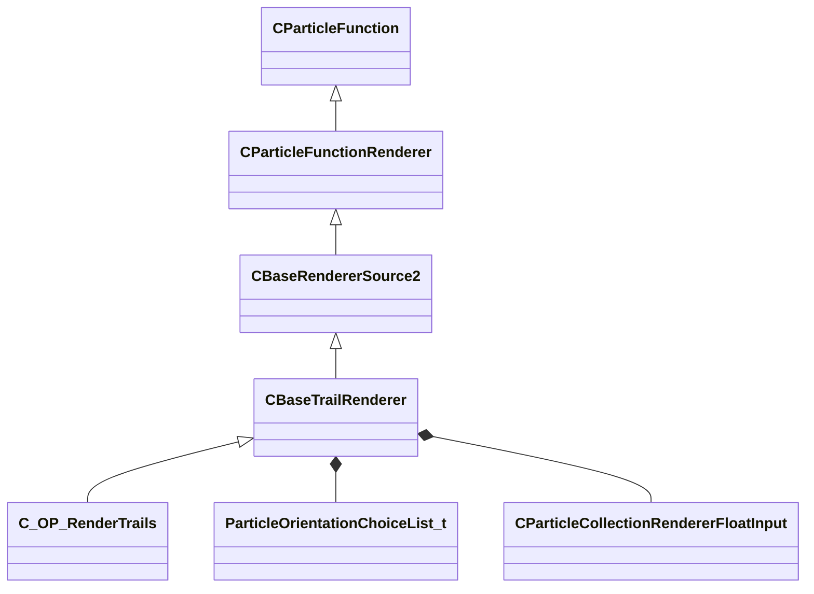

[Schemas](../../schemas.md) / [particles](../particles.md) / CBaseTrailRenderer

# CBaseTrailRenderer

> Source: **Build 25000182** · 2026-08-28 · `windows-x86_64` · schema `0.10.0`

**Kind:** class · **Size:** 12888 bytes (`0x3258`) · **Align:** n/a (unspecified) · **Module:** particles

**Inherits from:** [CBaseRendererSource2](../particles/CBaseRendererSource2.md)

**Derived by:** [C_OP_RenderTrails](../particles/C_OP_RenderTrails.md)

**Relationships:**

## Memory layout

93 fields (8 declared here, 85 inherited). Offsets are absolute from the object base.

| Offset | Field | Type | From | Annotations |
|--------|-------|------|------|-------------|
| `0x8` | `m_flOpStrength` | [CParticleCollectionFloatInput](../particleslib/CParticleCollectionFloatInput.md) | [CParticleFunction](../particles/CParticleFunction.md) | `MPropertyFriendlyName operator strength` `MPropertySortPriority -100` |
| `0x178` | `m_nOpEndCapState` | [ParticleEndcapMode_t](../particles/ParticleEndcapMode_t.md) | [CParticleFunction](../particles/CParticleFunction.md) | `MPropertyFriendlyName operator end cap state` `MPropertySortPriority -100` |
| `0x17c` | `m_nToolsState` | [ParticleToolsState_t](../particles/ParticleToolsState_t.md) | [CParticleFunction](../particles/CParticleFunction.md) | `MPropertyFriendlyName operator enabled in tools or game only` `MPropertySortPriority -100` |
| `0x180` | `m_flOpStartFadeInTime` | float32 | [CParticleFunction](../particles/CParticleFunction.md) | `MParticleAdvancedField` `MPropertyFriendlyName operator start fadein` `MPropertySortPriority -100` `MPropertyStartGroup Operator Fade` |
| `0x184` | `m_flOpEndFadeInTime` | float32 | [CParticleFunction](../particles/CParticleFunction.md) | `MParticleAdvancedField` `MPropertyFriendlyName operator end fadein` `MPropertySortPriority -100` |
| `0x188` | `m_flOpStartFadeOutTime` | float32 | [CParticleFunction](../particles/CParticleFunction.md) | `MParticleAdvancedField` `MPropertyFriendlyName operator start fadeout` `MPropertySortPriority -100` |
| `0x18c` | `m_flOpEndFadeOutTime` | float32 | [CParticleFunction](../particles/CParticleFunction.md) | `MParticleAdvancedField` `MPropertyFriendlyName operator end fadeout` `MPropertySortPriority -100` |
| `0x190` | `m_flOpFadeOscillatePeriod` | float32 | [CParticleFunction](../particles/CParticleFunction.md) | `MParticleAdvancedField` `MPropertyFriendlyName operator fade oscillate` `MPropertySortPriority -100` |
| `0x194` | `m_bNormalizeToStopTime` | bool | [CParticleFunction](../particles/CParticleFunction.md) | `MParticleAdvancedField` `MPropertyFriendlyName normalize fade times to endcap` `MPropertySortPriority -100` |
| `0x198` | `m_flOpTimeOffsetMin` | float32 | [CParticleFunction](../particles/CParticleFunction.md) | `MParticleAdvancedField` `MPropertyFriendlyName operator fade time offset min` `MPropertySortPriority -100` `MPropertyStartGroup Operator Fade Time Offset` |
| `0x19c` | `m_flOpTimeOffsetMax` | float32 | [CParticleFunction](../particles/CParticleFunction.md) | `MParticleAdvancedField` `MPropertyFriendlyName operator fade time offset max` `MPropertySortPriority -100` |
| `0x1a0` | `m_nOpTimeOffsetSeed` | int32 | [CParticleFunction](../particles/CParticleFunction.md) | `MParticleAdvancedField` `MPropertyFriendlyName operator fade time offset seed` `MPropertySortPriority -100` |
| `0x1a4` | `m_nOpTimeScaleSeed` | int32 | [CParticleFunction](../particles/CParticleFunction.md) | `MParticleAdvancedField` `MPropertyFriendlyName operator fade time scale seed` `MPropertySortPriority -100` `MPropertyStartGroup Operator Fade Timescale Modifiers` |
| `0x1a8` | `m_flOpTimeScaleMin` | float32 | [CParticleFunction](../particles/CParticleFunction.md) | `MParticleAdvancedField` `MPropertyFriendlyName operator fade time scale min` `MPropertySortPriority -100` |
| `0x1ac` | `m_flOpTimeScaleMax` | float32 | [CParticleFunction](../particles/CParticleFunction.md) | `MParticleAdvancedField` `MPropertyFriendlyName operator fade time scale max` `MPropertySortPriority -100` |
| `0x1b2` | `m_bDisableOperator` | bool | [CParticleFunction](../particles/CParticleFunction.md) | `MPropertyStartGroup` `MPropertySuppressField` |
| `0x1b8` | `m_Notes` | CUtlString | [CParticleFunction](../particles/CParticleFunction.md) | `MParticleHelpField` `MPropertyFriendlyName operator help and notes` `MPropertySortPriority -100` |
| `0x1d8` | `VisibilityInputs` | [CParticleVisibilityInputs](../particles/CParticleVisibilityInputs.md) | [CParticleFunctionRenderer](../particles/CParticleFunctionRenderer.md) | `MPropertySortPriority -1` |
| `0x220` | `m_bCannotBeRefracted` | bool | [CParticleFunctionRenderer](../particles/CParticleFunctionRenderer.md) | `MPropertyFriendlyName I cannot be refracted through refracting objects like water` `MPropertySortPriority -1` `MPropertyStartGroup Rendering filter` |
| `0x221` | `m_bSkipRenderingOnMobile` | bool | [CParticleFunctionRenderer](../particles/CParticleFunctionRenderer.md) | `MPropertyFriendlyName Skip rendering on mobile` `MPropertySortPriority -1` |
| `0x228` | `m_flRadiusScale` | [CParticleCollectionRendererFloatInput](../particleslib/CParticleCollectionRendererFloatInput.md) | [CBaseRendererSource2](../particles/CBaseRendererSource2.md) | `MPropertyFriendlyName radius scale` `MPropertySortPriority 700` `MPropertyStartGroup +Renderer Modifiers` |
| `0x398` | `m_flAlphaScale` | [CParticleCollectionRendererFloatInput](../particleslib/CParticleCollectionRendererFloatInput.md) | [CBaseRendererSource2](../particles/CBaseRendererSource2.md) | `MPropertyFriendlyName alpha scale` `MPropertySortPriority 700` |
| `0x508` | `m_flRollScale` | [CParticleCollectionRendererFloatInput](../particleslib/CParticleCollectionRendererFloatInput.md) | [CBaseRendererSource2](../particles/CBaseRendererSource2.md) | `MPropertyFriendlyName rotation roll scale` `MPropertySortPriority 700` |
| `0x678` | `m_nAlpha2Field` | [ParticleAttributeIndex_t](../particles/ParticleAttributeIndex_t.md) | [CBaseRendererSource2](../particles/CBaseRendererSource2.md) | `MPropertyAttributeChoiceName particlefield_scalar` `MPropertyFriendlyName per-particle alpha scale attribute` `MPropertySortPriority 700` |
| `0x680` | `m_vecColorScale` | [CParticleCollectionRendererVecInput](../particleslib/CParticleCollectionRendererVecInput.md) | [CBaseRendererSource2](../particles/CBaseRendererSource2.md) | `MPropertyFriendlyName color blend` `MPropertySortPriority 700` |
| `0xd38` | `m_nColorBlendType` | [ParticleColorBlendType_t](../particleslib/ParticleColorBlendType_t.md) | [CBaseRendererSource2](../particles/CBaseRendererSource2.md) | `MPropertyFriendlyName color blend type` `MPropertySortPriority 700` |
| `0xd3c` | `m_nShaderType` | [SpriteCardShaderType_t](../particles/SpriteCardShaderType_t.md) | [CBaseRendererSource2](../particles/CBaseRendererSource2.md) | `MPropertyFriendlyName Shader` `MPropertySortPriority 600` `MPropertyStartGroup +Material` |
| `0xd40` | `m_strShaderOverride` | CUtlString | [CBaseRendererSource2](../particles/CBaseRendererSource2.md) | `MPropertyFriendlyName Custom Shader` `MPropertySortPriority 600` `MPropertySuppressExpr m_nShaderType != SPRITECARD_SHADER_CUSTOM` |
| `0xd48` | `m_flCenterXOffset` | [CParticleCollectionRendererFloatInput](../particleslib/CParticleCollectionRendererFloatInput.md) | [CBaseRendererSource2](../particles/CBaseRendererSource2.md) | `MPropertyFriendlyName X offset of center point` `MPropertySortPriority 600` |
| `0xeb8` | `m_flCenterYOffset` | [CParticleCollectionRendererFloatInput](../particleslib/CParticleCollectionRendererFloatInput.md) | [CBaseRendererSource2](../particles/CBaseRendererSource2.md) | `MPropertyFriendlyName Y offset of center point` `MPropertySortPriority 600` |
| `0x1028` | `m_flBumpStrength` | float32 | [CBaseRendererSource2](../particles/CBaseRendererSource2.md) | `MPropertyFriendlyName Bump Strength` `MPropertySortPriority 600` |
| `0x102c` | `m_nCropTextureOverride` | [ParticleSequenceCropOverride_t](../particles/ParticleSequenceCropOverride_t.md) | [CBaseRendererSource2](../particles/CBaseRendererSource2.md) | `MPropertyFriendlyName Sheet Crop Behavior` `MPropertySortPriority 600` |
| `0x1030` | `m_vecTexturesInput` | CUtlLeanVector< [TextureGroup_t](../particles/TextureGroup_t.md) > | [CBaseRendererSource2](../particles/CBaseRendererSource2.md) | `MParticleRequireDefaultArrayEntry` `MPropertyAutoExpandSelf` `MPropertyFriendlyName Textures` `MPropertySortPriority 600` |
| `0x1040` | `m_flAnimationRate` | float32 | [CBaseRendererSource2](../particles/CBaseRendererSource2.md) | `MPropertyAttributeRange 0 5` `MPropertyFriendlyName animation rate` `MPropertySortPriority 500` `MPropertyStartGroup Animation` |
| `0x1044` | `m_nAnimationType` | [AnimationType_t](../particleslib/AnimationType_t.md) | [CBaseRendererSource2](../particles/CBaseRendererSource2.md) | `MPropertyFriendlyName animation type` `MPropertySortPriority 500` |
| `0x1048` | `m_bAnimateInFPS` | bool | [CBaseRendererSource2](../particles/CBaseRendererSource2.md) | `MPropertyFriendlyName set animation value in FPS` `MPropertySortPriority 500` |
| `0x1050` | `m_flMotionVectorScaleU` | [CParticleCollectionRendererFloatInput](../particleslib/CParticleCollectionRendererFloatInput.md) | [CBaseRendererSource2](../particles/CBaseRendererSource2.md) | `MPropertyFriendlyName motion vector scale U` `MPropertySortPriority 500` |
| `0x11c0` | `m_flMotionVectorScaleV` | [CParticleCollectionRendererFloatInput](../particleslib/CParticleCollectionRendererFloatInput.md) | [CBaseRendererSource2](../particles/CBaseRendererSource2.md) | `MPropertyFriendlyName motion vector scale V` `MPropertySortPriority 500` |
| `0x1330` | `m_flSelfIllumAmount` | [CParticleCollectionRendererFloatInput](../particleslib/CParticleCollectionRendererFloatInput.md) | [CBaseRendererSource2](../particles/CBaseRendererSource2.md) | `MPropertyAttributeRange 0 2` `MPropertyFriendlyName self illum amount` `MPropertySortPriority 400` `MPropertyStartGroup Lighting and Shadows` |
| `0x14a0` | `m_flDiffuseAmount` | [CParticleCollectionRendererFloatInput](../particleslib/CParticleCollectionRendererFloatInput.md) | [CBaseRendererSource2](../particles/CBaseRendererSource2.md) | `MPropertyAttributeRange 0 1` `MPropertyFriendlyName diffuse lighting amount` `MPropertySortPriority 400` |
| `0x1610` | `m_flDiffuseClamp` | [CParticleCollectionRendererFloatInput](../particleslib/CParticleCollectionRendererFloatInput.md) | [CBaseRendererSource2](../particles/CBaseRendererSource2.md) | `MPropertyAttributeRange 0 1` `MPropertyFriendlyName diffuse max contribution clamp` `MPropertySortPriority 400` `MPropertySuppressExpr mod != hlx` |
| `0x1780` | `m_nLightingControlPoint` | int32 | [CBaseRendererSource2](../particles/CBaseRendererSource2.md) | `MPropertyFriendlyName diffuse lighting origin Control Point` `MPropertySortPriority 400` |
| `0x1784` | `m_nOutputBlendMode` | [ParticleOutputBlendMode_t](../particles/ParticleOutputBlendMode_t.md) | [CBaseRendererSource2](../particles/CBaseRendererSource2.md) | `MPropertyFriendlyName output blend mode` `MPropertySortPriority 300` `MPropertyStartGroup +Color and alpha adjustments` |
| `0x1788` | `m_bGammaCorrectVertexColors` | bool | [CBaseRendererSource2](../particles/CBaseRendererSource2.md) | `MPropertyFriendlyName Gamma-correct vertex colors` `MPropertySortPriority 300` |
| `0x1789` | `m_bSaturateColorPreAlphaBlend` | bool | [CBaseRendererSource2](../particles/CBaseRendererSource2.md) | `MPropertyFriendlyName Saturate color pre alphablend` `MPropertySortPriority 300` `MPropertySuppressExpr mod != dota && mod != hlx` |
| `0x1790` | `m_flAddSelfAmount` | [CParticleCollectionRendererFloatInput](../particleslib/CParticleCollectionRendererFloatInput.md) | [CBaseRendererSource2](../particles/CBaseRendererSource2.md) | `MPropertyFriendlyName add self amount over alphablend` `MPropertySortPriority 300` |
| `0x1900` | `m_flDesaturation` | [CParticleCollectionRendererFloatInput](../particleslib/CParticleCollectionRendererFloatInput.md) | [CBaseRendererSource2](../particles/CBaseRendererSource2.md) | `MPropertyAttributeRange 0 1` `MPropertyFriendlyName desaturation amount` `MPropertySortPriority 300` |
| `0x1a70` | `m_flOverbrightFactor` | [CParticleCollectionRendererFloatInput](../particleslib/CParticleCollectionRendererFloatInput.md) | [CBaseRendererSource2](../particles/CBaseRendererSource2.md) | `MPropertyFriendlyName overbright factor` `MPropertySortPriority 300` |
| `0x1be0` | `m_nHSVShiftControlPoint` | int32 | [CBaseRendererSource2](../particles/CBaseRendererSource2.md) | `MPropertyFriendlyName HSV Shift Control Point` `MPropertySortPriority 300` |
| `0x1be4` | `m_nFogType` | [ParticleFogType_t](../particles/ParticleFogType_t.md) | [CBaseRendererSource2](../particles/CBaseRendererSource2.md) | `MPropertyFriendlyName Apply fog to particle` `MPropertySortPriority 300` |
| `0x1be8` | `m_flFogAmount` | [CParticleCollectionRendererFloatInput](../particleslib/CParticleCollectionRendererFloatInput.md) | [CBaseRendererSource2](../particles/CBaseRendererSource2.md) | `MPropertyFriendlyName Fog Scale` `MPropertySortPriority 300` `MPropertySuppressExpr mod != hlx` |
| `0x1d58` | `m_bTintByFOW` | bool | [CBaseRendererSource2](../particles/CBaseRendererSource2.md) | `MPropertyFriendlyName Apply fog of war to color` `MPropertySortPriority 300` `MPropertySuppressExpr mod != dota` |
| `0x1d59` | `m_bTintByGlobalLight` | bool | [CBaseRendererSource2](../particles/CBaseRendererSource2.md) | `MPropertyFriendlyName Apply global light to color` `MPropertySortPriority 300` `MPropertySuppressExpr mod != dota` |
| `0x1d5c` | `m_nPerParticleAlphaReference` | [SpriteCardPerParticleScale_t](../particles/SpriteCardPerParticleScale_t.md) | [CBaseRendererSource2](../particles/CBaseRendererSource2.md) | `MPropertyFriendlyName alpha reference` `MPropertySortPriority 300` `MPropertyStartGroup Color and alpha adjustments/Alpha Reference` |
| `0x1d60` | `m_nPerParticleAlphaRefWindow` | [SpriteCardPerParticleScale_t](../particles/SpriteCardPerParticleScale_t.md) | [CBaseRendererSource2](../particles/CBaseRendererSource2.md) | `MPropertyFriendlyName alpha reference window size` `MPropertySortPriority 300` |
| `0x1d64` | `m_nAlphaReferenceType` | [ParticleAlphaReferenceType_t](../particles/ParticleAlphaReferenceType_t.md) | [CBaseRendererSource2](../particles/CBaseRendererSource2.md) | `MPropertyFriendlyName alpha reference type` `MPropertySortPriority 300` |
| `0x1d68` | `m_flAlphaReferenceSoftness` | [CParticleCollectionRendererFloatInput](../particleslib/CParticleCollectionRendererFloatInput.md) | [CBaseRendererSource2](../particles/CBaseRendererSource2.md) | `MPropertyAttributeRange 0 1` `MPropertyFriendlyName alpha reference softness` `MPropertySortPriority 300` |
| `0x1ed8` | `m_flSourceAlphaValueToMapToZero` | [CParticleCollectionRendererFloatInput](../particleslib/CParticleCollectionRendererFloatInput.md) | [CBaseRendererSource2](../particles/CBaseRendererSource2.md) | `MPropertyAttributeRange 0 1` `MPropertyFriendlyName source alpha value to map to alpha of zero` `MPropertySortPriority 300` |
| `0x2048` | `m_flSourceAlphaValueToMapToOne` | [CParticleCollectionRendererFloatInput](../particleslib/CParticleCollectionRendererFloatInput.md) | [CBaseRendererSource2](../particles/CBaseRendererSource2.md) | `MPropertyAttributeRange 0 1` `MPropertyFriendlyName source alpha value to map to alpha of 1` `MPropertySortPriority 300` |
| `0x21b8` | `m_bRefract` | bool | [CBaseRendererSource2](../particles/CBaseRendererSource2.md) | `MPropertyFriendlyName refract background` `MPropertySortPriority 200` `MPropertyStartGroup Refraction` |
| `0x21b9` | `m_bRefractSolid` | bool | [CBaseRendererSource2](../particles/CBaseRendererSource2.md) | `MPropertyFriendlyName refract draws opaque - alpha scales refraction` `MPropertySortPriority 200` `MPropertySuppressExpr !m_bRefract` |
| `0x21ba` | `m_bRefract2Passes` | bool | [CBaseRendererSource2](../particles/CBaseRendererSource2.md) | `MPropertyFriendlyName refract in 2 passes - can refract particles behind, requires (MBOIT!)` `MPropertySortPriority 200` `MPropertySuppressExpr mod != hlx &#124;&#124; !m_bRefract` |
| `0x21c0` | `m_flRefractAmount` | [CParticleCollectionRendererFloatInput](../particleslib/CParticleCollectionRendererFloatInput.md) | [CBaseRendererSource2](../particles/CBaseRendererSource2.md) | `MPropertyAttributeRange -2 2` `MPropertyFriendlyName refract amount` `MPropertySortPriority 200` `MPropertySuppressExpr !m_bRefract` |
| `0x2330` | `m_nRefractBlurRadius` | int32 | [CBaseRendererSource2](../particles/CBaseRendererSource2.md) | `MPropertyFriendlyName refract blur radius` `MPropertySortPriority 200` `MPropertySuppressExpr !m_bRefract` |
| `0x2334` | `m_nRefractBlurType` | [BlurFilterType_t](../particles/BlurFilterType_t.md) | [CBaseRendererSource2](../particles/CBaseRendererSource2.md) | `MPropertyFriendlyName refract blur type` `MPropertySortPriority 200` `MPropertySuppressExpr !m_bRefract` |
| `0x2338` | `m_bOnlyRenderInEffectsBloomPass` | bool | [CBaseRendererSource2](../particles/CBaseRendererSource2.md) | `MPropertyFriendlyName Only Render in effects bloom pass` `MPropertySortPriority 1100` `MPropertyStartGroup` |
| `0x2339` | `m_bOnlyRenderInEffectsWaterPass` | bool | [CBaseRendererSource2](../particles/CBaseRendererSource2.md) | `MPropertyFriendlyName Only Render in effects water pass` `MPropertySortPriority 1050` `MPropertySuppressExpr mod != csgo && mod != hlx` |
| `0x233a` | `m_bUseMixedResolutionRendering` | bool | [CBaseRendererSource2](../particles/CBaseRendererSource2.md) | `MPropertyFriendlyName Use Mixed Resolution Rendering` `MPropertySortPriority 1200` |
| `0x233b` | `m_bOnlyRenderInEffecsGameOverlay` | bool | [CBaseRendererSource2](../particles/CBaseRendererSource2.md) | `MPropertyFriendlyName Only Render in effects game overlay pass` `MPropertySortPriority 1210` `MPropertySuppressExpr mod != csgo` |
| `0x233c` | `m_stencilTestID` | char[128] | [CBaseRendererSource2](../particles/CBaseRendererSource2.md) | `MPropertyFriendlyName stencil test ID` `MPropertySortPriority 0` `MPropertyStartGroup Stencil` |
| `0x23bc` | `m_bStencilTestExclude` | bool | [CBaseRendererSource2](../particles/CBaseRendererSource2.md) | `MPropertyFriendlyName only write where stencil is NOT stencil test ID` `MPropertySortPriority 0` |
| `0x23bd` | `m_stencilWriteID` | char[128] | [CBaseRendererSource2](../particles/CBaseRendererSource2.md) | `MPropertyFriendlyName stencil write ID` `MPropertySortPriority 0` |
| `0x243d` | `m_bWriteStencilOnDepthPass` | bool | [CBaseRendererSource2](../particles/CBaseRendererSource2.md) | `MPropertyFriendlyName write stencil on z-buffer test success` `MPropertySortPriority 0` |
| `0x243e` | `m_bWriteStencilOnDepthFail` | bool | [CBaseRendererSource2](../particles/CBaseRendererSource2.md) | `MPropertyFriendlyName write stencil on z-buffer test failure` `MPropertySortPriority 0` |
| `0x243f` | `m_bReverseZBuffering` | bool | [CBaseRendererSource2](../particles/CBaseRendererSource2.md) | `MPropertyFriendlyName reverse z-buffer test` `MPropertySortPriority 900` `MPropertyStartGroup Depth buffer control and effects` |
| `0x2440` | `m_bDisableZBuffering` | bool | [CBaseRendererSource2](../particles/CBaseRendererSource2.md) | `MPropertyFriendlyName disable z-buffer test` `MPropertySortPriority 900` |
| `0x2444` | `m_nFeatheringMode` | [ParticleDepthFeatheringMode_t](../particles/ParticleDepthFeatheringMode_t.md) | [CBaseRendererSource2](../particles/CBaseRendererSource2.md) | `MPropertyFriendlyName Depth feathering mode` `MPropertySortPriority 900` |
| `0x2448` | `m_flFeatheringMinDist` | [CParticleCollectionRendererFloatInput](../particleslib/CParticleCollectionRendererFloatInput.md) | [CBaseRendererSource2](../particles/CBaseRendererSource2.md) | `MPropertyFriendlyName particle feathering closest distance to surface` `MPropertySortPriority 900` |
| `0x25b8` | `m_flFeatheringMaxDist` | [CParticleCollectionRendererFloatInput](../particleslib/CParticleCollectionRendererFloatInput.md) | [CBaseRendererSource2](../particles/CBaseRendererSource2.md) | `MPropertyFriendlyName particle feathering farthest distance to surface` `MPropertySortPriority 900` |
| `0x2728` | `m_flFeatheringFilter` | [CParticleCollectionRendererFloatInput](../particleslib/CParticleCollectionRendererFloatInput.md) | [CBaseRendererSource2](../particles/CBaseRendererSource2.md) | `MPropertyFriendlyName particle feathering alpha filter` `MPropertySortPriority 900` |
| `0x2898` | `m_flFeatheringDepthMapFilter` | [CParticleCollectionRendererFloatInput](../particleslib/CParticleCollectionRendererFloatInput.md) | [CBaseRendererSource2](../particles/CBaseRendererSource2.md) | `MPropertyFriendlyName particle feathering depthmap layer filter` `MPropertySortPriority 900` `MPropertySuppressExpr mod != hlx` |
| `0x2a08` | `m_flDepthBias` | [CParticleCollectionRendererFloatInput](../particleslib/CParticleCollectionRendererFloatInput.md) | [CBaseRendererSource2](../particles/CBaseRendererSource2.md) | `MPropertyFriendlyName depth comparison bias` `MPropertySortPriority 900` |
| `0x2b78` | `m_nSortMethod` | [ParticleSortingChoiceList_t](../particles/ParticleSortingChoiceList_t.md) | [CBaseRendererSource2](../particles/CBaseRendererSource2.md) | `MPropertyFriendlyName Sort Method` `MPropertySortPriority 900` |
| `0x2b7c` | `m_bBlendFramesSeq0` | bool | [CBaseRendererSource2](../particles/CBaseRendererSource2.md) | `MPropertyFriendlyName blend sequence animation frames` `MPropertySortPriority 500` `MPropertyStartGroup Animation` |
| `0x2b7d` | `m_bMaxLuminanceBlendingSequence0` | bool | [CBaseRendererSource2](../particles/CBaseRendererSource2.md) | `MPropertyFriendlyName use max-luminance blending for sequence` `MPropertySortPriority 500` `MPropertySuppressExpr !m_bBlendFramesSeq0` |
| `0x2df0` | `m_nOrientationType` | [ParticleOrientationChoiceList_t](../particles/ParticleOrientationChoiceList_t.md) |  | `MPropertyFriendlyName orientation type` `MPropertySortPriority 750` `MPropertyStartGroup Orientation` |
| `0x2df4` | `m_nOrientationControlPoint` | int32 |  | `MPropertyFriendlyName orientation control point` `MPropertySortPriority 750` `MPropertySuppressExpr m_nOrientationType != PARTICLE_ORIENTATION_ALIGN_TO_PARTICLE_NORMAL && m_nOrientationType != PARTICLE_ORIENTATION_SCREENALIGN_TO_PARTICLE_NORMAL` |
| `0x2df8` | `m_flMinSize` | float32 |  | `MPropertyFriendlyName minimum visual screen-size` `MPropertySortPriority 900` `MPropertyStartGroup Screenspace Fading and culling` |
| `0x2dfc` | `m_flMaxSize` | float32 |  | `MPropertyFriendlyName maximum visual screen-size` `MPropertySortPriority 900` |
| `0x2e00` | `m_flStartFadeSize` | [CParticleCollectionRendererFloatInput](../particleslib/CParticleCollectionRendererFloatInput.md) |  | `MPropertyFriendlyName start fade screen-size` `MPropertySortPriority 900` |
| `0x2f70` | `m_flEndFadeSize` | [CParticleCollectionRendererFloatInput](../particleslib/CParticleCollectionRendererFloatInput.md) |  | `MPropertyFriendlyName end fade and cull screen-size` `MPropertySortPriority 900` |
| `0x30e0` | `m_flSubPixelAAScale` | [CParticleCollectionRendererFloatInput](../particleslib/CParticleCollectionRendererFloatInput.md) |  | `MPropertyFriendlyName sub-pixel AA scale` `MPropertySortPriority 1000` `MPropertySuppressExpr mod != hlx` |
| `0x3250` | `m_bClampV` | bool |  | `MPropertyFriendlyName Clamp Non-Sheet texture V coords` `MPropertySortPriority 800` `MPropertyStartGroup Trail UV Controls` |
