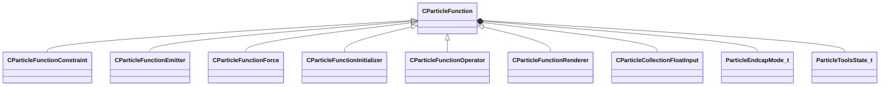

[Schemas](../../schemas.md) / [particles](../particles.md) / CParticleFunction

# CParticleFunction

**Kind:** class · **Size:** 472 bytes (`0x1d8`) · **Align:** 255 · **Module:** particles

**Derived by:** [CParticleFunctionConstraint](../particles/CParticleFunctionConstraint.md), [CParticleFunctionEmitter](../particles/CParticleFunctionEmitter.md), [CParticleFunctionForce](../particles/CParticleFunctionForce.md), [CParticleFunctionInitializer](../particles/CParticleFunctionInitializer.md), [CParticleFunctionOperator](../particles/CParticleFunctionOperator.md), [CParticleFunctionRenderer](../particles/CParticleFunctionRenderer.md)

**Relationships:**

## Memory layout

17 fields (17 declared here, 0 inherited). Offsets are absolute from the object base.

| Offset | Field | Type | From | Annotations |
|--------|-------|------|------|-------------|
| `0x8` | `m_flOpStrength` | [CParticleCollectionFloatInput](../particleslib/CParticleCollectionFloatInput.md) |  | `MPropertyFriendlyName operator strength` `MPropertySortPriority -100` |
| `0x178` | `m_nOpEndCapState` | [ParticleEndcapMode_t](../particles/ParticleEndcapMode_t.md) |  | `MPropertyFriendlyName operator end cap state` `MPropertySortPriority -100` |
| `0x17c` | `m_nToolsState` | [ParticleToolsState_t](../particles/ParticleToolsState_t.md) |  | `MPropertyFriendlyName operator enabled in tools or game only` `MPropertySortPriority -100` |
| `0x180` | `m_flOpStartFadeInTime` | float32 |  | `MParticleAdvancedField` `MPropertyFriendlyName operator start fadein` `MPropertySortPriority -100` `MPropertyStartGroup Operator Fade` |
| `0x184` | `m_flOpEndFadeInTime` | float32 |  | `MParticleAdvancedField` `MPropertyFriendlyName operator end fadein` `MPropertySortPriority -100` |
| `0x188` | `m_flOpStartFadeOutTime` | float32 |  | `MParticleAdvancedField` `MPropertyFriendlyName operator start fadeout` `MPropertySortPriority -100` |
| `0x18c` | `m_flOpEndFadeOutTime` | float32 |  | `MParticleAdvancedField` `MPropertyFriendlyName operator end fadeout` `MPropertySortPriority -100` |
| `0x190` | `m_flOpFadeOscillatePeriod` | float32 |  | `MParticleAdvancedField` `MPropertyFriendlyName operator fade oscillate` `MPropertySortPriority -100` |
| `0x194` | `m_bNormalizeToStopTime` | bool |  | `MParticleAdvancedField` `MPropertyFriendlyName normalize fade times to endcap` `MPropertySortPriority -100` |
| `0x198` | `m_flOpTimeOffsetMin` | float32 |  | `MParticleAdvancedField` `MPropertyFriendlyName operator fade time offset min` `MPropertySortPriority -100` `MPropertyStartGroup Operator Fade Time Offset` |
| `0x19c` | `m_flOpTimeOffsetMax` | float32 |  | `MParticleAdvancedField` `MPropertyFriendlyName operator fade time offset max` `MPropertySortPriority -100` |
| `0x1a0` | `m_nOpTimeOffsetSeed` | int32 |  | `MParticleAdvancedField` `MPropertyFriendlyName operator fade time offset seed` `MPropertySortPriority -100` |
| `0x1a4` | `m_nOpTimeScaleSeed` | int32 |  | `MParticleAdvancedField` `MPropertyFriendlyName operator fade time scale seed` `MPropertySortPriority -100` `MPropertyStartGroup Operator Fade Timescale Modifiers` |
| `0x1a8` | `m_flOpTimeScaleMin` | float32 |  | `MParticleAdvancedField` `MPropertyFriendlyName operator fade time scale min` `MPropertySortPriority -100` |
| `0x1ac` | `m_flOpTimeScaleMax` | float32 |  | `MParticleAdvancedField` `MPropertyFriendlyName operator fade time scale max` `MPropertySortPriority -100` |
| `0x1b2` | `m_bDisableOperator` | bool |  | `MPropertyStartGroup` `MPropertySuppressField` |
| `0x1b8` | `m_Notes` | CUtlString |  | `MParticleHelpField` `MPropertyFriendlyName operator help and notes` `MPropertySortPriority -100` |
