[Schemas](../../schemas.md) / [particles](../particles.md) / CParticleFunctionForce

# CParticleFunctionForce

**Kind:** class · **Size:** 488 bytes (`0x1e8`) · **Align:** 255 · **Module:** particles

**Inherits from:** [CParticleFunction](../particles/CParticleFunction.md)

**Derived by:** [C_OP_AttractToControlPoint](../particles/C_OP_AttractToControlPoint.md), [C_OP_CPVelocityForce](../particles/C_OP_CPVelocityForce.md), [C_OP_CurlNoiseForce](../particles/C_OP_CurlNoiseForce.md), [C_OP_DensityForce](../particles/C_OP_DensityForce.md), [C_OP_ExternalGameImpulseForce](../particles/C_OP_ExternalGameImpulseForce.md), [C_OP_ExternalWindForce](../particles/C_OP_ExternalWindForce.md), [C_OP_ForceBasedOnDistanceToPlane](../particles/C_OP_ForceBasedOnDistanceToPlane.md), [C_OP_IntraParticleForce](../particles/C_OP_IntraParticleForce.md), [C_OP_LocalAccelerationForce](../particles/C_OP_LocalAccelerationForce.md), [C_OP_ParentVortices](../particles/C_OP_ParentVortices.md), [C_OP_PerParticleForce](../particles/C_OP_PerParticleForce.md), [C_OP_RandomForce](../particles/C_OP_RandomForce.md), [C_OP_TimeVaryingForce](../particles/C_OP_TimeVaryingForce.md), [C_OP_TurbulenceForce](../particles/C_OP_TurbulenceForce.md), [C_OP_TwistAroundAxis](../particles/C_OP_TwistAroundAxis.md), [C_OP_WindForce](../particles/C_OP_WindForce.md)

**Relationships:**

```mermaid
classDiagram
    CParticleFunction <|-- CParticleFunctionForce
    CParticleFunctionForce <|-- C_OP_AttractToControlPoint
    CParticleFunctionForce <|-- C_OP_CPVelocityForce
    CParticleFunctionForce <|-- C_OP_CurlNoiseForce
    CParticleFunctionForce <|-- C_OP_DensityForce
    CParticleFunctionForce <|-- C_OP_ExternalGameImpulseForce
    CParticleFunctionForce <|-- C_OP_ExternalWindForce
    CParticleFunctionForce <|-- C_OP_ForceBasedOnDistanceToPlane
    CParticleFunctionForce <|-- C_OP_IntraParticleForce
    CParticleFunctionForce <|-- C_OP_LocalAccelerationForce
    CParticleFunctionForce <|-- C_OP_ParentVortices
    CParticleFunctionForce <|-- C_OP_PerParticleForce
    CParticleFunctionForce <|-- C_OP_RandomForce
    CParticleFunctionForce <|-- C_OP_TimeVaryingForce
    CParticleFunctionForce <|-- C_OP_TurbulenceForce
    CParticleFunctionForce <|-- C_OP_TwistAroundAxis
    CParticleFunctionForce <|-- C_OP_WindForce
```

## Memory layout

17 fields (0 declared here, 17 inherited). Offsets are absolute from the object base.

| Offset | Field | Type | From | Annotations |
|--------|-------|------|------|-------------|
| `0x8` | `m_flOpStrength` | [CParticleCollectionFloatInput](../particleslib/CParticleCollectionFloatInput.md) | [CParticleFunction](../particles/CParticleFunction.md) | `MPropertyFriendlyName operator strength` `MPropertySortPriority -100` |
| `0x178` | `m_nOpEndCapState` | [ParticleEndcapMode_t](../!GlobalTypes/ParticleEndcapMode_t.md) | [CParticleFunction](../particles/CParticleFunction.md) | `MPropertyFriendlyName operator end cap state` `MPropertySortPriority -100` |
| `0x17c` | `m_nToolsState` | [ParticleToolsState_t](../!GlobalTypes/ParticleToolsState_t.md) | [CParticleFunction](../particles/CParticleFunction.md) | `MPropertyFriendlyName operator enabled in tools or game only` `MPropertySortPriority -100` |
| `0x180` | `m_flOpStartFadeInTime` | float32 | [CParticleFunction](../particles/CParticleFunction.md) | `MParticleAdvancedField` `MPropertyFriendlyName operator start fadein` `MPropertySortPriority -100` `MPropertyStartGroup Operator Fade` |
| `0x184` | `m_flOpEndFadeInTime` | float32 | [CParticleFunction](../particles/CParticleFunction.md) | `MParticleAdvancedField` `MPropertyFriendlyName operator end fadein` `MPropertySortPriority -100` |
| `0x188` | `m_flOpStartFadeOutTime` | float32 | [CParticleFunction](../particles/CParticleFunction.md) | `MParticleAdvancedField` `MPropertyFriendlyName operator start fadeout` `MPropertySortPriority -100` |
| `0x18c` | `m_flOpEndFadeOutTime` | float32 | [CParticleFunction](../particles/CParticleFunction.md) | `MParticleAdvancedField` `MPropertyFriendlyName operator end fadeout` `MPropertySortPriority -100` |
| `0x190` | `m_flOpFadeOscillatePeriod` | float32 | [CParticleFunction](../particles/CParticleFunction.md) | `MParticleAdvancedField` `MPropertyFriendlyName operator fade oscillate` `MPropertySortPriority -100` |
| `0x194` | `m_bNormalizeToStopTime` | bool | [CParticleFunction](../particles/CParticleFunction.md) | `MParticleAdvancedField` `MPropertyFriendlyName normalize fade times to endcap` `MPropertySortPriority -100` |
| `0x198` | `m_flOpTimeOffsetMin` | float32 | [CParticleFunction](../particles/CParticleFunction.md) | `MParticleAdvancedField` `MPropertyFriendlyName operator fade time offset min` `MPropertySortPriority -100` `MPropertyStartGroup Operator Fade Time Offset` |
| `0x19c` | `m_flOpTimeOffsetMax` | float32 | [CParticleFunction](../particles/CParticleFunction.md) | `MParticleAdvancedField` `MPropertyFriendlyName operator fade time offset max` `MPropertySortPriority -100` |
| `0x1a0` | `m_nOpTimeOffsetSeed` | int32 | [CParticleFunction](../particles/CParticleFunction.md) | `MParticleAdvancedField` `MPropertyFriendlyName operator fade time offset seed` `MPropertySortPriority -100` |
| `0x1a4` | `m_nOpTimeScaleSeed` | int32 | [CParticleFunction](../particles/CParticleFunction.md) | `MParticleAdvancedField` `MPropertyFriendlyName operator fade time scale seed` `MPropertySortPriority -100` `MPropertyStartGroup Operator Fade Timescale Modifiers` |
| `0x1a8` | `m_flOpTimeScaleMin` | float32 | [CParticleFunction](../particles/CParticleFunction.md) | `MParticleAdvancedField` `MPropertyFriendlyName operator fade time scale min` `MPropertySortPriority -100` |
| `0x1ac` | `m_flOpTimeScaleMax` | float32 | [CParticleFunction](../particles/CParticleFunction.md) | `MParticleAdvancedField` `MPropertyFriendlyName operator fade time scale max` `MPropertySortPriority -100` |
| `0x1b2` | `m_bDisableOperator` | bool | [CParticleFunction](../particles/CParticleFunction.md) | `MPropertyStartGroup` `MPropertySuppressField` |
| `0x1b8` | `m_Notes` | CUtlString | [CParticleFunction](../particles/CParticleFunction.md) | `MParticleHelpField` `MPropertyFriendlyName operator help and notes` `MPropertySortPriority -100` |
