[Schemas](../../schemas.md) / [particles](../particles.md) / CParticleFunctionPreEmission

# CParticleFunctionPreEmission

**Kind:** class · **Size:** 480 bytes (`0x1e0`) · **Align:** 255 · **Module:** particles

**Inherits from:** [CParticleFunctionOperator](../particles/CParticleFunctionOperator.md)

**Derived by:** [C_OP_ChooseRandomChildrenInGroup](../particles/C_OP_ChooseRandomChildrenInGroup.md), [C_OP_ControlPointToRadialScreenSpace](../particles/C_OP_ControlPointToRadialScreenSpace.md), [C_OP_DistanceBetweenCPsToCP](../particles/C_OP_DistanceBetweenCPsToCP.md), [C_OP_DriveCPFromGlobalSoundFloat](../particles/C_OP_DriveCPFromGlobalSoundFloat.md), [C_OP_EnableChildrenFromParentParticleCount](../particles/C_OP_EnableChildrenFromParentParticleCount.md), [C_OP_ForceControlPointStub](../particles/C_OP_ForceControlPointStub.md), [C_OP_HSVShiftToCP](../particles/C_OP_HSVShiftToCP.md), [C_OP_LightningSnapshotGenerator](../particles/C_OP_LightningSnapshotGenerator.md), [C_OP_ModelSurfaceSnapshotGenerator](../particles/C_OP_ModelSurfaceSnapshotGenerator.md), [C_OP_MultiSegmentDisplaySnapshotGenerator](../particles/C_OP_MultiSegmentDisplaySnapshotGenerator.md), [C_OP_PlayEndCapWhenFinished](../particles/C_OP_PlayEndCapWhenFinished.md), [C_OP_QuantizeCPComponent](../particles/C_OP_QuantizeCPComponent.md), [C_OP_RampCPLinearRandom](../particles/C_OP_RampCPLinearRandom.md), [C_OP_RemapAverageHitboxSpeedtoCP](../particles/C_OP_RemapAverageHitboxSpeedtoCP.md), [C_OP_RemapAverageScalarValuetoCP](../particles/C_OP_RemapAverageScalarValuetoCP.md), [C_OP_RemapBoundingVolumetoCP](../particles/C_OP_RemapBoundingVolumetoCP.md), [C_OP_RemapCPtoCP](../particles/C_OP_RemapCPtoCP.md), [C_OP_RemapDotProductToCP](../particles/C_OP_RemapDotProductToCP.md), [C_OP_RemapExternalWindToCP](../particles/C_OP_RemapExternalWindToCP.md), [C_OP_RemapModelVolumetoCP](../particles/C_OP_RemapModelVolumetoCP.md), [C_OP_RemapSpeedtoCP](../particles/C_OP_RemapSpeedtoCP.md), [C_OP_RepeatedTriggerChildGroup](../particles/C_OP_RepeatedTriggerChildGroup.md), [C_OP_SelectivelyEnableChildren](../particles/C_OP_SelectivelyEnableChildren.md), [C_OP_SetCPOrientationToPointAtCP](../particles/C_OP_SetCPOrientationToPointAtCP.md), [C_OP_SetControlPointFieldFromVectorExpression](../particles/C_OP_SetControlPointFieldFromVectorExpression.md), [C_OP_SetControlPointFieldToScalarExpression](../particles/C_OP_SetControlPointFieldToScalarExpression.md), [C_OP_SetControlPointFieldToWater](../particles/C_OP_SetControlPointFieldToWater.md), [C_OP_SetControlPointFromObjectScale](../particles/C_OP_SetControlPointFromObjectScale.md), [C_OP_SetControlPointOrientation](../particles/C_OP_SetControlPointOrientation.md), [C_OP_SetControlPointOrientationToCPVelocity](../particles/C_OP_SetControlPointOrientationToCPVelocity.md), [C_OP_SetControlPointPositionToRandomActiveCP](../particles/C_OP_SetControlPointPositionToRandomActiveCP.md), [C_OP_SetControlPointPositionToTimeOfDayValue](../particles/C_OP_SetControlPointPositionToTimeOfDayValue.md), [C_OP_SetControlPointPositions](../particles/C_OP_SetControlPointPositions.md), [C_OP_SetControlPointRotation](../particles/C_OP_SetControlPointRotation.md), [C_OP_SetControlPointToCPVelocity](../particles/C_OP_SetControlPointToCPVelocity.md), [C_OP_SetControlPointToCenter](../particles/C_OP_SetControlPointToCenter.md), [C_OP_SetControlPointToHMD](../particles/C_OP_SetControlPointToHMD.md), [C_OP_SetControlPointToHand](../particles/C_OP_SetControlPointToHand.md), [C_OP_SetControlPointToImpactPoint](../particles/C_OP_SetControlPointToImpactPoint.md), [C_OP_SetControlPointToPlayer](../particles/C_OP_SetControlPointToPlayer.md), [C_OP_SetControlPointToVectorExpression](../particles/C_OP_SetControlPointToVectorExpression.md), [C_OP_SetControlPointToWaterSurface](../particles/C_OP_SetControlPointToWaterSurface.md), [C_OP_SetGravityToCP](../particles/C_OP_SetGravityToCP.md), [C_OP_SetParentControlPointsToChildCP](../particles/C_OP_SetParentControlPointsToChildCP.md), [C_OP_SetRandomControlPointPosition](../particles/C_OP_SetRandomControlPointPosition.md), [C_OP_SetSimulationRate](../particles/C_OP_SetSimulationRate.md), [C_OP_SetSingleControlPointPosition](../particles/C_OP_SetSingleControlPointPosition.md), [C_OP_SetVariable](../particles/C_OP_SetVariable.md), [C_OP_StopAfterCPDuration](../particles/C_OP_StopAfterCPDuration.md)

**Relationships:**

```mermaid
classDiagram
    CParticleFunctionOperator <|-- CParticleFunctionPreEmission
    CParticleFunction <|-- CParticleFunctionOperator
    CParticleFunctionPreEmission <|-- C_OP_ChooseRandomChildrenInGroup
    CParticleFunctionPreEmission <|-- C_OP_ControlPointToRadialScreenSpace
    CParticleFunctionPreEmission <|-- C_OP_DistanceBetweenCPsToCP
    CParticleFunctionPreEmission <|-- C_OP_DriveCPFromGlobalSoundFloat
    CParticleFunctionPreEmission <|-- C_OP_EnableChildrenFromParentParticleCount
    CParticleFunctionPreEmission <|-- C_OP_ForceControlPointStub
    CParticleFunctionPreEmission <|-- C_OP_HSVShiftToCP
    CParticleFunctionPreEmission <|-- C_OP_LightningSnapshotGenerator
    CParticleFunctionPreEmission <|-- C_OP_ModelSurfaceSnapshotGenerator
    CParticleFunctionPreEmission <|-- C_OP_MultiSegmentDisplaySnapshotGenerator
    CParticleFunctionPreEmission <|-- C_OP_PlayEndCapWhenFinished
    CParticleFunctionPreEmission <|-- C_OP_QuantizeCPComponent
    CParticleFunctionPreEmission <|-- C_OP_RampCPLinearRandom
    CParticleFunctionPreEmission <|-- C_OP_RemapAverageHitboxSpeedtoCP
    CParticleFunctionPreEmission <|-- C_OP_RemapAverageScalarValuetoCP
    CParticleFunctionPreEmission <|-- C_OP_RemapBoundingVolumetoCP
    CParticleFunctionPreEmission <|-- C_OP_RemapCPtoCP
    CParticleFunctionPreEmission <|-- C_OP_RemapDotProductToCP
    CParticleFunctionPreEmission <|-- C_OP_RemapExternalWindToCP
    CParticleFunctionPreEmission <|-- C_OP_RemapModelVolumetoCP
    CParticleFunctionPreEmission <|-- C_OP_RemapSpeedtoCP
    CParticleFunctionPreEmission <|-- C_OP_RepeatedTriggerChildGroup
    CParticleFunctionPreEmission <|-- C_OP_SelectivelyEnableChildren
    CParticleFunctionPreEmission <|-- C_OP_SetCPOrientationToPointAtCP
    CParticleFunctionPreEmission <|-- C_OP_SetControlPointFieldFromVectorExpression
    CParticleFunctionPreEmission <|-- C_OP_SetControlPointFieldToScalarExpression
    CParticleFunctionPreEmission <|-- C_OP_SetControlPointFieldToWater
    CParticleFunctionPreEmission <|-- C_OP_SetControlPointFromObjectScale
    CParticleFunctionPreEmission <|-- C_OP_SetControlPointOrientation
    CParticleFunctionPreEmission <|-- C_OP_SetControlPointOrientationToCPVelocity
    CParticleFunctionPreEmission <|-- C_OP_SetControlPointPositionToRandomActiveCP
    CParticleFunctionPreEmission <|-- C_OP_SetControlPointPositionToTimeOfDayValue
    CParticleFunctionPreEmission <|-- C_OP_SetControlPointPositions
    CParticleFunctionPreEmission <|-- C_OP_SetControlPointRotation
    CParticleFunctionPreEmission <|-- C_OP_SetControlPointToCPVelocity
    CParticleFunctionPreEmission <|-- C_OP_SetControlPointToCenter
    CParticleFunctionPreEmission <|-- C_OP_SetControlPointToHMD
    CParticleFunctionPreEmission <|-- C_OP_SetControlPointToHand
    CParticleFunctionPreEmission <|-- C_OP_SetControlPointToImpactPoint
    CParticleFunctionPreEmission <|-- C_OP_SetControlPointToPlayer
    CParticleFunctionPreEmission <|-- C_OP_SetControlPointToVectorExpression
    CParticleFunctionPreEmission <|-- C_OP_SetControlPointToWaterSurface
    CParticleFunctionPreEmission <|-- C_OP_SetGravityToCP
    CParticleFunctionPreEmission <|-- C_OP_SetParentControlPointsToChildCP
    CParticleFunctionPreEmission <|-- C_OP_SetRandomControlPointPosition
    CParticleFunctionPreEmission <|-- C_OP_SetSimulationRate
    CParticleFunctionPreEmission <|-- C_OP_SetSingleControlPointPosition
    CParticleFunctionPreEmission <|-- C_OP_SetVariable
    CParticleFunctionPreEmission <|-- C_OP_StopAfterCPDuration
```

## Memory layout

18 fields (1 declared here, 17 inherited). Offsets are absolute from the object base.

| Offset | Field | Type | From | Annotations |
|--------|-------|------|------|-------------|
| `0x8` | `m_flOpStrength` | [CParticleCollectionFloatInput](../particleslib/CParticleCollectionFloatInput.md) | [CParticleFunction](../particles/CParticleFunction.md) | `MPropertyFriendlyName operator strength` `MPropertySortPriority -100` |
| `0x178` | `m_nOpEndCapState` | [ParticleEndcapMode_t](../particles/ParticleEndcapMode_t.md) | [CParticleFunction](../particles/CParticleFunction.md) | `MPropertyFriendlyName operator end cap state` `MPropertySortPriority -100` |
| `0x17c` | `m_nToolsState` | [ParticleToolsState_t](../particles/ParticleToolsState_t.md) | [CParticleFunction](../particles/CParticleFunction.md) | `MPropertyFriendlyName operator enabled in tools or game only` `MPropertySortPriority -100` |
| `0x180` | `m_flOpStartFadeInTime` | float32 | [CParticleFunction](../particles/CParticleFunction.md) | `MParticleAdvancedField` `MPropertyFriendlyName operator start fadein` `MPropertySortPriority -100` `MPropertyStartGroup Operator Fade` |
| `0x184` | `m_flOpEndFadeInTime` | float32 | [CParticleFunction](../particles/CParticleFunction.md) | `MParticleAdvancedField` `MPropertyFriendlyName operator end fadein` `MPropertySortPriority -100` |
| `0x188` | `m_flOpStartFadeOutTime` | float32 | [CParticleFunction](../particles/CParticleFunction.md) | `MParticleAdvancedField` `MPropertyFriendlyName operator start fadeout` `MPropertySortPriority -100` |
| `0x18c` | `m_flOpEndFadeOutTime` | float32 | [CParticleFunction](../particles/CParticleFunction.md) | `MParticleAdvancedField` `MPropertyFriendlyName operator end fadeout` `MPropertySortPriority -100` |
| `0x190` | `m_flOpFadeOscillatePeriod` | float32 | [CParticleFunction](../particles/CParticleFunction.md) | `MParticleAdvancedField` `MPropertyFriendlyName operator fade oscillate` `MPropertySortPriority -100` |
| `0x194` | `m_bNormalizeToStopTime` | bool | [CParticleFunction](../particles/CParticleFunction.md) | `MParticleAdvancedField` `MPropertyFriendlyName normalize fade times to endcap` `MPropertySortPriority -100` |
| `0x198` | `m_flOpTimeOffsetMin` | float32 | [CParticleFunction](../particles/CParticleFunction.md) | `MParticleAdvancedField` `MPropertyFriendlyName operator fade time offset min` `MPropertySortPriority -100` `MPropertyStartGroup Operator Fade Time Offset` |
| `0x19c` | `m_flOpTimeOffsetMax` | float32 | [CParticleFunction](../particles/CParticleFunction.md) | `MParticleAdvancedField` `MPropertyFriendlyName operator fade time offset max` `MPropertySortPriority -100` |
| `0x1a0` | `m_nOpTimeOffsetSeed` | int32 | [CParticleFunction](../particles/CParticleFunction.md) | `MParticleAdvancedField` `MPropertyFriendlyName operator fade time offset seed` `MPropertySortPriority -100` |
| `0x1a4` | `m_nOpTimeScaleSeed` | int32 | [CParticleFunction](../particles/CParticleFunction.md) | `MParticleAdvancedField` `MPropertyFriendlyName operator fade time scale seed` `MPropertySortPriority -100` `MPropertyStartGroup Operator Fade Timescale Modifiers` |
| `0x1a8` | `m_flOpTimeScaleMin` | float32 | [CParticleFunction](../particles/CParticleFunction.md) | `MParticleAdvancedField` `MPropertyFriendlyName operator fade time scale min` `MPropertySortPriority -100` |
| `0x1ac` | `m_flOpTimeScaleMax` | float32 | [CParticleFunction](../particles/CParticleFunction.md) | `MParticleAdvancedField` `MPropertyFriendlyName operator fade time scale max` `MPropertySortPriority -100` |
| `0x1b2` | `m_bDisableOperator` | bool | [CParticleFunction](../particles/CParticleFunction.md) | `MPropertyStartGroup` `MPropertySuppressField` |
| `0x1b8` | `m_Notes` | CUtlString | [CParticleFunction](../particles/CParticleFunction.md) | `MParticleHelpField` `MPropertyFriendlyName operator help and notes` `MPropertySortPriority -100` |
| `0x1d8` | `m_bRunOnce` | bool |  | `MPropertyFriendlyName Run Only Once` |
