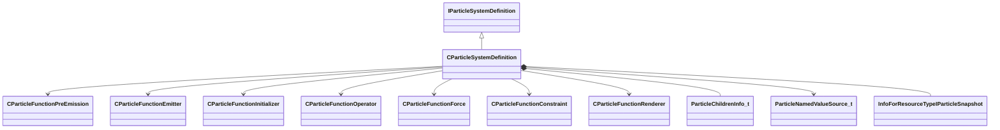

[Schemas](../../schemas.md) / [particles](../particles.md) / CParticleSystemDefinition

# CParticleSystemDefinition

**Kind:** class · **Size:** 1088 bytes (`0x440`) · **Align:** 16 · **Module:** particles

**Inherits from:** [IParticleSystemDefinition](../particles/IParticleSystemDefinition.md)

**Relationships:**

## Memory layout

66 fields (66 declared here, 0 inherited). Offsets are absolute from the object base.

| Offset | Field | Type | From | Annotations |
|--------|-------|------|------|-------------|
| `0x8` | `m_nBehaviorVersion` | int32 |  | `MPropertyFriendlyName version` `MPropertySuppressField` |
| `0x10` | `m_PreEmissionOperators` | CUtlVector< [CParticleFunctionPreEmission](../particles/CParticleFunctionPreEmission.md)* > |  | `MPropertySuppressField` |
| `0x28` | `m_Emitters` | CUtlVector< [CParticleFunctionEmitter](../particles/CParticleFunctionEmitter.md)* > |  | `MPropertySuppressField` |
| `0x40` | `m_Initializers` | CUtlVector< [CParticleFunctionInitializer](../particles/CParticleFunctionInitializer.md)* > |  | `MPropertySuppressField` |
| `0x58` | `m_Operators` | CUtlVector< [CParticleFunctionOperator](../particles/CParticleFunctionOperator.md)* > |  | `MPropertySuppressField` |
| `0x70` | `m_ForceGenerators` | CUtlVector< [CParticleFunctionForce](../particles/CParticleFunctionForce.md)* > |  | `MPropertySuppressField` |
| `0x88` | `m_Constraints` | CUtlVector< [CParticleFunctionConstraint](../particles/CParticleFunctionConstraint.md)* > |  | `MPropertySuppressField` |
| `0xa0` | `m_Renderers` | CUtlVector< [CParticleFunctionRenderer](../particles/CParticleFunctionRenderer.md)* > |  | `MPropertySuppressField` |
| `0xb8` | `m_Children` | CUtlVector< [ParticleChildrenInfo_t](../particles/ParticleChildrenInfo_t.md) > |  | `MPropertySuppressField` |
| `0x178` | `m_nFirstMultipleOverride_BackwardCompat` | int32 |  | `MPropertySuppressField` |
| `0x258` | `m_nInitialParticles` | int32 |  | `MPropertyFriendlyName initial particles` `MPropertyStartGroup +Collection Options` |
| `0x25c` | `m_nMaxParticles` | int32 |  | `MPropertyFriendlyName max particles` |
| `0x260` | `m_nGroupID` | int32 |  | `MPropertyFriendlyName group id` |
| `0x264` | `m_BoundingBoxMin` | Vector |  | `MPropertyFriendlyName bounding box bloat min` `MPropertyStartGroup Bounding Box` `MVectorIsCoordinate` |
| `0x270` | `m_BoundingBoxMax` | Vector |  | `MPropertyFriendlyName bounding box bloat max` `MVectorIsCoordinate` |
| `0x27c` | `m_flDepthSortBias` | float32 |  | `MPropertyFriendlyName bounding box depth sort bias` |
| `0x280` | `m_nSortOverridePositionCP` | int32 |  | `MPropertyFriendlyName sort override position CP` |
| `0x284` | `m_bInfiniteBounds` | bool |  | `MPropertyFriendlyName infinite bounds - don't cull` |
| `0x285` | `m_bEnableNamedValues` | bool |  | `MPropertyFriendlyName Enable Named Values (EXPERIMENTAL)` `MPropertyStartGroup Named Values` |
| `0x288` | `m_NamedValueDomain` | CUtlString |  | `MPropertyAttributeChoiceName particlefield_domain` `MPropertyAutoRebuildOnChange` `MPropertyFriendlyName Domain Class` `MPropertySuppressExpr !m_bEnableNamedValues` |
| `0x290` | `m_NamedValueLocals` | CUtlVector< [ParticleNamedValueSource_t](../particleslib/ParticleNamedValueSource_t.md)* > |  | `MPropertySuppressField` |
| `0x2a8` | `m_ConstantColor` | Color |  | `MPropertyColorPlusAlpha` `MPropertyFriendlyName color` `MPropertyStartGroup +Base Properties` |
| `0x2ac` | `m_ConstantNormal` | Vector |  | `MPropertyFriendlyName normal` `MVectorIsCoordinate` |
| `0x2b8` | `m_flConstantRadius` | float32 |  | `MPropertyAttributeRange biased 0 500` `MPropertyFriendlyName radius` |
| `0x2bc` | `m_flConstantRotation` | float32 |  | `MPropertyFriendlyName rotation` |
| `0x2c0` | `m_flConstantRotationSpeed` | float32 |  | `MPropertyFriendlyName rotation speed` |
| `0x2c4` | `m_flConstantLifespan` | float32 |  | `MPropertyFriendlyName lifetime` |
| `0x2c8` | `m_nConstantSequenceNumber` | int32 |  | `MPropertyAttributeEditor SequencePicker( 1 )` `MPropertyFriendlyName sequence number` |
| `0x2cc` | `m_nConstantSequenceNumber1` | int32 |  | `MPropertyAttributeEditor SequencePicker( 2 )` `MPropertyFriendlyName sequence number 1` |
| `0x2d0` | `m_nSnapshotControlPoint` | int32 |  | `MPropertyStartGroup Snapshot Options` |
| `0x2d8` | `m_hSnapshot` | CStrongHandle< [InfoForResourceTypeIParticleSnapshot](../resourcesystem/InfoForResourceTypeIParticleSnapshot.md) > |  |  |
| `0x2e0` | `m_pszCullReplacementName` | CStrongHandle< [InfoForResourceTypeIParticleSystemDefinition](../resourcesystem/InfoForResourceTypeIParticleSystemDefinition.md) > |  | `MPropertyFriendlyName cull replacement definition` `MPropertyStartGroup Replacement Options` |
| `0x2e8` | `m_flCullRadius` | float32 |  | `MPropertyFriendlyName cull radius` |
| `0x2ec` | `m_flCullFillCost` | float32 |  | `MPropertyFriendlyName cull cost` |
| `0x2f0` | `m_nCullControlPoint` | int32 |  | `MPropertyFriendlyName cull control point` |
| `0x2f8` | `m_hFallback` | CStrongHandle< [InfoForResourceTypeIParticleSystemDefinition](../resourcesystem/InfoForResourceTypeIParticleSystemDefinition.md) > |  | `MPropertyFriendlyName fallback replacement definition` |
| `0x300` | `m_nFallbackMaxCount` | int32 |  | `MPropertyFriendlyName fallback max count` |
| `0x308` | `m_hLowViolenceDef` | CStrongHandle< [InfoForResourceTypeIParticleSystemDefinition](../resourcesystem/InfoForResourceTypeIParticleSystemDefinition.md) > |  | `MPropertyFriendlyName low violence definition` |
| `0x310` | `m_hReferenceReplacement` | CStrongHandle< [InfoForResourceTypeIParticleSystemDefinition](../resourcesystem/InfoForResourceTypeIParticleSystemDefinition.md) > |  | `MPropertyFriendlyName reference replacement definition` |
| `0x318` | `m_flPreSimulationTime` | float32 |  | `MPropertyFriendlyName pre-simulation time` `MPropertyStartGroup Simulation Options` |
| `0x31c` | `m_flStopSimulationAfterTime` | float32 |  | `MPropertyFriendlyName freeze simulation after time` |
| `0x320` | `m_flMaximumTimeStep` | float32 |  | `MPropertyFriendlyName maximum time step` |
| `0x324` | `m_flMaximumSimTime` | float32 |  | `MPropertyFriendlyName maximum sim tick rate` |
| `0x328` | `m_flMinimumSimTime` | float32 |  | `MPropertyFriendlyName minimum sim tick rate` |
| `0x32c` | `m_flMinimumTimeStep` | float32 |  | `MPropertyFriendlyName minimum simulation time step` |
| `0x330` | `m_nMinimumFrames` | int32 |  | `MPropertyFriendlyName minimum required rendered frames` |
| `0x334` | `m_bIsGPUParticleSystem` | bool |  | `MPropertyAutoRebuildOnChange` `MPropertyFriendlyName simulated on the GPU` `MPropertySuppressExpr mod != hlx` |
| `0x338` | `m_nMinCPULevel` | int32 |  | `MPropertyFriendlyName minimum CPU level` `MPropertyStartGroup Performance Options` |
| `0x33c` | `m_nMinGPULevel` | int32 |  | `MPropertyFriendlyName minimum GPU level` |
| `0x340` | `m_flNoDrawTimeToGoToSleep` | float32 |  | `MPropertyFriendlyName time to sleep when not drawn` |
| `0x344` | `m_flMaxDrawDistance` | float32 |  | `MPropertyFriendlyName maximum draw distance` |
| `0x348` | `m_flStartFadeDistance` | float32 |  | `MPropertyFriendlyName start fade distance` |
| `0x34c` | `m_flMaxCreationDistance` | float32 |  | `MPropertyFriendlyName maximum creation distance` |
| `0x350` | `m_nAggregationMinAvailableParticles` | int32 |  | `MPropertyFriendlyName minimum free particles to aggregate` |
| `0x354` | `m_flAggregateRadius` | float32 |  | `MPropertyFriendlyName aggregation radius` |
| `0x358` | `m_bShouldBatch` | bool |  | `MParticleAdvancedField` `MPropertyFriendlyName batch particle systems (DO NOT USE)` |
| `0x359` | `m_bShouldHitboxesFallbackToRenderBounds` | bool |  | `MPropertyFriendlyName Hitboxes fall back to render bounds` |
| `0x35a` | `m_bShouldHitboxesFallbackToSnapshot` | bool |  | `MPropertyFriendlyName Hitboxes fall back to snapshot` |
| `0x35b` | `m_bShouldHitboxesFallbackToCollisionHulls` | bool |  | `MPropertyFriendlyName Hitboxes fall back to collision hulls` |
| `0x35c` | `m_nViewModelEffect` | [InheritableBoolType_t](../particles/InheritableBoolType_t.md) |  | `MPropertyFriendlyName view model effect` `MPropertyStartGroup Rendering Options` `MPropertySuppressExpr m_bScreenSpaceEffect` |
| `0x360` | `m_bScreenSpaceEffect` | bool |  | `MPropertyFriendlyName screen space effect` `MPropertySuppressExpr m_nViewModelEffect == INHERITABLE_BOOL_TRUE` |
| `0x368` | `m_pszTargetLayerID` | CUtlSymbolLarge |  | `MPropertyFriendlyName target layer ID for rendering` |
| `0x370` | `m_nSkipRenderControlPoint` | int32 |  | `MPropertyFriendlyName control point to disable rendering if it is the camera` |
| `0x374` | `m_nAllowRenderControlPoint` | int32 |  | `MPropertyFriendlyName control point to only enable rendering if it is the camera` |
| `0x378` | `m_bShouldSort` | bool |  | `MParticleAdvancedField` `MPropertyFriendlyName sort particles (DEPRECATED - USE RENDERER OPTION)` |
| `0x3c0` | `m_controlPointConfigurations` | CUtlVector< [ParticleControlPointConfiguration_t](../particles/ParticleControlPointConfiguration_t.md) > |  | `MPropertySuppressField` |

KV3 class defaults

<pre>{
	&quot;_class&quot;: &quot;CParticleSystemDefinition&quot;,
	&quot;m_nBehaviorVersion&quot;: 0,
	&quot;m_PreEmissionOperators&quot;:
	[
	],
	&quot;m_Emitters&quot;:
	[
	],
	&quot;m_Initializers&quot;:
	[
	],
	&quot;m_Operators&quot;:
	[
	],
	&quot;m_ForceGenerators&quot;:
	[
	],
	&quot;m_Constraints&quot;:
	[
	],
	&quot;m_Renderers&quot;:
	[
	],
	&quot;m_Children&quot;:
	[
	],
	&quot;m_nFirstMultipleOverride_BackwardCompat&quot;: -1,
	&quot;m_nInitialParticles&quot;: 0,
	&quot;m_nMaxParticles&quot;: 1000,
	&quot;m_nGroupID&quot;: 0,
	&quot;m_BoundingBoxMin&quot;:
	[
		-10.000000,
		-10.000000,
		-10.000000
	],
	&quot;m_BoundingBoxMax&quot;:
	[
		10.000000,
		10.000000,
		10.000000
	],
	&quot;m_flDepthSortBias&quot;: 0.000000,
	&quot;m_nSortOverridePositionCP&quot;: -1,
	&quot;m_bInfiniteBounds&quot;: false,
	&quot;m_bEnableNamedValues&quot;: false,
	&quot;m_NamedValueDomain&quot;: &quot;&quot;,
	&quot;m_NamedValueLocals&quot;:
	[
	],
	&quot;m_ConstantColor&quot;:
	[
		255,
		255,
		255
	],
	&quot;m_ConstantNormal&quot;:
	[
		0.000000,
		0.000000,
		1.000000
	],
	&quot;m_flConstantRadius&quot;: 5.000000,
	&quot;m_flConstantRotation&quot;: 0.000000,
	&quot;m_flConstantRotationSpeed&quot;: 0.000000,
	&quot;m_flConstantLifespan&quot;: 1.000000,
	&quot;m_nConstantSequenceNumber&quot;: 0,
	&quot;m_nConstantSequenceNumber1&quot;: 0,
	&quot;m_nSnapshotControlPoint&quot;: 0,
	&quot;m_hSnapshot&quot;: &quot;&quot;,
	&quot;m_pszCullReplacementName&quot;: &quot;&quot;,
	&quot;m_flCullRadius&quot;: 0.000000,
	&quot;m_flCullFillCost&quot;: 1.000000,
	&quot;m_nCullControlPoint&quot;: 0,
	&quot;m_hFallback&quot;: &quot;&quot;,
	&quot;m_nFallbackMaxCount&quot;: -1,
	&quot;m_hLowViolenceDef&quot;: &quot;&quot;,
	&quot;m_hReferenceReplacement&quot;: &quot;&quot;,
	&quot;m_flPreSimulationTime&quot;: 0.000000,
	&quot;m_flStopSimulationAfterTime&quot;: 1000000000.000000,
	&quot;m_flMaximumTimeStep&quot;: 0.100000,
	&quot;m_flMaximumSimTime&quot;: 0.000000,
	&quot;m_flMinimumSimTime&quot;: 0.000000,
	&quot;m_flMinimumTimeStep&quot;: 0.000000,
	&quot;m_nMinimumFrames&quot;: 0,
	&quot;m_bIsGPUParticleSystem&quot;: false,
	&quot;m_nMinCPULevel&quot;: 0,
	&quot;m_nMinGPULevel&quot;: 0,
	&quot;m_flNoDrawTimeToGoToSleep&quot;: 8.000000,
	&quot;m_flMaxDrawDistance&quot;: -1.000000,
	&quot;m_flStartFadeDistance&quot;: 200000.000000,
	&quot;m_flMaxCreationDistance&quot;: -1.000000,
	&quot;m_nAggregationMinAvailableParticles&quot;: 1,
	&quot;m_flAggregateRadius&quot;: 0.000000,
	&quot;m_bShouldBatch&quot;: false,
	&quot;m_bShouldHitboxesFallbackToRenderBounds&quot;: true,
	&quot;m_bShouldHitboxesFallbackToSnapshot&quot;: true,
	&quot;m_bShouldHitboxesFallbackToCollisionHulls&quot;: true,
	&quot;m_nViewModelEffect&quot;: &quot;INHERITABLE_BOOL_INHERIT&quot;,
	&quot;m_bScreenSpaceEffect&quot;: false,
	&quot;m_pszTargetLayerID&quot;: &quot;&quot;,
	&quot;m_nSkipRenderControlPoint&quot;: -1,
	&quot;m_nAllowRenderControlPoint&quot;: -1,
	&quot;m_bShouldSort&quot;: true,
	&quot;m_controlPointConfigurations&quot;:
	[
	]
}</pre>

