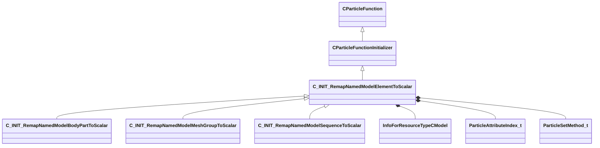

[Schemas](../../schemas.md) / [particles](../particles.md) / C_INIT_RemapNamedModelElementToScalar

# C_INIT_RemapNamedModelElementToScalar

**Kind:** class · **Size:** 552 bytes (`0x228`) · **Align:** 255 · **Module:** particles

**Inherits from:** [CParticleFunctionInitializer](../particles/CParticleFunctionInitializer.md)

**Derived by:** [C_INIT_RemapNamedModelBodyPartToScalar](../particles/C_INIT_RemapNamedModelBodyPartToScalar.md), [C_INIT_RemapNamedModelMeshGroupToScalar](../particles/C_INIT_RemapNamedModelMeshGroupToScalar.md), [C_INIT_RemapNamedModelSequenceToScalar](../particles/C_INIT_RemapNamedModelSequenceToScalar.md)

**Relationships:**

## Memory layout

25 fields (7 declared here, 18 inherited). Offsets are absolute from the object base.

| Offset | Field | Type | From | Annotations |
|--------|-------|------|------|-------------|
| `0x8` | `m_flOpStrength` | [CParticleCollectionFloatInput](../particleslib/CParticleCollectionFloatInput.md) | [CParticleFunction](../particles/CParticleFunction.md) | `MPropertyFriendlyName operator strength` `MPropertySortPriority -100` |
| `0x178` | `m_nOpEndCapState` | [ParticleEndcapMode_t](../!GlobalTypes/ParticleEndcapMode_t.md) | [CParticleFunction](../particles/CParticleFunction.md) | `MPropertyFriendlyName operator end cap state` `MPropertySortPriority -100` |
| `0x17c` | `m_nToolsState` | [ParticleToolsState_t](../!GlobalTypes/ParticleToolsState_t.md) | [CParticleFunction](../particles/CParticleFunction.md) | `MPropertyFriendlyName operator enabled in tools or game only` `MPropertySortPriority -100` |
| `0x180` | `m_flOpStartFadeInTime` | float32 | [CParticleFunction](../particles/CParticleFunction.md) | `MParticleAdvancedField` `MPropertyFriendlyName operator start fadein` `MPropertySortPriority -100` `MPropertyStartGroup Operator Fade` |
| `0x184` | `m_flOpEndFadeInTime` | float32 | [CParticleFunction](../particles/CParticleFunction.md) | `MParticleAdvancedField` `MPropertyFriendlyName operator end fadein` `MPropertySortPriority -100` |
| `0x188` | `m_flOpStartFadeOutTime` | float32 | [CParticleFunction](../particles/CParticleFunction.md) | `MParticleAdvancedField` `MPropertyFriendlyName operator start fadeout` `MPropertySortPriority -100` |
| `0x18c` | `m_flOpEndFadeOutTime` | float32 | [CParticleFunction](../particles/CParticleFunction.md) | `MParticleAdvancedField` `MPropertyFriendlyName operator end fadeout` `MPropertySortPriority -100` |
| `0x190` | `m_flOpFadeOscillatePeriod` | float32 | [CParticleFunction](../particles/CParticleFunction.md) | `MParticleAdvancedField` `MPropertyFriendlyName operator fade oscillate` `MPropertySortPriority -100` |
| `0x194` | `m_bNormalizeToStopTime` | bool | [CParticleFunction](../particles/CParticleFunction.md) | `MParticleAdvancedField` `MPropertyFriendlyName normalize fade times to endcap` `MPropertySortPriority -100` |
| `0x198` | `m_flOpTimeOffsetMin` | float32 | [CParticleFunction](../particles/CParticleFunction.md) | `MParticleAdvancedField` `MPropertyFriendlyName operator fade time offset min` `MPropertySortPriority -100` `MPropertyStartGroup Operator Fade Time Offset` |
| `0x19c` | `m_flOpTimeOffsetMax` | float32 | [CParticleFunction](../particles/CParticleFunction.md) | `MParticleAdvancedField` `MPropertyFriendlyName operator fade time offset max` `MPropertySortPriority -100` |
| `0x1a0` | `m_nOpTimeOffsetSeed` | int32 | [CParticleFunction](../particles/CParticleFunction.md) | `MParticleAdvancedField` `MPropertyFriendlyName operator fade time offset seed` `MPropertySortPriority -100` |
| `0x1a4` | `m_nOpTimeScaleSeed` | int32 | [CParticleFunction](../particles/CParticleFunction.md) | `MParticleAdvancedField` `MPropertyFriendlyName operator fade time scale seed` `MPropertySortPriority -100` `MPropertyStartGroup Operator Fade Timescale Modifiers` |
| `0x1a8` | `m_flOpTimeScaleMin` | float32 | [CParticleFunction](../particles/CParticleFunction.md) | `MParticleAdvancedField` `MPropertyFriendlyName operator fade time scale min` `MPropertySortPriority -100` |
| `0x1ac` | `m_flOpTimeScaleMax` | float32 | [CParticleFunction](../particles/CParticleFunction.md) | `MParticleAdvancedField` `MPropertyFriendlyName operator fade time scale max` `MPropertySortPriority -100` |
| `0x1b2` | `m_bDisableOperator` | bool | [CParticleFunction](../particles/CParticleFunction.md) | `MPropertyStartGroup` `MPropertySuppressField` |
| `0x1b8` | `m_Notes` | CUtlString | [CParticleFunction](../particles/CParticleFunction.md) | `MParticleHelpField` `MPropertyFriendlyName operator help and notes` `MPropertySortPriority -100` |
| `0x1d8` | `m_nAssociatedEmitterIndex` | int32 | [CParticleFunctionInitializer](../particles/CParticleFunctionInitializer.md) | `MPropertyFriendlyName Associated emitter Index` |
| `0x1e0` | `m_hModel` | CStrongHandle< [InfoForResourceTypeCModel](../resourcesystem/InfoForResourceTypeCModel.md) > |  |  |
| `0x1e8` | `m_names` | CUtlVector< CUtlString > |  | `MPropertyFriendlyName names` |
| `0x200` | `m_values` | CUtlVector< float32 > |  | `MPropertyFriendlyName remap values for names` |
| `0x218` | `m_nFieldInput` | [ParticleAttributeIndex_t](../particles/ParticleAttributeIndex_t.md) |  | `MPropertyAttributeChoiceName particlefield_scalar` `MPropertyFriendlyName input field` |
| `0x21c` | `m_nFieldOutput` | [ParticleAttributeIndex_t](../particles/ParticleAttributeIndex_t.md) |  | `MPropertyAttributeChoiceName particlefield_scalar` `MPropertyFriendlyName output field` |
| `0x220` | `m_nSetMethod` | [ParticleSetMethod_t](../!GlobalTypes/ParticleSetMethod_t.md) |  | `MPropertyFriendlyName set value method` |
| `0x224` | `m_bModelFromRenderer` | bool |  | `MPropertyFriendlyName model from renderer` |
