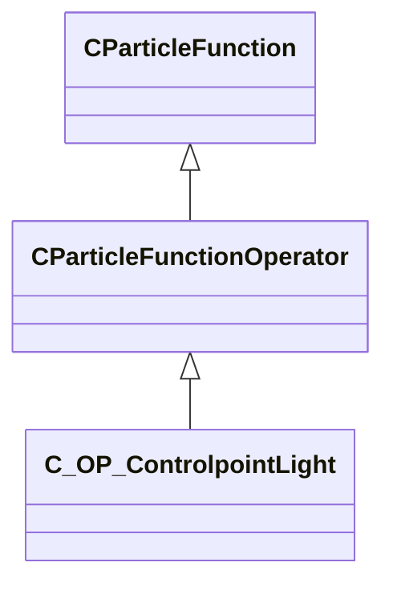

[Schemas](../../schemas.md) / [particles](../particles.md) / C_OP_ControlpointLight

# C_OP_ControlpointLight

> Source: **Build 25000182** · 2026-08-28 · `windows-x86_64` · schema `0.10.0`

**Kind:** class · **Size:** 1760 bytes (`0x6e0`) · **Align:** 16 · **Module:** particles

**Inherits from:** [CParticleFunctionOperator](../particles/CParticleFunctionOperator.md)

**Relationships:**

## Memory layout

50 fields (33 declared here, 17 inherited). Offsets are absolute from the object base.

| Offset | Field | Type | From | Annotations |
|--------|-------|------|------|-------------|
| `0x8` | `m_flOpStrength` | [CParticleCollectionFloatInput](../particleslib/CParticleCollectionFloatInput.md) | [CParticleFunction](../particles/CParticleFunction.md) | `MPropertyFriendlyName operator strength` `MPropertySortPriority -100` |
| `0x178` | `m_nOpEndCapState` | [ParticleEndcapMode_t](../particles/ParticleEndcapMode_t.md) | [CParticleFunction](../particles/CParticleFunction.md) | `MPropertyFriendlyName operator end cap state` `MPropertySortPriority -100` |
| `0x17c` | `m_nToolsState` | [ParticleToolsState_t](../particles/ParticleToolsState_t.md) | [CParticleFunction](../particles/CParticleFunction.md) | `MPropertyFriendlyName operator enabled in tools or game only` `MPropertySortPriority -100` |
| `0x180` | `m_flOpStartFadeInTime` | float32 | [CParticleFunction](../particles/CParticleFunction.md) | `MParticleAdvancedField` `MPropertyFriendlyName operator start fadein` `MPropertySortPriority -100` `MPropertyStartGroup Operator Fade` |
| `0x184` | `m_flOpEndFadeInTime` | float32 | [CParticleFunction](../particles/CParticleFunction.md) | `MParticleAdvancedField` `MPropertyFriendlyName operator end fadein` `MPropertySortPriority -100` |
| `0x188` | `m_flOpStartFadeOutTime` | float32 | [CParticleFunction](../particles/CParticleFunction.md) | `MParticleAdvancedField` `MPropertyFriendlyName operator start fadeout` `MPropertySortPriority -100` |
| `0x18c` | `m_flOpEndFadeOutTime` | float32 | [CParticleFunction](../particles/CParticleFunction.md) | `MParticleAdvancedField` `MPropertyFriendlyName operator end fadeout` `MPropertySortPriority -100` |
| `0x190` | `m_flOpFadeOscillatePeriod` | float32 | [CParticleFunction](../particles/CParticleFunction.md) | `MParticleAdvancedField` `MPropertyFriendlyName operator fade oscillate` `MPropertySortPriority -100` |
| `0x194` | `m_bNormalizeToStopTime` | bool | [CParticleFunction](../particles/CParticleFunction.md) | `MParticleAdvancedField` `MPropertyFriendlyName normalize fade times to endcap` `MPropertySortPriority -100` |
| `0x198` | `m_flOpTimeOffsetMin` | float32 | [CParticleFunction](../particles/CParticleFunction.md) | `MParticleAdvancedField` `MPropertyFriendlyName operator fade time offset min` `MPropertySortPriority -100` `MPropertyStartGroup Operator Fade Time Offset` |
| `0x19c` | `m_flOpTimeOffsetMax` | float32 | [CParticleFunction](../particles/CParticleFunction.md) | `MParticleAdvancedField` `MPropertyFriendlyName operator fade time offset max` `MPropertySortPriority -100` |
| `0x1a0` | `m_nOpTimeOffsetSeed` | int32 | [CParticleFunction](../particles/CParticleFunction.md) | `MParticleAdvancedField` `MPropertyFriendlyName operator fade time offset seed` `MPropertySortPriority -100` |
| `0x1a4` | `m_nOpTimeScaleSeed` | int32 | [CParticleFunction](../particles/CParticleFunction.md) | `MParticleAdvancedField` `MPropertyFriendlyName operator fade time scale seed` `MPropertySortPriority -100` `MPropertyStartGroup Operator Fade Timescale Modifiers` |
| `0x1a8` | `m_flOpTimeScaleMin` | float32 | [CParticleFunction](../particles/CParticleFunction.md) | `MParticleAdvancedField` `MPropertyFriendlyName operator fade time scale min` `MPropertySortPriority -100` |
| `0x1ac` | `m_flOpTimeScaleMax` | float32 | [CParticleFunction](../particles/CParticleFunction.md) | `MParticleAdvancedField` `MPropertyFriendlyName operator fade time scale max` `MPropertySortPriority -100` |
| `0x1b2` | `m_bDisableOperator` | bool | [CParticleFunction](../particles/CParticleFunction.md) | `MPropertyStartGroup` `MPropertySuppressField` |
| `0x1b8` | `m_Notes` | CUtlString | [CParticleFunction](../particles/CParticleFunction.md) | `MParticleHelpField` `MPropertyFriendlyName operator help and notes` `MPropertySortPriority -100` |
| `0x1d8` | `m_flScale` | float32 |  | `MPropertyFriendlyName initial color bias` |
| `0x660` | `m_nControlPoint1` | int32 |  | `MPropertyFriendlyName light 1 control point` |
| `0x664` | `m_nControlPoint2` | int32 |  | `MPropertyFriendlyName light 2 control point` |
| `0x668` | `m_nControlPoint3` | int32 |  | `MPropertyFriendlyName light 3 control point` |
| `0x66c` | `m_nControlPoint4` | int32 |  | `MPropertyFriendlyName light 4 control point` |
| `0x670` | `m_vecCPOffset1` | Vector |  | `MPropertyFriendlyName light 1 control point offset` |
| `0x67c` | `m_vecCPOffset2` | Vector |  | `MPropertyFriendlyName light 2 control point offset` |
| `0x688` | `m_vecCPOffset3` | Vector |  | `MPropertyFriendlyName light 3 control point offset` |
| `0x694` | `m_vecCPOffset4` | Vector |  | `MPropertyFriendlyName light 4 control point offset` |
| `0x6a0` | `m_LightFiftyDist1` | float32 |  | `MPropertyFriendlyName light 1 50% distance` |
| `0x6a4` | `m_LightZeroDist1` | float32 |  | `MPropertyFriendlyName light 1 0% distance` |
| `0x6a8` | `m_LightFiftyDist2` | float32 |  | `MPropertyFriendlyName light 2 50% distance` |
| `0x6ac` | `m_LightZeroDist2` | float32 |  | `MPropertyFriendlyName light 2 0% distance` |
| `0x6b0` | `m_LightFiftyDist3` | float32 |  | `MPropertyFriendlyName light 3 50% distance` |
| `0x6b4` | `m_LightZeroDist3` | float32 |  | `MPropertyFriendlyName light 3 0% distance` |
| `0x6b8` | `m_LightFiftyDist4` | float32 |  | `MPropertyFriendlyName light 4 50% distance` |
| `0x6bc` | `m_LightZeroDist4` | float32 |  | `MPropertyFriendlyName light 4 0% distance` |
| `0x6c0` | `m_LightColor1` | Color |  | `MPropertyFriendlyName light 1 color` |
| `0x6c4` | `m_LightColor2` | Color |  | `MPropertyFriendlyName light 2 color` |
| `0x6c8` | `m_LightColor3` | Color |  | `MPropertyFriendlyName light 3 color` |
| `0x6cc` | `m_LightColor4` | Color |  | `MPropertyFriendlyName light 4 color` |
| `0x6d0` | `m_bLightType1` | bool |  | `MPropertyFriendlyName light 1 type 0=point 1=spot` |
| `0x6d1` | `m_bLightType2` | bool |  | `MPropertyFriendlyName light 2 type 0=point 1=spot` |
| `0x6d2` | `m_bLightType3` | bool |  | `MPropertyFriendlyName light 3 type 0=point 1=spot` |
| `0x6d3` | `m_bLightType4` | bool |  | `MPropertyFriendlyName light 4 type 0=point 1=spot` |
| `0x6d4` | `m_bLightDynamic1` | bool |  | `MPropertyFriendlyName light 1 dynamic light` |
| `0x6d5` | `m_bLightDynamic2` | bool |  | `MPropertyFriendlyName light 2 dynamic light` |
| `0x6d6` | `m_bLightDynamic3` | bool |  | `MPropertyFriendlyName light 3 dynamic light` |
| `0x6d7` | `m_bLightDynamic4` | bool |  | `MPropertyFriendlyName light 4 dynamic light` |
| `0x6d8` | `m_bUseNormal` | bool |  | `MPropertyFriendlyName compute normals from control points` |
| `0x6d9` | `m_bUseHLambert` | bool |  | `MPropertyFriendlyName half-lambert normals` |
| `0x6de` | `m_bClampLowerRange` | bool |  | `MPropertyFriendlyName clamp minimum light value to initial color` |
| `0x6df` | `m_bClampUpperRange` | bool |  | `MPropertyFriendlyName clamp maximum light value to initial color` |

KV3 class defaults

<pre>{
	&quot;_class&quot;: &quot;C_OP_ControlpointLight&quot;,
	&quot;m_flOpStrength&quot;:
	{
		&quot;m_nType&quot;: &quot;PF_TYPE_LITERAL&quot;,
		&quot;m_nMapType&quot;: &quot;PF_MAP_TYPE_DIRECT&quot;,
		&quot;m_flLiteralValue&quot;: 1.000000,
		&quot;m_NamedValue&quot;: &quot;&quot;,
		&quot;m_nControlPoint&quot;: 0,
		&quot;m_nScalarAttribute&quot;: 3,
		&quot;m_nVectorAttribute&quot;: 6,
		&quot;m_nVectorComponent&quot;: 0,
		&quot;m_bReverseOrder&quot;: false,
		&quot;m_flRandomMin&quot;: 0.000000,
		&quot;m_flRandomMax&quot;: 1.000000,
		&quot;m_bHasRandomSignFlip&quot;: false,
		&quot;m_nRandomSeed&quot;: &lt;HIDDEN FOR DIFF&gt;,
		&quot;m_nRandomMode&quot;: &quot;PF_RANDOM_MODE_CONSTANT&quot;,
		&quot;m_strSnapshotSubset&quot;: &quot;&quot;,
		&quot;m_flLOD0&quot;: 0.000000,
		&quot;m_flLOD1&quot;: 0.000000,
		&quot;m_flLOD2&quot;: 0.000000,
		&quot;m_flLOD3&quot;: 0.000000,
		&quot;m_nNoiseInputVectorAttribute&quot;: 0,
		&quot;m_flNoiseOutputMin&quot;: 0.000000,
		&quot;m_flNoiseOutputMax&quot;: 1.000000,
		&quot;m_flNoiseScale&quot;: 0.100000,
		&quot;m_vecNoiseOffsetRate&quot;:
		[
			0.000000,
			0.000000,
			0.000000
		],
		&quot;m_flNoiseOffset&quot;: 0.000000,
		&quot;m_nNoiseOctaves&quot;: 1,
		&quot;m_nNoiseTurbulence&quot;: &quot;PF_NOISE_TURB_NONE&quot;,
		&quot;m_nNoiseType&quot;: &quot;PF_NOISE_TYPE_PERLIN&quot;,
		&quot;m_nNoiseModifier&quot;: &quot;PF_NOISE_MODIFIER_NONE&quot;,
		&quot;m_flNoiseTurbulenceScale&quot;: 1.000000,
		&quot;m_flNoiseTurbulenceMix&quot;: 0.500000,
		&quot;m_flNoiseImgPreviewScale&quot;: 1.000000,
		&quot;m_bNoiseImgPreviewLive&quot;: true,
		&quot;m_flNoCameraFallback&quot;: 0.000000,
		&quot;m_bUseBoundsCenter&quot;: false,
		&quot;m_nInputMode&quot;: &quot;PF_INPUT_MODE_CLAMPED&quot;,
		&quot;m_flMultFactor&quot;: 1.000000,
		&quot;m_flInput0&quot;: 0.000000,
		&quot;m_flInput1&quot;: 1.000000,
		&quot;m_flOutput0&quot;: 0.000000,
		&quot;m_flOutput1&quot;: 1.000000,
		&quot;m_flNotchedRangeMin&quot;: 0.000000,
		&quot;m_flNotchedRangeMax&quot;: 1.000000,
		&quot;m_flNotchedOutputOutside&quot;: 0.000000,
		&quot;m_flNotchedOutputInside&quot;: 1.000000,
		&quot;m_nRoundType&quot;: &quot;PF_ROUND_TYPE_NEAREST&quot;,
		&quot;m_nBiasType&quot;: &quot;PF_BIAS_TYPE_STANDARD&quot;,
		&quot;m_flBiasParameter&quot;: 0.000000,
		&quot;m_Curve&quot;:
		{
			&quot;m_spline&quot;:
			[
			],
			&quot;m_tangents&quot;:
			[
			],
			&quot;m_vDomainMins&quot;:
			[
				0.000000,
				0.000000
			],
			&quot;m_vDomainMaxs&quot;:
			[
				0.000000,
				0.000000
			]
		}
	},
	&quot;m_nOpEndCapState&quot;: &quot;PARTICLE_ENDCAP_ALWAYS_ON&quot;,
	&quot;m_nToolsState&quot;: &quot;PARTICLE_TOOLS_STATE_ALWAYS_ON&quot;,
	&quot;m_flOpStartFadeInTime&quot;: 0.000000,
	&quot;m_flOpEndFadeInTime&quot;: 0.000000,
	&quot;m_flOpStartFadeOutTime&quot;: 0.000000,
	&quot;m_flOpEndFadeOutTime&quot;: 0.000000,
	&quot;m_flOpFadeOscillatePeriod&quot;: 0.000000,
	&quot;m_bNormalizeToStopTime&quot;: false,
	&quot;m_flOpTimeOffsetMin&quot;: 0.000000,
	&quot;m_flOpTimeOffsetMax&quot;: 0.000000,
	&quot;m_nOpTimeOffsetSeed&quot;: 0,
	&quot;m_nOpTimeScaleSeed&quot;: 0,
	&quot;m_flOpTimeScaleMin&quot;: 1.000000,
	&quot;m_flOpTimeScaleMax&quot;: 1.000000,
	&quot;m_bDisableOperator&quot;: false,
	&quot;m_Notes&quot;: &quot;&quot;,
	&quot;m_flScale&quot;: 0.000000,
	&quot;m_nControlPoint1&quot;: 0,
	&quot;m_nControlPoint2&quot;: 0,
	&quot;m_nControlPoint3&quot;: 0,
	&quot;m_nControlPoint4&quot;: 0,
	&quot;m_vecCPOffset1&quot;:
	[
		0.000000,
		0.000000,
		0.000000
	],
	&quot;m_vecCPOffset2&quot;:
	[
		0.000000,
		0.000000,
		0.000000
	],
	&quot;m_vecCPOffset3&quot;:
	[
		0.000000,
		0.000000,
		0.000000
	],
	&quot;m_vecCPOffset4&quot;:
	[
		0.000000,
		0.000000,
		0.000000
	],
	&quot;m_LightFiftyDist1&quot;: 100.000000,
	&quot;m_LightZeroDist1&quot;: 200.000000,
	&quot;m_LightFiftyDist2&quot;: 100.000000,
	&quot;m_LightZeroDist2&quot;: 200.000000,
	&quot;m_LightFiftyDist3&quot;: 100.000000,
	&quot;m_LightZeroDist3&quot;: 200.000000,
	&quot;m_LightFiftyDist4&quot;: 100.000000,
	&quot;m_LightZeroDist4&quot;: 200.000000,
	&quot;m_LightColor1&quot;:
	[
		0,
		0,
		0
	],
	&quot;m_LightColor2&quot;:
	[
		0,
		0,
		0
	],
	&quot;m_LightColor3&quot;:
	[
		0,
		0,
		0
	],
	&quot;m_LightColor4&quot;:
	[
		0,
		0,
		0
	],
	&quot;m_bLightType1&quot;: false,
	&quot;m_bLightType2&quot;: false,
	&quot;m_bLightType3&quot;: false,
	&quot;m_bLightType4&quot;: false,
	&quot;m_bLightDynamic1&quot;: false,
	&quot;m_bLightDynamic2&quot;: false,
	&quot;m_bLightDynamic3&quot;: false,
	&quot;m_bLightDynamic4&quot;: false,
	&quot;m_bUseNormal&quot;: false,
	&quot;m_bUseHLambert&quot;: true,
	&quot;m_bClampLowerRange&quot;: false,
	&quot;m_bClampUpperRange&quot;: false
}</pre>

