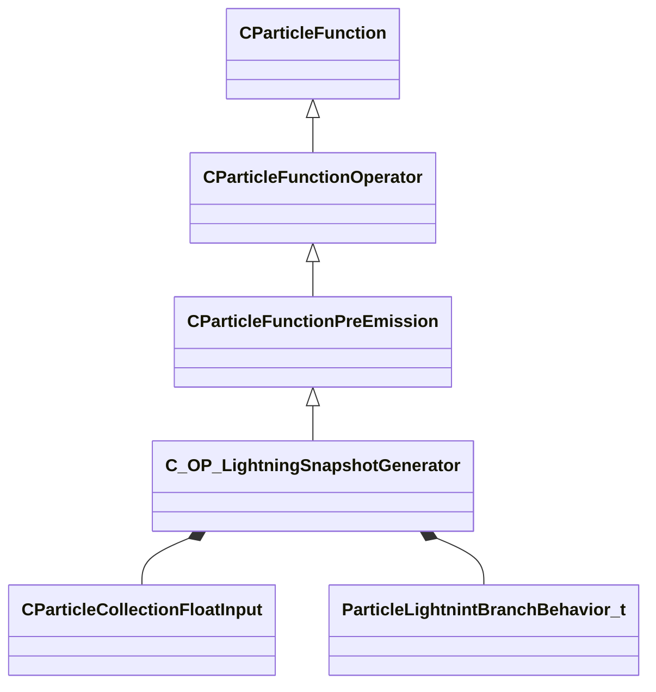

[Schemas](../../schemas.md) / [particles](../particles.md) / C_OP_LightningSnapshotGenerator

# C_OP_LightningSnapshotGenerator

**Kind:** class · **Size:** 5672 bytes (`0x1628`) · **Align:** 8 · **Module:** particles

**Inherits from:** [CParticleFunctionPreEmission](../particles/CParticleFunctionPreEmission.md)

**Relationships:**

## Memory layout

38 fields (20 declared here, 18 inherited). Offsets are absolute from the object base.

| Offset | Field | Type | From | Annotations |
|--------|-------|------|------|-------------|
| `0x8` | `m_flOpStrength` | [CParticleCollectionFloatInput](../particleslib/CParticleCollectionFloatInput.md) | [CParticleFunction](../particles/CParticleFunction.md) | `MPropertyFriendlyName operator strength` `MPropertySortPriority -100` |
| `0x178` | `m_nOpEndCapState` | [ParticleEndcapMode_t](../!GlobalTypes/ParticleEndcapMode_t.md) | [CParticleFunction](../particles/CParticleFunction.md) | `MPropertyFriendlyName operator end cap state` `MPropertySortPriority -100` |
| `0x17c` | `m_nToolsState` | [ParticleToolsState_t](../!GlobalTypes/ParticleToolsState_t.md) | [CParticleFunction](../particles/CParticleFunction.md) | `MPropertyFriendlyName operator enabled in tools or game only` `MPropertySortPriority -100` |
| `0x180` | `m_flOpStartFadeInTime` | float32 | [CParticleFunction](../particles/CParticleFunction.md) | `MParticleAdvancedField` `MPropertyFriendlyName operator start fadein` `MPropertySortPriority -100` `MPropertyStartGroup Operator Fade` |
| `0x184` | `m_flOpEndFadeInTime` | float32 | [CParticleFunction](../particles/CParticleFunction.md) | `MParticleAdvancedField` `MPropertyFriendlyName operator end fadein` `MPropertySortPriority -100` |
| `0x188` | `m_flOpStartFadeOutTime` | float32 | [CParticleFunction](../particles/CParticleFunction.md) | `MParticleAdvancedField` `MPropertyFriendlyName operator start fadeout` `MPropertySortPriority -100` |
| `0x18c` | `m_flOpEndFadeOutTime` | float32 | [CParticleFunction](../particles/CParticleFunction.md) | `MParticleAdvancedField` `MPropertyFriendlyName operator end fadeout` `MPropertySortPriority -100` |
| `0x190` | `m_flOpFadeOscillatePeriod` | float32 | [CParticleFunction](../particles/CParticleFunction.md) | `MParticleAdvancedField` `MPropertyFriendlyName operator fade oscillate` `MPropertySortPriority -100` |
| `0x194` | `m_bNormalizeToStopTime` | bool | [CParticleFunction](../particles/CParticleFunction.md) | `MParticleAdvancedField` `MPropertyFriendlyName normalize fade times to endcap` `MPropertySortPriority -100` |
| `0x198` | `m_flOpTimeOffsetMin` | float32 | [CParticleFunction](../particles/CParticleFunction.md) | `MParticleAdvancedField` `MPropertyFriendlyName operator fade time offset min` `MPropertySortPriority -100` `MPropertyStartGroup Operator Fade Time Offset` |
| `0x19c` | `m_flOpTimeOffsetMax` | float32 | [CParticleFunction](../particles/CParticleFunction.md) | `MParticleAdvancedField` `MPropertyFriendlyName operator fade time offset max` `MPropertySortPriority -100` |
| `0x1a0` | `m_nOpTimeOffsetSeed` | int32 | [CParticleFunction](../particles/CParticleFunction.md) | `MParticleAdvancedField` `MPropertyFriendlyName operator fade time offset seed` `MPropertySortPriority -100` |
| `0x1a4` | `m_nOpTimeScaleSeed` | int32 | [CParticleFunction](../particles/CParticleFunction.md) | `MParticleAdvancedField` `MPropertyFriendlyName operator fade time scale seed` `MPropertySortPriority -100` `MPropertyStartGroup Operator Fade Timescale Modifiers` |
| `0x1a8` | `m_flOpTimeScaleMin` | float32 | [CParticleFunction](../particles/CParticleFunction.md) | `MParticleAdvancedField` `MPropertyFriendlyName operator fade time scale min` `MPropertySortPriority -100` |
| `0x1ac` | `m_flOpTimeScaleMax` | float32 | [CParticleFunction](../particles/CParticleFunction.md) | `MParticleAdvancedField` `MPropertyFriendlyName operator fade time scale max` `MPropertySortPriority -100` |
| `0x1b2` | `m_bDisableOperator` | bool | [CParticleFunction](../particles/CParticleFunction.md) | `MPropertyStartGroup` `MPropertySuppressField` |
| `0x1b8` | `m_Notes` | CUtlString | [CParticleFunction](../particles/CParticleFunction.md) | `MParticleHelpField` `MPropertyFriendlyName operator help and notes` `MPropertySortPriority -100` |
| `0x1d8` | `m_bRunOnce` | bool | [CParticleFunctionPreEmission](../particles/CParticleFunctionPreEmission.md) | `MPropertyFriendlyName Run Only Once` |
| `0x1e0` | `m_nCPSnapshot` | int32 |  | `MPropertyFriendlyName snapshot control point number` |
| `0x1e4` | `m_nCPStartPnt` | int32 |  | `MPropertyFriendlyName start control point number` |
| `0x1e8` | `m_nCPEndPnt` | int32 |  | `MPropertyFriendlyName end control point number` |
| `0x1f0` | `m_flSegments` | [CParticleCollectionFloatInput](../particleslib/CParticleCollectionFloatInput.md) |  | `MPropertyFriendlyName Recursion Depth` |
| `0x360` | `m_flOffset` | [CParticleCollectionFloatInput](../particleslib/CParticleCollectionFloatInput.md) |  | `MPropertyFriendlyName Offset` |
| `0x4d0` | `m_flOffsetDecay` | [CParticleCollectionFloatInput](../particleslib/CParticleCollectionFloatInput.md) |  | `MPropertyFriendlyName Offset Decay` |
| `0x640` | `m_flRecalcRate` | [CParticleCollectionFloatInput](../particleslib/CParticleCollectionFloatInput.md) |  | `MPropertyFriendlyName Recalculation Rate` |
| `0x7b0` | `m_flUVScale` | [CParticleCollectionFloatInput](../particleslib/CParticleCollectionFloatInput.md) |  | `MPropertyFriendlyName UV Scale` |
| `0x920` | `m_flUVOffset` | [CParticleCollectionFloatInput](../particleslib/CParticleCollectionFloatInput.md) |  | `MPropertyFriendlyName UV Offset` |
| `0xa90` | `m_flSplitRate` | [CParticleCollectionFloatInput](../particleslib/CParticleCollectionFloatInput.md) |  | `MPropertyFriendlyName Branch Split Rate` |
| `0xc00` | `m_flRecursionSplitScale` | [CParticleCollectionFloatInput](../particleslib/CParticleCollectionFloatInput.md) |  | `MPropertyFriendlyName Recursion Branch Split Scale` |
| `0xd70` | `m_bScaleBranchDistance` | bool |  | `MPropertyFriendlyName Scale Branch Distance From Recursion Depth` |
| `0xd78` | `m_flBranchDistanceScale` | [CParticleCollectionFloatInput](../particleslib/CParticleCollectionFloatInput.md) |  | `MPropertyFriendlyName Branch Recursion Distance Scale Factor` `MPropertySuppressExpr m_bScaleBranchDistance == false` |
| `0xee8` | `m_bScaleBranchOffset` | bool |  | `MPropertyFriendlyName Scale Branch Offset/Twist From Recursion Depth` |
| `0xef0` | `m_flBranchOffsetScale` | [CParticleCollectionFloatInput](../particleslib/CParticleCollectionFloatInput.md) |  | `MPropertyFriendlyName Branch Recursion Offset/Twist Scale Factor` `MPropertySuppressExpr m_bScaleBranchOffset == false` |
| `0x1060` | `m_flBranchTwist` | [CParticleCollectionFloatInput](../particleslib/CParticleCollectionFloatInput.md) |  | `MPropertyFriendlyName Branch Twist` |
| `0x11d0` | `m_nBranchBehavior` | [ParticleLightnintBranchBehavior_t](../!GlobalTypes/ParticleLightnintBranchBehavior_t.md) |  | `MPropertyFriendlyName Branch Behavior` |
| `0x11d8` | `m_flRadiusStart` | [CParticleCollectionFloatInput](../particleslib/CParticleCollectionFloatInput.md) |  | `MPropertyFriendlyName Start Radius` |
| `0x1348` | `m_flRadiusEnd` | [CParticleCollectionFloatInput](../particleslib/CParticleCollectionFloatInput.md) |  | `MPropertyFriendlyName End Radius` |
| `0x14b8` | `m_flDedicatedPool` | [CParticleCollectionFloatInput](../particleslib/CParticleCollectionFloatInput.md) |  | `MPropertyFriendlyName Dedicated Particle Pool Count` |

KV3 class defaults

<pre>{
	&quot;_class&quot;: &quot;C_OP_LightningSnapshotGenerator&quot;,
	&quot;m_flOpStrength&quot;:
	{
		&quot;m_nType&quot;: &quot;PF_TYPE_LITERAL&quot;,
		&quot;m_nMapType&quot;: &quot;PF_MAP_TYPE_DIRECT&quot;,
		&quot;m_flLiteralValue&quot;: 1.000000,
		&quot;m_NamedValue&quot;: &quot;&quot;,
		&quot;m_nControlPoint&quot;: 0,
		&quot;m_nScalarAttribute&quot;: 3,
		&quot;m_nVectorAttribute&quot;: 6,
		&quot;m_nVectorComponent&quot;: 0,
		&quot;m_bReverseOrder&quot;: false,
		&quot;m_flRandomMin&quot;: 0.000000,
		&quot;m_flRandomMax&quot;: 1.000000,
		&quot;m_bHasRandomSignFlip&quot;: false,
		&quot;m_nRandomSeed&quot;: &lt;HIDDEN FOR DIFF&gt;,
		&quot;m_nRandomMode&quot;: &quot;PF_RANDOM_MODE_CONSTANT&quot;,
		&quot;m_strSnapshotSubset&quot;: &quot;&quot;,
		&quot;m_flLOD0&quot;: 0.000000,
		&quot;m_flLOD1&quot;: 0.000000,
		&quot;m_flLOD2&quot;: 0.000000,
		&quot;m_flLOD3&quot;: 0.000000,
		&quot;m_nNoiseInputVectorAttribute&quot;: 0,
		&quot;m_flNoiseOutputMin&quot;: 0.000000,
		&quot;m_flNoiseOutputMax&quot;: 1.000000,
		&quot;m_flNoiseScale&quot;: 0.100000,
		&quot;m_vecNoiseOffsetRate&quot;:
		[
			0.000000,
			0.000000,
			0.000000
		],
		&quot;m_flNoiseOffset&quot;: 0.000000,
		&quot;m_nNoiseOctaves&quot;: 1,
		&quot;m_nNoiseTurbulence&quot;: &quot;PF_NOISE_TURB_NONE&quot;,
		&quot;m_nNoiseType&quot;: &quot;PF_NOISE_TYPE_PERLIN&quot;,
		&quot;m_nNoiseModifier&quot;: &quot;PF_NOISE_MODIFIER_NONE&quot;,
		&quot;m_flNoiseTurbulenceScale&quot;: 1.000000,
		&quot;m_flNoiseTurbulenceMix&quot;: 0.500000,
		&quot;m_flNoiseImgPreviewScale&quot;: 1.000000,
		&quot;m_bNoiseImgPreviewLive&quot;: true,
		&quot;m_flNoCameraFallback&quot;: 0.000000,
		&quot;m_bUseBoundsCenter&quot;: false,
		&quot;m_nInputMode&quot;: &quot;PF_INPUT_MODE_CLAMPED&quot;,
		&quot;m_flMultFactor&quot;: 1.000000,
		&quot;m_flInput0&quot;: 0.000000,
		&quot;m_flInput1&quot;: 1.000000,
		&quot;m_flOutput0&quot;: 0.000000,
		&quot;m_flOutput1&quot;: 1.000000,
		&quot;m_flNotchedRangeMin&quot;: 0.000000,
		&quot;m_flNotchedRangeMax&quot;: 1.000000,
		&quot;m_flNotchedOutputOutside&quot;: 0.000000,
		&quot;m_flNotchedOutputInside&quot;: 1.000000,
		&quot;m_nRoundType&quot;: &quot;PF_ROUND_TYPE_NEAREST&quot;,
		&quot;m_nBiasType&quot;: &quot;PF_BIAS_TYPE_STANDARD&quot;,
		&quot;m_flBiasParameter&quot;: 0.000000,
		&quot;m_Curve&quot;:
		{
			&quot;m_spline&quot;:
			[
			],
			&quot;m_tangents&quot;:
			[
			],
			&quot;m_vDomainMins&quot;:
			[
				0.000000,
				0.000000
			],
			&quot;m_vDomainMaxs&quot;:
			[
				0.000000,
				0.000000
			]
		}
	},
	&quot;m_nOpEndCapState&quot;: &quot;PARTICLE_ENDCAP_ALWAYS_ON&quot;,
	&quot;m_nToolsState&quot;: &quot;PARTICLE_TOOLS_STATE_ALWAYS_ON&quot;,
	&quot;m_flOpStartFadeInTime&quot;: 0.000000,
	&quot;m_flOpEndFadeInTime&quot;: 0.000000,
	&quot;m_flOpStartFadeOutTime&quot;: 0.000000,
	&quot;m_flOpEndFadeOutTime&quot;: 0.000000,
	&quot;m_flOpFadeOscillatePeriod&quot;: 0.000000,
	&quot;m_bNormalizeToStopTime&quot;: false,
	&quot;m_flOpTimeOffsetMin&quot;: 0.000000,
	&quot;m_flOpTimeOffsetMax&quot;: 0.000000,
	&quot;m_nOpTimeOffsetSeed&quot;: 0,
	&quot;m_nOpTimeScaleSeed&quot;: 0,
	&quot;m_flOpTimeScaleMin&quot;: 1.000000,
	&quot;m_flOpTimeScaleMax&quot;: 1.000000,
	&quot;m_bDisableOperator&quot;: false,
	&quot;m_Notes&quot;: &quot;&quot;,
	&quot;m_bRunOnce&quot;: false,
	&quot;m_nCPSnapshot&quot;: 0,
	&quot;m_nCPStartPnt&quot;: 0,
	&quot;m_nCPEndPnt&quot;: 1,
	&quot;m_flSegments&quot;:
	{
		&quot;m_nType&quot;: &quot;PF_TYPE_LITERAL&quot;,
		&quot;m_nMapType&quot;: &quot;PF_MAP_TYPE_DIRECT&quot;,
		&quot;m_flLiteralValue&quot;: 4.000000,
		&quot;m_NamedValue&quot;: &quot;&quot;,
		&quot;m_nControlPoint&quot;: 0,
		&quot;m_nScalarAttribute&quot;: 3,
		&quot;m_nVectorAttribute&quot;: 6,
		&quot;m_nVectorComponent&quot;: 0,
		&quot;m_bReverseOrder&quot;: false,
		&quot;m_flRandomMin&quot;: 0.000000,
		&quot;m_flRandomMax&quot;: 1.000000,
		&quot;m_bHasRandomSignFlip&quot;: false,
		&quot;m_nRandomSeed&quot;: &lt;HIDDEN FOR DIFF&gt;,
		&quot;m_nRandomMode&quot;: &quot;PF_RANDOM_MODE_CONSTANT&quot;,
		&quot;m_strSnapshotSubset&quot;: &quot;&quot;,
		&quot;m_flLOD0&quot;: 0.000000,
		&quot;m_flLOD1&quot;: 0.000000,
		&quot;m_flLOD2&quot;: 0.000000,
		&quot;m_flLOD3&quot;: 0.000000,
		&quot;m_nNoiseInputVectorAttribute&quot;: 0,
		&quot;m_flNoiseOutputMin&quot;: 0.000000,
		&quot;m_flNoiseOutputMax&quot;: 1.000000,
		&quot;m_flNoiseScale&quot;: 0.100000,
		&quot;m_vecNoiseOffsetRate&quot;:
		[
			0.000000,
			0.000000,
			0.000000
		],
		&quot;m_flNoiseOffset&quot;: 0.000000,
		&quot;m_nNoiseOctaves&quot;: 1,
		&quot;m_nNoiseTurbulence&quot;: &quot;PF_NOISE_TURB_NONE&quot;,
		&quot;m_nNoiseType&quot;: &quot;PF_NOISE_TYPE_PERLIN&quot;,
		&quot;m_nNoiseModifier&quot;: &quot;PF_NOISE_MODIFIER_NONE&quot;,
		&quot;m_flNoiseTurbulenceScale&quot;: 1.000000,
		&quot;m_flNoiseTurbulenceMix&quot;: 0.500000,
		&quot;m_flNoiseImgPreviewScale&quot;: 1.000000,
		&quot;m_bNoiseImgPreviewLive&quot;: true,
		&quot;m_flNoCameraFallback&quot;: 0.000000,
		&quot;m_bUseBoundsCenter&quot;: false,
		&quot;m_nInputMode&quot;: &quot;PF_INPUT_MODE_CLAMPED&quot;,
		&quot;m_flMultFactor&quot;: 1.000000,
		&quot;m_flInput0&quot;: 0.000000,
		&quot;m_flInput1&quot;: 1.000000,
		&quot;m_flOutput0&quot;: 0.000000,
		&quot;m_flOutput1&quot;: 1.000000,
		&quot;m_flNotchedRangeMin&quot;: 0.000000,
		&quot;m_flNotchedRangeMax&quot;: 1.000000,
		&quot;m_flNotchedOutputOutside&quot;: 0.000000,
		&quot;m_flNotchedOutputInside&quot;: 1.000000,
		&quot;m_nRoundType&quot;: &quot;PF_ROUND_TYPE_NEAREST&quot;,
		&quot;m_nBiasType&quot;: &quot;PF_BIAS_TYPE_STANDARD&quot;,
		&quot;m_flBiasParameter&quot;: 0.000000,
		&quot;m_Curve&quot;:
		{
			&quot;m_spline&quot;:
			[
			],
			&quot;m_tangents&quot;:
			[
			],
			&quot;m_vDomainMins&quot;:
			[
				0.000000,
				0.000000
			],
			&quot;m_vDomainMaxs&quot;:
			[
				0.000000,
				0.000000
			]
		}
	},
	&quot;m_flOffset&quot;:
	{
		&quot;m_nType&quot;: &quot;PF_TYPE_LITERAL&quot;,
		&quot;m_nMapType&quot;: &quot;PF_MAP_TYPE_DIRECT&quot;,
		&quot;m_flLiteralValue&quot;: 32.000000,
		&quot;m_NamedValue&quot;: &quot;&quot;,
		&quot;m_nControlPoint&quot;: 0,
		&quot;m_nScalarAttribute&quot;: 3,
		&quot;m_nVectorAttribute&quot;: 6,
		&quot;m_nVectorComponent&quot;: 0,
		&quot;m_bReverseOrder&quot;: false,
		&quot;m_flRandomMin&quot;: 0.000000,
		&quot;m_flRandomMax&quot;: 1.000000,
		&quot;m_bHasRandomSignFlip&quot;: false,
		&quot;m_nRandomSeed&quot;: &lt;HIDDEN FOR DIFF&gt;,
		&quot;m_nRandomMode&quot;: &quot;PF_RANDOM_MODE_CONSTANT&quot;,
		&quot;m_strSnapshotSubset&quot;: &quot;&quot;,
		&quot;m_flLOD0&quot;: 0.000000,
		&quot;m_flLOD1&quot;: 0.000000,
		&quot;m_flLOD2&quot;: 0.000000,
		&quot;m_flLOD3&quot;: 0.000000,
		&quot;m_nNoiseInputVectorAttribute&quot;: 0,
		&quot;m_flNoiseOutputMin&quot;: 0.000000,
		&quot;m_flNoiseOutputMax&quot;: 1.000000,
		&quot;m_flNoiseScale&quot;: 0.100000,
		&quot;m_vecNoiseOffsetRate&quot;:
		[
			0.000000,
			0.000000,
			0.000000
		],
		&quot;m_flNoiseOffset&quot;: 0.000000,
		&quot;m_nNoiseOctaves&quot;: 1,
		&quot;m_nNoiseTurbulence&quot;: &quot;PF_NOISE_TURB_NONE&quot;,
		&quot;m_nNoiseType&quot;: &quot;PF_NOISE_TYPE_PERLIN&quot;,
		&quot;m_nNoiseModifier&quot;: &quot;PF_NOISE_MODIFIER_NONE&quot;,
		&quot;m_flNoiseTurbulenceScale&quot;: 1.000000,
		&quot;m_flNoiseTurbulenceMix&quot;: 0.500000,
		&quot;m_flNoiseImgPreviewScale&quot;: 1.000000,
		&quot;m_bNoiseImgPreviewLive&quot;: true,
		&quot;m_flNoCameraFallback&quot;: 0.000000,
		&quot;m_bUseBoundsCenter&quot;: false,
		&quot;m_nInputMode&quot;: &quot;PF_INPUT_MODE_CLAMPED&quot;,
		&quot;m_flMultFactor&quot;: 1.000000,
		&quot;m_flInput0&quot;: 0.000000,
		&quot;m_flInput1&quot;: 1.000000,
		&quot;m_flOutput0&quot;: 0.000000,
		&quot;m_flOutput1&quot;: 1.000000,
		&quot;m_flNotchedRangeMin&quot;: 0.000000,
		&quot;m_flNotchedRangeMax&quot;: 1.000000,
		&quot;m_flNotchedOutputOutside&quot;: 0.000000,
		&quot;m_flNotchedOutputInside&quot;: 1.000000,
		&quot;m_nRoundType&quot;: &quot;PF_ROUND_TYPE_NEAREST&quot;,
		&quot;m_nBiasType&quot;: &quot;PF_BIAS_TYPE_STANDARD&quot;,
		&quot;m_flBiasParameter&quot;: 0.000000,
		&quot;m_Curve&quot;:
		{
			&quot;m_spline&quot;:
			[
			],
			&quot;m_tangents&quot;:
			[
			],
			&quot;m_vDomainMins&quot;:
			[
				0.000000,
				0.000000
			],
			&quot;m_vDomainMaxs&quot;:
			[
				0.000000,
				0.000000
			]
		}
	},
	&quot;m_flOffsetDecay&quot;:
	{
		&quot;m_nType&quot;: &quot;PF_TYPE_LITERAL&quot;,
		&quot;m_nMapType&quot;: &quot;PF_MAP_TYPE_DIRECT&quot;,
		&quot;m_flLiteralValue&quot;: 0.500000,
		&quot;m_NamedValue&quot;: &quot;&quot;,
		&quot;m_nControlPoint&quot;: 0,
		&quot;m_nScalarAttribute&quot;: 3,
		&quot;m_nVectorAttribute&quot;: 6,
		&quot;m_nVectorComponent&quot;: 0,
		&quot;m_bReverseOrder&quot;: false,
		&quot;m_flRandomMin&quot;: 0.000000,
		&quot;m_flRandomMax&quot;: 1.000000,
		&quot;m_bHasRandomSignFlip&quot;: false,
		&quot;m_nRandomSeed&quot;: &lt;HIDDEN FOR DIFF&gt;,
		&quot;m_nRandomMode&quot;: &quot;PF_RANDOM_MODE_CONSTANT&quot;,
		&quot;m_strSnapshotSubset&quot;: &quot;&quot;,
		&quot;m_flLOD0&quot;: 0.000000,
		&quot;m_flLOD1&quot;: 0.000000,
		&quot;m_flLOD2&quot;: 0.000000,
		&quot;m_flLOD3&quot;: 0.000000,
		&quot;m_nNoiseInputVectorAttribute&quot;: 0,
		&quot;m_flNoiseOutputMin&quot;: 0.000000,
		&quot;m_flNoiseOutputMax&quot;: 1.000000,
		&quot;m_flNoiseScale&quot;: 0.100000,
		&quot;m_vecNoiseOffsetRate&quot;:
		[
			0.000000,
			0.000000,
			0.000000
		],
		&quot;m_flNoiseOffset&quot;: 0.000000,
		&quot;m_nNoiseOctaves&quot;: 1,
		&quot;m_nNoiseTurbulence&quot;: &quot;PF_NOISE_TURB_NONE&quot;,
		&quot;m_nNoiseType&quot;: &quot;PF_NOISE_TYPE_PERLIN&quot;,
		&quot;m_nNoiseModifier&quot;: &quot;PF_NOISE_MODIFIER_NONE&quot;,
		&quot;m_flNoiseTurbulenceScale&quot;: 1.000000,
		&quot;m_flNoiseTurbulenceMix&quot;: 0.500000,
		&quot;m_flNoiseImgPreviewScale&quot;: 1.000000,
		&quot;m_bNoiseImgPreviewLive&quot;: true,
		&quot;m_flNoCameraFallback&quot;: 0.000000,
		&quot;m_bUseBoundsCenter&quot;: false,
		&quot;m_nInputMode&quot;: &quot;PF_INPUT_MODE_CLAMPED&quot;,
		&quot;m_flMultFactor&quot;: 1.000000,
		&quot;m_flInput0&quot;: 0.000000,
		&quot;m_flInput1&quot;: 1.000000,
		&quot;m_flOutput0&quot;: 0.000000,
		&quot;m_flOutput1&quot;: 1.000000,
		&quot;m_flNotchedRangeMin&quot;: 0.000000,
		&quot;m_flNotchedRangeMax&quot;: 1.000000,
		&quot;m_flNotchedOutputOutside&quot;: 0.000000,
		&quot;m_flNotchedOutputInside&quot;: 1.000000,
		&quot;m_nRoundType&quot;: &quot;PF_ROUND_TYPE_NEAREST&quot;,
		&quot;m_nBiasType&quot;: &quot;PF_BIAS_TYPE_STANDARD&quot;,
		&quot;m_flBiasParameter&quot;: 0.000000,
		&quot;m_Curve&quot;:
		{
			&quot;m_spline&quot;:
			[
			],
			&quot;m_tangents&quot;:
			[
			],
			&quot;m_vDomainMins&quot;:
			[
				0.000000,
				0.000000
			],
			&quot;m_vDomainMaxs&quot;:
			[
				0.000000,
				0.000000
			]
		}
	},
	&quot;m_flRecalcRate&quot;:
	{
		&quot;m_nType&quot;: &quot;PF_TYPE_LITERAL&quot;,
		&quot;m_nMapType&quot;: &quot;PF_MAP_TYPE_DIRECT&quot;,
		&quot;m_flLiteralValue&quot;: -1.000000,
		&quot;m_NamedValue&quot;: &quot;&quot;,
		&quot;m_nControlPoint&quot;: 0,
		&quot;m_nScalarAttribute&quot;: 3,
		&quot;m_nVectorAttribute&quot;: 6,
		&quot;m_nVectorComponent&quot;: 0,
		&quot;m_bReverseOrder&quot;: false,
		&quot;m_flRandomMin&quot;: 0.000000,
		&quot;m_flRandomMax&quot;: 1.000000,
		&quot;m_bHasRandomSignFlip&quot;: false,
		&quot;m_nRandomSeed&quot;: &lt;HIDDEN FOR DIFF&gt;,
		&quot;m_nRandomMode&quot;: &quot;PF_RANDOM_MODE_CONSTANT&quot;,
		&quot;m_strSnapshotSubset&quot;: &quot;&quot;,
		&quot;m_flLOD0&quot;: 0.000000,
		&quot;m_flLOD1&quot;: 0.000000,
		&quot;m_flLOD2&quot;: 0.000000,
		&quot;m_flLOD3&quot;: 0.000000,
		&quot;m_nNoiseInputVectorAttribute&quot;: 0,
		&quot;m_flNoiseOutputMin&quot;: 0.000000,
		&quot;m_flNoiseOutputMax&quot;: 1.000000,
		&quot;m_flNoiseScale&quot;: 0.100000,
		&quot;m_vecNoiseOffsetRate&quot;:
		[
			0.000000,
			0.000000,
			0.000000
		],
		&quot;m_flNoiseOffset&quot;: 0.000000,
		&quot;m_nNoiseOctaves&quot;: 1,
		&quot;m_nNoiseTurbulence&quot;: &quot;PF_NOISE_TURB_NONE&quot;,
		&quot;m_nNoiseType&quot;: &quot;PF_NOISE_TYPE_PERLIN&quot;,
		&quot;m_nNoiseModifier&quot;: &quot;PF_NOISE_MODIFIER_NONE&quot;,
		&quot;m_flNoiseTurbulenceScale&quot;: 1.000000,
		&quot;m_flNoiseTurbulenceMix&quot;: 0.500000,
		&quot;m_flNoiseImgPreviewScale&quot;: 1.000000,
		&quot;m_bNoiseImgPreviewLive&quot;: true,
		&quot;m_flNoCameraFallback&quot;: 0.000000,
		&quot;m_bUseBoundsCenter&quot;: false,
		&quot;m_nInputMode&quot;: &quot;PF_INPUT_MODE_CLAMPED&quot;,
		&quot;m_flMultFactor&quot;: 1.000000,
		&quot;m_flInput0&quot;: 0.000000,
		&quot;m_flInput1&quot;: 1.000000,
		&quot;m_flOutput0&quot;: 0.000000,
		&quot;m_flOutput1&quot;: 1.000000,
		&quot;m_flNotchedRangeMin&quot;: 0.000000,
		&quot;m_flNotchedRangeMax&quot;: 1.000000,
		&quot;m_flNotchedOutputOutside&quot;: 0.000000,
		&quot;m_flNotchedOutputInside&quot;: 1.000000,
		&quot;m_nRoundType&quot;: &quot;PF_ROUND_TYPE_NEAREST&quot;,
		&quot;m_nBiasType&quot;: &quot;PF_BIAS_TYPE_STANDARD&quot;,
		&quot;m_flBiasParameter&quot;: 0.000000,
		&quot;m_Curve&quot;:
		{
			&quot;m_spline&quot;:
			[
			],
			&quot;m_tangents&quot;:
			[
			],
			&quot;m_vDomainMins&quot;:
			[
				0.000000,
				0.000000
			],
			&quot;m_vDomainMaxs&quot;:
			[
				0.000000,
				0.000000
			]
		}
	},
	&quot;m_flUVScale&quot;:
	{
		&quot;m_nType&quot;: &quot;PF_TYPE_LITERAL&quot;,
		&quot;m_nMapType&quot;: &quot;PF_MAP_TYPE_DIRECT&quot;,
		&quot;m_flLiteralValue&quot;: 100.000000,
		&quot;m_NamedValue&quot;: &quot;&quot;,
		&quot;m_nControlPoint&quot;: 0,
		&quot;m_nScalarAttribute&quot;: 3,
		&quot;m_nVectorAttribute&quot;: 6,
		&quot;m_nVectorComponent&quot;: 0,
		&quot;m_bReverseOrder&quot;: false,
		&quot;m_flRandomMin&quot;: 0.000000,
		&quot;m_flRandomMax&quot;: 1.000000,
		&quot;m_bHasRandomSignFlip&quot;: false,
		&quot;m_nRandomSeed&quot;: &lt;HIDDEN FOR DIFF&gt;,
		&quot;m_nRandomMode&quot;: &quot;PF_RANDOM_MODE_CONSTANT&quot;,
		&quot;m_strSnapshotSubset&quot;: &quot;&quot;,
		&quot;m_flLOD0&quot;: 0.000000,
		&quot;m_flLOD1&quot;: 0.000000,
		&quot;m_flLOD2&quot;: 0.000000,
		&quot;m_flLOD3&quot;: 0.000000,
		&quot;m_nNoiseInputVectorAttribute&quot;: 0,
		&quot;m_flNoiseOutputMin&quot;: 0.000000,
		&quot;m_flNoiseOutputMax&quot;: 1.000000,
		&quot;m_flNoiseScale&quot;: 0.100000,
		&quot;m_vecNoiseOffsetRate&quot;:
		[
			0.000000,
			0.000000,
			0.000000
		],
		&quot;m_flNoiseOffset&quot;: 0.000000,
		&quot;m_nNoiseOctaves&quot;: 1,
		&quot;m_nNoiseTurbulence&quot;: &quot;PF_NOISE_TURB_NONE&quot;,
		&quot;m_nNoiseType&quot;: &quot;PF_NOISE_TYPE_PERLIN&quot;,
		&quot;m_nNoiseModifier&quot;: &quot;PF_NOISE_MODIFIER_NONE&quot;,
		&quot;m_flNoiseTurbulenceScale&quot;: 1.000000,
		&quot;m_flNoiseTurbulenceMix&quot;: 0.500000,
		&quot;m_flNoiseImgPreviewScale&quot;: 1.000000,
		&quot;m_bNoiseImgPreviewLive&quot;: true,
		&quot;m_flNoCameraFallback&quot;: 0.000000,
		&quot;m_bUseBoundsCenter&quot;: false,
		&quot;m_nInputMode&quot;: &quot;PF_INPUT_MODE_CLAMPED&quot;,
		&quot;m_flMultFactor&quot;: 1.000000,
		&quot;m_flInput0&quot;: 0.000000,
		&quot;m_flInput1&quot;: 1.000000,
		&quot;m_flOutput0&quot;: 0.000000,
		&quot;m_flOutput1&quot;: 1.000000,
		&quot;m_flNotchedRangeMin&quot;: 0.000000,
		&quot;m_flNotchedRangeMax&quot;: 1.000000,
		&quot;m_flNotchedOutputOutside&quot;: 0.000000,
		&quot;m_flNotchedOutputInside&quot;: 1.000000,
		&quot;m_nRoundType&quot;: &quot;PF_ROUND_TYPE_NEAREST&quot;,
		&quot;m_nBiasType&quot;: &quot;PF_BIAS_TYPE_STANDARD&quot;,
		&quot;m_flBiasParameter&quot;: 0.000000,
		&quot;m_Curve&quot;:
		{
			&quot;m_spline&quot;:
			[
			],
			&quot;m_tangents&quot;:
			[
			],
			&quot;m_vDomainMins&quot;:
			[
				0.000000,
				0.000000
			],
			&quot;m_vDomainMaxs&quot;:
			[
				0.000000,
				0.000000
			]
		}
	},
	&quot;m_flUVOffset&quot;:
	{
		&quot;m_nType&quot;: &quot;PF_TYPE_LITERAL&quot;,
		&quot;m_nMapType&quot;: &quot;PF_MAP_TYPE_DIRECT&quot;,
		&quot;m_flLiteralValue&quot;: 0.000000,
		&quot;m_NamedValue&quot;: &quot;&quot;,
		&quot;m_nControlPoint&quot;: 0,
		&quot;m_nScalarAttribute&quot;: 3,
		&quot;m_nVectorAttribute&quot;: 6,
		&quot;m_nVectorComponent&quot;: 0,
		&quot;m_bReverseOrder&quot;: false,
		&quot;m_flRandomMin&quot;: 0.000000,
		&quot;m_flRandomMax&quot;: 1.000000,
		&quot;m_bHasRandomSignFlip&quot;: false,
		&quot;m_nRandomSeed&quot;: &lt;HIDDEN FOR DIFF&gt;,
		&quot;m_nRandomMode&quot;: &quot;PF_RANDOM_MODE_CONSTANT&quot;,
		&quot;m_strSnapshotSubset&quot;: &quot;&quot;,
		&quot;m_flLOD0&quot;: 0.000000,
		&quot;m_flLOD1&quot;: 0.000000,
		&quot;m_flLOD2&quot;: 0.000000,
		&quot;m_flLOD3&quot;: 0.000000,
		&quot;m_nNoiseInputVectorAttribute&quot;: 0,
		&quot;m_flNoiseOutputMin&quot;: 0.000000,
		&quot;m_flNoiseOutputMax&quot;: 1.000000,
		&quot;m_flNoiseScale&quot;: 0.100000,
		&quot;m_vecNoiseOffsetRate&quot;:
		[
			0.000000,
			0.000000,
			0.000000
		],
		&quot;m_flNoiseOffset&quot;: 0.000000,
		&quot;m_nNoiseOctaves&quot;: 1,
		&quot;m_nNoiseTurbulence&quot;: &quot;PF_NOISE_TURB_NONE&quot;,
		&quot;m_nNoiseType&quot;: &quot;PF_NOISE_TYPE_PERLIN&quot;,
		&quot;m_nNoiseModifier&quot;: &quot;PF_NOISE_MODIFIER_NONE&quot;,
		&quot;m_flNoiseTurbulenceScale&quot;: 1.000000,
		&quot;m_flNoiseTurbulenceMix&quot;: 0.500000,
		&quot;m_flNoiseImgPreviewScale&quot;: 1.000000,
		&quot;m_bNoiseImgPreviewLive&quot;: true,
		&quot;m_flNoCameraFallback&quot;: 0.000000,
		&quot;m_bUseBoundsCenter&quot;: false,
		&quot;m_nInputMode&quot;: &quot;PF_INPUT_MODE_CLAMPED&quot;,
		&quot;m_flMultFactor&quot;: 1.000000,
		&quot;m_flInput0&quot;: 0.000000,
		&quot;m_flInput1&quot;: 1.000000,
		&quot;m_flOutput0&quot;: 0.000000,
		&quot;m_flOutput1&quot;: 1.000000,
		&quot;m_flNotchedRangeMin&quot;: 0.000000,
		&quot;m_flNotchedRangeMax&quot;: 1.000000,
		&quot;m_flNotchedOutputOutside&quot;: 0.000000,
		&quot;m_flNotchedOutputInside&quot;: 1.000000,
		&quot;m_nRoundType&quot;: &quot;PF_ROUND_TYPE_NEAREST&quot;,
		&quot;m_nBiasType&quot;: &quot;PF_BIAS_TYPE_STANDARD&quot;,
		&quot;m_flBiasParameter&quot;: 0.000000,
		&quot;m_Curve&quot;:
		{
			&quot;m_spline&quot;:
			[
			],
			&quot;m_tangents&quot;:
			[
			],
			&quot;m_vDomainMins&quot;:
			[
				0.000000,
				0.000000
			],
			&quot;m_vDomainMaxs&quot;:
			[
				0.000000,
				0.000000
			]
		}
	},
	&quot;m_flSplitRate&quot;:
	{
		&quot;m_nType&quot;: &quot;PF_TYPE_LITERAL&quot;,
		&quot;m_nMapType&quot;: &quot;PF_MAP_TYPE_DIRECT&quot;,
		&quot;m_flLiteralValue&quot;: 0.250000,
		&quot;m_NamedValue&quot;: &quot;&quot;,
		&quot;m_nControlPoint&quot;: 0,
		&quot;m_nScalarAttribute&quot;: 3,
		&quot;m_nVectorAttribute&quot;: 6,
		&quot;m_nVectorComponent&quot;: 0,
		&quot;m_bReverseOrder&quot;: false,
		&quot;m_flRandomMin&quot;: 0.000000,
		&quot;m_flRandomMax&quot;: 1.000000,
		&quot;m_bHasRandomSignFlip&quot;: false,
		&quot;m_nRandomSeed&quot;: &lt;HIDDEN FOR DIFF&gt;,
		&quot;m_nRandomMode&quot;: &quot;PF_RANDOM_MODE_CONSTANT&quot;,
		&quot;m_strSnapshotSubset&quot;: &quot;&quot;,
		&quot;m_flLOD0&quot;: 0.000000,
		&quot;m_flLOD1&quot;: 0.000000,
		&quot;m_flLOD2&quot;: 0.000000,
		&quot;m_flLOD3&quot;: 0.000000,
		&quot;m_nNoiseInputVectorAttribute&quot;: 0,
		&quot;m_flNoiseOutputMin&quot;: 0.000000,
		&quot;m_flNoiseOutputMax&quot;: 1.000000,
		&quot;m_flNoiseScale&quot;: 0.100000,
		&quot;m_vecNoiseOffsetRate&quot;:
		[
			0.000000,
			0.000000,
			0.000000
		],
		&quot;m_flNoiseOffset&quot;: 0.000000,
		&quot;m_nNoiseOctaves&quot;: 1,
		&quot;m_nNoiseTurbulence&quot;: &quot;PF_NOISE_TURB_NONE&quot;,
		&quot;m_nNoiseType&quot;: &quot;PF_NOISE_TYPE_PERLIN&quot;,
		&quot;m_nNoiseModifier&quot;: &quot;PF_NOISE_MODIFIER_NONE&quot;,
		&quot;m_flNoiseTurbulenceScale&quot;: 1.000000,
		&quot;m_flNoiseTurbulenceMix&quot;: 0.500000,
		&quot;m_flNoiseImgPreviewScale&quot;: 1.000000,
		&quot;m_bNoiseImgPreviewLive&quot;: true,
		&quot;m_flNoCameraFallback&quot;: 0.000000,
		&quot;m_bUseBoundsCenter&quot;: false,
		&quot;m_nInputMode&quot;: &quot;PF_INPUT_MODE_CLAMPED&quot;,
		&quot;m_flMultFactor&quot;: 1.000000,
		&quot;m_flInput0&quot;: 0.000000,
		&quot;m_flInput1&quot;: 1.000000,
		&quot;m_flOutput0&quot;: 0.000000,
		&quot;m_flOutput1&quot;: 1.000000,
		&quot;m_flNotchedRangeMin&quot;: 0.000000,
		&quot;m_flNotchedRangeMax&quot;: 1.000000,
		&quot;m_flNotchedOutputOutside&quot;: 0.000000,
		&quot;m_flNotchedOutputInside&quot;: 1.000000,
		&quot;m_nRoundType&quot;: &quot;PF_ROUND_TYPE_NEAREST&quot;,
		&quot;m_nBiasType&quot;: &quot;PF_BIAS_TYPE_STANDARD&quot;,
		&quot;m_flBiasParameter&quot;: 0.000000,
		&quot;m_Curve&quot;:
		{
			&quot;m_spline&quot;:
			[
			],
			&quot;m_tangents&quot;:
			[
			],
			&quot;m_vDomainMins&quot;:
			[
				0.000000,
				0.000000
			],
			&quot;m_vDomainMaxs&quot;:
			[
				0.000000,
				0.000000
			]
		}
	},
	&quot;m_flRecursionSplitScale&quot;:
	{
		&quot;m_nType&quot;: &quot;PF_TYPE_LITERAL&quot;,
		&quot;m_nMapType&quot;: &quot;PF_MAP_TYPE_DIRECT&quot;,
		&quot;m_flLiteralValue&quot;: 1.000000,
		&quot;m_NamedValue&quot;: &quot;&quot;,
		&quot;m_nControlPoint&quot;: 0,
		&quot;m_nScalarAttribute&quot;: 3,
		&quot;m_nVectorAttribute&quot;: 6,
		&quot;m_nVectorComponent&quot;: 0,
		&quot;m_bReverseOrder&quot;: false,
		&quot;m_flRandomMin&quot;: 0.000000,
		&quot;m_flRandomMax&quot;: 1.000000,
		&quot;m_bHasRandomSignFlip&quot;: false,
		&quot;m_nRandomSeed&quot;: &lt;HIDDEN FOR DIFF&gt;,
		&quot;m_nRandomMode&quot;: &quot;PF_RANDOM_MODE_CONSTANT&quot;,
		&quot;m_strSnapshotSubset&quot;: &quot;&quot;,
		&quot;m_flLOD0&quot;: 0.000000,
		&quot;m_flLOD1&quot;: 0.000000,
		&quot;m_flLOD2&quot;: 0.000000,
		&quot;m_flLOD3&quot;: 0.000000,
		&quot;m_nNoiseInputVectorAttribute&quot;: 0,
		&quot;m_flNoiseOutputMin&quot;: 0.000000,
		&quot;m_flNoiseOutputMax&quot;: 1.000000,
		&quot;m_flNoiseScale&quot;: 0.100000,
		&quot;m_vecNoiseOffsetRate&quot;:
		[
			0.000000,
			0.000000,
			0.000000
		],
		&quot;m_flNoiseOffset&quot;: 0.000000,
		&quot;m_nNoiseOctaves&quot;: 1,
		&quot;m_nNoiseTurbulence&quot;: &quot;PF_NOISE_TURB_NONE&quot;,
		&quot;m_nNoiseType&quot;: &quot;PF_NOISE_TYPE_PERLIN&quot;,
		&quot;m_nNoiseModifier&quot;: &quot;PF_NOISE_MODIFIER_NONE&quot;,
		&quot;m_flNoiseTurbulenceScale&quot;: 1.000000,
		&quot;m_flNoiseTurbulenceMix&quot;: 0.500000,
		&quot;m_flNoiseImgPreviewScale&quot;: 1.000000,
		&quot;m_bNoiseImgPreviewLive&quot;: true,
		&quot;m_flNoCameraFallback&quot;: 0.000000,
		&quot;m_bUseBoundsCenter&quot;: false,
		&quot;m_nInputMode&quot;: &quot;PF_INPUT_MODE_CLAMPED&quot;,
		&quot;m_flMultFactor&quot;: 1.000000,
		&quot;m_flInput0&quot;: 0.000000,
		&quot;m_flInput1&quot;: 1.000000,
		&quot;m_flOutput0&quot;: 0.000000,
		&quot;m_flOutput1&quot;: 1.000000,
		&quot;m_flNotchedRangeMin&quot;: 0.000000,
		&quot;m_flNotchedRangeMax&quot;: 1.000000,
		&quot;m_flNotchedOutputOutside&quot;: 0.000000,
		&quot;m_flNotchedOutputInside&quot;: 1.000000,
		&quot;m_nRoundType&quot;: &quot;PF_ROUND_TYPE_NEAREST&quot;,
		&quot;m_nBiasType&quot;: &quot;PF_BIAS_TYPE_STANDARD&quot;,
		&quot;m_flBiasParameter&quot;: 0.000000,
		&quot;m_Curve&quot;:
		{
			&quot;m_spline&quot;:
			[
			],
			&quot;m_tangents&quot;:
			[
			],
			&quot;m_vDomainMins&quot;:
			[
				0.000000,
				0.000000
			],
			&quot;m_vDomainMaxs&quot;:
			[
				0.000000,
				0.000000
			]
		}
	},
	&quot;m_bScaleBranchDistance&quot;: false,
	&quot;m_flBranchDistanceScale&quot;:
	{
		&quot;m_nType&quot;: &quot;PF_TYPE_LITERAL&quot;,
		&quot;m_nMapType&quot;: &quot;PF_MAP_TYPE_DIRECT&quot;,
		&quot;m_flLiteralValue&quot;: 1.000000,
		&quot;m_NamedValue&quot;: &quot;&quot;,
		&quot;m_nControlPoint&quot;: 0,
		&quot;m_nScalarAttribute&quot;: 3,
		&quot;m_nVectorAttribute&quot;: 6,
		&quot;m_nVectorComponent&quot;: 0,
		&quot;m_bReverseOrder&quot;: false,
		&quot;m_flRandomMin&quot;: 0.000000,
		&quot;m_flRandomMax&quot;: 1.000000,
		&quot;m_bHasRandomSignFlip&quot;: false,
		&quot;m_nRandomSeed&quot;: &lt;HIDDEN FOR DIFF&gt;,
		&quot;m_nRandomMode&quot;: &quot;PF_RANDOM_MODE_CONSTANT&quot;,
		&quot;m_strSnapshotSubset&quot;: &quot;&quot;,
		&quot;m_flLOD0&quot;: 0.000000,
		&quot;m_flLOD1&quot;: 0.000000,
		&quot;m_flLOD2&quot;: 0.000000,
		&quot;m_flLOD3&quot;: 0.000000,
		&quot;m_nNoiseInputVectorAttribute&quot;: 0,
		&quot;m_flNoiseOutputMin&quot;: 0.000000,
		&quot;m_flNoiseOutputMax&quot;: 1.000000,
		&quot;m_flNoiseScale&quot;: 0.100000,
		&quot;m_vecNoiseOffsetRate&quot;:
		[
			0.000000,
			0.000000,
			0.000000
		],
		&quot;m_flNoiseOffset&quot;: 0.000000,
		&quot;m_nNoiseOctaves&quot;: 1,
		&quot;m_nNoiseTurbulence&quot;: &quot;PF_NOISE_TURB_NONE&quot;,
		&quot;m_nNoiseType&quot;: &quot;PF_NOISE_TYPE_PERLIN&quot;,
		&quot;m_nNoiseModifier&quot;: &quot;PF_NOISE_MODIFIER_NONE&quot;,
		&quot;m_flNoiseTurbulenceScale&quot;: 1.000000,
		&quot;m_flNoiseTurbulenceMix&quot;: 0.500000,
		&quot;m_flNoiseImgPreviewScale&quot;: 1.000000,
		&quot;m_bNoiseImgPreviewLive&quot;: true,
		&quot;m_flNoCameraFallback&quot;: 0.000000,
		&quot;m_bUseBoundsCenter&quot;: false,
		&quot;m_nInputMode&quot;: &quot;PF_INPUT_MODE_CLAMPED&quot;,
		&quot;m_flMultFactor&quot;: 1.000000,
		&quot;m_flInput0&quot;: 0.000000,
		&quot;m_flInput1&quot;: 1.000000,
		&quot;m_flOutput0&quot;: 0.000000,
		&quot;m_flOutput1&quot;: 1.000000,
		&quot;m_flNotchedRangeMin&quot;: 0.000000,
		&quot;m_flNotchedRangeMax&quot;: 1.000000,
		&quot;m_flNotchedOutputOutside&quot;: 0.000000,
		&quot;m_flNotchedOutputInside&quot;: 1.000000,
		&quot;m_nRoundType&quot;: &quot;PF_ROUND_TYPE_NEAREST&quot;,
		&quot;m_nBiasType&quot;: &quot;PF_BIAS_TYPE_STANDARD&quot;,
		&quot;m_flBiasParameter&quot;: 0.000000,
		&quot;m_Curve&quot;:
		{
			&quot;m_spline&quot;:
			[
			],
			&quot;m_tangents&quot;:
			[
			],
			&quot;m_vDomainMins&quot;:
			[
				0.000000,
				0.000000
			],
			&quot;m_vDomainMaxs&quot;:
			[
				0.000000,
				0.000000
			]
		}
	},
	&quot;m_bScaleBranchOffset&quot;: false,
	&quot;m_flBranchOffsetScale&quot;:
	{
		&quot;m_nType&quot;: &quot;PF_TYPE_LITERAL&quot;,
		&quot;m_nMapType&quot;: &quot;PF_MAP_TYPE_DIRECT&quot;,
		&quot;m_flLiteralValue&quot;: 1.000000,
		&quot;m_NamedValue&quot;: &quot;&quot;,
		&quot;m_nControlPoint&quot;: 0,
		&quot;m_nScalarAttribute&quot;: 3,
		&quot;m_nVectorAttribute&quot;: 6,
		&quot;m_nVectorComponent&quot;: 0,
		&quot;m_bReverseOrder&quot;: false,
		&quot;m_flRandomMin&quot;: 0.000000,
		&quot;m_flRandomMax&quot;: 1.000000,
		&quot;m_bHasRandomSignFlip&quot;: false,
		&quot;m_nRandomSeed&quot;: &lt;HIDDEN FOR DIFF&gt;,
		&quot;m_nRandomMode&quot;: &quot;PF_RANDOM_MODE_CONSTANT&quot;,
		&quot;m_strSnapshotSubset&quot;: &quot;&quot;,
		&quot;m_flLOD0&quot;: 0.000000,
		&quot;m_flLOD1&quot;: 0.000000,
		&quot;m_flLOD2&quot;: 0.000000,
		&quot;m_flLOD3&quot;: 0.000000,
		&quot;m_nNoiseInputVectorAttribute&quot;: 0,
		&quot;m_flNoiseOutputMin&quot;: 0.000000,
		&quot;m_flNoiseOutputMax&quot;: 1.000000,
		&quot;m_flNoiseScale&quot;: 0.100000,
		&quot;m_vecNoiseOffsetRate&quot;:
		[
			0.000000,
			0.000000,
			0.000000
		],
		&quot;m_flNoiseOffset&quot;: 0.000000,
		&quot;m_nNoiseOctaves&quot;: 1,
		&quot;m_nNoiseTurbulence&quot;: &quot;PF_NOISE_TURB_NONE&quot;,
		&quot;m_nNoiseType&quot;: &quot;PF_NOISE_TYPE_PERLIN&quot;,
		&quot;m_nNoiseModifier&quot;: &quot;PF_NOISE_MODIFIER_NONE&quot;,
		&quot;m_flNoiseTurbulenceScale&quot;: 1.000000,
		&quot;m_flNoiseTurbulenceMix&quot;: 0.500000,
		&quot;m_flNoiseImgPreviewScale&quot;: 1.000000,
		&quot;m_bNoiseImgPreviewLive&quot;: true,
		&quot;m_flNoCameraFallback&quot;: 0.000000,
		&quot;m_bUseBoundsCenter&quot;: false,
		&quot;m_nInputMode&quot;: &quot;PF_INPUT_MODE_CLAMPED&quot;,
		&quot;m_flMultFactor&quot;: 1.000000,
		&quot;m_flInput0&quot;: 0.000000,
		&quot;m_flInput1&quot;: 1.000000,
		&quot;m_flOutput0&quot;: 0.000000,
		&quot;m_flOutput1&quot;: 1.000000,
		&quot;m_flNotchedRangeMin&quot;: 0.000000,
		&quot;m_flNotchedRangeMax&quot;: 1.000000,
		&quot;m_flNotchedOutputOutside&quot;: 0.000000,
		&quot;m_flNotchedOutputInside&quot;: 1.000000,
		&quot;m_nRoundType&quot;: &quot;PF_ROUND_TYPE_NEAREST&quot;,
		&quot;m_nBiasType&quot;: &quot;PF_BIAS_TYPE_STANDARD&quot;,
		&quot;m_flBiasParameter&quot;: 0.000000,
		&quot;m_Curve&quot;:
		{
			&quot;m_spline&quot;:
			[
			],
			&quot;m_tangents&quot;:
			[
			],
			&quot;m_vDomainMins&quot;:
			[
				0.000000,
				0.000000
			],
			&quot;m_vDomainMaxs&quot;:
			[
				0.000000,
				0.000000
			]
		}
	},
	&quot;m_flBranchTwist&quot;:
	{
		&quot;m_nType&quot;: &quot;PF_TYPE_LITERAL&quot;,
		&quot;m_nMapType&quot;: &quot;PF_MAP_TYPE_DIRECT&quot;,
		&quot;m_flLiteralValue&quot;: 0.500000,
		&quot;m_NamedValue&quot;: &quot;&quot;,
		&quot;m_nControlPoint&quot;: 0,
		&quot;m_nScalarAttribute&quot;: 3,
		&quot;m_nVectorAttribute&quot;: 6,
		&quot;m_nVectorComponent&quot;: 0,
		&quot;m_bReverseOrder&quot;: false,
		&quot;m_flRandomMin&quot;: 0.000000,
		&quot;m_flRandomMax&quot;: 1.000000,
		&quot;m_bHasRandomSignFlip&quot;: false,
		&quot;m_nRandomSeed&quot;: &lt;HIDDEN FOR DIFF&gt;,
		&quot;m_nRandomMode&quot;: &quot;PF_RANDOM_MODE_CONSTANT&quot;,
		&quot;m_strSnapshotSubset&quot;: &quot;&quot;,
		&quot;m_flLOD0&quot;: 0.000000,
		&quot;m_flLOD1&quot;: 0.000000,
		&quot;m_flLOD2&quot;: 0.000000,
		&quot;m_flLOD3&quot;: 0.000000,
		&quot;m_nNoiseInputVectorAttribute&quot;: 0,
		&quot;m_flNoiseOutputMin&quot;: 0.000000,
		&quot;m_flNoiseOutputMax&quot;: 1.000000,
		&quot;m_flNoiseScale&quot;: 0.100000,
		&quot;m_vecNoiseOffsetRate&quot;:
		[
			0.000000,
			0.000000,
			0.000000
		],
		&quot;m_flNoiseOffset&quot;: 0.000000,
		&quot;m_nNoiseOctaves&quot;: 1,
		&quot;m_nNoiseTurbulence&quot;: &quot;PF_NOISE_TURB_NONE&quot;,
		&quot;m_nNoiseType&quot;: &quot;PF_NOISE_TYPE_PERLIN&quot;,
		&quot;m_nNoiseModifier&quot;: &quot;PF_NOISE_MODIFIER_NONE&quot;,
		&quot;m_flNoiseTurbulenceScale&quot;: 1.000000,
		&quot;m_flNoiseTurbulenceMix&quot;: 0.500000,
		&quot;m_flNoiseImgPreviewScale&quot;: 1.000000,
		&quot;m_bNoiseImgPreviewLive&quot;: true,
		&quot;m_flNoCameraFallback&quot;: 0.000000,
		&quot;m_bUseBoundsCenter&quot;: false,
		&quot;m_nInputMode&quot;: &quot;PF_INPUT_MODE_CLAMPED&quot;,
		&quot;m_flMultFactor&quot;: 1.000000,
		&quot;m_flInput0&quot;: 0.000000,
		&quot;m_flInput1&quot;: 1.000000,
		&quot;m_flOutput0&quot;: 0.000000,
		&quot;m_flOutput1&quot;: 1.000000,
		&quot;m_flNotchedRangeMin&quot;: 0.000000,
		&quot;m_flNotchedRangeMax&quot;: 1.000000,
		&quot;m_flNotchedOutputOutside&quot;: 0.000000,
		&quot;m_flNotchedOutputInside&quot;: 1.000000,
		&quot;m_nRoundType&quot;: &quot;PF_ROUND_TYPE_NEAREST&quot;,
		&quot;m_nBiasType&quot;: &quot;PF_BIAS_TYPE_STANDARD&quot;,
		&quot;m_flBiasParameter&quot;: 0.000000,
		&quot;m_Curve&quot;:
		{
			&quot;m_spline&quot;:
			[
			],
			&quot;m_tangents&quot;:
			[
			],
			&quot;m_vDomainMins&quot;:
			[
				0.000000,
				0.000000
			],
			&quot;m_vDomainMaxs&quot;:
			[
				0.000000,
				0.000000
			]
		}
	},
	&quot;m_nBranchBehavior&quot;: &quot;PARTICLE_LIGHTNING_BRANCH_CURRENT_DIR&quot;,
	&quot;m_flRadiusStart&quot;:
	{
		&quot;m_nType&quot;: &quot;PF_TYPE_LITERAL&quot;,
		&quot;m_nMapType&quot;: &quot;PF_MAP_TYPE_DIRECT&quot;,
		&quot;m_flLiteralValue&quot;: 10.000000,
		&quot;m_NamedValue&quot;: &quot;&quot;,
		&quot;m_nControlPoint&quot;: 0,
		&quot;m_nScalarAttribute&quot;: 3,
		&quot;m_nVectorAttribute&quot;: 6,
		&quot;m_nVectorComponent&quot;: 0,
		&quot;m_bReverseOrder&quot;: false,
		&quot;m_flRandomMin&quot;: 0.000000,
		&quot;m_flRandomMax&quot;: 1.000000,
		&quot;m_bHasRandomSignFlip&quot;: false,
		&quot;m_nRandomSeed&quot;: &lt;HIDDEN FOR DIFF&gt;,
		&quot;m_nRandomMode&quot;: &quot;PF_RANDOM_MODE_CONSTANT&quot;,
		&quot;m_strSnapshotSubset&quot;: &quot;&quot;,
		&quot;m_flLOD0&quot;: 0.000000,
		&quot;m_flLOD1&quot;: 0.000000,
		&quot;m_flLOD2&quot;: 0.000000,
		&quot;m_flLOD3&quot;: 0.000000,
		&quot;m_nNoiseInputVectorAttribute&quot;: 0,
		&quot;m_flNoiseOutputMin&quot;: 0.000000,
		&quot;m_flNoiseOutputMax&quot;: 1.000000,
		&quot;m_flNoiseScale&quot;: 0.100000,
		&quot;m_vecNoiseOffsetRate&quot;:
		[
			0.000000,
			0.000000,
			0.000000
		],
		&quot;m_flNoiseOffset&quot;: 0.000000,
		&quot;m_nNoiseOctaves&quot;: 1,
		&quot;m_nNoiseTurbulence&quot;: &quot;PF_NOISE_TURB_NONE&quot;,
		&quot;m_nNoiseType&quot;: &quot;PF_NOISE_TYPE_PERLIN&quot;,
		&quot;m_nNoiseModifier&quot;: &quot;PF_NOISE_MODIFIER_NONE&quot;,
		&quot;m_flNoiseTurbulenceScale&quot;: 1.000000,
		&quot;m_flNoiseTurbulenceMix&quot;: 0.500000,
		&quot;m_flNoiseImgPreviewScale&quot;: 1.000000,
		&quot;m_bNoiseImgPreviewLive&quot;: true,
		&quot;m_flNoCameraFallback&quot;: 0.000000,
		&quot;m_bUseBoundsCenter&quot;: false,
		&quot;m_nInputMode&quot;: &quot;PF_INPUT_MODE_CLAMPED&quot;,
		&quot;m_flMultFactor&quot;: 1.000000,
		&quot;m_flInput0&quot;: 0.000000,
		&quot;m_flInput1&quot;: 1.000000,
		&quot;m_flOutput0&quot;: 0.000000,
		&quot;m_flOutput1&quot;: 1.000000,
		&quot;m_flNotchedRangeMin&quot;: 0.000000,
		&quot;m_flNotchedRangeMax&quot;: 1.000000,
		&quot;m_flNotchedOutputOutside&quot;: 0.000000,
		&quot;m_flNotchedOutputInside&quot;: 1.000000,
		&quot;m_nRoundType&quot;: &quot;PF_ROUND_TYPE_NEAREST&quot;,
		&quot;m_nBiasType&quot;: &quot;PF_BIAS_TYPE_STANDARD&quot;,
		&quot;m_flBiasParameter&quot;: 0.000000,
		&quot;m_Curve&quot;:
		{
			&quot;m_spline&quot;:
			[
			],
			&quot;m_tangents&quot;:
			[
			],
			&quot;m_vDomainMins&quot;:
			[
				0.000000,
				0.000000
			],
			&quot;m_vDomainMaxs&quot;:
			[
				0.000000,
				0.000000
			]
		}
	},
	&quot;m_flRadiusEnd&quot;:
	{
		&quot;m_nType&quot;: &quot;PF_TYPE_LITERAL&quot;,
		&quot;m_nMapType&quot;: &quot;PF_MAP_TYPE_DIRECT&quot;,
		&quot;m_flLiteralValue&quot;: 0.000000,
		&quot;m_NamedValue&quot;: &quot;&quot;,
		&quot;m_nControlPoint&quot;: 0,
		&quot;m_nScalarAttribute&quot;: 3,
		&quot;m_nVectorAttribute&quot;: 6,
		&quot;m_nVectorComponent&quot;: 0,
		&quot;m_bReverseOrder&quot;: false,
		&quot;m_flRandomMin&quot;: 0.000000,
		&quot;m_flRandomMax&quot;: 1.000000,
		&quot;m_bHasRandomSignFlip&quot;: false,
		&quot;m_nRandomSeed&quot;: &lt;HIDDEN FOR DIFF&gt;,
		&quot;m_nRandomMode&quot;: &quot;PF_RANDOM_MODE_CONSTANT&quot;,
		&quot;m_strSnapshotSubset&quot;: &quot;&quot;,
		&quot;m_flLOD0&quot;: 0.000000,
		&quot;m_flLOD1&quot;: 0.000000,
		&quot;m_flLOD2&quot;: 0.000000,
		&quot;m_flLOD3&quot;: 0.000000,
		&quot;m_nNoiseInputVectorAttribute&quot;: 0,
		&quot;m_flNoiseOutputMin&quot;: 0.000000,
		&quot;m_flNoiseOutputMax&quot;: 1.000000,
		&quot;m_flNoiseScale&quot;: 0.100000,
		&quot;m_vecNoiseOffsetRate&quot;:
		[
			0.000000,
			0.000000,
			0.000000
		],
		&quot;m_flNoiseOffset&quot;: 0.000000,
		&quot;m_nNoiseOctaves&quot;: 1,
		&quot;m_nNoiseTurbulence&quot;: &quot;PF_NOISE_TURB_NONE&quot;,
		&quot;m_nNoiseType&quot;: &quot;PF_NOISE_TYPE_PERLIN&quot;,
		&quot;m_nNoiseModifier&quot;: &quot;PF_NOISE_MODIFIER_NONE&quot;,
		&quot;m_flNoiseTurbulenceScale&quot;: 1.000000,
		&quot;m_flNoiseTurbulenceMix&quot;: 0.500000,
		&quot;m_flNoiseImgPreviewScale&quot;: 1.000000,
		&quot;m_bNoiseImgPreviewLive&quot;: true,
		&quot;m_flNoCameraFallback&quot;: 0.000000,
		&quot;m_bUseBoundsCenter&quot;: false,
		&quot;m_nInputMode&quot;: &quot;PF_INPUT_MODE_CLAMPED&quot;,
		&quot;m_flMultFactor&quot;: 1.000000,
		&quot;m_flInput0&quot;: 0.000000,
		&quot;m_flInput1&quot;: 1.000000,
		&quot;m_flOutput0&quot;: 0.000000,
		&quot;m_flOutput1&quot;: 1.000000,
		&quot;m_flNotchedRangeMin&quot;: 0.000000,
		&quot;m_flNotchedRangeMax&quot;: 1.000000,
		&quot;m_flNotchedOutputOutside&quot;: 0.000000,
		&quot;m_flNotchedOutputInside&quot;: 1.000000,
		&quot;m_nRoundType&quot;: &quot;PF_ROUND_TYPE_NEAREST&quot;,
		&quot;m_nBiasType&quot;: &quot;PF_BIAS_TYPE_STANDARD&quot;,
		&quot;m_flBiasParameter&quot;: 0.000000,
		&quot;m_Curve&quot;:
		{
			&quot;m_spline&quot;:
			[
			],
			&quot;m_tangents&quot;:
			[
			],
			&quot;m_vDomainMins&quot;:
			[
				0.000000,
				0.000000
			],
			&quot;m_vDomainMaxs&quot;:
			[
				0.000000,
				0.000000
			]
		}
	},
	&quot;m_flDedicatedPool&quot;:
	{
		&quot;m_nType&quot;: &quot;PF_TYPE_LITERAL&quot;,
		&quot;m_nMapType&quot;: &quot;PF_MAP_TYPE_DIRECT&quot;,
		&quot;m_flLiteralValue&quot;: -1.000000,
		&quot;m_NamedValue&quot;: &quot;&quot;,
		&quot;m_nControlPoint&quot;: 0,
		&quot;m_nScalarAttribute&quot;: 3,
		&quot;m_nVectorAttribute&quot;: 6,
		&quot;m_nVectorComponent&quot;: 0,
		&quot;m_bReverseOrder&quot;: false,
		&quot;m_flRandomMin&quot;: 0.000000,
		&quot;m_flRandomMax&quot;: 1.000000,
		&quot;m_bHasRandomSignFlip&quot;: false,
		&quot;m_nRandomSeed&quot;: &lt;HIDDEN FOR DIFF&gt;,
		&quot;m_nRandomMode&quot;: &quot;PF_RANDOM_MODE_CONSTANT&quot;,
		&quot;m_strSnapshotSubset&quot;: &quot;&quot;,
		&quot;m_flLOD0&quot;: 0.000000,
		&quot;m_flLOD1&quot;: 0.000000,
		&quot;m_flLOD2&quot;: 0.000000,
		&quot;m_flLOD3&quot;: 0.000000,
		&quot;m_nNoiseInputVectorAttribute&quot;: 0,
		&quot;m_flNoiseOutputMin&quot;: 0.000000,
		&quot;m_flNoiseOutputMax&quot;: 1.000000,
		&quot;m_flNoiseScale&quot;: 0.100000,
		&quot;m_vecNoiseOffsetRate&quot;:
		[
			0.000000,
			0.000000,
			0.000000
		],
		&quot;m_flNoiseOffset&quot;: 0.000000,
		&quot;m_nNoiseOctaves&quot;: 1,
		&quot;m_nNoiseTurbulence&quot;: &quot;PF_NOISE_TURB_NONE&quot;,
		&quot;m_nNoiseType&quot;: &quot;PF_NOISE_TYPE_PERLIN&quot;,
		&quot;m_nNoiseModifier&quot;: &quot;PF_NOISE_MODIFIER_NONE&quot;,
		&quot;m_flNoiseTurbulenceScale&quot;: 1.000000,
		&quot;m_flNoiseTurbulenceMix&quot;: 0.500000,
		&quot;m_flNoiseImgPreviewScale&quot;: 1.000000,
		&quot;m_bNoiseImgPreviewLive&quot;: true,
		&quot;m_flNoCameraFallback&quot;: 0.000000,
		&quot;m_bUseBoundsCenter&quot;: false,
		&quot;m_nInputMode&quot;: &quot;PF_INPUT_MODE_CLAMPED&quot;,
		&quot;m_flMultFactor&quot;: 1.000000,
		&quot;m_flInput0&quot;: 0.000000,
		&quot;m_flInput1&quot;: 1.000000,
		&quot;m_flOutput0&quot;: 0.000000,
		&quot;m_flOutput1&quot;: 1.000000,
		&quot;m_flNotchedRangeMin&quot;: 0.000000,
		&quot;m_flNotchedRangeMax&quot;: 1.000000,
		&quot;m_flNotchedOutputOutside&quot;: 0.000000,
		&quot;m_flNotchedOutputInside&quot;: 1.000000,
		&quot;m_nRoundType&quot;: &quot;PF_ROUND_TYPE_NEAREST&quot;,
		&quot;m_nBiasType&quot;: &quot;PF_BIAS_TYPE_STANDARD&quot;,
		&quot;m_flBiasParameter&quot;: 0.000000,
		&quot;m_Curve&quot;:
		{
			&quot;m_spline&quot;:
			[
			],
			&quot;m_tangents&quot;:
			[
			],
			&quot;m_vDomainMins&quot;:
			[
				0.000000,
				0.000000
			],
			&quot;m_vDomainMaxs&quot;:
			[
				0.000000,
				0.000000
			]
		}
	}
}</pre>

