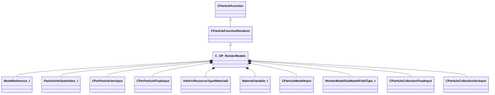

[Schemas](../../schemas.md) / [particles](../particles.md) / C_OP_RenderModels

# C_OP_RenderModels

**Kind:** class · **Size:** 11808 bytes (`0x2e20`) · **Align:** 8 · **Module:** particles

**Inherits from:** [CParticleFunctionRenderer](../particles/CParticleFunctionRenderer.md)

**Relationships:**

## Memory layout

78 fields (58 declared here, 20 inherited). Offsets are absolute from the object base.

| Offset | Field | Type | From | Annotations |
|--------|-------|------|------|-------------|
| `0x8` | `m_flOpStrength` | [CParticleCollectionFloatInput](../particleslib/CParticleCollectionFloatInput.md) | [CParticleFunction](../particles/CParticleFunction.md) | `MPropertyFriendlyName operator strength` `MPropertySortPriority -100` |
| `0x178` | `m_nOpEndCapState` | [ParticleEndcapMode_t](../!GlobalTypes/ParticleEndcapMode_t.md) | [CParticleFunction](../particles/CParticleFunction.md) | `MPropertyFriendlyName operator end cap state` `MPropertySortPriority -100` |
| `0x17c` | `m_nToolsState` | [ParticleToolsState_t](../!GlobalTypes/ParticleToolsState_t.md) | [CParticleFunction](../particles/CParticleFunction.md) | `MPropertyFriendlyName operator enabled in tools or game only` `MPropertySortPriority -100` |
| `0x180` | `m_flOpStartFadeInTime` | float32 | [CParticleFunction](../particles/CParticleFunction.md) | `MParticleAdvancedField` `MPropertyFriendlyName operator start fadein` `MPropertySortPriority -100` `MPropertyStartGroup Operator Fade` |
| `0x184` | `m_flOpEndFadeInTime` | float32 | [CParticleFunction](../particles/CParticleFunction.md) | `MParticleAdvancedField` `MPropertyFriendlyName operator end fadein` `MPropertySortPriority -100` |
| `0x188` | `m_flOpStartFadeOutTime` | float32 | [CParticleFunction](../particles/CParticleFunction.md) | `MParticleAdvancedField` `MPropertyFriendlyName operator start fadeout` `MPropertySortPriority -100` |
| `0x18c` | `m_flOpEndFadeOutTime` | float32 | [CParticleFunction](../particles/CParticleFunction.md) | `MParticleAdvancedField` `MPropertyFriendlyName operator end fadeout` `MPropertySortPriority -100` |
| `0x190` | `m_flOpFadeOscillatePeriod` | float32 | [CParticleFunction](../particles/CParticleFunction.md) | `MParticleAdvancedField` `MPropertyFriendlyName operator fade oscillate` `MPropertySortPriority -100` |
| `0x194` | `m_bNormalizeToStopTime` | bool | [CParticleFunction](../particles/CParticleFunction.md) | `MParticleAdvancedField` `MPropertyFriendlyName normalize fade times to endcap` `MPropertySortPriority -100` |
| `0x198` | `m_flOpTimeOffsetMin` | float32 | [CParticleFunction](../particles/CParticleFunction.md) | `MParticleAdvancedField` `MPropertyFriendlyName operator fade time offset min` `MPropertySortPriority -100` `MPropertyStartGroup Operator Fade Time Offset` |
| `0x19c` | `m_flOpTimeOffsetMax` | float32 | [CParticleFunction](../particles/CParticleFunction.md) | `MParticleAdvancedField` `MPropertyFriendlyName operator fade time offset max` `MPropertySortPriority -100` |
| `0x1a0` | `m_nOpTimeOffsetSeed` | int32 | [CParticleFunction](../particles/CParticleFunction.md) | `MParticleAdvancedField` `MPropertyFriendlyName operator fade time offset seed` `MPropertySortPriority -100` |
| `0x1a4` | `m_nOpTimeScaleSeed` | int32 | [CParticleFunction](../particles/CParticleFunction.md) | `MParticleAdvancedField` `MPropertyFriendlyName operator fade time scale seed` `MPropertySortPriority -100` `MPropertyStartGroup Operator Fade Timescale Modifiers` |
| `0x1a8` | `m_flOpTimeScaleMin` | float32 | [CParticleFunction](../particles/CParticleFunction.md) | `MParticleAdvancedField` `MPropertyFriendlyName operator fade time scale min` `MPropertySortPriority -100` |
| `0x1ac` | `m_flOpTimeScaleMax` | float32 | [CParticleFunction](../particles/CParticleFunction.md) | `MParticleAdvancedField` `MPropertyFriendlyName operator fade time scale max` `MPropertySortPriority -100` |
| `0x1b2` | `m_bDisableOperator` | bool | [CParticleFunction](../particles/CParticleFunction.md) | `MPropertyStartGroup` `MPropertySuppressField` |
| `0x1b8` | `m_Notes` | CUtlString | [CParticleFunction](../particles/CParticleFunction.md) | `MParticleHelpField` `MPropertyFriendlyName operator help and notes` `MPropertySortPriority -100` |
| `0x1d8` | `VisibilityInputs` | [CParticleVisibilityInputs](../particles/CParticleVisibilityInputs.md) | [CParticleFunctionRenderer](../particles/CParticleFunctionRenderer.md) | `MPropertySortPriority -1` |
| `0x220` | `m_bCannotBeRefracted` | bool | [CParticleFunctionRenderer](../particles/CParticleFunctionRenderer.md) | `MPropertyFriendlyName I cannot be refracted through refracting objects like water` `MPropertySortPriority -1` `MPropertyStartGroup Rendering filter` |
| `0x221` | `m_bSkipRenderingOnMobile` | bool | [CParticleFunctionRenderer](../particles/CParticleFunctionRenderer.md) | `MPropertyFriendlyName Skip rendering on mobile` `MPropertySortPriority -1` |
| `0x228` | `m_bOnlyRenderInEffectsBloomPass` | bool |  | `MPropertyFriendlyName Only Render in effects bloom pass` `MPropertySortPriority 1100` |
| `0x229` | `m_bOnlyRenderInEffectsWaterPass` | bool |  | `MPropertyFriendlyName Only Render in effects water pass` `MPropertySortPriority 1050` `MPropertySuppressExpr mod != csgo && mod != hlx` |
| `0x22a` | `m_bUseMixedResolutionRendering` | bool |  | `MPropertyFriendlyName Use Mixed Resolution Rendering` `MPropertySortPriority 1200` |
| `0x22b` | `m_bOnlyRenderInEffecsGameOverlay` | bool |  | `MPropertyFriendlyName Only Render in effects game overlay pass` `MPropertySortPriority 1210` `MPropertySuppressExpr mod != csgo` |
| `0x230` | `m_ModelList` | CUtlVector< [ModelReference_t](../particles/ModelReference_t.md) > |  | `MParticleRequireDefaultArrayEntry` `MPropertyAutoExpandSelf` `MPropertyFriendlyName models` `MPropertySortPriority 775` |
| `0x248` | `m_nBodyGroupField` | [ParticleAttributeIndex_t](../particles/ParticleAttributeIndex_t.md) |  | `MPropertyAttributeChoiceName particlefield_scalar` `MPropertyFriendlyName bodygroup field` |
| `0x24c` | `m_nSubModelField` | [ParticleAttributeIndex_t](../particles/ParticleAttributeIndex_t.md) |  | `MPropertyAttributeChoiceName particlefield_scalar` `MPropertyFriendlyName submodel field` |
| `0x250` | `m_bIgnoreNormal` | bool |  | `MPropertyFriendlyName ignore normal` `MPropertySortPriority 750` `MPropertyStartGroup Orientation` |
| `0x251` | `m_bOrientZ` | bool |  | `MPropertyFriendlyName orient model z to normal` `MPropertySortPriority 750` `MPropertySuppressExpr m_bIgnoreNormal` |
| `0x252` | `m_bCenterOffset` | bool |  | `MPropertyFriendlyName center mesh` `MPropertySortPriority 750` |
| `0x258` | `m_vecLocalOffset` | [CPerParticleVecInput](../particleslib/CPerParticleVecInput.md) |  | `MPropertyFriendlyName model local offset` `MPropertySortPriority 750` |
| `0x910` | `m_vecLocalRotation` | [CPerParticleVecInput](../particleslib/CPerParticleVecInput.md) |  | `MPropertyFriendlyName model local rotation (pitch/yaw/roll)` `MPropertySortPriority 750` |
| `0xfc8` | `m_bIgnoreRadius` | bool |  | `MPropertyFriendlyName ignore radius` `MPropertySortPriority 700` `MPropertyStartGroup Model Scale` |
| `0xfcc` | `m_nModelScaleCP` | int32 |  | `MPropertyFriendlyName model scale CP` `MPropertySortPriority 700` |
| `0xfd0` | `m_vecComponentScale` | [CPerParticleVecInput](../particleslib/CPerParticleVecInput.md) |  | `MPropertyFriendlyName model component scale` `MPropertySortPriority 700` |
| `0x1688` | `m_bLocalScale` | bool |  | `MPropertyFriendlyName apply scales in local model space` `MPropertySortPriority 700` |
| `0x168c` | `m_nSizeCullBloat` | int32 |  | `MPropertyAttributeChoiceName particlefield_size_cull_bloat` `MPropertyFriendlyName model size cull bloat` |
| `0x1690` | `m_bAnimated` | bool |  | `MPropertyFriendlyName animated` `MPropertySortPriority 500` `MPropertyStartGroup Animation` |
| `0x1698` | `m_flAnimationRate` | [CPerParticleFloatInput](../particleslib/CPerParticleFloatInput.md) |  | `MPropertyFriendlyName animation rate` `MPropertySortPriority 500` `MPropertySuppressExpr !m_bAnimated` |
| `0x1808` | `m_bScaleAnimationRate` | bool |  | `MPropertyFriendlyName scale animation rate` `MPropertySortPriority 500` `MPropertySuppressExpr !m_bAnimated` |
| `0x1809` | `m_bForceLoopingAnimation` | bool |  | `MPropertyFriendlyName force looping animations` `MPropertySortPriority 500` `MPropertySuppressExpr !m_bAnimated` |
| `0x180a` | `m_bResetAnimOnStop` | bool |  | `MPropertyFriendlyName reset animation frame on stop` `MPropertySortPriority 500` `MPropertySuppressExpr !m_bAnimated` |
| `0x180b` | `m_bManualAnimFrame` | bool |  | `MPropertyFriendlyName set animation frame manually` `MPropertySortPriority 500` `MPropertySuppressExpr !m_bAnimated` |
| `0x180c` | `m_nAnimationScaleField` | [ParticleAttributeIndex_t](../particles/ParticleAttributeIndex_t.md) |  | `MPropertyAttributeChoiceName particlefield_scalar` `MPropertyFriendlyName animation rate scale field` `MPropertySortPriority 500` `MPropertySuppressExpr !(m_bAnimated && m_bScaleAnimationRate)` |
| `0x1810` | `m_nAnimationField` | [ParticleAttributeIndex_t](../particles/ParticleAttributeIndex_t.md) |  | `MPropertyAttributeChoiceName particlefield_scalar` `MPropertyFriendlyName animation sequence field` `MPropertySortPriority 500` `MPropertyStartGroup Animation` |
| `0x1814` | `m_nManualFrameField` | [ParticleAttributeIndex_t](../particles/ParticleAttributeIndex_t.md) |  | `MPropertyAttributeChoiceName particlefield_scalar` `MPropertyFriendlyName manual animation frame field` `MPropertySortPriority 500` `MPropertySuppressExpr !(m_bAnimated && m_bManualAnimFrame)` |
| `0x1818` | `m_ActivityName` | char[256] |  | `MPropertyFriendlyName activity override` `MPropertySortPriority 500` `MPropertySuppressExpr mod != dota` |
| `0x1918` | `m_SequenceName` | char[256] |  | `MPropertyFriendlyName sequence override` `MPropertySortPriority 500` `MPropertySuppressExpr mod == dota` |
| `0x1a18` | `m_bEnableClothSimulation` | bool |  | `MPropertyFriendlyName Enable Cloth Simulation` |
| `0x1a19` | `m_bDisableClothGroundCollision` | bool |  | `MPropertyFriendlyName Disable Cloth Ground Collision` |
| `0x1a1a` | `m_ClothEffectName` | char[64] |  | `MPropertyFriendlyName With Cloth Effect` `MPropertySortPriority 500` |
| `0x1a60` | `m_hOverrideMaterial` | CStrongHandle< [InfoForResourceTypeIMaterial2](../resourcesystem/InfoForResourceTypeIMaterial2.md) > |  | `MPropertyFriendlyName material override` `MPropertySortPriority 600` `MPropertyStartGroup Material` |
| `0x1a68` | `m_bOverrideTranslucentMaterials` | bool |  | `MPropertyFriendlyName override translucent materials` `MPropertySortPriority 600` |
| `0x1a70` | `m_nSkin` | [CPerParticleFloatInput](../particleslib/CPerParticleFloatInput.md) |  | `MPropertyFriendlyName skin number` `MPropertySortPriority 600` |
| `0x1be0` | `m_MaterialVars` | CUtlVector< [MaterialVariable_t](../particles/MaterialVariable_t.md) > |  | `MPropertyAutoExpandSelf` `MPropertyFriendlyName material variables` `MPropertySortPriority 600` |
| `0x1bf8` | `m_flRenderFilter` | [CPerParticleFloatInput](../particleslib/CPerParticleFloatInput.md) |  | `MPropertyFriendlyName render filter` `MPropertyStartGroup Model Overrides` |
| `0x1d68` | `m_flManualModelSelection` | [CPerParticleFloatInput](../particleslib/CPerParticleFloatInput.md) |  | `MPropertyFriendlyName model list selection override` |
| `0x1ed8` | `m_modelInput` | [CParticleModelInput](../particleslib/CParticleModelInput.md) |  | `MParticleInputOptional` `MPropertyFriendlyName input model` |
| `0x1f38` | `m_nLOD` | int32 |  | `MPropertyFriendlyName model LOD` |
| `0x1f3c` | `m_EconSlotName` | char[256] |  | `MPropertyFriendlyName model override economy loadout slot type` |
| `0x203c` | `m_bOriginalModel` | bool |  | `MPropertyFriendlyName model override original model only (ignore shapeshift/hex/etc)` |
| `0x203d` | `m_bSuppressTint` | bool |  | `MPropertyFriendlyName suppress tinting of the model` |
| `0x2040` | `m_nSubModelFieldType` | [RenderModelSubModelFieldType_t](../!GlobalTypes/RenderModelSubModelFieldType_t.md) |  | `MPropertyFriendlyName SubModel Field Type` |
| `0x2044` | `m_bDisableShadows` | bool |  | `MPropertyFriendlyName disable shadows` |
| `0x2045` | `m_bDisableDepthPrepass` | bool |  | `MPropertyFriendlyName disable depth prepass` |
| `0x2046` | `m_bAcceptsDecals` | bool |  | `MPropertyFriendlyName accept decals` |
| `0x2047` | `m_bForceDrawInterlevedWithSiblings` | bool |  | `MPropertyFriendlyName forcedrawinterlevedwithsiblings` |
| `0x2048` | `m_bDoNotDrawInParticlePass` | bool |  | `MPropertyFriendlyName do not draw in particle pass` |
| `0x2049` | `m_bAllowApproximateTransforms` | bool |  | `MPropertyFriendlyName allow approximate transforms (cpu optimizaiton)` |
| `0x204a` | `m_szRenderAttribute` | char[260] |  | `MPropertyFriendlyName render attribute` |
| `0x2150` | `m_flRadiusScale` | [CParticleCollectionFloatInput](../particleslib/CParticleCollectionFloatInput.md) |  | `MPropertyFriendlyName Radius Scale` `MPropertySortPriority 700` `MPropertyStartGroup +Renderer Modifiers` |
| `0x22c0` | `m_flAlphaScale` | [CParticleCollectionFloatInput](../particleslib/CParticleCollectionFloatInput.md) |  | `MPropertyFriendlyName alpha scale` `MPropertySortPriority 700` |
| `0x2430` | `m_flRollScale` | [CParticleCollectionFloatInput](../particleslib/CParticleCollectionFloatInput.md) |  | `MPropertyFriendlyName rotation roll scale` `MPropertySortPriority 700` |
| `0x25a0` | `m_nAlpha2Field` | [ParticleAttributeIndex_t](../particles/ParticleAttributeIndex_t.md) |  | `MPropertyAttributeChoiceName particlefield_scalar` `MPropertyFriendlyName per-particle alpha scale attribute` `MPropertySortPriority 700` |
| `0x25a8` | `m_vecColorScale` | [CParticleCollectionVecInput](../particleslib/CParticleCollectionVecInput.md) |  | `MPropertyFriendlyName color blend` `MPropertySortPriority 700` |
| `0x2c60` | `m_nColorBlendType` | [ParticleColorBlendType_t](../!GlobalTypes/ParticleColorBlendType_t.md) |  | `MPropertyFriendlyName color blend type` `MPropertySortPriority 700` |
| `0x2c68` | `m_strLightStyle` | CUtlString |  | `MPropertyAttributeEditor VDataChoice( scripts/light_styles.vdata )` `MPropertyFriendlyName light style` `MPropertySortPriority 700` |
| `0x2c70` | `m_flLightStyleTime` | [CPerParticleFloatInput](../particleslib/CPerParticleFloatInput.md) |  | `MPropertyFriendlyName light style time` `MPropertySortPriority 700` `MPropertySuppressExpr m_strLightStyle == ''` |

KV3 class defaults

<pre>{
	&quot;_class&quot;: &quot;C_OP_RenderModels&quot;,
	&quot;m_flOpStrength&quot;:
	{
		&quot;m_nType&quot;: &quot;PF_TYPE_LITERAL&quot;,
		&quot;m_nMapType&quot;: &quot;PF_MAP_TYPE_DIRECT&quot;,
		&quot;m_flLiteralValue&quot;: 1.000000,
		&quot;m_NamedValue&quot;: &quot;&quot;,
		&quot;m_nControlPoint&quot;: 0,
		&quot;m_nScalarAttribute&quot;: 3,
		&quot;m_nVectorAttribute&quot;: 6,
		&quot;m_nVectorComponent&quot;: 0,
		&quot;m_bReverseOrder&quot;: false,
		&quot;m_flRandomMin&quot;: 0.000000,
		&quot;m_flRandomMax&quot;: 1.000000,
		&quot;m_bHasRandomSignFlip&quot;: false,
		&quot;m_nRandomSeed&quot;: &lt;HIDDEN FOR DIFF&gt;,
		&quot;m_nRandomMode&quot;: &quot;PF_RANDOM_MODE_CONSTANT&quot;,
		&quot;m_strSnapshotSubset&quot;: &quot;&quot;,
		&quot;m_flLOD0&quot;: 0.000000,
		&quot;m_flLOD1&quot;: 0.000000,
		&quot;m_flLOD2&quot;: 0.000000,
		&quot;m_flLOD3&quot;: 0.000000,
		&quot;m_nNoiseInputVectorAttribute&quot;: 0,
		&quot;m_flNoiseOutputMin&quot;: 0.000000,
		&quot;m_flNoiseOutputMax&quot;: 1.000000,
		&quot;m_flNoiseScale&quot;: 0.100000,
		&quot;m_vecNoiseOffsetRate&quot;:
		[
			0.000000,
			0.000000,
			0.000000
		],
		&quot;m_flNoiseOffset&quot;: 0.000000,
		&quot;m_nNoiseOctaves&quot;: 1,
		&quot;m_nNoiseTurbulence&quot;: &quot;PF_NOISE_TURB_NONE&quot;,
		&quot;m_nNoiseType&quot;: &quot;PF_NOISE_TYPE_PERLIN&quot;,
		&quot;m_nNoiseModifier&quot;: &quot;PF_NOISE_MODIFIER_NONE&quot;,
		&quot;m_flNoiseTurbulenceScale&quot;: 1.000000,
		&quot;m_flNoiseTurbulenceMix&quot;: 0.500000,
		&quot;m_flNoiseImgPreviewScale&quot;: 1.000000,
		&quot;m_bNoiseImgPreviewLive&quot;: true,
		&quot;m_flNoCameraFallback&quot;: 0.000000,
		&quot;m_bUseBoundsCenter&quot;: false,
		&quot;m_nInputMode&quot;: &quot;PF_INPUT_MODE_CLAMPED&quot;,
		&quot;m_flMultFactor&quot;: 1.000000,
		&quot;m_flInput0&quot;: 0.000000,
		&quot;m_flInput1&quot;: 1.000000,
		&quot;m_flOutput0&quot;: 0.000000,
		&quot;m_flOutput1&quot;: 1.000000,
		&quot;m_flNotchedRangeMin&quot;: 0.000000,
		&quot;m_flNotchedRangeMax&quot;: 1.000000,
		&quot;m_flNotchedOutputOutside&quot;: 0.000000,
		&quot;m_flNotchedOutputInside&quot;: 1.000000,
		&quot;m_nRoundType&quot;: &quot;PF_ROUND_TYPE_NEAREST&quot;,
		&quot;m_nBiasType&quot;: &quot;PF_BIAS_TYPE_STANDARD&quot;,
		&quot;m_flBiasParameter&quot;: 0.000000,
		&quot;m_Curve&quot;:
		{
			&quot;m_spline&quot;:
			[
			],
			&quot;m_tangents&quot;:
			[
			],
			&quot;m_vDomainMins&quot;:
			[
				0.000000,
				0.000000
			],
			&quot;m_vDomainMaxs&quot;:
			[
				0.000000,
				0.000000
			]
		}
	},
	&quot;m_nOpEndCapState&quot;: &quot;PARTICLE_ENDCAP_ALWAYS_ON&quot;,
	&quot;m_nToolsState&quot;: &quot;PARTICLE_TOOLS_STATE_ALWAYS_ON&quot;,
	&quot;m_flOpStartFadeInTime&quot;: 0.000000,
	&quot;m_flOpEndFadeInTime&quot;: 0.000000,
	&quot;m_flOpStartFadeOutTime&quot;: 0.000000,
	&quot;m_flOpEndFadeOutTime&quot;: 0.000000,
	&quot;m_flOpFadeOscillatePeriod&quot;: 0.000000,
	&quot;m_bNormalizeToStopTime&quot;: false,
	&quot;m_flOpTimeOffsetMin&quot;: 0.000000,
	&quot;m_flOpTimeOffsetMax&quot;: 0.000000,
	&quot;m_nOpTimeOffsetSeed&quot;: 0,
	&quot;m_nOpTimeScaleSeed&quot;: 0,
	&quot;m_flOpTimeScaleMin&quot;: 1.000000,
	&quot;m_flOpTimeScaleMax&quot;: 1.000000,
	&quot;m_bDisableOperator&quot;: false,
	&quot;m_Notes&quot;: &quot;&quot;,
	&quot;VisibilityInputs&quot;:
	{
		&quot;m_flCameraBias&quot;: 0.000000,
		&quot;m_nCPin&quot;: -1,
		&quot;m_flProxyRadius&quot;: 1.000000,
		&quot;m_flInputMin&quot;: 0.000000,
		&quot;m_flInputMax&quot;: 1.000000,
		&quot;m_flInputPixelVisFade&quot;: 0.250000,
		&quot;m_flNoPixelVisibilityFallback&quot;: 1.000000,
		&quot;m_flDistanceInputMin&quot;: 0.000000,
		&quot;m_flDistanceInputMax&quot;: 0.000000,
		&quot;m_flDotInputMin&quot;: 0.000000,
		&quot;m_flDotInputMax&quot;: 0.000000,
		&quot;m_bDotCPAngles&quot;: true,
		&quot;m_bDotCameraAngles&quot;: false,
		&quot;m_flAlphaScaleMin&quot;: 0.000000,
		&quot;m_flAlphaScaleMax&quot;: 1.000000,
		&quot;m_flRadiusScaleMin&quot;: 1.000000,
		&quot;m_flRadiusScaleMax&quot;: 1.000000,
		&quot;m_flRadiusScaleFOVBase&quot;: 0.000000,
		&quot;m_bRightEye&quot;: false
	},
	&quot;m_bCannotBeRefracted&quot;: true,
	&quot;m_bSkipRenderingOnMobile&quot;: false,
	&quot;m_bOnlyRenderInEffectsBloomPass&quot;: false,
	&quot;m_bOnlyRenderInEffectsWaterPass&quot;: false,
	&quot;m_bUseMixedResolutionRendering&quot;: false,
	&quot;m_bOnlyRenderInEffecsGameOverlay&quot;: false,
	&quot;m_ModelList&quot;:
	[
	],
	&quot;m_nBodyGroupField&quot;: 9,
	&quot;m_nSubModelField&quot;: 18,
	&quot;m_bIgnoreNormal&quot;: false,
	&quot;m_bOrientZ&quot;: false,
	&quot;m_bCenterOffset&quot;: false,
	&quot;m_vecLocalOffset&quot;:
	{
		&quot;m_nType&quot;: &quot;PVEC_TYPE_LITERAL&quot;,
		&quot;m_vLiteralValue&quot;:
		[
			0.000000,
			0.000000,
			0.000000
		],
		&quot;m_LiteralColor&quot;:
		[
			0,
			0,
			0
		],
		&quot;m_NamedValue&quot;: &quot;&quot;,
		&quot;m_bFollowNamedValue&quot;: false,
		&quot;m_nVectorAttribute&quot;: 6,
		&quot;m_vVectorAttributeScale&quot;:
		[
			1.000000,
			1.000000,
			1.000000
		],
		&quot;m_nControlPoint&quot;: 0,
		&quot;m_nDeltaControlPoint&quot;: 0,
		&quot;m_vCPValueScale&quot;:
		[
			1.000000,
			1.000000,
			1.000000
		],
		&quot;m_vCPRelativePosition&quot;:
		[
			0.000000,
			0.000000,
			0.000000
		],
		&quot;m_vCPRelativeDir&quot;:
		[
			1.000000,
			0.000000,
			0.000000
		],
		&quot;m_FloatComponentX&quot;:
		{
			&quot;m_nType&quot;: &quot;PF_TYPE_LITERAL&quot;,
			&quot;m_nMapType&quot;: &quot;PF_MAP_TYPE_DIRECT&quot;,
			&quot;m_flLiteralValue&quot;: 0.000000,
			&quot;m_NamedValue&quot;: &quot;&quot;,
			&quot;m_nControlPoint&quot;: 0,
			&quot;m_nScalarAttribute&quot;: 3,
			&quot;m_nVectorAttribute&quot;: 6,
			&quot;m_nVectorComponent&quot;: 0,
			&quot;m_bReverseOrder&quot;: false,
			&quot;m_flRandomMin&quot;: 0.000000,
			&quot;m_flRandomMax&quot;: 1.000000,
			&quot;m_bHasRandomSignFlip&quot;: false,
			&quot;m_nRandomSeed&quot;: &lt;HIDDEN FOR DIFF&gt;,
			&quot;m_nRandomMode&quot;: &quot;PF_RANDOM_MODE_CONSTANT&quot;,
			&quot;m_strSnapshotSubset&quot;: &quot;&quot;,
			&quot;m_flLOD0&quot;: 0.000000,
			&quot;m_flLOD1&quot;: 0.000000,
			&quot;m_flLOD2&quot;: 0.000000,
			&quot;m_flLOD3&quot;: 0.000000,
			&quot;m_nNoiseInputVectorAttribute&quot;: 0,
			&quot;m_flNoiseOutputMin&quot;: 0.000000,
			&quot;m_flNoiseOutputMax&quot;: 1.000000,
			&quot;m_flNoiseScale&quot;: 0.100000,
			&quot;m_vecNoiseOffsetRate&quot;:
			[
				0.000000,
				0.000000,
				0.000000
			],
			&quot;m_flNoiseOffset&quot;: 0.000000,
			&quot;m_nNoiseOctaves&quot;: 1,
			&quot;m_nNoiseTurbulence&quot;: &quot;PF_NOISE_TURB_NONE&quot;,
			&quot;m_nNoiseType&quot;: &quot;PF_NOISE_TYPE_PERLIN&quot;,
			&quot;m_nNoiseModifier&quot;: &quot;PF_NOISE_MODIFIER_NONE&quot;,
			&quot;m_flNoiseTurbulenceScale&quot;: 1.000000,
			&quot;m_flNoiseTurbulenceMix&quot;: 0.500000,
			&quot;m_flNoiseImgPreviewScale&quot;: 1.000000,
			&quot;m_bNoiseImgPreviewLive&quot;: true,
			&quot;m_flNoCameraFallback&quot;: 0.000000,
			&quot;m_bUseBoundsCenter&quot;: false,
			&quot;m_nInputMode&quot;: &quot;PF_INPUT_MODE_CLAMPED&quot;,
			&quot;m_flMultFactor&quot;: 1.000000,
			&quot;m_flInput0&quot;: 0.000000,
			&quot;m_flInput1&quot;: 1.000000,
			&quot;m_flOutput0&quot;: 0.000000,
			&quot;m_flOutput1&quot;: 1.000000,
			&quot;m_flNotchedRangeMin&quot;: 0.000000,
			&quot;m_flNotchedRangeMax&quot;: 1.000000,
			&quot;m_flNotchedOutputOutside&quot;: 0.000000,
			&quot;m_flNotchedOutputInside&quot;: 1.000000,
			&quot;m_nRoundType&quot;: &quot;PF_ROUND_TYPE_NEAREST&quot;,
			&quot;m_nBiasType&quot;: &quot;PF_BIAS_TYPE_STANDARD&quot;,
			&quot;m_flBiasParameter&quot;: 0.000000,
			&quot;m_Curve&quot;:
			{
				&quot;m_spline&quot;:
				[
				],
				&quot;m_tangents&quot;:
				[
				],
				&quot;m_vDomainMins&quot;:
				[
					0.000000,
					0.000000
				],
				&quot;m_vDomainMaxs&quot;:
				[
					0.000000,
					0.000000
				]
			}
		},
		&quot;m_FloatComponentY&quot;:
		{
			&quot;m_nType&quot;: &quot;PF_TYPE_LITERAL&quot;,
			&quot;m_nMapType&quot;: &quot;PF_MAP_TYPE_DIRECT&quot;,
			&quot;m_flLiteralValue&quot;: 0.000000,
			&quot;m_NamedValue&quot;: &quot;&quot;,
			&quot;m_nControlPoint&quot;: 0,
			&quot;m_nScalarAttribute&quot;: 3,
			&quot;m_nVectorAttribute&quot;: 6,
			&quot;m_nVectorComponent&quot;: 0,
			&quot;m_bReverseOrder&quot;: false,
			&quot;m_flRandomMin&quot;: 0.000000,
			&quot;m_flRandomMax&quot;: 1.000000,
			&quot;m_bHasRandomSignFlip&quot;: false,
			&quot;m_nRandomSeed&quot;: &lt;HIDDEN FOR DIFF&gt;,
			&quot;m_nRandomMode&quot;: &quot;PF_RANDOM_MODE_CONSTANT&quot;,
			&quot;m_strSnapshotSubset&quot;: &quot;&quot;,
			&quot;m_flLOD0&quot;: 0.000000,
			&quot;m_flLOD1&quot;: 0.000000,
			&quot;m_flLOD2&quot;: 0.000000,
			&quot;m_flLOD3&quot;: 0.000000,
			&quot;m_nNoiseInputVectorAttribute&quot;: 0,
			&quot;m_flNoiseOutputMin&quot;: 0.000000,
			&quot;m_flNoiseOutputMax&quot;: 1.000000,
			&quot;m_flNoiseScale&quot;: 0.100000,
			&quot;m_vecNoiseOffsetRate&quot;:
			[
				0.000000,
				0.000000,
				0.000000
			],
			&quot;m_flNoiseOffset&quot;: 0.000000,
			&quot;m_nNoiseOctaves&quot;: 1,
			&quot;m_nNoiseTurbulence&quot;: &quot;PF_NOISE_TURB_NONE&quot;,
			&quot;m_nNoiseType&quot;: &quot;PF_NOISE_TYPE_PERLIN&quot;,
			&quot;m_nNoiseModifier&quot;: &quot;PF_NOISE_MODIFIER_NONE&quot;,
			&quot;m_flNoiseTurbulenceScale&quot;: 1.000000,
			&quot;m_flNoiseTurbulenceMix&quot;: 0.500000,
			&quot;m_flNoiseImgPreviewScale&quot;: 1.000000,
			&quot;m_bNoiseImgPreviewLive&quot;: true,
			&quot;m_flNoCameraFallback&quot;: 0.000000,
			&quot;m_bUseBoundsCenter&quot;: false,
			&quot;m_nInputMode&quot;: &quot;PF_INPUT_MODE_CLAMPED&quot;,
			&quot;m_flMultFactor&quot;: 1.000000,
			&quot;m_flInput0&quot;: 0.000000,
			&quot;m_flInput1&quot;: 1.000000,
			&quot;m_flOutput0&quot;: 0.000000,
			&quot;m_flOutput1&quot;: 1.000000,
			&quot;m_flNotchedRangeMin&quot;: 0.000000,
			&quot;m_flNotchedRangeMax&quot;: 1.000000,
			&quot;m_flNotchedOutputOutside&quot;: 0.000000,
			&quot;m_flNotchedOutputInside&quot;: 1.000000,
			&quot;m_nRoundType&quot;: &quot;PF_ROUND_TYPE_NEAREST&quot;,
			&quot;m_nBiasType&quot;: &quot;PF_BIAS_TYPE_STANDARD&quot;,
			&quot;m_flBiasParameter&quot;: 0.000000,
			&quot;m_Curve&quot;:
			{
				&quot;m_spline&quot;:
				[
				],
				&quot;m_tangents&quot;:
				[
				],
				&quot;m_vDomainMins&quot;:
				[
					0.000000,
					0.000000
				],
				&quot;m_vDomainMaxs&quot;:
				[
					0.000000,
					0.000000
				]
			}
		},
		&quot;m_FloatComponentZ&quot;:
		{
			&quot;m_nType&quot;: &quot;PF_TYPE_LITERAL&quot;,
			&quot;m_nMapType&quot;: &quot;PF_MAP_TYPE_DIRECT&quot;,
			&quot;m_flLiteralValue&quot;: 0.000000,
			&quot;m_NamedValue&quot;: &quot;&quot;,
			&quot;m_nControlPoint&quot;: 0,
			&quot;m_nScalarAttribute&quot;: 3,
			&quot;m_nVectorAttribute&quot;: 6,
			&quot;m_nVectorComponent&quot;: 0,
			&quot;m_bReverseOrder&quot;: false,
			&quot;m_flRandomMin&quot;: 0.000000,
			&quot;m_flRandomMax&quot;: 1.000000,
			&quot;m_bHasRandomSignFlip&quot;: false,
			&quot;m_nRandomSeed&quot;: &lt;HIDDEN FOR DIFF&gt;,
			&quot;m_nRandomMode&quot;: &quot;PF_RANDOM_MODE_CONSTANT&quot;,
			&quot;m_strSnapshotSubset&quot;: &quot;&quot;,
			&quot;m_flLOD0&quot;: 0.000000,
			&quot;m_flLOD1&quot;: 0.000000,
			&quot;m_flLOD2&quot;: 0.000000,
			&quot;m_flLOD3&quot;: 0.000000,
			&quot;m_nNoiseInputVectorAttribute&quot;: 0,
			&quot;m_flNoiseOutputMin&quot;: 0.000000,
			&quot;m_flNoiseOutputMax&quot;: 1.000000,
			&quot;m_flNoiseScale&quot;: 0.100000,
			&quot;m_vecNoiseOffsetRate&quot;:
			[
				0.000000,
				0.000000,
				0.000000
			],
			&quot;m_flNoiseOffset&quot;: 0.000000,
			&quot;m_nNoiseOctaves&quot;: 1,
			&quot;m_nNoiseTurbulence&quot;: &quot;PF_NOISE_TURB_NONE&quot;,
			&quot;m_nNoiseType&quot;: &quot;PF_NOISE_TYPE_PERLIN&quot;,
			&quot;m_nNoiseModifier&quot;: &quot;PF_NOISE_MODIFIER_NONE&quot;,
			&quot;m_flNoiseTurbulenceScale&quot;: 1.000000,
			&quot;m_flNoiseTurbulenceMix&quot;: 0.500000,
			&quot;m_flNoiseImgPreviewScale&quot;: 1.000000,
			&quot;m_bNoiseImgPreviewLive&quot;: true,
			&quot;m_flNoCameraFallback&quot;: 0.000000,
			&quot;m_bUseBoundsCenter&quot;: false,
			&quot;m_nInputMode&quot;: &quot;PF_INPUT_MODE_CLAMPED&quot;,
			&quot;m_flMultFactor&quot;: 1.000000,
			&quot;m_flInput0&quot;: 0.000000,
			&quot;m_flInput1&quot;: 1.000000,
			&quot;m_flOutput0&quot;: 0.000000,
			&quot;m_flOutput1&quot;: 1.000000,
			&quot;m_flNotchedRangeMin&quot;: 0.000000,
			&quot;m_flNotchedRangeMax&quot;: 1.000000,
			&quot;m_flNotchedOutputOutside&quot;: 0.000000,
			&quot;m_flNotchedOutputInside&quot;: 1.000000,
			&quot;m_nRoundType&quot;: &quot;PF_ROUND_TYPE_NEAREST&quot;,
			&quot;m_nBiasType&quot;: &quot;PF_BIAS_TYPE_STANDARD&quot;,
			&quot;m_flBiasParameter&quot;: 0.000000,
			&quot;m_Curve&quot;:
			{
				&quot;m_spline&quot;:
				[
				],
				&quot;m_tangents&quot;:
				[
				],
				&quot;m_vDomainMins&quot;:
				[
					0.000000,
					0.000000
				],
				&quot;m_vDomainMaxs&quot;:
				[
					0.000000,
					0.000000
				]
			}
		},
		&quot;m_FloatInterp&quot;:
		{
			&quot;m_nType&quot;: &quot;PF_TYPE_LITERAL&quot;,
			&quot;m_nMapType&quot;: &quot;PF_MAP_TYPE_DIRECT&quot;,
			&quot;m_flLiteralValue&quot;: 0.000000,
			&quot;m_NamedValue&quot;: &quot;&quot;,
			&quot;m_nControlPoint&quot;: 0,
			&quot;m_nScalarAttribute&quot;: 3,
			&quot;m_nVectorAttribute&quot;: 6,
			&quot;m_nVectorComponent&quot;: 0,
			&quot;m_bReverseOrder&quot;: false,
			&quot;m_flRandomMin&quot;: 0.000000,
			&quot;m_flRandomMax&quot;: 1.000000,
			&quot;m_bHasRandomSignFlip&quot;: false,
			&quot;m_nRandomSeed&quot;: &lt;HIDDEN FOR DIFF&gt;,
			&quot;m_nRandomMode&quot;: &quot;PF_RANDOM_MODE_CONSTANT&quot;,
			&quot;m_strSnapshotSubset&quot;: &quot;&quot;,
			&quot;m_flLOD0&quot;: 0.000000,
			&quot;m_flLOD1&quot;: 0.000000,
			&quot;m_flLOD2&quot;: 0.000000,
			&quot;m_flLOD3&quot;: 0.000000,
			&quot;m_nNoiseInputVectorAttribute&quot;: 0,
			&quot;m_flNoiseOutputMin&quot;: 0.000000,
			&quot;m_flNoiseOutputMax&quot;: 1.000000,
			&quot;m_flNoiseScale&quot;: 0.100000,
			&quot;m_vecNoiseOffsetRate&quot;:
			[
				0.000000,
				0.000000,
				0.000000
			],
			&quot;m_flNoiseOffset&quot;: 0.000000,
			&quot;m_nNoiseOctaves&quot;: 1,
			&quot;m_nNoiseTurbulence&quot;: &quot;PF_NOISE_TURB_NONE&quot;,
			&quot;m_nNoiseType&quot;: &quot;PF_NOISE_TYPE_PERLIN&quot;,
			&quot;m_nNoiseModifier&quot;: &quot;PF_NOISE_MODIFIER_NONE&quot;,
			&quot;m_flNoiseTurbulenceScale&quot;: 1.000000,
			&quot;m_flNoiseTurbulenceMix&quot;: 0.500000,
			&quot;m_flNoiseImgPreviewScale&quot;: 1.000000,
			&quot;m_bNoiseImgPreviewLive&quot;: true,
			&quot;m_flNoCameraFallback&quot;: 0.000000,
			&quot;m_bUseBoundsCenter&quot;: false,
			&quot;m_nInputMode&quot;: &quot;PF_INPUT_MODE_CLAMPED&quot;,
			&quot;m_flMultFactor&quot;: 1.000000,
			&quot;m_flInput0&quot;: 0.000000,
			&quot;m_flInput1&quot;: 1.000000,
			&quot;m_flOutput0&quot;: 0.000000,
			&quot;m_flOutput1&quot;: 1.000000,
			&quot;m_flNotchedRangeMin&quot;: 0.000000,
			&quot;m_flNotchedRangeMax&quot;: 1.000000,
			&quot;m_flNotchedOutputOutside&quot;: 0.000000,
			&quot;m_flNotchedOutputInside&quot;: 1.000000,
			&quot;m_nRoundType&quot;: &quot;PF_ROUND_TYPE_NEAREST&quot;,
			&quot;m_nBiasType&quot;: &quot;PF_BIAS_TYPE_STANDARD&quot;,
			&quot;m_flBiasParameter&quot;: 0.000000,
			&quot;m_Curve&quot;:
			{
				&quot;m_spline&quot;:
				[
				],
				&quot;m_tangents&quot;:
				[
				],
				&quot;m_vDomainMins&quot;:
				[
					0.000000,
					0.000000
				],
				&quot;m_vDomainMaxs&quot;:
				[
					0.000000,
					0.000000
				]
			}
		},
		&quot;m_flInterpInput0&quot;: 0.000000,
		&quot;m_flInterpInput1&quot;: 1.000000,
		&quot;m_vInterpOutput0&quot;:
		[
			0.000000,
			0.000000,
			0.000000
		],
		&quot;m_vInterpOutput1&quot;:
		[
			1.000000,
			1.000000,
			1.000000
		],
		&quot;m_Gradient&quot;:
		{
			&quot;m_Stops&quot;:
			[
			]
		},
		&quot;m_vRandomMin&quot;:
		[
			0.000000,
			0.000000,
			0.000000
		],
		&quot;m_vRandomMax&quot;:
		[
			0.000000,
			0.000000,
			0.000000
		]
	},
	&quot;m_vecLocalRotation&quot;:
	{
		&quot;m_nType&quot;: &quot;PVEC_TYPE_LITERAL&quot;,
		&quot;m_vLiteralValue&quot;:
		[
			0.000000,
			0.000000,
			0.000000
		],
		&quot;m_LiteralColor&quot;:
		[
			0,
			0,
			0
		],
		&quot;m_NamedValue&quot;: &quot;&quot;,
		&quot;m_bFollowNamedValue&quot;: false,
		&quot;m_nVectorAttribute&quot;: 6,
		&quot;m_vVectorAttributeScale&quot;:
		[
			1.000000,
			1.000000,
			1.000000
		],
		&quot;m_nControlPoint&quot;: 0,
		&quot;m_nDeltaControlPoint&quot;: 0,
		&quot;m_vCPValueScale&quot;:
		[
			1.000000,
			1.000000,
			1.000000
		],
		&quot;m_vCPRelativePosition&quot;:
		[
			0.000000,
			0.000000,
			0.000000
		],
		&quot;m_vCPRelativeDir&quot;:
		[
			1.000000,
			0.000000,
			0.000000
		],
		&quot;m_FloatComponentX&quot;:
		{
			&quot;m_nType&quot;: &quot;PF_TYPE_LITERAL&quot;,
			&quot;m_nMapType&quot;: &quot;PF_MAP_TYPE_DIRECT&quot;,
			&quot;m_flLiteralValue&quot;: 0.000000,
			&quot;m_NamedValue&quot;: &quot;&quot;,
			&quot;m_nControlPoint&quot;: 0,
			&quot;m_nScalarAttribute&quot;: 3,
			&quot;m_nVectorAttribute&quot;: 6,
			&quot;m_nVectorComponent&quot;: 0,
			&quot;m_bReverseOrder&quot;: false,
			&quot;m_flRandomMin&quot;: 0.000000,
			&quot;m_flRandomMax&quot;: 1.000000,
			&quot;m_bHasRandomSignFlip&quot;: false,
			&quot;m_nRandomSeed&quot;: &lt;HIDDEN FOR DIFF&gt;,
			&quot;m_nRandomMode&quot;: &quot;PF_RANDOM_MODE_CONSTANT&quot;,
			&quot;m_strSnapshotSubset&quot;: &quot;&quot;,
			&quot;m_flLOD0&quot;: 0.000000,
			&quot;m_flLOD1&quot;: 0.000000,
			&quot;m_flLOD2&quot;: 0.000000,
			&quot;m_flLOD3&quot;: 0.000000,
			&quot;m_nNoiseInputVectorAttribute&quot;: 0,
			&quot;m_flNoiseOutputMin&quot;: 0.000000,
			&quot;m_flNoiseOutputMax&quot;: 1.000000,
			&quot;m_flNoiseScale&quot;: 0.100000,
			&quot;m_vecNoiseOffsetRate&quot;:
			[
				0.000000,
				0.000000,
				0.000000
			],
			&quot;m_flNoiseOffset&quot;: 0.000000,
			&quot;m_nNoiseOctaves&quot;: 1,
			&quot;m_nNoiseTurbulence&quot;: &quot;PF_NOISE_TURB_NONE&quot;,
			&quot;m_nNoiseType&quot;: &quot;PF_NOISE_TYPE_PERLIN&quot;,
			&quot;m_nNoiseModifier&quot;: &quot;PF_NOISE_MODIFIER_NONE&quot;,
			&quot;m_flNoiseTurbulenceScale&quot;: 1.000000,
			&quot;m_flNoiseTurbulenceMix&quot;: 0.500000,
			&quot;m_flNoiseImgPreviewScale&quot;: 1.000000,
			&quot;m_bNoiseImgPreviewLive&quot;: true,
			&quot;m_flNoCameraFallback&quot;: 0.000000,
			&quot;m_bUseBoundsCenter&quot;: false,
			&quot;m_nInputMode&quot;: &quot;PF_INPUT_MODE_CLAMPED&quot;,
			&quot;m_flMultFactor&quot;: 1.000000,
			&quot;m_flInput0&quot;: 0.000000,
			&quot;m_flInput1&quot;: 1.000000,
			&quot;m_flOutput0&quot;: 0.000000,
			&quot;m_flOutput1&quot;: 1.000000,
			&quot;m_flNotchedRangeMin&quot;: 0.000000,
			&quot;m_flNotchedRangeMax&quot;: 1.000000,
			&quot;m_flNotchedOutputOutside&quot;: 0.000000,
			&quot;m_flNotchedOutputInside&quot;: 1.000000,
			&quot;m_nRoundType&quot;: &quot;PF_ROUND_TYPE_NEAREST&quot;,
			&quot;m_nBiasType&quot;: &quot;PF_BIAS_TYPE_STANDARD&quot;,
			&quot;m_flBiasParameter&quot;: 0.000000,
			&quot;m_Curve&quot;:
			{
				&quot;m_spline&quot;:
				[
				],
				&quot;m_tangents&quot;:
				[
				],
				&quot;m_vDomainMins&quot;:
				[
					0.000000,
					0.000000
				],
				&quot;m_vDomainMaxs&quot;:
				[
					0.000000,
					0.000000
				]
			}
		},
		&quot;m_FloatComponentY&quot;:
		{
			&quot;m_nType&quot;: &quot;PF_TYPE_LITERAL&quot;,
			&quot;m_nMapType&quot;: &quot;PF_MAP_TYPE_DIRECT&quot;,
			&quot;m_flLiteralValue&quot;: 0.000000,
			&quot;m_NamedValue&quot;: &quot;&quot;,
			&quot;m_nControlPoint&quot;: 0,
			&quot;m_nScalarAttribute&quot;: 3,
			&quot;m_nVectorAttribute&quot;: 6,
			&quot;m_nVectorComponent&quot;: 0,
			&quot;m_bReverseOrder&quot;: false,
			&quot;m_flRandomMin&quot;: 0.000000,
			&quot;m_flRandomMax&quot;: 1.000000,
			&quot;m_bHasRandomSignFlip&quot;: false,
			&quot;m_nRandomSeed&quot;: &lt;HIDDEN FOR DIFF&gt;,
			&quot;m_nRandomMode&quot;: &quot;PF_RANDOM_MODE_CONSTANT&quot;,
			&quot;m_strSnapshotSubset&quot;: &quot;&quot;,
			&quot;m_flLOD0&quot;: 0.000000,
			&quot;m_flLOD1&quot;: 0.000000,
			&quot;m_flLOD2&quot;: 0.000000,
			&quot;m_flLOD3&quot;: 0.000000,
			&quot;m_nNoiseInputVectorAttribute&quot;: 0,
			&quot;m_flNoiseOutputMin&quot;: 0.000000,
			&quot;m_flNoiseOutputMax&quot;: 1.000000,
			&quot;m_flNoiseScale&quot;: 0.100000,
			&quot;m_vecNoiseOffsetRate&quot;:
			[
				0.000000,
				0.000000,
				0.000000
			],
			&quot;m_flNoiseOffset&quot;: 0.000000,
			&quot;m_nNoiseOctaves&quot;: 1,
			&quot;m_nNoiseTurbulence&quot;: &quot;PF_NOISE_TURB_NONE&quot;,
			&quot;m_nNoiseType&quot;: &quot;PF_NOISE_TYPE_PERLIN&quot;,
			&quot;m_nNoiseModifier&quot;: &quot;PF_NOISE_MODIFIER_NONE&quot;,
			&quot;m_flNoiseTurbulenceScale&quot;: 1.000000,
			&quot;m_flNoiseTurbulenceMix&quot;: 0.500000,
			&quot;m_flNoiseImgPreviewScale&quot;: 1.000000,
			&quot;m_bNoiseImgPreviewLive&quot;: true,
			&quot;m_flNoCameraFallback&quot;: 0.000000,
			&quot;m_bUseBoundsCenter&quot;: false,
			&quot;m_nInputMode&quot;: &quot;PF_INPUT_MODE_CLAMPED&quot;,
			&quot;m_flMultFactor&quot;: 1.000000,
			&quot;m_flInput0&quot;: 0.000000,
			&quot;m_flInput1&quot;: 1.000000,
			&quot;m_flOutput0&quot;: 0.000000,
			&quot;m_flOutput1&quot;: 1.000000,
			&quot;m_flNotchedRangeMin&quot;: 0.000000,
			&quot;m_flNotchedRangeMax&quot;: 1.000000,
			&quot;m_flNotchedOutputOutside&quot;: 0.000000,
			&quot;m_flNotchedOutputInside&quot;: 1.000000,
			&quot;m_nRoundType&quot;: &quot;PF_ROUND_TYPE_NEAREST&quot;,
			&quot;m_nBiasType&quot;: &quot;PF_BIAS_TYPE_STANDARD&quot;,
			&quot;m_flBiasParameter&quot;: 0.000000,
			&quot;m_Curve&quot;:
			{
				&quot;m_spline&quot;:
				[
				],
				&quot;m_tangents&quot;:
				[
				],
				&quot;m_vDomainMins&quot;:
				[
					0.000000,
					0.000000
				],
				&quot;m_vDomainMaxs&quot;:
				[
					0.000000,
					0.000000
				]
			}
		},
		&quot;m_FloatComponentZ&quot;:
		{
			&quot;m_nType&quot;: &quot;PF_TYPE_LITERAL&quot;,
			&quot;m_nMapType&quot;: &quot;PF_MAP_TYPE_DIRECT&quot;,
			&quot;m_flLiteralValue&quot;: 0.000000,
			&quot;m_NamedValue&quot;: &quot;&quot;,
			&quot;m_nControlPoint&quot;: 0,
			&quot;m_nScalarAttribute&quot;: 3,
			&quot;m_nVectorAttribute&quot;: 6,
			&quot;m_nVectorComponent&quot;: 0,
			&quot;m_bReverseOrder&quot;: false,
			&quot;m_flRandomMin&quot;: 0.000000,
			&quot;m_flRandomMax&quot;: 1.000000,
			&quot;m_bHasRandomSignFlip&quot;: false,
			&quot;m_nRandomSeed&quot;: &lt;HIDDEN FOR DIFF&gt;,
			&quot;m_nRandomMode&quot;: &quot;PF_RANDOM_MODE_CONSTANT&quot;,
			&quot;m_strSnapshotSubset&quot;: &quot;&quot;,
			&quot;m_flLOD0&quot;: 0.000000,
			&quot;m_flLOD1&quot;: 0.000000,
			&quot;m_flLOD2&quot;: 0.000000,
			&quot;m_flLOD3&quot;: 0.000000,
			&quot;m_nNoiseInputVectorAttribute&quot;: 0,
			&quot;m_flNoiseOutputMin&quot;: 0.000000,
			&quot;m_flNoiseOutputMax&quot;: 1.000000,
			&quot;m_flNoiseScale&quot;: 0.100000,
			&quot;m_vecNoiseOffsetRate&quot;:
			[
				0.000000,
				0.000000,
				0.000000
			],
			&quot;m_flNoiseOffset&quot;: 0.000000,
			&quot;m_nNoiseOctaves&quot;: 1,
			&quot;m_nNoiseTurbulence&quot;: &quot;PF_NOISE_TURB_NONE&quot;,
			&quot;m_nNoiseType&quot;: &quot;PF_NOISE_TYPE_PERLIN&quot;,
			&quot;m_nNoiseModifier&quot;: &quot;PF_NOISE_MODIFIER_NONE&quot;,
			&quot;m_flNoiseTurbulenceScale&quot;: 1.000000,
			&quot;m_flNoiseTurbulenceMix&quot;: 0.500000,
			&quot;m_flNoiseImgPreviewScale&quot;: 1.000000,
			&quot;m_bNoiseImgPreviewLive&quot;: true,
			&quot;m_flNoCameraFallback&quot;: 0.000000,
			&quot;m_bUseBoundsCenter&quot;: false,
			&quot;m_nInputMode&quot;: &quot;PF_INPUT_MODE_CLAMPED&quot;,
			&quot;m_flMultFactor&quot;: 1.000000,
			&quot;m_flInput0&quot;: 0.000000,
			&quot;m_flInput1&quot;: 1.000000,
			&quot;m_flOutput0&quot;: 0.000000,
			&quot;m_flOutput1&quot;: 1.000000,
			&quot;m_flNotchedRangeMin&quot;: 0.000000,
			&quot;m_flNotchedRangeMax&quot;: 1.000000,
			&quot;m_flNotchedOutputOutside&quot;: 0.000000,
			&quot;m_flNotchedOutputInside&quot;: 1.000000,
			&quot;m_nRoundType&quot;: &quot;PF_ROUND_TYPE_NEAREST&quot;,
			&quot;m_nBiasType&quot;: &quot;PF_BIAS_TYPE_STANDARD&quot;,
			&quot;m_flBiasParameter&quot;: 0.000000,
			&quot;m_Curve&quot;:
			{
				&quot;m_spline&quot;:
				[
				],
				&quot;m_tangents&quot;:
				[
				],
				&quot;m_vDomainMins&quot;:
				[
					0.000000,
					0.000000
				],
				&quot;m_vDomainMaxs&quot;:
				[
					0.000000,
					0.000000
				]
			}
		},
		&quot;m_FloatInterp&quot;:
		{
			&quot;m_nType&quot;: &quot;PF_TYPE_LITERAL&quot;,
			&quot;m_nMapType&quot;: &quot;PF_MAP_TYPE_DIRECT&quot;,
			&quot;m_flLiteralValue&quot;: 0.000000,
			&quot;m_NamedValue&quot;: &quot;&quot;,
			&quot;m_nControlPoint&quot;: 0,
			&quot;m_nScalarAttribute&quot;: 3,
			&quot;m_nVectorAttribute&quot;: 6,
			&quot;m_nVectorComponent&quot;: 0,
			&quot;m_bReverseOrder&quot;: false,
			&quot;m_flRandomMin&quot;: 0.000000,
			&quot;m_flRandomMax&quot;: 1.000000,
			&quot;m_bHasRandomSignFlip&quot;: false,
			&quot;m_nRandomSeed&quot;: &lt;HIDDEN FOR DIFF&gt;,
			&quot;m_nRandomMode&quot;: &quot;PF_RANDOM_MODE_CONSTANT&quot;,
			&quot;m_strSnapshotSubset&quot;: &quot;&quot;,
			&quot;m_flLOD0&quot;: 0.000000,
			&quot;m_flLOD1&quot;: 0.000000,
			&quot;m_flLOD2&quot;: 0.000000,
			&quot;m_flLOD3&quot;: 0.000000,
			&quot;m_nNoiseInputVectorAttribute&quot;: 0,
			&quot;m_flNoiseOutputMin&quot;: 0.000000,
			&quot;m_flNoiseOutputMax&quot;: 1.000000,
			&quot;m_flNoiseScale&quot;: 0.100000,
			&quot;m_vecNoiseOffsetRate&quot;:
			[
				0.000000,
				0.000000,
				0.000000
			],
			&quot;m_flNoiseOffset&quot;: 0.000000,
			&quot;m_nNoiseOctaves&quot;: 1,
			&quot;m_nNoiseTurbulence&quot;: &quot;PF_NOISE_TURB_NONE&quot;,
			&quot;m_nNoiseType&quot;: &quot;PF_NOISE_TYPE_PERLIN&quot;,
			&quot;m_nNoiseModifier&quot;: &quot;PF_NOISE_MODIFIER_NONE&quot;,
			&quot;m_flNoiseTurbulenceScale&quot;: 1.000000,
			&quot;m_flNoiseTurbulenceMix&quot;: 0.500000,
			&quot;m_flNoiseImgPreviewScale&quot;: 1.000000,
			&quot;m_bNoiseImgPreviewLive&quot;: true,
			&quot;m_flNoCameraFallback&quot;: 0.000000,
			&quot;m_bUseBoundsCenter&quot;: false,
			&quot;m_nInputMode&quot;: &quot;PF_INPUT_MODE_CLAMPED&quot;,
			&quot;m_flMultFactor&quot;: 1.000000,
			&quot;m_flInput0&quot;: 0.000000,
			&quot;m_flInput1&quot;: 1.000000,
			&quot;m_flOutput0&quot;: 0.000000,
			&quot;m_flOutput1&quot;: 1.000000,
			&quot;m_flNotchedRangeMin&quot;: 0.000000,
			&quot;m_flNotchedRangeMax&quot;: 1.000000,
			&quot;m_flNotchedOutputOutside&quot;: 0.000000,
			&quot;m_flNotchedOutputInside&quot;: 1.000000,
			&quot;m_nRoundType&quot;: &quot;PF_ROUND_TYPE_NEAREST&quot;,
			&quot;m_nBiasType&quot;: &quot;PF_BIAS_TYPE_STANDARD&quot;,
			&quot;m_flBiasParameter&quot;: 0.000000,
			&quot;m_Curve&quot;:
			{
				&quot;m_spline&quot;:
				[
				],
				&quot;m_tangents&quot;:
				[
				],
				&quot;m_vDomainMins&quot;:
				[
					0.000000,
					0.000000
				],
				&quot;m_vDomainMaxs&quot;:
				[
					0.000000,
					0.000000
				]
			}
		},
		&quot;m_flInterpInput0&quot;: 0.000000,
		&quot;m_flInterpInput1&quot;: 1.000000,
		&quot;m_vInterpOutput0&quot;:
		[
			0.000000,
			0.000000,
			0.000000
		],
		&quot;m_vInterpOutput1&quot;:
		[
			1.000000,
			1.000000,
			1.000000
		],
		&quot;m_Gradient&quot;:
		{
			&quot;m_Stops&quot;:
			[
			]
		},
		&quot;m_vRandomMin&quot;:
		[
			0.000000,
			0.000000,
			0.000000
		],
		&quot;m_vRandomMax&quot;:
		[
			0.000000,
			0.000000,
			0.000000
		]
	},
	&quot;m_bIgnoreRadius&quot;: false,
	&quot;m_nModelScaleCP&quot;: -1,
	&quot;m_vecComponentScale&quot;:
	{
		&quot;m_nType&quot;: &quot;PVEC_TYPE_LITERAL&quot;,
		&quot;m_vLiteralValue&quot;:
		[
			1.000000,
			1.000000,
			1.000000
		],
		&quot;m_LiteralColor&quot;:
		[
			0,
			0,
			0
		],
		&quot;m_NamedValue&quot;: &quot;&quot;,
		&quot;m_bFollowNamedValue&quot;: false,
		&quot;m_nVectorAttribute&quot;: 6,
		&quot;m_vVectorAttributeScale&quot;:
		[
			1.000000,
			1.000000,
			1.000000
		],
		&quot;m_nControlPoint&quot;: 0,
		&quot;m_nDeltaControlPoint&quot;: 0,
		&quot;m_vCPValueScale&quot;:
		[
			1.000000,
			1.000000,
			1.000000
		],
		&quot;m_vCPRelativePosition&quot;:
		[
			0.000000,
			0.000000,
			0.000000
		],
		&quot;m_vCPRelativeDir&quot;:
		[
			1.000000,
			0.000000,
			0.000000
		],
		&quot;m_FloatComponentX&quot;:
		{
			&quot;m_nType&quot;: &quot;PF_TYPE_LITERAL&quot;,
			&quot;m_nMapType&quot;: &quot;PF_MAP_TYPE_DIRECT&quot;,
			&quot;m_flLiteralValue&quot;: 0.000000,
			&quot;m_NamedValue&quot;: &quot;&quot;,
			&quot;m_nControlPoint&quot;: 0,
			&quot;m_nScalarAttribute&quot;: 3,
			&quot;m_nVectorAttribute&quot;: 6,
			&quot;m_nVectorComponent&quot;: 0,
			&quot;m_bReverseOrder&quot;: false,
			&quot;m_flRandomMin&quot;: 0.000000,
			&quot;m_flRandomMax&quot;: 1.000000,
			&quot;m_bHasRandomSignFlip&quot;: false,
			&quot;m_nRandomSeed&quot;: &lt;HIDDEN FOR DIFF&gt;,
			&quot;m_nRandomMode&quot;: &quot;PF_RANDOM_MODE_CONSTANT&quot;,
			&quot;m_strSnapshotSubset&quot;: &quot;&quot;,
			&quot;m_flLOD0&quot;: 0.000000,
			&quot;m_flLOD1&quot;: 0.000000,
			&quot;m_flLOD2&quot;: 0.000000,
			&quot;m_flLOD3&quot;: 0.000000,
			&quot;m_nNoiseInputVectorAttribute&quot;: 0,
			&quot;m_flNoiseOutputMin&quot;: 0.000000,
			&quot;m_flNoiseOutputMax&quot;: 1.000000,
			&quot;m_flNoiseScale&quot;: 0.100000,
			&quot;m_vecNoiseOffsetRate&quot;:
			[
				0.000000,
				0.000000,
				0.000000
			],
			&quot;m_flNoiseOffset&quot;: 0.000000,
			&quot;m_nNoiseOctaves&quot;: 1,
			&quot;m_nNoiseTurbulence&quot;: &quot;PF_NOISE_TURB_NONE&quot;,
			&quot;m_nNoiseType&quot;: &quot;PF_NOISE_TYPE_PERLIN&quot;,
			&quot;m_nNoiseModifier&quot;: &quot;PF_NOISE_MODIFIER_NONE&quot;,
			&quot;m_flNoiseTurbulenceScale&quot;: 1.000000,
			&quot;m_flNoiseTurbulenceMix&quot;: 0.500000,
			&quot;m_flNoiseImgPreviewScale&quot;: 1.000000,
			&quot;m_bNoiseImgPreviewLive&quot;: true,
			&quot;m_flNoCameraFallback&quot;: 0.000000,
			&quot;m_bUseBoundsCenter&quot;: false,
			&quot;m_nInputMode&quot;: &quot;PF_INPUT_MODE_CLAMPED&quot;,
			&quot;m_flMultFactor&quot;: 1.000000,
			&quot;m_flInput0&quot;: 0.000000,
			&quot;m_flInput1&quot;: 1.000000,
			&quot;m_flOutput0&quot;: 0.000000,
			&quot;m_flOutput1&quot;: 1.000000,
			&quot;m_flNotchedRangeMin&quot;: 0.000000,
			&quot;m_flNotchedRangeMax&quot;: 1.000000,
			&quot;m_flNotchedOutputOutside&quot;: 0.000000,
			&quot;m_flNotchedOutputInside&quot;: 1.000000,
			&quot;m_nRoundType&quot;: &quot;PF_ROUND_TYPE_NEAREST&quot;,
			&quot;m_nBiasType&quot;: &quot;PF_BIAS_TYPE_STANDARD&quot;,
			&quot;m_flBiasParameter&quot;: 0.000000,
			&quot;m_Curve&quot;:
			{
				&quot;m_spline&quot;:
				[
				],
				&quot;m_tangents&quot;:
				[
				],
				&quot;m_vDomainMins&quot;:
				[
					0.000000,
					0.000000
				],
				&quot;m_vDomainMaxs&quot;:
				[
					0.000000,
					0.000000
				]
			}
		},
		&quot;m_FloatComponentY&quot;:
		{
			&quot;m_nType&quot;: &quot;PF_TYPE_LITERAL&quot;,
			&quot;m_nMapType&quot;: &quot;PF_MAP_TYPE_DIRECT&quot;,
			&quot;m_flLiteralValue&quot;: 0.000000,
			&quot;m_NamedValue&quot;: &quot;&quot;,
			&quot;m_nControlPoint&quot;: 0,
			&quot;m_nScalarAttribute&quot;: 3,
			&quot;m_nVectorAttribute&quot;: 6,
			&quot;m_nVectorComponent&quot;: 0,
			&quot;m_bReverseOrder&quot;: false,
			&quot;m_flRandomMin&quot;: 0.000000,
			&quot;m_flRandomMax&quot;: 1.000000,
			&quot;m_bHasRandomSignFlip&quot;: false,
			&quot;m_nRandomSeed&quot;: &lt;HIDDEN FOR DIFF&gt;,
			&quot;m_nRandomMode&quot;: &quot;PF_RANDOM_MODE_CONSTANT&quot;,
			&quot;m_strSnapshotSubset&quot;: &quot;&quot;,
			&quot;m_flLOD0&quot;: 0.000000,
			&quot;m_flLOD1&quot;: 0.000000,
			&quot;m_flLOD2&quot;: 0.000000,
			&quot;m_flLOD3&quot;: 0.000000,
			&quot;m_nNoiseInputVectorAttribute&quot;: 0,
			&quot;m_flNoiseOutputMin&quot;: 0.000000,
			&quot;m_flNoiseOutputMax&quot;: 1.000000,
			&quot;m_flNoiseScale&quot;: 0.100000,
			&quot;m_vecNoiseOffsetRate&quot;:
			[
				0.000000,
				0.000000,
				0.000000
			],
			&quot;m_flNoiseOffset&quot;: 0.000000,
			&quot;m_nNoiseOctaves&quot;: 1,
			&quot;m_nNoiseTurbulence&quot;: &quot;PF_NOISE_TURB_NONE&quot;,
			&quot;m_nNoiseType&quot;: &quot;PF_NOISE_TYPE_PERLIN&quot;,
			&quot;m_nNoiseModifier&quot;: &quot;PF_NOISE_MODIFIER_NONE&quot;,
			&quot;m_flNoiseTurbulenceScale&quot;: 1.000000,
			&quot;m_flNoiseTurbulenceMix&quot;: 0.500000,
			&quot;m_flNoiseImgPreviewScale&quot;: 1.000000,
			&quot;m_bNoiseImgPreviewLive&quot;: true,
			&quot;m_flNoCameraFallback&quot;: 0.000000,
			&quot;m_bUseBoundsCenter&quot;: false,
			&quot;m_nInputMode&quot;: &quot;PF_INPUT_MODE_CLAMPED&quot;,
			&quot;m_flMultFactor&quot;: 1.000000,
			&quot;m_flInput0&quot;: 0.000000,
			&quot;m_flInput1&quot;: 1.000000,
			&quot;m_flOutput0&quot;: 0.000000,
			&quot;m_flOutput1&quot;: 1.000000,
			&quot;m_flNotchedRangeMin&quot;: 0.000000,
			&quot;m_flNotchedRangeMax&quot;: 1.000000,
			&quot;m_flNotchedOutputOutside&quot;: 0.000000,
			&quot;m_flNotchedOutputInside&quot;: 1.000000,
			&quot;m_nRoundType&quot;: &quot;PF_ROUND_TYPE_NEAREST&quot;,
			&quot;m_nBiasType&quot;: &quot;PF_BIAS_TYPE_STANDARD&quot;,
			&quot;m_flBiasParameter&quot;: 0.000000,
			&quot;m_Curve&quot;:
			{
				&quot;m_spline&quot;:
				[
				],
				&quot;m_tangents&quot;:
				[
				],
				&quot;m_vDomainMins&quot;:
				[
					0.000000,
					0.000000
				],
				&quot;m_vDomainMaxs&quot;:
				[
					0.000000,
					0.000000
				]
			}
		},
		&quot;m_FloatComponentZ&quot;:
		{
			&quot;m_nType&quot;: &quot;PF_TYPE_LITERAL&quot;,
			&quot;m_nMapType&quot;: &quot;PF_MAP_TYPE_DIRECT&quot;,
			&quot;m_flLiteralValue&quot;: 0.000000,
			&quot;m_NamedValue&quot;: &quot;&quot;,
			&quot;m_nControlPoint&quot;: 0,
			&quot;m_nScalarAttribute&quot;: 3,
			&quot;m_nVectorAttribute&quot;: 6,
			&quot;m_nVectorComponent&quot;: 0,
			&quot;m_bReverseOrder&quot;: false,
			&quot;m_flRandomMin&quot;: 0.000000,
			&quot;m_flRandomMax&quot;: 1.000000,
			&quot;m_bHasRandomSignFlip&quot;: false,
			&quot;m_nRandomSeed&quot;: &lt;HIDDEN FOR DIFF&gt;,
			&quot;m_nRandomMode&quot;: &quot;PF_RANDOM_MODE_CONSTANT&quot;,
			&quot;m_strSnapshotSubset&quot;: &quot;&quot;,
			&quot;m_flLOD0&quot;: 0.000000,
			&quot;m_flLOD1&quot;: 0.000000,
			&quot;m_flLOD2&quot;: 0.000000,
			&quot;m_flLOD3&quot;: 0.000000,
			&quot;m_nNoiseInputVectorAttribute&quot;: 0,
			&quot;m_flNoiseOutputMin&quot;: 0.000000,
			&quot;m_flNoiseOutputMax&quot;: 1.000000,
			&quot;m_flNoiseScale&quot;: 0.100000,
			&quot;m_vecNoiseOffsetRate&quot;:
			[
				0.000000,
				0.000000,
				0.000000
			],
			&quot;m_flNoiseOffset&quot;: 0.000000,
			&quot;m_nNoiseOctaves&quot;: 1,
			&quot;m_nNoiseTurbulence&quot;: &quot;PF_NOISE_TURB_NONE&quot;,
			&quot;m_nNoiseType&quot;: &quot;PF_NOISE_TYPE_PERLIN&quot;,
			&quot;m_nNoiseModifier&quot;: &quot;PF_NOISE_MODIFIER_NONE&quot;,
			&quot;m_flNoiseTurbulenceScale&quot;: 1.000000,
			&quot;m_flNoiseTurbulenceMix&quot;: 0.500000,
			&quot;m_flNoiseImgPreviewScale&quot;: 1.000000,
			&quot;m_bNoiseImgPreviewLive&quot;: true,
			&quot;m_flNoCameraFallback&quot;: 0.000000,
			&quot;m_bUseBoundsCenter&quot;: false,
			&quot;m_nInputMode&quot;: &quot;PF_INPUT_MODE_CLAMPED&quot;,
			&quot;m_flMultFactor&quot;: 1.000000,
			&quot;m_flInput0&quot;: 0.000000,
			&quot;m_flInput1&quot;: 1.000000,
			&quot;m_flOutput0&quot;: 0.000000,
			&quot;m_flOutput1&quot;: 1.000000,
			&quot;m_flNotchedRangeMin&quot;: 0.000000,
			&quot;m_flNotchedRangeMax&quot;: 1.000000,
			&quot;m_flNotchedOutputOutside&quot;: 0.000000,
			&quot;m_flNotchedOutputInside&quot;: 1.000000,
			&quot;m_nRoundType&quot;: &quot;PF_ROUND_TYPE_NEAREST&quot;,
			&quot;m_nBiasType&quot;: &quot;PF_BIAS_TYPE_STANDARD&quot;,
			&quot;m_flBiasParameter&quot;: 0.000000,
			&quot;m_Curve&quot;:
			{
				&quot;m_spline&quot;:
				[
				],
				&quot;m_tangents&quot;:
				[
				],
				&quot;m_vDomainMins&quot;:
				[
					0.000000,
					0.000000
				],
				&quot;m_vDomainMaxs&quot;:
				[
					0.000000,
					0.000000
				]
			}
		},
		&quot;m_FloatInterp&quot;:
		{
			&quot;m_nType&quot;: &quot;PF_TYPE_LITERAL&quot;,
			&quot;m_nMapType&quot;: &quot;PF_MAP_TYPE_DIRECT&quot;,
			&quot;m_flLiteralValue&quot;: 0.000000,
			&quot;m_NamedValue&quot;: &quot;&quot;,
			&quot;m_nControlPoint&quot;: 0,
			&quot;m_nScalarAttribute&quot;: 3,
			&quot;m_nVectorAttribute&quot;: 6,
			&quot;m_nVectorComponent&quot;: 0,
			&quot;m_bReverseOrder&quot;: false,
			&quot;m_flRandomMin&quot;: 0.000000,
			&quot;m_flRandomMax&quot;: 1.000000,
			&quot;m_bHasRandomSignFlip&quot;: false,
			&quot;m_nRandomSeed&quot;: &lt;HIDDEN FOR DIFF&gt;,
			&quot;m_nRandomMode&quot;: &quot;PF_RANDOM_MODE_CONSTANT&quot;,
			&quot;m_strSnapshotSubset&quot;: &quot;&quot;,
			&quot;m_flLOD0&quot;: 0.000000,
			&quot;m_flLOD1&quot;: 0.000000,
			&quot;m_flLOD2&quot;: 0.000000,
			&quot;m_flLOD3&quot;: 0.000000,
			&quot;m_nNoiseInputVectorAttribute&quot;: 0,
			&quot;m_flNoiseOutputMin&quot;: 0.000000,
			&quot;m_flNoiseOutputMax&quot;: 1.000000,
			&quot;m_flNoiseScale&quot;: 0.100000,
			&quot;m_vecNoiseOffsetRate&quot;:
			[
				0.000000,
				0.000000,
				0.000000
			],
			&quot;m_flNoiseOffset&quot;: 0.000000,
			&quot;m_nNoiseOctaves&quot;: 1,
			&quot;m_nNoiseTurbulence&quot;: &quot;PF_NOISE_TURB_NONE&quot;,
			&quot;m_nNoiseType&quot;: &quot;PF_NOISE_TYPE_PERLIN&quot;,
			&quot;m_nNoiseModifier&quot;: &quot;PF_NOISE_MODIFIER_NONE&quot;,
			&quot;m_flNoiseTurbulenceScale&quot;: 1.000000,
			&quot;m_flNoiseTurbulenceMix&quot;: 0.500000,
			&quot;m_flNoiseImgPreviewScale&quot;: 1.000000,
			&quot;m_bNoiseImgPreviewLive&quot;: true,
			&quot;m_flNoCameraFallback&quot;: 0.000000,
			&quot;m_bUseBoundsCenter&quot;: false,
			&quot;m_nInputMode&quot;: &quot;PF_INPUT_MODE_CLAMPED&quot;,
			&quot;m_flMultFactor&quot;: 1.000000,
			&quot;m_flInput0&quot;: 0.000000,
			&quot;m_flInput1&quot;: 1.000000,
			&quot;m_flOutput0&quot;: 0.000000,
			&quot;m_flOutput1&quot;: 1.000000,
			&quot;m_flNotchedRangeMin&quot;: 0.000000,
			&quot;m_flNotchedRangeMax&quot;: 1.000000,
			&quot;m_flNotchedOutputOutside&quot;: 0.000000,
			&quot;m_flNotchedOutputInside&quot;: 1.000000,
			&quot;m_nRoundType&quot;: &quot;PF_ROUND_TYPE_NEAREST&quot;,
			&quot;m_nBiasType&quot;: &quot;PF_BIAS_TYPE_STANDARD&quot;,
			&quot;m_flBiasParameter&quot;: 0.000000,
			&quot;m_Curve&quot;:
			{
				&quot;m_spline&quot;:
				[
				],
				&quot;m_tangents&quot;:
				[
				],
				&quot;m_vDomainMins&quot;:
				[
					0.000000,
					0.000000
				],
				&quot;m_vDomainMaxs&quot;:
				[
					0.000000,
					0.000000
				]
			}
		},
		&quot;m_flInterpInput0&quot;: 0.000000,
		&quot;m_flInterpInput1&quot;: 1.000000,
		&quot;m_vInterpOutput0&quot;:
		[
			0.000000,
			0.000000,
			0.000000
		],
		&quot;m_vInterpOutput1&quot;:
		[
			1.000000,
			1.000000,
			1.000000
		],
		&quot;m_Gradient&quot;:
		{
			&quot;m_Stops&quot;:
			[
			]
		},
		&quot;m_vRandomMin&quot;:
		[
			0.000000,
			0.000000,
			0.000000
		],
		&quot;m_vRandomMax&quot;:
		[
			0.000000,
			0.000000,
			0.000000
		]
	},
	&quot;m_bLocalScale&quot;: false,
	&quot;m_nSizeCullBloat&quot;: 0,
	&quot;m_bAnimated&quot;: false,
	&quot;m_flAnimationRate&quot;:
	{
		&quot;m_nType&quot;: &quot;PF_TYPE_LITERAL&quot;,
		&quot;m_nMapType&quot;: &quot;PF_MAP_TYPE_DIRECT&quot;,
		&quot;m_flLiteralValue&quot;: 30.000000,
		&quot;m_NamedValue&quot;: &quot;&quot;,
		&quot;m_nControlPoint&quot;: 0,
		&quot;m_nScalarAttribute&quot;: 3,
		&quot;m_nVectorAttribute&quot;: 6,
		&quot;m_nVectorComponent&quot;: 0,
		&quot;m_bReverseOrder&quot;: false,
		&quot;m_flRandomMin&quot;: 0.000000,
		&quot;m_flRandomMax&quot;: 1.000000,
		&quot;m_bHasRandomSignFlip&quot;: false,
		&quot;m_nRandomSeed&quot;: &lt;HIDDEN FOR DIFF&gt;,
		&quot;m_nRandomMode&quot;: &quot;PF_RANDOM_MODE_CONSTANT&quot;,
		&quot;m_strSnapshotSubset&quot;: &quot;&quot;,
		&quot;m_flLOD0&quot;: 0.000000,
		&quot;m_flLOD1&quot;: 0.000000,
		&quot;m_flLOD2&quot;: 0.000000,
		&quot;m_flLOD3&quot;: 0.000000,
		&quot;m_nNoiseInputVectorAttribute&quot;: 0,
		&quot;m_flNoiseOutputMin&quot;: 0.000000,
		&quot;m_flNoiseOutputMax&quot;: 1.000000,
		&quot;m_flNoiseScale&quot;: 0.100000,
		&quot;m_vecNoiseOffsetRate&quot;:
		[
			0.000000,
			0.000000,
			0.000000
		],
		&quot;m_flNoiseOffset&quot;: 0.000000,
		&quot;m_nNoiseOctaves&quot;: 1,
		&quot;m_nNoiseTurbulence&quot;: &quot;PF_NOISE_TURB_NONE&quot;,
		&quot;m_nNoiseType&quot;: &quot;PF_NOISE_TYPE_PERLIN&quot;,
		&quot;m_nNoiseModifier&quot;: &quot;PF_NOISE_MODIFIER_NONE&quot;,
		&quot;m_flNoiseTurbulenceScale&quot;: 1.000000,
		&quot;m_flNoiseTurbulenceMix&quot;: 0.500000,
		&quot;m_flNoiseImgPreviewScale&quot;: 1.000000,
		&quot;m_bNoiseImgPreviewLive&quot;: true,
		&quot;m_flNoCameraFallback&quot;: 0.000000,
		&quot;m_bUseBoundsCenter&quot;: false,
		&quot;m_nInputMode&quot;: &quot;PF_INPUT_MODE_CLAMPED&quot;,
		&quot;m_flMultFactor&quot;: 1.000000,
		&quot;m_flInput0&quot;: 0.000000,
		&quot;m_flInput1&quot;: 1.000000,
		&quot;m_flOutput0&quot;: 0.000000,
		&quot;m_flOutput1&quot;: 1.000000,
		&quot;m_flNotchedRangeMin&quot;: 0.000000,
		&quot;m_flNotchedRangeMax&quot;: 1.000000,
		&quot;m_flNotchedOutputOutside&quot;: 0.000000,
		&quot;m_flNotchedOutputInside&quot;: 1.000000,
		&quot;m_nRoundType&quot;: &quot;PF_ROUND_TYPE_NEAREST&quot;,
		&quot;m_nBiasType&quot;: &quot;PF_BIAS_TYPE_STANDARD&quot;,
		&quot;m_flBiasParameter&quot;: 0.000000,
		&quot;m_Curve&quot;:
		{
			&quot;m_spline&quot;:
			[
			],
			&quot;m_tangents&quot;:
			[
			],
			&quot;m_vDomainMins&quot;:
			[
				0.000000,
				0.000000
			],
			&quot;m_vDomainMaxs&quot;:
			[
				0.000000,
				0.000000
			]
		}
	},
	&quot;m_bScaleAnimationRate&quot;: false,
	&quot;m_bForceLoopingAnimation&quot;: false,
	&quot;m_bResetAnimOnStop&quot;: false,
	&quot;m_bManualAnimFrame&quot;: false,
	&quot;m_nAnimationScaleField&quot;: 10,
	&quot;m_nAnimationField&quot;: 13,
	&quot;m_nManualFrameField&quot;: 8,
	&quot;m_ActivityName&quot;: &quot;&quot;,
	&quot;m_SequenceName&quot;: &quot;&quot;,
	&quot;m_bEnableClothSimulation&quot;: false,
	&quot;m_bDisableClothGroundCollision&quot;: false,
	&quot;m_ClothEffectName&quot;: &quot;&quot;,
	&quot;m_hOverrideMaterial&quot;: &quot;&quot;,
	&quot;m_bOverrideTranslucentMaterials&quot;: true,
	&quot;m_nSkin&quot;:
	{
		&quot;m_nType&quot;: &quot;PF_TYPE_LITERAL&quot;,
		&quot;m_nMapType&quot;: &quot;PF_MAP_TYPE_DIRECT&quot;,
		&quot;m_flLiteralValue&quot;: 0.000000,
		&quot;m_NamedValue&quot;: &quot;&quot;,
		&quot;m_nControlPoint&quot;: 0,
		&quot;m_nScalarAttribute&quot;: 3,
		&quot;m_nVectorAttribute&quot;: 6,
		&quot;m_nVectorComponent&quot;: 0,
		&quot;m_bReverseOrder&quot;: false,
		&quot;m_flRandomMin&quot;: 0.000000,
		&quot;m_flRandomMax&quot;: 1.000000,
		&quot;m_bHasRandomSignFlip&quot;: false,
		&quot;m_nRandomSeed&quot;: &lt;HIDDEN FOR DIFF&gt;,
		&quot;m_nRandomMode&quot;: &quot;PF_RANDOM_MODE_CONSTANT&quot;,
		&quot;m_strSnapshotSubset&quot;: &quot;&quot;,
		&quot;m_flLOD0&quot;: 0.000000,
		&quot;m_flLOD1&quot;: 0.000000,
		&quot;m_flLOD2&quot;: 0.000000,
		&quot;m_flLOD3&quot;: 0.000000,
		&quot;m_nNoiseInputVectorAttribute&quot;: 0,
		&quot;m_flNoiseOutputMin&quot;: 0.000000,
		&quot;m_flNoiseOutputMax&quot;: 1.000000,
		&quot;m_flNoiseScale&quot;: 0.100000,
		&quot;m_vecNoiseOffsetRate&quot;:
		[
			0.000000,
			0.000000,
			0.000000
		],
		&quot;m_flNoiseOffset&quot;: 0.000000,
		&quot;m_nNoiseOctaves&quot;: 1,
		&quot;m_nNoiseTurbulence&quot;: &quot;PF_NOISE_TURB_NONE&quot;,
		&quot;m_nNoiseType&quot;: &quot;PF_NOISE_TYPE_PERLIN&quot;,
		&quot;m_nNoiseModifier&quot;: &quot;PF_NOISE_MODIFIER_NONE&quot;,
		&quot;m_flNoiseTurbulenceScale&quot;: 1.000000,
		&quot;m_flNoiseTurbulenceMix&quot;: 0.500000,
		&quot;m_flNoiseImgPreviewScale&quot;: 1.000000,
		&quot;m_bNoiseImgPreviewLive&quot;: true,
		&quot;m_flNoCameraFallback&quot;: 0.000000,
		&quot;m_bUseBoundsCenter&quot;: false,
		&quot;m_nInputMode&quot;: &quot;PF_INPUT_MODE_CLAMPED&quot;,
		&quot;m_flMultFactor&quot;: 1.000000,
		&quot;m_flInput0&quot;: 0.000000,
		&quot;m_flInput1&quot;: 1.000000,
		&quot;m_flOutput0&quot;: 0.000000,
		&quot;m_flOutput1&quot;: 1.000000,
		&quot;m_flNotchedRangeMin&quot;: 0.000000,
		&quot;m_flNotchedRangeMax&quot;: 1.000000,
		&quot;m_flNotchedOutputOutside&quot;: 0.000000,
		&quot;m_flNotchedOutputInside&quot;: 1.000000,
		&quot;m_nRoundType&quot;: &quot;PF_ROUND_TYPE_NEAREST&quot;,
		&quot;m_nBiasType&quot;: &quot;PF_BIAS_TYPE_STANDARD&quot;,
		&quot;m_flBiasParameter&quot;: 0.000000,
		&quot;m_Curve&quot;:
		{
			&quot;m_spline&quot;:
			[
			],
			&quot;m_tangents&quot;:
			[
			],
			&quot;m_vDomainMins&quot;:
			[
				0.000000,
				0.000000
			],
			&quot;m_vDomainMaxs&quot;:
			[
				0.000000,
				0.000000
			]
		}
	},
	&quot;m_MaterialVars&quot;:
	[
	],
	&quot;m_flRenderFilter&quot;:
	{
		&quot;m_nType&quot;: &quot;PF_TYPE_LITERAL&quot;,
		&quot;m_nMapType&quot;: &quot;PF_MAP_TYPE_DIRECT&quot;,
		&quot;m_flLiteralValue&quot;: 1.000000,
		&quot;m_NamedValue&quot;: &quot;&quot;,
		&quot;m_nControlPoint&quot;: 0,
		&quot;m_nScalarAttribute&quot;: 3,
		&quot;m_nVectorAttribute&quot;: 6,
		&quot;m_nVectorComponent&quot;: 0,
		&quot;m_bReverseOrder&quot;: false,
		&quot;m_flRandomMin&quot;: 0.000000,
		&quot;m_flRandomMax&quot;: 1.000000,
		&quot;m_bHasRandomSignFlip&quot;: false,
		&quot;m_nRandomSeed&quot;: &lt;HIDDEN FOR DIFF&gt;,
		&quot;m_nRandomMode&quot;: &quot;PF_RANDOM_MODE_CONSTANT&quot;,
		&quot;m_strSnapshotSubset&quot;: &quot;&quot;,
		&quot;m_flLOD0&quot;: 0.000000,
		&quot;m_flLOD1&quot;: 0.000000,
		&quot;m_flLOD2&quot;: 0.000000,
		&quot;m_flLOD3&quot;: 0.000000,
		&quot;m_nNoiseInputVectorAttribute&quot;: 0,
		&quot;m_flNoiseOutputMin&quot;: 0.000000,
		&quot;m_flNoiseOutputMax&quot;: 1.000000,
		&quot;m_flNoiseScale&quot;: 0.100000,
		&quot;m_vecNoiseOffsetRate&quot;:
		[
			0.000000,
			0.000000,
			0.000000
		],
		&quot;m_flNoiseOffset&quot;: 0.000000,
		&quot;m_nNoiseOctaves&quot;: 1,
		&quot;m_nNoiseTurbulence&quot;: &quot;PF_NOISE_TURB_NONE&quot;,
		&quot;m_nNoiseType&quot;: &quot;PF_NOISE_TYPE_PERLIN&quot;,
		&quot;m_nNoiseModifier&quot;: &quot;PF_NOISE_MODIFIER_NONE&quot;,
		&quot;m_flNoiseTurbulenceScale&quot;: 1.000000,
		&quot;m_flNoiseTurbulenceMix&quot;: 0.500000,
		&quot;m_flNoiseImgPreviewScale&quot;: 1.000000,
		&quot;m_bNoiseImgPreviewLive&quot;: true,
		&quot;m_flNoCameraFallback&quot;: 0.000000,
		&quot;m_bUseBoundsCenter&quot;: false,
		&quot;m_nInputMode&quot;: &quot;PF_INPUT_MODE_CLAMPED&quot;,
		&quot;m_flMultFactor&quot;: 1.000000,
		&quot;m_flInput0&quot;: 0.000000,
		&quot;m_flInput1&quot;: 1.000000,
		&quot;m_flOutput0&quot;: 0.000000,
		&quot;m_flOutput1&quot;: 1.000000,
		&quot;m_flNotchedRangeMin&quot;: 0.000000,
		&quot;m_flNotchedRangeMax&quot;: 1.000000,
		&quot;m_flNotchedOutputOutside&quot;: 0.000000,
		&quot;m_flNotchedOutputInside&quot;: 1.000000,
		&quot;m_nRoundType&quot;: &quot;PF_ROUND_TYPE_NEAREST&quot;,
		&quot;m_nBiasType&quot;: &quot;PF_BIAS_TYPE_STANDARD&quot;,
		&quot;m_flBiasParameter&quot;: 0.000000,
		&quot;m_Curve&quot;:
		{
			&quot;m_spline&quot;:
			[
			],
			&quot;m_tangents&quot;:
			[
			],
			&quot;m_vDomainMins&quot;:
			[
				0.000000,
				0.000000
			],
			&quot;m_vDomainMaxs&quot;:
			[
				0.000000,
				0.000000
			]
		}
	},
	&quot;m_flManualModelSelection&quot;:
	{
		&quot;m_nType&quot;: &quot;PF_TYPE_LITERAL&quot;,
		&quot;m_nMapType&quot;: &quot;PF_MAP_TYPE_DIRECT&quot;,
		&quot;m_flLiteralValue&quot;: -1.000000,
		&quot;m_NamedValue&quot;: &quot;&quot;,
		&quot;m_nControlPoint&quot;: 0,
		&quot;m_nScalarAttribute&quot;: 3,
		&quot;m_nVectorAttribute&quot;: 6,
		&quot;m_nVectorComponent&quot;: 0,
		&quot;m_bReverseOrder&quot;: false,
		&quot;m_flRandomMin&quot;: 0.000000,
		&quot;m_flRandomMax&quot;: 1.000000,
		&quot;m_bHasRandomSignFlip&quot;: false,
		&quot;m_nRandomSeed&quot;: &lt;HIDDEN FOR DIFF&gt;,
		&quot;m_nRandomMode&quot;: &quot;PF_RANDOM_MODE_CONSTANT&quot;,
		&quot;m_strSnapshotSubset&quot;: &quot;&quot;,
		&quot;m_flLOD0&quot;: 0.000000,
		&quot;m_flLOD1&quot;: 0.000000,
		&quot;m_flLOD2&quot;: 0.000000,
		&quot;m_flLOD3&quot;: 0.000000,
		&quot;m_nNoiseInputVectorAttribute&quot;: 0,
		&quot;m_flNoiseOutputMin&quot;: 0.000000,
		&quot;m_flNoiseOutputMax&quot;: 1.000000,
		&quot;m_flNoiseScale&quot;: 0.100000,
		&quot;m_vecNoiseOffsetRate&quot;:
		[
			0.000000,
			0.000000,
			0.000000
		],
		&quot;m_flNoiseOffset&quot;: 0.000000,
		&quot;m_nNoiseOctaves&quot;: 1,
		&quot;m_nNoiseTurbulence&quot;: &quot;PF_NOISE_TURB_NONE&quot;,
		&quot;m_nNoiseType&quot;: &quot;PF_NOISE_TYPE_PERLIN&quot;,
		&quot;m_nNoiseModifier&quot;: &quot;PF_NOISE_MODIFIER_NONE&quot;,
		&quot;m_flNoiseTurbulenceScale&quot;: 1.000000,
		&quot;m_flNoiseTurbulenceMix&quot;: 0.500000,
		&quot;m_flNoiseImgPreviewScale&quot;: 1.000000,
		&quot;m_bNoiseImgPreviewLive&quot;: true,
		&quot;m_flNoCameraFallback&quot;: 0.000000,
		&quot;m_bUseBoundsCenter&quot;: false,
		&quot;m_nInputMode&quot;: &quot;PF_INPUT_MODE_CLAMPED&quot;,
		&quot;m_flMultFactor&quot;: 1.000000,
		&quot;m_flInput0&quot;: 0.000000,
		&quot;m_flInput1&quot;: 1.000000,
		&quot;m_flOutput0&quot;: 0.000000,
		&quot;m_flOutput1&quot;: 1.000000,
		&quot;m_flNotchedRangeMin&quot;: 0.000000,
		&quot;m_flNotchedRangeMax&quot;: 1.000000,
		&quot;m_flNotchedOutputOutside&quot;: 0.000000,
		&quot;m_flNotchedOutputInside&quot;: 1.000000,
		&quot;m_nRoundType&quot;: &quot;PF_ROUND_TYPE_NEAREST&quot;,
		&quot;m_nBiasType&quot;: &quot;PF_BIAS_TYPE_STANDARD&quot;,
		&quot;m_flBiasParameter&quot;: 0.000000,
		&quot;m_Curve&quot;:
		{
			&quot;m_spline&quot;:
			[
			],
			&quot;m_tangents&quot;:
			[
			],
			&quot;m_vDomainMins&quot;:
			[
				0.000000,
				0.000000
			],
			&quot;m_vDomainMaxs&quot;:
			[
				0.000000,
				0.000000
			]
		}
	},
	&quot;m_modelInput&quot;:
	{
		&quot;m_nType&quot;: &quot;PM_TYPE_INVALID&quot;,
		&quot;m_NamedValue&quot;: &quot;&quot;,
		&quot;m_nControlPoint&quot;: -1
	},
	&quot;m_nLOD&quot;: -1,
	&quot;m_EconSlotName&quot;: &quot;&quot;,
	&quot;m_bOriginalModel&quot;: false,
	&quot;m_bSuppressTint&quot;: false,
	&quot;m_nSubModelFieldType&quot;: &quot;SUBMODEL_AS_BODYGROUP_SUBMODEL&quot;,
	&quot;m_bDisableShadows&quot;: false,
	&quot;m_bDisableDepthPrepass&quot;: false,
	&quot;m_bAcceptsDecals&quot;: true,
	&quot;m_bForceDrawInterlevedWithSiblings&quot;: false,
	&quot;m_bDoNotDrawInParticlePass&quot;: false,
	&quot;m_bAllowApproximateTransforms&quot;: false,
	&quot;m_szRenderAttribute&quot;: &quot;&quot;,
	&quot;m_flRadiusScale&quot;:
	{
		&quot;m_nType&quot;: &quot;PF_TYPE_LITERAL&quot;,
		&quot;m_nMapType&quot;: &quot;PF_MAP_TYPE_DIRECT&quot;,
		&quot;m_flLiteralValue&quot;: 1.000000,
		&quot;m_NamedValue&quot;: &quot;&quot;,
		&quot;m_nControlPoint&quot;: 0,
		&quot;m_nScalarAttribute&quot;: 3,
		&quot;m_nVectorAttribute&quot;: 6,
		&quot;m_nVectorComponent&quot;: 0,
		&quot;m_bReverseOrder&quot;: false,
		&quot;m_flRandomMin&quot;: 0.000000,
		&quot;m_flRandomMax&quot;: 1.000000,
		&quot;m_bHasRandomSignFlip&quot;: false,
		&quot;m_nRandomSeed&quot;: &lt;HIDDEN FOR DIFF&gt;,
		&quot;m_nRandomMode&quot;: &quot;PF_RANDOM_MODE_CONSTANT&quot;,
		&quot;m_strSnapshotSubset&quot;: &quot;&quot;,
		&quot;m_flLOD0&quot;: 0.000000,
		&quot;m_flLOD1&quot;: 0.000000,
		&quot;m_flLOD2&quot;: 0.000000,
		&quot;m_flLOD3&quot;: 0.000000,
		&quot;m_nNoiseInputVectorAttribute&quot;: 0,
		&quot;m_flNoiseOutputMin&quot;: 0.000000,
		&quot;m_flNoiseOutputMax&quot;: 1.000000,
		&quot;m_flNoiseScale&quot;: 0.100000,
		&quot;m_vecNoiseOffsetRate&quot;:
		[
			0.000000,
			0.000000,
			0.000000
		],
		&quot;m_flNoiseOffset&quot;: 0.000000,
		&quot;m_nNoiseOctaves&quot;: 1,
		&quot;m_nNoiseTurbulence&quot;: &quot;PF_NOISE_TURB_NONE&quot;,
		&quot;m_nNoiseType&quot;: &quot;PF_NOISE_TYPE_PERLIN&quot;,
		&quot;m_nNoiseModifier&quot;: &quot;PF_NOISE_MODIFIER_NONE&quot;,
		&quot;m_flNoiseTurbulenceScale&quot;: 1.000000,
		&quot;m_flNoiseTurbulenceMix&quot;: 0.500000,
		&quot;m_flNoiseImgPreviewScale&quot;: 1.000000,
		&quot;m_bNoiseImgPreviewLive&quot;: true,
		&quot;m_flNoCameraFallback&quot;: 0.000000,
		&quot;m_bUseBoundsCenter&quot;: false,
		&quot;m_nInputMode&quot;: &quot;PF_INPUT_MODE_CLAMPED&quot;,
		&quot;m_flMultFactor&quot;: 1.000000,
		&quot;m_flInput0&quot;: 0.000000,
		&quot;m_flInput1&quot;: 1.000000,
		&quot;m_flOutput0&quot;: 0.000000,
		&quot;m_flOutput1&quot;: 1.000000,
		&quot;m_flNotchedRangeMin&quot;: 0.000000,
		&quot;m_flNotchedRangeMax&quot;: 1.000000,
		&quot;m_flNotchedOutputOutside&quot;: 0.000000,
		&quot;m_flNotchedOutputInside&quot;: 1.000000,
		&quot;m_nRoundType&quot;: &quot;PF_ROUND_TYPE_NEAREST&quot;,
		&quot;m_nBiasType&quot;: &quot;PF_BIAS_TYPE_STANDARD&quot;,
		&quot;m_flBiasParameter&quot;: 0.000000,
		&quot;m_Curve&quot;:
		{
			&quot;m_spline&quot;:
			[
			],
			&quot;m_tangents&quot;:
			[
			],
			&quot;m_vDomainMins&quot;:
			[
				0.000000,
				0.000000
			],
			&quot;m_vDomainMaxs&quot;:
			[
				0.000000,
				0.000000
			]
		}
	},
	&quot;m_flAlphaScale&quot;:
	{
		&quot;m_nType&quot;: &quot;PF_TYPE_LITERAL&quot;,
		&quot;m_nMapType&quot;: &quot;PF_MAP_TYPE_DIRECT&quot;,
		&quot;m_flLiteralValue&quot;: 1.000000,
		&quot;m_NamedValue&quot;: &quot;&quot;,
		&quot;m_nControlPoint&quot;: 0,
		&quot;m_nScalarAttribute&quot;: 3,
		&quot;m_nVectorAttribute&quot;: 6,
		&quot;m_nVectorComponent&quot;: 0,
		&quot;m_bReverseOrder&quot;: false,
		&quot;m_flRandomMin&quot;: 0.000000,
		&quot;m_flRandomMax&quot;: 1.000000,
		&quot;m_bHasRandomSignFlip&quot;: false,
		&quot;m_nRandomSeed&quot;: &lt;HIDDEN FOR DIFF&gt;,
		&quot;m_nRandomMode&quot;: &quot;PF_RANDOM_MODE_CONSTANT&quot;,
		&quot;m_strSnapshotSubset&quot;: &quot;&quot;,
		&quot;m_flLOD0&quot;: 0.000000,
		&quot;m_flLOD1&quot;: 0.000000,
		&quot;m_flLOD2&quot;: 0.000000,
		&quot;m_flLOD3&quot;: 0.000000,
		&quot;m_nNoiseInputVectorAttribute&quot;: 0,
		&quot;m_flNoiseOutputMin&quot;: 0.000000,
		&quot;m_flNoiseOutputMax&quot;: 1.000000,
		&quot;m_flNoiseScale&quot;: 0.100000,
		&quot;m_vecNoiseOffsetRate&quot;:
		[
			0.000000,
			0.000000,
			0.000000
		],
		&quot;m_flNoiseOffset&quot;: 0.000000,
		&quot;m_nNoiseOctaves&quot;: 1,
		&quot;m_nNoiseTurbulence&quot;: &quot;PF_NOISE_TURB_NONE&quot;,
		&quot;m_nNoiseType&quot;: &quot;PF_NOISE_TYPE_PERLIN&quot;,
		&quot;m_nNoiseModifier&quot;: &quot;PF_NOISE_MODIFIER_NONE&quot;,
		&quot;m_flNoiseTurbulenceScale&quot;: 1.000000,
		&quot;m_flNoiseTurbulenceMix&quot;: 0.500000,
		&quot;m_flNoiseImgPreviewScale&quot;: 1.000000,
		&quot;m_bNoiseImgPreviewLive&quot;: true,
		&quot;m_flNoCameraFallback&quot;: 0.000000,
		&quot;m_bUseBoundsCenter&quot;: false,
		&quot;m_nInputMode&quot;: &quot;PF_INPUT_MODE_CLAMPED&quot;,
		&quot;m_flMultFactor&quot;: 1.000000,
		&quot;m_flInput0&quot;: 0.000000,
		&quot;m_flInput1&quot;: 1.000000,
		&quot;m_flOutput0&quot;: 0.000000,
		&quot;m_flOutput1&quot;: 1.000000,
		&quot;m_flNotchedRangeMin&quot;: 0.000000,
		&quot;m_flNotchedRangeMax&quot;: 1.000000,
		&quot;m_flNotchedOutputOutside&quot;: 0.000000,
		&quot;m_flNotchedOutputInside&quot;: 1.000000,
		&quot;m_nRoundType&quot;: &quot;PF_ROUND_TYPE_NEAREST&quot;,
		&quot;m_nBiasType&quot;: &quot;PF_BIAS_TYPE_STANDARD&quot;,
		&quot;m_flBiasParameter&quot;: 0.000000,
		&quot;m_Curve&quot;:
		{
			&quot;m_spline&quot;:
			[
			],
			&quot;m_tangents&quot;:
			[
			],
			&quot;m_vDomainMins&quot;:
			[
				0.000000,
				0.000000
			],
			&quot;m_vDomainMaxs&quot;:
			[
				0.000000,
				0.000000
			]
		}
	},
	&quot;m_flRollScale&quot;:
	{
		&quot;m_nType&quot;: &quot;PF_TYPE_LITERAL&quot;,
		&quot;m_nMapType&quot;: &quot;PF_MAP_TYPE_DIRECT&quot;,
		&quot;m_flLiteralValue&quot;: 1.000000,
		&quot;m_NamedValue&quot;: &quot;&quot;,
		&quot;m_nControlPoint&quot;: 0,
		&quot;m_nScalarAttribute&quot;: 3,
		&quot;m_nVectorAttribute&quot;: 6,
		&quot;m_nVectorComponent&quot;: 0,
		&quot;m_bReverseOrder&quot;: false,
		&quot;m_flRandomMin&quot;: 0.000000,
		&quot;m_flRandomMax&quot;: 1.000000,
		&quot;m_bHasRandomSignFlip&quot;: false,
		&quot;m_nRandomSeed&quot;: &lt;HIDDEN FOR DIFF&gt;,
		&quot;m_nRandomMode&quot;: &quot;PF_RANDOM_MODE_CONSTANT&quot;,
		&quot;m_strSnapshotSubset&quot;: &quot;&quot;,
		&quot;m_flLOD0&quot;: 0.000000,
		&quot;m_flLOD1&quot;: 0.000000,
		&quot;m_flLOD2&quot;: 0.000000,
		&quot;m_flLOD3&quot;: 0.000000,
		&quot;m_nNoiseInputVectorAttribute&quot;: 0,
		&quot;m_flNoiseOutputMin&quot;: 0.000000,
		&quot;m_flNoiseOutputMax&quot;: 1.000000,
		&quot;m_flNoiseScale&quot;: 0.100000,
		&quot;m_vecNoiseOffsetRate&quot;:
		[
			0.000000,
			0.000000,
			0.000000
		],
		&quot;m_flNoiseOffset&quot;: 0.000000,
		&quot;m_nNoiseOctaves&quot;: 1,
		&quot;m_nNoiseTurbulence&quot;: &quot;PF_NOISE_TURB_NONE&quot;,
		&quot;m_nNoiseType&quot;: &quot;PF_NOISE_TYPE_PERLIN&quot;,
		&quot;m_nNoiseModifier&quot;: &quot;PF_NOISE_MODIFIER_NONE&quot;,
		&quot;m_flNoiseTurbulenceScale&quot;: 1.000000,
		&quot;m_flNoiseTurbulenceMix&quot;: 0.500000,
		&quot;m_flNoiseImgPreviewScale&quot;: 1.000000,
		&quot;m_bNoiseImgPreviewLive&quot;: true,
		&quot;m_flNoCameraFallback&quot;: 0.000000,
		&quot;m_bUseBoundsCenter&quot;: false,
		&quot;m_nInputMode&quot;: &quot;PF_INPUT_MODE_CLAMPED&quot;,
		&quot;m_flMultFactor&quot;: 1.000000,
		&quot;m_flInput0&quot;: 0.000000,
		&quot;m_flInput1&quot;: 1.000000,
		&quot;m_flOutput0&quot;: 0.000000,
		&quot;m_flOutput1&quot;: 1.000000,
		&quot;m_flNotchedRangeMin&quot;: 0.000000,
		&quot;m_flNotchedRangeMax&quot;: 1.000000,
		&quot;m_flNotchedOutputOutside&quot;: 0.000000,
		&quot;m_flNotchedOutputInside&quot;: 1.000000,
		&quot;m_nRoundType&quot;: &quot;PF_ROUND_TYPE_NEAREST&quot;,
		&quot;m_nBiasType&quot;: &quot;PF_BIAS_TYPE_STANDARD&quot;,
		&quot;m_flBiasParameter&quot;: 0.000000,
		&quot;m_Curve&quot;:
		{
			&quot;m_spline&quot;:
			[
			],
			&quot;m_tangents&quot;:
			[
			],
			&quot;m_vDomainMins&quot;:
			[
				0.000000,
				0.000000
			],
			&quot;m_vDomainMaxs&quot;:
			[
				0.000000,
				0.000000
			]
		}
	},
	&quot;m_nAlpha2Field&quot;: 16,
	&quot;m_vecColorScale&quot;:
	{
		&quot;m_nType&quot;: &quot;PVEC_TYPE_LITERAL_COLOR&quot;,
		&quot;m_vLiteralValue&quot;:
		[
			0.000000,
			0.000000,
			0.000000
		],
		&quot;m_LiteralColor&quot;:
		[
			255,
			255,
			255
		],
		&quot;m_NamedValue&quot;: &quot;&quot;,
		&quot;m_bFollowNamedValue&quot;: false,
		&quot;m_nVectorAttribute&quot;: 6,
		&quot;m_vVectorAttributeScale&quot;:
		[
			1.000000,
			1.000000,
			1.000000
		],
		&quot;m_nControlPoint&quot;: 0,
		&quot;m_nDeltaControlPoint&quot;: 0,
		&quot;m_vCPValueScale&quot;:
		[
			1.000000,
			1.000000,
			1.000000
		],
		&quot;m_vCPRelativePosition&quot;:
		[
			0.000000,
			0.000000,
			0.000000
		],
		&quot;m_vCPRelativeDir&quot;:
		[
			1.000000,
			0.000000,
			0.000000
		],
		&quot;m_FloatComponentX&quot;:
		{
			&quot;m_nType&quot;: &quot;PF_TYPE_LITERAL&quot;,
			&quot;m_nMapType&quot;: &quot;PF_MAP_TYPE_DIRECT&quot;,
			&quot;m_flLiteralValue&quot;: 0.000000,
			&quot;m_NamedValue&quot;: &quot;&quot;,
			&quot;m_nControlPoint&quot;: 0,
			&quot;m_nScalarAttribute&quot;: 3,
			&quot;m_nVectorAttribute&quot;: 6,
			&quot;m_nVectorComponent&quot;: 0,
			&quot;m_bReverseOrder&quot;: false,
			&quot;m_flRandomMin&quot;: 0.000000,
			&quot;m_flRandomMax&quot;: 1.000000,
			&quot;m_bHasRandomSignFlip&quot;: false,
			&quot;m_nRandomSeed&quot;: &lt;HIDDEN FOR DIFF&gt;,
			&quot;m_nRandomMode&quot;: &quot;PF_RANDOM_MODE_CONSTANT&quot;,
			&quot;m_strSnapshotSubset&quot;: &quot;&quot;,
			&quot;m_flLOD0&quot;: 0.000000,
			&quot;m_flLOD1&quot;: 0.000000,
			&quot;m_flLOD2&quot;: 0.000000,
			&quot;m_flLOD3&quot;: 0.000000,
			&quot;m_nNoiseInputVectorAttribute&quot;: 0,
			&quot;m_flNoiseOutputMin&quot;: 0.000000,
			&quot;m_flNoiseOutputMax&quot;: 1.000000,
			&quot;m_flNoiseScale&quot;: 0.100000,
			&quot;m_vecNoiseOffsetRate&quot;:
			[
				0.000000,
				0.000000,
				0.000000
			],
			&quot;m_flNoiseOffset&quot;: 0.000000,
			&quot;m_nNoiseOctaves&quot;: 1,
			&quot;m_nNoiseTurbulence&quot;: &quot;PF_NOISE_TURB_NONE&quot;,
			&quot;m_nNoiseType&quot;: &quot;PF_NOISE_TYPE_PERLIN&quot;,
			&quot;m_nNoiseModifier&quot;: &quot;PF_NOISE_MODIFIER_NONE&quot;,
			&quot;m_flNoiseTurbulenceScale&quot;: 1.000000,
			&quot;m_flNoiseTurbulenceMix&quot;: 0.500000,
			&quot;m_flNoiseImgPreviewScale&quot;: 1.000000,
			&quot;m_bNoiseImgPreviewLive&quot;: true,
			&quot;m_flNoCameraFallback&quot;: 0.000000,
			&quot;m_bUseBoundsCenter&quot;: false,
			&quot;m_nInputMode&quot;: &quot;PF_INPUT_MODE_CLAMPED&quot;,
			&quot;m_flMultFactor&quot;: 1.000000,
			&quot;m_flInput0&quot;: 0.000000,
			&quot;m_flInput1&quot;: 1.000000,
			&quot;m_flOutput0&quot;: 0.000000,
			&quot;m_flOutput1&quot;: 1.000000,
			&quot;m_flNotchedRangeMin&quot;: 0.000000,
			&quot;m_flNotchedRangeMax&quot;: 1.000000,
			&quot;m_flNotchedOutputOutside&quot;: 0.000000,
			&quot;m_flNotchedOutputInside&quot;: 1.000000,
			&quot;m_nRoundType&quot;: &quot;PF_ROUND_TYPE_NEAREST&quot;,
			&quot;m_nBiasType&quot;: &quot;PF_BIAS_TYPE_STANDARD&quot;,
			&quot;m_flBiasParameter&quot;: 0.000000,
			&quot;m_Curve&quot;:
			{
				&quot;m_spline&quot;:
				[
				],
				&quot;m_tangents&quot;:
				[
				],
				&quot;m_vDomainMins&quot;:
				[
					0.000000,
					0.000000
				],
				&quot;m_vDomainMaxs&quot;:
				[
					0.000000,
					0.000000
				]
			}
		},
		&quot;m_FloatComponentY&quot;:
		{
			&quot;m_nType&quot;: &quot;PF_TYPE_LITERAL&quot;,
			&quot;m_nMapType&quot;: &quot;PF_MAP_TYPE_DIRECT&quot;,
			&quot;m_flLiteralValue&quot;: 0.000000,
			&quot;m_NamedValue&quot;: &quot;&quot;,
			&quot;m_nControlPoint&quot;: 0,
			&quot;m_nScalarAttribute&quot;: 3,
			&quot;m_nVectorAttribute&quot;: 6,
			&quot;m_nVectorComponent&quot;: 0,
			&quot;m_bReverseOrder&quot;: false,
			&quot;m_flRandomMin&quot;: 0.000000,
			&quot;m_flRandomMax&quot;: 1.000000,
			&quot;m_bHasRandomSignFlip&quot;: false,
			&quot;m_nRandomSeed&quot;: &lt;HIDDEN FOR DIFF&gt;,
			&quot;m_nRandomMode&quot;: &quot;PF_RANDOM_MODE_CONSTANT&quot;,
			&quot;m_strSnapshotSubset&quot;: &quot;&quot;,
			&quot;m_flLOD0&quot;: 0.000000,
			&quot;m_flLOD1&quot;: 0.000000,
			&quot;m_flLOD2&quot;: 0.000000,
			&quot;m_flLOD3&quot;: 0.000000,
			&quot;m_nNoiseInputVectorAttribute&quot;: 0,
			&quot;m_flNoiseOutputMin&quot;: 0.000000,
			&quot;m_flNoiseOutputMax&quot;: 1.000000,
			&quot;m_flNoiseScale&quot;: 0.100000,
			&quot;m_vecNoiseOffsetRate&quot;:
			[
				0.000000,
				0.000000,
				0.000000
			],
			&quot;m_flNoiseOffset&quot;: 0.000000,
			&quot;m_nNoiseOctaves&quot;: 1,
			&quot;m_nNoiseTurbulence&quot;: &quot;PF_NOISE_TURB_NONE&quot;,
			&quot;m_nNoiseType&quot;: &quot;PF_NOISE_TYPE_PERLIN&quot;,
			&quot;m_nNoiseModifier&quot;: &quot;PF_NOISE_MODIFIER_NONE&quot;,
			&quot;m_flNoiseTurbulenceScale&quot;: 1.000000,
			&quot;m_flNoiseTurbulenceMix&quot;: 0.500000,
			&quot;m_flNoiseImgPreviewScale&quot;: 1.000000,
			&quot;m_bNoiseImgPreviewLive&quot;: true,
			&quot;m_flNoCameraFallback&quot;: 0.000000,
			&quot;m_bUseBoundsCenter&quot;: false,
			&quot;m_nInputMode&quot;: &quot;PF_INPUT_MODE_CLAMPED&quot;,
			&quot;m_flMultFactor&quot;: 1.000000,
			&quot;m_flInput0&quot;: 0.000000,
			&quot;m_flInput1&quot;: 1.000000,
			&quot;m_flOutput0&quot;: 0.000000,
			&quot;m_flOutput1&quot;: 1.000000,
			&quot;m_flNotchedRangeMin&quot;: 0.000000,
			&quot;m_flNotchedRangeMax&quot;: 1.000000,
			&quot;m_flNotchedOutputOutside&quot;: 0.000000,
			&quot;m_flNotchedOutputInside&quot;: 1.000000,
			&quot;m_nRoundType&quot;: &quot;PF_ROUND_TYPE_NEAREST&quot;,
			&quot;m_nBiasType&quot;: &quot;PF_BIAS_TYPE_STANDARD&quot;,
			&quot;m_flBiasParameter&quot;: 0.000000,
			&quot;m_Curve&quot;:
			{
				&quot;m_spline&quot;:
				[
				],
				&quot;m_tangents&quot;:
				[
				],
				&quot;m_vDomainMins&quot;:
				[
					0.000000,
					0.000000
				],
				&quot;m_vDomainMaxs&quot;:
				[
					0.000000,
					0.000000
				]
			}
		},
		&quot;m_FloatComponentZ&quot;:
		{
			&quot;m_nType&quot;: &quot;PF_TYPE_LITERAL&quot;,
			&quot;m_nMapType&quot;: &quot;PF_MAP_TYPE_DIRECT&quot;,
			&quot;m_flLiteralValue&quot;: 0.000000,
			&quot;m_NamedValue&quot;: &quot;&quot;,
			&quot;m_nControlPoint&quot;: 0,
			&quot;m_nScalarAttribute&quot;: 3,
			&quot;m_nVectorAttribute&quot;: 6,
			&quot;m_nVectorComponent&quot;: 0,
			&quot;m_bReverseOrder&quot;: false,
			&quot;m_flRandomMin&quot;: 0.000000,
			&quot;m_flRandomMax&quot;: 1.000000,
			&quot;m_bHasRandomSignFlip&quot;: false,
			&quot;m_nRandomSeed&quot;: &lt;HIDDEN FOR DIFF&gt;,
			&quot;m_nRandomMode&quot;: &quot;PF_RANDOM_MODE_CONSTANT&quot;,
			&quot;m_strSnapshotSubset&quot;: &quot;&quot;,
			&quot;m_flLOD0&quot;: 0.000000,
			&quot;m_flLOD1&quot;: 0.000000,
			&quot;m_flLOD2&quot;: 0.000000,
			&quot;m_flLOD3&quot;: 0.000000,
			&quot;m_nNoiseInputVectorAttribute&quot;: 0,
			&quot;m_flNoiseOutputMin&quot;: 0.000000,
			&quot;m_flNoiseOutputMax&quot;: 1.000000,
			&quot;m_flNoiseScale&quot;: 0.100000,
			&quot;m_vecNoiseOffsetRate&quot;:
			[
				0.000000,
				0.000000,
				0.000000
			],
			&quot;m_flNoiseOffset&quot;: 0.000000,
			&quot;m_nNoiseOctaves&quot;: 1,
			&quot;m_nNoiseTurbulence&quot;: &quot;PF_NOISE_TURB_NONE&quot;,
			&quot;m_nNoiseType&quot;: &quot;PF_NOISE_TYPE_PERLIN&quot;,
			&quot;m_nNoiseModifier&quot;: &quot;PF_NOISE_MODIFIER_NONE&quot;,
			&quot;m_flNoiseTurbulenceScale&quot;: 1.000000,
			&quot;m_flNoiseTurbulenceMix&quot;: 0.500000,
			&quot;m_flNoiseImgPreviewScale&quot;: 1.000000,
			&quot;m_bNoiseImgPreviewLive&quot;: true,
			&quot;m_flNoCameraFallback&quot;: 0.000000,
			&quot;m_bUseBoundsCenter&quot;: false,
			&quot;m_nInputMode&quot;: &quot;PF_INPUT_MODE_CLAMPED&quot;,
			&quot;m_flMultFactor&quot;: 1.000000,
			&quot;m_flInput0&quot;: 0.000000,
			&quot;m_flInput1&quot;: 1.000000,
			&quot;m_flOutput0&quot;: 0.000000,
			&quot;m_flOutput1&quot;: 1.000000,
			&quot;m_flNotchedRangeMin&quot;: 0.000000,
			&quot;m_flNotchedRangeMax&quot;: 1.000000,
			&quot;m_flNotchedOutputOutside&quot;: 0.000000,
			&quot;m_flNotchedOutputInside&quot;: 1.000000,
			&quot;m_nRoundType&quot;: &quot;PF_ROUND_TYPE_NEAREST&quot;,
			&quot;m_nBiasType&quot;: &quot;PF_BIAS_TYPE_STANDARD&quot;,
			&quot;m_flBiasParameter&quot;: 0.000000,
			&quot;m_Curve&quot;:
			{
				&quot;m_spline&quot;:
				[
				],
				&quot;m_tangents&quot;:
				[
				],
				&quot;m_vDomainMins&quot;:
				[
					0.000000,
					0.000000
				],
				&quot;m_vDomainMaxs&quot;:
				[
					0.000000,
					0.000000
				]
			}
		},
		&quot;m_FloatInterp&quot;:
		{
			&quot;m_nType&quot;: &quot;PF_TYPE_LITERAL&quot;,
			&quot;m_nMapType&quot;: &quot;PF_MAP_TYPE_DIRECT&quot;,
			&quot;m_flLiteralValue&quot;: 0.000000,
			&quot;m_NamedValue&quot;: &quot;&quot;,
			&quot;m_nControlPoint&quot;: 0,
			&quot;m_nScalarAttribute&quot;: 3,
			&quot;m_nVectorAttribute&quot;: 6,
			&quot;m_nVectorComponent&quot;: 0,
			&quot;m_bReverseOrder&quot;: false,
			&quot;m_flRandomMin&quot;: 0.000000,
			&quot;m_flRandomMax&quot;: 1.000000,
			&quot;m_bHasRandomSignFlip&quot;: false,
			&quot;m_nRandomSeed&quot;: &lt;HIDDEN FOR DIFF&gt;,
			&quot;m_nRandomMode&quot;: &quot;PF_RANDOM_MODE_CONSTANT&quot;,
			&quot;m_strSnapshotSubset&quot;: &quot;&quot;,
			&quot;m_flLOD0&quot;: 0.000000,
			&quot;m_flLOD1&quot;: 0.000000,
			&quot;m_flLOD2&quot;: 0.000000,
			&quot;m_flLOD3&quot;: 0.000000,
			&quot;m_nNoiseInputVectorAttribute&quot;: 0,
			&quot;m_flNoiseOutputMin&quot;: 0.000000,
			&quot;m_flNoiseOutputMax&quot;: 1.000000,
			&quot;m_flNoiseScale&quot;: 0.100000,
			&quot;m_vecNoiseOffsetRate&quot;:
			[
				0.000000,
				0.000000,
				0.000000
			],
			&quot;m_flNoiseOffset&quot;: 0.000000,
			&quot;m_nNoiseOctaves&quot;: 1,
			&quot;m_nNoiseTurbulence&quot;: &quot;PF_NOISE_TURB_NONE&quot;,
			&quot;m_nNoiseType&quot;: &quot;PF_NOISE_TYPE_PERLIN&quot;,
			&quot;m_nNoiseModifier&quot;: &quot;PF_NOISE_MODIFIER_NONE&quot;,
			&quot;m_flNoiseTurbulenceScale&quot;: 1.000000,
			&quot;m_flNoiseTurbulenceMix&quot;: 0.500000,
			&quot;m_flNoiseImgPreviewScale&quot;: 1.000000,
			&quot;m_bNoiseImgPreviewLive&quot;: true,
			&quot;m_flNoCameraFallback&quot;: 0.000000,
			&quot;m_bUseBoundsCenter&quot;: false,
			&quot;m_nInputMode&quot;: &quot;PF_INPUT_MODE_CLAMPED&quot;,
			&quot;m_flMultFactor&quot;: 1.000000,
			&quot;m_flInput0&quot;: 0.000000,
			&quot;m_flInput1&quot;: 1.000000,
			&quot;m_flOutput0&quot;: 0.000000,
			&quot;m_flOutput1&quot;: 1.000000,
			&quot;m_flNotchedRangeMin&quot;: 0.000000,
			&quot;m_flNotchedRangeMax&quot;: 1.000000,
			&quot;m_flNotchedOutputOutside&quot;: 0.000000,
			&quot;m_flNotchedOutputInside&quot;: 1.000000,
			&quot;m_nRoundType&quot;: &quot;PF_ROUND_TYPE_NEAREST&quot;,
			&quot;m_nBiasType&quot;: &quot;PF_BIAS_TYPE_STANDARD&quot;,
			&quot;m_flBiasParameter&quot;: 0.000000,
			&quot;m_Curve&quot;:
			{
				&quot;m_spline&quot;:
				[
				],
				&quot;m_tangents&quot;:
				[
				],
				&quot;m_vDomainMins&quot;:
				[
					0.000000,
					0.000000
				],
				&quot;m_vDomainMaxs&quot;:
				[
					0.000000,
					0.000000
				]
			}
		},
		&quot;m_flInterpInput0&quot;: 0.000000,
		&quot;m_flInterpInput1&quot;: 1.000000,
		&quot;m_vInterpOutput0&quot;:
		[
			0.000000,
			0.000000,
			0.000000
		],
		&quot;m_vInterpOutput1&quot;:
		[
			1.000000,
			1.000000,
			1.000000
		],
		&quot;m_Gradient&quot;:
		{
			&quot;m_Stops&quot;:
			[
			]
		},
		&quot;m_vRandomMin&quot;:
		[
			0.000000,
			0.000000,
			0.000000
		],
		&quot;m_vRandomMax&quot;:
		[
			0.000000,
			0.000000,
			0.000000
		]
	},
	&quot;m_nColorBlendType&quot;: &quot;PARTICLE_COLOR_BLEND_MULTIPLY&quot;,
	&quot;m_strLightStyle&quot;: &quot;&quot;,
	&quot;m_flLightStyleTime&quot;:
	{
		&quot;m_nType&quot;: &quot;PF_TYPE_PARTICLE_AGE&quot;,
		&quot;m_nMapType&quot;: &quot;PF_MAP_TYPE_DIRECT&quot;,
		&quot;m_flLiteralValue&quot;: 0.000000,
		&quot;m_NamedValue&quot;: &quot;&quot;,
		&quot;m_nControlPoint&quot;: 0,
		&quot;m_nScalarAttribute&quot;: 3,
		&quot;m_nVectorAttribute&quot;: 6,
		&quot;m_nVectorComponent&quot;: 0,
		&quot;m_bReverseOrder&quot;: false,
		&quot;m_flRandomMin&quot;: 0.000000,
		&quot;m_flRandomMax&quot;: 1.000000,
		&quot;m_bHasRandomSignFlip&quot;: false,
		&quot;m_nRandomSeed&quot;: &lt;HIDDEN FOR DIFF&gt;,
		&quot;m_nRandomMode&quot;: &quot;PF_RANDOM_MODE_CONSTANT&quot;,
		&quot;m_strSnapshotSubset&quot;: &quot;&quot;,
		&quot;m_flLOD0&quot;: 0.000000,
		&quot;m_flLOD1&quot;: 0.000000,
		&quot;m_flLOD2&quot;: 0.000000,
		&quot;m_flLOD3&quot;: 0.000000,
		&quot;m_nNoiseInputVectorAttribute&quot;: 0,
		&quot;m_flNoiseOutputMin&quot;: 0.000000,
		&quot;m_flNoiseOutputMax&quot;: 1.000000,
		&quot;m_flNoiseScale&quot;: 0.100000,
		&quot;m_vecNoiseOffsetRate&quot;:
		[
			0.000000,
			0.000000,
			0.000000
		],
		&quot;m_flNoiseOffset&quot;: 0.000000,
		&quot;m_nNoiseOctaves&quot;: 1,
		&quot;m_nNoiseTurbulence&quot;: &quot;PF_NOISE_TURB_NONE&quot;,
		&quot;m_nNoiseType&quot;: &quot;PF_NOISE_TYPE_PERLIN&quot;,
		&quot;m_nNoiseModifier&quot;: &quot;PF_NOISE_MODIFIER_NONE&quot;,
		&quot;m_flNoiseTurbulenceScale&quot;: 1.000000,
		&quot;m_flNoiseTurbulenceMix&quot;: 0.500000,
		&quot;m_flNoiseImgPreviewScale&quot;: 1.000000,
		&quot;m_bNoiseImgPreviewLive&quot;: true,
		&quot;m_flNoCameraFallback&quot;: 0.000000,
		&quot;m_bUseBoundsCenter&quot;: false,
		&quot;m_nInputMode&quot;: &quot;PF_INPUT_MODE_CLAMPED&quot;,
		&quot;m_flMultFactor&quot;: 1.000000,
		&quot;m_flInput0&quot;: 0.000000,
		&quot;m_flInput1&quot;: 1.000000,
		&quot;m_flOutput0&quot;: 0.000000,
		&quot;m_flOutput1&quot;: 1.000000,
		&quot;m_flNotchedRangeMin&quot;: 0.000000,
		&quot;m_flNotchedRangeMax&quot;: 1.000000,
		&quot;m_flNotchedOutputOutside&quot;: 0.000000,
		&quot;m_flNotchedOutputInside&quot;: 1.000000,
		&quot;m_nRoundType&quot;: &quot;PF_ROUND_TYPE_NEAREST&quot;,
		&quot;m_nBiasType&quot;: &quot;PF_BIAS_TYPE_STANDARD&quot;,
		&quot;m_flBiasParameter&quot;: 0.000000,
		&quot;m_Curve&quot;:
		{
			&quot;m_spline&quot;:
			[
			],
			&quot;m_tangents&quot;:
			[
			],
			&quot;m_vDomainMins&quot;:
			[
				0.000000,
				0.000000
			],
			&quot;m_vDomainMaxs&quot;:
			[
				0.000000,
				0.000000
			]
		}
	}
}</pre>

