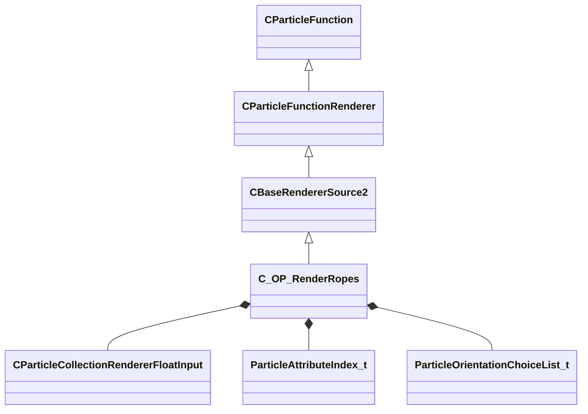

[Schemas](../../schemas.md) / [particles](../particles.md) / C_OP_RenderRopes

# C_OP_RenderRopes

**Kind:** class · **Size:** 13344 bytes (`0x3420`) · **Align:** 8 · **Module:** particles

**Inherits from:** [CBaseRendererSource2](../particles/CBaseRendererSource2.md)

**Relationships:**

## Memory layout

118 fields (33 declared here, 85 inherited). Offsets are absolute from the object base.

| Offset | Field | Type | From | Annotations |
|--------|-------|------|------|-------------|
| `0x8` | `m_flOpStrength` | [CParticleCollectionFloatInput](../particleslib/CParticleCollectionFloatInput.md) | [CParticleFunction](../particles/CParticleFunction.md) | `MPropertyFriendlyName operator strength` `MPropertySortPriority -100` |
| `0x178` | `m_nOpEndCapState` | [ParticleEndcapMode_t](../particles/ParticleEndcapMode_t.md) | [CParticleFunction](../particles/CParticleFunction.md) | `MPropertyFriendlyName operator end cap state` `MPropertySortPriority -100` |
| `0x17c` | `m_nToolsState` | [ParticleToolsState_t](../particles/ParticleToolsState_t.md) | [CParticleFunction](../particles/CParticleFunction.md) | `MPropertyFriendlyName operator enabled in tools or game only` `MPropertySortPriority -100` |
| `0x180` | `m_flOpStartFadeInTime` | float32 | [CParticleFunction](../particles/CParticleFunction.md) | `MParticleAdvancedField` `MPropertyFriendlyName operator start fadein` `MPropertySortPriority -100` `MPropertyStartGroup Operator Fade` |
| `0x184` | `m_flOpEndFadeInTime` | float32 | [CParticleFunction](../particles/CParticleFunction.md) | `MParticleAdvancedField` `MPropertyFriendlyName operator end fadein` `MPropertySortPriority -100` |
| `0x188` | `m_flOpStartFadeOutTime` | float32 | [CParticleFunction](../particles/CParticleFunction.md) | `MParticleAdvancedField` `MPropertyFriendlyName operator start fadeout` `MPropertySortPriority -100` |
| `0x18c` | `m_flOpEndFadeOutTime` | float32 | [CParticleFunction](../particles/CParticleFunction.md) | `MParticleAdvancedField` `MPropertyFriendlyName operator end fadeout` `MPropertySortPriority -100` |
| `0x190` | `m_flOpFadeOscillatePeriod` | float32 | [CParticleFunction](../particles/CParticleFunction.md) | `MParticleAdvancedField` `MPropertyFriendlyName operator fade oscillate` `MPropertySortPriority -100` |
| `0x194` | `m_bNormalizeToStopTime` | bool | [CParticleFunction](../particles/CParticleFunction.md) | `MParticleAdvancedField` `MPropertyFriendlyName normalize fade times to endcap` `MPropertySortPriority -100` |
| `0x198` | `m_flOpTimeOffsetMin` | float32 | [CParticleFunction](../particles/CParticleFunction.md) | `MParticleAdvancedField` `MPropertyFriendlyName operator fade time offset min` `MPropertySortPriority -100` `MPropertyStartGroup Operator Fade Time Offset` |
| `0x19c` | `m_flOpTimeOffsetMax` | float32 | [CParticleFunction](../particles/CParticleFunction.md) | `MParticleAdvancedField` `MPropertyFriendlyName operator fade time offset max` `MPropertySortPriority -100` |
| `0x1a0` | `m_nOpTimeOffsetSeed` | int32 | [CParticleFunction](../particles/CParticleFunction.md) | `MParticleAdvancedField` `MPropertyFriendlyName operator fade time offset seed` `MPropertySortPriority -100` |
| `0x1a4` | `m_nOpTimeScaleSeed` | int32 | [CParticleFunction](../particles/CParticleFunction.md) | `MParticleAdvancedField` `MPropertyFriendlyName operator fade time scale seed` `MPropertySortPriority -100` `MPropertyStartGroup Operator Fade Timescale Modifiers` |
| `0x1a8` | `m_flOpTimeScaleMin` | float32 | [CParticleFunction](../particles/CParticleFunction.md) | `MParticleAdvancedField` `MPropertyFriendlyName operator fade time scale min` `MPropertySortPriority -100` |
| `0x1ac` | `m_flOpTimeScaleMax` | float32 | [CParticleFunction](../particles/CParticleFunction.md) | `MParticleAdvancedField` `MPropertyFriendlyName operator fade time scale max` `MPropertySortPriority -100` |
| `0x1b2` | `m_bDisableOperator` | bool | [CParticleFunction](../particles/CParticleFunction.md) | `MPropertyStartGroup` `MPropertySuppressField` |
| `0x1b8` | `m_Notes` | CUtlString | [CParticleFunction](../particles/CParticleFunction.md) | `MParticleHelpField` `MPropertyFriendlyName operator help and notes` `MPropertySortPriority -100` |
| `0x1d8` | `VisibilityInputs` | [CParticleVisibilityInputs](../particles/CParticleVisibilityInputs.md) | [CParticleFunctionRenderer](../particles/CParticleFunctionRenderer.md) | `MPropertySortPriority -1` |
| `0x220` | `m_bCannotBeRefracted` | bool | [CParticleFunctionRenderer](../particles/CParticleFunctionRenderer.md) | `MPropertyFriendlyName I cannot be refracted through refracting objects like water` `MPropertySortPriority -1` `MPropertyStartGroup Rendering filter` |
| `0x221` | `m_bSkipRenderingOnMobile` | bool | [CParticleFunctionRenderer](../particles/CParticleFunctionRenderer.md) | `MPropertyFriendlyName Skip rendering on mobile` `MPropertySortPriority -1` |
| `0x228` | `m_flRadiusScale` | [CParticleCollectionRendererFloatInput](../particleslib/CParticleCollectionRendererFloatInput.md) | [CBaseRendererSource2](../particles/CBaseRendererSource2.md) | `MPropertyFriendlyName radius scale` `MPropertySortPriority 700` `MPropertyStartGroup +Renderer Modifiers` |
| `0x398` | `m_flAlphaScale` | [CParticleCollectionRendererFloatInput](../particleslib/CParticleCollectionRendererFloatInput.md) | [CBaseRendererSource2](../particles/CBaseRendererSource2.md) | `MPropertyFriendlyName alpha scale` `MPropertySortPriority 700` |
| `0x508` | `m_flRollScale` | [CParticleCollectionRendererFloatInput](../particleslib/CParticleCollectionRendererFloatInput.md) | [CBaseRendererSource2](../particles/CBaseRendererSource2.md) | `MPropertyFriendlyName rotation roll scale` `MPropertySortPriority 700` |
| `0x678` | `m_nAlpha2Field` | [ParticleAttributeIndex_t](../particles/ParticleAttributeIndex_t.md) | [CBaseRendererSource2](../particles/CBaseRendererSource2.md) | `MPropertyAttributeChoiceName particlefield_scalar` `MPropertyFriendlyName per-particle alpha scale attribute` `MPropertySortPriority 700` |
| `0x680` | `m_vecColorScale` | [CParticleCollectionRendererVecInput](../particleslib/CParticleCollectionRendererVecInput.md) | [CBaseRendererSource2](../particles/CBaseRendererSource2.md) | `MPropertyFriendlyName color blend` `MPropertySortPriority 700` |
| `0xd38` | `m_nColorBlendType` | [ParticleColorBlendType_t](../particleslib/ParticleColorBlendType_t.md) | [CBaseRendererSource2](../particles/CBaseRendererSource2.md) | `MPropertyFriendlyName color blend type` `MPropertySortPriority 700` |
| `0xd3c` | `m_nShaderType` | [SpriteCardShaderType_t](../particles/SpriteCardShaderType_t.md) | [CBaseRendererSource2](../particles/CBaseRendererSource2.md) | `MPropertyFriendlyName Shader` `MPropertySortPriority 600` `MPropertyStartGroup +Material` |
| `0xd40` | `m_strShaderOverride` | CUtlString | [CBaseRendererSource2](../particles/CBaseRendererSource2.md) | `MPropertyFriendlyName Custom Shader` `MPropertySortPriority 600` `MPropertySuppressExpr m_nShaderType != SPRITECARD_SHADER_CUSTOM` |
| `0xd48` | `m_flCenterXOffset` | [CParticleCollectionRendererFloatInput](../particleslib/CParticleCollectionRendererFloatInput.md) | [CBaseRendererSource2](../particles/CBaseRendererSource2.md) | `MPropertyFriendlyName X offset of center point` `MPropertySortPriority 600` |
| `0xeb8` | `m_flCenterYOffset` | [CParticleCollectionRendererFloatInput](../particleslib/CParticleCollectionRendererFloatInput.md) | [CBaseRendererSource2](../particles/CBaseRendererSource2.md) | `MPropertyFriendlyName Y offset of center point` `MPropertySortPriority 600` |
| `0x1028` | `m_flBumpStrength` | float32 | [CBaseRendererSource2](../particles/CBaseRendererSource2.md) | `MPropertyFriendlyName Bump Strength` `MPropertySortPriority 600` |
| `0x102c` | `m_nCropTextureOverride` | [ParticleSequenceCropOverride_t](../particles/ParticleSequenceCropOverride_t.md) | [CBaseRendererSource2](../particles/CBaseRendererSource2.md) | `MPropertyFriendlyName Sheet Crop Behavior` `MPropertySortPriority 600` |
| `0x1030` | `m_vecTexturesInput` | CUtlLeanVector< [TextureGroup_t](../particles/TextureGroup_t.md) > | [CBaseRendererSource2](../particles/CBaseRendererSource2.md) | `MParticleRequireDefaultArrayEntry` `MPropertyAutoExpandSelf` `MPropertyFriendlyName Textures` `MPropertySortPriority 600` |
| `0x1040` | `m_flAnimationRate` | float32 | [CBaseRendererSource2](../particles/CBaseRendererSource2.md) | `MPropertyAttributeRange 0 5` `MPropertyFriendlyName animation rate` `MPropertySortPriority 500` `MPropertyStartGroup Animation` |
| `0x1044` | `m_nAnimationType` | [AnimationType_t](../particleslib/AnimationType_t.md) | [CBaseRendererSource2](../particles/CBaseRendererSource2.md) | `MPropertyFriendlyName animation type` `MPropertySortPriority 500` |
| `0x1048` | `m_bAnimateInFPS` | bool | [CBaseRendererSource2](../particles/CBaseRendererSource2.md) | `MPropertyFriendlyName set animation value in FPS` `MPropertySortPriority 500` |
| `0x1050` | `m_flMotionVectorScaleU` | [CParticleCollectionRendererFloatInput](../particleslib/CParticleCollectionRendererFloatInput.md) | [CBaseRendererSource2](../particles/CBaseRendererSource2.md) | `MPropertyFriendlyName motion vector scale U` `MPropertySortPriority 500` |
| `0x11c0` | `m_flMotionVectorScaleV` | [CParticleCollectionRendererFloatInput](../particleslib/CParticleCollectionRendererFloatInput.md) | [CBaseRendererSource2](../particles/CBaseRendererSource2.md) | `MPropertyFriendlyName motion vector scale V` `MPropertySortPriority 500` |
| `0x1330` | `m_flSelfIllumAmount` | [CParticleCollectionRendererFloatInput](../particleslib/CParticleCollectionRendererFloatInput.md) | [CBaseRendererSource2](../particles/CBaseRendererSource2.md) | `MPropertyAttributeRange 0 2` `MPropertyFriendlyName self illum amount` `MPropertySortPriority 400` `MPropertyStartGroup Lighting and Shadows` |
| `0x14a0` | `m_flDiffuseAmount` | [CParticleCollectionRendererFloatInput](../particleslib/CParticleCollectionRendererFloatInput.md) | [CBaseRendererSource2](../particles/CBaseRendererSource2.md) | `MPropertyAttributeRange 0 1` `MPropertyFriendlyName diffuse lighting amount` `MPropertySortPriority 400` |
| `0x1610` | `m_flDiffuseClamp` | [CParticleCollectionRendererFloatInput](../particleslib/CParticleCollectionRendererFloatInput.md) | [CBaseRendererSource2](../particles/CBaseRendererSource2.md) | `MPropertyAttributeRange 0 1` `MPropertyFriendlyName diffuse max contribution clamp` `MPropertySortPriority 400` `MPropertySuppressExpr mod != hlx` |
| `0x1780` | `m_nLightingControlPoint` | int32 | [CBaseRendererSource2](../particles/CBaseRendererSource2.md) | `MPropertyFriendlyName diffuse lighting origin Control Point` `MPropertySortPriority 400` |
| `0x1784` | `m_nOutputBlendMode` | [ParticleOutputBlendMode_t](../particles/ParticleOutputBlendMode_t.md) | [CBaseRendererSource2](../particles/CBaseRendererSource2.md) | `MPropertyFriendlyName output blend mode` `MPropertySortPriority 300` `MPropertyStartGroup +Color and alpha adjustments` |
| `0x1788` | `m_bGammaCorrectVertexColors` | bool | [CBaseRendererSource2](../particles/CBaseRendererSource2.md) | `MPropertyFriendlyName Gamma-correct vertex colors` `MPropertySortPriority 300` |
| `0x1789` | `m_bSaturateColorPreAlphaBlend` | bool | [CBaseRendererSource2](../particles/CBaseRendererSource2.md) | `MPropertyFriendlyName Saturate color pre alphablend` `MPropertySortPriority 300` `MPropertySuppressExpr mod != dota && mod != hlx` |
| `0x1790` | `m_flAddSelfAmount` | [CParticleCollectionRendererFloatInput](../particleslib/CParticleCollectionRendererFloatInput.md) | [CBaseRendererSource2](../particles/CBaseRendererSource2.md) | `MPropertyFriendlyName add self amount over alphablend` `MPropertySortPriority 300` |
| `0x1900` | `m_flDesaturation` | [CParticleCollectionRendererFloatInput](../particleslib/CParticleCollectionRendererFloatInput.md) | [CBaseRendererSource2](../particles/CBaseRendererSource2.md) | `MPropertyAttributeRange 0 1` `MPropertyFriendlyName desaturation amount` `MPropertySortPriority 300` |
| `0x1a70` | `m_flOverbrightFactor` | [CParticleCollectionRendererFloatInput](../particleslib/CParticleCollectionRendererFloatInput.md) | [CBaseRendererSource2](../particles/CBaseRendererSource2.md) | `MPropertyFriendlyName overbright factor` `MPropertySortPriority 300` |
| `0x1be0` | `m_nHSVShiftControlPoint` | int32 | [CBaseRendererSource2](../particles/CBaseRendererSource2.md) | `MPropertyFriendlyName HSV Shift Control Point` `MPropertySortPriority 300` |
| `0x1be4` | `m_nFogType` | [ParticleFogType_t](../particles/ParticleFogType_t.md) | [CBaseRendererSource2](../particles/CBaseRendererSource2.md) | `MPropertyFriendlyName Apply fog to particle` `MPropertySortPriority 300` |
| `0x1be8` | `m_flFogAmount` | [CParticleCollectionRendererFloatInput](../particleslib/CParticleCollectionRendererFloatInput.md) | [CBaseRendererSource2](../particles/CBaseRendererSource2.md) | `MPropertyFriendlyName Fog Scale` `MPropertySortPriority 300` `MPropertySuppressExpr mod != hlx` |
| `0x1d58` | `m_bTintByFOW` | bool | [CBaseRendererSource2](../particles/CBaseRendererSource2.md) | `MPropertyFriendlyName Apply fog of war to color` `MPropertySortPriority 300` `MPropertySuppressExpr mod != dota` |
| `0x1d59` | `m_bTintByGlobalLight` | bool | [CBaseRendererSource2](../particles/CBaseRendererSource2.md) | `MPropertyFriendlyName Apply global light to color` `MPropertySortPriority 300` `MPropertySuppressExpr mod != dota` |
| `0x1d5c` | `m_nPerParticleAlphaReference` | [SpriteCardPerParticleScale_t](../particles/SpriteCardPerParticleScale_t.md) | [CBaseRendererSource2](../particles/CBaseRendererSource2.md) | `MPropertyFriendlyName alpha reference` `MPropertySortPriority 300` `MPropertyStartGroup Color and alpha adjustments/Alpha Reference` |
| `0x1d60` | `m_nPerParticleAlphaRefWindow` | [SpriteCardPerParticleScale_t](../particles/SpriteCardPerParticleScale_t.md) | [CBaseRendererSource2](../particles/CBaseRendererSource2.md) | `MPropertyFriendlyName alpha reference window size` `MPropertySortPriority 300` |
| `0x1d64` | `m_nAlphaReferenceType` | [ParticleAlphaReferenceType_t](../particles/ParticleAlphaReferenceType_t.md) | [CBaseRendererSource2](../particles/CBaseRendererSource2.md) | `MPropertyFriendlyName alpha reference type` `MPropertySortPriority 300` |
| `0x1d68` | `m_flAlphaReferenceSoftness` | [CParticleCollectionRendererFloatInput](../particleslib/CParticleCollectionRendererFloatInput.md) | [CBaseRendererSource2](../particles/CBaseRendererSource2.md) | `MPropertyAttributeRange 0 1` `MPropertyFriendlyName alpha reference softness` `MPropertySortPriority 300` |
| `0x1ed8` | `m_flSourceAlphaValueToMapToZero` | [CParticleCollectionRendererFloatInput](../particleslib/CParticleCollectionRendererFloatInput.md) | [CBaseRendererSource2](../particles/CBaseRendererSource2.md) | `MPropertyAttributeRange 0 1` `MPropertyFriendlyName source alpha value to map to alpha of zero` `MPropertySortPriority 300` |
| `0x2048` | `m_flSourceAlphaValueToMapToOne` | [CParticleCollectionRendererFloatInput](../particleslib/CParticleCollectionRendererFloatInput.md) | [CBaseRendererSource2](../particles/CBaseRendererSource2.md) | `MPropertyAttributeRange 0 1` `MPropertyFriendlyName source alpha value to map to alpha of 1` `MPropertySortPriority 300` |
| `0x21b8` | `m_bRefract` | bool | [CBaseRendererSource2](../particles/CBaseRendererSource2.md) | `MPropertyFriendlyName refract background` `MPropertySortPriority 200` `MPropertyStartGroup Refraction` |
| `0x21b9` | `m_bRefractSolid` | bool | [CBaseRendererSource2](../particles/CBaseRendererSource2.md) | `MPropertyFriendlyName refract draws opaque - alpha scales refraction` `MPropertySortPriority 200` `MPropertySuppressExpr !m_bRefract` |
| `0x21ba` | `m_bRefract2Passes` | bool | [CBaseRendererSource2](../particles/CBaseRendererSource2.md) | `MPropertyFriendlyName refract in 2 passes - can refract particles behind, requires (MBOIT!)` `MPropertySortPriority 200` `MPropertySuppressExpr mod != hlx \|\| !m_bRefract` |
| `0x21c0` | `m_flRefractAmount` | [CParticleCollectionRendererFloatInput](../particleslib/CParticleCollectionRendererFloatInput.md) | [CBaseRendererSource2](../particles/CBaseRendererSource2.md) | `MPropertyAttributeRange -2 2` `MPropertyFriendlyName refract amount` `MPropertySortPriority 200` `MPropertySuppressExpr !m_bRefract` |
| `0x2330` | `m_nRefractBlurRadius` | int32 | [CBaseRendererSource2](../particles/CBaseRendererSource2.md) | `MPropertyFriendlyName refract blur radius` `MPropertySortPriority 200` `MPropertySuppressExpr !m_bRefract` |
| `0x2334` | `m_nRefractBlurType` | [BlurFilterType_t](../particles/BlurFilterType_t.md) | [CBaseRendererSource2](../particles/CBaseRendererSource2.md) | `MPropertyFriendlyName refract blur type` `MPropertySortPriority 200` `MPropertySuppressExpr !m_bRefract` |
| `0x2338` | `m_bOnlyRenderInEffectsBloomPass` | bool | [CBaseRendererSource2](../particles/CBaseRendererSource2.md) | `MPropertyFriendlyName Only Render in effects bloom pass` `MPropertySortPriority 1100` `MPropertyStartGroup` |
| `0x2339` | `m_bOnlyRenderInEffectsWaterPass` | bool | [CBaseRendererSource2](../particles/CBaseRendererSource2.md) | `MPropertyFriendlyName Only Render in effects water pass` `MPropertySortPriority 1050` `MPropertySuppressExpr mod != csgo && mod != hlx` |
| `0x233a` | `m_bUseMixedResolutionRendering` | bool | [CBaseRendererSource2](../particles/CBaseRendererSource2.md) | `MPropertyFriendlyName Use Mixed Resolution Rendering` `MPropertySortPriority 1200` |
| `0x233b` | `m_bOnlyRenderInEffecsGameOverlay` | bool | [CBaseRendererSource2](../particles/CBaseRendererSource2.md) | `MPropertyFriendlyName Only Render in effects game overlay pass` `MPropertySortPriority 1210` `MPropertySuppressExpr mod != csgo` |
| `0x233c` | `m_stencilTestID` | char[128] | [CBaseRendererSource2](../particles/CBaseRendererSource2.md) | `MPropertyFriendlyName stencil test ID` `MPropertySortPriority 0` `MPropertyStartGroup Stencil` |
| `0x23bc` | `m_bStencilTestExclude` | bool | [CBaseRendererSource2](../particles/CBaseRendererSource2.md) | `MPropertyFriendlyName only write where stencil is NOT stencil test ID` `MPropertySortPriority 0` |
| `0x23bd` | `m_stencilWriteID` | char[128] | [CBaseRendererSource2](../particles/CBaseRendererSource2.md) | `MPropertyFriendlyName stencil write ID` `MPropertySortPriority 0` |
| `0x243d` | `m_bWriteStencilOnDepthPass` | bool | [CBaseRendererSource2](../particles/CBaseRendererSource2.md) | `MPropertyFriendlyName write stencil on z-buffer test success` `MPropertySortPriority 0` |
| `0x243e` | `m_bWriteStencilOnDepthFail` | bool | [CBaseRendererSource2](../particles/CBaseRendererSource2.md) | `MPropertyFriendlyName write stencil on z-buffer test failure` `MPropertySortPriority 0` |
| `0x243f` | `m_bReverseZBuffering` | bool | [CBaseRendererSource2](../particles/CBaseRendererSource2.md) | `MPropertyFriendlyName reverse z-buffer test` `MPropertySortPriority 900` `MPropertyStartGroup Depth buffer control and effects` |
| `0x2440` | `m_bDisableZBuffering` | bool | [CBaseRendererSource2](../particles/CBaseRendererSource2.md) | `MPropertyFriendlyName disable z-buffer test` `MPropertySortPriority 900` |
| `0x2444` | `m_nFeatheringMode` | [ParticleDepthFeatheringMode_t](../particles/ParticleDepthFeatheringMode_t.md) | [CBaseRendererSource2](../particles/CBaseRendererSource2.md) | `MPropertyFriendlyName Depth feathering mode` `MPropertySortPriority 900` |
| `0x2448` | `m_flFeatheringMinDist` | [CParticleCollectionRendererFloatInput](../particleslib/CParticleCollectionRendererFloatInput.md) | [CBaseRendererSource2](../particles/CBaseRendererSource2.md) | `MPropertyFriendlyName particle feathering closest distance to surface` `MPropertySortPriority 900` |
| `0x25b8` | `m_flFeatheringMaxDist` | [CParticleCollectionRendererFloatInput](../particleslib/CParticleCollectionRendererFloatInput.md) | [CBaseRendererSource2](../particles/CBaseRendererSource2.md) | `MPropertyFriendlyName particle feathering farthest distance to surface` `MPropertySortPriority 900` |
| `0x2728` | `m_flFeatheringFilter` | [CParticleCollectionRendererFloatInput](../particleslib/CParticleCollectionRendererFloatInput.md) | [CBaseRendererSource2](../particles/CBaseRendererSource2.md) | `MPropertyFriendlyName particle feathering alpha filter` `MPropertySortPriority 900` |
| `0x2898` | `m_flFeatheringDepthMapFilter` | [CParticleCollectionRendererFloatInput](../particleslib/CParticleCollectionRendererFloatInput.md) | [CBaseRendererSource2](../particles/CBaseRendererSource2.md) | `MPropertyFriendlyName particle feathering depthmap layer filter` `MPropertySortPriority 900` `MPropertySuppressExpr mod != hlx` |
| `0x2a08` | `m_flDepthBias` | [CParticleCollectionRendererFloatInput](../particleslib/CParticleCollectionRendererFloatInput.md) | [CBaseRendererSource2](../particles/CBaseRendererSource2.md) | `MPropertyFriendlyName depth comparison bias` `MPropertySortPriority 900` |
| `0x2b78` | `m_nSortMethod` | [ParticleSortingChoiceList_t](../particles/ParticleSortingChoiceList_t.md) | [CBaseRendererSource2](../particles/CBaseRendererSource2.md) | `MPropertyFriendlyName Sort Method` `MPropertySortPriority 900` |
| `0x2b7c` | `m_bBlendFramesSeq0` | bool | [CBaseRendererSource2](../particles/CBaseRendererSource2.md) | `MPropertyFriendlyName blend sequence animation frames` `MPropertySortPriority 500` `MPropertyStartGroup Animation` |
| `0x2b7d` | `m_bMaxLuminanceBlendingSequence0` | bool | [CBaseRendererSource2](../particles/CBaseRendererSource2.md) | `MPropertyFriendlyName use max-luminance blending for sequence` `MPropertySortPriority 500` `MPropertySuppressExpr !m_bBlendFramesSeq0` |
| `0x2df0` | `m_bEnableFadingAndClamping` | bool |  | `MPropertyFriendlyName enable fading and clamping` `MPropertySortPriority 1000` `MPropertyStartGroup Screenspace Fading and culling` |
| `0x2df4` | `m_flMinSize` | float32 |  | `MPropertyFriendlyName minimum visual screen-size` `MPropertySuppressExpr !m_bEnableFadingAndClamping` |
| `0x2df8` | `m_flMaxSize` | float32 |  | `MPropertyFriendlyName maximum visual screen-size` `MPropertySuppressExpr !m_bEnableFadingAndClamping` |
| `0x2dfc` | `m_flStartFadeSize` | float32 |  | `MPropertyFriendlyName start fade screen-size` `MPropertySuppressExpr !m_bEnableFadingAndClamping` |
| `0x2e00` | `m_flEndFadeSize` | float32 |  | `MPropertyFriendlyName end fade and cull screen-size` `MPropertySuppressExpr !m_bEnableFadingAndClamping` |
| `0x2e04` | `m_flStartFadeDot` | float32 |  | `MPropertyFriendlyName start fade dot product of normal vs view` `MPropertySortPriority 1000` |
| `0x2e08` | `m_flEndFadeDot` | float32 |  | `MPropertyFriendlyName end fade dot product of normal vs view` `MPropertySortPriority 1000` |
| `0x2e10` | `m_flSubPixelAAScale` | [CParticleCollectionRendererFloatInput](../particleslib/CParticleCollectionRendererFloatInput.md) |  | `MPropertyFriendlyName sub-pixel AA scale` `MPropertySortPriority 1000` `MPropertySuppressExpr mod != hlx` |
| `0x2f80` | `m_flRadiusTaper` | float32 |  | `MPropertyFriendlyName amount to taper the width of the trail end by` `MPropertyStartGroup Rope Tesselation` |
| `0x2f84` | `m_nMinTesselation` | int32 |  | `MPropertyFriendlyName minium number of quads per render segment` `MPropertySortPriority 850` |
| `0x2f88` | `m_nMaxTesselation` | int32 |  | `MPropertyFriendlyName maximum number of quads per render segment` |
| `0x2f8c` | `m_flTessScale` | float32 |  | `MPropertyFriendlyName tesselation resolution scale factor` |
| `0x2f90` | `m_flTextureVWorldSize` | [CParticleCollectionRendererFloatInput](../particleslib/CParticleCollectionRendererFloatInput.md) |  | `MPropertyFriendlyName global texture V World Size` `MPropertySortPriority 800` `MPropertyStartGroup +Rope Global UV Controls` |
| `0x3100` | `m_flTextureVScrollRate` | [CParticleCollectionRendererFloatInput](../particleslib/CParticleCollectionRendererFloatInput.md) |  | `MPropertyFriendlyName global texture V Scroll Rate` |
| `0x3270` | `m_flTextureVOffset` | [CParticleCollectionRendererFloatInput](../particleslib/CParticleCollectionRendererFloatInput.md) |  | `MPropertyFriendlyName global texture V Offset` |
| `0x33e0` | `m_nTextureVParamsCP` | int32 |  | `MPropertyFriendlyName global texture V Params CP` |
| `0x33e4` | `m_bClampV` | bool |  | `MPropertyFriendlyName Clamp Non-Sheet texture V coords` |
| `0x33e8` | `m_nScaleCP1` | int32 |  | `MPropertyFriendlyName scale CP start` `MPropertyStartGroup Rope Global UV Controls/CP Scaling` |
| `0x33ec` | `m_nScaleCP2` | int32 |  | `MPropertyFriendlyName scale CP end` |
| `0x33f0` | `m_flScaleVSizeByControlPointDistance` | float32 |  | `MPropertyFriendlyName scale V world size by CP distance` |
| `0x33f4` | `m_flScaleVScrollByControlPointDistance` | float32 |  | `MPropertyFriendlyName scale V scroll rate by CP distance` |
| `0x33f8` | `m_flScaleVOffsetByControlPointDistance` | float32 |  | `MPropertyFriendlyName scale V offset by CP distance` |
| `0x33fd` | `m_bUseScalarForTextureCoordinate` | bool |  | `MPropertyFriendlyName Use scalar attribute for texture coordinate` `MPropertyStartGroup Rope Global UV Controls` |
| `0x3400` | `m_nScalarFieldForTextureCoordinate` | [ParticleAttributeIndex_t](../particles/ParticleAttributeIndex_t.md) |  | `MPropertyAttributeChoiceName particlefield_scalar` `MPropertyFriendlyName scalar to use for texture coordinate` `MPropertySuppressExpr !m_bUseScalarForTextureCoordinate` |
| `0x3404` | `m_flScalarAttributeTextureCoordScale` | float32 |  | `MPropertyFriendlyName scale value to map attribute to texture coordinate` `MPropertySuppressExpr !m_bUseScalarForTextureCoordinate` |
| `0x3408` | `m_bReverseOrder` | bool |  | `MPropertyFriendlyName reverse point order` `MPropertySortPriority 800` `MPropertyStartGroup Rope Order Controls` |
| `0x3409` | `m_bClosedLoop` | bool |  | `MPropertyFriendlyName Closed loop` |
| `0x340c` | `m_nSplitField` | [ParticleAttributeIndex_t](../particles/ParticleAttributeIndex_t.md) |  | `MPropertyAttributeChoiceName particlefield_scalar` `MPropertyFriendlyName attribute to use for rope segment id` |
| `0x3410` | `m_bSortBySegmentID` | bool |  | `MPropertyFriendlyName sort by rope segment id` `MPropertySuppressExpr m_nSplitField == PARTICLE_ATTRIBUTE_UNUSED` |
| `0x3414` | `m_nOrientationType` | [ParticleOrientationChoiceList_t](../particles/ParticleOrientationChoiceList_t.md) |  | `MPropertyFriendlyName orientation_type` `MPropertySortPriority 750` `MPropertyStartGroup Orientation` |
| `0x3418` | `m_nVectorFieldForOrientation` | [ParticleAttributeIndex_t](../particles/ParticleAttributeIndex_t.md) |  | `MPropertyAttributeChoiceName particlefield_vector` `MPropertyFriendlyName attribute to use for normal` `MPropertySortPriority 750` `MPropertySuppressExpr m_nOrientationType != PARTICLE_ORIENTATION_ALIGN_TO_PARTICLE_NORMAL && m_nOrientationType != PARTICLE_ORIENTATION_SCREENALIGN_TO_PARTICLE_NORMAL` |
| `0x341c` | `m_bDrawAsOpaque` | bool |  | `MPropertyFriendlyName draw as opaque` `MPropertyStartGroup Material` |
| `0x341d` | `m_bGenerateNormals` | bool |  | `MPropertyFriendlyName generate normals for cylinder` `MPropertyStartGroup Orientation` |

KV3 class defaults

<pre>{
	&quot;_class&quot;: &quot;C_OP_RenderRopes&quot;,
	&quot;m_flOpStrength&quot;:
	{
		&quot;m_nType&quot;: &quot;PF_TYPE_LITERAL&quot;,
		&quot;m_nMapType&quot;: &quot;PF_MAP_TYPE_DIRECT&quot;,
		&quot;m_flLiteralValue&quot;: 1.000000,
		&quot;m_NamedValue&quot;: &quot;&quot;,
		&quot;m_nControlPoint&quot;: 0,
		&quot;m_nScalarAttribute&quot;: 3,
		&quot;m_nVectorAttribute&quot;: 6,
		&quot;m_nVectorComponent&quot;: 0,
		&quot;m_bReverseOrder&quot;: false,
		&quot;m_flRandomMin&quot;: 0.000000,
		&quot;m_flRandomMax&quot;: 1.000000,
		&quot;m_bHasRandomSignFlip&quot;: false,
		&quot;m_nRandomSeed&quot;: &lt;HIDDEN FOR DIFF&gt;,
		&quot;m_nRandomMode&quot;: &quot;PF_RANDOM_MODE_CONSTANT&quot;,
		&quot;m_strSnapshotSubset&quot;: &quot;&quot;,
		&quot;m_flLOD0&quot;: 0.000000,
		&quot;m_flLOD1&quot;: 0.000000,
		&quot;m_flLOD2&quot;: 0.000000,
		&quot;m_flLOD3&quot;: 0.000000,
		&quot;m_nNoiseInputVectorAttribute&quot;: 0,
		&quot;m_flNoiseOutputMin&quot;: 0.000000,
		&quot;m_flNoiseOutputMax&quot;: 1.000000,
		&quot;m_flNoiseScale&quot;: 0.100000,
		&quot;m_vecNoiseOffsetRate&quot;:
		[
			0.000000,
			0.000000,
			0.000000
		],
		&quot;m_flNoiseOffset&quot;: 0.000000,
		&quot;m_nNoiseOctaves&quot;: 1,
		&quot;m_nNoiseTurbulence&quot;: &quot;PF_NOISE_TURB_NONE&quot;,
		&quot;m_nNoiseType&quot;: &quot;PF_NOISE_TYPE_PERLIN&quot;,
		&quot;m_nNoiseModifier&quot;: &quot;PF_NOISE_MODIFIER_NONE&quot;,
		&quot;m_flNoiseTurbulenceScale&quot;: 1.000000,
		&quot;m_flNoiseTurbulenceMix&quot;: 0.500000,
		&quot;m_flNoiseImgPreviewScale&quot;: 1.000000,
		&quot;m_bNoiseImgPreviewLive&quot;: true,
		&quot;m_flNoCameraFallback&quot;: 0.000000,
		&quot;m_bUseBoundsCenter&quot;: false,
		&quot;m_nInputMode&quot;: &quot;PF_INPUT_MODE_CLAMPED&quot;,
		&quot;m_flMultFactor&quot;: 1.000000,
		&quot;m_flInput0&quot;: 0.000000,
		&quot;m_flInput1&quot;: 1.000000,
		&quot;m_flOutput0&quot;: 0.000000,
		&quot;m_flOutput1&quot;: 1.000000,
		&quot;m_flNotchedRangeMin&quot;: 0.000000,
		&quot;m_flNotchedRangeMax&quot;: 1.000000,
		&quot;m_flNotchedOutputOutside&quot;: 0.000000,
		&quot;m_flNotchedOutputInside&quot;: 1.000000,
		&quot;m_nRoundType&quot;: &quot;PF_ROUND_TYPE_NEAREST&quot;,
		&quot;m_nBiasType&quot;: &quot;PF_BIAS_TYPE_STANDARD&quot;,
		&quot;m_flBiasParameter&quot;: 0.000000,
		&quot;m_Curve&quot;:
		{
			&quot;m_spline&quot;:
			[
			],
			&quot;m_tangents&quot;:
			[
			],
			&quot;m_vDomainMins&quot;:
			[
				0.000000,
				0.000000
			],
			&quot;m_vDomainMaxs&quot;:
			[
				0.000000,
				0.000000
			]
		}
	},
	&quot;m_nOpEndCapState&quot;: &quot;PARTICLE_ENDCAP_ALWAYS_ON&quot;,
	&quot;m_nToolsState&quot;: &quot;PARTICLE_TOOLS_STATE_ALWAYS_ON&quot;,
	&quot;m_flOpStartFadeInTime&quot;: 0.000000,
	&quot;m_flOpEndFadeInTime&quot;: 0.000000,
	&quot;m_flOpStartFadeOutTime&quot;: 0.000000,
	&quot;m_flOpEndFadeOutTime&quot;: 0.000000,
	&quot;m_flOpFadeOscillatePeriod&quot;: 0.000000,
	&quot;m_bNormalizeToStopTime&quot;: false,
	&quot;m_flOpTimeOffsetMin&quot;: 0.000000,
	&quot;m_flOpTimeOffsetMax&quot;: 0.000000,
	&quot;m_nOpTimeOffsetSeed&quot;: 0,
	&quot;m_nOpTimeScaleSeed&quot;: 0,
	&quot;m_flOpTimeScaleMin&quot;: 1.000000,
	&quot;m_flOpTimeScaleMax&quot;: 1.000000,
	&quot;m_bDisableOperator&quot;: false,
	&quot;m_Notes&quot;: &quot;&quot;,
	&quot;VisibilityInputs&quot;:
	{
		&quot;m_flCameraBias&quot;: 0.000000,
		&quot;m_nCPin&quot;: -1,
		&quot;m_flProxyRadius&quot;: 1.000000,
		&quot;m_flInputMin&quot;: 0.000000,
		&quot;m_flInputMax&quot;: 1.000000,
		&quot;m_flInputPixelVisFade&quot;: 0.250000,
		&quot;m_flNoPixelVisibilityFallback&quot;: 1.000000,
		&quot;m_flDistanceInputMin&quot;: 0.000000,
		&quot;m_flDistanceInputMax&quot;: 0.000000,
		&quot;m_flDotInputMin&quot;: 0.000000,
		&quot;m_flDotInputMax&quot;: 0.000000,
		&quot;m_bDotCPAngles&quot;: true,
		&quot;m_bDotCameraAngles&quot;: false,
		&quot;m_flAlphaScaleMin&quot;: 0.000000,
		&quot;m_flAlphaScaleMax&quot;: 1.000000,
		&quot;m_flRadiusScaleMin&quot;: 1.000000,
		&quot;m_flRadiusScaleMax&quot;: 1.000000,
		&quot;m_flRadiusScaleFOVBase&quot;: 0.000000,
		&quot;m_bRightEye&quot;: false
	},
	&quot;m_bCannotBeRefracted&quot;: true,
	&quot;m_bSkipRenderingOnMobile&quot;: false,
	&quot;m_flRadiusScale&quot;:
	{
		&quot;m_nType&quot;: &quot;PF_TYPE_LITERAL&quot;,
		&quot;m_nMapType&quot;: &quot;PF_MAP_TYPE_DIRECT&quot;,
		&quot;m_flLiteralValue&quot;: 1.000000,
		&quot;m_NamedValue&quot;: &quot;&quot;,
		&quot;m_nControlPoint&quot;: 0,
		&quot;m_nScalarAttribute&quot;: 3,
		&quot;m_nVectorAttribute&quot;: 6,
		&quot;m_nVectorComponent&quot;: 0,
		&quot;m_bReverseOrder&quot;: false,
		&quot;m_flRandomMin&quot;: 0.000000,
		&quot;m_flRandomMax&quot;: 1.000000,
		&quot;m_bHasRandomSignFlip&quot;: false,
		&quot;m_nRandomSeed&quot;: &lt;HIDDEN FOR DIFF&gt;,
		&quot;m_nRandomMode&quot;: &quot;PF_RANDOM_MODE_CONSTANT&quot;,
		&quot;m_strSnapshotSubset&quot;: &quot;&quot;,
		&quot;m_flLOD0&quot;: 0.000000,
		&quot;m_flLOD1&quot;: 0.000000,
		&quot;m_flLOD2&quot;: 0.000000,
		&quot;m_flLOD3&quot;: 0.000000,
		&quot;m_nNoiseInputVectorAttribute&quot;: 0,
		&quot;m_flNoiseOutputMin&quot;: 0.000000,
		&quot;m_flNoiseOutputMax&quot;: 1.000000,
		&quot;m_flNoiseScale&quot;: 0.100000,
		&quot;m_vecNoiseOffsetRate&quot;:
		[
			0.000000,
			0.000000,
			0.000000
		],
		&quot;m_flNoiseOffset&quot;: 0.000000,
		&quot;m_nNoiseOctaves&quot;: 1,
		&quot;m_nNoiseTurbulence&quot;: &quot;PF_NOISE_TURB_NONE&quot;,
		&quot;m_nNoiseType&quot;: &quot;PF_NOISE_TYPE_PERLIN&quot;,
		&quot;m_nNoiseModifier&quot;: &quot;PF_NOISE_MODIFIER_NONE&quot;,
		&quot;m_flNoiseTurbulenceScale&quot;: 1.000000,
		&quot;m_flNoiseTurbulenceMix&quot;: 0.500000,
		&quot;m_flNoiseImgPreviewScale&quot;: 1.000000,
		&quot;m_bNoiseImgPreviewLive&quot;: true,
		&quot;m_flNoCameraFallback&quot;: 0.000000,
		&quot;m_bUseBoundsCenter&quot;: false,
		&quot;m_nInputMode&quot;: &quot;PF_INPUT_MODE_CLAMPED&quot;,
		&quot;m_flMultFactor&quot;: 1.000000,
		&quot;m_flInput0&quot;: 0.000000,
		&quot;m_flInput1&quot;: 1.000000,
		&quot;m_flOutput0&quot;: 0.000000,
		&quot;m_flOutput1&quot;: 1.000000,
		&quot;m_flNotchedRangeMin&quot;: 0.000000,
		&quot;m_flNotchedRangeMax&quot;: 1.000000,
		&quot;m_flNotchedOutputOutside&quot;: 0.000000,
		&quot;m_flNotchedOutputInside&quot;: 1.000000,
		&quot;m_nRoundType&quot;: &quot;PF_ROUND_TYPE_NEAREST&quot;,
		&quot;m_nBiasType&quot;: &quot;PF_BIAS_TYPE_STANDARD&quot;,
		&quot;m_flBiasParameter&quot;: 0.000000,
		&quot;m_Curve&quot;:
		{
			&quot;m_spline&quot;:
			[
			],
			&quot;m_tangents&quot;:
			[
			],
			&quot;m_vDomainMins&quot;:
			[
				0.000000,
				0.000000
			],
			&quot;m_vDomainMaxs&quot;:
			[
				0.000000,
				0.000000
			]
		}
	},
	&quot;m_flAlphaScale&quot;:
	{
		&quot;m_nType&quot;: &quot;PF_TYPE_LITERAL&quot;,
		&quot;m_nMapType&quot;: &quot;PF_MAP_TYPE_DIRECT&quot;,
		&quot;m_flLiteralValue&quot;: 1.000000,
		&quot;m_NamedValue&quot;: &quot;&quot;,
		&quot;m_nControlPoint&quot;: 0,
		&quot;m_nScalarAttribute&quot;: 3,
		&quot;m_nVectorAttribute&quot;: 6,
		&quot;m_nVectorComponent&quot;: 0,
		&quot;m_bReverseOrder&quot;: false,
		&quot;m_flRandomMin&quot;: 0.000000,
		&quot;m_flRandomMax&quot;: 1.000000,
		&quot;m_bHasRandomSignFlip&quot;: false,
		&quot;m_nRandomSeed&quot;: &lt;HIDDEN FOR DIFF&gt;,
		&quot;m_nRandomMode&quot;: &quot;PF_RANDOM_MODE_CONSTANT&quot;,
		&quot;m_strSnapshotSubset&quot;: &quot;&quot;,
		&quot;m_flLOD0&quot;: 0.000000,
		&quot;m_flLOD1&quot;: 0.000000,
		&quot;m_flLOD2&quot;: 0.000000,
		&quot;m_flLOD3&quot;: 0.000000,
		&quot;m_nNoiseInputVectorAttribute&quot;: 0,
		&quot;m_flNoiseOutputMin&quot;: 0.000000,
		&quot;m_flNoiseOutputMax&quot;: 1.000000,
		&quot;m_flNoiseScale&quot;: 0.100000,
		&quot;m_vecNoiseOffsetRate&quot;:
		[
			0.000000,
			0.000000,
			0.000000
		],
		&quot;m_flNoiseOffset&quot;: 0.000000,
		&quot;m_nNoiseOctaves&quot;: 1,
		&quot;m_nNoiseTurbulence&quot;: &quot;PF_NOISE_TURB_NONE&quot;,
		&quot;m_nNoiseType&quot;: &quot;PF_NOISE_TYPE_PERLIN&quot;,
		&quot;m_nNoiseModifier&quot;: &quot;PF_NOISE_MODIFIER_NONE&quot;,
		&quot;m_flNoiseTurbulenceScale&quot;: 1.000000,
		&quot;m_flNoiseTurbulenceMix&quot;: 0.500000,
		&quot;m_flNoiseImgPreviewScale&quot;: 1.000000,
		&quot;m_bNoiseImgPreviewLive&quot;: true,
		&quot;m_flNoCameraFallback&quot;: 0.000000,
		&quot;m_bUseBoundsCenter&quot;: false,
		&quot;m_nInputMode&quot;: &quot;PF_INPUT_MODE_CLAMPED&quot;,
		&quot;m_flMultFactor&quot;: 1.000000,
		&quot;m_flInput0&quot;: 0.000000,
		&quot;m_flInput1&quot;: 1.000000,
		&quot;m_flOutput0&quot;: 0.000000,
		&quot;m_flOutput1&quot;: 1.000000,
		&quot;m_flNotchedRangeMin&quot;: 0.000000,
		&quot;m_flNotchedRangeMax&quot;: 1.000000,
		&quot;m_flNotchedOutputOutside&quot;: 0.000000,
		&quot;m_flNotchedOutputInside&quot;: 1.000000,
		&quot;m_nRoundType&quot;: &quot;PF_ROUND_TYPE_NEAREST&quot;,
		&quot;m_nBiasType&quot;: &quot;PF_BIAS_TYPE_STANDARD&quot;,
		&quot;m_flBiasParameter&quot;: 0.000000,
		&quot;m_Curve&quot;:
		{
			&quot;m_spline&quot;:
			[
			],
			&quot;m_tangents&quot;:
			[
			],
			&quot;m_vDomainMins&quot;:
			[
				0.000000,
				0.000000
			],
			&quot;m_vDomainMaxs&quot;:
			[
				0.000000,
				0.000000
			]
		}
	},
	&quot;m_flRollScale&quot;:
	{
		&quot;m_nType&quot;: &quot;PF_TYPE_LITERAL&quot;,
		&quot;m_nMapType&quot;: &quot;PF_MAP_TYPE_DIRECT&quot;,
		&quot;m_flLiteralValue&quot;: 1.000000,
		&quot;m_NamedValue&quot;: &quot;&quot;,
		&quot;m_nControlPoint&quot;: 0,
		&quot;m_nScalarAttribute&quot;: 3,
		&quot;m_nVectorAttribute&quot;: 6,
		&quot;m_nVectorComponent&quot;: 0,
		&quot;m_bReverseOrder&quot;: false,
		&quot;m_flRandomMin&quot;: 0.000000,
		&quot;m_flRandomMax&quot;: 1.000000,
		&quot;m_bHasRandomSignFlip&quot;: false,
		&quot;m_nRandomSeed&quot;: &lt;HIDDEN FOR DIFF&gt;,
		&quot;m_nRandomMode&quot;: &quot;PF_RANDOM_MODE_CONSTANT&quot;,
		&quot;m_strSnapshotSubset&quot;: &quot;&quot;,
		&quot;m_flLOD0&quot;: 0.000000,
		&quot;m_flLOD1&quot;: 0.000000,
		&quot;m_flLOD2&quot;: 0.000000,
		&quot;m_flLOD3&quot;: 0.000000,
		&quot;m_nNoiseInputVectorAttribute&quot;: 0,
		&quot;m_flNoiseOutputMin&quot;: 0.000000,
		&quot;m_flNoiseOutputMax&quot;: 1.000000,
		&quot;m_flNoiseScale&quot;: 0.100000,
		&quot;m_vecNoiseOffsetRate&quot;:
		[
			0.000000,
			0.000000,
			0.000000
		],
		&quot;m_flNoiseOffset&quot;: 0.000000,
		&quot;m_nNoiseOctaves&quot;: 1,
		&quot;m_nNoiseTurbulence&quot;: &quot;PF_NOISE_TURB_NONE&quot;,
		&quot;m_nNoiseType&quot;: &quot;PF_NOISE_TYPE_PERLIN&quot;,
		&quot;m_nNoiseModifier&quot;: &quot;PF_NOISE_MODIFIER_NONE&quot;,
		&quot;m_flNoiseTurbulenceScale&quot;: 1.000000,
		&quot;m_flNoiseTurbulenceMix&quot;: 0.500000,
		&quot;m_flNoiseImgPreviewScale&quot;: 1.000000,
		&quot;m_bNoiseImgPreviewLive&quot;: true,
		&quot;m_flNoCameraFallback&quot;: 0.000000,
		&quot;m_bUseBoundsCenter&quot;: false,
		&quot;m_nInputMode&quot;: &quot;PF_INPUT_MODE_CLAMPED&quot;,
		&quot;m_flMultFactor&quot;: 1.000000,
		&quot;m_flInput0&quot;: 0.000000,
		&quot;m_flInput1&quot;: 1.000000,
		&quot;m_flOutput0&quot;: 0.000000,
		&quot;m_flOutput1&quot;: 1.000000,
		&quot;m_flNotchedRangeMin&quot;: 0.000000,
		&quot;m_flNotchedRangeMax&quot;: 1.000000,
		&quot;m_flNotchedOutputOutside&quot;: 0.000000,
		&quot;m_flNotchedOutputInside&quot;: 1.000000,
		&quot;m_nRoundType&quot;: &quot;PF_ROUND_TYPE_NEAREST&quot;,
		&quot;m_nBiasType&quot;: &quot;PF_BIAS_TYPE_STANDARD&quot;,
		&quot;m_flBiasParameter&quot;: 0.000000,
		&quot;m_Curve&quot;:
		{
			&quot;m_spline&quot;:
			[
			],
			&quot;m_tangents&quot;:
			[
			],
			&quot;m_vDomainMins&quot;:
			[
				0.000000,
				0.000000
			],
			&quot;m_vDomainMaxs&quot;:
			[
				0.000000,
				0.000000
			]
		}
	},
	&quot;m_nAlpha2Field&quot;: 16,
	&quot;m_vecColorScale&quot;:
	{
		&quot;m_nType&quot;: &quot;PVEC_TYPE_LITERAL_COLOR&quot;,
		&quot;m_vLiteralValue&quot;:
		[
			0.000000,
			0.000000,
			0.000000
		],
		&quot;m_LiteralColor&quot;:
		[
			255,
			255,
			255
		],
		&quot;m_NamedValue&quot;: &quot;&quot;,
		&quot;m_bFollowNamedValue&quot;: false,
		&quot;m_nVectorAttribute&quot;: 6,
		&quot;m_vVectorAttributeScale&quot;:
		[
			1.000000,
			1.000000,
			1.000000
		],
		&quot;m_nControlPoint&quot;: 0,
		&quot;m_nDeltaControlPoint&quot;: 0,
		&quot;m_vCPValueScale&quot;:
		[
			1.000000,
			1.000000,
			1.000000
		],
		&quot;m_vCPRelativePosition&quot;:
		[
			0.000000,
			0.000000,
			0.000000
		],
		&quot;m_vCPRelativeDir&quot;:
		[
			1.000000,
			0.000000,
			0.000000
		],
		&quot;m_FloatComponentX&quot;:
		{
			&quot;m_nType&quot;: &quot;PF_TYPE_LITERAL&quot;,
			&quot;m_nMapType&quot;: &quot;PF_MAP_TYPE_DIRECT&quot;,
			&quot;m_flLiteralValue&quot;: 0.000000,
			&quot;m_NamedValue&quot;: &quot;&quot;,
			&quot;m_nControlPoint&quot;: 0,
			&quot;m_nScalarAttribute&quot;: 3,
			&quot;m_nVectorAttribute&quot;: 6,
			&quot;m_nVectorComponent&quot;: 0,
			&quot;m_bReverseOrder&quot;: false,
			&quot;m_flRandomMin&quot;: 0.000000,
			&quot;m_flRandomMax&quot;: 1.000000,
			&quot;m_bHasRandomSignFlip&quot;: false,
			&quot;m_nRandomSeed&quot;: &lt;HIDDEN FOR DIFF&gt;,
			&quot;m_nRandomMode&quot;: &quot;PF_RANDOM_MODE_CONSTANT&quot;,
			&quot;m_strSnapshotSubset&quot;: &quot;&quot;,
			&quot;m_flLOD0&quot;: 0.000000,
			&quot;m_flLOD1&quot;: 0.000000,
			&quot;m_flLOD2&quot;: 0.000000,
			&quot;m_flLOD3&quot;: 0.000000,
			&quot;m_nNoiseInputVectorAttribute&quot;: 0,
			&quot;m_flNoiseOutputMin&quot;: 0.000000,
			&quot;m_flNoiseOutputMax&quot;: 1.000000,
			&quot;m_flNoiseScale&quot;: 0.100000,
			&quot;m_vecNoiseOffsetRate&quot;:
			[
				0.000000,
				0.000000,
				0.000000
			],
			&quot;m_flNoiseOffset&quot;: 0.000000,
			&quot;m_nNoiseOctaves&quot;: 1,
			&quot;m_nNoiseTurbulence&quot;: &quot;PF_NOISE_TURB_NONE&quot;,
			&quot;m_nNoiseType&quot;: &quot;PF_NOISE_TYPE_PERLIN&quot;,
			&quot;m_nNoiseModifier&quot;: &quot;PF_NOISE_MODIFIER_NONE&quot;,
			&quot;m_flNoiseTurbulenceScale&quot;: 1.000000,
			&quot;m_flNoiseTurbulenceMix&quot;: 0.500000,
			&quot;m_flNoiseImgPreviewScale&quot;: 1.000000,
			&quot;m_bNoiseImgPreviewLive&quot;: true,
			&quot;m_flNoCameraFallback&quot;: 0.000000,
			&quot;m_bUseBoundsCenter&quot;: false,
			&quot;m_nInputMode&quot;: &quot;PF_INPUT_MODE_CLAMPED&quot;,
			&quot;m_flMultFactor&quot;: 1.000000,
			&quot;m_flInput0&quot;: 0.000000,
			&quot;m_flInput1&quot;: 1.000000,
			&quot;m_flOutput0&quot;: 0.000000,
			&quot;m_flOutput1&quot;: 1.000000,
			&quot;m_flNotchedRangeMin&quot;: 0.000000,
			&quot;m_flNotchedRangeMax&quot;: 1.000000,
			&quot;m_flNotchedOutputOutside&quot;: 0.000000,
			&quot;m_flNotchedOutputInside&quot;: 1.000000,
			&quot;m_nRoundType&quot;: &quot;PF_ROUND_TYPE_NEAREST&quot;,
			&quot;m_nBiasType&quot;: &quot;PF_BIAS_TYPE_STANDARD&quot;,
			&quot;m_flBiasParameter&quot;: 0.000000,
			&quot;m_Curve&quot;:
			{
				&quot;m_spline&quot;:
				[
				],
				&quot;m_tangents&quot;:
				[
				],
				&quot;m_vDomainMins&quot;:
				[
					0.000000,
					0.000000
				],
				&quot;m_vDomainMaxs&quot;:
				[
					0.000000,
					0.000000
				]
			}
		},
		&quot;m_FloatComponentY&quot;:
		{
			&quot;m_nType&quot;: &quot;PF_TYPE_LITERAL&quot;,
			&quot;m_nMapType&quot;: &quot;PF_MAP_TYPE_DIRECT&quot;,
			&quot;m_flLiteralValue&quot;: 0.000000,
			&quot;m_NamedValue&quot;: &quot;&quot;,
			&quot;m_nControlPoint&quot;: 0,
			&quot;m_nScalarAttribute&quot;: 3,
			&quot;m_nVectorAttribute&quot;: 6,
			&quot;m_nVectorComponent&quot;: 0,
			&quot;m_bReverseOrder&quot;: false,
			&quot;m_flRandomMin&quot;: 0.000000,
			&quot;m_flRandomMax&quot;: 1.000000,
			&quot;m_bHasRandomSignFlip&quot;: false,
			&quot;m_nRandomSeed&quot;: &lt;HIDDEN FOR DIFF&gt;,
			&quot;m_nRandomMode&quot;: &quot;PF_RANDOM_MODE_CONSTANT&quot;,
			&quot;m_strSnapshotSubset&quot;: &quot;&quot;,
			&quot;m_flLOD0&quot;: 0.000000,
			&quot;m_flLOD1&quot;: 0.000000,
			&quot;m_flLOD2&quot;: 0.000000,
			&quot;m_flLOD3&quot;: 0.000000,
			&quot;m_nNoiseInputVectorAttribute&quot;: 0,
			&quot;m_flNoiseOutputMin&quot;: 0.000000,
			&quot;m_flNoiseOutputMax&quot;: 1.000000,
			&quot;m_flNoiseScale&quot;: 0.100000,
			&quot;m_vecNoiseOffsetRate&quot;:
			[
				0.000000,
				0.000000,
				0.000000
			],
			&quot;m_flNoiseOffset&quot;: 0.000000,
			&quot;m_nNoiseOctaves&quot;: 1,
			&quot;m_nNoiseTurbulence&quot;: &quot;PF_NOISE_TURB_NONE&quot;,
			&quot;m_nNoiseType&quot;: &quot;PF_NOISE_TYPE_PERLIN&quot;,
			&quot;m_nNoiseModifier&quot;: &quot;PF_NOISE_MODIFIER_NONE&quot;,
			&quot;m_flNoiseTurbulenceScale&quot;: 1.000000,
			&quot;m_flNoiseTurbulenceMix&quot;: 0.500000,
			&quot;m_flNoiseImgPreviewScale&quot;: 1.000000,
			&quot;m_bNoiseImgPreviewLive&quot;: true,
			&quot;m_flNoCameraFallback&quot;: 0.000000,
			&quot;m_bUseBoundsCenter&quot;: false,
			&quot;m_nInputMode&quot;: &quot;PF_INPUT_MODE_CLAMPED&quot;,
			&quot;m_flMultFactor&quot;: 1.000000,
			&quot;m_flInput0&quot;: 0.000000,
			&quot;m_flInput1&quot;: 1.000000,
			&quot;m_flOutput0&quot;: 0.000000,
			&quot;m_flOutput1&quot;: 1.000000,
			&quot;m_flNotchedRangeMin&quot;: 0.000000,
			&quot;m_flNotchedRangeMax&quot;: 1.000000,
			&quot;m_flNotchedOutputOutside&quot;: 0.000000,
			&quot;m_flNotchedOutputInside&quot;: 1.000000,
			&quot;m_nRoundType&quot;: &quot;PF_ROUND_TYPE_NEAREST&quot;,
			&quot;m_nBiasType&quot;: &quot;PF_BIAS_TYPE_STANDARD&quot;,
			&quot;m_flBiasParameter&quot;: 0.000000,
			&quot;m_Curve&quot;:
			{
				&quot;m_spline&quot;:
				[
				],
				&quot;m_tangents&quot;:
				[
				],
				&quot;m_vDomainMins&quot;:
				[
					0.000000,
					0.000000
				],
				&quot;m_vDomainMaxs&quot;:
				[
					0.000000,
					0.000000
				]
			}
		},
		&quot;m_FloatComponentZ&quot;:
		{
			&quot;m_nType&quot;: &quot;PF_TYPE_LITERAL&quot;,
			&quot;m_nMapType&quot;: &quot;PF_MAP_TYPE_DIRECT&quot;,
			&quot;m_flLiteralValue&quot;: 0.000000,
			&quot;m_NamedValue&quot;: &quot;&quot;,
			&quot;m_nControlPoint&quot;: 0,
			&quot;m_nScalarAttribute&quot;: 3,
			&quot;m_nVectorAttribute&quot;: 6,
			&quot;m_nVectorComponent&quot;: 0,
			&quot;m_bReverseOrder&quot;: false,
			&quot;m_flRandomMin&quot;: 0.000000,
			&quot;m_flRandomMax&quot;: 1.000000,
			&quot;m_bHasRandomSignFlip&quot;: false,
			&quot;m_nRandomSeed&quot;: &lt;HIDDEN FOR DIFF&gt;,
			&quot;m_nRandomMode&quot;: &quot;PF_RANDOM_MODE_CONSTANT&quot;,
			&quot;m_strSnapshotSubset&quot;: &quot;&quot;,
			&quot;m_flLOD0&quot;: 0.000000,
			&quot;m_flLOD1&quot;: 0.000000,
			&quot;m_flLOD2&quot;: 0.000000,
			&quot;m_flLOD3&quot;: 0.000000,
			&quot;m_nNoiseInputVectorAttribute&quot;: 0,
			&quot;m_flNoiseOutputMin&quot;: 0.000000,
			&quot;m_flNoiseOutputMax&quot;: 1.000000,
			&quot;m_flNoiseScale&quot;: 0.100000,
			&quot;m_vecNoiseOffsetRate&quot;:
			[
				0.000000,
				0.000000,
				0.000000
			],
			&quot;m_flNoiseOffset&quot;: 0.000000,
			&quot;m_nNoiseOctaves&quot;: 1,
			&quot;m_nNoiseTurbulence&quot;: &quot;PF_NOISE_TURB_NONE&quot;,
			&quot;m_nNoiseType&quot;: &quot;PF_NOISE_TYPE_PERLIN&quot;,
			&quot;m_nNoiseModifier&quot;: &quot;PF_NOISE_MODIFIER_NONE&quot;,
			&quot;m_flNoiseTurbulenceScale&quot;: 1.000000,
			&quot;m_flNoiseTurbulenceMix&quot;: 0.500000,
			&quot;m_flNoiseImgPreviewScale&quot;: 1.000000,
			&quot;m_bNoiseImgPreviewLive&quot;: true,
			&quot;m_flNoCameraFallback&quot;: 0.000000,
			&quot;m_bUseBoundsCenter&quot;: false,
			&quot;m_nInputMode&quot;: &quot;PF_INPUT_MODE_CLAMPED&quot;,
			&quot;m_flMultFactor&quot;: 1.000000,
			&quot;m_flInput0&quot;: 0.000000,
			&quot;m_flInput1&quot;: 1.000000,
			&quot;m_flOutput0&quot;: 0.000000,
			&quot;m_flOutput1&quot;: 1.000000,
			&quot;m_flNotchedRangeMin&quot;: 0.000000,
			&quot;m_flNotchedRangeMax&quot;: 1.000000,
			&quot;m_flNotchedOutputOutside&quot;: 0.000000,
			&quot;m_flNotchedOutputInside&quot;: 1.000000,
			&quot;m_nRoundType&quot;: &quot;PF_ROUND_TYPE_NEAREST&quot;,
			&quot;m_nBiasType&quot;: &quot;PF_BIAS_TYPE_STANDARD&quot;,
			&quot;m_flBiasParameter&quot;: 0.000000,
			&quot;m_Curve&quot;:
			{
				&quot;m_spline&quot;:
				[
				],
				&quot;m_tangents&quot;:
				[
				],
				&quot;m_vDomainMins&quot;:
				[
					0.000000,
					0.000000
				],
				&quot;m_vDomainMaxs&quot;:
				[
					0.000000,
					0.000000
				]
			}
		},
		&quot;m_FloatInterp&quot;:
		{
			&quot;m_nType&quot;: &quot;PF_TYPE_LITERAL&quot;,
			&quot;m_nMapType&quot;: &quot;PF_MAP_TYPE_DIRECT&quot;,
			&quot;m_flLiteralValue&quot;: 0.000000,
			&quot;m_NamedValue&quot;: &quot;&quot;,
			&quot;m_nControlPoint&quot;: 0,
			&quot;m_nScalarAttribute&quot;: 3,
			&quot;m_nVectorAttribute&quot;: 6,
			&quot;m_nVectorComponent&quot;: 0,
			&quot;m_bReverseOrder&quot;: false,
			&quot;m_flRandomMin&quot;: 0.000000,
			&quot;m_flRandomMax&quot;: 1.000000,
			&quot;m_bHasRandomSignFlip&quot;: false,
			&quot;m_nRandomSeed&quot;: &lt;HIDDEN FOR DIFF&gt;,
			&quot;m_nRandomMode&quot;: &quot;PF_RANDOM_MODE_CONSTANT&quot;,
			&quot;m_strSnapshotSubset&quot;: &quot;&quot;,
			&quot;m_flLOD0&quot;: 0.000000,
			&quot;m_flLOD1&quot;: 0.000000,
			&quot;m_flLOD2&quot;: 0.000000,
			&quot;m_flLOD3&quot;: 0.000000,
			&quot;m_nNoiseInputVectorAttribute&quot;: 0,
			&quot;m_flNoiseOutputMin&quot;: 0.000000,
			&quot;m_flNoiseOutputMax&quot;: 1.000000,
			&quot;m_flNoiseScale&quot;: 0.100000,
			&quot;m_vecNoiseOffsetRate&quot;:
			[
				0.000000,
				0.000000,
				0.000000
			],
			&quot;m_flNoiseOffset&quot;: 0.000000,
			&quot;m_nNoiseOctaves&quot;: 1,
			&quot;m_nNoiseTurbulence&quot;: &quot;PF_NOISE_TURB_NONE&quot;,
			&quot;m_nNoiseType&quot;: &quot;PF_NOISE_TYPE_PERLIN&quot;,
			&quot;m_nNoiseModifier&quot;: &quot;PF_NOISE_MODIFIER_NONE&quot;,
			&quot;m_flNoiseTurbulenceScale&quot;: 1.000000,
			&quot;m_flNoiseTurbulenceMix&quot;: 0.500000,
			&quot;m_flNoiseImgPreviewScale&quot;: 1.000000,
			&quot;m_bNoiseImgPreviewLive&quot;: true,
			&quot;m_flNoCameraFallback&quot;: 0.000000,
			&quot;m_bUseBoundsCenter&quot;: false,
			&quot;m_nInputMode&quot;: &quot;PF_INPUT_MODE_CLAMPED&quot;,
			&quot;m_flMultFactor&quot;: 1.000000,
			&quot;m_flInput0&quot;: 0.000000,
			&quot;m_flInput1&quot;: 1.000000,
			&quot;m_flOutput0&quot;: 0.000000,
			&quot;m_flOutput1&quot;: 1.000000,
			&quot;m_flNotchedRangeMin&quot;: 0.000000,
			&quot;m_flNotchedRangeMax&quot;: 1.000000,
			&quot;m_flNotchedOutputOutside&quot;: 0.000000,
			&quot;m_flNotchedOutputInside&quot;: 1.000000,
			&quot;m_nRoundType&quot;: &quot;PF_ROUND_TYPE_NEAREST&quot;,
			&quot;m_nBiasType&quot;: &quot;PF_BIAS_TYPE_STANDARD&quot;,
			&quot;m_flBiasParameter&quot;: 0.000000,
			&quot;m_Curve&quot;:
			{
				&quot;m_spline&quot;:
				[
				],
				&quot;m_tangents&quot;:
				[
				],
				&quot;m_vDomainMins&quot;:
				[
					0.000000,
					0.000000
				],
				&quot;m_vDomainMaxs&quot;:
				[
					0.000000,
					0.000000
				]
			}
		},
		&quot;m_flInterpInput0&quot;: 0.000000,
		&quot;m_flInterpInput1&quot;: 1.000000,
		&quot;m_vInterpOutput0&quot;:
		[
			0.000000,
			0.000000,
			0.000000
		],
		&quot;m_vInterpOutput1&quot;:
		[
			1.000000,
			1.000000,
			1.000000
		],
		&quot;m_Gradient&quot;:
		{
			&quot;m_Stops&quot;:
			[
			]
		},
		&quot;m_vRandomMin&quot;:
		[
			0.000000,
			0.000000,
			0.000000
		],
		&quot;m_vRandomMax&quot;:
		[
			0.000000,
			0.000000,
			0.000000
		]
	},
	&quot;m_nColorBlendType&quot;: &quot;PARTICLE_COLOR_BLEND_MULTIPLY&quot;,
	&quot;m_nShaderType&quot;: &quot;SPRITECARD_SHADER_BASE&quot;,
	&quot;m_strShaderOverride&quot;: &quot;&quot;,
	&quot;m_flCenterXOffset&quot;:
	{
		&quot;m_nType&quot;: &quot;PF_TYPE_LITERAL&quot;,
		&quot;m_nMapType&quot;: &quot;PF_MAP_TYPE_DIRECT&quot;,
		&quot;m_flLiteralValue&quot;: 0.000000,
		&quot;m_NamedValue&quot;: &quot;&quot;,
		&quot;m_nControlPoint&quot;: 0,
		&quot;m_nScalarAttribute&quot;: 3,
		&quot;m_nVectorAttribute&quot;: 6,
		&quot;m_nVectorComponent&quot;: 0,
		&quot;m_bReverseOrder&quot;: false,
		&quot;m_flRandomMin&quot;: 0.000000,
		&quot;m_flRandomMax&quot;: 1.000000,
		&quot;m_bHasRandomSignFlip&quot;: false,
		&quot;m_nRandomSeed&quot;: &lt;HIDDEN FOR DIFF&gt;,
		&quot;m_nRandomMode&quot;: &quot;PF_RANDOM_MODE_CONSTANT&quot;,
		&quot;m_strSnapshotSubset&quot;: &quot;&quot;,
		&quot;m_flLOD0&quot;: 0.000000,
		&quot;m_flLOD1&quot;: 0.000000,
		&quot;m_flLOD2&quot;: 0.000000,
		&quot;m_flLOD3&quot;: 0.000000,
		&quot;m_nNoiseInputVectorAttribute&quot;: 0,
		&quot;m_flNoiseOutputMin&quot;: 0.000000,
		&quot;m_flNoiseOutputMax&quot;: 1.000000,
		&quot;m_flNoiseScale&quot;: 0.100000,
		&quot;m_vecNoiseOffsetRate&quot;:
		[
			0.000000,
			0.000000,
			0.000000
		],
		&quot;m_flNoiseOffset&quot;: 0.000000,
		&quot;m_nNoiseOctaves&quot;: 1,
		&quot;m_nNoiseTurbulence&quot;: &quot;PF_NOISE_TURB_NONE&quot;,
		&quot;m_nNoiseType&quot;: &quot;PF_NOISE_TYPE_PERLIN&quot;,
		&quot;m_nNoiseModifier&quot;: &quot;PF_NOISE_MODIFIER_NONE&quot;,
		&quot;m_flNoiseTurbulenceScale&quot;: 1.000000,
		&quot;m_flNoiseTurbulenceMix&quot;: 0.500000,
		&quot;m_flNoiseImgPreviewScale&quot;: 1.000000,
		&quot;m_bNoiseImgPreviewLive&quot;: true,
		&quot;m_flNoCameraFallback&quot;: 0.000000,
		&quot;m_bUseBoundsCenter&quot;: false,
		&quot;m_nInputMode&quot;: &quot;PF_INPUT_MODE_CLAMPED&quot;,
		&quot;m_flMultFactor&quot;: 1.000000,
		&quot;m_flInput0&quot;: 0.000000,
		&quot;m_flInput1&quot;: 1.000000,
		&quot;m_flOutput0&quot;: 0.000000,
		&quot;m_flOutput1&quot;: 1.000000,
		&quot;m_flNotchedRangeMin&quot;: 0.000000,
		&quot;m_flNotchedRangeMax&quot;: 1.000000,
		&quot;m_flNotchedOutputOutside&quot;: 0.000000,
		&quot;m_flNotchedOutputInside&quot;: 1.000000,
		&quot;m_nRoundType&quot;: &quot;PF_ROUND_TYPE_NEAREST&quot;,
		&quot;m_nBiasType&quot;: &quot;PF_BIAS_TYPE_STANDARD&quot;,
		&quot;m_flBiasParameter&quot;: 0.000000,
		&quot;m_Curve&quot;:
		{
			&quot;m_spline&quot;:
			[
			],
			&quot;m_tangents&quot;:
			[
			],
			&quot;m_vDomainMins&quot;:
			[
				0.000000,
				0.000000
			],
			&quot;m_vDomainMaxs&quot;:
			[
				0.000000,
				0.000000
			]
		}
	},
	&quot;m_flCenterYOffset&quot;:
	{
		&quot;m_nType&quot;: &quot;PF_TYPE_LITERAL&quot;,
		&quot;m_nMapType&quot;: &quot;PF_MAP_TYPE_DIRECT&quot;,
		&quot;m_flLiteralValue&quot;: 0.000000,
		&quot;m_NamedValue&quot;: &quot;&quot;,
		&quot;m_nControlPoint&quot;: 0,
		&quot;m_nScalarAttribute&quot;: 3,
		&quot;m_nVectorAttribute&quot;: 6,
		&quot;m_nVectorComponent&quot;: 0,
		&quot;m_bReverseOrder&quot;: false,
		&quot;m_flRandomMin&quot;: 0.000000,
		&quot;m_flRandomMax&quot;: 1.000000,
		&quot;m_bHasRandomSignFlip&quot;: false,
		&quot;m_nRandomSeed&quot;: &lt;HIDDEN FOR DIFF&gt;,
		&quot;m_nRandomMode&quot;: &quot;PF_RANDOM_MODE_CONSTANT&quot;,
		&quot;m_strSnapshotSubset&quot;: &quot;&quot;,
		&quot;m_flLOD0&quot;: 0.000000,
		&quot;m_flLOD1&quot;: 0.000000,
		&quot;m_flLOD2&quot;: 0.000000,
		&quot;m_flLOD3&quot;: 0.000000,
		&quot;m_nNoiseInputVectorAttribute&quot;: 0,
		&quot;m_flNoiseOutputMin&quot;: 0.000000,
		&quot;m_flNoiseOutputMax&quot;: 1.000000,
		&quot;m_flNoiseScale&quot;: 0.100000,
		&quot;m_vecNoiseOffsetRate&quot;:
		[
			0.000000,
			0.000000,
			0.000000
		],
		&quot;m_flNoiseOffset&quot;: 0.000000,
		&quot;m_nNoiseOctaves&quot;: 1,
		&quot;m_nNoiseTurbulence&quot;: &quot;PF_NOISE_TURB_NONE&quot;,
		&quot;m_nNoiseType&quot;: &quot;PF_NOISE_TYPE_PERLIN&quot;,
		&quot;m_nNoiseModifier&quot;: &quot;PF_NOISE_MODIFIER_NONE&quot;,
		&quot;m_flNoiseTurbulenceScale&quot;: 1.000000,
		&quot;m_flNoiseTurbulenceMix&quot;: 0.500000,
		&quot;m_flNoiseImgPreviewScale&quot;: 1.000000,
		&quot;m_bNoiseImgPreviewLive&quot;: true,
		&quot;m_flNoCameraFallback&quot;: 0.000000,
		&quot;m_bUseBoundsCenter&quot;: false,
		&quot;m_nInputMode&quot;: &quot;PF_INPUT_MODE_CLAMPED&quot;,
		&quot;m_flMultFactor&quot;: 1.000000,
		&quot;m_flInput0&quot;: 0.000000,
		&quot;m_flInput1&quot;: 1.000000,
		&quot;m_flOutput0&quot;: 0.000000,
		&quot;m_flOutput1&quot;: 1.000000,
		&quot;m_flNotchedRangeMin&quot;: 0.000000,
		&quot;m_flNotchedRangeMax&quot;: 1.000000,
		&quot;m_flNotchedOutputOutside&quot;: 0.000000,
		&quot;m_flNotchedOutputInside&quot;: 1.000000,
		&quot;m_nRoundType&quot;: &quot;PF_ROUND_TYPE_NEAREST&quot;,
		&quot;m_nBiasType&quot;: &quot;PF_BIAS_TYPE_STANDARD&quot;,
		&quot;m_flBiasParameter&quot;: 0.000000,
		&quot;m_Curve&quot;:
		{
			&quot;m_spline&quot;:
			[
			],
			&quot;m_tangents&quot;:
			[
			],
			&quot;m_vDomainMins&quot;:
			[
				0.000000,
				0.000000
			],
			&quot;m_vDomainMaxs&quot;:
			[
				0.000000,
				0.000000
			]
		}
	},
	&quot;m_flBumpStrength&quot;: 1.000000,
	&quot;m_nCropTextureOverride&quot;: &quot;PARTICLE_SEQUENCE_CROP_OVERRIDE_DEFAULT&quot;,
	&quot;m_vecTexturesInput&quot;:
	[
	],
	&quot;m_flAnimationRate&quot;: 0.100000,
	&quot;m_nAnimationType&quot;: &quot;ANIMATION_TYPE_FIXED_RATE&quot;,
	&quot;m_bAnimateInFPS&quot;: false,
	&quot;m_flMotionVectorScaleU&quot;:
	{
		&quot;m_nType&quot;: &quot;PF_TYPE_LITERAL&quot;,
		&quot;m_nMapType&quot;: &quot;PF_MAP_TYPE_DIRECT&quot;,
		&quot;m_flLiteralValue&quot;: 1.000000,
		&quot;m_NamedValue&quot;: &quot;&quot;,
		&quot;m_nControlPoint&quot;: 0,
		&quot;m_nScalarAttribute&quot;: 3,
		&quot;m_nVectorAttribute&quot;: 6,
		&quot;m_nVectorComponent&quot;: 0,
		&quot;m_bReverseOrder&quot;: false,
		&quot;m_flRandomMin&quot;: 0.000000,
		&quot;m_flRandomMax&quot;: 1.000000,
		&quot;m_bHasRandomSignFlip&quot;: false,
		&quot;m_nRandomSeed&quot;: &lt;HIDDEN FOR DIFF&gt;,
		&quot;m_nRandomMode&quot;: &quot;PF_RANDOM_MODE_CONSTANT&quot;,
		&quot;m_strSnapshotSubset&quot;: &quot;&quot;,
		&quot;m_flLOD0&quot;: 0.000000,
		&quot;m_flLOD1&quot;: 0.000000,
		&quot;m_flLOD2&quot;: 0.000000,
		&quot;m_flLOD3&quot;: 0.000000,
		&quot;m_nNoiseInputVectorAttribute&quot;: 0,
		&quot;m_flNoiseOutputMin&quot;: 0.000000,
		&quot;m_flNoiseOutputMax&quot;: 1.000000,
		&quot;m_flNoiseScale&quot;: 0.100000,
		&quot;m_vecNoiseOffsetRate&quot;:
		[
			0.000000,
			0.000000,
			0.000000
		],
		&quot;m_flNoiseOffset&quot;: 0.000000,
		&quot;m_nNoiseOctaves&quot;: 1,
		&quot;m_nNoiseTurbulence&quot;: &quot;PF_NOISE_TURB_NONE&quot;,
		&quot;m_nNoiseType&quot;: &quot;PF_NOISE_TYPE_PERLIN&quot;,
		&quot;m_nNoiseModifier&quot;: &quot;PF_NOISE_MODIFIER_NONE&quot;,
		&quot;m_flNoiseTurbulenceScale&quot;: 1.000000,
		&quot;m_flNoiseTurbulenceMix&quot;: 0.500000,
		&quot;m_flNoiseImgPreviewScale&quot;: 1.000000,
		&quot;m_bNoiseImgPreviewLive&quot;: true,
		&quot;m_flNoCameraFallback&quot;: 0.000000,
		&quot;m_bUseBoundsCenter&quot;: false,
		&quot;m_nInputMode&quot;: &quot;PF_INPUT_MODE_CLAMPED&quot;,
		&quot;m_flMultFactor&quot;: 1.000000,
		&quot;m_flInput0&quot;: 0.000000,
		&quot;m_flInput1&quot;: 1.000000,
		&quot;m_flOutput0&quot;: 0.000000,
		&quot;m_flOutput1&quot;: 1.000000,
		&quot;m_flNotchedRangeMin&quot;: 0.000000,
		&quot;m_flNotchedRangeMax&quot;: 1.000000,
		&quot;m_flNotchedOutputOutside&quot;: 0.000000,
		&quot;m_flNotchedOutputInside&quot;: 1.000000,
		&quot;m_nRoundType&quot;: &quot;PF_ROUND_TYPE_NEAREST&quot;,
		&quot;m_nBiasType&quot;: &quot;PF_BIAS_TYPE_STANDARD&quot;,
		&quot;m_flBiasParameter&quot;: 0.000000,
		&quot;m_Curve&quot;:
		{
			&quot;m_spline&quot;:
			[
			],
			&quot;m_tangents&quot;:
			[
			],
			&quot;m_vDomainMins&quot;:
			[
				0.000000,
				0.000000
			],
			&quot;m_vDomainMaxs&quot;:
			[
				0.000000,
				0.000000
			]
		}
	},
	&quot;m_flMotionVectorScaleV&quot;:
	{
		&quot;m_nType&quot;: &quot;PF_TYPE_LITERAL&quot;,
		&quot;m_nMapType&quot;: &quot;PF_MAP_TYPE_DIRECT&quot;,
		&quot;m_flLiteralValue&quot;: 1.000000,
		&quot;m_NamedValue&quot;: &quot;&quot;,
		&quot;m_nControlPoint&quot;: 0,
		&quot;m_nScalarAttribute&quot;: 3,
		&quot;m_nVectorAttribute&quot;: 6,
		&quot;m_nVectorComponent&quot;: 0,
		&quot;m_bReverseOrder&quot;: false,
		&quot;m_flRandomMin&quot;: 0.000000,
		&quot;m_flRandomMax&quot;: 1.000000,
		&quot;m_bHasRandomSignFlip&quot;: false,
		&quot;m_nRandomSeed&quot;: &lt;HIDDEN FOR DIFF&gt;,
		&quot;m_nRandomMode&quot;: &quot;PF_RANDOM_MODE_CONSTANT&quot;,
		&quot;m_strSnapshotSubset&quot;: &quot;&quot;,
		&quot;m_flLOD0&quot;: 0.000000,
		&quot;m_flLOD1&quot;: 0.000000,
		&quot;m_flLOD2&quot;: 0.000000,
		&quot;m_flLOD3&quot;: 0.000000,
		&quot;m_nNoiseInputVectorAttribute&quot;: 0,
		&quot;m_flNoiseOutputMin&quot;: 0.000000,
		&quot;m_flNoiseOutputMax&quot;: 1.000000,
		&quot;m_flNoiseScale&quot;: 0.100000,
		&quot;m_vecNoiseOffsetRate&quot;:
		[
			0.000000,
			0.000000,
			0.000000
		],
		&quot;m_flNoiseOffset&quot;: 0.000000,
		&quot;m_nNoiseOctaves&quot;: 1,
		&quot;m_nNoiseTurbulence&quot;: &quot;PF_NOISE_TURB_NONE&quot;,
		&quot;m_nNoiseType&quot;: &quot;PF_NOISE_TYPE_PERLIN&quot;,
		&quot;m_nNoiseModifier&quot;: &quot;PF_NOISE_MODIFIER_NONE&quot;,
		&quot;m_flNoiseTurbulenceScale&quot;: 1.000000,
		&quot;m_flNoiseTurbulenceMix&quot;: 0.500000,
		&quot;m_flNoiseImgPreviewScale&quot;: 1.000000,
		&quot;m_bNoiseImgPreviewLive&quot;: true,
		&quot;m_flNoCameraFallback&quot;: 0.000000,
		&quot;m_bUseBoundsCenter&quot;: false,
		&quot;m_nInputMode&quot;: &quot;PF_INPUT_MODE_CLAMPED&quot;,
		&quot;m_flMultFactor&quot;: 1.000000,
		&quot;m_flInput0&quot;: 0.000000,
		&quot;m_flInput1&quot;: 1.000000,
		&quot;m_flOutput0&quot;: 0.000000,
		&quot;m_flOutput1&quot;: 1.000000,
		&quot;m_flNotchedRangeMin&quot;: 0.000000,
		&quot;m_flNotchedRangeMax&quot;: 1.000000,
		&quot;m_flNotchedOutputOutside&quot;: 0.000000,
		&quot;m_flNotchedOutputInside&quot;: 1.000000,
		&quot;m_nRoundType&quot;: &quot;PF_ROUND_TYPE_NEAREST&quot;,
		&quot;m_nBiasType&quot;: &quot;PF_BIAS_TYPE_STANDARD&quot;,
		&quot;m_flBiasParameter&quot;: 0.000000,
		&quot;m_Curve&quot;:
		{
			&quot;m_spline&quot;:
			[
			],
			&quot;m_tangents&quot;:
			[
			],
			&quot;m_vDomainMins&quot;:
			[
				0.000000,
				0.000000
			],
			&quot;m_vDomainMaxs&quot;:
			[
				0.000000,
				0.000000
			]
		}
	},
	&quot;m_flSelfIllumAmount&quot;:
	{
		&quot;m_nType&quot;: &quot;PF_TYPE_LITERAL&quot;,
		&quot;m_nMapType&quot;: &quot;PF_MAP_TYPE_DIRECT&quot;,
		&quot;m_flLiteralValue&quot;: 0.000000,
		&quot;m_NamedValue&quot;: &quot;&quot;,
		&quot;m_nControlPoint&quot;: 0,
		&quot;m_nScalarAttribute&quot;: 3,
		&quot;m_nVectorAttribute&quot;: 6,
		&quot;m_nVectorComponent&quot;: 0,
		&quot;m_bReverseOrder&quot;: false,
		&quot;m_flRandomMin&quot;: 0.000000,
		&quot;m_flRandomMax&quot;: 1.000000,
		&quot;m_bHasRandomSignFlip&quot;: false,
		&quot;m_nRandomSeed&quot;: &lt;HIDDEN FOR DIFF&gt;,
		&quot;m_nRandomMode&quot;: &quot;PF_RANDOM_MODE_CONSTANT&quot;,
		&quot;m_strSnapshotSubset&quot;: &quot;&quot;,
		&quot;m_flLOD0&quot;: 0.000000,
		&quot;m_flLOD1&quot;: 0.000000,
		&quot;m_flLOD2&quot;: 0.000000,
		&quot;m_flLOD3&quot;: 0.000000,
		&quot;m_nNoiseInputVectorAttribute&quot;: 0,
		&quot;m_flNoiseOutputMin&quot;: 0.000000,
		&quot;m_flNoiseOutputMax&quot;: 1.000000,
		&quot;m_flNoiseScale&quot;: 0.100000,
		&quot;m_vecNoiseOffsetRate&quot;:
		[
			0.000000,
			0.000000,
			0.000000
		],
		&quot;m_flNoiseOffset&quot;: 0.000000,
		&quot;m_nNoiseOctaves&quot;: 1,
		&quot;m_nNoiseTurbulence&quot;: &quot;PF_NOISE_TURB_NONE&quot;,
		&quot;m_nNoiseType&quot;: &quot;PF_NOISE_TYPE_PERLIN&quot;,
		&quot;m_nNoiseModifier&quot;: &quot;PF_NOISE_MODIFIER_NONE&quot;,
		&quot;m_flNoiseTurbulenceScale&quot;: 1.000000,
		&quot;m_flNoiseTurbulenceMix&quot;: 0.500000,
		&quot;m_flNoiseImgPreviewScale&quot;: 1.000000,
		&quot;m_bNoiseImgPreviewLive&quot;: true,
		&quot;m_flNoCameraFallback&quot;: 0.000000,
		&quot;m_bUseBoundsCenter&quot;: false,
		&quot;m_nInputMode&quot;: &quot;PF_INPUT_MODE_CLAMPED&quot;,
		&quot;m_flMultFactor&quot;: 1.000000,
		&quot;m_flInput0&quot;: 0.000000,
		&quot;m_flInput1&quot;: 1.000000,
		&quot;m_flOutput0&quot;: 0.000000,
		&quot;m_flOutput1&quot;: 1.000000,
		&quot;m_flNotchedRangeMin&quot;: 0.000000,
		&quot;m_flNotchedRangeMax&quot;: 1.000000,
		&quot;m_flNotchedOutputOutside&quot;: 0.000000,
		&quot;m_flNotchedOutputInside&quot;: 1.000000,
		&quot;m_nRoundType&quot;: &quot;PF_ROUND_TYPE_NEAREST&quot;,
		&quot;m_nBiasType&quot;: &quot;PF_BIAS_TYPE_STANDARD&quot;,
		&quot;m_flBiasParameter&quot;: 0.000000,
		&quot;m_Curve&quot;:
		{
			&quot;m_spline&quot;:
			[
			],
			&quot;m_tangents&quot;:
			[
			],
			&quot;m_vDomainMins&quot;:
			[
				0.000000,
				0.000000
			],
			&quot;m_vDomainMaxs&quot;:
			[
				0.000000,
				0.000000
			]
		}
	},
	&quot;m_flDiffuseAmount&quot;:
	{
		&quot;m_nType&quot;: &quot;PF_TYPE_LITERAL&quot;,
		&quot;m_nMapType&quot;: &quot;PF_MAP_TYPE_DIRECT&quot;,
		&quot;m_flLiteralValue&quot;: 1.000000,
		&quot;m_NamedValue&quot;: &quot;&quot;,
		&quot;m_nControlPoint&quot;: 0,
		&quot;m_nScalarAttribute&quot;: 3,
		&quot;m_nVectorAttribute&quot;: 6,
		&quot;m_nVectorComponent&quot;: 0,
		&quot;m_bReverseOrder&quot;: false,
		&quot;m_flRandomMin&quot;: 0.000000,
		&quot;m_flRandomMax&quot;: 1.000000,
		&quot;m_bHasRandomSignFlip&quot;: false,
		&quot;m_nRandomSeed&quot;: &lt;HIDDEN FOR DIFF&gt;,
		&quot;m_nRandomMode&quot;: &quot;PF_RANDOM_MODE_CONSTANT&quot;,
		&quot;m_strSnapshotSubset&quot;: &quot;&quot;,
		&quot;m_flLOD0&quot;: 0.000000,
		&quot;m_flLOD1&quot;: 0.000000,
		&quot;m_flLOD2&quot;: 0.000000,
		&quot;m_flLOD3&quot;: 0.000000,
		&quot;m_nNoiseInputVectorAttribute&quot;: 0,
		&quot;m_flNoiseOutputMin&quot;: 0.000000,
		&quot;m_flNoiseOutputMax&quot;: 1.000000,
		&quot;m_flNoiseScale&quot;: 0.100000,
		&quot;m_vecNoiseOffsetRate&quot;:
		[
			0.000000,
			0.000000,
			0.000000
		],
		&quot;m_flNoiseOffset&quot;: 0.000000,
		&quot;m_nNoiseOctaves&quot;: 1,
		&quot;m_nNoiseTurbulence&quot;: &quot;PF_NOISE_TURB_NONE&quot;,
		&quot;m_nNoiseType&quot;: &quot;PF_NOISE_TYPE_PERLIN&quot;,
		&quot;m_nNoiseModifier&quot;: &quot;PF_NOISE_MODIFIER_NONE&quot;,
		&quot;m_flNoiseTurbulenceScale&quot;: 1.000000,
		&quot;m_flNoiseTurbulenceMix&quot;: 0.500000,
		&quot;m_flNoiseImgPreviewScale&quot;: 1.000000,
		&quot;m_bNoiseImgPreviewLive&quot;: true,
		&quot;m_flNoCameraFallback&quot;: 0.000000,
		&quot;m_bUseBoundsCenter&quot;: false,
		&quot;m_nInputMode&quot;: &quot;PF_INPUT_MODE_CLAMPED&quot;,
		&quot;m_flMultFactor&quot;: 1.000000,
		&quot;m_flInput0&quot;: 0.000000,
		&quot;m_flInput1&quot;: 1.000000,
		&quot;m_flOutput0&quot;: 0.000000,
		&quot;m_flOutput1&quot;: 1.000000,
		&quot;m_flNotchedRangeMin&quot;: 0.000000,
		&quot;m_flNotchedRangeMax&quot;: 1.000000,
		&quot;m_flNotchedOutputOutside&quot;: 0.000000,
		&quot;m_flNotchedOutputInside&quot;: 1.000000,
		&quot;m_nRoundType&quot;: &quot;PF_ROUND_TYPE_NEAREST&quot;,
		&quot;m_nBiasType&quot;: &quot;PF_BIAS_TYPE_STANDARD&quot;,
		&quot;m_flBiasParameter&quot;: 0.000000,
		&quot;m_Curve&quot;:
		{
			&quot;m_spline&quot;:
			[
			],
			&quot;m_tangents&quot;:
			[
			],
			&quot;m_vDomainMins&quot;:
			[
				0.000000,
				0.000000
			],
			&quot;m_vDomainMaxs&quot;:
			[
				0.000000,
				0.000000
			]
		}
	},
	&quot;m_flDiffuseClamp&quot;:
	{
		&quot;m_nType&quot;: &quot;PF_TYPE_LITERAL&quot;,
		&quot;m_nMapType&quot;: &quot;PF_MAP_TYPE_DIRECT&quot;,
		&quot;m_flLiteralValue&quot;: -1.000000,
		&quot;m_NamedValue&quot;: &quot;&quot;,
		&quot;m_nControlPoint&quot;: 0,
		&quot;m_nScalarAttribute&quot;: 3,
		&quot;m_nVectorAttribute&quot;: 6,
		&quot;m_nVectorComponent&quot;: 0,
		&quot;m_bReverseOrder&quot;: false,
		&quot;m_flRandomMin&quot;: 0.000000,
		&quot;m_flRandomMax&quot;: 1.000000,
		&quot;m_bHasRandomSignFlip&quot;: false,
		&quot;m_nRandomSeed&quot;: &lt;HIDDEN FOR DIFF&gt;,
		&quot;m_nRandomMode&quot;: &quot;PF_RANDOM_MODE_CONSTANT&quot;,
		&quot;m_strSnapshotSubset&quot;: &quot;&quot;,
		&quot;m_flLOD0&quot;: 0.000000,
		&quot;m_flLOD1&quot;: 0.000000,
		&quot;m_flLOD2&quot;: 0.000000,
		&quot;m_flLOD3&quot;: 0.000000,
		&quot;m_nNoiseInputVectorAttribute&quot;: 0,
		&quot;m_flNoiseOutputMin&quot;: 0.000000,
		&quot;m_flNoiseOutputMax&quot;: 1.000000,
		&quot;m_flNoiseScale&quot;: 0.100000,
		&quot;m_vecNoiseOffsetRate&quot;:
		[
			0.000000,
			0.000000,
			0.000000
		],
		&quot;m_flNoiseOffset&quot;: 0.000000,
		&quot;m_nNoiseOctaves&quot;: 1,
		&quot;m_nNoiseTurbulence&quot;: &quot;PF_NOISE_TURB_NONE&quot;,
		&quot;m_nNoiseType&quot;: &quot;PF_NOISE_TYPE_PERLIN&quot;,
		&quot;m_nNoiseModifier&quot;: &quot;PF_NOISE_MODIFIER_NONE&quot;,
		&quot;m_flNoiseTurbulenceScale&quot;: 1.000000,
		&quot;m_flNoiseTurbulenceMix&quot;: 0.500000,
		&quot;m_flNoiseImgPreviewScale&quot;: 1.000000,
		&quot;m_bNoiseImgPreviewLive&quot;: true,
		&quot;m_flNoCameraFallback&quot;: 0.000000,
		&quot;m_bUseBoundsCenter&quot;: false,
		&quot;m_nInputMode&quot;: &quot;PF_INPUT_MODE_CLAMPED&quot;,
		&quot;m_flMultFactor&quot;: 1.000000,
		&quot;m_flInput0&quot;: 0.000000,
		&quot;m_flInput1&quot;: 1.000000,
		&quot;m_flOutput0&quot;: 0.000000,
		&quot;m_flOutput1&quot;: 1.000000,
		&quot;m_flNotchedRangeMin&quot;: 0.000000,
		&quot;m_flNotchedRangeMax&quot;: 1.000000,
		&quot;m_flNotchedOutputOutside&quot;: 0.000000,
		&quot;m_flNotchedOutputInside&quot;: 1.000000,
		&quot;m_nRoundType&quot;: &quot;PF_ROUND_TYPE_NEAREST&quot;,
		&quot;m_nBiasType&quot;: &quot;PF_BIAS_TYPE_STANDARD&quot;,
		&quot;m_flBiasParameter&quot;: 0.000000,
		&quot;m_Curve&quot;:
		{
			&quot;m_spline&quot;:
			[
			],
			&quot;m_tangents&quot;:
			[
			],
			&quot;m_vDomainMins&quot;:
			[
				0.000000,
				0.000000
			],
			&quot;m_vDomainMaxs&quot;:
			[
				0.000000,
				0.000000
			]
		}
	},
	&quot;m_nLightingControlPoint&quot;: -1,
	&quot;m_nOutputBlendMode&quot;: &quot;PARTICLE_OUTPUT_BLEND_MODE_ALPHA&quot;,
	&quot;m_bGammaCorrectVertexColors&quot;: true,
	&quot;m_bSaturateColorPreAlphaBlend&quot;: true,
	&quot;m_flAddSelfAmount&quot;:
	{
		&quot;m_nType&quot;: &quot;PF_TYPE_LITERAL&quot;,
		&quot;m_nMapType&quot;: &quot;PF_MAP_TYPE_DIRECT&quot;,
		&quot;m_flLiteralValue&quot;: 0.000000,
		&quot;m_NamedValue&quot;: &quot;&quot;,
		&quot;m_nControlPoint&quot;: 0,
		&quot;m_nScalarAttribute&quot;: 3,
		&quot;m_nVectorAttribute&quot;: 6,
		&quot;m_nVectorComponent&quot;: 0,
		&quot;m_bReverseOrder&quot;: false,
		&quot;m_flRandomMin&quot;: 0.000000,
		&quot;m_flRandomMax&quot;: 1.000000,
		&quot;m_bHasRandomSignFlip&quot;: false,
		&quot;m_nRandomSeed&quot;: &lt;HIDDEN FOR DIFF&gt;,
		&quot;m_nRandomMode&quot;: &quot;PF_RANDOM_MODE_CONSTANT&quot;,
		&quot;m_strSnapshotSubset&quot;: &quot;&quot;,
		&quot;m_flLOD0&quot;: 0.000000,
		&quot;m_flLOD1&quot;: 0.000000,
		&quot;m_flLOD2&quot;: 0.000000,
		&quot;m_flLOD3&quot;: 0.000000,
		&quot;m_nNoiseInputVectorAttribute&quot;: 0,
		&quot;m_flNoiseOutputMin&quot;: 0.000000,
		&quot;m_flNoiseOutputMax&quot;: 1.000000,
		&quot;m_flNoiseScale&quot;: 0.100000,
		&quot;m_vecNoiseOffsetRate&quot;:
		[
			0.000000,
			0.000000,
			0.000000
		],
		&quot;m_flNoiseOffset&quot;: 0.000000,
		&quot;m_nNoiseOctaves&quot;: 1,
		&quot;m_nNoiseTurbulence&quot;: &quot;PF_NOISE_TURB_NONE&quot;,
		&quot;m_nNoiseType&quot;: &quot;PF_NOISE_TYPE_PERLIN&quot;,
		&quot;m_nNoiseModifier&quot;: &quot;PF_NOISE_MODIFIER_NONE&quot;,
		&quot;m_flNoiseTurbulenceScale&quot;: 1.000000,
		&quot;m_flNoiseTurbulenceMix&quot;: 0.500000,
		&quot;m_flNoiseImgPreviewScale&quot;: 1.000000,
		&quot;m_bNoiseImgPreviewLive&quot;: true,
		&quot;m_flNoCameraFallback&quot;: 0.000000,
		&quot;m_bUseBoundsCenter&quot;: false,
		&quot;m_nInputMode&quot;: &quot;PF_INPUT_MODE_CLAMPED&quot;,
		&quot;m_flMultFactor&quot;: 1.000000,
		&quot;m_flInput0&quot;: 0.000000,
		&quot;m_flInput1&quot;: 1.000000,
		&quot;m_flOutput0&quot;: 0.000000,
		&quot;m_flOutput1&quot;: 1.000000,
		&quot;m_flNotchedRangeMin&quot;: 0.000000,
		&quot;m_flNotchedRangeMax&quot;: 1.000000,
		&quot;m_flNotchedOutputOutside&quot;: 0.000000,
		&quot;m_flNotchedOutputInside&quot;: 1.000000,
		&quot;m_nRoundType&quot;: &quot;PF_ROUND_TYPE_NEAREST&quot;,
		&quot;m_nBiasType&quot;: &quot;PF_BIAS_TYPE_STANDARD&quot;,
		&quot;m_flBiasParameter&quot;: 0.000000,
		&quot;m_Curve&quot;:
		{
			&quot;m_spline&quot;:
			[
			],
			&quot;m_tangents&quot;:
			[
			],
			&quot;m_vDomainMins&quot;:
			[
				0.000000,
				0.000000
			],
			&quot;m_vDomainMaxs&quot;:
			[
				0.000000,
				0.000000
			]
		}
	},
	&quot;m_flDesaturation&quot;:
	{
		&quot;m_nType&quot;: &quot;PF_TYPE_LITERAL&quot;,
		&quot;m_nMapType&quot;: &quot;PF_MAP_TYPE_DIRECT&quot;,
		&quot;m_flLiteralValue&quot;: 0.000000,
		&quot;m_NamedValue&quot;: &quot;&quot;,
		&quot;m_nControlPoint&quot;: 0,
		&quot;m_nScalarAttribute&quot;: 3,
		&quot;m_nVectorAttribute&quot;: 6,
		&quot;m_nVectorComponent&quot;: 0,
		&quot;m_bReverseOrder&quot;: false,
		&quot;m_flRandomMin&quot;: 0.000000,
		&quot;m_flRandomMax&quot;: 1.000000,
		&quot;m_bHasRandomSignFlip&quot;: false,
		&quot;m_nRandomSeed&quot;: &lt;HIDDEN FOR DIFF&gt;,
		&quot;m_nRandomMode&quot;: &quot;PF_RANDOM_MODE_CONSTANT&quot;,
		&quot;m_strSnapshotSubset&quot;: &quot;&quot;,
		&quot;m_flLOD0&quot;: 0.000000,
		&quot;m_flLOD1&quot;: 0.000000,
		&quot;m_flLOD2&quot;: 0.000000,
		&quot;m_flLOD3&quot;: 0.000000,
		&quot;m_nNoiseInputVectorAttribute&quot;: 0,
		&quot;m_flNoiseOutputMin&quot;: 0.000000,
		&quot;m_flNoiseOutputMax&quot;: 1.000000,
		&quot;m_flNoiseScale&quot;: 0.100000,
		&quot;m_vecNoiseOffsetRate&quot;:
		[
			0.000000,
			0.000000,
			0.000000
		],
		&quot;m_flNoiseOffset&quot;: 0.000000,
		&quot;m_nNoiseOctaves&quot;: 1,
		&quot;m_nNoiseTurbulence&quot;: &quot;PF_NOISE_TURB_NONE&quot;,
		&quot;m_nNoiseType&quot;: &quot;PF_NOISE_TYPE_PERLIN&quot;,
		&quot;m_nNoiseModifier&quot;: &quot;PF_NOISE_MODIFIER_NONE&quot;,
		&quot;m_flNoiseTurbulenceScale&quot;: 1.000000,
		&quot;m_flNoiseTurbulenceMix&quot;: 0.500000,
		&quot;m_flNoiseImgPreviewScale&quot;: 1.000000,
		&quot;m_bNoiseImgPreviewLive&quot;: true,
		&quot;m_flNoCameraFallback&quot;: 0.000000,
		&quot;m_bUseBoundsCenter&quot;: false,
		&quot;m_nInputMode&quot;: &quot;PF_INPUT_MODE_CLAMPED&quot;,
		&quot;m_flMultFactor&quot;: 1.000000,
		&quot;m_flInput0&quot;: 0.000000,
		&quot;m_flInput1&quot;: 1.000000,
		&quot;m_flOutput0&quot;: 0.000000,
		&quot;m_flOutput1&quot;: 1.000000,
		&quot;m_flNotchedRangeMin&quot;: 0.000000,
		&quot;m_flNotchedRangeMax&quot;: 1.000000,
		&quot;m_flNotchedOutputOutside&quot;: 0.000000,
		&quot;m_flNotchedOutputInside&quot;: 1.000000,
		&quot;m_nRoundType&quot;: &quot;PF_ROUND_TYPE_NEAREST&quot;,
		&quot;m_nBiasType&quot;: &quot;PF_BIAS_TYPE_STANDARD&quot;,
		&quot;m_flBiasParameter&quot;: 0.000000,
		&quot;m_Curve&quot;:
		{
			&quot;m_spline&quot;:
			[
			],
			&quot;m_tangents&quot;:
			[
			],
			&quot;m_vDomainMins&quot;:
			[
				0.000000,
				0.000000
			],
			&quot;m_vDomainMaxs&quot;:
			[
				0.000000,
				0.000000
			]
		}
	},
	&quot;m_flOverbrightFactor&quot;:
	{
		&quot;m_nType&quot;: &quot;PF_TYPE_LITERAL&quot;,
		&quot;m_nMapType&quot;: &quot;PF_MAP_TYPE_DIRECT&quot;,
		&quot;m_flLiteralValue&quot;: 1.000000,
		&quot;m_NamedValue&quot;: &quot;&quot;,
		&quot;m_nControlPoint&quot;: 0,
		&quot;m_nScalarAttribute&quot;: 3,
		&quot;m_nVectorAttribute&quot;: 6,
		&quot;m_nVectorComponent&quot;: 0,
		&quot;m_bReverseOrder&quot;: false,
		&quot;m_flRandomMin&quot;: 0.000000,
		&quot;m_flRandomMax&quot;: 1.000000,
		&quot;m_bHasRandomSignFlip&quot;: false,
		&quot;m_nRandomSeed&quot;: &lt;HIDDEN FOR DIFF&gt;,
		&quot;m_nRandomMode&quot;: &quot;PF_RANDOM_MODE_CONSTANT&quot;,
		&quot;m_strSnapshotSubset&quot;: &quot;&quot;,
		&quot;m_flLOD0&quot;: 0.000000,
		&quot;m_flLOD1&quot;: 0.000000,
		&quot;m_flLOD2&quot;: 0.000000,
		&quot;m_flLOD3&quot;: 0.000000,
		&quot;m_nNoiseInputVectorAttribute&quot;: 0,
		&quot;m_flNoiseOutputMin&quot;: 0.000000,
		&quot;m_flNoiseOutputMax&quot;: 1.000000,
		&quot;m_flNoiseScale&quot;: 0.100000,
		&quot;m_vecNoiseOffsetRate&quot;:
		[
			0.000000,
			0.000000,
			0.000000
		],
		&quot;m_flNoiseOffset&quot;: 0.000000,
		&quot;m_nNoiseOctaves&quot;: 1,
		&quot;m_nNoiseTurbulence&quot;: &quot;PF_NOISE_TURB_NONE&quot;,
		&quot;m_nNoiseType&quot;: &quot;PF_NOISE_TYPE_PERLIN&quot;,
		&quot;m_nNoiseModifier&quot;: &quot;PF_NOISE_MODIFIER_NONE&quot;,
		&quot;m_flNoiseTurbulenceScale&quot;: 1.000000,
		&quot;m_flNoiseTurbulenceMix&quot;: 0.500000,
		&quot;m_flNoiseImgPreviewScale&quot;: 1.000000,
		&quot;m_bNoiseImgPreviewLive&quot;: true,
		&quot;m_flNoCameraFallback&quot;: 0.000000,
		&quot;m_bUseBoundsCenter&quot;: false,
		&quot;m_nInputMode&quot;: &quot;PF_INPUT_MODE_CLAMPED&quot;,
		&quot;m_flMultFactor&quot;: 1.000000,
		&quot;m_flInput0&quot;: 0.000000,
		&quot;m_flInput1&quot;: 1.000000,
		&quot;m_flOutput0&quot;: 0.000000,
		&quot;m_flOutput1&quot;: 1.000000,
		&quot;m_flNotchedRangeMin&quot;: 0.000000,
		&quot;m_flNotchedRangeMax&quot;: 1.000000,
		&quot;m_flNotchedOutputOutside&quot;: 0.000000,
		&quot;m_flNotchedOutputInside&quot;: 1.000000,
		&quot;m_nRoundType&quot;: &quot;PF_ROUND_TYPE_NEAREST&quot;,
		&quot;m_nBiasType&quot;: &quot;PF_BIAS_TYPE_STANDARD&quot;,
		&quot;m_flBiasParameter&quot;: 0.000000,
		&quot;m_Curve&quot;:
		{
			&quot;m_spline&quot;:
			[
			],
			&quot;m_tangents&quot;:
			[
			],
			&quot;m_vDomainMins&quot;:
			[
				0.000000,
				0.000000
			],
			&quot;m_vDomainMaxs&quot;:
			[
				0.000000,
				0.000000
			]
		}
	},
	&quot;m_nHSVShiftControlPoint&quot;: -1,
	&quot;m_nFogType&quot;: &quot;PARTICLE_FOG_GAME_DEFAULT&quot;,
	&quot;m_flFogAmount&quot;:
	{
		&quot;m_nType&quot;: &quot;PF_TYPE_LITERAL&quot;,
		&quot;m_nMapType&quot;: &quot;PF_MAP_TYPE_DIRECT&quot;,
		&quot;m_flLiteralValue&quot;: 1.000000,
		&quot;m_NamedValue&quot;: &quot;&quot;,
		&quot;m_nControlPoint&quot;: 0,
		&quot;m_nScalarAttribute&quot;: 3,
		&quot;m_nVectorAttribute&quot;: 6,
		&quot;m_nVectorComponent&quot;: 0,
		&quot;m_bReverseOrder&quot;: false,
		&quot;m_flRandomMin&quot;: 0.000000,
		&quot;m_flRandomMax&quot;: 1.000000,
		&quot;m_bHasRandomSignFlip&quot;: false,
		&quot;m_nRandomSeed&quot;: &lt;HIDDEN FOR DIFF&gt;,
		&quot;m_nRandomMode&quot;: &quot;PF_RANDOM_MODE_CONSTANT&quot;,
		&quot;m_strSnapshotSubset&quot;: &quot;&quot;,
		&quot;m_flLOD0&quot;: 0.000000,
		&quot;m_flLOD1&quot;: 0.000000,
		&quot;m_flLOD2&quot;: 0.000000,
		&quot;m_flLOD3&quot;: 0.000000,
		&quot;m_nNoiseInputVectorAttribute&quot;: 0,
		&quot;m_flNoiseOutputMin&quot;: 0.000000,
		&quot;m_flNoiseOutputMax&quot;: 1.000000,
		&quot;m_flNoiseScale&quot;: 0.100000,
		&quot;m_vecNoiseOffsetRate&quot;:
		[
			0.000000,
			0.000000,
			0.000000
		],
		&quot;m_flNoiseOffset&quot;: 0.000000,
		&quot;m_nNoiseOctaves&quot;: 1,
		&quot;m_nNoiseTurbulence&quot;: &quot;PF_NOISE_TURB_NONE&quot;,
		&quot;m_nNoiseType&quot;: &quot;PF_NOISE_TYPE_PERLIN&quot;,
		&quot;m_nNoiseModifier&quot;: &quot;PF_NOISE_MODIFIER_NONE&quot;,
		&quot;m_flNoiseTurbulenceScale&quot;: 1.000000,
		&quot;m_flNoiseTurbulenceMix&quot;: 0.500000,
		&quot;m_flNoiseImgPreviewScale&quot;: 1.000000,
		&quot;m_bNoiseImgPreviewLive&quot;: true,
		&quot;m_flNoCameraFallback&quot;: 0.000000,
		&quot;m_bUseBoundsCenter&quot;: false,
		&quot;m_nInputMode&quot;: &quot;PF_INPUT_MODE_CLAMPED&quot;,
		&quot;m_flMultFactor&quot;: 1.000000,
		&quot;m_flInput0&quot;: 0.000000,
		&quot;m_flInput1&quot;: 1.000000,
		&quot;m_flOutput0&quot;: 0.000000,
		&quot;m_flOutput1&quot;: 1.000000,
		&quot;m_flNotchedRangeMin&quot;: 0.000000,
		&quot;m_flNotchedRangeMax&quot;: 1.000000,
		&quot;m_flNotchedOutputOutside&quot;: 0.000000,
		&quot;m_flNotchedOutputInside&quot;: 1.000000,
		&quot;m_nRoundType&quot;: &quot;PF_ROUND_TYPE_NEAREST&quot;,
		&quot;m_nBiasType&quot;: &quot;PF_BIAS_TYPE_STANDARD&quot;,
		&quot;m_flBiasParameter&quot;: 0.000000,
		&quot;m_Curve&quot;:
		{
			&quot;m_spline&quot;:
			[
			],
			&quot;m_tangents&quot;:
			[
			],
			&quot;m_vDomainMins&quot;:
			[
				0.000000,
				0.000000
			],
			&quot;m_vDomainMaxs&quot;:
			[
				0.000000,
				0.000000
			]
		}
	},
	&quot;m_bTintByFOW&quot;: false,
	&quot;m_bTintByGlobalLight&quot;: false,
	&quot;m_nPerParticleAlphaReference&quot;: &quot;SPRITECARD_TEXTURE_PP_SCALE_NONE&quot;,
	&quot;m_nPerParticleAlphaRefWindow&quot;: &quot;SPRITECARD_TEXTURE_PP_SCALE_NONE&quot;,
	&quot;m_nAlphaReferenceType&quot;: &quot;PARTICLE_ALPHA_REFERENCE_ALPHA_ALPHA&quot;,
	&quot;m_flAlphaReferenceSoftness&quot;:
	{
		&quot;m_nType&quot;: &quot;PF_TYPE_LITERAL&quot;,
		&quot;m_nMapType&quot;: &quot;PF_MAP_TYPE_DIRECT&quot;,
		&quot;m_flLiteralValue&quot;: 0.000000,
		&quot;m_NamedValue&quot;: &quot;&quot;,
		&quot;m_nControlPoint&quot;: 0,
		&quot;m_nScalarAttribute&quot;: 3,
		&quot;m_nVectorAttribute&quot;: 6,
		&quot;m_nVectorComponent&quot;: 0,
		&quot;m_bReverseOrder&quot;: false,
		&quot;m_flRandomMin&quot;: 0.000000,
		&quot;m_flRandomMax&quot;: 1.000000,
		&quot;m_bHasRandomSignFlip&quot;: false,
		&quot;m_nRandomSeed&quot;: &lt;HIDDEN FOR DIFF&gt;,
		&quot;m_nRandomMode&quot;: &quot;PF_RANDOM_MODE_CONSTANT&quot;,
		&quot;m_strSnapshotSubset&quot;: &quot;&quot;,
		&quot;m_flLOD0&quot;: 0.000000,
		&quot;m_flLOD1&quot;: 0.000000,
		&quot;m_flLOD2&quot;: 0.000000,
		&quot;m_flLOD3&quot;: 0.000000,
		&quot;m_nNoiseInputVectorAttribute&quot;: 0,
		&quot;m_flNoiseOutputMin&quot;: 0.000000,
		&quot;m_flNoiseOutputMax&quot;: 1.000000,
		&quot;m_flNoiseScale&quot;: 0.100000,
		&quot;m_vecNoiseOffsetRate&quot;:
		[
			0.000000,
			0.000000,
			0.000000
		],
		&quot;m_flNoiseOffset&quot;: 0.000000,
		&quot;m_nNoiseOctaves&quot;: 1,
		&quot;m_nNoiseTurbulence&quot;: &quot;PF_NOISE_TURB_NONE&quot;,
		&quot;m_nNoiseType&quot;: &quot;PF_NOISE_TYPE_PERLIN&quot;,
		&quot;m_nNoiseModifier&quot;: &quot;PF_NOISE_MODIFIER_NONE&quot;,
		&quot;m_flNoiseTurbulenceScale&quot;: 1.000000,
		&quot;m_flNoiseTurbulenceMix&quot;: 0.500000,
		&quot;m_flNoiseImgPreviewScale&quot;: 1.000000,
		&quot;m_bNoiseImgPreviewLive&quot;: true,
		&quot;m_flNoCameraFallback&quot;: 0.000000,
		&quot;m_bUseBoundsCenter&quot;: false,
		&quot;m_nInputMode&quot;: &quot;PF_INPUT_MODE_CLAMPED&quot;,
		&quot;m_flMultFactor&quot;: 1.000000,
		&quot;m_flInput0&quot;: 0.000000,
		&quot;m_flInput1&quot;: 1.000000,
		&quot;m_flOutput0&quot;: 0.000000,
		&quot;m_flOutput1&quot;: 1.000000,
		&quot;m_flNotchedRangeMin&quot;: 0.000000,
		&quot;m_flNotchedRangeMax&quot;: 1.000000,
		&quot;m_flNotchedOutputOutside&quot;: 0.000000,
		&quot;m_flNotchedOutputInside&quot;: 1.000000,
		&quot;m_nRoundType&quot;: &quot;PF_ROUND_TYPE_NEAREST&quot;,
		&quot;m_nBiasType&quot;: &quot;PF_BIAS_TYPE_STANDARD&quot;,
		&quot;m_flBiasParameter&quot;: 0.000000,
		&quot;m_Curve&quot;:
		{
			&quot;m_spline&quot;:
			[
			],
			&quot;m_tangents&quot;:
			[
			],
			&quot;m_vDomainMins&quot;:
			[
				0.000000,
				0.000000
			],
			&quot;m_vDomainMaxs&quot;:
			[
				0.000000,
				0.000000
			]
		}
	},
	&quot;m_flSourceAlphaValueToMapToZero&quot;:
	{
		&quot;m_nType&quot;: &quot;PF_TYPE_LITERAL&quot;,
		&quot;m_nMapType&quot;: &quot;PF_MAP_TYPE_DIRECT&quot;,
		&quot;m_flLiteralValue&quot;: 0.000000,
		&quot;m_NamedValue&quot;: &quot;&quot;,
		&quot;m_nControlPoint&quot;: 0,
		&quot;m_nScalarAttribute&quot;: 3,
		&quot;m_nVectorAttribute&quot;: 6,
		&quot;m_nVectorComponent&quot;: 0,
		&quot;m_bReverseOrder&quot;: false,
		&quot;m_flRandomMin&quot;: 0.000000,
		&quot;m_flRandomMax&quot;: 1.000000,
		&quot;m_bHasRandomSignFlip&quot;: false,
		&quot;m_nRandomSeed&quot;: &lt;HIDDEN FOR DIFF&gt;,
		&quot;m_nRandomMode&quot;: &quot;PF_RANDOM_MODE_CONSTANT&quot;,
		&quot;m_strSnapshotSubset&quot;: &quot;&quot;,
		&quot;m_flLOD0&quot;: 0.000000,
		&quot;m_flLOD1&quot;: 0.000000,
		&quot;m_flLOD2&quot;: 0.000000,
		&quot;m_flLOD3&quot;: 0.000000,
		&quot;m_nNoiseInputVectorAttribute&quot;: 0,
		&quot;m_flNoiseOutputMin&quot;: 0.000000,
		&quot;m_flNoiseOutputMax&quot;: 1.000000,
		&quot;m_flNoiseScale&quot;: 0.100000,
		&quot;m_vecNoiseOffsetRate&quot;:
		[
			0.000000,
			0.000000,
			0.000000
		],
		&quot;m_flNoiseOffset&quot;: 0.000000,
		&quot;m_nNoiseOctaves&quot;: 1,
		&quot;m_nNoiseTurbulence&quot;: &quot;PF_NOISE_TURB_NONE&quot;,
		&quot;m_nNoiseType&quot;: &quot;PF_NOISE_TYPE_PERLIN&quot;,
		&quot;m_nNoiseModifier&quot;: &quot;PF_NOISE_MODIFIER_NONE&quot;,
		&quot;m_flNoiseTurbulenceScale&quot;: 1.000000,
		&quot;m_flNoiseTurbulenceMix&quot;: 0.500000,
		&quot;m_flNoiseImgPreviewScale&quot;: 1.000000,
		&quot;m_bNoiseImgPreviewLive&quot;: true,
		&quot;m_flNoCameraFallback&quot;: 0.000000,
		&quot;m_bUseBoundsCenter&quot;: false,
		&quot;m_nInputMode&quot;: &quot;PF_INPUT_MODE_CLAMPED&quot;,
		&quot;m_flMultFactor&quot;: 1.000000,
		&quot;m_flInput0&quot;: 0.000000,
		&quot;m_flInput1&quot;: 1.000000,
		&quot;m_flOutput0&quot;: 0.000000,
		&quot;m_flOutput1&quot;: 1.000000,
		&quot;m_flNotchedRangeMin&quot;: 0.000000,
		&quot;m_flNotchedRangeMax&quot;: 1.000000,
		&quot;m_flNotchedOutputOutside&quot;: 0.000000,
		&quot;m_flNotchedOutputInside&quot;: 1.000000,
		&quot;m_nRoundType&quot;: &quot;PF_ROUND_TYPE_NEAREST&quot;,
		&quot;m_nBiasType&quot;: &quot;PF_BIAS_TYPE_STANDARD&quot;,
		&quot;m_flBiasParameter&quot;: 0.000000,
		&quot;m_Curve&quot;:
		{
			&quot;m_spline&quot;:
			[
			],
			&quot;m_tangents&quot;:
			[
			],
			&quot;m_vDomainMins&quot;:
			[
				0.000000,
				0.000000
			],
			&quot;m_vDomainMaxs&quot;:
			[
				0.000000,
				0.000000
			]
		}
	},
	&quot;m_flSourceAlphaValueToMapToOne&quot;:
	{
		&quot;m_nType&quot;: &quot;PF_TYPE_LITERAL&quot;,
		&quot;m_nMapType&quot;: &quot;PF_MAP_TYPE_DIRECT&quot;,
		&quot;m_flLiteralValue&quot;: 1.000000,
		&quot;m_NamedValue&quot;: &quot;&quot;,
		&quot;m_nControlPoint&quot;: 0,
		&quot;m_nScalarAttribute&quot;: 3,
		&quot;m_nVectorAttribute&quot;: 6,
		&quot;m_nVectorComponent&quot;: 0,
		&quot;m_bReverseOrder&quot;: false,
		&quot;m_flRandomMin&quot;: 0.000000,
		&quot;m_flRandomMax&quot;: 1.000000,
		&quot;m_bHasRandomSignFlip&quot;: false,
		&quot;m_nRandomSeed&quot;: &lt;HIDDEN FOR DIFF&gt;,
		&quot;m_nRandomMode&quot;: &quot;PF_RANDOM_MODE_CONSTANT&quot;,
		&quot;m_strSnapshotSubset&quot;: &quot;&quot;,
		&quot;m_flLOD0&quot;: 0.000000,
		&quot;m_flLOD1&quot;: 0.000000,
		&quot;m_flLOD2&quot;: 0.000000,
		&quot;m_flLOD3&quot;: 0.000000,
		&quot;m_nNoiseInputVectorAttribute&quot;: 0,
		&quot;m_flNoiseOutputMin&quot;: 0.000000,
		&quot;m_flNoiseOutputMax&quot;: 1.000000,
		&quot;m_flNoiseScale&quot;: 0.100000,
		&quot;m_vecNoiseOffsetRate&quot;:
		[
			0.000000,
			0.000000,
			0.000000
		],
		&quot;m_flNoiseOffset&quot;: 0.000000,
		&quot;m_nNoiseOctaves&quot;: 1,
		&quot;m_nNoiseTurbulence&quot;: &quot;PF_NOISE_TURB_NONE&quot;,
		&quot;m_nNoiseType&quot;: &quot;PF_NOISE_TYPE_PERLIN&quot;,
		&quot;m_nNoiseModifier&quot;: &quot;PF_NOISE_MODIFIER_NONE&quot;,
		&quot;m_flNoiseTurbulenceScale&quot;: 1.000000,
		&quot;m_flNoiseTurbulenceMix&quot;: 0.500000,
		&quot;m_flNoiseImgPreviewScale&quot;: 1.000000,
		&quot;m_bNoiseImgPreviewLive&quot;: true,
		&quot;m_flNoCameraFallback&quot;: 0.000000,
		&quot;m_bUseBoundsCenter&quot;: false,
		&quot;m_nInputMode&quot;: &quot;PF_INPUT_MODE_CLAMPED&quot;,
		&quot;m_flMultFactor&quot;: 1.000000,
		&quot;m_flInput0&quot;: 0.000000,
		&quot;m_flInput1&quot;: 1.000000,
		&quot;m_flOutput0&quot;: 0.000000,
		&quot;m_flOutput1&quot;: 1.000000,
		&quot;m_flNotchedRangeMin&quot;: 0.000000,
		&quot;m_flNotchedRangeMax&quot;: 1.000000,
		&quot;m_flNotchedOutputOutside&quot;: 0.000000,
		&quot;m_flNotchedOutputInside&quot;: 1.000000,
		&quot;m_nRoundType&quot;: &quot;PF_ROUND_TYPE_NEAREST&quot;,
		&quot;m_nBiasType&quot;: &quot;PF_BIAS_TYPE_STANDARD&quot;,
		&quot;m_flBiasParameter&quot;: 0.000000,
		&quot;m_Curve&quot;:
		{
			&quot;m_spline&quot;:
			[
			],
			&quot;m_tangents&quot;:
			[
			],
			&quot;m_vDomainMins&quot;:
			[
				0.000000,
				0.000000
			],
			&quot;m_vDomainMaxs&quot;:
			[
				0.000000,
				0.000000
			]
		}
	},
	&quot;m_bRefract&quot;: false,
	&quot;m_bRefractSolid&quot;: false,
	&quot;m_bRefract2Passes&quot;: false,
	&quot;m_flRefractAmount&quot;:
	{
		&quot;m_nType&quot;: &quot;PF_TYPE_LITERAL&quot;,
		&quot;m_nMapType&quot;: &quot;PF_MAP_TYPE_DIRECT&quot;,
		&quot;m_flLiteralValue&quot;: 1.000000,
		&quot;m_NamedValue&quot;: &quot;&quot;,
		&quot;m_nControlPoint&quot;: 0,
		&quot;m_nScalarAttribute&quot;: 3,
		&quot;m_nVectorAttribute&quot;: 6,
		&quot;m_nVectorComponent&quot;: 0,
		&quot;m_bReverseOrder&quot;: false,
		&quot;m_flRandomMin&quot;: 0.000000,
		&quot;m_flRandomMax&quot;: 1.000000,
		&quot;m_bHasRandomSignFlip&quot;: false,
		&quot;m_nRandomSeed&quot;: &lt;HIDDEN FOR DIFF&gt;,
		&quot;m_nRandomMode&quot;: &quot;PF_RANDOM_MODE_CONSTANT&quot;,
		&quot;m_strSnapshotSubset&quot;: &quot;&quot;,
		&quot;m_flLOD0&quot;: 0.000000,
		&quot;m_flLOD1&quot;: 0.000000,
		&quot;m_flLOD2&quot;: 0.000000,
		&quot;m_flLOD3&quot;: 0.000000,
		&quot;m_nNoiseInputVectorAttribute&quot;: 0,
		&quot;m_flNoiseOutputMin&quot;: 0.000000,
		&quot;m_flNoiseOutputMax&quot;: 1.000000,
		&quot;m_flNoiseScale&quot;: 0.100000,
		&quot;m_vecNoiseOffsetRate&quot;:
		[
			0.000000,
			0.000000,
			0.000000
		],
		&quot;m_flNoiseOffset&quot;: 0.000000,
		&quot;m_nNoiseOctaves&quot;: 1,
		&quot;m_nNoiseTurbulence&quot;: &quot;PF_NOISE_TURB_NONE&quot;,
		&quot;m_nNoiseType&quot;: &quot;PF_NOISE_TYPE_PERLIN&quot;,
		&quot;m_nNoiseModifier&quot;: &quot;PF_NOISE_MODIFIER_NONE&quot;,
		&quot;m_flNoiseTurbulenceScale&quot;: 1.000000,
		&quot;m_flNoiseTurbulenceMix&quot;: 0.500000,
		&quot;m_flNoiseImgPreviewScale&quot;: 1.000000,
		&quot;m_bNoiseImgPreviewLive&quot;: true,
		&quot;m_flNoCameraFallback&quot;: 0.000000,
		&quot;m_bUseBoundsCenter&quot;: false,
		&quot;m_nInputMode&quot;: &quot;PF_INPUT_MODE_CLAMPED&quot;,
		&quot;m_flMultFactor&quot;: 1.000000,
		&quot;m_flInput0&quot;: 0.000000,
		&quot;m_flInput1&quot;: 1.000000,
		&quot;m_flOutput0&quot;: 0.000000,
		&quot;m_flOutput1&quot;: 1.000000,
		&quot;m_flNotchedRangeMin&quot;: 0.000000,
		&quot;m_flNotchedRangeMax&quot;: 1.000000,
		&quot;m_flNotchedOutputOutside&quot;: 0.000000,
		&quot;m_flNotchedOutputInside&quot;: 1.000000,
		&quot;m_nRoundType&quot;: &quot;PF_ROUND_TYPE_NEAREST&quot;,
		&quot;m_nBiasType&quot;: &quot;PF_BIAS_TYPE_STANDARD&quot;,
		&quot;m_flBiasParameter&quot;: 0.000000,
		&quot;m_Curve&quot;:
		{
			&quot;m_spline&quot;:
			[
			],
			&quot;m_tangents&quot;:
			[
			],
			&quot;m_vDomainMins&quot;:
			[
				0.000000,
				0.000000
			],
			&quot;m_vDomainMaxs&quot;:
			[
				0.000000,
				0.000000
			]
		}
	},
	&quot;m_nRefractBlurRadius&quot;: 0,
	&quot;m_nRefractBlurType&quot;: &quot;BLURFILTER_GAUSSIAN&quot;,
	&quot;m_bOnlyRenderInEffectsBloomPass&quot;: false,
	&quot;m_bOnlyRenderInEffectsWaterPass&quot;: false,
	&quot;m_bUseMixedResolutionRendering&quot;: false,
	&quot;m_bOnlyRenderInEffecsGameOverlay&quot;: false,
	&quot;m_stencilTestID&quot;: &quot;&quot;,
	&quot;m_bStencilTestExclude&quot;: false,
	&quot;m_stencilWriteID&quot;: &quot;&quot;,
	&quot;m_bWriteStencilOnDepthPass&quot;: true,
	&quot;m_bWriteStencilOnDepthFail&quot;: false,
	&quot;m_bReverseZBuffering&quot;: false,
	&quot;m_bDisableZBuffering&quot;: false,
	&quot;m_nFeatheringMode&quot;: &quot;PARTICLE_DEPTH_FEATHERING_OFF&quot;,
	&quot;m_flFeatheringMinDist&quot;:
	{
		&quot;m_nType&quot;: &quot;PF_TYPE_LITERAL&quot;,
		&quot;m_nMapType&quot;: &quot;PF_MAP_TYPE_DIRECT&quot;,
		&quot;m_flLiteralValue&quot;: 0.000000,
		&quot;m_NamedValue&quot;: &quot;&quot;,
		&quot;m_nControlPoint&quot;: 0,
		&quot;m_nScalarAttribute&quot;: 3,
		&quot;m_nVectorAttribute&quot;: 6,
		&quot;m_nVectorComponent&quot;: 0,
		&quot;m_bReverseOrder&quot;: false,
		&quot;m_flRandomMin&quot;: 0.000000,
		&quot;m_flRandomMax&quot;: 1.000000,
		&quot;m_bHasRandomSignFlip&quot;: false,
		&quot;m_nRandomSeed&quot;: &lt;HIDDEN FOR DIFF&gt;,
		&quot;m_nRandomMode&quot;: &quot;PF_RANDOM_MODE_CONSTANT&quot;,
		&quot;m_strSnapshotSubset&quot;: &quot;&quot;,
		&quot;m_flLOD0&quot;: 0.000000,
		&quot;m_flLOD1&quot;: 0.000000,
		&quot;m_flLOD2&quot;: 0.000000,
		&quot;m_flLOD3&quot;: 0.000000,
		&quot;m_nNoiseInputVectorAttribute&quot;: 0,
		&quot;m_flNoiseOutputMin&quot;: 0.000000,
		&quot;m_flNoiseOutputMax&quot;: 1.000000,
		&quot;m_flNoiseScale&quot;: 0.100000,
		&quot;m_vecNoiseOffsetRate&quot;:
		[
			0.000000,
			0.000000,
			0.000000
		],
		&quot;m_flNoiseOffset&quot;: 0.000000,
		&quot;m_nNoiseOctaves&quot;: 1,
		&quot;m_nNoiseTurbulence&quot;: &quot;PF_NOISE_TURB_NONE&quot;,
		&quot;m_nNoiseType&quot;: &quot;PF_NOISE_TYPE_PERLIN&quot;,
		&quot;m_nNoiseModifier&quot;: &quot;PF_NOISE_MODIFIER_NONE&quot;,
		&quot;m_flNoiseTurbulenceScale&quot;: 1.000000,
		&quot;m_flNoiseTurbulenceMix&quot;: 0.500000,
		&quot;m_flNoiseImgPreviewScale&quot;: 1.000000,
		&quot;m_bNoiseImgPreviewLive&quot;: true,
		&quot;m_flNoCameraFallback&quot;: 0.000000,
		&quot;m_bUseBoundsCenter&quot;: false,
		&quot;m_nInputMode&quot;: &quot;PF_INPUT_MODE_CLAMPED&quot;,
		&quot;m_flMultFactor&quot;: 1.000000,
		&quot;m_flInput0&quot;: 0.000000,
		&quot;m_flInput1&quot;: 1.000000,
		&quot;m_flOutput0&quot;: 0.000000,
		&quot;m_flOutput1&quot;: 1.000000,
		&quot;m_flNotchedRangeMin&quot;: 0.000000,
		&quot;m_flNotchedRangeMax&quot;: 1.000000,
		&quot;m_flNotchedOutputOutside&quot;: 0.000000,
		&quot;m_flNotchedOutputInside&quot;: 1.000000,
		&quot;m_nRoundType&quot;: &quot;PF_ROUND_TYPE_NEAREST&quot;,
		&quot;m_nBiasType&quot;: &quot;PF_BIAS_TYPE_STANDARD&quot;,
		&quot;m_flBiasParameter&quot;: 0.000000,
		&quot;m_Curve&quot;:
		{
			&quot;m_spline&quot;:
			[
			],
			&quot;m_tangents&quot;:
			[
			],
			&quot;m_vDomainMins&quot;:
			[
				0.000000,
				0.000000
			],
			&quot;m_vDomainMaxs&quot;:
			[
				0.000000,
				0.000000
			]
		}
	},
	&quot;m_flFeatheringMaxDist&quot;:
	{
		&quot;m_nType&quot;: &quot;PF_TYPE_LITERAL&quot;,
		&quot;m_nMapType&quot;: &quot;PF_MAP_TYPE_DIRECT&quot;,
		&quot;m_flLiteralValue&quot;: 15.000000,
		&quot;m_NamedValue&quot;: &quot;&quot;,
		&quot;m_nControlPoint&quot;: 0,
		&quot;m_nScalarAttribute&quot;: 3,
		&quot;m_nVectorAttribute&quot;: 6,
		&quot;m_nVectorComponent&quot;: 0,
		&quot;m_bReverseOrder&quot;: false,
		&quot;m_flRandomMin&quot;: 0.000000,
		&quot;m_flRandomMax&quot;: 1.000000,
		&quot;m_bHasRandomSignFlip&quot;: false,
		&quot;m_nRandomSeed&quot;: &lt;HIDDEN FOR DIFF&gt;,
		&quot;m_nRandomMode&quot;: &quot;PF_RANDOM_MODE_CONSTANT&quot;,
		&quot;m_strSnapshotSubset&quot;: &quot;&quot;,
		&quot;m_flLOD0&quot;: 0.000000,
		&quot;m_flLOD1&quot;: 0.000000,
		&quot;m_flLOD2&quot;: 0.000000,
		&quot;m_flLOD3&quot;: 0.000000,
		&quot;m_nNoiseInputVectorAttribute&quot;: 0,
		&quot;m_flNoiseOutputMin&quot;: 0.000000,
		&quot;m_flNoiseOutputMax&quot;: 1.000000,
		&quot;m_flNoiseScale&quot;: 0.100000,
		&quot;m_vecNoiseOffsetRate&quot;:
		[
			0.000000,
			0.000000,
			0.000000
		],
		&quot;m_flNoiseOffset&quot;: 0.000000,
		&quot;m_nNoiseOctaves&quot;: 1,
		&quot;m_nNoiseTurbulence&quot;: &quot;PF_NOISE_TURB_NONE&quot;,
		&quot;m_nNoiseType&quot;: &quot;PF_NOISE_TYPE_PERLIN&quot;,
		&quot;m_nNoiseModifier&quot;: &quot;PF_NOISE_MODIFIER_NONE&quot;,
		&quot;m_flNoiseTurbulenceScale&quot;: 1.000000,
		&quot;m_flNoiseTurbulenceMix&quot;: 0.500000,
		&quot;m_flNoiseImgPreviewScale&quot;: 1.000000,
		&quot;m_bNoiseImgPreviewLive&quot;: true,
		&quot;m_flNoCameraFallback&quot;: 0.000000,
		&quot;m_bUseBoundsCenter&quot;: false,
		&quot;m_nInputMode&quot;: &quot;PF_INPUT_MODE_CLAMPED&quot;,
		&quot;m_flMultFactor&quot;: 1.000000,
		&quot;m_flInput0&quot;: 0.000000,
		&quot;m_flInput1&quot;: 1.000000,
		&quot;m_flOutput0&quot;: 0.000000,
		&quot;m_flOutput1&quot;: 1.000000,
		&quot;m_flNotchedRangeMin&quot;: 0.000000,
		&quot;m_flNotchedRangeMax&quot;: 1.000000,
		&quot;m_flNotchedOutputOutside&quot;: 0.000000,
		&quot;m_flNotchedOutputInside&quot;: 1.000000,
		&quot;m_nRoundType&quot;: &quot;PF_ROUND_TYPE_NEAREST&quot;,
		&quot;m_nBiasType&quot;: &quot;PF_BIAS_TYPE_STANDARD&quot;,
		&quot;m_flBiasParameter&quot;: 0.000000,
		&quot;m_Curve&quot;:
		{
			&quot;m_spline&quot;:
			[
			],
			&quot;m_tangents&quot;:
			[
			],
			&quot;m_vDomainMins&quot;:
			[
				0.000000,
				0.000000
			],
			&quot;m_vDomainMaxs&quot;:
			[
				0.000000,
				0.000000
			]
		}
	},
	&quot;m_flFeatheringFilter&quot;:
	{
		&quot;m_nType&quot;: &quot;PF_TYPE_LITERAL&quot;,
		&quot;m_nMapType&quot;: &quot;PF_MAP_TYPE_DIRECT&quot;,
		&quot;m_flLiteralValue&quot;: 0.000000,
		&quot;m_NamedValue&quot;: &quot;&quot;,
		&quot;m_nControlPoint&quot;: 0,
		&quot;m_nScalarAttribute&quot;: 3,
		&quot;m_nVectorAttribute&quot;: 6,
		&quot;m_nVectorComponent&quot;: 0,
		&quot;m_bReverseOrder&quot;: false,
		&quot;m_flRandomMin&quot;: 0.000000,
		&quot;m_flRandomMax&quot;: 1.000000,
		&quot;m_bHasRandomSignFlip&quot;: false,
		&quot;m_nRandomSeed&quot;: &lt;HIDDEN FOR DIFF&gt;,
		&quot;m_nRandomMode&quot;: &quot;PF_RANDOM_MODE_CONSTANT&quot;,
		&quot;m_strSnapshotSubset&quot;: &quot;&quot;,
		&quot;m_flLOD0&quot;: 0.000000,
		&quot;m_flLOD1&quot;: 0.000000,
		&quot;m_flLOD2&quot;: 0.000000,
		&quot;m_flLOD3&quot;: 0.000000,
		&quot;m_nNoiseInputVectorAttribute&quot;: 0,
		&quot;m_flNoiseOutputMin&quot;: 0.000000,
		&quot;m_flNoiseOutputMax&quot;: 1.000000,
		&quot;m_flNoiseScale&quot;: 0.100000,
		&quot;m_vecNoiseOffsetRate&quot;:
		[
			0.000000,
			0.000000,
			0.000000
		],
		&quot;m_flNoiseOffset&quot;: 0.000000,
		&quot;m_nNoiseOctaves&quot;: 1,
		&quot;m_nNoiseTurbulence&quot;: &quot;PF_NOISE_TURB_NONE&quot;,
		&quot;m_nNoiseType&quot;: &quot;PF_NOISE_TYPE_PERLIN&quot;,
		&quot;m_nNoiseModifier&quot;: &quot;PF_NOISE_MODIFIER_NONE&quot;,
		&quot;m_flNoiseTurbulenceScale&quot;: 1.000000,
		&quot;m_flNoiseTurbulenceMix&quot;: 0.500000,
		&quot;m_flNoiseImgPreviewScale&quot;: 1.000000,
		&quot;m_bNoiseImgPreviewLive&quot;: true,
		&quot;m_flNoCameraFallback&quot;: 0.000000,
		&quot;m_bUseBoundsCenter&quot;: false,
		&quot;m_nInputMode&quot;: &quot;PF_INPUT_MODE_CLAMPED&quot;,
		&quot;m_flMultFactor&quot;: 1.000000,
		&quot;m_flInput0&quot;: 0.000000,
		&quot;m_flInput1&quot;: 1.000000,
		&quot;m_flOutput0&quot;: 0.000000,
		&quot;m_flOutput1&quot;: 1.000000,
		&quot;m_flNotchedRangeMin&quot;: 0.000000,
		&quot;m_flNotchedRangeMax&quot;: 1.000000,
		&quot;m_flNotchedOutputOutside&quot;: 0.000000,
		&quot;m_flNotchedOutputInside&quot;: 1.000000,
		&quot;m_nRoundType&quot;: &quot;PF_ROUND_TYPE_NEAREST&quot;,
		&quot;m_nBiasType&quot;: &quot;PF_BIAS_TYPE_STANDARD&quot;,
		&quot;m_flBiasParameter&quot;: 0.000000,
		&quot;m_Curve&quot;:
		{
			&quot;m_spline&quot;:
			[
			],
			&quot;m_tangents&quot;:
			[
			],
			&quot;m_vDomainMins&quot;:
			[
				0.000000,
				0.000000
			],
			&quot;m_vDomainMaxs&quot;:
			[
				0.000000,
				0.000000
			]
		}
	},
	&quot;m_flFeatheringDepthMapFilter&quot;:
	{
		&quot;m_nType&quot;: &quot;PF_TYPE_LITERAL&quot;,
		&quot;m_nMapType&quot;: &quot;PF_MAP_TYPE_DIRECT&quot;,
		&quot;m_flLiteralValue&quot;: 0.000000,
		&quot;m_NamedValue&quot;: &quot;&quot;,
		&quot;m_nControlPoint&quot;: 0,
		&quot;m_nScalarAttribute&quot;: 3,
		&quot;m_nVectorAttribute&quot;: 6,
		&quot;m_nVectorComponent&quot;: 0,
		&quot;m_bReverseOrder&quot;: false,
		&quot;m_flRandomMin&quot;: 0.000000,
		&quot;m_flRandomMax&quot;: 1.000000,
		&quot;m_bHasRandomSignFlip&quot;: false,
		&quot;m_nRandomSeed&quot;: &lt;HIDDEN FOR DIFF&gt;,
		&quot;m_nRandomMode&quot;: &quot;PF_RANDOM_MODE_CONSTANT&quot;,
		&quot;m_strSnapshotSubset&quot;: &quot;&quot;,
		&quot;m_flLOD0&quot;: 0.000000,
		&quot;m_flLOD1&quot;: 0.000000,
		&quot;m_flLOD2&quot;: 0.000000,
		&quot;m_flLOD3&quot;: 0.000000,
		&quot;m_nNoiseInputVectorAttribute&quot;: 0,
		&quot;m_flNoiseOutputMin&quot;: 0.000000,
		&quot;m_flNoiseOutputMax&quot;: 1.000000,
		&quot;m_flNoiseScale&quot;: 0.100000,
		&quot;m_vecNoiseOffsetRate&quot;:
		[
			0.000000,
			0.000000,
			0.000000
		],
		&quot;m_flNoiseOffset&quot;: 0.000000,
		&quot;m_nNoiseOctaves&quot;: 1,
		&quot;m_nNoiseTurbulence&quot;: &quot;PF_NOISE_TURB_NONE&quot;,
		&quot;m_nNoiseType&quot;: &quot;PF_NOISE_TYPE_PERLIN&quot;,
		&quot;m_nNoiseModifier&quot;: &quot;PF_NOISE_MODIFIER_NONE&quot;,
		&quot;m_flNoiseTurbulenceScale&quot;: 1.000000,
		&quot;m_flNoiseTurbulenceMix&quot;: 0.500000,
		&quot;m_flNoiseImgPreviewScale&quot;: 1.000000,
		&quot;m_bNoiseImgPreviewLive&quot;: true,
		&quot;m_flNoCameraFallback&quot;: 0.000000,
		&quot;m_bUseBoundsCenter&quot;: false,
		&quot;m_nInputMode&quot;: &quot;PF_INPUT_MODE_CLAMPED&quot;,
		&quot;m_flMultFactor&quot;: 1.000000,
		&quot;m_flInput0&quot;: 0.000000,
		&quot;m_flInput1&quot;: 1.000000,
		&quot;m_flOutput0&quot;: 0.000000,
		&quot;m_flOutput1&quot;: 1.000000,
		&quot;m_flNotchedRangeMin&quot;: 0.000000,
		&quot;m_flNotchedRangeMax&quot;: 1.000000,
		&quot;m_flNotchedOutputOutside&quot;: 0.000000,
		&quot;m_flNotchedOutputInside&quot;: 1.000000,
		&quot;m_nRoundType&quot;: &quot;PF_ROUND_TYPE_NEAREST&quot;,
		&quot;m_nBiasType&quot;: &quot;PF_BIAS_TYPE_STANDARD&quot;,
		&quot;m_flBiasParameter&quot;: 0.000000,
		&quot;m_Curve&quot;:
		{
			&quot;m_spline&quot;:
			[
			],
			&quot;m_tangents&quot;:
			[
			],
			&quot;m_vDomainMins&quot;:
			[
				0.000000,
				0.000000
			],
			&quot;m_vDomainMaxs&quot;:
			[
				0.000000,
				0.000000
			]
		}
	},
	&quot;m_flDepthBias&quot;:
	{
		&quot;m_nType&quot;: &quot;PF_TYPE_LITERAL&quot;,
		&quot;m_nMapType&quot;: &quot;PF_MAP_TYPE_DIRECT&quot;,
		&quot;m_flLiteralValue&quot;: 0.000000,
		&quot;m_NamedValue&quot;: &quot;&quot;,
		&quot;m_nControlPoint&quot;: 0,
		&quot;m_nScalarAttribute&quot;: 3,
		&quot;m_nVectorAttribute&quot;: 6,
		&quot;m_nVectorComponent&quot;: 0,
		&quot;m_bReverseOrder&quot;: false,
		&quot;m_flRandomMin&quot;: 0.000000,
		&quot;m_flRandomMax&quot;: 1.000000,
		&quot;m_bHasRandomSignFlip&quot;: false,
		&quot;m_nRandomSeed&quot;: &lt;HIDDEN FOR DIFF&gt;,
		&quot;m_nRandomMode&quot;: &quot;PF_RANDOM_MODE_CONSTANT&quot;,
		&quot;m_strSnapshotSubset&quot;: &quot;&quot;,
		&quot;m_flLOD0&quot;: 0.000000,
		&quot;m_flLOD1&quot;: 0.000000,
		&quot;m_flLOD2&quot;: 0.000000,
		&quot;m_flLOD3&quot;: 0.000000,
		&quot;m_nNoiseInputVectorAttribute&quot;: 0,
		&quot;m_flNoiseOutputMin&quot;: 0.000000,
		&quot;m_flNoiseOutputMax&quot;: 1.000000,
		&quot;m_flNoiseScale&quot;: 0.100000,
		&quot;m_vecNoiseOffsetRate&quot;:
		[
			0.000000,
			0.000000,
			0.000000
		],
		&quot;m_flNoiseOffset&quot;: 0.000000,
		&quot;m_nNoiseOctaves&quot;: 1,
		&quot;m_nNoiseTurbulence&quot;: &quot;PF_NOISE_TURB_NONE&quot;,
		&quot;m_nNoiseType&quot;: &quot;PF_NOISE_TYPE_PERLIN&quot;,
		&quot;m_nNoiseModifier&quot;: &quot;PF_NOISE_MODIFIER_NONE&quot;,
		&quot;m_flNoiseTurbulenceScale&quot;: 1.000000,
		&quot;m_flNoiseTurbulenceMix&quot;: 0.500000,
		&quot;m_flNoiseImgPreviewScale&quot;: 1.000000,
		&quot;m_bNoiseImgPreviewLive&quot;: true,
		&quot;m_flNoCameraFallback&quot;: 0.000000,
		&quot;m_bUseBoundsCenter&quot;: false,
		&quot;m_nInputMode&quot;: &quot;PF_INPUT_MODE_CLAMPED&quot;,
		&quot;m_flMultFactor&quot;: 1.000000,
		&quot;m_flInput0&quot;: 0.000000,
		&quot;m_flInput1&quot;: 1.000000,
		&quot;m_flOutput0&quot;: 0.000000,
		&quot;m_flOutput1&quot;: 1.000000,
		&quot;m_flNotchedRangeMin&quot;: 0.000000,
		&quot;m_flNotchedRangeMax&quot;: 1.000000,
		&quot;m_flNotchedOutputOutside&quot;: 0.000000,
		&quot;m_flNotchedOutputInside&quot;: 1.000000,
		&quot;m_nRoundType&quot;: &quot;PF_ROUND_TYPE_NEAREST&quot;,
		&quot;m_nBiasType&quot;: &quot;PF_BIAS_TYPE_STANDARD&quot;,
		&quot;m_flBiasParameter&quot;: 0.000000,
		&quot;m_Curve&quot;:
		{
			&quot;m_spline&quot;:
			[
			],
			&quot;m_tangents&quot;:
			[
			],
			&quot;m_vDomainMins&quot;:
			[
				0.000000,
				0.000000
			],
			&quot;m_vDomainMaxs&quot;:
			[
				0.000000,
				0.000000
			]
		}
	},
	&quot;m_nSortMethod&quot;: &quot;PARTICLE_SORTING_NEAREST&quot;,
	&quot;m_bBlendFramesSeq0&quot;: true,
	&quot;m_bMaxLuminanceBlendingSequence0&quot;: false,
	&quot;m_bEnableFadingAndClamping&quot;: false,
	&quot;m_flMinSize&quot;: 0.000000,
	&quot;m_flMaxSize&quot;: 2000.000000,
	&quot;m_flStartFadeSize&quot;: 1000.000000,
	&quot;m_flEndFadeSize&quot;: 2000.000000,
	&quot;m_flStartFadeDot&quot;: 1.000000,
	&quot;m_flEndFadeDot&quot;: 2.000000,
	&quot;m_flSubPixelAAScale&quot;:
	{
		&quot;m_nType&quot;: &quot;PF_TYPE_LITERAL&quot;,
		&quot;m_nMapType&quot;: &quot;PF_MAP_TYPE_DIRECT&quot;,
		&quot;m_flLiteralValue&quot;: 0.750000,
		&quot;m_NamedValue&quot;: &quot;&quot;,
		&quot;m_nControlPoint&quot;: 0,
		&quot;m_nScalarAttribute&quot;: 3,
		&quot;m_nVectorAttribute&quot;: 6,
		&quot;m_nVectorComponent&quot;: 0,
		&quot;m_bReverseOrder&quot;: false,
		&quot;m_flRandomMin&quot;: 0.000000,
		&quot;m_flRandomMax&quot;: 1.000000,
		&quot;m_bHasRandomSignFlip&quot;: false,
		&quot;m_nRandomSeed&quot;: &lt;HIDDEN FOR DIFF&gt;,
		&quot;m_nRandomMode&quot;: &quot;PF_RANDOM_MODE_CONSTANT&quot;,
		&quot;m_strSnapshotSubset&quot;: &quot;&quot;,
		&quot;m_flLOD0&quot;: 0.000000,
		&quot;m_flLOD1&quot;: 0.000000,
		&quot;m_flLOD2&quot;: 0.000000,
		&quot;m_flLOD3&quot;: 0.000000,
		&quot;m_nNoiseInputVectorAttribute&quot;: 0,
		&quot;m_flNoiseOutputMin&quot;: 0.000000,
		&quot;m_flNoiseOutputMax&quot;: 1.000000,
		&quot;m_flNoiseScale&quot;: 0.100000,
		&quot;m_vecNoiseOffsetRate&quot;:
		[
			0.000000,
			0.000000,
			0.000000
		],
		&quot;m_flNoiseOffset&quot;: 0.000000,
		&quot;m_nNoiseOctaves&quot;: 1,
		&quot;m_nNoiseTurbulence&quot;: &quot;PF_NOISE_TURB_NONE&quot;,
		&quot;m_nNoiseType&quot;: &quot;PF_NOISE_TYPE_PERLIN&quot;,
		&quot;m_nNoiseModifier&quot;: &quot;PF_NOISE_MODIFIER_NONE&quot;,
		&quot;m_flNoiseTurbulenceScale&quot;: 1.000000,
		&quot;m_flNoiseTurbulenceMix&quot;: 0.500000,
		&quot;m_flNoiseImgPreviewScale&quot;: 1.000000,
		&quot;m_bNoiseImgPreviewLive&quot;: true,
		&quot;m_flNoCameraFallback&quot;: 0.000000,
		&quot;m_bUseBoundsCenter&quot;: false,
		&quot;m_nInputMode&quot;: &quot;PF_INPUT_MODE_CLAMPED&quot;,
		&quot;m_flMultFactor&quot;: 1.000000,
		&quot;m_flInput0&quot;: 0.000000,
		&quot;m_flInput1&quot;: 1.000000,
		&quot;m_flOutput0&quot;: 0.000000,
		&quot;m_flOutput1&quot;: 1.000000,
		&quot;m_flNotchedRangeMin&quot;: 0.000000,
		&quot;m_flNotchedRangeMax&quot;: 1.000000,
		&quot;m_flNotchedOutputOutside&quot;: 0.000000,
		&quot;m_flNotchedOutputInside&quot;: 1.000000,
		&quot;m_nRoundType&quot;: &quot;PF_ROUND_TYPE_NEAREST&quot;,
		&quot;m_nBiasType&quot;: &quot;PF_BIAS_TYPE_STANDARD&quot;,
		&quot;m_flBiasParameter&quot;: 0.000000,
		&quot;m_Curve&quot;:
		{
			&quot;m_spline&quot;:
			[
			],
			&quot;m_tangents&quot;:
			[
			],
			&quot;m_vDomainMins&quot;:
			[
				0.000000,
				0.000000
			],
			&quot;m_vDomainMaxs&quot;:
			[
				0.000000,
				0.000000
			]
		}
	},
	&quot;m_flRadiusTaper&quot;: 1.000000,
	&quot;m_nMinTesselation&quot;: 1,
	&quot;m_nMaxTesselation&quot;: 128,
	&quot;m_flTessScale&quot;: 1.000000,
	&quot;m_flTextureVWorldSize&quot;:
	{
		&quot;m_nType&quot;: &quot;PF_TYPE_LITERAL&quot;,
		&quot;m_nMapType&quot;: &quot;PF_MAP_TYPE_DIRECT&quot;,
		&quot;m_flLiteralValue&quot;: 10.000000,
		&quot;m_NamedValue&quot;: &quot;&quot;,
		&quot;m_nControlPoint&quot;: 0,
		&quot;m_nScalarAttribute&quot;: 3,
		&quot;m_nVectorAttribute&quot;: 6,
		&quot;m_nVectorComponent&quot;: 0,
		&quot;m_bReverseOrder&quot;: false,
		&quot;m_flRandomMin&quot;: 0.000000,
		&quot;m_flRandomMax&quot;: 1.000000,
		&quot;m_bHasRandomSignFlip&quot;: false,
		&quot;m_nRandomSeed&quot;: &lt;HIDDEN FOR DIFF&gt;,
		&quot;m_nRandomMode&quot;: &quot;PF_RANDOM_MODE_CONSTANT&quot;,
		&quot;m_strSnapshotSubset&quot;: &quot;&quot;,
		&quot;m_flLOD0&quot;: 0.000000,
		&quot;m_flLOD1&quot;: 0.000000,
		&quot;m_flLOD2&quot;: 0.000000,
		&quot;m_flLOD3&quot;: 0.000000,
		&quot;m_nNoiseInputVectorAttribute&quot;: 0,
		&quot;m_flNoiseOutputMin&quot;: 0.000000,
		&quot;m_flNoiseOutputMax&quot;: 1.000000,
		&quot;m_flNoiseScale&quot;: 0.100000,
		&quot;m_vecNoiseOffsetRate&quot;:
		[
			0.000000,
			0.000000,
			0.000000
		],
		&quot;m_flNoiseOffset&quot;: 0.000000,
		&quot;m_nNoiseOctaves&quot;: 1,
		&quot;m_nNoiseTurbulence&quot;: &quot;PF_NOISE_TURB_NONE&quot;,
		&quot;m_nNoiseType&quot;: &quot;PF_NOISE_TYPE_PERLIN&quot;,
		&quot;m_nNoiseModifier&quot;: &quot;PF_NOISE_MODIFIER_NONE&quot;,
		&quot;m_flNoiseTurbulenceScale&quot;: 1.000000,
		&quot;m_flNoiseTurbulenceMix&quot;: 0.500000,
		&quot;m_flNoiseImgPreviewScale&quot;: 1.000000,
		&quot;m_bNoiseImgPreviewLive&quot;: true,
		&quot;m_flNoCameraFallback&quot;: 0.000000,
		&quot;m_bUseBoundsCenter&quot;: false,
		&quot;m_nInputMode&quot;: &quot;PF_INPUT_MODE_CLAMPED&quot;,
		&quot;m_flMultFactor&quot;: 1.000000,
		&quot;m_flInput0&quot;: 0.000000,
		&quot;m_flInput1&quot;: 1.000000,
		&quot;m_flOutput0&quot;: 0.000000,
		&quot;m_flOutput1&quot;: 1.000000,
		&quot;m_flNotchedRangeMin&quot;: 0.000000,
		&quot;m_flNotchedRangeMax&quot;: 1.000000,
		&quot;m_flNotchedOutputOutside&quot;: 0.000000,
		&quot;m_flNotchedOutputInside&quot;: 1.000000,
		&quot;m_nRoundType&quot;: &quot;PF_ROUND_TYPE_NEAREST&quot;,
		&quot;m_nBiasType&quot;: &quot;PF_BIAS_TYPE_STANDARD&quot;,
		&quot;m_flBiasParameter&quot;: 0.000000,
		&quot;m_Curve&quot;:
		{
			&quot;m_spline&quot;:
			[
			],
			&quot;m_tangents&quot;:
			[
			],
			&quot;m_vDomainMins&quot;:
			[
				0.000000,
				0.000000
			],
			&quot;m_vDomainMaxs&quot;:
			[
				0.000000,
				0.000000
			]
		}
	},
	&quot;m_flTextureVScrollRate&quot;:
	{
		&quot;m_nType&quot;: &quot;PF_TYPE_LITERAL&quot;,
		&quot;m_nMapType&quot;: &quot;PF_MAP_TYPE_DIRECT&quot;,
		&quot;m_flLiteralValue&quot;: 0.000000,
		&quot;m_NamedValue&quot;: &quot;&quot;,
		&quot;m_nControlPoint&quot;: 0,
		&quot;m_nScalarAttribute&quot;: 3,
		&quot;m_nVectorAttribute&quot;: 6,
		&quot;m_nVectorComponent&quot;: 0,
		&quot;m_bReverseOrder&quot;: false,
		&quot;m_flRandomMin&quot;: 0.000000,
		&quot;m_flRandomMax&quot;: 1.000000,
		&quot;m_bHasRandomSignFlip&quot;: false,
		&quot;m_nRandomSeed&quot;: &lt;HIDDEN FOR DIFF&gt;,
		&quot;m_nRandomMode&quot;: &quot;PF_RANDOM_MODE_CONSTANT&quot;,
		&quot;m_strSnapshotSubset&quot;: &quot;&quot;,
		&quot;m_flLOD0&quot;: 0.000000,
		&quot;m_flLOD1&quot;: 0.000000,
		&quot;m_flLOD2&quot;: 0.000000,
		&quot;m_flLOD3&quot;: 0.000000,
		&quot;m_nNoiseInputVectorAttribute&quot;: 0,
		&quot;m_flNoiseOutputMin&quot;: 0.000000,
		&quot;m_flNoiseOutputMax&quot;: 1.000000,
		&quot;m_flNoiseScale&quot;: 0.100000,
		&quot;m_vecNoiseOffsetRate&quot;:
		[
			0.000000,
			0.000000,
			0.000000
		],
		&quot;m_flNoiseOffset&quot;: 0.000000,
		&quot;m_nNoiseOctaves&quot;: 1,
		&quot;m_nNoiseTurbulence&quot;: &quot;PF_NOISE_TURB_NONE&quot;,
		&quot;m_nNoiseType&quot;: &quot;PF_NOISE_TYPE_PERLIN&quot;,
		&quot;m_nNoiseModifier&quot;: &quot;PF_NOISE_MODIFIER_NONE&quot;,
		&quot;m_flNoiseTurbulenceScale&quot;: 1.000000,
		&quot;m_flNoiseTurbulenceMix&quot;: 0.500000,
		&quot;m_flNoiseImgPreviewScale&quot;: 1.000000,
		&quot;m_bNoiseImgPreviewLive&quot;: true,
		&quot;m_flNoCameraFallback&quot;: 0.000000,
		&quot;m_bUseBoundsCenter&quot;: false,
		&quot;m_nInputMode&quot;: &quot;PF_INPUT_MODE_CLAMPED&quot;,
		&quot;m_flMultFactor&quot;: 1.000000,
		&quot;m_flInput0&quot;: 0.000000,
		&quot;m_flInput1&quot;: 1.000000,
		&quot;m_flOutput0&quot;: 0.000000,
		&quot;m_flOutput1&quot;: 1.000000,
		&quot;m_flNotchedRangeMin&quot;: 0.000000,
		&quot;m_flNotchedRangeMax&quot;: 1.000000,
		&quot;m_flNotchedOutputOutside&quot;: 0.000000,
		&quot;m_flNotchedOutputInside&quot;: 1.000000,
		&quot;m_nRoundType&quot;: &quot;PF_ROUND_TYPE_NEAREST&quot;,
		&quot;m_nBiasType&quot;: &quot;PF_BIAS_TYPE_STANDARD&quot;,
		&quot;m_flBiasParameter&quot;: 0.000000,
		&quot;m_Curve&quot;:
		{
			&quot;m_spline&quot;:
			[
			],
			&quot;m_tangents&quot;:
			[
			],
			&quot;m_vDomainMins&quot;:
			[
				0.000000,
				0.000000
			],
			&quot;m_vDomainMaxs&quot;:
			[
				0.000000,
				0.000000
			]
		}
	},
	&quot;m_flTextureVOffset&quot;:
	{
		&quot;m_nType&quot;: &quot;PF_TYPE_LITERAL&quot;,
		&quot;m_nMapType&quot;: &quot;PF_MAP_TYPE_DIRECT&quot;,
		&quot;m_flLiteralValue&quot;: 0.000000,
		&quot;m_NamedValue&quot;: &quot;&quot;,
		&quot;m_nControlPoint&quot;: 0,
		&quot;m_nScalarAttribute&quot;: 3,
		&quot;m_nVectorAttribute&quot;: 6,
		&quot;m_nVectorComponent&quot;: 0,
		&quot;m_bReverseOrder&quot;: false,
		&quot;m_flRandomMin&quot;: 0.000000,
		&quot;m_flRandomMax&quot;: 1.000000,
		&quot;m_bHasRandomSignFlip&quot;: false,
		&quot;m_nRandomSeed&quot;: &lt;HIDDEN FOR DIFF&gt;,
		&quot;m_nRandomMode&quot;: &quot;PF_RANDOM_MODE_CONSTANT&quot;,
		&quot;m_strSnapshotSubset&quot;: &quot;&quot;,
		&quot;m_flLOD0&quot;: 0.000000,
		&quot;m_flLOD1&quot;: 0.000000,
		&quot;m_flLOD2&quot;: 0.000000,
		&quot;m_flLOD3&quot;: 0.000000,
		&quot;m_nNoiseInputVectorAttribute&quot;: 0,
		&quot;m_flNoiseOutputMin&quot;: 0.000000,
		&quot;m_flNoiseOutputMax&quot;: 1.000000,
		&quot;m_flNoiseScale&quot;: 0.100000,
		&quot;m_vecNoiseOffsetRate&quot;:
		[
			0.000000,
			0.000000,
			0.000000
		],
		&quot;m_flNoiseOffset&quot;: 0.000000,
		&quot;m_nNoiseOctaves&quot;: 1,
		&quot;m_nNoiseTurbulence&quot;: &quot;PF_NOISE_TURB_NONE&quot;,
		&quot;m_nNoiseType&quot;: &quot;PF_NOISE_TYPE_PERLIN&quot;,
		&quot;m_nNoiseModifier&quot;: &quot;PF_NOISE_MODIFIER_NONE&quot;,
		&quot;m_flNoiseTurbulenceScale&quot;: 1.000000,
		&quot;m_flNoiseTurbulenceMix&quot;: 0.500000,
		&quot;m_flNoiseImgPreviewScale&quot;: 1.000000,
		&quot;m_bNoiseImgPreviewLive&quot;: true,
		&quot;m_flNoCameraFallback&quot;: 0.000000,
		&quot;m_bUseBoundsCenter&quot;: false,
		&quot;m_nInputMode&quot;: &quot;PF_INPUT_MODE_CLAMPED&quot;,
		&quot;m_flMultFactor&quot;: 1.000000,
		&quot;m_flInput0&quot;: 0.000000,
		&quot;m_flInput1&quot;: 1.000000,
		&quot;m_flOutput0&quot;: 0.000000,
		&quot;m_flOutput1&quot;: 1.000000,
		&quot;m_flNotchedRangeMin&quot;: 0.000000,
		&quot;m_flNotchedRangeMax&quot;: 1.000000,
		&quot;m_flNotchedOutputOutside&quot;: 0.000000,
		&quot;m_flNotchedOutputInside&quot;: 1.000000,
		&quot;m_nRoundType&quot;: &quot;PF_ROUND_TYPE_NEAREST&quot;,
		&quot;m_nBiasType&quot;: &quot;PF_BIAS_TYPE_STANDARD&quot;,
		&quot;m_flBiasParameter&quot;: 0.000000,
		&quot;m_Curve&quot;:
		{
			&quot;m_spline&quot;:
			[
			],
			&quot;m_tangents&quot;:
			[
			],
			&quot;m_vDomainMins&quot;:
			[
				0.000000,
				0.000000
			],
			&quot;m_vDomainMaxs&quot;:
			[
				0.000000,
				0.000000
			]
		}
	},
	&quot;m_nTextureVParamsCP&quot;: -1,
	&quot;m_bClampV&quot;: false,
	&quot;m_nScaleCP1&quot;: -1,
	&quot;m_nScaleCP2&quot;: -1,
	&quot;m_flScaleVSizeByControlPointDistance&quot;: 0.000000,
	&quot;m_flScaleVScrollByControlPointDistance&quot;: 0.000000,
	&quot;m_flScaleVOffsetByControlPointDistance&quot;: 0.000000,
	&quot;m_bUseScalarForTextureCoordinate&quot;: false,
	&quot;m_nScalarFieldForTextureCoordinate&quot;: 8,
	&quot;m_flScalarAttributeTextureCoordScale&quot;: 1.000000,
	&quot;m_bReverseOrder&quot;: false,
	&quot;m_bClosedLoop&quot;: false,
	&quot;m_nSplitField&quot;: 47,
	&quot;m_bSortBySegmentID&quot;: false,
	&quot;m_nOrientationType&quot;: &quot;PARTICLE_ORIENTATION_SCREEN_ALIGNED&quot;,
	&quot;m_nVectorFieldForOrientation&quot;: 21,
	&quot;m_bDrawAsOpaque&quot;: false,
	&quot;m_bGenerateNormals&quot;: false
}</pre>

