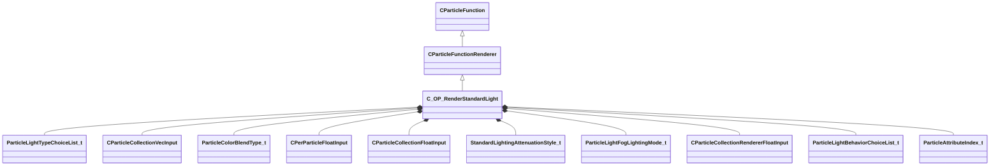

[Schemas](../../schemas.md) / [particles](../particles.md) / C_OP_RenderStandardLight

# C_OP_RenderStandardLight

**Kind:** class · **Size:** 6064 bytes (`0x17b0`) · **Align:** 8 · **Module:** particles

**Inherits from:** [CParticleFunctionRenderer](../particles/CParticleFunctionRenderer.md)

**Relationships:**

## Memory layout

54 fields (34 declared here, 20 inherited). Offsets are absolute from the object base.

| Offset | Field | Type | From | Annotations |
|--------|-------|------|------|-------------|
| `0x8` | `m_flOpStrength` | [CParticleCollectionFloatInput](../particleslib/CParticleCollectionFloatInput.md) | [CParticleFunction](../particles/CParticleFunction.md) | `MPropertyFriendlyName operator strength` `MPropertySortPriority -100` |
| `0x178` | `m_nOpEndCapState` | [ParticleEndcapMode_t](../!GlobalTypes/ParticleEndcapMode_t.md) | [CParticleFunction](../particles/CParticleFunction.md) | `MPropertyFriendlyName operator end cap state` `MPropertySortPriority -100` |
| `0x17c` | `m_nToolsState` | [ParticleToolsState_t](../!GlobalTypes/ParticleToolsState_t.md) | [CParticleFunction](../particles/CParticleFunction.md) | `MPropertyFriendlyName operator enabled in tools or game only` `MPropertySortPriority -100` |
| `0x180` | `m_flOpStartFadeInTime` | float32 | [CParticleFunction](../particles/CParticleFunction.md) | `MParticleAdvancedField` `MPropertyFriendlyName operator start fadein` `MPropertySortPriority -100` `MPropertyStartGroup Operator Fade` |
| `0x184` | `m_flOpEndFadeInTime` | float32 | [CParticleFunction](../particles/CParticleFunction.md) | `MParticleAdvancedField` `MPropertyFriendlyName operator end fadein` `MPropertySortPriority -100` |
| `0x188` | `m_flOpStartFadeOutTime` | float32 | [CParticleFunction](../particles/CParticleFunction.md) | `MParticleAdvancedField` `MPropertyFriendlyName operator start fadeout` `MPropertySortPriority -100` |
| `0x18c` | `m_flOpEndFadeOutTime` | float32 | [CParticleFunction](../particles/CParticleFunction.md) | `MParticleAdvancedField` `MPropertyFriendlyName operator end fadeout` `MPropertySortPriority -100` |
| `0x190` | `m_flOpFadeOscillatePeriod` | float32 | [CParticleFunction](../particles/CParticleFunction.md) | `MParticleAdvancedField` `MPropertyFriendlyName operator fade oscillate` `MPropertySortPriority -100` |
| `0x194` | `m_bNormalizeToStopTime` | bool | [CParticleFunction](../particles/CParticleFunction.md) | `MParticleAdvancedField` `MPropertyFriendlyName normalize fade times to endcap` `MPropertySortPriority -100` |
| `0x198` | `m_flOpTimeOffsetMin` | float32 | [CParticleFunction](../particles/CParticleFunction.md) | `MParticleAdvancedField` `MPropertyFriendlyName operator fade time offset min` `MPropertySortPriority -100` `MPropertyStartGroup Operator Fade Time Offset` |
| `0x19c` | `m_flOpTimeOffsetMax` | float32 | [CParticleFunction](../particles/CParticleFunction.md) | `MParticleAdvancedField` `MPropertyFriendlyName operator fade time offset max` `MPropertySortPriority -100` |
| `0x1a0` | `m_nOpTimeOffsetSeed` | int32 | [CParticleFunction](../particles/CParticleFunction.md) | `MParticleAdvancedField` `MPropertyFriendlyName operator fade time offset seed` `MPropertySortPriority -100` |
| `0x1a4` | `m_nOpTimeScaleSeed` | int32 | [CParticleFunction](../particles/CParticleFunction.md) | `MParticleAdvancedField` `MPropertyFriendlyName operator fade time scale seed` `MPropertySortPriority -100` `MPropertyStartGroup Operator Fade Timescale Modifiers` |
| `0x1a8` | `m_flOpTimeScaleMin` | float32 | [CParticleFunction](../particles/CParticleFunction.md) | `MParticleAdvancedField` `MPropertyFriendlyName operator fade time scale min` `MPropertySortPriority -100` |
| `0x1ac` | `m_flOpTimeScaleMax` | float32 | [CParticleFunction](../particles/CParticleFunction.md) | `MParticleAdvancedField` `MPropertyFriendlyName operator fade time scale max` `MPropertySortPriority -100` |
| `0x1b2` | `m_bDisableOperator` | bool | [CParticleFunction](../particles/CParticleFunction.md) | `MPropertyStartGroup` `MPropertySuppressField` |
| `0x1b8` | `m_Notes` | CUtlString | [CParticleFunction](../particles/CParticleFunction.md) | `MParticleHelpField` `MPropertyFriendlyName operator help and notes` `MPropertySortPriority -100` |
| `0x1d8` | `VisibilityInputs` | [CParticleVisibilityInputs](../particles/CParticleVisibilityInputs.md) | [CParticleFunctionRenderer](../particles/CParticleFunctionRenderer.md) | `MPropertySortPriority -1` |
| `0x220` | `m_bCannotBeRefracted` | bool | [CParticleFunctionRenderer](../particles/CParticleFunctionRenderer.md) | `MPropertyFriendlyName I cannot be refracted through refracting objects like water` `MPropertySortPriority -1` `MPropertyStartGroup Rendering filter` |
| `0x221` | `m_bSkipRenderingOnMobile` | bool | [CParticleFunctionRenderer](../particles/CParticleFunctionRenderer.md) | `MPropertyFriendlyName Skip rendering on mobile` `MPropertySortPriority -1` |
| `0x228` | `m_nLightType` | [ParticleLightTypeChoiceList_t](../!GlobalTypes/ParticleLightTypeChoiceList_t.md) |  | `MPropertyFriendlyName light type` |
| `0x22c` | `m_nMaxAllowed` | uint16 |  | `MPropertyAttributeRange 1 512` `MPropertyFriendlyName maximum light count` |
| `0x230` | `m_vecColorScale` | [CParticleCollectionVecInput](../particleslib/CParticleCollectionVecInput.md) |  | `MPropertyFriendlyName color blend` |
| `0x8e8` | `m_nColorBlendType` | [ParticleColorBlendType_t](../!GlobalTypes/ParticleColorBlendType_t.md) |  | `MPropertyFriendlyName color blend type` |
| `0x8f0` | `m_strLightStyle` | CUtlString |  | `MPropertyAttributeEditor VDataChoice( scripts/light_styles.vdata )` `MPropertyFriendlyName light style` |
| `0x8f8` | `m_flLightStyleTime` | [CPerParticleFloatInput](../particleslib/CPerParticleFloatInput.md) |  | `MPropertyFriendlyName light style time` `MPropertySuppressExpr m_strLightStyle == ''` |
| `0xa68` | `m_flIntensity` | [CPerParticleFloatInput](../particleslib/CPerParticleFloatInput.md) |  | `MPropertyFriendlyName intensity` |
| `0xbd8` | `m_bCastShadows` | bool |  | `MPropertyFriendlyName cast shadows` `MPropertySuppressExpr m_nLightType == PARTICLE_LIGHT_TYPE_FX` |
| `0xbd9` | `m_bDynamicBounce` | bool |  | `MPropertyFriendlyName dynamic bounce (RTGI)` `MPropertySuppressExpr !m_bCastShadows \|\| m_nLightType == PARTICLE_LIGHT_TYPE_FX \|\| mod == csgo` |
| `0xbe0` | `m_flBounceScale` | [CParticleCollectionFloatInput](../particleslib/CParticleCollectionFloatInput.md) |  | `MPropertyFriendlyName bounce scale` `MPropertySuppressExpr !m_bDynamicBounce` |
| `0xd50` | `m_flTheta` | [CParticleCollectionFloatInput](../particleslib/CParticleCollectionFloatInput.md) |  | `MPropertyFriendlyName inner cone angle` `MPropertySuppressExpr m_nLightType != PARTICLE_LIGHT_TYPE_SPOT` |
| `0xec0` | `m_flPhi` | [CParticleCollectionFloatInput](../particleslib/CParticleCollectionFloatInput.md) |  | `MPropertyFriendlyName outer cone angle` `MPropertySuppressExpr m_nLightType != PARTICLE_LIGHT_TYPE_SPOT` |
| `0x1030` | `m_flRadiusMultiplier` | [CParticleCollectionFloatInput](../particleslib/CParticleCollectionFloatInput.md) |  | `MPropertyFriendlyName light radius multiplier` |
| `0x11a0` | `m_nAttenuationStyle` | [StandardLightingAttenuationStyle_t](../!GlobalTypes/StandardLightingAttenuationStyle_t.md) |  | `MPropertyFriendlyName attenuation type` |
| `0x11a8` | `m_flFalloffLinearity` | [CParticleCollectionFloatInput](../particleslib/CParticleCollectionFloatInput.md) |  | `MPropertyFriendlyName falloff linearity` `MPropertySuppressExpr m_nAttenuationStyle == LIGHT_STYLE_NEW \|\| ( m_nAttenuationStyle == LIGHT_STYLE_OLD && m_nLightType == PARTICLE_LIGHT_TYPE_FX )` |
| `0x1318` | `m_flFiftyPercentFalloff` | [CParticleCollectionFloatInput](../particleslib/CParticleCollectionFloatInput.md) |  | `MPropertyFriendlyName falloff fifty percent` `MPropertySuppressExpr m_nAttenuationStyle == LIGHT_STYLE_OLD` |
| `0x1488` | `m_flZeroPercentFalloff` | [CParticleCollectionFloatInput](../particleslib/CParticleCollectionFloatInput.md) |  | `MPropertyFriendlyName falloff zero percent` `MPropertySuppressExpr m_nAttenuationStyle == LIGHT_STYLE_OLD` |
| `0x15f8` | `m_bRenderDiffuse` | bool |  | `MPropertyFriendlyName render diffuse` `MPropertySuppressExpr m_nLightType == PARTICLE_LIGHT_TYPE_FX` |
| `0x15f9` | `m_bRenderSpecular` | bool |  | `MPropertyFriendlyName render specular` `MPropertySuppressExpr m_nLightType == PARTICLE_LIGHT_TYPE_FX` |
| `0x1600` | `m_lightCookie` | CUtlString |  | `MPropertyFriendlyName light cookie string` |
| `0x1608` | `m_nPriority` | int32 |  | `MPropertyFriendlyName light priority` |
| `0x160c` | `m_nFogLightingMode` | [ParticleLightFogLightingMode_t](../!GlobalTypes/ParticleLightFogLightingMode_t.md) |  | `MPropertyFriendlyName fog lighting mode` `MPropertySuppressExpr m_nLightType == PARTICLE_LIGHT_TYPE_FX` |
| `0x1610` | `m_flFogContribution` | [CParticleCollectionRendererFloatInput](../particleslib/CParticleCollectionRendererFloatInput.md) |  | `MPropertyFriendlyName fog contribution` `MPropertySuppressExpr m_nLightType == PARTICLE_LIGHT_TYPE_FX` |
| `0x1780` | `m_nCapsuleLightBehavior` | [ParticleLightBehaviorChoiceList_t](../!GlobalTypes/ParticleLightBehaviorChoiceList_t.md) |  | `MPropertyFriendlyName capsule behavior` |
| `0x1784` | `m_flCapsuleLength` | float32 |  | `MPropertyFriendlyName capsule length` `MPropertyStartGroup Capsule Light Controls` `MPropertySuppressExpr m_nCapsuleLightBehavior == PARTICLE_LIGHT_BEHAVIOR_ROPE \|\| m_nCapsuleLightBehavior == PARTICLE_LIGHT_BEHAVIOR_TRAILS` |
| `0x1788` | `m_bReverseOrder` | bool |  | `MPropertyFriendlyName reverse point order` `MPropertySuppressExpr m_nCapsuleLightBehavior == PARTICLE_LIGHT_BEHAVIOR_FOLLOW_DIRECTION \|\| m_nCapsuleLightBehavior == PARTICLE_LIGHT_BEHAVIOR_TRAILS` |
| `0x1789` | `m_bClosedLoop` | bool |  | `MPropertyFriendlyName Closed loop` `MPropertySuppressExpr m_nCapsuleLightBehavior == PARTICLE_LIGHT_BEHAVIOR_FOLLOW_DIRECTION \|\| m_nCapsuleLightBehavior == PARTICLE_LIGHT_BEHAVIOR_TRAILS` |
| `0x178c` | `m_nPrevPntSource` | [ParticleAttributeIndex_t](../particles/ParticleAttributeIndex_t.md) |  | `MPropertyAttributeChoiceName particlefield_vector` `MPropertyFriendlyName Anchor point source` `MPropertySuppressExpr m_nCapsuleLightBehavior == PARTICLE_LIGHT_BEHAVIOR_FOLLOW_DIRECTION \|\| m_nCapsuleLightBehavior == PARTICLE_LIGHT_BEHAVIOR_ROPE` |
| `0x1790` | `m_flMaxLength` | float32 |  | `MPropertyFriendlyName max length` `MPropertySuppressExpr m_nCapsuleLightBehavior == PARTICLE_LIGHT_BEHAVIOR_FOLLOW_DIRECTION \|\| m_nCapsuleLightBehavior == PARTICLE_LIGHT_BEHAVIOR_ROPE` |
| `0x1794` | `m_flMinLength` | float32 |  | `MPropertyFriendlyName min length` `MPropertySuppressExpr m_nCapsuleLightBehavior == PARTICLE_LIGHT_BEHAVIOR_FOLLOW_DIRECTION \|\| m_nCapsuleLightBehavior == PARTICLE_LIGHT_BEHAVIOR_ROPE` |
| `0x1798` | `m_bIgnoreDT` | bool |  | `MPropertyFriendlyName ignore delta time` `MPropertySuppressExpr m_nCapsuleLightBehavior == PARTICLE_LIGHT_BEHAVIOR_FOLLOW_DIRECTION \|\| m_nCapsuleLightBehavior == PARTICLE_LIGHT_BEHAVIOR_ROPE` |
| `0x179c` | `m_flConstrainRadiusToLengthRatio` | float32 |  | `MPropertyFriendlyName constrain radius to no more than this times the length` `MPropertySuppressExpr m_nCapsuleLightBehavior == PARTICLE_LIGHT_BEHAVIOR_FOLLOW_DIRECTION \|\| m_nCapsuleLightBehavior == PARTICLE_LIGHT_BEHAVIOR_ROPE` |
| `0x17a0` | `m_flLengthScale` | float32 |  | `MPropertyFriendlyName amount to scale trail length by` `MPropertySuppressExpr m_nCapsuleLightBehavior == PARTICLE_LIGHT_BEHAVIOR_FOLLOW_DIRECTION \|\| m_nCapsuleLightBehavior == PARTICLE_LIGHT_BEHAVIOR_ROPE` |
| `0x17a4` | `m_flLengthFadeInTime` | float32 |  | `MPropertyFriendlyName how long before a trail grows to its full length` `MPropertySuppressExpr m_nCapsuleLightBehavior == PARTICLE_LIGHT_BEHAVIOR_FOLLOW_DIRECTION \|\| m_nCapsuleLightBehavior == PARTICLE_LIGHT_BEHAVIOR_ROPE` |

KV3 class defaults

<pre>{
	&quot;_class&quot;: &quot;C_OP_RenderStandardLight&quot;,
	&quot;m_flOpStrength&quot;:
	{
		&quot;m_nType&quot;: &quot;PF_TYPE_LITERAL&quot;,
		&quot;m_nMapType&quot;: &quot;PF_MAP_TYPE_DIRECT&quot;,
		&quot;m_flLiteralValue&quot;: 1.000000,
		&quot;m_NamedValue&quot;: &quot;&quot;,
		&quot;m_nControlPoint&quot;: 0,
		&quot;m_nScalarAttribute&quot;: 3,
		&quot;m_nVectorAttribute&quot;: 6,
		&quot;m_nVectorComponent&quot;: 0,
		&quot;m_bReverseOrder&quot;: false,
		&quot;m_flRandomMin&quot;: 0.000000,
		&quot;m_flRandomMax&quot;: 1.000000,
		&quot;m_bHasRandomSignFlip&quot;: false,
		&quot;m_nRandomSeed&quot;: &lt;HIDDEN FOR DIFF&gt;,
		&quot;m_nRandomMode&quot;: &quot;PF_RANDOM_MODE_CONSTANT&quot;,
		&quot;m_strSnapshotSubset&quot;: &quot;&quot;,
		&quot;m_flLOD0&quot;: 0.000000,
		&quot;m_flLOD1&quot;: 0.000000,
		&quot;m_flLOD2&quot;: 0.000000,
		&quot;m_flLOD3&quot;: 0.000000,
		&quot;m_nNoiseInputVectorAttribute&quot;: 0,
		&quot;m_flNoiseOutputMin&quot;: 0.000000,
		&quot;m_flNoiseOutputMax&quot;: 1.000000,
		&quot;m_flNoiseScale&quot;: 0.100000,
		&quot;m_vecNoiseOffsetRate&quot;:
		[
			0.000000,
			0.000000,
			0.000000
		],
		&quot;m_flNoiseOffset&quot;: 0.000000,
		&quot;m_nNoiseOctaves&quot;: 1,
		&quot;m_nNoiseTurbulence&quot;: &quot;PF_NOISE_TURB_NONE&quot;,
		&quot;m_nNoiseType&quot;: &quot;PF_NOISE_TYPE_PERLIN&quot;,
		&quot;m_nNoiseModifier&quot;: &quot;PF_NOISE_MODIFIER_NONE&quot;,
		&quot;m_flNoiseTurbulenceScale&quot;: 1.000000,
		&quot;m_flNoiseTurbulenceMix&quot;: 0.500000,
		&quot;m_flNoiseImgPreviewScale&quot;: 1.000000,
		&quot;m_bNoiseImgPreviewLive&quot;: true,
		&quot;m_flNoCameraFallback&quot;: 0.000000,
		&quot;m_bUseBoundsCenter&quot;: false,
		&quot;m_nInputMode&quot;: &quot;PF_INPUT_MODE_CLAMPED&quot;,
		&quot;m_flMultFactor&quot;: 1.000000,
		&quot;m_flInput0&quot;: 0.000000,
		&quot;m_flInput1&quot;: 1.000000,
		&quot;m_flOutput0&quot;: 0.000000,
		&quot;m_flOutput1&quot;: 1.000000,
		&quot;m_flNotchedRangeMin&quot;: 0.000000,
		&quot;m_flNotchedRangeMax&quot;: 1.000000,
		&quot;m_flNotchedOutputOutside&quot;: 0.000000,
		&quot;m_flNotchedOutputInside&quot;: 1.000000,
		&quot;m_nRoundType&quot;: &quot;PF_ROUND_TYPE_NEAREST&quot;,
		&quot;m_nBiasType&quot;: &quot;PF_BIAS_TYPE_STANDARD&quot;,
		&quot;m_flBiasParameter&quot;: 0.000000,
		&quot;m_Curve&quot;:
		{
			&quot;m_spline&quot;:
			[
			],
			&quot;m_tangents&quot;:
			[
			],
			&quot;m_vDomainMins&quot;:
			[
				0.000000,
				0.000000
			],
			&quot;m_vDomainMaxs&quot;:
			[
				0.000000,
				0.000000
			]
		}
	},
	&quot;m_nOpEndCapState&quot;: &quot;PARTICLE_ENDCAP_ALWAYS_ON&quot;,
	&quot;m_nToolsState&quot;: &quot;PARTICLE_TOOLS_STATE_ALWAYS_ON&quot;,
	&quot;m_flOpStartFadeInTime&quot;: 0.000000,
	&quot;m_flOpEndFadeInTime&quot;: 0.000000,
	&quot;m_flOpStartFadeOutTime&quot;: 0.000000,
	&quot;m_flOpEndFadeOutTime&quot;: 0.000000,
	&quot;m_flOpFadeOscillatePeriod&quot;: 0.000000,
	&quot;m_bNormalizeToStopTime&quot;: false,
	&quot;m_flOpTimeOffsetMin&quot;: 0.000000,
	&quot;m_flOpTimeOffsetMax&quot;: 0.000000,
	&quot;m_nOpTimeOffsetSeed&quot;: 0,
	&quot;m_nOpTimeScaleSeed&quot;: 0,
	&quot;m_flOpTimeScaleMin&quot;: 1.000000,
	&quot;m_flOpTimeScaleMax&quot;: 1.000000,
	&quot;m_bDisableOperator&quot;: false,
	&quot;m_Notes&quot;: &quot;&quot;,
	&quot;VisibilityInputs&quot;:
	{
		&quot;m_flCameraBias&quot;: 0.000000,
		&quot;m_nCPin&quot;: -1,
		&quot;m_flProxyRadius&quot;: 1.000000,
		&quot;m_flInputMin&quot;: 0.000000,
		&quot;m_flInputMax&quot;: 1.000000,
		&quot;m_flInputPixelVisFade&quot;: 0.250000,
		&quot;m_flNoPixelVisibilityFallback&quot;: 1.000000,
		&quot;m_flDistanceInputMin&quot;: 0.000000,
		&quot;m_flDistanceInputMax&quot;: 0.000000,
		&quot;m_flDotInputMin&quot;: 0.000000,
		&quot;m_flDotInputMax&quot;: 0.000000,
		&quot;m_bDotCPAngles&quot;: true,
		&quot;m_bDotCameraAngles&quot;: false,
		&quot;m_flAlphaScaleMin&quot;: 0.000000,
		&quot;m_flAlphaScaleMax&quot;: 1.000000,
		&quot;m_flRadiusScaleMin&quot;: 1.000000,
		&quot;m_flRadiusScaleMax&quot;: 1.000000,
		&quot;m_flRadiusScaleFOVBase&quot;: 0.000000,
		&quot;m_bRightEye&quot;: false
	},
	&quot;m_bCannotBeRefracted&quot;: true,
	&quot;m_bSkipRenderingOnMobile&quot;: false,
	&quot;m_nLightType&quot;: &quot;PARTICLE_LIGHT_TYPE_POINT&quot;,
	&quot;m_nMaxAllowed&quot;: 32,
	&quot;m_vecColorScale&quot;:
	{
		&quot;m_nType&quot;: &quot;PVEC_TYPE_LITERAL_COLOR&quot;,
		&quot;m_vLiteralValue&quot;:
		[
			0.000000,
			0.000000,
			0.000000
		],
		&quot;m_LiteralColor&quot;:
		[
			255,
			255,
			255
		],
		&quot;m_NamedValue&quot;: &quot;&quot;,
		&quot;m_bFollowNamedValue&quot;: false,
		&quot;m_nVectorAttribute&quot;: 6,
		&quot;m_vVectorAttributeScale&quot;:
		[
			1.000000,
			1.000000,
			1.000000
		],
		&quot;m_nControlPoint&quot;: 0,
		&quot;m_nDeltaControlPoint&quot;: 0,
		&quot;m_vCPValueScale&quot;:
		[
			1.000000,
			1.000000,
			1.000000
		],
		&quot;m_vCPRelativePosition&quot;:
		[
			0.000000,
			0.000000,
			0.000000
		],
		&quot;m_vCPRelativeDir&quot;:
		[
			1.000000,
			0.000000,
			0.000000
		],
		&quot;m_FloatComponentX&quot;:
		{
			&quot;m_nType&quot;: &quot;PF_TYPE_LITERAL&quot;,
			&quot;m_nMapType&quot;: &quot;PF_MAP_TYPE_DIRECT&quot;,
			&quot;m_flLiteralValue&quot;: 0.000000,
			&quot;m_NamedValue&quot;: &quot;&quot;,
			&quot;m_nControlPoint&quot;: 0,
			&quot;m_nScalarAttribute&quot;: 3,
			&quot;m_nVectorAttribute&quot;: 6,
			&quot;m_nVectorComponent&quot;: 0,
			&quot;m_bReverseOrder&quot;: false,
			&quot;m_flRandomMin&quot;: 0.000000,
			&quot;m_flRandomMax&quot;: 1.000000,
			&quot;m_bHasRandomSignFlip&quot;: false,
			&quot;m_nRandomSeed&quot;: &lt;HIDDEN FOR DIFF&gt;,
			&quot;m_nRandomMode&quot;: &quot;PF_RANDOM_MODE_CONSTANT&quot;,
			&quot;m_strSnapshotSubset&quot;: &quot;&quot;,
			&quot;m_flLOD0&quot;: 0.000000,
			&quot;m_flLOD1&quot;: 0.000000,
			&quot;m_flLOD2&quot;: 0.000000,
			&quot;m_flLOD3&quot;: 0.000000,
			&quot;m_nNoiseInputVectorAttribute&quot;: 0,
			&quot;m_flNoiseOutputMin&quot;: 0.000000,
			&quot;m_flNoiseOutputMax&quot;: 1.000000,
			&quot;m_flNoiseScale&quot;: 0.100000,
			&quot;m_vecNoiseOffsetRate&quot;:
			[
				0.000000,
				0.000000,
				0.000000
			],
			&quot;m_flNoiseOffset&quot;: 0.000000,
			&quot;m_nNoiseOctaves&quot;: 1,
			&quot;m_nNoiseTurbulence&quot;: &quot;PF_NOISE_TURB_NONE&quot;,
			&quot;m_nNoiseType&quot;: &quot;PF_NOISE_TYPE_PERLIN&quot;,
			&quot;m_nNoiseModifier&quot;: &quot;PF_NOISE_MODIFIER_NONE&quot;,
			&quot;m_flNoiseTurbulenceScale&quot;: 1.000000,
			&quot;m_flNoiseTurbulenceMix&quot;: 0.500000,
			&quot;m_flNoiseImgPreviewScale&quot;: 1.000000,
			&quot;m_bNoiseImgPreviewLive&quot;: true,
			&quot;m_flNoCameraFallback&quot;: 0.000000,
			&quot;m_bUseBoundsCenter&quot;: false,
			&quot;m_nInputMode&quot;: &quot;PF_INPUT_MODE_CLAMPED&quot;,
			&quot;m_flMultFactor&quot;: 1.000000,
			&quot;m_flInput0&quot;: 0.000000,
			&quot;m_flInput1&quot;: 1.000000,
			&quot;m_flOutput0&quot;: 0.000000,
			&quot;m_flOutput1&quot;: 1.000000,
			&quot;m_flNotchedRangeMin&quot;: 0.000000,
			&quot;m_flNotchedRangeMax&quot;: 1.000000,
			&quot;m_flNotchedOutputOutside&quot;: 0.000000,
			&quot;m_flNotchedOutputInside&quot;: 1.000000,
			&quot;m_nRoundType&quot;: &quot;PF_ROUND_TYPE_NEAREST&quot;,
			&quot;m_nBiasType&quot;: &quot;PF_BIAS_TYPE_STANDARD&quot;,
			&quot;m_flBiasParameter&quot;: 0.000000,
			&quot;m_Curve&quot;:
			{
				&quot;m_spline&quot;:
				[
				],
				&quot;m_tangents&quot;:
				[
				],
				&quot;m_vDomainMins&quot;:
				[
					0.000000,
					0.000000
				],
				&quot;m_vDomainMaxs&quot;:
				[
					0.000000,
					0.000000
				]
			}
		},
		&quot;m_FloatComponentY&quot;:
		{
			&quot;m_nType&quot;: &quot;PF_TYPE_LITERAL&quot;,
			&quot;m_nMapType&quot;: &quot;PF_MAP_TYPE_DIRECT&quot;,
			&quot;m_flLiteralValue&quot;: 0.000000,
			&quot;m_NamedValue&quot;: &quot;&quot;,
			&quot;m_nControlPoint&quot;: 0,
			&quot;m_nScalarAttribute&quot;: 3,
			&quot;m_nVectorAttribute&quot;: 6,
			&quot;m_nVectorComponent&quot;: 0,
			&quot;m_bReverseOrder&quot;: false,
			&quot;m_flRandomMin&quot;: 0.000000,
			&quot;m_flRandomMax&quot;: 1.000000,
			&quot;m_bHasRandomSignFlip&quot;: false,
			&quot;m_nRandomSeed&quot;: &lt;HIDDEN FOR DIFF&gt;,
			&quot;m_nRandomMode&quot;: &quot;PF_RANDOM_MODE_CONSTANT&quot;,
			&quot;m_strSnapshotSubset&quot;: &quot;&quot;,
			&quot;m_flLOD0&quot;: 0.000000,
			&quot;m_flLOD1&quot;: 0.000000,
			&quot;m_flLOD2&quot;: 0.000000,
			&quot;m_flLOD3&quot;: 0.000000,
			&quot;m_nNoiseInputVectorAttribute&quot;: 0,
			&quot;m_flNoiseOutputMin&quot;: 0.000000,
			&quot;m_flNoiseOutputMax&quot;: 1.000000,
			&quot;m_flNoiseScale&quot;: 0.100000,
			&quot;m_vecNoiseOffsetRate&quot;:
			[
				0.000000,
				0.000000,
				0.000000
			],
			&quot;m_flNoiseOffset&quot;: 0.000000,
			&quot;m_nNoiseOctaves&quot;: 1,
			&quot;m_nNoiseTurbulence&quot;: &quot;PF_NOISE_TURB_NONE&quot;,
			&quot;m_nNoiseType&quot;: &quot;PF_NOISE_TYPE_PERLIN&quot;,
			&quot;m_nNoiseModifier&quot;: &quot;PF_NOISE_MODIFIER_NONE&quot;,
			&quot;m_flNoiseTurbulenceScale&quot;: 1.000000,
			&quot;m_flNoiseTurbulenceMix&quot;: 0.500000,
			&quot;m_flNoiseImgPreviewScale&quot;: 1.000000,
			&quot;m_bNoiseImgPreviewLive&quot;: true,
			&quot;m_flNoCameraFallback&quot;: 0.000000,
			&quot;m_bUseBoundsCenter&quot;: false,
			&quot;m_nInputMode&quot;: &quot;PF_INPUT_MODE_CLAMPED&quot;,
			&quot;m_flMultFactor&quot;: 1.000000,
			&quot;m_flInput0&quot;: 0.000000,
			&quot;m_flInput1&quot;: 1.000000,
			&quot;m_flOutput0&quot;: 0.000000,
			&quot;m_flOutput1&quot;: 1.000000,
			&quot;m_flNotchedRangeMin&quot;: 0.000000,
			&quot;m_flNotchedRangeMax&quot;: 1.000000,
			&quot;m_flNotchedOutputOutside&quot;: 0.000000,
			&quot;m_flNotchedOutputInside&quot;: 1.000000,
			&quot;m_nRoundType&quot;: &quot;PF_ROUND_TYPE_NEAREST&quot;,
			&quot;m_nBiasType&quot;: &quot;PF_BIAS_TYPE_STANDARD&quot;,
			&quot;m_flBiasParameter&quot;: 0.000000,
			&quot;m_Curve&quot;:
			{
				&quot;m_spline&quot;:
				[
				],
				&quot;m_tangents&quot;:
				[
				],
				&quot;m_vDomainMins&quot;:
				[
					0.000000,
					0.000000
				],
				&quot;m_vDomainMaxs&quot;:
				[
					0.000000,
					0.000000
				]
			}
		},
		&quot;m_FloatComponentZ&quot;:
		{
			&quot;m_nType&quot;: &quot;PF_TYPE_LITERAL&quot;,
			&quot;m_nMapType&quot;: &quot;PF_MAP_TYPE_DIRECT&quot;,
			&quot;m_flLiteralValue&quot;: 0.000000,
			&quot;m_NamedValue&quot;: &quot;&quot;,
			&quot;m_nControlPoint&quot;: 0,
			&quot;m_nScalarAttribute&quot;: 3,
			&quot;m_nVectorAttribute&quot;: 6,
			&quot;m_nVectorComponent&quot;: 0,
			&quot;m_bReverseOrder&quot;: false,
			&quot;m_flRandomMin&quot;: 0.000000,
			&quot;m_flRandomMax&quot;: 1.000000,
			&quot;m_bHasRandomSignFlip&quot;: false,
			&quot;m_nRandomSeed&quot;: &lt;HIDDEN FOR DIFF&gt;,
			&quot;m_nRandomMode&quot;: &quot;PF_RANDOM_MODE_CONSTANT&quot;,
			&quot;m_strSnapshotSubset&quot;: &quot;&quot;,
			&quot;m_flLOD0&quot;: 0.000000,
			&quot;m_flLOD1&quot;: 0.000000,
			&quot;m_flLOD2&quot;: 0.000000,
			&quot;m_flLOD3&quot;: 0.000000,
			&quot;m_nNoiseInputVectorAttribute&quot;: 0,
			&quot;m_flNoiseOutputMin&quot;: 0.000000,
			&quot;m_flNoiseOutputMax&quot;: 1.000000,
			&quot;m_flNoiseScale&quot;: 0.100000,
			&quot;m_vecNoiseOffsetRate&quot;:
			[
				0.000000,
				0.000000,
				0.000000
			],
			&quot;m_flNoiseOffset&quot;: 0.000000,
			&quot;m_nNoiseOctaves&quot;: 1,
			&quot;m_nNoiseTurbulence&quot;: &quot;PF_NOISE_TURB_NONE&quot;,
			&quot;m_nNoiseType&quot;: &quot;PF_NOISE_TYPE_PERLIN&quot;,
			&quot;m_nNoiseModifier&quot;: &quot;PF_NOISE_MODIFIER_NONE&quot;,
			&quot;m_flNoiseTurbulenceScale&quot;: 1.000000,
			&quot;m_flNoiseTurbulenceMix&quot;: 0.500000,
			&quot;m_flNoiseImgPreviewScale&quot;: 1.000000,
			&quot;m_bNoiseImgPreviewLive&quot;: true,
			&quot;m_flNoCameraFallback&quot;: 0.000000,
			&quot;m_bUseBoundsCenter&quot;: false,
			&quot;m_nInputMode&quot;: &quot;PF_INPUT_MODE_CLAMPED&quot;,
			&quot;m_flMultFactor&quot;: 1.000000,
			&quot;m_flInput0&quot;: 0.000000,
			&quot;m_flInput1&quot;: 1.000000,
			&quot;m_flOutput0&quot;: 0.000000,
			&quot;m_flOutput1&quot;: 1.000000,
			&quot;m_flNotchedRangeMin&quot;: 0.000000,
			&quot;m_flNotchedRangeMax&quot;: 1.000000,
			&quot;m_flNotchedOutputOutside&quot;: 0.000000,
			&quot;m_flNotchedOutputInside&quot;: 1.000000,
			&quot;m_nRoundType&quot;: &quot;PF_ROUND_TYPE_NEAREST&quot;,
			&quot;m_nBiasType&quot;: &quot;PF_BIAS_TYPE_STANDARD&quot;,
			&quot;m_flBiasParameter&quot;: 0.000000,
			&quot;m_Curve&quot;:
			{
				&quot;m_spline&quot;:
				[
				],
				&quot;m_tangents&quot;:
				[
				],
				&quot;m_vDomainMins&quot;:
				[
					0.000000,
					0.000000
				],
				&quot;m_vDomainMaxs&quot;:
				[
					0.000000,
					0.000000
				]
			}
		},
		&quot;m_FloatInterp&quot;:
		{
			&quot;m_nType&quot;: &quot;PF_TYPE_LITERAL&quot;,
			&quot;m_nMapType&quot;: &quot;PF_MAP_TYPE_DIRECT&quot;,
			&quot;m_flLiteralValue&quot;: 0.000000,
			&quot;m_NamedValue&quot;: &quot;&quot;,
			&quot;m_nControlPoint&quot;: 0,
			&quot;m_nScalarAttribute&quot;: 3,
			&quot;m_nVectorAttribute&quot;: 6,
			&quot;m_nVectorComponent&quot;: 0,
			&quot;m_bReverseOrder&quot;: false,
			&quot;m_flRandomMin&quot;: 0.000000,
			&quot;m_flRandomMax&quot;: 1.000000,
			&quot;m_bHasRandomSignFlip&quot;: false,
			&quot;m_nRandomSeed&quot;: &lt;HIDDEN FOR DIFF&gt;,
			&quot;m_nRandomMode&quot;: &quot;PF_RANDOM_MODE_CONSTANT&quot;,
			&quot;m_strSnapshotSubset&quot;: &quot;&quot;,
			&quot;m_flLOD0&quot;: 0.000000,
			&quot;m_flLOD1&quot;: 0.000000,
			&quot;m_flLOD2&quot;: 0.000000,
			&quot;m_flLOD3&quot;: 0.000000,
			&quot;m_nNoiseInputVectorAttribute&quot;: 0,
			&quot;m_flNoiseOutputMin&quot;: 0.000000,
			&quot;m_flNoiseOutputMax&quot;: 1.000000,
			&quot;m_flNoiseScale&quot;: 0.100000,
			&quot;m_vecNoiseOffsetRate&quot;:
			[
				0.000000,
				0.000000,
				0.000000
			],
			&quot;m_flNoiseOffset&quot;: 0.000000,
			&quot;m_nNoiseOctaves&quot;: 1,
			&quot;m_nNoiseTurbulence&quot;: &quot;PF_NOISE_TURB_NONE&quot;,
			&quot;m_nNoiseType&quot;: &quot;PF_NOISE_TYPE_PERLIN&quot;,
			&quot;m_nNoiseModifier&quot;: &quot;PF_NOISE_MODIFIER_NONE&quot;,
			&quot;m_flNoiseTurbulenceScale&quot;: 1.000000,
			&quot;m_flNoiseTurbulenceMix&quot;: 0.500000,
			&quot;m_flNoiseImgPreviewScale&quot;: 1.000000,
			&quot;m_bNoiseImgPreviewLive&quot;: true,
			&quot;m_flNoCameraFallback&quot;: 0.000000,
			&quot;m_bUseBoundsCenter&quot;: false,
			&quot;m_nInputMode&quot;: &quot;PF_INPUT_MODE_CLAMPED&quot;,
			&quot;m_flMultFactor&quot;: 1.000000,
			&quot;m_flInput0&quot;: 0.000000,
			&quot;m_flInput1&quot;: 1.000000,
			&quot;m_flOutput0&quot;: 0.000000,
			&quot;m_flOutput1&quot;: 1.000000,
			&quot;m_flNotchedRangeMin&quot;: 0.000000,
			&quot;m_flNotchedRangeMax&quot;: 1.000000,
			&quot;m_flNotchedOutputOutside&quot;: 0.000000,
			&quot;m_flNotchedOutputInside&quot;: 1.000000,
			&quot;m_nRoundType&quot;: &quot;PF_ROUND_TYPE_NEAREST&quot;,
			&quot;m_nBiasType&quot;: &quot;PF_BIAS_TYPE_STANDARD&quot;,
			&quot;m_flBiasParameter&quot;: 0.000000,
			&quot;m_Curve&quot;:
			{
				&quot;m_spline&quot;:
				[
				],
				&quot;m_tangents&quot;:
				[
				],
				&quot;m_vDomainMins&quot;:
				[
					0.000000,
					0.000000
				],
				&quot;m_vDomainMaxs&quot;:
				[
					0.000000,
					0.000000
				]
			}
		},
		&quot;m_flInterpInput0&quot;: 0.000000,
		&quot;m_flInterpInput1&quot;: 1.000000,
		&quot;m_vInterpOutput0&quot;:
		[
			0.000000,
			0.000000,
			0.000000
		],
		&quot;m_vInterpOutput1&quot;:
		[
			1.000000,
			1.000000,
			1.000000
		],
		&quot;m_Gradient&quot;:
		{
			&quot;m_Stops&quot;:
			[
			]
		},
		&quot;m_vRandomMin&quot;:
		[
			0.000000,
			0.000000,
			0.000000
		],
		&quot;m_vRandomMax&quot;:
		[
			0.000000,
			0.000000,
			0.000000
		]
	},
	&quot;m_nColorBlendType&quot;: &quot;PARTICLE_COLOR_BLEND_MULTIPLY&quot;,
	&quot;m_strLightStyle&quot;: &quot;&quot;,
	&quot;m_flLightStyleTime&quot;:
	{
		&quot;m_nType&quot;: &quot;PF_TYPE_PARTICLE_AGE&quot;,
		&quot;m_nMapType&quot;: &quot;PF_MAP_TYPE_DIRECT&quot;,
		&quot;m_flLiteralValue&quot;: 0.000000,
		&quot;m_NamedValue&quot;: &quot;&quot;,
		&quot;m_nControlPoint&quot;: 0,
		&quot;m_nScalarAttribute&quot;: 3,
		&quot;m_nVectorAttribute&quot;: 6,
		&quot;m_nVectorComponent&quot;: 0,
		&quot;m_bReverseOrder&quot;: false,
		&quot;m_flRandomMin&quot;: 0.000000,
		&quot;m_flRandomMax&quot;: 1.000000,
		&quot;m_bHasRandomSignFlip&quot;: false,
		&quot;m_nRandomSeed&quot;: &lt;HIDDEN FOR DIFF&gt;,
		&quot;m_nRandomMode&quot;: &quot;PF_RANDOM_MODE_CONSTANT&quot;,
		&quot;m_strSnapshotSubset&quot;: &quot;&quot;,
		&quot;m_flLOD0&quot;: 0.000000,
		&quot;m_flLOD1&quot;: 0.000000,
		&quot;m_flLOD2&quot;: 0.000000,
		&quot;m_flLOD3&quot;: 0.000000,
		&quot;m_nNoiseInputVectorAttribute&quot;: 0,
		&quot;m_flNoiseOutputMin&quot;: 0.000000,
		&quot;m_flNoiseOutputMax&quot;: 1.000000,
		&quot;m_flNoiseScale&quot;: 0.100000,
		&quot;m_vecNoiseOffsetRate&quot;:
		[
			0.000000,
			0.000000,
			0.000000
		],
		&quot;m_flNoiseOffset&quot;: 0.000000,
		&quot;m_nNoiseOctaves&quot;: 1,
		&quot;m_nNoiseTurbulence&quot;: &quot;PF_NOISE_TURB_NONE&quot;,
		&quot;m_nNoiseType&quot;: &quot;PF_NOISE_TYPE_PERLIN&quot;,
		&quot;m_nNoiseModifier&quot;: &quot;PF_NOISE_MODIFIER_NONE&quot;,
		&quot;m_flNoiseTurbulenceScale&quot;: 1.000000,
		&quot;m_flNoiseTurbulenceMix&quot;: 0.500000,
		&quot;m_flNoiseImgPreviewScale&quot;: 1.000000,
		&quot;m_bNoiseImgPreviewLive&quot;: true,
		&quot;m_flNoCameraFallback&quot;: 0.000000,
		&quot;m_bUseBoundsCenter&quot;: false,
		&quot;m_nInputMode&quot;: &quot;PF_INPUT_MODE_CLAMPED&quot;,
		&quot;m_flMultFactor&quot;: 1.000000,
		&quot;m_flInput0&quot;: 0.000000,
		&quot;m_flInput1&quot;: 1.000000,
		&quot;m_flOutput0&quot;: 0.000000,
		&quot;m_flOutput1&quot;: 1.000000,
		&quot;m_flNotchedRangeMin&quot;: 0.000000,
		&quot;m_flNotchedRangeMax&quot;: 1.000000,
		&quot;m_flNotchedOutputOutside&quot;: 0.000000,
		&quot;m_flNotchedOutputInside&quot;: 1.000000,
		&quot;m_nRoundType&quot;: &quot;PF_ROUND_TYPE_NEAREST&quot;,
		&quot;m_nBiasType&quot;: &quot;PF_BIAS_TYPE_STANDARD&quot;,
		&quot;m_flBiasParameter&quot;: 0.000000,
		&quot;m_Curve&quot;:
		{
			&quot;m_spline&quot;:
			[
			],
			&quot;m_tangents&quot;:
			[
			],
			&quot;m_vDomainMins&quot;:
			[
				0.000000,
				0.000000
			],
			&quot;m_vDomainMaxs&quot;:
			[
				0.000000,
				0.000000
			]
		}
	},
	&quot;m_flIntensity&quot;:
	{
		&quot;m_nType&quot;: &quot;PF_TYPE_LITERAL&quot;,
		&quot;m_nMapType&quot;: &quot;PF_MAP_TYPE_DIRECT&quot;,
		&quot;m_flLiteralValue&quot;: 1.000000,
		&quot;m_NamedValue&quot;: &quot;&quot;,
		&quot;m_nControlPoint&quot;: 0,
		&quot;m_nScalarAttribute&quot;: 3,
		&quot;m_nVectorAttribute&quot;: 6,
		&quot;m_nVectorComponent&quot;: 0,
		&quot;m_bReverseOrder&quot;: false,
		&quot;m_flRandomMin&quot;: 0.000000,
		&quot;m_flRandomMax&quot;: 1.000000,
		&quot;m_bHasRandomSignFlip&quot;: false,
		&quot;m_nRandomSeed&quot;: &lt;HIDDEN FOR DIFF&gt;,
		&quot;m_nRandomMode&quot;: &quot;PF_RANDOM_MODE_CONSTANT&quot;,
		&quot;m_strSnapshotSubset&quot;: &quot;&quot;,
		&quot;m_flLOD0&quot;: 0.000000,
		&quot;m_flLOD1&quot;: 0.000000,
		&quot;m_flLOD2&quot;: 0.000000,
		&quot;m_flLOD3&quot;: 0.000000,
		&quot;m_nNoiseInputVectorAttribute&quot;: 0,
		&quot;m_flNoiseOutputMin&quot;: 0.000000,
		&quot;m_flNoiseOutputMax&quot;: 1.000000,
		&quot;m_flNoiseScale&quot;: 0.100000,
		&quot;m_vecNoiseOffsetRate&quot;:
		[
			0.000000,
			0.000000,
			0.000000
		],
		&quot;m_flNoiseOffset&quot;: 0.000000,
		&quot;m_nNoiseOctaves&quot;: 1,
		&quot;m_nNoiseTurbulence&quot;: &quot;PF_NOISE_TURB_NONE&quot;,
		&quot;m_nNoiseType&quot;: &quot;PF_NOISE_TYPE_PERLIN&quot;,
		&quot;m_nNoiseModifier&quot;: &quot;PF_NOISE_MODIFIER_NONE&quot;,
		&quot;m_flNoiseTurbulenceScale&quot;: 1.000000,
		&quot;m_flNoiseTurbulenceMix&quot;: 0.500000,
		&quot;m_flNoiseImgPreviewScale&quot;: 1.000000,
		&quot;m_bNoiseImgPreviewLive&quot;: true,
		&quot;m_flNoCameraFallback&quot;: 0.000000,
		&quot;m_bUseBoundsCenter&quot;: false,
		&quot;m_nInputMode&quot;: &quot;PF_INPUT_MODE_CLAMPED&quot;,
		&quot;m_flMultFactor&quot;: 1.000000,
		&quot;m_flInput0&quot;: 0.000000,
		&quot;m_flInput1&quot;: 1.000000,
		&quot;m_flOutput0&quot;: 0.000000,
		&quot;m_flOutput1&quot;: 1.000000,
		&quot;m_flNotchedRangeMin&quot;: 0.000000,
		&quot;m_flNotchedRangeMax&quot;: 1.000000,
		&quot;m_flNotchedOutputOutside&quot;: 0.000000,
		&quot;m_flNotchedOutputInside&quot;: 1.000000,
		&quot;m_nRoundType&quot;: &quot;PF_ROUND_TYPE_NEAREST&quot;,
		&quot;m_nBiasType&quot;: &quot;PF_BIAS_TYPE_STANDARD&quot;,
		&quot;m_flBiasParameter&quot;: 0.000000,
		&quot;m_Curve&quot;:
		{
			&quot;m_spline&quot;:
			[
			],
			&quot;m_tangents&quot;:
			[
			],
			&quot;m_vDomainMins&quot;:
			[
				0.000000,
				0.000000
			],
			&quot;m_vDomainMaxs&quot;:
			[
				0.000000,
				0.000000
			]
		}
	},
	&quot;m_bCastShadows&quot;: false,
	&quot;m_bDynamicBounce&quot;: false,
	&quot;m_flBounceScale&quot;:
	{
		&quot;m_nType&quot;: &quot;PF_TYPE_LITERAL&quot;,
		&quot;m_nMapType&quot;: &quot;PF_MAP_TYPE_DIRECT&quot;,
		&quot;m_flLiteralValue&quot;: 1.000000,
		&quot;m_NamedValue&quot;: &quot;&quot;,
		&quot;m_nControlPoint&quot;: 0,
		&quot;m_nScalarAttribute&quot;: 3,
		&quot;m_nVectorAttribute&quot;: 6,
		&quot;m_nVectorComponent&quot;: 0,
		&quot;m_bReverseOrder&quot;: false,
		&quot;m_flRandomMin&quot;: 0.000000,
		&quot;m_flRandomMax&quot;: 1.000000,
		&quot;m_bHasRandomSignFlip&quot;: false,
		&quot;m_nRandomSeed&quot;: &lt;HIDDEN FOR DIFF&gt;,
		&quot;m_nRandomMode&quot;: &quot;PF_RANDOM_MODE_CONSTANT&quot;,
		&quot;m_strSnapshotSubset&quot;: &quot;&quot;,
		&quot;m_flLOD0&quot;: 0.000000,
		&quot;m_flLOD1&quot;: 0.000000,
		&quot;m_flLOD2&quot;: 0.000000,
		&quot;m_flLOD3&quot;: 0.000000,
		&quot;m_nNoiseInputVectorAttribute&quot;: 0,
		&quot;m_flNoiseOutputMin&quot;: 0.000000,
		&quot;m_flNoiseOutputMax&quot;: 1.000000,
		&quot;m_flNoiseScale&quot;: 0.100000,
		&quot;m_vecNoiseOffsetRate&quot;:
		[
			0.000000,
			0.000000,
			0.000000
		],
		&quot;m_flNoiseOffset&quot;: 0.000000,
		&quot;m_nNoiseOctaves&quot;: 1,
		&quot;m_nNoiseTurbulence&quot;: &quot;PF_NOISE_TURB_NONE&quot;,
		&quot;m_nNoiseType&quot;: &quot;PF_NOISE_TYPE_PERLIN&quot;,
		&quot;m_nNoiseModifier&quot;: &quot;PF_NOISE_MODIFIER_NONE&quot;,
		&quot;m_flNoiseTurbulenceScale&quot;: 1.000000,
		&quot;m_flNoiseTurbulenceMix&quot;: 0.500000,
		&quot;m_flNoiseImgPreviewScale&quot;: 1.000000,
		&quot;m_bNoiseImgPreviewLive&quot;: true,
		&quot;m_flNoCameraFallback&quot;: 0.000000,
		&quot;m_bUseBoundsCenter&quot;: false,
		&quot;m_nInputMode&quot;: &quot;PF_INPUT_MODE_CLAMPED&quot;,
		&quot;m_flMultFactor&quot;: 1.000000,
		&quot;m_flInput0&quot;: 0.000000,
		&quot;m_flInput1&quot;: 1.000000,
		&quot;m_flOutput0&quot;: 0.000000,
		&quot;m_flOutput1&quot;: 1.000000,
		&quot;m_flNotchedRangeMin&quot;: 0.000000,
		&quot;m_flNotchedRangeMax&quot;: 1.000000,
		&quot;m_flNotchedOutputOutside&quot;: 0.000000,
		&quot;m_flNotchedOutputInside&quot;: 1.000000,
		&quot;m_nRoundType&quot;: &quot;PF_ROUND_TYPE_NEAREST&quot;,
		&quot;m_nBiasType&quot;: &quot;PF_BIAS_TYPE_STANDARD&quot;,
		&quot;m_flBiasParameter&quot;: 0.000000,
		&quot;m_Curve&quot;:
		{
			&quot;m_spline&quot;:
			[
			],
			&quot;m_tangents&quot;:
			[
			],
			&quot;m_vDomainMins&quot;:
			[
				0.000000,
				0.000000
			],
			&quot;m_vDomainMaxs&quot;:
			[
				0.000000,
				0.000000
			]
		}
	},
	&quot;m_flTheta&quot;:
	{
		&quot;m_nType&quot;: &quot;PF_TYPE_LITERAL&quot;,
		&quot;m_nMapType&quot;: &quot;PF_MAP_TYPE_DIRECT&quot;,
		&quot;m_flLiteralValue&quot;: 45.000000,
		&quot;m_NamedValue&quot;: &quot;&quot;,
		&quot;m_nControlPoint&quot;: 0,
		&quot;m_nScalarAttribute&quot;: 3,
		&quot;m_nVectorAttribute&quot;: 6,
		&quot;m_nVectorComponent&quot;: 0,
		&quot;m_bReverseOrder&quot;: false,
		&quot;m_flRandomMin&quot;: 0.000000,
		&quot;m_flRandomMax&quot;: 1.000000,
		&quot;m_bHasRandomSignFlip&quot;: false,
		&quot;m_nRandomSeed&quot;: &lt;HIDDEN FOR DIFF&gt;,
		&quot;m_nRandomMode&quot;: &quot;PF_RANDOM_MODE_CONSTANT&quot;,
		&quot;m_strSnapshotSubset&quot;: &quot;&quot;,
		&quot;m_flLOD0&quot;: 0.000000,
		&quot;m_flLOD1&quot;: 0.000000,
		&quot;m_flLOD2&quot;: 0.000000,
		&quot;m_flLOD3&quot;: 0.000000,
		&quot;m_nNoiseInputVectorAttribute&quot;: 0,
		&quot;m_flNoiseOutputMin&quot;: 0.000000,
		&quot;m_flNoiseOutputMax&quot;: 1.000000,
		&quot;m_flNoiseScale&quot;: 0.100000,
		&quot;m_vecNoiseOffsetRate&quot;:
		[
			0.000000,
			0.000000,
			0.000000
		],
		&quot;m_flNoiseOffset&quot;: 0.000000,
		&quot;m_nNoiseOctaves&quot;: 1,
		&quot;m_nNoiseTurbulence&quot;: &quot;PF_NOISE_TURB_NONE&quot;,
		&quot;m_nNoiseType&quot;: &quot;PF_NOISE_TYPE_PERLIN&quot;,
		&quot;m_nNoiseModifier&quot;: &quot;PF_NOISE_MODIFIER_NONE&quot;,
		&quot;m_flNoiseTurbulenceScale&quot;: 1.000000,
		&quot;m_flNoiseTurbulenceMix&quot;: 0.500000,
		&quot;m_flNoiseImgPreviewScale&quot;: 1.000000,
		&quot;m_bNoiseImgPreviewLive&quot;: true,
		&quot;m_flNoCameraFallback&quot;: 0.000000,
		&quot;m_bUseBoundsCenter&quot;: false,
		&quot;m_nInputMode&quot;: &quot;PF_INPUT_MODE_CLAMPED&quot;,
		&quot;m_flMultFactor&quot;: 1.000000,
		&quot;m_flInput0&quot;: 0.000000,
		&quot;m_flInput1&quot;: 1.000000,
		&quot;m_flOutput0&quot;: 0.000000,
		&quot;m_flOutput1&quot;: 1.000000,
		&quot;m_flNotchedRangeMin&quot;: 0.000000,
		&quot;m_flNotchedRangeMax&quot;: 1.000000,
		&quot;m_flNotchedOutputOutside&quot;: 0.000000,
		&quot;m_flNotchedOutputInside&quot;: 1.000000,
		&quot;m_nRoundType&quot;: &quot;PF_ROUND_TYPE_NEAREST&quot;,
		&quot;m_nBiasType&quot;: &quot;PF_BIAS_TYPE_STANDARD&quot;,
		&quot;m_flBiasParameter&quot;: 0.000000,
		&quot;m_Curve&quot;:
		{
			&quot;m_spline&quot;:
			[
			],
			&quot;m_tangents&quot;:
			[
			],
			&quot;m_vDomainMins&quot;:
			[
				0.000000,
				0.000000
			],
			&quot;m_vDomainMaxs&quot;:
			[
				0.000000,
				0.000000
			]
		}
	},
	&quot;m_flPhi&quot;:
	{
		&quot;m_nType&quot;: &quot;PF_TYPE_LITERAL&quot;,
		&quot;m_nMapType&quot;: &quot;PF_MAP_TYPE_DIRECT&quot;,
		&quot;m_flLiteralValue&quot;: 60.000000,
		&quot;m_NamedValue&quot;: &quot;&quot;,
		&quot;m_nControlPoint&quot;: 0,
		&quot;m_nScalarAttribute&quot;: 3,
		&quot;m_nVectorAttribute&quot;: 6,
		&quot;m_nVectorComponent&quot;: 0,
		&quot;m_bReverseOrder&quot;: false,
		&quot;m_flRandomMin&quot;: 0.000000,
		&quot;m_flRandomMax&quot;: 1.000000,
		&quot;m_bHasRandomSignFlip&quot;: false,
		&quot;m_nRandomSeed&quot;: &lt;HIDDEN FOR DIFF&gt;,
		&quot;m_nRandomMode&quot;: &quot;PF_RANDOM_MODE_CONSTANT&quot;,
		&quot;m_strSnapshotSubset&quot;: &quot;&quot;,
		&quot;m_flLOD0&quot;: 0.000000,
		&quot;m_flLOD1&quot;: 0.000000,
		&quot;m_flLOD2&quot;: 0.000000,
		&quot;m_flLOD3&quot;: 0.000000,
		&quot;m_nNoiseInputVectorAttribute&quot;: 0,
		&quot;m_flNoiseOutputMin&quot;: 0.000000,
		&quot;m_flNoiseOutputMax&quot;: 1.000000,
		&quot;m_flNoiseScale&quot;: 0.100000,
		&quot;m_vecNoiseOffsetRate&quot;:
		[
			0.000000,
			0.000000,
			0.000000
		],
		&quot;m_flNoiseOffset&quot;: 0.000000,
		&quot;m_nNoiseOctaves&quot;: 1,
		&quot;m_nNoiseTurbulence&quot;: &quot;PF_NOISE_TURB_NONE&quot;,
		&quot;m_nNoiseType&quot;: &quot;PF_NOISE_TYPE_PERLIN&quot;,
		&quot;m_nNoiseModifier&quot;: &quot;PF_NOISE_MODIFIER_NONE&quot;,
		&quot;m_flNoiseTurbulenceScale&quot;: 1.000000,
		&quot;m_flNoiseTurbulenceMix&quot;: 0.500000,
		&quot;m_flNoiseImgPreviewScale&quot;: 1.000000,
		&quot;m_bNoiseImgPreviewLive&quot;: true,
		&quot;m_flNoCameraFallback&quot;: 0.000000,
		&quot;m_bUseBoundsCenter&quot;: false,
		&quot;m_nInputMode&quot;: &quot;PF_INPUT_MODE_CLAMPED&quot;,
		&quot;m_flMultFactor&quot;: 1.000000,
		&quot;m_flInput0&quot;: 0.000000,
		&quot;m_flInput1&quot;: 1.000000,
		&quot;m_flOutput0&quot;: 0.000000,
		&quot;m_flOutput1&quot;: 1.000000,
		&quot;m_flNotchedRangeMin&quot;: 0.000000,
		&quot;m_flNotchedRangeMax&quot;: 1.000000,
		&quot;m_flNotchedOutputOutside&quot;: 0.000000,
		&quot;m_flNotchedOutputInside&quot;: 1.000000,
		&quot;m_nRoundType&quot;: &quot;PF_ROUND_TYPE_NEAREST&quot;,
		&quot;m_nBiasType&quot;: &quot;PF_BIAS_TYPE_STANDARD&quot;,
		&quot;m_flBiasParameter&quot;: 0.000000,
		&quot;m_Curve&quot;:
		{
			&quot;m_spline&quot;:
			[
			],
			&quot;m_tangents&quot;:
			[
			],
			&quot;m_vDomainMins&quot;:
			[
				0.000000,
				0.000000
			],
			&quot;m_vDomainMaxs&quot;:
			[
				0.000000,
				0.000000
			]
		}
	},
	&quot;m_flRadiusMultiplier&quot;:
	{
		&quot;m_nType&quot;: &quot;PF_TYPE_LITERAL&quot;,
		&quot;m_nMapType&quot;: &quot;PF_MAP_TYPE_DIRECT&quot;,
		&quot;m_flLiteralValue&quot;: 8.000000,
		&quot;m_NamedValue&quot;: &quot;&quot;,
		&quot;m_nControlPoint&quot;: 0,
		&quot;m_nScalarAttribute&quot;: 3,
		&quot;m_nVectorAttribute&quot;: 6,
		&quot;m_nVectorComponent&quot;: 0,
		&quot;m_bReverseOrder&quot;: false,
		&quot;m_flRandomMin&quot;: 0.000000,
		&quot;m_flRandomMax&quot;: 1.000000,
		&quot;m_bHasRandomSignFlip&quot;: false,
		&quot;m_nRandomSeed&quot;: &lt;HIDDEN FOR DIFF&gt;,
		&quot;m_nRandomMode&quot;: &quot;PF_RANDOM_MODE_CONSTANT&quot;,
		&quot;m_strSnapshotSubset&quot;: &quot;&quot;,
		&quot;m_flLOD0&quot;: 0.000000,
		&quot;m_flLOD1&quot;: 0.000000,
		&quot;m_flLOD2&quot;: 0.000000,
		&quot;m_flLOD3&quot;: 0.000000,
		&quot;m_nNoiseInputVectorAttribute&quot;: 0,
		&quot;m_flNoiseOutputMin&quot;: 0.000000,
		&quot;m_flNoiseOutputMax&quot;: 1.000000,
		&quot;m_flNoiseScale&quot;: 0.100000,
		&quot;m_vecNoiseOffsetRate&quot;:
		[
			0.000000,
			0.000000,
			0.000000
		],
		&quot;m_flNoiseOffset&quot;: 0.000000,
		&quot;m_nNoiseOctaves&quot;: 1,
		&quot;m_nNoiseTurbulence&quot;: &quot;PF_NOISE_TURB_NONE&quot;,
		&quot;m_nNoiseType&quot;: &quot;PF_NOISE_TYPE_PERLIN&quot;,
		&quot;m_nNoiseModifier&quot;: &quot;PF_NOISE_MODIFIER_NONE&quot;,
		&quot;m_flNoiseTurbulenceScale&quot;: 1.000000,
		&quot;m_flNoiseTurbulenceMix&quot;: 0.500000,
		&quot;m_flNoiseImgPreviewScale&quot;: 1.000000,
		&quot;m_bNoiseImgPreviewLive&quot;: true,
		&quot;m_flNoCameraFallback&quot;: 0.000000,
		&quot;m_bUseBoundsCenter&quot;: false,
		&quot;m_nInputMode&quot;: &quot;PF_INPUT_MODE_CLAMPED&quot;,
		&quot;m_flMultFactor&quot;: 1.000000,
		&quot;m_flInput0&quot;: 0.000000,
		&quot;m_flInput1&quot;: 1.000000,
		&quot;m_flOutput0&quot;: 0.000000,
		&quot;m_flOutput1&quot;: 1.000000,
		&quot;m_flNotchedRangeMin&quot;: 0.000000,
		&quot;m_flNotchedRangeMax&quot;: 1.000000,
		&quot;m_flNotchedOutputOutside&quot;: 0.000000,
		&quot;m_flNotchedOutputInside&quot;: 1.000000,
		&quot;m_nRoundType&quot;: &quot;PF_ROUND_TYPE_NEAREST&quot;,
		&quot;m_nBiasType&quot;: &quot;PF_BIAS_TYPE_STANDARD&quot;,
		&quot;m_flBiasParameter&quot;: 0.000000,
		&quot;m_Curve&quot;:
		{
			&quot;m_spline&quot;:
			[
			],
			&quot;m_tangents&quot;:
			[
			],
			&quot;m_vDomainMins&quot;:
			[
				0.000000,
				0.000000
			],
			&quot;m_vDomainMaxs&quot;:
			[
				0.000000,
				0.000000
			]
		}
	},
	&quot;m_nAttenuationStyle&quot;: &quot;LIGHT_STYLE_OLD&quot;,
	&quot;m_flFalloffLinearity&quot;:
	{
		&quot;m_nType&quot;: &quot;PF_TYPE_LITERAL&quot;,
		&quot;m_nMapType&quot;: &quot;PF_MAP_TYPE_DIRECT&quot;,
		&quot;m_flLiteralValue&quot;: 0.000000,
		&quot;m_NamedValue&quot;: &quot;&quot;,
		&quot;m_nControlPoint&quot;: 0,
		&quot;m_nScalarAttribute&quot;: 3,
		&quot;m_nVectorAttribute&quot;: 6,
		&quot;m_nVectorComponent&quot;: 0,
		&quot;m_bReverseOrder&quot;: false,
		&quot;m_flRandomMin&quot;: 0.000000,
		&quot;m_flRandomMax&quot;: 1.000000,
		&quot;m_bHasRandomSignFlip&quot;: false,
		&quot;m_nRandomSeed&quot;: &lt;HIDDEN FOR DIFF&gt;,
		&quot;m_nRandomMode&quot;: &quot;PF_RANDOM_MODE_CONSTANT&quot;,
		&quot;m_strSnapshotSubset&quot;: &quot;&quot;,
		&quot;m_flLOD0&quot;: 0.000000,
		&quot;m_flLOD1&quot;: 0.000000,
		&quot;m_flLOD2&quot;: 0.000000,
		&quot;m_flLOD3&quot;: 0.000000,
		&quot;m_nNoiseInputVectorAttribute&quot;: 0,
		&quot;m_flNoiseOutputMin&quot;: 0.000000,
		&quot;m_flNoiseOutputMax&quot;: 1.000000,
		&quot;m_flNoiseScale&quot;: 0.100000,
		&quot;m_vecNoiseOffsetRate&quot;:
		[
			0.000000,
			0.000000,
			0.000000
		],
		&quot;m_flNoiseOffset&quot;: 0.000000,
		&quot;m_nNoiseOctaves&quot;: 1,
		&quot;m_nNoiseTurbulence&quot;: &quot;PF_NOISE_TURB_NONE&quot;,
		&quot;m_nNoiseType&quot;: &quot;PF_NOISE_TYPE_PERLIN&quot;,
		&quot;m_nNoiseModifier&quot;: &quot;PF_NOISE_MODIFIER_NONE&quot;,
		&quot;m_flNoiseTurbulenceScale&quot;: 1.000000,
		&quot;m_flNoiseTurbulenceMix&quot;: 0.500000,
		&quot;m_flNoiseImgPreviewScale&quot;: 1.000000,
		&quot;m_bNoiseImgPreviewLive&quot;: true,
		&quot;m_flNoCameraFallback&quot;: 0.000000,
		&quot;m_bUseBoundsCenter&quot;: false,
		&quot;m_nInputMode&quot;: &quot;PF_INPUT_MODE_CLAMPED&quot;,
		&quot;m_flMultFactor&quot;: 1.000000,
		&quot;m_flInput0&quot;: 0.000000,
		&quot;m_flInput1&quot;: 1.000000,
		&quot;m_flOutput0&quot;: 0.000000,
		&quot;m_flOutput1&quot;: 1.000000,
		&quot;m_flNotchedRangeMin&quot;: 0.000000,
		&quot;m_flNotchedRangeMax&quot;: 1.000000,
		&quot;m_flNotchedOutputOutside&quot;: 0.000000,
		&quot;m_flNotchedOutputInside&quot;: 1.000000,
		&quot;m_nRoundType&quot;: &quot;PF_ROUND_TYPE_NEAREST&quot;,
		&quot;m_nBiasType&quot;: &quot;PF_BIAS_TYPE_STANDARD&quot;,
		&quot;m_flBiasParameter&quot;: 0.000000,
		&quot;m_Curve&quot;:
		{
			&quot;m_spline&quot;:
			[
			],
			&quot;m_tangents&quot;:
			[
			],
			&quot;m_vDomainMins&quot;:
			[
				0.000000,
				0.000000
			],
			&quot;m_vDomainMaxs&quot;:
			[
				0.000000,
				0.000000
			]
		}
	},
	&quot;m_flFiftyPercentFalloff&quot;:
	{
		&quot;m_nType&quot;: &quot;PF_TYPE_LITERAL&quot;,
		&quot;m_nMapType&quot;: &quot;PF_MAP_TYPE_DIRECT&quot;,
		&quot;m_flLiteralValue&quot;: 0.500000,
		&quot;m_NamedValue&quot;: &quot;&quot;,
		&quot;m_nControlPoint&quot;: 0,
		&quot;m_nScalarAttribute&quot;: 3,
		&quot;m_nVectorAttribute&quot;: 6,
		&quot;m_nVectorComponent&quot;: 0,
		&quot;m_bReverseOrder&quot;: false,
		&quot;m_flRandomMin&quot;: 0.000000,
		&quot;m_flRandomMax&quot;: 1.000000,
		&quot;m_bHasRandomSignFlip&quot;: false,
		&quot;m_nRandomSeed&quot;: &lt;HIDDEN FOR DIFF&gt;,
		&quot;m_nRandomMode&quot;: &quot;PF_RANDOM_MODE_CONSTANT&quot;,
		&quot;m_strSnapshotSubset&quot;: &quot;&quot;,
		&quot;m_flLOD0&quot;: 0.000000,
		&quot;m_flLOD1&quot;: 0.000000,
		&quot;m_flLOD2&quot;: 0.000000,
		&quot;m_flLOD3&quot;: 0.000000,
		&quot;m_nNoiseInputVectorAttribute&quot;: 0,
		&quot;m_flNoiseOutputMin&quot;: 0.000000,
		&quot;m_flNoiseOutputMax&quot;: 1.000000,
		&quot;m_flNoiseScale&quot;: 0.100000,
		&quot;m_vecNoiseOffsetRate&quot;:
		[
			0.000000,
			0.000000,
			0.000000
		],
		&quot;m_flNoiseOffset&quot;: 0.000000,
		&quot;m_nNoiseOctaves&quot;: 1,
		&quot;m_nNoiseTurbulence&quot;: &quot;PF_NOISE_TURB_NONE&quot;,
		&quot;m_nNoiseType&quot;: &quot;PF_NOISE_TYPE_PERLIN&quot;,
		&quot;m_nNoiseModifier&quot;: &quot;PF_NOISE_MODIFIER_NONE&quot;,
		&quot;m_flNoiseTurbulenceScale&quot;: 1.000000,
		&quot;m_flNoiseTurbulenceMix&quot;: 0.500000,
		&quot;m_flNoiseImgPreviewScale&quot;: 1.000000,
		&quot;m_bNoiseImgPreviewLive&quot;: true,
		&quot;m_flNoCameraFallback&quot;: 0.000000,
		&quot;m_bUseBoundsCenter&quot;: false,
		&quot;m_nInputMode&quot;: &quot;PF_INPUT_MODE_CLAMPED&quot;,
		&quot;m_flMultFactor&quot;: 1.000000,
		&quot;m_flInput0&quot;: 0.000000,
		&quot;m_flInput1&quot;: 1.000000,
		&quot;m_flOutput0&quot;: 0.000000,
		&quot;m_flOutput1&quot;: 1.000000,
		&quot;m_flNotchedRangeMin&quot;: 0.000000,
		&quot;m_flNotchedRangeMax&quot;: 1.000000,
		&quot;m_flNotchedOutputOutside&quot;: 0.000000,
		&quot;m_flNotchedOutputInside&quot;: 1.000000,
		&quot;m_nRoundType&quot;: &quot;PF_ROUND_TYPE_NEAREST&quot;,
		&quot;m_nBiasType&quot;: &quot;PF_BIAS_TYPE_STANDARD&quot;,
		&quot;m_flBiasParameter&quot;: 0.000000,
		&quot;m_Curve&quot;:
		{
			&quot;m_spline&quot;:
			[
			],
			&quot;m_tangents&quot;:
			[
			],
			&quot;m_vDomainMins&quot;:
			[
				0.000000,
				0.000000
			],
			&quot;m_vDomainMaxs&quot;:
			[
				0.000000,
				0.000000
			]
		}
	},
	&quot;m_flZeroPercentFalloff&quot;:
	{
		&quot;m_nType&quot;: &quot;PF_TYPE_LITERAL&quot;,
		&quot;m_nMapType&quot;: &quot;PF_MAP_TYPE_DIRECT&quot;,
		&quot;m_flLiteralValue&quot;: 1.000000,
		&quot;m_NamedValue&quot;: &quot;&quot;,
		&quot;m_nControlPoint&quot;: 0,
		&quot;m_nScalarAttribute&quot;: 3,
		&quot;m_nVectorAttribute&quot;: 6,
		&quot;m_nVectorComponent&quot;: 0,
		&quot;m_bReverseOrder&quot;: false,
		&quot;m_flRandomMin&quot;: 0.000000,
		&quot;m_flRandomMax&quot;: 1.000000,
		&quot;m_bHasRandomSignFlip&quot;: false,
		&quot;m_nRandomSeed&quot;: &lt;HIDDEN FOR DIFF&gt;,
		&quot;m_nRandomMode&quot;: &quot;PF_RANDOM_MODE_CONSTANT&quot;,
		&quot;m_strSnapshotSubset&quot;: &quot;&quot;,
		&quot;m_flLOD0&quot;: 0.000000,
		&quot;m_flLOD1&quot;: 0.000000,
		&quot;m_flLOD2&quot;: 0.000000,
		&quot;m_flLOD3&quot;: 0.000000,
		&quot;m_nNoiseInputVectorAttribute&quot;: 0,
		&quot;m_flNoiseOutputMin&quot;: 0.000000,
		&quot;m_flNoiseOutputMax&quot;: 1.000000,
		&quot;m_flNoiseScale&quot;: 0.100000,
		&quot;m_vecNoiseOffsetRate&quot;:
		[
			0.000000,
			0.000000,
			0.000000
		],
		&quot;m_flNoiseOffset&quot;: 0.000000,
		&quot;m_nNoiseOctaves&quot;: 1,
		&quot;m_nNoiseTurbulence&quot;: &quot;PF_NOISE_TURB_NONE&quot;,
		&quot;m_nNoiseType&quot;: &quot;PF_NOISE_TYPE_PERLIN&quot;,
		&quot;m_nNoiseModifier&quot;: &quot;PF_NOISE_MODIFIER_NONE&quot;,
		&quot;m_flNoiseTurbulenceScale&quot;: 1.000000,
		&quot;m_flNoiseTurbulenceMix&quot;: 0.500000,
		&quot;m_flNoiseImgPreviewScale&quot;: 1.000000,
		&quot;m_bNoiseImgPreviewLive&quot;: true,
		&quot;m_flNoCameraFallback&quot;: 0.000000,
		&quot;m_bUseBoundsCenter&quot;: false,
		&quot;m_nInputMode&quot;: &quot;PF_INPUT_MODE_CLAMPED&quot;,
		&quot;m_flMultFactor&quot;: 1.000000,
		&quot;m_flInput0&quot;: 0.000000,
		&quot;m_flInput1&quot;: 1.000000,
		&quot;m_flOutput0&quot;: 0.000000,
		&quot;m_flOutput1&quot;: 1.000000,
		&quot;m_flNotchedRangeMin&quot;: 0.000000,
		&quot;m_flNotchedRangeMax&quot;: 1.000000,
		&quot;m_flNotchedOutputOutside&quot;: 0.000000,
		&quot;m_flNotchedOutputInside&quot;: 1.000000,
		&quot;m_nRoundType&quot;: &quot;PF_ROUND_TYPE_NEAREST&quot;,
		&quot;m_nBiasType&quot;: &quot;PF_BIAS_TYPE_STANDARD&quot;,
		&quot;m_flBiasParameter&quot;: 0.000000,
		&quot;m_Curve&quot;:
		{
			&quot;m_spline&quot;:
			[
			],
			&quot;m_tangents&quot;:
			[
			],
			&quot;m_vDomainMins&quot;:
			[
				0.000000,
				0.000000
			],
			&quot;m_vDomainMaxs&quot;:
			[
				0.000000,
				0.000000
			]
		}
	},
	&quot;m_bRenderDiffuse&quot;: true,
	&quot;m_bRenderSpecular&quot;: true,
	&quot;m_lightCookie&quot;: &quot;&quot;,
	&quot;m_nPriority&quot;: 0,
	&quot;m_nFogLightingMode&quot;: &quot;PARTICLE_LIGHT_FOG_LIGHTING_MODE_NONE&quot;,
	&quot;m_flFogContribution&quot;:
	{
		&quot;m_nType&quot;: &quot;PF_TYPE_LITERAL&quot;,
		&quot;m_nMapType&quot;: &quot;PF_MAP_TYPE_DIRECT&quot;,
		&quot;m_flLiteralValue&quot;: 1.000000,
		&quot;m_NamedValue&quot;: &quot;&quot;,
		&quot;m_nControlPoint&quot;: 0,
		&quot;m_nScalarAttribute&quot;: 3,
		&quot;m_nVectorAttribute&quot;: 6,
		&quot;m_nVectorComponent&quot;: 0,
		&quot;m_bReverseOrder&quot;: false,
		&quot;m_flRandomMin&quot;: 0.000000,
		&quot;m_flRandomMax&quot;: 1.000000,
		&quot;m_bHasRandomSignFlip&quot;: false,
		&quot;m_nRandomSeed&quot;: &lt;HIDDEN FOR DIFF&gt;,
		&quot;m_nRandomMode&quot;: &quot;PF_RANDOM_MODE_CONSTANT&quot;,
		&quot;m_strSnapshotSubset&quot;: &quot;&quot;,
		&quot;m_flLOD0&quot;: 0.000000,
		&quot;m_flLOD1&quot;: 0.000000,
		&quot;m_flLOD2&quot;: 0.000000,
		&quot;m_flLOD3&quot;: 0.000000,
		&quot;m_nNoiseInputVectorAttribute&quot;: 0,
		&quot;m_flNoiseOutputMin&quot;: 0.000000,
		&quot;m_flNoiseOutputMax&quot;: 1.000000,
		&quot;m_flNoiseScale&quot;: 0.100000,
		&quot;m_vecNoiseOffsetRate&quot;:
		[
			0.000000,
			0.000000,
			0.000000
		],
		&quot;m_flNoiseOffset&quot;: 0.000000,
		&quot;m_nNoiseOctaves&quot;: 1,
		&quot;m_nNoiseTurbulence&quot;: &quot;PF_NOISE_TURB_NONE&quot;,
		&quot;m_nNoiseType&quot;: &quot;PF_NOISE_TYPE_PERLIN&quot;,
		&quot;m_nNoiseModifier&quot;: &quot;PF_NOISE_MODIFIER_NONE&quot;,
		&quot;m_flNoiseTurbulenceScale&quot;: 1.000000,
		&quot;m_flNoiseTurbulenceMix&quot;: 0.500000,
		&quot;m_flNoiseImgPreviewScale&quot;: 1.000000,
		&quot;m_bNoiseImgPreviewLive&quot;: true,
		&quot;m_flNoCameraFallback&quot;: 0.000000,
		&quot;m_bUseBoundsCenter&quot;: false,
		&quot;m_nInputMode&quot;: &quot;PF_INPUT_MODE_CLAMPED&quot;,
		&quot;m_flMultFactor&quot;: 1.000000,
		&quot;m_flInput0&quot;: 0.000000,
		&quot;m_flInput1&quot;: 1.000000,
		&quot;m_flOutput0&quot;: 0.000000,
		&quot;m_flOutput1&quot;: 1.000000,
		&quot;m_flNotchedRangeMin&quot;: 0.000000,
		&quot;m_flNotchedRangeMax&quot;: 1.000000,
		&quot;m_flNotchedOutputOutside&quot;: 0.000000,
		&quot;m_flNotchedOutputInside&quot;: 1.000000,
		&quot;m_nRoundType&quot;: &quot;PF_ROUND_TYPE_NEAREST&quot;,
		&quot;m_nBiasType&quot;: &quot;PF_BIAS_TYPE_STANDARD&quot;,
		&quot;m_flBiasParameter&quot;: 0.000000,
		&quot;m_Curve&quot;:
		{
			&quot;m_spline&quot;:
			[
			],
			&quot;m_tangents&quot;:
			[
			],
			&quot;m_vDomainMins&quot;:
			[
				0.000000,
				0.000000
			],
			&quot;m_vDomainMaxs&quot;:
			[
				0.000000,
				0.000000
			]
		}
	},
	&quot;m_nCapsuleLightBehavior&quot;: &quot;PARTICLE_LIGHT_BEHAVIOR_FOLLOW_DIRECTION&quot;,
	&quot;m_flCapsuleLength&quot;: 100.000000,
	&quot;m_bReverseOrder&quot;: false,
	&quot;m_bClosedLoop&quot;: false,
	&quot;m_nPrevPntSource&quot;: 2,
	&quot;m_flMaxLength&quot;: 2000.000000,
	&quot;m_flMinLength&quot;: 0.000000,
	&quot;m_bIgnoreDT&quot;: false,
	&quot;m_flConstrainRadiusToLengthRatio&quot;: 1.000000,
	&quot;m_flLengthScale&quot;: 1.000000,
	&quot;m_flLengthFadeInTime&quot;: 0.000000
}</pre>

