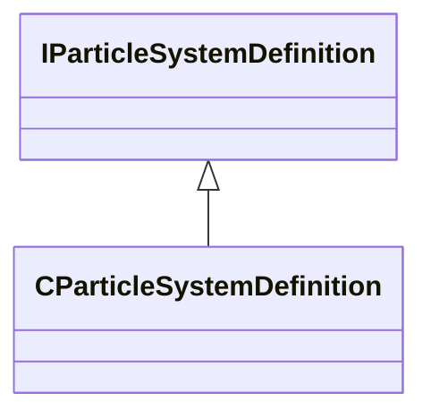

[Schemas](../../schemas.md) / [particles](../particles.md) / IParticleSystemDefinition

# IParticleSystemDefinition

**Kind:** class · **Size:** 8 bytes (`0x8`) · **Align:** 255 · **Module:** particles

**Derived by:** [CParticleSystemDefinition](../particles/CParticleSystemDefinition.md)

**Relationships:**

