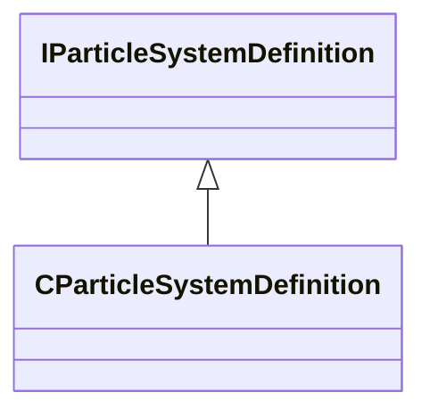

[Schemas](../../schemas.md) / [particles](../particles.md) / IParticleSystemDefinition

# IParticleSystemDefinition

> Source: **Build 25000182** · 2026-08-28 · `windows-x86_64` · schema `0.10.0`

**Kind:** class · **Size:** 8 bytes (`0x8`) · **Align:** n/a (unspecified) · **Module:** particles

**Derived by:** [CParticleSystemDefinition](../particles/CParticleSystemDefinition.md)

**Relationships:**

## Memory layout

No schema-visible fields (8 bytes of opaque storage).
