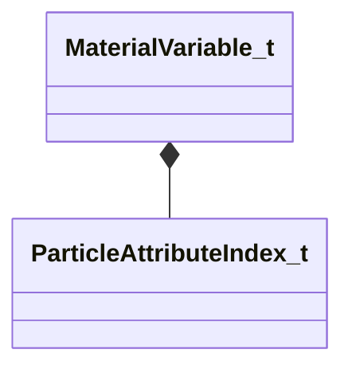

[Schemas](../../schemas.md) / [particles](../particles.md) / MaterialVariable_t

# MaterialVariable_t

> Source: **Build 25000182** · 2026-08-28 · `windows-x86_64` · schema `0.10.0`

**Kind:** class · **Size:** 16 bytes (`0x10`) · **Align:** 8 · **Module:** particles

**Relationships:**

## Memory layout

3 fields (3 declared here, 0 inherited). Offsets are absolute from the object base.

| Offset | Field | Type | From | Annotations |
|--------|-------|------|------|-------------|
| `0x0` | `m_strVariable` | CUtlString |  | `MPropertyFriendlyName material variable` |
| `0x8` | `m_nVariableField` | [ParticleAttributeIndex_t](../particles/ParticleAttributeIndex_t.md) |  | `MPropertyAttributeChoiceName particlefield` `MPropertyFriendlyName particle field` |
| `0xc` | `m_flScale` | float32 |  | `MPropertyFriendlyName scale` |

KV3 class defaults

<pre>{
	&quot;m_strVariable&quot;: &quot;&quot;,
	&quot;m_nVariableField&quot;: 18,
	&quot;m_flScale&quot;: 1.000000
}</pre>

