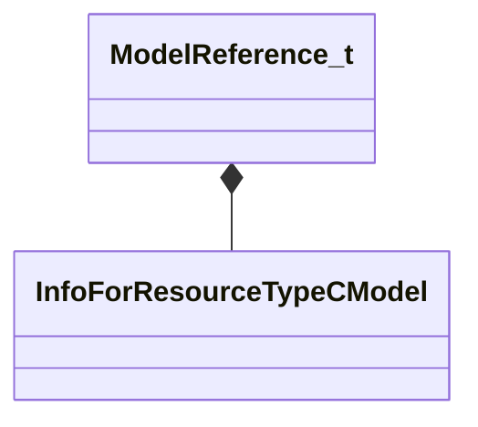

[Schemas](../../schemas.md) / [particles](../particles.md) / ModelReference_t

# ModelReference_t

**Kind:** class · **Size:** 16 bytes (`0x10`) · **Align:** 8 · **Module:** particles

**Relationships:**

## Memory layout

2 fields (2 declared here, 0 inherited). Offsets are absolute from the object base.

| Offset | Field | Type | From | Annotations |
|--------|-------|------|------|-------------|
| `0x0` | `m_model` | CStrongHandle< [InfoForResourceTypeCModel](../resourcesystem/InfoForResourceTypeCModel.md) > |  | `MPropertyFriendlyName model` |
| `0x8` | `m_flRelativeProbabilityOfSpawn` | float32 |  | `MPropertyFriendlyName Relative probability` |

KV3 class defaults

<pre>{
	&quot;m_model&quot;: &quot;&quot;,
	&quot;m_flRelativeProbabilityOfSpawn&quot;: 1.000000
}</pre>

