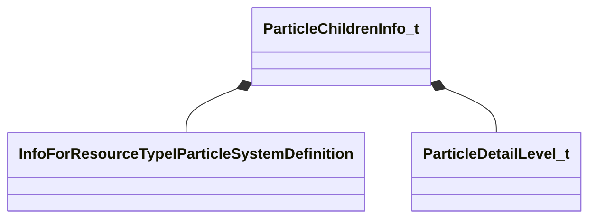

[Schemas](../../schemas.md) / [particles](../particles.md) / ParticleChildrenInfo_t

# ParticleChildrenInfo_t

**Kind:** class · **Size:** 32 bytes (`0x20`) · **Align:** 16 · **Module:** particles

**Relationships:**

## Memory layout

5 fields (5 declared here, 0 inherited). Offsets are absolute from the object base.

| Offset | Field | Type | From | Annotations |
|--------|-------|------|------|-------------|
| `0x0` | `m_ChildRef` | CStrongHandle< [InfoForResourceTypeIParticleSystemDefinition](../resourcesystem/InfoForResourceTypeIParticleSystemDefinition.md) > |  | `MPropertySuppressField` |
| `0x8` | `m_flDelay` | float32 |  | `MPropertyFriendlyName delay` |
| `0xc` | `m_bEndCap` | bool |  | `MPropertyFriendlyName end cap effect` |
| `0xd` | `m_bDisableChild` | bool |  | `MPropertySuppressField` |
| `0x10` | `m_nDetailLevel` | [ParticleDetailLevel_t](../particles/ParticleDetailLevel_t.md) |  | `MPropertyFriendlyName disable at detail levels below` |

KV3 class defaults

<pre>{
	&quot;m_ChildRef&quot;: &quot;&quot;,
	&quot;m_flDelay&quot;: 0.000000,
	&quot;m_bEndCap&quot;: false,
	&quot;m_bDisableChild&quot;: false,
	&quot;m_nDetailLevel&quot;: &quot;PARTICLEDETAIL_LOW&quot;
}</pre>

