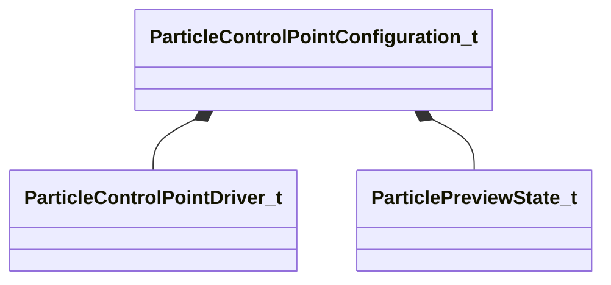

[Schemas](../../schemas.md) / [particles](../particles.md) / ParticleControlPointConfiguration_t

# ParticleControlPointConfiguration_t

> Source: **Build 25000182** · 2026-08-28 · `windows-x86_64` · schema `0.10.0`

**Kind:** class · **Size:** 144 bytes (`0x90`) · **Align:** 8 · **Module:** particles

**Relationships:**

## Memory layout

3 fields (3 declared here, 0 inherited). Offsets are absolute from the object base.

| Offset | Field | Type | From | Annotations |
|--------|-------|------|------|-------------|
| `0x0` | `m_name` | CUtlString |  |  |
| `0x8` | `m_drivers` | CUtlVector< [ParticleControlPointDriver_t](../particles/ParticleControlPointDriver_t.md) > |  |  |
| `0x20` | `m_previewState` | [ParticlePreviewState_t](../particles/ParticlePreviewState_t.md) |  |  |

KV3 class defaults

<pre>{
	&quot;m_name&quot;: &quot;&quot;,
	&quot;m_drivers&quot;:
	[
	],
	&quot;m_previewState&quot;:
	{
		&quot;m_previewModel&quot;: &quot;&quot;,
		&quot;m_nModSpecificData&quot;: 0,
		&quot;m_groundType&quot;: &quot;PET_GROUND_GRID&quot;,
		&quot;m_sequenceName&quot;: &quot;&quot;,
		&quot;m_nFireParticleOnSequenceFrame&quot;: 0,
		&quot;m_hitboxSetName&quot;: &quot;&quot;,
		&quot;m_materialGroupName&quot;: &quot;&quot;,
		&quot;m_vecBodyGroups&quot;:
		[
		],
		&quot;m_flPlaybackSpeed&quot;: 1.000000,
		&quot;m_flParticleSimulationRate&quot;: 1.000000,
		&quot;m_bShouldDrawHitboxes&quot;: false,
		&quot;m_bShouldDrawAttachments&quot;: false,
		&quot;m_bShouldDrawAttachmentNames&quot;: false,
		&quot;m_bShouldDrawControlPointAxes&quot;: false,
		&quot;m_bAnimationNonLooping&quot;: false,
		&quot;m_bSequenceNameIsAnimClipPath&quot;: false,
		&quot;m_vecPreviewGravity&quot;:
		[
			0.000000,
			0.000000,
			-800.000000
		],
		&quot;m_vecPreviewWind&quot;:
		[
			0.000000,
			0.000000,
			0.000000
		]
	}
}</pre>

