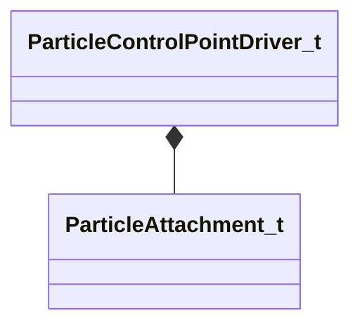

[Schemas](../../schemas.md) / [particles](../particles.md) / ParticleControlPointDriver_t

# ParticleControlPointDriver_t

**Kind:** class · **Size:** 64 bytes (`0x40`) · **Align:** 8 · **Module:** particles

**Relationships:**

## Memory layout

6 fields (6 declared here, 0 inherited). Offsets are absolute from the object base.

| Offset | Field | Type | From | Annotations |
|--------|-------|------|------|-------------|
| `0x0` | `m_iControlPoint` | ParticleParamID_t |  |  |
| `0x10` | `m_iAttachType` | [ParticleAttachment_t](../animationsystem/ParticleAttachment_t.md) |  |  |
| `0x18` | `m_attachmentName` | CUtlString |  |  |
| `0x20` | `m_vecOffset` | Vector |  |  |
| `0x2c` | `m_angOffset` | QAngle |  |  |
| `0x38` | `m_entityName` | CUtlString |  |  |

KV3 class defaults

<pre>{
	&quot;m_iControlPoint&quot;: 0,
	&quot;m_iAttachType&quot;: &quot;PATTACH_ABSORIGIN_FOLLOW&quot;,
	&quot;m_attachmentName&quot;: &quot;&quot;,
	&quot;m_vecOffset&quot;:
	[
		0.000000,
		0.000000,
		0.000000
	],
	&quot;m_angOffset&quot;:
	[
		0.000000,
		0.000000,
		0.000000
	],
	&quot;m_entityName&quot;: &quot;&quot;
}</pre>

