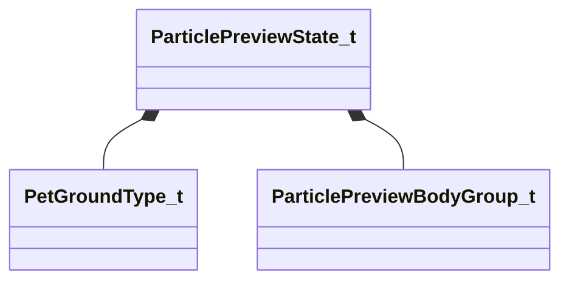

[Schemas](../../schemas.md) / [particles](../particles.md) / ParticlePreviewState_t

# ParticlePreviewState_t

> Source: **Build 25000182** · 2026-08-28 · `windows-x86_64` · schema `0.10.0`

**Kind:** class · **Size:** 112 bytes (`0x70`) · **Align:** 8 · **Module:** particles

**Relationships:**

## Memory layout

18 fields (18 declared here, 0 inherited). Offsets are absolute from the object base.

| Offset | Field | Type | From | Annotations |
|--------|-------|------|------|-------------|
| `0x0` | `m_previewModel` | CUtlString |  |  |
| `0x8` | `m_nModSpecificData` | uint32 |  |  |
| `0xc` | `m_groundType` | [PetGroundType_t](../particles/PetGroundType_t.md) |  |  |
| `0x10` | `m_sequenceName` | CUtlString |  |  |
| `0x18` | `m_nFireParticleOnSequenceFrame` | int32 |  |  |
| `0x20` | `m_hitboxSetName` | CUtlString |  |  |
| `0x28` | `m_materialGroupName` | CUtlString |  |  |
| `0x30` | `m_vecBodyGroups` | CUtlVector< [ParticlePreviewBodyGroup_t](../particles/ParticlePreviewBodyGroup_t.md) > |  |  |
| `0x48` | `m_flPlaybackSpeed` | float32 |  |  |
| `0x4c` | `m_flParticleSimulationRate` | float32 |  |  |
| `0x50` | `m_bShouldDrawHitboxes` | bool |  |  |
| `0x51` | `m_bShouldDrawAttachments` | bool |  |  |
| `0x52` | `m_bShouldDrawAttachmentNames` | bool |  |  |
| `0x53` | `m_bShouldDrawControlPointAxes` | bool |  |  |
| `0x54` | `m_bAnimationNonLooping` | bool |  |  |
| `0x55` | `m_bSequenceNameIsAnimClipPath` | bool |  |  |
| `0x58` | `m_vecPreviewGravity` | Vector |  |  |
| `0x64` | `m_vecPreviewWind` | Vector |  |  |

KV3 class defaults

<pre>{
	&quot;m_previewModel&quot;: &quot;&quot;,
	&quot;m_nModSpecificData&quot;: 0,
	&quot;m_groundType&quot;: &quot;PET_GROUND_GRID&quot;,
	&quot;m_sequenceName&quot;: &quot;&quot;,
	&quot;m_nFireParticleOnSequenceFrame&quot;: 0,
	&quot;m_hitboxSetName&quot;: &quot;&quot;,
	&quot;m_materialGroupName&quot;: &quot;&quot;,
	&quot;m_vecBodyGroups&quot;:
	[
	],
	&quot;m_flPlaybackSpeed&quot;: 1.000000,
	&quot;m_flParticleSimulationRate&quot;: 1.000000,
	&quot;m_bShouldDrawHitboxes&quot;: false,
	&quot;m_bShouldDrawAttachments&quot;: false,
	&quot;m_bShouldDrawAttachmentNames&quot;: false,
	&quot;m_bShouldDrawControlPointAxes&quot;: false,
	&quot;m_bAnimationNonLooping&quot;: false,
	&quot;m_bSequenceNameIsAnimClipPath&quot;: false,
	&quot;m_vecPreviewGravity&quot;:
	[
		0.000000,
		0.000000,
		-800.000000
	],
	&quot;m_vecPreviewWind&quot;:
	[
		0.000000,
		0.000000,
		0.000000
	]
}</pre>

