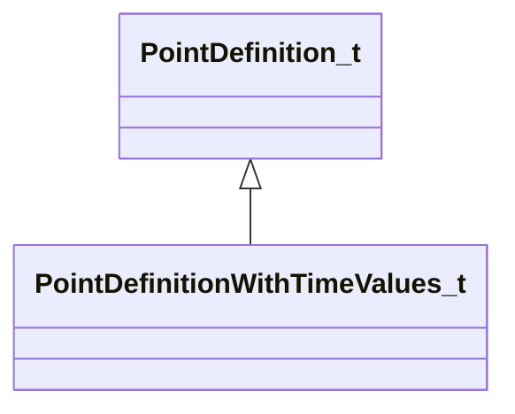

[Schemas](../../schemas.md) / [particles](../particles.md) / PointDefinitionWithTimeValues_t

# PointDefinitionWithTimeValues_t

**Kind:** class · **Size:** 24 bytes (`0x18`) · **Align:** 4 · **Module:** particles

**Inherits from:** [PointDefinition_t](../particles/PointDefinition_t.md)

**Relationships:**

## Memory layout

4 fields (1 declared here, 3 inherited). Offsets are absolute from the object base.

| Offset | Field | Type | From | Annotations |
|--------|-------|------|------|-------------|
| `0x0` | `m_nControlPoint` | int32 | [PointDefinition_t](../particles/PointDefinition_t.md) | `MPropertyFriendlyName Control point` |
| `0x4` | `m_bLocalCoords` | bool | [PointDefinition_t](../particles/PointDefinition_t.md) | `MPropertyFriendlyName Use local coordinates for offset` |
| `0x8` | `m_vOffset` | Vector | [PointDefinition_t](../particles/PointDefinition_t.md) | `MPropertyFriendlyName Offset from control point` |
| `0x14` | `m_flTimeDuration` | float32 |  | `MPropertyFriendlyName Duration value for path point` |

KV3 class defaults

<pre>{
	&quot;m_nControlPoint&quot;: 0,
	&quot;m_bLocalCoords&quot;: false,
	&quot;m_vOffset&quot;:
	[
		0.000000,
		0.000000,
		0.000000
	],
	&quot;m_flTimeDuration&quot;: 0.100000
}</pre>

