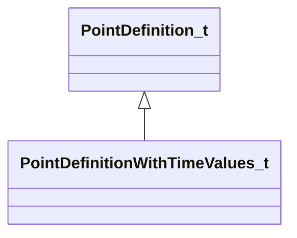

[Schemas](../../schemas.md) / [particles](../particles.md) / PointDefinition_t

# PointDefinition_t

> Source: **Build 25000182** · 2026-08-28 · `windows-x86_64` · schema `0.10.0`

**Kind:** class · **Size:** 20 bytes (`0x14`) · **Align:** 4 · **Module:** particles

**Derived by:** [PointDefinitionWithTimeValues_t](../particles/PointDefinitionWithTimeValues_t.md)

**Relationships:**

## Memory layout

3 fields (3 declared here, 0 inherited). Offsets are absolute from the object base.

| Offset | Field | Type | From | Annotations |
|--------|-------|------|------|-------------|
| `0x0` | `m_nControlPoint` | int32 |  | `MPropertyFriendlyName Control point` |
| `0x4` | `m_bLocalCoords` | bool |  | `MPropertyFriendlyName Use local coordinates for offset` |
| `0x8` | `m_vOffset` | Vector |  | `MPropertyFriendlyName Offset from control point` |

KV3 class defaults

<pre>{
	&quot;m_nControlPoint&quot;: 0,
	&quot;m_bLocalCoords&quot;: false,
	&quot;m_vOffset&quot;:
	[
		0.000000,
		0.000000,
		0.000000
	]
}</pre>

