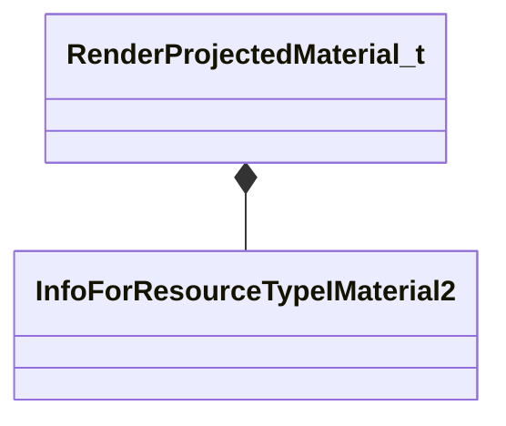

[Schemas](../../schemas.md) / [particles](../particles.md) / RenderProjectedMaterial_t

# RenderProjectedMaterial_t

> Source: **Build 25000182** · 2026-08-28 · `windows-x86_64` · schema `0.10.0`

**Kind:** class · **Size:** 8 bytes (`0x8`) · **Align:** 8 · **Module:** particles

**Relationships:**

## Memory layout

1 field (1 declared here, 0 inherited). Offsets are absolute from the object base.

| Offset | Field | Type | From | Annotations |
|--------|-------|------|------|-------------|
| `0x0` | `m_hMaterial` | CStrongHandle< [InfoForResourceTypeIMaterial2](../resourcesystem/InfoForResourceTypeIMaterial2.md) > |  | `MPropertyFriendlyName Material` |

KV3 class defaults

<pre>{
	&quot;m_hMaterial&quot;: &quot;&quot;
}</pre>

