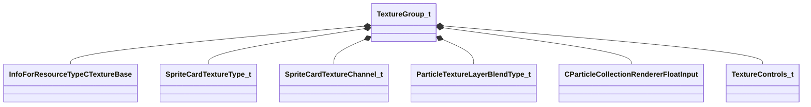

[Schemas](../../schemas.md) / [particles](../particles.md) / TextureGroup_t

# TextureGroup_t

> Source: **Build 25000182** · 2026-08-28 · `windows-x86_64` · schema `0.10.0`

**Kind:** class · **Size:** 3032 bytes (`0xbd8`) · **Align:** 8 · **Module:** particles

**Relationships:**

## Memory layout

9 fields (9 declared here, 0 inherited). Offsets are absolute from the object base.

| Offset | Field | Type | From | Annotations |
|--------|-------|------|------|-------------|
| `0x0` | `m_bEnabled` | bool |  | `MPropertyFriendlyName Enabled` |
| `0x1` | `m_bReplaceTextureWithGradient` | bool |  | `MPropertyFriendlyName Author Texture As Gradient` `MPropertySuppressExpr ( m_nTextureType == SPRITECARD_TEXTURE_NORMALMAP &#124;&#124; m_nTextureType == SPRITECARD_TEXTURE_ANIMMOTIONVEC &#124;&#124; m_nTextureType == SPRITECARD_TEXTURE_6POINT_XYZ_A &#124;&#124; m_nTextureType == SPRITECARD_TEXTURE_6POINT_NEGXYZ_E &#124;&#124; m_nTextureType == SPRITECARD_TEXTURE_SPHERICAL_HARMONICS_A &#124;&#124; m_nTextureType == SPRITECARD_TEXTURE_SPHERICAL_HARMONICS_B &#124;&#124; m_nTextureType == SPRITECARD_TEXTURE_SPHERICAL_HARMONICS_C &#124;&#124; m_nTextureType == SPRITECARD_TEXTURE_ILLUMINATION_GRADIENT &#124;&#124; m_nTextureType == SPRITECARD_TEXTURE_DEPTH )` |
| `0x8` | `m_hTexture` | CStrongHandle< [InfoForResourceTypeCTextureBase](../resourcesystem/InfoForResourceTypeCTextureBase.md) > |  | `MPropertyAttributeEditor AssetBrowse( vtex, *showassetpreview )` `MPropertyFriendlyName Texture` `MPropertySuppressExpr m_bReplaceTextureWithGradient` |
| `0x10` | `m_Gradient` | CColorGradient |  | `MPropertyFriendlyName Gradient` `MPropertySuppressExpr !m_bReplaceTextureWithGradient` |
| `0x28` | `m_nTextureType` | [SpriteCardTextureType_t](../particles/SpriteCardTextureType_t.md) |  | `MPropertyFriendlyName Texture Type` |
| `0x2c` | `m_nTextureChannels` | [SpriteCardTextureChannel_t](../particles/SpriteCardTextureChannel_t.md) |  | `MPropertyFriendlyName Channel Mix` `MPropertySuppressExpr ( m_nTextureType == SPRITECARD_TEXTURE_NORMALMAP &#124;&#124; m_nTextureType == SPRITECARD_TEXTURE_ANIMMOTIONVEC &#124;&#124; m_nTextureType == SPRITECARD_TEXTURE_6POINT_XYZ_A &#124;&#124; m_nTextureType == SPRITECARD_TEXTURE_6POINT_NEGXYZ_E &#124;&#124; m_nTextureType == SPRITECARD_TEXTURE_SPHERICAL_HARMONICS_A &#124;&#124; m_nTextureType == SPRITECARD_TEXTURE_SPHERICAL_HARMONICS_B &#124;&#124; m_nTextureType == SPRITECARD_TEXTURE_SPHERICAL_HARMONICS_C &#124;&#124; m_nTextureType == SPRITECARD_TEXTURE_ILLUMINATION_GRADIENT &#124;&#124; m_nTextureType == SPRITECARD_TEXTURE_DEPTH )` |
| `0x30` | `m_nTextureBlendMode` | [ParticleTextureLayerBlendType_t](../particles/ParticleTextureLayerBlendType_t.md) |  | `MPropertyFriendlyName Mix Blend Mode` `MPropertySuppressExpr ( m_nTextureType == SPRITECARD_TEXTURE_NORMALMAP &#124;&#124; m_nTextureType == SPRITECARD_TEXTURE_ANIMMOTIONVEC &#124;&#124; m_nTextureType == SPRITECARD_TEXTURE_6POINT_XYZ_A &#124;&#124; m_nTextureType == SPRITECARD_TEXTURE_6POINT_NEGXYZ_E &#124;&#124; m_nTextureType == SPRITECARD_TEXTURE_SPHERICAL_HARMONICS_A &#124;&#124; m_nTextureType == SPRITECARD_TEXTURE_SPHERICAL_HARMONICS_B &#124;&#124; m_nTextureType == SPRITECARD_TEXTURE_SPHERICAL_HARMONICS_C &#124;&#124; m_nTextureType == SPRITECARD_TEXTURE_ILLUMINATION_GRADIENT &#124;&#124; m_nTextureType == SPRITECARD_TEXTURE_DEPTH )` |
| `0x38` | `m_flTextureBlend` | [CParticleCollectionRendererFloatInput](../particleslib/CParticleCollectionRendererFloatInput.md) |  | `MPropertyFriendlyName Blend Amount` `MPropertySuppressExpr ( m_nTextureType == SPRITECARD_TEXTURE_NORMALMAP &#124;&#124; m_nTextureType == SPRITECARD_TEXTURE_ANIMMOTIONVEC &#124;&#124; m_nTextureType == SPRITECARD_TEXTURE_6POINT_XYZ_A &#124;&#124; m_nTextureType == SPRITECARD_TEXTURE_6POINT_NEGXYZ_E &#124;&#124; m_nTextureType == SPRITECARD_TEXTURE_SPHERICAL_HARMONICS_A &#124;&#124; m_nTextureType == SPRITECARD_TEXTURE_SPHERICAL_HARMONICS_B &#124;&#124; m_nTextureType == SPRITECARD_TEXTURE_SPHERICAL_HARMONICS_C &#124;&#124; m_nTextureType == SPRITECARD_TEXTURE_ILLUMINATION_GRADIENT &#124;&#124; m_nTextureType == SPRITECARD_TEXTURE_DEPTH )` |
| `0x1a8` | `m_TextureControls` | [TextureControls_t](../particles/TextureControls_t.md) |  | `MPropertyFriendlyName Texture Controls` `MPropertySuppressExpr ( m_nTextureType == SPRITECARD_TEXTURE_NORMALMAP &#124;&#124; m_nTextureType == SPRITECARD_TEXTURE_ANIMMOTIONVEC &#124;&#124; m_nTextureType == SPRITECARD_TEXTURE_6POINT_XYZ_A &#124;&#124; m_nTextureType == SPRITECARD_TEXTURE_6POINT_NEGXYZ_E &#124;&#124; m_nTextureType == SPRITECARD_TEXTURE_SPHERICAL_HARMONICS_A &#124;&#124; m_nTextureType == SPRITECARD_TEXTURE_SPHERICAL_HARMONICS_B &#124;&#124; m_nTextureType == SPRITECARD_TEXTURE_SPHERICAL_HARMONICS_C &#124;&#124; m_nTextureType == SPRITECARD_TEXTURE_ILLUMINATION_GRADIENT &#124;&#124; m_nTextureType == SPRITECARD_TEXTURE_DEPTH )` |

KV3 class defaults

<pre>{
	&quot;m_bEnabled&quot;: true,
	&quot;m_bReplaceTextureWithGradient&quot;: false,
	&quot;m_hTexture&quot;: &quot;&quot;,
	&quot;m_Gradient&quot;:
	{
		&quot;m_Stops&quot;:
		[
		]
	},
	&quot;m_nTextureType&quot;: &quot;SPRITECARD_TEXTURE_DIFFUSE&quot;,
	&quot;m_nTextureChannels&quot;: &quot;SPRITECARD_TEXTURE_CHANNEL_MIX_RGBA&quot;,
	&quot;m_nTextureBlendMode&quot;: &quot;SPRITECARD_TEXTURE_BLEND_MULTIPLY&quot;,
	&quot;m_flTextureBlend&quot;:
	{
		&quot;m_nType&quot;: &quot;PF_TYPE_LITERAL&quot;,
		&quot;m_nMapType&quot;: &quot;PF_MAP_TYPE_DIRECT&quot;,
		&quot;m_flLiteralValue&quot;: 1.000000,
		&quot;m_NamedValue&quot;: &quot;&quot;,
		&quot;m_nControlPoint&quot;: 0,
		&quot;m_nScalarAttribute&quot;: 3,
		&quot;m_nVectorAttribute&quot;: 6,
		&quot;m_nVectorComponent&quot;: 0,
		&quot;m_bReverseOrder&quot;: false,
		&quot;m_flRandomMin&quot;: 0.000000,
		&quot;m_flRandomMax&quot;: 1.000000,
		&quot;m_bHasRandomSignFlip&quot;: false,
		&quot;m_nRandomSeed&quot;: &lt;HIDDEN FOR DIFF&gt;,
		&quot;m_nRandomMode&quot;: &quot;PF_RANDOM_MODE_CONSTANT&quot;,
		&quot;m_strSnapshotSubset&quot;: &quot;&quot;,
		&quot;m_flLOD0&quot;: 0.000000,
		&quot;m_flLOD1&quot;: 0.000000,
		&quot;m_flLOD2&quot;: 0.000000,
		&quot;m_flLOD3&quot;: 0.000000,
		&quot;m_nNoiseInputVectorAttribute&quot;: 0,
		&quot;m_flNoiseOutputMin&quot;: 0.000000,
		&quot;m_flNoiseOutputMax&quot;: 1.000000,
		&quot;m_flNoiseScale&quot;: 0.100000,
		&quot;m_vecNoiseOffsetRate&quot;:
		[
			0.000000,
			0.000000,
			0.000000
		],
		&quot;m_flNoiseOffset&quot;: 0.000000,
		&quot;m_nNoiseOctaves&quot;: 1,
		&quot;m_nNoiseTurbulence&quot;: &quot;PF_NOISE_TURB_NONE&quot;,
		&quot;m_nNoiseType&quot;: &quot;PF_NOISE_TYPE_PERLIN&quot;,
		&quot;m_nNoiseModifier&quot;: &quot;PF_NOISE_MODIFIER_NONE&quot;,
		&quot;m_flNoiseTurbulenceScale&quot;: 1.000000,
		&quot;m_flNoiseTurbulenceMix&quot;: 0.500000,
		&quot;m_flNoiseImgPreviewScale&quot;: 1.000000,
		&quot;m_bNoiseImgPreviewLive&quot;: true,
		&quot;m_flNoCameraFallback&quot;: 0.000000,
		&quot;m_bUseBoundsCenter&quot;: false,
		&quot;m_nInputMode&quot;: &quot;PF_INPUT_MODE_CLAMPED&quot;,
		&quot;m_flMultFactor&quot;: 1.000000,
		&quot;m_flInput0&quot;: 0.000000,
		&quot;m_flInput1&quot;: 1.000000,
		&quot;m_flOutput0&quot;: 0.000000,
		&quot;m_flOutput1&quot;: 1.000000,
		&quot;m_flNotchedRangeMin&quot;: 0.000000,
		&quot;m_flNotchedRangeMax&quot;: 1.000000,
		&quot;m_flNotchedOutputOutside&quot;: 0.000000,
		&quot;m_flNotchedOutputInside&quot;: 1.000000,
		&quot;m_nRoundType&quot;: &quot;PF_ROUND_TYPE_NEAREST&quot;,
		&quot;m_nBiasType&quot;: &quot;PF_BIAS_TYPE_STANDARD&quot;,
		&quot;m_flBiasParameter&quot;: 0.000000,
		&quot;m_Curve&quot;:
		{
			&quot;m_spline&quot;:
			[
			],
			&quot;m_tangents&quot;:
			[
			],
			&quot;m_vDomainMins&quot;:
			[
				0.000000,
				0.000000
			],
			&quot;m_vDomainMaxs&quot;:
			[
				0.000000,
				0.000000
			]
		}
	},
	&quot;m_TextureControls&quot;:
	{
		&quot;m_flFinalTextureScaleU&quot;:
		{
			&quot;m_nType&quot;: &quot;PF_TYPE_LITERAL&quot;,
			&quot;m_nMapType&quot;: &quot;PF_MAP_TYPE_DIRECT&quot;,
			&quot;m_flLiteralValue&quot;: 1.000000,
			&quot;m_NamedValue&quot;: &quot;&quot;,
			&quot;m_nControlPoint&quot;: 0,
			&quot;m_nScalarAttribute&quot;: 3,
			&quot;m_nVectorAttribute&quot;: 6,
			&quot;m_nVectorComponent&quot;: 0,
			&quot;m_bReverseOrder&quot;: false,
			&quot;m_flRandomMin&quot;: 0.000000,
			&quot;m_flRandomMax&quot;: 1.000000,
			&quot;m_bHasRandomSignFlip&quot;: false,
			&quot;m_nRandomSeed&quot;: &lt;HIDDEN FOR DIFF&gt;,
			&quot;m_nRandomMode&quot;: &quot;PF_RANDOM_MODE_CONSTANT&quot;,
			&quot;m_strSnapshotSubset&quot;: &quot;&quot;,
			&quot;m_flLOD0&quot;: 0.000000,
			&quot;m_flLOD1&quot;: 0.000000,
			&quot;m_flLOD2&quot;: 0.000000,
			&quot;m_flLOD3&quot;: 0.000000,
			&quot;m_nNoiseInputVectorAttribute&quot;: 0,
			&quot;m_flNoiseOutputMin&quot;: 0.000000,
			&quot;m_flNoiseOutputMax&quot;: 1.000000,
			&quot;m_flNoiseScale&quot;: 0.100000,
			&quot;m_vecNoiseOffsetRate&quot;:
			[
				0.000000,
				0.000000,
				0.000000
			],
			&quot;m_flNoiseOffset&quot;: 0.000000,
			&quot;m_nNoiseOctaves&quot;: 1,
			&quot;m_nNoiseTurbulence&quot;: &quot;PF_NOISE_TURB_NONE&quot;,
			&quot;m_nNoiseType&quot;: &quot;PF_NOISE_TYPE_PERLIN&quot;,
			&quot;m_nNoiseModifier&quot;: &quot;PF_NOISE_MODIFIER_NONE&quot;,
			&quot;m_flNoiseTurbulenceScale&quot;: 1.000000,
			&quot;m_flNoiseTurbulenceMix&quot;: 0.500000,
			&quot;m_flNoiseImgPreviewScale&quot;: 1.000000,
			&quot;m_bNoiseImgPreviewLive&quot;: true,
			&quot;m_flNoCameraFallback&quot;: 0.000000,
			&quot;m_bUseBoundsCenter&quot;: false,
			&quot;m_nInputMode&quot;: &quot;PF_INPUT_MODE_CLAMPED&quot;,
			&quot;m_flMultFactor&quot;: 1.000000,
			&quot;m_flInput0&quot;: 0.000000,
			&quot;m_flInput1&quot;: 1.000000,
			&quot;m_flOutput0&quot;: 0.000000,
			&quot;m_flOutput1&quot;: 1.000000,
			&quot;m_flNotchedRangeMin&quot;: 0.000000,
			&quot;m_flNotchedRangeMax&quot;: 1.000000,
			&quot;m_flNotchedOutputOutside&quot;: 0.000000,
			&quot;m_flNotchedOutputInside&quot;: 1.000000,
			&quot;m_nRoundType&quot;: &quot;PF_ROUND_TYPE_NEAREST&quot;,
			&quot;m_nBiasType&quot;: &quot;PF_BIAS_TYPE_STANDARD&quot;,
			&quot;m_flBiasParameter&quot;: 0.000000,
			&quot;m_Curve&quot;:
			{
				&quot;m_spline&quot;:
				[
				],
				&quot;m_tangents&quot;:
				[
				],
				&quot;m_vDomainMins&quot;:
				[
					0.000000,
					0.000000
				],
				&quot;m_vDomainMaxs&quot;:
				[
					0.000000,
					0.000000
				]
			}
		},
		&quot;m_flFinalTextureScaleV&quot;:
		{
			&quot;m_nType&quot;: &quot;PF_TYPE_LITERAL&quot;,
			&quot;m_nMapType&quot;: &quot;PF_MAP_TYPE_DIRECT&quot;,
			&quot;m_flLiteralValue&quot;: 1.000000,
			&quot;m_NamedValue&quot;: &quot;&quot;,
			&quot;m_nControlPoint&quot;: 0,
			&quot;m_nScalarAttribute&quot;: 3,
			&quot;m_nVectorAttribute&quot;: 6,
			&quot;m_nVectorComponent&quot;: 0,
			&quot;m_bReverseOrder&quot;: false,
			&quot;m_flRandomMin&quot;: 0.000000,
			&quot;m_flRandomMax&quot;: 1.000000,
			&quot;m_bHasRandomSignFlip&quot;: false,
			&quot;m_nRandomSeed&quot;: &lt;HIDDEN FOR DIFF&gt;,
			&quot;m_nRandomMode&quot;: &quot;PF_RANDOM_MODE_CONSTANT&quot;,
			&quot;m_strSnapshotSubset&quot;: &quot;&quot;,
			&quot;m_flLOD0&quot;: 0.000000,
			&quot;m_flLOD1&quot;: 0.000000,
			&quot;m_flLOD2&quot;: 0.000000,
			&quot;m_flLOD3&quot;: 0.000000,
			&quot;m_nNoiseInputVectorAttribute&quot;: 0,
			&quot;m_flNoiseOutputMin&quot;: 0.000000,
			&quot;m_flNoiseOutputMax&quot;: 1.000000,
			&quot;m_flNoiseScale&quot;: 0.100000,
			&quot;m_vecNoiseOffsetRate&quot;:
			[
				0.000000,
				0.000000,
				0.000000
			],
			&quot;m_flNoiseOffset&quot;: 0.000000,
			&quot;m_nNoiseOctaves&quot;: 1,
			&quot;m_nNoiseTurbulence&quot;: &quot;PF_NOISE_TURB_NONE&quot;,
			&quot;m_nNoiseType&quot;: &quot;PF_NOISE_TYPE_PERLIN&quot;,
			&quot;m_nNoiseModifier&quot;: &quot;PF_NOISE_MODIFIER_NONE&quot;,
			&quot;m_flNoiseTurbulenceScale&quot;: 1.000000,
			&quot;m_flNoiseTurbulenceMix&quot;: 0.500000,
			&quot;m_flNoiseImgPreviewScale&quot;: 1.000000,
			&quot;m_bNoiseImgPreviewLive&quot;: true,
			&quot;m_flNoCameraFallback&quot;: 0.000000,
			&quot;m_bUseBoundsCenter&quot;: false,
			&quot;m_nInputMode&quot;: &quot;PF_INPUT_MODE_CLAMPED&quot;,
			&quot;m_flMultFactor&quot;: 1.000000,
			&quot;m_flInput0&quot;: 0.000000,
			&quot;m_flInput1&quot;: 1.000000,
			&quot;m_flOutput0&quot;: 0.000000,
			&quot;m_flOutput1&quot;: 1.000000,
			&quot;m_flNotchedRangeMin&quot;: 0.000000,
			&quot;m_flNotchedRangeMax&quot;: 1.000000,
			&quot;m_flNotchedOutputOutside&quot;: 0.000000,
			&quot;m_flNotchedOutputInside&quot;: 1.000000,
			&quot;m_nRoundType&quot;: &quot;PF_ROUND_TYPE_NEAREST&quot;,
			&quot;m_nBiasType&quot;: &quot;PF_BIAS_TYPE_STANDARD&quot;,
			&quot;m_flBiasParameter&quot;: 0.000000,
			&quot;m_Curve&quot;:
			{
				&quot;m_spline&quot;:
				[
				],
				&quot;m_tangents&quot;:
				[
				],
				&quot;m_vDomainMins&quot;:
				[
					0.000000,
					0.000000
				],
				&quot;m_vDomainMaxs&quot;:
				[
					0.000000,
					0.000000
				]
			}
		},
		&quot;m_flFinalTextureOffsetU&quot;:
		{
			&quot;m_nType&quot;: &quot;PF_TYPE_LITERAL&quot;,
			&quot;m_nMapType&quot;: &quot;PF_MAP_TYPE_DIRECT&quot;,
			&quot;m_flLiteralValue&quot;: 0.000000,
			&quot;m_NamedValue&quot;: &quot;&quot;,
			&quot;m_nControlPoint&quot;: 0,
			&quot;m_nScalarAttribute&quot;: 3,
			&quot;m_nVectorAttribute&quot;: 6,
			&quot;m_nVectorComponent&quot;: 0,
			&quot;m_bReverseOrder&quot;: false,
			&quot;m_flRandomMin&quot;: 0.000000,
			&quot;m_flRandomMax&quot;: 1.000000,
			&quot;m_bHasRandomSignFlip&quot;: false,
			&quot;m_nRandomSeed&quot;: &lt;HIDDEN FOR DIFF&gt;,
			&quot;m_nRandomMode&quot;: &quot;PF_RANDOM_MODE_CONSTANT&quot;,
			&quot;m_strSnapshotSubset&quot;: &quot;&quot;,
			&quot;m_flLOD0&quot;: 0.000000,
			&quot;m_flLOD1&quot;: 0.000000,
			&quot;m_flLOD2&quot;: 0.000000,
			&quot;m_flLOD3&quot;: 0.000000,
			&quot;m_nNoiseInputVectorAttribute&quot;: 0,
			&quot;m_flNoiseOutputMin&quot;: 0.000000,
			&quot;m_flNoiseOutputMax&quot;: 1.000000,
			&quot;m_flNoiseScale&quot;: 0.100000,
			&quot;m_vecNoiseOffsetRate&quot;:
			[
				0.000000,
				0.000000,
				0.000000
			],
			&quot;m_flNoiseOffset&quot;: 0.000000,
			&quot;m_nNoiseOctaves&quot;: 1,
			&quot;m_nNoiseTurbulence&quot;: &quot;PF_NOISE_TURB_NONE&quot;,
			&quot;m_nNoiseType&quot;: &quot;PF_NOISE_TYPE_PERLIN&quot;,
			&quot;m_nNoiseModifier&quot;: &quot;PF_NOISE_MODIFIER_NONE&quot;,
			&quot;m_flNoiseTurbulenceScale&quot;: 1.000000,
			&quot;m_flNoiseTurbulenceMix&quot;: 0.500000,
			&quot;m_flNoiseImgPreviewScale&quot;: 1.000000,
			&quot;m_bNoiseImgPreviewLive&quot;: true,
			&quot;m_flNoCameraFallback&quot;: 0.000000,
			&quot;m_bUseBoundsCenter&quot;: false,
			&quot;m_nInputMode&quot;: &quot;PF_INPUT_MODE_CLAMPED&quot;,
			&quot;m_flMultFactor&quot;: 1.000000,
			&quot;m_flInput0&quot;: 0.000000,
			&quot;m_flInput1&quot;: 1.000000,
			&quot;m_flOutput0&quot;: 0.000000,
			&quot;m_flOutput1&quot;: 1.000000,
			&quot;m_flNotchedRangeMin&quot;: 0.000000,
			&quot;m_flNotchedRangeMax&quot;: 1.000000,
			&quot;m_flNotchedOutputOutside&quot;: 0.000000,
			&quot;m_flNotchedOutputInside&quot;: 1.000000,
			&quot;m_nRoundType&quot;: &quot;PF_ROUND_TYPE_NEAREST&quot;,
			&quot;m_nBiasType&quot;: &quot;PF_BIAS_TYPE_STANDARD&quot;,
			&quot;m_flBiasParameter&quot;: 0.000000,
			&quot;m_Curve&quot;:
			{
				&quot;m_spline&quot;:
				[
				],
				&quot;m_tangents&quot;:
				[
				],
				&quot;m_vDomainMins&quot;:
				[
					0.000000,
					0.000000
				],
				&quot;m_vDomainMaxs&quot;:
				[
					0.000000,
					0.000000
				]
			}
		},
		&quot;m_flFinalTextureOffsetV&quot;:
		{
			&quot;m_nType&quot;: &quot;PF_TYPE_LITERAL&quot;,
			&quot;m_nMapType&quot;: &quot;PF_MAP_TYPE_DIRECT&quot;,
			&quot;m_flLiteralValue&quot;: 0.000000,
			&quot;m_NamedValue&quot;: &quot;&quot;,
			&quot;m_nControlPoint&quot;: 0,
			&quot;m_nScalarAttribute&quot;: 3,
			&quot;m_nVectorAttribute&quot;: 6,
			&quot;m_nVectorComponent&quot;: 0,
			&quot;m_bReverseOrder&quot;: false,
			&quot;m_flRandomMin&quot;: 0.000000,
			&quot;m_flRandomMax&quot;: 1.000000,
			&quot;m_bHasRandomSignFlip&quot;: false,
			&quot;m_nRandomSeed&quot;: &lt;HIDDEN FOR DIFF&gt;,
			&quot;m_nRandomMode&quot;: &quot;PF_RANDOM_MODE_CONSTANT&quot;,
			&quot;m_strSnapshotSubset&quot;: &quot;&quot;,
			&quot;m_flLOD0&quot;: 0.000000,
			&quot;m_flLOD1&quot;: 0.000000,
			&quot;m_flLOD2&quot;: 0.000000,
			&quot;m_flLOD3&quot;: 0.000000,
			&quot;m_nNoiseInputVectorAttribute&quot;: 0,
			&quot;m_flNoiseOutputMin&quot;: 0.000000,
			&quot;m_flNoiseOutputMax&quot;: 1.000000,
			&quot;m_flNoiseScale&quot;: 0.100000,
			&quot;m_vecNoiseOffsetRate&quot;:
			[
				0.000000,
				0.000000,
				0.000000
			],
			&quot;m_flNoiseOffset&quot;: 0.000000,
			&quot;m_nNoiseOctaves&quot;: 1,
			&quot;m_nNoiseTurbulence&quot;: &quot;PF_NOISE_TURB_NONE&quot;,
			&quot;m_nNoiseType&quot;: &quot;PF_NOISE_TYPE_PERLIN&quot;,
			&quot;m_nNoiseModifier&quot;: &quot;PF_NOISE_MODIFIER_NONE&quot;,
			&quot;m_flNoiseTurbulenceScale&quot;: 1.000000,
			&quot;m_flNoiseTurbulenceMix&quot;: 0.500000,
			&quot;m_flNoiseImgPreviewScale&quot;: 1.000000,
			&quot;m_bNoiseImgPreviewLive&quot;: true,
			&quot;m_flNoCameraFallback&quot;: 0.000000,
			&quot;m_bUseBoundsCenter&quot;: false,
			&quot;m_nInputMode&quot;: &quot;PF_INPUT_MODE_CLAMPED&quot;,
			&quot;m_flMultFactor&quot;: 1.000000,
			&quot;m_flInput0&quot;: 0.000000,
			&quot;m_flInput1&quot;: 1.000000,
			&quot;m_flOutput0&quot;: 0.000000,
			&quot;m_flOutput1&quot;: 1.000000,
			&quot;m_flNotchedRangeMin&quot;: 0.000000,
			&quot;m_flNotchedRangeMax&quot;: 1.000000,
			&quot;m_flNotchedOutputOutside&quot;: 0.000000,
			&quot;m_flNotchedOutputInside&quot;: 1.000000,
			&quot;m_nRoundType&quot;: &quot;PF_ROUND_TYPE_NEAREST&quot;,
			&quot;m_nBiasType&quot;: &quot;PF_BIAS_TYPE_STANDARD&quot;,
			&quot;m_flBiasParameter&quot;: 0.000000,
			&quot;m_Curve&quot;:
			{
				&quot;m_spline&quot;:
				[
				],
				&quot;m_tangents&quot;:
				[
				],
				&quot;m_vDomainMins&quot;:
				[
					0.000000,
					0.000000
				],
				&quot;m_vDomainMaxs&quot;:
				[
					0.000000,
					0.000000
				]
			}
		},
		&quot;m_flFinalTextureUVRotation&quot;:
		{
			&quot;m_nType&quot;: &quot;PF_TYPE_LITERAL&quot;,
			&quot;m_nMapType&quot;: &quot;PF_MAP_TYPE_DIRECT&quot;,
			&quot;m_flLiteralValue&quot;: 0.000000,
			&quot;m_NamedValue&quot;: &quot;&quot;,
			&quot;m_nControlPoint&quot;: 0,
			&quot;m_nScalarAttribute&quot;: 3,
			&quot;m_nVectorAttribute&quot;: 6,
			&quot;m_nVectorComponent&quot;: 0,
			&quot;m_bReverseOrder&quot;: false,
			&quot;m_flRandomMin&quot;: 0.000000,
			&quot;m_flRandomMax&quot;: 1.000000,
			&quot;m_bHasRandomSignFlip&quot;: false,
			&quot;m_nRandomSeed&quot;: &lt;HIDDEN FOR DIFF&gt;,
			&quot;m_nRandomMode&quot;: &quot;PF_RANDOM_MODE_CONSTANT&quot;,
			&quot;m_strSnapshotSubset&quot;: &quot;&quot;,
			&quot;m_flLOD0&quot;: 0.000000,
			&quot;m_flLOD1&quot;: 0.000000,
			&quot;m_flLOD2&quot;: 0.000000,
			&quot;m_flLOD3&quot;: 0.000000,
			&quot;m_nNoiseInputVectorAttribute&quot;: 0,
			&quot;m_flNoiseOutputMin&quot;: 0.000000,
			&quot;m_flNoiseOutputMax&quot;: 1.000000,
			&quot;m_flNoiseScale&quot;: 0.100000,
			&quot;m_vecNoiseOffsetRate&quot;:
			[
				0.000000,
				0.000000,
				0.000000
			],
			&quot;m_flNoiseOffset&quot;: 0.000000,
			&quot;m_nNoiseOctaves&quot;: 1,
			&quot;m_nNoiseTurbulence&quot;: &quot;PF_NOISE_TURB_NONE&quot;,
			&quot;m_nNoiseType&quot;: &quot;PF_NOISE_TYPE_PERLIN&quot;,
			&quot;m_nNoiseModifier&quot;: &quot;PF_NOISE_MODIFIER_NONE&quot;,
			&quot;m_flNoiseTurbulenceScale&quot;: 1.000000,
			&quot;m_flNoiseTurbulenceMix&quot;: 0.500000,
			&quot;m_flNoiseImgPreviewScale&quot;: 1.000000,
			&quot;m_bNoiseImgPreviewLive&quot;: true,
			&quot;m_flNoCameraFallback&quot;: 0.000000,
			&quot;m_bUseBoundsCenter&quot;: false,
			&quot;m_nInputMode&quot;: &quot;PF_INPUT_MODE_CLAMPED&quot;,
			&quot;m_flMultFactor&quot;: 1.000000,
			&quot;m_flInput0&quot;: 0.000000,
			&quot;m_flInput1&quot;: 1.000000,
			&quot;m_flOutput0&quot;: 0.000000,
			&quot;m_flOutput1&quot;: 1.000000,
			&quot;m_flNotchedRangeMin&quot;: 0.000000,
			&quot;m_flNotchedRangeMax&quot;: 1.000000,
			&quot;m_flNotchedOutputOutside&quot;: 0.000000,
			&quot;m_flNotchedOutputInside&quot;: 1.000000,
			&quot;m_nRoundType&quot;: &quot;PF_ROUND_TYPE_NEAREST&quot;,
			&quot;m_nBiasType&quot;: &quot;PF_BIAS_TYPE_STANDARD&quot;,
			&quot;m_flBiasParameter&quot;: 0.000000,
			&quot;m_Curve&quot;:
			{
				&quot;m_spline&quot;:
				[
				],
				&quot;m_tangents&quot;:
				[
				],
				&quot;m_vDomainMins&quot;:
				[
					0.000000,
					0.000000
				],
				&quot;m_vDomainMaxs&quot;:
				[
					0.000000,
					0.000000
				]
			}
		},
		&quot;m_flZoomScale&quot;:
		{
			&quot;m_nType&quot;: &quot;PF_TYPE_LITERAL&quot;,
			&quot;m_nMapType&quot;: &quot;PF_MAP_TYPE_DIRECT&quot;,
			&quot;m_flLiteralValue&quot;: 1.000000,
			&quot;m_NamedValue&quot;: &quot;&quot;,
			&quot;m_nControlPoint&quot;: 0,
			&quot;m_nScalarAttribute&quot;: 3,
			&quot;m_nVectorAttribute&quot;: 6,
			&quot;m_nVectorComponent&quot;: 0,
			&quot;m_bReverseOrder&quot;: false,
			&quot;m_flRandomMin&quot;: 0.000000,
			&quot;m_flRandomMax&quot;: 1.000000,
			&quot;m_bHasRandomSignFlip&quot;: false,
			&quot;m_nRandomSeed&quot;: &lt;HIDDEN FOR DIFF&gt;,
			&quot;m_nRandomMode&quot;: &quot;PF_RANDOM_MODE_CONSTANT&quot;,
			&quot;m_strSnapshotSubset&quot;: &quot;&quot;,
			&quot;m_flLOD0&quot;: 0.000000,
			&quot;m_flLOD1&quot;: 0.000000,
			&quot;m_flLOD2&quot;: 0.000000,
			&quot;m_flLOD3&quot;: 0.000000,
			&quot;m_nNoiseInputVectorAttribute&quot;: 0,
			&quot;m_flNoiseOutputMin&quot;: 0.000000,
			&quot;m_flNoiseOutputMax&quot;: 1.000000,
			&quot;m_flNoiseScale&quot;: 0.100000,
			&quot;m_vecNoiseOffsetRate&quot;:
			[
				0.000000,
				0.000000,
				0.000000
			],
			&quot;m_flNoiseOffset&quot;: 0.000000,
			&quot;m_nNoiseOctaves&quot;: 1,
			&quot;m_nNoiseTurbulence&quot;: &quot;PF_NOISE_TURB_NONE&quot;,
			&quot;m_nNoiseType&quot;: &quot;PF_NOISE_TYPE_PERLIN&quot;,
			&quot;m_nNoiseModifier&quot;: &quot;PF_NOISE_MODIFIER_NONE&quot;,
			&quot;m_flNoiseTurbulenceScale&quot;: 1.000000,
			&quot;m_flNoiseTurbulenceMix&quot;: 0.500000,
			&quot;m_flNoiseImgPreviewScale&quot;: 1.000000,
			&quot;m_bNoiseImgPreviewLive&quot;: true,
			&quot;m_flNoCameraFallback&quot;: 0.000000,
			&quot;m_bUseBoundsCenter&quot;: false,
			&quot;m_nInputMode&quot;: &quot;PF_INPUT_MODE_CLAMPED&quot;,
			&quot;m_flMultFactor&quot;: 1.000000,
			&quot;m_flInput0&quot;: 0.000000,
			&quot;m_flInput1&quot;: 1.000000,
			&quot;m_flOutput0&quot;: 0.000000,
			&quot;m_flOutput1&quot;: 1.000000,
			&quot;m_flNotchedRangeMin&quot;: 0.000000,
			&quot;m_flNotchedRangeMax&quot;: 1.000000,
			&quot;m_flNotchedOutputOutside&quot;: 0.000000,
			&quot;m_flNotchedOutputInside&quot;: 1.000000,
			&quot;m_nRoundType&quot;: &quot;PF_ROUND_TYPE_NEAREST&quot;,
			&quot;m_nBiasType&quot;: &quot;PF_BIAS_TYPE_STANDARD&quot;,
			&quot;m_flBiasParameter&quot;: 0.000000,
			&quot;m_Curve&quot;:
			{
				&quot;m_spline&quot;:
				[
				],
				&quot;m_tangents&quot;:
				[
				],
				&quot;m_vDomainMins&quot;:
				[
					0.000000,
					0.000000
				],
				&quot;m_vDomainMaxs&quot;:
				[
					0.000000,
					0.000000
				]
			}
		},
		&quot;m_flDistortion&quot;:
		{
			&quot;m_nType&quot;: &quot;PF_TYPE_LITERAL&quot;,
			&quot;m_nMapType&quot;: &quot;PF_MAP_TYPE_DIRECT&quot;,
			&quot;m_flLiteralValue&quot;: 1.000000,
			&quot;m_NamedValue&quot;: &quot;&quot;,
			&quot;m_nControlPoint&quot;: 0,
			&quot;m_nScalarAttribute&quot;: 3,
			&quot;m_nVectorAttribute&quot;: 6,
			&quot;m_nVectorComponent&quot;: 0,
			&quot;m_bReverseOrder&quot;: false,
			&quot;m_flRandomMin&quot;: 0.000000,
			&quot;m_flRandomMax&quot;: 1.000000,
			&quot;m_bHasRandomSignFlip&quot;: false,
			&quot;m_nRandomSeed&quot;: &lt;HIDDEN FOR DIFF&gt;,
			&quot;m_nRandomMode&quot;: &quot;PF_RANDOM_MODE_CONSTANT&quot;,
			&quot;m_strSnapshotSubset&quot;: &quot;&quot;,
			&quot;m_flLOD0&quot;: 0.000000,
			&quot;m_flLOD1&quot;: 0.000000,
			&quot;m_flLOD2&quot;: 0.000000,
			&quot;m_flLOD3&quot;: 0.000000,
			&quot;m_nNoiseInputVectorAttribute&quot;: 0,
			&quot;m_flNoiseOutputMin&quot;: 0.000000,
			&quot;m_flNoiseOutputMax&quot;: 1.000000,
			&quot;m_flNoiseScale&quot;: 0.100000,
			&quot;m_vecNoiseOffsetRate&quot;:
			[
				0.000000,
				0.000000,
				0.000000
			],
			&quot;m_flNoiseOffset&quot;: 0.000000,
			&quot;m_nNoiseOctaves&quot;: 1,
			&quot;m_nNoiseTurbulence&quot;: &quot;PF_NOISE_TURB_NONE&quot;,
			&quot;m_nNoiseType&quot;: &quot;PF_NOISE_TYPE_PERLIN&quot;,
			&quot;m_nNoiseModifier&quot;: &quot;PF_NOISE_MODIFIER_NONE&quot;,
			&quot;m_flNoiseTurbulenceScale&quot;: 1.000000,
			&quot;m_flNoiseTurbulenceMix&quot;: 0.500000,
			&quot;m_flNoiseImgPreviewScale&quot;: 1.000000,
			&quot;m_bNoiseImgPreviewLive&quot;: true,
			&quot;m_flNoCameraFallback&quot;: 0.000000,
			&quot;m_bUseBoundsCenter&quot;: false,
			&quot;m_nInputMode&quot;: &quot;PF_INPUT_MODE_CLAMPED&quot;,
			&quot;m_flMultFactor&quot;: 1.000000,
			&quot;m_flInput0&quot;: 0.000000,
			&quot;m_flInput1&quot;: 1.000000,
			&quot;m_flOutput0&quot;: 0.000000,
			&quot;m_flOutput1&quot;: 1.000000,
			&quot;m_flNotchedRangeMin&quot;: 0.000000,
			&quot;m_flNotchedRangeMax&quot;: 1.000000,
			&quot;m_flNotchedOutputOutside&quot;: 0.000000,
			&quot;m_flNotchedOutputInside&quot;: 1.000000,
			&quot;m_nRoundType&quot;: &quot;PF_ROUND_TYPE_NEAREST&quot;,
			&quot;m_nBiasType&quot;: &quot;PF_BIAS_TYPE_STANDARD&quot;,
			&quot;m_flBiasParameter&quot;: 0.000000,
			&quot;m_Curve&quot;:
			{
				&quot;m_spline&quot;:
				[
				],
				&quot;m_tangents&quot;:
				[
				],
				&quot;m_vDomainMins&quot;:
				[
					0.000000,
					0.000000
				],
				&quot;m_vDomainMaxs&quot;:
				[
					0.000000,
					0.000000
				]
			}
		},
		&quot;m_bRandomizeOffsets&quot;: false,
		&quot;m_bClampUVs&quot;: false,
		&quot;m_nPerParticleBlend&quot;: &quot;SPRITECARD_TEXTURE_PP_SCALE_NONE&quot;,
		&quot;m_nPerParticleScale&quot;: &quot;SPRITECARD_TEXTURE_PP_SCALE_NONE&quot;,
		&quot;m_nPerParticleOffsetU&quot;: &quot;SPRITECARD_TEXTURE_PP_SCALE_NONE&quot;,
		&quot;m_nPerParticleOffsetV&quot;: &quot;SPRITECARD_TEXTURE_PP_SCALE_NONE&quot;,
		&quot;m_nPerParticleRotation&quot;: &quot;SPRITECARD_TEXTURE_PP_SCALE_NONE&quot;,
		&quot;m_nPerParticleZoom&quot;: &quot;SPRITECARD_TEXTURE_PP_SCALE_NONE&quot;,
		&quot;m_nPerParticleDistortion&quot;: &quot;SPRITECARD_TEXTURE_PP_SCALE_NONE&quot;
	}
}</pre>

