# Module: particleslib

[📊 View UML Diagram](../diagrams/particleslib.md)

| Name | Kind | Bases | Fields |
|------|------|-------|--------|
| [AnimationType_t](#animationtype_t) | enum |  | 3 |
| [CNewParticleEffect](#cnewparticleeffect) | class | IParticleEffect | 33 |
| [CParticleBindingRealPulse](#cparticlebindingrealpulse) | class | CParticleCollectionBindingInstance | 0 |
| [CParticleCollectionBindingInstance](#cparticlecollectionbindinginstance) | class | CBasePulseGraphInstance | 0 |
| [CParticleCollectionFloatInput](#cparticlecollectionfloatinput) | class | CParticleFloatInput | 0 |
| [CParticleCollectionRendererFloatInput](#cparticlecollectionrendererfloatinput) | class | CParticleCollectionFloatInput | 0 |
| [CParticleCollectionRendererVecInput](#cparticlecollectionrenderervecinput) | class | CParticleCollectionVecInput | 0 |
| [CParticleCollectionVecInput](#cparticlecollectionvecinput) | class | CParticleVecInput | 0 |
| [CParticleFloatInput](#cparticlefloatinput) | class | CParticleInput | 49 |
| [CParticleInput](#cparticleinput) | class |  | 0 |
| [CParticleModelInput](#cparticlemodelinput) | class | CParticleInput | 3 |
| [CParticleProperty](#cparticleproperty) | class |  | 0 |
| [CParticleRemapFloatInput](#cparticleremapfloatinput) | class | CParticleFloatInput | 0 |
| [CParticleTransformInput](#cparticletransforminput) | class | CParticleInput | 8 |
| [CParticleVariableRef](#cparticlevariableref) | class |  | 2 |
| [CParticleVecInput](#cparticlevecinput) | class | CParticleInput | 23 |
| [CPerParticleFloatInput](#cperparticlefloatinput) | class | CParticleFloatInput | 0 |
| [CPerParticleVecInput](#cperparticlevecinput) | class | CParticleVecInput | 0 |
| [GPUParticleCollisionMode_t](#gpuparticlecollisionmode_t) | enum |  | 3 |
| [IParticleEffect](#iparticleeffect) | class |  | 0 |
| [PARTICLE_EHANDLE__](#particle_ehandle__) | class |  | 1 |
| [PFNoiseModifier_t](#pfnoisemodifier_t) | enum |  | 4 |
| [PFNoiseTurbulence_t](#pfnoiseturbulence_t) | enum |  | 6 |
| [PFNoiseType_t](#pfnoisetype_t) | enum |  | 4 |
| [ParticleColorBlendMode_t](#particlecolorblendmode_t) | enum |  | 5 |
| [ParticleColorBlendType_t](#particlecolorblendtype_t) | enum |  | 13 |
| [ParticleDirectionNoiseType_t](#particledirectionnoisetype_t) | enum |  | 3 |
| [ParticleFloatBiasType_t](#particlefloatbiastype_t) | enum |  | 5 |
| [ParticleFloatInputMode_t](#particlefloatinputmode_t) | enum |  | 4 |
| [ParticleFloatMapType_t](#particlefloatmaptype_t) | enum |  | 9 |
| [ParticleFloatRandomMode_t](#particlefloatrandommode_t) | enum |  | 4 |
| [ParticleFloatRoundType_t](#particlefloatroundtype_t) | enum |  | 5 |
| [ParticleFloatType_t](#particlefloattype_t) | enum |  | 32 |
| [ParticleModelType_t](#particlemodeltype_t) | enum |  | 5 |
| [ParticleNamedValueConfiguration_t](#particlenamedvalueconfiguration_t) | class |  | 6 |
| [ParticleNamedValueSource_t](#particlenamedvaluesource_t) | class |  | 4 |
| [ParticleSetMethod_t](#particlesetmethod_t) | enum |  | 6 |
| [ParticleTransformType_t](#particletransformtype_t) | enum |  | 5 |
| [ParticleVecType_t](#particlevectype_t) | enum |  | 21 |

---

### AnimationType_t

**Values:**

| Name | Value | Description |
|------|-------|-------------|
| `ANIMATION_TYPE_FIXED_RATE` | 0 | Fixed Rate |
| `ANIMATION_TYPE_FIT_LIFETIME` | 1 | Fit Lifetime |
| `ANIMATION_TYPE_MANUAL_FRAMES` | 2 | Set Frames Manually |

### CNewParticleEffect

**Inherits from:** [IParticleEffect](particleslib.md#iparticleeffect)

**Relationships:**

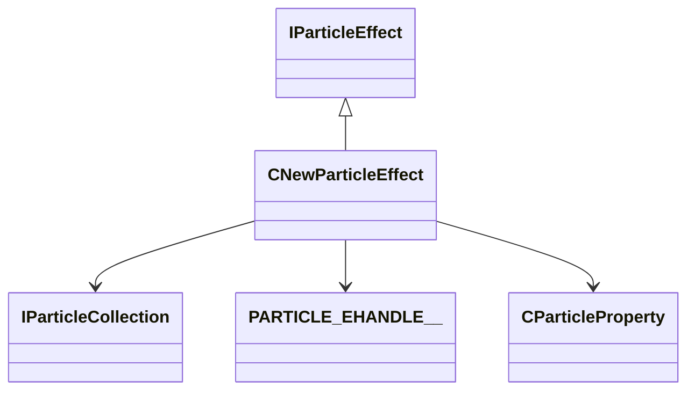

**Fields:**

| Name | Type | Annotations |
|------|------|-------------|
| `m_pNext` | [CNewParticleEffect](../schemas/particleslib.md#cnewparticleeffect)* |  |
| `m_pPrev` | [CNewParticleEffect](../schemas/particleslib.md#cnewparticleeffect)* |  |
| `m_pParticles` | [IParticleCollection](../schemas/particles.md#iparticlecollection)* |  |
| `m_pDebugName` | char* |  |
| `m_bDontRemove` | bitfield:1 |  |
| `m_bRemove` | bitfield:1 |  |
| `m_bNeedsBBoxUpdate` | bitfield:1 |  |
| `m_bIsFirstFrame` | bitfield:1 |  |
| `m_bAutoUpdateBBox` | bitfield:1 |  |
| `m_bAllocated` | bitfield:1 |  |
| `m_bSimulate` | bitfield:1 |  |
| `m_bShouldPerformCullCheck` | bitfield:1 |  |
| `m_bForceNoDraw` | bitfield:1 |  |
| `m_bSuppressScreenSpaceEffect` | bitfield:1 |  |
| `m_bShouldSave` | bitfield:1 |  |
| `m_bShouldSimulateDuringGamePaused` | bitfield:1 |  |
| `m_bShouldCheckFoW` | bitfield:1 |  |
| `m_bIsAsyncCreate` | bitfield:1 |  |
| `m_bFreezeTransitionActive` | bitfield:1 |  |
| `m_bFreezeTargetState` | bitfield:1 |  |
| `m_bCanFreeze` | bitfield:1 |  |
| `m_vSortOrigin` | Vector |  |
| `m_flScale` | float32 |  |
| `m_hOwner` | [PARTICLE_EHANDLE__](../schemas/particleslib.md#particle_ehandle__)* |  |
| `m_pOwningParticleProperty` | [CParticleProperty](../schemas/particleslib.md#cparticleproperty)* |  |
| `m_flFreezeTransitionStart` | float32 |  |
| `m_flFreezeTransitionDuration` | float32 |  |
| `m_flFreezeTransitionOverride` | float32 |  |
| `m_LastMin` | Vector |  |
| `m_LastMax` | Vector |  |
| `m_nSplitScreenUser` | CSplitScreenSlot |  |
| `m_vecAggregationCenter` | Vector |  |
| `m_RefCount` | int32 |  |

### CParticleBindingRealPulse

**Inherits from:** [CParticleCollectionBindingInstance](particleslib.md#cparticlecollectionbindinginstance)

**Relationships:**

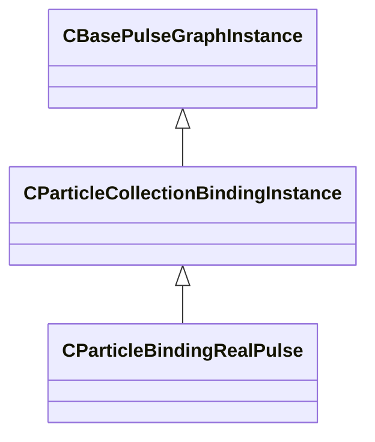

### CParticleCollectionBindingInstance

**Inherits from:** [CBasePulseGraphInstance](pulse_runtime_lib.md#cbasepulsegraphinstance)

**Derived by:** [CParticleBindingRealPulse](particleslib.md#cparticlebindingrealpulse)

**Relationships:**

### CParticleCollectionFloatInput

**Inherits from:** [CParticleFloatInput](particleslib.md#cparticlefloatinput)

**Derived by:** [CParticleCollectionRendererFloatInput](particleslib.md#cparticlecollectionrendererfloatinput)

**Metadata:** `MGetKV3ClassDefaults {
	"m_nType": "PF_TYPE_LITERAL",
	"m_nMapType": "PF_MAP_TYPE_DIRECT",
	"m_flLiteralValue": 0.000000,
	"m_NamedValue": "",
	"m_nControlPoint": 0,
	"m_nScalarAttribute": 3,
	"m_nVectorAttribute": 6,
	"m_nVectorComponent": 0,
	"m_bReverseOrder": false,
	"m_flRandomMin": 0.000000,
	"m_flRandomMax": 1.000000,
	"m_bHasRandomSignFlip": false,
	"m_nRandomSeed": <HIDDEN FOR DIFF>,
	"m_nRandomMode": "PF_RANDOM_MODE_CONSTANT",
	"m_strSnapshotSubset": "",
	"m_flLOD0": 0.000000,
	"m_flLOD1": 0.000000,
	"m_flLOD2": 0.000000,
	"m_flLOD3": 0.000000,
	"m_nNoiseInputVectorAttribute": 0,
	"m_flNoiseOutputMin": 0.000000,
	"m_flNoiseOutputMax": 1.000000,
	"m_flNoiseScale": 0.100000,
	"m_vecNoiseOffsetRate":
	[
		0.000000,
		0.000000,
		0.000000
	],
	"m_flNoiseOffset": 0.000000,
	"m_nNoiseOctaves": 1,
	"m_nNoiseTurbulence": "PF_NOISE_TURB_NONE",
	"m_nNoiseType": "PF_NOISE_TYPE_PERLIN",
	"m_nNoiseModifier": "PF_NOISE_MODIFIER_NONE",
	"m_flNoiseTurbulenceScale": 1.000000,
	"m_flNoiseTurbulenceMix": 0.500000,
	"m_flNoiseImgPreviewScale": 1.000000,
	"m_bNoiseImgPreviewLive": true,
	"m_flNoCameraFallback": 0.000000,
	"m_bUseBoundsCenter": false,
	"m_nInputMode": "PF_INPUT_MODE_CLAMPED",
	"m_flMultFactor": 1.000000,
	"m_flInput0": 0.000000,
	"m_flInput1": 1.000000,
	"m_flOutput0": 0.000000,
	"m_flOutput1": 1.000000,
	"m_flNotchedRangeMin": 0.000000,
	"m_flNotchedRangeMax": 1.000000,
	"m_flNotchedOutputOutside": 0.000000,
	"m_flNotchedOutputInside": 1.000000,
	"m_nRoundType": "PF_ROUND_TYPE_NEAREST",
	"m_nBiasType": "PF_BIAS_TYPE_STANDARD",
	"m_flBiasParameter": 0.000000,
	"m_Curve":
	{
		"m_spline":
		[
		],
		"m_tangents":
		[
		],
		"m_vDomainMins":
		[
			0.000000,
			0.000000
		],
		"m_vDomainMaxs":
		[
			0.000000,
			0.000000
		]
	}
}`, `MPropertyCustomEditor "CollectionFloatInput()"`

**Relationships:**

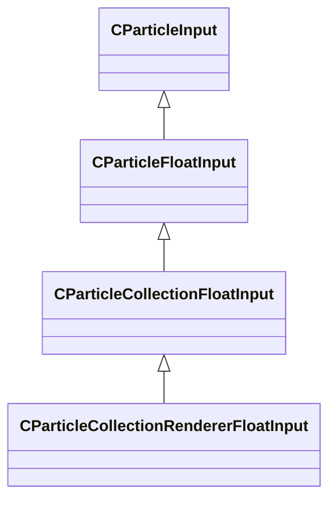

### CParticleCollectionRendererFloatInput

**Inherits from:** [CParticleCollectionFloatInput](particleslib.md#cparticlecollectionfloatinput)

**Metadata:** `MGetKV3ClassDefaults {
	"m_nType": "PF_TYPE_LITERAL",
	"m_nMapType": "PF_MAP_TYPE_DIRECT",
	"m_flLiteralValue": 0.000000,
	"m_NamedValue": "",
	"m_nControlPoint": 0,
	"m_nScalarAttribute": 3,
	"m_nVectorAttribute": 6,
	"m_nVectorComponent": 0,
	"m_bReverseOrder": false,
	"m_flRandomMin": 0.000000,
	"m_flRandomMax": 1.000000,
	"m_bHasRandomSignFlip": false,
	"m_nRandomSeed": <HIDDEN FOR DIFF>,
	"m_nRandomMode": "PF_RANDOM_MODE_CONSTANT",
	"m_strSnapshotSubset": "",
	"m_flLOD0": 0.000000,
	"m_flLOD1": 0.000000,
	"m_flLOD2": 0.000000,
	"m_flLOD3": 0.000000,
	"m_nNoiseInputVectorAttribute": 0,
	"m_flNoiseOutputMin": 0.000000,
	"m_flNoiseOutputMax": 1.000000,
	"m_flNoiseScale": 0.100000,
	"m_vecNoiseOffsetRate":
	[
		0.000000,
		0.000000,
		0.000000
	],
	"m_flNoiseOffset": 0.000000,
	"m_nNoiseOctaves": 1,
	"m_nNoiseTurbulence": "PF_NOISE_TURB_NONE",
	"m_nNoiseType": "PF_NOISE_TYPE_PERLIN",
	"m_nNoiseModifier": "PF_NOISE_MODIFIER_NONE",
	"m_flNoiseTurbulenceScale": 1.000000,
	"m_flNoiseTurbulenceMix": 0.500000,
	"m_flNoiseImgPreviewScale": 1.000000,
	"m_bNoiseImgPreviewLive": true,
	"m_flNoCameraFallback": 0.000000,
	"m_bUseBoundsCenter": false,
	"m_nInputMode": "PF_INPUT_MODE_CLAMPED",
	"m_flMultFactor": 1.000000,
	"m_flInput0": 0.000000,
	"m_flInput1": 1.000000,
	"m_flOutput0": 0.000000,
	"m_flOutput1": 1.000000,
	"m_flNotchedRangeMin": 0.000000,
	"m_flNotchedRangeMax": 1.000000,
	"m_flNotchedOutputOutside": 0.000000,
	"m_flNotchedOutputInside": 1.000000,
	"m_nRoundType": "PF_ROUND_TYPE_NEAREST",
	"m_nBiasType": "PF_BIAS_TYPE_STANDARD",
	"m_flBiasParameter": 0.000000,
	"m_Curve":
	{
		"m_spline":
		[
		],
		"m_tangents":
		[
		],
		"m_vDomainMins":
		[
			0.000000,
			0.000000
		],
		"m_vDomainMaxs":
		[
			0.000000,
			0.000000
		]
	}
}`, `MPropertyCustomEditor "CollectionRendererFloatInput()"`

**Relationships:**

### CParticleCollectionRendererVecInput

**Inherits from:** [CParticleCollectionVecInput](particleslib.md#cparticlecollectionvecinput)

**Metadata:** `MGetKV3ClassDefaults {
	"m_nType": "PVEC_TYPE_LITERAL",
	"m_vLiteralValue":
	[
		0.000000,
		0.000000,
		0.000000
	],
	"m_LiteralColor":
	[
		0,
		0,
		0
	],
	"m_NamedValue": "",
	"m_bFollowNamedValue": false,
	"m_nVectorAttribute": 6,
	"m_vVectorAttributeScale":
	[
		1.000000,
		1.000000,
		1.000000
	],
	"m_nControlPoint": 0,
	"m_nDeltaControlPoint": 0,
	"m_vCPValueScale":
	[
		1.000000,
		1.000000,
		1.000000
	],
	"m_vCPRelativePosition":
	[
		0.000000,
		0.000000,
		0.000000
	],
	"m_vCPRelativeDir":
	[
		1.000000,
		0.000000,
		0.000000
	],
	"m_FloatComponentX":
	{
		"m_nType": "PF_TYPE_LITERAL",
		"m_nMapType": "PF_MAP_TYPE_DIRECT",
		"m_flLiteralValue": 0.000000,
		"m_NamedValue": "",
		"m_nControlPoint": 0,
		"m_nScalarAttribute": 3,
		"m_nVectorAttribute": 6,
		"m_nVectorComponent": 0,
		"m_bReverseOrder": false,
		"m_flRandomMin": 0.000000,
		"m_flRandomMax": 1.000000,
		"m_bHasRandomSignFlip": false,
		"m_nRandomSeed": <HIDDEN FOR DIFF>,
		"m_nRandomMode": "PF_RANDOM_MODE_CONSTANT",
		"m_strSnapshotSubset": "",
		"m_flLOD0": 0.000000,
		"m_flLOD1": 0.000000,
		"m_flLOD2": 0.000000,
		"m_flLOD3": 0.000000,
		"m_nNoiseInputVectorAttribute": 0,
		"m_flNoiseOutputMin": 0.000000,
		"m_flNoiseOutputMax": 1.000000,
		"m_flNoiseScale": 0.100000,
		"m_vecNoiseOffsetRate":
		[
			0.000000,
			0.000000,
			0.000000
		],
		"m_flNoiseOffset": 0.000000,
		"m_nNoiseOctaves": 1,
		"m_nNoiseTurbulence": "PF_NOISE_TURB_NONE",
		"m_nNoiseType": "PF_NOISE_TYPE_PERLIN",
		"m_nNoiseModifier": "PF_NOISE_MODIFIER_NONE",
		"m_flNoiseTurbulenceScale": 1.000000,
		"m_flNoiseTurbulenceMix": 0.500000,
		"m_flNoiseImgPreviewScale": 1.000000,
		"m_bNoiseImgPreviewLive": true,
		"m_flNoCameraFallback": 0.000000,
		"m_bUseBoundsCenter": false,
		"m_nInputMode": "PF_INPUT_MODE_CLAMPED",
		"m_flMultFactor": 1.000000,
		"m_flInput0": 0.000000,
		"m_flInput1": 1.000000,
		"m_flOutput0": 0.000000,
		"m_flOutput1": 1.000000,
		"m_flNotchedRangeMin": 0.000000,
		"m_flNotchedRangeMax": 1.000000,
		"m_flNotchedOutputOutside": 0.000000,
		"m_flNotchedOutputInside": 1.000000,
		"m_nRoundType": "PF_ROUND_TYPE_NEAREST",
		"m_nBiasType": "PF_BIAS_TYPE_STANDARD",
		"m_flBiasParameter": 0.000000,
		"m_Curve":
		{
			"m_spline":
			[
			],
			"m_tangents":
			[
			],
			"m_vDomainMins":
			[
				0.000000,
				0.000000
			],
			"m_vDomainMaxs":
			[
				0.000000,
				0.000000
			]
		}
	},
	"m_FloatComponentY":
	{
		"m_nType": "PF_TYPE_LITERAL",
		"m_nMapType": "PF_MAP_TYPE_DIRECT",
		"m_flLiteralValue": 0.000000,
		"m_NamedValue": "",
		"m_nControlPoint": 0,
		"m_nScalarAttribute": 3,
		"m_nVectorAttribute": 6,
		"m_nVectorComponent": 0,
		"m_bReverseOrder": false,
		"m_flRandomMin": 0.000000,
		"m_flRandomMax": 1.000000,
		"m_bHasRandomSignFlip": false,
		"m_nRandomSeed": <HIDDEN FOR DIFF>,
		"m_nRandomMode": "PF_RANDOM_MODE_CONSTANT",
		"m_strSnapshotSubset": "",
		"m_flLOD0": 0.000000,
		"m_flLOD1": 0.000000,
		"m_flLOD2": 0.000000,
		"m_flLOD3": 0.000000,
		"m_nNoiseInputVectorAttribute": 0,
		"m_flNoiseOutputMin": 0.000000,
		"m_flNoiseOutputMax": 1.000000,
		"m_flNoiseScale": 0.100000,
		"m_vecNoiseOffsetRate":
		[
			0.000000,
			0.000000,
			0.000000
		],
		"m_flNoiseOffset": 0.000000,
		"m_nNoiseOctaves": 1,
		"m_nNoiseTurbulence": "PF_NOISE_TURB_NONE",
		"m_nNoiseType": "PF_NOISE_TYPE_PERLIN",
		"m_nNoiseModifier": "PF_NOISE_MODIFIER_NONE",
		"m_flNoiseTurbulenceScale": 1.000000,
		"m_flNoiseTurbulenceMix": 0.500000,
		"m_flNoiseImgPreviewScale": 1.000000,
		"m_bNoiseImgPreviewLive": true,
		"m_flNoCameraFallback": 0.000000,
		"m_bUseBoundsCenter": false,
		"m_nInputMode": "PF_INPUT_MODE_CLAMPED",
		"m_flMultFactor": 1.000000,
		"m_flInput0": 0.000000,
		"m_flInput1": 1.000000,
		"m_flOutput0": 0.000000,
		"m_flOutput1": 1.000000,
		"m_flNotchedRangeMin": 0.000000,
		"m_flNotchedRangeMax": 1.000000,
		"m_flNotchedOutputOutside": 0.000000,
		"m_flNotchedOutputInside": 1.000000,
		"m_nRoundType": "PF_ROUND_TYPE_NEAREST",
		"m_nBiasType": "PF_BIAS_TYPE_STANDARD",
		"m_flBiasParameter": 0.000000,
		"m_Curve":
		{
			"m_spline":
			[
			],
			"m_tangents":
			[
			],
			"m_vDomainMins":
			[
				0.000000,
				0.000000
			],
			"m_vDomainMaxs":
			[
				0.000000,
				0.000000
			]
		}
	},
	"m_FloatComponentZ":
	{
		"m_nType": "PF_TYPE_LITERAL",
		"m_nMapType": "PF_MAP_TYPE_DIRECT",
		"m_flLiteralValue": 0.000000,
		"m_NamedValue": "",
		"m_nControlPoint": 0,
		"m_nScalarAttribute": 3,
		"m_nVectorAttribute": 6,
		"m_nVectorComponent": 0,
		"m_bReverseOrder": false,
		"m_flRandomMin": 0.000000,
		"m_flRandomMax": 1.000000,
		"m_bHasRandomSignFlip": false,
		"m_nRandomSeed": <HIDDEN FOR DIFF>,
		"m_nRandomMode": "PF_RANDOM_MODE_CONSTANT",
		"m_strSnapshotSubset": "",
		"m_flLOD0": 0.000000,
		"m_flLOD1": 0.000000,
		"m_flLOD2": 0.000000,
		"m_flLOD3": 0.000000,
		"m_nNoiseInputVectorAttribute": 0,
		"m_flNoiseOutputMin": 0.000000,
		"m_flNoiseOutputMax": 1.000000,
		"m_flNoiseScale": 0.100000,
		"m_vecNoiseOffsetRate":
		[
			0.000000,
			0.000000,
			0.000000
		],
		"m_flNoiseOffset": 0.000000,
		"m_nNoiseOctaves": 1,
		"m_nNoiseTurbulence": "PF_NOISE_TURB_NONE",
		"m_nNoiseType": "PF_NOISE_TYPE_PERLIN",
		"m_nNoiseModifier": "PF_NOISE_MODIFIER_NONE",
		"m_flNoiseTurbulenceScale": 1.000000,
		"m_flNoiseTurbulenceMix": 0.500000,
		"m_flNoiseImgPreviewScale": 1.000000,
		"m_bNoiseImgPreviewLive": true,
		"m_flNoCameraFallback": 0.000000,
		"m_bUseBoundsCenter": false,
		"m_nInputMode": "PF_INPUT_MODE_CLAMPED",
		"m_flMultFactor": 1.000000,
		"m_flInput0": 0.000000,
		"m_flInput1": 1.000000,
		"m_flOutput0": 0.000000,
		"m_flOutput1": 1.000000,
		"m_flNotchedRangeMin": 0.000000,
		"m_flNotchedRangeMax": 1.000000,
		"m_flNotchedOutputOutside": 0.000000,
		"m_flNotchedOutputInside": 1.000000,
		"m_nRoundType": "PF_ROUND_TYPE_NEAREST",
		"m_nBiasType": "PF_BIAS_TYPE_STANDARD",
		"m_flBiasParameter": 0.000000,
		"m_Curve":
		{
			"m_spline":
			[
			],
			"m_tangents":
			[
			],
			"m_vDomainMins":
			[
				0.000000,
				0.000000
			],
			"m_vDomainMaxs":
			[
				0.000000,
				0.000000
			]
		}
	},
	"m_FloatInterp":
	{
		"m_nType": "PF_TYPE_LITERAL",
		"m_nMapType": "PF_MAP_TYPE_DIRECT",
		"m_flLiteralValue": 0.000000,
		"m_NamedValue": "",
		"m_nControlPoint": 0,
		"m_nScalarAttribute": 3,
		"m_nVectorAttribute": 6,
		"m_nVectorComponent": 0,
		"m_bReverseOrder": false,
		"m_flRandomMin": 0.000000,
		"m_flRandomMax": 1.000000,
		"m_bHasRandomSignFlip": false,
		"m_nRandomSeed": <HIDDEN FOR DIFF>,
		"m_nRandomMode": "PF_RANDOM_MODE_CONSTANT",
		"m_strSnapshotSubset": "",
		"m_flLOD0": 0.000000,
		"m_flLOD1": 0.000000,
		"m_flLOD2": 0.000000,
		"m_flLOD3": 0.000000,
		"m_nNoiseInputVectorAttribute": 0,
		"m_flNoiseOutputMin": 0.000000,
		"m_flNoiseOutputMax": 1.000000,
		"m_flNoiseScale": 0.100000,
		"m_vecNoiseOffsetRate":
		[
			0.000000,
			0.000000,
			0.000000
		],
		"m_flNoiseOffset": 0.000000,
		"m_nNoiseOctaves": 1,
		"m_nNoiseTurbulence": "PF_NOISE_TURB_NONE",
		"m_nNoiseType": "PF_NOISE_TYPE_PERLIN",
		"m_nNoiseModifier": "PF_NOISE_MODIFIER_NONE",
		"m_flNoiseTurbulenceScale": 1.000000,
		"m_flNoiseTurbulenceMix": 0.500000,
		"m_flNoiseImgPreviewScale": 1.000000,
		"m_bNoiseImgPreviewLive": true,
		"m_flNoCameraFallback": 0.000000,
		"m_bUseBoundsCenter": false,
		"m_nInputMode": "PF_INPUT_MODE_CLAMPED",
		"m_flMultFactor": 1.000000,
		"m_flInput0": 0.000000,
		"m_flInput1": 1.000000,
		"m_flOutput0": 0.000000,
		"m_flOutput1": 1.000000,
		"m_flNotchedRangeMin": 0.000000,
		"m_flNotchedRangeMax": 1.000000,
		"m_flNotchedOutputOutside": 0.000000,
		"m_flNotchedOutputInside": 1.000000,
		"m_nRoundType": "PF_ROUND_TYPE_NEAREST",
		"m_nBiasType": "PF_BIAS_TYPE_STANDARD",
		"m_flBiasParameter": 0.000000,
		"m_Curve":
		{
			"m_spline":
			[
			],
			"m_tangents":
			[
			],
			"m_vDomainMins":
			[
				0.000000,
				0.000000
			],
			"m_vDomainMaxs":
			[
				0.000000,
				0.000000
			]
		}
	},
	"m_flInterpInput0": 0.000000,
	"m_flInterpInput1": 1.000000,
	"m_vInterpOutput0":
	[
		0.000000,
		0.000000,
		0.000000
	],
	"m_vInterpOutput1":
	[
		1.000000,
		1.000000,
		1.000000
	],
	"m_Gradient":
	{
		"m_Stops":
		[
		]
	},
	"m_vRandomMin":
	[
		0.000000,
		0.000000,
		0.000000
	],
	"m_vRandomMax":
	[
		0.000000,
		0.000000,
		0.000000
	]
}`, `MPropertyCustomEditor "CollectionRendererVecInput()"`

**Relationships:**

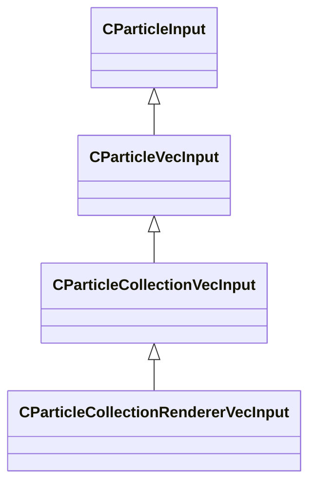

### CParticleCollectionVecInput

**Inherits from:** [CParticleVecInput](particleslib.md#cparticlevecinput)

**Derived by:** [CParticleCollectionRendererVecInput](particleslib.md#cparticlecollectionrenderervecinput)

**Metadata:** `MGetKV3ClassDefaults {
	"m_nType": "PVEC_TYPE_LITERAL",
	"m_vLiteralValue":
	[
		0.000000,
		0.000000,
		0.000000
	],
	"m_LiteralColor":
	[
		0,
		0,
		0
	],
	"m_NamedValue": "",
	"m_bFollowNamedValue": false,
	"m_nVectorAttribute": 6,
	"m_vVectorAttributeScale":
	[
		1.000000,
		1.000000,
		1.000000
	],
	"m_nControlPoint": 0,
	"m_nDeltaControlPoint": 0,
	"m_vCPValueScale":
	[
		1.000000,
		1.000000,
		1.000000
	],
	"m_vCPRelativePosition":
	[
		0.000000,
		0.000000,
		0.000000
	],
	"m_vCPRelativeDir":
	[
		1.000000,
		0.000000,
		0.000000
	],
	"m_FloatComponentX":
	{
		"m_nType": "PF_TYPE_LITERAL",
		"m_nMapType": "PF_MAP_TYPE_DIRECT",
		"m_flLiteralValue": 0.000000,
		"m_NamedValue": "",
		"m_nControlPoint": 0,
		"m_nScalarAttribute": 3,
		"m_nVectorAttribute": 6,
		"m_nVectorComponent": 0,
		"m_bReverseOrder": false,
		"m_flRandomMin": 0.000000,
		"m_flRandomMax": 1.000000,
		"m_bHasRandomSignFlip": false,
		"m_nRandomSeed": <HIDDEN FOR DIFF>,
		"m_nRandomMode": "PF_RANDOM_MODE_CONSTANT",
		"m_strSnapshotSubset": "",
		"m_flLOD0": 0.000000,
		"m_flLOD1": 0.000000,
		"m_flLOD2": 0.000000,
		"m_flLOD3": 0.000000,
		"m_nNoiseInputVectorAttribute": 0,
		"m_flNoiseOutputMin": 0.000000,
		"m_flNoiseOutputMax": 1.000000,
		"m_flNoiseScale": 0.100000,
		"m_vecNoiseOffsetRate":
		[
			0.000000,
			0.000000,
			0.000000
		],
		"m_flNoiseOffset": 0.000000,
		"m_nNoiseOctaves": 1,
		"m_nNoiseTurbulence": "PF_NOISE_TURB_NONE",
		"m_nNoiseType": "PF_NOISE_TYPE_PERLIN",
		"m_nNoiseModifier": "PF_NOISE_MODIFIER_NONE",
		"m_flNoiseTurbulenceScale": 1.000000,
		"m_flNoiseTurbulenceMix": 0.500000,
		"m_flNoiseImgPreviewScale": 1.000000,
		"m_bNoiseImgPreviewLive": true,
		"m_flNoCameraFallback": 0.000000,
		"m_bUseBoundsCenter": false,
		"m_nInputMode": "PF_INPUT_MODE_CLAMPED",
		"m_flMultFactor": 1.000000,
		"m_flInput0": 0.000000,
		"m_flInput1": 1.000000,
		"m_flOutput0": 0.000000,
		"m_flOutput1": 1.000000,
		"m_flNotchedRangeMin": 0.000000,
		"m_flNotchedRangeMax": 1.000000,
		"m_flNotchedOutputOutside": 0.000000,
		"m_flNotchedOutputInside": 1.000000,
		"m_nRoundType": "PF_ROUND_TYPE_NEAREST",
		"m_nBiasType": "PF_BIAS_TYPE_STANDARD",
		"m_flBiasParameter": 0.000000,
		"m_Curve":
		{
			"m_spline":
			[
			],
			"m_tangents":
			[
			],
			"m_vDomainMins":
			[
				0.000000,
				0.000000
			],
			"m_vDomainMaxs":
			[
				0.000000,
				0.000000
			]
		}
	},
	"m_FloatComponentY":
	{
		"m_nType": "PF_TYPE_LITERAL",
		"m_nMapType": "PF_MAP_TYPE_DIRECT",
		"m_flLiteralValue": 0.000000,
		"m_NamedValue": "",
		"m_nControlPoint": 0,
		"m_nScalarAttribute": 3,
		"m_nVectorAttribute": 6,
		"m_nVectorComponent": 0,
		"m_bReverseOrder": false,
		"m_flRandomMin": 0.000000,
		"m_flRandomMax": 1.000000,
		"m_bHasRandomSignFlip": false,
		"m_nRandomSeed": <HIDDEN FOR DIFF>,
		"m_nRandomMode": "PF_RANDOM_MODE_CONSTANT",
		"m_strSnapshotSubset": "",
		"m_flLOD0": 0.000000,
		"m_flLOD1": 0.000000,
		"m_flLOD2": 0.000000,
		"m_flLOD3": 0.000000,
		"m_nNoiseInputVectorAttribute": 0,
		"m_flNoiseOutputMin": 0.000000,
		"m_flNoiseOutputMax": 1.000000,
		"m_flNoiseScale": 0.100000,
		"m_vecNoiseOffsetRate":
		[
			0.000000,
			0.000000,
			0.000000
		],
		"m_flNoiseOffset": 0.000000,
		"m_nNoiseOctaves": 1,
		"m_nNoiseTurbulence": "PF_NOISE_TURB_NONE",
		"m_nNoiseType": "PF_NOISE_TYPE_PERLIN",
		"m_nNoiseModifier": "PF_NOISE_MODIFIER_NONE",
		"m_flNoiseTurbulenceScale": 1.000000,
		"m_flNoiseTurbulenceMix": 0.500000,
		"m_flNoiseImgPreviewScale": 1.000000,
		"m_bNoiseImgPreviewLive": true,
		"m_flNoCameraFallback": 0.000000,
		"m_bUseBoundsCenter": false,
		"m_nInputMode": "PF_INPUT_MODE_CLAMPED",
		"m_flMultFactor": 1.000000,
		"m_flInput0": 0.000000,
		"m_flInput1": 1.000000,
		"m_flOutput0": 0.000000,
		"m_flOutput1": 1.000000,
		"m_flNotchedRangeMin": 0.000000,
		"m_flNotchedRangeMax": 1.000000,
		"m_flNotchedOutputOutside": 0.000000,
		"m_flNotchedOutputInside": 1.000000,
		"m_nRoundType": "PF_ROUND_TYPE_NEAREST",
		"m_nBiasType": "PF_BIAS_TYPE_STANDARD",
		"m_flBiasParameter": 0.000000,
		"m_Curve":
		{
			"m_spline":
			[
			],
			"m_tangents":
			[
			],
			"m_vDomainMins":
			[
				0.000000,
				0.000000
			],
			"m_vDomainMaxs":
			[
				0.000000,
				0.000000
			]
		}
	},
	"m_FloatComponentZ":
	{
		"m_nType": "PF_TYPE_LITERAL",
		"m_nMapType": "PF_MAP_TYPE_DIRECT",
		"m_flLiteralValue": 0.000000,
		"m_NamedValue": "",
		"m_nControlPoint": 0,
		"m_nScalarAttribute": 3,
		"m_nVectorAttribute": 6,
		"m_nVectorComponent": 0,
		"m_bReverseOrder": false,
		"m_flRandomMin": 0.000000,
		"m_flRandomMax": 1.000000,
		"m_bHasRandomSignFlip": false,
		"m_nRandomSeed": <HIDDEN FOR DIFF>,
		"m_nRandomMode": "PF_RANDOM_MODE_CONSTANT",
		"m_strSnapshotSubset": "",
		"m_flLOD0": 0.000000,
		"m_flLOD1": 0.000000,
		"m_flLOD2": 0.000000,
		"m_flLOD3": 0.000000,
		"m_nNoiseInputVectorAttribute": 0,
		"m_flNoiseOutputMin": 0.000000,
		"m_flNoiseOutputMax": 1.000000,
		"m_flNoiseScale": 0.100000,
		"m_vecNoiseOffsetRate":
		[
			0.000000,
			0.000000,
			0.000000
		],
		"m_flNoiseOffset": 0.000000,
		"m_nNoiseOctaves": 1,
		"m_nNoiseTurbulence": "PF_NOISE_TURB_NONE",
		"m_nNoiseType": "PF_NOISE_TYPE_PERLIN",
		"m_nNoiseModifier": "PF_NOISE_MODIFIER_NONE",
		"m_flNoiseTurbulenceScale": 1.000000,
		"m_flNoiseTurbulenceMix": 0.500000,
		"m_flNoiseImgPreviewScale": 1.000000,
		"m_bNoiseImgPreviewLive": true,
		"m_flNoCameraFallback": 0.000000,
		"m_bUseBoundsCenter": false,
		"m_nInputMode": "PF_INPUT_MODE_CLAMPED",
		"m_flMultFactor": 1.000000,
		"m_flInput0": 0.000000,
		"m_flInput1": 1.000000,
		"m_flOutput0": 0.000000,
		"m_flOutput1": 1.000000,
		"m_flNotchedRangeMin": 0.000000,
		"m_flNotchedRangeMax": 1.000000,
		"m_flNotchedOutputOutside": 0.000000,
		"m_flNotchedOutputInside": 1.000000,
		"m_nRoundType": "PF_ROUND_TYPE_NEAREST",
		"m_nBiasType": "PF_BIAS_TYPE_STANDARD",
		"m_flBiasParameter": 0.000000,
		"m_Curve":
		{
			"m_spline":
			[
			],
			"m_tangents":
			[
			],
			"m_vDomainMins":
			[
				0.000000,
				0.000000
			],
			"m_vDomainMaxs":
			[
				0.000000,
				0.000000
			]
		}
	},
	"m_FloatInterp":
	{
		"m_nType": "PF_TYPE_LITERAL",
		"m_nMapType": "PF_MAP_TYPE_DIRECT",
		"m_flLiteralValue": 0.000000,
		"m_NamedValue": "",
		"m_nControlPoint": 0,
		"m_nScalarAttribute": 3,
		"m_nVectorAttribute": 6,
		"m_nVectorComponent": 0,
		"m_bReverseOrder": false,
		"m_flRandomMin": 0.000000,
		"m_flRandomMax": 1.000000,
		"m_bHasRandomSignFlip": false,
		"m_nRandomSeed": <HIDDEN FOR DIFF>,
		"m_nRandomMode": "PF_RANDOM_MODE_CONSTANT",
		"m_strSnapshotSubset": "",
		"m_flLOD0": 0.000000,
		"m_flLOD1": 0.000000,
		"m_flLOD2": 0.000000,
		"m_flLOD3": 0.000000,
		"m_nNoiseInputVectorAttribute": 0,
		"m_flNoiseOutputMin": 0.000000,
		"m_flNoiseOutputMax": 1.000000,
		"m_flNoiseScale": 0.100000,
		"m_vecNoiseOffsetRate":
		[
			0.000000,
			0.000000,
			0.000000
		],
		"m_flNoiseOffset": 0.000000,
		"m_nNoiseOctaves": 1,
		"m_nNoiseTurbulence": "PF_NOISE_TURB_NONE",
		"m_nNoiseType": "PF_NOISE_TYPE_PERLIN",
		"m_nNoiseModifier": "PF_NOISE_MODIFIER_NONE",
		"m_flNoiseTurbulenceScale": 1.000000,
		"m_flNoiseTurbulenceMix": 0.500000,
		"m_flNoiseImgPreviewScale": 1.000000,
		"m_bNoiseImgPreviewLive": true,
		"m_flNoCameraFallback": 0.000000,
		"m_bUseBoundsCenter": false,
		"m_nInputMode": "PF_INPUT_MODE_CLAMPED",
		"m_flMultFactor": 1.000000,
		"m_flInput0": 0.000000,
		"m_flInput1": 1.000000,
		"m_flOutput0": 0.000000,
		"m_flOutput1": 1.000000,
		"m_flNotchedRangeMin": 0.000000,
		"m_flNotchedRangeMax": 1.000000,
		"m_flNotchedOutputOutside": 0.000000,
		"m_flNotchedOutputInside": 1.000000,
		"m_nRoundType": "PF_ROUND_TYPE_NEAREST",
		"m_nBiasType": "PF_BIAS_TYPE_STANDARD",
		"m_flBiasParameter": 0.000000,
		"m_Curve":
		{
			"m_spline":
			[
			],
			"m_tangents":
			[
			],
			"m_vDomainMins":
			[
				0.000000,
				0.000000
			],
			"m_vDomainMaxs":
			[
				0.000000,
				0.000000
			]
		}
	},
	"m_flInterpInput0": 0.000000,
	"m_flInterpInput1": 1.000000,
	"m_vInterpOutput0":
	[
		0.000000,
		0.000000,
		0.000000
	],
	"m_vInterpOutput1":
	[
		1.000000,
		1.000000,
		1.000000
	],
	"m_Gradient":
	{
		"m_Stops":
		[
		]
	},
	"m_vRandomMin":
	[
		0.000000,
		0.000000,
		0.000000
	],
	"m_vRandomMax":
	[
		0.000000,
		0.000000,
		0.000000
	]
}`, `MPropertyCustomEditor "CollectionVecInput()"`

**Relationships:**

### CParticleFloatInput

**Inherits from:** [CParticleInput](particleslib.md#cparticleinput)

**Derived by:** [CParticleCollectionFloatInput](particleslib.md#cparticlecollectionfloatinput), [CParticleRemapFloatInput](particleslib.md#cparticleremapfloatinput), [CPerParticleFloatInput](particleslib.md#cperparticlefloatinput)

**Metadata:** `MGetKV3ClassDefaults {
	"m_nType": "PF_TYPE_LITERAL",
	"m_nMapType": "PF_MAP_TYPE_DIRECT",
	"m_flLiteralValue": 0.000000,
	"m_NamedValue": "",
	"m_nControlPoint": 0,
	"m_nScalarAttribute": 3,
	"m_nVectorAttribute": 6,
	"m_nVectorComponent": 0,
	"m_bReverseOrder": false,
	"m_flRandomMin": 0.000000,
	"m_flRandomMax": 1.000000,
	"m_bHasRandomSignFlip": false,
	"m_nRandomSeed": <HIDDEN FOR DIFF>,
	"m_nRandomMode": "PF_RANDOM_MODE_CONSTANT",
	"m_strSnapshotSubset": "",
	"m_flLOD0": 0.000000,
	"m_flLOD1": 0.000000,
	"m_flLOD2": 0.000000,
	"m_flLOD3": 0.000000,
	"m_nNoiseInputVectorAttribute": 0,
	"m_flNoiseOutputMin": 0.000000,
	"m_flNoiseOutputMax": 1.000000,
	"m_flNoiseScale": 0.100000,
	"m_vecNoiseOffsetRate":
	[
		0.000000,
		0.000000,
		0.000000
	],
	"m_flNoiseOffset": 0.000000,
	"m_nNoiseOctaves": 1,
	"m_nNoiseTurbulence": "PF_NOISE_TURB_NONE",
	"m_nNoiseType": "PF_NOISE_TYPE_PERLIN",
	"m_nNoiseModifier": "PF_NOISE_MODIFIER_NONE",
	"m_flNoiseTurbulenceScale": 1.000000,
	"m_flNoiseTurbulenceMix": 0.500000,
	"m_flNoiseImgPreviewScale": 1.000000,
	"m_bNoiseImgPreviewLive": true,
	"m_flNoCameraFallback": 0.000000,
	"m_bUseBoundsCenter": false,
	"m_nInputMode": "PF_INPUT_MODE_CLAMPED",
	"m_flMultFactor": 1.000000,
	"m_flInput0": 0.000000,
	"m_flInput1": 1.000000,
	"m_flOutput0": 0.000000,
	"m_flOutput1": 1.000000,
	"m_flNotchedRangeMin": 0.000000,
	"m_flNotchedRangeMax": 1.000000,
	"m_flNotchedOutputOutside": 0.000000,
	"m_flNotchedOutputInside": 1.000000,
	"m_nRoundType": "PF_ROUND_TYPE_NEAREST",
	"m_nBiasType": "PF_BIAS_TYPE_STANDARD",
	"m_flBiasParameter": 0.000000,
	"m_Curve":
	{
		"m_spline":
		[
		],
		"m_tangents":
		[
		],
		"m_vDomainMins":
		[
			0.000000,
			0.000000
		],
		"m_vDomainMaxs":
		[
			0.000000,
			0.000000
		]
	}
}`, `MCustomFGDMetadata "{ SkipImprintFGDClassOnKV3 = true SkipRemoveKeysInKV3AtFGDDefault = true KV3DefaultTestFnName = 'CParticleFloatInputDefaultTestFunc' }"`

**Relationships:**

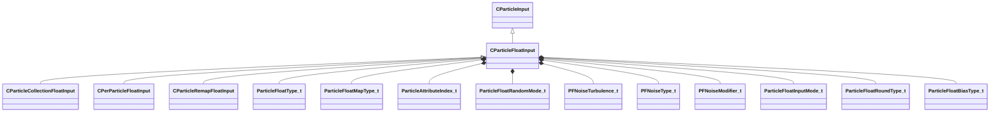

**Fields:**

| Name | Type | Annotations |
|------|------|-------------|
| `m_nType` | [ParticleFloatType_t](../schemas/particleslib.md#particlefloattype_t) |  |
| `m_nMapType` | [ParticleFloatMapType_t](../schemas/particleslib.md#particlefloatmaptype_t) |  |
| `m_flLiteralValue` | float32 |  |
| `m_NamedValue` | CParticleNamedValueRef |  |
| `m_nControlPoint` | int32 |  |
| `m_nScalarAttribute` | [ParticleAttributeIndex_t](../schemas/particles.md#particleattributeindex_t) |  |
| `m_nVectorAttribute` | [ParticleAttributeIndex_t](../schemas/particles.md#particleattributeindex_t) |  |
| `m_nVectorComponent` | int32 |  |
| `m_bReverseOrder` | bool |  |
| `m_flRandomMin` | float32 |  |
| `m_flRandomMax` | float32 |  |
| `m_bHasRandomSignFlip` | bool |  |
| `m_nRandomSeed` | int32 |  |
| `m_nRandomMode` | [ParticleFloatRandomMode_t](../schemas/particleslib.md#particlefloatrandommode_t) |  |
| `m_strSnapshotSubset` | CUtlString |  |
| `m_flLOD0` | float32 |  |
| `m_flLOD1` | float32 |  |
| `m_flLOD2` | float32 |  |
| `m_flLOD3` | float32 |  |
| `m_nNoiseInputVectorAttribute` | [ParticleAttributeIndex_t](../schemas/particles.md#particleattributeindex_t) |  |
| `m_flNoiseOutputMin` | float32 |  |
| `m_flNoiseOutputMax` | float32 |  |
| `m_flNoiseScale` | float32 |  |
| `m_vecNoiseOffsetRate` | Vector |  |
| `m_flNoiseOffset` | float32 |  |
| `m_nNoiseOctaves` | int32 |  |
| `m_nNoiseTurbulence` | [PFNoiseTurbulence_t](../schemas/particleslib.md#pfnoiseturbulence_t) |  |
| `m_nNoiseType` | [PFNoiseType_t](../schemas/particleslib.md#pfnoisetype_t) |  |
| `m_nNoiseModifier` | [PFNoiseModifier_t](../schemas/particleslib.md#pfnoisemodifier_t) |  |
| `m_flNoiseTurbulenceScale` | float32 |  |
| `m_flNoiseTurbulenceMix` | float32 |  |
| `m_flNoiseImgPreviewScale` | float32 |  |
| `m_bNoiseImgPreviewLive` | bool |  |
| `m_flNoCameraFallback` | float32 |  |
| `m_bUseBoundsCenter` | bool |  |
| `m_nInputMode` | [ParticleFloatInputMode_t](../schemas/particleslib.md#particlefloatinputmode_t) |  |
| `m_flMultFactor` | float32 |  |
| `m_flInput0` | float32 |  |
| `m_flInput1` | float32 |  |
| `m_flOutput0` | float32 |  |
| `m_flOutput1` | float32 |  |
| `m_flNotchedRangeMin` | float32 |  |
| `m_flNotchedRangeMax` | float32 |  |
| `m_flNotchedOutputOutside` | float32 |  |
| `m_flNotchedOutputInside` | float32 |  |
| `m_nRoundType` | [ParticleFloatRoundType_t](../schemas/particleslib.md#particlefloatroundtype_t) |  |
| `m_nBiasType` | [ParticleFloatBiasType_t](../schemas/particleslib.md#particlefloatbiastype_t) |  |
| `m_flBiasParameter` | float32 |  |
| `m_Curve` | CPiecewiseCurve |  |

### CParticleInput

**Derived by:** [CParticleFloatInput](particleslib.md#cparticlefloatinput), [CParticleModelInput](particleslib.md#cparticlemodelinput), [CParticleTransformInput](particleslib.md#cparticletransforminput), [CParticleVecInput](particleslib.md#cparticlevecinput)

**Metadata:** `MGetKV3ClassDefaults {
}`

**Relationships:**

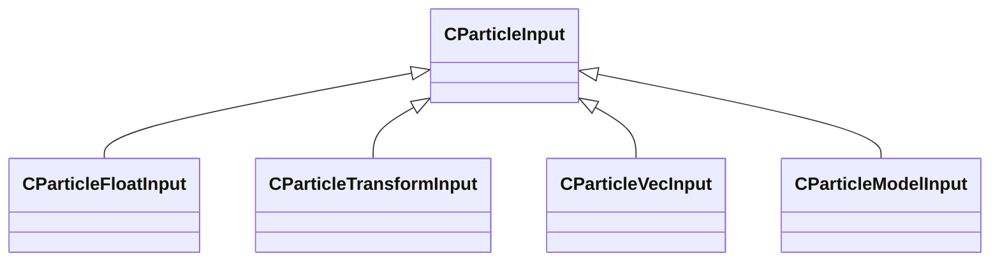

### CParticleModelInput

**Inherits from:** [CParticleInput](particleslib.md#cparticleinput)

**Metadata:** `MGetKV3ClassDefaults {
	"m_nType": "PM_TYPE_INVALID",
	"m_NamedValue": "",
	"m_nControlPoint": -1
}`, `MPropertyCustomEditor "ModelInput()"`, `MCustomFGDMetadata "{ KV3DefaultTestFnName = 'CParticleModelInputDefaultTestFunc' }"`

**Relationships:**

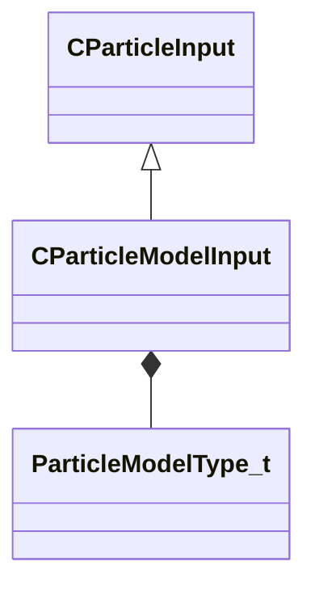

**Fields:**

| Name | Type | Annotations |
|------|------|-------------|
| `m_nType` | [ParticleModelType_t](../schemas/particleslib.md#particlemodeltype_t) |  |
| `m_NamedValue` | CParticleNamedValueRef |  |
| `m_nControlPoint` | int32 |  |

### CParticleProperty

### CParticleRemapFloatInput

**Inherits from:** [CParticleFloatInput](particleslib.md#cparticlefloatinput)

**Metadata:** `MGetKV3ClassDefaults {
	"m_nType": "PF_TYPE_INVALID",
	"m_nMapType": "PF_MAP_TYPE_DIRECT",
	"m_flLiteralValue": 0.000000,
	"m_NamedValue": "",
	"m_nControlPoint": 0,
	"m_nScalarAttribute": 3,
	"m_nVectorAttribute": 6,
	"m_nVectorComponent": 0,
	"m_bReverseOrder": false,
	"m_flRandomMin": 0.000000,
	"m_flRandomMax": 1.000000,
	"m_bHasRandomSignFlip": false,
	"m_nRandomSeed": <HIDDEN FOR DIFF>,
	"m_nRandomMode": "PF_RANDOM_MODE_CONSTANT",
	"m_strSnapshotSubset": "",
	"m_flLOD0": 0.000000,
	"m_flLOD1": 0.000000,
	"m_flLOD2": 0.000000,
	"m_flLOD3": 0.000000,
	"m_nNoiseInputVectorAttribute": 0,
	"m_flNoiseOutputMin": 0.000000,
	"m_flNoiseOutputMax": 1.000000,
	"m_flNoiseScale": 0.100000,
	"m_vecNoiseOffsetRate":
	[
		0.000000,
		0.000000,
		0.000000
	],
	"m_flNoiseOffset": 0.000000,
	"m_nNoiseOctaves": 1,
	"m_nNoiseTurbulence": "PF_NOISE_TURB_NONE",
	"m_nNoiseType": "PF_NOISE_TYPE_PERLIN",
	"m_nNoiseModifier": "PF_NOISE_MODIFIER_NONE",
	"m_flNoiseTurbulenceScale": 1.000000,
	"m_flNoiseTurbulenceMix": 0.500000,
	"m_flNoiseImgPreviewScale": 1.000000,
	"m_bNoiseImgPreviewLive": true,
	"m_flNoCameraFallback": 0.000000,
	"m_bUseBoundsCenter": false,
	"m_nInputMode": "PF_INPUT_MODE_CLAMPED",
	"m_flMultFactor": 1.000000,
	"m_flInput0": 0.000000,
	"m_flInput1": 1.000000,
	"m_flOutput0": 0.000000,
	"m_flOutput1": 1.000000,
	"m_flNotchedRangeMin": 0.000000,
	"m_flNotchedRangeMax": 1.000000,
	"m_flNotchedOutputOutside": 0.000000,
	"m_flNotchedOutputInside": 1.000000,
	"m_nRoundType": "PF_ROUND_TYPE_NEAREST",
	"m_nBiasType": "PF_BIAS_TYPE_STANDARD",
	"m_flBiasParameter": 0.000000,
	"m_Curve":
	{
		"m_spline":
		[
		],
		"m_tangents":
		[
		],
		"m_vDomainMins":
		[
			0.000000,
			0.000000
		],
		"m_vDomainMaxs":
		[
			0.000000,
			0.000000
		]
	}
}`, `MPropertyCustomEditor "RemapFloatInput()"`

**Relationships:**

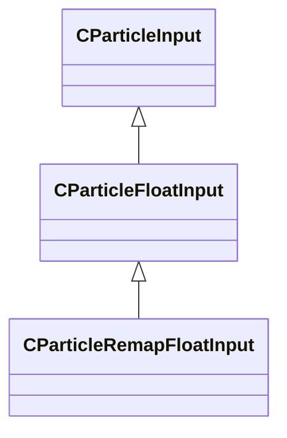

### CParticleTransformInput

**Inherits from:** [CParticleInput](particleslib.md#cparticleinput)

**Metadata:** `MGetKV3ClassDefaults {
	"m_nType": "PT_TYPE_CONTROL_POINT",
	"m_NamedValue": "",
	"m_bFollowNamedValue": false,
	"m_bSupportsDisabled": false,
	"m_bUseOrientation": true,
	"m_nControlPoint": 0,
	"m_nControlPointRangeMax": 0,
	"m_flEndCPGrowthTime": 0.000000
}`, `MPropertyCustomEditor "TransformInput()"`, `MCustomFGDMetadata "{ KV3DefaultTestFnName = 'CParticleTransformInputDefaultTestFunc' }"`

**Relationships:**

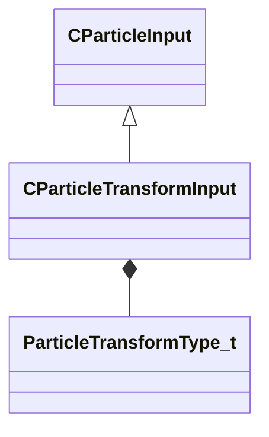

**Fields:**

| Name | Type | Annotations |
|------|------|-------------|
| `m_nType` | [ParticleTransformType_t](../schemas/particleslib.md#particletransformtype_t) |  |
| `m_NamedValue` | CParticleNamedValueRef |  |
| `m_bFollowNamedValue` | bool |  |
| `m_bSupportsDisabled` | bool |  |
| `m_bUseOrientation` | bool |  |
| `m_nControlPoint` | int32 |  |
| `m_nControlPointRangeMax` | int32 |  |
| `m_flEndCPGrowthTime` | float32 |  |

### CParticleVariableRef

**Metadata:** `MGetKV3ClassDefaults {
	"m_variableName": "",
	"m_variableType": "PVAL_VOID"
}`, `MPropertyCustomEditor "ParticleVariableRef()"`

**Fields:**

| Name | Type | Annotations |
|------|------|-------------|
| `m_variableName` | CKV3MemberNameWithStorage | `MFgdFromSchemaCompletelySkipField` |
| `m_variableType` | CPulseValueFullType | `MFgdFromSchemaCompletelySkipField` |

### CParticleVecInput

**Inherits from:** [CParticleInput](particleslib.md#cparticleinput)

**Derived by:** [CParticleCollectionVecInput](particleslib.md#cparticlecollectionvecinput), [CPerParticleVecInput](particleslib.md#cperparticlevecinput)

**Metadata:** `MGetKV3ClassDefaults {
	"m_nType": "PVEC_TYPE_LITERAL",
	"m_vLiteralValue":
	[
		0.000000,
		0.000000,
		0.000000
	],
	"m_LiteralColor":
	[
		0,
		0,
		0
	],
	"m_NamedValue": "",
	"m_bFollowNamedValue": false,
	"m_nVectorAttribute": 6,
	"m_vVectorAttributeScale":
	[
		1.000000,
		1.000000,
		1.000000
	],
	"m_nControlPoint": 0,
	"m_nDeltaControlPoint": 0,
	"m_vCPValueScale":
	[
		1.000000,
		1.000000,
		1.000000
	],
	"m_vCPRelativePosition":
	[
		0.000000,
		0.000000,
		0.000000
	],
	"m_vCPRelativeDir":
	[
		1.000000,
		0.000000,
		0.000000
	],
	"m_FloatComponentX":
	{
		"m_nType": "PF_TYPE_LITERAL",
		"m_nMapType": "PF_MAP_TYPE_DIRECT",
		"m_flLiteralValue": 0.000000,
		"m_NamedValue": "",
		"m_nControlPoint": 0,
		"m_nScalarAttribute": 3,
		"m_nVectorAttribute": 6,
		"m_nVectorComponent": 0,
		"m_bReverseOrder": false,
		"m_flRandomMin": 0.000000,
		"m_flRandomMax": 1.000000,
		"m_bHasRandomSignFlip": false,
		"m_nRandomSeed": <HIDDEN FOR DIFF>,
		"m_nRandomMode": "PF_RANDOM_MODE_CONSTANT",
		"m_strSnapshotSubset": "",
		"m_flLOD0": 0.000000,
		"m_flLOD1": 0.000000,
		"m_flLOD2": 0.000000,
		"m_flLOD3": 0.000000,
		"m_nNoiseInputVectorAttribute": 0,
		"m_flNoiseOutputMin": 0.000000,
		"m_flNoiseOutputMax": 1.000000,
		"m_flNoiseScale": 0.100000,
		"m_vecNoiseOffsetRate":
		[
			0.000000,
			0.000000,
			0.000000
		],
		"m_flNoiseOffset": 0.000000,
		"m_nNoiseOctaves": 1,
		"m_nNoiseTurbulence": "PF_NOISE_TURB_NONE",
		"m_nNoiseType": "PF_NOISE_TYPE_PERLIN",
		"m_nNoiseModifier": "PF_NOISE_MODIFIER_NONE",
		"m_flNoiseTurbulenceScale": 1.000000,
		"m_flNoiseTurbulenceMix": 0.500000,
		"m_flNoiseImgPreviewScale": 1.000000,
		"m_bNoiseImgPreviewLive": true,
		"m_flNoCameraFallback": 0.000000,
		"m_bUseBoundsCenter": false,
		"m_nInputMode": "PF_INPUT_MODE_CLAMPED",
		"m_flMultFactor": 1.000000,
		"m_flInput0": 0.000000,
		"m_flInput1": 1.000000,
		"m_flOutput0": 0.000000,
		"m_flOutput1": 1.000000,
		"m_flNotchedRangeMin": 0.000000,
		"m_flNotchedRangeMax": 1.000000,
		"m_flNotchedOutputOutside": 0.000000,
		"m_flNotchedOutputInside": 1.000000,
		"m_nRoundType": "PF_ROUND_TYPE_NEAREST",
		"m_nBiasType": "PF_BIAS_TYPE_STANDARD",
		"m_flBiasParameter": 0.000000,
		"m_Curve":
		{
			"m_spline":
			[
			],
			"m_tangents":
			[
			],
			"m_vDomainMins":
			[
				0.000000,
				0.000000
			],
			"m_vDomainMaxs":
			[
				0.000000,
				0.000000
			]
		}
	},
	"m_FloatComponentY":
	{
		"m_nType": "PF_TYPE_LITERAL",
		"m_nMapType": "PF_MAP_TYPE_DIRECT",
		"m_flLiteralValue": 0.000000,
		"m_NamedValue": "",
		"m_nControlPoint": 0,
		"m_nScalarAttribute": 3,
		"m_nVectorAttribute": 6,
		"m_nVectorComponent": 0,
		"m_bReverseOrder": false,
		"m_flRandomMin": 0.000000,
		"m_flRandomMax": 1.000000,
		"m_bHasRandomSignFlip": false,
		"m_nRandomSeed": <HIDDEN FOR DIFF>,
		"m_nRandomMode": "PF_RANDOM_MODE_CONSTANT",
		"m_strSnapshotSubset": "",
		"m_flLOD0": 0.000000,
		"m_flLOD1": 0.000000,
		"m_flLOD2": 0.000000,
		"m_flLOD3": 0.000000,
		"m_nNoiseInputVectorAttribute": 0,
		"m_flNoiseOutputMin": 0.000000,
		"m_flNoiseOutputMax": 1.000000,
		"m_flNoiseScale": 0.100000,
		"m_vecNoiseOffsetRate":
		[
			0.000000,
			0.000000,
			0.000000
		],
		"m_flNoiseOffset": 0.000000,
		"m_nNoiseOctaves": 1,
		"m_nNoiseTurbulence": "PF_NOISE_TURB_NONE",
		"m_nNoiseType": "PF_NOISE_TYPE_PERLIN",
		"m_nNoiseModifier": "PF_NOISE_MODIFIER_NONE",
		"m_flNoiseTurbulenceScale": 1.000000,
		"m_flNoiseTurbulenceMix": 0.500000,
		"m_flNoiseImgPreviewScale": 1.000000,
		"m_bNoiseImgPreviewLive": true,
		"m_flNoCameraFallback": 0.000000,
		"m_bUseBoundsCenter": false,
		"m_nInputMode": "PF_INPUT_MODE_CLAMPED",
		"m_flMultFactor": 1.000000,
		"m_flInput0": 0.000000,
		"m_flInput1": 1.000000,
		"m_flOutput0": 0.000000,
		"m_flOutput1": 1.000000,
		"m_flNotchedRangeMin": 0.000000,
		"m_flNotchedRangeMax": 1.000000,
		"m_flNotchedOutputOutside": 0.000000,
		"m_flNotchedOutputInside": 1.000000,
		"m_nRoundType": "PF_ROUND_TYPE_NEAREST",
		"m_nBiasType": "PF_BIAS_TYPE_STANDARD",
		"m_flBiasParameter": 0.000000,
		"m_Curve":
		{
			"m_spline":
			[
			],
			"m_tangents":
			[
			],
			"m_vDomainMins":
			[
				0.000000,
				0.000000
			],
			"m_vDomainMaxs":
			[
				0.000000,
				0.000000
			]
		}
	},
	"m_FloatComponentZ":
	{
		"m_nType": "PF_TYPE_LITERAL",
		"m_nMapType": "PF_MAP_TYPE_DIRECT",
		"m_flLiteralValue": 0.000000,
		"m_NamedValue": "",
		"m_nControlPoint": 0,
		"m_nScalarAttribute": 3,
		"m_nVectorAttribute": 6,
		"m_nVectorComponent": 0,
		"m_bReverseOrder": false,
		"m_flRandomMin": 0.000000,
		"m_flRandomMax": 1.000000,
		"m_bHasRandomSignFlip": false,
		"m_nRandomSeed": <HIDDEN FOR DIFF>,
		"m_nRandomMode": "PF_RANDOM_MODE_CONSTANT",
		"m_strSnapshotSubset": "",
		"m_flLOD0": 0.000000,
		"m_flLOD1": 0.000000,
		"m_flLOD2": 0.000000,
		"m_flLOD3": 0.000000,
		"m_nNoiseInputVectorAttribute": 0,
		"m_flNoiseOutputMin": 0.000000,
		"m_flNoiseOutputMax": 1.000000,
		"m_flNoiseScale": 0.100000,
		"m_vecNoiseOffsetRate":
		[
			0.000000,
			0.000000,
			0.000000
		],
		"m_flNoiseOffset": 0.000000,
		"m_nNoiseOctaves": 1,
		"m_nNoiseTurbulence": "PF_NOISE_TURB_NONE",
		"m_nNoiseType": "PF_NOISE_TYPE_PERLIN",
		"m_nNoiseModifier": "PF_NOISE_MODIFIER_NONE",
		"m_flNoiseTurbulenceScale": 1.000000,
		"m_flNoiseTurbulenceMix": 0.500000,
		"m_flNoiseImgPreviewScale": 1.000000,
		"m_bNoiseImgPreviewLive": true,
		"m_flNoCameraFallback": 0.000000,
		"m_bUseBoundsCenter": false,
		"m_nInputMode": "PF_INPUT_MODE_CLAMPED",
		"m_flMultFactor": 1.000000,
		"m_flInput0": 0.000000,
		"m_flInput1": 1.000000,
		"m_flOutput0": 0.000000,
		"m_flOutput1": 1.000000,
		"m_flNotchedRangeMin": 0.000000,
		"m_flNotchedRangeMax": 1.000000,
		"m_flNotchedOutputOutside": 0.000000,
		"m_flNotchedOutputInside": 1.000000,
		"m_nRoundType": "PF_ROUND_TYPE_NEAREST",
		"m_nBiasType": "PF_BIAS_TYPE_STANDARD",
		"m_flBiasParameter": 0.000000,
		"m_Curve":
		{
			"m_spline":
			[
			],
			"m_tangents":
			[
			],
			"m_vDomainMins":
			[
				0.000000,
				0.000000
			],
			"m_vDomainMaxs":
			[
				0.000000,
				0.000000
			]
		}
	},
	"m_FloatInterp":
	{
		"m_nType": "PF_TYPE_LITERAL",
		"m_nMapType": "PF_MAP_TYPE_DIRECT",
		"m_flLiteralValue": 0.000000,
		"m_NamedValue": "",
		"m_nControlPoint": 0,
		"m_nScalarAttribute": 3,
		"m_nVectorAttribute": 6,
		"m_nVectorComponent": 0,
		"m_bReverseOrder": false,
		"m_flRandomMin": 0.000000,
		"m_flRandomMax": 1.000000,
		"m_bHasRandomSignFlip": false,
		"m_nRandomSeed": <HIDDEN FOR DIFF>,
		"m_nRandomMode": "PF_RANDOM_MODE_CONSTANT",
		"m_strSnapshotSubset": "",
		"m_flLOD0": 0.000000,
		"m_flLOD1": 0.000000,
		"m_flLOD2": 0.000000,
		"m_flLOD3": 0.000000,
		"m_nNoiseInputVectorAttribute": 0,
		"m_flNoiseOutputMin": 0.000000,
		"m_flNoiseOutputMax": 1.000000,
		"m_flNoiseScale": 0.100000,
		"m_vecNoiseOffsetRate":
		[
			0.000000,
			0.000000,
			0.000000
		],
		"m_flNoiseOffset": 0.000000,
		"m_nNoiseOctaves": 1,
		"m_nNoiseTurbulence": "PF_NOISE_TURB_NONE",
		"m_nNoiseType": "PF_NOISE_TYPE_PERLIN",
		"m_nNoiseModifier": "PF_NOISE_MODIFIER_NONE",
		"m_flNoiseTurbulenceScale": 1.000000,
		"m_flNoiseTurbulenceMix": 0.500000,
		"m_flNoiseImgPreviewScale": 1.000000,
		"m_bNoiseImgPreviewLive": true,
		"m_flNoCameraFallback": 0.000000,
		"m_bUseBoundsCenter": false,
		"m_nInputMode": "PF_INPUT_MODE_CLAMPED",
		"m_flMultFactor": 1.000000,
		"m_flInput0": 0.000000,
		"m_flInput1": 1.000000,
		"m_flOutput0": 0.000000,
		"m_flOutput1": 1.000000,
		"m_flNotchedRangeMin": 0.000000,
		"m_flNotchedRangeMax": 1.000000,
		"m_flNotchedOutputOutside": 0.000000,
		"m_flNotchedOutputInside": 1.000000,
		"m_nRoundType": "PF_ROUND_TYPE_NEAREST",
		"m_nBiasType": "PF_BIAS_TYPE_STANDARD",
		"m_flBiasParameter": 0.000000,
		"m_Curve":
		{
			"m_spline":
			[
			],
			"m_tangents":
			[
			],
			"m_vDomainMins":
			[
				0.000000,
				0.000000
			],
			"m_vDomainMaxs":
			[
				0.000000,
				0.000000
			]
		}
	},
	"m_flInterpInput0": 0.000000,
	"m_flInterpInput1": 1.000000,
	"m_vInterpOutput0":
	[
		0.000000,
		0.000000,
		0.000000
	],
	"m_vInterpOutput1":
	[
		1.000000,
		1.000000,
		1.000000
	],
	"m_Gradient":
	{
		"m_Stops":
		[
		]
	},
	"m_vRandomMin":
	[
		0.000000,
		0.000000,
		0.000000
	],
	"m_vRandomMax":
	[
		0.000000,
		0.000000,
		0.000000
	]
}`, `MCustomFGDMetadata "{ SkipImprintFGDClassOnKV3 = true SkipRemoveKeysInKV3AtFGDDefault = true KV3DefaultTestFnName = 'CParticleVecInputDefaultTestFunc' }"`

**Relationships:**

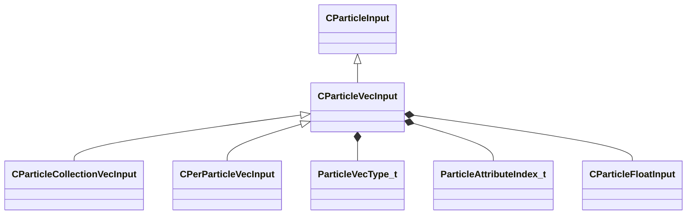

**Fields:**

| Name | Type | Annotations |
|------|------|-------------|
| `m_nType` | [ParticleVecType_t](../schemas/particleslib.md#particlevectype_t) |  |
| `m_vLiteralValue` | Vector |  |
| `m_LiteralColor` | Color |  |
| `m_NamedValue` | CParticleNamedValueRef |  |
| `m_bFollowNamedValue` | bool |  |
| `m_nVectorAttribute` | [ParticleAttributeIndex_t](../schemas/particles.md#particleattributeindex_t) |  |
| `m_vVectorAttributeScale` | Vector |  |
| `m_nControlPoint` | int32 |  |
| `m_nDeltaControlPoint` | int32 |  |
| `m_vCPValueScale` | Vector |  |
| `m_vCPRelativePosition` | Vector |  |
| `m_vCPRelativeDir` | Vector |  |
| `m_FloatComponentX` | [CParticleFloatInput](../schemas/particleslib.md#cparticlefloatinput) |  |
| `m_FloatComponentY` | [CParticleFloatInput](../schemas/particleslib.md#cparticlefloatinput) |  |
| `m_FloatComponentZ` | [CParticleFloatInput](../schemas/particleslib.md#cparticlefloatinput) |  |
| `m_FloatInterp` | [CParticleFloatInput](../schemas/particleslib.md#cparticlefloatinput) |  |
| `m_flInterpInput0` | float32 |  |
| `m_flInterpInput1` | float32 |  |
| `m_vInterpOutput0` | Vector |  |
| `m_vInterpOutput1` | Vector |  |
| `m_Gradient` | CColorGradient |  |
| `m_vRandomMin` | Vector |  |
| `m_vRandomMax` | Vector |  |

### CPerParticleFloatInput

**Inherits from:** [CParticleFloatInput](particleslib.md#cparticlefloatinput)

**Metadata:** `MGetKV3ClassDefaults {
	"m_nType": "PF_TYPE_LITERAL",
	"m_nMapType": "PF_MAP_TYPE_DIRECT",
	"m_flLiteralValue": 0.000000,
	"m_NamedValue": "",
	"m_nControlPoint": 0,
	"m_nScalarAttribute": 3,
	"m_nVectorAttribute": 6,
	"m_nVectorComponent": 0,
	"m_bReverseOrder": false,
	"m_flRandomMin": 0.000000,
	"m_flRandomMax": 1.000000,
	"m_bHasRandomSignFlip": false,
	"m_nRandomSeed": <HIDDEN FOR DIFF>,
	"m_nRandomMode": "PF_RANDOM_MODE_CONSTANT",
	"m_strSnapshotSubset": "",
	"m_flLOD0": 0.000000,
	"m_flLOD1": 0.000000,
	"m_flLOD2": 0.000000,
	"m_flLOD3": 0.000000,
	"m_nNoiseInputVectorAttribute": 0,
	"m_flNoiseOutputMin": 0.000000,
	"m_flNoiseOutputMax": 1.000000,
	"m_flNoiseScale": 0.100000,
	"m_vecNoiseOffsetRate":
	[
		0.000000,
		0.000000,
		0.000000
	],
	"m_flNoiseOffset": 0.000000,
	"m_nNoiseOctaves": 1,
	"m_nNoiseTurbulence": "PF_NOISE_TURB_NONE",
	"m_nNoiseType": "PF_NOISE_TYPE_PERLIN",
	"m_nNoiseModifier": "PF_NOISE_MODIFIER_NONE",
	"m_flNoiseTurbulenceScale": 1.000000,
	"m_flNoiseTurbulenceMix": 0.500000,
	"m_flNoiseImgPreviewScale": 1.000000,
	"m_bNoiseImgPreviewLive": true,
	"m_flNoCameraFallback": 0.000000,
	"m_bUseBoundsCenter": false,
	"m_nInputMode": "PF_INPUT_MODE_CLAMPED",
	"m_flMultFactor": 1.000000,
	"m_flInput0": 0.000000,
	"m_flInput1": 1.000000,
	"m_flOutput0": 0.000000,
	"m_flOutput1": 1.000000,
	"m_flNotchedRangeMin": 0.000000,
	"m_flNotchedRangeMax": 1.000000,
	"m_flNotchedOutputOutside": 0.000000,
	"m_flNotchedOutputInside": 1.000000,
	"m_nRoundType": "PF_ROUND_TYPE_NEAREST",
	"m_nBiasType": "PF_BIAS_TYPE_STANDARD",
	"m_flBiasParameter": 0.000000,
	"m_Curve":
	{
		"m_spline":
		[
		],
		"m_tangents":
		[
		],
		"m_vDomainMins":
		[
			0.000000,
			0.000000
		],
		"m_vDomainMaxs":
		[
			0.000000,
			0.000000
		]
	}
}`, `MPropertyCustomEditor "PerParticleFloatInput()"`

**Relationships:**

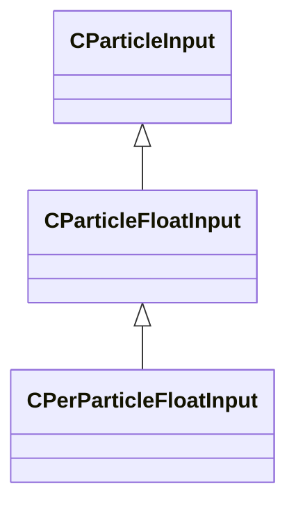

### CPerParticleVecInput

**Inherits from:** [CParticleVecInput](particleslib.md#cparticlevecinput)

**Metadata:** `MGetKV3ClassDefaults {
	"m_nType": "PVEC_TYPE_LITERAL",
	"m_vLiteralValue":
	[
		0.000000,
		0.000000,
		0.000000
	],
	"m_LiteralColor":
	[
		0,
		0,
		0
	],
	"m_NamedValue": "",
	"m_bFollowNamedValue": false,
	"m_nVectorAttribute": 6,
	"m_vVectorAttributeScale":
	[
		1.000000,
		1.000000,
		1.000000
	],
	"m_nControlPoint": 0,
	"m_nDeltaControlPoint": 0,
	"m_vCPValueScale":
	[
		1.000000,
		1.000000,
		1.000000
	],
	"m_vCPRelativePosition":
	[
		0.000000,
		0.000000,
		0.000000
	],
	"m_vCPRelativeDir":
	[
		1.000000,
		0.000000,
		0.000000
	],
	"m_FloatComponentX":
	{
		"m_nType": "PF_TYPE_LITERAL",
		"m_nMapType": "PF_MAP_TYPE_DIRECT",
		"m_flLiteralValue": 0.000000,
		"m_NamedValue": "",
		"m_nControlPoint": 0,
		"m_nScalarAttribute": 3,
		"m_nVectorAttribute": 6,
		"m_nVectorComponent": 0,
		"m_bReverseOrder": false,
		"m_flRandomMin": 0.000000,
		"m_flRandomMax": 1.000000,
		"m_bHasRandomSignFlip": false,
		"m_nRandomSeed": <HIDDEN FOR DIFF>,
		"m_nRandomMode": "PF_RANDOM_MODE_CONSTANT",
		"m_strSnapshotSubset": "",
		"m_flLOD0": 0.000000,
		"m_flLOD1": 0.000000,
		"m_flLOD2": 0.000000,
		"m_flLOD3": 0.000000,
		"m_nNoiseInputVectorAttribute": 0,
		"m_flNoiseOutputMin": 0.000000,
		"m_flNoiseOutputMax": 1.000000,
		"m_flNoiseScale": 0.100000,
		"m_vecNoiseOffsetRate":
		[
			0.000000,
			0.000000,
			0.000000
		],
		"m_flNoiseOffset": 0.000000,
		"m_nNoiseOctaves": 1,
		"m_nNoiseTurbulence": "PF_NOISE_TURB_NONE",
		"m_nNoiseType": "PF_NOISE_TYPE_PERLIN",
		"m_nNoiseModifier": "PF_NOISE_MODIFIER_NONE",
		"m_flNoiseTurbulenceScale": 1.000000,
		"m_flNoiseTurbulenceMix": 0.500000,
		"m_flNoiseImgPreviewScale": 1.000000,
		"m_bNoiseImgPreviewLive": true,
		"m_flNoCameraFallback": 0.000000,
		"m_bUseBoundsCenter": false,
		"m_nInputMode": "PF_INPUT_MODE_CLAMPED",
		"m_flMultFactor": 1.000000,
		"m_flInput0": 0.000000,
		"m_flInput1": 1.000000,
		"m_flOutput0": 0.000000,
		"m_flOutput1": 1.000000,
		"m_flNotchedRangeMin": 0.000000,
		"m_flNotchedRangeMax": 1.000000,
		"m_flNotchedOutputOutside": 0.000000,
		"m_flNotchedOutputInside": 1.000000,
		"m_nRoundType": "PF_ROUND_TYPE_NEAREST",
		"m_nBiasType": "PF_BIAS_TYPE_STANDARD",
		"m_flBiasParameter": 0.000000,
		"m_Curve":
		{
			"m_spline":
			[
			],
			"m_tangents":
			[
			],
			"m_vDomainMins":
			[
				0.000000,
				0.000000
			],
			"m_vDomainMaxs":
			[
				0.000000,
				0.000000
			]
		}
	},
	"m_FloatComponentY":
	{
		"m_nType": "PF_TYPE_LITERAL",
		"m_nMapType": "PF_MAP_TYPE_DIRECT",
		"m_flLiteralValue": 0.000000,
		"m_NamedValue": "",
		"m_nControlPoint": 0,
		"m_nScalarAttribute": 3,
		"m_nVectorAttribute": 6,
		"m_nVectorComponent": 0,
		"m_bReverseOrder": false,
		"m_flRandomMin": 0.000000,
		"m_flRandomMax": 1.000000,
		"m_bHasRandomSignFlip": false,
		"m_nRandomSeed": <HIDDEN FOR DIFF>,
		"m_nRandomMode": "PF_RANDOM_MODE_CONSTANT",
		"m_strSnapshotSubset": "",
		"m_flLOD0": 0.000000,
		"m_flLOD1": 0.000000,
		"m_flLOD2": 0.000000,
		"m_flLOD3": 0.000000,
		"m_nNoiseInputVectorAttribute": 0,
		"m_flNoiseOutputMin": 0.000000,
		"m_flNoiseOutputMax": 1.000000,
		"m_flNoiseScale": 0.100000,
		"m_vecNoiseOffsetRate":
		[
			0.000000,
			0.000000,
			0.000000
		],
		"m_flNoiseOffset": 0.000000,
		"m_nNoiseOctaves": 1,
		"m_nNoiseTurbulence": "PF_NOISE_TURB_NONE",
		"m_nNoiseType": "PF_NOISE_TYPE_PERLIN",
		"m_nNoiseModifier": "PF_NOISE_MODIFIER_NONE",
		"m_flNoiseTurbulenceScale": 1.000000,
		"m_flNoiseTurbulenceMix": 0.500000,
		"m_flNoiseImgPreviewScale": 1.000000,
		"m_bNoiseImgPreviewLive": true,
		"m_flNoCameraFallback": 0.000000,
		"m_bUseBoundsCenter": false,
		"m_nInputMode": "PF_INPUT_MODE_CLAMPED",
		"m_flMultFactor": 1.000000,
		"m_flInput0": 0.000000,
		"m_flInput1": 1.000000,
		"m_flOutput0": 0.000000,
		"m_flOutput1": 1.000000,
		"m_flNotchedRangeMin": 0.000000,
		"m_flNotchedRangeMax": 1.000000,
		"m_flNotchedOutputOutside": 0.000000,
		"m_flNotchedOutputInside": 1.000000,
		"m_nRoundType": "PF_ROUND_TYPE_NEAREST",
		"m_nBiasType": "PF_BIAS_TYPE_STANDARD",
		"m_flBiasParameter": 0.000000,
		"m_Curve":
		{
			"m_spline":
			[
			],
			"m_tangents":
			[
			],
			"m_vDomainMins":
			[
				0.000000,
				0.000000
			],
			"m_vDomainMaxs":
			[
				0.000000,
				0.000000
			]
		}
	},
	"m_FloatComponentZ":
	{
		"m_nType": "PF_TYPE_LITERAL",
		"m_nMapType": "PF_MAP_TYPE_DIRECT",
		"m_flLiteralValue": 0.000000,
		"m_NamedValue": "",
		"m_nControlPoint": 0,
		"m_nScalarAttribute": 3,
		"m_nVectorAttribute": 6,
		"m_nVectorComponent": 0,
		"m_bReverseOrder": false,
		"m_flRandomMin": 0.000000,
		"m_flRandomMax": 1.000000,
		"m_bHasRandomSignFlip": false,
		"m_nRandomSeed": <HIDDEN FOR DIFF>,
		"m_nRandomMode": "PF_RANDOM_MODE_CONSTANT",
		"m_strSnapshotSubset": "",
		"m_flLOD0": 0.000000,
		"m_flLOD1": 0.000000,
		"m_flLOD2": 0.000000,
		"m_flLOD3": 0.000000,
		"m_nNoiseInputVectorAttribute": 0,
		"m_flNoiseOutputMin": 0.000000,
		"m_flNoiseOutputMax": 1.000000,
		"m_flNoiseScale": 0.100000,
		"m_vecNoiseOffsetRate":
		[
			0.000000,
			0.000000,
			0.000000
		],
		"m_flNoiseOffset": 0.000000,
		"m_nNoiseOctaves": 1,
		"m_nNoiseTurbulence": "PF_NOISE_TURB_NONE",
		"m_nNoiseType": "PF_NOISE_TYPE_PERLIN",
		"m_nNoiseModifier": "PF_NOISE_MODIFIER_NONE",
		"m_flNoiseTurbulenceScale": 1.000000,
		"m_flNoiseTurbulenceMix": 0.500000,
		"m_flNoiseImgPreviewScale": 1.000000,
		"m_bNoiseImgPreviewLive": true,
		"m_flNoCameraFallback": 0.000000,
		"m_bUseBoundsCenter": false,
		"m_nInputMode": "PF_INPUT_MODE_CLAMPED",
		"m_flMultFactor": 1.000000,
		"m_flInput0": 0.000000,
		"m_flInput1": 1.000000,
		"m_flOutput0": 0.000000,
		"m_flOutput1": 1.000000,
		"m_flNotchedRangeMin": 0.000000,
		"m_flNotchedRangeMax": 1.000000,
		"m_flNotchedOutputOutside": 0.000000,
		"m_flNotchedOutputInside": 1.000000,
		"m_nRoundType": "PF_ROUND_TYPE_NEAREST",
		"m_nBiasType": "PF_BIAS_TYPE_STANDARD",
		"m_flBiasParameter": 0.000000,
		"m_Curve":
		{
			"m_spline":
			[
			],
			"m_tangents":
			[
			],
			"m_vDomainMins":
			[
				0.000000,
				0.000000
			],
			"m_vDomainMaxs":
			[
				0.000000,
				0.000000
			]
		}
	},
	"m_FloatInterp":
	{
		"m_nType": "PF_TYPE_LITERAL",
		"m_nMapType": "PF_MAP_TYPE_DIRECT",
		"m_flLiteralValue": 0.000000,
		"m_NamedValue": "",
		"m_nControlPoint": 0,
		"m_nScalarAttribute": 3,
		"m_nVectorAttribute": 6,
		"m_nVectorComponent": 0,
		"m_bReverseOrder": false,
		"m_flRandomMin": 0.000000,
		"m_flRandomMax": 1.000000,
		"m_bHasRandomSignFlip": false,
		"m_nRandomSeed": <HIDDEN FOR DIFF>,
		"m_nRandomMode": "PF_RANDOM_MODE_CONSTANT",
		"m_strSnapshotSubset": "",
		"m_flLOD0": 0.000000,
		"m_flLOD1": 0.000000,
		"m_flLOD2": 0.000000,
		"m_flLOD3": 0.000000,
		"m_nNoiseInputVectorAttribute": 0,
		"m_flNoiseOutputMin": 0.000000,
		"m_flNoiseOutputMax": 1.000000,
		"m_flNoiseScale": 0.100000,
		"m_vecNoiseOffsetRate":
		[
			0.000000,
			0.000000,
			0.000000
		],
		"m_flNoiseOffset": 0.000000,
		"m_nNoiseOctaves": 1,
		"m_nNoiseTurbulence": "PF_NOISE_TURB_NONE",
		"m_nNoiseType": "PF_NOISE_TYPE_PERLIN",
		"m_nNoiseModifier": "PF_NOISE_MODIFIER_NONE",
		"m_flNoiseTurbulenceScale": 1.000000,
		"m_flNoiseTurbulenceMix": 0.500000,
		"m_flNoiseImgPreviewScale": 1.000000,
		"m_bNoiseImgPreviewLive": true,
		"m_flNoCameraFallback": 0.000000,
		"m_bUseBoundsCenter": false,
		"m_nInputMode": "PF_INPUT_MODE_CLAMPED",
		"m_flMultFactor": 1.000000,
		"m_flInput0": 0.000000,
		"m_flInput1": 1.000000,
		"m_flOutput0": 0.000000,
		"m_flOutput1": 1.000000,
		"m_flNotchedRangeMin": 0.000000,
		"m_flNotchedRangeMax": 1.000000,
		"m_flNotchedOutputOutside": 0.000000,
		"m_flNotchedOutputInside": 1.000000,
		"m_nRoundType": "PF_ROUND_TYPE_NEAREST",
		"m_nBiasType": "PF_BIAS_TYPE_STANDARD",
		"m_flBiasParameter": 0.000000,
		"m_Curve":
		{
			"m_spline":
			[
			],
			"m_tangents":
			[
			],
			"m_vDomainMins":
			[
				0.000000,
				0.000000
			],
			"m_vDomainMaxs":
			[
				0.000000,
				0.000000
			]
		}
	},
	"m_flInterpInput0": 0.000000,
	"m_flInterpInput1": 1.000000,
	"m_vInterpOutput0":
	[
		0.000000,
		0.000000,
		0.000000
	],
	"m_vInterpOutput1":
	[
		1.000000,
		1.000000,
		1.000000
	],
	"m_Gradient":
	{
		"m_Stops":
		[
		]
	},
	"m_vRandomMin":
	[
		0.000000,
		0.000000,
		0.000000
	],
	"m_vRandomMax":
	[
		0.000000,
		0.000000,
		0.000000
	]
}`, `MPropertyCustomEditor "PerParticleVecInput()"`

**Relationships:**

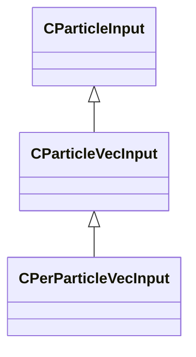

### GPUParticleCollisionMode_t

**Values:**

| Name | Value | Description |
|------|-------|-------------|
| `PARTICLE_GPU_COLLISION_MODE_RT` | 0 | Raytracing TLAS |
| `PARTICLE_GPU_COLLISION_MODE_DEPTH` | 1 | Primary View Depth Buffer |
| `PARTICLE_GPU_COLLISION_MODE_HYBRID` | 2 | Hybrid RT + Depth Buffer |

### IParticleEffect

**Derived by:** [CNewParticleEffect](particleslib.md#cnewparticleeffect)

**Relationships:**

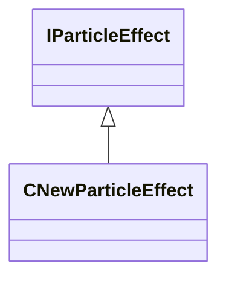

### PARTICLE_EHANDLE__

**Fields:**

| Name | Type | Annotations |
|------|------|-------------|
| `unused` | int32 |  |

### PFNoiseModifier_t

**Values:**

| Name | Value | Description |
|------|-------|-------------|
| `PF_NOISE_MODIFIER_NONE` | 0 |  |
| `PF_NOISE_MODIFIER_LINES` | 1 |  |
| `PF_NOISE_MODIFIER_CLUMPS` | 2 |  |
| `PF_NOISE_MODIFIER_RINGS` | 3 |  |

### PFNoiseTurbulence_t

**Values:**

| Name | Value | Description |
|------|-------|-------------|
| `PF_NOISE_TURB_NONE` | 0 |  |
| `PF_NOISE_TURB_HIGHLIGHT` | 1 |  |
| `PF_NOISE_TURB_FEEDBACK` | 2 |  |
| `PF_NOISE_TURB_LOOPY` | 3 |  |
| `PF_NOISE_TURB_CONTRAST` | 4 |  |
| `PF_NOISE_TURB_ALTERNATE` | 5 |  |

### PFNoiseType_t

**Values:**

| Name | Value | Description |
|------|-------|-------------|
| `PF_NOISE_TYPE_PERLIN` | 0 |  |
| `PF_NOISE_TYPE_SIMPLEX` | 1 |  |
| `PF_NOISE_TYPE_WORLEY` | 2 |  |
| `PF_NOISE_TYPE_CURL` | 3 |  |

### ParticleColorBlendMode_t

**Values:**

| Name | Value | Description |
|------|-------|-------------|
| `PARTICLEBLEND_DEFAULT` | 0 | Replace |
| `PARTICLEBLEND_OVERLAY` | 1 | Overlay |
| `PARTICLEBLEND_DARKEN` | 2 | Darken |
| `PARTICLEBLEND_LIGHTEN` | 3 | Lighten |
| `PARTICLEBLEND_MULTIPLY` | 4 | Multiply |

### ParticleColorBlendType_t

**Values:**

| Name | Value | Description |
|------|-------|-------------|
| `PARTICLE_COLOR_BLEND_MULTIPLY` | 0 | Multiply |
| `PARTICLE_COLOR_BLEND_MULTIPLY2X` | 1 | Multiply x2 |
| `PARTICLE_COLOR_BLEND_DIVIDE` | 2 | Divide |
| `PARTICLE_COLOR_BLEND_ADD` | 3 | Add |
| `PARTICLE_COLOR_BLEND_SUBTRACT` | 4 | Subtract |
| `PARTICLE_COLOR_BLEND_MOD2X` | 5 | Mod2X |
| `PARTICLE_COLOR_BLEND_SCREEN` | 6 | Screen |
| `PARTICLE_COLOR_BLEND_MAX` | 7 | Lighten |
| `PARTICLE_COLOR_BLEND_MIN` | 8 | Darken |
| `PARTICLE_COLOR_BLEND_REPLACE` | 9 | Replace |
| `PARTICLE_COLOR_BLEND_AVERAGE` | 10 | Average |
| `PARTICLE_COLOR_BLEND_NEGATE` | 11 | Negate |
| `PARTICLE_COLOR_BLEND_LUMINANCE` | 12 | Luminance |

### ParticleDirectionNoiseType_t

**Values:**

| Name | Value | Description |
|------|-------|-------------|
| `PARTICLE_DIR_NOISE_PERLIN` | 0 | Perlin |
| `PARTICLE_DIR_NOISE_CURL` | 1 | Curl |
| `PARTICLE_DIR_NOISE_WORLEY_BASIC` | 2 | Worley |

### ParticleFloatBiasType_t

**Values:**

| Name | Value | Description |
|------|-------|-------------|
| `PF_BIAS_TYPE_INVALID` | -1 |  |
| `PF_BIAS_TYPE_STANDARD` | 0 |  |
| `PF_BIAS_TYPE_GAIN` | 1 |  |
| `PF_BIAS_TYPE_EXPONENTIAL` | 2 |  |
| `PF_BIAS_TYPE_COUNT` | 3 |  |

### ParticleFloatInputMode_t

**Values:**

| Name | Value | Description |
|------|-------|-------------|
| `PF_INPUT_MODE_INVALID` | -1 |  |
| `PF_INPUT_MODE_CLAMPED` | 0 |  |
| `PF_INPUT_MODE_LOOPED` | 1 |  |
| `PF_INPUT_MODE_COUNT` | 2 |  |

### ParticleFloatMapType_t

**Values:**

| Name | Value | Description |
|------|-------|-------------|
| `PF_MAP_TYPE_INVALID` | -1 |  |
| `PF_MAP_TYPE_DIRECT` | 0 |  |
| `PF_MAP_TYPE_MULT` | 1 |  |
| `PF_MAP_TYPE_REMAP` | 2 |  |
| `PF_MAP_TYPE_REMAP_BIASED` | 3 |  |
| `PF_MAP_TYPE_CURVE` | 4 |  |
| `PF_MAP_TYPE_NOTCHED` | 5 |  |
| `PF_MAP_TYPE_ROUND` | 6 |  |
| `PF_MAP_TYPE_COUNT` | 7 |  |

### ParticleFloatRandomMode_t

**Values:**

| Name | Value | Description |
|------|-------|-------------|
| `PF_RANDOM_MODE_INVALID` | -1 |  |
| `PF_RANDOM_MODE_CONSTANT` | 0 |  |
| `PF_RANDOM_MODE_VARYING` | 1 |  |
| `PF_RANDOM_MODE_COUNT` | 2 |  |

### ParticleFloatRoundType_t

**Values:**

| Name | Value | Description |
|------|-------|-------------|
| `PF_ROUND_TYPE_INVALID` | -1 |  |
| `PF_ROUND_TYPE_NEAREST` | 0 |  |
| `PF_ROUND_TYPE_FLOOR` | 1 |  |
| `PF_ROUND_TYPE_CEIL` | 2 |  |
| `PF_ROUND_TYPE_COUNT` | 3 |  |

### ParticleFloatType_t

**Values:**

| Name | Value | Description |
|------|-------|-------------|
| `PF_TYPE_INVALID` | -1 |  |
| `PF_TYPE_LITERAL` | 0 |  |
| `PF_TYPE_NAMED_VALUE` | 1 |  |
| `PF_TYPE_RANDOM_UNIFORM` | 2 |  |
| `PF_TYPE_RANDOM_BIASED` | 3 |  |
| `PF_TYPE_COLLECTION_AGE` | 4 |  |
| `PF_TYPE_ENDCAP_AGE` | 5 |  |
| `PF_TYPE_CONTROL_POINT_COMPONENT` | 6 |  |
| `PF_TYPE_CONTROL_POINT_CHANGE_AGE` | 7 |  |
| `PF_TYPE_CONTROL_POINT_SPEED` | 8 |  |
| `PF_TYPE_PARTICLE_DETAIL_LEVEL` | 9 |  |
| `PF_TYPE_CONCURRENT_DEF_COUNT` | 10 |  |
| `PF_TYPE_CLOSEST_CAMERA_DISTANCE` | 11 |  |
| `PF_TYPE_SNAPSHOT_COUNT` | 12 |  |
| `PF_TYPE_SNAPSHOT_CHANGED` | 13 |  |
| `PF_TYPE_RENDERER_CAMERA_DISTANCE` | 14 |  |
| `PF_TYPE_RENDERER_CAMERA_DOT_PRODUCT` | 15 |  |
| `PF_TYPE_PARTICLE_NOISE` | 16 |  |
| `PF_TYPE_PARTICLE_AGE` | 17 |  |
| `PF_TYPE_PARTICLE_AGE_NORMALIZED` | 18 |  |
| `PF_TYPE_PARTICLE_FLOAT` | 19 |  |
| `PF_TYPE_PARTICLE_INITIAL_FLOAT` | 20 |  |
| `PF_TYPE_PARTICLE_VECTOR_COMPONENT` | 21 |  |
| `PF_TYPE_PARTICLE_INITIAL_VECTOR_COMPONENT` | 22 |  |
| `PF_TYPE_PARTICLE_SPEED` | 23 |  |
| `PF_TYPE_PARTICLE_NUMBER` | 24 |  |
| `PF_TYPE_PARTICLE_NUMBER_NORMALIZED` | 25 |  |
| `PF_TYPE_PARTICLE_ROPE_SEGMENT` | 26 |  |
| `PF_TYPE_PARTICLE_ROPE_SEGMENT_NORMALIZED` | 27 |  |
| `PF_TYPE_PARTICLE_SCREENSPACE_CAMERA_DISTANCE` | 28 |  |
| `PF_TYPE_PARTICLE_SCREENSPACE_CAMERA_DOT_PRODUCT` | 29 |  |
| `PF_TYPE_COUNT` | 30 |  |

### ParticleModelType_t

**Values:**

| Name | Value | Description |
|------|-------|-------------|
| `PM_TYPE_INVALID` | 0 |  |
| `PM_TYPE_NAMED_VALUE_MODEL` | 1 |  |
| `PM_TYPE_NAMED_VALUE_EHANDLE` | 2 |  |
| `PM_TYPE_CONTROL_POINT` | 3 |  |
| `PM_TYPE_COUNT` | 4 |  |

### ParticleNamedValueConfiguration_t

**Metadata:** `MGetKV3ClassDefaults {
	"m_ConfigName": "",
	"m_ConfigValue": null,
	"m_BoundValuePath": "",
	"m_iAttachType": "PATTACH_INVALID",
	"m_strEntityScope": "",
	"m_strAttachmentName": ""
}`

**Relationships:**

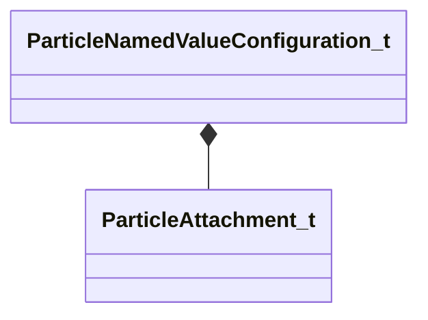

**Fields:**

| Name | Type | Annotations |
|------|------|-------------|
| `m_ConfigName` | CUtlString |  |
| `m_ConfigValue` | KeyValues3 |  |
| `m_BoundValuePath` | CUtlString |  |
| `m_iAttachType` | [ParticleAttachment_t](../schemas/animationsystem.md#particleattachment_t) |  |
| `m_strEntityScope` | CUtlString |  |
| `m_strAttachmentName` | CUtlString |  |

### ParticleNamedValueSource_t

**Metadata:** `MGetKV3ClassDefaults {
	"m_Name": "",
	"m_IsPublic": true,
	"m_ValueType": "PVAL_VOID",
	"m_DefaultConfig":
	{
		"m_ConfigName": "",
		"m_ConfigValue": null,
		"m_BoundValuePath": "",
		"m_iAttachType": "PATTACH_INVALID",
		"m_strEntityScope": "",
		"m_strAttachmentName": ""
	}
}`

**Relationships:**

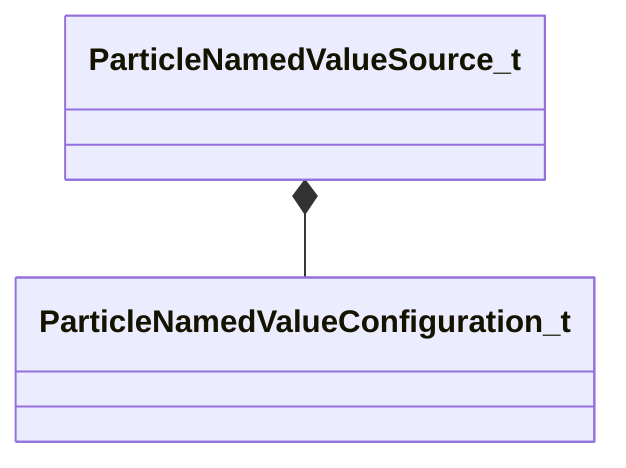

**Fields:**

| Name | Type | Annotations |
|------|------|-------------|
| `m_Name` | CUtlString |  |
| `m_IsPublic` | bool |  |
| `m_ValueType` | CPulseValueFullType | `MFgdFromSchemaCompletelySkipField` |
| `m_DefaultConfig` | [ParticleNamedValueConfiguration_t](../schemas/particleslib.md#particlenamedvalueconfiguration_t) | `MFgdFromSchemaCompletelySkipField` |

### ParticleSetMethod_t

**Values:**

| Name | Value | Description |
|------|-------|-------------|
| `PARTICLE_SET_REPLACE_VALUE` | 0 | Set Value |
| `PARTICLE_SET_SCALE_INITIAL_VALUE` | 1 | Scale Initial Value |
| `PARTICLE_SET_ADD_TO_INITIAL_VALUE` | 2 | Add to Initial Value |
| `PARTICLE_SET_RAMP_CURRENT_VALUE` | 3 | Ramp Current Value at Input Rate Per Second |
| `PARTICLE_SET_SCALE_CURRENT_VALUE` | 4 | Scale Current Value Raw |
| `PARTICLE_SET_ADD_TO_CURRENT_VALUE` | 5 | Add to Current Value Raw |

### ParticleTransformType_t

**Values:**

| Name | Value | Description |
|------|-------|-------------|
| `PT_TYPE_INVALID` | 0 |  |
| `PT_TYPE_NAMED_VALUE` | 1 |  |
| `PT_TYPE_CONTROL_POINT` | 2 |  |
| `PT_TYPE_CONTROL_POINT_RANGE` | 3 |  |
| `PT_TYPE_COUNT` | 4 |  |

### ParticleVecType_t

**Values:**

| Name | Value | Description |
|------|-------|-------------|
| `PVEC_TYPE_INVALID` | -1 |  |
| `PVEC_TYPE_LITERAL` | 0 |  |
| `PVEC_TYPE_LITERAL_COLOR` | 1 |  |
| `PVEC_TYPE_NAMED_VALUE` | 2 |  |
| `PVEC_TYPE_PARTICLE_VECTOR` | 3 |  |
| `PVEC_TYPE_PARTICLE_INITIAL_VECTOR` | 4 |  |
| `PVEC_TYPE_PARTICLE_VELOCITY` | 5 |  |
| `PVEC_TYPE_PARTICLE_GRAVITY` | 6 |  |
| `PVEC_TYPE_CP_VALUE` | 7 |  |
| `PVEC_TYPE_CP_RELATIVE_POSITION` | 8 |  |
| `PVEC_TYPE_CP_RELATIVE_DIR` | 9 |  |
| `PVEC_TYPE_CP_RELATIVE_RANDOM_DIR` | 10 |  |
| `PVEC_TYPE_FLOAT_COMPONENTS` | 11 |  |
| `PVEC_TYPE_FLOAT_INTERP_CLAMPED` | 12 |  |
| `PVEC_TYPE_FLOAT_INTERP_OPEN` | 13 |  |
| `PVEC_TYPE_FLOAT_INTERP_GRADIENT` | 14 |  |
| `PVEC_TYPE_RANDOM_UNIFORM` | 15 |  |
| `PVEC_TYPE_RANDOM_UNIFORM_OFFSET` | 16 |  |
| `PVEC_TYPE_CP_DELTA` | 17 |  |
| `PVEC_TYPE_CLOSEST_CAMERA_POSITION` | 18 |  |
| `PVEC_TYPE_COUNT` | 19 |  |
