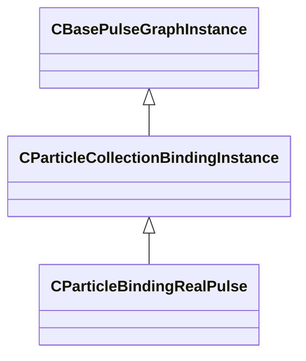

# Module: particleslib

[📊 View UML Diagram](../diagrams/particleslib.md)

| Name | Kind | Bases | Fields |
|------|------|-------|--------|
| [CParticleBindingRealPulse](#cparticlebindingrealpulse) | class | CParticleCollectionBindingInstance | 0 |
| [CParticleCollectionBindingInstance](#cparticlecollectionbindinginstance) | class | CBasePulseGraphInstance | 0 |

---

### CParticleBindingRealPulse

**Inherits from:** [CParticleCollectionBindingInstance](particleslib.md#cparticlecollectionbindinginstance)

**Relationships:**

```mermaid
classDiagram
    CParticleCollectionBindingInstance <|-- CParticleBindingRealPulse
    CBasePulseGraphInstance <|-- CParticleCollectionBindingInstance
```

### CParticleCollectionBindingInstance

**Inherits from:** [CBasePulseGraphInstance](pulse_runtime_lib.md#cbasepulsegraphinstance)

**Derived by:** [CParticleBindingRealPulse](particleslib.md#cparticlebindingrealpulse)

**Relationships:**

```mermaid
classDiagram
    CBasePulseGraphInstance <|-- CParticleCollectionBindingInstance
    CParticleCollectionBindingInstance <|-- CParticleBindingRealPulse
```
