# Module: particleslib

[📊 View UML Diagram](../diagrams/particleslib.md)

| Name | Kind | Bases | Fields |
|------|------|-------|--------|
| [CNewParticleEffect](#cnewparticleeffect) | class | IParticleEffect | 33 |
| [CParticleBindingRealPulse](#cparticlebindingrealpulse) | class | CParticleCollectionBindingInstance | 0 |
| [CParticleCollectionBindingInstance](#cparticlecollectionbindinginstance) | class | CBasePulseGraphInstance | 0 |
| [CParticleCollectionFloatInput](#cparticlecollectionfloatinput) | class | CParticleFloatInput | 0 |
| [CParticleCollectionRendererFloatInput](#cparticlecollectionrendererfloatinput) | class | CParticleCollectionFloatInput | 0 |
| [CParticleCollectionRendererVecInput](#cparticlecollectionrenderervecinput) | class | CParticleCollectionVecInput | 0 |
| [CParticleCollectionVecInput](#cparticlecollectionvecinput) | class | CParticleVecInput | 0 |
| [CParticleFloatInput](#cparticlefloatinput) | class | CParticleInput | 49 |
| [CParticleInput](#cparticleinput) | class |  | 0 |
| [CParticleModelInput](#cparticlemodelinput) | class | CParticleInput | 3 |
| [CParticleProperty](#cparticleproperty) | class |  | 0 |
| [CParticleRemapFloatInput](#cparticleremapfloatinput) | class | CParticleFloatInput | 0 |
| [CParticleTransformInput](#cparticletransforminput) | class | CParticleInput | 8 |
| [CParticleVariableRef](#cparticlevariableref) | class |  | 2 |
| [CParticleVecInput](#cparticlevecinput) | class | CParticleInput | 23 |
| [CPerParticleFloatInput](#cperparticlefloatinput) | class | CParticleFloatInput | 0 |
| [CPerParticleVecInput](#cperparticlevecinput) | class | CParticleVecInput | 0 |
| [IParticleEffect](#iparticleeffect) | class |  | 0 |
| [PARTICLE_EHANDLE__](#particle_ehandle__) | class |  | 1 |
| [ParticleNamedValueConfiguration_t](#particlenamedvalueconfiguration_t) | class |  | 6 |
| [ParticleNamedValueSource_t](#particlenamedvaluesource_t) | class |  | 4 |

---

### CNewParticleEffect

**Inherits from:** [IParticleEffect](particleslib.md#iparticleeffect)

**Relationships:**

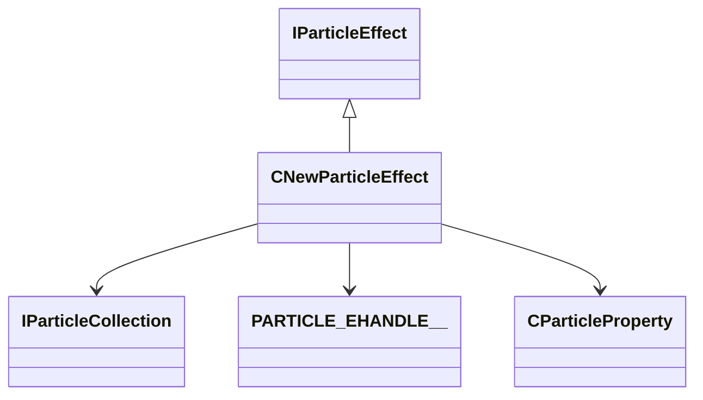
```mermaid
classDiagram
    IParticleEffect <|-- CNewParticleEffect
    CNewParticleEffect --> IParticleCollection
    CNewParticleEffect --> PARTICLE_EHANDLE__
    CNewParticleEffect --> CParticleProperty
```

**Fields:**

| Name | Type | Annotations |
|------|------|-------------|
| `m_bAllocated` | bitfield:1 |  |
| `m_bAutoUpdateBBox` | bitfield:1 |  |
| `m_bCanFreeze` | bitfield:1 |  |
| `m_bDontRemove` | bitfield:1 |  |
| `m_bForceNoDraw` | bitfield:1 |  |
| `m_bFreezeTargetState` | bitfield:1 |  |
| `m_bFreezeTransitionActive` | bitfield:1 |  |
| `m_bIsAsyncCreate` | bitfield:1 |  |
| `m_bIsFirstFrame` | bitfield:1 |  |
| `m_bNeedsBBoxUpdate` | bitfield:1 |  |
| `m_bRemove` | bitfield:1 |  |
| `m_bShouldCheckFoW` | bitfield:1 |  |
| `m_bShouldPerformCullCheck` | bitfield:1 |  |
| `m_bShouldSave` | bitfield:1 |  |
| `m_bShouldSimulateDuringGamePaused` | bitfield:1 |  |
| `m_bSimulate` | bitfield:1 |  |
| `m_bSuppressScreenSpaceEffect` | bitfield:1 |  |
| `m_pNext` | [CNewParticleEffect](../schemas/particleslib.md#cnewparticleeffect)* |  |
| `m_pPrev` | [CNewParticleEffect](../schemas/particleslib.md#cnewparticleeffect)* |  |
| `m_pParticles` | [IParticleCollection](../schemas/particles.md#iparticlecollection)* |  |
| `m_pDebugName` | char* |  |
| `m_vSortOrigin` | Vector |  |
| `m_flScale` | float32 |  |
| `m_hOwner` | [PARTICLE_EHANDLE__](../schemas/particleslib.md#particle_ehandle__)* |  |
| `m_pOwningParticleProperty` | [CParticleProperty](../schemas/particleslib.md#cparticleproperty)* |  |
| `m_flFreezeTransitionStart` | float32 |  |
| `m_flFreezeTransitionDuration` | float32 |  |
| `m_flFreezeTransitionOverride` | float32 |  |
| `m_LastMin` | Vector |  |
| `m_LastMax` | Vector |  |
| `m_nSplitScreenUser` | CSplitScreenSlot |  |
| `m_vecAggregationCenter` | Vector |  |
| `m_RefCount` | int32 |  |

### CParticleBindingRealPulse

**Inherits from:** [CParticleCollectionBindingInstance](particleslib.md#cparticlecollectionbindinginstance)

**Relationships:**

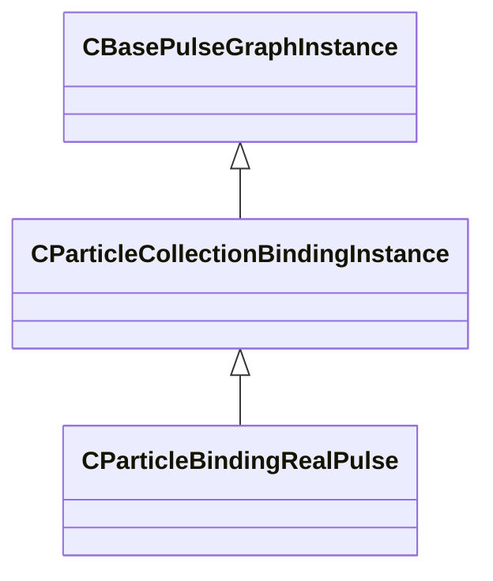
```mermaid
classDiagram
    CParticleCollectionBindingInstance <|-- CParticleBindingRealPulse
    CBasePulseGraphInstance <|-- CParticleCollectionBindingInstance
```

### CParticleCollectionBindingInstance

**Inherits from:** [CBasePulseGraphInstance](pulse_runtime_lib.md#cbasepulsegraphinstance)

**Derived by:** [CParticleBindingRealPulse](particleslib.md#cparticlebindingrealpulse)

**Relationships:**

```mermaid
classDiagram
    CBasePulseGraphInstance <|-- CParticleCollectionBindingInstance
    CParticleCollectionBindingInstance <|-- CParticleBindingRealPulse
```

### CParticleCollectionFloatInput

**Inherits from:** [CParticleFloatInput](particleslib.md#cparticlefloatinput)

**Derived by:** [CParticleCollectionRendererFloatInput](particleslib.md#cparticlecollectionrendererfloatinput)

**Metadata:** `MGetKV3ClassDefaults`, `MPropertyCustomEditor CollectionFloatInput()`

**Relationships:**

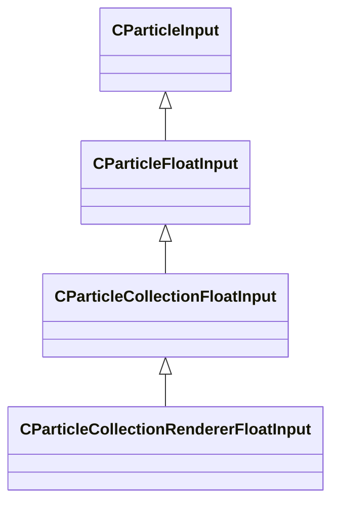
```mermaid
classDiagram
    CParticleFloatInput <|-- CParticleCollectionFloatInput
    CParticleInput <|-- CParticleFloatInput
    CParticleCollectionFloatInput <|-- CParticleCollectionRendererFloatInput
```

### CParticleCollectionRendererFloatInput

**Inherits from:** [CParticleCollectionFloatInput](particleslib.md#cparticlecollectionfloatinput)

**Metadata:** `MGetKV3ClassDefaults`, `MPropertyCustomEditor CollectionRendererFloatInput()`

**Relationships:**

```mermaid
classDiagram
    CParticleCollectionFloatInput <|-- CParticleCollectionRendererFloatInput
    CParticleFloatInput <|-- CParticleCollectionFloatInput
    CParticleInput <|-- CParticleFloatInput
```

### CParticleCollectionRendererVecInput

**Inherits from:** [CParticleCollectionVecInput](particleslib.md#cparticlecollectionvecinput)

**Metadata:** `MGetKV3ClassDefaults`, `MPropertyCustomEditor CollectionRendererVecInput()`

**Relationships:**

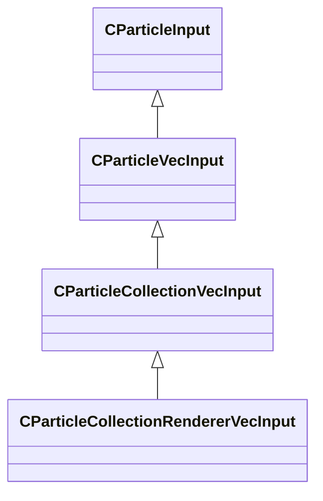
```mermaid
classDiagram
    CParticleCollectionVecInput <|-- CParticleCollectionRendererVecInput
    CParticleVecInput <|-- CParticleCollectionVecInput
    CParticleInput <|-- CParticleVecInput
```

### CParticleCollectionVecInput

**Inherits from:** [CParticleVecInput](particleslib.md#cparticlevecinput)

**Derived by:** [CParticleCollectionRendererVecInput](particleslib.md#cparticlecollectionrenderervecinput)

**Metadata:** `MGetKV3ClassDefaults`, `MPropertyCustomEditor CollectionVecInput()`

**Relationships:**

```mermaid
classDiagram
    CParticleVecInput <|-- CParticleCollectionVecInput
    CParticleInput <|-- CParticleVecInput
    CParticleCollectionVecInput <|-- CParticleCollectionRendererVecInput
```

### CParticleFloatInput

**Inherits from:** [CParticleInput](particleslib.md#cparticleinput)

**Derived by:** [CParticleCollectionFloatInput](particleslib.md#cparticlecollectionfloatinput), [CParticleRemapFloatInput](particleslib.md#cparticleremapfloatinput), [CPerParticleFloatInput](particleslib.md#cperparticlefloatinput)

**Metadata:** `MCustomFGDMetadata`, `MGetKV3ClassDefaults`

**Relationships:**

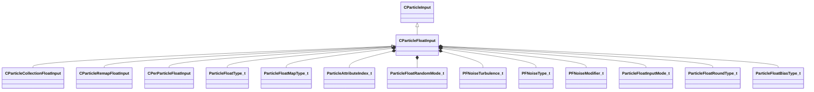
```mermaid
classDiagram
    CParticleInput <|-- CParticleFloatInput
    CParticleFloatInput <|-- CParticleCollectionFloatInput
    CParticleFloatInput <|-- CParticleRemapFloatInput
    CParticleFloatInput <|-- CPerParticleFloatInput
    CParticleFloatInput *-- ParticleFloatType_t
    CParticleFloatInput *-- ParticleFloatMapType_t
    CParticleFloatInput *-- ParticleAttributeIndex_t
    CParticleFloatInput *-- ParticleFloatRandomMode_t
    CParticleFloatInput *-- PFNoiseTurbulence_t
    CParticleFloatInput *-- PFNoiseType_t
    CParticleFloatInput *-- PFNoiseModifier_t
    CParticleFloatInput *-- ParticleFloatInputMode_t
    CParticleFloatInput *-- ParticleFloatRoundType_t
    CParticleFloatInput *-- ParticleFloatBiasType_t
```

**Fields:**

| Name | Type | Annotations |
|------|------|-------------|
| `m_nType` | [ParticleFloatType_t](../schemas/!GlobalTypes.md#particlefloattype_t) |  |
| `m_nMapType` | [ParticleFloatMapType_t](../schemas/!GlobalTypes.md#particlefloatmaptype_t) |  |
| `m_flLiteralValue` | float32 |  |
| `m_NamedValue` | CParticleNamedValueRef |  |
| `m_nControlPoint` | int32 |  |
| `m_nScalarAttribute` | [ParticleAttributeIndex_t](../schemas/particles.md#particleattributeindex_t) |  |
| `m_nVectorAttribute` | [ParticleAttributeIndex_t](../schemas/particles.md#particleattributeindex_t) |  |
| `m_nVectorComponent` | int32 |  |
| `m_bReverseOrder` | bool |  |
| `m_flRandomMin` | float32 |  |
| `m_flRandomMax` | float32 |  |
| `m_bHasRandomSignFlip` | bool |  |
| `m_nRandomSeed` | int32 |  |
| `m_nRandomMode` | [ParticleFloatRandomMode_t](../schemas/!GlobalTypes.md#particlefloatrandommode_t) |  |
| `m_strSnapshotSubset` | CUtlString |  |
| `m_flLOD0` | float32 |  |
| `m_flLOD1` | float32 |  |
| `m_flLOD2` | float32 |  |
| `m_flLOD3` | float32 |  |
| `m_nNoiseInputVectorAttribute` | [ParticleAttributeIndex_t](../schemas/particles.md#particleattributeindex_t) |  |
| `m_flNoiseOutputMin` | float32 |  |
| `m_flNoiseOutputMax` | float32 |  |
| `m_flNoiseScale` | float32 |  |
| `m_vecNoiseOffsetRate` | Vector |  |
| `m_flNoiseOffset` | float32 |  |
| `m_nNoiseOctaves` | int32 |  |
| `m_nNoiseTurbulence` | [PFNoiseTurbulence_t](../schemas/!GlobalTypes.md#pfnoiseturbulence_t) |  |
| `m_nNoiseType` | [PFNoiseType_t](../schemas/!GlobalTypes.md#pfnoisetype_t) |  |
| `m_nNoiseModifier` | [PFNoiseModifier_t](../schemas/!GlobalTypes.md#pfnoisemodifier_t) |  |
| `m_flNoiseTurbulenceScale` | float32 |  |
| `m_flNoiseTurbulenceMix` | float32 |  |
| `m_flNoiseImgPreviewScale` | float32 |  |
| `m_bNoiseImgPreviewLive` | bool |  |
| `m_flNoCameraFallback` | float32 |  |
| `m_bUseBoundsCenter` | bool |  |
| `m_nInputMode` | [ParticleFloatInputMode_t](../schemas/!GlobalTypes.md#particlefloatinputmode_t) |  |
| `m_flMultFactor` | float32 |  |
| `m_flInput0` | float32 |  |
| `m_flInput1` | float32 |  |
| `m_flOutput0` | float32 |  |
| `m_flOutput1` | float32 |  |
| `m_flNotchedRangeMin` | float32 |  |
| `m_flNotchedRangeMax` | float32 |  |
| `m_flNotchedOutputOutside` | float32 |  |
| `m_flNotchedOutputInside` | float32 |  |
| `m_nRoundType` | [ParticleFloatRoundType_t](../schemas/!GlobalTypes.md#particlefloatroundtype_t) |  |
| `m_nBiasType` | [ParticleFloatBiasType_t](../schemas/!GlobalTypes.md#particlefloatbiastype_t) |  |
| `m_flBiasParameter` | float32 |  |
| `m_Curve` | CPiecewiseCurve |  |

### CParticleInput

**Derived by:** [CParticleFloatInput](particleslib.md#cparticlefloatinput), [CParticleModelInput](particleslib.md#cparticlemodelinput), [CParticleTransformInput](particleslib.md#cparticletransforminput), [CParticleVecInput](particleslib.md#cparticlevecinput)

**Metadata:** `MGetKV3ClassDefaults`

**Relationships:**

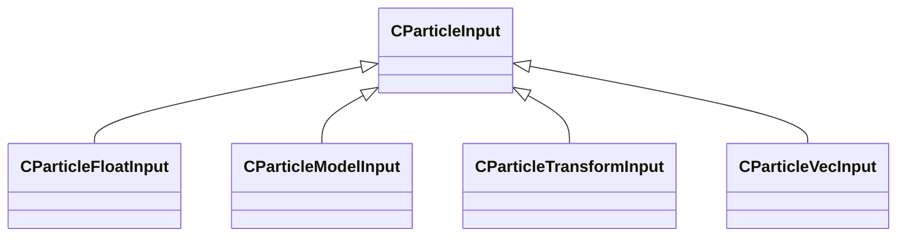
```mermaid
classDiagram
    CParticleInput <|-- CParticleFloatInput
    CParticleInput <|-- CParticleModelInput
    CParticleInput <|-- CParticleTransformInput
    CParticleInput <|-- CParticleVecInput
```

### CParticleModelInput

**Inherits from:** [CParticleInput](particleslib.md#cparticleinput)

**Metadata:** `MCustomFGDMetadata`, `MGetKV3ClassDefaults`, `MPropertyCustomEditor ModelInput()`

**Relationships:**

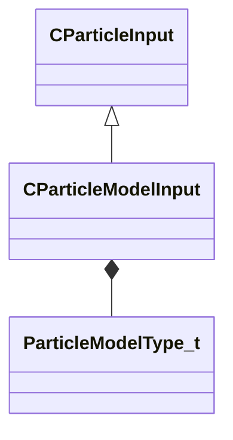
```mermaid
classDiagram
    CParticleInput <|-- CParticleModelInput
    CParticleModelInput *-- ParticleModelType_t
```

**Fields:**

| Name | Type | Annotations |
|------|------|-------------|
| `m_nType` | [ParticleModelType_t](../schemas/!GlobalTypes.md#particlemodeltype_t) |  |
| `m_NamedValue` | CParticleNamedValueRef |  |
| `m_nControlPoint` | int32 |  |

### CParticleProperty

**Metadata:** `MGetKV3ClassDefaults`

### CParticleRemapFloatInput

**Inherits from:** [CParticleFloatInput](particleslib.md#cparticlefloatinput)

**Metadata:** `MGetKV3ClassDefaults`, `MPropertyCustomEditor RemapFloatInput()`

**Relationships:**

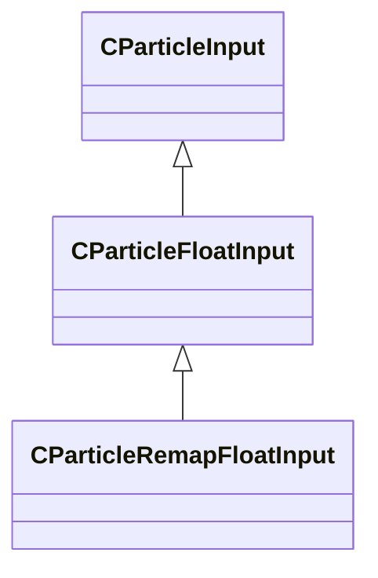
```mermaid
classDiagram
    CParticleFloatInput <|-- CParticleRemapFloatInput
    CParticleInput <|-- CParticleFloatInput
```

### CParticleTransformInput

**Inherits from:** [CParticleInput](particleslib.md#cparticleinput)

**Metadata:** `MCustomFGDMetadata`, `MGetKV3ClassDefaults`, `MPropertyCustomEditor TransformInput()`

**Relationships:**

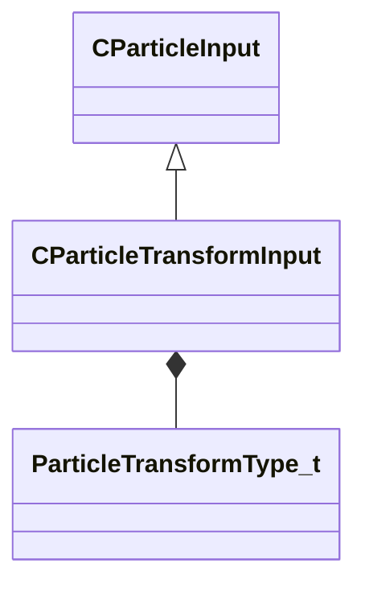
```mermaid
classDiagram
    CParticleInput <|-- CParticleTransformInput
    CParticleTransformInput *-- ParticleTransformType_t
```

**Fields:**

| Name | Type | Annotations |
|------|------|-------------|
| `m_nType` | [ParticleTransformType_t](../schemas/!GlobalTypes.md#particletransformtype_t) |  |
| `m_NamedValue` | CParticleNamedValueRef |  |
| `m_bFollowNamedValue` | bool |  |
| `m_bSupportsDisabled` | bool |  |
| `m_bUseOrientation` | bool |  |
| `m_nControlPoint` | int32 |  |
| `m_nControlPointRangeMax` | int32 |  |
| `m_flEndCPGrowthTime` | float32 |  |

### CParticleVariableRef

**Metadata:** `MGetKV3ClassDefaults`, `MPropertyCustomEditor ParticleVariableRef()`

**Fields:**

| Name | Type | Annotations |
|------|------|-------------|
| `m_variableName` | CKV3MemberNameWithStorage | `MFgdFromSchemaCompletelySkipField` |
| `m_variableType` | CPulseValueFullType | `MFgdFromSchemaCompletelySkipField` |

### CParticleVecInput

**Inherits from:** [CParticleInput](particleslib.md#cparticleinput)

**Derived by:** [CParticleCollectionVecInput](particleslib.md#cparticlecollectionvecinput), [CPerParticleVecInput](particleslib.md#cperparticlevecinput)

**Metadata:** `MCustomFGDMetadata`, `MGetKV3ClassDefaults`

**Relationships:**

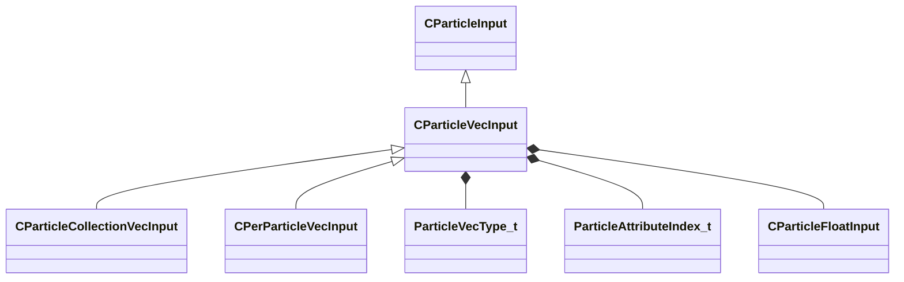
```mermaid
classDiagram
    CParticleInput <|-- CParticleVecInput
    CParticleVecInput <|-- CParticleCollectionVecInput
    CParticleVecInput <|-- CPerParticleVecInput
    CParticleVecInput *-- ParticleVecType_t
    CParticleVecInput *-- ParticleAttributeIndex_t
    CParticleVecInput *-- CParticleFloatInput
```

**Fields:**

| Name | Type | Annotations |
|------|------|-------------|
| `m_nType` | [ParticleVecType_t](../schemas/!GlobalTypes.md#particlevectype_t) |  |
| `m_vLiteralValue` | Vector |  |
| `m_LiteralColor` | Color |  |
| `m_NamedValue` | CParticleNamedValueRef |  |
| `m_bFollowNamedValue` | bool |  |
| `m_nVectorAttribute` | [ParticleAttributeIndex_t](../schemas/particles.md#particleattributeindex_t) |  |
| `m_vVectorAttributeScale` | Vector |  |
| `m_nControlPoint` | int32 |  |
| `m_nDeltaControlPoint` | int32 |  |
| `m_vCPValueScale` | Vector |  |
| `m_vCPRelativePosition` | Vector |  |
| `m_vCPRelativeDir` | Vector |  |
| `m_FloatComponentX` | [CParticleFloatInput](../schemas/particleslib.md#cparticlefloatinput) |  |
| `m_FloatComponentY` | [CParticleFloatInput](../schemas/particleslib.md#cparticlefloatinput) |  |
| `m_FloatComponentZ` | [CParticleFloatInput](../schemas/particleslib.md#cparticlefloatinput) |  |
| `m_FloatInterp` | [CParticleFloatInput](../schemas/particleslib.md#cparticlefloatinput) |  |
| `m_flInterpInput0` | float32 |  |
| `m_flInterpInput1` | float32 |  |
| `m_vInterpOutput0` | Vector |  |
| `m_vInterpOutput1` | Vector |  |
| `m_Gradient` | CColorGradient |  |
| `m_vRandomMin` | Vector |  |
| `m_vRandomMax` | Vector |  |

### CPerParticleFloatInput

**Inherits from:** [CParticleFloatInput](particleslib.md#cparticlefloatinput)

**Metadata:** `MGetKV3ClassDefaults`, `MPropertyCustomEditor PerParticleFloatInput()`

**Relationships:**

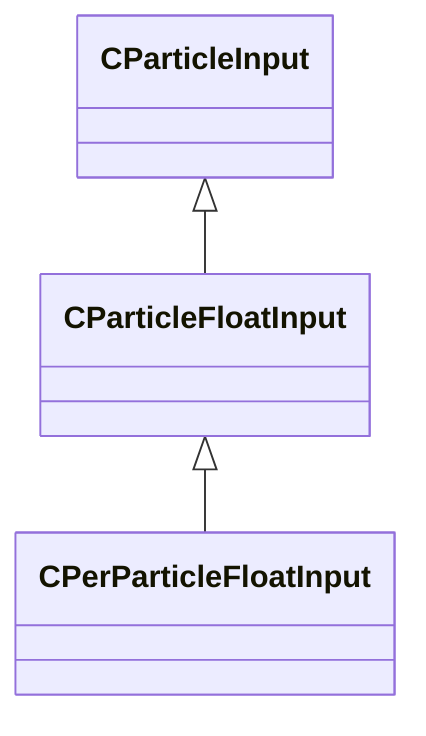
```mermaid
classDiagram
    CParticleFloatInput <|-- CPerParticleFloatInput
    CParticleInput <|-- CParticleFloatInput
```

### CPerParticleVecInput

**Inherits from:** [CParticleVecInput](particleslib.md#cparticlevecinput)

**Metadata:** `MGetKV3ClassDefaults`, `MPropertyCustomEditor PerParticleVecInput()`

**Relationships:**

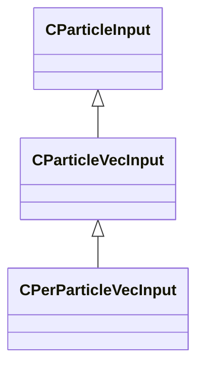
```mermaid
classDiagram
    CParticleVecInput <|-- CPerParticleVecInput
    CParticleInput <|-- CParticleVecInput
```

### IParticleEffect

**Derived by:** [CNewParticleEffect](particleslib.md#cnewparticleeffect)

**Relationships:**

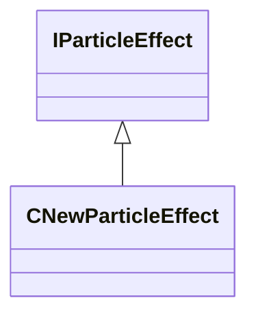
```mermaid
classDiagram
    IParticleEffect <|-- CNewParticleEffect
```

### PARTICLE_EHANDLE__

**Fields:**

| Name | Type | Annotations |
|------|------|-------------|
| `unused` | int32 |  |

### ParticleNamedValueConfiguration_t

**Metadata:** `MGetKV3ClassDefaults`

**Relationships:**

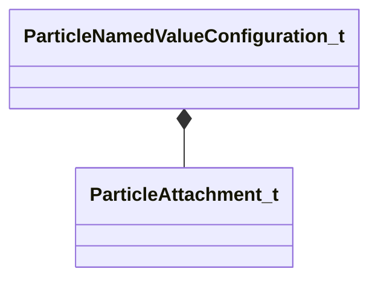
```mermaid
classDiagram
    ParticleNamedValueConfiguration_t *-- ParticleAttachment_t
```

**Fields:**

| Name | Type | Annotations |
|------|------|-------------|
| `m_ConfigName` | CUtlString |  |
| `m_ConfigValue` | KeyValues3 |  |
| `m_BoundValuePath` | CUtlString |  |
| `m_iAttachType` | [ParticleAttachment_t](../schemas/!GlobalTypes.md#particleattachment_t) |  |
| `m_strEntityScope` | CUtlString |  |
| `m_strAttachmentName` | CUtlString |  |

### ParticleNamedValueSource_t

**Metadata:** `MGetKV3ClassDefaults`

**Relationships:**

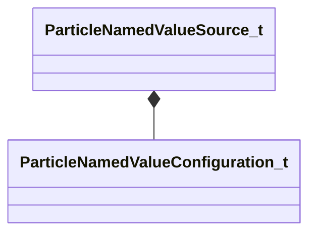
```mermaid
classDiagram
    ParticleNamedValueSource_t *-- ParticleNamedValueConfiguration_t
```

**Fields:**

| Name | Type | Annotations |
|------|------|-------------|
| `m_Name` | CUtlString |  |
| `m_IsPublic` | bool |  |
| `m_ValueType` | CPulseValueFullType | `MFgdFromSchemaCompletelySkipField` |
| `m_DefaultConfig` | [ParticleNamedValueConfiguration_t](../schemas/particleslib.md#particlenamedvalueconfiguration_t) | `MFgdFromSchemaCompletelySkipField` |
