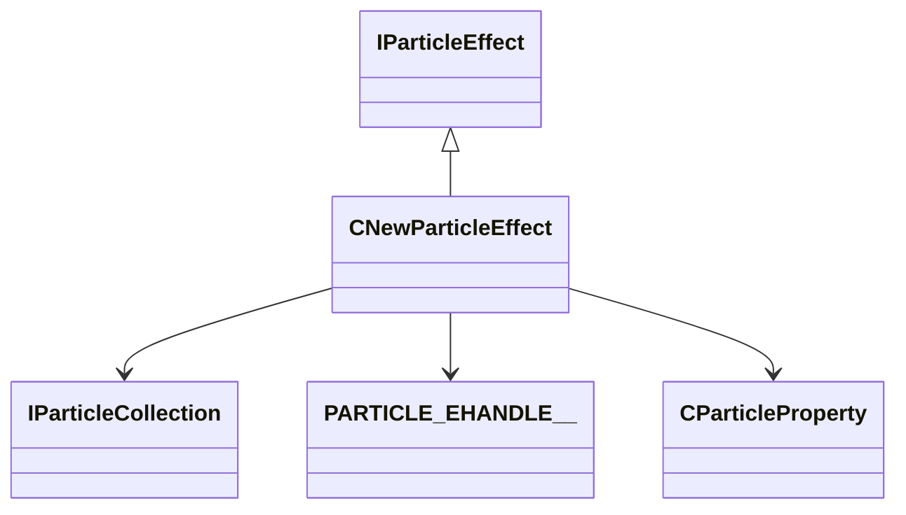

[Schemas](../../schemas.md) / [particleslib](../particleslib.md) / CNewParticleEffect

# CNewParticleEffect

**Kind:** class · **Size:** 216 bytes (`0xd8`) · **Align:** 255 · **Module:** particleslib

**Inherits from:** [IParticleEffect](../particleslib/IParticleEffect.md)

**Relationships:**

## Memory layout

33 fields (33 declared here, 0 inherited). Offsets are absolute from the object base.

| Offset | Field | Type | From | Annotations |
|--------|-------|------|------|-------------|
| `0x0` | `m_bAllocated` | bitfield:1 |  |  |
| `0x0` | `m_bAutoUpdateBBox` | bitfield:1 |  |  |
| `0x0` | `m_bCanFreeze` | bitfield:1 |  |  |
| `0x0` | `m_bDontRemove` | bitfield:1 |  |  |
| `0x0` | `m_bForceNoDraw` | bitfield:1 |  |  |
| `0x0` | `m_bFreezeTargetState` | bitfield:1 |  |  |
| `0x0` | `m_bFreezeTransitionActive` | bitfield:1 |  |  |
| `0x0` | `m_bIsAsyncCreate` | bitfield:1 |  |  |
| `0x0` | `m_bIsFirstFrame` | bitfield:1 |  |  |
| `0x0` | `m_bNeedsBBoxUpdate` | bitfield:1 |  |  |
| `0x0` | `m_bRemove` | bitfield:1 |  |  |
| `0x0` | `m_bShouldCheckFoW` | bitfield:1 |  |  |
| `0x0` | `m_bShouldPerformCullCheck` | bitfield:1 |  |  |
| `0x0` | `m_bShouldSave` | bitfield:1 |  |  |
| `0x0` | `m_bShouldSimulateDuringGamePaused` | bitfield:1 |  |  |
| `0x0` | `m_bSimulate` | bitfield:1 |  |  |
| `0x0` | `m_bSuppressScreenSpaceEffect` | bitfield:1 |  |  |
| `0x10` | `m_pNext` | [CNewParticleEffect](../particleslib/CNewParticleEffect.md)* |  |  |
| `0x18` | `m_pPrev` | [CNewParticleEffect](../particleslib/CNewParticleEffect.md)* |  |  |
| `0x20` | `m_pParticles` | [IParticleCollection](../particles/IParticleCollection.md)* |  |  |
| `0x28` | `m_pDebugName` | char* |  |  |
| `0x40` | `m_vSortOrigin` | Vector |  |  |
| `0x4c` | `m_flScale` | float32 |  |  |
| `0x50` | `m_hOwner` | [PARTICLE_EHANDLE__](../particleslib/PARTICLE_EHANDLE__.md)* |  |  |
| `0x58` | `m_pOwningParticleProperty` | [CParticleProperty](../particleslib/CParticleProperty.md)* |  |  |
| `0x70` | `m_flFreezeTransitionStart` | float32 |  |  |
| `0x74` | `m_flFreezeTransitionDuration` | float32 |  |  |
| `0x78` | `m_flFreezeTransitionOverride` | float32 |  |  |
| `0x7c` | `m_LastMin` | Vector |  |  |
| `0x88` | `m_LastMax` | Vector |  |  |
| `0x94` | `m_nSplitScreenUser` | CSplitScreenSlot |  |  |
| `0x98` | `m_vecAggregationCenter` | Vector |  |  |
| `0xd0` | `m_RefCount` | int32 |  |  |
