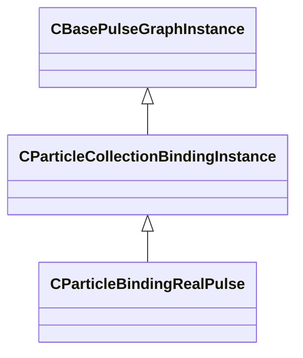

[Schemas](../../schemas.md) / [particleslib](../particleslib.md) / CParticleBindingRealPulse

# CParticleBindingRealPulse

**Kind:** class · **Size:** 304 bytes (`0x130`) · **Align:** 255 · **Module:** particleslib

**Inherits from:** [CParticleCollectionBindingInstance](../particleslib/CParticleCollectionBindingInstance.md)

**Relationships:**

