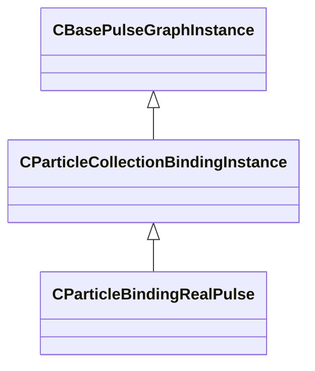

[Schemas](../../schemas.md) / [particleslib](../particleslib.md) / CParticleCollectionBindingInstance

# CParticleCollectionBindingInstance

**Kind:** class · **Size:** 304 bytes (`0x130`) · **Align:** 255 · **Module:** particleslib

**Inherits from:** [CBasePulseGraphInstance](../pulse_runtime_lib/CBasePulseGraphInstance.md)

**Derived by:** [CParticleBindingRealPulse](../particleslib/CParticleBindingRealPulse.md)

**Relationships:**

