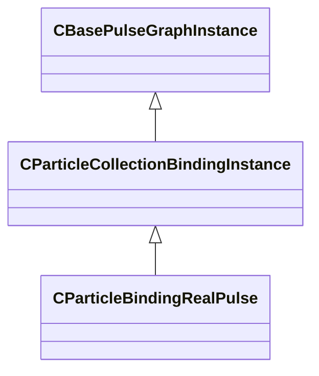

[Schemas](../../schemas.md) / [particleslib](../particleslib.md) / CParticleCollectionBindingInstance

# CParticleCollectionBindingInstance

> Source: **Build 26281801** · 2026-10-28 · `windows-x86_64` · schema `0.13.0`

**Kind:** class · **Size:** 168 bytes (`0xa8`) · **Align:** n/a (unspecified) · **Module:** particleslib

**Inherits from:** [CBasePulseGraphInstance](../pulse_runtime_lib/CBasePulseGraphInstance.md)

**Derived by:** [CParticleBindingRealPulse](../particleslib/CParticleBindingRealPulse.md)

**Relationships:**

```mermaid
classDiagram
    CBasePulseGraphInstance <|-- CParticleCollectionBindingInstance
    CParticleCollectionBindingInstance <|-- CParticleBindingRealPulse
```

## Memory layout

No schema-visible fields (168 bytes of opaque storage).
