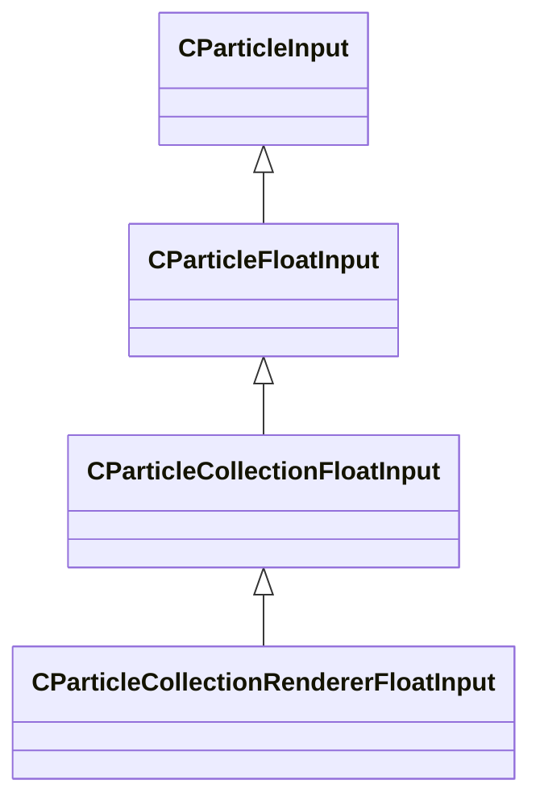

[Schemas](../../schemas.md) / [particleslib](../particleslib.md) / CParticleCollectionRendererFloatInput

# CParticleCollectionRendererFloatInput

> Source: **Build 25000182** · 2026-08-28 · `windows-x86_64` · schema `0.10.0`

**Kind:** class · **Size:** 368 bytes (`0x170`) · **Align:** 8 · **Module:** particleslib

**Inherits from:** [CParticleCollectionFloatInput](../particleslib/CParticleCollectionFloatInput.md)

**Metadata:** `MPropertyCustomEditor CollectionRendererFloatInput()`

**Relationships:**

## Memory layout

49 fields (0 declared here, 49 inherited). Offsets are absolute from the object base.

| Offset | Field | Type | From | Annotations |
|--------|-------|------|------|-------------|
| `0x10` | `m_nType` | [ParticleFloatType_t](../particleslib/ParticleFloatType_t.md) | [CParticleFloatInput](../particleslib/CParticleFloatInput.md) |  |
| `0x14` | `m_nMapType` | [ParticleFloatMapType_t](../particleslib/ParticleFloatMapType_t.md) | [CParticleFloatInput](../particleslib/CParticleFloatInput.md) |  |
| `0x18` | `m_flLiteralValue` | float32 | [CParticleFloatInput](../particleslib/CParticleFloatInput.md) |  |
| `0x20` | `m_NamedValue` | CParticleNamedValueRef | [CParticleFloatInput](../particleslib/CParticleFloatInput.md) |  |
| `0x60` | `m_nControlPoint` | int32 | [CParticleFloatInput](../particleslib/CParticleFloatInput.md) |  |
| `0x64` | `m_nScalarAttribute` | [ParticleAttributeIndex_t](../particles/ParticleAttributeIndex_t.md) | [CParticleFloatInput](../particleslib/CParticleFloatInput.md) |  |
| `0x68` | `m_nVectorAttribute` | [ParticleAttributeIndex_t](../particles/ParticleAttributeIndex_t.md) | [CParticleFloatInput](../particleslib/CParticleFloatInput.md) |  |
| `0x6c` | `m_nVectorComponent` | int32 | [CParticleFloatInput](../particleslib/CParticleFloatInput.md) |  |
| `0x70` | `m_bReverseOrder` | bool | [CParticleFloatInput](../particleslib/CParticleFloatInput.md) |  |
| `0x74` | `m_flRandomMin` | float32 | [CParticleFloatInput](../particleslib/CParticleFloatInput.md) |  |
| `0x78` | `m_flRandomMax` | float32 | [CParticleFloatInput](../particleslib/CParticleFloatInput.md) |  |
| `0x7c` | `m_bHasRandomSignFlip` | bool | [CParticleFloatInput](../particleslib/CParticleFloatInput.md) |  |
| `0x80` | `m_nRandomSeed` | int32 | [CParticleFloatInput](../particleslib/CParticleFloatInput.md) |  |
| `0x84` | `m_nRandomMode` | [ParticleFloatRandomMode_t](../particleslib/ParticleFloatRandomMode_t.md) | [CParticleFloatInput](../particleslib/CParticleFloatInput.md) |  |
| `0x90` | `m_strSnapshotSubset` | CUtlString | [CParticleFloatInput](../particleslib/CParticleFloatInput.md) |  |
| `0x98` | `m_flLOD0` | float32 | [CParticleFloatInput](../particleslib/CParticleFloatInput.md) |  |
| `0x9c` | `m_flLOD1` | float32 | [CParticleFloatInput](../particleslib/CParticleFloatInput.md) |  |
| `0xa0` | `m_flLOD2` | float32 | [CParticleFloatInput](../particleslib/CParticleFloatInput.md) |  |
| `0xa4` | `m_flLOD3` | float32 | [CParticleFloatInput](../particleslib/CParticleFloatInput.md) |  |
| `0xa8` | `m_nNoiseInputVectorAttribute` | [ParticleAttributeIndex_t](../particles/ParticleAttributeIndex_t.md) | [CParticleFloatInput](../particleslib/CParticleFloatInput.md) |  |
| `0xac` | `m_flNoiseOutputMin` | float32 | [CParticleFloatInput](../particleslib/CParticleFloatInput.md) |  |
| `0xb0` | `m_flNoiseOutputMax` | float32 | [CParticleFloatInput](../particleslib/CParticleFloatInput.md) |  |
| `0xb4` | `m_flNoiseScale` | float32 | [CParticleFloatInput](../particleslib/CParticleFloatInput.md) |  |
| `0xb8` | `m_vecNoiseOffsetRate` | Vector | [CParticleFloatInput](../particleslib/CParticleFloatInput.md) |  |
| `0xc4` | `m_flNoiseOffset` | float32 | [CParticleFloatInput](../particleslib/CParticleFloatInput.md) |  |
| `0xc8` | `m_nNoiseOctaves` | int32 | [CParticleFloatInput](../particleslib/CParticleFloatInput.md) |  |
| `0xcc` | `m_nNoiseTurbulence` | [PFNoiseTurbulence_t](../particleslib/PFNoiseTurbulence_t.md) | [CParticleFloatInput](../particleslib/CParticleFloatInput.md) |  |
| `0xd0` | `m_nNoiseType` | [PFNoiseType_t](../particleslib/PFNoiseType_t.md) | [CParticleFloatInput](../particleslib/CParticleFloatInput.md) |  |
| `0xd4` | `m_nNoiseModifier` | [PFNoiseModifier_t](../particleslib/PFNoiseModifier_t.md) | [CParticleFloatInput](../particleslib/CParticleFloatInput.md) |  |
| `0xd8` | `m_flNoiseTurbulenceScale` | float32 | [CParticleFloatInput](../particleslib/CParticleFloatInput.md) |  |
| `0xdc` | `m_flNoiseTurbulenceMix` | float32 | [CParticleFloatInput](../particleslib/CParticleFloatInput.md) |  |
| `0xe0` | `m_flNoiseImgPreviewScale` | float32 | [CParticleFloatInput](../particleslib/CParticleFloatInput.md) |  |
| `0xe4` | `m_bNoiseImgPreviewLive` | bool | [CParticleFloatInput](../particleslib/CParticleFloatInput.md) |  |
| `0xf0` | `m_flNoCameraFallback` | float32 | [CParticleFloatInput](../particleslib/CParticleFloatInput.md) |  |
| `0xf4` | `m_bUseBoundsCenter` | bool | [CParticleFloatInput](../particleslib/CParticleFloatInput.md) |  |
| `0xf8` | `m_nInputMode` | [ParticleFloatInputMode_t](../particleslib/ParticleFloatInputMode_t.md) | [CParticleFloatInput](../particleslib/CParticleFloatInput.md) |  |
| `0xfc` | `m_flMultFactor` | float32 | [CParticleFloatInput](../particleslib/CParticleFloatInput.md) |  |
| `0x100` | `m_flInput0` | float32 | [CParticleFloatInput](../particleslib/CParticleFloatInput.md) |  |
| `0x104` | `m_flInput1` | float32 | [CParticleFloatInput](../particleslib/CParticleFloatInput.md) |  |
| `0x108` | `m_flOutput0` | float32 | [CParticleFloatInput](../particleslib/CParticleFloatInput.md) |  |
| `0x10c` | `m_flOutput1` | float32 | [CParticleFloatInput](../particleslib/CParticleFloatInput.md) |  |
| `0x110` | `m_flNotchedRangeMin` | float32 | [CParticleFloatInput](../particleslib/CParticleFloatInput.md) |  |
| `0x114` | `m_flNotchedRangeMax` | float32 | [CParticleFloatInput](../particleslib/CParticleFloatInput.md) |  |
| `0x118` | `m_flNotchedOutputOutside` | float32 | [CParticleFloatInput](../particleslib/CParticleFloatInput.md) |  |
| `0x11c` | `m_flNotchedOutputInside` | float32 | [CParticleFloatInput](../particleslib/CParticleFloatInput.md) |  |
| `0x120` | `m_nRoundType` | [ParticleFloatRoundType_t](../particleslib/ParticleFloatRoundType_t.md) | [CParticleFloatInput](../particleslib/CParticleFloatInput.md) |  |
| `0x124` | `m_nBiasType` | [ParticleFloatBiasType_t](../particleslib/ParticleFloatBiasType_t.md) | [CParticleFloatInput](../particleslib/CParticleFloatInput.md) |  |
| `0x128` | `m_flBiasParameter` | float32 | [CParticleFloatInput](../particleslib/CParticleFloatInput.md) |  |
| `0x130` | `m_Curve` | CPiecewiseCurve | [CParticleFloatInput](../particleslib/CParticleFloatInput.md) |  |

KV3 class defaults

<pre>{
	&quot;m_nType&quot;: &quot;PF_TYPE_LITERAL&quot;,
	&quot;m_nMapType&quot;: &quot;PF_MAP_TYPE_DIRECT&quot;,
	&quot;m_flLiteralValue&quot;: 0.000000,
	&quot;m_NamedValue&quot;: &quot;&quot;,
	&quot;m_nControlPoint&quot;: 0,
	&quot;m_nScalarAttribute&quot;: 3,
	&quot;m_nVectorAttribute&quot;: 6,
	&quot;m_nVectorComponent&quot;: 0,
	&quot;m_bReverseOrder&quot;: false,
	&quot;m_flRandomMin&quot;: 0.000000,
	&quot;m_flRandomMax&quot;: 1.000000,
	&quot;m_bHasRandomSignFlip&quot;: false,
	&quot;m_nRandomSeed&quot;: &lt;HIDDEN FOR DIFF&gt;,
	&quot;m_nRandomMode&quot;: &quot;PF_RANDOM_MODE_CONSTANT&quot;,
	&quot;m_strSnapshotSubset&quot;: &quot;&quot;,
	&quot;m_flLOD0&quot;: 0.000000,
	&quot;m_flLOD1&quot;: 0.000000,
	&quot;m_flLOD2&quot;: 0.000000,
	&quot;m_flLOD3&quot;: 0.000000,
	&quot;m_nNoiseInputVectorAttribute&quot;: 0,
	&quot;m_flNoiseOutputMin&quot;: 0.000000,
	&quot;m_flNoiseOutputMax&quot;: 1.000000,
	&quot;m_flNoiseScale&quot;: 0.100000,
	&quot;m_vecNoiseOffsetRate&quot;:
	[
		0.000000,
		0.000000,
		0.000000
	],
	&quot;m_flNoiseOffset&quot;: 0.000000,
	&quot;m_nNoiseOctaves&quot;: 1,
	&quot;m_nNoiseTurbulence&quot;: &quot;PF_NOISE_TURB_NONE&quot;,
	&quot;m_nNoiseType&quot;: &quot;PF_NOISE_TYPE_PERLIN&quot;,
	&quot;m_nNoiseModifier&quot;: &quot;PF_NOISE_MODIFIER_NONE&quot;,
	&quot;m_flNoiseTurbulenceScale&quot;: 1.000000,
	&quot;m_flNoiseTurbulenceMix&quot;: 0.500000,
	&quot;m_flNoiseImgPreviewScale&quot;: 1.000000,
	&quot;m_bNoiseImgPreviewLive&quot;: true,
	&quot;m_flNoCameraFallback&quot;: 0.000000,
	&quot;m_bUseBoundsCenter&quot;: false,
	&quot;m_nInputMode&quot;: &quot;PF_INPUT_MODE_CLAMPED&quot;,
	&quot;m_flMultFactor&quot;: 1.000000,
	&quot;m_flInput0&quot;: 0.000000,
	&quot;m_flInput1&quot;: 1.000000,
	&quot;m_flOutput0&quot;: 0.000000,
	&quot;m_flOutput1&quot;: 1.000000,
	&quot;m_flNotchedRangeMin&quot;: 0.000000,
	&quot;m_flNotchedRangeMax&quot;: 1.000000,
	&quot;m_flNotchedOutputOutside&quot;: 0.000000,
	&quot;m_flNotchedOutputInside&quot;: 1.000000,
	&quot;m_nRoundType&quot;: &quot;PF_ROUND_TYPE_NEAREST&quot;,
	&quot;m_nBiasType&quot;: &quot;PF_BIAS_TYPE_STANDARD&quot;,
	&quot;m_flBiasParameter&quot;: 0.000000,
	&quot;m_Curve&quot;:
	{
		&quot;m_spline&quot;:
		[
		],
		&quot;m_tangents&quot;:
		[
		],
		&quot;m_vDomainMins&quot;:
		[
			0.000000,
			0.000000
		],
		&quot;m_vDomainMaxs&quot;:
		[
			0.000000,
			0.000000
		]
	}
}</pre>

