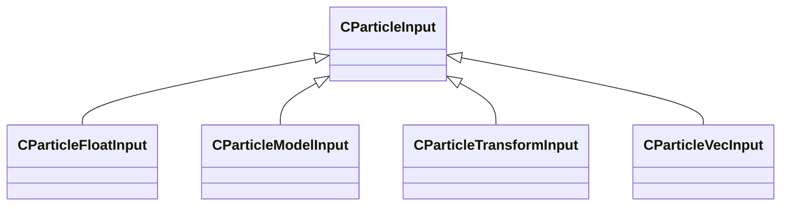

[Schemas](../../schemas.md) / [particleslib](../particleslib.md) / CParticleInput

# CParticleInput

> Source: **Build 25000182** · 2026-08-28 · `windows-x86_64` · schema `0.10.0`

**Kind:** class · **Size:** 16 bytes (`0x10`) · **Align:** 8 · **Module:** particleslib

**Derived by:** [CParticleFloatInput](../particleslib/CParticleFloatInput.md), [CParticleModelInput](../particleslib/CParticleModelInput.md), [CParticleTransformInput](../particleslib/CParticleTransformInput.md), [CParticleVecInput](../particleslib/CParticleVecInput.md)

**Relationships:**

## Memory layout

No schema-visible fields (16 bytes of opaque storage).

KV3 class defaults

<pre>{
}</pre>

