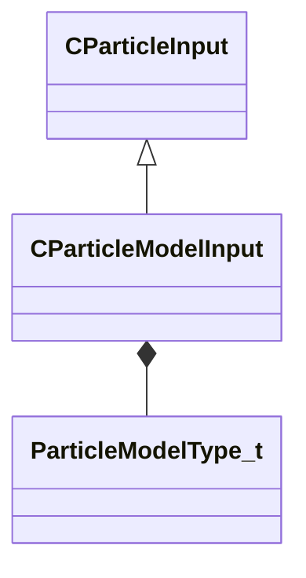

[Schemas](../../schemas.md) / [particleslib](../particleslib.md) / CParticleModelInput

# CParticleModelInput

**Kind:** class · **Size:** 96 bytes (`0x60`) · **Align:** 8 · **Module:** particleslib

**Inherits from:** [CParticleInput](../particleslib/CParticleInput.md)

**Metadata:** `MCustomFGDMetadata { KV3DefaultTestFnName = 'CParticleModelInputDefaultTestFunc' }`, `MPropertyCustomEditor ModelInput()`

**Relationships:**

## Memory layout

3 fields (3 declared here, 0 inherited). Offsets are absolute from the object base.

| Offset | Field | Type | From | Annotations |
|--------|-------|------|------|-------------|
| `0x10` | `m_nType` | [ParticleModelType_t](../!GlobalTypes/ParticleModelType_t.md) |  |  |
| `0x18` | `m_NamedValue` | CParticleNamedValueRef |  |  |
| `0x58` | `m_nControlPoint` | int32 |  |  |

KV3 class defaults

<pre>{
	&quot;m_nType&quot;: &quot;PM_TYPE_INVALID&quot;,
	&quot;m_NamedValue&quot;: &quot;&quot;,
	&quot;m_nControlPoint&quot;: -1
}</pre>

